# Identity-Preserving Realistic Talking Face Generation

Sanjana Sinha, Sandika Biswas and Brojeshwar Bhowmick
Affiliation: Embedded Systems and Robotics,  
TCS Research and Innovation  
Email: {sanjana.sinha, biswas.sandika, b.bhowmick}@tcs.com

###### Abstract

Speech-driven facial animation is useful for a variety of applications
such as telepresence, chatbots, etc. The necessary attributes of having
a realistic face animation are 1) audio-visual synchronization (2)
identity preservation of the target individual (3) plausible mouth
movements (4) presence of natural eye blinks. The existing methods
mostly address the audio-visual lip synchronization, and few recent
works have addressed synthesis of natural eye blinks for overall video
realism. In this paper, we propose a method for identity-preserving
realistic facial animation from speech. We first generate
person-independent facial landmarks from audio using DeepSpeech features
for invariance to different voices, accents, etc. To add realism, we
impose eye blinks on facial landmarks using unsupervised learning and
retarget the person-independent landmarks to person-specific landmarks
to preserve the identity-related facial structure which helps in
generation of plausible mouth shapes of the target identity. Finally, we
use LSGAN to generate the facial texture from person-specific facial
landmarks, using an attention mechanism that helps to preserve
identity-related texture. An extensive comparison of our proposed method
with the current state-of-the-art methods demonstrate a significant
improvement in terms of lip synchronization accuracy, image
reconstruction quality, sharpness, and identity-preservation. A user
study also reveals improved realism of our animation results over the
state-of-the-art methods. To the best of our knowledge, this is the
first work in speech-driven 2D facial animation that simultaneously
addresses all the above-mentioned attributes of a realistic speech
driven face animation.

###### Index Terms: 

Talking face, motion-texture decoupling, realistic face animation,
identity preservation.

## I Introduction

Generating a realistic talking face from speech input is a fundamental
problem with several applications such as virtual reality,
computer-generated imagery (CGI), chatbots, telepresence, etc. Essential
requirements for all the applications are that the synthesized face must
appear photo-realistic with accurate and realistic audio-visual lip
synchronization, and must also preserve the identity of the target
individual. Also, for most of these applications, it is expected to have
a single image with the target identity’s face on which the motion has
to be induced from a given speech as input, for greater flexibility of
changing the target subjects at test time. Hence, audio-driven realistic
facial animation from a single image input is crucial. In general, any
speech-driven facial animation method has several challenges due to the
existence of a variety in the facial structures of different target
identities, different voices, and accents in input audio, etc.

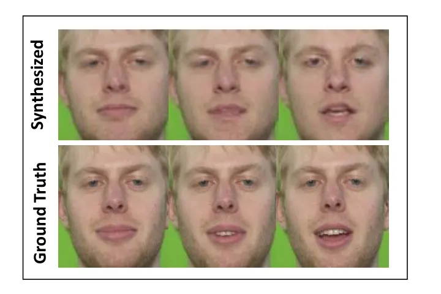

(a)

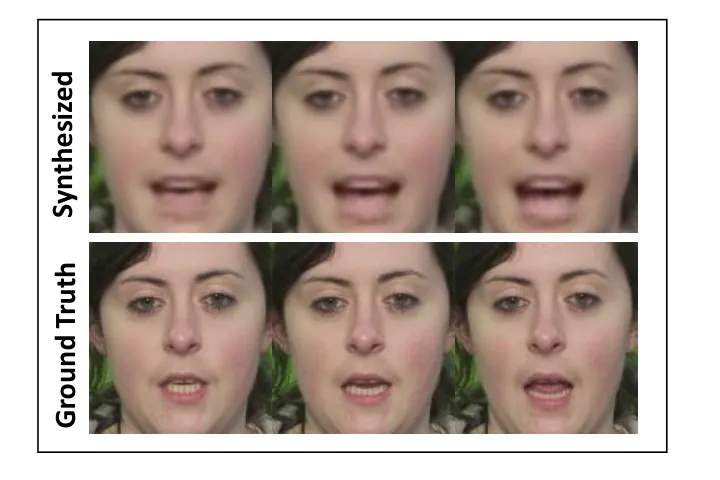

(b)

Fig. 1: Issues with current methods in 2D facial animation (a)
Difference in image texture of synthesized face produced by Vougioukas
et al. \[27\] from the ground truth image texture leads to perceived
difference in identity of the rendered face from the target individual.
(b) Despite synchronization with audio, the facial animation sequence
synthesized using the method of Chen et al. \[4\] contains implausible
or unnatural mouth shape (last frame) that can be perceived as being
fake. The results were obtained by evaluation using pre-trained models
made publicly available by the respective authors.

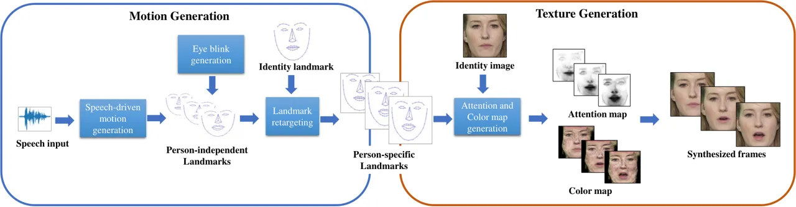

Fig. 2: Our proposed method consists of the following 4 stages - (1)
speech driven motion generation on person-independent landmarks, (2)
eye-blink generation (3) retargeting of generated motion on
person-specific landmarks, (4) Synthesizing face images using attention
and color map generation. Attention generation helps segregate identity
information, represented by lighter regions of attention map, from
motion-based texture (darker regions).

Most of the existing methods for facial video synthesis \[6, 4, 31, 30,
23\] focus on generating facial movements synchronized with speech,
while only a few \[26, 27\] have addressed the generation of spontaneous
facial gestures such as eye blinks that add realism to the synthesized
video. However, the latest methods either fail to preserve the perceived
identity of the target individual (Fig. 1(a)), or generate implausible
or unnatural shape of the mouth in a talking face (Fig. 1(b)). Lack of
resemblance with given identity or change of identity in consecutive
synthesized frames (Fig. 1(a)) can give rise to the uncanny valley
effect \[19\], in which the facial animation can be perceived as
visually displeasing or eerie to the viewer. Moreover, the lack of any
natural and spontaneous movements over the talking face except around
the mouth region can be an indication of synthesized videos.

In this paper, we address the above issues for generating realistic
facial animation from speech. To the best of our knowledge, this is the
first work on speech-driven 2D facial animation which simultaneously
addresses the following attributes required for realistic face
animation: 1) audio-visual synchronization (2) identity-preserving
facial texture (3) generation of plausible mouth movements (4) presence
of natural eye blink movements. Inspired by a recent method \[4\], we
first generate a high-level representation of the face using 2D facial
landmarks to capture the motion from speech, then use an adversarial
network for generating texture by learning motion-based image attention.
Our approach is outlined in Fig. 2.

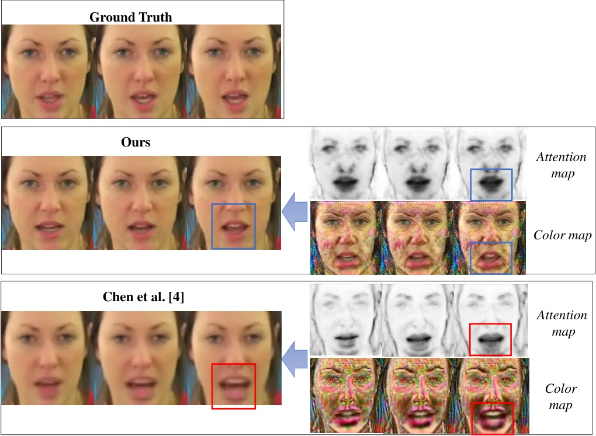

Fig. 3: Effect of intermediate attention and color map on the final
texture. Intermediate attention values (grey areas) of extended regions
surrounding the lips in the attention map ^(†) generated by Chen et al.
\[4\] (last row) results in the blurred texture and unusual shape of the
mouth in the animated face (last frame). Whereas uniformly low attention
values (dark areas) in the mouth region in our attention map and
distinct lip shape and texture in our color map leads to generation of
sharp facial texture with plausible shape of the mouth. ^(†) Actual
attention map (where higher values indicate regions with more
significant motion) generated by \[4\] is inverted here for direct
comparison with our attention map (lower values indicate regions with
more significant motion).

The challenge is the decoupling of speech-driven motion from
identity-related attributes such as different facial structures, face
shapes, etc. for robust motion prediction. To address this, we first
learn speech-related motion on identity-independent landmarks. Then, the
learnt landmark motion is transferred to the person-specific landmarks
for generating identity specific facial movements. Unlike
state-of-the-art methods for speech-driven 2D facial animation, we use
DeepSpeech \[12\] features of given audio input, which exhibits greater
robustness to the variety in audio that exists due to different audio
sources, accents, and noise. Since eye blinks are unrelated to speech,
we generate blink motion independently from audio-related landmark
motion. Finally, we learn an attention map and color map from the
identity image and the predicted person-specific landmarks. The
attention map \[21\] helps in segregating regions of facial motion
(defined by the lower values of attention) from the rest of the face
containing identity-related information (defined by higher values of
attention). The color map contains a novel texture for the facial
regions where the attention map indicates motion. We use the combination
of attention map and color map to generate the final texture. Texture in
regions of motion is obtained from the color map, while the texture in
the rest of the face is obtained from the input identity image (driven
by the weights of the attention map). Our network learns the attention
map and the color map without explicit attention or color map labels for
supervision.

The quality of the learned attention map is extremely crucial for the
overall quality of the generated face. Fig. 3 shows an example of
synthesized face images by Chen et al. \[4\] where the final texture of
the animated face is adversely affected by the values of intermediate
attention map and color map. In regions of facial motion surrounding the
mouth, uniform regions of very low values (dark regions) of the
attention map are needed for sharp texture generation, while
intermediate values (grey regions) lead to blur in mouth texture (shown
in Fig 3 last row). In regions of low attention (dark regions of the
attention map indicating motion), the color map values contribute to the
overall sharpness of the generated texture and the shape of the mouth.
To address the problem of accurate attention and color map generation,
we propose an architecture for texture generation which uses LSGAN
\[18\] for learning sharp image texture and plausible mouth shapes (Fig.
3 second row). Moreover, during adversarial training, if attention
values become very low in static facial regions, it can lead to texture
blur and also possible loss of identity information. Hence,
regularization is also needed as an additional constraint in the
learning of the attention map. Unlike Chen et al. \[4\], we use spatial
and temporal $`L_{2}`$ regularization on the attention and color map for
generating smooth motion and plausible mouth shapes without loss of
identity.

The main contributions of our paper are:

- •
  We propose a four-stage approach for speech-driven 2D face synthesis
  that helps to achieve realistic facial animation which contains
  plausible mouth movements synchronized with speech, natural eye
  blinks, and preserves the identity information of the target subject.
- •
  Our proposed method generates an intermediate landmark representation
  that defines the speech-induced facial motion along with realistic eye
  blinks. Further, this intermediate representation is used to generate
  the facial texture with motion defined at the landmark stage.
- •
  Our proposed audio-to-landmark generator network uses DeepSpeech
  features to learn motion on facial landmarks for better generalization
  to new voices, accents, and noise.
- •
  We carry out unsupervised learning of eye blinks on facial landmarks
  using MMD loss minimization.
- •
  Our texture generation network produces identity-preserving facial
  texture from identity-specific facial landmarks using a combination of
  attention generation, attention regularization, and least-squares
  adversarial training.

## II Related Work

Talking face generation: Generating realistic talking faces from audio
has been a research problem in the computer vision and graphics
community for decades \[28, 2, 22\]. Recent research works have carried
out the speech-driven synthesis of lip movements \[3\], as well as
animation of the entire face in 2D \[6, 4, 26, 27, 31, 30, 23\]. Earlier
approaches have carried out subject-specific talking face synthesis from
speech \[25, 9, 8\]. However, these approaches require a large amount of
training data of the target subject, and such subject-specific models
cannot generalize to a new person. Subject-independent facial animation
was carried out by \[6\] from speech audio and a few still images of the
target face. However, the generated images contain blur due to $`L_{1}`$
loss minimization on pixel values and an additional de-blurring step is
required. On the other hand, Generative Adversarial Networks (GANs)
\[10\] are widely used for image generation due to their ability to
generate sharper, more detailed images compared to networks trained with
only $`L_{1}`$ loss minimization. Recent GAN-based methods \[5, 4, 27,
26, 30, 23\] have generated facial animation from arbitrary input audio
and a single image of the target identity. In this work, we adopt a
GAN-based approach for synthesizing face images from the motion of
intermediate facial landmarks, which are generated from audio.

Talking face with realistic expression: Current methods \[5, 4, 30, 23\]
have mostly addressed audio-synchronization instead of focusing on
overall realism of the rendered face video. The absence of spontaneous
movements, such as eye blinks can also be an indication of synthesized
videos \[16\]. Few works \[26, 27\] have addressed this problem by using
adversarial learning of spontaneous facial gestures such as blinks.
However, these methods generate facial texture without the use of
landmark-guided image attention, which can lead to loss of facial
identity (Fig. 1(a)). In this work, inspired by \[27\] we perform eye
blink generation for the realism of synthesized face videos. Unlike
\[27\], the blink motion is generated on facial landmarks to ensure
decoupled learning of motion and texture for better identity
preservation.

Segregation of motion from texture: In talking face synthesis,
subject-related and speech-related information are separately addressed
in \[30\] by learning disentangled audio-visual information, i.e.,
complementary representations for speech and identity, thereby
generating talking face from either video or speech. Using high-level
image representations such as facial landmarks \[15\] is another way to
segregate speech-related motion from texture elements such as identity
information, viewing angle, head pose, background, illumination. A
recent research work \[4\] adopts a two-stage approach in which facial
motion is decoupled from texture using facial landmarks. Although we
also use facial landmarks to segregate motion from texture, unlike
\[4\], our approach involves imposing natural facial movements like eye
blinks in addition to lip synchronization with given audio input. We
retarget the person-independent landmarks with audio-related motion and
blinks to person-specific landmarks for subsequent texture generation.
This helps in generating plausible mouth shapes in the target facial
structures.

## III Our Approach

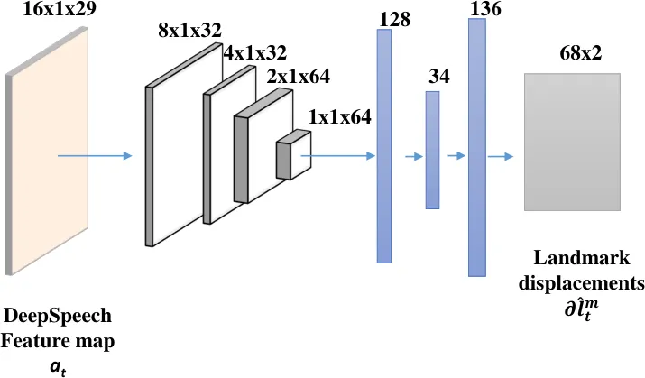

Fig. 4: Network architecture for audio-to-landmark prediction.

### III-A Speech-driven Motion Prediction

For a given speech signal represented by a sequence of overlapping audio
windows $`A=\{A_{0},A_{1}\cdots A_{t}\}`$, we first predict the
speech-induced motion on a sparse representation of the face
$`l^{p}=\{l^{p}_{0},l^{p}_{1}\cdots l^{p}_{t}\}`$ where
$`l^{p}_{t}\in\mathbb{R}^{68\times 2}`$ consists of 68 facial landmark
points representing eyes, eyebrows, nose, lips, and jaw. Unlike the
state-of-the-art methods, we use DeepSpeech features \[12\] instead of
using audio MFCC features. DeepSpeech features are used for gaining
robustness against noise and invariance to audio input from a variety of
speakers. DeepSpeech features $`a=\{a_{0},a_{1},\cdots a_{t}\}`$ where
$`a_{t}\in\mathbb{R}^{16\times 29}`$, corresponding to audio windows
$`A=\{A_{0},A_{1}\cdots A_{t}\}`$ are used for landmark generation.

Landmark prediction from speech: Facial landmarks for different subjects
contain person-specific facial attributes i.e., different face
structures, sizes, shapes, and different head positions. Speech driven
lip movements for a given audio segment are independent of these
variations. So to make landmark prediction invariant to these factors,
we consider a canonical landmark representation
$`l^{m}=\{l^{m}_{0},l^{m}_{1}\cdots l^{m}_{t}\};`$ where,
$`l^{m}_{t}\in\mathbb{R}^{68\times 2}`$, which is mean of facial
landmarks over the entire dataset. We consider a frontal face with
closed lips as the neutral mean face, $`l^{m}_{N}`$. We train our
speech-to-landmark generation network to predict
$`\delta l^{m}=\{\delta l^{m}_{0},\delta l^{m}_{1}\cdots\delta l^{m}_{t}\}`$
where, $`\delta l^{m}_{t}\in\mathbb{R}^{68\times 2}`$ represents
displacement from the neutral mean face $`l^{m}_{N}`$. Person-specific
facial landmarks $`l^{p}_{t}`$ is calculated from canonical landmark
displacements $`\delta l^{m}_{t}`$ from $`l^{m}_{N}`$ using,

```math
l^{p}_{t}=\delta l^{m}_{t}*S_{t}+PA(l^{p}_{N},l^{m}_{N}) \tag{1}
```

where, $`PA(l^{p}_{N},l^{m}_{N})`$ represents the rigid Procrustes
alignment \[24\] of $`l^{m}_{N}`$ with $`l^{p}_{N}`$ as reference.
$`S_{t}`$ represents scaling factor (ratio of height and width of
person-specific face to mean face). $`\delta l^{m}_{t}*S_{t}`$
represents displacements of person-specific landmarks
$`\delta l^{p}_{t}`$.

The network is trained with full supervision ($`L_{lmark}`$) for a
one-to-one mapping of DeepSpeech features to landmark displacements.

```math
L_{lmark}=||\delta l^{m}_{t}-\hat{\delta l^{m}_{t}}||^{2}_{2} \tag{2}
```

$`\delta l^{m}_{t}`$ and $`\delta\hat{l^{m}_{t}}`$ represents
ground-truth and predicted canonical landmarks displacements.

A temporal loss ($`L_{temp}`$) is also used to ensure consistent
displacements over consecutive frames as present in ground truth
landmark displacements.

```math
L_{temp}=||(\delta l^{m}_{t}-\delta l^{m}_{t-1})-(\hat{\delta l^{m}_{t}}-\hat{\delta l^{m}}_{t-1})||^{2}_{2} \tag{3}
```

Total loss ($`L_{tot}`$) for landmark prediction is defined as,

```math
L_{tot}=\lambda_{lmark}L_{lmark}+\lambda_{temp}L_{temp} \tag{4}
```

where $`\lambda_{lmark}`$ and $`\lambda_{temp}`$ defines weightage of
each of the losses.

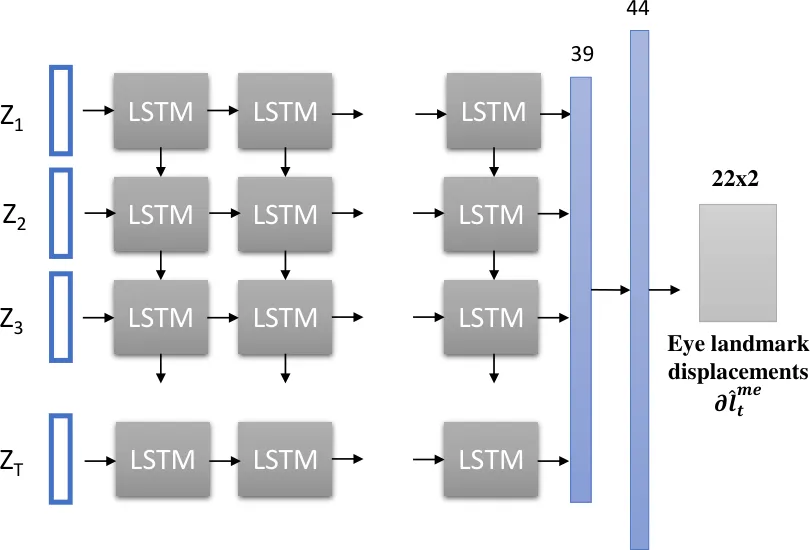

Fig. 5: Network architecture for blink generation.

### III-B Spontaneous Blink Generation

Unlike previous approaches which use landmarks for facial animation
\[4\], we impose eye blinks on the facial landmarks for adding realism
to facial animation. Unlike end-to-end methods that generate natural
facial expressions and eye blinks \[26\], our blink movements are learnt
over the sparse landmark representation for better preservation of
identity-related texture.

We train the blink generation network to learn a realistic eye blink,
duration of eye blinks, and permissible intervals between two blinks
from the training datasets. As there is no dependency of blinks on
speech input, we generate eye blinks in an unsupervised manner only from
random noise input. We aim to learn blink patterns, blink frequencies,
and blink duration over the training dataset via unsupervised learning.
In literature, generative adversarial networks (GAN) \[10\] have been
used for image generation from random noise input. Training of GAN
requires optimization of a min-max problem, which is often difficult to
stabilize. Li et al. \[17\] have proposed a simpler category of GAN
where the discriminator is replaced with a straightforward loss function
that matches different moments of ground-truth (real) and predicted
(fake) distributions using maximum mean discrepancy (MMD) \[11\].

We use MMD loss $`L_{MMD^{2}}`$ to match distribution of each landmark
displacements over a sequence length $`T`$ .

```math
L_{MMD^{2}}=\frac{1}{N^{2}}\sum_{i=1}^{N}\sum_{i^{\prime}=1}^{N}k(\delta l_{i}^{me},\delta l_{i^{\prime}}^{me})\\
-\frac{2}{NM}\sum_{i=1}^{N}\sum_{j=1}^{M}k(\delta l_{i}^{me},\hat{\delta l}_{j}^{me})-\frac{1}{M^{2}}\sum_{j=1}^{M}\sum_{j^{\prime}=1}^{M}k(\hat{\delta l}_{j}^{me},\hat{\delta l}_{j^{\prime}}^{me}) \tag{5}
```

where, $`k(x,y)=exp(-\frac{|x-y|^{2}}{2\sigma})`$ is used as the kernel
for comparing the real and fake distributions. $`\delta l^{me}`$ and
$`{\hat{\delta l}}^{me}`$ represents ground truth and predicted
distribution of displacements of each of the landmark points in eye
region over sequence $`T`$. We also use min-max regularization on
predicted distributions to enforce it to be within the range of average
displacements seen in the training dataset.

### III-C Attention-based Texture Generation

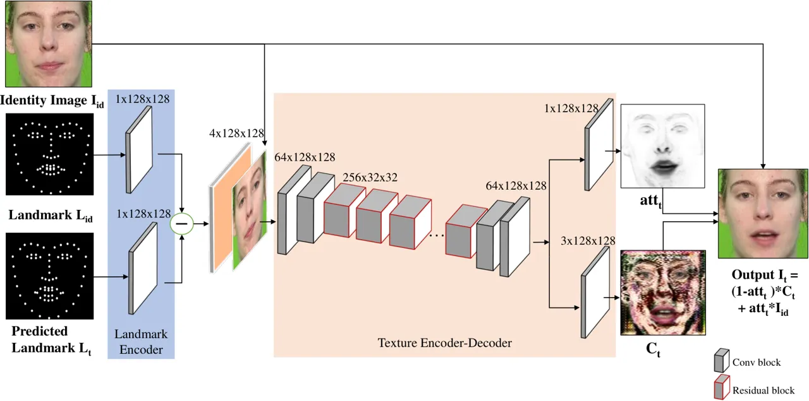

Fig. 6: The architecture of our proposed texture generator network.

Given a single image of the target identity $`I_{id}`$, the objective is
to transform a sequence of person-specific facial landmarks
$`l^{p}=\{l^{p}_{0},l^{p}_{1}\cdots l^{p}_{t}\}`$ into a sequence of
photo-realistic images
$`I=\{\mathit{I_{0}},\mathit{I_{1}}\cdots\mathit{I_{t}}\}`$ that
accurately reflect the facial expressions corresponding to the input
landmark images $`L`$ (image representation of the $`68\times 2`$
landmarks $`l^{p}`$). A generative adversarial network is trained using
ground truth video frames $`I^{*}`$ and the corresponding ground-truth
landmark images $`L^{*}`$ . Since the texture generation network is
trained on ground-truth landmarks, the network learns to generate face
texture for eye blinks. During evaluation, the predicted speech-driven
landmarks with imposed eye blinks are used as input for texture
generation.

Our generator network focuses on generating novel texture for image
regions that are responsible for facial expressions (defined by motion
on landmarks), while retaining texture from $`I_{id}`$ in the rest of
the image. This is achieved by learning a grayscale attention map and an
RGB color map over the face image instead of directly regressing the
entire face image, using a similar approach presented in \[21, 4\]. The
attention map $`att_{t}`$ determines how much of the original texture
values in $`I_{id}`$ will be present in the final generated image
$`{I_{t}}`$. The color map $`C_{t}`$ contains the novel texture in the
regions of facial motion.

The final generated image $`I_{t}`$ is derived as follows:

```math
I_{t}=(1-att_{t})*C_{t}+att_{t}*I_{id} \tag{6}
```

The network is trained by minimizing the following loss functions:

Pixel Intensity loss : This is a supervised loss on the RGB intensity
values of the entire image with a special emphasis on the eyes and mouth
regions.

```math
L_{pix}=\sum_{t}\alpha|I_{t}-I^{*}_{t}| \tag{7}
```

where, $`\alpha`$ represents a fixed spatial mask representing weights
assigned to individual pixels for contributing to the overall loss, with
higher weights assigned to the regions surrounding the mouth and eyes. A
fixed $`\alpha`$ has been experimentally found to be more stable than a
dynamic pixel mask dependent on $`att_{t}`$ used in \[4\].

Adversarial loss: Using only the pixel intensity loss $`L_{pix}`$
results in a considerable blur in the generated image due to the
$`L_{1}`$ distance minimization. A discriminator network is used to make
the generated texture sharper and more distinct, especially in regions
of motion. We adopt the LSGAN \[18\] for adversarial training of our
texture generation network, because of its better training stability as
well as its ability to generate higher quality images than the regular
GAN. Regular GANs use the sigmoid cross-entropy loss function, which is
prone to the problem of vanishing gradients, in which the gradient
becomes small for generated images that lie far from the decision
boundary. The LSGAN helps overcome this problem by using the
least-squares loss function which penalizes samples that are correctly
classified yet far from the decision boundary. Due to this property of
LSGANs, the generation of samples is closer to real data \[18\]. The
LSGAN loss functions for the discriminator and generator are :

```math
\displaystyle L(D) \displaystyle=\frac{1}{2}\E_{x\sim p_{I}(x)}[(D(x)-1)^{2}]+\frac{1}{2}\E_{z\sim p_{z}(z)}[D(G(z))^{2}] \tag{8}
```

```math
\displaystyle L(G) \displaystyle=\frac{1}{2}\E_{z\sim p_{z}(z)}[(D(G(z))-1)^{2}] \tag{9}
```

where $`p_{I}`$ is the distribution of the real face images and
$`p_{z}`$ is the distribution of the latent variable $`z`$. The
adversarial loss $`L_{adv}`$ is computed as follows:

```math
L_{adv}=L(G)+L(D) \tag{10}
```

Regularization loss : No ground-truth annotation is available for
training the attention map and color map. Low values of the attention
map in the regions of the face other than the regions of motion would
result in blurring of the generated texture. Hence, a $`L_{2}`$
regularization is applied to prevent the attention map values from
becoming too low.

```math
L_{att}=\sum_{t}||1-att_{t}||_{2} \tag{11}
```

To ensure the continuity in the generated images, a temporal
regularization is also applied by minimizing first-order temporal
differences of attention and color maps.

```math
L_{temp}=\sum_{t}||(att_{t}-att_{t-1})||_{2}+\sum_{t}||(C_{t}-C_{t-1})||_{2} \tag{12}
```

The total regularization loss is :

```math
L_{reg}=L_{att}+L_{temp} \tag{13}
```

The final objective function of generator is to minimize the following
combined loss:

```math
L=\lambda_{pix}L_{pix}+\lambda_{adv}L_{adv}+\lambda_{reg}L_{reg} \tag{14}
```

where, $`\lambda_{pix}`$, $`\lambda_{adv}`$ $`\lambda_{reg}`$ are
hyper-parameters for optimization, that control the relative influence
of each loss term.

## IV Implementation Details

#### Audio feature extraction

Given an audio input, DeepSpeech \[12\] produces log probabilities of
each character (26 alphabets + 3 special characters) corresponding to
each audio frame. We use the output of the last layer of the pre-trained
DeepSpeech network before applying softmax. We use overlapping audio
windows of 16 audio frames (0.04s of audio), where each audio window
corresponds to a single video frame.

#### Extraction of facial landmarks

We use OpenFace \[1\] and face segmentation \[29\] to prepare ground
truth facial landmarks for training audio-to-landmark prediction
network. For a given face image, OpenFace predicts $`68`$ facial
landmarks and uses frame-wise tracking to obtain temporally stable
landmarks. But for the lip region, it often gives erroneous prediction,
especially for the frames with faster lip movements. To capture an exact
lip movement corresponding to the input audio, we need a more accurate
method for the ground truth landmark extraction. Hence, we use face
segmentation \[29\], which segments the entire face in different regions
like hair, eyes, nose, upper lip, lower lip, and rest of the face. We
select the upper and lower lip landmark point from the intersection of
projected OpenFace landmark points with segmentation boundaries of the
lip regions, for a more accurate estimation of lip landmarks.

To prepare ground-truth landmark displacements for training
audio-to-landmark prediction network, we impose lip movements on the
mean neutral face. For this, we first align the person-specific landmark
$`l^{p}`$ with the mean face landmark $`l^{m}_{N}`$ using rigid
Procrustes alignment \[24\]. Per frame lip displacements from the
person-specific neutral face $`l^{p}_{N}`$, are added to the mean
neutral face, $`l^{m}_{N}`$ to transfer the motion from person specific
landmarks to mean face landmarks, $`l^{m}`$. Displacements are scaled
with the ratio of person-specific face height-width to mean face
height-width before adding to $`l^{m}_{N}`$.

#### Landmark Generation from Audio

We adopt an encoder-decoder architecture (as shown in Fig. 4) for
predicting the landmark displacements. The encoder network consists of
four convolution layers with two linear layers in the decoder. We use
Leaky ReLU activation after each layer of the encoder network. Input
audio feature $`a_{i}`$ is reshaped as
$`\mathbb{R}^{16\times 1\times 29}`$ to consider the temporal
relationship within the window of 16 audio frames. We initialize the
decoder layer’s weight with PCA components (that represents 99% of total
variance) computed over landmark displacements of the mean face of
training samples. The loss parameters $`\lambda_{lmark}`$ and
$`\lambda_{temp}`$ have been set to $`1`$ and $`0.5`$ respectively based
on experimental validation.

#### Blink generation network

We use RNN architecture to predict a sequence of displacements for each
of the landmark points of eye region ($`n\times T\times 44`$, i.e x, y
coordinates of 22 landmarks; n is batch size ) over $`T`$ timestamps
from given noise vector $`z\sim\mathcal{N}(\mu,\,\sigma^{2})`$ of size
10 ($`n\times T\times 10`$). Fig. 5 shows network architecture for the
blink generation module. Similar to the audio-to-landmark prediction
network blink generation network is also trained on landmark
displacements. The last linear layer weight is initialized with PCA
components (with 99% variance) computed using eye landmark
displacements.

#### Texture Generation from Landmarks

The proposed architecture of the texture generator is shown in Fig. 6.
The current landmark images $`L_{t}`$ and the identity landmark image
$`L_{id}`$ images are each encoded using a landmark encoder. The
difference in encoded landmark features is concatenated with the input
identity image $`I_{id}`$ and fed to an encoder-decoder architecture,
which generates attention map $`att_{t}`$ and color map $`C_{t}`$. The
generated image $`I_{t}`$ is passed to a discriminator network, which
determines if the generated image is real or fake. The encoder-decoder
architecture of the generator network is built upon a variation of
\[21\] which uses facial action units to generate attention for facial
expression generation. The discriminator network is based on the
PatchGan architecture \[14\] with batch normalization replaced by
instance normalization similar to \[21\] for greater training stability.
The improved stability of LSGAN training \[18\] along with
regularization of attention map helped us in achieving stable
adversarial training as the problem of vanishing gradients in the
regular GAN training can adversely effect learning of attention and
color maps. We use Adam optimizer with learning rate of $`0.0001`$,
$`beta1=0.5`$, $`beta2=0.999`$ and training batch size of $`16`$. During
training the loss hyper-parameters have been set to
$`\lambda_{pix}=100`$, $`\lambda_{adv}=0.5`$ and $`\lambda_{reg}=0.2`$
by experimental validation on a validation set. The adversarial loss and
regularization loss parameters have been chosen to prevent saturation of
the attention map while maintaining the sharpness of the texture of the
generated images.

Our network is trained on a NVIDIA Quadro GV100 GPU. Training of
audio-to-landmark, blink, and landmark-to-image generation networks take
around 6 hours, 3 hours, and 2 days respectively. We use PyTorch for the
implementation of the above mentioned networks.

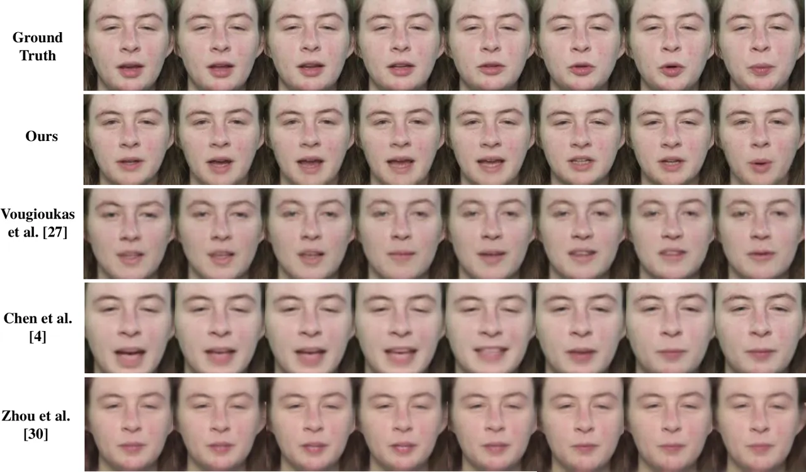

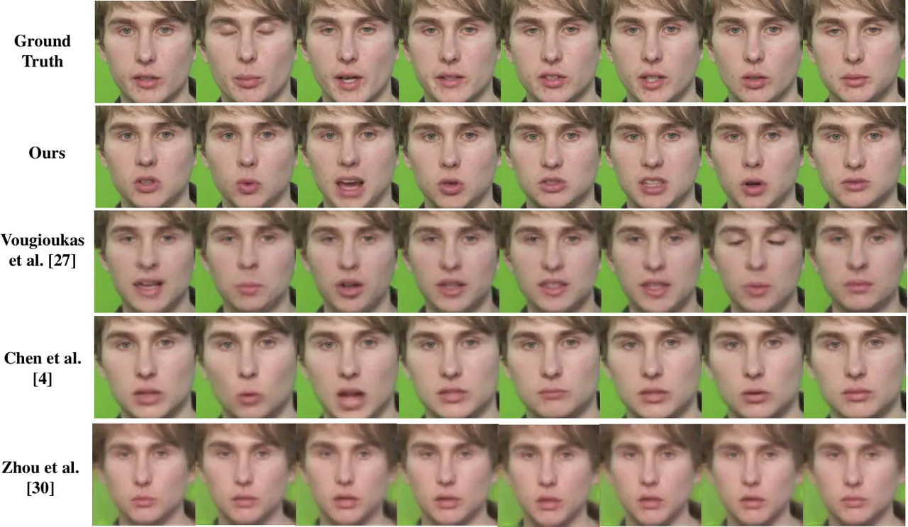

Fig. 7: Results on TCD-TIMIT dataset: Our generated texture is sharper,
especially the texture of the mouth and teeth are visibly more distinct
compared to Chen et al. \[4\], Vougioukas et al. \[27\] and Zhou et al.
\[30\] and also our generated motion is better than Zhou et al. \[30\].
In contrast to Vougioukas et al. \[27\] and Zhou et al. Zhou et al.
\[30\] our synthesized face retains the texture from the input identity
image in the regions of the face not undergoing motion, resulting in our
improved identity-preservation.

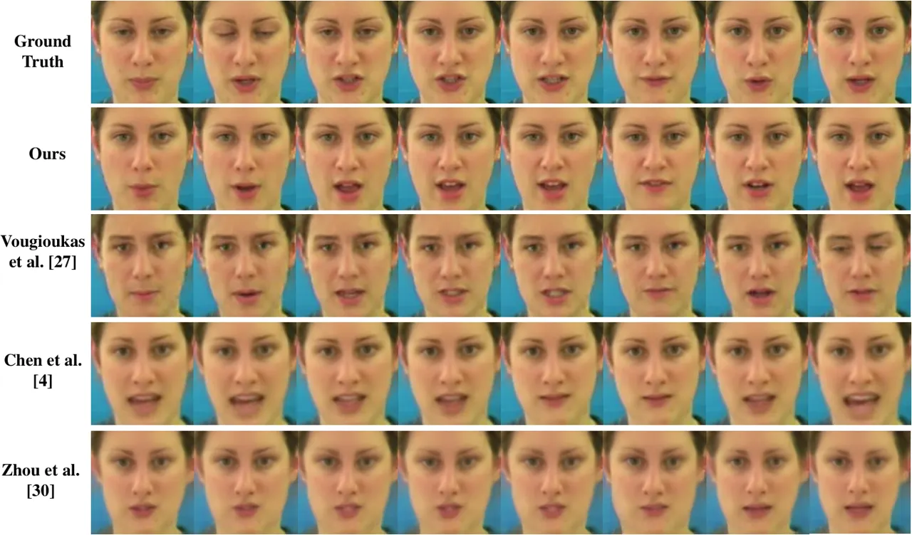

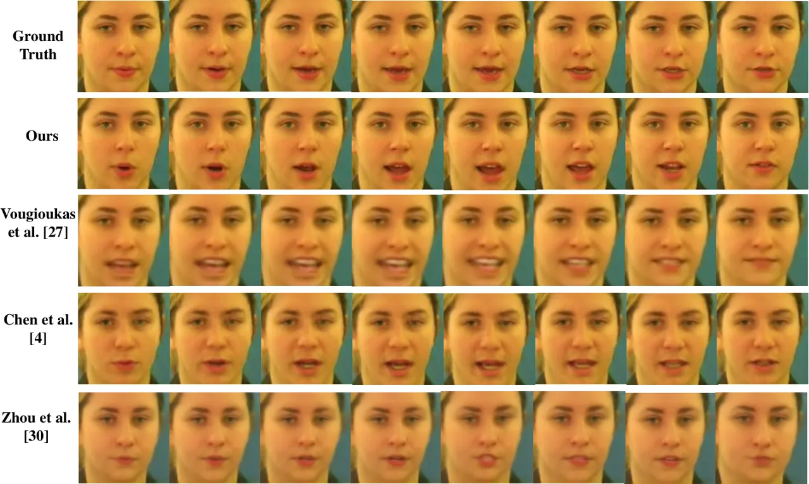

Fig. 8: Results on GRID dataset: Our generated images contain sharper
and more distinctive mouth texture, plausible mouth shapes, and better
preservation of identity compared to Chen et al. \[4\], Vougioukas et
al. \[27\] and Zhou et al. \[30\]. Vougioukas et al. \[27\] fails to
accurately preserve the identity information of the target in the
synthesized images, Chen et al. \[4\] and Zhou et al. \[30\] contain
some implausible mouth shapes.

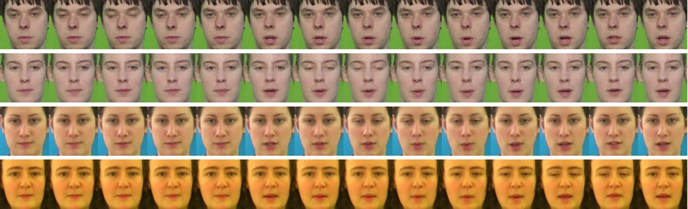

Fig. 9: Our generated animation of different identities synchronized
with the the same speech input, containing spontaneous generation of eye
blinks.

## V Experiments

The proposed model is trained and evaluated on the benchmark datasets
GRID \[7\] and TCD-TIMIT\[13\]. The GRID dataset consists of $`33`$
speakers, each uttering $`1000`$ short sentences, but the words belong
to a limited dictionary. The TCD-TIMIT dataset consists of $`59`$
speakers uttering approximately $`100`$ sentences each from the TIMIT
corpus, with long sentences that contain much more phonetic variability
than the GRID dataset. We use the same training-testing data split for
the TCD-TIMIT and GRID datasets as in \[27\].

### V-A Metrics

The following metrics have been used for quantitative evaluation of our
results:

\- Image reconstruction quality metrics, PSNR (peak signal-to-noise
ratio), and SSIM (structural similarity).

\- Image sharpness metric CPBD (Cumulative probability blur
detection)\[20\] to detect the amount of blur in synthesized image.

\- Landmark synchronization metric LMD (landmark distance) \[3\] to
measure the accuracy of audio-visual synchronization.

Higher values of CPBD, PSNR, and SSIM indicated better quality of image
generation while lower values of LMD indicate better audio-visual
synchronization.

### V-B Results

Our results have been compared both qualitatively and quantitatively
with recent state-of-the-art methods. A user study has also been carried
out for subjective evaluation of our method.

#### V-B1 Qualitative Results

Qualitative comparison of our results have been carried out with the
recent state-of-the-art methods of Chen et al. \[4\], Vougioukas et al.
\[27\] and Zhou et al. \[30\]. The comparative results on TCD-TIMIT and
GRID dataset are shown in Fig. 7 and 8 respectively. The results
indicate that our proposed method is able to generate facial animation
sequences that are superior in terms of image quality, identity
preservation and generation of plausible mouth shapes. Our generated
images contain sharper texture and are better at preserving the
identity-related facial texture of the target subjects compared to
Vougioukas et al. \[27\] and Zhou et al. \[30\] due to our
attention-based texture generation with the help of landmarks, which
helps to retain the identity information from the input identity image.
Compared to Chen et al. \[4\], our generated face images have less blur
and more distinctive texture in the mouth region and plausible mouth
shapes. This is because of our two-step learning of person-specific
facial landmarks, and texture generation using LSGAN and attention map
regularization. Unlike Chen et al. \[4\] and Zhou et al. \[30\], our
face animation method can generate spontaneous eye blinks, as shown in
Fig. 9.

#### V-B2 Quantitative Results

In this section, we present a quantitative evaluation of our method
compared with the recent methods \[4, 27\]. Table I shows the metrics
computed using our trained models on GRID and TCD-TIMIT datasets
respectively. Our results indicate better image reconstruction quality
(higher PSNR and SSIM), sharper texture (higher CPBD) and improved
audio-visual synchronization (lower LMD) than the state-of-the-art
methods\[4, 27\].

| Dataset   | Method                   | PSNR   | SSIM   | CPBD   | LMD  |
| --------- | ------------------------ | ------ | ------ | ------ | ---- |
| TCD-TIMIT | Ours                     | 26.153 | 0.818  | 0.386  | 2.39 |
|           | Vougioukas et al. \[27\] | 24.243 | 0.730  | 0.308  | 2.59 |
|           | Chen et al. \[4\]        | 20.311 | 0.589  | 0.156  | 2.92 |
| GRID      | Ours                     | 29.305 | 0.878  | 0.293  | 1.21 |
|           | Vougioukas et al. \[27\] | 27.100 | 0.818  | 0.268  | 1.66 |
|           | Chen et al. \[4\]        | 23.984 | 0.7601 | 0.0615 | 1.59 |

TABLE I: Quantitative evaluation results. We evaluate the methods of
Chen et al. \[4\] Vougioukas et al.\[27\] on our test data using their
respective pre-trained models which are publicly available. Our
train-test split is same as that of Vougioukas et al.\[27\].

We also evaluate the performance of our blink generation network by
comparing the characteristics of predicted blinks with blinks present in
ground-truth videos. Fig. 11 shows the comparison of the distributions
of blink duration for around 11,000 synthesized (red) and ground-truth
(blue) videos (from GRID and TCD-TIMIT datasets). The average blink
duration per video obtained from our method is similar to that of
ground-truth. Our method produces $`0.3756`$ blinks/s and $`0.2985`$
blinks/s for GRID and TCD-TIMIT datasets respectively which is similar
to the average human blink rate, that varies between $`0.28-0.4`$
blinks/s \[27\]. Also, our method shows an average of $`0.5745s`$
inter-blink duration, which is similar to ground-truth videos with
duration $`0.4601s`$. Hence, our method is able to produce realistic
blinks.

| Method                      | PSNR   | SSIM  | CPBD  |
| --------------------------- | ------ | ----- | ----- |
| $`L_{pix}`$                 | 25.874 | 0.813 | 0.366 |
| $`L_{pix}+L_{adv}`$         | 25.951 | 0.814 | 0.373 |
| $`L_{pix}+L_{adv}+L_{reg}`$ | 26.153 | 0.818 | 0.386 |

TABLE II: Ablation study of the objective function in Eq. 14 on the
TCD-TIMIT dataset.

| Method                   | TCD-TIMIT | GRID | Average |
| ------------------------ | --------- | ---- | ------- |
| Ours                     | 6.40      | 7.69 | 7.05    |
| Vougioukas et al. \[27\] | 6.29      | 6.51 | 6.4     |
| Chen et al. \[4\]        | 4.67      | 4.5  | 4.59    |

TABLE III: User study results. Scores range from 0-10 (Higher scores
indicate more realistic face animation)

#### V-B3 Ablation Study

We present an ablation study on a validation set from TCD-TIMIT, for
different losses (Eq. 14) used for training our landmark-to-image
generation network. This helps to understand the significance of using
adversarial training and regularization. The metrics are summarized in
Table II and generated images are shown in Fig. 10. The results indicate
that our texture generation network trained using a combination of
$`L_{1}`$ pixel loss, adversarial loss, and regularization yields the
best outcome.

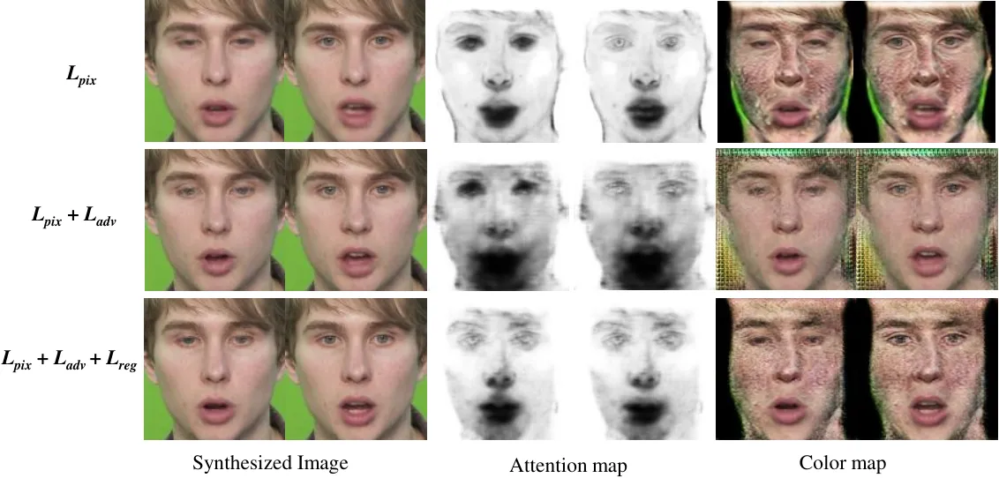

Fig. 10: Training the network using only generator loss $`L_{pix}`$
without the discriminator, results in blurry texture generation in the
mouth region of the color map. Adding the discriminator and the
adversarial loss (row marked $`L_{pix}+L_{adv}`$) makes the generated
mouth texture sharper in the color map, however the attention map
indicates motion for the entire face resulting in blur in the final
synthesized image, especially noticeable in the mouth region. Adding the
regularization loss (row marked $`L_{pix}+L_{adv}+L_{reg}`$) results in
the attention map having low values mostly in regions of motion, hence
the synthesized image contains sharper and more distinct mouth texture.

#### V-B4 User Study

A user study has also been carried out to evaluate the realism of our
facial animation results. 26 participants have rated 30 videos with a
score between 0-10 (higher score indicates more realistic). Out of the
30 videos, 10 videos are selected from each of the following methods -
Ours, Vougioukas et al. \[27\] and Chen et al. \[4\]. For each method, 5
videos are selected from each of the datasets, GRID, and TCD-TIMIT.
Table III summarizes the outcome of the user study, which indicates
higher realism for the synthesized videos generated by our method. As
per the feedback from the participants, our sharper images, better
identity preservation over the videos, and the presence of realistic eye
blinks helped us achieve higher scores indicating improved realism
compared to state-of-the-art methods.

Fig. 11: Blink duration in synthesized videos compared to ground-truth.

## VI Conclusion

In this paper, we propose an efficient pipeline for generating realistic
facial animation from speech. Our method produces accurate audio-visual
synchronization, plausible mouth movement along with identity
preservation and also renders natural expression like eye blinks. Our
results indicate a significant improvement over the state-of-the-art
methods in terms of image quality, speech-synchronization,
identity-preservation, and overall realism, as established by our
qualitative, quantitative and user study results. We attribute this to
our segregated learning of motion and texture, two-stage learning of
person-independent and person-specific motion, generation of eye blinks,
and the use of attention to retain identity information. In future, we
would like to generate a greater variety of spontaneous human
expressions and head movements to make the animation appear more
realistic.

## VII Acknowledgement

We would like to acknowledge Prof. Angshul Majumdar from IIIT Delhi,
India, for helping us gain the access of TCD-TIMIT dataset for our
research.

## References

- \[1\] T. Baltrusaitis, A. Zadeh, Y. C. Lim, and L.-P. Morency.
  Openface 2.0: Facial behavior analysis toolkit. In 2018 13th IEEE
  International Conference on Automatic Face & Gesture Recognition (FG
  2018), pages 59–66. IEEE, 2018.
- \[2\] Y. Cao, W. C. Tien, P. Faloutsos, and F. Pighin. Expressive
  speech-driven facial animation. ACM Transactions on Graphics (TOG),
  24(4):1283–1302, 2005.
- \[3\] L. Chen, Z. Li, R. K Maddox, Z. Duan, and C. Xu. Lip movements
  generation at a glance. In Proceedings of the European Conference on
  Computer Vision (ECCV), pages 520–535, 2018.
- \[4\] L. Chen, R. K. Maddox, Z. Duan, and C. Xu. Hierarchical
  cross-modal talking face generation with dynamic pixel-wise loss. In
  Proceedings of the IEEE Conference on Computer Vision and Pattern
  Recognition, pages 7832–7841, 2019.
- \[5\] L. Chen, S. Srivastava, Z. Duan, and C. Xu. Deep cross-modal
  audio-visual generation. In Proceedings of the on Thematic Workshops
  of ACM Multimedia 2017, pages 349–357. ACM, 2017.
- \[6\] J. S. Chung, A. Jamaludin, and A. Zisserman. You said that?
  arXiv preprint arXiv:1705.02966, 2017.
- \[7\] M. Cooke, J. Barker, S. Cunningham, and X. Shao. An audio-visual
  corpus for speech perception and automatic speech recognition. The
  Journal of the Acoustical Society of America, 120(5):2421–2424, 2006.
- \[8\] B. Fan, L. Wang, F. K. Soong, and L. Xie. Photo-real talking
  head with deep bidirectional lstm. In 2015 IEEE International
  Conference on Acoustics, Speech and Signal Processing (ICASSP), pages
  4884–4888. IEEE, 2015.
- \[9\] P. Garrido, L. Valgaerts, H. Sarmadi, I. Steiner, K. Varanasi,
  P. Perez, and C. Theobalt. Vdub: Modifying face video of actors for
  plausible visual alignment to a dubbed audio track. In Computer
  graphics forum, volume 34, pages 193–204. Wiley Online Library, 2015.
- \[10\] I. Goodfellow, J. Pouget-Abadie, M. Mirza, B. Xu,
  D. Warde-Farley, S. Ozair, A. Courville, and Y. Bengio. Generative
  adversarial nets. In Advances in neural information processing
  systems, pages 2672–2680, 2014.
- \[11\] A. Gretton, K. Borgwardt, M. Rasch, B. Schölkopf, and A. J.
  Smola. A kernel method for the two-sample-problem. In Advances in
  neural information processing systems, pages 513–520, 2007.
- \[12\] A. Hannun, C. Case, J. Casper, B. Catanzaro, G. Diamos,
  E. Elsen, R. Prenger, S. Satheesh, S. Sengupta, A. Coates, et al. Deep
  speech: Scaling up end-to-end speech recognition. arXiv preprint
  arXiv:1412.5567, 2014.
- \[13\] N. Harte and E. Gillen. Tcd-timit: An audio-visual corpus of
  continuous speech. IEEE Transactions on Multimedia,
  17(5):603–615, 2015.
- \[14\] P. Isola, J.-Y. Zhu, T. Zhou, and A. A. Efros. Image-to-image
  translation with conditional adversarial networks. In Proceedings of
  the IEEE conference on computer vision and pattern recognition, pages
  1125–1134, 2017.
- \[15\] V. Kazemi and J. Sullivan. One millisecond face alignment with
  an ensemble of regression trees. In Proceedings of the IEEE conference
  on computer vision and pattern recognition, pages 1867–1874, 2014.
- \[16\] Y. Li, M.-C. Chang, and S. Lyu. In ictu oculi: Exposing ai
  generated fake face videos by detecting eye blinking. arXiv preprint
  arXiv:1806.02877, 2018.
- \[17\] Y. Li, K. Swersky, and R. Zemel. Generative moment matching
  networks. In International Conference on Machine Learning, pages
  1718–1727, 2015.
- \[18\] X. Mao, Q. Li, H. Xie, R. Y. Lau, Z. Wang, and S. Paul Smolley.
  Least squares generative adversarial networks. In Proceedings of the
  IEEE International Conference on Computer Vision, pages
  2794–2802, 2017.
- \[19\] M. Mori, K. F. MacDorman, and N. Kageki. The uncanny valley
  \[from the field\]. IEEE Robotics & Automation Magazine,
  19(2):98–100, 2012.
- \[20\] N. D. Narvekar and L. J. Karam. A no-reference perceptual image
  sharpness metric based on a cumulative probability of blur detection.
  In 2009 International Workshop on Quality of Multimedia Experience,
  pages 87–91. IEEE, 2009.
- \[21\] A. Pumarola, A. Agudo, A. M. Martinez, A. Sanfeliu, and
  F. Moreno-Noguer. Ganimation: Anatomically-aware facial animation from
  a single image. In Proceedings of the European Conference on Computer
  Vision (ECCV), pages 818–833, 2018.
- \[22\] A. Simons. Generation of mouthshape for a synthetic talking
  head. Proc. of the Institute of Acoustics, 1990.
- \[23\] Y. Song, J. Zhu, X. Wang, and H. Qi. Talking face generation by
  conditional recurrent adversarial network. arXiv preprint
  arXiv:1804.04786, 2018.
- \[24\] A. Srivastava, S. H. Joshi, W. Mio, and X. Liu. Statistical
  shape analysis: Clustering, learning, and testing. IEEE Transactions
  on pattern analysis and machine intelligence, 27(4):590–602, 2005.
- \[25\] S. Suwajanakorn, S. M. Seitz, and I. Kemelmacher-Shlizerman.
  Synthesizing obama: learning lip sync from audio. ACM Transactions on
  Graphics (TOG), 36(4):95, 2017.
- \[26\] K. Vougioukas, S. A. Center, S. Petridis, and M. Pantic.
  End-to-end speech-driven realistic facial animation with temporal
  gans. In Proceedings of the IEEE Conference on Computer Vision and
  Pattern Recognition Workshops, pages 37–40, 2019.
- \[27\] K. Vougioukas, S. Petridis, and M. Pantic. Realistic
  speech-driven facial animation with gans. International Journal of
  Computer Vision, pages 1–16, 2019.
- \[28\] H. C. Yehia, T. Kuratate, and E. Vatikiotis-Bateson. Linking
  facial animation, head motion and speech acoustics. Journal of
  Phonetics, 30(3):555–568, 2002.
- \[29\] C. Yu, J. Wang, C. Peng, C. Gao, G. Yu, and N. Sang. Bisenet:
  Bilateral segmentation network for real-time semantic segmentation. In
  Proceedings of the European Conference on Computer Vision (ECCV),
  pages 325–341, 2018.
- \[30\] H. Zhou, Y. Liu, Z. Liu, P. Luo, and X. Wang. Talking face
  generation by adversarially disentangled audio-visual representation.
  In Proceedings of the AAAI Conference on Artificial Intelligence,
  volume 33, pages 9299–9306, 2019.
- \[31\] H. Zhu, A. Zheng, H. Huang, and R. He. High-resolution talking
  face generation via mutual information approximation. arXiv preprint
  arXiv:1812.06589, 2018.
