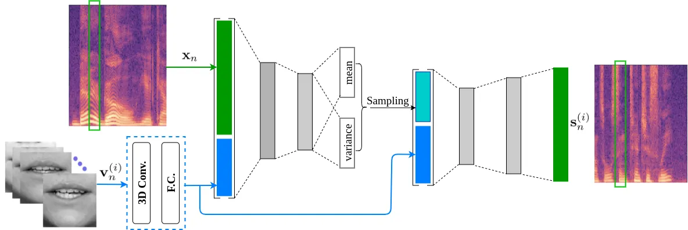
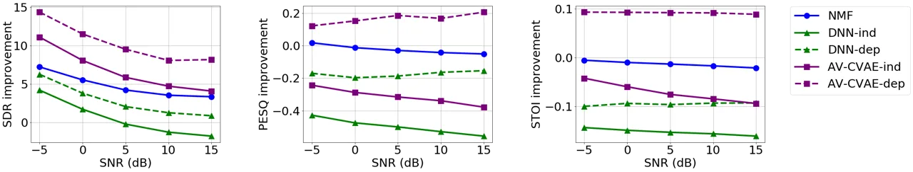
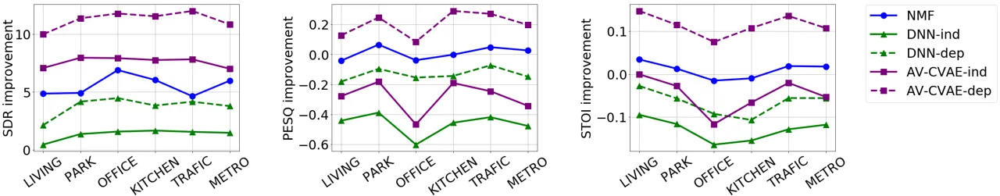

# Deep Variational Generative Models for Audio-visual Speech Separation

###### Abstract

In this paper, we are interested in audio-visual speech separation given
a single-channel audio recording as well as visual information (lips
movements) associated with each speaker. We propose an unsupervised
technique based on audio-visual generative modeling of clean speech.
More specifically, during training, a latent variable generative model
is learned from clean speech spectra using a variational auto-encoder
(VAE). To better utilize the visual information, the posteriors of the
latent variables are inferred from mixed speech (instead of clean
speech) as well as the visual data. The visual modality also serves as a
prior for latent variables, through a visual network. At test time, the
learned generative model (both for speaker-independent and
speaker-dependent scenarios) is combined with an unsupervised
non-negative matrix factorization (NMF) variance model for background
noise. All the latent variables and noise parameters are then estimated
by a Monte Carlo expectation-maximization algorithm. Our experiments
show that the proposed unsupervised VAE-based method yields better
separation performance than NMF-based approaches as well as a supervised
deep learning-based technique.

|                                                                                          |
| ---------------------------------------------------------------------------------------- |
| Viet-Nhat Nguyen,^(1,2) Mostafa Sadeghi,^(1,3) Elisa Ricci,² and Xavier Alameda-Pineda,¹ |
| ¹ RobotLearn Team at Inria Grenoble Rhône-Alpes, France.                                 |
| ² Università degli Studi di Trento, Italy.                                               |
| ³Multispeech Team at Inria Nancy Grand-Est                                               |

## 1 Introduction

Speech (or speaker) separation, sometimes referred to as the “cocktail
party problem” \[1\], is the problem of separating speech sources from a
mixture involving several speakers. This is a fundamental task in signal
processing with a wide range of applications. In the literature,
traditional methods are typically audio-only, for instance based on NMF
(NMF) \[2, 3\] or independent component analysis (ICA) \[4\]. Given that
the visual modality can provide very useful information, one important
question is how to jointly exploit audio and visual data.

Audio-visual speech separation has been recently addressed in the
framework of DNN (DNN). For example, speech enhancement, which is a
special case of speech separation, has been successfully addressed in
\[5\], where a neural network model is trained to map noisy audio and
the associated visual data to clean audio data. Thus, the visual
modality plays an important role allowing to separate speech by treating
all the undesired speech sources as noise. Some carefully designed
neural networks architectures are also proposed in \[6\] to learn a
time-frequency mask, exploiting an additional face landmark detector
trained on a separate image dataset. However, the second speech
considered as the only source of noise is shared among training set and
test set. Perhaps the most similar works to the problem we are dealing
with are \[7, 8\]. Nevertheless, such methods rely on a huge dataset of
synchronized audio-visual data including thousands of hours of video
segments from the Web. These DNN-based approaches are versatile to
integrate visual information into their architecture. However, they are
subject to poor generalization to unseen noise types and require a
highly diverse training noise dataset.

Recently, a family of unsupervised methods based on VAEs has been
developed to address the speech enhancement problem \[9, 10, 11, 12,
13\]. They rely on deep latent variable generative models consisting of
two main steps. First, a generative model is trained on clean speech to
learn a probabilistic mapping from latent space to the space of (clean)
speech spectrogram. This is done with a VAE network equipped with an
encoder and a decoder. The encoder approximates the intractable
posterior of the latent variables using a Gaussian distribution. The
decoder then acts as a generative model by attempting to reconstruct the
clean spectrogram. Secondly, after being jointly trained with the
encoder, the decoder is combined with an unsupervised noise variance
model, e.g. NMF, to infer both time-varying loudness (gain values) and
the model parameters. To make use of available visual modality, \[11\]
proposed to apply a conditional VAE network \[14\], where the encoder
and decoder are conditioned on the visual information. This approach
yields state-of-the-art audio-visual speech enhancement in the
unsupervised setting.



Fig. 1: VAE model architecture, where $`(i)`$ indicates speaker number.

In this paper, inspired by previous related literature \[11\], we
address the single-channel audio-visual speech separation problem. We
focus on the situation of two individuals speaking simultaneously in the
presence of some background noise, where both faces are available. The
main idea is to learn a generative model for clean speech spectrogram
(for both speaker-dependent and speaker-independent cases), and combine
it with an NMF model for the background noise at test time. A
Monte-Carlo expectation-maximization framework is developed to estimate
the individual speech signals. Our experiments confirm the promising
performance of the proposed approach when compared with the traditional
NMF-based and the recent DNN-based techniques.

The rest of the paper is organized as follows. Section 2 presents clean
speech modeling based on VAE. Then, Section 3 discusses how to separate
speech signals given the learned clean speech model and the observed
noisy audio and the associated clean visual data. Finally, the
performance of the proposed method is evaluated in Section 4.

## 2 Clean Speech Modelling

### 2.1 Model

We use the same model as in \[11\] to combine the clean speech signal
with the visual information. Let
$`(\boldsymbol{s},\boldsymbol{v})=\{\boldsymbol{s}_{n}\in\mathbb{C}^{F},\boldsymbol{v}_{n}\in\mathbb{R}^{M}\}_{n=1}^{N}`$
denote our observed training set of $`N`$ synchronized frames of audio
and video data where $`\boldsymbol{s}_{n}`$ represents coefficients of
STFT (STFT) at time $`n`$, and $`\boldsymbol{v}_{n}`$ is a lip ROI (ROI)
embedding. We assume that $`\boldsymbol{s}`$ is generated by a
corresponding sequence of latent vectors
$`\boldsymbol{z}=\{\boldsymbol{z}_{n}\in\mathbb{R}^{L}\}_{n=1}^{N}`$.
Both clean speech $`\boldsymbol{s}`$ and latent code $`\boldsymbol{z}`$
are conditioned on visual features which serve as a deterministic
information. Specifically, we have the following latent variable model:

```math
\displaystyle\boldsymbol{s}_{n}|\mathbf{z}_{n},\boldsymbol{v}_{n};\Theta \displaystyle\sim\mathcal{N}_{c}\Big(\boldsymbol{0},\text{diag}\Big(\boldsymbol{\sigma}_{s}(\mathbf{z}_{n},\boldsymbol{v}_{n})\Big)\Big), \tag{1}
```

```math
\displaystyle\mathbf{z}_{n}|\boldsymbol{v}_{n};\Gamma \displaystyle\sim\mathcal{N}\Big(\boldsymbol{\mu}_{p}(\boldsymbol{v}_{n}),\text{diag}\Big(\boldsymbol{\sigma}_{p}(\boldsymbol{v}_{n})\Big)\Big), \tag{2}
```

where $`\mathcal{N}(0,\sigma)`$ and $`\mathcal{N}_{c}(0,\sigma)`$
denote, respectively, Gaussian and complex proper Gaussian distributions
with zero mean and variance $`\sigma`$. Moreover,
$`\boldsymbol{\sigma}_{s}(.,.):\mathbb{R}^{L}\times\mathbb{R}^{M}\mapsto\mathbb{R}_{+}^{F}`$
is a neural network with parameters denoted $`\Theta`$. Similarly,
$`\boldsymbol{\mu}_{p}(.):\mathbb{R}^{M}\mapsto\mathbb{R}^{L}`$ and
$`\boldsymbol{\sigma}_{p}(.):\mathbb{R}^{M}\mapsto\mathbb{R}_{+}^{L}`$
are neural networks with parameters $`\Gamma`$.

### 2.2 Training

To learn the set of parameters $`\Theta`$ and $`\Gamma`$, we follow the
principles of VAE. In particular, the posterior of the latent codes is
approximated by a parameterized Gaussian distribution:

```math
q(\boldsymbol{z}_{n}|\boldsymbol{s}_{n},\boldsymbol{v}_{n};\Psi)=\mathcal{N}\Big(\boldsymbol{\mu}_{z}(\boldsymbol{s}_{n},\boldsymbol{v}_{n}),\text{diag}\Big(\boldsymbol{\sigma}_{z}(\boldsymbol{s}_{n},\boldsymbol{v}_{n})\Big)\Big), \tag{3}
```

where,
$`\boldsymbol{\mu}_{z}(.,.):\mathbb{R}_{+}^{F}\times\mathbb{R}^{M}\mapsto\mathbb{R}^{L}`$
and
$`\boldsymbol{\sigma}_{z}(.,.):\mathbb{R}_{+}^{F}\times\mathbb{R}^{M}\mapsto\mathbb{R}_{+}^{L}`$
are neural networks, with parameters denoted $`\Psi`$, taking
$`\tilde{\mathbf{s}}_{n}\triangleq(|s_{0n}|^{2}\dots|s_{F-1\>n}|^{2})^{\top}`$
as input. To learn all the parameters, the following loss function is
optimized \[11\]:

```math
\mathcal{L}(\Theta,\Gamma,\Psi)=\alpha\>\mathbb{E}_{q(\mathbf{z}|\mathbf{x},\mathbf{v};\Psi)}\Big[\log p(\mathbf{s}|\mathbf{z},\mathbf{v};\Theta)\Big]+\\
(1-\alpha)\mathbb{E}_{p(\mathbf{z}|\mathbf{v};\Gamma)}\Big[\log p(\mathbf{s}|\mathbf{z},\mathbf{v};\Theta)\Big]\\
+\alpha D_{\mathrm{KL}}\Big(q(\mathbf{z}|\mathbf{x},\mathbf{v};\Psi)\>\|\>p(\mathbf{z}|\mathbf{v};\Gamma)\Big), \tag{4}
```

in which, $`D_{\mathrm{KL}}(.,.)`$ denotes the Kullback-Leibler (KL).
Moreover, $`\alpha\in[0,1]`$ controls the contributions of the
reconstruction errors computed using the latent code sampled from the
encoder and the one sampled from the prior network. This strategy takes
into account both the reconstruction from audio-visual and visual-only
information, which was originally proposed in \[11\] and has been proven
effective for speech enhancement. The loss function can be
straightforwardly optimized via the reparametrization trick and the
gradient descent algorithm as in standard VAEs. In order to better
utilize the visual modality during training, noisy speech (instead of
the clean one) is used as the input of the encoder. The architecture of
our VAE model is depicted in Figure 1. The encoder-decoder structure
allows us to easily derive a speaker-dependent version, in which the
generic decoder is substituted by the ones fine-tuned for each
individual speaker. Once trained, the decoder(s) are used for speech
separation as described in the following.

## 3 Speech Separation

### 3.1 Unsupervised noise model

We consider an unsupervised NMF-based Gaussian model for the background
noise which is simple and proven effective \[9\]. Specifically, the
variance of noise spectrogram could be represented as the product of two
non-negative matrices $`\mathbf{W}\in\mathbb{R}_{+}^{F\times K}`$ and
$`\mathbf{H}\in\mathbb{R}_{+}^{K\times N}`$. $`\mathbf{W}`$ consists of
$`K`$ spectral basis vectors and $`\mathbf{H}`$ is a matrix of temporal
activations, with $`K`$ being called the rank of NMF satisfying
$`K(F+N)\ll FN`$. This leads to the following distribution for the
$`n`$-th noise spectrogram time frame, $`\boldsymbol{b}_{n}`$:

```math
\boldsymbol{b}_{n}\sim\mathcal{N}_{c}\Big(\boldsymbol{0},\text{diag}\Big({\bf W}\boldsymbol{h}_{n}\Big)\Big), \tag{5}
```

where, $`\boldsymbol{h}_{n}`$ denotes the $`n`$-th column of
$`{\bf H}`$.

### 3.2 Mixture model

We model the observed mixture signal recorded using a single-channel
microphone as follows ($`n=1,\ldots,N`$):

```math
\displaystyle\boldsymbol{x}_{n}=\sqrt{g^{(1)}_{n}}\boldsymbol{s}_{n}^{(1)}+\sqrt{g^{(2)}_{n}}\boldsymbol{s}_{n}^{(2)}+\boldsymbol{b}_{n}. \tag{6}
```

where, $`\boldsymbol{s}_{n}^{(1)}`$ and $`\boldsymbol{s}_{n}^{(2)}`$
denote clean speech signals from two speakers. As suggested in \[10\],
the gain parameters $`g^{(1)}_{n}`$ and $`g^{(2)}_{n}`$ are
frequency-invariant and provide robustness against the loudness
variations of the speech signals along time. Using (1) and (5), and an
independence assumption, we have:

```math
\boldsymbol{x}_{n}|\boldsymbol{z}^{(1)}_{n},\boldsymbol{v}^{(1)}_{n},\boldsymbol{z}^{(2)}_{n},\boldsymbol{v}^{(2)}_{n}\sim\mathcal{N}_{c}\Big(\boldsymbol{0},g^{(1)}_{n}\text{diag}\Big(\boldsymbol{\sigma}_{s}(\boldsymbol{z}_{n}^{(1)},\boldsymbol{v}_{n}^{(1)})\Big)+\\
g^{(2)}_{n}\text{diag}\Big(\boldsymbol{\sigma}_{s}(\boldsymbol{z}_{n}^{(2)},\boldsymbol{v}_{n}^{(2)})\Big)+\text{diag}({\bf W}\boldsymbol{h}_{n})\Big). \tag{7}
```

### 3.3 Parameters estimation

Let us denote
$`\Phi=\{\mathbf{W},\mathbf{H},\mathbf{g}^{(1)},\mathbf{g}^{(2)}\}`$ as
the collection of parameters we need to estimate from the observed
mixture $`\mathbf{x}`$ and the visual embeddings $`\mathbf{v}^{(1)}`$,
$`\mathbf{v}^{(2)}`$. Our ultimate goal is to maximize the
log-likelihood of $`\mathbf{x}`$:

```math
\displaystyle\max_{\Phi}\int_{\mathbb{Z}}\log p\left(\mathbf{x}|\mathbf{z}^{(1)},\mathbf{v}^{(1)},\mathbf{z}^{(2)},\mathbf{v}^{(2)};\Phi\right)\textrm{d}\mathbf{z}^{(1)}\textrm{d}\mathbf{z}^{(2)}. \tag{8}
```

However, directly optimizing the above expression is not feasible due to
the intractability of the integration. As in \[9\], we develop a Monte
Carlo Expectation-Maximization (MCEM) method. The algorithm consists of
an expectation (E) step and a maximization (M) step.

#### 3.3.1 E-step

In this step, the joint probability needs to be averaged over the
posterior probability given the current parameters $`\Phi^{\star}`$,
leading to the following lower bound of (8):

```math
\displaystyle\mathbb{E}_{p(\mathbf{\mathbf{z}^{(1)},\mathbf{z}^{(2)}}|\mathbf{x},\mathbf{v}^{(1)},\mathbf{v}^{(2)};\Phi^{\star})}\left[\log p\left(\mathbf{x},\mathbf{z}^{(1)},\mathbf{v}^{(1)},\mathbf{z}^{(2)},\mathbf{v}^{(2)};\Phi\right)\right]. \tag{9}
```

Again, the above term cannot be computed analytically. In the MCEM
framework, a sequence of $`R`$ pairs of latent vectors
$`\{(\mathbf{z}^{(1,r)}_{n},\mathbf{z}^{(2,r)}_{n})\}_{r=1}^{R}~(\forall n)`$
are drawn from the posterior
$`p\left(\mathbf{z}^{(1)}_{n},\mathbf{z}^{(2)}_{n}|\mathbf{x}_{n},\mathbf{v}^{(1)}_{n},\mathbf{v}^{(2)}_{n};\Phi^{\star}\right)`$
to approximate the expected value in (9). Since a direct sampling from
this posterior is difficult, we use the Metropolis–Hastings algorithm
\[15\] which is a Markov Chain Monte Carlo (MCMC) method for obtaining a
sequence of random samples from a given distribution. This algorithm
starts with an initialization and repeatedly makes a random walk to
generate new candidates from a transition kernel. Suppose that the
current latent values for the $`n`$-th audio frame are
$`\mathbf{z}^{(1)}_{n}`$ and $`\mathbf{z}^{(2)}_{n}`$. To generate the
candidate samples, we choose a symmetric multivariate normal
distribution for the transition kernel as it is commonly used:

```math
\mathbf{z}^{\prime(1)}_{n}|\mathbf{z}^{(1)}_{n};\epsilon^{2}\sim\mathcal{N}\left(\mathbf{z}^{(1)}_{n},\epsilon^{2}\mathbf{I}\right), \tag{10}
```

and similarly for $`\mathbf{z}^{(2)}_{n}`$. The new samples are accepted
with the following probability:

```math
\displaystyle p_{a}=\mathrm{min}\left(1,\frac{p({\boldsymbol{z}^{(1)}_{n},\boldsymbol{z}^{(2)}_{n}}|\boldsymbol{x}_{n},\boldsymbol{v}^{(1)}_{n},\boldsymbol{v}^{(2)}_{n};\Phi^{\star})}{p({\boldsymbol{z}^{\prime(1)}_{n},\boldsymbol{z}^{\prime(2)}_{n}}|\boldsymbol{x}_{n},\boldsymbol{v}^{(1)}_{n},\boldsymbol{v}^{(2)}_{n};\Phi^{\star})}\right). \tag{11}
```

Assuming independence of the latent codes of the two speakers, the
acceptance ratio in (11) turns out to be:

```math
\displaystyle\frac{p\left(\boldsymbol{x}_{n}|\boldsymbol{z}^{(1)}_{n},\boldsymbol{v}^{(1)}_{n},\boldsymbol{z}^{(2)}_{n},\boldsymbol{v}^{(2)}_{n};\Phi^{\star}\right)p\left(\boldsymbol{z}^{(1)}_{n}|\boldsymbol{v}^{(1)}_{n}\right)p\left(\boldsymbol{z}^{(2)}_{n}|\boldsymbol{v}^{(2)}_{n}\right)}{p\left(\boldsymbol{x}_{n}|\boldsymbol{z}^{\prime(1)}_{n},\boldsymbol{v}^{(1)}_{n},\boldsymbol{z}^{\prime(2)}_{n},\boldsymbol{v}^{(2)}_{n};\Phi^{\star}\right)p\left(\boldsymbol{z}^{\prime(1)}_{n}|\boldsymbol{v}^{(1)}_{n}\right)p\left(\boldsymbol{z}^{\prime(2)}_{n}|\boldsymbol{v}^{(2)}_{n}\right)}.
```



Fig. 2: Average measure improvement on the test set: SDR (left), PESQ
(center) and STOI (right) as a function of the SNR level. NMF, DNN and
CVAE are shown in blue, green and purple respectively. The dashed curves
correspond to speaker-dependent models.

#### 3.3.2 M-step

To maximize the log likelihood in (9), we adopt the multiplicative
update rule as in \[11\] and generalize it to the case of two clean
speech signals:

```math
\displaystyle\mathbf{H} \displaystyle\leftarrow\mathbf{H}\odot\left(\frac{\mathbf{W}^{\mathsf{T}}\left(|\mathbf{X}|^{\odot 2}\odot\displaystyle\sum_{r=1}^{R}\left(\mathbf{V}_{x}^{(r)}\right)^{\odot-2}\right)}{\mathbf{W}^{\mathsf{T}}\displaystyle\sum_{r=1}^{R}\left(\mathbf{V}_{x}^{(r)}\right)^{\odot-1}}\right)^{\odot\frac{1}{2}}, \tag{12}
```

```math
\displaystyle\mathbf{W} \displaystyle\leftarrow\mathbf{W}\odot\left(\frac{\left(|\mathbf{X}|^{\odot 2}\odot\displaystyle\sum_{r=1}^{R}\left(\mathbf{V}_{x}^{(r)}\right)^{\odot-2}\right)\mathbf{H}^{\mathsf{T}}}{\displaystyle\sum_{r=1}^{R}\left(\mathbf{V}_{x}^{(r)}\right)^{\odot-1}\mathbf{H}^{\mathsf{T}}}\right)^{\odot\frac{1}{2}}, \tag{13}
```

where $`\odot`$ denotes entry-wise operations. $`\mathbf{V}_{x}^{(r)}`$
is a matrix whose entries are
$`g^{(1)}_{n}\sigma_{s,f}\left(\mathbf{z}^{(1,r)}_{n},\mathbf{v}^{(1)}_{n}\right)+g^{(2)}_{n}\sigma_{s,f}\left(\mathbf{z}^{(2,r)}_{n},\mathbf{v}^{(2)}_{n}\right)+(\mathbf{W}\mathbf{H})_{fn}`$, $`\forall f,n`$.
In a similar fashion, the formula to update the vector of speech gains
is as follows:

```math
\left(\mathbf{g}^{(i)}\right)^{\mathsf{T}}\leftarrow\left(\mathbf{g}^{(i)}\right)^{\mathsf{T}}\odot\\
\left(\frac{\mathbf{1}^{\mathsf{T}}\left(|\mathbf{X}|^{\odot 2}\odot\displaystyle\sum_{r=1}^{R}\left(\mathbf{V}_{s}^{(i,r)}\odot\left(\mathbf{V}_{x}^{(r)}\right)^{\odot-2}\right)\right)}{\mathbf{1}^{\mathsf{T}}\left(\sum_{r=1}^{R}\left(\mathbf{V}_{s}^{(i,r)}\odot\left(\mathbf{V}_{x}^{(r)}\right)^{\odot-1}\right)\right)}\right)^{\odot\frac{1}{2}}, \tag{14}
```

in which $`i\in\{1,2\}`$ indicates speaker number and $`\mathbf{1}`$
denotes a row vector of size $`F`$ with all the elements being $`1`$.
Similarly, $`\mathbf{V}_{s}^{(i,r)}`$ consists of entries being
$`\sigma_{s,f}\left(\mathbf{z}^{(i,r)}_{n},\mathbf{v}^{(i)}_{n}\right)`$.

### 3.4 Speech separation

Having estimated the parameters
$`\hat{\Phi}=\{\hat{\mathbf{W}},\hat{\mathbf{H}},\hat{\mathbf{g}}^{(1)},\hat{\mathbf{g}}^{(2)}\}`$,
let us denote $`\tilde{s}^{(i)}_{fn}=\sqrt{\hat{g}^{(i)}_{n}}s_{fn}`$ as
the scaled version of clean speech spectra. Moreover, let

```math
q_{n}(\boldsymbol{z}^{(1)}_{n},\boldsymbol{z}^{(2)}_{n})=p\left(\boldsymbol{z}^{(1)}_{n},\boldsymbol{z}^{(2)}_{n}|\boldsymbol{x}_{n},\boldsymbol{v}^{(1)}_{n},\boldsymbol{v}^{(2)}_{n};\hat{\Phi}\right) \tag{15}
```

denote the posterior of the latent variables. The clean speech STFT
coefficients of speaker 1 are estimated in a probabilistic manner as
follows:

```math
\displaystyle\hat{\tilde{s}}^{(1)}_{fn} \displaystyle=\mathbb{E}_{p(\tilde{s}_{fn}^{(1)}|\boldsymbol{x}_{n},\boldsymbol{v}^{(1)}_{n},\boldsymbol{v}^{(2)}_{n};\hat{\Phi})}[\tilde{s}^{(1)}_{fn}]
```

```math
\displaystyle=\mathbb{E}_{q_{n}(\boldsymbol{z}^{(1)}_{n},\boldsymbol{z}^{(2)}_{n})}\left[\mathbb{E}_{p(\tilde{s}^{(1)}_{fn}|\boldsymbol{x}_{n},\boldsymbol{z}^{(1)}_{n},\boldsymbol{v}^{(1)}_{n},\boldsymbol{z}^{(2)}_{n},\boldsymbol{v}^{(2)}_{n};\hat{\Phi})}[\tilde{s}^{(1)}_{fn}]\right]. \tag{16}
```

The posterior of $`\tilde{s}^{(1)}_{fn}`$ can be simplified as follows:

```math
\displaystyle p(\tilde{s}^{(1)}_{fn}|\boldsymbol{x}_{n},\boldsymbol{z}^{(1)}_{n},\boldsymbol{v}^{(1)}_{n},\boldsymbol{z}^{(2)}_{n},\boldsymbol{v}^{(2)}_{n};\hat{\Phi})
```

```math
\displaystyle\propto p(\boldsymbol{x}_{fn}|\tilde{s}^{(1)}_{fn},\boldsymbol{z}^{(2)}_{n},\boldsymbol{v}^{(2)}_{n};\hat{\Phi})\times p(\tilde{s}^{(1)}_{fn}|\boldsymbol{z}^{(1)}_{n},\boldsymbol{v}^{(1)}_{n})
```

```math
\displaystyle\sim\mathcal{N}_{c}\left(x_{fn};\tilde{s}^{(1)}_{fn},\hat{g}^{(2)}_{n}\sigma_{s,f}(\boldsymbol{z}^{(2)}_{n},\boldsymbol{v}^{(2)}_{n})+(\hat{{\bf W}}\hat{\mathbf{H}})_{fn}\right)\times
```

```math
\displaystyle\;\;\;\;\>\mathcal{N}_{c}\left(\tilde{s}^{(1)}_{fn};0,\hat{g}^{(1)}_{n}\sigma_{s,f}(\boldsymbol{z}^{(1)}_{n},\boldsymbol{v}^{(1)}_{n})\right). \tag{17}
```

By combining (17), (16), we obtain the final estimation of clean speech
STFT coefficients:

```math
\displaystyle\hat{\tilde{s}}^{(1)}_{fn} \displaystyle=\mathbb{E}_{q_{n}(\boldsymbol{z}^{(1)}_{n},\boldsymbol{z}^{(2)}_{n})}\left[\frac{\hat{g}^{(1)}_{n}\sigma_{f}(\boldsymbol{z}^{(1)}_{n},\boldsymbol{v}^{(1)}_{n})}{\hat{V}_{f}(\boldsymbol{z}^{(1)}_{n},\boldsymbol{z}^{(2)}_{n})}\right], \tag{18}
```

and analogously for $`\tilde{s}^{(2)}_{fn}`$. Here,
$`\hat{V}_{f}(\mathbf{z}^{(1)}_{n},\mathbf{z}^{(2)}_{n})`$ is the
mixture variance at the frequency $`f`$ modeled in (6) with learned
parameters $`\hat{\Phi}`$. These expectations could be approximated
using the same MCMC method as before.

|             |             |       |       |           |       |       |               |       |       |
| ----------- | ----------- | ----- | ----- | --------- | ----- | ----- | ------------- | ----- | ----- |
| Gender      | Same (Male) |       |       | Different |       |       | Same (Female) |       |       |
| Measure     | SDR         | PESQ  | STOI  | SDR       | PESQ  | STOI  | SDR           | PESQ  | STOI  |
| NMF         | 3.47        | -0.21 | -0.04 | 6.27      | 0.12  | 0.02  | 2.40          | -0.17 | -0.07 |
| DNN-ind     | -0.95       | -0.49 | -0.16 | 1.62      | -0.45 | -0.15 | -0.47         | -0.64 | -0.16 |
| DNN-dep     | 0.78        | -0.06 | -0.04 | 1.92      | -0.07 | -0.04 | 0.77          | -0.17 | -0.06 |
| AV-CVAE-ind | 5.27        | -0.55 | -0.10 | 7.89      | -0.19 | -0.05 | 5.72          | -0.32 | -0.09 |
| AV-CVAE-dep | 9.43        | 0.01  | 0.10  | 11.27     | 0.29  | 0.10  | 9.47          | 0.09  | 0.06  |

Table 1: Average improvement for different configurations.



Fig. 3: Average measure improvement on the test set: SDR (left), PESQ
(center) and STOI (right) per noise type. NMF, DNN and CVAE are shown in
blue, green and purple respectively. The dashed curves correspond to
speaker-dependent models.

## 4 Experiments

Dataset. We evaluate the performance of our method on a mixed-speech
version created from the TCD-TIMIT dataset \[16\] which is widely used
in AV (AV) speech processing research. This corpus contains AV
recordings of $`59`$ English speakers uttering $`98`$ sentences each.
Following \[17\], the visual data are extracted from raw videos by using
a joint face and ROI detector. This results in 30 FPS videos of lips ROI
of size 67$`\times`$67 pixels. The speech signals are sampled at
$`16`$ kHz and represented by audio spectral features computed using
Short-time Fourier transform with a STFT window of 64 ms (hence
$`F=513`$) and 50% overlap.

The dataset is divided into disjoint sets of $`42`$, $`8`$ and $`9`$
speakers for training, validation and testing, respectively. In each
set, mixed speech signals are formed by randomly adding two utterances
from two different speakers. Six types of noise taken from the DEMAND
dataset \[18\] are added to the mixed speech signals in the test set,
with noise levels: $`\left\{-15,-10,-5,0,5\right\}`$ dB, including:
DLIVING (living room), NPARK (outside park), OOFFICE (small office),
DKITCHEN (inside a kitchen), STRAFFIC (busy traffic intersection) and
TMETRO (subway). In the speaker-dependent approach, 80 speech signals
from each speaker are dedicated to fine-tune the model and the rest is
used for evaluating the performance.

Baseline methods. To assess the performance of our proposed method, we
compare it with two other methods: an NMF-based \[3\] approach which is
a dictionary learning and speaker-dependent method, and a DNN-based
\[5\] approach trained to directly reconstruct spectra of constituent
utterances. While the former is audio-only and semi-supervised, the
latter is audio-visual and fully supervised.

Architecture and parameter settings. The architecture of our AV-CVAE is
similar to that of \[11\], which consists of a visual feature extractor
and a standard encoder-decoder. In contrast to \[11\] which uses a
fully-connected network for the visual feature extractor, we propose to
use 3 layers of 3D-convolution, followed by 2 fully-connected layers.
The encoder has 2 fully-connected layers outputting a 128-dimensional
latent space. The decoder is symmetric.

As suggested in \[10\], all the dictionaries for clean speech signals
have rank $`K_{speech}=64`$, yielding the best speech separation
performance. Moreover, the rank of the noise dictionary is arbitrarily
fixed to $`K_{noise}=10`$. To assess the speech separation performance
of the method proposed in \[5\], we adapt its available implementation
for speech enhancement to speech separation. To this end, a second
speech signal is added to the main speech instead of noise, to form a
mixed audio. The rest is kept the same.

Training protocol. The proposed VAE architecture is trained with Adam
optimizer \[19\] with a constant learning rate of $`10^{-4}`$ for over
45 epochs as determined by the separation performance in the validation
set. The trade-off weight $`\alpha`$ in loss function (4) is set to
$`0.9`$. In the speaker-dependent scenario, the VAE is fine-tuned only
for 1 epoch to avoid overfitting. The batch size is set to 256.

Results. We evaluate the speech separation performance in terms of
signal-to-distortion ratio (SDR) \[20\], the short-time objective
intelligibility (STOI) \[21\], and the perceptual evaluation of speech
quality (PESQ) \[22\] as standard metrics. We report all the
measurements in terms of improvement compared with the obtained scores
evaluated on the unprocessed mixture signal. We report our results as a
function of the noise power and the noise type in Figure 2 and in
Figure 3 respectively. In terms of SDR, our CVAE-based methods exhibit
superior performance compared to the DNN-based counterparts and to the
NMF. In terms of PESQ, the proposed unsupervised approach outperforms
the DNN-based counterparts, but only the CVAE-based speaker-dependent
outperforms the NMF, which is speaker-dependent too. A similar behavior
is observed for STOI, with a small difference. In some cases, the
speaker independent CVAE outperforms the speaker-dependent DNN, which is
quite a remarkable achievement. Similar conclusions are obtained when
the methods are compared in different gender configurations, see
Table 1. One clear phenomenon observed is that the two speakers of
different gender are easily separated (by all methods) than two of the
same gender.

## 5 Conclusions

In this paper, we presented an unsupervised variational generative
modeling framework, inspired by \[11\], to address the single-channel AV
speech separation problem. The proposed method consists of a training
phase to learn an audio-visual generative model based on VAE for clean
speech, and a test phase to estimate clean speech signals from observed
signle-channel audio as well as the visual information. To model the
background noise, a variance model based on NMF is used. An MCEM method
is developed for estimating noise parameters and clean speech signals.
Our experiments showed that the proposed CVAE method exhibits better
performance than a DNN-based baseline on the TCD-TIMIT dataset, both for
speaker-independent and speaker-dependent scenarios.

## 6 Acknowledgments

This research was partially funded by the ANR ML3RI
(ANR-19-CE33-0008-01) the Multidisciplinary Institute of Artificial
Intelligence (ANR-19-P3IA-0003).

## References

- \[1\] Simon Haykin and Zhe Chen, “The cocktail party problem,” Neural
  Computation, vol. 17, no. 9, pp. 1875–1902, 2005.
- \[2\] Daniel D. Lee and H. Sebastian Seung, “Algorithms for
  non-negative matrix factorization,” in NeurIPS, Cambridge, MA, USA,
  2000, pp. 535–541, MIT Press.
- \[3\] Cédric Févotte, Emmanuel Vincent, and Alexey Ozerov,
  “Single-channel audio source separation with nmf: divergences,
  constraints and algorithms,” in Audio Source Separation, pp. 1–24.
  Springer, 2018.
- \[4\] Jen-Tzung Chien and Bo-Cheng Chen, “A new independent component
  analysis for speech recognition and separation,” IEEE/ACM TASLP, vol.
  14, no. 4, pp. 1245–1254, 2006.
- \[5\] Aviv Gabbay, Asaph Shamir, and Shmuel Peleg, “Visual speech
  enhancement,” in Interspeech. 2018, pp. 1170–1174, ISCA.
- \[6\] G. Morrone, S. Bergamaschi, L. Pasa, L. Fadiga, V. Tikhanoff,
  and L. Badino, “Face landmark-based speaker-independent audio-visual
  speech enhancement in multi-talker environments,” in IEEE ICASSP,
  2019, pp. 6900–6904.
- \[7\] Ariel Ephrat, Inbar Mosseri, Oran Lang, Tali Dekel, Kevin
  Wilson, Avinatan Hassidim, William T. Freeman, and Michael Rubinstein,
  “Looking to listen at the cocktail party: A speaker-independent
  audio-visual model for speech separation,” ACM Trans. Graph., vol. 37,
  no. 4, July 2018.
- \[8\] Ruohan Gao and Kristen Grauman, “Visualvoice: Audio-visual
  speech separation with cross-modal consistency,” in IEEE/CVF
  CVPR, 2021.
- \[9\] Y. Bando, M. Mimura, K. Itoyama, K. Yoshii, and T. Kawahara,
  “Statistical speech enhancement based on probabilistic integration of
  variational autoencoder and non-negative matrix factorization,” in
  IEEE ICASSP, 2018, pp. 716–720.
- \[10\] S. Leglaive, L. Girin, and R. Horaud, “A variance modeling
  framework based on variational autoencoders for speech enhancement,”
  in IEEE MLSP, 2018, pp. 1–6.
- \[11\] M. Sadeghi, S. Leglaive, X. Alameda-Pineda, L. Girin, and
  R. Horaud, “Audio-visual speech enhancement using conditional
  variational auto-encoders,” IEEE/ACM TASLP, vol. 28, pp.
  1788–1800, 2020.
- \[12\] M. Sadeghi and X. Alameda-Pineda, “Robust unsupervised
  audio-visual speech enhancement using a mixture of variational
  autoencoders,” in IEEE International Conference on Acoustics, Speech
  and Signal Processing (ICASSP), 2020.
- \[13\] M. Sadeghi and X. Alameda-Pineda, “Mixture of inference
  networks for vae-based audio-visual speech enhancement,” IEEE
  TSP, 2021.
- \[14\] Kihyuk Sohn, Honglak Lee, and Xinchen Yan, “Learning structured
  output representation using deep conditional generative models,” in
  NeurIPS, C. Cortes, N. D. Lawrence, D. D. Lee, M. Sugiyama, and
  R. Garnett, Eds., pp. 3483–3491. Curran Associates, Inc., 2015.
- \[15\] W. K. Hastings, “Monte Carlo sampling methods using Markov
  chains and their applications,” Biometrika, vol. 57, no. 1, pp.
  97–109, 04 1970.
- \[16\] N. Harte and E. Gillen, “Tcd-timit: An audio-visual corpus of
  continuous speech,” IEEE TMM, vol. 17, no. 5, pp. 603–615, 2015.
- \[17\] Ahmed Hussen Abdelaziz, “Ntcd-timit,” May 2017.
- \[18\] J. Thiemann, N. Ito, and E. Vincent, “DEMAND: a collection of
  multi-channel recordings of acoustic noise in diverse
  environments,” 2013.
- \[19\] Diederik P. Kingma and Jimmy Ba, “Adam: A method for stochastic
  optimization,” in ICLR, 2015.
- \[20\] E. Vincent, R. Gribonval, and C. Fevotte, “Performance
  measurement in blind audio source separation,” IEEE/ACM TASLP, vol.
  14, no. 4, pp. 1462–1469, 2006.
- \[21\] C. H. Taal, R. C. Hendriks, R. Heusdens, and J. Jensen, “A
  short-time objective intelligibility measure for time-frequency
  weighted noisy speech,” in IEEE ICASSP, 2010, pp. 4214–4217.
- \[22\] A. W. Rix, J. G. Beerends, M. P. Hollier, and A. P. Hekstra,
  “Perceptual evaluation of speech quality (pesq)-a new method for
  speech quality assessment of telephone networks and codecs,” in IEEE
  ICASSP, 2001.
