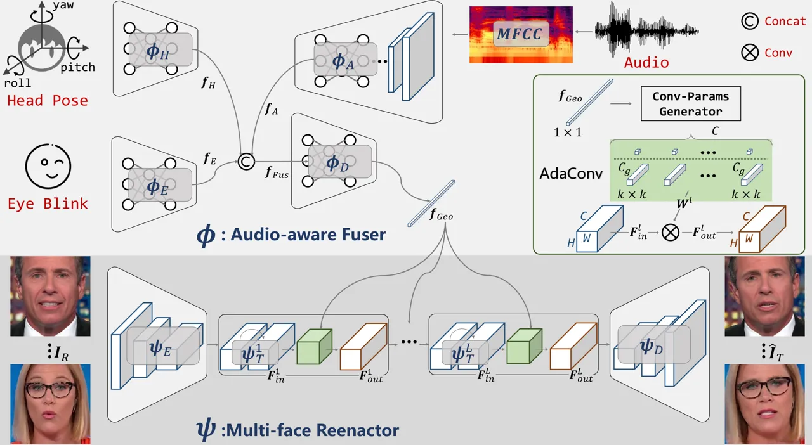
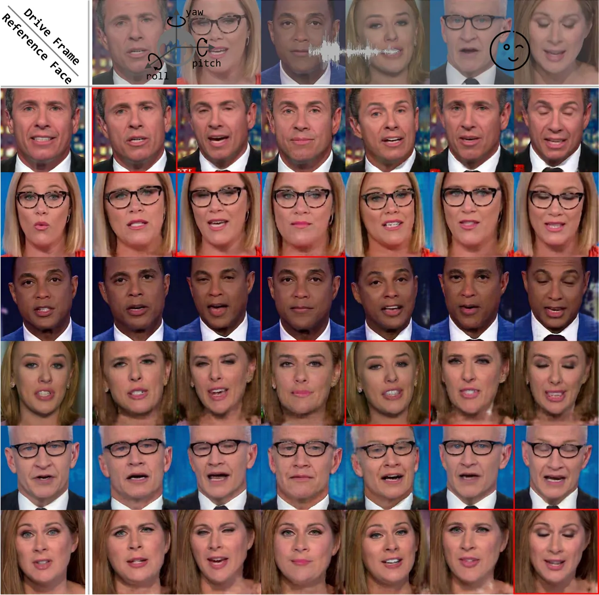
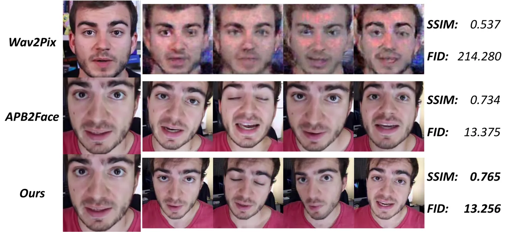
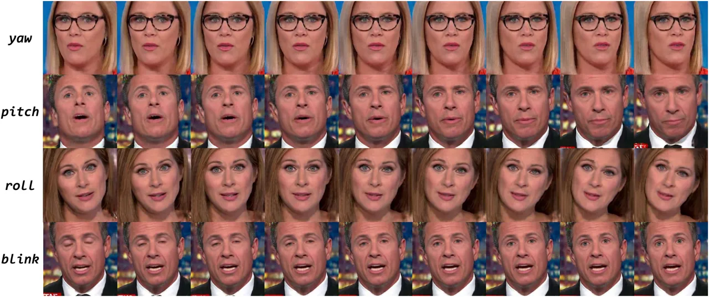

# APB2FaceV2: Real-Time Audio-Guided Multi-Face Reenactment

Jiangning Zhang    Xianfang Zeng    Chao Xu    Jun Chen    Yong Liu   
Yunliang Jiang

###### Abstract

Audio-guided face reenactment aims to generate a photorealistic face
that has matched facial expression with the input audio. However,
current methods can only reenact a special person once the model is
trained or need extra operations such as 3D rendering and image
post-fusion on the premise of generating vivid faces. To solve the above
challenge, we propose a novel *R*eal-time *A*udio-guided *M*ulti-face
reenactment approach named _APB2FaceV2_, which can reenact different
target faces among multiple persons with corresponding reference face
and drive audio signal as inputs. Enabling the model to be trained
end-to-end and have a faster speed, we design a novel module named
Adaptive Convolution (AdaConv) to infuse audio information into the
network, as well as adopt a lightweight network as our backbone so that
the network can run in real time on CPU and GPU. Comparison experiments
prove the superiority of our approach than existing state-of-the-art
methods, and further experiments demonstrate that our method is
efficient and flexible for practical applications¹¹ 1
https://github.com/zhangzjn/APB2FaceV2.

###### Index Terms: 

audio-guided generation, multi-face reenactment, adaptive convolution,
generative adversarial nets

^(†)^(†)address: ¹Zhejiang University, Hangzhou, Zhejiang, China  
²Huzhou University, Huzhou, Zhejiang, China

## 1 Introduction

Audio-guided face reenactment is a task to generate photorealistic face
images under the condition of audio input, which has promising
applications such as animation production, virtual announcer, and game.
In this paper, different from current methods that can only reenact a
special person once the model is trained, we focus on a more challenging
task: audio-guided multi-face reenactment, where different target faces
among several persons can be reenacted using one unified model.

Benefited from the development of neural network, many methods have
achieved good results in the audio-to-face task. Cudeiro et al. \[1\]
present a speech driven facial animation framework named VOCA that can
fully automatically outputs a realistic character animation given a
speech signal and a static character mesh. Works \[2, 3\] employ the
LSTM \[4\] model to generate orofacial movement from acoustic features
for predefined 3D model. Though 3D model-based methods can obtain vivid
results, they need high costs for hardware and predefined 3D model as
well as post-processing time consumption. Thus the pixel-based method is
born to conduct the audio-to-face task. Duarte et al. \[5\] propose the
Wav2Pix to generate the face image by an encoded audio vector in an
adversarial manner, while Zhang et al. \[6\] design an APB2Face model
that immensely improves the quality of the generated image. Consistent
with pixel-based method, we design our model in a generative adversarial
manner that can reenact photorealistic images and is easy to follow.

However, almost all of the current approaches \[7, 5, 6\] can only
reenact one special person once the model is trained on the premise of
generating vivid faces, meaning they are not competent to reenact
various faces using a unified model. In order to solve the above
problem, we propose a novel APB2FaceV2 to reenact different target faces
among multiple persons with corresponding reference face and drive audio
information, which has more practical application value. Specifically,
the proposed APB2FaceV2 consists of an Audio-aware Fuser that extracts
embedded geometric vector from input audio, head pose, and eye blink
information, as well as a Multi-face Reenactor that generates target
faces with a reference face and the geometric vector. At the same time,
we find that nearly all current approaches do not take the model size
into account that is important for practical applications. So we come up
an Adaptive Convolution (AdaConv) to infuse audio information into the
network so that the model can be trained in an end-to-end manner, as
well as employ a modified lightweight network \[8\] as our backbone so
that the model can run in real time. Specifically, we make the following
four contributions:

i\) A novel _APB2FaceV2_ is proposed to to reenact different target
faces among multiple persons using one unified model.

ii\) We design a new vector-based information injection module named
_AdaConv_ that achieves an end-to-end training.

iii\) A lightweight backbone is adopted so that the method can run on
CPU or GPU in real time.

iv\) Experimental results demonstrate the efficiency and flexibility of
our proposed approach.



Figure 1: Overview of the proposed APB2FaceV2 that consists of an
Audio-aware Fuser $`\boldsymbol{\phi}`$ and a Multi-face Reenactor
$`\boldsymbol{\psi}`$. $`\boldsymbol{\phi}`$ inputs audio, head pose,
and eye blink signals that are extracted by $`\boldsymbol{\phi}_{A}`$,
$`\boldsymbol{\phi}_{H}`$, and $`\boldsymbol{\phi}_{E}`$ to obtain
$`\boldsymbol{f}_{A}`$, $`\boldsymbol{f}_{H}`$, and
$`\boldsymbol{f}_{E}`$ respectively. Then these features are
concatenated and extracted through $`\boldsymbol{\phi}_{D}`$ to obtain
the embedded representation of the facial geometric feature
$`\boldsymbol{f}_{Geo}`$. Subsequently, $`\boldsymbol{\psi}`$ inputs a
reference face image $`\boldsymbol{I}_{R}`$ and the extracted facial
geometric feature $`\boldsymbol{f}_{Geo}`$ to reenact the target face
$`\boldsymbol{\hat{I}}_{T}`$ that has matched facial expression with the
input signals. Specifically, a novel AdaConv is proposed to inject
facial geometric information into the reenactor using a more flexible
and efficient way.

## 2 Related Works

Generative Adversarial Networks. Since the concept of generative
adversarial network was first proposed \[9\], many excellent works have
been proposed to generate photorealistic images. Generally, these
methods mainly fall into two categories: the vector-based method \[10,
11, 12\] that only uses a noise or embedded vector as input to generate
target image, and the pixel-based method \[13, 14\] that uses the image
as input. Theoretically, each of these methods contains a generator _G_
with parameter $`\theta_{g}`$ to capture the data distribution for
generating photorealistic images, as well as a discriminator _D_ to
authenticate generated images for enhancing the capability of _G_ in an
adversarial manner. To learn the distribution of _G_ over data $`x`$
from a prior distribution $`p{{}_{z}}(z)`$
($`G(z;\theta_{g})\in p_{data}(x)`$), _D_ plays a two-player minimax
game with _G_ in the following value function $`V(D,G)`$:

```math
\displaystyle\underset{G}{\min}~\underset{D}{\max}~V(D,G) \displaystyle=\mathbb{E}_{\boldsymbol{x}\sim p_{data}(\boldsymbol{x})}[\log(D(\boldsymbol{x}))] \tag{1}
```

```math
\displaystyle+\mathbb{E}_{\boldsymbol{z}\sim p_{z}(\boldsymbol{z})}[\log(1-D(G(\boldsymbol{z})))].
```

Our proposed method belongs to the pixel-based category that inputs an
image instead of only a vector, which is more efficient and practical
than vector-based method.

Face Reenactment via Audio. Many works have yielded good results in the
audio-to-face task, which uses audio as input for providing adequate
information about orofacial movements. Works \[15, 2, 1, 3\] use the
audio signal to predict parameters of the predefined 3D model, while
Suwajanakorn et al. \[16\] and Prajwal et al. \[17\] propose to predict
the lip rather the full face. Thus these methods need extra
post-operations such as 3D rendering or face fusion, which is cumbersome
and not suitable for practical applications. We wish design an
end-to-end method to directly generate the full face like \[18, 19, 7,
20, 21\], and supplement some auxiliary signals simultaneously to
control the facial areas that are not related to the audio information.
So based on the previous work \[6\], we design a new framework named
APB2FaceV2 that can not only generate photorealistic face end-to-end but
also reenact multiple faces in real time by a unified model.

## 3 Method

As depicted in Figure 1, we propose a novel APB2FaceV2 framework, which
consists of an _Audio-aware Fuser_ ($`\boldsymbol{\phi}`$) and a
_Multi-face Reenactor_ ($`\boldsymbol{\psi}`$), to complete a more
challengeable audio-guided multi-face reenactment task efficiently in
real time. Detailed implementation and source code are available.

Audio-aware Fuser. The Audio-aware Fuser module inputs audio, head pose,
and eye blink signals, which are further extracted by
$`\boldsymbol{\phi}_{A}`$, $`\boldsymbol{\phi}_{H}`$, and
$`\boldsymbol{\phi}_{E}`$ to obtain $`\boldsymbol{f}_{A}`$,
$`\boldsymbol{f}_{H}`$, and $`\boldsymbol{f}_{E}`$ respectively.
Specifically, $`\boldsymbol{\phi}_{A}`$ contains 5 convolutional layers
for extracting the feature of each time node and additional 5
convolutional layers for fusing them, while both modules
$`\boldsymbol{\phi}_{H}`$ and $`\boldsymbol{\phi}_{E}`$ contain three
linear layers. Subsequently, the three features are concatenated and
further extracted through $`\boldsymbol{\phi}_{D}`$ to obtain the
embedded representation of the facial geometric feature
$`\boldsymbol{f}_{Geo}`$, where the facial landmark is used as the
supervisory signal in the training stage.

```math
\displaystyle\boldsymbol{f}_{Geo}=\boldsymbol{\phi}_{D}(\boldsymbol{f}_{Fus})=\boldsymbol{\phi}_{D}([\boldsymbol{f}_{A},\boldsymbol{f}_{H},\boldsymbol{f}_{E}]), \tag{2}
```

Multi-face Reenactor. Given a reference face image
$`\boldsymbol{I}_{R}`$ and the extracted facial geometric feature
$`\boldsymbol{f}_{Geo}`$, the Multi-face Reenactor $`\boldsymbol{\psi}`$
reenacts the target face $`\boldsymbol{\hat{I}}_{T}`$ that has matched
facial expression with the input signals, i.e. audio, head pose, and eye
blink. Specifically, $`\boldsymbol{\psi}`$ consists of a chain of
sub-modules: an image encoder $`\boldsymbol{\psi}_{E}`$, a feature
transformer
$`\boldsymbol{\psi}_{T}=\left\{\boldsymbol{\psi}_{T}^{1},\boldsymbol{\psi}_{T}^{2},\dots,\boldsymbol{\psi}_{T}^{L}\right\}`$
($`L`$ represents the number of module repetitions and is set to 9 in
the paper), and an image decoder $`\boldsymbol{\psi}_{D}`$. The process
can be described as:

```math
\displaystyle\boldsymbol{\hat{I}}_{T}=\boldsymbol{\psi}_{D}(\boldsymbol{\psi}_{T}(\boldsymbol{\psi}_{E}(\boldsymbol{I}_{R}))), \tag{3}
```

Note that the feature transformer $`\boldsymbol{\psi}_{T}`$ is designed
in a decoupling idea that simultaneously learns appearance information
from $`\boldsymbol{I}_{R}`$ as well as the geometric information from
$`\boldsymbol{f}_{Geo}`$, and the new proposed _AdaConv_ is used to
inject geometric information on each block.

Adaptive Convolution. Different from APB2Face \[6\] that injects facial
movement information by first plotting the landmark image and then
concatenating it with deep features, we propose an elegant information
injection module, i.e. Adaptive Convolution (AdaConv). As shown in the
top right of Figure 1 (Highlighted in green), the AdaConv layer inputs a
geometric vector $`\boldsymbol{f}_{Geo}`$ and a deep feature map
$`\boldsymbol{F}_{in}^{l}`$, and outputs a modified feature map
$`\boldsymbol{F}_{out}^{l}`$. In detail, $`\boldsymbol{f}_{Geo}`$ goes
through two linear layers to generate a set of parameters, i.e.
$`\boldsymbol{f}_{Geo}\rightarrow\boldsymbol{W}^{l}`$, which will be
reshaped and applied to a convolutional layer. As the formula shows
below:

```math
\displaystyle\boldsymbol{F}_{out}^{l} \displaystyle=Conv(\boldsymbol{F}_{in}^{l};\boldsymbol{W}^{l}) \tag{4}
```

```math
\displaystyle=Conv(\boldsymbol{F}_{in}^{l};Linear^{l}(\boldsymbol{f}_{Geo})),
```

The parameter $`\boldsymbol{W}^{l}`$ of the convolutional layer contains
$`k\times k\times C_{g}\times C`$ weight parameters and $`C`$ bias
parameters, where $`k`$, $`C`$, and $`C_{g}`$ are kernel size, channel
number, and group number for the convolution. Thus we can control the
amount of injected information by controlling the values of these
parameters. Specifically, AdaConv reduces to AdaIN \[22\] when we set
$`\{k=1,C_{g}=1\}`$, and we set $`\{k=3,C_{g}=1\}`$ in the paper for
balancing computation and model effect.

Objective Function. In the training stage, we adopt geometry and content
losses to supervise geometric information and generated image quality,
as well as adversarial loss to further improve the quality and
authenticity of the reenacted image. The overall loss function is:

```math
\displaystyle\mathcal{L}_{All}=\lambda_{G}\mathcal{L}_{G}+\lambda_{C}\mathcal{L}_{C}+\lambda_{Adv}\mathcal{L}_{Adv}, \tag{5}
```

where $`\lambda_{G}`$, $`\lambda_{C}`$, and $`\lambda_{Adv}`$ represent
weight parameters to balance different terms, and are set 1, 100, and 1
respectively.

i\) Geometry loss $`\mathcal{L}_{G}`$ calculates $`\ell_{1}`$ error
between the predicted facial geometric feature $`\boldsymbol{f}_{Geo}`$
and corresponding real facial landmark $`\boldsymbol{l}`$.

```math
\displaystyle\mathcal{L}_{G}=||\boldsymbol{f}_{Geo}-\boldsymbol{l}||_{1}. \tag{6}
```

ii\) Content loss $`\mathcal{L}_{C}`$ calculates $`\ell_{1}`$ error
between the reenacted target face $`\boldsymbol{\hat{I}}_{T}`$ and
corresponding real face $`\boldsymbol{I}_{T}`$.

```math
\displaystyle\mathcal{L}_{C}=||\boldsymbol{\hat{I}}_{T}-\boldsymbol{I}_{T}||_{1}. \tag{7}
```

iii\) Adversarial loss $`\mathcal{L}_{Adv}`$ adopts an extra
discriminator $`D`$ to form a adversarial training against the reenactor
$`G`$ that greatly improves the quality of the generated image.

```math
\displaystyle\mathcal{L}_{Adv}=\mathbb{E}_{\boldsymbol{\hat{I}}_{T}\sim p_{f}}[D({\boldsymbol{\hat{I}}_{T}})]-\mathbb{E}_{\boldsymbol{I}_{T}\sim p_{r}}[D(\boldsymbol{I}_{T})], \tag{8}
```

where $`p_{r}`$ and $`p_{f}`$ stand distributions for real and generated
fake images respectively.

## 4 Experiments

Dataset. In the paper, almost all of experiments are conducted on AnnVI
dataset that contains six announcers (three men and three women) and
23790 frames totally with corresponding audio clip, head pose, eye
blink, and landmark \[23\].

Implementation Details. We use Adam optimizer \[24\] with
$`\{\beta_{1}=0.5`$, $`\beta_{2}=0.999\}`$ and train the model for 110
epoch. The learning rate is set to $`2e^{-4}`$, and the batch size is 16. PatchGAN \[13\] is used as the discriminator, and the training
setting is in accord with the reenactor.



Figure 2: Experimental results among multiple persons on the AnnVI
dataset. The first column contains six randomly selected reference
faces, and the first row shows driven frames from different persons that
supply audio, head pose, and eye blink signals. The generated faces
marked with red rectangles are driven by the personal own audio, while
other faces are driven by various persons for evaluating the
generalization ability of the network.

Qualitative Results. Some qualitative experiments are conducted on AnnVI
dataset to visually demonstrate the high quality of reenacted images and
the flexibility of the proposed approach. Specifically, we randomly
select one face of each identity (6 faces totally) as the reference
face, and one drive frame of each identity for supplying audio, head
pose, and eye blink signals. As indicated by the red rectangles in
Figure 2, our proposed method can reenact photorealistic faces among
multiple persons with one unified model that achieves multi-face
reenactment task. Thanks to the decoupling design of our method,
APB2FaceV2 can use input signals of other persons to reenact the target
face that is consistent with the identity of the reference face.
Experimental results show that our method has strong generalization
ability, where the model can use non-self audio as input to reenact
photorealistic faces.

Quantitative Results. As shown in Table 1, SSIM metric is chosen to
quantitatively evaluate our method with the state-of-the-art (SOTA)
method, and experimental results indicate that the proposed method can
generate more photorealistic faces where the SSIM score goes up from
0.799 to 0.805, even though using only one unified model (The work \[6\]
need train 6 models totally for 6 persons). Nevertheless, our method
still obtains a higher _Detection Rate_ (DR), i.e. 99.1%, which also
demonstrates the superiority of our method than SOTA.

| Metric                    | $`P1`$ | $`P2`$ | $`P3`$ | $`P4`$ | $`P5`$ | $`P6`$ | $`Avg`$ |
| ------------------------- | ------ | ------ | ------ | ------ | ------ | ------ | ------- |
| SSIM (\[6\]) $`\uparrow`$ | 0.764  | 0.843  | 0.879  | 0.786  | 0.761  | 0.758  | 0.799   |
| SSIM (Ours) $`\uparrow`$  | 0.758  | 0.860  | 0.862  | 0.809  | 0.790  | 0.752  | 0.805   |
| DR (\[6\]) $`\uparrow`$   | 98.9   | 98.8   | 99.1   | 98.8   | 98.7   | 98.5   | 98.8    |
| DR (Ours) $`\uparrow`$    | 99.1   | 99.0   | 99.4   | 99.3   | 98.7   | 98.8   | 99.1    |

Table 1: Quantitative assessment for comparing our method with the SOTA
APB2Face \[6\] in SSIM \[25\] and DR \[6\] of different persons on the
AnnVI dataset.



Figure 3: Qualitative comparison experiment with SOTA Wav2Pix \[5\] and
APB2Face \[6\].

| Method         | SSIM $`\uparrow`$ | FID $`\downarrow`$ | Params (M) | FPS (CPU) | FPS (GPU) |
| -------------- | ----------------- | ------------------ | ---------- | --------- | --------- |
| Wav2Pix \[5\]  | 0.537             | 214.280            | 24.771     | 20.7      | 275.7     |
| APB2Face \[6\] | 0.734             | 13.375             | 16.696     | 5.8       | 200.4     |
| Ours           | 0.765             | 13.256             | 4.085      | 22.5      | 158.9     |

Table 2: Qualitative comparison experiment with SOTAs in several metrics
on the AnnVI dataset.

Comparison with SOTAs. We further conduct a comparison experiment with
most related SOTA methods on the Youtubers dataset \[5\]. As show in
Figure 3, our approach obtains a better visual effect than others, as
well as the best SSIM and FID scores. Moreover, our method significantly
reduces the number of parameters by nearly 6 times and 4 times compared
to Wav2Pix and APB2Face respectively, and can run in real time, i.e.
22.5 FPS in CPU (i7-8700K @ 3.70GHz) and 158.9 FPS in GPU (2080 Ti), as
shown in Table 2.



Figure 4: Decoupling experiments of pose and eye blink signals.

Decoupling Experiment. A decoupling experiment is further conducted to
demonstrate that our proposed method is capable of disentangling input
signals, i.e. audio, head pose, and eye blink. As shown in Figure 4, the
first three rows are generated results that only change one component of
the head pose signal, i.e. yaw, pitch, or roll, while the last row shows
the results that only change the eye blink signal. Experimental results
indicate that our method can control the properties of the generated
face that is flexible for practical applications.

## 5 Conclusions

In this paper, we propose a novel APB2FaceV2 to address a more
challengeable audio-guide multi-face reenactment task, which aims at
using one unified model to reenact different target faces among multiple
persons with corresponding reference face and drive audio signal as
inputs. Specifically, an Audio-aware Fuser is firstly used to predict a
geometric representation from input signals, and then Multi-face
Reenactor fuse it with the reference face that supplies appearance
information to reenact photorealistic target face. Besides, a novel
AdaConv module is proposed to inject geometric information in a more
elegant and efficient way. Extensive experiments demonstrate the
efficiency and flexibility of our approach.

We will further combine _Neural Architecture Search_ (NAS) with our
approach to search for a more accurate and faster model for better
practical applications, and we hope our work will help users to achieve
better jobs.

## References

- \[1\] Daniel Cudeiro, Timo Bolkart, Cassidy Laidlaw, Anurag Ranjan,
  and Michael J Black, “Capture, learning, and synthesis of 3d speaking
  styles,” in CVPR, 2019.
- \[2\] Ran Yi, Zipeng Ye, Juyong Zhang, Hujun Bao, and Yong-Jin Liu,
  “Audio-driven talking face video generation with natural head pose,”
  arXiv preprint arXiv:2002.10137, 2020.
- \[3\] Guanzhong Tian, Yi Yuan, and Yong Liu, “Audio2face: Generating
  speech/face animation from single audio with attention-based
  bidirectional lstm networks,” in ICMEW, 2019.
- \[4\] Klaus Greff, Rupesh K Srivastava, Jan Koutník, Bas R
  Steunebrink, and Jürgen Schmidhuber, “Lstm: A search space odyssey,”
  IEEE transactions on neural networks and learning systems, vol. 28,
  no. 10, pp. 2222–2232, 2016.
- \[5\] Amanda Duarte, Francisco Roldan, Miquel Tubau, Janna Escur,
  Santiago Pascual, Amaia Salvador, Eva Mohedano, Kevin McGuinness,
  Jordi Torres, and Xavier Giro-i Nieto, “Wav2pix: Speech-conditioned
  face generation using generative adversarial networks.,” in
  ICASSP, 2019.
- \[6\] Jiangning Zhang, Liang Liu, Zhucun Xue, and Yong Liu, “Apb2face:
  Audio-guided face reenactment with auxiliary pose and blink signals,”
  in ICASSP, 2020.
- \[7\] Joon Son Chung, Amir Jamaludin, and Andrew Zisserman, “You said
  that?,” arXiv preprint arXiv:1705.02966, 2017.
- \[8\] Yonggan Fu, Wuyang Chen, Haotao Wang, Haoran Li, Yingyan Lin,
  and Zhangyang Wang, “Autogan-distiller: Searching to compress
  generative adversarial networks,” arXiv preprint
  arXiv:2006.08198, 2020.
- \[9\] Ian Goodfellow, Jean Pouget-Abadie, Mehdi Mirza, Bing Xu, David
  Warde-Farley, Sherjil Ozair, Aaron Courville, and Yoshua Bengio,
  “Generative adversarial nets,” in NeurIPS, 2014.
- \[10\] Tero Karras, Timo Aila, Samuli Laine, and Jaakko Lehtinen,
  “Progressive growing of gans for improved quality, stability, and
  variation,” in ICLR, 2018.
- \[11\] Tero Karras, Samuli Laine, and Timo Aila, “A style-based
  generator architecture for generative adversarial networks,” in
  CVPR, 2019.
- \[12\] Tero Karras, Samuli Laine, Miika Aittala, Janne Hellsten,
  Jaakko Lehtinen, and Timo Aila, “Analyzing and improving the image
  quality of stylegan,” in CVPR, 2020.
- \[13\] Phillip Isola, Jun-Yan Zhu, Tinghui Zhou, and Alexei A Efros,
  “Image-to-image translation with conditional adversarial networks,” in
  CVPR, 2017.
- \[14\] Jun-Yan Zhu, Taesung Park, Phillip Isola, and Alexei A Efros,
  “Unpaired image-to-image translation using cycle-consistent
  adversarial networks,” in ICCV, 2017.
- \[15\] Najmeh Sadoughi and Carlos Busso, “Speech-driven expressive
  talking lips with conditional sequential generative adversarial
  networks,” IEEE Transactions on Affective Computing, 2019.
- \[16\] Supasorn Suwajanakorn, Steven M Seitz, and Ira
  Kemelmacher-Shlizerman, “Synthesizing obama: learning lip sync from
  audio,” in ACM TOG, 2017.
- \[17\] KR Prajwal, Rudrabha Mukhopadhyay, Vinay Namboodiri, and
  CV Jawahar, “A lip sync expert is all you need for speech to lip
  generation in the wild,” in ACM MM, 2020.
- \[18\] Olivia Wiles, A Sophia Koepke, and Andrew Zisserman, “X2face: A
  network for controlling face generation using images, audio, and pose
  codes,” in ECCV, 2018.
- \[19\] Tae-Hyun Oh, Tali Dekel, Changil Kim, Inbar Mosseri, William T
  Freeman, Michael Rubinstein, and Wojciech Matusik, “Speech2face:
  Learning the face behind a voice,” in CVPR, 2019.
- \[20\] Yeqi Bai, Tao Ma, Lipo Wang, and Zhenjie Zhang, “Speech fusion
  to face: Bridging the gap between human’s vocal characteristics and
  facial imaging,” arXiv preprint arXiv:2006.05888, 2020.
- \[21\] Hyeong-Seok Choi, Changdae Park, and Kyogu Lee, “From inference
  to generation: End-to-end fully self-supervised generation of human
  face from speech,” 2020.
- \[22\] Xun Huang and Serge Belongie, “Arbitrary style transfer in
  real-time with adaptive instance normalization,” in ICCV, 2017.
- \[23\] Face++, ,” https://www.faceplusplus.com/attributes/, 2020,
  Accessed September 16, 2020.
- \[24\] Diederik P Kingma and Jimmy Ba, “Adam: A method for stochastic
  optimization,” in ICLR, 2015.
- \[25\] Zhou Wang, Alan C Bovik, Hamid R Sheikh, and Eero P Simoncelli,
  “Image quality assessment: from error visibility to structural
  similarity,” IEEE transactions on image processing, vol. 13, no. 4,
  pp. 600–612, 2004.
