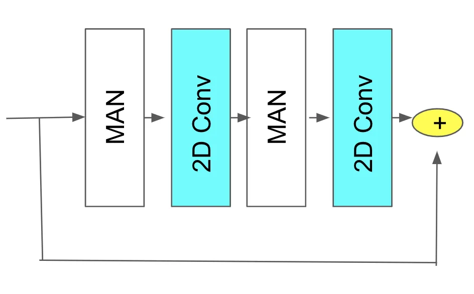
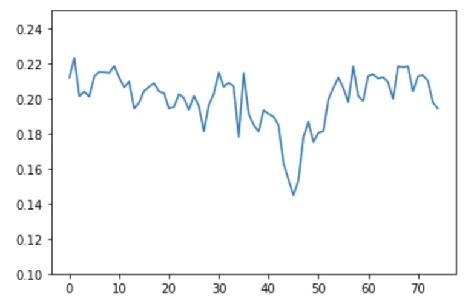

# Multi Modal Adaptive Normalization for Audio to Video Generation

Neeraj Kumar  
neerajku@hike.in    Srishti Goel  
srishtig@hike.in    Ankur Narang  
ankur@hike.in    Brejesh Lall  
brejesh@ee.iitd.ac.in

###### Abstract

Speech-driven facial video generation has been a complex problem due to
its multi-modal aspects namely audio and video domain. The audio
comprises lots of underlying features such as expression, pitch,
loudness, prosody(speaking style) and facial video has lots of
variability in terms of head movement, eye blinks, lip synchronization
and movements of various facial action units along with temporal
smoothness. Synthesizing highly expressive facial videos from the audio
input and static image is still a challenging task for generative
adversarial networks.

In this paper, we propose a multi-modal adaptive normalization(MAN)
based architecture to synthesize a talking person video of arbitrary
length using as input: an audio signal and a single image of a person.
The architecture uses the multi-modal adaptive normalization, keypoint
heatmap predictor, optical flow predictor and class activation map\[58\]
based layers to learn movements of expressive facial components and
hence generates a highly expressive talking-head video of the given
person.

The multi-modal adaptive normalization uses the various features of
audio and video such as Mel spectrogram, pitch, energy from audio
signals and predicted keypoint heatmap/optical flow and a single image
to learn the respective affine parameters to generate highly expressive
video. Experimental evaluation demonstrates superior performance of the
proposed method as compared to Realistic Speech-Driven Facial Animation
with GANs(RSDGAN) \[23\], Speech2Vid \[6\], and other approaches, on
multiple quantitative metrics including: SSIM (structural similarity
index), PSNR (peak signal to noise ratio), CPBD (image sharpness),
WER(word error rate), blinks/sec and LMD(landmark distance). Further,
qualitative evaluation and Online Turing tests demonstrate the efficacy
of our approach.

## 1 Introduction

Speech-driven video generation has countless applications across areas
of interest including movie production, photography, e-commerce,
advertisement and education. It is a complex problem that takes into
account various details like the style of video, temporal consistencies,
facial expressions and movements of facial action units. The information
described by an image of a video generally consists of spatial and style
information, such as object shape and texture. While the spatial
information usually represents the key contents of the image, the style
information often involves extraneous details that complicate the
generation tasks. Temporal consistencies between the frames that handle
natural blinks, smooth movement of facial action units and lip
synchronization also play an important role in the synthesis of
realistic videos.

Moderating the variability of image styles has been studied to enhance
the quality of images generated from neural networks. In this regard,
variants of normalization have been used to capture various information
such as style, texture, shape, etc. Instance Normalization (IN)\[51\] is
a representative approach which was introduced to discard
instance-specific contrast information from an image during style
transfer. Inspired by this, Adaptive Instance normalization\[17\]
provided a rational interpretation that IN performs a form of style
normalization, showing that by simply adjusting the feature
statistics—namely the mean and variance—of a generator network, one can
control the style of the generated image. IN dilutes the information
carried by the global statistics of feature responses while leaving
their spatial configuration only, which can be undesirable depending on
the task at hand and the information encoded by a feature map. To handle
this, Batch-Instance Normalization(BIN)\[34\] normalizes the styles
adaptively to the task and selectively to individual feature maps. It
learns to control how much of the style information is propagated
through each channel of features leveraging a learnable gate parameter.
For style transfer across the domain, UGATIT\[23\] has used adaptive
instance and layer normalization\[4\](LN) which adjusts the ratio of IN
and LN to control the amount the style transfer from one domain to other
domains.

For style transfer tasks, a popular methodology is trying the
denormalization to the learned affine transformation that is
parameterized based on a separate input image (the style image). SPADE
\[36\] makes this denormalization spatially sensitive. SPADE
normalization boils down to ”conditional batch normalization which
varies on a per-pixel basis”. It is implemented as a two-layer
convolution neural network (compare with batch normalization, which is a
simple functional layer). In the World Consistent video to video
synthesis \[30\], they have used optical features and semantic maps in
the normalization to learn the affine parameters to generate the
realistic and temporally smoother videos.

All the above normalization techniques have worked on capturing the
styles of image and no work is done to capture the styles of audio and
its mutual dependence on images in multi-modal applications through
normalization. In this paper, we propose multi-modal adaptive instance
normalization in the proposed architecture to generate realistic videos.
We have built the architecture based on \[14\] to show how multi-modal
adaptive normalization helps in generating highly expressive videos
using the audio and person’s image as input.

Figure 1: Higher level architecture of Multi Modal Adaptive
Normalization

Our main contributions are :

- •
  The affine parameters i.e, scale, $`\gamma`$ and a shift, $`\beta`$
  are typically been used to learn the higher-order statistics of image
  features corresponding to style, texture, etc., to generate the
  required output as depicted in various previous works \[51, 35, 36,
  23, 30, 34\]. We are the first one to propose how affine parameters
  help to learn the higher-order statistics of multiple domains.
  Figure 1 shows the higher-level architectural design of multi-modal
  adaptive normalization. In this paper, we have proposed the
  multi-modal adaptive normalization in which the affine parameters
  learns the higher-order information related to texture, temporal
  smoothness, style, lip synchronization and head movement from various
  features of speech namely Mel spectrogram, pitch and energy and video
  i.e. image frame, optical flow/keypoint heatmap to generate a
  realistic video from audio and a static image as an input.
- •
  The respective affine parameters i.e. $`\gamma`$ and $`\beta`$ are
  dynamically controlled by learnable parameters, $`\rho`$’s whose sum
  will be 1 constrained by softmax function. The idea behind using
  multi-modal adaptive normalization is that various features in the
  multi-modal domain are correlated. In video synthesis using speech and
  static image as an input, the video and audio features are related to
  each other such as optical flow, keypoint heatmap, pitch, energy of
  speech signals that help in guiding the model to generate expressive
  realistic videos.
- •
  Multi-Modal Adaptive normalization opens the non-trivial path to
  capture the mutual dependence among various domains. Generally,
  various encoder architectures\[23\] are used to convert the various
  features of multiple domains into latent vectors, and then the
  concatenated vectors are fed to the decoder to model the mutual
  dependence and generate the required output. The proposed multi-modal
  adaptive normalization helps in reducing the number of model
  parameters required to incorporate the multi-modal mutual dependence
  into the architecture.
- •
  Various Experimental and Ablation Study(refer: table 2 and Figure 3)
  have shown that the proposed normalization is flexible in building the
  architecture with various networks such as 2DConvolution, partial2D
  convolution, attention, LSTM, Conv1D for extracting and modeling the
  mutual information.
- •
  Incorporation of multi-modal adaptive normalization for video
  synthesis using audio and a single image as an input has have shown
  superior performance on multiple qualitative and quantitative metrics
  such as SSIM(structural similarity index), PSNR (peak signal to noise
  ratio), CPBD (image sharpness), WER(word error rate), blinks/sec and
  LMD(landmark distance).

## 2 Related Work

### 2.1 Normalization techniques

Normalization is generally applied to improve convergence speed during
training. Batch Normalization(BN)\[18\] layers were originally designed
to accelerate the training of discriminative networks, but now are
effective in generative image modeling also. Recently, several
alternative normalization schemes have been proposed to extend BN’s
effectiveness to recurrent architectures.

Instance Normalization(IN)\[51\] treats each instance in a mini-batch
independently and computes the statistics across only spatial
dimensions(H and W). IN aims to make a small change in the stylizing
architecture which results in a significant qualitative improvement in
the generated images. Adaptive instance normalization(AdaIN)\[17\] is a
simple extension to IN which adaptively computes the affine parameters
from the style input.

Style GAN\[35\] uses the mapping network to map the input into latent
space which then controls the generator using AdaIN\[17\]. Each feature
map of AdaIN is normalized separately and then scaled and biased using
the corresponding scalar components from style features coming from the
latent space. Spatially Adaptive Normalization proposed in SPADE\[36\]
takes semantic maps as an input to make learnable parameters
i.e.$`\gamma`$(y) and $`\beta`$(y) spatially adaptive to it. In
U-GAT-IT \[23\], the architecture proposes Adaptive and Layer Instance
Instance Normalization which used both normalizations to learn the
parameters of the standardization process.

\[30\] uses the optical flow and structure for motion images as an input
to generate the affine parameters, $`\gamma`$’s and $`\beta`$’s are
multiplied with normalized feature map and fed to the generator to
create world consistent videos.

We have used the features of speech and video domains to generate the
affine parameter $`\gamma`$’s and $`\beta`$’s in our multi-modal
adaptive normalization. The proportion of different parameters are
controlled by learnable parameters,$`\rho`$’s which is fed into softmax
function to make the sum equal to 1.We have applied this multi-modal
adaptive normalization in the generation of realistic videos given and
audio and a static image.

### 2.2 Audio to Realistic Video Generation

The earliest methods for generating videos relied on Hidden Markov
Models which captured the dynamics of audio and video sequences. Simons
and Cox \[44\] used the Viterbi algorithm to calculate the most likely
sequence of mouth shape given the particular utterances. Such methods
are not capable of generating quality videos and lack emotions.

#### 2.2.1 Phoneme and Visemes generation of Videos

Phoneme and Visemes based approaches have been used to generate the
videos. Real-Time Lip Sync for Live 2D Animation \[2\] has used an LSTM
based approach to generate live lip synchronization on 2D character
animation.

Some of these methods target rigged 3D characters or meshes with
predefined mouth blend shapes that correspond to speech sounds  \[45,
21, 48, 13, 31, 47\] which primarily focused on mouth motions only and
show a finite number of emotions, blinks, facial action units movements.

#### 2.2.2 Deep learning techniques for Video Generation

##### CNN based architectures for audio to video generation

A lot of work has been done on CNN to generate realistic videos given an
audio and static image as input.  \[6\](Speech2Vid) has used
encoder-decoder architecture to generate realistic videos. They have
used L1 loss between the synthesized image and the target image. Our
approach has used multi-modal adaptive normalization in GAN based
architecture to generate realistic videos.

Synthesizing Obama: Learning Lip Sync from Audio \[47\] is able to
generate quality videos of Obama speaking with accurate lip-sync using
RNN based architecture. They can generate only a single person video
whereas the proposed model can generate videos on multiple images in GAN
based approach.

##### GAN based architectures for audio to video generation

LumièreNet: Lecture Video Synthesis from Audio \[22\] generates
high-quality, full-pose headshot lecture videos from the instructor’s
new audio narration of any length. They have used dense pose \[16\],
LSTM, variational auto-encoder \[38\] and GANs based approach to
synthesize the videos. They are not able to generate the lip-synced
videos and the quality of output is low. The proposed method is able to
generate lip-synced, expressive videos using audio and a single image as
an input. They have used Pix2Pix \[19\] for the frame synthesis and we
are using a multi-modal adaptive normalization in the generator for
frame generation which is able to generate highly expressive and
realistic videos.

Temporal Gan \[42\] and Generating Videos with Scene Dynamics \[52\]
have done the straight forward adaptation of GANs for generating videos
by replacing 2D convolution layers with 3D convolution layers. Such
methods are able to capture temporal dependencies but require constant
length videos. The proposed model is able to generate videos of variable
length with a low word error rate.

Realistic Speech-Driven Facial Animation with GANs(RSDGAN) \[23\] used
GAN based approach to produce quality videos. They used identity
encoder, context encoder and frame decoder to generate images and used
various discriminators to take care of different aspects of video
generation. The proposed method has used multi-modal adaptive
normalization along with class activation layers and optical flow
predictor and keypoint heatmap predictor in the GAN based setting to
generate expressive videos.

X2face \[56\] model uses GANs based approach to generate videos given a
driving audio or driving video and a source image as an input. The model
learns the face embeddings of source frame and driving vectors of
driving frames or audio bases which generates the videos. In X2face, the
video is processed at 1fps whereas the model generates the video at
25fps. The quality of output video is not good as compared to our
proposed method with audio as an input.

The MoCoGAN \[22\] uses RNN based generators with separate latent spaces
for motion and content. A sliding window approach is used so that the
discriminator can handle variable-length sequences. This model is
trained to generate disentangled content and motion vectors such that
they can generate audios with different emotions and contents. Our
approach uses multi-modal adaptive normalization to generate expressive
videos.

Animating Face using Disentangled Audio Representations \[32\] has
generated the disentangled representation of content and emotion
features to generate realistic videos. They have used variational
autoencoders \[38\] to learn representation and feed them into GANs
based model to generate videos. Audio-driven Facial Reenactment \[49\]
used AudioexpressionNet to generate 3D face model. The estimated 3D face
model is rendered using the rigid pose observed from the original target
image. The proposed method generates 2D videos using multi-modal
adaptive normalization in GAN based approach.

\[57\] extracts the expression and pose from an audio signal and a 3D
face is reconstructed on the target image. The model renders the 3D
facial animation into video frames using the texture and lighting
information obtained from the input video. Then they fine-tune these
synthesized frames into realistic frames using a novel memory-augmented
GAN module. The proposed approach uses multi-modal adaptive
normalization with predicted optical flow/keypoint heatmap as an input
to learn the movements and facial expressions on the target image with
audio as an input. \[12\] have used the L-GAN and T-GAN for
motion(landmark) and texture generation. They have used a noise vector
for blink generation. MAML is used to generate the videos on an unseen
person image. The proposed method has used multi-modal adaptive
normalization to generate realistic videos.

\[40\] uses variational auto-encoders to generate the video from audio.
The generated faces have limited blinks and facial action unit
movements. The proposed method generates expressive videos with blinks,
cheeks and head movements aspects in it. \[9\] uses an audio
transformation network (AT-net) for audio to landmark generation and a
visual generation network for facial generation. \[7\] uses audio,
identity encoder and a three-stream GAN discriminator for audio, visual
and optical flow to generate the lip movement based on input speech.
\[59\] enables arbitrary-subject talking face generation by learning
disentangled audio-visual representation through an
associative-and-adversarial training process. \[37\] uses a generator
that contains of three blocks: (i) Identity Encoder, (ii) Speech
Encoder, and (iii) Face Decoder. It is trained adversarially with Visual
quality discriminator and pretrained architecture for lip audio
synchronization. \[7, 59, 37\] are limited to lip movements whereas the
proposed method uses multi-modal adaptive normalization to generate
different facial action units of an expressive video. \[60\] uses
Asymmetric Mutual Information Estimator (AMIE) to better express the
audio information into generated video in talking face generation. They
have AIME to capture the mutual information to learn the cross-modal
coherence whereas we have used the multi-modal adaptive normalization to
incorporate the multi-modal features into our architecture to generate
the expressive videos. \[14\] have used deep speech features into the
generator architecture with spatially adaptive normalization layers in
it along with lip frame discriminator, temporal discriminator and
synchronization discriminator to generate realistic videos. They have
limited blinks and lip synchronization whereas the proposed method used
multi-modal adaptive normalization to capture the mutual relation
between audio and video to generate expressive video.

## 3 Architectural Design

Given an arbitrary image and an audio sample, the proposed method is
able to generate speech synchronized realistic video on the target face.
The proposed method uses multi-modal adaptive normalization technique to
generate the realistic expressive videos. The proposed architecture is
GAN-based which consists of a generator and a discriminator.

Figure 2: Proposed architecture for Audio to Video synthesis

#### 3.0.1 Generator

The generator consists of convolution layers with several layers having
multi-modal adaptive normalization based resnet block refer Figure  4.
13 dimensional mel spectrogram features goes to the initial layers of
generator and in the subsequent layers, multi-modal adaptive
normalization is used to generate expressive videos. The third last
layers incorporates the class activation map(CAM)\[58\] to focus the
generator to learn distinctive features to create expressive videos. The
generator uses various architectures namely multi-modal adaptive
normalization, CAM and optical flow predictor/keypoint predictor.

##### KeyPoint Heatmap Predictor

The predictor model is based on Hourglass architecture\[46\] that, from
the input image, estimates K heatmaps $`H\textsubscript{K}`$
$`\epsilon`$ \[0, 1\]H×W, one for each keypoint, each of which
represents the contour of a specific facial part, e.g., upper left
eyelid and nose bridge. It captures the spatial configuration of all
landmarks, and hence it captures pose, expression and shape information.
We have used pretrained model\[8\] to calculate the ground truth of
heatmap and have applied mean square error loss between predicted
heatmaps and ground truth. In the experiments, we have used the 15
channel heatmaps and input and output sizes are (15,96,96). We have done
the joint training of keypoint predictor architecture along with the
generator architecture and fed the output of keypoint predictor
architecture in the multi-modal adaptive normalization network to learn
the affine parameters and have optimized it with mean square error loss
with the output of pretrained model\[8\]. The input of the keypoint
predictor model is the previous 5 frames along with 256 audio mel
spectrogram-features which are concatenated along the channel axis.

Figure 3: Single block of multi modal adaptive normalization(MAN)
showing the architectural design while incorporating video and audio
features into it.

##### Optical Flow Predictor

The architecture is based on UNET \[41\] to predict the optical flow of
the next frame. We are giving the previous frames and current audio
mel-spectrogram as an input to the model with KL loss and reconstruction
loss. The pretrained model is then used in the generator to calculate
the affine parameters. The input of the optical flow is previous 5
frames along with 256 audio mel spectrogram-features and is jointly
trained along with generator architecture and is optimized with mean
square loss with the actual optical loss.



Figure 4: Multi-Modal Adaptive Normalization based Resnet Block(MAN
Resnet Block) . This consists of two MAN block(white block) and two 2D
convolution layers(blue block)

##### Multi-Modal Adaptive Normalization

\- We have used the pitch, energy and audio mel-spectrogram
features(AMF) from audio domain & static image and optical
flow(OF)/facial keypoints heatmap(KH) features from video domain in the
normalization to compute the different affine parameters in multi-modal
adaptive normalization setup.Multi-modal adaptive normalization gives
the flexibility of using various architectures namely 2D convolution,
Partial Convolution and attention model for video related features and
1D convolution and LSTM layer for audio features as shown in Figure  3.
The parameter $`\rho`$’s is used to combine these parameters
(Equation (1)). The value of $`\rho`$’s is constrained to the range of
\[0, 1\] by using softmax function (Equation (2)). Figure  4 shows MAN
resnet block to create the framework which consists of 2 MAN block and 2
layers of 2D convolution with the kernel size of 3\*3. We have used 8
MAN resnet block in the generator architecture with varying channel
size.

```math
y=\rho\textsubscript{1}(\gamma\textsubscript{Image}x\textsubscript{IN}+\beta\textsubscript{Image})+\rho\textsubscript{2}(\gamma\textsubscript{OF/KH}x\textsubscript{IN}+\beta\textsubscript{OF/KH})+\rho\textsubscript{3}(\gamma\textsubscript{AMF}x\textsubscript{IN}+\beta\textsubscript{AMF})+\rho\textsubscript{4}(\gamma\textsubscript{pitch}x\textsubscript{IN}+\beta\textsubscript{pitch})+\rho\textsubscript{5}(\gamma\textsubscript{energy}x\textsubscript{IN}+\beta\textsubscript{energy}) \tag{1}
```

```math
\rho\textsubscript{1}+\rho\textsubscript{2}+\rho\textsubscript{3}+\rho\textsubscript{4}+\rho\textsubscript{5}=1 \tag{2}
```

##### Class Activation Map(CAM)\[58\] based layer

This layer is employed on third last layer of generator to capture the
global and local features of face. In Class Activation Map, we have done
the concatenation of adaptive average pooling and adaptive max pooling
of feature map to create the CAM features which captures global and
local attention map, that helps the generator to focus on the image
regions that are more discriminative such as eyes, mouth and cheeks.

#### 3.0.2 Multi scale Frame discriminator

We have used multi-scale frame discriminator \[25\] to distinguish the
fake and real image at finer and coarser level. The class activation map
based layer is also used to distinguish the real or fake image by
visualizing local and global attention maps.We have applied the
adversarial loss(Equation (3))on the information from the CAM output,
n*(D*(t)) at different scale of the discriminator so that it will help
the generator and discriminator to focus on local and global features
and helps in generating more realistic image.

```math
{L\hspace{0pt}} = {E\hspace{0pt}} \sim \tag{3}
```

|                           |                  |                  |                  |                   |                     |                     |            |                   |
| ------------------------- | ---------------- | ---------------- | ---------------- | ----------------- | ------------------- | ------------------- | ---------- | ----------------- |
| Method                    | SSIM$`\uparrow`$ | PSNR$`\uparrow`$ | CPBD$`\uparrow`$ | WER$`\downarrow`$ | ACD-C$`\downarrow`$ | ACD-E$`\downarrow`$ | blinks/sec | LMD$`\downarrow`$ |
| FOMM(GRID)\[43\]          | 0.833            | 26.72            | 0.214            | 38.21             | 0.004               | 0.088               | 0.56       | 0.718             |
| OneShotA2V(GRID)\[14\]    | 0.881            | 28.571           | 0.262            | 27.5              | 0.005               | 0.09                | \-         | \-                |
| RSDGAN(GRID)\[23\]        | 0.818            | 27.100           | 0.268            | 23.1              | \-                  | 1.47x10⁻⁴           | 0.39       | \-                |
| Speech2Vid(GRID)\[6\]     | 0.720            | 22.662           | 0.255            | 58.2              | 0.007               | 1.48x10⁻⁴           | \-         | \-                |
| ATVGnet(GRID)\[9\]        | 0.83             | 32.15            | \-               | \-                | \-                  | \-                  | \-         | 1.29              |
| X2face(GRID)\[56\]        | 0.80             | 29.39            | \-               | \-                | \-                  | \-                  | \-         | 1.48              |
| LipSyncglance(GRID)\[7\]  | 0.76             | 29.33            | \-               | \-                | \-                  | \-                  | \-         | 1.59              |
| AMIE(GRID)\[60\]          | 0.97             | 31.01            | \-               | \-                | \-                  | \-                  | \-         | 0.78              |
| CascadedGAN(GRID)\[12\]   | 0.81             | 27.1             | 0.26             | 23.1              | \-                  | 1.47x10⁻⁴           | 0.45       | \-                |
| MAN-optical(GRID)         | 0.908            | 29.78            | 0.272            | 23.7              | 0.005               | 0.008               | 0.45       | 0.77              |
| MAN-keypoint(GRID)        | 0.887            | 29.01            | 0.269            | 25.2              | 0.006               | 0.010               | 0.48       | 0.80              |
| FOMM(CREMA-D)\[43\]       | 0.654            | 20.74            | 0.186            | NA                | 0.007               | 0.12                | \-         | 1.041             |
| OneShotA2V(CREMA-D)\[14\] | 0.773            | 24.057           | 0.184            | NA                | 0.006               | 0.96                | \-         | \-                |
| RSDGAN(CREMA-D)\[23\]     | 0.700            | 23.565           | 0.216            | NA                | \-                  | 1.40x10⁻⁴           | \-         | \-                |
| Speech2Vid(CREMA-D)\[6\]  | 0.700            | 22.190           | 0.217            | NA                | 0.008               | 1.73x10⁻⁴           | \-         | \-                |
| MAN-optical(CREMA-D)      | 0.826            | 27.723           | 0.224            | NA                | 0.004               | 0.082               | \-         | 0.592             |
| MAN-keypoint(CREMA-D)     | 0.841            | 28.01            | 0.228            | NA                | 0.003               | 0.079               | \-         | 0.51              |
| FOMM(lombard)\[43\]       | 0.804            | 22.97            | 0.381            | NA                | 0.003               | 0.078               | 0.37       | 1.09              |
| OneShotA2V(lombard)\[14\] | 0.922            | 28.978           | 0.453            | NA                | 0.002               | 0.064               | \-         | \-                |
| Speech2Vid(lombard)\[6\]  | 0.782            | 26.784           | 0.406            | NA                | 0.004               | 0.069               | \-         | \-                |
| MAN-optical(lombard)      | 0.895            | 26.94            | 0.43             | NA                | 0.001               | 0.048               | 0.21       | 0.588             |
| MAN-keypoint(lombard)     | 0.911            | 27.45            | 0.40             | NA                | 0.001               | 0.046               | 0.31       | 0.563             |
| MAN-keypoint(voxceleb2)   | 0.732            | 22.41            | 0.126            | NA                | 0.004               | 0.088               | \-         | 0.47              |

Table 1: Comparision of the proposed method(MAN-keypoint and MAN-optica)
with other previous works for GRID, GRID lombard, CREMA-D and voxceleb
datasets for SSIM, PSNR, CPBD, WER, ACD , blinks/sec and LMD by
calculating cosine distance(ACD-C)(should be 0.02 and below) and
euclidean distance(ACD-E)(should be 0.2 and below).

## 4 Experiments

### 4.1 Implementation Details

##### Datasets and PreProcessing Steps

We have used the GRID  \[1\], LOMBARD GRID \[20\], Crema-D\[3\] and
VoxCeleb2\[7\] datasets for the experiments and evaluation of different
metrics. Videos are processed at 25fps and frames are resized into
256X256 size and audio features are processed at 16khz. The ground truth
of optical flow is calculated used farneback optical flow
algorithm\[9\]. To extract the keypoint heatmaps, we have used the
pretrained hourglass face keypoint detection \[8\]. Every audio frame is
centered around a single video frame. To do that, zero padding is done
before and after the audio signal and use the following formula for the
stride.

```math
\displaystyle stride=\frac{\text{audio sampling rate}}{\text{video frames per sec}}
```

We extract the pitch, F0 using using PyWorldVocoder\[39\] from the raw
waveform with the frame size of 1024 and hop size of 256 sampled at
16khz to obtain the pitch of each frame and compute the L2-norm of the
amplitude of each STFT frame as the energy. We quantize the F0 and
energy of each frame to 256 possible values and encode them into a
sequence of one-hot vectors as p and e respectively and then feed the
value of p, e and 256 dimensional mel spectrogram features in the
proposed normalization method.

### 4.2 Metrics

To quantify the quality of the final generated video, we use the
following metrics. PSNR(Peak Signal to Noise Ratio), SSIM(Structural
Similarity Index), CPBD(Cumulative Probability Blur Detection),
ACD(Average Content Distance) and KID(Kernel Inception Distance). PSNR,
SSIM, and CPBD measure the quality of the generated image in terms of
the presence of noise, perceptual degradation, and blurriness
respectively. ACD \[22\] is used for the identification of the speaker
from the generated frames by using OpenPose \[4\]. Along with image
quality metrics, we also calculate WER(Word Error Rate) using pretrained
LipNet architecture \[2\], Blinks/sec using  \[15\] and LMD(Landmark
Distance) \[5\] to evaluate our performance of speech recognition,
eye-blink reconstruction and lip reconstruction respectively.

##### Training and Inference

Our model is implemented in pytorch and takes approximately 7 days to
run on 4 Nvidia V100 GPUs for training. In the training stage, the model
is trained with multi-scale frame discriminator with loss :

```math
L\textsubscript{GAN}(G,D)=E\textsubscript{x\textsubscript{d}}[\log(D(x))]+E\textsubscript{x\textsubscript{d}}[\log(D(1-G(z)))] \tag{4}
```

Reconstruction loss \[16\], RL is used on the lower half of the image to
improve the reconstruction in the mouth area between actual
$`R\textsubscript{n}`$ and predicted image $`G\textsubscript{n}`$.

```math
L\textsubscript{RL}=\sum_{n\epsilon[0,W]*[H/2,H]}(R\textsubscript{n}-G\textsubscript{n}) \tag{5}
```

Perceptual Loss \[12\], Feature-matching Loss \[25\] , CAM loss(refer
Equation (3)) and Key-point predictor/optical flow based mean square
error loss are also used to ensure generation of natural-looking,
high-quality frames. We have taken the Adam optimizer \[24\] with
learning rate = 0.002 and $`\beta_{1}`$= 0.0 and $`\beta_{2}`$ = 0.90
for the generator and discriminators.

### 4.3 Implementation Results

#### 4.3.1 Quantitative Results

Table 1 compares the proposed method with its competitors and shows
better SSIM, PSNR, CPBD, Word error rate(WER), blinks/sec and LMD on
GRID\[1\], Crema-D\[3\], Grid-lombard\[20\] and Voxceleb2\[7\] datasets,
suggesting highly expressive and realistic video synthesis.

#### 4.3.2 Qualitative Results

##### Expressive aspect

Figure  5 displays the lip synchronized frames of speaker speaking the
word ’bin’ and ’please’ as well as the blinking of the eyes. Figure  6
shows the comparison of proposed model with previous work \[60\] where
the proposed model show better image reconstruction and lip
synchronization.

Figure 5: Top: The Speaker speaking the word ’bin’ , Middle : The
Speaker speaking the word ’please’, Bottom: The speaker blinking his
eyes

Figure 6: Top: Actual frames of voxceleb2\[7\] dataset , Middle :
Predicted frames from proposed method, Bottom: Predicted frame from
\[60\]

##### Architecture Analysis

Figure  7 shows the optical flow map and Class activation based heatmap
at different expression of the speaker while speaking. The optical flow
map has different color while speaking and opening of eyes as compared
to closing of mouth and blinking of eyes. The CAM based heatmap shows
the attention regions in the heatmap which captures the local as well as
global features while video generation. Bottom part of the figure shows
the keypoints from predicted heatmap from keypoint predictor calculated
using the max operator to find the coordinates of the maximum value in
each predicted heatmap(15,96,96).

Figure 7: Top: The Speaker with different expressions, Middle1 : CAM
based attention map, Middle2: Predicted optical flow from the optical
flow generator architecture,Bottom: Predicted Key-points from Key-point
predictor architecture

##### Eye Blinks and head movement

The average human blink rate of 0.28 blinks/second, especially when
considering that the blink rate increases to 0.4 blinks/second during
conversation.Figure  8 shows the sharp decline in the eye aspect ratio
 \[15\] at the centre which justifies the generation of blinks in the
predicted videos. Table 1 shows the blinks/sec of 0.45 on GRID dataset.



Figure 8: Eye Aspect Ratio of the predicted video with 75 frames on GRID
dataset

##### Comparison with Video to Video Synthesis Architecture

We have compared the proposed method with first order motion model for
image animation, (FOMM)\[43\] on grid dataset which generates the video
sequences so that an object in a source image is animated according to
the motion of a driving video. The comparison is done to see how
effectively driving audio signals instead of driving video helps in
reconstructing the expressive video as shown in Figure  9. Table 1
compares the various metrics between FOMM and the proposed model and
shown better image reconstruction metrics(SSIM, PSNR, CPBD,LMD) and WER
but FOMM has more blinks/sec as compared to the proposed method. The
reason for better WER is limited number of utterances in GRID dataset
and faster speaking style of the speaker which the proposed method is
better able to capture as compared to FOMM.

Figure 9: Top: Actual frames of speaker of GRID dataset. Middle:
Predicted frames from proposed method with keypoints predicted from
keypoint predictor. Bottom: Predicted frames from FOMM,\[43\] method

### 4.4 Ablation Study

##### Network Analysis in Multi Modal Adaptive Normalization

We have done the ablation study on three architectures namely 2D
convolution,Partial 2DConvolution\[29, 28\] and 2D convolution+Efficient
channel Attention(ECA)\[54\] for extracting video features and two
architectures namely 1D convolution and LSTM for audio features as shown
in Figure  3 to study its effect on multi-modal adaptive normalization
with optical flow predictor in the proposed method. Table 2 shows that
2DConv+ECA+LSTM has improved the reconstruction metrics such as SSIM,
PSNR and CPBD as well as word error rate and blinks/sec as compared to
other networks. The image quality reduced with use of partial2D
convolution which demonstrates that since the predicted optical flow is
dense, holes in the optical flow has some spatial relation with other
regions which is better captured by other networks.

| Method               | SSIM$`\uparrow`$ | PSNR$`\uparrow`$ | CPBD$`\uparrow`$ | blinks/sec | WER$`\downarrow`$ |
| -------------------- | ---------------- | ---------------- | ---------------- | ---------- | ----------------- |
| 2DConv+1dConv        | 0.875            | 28.65            | 0.261            | 0.35       | 25.6              |
| Partial2DConv+1dConv | 0.803            | 28.12            | 0.256            | 0.15       | 29.4              |
| 2DConv+ECA+1dConv    | 0.880            | 29.11            | 0.263            | 0.42       | 23.9              |
| 2DConv+LSTM          | 0.896            | 29.25            | 0.086            | 0.260      | 24.1              |
| Partial2DConv+LSTM   | 0.823            | 28.12            | 0.258            | 0.12       | 28.3              |
| 2DConv+ECA+LSTM      | 0.908            | 29.78            | 0.272            | 0.45       | 23.7              |

Table 2: Ablation study of different networks of multi-modal adaptive
normalization on Grid dataset

##### Incremental effect of multi modal adaptive normalization

We studied the incremental effect of multi modal adaptive normalization
of the proposed model with optical flow predictor(OFP) and
2DConv+ECA+LSTM combination in multi modal attention normalization on
GRID dataset. Table 3 shows the impact of addition of mel-spectrogram
features, pitch, predicted optical flow in the multi modal adaptive
normalization. Base model consists generator and discriminator
architecture with static image in the adaptive normalization.

| Method                  | SSIM$`\uparrow`$ | PSNR$`\uparrow`$ | CPBD$`\uparrow`$ | blinks/sec | WER$`\downarrow`$ |
| ----------------------- | ---------------- | ---------------- | ---------------- | ---------- | ----------------- |
| Base Model(BM)          | 0.776            | 27.99            | 0.213            | 0.02       | 57.9              |
| BM + OFP+mel            | 0.878            | 28.43            | 0.244            | 0.38       | 27.4              |
| BM + OFP+mel+pitch      | 0.881            | 28.57            | 0.264            | 0.41       | 24.1              |
| BM+OFP+mel+pitch+energy | 0.908            | 29.78            | 0.272            | 0.45       | 23.7              |

Table 3: Incremental study Multi Modal Adaptive Normalization on Grid
dataset

## 5 Conclusions and Future Work

In this paper, we propose a novel multi-modal adaptive normalization for
generating expressive video from audio and a single image as an input.
We have seen how multi-modal adaptive normalization captures the mutual
relationship across the domains to generate realistic expressive videos.
We have also shown how this novel architecture is flexible in using
different kinds of networks such as 2D convolution, partial convolution,
attention, LSTM, etc. Experimental evaluation of various datasets
demonstrates superior performance compared to other related works on
multiple quantitative and qualitative metrics.

In the future, we plan to expand this novel architecture on other
multi-modal applications such as image captioning, 3D video synthesis,
text to speech, etc. This approach of normalization will open the novel
path of capturing mutual information in an efficient way in terms of
model parameters and training time.

## References

- \[1\] FirstName Alpher and FirstName Fotheringham-Smythe. Frobnication
  revisited. Journal of Foo, 13(1):234–778, 2003.
- \[2\] FirstName Alpher, FirstName Fotheringham-Smythe, and FirstName
  Gamow. Can a machine frobnicate? Journal of Foo, 14(1):234–778, 2004.
- \[3\] Yannis M Assael, Brendan Shillingford, Shimon Whiteson, and
  Nando de Freitas. Lipnet: End-to-end sentence-level lipreading. GPU
  Technology Conference, 2017.
- \[4\] Jimmy Ba, Jamie Kiros, and Geoffrey Hinton. Layer normalization.
  07 2016.
- \[5\] Houwei Cao, David Cooper, Michael Keutmann, Ruben Gur, Ani
  Nenkova, and Ragini Verma. Crema-d: Crowd-sourced emotional multimodal
  actors dataset. IEEE transactions on affective computing, 5:377–390,
  10 2014.
- \[6\] Zhe Cao, Gines Hidalgo, Tomas Simon, Shih-En Wei, and Yaser
  Sheikh. OpenPose: realtime multi-person 2D pose estimation using Part
  Affinity Fields. In arXiv preprint arXiv:1812.08008, 2018.
- \[7\] Lele Chen, Zhiheng Li, Ross Maddox, Zhiyao Duan, and Chenliang
  Xu. Lip movements generation at a glance. 07 2018.
- \[8\] Lele Chen, Zhiheng Li, Ross K. Maddox, Zhiyao Duan, and
  Chenliang Xu. Lip movements generation at a glance. 2018.
- \[9\] Lele Chen, Ross Maddox, Zhiyao Duan, and Chenliang Xu.
  Hierarchical cross-modal talking face generationwith dynamic
  pixel-wise loss, 05 2019.
- \[10\] Joon Son Chung, Amir Jamaludin, and Andrew Zisserman. You said
  that? In British Machine Vision Conference, 2017.
- \[11\] J. S. Chung, A. Nagrani, and A. Zisserman. Voxceleb2: Deep
  speaker recognition. In INTERSPEECH, 2018.
- \[12\] Sanjana Sinha Dipanjan Das, Sandika Biswas and Brojeshwar
  Bhowmick. Speech-driven facial animation using cascaded gans for
  learning of motion and texture. 10 2019.
- \[13\] Pif Edwards, Chris Landreth, Eugene Fiume, and Karan Singh.
  Jali: an animator-centric viseme model for expressive lip
  synchronization. ACM Transactions on Graphics, 35:1–11, 07 2016.
- \[14\]
  https://github.com/raymon-tian/hourglass-facekeypoints-detection
  facial keypoint detection.
- \[15\] Gunnar Farnebäck. Two-frame motion estimation based on
  polynomial expansion. volume 2749, pages 363–370, 06 2003.
- \[16\] Riza Guler, Natalia Neverova, and Iasonas Kokkinos. Densepose:
  Dense human pose estimation in the wild. pages 7297–7306, 06 2018.
- \[17\] Xun Huang and Serge Belongie. Arbitrary style transfer in
  real-time with adaptive instance normalization. pages 1510–1519,
  10 2017.
- \[18\] Sergey Ioffe and Christian Szegedy. Batch normalization:
  Accelerating deep network training by reducing internal covariate
  shift. 02 2015.
- \[19\] Phillip Isola, Jun-Yan Zhu, Tinghui Zhou, and Alexei Efros.
  Image-to-image translation with conditional adversarial networks.
  pages 5967–5976, 07 2017.
- \[20\] Alexandre Alahi Justin Johnson and Li Fei-Fei. Perceptual
  losses for real-time style transfer and super-resolution. 2016.
- \[21\] Tero Karras, Timo Aila, Samuli Laine, Antti Herva, and Jaakko
  Lehtinen. Audio-driven facial animation by joint end-to-end learning
  of pose and emotion. ACM Transactions on Graphics, 36:1–12, 07 2017.
- \[22\] Byung-Hak Kim and Varun Ganapath. Lumièrenet: Lecture video
  synthesis from audio. 2016.
- \[23\] Junho Kim, Minjae Kim, Hyeon-Woo Kang, and Kwanghee Lee.
  U-gat-it: Unsupervised generative attentional networks with adaptive
  layer-instance normalization for image-to-image translation, 07 2019.
- \[24\] Diederik Kingma and Jimmy Ba. Adam: A method for stochastic
  optimization. International Conference on Learning Representations,
  12 2014.
- \[25\] Neeraj Kumar, Srishti Goel, Ankur Narang, and Mujtaba Hasan.
  Robust one shot audio to video generation. In Proceedings of the
  IEEE/CVF Conference on Computer Vision and Pattern Recognition (CVPR)
  Workshops, June 2020.
- \[26\] FirstName LastName. The frobnicatable foo filter, 2014. Face
  and Gesture submission ID 324. Supplied as additional material
  fg324.pdf.
- \[27\] Yanchun Li, Nanfeng Xiao, and Wanli Ouyang. Improved generative
  adversarial networks with reconstruction loss. Neurocomputing, 323,
  10 2018.
- \[28\] Guilin Liu, Fitsum A. Reda, Kevin J. Shih, Ting-Chun Wang,
  Andrew Tao, and Bryan Catanzaro. Image inpainting for irregular holes
  using partial convolutions. In The European Conference on Computer
  Vision (ECCV), 2018.
- \[29\] Guilin Liu, Kevin J. Shih, Ting-Chun Wang, Fitsum A. Reda,
  Karan Sapra, Zhiding Yu, Andrew Tao, and Bryan Catanzaro. Partial
  convolution based padding. In arXiv preprint arXiv:1811.11718, 2018.
- \[30\] Arun Mallya, Ting-Chun Wang, Karan Sapra, and Ming-Yu Liu.
  World-consistent video-to-video synthesis, 07 2020.
- \[31\] Wesley Mattheyses and Werner Verhelst. Audiovisual speech
  synthesis: An overview of the state-of-the-art. Speech Communication,
  66, 11 2014.
- \[32\] Gaurav Mittal and Baoyuan Wang. Animating face using
  disentangled audio representations, 2019.
- \[33\] Ricard Marxer-Jon Barker Najwa Alghamdi, Steve Maddock and
  Guy J. Brown. A corpus of audio-visual lombard speech with frontal and
  profile view, the journal of the acoustical society of america 143,
  el523 (2018); https://doi.org/10.1121/1.5042758, 2018.
- \[34\] Hyeonseob Nam and Hyo-Eun Kim. Batch-instance normalization for
  adaptively style-invariant neural networks, 05 2018.
- \[35\] Dmitry Nikitko. stylegan-encoder. https://github.
  com/puzer/stylegan-encoder, 2019.
- \[36\] Taesung Park, Ming-Yu Liu, Ting-Chun Wang, and Jun-Yan Zhu.
  Semantic image synthesis with spatially-adaptive normalization. In
  Proceedings of the IEEE Conference on Computer Vision and Pattern
  Recognition, 2019.
- \[37\] K Prajwal, Rudrabha Mukhopadhyay, Vinay Namboodiri, and C
  Jawahar. A lip sync expert is all you need for speech to lip
  generation in the wild, 08 2020.
- \[38\] Yunchen Pu, Zhe Gan, Ricardo Henao, Xin Yuan, Chunyuan Li,
  Andrew Stevens, and Lawrence Carin. Variational autoencoder for deep
  learning of images, labels and captions. 09 2016.
- \[39\] https://github.com/JeremyCCHsu/Python-Wrapper-for-World-Vocoder
  PyWorldVocoder.
- \[40\] Vinay P Namboodiri Rajesh M Hegde Ravindra Yadav,
  Ashish Sardana. Stochastic talking face generation using latent
  distribution matching. 02 2015.
- \[41\] Olaf Ronneberger, Philipp Fischer, and Thomas Brox. U-net:
  Convolutional networks for biomedical image segmentation. volume 9351,
  pages 234–241, 10 2015.
- \[42\] Masaki Saito, Eiichi Matsumoto, and Shunta Saito. Temporal
  generative adversarial nets with singular value clipping. 10 2017.
- \[43\] Aliaksandr Siarohin, Stéphane Lathuilière, Sergey Tulyakov,
  Elisa Ricci, and Nicu Sebe. First order motion model for image
  animation. 2020.
- \[44\] A. Simons and Stephen Cox. Generation of mouthshapes for a
  synthetic talking head. Proceedings of the Institute of Acoustics,
  Autumn Meeting, 01 1990.
- \[45\] Andreea Stef, Kaveen Perera, Hubert Shum, and Edmond Ho.
  Synthesizing expressive facial and speech animation by text-to-ipa
  translation with emotion control. pages 1–8, 12 2018.
- \[46\] Gary Storey, Ahmed Bouridane, Richard Jiang, and Chang-Tsun Li.
  Atypical Facial Landmark Localisation with Stacked Hourglass Networks:
  A Study on 3D Facial Modelling for Medical Diagnosis, pages 37–49.
  01 2020.
- \[47\] Supasorn Suwajanakorn, Steven Seitz, and Ira Kemelmacher.
  Synthesizing obama: learning lip sync from audio. ACM Transactions on
  Graphics, 36:1–13, 07 2017.
- \[48\] Sarah Taylor, Moshe Mahler, Barry-John Theobald, and Iain
  Matthews. Dynamic units of visual speech. pages 275–284, 07 2012.
- \[49\] Justus Thies, Mohamed Elgharib, Ayush Tewari, Christian
  Theobalt, and Matthias Nießner. Neural voice puppetry: Audio-driven
  facial reenactment, 12 2019.
- \[50\] Sergey Tulyakov, Ming-Yu Liu, Xiaodong Yang, and Jan Kautz.
  MoCoGAN: Decomposing motion and content for video generation. In IEEE
  Conference on Computer Vision and Pattern Recognition (CVPR), pages
  1526–1535, 2018.
- \[51\] Dmitry Ulyanov, Andrea Vedaldi, and Victor Lempitsky. Instance
  normalization: The missing ingredient for fast stylization. 07 2016.
- \[52\] Carl Vondrick, Hamed Pirsiavash, and Antonio Torralba.
  Generating videos with scene dynamics. 09 2016.
- \[53\] Konstantinos Vougioukas, Stavros Petridi, and Maja Pantic.
  End-to-end speech-driven facial animation with temporal gans. Journal
  of Foo, 14(1):234–778, 2004.
- \[54\] Qilong Wang, Banggu Wu, Pengfei Zhu, Peihua Li, Wangmeng Zuo,
  and Qinghua Hu. Eca-net: Efficient channel attention for deep
  convolutional neural networks, 10 2019.
- \[55\] Ting-Chun Wang, Ming-Yu Liu, Jun-Yan Zhu, Andrew Tao, Jan
  Kautz, and Bryan Catanzaro. High-resolution image synthesis and
  semantic manipulation with conditional gans. In Proceedings of the
  IEEE Conference on Computer Vision and Pattern Recognition, 2018.
- \[56\] O. Wiles, A.S. Koepke, and A. Zisserman. X2face: A network for
  controlling face generation by using images, audio, and pose codes. In
  European Conference on Computer Vision, 2018.
- \[57\] R. Yi, Zipeng Ye, J. Zhang, H. Bao, and Yongjin Liu.
  Audio-driven talking face video generation with learning-based
  personalized head pose. arXiv: Computer Vision and Pattern
  Recognition, 2020.
- \[58\] B. Zhou, A. Khosla, Lapedriza. A., A. Oliva, and A. Torralba.
  Learning Deep Features for Discriminative Localization. CVPR, 2016.
- \[59\] Hang Zhou, Y. Liu, Z. Liu, Ping Luo, and X. Wang. Talking face
  generation by adversarially disentangled audio-visual representation.
  In AAAI, 2019.
- \[60\] Hao Zhu, Huaibo Huang, Y. Li, A. Zheng, and R. He. Arbitrary
  talking face generation via attentional audio-visual coherence
  learning. arXiv: Computer Vision and Pattern Recognition, 2020.

## Supplementary Material for Multi Modal Adaptive Normalization for Audio to Video Generation

## 1 Architectural details

### 1.1 Generator

We have used the generator which is based on multi modal adaptive
normalization based architecture. We use the synchronized version of the
BatchNorm. We apply the Spectral Norm\[19\] to all the convolution
layers in the generator in Figure  1. X is the 13 dimensional mel audio
features which goes into the initial layer of generator. The class
Activation map based layers uses global average pooling and global max
pooling to focus on global and local features needed for feature
generation in Figure  2. The X input in class activation based layer is
the previous feature map coming from multi modal adaptive normalization
based residual block.

Figure 1: Generator Architecture

Figure 2: Class Activation Map based layer

##### Optical flow predictor

We have used the Figure  3 architecture which gives previous 5 frames
and 256 dimensional mel audio features to generate the next optical flow
used in multi modal adaptive normalization.

Figure 3: Optical flow predictor Architecture

##### Keypoint heatmap predictor

We have used the Figure  4 architecture which gives previous 5 frames
and 256 dimensional mel audio features to generate the 15 channel
keypoint heatmap used in multi modal adaptive normalization. This is
optimization with mean square error loss with pretrained facial keypoint
detection model\[8\].

Figure 4: Keypoint heatmap predicted Architecture

##### Multi modal adaptive normalization

This novel architecture takes the various audio and video features
namely person’s image, predicted optical flow/predicted keypoint
heatmap, mel spectrogram features, pitch and energy. The video features
i.e. person’s image, predicted optical flow/predicted keypoint heatmap
goes into the normalization to calculate the respective affine
parameters as shown in Figure  5. The audio features i.e. mel
spectrogram features, pitch and energy, calculate the affine parameters
through the architecture as shown in Figure  6. The amount of
information used by model from this normalization is controlled by
various $`\rho`$’s which is fed into the softmax function as shown in
(Equation (1))

```math
\rho\textsubscript{1}+\rho\textsubscript{2}+\rho\textsubscript{3}+\rho\textsubscript{4}+\rho\textsubscript{5}=1 \tag{1}
```

Figure 5: Architecture to calculate the affine parameters from video
features in Multi modal adaptive normalization

Figure 6: Architecture to calculate the affine parameters from audio
features in Multi modal adaptive normalization

##### MAN Resnet

Figure  7 shows the resnet\[10\] architecture around multi modal
adaptive normalization(MAN) where X represents the audio and video
features namely person’s image, predicted optical flow/predicted
keypoint heatmap, mel spectrogram features, pitch and energy which goes
into the multi modal adaptive normalization network.

Figure 7: Multi modal adaptive normalization resnet Architecture

### 1.2 Discriminator

This multi-scale frame discriminator is based on Pix2PixHD\[24\]. We
have used spectral normalization\[19\] instead of instance
normalization. It is based on the PatchGAN\[11\]. Hence, the last layer
of the discriminator is a convolution layer as shown in Figure  8.

\]

Figure 8: Discriminator Architecture

## 2 Experimentation Details

### 2.1 Losses

The proposed method is trained with different losses to generate
realistic videos as explained below.

#### 2.1.1 Adversarial Loss

Adversarial Loss is used to train the model to handle adversarial
attacks and ensure generation of high-quality images for the video. The
loss is defined as:

```math
{L\hspace{0pt}\hspace{0pt}{(G,D)}} = {E\hspace{0pt}} \sim \tag{2}
```

where G tries to minimize this objective against an adversarial D that
tries to maximize.

#### 2.1.2 Reconstruction loss

Reconstruction loss \[16\] is used on the lower half of the image to
improve the reconstruction in mouth area. L1 loss is used for this
purpose as described below:

```math
L\textsubscript{RL}=\sum_{n\epsilon[0,W]*[H/2,H]}(R\textsubscript{n}-G\textsubscript{n}) \tag{3}
```

where, R*(n) and G*(n) are the real and generated frames respectively.

#### 2.1.3 Feature Loss

Feature-matching Loss \[25\] ensures generation of natural-looking
high-quality frames. We take the L1 loss of between generated images and
real images for different scale discriminators and then sum it all. We
extract features from multiple layers of the discriminator and learn to
match these intermediate representations from the real and the
synthesized image. This helps in stabilizing the training of the
generator. The feature matching loss, L*(FM)(G,D*(k)) is given by:

```math
L\textsubscript{FM}(G,D\textsubscript{k})=E\textsubscript{(x,z)}\sum_{n=1}^{T}[\frac{1}{N\textsubscript{i}}||D\textsubscript{k}^{(i)}(x)-D\textsubscript{k}^{(i)}(G(z))||\textsubscript{1}] \tag{4}
```

where, T is the total number of layers and N\_(i) denotes the number of
elements in each layer.

#### 2.1.4 Perceptual Loss

The perceptual similarity metric is calculated between the generated
frame and the real frame. This is done by using features of a
VGG19 \[21\] model trained for ILSVRC classification and VGGFace \[18\]
dataset.The perceptual loss \[12\],(L\_(PL)) is defined as:

```math
L\textsubscript{PL}=\lambda\sum_{n=1}^{N}[\frac{1}{M\textsubscript{i}}||F^{(i)}(x)-F^{(i)}(G(z))||\textsubscript{1}] \tag{5}
```

where, $`\lambda`$ is the weight for perceptual loss and $`F^{(i)}`$ is
the ith layer of VGG19 network with M\_(i) elements of VGG layer.

#### 2.1.5 Class Activation Loss

We have used the class activation based adversarial loss in generator
and discriminator which help the model to learn local and global facial
features and helps in cheeck movement, blinks as well as image
reconstruction.

```math
{L\hspace{0pt}} = {E\hspace{0pt}} \sim \tag{6}
```

where,$`n\textsubscript{D\textsubscript{t}}`$ is the class activation
based logits from real and fake image .

#### 2.1.6 Mean Square loss

We have optimized the keypoint heatmap predictor and optical flow
predictor using mean square loss between generated keypoint heatmap and
pretrained model\[8\] and generated optical flow and ground truth
farneback\[9\] optical flow output.

### 2.2 Evaluation Metric

##### 1. PSNR- Peak Signal to Noise Ratio:

It computes the peak signal to noise ratio between two images. The
higher the PSNR the better the quality of the reconstructed image.

##### 2. SSIM- Structural Similarity Index:

It is a perceptual metric that quantifies image quality degradation. The
larger the value the better the quality of the reconstructed image.

##### 3. CPBD- Cumulative Probability Blur Detection:

It is a perceptual based no-reference objective image sharpness metric
based on the cumulative probability of blur detection developed at the
Image.

##### 4. WER- Word error rate:

It is a metric to evaluate the performance of speech recognition in a
given video. We have used LipNet architecture \[2\] which is pre-trained
on the GRID dataset for evaluating the WER. On the GRID dataset, Lipnet
achieves 95.2 percent accuracy which surpasses the experienced human
lipreaders.

##### 5. ACD- Average Content Distance( \[22\]):

It is used for the identification of speakers from the generated frames
using OpenPose \[4\]. We have calculated the Cosine distance and
Euclidean distance of representation of the generated image and the
actual image from Openpose. The distance threshold for the OpenPose
model should be 0.02 for Cosine distance and 0.20 for Euclidean distance
 \[17\]. The lesser the distances the more similar the generated and
actual images.

##### 6. LMD - Landmark Distance( \[5\]):

To ensure realistic and accurate lip movement, ensuring good performance
on speech recognition we use this metric. We calculate the landmark
points \[13\] on both real and generated images at the scale of 256\*256
and use the lip region points i.e., points 49-68 and call then as LR and
LF respectively.T is the number of frames. Then, we calculate the
euclidean distance between each corresponding pairs of landmarks on LR
and LF. The LMD is defined as:

```math
LMD=\frac{1}{T}X\frac{1}{P}\sum_{t=1}^{T}\sum_{p=1}^{P}||LR\textsubscript{t,p}-LF\textsubscript{t,p}|| \tag{7}
```

##### 7. Blinks/sec:

To capture the blinks in the video, we are calculating the blinks/sec so
that we can better understand the quality of animated videos. We have
used SVM and eye landmarks along with Eye aspect ratio used in Real-Time
Eye Blink Detection using Facial Landmarks  \[15\] to detect the blinks
in a video.

### 2.3 Datasets

##### GRID

GRID \[1\] is a large multi-talker audiovisual sentence corpus to
support joint computational-behavioral studies in speech perception. In
brief, the corpus consists of high-quality audio and video (facial)
recordings of 1000 sentences spoken by each of 34 talkers (18 male, 16
female). Sentences are of the form ”put red at G9 now”.

##### Lombard Grid

Lombard Grid \[20\] is a bi-view audiovisual Lombard speech corpus that
can be used to support joint computational-behavioral studies in speech
perception. The corpus includes 54 talkers, with 100 utterances per
talker (50 Lombard and 50 plain utterances). This dataset follows the
same sentence format as the audiovisual Grid corpus, and can thus be
considered as an extension of that corpus.

##### CREMA-D

CREMA-D \[3\] is a data set of 7,442 original clips from 91 actors.
These clips were from 48 male and 43 female actors between the ages of
20 and 74 coming from a variety of races and ethnicities (African
American, Asian, Caucasian, Hispanic, and Unspecified). Actors spoke
from a selection of 12 sentences. The sentences were presented using one
of six different emotions (Anger, Disgust, Fear, Happy, Neutral, and
Sad) and four different emotion levels (Low, Medium, High, and
Unspecified).

##### VoxCeleb2

VoxCeleb2\[7\] is a very large-scale audio-visual speaker recognition
dataset collected from open-source media. Voxceleb2 contains over 1
million utterances for over 6,000 celebrities, extracted from videos
uploaded to YouTube. The dataset is fairly gender balanced, with 61 % of
the speakers male. The speakers span a wide range of different
ethnicities, accents, professions and ages.

### 2.4 Training Details

We have trained the model with 5000 videos in training and used 1000
videos in test for all the 4 datasets namely Grid, Grid LOMBARD, CREMA-D
and VoxCeleb2. We train the model for 10 epochs for Grid and Grid
LOMBARD, 20 epochs for CREMA-D and 50 epochs for VoxCeleb2 dataset. The
frames are resized into 256X256 size and audio features are processed at
16khz.

## 3 Psychophysical assessment

To test the naturalism of the generated videos we conduct an online
Turing test on GRID dataset ¹¹ 1
[https://forms.gle/DM1DRcTToQFvUpTa7](https://forms.gle/DM1DRcTToQFvUpTa7).
Each test consists of 20 questions with 10 fake and 10 real videos. The
user is asked to label a video real or fake based on the aesthetics and
naturalism of the video. Approximately 300 user data is collected and
their score of the ability to spot fake video is displayed in Figure  9.

Figure 9: Distribution of user scores for the online Turing test

Results are visually rated (on a scale of 5) individually by 25 persons,
on three aspects, lip synchronization, eye blinks and eyebrow raises and
quality of video on Grid dataset. The subjects were shown anonymous
videos at the same time for the different audio clips for side-by-side
comparison. Table  1 clearly shows that MAN based proposed architecture
performs significantly better in quality and lip synchronization which
is of prime importance in videos.

| Method           | Lip-Sync | Eye-blink | Quality |
| ---------------- | -------- | --------- | ------- |
| MAN              | 91.8     | 90.5      | 79.6    |
| OneShotA2V\[14\] | 90.8     | 88.5      | 76.2    |
| RSDGAN\[23\]     | 92.8     | 90.2      | 74.3    |
| Speech2Vid\[6\]  | 90.7     | 87.7      | 72.2    |

Table 1: Psychophysical Evaluation (in percentages) based on users
rating on Grid daatset

## References

- \[1\] FirstName Alpher and FirstName Fotheringham-Smythe. Frobnication
  revisited. Journal of Foo, 13(1):234–778, 2003.
- \[2\] Yannis M Assael, Brendan Shillingford, Shimon Whiteson, and
  Nando de Freitas. Lipnet: End-to-end sentence-level lipreading. GPU
  Technology Conference, 2017.
- \[3\] Houwei Cao, David Cooper, Michael Keutmann, Ruben Gur, Ani
  Nenkova, and Ragini Verma. Crema-d: Crowd-sourced emotional multimodal
  actors dataset. IEEE transactions on affective computing, 5:377–390,
  10 2014.
- \[4\] Zhe Cao, Gines Hidalgo, Tomas Simon, Shih-En Wei, and Yaser
  Sheikh. OpenPose: realtime multi-person 2D pose estimation using Part
  Affinity Fields. In arXiv preprint arXiv:1812.08008, 2018.
- \[5\] Lele Chen, Zhiheng Li, Ross K. Maddox, Zhiyao Duan, and
  Chenliang Xu. Lip movements generation at a glance. 2018.
- \[6\] Joon Son Chung, Amir Jamaludin, and Andrew Zisserman. You said
  that? In British Machine Vision Conference, 2017.
- \[7\] J. S. Chung, A. Nagrani, and A. Zisserman. Voxceleb2: Deep
  speaker recognition. In INTERSPEECH, 2018.
- \[8\] https://github.com/raymon-tian/hourglass-facekeypoints-detection
  facial keypoint detection.
- \[9\] Gunnar Farnebäck. Two-frame motion estimation based on
  polynomial expansion. volume 2749, pages 363–370, 06 2003.
- \[10\] Kaiming He, Xiangyu Zhang, Shaoqing Ren, and Jian Sun. Deep
  residual learning for image recognition. pages 770–778, 06 2016.
- \[11\] Phillip Isola, Jun-Yan Zhu, Tinghui Zhou, and Alexei Efros.
  Image-to-image translation with conditional adversarial networks.
  pages 5967–5976, 07 2017.
- \[12\] Alexandre Alahi Justin Johnson and Li Fei-Fei. Perceptual
  losses for real-time style transfer and super-resolution. 2016.
- \[13\] D.E. King. Dlib-ml: A machine learning toolkit. journal of
  machine learning research. 2009.
- \[14\] Neeraj Kumar, Srishti Goel, Ankur Narang, and Mujtaba Hasan.
  Robust one shot audio to video generation. In Proceedings of the
  IEEE/CVF Conference on Computer Vision and Pattern Recognition (CVPR)
  Workshops, June 2020.
- \[15\] FirstName LastName. The frobnicatable foo filter, 2014. Face
  and Gesture submission ID 324. Supplied as additional material
  fg324.pdf.
- \[16\] Yanchun Li, Nanfeng Xiao, and Wanli Ouyang. Improved generative
  adversarial networks with reconstruction loss. Neurocomputing, 323,
  10 2018.
- \[17\] Yu Tian-Mubbasir Kapadia Long Zhao, Xi Peng and Dimitris
  Metaxas1. Learning to forecast and refine residual motion for
  image-to-video generation, 2018.
- \[18\] Wang Mei and Weihong Deng. Deep face recognition: A survey.
  04 2018.
- \[19\] Takeru Miyato, Toshiki Kataoka, Masanori Koyama, and Yuichi
  Yoshida. Spectral normalization for generative adversarial networks.
  02 2018.
- \[20\] Ricard Marxer-Jon Barker Najwa Alghamdi, Steve Maddock and
  Guy J. Brown. A corpus of audio-visual lombard speech with frontal and
  profile view, the journal of the acoustical society of america 143,
  el523 (2018); https://doi.org/10.1121/1.5042758, 2018.
- \[21\] Karen Simonyan and Andrew Zisserman. Very deep convolutional
  networks for large-scale image recognition. arXiv 1409.1556, 09 2014.
- \[22\] Sergey Tulyakov, Ming-Yu Liu, Xiaodong Yang, and Jan Kautz.
  MoCoGAN: Decomposing motion and content for video generation. In IEEE
  Conference on Computer Vision and Pattern Recognition (CVPR), pages
  1526–1535, 2018.
- \[23\] Konstantinos Vougioukas, Stavros Petridi, and Maja Pantic.
  End-to-end speech-driven facial animation with temporal gans. Journal
  of Foo, 14(1):234–778, 2004.
- \[24\] Ting-Chun Wang, Ming-Yu Liu, Jun-Yan Zhu, Andrew Tao, Jan
  Kautz, and Bryan Catanzaro. High-resolution image synthesis and
  semantic manipulation with conditional gans. In Proceedings of the
  IEEE Conference on Computer Vision and Pattern Recognition, 2018.
- \[25\] Ting-Chun Wang, Ming-Yu Liu, Jun-Yan Zhu, Andrew Tao, Jan
  Kautz, and Bryan Catanzaro. High-resolution image synthesis and
  semantic manipulation with conditional gans. In Proceedings of the
  IEEE Conference on Computer Vision and Pattern Recognition, 2018.

s
