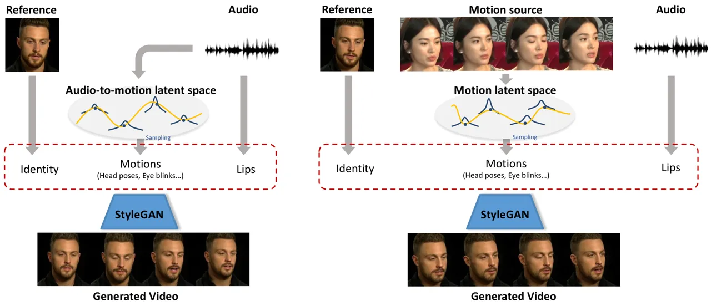
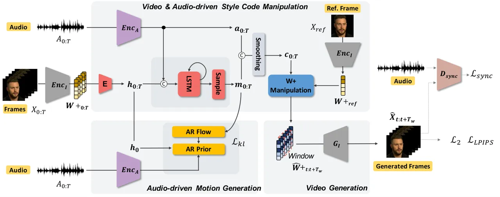
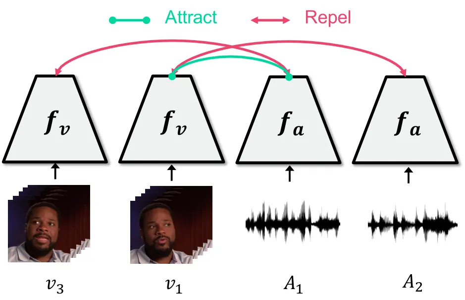
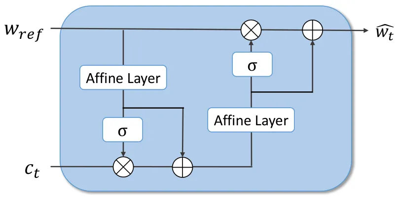
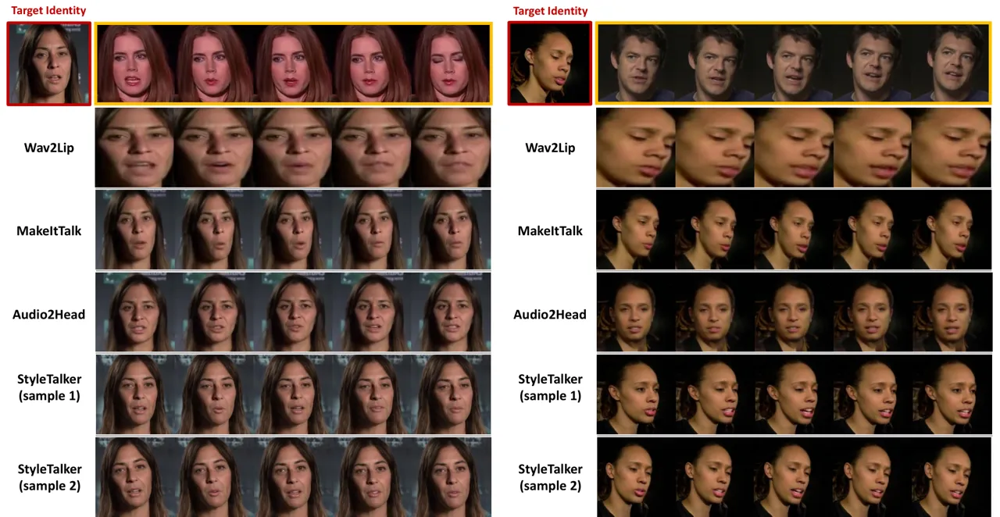
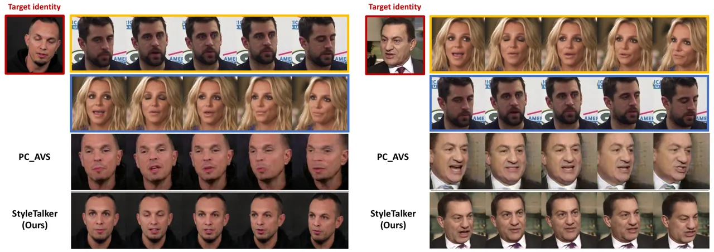

# StyleTalker: One-shot Style-based Audio-driven Talking Head Video Generation

Dongchan Min ^(†)^(†)thanks: Equal contribution    Minyoung
Song¹¹footnotemark: 1    Eunji Ko    Sung Ju Hwang Affiliation: Graduate
School of AI, Korea Advanced Institute of Science and Technology (KAIST)
Affiliation: Seoul, South Korea Affiliation: {alsehdcks95, mysong105,
kosu7071, sjhwang82}@kaist.ac.kr

###### Abstract

We propose _StyleTalker_, a novel audio-driven talking head generation
model that can synthesize a video of a talking person from a single
reference image with accurately audio-synced lip shapes, realistic head
poses, and eye blinks. Specifically, by leveraging a style-based
generator, we estimate the latent codes of the talking head video that
faithfully reflects the given audio. This is made possible with several
newly devised components: 1) A contrastive lip-sync discriminator for
accurate lip synchronization, 2) A conditional sequential variational
autoencoder that learns the latent motion space disentangled from the
lip movements, such that we can independently manipulate the motions and
lip movements while preserving the identity. 3) An auto-regressive prior
augmented with normalizing flow to learn a complex audio-to-motion
multi-modal latent space. Equipped with these components, StyleTalker
can generate talking head videos not only in a motion-controllable way
when another motion source video is given but also in a completely
audio-driven manner by inferring realistic motions from the input audio.
Through extensive experiments and user studies, we show that our model
is able to synthesize talking head videos with impressive perceptual
quality which are accurately lip-synced with the input audios, largely
outperforming state-of-the-art baselines.

## 1 Introduction

Recently, bridging the gap between the real and the virtual world with
visual media is becoming increasingly important, as the coronavirus
pandemic has completely changed the way we work, learn, play, and
socialize. This has led to the emergence of _digital twins_, which are
digital copies of real human beings that can generate realistic speech
and facial expressions to mimic the target person, as they are useful
for real-world applications such as virtual conferencing and VR/AR
platforms. Audio-driven talking head generation, which aims to
synthesize a video of a talking person with the input audio stream for
multi-speakers, is a crucial technology for implementing such digital
twins.



Figure 1: Concept. StyleTalker generates a realistic talking head video
from a single reference image and input audio in two different ways.
Left: Audio-driven Generation Motions are predicted from the audio.
Right: Motion-controllable Generation Motions are controlled by another
motion source video.

While some of the previous works from the graphics area \[26, 27, 18\]
have achieved some success in generating realistic digital twins, they
target single-speaker generation and thus have no control over multiple
identities. One-shot audio-driven talking head generation methods \[21,
37, 32, 36\], on the other hand, aim to generate a talking head video
using a single reference image of the target person and arbitrary audio,
and have received much attention recently to its applicability in many
applications. However, previous one-shot audio-driven talking head
generation methods only synthesize around the lip region \[21\] or fail
to predict realistic motions (head poses and eye blinks) due to the
nature of difficulty in modeling motions from the audio \[37, 32\]. To
overcome these issues, Zhou _et al_. \[36\] recently proposed a
pose-controllable method to copy the head poses of a given video
independently with the given audio, but its applicability is limited
since it requires another video as the pose source and also fails to
capture perceptually important facial attributes such as eye blinks.

In this paper, we propose _StyleTalker_, a novel audio-driven talking
head generation model. Our model leverages a style-based generator,
namely StyleGAN \[14, 15, 13\], which learns a rich distribution of
human faces, and GAN inversion techniques \[23, 28\] to embed images
onto the style latent space. It has been shown that the style latent
space accurately represents facial attributes with disentangled
properties \[23, 28\], allowing extensive image manipulations \[1, 2\].
We can generate a talking head video by sequentially estimating the
latent codes of each frames in the video. However, this is extremely
challenging, since estimated latent codes should accurately reflect the
given audio and motions while keeping the identity, in order to generate
a natural and realistic talking head video.

To handle this challenge, we first pretrain our lip-sync discriminator
with a novel contrastive learning objective and utilize it as a fixed
discriminator during training to improve the lip synchronization with
the input audio. Furthermore, we extract motions from the video using a
sequential variational autoencoder (VAE) \[16\] to learn the posterior
distribution of motion latent space conditioned on the audio. In
addition, we design an auto-regressive prior augmented with normalizing
flow to capture more complicated probabilistic distributions between
audio and possible motions. Then, we manipulate the latent code of the
reference image to change the lip shapes, head poses, and eye shapes
according to the given audio and motions to reconstruct the video while
keeping the identity fixed. In this way, our model can learn their
implicit representations without the help of any geometry priors such as
landmarks or 3D pose parameters.

As a result, during inference, our StyleTalker can generate realistic
talking head videos either by sampling the motions from the motion
latent space or the audio-to-motion latent space. We refer to the former
as an motion-controllable talking head video generation and the latter
as a audio-driven talking head video generation. We illustrate the
overall concept of StyleTalker in Fig. 1. The following is the summary
of our contributions.

- •
  We propose StyleTalker, a novel one-shot audio-driven talking head
  generation framework, that controls lip movements, head poses, and eye
  blinks using a pretrained image generator by learning their implicit
  representations in an unsupervised manner.
- •
  StyleTalker can generate talking head videos either in a
  motion-controllable manner, using other videos as motion sources, or
  in a completely audio-driven manner, predicting realistic motions from
  the audio.
- •
  StyleTalker achieves state-of-art talking head generation performance,
  generating more realistic videos with accurate lip syncing and natural
  motions compared to baselines, both by quantitative metrics and user
  studies.

## 2 Related Work



Figure 2: The overall training framework of StyleTalker. 1) Video &
Audio driven Style Code Manipulation: Given a video, StyleTalker maps
audio into audio features $`a_{0:T}`$ and frames into motion latent
variables $`m_{0:T}`$. With $`a_{0:T}`$ and $`m_{0:T}`$, we manipulate
the style latent code of the reference frame
$`\mathbf{\mathcal{W}}+_{ref}`$ to generate
$`\widehat{\mathbf{\mathcal{W}}}+_{t:t+T_{w}}`$. 2)Video Generation:
$`\widehat{\mathbf{\mathcal{W}}}+_{t:t+T_{w}}`$ are forwarded to
generate $`n`$ sequential frames, which are the reconstruction of the
given video. 3)Audio-driven Motion Generation: We model our prior
network of $`m_{0:T}`$ with given audio and an image as inputs. Note
that $`Enc_{I}`$, $`G_{I}`$, and $`D_{sync}`$ are fixed during training.

Neural Lip-synced Video generation. Generating an audio-synchronized
video of a target person has progressed rapidly thanks to the recent
advances of image generation methods. Many of these methods \[26, 18,
27\] aim toward transforming the lip region of the person in the target
video, generating new videos with the lip shapes that match the input
audio. However, their applicability to real-world scenarios is somewhat
limited as they mainly focus on a single identity and require a large
amount of training data for each identity. For example, \[26\]
synthesizes a high-quality video of Barack Obama conditioned on his
speech using the lip landmarks but requires long hours of videos from
the target person for model training (up to 17 hours). Recently,
Wav2lip \[21\] handles in-the-wild data with multiple identities without
any geometric priors, but the generated images of the model have low
resolutions (96$`\times`$96). Furthermore, the lip-sync methods can only
animate lips without generating head movements that are crucial for
realistic talking head generation, producing unnatural videos of fixed
or minimal motions \[17, 4\], and fail to generate perceptually
realistic videos on unrefined datasets \[31, 8\].

Audio-driven Talking Head Generation. To generate more plausible talking
head videos, audio-driven generation methods \[37, 3, 36, 32, 20, 31\]
aim to generate head movements in addition to synchronizing lip
movements for given audio. Furthermore, many of them assume an image as
the identity source handling multi-speaker generation in an one-shot
manner. However, this goal is challenging because its requirements are
multifaceted: high-quality image generation, multi-speaker handling, lip
synchronization, temporal consistency regularization, and natural
generation of diverse human movements. Therefore, most recent methods
adopt a reconstruction based pipeline \[35, 21, 17, 37, 36, 32\]. Within
the pipeline, pre-estimated geometry priors such as landmarks and 3D
pose parameters decouple the head pose, identity, and lip movements from
the given images and audio signal. For example, MakeItTalk \[37\]
predicts landmarks and uses them as intermediate representations between
the audio and visual features. Moreover, PC-AVS \[36\] uses head pose
coordinates to decouple the pose features expressed in Euler angles
(yaw, pitch, roll). Audio2Head \[32\], a warping-based method, also
maximizes the similarity between the head pose coordinates and the
predicted head poses. However, such geometry priors are insufficient to
describe natural human motions. Thus, we adopt a reconstruction-based
pipeline but design a novel framework that does not use any geometric
priors.

## 3 Method

Here, we describe our model StyleTalker which synthesizes a talking head
video from a single reference image of a target person either in a
motion-controllable manner or in a audio-driven manner. Specifically,
for training, our model takes a video $`V`$ with $`T`$ frames
$`V=(X_{0},X_{1},...,X_{T})`$, a single reference image of the target
person $`X_{ref}`$, and a sequence of $`T`$ audio spectrograms
$`A=(A_{0},A_{1},...,A_{T})`$. Then, we extract motions
$`m_{0:T}=(m_{o},m_{1},...,m_{T})`$ and audio features
$`a_{0:T}=(a_{0},a_{1},...,a_{T})`$ from the video $`V`$ and the
sequence of audio spectrograms $`A`$, respectively. The training
objective is to reconstruct the video $`V`$ by reflecting extracted
motions and speech information to the reference image $`X_{ref}`$ while
keeping the identity. Furthermore, we model an audio-to-motion
distribution which maps speech information $`a_{0:T}`$ to motions
$`m_{0:T}`$. At the inference time, we can generate a talking head video
with an identity, motions, and speech information which are originated
from different sources. In particular, motions can be either extracted
from a completely different video (motion-controllable) or inferred from
an audio through audio-to-motion distribution (audio-driven).

To this end, we propose several components: 1) A lip-sync discriminator,
trained with contrastive learning for precise and natural lip movements, 2) The conditional sequential VAE which learn the posterior distribution
of motion latent space conditioned on the audio, 3) Auto-regressive
prior augmented with normalizing flow for learning complex audio-motion
latent space, 4) Style code manipulation to estimate the style codes of
the target video. The overall training procedure of StyleTalker is
illustrated in Fig 2.

### 3.1 Contrastive Lip-sync Discriminator

Recently, Prajwal _et al_. \[21\] demonstrated that a strong lip sync
expert plays a very important role in generating precise and natural lip
movements. Similarly, we also use a lip-sync discriminator,
$`D_{sync}`$, which predicts whether the given audio-video pair is
synced or not. However, instead of modeling it as a binary
classification problem as Prajwal _et al_. did, we use contrastive
learning to make in-sync pairs align closer than off-sync audio-video
pairs, as shown in Fig 3. Contrastive learning is known to maximize a
lower bound of the mutual information between two modalities \[30\], and
has largely improved the performance of several recent generative
models \[33, 12\]. Specifically, given a window
$`V_{k}=X_{k-T_{s}:k+T_{s+1}}`$ with $`2\cdot T_{s}+1`$ consecutive
frames and an audio segment $`A_{k}`$, the score function is as follows:

```math
S_{sync}=cos(f_{v}(V_{k}),f_{a}(A_{k}))/\tau \tag{1}
```

where $`cos(\cdot,\cdot)`$ denotes the cosine similarity, $`\tau`$
denotes a temperature hyper-parameter, and $`f_{v}`$ and $`f_{a}`$ are
video and audio encoders to extract video and audio feature vectors onto
a joint embedding space. The contrastive loss between a video $`V_{k}`$
and its in-sync paired audio segment $`A_{k}`$ is then computed as:

```math
\mathcal{L}_{c}=-\log\,\frac{cos(f_{v}(V_{k}),f_{a}(A_{k}))/\tau}{\sum^{M}_{i=1}cos(f_{v}(V_{i}),f_{a}(A_{i}))/\tau} \tag{2}
```

where $`M`$ is the total number of video-audio pairs. The off-sync pairs
can be sampled from the same video by shifting each video frame along
the time axis while fixing the audio segments and vise versa. Following
\[21\], we utilize the pretrained lip-sync discriminator as a fixed
discriminator to guide the lip movements of the generated videos.



Figure 3: Contrastive Lip-sync Discriminator

### 3.2 GAN Inversion

For StyleGAN \[14, 15, 13\], several GAN inversion techniques have
proposed image encoder networks which embed the images onto style latent
space, which is known as $`\mathcal{W}+`$ space \[23, 28\]. In this
work, we embed video frames onto style latent space using
pixel2style2pixel (pSp) \[23\] encoder to deposit facial attributes such
as head poses, eye shapes and lip shapes. In detail, the image encoder
$`Enc_{I}`$ outputs a latent style vector as
$`\mathcal{W}+=Enc_{I}(X)`$, where
$`X\in\mathbb{R}^{3\times H\times W}`$ is an input frame and
$`\mathcal{W}+\in\mathbb{R}^{L\times 512}`$ consists of $`L`$ style
codes, $`w^{i}\in\mathbb{R}^{512}`$, that are fed into each layer of a
StyleGAN with $`L`$ layers. Then, we independently process each style
code, $`w^{i}`$, which enables StyleTalker to perform delicate
transformations of the facial attributes to generate frames in the
video. For readability, we omit $`i`$ in the rest of the paper.

### 3.3 Conditional Sequential VAE

Let $`w_{ref}`$ denote a style code of the reference image. Further, Let
$`w_{0:T}=(w_{0},w_{1},...,w_{T})`$ and
$`a_{0:T}=(a_{0},a_{1},...,a_{T})`$ denote $`T`$ style codes of a video
with $`T`$ consecutive frames and a sequence of $`T`$ audio features
respectively: $`w_{0:T}=Enc_{I}(X_{0:T}),\,a_{0:T}=Enc_{A}(A_{0:T})`$.
We propose a conditional sequential variational autoencoder model, where
the sequence $`w_{0:T}`$ is generated from $`w_{ref}`$, the audio
features $`a_{0:T}`$ and latent variables $`m_{0:T}`$, each of which
contains identity, lip, and motion information respectively.

Then, we use variational inference to approximate the posterior
distribution of $`m_{t}`$:

```math
m_{t}\sim N(\mu_{t},diag(\sigma_{t})) \tag{3}
```

More specifically, since $`m_{t}`$ is a time-varying variable, we
estimate it conditioned on the current and previous frames
$`w_{\leq t}`$, and the audio features $`a_{\leq t}`$. The posterior
distribution of $`m_{t}`$ is then defined as follows:

```math
\displaystyle[\mu_{t},\sigma_{t}]=\psi_{R}(w_{\leq t},a_{\leq t}) \tag{4}
```

```math
\displaystyle q_{\phi}(m_{0:T}|w_{0:T},a_{0:T})=\prod^{T}_{t=0}q_{\phi}(m_{t}|w_{\leq t},a_{\leq t}) \tag{5}
```

where $`\psi_{R}`$ can be modeled as a recurrent network, such as
LSTM \[10\] or GRU \[5\].

Auto-regressive prior with normalizing flow. We assume that the motion
at current time step depends on the previous motions and audio features.
Thus, we design an prior of $`m_{t}`$ as auto-regressive model using a
recurrent neural network $`\phi_{R}`$. Furthermore, for time step 0, we
formulate the prior of $`m_{0}`$ conditioned on the first frame
$`w_{0}`$, since without conditioning, the initial motion may have a
large variance, which may prevent the learning of a proper prior
distribution in consecutive frames. Specifically, we define the prior
distribution of $`m_{t}`$ as follows:

```math
\displaystyle m_{t}\sim N(\mu_{t},diag(\sigma_{t})) \tag{6}
```

```math
\displaystyle[\mu_{t},\sigma_{t}]=\phi_{R}(m_{<t},a_{\leq t}),\,\,t>0 \tag{7}
```

```math
\displaystyle[\mu_{0},\sigma_{0}]=\phi_{0}(w_{0}) \tag{8}
```

```math
\displaystyle p_{\theta}(m_{0:T}|a_{1:T},w_{0})=p_{\theta}(m_{0}|w_{0})\prod^{T}_{t=1}p_{\theta}(m_{t}|m_{<t},a_{\leq t},w_{0}) \tag{9}
```

Note that, at the inference time, $`w_{0}`$ can be replaced with
$`w_{ref}`$. That is, the generated video could be initialized with the
motion of the given reference image.

However, learning an audio-to-motion multi-modal distribution is very
challenging, as previous works \[37, 32\] fail to synthesize realistic
motions from the audio. We also found that our auto-regressive prior
encoder is not sufficient for modeling realistic and natural motions
from the audio, so that we need a more complicated distribution for
prior than a diagonal Gaussian distribution. To this end, we apply
auto-regressive normalizing flow, $`f_{\theta}`$, consisting of
invertible non-linear transformations with simple Jacobian determinants
as follows \[22, 29\] :

```math
p^{\prime}_{\theta}(m_{0:T}|a_{1:T},w_{0})=p_{\theta}(m_{0:T}|a_{1:T},w_{0})\Big|det\frac{\delta f_{\theta}}{\delta m}\Big| \tag{10}
```

We then define the KL-divergence loss between the posterior and the
prior to train the conditional sequential VAE:

```math
L_{kl}=\log(q_{\phi}(m_{0:T}|a_{0:T},w_{0:T}))\\
-\log(p^{\prime}_{\theta}(m_{0:T}|a_{1:T},w_{0})) \tag{11}
```



Figure 4: $`\bf w`$ manipulation module.

Style Code Manipulation. After we obtain audio features $`a_{0:T}`$ and
motion latent variables $`m_{0:T}`$, we use them to generate the style
codes $`\widehat{w}_{0:T}`$ of the target frames from $`w_{ref}`$, the
style code of the reference image. However, we noticed flicking
artifacts in the generated videos since $`m_{0:T}`$ are sampled from a
multivariate Gaussian distribution, which induces noise in the time
domain. To handle this issue, we introduce a smoothing layer which
consists of 1D Gaussian smoothing, 1D convolution, and activation
function. Specifically, the smoothing layer receives the concatenated
$`a_{0:T}`$ and $`m_{0:T}`$ and outputs smoothed vectors $`c_{0:T}`$.

```math
c_{0:T}=f(\text{Conv1D}(\text{GaussianSmooth1D}([a_{0:T},m_{0:T}])) \tag{12}
```

where $`f`$ is a non-linear activation function. We then manipulate
$`w_{ref}`$ depending on the smoothed latent code $`c_{0:T}`$. As shown
in Fig 4, this is done in a two-way fashion. Specifically, the style
code sequence $`\widehat{w}_{0:T}`$ corresponding to the output videos
is computed as follows:

```math
\begin{split}&c^{\prime}_{t}=\sigma(K_{1}(w_{ref}))\times c_{t}+K_{2}(w_{ref})\\
&\widehat{w}_{t}=\sigma(K_{3}(c^{\prime}_{t}))\times w_{ref}+K_{4}(c^{\prime}_{t})\end{split} \tag{13}
```

This two-way manipulation is inspired by the following motivations. We
first modify the $`c_{t}`$ based on $`w_{ref}`$ to reflect lip shape and
motion of the reference frame. Then, we modify the $`w_{ref}`$ to obtain
a target style vector, $`\widehat{w}_{t}`$, with the correct lip shape
and motion. After we generate style vectors, $`\widehat{w}_{0:T}`$, they
are fed into the pretrained image generator to synthesize the target
frames.

Models Seen Unseen SSIM$`\uparrow`$ MS-SSIM$`\uparrow`$
LMD$`\downarrow`$ LMD*(m)$`\downarrow`$ LSE-C $`\uparrow`$
SSIM$`\uparrow`$ MS-SSIM$`\uparrow`$ LMD$`\downarrow`$
LMD*(m)$`\downarrow`$ LSE-C $`\uparrow`$ Wav2Lip \[21\] 0.93 0.97 1.60
1.49 7.44 0.93 0.97 1.49 1.47 7.40 MakeItTalk \[37\] 0.54 0.49 3.66 1.93
3.52 0.53 0.46 4.01 1.92 4.09 Audio2Head \[32\] 0.42 0.24 5.20 2.71 5.31
0.45 0.33 5.31 2.76 5.91 PC-AVS \[36\] 0.62 0.69 3.63 2.32 7.87 0.61
0.67 3.68 2.34 8.05 StyleTalker (ours) 0.62 0.72 2.81 1.84 8.12 0.62
0.71 2.95 1.87 8.53

Table 1: The quantitative results on VoxCeleb2 \[6\]. Lower the better
for LMD and LMD\_(m), and higher the better for other metrics.

### 3.4 Training

Windowed Frame Generation. Training StyleTalker to generate all frames
of a video may require a prohibitively excessive amount of memory. We
thus propose to randomly extract a window of $`T_{w}`$ consecutive
frames, which we refer to as the training window. StyleGAN then takes
$`\widehat{w}_{t:t+T_{w}}`$ and synthesizes frames only for this window.

```math
\widehat{X}_{t:t+T_{w}}=G(\widehat{w}_{t:t+T_{w}}) \tag{14}
```

Final Objectives. We use L2 loss and Learned Perceptual Image Path
Similarity (LPIPS) loss \[34\] for generating video frames that match
the ground-truth frames as follows:

```math
L_{2}=||X-\widehat{X}||_{2} \tag{15}
```

```math
L_{LPIPS}=||P(X)-P(\widehat{X})||_{2} \tag{16}
```

where $`\widehat{X}`$ denotes reconstructed frame, $`X`$ denotes
ground-truth frame, $`P(\cdot)`$ denotes the perceptual feature
extractor. Similar to Siarohin _et al_. \[24\], we compute the
perceptual loss in multi-resolution by repeatedly downsampling the frame
3 times.

In addition, for synthesizing lip movements synchronized with audio
inputs, we apply the sync loss to maximize the cosine similarity between
the features from the generated videos and corresponding audios using
lip-sync discriminator (Section 3.1).

```math
L_{sync}=1-cos(f_{v}(V_{k}),f_{a}(A_{k})) \tag{17}
```

Lastly, our overall objective for training StyleTalker is

```math
L_{total}=L_{LPIPS}+\lambda_{1}L_{2}+\lambda_{2}L_{kl}+\lambda_{4}L_{sync} \tag{18}
```

We set $`\lambda_{1}=\lambda_{2}=\lambda_{3}=\lambda_{4}=0.1`$ in our
experiments.

### 3.5 Inference

Once StyleTalker has been trained, it can generate the talking head
videos in two different ways: motion-controllable and audio-driven
manner, given audio features $`a_{0:T}=Enc_{A}(A_{0:T})`$ and a style
vector $`w_{ref}=Enc_{I}(X_{ref})`$ of the target person.

1\) Motion-controllable generation: when the motion source video,
$`M_{0:T}`$, is given, we can sample the motion latent variables,
$`m_{0:T}`$, from the variational posterior $`q_{\phi}`$:

```math
w_{0:T}=Enc_{I}(M_{0:T}),~~m_{0:T}\sim q_{\phi}(m_{0:T}|w_{0:T},a_{0:T}) \tag{19}
```

2\) Audio-driven generation: if the motion source is not available, we
can sample the motion latent variables, $`m_{0:T}`$, from the prior
$`p_{\theta}`$:

```math
m_{0:T}\sim p^{\prime}_{\theta}(m_{0:T}|w_{ref},a_{1:T}) \tag{20}
```

After the motion latent variables $`m_{0:T}`$ are sampled from either
the posterior distribution or the prior distribution, we can manipulate
the $`w_{ref}`$ with $`a_{0:T}`$ and $`m_{0:T}`$ to generate
$`\widehat{w}_{0:T}`$. Lastly, the pretrained image generator can
synthesize a video of $`T`$ image frames from the style vector sequence
$`\widehat{w}_{0:T}`$, which contains accurate lip shapes according to
the given audio segments and realistic motions.

## 4 Experiments



Figure 5: The qualitative comparison of the audio-driven talking head
generation performance on VoxCeleb2. The first row (yellow box) shows
the frames corresponding to the given audio. The single image input (red
box) is a reference image of the target identity. The Supplementary
Materials contain the actual videos.



Figure 6: The qualitative comparison of the motion-controllable
generation performance on VoxCeleb2. The first row (yellow box) shows
the frames corresponding to the given audio. The second row (blue box)
shows the frames from the motion source video. The single image input
(red box) is a reference image of the target identity. Please refer to
the Supplementary Materials for the actual videos.

Dataset. We use Voxceleb2 \[6\] dataset collected from the wild for
training and test, which is a popularly used dataset in previous
works \[36, 37, 3\]. Voxceleb2 is a dataset which consists of YouTube
videos of talking people with a large variety of identities and motions.
In detail, it contains 215,000 videos of 6,112 identities over 1 million
utterances. We process the video into frames with 25 fps. Following
 \[7\], we crop and resize frames into facial-central frames with the
size of $`256\times 256`$. Audios are down-sampled to 16kHz, from which
we extract mel-spectrograms with an FFT size of 512, hop size of 160, a
window size of 400 samples, and 80 frequency bins.

Implementation Details. We pretrain StyleGAN3 \[13\] and pSp
encoder \[23\] on the Voxceleb2 dataset. Note that these models are kept
fixed when training StyleTalker. The style latent space consists of
$`L=16`$ different style codes and we only manipulate the first 8 style
codes which correspond to the coarse and middle level details of the
generated images. For each input video frame, we use a 0.2 second long
mel-spectrogram. As an audio encoder, we use ResNetSE18 \[11\]. During
training, we generate the style codes with the length of 128 while using
the window of 15 style codes to be fed into the StyleGAN3 to generate
frames. For training contrastive lip-sync discriminator, we use 5
generated consecutive frames as inputs. We use the Adam optimizer with
the learning rate of $`1e-4`$ for all networks. For more details,
including the network architecture specifications and other
hyperparameters, please refer to the Supplementary Materials.

Methods Models Lip Sync Motion Video Accuracy Naturalness Realness
Audio-driven Wav2Lip \[21\] 3.5 $`\pm`$ 0.32 1.75 $`\pm`$ 0.31 1.61
$`\pm`$ 0.21 MakeItTalk \[37\] 2.77 $`\pm`$ 0.37 2.52 $`\pm`$ 0.32 2.52
$`\pm`$ 0.33 Audio2Head \[32\] 2.56 $`\pm`$ 0.38 2.68 $`\pm`$ 0.32 2.45
$`\pm`$ 0.33 StyleTalker (ours) 4.06 $`\pm`$ 0.22 3.47 $`\pm`$ 0.31 3.11
$`\pm`$ 0.35 Motion-controllable PC-AVS \[36\] 3.70 $`\pm`$ 0.30 2.93
$`\pm`$ 0.31 2.75 $`\pm`$ 0.36 StyleTalker (ours) 3.77 $`\pm`$ 0.26 3.65
$`\pm`$ 0.31 3.5 $`\pm`$ 0.35

Table 2: User study reporting MOS with 95% confidence intervals. The
higher the better for all of the metrics. The number ranges from 1 to 5.

 LSE-C$`\uparrow`$  Motion Naturalness   Video   Realness StyleTalker
8.53 86.11% 86.11% w/o Flow 8.48 13.89%. 13.89% w/o $`D_{sync}`$ 6.71
N/A N/A

Table 3: Ablation study.

Baselines. We compare our method against the following state-of-the-art
talking head generation baselines: 1) Wav2Lip \[21\] is a lip-syncing
model for videos in the wild. Wav2Lip generates the lower half of the
face given the upper half of the face and a target audio. 2)
MakeItTalk \[37\] is a audio-driven full-head generation model that
drives lip movements and motions from audio with 3D facial landmarks. 3)
Audio2Head \[32\] is a audio-driven full-head generation model that
utilizes key point based dense motion field to warp the face images
using the audio. 4) PC-AVS \[36\] is a video-driven full-head generation
model that enables pose-controllable talking head generation using the
other video as a pose source.

### 4.1 Quantitative Results

Evaluation Metric. To evaluate the quality of the generated talking head
videos using our model, we adopt some of the metrics that have been used
for the same tasks \[36, 37\]. Specifically, SSIM, MS-SSIM are used to
evaluate the quality of the generated frame. For lip sync accuracy, we
use the SyncNet \[7\] confidence score (LSE-C) metric and LMD\_(m), the
distance to the landmark around the mouth. In addition, LMD is the
distance of all landmarks on the face to evaluate motion accuracy.

Evaluation Results. We first measure the reconstruction performance of
our model using the ground-truth videos, on videos whose target motions
and target audios are unseen during the training time. Table 1 contains
the results for identities which are included in the training set and
for new identities which are not included in the training set. The
results show that StyleTalker comprehensively outperforms all baselines.
As for the lip-sync accuracy, our model obtains superior results by the
LMD\_(m) score and achieves the best performance by LSE-C. Furthermore,
we achieve better LMD score than baselines which indicates StyleTalker
accurately follows the target motions. Note that Wav2Lip shows the
highest score because they generate only the lip region at the lowest
resolution; however, the method generates perceptually implausible
videos since the other parts of the image remains the same as the input
frame. This results show that our model can generate precise talking
head videos videos from the given audio and motions.

### 4.2 Qualitative Results

Audio-driven generation. In Fig 5, we show the generated video frames by
our StyleTalker in comparison to those generated by other audio-driven
generation models \[21, 37, 32\]. We see that StyleTalker generates
high-quality talking heads which preserve the identity of the target
person, while Audio2Head \[32\] generates ones that have inconsistent
identities that do not match the target. Furthermore, we observe that
Audio2Head always frontalizes the faces regardless of the initial pose
of the reference image, which results in generating unnatural videos.
Since our model samples motions from the prior that is conditioned on
the initial pose of the reference image, it can generate more natural
and robust talking head videos compared to other models. In addition,
our model synthesizes accurate lip shapes which match the ground-truth
lip shapes, while Audio2Head \[32\] and MakeItTalk \[37\] generate
inaccurate lip shapes. Our model can also synthesize eye blinks while
most others \[37, 21, 36\] fail to do so, which also crucially affects
the perceptual quality of the generated videos. We attribute this to our
proposed learnable prior with normalizing flow, which learns a rich
multi-modal distribution that maps audio to natural and realistic
motions. Furthermore, since we model the audio-motion space as
probabilistic distributions, we can generate multiple videos with
different motions by sampling several times from the same input audio.

Motion-controllable generation. Additionally, we show the video frames
generated by our model and PC-AVS in a motion-controllable manner, in
Fig 6. Our model can generate frames with the same motions as the motion
source, synthesizing accurate lip movements that match the given audio.
This demonstrates that our model successfully disentangles motions and
lip movements. PC-AVS \[36\] also seems to disentangle pose and lip
movements, but the faces generated with the method have unnatural eyes
and have less pose variations than those generated with our method.

User Study. We conduct an user study for the perceptual quality of the
videos generated using our model and the baselines. Specifically, we use
MOS (mean opinion score) for evaluating the generated videos based on
three criteria: lip sync accuracy, motion naturalness, and video
realness. MOS are rated by the 1-to-5 scale and reported with the 95%
confidence intervals (CI). 20 judges participated in the study, where
each evaluated 4 videos generated by ours and other models, presented in
random orders. Please see the _Supplementary File_ for more details.
Table 2 shows the results of the user study. Our model outperforms all
baselines in three metrics, on both audio-driven and motion-controllable
talking face generation tasks, demonstrating that it can generate
accurate and natural talking head videos. Wav2Lip \[21\] scores high on
audio-visual sync performance, but its motion naturalness and video
realness scores are low since it only synthesizes the lower half of the
faces. For PC-AVS \[36\], it generates more natural videos than
audio-driven methods since it uses real videos as the pose source.
However, it fails to synthesis eye blinking, which is important for the
perceptual quality of the generated videos. Thus, its motion naturalness
and video realness scores are lower than those from our model.

### 4.3 Ablation Study

We further conduct an ablation study to verify the effectiveness of each
component of our model, namely normalizing flow and the lip-sync
discriminator. We use three metrics: LSE-C, motion naturalness, and
video realness. For motion naturalness and video realness, 12 judges
received 6 sets of two videos in a random order, each created with two
different methods (w/ and w/o normalizing flow), and were asked to
choose the better one. The results of the ablation study are shown in
Table 3. First of all, we observe that most of the judges prefer the
videos generated by our model to the ones generated by the model without
normalizing flow in terms of motion naturalness and video realness.
Specifically, removing normalizing flow resulted in fluctuated motions,
and the model even failed to learn eye blinks. Secondly, without the
lip-sync discriminator, the LSE-C score dropped, indicating the
importance of the lip-sync discriminator for synthesizing accurate lip
shapes.

## 5 Conclusion

We propose StyleTalker, a novel framework that can generate natural and
realistic videos of human talking heads from a single reference image
with diverse motions and lip shapes that are accurately synchronized
with the input audio. Specifically, we leverage the power of the
style-based generator and estimate the latent style codes to generate a
talking head video. To this end, we propose a novel conditional
sequential VAE framework augmented with the normalizing flow for
modeling complex audio-to-motion distribution. This allows our model to
generate realistic talking head videos either in a motion-controllable
manner using another video as a motion source, or in a completely
audio-driven manner. The experimental results and user study show that
StyleTalker achieves state-of-art performance, generating significantly
more realistic videos in comparison to baselines.

## References

- \[1\] Rameen Abdal, Yipeng Qin, and Peter Wonka. Image2stylegan: How
  to embed images into the stylegan latent space? In Proceedings of the
  IEEE/CVF International Conference on Computer Vision, 2019.
- \[2\] Rameen Abdal, Yipeng Qin, and Peter Wonka. Image2stylegan++: How
  to edit the embedded images? In IEEE/CVF Conference on Computer Vision
  and Pattern Recognition (CVPR), 2020.
- \[3\] Lele Chen, Guofeng Cui, Celong Liu, Zhong Li, Ziyi Kou, Yi Xu,
  and Chenliang Xu. Talking-head generation with rhythmic head motion.
  In European Conference on Computer Vision, 2020.
- \[4\] Lele Chen, Ross K Maddox, Zhiyao Duan, and Chenliang Xu.
  Hierarchical cross-modal talking face generation with dynamic
  pixel-wise loss. In IEEE/CVF Conference on Computer Vision and Pattern
  Recognition (CVPR), 2019.
- \[5\] Kyunghyun Cho, Bart van Merrienboer, Çaglar Gülçehre, Dzmitry
  Bahdanau, Fethi Bougares, Holger Schwenk, and Yoshua Bengio. Learning
  phrase representations using rnn encoder–decoder for statistical
  machine translation. In EMNLP, 2014.
- \[6\] Joon Son Chung, Arsha Nagrani, and Andrew Zisserman. Voxceleb2:
  Deep speaker recognition. arXiv preprint arXiv:1806.05622, 2018.
- \[7\] Joon Son Chung and Andrew Zisserman. Out of time: Automated lip
  sync in the wild. In ACCV Workshops, 2016.
- \[8\] Dipanjan Das, Sandika Biswas, Sanjana Sinha, and Brojeshwar
  Bhowmick. Speech-driven facial animation using cascaded gans for
  learning of motion and texture. In European Conference on Computer
  Vision, 2020.
- \[9\] Jiankang Deng, Jia Guo, Niannan Xue, and Stefanos Zafeiriou.
  Arcface: Additive angular margin loss for deep face recognition. In
  IEEE/CVF Conference on Computer Vision and Pattern Recognition
  (CVPR), 2019.
- \[10\] Sepp Hochreiter and Jürgen Schmidhuber. Long short-term memory.
  Neural Computation, 1997.
- \[11\] Jie Hu, Li Shen, Samuel Albanie, Gang Sun, and Enhua Wu.
  Squeeze-and-excitation networks. IEEE Transactions on Pattern Analysis
  and Machine Intelligence, 42, 2020.
- \[12\] Mingu Kang and Jaesik Park. Contragan: Contrastive learning for
  conditional image generation. arXiv: Computer Vision and Pattern
  Recognition, 2020.
- \[13\] Tero Karras, Miika Aittala, Samuli Laine, Erik Härkönen, Janne
  Hellsten, Jaakko Lehtinen, and Timo Aila. Alias-free generative
  adversarial networks. Advances in Neural Information Processing
  Systems, 2021.
- \[14\] Tero Karras, Samuli Laine, and Timo Aila. A style-based
  generator architecture for generative adversarial networks. In
  IEEE/CVF Conference on Computer Vision and Pattern Recognition
  (CVPR), 2019.
- \[15\] Tero Karras, Samuli Laine, Miika Aittala, Janne Hellsten,
  Jaakko Lehtinen, and Timo Aila. Analyzing and improving the image
  quality of stylegan. In IEEE/CVF Conference on Computer Vision and
  Pattern Recognition (CVPR), 2020.
- \[16\] Diederik P. Kingma and Max Welling. Auto-encoding variational
  bayes. CoRR, abs/1312.6114, 2014.
- \[17\] Prajwal KR, Rudrabha Mukhopadhyay, Jerin Philip, Abhishek Jha,
  Vinay Namboodiri, and CV Jawahar. Towards automatic face-to-face
  translation. In Proceedings of the 27th ACM International Conference
  on Multimedia, 2019.
- \[18\] Avisek Lahiri, Vivek Kwatra, Christian Frueh, John Lewis, and
  Chris Bregler. Lipsync3d: Data-efficient learning of personalized 3d
  talking faces from video using pose and lighting normalization. In
  IEEE/CVF Conference on Computer Vision and Pattern Recognition
  (CVPR), 2021.
- \[19\] Tsung-Yi Lin, Piotr Dollár, Ross Girshick, Kaiming He, Bharath
  Hariharan, and Serge Belongie. Feature pyramid networks for object
  detection. In IEEE/CVF Conference on Computer Vision and Pattern
  Recognition (CVPR), 2017.
- \[20\] Rayhane Mama, Marc S Tyndel, Hashiam Kadhim, Cole Clifford, and
  Ragavan Thurairatnam. Nwt: Towards natural audio-to-video generation
  with representation learning. arXiv preprint arXiv:2106.04283, 2021.
- \[21\] KR Prajwal, Rudrabha Mukhopadhyay, Vinay P Namboodiri, and CV
  Jawahar. A lip sync expert is all you need for speech to lip
  generation in the wild. In Proceedings of the 28th ACM International
  Conference on Multimedia, 2020.
- \[22\] Danilo Jimenez Rezende and Shakir Mohamed. Variational
  inference with normalizing flows. In ICML, 2015.
- \[23\] Elad Richardson, Yuval Alaluf, Or Patashnik, Yotam Nitzan,
  Yaniv Azar, Stav Shapiro, and Daniel Cohen-Or. Encoding in style: a
  stylegan encoder for image-to-image translation. In IEEE/CVF
  Conference on Computer Vision and Pattern Recognition (CVPR), 2021.
- \[24\] Aliaksandr Siarohin, Stéphane Lathuilière, Sergey Tulyakov,
  Elisa Ricci, and Nicu Sebe. First order motion model for image
  animation. NeurIPS, 32, 2019.
- \[25\] Peter Sorrenson, Carsten Rother, and U. Köthe. Disentanglement
  by nonlinear ica with general incompressible-flow networks (gin).
  ArXiv, abs/2001.04872, 2020.
- \[26\] Supasorn Suwajanakorn, Steven M Seitz, and Ira
  Kemelmacher-Shlizerman. Synthesizing obama: learning lip sync from
  audio. ACM Transactions on Graphics (ToG), 2017.
- \[27\] Justus Thies, Mohamed Elgharib, Ayush Tewari, Christian
  Theobalt, and Matthias Nießner. Neural voice puppetry: Audio-driven
  facial reenactment. In European Conference on Computer Vision, 2020.
- \[28\] Omer Tov, Yuval Alaluf, Yotam Nitzan, Or Patashnik, and Daniel
  Cohen-Or. Designing an encoder for stylegan image manipulation. ACM
  Transactions on Graphics (TOG), 2021.
- \[29\] Rafael Valle, Kevin J. Shih, Ryan J. Prenger, and Bryan
  Catanzaro. Flowtron: an autoregressive flow-based generative network
  for text-to-speech synthesis. ArXiv, abs/2005.05957, 2021.
- \[30\] Aäron van den Oord, Yazhe Li, and Oriol Vinyals. Representation
  learning with contrastive predictive coding. ArXiv,
  abs/1807.03748, 2018.
- \[31\] Konstantinos Vougioukas, Stavros Petridis, and Maja Pantic.
  Realistic speech-driven facial animation with gans. International
  Journal of Computer Vision, 2020.
- \[32\] Suzhen Wang, Lincheng Li, Yu Ding, Changjie Fan, and Xin Yu.
  Audio2head: Audio-driven one-shot talking-head generation with natural
  head motion. arXiv preprint arXiv:2107.09293, 2021.
- \[33\] Han Zhang, Jing Yu Koh, Jason Baldridge, Honglak Lee, and
  Yinfei Yang. Cross-modal contrastive learning for text-to-image
  generation. IEEE/CVF Conference on Computer Vision and Pattern
  Recognition (CVPR), 2021.
- \[34\] Richard Zhang, Phillip Isola, Alexei A Efros, Eli Shechtman,
  and Oliver Wang. The unreasonable effectiveness of deep features as a
  perceptual metric. In IEEE/CVF Conference on Computer Vision and
  Pattern Recognition (CVPR), 2018.
- \[35\] Hang Zhou, Yu Liu, Ziwei Liu, Ping Luo, and Xiaogang Wang.
  Talking face generation by adversarially disentangled audio-visual
  representation. In Proceedings of the AAAI Conference on Artificial
  Intelligence, 2019.
- \[36\] Hang Zhou, Yasheng Sun, Wayne Wu, Chen Change Loy, Xiaogang
  Wang, and Ziwei Liu. Pose-controllable talking face generation by
  implicitly modularized audio-visual representation. In IEEE/CVF
  Conference on Computer Vision and Pattern Recognition (CVPR), 2021.
- \[37\] Yang Zhou, Xintong Han, Eli Shechtman, Jose Echevarria,
  Evangelos Kalogerakis, and Dingzeyu Li. Makelttalk: speaker-aware
  talking-head animation. ACM Transactions on Graphics (TOG), 2020.

StyleTalker: One-shot Style-based  
Audio-driven Talking Head Video Generation

Supplementary Material

Please check ‘ShowSamples.html’ in the supplementary file, which
includes the videos generated by StyleTalker and other baselines.

## Appendix A Detailed model architecture

### A.1 Overall architecture

We use StyleGAN3 \[13\] as the image generator, $`G_{I}`$, and pSp
encoder \[23\] as the image encoder, $`Enc_{I}`$. We use
ResNetSE18 \[11\] as the audio encoder, $`Enc_{A}`$. Among 16 different
style codes in the latent style vector, $`\mathbf{\mathcal{W}}+_{ref}`$,
of the reference image, we process first 8 style codes,
$`w_{0}\sim w_{7}`$, independently using each corresponding Conditional
Sequential VAE block. Each Conditional Sequential VAE block consists of
the posterior encoder, smoothing module, $`w`$ manipulation module,
prior encoder and normalizing flow.

Figure 7: Overall architecture.

### A.2 Posterior encoder and smoothing module

Posterior encoder: Each style code, $`w_{i,0:T}`$, in the latent style
vector, $`\mathbf{\mathcal{W}}+_{i,0:T}`$, is fed into the posterior
encoder to output latent motion variables, $`m_{i,0:T}`$. In detail,
they first go through two fully-connected layers with LeakyReLU and Tanh
activation functions. The hidden units and output units are 128 and 32.
Then, they are concatenated with audio features, $`a_{0:T}`$, which have
32 hidden units through a fully-connected layer, and go into a LSTM
layer followed by a fully-connected layer, which predicts means and
standard deviations, $`\mu_{0:T}`$ and $`{\sigma_{0:T}}`$. Eventually,
the motion latent variables, $`m_{i,0:T}`$, can be sampled from the
predicted means and standard deviations. Smoothing module: After the
motion latent variables, $`m_{i,0:T}`$, are concatenated with the audio
features, $`a_{0:T}`$, they are fed into the smoothing module. The
smoothing module consists of a 1D GaussianSmoothing filter, 1D
convolution layer and LeakyReLU activation. All hidden units in the
smoothing modules are 128. Then, the smoothing module outputs smoothed
vectors, $`c_{i,0:T}`$, following Eq. 12.

Figure 8: Posterior encoder (red) and smoothing module (gray).

### A.3 Prior encoder and normalizing flow

Prior encoder: The prior encoder consists of two LSTM layers. The first
LSTM layer takes the $`h_{i,0}`$, which is extracted from the reference
image, as an input and outputs a latent variable, $`m_{i,0}`$. The
second LSTM layer takes the previous latent variables, $`m_{i,t-1}`$
concatenated with the audio features, $`a_{i,t}`$ as an input and
outputs the current latent variable, $`m_{i,t}`$. The both LSTM layers
have 256 hidden units. The audio features have 32 hidden units through a
fully-connected layer. Normalizing flow: Normalizing flow module
consists of actnorm and affine coupling layers. The affine coupling
layer contains 2 stacks of LSTM layers, each of which has 256 hidden
units, to perform autoregressive causal transformation. Furthermore, we
set the normalizing flow to be volume preserving \[25\].

Figure 9: Prior encoder and normalizing flow.

## Appendix B Image encoder training

Dataset Image encoder $`Enc_{I}`$ is also trained on Voxceleb2 \[6\]
dataset. Description for Voxceleb2 is in Sec. 6.

Model Architecture We adopt pixel2style2pixel \[23\] (pSp) as the image
encoder but perform some modifications in order to replace the
StyleGAN2 \[15\] with an alias-free StyleGAN generator \[13\]. An
alias-free StyleGAN is aligned with previous versions of StyleGAN \[14,
15\], but proposes better results in video generation by eliminating the
alias through its improved architectural design.

In detail, following the idea of pSp, we adopt $`\mathcal{W}+`$ space
where a style vector consist of $`16`$ style codes
$`w^{0,1,...,15}\in\mathcal{R}^{512}`$. With the backbone network, which
is a feature pyramid network \[19\], style codes are computed with three
levels of feature maps and style mapping networks. $`w^{0,1,2}`$ are
generated from small feature map, $`w^{3,4,5,6}`$ from the the medium
feature map, and $`w^{7,...,15}`$ from the largest feature map.
Specifically, the backbone network is an improved version of
ResNet50 \[9\] and the style mapping network is set of 2-strided
convolutions followed by LeakyReLU activations \[23\].

Training We follow the same training scheme proposed in Richardson et
al. \[23\]. Specifically, the loss is defined as follows:

```math
L_{pSp}=\lambda_{1}L_{2}(x)+\lambda_{2}L_{LPIPS}(x)+\lambda_{3}L_{id}(x)+\lambda_{4}L_{reg}(x) \tag{21}
```

We set $`\lambda_{1},\lambda_{2},\lambda_{3},\lambda_{4}`$ as
$`1.0,0.8,0.1,0.01`$, respectively. For more details, please refer to
Richardson et al. \[23\].
