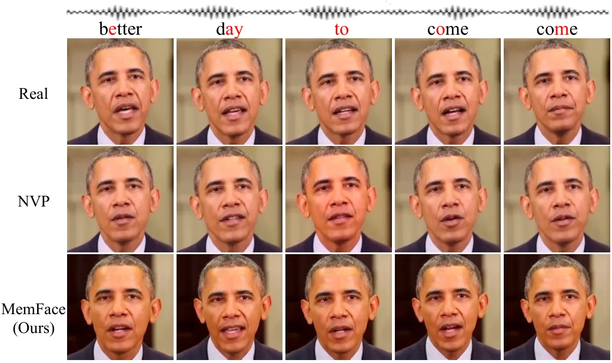
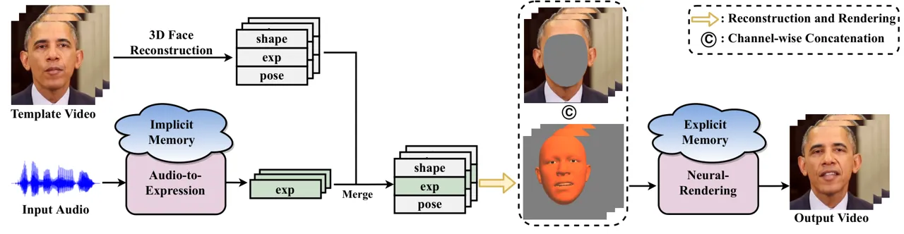
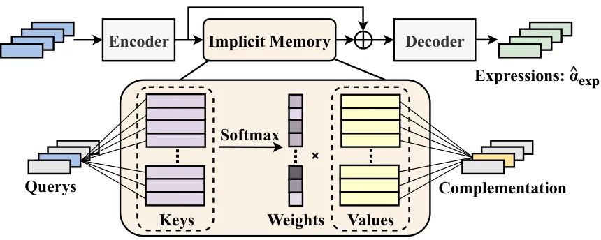
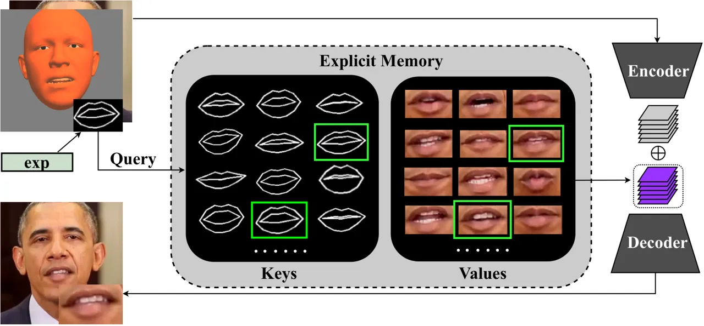
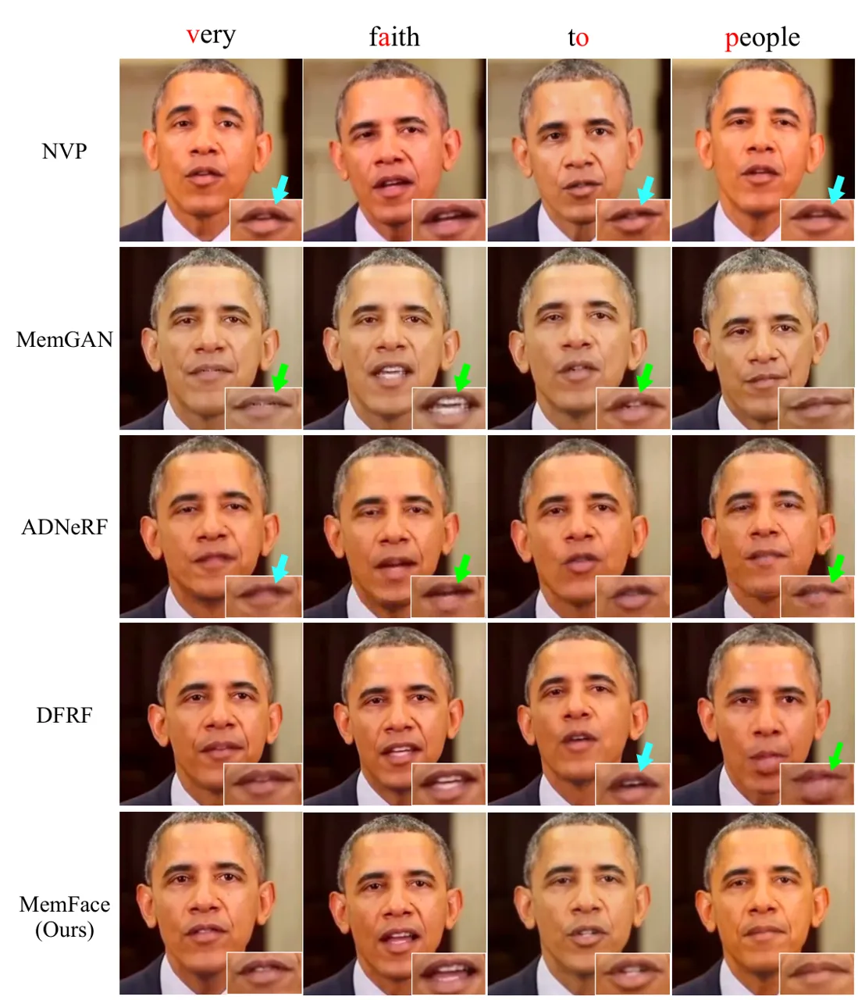
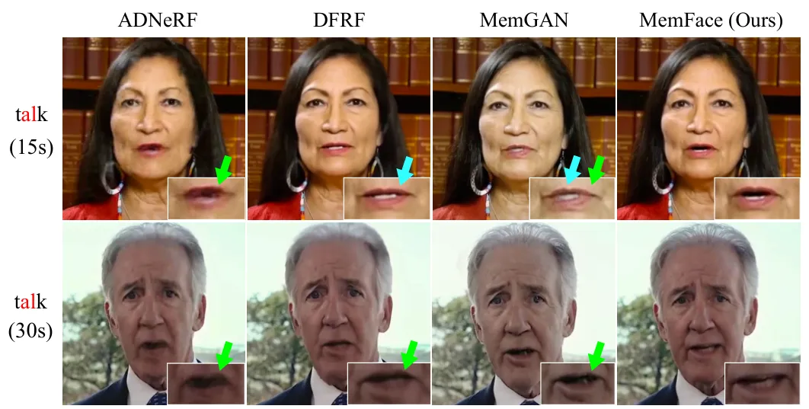
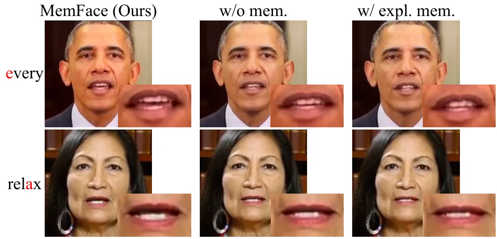
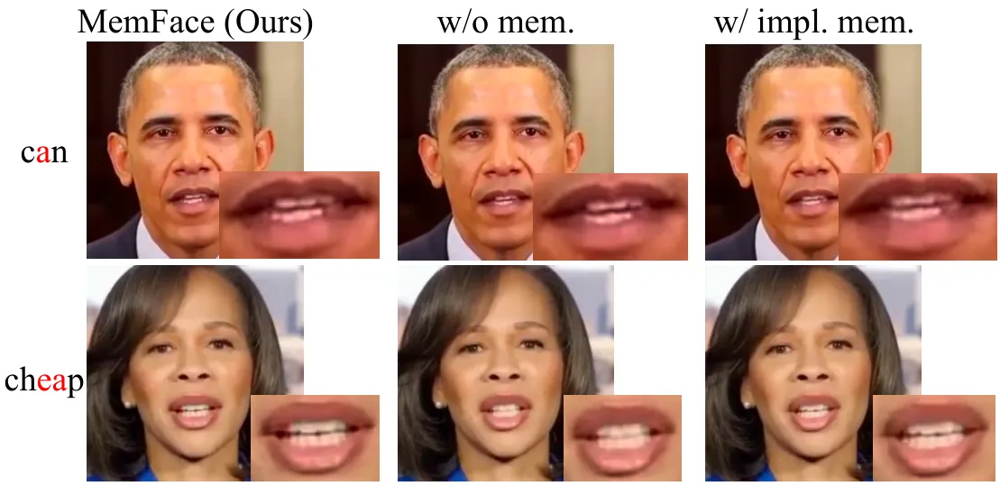
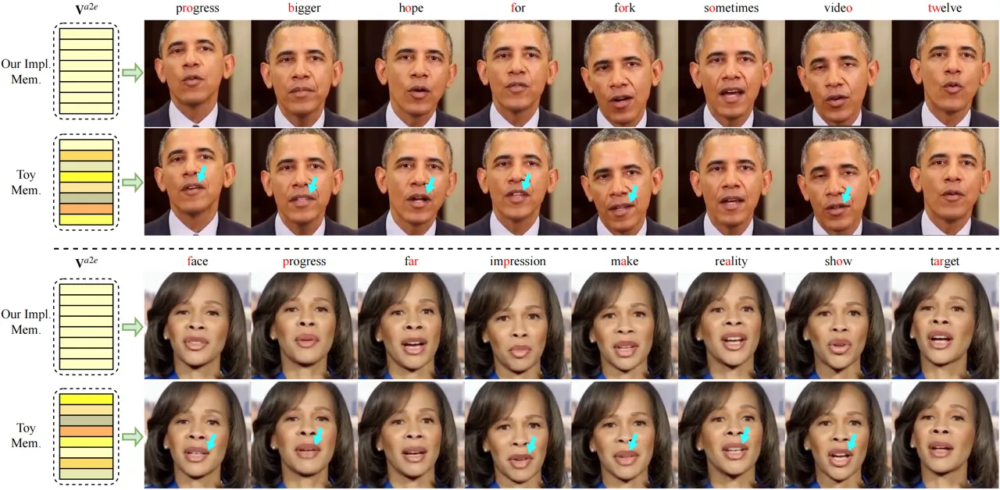
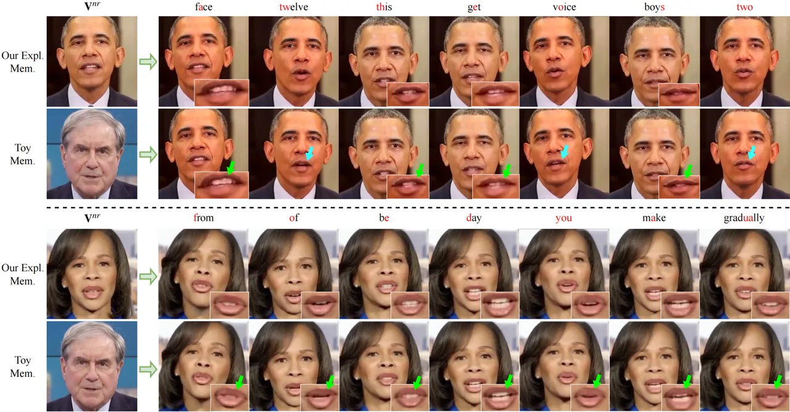

# Memories are One-to-Many Mapping Alleviators in Talking Face Generation

Anni Tang ^(†)^(†)thanks: Corresponding authors: Xu Tan and Li Song
(song_li@sjtu.edu.cn). Project page:
[memoryface.github.io](https://memoryface.github.io).
Affiliation: Shanghai Jiao Tong University Email: <memory97@sjtu.edu.cn>
   Tianyu He Email: <lingjun@sjtu.edu.cn>    Xu Tan
Email: <songli@sjtu.edu.cn>    Jun Ling Affiliation: Shanghai Jiao Tong
University    Li Song Affiliation: Shanghai Jiao Tong University

###### Abstract

Talking face generation aims at generating photo-realistic video
portraits of a target person driven by input audio. Due to its nature of
one-to-many mapping from the input audio to the output video (_e.g_.,
one speech content may have multiple feasible visual appearances),
learning a deterministic mapping like previous works brings ambiguity
during training, and thus causes inferior visual results. Although this
one-to-many mapping could be alleviated in part by a two-stage framework
(_i.e_., an audio-to-expression model followed by a neural-rendering
model), it is still insufficient since the prediction is produced
without enough information (_e.g_., emotions, wrinkles, _etc_.). In this
paper, we propose MemFace to complement the missing information with an
implicit memory and an explicit memory that follow the sense of the two
stages respectively. More specifically, the implicit memory is employed
in the audio-to-expression model to capture high-level semantics in the
audio-expression shared space, while the explicit memory is employed in
the neural-rendering model to help synthesize pixel-level details. Our
experimental results show that our proposed MemFace surpasses all the
state-of-the-art results across multiple scenarios consistently and
significantly.

## 1 Introduction

Talking face generation enables synthesizing photo-realistic video
portraits of a target person in line with the speech content \[53, 7,
56, 21, 17, 9, 34, 55\]. It shows great potential in applications like
virtual avatars, online conferences, and animated movies since it
conveys the visual content of the interested person besides the audio.



Figure 1: Example frames of real video (1st row), NVP \[56\] (2nd row)
and the proposed MemFace (3rd row) for saying ‘better day to come’.
Compared to the baseline NVP \[56\], our results demonstrate higher
lip-sync quality and more realistic rendering results by alleviating the
one-to-many mapping problem with memories.

The most popular methods to solve audio-driven talking face generation
follow a two-stage framework \[56\], where an intermediate
representation (_e.g_., 2D landmarks \[53, 48, 7, 37\], blendshape
coefficients of 3D face models \[26, 56, 62, 65\], _etc_.) is first
predicted from the input audio, then a renderer is employed to
synthesize the video portraits according to the predicted
representation. Along this path, remarkable progress has been made
towards improving the overall realness of the video portraits, by
achieving natural head movements \[6, 68, 69, 72\], enhancing lip-sync
quality \[42, 30, 41\], generating emotional expression \[21, 65, 33\],
_etc_. However, the aforementioned methods are biased towards learning a
deterministic mapping from the given audio to a video, while it is worth
noting that talking face generation is inherently a one-to-many mapping
problem. It means that, for an input audio clip, there are multiple
feasible visual appearances of the target person due to the variations
of phoneme contexts \[1\], emotions \[12\], and illumination
conditions \[50\], _etc_. In this way, learning a deterministic mapping
brings ambiguity during the training, making it harder to yield
realistic visual results.

To some extent, this one-to-many mapping could be alleviated in part by
the two-stage framework \[56, 62, 65\], since it decomposes the whole
one-to-many mapping difficulty into two sub-problems (_i.e_., an
audio-to-expression problem and a neural-rendering problem). However,
although effective, each of these two stages is still optimized to
predict the information that is missed by the input, thus remaining hard
for prediction. For example, the audio-to-expression model learns to
produce an expression that semantically matches the input audio, which
misses the high-level semantics like habits, attitudes, _etc_. While the
neural-rendering model synthesizes the visual appearances based on the
expression estimation, which misses the pixel-level details like
wrinkles, shadows, _etc_. To further alleviate the one-to-many mapping
problem, in this paper, we propose MemFace to complement the missing
information with memories \[63, 51\], by devising an implicit memory and
an explicit memory that follows the sense of the two stages
respectively. More specifically, the implicit memory is jointly
optimized with the audio-to-expression model to complement the
semantically-aligned information, while the explicit memory is
constructed in a non-parametric way and tailored for each target person
to complement visual details.

Therefore, instead of directly using the input audio to predict the
expression \[56\], our audio-to-expression model leverages the extracted
audio feature as the query to attend to the implicit memory. The
attention result, which served as semantically-aligned information, is
then complemented with the audio feature to yield expression output. By
enabling end-to-end training, the implicit memory is encouraged to
relate high-level semantics in the audio-expression shared space, thus
narrowing the semantic gap between the input audio and the output
expression.

After obtaining the expression, the neural-rendering model is employed
to synthesize the visual appearances based on the mouth shapes that are
obtained from expression estimations. To further complement pixel-level
details between them, we first construct the explicit memory for each
person by regarding the vertices of 3D face models \[3, 64\] and its
associated image patches as keys and values respectively. Then, for each
input expression, its corresponding vertices are used as the query to
retrieve the similar keys in the explicit memory, and the associated
image patch is returned as the pixel-level details to the
neural-rendering model. Intuitively, by introducing the explicit memory
to the model, it allows the model to selectively associate
expression-required details without generating them by the model itself,
and thus eases the generation process.

Extensive experiments on various widely adopted datasets (_e.g_.,
Obama \[53\], HDTF \[71\]) verify that the proposed MemFace achieves
state-of-the-art lip-sync and rendering quality, surpassing all the
baseline methods across multiple scenarios consistently and
significantly. For example, our MemFace achieves a relative improvement
of $`37.52\%`$ in the subjective evaluation of the Obama dataset.



Figure 2: The overview of MemFace. To alleviate the one-to-many mapping
difficulty, we propose to complement the missing information with
memories. The implicit memory is introduced to the audio-to-expression
model to complement the semantically-aligned information (see Fig. 3),
while the explicit memory is introduced to the neural-rendering model to
retrieve the personalized visual details (see Fig. 4).

## 2 Related Works

### 2.1 Talking Face Generation

Audio-driven talking face generation enables synthesizing
photo-realistic video portraits in sync with the input speech content.
To tackle this problem, lots of methods have been proposed for improving
the overall realness of the generated video portraits \[56, 37, 18, 38,
20\], such as to achieve natural head movements \[6, 68, 69, 72\], to
enhance lip-sync \[30, 41, 53, 56, 7, 8\], to make emotional
expression \[21, 65, 33\], _etc_. For example, Thies _et al_. \[56\]
proposed a two-stage framework that estimates lip motions and then
renders the appearance of the target person. Inspired by dynamic
NeRF \[39, 15\], recent advances also proposed methods that directly map
the audio features to dynamic facial radiance fields for portrait
rendering \[17, 45, 35\].

Although these methods could alleviate the one-to-many mapping to some
extent by the two-stage framework \[26, 56, 62, 65, 53, 48, 7, 37\] or
the implicit function \[17, 45, 35\], they were still optimized to
predict the information that is missed by the input. Differently, we
propose to complement the missing information with memories to tackle
the one-to-many mapping difficulty.

### 2.2 Memory-based Networks

We introduce the works that are related to implicit memory and explicit
memory respectively in this section.

#### Implicit memory.

There were a number of attempts to introduce a specialized implicit
memory that can be read and written for better memorization \[63, 51,
29, 31\]. They typically used continuous memory representations \[51\]
or key-value pairs \[40\] to read/write memories, allowing them to train
the memory in an end-to-end way. Based on the success of implicit memory
and the observation of the one-to-many mapping nature of
audio-to-expression learning, we propose to incorporate an implicit
memory into audio-to-expression stage to complement the missing
semantically-aligned information and tackle the one-to-many mapping.

#### Explicit memory.

Augmenting neural networks with an explicit external memory has recently
drawn attention in natural language processing \[25, 24, 47\]. For
retrieval-based visual models, different from early attempts that only
exploited the training data itself \[36, 49, 57\], recent advances
introduced an external memory for text-to-image generation \[4\]. Unlike
these approaches that built a unified memory for every sample, we build
the explicit memory for each identity to complement the personalized
visual details for realistic talking face generation.

It should be noted that Yi _et al_. \[68\] and Park _et al_. \[41\] also
introduced memory to the talking face generation. Our solution is
different from theirs in that: 1) Memory network in MemGAN \[68\] stored
paired spatial features (extracted from a pre-trained ResNet-18 \[19\])
and identity features (extracted from a pre-trained ArcFace \[13\]) that
provide more identity information to refine the rendering process. In
contrast, we directly retrieve the mouth-related image patches from the
video of the target person with our explicit memory, which makes the
memory construction easier and complements the model with more visual
details. 2) SyncTalkFace \[41\] leveraged an audio-lip memory, where the
audio features and lip features are regarded as keys and values
respectively. Due to the large gap between audio and visual appearance,
they used explicit constraints to align the two modalities. However,
simultaneously aligning both the semantics and visual details in one
memory is still challenging. In contrast, our MemFace employs an
implicit memory and an explicit memory to complement the
semantically-aligned information and pixel-level details respectively,
therefore making the prediction easier.

## 3 MemFace

#### Preliminaries.

Our training corpus contains video portraits that are synced with the
audio stream. For data preprocessing, following previous methods \[12,
52, 56\], we transform the audio content to audio feature
$`{\mathbf{A}}`$ with a pre-trained speech-to-text model \[2\]. The
audio feature $`{\mathbf{A}}`$ is used as input instead of the raw audio
waveform.

We adopt blendshape coefficients of 3D face model \[3, 64\] as the
intermediate representation due to its flexibility in talking face
generation \[26, 56, 62, 65\]. The 3D face model is a statistical model
that enables the 3D reconstruction from the disentangled facial shape,
expression, and other properties with delta-blendshapes \[3, 64\]. We
obtain the labels of shape coefficients $`\bm{\alpha}_{id}`$, expression
coefficients $`\bm{\alpha}_{exp}`$, and pose coefficients
$`\bm{\alpha}_{pose}`$ following Wood _et al_. \[64\] in our
experiments. To easily leverage the 3D face in our model, we project the
3D face onto the 2D image plane through a perspective camera model,
resulting in an image $`{\mathbf{I}}_{3D}`$.

To fully exploit the coefficients of 3D face model, we also extract the
coordinates of all vertices $`{\mathbf{O}}`$ by reconstructing the 3D
face from the coefficients \[64\]. Since the mouth-related region is the
focus for talking, we only use the pre-defined mouth-related vertices
$`{\mathbf{O}}_{m}`$. The obtained $`{\mathbf{O}}_{m}`$ is leveraged in
both the audio-to-expression model and the neural-rendering model.

#### Method overview.

As shown in Fig. 2, given input audio of the target person, our goal is
to synthesize a photo-realistic video portrait that is consistent with
the speech content. To achieve this goal, our inputs consist of an input
audio feature $`{\mathbf{A}}`$ and a template video of the target
person. For the template video, we follow the previous works \[56, 62,
68\] to mask the face region. To make the prediction focus on the face
region, the remaining part of the template video is employed as input to
produce extra information (see Fig. 2 for illustration). We first employ
our audio-to-expression model $`f`$ to take in the extracted audio
feature $`{\mathbf{A}}`$, and predict the mouth-related expression
coefficients $`\bm{\hat{\alpha}}_{exp}`$. The predicted expression
coefficients $`\bm{\hat{\alpha}}_{exp}`$ are then merged with the
original shape and pose coefficients of the template video, and yield an
image $`\hat{{\mathbf{I}}}_{3D}`$ that corresponds to the predicted
expression coefficients. Next, our neural-rendering model $`g`$ takes in
the $`\hat{{\mathbf{I}}}_{3D}`$ and the masked template video, and
outputs the final results that correspond to the mouth shape of
$`\hat{{\mathbf{I}}}_{3D}`$. In this way, the audio-to-expression model
is responsible for lip-sync quality, while the neural-rendering model is
responsible for rendering quality.

However, this two-stage framework is still insufficient for tackling
one-to-many mapping difficulty, since each stage is optimized to predict
the information that is missed by the input (_e.g_., habits, wrinkles,
_etc_.). Therefore, we propose to complement the missing information
with memory (see Sec. 3.1 for details). Furthermore, given that the
audio-to-expression model $`f`$ and the neural-rendering model $`g`$
play different roles in talking face generation, we devise two variants
of memory for complementing missing information accordingly. The details
for applying memories to $`f`$ and $`g`$ are elaborated in Sec. 3.2 and
Sec. 3.3 respectively.

### 3.1 Memory as One-to-Many Mapping Alleviator

Memory enables an easy way to read and write to scalable storage for
neural networks \[63, 51\]. In this work, we propose to complement the
missing information with memories, therefore alleviating the one-to-many
mapping challenge. Formally, suppose that we have a key set
$`{\mathbf{K}}`$ and a value set $`{\mathbf{V}}`$ that are to be stored
in the memory, where each item of $`{\mathbf{K}}`$ is associated with a
value in $`{\mathbf{V}}`$. For a query $`{\mathbf{Q}}`$ that is derived
from the input, we compute the matching score between $`{\mathbf{Q}}`$
and key set $`{\mathbf{K}}`$ by taking a similarity function
$`\texttt{sim}(\cdot,\cdot)`$, then relate different values in
$`{\mathbf{V}}`$ via the similarity between $`{\mathbf{Q}}`$ and
$`{\mathbf{K}}`$:

```math
\texttt{attn}({\mathbf{Q}},{\mathbf{K}},{\mathbf{V}})=[\texttt{sim}({\mathbf{Q}},{\mathbf{K}}){\mathbf{V}}{\mathbf{W}}_{V}]{\mathbf{W}}_{O},\vskip-2.84544pt \tag{1}
```

where $`{\mathbf{W}}_{V}`$ and $`{\mathbf{W}}_{O}`$ denote the model
parameters related to the memory mechanism. A simple way to match the
query $`{\mathbf{Q}}`$ and the key set $`{\mathbf{K}}`$ is to take the
inner product followed by a softmax function \[58\]:

```math
\texttt{sim}({\mathbf{Q}},{\mathbf{K}})=\texttt{softmax}(\frac{{\mathbf{Q}}{\mathbf{W}}_{Q}({\mathbf{K}}{\mathbf{W}}_{K})^{\textbf{T}}}{\sqrt{h}}),\vskip-2.84544pt \tag{2}
```

where $`{\mathbf{W}}_{Q}`$ and $`{\mathbf{W}}_{K}`$ denote the model
parameters, $`h`$ is the dimension of the hidden states.

In order to effectively complement the missing information in various
scenarios, we design two memory variants that differ in the forms of the
key set $`{\mathbf{K}}`$ and the value set $`{\mathbf{V}}`$. In
Sec. 3.4, we also give insights into different variants.

### 3.2 Complementing Expression Prediction with Implicit Memory



Figure 3: Our implicit memory is introduced between the encoder and
decoder of the audio-to-expression model. The keys and values of the
memory are both jointly learned with the audio-to-expression model.

Given an audio feature $`{\mathbf{A}}\in\mathbb{R}^{T\times h_{a}}`$ as
input, the audio-to-expression model $`f`$ is expected to predict
semantically-aligned expression coefficients
$`\bm{\hat{\alpha}}_{exp}\in\mathbb{R}^{T\times h_{c}}`$ corresponding
to the speech content, where $`T`$ is the number of frames, $`h_{a}`$ is
the dimension of the audio feature \[2\], $`h_{c}`$ is the dimension of
the mouth-related expression coefficients \[64\]. To address this
sequence-to-sequence problem, we implement $`f`$ with a
Transformer\[58\]-based architecture. As demonstrated in Sec. 1, since
there exists one-to-many mapping difficulty (_e.g_., one speech content
may have multiple feasible expressions due to different habits and
attitudes), directly predicting expression from the input audio feature
alone is quite challenging. Therefore, considering the prediction of
expression is semantically aligned to the input audio, we introduce the
implicit memory to the audio-to-expression model $`f`$ to alleviate this
one-to-many mapping.

#### The implicit memory in the audio-to-expression model.

In form of implicit memory, both the key set and the value set are
randomly initialized at the beginning of the training, and are updated
according to the backpropagation of the error signal during the training
process.

As shown in Fig. 3, our audio-to-expression (_i.e_., a2e) model $`f`$
consists of an encoder $`f_{enc}`$ and a decoder $`f_{dec}`$. The
implicit memory is introduced between the encoder and the decoder.
Specifically, the feature extracted by the encoder is employed as the
query $`{\mathbf{Q}}^{a2e}=f_{enc}({\mathbf{A}})`$. Then we take the
inner product followed by a softmax function between the
$`{\mathbf{Q}}^{a2e}`$ and the key set $`{\mathbf{K}}^{a2e}`$, obtaining
a weighted representation of the value set $`{\mathbf{V}}^{a2e}`$. The
attention result, which is served as the complemented information, is
then added to the $`{\mathbf{Q}}^{a2e}`$ in an element-wise manner to
form the input of the decoder $`f_{dec}`$. Formally:

```math
\bm{\hat{\alpha}}_{exp}=f_{dec}({\mathbf{Q}}^{a2e}\oplus\texttt{attn}({\mathbf{Q}}^{a2e},{\mathbf{K}}^{a2e},{\mathbf{V}}^{a2e})),\vskip-2.84544pt \tag{3}
```

where $`\oplus`$ denotes the element-wise addition. The size of
$`{\mathbf{K}}^{a2e}`$ and $`{\mathbf{V}}^{a2e}`$ here are both
$`M\times h_{a}`$, where $`M`$ stands for the number of keys and values.

#### Loss functions.

We adopt three loss functions to train the audio-to-expression model. 1)
We minimize the $`l_{2}`$ distance between the predicted expression
coefficients $`\bm{\hat{\alpha}}_{exp}`$ and the ground-truth one
$`\bm{\alpha}_{exp}`$. 2) We minimize the distance between the predicted
vertices $`\hat{{\mathbf{O}}}_{m}`$ and the ground-truth one
$`{\mathbf{O}}_{m}`$ (see preliminaries for vertices acquirement). The
size of vertices is $`T\times h_{v}\times 3`$, where $`h_{v}`$ denotes
the number of vertices, and $`3`$ denotes the dimension of the
coordinate. 3) To prevent each item in the memory to be similar to each
other so as to increase the memory capacity, we also provide a
regularization term on $`{\mathbf{K}}^{a2e}`$ and $`{\mathbf{V}}^{a2e}`$
during the training:

```math
\displaystyle L_{cof}^{a2e} \displaystyle=\|\bm{\alpha}_{exp}-\bm{\hat{\alpha}}_{exp}\|_{2}, \tag{4}
```

```math
\displaystyle L_{vtx}^{a2e} \displaystyle=\|{\mathbf{O}}_{m}-\hat{{\mathbf{O}}}_{m}\|_{2},
```

```math
\displaystyle L_{reg}^{a2e} \displaystyle=\frac{1}{M(M-1)}(\texttt{corr}({\mathbf{K}}^{a2e})+\texttt{corr}({\mathbf{V}}^{a2e})),
```

```math
\displaystyle L^{a2e} \displaystyle=\lambda_{cof}L_{cof}^{a2e}+\lambda_{vtx}L_{vtx}^{a2e}+\lambda_{reg}L_{reg}^{a2e},
```

where
$`\texttt{corr}({\mathbf{X}})=\sum_{i}^{M}\sum_{j,j\neq i}^{M}\texttt{cos}({\mathbf{X}}_{i},{\mathbf{X}}_{j})`$,
and $`\texttt{cos}(\cdot,\cdot)`$ denotes the cosine similarity between
two vectors following previous works \[5, 67, 66\], $`\lambda_{cof}`$,
$`\lambda_{vtx}`$ and $`\lambda_{reg}`$ are weights for each loss item.
In total, we use $`L^{a2e}`$ to train the audio-to-expression model with
the implicit memory.



Figure 4: We construct the explicit memory by the vertices (_i.e_., the
mouth shapes) and corresponding image patches, which can be retrieved by
the neural-rendering model to complement the personalized visual
details.

### 3.3 Complementing Visual Appearance with Explicit Memory

Given the predicted expression coefficients $`\bm{\hat{\alpha}}_{exp}`$,
and the template video, the neural-rendering model $`g`$ is responsible
for synthesizing the photo-realistic results. As demonstrated in Sec. 1,
there also exists one-to-many mapping difficulty in the neural-rendering
model. For example, one expression may have multiple feasible visual
appearances due to different wrinkles and illuminations. Therefore, to
complement the pixel-level details of the target person, an explicit
memory is introduced to the neural-rendering model.

#### The explicit memory in the neural-rendering model.

Different from the implicit memory that learns the key set
$`{\mathbf{K}}`$ and the value set $`{\mathbf{V}}`$ from training data
automatically, the explicit memory constructs the key set
$`{\mathbf{K}}`$ and the value set $`{\mathbf{V}}`$ directly from the
data. For example, the key-value form can be formulated as
representation-token pair in \[24\], text-image pair in \[47\], and
vertex-image pair in our case.

As shown in Fig. 4, our neural-rendering (_i.e_., nr) model $`g`$ adopts
an encoder-decoder architecture \[44\], where the explicit memory is
introduced between the encoder $`g_{enc}`$ and the decoder $`g_{dec}`$.
Specifically, we adopt the coordinates of vertices $`{\mathbf{O}}_{m}`$
as key set $`{\mathbf{K}}^{nr}`$ (see preliminaries for vertices
acquirement), and its corresponding image of mouth region as the value
set $`{\mathbf{V}}^{nr}`$. We build the explicit memory based on
$`{\mathbf{K}}^{nr}`$ and $`{\mathbf{V}}^{nr}`$ for each target person
with $`N`$ key-value pairs. To make each item in the memory to be
dissimilar so as to increase the capacity of the memory, we identify
$`N`$ most dissimilar mouth shapes by calculating the Root-Mean-Square
distance between mouth-related vertices. Then we use the $`N`$
vertex-image pairs to build the explicit memory. More details can be
found in Sec. A of supplementary materials.

For the predicted expression coefficients $`\bm{\hat{\alpha}}_{exp}`$,
we obtain the pre-defined mouth-related vertices
$`\hat{{\mathbf{O}}}_{m}`$ as elaborated in the preliminaries, and
regard it as the query $`{\mathbf{Q}}^{nr}`$ to attend to the
constructed explicit memory. The attention result, which includes
substantial pixel-level details of the target person, is then merged
with the feature $`{\mathbf{F}}^{nr}`$ extracted from the input of $`g`$
by the encoder $`g_{enc}`$ to generate the output:

```math
\hat{{\mathbf{I}}}_{RGB}=g_{dec}({\mathbf{F}}^{nr}\oplus\texttt{attn}({\mathbf{Q}}^{nr},{\mathbf{K}}^{nr},{\mathbf{V}}^{nr})),\vskip-2.84544pt \tag{5}
```

where $`\hat{{\mathbf{I}}}_{RGB}`$ denotes the final synthesized
results. Intuitively, by using the explicit memory, the closer the
mouth-related vertices between $`{\mathbf{Q}}^{nr}`$ and
$`{\mathbf{K}}^{nr}`$, the larger weight the corresponding mouth-related
pixels will be returned as the complemented information for synthesis,
thus making the prediction easier.

#### Adaptation to new speakers.

Since the explicit memory stores the person-specific visual appearance,
when meeting a new speaker, the explicit memory is rebuilt from the
talking video of the new speaker. In this way, our neural-rendering
model can be flexibly adapted to the new speaker.

#### Loss functions.

We adopt two kinds of loss functions to optimize the neural-rendering
model. 1) A reconstruction loss and a VGG perceptual loss \[22\] are
employed to penalize the errors between the synthesized image and the
ground-truth image. 2) To generate more realistic results, we employ a
discriminator $`d`$ to verify whether the input is a natural image or a
faked image produced by the neural-rendering model \[16, 56\]. Formally:

```math
\displaystyle L_{rec}^{nr} \displaystyle=\|{\mathbf{I}}_{RGB}-\hat{{\mathbf{I}}}_{RGB}\|_{2}+\texttt{VGG}({\mathbf{I}}_{RGB},\hat{{\mathbf{I}}}_{RGB}), \tag{6}
```

```math
\displaystyle L_{adv}^{d} \displaystyle=-\mathbb{E}(\log d({\mathbf{I}}_{RGB}))-\mathbb{E}(\log(1-d(\hat{{\mathbf{I}}}_{RGB})),
```

```math
\displaystyle L_{adv}^{nr} \displaystyle=\mathbb{E}(\log(1-d(\hat{{\mathbf{I}}}_{RGB})),
```

```math
\displaystyle L^{nr} \displaystyle=\lambda_{rec}L_{rec}^{nr}+\lambda_{adv}L_{adv}^{d}+\lambda_{adv}L_{adv}^{nr},
```

where $`\texttt{VGG}(\cdot,\cdot)`$ denotes the VGG perceptual
loss \[22\], $`\lambda_{rec}`$ and $`\lambda_{adv}`$ are weights for
each loss item. In total, we use $`L^{nr}`$ to train the
neural-rendering model.

### 3.4 Discussions

#### Why do we alleviate one-to-many mapping with memory?

We note that one-to-many relationship exists in a wide range of
problems \[32, 43, 60\], such as text-to-speech \[54\], machine
translation \[61\], image translation \[46, 23\], _etc_. Among them,
generative models (_e.g_., generative adversarial network \[16\],
normalizing flow \[14\], variational auto-encoder \[28\]) demonstrate
great potential for the challenge of one-to-many mapping, with the
intuition in that learning a distribution instead of a deterministic
result. In our work, we also leverage the advance of the generative
adversarial network, and further present the memory mechanism as an
orthogonal approach to alleviating one-to-many mapping. The
incorporation of memory implicates an insight: since predicting the
missing information is difficult, why not construct storage to
complement the information to the input? We answer this question in this
paper, and demonstrate the effectiveness of memory for talking face
generation in Sec. 4.

#### Why do we use two memory variants for two stages respectively?

Basically, the audio-to-expression model and neural-rendering model play
different roles in talking face generation. The audio-to-expression
model is responsible for generating semantically-aligned expressions
from the input audio, while the neural-rendering model synthesizes the
pixel-level visual appearance according to the estimated expressions.
Therefore, to make each prediction easier, we devise an implicit memory
and an explicit memory to follow the sense of these two models.
Intuitively, the implicit memory is to learn the prior from the training
data automatically, then the learned prior can be used to complement the
information that is missed by the input, yielding more realistic
generation results. For neural rendering, where each mouth shape shares
a similar visual appearance, we explicitly construct the
expression-related prior from the video and directly retrieve the prior
to complement the input. Our experiments in Sec. 4.3 show the
effectiveness of each choice.

## 4 Experiments

In this section, we compare our MemFace with state-of-the-art methods,
and provide ablation studies. Since we alleviate the one-to-many mapping
problem and make the prediction easier, we also adapt our model to new
speakers with few adaption data and make comparisons. More results can
be found in Sec. C of supplementary materials.

### 4.1 Experimental Setups

#### Datasets.

Following previous works \[6, 59\], we utilize GRID dataset \[11\] (20
speakers, about four hours video) to train the audio-to-expression model
and utilize Obama dataset \[53\] (about 3 minutes video) to train the
neural-rendering model. For experiments on adaptation to new speakers,
we randomly collect 10 speakers with various talking styles from HDTF
dataset \[71\]. We use training data with different durations (15s and
30s) for each speaker.

#### Objective metrics.

For objective evaluation, following previous works \[17, 41, 56, 45\],
we adopt Sync-C (SyncNet Confidence) and Sync-D (SyncNet Distance) to
measure the lip-sync quality via SyncNet\[10\]. Higher Sync-C or lower
Sync-D indicates better lip-sync quality. Since we can obtain vertices
from the 3D face model (see Sec. 3.3 for details), we adopt RMSE (Root
Mean Square Error) score between the ground-truth vertices and our
predicted one to further evaluate the lip-sync quality. Lower RMSE
indicates better lip-sync quality. We also adopt commonly used
LPIPS\[70\] (Learned Perceptual Image Patch Similarity) score to
evaluate the perceptual similarity between ground-truth images and the
generated ones. Lower LPIPS indicates better perceptual quality.

#### Subjective metrics.

For subjective evaluation, 20 experienced participants are invited and
each participant needs to make around $`104`$ judgments in total. We
make detailed guidelines and example videos to ensure consistent grading
criteria. We use MOS (Mean Opinion Score) and CMOS (Comparison Mean
Opinion Score) as our metrics. MOS contains subjective scores on
lip-sync quality (Lip-sync), rendering quality (Render), and overall
quality (Overall). Higher MOS or CMOS indicates better subjective
quality. More details for subjective evaluation are provided in Sec. B.3
of supplementary materials.



Figure 5: Qualitative comparison with the state-of-the-art methods
(NVP \[56\], MemGAN \[68\], ADNeRF\[17\] and DFRF\[45\]) on Obama
dataset. The blue and green arrows indicate inferior lip-sync and
rendering quality respectively. It shows that our MemFace achieves
higher lip-sync and rendering quality.

| Method          | Subjective Evaluation |                    |                     | Objective Evaluation |                       |
| --------------- | --------------------- | ------------------ | ------------------- | -------------------- | --------------------- |
|                 | Lip-sync$`\uparrow`$  | Render$`\uparrow`$ | Overall$`\uparrow`$ | Sync-C $`\uparrow`$  | Sync-D $`\downarrow`$ |
| NVP\[56\]       | 3.399                 | 3.173              | 3.364               | 4.428                | 9.788                 |
| LipSync3D\[30\] | 3.355                 | 3.099              | 3.109               | 5.466                | 8.495                 |
| MemGAN\[68\]    | 2.667                 | 2.833              | 2.417               | 4.017                | 10.05                 |
| ADNeRF\[17\]    | 3.691                 | 3.900              | 3.700               | 5.723                | 9.164                 |
| DFRF\[45\]      | 3.155                 | 3.045              | 3.109               | 4.260                | 10.582                |
| MemFace (Ours)  | 4.381                 | 3.909              | 4.318               | 6.022                | 8.419                 |

Table 1: Quantitative comparison with the state-of-the-art methods on
Obama dataset. Our MemFace achieves the best subjective and objective
quality by a large margin. We highlight the best and the second-best
number in bold and underline respectively.

|              |                |                       |                    |                      |                      |                       |
| ------------ | -------------- | --------------------- | ------------------ | -------------------- | -------------------- | --------------------- |
| Adaption Set | Method         | Subjective Evaluation |                    |                      | Objective Evaluation |                       |
|              |                | Lip-sync $`\uparrow`$ | Render$`\uparrow`$ | Overall $`\uparrow`$ | Sync-C $`\uparrow`$  | Sync-D $`\downarrow`$ |
| 15s          | AD-NeRF\[17\]  | 1.9419                | 2.4347             | 2.1883               | 1.606                | 12.259                |
|              | DFRF\[45\]     | 2.2753                | 2.8116             | 2.2028               | 2.360                | 11.534                |
|              | MemGAN\[68\]   | 2.2217                | 2.5726             | 2.1022               | 4.058                | 10.189                |
|              | MemFace (Ours) | 4.1288                | 3.8231             | 3.9842               | 5.385                | 9.003                 |
| 30s          | AD-NeRF\[17\]  | 2.2896                | 2.4057             | 2.1304               | 1.028                | 13.445                |
|              | DFRF\[45\]     | 2.8116                | 2.7536             | 2.5507               | 3.607                | 10.908                |
|              | MemGAN\[68\]   | 2.4058                | 2.3187             | 1.6811               | 4.410                | 9.998                 |
|              | MemFace (Ours) | 4.4405                | 3.9854             | 4.1737               | 6.058                | 8.431                 |

Table 2: We adapt MemFace to new speakers with few adaption data, and
compare it to the state-of-the-art methods with the same setting.

#### Implementation details.

For the dimension of the hidden states, we use $`h_{a}=64`$ \[2\],
$`h_{c}=85`$ \[64\] and $`h_{v}=69`$ \[64\] in our experiments. In this
paper, we adopt the image resolution of $`256\times 256`$.
$`\lambda_{cof}`$, $`\lambda_{vtx}`$, $`\lambda_{reg}`$,
$`\lambda_{rec}`$ and $`\lambda_{adv}`$ are empirically set to $`1`$,
$`1`$, $`0.1`$, $`20`$ and $`1`$ respectively. Unless it is stated, we
use $`M=1000`$ and $`N=300`$. We adopt the Adam \[27\] optimizer with a
learning rate of $`1e-4`$. More details are provided in Sec. B of
supplementary materials.

### 4.2 Comparisons with Previous Models

#### Our MemFace outperforms the state-of-the-art methods in both objective and subjective evaluation.

With the same input audio, we compare our synthesized results with the
following works: NVP \[56\], LipSync3D \[30\], MemGAN \[68\],
ADNeRF\[17\] and DFRF\[45\]. In Fig. 5, we present the synthesized
results of different methods when saying the same syllable. It
demonstrates that, compared to the state-of-the-art methods, our
synthesized results in the last row exhibit more accurate lip-sync and
more satisfactory rendering quality. Quantitative results are shown in
Tab. 1, where our method generally outperforms the comparison ones in
both subjective and objective evaluation.

#### Our MemFace outperforms the state-of-the-art methods when adapting the model to new speakers with few adaption data.

As discussed in Sec. 3.4, to alleviate the one-to-many mapping, we ease
the prediction by complementing the missing information with memories.
To verify that the memories make the prediction easier, we conduct
experiments on adapting our model to new speakers with few adaption data
(_i.e_., 15s and 30s training videos from HDTF dataset \[71\]).
Specifically, for both our MemFace and the state-of-the-art
methods \[17, 45, 68\], we first pre-train the models on the Obama
dataset. Then, we build the explicit memory for each identity from the
short adaption video. Finally, we fine-tune both the audio-to-expression
model and neural-rendering model on the short adaption videos based on
the pre-trained model parameters. As shown in Table. 2, our method
exhibits an obviously better performance in all aspects under different
scenarios. We also present some qualitative results in Fig. 6 to make an
intuitive comparison. It can be seen that, the baseline methods tend to
generate blurry images \[17, 45\] or inaccurate lip motion \[45, 68\].
In contrast, our adaptation results retain more texture details such as
the teeth, and achieve a satisfactory lip-sync quality for different
talking styles.



Figure 6: Qualitative comparison with the state-of-the-art methods
(ADNeRF\[17\], DFRF\[45\] and MemGAN \[68\]) when adapting the model to
new speakers with few adaption data. The blue and green arrows indicate
inferior lip-sync and rendering quality respectively.

### 4.3 Ablation Studies

In this section, we verify the choices of implicit and explicit memory
for each stage, and provide ablation studies on the hyper-parameters of
memory (_i.e_., the number of key-value pairs). More ablation studies
are provided in Sec. C of supplementary materials.

#### The implicit memory is more suitable for audio-to-expression model.

We introduce an implicit memory to the audio-to-expression model. To
verify which memory is suitable for the audio-to-expression model, we
remove the implicit memory (w/o mem.) or replace it with explicit memory
(w/ expl. mem.), where the audio features $`{\mathbf{A}}`$ and
expression coefficients $`\bm{\hat{\alpha}}_{exp}`$ are regarded as keys
and values respectively. We train the audio-to-expression model with the
GRID dataset and then adapt the model to the 15s HDTF dataset to study
the memory choice. In Tab. 3 and Fig. 7, it can be observed that
compared with both settings (_i.e_., w/o mem. & w/ expl. mem.), our
scheme with implicit memory achieves the better objective and subjective
quality, which verifies that the implicit memory is more suitable for
the audio-to-expression model. It also demonstrates that replacing the
implicit memory with the explicit memory even leads to inferior quality
than removing the implicit memory for the audio-to-expression model. We
argue that the prediction of expression is semantically aligned with the
input audio, and depends on the audio context. Therefore, directly
retrieving the corresponding expression leads to more noisy expressions,
thus damaging the performance.

|               |                    |                  |                    |                  |
| ------------- | ------------------ | ---------------- | ------------------ | ---------------- |
| Method        | GRID               |                  | 15s HDTF           |                  |
|               | RMSE$`\downarrow`$ | CMOS$`\uparrow`$ | RMSE$`\downarrow`$ | CMOS$`\uparrow`$ |
| MemFace       | 0.0826             | 0                | 0.1343             | 0                |
| w/o mem.      | 0.0834             | -0.1090          | 0.1448             | -0.1136          |
| w/ expl. mem. | 0.0846             | -0.2363          | 0.1398             | -0.1136          |

Table 3: Abalation studies on the implicit memory in the
audio-to-expression model. The CMOS criterion represents lip-sync
quality here. See Sec. 4.3 for detailed descriptions.

|               |                     |                  |                     |                  |
| ------------- | ------------------- | ---------------- | ------------------- | ---------------- |
| Method        | Obama               |                  | 15s HDTF            |                  |
|               | LPIPS$`\downarrow`$ | CMOS$`\uparrow`$ | LPIPS$`\downarrow`$ | CMOS$`\uparrow`$ |
| MemFace       | 0.0207              | 0                | 0.0218              | 0                |
| w/o mem.      | 0.0248              | -0.0454          | 0.0254              | -0.0545          |
| w/ impl. mem. | 0.0245              | -0.0281          | 0.0264              | -0.0363          |

Table 4: Abalation study on the explicit memory in the neural-rendering
model. The CMOS criterion represents rendering quality here. Sec. 4.3
for detailed descriptions.

| $`M`$ | Param. | RMSE$`\downarrow`$ |
| ----- | ------ | ------------------ |
| 500   | 177k   | 0.0828             |
| 1000  | 240k   | 0.0826             |
| 1500  | 305k   | 0.0826             |
| 2000  | 369k   | 0.0825             |

(a) The implicit memory.

| $`N`$ | LPIPS-1$`\downarrow`$ | LPIPS-2$`\downarrow`$ |
| ----- | --------------------- | --------------------- |
| 100   | 0.0218                | 0.0237                |
| 200   | 0.0215                | 0.0224                |
| 300   | 0.0207                | 0.0218                |
| 500   | 0.0205                | -                     |

(b) The explicit memory.

Table 5: Ablation studies on the number of key-value pairs in two
memories ($`M`$ and $`N`$). Param. indicates the number of parameters of
the audio-to-expression model. We train the neural-rendering model using
Obama (LPIPS-1) and 15s HDTF (LPIPS-2, $`375`$ frames) data to study the
effect of the memory capacity.

#### The explicit memory is more suitable for the neural-rendering model.

In the neural-rendering model, we use explicit memory to complement the
personalized visual details. We also verify which memory is suitable for
the neural-rendering model in Tab. 4 and Fig. 8, in which we remove the
explicit memory (w/o mem.) or replace it with implicit memory (w/ impl.
mem.). The keys and values of this implicit memory are randomly
initialized and jointly trained with the neural-rendering model. We
train the neural-rendering model with the Obama dataset and then adapt
the model to the 15s HDTF dataset. It can be observed that our scheme
with explicit memory achieves the best objective and subjective quality.
It also demonstrates that although employing an implicit memory (w/
impl. mem.) in the neural-rendering model can complement the missing
information to some extent, our explicit memory (MemFace) provide more
visual details and yield better synthesis quality.



Figure 7: Ablation results of the implicit memory in audio-to-expression
model. We use the same neural-rendering models with explicit memory for
different settings. It can be observed that the audio-to-expression
model with the implicit memory (MemFace) generates higher lip-sync
quality.



Figure 8: Ablation results of the explicit memory in the
neural-rendering model. We use the same audio-to-expression models with
the implicit memory for different settings. It can be observed that the
neural-rendering model with the explicit memory (MemFace) synthesizes
more realistic visual appearances.

#### Ablation studies on the number of key-value pairs in two memories.

To study the effect of memory capacity, we vary the number of key-value
pairs in two memories (_i.e_., $`M`$ and $`N`$ for the implicit and
explicit memory respectively). The results shown in Tab. 5(b) indicate
that $`M=1000`$ and $`N=300`$ achieve the best objective quality, which
also shows that our model does not depend on larger memory capacity.

## 5 Conclusion

In this work, we improve both the lip-sync and rendering quality of
talking face generation by alleviating the one-to-many mapping challenge
with memories. Our MemFace incorporates an implicit memory and an
explicit memory into the audio-to-expression model and the
neural-rendering model respectively. The experiments verify the
effectiveness of the two memories across multiple scenarios.

For future works, it is worth applying our idea to other one-to-many
mapping tasks, such as text-to-image generation, and image translation.
We will also investigate better ways to alleviate one-to-many mapping
difficulty.

#### Ethical consideration.

Our MemFace is developed only for research purposes. It should not be
abused for fake face synthesis.

## References

- \[1\] Shruti Agarwal, Hany Farid, Ohad Fried, and Maneesh Agrawala.
  Detecting deep-fake videos from phoneme-viseme mismatches. In
  Proceedings of the IEEE/CVF conference on computer vision and pattern
  recognition workshops, pages 660–661, 2020.
- \[2\] Dario Amodei, Sundaram Ananthanarayanan, Rishita Anubhai,
  Jingliang Bai, Eric Battenberg, Carl Case, Jared Casper, Bryan
  Catanzaro, Qiang Cheng, Guoliang Chen, et al. Deep speech 2:
  End-to-end speech recognition in english and mandarin. In
  International conference on machine learning, pages 173–182.
  PMLR, 2016.
- \[3\] Volker Blanz and Thomas Vetter. A morphable model for the
  synthesis of 3d faces. In Proceedings of the 26th annual conference on
  Computer graphics and interactive techniques, pages 187–194, 1999.
- \[4\] Andreas Blattmann, Robin Rombach, Kaan Oktay, and Björn Ommer.
  Retrieval-augmented diffusion models. arXiv preprint
  arXiv:2204.11824, 2022.
- \[5\] Edresson Casanova, Julian Weber, Christopher D Shulby,
  Arnaldo Candido Junior, Eren Gölge, and Moacir A Ponti. Yourtts:
  Towards zero-shot multi-speaker tts and zero-shot voice conversion for
  everyone. In International Conference on Machine Learning, pages
  2709–2720. PMLR, 2022.
- \[6\] Lele Chen, Guofeng Cui, Celong Liu, Zhong Li, Ziyi Kou, Yi Xu,
  and Chenliang Xu. Talking-head generation with rhythmic head motion.
  In European Conference on Computer Vision, pages 35–51.
  Springer, 2020.
- \[7\] Lele Chen, Ross K Maddox, Zhiyao Duan, and Chenliang Xu.
  Hierarchical cross-modal talking face generation with dynamic
  pixel-wise loss. In Proceedings of the IEEE/CVF conference on computer
  vision and pattern recognition, pages 7832–7841, 2019.
- \[8\] Liyang Chen, Zhiyong Wu, Jun Ling, Runnan Li, Xu Tan, and Sheng
  Zhao. Transformer-s2a: Robust and efficient speech-to-animation. In
  ICASSP 2022-2022 IEEE International Conference on Acoustics, Speech
  and Signal Processing (ICASSP), pages 7247–7251. IEEE, 2022.
- \[9\] Weicong Chen, Xu Tan, Yingce Xia, Tao Qin, Yu Wang, and Tie-Yan
  Liu. Duallip: A system for joint lip reading and generation. In
  Proceedings of the 28th ACM International Conference on Multimedia,
  pages 1985–1993, 2020.
- \[10\] Joon Son Chung and Andrew Zisserman. Out of time: automated lip
  sync in the wild. In Asian conference on computer vision, pages
  251–263. Springer, 2016.
- \[11\] Martin Cooke, Jon Barker, Stuart Cunningham, and Xu Shao. An
  audio-visual corpus for speech perception and automatic speech
  recognition. The Journal of the Acoustical Society of America,
  120(5):2421–2424, 2006.
- \[12\] Daniel Cudeiro, Timo Bolkart, Cassidy Laidlaw, Anurag Ranjan,
  and Michael J Black. Capture, learning, and synthesis of 3d speaking
  styles. In Proceedings of the IEEE/CVF Conference on Computer Vision
  and Pattern Recognition, pages 10101–10111, 2019.
- \[13\] Jiankang Deng, Jia Guo, Niannan Xue, and Stefanos Zafeiriou.
  Arcface: Additive angular margin loss for deep face recognition. In
  Proceedings of the IEEE/CVF conference on computer vision and pattern
  recognition, pages 4690–4699, 2019.
- \[14\] Laurent Dinh, Jascha Sohl-Dickstein, and Samy Bengio. Density
  estimation using real nvp. In International Conference on Learning
  Representations, 2017.
- \[15\] Guy Gafni, Justus Thies, Michael Zollhofer, and Matthias
  Nießner. Dynamic neural radiance fields for monocular 4d facial avatar
  reconstruction. In Proceedings of the IEEE/CVF Conference on Computer
  Vision and Pattern Recognition, pages 8649–8658, 2021.
- \[16\] Ian Goodfellow, Jean Pouget-Abadie, Mehdi Mirza, Bing Xu, David
  Warde-Farley, Sherjil Ozair, Aaron Courville, and Yoshua Bengio.
  Generative adversarial nets. In Advances in Neural Information
  Processing Systems (NIPS), pages 2672–2680, 2014.
- \[17\] Yudong Guo, Keyu Chen, Sen Liang, Yong-Jin Liu, Hujun Bao, and
  Juyong Zhang. Ad-nerf: Audio driven neural radiance fields for talking
  head synthesis. In Proceedings of the IEEE/CVF International
  Conference on Computer Vision, pages 5784–5794, 2021.
- \[18\] Ligong Han, Jian Ren, Hsin-Ying Lee, Francesco Barbieri, Kyle
  Olszewski, Shervin Minaee, Dimitris Metaxas, and Sergey Tulyakov. Show
  me what and tell me how: Video synthesis via multimodal conditioning.
  In Proceedings of the IEEE/CVF Conference on Computer Vision and
  Pattern Recognition, pages 3615–3625, 2022.
- \[19\] Kaiming He, Xiangyu Zhang, Shaoqing Ren, and Jian Sun. Deep
  residual learning for image recognition. In Proceedings of the IEEE
  conference on computer vision and pattern recognition, pages
  770–778, 2016.
- \[20\] Fa-Ting Hong, Longhao Zhang, Li Shen, and Dan Xu. Depth-aware
  generative adversarial network for talking head video generation. In
  Proceedings of the IEEE/CVF Conference on Computer Vision and Pattern
  Recognition, pages 3397–3406, 2022.
- \[21\] Xinya Ji, Hang Zhou, Kaisiyuan Wang, Wayne Wu, Chen Change Loy,
  Xun Cao, and Feng Xu. Audio-driven emotional video portraits. In
  Proceedings of the IEEE/CVF conference on computer vision and pattern
  recognition, pages 14080–14089, 2021.
- \[22\] Justin Johnson, Alexandre Alahi, and Li Fei-Fei. Perceptual
  losses for real-time style transfer and super-resolution. In European
  conference on computer vision, pages 694–711. Springer, 2016.
- \[23\] Hadi Kazemi, Sobhan Soleymani, Fariborz Taherkhani, Seyed
  Iranmanesh, and Nasser Nasrabadi. Unsupervised image-to-image
  translation using domain-specific variational information bound.
  Advances in neural information processing systems, 31, 2018.
- \[24\] Urvashi Khandelwal, Angela Fan, Dan Jurafsky, Luke Zettlemoyer,
  and Mike Lewis. Nearest neighbor machine translation. In International
  Conference on Learning Representations, 2021.
- \[25\] Urvashi Khandelwal, Omer Levy, Dan Jurafsky, Luke Zettlemoyer,
  and Mike Lewis. Generalization through memorization: Nearest neighbor
  language models. In International Conference on Learning
  Representations, 2020.
- \[26\] Hyeongwoo Kim, Pablo Garrido, Ayush Tewari, Weipeng Xu, Justus
  Thies, Matthias Niessner, Patrick Pérez, Christian Richardt, Michael
  Zollhöfer, and Christian Theobalt. Deep video portraits. ACM
  Transactions on Graphics (TOG), 37(4):1–14, 2018.
- \[27\] Diederik P Kingma and Jimmy Ba. Adam: A method for stochastic
  optimization. In Proceedings of the International Conference on
  Learning Representations, 2015.
- \[28\] Diederik P Kingma and Max Welling. Auto-encoding variational
  bayes. In International Conference on Learning Representations, 2014.
- \[29\] Ankit Kumar, Ozan Irsoy, Peter Ondruska, Mohit Iyyer, James
  Bradbury, Ishaan Gulrajani, Victor Zhong, Romain Paulus, and Richard
  Socher. Ask me anything: Dynamic memory networks for natural language
  processing. In International conference on machine learning, pages
  1378–1387. PMLR, 2016.
- \[30\] Avisek Lahiri, Vivek Kwatra, Christian Frueh, John Lewis, and
  Chris Bregler. Lipsync3d: Data-efficient learning of personalized 3d
  talking faces from video using pose and lighting normalization. In
  Proceedings of the IEEE/CVF conference on computer vision and pattern
  recognition, pages 2755–2764, 2021.
- \[31\] Sangho Lee, Jinyoung Sung, Youngjae Yu, and Gunhee Kim. A
  memory network approach for story-based temporal summarization of 360
  videos. In Proceedings of the IEEE Conference on Computer Vision and
  Pattern Recognition, pages 1410–1419, 2018.
- \[32\] Jing Li, Di Kang, Wenjie Pei, Xuefei Zhe, Ying Zhang, Zhenyu
  He, and Linchao Bao. Audio2gestures: Generating diverse gestures from
  speech audio with conditional variational autoencoders. In Proceedings
  of the IEEE/CVF International Conference on Computer Vision, pages
  11293–11302, 2021.
- \[33\] Borong Liang, Yan Pan, Zhizhi Guo, Hang Zhou, Zhibin Hong,
  Xiaoguang Han, Junyu Han, Jingtuo Liu, Errui Ding, and Jingdong Wang.
  Expressive talking head generation with granular audio-visual control.
  In Proceedings of the IEEE/CVF Conference on Computer Vision and
  Pattern Recognition, pages 3387–3396, 2022.
- \[34\] Jun Ling, Xu Tan, Liyang Chen, Runnan Li, Yuchao Zhang, Sheng
  Zhao, and Li Song. Stableface: Analyzing and improving motion
  stability for talking face generation. arXiv preprint
  arXiv:2208.13717, 2022.
- \[35\] Xian Liu, Yinghao Xu, Qianyi Wu, Hang Zhou, Wayne Wu, and Bolei
  Zhou. Semantic-aware implicit neural audio-driven video portrait
  generation. In European Conference on Computer Vision. Springer, 2022.
- \[36\] Alexander Long, Wei Yin, Thalaiyasingam Ajanthan, Vu Nguyen,
  Pulak Purkait, Ravi Garg, Alan Blair, Chunhua Shen, and Anton van den
  Hengel. Retrieval augmented classification for long-tail visual
  recognition. In Proceedings of the IEEE/CVF Conference on Computer
  Vision and Pattern Recognition, pages 6959–6969, 2022.
- \[37\] Yuanxun Lu, Jinxiang Chai, and Xun Cao. Live speech portraits:
  real-time photorealistic talking-head animation. ACM Transactions on
  Graphics (TOG), 40(6):1–17, 2021.
- \[38\] Moustafa Meshry, Saksham Suri, Larry S Davis, and Abhinav
  Shrivastava. Learned spatial representations for few-shot talking-head
  synthesis. In Proceedings of the IEEE/CVF International Conference on
  Computer Vision, pages 13829–13838, 2021.
- \[39\] Ben Mildenhall, Pratul P Srinivasan, Matthew Tancik, Jonathan T
  Barron, Ravi Ramamoorthi, and Ren Ng. Nerf: Representing scenes as
  neural radiance fields for view synthesis. Communications of the ACM,
  65(1):99–106, 2021.
- \[40\] Alexander Miller, Adam Fisch, Jesse Dodge, Amir-Hossein Karimi,
  Antoine Bordes, and Jason Weston. Key-value memory networks for
  directly reading documents. In Proceedings of the 2016 Conference on
  Empirical Methods in Natural Language Processing, pages
  1400–1409, 2016.
- \[41\] Se Jin Park, Minsu Kim, Joanna Hong, Jeongsoo Choi, and
  Yong Man Ro. Synctalkface: Talking face generation with precise
  lip-syncing via audio-lip memory. In 36th AAAI Conference on
  Artificial Intelligence (AAAI 22). Association for the Advancement of
  Artificial Intelligence, 2022.
- \[42\] KR Prajwal, Rudrabha Mukhopadhyay, Vinay P Namboodiri, and CV
  Jawahar. A lip sync expert is all you need for speech to lip
  generation in the wild. In Proceedings of the 28th ACM International
  Conference on Multimedia, pages 484–492, 2020.
- \[43\] Shenhan Qian, Zhi Tu, Yihao Zhi, Wen Liu, and Shenghua Gao.
  Speech drives templates: Co-speech gesture synthesis with learned
  templates. In Proceedings of the IEEE/CVF International Conference on
  Computer Vision, pages 11077–11086, 2021.
- \[44\] Olaf Ronneberger, Philipp Fischer, and Thomas Brox. U-net:
  Convolutional networks for biomedical image segmentation. In
  International Conference on Medical image computing and
  computer-assisted intervention, pages 234–241. Springer, 2015.
- \[45\] Shuai Shen, Wanhua Li, Zheng Zhu, Yueqi Duan, Jie Zhou, and
  Jiwen Lu. Learning dynamic facial radiance fields for few-shot talking
  head synthesis. In European Conference on Computer Vision.
  Springer, 2022.
- \[46\] Zengming Shen, S Kevin Zhou, Yifan Chen, Bogdan Georgescu, Xuqi
  Liu, and Thomas Huang. One-to-one mapping for unpaired image-to-image
  translation. In Proceedings of the IEEE/CVF Winter Conference on
  Applications of Computer Vision, pages 1170–1179, 2020.
- \[47\] Shelly Sheynin, Oron Ashual, Adam Polyak, Uriel Singer, Oran
  Gafni, Eliya Nachmani, and Yaniv Taigman. Knn-diffusion: Image
  generation via large-scale retrieval. arXiv preprint
  arXiv:2204.02849, 2022.
- \[48\] Aliaksandr Siarohin, Stéphane Lathuilière, Sergey Tulyakov,
  Elisa Ricci, and Nicu Sebe. First order motion model for image
  animation. Advances in Neural Information Processing Systems,
  32, 2019.
- \[49\] Yawar Siddiqui, Justus Thies, Fangchang Ma, Qi Shan, Matthias
  Nießner, and Angela Dai. Retrievalfuse: Neural 3d scene reconstruction
  with a database. In Proceedings of the IEEE/CVF International
  Conference on Computer Vision, pages 12568–12577, 2021.
- \[50\] William AP Smith, Alassane Seck, Hannah Dee, Bernard Tiddeman,
  Joshua B Tenenbaum, and Bernhard Egger. A morphable face albedo model.
  In Proceedings of the IEEE/CVF Conference on Computer Vision and
  Pattern Recognition, pages 5011–5020, 2020.
- \[51\] Sainbayar Sukhbaatar, Jason Weston, Rob Fergus, et al.
  End-to-end memory networks. Advances in neural information processing
  systems, 28, 2015.
- \[52\] Lifa Sun, Kun Li, Hao Wang, Shiyin Kang, and Helen Meng.
  Phonetic posteriorgrams for many-to-one voice conversion without
  parallel data training. In 2016 IEEE International Conference on
  Multimedia and Expo (ICME), pages 1–6. IEEE, 2016.
- \[53\] Supasorn Suwajanakorn, Steven M Seitz, and Ira
  Kemelmacher-Shlizerman. Synthesizing obama: learning lip sync from
  audio. ACM Transactions on Graphics (ToG), 36(4):1–13, 2017.
- \[54\] Xu Tan, Jiawei Chen, Haohe Liu, Jian Cong, Chen Zhang, Yanqing
  Liu, Xi Wang, Yichong Leng, Yuanhao Yi, Lei He, et al. Naturalspeech:
  End-to-end text to speech synthesis with human-level quality. arXiv
  preprint arXiv:2205.04421, 2022.
- \[55\] Jiaxiang Tang, Kaisiyuan Wang, Hang Zhou, Xiaokang Chen,
  Dongliang He, Tianshu Hu, Jingtuo Liu, Gang Zeng, and Jingdong Wang.
  Real-time neural radiance talking portrait synthesis via audio-spatial
  decomposition. arXiv preprint arXiv:2211.12368, 2022.
- \[56\] Justus Thies, Mohamed Elgharib, Ayush Tewari, Christian
  Theobalt, and Matthias Nießner. Neural voice puppetry: Audio-driven
  facial reenactment. In European conference on computer vision, pages
  716–731. Springer, 2020.
- \[57\] Hung-Yu Tseng, Hsin-Ying Lee, Lu Jiang, Ming-Hsuan Yang, and
  Weilong Yang. Retrievegan: Image synthesis via differentiable patch
  retrieval. In European Conference on Computer Vision, pages 242–257.
  Springer, 2020.
- \[58\] Ashish Vaswani, Noam Shazeer, Niki Parmar, Jakob Uszkoreit,
  Llion Jones, Aidan N Gomez, Łukasz Kaiser, and Illia Polosukhin.
  Attention is all you need. Advances in neural information processing
  systems, 30, 2017.
- \[59\] Suzhen Wang, Lincheng Li, Yu Ding, Changjie Fan, and Xin Yu.
  Audio2head: Audio-driven one-shot talking-head generation with natural
  head motion. arXiv preprint arXiv:2107.09293, 2021.
- \[60\] Yufei Wang, Renjie Wan, Wenhan Yang, Haoliang Li, Lap-Pui Chau,
  and Alex Kot. Low-light image enhancement with normalizing flow. In
  Proceedings of the AAAI Conference on Artificial Intelligence,
  volume 36, pages 2604–2612, 2022.
- \[61\] Yining Wang, Jiajun Zhang, Feifei Zhai, Jingfang Xu, and
  Chengqing Zong. Three strategies to improve one-to-many multilingual
  translation. In Proceedings of the 2018 Conference on Empirical
  Methods in Natural Language Processing, pages 2955–2960, 2018.
- \[62\] Xin Wen, Miao Wang, Christian Richardt, Ze-Yin Chen, and
  Shi-Min Hu. Photorealistic audio-driven video portraits. IEEE
  Transactions on Visualization and Computer Graphics,
  26(12):3457–3466, 2020.
- \[63\] Jason Weston, Sumit Chopra, and Antoine Bordes. Memory
  networks. In International Conference on Learning
  Representations, 2015.
- \[64\] Erroll Wood, Tadas Baltrušaitis, Charlie Hewitt, Sebastian
  Dziadzio, Thomas J Cashman, and Jamie Shotton. Fake it till you make
  it: face analysis in the wild using synthetic data alone. In
  Proceedings of the IEEE/CVF international conference on computer
  vision, pages 3681–3691, 2021.
- \[65\] Haozhe Wu, Jia Jia, Haoyu Wang, Yishun Dou, Chao Duan, and
  Qingshan Deng. Imitating arbitrary talking style for realistic
  audio-driven talking face synthesis. In Proceedings of the 29th ACM
  International Conference on Multimedia, pages 1478–1486, 2021.
- \[66\] Yihan Wu, Xu Tan, Bohan Li, Lei He, Sheng Zhao, Ruihua Song,
  Tao Qin, and Tie-Yan Liu. Adaspeech 4: Adaptive text to speech in
  zero-shot scenarios. arXiv preprint arXiv:2204.00436, 2022.
- \[67\] Detai Xin, Yuki Saito, Shinnosuke Takamichi, Tomoki Koriyama,
  and Hiroshi Saruwatari. Cross-lingual speaker adaptation using domain
  adaptation and speaker consistency loss for text-to-speech synthesis.
  In Interspeech, pages 1614–1618, 2021.
- \[68\] Ran Yi, Zipeng Ye, Juyong Zhang, Hujun Bao, and Yong-Jin Liu.
  Audio-driven talking face video generation with learning-based
  personalized head pose. arXiv preprint arXiv:2002.10137, 2020.
- \[69\] Chenxu Zhang, Yifan Zhao, Yifei Huang, Ming Zeng, Saifeng Ni,
  Madhukar Budagavi, and Xiaohu Guo. Facial: Synthesizing dynamic
  talking face with implicit attribute learning. In Proceedings of the
  IEEE/CVF international conference on computer vision, pages
  3867–3876, 2021.
- \[70\] Richard Zhang, Phillip Isola, Alexei A Efros, Eli Shechtman,
  and Oliver Wang. The unreasonable effectiveness of deep features as a
  perceptual metric. In Proceedings of the IEEE conference on computer
  vision and pattern recognition, pages 586–595, 2018.
- \[71\] Zhimeng Zhang, Lincheng Li, Yu Ding, and Changjie Fan.
  Flow-guided one-shot talking face generation with a high-resolution
  audio-visual dataset. In Proceedings of the IEEE/CVF Conference on
  Computer Vision and Pattern Recognition, pages 3661–3670, 2021.
- \[72\] Hang Zhou, Yasheng Sun, Wayne Wu, Chen Change Loy, Xiaogang
  Wang, and Ziwei Liu. Pose-controllable talking face generation by
  implicitly modularized audio-visual representation. In Proceedings of
  the IEEE/CVF conference on computer vision and pattern recognition,
  pages 4176–4186, 2021.

In this supplementary, we provide more details and results to make our
paper more comprehensive. Specifically, we present more method details
in Sec. A, more experimental details in Sec. B, and more experimental
results in Sec. C.

## Appendix A Details of Method

### A.1 Construction of the explicit memory

As illustrated in Sec. 3.3 of the main paper, to construct the explicit
memory in the neural-rendering model, we identify $`N`$ most dissimilar
mouth shapes by calculating the Root-Mean-Square distance between
mouth-related vertices, and then use the $`N`$ vertex-image pairs to
build the explicit memory. Obviously, exploring all possible cases is
almost infeasible due to heavy computation. So we adopt a
manually-designed algorithm to construct the explicit memory and the
detailed steps are shown in Alg. 1.

Input: All vertex-image pairs ($`{\mathbf{K}}_{all}^{nr}`$ and
$`{\mathbf{V}}_{all}^{nr}`$) in dataset.

Output: $`N`$ vertex-image pairs ($`{\mathbf{K}}^{nr}`$ and
$`{\mathbf{V}}^{nr}`$).

1:  Set $`N`$ and randomly select $`N`$ vertex-image pairs from
$`{\mathbf{K}}_{all}^{nr}`$ and $`{\mathbf{V}}_{all}^{nr}`$ to
initialize $`{\mathbf{K}}^{nr}`$ and $`{\mathbf{V}}^{nr}`$;

2:  $`(k_{m1},k_{m2},D_{min})\leftarrow f({\mathbf{K}}^{nr})`$, where
$`f`$ is a function identifying the most similar two mouth shapes
$`(k_{m1},k_{m2})\in{\mathbf{K}}^{nr}`$ according to the corresponding
Root-Mean-Square (RMS) distance $`D_{min}`$;

3:  for ($`k_{tmp}`$, $`v_{tmp}`$) in ($`{\mathbf{K}}_{all}^{nr}`$,
$`{\mathbf{V}}_{all}^{nr}`$) do

4:   $`{\mathbf{K}}_{tmp1}^{nr}\leftarrow{\mathbf{K}}^{nr}`$, replace
$`k_{m1}\in{\mathbf{K}}_{tmp1}^{nr}`$ with $`k_{tmp}`$,
$`(...,D_{min1})\leftarrow f({\mathbf{K}}_{tmp1}^{nr})`$;

5:   $`{\mathbf{K}}_{tmp2}^{nr}\leftarrow{\mathbf{K}}^{nr}`$, replace
$`k_{m2}\in{\mathbf{K}}_{tmp2}^{nr}`$ with $`k_{tmp}`$,
$`(...,D_{min2})\leftarrow f({\mathbf{K}}_{tmp2}^{nr})`$;

6:   if $`\max(D_{min1},D_{min2})>D_{min}`$ then

7:    if $`D_{min1}>D_{min2}`$ then

8:     Replace
($`k_{m1}\in{\mathbf{K}}^{nr}`$,$`v_{m1}\in{\mathbf{V}}^{nr}`$) with
($`k_{tmp}`$, $`v_{tmp}`$);

9:    else

10:     Replace
($`k_{m2}\in{\mathbf{K}}^{nr}`$,$`v_{m2}\in{\mathbf{V}}^{nr}`$) with
($`k_{tmp}`$, $`v_{tmp}`$);

11:    end if

12:    $`(k_{m1},k_{m2},D_{min})\leftarrow f({\mathbf{K}}^{nr})`$;

13:   end if

14:  end for

15:  Return $`{\mathbf{K}}^{nr}`$ and $`{\mathbf{V}}^{nr}`$ as the $`N`$
vertex-image pairs to construct the explicit memory.

Algorithm 1 Construction of the explicit memory.

## Appendix B Details of Experiments

### B.1 Dataset details

#### Adaptation dataset.

As described in Sec. 4.1 of the main paper, we randomly collect 10
speakers with various talking styles from HDTF dataset \[71\], and
conduct two sets of experiments using adaptation data with different
durations (15s and 30s). We additionally conduct experiments with a 60s
adaptation set for cases with intense head movements, and the results
are shown in Sec. C.2.

### B.2 Training details

We adopt Adam \[27\] optimizer with a learning rate of $`1`$e$`-4`$ in
the training stage. For adaptation experiments, we adapt the
audio-to-expression model with a learning rate of $`5`$e$`-6`$ ($`200`$
epochs) and the neural-rendering model with a learning rate of
$`1`$e$`-4`$ ($`50`$ epochs). To make the training easier, for the
implicit memory, we update model parameters and memory alternately in
the first half of the training.

| Adaption Set | Method         | Subjective Evaluation |                    |                      | Objective Evaluation |                       |
| ------------ | -------------- | --------------------- | ------------------ | -------------------- | -------------------- | --------------------- |
|              |                | Lip-sync $`\uparrow`$ | Render$`\uparrow`$ | Overall $`\uparrow`$ | Sync-C $`\uparrow`$  | Sync-D $`\downarrow`$ |
| 60s          | AD-NeRF\[17\]  | 2.4347                | 2.2028             | 2.3477               | 1.677                | 13.049                |
|              | DFRF\[45\]     | 2.1738                | 2.4637             | 2.3767               | 2.235                | 12.170                |
|              | MemGAN\[68\]   | 1.6790                | 2.3187             | 1.7937               | 1.710                | 12.872                |
|              | MemFace (Ours) | 4.2746                | 3.9853             | 4.2014               | 5.643                | 8.874                 |

Table 6: More adaptation results.

| $`D`$ | Param. | RMSE-1$`\downarrow`$ | RMSE-2$`\downarrow`$ |
| ----- | ------ | -------------------- | -------------------- |
| 32    | 178k   | 0.0832               | 0.1341               |
| 64    | 240k   | 0.0826               | 0.1343               |
| 96    | 314k   | 0.0824               | 0.1352               |
| 128   | 382k   | 0.0823               | 0.1357               |

Table 7: Ablation study on the size of the implicit memory. The number
of key-value pairs is 1000, $`D`$ means the dimension of keys and
values. Param. indicates the number of parameters of the
audio-to-expression model. We perform training with GRID \[11\] data
(RMSE-1) and perform adaptation with HDTF \[71\] data (RMSE-2) to study
the effect of $`D`$.



Figure 9: Set the implicit memory to random values. (upper half: train
the audio-to-expression model on GRID \[11\], lower half: adaption on
HDTF \[71\]). The blue arrows indicate obvious inferior lip-sync
quality.



Figure 10: Set the explicit memory to the visual appearance of another
person. (upper half: train the neural-rendering model on Obama \[53\],
lower half: adaptation on HDTF \[71\]). The blue and green arrows
indicate inferior lip-sync and rendering quality respectively.

### B.3 Metrics

#### Details of subjective evaluation.

For subjective evaluation, 20 experienced users are invited to
participate. We use MOS (Mean Opinion Score) and CMOS (Comparison Mean
Opinion Score) as our metrics in comparison experiments and ablation
studies respectively. In MOS experiments, we present one video at a time
and ask the users to rate the presented video at five grades in
lip-sync, rendering, and overall quality respectively. Different grade
choices in MOS are: Very Good (5), Good (4), Average (3), Poor (2), Very
Poor (1). In CMOS experiments, we present two videos at a time and ask
the users to make comparisons in lip-sync or rendering quality.
Different grade choices in CMOS are: left video is obviously better (2),
left video is a little better (1), indistinguishable (0), right video is
a little better (-1), right video is obviously better (-2).

We conduct the online evaluations with well-designed Google
questionnaires. A detailed guideline with example videos is provided at
the beginning of the questionnaires to ensure a consistent grading
criterion.

## Appendix C More Experimental Results

### C.1 More ablation studies

#### Dimension of the implicit memory.

In Sec. 4.3 of the main paper, we conduct ablation studies on the number
of key-value pairs in the implicit memory. As a supplement, we also
explore the dimension selection of keys and values in the implicit
memory. In Tab. 7, we set the dimension of keys and values to $`32`$,
$`64`$ (our adoption), $`96`$ and $`128`$ respectively and show the
corresponding performance. From Tab. 7, with the increase of dimensions,
the prediction performance on GRID \[11\] dataset (RMSE-1) increases
while the performance on HDTF \[71\] adaptation set (RMSE-2) decreases
which may be caused by an overfitting problem due to more model
parameters. The results show that our model does not depend on a larger
memory capacity. In this paper, we adopt the dimension of $`64`$ by
default.

### C.2 More adaptation results

As mentioned in Sec. B.1, we perform adaptation experiments with a 60s
adaptation set, and the quantitative results are shown in Tab. 6 where
our MemFace exhibits an obviously better performance in all aspects.
Additionally, we provide several demo videos (5 minutes in total) to
present our synthesized results and make comparisons with the
state-of-the-art methods.

### C.3 Toy experiments

#### Set the implicit memory to random values.

To verify that the implicit memory complements some missing information,
after training, we reset the keys and values in the implicit memory to
values with normal distribution, and the results are shown in Fig. 9. We
can see that complementing random information leads to a decrease in
lip-sync quality.

#### Set the explicit memory to the visual appearance of another person.

To verify that the explicit memory complements useful missing
information, we set the explicit memory to the visual appearance of
another person and the results are shown in Fig. 10. We can see that
complementing another’s pixel-level details leads to a decrease both in
lip-sync and rendering quality.
