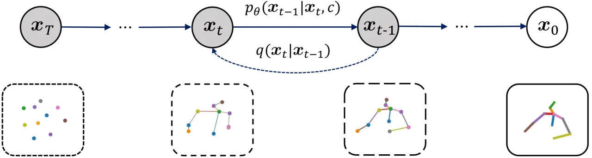
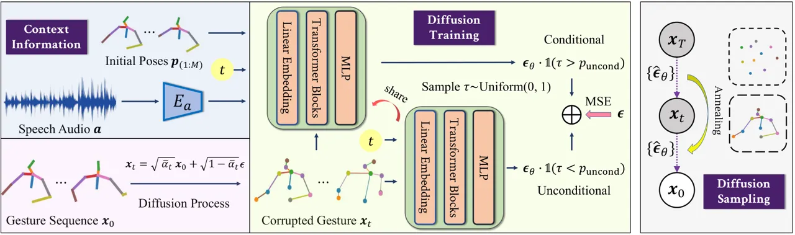
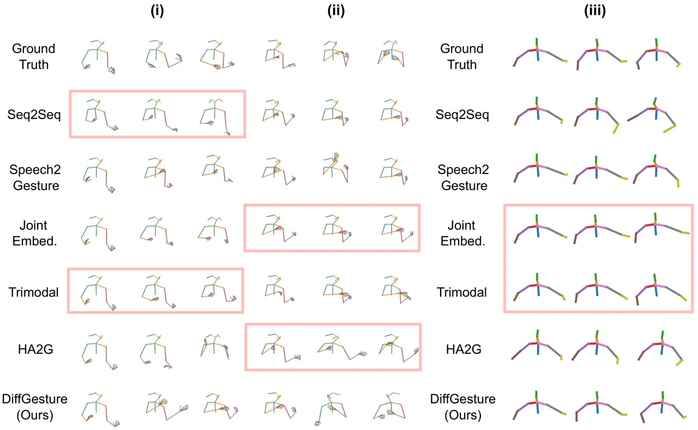

# Taming Diffusion Models for Audio-Driven Co-Speech Gesture Generation

Lingting Zhu ^(†)^(†)thanks: Equal contribution. Affiliation: The
University of Hong Kong    Xian Liu¹¹footnotemark: 1 Affiliation: The
Chinese University of Hong Kong    Xuanyu Liu Affiliation: The
University of Hong Kong    Rui Qian Affiliation: The Chinese University
of Hong Kong    Ziwei Liu Affiliation: S-Lab, Nanyang Technological
University{ltzhu99, u3008631}@connect.hku.hk, lqyu@hku.hk,{alvinliu,
qr021}@ie.cuhk.edu.hk, ziwei.liu@ntu.edu.sg    Lequan Yu ^(†)^(†)thanks:
Corresponding author. Affiliation: The University of Hong Kong

###### Abstract

Animating virtual avatars to make co-speech gestures facilitates various
applications in human-machine interaction. The existing methods mainly
rely on generative adversarial networks (GANs), which typically suffer
from notorious mode collapse and unstable training, thus making it
difficult to learn accurate audio-gesture joint distributions. In this
work, we propose a novel diffusion-based framework, named Diffusion
Co-Speech Gesture (DiffGesture), to effectively capture the cross-modal
audio-to-gesture associations and preserve temporal coherence for
high-fidelity audio-driven co-speech gesture generation. Specifically,
we first establish the diffusion-conditional generation process on clips
of skeleton sequences and audio to enable the whole framework. Then, a
novel Diffusion Audio-Gesture Transformer is devised to better attend to
the information from multiple modalities and model the long-term
temporal dependency. Moreover, to eliminate temporal inconsistency, we
propose an effective Diffusion Gesture Stabilizer with an annealed noise
sampling strategy. Benefiting from the architectural advantages of
diffusion models, we further incorporate implicit classifier-free
guidance to trade off between diversity and gesture quality. Extensive
experiments demonstrate that DiffGesture achieves state-of-the-art
performance, which renders coherent gestures with better mode coverage
and stronger audio correlations. Code is available at
[https://github.com/Advocate99/DiffGesture](https://github.com/Advocate99/DiffGesture).

## 1 Introduction

Making co-speech gestures is an innate human behavior in daily
conversations, which helps the speakers to express their thoughts and
the listeners to comprehend the meanings \[10, 32, 38\]. Previous
linguistic studies verify that such non-verbal behaviors could liven up
the atmosphere and improve mutual intimacy \[7, 8, 21\]. Therefore,
animating virtual avatars to gesticulate co-speech movements is crucial
in embodied AI. To this end, recent researches focus on the problem of
audio-driven co-speech gesture generation \[16, 41, 30, 25\], which
synthesizes human upper body gesture sequences that are aligned to the
speech audio.

Early attempts downgrade this task as a searching-and-connecting
problem, where they predefine the corresponding gestures of each speech
unit and stitch them together by optimizing the transitions between
consecutive motions for coherent results \[11, 21, 31\]. In recent
years, the compelling performance of deep neural networks has prompted
data-driven approaches. Previous studies establish large-scale
speech-gesture corpus to learn the mapping from speech audio to human
skeletons in an end-to-end manner \[4, 27, 39, 34, 30, 25, 5\]. To
attain more expressive results, Ginosar et al. \[16\] and Yoon et
al. \[41\] propose GAN-based methods to guarantee realism by adversarial
mechanism, where the discriminator is trained to distinguish real
gestures from the synthetic ones while the generator’s objective is to
fool the discriminator. However, such pipelines suffer from the inherent
mode collapse and unstable training, making them difficult to capture
the high-fidelity audio-conditioned gesture distribution, resulting in
dull or unreasonable poses.



Figure 1: Illustration of Conditional Generation Process in Co-Speech
Gesture Generation. The diffusion process $`q`$ gradually adds Gaussian
noise to the gesture sequence (i.e., $`\bm{x}_{0}`$ sampled from the
real data distribution). The generation process $`p_{\theta}`$ learns to
denoise the white noise (i.e., $`\bm{x}_{T}`$ sampled from the normal
distribution) conditioned on context information $`\bm{c}`$. Note that
$`\bm{x}_{t}`$ denotes the corrupted gesture sequence at the $`t`$-th
diffusion step.

The recent paradigm of diffusion probabilistic models provides a new
perspective for realistic generation \[19, 37\], facilitating
high-fidelity synthesis with desirable properties such as good
distribution coverage and stable training compared to GANs. However, it
is non-trivial to adapt existing diffusion models for co-speech gesture
generation. Most existing conditional diffusion models deal with static
data and conditions \[36, 35\] (e.g., the image-text pairs without
temporal dimension), while co-speech gesture generation requires
generating temporally coherent gesture sequences conditioned on
continual audio clips. Further, the commonly used denoising strategy in
existing diffusion models samples independently and identically
distributed (i.i.d.) noises in latent space to increase diversity.
However, this strategy tends to introduce variation for each gesture
frame and lead to temporal inconsistency in skeleton sequences.
Therefore, how to generate high-fidelity co-speech gestures with strong
audio correlations and temporal consistency is quite challenging within
the diffusion paradigm.

To address the above challenges, we propose a tailored Diffusion
Co-Speech Gesture framework to capture the cross-modal audio-gesture
associations while maintaining temporal coherence for high-fidelity
audio-driven co-speech gesture generation, named DiffGesture. As shown
in Figure 1, we formulate our task as a diffusion-conditional generation
process on clips of skeleton and audio, where the diffusion phase is
defined by gradually adding noise to gesture sequence, and the
generation phase is referred as a parameterized Markov chain with
conditional context features of audio clips to denoise the corrupted
gestures. As we treat the multi-frame gesture clip as the diffusion
latent space, the skeletons can be efficiently synthesized in a
non-autoregressive manner to bypass error accumulation. To better attend
to the sequential conditions from multiple modalities and enhance the
temporal coherence, we then devise a novel Diffusion Audio-Gesture
Transformer architecture to model audio-gesture long-term temporal
dependency. Particularly, the per-frame skeleton and contextual features
are concatenated in the aligned temporal dimension and embedded as
individual input tokens to a Transformer block. Further, to eliminate
the temporal inconsistency caused by the naive denoising strategy in the
inference stage, we thus propose a new Diffusion Gesture Stabilizer
module to gradually anneal down the noise discrepancy in the temporal
dimension. Finally, we incorporate implicit classifier-free guidance by
jointly training the conditional and unconditional models, which allows
us to trade off between the diversity and sample quality during
inference.

Extensive experiments on two benchmark datasets show that our
synthesized results are coherent with stronger audio correlations and
outperform the state-of-the-arts with superior performance on co-speech
gesture generation. To summarize, our main contributions are
three-fold: 1) As an early attempt at taming diffusion models for
co-speech gesture generation, we formally define the diffusion and
denoising process in gesture space, which synthesizes audio-aligned
gestures of high-fidelity. 2) We devise the Diffusion Audio-Gesture
Transformer with implicit classifier-free diffusion guidance to better
deal with the input conditional information from multiple sequential
modalities. 3) We propose the Diffusion Gesture Stabilizer to eliminate
temporal inconsistency with an annealed noise sampling strategy.

## 2 Related Work

Co-Speech Gesture Generation. Synthesizing co-speech gestures is crucial
for a variety of applications. Conventional studies resort to rule-based
pipelines \[11, 21, 31\], where linguistic experts pre-define the
speech-gesture pairs and refine the transitions between different
motions. Recent works exploit neural networks to learn the mapping from
speech to gesture based on a large training corpus, where an
off-the-shelf pose estimator is leveraged to label the online videos for
pseudo annotations \[42, 16, 30, 1, 41, 34\]. Meanwhile, some works
study the influence of input modality, verifying the connections between
co-speech gesture and speech audio \[25\], text transcript \[3\],
speaking style \[2\], and speaker identity \[41\]. To further improve
the model’s capacity, previous studies explore multiple architecture
choices, including CNN \[17\], RNN \[42\], Transformer \[6\], and
VQ-VAE \[40, 29\]. Notably, several recent works are based on GANs to
guarantee realistic results \[16, 41, 34, 30\], which involve the
adversarial training between the generator and the discriminator.
However, the notorious mode collapse and unstable training of GANs
prevent the high-fidelity gesture distribution learning conditioned on
audio.



Figure 2: Overview of the Diffusion Co-Speech Gesture (DiffGesture)
Framework. Given the gesture sequence $`\bm{x}_{0}`$, we first establish
the forward diffusion (purple) and conditional denoising process (green)
in gesture space. Then, we devise the Diffusion Audio-Gesture
Transformer to attend to the input conditions of initial poses
$`\bm{p}_{(1:M)}`$, speech audio $`\bm{a}`$, time embedding $`t`$ and
corrupted gesture $`\bm{x}_{t}`$ from multiple modalities (blue). At the
diffusion sampling stage (grey), we propose the Diffusion Gesture
Stabilizer to eliminate temporal inconsistency with an annealed noise
sampling strategy. To further incorporate implicit classifier-free
guidance, we jointly train the conditional ($`1-p_{\textit{uncond}}`$)
and unconditional ($`p_{\textit{uncond}}`$) models. This allows us to
trade off between diversity and quality during inference.

Diffusion Probabilistic Models. Diffusion probabilistic models have
achieved promising results on unconditional image generation \[19\],
which are further applied to conditional tasks like
text-to-image \[36\]. Among the diffusion-based literature, previous
works focus on static data and conditions. Besides, they mainly utilize
explicit guidance like pretrained classifiers \[13\] and CLIP
similarity \[33, 28, 36, 35\] to guide the generation process. In this
work, we explore a more challenging co-speech gesture generation
setting, where the gesture data and audio conditions are both
sequential, and the audio-to-gesture mapping is implicit. To this end,
we propose the Diffusion Audio-Gesture Transformer to guarantee
temporally aligned generation. We further propose the Diffusion Gesture
Stabilizer to simultaneously achieve diverse and temporally coherent
gestures with an annealed noise sampling strategy.

## 3 Our Approach

Figure 2 depicts an overview of the proposed DiffGesture framework to
generate co-speech gestures of high fidelity. In this section, we first
introduce the problem formulation of audio-driven co-speech gesture
generation (Section 3.1). We then establish the forward diffusion and
the reverse conditional generation process in gesture space
(Section 3.2). Furthermore, we elaborate the Diffusion Audio-Gesture
Transformer to attend to the conditions from multiple modalities and
enhance the speech-gesture correlations with temporal dependency
(Section 3.3). To eliminate temporal inconsistency introduced by naive
noises, we propose a novel Diffusion Gesture Stabilizer with annealed
noise sampling strategies and describe this module in (Section 3.4).
Finally, incorporating implicit classifier-free guidance in co-speech
gestures is discussed in (Section 3.5).

### 3.1 Problem Formulation

With a large-scale co-speech gesture training corpus, we leverage the
speaking videos with clear co-speech upper body movements for model
learning. In particular, for each video clip of $`N`$ frames, we extract
the accompanying speech audio sequence
$`\bm{a}=\{\bm{a}_{1},\dots,\bm{a}_{N}\}`$ and use the off-the-shelf
human pose estimator OpenPose \[9\] to annotate the per-frame human
skeletons as $`\bm{x}=\{\bm{p}_{1},\dots,\bm{p}_{N}\}`$. We follow
baseline methods \[41, 30\] to further pre-process such skeletal
representation into the concatenation of unit direction vectors as
$`\bm{p}_{i}=\left[\bm{d}_{i,1},\bm{d}_{i,2},\dots,\bm{d}_{i,J-1}\right]`$,
where $`\bm{p}_{i}`$ denotes the 2D keypoint coordinates of the $`i`$-th
frame, $`J`$ is the total joint number and $`\bm{d}_{i,j}`$ represents
the unit direction vector between the $`j`$-th and the ($`j`$+1)-th
joint of the $`i`$-th image frame. The diffusion model’s reverse
denoising process $`G`$ parameterized by $`\theta`$ is optimized to
synthesize the human skeleton sequence $`\bm{x}`$, which is further
conditioned on the speech audio sequence $`\bm{a}`$ and the initial
poses $`\{\bm{p}_{1},\dots,\bm{p}_{M}\}`$ of the first $`M`$ frames. The
learning objective of the overall framework can be formulated as
$`\mathop{\arg\min}_{\theta}||\bm{x}-G_{\theta}(\bm{a},\bm{p}_{1},\dots,\bm{p}_{M})||.`$

### 3.2 Gesture Space Forward and Reverse Process

Given $`\bm{x}_{0}\in\mathbb{R}^{N\times 3(J-1)}`$ sampled from real
data distribution $`q(\bm{x}_{0})`$, our goal is to learn a model
distribution $`p_{\theta}(\bm{x}_{0})`$ parameterized by $`\theta`$ that
approximates $`q(\bm{x}_{0})`$. Specifically, denoising diffusion
probabilistic models (DDPMs) \[19\] define the latent variable models of
the form
$`p_{\theta}(\bm{x}_{0})=\int p_{\theta}(\bm{x}_{0:T})d\bm{x}_{1:T}`$,
where $`\bm{x}_{1:T}`$ are latent variables in the same sample space as
$`\bm{x}_{0}`$ with the same dimensionality.

The Forward Diffusion Process. The forward process, which is also termed
as the diffusion process, approximates the posterior distribution
$`q(\bm{x}_{1:T}|\bm{x}_{0})`$. It is defined as a Markov chain that
gradually adds Gaussian noise to the data sample according to a variance
schedule $`\beta_{1},\dots,\beta_{T}`$:

```math
\displaystyle q(\bm{x}_{1:T}|\bm{x}_{0}) \displaystyle=\prod_{t=1}^{T}q(\bm{x}_{t}|\bm{x}_{t-1}), \tag{1}
```

```math
\displaystyle\textit{where }\quad q(\bm{x}_{t}|\bm{x}_{t-1}) \displaystyle=\mathcal{N}(\bm{x}_{t};\sqrt{1-\beta_{t}}\bm{x}_{t-1},\beta_{t}\bm{I}). \tag{2}
```

The variances $`\beta_{t}`$ are constant hyperparameters to ease the
modeling of the reverse process \[19\]. Through such a corruption
scheme, the structural information of the original skeleton is gradually
substituted by noises, which finally leads to a pure white noise when
$`T`$ goes to infinity. Therefore, the prior latent distribution of
$`p(\bm{x}_{T})`$ is $`\mathcal{N}(\bm{x}_{T};\bm{0},\bm{I})`$ with only
information of Gaussian noise.

Reverse Conditional Gesture Generation. The reverse process, which is
also termed as the generative process, estimates the joint distribution
of $`p_{\theta}(\bm{x}_{0:T})`$. As proved in \[15\], the reverse
process of the continuous diffusion process preserves the same
transition distribution form, which motivates us to leverage a Gaussian
transition to formulate $`p_{\theta}(\bm{x}_{t-1}|\bm{x}_{t})`$ under an
unconditional setting, which approximates the intractable process as:

```math
\displaystyle p_{\theta}(\bm{x}_{0:T}) \displaystyle=p_{\theta}(\bm{x}_{T})\prod_{t=1}^{T}p_{\theta}(\bm{x}_{t-1}|\bm{x}_{t}), \tag{3}
```

```math
\displaystyle\textit{where }p_{\theta}(\bm{x}_{t-1}|\bm{x}_{t}) \displaystyle=\mathcal{N}(\bm{x}_{t-1};\mu_{\theta}(\bm{x}_{t},t),\Sigma_{\theta}(\bm{x}_{t},t)). \tag{4}
```

The corrupted noisy data $`\bm{x}_{t}`$ is sampled by
$`q(\bm{x}_{t}|\bm{x}_{0})=\mathcal{N}(\bm{x}_{t};\sqrt{\bar{\alpha}_{t}}\bm{x}_{0},(1-\bar{\alpha}_{t})\bm{I})`$,
where $`\alpha_{t}=1-\beta_{t}`$ and
$`\bar{\alpha}_{t}=\prod_{s=1}^{t}\alpha_{s}`$. Note that we set the
variances $`\Sigma_{\theta}(\bm{x}_{t},t)=\beta_{t}\bm{I}`$ to untrained
time-dependent constants. The above diffusion model formulations show
compelling performances on unconditional generation. To further adapt to
the conditional co-gesture synthesis, we have to provide additional
inputs to the model, including the audio and initial poses. Therefore,
we treat the speech audio $`\bm{a}`$ and initial poses $`\bm{p}_{1:M}`$
as context information $`\bm{c}`$ and inject conditions into the
generation process. The reverse process of each timestep (Eq. 4) can be
thus updated as:

```math
\displaystyle p_{\theta}(\bm{x}_{t-1}|\bm{x}_{t},\bm{c}) \displaystyle=\mathcal{N}(\bm{x}_{t-1};\mu_{\theta}(\bm{x}_{t},t,\bm{c}),\beta_{t}\bm{I}). \tag{5}
```

In this way, we could start the generation process by firstly sample a
Gaussian noise $`\bm{x}_{T}\sim\mathcal{N}(\bm{0},\bm{I})`$ and follow
the Markov chain to iteratively denoise the latent variable
$`\bm{x}_{t}`$ via Eq. 5 to get the final results. The overview of
conditional co-speech gesture process is illustrated in Figure 1.

Training Objective. To optimize the overall framework, we optimize the
variational lower bound on negative log-likelihood:
$`\mathbb{E}[-\log p_{\theta}(\bm{x}_{0})]\leq\mathbb{E}_{q}[-\log\frac{p_{\theta}(\bm{x}_{0})}{q(\bm{x}_{1:T}|\bm{x}_{0})}].`$
We rewrite the loss function conditioned on context $`\bm{c}`$ and
eliminate all the constant items that do not require training:
$`L(\theta)=\mathbb{E}_{q}[\sum_{t=2}^{T}D_{KL}(q(\bm{x}_{t-1}|\bm{x}_{t},\bm{x}_{0})||p_{\theta}(\bm{x}_{t-1}|\bm{x}_{t},\bm{c}))]`$.
With reparameterization, we can represent each term in $`L_{\theta}`$
using MSE loss. We follow \[19\] to further simplify the training
objective to the ensemble of MSE losses as:

```math
\displaystyle L(\theta)=\mathbb{E}_{q}[\left\|\bm{\epsilon}-\bm{\epsilon}_{\theta}(\sqrt{\bar{\alpha}_{t}}\bm{x}_{0}+\sqrt{1-\bar{\alpha}_{t}}\bm{\epsilon},\bm{c},t)\right\|^{2}], \tag{6}
```

where $`t`$ is uniformly sampled between 1 and $`T`$. As we jointly
train the model under conditional and unconditional setting, a trainable
masked embedding with probability $`p_{\textit{uncond}}`$ replaces
context $`\bm{c}`$ and the diffusion model predicts the noise in the
unconditional setting. The detailed principles will be discussed in
Section 3.5.

### 3.3 Diffusion Audio-Gesture Transformer

With the naive conditional generation scheme as specified in
Section 3.2, we still confront a critical problem in the setting of
co-speech gesture generation. Since $`\bm{x}_{0}`$ denotes the skeleton
sequence of $`N`$ frames, there exists temporal dependency among the
target sequence and context information, making it more complex than
time-invariant tasks like image generation. Therefore, how to guarantee
temporally coherent results in a non-autoregressive conditional
generation process remains an unsolved problem.

In contrast to most previous studies that resort to recurrent
networks \[41, 30\], we propose to make use of the Transformer’s strong
capacity in sequential data modeling. Specifically, since the noisy
gesture sequence $`\bm{x}_{t}`$ and the contextual information
$`\bm{c}`$ align in the temporal dimension, we concatenate them in the
feature channel. In this way, the skeleton and context condition of each
frame serve as an individual token, which captures the long-term
dependency by the self-attention mechanism:

```math
\displaystyle\text{Attention}(\mathbf{Q,K,V})=\text{softmax}(\frac{\mathbf{QK^{\mathsf{T}}}}{\sqrt{\ell}})\mathbf{V}, \tag{7}
```

where $`\mathbf{Q,K,V}`$ are the query, key, and value matrix from input
tokens, $`\ell`$ is the channel dimension, and $`\mathsf{T}`$ is the
matrix transpose operation. Such a design also avoids severe error
accumulation in autoregressive pipelines, enabling us to generate
coherent gesture sequences.

### 3.4 Diffusion Gesture Stabilizer

In DDPMs, the independent random variables $`\bm{z}`$ introduced at the
sampling stage promote diversity and thus systematically improve the
task performance. However, the variation in temporal dimension
introduced by $`\bm{z}`$, especially when timestep $`t`$ is small in the
reverse process, can have a negative effect on temporal consistency. At
the inference stage, to achieve the trade-off between diversity and
temporal consistency, we propose a novel Diffusion Gesture Stabilizer
without extra training expenses under two annealed scenarios, where the
term “annealed” means that the process is transitioned from high
variance and entropy (hot) to low variance and entropy (cold).

Thresholding. Since temporally independent Gaussian noises inevitably
introduce inconsistency, restricting the temporal variation naturally
helps to avoid inconsistency. And hard thresholding serves as an
effective trick. In detail, we set a time threshold $`t_{0}`$, and then
use the same $`\bm{z}\in\mathbb{R}^{N\times C}`$ in the naive sampling
strategy for $`t>t_{0}`$ and set $`\bm{z}=\{\bm{z}_{0}\}_{i=1}^{N}`$ for
$`t\leq t_{0}`$, where $`z_{0}\in\mathbb{R}^{C}`$ follows
$`\mathcal{N}(\bm{0},\bm{I})`$ which do not introduce variation in the
temporal dimension.

Smooth Sampling. We further modify
$`\bm{z}(t)=\{\bm{z}_{i}(t)\}_{i=1}^{N}`$ to be a smooth annealing
version via variance-aware sampling. In the original sampling rule of
DDPMs, i.i.d.variables $`\bm{z}_{i}(t)`$ are sampled from
$`\mathcal{N}(\bm{0},\bm{I})`$. With smooth resampling, we first sample
$`\bm{z}_{0}(t)\sim\mathcal{N}(\bm{0},\sigma^{2}_{a}(t)\bm{I})`$ only
once for each timestep $`t`$ in the reverse process, then given
$`\bm{z}_{0}(t)`$, we sample
$`\bm{z}_{i}(t)|\bm{z}_{0}(t)\sim\mathcal{N}(\bm{z}_{0}(t),(1-\sigma^{2}_{a}(t))\bm{I})`$
for $`i\in\{1,\dots,N`$}, where $`\sigma_{a}(t)\in\left[0,1\right]`$ is
a non-decreasing function to achieve variance annealing.

1: repeat

2:  Sample $`(\bm{x}_{0},\bm{c})\sim q(\bm{x}_{0},\bm{c})`$

3:  Sample $`\tau\sim\operatorname{Uniform}(0,1)`$. Set
$`\bm{c}=\varnothing`$ if $`\tau<p_{\textit{uncond}}`$

4:  Sample $`t\sim\operatorname{Uniform}(\{1,\ldots,T\})`$

5:  Compute
$`\nabla_{\theta}\left\|\bm{\epsilon}-\bm{\epsilon}_{\theta}(\sqrt{\bar{\alpha}_{t}}\bm{x}_{0}+\sqrt{1-\bar{\alpha}_{t}}\bm{\epsilon},\bm{c},t)\right\|^{2}`$

6:  Perform gradient descent

7: until converged

Algorithm 1 Training

### 3.5 Implicit Classifier-free Guidance

In co-speech gesture literature, the speech-to-gesture mapping is
implicit, where the same audio corresponds to diverse gestures and
different audios could incur the same motion \[22, 25\], making it
difficult to utilize the commonly used explicit classifier
guidance \[13, 33\]. Therefore, how can we further exploit practical
guidance for better audio correlations and mode coverage? Our solution
to this question is to train an extra “unconditional” diffusion model to
implicitly guide the generation. Dhariwal et al. \[13\] first introduce
the classifier guidance of cross-entropy gradient
$`\nabla_{\bm{x}_{t}}\log p_{\phi}(y|\bm{x}_{t})`$, where the pretrained
classifier is parameterized by $`\phi`$ and $`y`$ denotes the
classification logits. This gradient term is further scaled by the
covariance matrix to modify the mean value of transition distribution in
Eq. 4. To adapt to the cases where no explicit guidance is available, we
follow \[20\] to jointly train the conditional and unconditional models,
termed as classifier-free guidance. In particular, according to the
implicit classifier’s property that
$`p^{i}(y|\bm{x}_{t})\propto p(\bm{x}_{t}|y)/p(\bm{x}_{t})`$, we could
derive a gradient relationship in the implicit classifier as:

```math
\displaystyle\nabla_{\bm{x}_{t}}\log p^{i}(y|\bm{x}_{t})\propto\nabla_{\bm{x}_{t}}\log p(\bm{x}_{t}|y)-\nabla_{\bm{x}_{t}}\log p(\bm{x}_{t}), \tag{8}
```

which is further proportional to
$`\bm{\epsilon}^{*}(\bm{x}_{t}|y)-\bm{\epsilon}^{*}(\bm{x}_{t})`$.
Therefore, we use a single Transformer network to parameterize both
settings by a mix-up training trick: for the probability of
$`p_{uncond}`$, we set the context information $`\bm{c}`$ as masked
embedding to train the unconditional setting, while for other cases, we
train the original conditional counterpart. The training is shown in
Algorithm 1.

Sampling with Classifier-free Guidance. Starting from Gaussian noise, we
iteratively remove noises in $`x_{t}`$. As we use implicit
classifier-free guidance, similar to Equation 8, the predicted Gaussian
noise is modified as:

```math
\displaystyle\hat{\bm{\epsilon}}_{\theta}=\bm{\epsilon}_{\theta}(\bm{x}_{t},t)+s\cdot(\bm{\epsilon}_{\theta}(\bm{x}_{t},\bm{c},t)-\bm{\epsilon}_{\theta}(\bm{x}_{t},t)), \tag{9}
```

where $`s`$ is the scale parameter to trade off the diversity and
quality. With classifier-free guidance, Algorithm 2 reveals how to
generate co-speech gestures given the trained diffusion model via the
Diffusion Gesture Stabilizer with the Smooth Sampling annealed scenario.

1: Trained diffusion model $`\theta`$,
$`\bm{x}_{T}\sim\mathcal{N}(\bm{0},\bm{I})`$

2: for $`t=T,\dotsc,1`$ do

3:
 $`\hat{\bm{\epsilon}}_{\theta}=\bm{\epsilon}_{\theta}(\bm{x}_{t},t)+s\cdot(\bm{\epsilon}_{\theta}(\bm{x}_{t},\bm{c},t)-\bm{\epsilon}_{\theta}(\bm{x}_{t},t))`$

4:  $`\bm{z}_{0}(t)\sim\mathcal{N}(\bm{0},\sigma^{2}_{a}(t)\bm{I})`$

5:  for $`i=1,\dotsc,N`$ do

6:
  $`\bm{z}_{i}(t)\sim\mathcal{N}(\bm{z}_{0}(t),(1-\sigma^{2}_{a}(t))\bm{I})`$

7:  end for

8:  $`\bm{z}(t)=\{\bm{z}_{1}(t),\dots,\bm{z}_{N}(t)\}`$, if $`t>1`$,
else $`\bm{z}(t)=\bm{0}`$

9:
 $`\bm{x_{t-1}}=\frac{1}{\sqrt{\alpha_{t}}}\left(\bm{x_{t}}-\frac{1-\alpha_{t}}{\sqrt{1-\bar{\alpha}_{t}}}\hat{\bm{\epsilon}}_{\theta}\right)+\sigma_{t}\bm{z}(t)`$

10: end for

11: return $`\bm{x}_{0}`$

Algorithm 2 Sampling

## 4 Experiments

|                          |                    |                 |                        |                       |                 |                        |
| ------------------------ | ------------------ | --------------- | ---------------------- | --------------------- | --------------- | ---------------------- |
|                          | TED Gesture \[41\] |                 |                        | TED Expressive \[30\] |                 |                        |
| Methods                  | FGD $`\downarrow`$ | BC $`\uparrow`$ | Diversity $`\uparrow`$ | FGD $`\downarrow`$    | BC $`\uparrow`$ | Diversity $`\uparrow`$ |
| Ground Truth             | 0                  | 0.698           | 108.525                | 0                     | 0.703           | 178.827                |
| Attention Seq2Seq \[42\] | 18.154             | 0.196           | 82.776                 | 54.920                | 0.152           | 122.693                |
| Speech2Gesture \[16\]    | 19.254             | 0.668           | 93.802                 | 54.650                | 0.679           | 142.489                |
| Joint Embedding \[3\]    | 22.083             | 0.200           | 90.138                 | 64.555                | 0.130           | 120.627                |
| Trimodal \[41\]          | 3.729              | 0.667           | 101.247                | 12.613                | 0.563           | 154.088                |
| HA2G \[30\]              | 3.072              | 0.672           | 104.322                | 5.306                 | 0.641           | 173.899                |
| DiffGesture (Ours)       | 1.506              | 0.699           | 106.722                | 2.600                 | 0.718           | 182.757                |

Table 1: The Quantitative Results on TED Gesture \[41\] and TED
Expressive \[30\]. We compare the proposed diffusion-based method
against recent SOTA methods \[3, 16, 41, 42, 30\] and ground truth. For
FGD, the lower, the better; for other metrics, the higher, the better.

### 4.1 Co-Speech Gesture Datasets

TED Gesture. As a large-scale dataset for gesture generation research,
TED Gesture dataset \[42, 41\] contains 1,766 TED videos of different
narrators covering various topics. We follow the data process in former
works \[41, 30\], where the poses are resampled with 15 FPS, and frame
segments of length 34 are obtained with a stride of 10.

TED Expressive. While the poses in TED Gesture only contain 10 upper
body key points without vivid finger movements, the TED Expressive
dataset \[30\] is further expressive of both finger and body movements.
The state-of-art 3D pose estimator ExPose \[12\] is used to fully
capture the pose information in data. As a result, TED Expressive
annotates the 3D coordinates of 43 keypoints, including 13 upper body
joints and 30 finger joints.

### 4.2 Experimental Settings

Comparison Methods. We compare our method on two benchmark datasets with
the state-of-the-art methods in recent years. 1) Attention
Seq2Seq \[42\] elaborates on the attention mechanism to generate pose
sequences from speech text. 2) Speech2Gesture \[16\] uses spectrums of
the speech audio segments as the input and generates speech gestures
adversarially. 3) Joint Embedding \[3\] maps text and motion to the same
embedding space, then generates outputs from motion description text. 4)
Trimodal \[41\] serves as a strong baseline that learns from text,
audio, and speaker identity to generate gestures, outperforming former
methods by a large margin. 5) HA2G \[30\] introduces a hierarchical
audio learner that captures information across different semantic
granularities, achieving state-of-the-art performances. This method
hierarchically extracts rich features at the cost of heavier GPU memory
overhead, while our method requires much smaller expenses.

Implementation Details. For all the methods in both datasets, we set
$`N=34`$ and $`M=4`$ to get $`M`$-frame pose sequences where the first
$`N`$ frames are used for reference, termed as initial poses. There are
$`J`$ upper body joints in all the frames of pose sequences, where
$`J=10`$ for TED Gesture and $`J=43`$ for TED Expressive.
Following \[41\], to eliminate the effect of the joint lengths and root
motion, we represent the joints’ positions using $`J-1`$ directional
vectors normalized to the unit vectors and train the model to learn the
directional vectors. For the audio processing, we use the same audio
encoder used in \[41\] to extract the feature of the raw audio clips
directly. The audio clips are encoded as $`N`$ audio feature vectors of
32-D. The audio feature and initial poses are concatenated to form the
conditional context information of the diffusion model. For the
diffusion process, the number of timesteps is $`T=500`$, and the
variances increase linearly from $`\beta_{1}=1e-4`$ to
$`\beta_{T}=0.02`$. For the Stabilizer, $`t_{0}`$ can be adjusted from
20-30 for Thresholding, and a quadratic non-increasing function
$`\sigma_{a}(t)`$ is applied for Smooth Sampling. The hidden dimension
of the transformer blocks, is set to 256 for TED Gesture and 512 for TED
Expressive. We use 8 Transformer blocks, each of which comprises a
multi-head self-attention block and a Feed-Forward Network. We use an
Adam optimizer, and the learning rate is $`5e-4`$. It takes 10 hours to
train the model on TED Gesture and 20 hours on TED Expressive on a
single NVIDIA GeForce RTX 3090 GPU.



Figure 3: Visualization Results of Our DiffGesture on Two Datasets.
Three cases are picked up, where (i) and (ii) are TED Expressive cases,
and (iii) is a TED Gesture case. We highlight dull cases generated by
comparison methods with rectangles, indicating the mode collapse
phenomenon of baselines.

| Methods     | GT   | S2S. \[42\] | S2G. \[16\] | Joint. \[3\] | Tri. \[41\] | HA2G \[30\] | DiffGesture(Ours) |
| ----------- | ---- | ----------- | ----------- | ------------ | ----------- | ----------- | ----------------- |
| Naturalness | 4.33 | 1.22        | 2.56        | 1.22         | 3.22        | 3.67        | 4.00              |
| Smoothness  | 3.94 | 3.50        | 1.61        | 3.44         | 3.44        | 3.39        | 3.89              |
| Synchrony   | 4.00 | 1.67        | 3.17        | 1.39         | 3.28        | 3.44        | 3.89              |

Table 2: User Study Results. The ratings of motion naturalness,
smoothness, and synchrony, are on a scale of 1-5, with 5 being the best.

### 4.3 Evaluation Metrics

In evaluation, we use three metrics that are used in co-speech gesture
generation and relative fields \[30, 24\].

Fréchet Gesture Distance (FGD). Similar to the Fréchet Inception
Distance (FID) metric \[18\], which is widely applied in image
generation studies, FGD is used to measure the distance between the
synthesized gesture distribution and the real data distribution. Yoon et
al. \[41\] define FGD by training a skeleton sequence auto-encoder to
extract the features of the real gesture sequences $`X`$ and the
features of the generated gesture sequences $`\hat{X}`$:

```math
\mathrm{FGD}(X,\hat{X})=\|\mu_{r}-\mu_{g}\|^{2}+\rm{Tr}(\Sigma_{r}+\Sigma_{g}-2(\Sigma_{r}\Sigma_{g})^{1/2}),
```

where $`\mu_{r}`$ and $`\Sigma_{r}`$ are the first and the second
moments of the latent feature distribution of the real gestures $`X`$,
and $`\mu_{g}`$ and $`\Sigma_{g}`$ are the first and the second moments
of the latent feature distribution of the generated gestures
$`\hat{X}`$. We intuitively find that among the three metrics, FGD tells
the most whether the generated pose sequences are of high quality.

|                                 | TED Gesture \[41\] |                 |                        | TED Expressive \[30\] |                 |                        |
| ------------------------------- | ------------------ | --------------- | ---------------------- | --------------------- | --------------- | ---------------------- |
| Methods                         | FGD $`\downarrow`$ | BC $`\uparrow`$ | Diversity $`\uparrow`$ | FGD $`\downarrow`$    | BC $`\uparrow`$ | Diversity $`\uparrow`$ |
| DiffGesture Base                | 2.450              | 0.632           | 104.688                | 3.822                 | 0.707           | 174.377                |
| DiffGesture w/o Stabilizer      | 2.219              | 0.674           | 105.192                | 2.792                 | 0.721           | 180.125                |
| DiffGesture w/o classifier-free | 1.810              | 0.673           | 105.644                | 3.326                 | 0.717           | 178.245                |
| DiffGesture (Ours)              | 1.506              | 0.699           | 106.722                | 2.600                 | 0.718           | 182.757                |

Table 3: Ablation Study on the Proposed Modules. We investigate
effectiveness of the proposed modules, Diffusion Gesture Stabilizer and
implicit classifier-free guidance. The results indicate that the
proposed modules consistently improve performance on the benchmarks.

Beat Consistency Score (BC). Proposed in \[26, 24\], BC measures
motion-audio beat correlation. Considering that the kinematic velocities
vary from different joints, we use the change of included angle between
bones to track motion beats following \[30\]. Specifically, we can
calculate the mean absolute angle change (MAAC) of angle $`\theta_{j}`$
in adjacent frames by
$`\mathrm{MAAC}(\theta_{j})=\frac{1}{S}\frac{1}{T-1}\sum_{s=1}^{S}\sum_{t=1}^{T-1}\|\theta_{j,s,t+1}-\theta_{j,s,t}\|_{1}`$,
where $`S`$ denotes the total number of clips in the dataset, $`T`$
denotes the number of frames in each clip, and $`\theta_{j,s,t}`$ is the
included angle between the $`j`$-th and the ($`j`$+1)-th bone of the
$`s`$-th clip at time-step $`t`$. Then, we can compute the angle change
rate of frame $`t`$ for the $`s`$-th clip as
$`\frac{1}{J-1}\sum_{j=1}^{J-1}(\|\theta_{j,s,t+1}-\theta_{j,s,t}\|_{1}/\mathrm{MAAC}(\theta_{j}))`$.
Then we extract the local optima whose first-order difference is higher
than a threshold to get kinematic beats, which are used to compute BC
later. Following \[24\] to detect audio beat by onset strength \[14\],
we compute the average distance between each audio beat and its nearest
motion beat as Beat Consistency Score:

```math
\mathrm{BC}=\frac{1}{n}\sum_{i=1}^{n}\exp(-\frac{\min_{\forall t_{j}^{y}\in B^{y}}\|t_{i}^{x}-t_{j}^{y}\|^{2}}{2\sigma^{2}}), \tag{10}
```

where $`t^{x}_{i}`$ is the $`i`$-th audio beats, $`B^{y}=\{t^{y}_{i}\}`$
is the set of the kinematic beats, and $`\sigma`$ is a parameter to
normalize sequences, set to $`0.1`$ empirically.

Diversity. This metric evaluates the variations among generated gestures
corresponding to various inputs \[23\]. We use the same feature
extractor when measuring FGD to map synthesized gestures into latent
feature vectors and calculate the mean feature distance. In detail, we
randomly pick 500 generated samples and compute the mean absolute error
between the features and the shuffled features.

### 4.4 Evaluation Results

Quantitative Results. We compare our method with all the baselines with
three metrics on TED Gesture and TED Expressive. The results are shown
in Table 1. For the metrics of Ground Truth, we report the values in our
implementation. For TED Gesture, we report FGD of all baselines
in \[30\] and evaluate BC and Diversity on our own²² 2 Since there
exists an evaluation bug for the BC metric in HA2G \[30\], we report the
re-implemented results from Liu et al.. For TED Expressive, all the
results of baselines are reported from \[30\]. Assuming the pseudo
ground truth pose follows the real distribution, the FGD of Ground Truth
in the table is 0. It is observed that our DiffGesture achieves
state-of-the-art performance on both datasets, especially outperforming
existing methods by a large margin on TED Expressive. Besides, since BC
and Diversity are proposed to measure motion-audio beat correlation and
variation, these two metrics of Ground Truth cannot be treated as upper
bounds, and it is worth noting that our results may be higher than the
ones of Ground Truth, indicating that the generated gestures are of high
quality. Qualitative Results. We show the keyframes of all the methods
on two datasets in Figure 3. Since TED Expressive requires a higher
ability of generative models, we pick up two cases for TED Expressive
and one for TED Gesture. For each case, we select three keyframes (an
early, a middle, and a late one) to show the pose motions. Comparison
methods tend to generate slow and invariant poses and sometimes produce
unreliable and stiff results. In contrast, DiffGesture produces diverse
human-like poses without resulting in mean poses which are slow and
rigid. Besides, as a primary drawback of GAN-based methods, mode
collapse makes comparison methods often produce a single type of output,
which is severe for pose motion generation. Such a phenomenon is shown
in Fig. 3, where the generated frames with nearly the same pose are
highlighted with rectangles.

User Study. To better validate the qualitative performance, we conduct a
user study on the generated co-speech gestures. The study involves 18
participants, with 9 females and 9 males in the age range of 18-25 years
old. The participants are required to grade the motion’s quality and
coherence, and all the clips are without labels. In total, we pick up 30
cases, 20 for TED-Expressive and 10 for TED Gesture. For each case, we
show 7 videos with the order of the methods shuffling, including the
ground truth. We adopt the Mean Opinion Scores rating protocol, and each
participant is required to rate three aspects of generated motions:
Naturalness; Smoothness; Synchrony between speech and generated
gestures. The results are shown in Table 2 where the ratings are on a
scale of 1 to 5, with 5 being the best. Our participants widely accept
that our method produces high-fidelity results in all three aspects.

### 4.5 Ablation Studies

Ablation Study on the Proposed Modules. To demonstrate the effectiveness
of our proposed DiffGesture, we present ablation studies on the key
modules in the framework. In detail, we conduct experiments as
follows. 1) DiffGesture Base means we only use the proposed conditional
diffusion generation process without further design. 2) DiffGesture w/o
classifier-free, where classifier-free guidance is not implemented at
both the training stage and inference stage. 3) DiffGesture w/o
Stabilizer, where Diffusion Gesture Stabilizer is removed at the
inference stage. The results are reported in Table 3. The results
illustrate the effectiveness of the designed Diffusion Gesture
Stabilizer and the implicit classifier-free guidance.

| Methods                  | FGD $`\downarrow`$ | BC $`\uparrow`$ | Diversity $`\uparrow`$ |
| ------------------------ | ------------------ | --------------- | ---------------------- |
| GRU on $`D_{a}`$         | 14.343             | 0.658           | 98.472                 |
| Transformer on $`D_{a}`$ | 1.506              | 0.699           | 106.722                |
| GRU on $`D_{b}`$         | 17.452             | 0.680           | 172.168                |
| Transformer on $`D_{b}`$ | 2.600              | 0.718           | 182.757                |

Table 4: Ablation Study on the Network Architectures. We compare the
performance of GRU and Transformer for diffusion-based backbone on TED
Gesture ($`D_{a}`$) and TED Expressive ($`D_{b}`$).

Ablation Study on the Network Architectures. We investigate the
performance of the GRU architecture in diffusion models,
autoregressively generating poses in \[41, 30\]. We replace the
Diffusion Audio-Gesture Transformer with the GRU in the diffusion model.
All the context inputs remain the same as our method and are
concatenated before the diffusion network. Results are shown in Table 4.
Though GRU serves as a strong baseline network in co-gesture learning,
it fails to generate high-performance data like our designed
Transformer-based network, which indicates the effectiveness of our
Transformer-based network and that applying diffusion models in the
audio-driven conditional generation is a non-trivial task.

## 5 Conclusion

In this work, we present a novel diffusion-based framework DiffGesture
for co-speech gesture generation. To generate coherent gestures with
strong audio correlations, we propose the Diffusion Audio-Gesture
Transformer with the Diffusion Gesture Stabilizer to better attend to
the condition information. Such a non-autoregressive pipeline helps to
efficiently generate results and reduce error accumulation. We hope our
method offers a new perspective for diffusion-based temporal generation
and how to capture sequential cross-modal dependencies.

Acknowledgement. The work described in this paper was partially
supported by grants from the Research Grants Council of the Hong Kong
Special Administrative Region, China (T45-401/22-N), the National
Natural Science Fund (62201483), HKU Seed Fund for Basic Research
(202009185079 and 202111159073), RIE2020 Industry Alignment Fund –
Industry Collaboration Projects (IAF-ICP) Funding Initiative, as well as
cash and in-kind contribution from the industry partner(s).

## References

- \[1\] Chaitanya Ahuja, Dong Won Lee, Ryo Ishii, and Louis-Philippe
  Morency. No gestures left behind: Learning relationships between
  spoken language and freeform gestures. In Proceedings of the 2020
  Conference on Empirical Methods in Natural Language Processing:
  Findings, pages 1884–1895, 2020.
- \[2\] Chaitanya Ahuja, Dong Won Lee, Yukiko I Nakano, and
  Louis-Philippe Morency. Style transfer for co-speech gesture
  animation: A multi-speaker conditional-mixture approach. In European
  Conference on Computer Vision, pages 248–265. Springer, 2020.
- \[3\] Chaitanya Ahuja and Louis-Philippe Morency. Language2pose:
  Natural language grounded pose forecasting. In 2019 International
  Conference on 3D Vision (3DV), pages 719–728. IEEE, 2019.
- \[4\] Simon Alexanderson, Gustav Eje Henter, Taras Kucherenko, and
  Jonas Beskow. Style-controllable speech-driven gesture synthesis using
  normalising flows. In Computer Graphics Forum, volume 39, pages
  487–496. Wiley Online Library, 2020.
- \[5\] Tenglong Ao, Qingzhe Gao, Yuke Lou, Baoquan Chen, and Libin Liu.
  Rhythmic gesticulator: Rhythm-aware co-speech gesture synthesis with
  hierarchical neural embeddings. ACM Transactions on Graphics (TOG),
  41(6):1–19, 2022.
- \[6\] Uttaran Bhattacharya, Nicholas Rewkowski, Abhishek Banerjee,
  Pooja Guhan, Aniket Bera, and Dinesh Manocha. Text2gestures: A
  transformer-based network for generating emotive body gestures for
  virtual agents. In 2021 IEEE Virtual Reality and 3D User Interfaces
  (VR), pages 1–10. IEEE, 2021.
- \[7\] Judee K Burgoon, Thomas Birk, and Michael Pfau. Nonverbal
  behaviors, persuasion, and credibility. Human communication research,
  17(1):140–169, 1990.
- \[8\] B. Butterworth and U. Hadar. Gesture, speech, and computational
  stages: A reply to mcneill. Psychological Review, 96(1):168–174, 1989.
- \[9\] Zhe Cao, Gines Hidalgo, Tomas Simon, Shih-En Wei, and Yaser
  Sheikh. Openpose: realtime multi-person 2d pose estimation using part
  affinity fields. IEEE transactions on pattern analysis and machine
  intelligence, 43(1):172–186, 2019.
- \[10\] Justine Cassell, David McNeill, and Karl-Erik McCullough.
  Speech-gesture mismatches: Evidence for one underlying representation
  of linguistic and nonlinguistic information. Pragmatics & cognition,
  7(1):1–34, 1999.
- \[11\] Justine Cassell, Catherine Pelachaud, Norman Badler, Mark
  Steedman, Brett Achorn, Tripp Becket, Brett Douville, Scott Prevost,
  and Matthew Stone. Animated conversation: rule-based generation of
  facial expression, gesture & spoken intonation for multiple
  conversational agents. In Proceedings of the 21st annual conference on
  Computer graphics and interactive techniques, pages 413–420, 1994.
- \[12\] Vasileios Choutas, Georgios Pavlakos, Timo Bolkart, Dimitrios
  Tzionas, and Michael J. Black. Monocular expressive body regression
  through body-driven attention. In European Conference on Computer
  Vision (ECCV), 2020.
- \[13\] Prafulla Dhariwal and Alexander Quinn Nichol. Diffusion models
  beat GANs on image synthesis. In A. Beygelzimer, Y. Dauphin, P. Liang,
  and J. Wortman Vaughan, editors, Advances in Neural Information
  Processing Systems, 2021.
- \[14\] Daniel Ellis. Beat tracking by dynamic programming. Journal of
  New Music Research, 36:51–60, 03 2007.
- \[15\] William Feller. On the theory of stochastic processes, with
  particular reference to applications. In Berkeley Symposium on
  Mathematical Statistics and Probability, pages 403–432, 1949.
- \[16\] Shiry Ginosar, Amir Bar, Gefen Kohavi, Caroline Chan, Andrew
  Owens, and Jitendra Malik. Learning individual styles of
  conversational gesture. In Proceedings of the IEEE/CVF Conference on
  Computer Vision and Pattern Recognition, pages 3497–3506, 2019.
- \[17\] Ikhsanul Habibie, Weipeng Xu, Dushyant Mehta, Lingjie Liu,
  Hans-Peter Seidel, Gerard Pons-Moll, Mohamed Elgharib, and Christian
  Theobalt. Learning speech-driven 3d conversational gestures from
  video. In Proceedings of the 21st ACM International Conference on
  Intelligent Virtual Agents, pages 101–108, 2021.
- \[18\] Martin Heusel, Hubert Ramsauer, Thomas Unterthiner, Bernhard
  Nessler, and Sepp Hochreiter. Gans trained by a two time-scale update
  rule converge to a local nash equilibrium. In I. Guyon, U. Von
  Luxburg, S. Bengio, H. Wallach, R. Fergus, S. Vishwanathan, and R.
  Garnett, editors, Advances in Neural Information Processing Systems,
  volume 30. Curran Associates, Inc., 2017.
- \[19\] Jonathan Ho, Ajay Jain, and Pieter Abbeel. Denoising diffusion
  probabilistic models. Advances in Neural Information Processing
  Systems, 33:6840–6851, 2020.
- \[20\] Jonathan Ho and Tim Salimans. Classifier-free diffusion
  guidance. In NeurIPS 2021 Workshop on Deep Generative Models and
  Downstream Applications, 2021.
- \[21\] Chien-Ming Huang and Bilge Mutlu. Robot behavior toolkit:
  generating effective social behaviors for robots. In 2012 7th ACM/IEEE
  International Conference on Human-Robot Interaction (HRI), pages
  25–32. IEEE, 2012.
- \[22\] Dong Won Lee, Chaitanya Ahuja, and Louis-Philippe Morency.
  Crossmodal clustered contrastive learning: Grounding of spoken
  language to gesture. In GENEA: Generation and Evaluation of Non-verbal
  Behaviour for Embodied Agents Workshop 2021, 2021.
- \[23\] Hsin-Ying Lee, Xiaodong Yang, Ming-Yu Liu, Ting-Chun Wang,
  Yu-Ding Lu, Ming-Hsuan Yang, and Jan Kautz. Dancing to music. In H.
  Wallach, H. Larochelle, A. Beygelzimer, F. d'Alché-Buc, E. Fox, and R.
  Garnett, editors, Advances in Neural Information Processing Systems,
  volume 32. Curran Associates, Inc., 2019.
- \[24\] Buyu Li, Yongchi Zhao, Shi Zhelun, and Lu Sheng. Danceformer:
  Music conditioned 3d dance generation with parametric motion
  transformer. In Proceedings of the AAAI Conference on Artificial
  Intelligence, volume 36, pages 1272–1279, 2022.
- \[25\] Jing Li, Di Kang, Wenjie Pei, Xuefei Zhe, Ying Zhang, Zhenyu
  He, and Linchao Bao. Audio2gestures: Generating diverse gestures from
  speech audio with conditional variational autoencoders. In Proceedings
  of the IEEE/CVF International Conference on Computer Vision, pages
  11293–11302, 2021.
- \[26\] Ruilong Li, Shan Yang, David A Ross, and Angjoo Kanazawa. Ai
  choreographer: Music conditioned 3d dance generation with aist++. In
  Proceedings of the IEEE/CVF International Conference on Computer
  Vision, pages 13401–13412, 2021.
- \[27\] Haiyang Liu, Zihao Zhu, Naoya Iwamoto, Yichen Peng, Zhengqing
  Li, You Zhou, Elif Bozkurt, and Bo Zheng. Beat: A large-scale semantic
  and emotional multi-modal dataset for conversational gestures
  synthesis. In Computer Vision–ECCV 2022: 17th European Conference, Tel
  Aviv, Israel, October 23–27, 2022, Proceedings, Part VII, pages
  612–630. Springer, 2022.
- \[28\] Xihui Liu, Dong Huk Park, Samaneh Azadi, Gong Zhang, Arman
  Chopikyan, Yuxiao Hu, Humphrey Shi, Anna Rohrbach, and Trevor Darrell.
  More control for free! image synthesis with semantic diffusion
  guidance. In Proceedings of the IEEE/CVF Winter Conference on
  Applications of Computer Vision, pages 289–299, 2023.
- \[29\] Xian Liu, Qianyi Wu, Hang Zhou, Yuanqi Du, Wayne Wu, Dahua Lin,
  and Ziwei Liu. Audio-driven co-speech gesture video generation. arXiv
  preprint arXiv:2212.02350, 2022.
- \[30\] Xian Liu, Qianyi Wu, Hang Zhou, Yinghao Xu, Rui Qian, Xinyi
  Lin, Xiaowei Zhou, Wayne Wu, Bo Dai, and Bolei Zhou. Learning
  hierarchical cross-modal association for co-speech gesture generation.
  In Proceedings of the IEEE/CVF Conference on Computer Vision and
  Pattern Recognition (CVPR), pages 10462–10472, June 2022.
- \[31\] Stacy Marsella, Yuyu Xu, Margaux Lhommet, Andrew Feng, Stefan
  Scherer, and Ari Shapiro. Virtual character performance from speech.
  In Proceedings of the 12th ACM SIGGRAPH/Eurographics Symposium on
  Computer Animation, pages 25–35, 2013.
- \[32\] David McNeill. Hand and mind. De Gruyter Mouton, 2011.
- \[33\] Alexander Quinn Nichol, Prafulla Dhariwal, Aditya Ramesh,
  Pranav Shyam, Pamela Mishkin, Bob Mcgrew, Ilya Sutskever, and Mark
  Chen. GLIDE: Towards photorealistic image generation and editing with
  text-guided diffusion models. In Proceedings of the 39th International
  Conference on Machine Learning, volume 162 of Proceedings of Machine
  Learning Research, pages 16784–16804. PMLR, 17–23 Jul 2022.
- \[34\] Shenhan Qian, Zhi Tu, Yihao Zhi, Wen Liu, and Shenghua Gao.
  Speech drives templates: Co-speech gesture synthesis with learned
  templates. In Proceedings of the IEEE/CVF International Conference on
  Computer Vision, pages 11077–11086, 2021.
- \[35\] Aditya Ramesh, Prafulla Dhariwal, Alex Nichol, Casey Chu, and
  Mark Chen. Hierarchical text-conditional image generation with clip
  latents. arXiv preprint arXiv:2204.06125, 2022.
- \[36\] Chitwan Saharia, William Chan, Saurabh Saxena, Lala Li, Jay
  Whang, Emily Denton, Seyed Kamyar Seyed Ghasemipour, Burcu Karagol
  Ayan, S Sara Mahdavi, Rapha Gontijo Lopes, et al. Photorealistic
  text-to-image diffusion models with deep language understanding. arXiv
  preprint arXiv:2205.11487, 2022.
- \[37\] Yang Song, Jascha Sohl-Dickstein, Diederik P Kingma, Abhishek
  Kumar, Stefano Ermon, and Ben Poole. Score-based generative modeling
  through stochastic differential equations. In International Conference
  on Learning Representations, 2021.
- \[38\] P. Wagner, Z. Malisz, and S. Kopp. Gesture and speech in
  interaction: An overview. Speech Communication, 57:209–232, 2014.
- \[39\] Jing Xu, Wei Zhang, Yalong Bai, Qibin Sun, and Tao Mei.
  Freeform body motion generation from speech. arXiv preprint
  arXiv:2203.02291, 2022.
- \[40\] Payam Jome Yazdian, Mo Chen, and Angelica Lim. Gesture2vec:
  Clustering gestures using representation learning methods for
  co-speech gesture generation. In 2022 IEEE/RSJ International
  Conference on Intelligent Robots and Systems (IROS), pages 3100–3107.
  IEEE, 2022.
- \[41\] Youngwoo Yoon, Bok Cha, Joo-Haeng Lee, Minsu Jang, Jaeyeon Lee,
  Jaehong Kim, and Geehyuk Lee. Speech gesture generation from the
  trimodal context of text, audio, and speaker identity. ACM
  Transactions on Graphics (TOG), 39(6):1–16, 2020.
- \[42\] Youngwoo Yoon, Woo-Ri Ko, Minsu Jang, Jaeyeon Lee, Jaehong Kim,
  and Geehyuk Lee. Robots learn social skills: End-to-end learning of
  co-speech gesture generation for humanoid robots. In 2019
  International Conference on Robotics and Automation (ICRA), pages
  4303–4309. IEEE, 2019.
