# Deformable Model-Driven Neural Rendering for High-Fidelity 3D Reconstruction of Human Heads Under Low-View Settings

Baixin Xu ^(†)^(†)thanks: Project page:
[https://github.com/xubaixinxbx/3dheads](https://github.com/xubaixinxbx/3dheads).
Affiliation:  S-Lab, Nanyang Technological University    Jiarui Zhang
Affiliation:  Peking University    Kwan-Yee Lin Affiliation:  The
Chinese University of Hong Kong Affiliation:  Shanghai Artificial
Intelligence Laboratory    Chen Qian Affiliation:  SenseTime Research   
Ying He ^(†)^(†)thanks: Corresponding author: Y. He (yhe@ntu.edu.sg).
Affiliation:  S-Lab, Nanyang Technological University

###### Abstract

Reconstructing 3D human heads in low-view settings presents technical
challenges, mainly due to the pronounced risk of overfitting with
limited views and high-frequency signals. To address this, we propose
geometry decomposition and adopt a two-stage, coarse-to-fine training
strategy, allowing for progressively capturing high-frequency geometric
details. We represent 3D human heads using the zero level-set of a
combined signed distance field, comprising a smooth template, a
non-rigid deformation, and a high-frequency displacement field. The
template captures features that are independent of both identity and
expression and is co-trained with the deformation network across
multiple individuals with sparse and randomly selected views. The
displacement field, capturing individual-specific details, undergoes
separate training for each person. Our network training does not require
3D supervision or object masks. Experimental results demonstrate the
effectiveness and robustness of our geometry decomposition and two-stage
training strategy. Our method outperforms existing neural rendering
approaches in terms of reconstruction accuracy and novel view synthesis
under low-view settings. Moreover, the pre-trained template serves a
good initialization for our model when encountering unseen individuals.

## 1 Introduction

Accurately modeling and rendering human heads is crucial for various
digital human-related applications as the head is one of the most
distinguishing features that helps us identify individuals. Neural
implicit functions \[22, 34, 37, 35, 9, 46, 4\] have recently emerged as
a promising technique for synthesizing novel views of complex objects,
including human heads, by learning a continuous function from multi-view
images without being tied to a specific resolution. However, training
such deep learning models often requires a large number of images as
input, which can be costly and computationally inefficient. Moreover, a
single implicit field may not generalize well to unseen heads,
particularly under setting of low or sparse views.

This paper aims to develop a robust method for learning neural implicit
functions that can accurately reconstruct 3D human heads with
high-fidelity geometry and appearance from low-view inputs, thereby
reducing the need of extensive data collection and annotation. To
achieve this goal, we learn a signed distance field (SDF) that consists
of a smooth template, a non-rigid deformation, and a high-frequency
displacement map. The template represents identity-independent and
expression-neutral features, while the deformation and displacement maps
encode identity-dependent geometric details that are trained for each
specific individual. We represent 3D human heads as the zero level-set
of the composed SDF. Our training involves two stages. The first stage
takes the whole set of persons as input, and learns an
identity-independent and expression-neutral template head and a
non-rigid deformation between each observed head and the template head.
In the second stage, we learn an identity-dependent displacement map for
further refining the geometry. To train the proposed SDF without any 3D
supervision, we adopt a volume rendering scheme \[22, 37, 34\] to
minimize the difference between the rendered colors and the ground-truth
colors. We also adopt regularization terms for the SDF, the deformation,
the displacement map and the latent codes.

We evaluate our approach on both senior and young persons and
demonstrate that it is robust and effective in learning SDFs for both
types of inputs, resulting in 3D surfaces with high-fidelity geometry.
Our experiments show that our method outperforms existing methods in
terms of reconstruction accuracy and visual quality. We also demonstrate
that our method can generalize to unseen identities by using the
pre-trained template as a good initialization.

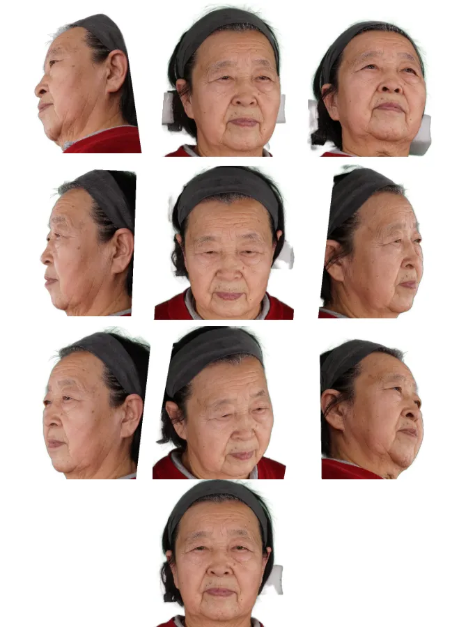

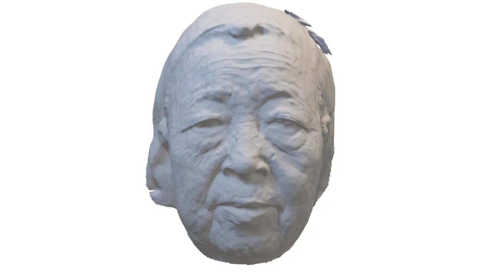

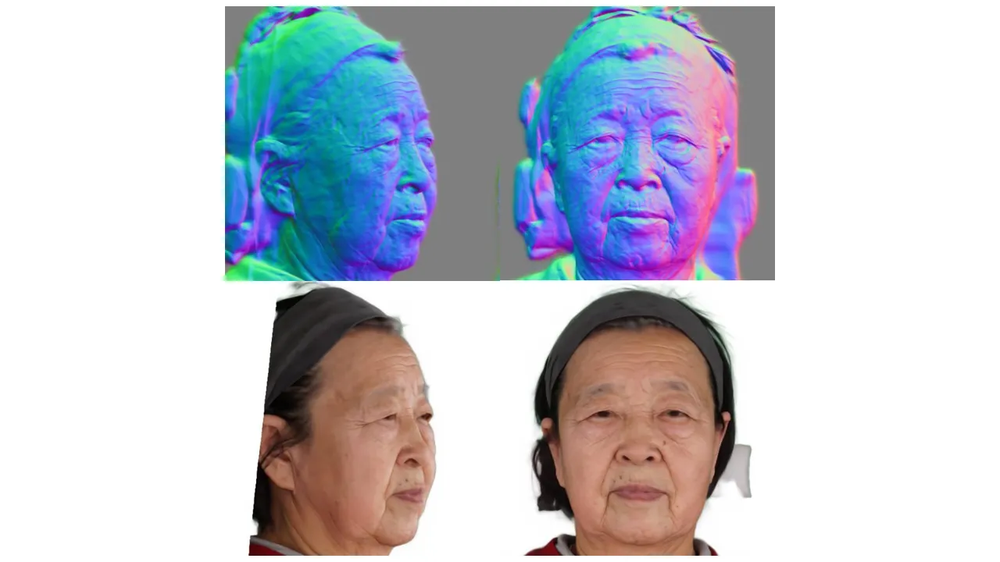

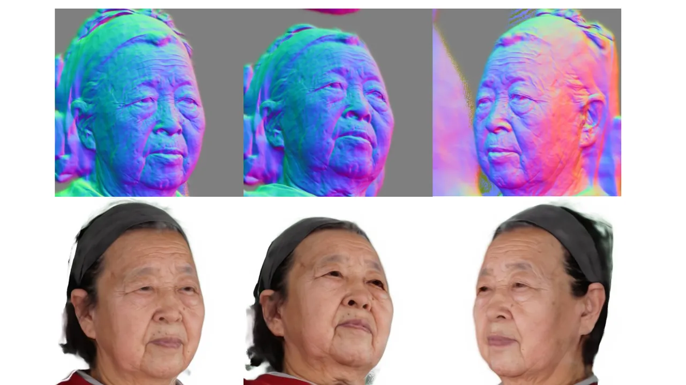

Input 3D head Training views Novel views

Figure 1: An example of a 3D head reconstructed by our method using 10
input views. Refer also to the supplementary material for a video
demonstration.

## 2 Related Work

Multi-view 3D reconstruction is a classical problem in computer vision,
and traditional approaches can be divided into voxel-based \[30, 14, 5\]
and point-based methods \[10, 1, 29, 28\]. Voxel-based methods divide
the 3D space into voxels and determine which ones belong to the object.
However, due to the cubic space complexity, these methods are
computationally expensive and may not be suitable for reconstructing
complex objects. Point-based methods are memory efficient, but they lack
connectivity information, which can lead to incomplete or inaccurate
reconstructions.

Neural radiance fields \[20, 43, 2\] have demonstrated remarkable
results in representing complex 3D scenes from only 2D images as input.
However, due to the discrete nature of the radiance field, their
geometric reconstructions often suffer from inaccuracies. To improve the
capability of geometry reconstruction, several techniques have been
proposed to replace the density-based representation by a
geometry-oriented representation. For example, UNISURF \[22\] uses
occupancy fields, while NeuS \[34\] and VolSDF \[37\] use signed
distance fields.

Neural implicit representations have garnered significant attention in
3D reconstruction due to their representation power and memory
efficiency \[24, 31\]. DVR \[21\] and IDR \[38\] focus on making the
surface rendering pipeline differentiable. These methods often require
masks to distinguish objects from the background. Recent works focus on
improving the applicability and representation capability of neural
implicit functions. Geo-NeuS \[9\] introduces multi-view constraints
from structure from motion to encourage SDF networks to avoid geometry
ambiguity under rendering loss. D2IM-Net \[16\] adopts an implicit
displacement field for recovering geometric details from a single input
image. IDF \[40\] represents complex surfaces as a smooth base surface
and a displacement mapping. HF-NeuS \[35\] decomposes the SDF into a
base function and a displacement function with a coarse-to-fine strategy
to gradually increase high-frequency details. DIF \[6\] deforms a target
object to match the template shape and employs a correction field for
handling topological changes.

3D morphable face model (3DMM) \[3\] has been extensively used in 3D
face reconstruction and animation. It is a statistical model that
represents the shape and texture of a human face using a low-dimensional
vector space. The combination of 3DMM with deep learning has proven
effective in producing high-quality 3D faces \[15, 45\], however it
often requires 3D supervision to achieve good performance. Recent works
also aim to improve the representation capability of 3DMM to the entire
head, using multi-view images \[39, 12, 47, 32\] and monocular
videos \[46\]. We refer the readers to a comprehensive survey of 3D
morphable model and recent developments \[7\].

## 3 Method

### 3.1 Overview

We have a set of RGB portrait images $`\mathcal{I}=\{I_{i}\}`$ for $`m`$
individuals. Each individual is captured from $`k`$ different viewpoints
covering the front, left, and right sides. Additionally, each image is
associated with camera parameters $`\pi_{i}`$. Our goal is to learn a
signed distance field for the 3D geometry of the human head and a
radiance field for colors for each individual. To obtain high-fidelity
geometry and appearance, our method decomposes the geometric
representation of 3D human heads into identity-independent and
-dependent components.

The ID-independent component is a smooth base surface that represents
the common geometric characteristics of human heads and serves as a
template. Since the ID-independent and expression-neutral template is
the standard reference for all individuals. The ID-dependent components
include a non-rigid deformation that maps each individual head to the
template and a displacement field that encodes high-frequency geometric
details such as wrinkles and small facial features that are particular
to a given person.

As shown in Figure 2, our method employs a two-stage training framework
for reconstructing 3D geometry and colors in a coarse-to-fine manner.
The first stage is to train a geometry network for learning the template
and a point-wise non-rigid deformation between an individual head and
the template head. In the second stage, we train a displacement network
for learning identity-related fine geometric details to further improve
the reconstruction quality.

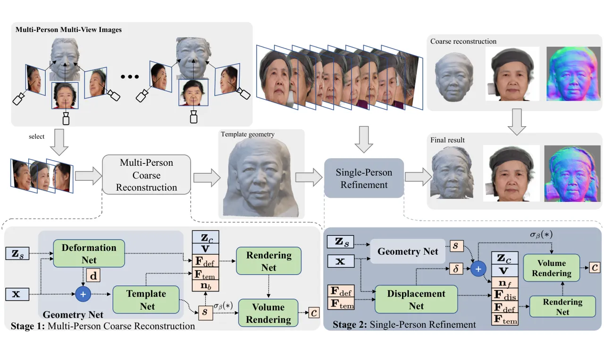

Figure 2: Data flow and network architecture. Our model reconstructs 3D
geometry and colors of human heads in a two-stage, coarse-to-fine
manner. In the first stage, we optimize the Template Network and the
Deformation Network, along with the latent code space and Rendering
Network, across different identities to obtain an identity-independent
and expression neutral template. In the second stage, we introduce a
Displacement Network and further optimize it with a set of portrait
images of a specific subject.

### 3.2 Multi-Person Coarse Reconstruction

Geometry network. To learn a template head from multiple individuals, we
follow i3DMM \[39\] to design the Geometry Network $`f_{\text{geo}}`$
with two components: a Template Network $`f_{\text{tem}}`$ and a
Deformation Network $`f_{\text{def}}`$. The Template Network is designed
to obtain common features across all identities, and its output is a
mean face of all identities used in training. On the other hand, the
Deformation Network aims to find correspondences from each specific
subject to the mean face and learn features associated with the
identity.

To model each identity separately, we introduce a shape code
$`\mathbf{z}_{s}`$ and a color code $`\mathbf{z}_{c}`$, which are
learned in the shape and color embedding spaces, respectively.
Specifically, with the shape code $`\mathbf{z}_{s}`$ representing an
identity, the Geometry Network $`f_{\text{geo}}`$ learns a global SDF
for each 3D point $`\mathbf{x}\in\mathbb{R}^{3}`$ and generates a
geometric feature $`\mathbf{F}_{\text{geo}}`$ for $`\mathbf{x}`$ that
will be used to learn the displacement map and radiance information.
Then the surface normal $`\mathbf{n}_{b}`$, viewing direction
$`\mathbf{v}`$, and geometric feature $`\mathbf{F}_{\text{geo}}`$ at
$`\mathbf{x}`$ are fed into the Rendering Network $`f_{\text{ren}}`$,
which predicts the radiance for the ray. The output of Stage 1 is an
identity-independent and expression-neutral template.

Specifically, given a query point $`\mathbf{x}\in\mathbb{R}^{3}`$ in the
observation space and an identity-related latent code for geometry
$`\mathbf{z}_{s}\in\mathbb{R}^{128}`$, the Deformation Network
$`f_{\text{def}}`$ predicts an offset vector
$`\mathbf{d}\in\mathbb{R}^{3}`$ that maps $`\bf x`$ to the template
space and also outputs an ID-dependent feature
$`\mathbf{F}_{\text{def}}\in\mathbb{R}^{192}`$

```math
f_{\text{def}}(\mathbf{x},\mathbf{z}_{s})=(\mathbf{d},\mathbf{F}_{\text{def}}). \tag{1}
```

Then the Template Network returns a signed distance value
$`s\in\mathbb{R}`$ for the deformed position $`\mathbf{x+d}`$ in the
template space and a template feature
$`\mathbf{F}_{\text{tem}}\in\mathbf{R}^{64}`$ for the deformed position
$`\mathbf{x}+\mathbf{d}`$

```math
f_{\text{tem}}(\mathbf{x}+\mathbf{d})=(s,\mathbf{F}_{\text{tem}}). \tag{2}
```

The identity-independent template feature $`\mathbf{F}_{\text{tem}}`$
will be concatenated with the ID-dependent deformation feature
$`\mathbf{F}_{\text{def}}`$ and used in the subsequent Rendering
Network. Putting it all together, we formulate the Geometry Network as
follows

```math
f_{\text{geo}}=f_{\text{tem}}\circ f_{\text{def}}(\mathbf{x},\mathbf{z}_{s}). \tag{3}
```

Rendering network. To learn the SDF $`s`$ from a set of 2D images
$`\mathcal{I}`$ with camera parameters, we cast rays from the camera
position $`\bf o`$ to each pixel of the input images. Consider a ray
$`\mathbf{r}(t)=\mathbf{o}+t\mathbf{v}`$, where $`\bf v`$ is a unit
vector and $`t\geq 0`$ is the distance from the camera center. The
Rendering Network, denoted as $`f_{\text{ren}}`$, is responsible for
computing the radiance at any query point
$`\mathbf{x}\in\mathbf{r}(t)`$.

To consider the variety of textures among different persons in the
dataset, the network also takes an ID-dependent latent code for color
$`\mathbf{z}_{c}`$, the template feature $`\mathbf{F}_{\text{tem}}`$,
the deformation feature $`\mathbf{F}_{\text{def}}`$, and the normal of
the base surface $`\mathbf{n}_{b}`$ as input \[17\] and outputs the
radiance $`c\in\mathbb{R}^{3}`$

```math
\displaystyle f_{\text{ren}}(\mathbf{z}_{c},\mathbf{x},\mathbf{v},\text{concat}(\mathbf{F}_{\text{def}},\mathbf{F}_{\text{tem}}),\mathbf{n}_{b})=c, \tag{4}
```

where $`\mathbf{n}_{b}=\nabla s`$ is the gradient of the SDF of the base
surface given an individual, representing the normal direction.

To compute the radiance, we first transform the SDF into an S-density
$`\sigma`$ as in \[37\]

```math
\displaystyle\sigma(\mathbf{x})=\alpha\Phi_{\beta}(-s(\mathbf{x})), \tag{5}
```

where $`\alpha`$ and $`\beta`$ are learnable parameters and
$`\Phi_{\beta}`$ is the cumulative distribution function of the Laplace
distribution with zero mean and $`\beta`$ scale. We query the radiance
$`c_{i}`$ and the signed distance $`s_{i}`$ for a set of samples
$`\{\mathbf{r}(t_{i})\}`$ along $`\bf r`$. The color of the pixel
$`C(\mathbf{r})`$ on the image is obtained by accumulating all the
samples along the ray

```math
C(r)=\sum_{i}T_{i}\left(1-\exp\left(-\sigma_{i}u_{i}\right)\right)c_{i},
```

where $`c_{i}`$ is the radiance computed by the Rendering Network,
$`T_{i}=\exp\left(-\sum_{j=1}^{i-1}\sigma_{j}u_{j}\right)`$ is the
transparency indicating the probability that the ray travels from $`0`$
to $`t_{i}`$ without hitting any other particle, and
$`u_{i}=t_{i+1}-t_{i}`$ is the distance between adjacent samples.

### 3.3 Single-Person Refinement

With the pre-trained template head available, Stage 2 of our method aims
to refine the SDF to learn fine geometric details for a specific
individual. Notice that the template together with the non-rigid
deformation computed in Stage 1 does not suit our purpose. The reason is
two-folded. Firstly, the deformation alone does not provide sufficient
degrees of freedom for modeling high-frequency details. Secondly, the
template represents the mean shape of all individuals in the dataset and
does not carry ID-dependent features for a specific individual. For
example, some individuals have a scarf while others do not.

To address this issue, we propose a high-frequency displacement map that
captures the ID-dependent geometric details of each specific individual.
To achieve this, we introduce the Displacement Network, which takes both
the ID-independent template feature $`\mathbf{F}_{\text{tem}}`$ and the
ID-dependent deformation feature $`\mathbf{F}_{\text{def}}`$ as inputs,
along with the query position $`\mathbf{x}`$.

The network then outputs a displacement $`\delta\in\mathbb{R}`$ and a
displacement feature $`\mathbf{F}_{\text{dis}}\in\mathbb{R}^{64}`$,
which is ID-dependent

```math
f_{\text{dis}}(\mathbf{x},\mathbf{F}_{\text{tem}},\mathbf{F}_{\text{def}})=(\delta,\mathbf{F}_{\text{dis}}),. \tag{6}
```

We use the displacement to update the signed distance. Specifically, for
the query point $`\mathbf{x}`$ in the observation space, the updated
signed distance is

```math
\hat{s}(\mathbf{x})=s(\mathbf{x})+\delta(\mathbf{x})=f_{\text{tem}}(\mathbf{x}+\mathbf{d})+\delta(\mathbf{x}). \tag{7}
```

The displacement $`\delta`$ is a non-zero value if the query point
$`\bf x`$ is on the region with fine geometric details, such as
wrinkles; otherwise, for points $`\bf x`$ are on a relatively smooth
region, such as cheek, $`\delta`$ is close to zero. Since we expect the
template undergoing the ID-dependent non-rigid deformation recovers most
of the shape and the displacement is to add fine details, $`\delta`$
should be small and smooth. We regularize $`\delta`$ by using both the
absolute value term $`|\delta|`$ to control the significance and a total
variation (TV) term $`|\nabla\delta|`$ to ensure the smoothness.

The displacement feature $`\mathbf{F}_{\text{dis}}`$ is designed to
further enrich the ID-dependent features of the individual and help
capture more fine-grained geometric details. Therefore, the overall
feature $`\mathbf{F}_{\text{all}}`$ is a concatenation of the
deformation feature $`\mathbf{F}_{\text{def}}`$, the template feature
$`\mathbf{F}_{\text{tem}}`$ and the displacement feature
$`\mathbf{F}_{\text{dis}}`$, i.e.,

```math
\mathbf{F}_{\text{all}}=\text{concat}(\mathbf{F}_{\text{def}},\mathbf{F}_{\text{tem}},\mathbf{F}_{\text{dis}}). \tag{8}
```

Note that the Rendering Network $`f_{\text{ren}}`$ is used in both
stages to train the template and the final shape separately. In Stage 1,
we feed the deformation and the template features
$`\text{concat}(\mathbf{F}_{\text{def}},\mathbf{F}_{\text{tem}})`$ into
it for computing the color for the specific human head. In Stage 2 we
feed the overall feature

```math
f_{\text{ren}}(\mathbf{z}_{c},\mathbf{x},\mathbf{v},\mathbf{F}_{\text{all}},\mathbf{n}_{f})=c \tag{9}
```

into the network to obtain the radiance for a specific individual, where
$`\mathbf{n}_{f}=\nabla\hat{s}`$ is the normal direction of the final
surface. Our ablation study confirms that the displacement map is
effective in reconstructing ID-dependent details or features that are
absent from the template.

### 3.4 Training

All the components, $`f_{\text{def}}`$, $`f_{\text{tem}}`$,
$`f_{\text{dis}}`$ and $`f_{\text{ren}}`$, are multi-layer perceptrons.
The Deformation Network, the Template Network and the Displacement
Network consist of 4, 8, and 4 layers, respectively. The Rendering
Network is used in both stages and they are slightly different. In Stage
1, it has 4 layers with positional encoding of 6 and 4 frequencies for
point coordinates and viewing directions, respectively. To deal with
high-frequency details in Stage 2, we add 2 more layers for the
Rendering Network and also increase the number of frequencies by 2 for
both point locations and views. We also use a skip-connection to
concatenate the input to the 3rd layer in order to strength the
relationship between the input variables and the output radiance. All
hidden layers have a width of 256.

Our training does not involve 3D supervision, and uses only the pixel
colors to guide the training. The color loss is

```math
\mathcal{L}_{\text{col}}=\lambda_{1}\|C-C_{\text{gt}}\|_{1},\\
 \tag{10}
```

where $`C_{\text{gt}}`$ is the ground-truth color.

We adopt the following regularization terms. Since all human heads are
of similar geometry and sizes, the deformation $`\mathbf{d}`$ should be
smooth and not be too large. So we define the deformation loss term as

```math
\displaystyle\mathcal{L}_{\text{def}} \displaystyle=\lambda_{2}\|\mathbf{d}\|_{2}+\lambda_{3}\|\nabla\mathbf{d}\|_{2} \tag{11}
```

by regularizing the magnitudes of the offset vector and its gradient.

The template $`s`$ is a signed distance field, whose gradient satisfies
the Eikonal equation $`\|\nabla s\|_{2}=1`$, therefore we use the
Eikonal term as in  \[11\]

```math
\mathcal{L}_{\text{eik}}=\lambda_{4}\left(\|\nabla s\|_{2}-1\right)^{2} \tag{12}
```

to regularize the SDF.

To regularize the displacement map $`\delta`$, we consider the following
situation: let $`\mathbf{p}`$ be a point on the deformed template, i.e.,
$`s(\mathbf{p})=0`$. Denote by $`\mathbf{p}^{\prime}`$ the corresponding
point of $`\bf p`$ such that 1) it is along the normal direction of
$`\bf p`$

```math
\mathbf{p}^{\prime}=\mathbf{p}+\lambda\frac{\nabla s(\mathbf{p})}{\|\nabla s(\mathbf{p})\|},
```

where $`\lambda\in\mathbb{R}`$ is the signed distance between
$`\mathbf{p}^{\prime}`$ and $`\bf p`$, indicating how far we should move
$`\bf p`$ along the normal; and 2) it is on the final surface, i.e.,

```math
s(\mathbf{p}^{\prime})+\delta(\mathbf{p}^{\prime})=0.
```

Using Taylor expansion, we obtain

```math
s(\mathbf{p}^{\prime})=\lambda\|\nabla s(\mathbf{p})\|,
```

which implies that the displacement $`\delta`$ satisfies

```math
\delta(\mathbf{p}^{\prime})=-\lambda\|\nabla s\|.
```

We expect that the distance between $`\bf p`$ and
$`\mathbf{p}^{\prime}`$ is small and the displacement itself is also
smooth. Therefore, we define the following displacement loss term

```math
\mathcal{L}_{\text{dis}}=\lambda_{5}|\delta|+\lambda_{6}\|\nabla\delta\|_{1}. \tag{13}
```

The first term in Equation (13) restricts the size of the displacement,
while the second term, which is the total variation (TV) \[23\] of the
displacement map $`\delta`$, is to keep $`\delta`$ smooth while
preserving fine details.

Following DIF \[6\] and DeepSDF \[24\], we regularize the latent codes
by assuming a Gaussian distribution

```math
\mathcal{L}_{\text{cod}}=\lambda_{6}\left(\|\mathbf{z}_{s}\|_{2}+\|\mathbf{z}_{c}\|_{2}\right).
```

Putting it all together, we define the loss function as follows:

```math
\displaystyle\mathcal{L} \displaystyle=\mathcal{L}_{\text{col}}+\mathcal{L}_{\text{eik}}+\mathcal{L}_{\text{def}}+\mathcal{L}_{\text{dis}}+\mathcal{L}_{\text{cod}}. \tag{14}
```

In our implementation, we empirically set the weights as
$`\lambda_{1}=0.01`$ and $`\lambda_{2}=\cdots=\lambda_{6}=0.001`$.

### 3.5 Properties

Our network offers two unique properties.

Firstly, limited viewpoints often result in missing/insufficient
information, which can significantly downgrade the quality of existing
methods. Our approach addresses this challenge through geometry
decomposition. By training the template on individuals within the same
group, who share significant geometric similarities, we obtain a smooth
mean shape that represents the main geometric features of human heads.
Furthermore, the randomly selected views of different individuals can
complement each other to optimize the template geometry. As a result,
the pre-trained template serves as a good initialization for stage 2
training, facilitating the learning of high-frequency details.

Secondly, we have observed that learning both the smooth base surface
and high-frequency details simultaneously in a low-view setting is
highly unstable. For example, HF-NeuS frequently fails to accurately
reconstruct geometry under the setting of only 10 views. In contrast,
our method trains the network in a two-stage, coarse-to-fine manner,
which effectively increases robustness. By establishing a solid
foundation with the pre-trained template in stage 1, it is much easier
to learn the high-frequency, ID-dependent details (such as wrinkles and
scarfs) in stage 2.

The proposed geometry decomposition and coarse-to-fine training enable
our method to effectively complement missing information and produce
high-quality reconstructions even in challenging low-view settings.

### 3.6 Discussions

While there are similar neural rendering models, such as DIF \[6\],
HF-NeuS \[35\] and IND \[15\], our method differs from them in both
design principles and application domains.

The Implicit Neural Deformation (IND) method \[15\] consists of a
template network, a deformation network and a rendering network. Using
3D supervision of a prior 3D face model, it can reconstruct 3D faces
from sparse views, typically 2 to 4, but it is limited to only
reconstructing the facial region. Since IND does not model
high-frequency signals, the reconstructed facial regions do not carry
additional high-frequency information beyond the template. Another
significant difference is the way geometric features are fed to the
rendering network. In IND, the geometric feature is the output of the
template network, which cannot distinguish identities. Our method
decomposes the geometric feature for each point into a template feature,
which is identity independent and shared across multiple persons, a
deformation feature, and a displacement feature, which are identity
dependent. The feature decomposition property enables us to recover the
unique geometric characteristics associated with a specific identity
that are unavailable on the template, for example, scarves and wrinkles.
IND is not able to do that. Furthermore, since obtaining 3D priors is
often difficult in practice, our method, which does not rely on 3D
supervision, is more flexible.

The Deformed Implicit Field (DIF) method \[6\] is a shape modeling
approach that utilizes a template, a non-rigid deformation and a
correction field to model a group of 3D shapes with similar
characteristics. Unlike our method, DIF aims at reconstructing 3D shapes
from point clouds, and uses the correction field to update the topology
of the template SDF and regularizes it with an $`L_{1}`$ loss term for
controlling its size. In contrast, our method utilizes a displacement
map for modeling high-frequency details, and regularizes it using both
$`L_{1}`$ and total variation losses. Additionally, our method does
reconstruction from multiview images rather than point clouds.

High-frequency NeuS \[35\] improves the quality of surface
reconstruction in NeuS \[34\] by introducing a high-frequency
displacement function. It learns frequencies at multiple scales and
gradually increases the frequency content in a coarse-to-fine manner.
However, unlike our method, it does not use template and trains the
network in a single stage. Although it performs well for dense view
inputs, we observed that HF-NeuS is unstable under low-view settings, as
missing information in the input images leads to the network focusing
more on improving appearance rather than learning correct geometry. In
contrast, our method tackles the challenge through geometry
decomposition and a two-stage training strategy, allowing us to produce
high-quality 3D reconstruction with low-view inputs.

We qualitatively compare our method with a few other relevant neural
face models and neural rendering approaches in Table 1. Our method is
unique in that it requires neither object masks nor 3D supervision, and
it can reconstruct high-quality 3D heads with fine details from 2D
images under a low-view setting.

|                   |                         |          |     |     |     |     |
| ----------------- | ----------------------- | -------- | --- | --- | --- | --- |
| Method            | Task                    | Scenario | 3DS | D   | LV  | M   |
| i3DMM \[39\]      | 3D $`\rightarrow`$ 3D   | Head     | Yes | No  | -   | -   |
| HeadNeRF \[12\]   | 2D $`\rightarrow`$ 3D   | Head     | No  | No  | No  | No  |
| FaceVerse \[33\]  | 2D $`\rightarrow`$ 3D   | Face     | Yes | Yes | No  | No  |
| ImFace \[45\]     | 3D $`\rightarrow`$ 3D   | Face     | Yes | Yes | -   | -   |
| PhyDIR \[44\]     | 2D $`\rightarrow`$ 3D   | Face     | No  | Yes | No  | No  |
| SparseNeuS \[18\] | 2D $`\rightarrow`$ 3D   | General  | No  | No  | Yes | No  |
| RGBDNeRF \[42\]   | 2.5D $`\rightarrow`$ 3D | General  | No  | No  | Yes | No  |
| IND \[15\]        | 2D $`\rightarrow`$ 3D   | Face     | Yes | No  | Yes | Yes |
| H3D-Net \[26\]    | 2D $`\rightarrow`$ 3D   | Head     | Yes | Yes | Yes | Yes |
| Ours              | 2D $`\rightarrow`$ 3D   | Head     | No  | Yes | Yes | No  |

Table 1: Qualitative comparison with other related neural rendering
approaches. “3DS”: 3D supervision; “D”: reconstructing fine details;
”LV”: low-view setting; “M”: requiring object masks.

## 4 Experiments

Datasets. The Portrait Relighting Dataset \[36\] contains 438 subjects
ranging in age from 17 to 69 years old. Each subject was photographed
from 30 different views around their frontal face and the images are at
a resolution of 512$`\times`$512. The dataset includes associated camera
parameters, poses and masks for easy foreground extraction.
High-fidelity 3D geometry and textures were reconstructed using
commercial software PhotoScan, which are considered ground-truth. For
our experiments, we selected two subsets of 15 individuals each from the
dataset: PR-Senior, which consists of senior individuals with rich
geometric features such as wrinkles, and PR-Young, which consists of
randomly selected younger individuals from the remaining dataset. We
used these subsets to evaluate our proposed method.

Implementation details. We implemented our model using PyTorch  \[25\]
and used the Adam optimizer \[13\] to update the learnable parameters
with an initial learning rate $`5\times 10^{-4}`$ in an exponential
decay strategy. The latent codes for shape and color are of dimensions
$`\mathbf{z}_{s}`$, $`\mathbf{z}_{c}\in\mathbb{R}^{128}`$. We follow
VolSDF \[37\] to set the other hyper-parameters, such as the learnable
parameters $`\alpha`$ and $`\beta`$ in Equation (5) and the number of
samples on a ray. In the first stage, we trained the model for the 30
subjects with 10 randomly selected views¹¹ 1 The randomly selected views
for each individual plays a crucial role in Stage 1 training, as these
views complement each other for providing sufficient information to
cover the whole head. for 5K epochs. In the second stage, we trained the
model for 300K iterations for each specific person from 10 to 20 views.

| Method         | PR-Senior |                       |                       |          |                       |                       |          |                       |                       | PR-Young |                       |                       |          |                       |                       |          |                       |                       |
| -------------- | --------- | --------------------- | --------------------- | -------- | --------------------- | --------------------- | -------- | --------------------- | --------------------- | -------- | --------------------- | --------------------- | -------- | --------------------- | --------------------- | -------- | --------------------- | --------------------- |
|                | 10 views  |                       |                       | 15 views |                       |                       | 20 views |                       |                       | 10 views |                       |                       | 15 views |                       |                       | 20 views |                       |                       |
|                | CD        | PSNR$`{}_{\text{t}}`$ | PSNR$`{}_{\text{n}}`$ | CD       | PSNR$`{}_{\text{t}}`$ | PSNR$`{}_{\text{n}}`$ | CD       | PSNR$`{}_{\text{t}}`$ | PSNR$`{}_{\text{n}}`$ | CD       | PSNR$`{}_{\text{t}}`$ | PSNR$`{}_{\text{n}}`$ | CD       | PSNR$`{}_{\text{t}}`$ | PSNR$`{}_{\text{n}}`$ | CD       | PSNR$`{}_{\text{t}}`$ | PSNR$`{}_{\text{n}}`$ |
| NeuS \[34\]    | 1.795     | 34.55                 | 23.93                 | 2.626    | 34.44                 | 28.50                 | 0.956    | 34.37                 | 28.96                 | 1.478    | 35.22                 | 23.85                 | 1.107    | 35.05                 | 26.10                 | 1.236    | 34.93                 | 26.85                 |
| VolSDF \[37\]  | 3.336     | 33.56                 | 23.41                 | 2.483    | 33.46                 | 26.07                 | 2.279    | 33.41                 | 28.09                 | 2.282    | 33.84                 | 22.24                 | 2.251    | 33.94                 | 25.26                 | 1.805    | 33.95                 | 25.94                 |
| HF-NeuS \[35\] | 2.471     | 34.81                 | 21.24                 | 1.740    | 34.77                 | 25.25                 | 0.866    | 34.70                 | 27.26                 | 2.724    | 35.51                 | 20.29                 | 1.885    | 35.24                 | 21.75                 | 0.831    | 35.33                 | 26.50                 |
| Ours           | 0.785     | 33.78                 | 27.89                 | 0.689    | 33.82                 | 28.73                 | 0.708    | 33.55                 | 30.60                 | 0.930    | 34.09                 | 26.80                 | 0.784    | 34.16                 | 27.75                 | 0.818    | 33.94                 | 30.13                 |

Table 2: Quantitative results for the PR-Senior and PR-Young datasets.
To make fair comparison, we train all models using the same epochs.
Since 3D ground truths are only available for facial regions, we crop
the reconstructed 3D meshes before calculating Chamfer distances
($`\downarrow`$). We also apply face masks to the rendered images for
calculating PSNR ($`\uparrow`$). The subscripts t and n denote the
training and novel views, respectively. The Camber distances are
measured in units of $`10^{-4}`$. Note that VolSDF and HF-NeuS fail to
reconstruct proper geometry for 6 and 35 out of the 90 tests (30 models,
3 different view settings), respectively. We removed these models when
calculating the Chamfer distances. NeuS and ours successfully
reconstruct all models. See the supplementary material for more results.

training view

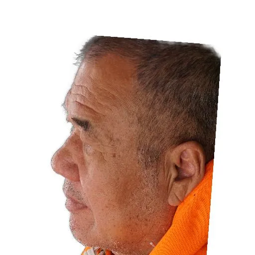

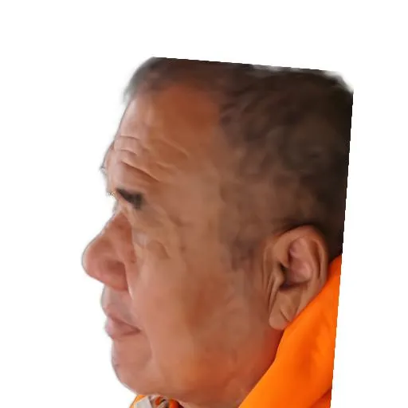

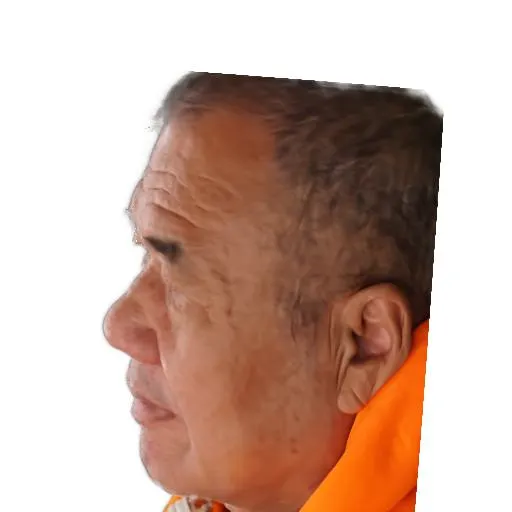


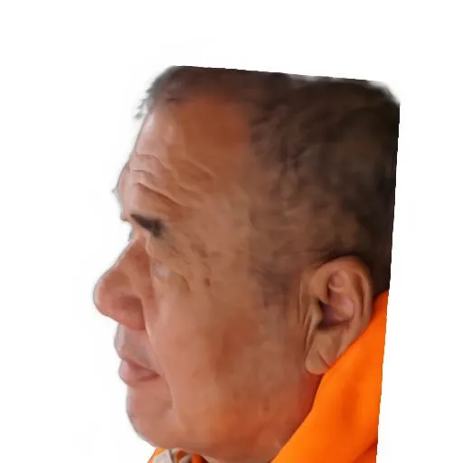


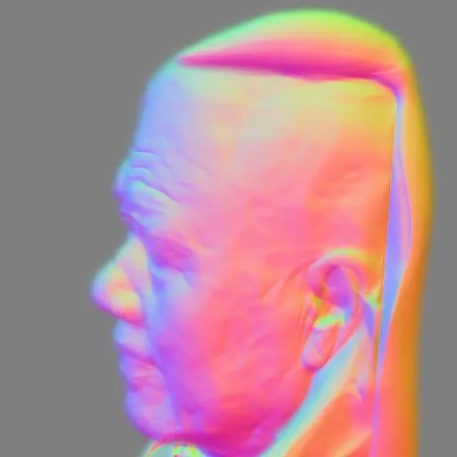

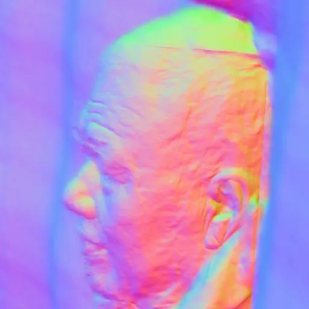

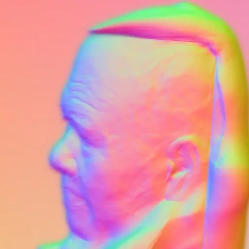

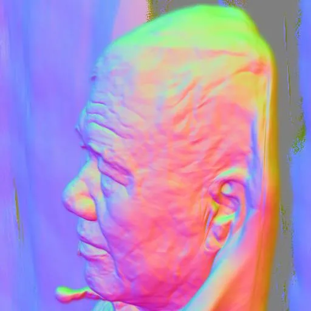

novel view

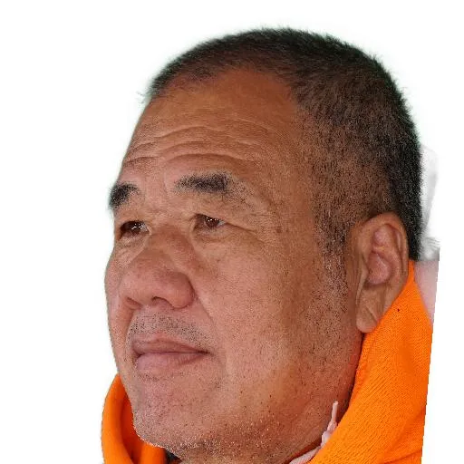


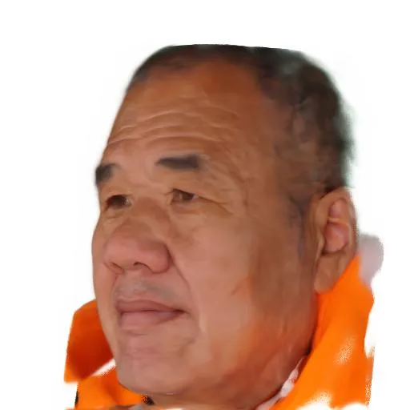


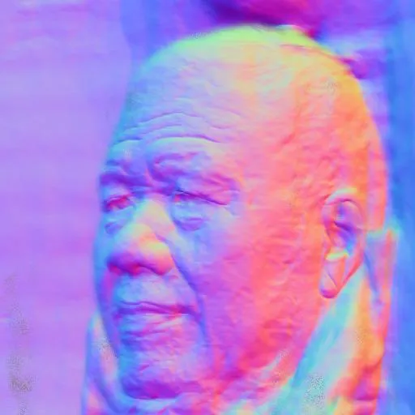

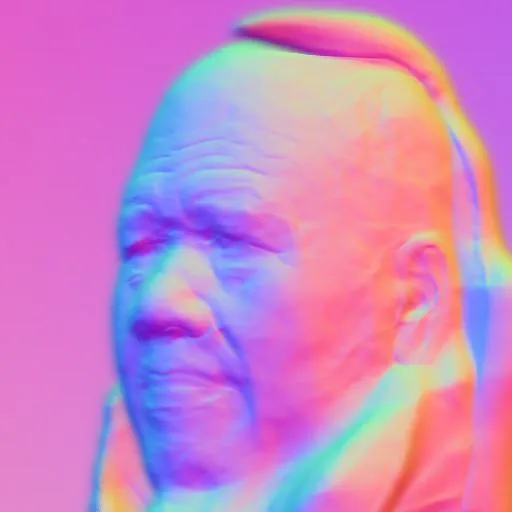

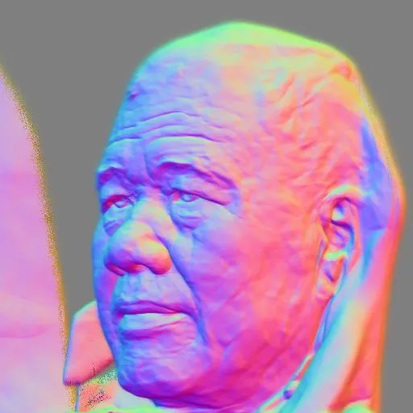

GT NeuS HF-NeuS VolSDF Ours

Figure 3: Our method leverages a template in neural rendering, which
makes the trained model more resilient to noise. Even when some of the
training views have incomplete information about the human head, our
method is able to complete the shape with reasonable geometry.
Furthermore, our novel view result is closer to the ground truth than
that of existing methods, demonstrating the effectiveness of using a
template. Model: 571, 10 views, 4 are incomplete due to unusual viewing
angles and cropping.

training view


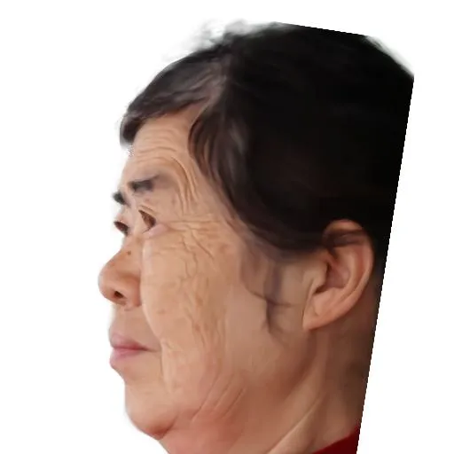

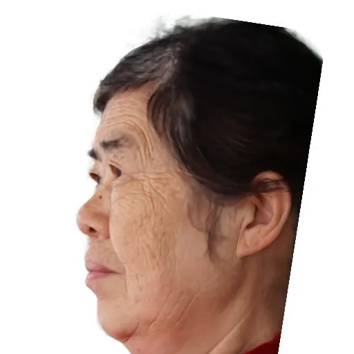


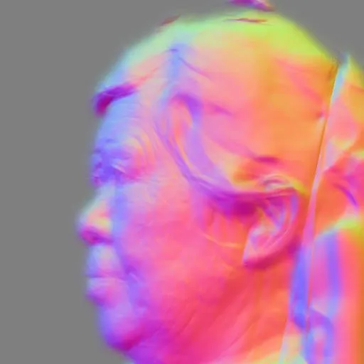

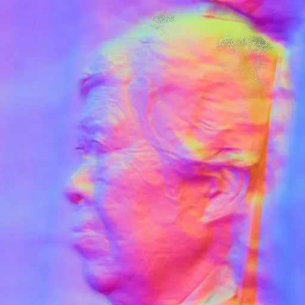

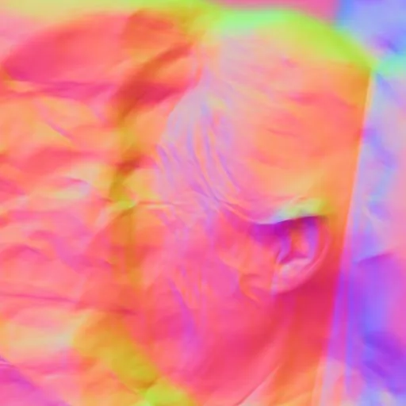

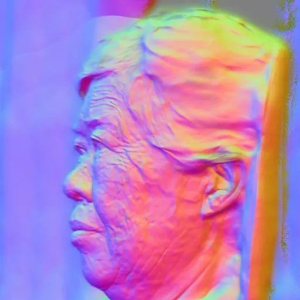

novel view

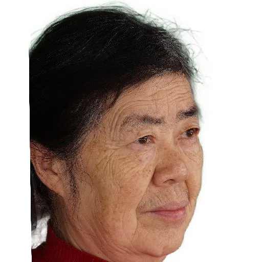

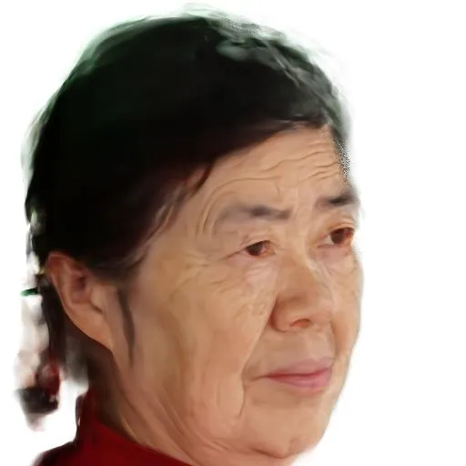

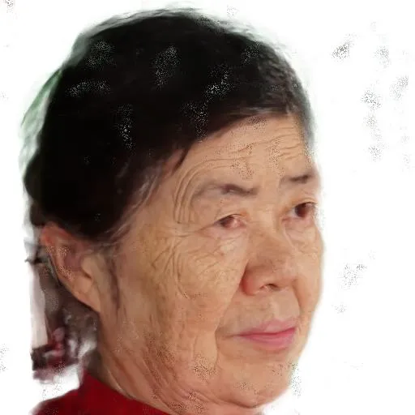

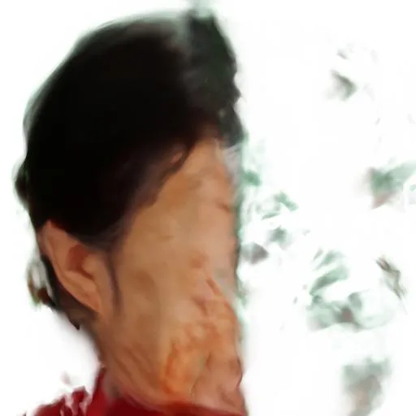

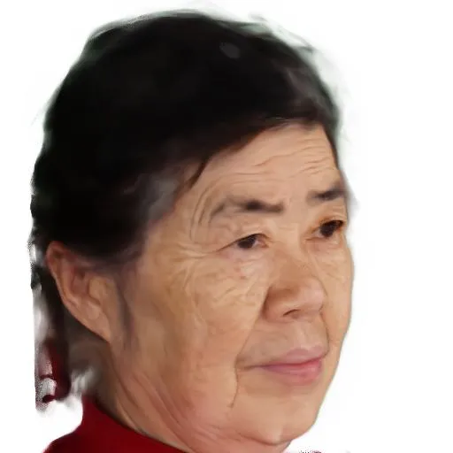


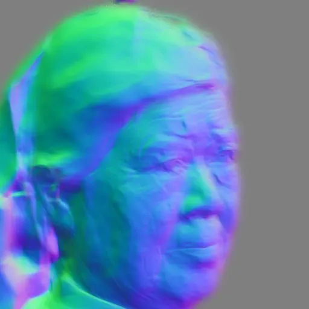

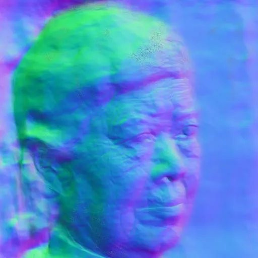

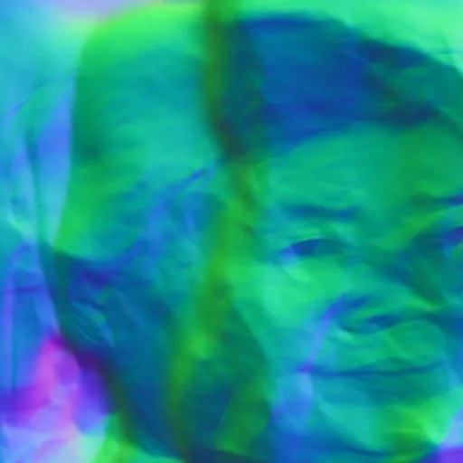

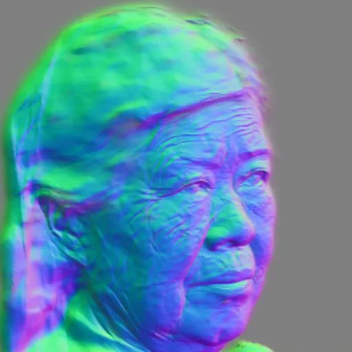

GT NeuS HF-NeuS VolSDF Ours

Figure 4: Our method excels in reconstructing fine details compared to
other methods, thanks to the use of a displacement map for capturing
high-frequency signals. We demonstrate the effectiveness of our approach
in reconstructing fine details in a training view result (top) and a
novel view result (bottom) here. Model: 377, 10 views.

Baselines. We conducted a comparative evaluation of our method with
state-of-the-art neural rendering methods, including NeuS \[34\],
VolSDF \[37\], and HF-NeuS \[35\], on PR-Dataset. We used the official
implementations provided by the authors for all methods, and set the
same 1,024 rays in all experiments to ensure a fair comparison.

Quality measures. To assess the performance of our method and other
approaches, we utilized the marching cubes algorithm \[19\] to extract
the zero-level set from the computed signed distance field. We cropped
both the ground-truth and predicted meshes to focus on the facial region
of interest, and computed the Chamfer distance (CD) between them to
evaluate geometric quality. Additionally, we applied the face masks to
the rendered RGB images to calculate the PSNR for the facial regions for
evaluating visual appearance. The results are reported in Tables 2.

Geometry accuracy. Both NeuS and our method were able to succesffully
reconstruct the geometry of 3D heads for all testing models, while
VolSDF and HF-NeuS failed to reconstruct the geometry of human heads in
in a significant number of examples under the setting of 10 to 15 views.
Therefore, we excluded these failed examples when calculating the
Chamfer distances for VolSDF and HF-NeuS. Since their rendered images
are still visually acceptable for training views, we used all results
for computing the PSNR metrics. Our method consistently outperformed all
other methods in terms of geometry quality on both the PR-Senior and
PR-Young datasets by a large margin with 10 to 15 views as input,
demonstrating our method’s ability to effectively overcome the challenge
of missing/insufficient information in low-view settings. With 20 views
as input, the gap became less significant, but our method still
performed better than other methods.

Visual appearance. We also observed that although our method did not
achieve the highest PSNR score for rendering results on the training
views, it outperformed the other methods for rendering novel views. This
is because novel view synthesis is more dependent on the accuracy of the
underlying 3D geometry than training views. Our method’s superior
geometry quality leads to better novel view synthesis results,
demonstrating the effectiveness of our approach.

Robustness. While HF-NeuS also adopts a displacement field, it typically
achieves the best performance with a sufficient number of views.
However, as the number of views decreases, the 3D reconstruction quality
often degrades significantly. For instance, under the setting of 10
views, HF-NeuS failed to reconstruct 3D geometry for 19 persons out of
the 30 individuals in the PR-Senior and -Young datasets, resulting in
poor novel view synthesized results. Although increasing the views to 20
improved the reconstruction quality considerably, HF-NeuS still could
not reconstruct the geometry accurately for Models 487, 548, and 608. In
contrast, our method is robust and performs consistently well under the
same low-view settings, thanks to the use of a pre-trained template and
the two-stage training strategy.

Analysis. Our method outperformed the existing methods in terms of
geometry measures and novel view synthesis results in low-view settings.
This can be attributed to three reasons. Firstly, in the first stage of
our method, we trained the template using a multi-person dataset. Since
the selection of viewpoints for the subjects is random, the different
views can complement each other, resulting in better facial geometry for
the template. Secondly, utilizing a pre-trained template increases the
robustness of our model and enables it to resist a certain degree of
“noise” caused by the limited number of viewpoints in the second stage
of our method. For instance, when the images in the training set have
certain disturbances to the reconstructed object, such as the cropping
at the top of the head and clothing covering the neck as shown in
Figure 3, it can mislead other methods due to the lack of information,
thereby producing incorrect geometry to complete the missing parts. To
improve accuracy, the existing methods require more views to figure out
the missing or occluded parts. In contrast, our method successfully
modeled the top of the head and the neck of the character only 10 views,
thanks to the use of the template, which provides a reasonable guide.
Thirdly, in the case of senior individuals with rich wrinkles, the
displacement field plays a crucial role in modeling high-frequency
geometry, resulting in better reconstruction of fine geometric details,
as demonstrated in Figure 4.

[TABLE]

Figure 5: HF-NeuS simultaneously learns the base surface and
high-frequency details, making it unstable under a low-view setting due
to the insufficient information provided in the images. This instability
leads to incorrect novel view results. NeuS can reconstruct the head
geometry fairly well but struggles to fully recover fine details and can
yield low-quality results for novel views. In contrast, our proposed
method uses geometry decomposition and coarse-to-fine training, which
effectively overcomes these challenges and produces accurate results in
low-view settings. Models: 548 (top) and 376 (bottom).

| Model | CD ($`10^{-4}`$) | PSNR$`{}_{\text{t}}`$ | PSNR$`{}_{\text{n}}`$ |
| ----- | ---------------- | --------------------- | --------------------- |
| 539   | 3.861            | 32.29                 | 22.69                 |
| 662   | 1.643            | 33.21                 | 25.42                 |

Table 3: Performance on two unseen identities under 10 views. See
Figure 7 for the visual result on Model 539 and the supplementary
material for the other model.

Unseen identities. Our method has the ability to adapt to new
individuals as the pre-trained template serves as a good initialization.
Table 3 reports its performance on two unseen identities and Figure 7
shows a visual result.

Ablation studies. To evaluate the impact of the displacement field, we
conducted an ablation study by training a model without the displacement
field in Stage 2 and comparing it to the proposed model with the
displacement field. Both models were trained using the same
hyperparameters and training data under the setting of 10 views. As
shown in Table 4, the proposed model with the displacement field
outperforms the model without it in terms of geometry accuracy. This
indicates that the displacement field plays a crucial role in improving
the accuracy of our method. Figure 6 provides visual evidence for this
by showing that non-rigid deformation alone cannot capture the fine
details and features that are absent in the template. Therefore, the
displacement map serves as a necessary supplement to enhance the
accuracy of the reconstruction. We also conducted an evaluation of the
impact of the TV regularization term on the reconstruction of Model 619,
a senior female with rich wrinkles, under the setting of 10 views.
Figure 6 (row 3) shows that the TV regularizer $`\|\nabla\delta\|_{1}`$
can effectively reduce noise while preserving fine details in the
reconstruction.

Other dataset. We also tested our method on the H3DS \[26\] dataset,
consisting of 10 western individuals (5 men and 5 women) with 3D ground
truth meshes. By using our pre-trained template (which contains only the
head geometry) as initialization, our method successfully reconstructs
all the models, including the upper body information. The reconstruction
quality, measured as the average CD (mm) for the entire head of the 10
individuals, is IDR 8.34, H3D 6.45, and ours 5.47, demonstrating the
effectiveness of our method for non-Asian individuals. Both IDR \[38\]
and H3D \[26\] rely on accurate object masks in their differentiable
rendering pipeline. H3D also uses 3D head scans from 10,000 individuals.
In contrast, our method does not rely on masks or 3D supervision,
providing greater flexibility. See Figure 10.

| CD ($`10^{-4}`$) | PR-Senior | PR-Young |
| ---------------- | --------- | -------- |
| w/ dis.          | 0.792     | 0.723    |
| w/o dis.         | 1.163     | 1.842    |

Table 4: Ablation study on the displacement field (10 views).


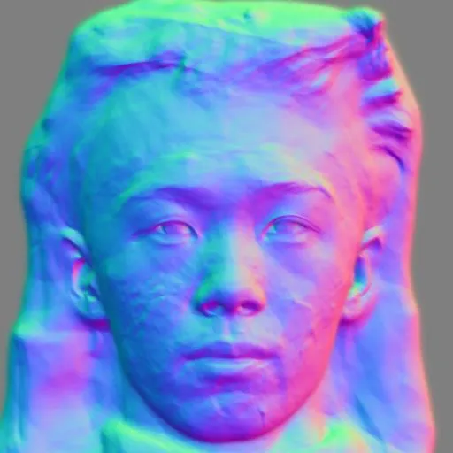

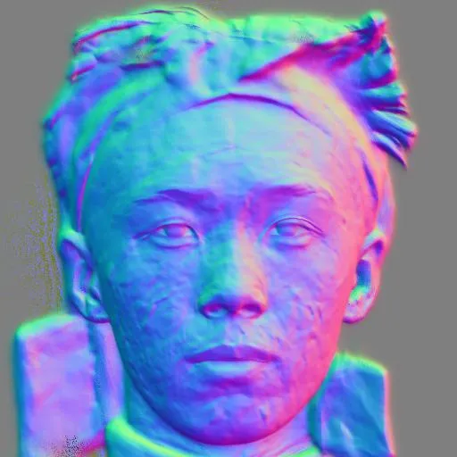


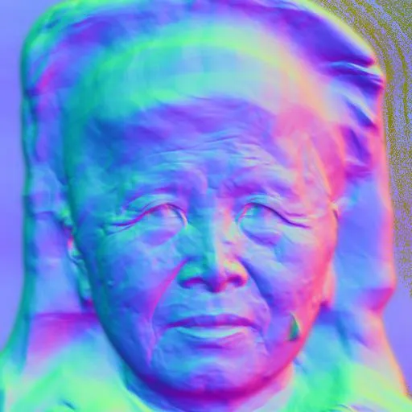

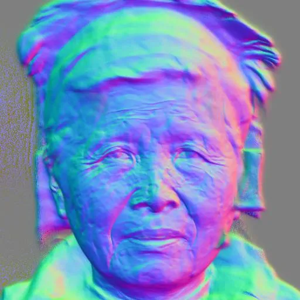

GT w/o displacement w/ displacement  

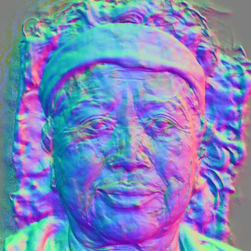


GT w/o TV loss w/ TV loss

Figure 6: Ablation studies. Rows 1 & 2: The displacement map provides an
additional degree of freedom and is essential in effectively
reconstructing features and fine details that are not present in the
template, such as the scarf and crow’s feet. Using non-rigid deformation
alone is not sufficient to achieve this level of detail. Row 3: The TV
regularization term is effective in reducing noise while preserving
sharp features and fine details. Models: 396 (top), 566 (middle) and 619
(bottom), all under a 10-view setting.


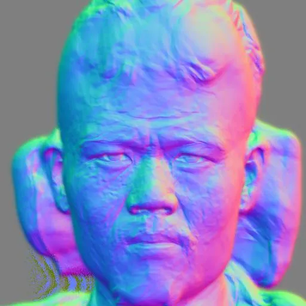

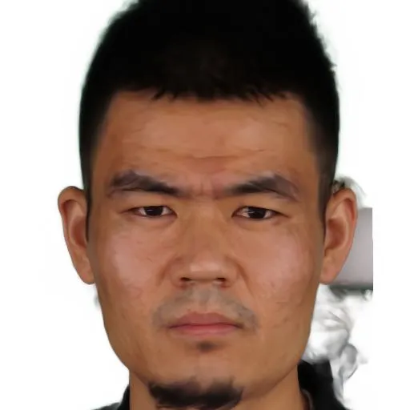

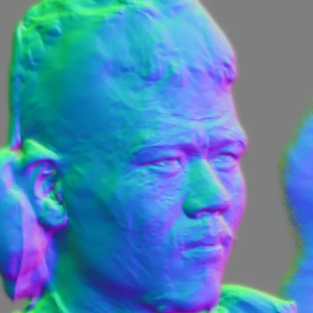

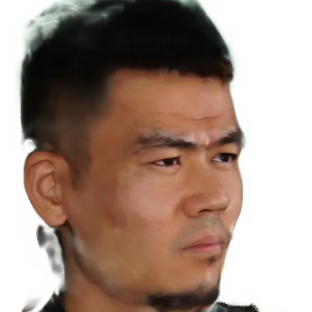

Figure 7: Reference (left) and rendering results (right) for an unseen
individual (Model 539) under a 10-view setting.

|                                                            |                                                            |                                                            |                                                            |                                                            |
| ---------------------------------------------------------- | ---------------------------------------------------------- | ---------------------------------------------------------- | ---------------------------------------------------------- | ---------------------------------------------------------- |
| 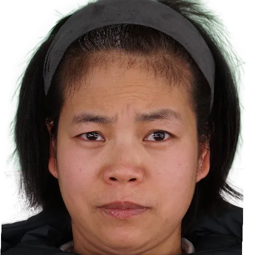 |  |  | 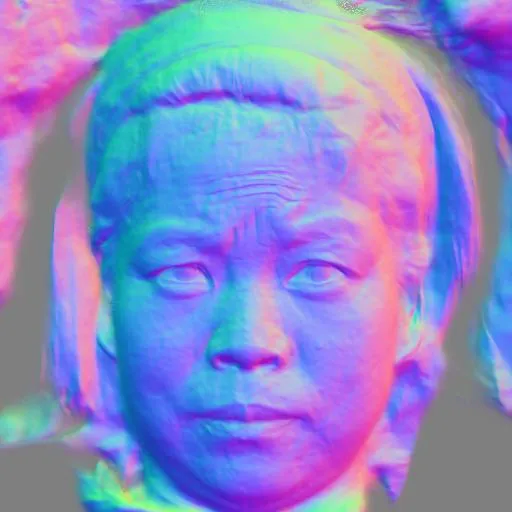 | 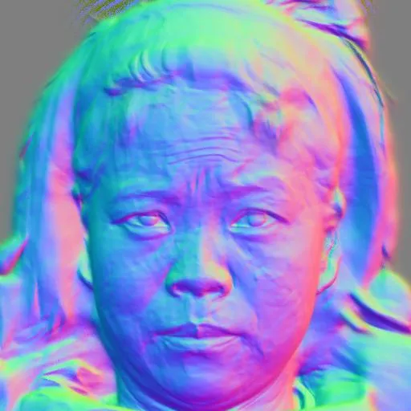 |
| GT                                                         | NeuS                                                       | VolSDF                                                     | HF-NeuS                                                    | Ours                                                       |

Figure 8: Our method is capable of reconstructing the geometry of the
entire head, in particular providing better results in the hair region
of human heads compared to other methods. This is due to the fine
refinement of the SDF using the displacement field. Model: 429, 15
views.

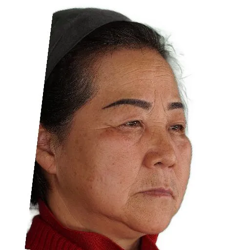

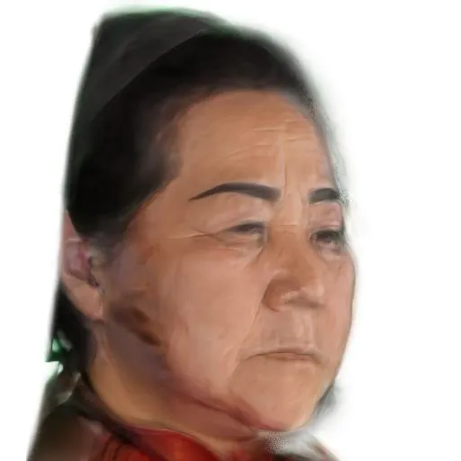

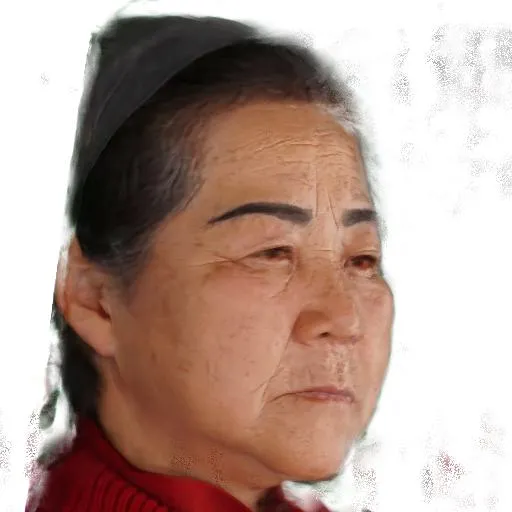

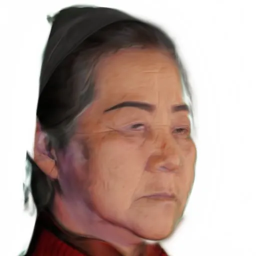

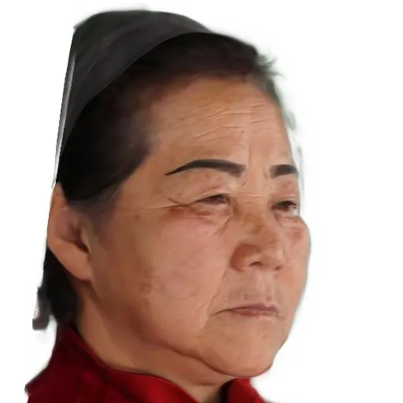


GT NeuS HF-NeuS VolSDF Ours

Figure 9: Novel view synthesis result for Model 383 with only 5 views as
input.


Figure 10: Results on the H3DS Dataset under a 8-view setting. Left to
right: reference image, IDR \[38\], H3D \[26\], and ours.

## 5 Conclusion & Future Work

We present a novel neural rendering model for reconstructing 3D human
heads under low-view settings. By decomposing the geometry of 3D heads
into an identity-independent template and two identity-dependent
components (a non-rigid deformation and a displacement field), we train
our network in two separate stages in a coarse-to-fine manner. Through
extensive evaluation, we demonstrate that our method is robust and can
accurately reconstruct 3D heads with high-quality geometry. Moreover, it
outperforms state-of-the-art methods in terms of geometry accuracy and
novel view synthesis with 10 to 20 views as input. The pre-trained
template serves a good initialization for our model to adapt to unseen
individuals.

Our approach currently models hair as a whole using implicit functions.
While this is effective for capturing the overall shape of the hair (see
Figure 8), more accurate hair modeling could be achieved by using
strands \[27\]. Our training time is similar to HF-NeuS, which is
approximately double the training time required by VolSDF. There are
promising tools such as Plenvoxels \[8\] and Plenoctree \[41\] that have
demonstrated substantial improvements in the training and inference time
of neural radiance fields \[20\]. Given this, it is highly desirable to
develop similar tools for neural implicit functions, as this could
significantly improve the scalability and practicality of our proposed
approach.

Acknowledgement. We thank Prof. Dr. Feng Xu, School of Software and
BNRist, Tsinghua University and SenseTime for the Portrait Relighting
dataset. This study is supported under the RIE2020 Industry Alignment
Fund – Industry Collaboration Projects (IAF-ICP) Funding Initiative, as
well as cash and in-kind contribution from the industry partner(s). This
project was also partially supported by the Ministry of Education,
Singapore, under its Academic Research Fund Grants (MOE-T2EP20220-0005,
RG20/20 & RT19/22).

## References

- \[1\] Connelly Barnes, Eli Shechtman, Adam Finkelstein, and Dan B
  Goldman. Patchmatch: A randomized correspondence algorithm for
  structural image editing. ACM Trans. Graph., 28(3):24, 2009.
- \[2\] Jonathan T Barron, Ben Mildenhall, Matthew Tancik, Peter Hedman,
  Ricardo Martin-Brualla, and Pratul P Srinivasan. Mip-nerf: A
  multiscale representation for anti-aliasing neural radiance fields. In
  Proceedings of the IEEE/CVF International Conference on Computer
  Vision, pages 5855–5864, 2021.
- \[3\] Volker Blanz and Thomas Vetter. A morphable model for the
  synthesis of 3d faces. In Proceedings of the 26th annual conference on
  Computer graphics and interactive techniques, pages 187–194, 1999.
- \[4\] François Darmon, Bénédicte Bascle, Jean-Clément Devaux, Pascal
  Monasse, and Mathieu Aubry. Improving neural implicit surfaces
  geometry with patch warping. In Proceedings of the IEEE/CVF Conference
  on Computer Vision and Pattern Recognition, pages 6260–6269, 2022.
- \[5\] Jeremy S De Bonet and Paul Viola. Poxels: Probabilistic
  voxelized volume reconstruction. In Proceedings of International
  Conference on Computer Vision (ICCV), volume 2, 1999.
- \[6\] Yu Deng, Jiaolong Yang, and Xin Tong. Deformed implicit field:
  Modeling 3d shapes with learned dense correspondence. In Proceedings
  of the IEEE/CVF Conference on Computer Vision and Pattern Recognition,
  pages 10286–10296, 2021.
- \[7\] Bernhard Egger, William AP Smith, Ayush Tewari, Stefanie Wuhrer,
  Michael Zollhoefer, Thabo Beeler, Florian Bernard, Timo Bolkart, Adam
  Kortylewski, Sami Romdhani, et al. 3d morphable face models—past,
  present, and future. ACM Transactions on Graphics (TOG),
  39(5):1–38, 2020.
- \[8\] Sara Fridovich-Keil, Alex Yu, Matthew Tancik, Qinhong Chen,
  Benjamin Recht, and Angjoo Kanazawa. Plenoxels: Radiance fields
  without neural networks. In Proceedings of the IEEE/CVF Conference on
  Computer Vision and Pattern Recognition, pages 5501–5510, 2022.
- \[9\] Qiancheng Fu, Qingshan Xu, Yew Soon Ong, and Wenbing Tao.
  Geo-neus: Geometry-consistent neural implicit surfaces learning for
  multi-view reconstruction. Advances in Neural Information Processing
  Systems, 35:3403–3416, 2022.
- \[10\] Silvano Galliani, Katrin Lasinger, and Konrad Schindler.
  Massively parallel multiview stereopsis by surface normal diffusion.
  In Proceedings of the IEEE International Conference on Computer
  Vision, pages 873–881, 2015.
- \[11\] Amos Gropp, Lior Yariv, Niv Haim, Matan Atzmon, and Yaron
  Lipman. Implicit geometric regularization for learning shapes. In
  International Conference on Machine Learning, pages 3789–3799.
  PMLR, 2020.
- \[12\] Yang Hong, Bo Peng, Haiyao Xiao, Ligang Liu, and Juyong Zhang.
  Headnerf: A real-time nerf-based parametric head model. In Proceedings
  of the IEEE/CVF Conference on Computer Vision and Pattern Recognition,
  pages 20374–20384, 2022.
- \[13\] Diederik P. Kingma and Jimmy Ba. Adam: A method for stochastic
  optimization. In Yoshua Bengio and Yann LeCun, editors, 3rd
  International Conference on Learning Representations, ICLR 2015, San
  Diego, CA, USA, May 7-9, 2015, Conference Track Proceedings, 2015.
- \[14\] Kiriakos N Kutulakos and Steven M Seitz. A theory of shape by
  space carving. International journal of computer vision,
  38(3):199–218, 2000.
- \[15\] Moran Li, Haibin Huang, Yi Zheng, Mengtian Li, Nong Sang, and
  Chongyang Ma. Implicit neural deformation for sparse-view face
  reconstruction. Computer Graphics Forum, 41:601–610, 2022.
- \[16\] Manyi Li and Hao Zhang. D2im-net: Learning detail disentangled
  implicit fields from single images. In Proceedings of the IEEE/CVF
  Conference on Computer Vision and Pattern Recognition, pages
  10246–10255, 2021.
- \[17\] Steven Liu, Xiuming Zhang, Zhoutong Zhang, Richard Zhang,
  Jun-Yan Zhu, and Bryan Russell. Editing conditional radiance fields.
  In Proceedings of the International Conference on Computer Vision
  (ICCV), 2021.
- \[18\] Xiaoxiao Long, Cheng Lin, Peng Wang, Taku Komura, and Wenping
  Wang. Sparseneus: Fast generalizable neural surface reconstruction
  from sparse views. ECCV, 2022.
- \[19\] William E Lorensen and Harvey E Cline. Marching cubes: A high
  resolution 3d surface construction algorithm. ACM siggraph computer
  graphics, 21(4):163–169, 1987.
- \[20\] Ben Mildenhall, Pratul P Srinivasan, Matthew Tancik, Jonathan T
  Barron, Ravi Ramamoorthi, and Ren Ng. Nerf: Representing scenes as
  neural radiance fields for view synthesis. Communications of the ACM,
  65(1):99–106, 2021.
- \[21\] Michael Niemeyer, Lars Mescheder, Michael Oechsle, and Andreas
  Geiger. Differentiable volumetric rendering: Learning implicit 3d
  representations without 3d supervision. In Proceedings of the IEEE/CVF
  Conference on Computer Vision and Pattern Recognition, pages
  3504–3515, 2020.
- \[22\] Michael Oechsle, Songyou Peng, and Andreas Geiger. Unisurf:
  Unifying neural implicit surfaces and radiance fields for multi-view
  reconstruction. In Proceedings of the IEEE/CVF International
  Conference on Computer Vision, pages 5589–5599, 2021.
- \[23\] Stanley Osher, Andrés Solé, and Luminita Vese. Image
  decomposition and restoration using total variation minimization and
  the h. Multiscale Modeling & Simulation, 1(3):349–370, 2003.
- \[24\] Jeong Joon Park, Peter Florence, Julian Straub, Richard
  Newcombe, and Steven Lovegrove. Deepsdf: Learning continuous signed
  distance functions for shape representation. In Proceedings of the
  IEEE/CVF conference on computer vision and pattern recognition, pages
  165–174, 2019.
- \[25\] Adam Paszke, Sam Gross, Francisco Massa, Adam Lerer, James
  Bradbury, Gregory Chanan, Trevor Killeen, Zeming Lin, Natalia
  Gimelshein, Luca Antiga, Alban Desmaison, Andreas Köpf, Edward Yang,
  Zach DeVito, Martin Raison, Alykhan Tejani, Sasank Chilamkurthy,
  Benoit Steiner, Lu Fang, Junjie Bai, and Soumith Chintala. Pytorch: An
  imperative style, high-performance deep learning library. In Neural
  Information Processing Systems, 2019.
- \[26\] Eduard Ramon, Gil Triginer, Janna Escur, Albert Pumarola, Jaime
  Garcia, Xavier Giro-i Nieto, and Francesc Moreno-Noguer. H3d-net:
  Few-shot high-fidelity 3d head reconstruction. In Proceedings of the
  IEEE/CVF International Conference on Computer Vision, pages
  5620–5629, 2021.
- \[27\] Radu Alexandru Rosu, Shunsuke Saito, Ziyan Wang, Chenglei Wu,
  Sven Behnke, and Giljoo Nam. Neural strands: Learning hair geometry
  and appearance from multi-view images. In Computer Vision–ECCV 2022:
  17th European Conference, Tel Aviv, Israel, October 23–27, 2022,
  Proceedings, Part XXXIII, pages 73–89. Springer, 2022.
- \[28\] Johannes L Schonberger and Jan-Michael Frahm.
  Structure-from-motion revisited. In Proceedings of the IEEE conference
  on computer vision and pattern recognition, pages 4104–4113, 2016.
- \[29\] Johannes L Schönberger, Enliang Zheng, Jan-Michael Frahm, and
  Marc Pollefeys. Pixelwise view selection for unstructured multi-view
  stereo. In European conference on computer vision, pages 501–518.
  Springer, 2016.
- \[30\] Steven M Seitz and Charles R Dyer. Photorealistic scene
  reconstruction by voxel coloring. International Journal of Computer
  Vision, 35(2):151–173, 1999.
- \[31\] Vincent Sitzmann, Michael Zollhöfer, and Gordon Wetzstein.
  Scene representation networks: Continuous 3d-structure-aware neural
  scene representations. Advances in Neural Information Processing
  Systems, 32, 2019.
- \[32\] Daoye Wang, Prashanth Chandran, Gaspard Zoss, Derek Bradley,
  and Paulo Gotardo. Morf: Morphable radiance fields for multiview
  neural head modeling. In ACM SIGGRAPH 2022 Conference Proceedings,
  pages 1–9, 2022.
- \[33\] Lizhen Wang, Zhiyua Chen, Tao Yu, Chenguang Ma, Liang Li, and
  Yebin Liu. Faceverse: a fine-grained and detail-controllable 3d face
  morphable model from a hybrid dataset. In IEEE Conference on Computer
  Vision and Pattern Recognition (CVPR2022), June 2022.
- \[34\] Peng Wang, Lingjie Liu, Yuan Liu, Christian Theobalt, Taku
  Komura, and Wenping Wang. Neus: Learning neural implicit surfaces by
  volume rendering for multi-view reconstruction. Advances in Neural
  Information Processing Systems, 34:27171–27183, 2021.
- \[35\] Yiqun Wang, Ivan Skorokhodov, and Peter Wonka. Hf-neus:
  Improved surface reconstruction using high-frequency details. Advances
  in Neural Information Processing Systems, 35:1966–1978, 2022.
- \[36\] Zhibo Wang, Xin Yu, Ming Lu, Quan Wang, Chen Qian, and Feng Xu.
  Single image portrait relighting via explicit multiple reflectance
  channel modeling. ACM Transactions on Graphics (TOG),
  39(6):1–13, 2020.
- \[37\] Lior Yariv, Jiatao Gu, Yoni Kasten, and Yaron Lipman. Volume
  rendering of neural implicit surfaces. Advances in Neural Information
  Processing Systems, 34:4805–4815, 2021.
- \[38\] Lior Yariv, Yoni Kasten, Dror Moran, Meirav Galun, Matan
  Atzmon, Basri Ronen, and Yaron Lipman. Multiview neural surface
  reconstruction by disentangling geometry and appearance. Advances in
  Neural Information Processing Systems, 33:2492–2502, 2020.
- \[39\] Tarun Yenamandra, Ayush Tewari, Florian Bernard, Hans-Peter
  Seidel, Mohamed Elgharib, Daniel Cremers, and Christian Theobalt.
  i3dmm: Deep implicit 3d morphable model of human heads. In Proceedings
  of the IEEE/CVF Conference on Computer Vision and Pattern Recognition,
  pages 12803–12813, 2021.
- \[40\] Wang Yifan, Lukas Rahmann, and Olga Sorkine-hornung.
  Geometry-consistent neural shape representation with implicit
  displacement fields. In International Conference on Learning
  Representations, 2021.
- \[41\] Alex Yu, Ruilong Li, Matthew Tancik, Hao Li, Ren Ng, and Angjoo
  Kanazawa. Plenoctrees for real-time rendering of neural radiance
  fields. In Proceedings of the IEEE/CVF International Conference on
  Computer Vision, pages 5752–5761, 2021.
- \[42\] Yu-Jie Yuan, Yu-Kun Lai, Yi-Hua Huang, Leif Kobbelt, and Lin
  Gao. Neural radiance fields from sparse rgb-d images for high-quality
  view synthesis. IEEE Transactions on Pattern Analysis and Machine
  Intelligence, 2022.
- \[43\] Kai Zhang, Gernot Riegler, Noah Snavely, and Vladlen Koltun.
  Nerf++: Analyzing and improving neural radiance fields. arXiv preprint
  arXiv:2010.07492, 2020.
- \[44\] Zhenyu Zhang, Yanhao Ge, Ying Tai, Weijian Cao, Renwang Chen,
  Kunlin Liu, Hao Tang, Xiaoming Huang, Chengjie Wang, Zhifeng Xie,
  et al. Physically-guided disentangled implicit rendering for 3d face
  modeling. In Proceedings of the IEEE/CVF Conference on Computer Vision
  and Pattern Recognition, pages 20353–20363, 2022.
- \[45\] Mingwu Zheng, Hongyu Yang, Di Huang, and Liming Chen. Imface: A
  nonlinear 3d morphable face model with implicit neural
  representations. In Proceedings of the IEEE/CVF Conference on Computer
  Vision and Pattern Recognition, pages 20343–20352, 2022.
- \[46\] Yufeng Zheng, Victoria Fernández Abrevaya, Marcel C Bühler, Xu
  Chen, Michael J Black, and Otmar Hilliges. Im avatar: Implicit
  morphable head avatars from videos. In Proceedings of the IEEE/CVF
  Conference on Computer Vision and Pattern Recognition, pages
  13545–13555, 2022.
- \[47\] Yiyu Zhuang, Hao Zhu, Xusen Sun, and Xun Cao. Mofanerf:
  Morphable facial neural radiance field. In Computer Vision–ECCV 2022:
  17th European Conference, Tel Aviv, Israel, October 23–27, 2022,
  Proceedings, Part III, pages 268–285. Springer, 2022.

## Appendix A Appendix

In the appendix, we present 1) additional results of unseen identities
and low-view inputs in Section A.1, which demonstrate that the
pre-trained template serves as a good initialization and enables our
method to adapt to new identities not available in the training dataset; 2) detailed results of our method and compare them with NeuS, HF-NeuS,
and VolSDF on the PR-Senior and PR-Young datasets under a 10-view
setting in Section A.2; and 3) an application on color transfer in
Figure A4 to demonstrate the flexibility and potential of our geometry
decomposition.

| Symbol                                               | Meaning                                                                                                                                                                                |
| ---------------------------------------------------- | -------------------------------------------------------------------------------------------------------------------------------------------------------------------------------------- |
| $`I_{i}`$                                            | the input images with camera parameters                                                                                                                                                |
| $`f_{\text{geo}}`$                                   | the Geometry Network                                                                                                                                                                   |
| $`f_{\text{tem}}`$                                   | the Template Network                                                                                                                                                                   |
| $`f_{\text{def}}`$                                   | the Deformation Network                                                                                                                                                                |
| $`f_{\text{ren}}`$                                   | the Rendering Network                                                                                                                                                                  |
| $`f_{\text{dis}}`$                                   | the Displacement Network                                                                                                                                                               |
| $`\mathbf{z}_{s},\mathbf{z}_{c}\in\mathbb{R}^{128}`$ | identity-dependent latent codes for shape and color                                                                                                                                    |
| $`\mathbf{F}_{\text{def}}\in\mathbb{R}^{192}`$       | identity-dependent feature associated with non-rigid deformation                                                                                                                       |
| $`\mathbf{F}_{\text{tem}}\in\mathbb{R}^{64}`$        | identity-independent feature associated with the template head                                                                                                                         |
| $`\mathbf{F}_{\text{dis}}\in\mathbb{R}^{64}`$        | ID-dep. geometry feature associated with displacement                                                                                                                                  |
| $`\mathbf{F}_{\text{all}}\in\mathbb{R}^{320}`$       | the overall feature fed into the Rendering Network in Stage 2, which is the concatenation of $`\mathbf{F}_{\text{def}}`$, $`\mathbf{F}_{\text{tem}}`$, and $`\mathbf{F}_{\text{dis}}`$ |
| $`\mathbf{x}\in\mathbb{R}^{3}`$                      | a query point in the observation space                                                                                                                                                 |
| $`\mathbf{d}\in\mathbb{R}^{3}`$                      | an offset vector indicating the deformation from an individual to the template                                                                                                         |
| $`\mathbf{x+d}\in\mathbb{R}^{3}`$                    | a query point in the template space                                                                                                                                                    |
| $`s\in\mathbb{R}`$                                   | signed distance                                                                                                                                                                        |
| $`\mathbf{n}_{b},\mathbf{n}_{f}\in\mathbb{R}^{3}`$   | normal vectors of the base and final surfaces                                                                                                                                          |
| $`\delta\in\mathbb{R}`$                              | an implicit displacement                                                                                                                                                               |
| $`c\in\mathbb{R}^{3}`$                               | radiance                                                                                                                                                                               |
| $`C\in\mathbb{R}^{3}`$                               | rgb color                                                                                                                                                                              |

Table A1: Notation Table.

### A.1 Experimental Results

In this section, we present additional results of unseen identities and
results of sparse views.

#### A.1.1 Unseen Identities

Our method has the ability to adapt to new individuals as the
pre-trained template serves as a good initialization. To verify this, we
consider 3 new identities (Models 552, 555 and 598) and each identity is
associated with only 5 views.

We adopted the pre-trained template, i.e., the one trained on 30
identities the PR-Senior and PR-Young datasets with 10 views for each
identity, to learn the fine details for each identity in Stage 2. We
observed that our method also produced plausible results for the unseen
identities as shown in Table A2. This demonstrates that the pre-trained
template can adapt to new identities.

#### A.1.2 Small Dataset

We also conducted another experiment using the 3 unseen identities as a
small dataset. In the second experiment, we trained a new template using
only the 15 images of the 3 new identities in Stage 1 and then used the
template to learn the fine details for each identity in Stage 2. Without
a surprise, the geometry of the newly trained template is worse than
that of the pre-trained template due to significantly fewer views
involved in Stage 1 training. Still, our method produced a fairly good
result and none of the other methods, VolSDF, NeuS and HF-NeuS, were
able to reconstruct satisfactory geometry with only 5 views as input as
illustrated in Figure A2 and Figure A3.

| Model | NeuS             |                       |                       | HF-NeuS          |                       |                       | VolSDF           |                       |                       | Ours(Template on the 3 ids) |                       |                       | Ours(Template on 30 ids) |                       |                       |
| ----- | ---------------- | --------------------- | --------------------- | ---------------- | --------------------- | --------------------- | ---------------- | --------------------- | --------------------- | --------------------------- | --------------------- | --------------------- | ------------------------ | --------------------- | --------------------- |
|       | CD ($`10^{-4}`$) | PSNR$`{}_{\text{t}}`$ | PSNR$`{}_{\text{n}}`$ | CD ($`10^{-4}`$) | PSNR$`{}_{\text{t}}`$ | PSNR$`{}_{\text{n}}`$ | CD ($`10^{-4}`$) | PSNR$`{}_{\text{t}}`$ | PSNR$`{}_{\text{n}}`$ | CD ($`10^{-4}`$)            | PSNR$`{}_{\text{t}}`$ | PSNR$`{}_{\text{n}}`$ | CD ($`10^{-4}`$)         | PSNR$`{}_{\text{t}}`$ | PSNR$`{}_{\text{n}}`$ |
| 552   | 3.769            | 35.22                 | 21.64                 | N.A.             | 35.40                 | 13.36                 | 8.192            | 33.62                 | 23.13                 | 1.815                       | 33.58                 | 26.51                 | 1.197                    | 34.92                 | 25.88                 |
| 555   | 3.614            | 35.37                 | 18.97                 | N.A.             | 35.65                 | 12.19                 | 243.4            | 33.45                 | 11.80                 | 1.254                       | 33.30                 | 24.14                 | 1.071                    | 35.04                 | 23.39                 |
| 598   | 16.25            | 36.39                 | 21.89                 | N.A.             | 36.30                 | 12.81                 | 23.76            | 35.63                 | 20.27                 | 1.056                       | 35.70                 | 27.02                 | 1.020                    | 35.50                 | 27.39                 |

Table A2: Performance on three unseen identities under 5 views. N.A.
indicates no results successfully reconstructed.

training view


novel view


GT NeuS HF-NeuS VolSDF Ours

Figure A1: Results for Model 383 with only 5 views as input. The
template human head was trained using 5 randomly selected views for all
30 identities of the PR-Senior and PR-Young datasets. The images of
Model 383 for Stage 1 training and Stage 2 training are the same,
therefore no additional views were provided.

552


555


598


GT NeuS HF-NeuS VolSDF Ours

Figure A2: Training view results for 3 unseen identities (552, 555, 598)
with only 5 views.

552


555


598


GT NeuS HF-NeuS VolSDF Ours

Figure A3: Novel view results for 3 unseen identities (552, 555, 598)
with only 5 views.

#### A.1.3 Sparse Views

This section provides further results on sparse views as shown in
Figure A1. Moreover, Table A2 also demonstrates that our approach
surpasses other methods in terms of reconstructing geometry under sparse
view conditions.


Reference identity Source identity Source identity normal map Color
transfer result

Figure A4: Our approach of decomposing geometry and appearance enables
us to transfer the color appearance from one model to another while
keeping the geometry unchanged. In this figure, we provide two examples
of transferring skin colors from a reference identity to a source
identity. All models are trained under 20 views. Notably, our method can
preserve small geometric features, such as speckles, which are encoded
in the SDF. This is in contrast to existing image-based color transfer
algorithms, which cannot differentiate between geometric features and
skin colors, often transferring them together.

### A.2 Analysis

We provide a thorough evaluation of our method and the state-of-the-art
methods NeuS, VolSDF, and HF-NeuS on the PR-Senior and PR-Young datasets
in this supplementary material. Our analysis includes a discussion of
the strengths and weaknesses of each method and a comparison of their
performance under various settings. It is worth noting that when VolSDF
or HF-NeuS fails to reconstruct the geometry for certain models, we
exclude them from the calculation of Chamfer distances for their
methods. However, we use all models when calculating the Chamfer
distances for our method and NeuS, both of which can reconstruct
geometry for all 30 identities.

#### A.2.1 Comparison to VolSDF

In the 10-view setting, VolSDF generates erroneous geometry for Models
377, 383, and 401 due to the insufficient number of views. As
illustrated in Figure A5, VolSDF only learns a partial geometry for the
training views, resulting in poor novel view synthesis results.

Although the reconstruction quality improves with 15 views, VolSDF still
fails to reconstruct Models 558 and 608. It is possible that VolSDF was
successful on these two models with 10 views, but failed on them with 15
views because we chose the input views randomly from the original PR
dataset in order to test the robustness of various approaches. The
redundant information in the given views may not be helpful for
improving the reconstruction quality of VolSDF.

In the 20-view setting, VolSDF still failed on Model 571. We noticed
that this model is affected by the failure reconstruction of the neck
shown in Figure A9, which leads to inaccurate cropping of the face.

#### A.2.2 Comparison to NeuS & HF-NeuS

We found that NeuS was successful in reconstructing all 3D human heads
in our experiments. However, due to the lack of modeling high-frequency
signals, it cannot recover fine details, resulting in Chamfer distances
in their results that are 1 times larger than ours. In contrast, our
method can reconstruct fine details such as wrinkles, scarves, and hair,
thanks to the additional degree of freedom provided by the displacement
field.

HF-NeuS extends NeuS by learning a displacement field for representing
high-frequency details. It typically achieves the best performance with
a sufficient number of views. However, as the number of views decreases,
the 3D reconstruction quality often degrades significantly. The reason
is that HF-NeuS learns both the base surface and the high-frequency
details at the same time. Such a learning process is unstable under a
low-view setting. With only 10 views, HF-NeuS failed to reconstruct
geometry for 19 out of 30 subjects, while with 15 views, it failed on
Models 376, 377, 383, 396, 435, 469, 487, 491, 548, and 566. Even with
20 views, HF-NeuS still failed to reconstruct six models, which are 487,
548, 608, 399, 413, and 397. These results confirm that learning
high-frequency details from low-view inputs is a challenging task.

In contrast, our method tackles this challenge by adopting a
geometry-decomposition and a two-stage training framework. The template
is trained on multiple persons with randomly chosen views. Although the
number of views for each person is still low, the randomly selected
views complement each other and provide a complete head. This template
provides a good initialization for training the displacement in Stage 2.

Comparing to NeuS and HF-NeuS, our method performs consistently well in
terms of geometry measure under the same low-view settings, thanks to
the use of a pre-trained template and the displacement field.

While both NeuS and HF-NeuS produce high-quality RGB images for training
views, which are 0.5-1.5 dB higher than ours, their novel view synthesis
results are consistently worse than ours with a 2-4 dB lower score. This
is attributed to the fact that these methods have less accurate geometry
reconstruction and do not incorporate multiple views from various
identities.

#### A.2.3 Summary

Our approach is specifically designed to enhance the performance of 3D
reconstruction in low-view settings and complements the existing
methods, such as VolSDF, NeuS and HF-NeuS, by utilizing a pre-trained
template and a two-stage training framework. We do not intend to replace
these methods, but rather to improve their performance in such
scenarios.

371


375


376


377


383


389


GT NeuS HF-NeuS VolSDF Ours GT NeuS HF-NeuS VolSDF Ours

Figure A5: Comparison of various approaches under a 10-view setting
(from Model 371 to Model 389). For each model, we show the results on
one training view (left) and one novel view (right).

395


396


397


399


401


413


GT NeuS HF-NeuS VolSDF Ours GT NeuS HF-NeuS VolSDF Ours

Figure A6: Comparison of various approaches under a 10-view setting
(from Model 395 to Model 413). For each model, we show the results on
one training view (left) and one novel view (right).

416


421


427


429


435


451


GT NeuS HF-NeuS VolSDF Ours GT NeuS HF-NeuS VolSDF Ours

Figure A7: Comparison of various approaches under a 10-view setting
(from Model 416 to Model 451). For each model, we show the results on
one training view (left) and one novel view (right).

454


469


470


487


491


548


GT NeuS HF-NeuS VolSDF Ours GT NeuS HF-NeuS VolSDF Ours

Figure A8: Comparison of various approaches under a 10-view setting
(from Model 454 to Model 548). For each model, we show the results on
one training view (left) and one novel view (right).

558


566


571


608


619


635


GT NeuS HF-NeuS VolSDF Ours GT NeuS HF-NeuS VolSDF Ours

Figure A9: Comparison of various approaches under a 10-view setting
(from Model 558 to Model 635). For each model, we show the results on
one training view (left) and one novel view (right).
