# Multimodal-driven Talking Face Generation via a Unified Diffusion-based Generator

Chao Xu    Shaoting Zhu    Junwei Zhu    Tianxin Huang    Jiangning
Zhang    Ying Tai    Yong Liu ^(†)^(†)thanks: C. Xu, S. Zhu, T. Huang
and Y. Liu are with APRIL Lab, Zhejiang University, Hangzhou, China
(e-mail: 21832066@zju.edu.cn; zhust@zju.edu.cn; 21725129@zju.edu.cn;
yongliu@iipc.zju.edu.cn). J. Zhu, J. Zhang, and Y. Tai are with YouTu
Lab, Tencent, Shanghai, China (e-mail: junweizhu@tencent.com;
vtzhang@tencent.com; yingtai@tencent.com). Y. Liu is the corresponding
author. ^(†)^(†)thanks: Manuscript received April 19, 2005; revised
August 26, 2015.

###### Abstract

Multimodal-driven talking face generation refers to animating a portrait
with the given pose, expression, and gaze transferred from the driving
image and video, or estimated from the text and audio. However, existing
methods ignore the potential of text modal, and their generators mainly
follow the source-oriented feature rearrange paradigm coupled with
unstable GAN frameworks. In this work, we first represent the emotion in
the text prompt, which could inherit rich semantics from the CLIP,
allowing flexible and generalized emotion control. We further reorganize
these tasks as the target-oriented texture transfer and adopt the
Diffusion Models. More specifically, given a textured face as the source
and the rendered face projected from the desired 3DMM coefficients as
the target, our proposed Texture-Geometry-aware Diffusion Model
decomposes the complex transfer problem into multi-conditional denoising
process, where a Texture Attention-based module accurately models the
correspondences between appearance and geometry cues contained in source
and target conditions, and incorporate extra implicit information for
high-fidelity talking face generation. Additionally, TGDM can be
gracefully tailored for face swapping. We derive a novel paradigm free
of unstable seesaw-style optimization, resulting in simple, stable, and
effective training and inference schemes. Extensive experiments
demonstrate the superiority of our method.

###### Index Terms:

Multimodal-driven Talking Face Generation, Face Swapping, Diffusion
Model

## I Introduction

Talking face generation aims to synthesize talking video from the source
face according to the given emotion, mouth movement, and head rotation,
which is relevant to several applications, including video production
and virtual avatars. Multimodal information could guide the animation in
the real scenario, such as text, audio, image, and video.

Recently, many attempts \[1, 2, 3\] have achieved significant progress
in these tasks, most of them share the same paradigm, _i.e_., extracting
the intermediate structural representation from given conditions first
and then manipulating the source face to the desired expression and
pose, which mainly follows the source-oriented pipeline, as shown in
Fig. 1 (a). Specifically, among these approaches, some image- and
video-driven \[4, 5, 6\] methods employ AdaIN-based \[7\] generators
that take vectors as input, which inevitably lead to the information
loss and fail to preserve the source identity and background. Others
\[8, 3, 9, 10, 11\] warp the source feature to the target by the
explicit motion flows for better visual results, but they appear warping
artifacts when the source and driving conditions encompass significant
appearance variation. Consequently, the above generators tend to suffer
from image degradation when rearranging the source features. Recent
audio-driven tasks require more authentic results, subsequent works
\[12, 13, 14\] adopt identity-specific training but cannot generalize
across different persons. Besides, existing pipelines generally adopt
GANs \[15\], and its unstable adversarial min-max objective training
process further exacerbates unrealistic textures. Due to these
constraints of the generator, each task needs a specific design and is
unfriendly for practical applications. Thus, one challenge arises, how
to accomplish a robust and stable generator for all driving modals to
achieve high-fidelity talking face generation. In addition, existing
work \[16\] simply reflects the text on the mouth movements, ignoring
the potential of text when under the large-scale pre-trained models.
Thus another challenge arises, how to sufficiently use the text modal in
this task.

To address the above challenges, we first represent the emotion style in
the text prompt inspired by the zero-shot CLIP-guided image
manipulation, which could inherit rich semantic knowledge and allow
flexible emotion control, _i.e_., unseen emotions could be specified
using the text description and precisely reflected on the synthesized
faces. Furthermore, to unify the multimodal-driven tasks into the same
generator, we frame the talking face generation as a target-oriented
texture transfer, instead of the source-oriented feature rearrange, and
adopt a multi-conditional diffusion model to avoid unstable training of
GANs, termed Texture-Geometry-aware Diffusion Model (TGDM), as shown in
Fig. 1 (b). In particular, benefiting from the explainable and
disentangled parameter space of 3DMMs \[17\], we combine the
texture-related coefficients from the source face with the
geometry-related ones from the driving conditions to construct 3D
descriptors, which are projected to the image domain and serve as the
target pivot. To further supplement source texture to rendered face, we
employ cross attention that accurately models the correspondences
between source and target appearance. To this end, TGDM is dedicated to
transferring the source texture to the target rendered face, which
preserves explicit structural information but avoids complex texture
deformations. In contrast to recent diffusion-based methods \[18, 19\]
that only handle mouth area generation, our approach can generate
realistic faces with various expressions and poses.

Figure 1: The top part shows the proposed generator in talking face
generation. Recent mainstream methods (a) are source-oriented
rearranging operation, while our proposed pipeline (b) serve as the
target-oriented texture transfer task. The bottom part shows the
extended application of the generator in face swapping. Current methods
(c) suffer from unstable training introduced by GANs and seesaw-style
losses optimized difficultly. By contrast, we propose a new paradigm (d)
with simple reconstruction loss and stable training while still
maintaining comparable results.

Considering the characteristics of the TGDM to model complex texture and
semantic transfer, we further connect TGDM with another popular task,
face swapping, which aims to transfer the source identity to the target
face while preserving the target attributes. Recent developments are
stuck due to unstable GAN-based training schemes and seesaw-style
optimization goals. DiffFace \[20\] first avoids GANs but is still
sensitive to identity-related and identity-unrelated hyperparameter
settings when sampling. Borrowing the idea from the aforementioned
driving framework, we derive a novel paradigm for face swapping built
upon the TGDM, which inherits the merits of the diffusion model and
requires only reconstruction loss during training, with no extra tricks
for sampling either, as shown in Fig. 1 (d).

In summary, we make the following four contributions:

- •
  We adopt the text modal as the talking face emotion representation,
  inheriting rich semantics from large-scale pre-trained models, which
  allows flexible emotion control and unseen emotion generalization.
- •
  We propose a novel TGDM pipeline based on the multi-conditional
  diffusion model to afford complex texture and identity transfer,
  generating high-quality talking face generation for all driven modals.
- •
  We transfer the TGDM to face swapping task and propose a novel
  training and inference paradigm that is simple, stable, and effective.
- •
  Abundant experiments are conducted to demonstrate the superiority of
  TGDM for several face manipulation tasks over SOTA methods.

## II Related Works

### II-A Talking Face Generation

Face reenactment involves taking the source face and replicating its
pose and expression as the target. This can be achieved through two main
techniques: instruction-based methods animate the source face instructed
by the target structure. Various works \[21, 22, 23, 24, 25\] adopt
landmarks and segmentation maps to indicate the facial attribute.
Recently, with the success of AdaIN \[7\], subsequent works \[5, 26\]
encode the target attributes in the vectorized information and then
inject them into the source face. However, the above methods fail to
explicitly indicate the movements between the source and target faces.
Subsequently, warping-based methods learn to warp and synthesize the
target faces based on the estimated motion fields. These methods \[27,
28\] usually separate motion estimation and warped source face
refinement into two stages. The most representative work is FOMM \[3\],
which uses relative key-point locations to predict flow fields for
source appearance driving. Other follow-up works \[10, 9\] focus on
improving the motion flows and warping operation accuracy. Some works
\[8, 29, 30, 31\] introduce 3D information as structure guidance for
flow field generation. However, they still suffer from identity
degradation under some extreme conditions. Recent UniFace \[32\]
proposes a unified framework to boost the model’s robustness with the
help of face swapping.

Audio-driven talking head synthesis, a special form of face reenactment,
aims to create talking videos with lip movements corresponding to the
driving audio \[33, 34, 35\]. The traditional approaches could be
roughly divided into 2D-based and 3D-based ones. 2D-based methods \[36,
37, 38, 39\] generate a series of 2D points on the face based on audio
inputs, while 3D-based methods \[40, 41, 42, 43, 14, 44\] use audio to
predict expression parameters or facial radiance fields. Some works
\[31, 45, 12\] further improve geometry learning and take talking style
into account. After achieving the intermediate structure, PC-AVS \[1\]
injects the pose and lip information into the generator by implicit
modulation. StyleHeat \[46\] generates high-resolution driven faces with
the help of StyleGAN. Besides, emotion is a factor that plays a critical
role in realistic animation. MEAD \[47\] releases a high-quality talking
head video dataset with annotations of emotion category and intensity.
Subsequent works \[2, 11\] follow the framework of PC-AVS or FOMM and
take emotion as another condition. However, due to the limitations of
the generator and unstable GAN-based training, the above methods need to
design the specific intermediate representation and generator for each
driving modal, thus making it impossible to share the same structure.
Nowadays, some attempts based on diffusion models \[48, 49\] have been
made. Stypułkowski _et al_. \[50\] leverage a pre-trained audio encoder
to add audio embeddings during the denoising process. DiffTalk \[19\]
and Bigioi _et al_. \[18\] present crafted conditional diffusion models
for generalized talking head synthesis. However, they fail to model the
distinct expression and pose variations.

### II-B Face Swapping

Face swapping aims to change the target identity according to the given
source but keep other facial attributes constant. Early face swap works
\[51, 52, 53, 54\] mainly focus on 3D-based methods but suffer from poor
visual quality. Recently, GAN-based \[15\] methods \[55, 56, 57\] have
made significant progress. Specifically, Faceshifter \[58\] integrates
identity and attribute embeddings adaptively from a well-designed
learning model. SimSwap \[59\] introduces a feature matching loss hoping
to preserve more attribute embeddings at the cost of sacrificing
identity similarity. Hififace \[60\] and FaceInpainter \[61\] take 3D
face descriptor into consideration for better geometry structure of
swapped results. With the success of StyleGAN \[62, 63\], many works
have emerged as a solution for high-resolution face swap. MegaFS \[64\]
first exploits StyleGAN2 as the decoder. The follow-up works \[65, 66\]
also adopt the pSp \[67\] framework and design the fusion strategy for
better attribute preservation. However, they lack flexibility in
application due to the fixed StyleGAN generator. Consequently, some
attempts have been made to solve this problem. StyleFace \[68\]
redesigns the StyleGAN2 module and opens parameters for training.
StyleSwap \[69\] introduces a mask branch and an ID inversion strategy
to empower high-fidelity and robust face swapping. As the diffusion
model shows excellent performance in many fields, DiffFace \[20\] makes
the first attempt to apply the diffusion model to the face swapping
task. Despite the impressive progress achieved by the above methods, it
is still a struggle to fully transfer the face identity from the source
face while preserving identity-unrelated attributes of the target images
due to seesaw-style training losses. One solution \[70\] is to fully
disentangle identity-related and identity-unrelated information, but it
is almost impossible in the current implementation scheme. In this
paper, we propose a new training paradigm only guided by the
reconstruction loss to solve this challenge.

### II-C Diffusion Model and Multimodal Generation

Diffusion models \[48, 49\] are recently proposed generative models that
can synthesize high-quality images. They are a type of generative
probabilistic model that consists of two steps. Firstly, data is
destroyed by successively adding small amounts of Gaussian noise to it
over a series of time steps. Secondly, a learning algorithm is trained
to recover the data by gradually removing the noise over a series of
time steps. Diffusion models are trained without discriminators, so they
are more reliable and robust during training compared to GANs.
Additionally, they do not suffer from common issues such as mode
collapse or vanishing gradients, which are inevitable in the training
process of GANs. After achieving great success in the unconditional
generation, diffusion models are adapted to enable conditional
generation. Dhariwal _et al_. \[71\] introduce classifier-guided
diffusion, which forces the produced noise to approach the desired
condition. Ho _et al_. further \[72\] develop a Classifier-Free Guidance
approach that allows conditional editing without having to pretrain
classifiers. Despite these advantages, diffusion models are hindered by
their slow sampling speed due to the thousands of times on one sample
for complete pixel space-based denoising. To address this issue, Song
_et al_. \[73\] propose DDIM reduce sample time, and Rombach _et al_.
\[74\] propose the Latent Diffusion Models (LDMs), which transfer the
training and inference processes to a compressed lower-dimension latent
space for more efficient computing.

Diffusion models have become increasingly popular in multimodal
generation incorporated with CLIP \[75\] due to their ability to
generate data with desirable qualities while covering a wide range of
distributions. Application fields of the diffusion model vary from
text-based image generation \[76, 77, 78, 79\], text-based video
generation \[80, 81, 82, 83, 12\], text-based audio generation \[84,
85\], text-based 3D representation generation \[86, 87, 88\], and many
others. In this paper, we build our framework on the diffusion model and
focus on animating the source face by multimodal geometry guidance,
_i.e_., text, audio, image, and video, reflecting on facial expression
and pose.

## III Preliminaries

### III-A Denoising Diffusion Probabilistic Models (DDPMs)

DDPMs follow the idea of latent variable models that consist of a
forward diffusion process and a reverse diffusion process. Specifically,
a diffusion process gradually adds noise to the data sampled from the
target distribution $`\boldsymbol{x}_{0}\sim q(\boldsymbol{x}_{0})`$ as
a Markov chain. Each step
$`q\left(\boldsymbol{x}_{t}\mid\boldsymbol{x}_{t-1}\right)`$ (for
$`t\in\left\{0,\dots,T\right\}`$) is defined as a Gaussian distribution
with a fixed or learned variance schedule $`\beta_{t}\in(0,1)`$:

```math
q\left(\boldsymbol{x}_{t}\mid\boldsymbol{x}_{t-1}\right):=\mathcal{N}\left(\sqrt{1-\beta_{t}}\boldsymbol{x}_{t-1},\beta_{t}\mathbf{I}\right). \tag{1}
```

By the Bayes’ rules and Markov property, the latent variable
$`\boldsymbol{x}_{t}`$ can be expressed as:

```math
q\left(\boldsymbol{x}_{t}\mid\boldsymbol{x}_{0}\right)=\mathcal{N}\left(\boldsymbol{x}_{t};\sqrt{\bar{\alpha}_{t}}\boldsymbol{x}_{0},\left(1-\bar{\alpha}_{t}\right)\mathbf{I}\right), \tag{2}
```

where $`\bar{\alpha}_{t}=\prod_{s=1}^{t}\alpha_{s}`$, and
$`\alpha_{t}=1-\beta_{t}`$. Then, the reverse process
$`q\left(\boldsymbol{x}_{t-1}\mid\boldsymbol{x}_{t}\right)`$ can be
parametrized by another Gaussian transition:

```math
p_{\theta}\left(\boldsymbol{x}_{t-1}\mid\boldsymbol{x}_{t}\right):=\mathcal{N}\left(\boldsymbol{x}_{t-1};\mu_{\theta}\left(\boldsymbol{x}_{t},t\right),\sigma_{\theta}\left(\boldsymbol{x}_{t},t\right)\right), \tag{3}
```

where $`\mu_{\theta}\left(\cdot\right)`$ and
$`\sigma_{\theta}\left(\cdot\right)`$ are predicted by the trained deep
neural networks $`\boldsymbol{\epsilon}_{\theta}`$, which is optimized
under the objective
$`\mathbb{E}_{\boldsymbol{x},\boldsymbol{\epsilon}\sim\mathcal{N}(0,1),t}\left[\left\|\boldsymbol{\epsilon}-\boldsymbol{\epsilon}_{\theta}\left(\boldsymbol{x}_{t},t\right)\right\|_{2}^{2}\right]`$.
Thus, given $`\boldsymbol{x}_{t}`$, $`\boldsymbol{x}_{t-1}`$ can be
sampled by using:

```math
\boldsymbol{x}_{t-1}=\frac{1}{\sqrt{1-\beta_{t}}}\left(\boldsymbol{x}_{t}-\frac{\beta_{t}}{\sqrt{1-\alpha_{t}}}\boldsymbol{\epsilon}_{\theta}\left(\boldsymbol{x}_{t},t\right)\right)+\sigma_{t}\boldsymbol{z}, \tag{4}
```

where $`\boldsymbol{z}\in\mathcal{N}\left(0,\mathbf{I}\right)`$.
Furthermore, according to \[73\], $`\boldsymbol{x}_{0}`$ can be
approximate derived by $`x_{t}`$ and
$`\boldsymbol{\epsilon}_{\theta}\left(\boldsymbol{x}_{t},t\right)`$:

```math
\hat{\boldsymbol{x}_{0}}:=\frac{\boldsymbol{x}_{t}-\sqrt{1-\alpha_{t}}\epsilon_{\theta}\left(\boldsymbol{x}_{t},t\right)}{\sqrt{\alpha_{t}}}. \tag{5}
```

This facilitates the use of pixel-level and perceptual losses during the
training stage in Sec. IV-C.

### III-B 3D Morphable Models (3DMMs)

Recent methods estimate the 3D face descriptors of 2D images by
optimizing a neural network to extract 3D parameters from a face image.
Thus we follow the previous work D3DFR \[17\] that adopts ResNet50 as
the backbone to predict 3DMM coefficients, which consists of identity
$`\boldsymbol{\alpha}\in\mathbb{R}^{80}`$, expression
$`\boldsymbol{\beta}\in\mathbb{R}^{64}`$, texture
$`\boldsymbol{\delta}\in\mathbb{R}^{80}`$, illumination
$`\boldsymbol{\gamma}\in\mathbb{R}^{27}`$, and pose
$`\boldsymbol{p}\in\mathbb{R}^{6}`$. Note that the original 3DMM fails
to control gaze direction, we explicitly model the gaze like \[89\],
providing the normalized direction vector from the center of the eye to
the pupil in four dimensions $`\boldsymbol{\omega}\in\mathbb{R}^{4}`$.
Therefore, given an input face $`\boldsymbol{I}`$, the output
coefficients $`\boldsymbol{\rho}\in\mathbb{R}^{261}`$:

```math
\displaystyle\boldsymbol{\rho}=\boldsymbol{\mathcal{D}}(\boldsymbol{I})=\left\{\boldsymbol{\alpha},\boldsymbol{\beta},\boldsymbol{\delta},\boldsymbol{\gamma},\boldsymbol{p},\boldsymbol{\omega}\right\}. \tag{6}
```

With 3DMM, the 3D shape $`\mathbf{S}`$ and albedo texture $`\mathbf{T}`$
could be parameterized as:

```math
\displaystyle\mathbf{S} \displaystyle=\bar{\mathbf{S}}+\mathbf{B}_{id}\boldsymbol{\alpha}+\mathbf{B}_{exp}\boldsymbol{\beta}, \tag{7}
```

```math
\displaystyle\mathbf{T} \displaystyle=\bar{\mathbf{T}}+\mathbf{B}_{t}\boldsymbol{\delta},
```

where $`\bar{\mathbf{S}}`$ and $`\bar{\mathbf{T}}`$ denote the mean face
shape and albedo texture. $`\mathbf{B}_{id}`$, $`\mathbf{B}_{exp}`$, and
$`\mathbf{B}_{t}`$ are the bases of identity, expression, and texture
computed via PCA. We project the reconstructed 3D face onto the 2D image
plane with a differentiable renderer $`\mathcal{\boldsymbol{R}}`$
according to its illumination $`\boldsymbol{\gamma}`$ and pose
$`\boldsymbol{p}`$:

```math
\displaystyle\boldsymbol{I}_{3d}=\boldsymbol{\mathcal{R}}(\mathbf{S},\mathbf{T},\boldsymbol{\gamma},\boldsymbol{p}). \tag{8}
```

We naturally choose the rendered image $`\boldsymbol{I}_{3d}`$ as the
intermediate geometry condition in Sec. IV-B due to its several
appealing properties: 1) Compared with other structural representations,
_e.g_., landmarks and segmentation maps, 3DMMs provide an explainable
and disentangled parameter space, which enables direct recombine
corresponding factors when conducting the specific face manipulation
task. Besides, mapping other cues to 3DMMs is much easier since no
additional spatial information is required. 2) Rendered face images
provide more detailed semantic and explicit geometry than vectorized
parameters, thus reducing the training difficulty. We conduct extensive
experiments in Sec. V-B.

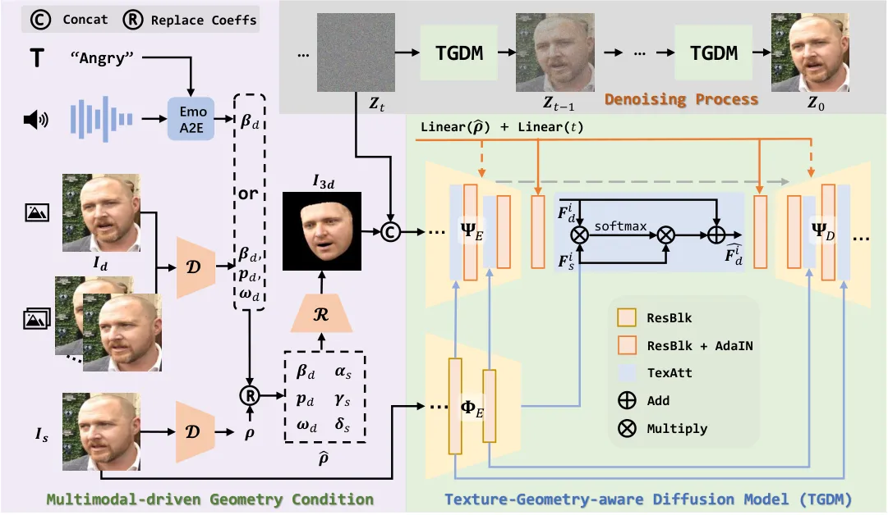

Figure 2: Overview of the proposed method for multimodal-driven talking
face generation. Given multimodal conditions, we first represent them in
geometry-related 3DMM coefficients and then project them to the rendered
face $`\boldsymbol{I}_{3d}`$, which serves as the intermediate
structural representation. Deviating from previous works, we employ text
as the emotion signal for flexible and generalized control. To obtain
realistic faces, we develop a multi-conditional diffusion model that
learns geometry prior from $`\boldsymbol{I}_{3d}`$ by simply
concatenated input, transfers source appearance from
$`\boldsymbol{I}_{s}`$ by cross attention, and supplements implicit
identity and geometry information by AdaIN.

## IV Method

### IV-A Overview

As shown in Fig. 2, multimodal-driven talking face generation aims to
produce realistic videos according to given source identity and
multimodal geometry conditions, _i.e_., text, audio, image, and video.
In Multimodal-driven Geometry Condition, we employ rendered faces
projected from 3DMMs as the intermediate structural representation. To
further exploit the potential of text in this task, we represent the
emotion style in text prompts, which could inherit rich semantics from
the large-scale pre-trained models for flexible and generalized emotion
control (Sec. IV-B). To enable multimodal conditions to share the same
generator, we propose a powerful paradigm, termed Texture-Geometry-aware
Diffusion Model (TGDM), which is based on the multi-conditional
diffusion model, allowing complex texture transfer for high-fidelity
face generation, and avoids unstable GAN-based training (Sec. IV-C).
Finally, we extend TGDM to face swapping and derive a new paradigm for
stable and effective training and inference (Sec. IV-D). In the
following, we will supply more details.

### IV-B Multimodal-driven Geometry Condition

Image-driven and Video-driven Conditions. For image driving, we combine
the appearance-related 3DMM coefficients (identity, texture, and
illumination) from the source image $`\boldsymbol{I}_{s}`$ with the
motion-related coefficients (expression, pose, and gaze) from the
driving image $`\boldsymbol{I}_{d}`$ to construct the desired 3D face
descriptors
$`\boldsymbol{\hat{\rho}}=\left\{\boldsymbol{\alpha}_{s},\boldsymbol{\beta}_{d},\boldsymbol{\delta}_{s},\boldsymbol{\gamma}_{s},\boldsymbol{p}_{d},\boldsymbol{\omega}_{d}\right\}`$,
along with its rendered face $`\boldsymbol{I}_{3d}`$ as the geometry
conditions. For video driving
$`\left\{\boldsymbol{I}_{1,d},\boldsymbol{I}_{2,d},\cdots,\boldsymbol{I}_{N,d}\right\}`$,
we can treat them as isolated $`N`$ images for processing. However,
parameters from a single input frame will cause jitter and instability
in the final generated video due to the inevitable prediction errors
between consecutive frames. To alleviate this problem, like \[8\], we
introduce a windowing strategy for better temporal consistency, _i.e_.,
the parameters of the adjacent frames are also used as descriptors of
the central frame to smooth the motion trajectory. In practice, the
coefficients of a window with continuous frames
$`\boldsymbol{\hat{\rho}}\equiv\boldsymbol{\hat{\rho}}_{i-k:i+k}`$ and
the rendered frame of the central frame as the geometry conditions,
where $`k`$ is the radius of the window and set to 1 experimentally.

Audio-driven and Text-driven Conditions. Audio-driven talking face
generation is expected to maintain lip movements synchronized with input
speech contents and synthesize natural facial motion simultaneously.
Consequently, it raises two challenges, one is precise audio-to-lip
mapping, and the other is highly temporal consistent. Unlike previous
works that adopt LSTM \[90, 8\] or GRU \[91, 92\] to autoregressively
deduce expression coefficients, we adopt the non-autoregressive
Transformer \[93\] to capture the short- and long-term audio context and
provide the sequence-level representations for more accurate and
temporal-coherent coefficients regression. Besides, emotion style also
plays a crucial role in generating vivid talking face. For emotion
representation, the one-hot coding \[47\] is in a fixed pattern and
fails to convey the semantics cues contained in the label, while recent
methods \[11, 2\] extract emotion embedding from given images and audio,
lacking generalizing to unseen styles due to the limited semantics. In
contrast, we represent the emotion style in the text prompt and borrow
help from CLIP to deliver the semantic cues. Thus our method inherits
rich semantic knowledge and convenient interaction after various emotion
styles are encoded by CLIP.

To this end, we propose the Emotional Audio to Expression (EmoA2E)
module. Specifically, as shown in Fig. 3, the Mel-frequency Cepstral
Coefficients (MFCC) clips
$`\boldsymbol{A}=\left\{\boldsymbol{A}_{1},\dots,\boldsymbol{A}_{N}\right\}`$
provide the cues of lip movement, a non-learnable extended token takes
identity information $`\boldsymbol{\alpha}`$ as input to connect the
expression motion to the specific person, and the emotion embedding
$`\boldsymbol{z}_{emo}`$ produced from the fixed CLIP text encoder as
the emotion condition. Besides, instead of utilizing a one-hot coding
\[47\] to control the emotion intensity, we further prepend a learnable
intensity token $`\boldsymbol{\varphi}`$, which is the product of the
base learnable intensity vector and intensity scalar:

```math
\displaystyle\boldsymbol{\varphi} \displaystyle=\eta\boldsymbol{\varphi}_{base}, \tag{9}
```

where $`\eta\in\left\{1,2,3\right\}`$ at the training phase, and it can
be a continuous random value range from 1 to 3 during the testing phase.
Typically, the audio sequence and identity token are first embedded into
the hidden dimension, then together with the prefix token
$`\boldsymbol{\varphi}`$ to be added with standard positional PE and
emotion embeddings:

```math
\displaystyle\bar{\boldsymbol{\beta}}=\boldsymbol{\mathcal{T}}([\boldsymbol{\varphi},\text{MLP}(\boldsymbol{\alpha}),\text{MLP}(\boldsymbol{A})]+\text{PE}+\text{MLP}(\boldsymbol{z}_{emo})), \tag{10}
```

```math
\displaystyle\hat{\boldsymbol{\beta}}=\text{MLP}(\bar{\boldsymbol{\beta}}). \tag{11}
```

We train EmoA2E independently by two losses. First, we define an
expression Reconstruction Loss $`\mathcal{L}_{rec}`$ to calculate the
distance between the predicted $`\boldsymbol{\hat{\beta}}`$ and ground
truth $`\boldsymbol{\beta}`$:

```math
\displaystyle\mathcal{L}_{rec}=\left\|\boldsymbol{\beta}-\hat{\boldsymbol{\beta}}\right\|_{2}. \tag{12}
```

Besides, we further select 68 points from the original 3DMM
$`\boldsymbol{\rho}`$ and modified one $`\boldsymbol{\hat{\rho}}`$,
obtaining $`\boldsymbol{l}`$ and $`\boldsymbol{\hat{l}}`$, respectively.
We define Landmark Loss to measure the similarity between them:

```math
\displaystyle\mathcal{L}_{lm}=\left\|\boldsymbol{l}-\boldsymbol{\hat{l}}\right\|_{2}. \tag{13}
```

Thus, the total loss is defined as follows:

```math
\displaystyle\mathcal{L}=\lambda_{rec}\mathcal{L}_{rec}+\lambda_{lm}\mathcal{L}_{lm}, \tag{14}
```

where $`\lambda_{rec}=100`$ and $`\lambda_{lm}=0.1`$.

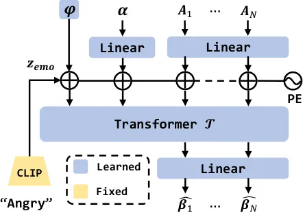

Figure 3: The architecture of EmoA2E module. Removing the emotion
embedding $`\boldsymbol{z}_{emo}`$ and intensity
$`\boldsymbol{\varphi}`$ inputs, this structure is used for emotion-free
audio-to-expression learning.

### IV-C Texture-Geometry-aware Diffusion Model

Most recent GAN-based methods are source-oriented that explicitly model
the deformation to animate the source into the driving pose and
expression. However, it is still quite challenging to achieve the
accurate desired geometry and capture the complex identity appearance
when under various extreme conditions, such as large pose, yielding
noticeable artifacts and degradation problems. Thus, we revisit this
task and propose the target-oriented Texture-Geometry-aware Diffusion
Model (TGDM), which focuses on transferring the source texture to the
rendered geometry face and inherits the flexibility and fidelity of
diffusion models. In this part, we give the descriptions of the network
structure and the training details for the denoising process.

Architecture. Following the \[94\], our conditional denoising model
$`\boldsymbol{\epsilon}_{\theta}`$ is designed by the UNet-based
backbone, consisting of the encoder $`\boldsymbol{\Psi}_{E}`$ and
decoder $`\boldsymbol{\Psi}_{D}`$. As shown in Fig. 2, TGDM is
conditioned on three external inputs. First, the texture encoder
$`\boldsymbol{\Phi}_{E}`$ provides the multiscale features
$`\boldsymbol{F}_{s}=\left\{\boldsymbol{F}_{s}^{0},\dots,\boldsymbol{F}_{s}^{k}\right\}`$
to provide the desired texture patterns, where $`k`$ is 1, _i.e_., we
adopt two resolution texture features in $`16\times 16`$ and
$`32\times 32`$. To mix the source texture within the noise prediction
branch and eliminate the effects of misalignment, we design the Texture
Attention-based (TexAtt) module that employs the cross-attention
mechanism for better integration. As shown in Fig. 2, each TexAtt
receives the source texture feature $`\boldsymbol{F}_{s}^{i}`$ and the
noise feature $`\boldsymbol{F}_{d}^{i}`$, the query is extracted by one
convolution from $`\boldsymbol{F}_{d}^{i}`$, and the key and value are
extracted from $`\boldsymbol{F}_{s}^{i}`$ in the same way, obtaining
$`\boldsymbol{Q}_{d},\boldsymbol{K}_{s},\boldsymbol{V}_{s}\in\mathbb{R}^{C_{i}/4\times H_{i}\times W_{i}}`$
with reduced channel numbers. Then $`\boldsymbol{Q}_{d}`$ and
$`\boldsymbol{K}_{s}`$ are used to calculate the correlation matrix
$`\boldsymbol{M}`$, which further multiplies $`\boldsymbol{V}_{s}`$ to
obtain $`\boldsymbol{F}_{s\rightarrow d}^{i}`$. A zero-initialized
learned scale parameter $`\tau`$ is applied on
$`\boldsymbol{F}_{s\rightarrow d}^{i}`$ to control the source texture
transfer flow when added to the $`\boldsymbol{F}_{d}^{i}`$:

```math
\displaystyle\boldsymbol{F}_{s\rightarrow d}^{i}=\text{softmax}(\boldsymbol{Q}_{d}(\boldsymbol{K}_{s})^{T})\boldsymbol{V}_{s}=\boldsymbol{M}\boldsymbol{V}_{s}, \tag{15}
```

```math
\displaystyle\hat{\boldsymbol{F}_{d}^{i}}=\tau\boldsymbol{F}_{s\rightarrow d}+\boldsymbol{F}_{d}^{i}. \tag{16}
```

Then, the spatially aligned rendered face $`\boldsymbol{I}_{3d}`$ is
concatenated channel-wise with the noisy face $`\boldsymbol{Z}_{T}`$,
which is obtained by adding noise to $`\boldsymbol{I}_{d}`$ according to
Eq. 2. They are fed to the first layer of the network to guide the
denoising process, ensuring the intermediate noise and the output face
follow the given facial geometry. In addition, the modified coefficients
$`\boldsymbol{\hat{\rho}}`$ further supplement the implicit geometry
cues, especially the gaze direction not included in the rendered face.
It added with embedded time, forming the last condition
$`\boldsymbol{C}=\text{Linear}(\boldsymbol{\hat{\rho}})+\text{Linear}(t)`$,
which is injected into the noise predictor via the adaptive instance
normalization (AdaIN) \[7\]:

```math
\displaystyle\text{AdaIN}(\boldsymbol{F}_{d}^{i},\boldsymbol{C})=\sigma_{c}(\boldsymbol{C})\frac{\boldsymbol{F}_{d}^{i}-\mu(\boldsymbol{F}_{d}^{i})}{\sigma(\boldsymbol{F}_{d}^{i})}+\mu_{c}(\boldsymbol{C}), \tag{17}
```

where $`\mu(\cdot)`$ and $`\sigma(\cdot)`$ is the average and variance
operation of the input feature $`\boldsymbol{F}_{d}^{i}`$ respectively.
$`\mu_{c}(\cdot)`$ and $`\sigma_{c}(\cdot)`$ are used to estimate the
adapted mean and bias according to the given condition. To this end, all
condition information is properly integrated into the network
$`\boldsymbol{\epsilon}_{\theta}(\boldsymbol{Z}_{t},\boldsymbol{F}_{s},\boldsymbol{I}_{3d},\boldsymbol{\hat{\rho}},t)`$
to predict the noise for talking face generation.

Objectives. We first adopt the regular simple Denoising Loss:

```math
\displaystyle\mathcal{L}_{simple}=\left\|\boldsymbol{\epsilon}-\boldsymbol{\epsilon}_{\theta}(\boldsymbol{Z}_{t},\boldsymbol{F}_{s},\boldsymbol{I}_{3d},\boldsymbol{\hat{\rho}},t)\right\|_{2}, \tag{18}
```

where $`\boldsymbol{\epsilon}`$ is an added noise on
$`\boldsymbol{I}_{d}`$. Besides, we estimate the fully denoised face
$`\hat{\boldsymbol{Z}}_{0}`$ according to the Eq. 5, which enables
further constraints on the image level. Concretely, we measure the
difference between $`\boldsymbol{\hat{\boldsymbol{Z}}_{0}}`$ and
$`\boldsymbol{I}_{d}`$ at the pixel and perceptual level by a
Reconstruction Loss $`\mathcal{L}_{rec}`$ as $`\mathcal{L}_{2}`$
distance and a Perceptual Loss as the LPIPS loss \[95\]:

```math
\displaystyle\mathcal{L}_{rec}=\left\|\hat{\boldsymbol{Z}}_{0}-\boldsymbol{I}_{d}\right\|_{2}, \tag{19}
```

```math
\displaystyle\mathcal{L}_{p}=\left\|\phi_{vgg}(\hat{\boldsymbol{Z}}_{0})-\phi_{vgg}(\boldsymbol{I}_{d})\right\|_{2}, \tag{20}
```

where $`\phi_{vgg}(\cdot)`$ represents the pre-trained VGG16 \[96\]
network. Thus, the total loss is defined as follows:

```math
\displaystyle\mathcal{L}=\lambda_{simple}\mathcal{L}_{simple}+\lambda_{rec}\mathcal{L}_{rec}+\lambda_{p}\mathcal{L}_{p}, \tag{21}
```

where $`\lambda_{simple}=10`$, $`\lambda_{rec}=1`$, and
$`\lambda_{p}=1`$.

### IV-D A Novel Face Swapping Paradigm Built on TGDM

Despite the impressive progress of recent methods, GAN- and
diffusion-based face swapping methods still suffer from the dilemma that
the improvement of source face identity consistency at the expense of
sacrificing target attribute preservation. For example, DiffFace \[20\]
employs identity and attribute expert models to guide the noise
prediction, and the balance between them is critical to producing
high-quality swapped faces. However, it is complex and needs many
experimental attempts. We attribute this phenomenon to the training
phase playing the seesaw-style game, which struggles to balance all
identity-unrelated attributes preservation and the source identity
fusion. Since our proposed method for talking face is able to transfer
complex textures, we derive a novel paradigm for face swapping built
upon the TGDM.

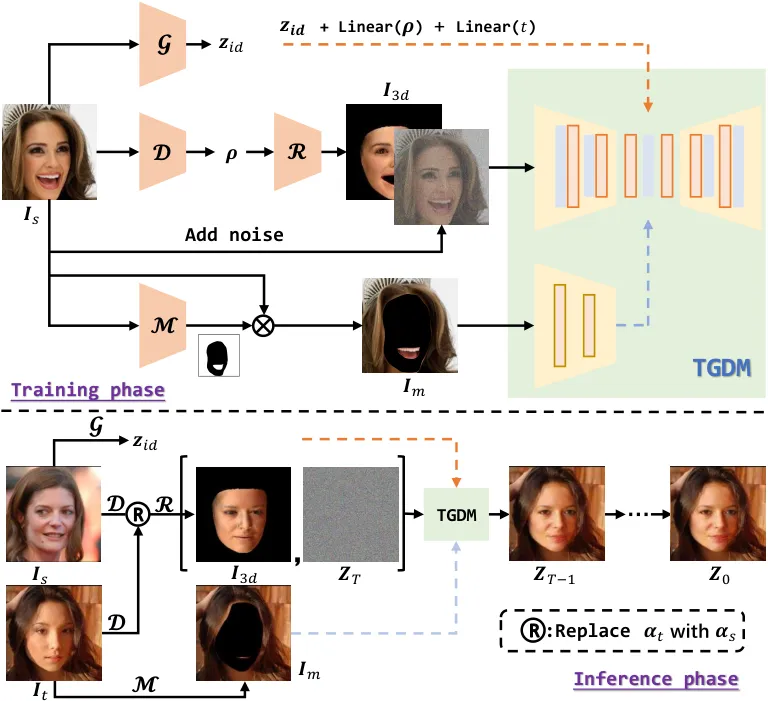

Figure 4: The new paradigm of face swapping is built upon the TGDM.
During the training phase, we focus on reconstructing the input face
$`\boldsymbol{I}_{s}`$ from given identity- and attribute-related
conditions, _i.e_., identity embedding $`\boldsymbol{z}_{id}`$, 3D face
descriptor $`\boldsymbol{\rho}`$, rendered face $`\boldsymbol{I}_{3d}`$,
and masked face $`\boldsymbol{I}_{m}`$. During inference, we first
render the recombined coefficients to capture the desired geometry
prior, which incorporates with other corresponding conditions for
generating final swapped results.

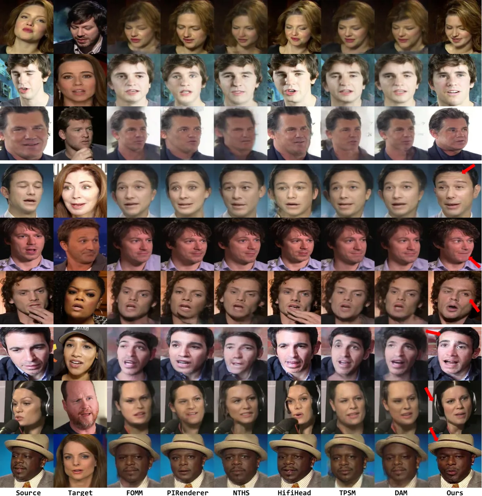

Figure 5: Qualitative comparison with SOTA methods on VoxCeleb1 test
set. We present various challenging cases which show the significant
difference between the source and target of the pose, occlusion, and
face size. Please pay attention to the area indicated by the red arrow.

|            |                   |                      |                    |                      |                     |                   |                    |                    |                      |                     |                   |                    |
| ---------- | ----------------- | -------------------- | ------------------ | -------------------- | ------------------- | ----------------- | ------------------ | ------------------ | -------------------- | ------------------- | ----------------- | ------------------ |
| Method     | Same-Identity     |                      |                    |                      |                     |                   |                    | Cross-Identity     |                      |                     |                   |                    |
|            | PSNR $`\uparrow`$ | LPIPS $`\downarrow`$ | Exp $`\downarrow`$ | Angle $`\downarrow`$ | Gaze $`\downarrow`$ | ID-C $`\uparrow`$ | FID $`\downarrow`$ | Exp $`\downarrow`$ | Angle $`\downarrow`$ | Gaze $`\downarrow`$ | ID-C $`\uparrow`$ | FID $`\downarrow`$ |
| FOMM       | 16.32             | 0.3459               | 5.52               | 0.0474               | 0.0749              | 0.6552            | 27.56              | 7.14               | 0.0613               | 0.0961              | 0.5445            | 41.77              |
| PIRenderer | 16.72             | 0.3549               | 5.41               | 0.0546               | 0.0773              | 0.6576            | 28.90              | 6.90               | 0.0673               | 0.0971              | 0.5503            | 37.95              |
| NTHS       | 18.13             | 0.3588               | 5.98               | 0.0625               | 0.0903              | 0.7091            | 27.07              | 7.77               | 0.0814               | 0.1166              | 0.6159            | 38.48              |
| HifiHead   | 15.72             | 0.3678               | 5.39               | 0.0693               | 0.0625              | 0.8722            | 21.53              | 6.80               | 0.0871               | 0.0746              | 0.8394            | 33.77              |
| TPSM       | 19.29             | 0.3366               | 5.28               | 0.0412               | 0.0660              | 0.6918            | 25.57              | 6.88               | 0.0536               | 0.0853              | 0.5917            | 39.28              |
| DAM        | 18.05             | 0.3440               | 5.46               | 0.0484               | 0.0737              | 0.6535            | 28.11              | 7.08               | 0.0626               | 0.0949              | 0.5415            | 44.09              |
| Ours       | 18.55             | 0.3346               | 5.09               | 0.0315               | 0.0554              | 0.7718            | 25.51              | 5.82               | 0.0349               | 0.0596              | 0.7017            | 35.16              |

Table I: Quantitative results on the tasks of same-identity and
cross-identity setting on VoxCeleb1. Bold and underline represent
optimal and suboptimal results. The up arrow indicates that the larger
the value, the better the model performance, and vice versa.

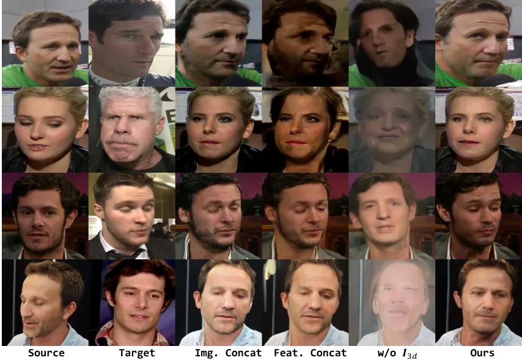

Figure 6: Qualitative ablation study of our method with different
variations on VoxCeleb1 dataset.

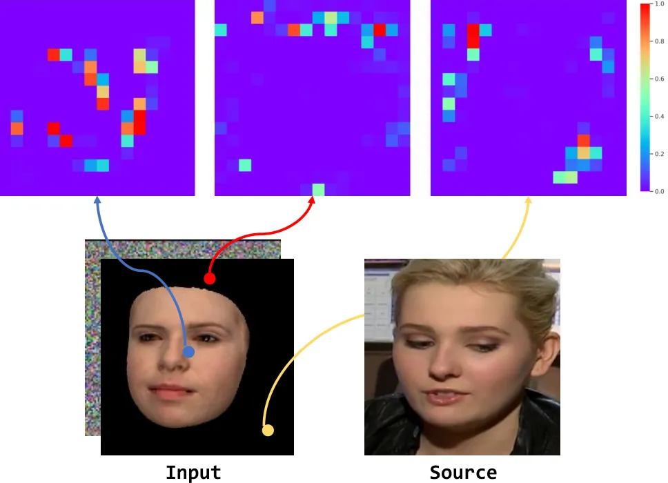

Figure 7: Attention visualization of TextAtt. The color bars indicate
activation values. The points in the input rendered face could correctly
match similar semantic and geometrical areas in the source.

Specifically, as shown in the top of Fig. 4, there are two
modifications. First, we completely mask the face region of the source
texture image with the help of the mask predictor $`\mathcal{M}`$ \[97\]
to ensure that the ground truth identity information is not visible to
the network. Second, because of the low-dimensional linear
representation of 3DMMs, the rendered images often lack photo-realism
and fine texture details like wrinkles. We further supplement the
identity embedding from the expert identity model $`\mathcal{G}`$
\[98\]. In this way, the renderer image $`\boldsymbol{I}_{3d}`$,
identity embedding $`\boldsymbol{z}_{id}`$, and
$`\text{Linear}(\boldsymbol{\rho})`$ focused on affording identity cues
and identity-unrelated attributes of the face region, while
$`\boldsymbol{I}_{m}`$ makes up for the absence of hair and background.
Notably, the mouth area is also served as the background, which is
discussed in the Sec. V-D. During training, as Eq. 21, our scheme does
not require complex losses. Instead, the reconstruction loss is
sufficient. The hyperparameter setting is the same as Eq. 21 either. For
inference, given the source $`\boldsymbol{I}_{s}`$ and the target
$`\boldsymbol{I}_{t}`$, we first render the $`\boldsymbol{I}_{3d}`$ with
the identity factor of the source and the remaining parameters of the
target. As shown in the bottom of Fig. 4, $`\boldsymbol{I}_{3d}`$ is
sensitive to the geometric structure, exhibiting the exact desired face
shape, and $`\boldsymbol{z}_{id}`$ contains source identity semantics.
Combining both of them guarantees identity similarity. To this end,
following the standard denoising process, our method successfully
transfers the source geometry- and semantic-aware identity information
to the target, while fully keeping the identity-unrelated attributes
without any complex sampling tricks.

## V Experiment

### V-A Datasets and Implementation Details

Datasets. For talking face generation, we leverage the VoxCeleb1 \[99\]
dataset, which contains over 20K videos. Among them, We select the
high-resolution (720P) ones and follow the preprocessing method in FOMM
\[3\] to crop the videos and resize them to $`256\times 256`$, obtaining
17,927 training videos and 491 testing videos. For emotional talking
face generation, we adopt the MEAD \[47\] dataset, which contains eight
emotion types (neutral, angry, contempt, disgusted, fear, happy, sad,
and surprised) and three intensity levels (levels 1, 2, 3). We randomly
select 36 identities of front-view video clips for training and the rest
for testing. For face swapping, we utilize the high-quality
CelebAMask-HQ \[100\] dataset, which has 30,000 images with fine-grained
mask annotation. FaceForensics++ \[101\] is used for testing, which is a
forensics dataset consisting of 1000 videos.

Metrics. For face reenactment, we use PSNR and LPIPS \[95\] to evaluate
reconstruction quality. Exp, Angle, and Gaze are used to calculate the
average Euclidean Distances of corresponding coefficients between the
generated and target faces. We employ ID embeddings extracted by
Curricularface \[98\] (ID-C) and Arcface \[102\] (ID-A) to measure
identity cosine similarity. We further use FID \[103\] to evaluate the
realism of the generated faces. For talking face generation, in addition
to the metrics mentioned above, we use Landmarks Distance (LMD) \[104\]
around the mouth, and the confidence score (Sync) proposed in SyncNet
\[105\] to measure the accuracy of mouth shapes and lip synchronization.
We further use Emotion Feature Distance (EFD) to measure the accuracy of
the emotion representation, which is extracted by \[106\]. For face
swapping, we adopt Exp, Angle, ID-A, and FID for evaluation. We do not
adopt ID-C since Curricularface has been used in training and inference.

Implementation Details. For EmoA2E, we randomly sample consecutive
$`K=32`$ clips for emotion-condition training in MEAD and emotion-free
training in VoxCeleb1. We use a learning rate of 0.0002 and 128 batch
sizes with the Adam optimizer on one V100 GPU for 200K iterations. For
TGDM, we randomly sample the source and target faces from the same video
in MEAD and VoxCeleb1 for training. It takes about 4 days by using 4
V100 GPUs with 8 batch sizes and a 0.0002 learning rate for 200K
iterations. For face swapping, we train its model as the aforementioned
setting for approximately 3 days. For the diffusion model, the length of
the denoising step $`T`$ is set to 1000, and a linear noise schedule is
adopted for both the training and inference process. Notably, to stale
the training procedure, only MSE loss of noise is used at the beginning
of the training. Only when it has been decreased below 0.05, MSE loss of
image, and LIPIS loss then start to work. Besides, the UNet of TGDM
receives $`256\times 256`$ resolution images and performs 16 down-sample
ratios.

|                             |                    |                      |                     |                   |                    |
| --------------------------- | ------------------ | -------------------- | ------------------- | ----------------- | ------------------ |
| Method                      | Exp $`\downarrow`$ | Angle $`\downarrow`$ | Gaze $`\downarrow`$ | ID-C $`\uparrow`$ | FID $`\downarrow`$ |
| Img Concat                  | 6.06               | 0.0353               | 0.1252              | 0.6323            | 46.63              |
| Feat Concat                 | 6.69               | 0.0443               | 0.1346              | 0.5204            | 52.96              |
| w/o $`\boldsymbol{I}_{3d}`$ | 9.10               | 0.4376               | 0.1845              | 0.2233            | 70.49              |
| Ours                        | 5.82               | 0.0349               | 0.0596              | 0.7017            | 35.16              |

Table II: Quantitative ablation study of our approach with different
module on VoxCeleb1.

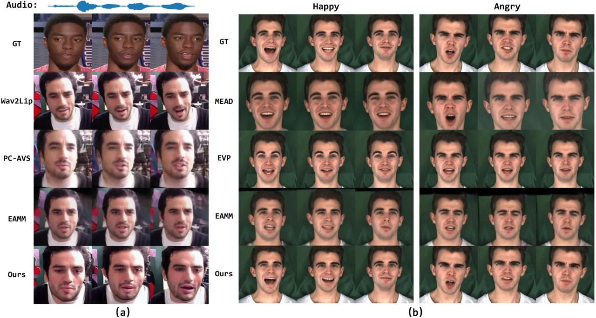

Figure 8: (a) presents qualitative results of audio-driven talking face
generation in VoxCeleb1 under the cross-identity setting, while (b)
takes emotion into consideration. The results are sampled from the MEAD
dataset. Different columns mean several sampled timestamps. Images are
from officially released codes for fair comparisons.

### V-B Face Reenactment

#### V-B1 Comparison with Baselines

Qualitative Results. We perform qualitative comparisons with FOMM \[3\],
PIRenderer \[8\], NTHS \[107\], HifiHead, TPSM \[9\], and DAM \[10\] in
the Cross-Identity setting, where the source and the target are of
different identities. We do not compare with StyleHeat \[46\] since it
requires the aligned inputs due to the fixed StyleGAN generator. As
shown in Fig. 5, we sample nine pairs from VoxCeleb1 for visualization.
First, the top three pairs have a significant difference in face size.
It can be seen that FOMM-based methods, _e.g_., TPSM and DAM, produce
over-smooth facial textures and suffer from noticeable warping
artifacts. HifiHead could generate realistic faces, but their poses are
inconsistent with the target. By contrast, the results of our method are
of high quality and with the desired attributes. Second, the target
faces of the middle ones show rich micro-expressions. Recent methods
just imitate mouth shape and head direction, and they ignore the emotion
embodied in the target. For example, the target of the fourth row is
surprised, and the sixth is contempt. For comparison, our results
exhibit accurate emotion styles, _i.e_., surprised forehead lines,
delighted mouth corners, and disdainful eyes. Finally, the bottom pairs
suffer from occlusions in the source or the target. It is difficult for
FOMM-based methods to estimate the precise key points, thus usually
resulting in extremely distorted facial shapes (the head area of row 7).
Other methods also struggle to animate the occluded objects to fit the
desired pose. Benefiting from the effective cross-attention mechanism,
our method is not sensitive to occlusion and reasonably preserves the
non-facial parts in the generated results (the headphones of row 8 and
the hat of row 9). Moreover, these cases are all under large-pose
conditions, which convincingly demonstrate that our method successfully
transfers the source texture to the target rendered image, providing
more realistic results with accurate pose and detailed expression while
preserving the source identity.

Quantitative Results. We quantitatively compare the proposed method with
several aforementioned SOTA methods both in Same-Identity and
Cross-Identity settings. We randomly sample 200 identities from the test
set and set 5 random seeds to generate 1K pairs in total. The results
are summarized in Tab. I. Benefiting from the explicit facial
representation contained in the rendered face, our methods achieve an
impressive performance of facial attributes, indicating that our model
can animate the source face that is highly faithful to the given
structure cues. Furthermore, our method is favorable against other
methods regarding the reconstruction metrics PSNR and LPIPS and image
quality metric FID. HifiHead obtains the lowest FID due to the
StyleGAN-based generator. Besides, it also shows the best identity
consistent but suffers from severe pose error, which can be concluded
from rows 2 and 8 of Fig 5 either. Overall, the above observations are
consistent with the qualitative results in Fig. 5.

#### V-B2 Ablation Study and Analysis

Ablation Study. We perform qualitative and quantitative experiments to
validate the merits of the proposed designs. Specifically, we design two
variations to evaluate the effectiveness of TextAtt. Specifically, we
adopt the image-level and feature-level concatenation for feature
injection as two baselines. For a fair comparison, we train our method
and two baselines with the same setting, _e.g_., same batch sizes and
training iterations. As shown in columns 3 and 4 of Fig. 6, these two
baselines are able to generate the desired pose and expression, but they
have a limited ability to retain the source appearance, exhibiting
severe color jitting, especially the feature-level concatenation. To
further verify the necessity of the rendered face
$`\boldsymbol{I}_{3d}`$, we only use the 3D face descriptors
$`\boldsymbol{\rho}`$ to supply the facial geometry information.
Comparing the results of columns 5 and 6, we can observe that the
implicit representation is insufficient to effectively support geometry
alignment. Contrary to the above competitors, our results show higher
quality, which illustrates the effectiveness of cross attention as the
feature transfer module and rendered image as the explicit geometry
condition, both reducing the difficulty of training and speeding up the
convergence of the model. Besides, the above observations could also be
summarized from Tab. II, our proposed method improves all metrics by a
large margin.

Interpretability of TextAtt. To better understand the cross-attention
mechanism, we visualize the attention maps of the TextAtt in UNet middle
block, which is $`16\times 16`$ resolution. As shown in Fig. 7, we
select three points from different regions in the noise feature, _i.e_.,
head, face, and background. The visualized attention maps indicate that
each location pays more attention to the geometrically and semantically
similar areas, _e.g_., the red point is sampled from the head region,
which has a higher response with the corresponding region of the source
feature. Consequently, the such attention-based design allows the
explicit texture transfer to achieve photo-realistic and
identity-consistent face generation.

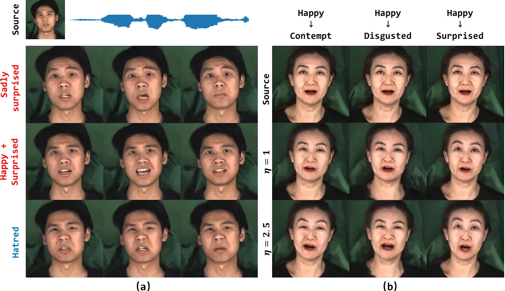

Figure 9: (a) The visualization of unseen emotion style. Rows 2 and 3
(in Red) are the compound styles, and row 4 (in Blue) is a new style.
(b) Results of different emotion styles and intensity levels.

|              |                    |                    |                   |                   |                    |
| ------------ | ------------------ | ------------------ | ----------------- | ----------------- | ------------------ |
| Method       | EFD $`\downarrow`$ | LMD $`\downarrow`$ | Sync $`\uparrow`$ | ID-C $`\uparrow`$ | FID $`\downarrow`$ |
| Wav2Lip      | -                  | 3.09               | 4.86              | -                 | -                  |
| PC-AVS       | -                  | 3.21               | 4.65              | 0.81              | 30.72              |
| EAMM-Neutral | -                  | 3.22               | 4.60              | 0.79              | 37.90              |
| Ours         | -                  | 3.09               | 4.91              | 0.83              | 26.54              |
| MEAD         | 0.084              | 2.62               | 3.09              | 0.81              | 30.69              |
| EVP          | 0.106              | 2.54               | 3.21              | 0.70              | 12.83              |
| EAMM-Emo     | 0.092              | 2.50               | 3.26              | 0.74              | 29.01              |
| Ours         | 0.061              | 2.36               | 3.52              | 0.81              | 16.33              |

Table III: The top part is the quantitative comparison of emotion-free
on VoxCeleb1 and the bottom part is the emotion-condition on MEAD
dataset.

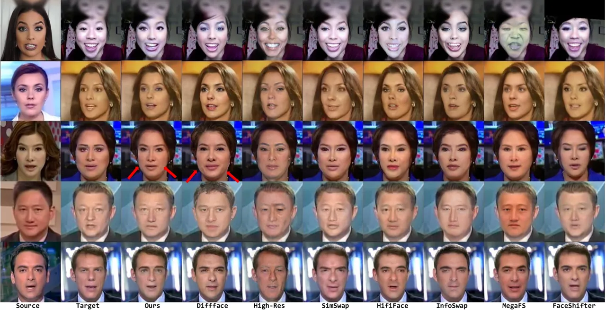

Figure 10: Qualitative comparison of face swapping results with other
SOTA models on FaceForensics++. The results of our model better reflect
the source identity, especially the face shape. Additionally, they are
more faithful to the target image for non-identity-related attributes.
The results of other methods are from the DiffFace \[20\] main paper and
officially released codes.

### V-C Talking Face Generation

#### V-C1 Comparison with Baselines

Qualitative Results. We perform qualitative comparisons with Wav2Lip
\[35\], PC-AVS \[1\], and EAMM \[11\] for talking face generation. Fig.
8 (a) visualizes the generated frames of these methods. It can be seen
that all methods could produce synchronized lip shapes with given audio
signals. However, Wav2Lip fails to change the head pose and artifacts
appear around the mouth area due to the inevitable blending mismatch.
PC-AVS and EAMM only support the aligned faces as inputs. Thus such
preprocess operation destroys the original facial structure, reflecting
on the misalignment pose with the target in the animated faces. Besides,
their results are blurred and lose the sharp source textures. By
contrast, our results are highly faithful to the given pose from the
images and mouth movements from the audio, while maintaining the source
texture well. For emotional talking face generation, we select three
frames of two emotion styles in MEAD for comparison. As shown in Fig. 8
(b), Wav2Lip and PC-AVS struggle to generate desired emotions with
synchronized lip shapes in this task, while the synthesized images from
MEAD are of poor quality. EVP \[108\] and EAMM suffer identity
inconsistency with the source and show less rich expression due to
lacking intensity modeling. Benefiting from sufficient emotion semantics
learning and the powerful generative capabilities of diffusion models,
our method produces more accurate expressions and realistic textures.

Quantitative Results. We conduct a quantitative comparison in the
reconstruction setting that guarantees access to ground truth for
evaluation. For a fair comparison, we align the cropping manner of all
the methods. For talking face generation, as shown in the top part of
Tab. III, we do not calculate the ID-C and FID of Wav2Lip since it only
generates the mouth region and copies other regions from input faces.
Contrary to other methods, our method yields the best motion control,
temporal coherence, identity consistency, and image quality in terms of
LMD, Sync, ID-C, and FID. We further compare our emotion-condition
pipeline with other emotional talking face generation methods. As shown
in the bottom part of the Tab. III, our method outperforms most metrics
except for the FID. EVP achieves higher FID due to the vid2vid-based
generator, but it exhibits a weak manipulated ability, which can be
inferred from the lower ID-C and Sync, and higher LMD. Moreover,
compared with the performance of emotion-free talking face generation
and the emotion-condition one, the latter achieves better mouth shape
accuracy (lower LMD) due to the limited corpus of MEAD, but the emotions
introduce the irregular talking rhythm, leading to the poor
synchronization (lower Sync).

#### V-C2 Ablation Study and Analysis

Ablation Study. To verify the effectiveness of the Transformer encoder
in EmoA2E, we replace it with stacked fully-connected layers of
GRU-based recurrent neural networks. Our method outperforms the above
two architectures on LMD metric: 3.54 _vs_. 2.47 _vs_. 2.36 of MLPs,
GRUs, and Transformers. To further explore the effect of different
emotion encoding manners on the unseen emotion style, we use one-hot
encoding and language pre-trained model GPT2 \[109\] for evaluation. It
is obvious that one-hot fails to represent a new style due to the fixed
pattern. GPT2 is not available to the visual cues and struggles to
reflect the unseen textual semantics to the image domain. We conduct a
quantitative experiment that measures the cosine similarity of the
attached sequences in Fig. 9 with the corresponding text prompts when
encoded by GPT2 and CLIP. Our method achieves better results: 0.621
_vs_. 0.430, which demonstrates the superiority of CLIP in handling
multimodal information.

Generalizing to Unseen Emotion Styles. Unseen emotion styles include
compound and totally new styles. As shown in Fig. 9 (a), row 2 shows the
results of the given Sadly surprised, and row 3 of the average embedding
of Happy and Surprised, which indicates the flexible manipulation for
compound emotion. We further present the new style Hatred in the fourth
row. The correct exhibition of these unseen styles verifies the
flexibility and rich semantic priors of the CLIP feature space.

Continuous Emotion Style Control. We conduct a qualitative experiment to
evaluate the effectiveness of our method for controlling emotion style.
As shown in Fig. 9 (b), our approach could change the emotion
representation between two distinct styles, rather than previous
techniques only taking a neutral face as the source. We increase the
intensity value from 1 to 2.5, which shows continuous and accurate
expression changes. Please pay attention to the mouth and eyes regions.

### V-D Expanded Application of Face Swapping

#### V-D1 Comparison with Baselines

We first conduct qualitative experiments to compare our method with
DiffFace \[20\], High-Res \[65\], InfoSwap \[70\], MegaFS \[107\],
HifiFace \[60\], Simswap \[59\], and FaceShifter \[58\] on the
FaceForensics++ \[101\] dataset. As shown in Fig. 10, our model
outperforms other models in changing identity-related geometry,
especially the face shape, and preserving non-identity-related
attributes. For example, in the third row, the generated face shape is
more similar to the source, while other methods almost contain the same
face shape as the target. Also, in the fourth and fifth rows, we totally
preserve the non-identity-related attributes like hair and backgrounds.
In the first row, our result is more similar to the source than others.
Compared with another diffusion-based method DiffFace, our results
obviously show the superiority of generating both identity-consistent
and attributes-preserving faces, but the visual quality reduces to some
degree. This is because our synthesized faces are more faithful to the
target, while DiffFace produces clear but inconsistent textures.
Moreover, Fig. 11 presents more qualitative comparisons with other SOTA
methods that without officially released codes, e.g., StyleFace \[68\],
StyleSwap \[69\], and FlowFace \[110\]. Please attention to the area
indicated by the red arrow. We further report quantitative results
compared to a part of the above method with officially released codes.
The results in Tab. IV also prove that our method is better considering
both identity consistency with the source and attribute preservation
with the target.

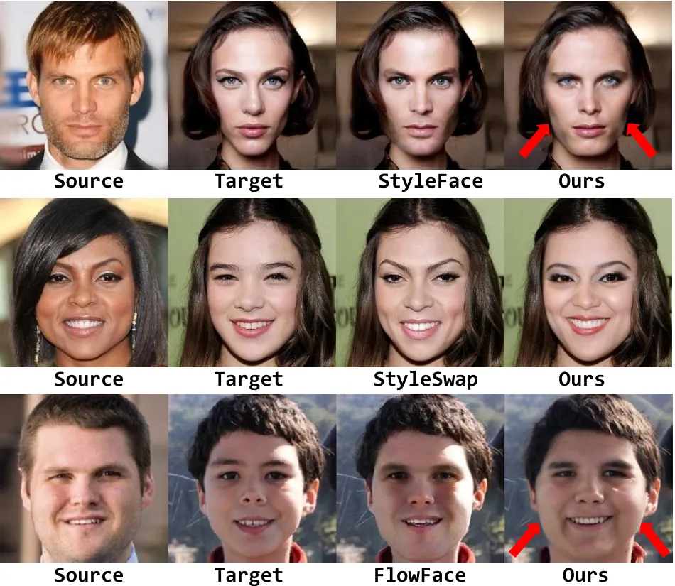

Figure 11: Qualitative comparison of face swapping results with other
SOTA models without officially released codes. The inferred images are
directly cropped from their papers.

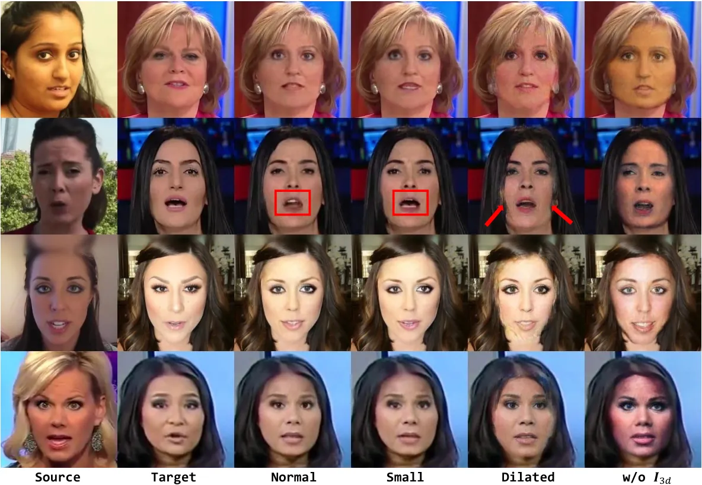

Figure 12: Qualitative ablation study of mask type and feature
representation on FaceForensics++ dataset. Normal means the mask covers
all face region. Small means treating the mouth area as the background
based on the Normal. Dilated means dilating the Normal mask.

|             |                   |                    |                      |                    |
| ----------- | ----------------- | ------------------ | -------------------- | ------------------ |
| Method      | ID-A $`\uparrow`$ | Exp $`\downarrow`$ | Angle $`\downarrow`$ | FID $`\downarrow`$ |
| FaceShifter | 0.5283            | 2.54               | 0.3001               | 17.82              |
| HifiFace    | 0.5792            | 2.56               | 0.3116               | 18.91              |
| MegaFS      | 0.3409            | 3.08               | 0.3385               | 21.68              |
| InfoSwap    | 0.5914            | 2.93               | 0.2874               | 21.23              |
| High-res    | 0.3182            | 2.92               | 0.2288               | 21.79              |
| Ours        | 0.6121            | 1.94               | 0.1122               | 15.87              |

Table IV: Quantitative comparison of face swapping on FaceForensics++
dataset.

#### V-D2 Ablation Study and Analysis

The critical operation of our reconstruction-based face swapping
paradigm is to mask the source face to avoid identity information
leaking. Thus we report a visualization to explore the effect of the
mask area. As depicted in Fig. 12, we design three variations, _i.e_.,
the Normal mask covers the all face area, the Small treats the mouth
area as the background, and the Dilated mask dilates the Normal mask to
cover more areas. There is no apparent difference between the Normal and
Small types in terms of identity and attributes by comparing columns 3
and 4, but the Small obtains the more realistic mouth area since it can
learn information from the Small masked source. Please pay attention to
the red rectangle of row 2. The results of Dilated show the artifacts
around the face contour and lead to image degradation. On the basis of
these phenomenons, we choose Small mask experimentally. Besides, as
shown in column 6 in Fig. 12, we observe that without the rendered face
$`\boldsymbol{I}_{3d}`$, the color of the swapped results are prone to
be similar to the source rather than the target, which further
demonstrate the necessity of the rendered face as the condition.

## VI Limitations and Future Works

First, almost all generators are based on a single image, and TGDM is no
exception, which inevitably introduces temporal inconsistency. To boost
the coherence of the generated talking videos, previous works \[19\]
exploit the synthesized image as the source face for the next time step,
resulting in a smoother transition between frames since the adjacent
frames share the most consistent texture. However, such a frame-by-frame
strategy has the problem of error propagation when encountering sudden
movements, resulting in face degradation in all subsequent frames. In
future work, we will be working on addressing the temporal incoherence
of diffusion-based video generation.

Besides, our method retains some disadvantages of the diffusion model.
For example, it takes about 45 ms on one V100 GPU to generate a single
face under the $`T=1000`$ DDPM setting, which is unacceptable in the
real application. We also do not train the model for a longer time,
considering the high consumption of the diffusion model. For efficiency,
our model only supports $`256\times 256`$ image generation. Although
DDIM \[73\] and LDMs \[74\] have alleviated the above problems, we hope
to propose an intuitive design like StyleGAN to allow efficient
high-resolution face generation.

## VII Conclusion

In this paper, we propose a diffusion-based model to complete
multimodal-driven talking face generation, which shows several appealing
properties: 1) We adopt the text modal as the talking face emotion
representation, which inherits rich semantics from the CLIP, allowing
flexible and generalized emotion control. 2) We treat talking face
generation as a target-oriented texture transfer task. Our proposed TGDM
maintains the faithful textures and undistorted appearance details from
the source face and preserves explicit structural information but avoids
complex texture deformations, which allows all modals to share the same
generator. 3) Our proposed TGDM is also suitable for face swapping,
which enables a novel reconstruction-based training paradigm and gets
rid of seesaw-style optimization during inference. Our extensive results
demonstrate the superiority of the proposed pipeline for various face
manipulation tasks.

## References

- \[1\] H. Zhou, Y. Sun, W. Wu, C. C. Loy, X. Wang, and Z. Liu,
  “Pose-controllable talking face generation by implicitly modularized
  audio-visual representation,” in _Proceedings of the IEEE/CVF
  conference on computer vision and pattern recognition_, 2021, pp.
  4176–4186.
- \[2\] B. Liang, Y. Pan, Z. Guo, H. Zhou, Z. Hong, X. Han, J. Han, J.
  Liu, E. Ding, and J. Wang, “Expressive talking head generation with
  granular audio-visual control,” in _Proceedings of the IEEE/CVF
  Conference on Computer Vision and Pattern Recognition_, 2022, pp.
  3387–3396.
- \[3\] A. Siarohin, S. Lathuilière, S. Tulyakov, E. Ricci, and N.
  Sebe, “First order motion model for image animation,” _Advances in
  Neural Information Processing Systems_, vol. 32, 2019.
- \[4\] H. Kim, Y. Choi, J. Kim, S. Yoo, and Y. Uh, “Exploiting spatial
  dimensions of latent in gan for real-time image editing,” in
  _Proceedings of the IEEE/CVF Conference on Computer Vision and Pattern
  Recognition_, 2021, pp. 852–861.
- \[5\] X. Zeng, Y. Pan, M. Wang, J. Zhang, and Y. Liu, “Realistic face
  reenactment via self-supervised disentangling of identity and pose,”
  in _Proceedings of the AAAI Conference on Artificial Intelligence_,
  vol. 34, no. 07, 2020, pp. 12 757–12 764.
- \[6\] E. Burkov, I. Pasechnik, A. Grigorev, and V. Lempitsky, “Neural
  head reenactment with latent pose descriptors,” in _Proceedings of the
  IEEE/CVF conference on computer vision and pattern recognition_, 2020,
  pp. 13 786–13 795.
- \[7\] X. Huang and S. Belongie, “Arbitrary style transfer in
  real-time with adaptive instance normalization,” in _Proceedings of
  the IEEE international conference on computer vision_, 2017, pp.
  1501–1510.
- \[8\] Y. Ren, G. Li, Y. Chen, T. H. Li, and S. Liu, “Pirenderer:
  Controllable portrait image generation via semantic neural rendering,”
  in _Proceedings of the IEEE/CVF International Conference on Computer
  Vision_, 2021, pp. 13 759–13 768.
- \[9\] J. Zhao and H. Zhang, “Thin-plate spline motion model for image
  animation,” in _Proceedings of the IEEE/CVF Conference on Computer
  Vision and Pattern Recognition_, 2022, pp. 3657–3666.
- \[10\] J. Tao, B. Wang, B. Xu, T. Ge, Y. Jiang, W. Li, and L. Duan,
  “Structure-aware motion transfer with deformable anchor model,” in
  _Proceedings of the IEEE/CVF Conference on Computer Vision and Pattern
  Recognition_, 2022, pp. 3637–3646.
- \[11\] X. Ji, H. Zhou, K. Wang, Q. Wu, W. Wu, F. Xu, and X. Cao,
  “Eamm: One-shot emotional talking face via audio-based emotion-aware
  motion model,” in _ACM SIGGRAPH 2022 Conference Proceedings_, 2022,
  pp. 1–10.
- \[12\] Y. Zhou, X. Han, E. Shechtman, J. Echevarria, E. Kalogerakis,
  and D. Li, “Makelttalk: speaker-aware talking-head animation,” _ACM
  Transactions On Graphics (TOG)_, vol. 39, no. 6, pp. 1–15, 2020.
- \[13\] C. Zhang, Y. Zhao, Y. Huang, M. Zeng, S. Ni, M. Budagavi,
  and X. Guo, “Facial: Synthesizing dynamic talking face with implicit
  attribute learning,” in _Proceedings of the IEEE/CVF international
  conference on computer vision_, 2021, pp. 3867–3876.
- \[14\] Y. Guo, K. Chen, S. Liang, Y.-J. Liu, H. Bao, and J. Zhang,
  “Ad-nerf: Audio driven neural radiance fields for talking head
  synthesis,” in _Proceedings of the IEEE/CVF International Conference
  on Computer Vision_, 2021, pp. 5784–5794.
- \[15\] I. Goodfellow, J. Pouget-Abadie, M. Mirza, B. Xu, D.
  Warde-Farley, S. Ozair, A. Courville, and Y. Bengio, “Generative
  adversarial networks,” _Communications of the ACM_, vol. 63, no. 11,
  pp. 139–144, 2020.
- \[16\] L. Li, S. Wang, Z. Zhang, Y. Ding, Y. Zheng, X. Yu, and C.
  Fan, “Write-a-speaker: Text-based emotional and rhythmic talking-head
  generation,” in _Proceedings of the AAAI Conference on Artificial
  Intelligence_, vol. 35, no. 3, 2021, pp. 1911–1920.
- \[17\] Y. Deng, J. Yang, S. Xu, D. Chen, Y. Jia, and X. Tong,
  “Accurate 3d face reconstruction with weakly-supervised learning: From
  single image to image set,” in _Proceedings of the IEEE/CVF conference
  on computer vision and pattern recognition workshops_, 2019, pp. 0–0.
- \[18\] D. Bigioi, S. Basak, H. Jordan, R. McDonnell, and P. Corcoran,
  “Speech driven video editing via an audio-conditioned diffusion
  model,” _arXiv preprint arXiv:2301.04474_, 2023.
- \[19\] S. Shen, W. Zhao, Z. Meng, W. Li, Z. Zhu, J. Zhou, and J. Lu,
  “Difftalk: Crafting diffusion models for generalized talking head
  synthesis,” _arXiv preprint arXiv:2301.03786_, 2023.
- \[20\] K. Kim, Y. Kim, S. Cho, J. Seo, J. Nam, K. Lee, S. Kim, and K.
  Lee, “Diffface: Diffusion-based face swapping with facial guidance,”
  _arXiv preprint arXiv:2212.13344_, 2022.
- \[21\] W. Wu, Y. Zhang, C. Li, C. Qian, and C. C. Loy, “Reenactgan:
  Learning to reenact faces via boundary transfer,” in _Proceedings of
  the European conference on computer vision (ECCV)_, 2018, pp. 603–619.
- \[22\] P.-H. Huang, F.-E. Yang, and Y.-C. F. Wang, “Learning
  identity-invariant motion representations for cross-id face
  reenactment,” in _Proceedings of the IEEE/CVF Conference on Computer
  Vision and Pattern Recognition_, 2020, pp. 7084–7092.
- \[23\] J. Zhang, X. Zeng, M. Wang, Y. Pan, L. Liu, Y. Liu, Y. Ding,
  and C. Fan, “Freenet: Multi-identity face reenactment,” in
  _Proceedings of the IEEE/CVF Conference on Computer Vision and Pattern
  Recognition_, 2020, pp. 5326–5335.
- \[24\] S. Ha, M. Kersner, B. Kim, S. Seo, and D. Kim, “Marionette:
  Few-shot face reenactment preserving identity of unseen targets,” in
  _Proceedings of the AAAI conference on artificial intelligence_, vol.
  34, no. 07, 2020, pp. 10 893–10 900.
- \[25\] Z. Chen, C. Wang, B. Yuan, and D. Tao, “Puppeteergan:
  Arbitrary portrait animation with semantic-aware appearance
  transformation,” in _Proceedings of the IEEE/CVF Conference on
  Computer Vision and Pattern Recognition_, 2020, pp. 13 518–13 527.
- \[26\] E. Zakharov, A. Shysheya, E. Burkov, and V. Lempitsky,
  “Few-shot adversarial learning of realistic neural talking head
  models,” in _Proceedings of the IEEE/CVF international conference on
  computer vision_, 2019, pp. 9459–9468.
- \[27\] O. Wiles, A. Koepke, and A. Zisserman, “X2face: A network for
  controlling face generation using images, audio, and pose codes,” in
  _Proceedings of the European conference on computer vision (ECCV)_,
  2018, pp. 670–686.
- \[28\] A. Siarohin, S. Lathuilière, S. Tulyakov, E. Ricci, and N.
  Sebe, “Animating arbitrary objects via deep motion transfer,” in
  _Proceedings of the IEEE/CVF Conference on Computer Vision and Pattern
  Recognition_, 2019, pp. 2377–2386.
- \[29\] Z. Zhang, L. Li, Y. Ding, and C. Fan, “Flow-guided one-shot
  talking face generation with a high-resolution audio-visual dataset,”
  in _Proceedings of the IEEE/CVF Conference on Computer Vision and
  Pattern Recognition_, 2021, pp. 3661–3670.
- \[30\] M. C. Doukas, S. Zafeiriou, and V. Sharmanska, “Headgan:
  One-shot neural head synthesis and editing,” in _Proceedings of the
  IEEE/CVF International Conference on Computer Vision_, 2021, pp.
  14 398–14 407.
- \[31\] F.-T. Hong, L. Zhang, L. Shen, and D. Xu, “Depth-aware
  generative adversarial network for talking head video generation,” in
  _Proceedings of the IEEE/CVF Conference on Computer Vision and Pattern
  Recognition_, 2022, pp. 3397–3406.
- \[32\] C. Xu, J. Zhang, Y. Han, G. Tian, X. Zeng, Y. Tai, Y. Wang, C.
  Wang, and Y. Liu, “Designing one unified framework for high-fidelity
  face reenactment and swapping,” in _Computer Vision–ECCV 2022: 17th
  European Conference, Tel Aviv, Israel, October 23–27, 2022,
  Proceedings, Part XV_. Springer, 2022, pp. 54–71.
- \[33\] P. Garrido, L. Valgaerts, H. Sarmadi, I. Steiner, K.
  Varanasi, P. Perez, and C. Theobalt, “Vdub: Modifying face video of
  actors for plausible visual alignment to a dubbed audio track,” in
  _Computer graphics forum_, vol. 34, no. 2. Wiley Online Library, 2015,
  pp. 193–204.
- \[34\] S. Suwajanakorn, S. M. Seitz, and I. Kemelmacher-Shlizerman,
  “Synthesizing obama: learning lip sync from audio,” _ACM Transactions
  on Graphics (ToG)_, vol. 36, no. 4, pp. 1–13, 2017.
- \[35\] K. Prajwal, R. Mukhopadhyay, V. P. Namboodiri, and C. Jawahar,
  “A lip sync expert is all you need for speech to lip generation in the
  wild,” in _Proceedings of the 28th ACM International Conference on
  Multimedia_, 2020, pp. 484–492.
- \[36\] D. Aneja and W. Li, “Real-time lip sync for live 2d
  animation,” _arXiv preprint arXiv:1910.08685_, 2019.
- \[37\] S. Biswas, S. Sinha, D. Das, and B. Bhowmick, “Realistic
  talking face animation with speech-induced head motion,” in
  _Proceedings of the Twelfth Indian Conference on Computer Vision,
  Graphics and Image Processing_, 2021, pp. 1–9.
- \[38\] S. E. Eskimez, R. K. Maddox, C. Xu, and Z. Duan, “Generating
  talking face landmarks from speech,” in _Latent Variable Analysis and
  Signal Separation: 14th International Conference, LVA/ICA 2018,
  Guildford, UK, July 2–5, 2018, Proceedings 14_. Springer, 2018, pp.
  372–381.
- \[39\] X. Ji, H. Zhou, K. Wang, W. Wu, C. C. Loy, X. Cao, and F. Xu,
  “Audio-driven emotional video portraits,” in _Proceedings of the
  IEEE/CVF conference on computer vision and pattern recognition_, 2021,
  pp. 14 080–14 089.
- \[40\] L. Chen, G. Cui, C. Liu, Z. Li, Z. Kou, Y. Xu, and C. Xu,
  “Talking-head generation with rhythmic head motion,” in _Computer
  Vision–ECCV 2020: 16th European Conference, Glasgow, UK, August 23–28,
  2020, Proceedings, Part IX_. Springer, 2020, pp. 35–51.
- \[41\] D. Cudeiro, T. Bolkart, C. Laidlaw, A. Ranjan, and M. J.
  Black, “Capture, learning, and synthesis of 3d speaking styles,” in
  _Proceedings of the IEEE/CVF Conference on Computer Vision and Pattern
  Recognition_, 2019, pp. 10 101–10 111.
- \[42\] T. Karras, T. Aila, S. Laine, A. Herva, and J. Lehtinen,
  “Audio-driven facial animation by joint end-to-end learning of pose
  and emotion,” _ACM Transactions on Graphics (TOG)_, vol. 36, no. 4,
  pp. 1–12, 2017.
- \[43\] A. Richard, M. Zollhöfer, Y. Wen, F. De la Torre, and Y.
  Sheikh, “Meshtalk: 3d face animation from speech using cross-modality
  disentanglement,” in _Proceedings of the IEEE/CVF International
  Conference on Computer Vision_, 2021, pp. 1173–1182.
- \[44\] S. Shen, W. Li, Z. Zhu, Y. Duan, J. Zhou, and J. Lu, “Learning
  dynamic facial radiance fields for few-shot talking head synthesis,”
  in _Computer Vision–ECCV 2022: 17th European Conference, Tel Aviv,
  Israel, October 23–27, 2022, Proceedings, Part XII_. Springer, 2022,
  pp. 666–682.
- \[45\] D. Min, M. Song, and S. J. Hwang, “Styletalker: One-shot
  style-based audio-driven talking head video generation,” _arXiv
  preprint arXiv:2208.10922_, 2022.
- \[46\] F. Yin, Y. Zhang, X. Cun, M. Cao, Y. Fan, X. Wang, Q. Bai, B.
  Wu, J. Wang, and Y. Yang, “Styleheat: One-shot high-resolution
  editable talking face generation via pre-trained stylegan,” in
  _Computer Vision–ECCV 2022: 17th European Conference, Tel Aviv,
  Israel, October 23–27, 2022, Proceedings, Part XVII_. Springer, 2022,
  pp. 85–101.
- \[47\] K. Wang, Q. Wu, L. Song, Z. Yang, W. Wu, C. Qian, R. He, Y.
  Qiao, and C. C. Loy, “Mead: A large-scale audio-visual dataset for
  emotional talking-face generation,” in _Computer Vision–ECCV 2020:
  16th European Conference, Glasgow, UK, August 23–28, 2020,
  Proceedings, Part XXI_. Springer, 2020, pp. 700–717.
- \[48\] J. Ho, A. Jain, and P. Abbeel, “Denoising diffusion
  probabilistic models,” _Advances in Neural Information Processing
  Systems_, vol. 33, pp. 6840–6851, 2020.
- \[49\] A. Q. Nichol and P. Dhariwal, “Improved denoising diffusion
  probabilistic models,” in _International Conference on Machine
  Learning_. PMLR, 2021, pp. 8162–8171.
- \[50\] M. Stypulkowski, K. Vougioukas, S. He, M. Zieba, S. Petridis,
  and M. Pantic, “Diffused heads: Diffusion models beat gans on
  talking-face generation,” _arXiv preprint arXiv:2301.03396_, 2023.
- \[51\] V. Blanz, K. Scherbaum, T. Vetter, and H.-P. Seidel,
  “Exchanging faces in images,” in _Computer Graphics Forum_, vol. 23,
  no. 3. Wiley Online Library, 2004, pp. 669–676.
- \[52\] D. Bitouk, N. Kumar, S. Dhillon, P. Belhumeur, and S. K.
  Nayar, “Face swapping: automatically replacing faces in photographs,”
  in _ACM SIGGRAPH 2008 papers_, 2008, pp. 1–8.
- \[53\] Y.-T. Cheng, V. Tzeng, Y. Liang, C.-C. Wang, B.-Y. Chen, Y.-Y.
  Chuang, and M. Ouhyoung, “3d-model-based face replacement in video,”
  in _SIGGRAPH’09: Posters_, 2009, pp. 1–1.
- \[54\] Y. Lin, S. Wang, Q. Lin, and F. Tang, “Face swapping under
  large pose variations: A 3d model based approach,” in _2012 IEEE
  International Conference on Multimedia and Expo_. IEEE, 2012, pp.
  333–338.
- \[55\] I. Perov, D. Gao, N. Chervoniy, K. Liu, S. Marangonda, C.
  Umé, M. Dpfks, C. S. Facenheim, L. RP, J. Jiang _et al._,
  “Deepfacelab: Integrated, flexible and extensible face-swapping
  framework,” _arXiv preprint arXiv:2005.05535_, 2020.
- \[56\] R. Natsume, T. Yatagawa, and S. Morishima, “Rsgan: face
  swapping and editing using face and hair representation in latent
  spaces,” _arXiv preprint arXiv:1804.03447_, 2018.
- \[57\] J. Bao, D. Chen, F. Wen, H. Li, and G. Hua, “Towards open-set
  identity preserving face synthesis,” in _Proceedings of the IEEE
  conference on computer vision and pattern recognition_, 2018, pp.
  6713–6722.
- \[58\] L. Li, J. Bao, H. Yang, D. Chen, and F. Wen, “Advancing high
  fidelity identity swapping for forgery detection,” in _Proceedings of
  the IEEE/CVF conference on computer vision and pattern recognition_,
  2020, pp. 5074–5083.
- \[59\] R. Chen, X. Chen, B. Ni, and Y. Ge, “Simswap: An efficient
  framework for high fidelity face swapping,” in _Proceedings of the
  28th ACM International Conference on Multimedia_, 2020, pp. 2003–2011.
- \[60\] Y. Wang, X. Chen, J. Zhu, W. Chu, Y. Tai, C. Wang, J. Li, Y.
  Wu, F. Huang, and R. Ji, “Hififace: 3d shape and semantic prior guided
  high fidelity face swapping,” _arXiv preprint arXiv:2106.09965_, 2021.
- \[61\] J. Li, Z. Li, J. Cao, X. Song, and R. He, “Faceinpainter: High
  fidelity face adaptation to heterogeneous domains,” in _Proceedings of
  the IEEE/CVF conference on computer vision and pattern recognition_,
  2021, pp. 5089–5098.
- \[62\] T. Karras, S. Laine, and T. Aila, “A style-based generator
  architecture for generative adversarial networks,” in _Proceedings of
  the IEEE/CVF conference on computer vision and pattern recognition_,
  2019, pp. 4401–4410.
- \[63\] T. Karras, S. Laine, M. Aittala, J. Hellsten, J. Lehtinen,
  and T. Aila, “Analyzing and improving the image quality of stylegan,”
  in _Proceedings of the IEEE/CVF conference on computer vision and
  pattern recognition_, 2020, pp. 8110–8119.
- \[64\] Y. Zhu, Q. Li, J. Wang, C.-Z. Xu, and Z. Sun, “One shot face
  swapping on megapixels,” in _Proceedings of the IEEE/CVF conference on
  computer vision and pattern recognition_, 2021, pp. 4834–4844.
- \[65\] Y. Xu, B. Deng, J. Wang, Y. Jing, J. Pan, and S. He,
  “High-resolution face swapping via latent semantics disentanglement,”
  in _Proceedings of the IEEE/CVF Conference on Computer Vision and
  Pattern Recognition_, 2022, pp. 7642–7651.
- \[66\] C. Xu, J. Zhang, M. Hua, Q. He, Z. Yi, and Y. Liu,
  “Region-aware face swapping,” in _Proceedings of the IEEE/CVF
  Conference on Computer Vision and Pattern Recognition_, 2022, pp.
  7632–7641.
- \[67\] E. Richardson, Y. Alaluf, O. Patashnik, Y. Nitzan, Y. Azar, S.
  Shapiro, and D. Cohen-Or, “Encoding in style: a stylegan encoder for
  image-to-image translation,” in _Proceedings of the IEEE/CVF
  conference on computer vision and pattern recognition_, 2021, pp.
  2287–2296.
- \[68\] Y. Luo, J. Zhu, K. He, W. Chu, Y. Tai, C. Wang, and J. Yan,
  “Styleface: Towards identity-disentangled face generation on
  megapixels,” in _Computer Vision–ECCV 2022: 17th European Conference,
  Tel Aviv, Israel, October 23–27, 2022, Proceedings, Part
  XVI_. Springer, 2022, pp. 297–312.
- \[69\] Z. Xu, H. Zhou, Z. Hong, Z. Liu, J. Liu, Z. Guo, J. Han, J.
  Liu, E. Ding, and J. Wang, “Styleswap: Style-based generator empowers
  robust face swapping,” in _Computer Vision–ECCV 2022: 17th European
  Conference, Tel Aviv, Israel, October 23–27, 2022, Proceedings, Part
  XIV_. Springer, 2022, pp. 661–677.
- \[70\] G. Gao, H. Huang, C. Fu, Z. Li, and R. He, “Information
  bottleneck disentanglement for identity swapping,” in _Proceedings of
  the IEEE/CVF conference on computer vision and pattern recognition_,
  2021, pp. 3404–3413.
- \[71\] P. Dhariwal and A. Nichol, “Diffusion models beat gans on
  image synthesis,” _Advances in Neural Information Processing Systems_,
  vol. 34, pp. 8780–8794, 2021.
- \[72\] J. Ho and T. Salimans, “Classifier-free diffusion guidance,”
  _arXiv preprint arXiv:2207.12598_, 2022.
- \[73\] J. Song, C. Meng, and S. Ermon, “Denoising diffusion implicit
  models,” _arXiv preprint arXiv:2010.02502_, 2020.
- \[74\] R. Rombach, A. Blattmann, D. Lorenz, P. Esser, and B. Ommer,
  “High-resolution image synthesis with latent diffusion models,” in
  _Proceedings of the IEEE/CVF Conference on Computer Vision and Pattern
  Recognition_, 2022, pp. 10 684–10 695.
- \[75\] A. Radford, J. W. Kim, C. Hallacy, A. Ramesh, G. Goh, S.
  Agarwal, G. Sastry, A. Askell, P. Mishkin, J. Clark _et al._,
  “Learning transferable visual models from natural language
  supervision,” in _International conference on machine learning_. PMLR,
  2021, pp. 8748–8763.
- \[76\] O. Avrahami, D. Lischinski, and O. Fried, “Blended diffusion
  for text-driven editing of natural images,” in _Proceedings of the
  IEEE/CVF Conference on Computer Vision and Pattern Recognition_, 2022,
  pp. 18 208–18 218.
- \[77\] W.-C. Fan, Y.-C. Chen, D. Chen, Y. Cheng, L. Yuan, and Y.-C. F.
  Wang, “Frido: Feature pyramid diffusion for complex scene image
  synthesis,” _arXiv preprint arXiv:2208.13753_, 2022.
- \[78\] N. Ruiz, Y. Li, V. Jampani, Y. Pritch, M. Rubinstein, and K.
  Aberman, “Dreambooth: Fine tuning text-to-image diffusion models for
  subject-driven generation,” _arXiv preprint arXiv:2208.12242_, 2022.
- \[79\] C. Saharia, W. Chan, S. Saxena, L. Li, J. Whang, E.
  Denton, S. K. S. Ghasemipour, B. K. Ayan, S. S. Mahdavi, R. G. Lopes
  _et al._, “Photorealistic text-to-image diffusion models with deep
  language understanding,” _arXiv preprint arXiv:2205.11487_, 2022.
- \[80\] J. Ho, T. Salimans, A. Gritsenko, W. Chan, M. Norouzi,
  and D. J. Fleet, “Video diffusion models,” _arXiv preprint
  arXiv:2204.03458_, 2022.
- \[81\] J. Ho, W. Chan, C. Saharia, J. Whang, R. Gao, A.
  Gritsenko, D. P. Kingma, B. Poole, M. Norouzi, D. J. Fleet _et al._,
  “Imagen video: High definition video generation with diffusion
  models,” _arXiv preprint arXiv:2210.02303_, 2022.
- \[82\] J. Z. Wu, Y. Ge, X. Wang, W. Lei, Y. Gu, W. Hsu, Y. Shan, X.
  Qie, and M. Z. Shou, “Tune-a-video: One-shot tuning of image diffusion
  models for text-to-video generation,” _arXiv preprint
  arXiv:2212.11565_, 2022.
- \[83\] E. Molad, E. Horwitz, D. Valevski, A. R. Acha, Y. Matias, Y.
  Pritch, Y. Leviathan, and Y. Hoshen, “Dreamix: Video diffusion models
  are general video editors,” _arXiv preprint arXiv:2302.01329_, 2023.
- \[84\] R. Huang, J. Huang, D. Yang, Y. Ren, L. Liu, M. Li, Z. Ye, J.
  Liu, X. Yin, and Z. Zhao, “Make-an-audio: Text-to-audio generation
  with prompt-enhanced diffusion models,” _arXiv preprint
  arXiv:2301.12661_, 2023.
- \[85\] H. Liu, Z. Chen, Y. Yuan, X. Mei, X. Liu, D. Mandic, W. Wang,
  and M. D. Plumbley, “Audioldm: Text-to-audio generation with latent
  diffusion models,” _arXiv preprint arXiv:2301.12503_, 2023.
- \[86\] B. Poole, A. Jain, J. T. Barron, and B. Mildenhall,
  “Dreamfusion: Text-to-3d using 2d diffusion,” _arXiv preprint
  arXiv:2209.14988_, 2022.
- \[87\] J. Xu, X. Wang, W. Cheng, Y.-P. Cao, Y. Shan, X. Qie, and S.
  Gao, “Dream3d: Zero-shot text-to-3d synthesis using 3d shape prior and
  text-to-image diffusion models,” _arXiv preprint
  arXiv:2212.14704_, 2022.
- \[88\] M. Li, Y. Duan, J. Zhou, and J. Lu, “Diffusion-sdf:
  Text-to-shape via voxelized diffusion,” _arXiv preprint
  arXiv:2212.03293_, 2022.
- \[89\] S. Park, X. Zhang, A. Bulling, and O. Hilliges, “Learning to
  find eye region landmarks for remote gaze estimation in unconstrained
  settings,” in _Proceedings of the 2018 ACM symposium on eye tracking
  research & applications_, 2018, pp. 1–10.
- \[90\] S. Hochreiter and J. Schmidhuber, “Long short-term memory,”
  _Neural computation_, vol. 9, no. 8, pp. 1735–1780, 1997.
- \[91\] Y. Lu, J. Chai, and X. Cao, “Live speech portraits: real-time
  photorealistic talking-head animation,” _ACM Transactions on Graphics
  (TOG)_, vol. 40, no. 6, pp. 1–17, 2021.
- \[92\] K. Cho, B. Van Merriënboer, C. Gulcehre, D. Bahdanau, F.
  Bougares, H. Schwenk, and Y. Bengio, “Learning phrase representations
  using rnn encoder-decoder for statistical machine translation,” _arXiv
  preprint arXiv:1406.1078_, 2014.
- \[93\] A. Vaswani, N. Shazeer, N. Parmar, J. Uszkoreit, L.
  Jones, A. N. Gomez, Ł. Kaiser, and I. Polosukhin, “Attention is all
  you need,” _Advances in neural information processing systems_, vol.
  30, 2017.
- \[94\] J. Ho, A. Jain, and P. Abbeel, “Denoising diffusion
  probabilistic models,” _Advances in Neural Information Processing
  Systems_, vol. 33, pp. 6840–6851, 2020.
- \[95\] R. Zhang, P. Isola, A. A. Efros, E. Shechtman, and O. Wang,
  “The unreasonable effectiveness of deep features as a perceptual
  metric,” in _Proceedings of the IEEE conference on computer vision and
  pattern recognition_, 2018, pp. 586–595.
- \[96\] K. Simonyan and A. Zisserman, “Very deep convolutional
  networks for large-scale image recognition,” _arXiv preprint
  arXiv:1409.1556_, 2014.
- \[97\] C. Yu, J. Wang, C. Peng, C. Gao, G. Yu, and N. Sang, “Bisenet:
  Bilateral segmentation network for real-time semantic segmentation,”
  in _Proceedings of the European conference on computer vision (ECCV)_,
  2018, pp. 325–341.
- \[98\] Y. Huang, Y. Wang, Y. Tai, X. Liu, P. Shen, S. Li, J. Li,
  and F. Huang, “Curricularface: adaptive curriculum learning loss for
  deep face recognition,” in _proceedings of the IEEE/CVF conference on
  computer vision and pattern recognition_, 2020, pp. 5901–5910.
- \[99\] A. Nagrani, J. S. Chung, and A. Zisserman, “Voxceleb: a
  large-scale speaker identification dataset,” _arXiv preprint
  arXiv:1706.08612_, 2017.
- \[100\] C.-H. Lee, Z. Liu, L. Wu, and P. Luo, “Maskgan: Towards
  diverse and interactive facial image manipulation,” in _IEEE
  Conference on Computer Vision and Pattern Recognition (CVPR)_, 2020.
- \[101\] A. Rossler, D. Cozzolino, L. Verdoliva, C. Riess, J. Thies,
  and M. Nießner, “Faceforensics++: Learning to detect manipulated
  facial images,” in _Proceedings of the IEEE/CVF international
  conference on computer vision_, 2019, pp. 1–11.
- \[102\] J. Deng, J. Guo, N. Xue, and S. Zafeiriou, “Arcface: Additive
  angular margin loss for deep face recognition,” in _Proceedings of the
  IEEE/CVF conference on computer vision and pattern recognition_, 2019,
  pp. 4690–4699.
- \[103\] M. Heusel, H. Ramsauer, T. Unterthiner, B. Nessler, and S.
  Hochreiter, “Gans trained by a two time-scale update rule converge to
  a local nash equilibrium,” _Advances in neural information processing
  systems_, vol. 30, 2017.
- \[104\] L. Chen, Z. Li, R. K. Maddox, Z. Duan, and C. Xu, “Lip
  movements generation at a glance,” in _Proceedings of the European
  conference on computer vision (ECCV)_, 2018, pp. 520–535.
- \[105\] J. S. Chung and A. Zisserman, “Out of time: automated lip
  sync in the wild,” in _Computer Vision–ACCV 2016 Workshops: ACCV 2016
  International Workshops, Taipei, Taiwan, November 20-24, 2016, Revised
  Selected Papers, Part II 13_. Springer, 2017, pp. 251–263.
- \[106\] A. Mollahosseini, B. Hasani, and M. H. Mahoor, “Affectnet: A
  database for facial expression, valence, and arousal computing in the
  wild,” _IEEE Transactions on Affective Computing_, vol. 10, no. 1, pp.
  18–31, 2017.
- \[107\] T.-C. Wang, A. Mallya, and M.-Y. Liu, “One-shot free-view
  neural talking-head synthesis for video conferencing,” in _Proceedings
  of the IEEE/CVF conference on computer vision and pattern
  recognition_, 2021, pp. 10 039–10 049.
- \[108\] X. Ji, H. Zhou, K. Wang, W. Wu, C. C. Loy, X. Cao, and F. Xu,
  “Audio-driven emotional video portraits,” in _Proceedings of the
  IEEE/CVF conference on computer vision and pattern recognition_, 2021,
  pp. 14 080–14 089.
- \[109\] A. Radford, J. Wu, R. Child, D. Luan, D. Amodei, I. Sutskever
  _et al._, “Language models are unsupervised multitask learners,”
  _OpenAI blog_, vol. 1, no. 8, p. 9, 2019.
- \[110\] H. Zeng, W. Zhang, C. Fan, T. Lv, S. Wang, Z. Zhang, B.
  Ma, L. Li, Y. Ding, and X. Yu, “Flowface: Semantic flow-guided
  shape-aware face swapping,” _arXiv preprint arXiv:2212.02797_, 2022.
