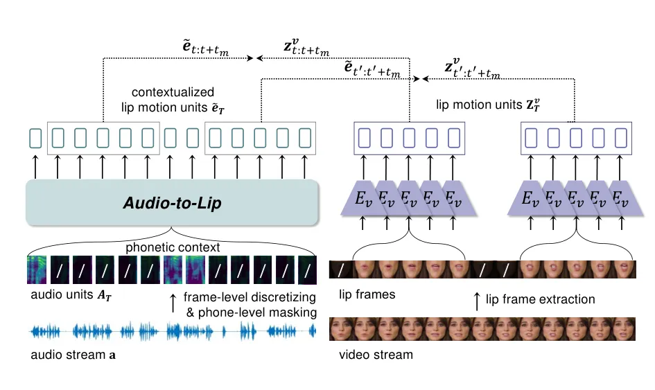
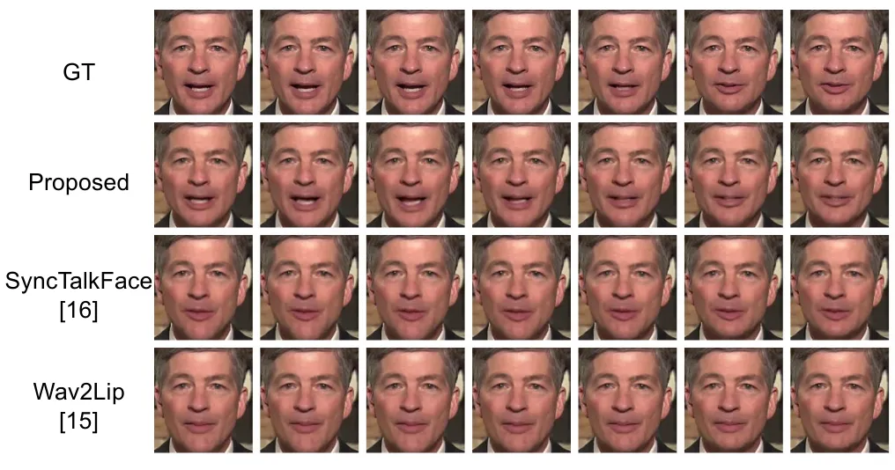
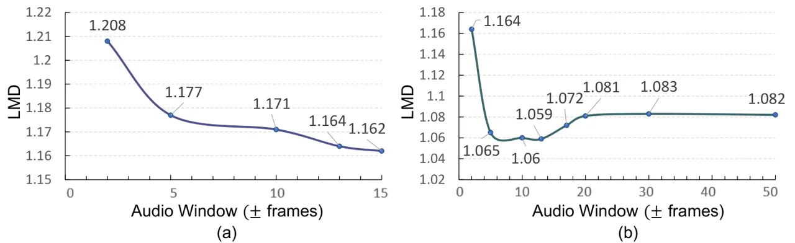
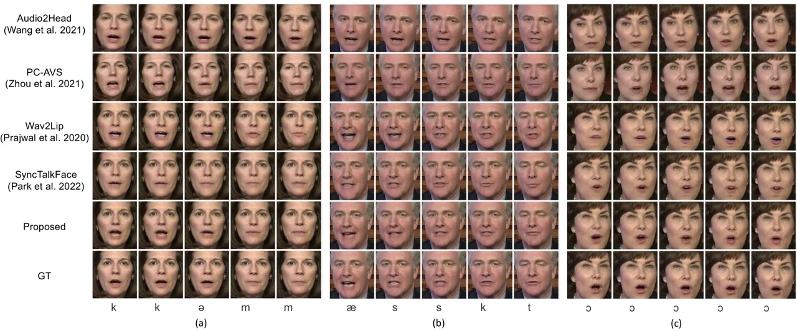

# Exploring Phonetic Context-Aware Lip-Sync For Talking Face Generation

###### Abstract

Talking face generation is the challenging task of synthesizing a
natural and realistic face that requires accurate synchronization with a
given audio. Due to co-articulation, where an isolated phone is
influenced by the preceding or following phones, the articulation of a
phone varies upon the phonetic context. Therefore, modeling lip motion
with the phonetic context can generate more spatio-temporally aligned
lip movement. In this respect, we investigate the phonetic context in
generating lip motion for talking face generation. We propose
Context-Aware Lip-Sync framework (CALS), which explicitly leverages
phonetic context to generate lip movement of the target face. CALS is
comprised of an Audio-to-Lip module and a Lip-to-Face module. The former
is pretrained based on masked learning to map each phone to a
contextualized lip motion unit. The contextualized lip motion unit then
guides the latter in synthesizing a target identity with context-aware
lip motion. From extensive experiments, we verify that simply exploiting
the phonetic context in the proposed CALS framework effectively enhances
spatio-temporal alignment. We also demonstrate the extent to which the
phonetic context assists in lip synchronization and find the effective
window size for lip generation to be approximately 1.2 seconds.

###### Index Terms: 

Audio-visual Synchronization, Context learning, Talking face generation,
Face synthesis

## 1 Introduction

Talking face generation aims to synthesize a photo-realistic portrait
with lip motions in-sync with an input audio. Since the generation
involves facial dynamics, especially of the mouth, viewers especially
attend to the mouth region. Therefore, precisely aligning the mouth with
the driving audio is critical for realistic talking face generation. In
this paper, we focus on establishing audio-visual correlation for
lip-syncing on arbitrary faces in the wild.

When a person utters the word ‘that’, the corresponding lip movements
vary based on the precedent and subsequent words. For instance, when
saying ‘that boy’, the lip configuration after pronouncing ‘that’ tends
to be closed, whereas it adopts a widely opened shape when saying ‘that
girl’. This is because of the coarticulation. Coarticulation is a change
in articulation of the current speech segment due to the neighboring
speech. It arises due to the visual articulatory movements including the
lips, tongue, and teeth being affected by the neighboring phones: a
phone is either interchanged by a different phone or naturally blended
in. With the realization of coarticulation, phones have long been
considered at the level of context such as triphones and quinphones in
speech processing \[1, 2, 3, 4\] as well as in speech-lip
synchronization \[5, 6, 7, 8\].

Nevertheless, the phonetic context has not been sufficiently explored in
talking face generation. The mainstream approach to processing the input
speech has been formulating it as a short window of around 0.2 seconds
to align the lip movement at the phone-level \[9, 10, 11, 12, 13, 14,
15, 16\]. However, since articulation is continuous and changes smoothly
in context, independently building phone-level correlation without
considering the context information results in ambiguities in the lip
motion. Recent works \[17, 18, 19\] employ transformer \[20\] to
consider long-term context but they mainly aim to learn implicit
attributes such as head pose and eye blinks from the context, and do not
fully make use of the contextual information specifically for lip
synchronization. In this paper, we aim to further exploit the phonetic
context for lip sync generation and investigate the extent to which it
contributes to realistic talking face generation.

To effectively integrate the phonetic context in lip motion generation,
we present Context-Aware Lip-Sync framework (CALS). CALS generates a
talking face video of a target identity with context-aware lip motion
synchronous with input audio. It consists of Audio-to-Lip module and
Lip-to-Face module. The Audio-to-Lip module learns to predict lip motion
units of the masked regions in the input audio at the phone-level. Each
phone is mapped to lip motion units utilizing short-term and long-term
relations between the phones. Hence, it translates audio to visual lip
intermediate representations, associating the phonetic context while
building the audio-lip correlation. The Lip-to-Face module then
leverages the contextualized lip motion units and integrates them with
the identity to synthesize the face with context-aware lip
synchronization.

Our contributions are three-fold; (1) We propose Context-Aware Lip-Sync
framework (CALS) that effectively exploits phonetic context in modeling
lip-syncing for talking face generation. It explicitly maps each phone
to contextualized lip motion units through masked learning, from which
entire face frames within the context can be synthesized. (2) We explore
to what extent the phonetic context contributes to lip generation and
validate the effective context window size. (3) Through extensive
experiments on LRW, LRS2, and HDTF datasets, we achieve a clear
improvement in spatio-temporal alignment compared to the
state-of-the-art methods.

## 2 Method

We propose Context-Aware Lip-Sync framework (CALS) that generates a
talking face video of a target identity with context-aware lip motion
synchronous with a driving audio. CALS consists of Audio-to-Lip module
and Lip-to-Face module. The Audio-to-Lip module learns to map audio to
context-aware lip motion, namely lip motion units. The Lip-to-Face
module synthesizes a talking face given the lip motion units and
identity features, synthesizing the mouth region of the target identity.

### 2.1 Context-Aware Lip-Sync (CALS)

#### 2.1.1 Audio-to-Lip Module

Audio-to-Lip module $`f_{\theta}`$ translates a given input audio into
lip representation by considering the phonetic context. Motivated by the
great success of masked prediction \[21, 22, 23, 24, 25, 26, 27\] in
context modeling, we bring its concept into our learning problem to
capture the phonetic context from the input audio when synthesizing the
lip movements. Specifically, the audio input is processed into a
sequence of mel-spectrograms which we denote as audio units
$`\mathbf{A}_{T}=\{a_{t}\}_{t=0}^{T}`$, where $`a_{t}`$ is a frame-level
mel-spectrogram at $`t`$-th frame. Then, we corrupt the audio units as
follows:

```math
\mathcal{\tilde{\mathbf{A}}}_{T}=r(\mathbf{A}_{T},M), \tag{1}
```

in which $`M\subset[0,T]`$ denotes the set of indices to be masked for
the audio units $`\mathbf{A}_{T}`$, and $`r`$ is a masking function that
zero-out the audio unit $`a_{t}`$ where $`t\in M`$. As shown in Fig.1,
we mask out a continuous sequence of $`t_{m}`$ audio units with
probability $`p`$, without overlap between each segment. Audio-to-Lip
module $`f_{\theta}`$ translates the corrupted audio units
$`\tilde{\mathbf{A}}_{T}`$ into contextualized lip motion units
$`\tilde{\mathbf{e}}_{T}=\{\tilde{e}_{t}\}_{t=0}^{T}`$,

```math
\tilde{\mathbf{e}}_{T}=f_{\theta}(\tilde{\mathbf{A}}_{T}), \tag{2}
```

where the Audio-to-Lip module $`f_{\theta}`$ is designed with
transformer \[20\] architectures so the short-term and long-term context
can be modeled. Then, it is guided to predict the corresponding ground
truth lip motion units $`\mathbf{Z}^{v}_{T}=\{z^{v}_{t}\}_{t=0}^{T}`$ of
the masked timestep $`t\in M`$ with the following loss function:

```math
\mathcal{L}_{a2l}=\sum_{t\in M}(\mathbf{z}^{v}_{t}-\tilde{\mathbf{e}}_{t})^{2}. \tag{3}
```

As our objective is producing synchronized lip motion from input audio
by fully utilizing the phonetic context, the prediction target for our
masked prediction should be carefully addressed. To handle this, we
leverage a large-scale pre-trained visual encoder \[28, 29, 30\], whose
feature is set to our target for the masked prediction. The visual
encoder is pre-trained using contrastive objectives between video frames
and the corresponding audio frames. Thus, by predicting its visual
features, the Audio-to-Lip module can focus on modeling synchronized lip
movements from the input audio while minimizing the influence of speaker
characteristics in the speech. The visual encoder extracts lip motion
units from lip frames $`\mathbf{V}_{T}=\{v_{t}\}_{t=0}^{T}`$ in a
sliding window of 5 frames, where the timestep $`t`$ is positioned at
the center of the window. Hence, the lip motion units are discretized to
exactly match the audio units. In order to predict the lip motion from
the masked audio inputs, the Audio-to-Lip module has to first consider
relations between the phones to predict the masked phones, and then map
the phones to the synchronized visual lip features. As a result, the
Audio-to-Lip module translates audio to visual lip intermediate
representations, and associates phonetic context while establishing the
audio-lip correlation.



Figure 1: Audio-to-Lip module takes phone-level masked audio units as
input and aims to predict the corresponding lip motion units of the
masked regions.

#### 2.1.2 Lip-to-Face Module

Lip-to-Face module $`f_{\phi}`$ synthesizes face frames with the
context-aware lip motion units drawn from the Audio-to-Lip module. Since
it leverages the audio-lip correlation established in the Audio-to-Lip
module, the Lip-to-Face module only has to focus on the synthesis part,
and impose the dynamics of the lips onto the target identity. The
Lip-to-Face module generates corresponding face frames
$`\mathbf{\hat{I}}_{T}`$ within the context in parallel as follows:

```math
\mathbf{\hat{I}}_{T}=f_{\phi}({\mathbf{e}}_{T},\mathbf{f}^{I}_{T}). \tag{4}
```

$`\mathbf{f}^{I}_{T}`$ are corresponding identity features encoded by an
identity encoder $`E_{I}`$. $`E_{I}`$ takes a random reference frame
concatenated with a pose-prior along the channel dimension as in \[15,
16\]. The pose-prior is a target face with lower-half masked, which
guides the model to focus on generating the lower-half mouth region that
fits the upper-half pose. The lip motion units from the Audio-to-Lip
module guide the Lip-to-Face module to generate lip shapes that are more
distinctive to its phone in context. Moreover, as the lip motion units
have attended to every other phones in the context, the dynamics are
more temporally stable and consistent.

### 2.2 Discriminative Sync Loss

In addition to the audio-lip correlation established in the Audio-to-Lip
module, we further impose the alignment after the synthesis using a sync
loss $`\mathcal{L}_{sync}=d_{av}+d_{vv}`$ which consists of an
audio-visual sync loss $`d_{av}`$ and visual discriminative sync loss
$`d_{vv}`$. Both of them use a discriminative sync module
$`(\mathcal{F}_{a}`$, $`\mathcal{F}_{v})`$ as feature extractors of the
audio and visual modalities, pretrained on the target dataset with a
multi-way matching loss \[31\].

The audio-visual sync loss $`d_{av}`$ \[15\] explicitly aligns the
generated frames with the corresponding audio. It is a binary cross
entropy of cosine similarity distance $`d_{cos}`$ between the generated
video segment $`\mathbf{\hat{I}}_{i}`$ and the corresponding audio
segment $`\mathbf{a}_{i}`$ as follows:

```math
d_{av}=-\frac{1}{S}\sum_{i}^{S}\mathrm{log}(d_{cos}(\mathcal{F}_{a}(\mathbf{a}_{i}),\mathcal{F}_{v}(\mathbf{\hat{I}}_{i}))). \tag{5}
```

In addition, to enforce discriminative lip motion within the context, we
introduce visual discriminative sync loss $`d_{vv}`$. It compares one
segment of the generated video to multiple segments of the corresponding
ground truth video, thus guiding the generator to produce more distinct
lip shapes from similar lip movements:

```math
d_{vv}=-\frac{1}{S}\sum_{i}^{S}\mathrm{log}\frac{\exp\big(d_{cos}(\mathcal{F}_{v}(\mathbf{\hat{I}}_{i}),\mathcal{F}_{v}(\mathbf{{I}}_{i}))\big)}{\sum_{j}^{S}\exp\big(d_{cos}(\mathcal{F}_{v}(\mathbf{\hat{I}}_{i}),\mathcal{F}_{v}(\mathbf{{I}}_{j}))\big)}. \tag{6}
```

$`d_{vv}`$ enforces discriminativeness of the lips by comparing directly
against multiple numbers of the ground truth lips, aligning at the finer
level in the visual domain. Also, since it learns to discriminate the
matching lip motion within the context from which the lip unit has been
produced, it enables more discriminative lip motion.  
Total Loss. The CALS is trained end-to-end with the following loss:

```math
\displaystyle\mathcal{L}=\lambda_{1}\mathcal{L}_{recon}+\lambda_{2}\mathcal{L}_{gan}+\lambda_{3}\mathcal{L}_{sync}, \tag{7}
```

where $`\mathcal{L}_{recon}`$ is the L1 loss between the generated and
ground truth frames, $`\mathcal{L}_{gan}`$ is the adversarial loss, and
$`\lambda_{n}`$ is the weighting hyper-parameter.

## 3 Experiment

### 3.1 Experimental Settings

Dataset. We use three large-scale audio-visual datasets, LRW \[32\],
LRS2 \[33\] and HDTF \[17\] to train and evaluate the proposed method.
LRW is a word-level dataset with over 1000 utterances of 500 different
words. LRS2 is a sentence-level dataset with over 140,000 utterances.
HDTF is a high-resolution dataset with more than 300 different speakers
and 15.8 hours of approximately 10,000 utterances.

Metric. We evaluate visual quality based on PSNR and SSIM, and sync
quality based on LMD, LSE-D and LSE-C. LSE-C and LSE-D are the
confidence score and distance score between audio and video features
from SyncNet \[15\].



Figure 2: Generation of frames with corresponding audio time-steps
masked out. Please zoom in to see in detail.



Figure 3: LMD of the middle frame with varying audio window size on (a)
LRW and (b) LRS2.

Implementation Details. We process the videos into face-centered crops
\[34\] of size 128$`\times`$128 with 25fps. The audio is processed into
audio units $`a_{t}`$ which are frame-level mel-spectrograms of size
$`80\times 4`$. We use sampling rate 16kHz, window size 400, and hop
size 160. The Audio-to-Lip consists of 6 transformer encoder layers with
hidden dimensions of 512, a feed-forward dimension of 2048, and 8
attention heads. We obtain the lip motion units from a pretrained sync
module \[28, 29\]. The sync module takes a sequence of 5 mouth frames
and corresponding 0.2 seconds of audio centered at the $`t`$-th frame to
extract a visual sync feature $`z^{v}_{t}\in\mathbb{R}^{1024}`$ and an
audio sync feature $`z^{a}_{t}\in\mathbb{R}^{1024}`$. We mask out at the
phone-level so $`t_{m}`$ is set to 5 and random 50$`\%`$ of the audio
units are masked. The hyper-parameters are empirically set:
$`\lambda_{1}`$ to 10, $`\lambda_{2}`$ to 0.07, and $`\lambda_{3}`$ to
0.03. We train on 8 RTX 3090 GPUs using Adam \[35\] optimizer with a
learning rate of $`1\times 10^{-4}`$.

|                 |     |            |            |        |       |       |       |       |
| --------------- | --- | ---------- | ---------- | ------ | ----- | ----- | ----- | ----- |
| Proposed Method |     |            |            |        |       |       |       |       |
| Baseline        | A2L | $`d_{av}`$ | $`d_{vv}`$ | PSNR   | SSIM  | LMD   | LSE-D | LSE-C |
| ✓               | ✗   | ✗          | ✗          | 31.182 | 0.841 | 1.519 | 5.895 | 8.795 |
| ✓               | ✓   | ✗          | ✗          | 32.419 | 0.870 | 1.311 | 5.623 | 9.144 |
| ✓               | ✓   | ✓          | ✗          | 32.501 | 0.867 | 1.064 | 5.204 | 9.421 |
| ✓               | ✓   | ✓          | ✓          | 32.603 | 0.876 | 1.056 | 5.337 | 9.225 |

Table 1: Ablation study on the proposed method on LRS2.

|                     |                     |                     |                     |
| ------------------- | ------------------- | ------------------- | ------------------- |
|    Method           | Visual Quality      | Lip-Sync Quality    | Realness            |
| Ground Truth        | 4.607 $`\pm`$ 0.080 | 4.687 $`\pm`$ 0.071 | 4.627 $`\pm`$ 0.081 |
| Audio2Head \[36\]   | 2.761 $`\pm`$ 0.111 | 2.721 $`\pm`$ 0.134 | 2.458 $`\pm`$ 0.126 |
| PC-AVS \[37\]       | 2.567 $`\pm`$ 0.093 | 3.109 $`\pm`$ 0.110 | 2.458 $`\pm`$ 0.103 |
| Wav2Lip \[15\]      | 2.975 $`\pm`$ 0.093 | 3.557 $`\pm`$ 0.110 | 3.109 $`\pm`$ 0.103 |
| SyncTalkFace \[16\] | 3.333 $`\pm`$ 0.102 | 3.761 $`\pm`$ 0.100 | 3.502 $`\pm`$ 0.102 |
| Proposed            | 3.761 $`\pm`$ 0.086 | 4.119 $`\pm`$ 0.088 | 3.940 $`\pm`$ 0.081 |

Table 2: Human evaluation by MOS with 95% confidence interval

### 3.2 Experimental Results

#### 3.2.1 Context in Generation

We perform two experiments to analyze to what extent context contributes
to lip synchronization. First, we mask out 0.14s (7 frames) of the
source audio and generate frames of the masked time steps. As shown in
Fig.2, our work can still generate well-synchronized lips even with the
absence of audio because it is able to attend to the surrounding phones
and predict lip motion that fits into the masked region in context. In
contrast, the previous works cannot generate correct lip movements
because they do not consider surrounding phones. Such results verify
that our model effectively incorporates context information in modeling
lip movement of the talking face. In addition, we generate varying sizes
of the audio window. We take a frame in the middle as a target frame and
increase the size of the input audio window at the frame-level. The
maximum audio window for the LRW is $`\pm`$15 and LRS2 is $`\pm`$78. The
audio frames that lie outside the window are zero-padded and we measure
the lip-sync quality of the generated target frame using LMD. As shown
in Fig.3, on the LRW dataset, taking the entire audio window yields the
best lip-sync performance. It reaches 1.162 in LMD at $`\pm`$15 frames.
But when we further experiment on the LRS2 using wider audio windows, we
find that the effect of temporal audio information reaches the optimum
1.059 at around $`\pm`$13 frames. It demonstrates that the audio context
of around 1.2 seconds assists in resolving ambiguities in the lip shapes
of phones, improving spatio-temporal alignment.

|                     |        |       |       |       |       |           |       |       |       |       |           |       |       |       |       |
| ------------------- | ------ | ----- | ----- | ----- | ----- | --------- | ----- | ----- | ----- | ----- | --------- | ----- | ----- | ----- | ----- |
|                     | LRW    |       |       |       |       | LRS2      |       |       |       |       | HDTF      |       |       |       |       |
|    Method           | PSNR   | SSIM  | LMD   | LSE-D | LSE-C |    PSNR   | SSIM  | LMD   | LSE-D | LSE-C |    PSNR   | SSIM  | LMD   | LSE-D | LSE-C |
| Ground Truth        | N/A    | 1.000 | 0.000 | 6.968 | 6.876 |    N/A    | 1.000 | 0.000 | 6.259 | 8.247 |    N/A    | 1.000 | 0.000 | 7.508 | 7.128 |
| Audio2Head \[36\]   | 28.578 | 0.385 | 2.654 | 8.935 | 3.487 |    28.726 | 0.395 | 2.088 | 8.518 | 5.393 |    29.449 | 0.602 | 2.304 | 7.207 | 7.681 |
| PC-AVS \[37\]       | 30.257 | 0.746 | 1.989 | 6.502 | 7.438 |    29.736 | 0.688 | 1.590 | 6.560 | 7.770 |    29.864 | 0.709 | 1.950 | 7.758 | 6.588 |
| Wav2Lip \[15\]      | 31.831 | 0.882 | 1.437 | 6.617 | 7.237 |    31.182 | 0.841 | 1.519 | 5.895 | 8.795 |    32.354 | 0.873 | 1.595 | 7.272 | 7.343 |
| SyncTalkFace \[16\] | 32.887 | 0.894 | 1.322 | 7.023 | 6.591 |    32.327 | 0.881 | 1.069 | 6.350 | 7.929 |    32.682 | 0.883 | 1.381 | 7.931 | 6.406 |
| Proposed            | 33.219 | 0.900 | 1.183 | 6.432 | 7.463 |    32.603 | 0.876 | 1.056 | 5.337 | 9.225 |    32.992 | 0.895 | 1.373 | 6.850 | 8.185 |

Table 3: Quantitative comparison with state-of-the-art methods on LRW,
LRS2 and HDTF.



Figure 4: Qualitative comparison with state-of-the-art methods on HDTF
(a) pronounces ‘com’ in ‘combating’, (b) ‘asked’, (c) ‘a’ in ‘all’.
Phonemes corresponding to each frame are written under.

#### 3.2.2 Analysis of the CALS

We conduct an ablation to analyze the effect of each component of CALS
in Table 1. We have set the baseline as Wav2Lip and implemented
Audio-to-Lip module (A2L), $`d_{av}`$ and $`d_{vv}`$ one by one. When
the phone-level audio encoder of the Wav2Lip is replaced by the A2L, the
visual quality and sync quality are enhanced, where the SSIM improves by
0.029 and LSE-C by 0.349. Adding $`d_{av}`$ improves LSE-D and LSE-C
because it acts on the audio-visual alignment which the two metrics
measure. $`d_{vv}`$ further enhances PSNR, SSIM and LMD because it
aligns in the visual domain. The three components altogether yield the
highest performance overall. The result indicates that exploiting the
phonetic context in the A2L scheme alone has the largest effect in
improving the generation overall.

#### 3.2.3 Quantitative Results

We quantitatively compare the generation results with 4 state-of-the-art
methods: Audio2Head \[36\], PC-AVS \[37\], Wav2Lip \[15\], and
SyncTalkFace \[16\] on LRW, LRS2, and HDTF datasets in Table 3. On LRW
and HDTF, our method achieves the best on all the metrics, especially
outperforming on the lip-sync. Compared to other methods that involve
feature disentanglement (PC-AVS), assistant module (SyncTalkFace,
Wav2lip), and intermediate structural representations (Audio2Head), we
validate that exploiting phonetic context in modeling lip motion is a
more powerful scheme to achieve accurate lip synchronization.

#### 3.2.4 Qualitative Results

We qualitatively compare the generation results in Fig.4. Our method is
most precisely aligned in spatio-temporal dimension and generates the
most temporally stable lips, distinct to each phone in context. For
example in (a), when pronouncing ‘k\textipa@m’ in ‘combating’, our
method wide opens the mouth and gradually closes with smooth
transitioning. On the other hand, other methods are temporally
misaligned and discontinuous: Audio2Head fails to completely close the
mouth at ‘m’, Wav2Lip closes its mouth but with slightly projected lips,
and SyncTalkFace fails to clearly open the mouth at phone ‘k’. The man
in (b) is pronouncing ‘æskt’ in ‘asked for’. Our method is the only work
that successfully captures the slightly projected lips at ‘t’
transitioning into ‘f’. Such results demonstrate that our method fully
makes use of the phonetic context for temporally aligned and consistent
lip synchronization.

#### 3.2.5 User Study

We conducted a user study to compare the generation quality in Table 2.
We generated 21 videos using each of the methods and asked 15
participants to rate the videos in terms of visual quality, lip-sync
quality, and realness in the range of 1 to 5. Our method has the highest
visual quality, lip-sync quality, and realness score, especially
outperforming in the lip-sync quality, which is also reflected in the
quantitative and qualitative results in Table 3 and Figure 4.

## 4 Conclusion

We present Context-Aware Lip-Sync framework (CALS) that explicitly
integrates phonetic context to learn lip-syncing for talking face
generation. Audio-to-Lip module maps each phone to contextualized lip
motion units and Lip-to-Face module synthesizes the entire face frames
within the context in parallel. From extensive experiments, we validated
that exploiting the phonetic context in the proposed CALS is a simple
yet effective scheme to enhance the generation performance, specifically
the lip-sync. In addition, we analyzed the extent to which the phonetic
context assists in lip synchronization, complementing the missing audio,
and verified the effective window size to be approximately 1.2 seconds.

## References

- \[1\] Yuya Akita and Tatsuya Kawahara “Generalized statistical
  modeling of pronunciation variations using variable-length phone
  context” In _Proceedings.(ICASSP’05). IEEE International Conference on
  Acoustics, Speech, and Signal Processing, 2005._ 1, 2005, pp. I–689
  IEEE
- \[2\] R Schwartz et al. “Context-dependent modeling for
  acoustic-phonetic recognition of continuous speech” In _ICASSP’85.
  IEEE International Conference on Acoustics, Speech, and Signal
  Processing_ 10, 1985, pp. 1205–1208 IEEE
- \[3\] Petr Schwarz et al. “Phoneme recognizer based on long temporal
  context” In _Speech Processing Group, Faculty of Information
  Technology, Brno University of Technology.\[Online\]. Available:
  http://speech. fit. vutbr. cz/en/software_, 2006
- \[4\] Elana Golumbic, David Poeppel and Charles Schroeder “Temporal
  context in speech processing and attentional stream selection: a
  behavioral and neural perspective” In _Brain and language_ 122.3
  Elsevier, 2012, pp. 151–161
- \[5\] Soo-Whan Chung, Joon Chung and Hong-Goo Kang “Perfect match:
  Self-supervised embeddings for cross-modal retrieval” In _IEEE Journal
  of Selected Topics in Signal Processing_ 14.3 IEEE, 2020, pp. 568–576
- \[6\] Honglie Chen et al. “Audio-visual synchronisation in the wild”
  In _arXiv preprint arXiv:2112.04432_, 2021
- \[7\] Venkatesh Kadandale, Juan Montesinos and Gloria Haro “Vocalist:
  An audio-visual synchronisation model for lips and voices” In _arXiv
  preprint arXiv:2204.02090_, 2022
- \[8\] Joon Chung and Andrew Zisserman “Out of time: automated lip sync
  in the wild” In _Computer Vision–ACCV 2016 Workshops: ACCV 2016
  International Workshops, Taipei, Taiwan, November 20-24, 2016, Revised
  Selected Papers, Part II 13_, 2017, pp. 251–263 Springer
- \[9\] Lele Chen et al. “Lip movements generation at a glance” In
  _Proceedings of the European Conference on Computer Vision (ECCV)_,
  2018, pp. 520–535
- \[10\] Yang Song et al. “Talking face generation by conditional
  recurrent adversarial network” In _arXiv preprint arXiv:1804.04786_,
  2018
- \[11\] Amir Jamaludin, Joon Chung and Andrew Zisserman “You said
  that?: Synthesising talking faces from audio” In _International
  Journal of Computer Vision_ 127.11 Springer, 2019, pp. 1767–1779
- \[12\] Prajwal KR et al. “Towards automatic face-to-face translation”
  In _Proceedings of the 27th ACM International Conference on
  Multimedia_, 2019, pp. 1428–1436
- \[13\] Konstantinos Vougioukas, Stavros Petridis and Maja Pantic
  “Realistic speech-driven facial animation with gans” In _International
  Journal of Computer Vision_ 128.5 Springer, 2020, pp. 1398–1413
- \[14\] Hang Zhou et al. “Talking face generation by adversarially
  disentangled audio-visual representation” In _Proceedings of the AAAI
  Conference on Artificial Intelligence_ 33.01, 2019, pp. 9299–9306
- \[15\] KR Prajwal et al. “A lip sync expert is all you need for speech
  to lip generation in the wild” In _Proceedings of the 28th ACM
  International Conference on Multimedia_, 2020, pp. 484–492
- \[16\] Se Park et al. “Synctalkface: Talking face generation with
  precise lip-syncing via audio-lip memory” In _Proceedings of the AAAI
  Conference on Artificial Intelligence_ 36.2, 2022, pp. 2062–2070
- \[17\] Zhimeng Zhang et al. “Flow-Guided One-Shot Talking Face
  Generation With a High-Resolution Audio-Visual Dataset” In
  _Proceedings of the IEEE/CVF Conference on Computer Vision and Pattern
  Recognition_, 2021, pp. 3661–3670
- \[18\] Chenxu Zhang et al. “Facial: Synthesizing dynamic talking face
  with implicit attribute learning” In _Proceedings of the IEEE/CVF
  International Conference on Computer Vision_, 2021, pp. 3867–3876
- \[19\] Shunyu Yao et al. “DFA-NeRF: Personalized Talking Head
  Generation via Disentangled Face Attributes Neural Rendering” In
  _arXiv preprint arXiv:2201.00791_, 2022
- \[20\] Ashish Vaswani et al. “Attention is all you need” In _Advances
  in neural information processing systems_ 30, 2017
- \[21\] Jacob Devlin et al. “Bert: Pre-training of deep bidirectional
  transformers for language understanding” In _arXiv preprint
  arXiv:1810.04805_, 2018
- \[22\] Julian Salazar et al. “Masked language model scoring” In _arXiv
  preprint arXiv:1910.14659_, 2019
- \[23\] Marjan Ghazvininejad et al. “Mask-predict: Parallel decoding of
  conditional masked language models” In _arXiv preprint
  arXiv:1904.09324_, 2019
- \[24\] Hangbo Bao et al. “Unilmv2: Pseudo-masked language models for
  unified language model pre-training” In _International conference on
  machine learning_, 2020, pp. 642–652 PMLR
- \[25\] Anmol Gulati et al. “Conformer: Convolution-augmented
  transformer for speech recognition” In _arXiv preprint
  arXiv:2005.08100_, 2020
- \[26\] Minsu Kim, Joanna Hong and Yong Ro “Lip to speech synthesis
  with visual context attentional GAN” In _Advances in Neural
  Information Processing Systems_ 34, 2021, pp. 2758–2770
- \[27\] Joanna Hong et al. “Visual Context-driven Audio Feature
  Enhancement for Robust End-to-End Audio-Visual Speech Recognition” In
  _arXiv preprint arXiv:2207.06020_, 2022
- \[28\] Arsha Nagrani et al. “Disentangled speech embeddings using
  cross-modal self-supervision” In _ICASSP 2020-2020 IEEE International
  Conference on Acoustics, Speech and Signal Processing (ICASSP)_, 2020,
  pp. 6829–6833 IEEE
- \[29\] Joon Chung and Andrew Zisserman “Out of time: automated lip
  sync in the wild” In _Asian conference on computer vision_, 2016, pp.
  251–263 Springer
- \[30\] J.. Chung, A. Nagrani and A. Zisserman “VoxCeleb2: Deep Speaker
  Recognition” In _INTERSPEECH_, 2018
- \[31\] Soo-Whan Chung, Hong Kang and Joon Chung “Seeing voices and
  hearing voices: learning discriminative embeddings using cross-modal
  self-supervision” In _arXiv preprint arXiv:2004.14326_, 2020
- \[32\] Joon Chung and Andrew Zisserman “Lip reading in the wild” In
  _Asian conference on computer vision_, 2016, pp. 87–103 Springer
- \[33\] Triantafyllos Afouras et al. “Deep audio-visual speech
  recognition” In _IEEE transactions on pattern analysis and machine
  intelligence_ IEEE, 2018
- \[34\] Jian Li et al. “DSFD: Dual Shot Face Detector” In _Proceedings
  of the IEEE Conference on Computer Vision and Pattern Recognition_,
  2019
- \[35\] Diederik Kingma and Jimmy Ba “Adam: A method for stochastic
  optimization” In _arXiv preprint arXiv:1412.6980_, 2014
- \[36\] Suzhen Wang et al. “Audio2Head: Audio-driven One-shot
  Talking-head Generation with Natural Head Motion” In _arXiv preprint
  arXiv:2107.09293_, 2021
- \[37\] Hang Zhou et al. “Pose-controllable talking face generation by
  implicitly modularized audio-visual representation” In _Proceedings of
  the IEEE/CVF Conference on Computer Vision and Pattern Recognition_,
  2021, pp. 4176–4186
