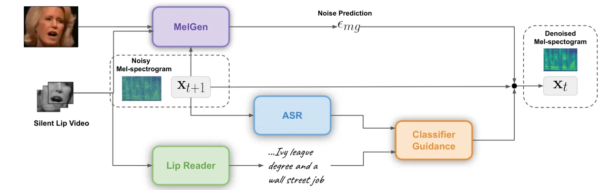
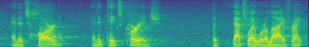
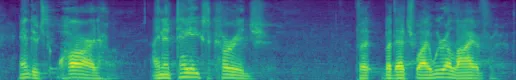
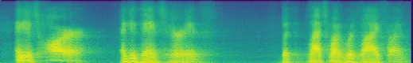
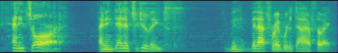
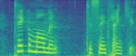
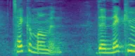
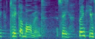

# LipVoicer: Generating Speech from Silent Videos Guided by Lip Reading

Yochai Yemini    Aviv Shamsian    Lior Bracha    Sharon Gannot    Ethan
Fetaya Affiliation: Faculty of Electrical Engineering
Affiliation: Bar-Ilan University Affiliation: Israel
Email: [{yochai.yemini,aviv.shamsian,brachal,sharon.gannot,ethan.fetaya}@biu.ac.il](mailto:)

###### Abstract

Lip-to-speech involves generating a natural-sounding speech synchronized
with a soundless video of a person talking. Despite recent advances,
current methods still cannot produce high-quality speech with high
levels of intelligibility for challenging and realistic datasets such as
LRS3. In this work, we present _LipVoicer_, a novel method that
generates high-quality speech, even for in-the-wild and rich datasets,
by incorporating the text modality. Given a silent video, we first
predict the spoken text using a pre-trained lip-reading network. We then
condition a diffusion model on the video and use the extracted text
through a classifier-guidance mechanism where a pre-trained ASR (ASR)
serves as the classifier. LipVoicer outperforms multiple lip-to-speech
baselines on LRS2 and LRS3, which are in-the-wild datasets with hundreds
of unique speakers in their test set and an unrestricted vocabulary.
Moreover, our experiments show that the inclusion of the text modality
plays a major role in the intelligibility of the produced speech,
readily perceptible while listening, and is empirically reflected in the
substantial reduction of the WER (WER) metric. We demonstrate the
effectiveness of LipVoicer through human evaluation, which shows that it
produces more natural and synchronized speech signals compared to
competing methods. Finally, we created a demo showcasing LipVoicer’s
superiority in producing natural, synchronized, and intelligible speech,
providing additional evidence of its effectiveness.  
Project page and code:
[https://github.com/yochaiye/LipVoicer](https://github.com/yochaiye/LipVoicer)

|     |
| --- |
|     |

## 1 Introduction

In the lip-to-speech task, we are given a soundless video of a person
talking and are required to accurately and precisely generate the
missing speech. Such a task may occur, e.g., when the speech signal is
completely obfuscated due to background noises. This task poses a
significant challenge as it requires the generated speech to satisfy
multiple criteria. This includes intelligibility, synchronization with
lip motion, naturalness, and alignment with the speaker’s
characteristics such as age, gender, accent, and more. Another major
hurdle for lip-to-speech techniques is the ambiguities inherent in lip
motion, as several phonemes can be attributed to the same lip movement
sequence. Resolving these ambiguities requires the analysis of lip
motion in a broader context within the video.

Generating speech from a silent video has seen significant progress in
recent years, partly due to advancements made in deep generative models.
Specifically in applications such as text-to-speech and
mel-spectogram-to-audio (neural vocoder) (Kong et al., 2021; Kim et al.,
2022). Despite these advancements, many lip-to-speech methods produce
satisfying results only when applied to datasets with a limited number
of speakers, and constrained vocabularies, like GRID (Cooke et al., 2006) and TCD-TIMIT (Harte & Gillen, 2015). Therefore, speech generation
for silent videos in-the-wild still lags behind. We found that these
methods struggle to reliably generate natural speech with a high degree
of intelligibility on more challenging datasets like LRS2 (Afouras
et al., 2018a) and LRS3 (Afouras et al., 2018b).

In this paper, we propose LipVoicer, a novel approach for producing
high-quality speech for silent videos. The first and crucial part of
LipVoicer is leveraging a lip-reading model at inference time, for
extracting the transcription of the speech we wish to generate. Next, we
train a diffusion model, conditioned only on the video, to generate
mel-spectrograms. The generation process at inference time is guided by
both the video and the predicted transcription. Consequently, our model
successfully intertwines the information conveyed by textual modality
with the dynamics and characteristics of the speaker, captured by the
diffusion model. Incorporating the inferred text has an additional
benefit, as it allows LipVoicer to alleviate the lip motion ambiguity to
a great extent. Finally, we use the DiffWave (Kong et al., 2021) neural
vocoder to generate the raw audio. A diagram of with all of the
components in our approach is depicted in Fig. 1 (except the vocoder).
Some previous methods often use text to guide the generation process at
train time. We, however, utilize it at inference time. The text,
transcribed using a lip-reader, allows us to utilize guidance (Dhariwal
& Nichol, 2021; Ho & Salimans, 2021) which ensures that the text of the
generated audio corresponds to the target text.



(a)

(b)

Figure 1: An illustration of LipVoicer, a dual-stage framework for
lip-to-speech. (a) To generate the speech from a given silent video at
inference time, a pre-trained lip-reader provides additional guidance by
predicting the text from the video. An ASR steers MelGen, which
generates the mel-spectrogram, in the direction of the extracted text
using classifier guidance, such that the generated mel-spectrogram
reflects the spoken text. (b) MelGen, our diffusion denoising model that
generates mel-spectrograms conditioned on a face image and a mouth
region video extracted from the full-face video using classifier-free
guidance. It is trained without the text guidance.

We evaluate our LipVoicer model on the challenging LRS2 and LRS3
datasets. These datasets are “in-the-wild” videos, with hundreds of
unique speakers and with an open vocabulary. We show that our proposed
design leads to the best results on these datasets in both human
evaluations as well as WER of an ASR system.

To the best of our knowledge, LipVoicer is the first method to use text
inferred by lip-reading to enhance lip-to-speech synthesis. The
inclusion of the text modality in inference removes the uncertainty of
deciphering which of the possible candidate phonemes correspond to the
lip motion. Additionally, it helps the diffusion model to focus on
creating naturally synced speech. The speech generated by LipVoicer is
intelligible, well synchronized to the video, and sounds natural.
Finally, LipVoicer achieves state-of-the-art results for highly
challenging in-the-wild datasets.

## 2 Background

### 2.1 Denoising Diffusion Probabilistic Models (DDPM)

DDPM define a forward process that gradually turns the input into
Gaussian noise, then learn the reverse process that tries to recover the
input. Specifically, assume a training data point is sampled from the
data distribution we wish to model
$`{\mathbf{x}}_{0}\sim p_{\textrm{data}}({\mathbf{x}})`$. The forward
process is defined as
$`q({\mathbf{x}}_{t}|{\mathbf{x}}_{t-1})=\mathcal{N}({\mathbf{x}}_{t}|\sqrt{1-\beta_{t}}{\mathbf{x}}_{t-1},\beta_{t}{\mathbf{I}})`$
where $`\{\beta_{1},...,\beta_{t},...,\beta_{T}\}`$ is a pre-defined
noise schedule. We can deduce from Gaussian properties that
$`q({\mathbf{x}}_{t}|{\mathbf{x}}_{0})={\mathcal{N}}({\mathbf{x}}_{t}|\sqrt{\bar{\alpha}_{t}}{\mathbf{x}}_{0},(1-\bar{\alpha}_{t}){\mathbf{I}})`$
with $`\bar{\alpha}_{t}=\Pi_{s=1}^{t}\alpha_{s}`$, and
$`\alpha_{t}=1-\beta_{t}`$. A sample of $`{\mathbf{x}}_{t}`$ can be
obtained by sampling
$`\epsilon\sim{\mathcal{N}}(\mathbf{0},{\mathbf{I}})`$, and using the
reparametrization trick,
$`{\mathbf{x}}_{t}=\sqrt{\bar{\alpha}_{t}}{\mathbf{x}}_{0}+\sqrt{1-\bar{\alpha}_{t}}\epsilon`$.
Under mild conditions, the distribution at the final step
$`q({\mathbf{x}}_{T})`$ is approximately given by a standard Gaussian
distribution.

In the reverse process proposed in Ho et al. (2020),
$`p_{\theta}({\mathbf{x}}_{t-1}|{\mathbf{x}}_{t})`$ is then learned by a
neural network that tries to approximate
$`q({\mathbf{x}}_{t-1}|{\mathbf{x}}_{t},{\mathbf{x}}_{0})`$. In Ho
et al. (2020) it was also shown that in order to learn
$`p_{\theta}({\mathbf{x}}_{t-1}|{\mathbf{x}}_{t})`$ it is enough if our
model’s output $`\epsilon_{\theta}({\mathbf{x}}_{t},t)`$ is trained to
recover the added noise $`\epsilon`$ used to generate
$`{\mathbf{x}}_{t}`$ from $`{\mathbf{x}}_{0}`$. The loss function used
to train the diffusion model is
$`\mathbb{E}_{t,{\mathbf{x}}_{0},\epsilon}\left[||\epsilon-\epsilon_{\theta}({\mathbf{x}}_{t},t)||^{2}\right]`$.
At inference time, given $`{\mathbf{x}}_{t}`$ and the inferred noise, we
can sample from $`p_{\theta}({\mathbf{x}}_{t-1}|x_{t})`$ by taking
$`{\mathbf{x}}_{t-1}=\frac{1}{\sqrt{\bar{\alpha}_{t}}}\left({\mathbf{x}}_{t}-\frac{\beta_{t}}{\sqrt{1-\bar{\alpha}_{t}}}\epsilon_{\theta}({\mathbf{x}}_{t},t)\right)+\beta_{t}{\mathbf{z}}`$
where $`{\mathbf{z}}\sim{\mathcal{N}}(0,I)`$.

### 2.2 Guidance

One key feature in many diffusion models is the use of guidance for
conditional generation. Guidance, both with or without a classifier,
enables us to “guide” our iterative inference process to generate
outputs that are more faithful to our conditioning information, e.g., in
text-to-image, it helps enforce that the generated images match the
prompt text.

Assume we wish to sample from $`q({\mathbf{x}}_{t}|{\mathbf{c}})`$,
$`{\mathbf{x}}_{t}`$ is our sample at the current iteration,
$`{\mathbf{c}}`$ is some context, and
$`p({\mathbf{c}}|{\mathbf{x}}_{t})`$ is a pre-trained classifier. Our
goal is to generate $`{\mathbf{x}}_{t-1}`$. The idea of classifier
guidance (Dhariwal & Nichol, 2021) is to use the classifier to guide the
diffusion process to generate outputs that have the right context
$`{\mathbf{c}}`$. Specifically, if the diffusion model returns
$`\epsilon_{\theta}({\mathbf{x}}_{t},t)`$, the classifier guidance
alters the noise term that will be used for the update to
$`\hat{\epsilon}=\epsilon_{\theta}({\mathbf{x}}_{t},t)-\omega_{1}\sqrt{1-\bar{\alpha}_{t}}\nabla_{{\mathbf{x}}_{t}}\log p({\mathbf{c}}|{\mathbf{x}}_{t})`$
where $`\omega_{1}`$ is a hyperparameter that controls the level of
guidance.

In a later work (Ho & Salimans, 2021), a classifier-free guidance that
removes the dependence on an existing classifier is proposed. In
classifier-free guidance, we make two noise predictions, one with the
conditioning context information,
$`\epsilon_{\theta}({\mathbf{x}}_{t},{\mathbf{c}},t)`$, and one without
it - $`\epsilon_{\theta}({\mathbf{x}}_{t},t)`$. We then use
$`\hat{\epsilon}=\epsilon_{\theta}({\mathbf{x}}_{t},{\mathbf{c}},t)+\omega_{2}(\epsilon_{\theta}({\mathbf{x}}_{t},{\mathbf{c}},t)-\epsilon_{\theta}({\mathbf{x}}_{t},t))`$
where the hyperparameter $`\omega_{2}`$ controls the guidance strength.
This allows us to enhance the update directions that correspond to the
context $`{\mathbf{c}}`$.

## 3 Related Work

### 3.1 Audio Generation

Following their success in image generation, diffusion models took a
leading role as a neural vocoder and in text-to-speech. Examples
include: WaveGrad (Chen et al., 2021), Diff-TTS (Jeong et al., 2021),
DiffWave (Kong et al., 2021), Grad-TTS (Popov et al., 2021), PriorGrad
(Lee et al., 2021), SaShiMi (Goel et al., 2022), Tango (Ghosal et al.,
2023), and Diffsound (Yang et al., 2023).  
Other important audio generation models that do not rely on diffusion
models include: WaveNet (van den Oord et al., 2016), HiFi-GAN (Su
et al., 2020), Tacotron (Wang et al., 2017), VoiceLoop (Taigman et al.,
2018), WaveRNN (Kalchbrenner et al., 2018), ClariNet (Ping et al.,
2018), GAN-TTS (Bińkowski et al., 2019), Flowtron (Valle et al., 2021),
and AudioLM (Borsos et al., 2022).

We note that despite the recent progress, unconditional speech
generation quality is still unsatisfactory. Thus, some conditioning,
e.g., text or mel-spectrogram, is required for high-quality speech
generation. We also note that many audio generation models, and
particularly lip-to-speech techniques, adopt a sequential approach.
Namely, first generating the mel-spectrogram and then using it to
generate the raw audio using a pre-trained vocoder.

### 3.2 Visual speech recognition

The field of lip-to-text, also referred to as lip-reading, has seen
significant progress in recent years, and multiple techniques are now
available (Ma et al., 2022; Shi et al., 2022; Ma et al., 2023).
Impressively, they can cope with adverse visual conditions, such as
videos where the mouth of the speaker is only partly frontal,
challenging lighting conditions and various languages. Use cases of
visual speech recognition include resolving multi-talker simultaneous
speech and transcribing archival silent films. In our context, using a
powerful lip-reading system can help guide the lip-to-speech process.

### 3.3 Lip-to-speech synthesis

The task in this research area is to reconstruct the underlying speech
signal from a silent talking-face video. A common approach to
lip-to-speech includes a video encoder followed by a speech decoder that
generates a mel-spectrogram, that is fed to a neural vocoder to generate
the final time-domain audio. These techniques have garnered significant
attention due to their potential applications in cases where the speech
is missing or corrupted. This may occur, for example, due to strong
background noise, or when the speech of a person located in the
background of the video recording should be attended.

Preliminary studies such as Lip2Wav (Prajwal et al., 2020), End-to-end
GAN (Mira et al., 2022), VCA-GAN (Kim et al., 2021) focused on datasetes
with limited vocabularies and a number of speakers. Subsequent works
such as SVTS (de Mira et al., 2022) addressed more realistic in-the-wild
datasets. Recent techniques tremendously improve performance by using
AV-HuBERT (Shi et al., 2022) to represent speech by a set of discrete
tokens, which are predicted from the video. In ReVISE (Hsu et al.,
2022), the authors use AV-HuBERT architecture to generate the audio from
the tokens using HiFi-GAN. Concurrently to our work, speech units are
also used in Choi et al. (2023b). Also concurrent to LipVoicer, a
diffusion-based method is proposed in Choi et al. (2023a).

In Lip2Speech (Kim et al., 2023), the authors use the ground truth text
and a pre-trained ASR as an additional loss during training to try to
enforce that the generated speech will have the correct text. We,
however, use predicted text at inference time.

## 4 LipVoicer

This section details our proposed LipVoicer scheme for lip-to-speech
generation. Given a silent talking-face video $`{\mathcal{V}}`$,
LipVoicer generates a mel-spectrogram that corresponds to a high
likelihood underlying speech signal. The proposed method comprises three
main components:

1.  1.  A mel-spectrogram generator (MelGen) that learns to create a
        mel-spectrogram image from $`{\mathcal{V}}`$.
2.  2.  A pre-trained lip-reading network that infers the most likely text
        from the silent video.
3.  3.  An ASR system that anchors the mel-spectrogram recovered by MelGen
        to the text predicted by the lip-reader.

At first, we train MelGen, a conditional DDPM (DDPM) model trained to
generate a mel-spectrogram waveform $`{\mathbf{x}}`$ conditioned on the
video $`{\mathcal{V}}`$ without the text modality. We use
classifier-free guidance to train MelGen (see Section 2.2). Similar to
diffusion-based frameworks in text-to-speech, e.g. Jeong et al. (2021),
we use a DiffWave (Kong et al., 2021) residual backbone for MelGen. When
considering the representation for $`{\mathcal{V}}`$, we wish for our
representation to encapsulate all the needed information to generate the
mel-spectrogram, i.e. the content (spoken words) and dynamics (accent,
intonation) of the underlying speech, the timing of each part of speech,
as well as the identity of the speaker, e.g. gender, age, etc. However,
we wish to remove all irrelevant information to help train and remove
unnecessary computational costs. To this end, $`{\mathcal{V}}`$ is
preprocessed by creating a cropped mouth region video
$`{\mathcal{V}}_{L}`$ and randomly choosing a single full-face image
$`{\mathcal{I}}_{F}`$. Notably, $`{\mathcal{V}}`$ corresponds to the
content and dynamics, and $`{\mathcal{I}}_{F}`$ relates to the speaker
characteristics. The mouth cropping was implemented according to the
procedure in Ma et al. (2022).

To extract features from $`{\mathcal{V}}_{L}`$ and
$`{\mathcal{I}}_{F}`$, we use an architecture similar to the one
described in VisualVoice (Gao & Grauman, 2021), an audio-visual speech
separation model. For $`{\mathcal{I}}_{F}`$, the face embedding
$`{\mathbf{f}}\in{\mathbb{R}}^{D_{f}}`$ is computed using ResNet-18 (He
et al., 2016) with the last two layers discarded. The lip video
$`{\mathcal{V}}_{L}`$ is encoded using a lip-reading architecture (Ma
et al., 2021). It is composed of a 3D convolutional layer followed by
ShuffleNet v2 (Ma et al., 2018) and then a TCN (TCN), resulting in the
lip video embedding $`{\mathbf{m}}\in{\mathbb{R}}^{N\times D_{m}}`$,
where $`N`$ and $`D_{m}`$ signify the number of frames and channels,
respectively. In order to merge the face and lip video embeddings,
$`{\mathbf{f}}`$ is replicated $`N`$ times and concatenated to
$`{\mathbf{m}}`$, yielding the video embedding
$`{\mathbf{v}}\in{\mathbb{R}}^{N\times D}`$, where $`D=D_{f}+D_{m}`$.
Next, a DDPM is trained to generate the mel-spectrogram with and without
the conditioning on the video embedding $`{\mathbf{v}}`$ following the
classifier-free mechanism (Ho & Salimans, 2021).

In order to make MelGen perform well in scenarios characterized by an
unconstrained vocabulary, at inference time we use the text modality as
an additional source of guidance. In general, syllables uttered in a
silent talking-face video can be ambiguous, and may consequently lead to
an incoherent reconstructed speech. It can therefore be beneficial to
harness recent advances in lip-reading and ground the generated
mel-spectrogram to the text predicted by a pretrained lip-reading
network. The question is how to best include this textual information in
our framework. One could simply add it as a global conditioning, similar
to $`{\mathcal{I}}_{F}`$; however, this ignores the temporal information
in the text. One could also try to align the text and the video, which
is a complicated process that would introduce additional errors.

To circumvent the challenge of aligning text with video content, we
employ text guidance by harnessing the classifier guidance approach
(Dhariwal & Nichol, 2021), similarly to Kim et al. (2022). Using a
powerful ASR model, we can compute
$`\nabla_{\mathbf{x}}\log p(t_{LR}|{\mathbf{x}})`$ needed for guidance,
where $`t_{LR}`$ is the text predicted by a lip-reader. The inferred
noise $`\hat{\epsilon}`$ used in the inference update step of the
diffusion model is thus modified by both classifier guidance and
classifier-free guidance:

```math
\hat{\epsilon}=\epsilon_{mg}({\mathbf{x}}_{t},{\mathcal{V}}_{L},{\mathcal{I}}_{F},\omega_{1})-\omega_{2}\sqrt{1-\bar{\alpha}_{t}}\nabla_{{\mathbf{x}}_{t}}\log p(t_{LR}|{\mathbf{x}}_{t})\,, \tag{1}
```

where $`{\mathbf{x}}_{t}`$ is the mel-spectrogram at time step $`t`$ of
the diffusion inference process, and

```math
\epsilon_{mg}({\mathbf{x}}_{t},{\mathcal{V}}_{L},{\mathcal{I}}_{F},\omega_{1})=(1+\omega_{1})\epsilon_{\theta}({\mathbf{x}}_{t},{\mathcal{V}}_{L},{\mathcal{I}}_{F})-\omega_{1}\epsilon_{\theta}({\mathbf{x}}_{t}) \tag{2}
```

is the estimated diffusion noise at the output of MelGen, and
$`\omega_{1},\omega_{2}`$ are hyperparameters. Note that we use an ASR
rather than audio-video ASR, namely $`{\mathbf{x}}_{t}`$ is used as an
input to the speech recognizer while the video signal is discarded in
order to encourage the model to focus on audio generation.

In our experiments, we noticed that during the generation process,
$`\epsilon_{mg}`$ was much larger in magnitude compared to
$`\nabla_{{\mathbf{x}}_{t}}\log p(t_{LR}|{\mathbf{x}}_{t})`$ which led
to difficulties in correctly setting $`\omega_{2}`$ and to
unsatisfactory mel-spectrogram estimates. To remedy this, we followed
Kim et al. (2022) by introducing a gradient normalization factor, i.e.
Eq. 1 becomes

```math
\hat{\epsilon}=\epsilon_{mg}-\omega_{2}\gamma_{t}\sqrt{1-\bar{\alpha}_{t}}\nabla_{{\mathbf{x}}_{t}}\log p(t_{LR}|{\mathbf{x}}_{t}) \tag{3}
```

where

```math
\gamma_{t}=\frac{||\epsilon_{mg}||}{\sqrt{1-\bar{\alpha}_{t}}\cdot||\nabla_{{\mathbf{x}}_{t}}\log p(t_{LR}|{\mathbf{x}}_{t})||}. \tag{4}
```

and $`||\cdot||`$ is the Frobenius norm. The inference process is
summarized in Algorithm 1 in the Appendix.

Classifier guidance allows us to train MelGen that is solely conditioned
on $`{\mathcal{V}}`$, and use a pre-trained ASR to make the generated
speech match $`t_{LR}`$. As a result, the ASR is responsible for the
precise words in the estimated speech, and MelGen provides the voice
characteristics, synchronization between $`{\mathcal{V}}`$ and
$`{\mathbf{x}}`$, and the continuity of the speech. One additional
advantage of this approach is the modularity and ease of substituting
both the lip-to-text and the ASR modules. If one wishes to substitute
these models with improved versions in the future, the process can be
accomplished effortlessly without requiring any re-training. Finally, a
DiffWave vocoder (Kong et al., 2021) is used to transform the
reconstructed mel-spectrogram to a time-domain speech signal. Note that
the vocoder does not appear in Fig. 1.

## 5 Experiments

In this section, we compare LipVoicer to various lip-to-speech
approaches. We use multiple datasets and learning setups to evaluate
LipVoicer. To encourage future research and reproducibility, our source
code will be made publicly available. Additional ablation studies,
experimental results on GRID, and complete details are provided in the
Appendix. We also created the following website
[https://lipvoicer.github.io](https://lipvoicer.github.io) containing
sample videos generated by all compared approaches. We believe this is
the best way to fully understand the performance gain of LipVoicer, and
highly encourage the readers to visit.

##### Datasets

LipVoicer is compared against the baselines on the highly challenging
datasets LRS2 (Afouras et al., 2018a) and LRS3 (Afouras et al., 2018b).
LRS2 contains roughly 142,000 videos of British English in its train and
pre-train splits, which amounts to 220 hours of speech by various
speakers. In the test set, there are 1,243 videos. The train and
pre-train sets of LRS3 comprise 9,000 different speakers, contributing
151,000 videos which are stretched across 430 hours of speech videos.
There are 1,452 videos in the test split. The language spoken in LRS3
videos is English but with different accents, including non-native ones.
We specifically select these in-the-wild datasets, LRS2 and LRS3, for
their diverse range of real-world scenarios with variations in lighting
conditions, speaker characteristics, speaking styles, and speaker-camera
alignment. We train LipVoicer using the pretrain+train splits of LRS2
and LRS3 on each dataset separately, and evaluation is carried out on
the full unseen test data splits. Note that both datasets also include
transcriptions, but we do not use them for either training or inference.

##### Implementation Details

For predicting the text from the silent video at inference time, we use
Ma et al. (2023) as our lip-reader for LRS2 and LRS3. It achieves a WER
rate of 14.6% and 19.1% with respect to the ground truth text,
respectively. The ASR deployed for applying classifier guidance was
Burchi & Timofte (2023). We modified its architecture by adding the
diffusion time step embedding to the conformer blocks and then
fine-tuned on LRS2 and LRS3. Finally, for the sake of fairness, we
employ a different ASR (Ma et al., 2023) to evaluate the WER of the
speech generated by our method and the baselines. We notice some
variability in the choice of the ASRs used for benchmarking among the
baselines, which make it difficult to put the different methods on a
common ground. We believe that Ma et al. (2023) can serve as a good
candidate to be used in future studies, since it achieves state of the
art results on LRS2 (1.5%) and LRS3 (1%) and a pre-trained model is
publicly available. The rest of the implementation details for
reproducing our experiments can be found in the Appendix.

##### Baselines

We compare LipVoicer with recent lip-to-speech synthesis baselines. The
baseline methods include (1) SVTS (de Mira et al., 2022), a
transformer-based video to mel-spectrogram generator with a pre-trained
neural vocoder. (2) VCA-GAN (Kim et al., 2021), a GAN model with a
visual context attention module that encodes global representations from
local visual features. (3) Lip2Speech (Kim et al., 2023), a multi-task
learning framework that incorporates ground truth text to form an
additional loss to enforce the correspondence between the text predicted
from the generated speech and the target text at train time. We trained
VCA-GAN and Lip2Speech on LRS2 and LRS3, and used the LRS3 test files
provided by the authors of SVTS to conduct the comparisons.

Unfortunately, we could not include ReVISE (Hsu et al., 2022) in our
full comparisons since the test files are unavailable for public access
and training the method is too computationally heavy (32 GPUs were
reported in ReVISE). Nevertheless, we used the ASR utilized in Hsu
et al. (2022) to compare it to LipVoicer. Notably, in Hsu et al. (2022)
it was reported that the ASR achieved WER score of 5.6% on the
ground-truth test videos of LRS3, but we only managed to achieve 6.4% on
the same data. While we are uncertain of the source of the degraded
performance, we evaluated LipVoicer using this ASR and achieved WER
score of 33.2% on LRS3, whereas ReVISE reported 33.9%. Additionally, we
generated with LipVoicer the speech signals for the silent videos on the
project page of ReVISE and incorporated the results in our demo website.
We note that the speech units computed by AV-HuBERT are primarily
learned in such a way that encourages speech continuity, and not any
other explicit speech aspects (WER, intelligibility, etc.). We believe
that this is the reason why ReVISE still has relatively high WER,
although much lower than its previous competitors.

##### Metrics

Several metrics are used to evaluate the quality and intelligibility of
our generated speech and compare it to the baseline methods. As the main
goal of speech generation is to create a speech signal that sounds
natural and intelligible to human listeners, our focus is on human
evaluation measured by the MOS (MOS). We also compare WER using a speech
recognition model. Following Hsu et al. (2022); Hassid et al. (2021), we
measure the synchronization between the generated speech and the
matching video with SyncNet (Chung & Zisserman, 2016) scores.
Specifically, we report the temporal distance between audio and video
(LSE-D) and the confidence scores (LSE-C). We use the pre-trained
SyncNet model¹¹ 1
[https://github.com/joonson/syncnet_python](https://github.com/joonson/syncnet_python)
to calculate LSE-C and LSE-D.

To objectively quantify the quality and intelligibility of our scheme,
we use DNSMOS (Reddy et al., 2022) and STOI-Net (Zezario et al., 2020).
It is worth mentioning that previous studies on lip-to-speech synthesis
have presented metrics that we believe are unsuitable for this task, and
as a result, we refrained from including them in our main report.
Specifically, they use STOI (STOI) and PESQ (PESQ). Both metrics are
intrusive, namely, they are based on a comparison with the clean raw
audio signal. While they are valuable for speech enhancement and speaker
separation, in speech generation, it is not expected, even for a perfect
model, to recreate the original audio. This may stem, for instance, from
a variation of the pitch between the original speech and the
reconstructed one (Sisman et al., 2020). Our goal is to generate a
speech signal that matches the _video_, and not _the original speech_.
In Appendix D, we provide an example that demonstrates the effectiveness
of non-intrusive over intrusive metrics with regard to the lip-to-speech
setup. In this sense, our problem is more related to voice conversion.
For completeness, the Appendix also includes the PESQ and STOI scores of
LipVoicer.

|                               | Intelligibility                   | Naturalness                       | Quality                           | Synchronization                   |
| ----------------------------- | --------------------------------- | --------------------------------- | --------------------------------- | --------------------------------- |
| GT                            | $`4.33\pm 0.04`$                  | $`4.43\pm 0.04`$                  | $`4.34\pm 0.04`$                  | $`4.39\pm 0.04`$                  |
| Lip2Speech (Kim et al., 2023) | $`2.07\pm 0.08`$                  | $`1.98\pm 0.08`$                  | $`1.93\pm 0.08`$                  | $`2.66\pm 0.10`$                  |
| VCA-GAN (Kim et al., 2021)    | $`1.77\pm 0.08`$                  | $`1.85\pm 0.09`$                  | $`1.77\pm 0.08`$                  | $`2.34\pm 0.09`$                  |
| LipVoicer (Ours)              | $`\textbf{3.53}\pm\textbf{0.07}`$ | $`\textbf{3.54}\pm\textbf{0.08}`$ | $`\textbf{3.69}\pm\textbf{0.08}`$ | $`\textbf{3.82}\pm\textbf{0.07}`$ |

Table 1: LRS2 Human evaluation (MOS).

### 5.1 Human Evaluation Results

Given 50 random samples from the test splits of LRS2 and LRS3 datasets
(each), we used Amazon Mechanical Turk to rate the different approaches
and the ground truth. The listeners were asked to rate the videos, on a
scale of 1-5, for Intelligibility, Naturalness, Quality, and
Synchronization. We note that we observed a non-negligible amount of
noise in the scores of the human evaluators. We ameliorated this effect
by having a large number (16) of distinct annotators per sample, and by
having each annotator score all methods on a specific sample. We also
filtered out Turkers who rated the ground-truth video with a score
smaller than 4. This ensures that all methods compared are annotated by
the exact same reliable set of annotators. We also note that for the
SVTS (de Mira et al., 2022) baseline comparison, we used generated
videos that were sent to us by the authors. As only LRS3 videos were
available, we evaluate SVTS only on LRS3.

|                               | Intelligibility                   | Naturalness       | Quality                           | Synchronization   |
| ----------------------------- | --------------------------------- | ----------------- | --------------------------------- | ----------------- |
| GT                            | $`4.38\pm 0.03`$                  | $`4.45\pm 0.03`$  | $`4.42\pm 0.03`$                  | $`4.36\pm 0.03`$  |
| Lip2Speech (Kim et al., 2023) | $`2.21\pm 0.08`$                  | $`2.20\pm 0.09`$  | $`2.01\pm 0.07`$                  | $`2.69\pm 0.08`$  |
| SVTS (de Mira et al., 2022)   | $`2.17\pm 0.08`$                  | $`2.15\pm 0.09`$  | $`1.99\pm 0.07`$                  | $`2.71\pm 0.09`$  |
| VCA-GAN (Kim et al., 2021)    | $`2.19\pm 0.08`$                  | $`2.20\pm 0.09`$  | $`2.08\pm 0.08`$                  | $`2.71\pm 0.08`$  |
| LipVoicer (Ours)              | $`\textbf{3.44}\pm\textbf{0.07}`$ | 3.52 $`\pm`$ 0.07 | $`\textbf{3.42}\pm\textbf{0.08}`$ | 3.56 $`\pm`$ 0.07 |

Table 2: LRS3 Human evaluation (MOS).

Tables  1 and  2 depict the MOS results on the LRS2 and LRS3 datasets.
LipVoicer outperforms all three baseline methods: Lip2Speech, SVTS, and
VCA-GAN. Not only that, it is also remarkably close to the ground truth
scores. The questionnaire, screenshots of the task, and other
implementation details are given in Appendix G.

|                  |                    |                       |                     |                    |                      |
| ---------------- | ------------------ | --------------------- | ------------------- | ------------------ | -------------------- |
|                  | WER $`\downarrow`$ | STOI-Net $`\uparrow`$ | DNSMOS $`\uparrow`$ | LSE-C $`\uparrow`$ | LSE-D $`\downarrow`$ |
| GT               | 1.5%               | 0.91                  | $`3.14`$            | $`6.840`$          | 7.194                |
| Lip2Speech       | 51.4%              | 0.70                  | $`2.37`$            | 6.815              | 7.370                |
| vca-gan          | 100.7%             | 0.51                  | $`2.26`$            | $`3.369`$          | $`10.703`$           |
| LipVoicer (Ours) | 17.8%              | 0.91                  | 2.89                | 6.600              | 7.840                |

Table 3: Performance comparison between LipVoicer and the baselines on
LRS2.

|                  |                    |                       |                     |                    |                      |
| ---------------- | ------------------ | --------------------- | ------------------- | ------------------ | -------------------- |
|                  | WER $`\downarrow`$ | STOI-Net $`\uparrow`$ | DNSMOS $`\uparrow`$ | LSE-C $`\uparrow`$ | LSE-D $`\downarrow`$ |
| GT               | 1.0%               | 0.93                  | 3.30                | $`6.880`$          | $`7.638`$            |
| Lip2Speech       | 57.4%              | 0.67                  | 2.36                | $`5.231`$          | $`8.832`$            |
| svts             | 82.4%              | 0.65                  | 2.42                | $`6.018`$          | $`8.290`$            |
| vca-gan          | 90.6%              | 0.63                  | 2.27                | $`5.255`$          | $`8.913`$            |
| LipVoicer (Ours) | 21.4%              | 0.92                  | 3.11                | 6.239              | 8.266                |

Table 4: Performance comparison between LipVoicer and the baselines on
LRS3.

### 5.2 Objective Evaluation Results

We further evaluated our method with the objective metrics. For SVTS, we
report WER and synchronization metrics only for LRS3, since the authors
did not open-source their code and only released the generated test
files for LRS3. From the WER scores, it is clear that our method
significantly improves over competing baselines. From the STOI-Net and
DNSMOS metrics it is apparent that LipVoicer generates much more
intelligible and higher quality speech compared to the competitors. In
addition to generating high-quality content, LipVoicer demonstrates
commendable synchronization scores, ensuring that the generated speech
aligns seamlessly with the accompanying video. Qualitative results may
be found in the Appendix.

|           |                    |                       |                     |                    |                      |
| --------- | ------------------ | --------------------- | ------------------- | ------------------ | -------------------- |
| $`w_{1}`$ | WER $`\downarrow`$ | STOI-Net $`\uparrow`$ | DNSMOS $`\uparrow`$ | LSE-C $`\uparrow`$ | LSE-D $`\downarrow`$ |
| -1        | 30.1%              | $`0.92`$              | $`2.96`$            | $`2.543`$          | $`11.729`$           |
| 1         | 22.7%              | $`0.93`$              | $`3.09`$            | $`5.512`$          | $`8.885`$            |
| 2         | 21.4%              | 0.92                  | 3.11                | 6.239              | 8.266                |
| 3         | 22.4%              | $`0.92`$              | $`3.07`$            | $`6.435`$          | $`7.967`$            |
| 4         | 22.2%              | $`0.92`$              | $`3.03`$            | $`4.608`$          | $`9.636`$            |

Table 5: Ablation study for $`w_{1}`$ evaluated on LRS3. The row marked
in bold indicates the value of $`w_{1}`$ used by LipVoicer in the
experimental study for LRS3.

|           |                    |                       |                     |                    |                      |
| --------- | ------------------ | --------------------- | ------------------- | ------------------ | -------------------- |
| $`w_{2}`$ | WER $`\downarrow`$ | STOI-Net $`\uparrow`$ | DNSMOS $`\uparrow`$ | LSE-C $`\uparrow`$ | LSE-D $`\downarrow`$ |
| 0         | 86.2%              | $`0.93`$              | $`3.16`$            | $`6.318`$          | $`8.310`$            |
| 1         | 23.5%              | $`0.93`$              | $`3.12`$            | $`6.556`$          | $`7.870`$            |
| 1.5       | 21.4%              | 0.92                  | 3.11                | 6.239              | 8.266                |
| 3         | 22.3%              | $`0.91`$              | $`2.87`$            | $`5.189`$          | $`9.156`$            |
| 4         | 24.4%              | $`0.89`$              | $`2.71`$            | $`4.608`$          | $`9.636`$            |

Table 6: Ablation study for $`w_{2}`$ evaluated on LRS3. The marked in
bold indicates the value of $`w_{2}`$ used by LipVoicer in the
experimental study for LRS3.

| LR               | LR WER     | WER $`\downarrow`$ | STOI-Net $`\uparrow`$ | DNSMOS $`\uparrow`$ | LSE-C $`\uparrow`$ | LSE-D $`\downarrow`$ |
| ---------------- | ---------- | ------------------ | --------------------- | ------------------- | ------------------ | -------------------- |
| GT               | $`0\%`$    | 5.4%               | $`0.92`$              | $`3.10`$            | $`6.257`$          | $`8.220`$            |
| Ma et al. (2023) | $`19.1\%`$ | 21.4%              | $`0.92`$              | $`3.11`$            | $`6.239`$          | $`8.266`$            |
| Ma et al. (2022) | $`32.3\%`$ | 38.1%              | $`0.92`$              | $`3.09`$            | $`6.053`$          | $`8.362`$            |

Table 7: Ablation study for the choice of the lip reading accuracy, as
evaluated on LRS3. LR signifies lip-reader.

### 5.3 Ablation Study

The architecture of LipVoicer requires several design choices: the
values of $`w_{1},w_{2}`$, the lip reading network and the ASR used for
guidance. We conducted ablation studies examining the influence of the
hyperparameters and the modules and evaluated it on LRS3. Tables 5 and 6
show the performance of LipVoicer for different values of $`w_{1}`$ and
$`w_{2}`$, respectively. Several conclusions can be drawn from the
results. We observe ($`w_{1}=-1`$) that classifier-free guidance has a
decisive role in terms of WER, speech quality, and synchronization.
Decreasing the weight of the ASR increases the WER, as expected, while
the generated speech still sounds natural and synchronized. It is also
clear that ASR guidance is vital, as without it ($`w_{2}=0`$) the WER
plunges from $`21.4\%`$ to $`86.2\%`$ on LRS3. Unsurprisingly, an
excessive increase in the ASR weight only slightly degrades the WER, but
is detrimental to the speech quality and synchronization. Interestingly,
setting $`w_{2}=1`$ or $`w_{2}=1.5`$ leads to better synchronization
compared to $`w_{2}=0`$ (no ASR guidance). We postulate that this occurs
since the predicted text also helps align the generated speech with the
video.

With regard to the lip-reader choice, we see in Table 7 that when the
ground-truth text is used, the best results are achieved. A less
accurate lip-reader leads to worse WER but not speech quality.
Synchronization is also impaired with worse lip-reading, probably due to
the discrepancy between the lip motion and the predicted text. This
ablation study means that by using a more powerful lip-readers, the
performance of LipVoicer can be further improved. Ablation studies for
the ASR performance, vocoder choice, using the face embedding and the
amount of training data can be found in Appendix E.

## 6 Limitations and social impacts

LipVoicer is a powerful lip-to-speech method that has the potential to
bring about some social impacts. On the positive side, it can help
restore missing or corrupt speech in important videos. However, there
are also potential drawbacks to consider. The generated speech may
introduce the risk of misrepresentation or manipulation. While we use a
faithful lip-reading module, “bad-faith actors” can try to inject
misleading text. Mitigating this potential risk is an important
challenge but beyond the scope of this work.

## 7 Conclusion

In this paper, we present LipVoicer, a novel method that shows promising
results in generating high-quality speech from silent videos. LipVoicer
achieves this by utilizing text inferred from a lip-reading model to
guide the generation of natural audio. We train and test LipVoicer on
multiple challenging datasets comprised of in-the-wild videos. We
empirically show that text guidance is crucial to creating intelligible
speech, as measured by the word error rate. Furthermore, we show through
human evaluation that LipVoicer faithfully recovers the ground truth
speech and surpasses recent baselines in intelligibility, naturalness,
quality, and synchronization. The impressive achievements of LipVoicer
in lip-to-speech synthesis not only advance the current state-of-the-art
but also pave the way for intriguing future research directions in this
domain.

#### Acknowledgments

This project has received funding from the European Union’s Horizon 2020
Research and Innovation Programme, Grant Agreement No. 871245, and was
also supported in part by the Israeli Council for Higher Education, Data
Science Program ("Audience" project) and Nvidia academic hardware grant.

## References

- Afouras et al. (2018a) Triantafyllos Afouras, Joon Son Chung, Andrew
  Senior, Oriol Vinyals, and Andrew Zisserman. Deep audio-visual speech
  recognition. In _arXiv:1809.02108_, 2018a.
- Afouras et al. (2018b) Triantafyllos Afouras, Joon Son Chung, and
  Andrew Zisserman. LRS3-TED: a large-scale dataset for visual speech
  recognition. _arXiv_, abs/1809.00496, 2018b.
- Bińkowski et al. (2019) Mikołaj Bińkowski, Jeff Donahue, Sander
  Dieleman, Aidan Clark, Erich Elsen, Norman Casagrande, Luis C Cobo,
  and Karen Simonyan. High fidelity speech synthesis with adversarial
  networks. In _International Conference on Learning
  Representations_, 2019.
- Borsos et al. (2022) Zalán Borsos, Raphaël Marinier, Damien Vincent,
  Eugene Kharitonov, Olivier Pietquin, Matt Sharifi, Olivier Teboul,
  David Grangier, Marco Tagliasacchi, and Neil Zeghidour. Audiolm: a
  language modeling approach to audio generation. _arXiv preprint
  arXiv:2209.03143_, 2022.
- Burchi & Timofte (2023) Maxime Burchi and Radu Timofte. Audio-visual
  efficient conformer for robust speech recognition. In _Proceedings of
  the IEEE/CVF Winter Conference on Applications of Computer Vision
  (WACV)_, pp. 2258–2267, January 2023.
- Chen et al. (2021) Nanxin Chen, Yu Zhang, Heiga Zen, Ron J Weiss,
  Mohammad Norouzi, and William Chan. Wavegrad: Estimating gradients for
  waveform generation. In _International Conference on Learning
  Representations_, 2021.
- Choi et al. (2023a) Jeongsoo Choi, Joanna Hong, and Yong Man Ro.
  Diffv2s: Diffusion-based video-to-speech synthesis with vision-guided
  speaker embedding. _arXiv preprint arXiv:2308.07787_, 2023a.
- Choi et al. (2023b) Jeongsoo Choi, Minsu Kim, and Yong Man Ro.
  Intelligible lip-to-speech synthesis with speech units, 2023b.
- Chung & Zisserman (2016) J. S. Chung and A. Zisserman. Out of time:
  automated lip sync in the wild. In _Workshop on Multi-view
  Lip-reading, ACCV_, 2016.
- Chung et al. (2018) J. S. Chung, A. Nagrani, and A. Zisserman.
  Voxceleb2: Deep speaker recognition. In _INTERSPEECH_, 2018.
- Cooke et al. (2006) Martin Cooke, Jon Barker, Stuart P. Cunningham,
  and Xu Shao. An audio-visual corpus for speech perception and
  automatic speech recognition. _The Journal of the Acoustical Society
  of America_, 120 5 Pt 1:2421–4, 2006.
- de Mira et al. (2022) Rodrigo Schoburg Carrillo de Mira, Alexandros
  Haliassos, Stavros Petridis, Björn W. Schuller, and Maja Pantic. SVTS:
  scalable video-to-speech synthesis. In _Interspeech_, 2022.
- Dhariwal & Nichol (2021) Prafulla Dhariwal and Alexander Nichol.
  Diffusion models beat gans on image synthesis. _Advances in Neural
  Information Processing Systems (NeurIPS)_, 2021.
- Gao & Grauman (2021) Ruohan Gao and Kristen Grauman. Visualvoice:
  Audio-visual speech separation with cross-modal consistency. In
  _CVPR_, 2021.
- Ghosal et al. (2023) Deepanway Ghosal, Navonil Majumder, Ambuj
  Mehrish, and Soujanya Poria. Text-to-audio generation using
  instruction-tuned llm and latent diffusion model. _arXiv preprint
  arXiv:2304.13731_, 2023.
- Goel et al. (2022) Karan Goel, Albert Gu, Chris Donahue, and
  Christopher Ré. It’s raw! audio generation with state-space models. In
  _International Conference on Machine Learning_, 2022.
- Harte & Gillen (2015) Naomi Harte and Eoin Gillen. Tcd-timit: An
  audio-visual corpus of continuous speech. _IEEE Transactions on
  Multimedia_, 17:603–615, 2015.
- Hassid et al. (2021) Michael Hassid, Michelle Tadmor Ramanovich,
  Brendan Shillingford, Miaosen Wang, Ye Jia, and Tal Remez. More than
  words: In-the-wild visually-driven prosody for text-to-speech. _2022
  IEEE/CVF Conference on Computer Vision and Pattern Recognition
  (CVPR)_, pp. 10577–10587, 2021.
- He et al. (2016) Kaiming He, Xiangyu Zhang, Shaoqing Ren, and Jian
  Sun. Deep Residual Learning for Image Recognition. In _Proceedings of
  2016 IEEE Conference on Computer Vision and Pattern Recognition_, CVPR
  ’16, pp. 770–778. IEEE, June 2016.
- Ho & Salimans (2021) Jonathan Ho and Tim Salimans. Classifier-free
  diffusion guidance. In _NeurIPS Workshop on Deep Generative Models and
  Downstream Applications_, 2021.
- Ho et al. (2020) Jonathan Ho, Ajay Jain, and Pieter Abbeel. Denoising
  diffusion probabilistic models. _Advances in Neural Information
  Processing Systems (NeurIPS)_, 33, 2020.
- Hsu et al. (2022) Wei-Ning Hsu, Tal Remez, Bowen Shi, Jacob Donley,
  and Yossi Adi. Revise: Self-supervised speech resynthesis with visual
  input for universal and generalized speech enhancement. _arXiv
  e-prints_, 2022.
- Jeong et al. (2021) Myeonghun Jeong, Hyeongju Kim, Sung Jun Cheon,
  Byoung Jin Choi, and Nam Soo Kim. Diff-tts: A denoising diffusion
  model for text-to-speech. _INTERSPEECH_, 2021.
- Kalchbrenner et al. (2018) Nal Kalchbrenner, Erich Elsen, Karen
  Simonyan, Seb Noury, Norman Casagrande, Edward Lockhart, Florian
  Stimberg, Aaron Oord, Sander Dieleman, and Koray Kavukcuoglu.
  Efficient neural audio synthesis. In _International Conference on
  Machine Learning_, 2018.
- Kim et al. (2022) Heeseung Kim, Sungwon Kim, and Sungroh Yoon.
  Guided-TTS: A diffusion model for text-to-speech via classifier
  guidance. In _Proceedings of the 39th International Conference on
  Machine Learning_, volume 162 of _Proceedings of Machine Learning
  Research_, pp. 11119–11133. PMLR, 17–23 Jul 2022.
- Kim et al. (2021) Minsu Kim, Joanna Hong, and Yong Man Ro. Lip to
  speech synthesis with visual context attentional gan. _Advances in
  Neural Information Processing Systems_, 34:2758–2770, 2021.
- Kim et al. (2023) Minsu Kim, Joanna Hong, and Yong Man Ro.
  Lip-to-speech synthesis in the wild with multi-task learning. In
  _ICASSP 2023-2023 IEEE International Conference on Acoustics, Speech
  and Signal Processing (ICASSP)_, 2023.
- King (2009) Davis E. King. Dlib-ml: A machine learning toolkit.
  _Journal of Machine Learning Research_, 10(60):1755–1758, 2009. URL
  [http://jmlr.org/papers/v10/king09a.html](http://jmlr.org/papers/v10/king09a.html).
- Kong et al. (2021) Zhifeng Kong, Wei Ping, Jiaji Huang, Kexin Zhao,
  and Bryan Catanzaro. Diffwave: A versatile diffusion model for audio
  synthesis. In _International Conference on Learning
  Representations_, 2021.
- Lee et al. (2021) Sang-gil Lee, Heeseung Kim, Chaehun Shin, Xu Tan,
  Chang Liu, Qi Meng, Tao Qin, Wei Chen, Sungroh Yoon, and Tie-Yan Liu.
  Priorgrad: Improving conditional denoising diffusion models with
  data-dependent adaptive prior. In _International Conference on
  Learning Representations_, 2021.
- Ma et al. (2018) Ningning Ma, Xiangyu Zhang, Hai-Tao Zheng, and Jian
  Sun. Shufflenet v2: Practical guidelines for efficient cnn
  architecture design. In _Computer Vision – ECCV 2018_, pp.
  122–138, 2018.
- Ma et al. (2021) Pingchuan Ma, Brais Martínez, Stavros Petridis, and
  Maja Pantic. Towards practical lipreading with distilled and efficient
  models. In _IEEE International Conference on Acoustics, Speech and
  Signal Processing, ICASSP 2021, Toronto, ON, Canada, June 6-11, 2021_,
  pp. 7608–7612. IEEE, 2021.
- Ma et al. (2022) Pingchuan Ma, Stavros Petridis, and Maja Pantic.
  Visual Speech Recognition for Multiple Languages in the Wild. _Nature
  Machine Intelligence_, 4:930–939, 2022.
- Ma et al. (2023) Pingchuan Ma, Alexandros Haliassos, Adriana
  Fernandez-Lopez, Honglie Chen, Stavros Petridis, and Maja Pantic.
  Auto-avsr: Audio-visual speech recognition with automatic
  labels, 2023.
- Mira et al. (2022) Rodrigo Mira, Konstantinos Vougioukas, Pingchuan
  Ma, Stavros Petridis, Björn W Schuller, and Maja Pantic. End-to-end
  video-to-speech synthesis using generative adversarial networks. _IEEE
  Transactions on Cybernetics_, 2022.
- Park et al. (2019) Daniel S. Park, William Chan, Yu Zhang, Chung-Cheng
  Chiu, Barret Zoph, Ekin D. Cubuk, and Quoc V. Le. Specaugment: A
  simple data augmentation method for automatic speech
  recognition, 2019. URL
  [http://arxiv.org/abs/1904.08779](http://arxiv.org/abs/1904.08779).
- Park et al. (2023) Hyun Joon Park, Seok Woo Yang, Jin Sob Kim, Wooseok
  Shin, and Sung Won Han. Triaan-vc: Triple adaptive attention
  normalization for any-to-any voice conversion. _arXiv preprint
  arXiv:2303.09057_, 2023.
- Ping et al. (2018) Wei Ping, Kainan Peng, and Jitong Chen. Clarinet:
  Parallel wave generation in end-to-end text-to-speech. In
  _International Conference on Learning Representations_, 2018.
- Popov et al. (2021) Vadim Popov, Ivan Vovk, Vladimir Gogoryan, Tasnima
  Sadekova, and Mikhail Kudinov. Grad-tts: A diffusion probabilistic
  model for text-to-speech. In _International Conference on Machine
  Learning_, 2021.
- Prajwal et al. (2020) KR Prajwal, Rudrabha Mukhopadhyay, Vinay P
  Namboodiri, and CV Jawahar. Learning individual speaking styles for
  accurate lip to speech synthesis. In _Conference on Computer Vision
  and Pattern Recognition (CVPR)_, 2020.
- Reddy et al. (2022) Chandan K A Reddy, Vishak Gopal, and Ross Cutler.
  Dnsmos p.835: A non-intrusive perceptual objective speech quality
  metric to evaluate noise suppressors. In _ICASSP 2022 - 2022 IEEE
  International Conference on Acoustics, Speech and Signal Processing
  (ICASSP)_, pp. 886–890, 2022.
- Shi et al. (2022) Bowen Shi, Wei-Ning Hsu, Kushal Lakhotia, and
  Abdelrahman Mohamed. Learning audio-visual speech representation by
  masked multimodal cluster prediction. In _International Conference on
  Learning Representations_, 2022. URL
  [https://openreview.net/forum?id=Z1Qlm11uOM](https://openreview.net/forum?id=Z1Qlm11uOM).
- Sisman et al. (2020) Berrak Sisman, Junichi Yamagishi, Simon King, and
  Haizhou Li. An overview of voice conversion and its challenges: From
  statistical modeling to deep learning. _IEEE/ACM Trans. Audio, Speech
  and Lang. Proc._, 29:132–157, nov 2020. ISSN 2329-9290.
- Su et al. (2020) Jiaqi Su, Zeyu Jin, and Adam Finkelstein. Hifi-gan:
  High-fidelity denoising and dereverberation based on speech deep
  features in adversarial networks. In _Interspeech_, 2020.
- Taigman et al. (2018) Yaniv Taigman, Lior Wolf, Adam Polyak, and Eliya
  Nachmani. Voiceloop: Voice fitting and synthesis via a phonological
  loop. In _International Conference on Learning Representations_, 2018.
- Valle et al. (2021) Rafael Valle, Kevin J Shih, Ryan Prenger, and
  Bryan Catanzaro. Flowtron: an autoregressive flow-based generative
  network for text-to-speech synthesis. In _International Conference on
  Learning Representations_, 2021.
- van den Oord et al. (2016) Aäron van den Oord, Sander Dieleman, Heiga
  Zen, Karen Simonyan, Oriol Vinyals, Alex Graves, Nal Kalchbrenner,
  Andrew Senior, and Koray Kavukcuoglu. Wavenet: A generative model for
  raw audio. In _9th ISCA Speech Synthesis Workshop_, 2016.
- Wang et al. (2017) Yuxuan Wang, RJ Skerry-Ryan, Daisy Stanton, Yonghui
  Wu, Ron J Weiss, Navdeep Jaitly, Zongheng Yang, Ying Xiao, Zhifeng
  Chen, Samy Bengio, et al. Tacotron: Towards end-to-end speech
  synthesis. _Interspeech_, 2017.
- Yang et al. (2023) Dongchao Yang, Jianwei Yu, Helin Wang, Wen Wang,
  Chao Weng, Yuexian Zou, and Dong Yu. Diffsound: Discrete diffusion
  model for text-to-sound generation. _IEEE/ACM Transactions on Audio,
  Speech, and Language Processing_, 2023.
- Zezario et al. (2020) Ryandhimas E. Zezario, Szu-Wei Fu, Chiou-Shann
  Fuh, Yu Tsao, and Hsin-Min Wang. Stoi-net: A deep learning based
  non-intrusive speech intelligibility assessment model. _2020
  Asia-Pacific Signal and Information Processing Association Annual
  Summit and Conference (APSIPA ASC)_, pp. 482–486, 2020. URL
  [https://api.semanticscholar.org/CorpusID:226281577](https://api.semanticscholar.org/CorpusID:226281577).

## Appendix A Full Implementation Details

In this section, we provide full details on the preprocessing,
hyperparameters and architectures used for LipVoicer. Our implementation
was written in PyTorch, and we used 4 NVIDIA GeForce RTX 2080 Ti for our
experiments.

### A.1 Video Preprocessing

The output of the preprocessing step of a silent talking-face video is a
single face image and a mouth crop video. The latter is used by the
lip-reading network, while both components are fed into the MelGen
module. We use 25 fps videos. The face image is randomly chosen from the
full-face video frames. The image is resized to the resolution of
$`224\times 224`$. During training, brightness and color augmentations
are applied as well. The mouth crop video is created by detecting and
tracking 68 facial landmarks using dlib (King, 2009). The faces detected
in the frames are then aligned to a mean reference face using a
similarity transformation which removes rotation and scale differences.
Next, a $`96\times 96`$ mouth region is cropped from each frame to form
the mouth crop video. The last step is the conversion to a gray-scale
video. In the training stage, a random $`88\times 88`$ crop is taken
from the lip video and then horizontally flipped with probability 0.5.
At inference time, we take a center $`88\times 88`$ crop without
flipping.

### A.2 Audio Preprocessing

In LipVoicer, we need mel-spectrograms of real speech signals for
training MelGen and the vocoder. They were computed by applying the
following steps. First, 16KHz speech signals were extracted from the
training videos of the benchmark datasets and normalized to have a
maximum magnitude of 0.9. Subsequently, the STFT (STFT) for all
experiments was calculated with window size and DTFT (DTFT) length of
640 samples. The hop size between two successive windows was 160
samples. The STFT magnitude was used to compute 80 mel frequencies with
20Hz and 8KHz being the lowest and highest frequencies, respectively.
The result was clipped to have a minimum value of $`1e-5`$. The
logarithm function was applied to compress the dynamic range. Finally,
we linearly mapped the output of the previous step to roughly be in
$`[-1,1]`$ by using the global minimum and maximum values across the
entire training split.

### A.3 Architecture

#### A.3.1 MelGen

Backbone. The backbone architecture for MelGen is identical to DiffWave
(Kong et al., 2021) but we change several parameters. Using the
notations from Kong et al. (2021), the diffusion process has $`T=400`$
steps. We set $`\beta_{1}=0.0001`$ and $`\beta_{T}=0.02`$, and use a
linear noise schedule. The number of input and output channels is fixed
to 80, to match the number of mel-spectrogram frequencies. We use 12
residual layers with 512 residual channels, and the dilation factor was
set to 1 for all residual layers. We base our backbone architecture on
the publicly available implementation²² 2
[https://github.com/albertfgu/diffwave-sashimi](https://github.com/albertfgu/diffwave-sashimi)
of DiffWave, released by the authors of Goel et al. (2022).

Conditioner. As mentioned, the video embedding serves as the conditioner
for MelGen. The face image analysis network takes in a $`224\times 224`$
image and comprises a ResNet-18 backbone with the last two layers
scrapped, followed by a fully-connected layer which outputs a
$`D_{f}=128`$ dimensional embedding vector. The lip motion analysis
network receives a $`88\times 88`$ mouth crop of $`N`$ consecutive
frames. It consists of a 3D-convolutional layer with a
$`5\times 7\times 7`$ kernel, followed by a ShuffleNet-V2 (Ma et al., 2018) network and then a TCN. Full details can be found in Ma et al.
(2021). The output of the TCN takes the dimension $`N\times D_{m}`$
where $`D_{m}=512`$. The face embedding is replicated $`N`$ times and
concatenated to the lip motion embedding, such that the ultimate video
embedding $`\mathbf{v}`$ has the size of $`N\times 640`$. Similarly to
Kong et al. (2021), we upsample the time axis of the video embedding by
applying two layers of 2D convolutions. As each mel-spectrogram frame
comprises 160 new samples, the audio sample rate is 16KHz and videos are
sampled at 25 fps, we set the upsampling factor of each convolution
layer to 2. Under this choice, the overall upsampling factor amounts to
4 which aligns the time resolution of the mel-spectrogram and the video.

Training. During training, MelGen generates mel-spectrograms covering 1
second conditioned on the matching video with the equivalent number of
frames. It translates to 100 mel-spectrogram frames and hence the video
comprises $`N=25`$ frames. Note that at inference time, since the
DiffWave backbone is based on convolutional layers, we take a video of
an arbitrary number of frames. In our experiments, we managed to
generate high-quality speech signals which were 18 seconds long. MelGen
is trained with $`L_{1}`$ loss on the diffusion noise prediction,
without any additional loss terms. We trained on 1,000,000 mini-batches
of 16 videos and used Adam optimizer with learning rate of $`2e-4`$
without scheduling. For the classifier-free guidance mechanism, we
follow Ho & Salimans (2021) by setting the dropout probability on the
conditioning to 0.2. The null tokens for the face image and the lip
motion video when the conditioning is dropped are randomly drawn in
advance from a normal distribution.

### A.4 ASR Classifier

As mentioned, Burchi & Timofte (2023) was deployed as the ASR for
guiding MelGen through the classifier guidance mechanism. We used the
publicly available code and the pre-trained model released by the
authors of Burchi & Timofte (2023), which was trained on the LRW, LRS2,
and LRS3 datasets. In order to adapt their implementation to be
compatible with LipVoicer, we added a diffusion time step embedding to
the conformer blocks. The computation of the time step embedding is
identical to Kong et al. (2021), i.e. we use the same positional
encoding and two fully-connected layers which are shared across all
conformer blocks. Each conformer applies an additional layer-specific
fully-connected layer, and the result is summed with the input to the
conformer block. In addition, since for LipVoicer, the ASR classifier
receives mel-spectrograms noised by the diffusion process, we remove the
mel-spectrogram and SpecAugment (Park et al., 2019) layers from the
original implementation of the ASR. We finetune our modified ASR on the
train+pretrain splits of LRS2 and LRS3 using connectionist temporal
classification (CTC) loss, where the input is a mel-spectrogram from the
training splits noised by the diffusion process and the target is the
ground truth text. We used Adam optimizer with learning rate $`1e-4`$
and akin to Burchi & Timofte (2023), we used batch size 0f 256 videos
via mini-batches of size 64 and 4 accumulated steps.

## Appendix B Inference

We summarize the inference process in Algorithm 1

1: Given a silent video $`{\mathcal{V}}`$

2: $`{\mathcal{V}}_{L}\leftarrow`$ lip video

3: $`{\mathcal{I}}_{F}\leftarrow`$ randomly chosen face frame from
$`{\mathcal{V}}`$

4: Predict the text $`t_{LR}`$ from $`{\mathcal{V}}_{L}`$ with a
lip-reader

5: Initialize
$`{\mathbf{x}}_{T}\sim{\mathcal{N}}(\mathbf{0},{\mathbf{I}})`$

6: for $`t=T\ldots 1`$ do

7:   Compute $`\epsilon_{mg}`$ with classifier-free guidance

8:
$`\qquad\quad\epsilon_{mg}({\mathbf{x}}_{t},{\mathcal{V}}_{L},{\mathcal{I}}_{F},\omega_{1})=(1+\omega_{1})\epsilon_{\theta}({\mathbf{x}}_{t},{\mathcal{V}}_{L},{\mathcal{I}}_{F})-\omega_{1}\epsilon_{\theta}({\mathbf{x}}_{t})`$

9:   Compute $`\hat{\epsilon}`$ using classifier guidance

10:
$`\qquad\quad\gamma_{t}=\frac{||\epsilon_{mg}||}{\sqrt{1-\bar{\alpha}_{t}}\cdot||\nabla_{{\mathbf{x}}_{t}}\log p(t_{LR}|{\mathbf{x}}_{t})||}`$

11:
$`\qquad\quad\hat{\epsilon}=\epsilon_{mg}-\omega_{2}\gamma_{t}\sqrt{1-\bar{\alpha}_{t}}\nabla_{{\mathbf{x}}_{t}}\log p(t_{LR}|{\mathbf{x}}_{t})`$

12:   $`{\mathbf{z}}_{T}\sim{\mathcal{N}}(\mathbf{0},{\mathbf{I}})`$ if
$`t>1`$, else $`{\mathbf{z}}=\mathbf{0}`$

13:
  $`{\mathbf{x}}_{t-1}=\frac{1}{\sqrt{\bar{\alpha}_{t}}}\left({\mathbf{x}}_{t}-\frac{\beta_{t}}{\sqrt{1-\bar{\alpha}_{t}}}\hat{\epsilon}\right)+\beta_{t}{\mathbf{z}}`$

14: end for

15: return $`{\mathbf{x}}_{0}`$

Algorithm 1 Inference with LipVoicer

## Appendix C Generating Full Datasets

In the course of our experiments, we noticed that different choices of
hyperparameters influenced the quality of the reconstructed speech. In
particular, the hyperparameters of LipVoicer are the values of
$`\omega_{1},\omega_{2}`$ and $`t_{ASR}`$, where the latter denotes the
diffusion time step of MelGen in which we start to apply the classifier
guidance mechanism. When the ASR guidance was taken into account right
from the start ($`t_{ASR}=400`$), it led to degraded results. By using a
hyperparameter grid search and listening tests, we eventually chose:

- •
  $`\omega_{1}=2,\omega_{2}=1.5,t_{ASR}=270`$ for LRS3.
- •
  $`\omega_{1}=1.8,\omega_{2}=1.7,t_{ASR}=230`$ for LRS2.
- •
  $`\omega_{1}=2.6,\omega_{2}=0.7,t_{ASR}=300`$ for GRID.

|                   | PESQ | STOI | ESTOI | STOI-Net | DNSMOS |
| ----------------- | ---- | ---- | ----- | -------- | ------ |
| $`x`$ (clean)     | \-   | \-   | \-    | 0.86     | 3.31   |
| $`y`$ (noisy)     | 1.38 | 0.74 | 0.52  | 0.74     | 2.45   |
| $`z`$ (converted) | 1.14 | 0.76 | 0.56  | 0.92     | 3.15   |

Table 8: Intrusive and non-intrusive metrics for the example showcasing
why using the former in lip-to-speech should be avoided.

### C.1 Vocoder

We adopt DiffWave (Dhariwal & Nichol, 2021) as our vocoder (converting
mel-spectrograms to speech signals). We use the conditional variant of
DiffWave with $`T=50`$ (DiffWave$`{}_{\textsc{BASE}}`$) without changing
the parameters of the architecture. We train the vocoder on 1,000,000
mini-batches with batch size 16 with a learning rate of $`2e-4`$ without
scheduling on audio taken from the training split of LRS3 only.

## Appendix D Intrusive Metrics for Lip-to-Speech

Following Sisman et al. (2020), we argue that using intrusive measures
like PESQ and STOI in our problem is fundamentally incorrect. To
exemplify it, we show that if we take a recording of a certain speaker,
they cannot differentiate between the a noisy version of the recording
and the same recording with the change of a speaker. To this end, we use
the the following experiment: we took a speech signal $`x`$ and created
two versions of it. One is $`y=x+n`$, where $`n`$ is a Gaussian noise
with SNR=5dB. Second is $`z`$, the output of a voice conversion system
(Park et al., 2023) where the input is $`x`$. In other words, $`z`$ is
identical to $`x`$ with respect to the spoken words and their timing,
but with a different yet fairly close voice. We computed the intrusive
metrics PESQ, STOI, ESTOI and the non-intrusive ones DNSMOS and STOI-Net
and received the results compiled in Table 8.

|                  | PESQ | STOI | ESTOI | STOI-Net | DNSMOS |
| ---------------- | ---- | ---- | ----- | -------- | ------ |
| GT               | \-   | \-   | \-    | 0.91     | 3.14   |
| LipVoicer (ours) | 1.10 | 0.38 | 0.23  | 0.91     | 2.89   |
| Lip2Speech       | 1.36 | 0.53 | 0.34  | 0.70     | 2.37   |
| VCA-GAN          | 1.24 | 0.40 | 0.13  | 0.51     | 2.26   |

Table 9: Intrusive and non-intrusive scores for LRS2.

|                  | PESQ | STOI | ESTOI | STOI-Net | DNSMOS |
| ---------------- | ---- | ---- | ----- | -------- | ------ |
| GT               | \-   | \-   | \-    | 0.93     | 3.30   |
| LipVoicer (ours) | 1.10 | 0.38 | 0.21  | 0.92     | 3.11   |
| SVTS             | 1.26 | 0.53 | 0.31  | 0.65     | 2.42   |
| Lip2Speech       | 1.31 | 0.50 | 0.27  | 0.67     | 2.36   |
| VCA-GAN          | 1.24 | 0.47 | 0.21  | 0.63     | 2.27   |

Table 10: Intrusive and non-intrusive scores for LRS3

The intrusive metrics consider the voice converted version as equivalent
to the highly noisy signal $`y`$, which is obviously wrong. For
completeness, we also bring here the PESQ and STOI scores for LipVoicer
and the baselines for LRS2 (Table 9) and LRS3 (Table10).

| ASR WER   | WER $`\downarrow`$ | STOI-Net $`\uparrow`$ | DNSMOS $`\uparrow`$ | LSE-C $`\uparrow`$ | LSE-D $`\downarrow`$ |
| --------- | ------------------ | --------------------- | ------------------- | ------------------ | -------------------- |
| $`3.6\%`$ | 21.4%              | $`0.92`$              | $`3.11`$            | $`6.239`$          | $`8.266`$            |
| $`6.1\%`$ | 76.3%              | $`0.92`$              | $`2.98`$            | $`7.118`$          | $`7.171`$            |

Table 11: Ablation study for the ASR guidance evaluated on LRS3.
Inferior ASR WER achieved by early stopping.

| Face Embedding | WER $`\downarrow`$ | STOI-Net $`\uparrow`$ | DNSMOS $`\uparrow`$ | LSE-C $`\uparrow`$ | LSE-D $`\downarrow`$ |
| -------------- | ------------------ | --------------------- | ------------------- | ------------------ | -------------------- |
| with           | 21.4%              | $`0.92`$              | $`3.11`$            | $`6.239`$          | $`8.266`$            |
| w/o            | 22.9%              | $`0.92`$              | $`3.05`$            | $`6.091`$          | $`8.407`$            |

Table 12: Ablation study for using face embedding evaluated on LRS3.

| Source of text / Lip-Reader | Training dataset split | Intelligibility           | Naturalness               | Quality                   | Synchronization           |
| --------------------------- | ---------------------- | ------------------------- | ------------------------- | ------------------------- | ------------------------- |
| Ground-Truth Text           | train                  | $`3.18\pm 0.28`$          | $`3.29\pm 0.28`$          | $`3.07\pm 0.25`$          | $`3.36\pm 0.26`$          |
| Ground-Truth Text           | train + pretrain       | $`4.14\pm 0.07`$          | $`4.29\pm 0.09`$          | $`4.18\pm 0.07`$          | $`4.14\pm 0.07`$          |
| ma (Ma et al., 2023)        | train                  | $`3.21\pm 0.24`$          | $`3.39\pm 0.24`$          | $`3.43\pm 0.25`$          | $`\mathbf{3.46\pm 0.22}`$ |
| ma (Ma et al., 2023)        | train + pretrain       | $`\mathbf{3.68\pm 0.20}`$ | $`\mathbf{3.64\pm 0.19}`$ | $`\mathbf{3.79\pm 0.21}`$ | $`3.43\pm 0.21`$          |

Table 13: Ablation study on the amount of training data, as evaluated on
LRS3 dataset.

## Appendix E Additional Ablation Studies

### E.1 ASR WER and Face Embedding

Evaluating the performance of LipVoicer with respect to the WER of the
guiding ASR is presented in Table 11. It is clear that it is necessary
for the ASR to be reliable. Table 12 provides objective metrics for the
ablation study on using the face embedding. We implemented the ablated
model by replacing the face embedding by the null embedding which is
part of the classifier-free guidance mechanism. The full model is
slightly better, possibly because the model was not trained when only
the face image was replaced with the null embedding. The full model
replaces the lip region video and the face image with null tokens
simultaneously during training. In any case, the main aspect in which
discarding of face embedding is manifested is the lack of personalized
voice for each video. We have uploaded to the demo page several examples
which compare audio generated by the full and ablated models.

### E.2 Vocabulary Size

We also wish to test the influence of the amount of training data, which
entails a larger vocabulary. For LRS2 and LRS3, the vocabulary of the
pretrain split is 2-3 times larger than the train split vocabulary. To
this end, we conduct a MOS evaluation on LRS3 that compares LipVoicer
which was trained on one of the following options: train+pretrain splits
or the train split only. In addition, we test LipVoicer coupled with the
following lip-reading networks and WER rates: (1) the ground-truth text
(2) ma (Ma et al., 2023), achieving $`19.1\%`$. Comparing to the
ground-truth text can better help understand the potential of our
proposed method. We only use here the MOS test, since it is important to
confirm that the audio quality is good before conducting objective tests
which are covered in the main text.

For the ablation study, we randomly select 50 samples from the LRS3 test
split and assign three different annotators per sample. Participants are
presented with all methods at once when the order of appearance is
randomized between samples (see Fig.  4). The average scores are
presented in Table  13, and seem to indicate that a larger vocabulary
does indeed leads to better performance. When only the train split used
for training, using the ground-truth or predicted text results in
equivalent performance.

We also examined how the model’s influence is affected by increasing the
amount of training data even further. We thus trained LipVoicer on LRS3
and videos from VoxCeleb2 (Chung et al., 2018) which contain English
speech. The number of training videos amounted to roughly 830,000. It
can be seen from Table 14 that the enhanced training data leads to
better results.

| Training split | WER $`\downarrow`$ | STOI-Net $`\uparrow`$ | DNSMOS $`\uparrow`$ | LSE-C $`\uparrow`$ | LSE-D $`\downarrow`$ |
| -------------- | ------------------ | --------------------- | ------------------- | ------------------ | -------------------- |
| LRS3           | 21.4%              | $`0.92`$              | $`3.11`$            | $`6.239`$          | $`8.266`$            |
| LRS3+VoxCeleb2 | 20.6%              | $`0.93`$              | $`3.20`$            | $`6.312`$          | $`8.160`$            |

Table 14: Performance on LRS3 when training on LRS3+VoxCeleb2

### E.3 Using a Different Vocoder

We compare here the metrics for LRS3 as computed on speech signals
generated using HiFi-GAN (Su et al., 2020) and DiffWave as the vocoders.
Both vocoders used the exact same mel-spectrograms generated by
LipVoicer. Both vocoders used the exact same mel-spectrograms generated
by LipVoicer. Also note that the vocoders were trained on natural audio
signals on not on mel-spectrograms generated by LipVoicer. We see in
Table 15 that both options that use two different vocoders yield
state-of-the-are results. This clearly indicates that the main and
critical source of improvement is the mel-spectrograms generated by our
method.

| Vocoder  | WER $`\downarrow`$ | STOI-Net $`\uparrow`$ | DNSMOS $`\uparrow`$ | LSE-C $`\uparrow`$ | LSE-D $`\downarrow`$ |
| -------- | ------------------ | --------------------- | ------------------- | ------------------ | -------------------- |
| DiffWave | 21.4%              | $`0.92`$              | $`3.11`$            | $`6.239`$          | $`8.266`$            |
| HiFi-GAN | 21.9%              | $`0.93`$              | $`3.19`$            | $`6.308`$          | $`8.166`$            |

Table 15: Vocoder choice ablation

### E.4 Qualitative Results

We present a qualitative comparison between the mel-spectrograms
generated by LipVoicer, the baselines, and the ground truth. The
results, shown in Fig. 2, demonstrate that even for a relatively long
utterance, the mel-spectrogram generated by LipVoicer visibly resembles
that of the original video. While all approaches manage to successfully
detect the beginning and the end of speech segments, LipVoicer is the
only method that generates spectral content that is precisely aligned
with the ground truth mel-spectrogram. The baselines, on the other hand,
struggle to achieve this level of fidelity. Particularly, they fail to
generate pitch information of the speech, which results in an unnatural
voice and impairs the naturalness of the speech signal. This comparison
provides valuable insights into the capabilities of LipVoicer to
generate naturally looking spectrograms that are synchronized with the
original video’s mel-spectrograms.



(a) GT



(b) LipVoicer



(c) SVTS


(d) Lip2Speech



(e) VCA-GAN

Figure 2: The ground truth mel-spectrogram, and its reconstruction by
LipVoicer and the baselines.

### E.5 Naturalness-Intelligibility Trade-Off

Another aspect of LipVoicer that should be taken into consideration is
the influence of the ASR classifier on the quality of lip-to-speech
performance. Occasionally, the speech signal recovered by MelGen, namely
without the classifier guidance provided by the ASR, sounds more natural
than the one generated by the full scheme, i.e. LipVoicer. In addition,
the ASR guidance may lead to synchronization lapses when the predicted
text does not significantly overlap with the ground truth text. However,
as emerges from the results in Table 6, the inclusion of the ASR
guidance has a crucial impact on the intelligibility of the speech. In
particular, it results in an invaluable gain on the WER metric. This
trade-off is also depicted in Fig. 3. The mel-spectrogram produced
without applying classifier guidance presents smooth transitions. In
this context, incorporating the ASR in the inference process degrades
the mel-spectrogram, as can be seen by comparing Fig. 3(b) and Fig.
3(c). However, the ASR guidance managed to reconstruct spectral content
(right-hand side of the mel-spectrograms) more faithfully with respect
to the setup where the ASR guidance is omitted. Consequently, while it
may sometimes reduce the speech naturalness, in most cases the generated
speech at the output of our method is of high quality, sounds natural,
and is intelligible.



(a) Ground Truth



(b) LipVoicer w/o ASR guidance



(c) LipVoicer with ASR guidance

Figure 3: The influence of using an ASR for classifier guidance for
lip-to-speech with LipVoicer.

|                            |                                   |                                   |                                   |                                   |
| -------------------------- | --------------------------------- | --------------------------------- | --------------------------------- | --------------------------------- |
|                            | GRID                              |                                   |                                   |                                   |
|                            | Intelligibility                   | Naturalness                       | Quality                           | Synchronization                   |
| GT                         | $`4.43\pm 0.06`$                  | $`4.46\pm 0.06`$                  | $`4.29\pm 0.06`$                  | $`4.26\pm 0.05`$                  |
| VCA-GAN (Kim et al., 2021) | $`3.29\pm 0.15`$                  | $`3.23\pm 0.17`$                  | $`2.98\pm 0.14`$                  | $`3.68\pm 0.11`$                  |
| LipVoicer (Ours)           | $`\textbf{3.75}\pm\textbf{0.11}`$ | $`\textbf{3.98}\pm\textbf{0.12}`$ | $`\textbf{3.60}\pm\textbf{0.11}`$ | $`\textbf{3.82}\pm\textbf{0.11}`$ |

Table 16: GRID Human evaluation (MOS).

## Appendix F Results for GRID Dataset

In this section, we evaluate LipVoicer on the GRID dataset (Cooke
et al., 2006). GRID is an audio-visual dataset comprising 33 speakers,
where each speaker contributes 1,000 utterances. We adhere to the data
split dictated by the lip-reading network (Ma et al., 2022). Since the
code implementation for SVTS (de Mira et al., 2022) is not publicly
available and the implementation for Lip2Speech (Kim et al., 2023)
required significant modifications, we compare only to VCA-GAN (Kim
et al., 2021). We evaluate in terms of MOS using the unseen split³³ 3
[https://github.com/mpc001/Visual_Speech_Recognition_for_Multiple_Languages/tree/master/benchmarks/GRID/labels](https://github.com/mpc001/Visual_Speech_Recognition_for_Multiple_Languages/tree/master/benchmarks/GRID/labels),
where 29 speakers are used for training and the rest (subjects 1,2, 20, 22) are reserved for the test split.

We randomly selected a total of 50 samples from 4 different unseen
speakers. Each sample is ranked by 16 unique raters for quality,
synchronization, intelligibility, and naturalness, on a scale from 1 to 5. The MOS scores are presented in Table 16. While VCA-GAN managed to
achieve good synchronization between the generated audio and the video,
LipVoicer outperforms it on all other MOS benchmarks. In particular, we
achieve a high level of naturalness and quality and the overall
performance is very close to the ground truth speech scores. Audio
samples which were randomly chosen can be found at
[https://lipvoicer.github.io/supp.html](https://lipvoicer.github.io/supp.html).

## Appendix G Protocol for MOS Evaluation

We used the Amazon Mechanical Turk (AMT) platform to compare the
different baseline methods to ours. Participants were asked to rate the
videos, on a scale of 1-5, for Intelligibility, Naturalness, Quality,
and Synchronization. Fig.  4 shows the task interface, where we
simultaneously display to a single annotator the samples generated by
(i) LipVoicer (ii) SVTS (iii) VCA-GAN (iv) Lip2Voice, as well as the (v)
ground-truth video for calibration. The order of the methods is
randomized from sample to sample to avoid bias. Each sample is evaluated
by 16 distinct annotators. Having each annotator score all methods on a
specific sample ensures that all methods compared are annotated by the
exact same set of annotators. We take 50 random samples from the test
splits of each dataset, LRS3, and LRS2.

The instruction for the task read as follows: Intelligibility evaluates
how clear words in the synthetic speech sound. In other words, Can you
understand the content easily? Naturalness evaluates how natural the
speech is, compared to the actual human voice (e.g. synthetic speech
might sound metallic or distorted). We say the sample is synced if there
is no time lag between the video and the audio. Finally, Quality is the
overall quality score for the speech signal given by the rater.

Figure 4: MOS evaluations. Participants rank the samples generated by
VCA-GAN (Kim et al., 2021), SVTS (de Mira et al., 2022), Lip2Speech (Kim
et al., 2023), and LipVoicer (Ours), and the ground-truth. The order of
appearance is randomized.
