# Parametric Implicit Face Representation for Audio-Driven Facial Reenactment

Ricong Huang Affiliation: School of Computer Science and Engineering,
Sun Yat-sen University    Peiwen Lai Affiliation: School of Computer
Science and Engineering, Sun Yat-sen University    Yipeng Qin
Affiliation: Cardiff University{huangrc3, laipw5}@mail2.sysu.edu.cn,
qiny16@cardiff.ac.uk, liguanbin@mail.sysu.edu.cn    Guanbin Li
^(†)^(†)thanks: Corresponding author is Guanbin Li. Affiliation: School
of Computer Science and Engineering, Sun Yat-sen University

###### Abstract

Audio-driven facial reenactment is a crucial technique that has a range
of applications in film-making, virtual avatars and video conferences.
Existing works either employ explicit intermediate face representations
(_e.g_., 2D facial landmarks or 3D face models) or implicit ones
(_e.g_., Neural Radiance Fields), thus suffering from the trade-offs
between interpretability and expressive power, hence between
controllability and quality of the results. In this work, we break these
trade-offs with our novel parametric implicit face representation and
propose a novel audio-driven facial reenactment framework that is both
controllable and can generate high-quality talking heads. Specifically,
our parametric implicit representation parameterizes the implicit
representation with interpretable parameters of 3D face models, thereby
taking the best of both explicit and implicit methods. In addition, we
propose several new techniques to improve the three components of our
framework, including i) incorporating contextual information into the
audio-to-expression parameters encoding; ii) using conditional image
synthesis to parameterize the implicit representation and implementing
it with an innovative tri-plane structure for efficient learning; iii)
formulating facial reenactment as a conditional image inpainting problem
and proposing a novel data augmentation technique to improve model
generalizability. Extensive experiments demonstrate that our method can
generate more realistic results than previous methods with greater
fidelity to the identities and talking styles of speakers.

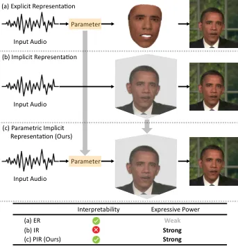

Figure 1: Comparison between previous explicit, implicit representations
and our parametric implicit representation (PIR). (a) Explicit
representations (_e.g_., 3D face models) have interpretable parameters
but lack expressive power. (b) Implicit representations (_e.g_., NeRF)
have strong expressive power but are not interpretable. (c) Our PIR
takes the best of both approaches and is both interpretable and
expressive, thus paving the way for controllable and high-quality
audio-driven facial reenactment.

## 1 Introduction

Audio-driven facial reenactment, also known as audio-driven talking head
generation or synthesis, plays an important role in various
applications, such as digital human, film-making and virtual video
conference. It is a challenging cross-modal task from audio to visual
face, which requires the generated talking heads to be photo-realistic
and have lip movements synchronized with the input audio.

According to the intermediate face representations, existing facial
reenactment methods can be roughly classified into two categories:
explicit and implicit methods. Between them, explicit methods \[29, 3,
13, 18, 34, 30, 37, 11, 27\] exploit relatively sophisticated 2D
(_e.g_., 2D facial landmarks \[29, 3, 13, 18, 34\]) or 3D (_e.g_., 3D
Morphable Model \[30, 37, 11, 27\]) parametric face models to
reconstruct 2D or 3D faces, and map them to photo-realistic faces with a
rendering network such as the Generative Adversarial Networks
(GANs) \[10, 39\]. Their distinct advantage is the controllability
(_e.g_., expressions) resulting from their interpretable facial
parameters. However, despite this advantage, the parametric face models
used in explicit methods are often sparse and have very limited
expressive power, which inevitably sacrifices the quality of synthesized
faces (_e.g_., the inaccurate lip movements and blurry mouth caused by
the missing teeth area in 3D face models). In contrast, implicit
methods \[42, 9, 28, 12, 16, 5, 17, 25\] use implicit 2D or 3D
representations that are more expressive and can generate more realistic
faces. For example, Neural Radiance Fields (NeRF) based methods \[5, 17,
25\] are one of the more representative implicit methods that use NeRF
to represent the 3D scenes of talking heads. Although being more
expressive and producing higher-quality results, implicit methods are
not interpretable and lose the controllability of the synthesis process,
thus requiring model re-training to change its target person. As a
result, the explicit and implicit methods mentioned above form a
trade-off between the interpretability and expressive power of
intermediate face representations, while a representation that is both
interpretable and expressive remains an open problem.

In this work, we break the above trade-off by proposing a parametric
implicit representation that is both interpretable and expressive,
paving the way for controllable and high-quality audio-driven facial
reenactment. Specifically, we propose to parameterize implicit face
representations with the interpretable parameters of the 3D Morphable
Model (3DMM) \[10\] using a conditional image synthesis paradigm. In our
parametric implicit representation, the 3DMM parameters offer
interpretability and the implicit representation offers strong
expressive power, which take the best of both explicit and implicit
methods (Fig. 1). To implement our idea, we propose a novel framework
consisting of three components: i) contextual audio to expression
(parameters) encoding; ii) implicit representation parameterization;
iii) rendering with parametric implicit representation. Among them, our
contextual audio to expression encoding component employs a
transformer-based encoder architecture to capture the long-term context
of an input audio, making the resulting talking heads more consistent
and natural-looking; our implicit representation parameterization
component uses a novel conditional image synthesis approach for the
parameterization, and innovatively employs a tri-plane based generator
offered by EG3D \[2\] to learn the implicit representation in a
computationally efficient way; our rendering with parametric implicit
representation component formulates face reenactment as an image
inpainting problem conditioned on the parametric implicit representation
to achieve a consistent and natural-looking “blending” of the head and
torso of a target person. In addition, we observe that the model
slightly overfits to the training data consisting of paired audio and
video, causing jitters in the resulting talking heads whose lip
movements are required to be synchronized with unseen input audio. To
help our model generalize better and produce more stable results, we
further propose a simple yet effective data augmentation strategy for
our rendering component.

In summary, our main contributions include:

- •
  We propose an innovative audio-driven facial reenactment framework
  based on our novel parametric implicit representation, which breaks
  the previous trade-off between interpretability and expressive power,
  paving the way for controllable and high-quality audio-driven facial
  reenactment.
- •
  We propose several new techniques to improve the three components of
  our innovative framework, including: i) employing a transformer-based
  encoder architecture to incorporate contextual information into the
  audio to expression (parameters) encoding; ii) using a novel
  conditional image synthesis approach for the parameterization of
  implicit representation, which is implemented with an innovative
  tri-plane based generator \[2\] for efficient learning; iii)
  formulating facial reenactment as a conditional image inpainting
  problem for natural “blending” of head and torso, and proposing a
  simple yet effective data augmentation technique to improve model
  generalizability.
- •
  Extensive experiments show that our method can generate high-fidelity
  talking head videos and outperforms state-of-the-art methods in both
  objective evaluations and user studies.

## 2 Related work

Given a video of a target person and an (unpaired) audio, audio-driven
facial reenactment aims to synthesize a novel video of the target person
whose lip movement is synchronized with the given audio. Most existing
talking head generation methods can be roughly classified into two
categories: explicit methods and implicit methods, according to their
intermediate face representations.

Explicit Methods. Explicit methods use parametric face models as
intermediate face representations. Depending on the type of parametric
face models used, explicit methods can be further divided into two
categories: 2D-based and 3D-based. Between them, 2D-based methods use 2D
parametric face models like 2D facial landmarks \[29, 3, 13, 18, 34\],
and map the input audio to them. These 2D landmarks are then fed into
generative adversarial networks (GANs) to synthesize photo-realistic
faces. For example, Chen _et al_. \[3\] propose an adjustable pixel-wise
loss to guide the network to focus on audiovisual-correlated facial
landmarks. Xie _et al_. \[34\] predict the facial landmarks in the mouth
area with the input audio and then change the lip movement of video
frames to match the predicted landmarks. In contrast, 3D-based methods
use more expressive 3D parametric face models (_e.g_., the 3D Morphable
Models (3DMM) \[2, 23\] and FLAME \[15\]) and map the audio to the
expression parameters of the models. These expression parameters,
together with those extracted from the video frames, are used to
reconstruct explicit 3D face shapes that will be fed into a rendering
network to synthesize new talking head videos. For example, Thies _et
al_. \[30\] encode the audio into a general audio-expression space and
learn a person-specific expression basis to reconstruct the intermediate
3D model. Zhang _et al_. \[11\] leverage the context in audio to model
implicit attributes like eye blinking and head pose, extending the
attribute control of the face model. Song _et al_. \[27\] remove
identity information in audio to improve the quality of expression
parameters. And they exploit the use of expression and landmarks from
video frames to supervise the reconstructed facial mesh. Despite being
interpretable, all parametric face models used in explicit methods are
sparse compared to image pixels and cannot capture facial details
(_e.g_., the missing areas like teeth in 3D face models).

Implicit Methods. Some works achieve the audio-to-face transition
directly through the Generative Adversarial Networks (GANs) \[42, 9, 28,
12, 16, 36\]. Prajwal _et al_. \[9\] employ a powerful lip-sync
discriminator to detect lip-sync errors, forcing the generator to
extract more expressive representations from the input audio. Zhou _et
al_. \[12\] devise an implicit pose code to achieve free pose control
and enhance the audio representation by contrastive learning in a
non-identity space. Recently, some other implicit methods use Neural
Radiance Fields (NeRF) \[8\] as the intermediate representation \[5, 17,
45, 25\], which models the 3D scene of a talking head with a
fully-connected network and volume rendering techniques. For example,
Guo _et al_. \[5\] employ two individual sets of NeRF to synthesize the
talking head and torso of a portrait respectively. Liu _et al_. \[17\]
leverage the semantic information in video frames to guide NeRF to
concentrate on the hard-to-learn area like mouth and eyes. Shen _et al_.
\[25\] introduce audio conditions to warp the face to the query space,
which is applied in the fine-tuning of the facial radiance field for
few-shot synthesis. Although implicit methods have more expressive
representations and produce higher-quality videos, they are less
interpretable and lose the controllability of the synthesis process,
thus requiring model re-training to change its target person.

In this work, we propose a novel framework that takes the best of both
explicit and implicit methods. Specifically, we exploit the
interpretable parameter space of 3D parametric face models, but map them
to implicit face representations instead of reconstructing 3D face
models. In this way, we obtain a representation that is both expressive
and interpretable, thus paving the way for controllable and high-quality
audio-driven facial reenactment.

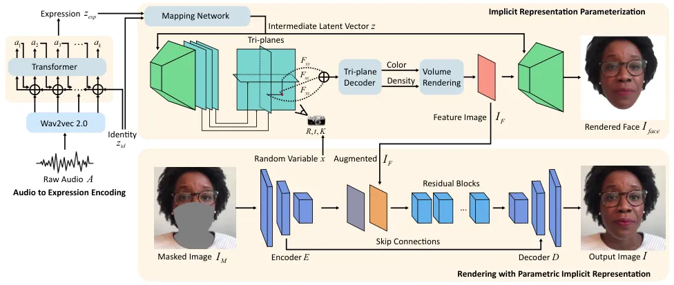

Figure 2: Overview of our framework. Our framework contains three
components: i) contextual audio to expression (parameters) encoding; ii)
implicit representation parameterization; iii) rendering with parametric
implicit representation (PIR). With a given identity parameter
$`z_{id}`$, raw audio $`A`$ is mapped to the expression parameters
$`z_{exp}`$ which captures long-term context from
$`\{a_{i}|i=1,2,...,k-1\}`$ through a transformer network. Our implicit
representation parameterization component first maps $`z_{exp}`$ and
$`z_{id}`$ into a latent vector $`z`$ to condition the generation of
tri-plane feature maps, and then sample them with pose parameters $`R`$,
$`t`$, $`K`$ to obtain pose-conditioned features. These pose-conditioned
features are processed with a lightweight decoder and a volume rendering
module to produce our PIR $`I_{F}`$. An upsampling network is used to
generate the face image $`I_{face}`$ from $`I_{F}`$. Our rendering with
PIR component generates output image $`I`$ by formulating it as an
inpainting task conditioned on a masked image $`I_{M}`$ and $`I_{F}`$.

## 3 Methodology

As Fig. 2 shows, our framework consists of three components: contextual
audio to expression (parameters) encoding (Sec. 3.1), implicit
representation parameterization (Sec. 3.2) and rendering with parametric
implicit representation (Sec. 3.3). Given an input raw audio $`A`$, our
contextual audio to expression encoding component maps $`A`$ to its
corresponding expression parameter $`z_{exp}`$ in the same format as
used in 3D Morphable Model (3DMM). $`z_{exp}`$, together with the
identity parameter $`z_{id}`$ and the pose parameter (rotation $`R`$,
translation $`t`$ and camera intrinsic matrix $`K`$, which are used as
the camera pose) extracted by 3DMM, constitute the facial parameters and
are mapped to the implicit representation of a reenacted face $`I_{F}`$
by our implicit representation parameterization component. Finally, our
rendering with parametric implicit representation (PIR) component
formulates facial reenactment as a conditional inpainting task and
renders the reenacted image with $`I_{F}`$ as the condition.

### 3.1 Contextual Audio to Expression Encoding

As Fig. 2 shows, unlike previous implicit methods that train the audio
encoder in an end-to-end fashion \[5, 17\], we explicitly supervise its
training with expression parameters extracted by 3D Morphable Model
(3DMM). The rationale behind our choice is that audio has little to do
with a person’s identity or pose but mainly his/her expression (_e.g_.,
lip movement). Specifically, given a raw audio $`A`$, we first extract
its preliminary feature using wav2vec 2.0 \[1\], a self-supervised
pre-trained speech model that facilitates accurate lip movement through
the abundant phoneme information it learned from a large-scale corpus of
unlabeled speech. Then, we feed this feature along with the identity
parameters extracted by 3DMM into a transformer-based audio feature
extractor network \[4\] which encodes it to the expression parameters
$`a_{k}`$ of the $`k`$-th video frame. Thanks to the transformer
architecture, $`a_{k}`$ is dependent on the expression parameters of
previous frames $`\{a_{i}|i=1,2,\dots,k-1\}`$ and effectively captures
the context of the audio. In addition, our method separates audio
encoding as a stand-alone and light-weight subtask, which can make the
most of the computational resources and capture much longer-term
dependency (_i.e_. using longer input sequences), resulting in more
consistent and natural-looking videos.

### 3.2 Implicit Representation Parameterization

Unlike previous methods that reconstruct 3D face shapes with the
extracted facial parameters \[11, 30\] and convert them to videos, we
map such facial parameters to an implicit representation $`I_{F}`$ and
use $`I_{F}`$ to condition the video synthesis. In this way, our
framework takes the best of both explicit and implicit face
representation approaches as i) it makes good use of the
interpretability of the facial parameter space that facilitates
controllability of the synthesis process; ii) it captures more realistic
facial features with the high expressive power of the implicit
representation; iii) it avoids the unnecessary introduction of facial
priors that are inconsistent with ground truth when performing 3D face
reconstruction from sparse facial parameters.

As Fig. 2 shows, we implement the mapping between facial parameters and
its implicit representation using a EG3D\[2\] generator. Specifically,
our facial parameters consist of three components: identity, expression
and pose. For identity and expression, we concatenate them and employ a
simple mapping network to map them to an intermediate latent vector
$`z`$. For pose, we represent it with the camera pose $`R,t`$ and
intrinsic matrix $`K`$, and use it to query the 3D positions using the
tri-plane structure. Following \[2\], we feed $`z`$ to the EG3D
generator as both input and condition vector, and $`R,t,K`$ to it as the
camera pose, and obtain $`I_{F}`$ as an implicit representation of the
input facial parameters. Note that we use face reconstruction as a proxy
task ($`I_{face}`$ denotes the reconstructed face) for the training and
discard the decoder in the testing stage.

Remark. We use EG3D \[2\] rather than NeRF \[5, 35\] as EG3D is a
computationally efficient and expressive architecture that supports the
generation of high-resolution images in real time and greatly preserves
3D structure.

### 3.3 Rendering with PIR

As mentioned above, although the implicit representation $`I_{F}`$
carries realistic facial features, its sparse input (_i.e_., facial
parameters) cannot capture the fine details of the input video. To this
end, we formulate facial reenactment as a video inpainting problem
conditioned on the implicit representation $`I_{F}`$. Specifically, as
shown in Fig. 2, given a masked video frame $`I_{M}`$, we first use an
encoder $`E`$ to extract its feature maps with the same resolution as
$`I_{F}`$. Then, we concatenate them with $`I_{F}`$ and feed the
concatenated feature maps to the decoder $`D`$ to generate the
reenactment image $`I`$. Skip connections are added between
corresponding intermediate layers of $`E`$ and $`D`$.

Jitter Reduction. Although effective, the proposed rendering method is
trained with paired audio and video data, which is not the case during
testing. In our experiment (Fig. 3), we observed that new audios may
cause slight offsets and deformations of $`I_{face}`$, leading to
jitters in the resulting videos. To reduce such jitters, we propose a
simple yet effective data augmentation strategy. Specifically, we
perturb the camera intrinsic matrix $`K`$ with random variables
$`x_{1},x_{2},x_{3}\sim U(-s,s)`$ when training the rendering network:

```math
K=\begin{bmatrix}f_{x}\times(1+\frac{x_{1}}{2u_{0}})&0&u_{0}+x_{2}\\
0&f_{y}\times(1+\frac{x_{1}}{2v_{0}})&v_{0}+x_{3}\\
0&0&1\end{bmatrix}, \tag{1}
```

where $`f_{x}`$ and $`f_{y}`$ represent focal length in terms of pixels
and $`u_{0}`$ and $`v_{0}`$ represent the principal point. This
augmentation simulates the scaling and shifting of $`I_{F}`$ and thus
$`I_{face}`$ (Fig. 4), allowing the rendering network to learn from them
and reduce jitters.

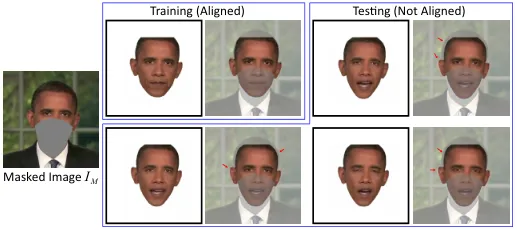

Figure 3: Jitters caused by training-inference mismatch. In training,
$`I_{face}`$ is well aligned with the masked image $`I_{M}`$, which is
not the case in testing, thus causing jitters.

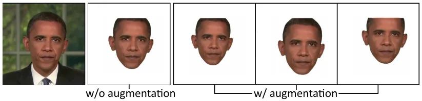

Figure 4: Data augmentation for jitter reduction. We augment the camera
intrinsic matrix $`K`$ to randomly scale and shift $`I_{F}`$ to simulate
potential training-inference mismatches during training.

### 3.4 Training and Loss Functions

Among the three components of our framework, audio to expression is a
self-contained subtask and can be trained independently, which makes the
most of the given computational resources and produces more consistent
and natural-looking videos; rendering relies on the result of implicit
representation parameterization and is trained afterwards. All of them
are trained with short video clips of target persons, including paired
audio track and video sequences.

Audio to Expression. Let $`a_{i}`$ be the output feature where
$`i=1,2,...,k`$ be the $`i`$-th frame of the video, and $`z_{exp,i}`$ be
the expression parameter extracted by 3DMM, we train our audio encoder
by minimizing the Mean Squared Error (MSE) between them as:

```math
L_{audio}=\sum_{i=1}^{k}||a_{i}-z_{exp,i}||^{2}. \tag{2}
```

Implicit Representation Parameterization. We train the mapping between
input facial parameters and the implicit representation of reenacted
face with a weighted sum of a photometric loss and a perceptual loss
\[13\]

```math
\begin{aligned} L_{face}&=w_{1}||M_{h}\odot(I_{face}-I_{GT})||^{2}+\\
&w_{2}\sum_{i}||\phi_{i}(I_{face})-\phi_{i}(M_{h}\odot I_{GT})||^{2}\end{aligned}, \tag{3}
```

where $`M_{h}`$ is the head mask, $`\phi_{i}(*)`$ denotes the activation
of the $`i`$-th layer in VGG16 \[26\], $`\odot`$ denotes element-wise
product operator, $`w_{1}`$ and $`w_{2}`$ are the weighting factors.

Rendering with PIR. To maximize the quality of generated image, we train
our rendering network with:

```math
L_{render}=L_{render}^{rec}+L_{render}^{FM}+L_{render}^{GAN} \tag{4}
```

where $`L_{render}^{rec}`$ denotes a reconstruction loss consisting of a
weighted sum of a photometric loss and a perceptual loss:

```math
L_{render}^{rec}=w_{3}||I-I_{GT}||^{2}+w_{4}\sum_{i}||\phi_{i}(I)-\phi_{i}(I_{GT})||^{2}. \tag{5}
```

Let $`\{D_{k}|k=1,2,3\}`$ be a multi-scale discriminator \[10\],
$`L_{render}^{FM}`$ denotes a feature matching loss and
$`L_{render}^{GAN}`$ denotes a GAN adversarial loss:

```math
\begin{aligned} &L_{render}^{FM}=\sum_{i=1}^{T}\frac{1}{N_{i}}[||D_{k}^{(i)}(I)-D_{k}^{(i)}(I_{GT})||_{1}]\\
&L_{render}^{GAN}=\sum_{k}\log D_{k}(I_{GT})+\log(1-D_{k}(I))\end{aligned}, \tag{6}
```

where $`T`$ is the total number of layers and $`N_{i}`$ denotes the
number of elements in each layer. Note that $`L_{render}^{GAN}`$ is
optimized in a minimax manner as those in GAN training.

|                   |                  |                  |                  |                   |                    |                   |                    |                   |                    |
| ----------------- | ---------------- | ---------------- | ---------------- | ----------------- | ------------------ | ----------------- | ------------------ | ----------------- | ------------------ |
| Method            | HDTF             |                  |                  |                   |                    | Testset 1         |                    | Testset 2         |                    |
|                   | SSIM$`\uparrow`$ | PSNR$`\uparrow`$ | CPBD$`\uparrow`$ | LMD$`\downarrow`$ | AVConf$`\uparrow`$ | LMD$`\downarrow`$ | AVConf$`\uparrow`$ | LMD$`\downarrow`$ | AVConf$`\uparrow`$ |
| Ground Truth      | 1                | N/A              | 0.344            | 0                 | 8.839              | 0                 | 8.407              | 0                 | 9.315              |
| ATVG \[3\]        | 0.829            | 20.540           | 0.078            | 9.645             | 4.848              | 8.784             | 5.232              | 10.445            | 4.903              |
| Wav2Lip \[9\]     | 0.729            | 20.352           | 0.317            | 4.279             | 7.812              | 4.836             | 7.554              | 4.297             | 7.682              |
| MakeitTalk \[13\] | 0.698            | 19.956           | 0.075            | 4.940             | 3.972              | 4.939             | 4.172              | 5.064             | 3.467              |
| PC-AVS \[12\]     | 0.738            | 21.078           | 0.096            | 5.199             | 7.392              | 6.678             | 6.742              | 4.091             | 6.858              |
| AD-NeRF \[5\]     | \-               | \-               | \-               | \-                | \-                 | 4.691             | 4.236              | \-                | \-                 |
| FACIAL \[11\]     | \-               | \-               | \-               | \-                | \-                 | \-                | \-                 | 2.675             | 6.045              |
| Ours              | 0.970            | 36.711           | 0.305            | 1.794             | 7.233              | 2.116             | 6.133              | 1.899             | 7.655              |

Table 1: Quantitative comparisons with existing state-of-the-art
methods. Since AD-NeRF \[5\] and FACIAL \[11\] do not provide pretrained
models on the HDTF dataset, we only compare with them on Testset 1 and 2. Bold: best results; Underline: second-best results.

## 4 Experiments

### 4.1 Experimental Settings

Dataset. To achieve high-quality audio-driven facial reenactment, we
follow \[5, 17\] and conduct experiments on three datasets, the HDTF
\[41\], Testset 1 \[5\], Testset 2 \[11\]. For HDTF, we selected 8
videos (corresponding to 8 subjects) from it. For Testset 1 and 2, we
use the sole video released by the authors for each of them. The time
span of these videos is 3-6 minutes. For the test set consisting of
unpaired and gender-balanced audio clips, we select 3 from HDTF and
collect another 2 Obama audios online. Please note that many previous
datasets (_e.g_., LRW \[7\], Voxceleb1 \[20\] and Voxceleb2 \[6\]) are
not suitable as they either have low image quality or consist of many
short (a few seconds) video clips of different speakers (_e.g_., GRID
\[9\] and MEAD \[31\]), which hinders the generation of high-quality
videos and the capture of long-term audio context.

Data Preprocessing. Before use, all videos are extracted at 25 frames
per second (FPS) and the synchronized audio waves are sampled as $`16K`$
Hz frequency. We crop the videos to center the faces and resize them to
the resolution of $`512\times 512`$. For each video, we extract the
identity, expression and pose parameters of each frame using 3DMM
\[10\]. We obtain the (mean) identity parameters of a target person by
averaging those of the same person over all frames in a video. The
estimated head poses are represented as camera poses. An off-the-shelf
segmentation method \[38\] is used to obtain the parsing map (_e.g_.,
head mask) of each frame.

Evaluation Settings. To facilitate an objective evaluation of lip
movement accuracy and image quality, we first evaluate our method under
self-reenactment setting on all three datasets, with the last 25s of
each original video clip being used as the ground truth test data. To
evaluate the performance of our method across identities (where there
are no ground truths), we pair the videos in Testset 1 and 2 with audios
of different identities for reenactment and use SyncNet \[8\] to assess
the quality of synchronization.

### 4.2 Implementation details

We implement our framework in PyTorch \[22\] with an Adam optimizer
\[14\]. We train our contextual audio to expression component for 120
epochs with the expression parameters extracted by 3DMM, a context
length of $`k=100`$ (each frame lasts for 0.04s), and pretrained wav2vec
2.0 weights. Thanks to its well-defined output, we train our audio to
expression component simultaneously with the other two components. Our
implicit representation paramerterization component is trained for 50
epochs using the expression parameters extracted by 3DMM as input and
the rendered face $`I_{face}`$ as output. The resolution of the
resulting parametric implicit representation $`I_{F}`$ is
$`32\times 64\times 64`$. The three tri-plane features have the
resolution of $`32\times 256\times 256`$ and that of output image
$`I_{face}`$ is $`3\times 512\times 512`$. Our rendering with parametric
implicit representation component is trained for another 50 epochs with
$`s=3`$ for jitter reduction and the augmented $`I_{F}`$ whose
resolution is $`32\times 32\times 32`$. We use
$`w_{1}=w_{2}=w_{3}=w_{4}=1`$ for Eqs. 3 and 5.

### 4.3 Comparison with the State-of-the-arts

#### 4.3.1 Quantitative Evaluation

We quantitatively compare our method with SOTAs using the following
metrics:

- •
  Lip Movement Accuracy: We use the Landmark Distance (LMD) \[4\] to
  evaluate lip movement accuracy.
- •
  Lip-sync: We measure lip synchronization errors with the Audio-Visual
  Confidence (AVConf) score calculated by SyncNet \[8\].
- •
  Sharpness: We measure frame sharpness with the perceptual-based
  no-reference objective image sharpness metric (CPBD) \[21\].
- •
  Image Quality: We assess the quality of synthesized video frames by
  comparing them with the ground truth using Peak Signal to Noise Ratio
  (PSNR) and Structure Similarity Index Measure (SSIM) \[33\].

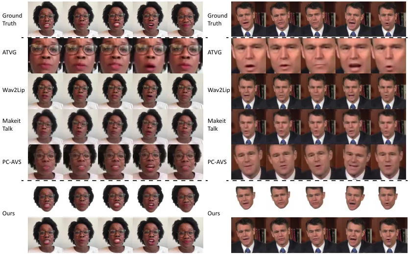

Figure 5: Qualitative comparison with ATVG \[3\], Wav2Lip \[9\],
MakeitTalk \[13\] and PC-AVS \[12\]. Row 1 (Ground Truth): the
corresponding video frames to the input audio. Last two rows (Ours):
rendered face $`I_{face}`$ and output image $`I`$ (Fig. 2),
respectively. The portraits generated by our method have highly
synchronized lip movements and fine facial details (_e.g_., teeth and
wrinkles) that preserve the target person’s identity well, thus
outperforming all previous methods.

As Tab. 1 shows, our method achieves the best or second-best performance
for most of the evaluation metrics. For the exceptions, Wav2Lip achieves
a higher CPBD score on HDTF but sacrifices the visual quality (blurry
mouths with obvious artifacts in Fig. 5) as it only edits the mouth
region of the reference images with the remaining part unchanged. In
addition, it is trained using a pretrained lip-sync discriminator
similar to SyncNet, which “tricks” SyncNet to produce the highest AVConf
scores on all three datasets. PC-AVS gets slightly higher AVConf scores
than our method on HDTF and Testset 1, but are much worse than ours on
all the other metrics, especially LMD. This indicates that PC-AVS learns
natural-looking lip movements but fails to capture individual speaking
styles. In contrast, our method is more personalized as it takes into
account the identity parameters $`z_{id}`$ and thus excels in the more
fine-grained LDM.

#### 4.3.2 Qualitative Comparison

We compare our methods with state-of-the-art 2D-based methods, including
the explicit ATVG \[3\] and MakeitTalk \[13\], and implicit Wav2Lip
\[9\] and PC-AVS \[12\], in Fig. 5. For 3D-based methods, we compare
ours with the explicit FACIAL \[11\] and implicit AD-NeRF \[5\] in
Fig. 6.

As Fig. 5 shows, our method produces the highest quality results with
the most synchronized lip-movement. Specifically, i) ATVG and MakeitTalk
fail to produce accurate lip movements as they rely on less expressive
2D facial landmarks; ii) Wav2Lip produces blurry mouths that do not
match the sharp parts in the rest of the video frames, making the
results unnatural; iii) although PC-AVS produces head movements that are
consistent with the ground truth, it cannot well preserve the identity
of the speaker. In addition, none of these methods can synthesize
high-resolution videos. In contrast, our method allows for the synthesis
of high-resolution, high-quality videos with highly synchronized lip
movements that preserve facial details well (_e.g_., teeth and
wrinkles), which are crucial for identity preservation and the
naturalness of facial reenactment.

| Method        | AVConf$`\uparrow`$ | Method        | AVConf$`\uparrow`$ |
| ------------- | ------------------ | ------------- | ------------------ |
| AD-NeRF \[5\] | 3.607              | FACIAL \[11\] | 4.623              |
| Ours          | 6.758              | Ours          | 6.678              |

Table 2: Quantitative comparisons of our method with AD-NeRF \[5\] and
FACIAL \[11\].

As Fig. 6 shows, our method is also superior to AD-NeRF and FACIAL.
Specifically, i) AD-NeRF suffers from the artifacts at the head-neck
junction which stem from a mismatch between the two NeRFs it uses to
model the head and torso separately; ii) FACIAL produces less accurate
lip movements due to the less expressive 3D face shape it uses as the
intermediate face representation. Please refer to Tab. 2 for a
quantitative comparison w.r.t lip movement accuracy between AD-NeRF,
FACIAL and our method.

Remark. For the comparison with AD-NeRF and FACIAL (Fig. 6), we use the
codes and pretrained models released by the authors and compare the
generalizability by feeding all models with 5 unpaired and
gender-balanced audio clips mentioned above. The reference images are
the corresponding frames of the input audio clips in the new videos.

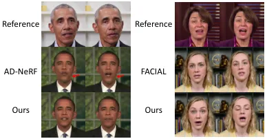

Figure 6: Comparison with AD-NeRF \[5\] and FACIAL \[11\].

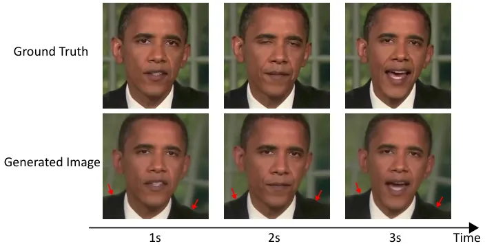

Figure 7: Ablation study of our rendering with PIR component. Row 2: the
images generated without this component.

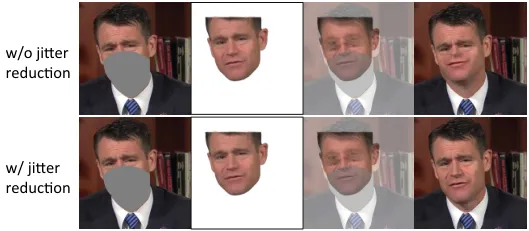

Figure 8: Ablation study of our jitter reduction technique.

### 4.4 Ablation Study

Rendering with PIR. As Fig. 7 shows, without our rendering with PIR
component (_i.e_., use the implicit representation parameterization
component to generate the output image $`I`$ directly, not just the
head), the torso changes rapidly within seconds and produces unnatural
results. This justifies the necessity of our Rendering with PIR
component.

Jitter Reduction. As Fig. 8 shows, without jitter reduction, the
rendering component cannot align $`I_{F}`$ with $`I_{M}`$, thus
producing unnatural videos. This justifies the necessity of our jitter
reduction technique.

| Method            | Lip-sync | Image | Video |
| ----------------- | -------- | ----- | ----- |
| ATVG \[3\]        | 2.87     | 1.87  | 1.76  |
| Wav2Lip \[9\]     | 3.91     | 2.67  | 2.76  |
| MakeitTalk \[13\] | 2.69     | 2.73  | 2.84  |
| PC-AVS \[12\]     | 3.89     | 3.16  | 3.38  |
| AD-NeRF \[5\]     | 3.84     | 3.96  | 3.73  |
| FACIAL \[11\]     | 4.16     | 4.09  | 4.11  |
| Ours              | 4.31     | 4.20  | 4.29  |

Table 3: User study on lip-sync (audio-lip synchronization), image
quality and video realness.

### 4.5 User Study

We invite 15 volunteers to participate in our user study to evaluate
facial reenactment results based on three criteria: lip-sync (audio-lip
synchronization), image quality and video realness. We create 3 videos
for each method with the same audio input and ask the volunteers to give
their ratings on a scale of 1 (worst) to 5 (best) for each video. As
Tab. 3 shows, our method scores the highest in all three criteria.

## 5 Conclusion

In this work, we propose an innovative facial reenactment framework
based on our novel parametric implicit representation (PIR).
Specifically, our PIR breaks the trade-off between interpretability and
expressive power that plagued previous explicit and implicit methods,
thus paving the way for controllable and high-quality audio-driven
facial reenactment. We have also devised several novel techniques to
improve the three components of our framework. Extensive experiments
demonstrate the effectiveness of our method.

## Acknowledgments

This work was supported in part by the Guangdong Basic and Applied Basic
Research Foundation (NO. 2020B1515020048), in part by the National
Natural Science Foundation of China (NO. 61976250), in part by the
Shenzhen Science and Technology Program (NO. JCYJ20220530141211024) and
in part by the Fundamental Research Funds for the Central Universities
under Grant 22lgqb25. This work was also sponsored by Tencent AI Lab
Open Research Fund (NO. Tencent AI Lab RBFR2022009).

## References

- \[1\] Alexei Baevski, Yuhao Zhou, Abdelrahman Mohamed, and Michael
  Auli. wav2vec 2.0: A framework for self-supervised learning of speech
  representations. Advances in Neural Information Processing Systems,
  33:12449–12460, 2020.
- \[2\] Volker Blanz and Thomas Vetter. A morphable model for the
  synthesis of 3d faces. In Proceedings of the 26th annual conference on
  Computer graphics and interactive techniques, pages 187–194, 1999.
- \[3\] Eric R Chan, Connor Z Lin, Matthew A Chan, Koki Nagano, Boxiao
  Pan, Shalini De Mello, Orazio Gallo, Leonidas J Guibas, Jonathan
  Tremblay, Sameh Khamis, et al. Efficient geometry-aware 3d generative
  adversarial networks. In Proceedings of the IEEE/CVF Conference on
  Computer Vision and Pattern Recognition, pages 16123–16133, 2022.
- \[4\] Lele Chen, Zhiheng Li, Ross K Maddox, Zhiyao Duan, and Chenliang
  Xu. Lip movements generation at a glance. In Proceedings of the
  European Conference on Computer Vision (ECCV), pages 520–535, 2018.
- \[5\] Lele Chen, Ross K Maddox, Zhiyao Duan, and Chenliang Xu.
  Hierarchical cross-modal talking face generation with dynamic
  pixel-wise loss. In Proceedings of the IEEE/CVF conference on computer
  vision and pattern recognition, pages 7832–7841, 2019.
- \[6\] Joon Son Chung, Arsha Nagrani, and Andrew Zisserman. Voxceleb2:
  Deep speaker recognition. arXiv preprint arXiv:1806.05622, 2018.
- \[7\] Joon Son Chung and Andrew Zisserman. Lip reading in the wild. In
  Asian conference on computer vision, pages 87–103. Springer, 2016.
- \[8\] Joon Son Chung and Andrew Zisserman. Out of time: automated lip
  sync in the wild. In Asian conference on computer vision, pages
  251–263. Springer, 2016.
- \[9\] Martin Cooke, Jon Barker, Stuart Cunningham, and Xu Shao. An
  audio-visual corpus for speech perception and automatic speech
  recognition. The Journal of the Acoustical Society of America,
  120(5):2421–2424, 2006.
- \[10\] Yu Deng, Jiaolong Yang, Sicheng Xu, Dong Chen, Yunde Jia, and
  Xin Tong. Accurate 3d face reconstruction with weakly-supervised
  learning: From single image to image set. In Proceedings of the
  IEEE/CVF Conference on Computer Vision and Pattern Recognition
  Workshops, pages 0–0, 2019.
- \[11\] Yingruo Fan, Zhaojiang Lin, Jun Saito, Wenping Wang, and Taku
  Komura. Faceformer: Speech-driven 3d facial animation with
  transformers. In Proceedings of the IEEE/CVF Conference on Computer
  Vision and Pattern Recognition, pages 18770–18780, 2022.
- \[12\] Yudong Guo, Keyu Chen, Sen Liang, Yong-Jin Liu, Hujun Bao, and
  Juyong Zhang. Ad-nerf: Audio driven neural radiance fields for talking
  head synthesis. In Proceedings of the IEEE/CVF International
  Conference on Computer Vision, pages 5784–5794, 2021.
- \[13\] Justin Johnson, Alexandre Alahi, and Li Fei-Fei. Perceptual
  losses for real-time style transfer and super-resolution. In European
  conference on computer vision, pages 694–711. Springer, 2016.
- \[14\] Diederik P Kingma and Jimmy Ba. Adam: A method for stochastic
  optimization. arXiv preprint arXiv:1412.6980, 2014.
- \[15\] Tianye Li, Timo Bolkart, Michael J Black, Hao Li, and Javier
  Romero. Learning a model of facial shape and expression from 4d scans.
  ACM Trans. Graph., 36(6):194–1, 2017.
- \[16\] Borong Liang, Yan Pan, Zhizhi Guo, Hang Zhou, Zhibin Hong,
  Xiaoguang Han, Junyu Han, Jingtuo Liu, Errui Ding, and Jingdong Wang.
  Expressive talking head generation with granular audio-visual control.
  In Proceedings of the IEEE/CVF Conference on Computer Vision and
  Pattern Recognition, pages 3387–3396, 2022.
- \[17\] Xian Liu, Yinghao Xu, Qianyi Wu, Hang Zhou, Wayne Wu, and Bolei
  Zhou. Semantic-aware implicit neural audio-driven video portrait
  generation. arXiv preprint arXiv:2201.07786, 2022.
- \[18\] Yuanxun Lu, Jinxiang Chai, and Xun Cao. Live speech portraits:
  real-time photorealistic talking-head animation. ACM Transactions on
  Graphics (TOG), 40(6):1–17, 2021.
- \[19\] Ben Mildenhall, Pratul P Srinivasan, Matthew Tancik, Jonathan T
  Barron, Ravi Ramamoorthi, and Ren Ng. Nerf: Representing scenes as
  neural radiance fields for view synthesis. Communications of the ACM,
  65(1):99–106, 2021.
- \[20\] Arsha Nagrani, Joon Son Chung, and Andrew Zisserman. Voxceleb:
  a large-scale speaker identification dataset. arXiv preprint
  arXiv:1706.08612, 2017.
- \[21\] Niranjan D Narvekar and Lina J Karam. A no-reference image blur
  metric based on the cumulative probability of blur detection (cpbd).
  IEEE Transactions on Image Processing, 20(9):2678–2683, 2011.
- \[22\] Adam Paszke, Sam Gross, Francisco Massa, Adam Lerer, James
  Bradbury, Gregory Chanan, Trevor Killeen, Zeming Lin, Natalia
  Gimelshein, Luca Antiga, et al. Pytorch: An imperative style,
  high-performance deep learning library. Advances in neural information
  processing systems, 32, 2019.
- \[23\] Pascal Paysan, Reinhard Knothe, Brian Amberg, Sami Romdhani,
  and Thomas Vetter. A 3d face model for pose and illumination invariant
  face recognition. In 2009 sixth IEEE international conference on
  advanced video and signal based surveillance, pages 296–301.
  Ieee, 2009.
- \[24\] KR Prajwal, Rudrabha Mukhopadhyay, Vinay P Namboodiri, and CV
  Jawahar. A lip sync expert is all you need for speech to lip
  generation in the wild. In Proceedings of the 28th ACM International
  Conference on Multimedia, pages 484–492, 2020.
- \[25\] Shuai Shen, Wanhua Li, Zheng Zhu, Yueqi Duan, Jie Zhou, and
  Jiwen Lu. Learning dynamic facial radiance fields for few-shot talking
  head synthesis. arXiv preprint arXiv:2207.11770, 2022.
- \[26\] Karen Simonyan and Andrew Zisserman. Very deep convolutional
  networks for large-scale image recognition. arXiv preprint
  arXiv:1409.1556, 2014.
- \[27\] Linsen Song, Wayne Wu, Chen Qian, Ran He, and Chen Change Loy.
  Everybody’s talkin’: Let me talk as you want. IEEE Transactions on
  Information Forensics and Security, 17:585–598, 2022.
- \[28\] Yasheng Sun, Hang Zhou, Ziwei Liu, and Hideki Koike.
  Speech2talking-face: Inferring and driving a face with synchronized
  audio-visual representation. In IJCAI, volume 2, page 4, 2021.
- \[29\] Supasorn Suwajanakorn, Steven M Seitz, and Ira
  Kemelmacher-Shlizerman. Synthesizing obama: learning lip sync from
  audio. ACM Transactions on Graphics (ToG), 36(4):1–13, 2017.
- \[30\] Justus Thies, Mohamed Elgharib, Ayush Tewari, Christian
  Theobalt, and Matthias Nießner. Neural voice puppetry: Audio-driven
  facial reenactment. In European conference on computer vision, pages
  716–731. Springer, 2020.
- \[31\] Kaisiyuan Wang, Qianyi Wu, Linsen Song, Zhuoqian Yang, Wayne
  Wu, Chen Qian, Ran He, Yu Qiao, and Chen Change Loy. Mead: A
  large-scale audio-visual dataset for emotional talking-face
  generation. In European Conference on Computer Vision, pages 700–717.
  Springer, 2020.
- \[32\] Ting-Chun Wang, Ming-Yu Liu, Jun-Yan Zhu, Andrew Tao, Jan
  Kautz, and Bryan Catanzaro. High-resolution image synthesis and
  semantic manipulation with conditional gans. In Proceedings of the
  IEEE conference on computer vision and pattern recognition, pages
  8798–8807, 2018.
- \[33\] Zhou Wang, Alan C Bovik, Hamid R Sheikh, and Eero P Simoncelli.
  Image quality assessment: from error visibility to structural
  similarity. IEEE transactions on image processing,
  13(4):600–612, 2004.
- \[34\] Tianyi Xie, Liucheng Liao, Cheng Bi, Benlai Tang, Xiang Yin,
  Jianfei Yang, Mingjie Wang, Jiali Yao, Yang Zhang, and Zejun Ma.
  Towards realistic visual dubbing with heterogeneous sources. In
  Proceedings of the 29th ACM International Conference on Multimedia,
  pages 1739–1747, 2021.
- \[35\] Wenqi Yang, Guanying Chen, Chaofeng Chen, Zhenfang Chen, and
  Kwan-Yee K. Wong. Ps-nerf: Neural inverse rendering for multi-view
  photometric stereo. In European Conference on Computer Vision
  (ECCV), 2022.
- \[36\] Zipeng Ye, Mengfei Xia, Ran Yi, Juyong Zhang, Yu-Kun Lai, Xuwei
  Huang, Guoxin Zhang, and Yong-jin Liu. Audio-driven talking face video
  generation with dynamic convolution kernels. IEEE Transactions on
  Multimedia, 2022.
- \[37\] Ran Yi, Zipeng Ye, Juyong Zhang, Hujun Bao, and Yong-Jin Liu.
  Audio-driven talking face video generation with learning-based
  personalized head pose. arXiv preprint arXiv:2002.10137, 2020.
- \[38\] Changqian Yu, Jingbo Wang, Chao Peng, Changxin Gao, Gang Yu,
  and Nong Sang. Bisenet: Bilateral segmentation network for real-time
  semantic segmentation. In Proceedings of the European conference on
  computer vision (ECCV), pages 325–341, 2018.
- \[39\] Jiahui Yu, Zhe Lin, Jimei Yang, Xiaohui Shen, Xin Lu, and
  Thomas S Huang. Free-form image inpainting with gated convolution. In
  Proceedings of the IEEE/CVF international conference on computer
  vision, pages 4471–4480, 2019.
- \[40\] Chenxu Zhang, Yifan Zhao, Yifei Huang, Ming Zeng, Saifeng Ni,
  Madhukar Budagavi, and Xiaohu Guo. Facial: Synthesizing dynamic
  talking face with implicit attribute learning. In Proceedings of the
  IEEE/CVF international conference on computer vision, pages
  3867–3876, 2021.
- \[41\] Zhimeng Zhang, Lincheng Li, Yu Ding, and Changjie Fan.
  Flow-guided one-shot talking face generation with a high-resolution
  audio-visual dataset. In Proceedings of the IEEE/CVF Conference on
  Computer Vision and Pattern Recognition, pages 3661–3670, 2021.
- \[42\] Hang Zhou, Yu Liu, Ziwei Liu, Ping Luo, and Xiaogang Wang.
  Talking face generation by adversarially disentangled audio-visual
  representation. In Proceedings of the AAAI conference on artificial
  intelligence, volume 33, pages 9299–9306, 2019.
- \[43\] Hang Zhou, Yasheng Sun, Wayne Wu, Chen Change Loy, Xiaogang
  Wang, and Ziwei Liu. Pose-controllable talking face generation by
  implicitly modularized audio-visual representation. In Proceedings of
  the IEEE/CVF conference on computer vision and pattern recognition,
  pages 4176–4186, 2021.
- \[44\] Yang Zhou, Xintong Han, Eli Shechtman, Jose Echevarria,
  Evangelos Kalogerakis, and Dingzeyu Li. Makelttalk: speaker-aware
  talking-head animation. ACM Transactions on Graphics (TOG),
  39(6):1–15, 2020.
- \[45\] Zanwei Zhou, Zi Wang, Shunyu Yao, Yichao Yan, Chen Yang,
  Guangtao Zhai, Junchi Yan, and Xiaokang Yang. Dialoguenerf: Towards
  realistic avatar face-to-face conversation video generation. arXiv
  preprint arXiv:2203.07931, 2022.

## Supplementary Material Parametric Implicit Face Representation for Audio-Driven Facial Reenactment

In this supplement, we provide more implementation details of the
network architecture of the three components we proposed: contextual
audio to expression encoding (Sec. 1), implicit representation
parameterization (Sec. 2), rendering with parametric implicit
representation (Sec. 3). Please note that we also include an additional
ablation study on the choice of hyper-parameter $`k`$ in Sec. 1. Lastly,
we show additional qualitative evaluation results in Sec. 4. We strongly
encourage readers to watch our supplementary video, which demonstrates
the superiority of our method.

## 1 Contextual Audio to Expression Encoding

### 1.1 Network Architecture

As Fig. 1 shows, our contextual audio to expression encoding component
is a transformer-based architecture similar to \[4\], consisting of a
transformer encoder and decoder.

For the transformer encoder, we first extract the primary audio feature
of a raw audio $`A`$ through wav2vec 2.0 \[1\], which consists of an
audio feature extractor and a multi-layer transformer encoder. Between
them, the audio feature extractor consists of several temporal
convolutions layers (TCN), and the transformer encoder is a stack of
multi-head self-attention and feed-forward layers. Note that we have
added a linear interpolation layer in-between to resample the audio
features from the TCN output to ensure that they share the same sampling
frequency with the training video. The dimension of each block is 1024
and the number of attention heads is 16. A linear projection layer is
added after the transformer blocks to project the extracted features to
the input space of the biased cross-modal MH Attention blocks in the
transformer decoder.

The transformer decoder takes input from the output of the transformer
encoder, the style embedding layer, and the expression encoder. Its
output is converted by the expression decoder into the predicted
expression parameter $`a_{1},a_{2},...,a_{k}`$. We use a sequence of
$`k=100`$ video frames for training. Among them, the style embedding and
expression encoder are both fully-connected layers with a dimension of
1024; the expression decoder is a fully-connected layer with a dimension
of 64. The style embedding layer takes the identity parameter $`z_{id}`$
as input. The expression encoder takes the previous predicted expression
parameter $`a_{1},a_{2},...,a_{k-1}`$ as input. Their outputs are summed
together except for the first frame when only $`z_{id}`$ is available.
Like \[4\], each block in the transformer decoder consists of a periodic
positional encoding layer, a biased causal multi-head self-attention
layer, a biased cross-modal multi-head attention layer and a feed
forward layer, whose details are described as follows.

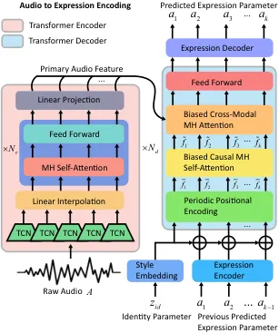

Figure 1: Network architecture of our contextual audio to expression
encoding component.

Periodic Positional Encoding (PPE). PPE is used for the injection of
temporal order and is formulated as:

```math
\begin{aligned} PPE_{(t,2i)}&=\sin\left((t\mod p)/10000^{2i/d}\right)\\
PPE_{(t,2i+1)}&=\cos\left((t\mod p)/10000^{2i/d}\right)\end{aligned}, \tag{1}
```

where $`p=25`$ indices, the period $`t`$ denotes the current time-step
in the input sequence, $`d`$ is its dimension and $`i`$ is the dimension
index. The output of PPE is a sequence of features
$`\overline{F}_{t}=(\overline{f}_{1},\dots,\overline{f}_{t})`$,
$`1\leq t\leq k`$.

Biased Causal Multi-head (MH) Self-attention. This layer is designed to
ensure causality and to improve the generalization of the model to long
sequences, which is formulated as:

```math
\begin{aligned} &{\rm MH}(Q^{\overline{F}},K^{\overline{F}},V^{\overline{F}},B^{\overline{F}})={\rm Concat}({\rm head_{1}},\dots,{\rm head_{H}})W^{\overline{F}}\\
&{\rm head_{h}}={\rm softmax}\left(\frac{Q^{\overline{F}}_{h}(K^{\overline{F}}_{h})^{T}}{\sqrt{d_{k}}}+B^{\overline{F}}_{h}\right)V^{\overline{F}}_{h}\\
&B^{\overline{F}}(i,j)=\begin{cases}\lfloor(i-j)/p\rfloor,\quad&j\leq i\\
-\infty,\quad&{\rm otherwise}\end{cases}\\
&B^{\overline{F}}_{h}=B^{\overline{F}}m\end{aligned}, \tag{2}
```

where $`Q^{\overline{F}},K^{\overline{F}},V^{\overline{F}}`$ are
projected from the sequence
$`\overline{F}_{t}=(\overline{f}_{1},\dots,\overline{f}_{t})`$,
$`W^{\overline{F}}`$ is a parameter matrix, $`d_{k}`$ is the dimension
of $`Q^{\overline{F}}`$ and $`K^{\overline{F}}`$, $`B^{\overline{F}}`$
is the temporal bias matrix and $`i,j`$ are the indices of it, and $`m`$
is a head-specific slope. The output of this layer is a sequence of
features $`\tilde{F}_{t}=(\tilde{f}_{1},\dots,\tilde{f}_{t})`$,
$`1\leq t\leq k`$.

Biased Cross-modal Multi-head (MH) Attention. This layer combines the
output of the transformer encoder and
$`\tilde{F}_{t}=(\tilde{f}_{1},\dots,\tilde{f}_{t})`$, which is
formulated as:

```math
\begin{aligned} &{\rm Att}(Q^{\tilde{F}},K^{A},V^{A},B^{A})={\rm softmax}\left(\frac{Q^{\tilde{F}}(K^{A})^{T}}{\sqrt{d_{k}}}+B^{A}\right)V^{A}\\
&B^{A}(i,j)=\begin{cases}0,\quad&i\leq j<(i+1)\\
-\infty,\quad&{\rm otherwise}\end{cases}\end{aligned}, \tag{3}
```

where $`B^{A}`$ is the alignment bias matrix. Equation 3 is extended to
$`H`$ heads to explore different subspaces.

Feed Forward Layer. A fully-connected layer of dimension 2048.

For both the biased causal MH self-attention and the biased cross-modal
MH attention, 4 heads are employed with a model dimension of 1024. We
use $`N_{e}=24`$ and $`N_{d}=1`$ transformer blocks in our
implementation.

### 1.2 Ablation Study on Sequence Length $`k`$

As mentioned in our main paper, our audio to expression encoding is a
stand-alone and light-weight task that can learn the contextual
information from long audio sequences. To justify the benefit brought by
long sequences, we conduct an ablation study on the sequence length
$`k`$. As Tab. 1 shows, in general, the generated talking head videos
achieve better LMD and AVConf scores with longer training audio
sequences, indicating that capturing the long-term contextual
information from audio sequences helps generate highly synchronized lip
movements for talking portraits. We use $`k=100`$ in our method as it
achieves the best scores.

| k                  | 1     | 10    | 50    | 100   | 200   |
| ------------------ | ----- | ----- | ----- | ----- | ----- |
| LMD$`\downarrow`$  | 2.556 | 2.273 | 1.626 | 1.477 | 1.650 |
| AVConf$`\uparrow`$ | 4.201 | 4.505 | 6.873 | 7.071 | 6.929 |

Table 1: Ablation study of hyper-parameter $`k`$ (sequence length).
$`k=1`$ indicates no use of contextual information.

## 2 Implicit Representation Parameterization

We implement our implicit representation parameterization based on an
efficient tri-plane structure \[2\].

As shown in Fig. 2 of the main paper, we employ a mapping network to
produce a 512-D intermediate latent vector $`z`$ from the concatenation
of identity parameter $`z_{id}`$ and expression parameter $`z_{exp}`$.
Conditioned on the latent vector $`z`$, a StyleGAN2 \[6\] generator is
employed to generate a $`96\times 256\times 256`$ feature map. Then the
feature map is split into three axis-aligned orthogonal feature planes,
each with a resolution of $`32\times 256\times 256`$. Given camera pose
$`R,t`$ and intrinsic matrix $`K`$, a 3D point position in world
coordinates $`[x_{w}\;y_{w}\;z_{w}\;1]^{T}`$ is calculated based on:

```math
z_{c}\begin{bmatrix}u\\
v\\
1\end{bmatrix}=K\begin{bmatrix}R&t\\
\mathbf{0}&1\end{bmatrix}\begin{bmatrix}x_{w}\\
y_{w}\\
z_{w}\\
1\end{bmatrix}, \tag{4}
```

where $`[u\;v\;1]^{T}`$ is the 2D point position in pixel coordinates
and $`z_{c}`$ is the z-coordinate of 3D point position in camera
coordinates. Then we project it onto each of the three feature planes,
retrieve the feature vector $`(F_{xy},F_{xz},F_{yz}`$ via bilinear
interpolation, and aggregate the three feature vectors via summation.
These aggregated features are interpreted as 32-D color and 1-D density
through a lightweight decoder which is a multi-layer perceptron with a
single hidden layer and a softplus activation function. Furthermore,
they are reconstructed as a $`32\times 64\times 64`$ feature map
$`I_{F}`$ using volume rendering. Two-pass importance sampling strategy
is used to implement volume rendering \[7\] as in \[8\]. Compared to
NeRF structures using large fully connected networks \[8\], the
computational cost of tri-plane based neural rendering is reduced since
it has a smaller decoder.

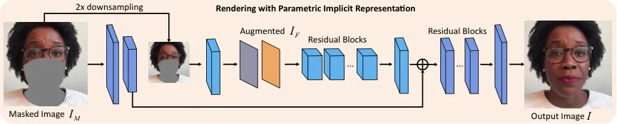

Figure 2: Network architecture of our rendering with parametric implicit
representation component. We formulate facial reenactment as an image
inpainting problem conditioned on the implicit representation $`I_{F}`$
and use a coarse-to-fine network structure to tackle it.

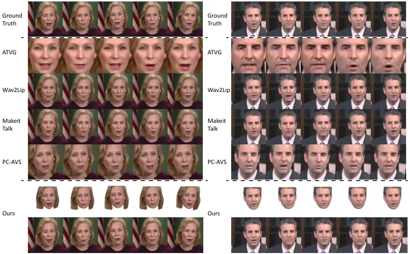

Figure 3: Additional qualitative comparison with ATVG \[3\], Wav2Lip
\[9\], MakeitTalk \[13\] and PC-AVS \[12\].

Finally, a CNN-based upsampling network is used to upsample and render
$`I_{F}`$ to the final image $`I_{face}`$ with a resolution of
$`3\times 512\times 512`$.

## 3 Rendering with PIR

As shown in Fig. 2, our rendering with parametric implicit
representation (PIR) component uses a coarse-to-fine generator \[10\] to
generate the output image. The input $`3\times 512\times 512`$ masked
image $`I_{M}`$ is downsampled to a $`3\times 256\times 256`$ image
through the average pooling. Then the image is further processed through
several convolution layers and concatenated with the augmented feature
map $`I_{F}`$ from the implicit representation parameterization
component. The concatenated features are further processed through 4
residual blocks and several convolution layers. After that, the features
is summed with the feature maps extracted from $`I_{M}`$, passing
through 3 residual blocks and finally rendering into the output image
$`I`$ through convolution layers.

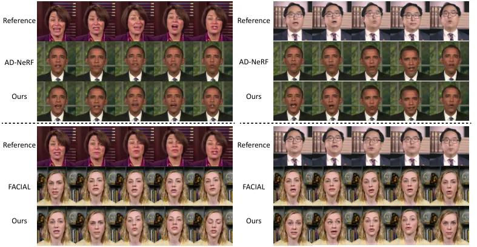

Figure 4: Comparison with AD-NeRF \[5\] and FACIAL \[11\].

## 4 Additional Qualitative Results

As a complement to the main paper, we show additional qualitative
results of ATVG \[3\], Wav2Lip \[9\], MakeitTalk \[13\], PC-AVS \[12\]
and our method. As Fig. 3 shows, it can be observed that our method
generates talking portraits with highly synchronized lip movements and
high fidelity to the facial details, outperforming all previous methods.

We also show more qualitative comparison results with AD-NeRF \[5\] and
FACIAL \[11\] in Fig. 4. The generated talking portraits are driven by
the audio from different identities. The results show that the talking
heads generated by AD-NeRF \[5\] have obvious artifacts at the head-neck
junction, and those generated by FACIAL \[11\] have less accurate lip
movements. In contrast, our method can generate natural and vivid
talking portraits, indicating that it generalizes better to unseen
audios.

## References

- \[1\] Alexei Baevski, Yuhao Zhou, Abdelrahman Mohamed, and Michael
  Auli. wav2vec 2.0: A framework for self-supervised learning of speech
  representations. Advances in Neural Information Processing Systems,
  33:12449–12460, 2020.
- \[2\] Eric R Chan, Connor Z Lin, Matthew A Chan, Koki Nagano, Boxiao
  Pan, Shalini De Mello, Orazio Gallo, Leonidas J Guibas, Jonathan
  Tremblay, Sameh Khamis, et al. Efficient geometry-aware 3d generative
  adversarial networks. In Proceedings of the IEEE/CVF Conference on
  Computer Vision and Pattern Recognition, pages 16123–16133, 2022.
- \[3\] Lele Chen, Ross K Maddox, Zhiyao Duan, and Chenliang Xu.
  Hierarchical cross-modal talking face generation with dynamic
  pixel-wise loss. In Proceedings of the IEEE/CVF conference on computer
  vision and pattern recognition, pages 7832–7841, 2019.
- \[4\] Yingruo Fan, Zhaojiang Lin, Jun Saito, Wenping Wang, and Taku
  Komura. Faceformer: Speech-driven 3d facial animation with
  transformers. In Proceedings of the IEEE/CVF Conference on Computer
  Vision and Pattern Recognition, pages 18770–18780, 2022.
- \[5\] Yudong Guo, Keyu Chen, Sen Liang, Yong-Jin Liu, Hujun Bao, and
  Juyong Zhang. Ad-nerf: Audio driven neural radiance fields for talking
  head synthesis. In Proceedings of the IEEE/CVF International
  Conference on Computer Vision, pages 5784–5794, 2021.
- \[6\] Tero Karras, Samuli Laine, Miika Aittala, Janne Hellsten, Jaakko
  Lehtinen, and Timo Aila. Analyzing and improving the image quality of
  stylegan. In Proceedings of the IEEE/CVF conference on computer vision
  and pattern recognition, pages 8110–8119, 2020.
- \[7\] Nelson Max. Optical models for direct volume rendering. IEEE
  Transactions on Visualization and Computer Graphics,
  1(2):99–108, 1995.
- \[8\] Ben Mildenhall, Pratul P Srinivasan, Matthew Tancik, Jonathan T
  Barron, Ravi Ramamoorthi, and Ren Ng. Nerf: Representing scenes as
  neural radiance fields for view synthesis. Communications of the ACM,
  65(1):99–106, 2021.
- \[9\] KR Prajwal, Rudrabha Mukhopadhyay, Vinay P Namboodiri, and CV
  Jawahar. A lip sync expert is all you need for speech to lip
  generation in the wild. In Proceedings of the 28th ACM International
  Conference on Multimedia, pages 484–492, 2020.
- \[10\] Ting-Chun Wang, Ming-Yu Liu, Jun-Yan Zhu, Andrew Tao, Jan
  Kautz, and Bryan Catanzaro. High-resolution image synthesis and
  semantic manipulation with conditional gans. In Proceedings of the
  IEEE conference on computer vision and pattern recognition, pages
  8798–8807, 2018.
- \[11\] Chenxu Zhang, Yifan Zhao, Yifei Huang, Ming Zeng, Saifeng Ni,
  Madhukar Budagavi, and Xiaohu Guo. Facial: Synthesizing dynamic
  talking face with implicit attribute learning. In Proceedings of the
  IEEE/CVF international conference on computer vision, pages
  3867–3876, 2021.
- \[12\] Hang Zhou, Yasheng Sun, Wayne Wu, Chen Change Loy, Xiaogang
  Wang, and Ziwei Liu. Pose-controllable talking face generation by
  implicitly modularized audio-visual representation. In Proceedings of
  the IEEE/CVF conference on computer vision and pattern recognition,
  pages 4176–4186, 2021.
- \[13\] Yang Zhou, Xintong Han, Eli Shechtman, Jose Echevarria,
  Evangelos Kalogerakis, and Dingzeyu Li. Makelttalk: speaker-aware
  talking-head animation. ACM Transactions on Graphics (TOG),
  39(6):1–15, 2020.
