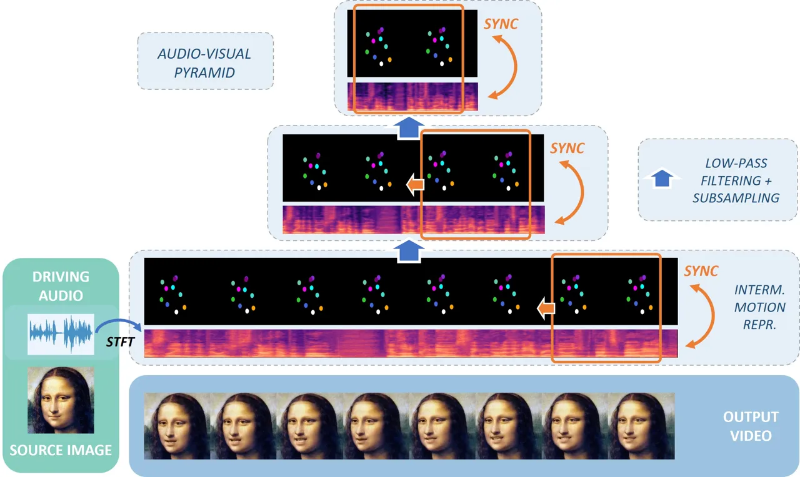
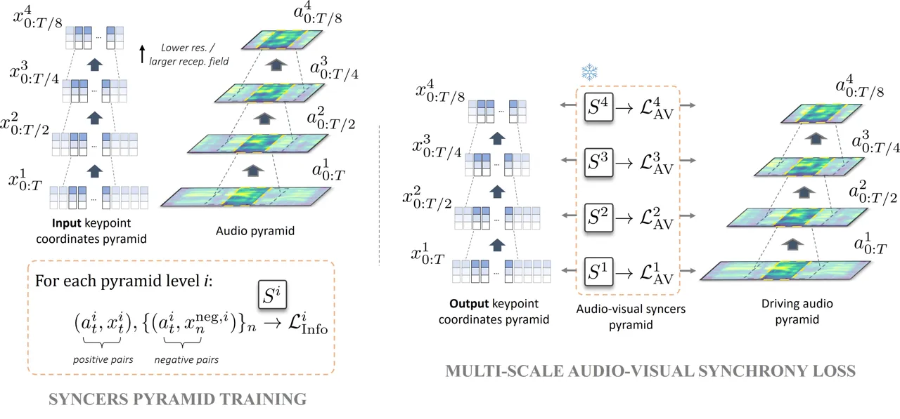
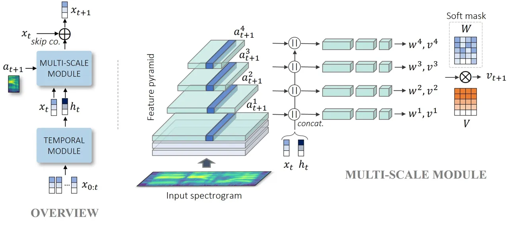
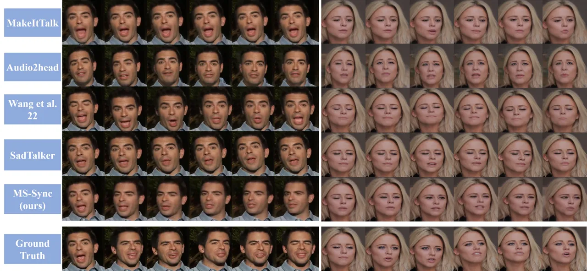
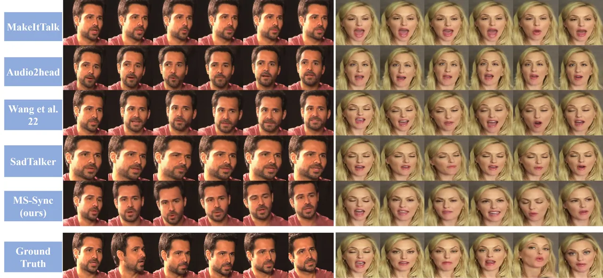
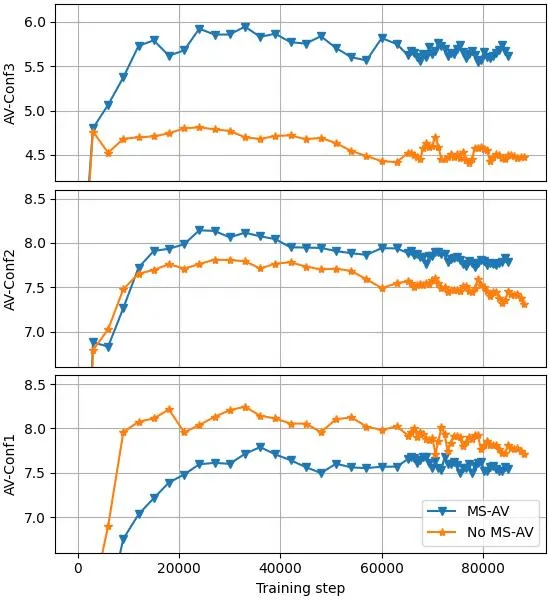
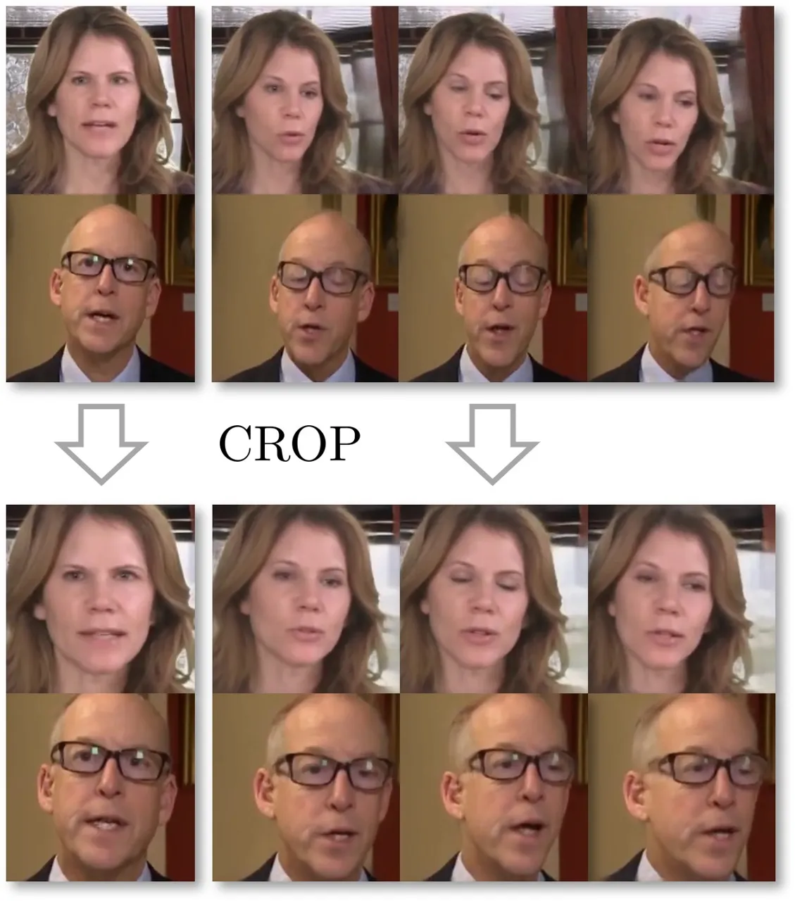

# A Comprehensive Multi-scale Approach for Speech and Dynamics Synchrony in Talking Head Generation

Louis Airale Affiliation: Univ. Grenoble Alpes, CNRS
Affiliation: Grenoble INP, LIG Affiliation: 38000 Grenoble, France   
Dominique Vaufreydaz Affiliation: Univ. Grenoble Alpes, CNRS
Affiliation: Grenoble INP, LIG Affiliation: 38000 Grenoble, France   
Xavier Alameda-Pineda Affiliation: Univ. Grenoble Alpes, Inria, CNRS
Affiliation: Grenoble INP, LJK Affiliation: 38000 Grenoble, France

###### Abstract

Animating still face images with deep generative models using a speech
input signal is an active research topic and has seen important recent
progress. However, much of the effort has been put into lip syncing and
rendering quality while the generation of natural head motion, let alone
the audio-visual correlation between head motion and speech, has often
been neglected. In this work, we propose a multi-scale audio-visual
synchrony loss and a multi-scale autoregressive GAN to better handle
short and long-term correlation between speech and the dynamics of the
head and lips. In particular, we train a stack of syncer models on
multimodal input pyramids and use these models as guidance in a
multi-scale generator network to produce audio-aligned motion unfolding
over diverse time scales. Both the pyramid of audio-visual syncers and
the generative models are trained in a low-dimensional space that fully
preserves dynamics cues. The experiments show significant improvements
over the state-of-the-art in head motion dynamics quality and especially
in multi-scale audio-visual synchrony on a collection of benchmark
datasets ¹¹ 1 Code and demo available on github page:
[https://github.com/LouisBearing/HMo-audio](https://github.com/LouisBearing/HMo-audio).



Figure 1: Given a source image and a driving audio signal, our model
generates a talking head video sequence correlated with the input speech
over multiple time scales, ensuring accurate lips and head dynamics.

## 1 Introduction

The task of talking face generation, which aims to animate still images
from a conditioning audio signal, has received considerable attention in
the previous years. The advent of potent reenactment systems, as in
Siarohin *et al*. \[40\] or Wang *et al*. \[56\], and powerful loss
functions allowing for a finer correlation between the generated lip
motion and the audio input \[7\] have paved the way for a new state of
the art. In both tasks of talking head generation and face reenactment,
where lip and head motion are given as a driving video sequence, it is
customary to represent face dynamics in a low dimensional space \[14, 5,
73, 68, 64, 16, 56, 69, 32\]. For this reason recent breakthroughs in
face reenactment have also benefited the talking head synthesis task:
the above approach assumes that image texture and face dynamics can be
processed independently, and that all necessary cues to handle the
dynamics fit on a low dimensional manifold. It is then a reliable
strategy to treat audio-conditioned talking face synthesis as a two-step
procedure, where the audio-correlated dynamics are first generated in
the intermediate space of an off-the-shelf face reenactment model, which
is later used to reconstruct photorealistic video samples \[53, 54,
20\]. This allows to focus on improving the audio-visual (AV)
correlation between the input speech signal and the produced face and
lips movements in a much sparser space than that of real-world images.

Nevertheless, synthesizing natural-looking head and lip motion sequences
adequately correlated with an input audio signal remains a challenging
task. In particular, although it has long been known that speech and
head motion are tightly associated \[60\] (see also Section 4.3), only
recently has this relation attracted the attention of the computer
vision community. A likely reason for the difficulty of producing
realistic head motion is the lack of an established adequate loss
function. So far, the most successful strategy to produce synchronized
lip movements has relied on the maximization of the cross-modal
correlation between short audio and output motion clips, measured by a
pre-trained model \[7, 74, 36, 35, 62\]. This fails, however, to account
for lower frequency motion as that of the head which remains
quasi-static over the short duration considered, typically of the order
of a few hundreds of milliseconds. Surprisingly, there was no attempt to
generalize this approach beyond lip synchronization. Neither has
possible multi-scale audio-visual correlation been explored in the
talking face generation literature. Head motion is often produced
through the use of a separate sub-network trained to match the dynamics
of a ground truth sequence, which in practice decouples the animation of
head and lips.

We argue that to account for motion that unfolds over longer durations
such as the head rhythm, a dedicated loss enforcing the synchrony of AV
segments of various lengths is needed. We propose to implement this loss
using a pyramid of syncers, replacing the lip-sync expert of Prajwal _et
al_. \[36\] with a stack of syncer models evaluating the correlation
between the audio input and the dynamics of the whole face over
different time scales. How to achieve this however is not trivial, as
simply increasing the length of the video segments does not guarantee
that the expert model will focus on lower frequency motion. Applying a
low-pass filtering on the video input, on the other end, would produce
blurry and unusable results. Conversely, one may readily compute a
multi-scale representation of motion by successively filtering a
sequence of facial points coordinates. We take advantage of this
observation in two different ways: 1) by using smoothed facial
coordinate sequences as input to the pyramid of syncers, 2) by producing
facial coordinates as output from the generative model.

Concretely, we propose to construct Gaussian pyramids of head dynamics
and audio on two sets of inputs: first, on paired samples from an
audio-visual dataset for the training of the syncers, then on the
generated dynamics and their corresponding driving audio signal during
generative model training. The resulting multi-scale audio-visual
synchrony loss hence represents a powerful means to enforce the
correlation of both rigid, low-frequency and non-rigid, high-frequency
generated motion with the input speech. Here, another advantage of
operating on a low dimensional motion manifold is that the loss can be
applied directly on the model’s output without propagating through the
visual rendering network, significant accelerating training. In
addition, the multi-scale AV synchrony loss allows to produce head and
lip movements with a single network, resulting in overall lighter
architecture and training procedure compared to previous works that use
an ad hoc network to model head movement.

To exploit the gradients from the multi-scale syncers, we build a
hierarchical generative model, using a Feature Pyramid Network
(FPN) \[28\] backbone. We use an autoregressive model for its
flexibility to handle sequences of arbitrary length, and complement the
AV synchrony loss with a window-based multi-scale discriminator
architecture that proved to perform well on the generation of facial
landmarks \[2\]. The resulting method, hereafter labeled MS-Sync (for
Multi-Scale Synchrony), produces head dynamics in a low dimensional
motion space, namely that of 2d unsupervised keypoints. Videos are then
reconstructed using an off-the-shelf, frozen reenactment model \[40\].
We would however like to point out that the multi-scale AV synchrony
loss is a standalone contribution that can fuse in diverse generative
model architecture, making it a versatile tool for audio-driven talking
head generation.

The main contributions of the present work are summarized below.

- •
  We train audio-visual syncer networks on rigid head motion, measuring
  for the first time, to the best of our knowledge, the correlation
  between head motion and speech,
- •
  A multi-scale audio-visual synchrony loss to enable the generation of
  diverse audio-correlated facial dynamics,
- •
  A multi-scale autoregressive GAN \[13\] framework, labelled MS-Sync,
  effective at producing speech-synchronized head and lips motion as
  shown in extensive experiments on four benchmark datasets.

## 2 Related Work

### 2.1 Talking Head Generation

The task of talking head generation consists of animating a source image
or an initial face using a driving audio signal, and is especially
difficult as it supposes to produce audio-synced head and lip motion
while preserving high visual quality results. Hence trade-offs usually
need to be done on one aspect or the other, or alternatively on the
inference duration or the generalizability to unseen identities, and
talking head generation methods therefore come in many different
flavors.

An important part of the literature consists of identity-dependent
methods, that typically require fine-tuning on a target identity at
inference \[61, 4, 66\]. Those comprise pioneering research works \[45,
21\], but also many recent approaches based on the NeRF framework \[33\]
that although providing outputs of compelling realism, require
fine-tuning on video clips of the source subject \[15, 38, 30, 59, 24\].
Another class of high visual quality methods is based on diffusion
models \[42, 18, 10\], that typically trade the generation of head pose
for that of visual sharpness. Indeed head pose is either provided as a
driving signal \[39\], or only weakly controlled with a
mean-square-error (MSE) loss in the visual domain, giving less accurate
audio correlation \[44, 63\].

A second, overlapping part of the literature focuses on the lip-syncing
accuracy: head pose is either extracted from a driving video sequence,
possibly with the lip region masked out, or it is simply omitted \[11,
43, 74, 5, 71, 49, 9, 20, 41, 12, 26, 57, 70, 47, 52, 19, 58\]. These
methods provide strong audio-correlation baselines, and a typical
strategy is to use the output of a frozen lip-sync model to improve the
synchrony between output lips and input speech signal \[72, 25, 50, 62,
35, 51\].

Finally, close to the proposed approach are one-shot methods that
reenact single source images of unseen identities in real time, with an
explicit treatment of head motion \[73, 53, 68, 31\]. Although
successful attempts have been made to leverage pre-trained syncer models
for precise lip-syncing \[54, 67\], head pose is still usually learned
through the minimization of a MSE loss that fails to explicitly account
for the correlation between speech and rigid head motion. Besides, we
argue that the duration of the audio segments commonly used for the
synchronization of the lips is insufficient to properly align
lower-frequency movements like that of the head with the driving audio
signal, advocating for novel approaches.

### 2.2 Video-Driven Face Reenactment

The task of animating a source human face with a neural network can also
be fully guided by a driving sequence of a target identity that provides
the supervision for head and lip motion \[65, 16, 69, 32\]. Compelling
results have been achieved over the years to bridge the identity gap
between source and target images and hallucinate unseen poses of the
source identity \[40, 15, 37\]. These works rely on low dimensional
representations, e.g. facial landmarks \[69, 32, 64\] or learned
keypoints \[40, 56\] to measure the deformation from a given target
image to the source image, which is later used to warp or normalize the
style of the source identity image. Following previous works \[53, 54\],
we train a generative model to predict the speech-conditioned driving
motion sequence, and use the reenactment model of Siarohin *et
al*. \[40\] to reconstruct the output videos.

### 2.3 Multi-scale Data Processing

Learning on representations of the input data over multiple time or
spatial scales has become the standard in computer vision tasks such as
object detection or semantic segmentation where objects of the same
class can have different sizes \[28, 46\]. In the generative models
literature, multi-scale approaches may either be implemented in the
discriminator network of GANs as a way to improve multi-scale
faithfulness of generated data \[55, 29, 23\] but also in the generative
model itself \[8, 22\]. Although this was not explored so far in talking
head generation, multi-scale feature hierarchies can be readily computed
to align speech and dynamics of various motion frequencies.



Figure 2: Left. A stack of syncer networks $`S^{i}`$ are trained on
multi-scale positive and negative multimodal pairs using contrastive
losses. Right. The syncer models are frozen and used to compute the
multi-scale audio-visual synchrony loss of the generative model.

## 3 Method

This section introduces the problem formulation and associated
notations. We follow the conventions from Siarohin *et al*. \[40\] and
represent the dynamics using a set of $`10`$ 2d keypoints coordinates,
together with two-by-two Jacobian matrices that provide finer details of
the spatial deformation around the keypoints. In the following the
overall inputs are simply referred to as keypoints, of total dimension
$`60`$. Given a set of initial keypoints coordinates
$`x_{0}\in\mathbb{R}^{60}`$ and a conditioning audio signal
$`a_{0:T}=(a_{0},\ldots,a_{T})\in\mathbb{R}^{d\times T}`$ (here
$`d=26`$) over $`T`$ time steps, we aim to produce a sequence of
keypoint positions $`x_{1:T}`$ such that the joint distributions over
generated and data samples match:

```math
p_{g}(x_{0:T},a_{0:T})=p_{\text{data}}(x_{0:T},a_{0:T}),\quad\forall x_{0:T},a_{0:T}. \tag{1}
```

The procedure to tackle this problem is as follows. The multi-scale AV
synchrony loss, which is the major contribution of this work, is first
introduced in section 3.1. Then a multi-scale generator architecture
able to exploit appropriately the devised multi-scale AV loss is
developed in section 3.2. Finally the overall training procedure is
detailed in section 3.3.

### 3.1 Multi-scale Audio-Visual Synchrony Loss

The most prominent procedure to align dynamics with speech input relies
on the optimization of a correlation score computed on short
audio-visual segments of the generated sequence using a pre-trained AV
syncer network \[36\]. Several contrastive loss formulations are
possible to train the syncer network, that suppose the maximization of
the agreement between in-sync AV segments or positive pairs
$`(a_{t},x_{t})`$ versus that of out-of-sync or negative pairs. One
particularly interesting formulation is the Info Noise Contrastive
Estimation loss, which maximizes the mutual information between its two
input modalities \[34\]. Given a set
$`X=(a_{t},x_{t},x_{1}^{neg},\ldots,x_{N}^{neg})`$ containing a positive
pair and $`N`$ negative position segments, this loss writes:

```math
\mathcal{L}_{\text{InfoNCE}}=-\mathbb{E}_{X}\frac{e^{S(a_{t},x_{t})}}{e^{S(a_{t},x_{t})}+\sum_{n=1}^{N}e^{S(a_{t},x_{n}^{neg})}}, \tag{2}
```

with $`S`$ the syncer model score function, which is classically
implemented hereafter as the cosine similarity of the outputs from an
audio and a position embeddings $`e_{a}`$ and $`e_{x}`$:

```math
S(a_{t},x_{t})=\frac{e_{a}(a_{t})^{\top}e_{x}(x_{t})}{\lVert e_{a}(a_{t})\rVert.\lVert e_{x}(x_{t})\rVert}. \tag{3}
```

Following the usual practice, $`a_{t}`$ and $`x_{t}`$ are respectively
taken as the MFCC spectrogram and position segment of a 200 ms window
centered on time step $`t`$. Negative pairs can be misaligned audio and
position segments from the same audio-visual sequence and therefore
constitute hard negatives, or can alternatively be segments from
different samples, _e.g_. when an insufficient number $`N`$ of hard
negatives can be sampled.

Once trained, the weights of $`e_{a}`$ and $`e_{x}`$ are frozen and the
following term is added to the loss function of the generative model:

```math
\mathcal{L}_{\text{AV}}=-\mathbb{E}_{t}S(a_{t},x_{t}), \tag{4}
```

where $`a_{t}`$ is now part of the conditioning signal and $`x_{t}`$ is
output by the model.

The above procedure is insufficient when one needs to discover AV
correlations over different time scales. One solution consists in
building multi-scale representations of the audio-visual inputs and
training one syncer network $`S^{i}`$ for each level $`i`$ in the
resulting pyramid. Here the use of keypoints instead of the raw video is
crucial for two reasons: they can be easily downscaled by successive
low-pass filtering operations, and it avoids propagating through the
visual reenactment model, substantially saving computation. The training
process of the pyramid of syncers is represented in fig. 2 (left).
Specifically, audio and keypoint coordinates pyramids
$`\{a_{0:T/2^{i-1}}^{i}\}_{i}`$ and $`\{x_{0:T/2^{i-1}}^{i}\}_{i}`$ are
constructed by successive passes through an average pooling operator
that blurs and downscales its input by a factor 2, e.g. for positions:

```math
x_{t}^{i}=\frac{1}{2k+1}\sum_{\tau=-k}^{k}x_{2t+\tau}^{i-1} \tag{5}
```

where we choose $`k=3`$. The objective is to progressively blur out the
highest frequency motion when moving upward in the pyramid, forcing the
top level syncers to exploit better the rhythm of the head motion. A
total of four syncer networks are trained on the input pyramid
following (2), input segment duration ranging from the standard 200 ms
on the bottom level to 1600 ms at the coarsest scale.

After the training of the pyramid of syncers, all networks $`S^{1}`$ to
$`S^{4}`$ are frozen and used to compute the multi-scale audio-visual
synchrony loss. The principle of this loss is presented in fig. 2.
Similar to the input pyramids used to train the syncer networks, we
construct a multi-scale representation of the input speech $`a_{0:T}`$
and the generated keypoints positions $`x_{0:T}`$. Then for each
hierarchy level $`i`$ one loss term $`\mathcal{L}_{\text{AV}}^{i}`$ is
computed according to (4) using pre-trained syncer $`S^{i}`$. Those
terms are then summed to give the overall multi-scale AV synchrony loss
$`\mathcal{L}_{\text{AV}}^{\text{MS}}`$:

```math
\displaystyle\mathcal{L}_{\text{AV}}^{\text{MS}}=\sum_{i}\mathcal{L}_{\text{AV}}^{i}(x_{0:T/2^{i-1}}^{i},a_{0:T/2^{i-1}}^{i}), \tag{6}
```

```math
\displaystyle\text{with}\ \mathcal{L}_{\text{AV}}^{i}(x_{0:T/2^{i-1}}^{i},a_{0:T/2^{i-1}}^{i})=-\mathbb{E}_{t}\bigl[S^{i}(a_{t}^{i},x_{t}^{i})\bigr] \tag{7}
```

To better exploit the effects of this loss, we propose a multi-scale
autoregressive generator network which is described in the following
section.



Figure 3: Left. Our network is composed of an autoregressive Transformer
temporal module and a convolutional multi-scale module. Right. Details
of the multi-scale module.

### 3.2 Multi-scale Autoregressive Generator

Through the multi-scale synchrony loss, the generator receives gradients
that push it to produce audio-synced keypoint positions over multiple
time scales. In this section, we describe the architecture of the
generator network, which is itself implemented with a multi-scale
structure to allow distinct loss terms to act preferentially on
different layers of the network. The overall architecture is depicted
in fig. 3.

A residual autoregressive formulation is employed for the generative
model, such that given keypoints positions $`x_{0:t}`$ up to time step
$`t`$ and the audio input $`a_{t+1}`$ for the next time step, the
generator $`G`$ produces instantaneous velocities $`v_{t+1}`$:

```math
\displaystyle v_{t+1} \displaystyle=G(x_{0:t},a_{t+1}), \tag{8}
```

```math
\displaystyle x_{t+1} \displaystyle=x_{t}+v_{t+1}. \tag{9}
```

As depicted in fig. 3, $`G`$ contains a temporal module that operates on
a sequence of keypoint positions, and a multi-scale module that takes
the output of the temporal module $`h_{t}`$, the positions $`x_{t}`$ and
audio $`a_{t+1}`$ as input to produce $`v_{t+1}`$. A Transformer
encoder \[48\] is used for the temporal module, and the multi-scale
module is implemented as the bottom-up path of a Feature Pyramid
Network \[28\]. Namely, the input spectrogram is processed by several
downsampling convolutional layers, producing feature maps
$`a_{0:T}^{1}`$ to $`a_{0:T/2^{3}}^{4}`$ of the same resolution as those
used to compute the pyramids for the audio-visual synchrony loss.
Feature maps 2 to 4 are later interpolated back to the length $`T`$ of
the finest map, such that one vector $`a_{t+1}^{i}`$ can be extracted
from each pyramid level $`i`$ to produce the next step velocity.
Concretely, each vector $`a_{t+1}^{i}`$ is concatenated with $`x_{t}`$
and $`h_{t}`$ and is processed by an independent fully connected branch,
the rationale being that processing each input resolution separately
would allow the model to produce different motion frequencies.

The outputs of the four branches of the multi-scale generator are merged
using a learnable soft spatial mask. Each branch $`i`$ outputs a
velocity vector $`v^{i}\in\mathbb{R}^{10\times 6}`$ (recall that there
are both 2d coordinates and 4d Jacobian matrices, and time index is
omitted for the sake of clarity) and a mask vector
$`w^{i}\in\mathbb{R}^{10\times 6}`$ such that
$`w^{i}_{j,k}=w^{i}_{j,l}`$ for all $`j`$, $`k`$ and $`l`$ (or one mask
value for all 6 coordinates of a given keypoint), responsible for
enhancing or weakening the contribution of each keypoint on the given
branch. This is because facial regions are expected to play different
roles depending on the scale: the finest resolution branch might
emphasize lip keypoints, while at the coarsest scale, more weight may be
put on rigid head motion. The output of the multi-scale module finally
writes:

```math
v_{t+1}=\sum_{i=1}^{4}\Bigl(\frac{e^{w^{i}}}{\sum_{j}e^{w^{j}}}\Bigl)v^{i} \tag{10}
```

### 3.3 Overall Architecture and Training

The audio-visual synchrony loss $`\mathcal{L}_{\text{AV}}^{\text{MS}}`$
is complemented with two discriminator networks to improve the static
and dynamic quality of the generated keypoints. One frame discriminator
$`D_{f}`$ computes the realism of static keypoints, and a window-based
multi-scale network $`D_{s}`$ computes that of keypoint sequences \[2\].
Adversarial losses are implemented with the geometric GAN formulation of
Lim & Ye \[27\]. Namely, given the generated and ground truth keypoint
position distributions $`p_{g}`$ and $`p_{\text{data}}`$, the generator
losses write:

```math
\displaystyle\mathcal{L}_{G_{f}} \displaystyle=-\mathbb{E}_{x_{0:T}\sim p_{g}}\left[\frac{1}{T}\sum_{t\geq 1}D_{f}(x_{t})\right], \tag{11}
```

```math
\displaystyle\mathcal{L}_{G_{s}} \displaystyle=-\mathbb{E}_{x_{0:T}\sim p_{g}}\left[D_{s}(x_{0:T})\right], \tag{12}
```

as for the generic discriminator loss:

```math
\mathcal{L}_{D_{*}}=\mathbb{E}_{x\sim p_{g}}\left[\max(0,1+D_{*}(x))\right]\\
+\mathbb{E}_{x\sim p_{\text{data}}}\left[\max(0,1-D_{*}(x))\right], \tag{13}
```

where $`D_{*}`$ is replaced respectively by $`D_{f}`$ and $`D_{s}`$ . A
$`L_{2}`$ reconstruction loss to the ground truth keypoints,
$`\mathcal{L}_{\text{rec}}`$, is finally added to the loss function:

```math
\mathcal{L}_{\text{rec}}=\mathbb{E}_{(x_{0:T},a_{0:T})\sim p_{\text{data}}}\lVert x_{0:T}-G(x_{0},a_{0:T})\rVert^{2} \tag{14}
```

The balance between loss terms is achieved by the use of weighting
factors $`\lambda_{\text{av}}`$, $`\lambda_{\text{adv}}`$ and
$`\lambda_{\text{rec}}`$ (with $`\lambda_{\text{av}}=8`$,
$`\lambda_{\text{adv}}=0.1`$ and $`\lambda_{\text{rec}}=1`$ providing
the best results), such that the overall training consists in minimizing
alternatively the two following terms:

```math
\displaystyle\mathcal{L}_{D}=\mathcal{L}_{D_{f}}+\mathcal{L}_{D_{s}} \tag{15}
```

```math
\displaystyle\mathcal{L}=\lambda_{\text{av}}\mathcal{L}_{\text{AV}}^{\text{MS}}+\lambda_{\text{adv}}(\mathcal{L}_{G_{f}}+\mathcal{L}_{G_{s}})+\lambda_{\text{rec}}\mathcal{L}_{\text{rec}}. \tag{16}
```

## 4 Experiments

We conduct benchmark evaluations to measure the proficiency of our
method on visual audio-visual synchrony, landmark-domain multi-scale
audio-visual synchrony and output visual quality. We also carry an
ablation study to investigate the contribution of the different terms of
the loss function, including the multi-scale AV loss.

### 4.1 Experimental protocol

#### Datasets.

Experiments are conducted on the VoxCeleb2 dataset \[6\] with two
different preprocessings. First, we use the standard test set of
VoxCeleb2, hereafter VoxCeleb2 (I), containing $`\sim`$2000 short
audio-visual clips centered on subject faces. Second, following the
preprocessing strategy of Siarohin *et al*. \[40\], subsets of
respectively $`\sim`$18k and 500 short video clips from the original
VoxCeleb2 train and test sets are generated, the former for the training
of our model, and the latter for the evaluation. The interest of this
preprocessing is that it keeps the reference frames fixed, thus
preserving head motion. In the following section, this second dataset is
referred to as VoxCeleb2 (II). Evaluations are also conducted on the
HDTF dataset \[68\], which contains $`\sim`$400 long duration
frontal-view videos from political addresses, where head motion is also
preserved but span a rather narrow distribution. Last, we use
LRS2 \[1\], which is preprocessed similarly to VoxCeleb2 (I), to measure
the audio-visual synchrony in the visual domain.

#### Benchmark Models.

We compare our method, MS-Sync, with other one-shot talking head
generation models. Wav2Lip \[36\] uses a pre-trained lip syncer to learn
the AV synchrony, and achieved state-of-the-art performances on the
visual dubbing task. However, it only reenacts the lip region and
therefore does not produce any head motion. IP_LAP \[70\] does not
produce head motion either, contrary to PC-AVS \[72\] and EAMM \[20\],
albeit being rather limited. On the other hand, MakeItTalk \[73\],
Audio2Head \[53\] and its follow-up work \[54\], and SadTalker \[67\]
output head poses. Noticeably, the two methods presented in Wang *et
al*. \[53\] and Wang *et al*. \[54\] rely on the same facial keypoints
and reenactment model as in the present work, although here the
reenactment model is not fine-tuned.

#### Training Details.

The temporal module introduced in section 3 is implemented using 4
self-attention layers with 8 heads each. Both audio and keypoints are
encoded as 512-dimensional vectors, and both syncers and the generative
models were trained on VoxCeleb2 (II). The frame discriminator $`D_{f}`$
is a multi-layer perceptron, and the window-based multi-scale $`D_{s}`$
follows the LSTM implementation of Airale *et al*. \[2\]. Syncers
training lasts from around one day for the finest time scale to a few
hours for the coarsest model. We rely on hard negative mining for the
first three time scales with $`N=12`$, and use negative pairs from
different audio and dynamics samples at the coarsest scale where the
shortened sequences reduce the number of available hard negative pairs,
and set $`N=48`$ for this last model. Syncers are then frozen and used
for the training of the generative model, which is trained to predict
sequences of 40 frames for 70k iterations (about 500 epochs) using Adam
optimizers with $`\beta_{1}=0`$ and $`\beta_{2}=0.999`$ and learning
rates of $`2\times 10^{-5}`$ and $`1\times 10^{-5}`$ respectively for
the generator and the discriminator, after which a decay factor of 0.1
is applied on the learning rates for 5k additional iterations. All audio
inputs are sampled at 16 kHz, and we use a window size of 400 and hop
size of 160 to generate the 26-dimensional MFCC spectrograms.

### 4.2 Image-Domain AV Synchrony

#### Protocol.

The first benchmark follows the customary evaluation of the audio-visual
synchrony in the visual domain using several standard metrics, on both
VoxCeleb2 (I) and LRS2. To cope with the imbalanced duration of
VoxCeleb2 videos and keep computation time manageable, we work with the
first 40 frames of each test clip, while we use the whole LRS2 test set,
which contains shorter videos (41 frames in average, ranging from 15 to
145 frames). We use the absolute offset $`|\text{AV-Off}|`$ and the
confidence score AV-Conf output by SyncNET \[7\], and also extract the
facial landmarks from the output videos \[3\] to compute the frontalized
landmark distance (LMD) from the predicted mouth region to the ground
truth landmarks, by rotating each frame to a canonical pose. This
ensures that all methods are placed on an equal footing, whether they
produce head motion or not. Results are presented in Table 3.

|                                    |                                           |                                           |                                         |                                           |                                           |                                         |
| ---------------------------------- | ----------------------------------------- | ----------------------------------------- | --------------------------------------- | ----------------------------------------- | ----------------------------------------- | --------------------------------------- | ------------- | ------------ | -------------------------- | ------------------------ |
| Dataset                            | VoxCeleb2 (I)                             |                                           |                                         | LRS2                                      |                                           |                                         |
| Method                             | $`                                        | \text{AV-Off}                             | \downarrow`$                            | $`\text{AV-Conf}\uparrow`$                | $`\text{LMD}\downarrow`$                  | $`                                      | \text{AV-Off} | \downarrow`$ | $`\text{AV-Conf}\uparrow`$ | $`\text{LMD}\downarrow`$ |
| Ground truth                       | $`1.89{\pm 1.92}`$                        | $`6.29{\pm 1.66}`$                        | 0.0                                     | $`0.08{\pm 0.4}`$                         | $`8.36{\pm 1.62}`$                        | 0.0                                     |
| MakeItTalk \[73\]                  | $`5.23{\pm 4.29}`$                        | $`3.50{\pm 1.49}`$                        | $`2.80{\pm 1.10}`$                      | $`8.43{\pm 6.16}`$                        | $`2.56{\pm 0.96}`$                        | $`2.80{\pm 1.07}`$                      |
| Wav2Lip\* \[36\]                   | $`2.86{\pm 0.34}`$                        | $`\textbf{8.07}{\pm\textbf{1.33}}`$       | $`2.41{\pm 0.77}`$                      | $`2.79{\pm 0.54}`$                        | $`\textbf{8.72}{\pm\textbf{1.25}}`$       | $`2.54{\pm 0.70}`$                      |
| $`\text{PC-AVS}^{\dagger}`$ \[72\] | $`5.18{\pm 3.31}`$                        | $`3.85{\pm 1.55}`$                        | $`2.65{\pm 1.23}`$                      | $`5.48{\pm 3.65}`$                        | $`4.42{\pm 1.65}`$                        | $`2.61{\pm 0.85}`$                      |
| Audio2Head \[53\]                  | $`6.83{\pm 6.66}`$                        | $`2.66{\pm 1.38}`$                        | $`3.23{\pm 1.19}`$                      | $`6.78{\pm 6.72}`$                        | $`3.18{\pm 1.43}`$                        | $`3.20{\pm 1.09}`$                      |
| EAMM \[20\]                        | $`9.52{\pm 5.76}`$                        | $`1.94{\pm 0.75}`$                        | $`3.30{\pm 1.24}`$                      | $`9.07{\pm 5.94}`$                        | $`2.41{\pm 0.87}`$                        | $`3.50{\pm 1.18}`$                      |
| Wang *et al*. \[54\]               | $`2.59{\pm 4.29}`$                        | $`4.12{\pm 1.72}`$                        | $`2.89{\pm 1.26}`$                      | $`\underline{2.59}{\pm\underline{4.23}}`$ | $`4.56{\pm 1.67}`$                        | $`2.89{\pm 1.26}`$                      |
| IP_LAP \[70\]                      | $`4.78{\pm 5.01}`$                        | $`3.15{\pm 1.40}`$                        | $`\textbf{2.34}{\pm\textbf{0.79}}`$     | $`4.73{\pm 5.03}`$                        | $`3.80{\pm 1.57}`$                        | $`2.41{\pm 0.71}`$                      |
| SadTalker \[67\]                   | $`\underline{2.19}{\pm\underline{3.92}}`$ | $`4.63{\pm 1.91}`$                        | $`2.38{\pm 0.75}`$                      | $`2.72{\pm 4.60}`$                        | $`5.01{\pm 1.97}`$                        | $`\textbf{2.28}{\pm\textbf{0.86}}`$     |
| MS-Sync (Ours)                     | $`\textbf{1.00}\pm\textbf{1.64}`$         | $`\underline{5.81}{\pm\underline{1.66}}`$ | $`\underline{2.36}\pm\underline{0.73}`$ | $`\textbf{1.06}\pm\textbf{2.14}`$         | $`\underline{5.75}{\pm\underline{1.69}}`$ | $`\underline{2.34}\pm\underline{0.81}`$ |

Table 1: Image domain AV synchrony. LMD is the frontalized landmark
distance, with the face rotated back to a canonical pose.$`\dagger`$ We
rescale PC-AVS by a factor 0.75 to account for cropping. \*Wav2Lip is
trained to optimize the SyncNet scores, hence the very strong
confidence. ³³ 3 In all tables, bold indicates best result, underline
second best.

|                      |                                            |                                            |                                            |                                            |                                            |                                            |
| -------------------- | ------------------------------------------ | ------------------------------------------ | ------------------------------------------ | ------------------------------------------ | ------------------------------------------ | ------------------------------------------ | --- | ------------------ | ------------ | --- | ------------------ | ------------ | --- | ------------------ | ------------ | --- | ------------------ | ------------ |
| Dataset              | VoxCeleb2 (II)                             |                                            |                                            | HDTF                                       |                                            |                                            |
| Time scale           | 200 ms (1)                                 | 400 ms (2)                                 | 800 ms (3)                                 | 200 ms (1)                                 | 400 ms (2)                                 | 800 ms (3)                                 |
| Method               | $`                                         | \text{AV-Off}\_{1}                         | \downarrow`$                               | $`                                         | \text{AV-Off}\_{2}                         | \downarrow`$                               | $`  | \text{AV-Off}\_{3} | \downarrow`$ | $`  | \text{AV-Off}\_{1} | \downarrow`$ | $`  | \text{AV-Off}\_{2} | \downarrow`$ | $`  | \text{AV-Off}\_{3} | \downarrow`$ |
| Random               | $`10.59{\pm 4.18}`$                        | $`10.50{\pm 4.09}`$                        | $`10.11{\pm 4.03}`$                        | $`12.14{\pm 4.01}`$                        | $`10.32{\pm 4.56}`$                        | $`9.48{\pm 4.63}`$                         |
| Ground truth         | 0$`4.57{\pm 5.32}`$                        | 0$`4.64{\pm 5.60}`$                        | 0$`7.48{\pm 5.47}`$                        | 0$`9.43{\pm 5.53}`$                        | 0$`7.63{\pm 6.00}`$                        | 0$`7.89{\pm 5.74}`$                        |
| MakeItTalk \[73\]    | 0$`6.91{\pm 5.95}`$                        | 0$`6.77{\pm 6.09}`$                        | 0$`8.64\pm 5.42`$                          | $`14.40{\pm 1.90}`$                        | $`13.64\pm 2.62`$                          | $`14.18\pm 2.05`$                          |
| Wav2Lip \[36\]       | 0$`5.38{\pm 5.90}`$                        | 0$`6.72\pm 6.28`$                          | 0$`9.22\pm 5.52`$                          | $`15.00{\pm 0.05}`$                        | $`14.88\pm 0.61`$                          | $`14.87\pm 0.72`$                          |
| Audio2Head \[53\]    | 0$`9.43{\pm 4.79}`$                        | 0$`8.95{\pm 5.09}`$                        | 0$`9.61{\pm 4.91}`$                        | 0$`\underline{9.55}{\pm\underline{5.40}}`$ | 0$`8.60{\pm 5.55}`$                        | 0$`7.97{\pm 5.30}`$                        |
| EAMM \[20\]          | 0$`\underline{4.98}{\pm\underline{5.71}}`$ | 0$`\underline{4.71}{\pm\underline{5.87}}`$ | 0$`\underline{7.30}{\pm\underline{5.80}}`$ | $`14.09{\pm 2.39}`$                        | $`13.78{\pm 2.49}`$                        | $`14.30{\pm 1.76}`$                        |
| Wang *et al*. \[54\] | 0$`8.26{\pm 5.61}`$                        | 0$`8.58{\pm 5.58}`$                        | 0$`9.14{\pm 5.07}`$                        | $`10.68{\pm 4.42}`$                        | 0$`\underline{8.55}{\pm\underline{4.55}}`$ | 0$`\underline{7.21}{\pm\underline{4.78}}`$ |
| IP_LAP \[70\]        | 0$`9.66{\pm 5.47}`$                        | 0$`9.89{\pm 5.24}`$                        | $`10.90{\pm 4.65}`$                        | $`15.00{\pm 0.00}`$                        | $`14.88{\pm 0.65}`$                        | $`14.92{\pm 0.58}`$                        |
| SadTalker \[67\]     | 0$`6.11{\pm 5.74}`$                        | 0$`7.59{\pm 5.84}`$                        | 0$`9.52{\pm 4.99}`$                        | $`12.68{\pm 3.64}`$                        | $`11.26{\pm 4.24}`$                        | $`10.01{\pm 4.62}`$                        |
| MS-Sync (Ours)       | $`\textbf{4.55}\pm\textbf{4.91}`$          | $`\textbf{4.40}\pm\textbf{5.30}`$          | $`\textbf{7.04}\pm\textbf{5.70}`$          | $`\textbf{9.01}\pm\textbf{5.45}`$          | $`\textbf{7.86}\pm\textbf{5.47}`$          | $`\textbf{6.53}\pm\textbf{5.20}`$          |

Table 2: Landmark domain rigid multi-scale AV synchrony on VoxCeleb2
(II), where test syncers are trained on rigid facial parts: eyes and
nose are considered, but not lips and jaws landmarks.

#### Results.

Audio-visual correlation scores provided by SyncNet show strong results
for MS-Sync, significantly ahead of all other methods regarding either
the absolute offset or the confidence. One exception is the confidence
score of Wav2Lip, which is biased by the use of the SyncNet score as a
loss function. The LMD gives a complementary picture of the audio-visual
alignment, with less variance between models partly due to a lower
influence of outputs’ visual attributes. MS-Sync performs very well
regarding this metric, being only surpassed by IP_LAP on VoxCeleb2 and
by SadTalker on LRS2. Although the novelty of the proposed approach does
not lie in the improvement of the fine-scale AV correlation per se, the
results from Table 3 show that the use of a pyramid of syncers in the
multi-scale loss function has a positive effect on the AV synchrony at
the finest time scale.

### 4.3 Multi-scale Correlation between Speech and Rigid Head Motion

#### Protocol.

In this section we explore a research direction generally overlooked in
the talking head generation literature. Although several previous works
include a mechanism to learn meaningful head motion, none of them
attempt to measure the relevance of the produced rigid dynamics. To
tackle this issue, it is once again useful to consider a low-dimensional
motion representation: audio-visual input pyramids can be efficiently
built in a similar fashion to that of Section 3, on a set of points
restricted to rigid facial parts. Although no such subset was used to
train our model, it is crucial for a fair comparison with other methods
that the multi-scale syncers should not be trained on the same facial
keypoints as the ones used to compute the loss. To this end, we rely
instead on the 31 facial landmarks of the eyes and nose extracted from
the Face Alignment method \[3\], discarding lips and jaws altogether,
and further use a triplet loss for the training instead of the
cross-entropy loss described in Section 3. Three syncer networks
operating on three different time scales were thus trained to quantify
the correlation between speech and rigid head motion on both
VoxCeleb2 (II) and HDTF, two datasets that preserve motion dynamics. To
prevent unwanted correlations from interfering, _e.g_. between voice
pitch and facial structure, contrastive loss pairs are mined from the
same sequences. In addition, all test identities are unseen during
training. Results, reported in Table 2, are measured on sequences of 80
frames. For HDTF, a split of 1058 80-frame test clips were extracted
from 51 long duration samples chosen randomly for testing. The AV
synchrony is evaluated using the absolute value of the audio-visual
offset provided by the newly trained syncer pyramid at three different
scales, corresponding to audio-visual chunks of 200 ms, 400 ms and
800 ms. For 25 fps, this means that an offset of 1 at the finest
resolution corresponds to a misalignment of 40 ms between modalities,
while this rises to 160 ms at the coarsest time scale.

#### Results.

The first important finding is that it is possible to train neural
networks to measure the temporal syncing between speech and rigid motion
on three different time scales on both datasets. The evidence of that is
the significant difference (p-value $`<0.05`$ in all cases) in AV
offsets calculated by the syncers between ground truth and randomly
sampled audio-visual pairs. This supports the existence of a correlation
between speech and head motion, albeit fainter with HDTF which features
videos of codified political addresses. The second finding is that
MS-Sync consistently performs the best in terms of offset over all other
methods, often with a large margin, for all scales of both VoxCeleb2 and
HDTF. This suggests that the proposed method succeeds in producing head
motion that are time-aligned with the audio input over various time
scales and datasets, which, in average, cannot be said for any other
method.

| Method               | $`\text{FID}\downarrow`$ |
| -------------------- | ------------------------ |
| MakeItTalk \[73\]    | 23.6                     |
| Wav2Lip \[36\]       | 21.9                     |
| Audio2Head \[53\]    | 28.6                     |
| Wang *et al*. \[54\] | 19.5                     |
| SadTalker \[67\]     | 14.1                     |
| MS-Sync (ours)       | 18.7                     |

Table 3: Visual quality comparison on VoxCeleb (II) on sequences of 120
frames



Figure 4: Comparison between different one-shot talking head generation
methods with explicit head motion treatment on hard samples: left with a
widely open initial mouth, right with closed eyes. Consecutive frames
are 600ms apart. MS-Sync can deal with these samples while producing
rigid head motion synchronized with the speech.



Figure 5: Comparison between different one-shot talking head generation
methods with explicit head motion treatment. Consecutive frames are
600ms apart.

### 4.4 Visual Quality

#### Quantitative Results.

The Fréchet Inception Distance (FID \[17\]) of the output sequences is
measured and presented it in table 3. We found SSIM and PSNR, which are
usually used as complementary metrics of proximity to target images, to
correlate poorly with visual sharpness in this free head motion
generation setting and therefore do not include them here. SadTalker,
which produces very sharp outputs based on the 3DMM model, obtains the
best results. However, although using the same reenactment model as that
of Audio2Head \[53\] and Wang *et al*. \[54\], MS-Sync obtains better
FID scores, which likely expresses the higher diversity of head pose it
produces, better matching the original data distribution. Interestingly,
these results computed on output sequences of 120 frames also highlight
the ability of the proposed autoregressive generator to produce accurate
keypoints dynamics over extended duration, as training was done on
shorter sequences of 40 frames.

#### Qualitative Comparison.

Finally qualitative results on VoxCeleb2 are represented in fig. 4
and fig. 5, along with other one-shot reenactment methods that
explicitly handle head motion. These comprise difficult samples, such as
an open mouth or closed eyes in the initial frame. Contrary to other
methods, MS-Sync deals successfully with all these samples.
MakeItTalk \[73\] produces overall good quality results but with almost
no head motion. Audio2head \[53\] struggles to preserve the input
identity, a limitation that is overcome in Wang *et al*. \[54\] although
their strategy of learning on a single identity results in a lack of
naturalness and audio correlation. Finally, SadTalker \[67\] produces
very sharp video outputs with high quality lip-syncing but fails to
correlate output head motion with speech.

### 4.5 Ablation Study

| $`(\lambda_{\text{rec}},\lambda_{\text{adv}})`$ | $`                   | \text{AV-Off}        | \downarrow`$ | $`\text{AV-Conf}\uparrow`$ | $`\text{FID}\downarrow`$ |
| ----------------------------------------------- | -------------------- | -------------------- | ------------ | -------------------------- | ------------------------ |
| $`(1,0)`$                                       | $`\underline{0.84}`$ | $`5.09`$             | 29.6         |
| $`(1,0.01)`$                                    | 0.75                 | 6.40                 | 19.7         |
| $`(1,1)`$                                       | $`1.26`$             | $`5.61`$             | 19.0         |
| $`(0.01,1)`$                                    | $`1.41`$             | $`5.52`$             | 20.1         |
| Full Model $`(1,0.1)`$                          | $`1.06`$             | $`\underline{5.75}`$ | 18.7         |

Table 4: Effects of adversarial and reconstruction loss functions on AV
correlation and visual quality.



Figure 6: Evolution of multi-scale audio-visual confidence over
training, measured on VoxCeleb2 (II) validation set. Bottom is the
finest scale, top the coarsest.

#### Weighting Factors of the Loss Function.

In this first ablation we explore the effects of the adversarial and the
reconstruction terms on the visual quality and the audio-visual
synchrony through their respective scaling factors
$`\lambda_{\text{adv}}`$ and $`\lambda_{\text{rec}}`$ (see table 4).
Results show that a small, but non-zero, $`\lambda_{\text{adv}}`$
provides results that are better synced with the input audio, but at the
cost of a degraded visual quality. This is also the case when the scale
of the reconstruction is reduced with respect to the adversarial term.
The chosen hyperparameters overall provide the best trade-off, yielding
in particular the lowest FID score.

#### Effects of the Multi-scale AV Loss.

In fig. 6 we represent the training evolution of the validation AV
confidence over three pyramid layers, and evaluate the effects of
removing the multi-scale audio-visual loss, thereby enforcing the
synchrony at the finest time scale only (bottom panel in the figure).
One can see that doing so indeed gives improvements in the correlation
at the finest time scale, but at the same time the confidence degrades
for all coarser time scales. Finally, using the multi-scale AV loss
provides significantly stronger long-range audio-visual synchrony
results, achieving the objectives for which it was designed.

## 5 Discussion and Limitations

Experiments show that our framework is an efficient way to explicitly
handle the correlation between speech and facial dynamics, including
both lips and head motion. But it also has the advantage of being
readily generalizable: the multi-scale AV synchrony loss can fuse in any
talking head architecture that relies on an implicit or explicit
low-dimensional representation of motion, as long as the use of Gaussian
smoothing on this representation makes sense.



Figure 7: Examples of improvements obtained from cropping the source
imagse on two failure cases from HDTF test set.

The MS-Sync model also comes with a number of limitations. As all
continuous autoregressive models, it is prone to error accumulation
which limits the output sequence length, although we found the results
to remain visually sharp past 120 frames (or $`\sim`$ 5s) of video
duration, which is three times the training sequence length. Fig.  7
provides examples of such failure cases, although in this case a tighter
cropping can partially alleviate the visual defaults. We also found that
jitter could be a problem especially on internet images, which, together
with the previous observation, could be hinting for a possible
sensitivity to out-of-distribution samples. We hypothesize that
propagating visual loss gradients through the reenactment model could
alleviate this issue, at the cost of additional computation.

## 6 Conclusion

The approach proposed in this research work is the first attempt to
learn and model audio-visual correlations at multiple scales for talking
head generation. For this we use a pyramid of syncer models, trained on
hierarchical representations of input audio and head dynamics, which are
later used in a multi-scale AV synchrony loss for the training of the
generative model. Experiments showed that the devised multi-scale
generative network succeeds in producing realistic head and lip motion
output over various time scales. The very encouraging results of MS-Sync
let us foresee numerous applications of similar approaches on other
audio-visual generation tasks, for instance to enforce the consistency
of an apparent emotional state which will typically evolve on much
longer time scales than the ones considered here.

## References

- \[1\] Triantafyllos Afouras, Joon Son Chung, Andrew Senior, Oriol
  Vinyals, and Andrew Zisserman. Deep audio-visual speech recognition.
  IEEE transactions on pattern analysis and machine intelligence,
  44(12):8717–8727, 2018.
- \[2\] Louis Airale, Xavier Alameda-Pineda, Stéphane Lathuilière, and
  Dominique Vaufreydaz. Autoregressive GAN for Semantic Unconditional
  Head Motion Generation. ACM Transactions on Multimedia Computing,
  Communications and Applications, pages 1–11, 2024.
- \[3\] Adrian Bulat and Georgios Tzimiropoulos. How far are we from
  solving the 2d & 3d face alignment problem? (and a dataset of 230,000
  3d facial landmarks). In International Conference on Computer
  Vision, 2017.
- \[4\] Lele Chen, Guofeng Cui, Celong Liu, Zhong Li, Ziyi Kou, Yi Xu,
  and Chenliang Xu. Talking-head generation with rhythmic head motion.
  In European Conference on Computer Vision, pages 35–51.
  Springer, 2020.
- \[5\] Lele Chen, Ross K Maddox, Zhiyao Duan, and Chenliang Xu.
  Hierarchical cross-modal talking face generation with dynamic
  pixel-wise loss. In Proceedings of the IEEE/CVF conference on computer
  vision and pattern recognition, pages 7832–7841, 2019.
- \[6\] J. S. Chung, A. Nagrani, and A. Zisserman. Voxceleb2: Deep
  speaker recognition. In INTERSPEECH, 2018.
- \[7\] Joon Son Chung and Andrew Zisserman. Out of time: automated lip
  sync in the wild. In Computer Vision–ACCV 2016 Workshops: ACCV 2016
  International Workshops, Taipei, Taiwan, November 20-24, 2016, Revised
  Selected Papers, Part II 13, pages 251–263. Springer, 2017.
- \[8\] Emily L Denton, Soumith Chintala, Rob Fergus, et al. Deep
  generative image models using a laplacian pyramid of adversarial
  networks. Advances in neural information processing systems, 28, 2015.
- \[9\] Michail Christos Doukas, Stefanos Zafeiriou, and Viktoriia
  Sharmanska. Headgan: One-shot neural head synthesis and editing. In
  Proceedings of the IEEE/CVF International conference on Computer
  Vision, pages 14398–14407, 2021.
- \[10\] Chenpeng Du, Qi Chen, Tianyu He, Xu Tan, Xie Chen, Kai Yu,
  Sheng Zhao, and Jiang Bian. Dae-talker: High fidelity speech-driven
  talking face generation with diffusion autoencoder. In Proceedings of
  the 31st ACM International Conference on Multimedia, pages
  4281–4289, 2023.
- \[11\] Sefik Emre Eskimez, Ross K Maddox, Chenliang Xu, and Zhiyao
  Duan. Generating talking face landmarks from speech. In Latent
  Variable Analysis and Signal Separation: 14th International
  Conference, LVA/ICA 2018, Guildford, UK, July 2–5, 2018, Proceedings
  14, pages 372–381. Springer, 2018.
- \[12\] Yingruo Fan, Zhaojiang Lin, Jun Saito, Wenping Wang, and Taku
  Komura. Faceformer: Speech-driven 3d facial animation with
  transformers. In Proceedings of the IEEE/CVF Conference on Computer
  Vision and Pattern Recognition, pages 18770–18780, 2022.
- \[13\] Ian Goodfellow, Jean Pouget-Abadie, Mehdi Mirza, Bing Xu, David
  Warde-Farley, Sherjil Ozair, Aaron Courville, and Yoshua Bengio.
  Generative adversarial nets. In Advances in Neural Information
  Processing Systems (NeurIPS), pages 2672–2680, 2014.
- \[14\] David Greenwood, Iain Matthews, and Stephen Laycock. Joint
  learning of facial expression and head pose from speech. In
  Interspeech, 2018.
- \[15\] Yudong Guo, Keyu Chen, Sen Liang, Yong-Jin Liu, Hujun Bao, and
  Juyong Zhang. Ad-nerf: Audio driven neural radiance fields for talking
  head synthesis. In Proceedings of the IEEE/CVF International
  Conference on Computer Vision, pages 5784–5794, 2021.
- \[16\] Sungjoo Ha, Martin Kersner, Beomsu Kim, Seokjun Seo, and
  Dongyoung Kim. Marionette: Few-shot face reenactment preserving
  identity of unseen targets. In Proceedings of the AAAI conference on
  artificial intelligence, volume 34, pages 10893–10900, 2020.
- \[17\] Martin Heusel, Hubert Ramsauer, Thomas Unterthiner, Bernhard
  Nessler, and Sepp Hochreiter. Gans trained by a two time-scale update
  rule converge to a local nash equilibrium. Advances in Neural
  Information Processing Systems (NeurIPS), 30:6626–6637, 2017.
- \[18\] Jonathan Ho, Ajay Jain, and Pieter Abbeel. Denoising diffusion
  probabilistic models. Advances in neural information processing
  systems, 33:6840–6851, 2020.
- \[19\] Ricong Huang, Peiwen Lai, Yipeng Qin, and Guanbin Li.
  Parametric implicit face representation for audio-driven facial
  reenactment. In Proceedings of the IEEE/CVF Conference on Computer
  Vision and Pattern Recognition, pages 12759–12768, 2023.
- \[20\] Xinya Ji, Hang Zhou, Kaisiyuan Wang, Qianyi Wu, Wayne Wu, Feng
  Xu, and Xun Cao. EAMM: One-Shot Emotional Talking Face via Audio-Based
  Emotion-Aware Motion Model. In ACM SIGGRAPH 2022 Conference
  Proceedings, SIGGRAPH ’22, 2022.
- \[21\] Tero Karras, Timo Aila, Samuli Laine, Antti Herva, and Jaakko
  Lehtinen. Audio-driven facial animation by joint end-to-end learning
  of pose and emotion. ACM Transactions on Graphics (TOG),
  36(4):1–12, 2017.
- \[22\] Tero Karras, Samuli Laine, and Timo Aila. A style-based
  generator architecture for generative adversarial networks. In
  Proceedings of the IEEE/CVF conference on computer vision and pattern
  recognition, pages 4401–4410, 2019.
- \[23\] Kundan Kumar, Rithesh Kumar, Thibault de Boissiere, Lucas
  Gestin, Wei Zhen Teoh, Jose Sotelo, Alexandre de Brébisson, Yoshua
  Bengio, and Aaron C Courville. Melgan: Generative adversarial networks
  for conditional waveform synthesis. Advances in neural information
  processing systems, 32, 2019.
- \[24\] Jiahe Li, Jiawei Zhang, Xiao Bai, Jun Zhou, and Lin Gu.
  Efficient region-aware neural radiance fields for high-fidelity
  talking portrait synthesis. In Proceedings of the IEEE/CVF
  International Conference on Computer Vision, pages 7568–7578, 2023.
- \[25\] Borong Liang, Yan Pan, Zhizhi Guo, Hang Zhou, Zhibin Hong,
  Xiaoguang Han, Junyu Han, Jingtuo Liu, Errui Ding, and Jingdong Wang.
  Expressive talking head generation with granular audio-visual control.
  In Proceedings of the IEEE/CVF Conference on Computer Vision and
  Pattern Recognition, pages 3387–3396, 2022.
- \[26\] Sen Liang, Zhize Zhou, Rong Li, Juyong Zhang, and Hujun Bao.
  Talkingflow: Talking facial landmark generation with multi-scale
  normalizing flow network. In ICASSP 2022-2022 IEEE International
  Conference on Acoustics, Speech and Signal Processing (ICASSP), pages
  4628–4632. IEEE, 2022.
- \[27\] Jae Hyun Lim and Jong Chul Ye. Geometric gan. arXiv preprint
  arXiv:1705.02894, 2017.
- \[28\] Tsung-Yi Lin, Piotr Dollár, Ross Girshick, Kaiming He, Bharath
  Hariharan, and Serge Belongie. Feature pyramid networks for object
  detection. In Proceedings of the IEEE conference on computer vision
  and pattern recognition, pages 2117–2125, 2017.
- \[29\] Xiao Lin and Mohamed R Amer. Human motion modeling using
  dvgans. arXiv preprint arXiv:1804.10652, 2018.
- \[30\] Xian Liu, Yinghao Xu, Qianyi Wu, Hang Zhou, Wayne Wu, and Bolei
  Zhou. Semantic-aware implicit neural audio-driven video portrait
  generation. In European Conference on Computer Vision, pages 106–125.
  Springer, 2022.
- \[31\] Yunfei Liu, Lijian Lin, Fei Yu, Changyin Zhou, and Yu Li. Moda:
  Mapping-once audio-driven portrait animation with dual attentions. In
  Proceedings of the IEEE/CVF International Conference on Computer
  Vision, pages 23020–23029, 2023.
- \[32\] Moustafa Meshry, Saksham Suri, Larry S Davis, and Abhinav
  Shrivastava. Learned spatial representations for few-shot talking-head
  synthesis. In Proceedings of the IEEE/CVF International Conference on
  Computer Vision, pages 13829–13838, 2021.
- \[33\] Ben Mildenhall, Pratul P Srinivasan, Matthew Tancik, Jonathan T
  Barron, Ravi Ramamoorthi, and Ren Ng. Nerf: Representing scenes as
  neural radiance fields for view synthesis. Communications of the ACM,
  65(1):99–106, 2021.
- \[34\] Aaron van den Oord, Yazhe Li, and Oriol Vinyals. Representation
  learning with contrastive predictive coding. arXiv preprint
  arXiv:1807.03748, 2018.
- \[35\] Se Jin Park, Minsu Kim, Joanna Hong, Jeongsoo Choi, and
  Yong Man Ro. Synctalkface: Talking face generation with precise
  lip-syncing via audio-lip memory. In 36th AAAI Conference on
  Artificial Intelligence (AAAI 22). Association for the Advancement of
  Artificial Intelligence, 2022.
- \[36\] KR Prajwal, Rudrabha Mukhopadhyay, Vinay P Namboodiri, and CV
  Jawahar. A lip sync expert is all you need for speech to lip
  generation in the wild. In Proceedings of the 28th ACM International
  Conference on Multimedia, pages 484–492, 2020.
- \[37\] Yurui Ren, Ge Li, Yuanqi Chen, Thomas H Li, and Shan Liu.
  Pirenderer: Controllable portrait image generation via semantic neural
  rendering. In Proceedings of the IEEE/CVF International Conference on
  Computer Vision, pages 13759–13768, 2021.
- \[38\] Shuai Shen, Wanhua Li, Zheng Zhu, Yueqi Duan, Jie Zhou, and
  Jiwen Lu. Learning dynamic facial radiance fields for few-shot talking
  head synthesis. In European Conference on Computer Vision, pages
  666–682. Springer, 2022.
- \[39\] Shuai Shen, Wenliang Zhao, Zibin Meng, Wanhua Li, Zheng Zhu,
  Jie Zhou, and Jiwen Lu. Difftalk: Crafting diffusion models for
  generalized audio-driven portraits animation. In Proceedings of the
  IEEE/CVF Conference on Computer Vision and Pattern Recognition, pages
  1982–1991, 2023.
- \[40\] Aliaksandr Siarohin, Stéphane Lathuilière, Sergey Tulyakov,
  Elisa Ricci, and Nicu Sebe. First order motion model for image
  animation. Advances in Neural Information Processing Systems,
  32, 2019.
- \[41\] Sanjana Sinha, Sandika Biswas, Ravindra Yadav, and Brojeshwar
  Bhowmick. Emotion-controllable generalized talking face generation. In
  Lud De Raedt, editor, Proceedings of the Thirty-First International
  Joint Conference on Artificial Intelligence, IJCAI-22, pages
  1320–1327, Vienna (Austria), 7 2022. International Joint Conferences
  on Artificial Intelligence Organization.
- \[42\] Jascha Sohl-Dickstein, Eric Weiss, Niru Maheswaranathan, and
  Surya Ganguli. Deep unsupervised learning using nonequilibrium
  thermodynamics. In International conference on machine learning, pages
  2256–2265. PMLR, 2015.
- \[43\] Yang Song, Jingwen Zhu, Dawei Li, Andy Wang, and Hairong Qi.
  Talking face generation by conditional recurrent adversarial network.
  In Proceedings of the Twenty-Eighth International Joint Conference on
  Artificial Intelligence, IJCAI-19, pages 919–925, Macao, China,
  Jul 2019. International Joint Conferences on Artificial Intelligence
  Organization.
- \[44\] Michał Stypułkowski, Konstantinos Vougioukas, Sen He, Maciej
  Zięba, Stavros Petridis, and Maja Pantic. Diffused heads: Diffusion
  models beat gans on talking-face generation. In Proceedings of the
  IEEE/CVF Winter Conference on Applications of Computer Vision, pages
  5091–5100, 2024.
- \[45\] Supasorn Suwajanakorn, Steven M Seitz, and Ira
  Kemelmacher-Shlizerman. Synthesizing obama: learning lip sync from
  audio. ACM Transactions on Graphics (ToG), 36(4):1–13, 2017.
- \[46\] Mingxing Tan, Ruoming Pang, and Quoc V Le. Efficientdet:
  Scalable and efficient object detection. In Proceedings of the
  IEEE/CVF conference on computer vision and pattern recognition, pages
  10781–10790, 2020.
- \[47\] Shuai Tan, Bin Ji, and Ye Pan. Emmn: Emotional motion memory
  network for audio-driven emotional talking face generation. In
  Proceedings of the IEEE/CVF International Conference on Computer
  Vision, pages 22146–22156, 2023.
- \[48\] Ashish Vaswani, Noam Shazeer, Niki Parmar, Jakob Uszkoreit,
  Llion Jones, Aidan N Gomez, Łukasz Kaiser, and Illia Polosukhin.
  Attention is all you need. Advances in neural information processing
  systems, 30, 2017.
- \[49\] Konstantinos Vougioukas, Stavros Petridis, and Maja Pantic.
  Realistic speech-driven facial animation with gans. International
  Journal of Computer Vision, 128(5):1398–1413, 2020.
- \[50\] Duomin Wang, Yu Deng, Zixin Yin, Heung-Yeung Shum, and Baoyuan
  Wang. Progressive disentangled representation learning for
  fine-grained controllable talking head synthesis. In Proceedings of
  the IEEE/CVF Conference on Computer Vision and Pattern Recognition,
  pages 17979–17989, 2023.
- \[51\] Jiadong Wang, Xinyuan Qian, Malu Zhang, Robby T Tan, and
  Haizhou Li. Seeing what you said: Talking face generation guided by a
  lip reading expert. In Proceedings of the IEEE/CVF Conference on
  Computer Vision and Pattern Recognition, pages 14653–14662, 2023.
- \[52\] Jiayu Wang, Kang Zhao, Shiwei Zhang, Yingya Zhang, Yujun Shen,
  Deli Zhao, and Jingren Zhou. Lipformer: High-fidelity and
  generalizable talking face generation with a pre-learned facial
  codebook. In Proceedings of the IEEE/CVF Conference on Computer Vision
  and Pattern Recognition, pages 13844–13853, 2023.
- \[53\] Suzhen Wang, Lincheng Li, Yu Ding, Changjie Fan, and Xin Yu.
  Audio2head: Audio-driven one-shot talking-head generation with natural
  head motion. In IJCAI, 2021.
- \[54\] Suzhen Wang, Lincheng Li, Yu Ding, and Xin Yu. One-shot talking
  face generation from single-speaker audio-visual correlation learning.
  In Proceedings of the AAAI Conference on Artificial Intelligence,
  volume 36, pages 2531–2539, 2022.
- \[55\] Ting-Chun Wang, Ming-Yu Liu, Jun-Yan Zhu, Andrew Tao, Jan
  Kautz, and Bryan Catanzaro. High-resolution image synthesis and
  semantic manipulation with conditional gans. In Proceedings of the
  IEEE conference on computer vision and pattern recognition, pages
  8798–8807, 2018.
- \[56\] Ting-Chun Wang, Arun Mallya, and Ming-Yu Liu. One-shot
  free-view neural talking-head synthesis for video conferencing. In
  Proceedings of the IEEE/CVF conference on computer vision and pattern
  recognition, pages 10039–10049, 2021.
- \[57\] Jinbo Xing, Menghan Xia, Yuechen Zhang, Xiaodong Cun, Jue Wang,
  and Tien-Tsin Wong. Codetalker: Speech-driven 3d facial animation with
  discrete motion prior. In Proceedings of the IEEE/CVF Conference on
  Computer Vision and Pattern Recognition, pages 12780–12790, 2023.
- \[58\] Chao Xu, Junwei Zhu, Jiangning Zhang, Yue Han, Wenqing Chu,
  Ying Tai, Chengjie Wang, Zhifeng Xie, and Yong Liu. High-fidelity
  generalized emotional talking face generation with multi-modal emotion
  space learning. In Proceedings of the IEEE/CVF Conference on Computer
  Vision and Pattern Recognition, pages 6609–6619, 2023.
- \[59\] Zhenhui Ye, Ziyue Jiang, Yi Ren, Jinglin Liu, Jinzheng He, and
  Zhou Zhao. Geneface: Generalized and high-fidelity audio-driven 3d
  talking face synthesis. In The Eleventh International Conference on
  Learning Representations, Kigali (Rwanda), May 2023.
- \[60\] Hani C Yehia, Takaaki Kuratate, and Eric Vatikiotis-Bateson.
  Linking facial animation, head motion and speech acoustics. Journal of
  phonetics, 30(3):555–568, 2002.
- \[61\] Ran Yi, Zipeng Ye, Juyong Zhang, Hujun Bao, and Yong-Jin Liu.
  Audio-driven talking face video generation with learning-based
  personalized head pose. arXiv preprint arXiv:2002.10137, 2020.
- \[62\] Fei Yin, Yong Zhang, Xiaodong Cun, Mingdeng Cao, Yanbo Fan,
  Xuan Wang, Qingyan Bai, Baoyuan Wu, Jue Wang, and Yujiu Yang.
  Styleheat: One-shot high-resolution editable talking face generation
  via pre-trained stylegan. In Computer Vision–ECCV 2022: 17th European
  Conference, Tel Aviv, Israel, October 23–27, 2022, Proceedings, Part
  XVII, pages 85–101. Springer, 2022.
- \[63\] Zhentao Yu, Zixin Yin, Deyu Zhou, Duomin Wang, Finn Wong, and
  Baoyuan Wang. Talking head generation with probabilistic
  audio-to-visual diffusion priors. In Proceedings of the IEEE/CVF
  International Conference on Computer Vision, pages 7645–7655, 2023.
- \[64\] Egor Zakharov, Aleksei Ivakhnenko, Aliaksandra Shysheya, and
  Victor Lempitsky. Fast bi-layer neural synthesis of one-shot realistic
  head avatars. In European Conference on Computer Vision, pages
  524–540. Springer, 2020.
- \[65\] Egor Zakharov, Aliaksandra Shysheya, Egor Burkov, and Victor
  Lempitsky. Few-shot adversarial learning of realistic neural talking
  head models. In Proceedings of the IEEE/CVF international conference
  on computer vision, pages 9459–9468, 2019.
- \[66\] Chenxu Zhang, Yifan Zhao, Yifei Huang, Ming Zeng, Saifeng Ni,
  Madhukar Budagavi, and Xiaohu Guo. Facial: Synthesizing dynamic
  talking face with implicit attribute learning. In Proceedings of the
  IEEE/CVF international conference on computer vision, pages
  3867–3876, 2021.
- \[67\] Wenxuan Zhang, Xiaodong Cun, Xuan Wang, Yong Zhang, Xi Shen, Yu
  Guo, Ying Shan, and Fei Wang. Sadtalker: Learning realistic 3d motion
  coefficients for stylized audio-driven single image talking face
  animation. In Proceedings of the IEEE/CVF Conference on Computer
  Vision and Pattern Recognition, pages 8652–8661, 2023.
- \[68\] Zhimeng Zhang, Lincheng Li, Yu Ding, and Changjie Fan.
  Flow-guided one-shot talking face generation with a high-resolution
  audio-visual dataset. In Proceedings of the IEEE/CVF Conference on
  Computer Vision and Pattern Recognition, pages 3661–3670, 2021.
- \[69\] Ruiqi Zhao, Tianyi Wu, and Guodong Guo. Sparse to dense motion
  transfer for face image animation. In Proceedings of the IEEE/CVF
  International Conference on Computer Vision, pages 1991–2000, 2021.
- \[70\] Weizhi Zhong, Chaowei Fang, Yinqi Cai, Pengxu Wei, Gangming
  Zhao, Liang Lin, and Guanbin Li. Identity-preserving talking face
  generation with landmark and appearance priors. In Proceedings of the
  IEEE/CVF Conference on Computer Vision and Pattern Recognition, pages
  9729–9738, 2023.
- \[71\] Hang Zhou, Yu Liu, Ziwei Liu, Ping Luo, and Xiaogang Wang.
  Talking face generation by adversarially disentangled audio-visual
  representation. In Proceedings of the AAAI conference on artificial
  intelligence, volume 33, pages 9299–9306, 2019.
- \[72\] Hang Zhou, Yasheng Sun, Wayne Wu, Chen Change Loy, Xiaogang
  Wang, and Ziwei Liu. Pose-controllable talking face generation by
  implicitly modularized audio-visual representation. In Proceedings of
  the IEEE/CVF conference on computer vision and pattern recognition,
  pages 4176–4186, 2021.
- \[73\] Yang Zhou, Xintong Han, Eli Shechtman, Jose Echevarria,
  Evangelos Kalogerakis, and Dingzeyu Li. Makelttalk: speaker-aware
  talking-head animation. ACM Transactions on Graphics (TOG),
  39(6):1–15, 2020.
- \[74\] Hao Zhu, Huaibo Huang, Yi Li, Aihua Zheng, and Ran He.
  Arbitrary talking face generation via attentional audio-visual
  coherence learning. In Proceedings of the Twenty-Ninth International
  Joint Conference on Artificial Intelligence, IJCAI’20, 2021.
