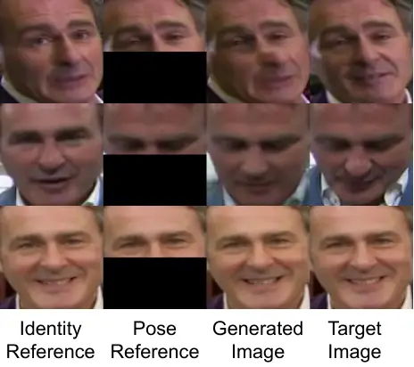
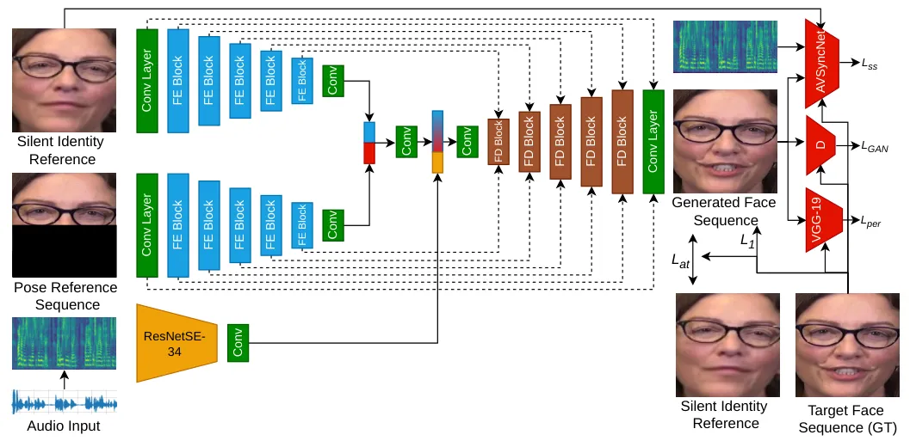
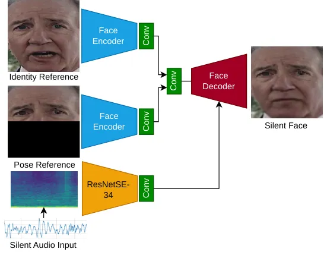
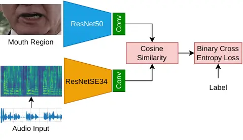
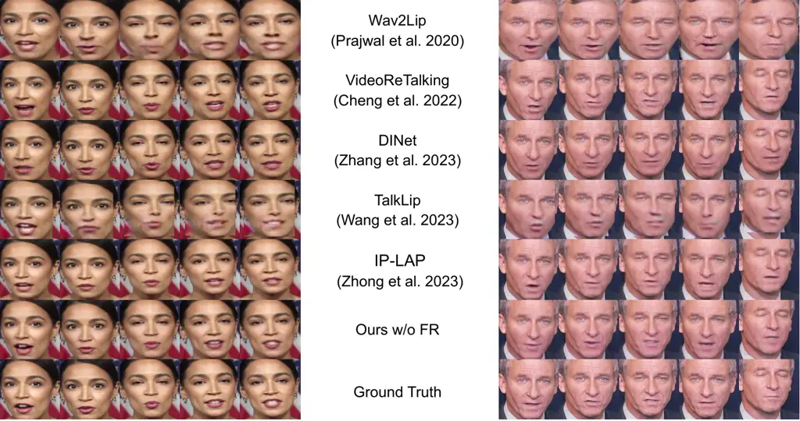
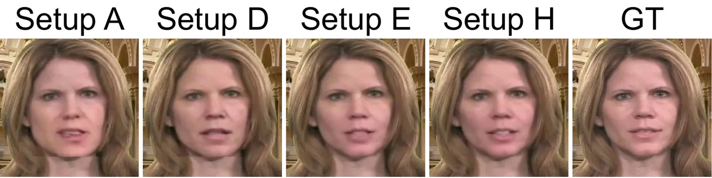
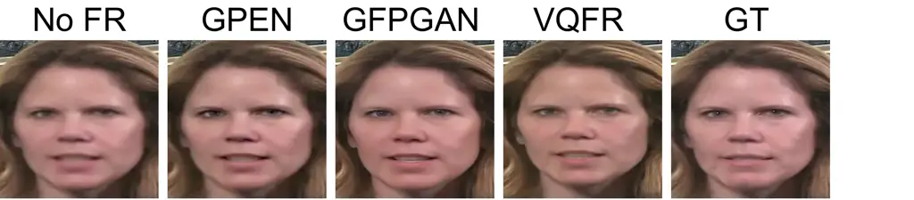
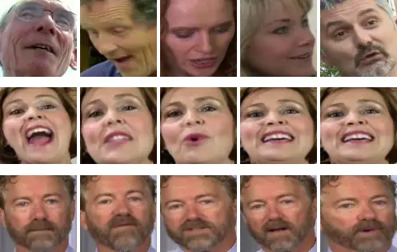
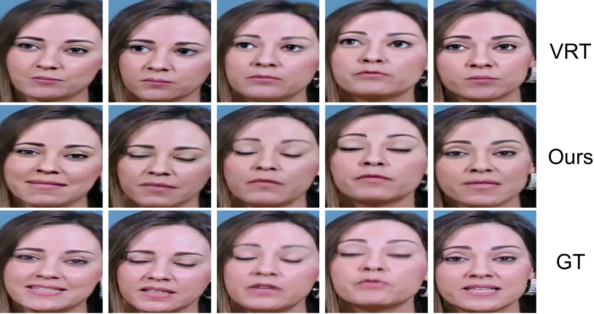

# Audio-driven Talking Face Generation with Stabilized Synchronization Loss

Dogucan
Yaman[![](data:image/svg+xml;base64,PHN2ZyBjbGFzcz0ibHR4X29yY2lkbG9nbyIgaGVpZ2h0PSIxZW0iIHZlcnNpb249IjEuMSIgdmlld2JveD0iMCAwIDcyIDcyIiB3aWR0aD0iMWVtIj48cGF0aCBzdHlsZT0iLS1sdHgtZmlsbC1jb2xvcjojQTZDRTM5OyIgZD0iTTcyLDM2IEM3Miw1NS44ODQzNzUgNTUuODg0Mzc1LDcyIDM2LDcyIEMxNi4xMTU2MjUsNzIgMCw1NS44ODQzNzUgMCwzNiBDMCwxNi4xMTU2MjUgMTYuMTE1NjI1LDAgMzYsMCBDNTUuODg0Mzc1LDAgNzIsMTYuMTE1NjI1IDcyLDM2IFoiIGZpbGw9IiNBNkNFMzkiIC8+PGcgc3R5bGU9Ii0tbHR4LWZpbGwtY29sb3I6I0ZGRkZGRjsiIGZpbGw9IiNGRkZGRkYiIHRyYW5zZm9ybT0idHJhbnNsYXRlKDE4Ljg2ODk2NiwgMTIuOTEwMzQ1KSI+PHBvbHlnb24gcG9pbnRzPSI1LjAzNzM0OTI5IDM5LjEyNTA4NzggMC42OTU0Mjk4NjEgMzkuMTI1MDg3OCAwLjY5NTQyOTg2MSA5LjE0NDMxNzg3IDUuMDM3MzQ5MjkgOS4xNDQzMTc4NyA1LjAzNzM0OTI5IDIyLjY5MzA1MDUgNS4wMzczNDkyOSAzOS4xMjUwODc4Ij48L3BvbHlnb24+PHBhdGggZD0iTTExLjQwOTI1Nyw5LjE0NDMxNzg3IEwyMy4xMzgwNzg0LDkuMTQ0MzE3ODcgQzM0LjMwMzAxNCw5LjE0NDMxNzg3IDM5LjIwODgxOTEsMTcuMDY2NDA3NCAzOS4yMDg4MTkxLDI0LjE0ODY5OTUgQzM5LjIwODgxOTEsMzEuODQ2ODQzIDMzLjE0NzA0ODUsMzkuMTUzMDgxMSAyMy4xOTQ0NjY5LDM5LjE1MzA4MTEgTDExLjQwOTI1NywzOS4xNTMwODExIEwxMS40MDkyNTcsOS4xNDQzMTc4NyBaIE0xNS43NTExNzY1LDM1LjI2MjAxOTQgTDIyLjY1ODc3NTYsMzUuMjYyMDE5NCBDMzIuNDk4NTgsMzUuMjYyMDE5NCAzNC43NTQxMjI2LDI3Ljg0MzgwODQgMzQuNzU0MTIyNiwyNC4xNDg2OTk1IEMzNC43NTQxMjI2LDE4LjEzMDE1MDkgMzAuODkxNTA1OSwxMy4wMzUzNzk1IDIyLjQzMzIyMTMsMTMuMDM1Mzc5NSBMMTUuNzUxMTc2NSwxMy4wMzUzNzk1IEwxNS43NTExNzY1LDM1LjI2MjAxOTQgWiIgLz48cGF0aCBkPSJNNS43MTQwMTIwNiwyLjkwMTgyMzI5IEM1LjcxNDAxMjA2LDQuNDQxNDUyIDQuNDQ1MjY5MzcsNS43MjkxNDE0NiAyLjg2NjM4OTU4LDUuNzI5MTQxNDYgQzEuMjg3NTA5NzgsNS43MjkxNDE0NiAwLjAxODc2NzA5MTgsNC40NDE0NTIgMC4wMTg3NjcwOTE4LDIuOTAxODIzMjkgQzAuMDE4NzY3MDkxOCwxLjMzNDIwMTMzIDEuMjg3NTA5NzgsMC4wNzQ1MDUxMDk2IDIuODY2Mzg5NTgsMC4wNzQ1MDUxMDk2IEM0LjQ0NTI2OTM3LDAuMDc0NTA1MTA5NiA1LjcxNDAxMjA2LDEuMzYyMTk0NTggNS43MTQwMTIwNiwyLjkwMTgyMzI5IFoiIC8+PC9nPjwvc3ZnPg==)](https://orcid.org/0000-0002-5047-295X)
Affiliation: Karlsruhe Institute of Technology, Karlsruhe, Germany   
Fevziye Irem
Eyiokur[![](data:image/svg+xml;base64,PHN2ZyBjbGFzcz0ibHR4X29yY2lkbG9nbyIgaGVpZ2h0PSIxZW0iIHZlcnNpb249IjEuMSIgdmlld2JveD0iMCAwIDcyIDcyIiB3aWR0aD0iMWVtIj48cGF0aCBzdHlsZT0iLS1sdHgtZmlsbC1jb2xvcjojQTZDRTM5OyIgZD0iTTcyLDM2IEM3Miw1NS44ODQzNzUgNTUuODg0Mzc1LDcyIDM2LDcyIEMxNi4xMTU2MjUsNzIgMCw1NS44ODQzNzUgMCwzNiBDMCwxNi4xMTU2MjUgMTYuMTE1NjI1LDAgMzYsMCBDNTUuODg0Mzc1LDAgNzIsMTYuMTE1NjI1IDcyLDM2IFoiIGZpbGw9IiNBNkNFMzkiIC8+PGcgc3R5bGU9Ii0tbHR4LWZpbGwtY29sb3I6I0ZGRkZGRjsiIGZpbGw9IiNGRkZGRkYiIHRyYW5zZm9ybT0idHJhbnNsYXRlKDE4Ljg2ODk2NiwgMTIuOTEwMzQ1KSI+PHBvbHlnb24gcG9pbnRzPSI1LjAzNzM0OTI5IDM5LjEyNTA4NzggMC42OTU0Mjk4NjEgMzkuMTI1MDg3OCAwLjY5NTQyOTg2MSA5LjE0NDMxNzg3IDUuMDM3MzQ5MjkgOS4xNDQzMTc4NyA1LjAzNzM0OTI5IDIyLjY5MzA1MDUgNS4wMzczNDkyOSAzOS4xMjUwODc4Ij48L3BvbHlnb24+PHBhdGggZD0iTTExLjQwOTI1Nyw5LjE0NDMxNzg3IEwyMy4xMzgwNzg0LDkuMTQ0MzE3ODcgQzM0LjMwMzAxNCw5LjE0NDMxNzg3IDM5LjIwODgxOTEsMTcuMDY2NDA3NCAzOS4yMDg4MTkxLDI0LjE0ODY5OTUgQzM5LjIwODgxOTEsMzEuODQ2ODQzIDMzLjE0NzA0ODUsMzkuMTUzMDgxMSAyMy4xOTQ0NjY5LDM5LjE1MzA4MTEgTDExLjQwOTI1NywzOS4xNTMwODExIEwxMS40MDkyNTcsOS4xNDQzMTc4NyBaIE0xNS43NTExNzY1LDM1LjI2MjAxOTQgTDIyLjY1ODc3NTYsMzUuMjYyMDE5NCBDMzIuNDk4NTgsMzUuMjYyMDE5NCAzNC43NTQxMjI2LDI3Ljg0MzgwODQgMzQuNzU0MTIyNiwyNC4xNDg2OTk1IEMzNC43NTQxMjI2LDE4LjEzMDE1MDkgMzAuODkxNTA1OSwxMy4wMzUzNzk1IDIyLjQzMzIyMTMsMTMuMDM1Mzc5NSBMMTUuNzUxMTc2NSwxMy4wMzUzNzk1IEwxNS43NTExNzY1LDM1LjI2MjAxOTQgWiIgLz48cGF0aCBkPSJNNS43MTQwMTIwNiwyLjkwMTgyMzI5IEM1LjcxNDAxMjA2LDQuNDQxNDUyIDQuNDQ1MjY5MzcsNS43MjkxNDE0NiAyLjg2NjM4OTU4LDUuNzI5MTQxNDYgQzEuMjg3NTA5NzgsNS43MjkxNDE0NiAwLjAxODc2NzA5MTgsNC40NDE0NTIgMC4wMTg3NjcwOTE4LDIuOTAxODIzMjkgQzAuMDE4NzY3MDkxOCwxLjMzNDIwMTMzIDEuMjg3NTA5NzgsMC4wNzQ1MDUxMDk2IDIuODY2Mzg5NTgsMC4wNzQ1MDUxMDk2IEM0LjQ0NTI2OTM3LDAuMDc0NTA1MTA5NiA1LjcxNDAxMjA2LDEuMzYyMTk0NTggNS43MTQwMTIwNiwyLjkwMTgyMzI5IFoiIC8+PC9nPjwvc3ZnPg==)](https://orcid.org/0000-0001-5754-5405)
Affiliation: Karlsruhe Institute of Technology, Karlsruhe, Germany   
Leonard
Bärmann[![](data:image/svg+xml;base64,PHN2ZyBjbGFzcz0ibHR4X29yY2lkbG9nbyIgaGVpZ2h0PSIxZW0iIHZlcnNpb249IjEuMSIgdmlld2JveD0iMCAwIDcyIDcyIiB3aWR0aD0iMWVtIj48cGF0aCBzdHlsZT0iLS1sdHgtZmlsbC1jb2xvcjojQTZDRTM5OyIgZD0iTTcyLDM2IEM3Miw1NS44ODQzNzUgNTUuODg0Mzc1LDcyIDM2LDcyIEMxNi4xMTU2MjUsNzIgMCw1NS44ODQzNzUgMCwzNiBDMCwxNi4xMTU2MjUgMTYuMTE1NjI1LDAgMzYsMCBDNTUuODg0Mzc1LDAgNzIsMTYuMTE1NjI1IDcyLDM2IFoiIGZpbGw9IiNBNkNFMzkiIC8+PGcgc3R5bGU9Ii0tbHR4LWZpbGwtY29sb3I6I0ZGRkZGRjsiIGZpbGw9IiNGRkZGRkYiIHRyYW5zZm9ybT0idHJhbnNsYXRlKDE4Ljg2ODk2NiwgMTIuOTEwMzQ1KSI+PHBvbHlnb24gcG9pbnRzPSI1LjAzNzM0OTI5IDM5LjEyNTA4NzggMC42OTU0Mjk4NjEgMzkuMTI1MDg3OCAwLjY5NTQyOTg2MSA5LjE0NDMxNzg3IDUuMDM3MzQ5MjkgOS4xNDQzMTc4NyA1LjAzNzM0OTI5IDIyLjY5MzA1MDUgNS4wMzczNDkyOSAzOS4xMjUwODc4Ij48L3BvbHlnb24+PHBhdGggZD0iTTExLjQwOTI1Nyw5LjE0NDMxNzg3IEwyMy4xMzgwNzg0LDkuMTQ0MzE3ODcgQzM0LjMwMzAxNCw5LjE0NDMxNzg3IDM5LjIwODgxOTEsMTcuMDY2NDA3NCAzOS4yMDg4MTkxLDI0LjE0ODY5OTUgQzM5LjIwODgxOTEsMzEuODQ2ODQzIDMzLjE0NzA0ODUsMzkuMTUzMDgxMSAyMy4xOTQ0NjY5LDM5LjE1MzA4MTEgTDExLjQwOTI1NywzOS4xNTMwODExIEwxMS40MDkyNTcsOS4xNDQzMTc4NyBaIE0xNS43NTExNzY1LDM1LjI2MjAxOTQgTDIyLjY1ODc3NTYsMzUuMjYyMDE5NCBDMzIuNDk4NTgsMzUuMjYyMDE5NCAzNC43NTQxMjI2LDI3Ljg0MzgwODQgMzQuNzU0MTIyNiwyNC4xNDg2OTk1IEMzNC43NTQxMjI2LDE4LjEzMDE1MDkgMzAuODkxNTA1OSwxMy4wMzUzNzk1IDIyLjQzMzIyMTMsMTMuMDM1Mzc5NSBMMTUuNzUxMTc2NSwxMy4wMzUzNzk1IEwxNS43NTExNzY1LDM1LjI2MjAxOTQgWiIgLz48cGF0aCBkPSJNNS43MTQwMTIwNiwyLjkwMTgyMzI5IEM1LjcxNDAxMjA2LDQuNDQxNDUyIDQuNDQ1MjY5MzcsNS43MjkxNDE0NiAyLjg2NjM4OTU4LDUuNzI5MTQxNDYgQzEuMjg3NTA5NzgsNS43MjkxNDE0NiAwLjAxODc2NzA5MTgsNC40NDE0NTIgMC4wMTg3NjcwOTE4LDIuOTAxODIzMjkgQzAuMDE4NzY3MDkxOCwxLjMzNDIwMTMzIDEuMjg3NTA5NzgsMC4wNzQ1MDUxMDk2IDIuODY2Mzg5NTgsMC4wNzQ1MDUxMDk2IEM0LjQ0NTI2OTM3LDAuMDc0NTA1MTA5NiA1LjcxNDAxMjA2LDEuMzYyMTk0NTggNS43MTQwMTIwNiwyLjkwMTgyMzI5IFoiIC8+PC9nPjwvc3ZnPg==)](https://orcid.org/0000-0003-3092-8726)
Affiliation: Karlsruhe Institute of Technology, Karlsruhe, Germany   
Hazım Kemal Ekenel Affiliation: Istanbul Technical University, Istanbul,
Turkey    Alexander Waibel Affiliation: Karlsruhe Institute of
Technology, Karlsruhe, Germany Affiliation: Carnegie Mellon University,
Pittsburg PA, USA E-mail <dogucan.yaman@kit.edu>

###### Abstract

Talking face generation aims to create realistic videos with accurate
lip synchronization and high visual quality, using given audio and
reference video while preserving identity and visual characteristics. In
this paper, we start by identifying several issues with existing
synchronization learning methods. These involve unstable training, lip
synchronization, and visual quality issues caused by lip-sync loss,
SyncNet, and lip leaking from the identity reference. To address these
issues, we first tackle the lip leaking problem by introducing a
silent-lip generator, which changes the lips of the identity reference
to alleviate leakage. We then introduce stabilized synchronization loss
and AVSyncNet to overcome problems caused by lip-sync loss and SyncNet.
Experiments show that our model outperforms state-of-the-art methods in
both visual quality and lip synchronization. Comprehensive ablation
studies further validate our individual contributions and their cohesive
effects.

###### Keywords: 

Talking face generation Lip synchronization Lip leaking

## 1 Introduction

Audio-driven talking face generation aims at generating a video with
respect to given face and audio sequences. The objective is to achieve
synchronized lip movements corresponding to the provided audio while
preserving the identity and visual details. This task has recently
attracted significant attention due to its versatile applications,
including dubbing in the film industry, online education, enhancing
video conferencing, and dubbing for various types of videos \[71, 75\].

The talking face generation task comprises two primary aspects: (1) lip
synchronization and (2) visual quality of the face. Since lips that are
out-of-sync with audio can be easily identified by humans, synchronized
lips are key to achieving natural and realistic talking-face generation.
For this, the primary solution is to evaluate audio-lip synchronization
and use it as a training objective. Wav2Lip \[46\] introduced an
improved version of SyncNet \[14\], a pretrained model designed to
measure audio-visual synchronization. This model is also used during
training to extract features and compute lip-sync loss. Subsequently,
many approaches have employed improved SyncNet \[46\] to guide the model
throughout training. The main concept is to provide audio-video pairs to
SyncNet, which extracts features through its image and audio encoders.
Subsequently, cosine similarity with binary cross-entropy loss is
measured between these two features \[46\]. Since the model was trained
in this manner, a higher cosine similarity is expected when the lips are
synchronized with the given audio. Although existing approaches with
this strategy mostly surpass other methods in lip synchronization, there
are still challenges that must be addressed to enhance performance.

(a) SyncNet \[46\]

(b) AVSyncNet (ours)



(c) Leaking problems

Figure 1: (a, b) Cosine similarity between GT audio-lip pairs on random
LRS2 samples, showcasing the instability of SyncNet and more robust
performance of AVSyncNet. (c) illustrates full mouth region / lip
leaking from the reference, pose effect from the reference, and similar
identity reference-target image scenarios.

In this work, we identify two main challenges in existing approaches
that restrict models from achieving satisfactory performance in both lip
synchronization and visual quality: _SyncNet instabilities_ and _lip
leaking_. First, in alignment with previous research \[41\], we observe
instabilities in the performance of SyncNet \[46\] on pairs of
ground-truth (GT) lip and audio (see Fig. 1(a) and App. A). Thus, when
SyncNet is utilized as part of talking face generation training, it
might provide an inadequate training signal, assigning low similarity
scores to generated images even when the lips are synchronized. This
problem causes unstable training, degrading the lip generation
capability of the network, thereby ending up in out-of-sync lips or
suboptimal lip-sync. Furthermore, the lip-sync loss \[46\] and
reconstruction losses are conflicting \[39\]. This leads models to have
either poor lip synchronization or degraded visual quality (sometimes
even both), escalating further when lip-sync loss and SyncNet are
employed with high-resolution (HR) data \[73, 39\]. To address these
problems, we first improve SyncNet and introduce _AVSyncNet_,
demonstrating a more robust performance (see Fig. 1(b)) and also
overcoming poor shift-invariance characteristics of SyncNet (see
Fig. 6(a)). However, despite improved performance, the instability
problem is not fully solved (see Fig. 1(b)). To overcome this problem
further, we also introduce a _stabilized synchronization loss_.
Specifically, instead of directly using the similarity of the (generated
lips, audio) pair, we calculate the difference of the similarities
between (GT lips, audio) and (generated lips, audio). We hypothesize
that this alleviates the described problems since it guides the model to
generate a lip movement with a similar synchronization score as for the
GT face. Together with AVSyncNet, this method empirically enhances the
lip synchronization performance as well as avoids visual quality issues
caused by misleading lip-sync loss.

Second, we address another main problem in the talking face generation
literature: _lip leaking_. The current gold standard in 2D-based methods
is to input a bottom-half masked face image (“pose reference”), wherein
the model is expected to generate the input face with proper lip
movements. However, because of masking, the model requires a reference
image to retain the identity and texture in the masked part. This is
achieved by randomly choosing a face image from a different part of the
video sequence, referred to as “identity reference”. However, this
introduces a new challenge: As it is randomly selected, the lip
movements of the identity reference can frequently be similar to the GT
lips during training (see last row of Fig. 1(c)). Hence, for faster
convergence, the model tends to replicate the lip movements from the
identity reference, resulting in poor lip synchronization or complete
out-of-sync output. By following the literature \[46, 41\], we term this
phenomenon as lip leaking. To tackle this problem, we propose a simple
yet effective technique: silent-lip generator. The concept involves
modifying the identity reference to make the lips closed (thus
“silent-lip”) before feeding it to the talking face generator network.
This method ensures consistently closed lips in the identity reference,
effectively mitigating the lip leaking problem. Our contributions are as
follows: (i) We identify and analyze various fundamental problems that
harm lip synchronization learning and also cause visual quality issues.
(ii) We present a robust and shift-invariant AVSyncNet, and stabilized
synchronization loss to overcome the problems caused by lip-sync loss
and SyncNet. (iii) We present a silent-lip generator to generate an
identity reference with closed lips before feeding the talking face
generator to alleviate the lip leaking.

## 2 Related Work

Audio-driven Talking Face Generation. Initial studies mapped audio
features to time-aligned facial motions \[69\] or predicted facial
motions by HMM \[6\]. In \[57\], videos were generated by finding the
images most aligned with the audio. ATVGNet \[9\] transfers audio to
facial landmarks and uses pixel-wise loss with an attention mechanism to
avoid the jittering problem and leaking of irrelevant speech. \[16\] and
\[80\] use facial landmark representation to synthesize faces with
synchronized lips. Recent papers address the task as conditional
inpainting by masking the bottom half of the input face and feeding the
network an identity reference from another time step of the same video,
along with the audio segment. Wav2Lip \[46\] proposes SyncNet and
lip-sync loss to predict lip synchronization and achieves significant
performance. PC-AVS \[78\] introduces a pose-controllable audio-visual
system, while GC-AVT \[36\], EAMM \[29\] and EVP \[30\] control the
emotion by utilizing an emotion embedding. On the other hand,
SyncTalkFace \[45\] uses Audio-Lip Memory to store lip motion features
and retrieves them as visual hints for better synchronization.
VideoReTalking \[10\] proposes to manipulate the reference image to have
a face with canonical expression to alleviate the sensitivity of the
model against the identity reference image. Similarly, we introduce a
silent-lip generator to implicitly learn to manipulate the lips of the
identity reference to mitigate the lip leaking problem. Compared to the
method proposed in \[10\], our method works more efficiently to preserve
the identity and visual quality. More recently, LipFormer \[64\] uses a
pre-learned facial codebook to generate HR videos, while DINet \[73\]
proposes to use a deformation module to obtain deformed features to
enhance lip synchronization and head pose alignment. IPLAP \[76\] shows
satisfactory visual quality and stability by using intermediate landmark
representation and motion field. Recently, TalkLip \[63\] introduces a
global audio encoder, trained with self-supervised learning, to encode
features by considering the entire content of the audio. Besides, they
propose to use lip reading during the training as well as in the
evaluation to control whether the content is preserved. SIDGAN \[39\]
performs important analyzes, and introduces shift-invariant APS-SyncNet
and training objectives along with the coarse-to-fine pyramid model for
HR dubbed video generation. Recent works use diffusion model because of
its stability and accuracy \[50, 55\]. Finally, in \[61\], talking face
generation is used as a part of a full system to perform end-to-end face
dubbing, involving speech recognition, translation, speech, and video
generation. In contrast to the above, 3D-based and Neural Radiance
Fields-based (NeRFs) methods typically generate the entire head, rather
than just manipulating 2D images of the face, often involving
manipulation of pose, emotion, and 3D face model \[4, 5, 77, 80, 59, 66,
72, 74, 70, 21, 67, 37, 49, 58, 53, 44, 68, 62\]. Similarly, portrait
animation aims at utilizing a single input image to generate a video by
predicting the pose and expression of the subsequent frames, along with
ensuring synchronized lips. Nevertheless, these tasks significantly
differ from face dubbing in terms of methodology, task definition,
goals, and real-world applications.

#### Lip Synchronization.

Some earlier works \[23, 52\] used hand-crafted features and statistical
models to evaluate lip synchronization. Recent studies proposed to use
mutual information between audio-visual features to produce sync or
out-of-sync output for sound \[43, 8, 26\] or speech \[12, 15, 2, 33,
32\]. While some methods learn lip synchronization implicitly \[57, 34,
28, 21, 66, 74, 9\], other methods employ distance between landmarks or
facial parameters \[80, 44, 30, 53\]. Contrarily, the majority of
works \[54, 77, 78, 67, 60, 17, 46, 45, 56, 73, 36, 64, 20, 62, 63\]
extract audio-visual features with an additional network (mostly
SyncNet \[46\]) for audio-lip synchronization prediction. Afterwards,
while some of these methods utilize lip-sync loss \[46\], others benefit
from contrastive learning by using infoNCE \[42\]. We follow a similar
strategy by utilizing an additional network to calculate a
synchronization loss. We propose a robust and shift-invariant AVSyncNet
along with a stabilized synchronization loss to overcome existing
challenges.



(a) Talking face generation model

 

(b) FD block

Figure 2: Talking face generation model $`G_{L}`$ (a) and face-decoding
(FD) block (b). Our model receives a pose reference sequence,
mel-spectrogram of an audio snippet, and a silent identity reference,
that is generated by our silent-lip generator $`G_{S}`$, aiming to
alleviate lip leaking problem. The model then synthesizes the talking
face sequence to ensure lip synchronization. Subsequently, the employed
loss functions are computed.

## 3 Proposed Approach

### 3.1 Talking Face Generation

We propose an audio-driven talking face generation model $`G_{L}`$ with
enhanced lip synchronization. As shown in Fig. 2(a), our model
incorporates: 1) an audio encoder for processing the audio
snippet, 2) an identity encoder for addressing an identity reference
image, and 3) a pose encoder for utilizing a pose reference.

#### Audio Encoder.

The audio encoder $`E_{A}`$ generates phoneme-level embeddings, serving
as conditions for the face generator to generate lip movements
accurately. Our audio encoder extracts embeddings
$`F_{A}=E_{A}(A)\in\mathbb{R}^{1\times 1\times 512}`$ from the given
mel-spectrogram $`A`$, representing the driving audio. In contrast to
existing methods \[46, 10, 73, 76\], we propose using a pretrained,
frozen audio encoder, concurrently trained with a face encoder to learn
lip synchronization similar to the objective in SyncNet \[46\]. Thus, we
can obtain improved embeddings during the talking face generation
training by leveraging the capacity of the pretrained robust audio
encoder. We obtain the best score with such frozen audio encoder.

#### Face Encoder.

In accordance with the gold standard in the literature, we utilize an
identity reference, $`I^{R}`$, and a pose reference, $`I`$, as inputs to
the model. The identity reference is a face image of the subject that
provides identity information. It is different from the pose reference
and randomly selected from the same video. The pose reference is
identical to the target image, except for the bottom half, which is
masked, as the model is designed to focus on generating lip movements.
Unlike most conventional methods that employ a joint encoder for
processing identity and pose references, we use individual encoders to
allow each encoder to focus solely on their respective tasks \[39\].
Therefore, we utilize two parallel CNN-based face encoders to process
identity and pose references individually. This approach yields better
feature representation and ultimately leads to improved performance.



(a) Silent-lip generation model $`G_{S}`$



(b) AVSyncNet

Figure 3: $`G_{S}`$ in inference (a) and AVSyncNet training pipeline
(b).

### 3.2 Silent-Lip Generator

Talking face generation involves using an identity reference to preserve
the identity in the generated image. This is particularly important
because the bottom half of the pose reference, specifically the mouth
region, is masked. This masking is necessary as we aim to synthesize
appropriate lip movements corresponding to the provided audio. However,
models are unintentionally affected by the lip movement of the identity
reference, rather than solely gathering identity information (see
Fig. 1(c) and App. C for details). This behavior, which we refer to as
lip leaking, leads to poor lip synchronization or occasionally even
non-converged training. We hypothesize that there are two main reasons
for this: First, the lip movement of the identity reference may
occasionally resemble that of the lips in the target image (see last row
of Fig. 1(c)). Hence, the model can lower the synchronization loss more
quickly by undesirably replicating the lip movements of the identity
reference. Second, the diversity of lip movements in the identity
reference may yield the model to seek a correlation with the target
lips. This causes a challenging disentanglement task for the identity
encoder —namely distinguishing identity information and lip movement.

To mitigate the aforementioned issue, we propose to use an additional
model, called silent-lip generator $`G_{S}`$, prior to the talking face
generation model $`G_{L}`$, aimed at modifying the lip shape of the
identity reference. Specifically, we reconstruct the input face with
closed, flat lips. This strategy reduces the likelihood of having lips
similar to the target face in the identity reference and resolves the
issue of diverse lip movements. Consequently, the model no longer
replicates the lips from the identity reference, resulting in stable
training & improved lip sync.

To implement $`G_{S}`$, we structure the task and the model similar to
the talking face generation. Specifically, we input a bottom-half masked
pose reference, an identity reference, and an audio snippet to train a
GAN \[18\] for generating a talking face. The model is trained to
reconstruct the face using both the pose and identity references.
Notably, we exclude any synchronization loss and SyncNet during training
and train the model under the weak condition. Consequently, the model
focuses solely on generating lip movements without synchronization when
speech is present. Therefore, it implicitly learns to generate closed
lips when the input audio is silent as shown in Fig. 3(a). Furthermore,
by eliminating synchronization loss, we overcome unstable training and
the issue of lip leaking from the identity reference for this network.
We choose this approach for its efficient utilization of the same model
and data. Given the scarcity of closed-lip faces in the dataset, we
avoid using these frames directly to maintain effective training and
generalization. Please note that we use the same architecture for
$`G_{S}`$ and $`G_{L}`$. We initially train $`G_{S}`$ separately on the
same training data (LRS2) and then incorporate it into the training of
$`G_{L}`$ without further finetuning. Specifically, we then only pass
silent audio to $`G_{S}`$, so that it modifies given identity references
to have silent lips for subsequent use as identity reference for
$`G_{L}`$.

### 3.3 Video Generation

For the talking face video generation, we employ the aforementioned
components. Initially, we employ our pretrained silent-lip generator
$`G_{S}`$ to synthesize the identity reference with closed lips.
Subsequently, we input this silent identity reference to the identity
encoder and the pose reference to the pose encoder in the talking face
generation model $`G_{L}`$. Similarly, we provide the mel-spectrogram of
the corresponding audio snippet to the audio encoder. Next, we
concatenate the embeddings from the identity and pose encoders, along
with the depth dimension, and pass it through a $`1\times 1`$
convolution layer to reduce the depth. Finally, we concatenate this
feature representation with the audio embeddings before feeding them
into the face generator. The face generator generates the entire face
with accurate lip movements by preserving the identity and the pose.

We illustrate the talking face generation model $`G_{L}`$ in Fig. 2(a).
We integrate the U-Net architecture \[47\] for our overall design,
leveraging its adequate performance in reconstruction tasks while
ensuring computational efficiency. Our identity encoder and pose encoder
share the same architecture, consisting of consecutive face-encoding
(FE) blocks. Each block has a strided-convolutional layer followed by
two non-strided convolutional layers, each paired with a batch
normalization layer \[27\] and a ReLU activation function \[40, 35\]. We
also use the residual connection strategy \[22\] by summing the input
and output of each block before forwarding it to the next layer. On the
other hand, our face generator has consecutive face-decoding (FD)
blocks. As shown in Fig. 2(b), within each block, we utilize a
transposed-convolutional layer, followed by two convolutional layers
incorporating batch normalization and ReLU activation function.
Moreover, we apply a skip connection between the reciprocal layers of
the face encoders and the decoder to retain high-level features and
enhance the training stability.

#### GAN Loss.

To train our model, we utilize GAN loss \[18\] and employ a
discriminator, which is a straightforward CNN-based binary
classification network to distinguish real and fake samples, designed
with a balanced architecture aligned with our face encoders. We benefit
from consecutive strided-convolutional layers followed by the Leaky ReLu
activation function and spectral normalization \[38\].

#### Reconstruction Loss.

We employ L1 loss in pixel space $`L_{pixel}=||I^{\prime}-I^{GT}||_{1}`$
between the generated $`I^{\prime}`$ and the target faces $`I^{GT}`$ to
ensure consistency in areas outside the lips and maintain the
illumination condition. We further utilize perceptual loss \[31\] based
on the pretrained VGG-19 \[51\]:

```math
L_{per}=\sum_{i=1}^{5}c_{i}||\textsc{VGG}^{\phi_{i}}(I^{\prime})-\textsc{VGG}^{\phi_{i}}(I^{GT})||_{1} \tag{1}
```

where $`c_{i}`$ are weight coefficients from \[31\], and $`\phi`$
indicates the set of VGG layers.

#### Adaptive Triplet Loss.

Although our goal is to capture visual details from the identity
reference, we observe that the model occasionally focuses on the visual
details (e.g., illumination, pose) in the identity reference excessively
and this tendency could potentially degrade the quality and stability of
the generated face sequence, resulting in suboptimal performance. To
tackle this, we exploit a triplet loss strategy \[48\], aiming to
minimize the distance between the generated face and GT, while
maximizing the distance between the generated face and the identity
reference. However, the random selection of identity references
increases the probability of choosing an image that closely resembles
the GT. This scenario poses a challenge for the vanilla triplet loss,
potentially degrading training and resulting in poor visual and pose
quality. To mitigate this, we introduce an adaptive triplet loss that
considers the similarity between the identity reference and GT during
loss computation to alter its effect. The formula is as follows:

```math
L_{at}=\left[D(\textsc{VGG}(I^{\prime}),\textsc{VGG}(I^{GT}))-\frac{D(\textsc{VGG}(I^{\prime}),\textsc{VGG}(I^{R}))}{D(\textsc{VGG}(I^{GT}),\textsc{VGG}(I^{R}))}+\alpha\right]_{+} \tag{2}
```

where $`[\cdot]_{+}=max(\cdot,\epsilon)`$, $`D`$ represents the L2
distance, and we empirically choose $`\alpha=1`$. In this loss, we
leverage the ratio of the similarity between the generated image and
identity reference to that of the GT and the identity reference to
adjust the loss value. As the identity reference becomes more similar to
GT, the impact of the distance between the generated image and identity
reference on the loss diminishes, since expecting a high distance in
this case is not reasonable. Since our objective is to incorporate
visual details from the identity reference, we opt for a very low
coefficient to avoid conflicting with the primary goal.

### 3.4 Learning Synchronization

The lip-sync loss \[46\] serves as a method to calculate synchronization
between audio and video. Leveraging the pretrained SyncNet \[46\] for
feature extraction from both audio and video inputs demonstrates
reasonable performance in learning lip synchronization. However, the
SyncNet is significantly unstable when measuring this similarity. Our
evaluation using SyncNet on GT training data reveals notable
fluctuations in cosine similarity between video and audio, contrary to
the expected high scores (see Fig. 1(a) and App. A for details).
Therefore, this provides conflicting information to the system,
resulting in poor lip synchronization, unstable training, and degraded
visual quality. To tackle this problem, we present a more accurate,
shift-invariant, and robust version of SyncNet, named AVSyncNet, and
introduce a novel, stabilized synchronization loss.

#### AVSyncNet.

We employ a ResNet-50-based \[22\] image encoder, known for its superior
performance in face recognition, alongside a ResNetSE-34-based audio
encoder \[11\], which is a modified version of ResNet-34 \[22\] designed
to handle spectrogram inputs. This design makes the AVSyncNet model
robust and shift-invariant compared to SyncNet \[46\]. We train our
model on the LRS2 training data \[1\], calculating the cosine similarity
between audio and lip features, followed by a binary cross-entropy loss,
as shown in Fig. 3(b). During each training step, we provide a set of
images (5 images) along with the corresponding audio. For negative
samples, we randomly select an audio snippet from the non-overlapping
part of the video. Please note that as we feed the bottom half of the
face to the image encoder, we adapt the first layer of ResNet-50 for an
input size of $`112\times 224`$.

#### Stabilized Synchronization Loss ($`L_{ss}`$).

Although AVSyncNet shows improved performance compared to SyncNet \[46\]
and alleviates existing instability problem that harms lip-sync and
visual quality, the unstable performance is not fully solved due to the
inherent challenges of the task (see Fig. 1(b) and App. A, B).
Therefore, we introduce a stabilized synchronization loss ($`L_{ss}`$)
to improve the lip synchronization performance further in conjunction
with AVSyncNet by providing more stable and precise supervision. The
formula is shown below:

```math
L_{ss}=-\log\left(1-\frac{|x-y|+\epsilon}{|x-y|+|y-d|+\epsilon}\right) \tag{3}
```

```math
\displaystyle x=\textsc{AVsim}\left(I^{\prime},\;A\right),\quad y=\textsc{AVsim}\left(I^{GT},\;A\right),\quad d=\textsc{AVsim}\left(I^{R},\;A\right) \tag{4}
```

where $`I^{\prime}`$, $`I^{GT}`$, and $`I^{R}`$ are generated, GT, and
identity reference lips, respectively, while $`A`$ is their
corresponding audio. $`\textsc{AVsim}(I,A)`$ indicates the audio-visual
similarity between a face image (bottom half only, _i.e_. lips) and
audio, given by the cosine similarity of extracted image and audio
features $`\phi_{AVS}^{V}(I)`$, $`\phi_{AVS}^{A}(A)`$ of the respective
AVSyncNet encoder.

In this formulation, $`x`$ followed by cross-entropy loss denotes the
lip-sync loss \[46\]. However, to address the unstable and fluctuating
performance, we utilize the relative distance in similarity between GT
lips-audio and generated-audio pairs ¹¹ 1 This is reminiscent of
distillation loss \[25\], as the actual value of the scores is
neglected, and only their difference provides loss value for the
training. However, initial experiments trying to directly minimize the
distance between SyncNet (or AVSyncNet) image encoder features of
generated and GT faces showed poor performance. We hypothesize that this
is caused by SyncNet image features being only meaningful for comparing
with corresponding audio features due to its training strategy..
Sometimes, randomly selected reference images may have a lip movement
similar to that of the target image. We have already introduced the
silent-lip generator $`G_{S}`$ to mitigate this situation. However,
AVSyncNet, while less severe than SyncNet, might still be unstable
(_e.g_., unexpectedly high scores with incorrect pairs or vice versa),
resulting in a minor lip leaking and stability issue. This problem
arises when AVSyncNet assigns an erroneously high score to silent
lip-audio pairs as well as when the target lip shape looks similar to
closed lips. To mitigate this, we inject the similarity score between
the identity reference and audio into the formulation. Specifically, we
penalize the model more when the identity reference-audio pair shows
higher similarity.

### 3.5 Implementation Details

Combining all the presented contributions, the total loss is:

```math
L=L_{GAN}(G,D)+\lambda_{1}L_{pixel}(G)+\lambda_{2}L_{per}(G)+\lambda_{3}L_{ss}(G)+\lambda_{4}L_{at}(G) \tag{5}
```

where $`G`$ and $`D`$ indicate generator and discriminator outputs,
respectively. We empirically found the best coefficients as
$`(\lambda_{1},...,\lambda_{4})=(10,1,2,0.5)`$. Please note that this is
the loss function for training $`G_{L}`$, while for $`G_{S}`$ we set
$`\lambda_{3}=\lambda_{4}=0`$.

We process videos by using $`5`$ consecutive frames in each step to
consider the temporal information. We detect faces with FAN \[7\],
followed by acquiring tight crops and resizing to $`96\times 96`$, as
faces in LRS2 \[1\] are of low resolution. Our audio encoder receives a
mel-spectrogram of size $`16\times 80`$ derived from $`16`$ kHz audio
with a window size of $`800`$ and a hop size of $`200`$. We employ the
Adam optimizer with $`(\beta_{1},\beta_{2})=(0.5,0.999)`$ and set the
learning rate to $`1\times 10^{-4}`$ for all models. Training our
AVSyncNet is done similarly to SyncNet \[46\] on the LRS2 dataset, and
then we freeze the audio encoder of AVSyncNet and use it in the training
of $`G_{S}`$ and $`G_{L}`$. At the end of talking face generation, we
apply a post-processing step by using VQFR \[19\] to enhance the visual
quality and the resolution, aiming to achieve HR videos. We train and
test our models with a single NVIDIA RTX A6000 GPU.

## 4 Experimental Results

Dataset. We trained our silent-lip generator and talking face generator
using Lip Reading Sentence 2 (LRS2) \[1\] training set as it is a
well-known benchmark with extensive subject diversity. The evaluation
was carried out on the LRS2 test set and extended to the LRW \[13\] test
set and HTDF dataset \[74\] to demonstrate performance on unseen data.

Metrics and Baseline. For visual quality, we employ widely used metrics:
FID \[24\], SSIM \[65\], and PSNR. We also use inter-frame consistency
(IFC), presented as a training objective in \[79\]. This is achieved by
calculating the difference between the distances of the consecutive
frames in the generated and GT videos. To evaluate lip synchronization,
we follow the literature and use Landmark Distance (LMD) \[9\] in the
mouth region and LSE-C & LSE-D metrics \[46\] to measure the confidence
and distance scores through a pretrained model \[14\]. We choose SOTA
methods with publicly available codes and models to compare them fairly
under the same conditions, as the implementation of the metrics and face
cropping strategy before computing the metrics affect the scores.

|                             |                   |                   |                    |                    |                    |                    |                      |                   |                   |                    |                    |                    |                    |                      |
| --------------------------- | ----------------- | ----------------- | ------------------ | ------------------ | ------------------ | ------------------ | -------------------- | ----------------- | ----------------- | ------------------ | ------------------ | ------------------ | ------------------ | -------------------- |
|                             | LRS2              |                   |                    |                    |                    |                    |                      | LRW               |                   |                    |                    |                    |                    |                      |
| Method                      | SSIM $`\uparrow`$ | PSNR $`\uparrow`$ | FID $`\downarrow`$ | IFC $`\downarrow`$ | LMD $`\downarrow`$ | LSE-C $`\uparrow`$ | LSE-D $`\downarrow`$ | SSIM $`\uparrow`$ | PSNR $`\uparrow`$ | FID $`\downarrow`$ | IFC $`\downarrow`$ | LMD $`\downarrow`$ | LSE-C $`\uparrow`$ | LSE-D $`\downarrow`$ |
| Wav2Lip \[46\]              | 0.86              | 26.53             | 7.05               | 0.21               | 2.38               | 7.59               | 6.75                 | 0.85              | 25.14             | 6.81               | 0.20               | 2.14               | 7.49               | 6.51                 |
| PC-AVS \[78\]               | 0.73              | 28.24             | 18.40              | 0.46               | 1.93               | 6.41               | 7.52                 | 0.81              | 32.25             | 14.27              | 0.38               | 1.42               | 6.53               | 7.15                 |
| EAMM \[29\]                 | 0.69              | 21.01             | 84.65              | 0.51               | 3.54               | 3.31               | 9.93                 | 0.71              | 26.22             | 44.16              | 0.48               | 2.61               | 4.32               | 9.04                 |
| VideoReTalking w/ FR \[10\] | 0.84              | 25.58             | 9.28               | 0.22               | 2.61               | 7.49               | 6.82                 | 0.87              | 27.11             | 5.30               | 0.23               | 2.39               | 6.59               | 7.12                 |
| DINet \[73\]                | 0.78              | 24.35             | 4.26               | 0.25               | 2.30               | 5.37               | 8.37                 | 0.88              | 27.50             | 8.17               | 0.22               | 1.96               | 5.24               | 9.09                 |
| TalkLip \[63\]              | 0.86              | 26.11             | 4.94               | 0.24               | 2.34               | 8.53               | 6.08                 | 0.86              | 26.34             | 15.73              | 0.26               | 1.83               | 7.28               | 6.48                 |
| IPLAP \[76\]                | 0.87              | 29.67             | 4.10               | 0.20               | 2.11               | 6.49               | 7.16                 | 0.91              | 30.45             | 8.40               | 0.21               | 1.64               | 5.94               | 7.76                 |
| Ours w/o FR                 | 0.95              | 32.64             | 3.83               | 0.16               | 1.13               | 8.41               | 6.03                 | 0.92              | 31.45             | 4.46               | 0.18               | 1.22               | 7.86               | 6.24                 |
| Ours w/ FR (VQFR)           | 0.90              | 31.80             | 5.23               | 0.27               | 1.36               | 8.52               | 5.83                 | 0.90              | 30.21             | 7.05               | 0.21               | 1.41               | 7.92               | 6.00                 |

Table 1: Quantitative results on the test sets of LRS2 and LRW.

### 4.1 Quantitative Results

In Tab. 1, we present quantitative results on test sets of two benchmark
datasets, namely LRS2 and LRW. We achieve state-of-the-art results in
all visual quality metrics excluding PSNR on LRW, which is a less
informative metric compared to SSIM and FID. On IFC, we similarly
outperform all compared methods, indicating that our model generates the
most consistent videos in terms of temporal information and stability of
the faces.

In lip synchronization evaluation, we obtain the best performance in
LMD. Nevertheless, it is important to highlight that LMD is sensitive to
the changes in the image, as it does not disentangle synchronization and
visual stability. For instance, affine transformations impact the LMD
score even when the lips are synchronized, and vice versa. On the LRW
dataset, we achieve SOTA results with more reliable confidence and
distance metrics for lip synchronization: LSE-C & D. On the LRS2
dataset, TalkLip yields a slightly better score than our model with the
LSE-C metric. Nevertheless, we outperform TalkLip and achieve a SOTA
result with the LSE-D metric. All these results indicate the accuracy of
our method in terms of visual quality and lip synchronization.
Similarly, we achieve SOTA results for most metrics on unseen
HDTF \[74\], see App. E.1.

### 4.2 Qualitative Results

In Fig. 4, we demonstrate a qualitative comparison with SOTA models and
GT data. We use their respective publicly available models and generate
videos from the HDTF dataset \[74\] to compare the models on unseen data
since the presented models were trained on the LRS2 dataset, except for
DINet (trained with HDTF). Due to SyncNet and lip-sync loss, TalkLip and
Wav2Lip encounter generalization issues, sometimes leading to visual
artifacts in the mouth region or face boundaries, especially when the
pose of the identity reference differs from the pose reference, despite
generating accurate lip movements. This observation clearly validates
the motivation of our contributions. In contrast, our model generates
consistent faces with comparably fewer artifacts, featuring appropriate
lip movements that align with both the GT faces and the corresponding
audio. However, VideoReTalking demonstrates comparable lip
synchronization and visual quality performance to our model. On the
other hand, IP-LAP shows sufficient visual quality, while less accurate
lip synchronization.



Figure 4: Qualitative comparison with the SOTA methods. Reference videos
(from HDTF \[74\]) are randomly selected and not seen during training by
our model. For more images and videos, please check App. E, F and
[https://yamand16.github.io/TalkingFaceGeneration/](https://yamand16.github.io/TalkingFaceGeneration/).

|                        |        |                                                            |                   |                   |                    |                    |                    |                      |                    |
| ---------------------- | ------ | ---------------------------------------------------------- | ----------------- | ----------------- | ------------------ | ------------------ | ------------------ | -------------------- | ------------------ |
| Ablation               | Setup  | Method                                                     | PSNR $`\uparrow`$ | SSIM $`\uparrow`$ | FID $`\downarrow`$ | LMD $`\downarrow`$ | LSE-C $`\uparrow`$ | LSE-D $`\downarrow`$ | IFC $`\downarrow`$ |
| Components             | A      | $`G_{L}`$ + $`\mathcal{L}_{s}`$                            | 26.349            | 0.853             | 12.25              | 2.408              | 7.116 $`\pm`$ 1.92 | 7.396 $`\pm`$ 1.03   | 0.221              |
|                        | B      | A + $`E_{a,S}`$                                            | 26.614            | 0.868             | 9.82               | 2.325              | 7.271 $`\pm`$ 1.76 | 7.106 $`\pm`$ 0.98   | 0.223              |
|                        | C      | A + $`E_{a,W}`$                                            | 26.590            | 0.869             | 10.56              | 2.278              | 7.220 $`\pm`$ 1.75 | 7.158 $`\pm`$0.99    | 0.228              |
|                        | D      | B + $`G_{S}`$                                              | 27.180            | 0.872             | 8.16               | 1.741              | 7.752 $`\pm`$ 1.71 | 6.413 $`\pm`$ 0.95   | 0.221              |
|                        | E      | $`G_{L}`$ + $`E_{a,S}`$ + $`G_{S}`$ + $`\mathcal{L}_{ss}`$ | 31.166            | 0.925             | 5.27               | 1.140              | 8.370 $`\pm`$ 1.16 | 6.032 $`\pm`$ 0.59   | 0.174              |
|                        | F      | E + $`\mathcal{L}_{t}`$                                    | 30.658            | 0.917             | 6.24               | 1.250              | 8.260 $`\pm`$ 1.34 | 6.176 $`\pm`$ 0.64   | 0.183              |
|                        | G      | E + $`\mathcal{L}_{at}`$                                   | 32.755            | 0.949             | 4.02               | 1.135              | 8.382 $`\pm`$ 1.16 | 6.057 $`\pm`$ 0.61   | 0.163              |
|                        | H      | G w/ AVSyncNet                                             | 32.640            | 0.952             | 3.83               | 1.130              | 8.410 $`\pm`$ 0.97 | 6.037 $`\pm`$ 0.55   | 0.160              |
| Post-processing        | FR1    | Setup H + GPEN                                             | 28.991            | 0.919             | 58.77              | 1.197              | 7.625              | 6.457                | 0.192              |
|                        | FR2    | Setup H + GFPGAN                                           | 31.169            | 0.916             | 13.07              | 1.219              | 7.624              | 6.496                | 0.214              |
|                        | FR3    | Setup H + VQFR: full model                                 | 31.806            | 0.905             | 5.23               | 1.365              | 8.528              | 5.838                | 0.278              |
| Silent face generation | VRT-S  | VideoReTalking silent data                                 | 22.124            | 0.646             | 33.60              | \-                 | \-                 | \-                   | 0.463              |
|                        | Ours-S | Our silent data ($`G_{S}`$)                                | 33.328            | 0.951             | 4.41               | \-                 | \-                 | \-                   | 0.141              |

Table 2: Ablation studies on the LRS2 test set. See the text for
details.



(a) Components.



(b) Face restoration methods.



(c) Generated samples for challenging cases: Pose, teeth, beard.



(d) Silent face comparison with VRT \[10\]. © European Central Bank (CC
BY).

Figure 5: Ablation studies of components (a), face restoration methods
(b), and silent face generation (d). (c) demonstrates generated images
in challenging cases.

### 4.3 Ablation Study

Tab. 2 and Fig. 5(a) show a comprehensive ablation study on the LRS2
test set, analyzing the individual impact of our contributions. We first
train our $`G_{L}`$ model using SyncNet \[46\] and lip-sync loss \[46\]
as a baseline. As expected, we encountered several issues with unstable
training. Once our model converged after several random seeds, the
results (Setup A) show that lip-sync loss can achieve decent
synchronization performance, despite lower visual quality and training
stability issues. In this setup, we train the audio encoder as a part of
$`G_{L}`$. Replacing this with our pretrained audio encoder enhances the
synchronization and visual quality (Setup B). For further comparison, we
also utilize the audio encoder of the Wav2Vec2 \[3\], presented in Setup
C. However, it slightly decreases the scores, which validates our
hypothesis about training the audio encoder for synchronization
purposes. Thus, we continue with Setup B and add our silent-lip
generator $`G_{S}`$ to generate silent identity references (Setup D).
$`G_{S}`$ alleviates the lip leaking problem, makes the training more
stable, and improves the scores noticeably. We further replace lip-sync
loss with our stabilized synchronization loss, yielding drastically
improved synchronization and visual quality scores (Setup E). Moreover,
we observed that Setup E shows almost no instability in the training. In
Setup F, we train Setup E including vanilla triplet loss and it enhances
neither visual quality nor synchronization; in fact, it even causes
detrimental effects. This shows the necessity of modifying the triplet
loss and introducing the adaptive triplet loss. In Setup G, replacing
vanilla triplet loss with adaptive triplet loss demonstrates a slight
improvement in visual quality, while not having a negative impact on lip
synchronization. In Setup H, we switch SyncNet with AVSyncNet and
achieve slightly better visual quality and lip synchronization.

We compare $`G_{S}`$ with VRT \[10\] silent face generation approach in
Tab. 2. Our model surpasses VRT quantitatively and qualitatively (see
Fig. 5(d)), preserving the visual details and identity while modifying
the lips.

We compare different face restoration methods as post processing and
present the results in Tab. 2 and Fig. 5(b). VQFR surpasses other
methods in preserving lip synchronization as well as FID and PSNR.
However, GPEN shows better performance in the remaining metrics (see
App. F.2 for details). In summary, we employ VQFR for post-processing in
our full model.

#### AVSyncNet.

Comprehensive experiments on LRS2 GT data pairs highlight AVSyncNet’s
superior performance (see Fig. 6). Furthermore, it demonstrates strong
shift-invariance and robustness against affine transformations in the
data due to AVSyncNet’s design, particularly emphasizing its
effectiveness in focusing on lip synchronization while being less
affected by other factors. Moreover, AVSyncNet’s performance is not
affected by face pose unlike SyncNet \[46\]. Tab. 2 also demonstrates
that our AVSyncNet improves the performance of our talking face
generation model and works harmoniously with the proposed $`L_{ss}`$.

(a) Shifting \[39\].

(b) Rotation.

(c) Further analysis.

Figure 6: Graphs show the performance of SyncNet \[46\] and our
AVSyncNet on LRS2 GT audio-lip pairs under certain transformations. See
App. A for further details. We apply lip-sync loss \[46\] for the
analyses to fairly compare SyncNet and our AVSyncNet independent from
our loss function.

## 5 Conclusion

In this paper, we improve audio-driven talking face generation by
identifying problems in current approaches and mitigating them
accordingly. Specifically, we introduce a silent-lip generator to
mitigate lip leaking, which is a common problem that harms lip-sync and
training stability. Furthermore, we propose stabilized synchronization
loss along with AVSyncNet, which significantly improves the training
stability, lip synchronization performance, and visual quality by
solving the problems caused by lip-sync loss and SyncNet. Experimental
results on benchmark datasets and a comprehensive ablation study show
the merit of our method and contributions. Moreover, our detailed
analyses reveal the main issues, support our claims, and validate
proposed contributions.

#### Limitations.

Despite the notable improvements, SyncNet’s and AVSyncNet’s unstable
nature should be investigated further. Moreover, face restoration
sometimes causes inconsistencies in the video. Silent-lip generator
makes teeth invisible in identity references, occasionally resulting in
suboptimal teeth generation.

#### Ethics & Social Impact.

We believe that generating lip-synchronized faces holds significant
benefits across a broad spectrum of applications. However, we
acknowledge its vulnerability to potential misuse, particularly deepfake
generation. We will utilize Watermarking and prevent uncontrolled usage
of our model.

#### Acknowledgements.

This work was supported in part by the European Commission Project
Meetween (101135798) under the call HORIZON-CL4-2023-HUMAN-01-03.

## References

- \[1\] Afouras, T., Chung, J.S., Senior, A., Vinyals, O., Zisserman,
  A.: Deep audio-visual speech recognition. IEEE transactions on pattern
  analysis and machine intelligence 44(12), 8717–8727 (2018)
- \[2\] Afouras, T., Owens, A., Chung, J.S., Zisserman, A.:
  Self-supervised learning of audio-visual objects from video. In:
  Computer Vision–ECCV 2020: 16th European Conference, Glasgow, UK,
  August 23–28, 2020, Proceedings, Part XVIII 16. pp. 208–224.
  Springer (2020)
- \[3\] Baevski, A., Zhou, Y., Mohamed, A., Auli, M.: wav2vec 2.0: A
  framework for self-supervised learning of speech representations.
  Advances in neural information processing systems 33,
  12449–12460 (2020)
- \[4\] Blanz, V., Vetter, T.: A morphable model for the synthesis of 3d
  faces. In: Proceedings of the 26th annual conference on Computer
  graphics and interactive techniques. pp. 187–194 (1999)
- \[5\] Booth, J., Roussos, A., Ponniah, A., Dunaway, D., Zafeiriou, S.:
  Large scale 3d morphable models. International Journal of Computer
  Vision 126(2), 233–254 (2018)
- \[6\] Brand, M.: Voice puppetry. In: Proceedings of the 26th annual
  conference on Computer graphics and interactive techniques. pp.
  21–28 (1999)
- \[7\] Bulat, A., Tzimiropoulos, G.: How far are we from solving the 2d
  & 3d face alignment problem? (and a dataset of 230,000 3d facial
  landmarks). In: International Conference on Computer Vision (2017)
- \[8\] Chen, H., Xie, W., Afouras, T., Nagrani, A., Vedaldi, A.,
  Zisserman, A.: Audio-visual synchronisation in the wild. arXiv
  preprint arXiv:2112.04432 (2021)
- \[9\] Chen, L., Maddox, R.K., Duan, Z., Xu, C.: Hierarchical
  cross-modal talking face generation with dynamic pixel-wise loss. In:
  Proceedings of the IEEE/CVF conference on computer vision and pattern
  recognition. pp. 7832–7841 (2019)
- \[10\] Cheng, K., Cun, X., Zhang, Y., Xia, M., Yin, F., Zhu, M., Wang,
  X., Wang, J., Wang, N.: Videoretalking: Audio-based lip
  synchronization for talking head video editing in the wild. In:
  SIGGRAPH Asia 2022 Conference Papers. pp. 1–9 (2022)
- \[11\] Chung, J.S., Huh, J., Mun, S., Lee, M., Heo, H.S., Choe, S.,
  Ham, C., Jung, S., Lee, B.J., Han, I.: In defence of metric learning
  for speaker recognition. arXiv preprint arXiv:2003.11982 (2020)
- \[12\] Chung, J.S., Zisserman, A.: Lip reading in the wild. In:
  Computer Vision–ACCV 2016: 13th Asian Conference on Computer Vision,
  Taipei, Taiwan, November 20-24, 2016, Revised Selected Papers, Part
  II 13. pp. 87–103. Springer (2017)
- \[13\] Chung, J.S., Zisserman, A.: Lip reading in the wild. In:
  Computer Vision–ACCV 2016: 13th Asian Conference on Computer Vision,
  Taipei, Taiwan, November 20-24, 2016, Revised Selected Papers, Part
  II 13. pp. 87–103. Springer (2017)
- \[14\] Chung, J.S., Zisserman, A.: Out of time: automated lip sync in
  the wild. In: Computer Vision–ACCV 2016 Workshops: ACCV 2016
  International Workshops, Taipei, Taiwan, November 20-24, 2016, Revised
  Selected Papers, Part II 13. pp. 251–263. Springer (2017)
- \[15\] Chung, S.W., Chung, J.S., Kang, H.G.: Perfect match: Improved
  cross-modal embeddings for audio-visual synchronisation. In: ICASSP
  2019-2019 IEEE International Conference on Acoustics, Speech and
  Signal Processing (ICASSP). pp. 3965–3969. IEEE (2019)
- \[16\] Das, D., Biswas, S., Sinha, S., Bhowmick, B.: Speech-driven
  facial animation using cascaded gans for learning of motion and
  texture. In: Computer Vision–ECCV 2020: 16th European Conference,
  Glasgow, UK, August 23–28, 2020, Proceedings, Part XXX 16. pp.
  408–424. Springer (2020)
- \[17\] Eskimez, S.E., Maddox, R.K., Xu, C., Duan, Z.: End-to-end
  generation of talking faces from noisy speech. In: ICASSP 2020-2020
  IEEE international conference on acoustics, speech and signal
  processing (ICASSP). pp. 1948–1952. IEEE (2020)
- \[18\] Goodfellow, I., Pouget-Abadie, J., Mirza, M., Xu, B.,
  Warde-Farley, D., Ozair, S., Courville, A., Bengio, Y.: Generative
  adversarial nets. Advances in neural information processing systems
  27 (2014)
- \[19\] Gu, Y., Wang, X., Xie, L., Dong, C., Li, G., Shan, Y., Cheng,
  M.M.: Vqfr: Blind face restoration with vector-quantized dictionary
  and parallel decoder. In: Computer Vision–ECCV 2022: 17th European
  Conference, Tel Aviv, Israel, October 23–27, 2022, Proceedings,
  Part XVIII. pp. 126–143. Springer (2022)
- \[20\] Guan, J., Zhang, Z., Zhou, H., Hu, T., Wang, K., He, D., Feng,
  H., Liu, J., Ding, E., Liu, Z., et al.: Stylesync: High-fidelity
  generalized and personalized lip sync in style-based generator. In:
  Proceedings of the IEEE/CVF Conference on Computer Vision and Pattern
  Recognition. pp. 1505–1515 (2023)
- \[21\] Guo, Y., Chen, K., Liang, S., Liu, Y.J., Bao, H., Zhang, J.:
  Ad-nerf: Audio driven neural radiance fields for talking head
  synthesis. In: Proceedings of the IEEE/CVF International Conference on
  Computer Vision. pp. 5784–5794 (2021)
- \[22\] He, K., Zhang, X., Ren, S., Sun, J.: Deep residual learning for
  image recognition. In: Proceedings of the IEEE conference on computer
  vision and pattern recognition. pp. 770–778 (2016)
- \[23\] Hershey, J., Movellan, J.: Audio vision: Using audio-visual
  synchrony to locate sounds. Advances in neural information processing
  systems 12 (1999)
- \[24\] Heusel, M., Ramsauer, H., Unterthiner, T., Nessler, B.,
  Hochreiter, S.: Gans trained by a two time-scale update rule converge
  to a local nash equilibrium. Advances in neural information processing
  systems 30 (2017)
- \[25\] Hinton, G., Vinyals, O., Dean, J.: Distilling the knowledge in
  a neural network. arXiv preprint arXiv:1503.02531 (2015)
- \[26\] Iashin, V., Xie, W., Rahtu, E., Zisserman, A.: Sparse in space
  and time: Audio-visual synchronisation with trainable selectors. arXiv
  preprint arXiv:2210.07055 (2022)
- \[27\] Ioffe, S., Szegedy, C.: Batch normalization: Accelerating deep
  network training by reducing internal covariate shift. In:
  International conference on machine learning. pp. 448–456. pmlr (2015)
- \[28\] Jamaludin, A., Chung, J.S., Zisserman, A.: You said that?:
  Synthesising talking faces from audio. International Journal of
  Computer Vision 127, 1767–1779 (2019)
- \[29\] Ji, X., Zhou, H., Wang, K., Wu, Q., Wu, W., Xu, F., Cao, X.:
  Eamm: One-shot emotional talking face via audio-based emotion-aware
  motion model. In: ACM SIGGRAPH 2022 Conference Proceedings. pp.
  1–10 (2022)
- \[30\] Ji, X., Zhou, H., Wang, K., Wu, W., Loy, C.C., Cao, X., Xu, F.:
  Audio-driven emotional video portraits. In: Proceedings of the
  IEEE/CVF conference on computer vision and pattern recognition. pp.
  14080–14089 (2021)
- \[31\] Johnson, J., Alahi, A., Fei-Fei, L.: Perceptual losses for
  real-time style transfer and super-resolution. In: Computer
  Vision–ECCV 2016: 14th European Conference, Amsterdam, The
  Netherlands, October 11-14, 2016, Proceedings, Part II 14. pp.
  694–711. Springer (2016)
- \[32\] Kadandale, V.S., Montesinos, J.F., Haro, G.: Vocalist: An
  audio-visual synchronisation model for lips and voices. arXiv preprint
  arXiv:2204.02090 (2022)
- \[33\] Kim, Y.J., Heo, H.S., Chung, S.W., Lee, B.J.: End-to-end lip
  synchronisation based on pattern classification. In: 2021 IEEE Spoken
  Language Technology Workshop (SLT). pp. 598–605. IEEE (2021)
- \[34\] KR, P., Mukhopadhyay, R., Philip, J., Jha, A., Namboodiri, V.,
  Jawahar, C.: Towards automatic face-to-face translation. In:
  Proceedings of the 27th ACM international conference on multimedia.
  pp. 1428–1436 (2019)
- \[35\] Krizhevsky, A., Sutskever, I., Hinton, G.E.: Imagenet
  classification with deep convolutional neural networks. Advances in
  neural information processing systems 25 (2012)
- \[36\] Liang, B., Pan, Y., Guo, Z., Zhou, H., Hong, Z., Han, X., Han,
  J., Liu, J., Ding, E., Wang, J.: Expressive talking head generation
  with granular audio-visual control. In: Proceedings of the IEEE/CVF
  Conference on Computer Vision and Pattern Recognition. pp.
  3387–3396 (2022)
- \[37\] Liu, X., Xu, Y., Wu, Q., Zhou, H., Wu, W., Zhou, B.:
  Semantic-aware implicit neural audio-driven video portrait generation.
  In: Computer Vision–ECCV 2022: 17th European Conference, Tel Aviv,
  Israel, October 23–27, 2022, Proceedings, Part XXXVII. pp. 106–125.
  Springer (2022)
- \[38\] Miyato, T., Kataoka, T., Koyama, M., Yoshida, Y.: Spectral
  normalization for generative adversarial networks. arXiv preprint
  arXiv:1802.05957 (2018)
- \[39\] Muaz, U., Jang, W., Tripathi, R., Mani, S., Ouyang, W., Gadde,
  R.T., Gecer, B., Elizondo, S., Madad, R., Nair, N.: Sidgan:
  High-resolution dubbed video generation via shift-invariant learning.
  In: Proceedings of the IEEE/CVF International Conference on Computer
  Vision. pp. 7833–7842 (2023)
- \[40\] Nair, V., Hinton, G.E.: Rectified linear units improve
  restricted boltzmann machines. In: Proceedings of the 27th
  international conference on machine learning (ICML-10). pp.
  807–814 (2010)
- \[41\] Nayak, S., Schuler, C., Saha, D., Baumann, T.: A deep dive into
  neural synchrony evaluation for audio-visual translation. In:
  Proceedings of the 2022 International Conference on Multimodal
  Interaction. pp. 642–647 (2022)
- \[42\] Oord, A.v.d., Li, Y., Vinyals, O.: Representation learning with
  contrastive predictive coding. arXiv preprint arXiv:1807.03748 (2018)
- \[43\] Owens, A., Efros, A.A.: Audio-visual scene analysis with
  self-supervised multisensory features. In: Proceedings of the European
  Conference on Computer Vision (ECCV). pp. 631–648 (2018)
- \[44\] Papantoniou, F.P., Filntisis, P.P., Maragos, P., Roussos, A.:
  Neural emotion director: Speech-preserving semantic control of facial
  expressions in" in-the-wild" videos. In: Proceedings of the IEEE/CVF
  Conference on Computer Vision and Pattern Recognition. pp.
  18781–18790 (2022)
- \[45\] Park, S.J., Kim, M., Hong, J., Choi, J., Ro, Y.M.:
  Synctalkface: Talking face generation with precise lip-syncing via
  audio-lip memory. In: Proceedings of the AAAI Conference on Artificial
  Intelligence. vol. 36, pp. 2062–2070 (2022)
- \[46\] Prajwal, K., Mukhopadhyay, R., Namboodiri, V.P., Jawahar, C.: A
  lip sync expert is all you need for speech to lip generation in the
  wild. In: Proceedings of the 28th ACM International Conference on
  Multimedia. pp. 484–492 (2020)
- \[47\] Ronneberger, O., Fischer, P., Brox, T.: U-net: Convolutional
  networks for biomedical image segmentation. In: Medical Image
  Computing and Computer-Assisted Intervention–MICCAI 2015: 18th
  International Conference, Munich, Germany, October 5-9, 2015,
  Proceedings, Part III 18. pp. 234–241. Springer (2015)
- \[48\] Schroff, F., Kalenichenko, D., Philbin, J.: Facenet: A unified
  embedding for face recognition and clustering. In: Proceedings of the
  IEEE conference on computer vision and pattern recognition. pp.
  815–823 (2015)
- \[49\] Shen, S., Li, W., Zhu, Z., Duan, Y., Zhou, J., Lu, J.: Learning
  dynamic facial radiance fields for few-shot talking head synthesis.
  In: Computer Vision–ECCV 2022: 17th European Conference, Tel Aviv,
  Israel, October 23–27, 2022, Proceedings, Part XII. pp. 666–682.
  Springer (2022)
- \[50\] Shen, S., Zhao, W., Meng, Z., Li, W., Zhu, Z., Zhou, J., Lu,
  J.: Difftalk: Crafting diffusion models for generalized audio-driven
  portraits animation. In: Proceedings of the IEEE/CVF Conference on
  Computer Vision and Pattern Recognition. pp. 1982–1991 (2023)
- \[51\] Simonyan, K., Zisserman, A.: Very deep convolutional networks
  for large-scale image recognition. arXiv preprint
  arXiv:1409.1556 (2014)
- \[52\] Slaney, M., Covell, M.: Facesync: A linear operator for
  measuring synchronization of video facial images and audio tracks.
  Advances in neural information processing systems 13 (2000)
- \[53\] Song, L., Wu, W., Qian, C., He, R., Loy, C.C.: Everybody’s
  talkin’: Let me talk as you want. IEEE Transactions on Information
  Forensics and Security 17, 585–598 (2022)
- \[54\] Song, Y., Zhu, J., Li, D., Wang, X., Qi, H.: Talking face
  generation by conditional recurrent adversarial network. arXiv
  preprint arXiv:1804.04786 (2018)
- \[55\] Stypułkowski, M., Vougioukas, K., He, S., Zięba, M., Petridis,
  S., Pantic, M.: Diffused heads: Diffusion models beat gans on
  talking-face generation. In: Proceedings of the IEEE/CVF Winter
  Conference on Applications of Computer Vision. pp. 5091–5100 (2024)
- \[56\] Sun, Y., Zhou, H., Wang, K., Wu, Q., Hong, Z., Liu, J., Ding,
  E., Wang, J., Liu, Z., Hideki, K.: Masked lip-sync prediction by
  audio-visual contextual exploitation in transformers. In: SIGGRAPH
  Asia 2022 Conference Papers. pp. 1–9 (2022)
- \[57\] Suwajanakorn, S., Seitz, S.M., Kemelmacher-Shlizerman, I.:
  Synthesizing obama: learning lip sync from audio. ACM Transactions on
  Graphics (ToG) 36(4), 1–13 (2017)
- \[58\] Tang, J., Wang, K., Zhou, H., Chen, X., He, D., Hu, T., Liu,
  J., Zeng, G., Wang, J.: Real-time neural radiance talking portrait
  synthesis via audio-spatial decomposition. arXiv preprint
  arXiv:2211.12368 (2022)
- \[59\] Thies, J., Elgharib, M., Tewari, A., Theobalt, C., Nießner, M.:
  Neural voice puppetry: Audio-driven facial reenactment. In: Computer
  Vision–ECCV 2020: 16th European Conference, Glasgow, UK, August 23–28,
  2020, Proceedings, Part XVI 16. pp. 716–731. Springer (2020)
- \[60\] Vougioukas, K., Petridis, S., Pantic, M.: Realistic
  speech-driven facial animation with gans. International Journal of
  Computer Vision 128, 1398–1413 (2020)
- \[61\] Waibel, A., Behr, M., Yaman, D., Eyiokur, F.I., Nguyen, T.N.,
  Mullov, C., Demirtas, M.A., Kantarci, A., Constantin, S., Ekenel,
  H.K.: Face-dubbing++: Lip-synchronous, voice preserving translation of
  videos. In: 2023 IEEE International Conference on Acoustics, Speech,
  and Signal Processing Workshops (ICASSPW). pp. 1–5. IEEE (2023)
- \[62\] Wang, D., Deng, Y., Yin, Z., Shum, H.Y., Wang, B.: Progressive
  disentangled representation learning for fine-grained controllable
  talking head synthesis. In: Proceedings of the IEEE/CVF Conference on
  Computer Vision and Pattern Recognition. pp. 17979–17989 (2023)
- \[63\] Wang, J., Qian, X., Zhang, M., Tan, R.T., Li, H.: Seeing what
  you said: Talking face generation guided by a lip reading expert. In:
  Proceedings of the IEEE/CVF Conference on Computer Vision and Pattern
  Recognition. pp. 14653–14662 (2023)
- \[64\] Wang, J., Zhao, K., Zhang, S., Zhang, Y., Shen, Y., Zhao, D.,
  Zhou, J.: Lipformer: High-fidelity and generalizable talking face
  generation with a pre-learned facial codebook. In: Proceedings of the
  IEEE/CVF Conference on Computer Vision and Pattern Recognition. pp.
  13844–13853 (2023)
- \[65\] Wang, Z., Bovik, A.C., Sheikh, H.R., Simoncelli, E.P.: Image
  quality assessment: from error visibility to structural similarity.
  IEEE transactions on image processing 13(4), 600–612 (2004)
- \[66\] Wu, H., Jia, J., Wang, H., Dou, Y., Duan, C., Deng, Q.:
  Imitating arbitrary talking style for realistic audio-driven talking
  face synthesis. In: Proceedings of the 29th ACM International
  Conference on Multimedia. pp. 1478–1486 (2021)
- \[67\] Yao, S., Zhong, R., Yan, Y., Zhai, G., Yang, X.: Dfa-nerf:
  personalized talking head generation via disentangled face attributes
  neural rendering. arXiv preprint arXiv:2201.00791 (2022)
- \[68\] Ye, Z., Jiang, Z., Ren, Y., Liu, J., He, J., Zhao, Z.:
  Geneface: Generalized and high-fidelity audio-driven 3d talking face
  synthesis. arXiv preprint arXiv:2301.13430 (2023)
- \[69\] Yehia, H., Rubin, P., Vatikiotis-Bateson, E.: Quantitative
  association of vocal-tract and facial behavior. Speech Communication
  26(1-2), 23–43 (1998)
- \[70\] Yin, F., Zhang, Y., Cun, X., Cao, M., Fan, Y., Wang, X., Bai,
  Q., Wu, B., Wang, J., Yang, Y.: Styleheat: One-shot high-resolution
  editable talking face generation via pre-trained stylegan. In:
  Computer Vision–ECCV 2022: 17th European Conference, Tel Aviv, Israel,
  October 23–27, 2022, Proceedings, Part XVII. pp. 85–101.
  Springer (2022)
- \[71\] Zhan, F., Yu, Y., Wu, R., Zhang, J., Lu, S.: Multimodal image
  synthesis and editing: A survey. arXiv preprint
  arXiv:2112.13592 (2021)
- \[72\] Zhang, C., Zhao, Y., Huang, Y., Zeng, M., Ni, S., Budagavi, M.,
  Guo, X.: Facial: Synthesizing dynamic talking face with implicit
  attribute learning. In: Proceedings of the IEEE/CVF international
  conference on computer vision. pp. 3867–3876 (2021)
- \[73\] Zhang, Z., Hu, Z., Deng, W., Fan, C., Lv, T., Ding, Y.: Dinet:
  Deformation inpainting network for realistic face visually dubbing on
  high resolution video. arXiv preprint arXiv:2303.03988 (2023)
- \[74\] Zhang, Z., Li, L., Ding, Y., Fan, C.: Flow-guided one-shot
  talking face generation with a high-resolution audio-visual dataset.
  In: Proceedings of the IEEE/CVF Conference on Computer Vision and
  Pattern Recognition. pp. 3661–3670 (2021)
- \[75\] Zhen, R., Song, W., He, Q., Cao, J., Shi, L., Luo, J.:
  Human-computer interaction system: A survey of talking-head
  generation. Electronics 12(1),  218 (2023)
- \[76\] Zhong, W., Fang, C., Cai, Y., Wei, P., Zhao, G., Lin, L., Li,
  G.: Identity-preserving talking face generation with landmark and
  appearance priors. In: Proceedings of the IEEE/CVF Conference on
  Computer Vision and Pattern Recognition. pp. 9729–9738 (2023)
- \[77\] Zhou, H., Liu, Y., Liu, Z., Luo, P., Wang, X.: Talking face
  generation by adversarially disentangled audio-visual representation.
  In: Proceedings of the AAAI conference on artificial intelligence.
  vol. 33, pp. 9299–9306 (2019)
- \[78\] Zhou, H., Sun, Y., Wu, W., Loy, C.C., Wang, X., Liu, Z.:
  Pose-controllable talking face generation by implicitly modularized
  audio-visual representation. In: Proceedings of the IEEE/CVF
  conference on computer vision and pattern recognition. pp.
  4176–4186 (2021)
- \[79\] Zhou, M., Bai, Y., Zhang, W., Yao, T., Zhao, T., Mei, T.:
  Responsive listening head generation: A benchmark dataset and
  baseline (2022)
- \[80\] Zhou, Y., Han, X., Shechtman, E., Echevarria, J., Kalogerakis,
  E., Li, D.: Makelttalk: speaker-aware talking-head animation. ACM
  Transactions On Graphics (TOG) 39(6), 1–15 (2020)
