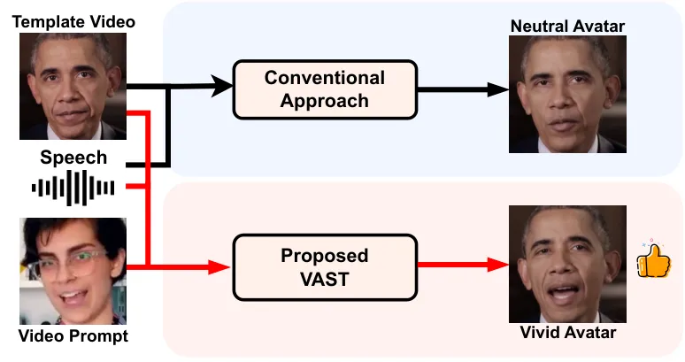
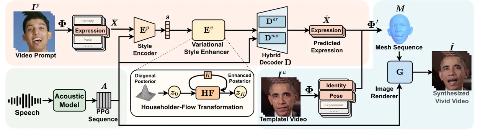
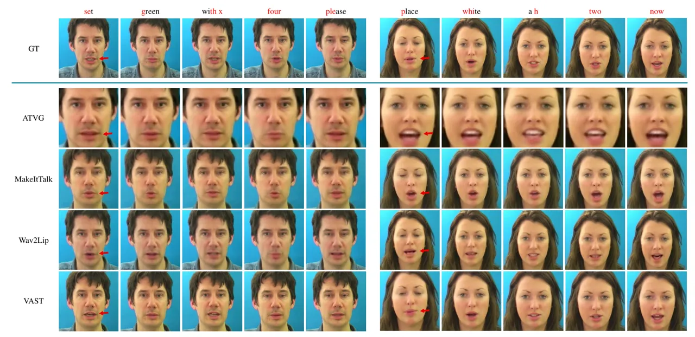
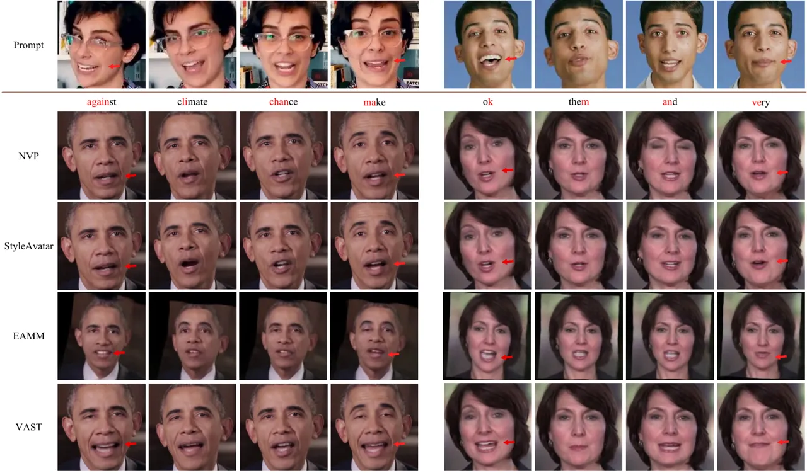
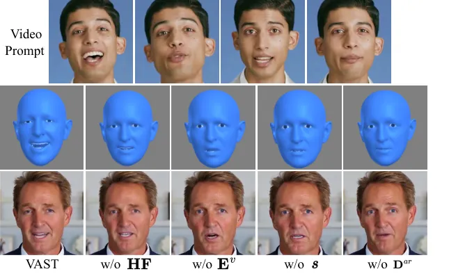
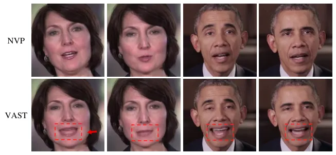
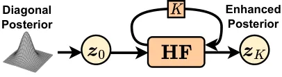

# VAST: Vivify Your Talking Avatar via Zero-Shot Expressive Facial Style Transfer

Liyang Chen Affiliation: Shenzhen International Graduate School,
Tsinghua University Affiliation: Microsoft{cly21,
bwh21}$`@`$mails.tsinghua.edu.cn
zywu@sz.tsinghua.edu.cnlingjun$`@`$sjtu.edu.cn {runnan.li, xuta,
sheng.zhao}$`@`$microsoft.com    Zhiyong Wu Affiliation: Shenzhen
International Graduate School, Tsinghua University    Runnan Li
Affiliation: Microsoft{cly21, bwh21}$`@`$mails.tsinghua.edu.cn
zywu@sz.tsinghua.edu.cnlingjun$`@`$sjtu.edu.cn {runnan.li, xuta,
sheng.zhao}$`@`$microsoft.com    Weihong Bao Affiliation: Shenzhen
International Graduate School, Tsinghua University    Jun Ling
Affiliation: Shanghai Jiao Tong University    Xu Tan
Affiliation: Microsoft{cly21, bwh21}$`@`$mails.tsinghua.edu.cn
zywu@sz.tsinghua.edu.cnlingjun$`@`$sjtu.edu.cn {runnan.li, xuta,
sheng.zhao}$`@`$microsoft.com    Sheng Zhao
Affiliation: Microsoft{cly21, bwh21}$`@`$mails.tsinghua.edu.cn
zywu@sz.tsinghua.edu.cnlingjun$`@`$sjtu.edu.cn {runnan.li, xuta,
sheng.zhao}$`@`$microsoft.com

###### Abstract

Current talking face generation methods mainly focus on speech-lip
synchronization. However, insufficient investigation on the facial
talking style leads to a lifeless and monotonous avatar. Most previous
works fail to imitate expressive styles from arbitrary video prompts and
ensure the authenticity of the generated video. This paper proposes an
unsupervised variational style transfer model (VAST) to vivify the
neutral photo-realistic avatars. Our model consists of three key
components: a style encoder that extracts facial style representations
from the given video prompts; a hybrid facial expression decoder to
model accurate speech-related movements; a variational style enhancer
that enhances the style space to be highly expressive and meaningful.
With our essential designs on facial style learning, our model is able
to flexibly capture the expressive facial style from arbitrary video
prompts and transfer it onto a personalized image renderer in a
zero-shot manner. Experimental results demonstrate the proposed approach
contributes to a more vivid talking avatar with higher authenticity and
richer expressiveness.

## 1 Introduction

Building audio-driven photo-realistic avatars to provide humanoid and
natural interaction experiences for users is highly attractive. This
technology has great potential in various scenarios, such as
human-computer interaction, virtual reality, filmmaking, game creation,
and online education. While previous works \[37, 2, 38, 3, 28, 52, 27\]
have achieved great strides in generating high-quality avatar videos
with speech-aligned lip movements, the lack of expressive facial
expressions still limits their widespread use. Facial expressions convey
more information beyond the speech context and can make the speech more
persuasive, encouraging, and appealing. This creates a vivid avatar
other than a neutral talking avatar.



Figure 1: Concept diagram for the proposed method. Expressive video
prompt is employed to amend the expression prediction for vivid avatar
generation.

Several recent approaches \[45, 14, 50, 13\] aim to generate vivid
avatars by modeling facial talking style information. For instance,
\[45, 14\] introduce discrete emotional labels to provide explicit style
guidance. StyleAvatar \[50\] represents the facial styles with
manually-defined features. GC-AVT \[21\] and EAMM \[13\] disentangles
style from the raw reference video images. Although these methods can
improve the expressiveness of generated avatars, they still suffer from
certain limitations: 1) They struggle to transfer natural facial styles
from arbitrary video in a robust manner; 2) The style representation
derived by these methods cannot effectively preserve the style being
imitated, resulting in the deficient expressiveness of the synthesized
avatar; 3) These methods compromise the authenticity of the generation,
particularly in terms of speech-lip synchronization and naturalness.

In this paper, we propose an unsupervised VAriational Style Transfer
model (VAST) to vivify the neutral photo-realistic avatar with arbitrary
video prompts. As shown in Fig. 1, compared to conventional approaches,
the proposed model utilizes the video prompts as an additional input,
alongside a speech utterance and a template video of the target avatar,
to generate a vivid avatar that reenacts speech-synchronized mouth
movements with facial style that transferred from the given video
prompt.

The proposed VAST designs an unsupervised encoder-decoder architecture
to learn facial style representation during training, and transfer the
style in a zero-shot manner during inference. The encoder, based on the
convolutional and recurrent network, obtains robust style representation
from variable-length expression sequences. To further enhance the
expressiveness of the learned representation, a variational
autoencoder-based style enhancer is incorporated, that utilizes
normalizing flow to enrich the diagonal posterior. During decoding, VAST
designs a hybrid decoder constructed with the autoregressive (AR) and
non-autoregressive (NAR) networks, that separately estimate the
speech-weakly-related and speech-strongly-related expression parameters.
Specially, to ensure flexible facial style transfer, a parametric face
model \[49\] is employed for robust facial parameters extraction. In the
end, a pretrained image renderer is utilized to synthesize visual
appearances for the photo-realistic avatar. Extensive experiments have
demonstrated that VAST outperforms state-of-the-art methods with higher
authenticity and richer expressiveness in vivid avatar video generation.
In expressiveness user study, the proposed VAST achieves a relative
improvement of 14.4$`\%`$ comparing to state-of-the-art approaches.

The contributions of this work can be summarized as: 1) We propose a
variational style transfer model and effectively transfer arbitrary
expressive facial style onto a neutral avatar to produce vivid results
in a zero-shot manner. 2) The proposed variational style enhancer
obtains more expressive generation. 3) The proposed hybrid decoder
guarantees the speech-lip synchronization and overall authenticity.



Figure 2: Overview of the proposed method. $`\mathbf{\Phi}`$ denotes the
encoding process of the parametric face model \[49\] that extracts the
facial parameters. $`\mathbf{\Phi}^{\prime}`$ denotes the decoding
process to output mesh from the facial parameters. In training, the
video prompt and speech are paired. In inference, the video prompt can
come from any source.

## 2 Related Works

The audio-driven talking avatar generation task aims to generate talking
videos from the given speech. We review the related works from two
aspects, including the general pipelines of talking avatar and style
modeling in talking avatar.

Audio-driven talking avatar. The generation pipelines of audio-driven
talking avatar can be divided into two categories: image-warping and
template-editing.The image-warping pipeline \[2, 3, 28, 23, 23, 54, 27\]
aims at building a general model to drive a single portrait image.
DualLip \[3\] and Wav2Lip \[28\] directly learn a repairment from audio
for the cropped mouth region. PC-AVS \[54\] implicitly disentangles the
audio and visual representations for pose control. SyncTalkFace \[27\]
retrieves image features with the memory-aligned audio features for
finer details. LSP \[23\] presents a live system that generates
personalized talking-head animation. AVCT \[46\] warps the image by
inferring the keypoint based dense motion fields. The template-editing
pipeline \[37, 17, 38, 48, 18, 22, 51\] aims at building a
person-specific image renderer. Early attempts \[37, 17\] leverage
numerous video footage of a specific person. Recent works \[38, 48\]
introduce the 3D structural intermediate information \[7\] into the
video-based pipeline and reduce the training data. Several works also
devote efforts to environment denoising \[18\] and lip coherence \[22\]
for the more stable performance. The image-warping pipeline struggles to
handle the background and face distortion issues, resulting in
inauthentic synthetic results. In this paper, the proposed method is
built on the template-editing pipeline to achieve better video
synthesizing quality.

Style modeling in talking avatar. Recently, several studies \[45, 14,
50, 26, 13, 21, 24\] have explored how to generate a more vivid avatar
by modeling the facial talking style. MEAD \[45\] collects an emotional
talking face dataset and achieves coarse-grained emotion control. EVP
\[14\] utilizes this dataset and synthesizes more emotional dynamics by
decoupling speech into different latent features. NED \[26\] attempts to
explore the style representation from the reference video, but it still
needs labeled data for training. In the meantime, NED only manipulates
the emotion and preserves the speech, which is not audio-driven. GC-AVT
\[21\] and EAMM \[13\] also incorporate MEAD dataset, and they struggle
to derive emotion factor from the raw images, which is not flexible for
arbitrary subjects. The most-related work is StyleAvatar \[50\], which
attempts to employ the manual features to define talking style and can
capture the dynamic change of the facial expression. However, the manual
features have limited representation ability for the expressive facial
style. And StyleTalk \[24\], the latest image-warping based work,
extracts speaking style from a reference video. However, it has
limitations in preserving sufficient style information due to the use of
a flat style code, and it fails to retain the original portrait
identity.

## 3 Method

This paper proposes a variational style transfer model for vivid talking
avatar generation. Given a speech utterance and a video prompt as
inputs, our method generates a vivid avatar, which reenacts the mouth
movements that are synchronized with the speech and takes on the facial
style of the video prompt. The proposed VAST includes a style encoder, a
variational style enhancer, and a hybrid decoder. The encoder and
decoder realizes the zero-shot style transfer with the learned flat
style space. The variational style enhancer equips the style space with
complex dense distribution with the normalizing flow \[39\] enhanced
variational autoencoder (VAE) \[16, 33\]. The image renderer is inspired
by StableFace \[22\].

To be more specific, as shown in Fig. 2, the proposed method generates
the vivid avatar with the following steps: 1) The input speech is
represented as the speaker and language independent feature phonetic
posteriorgram (PPG) \[36\]
$`\boldsymbol{A}=[\boldsymbol{a}_{1},\ldots,\boldsymbol{a}_{T}]`$, where
$`T`$ is the frame length of the PPG sequence. 2) A parametric face
model $`\mathbf{\Phi}`$ \[49\] is adopted to achieve high-level fully
disentangled facial parameters (_e.g._, identity, expression, and pose)
from the input video prompt
$`\boldsymbol{I}^{p}=[\boldsymbol{I}^{p}_{1},\ldots,\boldsymbol{I}^{p}_{N}]`$,
where $`N`$ is the frame length of the video prompt. 3) The extracted
expression
$`\boldsymbol{X}=[\boldsymbol{x}_{1},\ldots,\boldsymbol{x}_{N}]\in\mathbb{R}^{N\times 233}`$
is sent into a style encoder $`\mathbf{E}^{p}`$ to obtain a compact
style embedding $`\boldsymbol{s}`$. 4) A variational style enhancer
$`\mathbf{E}^{v}`$ is followed to enrich the learned style space. 5) The
hybrid decoder $`\mathbf{D}`$, including an autoregressive decoder
$`\mathbf{D}^{ar}`$ and a non-autoregressive decoder
$`\mathbf{D}^{nar}`$, then predicts expression $`\hat{\boldsymbol{X}}`$
that conforms with the speech and the facial style in the video prompt. 6) $`\hat{\boldsymbol{X}}`$ and other facial parameters of the template
video are sent into the decoding procedure $`\mathbf{\Phi}^{\prime}`$ of
the face model to generate the mesh sequence $`\boldsymbol{M}`$. 7) An
image renderer $`\mathbf{G}`$ is finally adopted to synthesize
photo-realistic video $`\hat{\boldsymbol{I}}`$. We will describe
detailed designs of the proposed method in the following subsections.

### 3.1 Style Encoder

We firstly introduce how to obtain robust facial style representation
from various video prompt. To reduce the input complexity and remove
unnecessary information, the style representation is learned from the
extracted expression sequence $`\boldsymbol{X}`$ instead of the raw
video. The variable-length sequence $`\boldsymbol{X}`$ is passed through
convolution and recurrent layers and then compressed as a fixed-length
vector $`\boldsymbol{s}\in\mathbb{R}^{d_{\boldsymbol{s}}}`$. This
structure is usually adopted in learning the embedding for the sequence
data \[32\]. We consider this embedding as the style space, and sampling
from this space will yield natural facial style. The facial style is
compressed as a fixed-length vector other than a variable-length
sequence, since the style in a short-length video sample hardly changes.
This style encoder is also expected to perceive speech information and
fuse it with the facial style, since the speech affects the presentation
of facial style. Thus, we incorporate PPG into the encoder.

### 3.2 Variational Style Enhancer

Previous works \[38, 14, 18, 50\] usually adopt a deterministic model
with the mean square error (MSE) loss to predict expression from speech.
This always leads to the mean movement prediction of the training data
and decreases the expressiveness. To generate more expressive expression
other than mean movements, we design a variational style enhancer to
equip the style space with a complex distribution. We treat the style
vector $`\boldsymbol{s}`$ as the latent variable $`\boldsymbol{z}`$ in
VAE \[16, 33\] framework with a learnable prior distribution
$`p(\boldsymbol{z}\mid\boldsymbol{A})`$. Specifically, we develop our
model following the variational lower bound of the likelihood:

```math
\displaystyle\ln p_{\theta}(\boldsymbol{X}\mid\boldsymbol{A}) \displaystyle\geq\mathbb{E}_{q_{\phi}(\boldsymbol{z}\mid\boldsymbol{X},\boldsymbol{A})}[\ln p_{\theta}(\boldsymbol{X}\mid\boldsymbol{z},\boldsymbol{A})] \tag{1}
```

```math
\displaystyle-\mathrm{KL}(q_{\phi}(\boldsymbol{z}\mid\boldsymbol{X},\boldsymbol{A})\|p(\boldsymbol{z})),
```

where $`\mathrm{KL}`$ represents the Kullback-Leibler (KL)-divergence.
To be more specific,
$`q_{\phi}(\boldsymbol{z}\mid\boldsymbol{X},\boldsymbol{A})`$ is the
style encoder and
$`p_{\theta}(\boldsymbol{X}\mid\boldsymbol{z},\boldsymbol{A})`$ is the
hybrid expression decoder. The usual choice of
$`q_{\phi}(\boldsymbol{z}\mid\boldsymbol{X},\boldsymbol{A})`$ is a
diagonal covariance Gaussian
$`\mathcal{N}(\boldsymbol{z}\mid\boldsymbol{\mu}(\boldsymbol{X},\boldsymbol{A}),\boldsymbol{\sigma}^{2}(\boldsymbol{X},\boldsymbol{A})\mathbf{I})`$.

Normalizing Flow Enhancement. However, the diagonal posterior in the
vanilla VAE is insufficient enough to match the true posterior \[39\].
In this paper, we introduce the normalizing flow to enrich the diagonal
posterior. We try to pursue the full-covariance matrix instead of the
diagonal matrix in the vanilla VAE by applying a series of invertible
householder-flow ($`\mathbf{HF}`$) \[39\] based transformations
$`\mathbf{H}^{(k)}`$ on the initial latent variable
$`\boldsymbol{z}^{(0)}`$. After these $`K`$ transformations, we can
sample from a more flexible posterior $`\boldsymbol{z}^{(K)}`$. The
training loss for the variational style transfer model is:

```math
\displaystyle\mathcal{L}(\mathbf{E}^{p},\mathbf{E}^{v},\mathbf{D}) \displaystyle=\operatorname{KL}(q_{\phi}({\boldsymbol{z}}^{(0)}\mid\boldsymbol{X},\boldsymbol{A})||p({\boldsymbol{z}}^{(K)}))
```

```math
\displaystyle-\mathbb{E}_{q_{\phi}({\boldsymbol{z}}^{(0)}\mid\boldsymbol{X},\boldsymbol{A})}[\ln p_{\theta}(\boldsymbol{X}\mid{\boldsymbol{z}}^{(K)},\boldsymbol{A})
```

```math
\displaystyle-\sum_{k=1}^{K}\ln|\operatorname{det}{\frac{\partial\mathbf{H}^{(k)}}{\partial{\boldsymbol{z}}^{(k-1)}}}|] \tag{2}
```

The second term in Eq. 2 refers to the MSE loss, and it also leads to
the mean movement problem. To further alleviate this problem, we replace
the MSE loss with an asymmetric reconstruction loss \[40\], which helps
escape the mean movement problem and generate more detailed and
expressive movements. Detailed mathematical derivations of the loss
function are provided in the _Sup. Mat._.

### 3.3 Hybrid Facial Expression Decoder

To robustly generate speech-synchronized expressions, we split the
expression to speech-weakly-related parameters and
speech-strongly-related parameters, and specially design the decoder
architecture. Previous methods \[38, 50, 18\] usually adopt a single
model to predict the expressions of all dimensions. They neglect an
important feature of human facial movements: the movements on some
regions (_e.g._, mouth, chin, lip) have strong relationship with speech
while movements in other regions (_e.g._, eyes, forehead) are
weakly-related with speech. The former movements are vital for the lip
synchronization, and the prediction should be accurate-enough. The
latter movements are just spontaneous muscle movements that naturally
inherit from previous time steps, and this prediction does not require
high accuracy. On the contrary, a powerful network will regress the
outputs to a mean movement. For example, 90% eye-related parameters are
recorded as eye-open state in the training data, a powerful network
trained on such data will always generate eye-open results. Therefore, a
hybrid decoder is adopted to separately predict these two types of
movements.

Facial Expression Categorization. Since not all expressions \[49\] are
defined with physical meaning of facial movements, we start by exploring
which expressions are strongly and weakly correlated with speech. Such
correlations are computed as the vertex offset around the mouth region.
For each expression parameter defined by the face model \[49\], we
record the maximum vertex offset caused by the parameter changing within
a certain range. The larger offset it causes, the stronger correlation
it has with speech. We empirically select an appropriate offset
threshold to split these parameters into speech-weekly-related
$`\boldsymbol{x}^{wk}\in\mathbb{R}^{148}`$ and speech-strongly-related
parameters $`\boldsymbol{x}^{st}\in\mathbb{R}^{85}`$.

Autoregressive Decoder. For $`\boldsymbol{X}^{wk}`$ (sequence of
$`\boldsymbol{x}^{wk}`$), an autoregressive model $`\mathbf{D}^{ar}`$
with a simple architecture of long short-term memory network (LSTM)
\[10\] is adopted since it is biased to learn the dependency of data
itself across time. The autoregressive model also specializes in
generation with weakly-related control signal \[42\]. We employ PPG as
the condition of this prediction, and PPG is masked with dropout \[35\]
to manually prevent overfitting the spurious correlation. This
prediction can be formulated as:

```math
\displaystyle\hat{\boldsymbol{x}}^{wk}_{t}=\mathbf{D}^{ar}(\boldsymbol{x}^{wk}_{1:t-1},\mathbf{DP}(\boldsymbol{a}_{1:t-1}),\boldsymbol{s}), \tag{3}
```

where $`\mathbf{DP}`$ is the dropout function.

Non-Autoregressive Decoder. For $`\boldsymbol{X}^{st}`$ (sequence of
$`\boldsymbol{x}^{st}`$), a non-autoregressive model
$`\mathbf{D}^{nar}`$ with the architecture of Transformer \[44\] is
adopted for higher accuracy and greater semantic modeling ability.
Several Transformer blocks are stacked to encode the input features of
PPG and broadcast-repeated style embedding. Unlike other methods \[18,
50, 38\] predicting one-frame expression using multiple speech frames as
input, we directly treat this prediction as a sequence-to-sequence task
for better movement coherence:

```math
\displaystyle\hat{\boldsymbol{X}}^{st}=\mathbf{D}^{nar}(\boldsymbol{A},\boldsymbol{s}). \tag{4}
```

The design of hybrid decoder has no influence on the training loss and
VAST is still optimized by Eq. 2.

### 3.4 Image Renderer

The final module of our method is a photorealistic image renderer
$`\mathbf{G}`$. The renderer takes the mesh images $`\boldsymbol{M}`$
decoded by the face model \[49\] as input, and synthesizes portrait
images $`\hat{\boldsymbol{I}}`$. The synthesized images match the shape
and expression details of $`\boldsymbol{M}`$, and are inpainted with the
same appearance of the template video. We adopt L1 pixel-wise loss and
the perceptual VGG loss \[15\] for image reconstruction:

```math
\mathcal{L}_{rec}(\mathbf{G})=\|\hat{\boldsymbol{I}}-\boldsymbol{I}\|_{1}+\mathbf{VGG}(\hat{\boldsymbol{I}},\boldsymbol{I}), \tag{5}
```

where $`\boldsymbol{I}`$ is the ground-truth images, and
$`\mathbf{VGG}(\hat{\boldsymbol{I}},\boldsymbol{I})`$ denotes the L2
loss of features extracted by VGG network \[30\].

To improve the image quality and facial details, we employ the
conditional generative adversarial (cGAN) loss \[12\] to train a
discriminator $`\mathbf{D}`$ and the generator $`\mathbf{G}`$. The
ground-truth images $`\boldsymbol{I}`$ with its corresponding mesh
images $`\boldsymbol{M}`$ are annotated as the real sample pair, while
the generated images $`\hat{\boldsymbol{I}}`$ and $`\boldsymbol{M}`$ are
the fake. The loss functions can be written as:

```math
\displaystyle\mathcal{L}_{cGAN}(\mathbf{G},\mathbf{D}) \displaystyle=\mathbb{E}_{\boldsymbol{M},\boldsymbol{A},\boldsymbol{I}}[\log\mathbf{D}(\boldsymbol{M},\boldsymbol{I})] \tag{6}
```

```math
\displaystyle+\mathbb{E}_{\boldsymbol{M},\boldsymbol{A}}[\log(1-\mathbf{D}(\boldsymbol{M},\mathbf{G}(\boldsymbol{M},\boldsymbol{A}))]
```

To improve the consistency across the consecutive frames, we adopt a
U-Net structure as \[38\] the basic backbone for $`\mathbf{G}`$ and
enhance it with LSTM \[10\] layer. Different from \[38, 18\], the speech
feature $`\boldsymbol{A}`$ is also taken as input to improve the
speech-lip synchronization in the synthesized video.

The generator and discriminator are optimized by:

```math
\displaystyle\mathbf{G}^{*},\mathbf{D}=\arg\min_{\mathbf{G}}\max_{\mathbf{D}}\mathcal{L}_{cGAN}(\mathbf{G},\mathbf{D})+\mathcal{L}_{rec}(\mathbf{G}). \tag{7}
```



Figure 3: Qualitative comparison results on GRID dataset. ATVG \[2\]
produces blurry images. MakeItTalk \[34\] and Wav2Lip \[28\] generate
wrong lip movements in cases. The video prompt to provide style for our
method is randomly selected from other videos of the avatars that are
intended to be synthesized.

| Method            | CPBD$`\uparrow`$ | SSIM$`\uparrow`$ | FID$`\downarrow`$ | LMD$`\downarrow`$ | LMD-m$`\downarrow`$ | Sync-Dist$`\downarrow`$ | Sync-Conf$`\uparrow`$ | WER$`\downarrow`$ | M-Sync$`\uparrow`$ | M-Nat$`\uparrow`$ |
| ----------------- | ---------------- | ---------------- | ----------------- | ----------------- | ------------------- | ----------------------- | --------------------- | ----------------- | ------------------ | ----------------- |
| GT                | 0.2650           | -                | -                 | 0                 | 0                   | 6.959                   | 7.039                 | 0.067             | 4.65               | 4.72              |
| ATVG \[2\]        | 0.068            | 0.830            | 56.4              | 2.738             | 2.707               | 8.031                   | 5.434                 | 0.633             | 3.69               | 3.55              |
| MakeItTalk \[34\] | 0.1825           | 0.810            | 38.2              | 2.593             | 2.807               | 10.138                  | 3.446                 | 0.733             | 3.52               | 3.61              |
| Wav2Lip \[28\]    | 0.1174           | 0.946            | 22.6              | 1.616             | 1.760               | 6.472                   | 8.038                 | 0.500             | 3.84               | 3.82              |
| VAST              | 0.2265           | 0.922            | 21.0              | 1.444             | 1.479               | 6.656                   | 7.571                 | 0.233             | 4.53               | 4.38              |

Table 1: Quantitative comparison resuls on GRID dataset. M-Sync: MOS for
synchronization. M-Nat: MOS for naturalness.

## 4 Experiments

### 4.1 Experimental Setup

Dataset. Four datasets are leveraged: 1) GRID dataset \[5\]: a
high-quality video corpus with the neutral talking style, recorded in
laboratory conditions. We adopt the speaker s1 and s25 in this work. 2)
Ted-HD \[50\]: a 6-hour dataset collected from the Ted website. It
contains 60 speakers with diverse and natural talking styles, but
without any manual annotation. 3) Obama dataset: a single-speaker
audio-visual dataset with a neutral broadcasting style. We collect
30-minute Obama Weekly Address videos following \[37\]. 4) HDTF \[53\]:
a high-resolution in-the-wild video dataset, 10-minute video clips of
two speakers are selected.

Implementation Details. The original videos are downsampled to 25fps,
cropped for talking faces \[1\] and resized to $`256\times 256`$ pixels.
The prepared images are sent into the parametric face model \[49\] for
facial parameters extraction. To obtain robust representation of speech
PPG, we pretrain an acoustic model \[8\] with a large amount of
easily-available speech corpora. The speech is sampled at 16kHz. Filter
banks of 80 dimensions with a sliding window of 40ms width and 20ms
frame shift are utilized as the inputs of the acoustic model. The frame
rates of PPG and facial expression are different in training, thus we
adopt the interpolation operation \[6\] to align the audio and visual
features to the same length $`N`$. We adopt a two-step procedure to
train the variational style transfer model and image renderer. For the
style transfer model, we adopt 80 percent of GRID and Ted-HD data for
training with the loss defined in Eq. 2. These two datasets are mixed
together without any identity label. For the renderer module, GRID,
Obama and HDTF datasets are separately utilized for training the
person-specific avatars to visualize the vivid predicted expression.



Figure 4: Qualitative comparison results on Obama and HDTF datasets. The
video prompts are sampled from the Ted-HD and HDTF datasets with styles
like exciting-lecture (left female) and talk-show (right male). Our
method is more like the facial style of the video prompts. Bigger mouth
opening at vowels (_e.g._ /ei/ in make), tighter mouth shut at
consonants (_e.g._ /m/ in them), and even biting the lip (_e.g._ /v/ in
very) for our method.

| Metric                              | Ori   | NVP   | StyleAvatar | EAMM  | VAST  | Prompt |
| ----------------------------------- | ----- | ----- | ----------- | ----- | ----- | ------ |
| Dvt-$`\boldsymbol{X}\uparrow`$      | 22.35 | 20.81 | 24.25       | 25.92 | 26.72 | 29.33  |
| Dvt-$`\boldsymbol{X}^{st}\uparrow`$ | 27.49 | 23.96 | 30.42       | 31.12 | 36.32 | 36.15  |
| MOS $`\uparrow`$                    | -     | 3.78  | 3.60        | 3.40  | 4.12  | -      |

Table 2: Expressiveness comparisons on Obama dataset. Dvt: the diversity
metric \[31\]. all: expressions of all dimensions. st:
speech-strongly-related expressions. Ori: expressions from the original
Obama video.

Compared Methods. Two tasks are performed in our experiments: the
authenticity task, which evaluates lip synchronization and image
quality, and the expressiveness task, which evaluates the effectiveness
of transferred style onto the synthesized avatar. For the authenticity
evaluation, we compare our method with state-of-the-art audio-driven
works which mainly focus on speech-lip synchronization. ATVG \[2\]
generates video conditioned on the facial landmarks with dynamically
adjustable pixel-wise loss and an attention mechanism. MakeItTalk \[34\]
disentangles the content and speaker information to capture
speaker-aware dynamics. Wav2Lip \[28\] accurately morphs the lip
movements of arbitrary identities with an expert lip-sync discriminator.
For the expressiveness evaluation, we choose the code-available works
that are related with the template-editing pipeline \[38, 50\] and
expressiveness modeling \[50, 13\]. NVP \[38\] presents a novel
audio-driven face reenactment approach that is generalized among
different audio sources. Another compared method is StyleAvatar \[50\].
Since the original StyleAvatar synthesizes images of poor quality, for
fair comparison, we retain the style code design in StyleAvatar and use
our renderer to generate full portrait images. We also compare with EAMM
\[13\], which generates emotional talking faces by involving an emotion
source video.

| Metric                                 | VAST            | w/o $`\mathbf{HF}`$ | w/o $`\mathbf{E}^{v}`$ | w/o $`\boldsymbol{s}`$ | w/o $`\mathbf{D}^{ar}`$ |
| -------------------------------------- | --------------- | ------------------- | ---------------------- | ---------------------- | ----------------------- |
| Speech-Lip Sync $`\uparrow`$           | 3.89$`\pm`$0.21 | 3.82$`\pm`$0.19     | 3.86$`\pm`$0.22        | 3.49$`\pm`$0.21        | 3.42$`\pm`$0.22         |
| Expressiveness & Richness $`\uparrow`$ | 4.12$`\pm`$0.15 | 4.09$`\pm`$0.16     | 4.05$`\pm`$0.20        | 3.93$`\pm`$0.15        | 3.78$`\pm`$0.16         |
| Overall Naturalness $`\uparrow`$       | 4.20$`\pm`$0.14 | 4.06$`\pm`$0.16     | 4.22$`\pm`$0.14        | 3.98$`\pm`$0.17        | 4.07$`\pm`$0.19         |
| Diversity-$`\boldsymbol{X}\uparrow`$   | 26.72           | 26.53               | 25.80                  | 21.06                  | 20.81                   |

Table 3: MOS and diversity \[31\] results for ablation study. The
modules are removed from left to right step by step.

Objective Metrics. We compute several objective metrics that have been
widely adopted in previous works \[2, 38, 18\] to evaluate the image
quality and lip synchronization. CPBD \[25\] evaluates the sharpness and
FID \[9\] measures the realness of images. SSIM \[47\] measure the
reconstruction quality of images. LMD denotes the average distance of
all landmarks \[1\] on faces between the ground-truth and synthesized
images, while LMD-m only calculates the mouth-region landmarks. To
remove the head pose influence when calculating LMD, the Umeyama
algorithm \[41\] is introduced for landmark normalization. Sync-Dist and
Sync-Conf \[4\] are employed to score the speech-lip synchronization
performance. WER (word error rate) \[4\] measures the accuracy of lip
reading from videos.

Subjective Metrics. To evaluate the perceptual quality and
expressiveness on generated videos, mean opinion score (MOS) tests are
conducted in this work. Fifteen participants with proficient English
ability are invited in these tests, and they are asked to give a score
from 1 (worst) to 5 (best) on the test videos towards different aspects:
speech-lip synchronization, expressiveness, overall naturalness.

### 4.2 Authenticity Evaluation

Qualitative Comparison. The qualitative comparison results with other
methods is shown in Fig. 3. With the same speech input, we randomly
select several frames synthesized by different methods and assign these
frames with the words or phonemes that are being spoken. By zooming in
on the images, we can find that other methods produce blur images,
especially for the mouth and teeth regions. The proposed method produces
sharp details, which are closer to the ground-truth images. The proposed
method also generates highly speech-synchronized lip movements. When the
avatar is speaking the voiceless consonants (_e.g._ /p/ in place), the
mouth can be shut tightly. When it comes to the vowels (_e.g._ /ai/ in
white, /e/ in set), the lip movement is more expressive.



Figure 5: Qualitative result for ablation on HDTF dataset. The avatar is
speaking /ei/ of pray.

Quantitative Comparison. The quantitative comparison results are
presented in Table 1. Compared with other methods, our method achieves
competitive performance on image quality, although the renderer
architecture is not specially designed. In terms of speech-lip
synchronization, it can be observed that Sync-Dist and Sync-Conf by our
method are close to the ground-truth. It should be noticed that Wav2Lip
directly adopts SyncNet \[4\] as its discriminator, thus gains better
results on this metric by design. Our method obtains the lowest LMD and
LMD-m, which proves that our method generates lip movements of the
highest accuracy. These two metrics are actually more reliable and
objectively fair, since they simply calculate the landmark mean error.
The lowest WER result achieved by our method also proves the accurate
lip movement generation.

Subjective Comparison. The subjective comparison results are presented
in Table 1. The proposed VAST has achieved the best performance on both
lip synchronization and overall naturalness.

### 4.3 Expressiveness Evaluation

Qualitative Comparison. The qualitative comparison results are shown in
Fig. 4. Our method is able to generate more exaggerated and expressive
facial movements. The avatar can grin and open the mouth with a larger
amplitude. The wrinkles around the mouth region are deeper, which
indicates that the muscle movements are more powerful and the expression
around the cheek are richer. NVP opens the mouth only in a small range.
StyleAvatar opens the mouth slightly bigger, since it actually
introduces a bias signal (mean and variance of the reference video) to
the generation process. EAMM generates exaggerated expressions but bad
visual results. The proposed approach can produce more vivid movements
compared with other methods.

Quantitative Comparison. We adopt the diversity metric to estimate the
expressiveness of facial movements, which has been widely adopted in the
gesture and dance generation field \[19, 11, 20, 31\]. We compute the
average Euclidean distance of the generated expression sequences. This
metric reflects the variation of the sequence \[11\]. The diversity of
all-dimension expressions $`\boldsymbol{X}`$ and speech-strongly-related
expressions $`\boldsymbol{X}^{st}`$ are respectively computed. As
illustrated in Table 2, NVP obtains the lowest diversity, since it
directly predicts facial expression from audio and is optimized by the
MSE loss. Such a deterministic model always regresses to an average
output, leading to deficient expressiveness. StyleAvatar achieves higher
diversity due to the residual information it introduces with the style
codes. Our method significantly outperforms the baselines, and the
speech-related diversity has been improved greatly.

Subjective Comparison. The subjective comparison on expressiveness is
presented in the last row of Table 2. The proposed VAST has achieved the
best performance on expressiveness compared with state-of-the-art
methods, with at least 14.4$`\%`$ relative improvement.

(a) w/o $`\mathbf{E}^{v}`$.

(b) w/ $`\mathbf{E}^{v}`$.

Figure 6: Visualization of the learned style embedding.

### 4.4 Ablation Study

Qualitative Result. We present the qualitative result for ablation in
Fig. 5. It can be observed that VAST with complete designed modules
achieves accurate lip movements when speaking /ei/, and also transfers
the most similar facial style from the video prompt. The mesh results in
the second row are easier to observe the advantage of our method.

Subjective Evaluation & Diversity Metric. To verify the effectiveness of
the designed modules, we extensively conduct MOS test on the synthesized
videos. We randomly select 50 videos for test, 10 videos for each
category. The MOS results are shown in Table 3. The proposed method
achieves the highest scores in the terms of speech-lip synchronization
and expressiveness & richness. Without the variational style enhancer
$`\mathbf{E}^{v}`$, the expressiveness has a significant drop. The
normalizing flow module $`\mathbf{HF}`$ proves to perceptibly benefit
the VAE posterior, which is consistent with the theoretical design
\[39\]. The style embedding $`\boldsymbol{s}`$ proves to be crucial for
lip sync, since it provides the residual information that cannot be
predicted from the speech input. The absence of the autoregressive
decoder $`\mathbf{D}^{ar}`$ also leads to the performance drop. This
indicates that categorizing the facial expressions and introducing the
specific inductive bias for $`\boldsymbol{X}^{wk}`$ are practical and
effective. We also notice that these modules have less influence on the
overall naturalness because the template-editing pipeline has guaranteed
the naturalness and realness of synthesized videos.

Visualization of Style Space. Since the designed variational style
transfer model tends to learn a more meaningful latent space, we
visualize the latent embeddings. MEAD \[45\] dataset is introduced here
to provide emotion labels, and five emotions are selected. We extract
expressions from MEAD and obtain the style embeddings generated by the
style encoder and variational style enhancer. The t-SNE algorithm \[43\]
is utilized to reduce the data dimension and plot it onto the 2D plane.
As shown in Fig. 6, the embeddings obtained without the variational
style enhancer are mingled in chaos, while the variational module
contributes to more organized clusters of different emotions. It
demonstrates that introducing variational style enhancer results in
meaningful representation learning. Although the proposed model has
never been trained on any emotion-labeled data, it explores and
summarizes the semantic relationships between facial expressions and
emotions in an unsupervised manner, and generalizes to MEAD dataset.



Figure 7: Failed cases of the image renderer when the style is too
exaggerated.

### 4.5 Limitations

Although the proposed method can transfer arbitrary facial style to the
neutral avatar, there exists bad cases. As shown in Fig. 7, the avatar
synthesized by our method has noticeable artifacts around the mouth
region. Since the renderer in VAST is not specially designed and the
data for training the renderer lacks expressiveness, our method may
synthesize some blur results when the video prompt has too exaggerated
style. A renderer with more powerful structure trained on a wider range
of data may solve this issue.

## 5 Conclusion

This paper proposes VAST, a zero-shot facial style transfer method for
generating vivid talking avatars. VAST learns a discriminative and
meaningful facial style representation from arbitrary video prompts
using a style encoder and a variational style enhancer. A hybrid facial
expression decoder is employed to transfer this representation onto a
neutral avatar with high authenticity and rich expressiveness.
Qualitative and quantitative results demonstrate the superiority of VAST
over the state-of-the-art methods.

Acknowledgement. This work is supported by National Natural Science
Foundation of China (62076144), Shenzhen Key Laboratory of next
generation interactive media innovative technology
(ZDSYS20210623092001004) as well as Shenzhen Science and Technology
Program (WDZC20220816140515001, JCYJ20220818101014030).

## References

- \[1\] Adrian Bulat and Georgios Tzimiropoulos. How far are we from
  solving the 2D & 3D face alignment problem? (And a dataset of 230,000
  3D facial landmarks). In Proceedings of the IEEE International
  Conference on Computer Vision (ICCV), pages 1021–1030, 2017.
- \[2\] Lele Chen, Ross K Maddox, Zhiyao Duan, and Chenliang Xu.
  Hierarchical cross-modal talking face generation with dynamic
  pixel-wise loss. In Proceedings of the IEEE Conference on Computer
  Vision and Pattern Recognition (CVPR), pages 7832–7841, 2019.
- \[3\] Weicong Chen, Xu Tan, Yingce Xia, Tao Qin, Yu Wang, and Tie-Yan
  Liu. Duallip: A system for joint lip reading and generation. In
  Proceedings of the ACM International Conference on Multimedia (ACMMM),
  page 1985–1993, 2020.
- \[4\] Joon Son Chung and Andrew Zisserman. Lip reading in the wild. In
  Proceedings of the Asian Conference on Computer Vision (ACCV), pages
  87–103, 2016.
- \[5\] Martin Cooke, Jon Barker, Stuart Cunningham, and Xu Shao. An
  audio-visual corpus for speech perception and automatic speech
  recognition. Acoustical Society of America Journal (JASA),
  120(5):2421, 2006.
- \[6\] Daniel Cudeiro, Timo Bolkart, Cassidy Laidlaw, Anurag Ranjan,
  and Michael J. Black. Capture, learning, and synthesis of 3D speaking
  styles. In Proceedings of the IEEE Conference on Computer Vision and
  Pattern Recognition (CVPR), pages 10093–10103, 2019.
- \[7\] Yu Deng, Jiaolong Yang, Sicheng Xu, Dong Chen, Yunde Jia, and
  Xin Tong. Accurate 3D face reconstruction with weakly-supervised
  learning: From single image to image set. In Proceedings of the IEEE
  Conference on Computer Vision and Pattern Recognition Workshops
  (CVPRW), pages 285–295, 2019.
- \[8\] Awni Hannun, Carl Case, Jared Casper, Bryan Catanzaro, Greg
  Diamos, Erich Elsen, Ryan Prenger, Sanjeev Satheesh, Shubho Sengupta,
  Adam Coates, and Andrew Y. Ng. Deep Speech: Scaling up end-to-end
  speech recognition. arXiv preprint arXiv:1412.5567, 2014.
- \[9\] Martin Heusel, Hubert Ramsauer, Thomas Unterthiner, Bernhard
  Nessler, and Sepp Hochreiter. GANs trained by a two time-scale update
  rule converge to a local nash equilibrium. In Proceedings of the
  International Conference on Neural Information Processing Systems
  (NIPS), page 6629–6640, 2017.
- \[10\] Sepp Hochreiter and Jürgen Schmidhuber. Long short-term memory.
  Neural Computation, 9(8):1735–1780, 1997.
- \[11\] Ruozi Huang, Huang Hu, Wei Wu, Kei Sawada, Mi Zhang, and Daxin
  Jiang. Dance Revolution: Long-term dance generation with music via
  curriculum learning. In Proceedings of the International Conference on
  Learning Representations (ICLR), 2020.
- \[12\] Phillip Isola, Jun-Yan Zhu, Tinghui Zhou, and Alexei A. Efros.
  Image-to-image translation with conditional adversarial networks. In
  Proceedings of the IEEE Conference on Computer Vision and Pattern
  Recognition (CVPR), pages 5967–5976, 2017.
- \[13\] Xinya Ji, Hang Zhou, Kaisiyuan Wang, Qianyi Wu, Wayne Wu, Feng
  Xu, and Xun Cao. EAMM: One-shot emotional talking face via audio-based
  emotion-aware motion model. In Proceedings of the ACM Special Interest
  Group on Computer Graphics and Interactive Techniques (SIGGRAPH),
  page 10, 2022.
- \[14\] Xinya Ji, Hang Zhou, Kaisiyuan Wang, Wayne Wu, Chen Change Loy,
  Xun Cao, and Feng Xu. Audio-driven emotional video portraits. In
  Proceedings of the IEEE Conference on Computer Vision and Pattern
  Recognition (CVPR), pages 14080–14089, 2021.
- \[15\] Justin Johnson, Alexandre Alahi, and Li Fei-Fei. Perceptual
  losses for real-time style transfer and super-resolution. In
  Proceedings of the European Conference on Computer Vision (ECCV),
  pages 694–711, 2016.
- \[16\] Diederik P Kingma and Max Welling. Auto-encoding variational
  Bayes. arXiv preprint arXiv:1312.6114, 2022.
- \[17\] Rithesh Kumar, Jose Sotelo, Kundan Kumar, Alexandre de
  Brebisson, and Yoshua Bengio. ObamaNet: Photo-realistic lip-sync from
  text. arXiv preprint arXiv:1801.01442, 2017.
- \[18\] Avisek Lahiri, Vivek Kwatra, Christian Frueh, John Lewis, and
  Chris Bregler. LipSync3D: Data-efficient learning of personalized 3D
  talking faces from video using pose and lighting normalization. In
  Proceedings of the IEEE Conference on Computer Vision and Pattern
  Recognition (CVPR), pages 2755–2764, 2021.
- \[19\] Hsin-Ying Lee, Xiaodong Yang, Ming-Yu Liu, Ting-Chun Wang,
  Yu-Ding Lu, Ming-Hsuan Yang, and Jan Kautz. Dancing to music. In
  Proceedings of the International Conference on Neural Information
  Processing Systems (NIPS), volume 32, 2019.
- \[20\] Ruilong Li, Shan Yang, David A. Ross, and Angjoo Kanazawa. AI
  Choreographer: Music conditioned 3D dance generation with AIST++. In
  Proceedings of the IEEE International Conference on Computer Vision
  (ICCV), pages 13381–13392, 2021.
- \[21\] Borong Liang, Yan Pan, Zhizhi Guo, Hang Zhou, Zhibin Hong,
  Xiaoguang Han, Junyu Han, Jingtuo Liu, Errui Ding, and Jingdong Wang.
  Expressive talking head generation with granular audio-visual control.
  In Proceedings of the IEEE Conference on Computer Vision and Pattern
  Recognition (CVPR), pages 3387–3396, 2022.
- \[22\] Jun Ling, Xu Tan, Liyang Chen, Runnan Li, Yuchao Zhang, Sheng
  Zhao, and Li Song. StableFace: Analyzing and improving motion
  stability for talking face generation. arXiv preprint
  arXiv:2208.13717, 2022.
- \[23\] Yuanxun Lu, Jinxiang Chai, and Xun Cao. Live Speech Portraits:
  Real-time photorealistic talking-head animation. ACM Transactions on
  Graphics (TOG), 40(6):17, 2021.
- \[24\] Yifeng Ma, Suzhen Wang, Zhipeng Hu, Changjie Fan, Tangjie Lv,
  Yu Ding, Zhidong Deng, and Xin Yu. StyleTalk: One-shot talking head
  generation with controllable speaking styles. In Proceedings of the
  Association for the Advancement of Artificial Intelligence Conference
  (AAAI), volume 37, pages 1896–1904, 2023.
- \[25\] Niranjan D. Narvekar and Lina J. Karam. A no-reference
  perceptual image sharpness metric based on a cumulative probability of
  blur detection. In Proceedings of the International Workshop on
  Quality of Multimedia Experience, pages 87–91, 2009.
- \[26\] Foivos Paraperas Papantoniou, Panagiotis P. Filntisis, Petros
  Maragos, and Anastasios Roussos. Neural Emotion Director:
  Speech-preserving semantic control of facial expressions in
  “in-the-wild” videos. In Proceedings of the IEEE Conference on
  Computer Vision and Pattern Recognition (CVPR), pages
  18759–18768, 2022.
- \[27\] Se Jin Park, Minsu Kim, Joanna Hong, Jeongsoo Choi, and
  Yong Man Ro. SyncTalkFace: Talking face generation with precise
  lip-syncing via audio-lip memory. In Proceedings of the Association
  for the Advancement of Artificial Intelligence Conference (AAAI),
  volume 36, pages 2062–2070, 2022.
- \[28\] K R Prajwal, Rudrabha Mukhopadhyay, Vinay P. Namboodiri, and
  C.V. Jawahar. A lip sync expert is all you need for speech to lip
  generation in the wild. In Proceedings of the ACM International
  Conference on Multimedia (ACMMM), page 484–492, 2020.
- \[29\] Danilo Rezende and Shakir Mohamed. Variational inference with
  normalizing flows. In Proceedings of the International Conference on
  Machine Learning (ICML), volume 37, pages 1530–1538, 2015.
- \[30\] Karen Simonyan and Andrew Zisserman. Very deep convolutional
  networks for large-scale image recognition. In Proceedings of the
  International Conference on Learning Representations (ICLR), 2015.
- \[31\] Li Siyao, Weijiang Yu, Tianpei Gu, Chunze Lin, Quan Wang, Chen
  Qian, Chen Change Loy, and Ziwei Liu. Bailando: 3D dance generation by
  actor-critic GPT with choreographic memory. In Proceedings of the IEEE
  Conference on Computer Vision and Pattern Recognition (CVPR), pages
  11050–11059, 2022.
- \[32\] RJ Skerry-Ryan, Eric Battenberg, Ying Xiao, Yuxuan Wang, Daisy
  Stanton, Joel Shor, Ron Weiss, Rob Clark, and Rif A. Saurous. Towards
  end-to-end prosody transfer for expressive speech synthesis with
  Tacotron. In Proceedings of the International Conference on Machine
  Learning (ICML), volume 80, pages 4693–4702, 2018.
- \[33\] Kihyuk Sohn, Honglak Lee, and Xinchen Yan. Learning structured
  output representation using deep conditional generative models. In
  Proceedings of the International Conference on Neural Information
  Processing Systems (NIPS), volume 28, page 3483–3491, 2015.
- \[34\] Linsen Song, Wayne Wu, Chen Qian, Ran He, and Chen Change Loy.
  Everybody’s Talkin’: Let me talk as you want. IEEE Transactions on
  Information Forensics and Security (TIFS), 17:585–598, 2022.
- \[35\] Nitish Srivastava, Geoffrey Hinton, Alex Krizhevsky, Ilya
  Sutskever, and Ruslan Salakhutdinov. Dropout: A simple way to prevent
  neural networks from overfitting. Journal of Machine Learning
  Research, 15(56):1929–1958, 2014.
- \[36\] Lifa Sun, Kun Li, Hao Wang, Shiyin Kang, and Helen Meng.
  Phonetic posteriorgrams for many-to-one voice conversion without
  parallel data training. In Proceedings of the IEEE International
  Conference on Multimedia and Expo (ICME), pages 1–6, 2016.
- \[37\] Supasorn Suwajanakorn, Steven M. Seitz, and Ira
  Kemelmacher-Shlizerman. Synthesizing Obama: Learning lip sync from
  audio. ACM Transactions on Graphics (TOG), 36(4):13, 2017.
- \[38\] Justus Thies, Mohamed Elgharib, Ayush Tewari, Christian
  Theobalt, and Matthias Nießner. Neural voice puppetry: Audio-driven
  facial reenactment. In Proceedings of the European Conference on
  Computer Vision (ECCV), page 716–731, 2020.
- \[39\] Jakub M Tomczak and Max Welling. Improving variational
  auto-encoders using householder flow. In Proceedings of the
  International Conference on Neural Information Processing Systems
  Workshops, 2016.
- \[40\] Anh Tuan Tran, Tal Hassner, Iacopo Masi, and Gerard Medioni.
  Regressing robust and discriminative 3D morphable models with a very
  deep neural network. In Proceedings of the IEEE Conference on Computer
  Vision and Pattern Recognition (CVPR), pages 1493–1502, 2017.
- \[41\] S. Umeyama. Least-squares estimation of transformation
  parameters between two point patterns. IEEE Transactions on Pattern
  Analysis and Machine Intelligence, 13(4):376–380, 1991.
- \[42\] Aäron van den Oord, Sander Dieleman, Heiga Zen, Karen Simonyan,
  Oriol Vinyals, Alex Graves, Nal Kalchbrenner, Andrew Senior, and Koray
  Kavukcuoglu. WaveNet: A generative model for raw audio. In Proceedings
  of the 9th ISCA Speech Synthesis Workshop, page 125, 2016.
- \[43\] Laurens Van der Maaten and Geoffrey Hinton. Visualizing data
  using t-SNE. Journal of machine learning research (JMLR),
  9(11):2579–2605, 2008.
- \[44\] Ashish Vaswani, Noam Shazeer, Niki Parmar, Jakob Uszkoreit,
  Llion Jones, Aidan N Gomez, Ł ukasz Kaiser, and Illia Polosukhin.
  Attention is all you need. In Proceedings of the International
  Conference on Neural Information Processing Systems (NIPS), volume 30,
  page 6000–6010, 2017.
- \[45\] Kaisiyuan Wang, Qianyi Wu, Linsen Song, Zhuoqian Yang, Wayne
  Wu, Chen Qian, Ran He, Yu Qiao, and Chen Change Loy. MEAD: A
  large-scale audio-visual dataset for emotional talking-face
  generation. In Proceedings of the European Conference on Computer
  Vision (ECCV), page 700–717, 2020.
- \[46\] Suzhen Wang, Lincheng Li, Yu Ding, and Xin Yu. One-shot talking
  face generation from single-speaker audio-visual correlation learning.
  In Proceedings of the Association for the Advancement of Artificial
  Intelligence Conference (AAAI), volume 36, pages 2531–2539, 2022.
- \[47\] Zhou Wang, A.C. Bovik, H.R. Sheikh, and E.P. Simoncelli. Image
  quality assessment: From error visibility to structural similarity.
  IEEE Transactions on Image Processing (TIP), 13(4):600–612, 2004.
- \[48\] Xin Wen, Miao Wang, Christian Richardt, Ze-Yin Chen, and
  Shi-Min Hu. Photo-realistic audio-driven video portraits. IEEE
  Transactions on Visualization and Computer Graphics (TVCG),
  26(12):3457–3466, 2020.
- \[49\] Erroll Wood, Tadas Baltrušaitis, Charlie Hewitt, Sebastian
  Dziadzio, Thomas J. Cashman, and Jamie Shotton. Fake it till you make
  it: Face analysis in the wild using synthetic data alone. In
  Proceedings of the IEEE International Conference on Computer Vision
  (ICCV), pages 3681–3691, 2021.
- \[50\] Haozhe Wu, Jia Jia, Haoyu Wang, Yishun Dou, Chao Duan, and
  Qingshan Deng. Imitating arbitrary talking style for realistic
  audio-driven talking face synthesis. In Proceedings of the ACM
  International Conference on Multimedia (ACMMM), page 1478–1486, 2021.
- \[51\] Zhenhui Ye, Ziyue Jiang, Yi Ren, Jinglin Liu, Jinzheng He, and
  Zhou Zhao. GeneFace: Generalized and high-fidelity audio-driven 3D
  talking face synthesis. In Proceedings of the International Conference
  on Learning Representations (ICLR), 2023.
- \[52\] Chenxu Zhang, Yifan Zhao, Yifei Huang, Ming Zeng, Saifeng Ni,
  Madhukar Budagavi, and Xiaohu Guo. Facial: Synthesizing dynamic
  talking face with implicit attribute learning. In Proceedings of the
  IEEE International Conference on Computer Vision (ICCV), pages
  3867–3876, 2021.
- \[53\] Zhimeng Zhang, Lincheng Li, Yu Ding, and Changjie Fan.
  Flow-guided one-shot talking face generation with a high-resolution
  audio-visual dataset. In Proceedings of the IEEE Conference on
  Computer Vision and Pattern Recognition (CVPR), pages 3661–3670, 2021.
- \[54\] Hang Zhou, Yasheng Sun, Wayne Wu, Chen Change Loy, Xiaogang
  Wang, and Ziwei Liu. Pose-controllable talking face generation by
  implicitly modularized audio-visual representation. In Proceedings of
  the IEEE Conference on Computer Vision and Pattern Recognition (CVPR),
  pages 4174–4184, 2021.

## A Variational Style Enhancer

One of the key contributions of our method is that we propose the
variational style enhancer, which enhances the style space to be highly
expressive and meaningful. Without this enhancer, the style space
learned by the style encoder and hybrid decoder is flat. The variational
style enhancer is based on variational autoencoder \[16, 33\] and
normalizing flow \[39\]. The training of this enhancer can be considered
as the reconstruction of facial expressions, which is conditional on the
speech. If we remove the normalizing flow module, the loss function thus
becomes:

```math
\displaystyle\ln p_{\theta}(\boldsymbol{X}\mid\boldsymbol{A}) \displaystyle\geq\mathbb{E}_{q_{\phi}(\boldsymbol{z}\mid\boldsymbol{X},\boldsymbol{A})}[\ln p_{\theta}(\boldsymbol{X}\mid\boldsymbol{z},\boldsymbol{A})] \tag{8}
```

```math
\displaystyle-\mathrm{KL}(q_{\phi}(\boldsymbol{z}\mid\boldsymbol{X},\boldsymbol{A})\|p(\boldsymbol{z}|\boldsymbol{A})),
```

where $`\boldsymbol{X}`$ is the facial expression sequence, and
$`\boldsymbol{A}`$ is the corresponding phonetic posteriorgram (PPG)
\[36\] sequence. Since the latent variable $`\boldsymbol{z}`$ can be
considered to be independent with $`\boldsymbol{A}`$, Eq. 8 is further
defined as

```math
\displaystyle\ln p_{\theta}(\boldsymbol{X}\mid\boldsymbol{A}) \displaystyle\geq\mathbb{E}_{q_{\phi}(\boldsymbol{z}\mid\boldsymbol{X},\boldsymbol{A})}[\ln p_{\theta}(\boldsymbol{X}\mid\boldsymbol{z},\boldsymbol{A})] \tag{9}
```

```math
\displaystyle-\mathrm{KL}(q_{\phi}(\boldsymbol{z}\mid\boldsymbol{X},\boldsymbol{A})\|p(\boldsymbol{z})).
```



Figure 8: Illustration of the variational style enhancer.

To achieve a more flexible posterior distribution other than a simple
diagonal Gaussian, we apply the householder-transformation \[39\] based
normalizing flow to enhance the variational inference \[29\]. By
applying a sequence of invertible mappings
$`\mathbf{H}^{(k)},k=1,\ldots,K,`$ over the initial variable, we obtain
a more valid and flexible probability distribution at the end of this
sequence. As shown in Fig. 8,
$`\boldsymbol{z}^{(k)}=\mathbf{H}^{(k)}(\boldsymbol{z}^{(k-1)})`$ and
the distribution of $`\boldsymbol{z}^{(k)}`$ can be transformed from the
previous $`\boldsymbol{z}^{(k-1)}`$:

```math
\displaystyle p(\boldsymbol{z}^{(k)}) \displaystyle=p(\boldsymbol{z}^{(k-1)})|\operatorname{det}\frac{\partial{\mathbf{H}^{(k)}}^{-1}}{\partial\boldsymbol{z}^{(k)}}| \tag{10}
```

```math
\displaystyle=p(\boldsymbol{z}^{(k-1)})|\operatorname{det}\frac{\partial\mathbf{H}^{(k)}}{\partial\boldsymbol{z}^{(k-1)}}|^{-1}, \tag{11}
```

where $`\operatorname{det}`$ denotes the Jacobian determinant of the
transformation. The density of $`\boldsymbol{z}^{(k)}`$ is obtained by
successively transforming $`\boldsymbol{z}^{(0)}`$ through a sequence of
transformations:

Figure 9: Illustration of the renderer module. The background images and
mesh images are concatenated. The images are fed as a sequence of 16
frames for a training sample. The input can be of variable length in the
inference stage.

```math
\displaystyle\boldsymbol{z}^{(K)} \displaystyle=\mathbf{H}^{(K)}\circ\ldots\circ\mathbf{H}^{(2)}\circ\mathbf{H}^{(1)}(\boldsymbol{z}^{(0)}), \tag{12}
```

```math
\displaystyle\ln p_{K}(\boldsymbol{z}^{(K)}) \displaystyle=\ln p_{0}(\boldsymbol{z}^{(0)})-\sum_{k=1}^{K}\ln|\operatorname{det}\frac{\partial\mathbf{H}^{(k)}}{\partial\boldsymbol{z}^{(k-1)}}|. \tag{13}
```

With the enhanced posterior distribution replacing the vanilla diagonal
posterior, Eq. 9 thus becomes

```math
\displaystyle\ln p_{\theta}(\boldsymbol{X}\mid\boldsymbol{A}) \displaystyle\geq\mathbb{E}_{q_{\phi}({\boldsymbol{z}}^{(0)}\mid\boldsymbol{X},\boldsymbol{A})}[\ln p_{\theta}(\boldsymbol{X}\mid{\boldsymbol{z}}^{(K)},\boldsymbol{A}) \tag{14}
```

```math
\displaystyle+\sum_{k=1}^{K}\ln|\operatorname{det}{\frac{\partial\mathbf{H}^{(k)}}{\partial{\boldsymbol{z}}^{(k-1)}}}|]
```

```math
\displaystyle-\operatorname{KL}(q_{\phi}({\boldsymbol{z}}^{(0)}\mid\boldsymbol{X},\boldsymbol{A})||p({\boldsymbol{z}}^{(K)})),
```

where the first reconstruction term is formulated with
$`\boldsymbol{z}^{(K)}`$, since we finally sample from the distribution
of $`\boldsymbol{z}^{(K)}`$. The first term can also be
$`\mathbb{E}_{q_{\phi}({\boldsymbol{z}}^{(0)}\mid\boldsymbol{X},\boldsymbol{A})}[\ln p_{\theta}(\boldsymbol{X}\mid{\boldsymbol{z}}^{(0)},\boldsymbol{A})]`$.

## B Renderer Structure

We adopt the conditional generative network (CGAN) \[12\] as the basic
framework for the renderer. The eroded background images
$`\boldsymbol{I}^{bg}`$ and corresponding 3D face representation mesh
sequence \[49\] $`\boldsymbol{M}`$ are taken as the conditional input.
As shown in Fig. 9, the renderer is designed as an encoder-decoder
structure. The image encoder is composed of three convolutional layers
with stride 2. The encoded bottleneck features contain compact
information about face shape, appearance, and image background. To
enable the renderer to be perceptual about the relation between speech
features and the mouth-region movements and enhance the synthesis
accuracy on the mouth shape, the speech features PPG are injected into
the bottleneck features. The PPG features and image encoder features are
sent into the audio-image fusion module and output the final bottleneck
features. This fusion module is constructed with four convolutional
layers. To capture the time dependency among the sequence of audio and
image features, a long short-term memory (LSTM) \[10\] module is
utilized after the fusion module. Finally, the decoder which is composed
of two transposed convolutional layers is employed to output the
reconstructed images $`\hat{\boldsymbol{I}}`$.

## C MOS Guideline

In the authenticity evaluation, expressiveness evaluation and ablation
study, we extensively conduct the MOS tests to verify the effectiveness
of the proposed method. Three main aspects are taken into account in
these tests: speech-lip sync, expressiveness & richness, and overall
naturalness. Fifteen judgers participate in these tests. We now list the
questions they are asked to evaluate these three aspects.

#### 1. Speech-Lip Sync.

How much do the lip movements match the audio? Very good (5) for no
wrong lip movements and have nothing different from the ground-truth
person talking. Very poor (1) for the lip movements are totally
unreasonable and cannot read content from the lips at all.

#### 2. Expressiveness & Richness.

How vivid or exaggerated is the avatar presented? Very good (5) for rich
and contagious expression on the mouth region. Very poor (1) for unreal
and monotonous facial movements.

#### 3. Overall Naturalness.

How real and natural is the synthesized video? Very good (5) for
high-quality images and natural avatar appearance. Very poor (1) for
fake artifacts or blurred images that can be easily observed.
