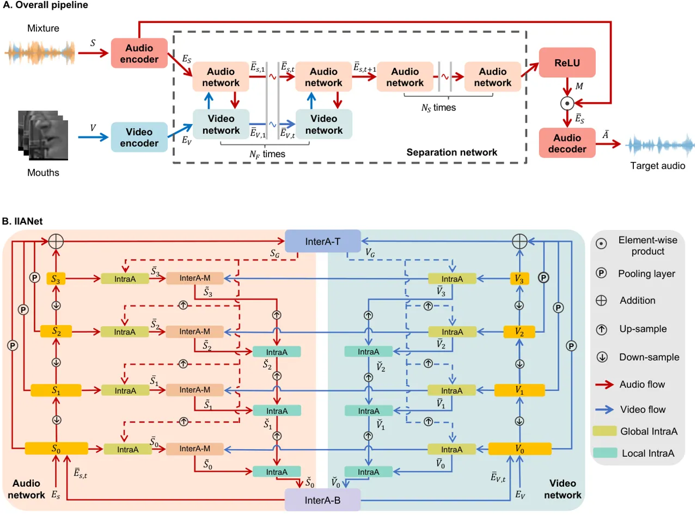
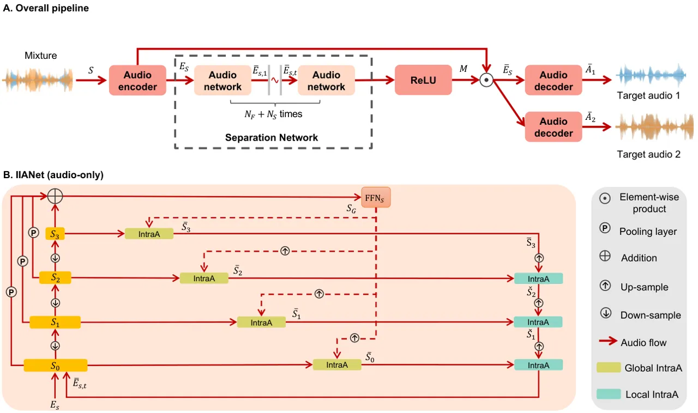
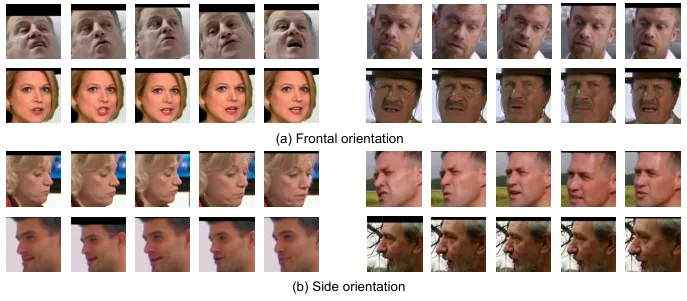
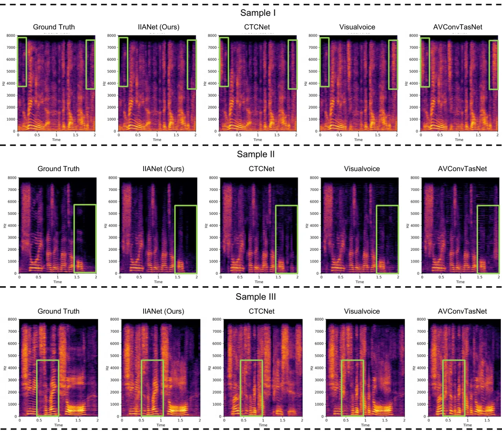

# IIANet: An Intra- and Inter-Modality Attention Network for Audio-Visual Speech Separation

Kai Li Affiliation: Department of Computer Science and Technology,
Institute for AI, BNRist, Tsinghua University, Beijing 100084, China   
Runxuan Yang Affiliation: Department of Computer Science and Technology,
Institute for AI, BNRist, Tsinghua University, Beijing 100084, China   
Fuchun Sun Affiliation: Department of Computer Science and Technology,
Institute for AI, BNRist, Tsinghua University, Beijing 100084, China   
Xiaolin Hu Affiliation: Department of Computer Science and Technology,
Institute for AI, BNRist, Tsinghua University, Beijing 100084, China
Affiliation: Tsinghua Laboratory of Brain and Intelligence (THBI),
IDG/McGovern Institute for Brain Research, Tsinghua University, Beijing
100084, China Affiliation: Chinese Institute for Brain Research (CIBR),
Beijing 100010, China Correspondence to: <xlhu@tsinghua.edu.cn>

###### Abstract

Recent research has made significant progress in designing fusion
modules for audio-visual speech separation. However, they predominantly
focus on multi-modal fusion at a single temporal scale of auditory and
visual features without employing selective attention mechanisms, which
is in sharp contrast with the brain. To address this issue, We propose a
novel model called Intra- and Inter-Attention Network (IIANet), which
leverages the attention mechanism for efficient audio-visual feature
fusion. IIANet consists of two types of attention blocks:
intra-attention (IntraA) and inter-attention (InterA) blocks, where the
InterA blocks are distributed at the top, middle and bottom of IIANet.
Heavily inspired by the way how human brain selectively focuses on
relevant content at various temporal scales, these blocks maintain the
ability to learn modality-specific features and enable the extraction of
different semantics from audio-visual features. Comprehensive
experiments on three standard audio-visual separation benchmarks (LRS2,
LRS3, and VoxCeleb2) demonstrate the effectiveness of IIANet,
outperforming previous state-of-the-art methods while maintaining
comparable inference time. In particular, the fast version of IIANet
(IIANet-fast) has only 7% of CTCNet’s MACs and is 40% faster than CTCNet
on CPUs while achieving better separation quality, showing the great
potential of attention mechanism for efficient and effective multimodal
fusion.

###### Keywords: 

Machine Learning, ICML

## 1 Introduction

In our daily lives, audio and visual signals are the primary means of
information transmission, providing rich cues for humans to obtain
valuable information in noisy environments (Cherry, 1953; Arons, 1992).
This innate ability is known as the “cocktail party effect”, also
referred to as “speech separation” in computer science. Speech
separation possesses extensive research significance, such as assisting
individuals with hearing impairments (Summerfield, 1992), enhancing the
auditory experience of wearable devices (Ryumin et al., 2023), etc.

Researchers have previously sought to address the cocktail party effect
through audio streaming alone (Luo & Mesgarani, 2019; Luo et al., 2020;
Hu et al., 2021). This task is called audio-only speech separation
(AOSS). However, the quality of the separation system may decline
dramatically when speech is corrupted by noise (Afouras et al., 2018a).
To address this issue, many researchers have focused on audio-visual
speech separation (AVSS), achieving remarkable progress. Existing AVSS
methods can be broadly classified into two categories based on their
fusion modules: CNN-based and Transformer-based. CNN-based methods (Gao
& Grauman, 2021; Li et al., 2022; Wu et al., 2019) exhibit lower
computational complexity and excellent local feature extraction
capabilities, enabling the extraction of audio-visual information at
multiple scales to capture local contextual relationships.
Transformer-based methods (Lee et al., 2021; Rahimi et al., 2022;
Montesinos et al., 2022) can leverage cross-attention mechanisms to
learn associations across different time steps, effectively handling
dynamic relationships between audio-visual information.

By comparing the working mechanisms of these AVSS methods and the brain,
we find that there are two major differences. First, auditory and visual
information undergoes neural integration at multiple levels of the
auditory and visual pathways, including the thalamus (Halverson &
Freeman, 2006; Cai et al., 2019), A1 and V1 (Mesik et al., 2015; Eckert
et al., 2008), and occipital cortex (Ghazanfar & Schroeder, 2006; Stein
& Stanford, 2008). However, most AVSS methods integrate audio-visual
information only at either coarse (Gao & Grauman, 2021; Lee et al., 2021) or fine (Li et al., 2022; Montesinos et al., 2022; Wu et al.,
2019; Rahimi et al., 2022) temporal scale, thus ignoring semantic
associations across different scales.

Second, numerous evidences have indicated that the human brain employs
selective attention to focus on relevant speech in a noisy environment
(Cherry, 1953; Golumbic et al., 2013). This also modulates neural
responses in a frequency-specific manner, enabling the tracked speech to
be distinguished and separated from competing speech (Golumbic et al.,
2013; Mesgarani & Chang, 2012; O’sullivan et al., 2015; Kaya & Elhilali,
2017; Cooke & Ellis, 2001; Aytar et al., 2016). The Transformer-based
AVSS methods adopt attention mechanisms (Rahimi et al., 2022; Montesinos
et al., 2022), but they commonly employ the Transformer as the backbone
network to extract and fuse audio-visual features, and the attention is
not explicitly designed for selecting speakers. In contrast to above
complex fusion strategies, our approach aims to design a simple and
efficient fusion module based on the selective attention mechanism.

To achieve this goal, inspired by the structure and function of the
brain, we propose a concise and efficient audio-visual fusion scheme,
called Intra- and Inter-Attention Network (IIANet), which leverages
different forms of attention¹¹ 1 Please note that here the
intra-attention and inter-attention are irrelevant to Transformer. to
extract diverse semantics from audio-visual features. IIANet consists of
two hierarchical unimodal networks, mimicking the audio and visual
pathways in the brain, and employs two types of attention mechanisms:
intra-attention (IntraA) within single modalities and inter-attention
(InterA) between modalities.

Following a recent AOSS model (Li et al., 2023), the IntraA has two
forms of top-down attention, global and local, which aim to enhance the
ability of the model to select relevant information in unimodal networks
with the guidance of higher-level features. This mechanism is inspired
by the massive top-down neural projections discovered in both auditory
(Guinan Jr, 2006; Budinger et al., 2008) and visual (Angelucci et al.,
2002; Felleman & Van Essen, 1991) pathways. The InterA mechanism aims to
select relevant information in one modality with the help of the
features in the other unimodal network. It is used at all levels of the
unimodal networks. Roughly speaking, the InterA block at the top level
(InterA-T) corresponds to higher associate cortical areas such as the
frontal cortex and occipital cortex (Raij et al., 2000; Keil et al.,
2012; Stein & Stanford, 2008), and at the bottom level (InterA-B)
corresponds to the thalamus (Halverson & Freeman, 2006; Cai et al.,
2019). The InterA blocks at the middle levels (InterA-M) reflect the
direct neural projections between different auditory areas and visual
areas, e.g., from the core and belt regions of the auditory cortex to
the V1 area (Falchier et al., 2002).

On three AVSS benchmarks, we found that IIANet surpassed the previous
SOTA method CTCNet (Li et al., 2022) by a considerable margin, while the
model inference time was nearly on par with CTCNet. We also built a fast
version of IIANet, termed IIANet-fast. It achieved an inference speed on
CPU that was more than twice as fast as CTCNet and still yielded better
separation quality on three benchmark datasets.

## 2 Related work

### 2.1 Audio-visual speech separation

Incorporating different modalities aligns better with the brain’s
processing (Calvert, 2001; Bar, 2007). Some methods (Gao & Grauman,
2021; Li et al., 2022; Wu et al., 2019; Lee et al., 2021; Rahimi et al.,
2022; Montesinos et al., 2022) have attempted to add visual cues in the
AOSS task to improve the clarity of separated audios, called
audio-visual speech separation (AVSS). They have demonstrated impressive
separation results in more complex acoustic environments, but these
methods only focus on audio-visual features fusion at a single temporal
scale in both modality, e.g., only at the finest (Wu et al., 2019; Li
et al., 2022) or coarsest (Gao & Grauman, 2021; Lee et al., 2021)
scales, which restrains their efficient utilization of different
modalities’ information. While CTCNet’s fusion module (Li et al., 2022)
attempts to improve separation quality by utilizing visual and auditory
features at different scales, it still focuses on fusion at the finest
temporal scales. This unintentionally hinders the effectiveness of using
visual information for guidance during the separation process. Moreover,
some of the AVSS models (Lee et al., 2021; Montesinos et al., 2022)
employ attention mechanisms within the process of inter-modal fusion,
while the significance of intra-modal attention mechanisms is
overlooked. This deficiency constrains their separation capabilities, as
the global information within the auditory modality plays a crucial role
in enhancing the clarity of the separated audio (Li et al., 2023).
Notably, the fusion module of these methods (Lee et al., 2021;
Montesinos et al., 2022) tend to use a similarity matrix to compute the
attention, which dramatically increases the computational complexity. In
contrast, our proposed IIANet uses the sigmoid function and element-wise
product for selective attention, which can efficiently integrate
audio-visual features at different temporal scales.

### 2.2 Attention mechanism in speech separation

Attention is a critical function of the brain (Rensink, 2000; Corbetta &
Shulman, 2002), serving as a pivotal mechanism for humans to cope with
complex internal and external environments. Our brain has the ability to
focus its superior resources to selectively process task-relevant
information (Schneider, 2013). It is widely accepted that numerous brain
regions are involved in the transmission of attention, forming an
intricate neural network of interconnections (Posner & Petersen, 1990;
Fukushima, 1986). These regions play distinct roles, enabling humans to
selectively focus on processing certain information at necessary times
and locations while ignoring other perceivable information. While this
ability is known to work well along with sensory or motor stimuli, it
also enables our brain to maintain the ability to process information in
real-time even in the absence of these stimuli (Tallon-Baudry, 2012;
Koch & Tsuchiya, 2007).

Recently, Kuo et al. (2022) constructed artificial neural networks to
simulate the attention mechanism of auditory features, confirming that
top-down attention plays a critical role in addressing the cocktail
party problem. Several recent AOSS models (Shi et al., 2018; Li et al.,
2023; Chen et al., 2023) have utilized top-down attention in designing
speech separation models. These approaches were able to reduce
computational costs while maintaining audio separation quality. They
have also shown excellent performance dealing with complex mixture
audio. However, the efficient integration of top-down and lateral
attention between modalities in AVSS models remains an unclear aspect.

## 3 The proposed model



Figure 1: The overall pipeline of IIANet. (A) IIANet consists of four
main components: audio encoder, video encoder, separation network, and
audio decoder. The red and blue tildes indicate that the same module is
repeated several times. (B) The separation network contains two types of
attention blocks: IntraA and InterA (InterA-T, InterA-M, InterA-B)
blocks. The dashed lines indicate the use of global features
$`\mathbf{S}_{G}`$ and $`\mathbf{V}_{G}`$ as top-down attention
modulation for multi-scale features $`\mathbf{S}_{i}`$ and
$`\mathbf{V}_{i}`$. All blocks use different parameters but keep the
same across different cycles.

Let $`\mathbf{A}\in R^{1\times T_{a}}`$ and
$`\mathbf{V}\in R^{H\times W\times T_{v}}`$ represent the audio and
video streams of an individual speaker, respectively, where $`T_{a}`$
denotes the audio length; $`H`$, $`W`$, and $`T_{v}`$ denote the height,
width, and the number of lip frames, respectively. We aim to separate a
high-quality, clean single-speaker audio $`\mathbf{A}`$ from the noisy
speech $`\mathbf{S}\in R^{1\times T_{a}}`$ based on the video cues
$`\mathbf{V}`$ and filter out the remaining speech components (other
interfering speakers). Specifically, our pipeline consists of four
modules: audio encoder, video encoder, separation network and audio
decoder (see Figure 1A).

The overall pipeline of the IIANet is summarized as follows. First, we
obtain a video containing two speakers from the streaming media, and the
lips are extracted from each image frame. Second, we encode the lip
frames and noisy speech into lip embeddings
$`\mathbf{E}_{V}\in R^{N_{v}\times T_{v}}`$ and noisy speech embeddings
$`\mathbf{E}_{S}\in R^{N_{a}\times T^{\prime}_{a}}`$ using a video
encoder same as CTCNet (Li et al., 2022) and an audio encoder (a 1D
convolutional layer), respectively, where $`N_{v}`$, $`N_{a}`$ and
$`T^{\prime}_{a}`$ are the visual and audio embedding dimensions and the
number of frames for audio embedding, respectively. Third, the
separation network takes $`\mathbf{E}_{S}`$ and $`\mathbf{E}_{V}`$ as
inputs and outputs a soft mask
$`\mathbf{M}\in R^{N_{a}\times T^{\prime}_{a}}`$ for the target speaker.
We multiply $`\mathbf{E}_{S}`$ with $`\mathbf{M}`$ to estimate the
target speaker’s speech embedding
($`\bar{\mathbf{E}}_{S}=\mathbf{E}_{S}\odot\mathbf{M}`$), where
“$`\odot`$” denotes the element-wise product. Finally, we utilize the
audio decoder (a 1D transposed convolutional layer) to convert the
$`\bar{\mathbf{E}}_{S}`$ back to the waveform, generating the target
speaker’s speech $`\bar{\mathbf{A}}\in R^{1\times T_{a}}`$.

### 3.1 Audio-visual separation network

Figure 2: Flow diagram of InraA and InterA blocks: (A) InterA-T block,
(B) IntraA block, (C) InterA-M block and (D) InterA-B block in the
IIANet, where $`\odot`$ denotes element-wise product and $`\sigma`$
denotes the sigmoid function.

The core architecture of IIANet is an audio-visual separation network
consisting of two types of components: (A) intra-attention (IntraA)
blocks, (B) inter-attention (InterA) blocks (distributed at different
locations: top (InterA-T), middle (InterA-M) and bottom (InterA-B)). The
architecture of the separation network is illustrated in Figure 1B,
which is described as follows:

1.  1.  Bottom-up pass. The audio network and video network take
        $`\mathbf{E}_{S}`$ and $`\mathbf{E}_{V}`$ as inputs and output
        multi-scale auditory
        $`\{\mathbf{S}_{i}\in R^{N_{a}\times\frac{T^{\prime}_{a}}{2^{i}}}|i=0,1...,D\}`$
        and visual
        $`\{\mathbf{V}_{i}\in R^{N_{v}\times\frac{T_{v}}{2^{i}}}|i=0,1...,D\}`$
        features, where $`D`$ denotes the total number of convolutional
        layers with a kernel size of 5 and a stride of 2, followed by a
        global normalization layer (GLN) (Luo & Mesgarani, 2019). In
        Figure 1B, we show an example model with $`D=3`$.
2.  2.  AV fusion through the InterA-T block. The multi-scale auditory
        $`\mathbf{S}_{i}`$ and visual $`\mathbf{V}_{i}`$ features are fused
        using the InterA-T block (Figure 2A) at the top of separation
        network to obtain the inter-modal global features
        $`\mathbf{S}_{G}\in R^{N_{a}\times\frac{T^{\prime}_{a}}{2^{D}}}`$
        and $`\mathbf{V}_{G}\in R^{N_{v}\times\frac{T{v}}{2^{D}}}`$.
3.  3.  AV fusion in the top-down pass through IntraA and InterA-M blocks.
        Firstly, the $`\mathbf{S}_{G}`$ and $`\mathbf{V}_{G}`$ are employed
        to modulate $`\mathbf{S}_{i}`$ and $`\mathbf{V}_{i}`$ within each
        modality using top-down global IntraA blocks, yielding auditory
        $`\bar{\mathbf{S}}_{i}\in R^{N_{a}\times\frac{T^{\prime}_{a}}{2^{i}}}`$
        and visual
        $`\bar{\mathbf{V}}_{i}\in R^{N_{v}\times\frac{T_{v}}{2^{i}}}`$
        features. Secondly, the InterA-M block takes the auditory
        $`\bar{\mathbf{S}}_{i}`$ and visual $`\bar{\mathbf{V}}_{i}`$
        features at the same temporal scale as inputs, and output the
        modulated auditory features
        $`\tilde{\mathbf{S}}_{i}\in R^{N_{a}\times\frac{T^{\prime}_{a}}{2^{i}}}`$.
        Finally, the top-down pass generates the auditory
        $`\check{\mathbf{S}}_{0}\in R^{N_{a}\times T^{\prime}_{a}}`$ and
        visual $`\check{\mathbf{V}}_{0}\in R^{N_{v}\times T_{v}}`$ features
        at the maximum temporal scale using top-down local IntraA blocks.
4.  4.  AV fusion through the InterA-B block. The InterA-B block (Figure 2D)
        takes the auditory $`\check{\mathbf{S}}_{0}`$ and visual
        $`\check{\mathbf{V}}_{0}`$ features as input and outputs
        audio-visual features
        $`\bar{\mathbf{E}}_{S,t}\in R^{N_{a}\times T^{\prime}_{a}}`$ and
        $`\bar{\mathbf{E}}_{V,t}\in R^{N_{v}\times T_{v}}`$, where $`t`$
        denotes the cycle index of audio-visual fusion.
5.  5.  Cycle of audio and video networks. The above steps complete the
        first cycle of the separation network. For the $`t`$-th cycle where
        $`t\geq 2`$, the audio-visual features $`\bar{\mathbf{E}}_{S,t-1}`$
        and $`\bar{\mathbf{E}}_{V,t-1}`$ obtained in the $`(t-1)`$-th cycle,
        instead of $`\mathbf{E}_{S}`$ and $`\mathbf{E}_{V}`$, serve as input
        to the separation network, and we repeat the above steps. After
        $`N_{F}`$ cycles, the auditory features $`\bar{\mathbf{E}}_{S,t}`$
        are refined alone for $`N_{S}`$ cycles in the audio network to
        reconstruct high-quality audio. Finally, we pass the output of the
        final cycle through an activation function (ReLU) to yield the
        separation network’s output $`\mathbf{M}`$, as illustrated in
        Figure 1A.

The steps 2-4 and the blocks mentioned in these steps are described in
details in what follows.

Step 2: AV fusion through the InterA-T block. In the InterA-T block, we
first utilize an average pooling layer with a pooling ratio $`2^{D-i}`$
in the temporal dimension to down-sample the temporal dimensions of
$`\mathbf{S}_{i}`$ and $`\mathbf{V}_{i}`$ to
$`\frac{T^{\prime}_{a}}{2^{D}}`$ and $`\frac{T_{v}}{2^{D}}`$,
respectively, and then merge them to obtain global features
$`\mathbf{S}_{G}`$ and $`\mathbf{V}_{G}`$ using InterA-T block
(Figure 2A). The detailed process of the InterA-T block is described by
the equations below:

```math
\displaystyle\boldsymbol{f}_{S} \displaystyle=\sum_{i=0}^{D-1}p_{i}(\mathbf{S}_{i})+\mathbf{S}_{D}\;\text{and}\;\boldsymbol{f}_{V}=\sum_{i=0}^{D-1}p_{i}(\mathbf{V}_{i})+\mathbf{V}_{D}, \tag{1}
```

```math
\displaystyle\mathbf{S}_{G} \displaystyle=\text{FFN}_{S}\left(\boldsymbol{f}_{S}\odot\sigma(\mathcal{Q}(\boldsymbol{f}_{V}))\right),
```

```math
\displaystyle\mathbf{V}_{G} \displaystyle=\text{FFN}_{V}\left(\boldsymbol{f}_{V}\odot\sigma(\mathcal{Q}(\boldsymbol{f}_{S}))\right),
```

where
$`\boldsymbol{f}_{S}\in R^{N_{a}\times\frac{T^{\prime}_{a}}{2^{D}}}`$
and $`\boldsymbol{f}_{V}\in R^{N_{v}\times\frac{T_{v}}{2^{D}}}`$ denote
the cumulative multi-scale auditory and visual features,
$`\mathrm{FFN}(\cdot)`$ denotes a feed-forward network with three
convolutional layers followed by a GLN, $`\mathcal{Q}`$²² 2 For the
simplification of symbols, we use $`\mathcal{Q}`$ to denote a 1D
convolutional layer followed by a GLN throughout the paper. But unless
otherwise specified, different $`\mathcal{Q}`$’s do not share
parameters. denotes a convolutional layer followed by a GLN,
$`p_{i}(\cdot)`$ denotes the average pooling layers and $`\sigma`$
denotes the sigmoid function. Here, $`p_{i}(\cdot)`$ uses different
pooling ratios for different $`i`$ such that the temporal dimensions of
all $`p_{i}(\mathbf{S}_{i})`$ are $`\frac{T^{\prime}_{a}}{2^{D}}`$ and
the temporal dimensions of all $`p_{i}(\mathbf{V}_{i})`$ are
$`\frac{T_{v}}{2^{D}}`$. The hyperparameters of $`\mathcal{Q}`$ are
specified such that the resulting audio and video features have the same
embedding dimension. The $`\sigma`$ function receiving information from
one modality acts as selective attention, modulating the other modality.
The global features $`\mathbf{S}_{G}`$ and $`\mathbf{V}_{G}`$ are used
to guide the separation process in the top-down pass.

Step 3: AV fusion in the top-down pass through IntraA and InterA-M
blocks. Given the multi-scale audio-visual features
{$`\mathbf{S}_{i},\mathbf{V}_{i}`$} and $`\mathbf{S}_{G}`$ and
$`\mathbf{V}_{G}`$ as inputs, we employ the global IntraA blocks
$`\phi(\mathbf{x},\mathbf{y})`$ (Figure 2B) in the top-down pass (the
dotted lines in Figure 1B) to extract audio $`\bar{\mathbf{S}}_{i}`$ and
visual features $`\bar{\mathbf{V}}_{i}`$ at each temporal scale,

```math
\bar{\mathbf{x}}=\phi(\mathbf{x},\mathbf{y})=\sigma\left(\mathcal{Q}\left(\mu\left(\mathbf{y}\right)\right)\right)\odot\mathbf{x}+\mathcal{Q}\left(\mu\left(\mathbf{y}\right)\right) \tag{2}
```

where $`\mu(\cdot)`$ denotes interpolation up-sampling. For audio
signals, $`\bar{\mathbf{S}}_{i}=\phi(\mathbf{S}_{i},\mathbf{S}_{G})`$;
for video signals,
$`\bar{\mathbf{V}}_{i}=\phi(\mathbf{V}_{i},\mathbf{V}_{G})`$. The
hyperparameters of $`\mu`$ are specified such that the resulted audio
and video signals have the same temporal dimension. Since these
attention blocks use the global features $`\mathbf{S}_{G}`$ and
$`\mathbf{V}_{G}`$ to modulate the intermediate features
$`\mathbf{S}_{i}`$ and $`\mathbf{V}_{i}`$ when reconstructing these
features in the top-down process, they are called global IntraA blocks.
This is inspired by the global attention mechanism used in an AOSS model
(Li et al., 2023). But in that model, the global feature is simply
upsampled, then goes through a sigmoid function and multiplied with the
intermediate features $`\mathbf{x}`$. Mathematically, the process is
written as follows

```math
\bar{\mathbf{x}}=\phi^{\prime}(\mathbf{x},\mathbf{y})=\sigma(\mu(\mathbf{y}))\odot\mathbf{x}. \tag{3}
```

We empirically found that $`\phi`$ worked better than $`\phi^{\prime}`$
(see Appendix A).

In contrast to previous AVSS methods (Gao & Grauman, 2021; Li et al.,
2022), we investigate which part of the audio network should be attended
to undergo the guidance of visual features within the same temporal
scale. We utilize the visual features $`\bar{\mathbf{V}}_{i}`$ from the
same temporal scale as $`\bar{\mathbf{S}}_{i}`$ to modulate the auditory
features $`\bar{\mathbf{S}}_{i}`$ using the InterA-M blocks (Figure 2C),

```math
\tilde{\mathbf{S}}_{i}=\sigma(\mathcal{Q}(\mu(\bar{\mathbf{V}}_{i})))\odot\bar{\mathbf{S}}_{i},\quad\forall i\in[0,D], \tag{4}
```

where
$`\tilde{\mathbf{S}}_{i}\in R^{N\times\frac{T^{\prime}_{a}}{2^{i}}}`$
denotes the modulated auditory features. Same as before, the
hyperparameters of $`\mathcal{Q}`$ and $`\mu`$ are specified such that
the two terms on the two sides of $`\odot`$ have the same dimension. In
this way, the InterA-M blocks are expected to extract the target
speaker’s sound features according to the target speaker’s visual
features at the same scale.

Then, we reconstructed auditory and visual features separately to obtain
the features $`(\check{\mathbf{S}}_{0},\check{\mathbf{V}}_{0})`$ in a
top-down pass (Figure 1B). We leverage the local top-down attention
mechanism (Li et al., 2023), and the corresponding blocks are called
local IntraA blocks, which are able to fuse as many multi-scale features
as possible while reducing information redundancy. We start from the
$`(D-1)`$-th layer. The attention signals are $`\tilde{\mathbf{S}}_{D}`$
and $`\bar{\mathbf{V}}_{D}`$. Therefore,

```math
\check{\mathbf{S}}_{D-1}=\phi(\tilde{\mathbf{S}}_{D-1},\tilde{\mathbf{S}}_{D}),\quad\check{\mathbf{V}}_{D-1}=\phi(\bar{\mathbf{V}}_{D-1},\bar{\mathbf{V}}_{D}). \tag{5}
```

For $`i=D-2,...,0`$, the attention signals are
$`\check{\mathbf{S}}_{i}`$ and $`\check{\mathbf{V}}_{i}`$, therefore

```math
\check{\mathbf{S}}_{i}=\phi(\tilde{\mathbf{S}}_{i},\check{\mathbf{S}}_{i+1}),\quad\check{\mathbf{V}}_{i}=\phi(\bar{\mathbf{V}}_{i},\check{\mathbf{V}}_{i+1}). \tag{6}
```

Please note that different IntraA blocks within one cycle, as depicted
in Figure 1B, use different parameters.

Step 4: AV fusion through the InterA-B block. In CTCNet (Li et al.,
2022), the global audio-visual features fused all auditory and visual
multi-scale features using the concatenation strategy, leading to high
computational complexity. Here, we only perform inter-modal fusion on
the finest-grained auditory and visual features
$`(\check{\mathbf{S}}_{0}`$ and $`\check{\mathbf{V}}_{0})`$ using
attention strategy, greatly reducing computational complexity.

Specifically, we reduce the impact of redundant features by
incorporating the InterA-B block (Figure 2D) between the finest-grained
auditory and visual features $`\check{\mathbf{S}}_{0}`$ and
$`\check{\mathbf{V}}_{0}`$. In particular, the process of global
audio-visual fusion is as follows:

```math
\displaystyle\bar{\mathbf{E}}_{S,t} \displaystyle=\check{\mathbf{S}}_{0}+\mathcal{Q}\left(\mu(\check{\mathbf{V}}_{0})\odot\sigma\left(\mathcal{Q}\left(\check{\mathbf{S}}_{0}\right)\right)\right), \tag{7}
```

```math
\displaystyle\bar{\mathbf{E}}_{V,t} \displaystyle=\check{\mathbf{V}}_{0}+\mathcal{Q}\left(\mu(\check{\mathbf{S}}_{0})\odot\sigma\left(\mathcal{Q}\left(\check{\mathbf{V}}_{0}\right)\right)\right).
```

Same as in (1), the hyperparameters of $`\mathcal{Q}`$ and $`\mu`$ are
specified such that the element-wise product and addition in (5)
function correctly. The working process of this block is simple. One
modality features are modulated by the other modality features through
an attention function $`\sigma`$, and then the results are added to the
original features. Several convolutions and up-samplings are interleaved
in the process to ensure that the dimensions of results are appropriate.
We keep the original features in the final results by addition because
we do not want the final features to be altered too much by the other
modality information.

Finally, the output auditory and visual features
$`\bar{\mathbf{E}}_{S,t}`$ and $`\bar{\mathbf{E}}_{V,t}`$ serve as
inputs for the subsequent audio network and video network.

## 4 Experiments

### 4.1 Datasets

Consistent with previous research, we experimented on three commonly
used AVSS datasets: LRS2 (Afouras et al., 2018a), LRS3 (Afouras et al.,
2018b), and VoxCeleb2 (Chung et al., 2018). Due to the fact that the
LRS2 and VoxCeleb2 datasets were collected from YouTube, they present a
more complex acoustic environment compared to the LRS3 dataset. Each
audio was 2 seconds in length with a sample rate of 16 kHz. The mixture
was created by randomly selecting two different speakers from datasets
and mixing their speeches with signal-to-noise ratios between -5 dB and
5 dB. Lip frames were synchronized with audio, having a frame rate of 25
FPS and a size of 88$`\times`$88 grayscale images. We used the same
dataset split consistent with previous works (Li et al., 2022; Gao &
Grauman, 2021; Lee et al., 2021). See Appendix B for details.

|                                   |         |      |      |         |      |      |           |      |      |
| --------------------------------- | ------- | ---- | ---- | ------- | ---- | ---- | --------- | ---- | ---- |
| Methods                           | LRS2    |      |      | LRS3    |      |      | VoxCeleb2 |      |      |
|                                   | SI-SNRi | SDRi | PESQ | SI-SNRi | SDRi | PESQ | SI-SNRi   | SDRi | PESQ |
| AVConvTasNet (Wu et al., 2019)    | 12.5    | 12.8 | 2.69 | 11.2    | 11.7 | 2.58 | 9.2       | 9.8  | 2.17 |
| LWTNet (Afouras et al., 2020)     | -       | 10.8 | -    | -       | 4.8  | -    | -         | -    | -    |
| Visualvoice (Gao & Grauman, 2021) | 11.5    | 11.8 | 2.78 | 9.9     | 10.3 | 2.13 | 9.3       | 10.2 | 2.45 |
| CaffNet-C (Lee et al., 2021)      | -       | 10.0 | 1.15 | -       | 9.8  | -    | -         | 7.6  | -    |
| AVLiT-8 (Martel et al., 2023)     | 12.8    | 13.1 | 2.56 | 13.5    | 13.6 | 2.78 | 9.4       | 9.9  | 2.23 |
| CTCNet (Li et al., 2022)          | 14.3    | 14.6 | 3.08 | 17.4    | 17.5 | 3.24 | 11.9      | 13.1 | 3.00 |
| IIANet (ours)                     | 16.0    | 16.2 | 3.23 | 18.3    | 18.5 | 3.28 | 13.6      | 14.3 | 3.12 |
| IIANet-fast (ours)                | 15.1    | 15.4 | 3.11 | 17.8    | 17.9 | 3.25 | 12.6      | 13.6 | 3.01 |

Table 1: Separation results of different AVSS methods on LRS2, LRS3, and
VoxCeleb2 datasets. These metrics represent the average values for all
speakers in each test set, where larger SI-SNRi, SDRi and PESQ values
are better. “-” denotes results not reported in the original paper.
Optimal and suboptimal performances is highlighted.

|                                   |                  |            |                |          |                 |
| --------------------------------- | ---------------- | ---------- | -------------- | -------- | --------------- |
| Methods                           | Computation Cost |            | Inference Time |          | GPU Memory (MB) |
|                                   | MACs (G)         | Params (M) | CPU (s)        | GPU (ms) |                 |
| AVConvTasNet (Wu et al., 2019)    | 23.8             | 16.5       | 1.06           | 62.51    | 117.05          |
| Visualvoice (Gao & Grauman, 2021) | 9.7              | 77.8       | 2.98           | 110.31   | 313.74          |
| AVLiT (Martel et al., 2023)       | 18.2             | 5.8        | 0.46           | 62.51    | 24.0            |
| CTCNet (Li et al., 2022)          | 167.1            | 7.0        | 1.26           | 84.17    | 75.8            |
| IIANet (ours)                     | 18.6             | 3.1        | 1.27           | 110.11   | 12.5            |
| IIANet-fast (ours)                | 11.9             | 3.1        | 0.52           | 70.94    | 12.5            |

Table 2: Parameter sizes and computational complexities of different
AVSS methods. All results are measured with an input audio length of 1
second, a sample rate of 16 kHz, and a video frame sample rate of 25
FPS. Inference time is measured in the same testing environment without
the use of any additional acceleration techniques, such as quantization
or pruning.

### 4.2 Model configurations and evaluation metrics

The IIANet model was implemented using PyTorch (Paszke et al., 2019),
and optimized using the Adam optimizer (Kingma & Ba, 2014) with an
initial learning rate of 0.001. The learning rate was cut by 50%
whenever there was no improvement in the best validation loss for 15
consecutive epochs. The training was halted if the best validation loss
failed to improve over 30 successive epochs. Gradient clipping was used
during training to avert gradient explosion, setting the maximum $`L2`$
norm to 5. We used the SI-SNR objective function to train the IIANet.
See Appendix C for details. All experiments were conducted with a batch
size of 6, utilizing 8 GeForce RTX 4090 GPUs. The hyperparameters are
included in Appendix D.

Same as previous research (Gao & Grauman, 2021; Li et al., 2022; Afouras
et al., 2018a), the SDRi (Vincent et al., 2006b) and SI-SNRi (Le Roux
et al., 2019) were used as a metric for speech separation. See
Appendix E for details. To simulate human auditory perception and to
assess and quantify the quality of speech signals, we also used PESQ
(Union, 2007) as an evaluation metric, which is used to measure the
clarity and intelligibility of speech signals, ensuring the reliability
of the results.

### 4.3 Comparisons with state-of-the-art methods

To explore the efficiency of the proposed approach, we have designed a
faster version, namely IIANet-fast, which runs half of $`N_{S}`$ cycles
compared to IIANet (see Appendix D for detailed parameters). We compared
IIANet and IIANet-fast with existing AVSS methods. To conduct a fair
comparison, we obtained metric values in original papers or reproduced
the results using officially released models by the authors.

Separation quality. As demonstrated in Table 1, IIANet consistently
outperformed existing methods across all datasets, with at least a 0.9
dB gain in SI-SNRi. In particular, IIANet exceled in complex
environments, notably on the LRS2 and VoxCeleb2 datasets, outperforming
AVSS methods by a minimum of 1.7 dB SI-SNRi in separation quality. This
significant improvement highlights the importance of IIANet’s
hierarchical audio-visual integration. In addition, IIANet-fast also
achieved excellent results, which surpassed CTCNet in separation quality
with an improvement of 1.1 dB in SI-SNRi on the challenging LRS2
dataset.

Model size and computational cost. In practical applications, model size
and computational cost are often crucial considerations. We employed
three hardware-agnostic metrics to circumvent disparities between
different hardware, including number of parameters (Params) and
Multiply-Accumulate operations (MACs)³³ 3 For applications that need to
run models in resource-constrained environments, such as mobile devices
and edge computing, MACs is a key metric because it is directly related
to power consumption, latency, and storage requirements., and GPU memory
usage during inference. We also selected two hardware-related metrics to
measure inference speed on specific GPU and CPU hardware. The results
were shown in Table 2. Please note that some of the AVSS methods
(Alfouras et al., 2018; Afouras et al., 2020; Lee et al., 2021) in
Table 1 are not included in Table 2 because they are not open sourced.

Compared to the previous SOTA method CTCNet, IIANet can achieve
significantly higher separation quality using 11% of the MACs, 44% of
the parameters and 16% of the GPU memory. IIANet’s inference on CPU was
as fast as CTCNet, but was slower on GPU. With better separation quality
than CTCNet, IIANet-fast had much less computational cost (only 7% of
CTCNet’s MACs) and substantially higher inference speed (40% of CTCNet’s
time on CPU and 84% of CTCNet’s time on GPU). This not only showcased
the efficiency of IIANet-fast but also highlighted its aptness for
deployment onto environments with limited hardware resources and strict
real-time requirement.

In conclusion, compared to with previous AVSS methods, IIANet achieved a
good trade-off between separation quality and computational cost.

### 4.4 Multi-speaker performance

We present results on the LRS2 dataset with 3 and 4 speakers. We created
two variants of the dataset for these purposes, named LRS2-3Mix and
LRS2-4Mix, both used in our model’s training and testing.
Correspondingly, the default LRS2 dataset has a new name LRS2-2Mix.
Throughout the paper, unless otherwise specified, LRS2 dataset refers to
the default LRS2-2Mix dataset. For more details on dataset construction,
training processes, and testing procedures, please refer to Appendix G.

| Methods                        | LRS2-2Mix |      | LRS2-3Mix |      | LRS2-4Mix |      |
| ------------------------------ | --------- | ---- | --------- | ---- | --------- | ---- |
|                                | SI-SNRi   | SDRi | SI-SNRi   | SDRi | SI-SNRi   | SDRi |
| AVConvTasNet (Wu et al., 2019) | 12.5      | 12.8 | 8.2       | 8.8  | 4.1       | 4.6  |
| AVLIT-8 (Martel et al., 2023)  | 12.8      | 13.1 | 9.4       | 9.9  | 5.0       | 5.7  |
| CTCNet (Li et al., 2022)       | 14.3      | 14.6 | 10.3      | 10.8 | 6.3       | 6.9  |
| IIANet (ours)                  | 16.0      | 16.2 | 12.6      | 13.1 | 7.8       | 8.3  |

Table 3: Performance of different models varies with the number of
speakers. These results were based on training conducted using the code
from published baseline methods.

We use the following baseline methods for comparison: AV-ConvTasNet (Wu
et al., 2019), AVLIT (Martel et al., 2023), and CTCNet (Li et al.,
2022). The results are presented in Table 3. Each table column shows a
different dataset, where the number of speakers in the mixed signal
$`C`$ varies. The models used for evaluating each dataset were
specifically trained for separating a corresponding number of speakers.
It is evident from the results that the proposed model significantly
outperformed the previous methods across all three datasets.

### 4.5 Ablation study

To better understand IIANet, we compared each key component using the
LRS2 dataset in a completely fair setup, i.e., using the same
architecture and hyperparameters in the following experiments.

Importance of IntraA and InterA. We investigated the role of IntraA and
InterA in model performance. To this end, we constructed a control model
(called Control 1) resulted from removing IntraA and InterA blocks from
IIANet. Basically, it uses two upside down UNet (Ronneberger et al., 2015) architectures as the visual and auditory backbones and fuses
visual and auditory features at the finest temporal scale (Figure 4A in
Appendix). We then added IntraA blocks to Control 1 to obtain a new
model, called Control 2 (Figure 4B in Appendix). The detailed
description of Controls 1 and 2 can be found in Appendix H and the
training and inference procedures are the same as IIANet. As shown in
Table 4, Control 1 obtained poor results, and adding IntraA blocks
improved the results. This improvement validated the effectiveness of
the IntraA blocks in the AVSS task, though it was originally proposed
for AOSS (Li et al., 2023), because the IntraA module obtained
intra-modal contextual features. Adding InterA blocks to Control 2
yielded the proposed IIANet, which obtained a substantial separation
quality improvement by 2.4 dB and 2.2 dB in SI-SNRi and SDRi metrics,
respectively. This proves that the InterA module enables the visual
information to exploit and extract the relevant auditory features fully.
Taken together, the results show the effectiveness of the IntraA and
InterA blocks.

| Model     | SI-SNRi/SDRi | Params (M)/MACs (G) |
| --------- | ------------ | ------------------- |
| Control 1 | 13.1/13.4    | 2.2/16.7            |
| Control 2 | 13.6/14.0    | 2.2/18.1            |
| IIANet    | 16.0/16.2    | 3.1/18.6            |

Table 4: Importance of IntraA blocks and InterA blocks on the LRS2 test
set. MACs are measured with 1s input audio sampled at 16 kHz.

|            |            |            |                |
| ---------- | ---------- | ---------- | -------------- |
| InterA-T   | InterA-M   | InterA-B   | SI-SNRi / SNRi |
| $`\surd`$  | $`\times`$ | $`\times`$ | 13.8 / 14.1    |
| $`\times`$ | $`\surd`$  | $`\times`$ | 14.5 / 14.7    |
| $`\times`$ | $`\times`$ | $`\surd`$  | 14.1 / 14.4    |
| $`\surd`$  | $`\surd`$  | $`\times`$ | 14.8 / 15.1    |
| $`\surd`$  | $`\times`$ | $`\surd`$  | 15.0 / 15.2    |
| $`\times`$ | $`\surd`$  | $`\surd`$  | 15.5 / 15.7    |
| $`\surd`$  | $`\surd`$  | $`\surd`$  | 16.0 / 16.2    |

Table 5: Impact of each InterA block in IIANet on the LRS2 test set.

Importance of different InterA blocks. Table 5 reports the performances
of different combinations of the three InterA blocks: InterA-T, InterA-M
and InterA-B. Please note that excluding InterA-T block means directly
using $`\sum_{i=0}^{D-1}p(\mathbf{S}_{i})+\mathbf{S}_{D}`$ and
$`\sum_{i=0}^{D-1}p(\mathbf{V}_{i})+\mathbf{V}_{D}`$ as input to
auditory and visual MLPs, respectively, with cross-modal attention
signal removed. Excluding InterA-M block means removing visual fusion
branches at each temporal scale. Excluding InterA-B block means not
performing fine-grained audio-visual fusion.

When only one type of attention blocks is enabled in the inter-modal
settings, the InterA-M block results in the highest separation quality.
When two types of attention blocks are enabled, the combination of
InterA-M and InterA-B yielded the best results. The combination of all
three types of blocks performed the best.

More analyses. We also performed additional analyses of IIANet. First,
we found that networks that include visual information significantly
improve speech separation performance compared to networks that rely
only on audio information (see Appendix F for details). Then, we improve
the separation quality by gradually increasing the number of fusions (1
to 5) (Appendix I). Meanwhile, we investigated the separation quality of
three different pre-trained video encoder models on the LRS2-2Mix
dataset (Appendix J). In addition, we explored the relationship between
the loss of visual cues (especially the speaker’s side profile) and the
separation quality (Appendix K). The samples from the side view angle
showed a significant decrease in separation quality compared to the
frontal view. Compared to other AVSS methods, IIANet had the smallest
decrease of about 4%. Finally, we applied a dynamic mixing data
enhancement scheme and obtained even better results (Appendix L). Unless
specifically stated, experiments did not utilize dynamic mixing data
enhancement.

### 4.6 Qualitative evaluation

We visually compare the speech separation results of AV-ConvTasNet,
Visualvoice, CTCNet, and our IIANet, all trained on the LRS2 dataset. We
use the spectrogram of the separated audios to demonstrate the quality
of the separated signals, as shown in Figure 6 in Appendix. In the left
part, we observe that IIANet achieves better reconstruction results. See
Appendix M for details.

Besides, we evaluated different AVSS methods (Visualvoice, CTCNet) in
real-world scenarios by collecting multi-speaker videos on YouTube. Some
typical results are presented in website⁴⁴ 4
[https://anonymous.4open.science/w/IIANet-1251](https://anonymous.4open.science/w/IIANet-1251).
By listening to these results, one can confirm that IIANet generated
higher-quality separated audio than other separation models.

## 5 Conclusion and discussion

We proposed a brain-inspired AVSS model, which is characterized by
extensive use of intra-attention and inter-attention in the audio and
video networks. Compared with the previous SOTA method CTCNet on three
benchmark datasets, IIANet achieved significantly higher separation
quality with 11% MACs, 44% parameters and 16% GPU memory. By reducing
the number of cycles, IIANet ran much faster than CTCNet yet still
obtained better separation results.

## 6 Impact statements

This paper presents work whose goal is to advance the field of Machine
Learning. There are many potential societal consequences of our work,
none which we feel must be specifically highlighted here.

## References

- Afouras et al. (2018a) Afouras, T., Chung, J. S., Senior, A., Vinyals,
  O., and Zisserman, A. Deep audio-visual speech recognition. _IEEE
  Transactions on Pattern Analysis and Machine Intelligence_,
  44(12):8717–8727, 2018a.
- Afouras et al. (2018b) Afouras, T., Chung, J. S., and Zisserman, A.
  Lrs3-ted: a large-scale dataset for visual speech recognition, 2018b.
- Afouras et al. (2020) Afouras, T., Owens, A., Chung, J. S., and
  Zisserman, A. Self-supervised learning of audio-visual objects from
  video. In _Proceedings of the European Conference on Computer Vision_,
  pp. 208–224. Springer, 2020.
- Alfouras et al. (2018) Alfouras, T., Chung, J., and Zisserman, A. The
  conversation: deep audio-visual speech enhancement. In _Interspeech_,
  volume 2018, 2018.
- Angelucci et al. (2002) Angelucci, A., Levitt, J. B., and Lund, J. S.
  Anatomical origins of the classical receptive field and modulatory
  surround field of single neurons in macaque visual cortical area v1.
  _Progress in brain research_, 136:373–388, 2002.
- Arons (1992) Arons, B. A review of the cocktail party effect. _Journal
  of the American Voice I/O Society_, 12(7):35–50, 1992.
- Aytar et al. (2016) Aytar, Y., Vondrick, C., and Torralba, A.
  Soundnet: Learning sound representations from unlabeled video.
  volume 29, 2016.
- Bar (2007) Bar, M. The proactive brain: using analogies and
  associations to generate predictions. _Trends in Cognitive Sciences_,
  11(7):280–289, 2007.
- Budinger et al. (2008) Budinger, E., Laszcz, A., Lison, H., Scheich,
  H., and Ohl, F. W. Non-sensory cortical and subcortical connections of
  the primary auditory cortex in mongolian gerbils: bottom-up and
  top-down processing of neuronal information via field ai. _Brain
  research_, 1220:2–32, 2008.
- Cai et al. (2019) Cai, D., Yue, Y., Su, X., Liu, M., Wang, Y., You,
  L., Xie, F., Deng, F., Chen, F., Luo, M., et al. Distinct anatomical
  connectivity patterns differentiate subdivisions of the nonlemniscal
  auditory thalamus in mice. _Cerebral cortex_, 29(6):2437–2454, 2019.
- Calvert (2001) Calvert, G. A. Crossmodal processing in the human
  brain: insights from functional neuroimaging studies. _Cerebral
  Cortex_, 11(12):1110–1123, 2001.
- Chen et al. (2023) Chen, C., Yang, C.-H. H., Li, K., Hu, Y., Ku,
  P.-J., and Chng, E. S. A neural state-space model approach to
  efficient speech separation. In _Interspeech_, 2023.
- Cherry (1953) Cherry, E. C. Some experiments on the recognition of
  speech, with one and with two ears. _The Journal of the Acoustical
  Society of America_, 25(5):975–979, 1953.
- Chung et al. (2018) Chung, J. S., Nagrani, A., and Zisserman, A.
  Voxceleb2: Deep speaker recognition, 2018.
- Cooke & Ellis (2001) Cooke, M. and Ellis, D. P. The auditory
  organization of speech and other sources in listeners and
  computational models. _Speech Communication_, 35(3-4):141–177, 2001.
- Corbetta & Shulman (2002) Corbetta, M. and Shulman, G. L. Control of
  goal-directed and stimulus-driven attention in the brain. _Nature
  reviews neuroscience_, 3(3):201–215, 2002.
- Eckert et al. (2008) Eckert, M. A., Kamdar, N. V., Chang, C. E.,
  Beckmann, C. F., Greicius, M. D., and Menon, V. A cross-modal system
  linking primary auditory and visual cortices: Evidence from intrinsic
  fmri connectivity analysis. _Human brain mapping_,
  29(7):848–857, 2008.
- Falchier et al. (2002) Falchier, A., Clavagnier, S., Barone, P., and
  Kennedy, H. Anatomical evidence of multimodal integration in primate
  striate cortex. _Journal of Neuroscience_, 22(13):5749–5759, 2002.
- Felleman & Van Essen (1991) Felleman, D. J. and Van Essen, D. C.
  Distributed hierarchical processing in the primate cerebral cortex.
  _Cerebral cortex (New York, NY: 1991)_, 1(1):1–47, 1991.
- Fukushima (1986) Fukushima, K. A neural network model for selective
  attention in visual pattern recognition. _Biological Cybernetics_,
  55(1):5–15, 1986.
- Gao & Grauman (2021) Gao, R. and Grauman, K. Visualvoice: Audio-visual
  speech separation with cross-modal consistency. In _2021 IEEE/CVF
  Conference on Computer Vision and Pattern Recognition (CVPR)_, pp.
  15490–15500. IEEE, 2021.
- Ghazanfar & Schroeder (2006) Ghazanfar, A. A. and Schroeder, C. E. Is
  neocortex essentially multisensory? _Trends in cognitive sciences_,
  10(6):278–285, 2006.
- Golumbic et al. (2013) Golumbic, E. M. Z., Ding, N., Bickel, S.,
  Lakatos, P., Schevon, C. A., McKhann, G. M., Goodman, R. R., Emerson,
  R., Mehta, A. D., Simon, J. Z., et al. Mechanisms underlying selective
  neuronal tracking of attended speech at a “cocktail party”. _Neuron_,
  77(5):980–991, 2013.
- Guinan Jr (2006) Guinan Jr, J. J. Olivocochlear efferents: anatomy,
  physiology, function, and the measurement of efferent effects in
  humans. _Ear and hearing_, 27(6):589–607, 2006.
- Halverson & Freeman (2006) Halverson, H. E. and Freeman, J. H. Medial
  auditory thalamic nuclei are necessary for eyeblink conditioning.
  _Behavioral neuroscience_, 120(4):880, 2006.
- Hershey et al. (2016) Hershey, J. R., Chen, Z., Le Roux, J., and
  Watanabe, S. Deep clustering: Discriminative embeddings for
  segmentation and separation. In _IEEE International Conference on
  Acoustics, Speech and Signal Processing_, pp. 31–35. IEEE, 2016.
- Hu et al. (2021) Hu, X., Li, K., Zhang, W., Luo, Y., Lemercier, J.-M.,
  and Gerkmann, T. Speech separation using an asynchronous fully
  recurrent convolutional neural network. volume 34, pp.
  22509–22522, 2021.
- Kaya & Elhilali (2017) Kaya, E. M. and Elhilali, M. Modelling auditory
  attention. _Philosophical Transactions of the Royal Society B:
  Biological Sciences_, 372(1714):20160101, 2017.
- Keil et al. (2012) Keil, J., Müller, N., Ihssen, N., and Weisz, N. On
  the variability of the mcgurk effect: audiovisual integration depends
  on prestimulus brain states. _Cerebral Cortex_, 22(1):221–231, 2012.
- Kingma & Ba (2014) Kingma, D. P. and Ba, J. Adam: A method for
  stochastic optimization, 2014.
- Koch & Tsuchiya (2007) Koch, C. and Tsuchiya, N. Attention and
  consciousness: two distinct brain processes. _Trends in cognitive
  sciences_, 11(1):16–22, 2007.
- Kuo et al. (2022) Kuo, T.-Y., Liao, Y., Li, K., Hong, B., and Hu, X.
  Inferring mechanisms of auditory attentional modulation with deep
  neural networks. _Neural Computation_, 34(11):2273–2293, 2022.
- Le Roux et al. (2019) Le Roux, J., Wisdom, S., Erdogan, H., and
  Hershey, J. R. Sdr–half-baked or well done? In _2019-2019 IEEE
  International Conference on Acoustics, Speech and Signal Processing_,
  pp. 626–630, 2019.
- Lee et al. (2021) Lee, J., Chung, S.-W., Kim, S., Kang, H.-G., and
  Sohn, K. Looking into your speech: Learning cross-modal affinity for
  audio-visual speech separation. In _Proceedings of the IEEE/CVF
  Conference on Computer Vision and Pattern Recognition_, pp. 1336–1345.
  IEEE, 2021.
- Li et al. (2022) Li, K., Xie, F., Chen, H., Yuan, K., and Hu, X. An
  audio-visual speech separation model inspired by
  cortico-thalamo-cortical circuits, 2022.
- Li et al. (2023) Li, K., Yang, R., and Hu, X. An efficient
  encoder-decoder architecture with top-down attention for speech
  separation. In _International Conference on Learning
  Representations_, 2023.
- Luo & Mesgarani (2019) Luo, Y. and Mesgarani, N. Conv-tasnet:
  Surpassing ideal time-frequency magnitude masking for speech
  separation. _IEEE/ACM Transactions on Audio, Speech, and Language
  Processing_, 27(8):1256–1266, 2019.
- Luo et al. (2020) Luo, Y., Chen, Z., and Yoshioka, T. Dual-path rnn:
  efficient long sequence modeling for time-domain single-channel speech
  separation. In _2020-2020 IEEE International Conference on Acoustics,
  Speech and Signal Processing_, pp. 46–50. IEEE, 2020.
- Ma et al. (2021) Ma, P., Wang, Y., Shen, J., Petridis, S., and
  Pantic, M. Lip-reading with densely connected temporal convolutional
  networks. In _Proceedings of the IEEE/CVF Winter Conference on
  Applications of Computer Vision_, pp. 2857–2866, 2021.
- Martel et al. (2023) Martel, H., Richter, J., Li, K., Hu, X., and
  Gerkmann, T. Audio-visual speech separation in noisy environments with
  a lightweight iterative model. In _Interpseech_. ISCA, 2023.
- Martinez et al. (2020) Martinez, B., Ma, P., Petridis, S., and
  Pantic, M. Lipreading using temporal convolutional networks. In
  _ICASSP 2020-2020 IEEE International Conference on Acoustics, Speech
  and Signal Processing (ICASSP)_, pp. 6319–6323. IEEE, 2020.
- Mesgarani & Chang (2012) Mesgarani, N. and Chang, E. F. Selective
  cortical representation of attended speaker in multi-talker speech
  perception. _Nature_, 485(7397):233–236, 2012.
- Mesik et al. (2015) Mesik, L., Ma, W.-p., Li, L.-y., Ibrahim, L. A.,
  Huang, Z., Zhang, L. I., and Tao, H. W. Functional response properties
  of vip-expressing inhibitory neurons in mouse visual and auditory
  cortex. _Frontiers in neural circuits_, 9:22, 2015.
- Montesinos et al. (2022) Montesinos, J. F., Kadandale, V. S., and
  Haro, G. Vovit: low latency graph-based audio-visual voice separation
  transformer. In _Proceedings of the European Conference on Computer
  Vision_, pp. 310–326. Springer, 2022.
- O’sullivan et al. (2015) O’sullivan, J. A., Power, A. J., Mesgarani,
  N., Rajaram, S., Foxe, J. J., Shinn-Cunningham, B. G., Slaney, M.,
  Shamma, S. A., and Lalor, E. C. Attentional selection in a cocktail
  party environment can be decoded from single-trial eeg. _Cerebral
  Cortex_, 25(7):1697–1706, 2015.
- Paszke et al. (2019) Paszke, A., Gross, S., Massa, F., Lerer, A.,
  Bradbury, J., Chanan, G., Killeen, T., Lin, Z., Gimelshein, N.,
  Antiga, L., et al. Pytorch: An imperative style, high-performance deep
  learning library. volume 32, 2019.
- Posner & Petersen (1990) Posner, M. I. and Petersen, S. E. The
  attention system of the human brain. _Annual review of neuroscience_,
  13(1):25–42, 1990.
- Rahimi et al. (2022) Rahimi, A., Afouras, T., and Zisserman, A.
  Reading to listen at the cocktail party: multi-modal speech
  separation. In _Proceedings of the IEEE/CVF Conference on Computer
  Vision and Pattern Recognition_, pp. 10493–10502. IEEE, 2022.
- Raij et al. (2000) Raij, T., Uutela, K., and Hari, R. Audiovisual
  integration of letters in the human brain. _Neuron_,
  28(2):617–625, 2000.
- Rensink (2000) Rensink, R. A. The dynamic representation of scenes.
  _Visual cognition_, 7(1-3):17–42, 2000.
- Ronneberger et al. (2015) Ronneberger, O., Fischer, P., and Brox, T.
  U-net: Convolutional networks for biomedical image segmentation. In
  _MICCAI_, pp. 234–241. Springer, 2015.
- Ryumin et al. (2023) Ryumin, D., Ivanko, D., and Ryumina, E.
  Audio-visual speech and gesture recognition by sensors of mobile
  devices. _Sensors_, 23(4):2284, 2023.
- Schneider (2013) Schneider, W. X. Selective visual processing across
  competition episodes: A theory of task-driven visual attention and
  working memory. _Philosophical Transactions of the Royal Society B:
  Biological Sciences_, 368(1628):20130060, 2013.
- Shi et al. (2018) Shi, J., Xu, J., Liu, G., Xu, B., et al. Listen,
  think and listen again: Capturing top-down auditory attention for
  speaker-independent speech separation. In _IJCAI_, pp.
  4353–4360, 2018.
- Stein & Stanford (2008) Stein, B. E. and Stanford, T. R. Multisensory
  integration: current issues from the perspective of the single neuron.
  _Nature Reviews Neuroscience_, 9(4):255–266, 2008.
- Subakan et al. (2021) Subakan, C., Ravanelli, M., Cornell, S., Bronzi,
  M., and Zhong, J. Attention is all you need in speech separation. In
  _2021-2021 IEEE International Conference on Acoustics, Speech and
  Signal Processing_, pp. 21–25. IEEE, 2021.
- Summerfield (1992) Summerfield, Q. Lipreading and audio-visual speech
  perception. _Philosophical Transactions of the Royal Society of
  London. Series B: Biological Sciences_, 335(1273):71–78, 1992.
- Tallon-Baudry (2012) Tallon-Baudry, C. On the neural mechanisms
  subserving consciousness and attention. _Frontiers in psychology_,
  2:397, 2012.
- Union (2007) Union, I. Wideband extension to recommendation p. 862 for
  the assessment of wideband telephone networks and speech codecs.
  _International Telecommunication Union, Recommendation P_, 862, 2007.
- Vincent et al. (2006a) Vincent, E., Gribonval, R., and Févotte, C.
  Performance measurement in blind audio source separation. _IEEE/ACM
  Transactions on Audio, Speech, and Language Processing_,
  14(4):1462–1469, 2006a.
- Vincent et al. (2006b) Vincent, E., Gribonval, R., and Févotte, C.
  Performance measurement in blind audio source separation. _IEEE
  Transactions on Audio, Speech, and Language Processing_,
  14(4):1462–1469, 2006b.
- Wu et al. (2019) Wu, J., Xu, Y., Zhang, S.-X., Chen, L.-W., Yu, M.,
  Xie, L., and Yu, D. Time domain audio visual speech separation. In
  _2019 IEEE Automatic Speech Recognition and Understanding Workshop
  (ASRU)_, pp. 667–673, 2019.
- Yu et al. (2017) Yu, D., Kolbæk, M., Tan, Z.-H., and Jensen, J.
  Permutation invariant training of deep models for speaker-independent
  multi-talker speech separation. In _IEEE International Conference on
  Acoustics, Speech and Signal Processing (ICASSP)_, pp. 241–245.
  IEEE, 2017.
- Zeghidour & Grangier (2021) Zeghidour, N. and Grangier, D. Wavesplit:
  End-to-end speech separation by speaker clustering. _IEEE/ACM
  Transactions on Audio, Speech, and Language Processing_,
  29:2840–2849, 2021.
- Zhang et al. (2016) Zhang, K., Zhang, Z., Li, Z., and Qiao, Y. Joint
  face detection and alignment using multitask cascaded convolutional
  networks. _IEEE signal processing letters_, 23(10):1499–1503, 2016.

## Appendix A Evaluation on different global IntraA implementations

In this experiment, we investigated the performance of two
implementations of global IntraA blocks in IIANet:
$`\phi(\mathbf{x},\mathbf{y})`$ and
$`\phi^{\prime}(\mathbf{x},\mathbf{y})`$ (see eqns. (2) and (3)). T The
results in Table 6 indicate that global IntraA blocks with
$`\phi(\mathbf{x},\mathbf{y})`$ significantly improves separation
quality without notably increasing computational complexity. This
finding underscores the importance of global IntraA with
$`\phi(\mathbf{x},\mathbf{y})`$ in effectively and accurately handing
intra-modal contextual features, thereby substantially improving
performance.

| Implementations                          | SI-SNRi | SDRi | Params (M) | MACs (G) |
| ---------------------------------------- | ------- | ---- | ---------- | -------- |
| $`\phi(\mathbf{x},\mathbf{y})`$          | 16.0    | 16.2 | 3.1        | 18.64    |
| $`\phi^{\prime}(\mathbf{x},\mathbf{y})`$ | 14.7    | 15.0 | 3.1        | 17.53    |

Table 6: Comparison of separation quality and efficiency among different
global IntraA implementations.

## Appendix B Dataset details

Lip Reading Sentences 2 (LRS2) (Afouras et al., 2018a). The LRS2 dataset
consists of thousands of BBC video clips, divided into Train,
Validation, and Test folders. We used the same dataset consistent with
previous works (Li et al., 2022; Gao & Grauman, 2021; Lee et al., 2021),
created by randomly selecting two different speakers from LRS2 and
mixing their speeches with signal-to-noise ratios between -5dB and 5dB.
Since the LRS2 data contains reverberation and noise, and the overlap
rate is not 100%, the dataset is closer to real-world scenarios. We use
the same data split containing 11-hour training, 3-hour validation, and
1.5-hour test sets.

Lip Reading Sentences 3 (LRS3) (Afouras et al., 2018b). The LRS3 dataset
includes thousands of spoken sentences from TED and TEDx videos, divided
into Trainval and Test folders. We used the same dataset consistent with
previous works (Li et al., 2022; Gao & Grauman, 2021; Lee et al., 2021),
which is constructed by randomly selecting voices of two different
speakers from the LRS3 data. In contrast to LRS2, the LRS3 data has
relatively less noise and is closer to separation tasks in clean
environments. It comprises 28-hour training, 3-hour validation, and
1.5-hour test sets.

VoxCeleb2 (Chung et al., 2018). The VoxCeleb2 dataset contains over one
million sentences from 6,112 individuals extracted from YouTube videos,
divided into Dev and Test folders. We used the same dataset consistent
with previous works (Li et al., 2022; Gao & Grauman, 2021; Lee et al.,
2021), constructed by selecting 5% of the data from the Dev folder of
VoxCeleb2 for creating training and validation sets. Similar to LRS2,
VoxCeleb2 also contains a significant amount of noise and reverberation,
making it closer to real-world scenarios, but the acoustic environment
of VoxCeleb2 is more complex and challenging. It comprises 56-hour
training, 3-hour validation, and 1.5-hour test sets.

## Appendix C Objective function

We used scale-invariant source-to-noise ratio (SI-SNR) (Le Roux et al., 2019) as the objective function to be maximized for training IIANet. The
SI-SNR for each speaker is defined as:

```math
\text{SI-SNR}(\mathbf{A},\bar{\mathbf{A}})=10\log_{10}\left(\frac{||\boldsymbol{\omega}\times\mathbf{A}||^{2}}{||\bar{\mathbf{A}}-\boldsymbol{\omega}\times\mathbf{A}||^{2}}\right),\text{ where }\boldsymbol{\omega}=\frac{\bar{\mathbf{A}}^{\top}\mathbf{A}}{\mathbf{A}^{\top}\mathbf{A}}, \tag{8}
```

where $`\mathbf{A}`$ and $`\bar{\mathbf{A}}`$ denote the ground truth
speech signal and the estimate speech signal by the model, respectively.
“$`\times`$” denotes the matrix multiplication.

## Appendix D Model configurations

We set the kernel size of the audio encoder and decoder to 16 and stride
size to 8. The video encoder utilized a lip-reading pre-trained model
consistent with CTCNet (Li et al., 2022) to extract visual embeddings.
The number of down-sampling $`D`$ for auditory and visual networks was
set to 4, and the number of channels for all convolutional layers was
set to 512. The auditory and visual networks used the same set of
weights across different cycles, and they were cycled $`N_{F}=4`$ times;
after that, the audio network was additionally cycled $`N_{S}=12`$
times. The fast version of IIANet, namely IIANet-fast, performed only
$`N_{S}=6`$ cycles on the auditory network. For FFN in Inter-T blocks,
we set the three convolutional layers to have channel size
$`(512,1024,512)`$, kernel size $`(1,5,1)`$, stride size $`(1,1,1)`$,
and biases (False, True, False). To avoid overfitting, we set the
dropout probability for all layers to 0.1.



Figure 3: The overall pipeline and architecture of IIANet (audio-only).

## Appendix E Evaluation metrics

The quality of speech separation is usually assessed using two key
metrics: scale-invariant signal-to-noise ratio improvement (SI-SNRi) and
signal distortion ratio improvement (SDRi). The use of SI-SNR and SDR
improvesment, which means that it considers the quality of the separated
speech and the difficulty of the original blend. This is important
because for more difficult speech blends to separate, even if the
performance of the speech separation system is not optimal, the
improvement relative to the original blend may still be significant. The
values of both metrics are derived from the scale-invariant
signal-to-noise ratio (SI-SNR) (Le Roux et al., 2019) and the source
distortion ratio (SDR) (Vincent et al., 2006a). The higher the values of
these metrics, the higher the speech separation quality. The formulas
for SI-SNRi, SDR and SDRi are as follows:

```math
\text{SI-SNRi}(\mathbf{S},\mathbf{A},\bar{\mathbf{A}})=\text{SI-SNR}(\mathbf{A},\bar{\mathbf{A}})-\text{SI-SNR}(\mathbf{A},\mathbf{S}), \tag{9}
```

```math
\begin{split}\text{SDR}(\mathbf{A},\bar{\mathbf{A}})=10\log_{10}\left(\frac{||\mathbf{A}||^{2}}{||\mathbf{A}-\bar{\mathbf{A}}||^{2}}\right),\\
\text{SDRi}(\mathbf{S},\mathbf{A},\bar{\mathbf{A}})=\text{SDR}(\mathbf{A},\bar{\mathbf{A}})-\text{SDR}(\mathbf{A},\mathbf{S}),\end{split} \tag{10}
```

where $`\mathbf{S}`$ denotes the mixture audio.

## Appendix F Audio network

In IIANet (audio-only), we use only audio as input and its pipeline is
shown in Figure 3A. The structure of the audio network is illustrated in
Figure 3B. Specifically, the audio network takes $`\mathbf{E}_{S,t+1}`$
as input and obtains multi-scale auditory features $`\mathbf{S}_{i}`$
through a bottom-up pathway. At the coarsest temporal scale, these
multi-scale features are integrated to obtain the global feature
$`\mathbf{S}_{G}`$. Subsequently, we employ a top-down attention
mechanism to generate modulated multi-scale auditory features
$`\bar{\mathbf{S}}_{i}`$, enabling auditory focus across different
temporal scales and capturing the core semantics at various scales.
Finally, through top-down processing, refined auditory features
$`\bar{\mathbf{E}}_{S,t}=\check{\mathbf{S}}_{0}`$ are produced, serving
as the input for the next audio network iteration. To the end, we
achieve optimization of auditory features within the audio network with
shared parameters.

For the training and testing of IIANet (audio-only), we used
hyperparameter settings and datasets consistent with IIANet for a fair
comparison with other models. We solved the permutation problem (Hershey
et al., 2016) using permutation invariant training (PIT) method (Yu
et al., 2017) consistent with blind source separation methods (Li
et al., 2023; Luo & Mesgarani, 2019; Luo et al., 2020) to maximize the
SI-SNR.

As shown in Table 7, the speech separation quality with added visual
information (IIANet) was improved by about 4 dB compared to IIANet
(audio-only).

| Model               | LRS2    |      |      | LRS3    |      |      | VoxCeleb2 |      |      |
| ------------------- | ------- | ---- | ---- | ------- | ---- | ---- | --------- | ---- | ---- |
|                     | SI-SNRi | SDRi | PESQ | SI-SNRi | SDRi | PESQ | SI-SNRi   | SDRi | PESQ |
| IIANet (ours)       | 16.0    | 16.2 | 3.23 | 18.3    | 18.5 | 3.28 | 13.6      | 14.3 | 3.12 |
| IIANet (audio-only) | 11.2    | 11.5 | 2.32 | 12.5    | 12.8 | 2.54 | 9.5       | 10.0 | 2.23 |

Table 7: Separation results of different AVSS methods on LRS2, LRS3, and
VoxCeleb2 datasets. These metrics represent the average values for all
speakers in each test set. The larger SI-SNRi, SDRi, and PESQ values are
better.

Figure 4: The architecture of IIANet’s control models. (A) Control 1. It
is obtained by removing the IntraA and InterA blocks of IIANet. (B)
Control 2. It is obtained by removing InterA blocks of IIANet.

## Appendix G Experimental configurations for multiple speakers

Dataset: We utilized the LRS2-3Mix and LRS2-4Mix datasets for training
purposes. For audio data construction, we selected random audio clips
from 3 to 4 random speakers mixed with a random signal-to-noise ratio
(SNR) value ranging between -5 and 5 dB. Regarding visual data
construction, we employed the same experimental setup used in the
LRS2-2Mix dataset. In the end, the constructed LRS2-3Mix and LRS2-4Mix
datasets comprised 20,000 mixed speech samples for the training set,
5,000 for the validation set, and 300 for the testing set.

Training Process: Consistent with the experimental configuration used
for training with two speakers, we trained different baseline models and
the IIANet on multi-speaker datasets. This approach allowed us to
maintain uniformity in our experimental configuration while exploring
the model’s performance across varying numbers of speakers.

Inference Process: In the case of video with multiple speakers, our
inference process is as follows: Firstly, we use a face detection model
(Zhang et al., 2016) to extract the facial images of the different
speakers from the video. These images are then cropped to isolate the
lip area, with each of these cropped images serving as inputs to the lip
reading model. At the same time, the audio corresponding to the video is
fed as input into the audio encoder. These processed visual and auditory
inputs are subsequently fed into our visual and auditory networks in the
separation network, generating visual and auditory features. Through
this separation network, we obtain the audio mask of the intended
speaker. Then, by employing the audio decoder, we obtain the waveform of
the intended speaker. This process continues iteratively until all
speakers’ visual information has been processed.

## Appendix H Control models

To validate the effectiveness of our proposed intra-attention and
inter-attention blocks in IIANet, we constructed two control models:
Control 1 and Control 2.

Control 1 was obtained by removing all IntraA and InterA blocks from
IIANet, and its architecture is depicted in Figure 4A. We retained the
InterA-B blocks in Control 1 to preserve essential connectivity between
the audio and visual networks for audio-visual feature fusion. Control 2
was obtained by adding IntraA blocks to Control 1, and its architecture
is depicted in Figure 4B.

## Appendix I Impact of different AV fusion cycles $`N_{F}`$

In IIANet, we gradually expanded the number of AV fusion cycles. With
fixed audio-only cycle numbers of 14, the cycle numbers for AV fusion
were 1, 2, 3, 4, and 5. This allowed us to gradually detect the effect
of visual information through the strength of the fused information.
Table  8 shows that separation quality improved as the number of fusions
increased, but reached a plateau at 4. To make the model lightweight
without compromising separation quality, we consider $`N_{F}=4`$ to be a
good choice.

| $`N_{F}`$ | SI-SNRi | SDRi | PESQ | Params(M) | MACs(G) |
| --------- | ------- | ---- | ---- | --------- | ------- |
| 1         | 14.0    | 14.2 | 3.06 | 3.1       | 17.99   |
| 2         | 14.5    | 14.7 | 3.10 | 3.1       | 18.57   |
| 3         | 15.2    | 15.3 | 3.15 | 3.1       | 18.61   |
| 4         | 16.0    | 16.2 | 3.23 | 3.1       | 18.64   |
| 5         | 16.0    | 16.3 | 3.23 | 3.1       | 18.68   |

Table 8: Results on the LRS2 dataset for different numbers of
audio-visual fusion cycles used by IIANet.

## Appendix J Comparison of different video encoders

We examined the separation quality of three different pre-trained video
encoder models on the LRS2-2Mix dataset: DC-TCN (Ma et al., 2021),
MS-TCN (Martinez et al., 2020), and CTCNet-Lip (Li et al., 2022), where
DC-TCN, MS-TCN and CTCNet-Lip are lip-reading models that are used to
compute embeddings in linguistic contexts. We trained IIANet by
replacing only the video encoder. The results are shown in Table 9.
Interestingly, we can find that the separation quality was as good as
using different video encoders (with SI-SNRi less than 0.3 dB). This
indicates that different video encoders do not affect overall
performance as much, implying the pivotal role of the audio-video fusion
strategy itself.

| Video encoder | SI-SNRi | SDRi | PESQ | Acc(%) |
| ------------- | ------- | ---- | ---- | ------ |
| DC-TCN        | 15.7    | 16.0 | 3.19 | 88.0   |
| MS-TCN        | 15.8    | 16.0 | 3.22 | 85.3   |
| CTCNet-Lip    | 16.0    | 16.2 | 3.23 | 84.1   |

Table 9: Results of different video encoders used in IIANet on the LRS2
dataset. “Acc” denotes the accuracy of lip-reading recognition, which is
an effective metric for evaluating lip-reading capabilities.

## Appendix K Impaired visual cues

We explored the relationship between visual cue loss (speaker’s facial
orientation, specifically the side profile) and separation quality. We
utilized the MediaPipe⁵⁵ 5 https://github.com/google/mediapipe tool on
the LRS2 dataset to assess the speaker’s facial orientation and
categorized 6000 audio-video pairs into two groups: frontal orientation
(5331 samples) and side orientation (669 samples). A few sample
visualizations are shown in Figure 5. Our findings revealed a marked
decline in separation quality for samples with a side orientation
compared to those facing front. Specifically, we observe that the
SI-SNRi value decreases by more than 8% on AVLiT-8 and CTCNet for side
orientation samples compared to frontal orientation samples, whereas
this decrease is only about 4% on IIANet. This result underscores the
effectiveness of our proposed cross-modal fusion approach in integrating
visual and auditory features capable of mitigating visual information
impairment.



Figure 5: Sample visualizations of faces with different orientations in
the LRS2 dataset.

|                     |         |      |      |
| ------------------- | ------- | ---- | ---- |
| Model               | SI-SNRi | SDRi | PESQ |
| Frontal orientation |         |      |      |
| AVLiT-8             | 13.5    | 13.8 | 2.75 |
| CTCNet              | 14.9    | 15.1 | 3.12 |
| IIANet              | 16.3    | 16.5 | 3.24 |
| Side orientation    |         |      |      |
| AVLiT-8             | 12.1    | 12.4 | 2.37 |
| CTCNet              | 13.7    | 14.1 | 3.04 |
| IIANet              | 15.7    | 15.9 | 3.22 |

Table 10: Results of different models with different orientations on the
LRS2 dataset.

## Appendix L Data augmentation

To enhance the model’s generalization capability, we apply a dynamic
mixture data augmentation scheme to the audio-visual separation task.
Specifically, we construct new training data during the training process
by randomly sampling two speech signals and mixing them after random
gain adjustments. Similar approaches have been used in speech and music
separation methods (Subakan et al., 2021; Zeghidour & Grangier, 2021).
As shown in Table 11, adopting the dynamic mixing training scheme can
further improve the model’s separation performance. We recommend using
this training scheme in practice, as the cost of generating mixtures is
not high (compared to fixed training data, it only adds 0.1 minutes per
epoch).

| Method     | LRS2    |      |      | LRS3    |      |      | VoxCeleb2 |      |      | Training Time (m) |
| ---------- | ------- | ---- | ---- | ------- | ---- | ---- | --------- | ---- | ---- | ----------------- |
|            | SI-SNRi | SDRi | PESQ | SI-SNRi | SDRi | PESQ | SI-SNRi   | SDRi | PESQ |                   |
| Without DM | 16.0    | 16.2 | 3.23 | 18.3    | 18.5 | 3.28 | 13.6      | 14.3 | 3.12 | 36.1              |
| With DM    | 16.8    | 17.0 | 3.35 | 18.6    | 18.8 | 3.30 | 14.0      | 14.7 | 3.17 | 36.2              |

Table 11: Comparison of separation performance for different training
schemes. ”DM” stands for dynamic mixture scheme. Training time refers to
the time spent training one epoch on the LRS2 training set.

## Appendix M Visual results

We performed visual analysis of the separation performance of four AVSS
methods: IIANet, CTCNet, Visualvoice and AVConvTasNet. The results,
based on models trained on the LRS2 dataset, are presented in Figure 6.
We tested the performance of the four algorithms by randomly selecting
three audio mixing samples from the LRS2 dataset.

In Sample I, poor separation of high-frequency components was observed
for CTCNet, Visualvoice, and AVConvTasNet. In contrast, the IIANet model
exhibited higher separation quality, evidenced by its clarity and strong
similarity to the ground truth.

In Sample II, IIANet presented more detailed harmonic features by
accurately removing low and mid-frequency components to the right of the
center. In sharp contrast, the other models demonstrated significant
deficiencies in recovering harmonic features, resulting in large
deviations from the ground truth.

In Sample III, IIANet demonstrated excellent ability to maintain the
complex harmonic structure of the original audio. On the other hand,
models such as CTCNet and AVConvTasNet showed blurring effects in this
regard, failing to capture the fine details in the ground truth.



Figure 6: Spectrogram of separated audio from different models. Each row
represents the results for a same audio mixture.
