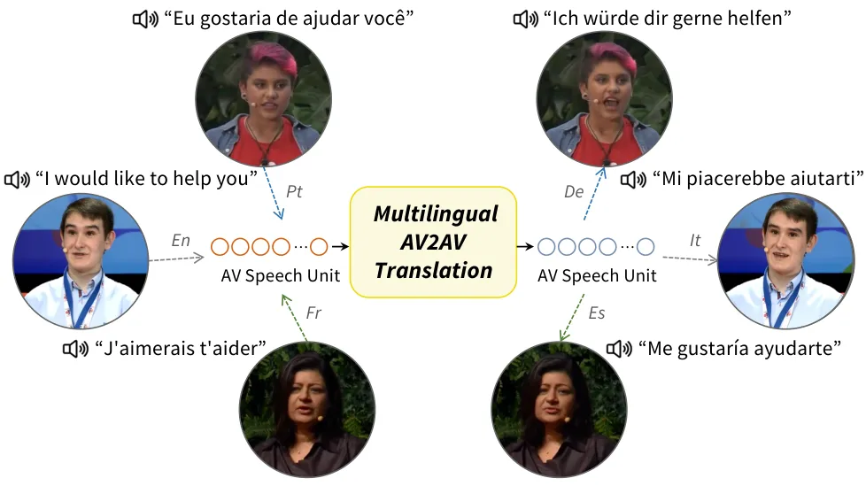
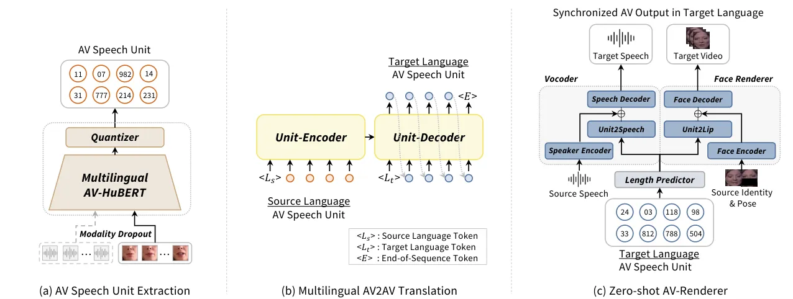
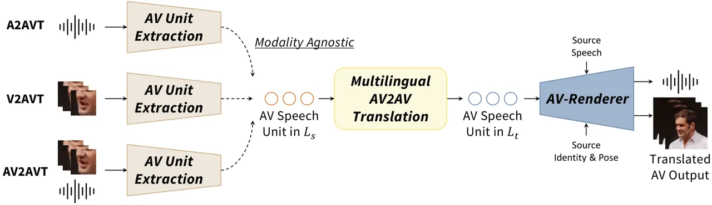
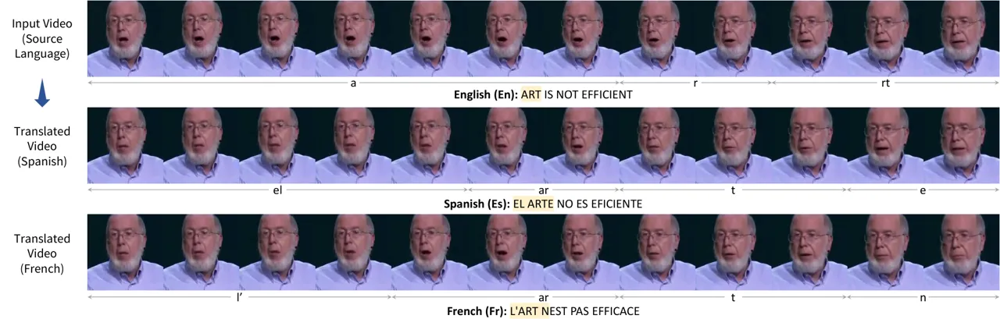
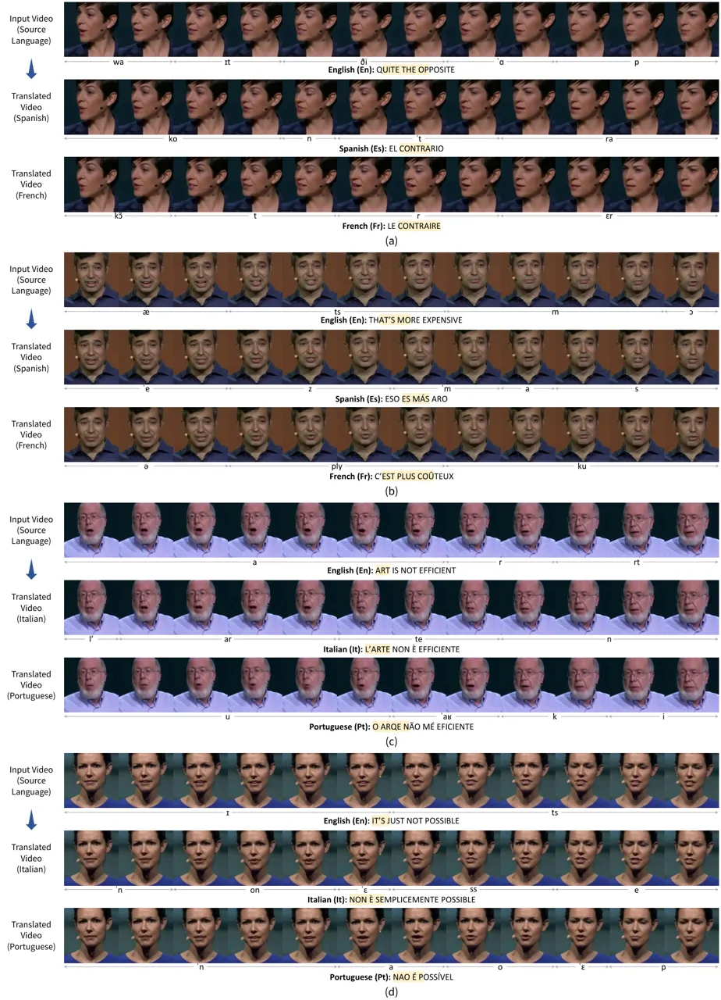

# AV2AV: Direct Audio-Visual Speech to Audio-Visual Speech Translation with Unified Audio-Visual Speech Representation

Jeongsoo Choi^(\*)    Se Jin Park^(\*)    Minsu Kim^(\*)    Yong Man
Ro^(†) Affiliation: School of Electrical Engineering, KAIST, South Korea
Affiliation: {jeongsoo.choi, jinny960812, ms.k, ymro}@kaist.ac.kr

###### Abstract

This paper proposes a novel direct Audio-Visual Speech to Audio-Visual
Speech Translation (AV2AV) framework, where the input and output of the
system are multimodal (i.e., audio and visual speech). With the proposed
AV2AV, two key advantages can be brought: 1) We can perform real-like
conversations with individuals worldwide in a virtual meeting by
utilizing our own primary languages. In contrast to Speech-to-Speech
Translation (A2A), which solely translates between audio modalities, the
proposed AV2AV directly translates between audio-visual speech. This
capability enhances the dialogue experience by presenting synchronized
lip movements along with the translated speech. 2) We can improve the
robustness of the spoken language translation system. By employing the
complementary information of audio-visual speech, the system can
effectively translate spoken language even in the presence of acoustic
noise, showcasing robust performance. To mitigate the problem of the
absence of a parallel AV2AV translation dataset, we propose to train our
spoken language translation system with the audio-only dataset of A2A.
This is done by learning unified audio-visual speech representations
through self-supervised learning in advance to train the translation
system. Moreover, we propose an AV-Renderer that can generate raw audio
and video in parallel. It is designed with zero-shot speaker modeling,
thus the speaker in source audio-visual speech can be maintained at the
target translated audio-visual speech. The effectiveness of AV2AV is
evaluated with extensive experiments in a many-to-many language
translation setting. Demo page is available on
[choijeongsoo.github.io/av2av](https://choijeongsoo.github.io/av2av).

^(†)^(†) ^(∗)Equal contribution. ^(†)Corresponding author. This work was
supported by the National Research Foundation of Korea (NRF) grant
funded by the Korea government (MSIT) (No. NRF-2022R1A2C2005529),
Institute of Information & communications Technology Planning &
Evaluation (IITP) grant funded by the Korea government (MSIT)
(No.2022-0-00124, Development of Artificial Intelligence Technology for
Self-Improving Competency-Aware Learning Capabilities), and BK21 FOUR
(Connected AI Education & Research Program for Industry and Society
Innovation, KAIST EE, No. 4120200113769).



Figure 1: Conceptual illustration of the proposed multilingual
Audio-Visual Speech to Audio-Visual Speech Translation (AV2AV)
framework. The system can directly translate between multilingual AV
speech without requiring any text. Note that the proposed AV2AV can
generate both audio speech and visual speech in listener-oriented
(_i.e_., translated) languages.

## 1 Introduction

In our increasingly interconnected world, where communication transcends
linguistic boundaries, Neural Machine Translation (NMT) \[1, 2, 3, 4, 5,
6\] has played a critical role in breaking down barriers in multilingual
interaction. Despite their strong performances, NMT systems exhibit
limitations in seamless application to virtual conferences or
face-to-face interactions. This is due to their reliance on human
intervention for text input or speech recognition, as these systems
primarily operate with text modalities. Speech-to-Speech Translation
(A2A¹¹ 1 Throughout this paper, we employ abbreviations for input and
output modalities, using A for Audio, V for Visual, and T for Text.)
\[7, 8, 9, 10, 11\] can mitigate this problem by directly translating
spoken languages into the target language at the audio level. With the
growth of A2A technologies \[12\], it is anticipated that individuals
can effortlessly communicate with one another using their primary
languages, irrespective of their nationalities. However, there still
exists one unsolved problem in the aspects of multimedia, the
discrepancy between the translated speech and the visual stimuli. For
example, if the A2A is utilized for video conferencing, people may
experience mismatches between what the presented face says and what they
hear. This arises because A2A exclusively processes audio speech without
addressing the visual component. As inconsistent visual information can
negatively affect the perception of speech, which is evidenced by the
McGurk effect \[13, 14\], a method jointly considering both audio and
visual should be developed.

In this paper, we explore a novel direct Audio-Visual Speech to
Audio-Visual Speech Translation (AV2AV) framework. Shown in Fig. 1, the
proposed AV2AV can directly translate the input Audio-Visual (AV) speech
into the desired target language with multimodal experience (_i.e_.,
with both audio and visual streams). Therefore, with the proposed
AV2AV, 1) We can provide a real face-to-face-like conversation
experience enabling participants to engage in discussions using their
respective primary languages, mitigating the aforementioned mismatched
experience. 2) We can improve the robustness of the system with the
complemental information of multimodalities so that the translation can
be accurately performed even under noisy environments. 3) We can reduce
the computational and maintenance costs, compared to the previous
4-stage cascaded Speech to Audio-Visual Speech Translation (A2AV)
approaches \[15, 16, 17, 18, 19\] which sequentially performed Automatic
Speech Recognition (ASR) \[20, 21, 22\], NMT \[23, 4\], Text-to-Speech
Synthesis (TTS) \[24, 25, 26\], and audio-driven Talking Face Generation
(TFG) \[27, 28\]. In today’s world, where millions of multimedia content
pieces are generated daily and shared globally in diverse languages, the
demand for systems like the proposed AV2AV is anticipated to increase.

However, there is a crucial challenge that must be addressed in the
development of a direct AV2AV framework; the lack of translation data
between AV speech. Multilingual translation typically requires a large
amount of parallel data. While there are relatively abundant text-based
datasets \[29, 30, 31, 32\] for NMT and speech-based datasets \[33, 34,
35, 36\] for Speech-to-Text Translation (A2T) \[37, 38, 39, 40\] and A2A
\[41, 42, 43\], there is no publicly available parallel AV2AV corpus.
One possible solution could be generating AV translation data, by
separately synthesizing speech and video by applying TTS \[44, 45, 46\]
and TFG \[47, 48, 49\] onto the existing NMT, A2T, and A2A datasets.
Nevertheless, training the model with synthetic face video does not
guarantee sufficient final performance, considering the current
limitations of TFG in faithfully modeling accurate lip movements \[50,
51\].

Instead, our strategy is to employ unified AV speech representations of
the recent self-supervised model, AV-HuBERT \[52\], which is proven to
have the modality-agnostic characteristics \[53, 54\]. Since its
pre-training includes modality dropout, we can reliably obtain unified
AV speech representations, whether utilizing audio-only, visual-only, or
audio-visual inputs \[55\]. Motivated by this, we show that the proposed
AV2AV can be trained with audio-only data (_i.e_., A2A dataset) to
perform translation between AV speech. To this end, we introduce a
multilingual trained AV-HuBERT (mAV-HuBERT), by pre-training the model
with about 7,000 hours of a multilingual AV dataset containing over 100
languages. Then, the unified AV speech representations from mAV-HuBERT
are discretized through K-means clustering \[56, 9, 10\], yielding AV
speech units. By treating the discretized AV speech units as pseudo text
\[11\], we train our multilingual spoken language translation model. At
this time, we employ the modality-agnostic characteristics of AV-HuBERT
and utilize audio-only datasets (_i.e_., A2A datasets) to extract the AV
speech units by masking out the visual input stream of mAV-HuBERT.
Finally, to render the audio and visual components from the translated
AV speech units, we introduce an AV speech unit-based AV-Renderer that
can generate synchronized raw speech audio and talking face video in
parallel. Especially, the proposed AV-Renderer is designed with
zero-shot speaker modeling ability, enabling the preservation of the
speaker’s voice and face in both audio and video before and after
translation.

The contributions of this paper can be summarized as follows: 1) To the
best of our knowledge, this is the first work exploring direct
Audio-Visual Speech to Audio-Visual Speech Translation (AV2AV), whose
inputs and outputs are both audio-visual speech. 2) In order to mitigate
the absence of translation data between AV speech, we employ the
modality-agnostic characteristics of AV-HuBERT and propose to train the
spoken language translation part with the audio-only dataset. At the
inference, we show that the trained model with audio-only data can
accept any combination of modalities, audio-only, visual-only, and
audio-visual inputs, and can produce multimodal speech outputs. 3) For
the seamless experience of translated AV speech, we design a zero-shot
speaker AV-Renderer. With the proposed AV-Renderer, we can maintain the
speaker identity of both audio and video streams before and after
translating the AV speech. 4) We explore the AV2AV in a many-to-many
language translation setting, so one model can perform X-to-X language
translations where X is multilingual, while previous multimodal speech
translation systems (_e.g_., AV2A) can perform only one specific
language direction.

## 2 Related Works

### 2.1 Spoken Language Translation

Neural Machine Translation (NMT) \[1, 2, 3, 4, 5, 6\] has achieved
maturity in the modality with the richest data, text. Given that audio
modality enables the translation between languages that have no writing
systems and the more improved dialogue experience, speech-based
translation has emerged. Speech-to-Speech Translation (A2A) \[7, 42\]
aims to translate speech from one language to the semantically
consistent speech of another language. Early A2A works began with a
cascaded approach \[57, 58, 59\] by sequentially performing ASR, NMT,
and TTS. Subsequently, A2T \[39, 38, 40, 33\] works were proposed to
merge the ASR and NMT stages, and allowed a two-stage A2A system.
Recently, it has evolved even into a direct approach \[60, 8, 43, 61,
11\] that can directly translate speech without relying on intermediate
text representation.

Despite the recent success of audio-based speech translation, multimodal
(_i.e_., audio and visual) speech translation is in its very early
stages. One line of research focuses on language translation between
audio input and audio-visual output, namely Speech to Audio-Visual
Speech Translation (A2AV). They \[15, 16, 17, 18, 19\] utilized a
4-stage cascaded approach by chaining ASR, NMT, TTS, and TFG.
Specifically, audio from the source video is first transcribed into text
with an ASR \[20\]. Then, the text is translated from the source
language to the target language through NMT \[23, 4\]. The translated
text is synthesized into speech using TTS \[24, 25\], and finally, the
talking face video is synthesized from the synthesized speech using TFG
\[27\]. Although the cascaded approach can benefit from the advantage of
advancement made in each of the subsystems, they might suffer from slow
inference time, domain mismatch, error propagation between the
subsystems, and high maintenance costs. Most recently, AV-TranSpeech
\[62\] first proposed direct Audio-Visual Speech-to-Speech Translation
(AV2A), whose input is now audio-visual speech and output is audio. By
using AV inputs, they showed that the robustness of the translation
system on acoustic noise can be improved \[63, 64, 65, 66\]. Also, they
tried to solve the insufficient AV2A training data by bringing
pre-trained weights for each modal stream from different pre-trained
models \[52, 43\].

Different from the previous works, this is the first work to explore a
direct Audio-Visual Speech to Audio-Visual Speech Translation (AV2AV).
The proposed AV2AV incorporates both audio and visual speech as inputs,
translates the linguistic content, and produces both audio and visual
speech outputs. Moreover, our method is a direct approach where we do
not go through with any intermediate text or speech. This is a huge leap
from the current 4-stage process in A2AV. Moreover, different from
AV-TranSpeech \[62\] tried to use different pre-trained models to
initialize their model and finetuned it on small size AV2A dataset, the
proposed AV2AV model can be trained on an audio-only A2A dataset with
unified AV speech representations. The trained model can be directly
applied to AV2AV without finetuning. Once trained, we can perform all
A2AV, V2AV, and AV2AV, with one single trained model. Finally, we
propose a zero-shot AV-Renderer enabling the maintenance of the speaker
characteristics of source AV speech at the outputs.

### 2.2 Self-supervised Speech Model and Speech Units

Self-supervised speech models \[67, 68, 69, 70, 71\] have achieved
significant performance in various speech processing tasks such as ASR
\[69, 67\], speaker verification \[72\], and speech translation \[71,
73, 74\]. HuBERT \[67\], one of the prominent self-supervised speech
models, is trained to predict hidden units obtained by clustering MFCC
features from the masked input, where the hidden units are progressively
refined using its learned features. Once the speech features obtained
from specific layers are clustered into speech units \[75\], they can be
utilized as pseudo texts containing the linguistic content of speech. By
treating the discrete speech units as pseudo text, various speech
processing technologies were proposed \[76, 77, 78\] such as spoken
language modeling \[56, 79\] and speech translation \[8, 9, 43, 11\].

Extending the modalities, self-supervised multimodal speech models \[52,
80, 81\] have been proposed. Among them, AV-HuBERT \[52\] shows
promising results in diverse multimodal speech modeling, visual speech
recognition \[82\], AV speech recognition \[83\], and lip-to-speech
synthesis \[84, 85\]. Recently, its modality-agnostic AV speech
representations have drawn big attention in speech recognition \[53,
55\] and Visual Speech Translation (V2T) \[54\]. Previous works showed
that we can robustly get unified AV speech representations with diverse
input modalities, audio-only, visual-only, and audio-visual. This is
possible because AV-HuBERT proceeds pre-training with modality dropout.

Motivated by the recent success of discrete speech units of HuBERT, we
also propose to train our translation system with discretized AV speech
units by treating them as pseudo text. As the proposed system is a
multimodal system, we employ AV-HuBERT to extract the AV speech units.
Moreover, inspired by the modality-agnostic characteristics of AV-HuBERT
representations, we propose to train our AV2AV translation model with
audio-only datasets (_i.e_., A2A datasets), by dropping out the visual
stream when extracting the AV speech units. To better capture the
multilingual speech features, we introduce mAV-HuBERT which is trained
on about 7,000 hours of multilingual AV dataset.



Figure 2: (a) We extract unified audio-visual speech representations
using multilingual trained AV-HuBERT. The speech features are
discretized into audio-visual speech units through quantization and
treated as pseudo text. (b) By using audio-visual speech units, we
translate between multilingual languages using a transformer
encoder-decoder model. (c) The audio speech and visual speech are
generated in parallel from the translated audio-visual speech units by
using the proposed Zero-shot AV-Renderer. The renderer can perform in a
zero-shot setting so that we can keep the speaker identity the same
before and after the translation.

## 3 Proposed Method

The proposed direct multilingual Audio-Visual Speech to Audio-Visual
Speech Translation (AV2AV) framework aims to directly translate both
audio stream and visual stream of an input face video from one language
to another. To this end, the proposed system is designed with three main
parts; 1) extracting linguistic content from the AV input with AV speech
units (Fig. 2a), 2) performing language translation using the AV speech
units (Fig. 2b), and 3) synthesizing each modal speech where the
linguistic content comes from the translated AV speech units, while the
speaker characteristics are controllable (Fig. 2c).

### 3.1 Unified Audio-Visual Speech Representations

In order to train the AV2AV system, basically, a parallel corpus of AV
speech is required. However, publicly available speech translation
datasets are ‘audio to text’ (A2T) \[33\], ‘audio to audio’ (A2A)
\[35\], and ‘audio-visual to audio’ (AV2A) \[62\]. As there is no
available ‘audio-visual to audio-visual’ (AV2AV) translation data, it is
not feasible to train our model in a parallel AV2AV data setting. To
mitigate this, we propose to train our translation model with the
audio-only parallel corpus (_i.e_., A2A dataset), by learning the
unified representations of audio and visual speech in advance. Motivated
by the recent studies \[53, 54, 55\] showing that the AV-HuBERT can
extract unified AV speech representations regardless of input modality,
our strategy is training our spoken language translation model with the
unified AV representations obtained by using audio-only inputs, where
the corresponding visual input is dropped out.

Concretely, we introduce a multilingual trained AV-HuBERT, mAV-HuBERT,
to fit it for our multilingual modeling purpose. Different from the
English-based AV-HuBERT model \[52\], mAV-HuBERT is pre-trained on about
7,000 hours of multilingual audio-visual data by combining LRS2 \[86\],
LRS3 \[87\], VoxCeleb2 \[88\], mTEDx \[89\], and AVSpeech \[90\], which
altogether contains approximately over 100 languages. Then, we
discretize the unified AV speech representations of mAV-HuBERT through
quantization (_i.e_., K-means clustering) and obtain AV speech units,
following \[56, 11\]. As our mAV-HuBERT is trained with modality dropout
similar to AV-HuBERT \[52\], we can robustly obtain the AV speech units
by using different input modalities, audio-only, visual-only, and
audio-visual. This enables us to train our AV2AV translation model using
an audio-only parallel corpus dataset, while still allowing inference
with audio-visual inputs. The processes for obtaining AV speech units
are illustrated in Fig. 2(a). It is important to note that the
discretized speech unit predominantly encompasses speech content,
offering a significant advantage as it can be effectively treated as
pseudo text \[9\]. Following \[56, 9, 43, 10, 11\], we reduce the length
of AV speech units by removing adjacent repeating units.

### 3.2 Multilingual Spoken Language Translation

As shown in Fig. 2(b), our AV2AV language translation model is composed
of a standard transformer encoder-decoder architecture \[91\] which
consists of a 12-layer unit-encoder and a 12-layer unit-decoder, similar
to a popular NMT system \[4\]. Following the recent A2A method \[11\]
that can perform many-to-many spoken language translation, the
unit-encoder takes a source language token \<$`L_{s}`$\> that is for
indicating which language should be comprehended and the source AV
speech units $`\mathbf{u}_{s}=\{u_{s}^{i}\}_{i=1}^{T_{s}}`$, where
$`T_{s}`$ refers to the length of units. Then, the unit-decoder takes a
target language token \<$`L_{t}`$\> that determines the output language
and its previous predictions $`u_{t}^{<j}`$ to autoregressively predict
the next AV speech unit $`u_{t}^{j}`$ of the target language at step
$`j`$. Therefore, the loss function to train the AV2AV language
translation can be represented as

```math
\mathcal{L}=-\sum_{j=1}^{T_{t}}\log p(u_{t}^{j}\mid u_{t}^{<j},\mathbf{u}_{s}), \tag{1}
```

where $`T_{t}`$ refers to the length of target AV speech units.

As described before, we can obtain the AV speech units
$`\mathbf{u}_{s}`$ and $`\mathbf{u}_{t}=\{u_{t}^{i}\}_{i=1}^{T_{t}}`$
robustly by using different types of input modalities, audio-only,
visual-only, and audio-visual. Therefore, we train our AV2AV language
translation model with a large A2A parallel dataset constructed with
mTEDx \[89\] and VoxPopuli \[35\]. The total data amount is about 12,000
hours composed of 19 languages and by reversing the translation
direction, the data amount is doubled. Following \[11\], we pre-train
the model in many-to-many translation setting on the constructed A2A
dataset and finetune the pre-trained model on the target datasets
(_i.e_., MuAViC \[33\] and LRS3-T \[62\]), respectively. As shown in
Fig. 3, we show that the model trained with the proposed strategy can
perform A2AV, V2AV, and AV2AV with a single model.

### 3.3 Zero-shot Audio-Visual Renderer

The translated AV speech units should be rendered to audio and video to
produce the sound and visual movement that humans can perceive. To this
end, we introduce a zero-shot AV-Renderer which simultaneously
synthesizes the raw audio and video from the AV speech units as shown in
Fig. 2(c). The crucial aspect is to preserve the speaker identity from
the source AV speech to the translated AV speech, ensuring a seamless
communication experience for the participants. To achieve this, the
proposed AV-Renderer is devised in a zero-shot speaker setting. Only the
linguistic content of the translated speech is extracted from the
translated AV speech units, while the non-linguistic characteristics are
modeled from the source AV speech. The proposed AV-Renderer is comprised
of three main components, a length predictor, vocoder, and face
renderer.



Figure 3: Overview of the proposed AV2AV framework. A single AV2AV model
can perform A2AV, V2AV, and AV2AV by learning with unified AV speech
representations of mAV-HuBERT.

Length Predictor. As the output audio and visual streams are expected to
be synchronized, we only need one common duration modeling for the two
output streams. To this end, a length predictor is employed to predict
the duration of each AV speech unit. The predicted duration is utilized
for synthesizing both audio and visual outputs. Similar to that of TTS
\[25\], it consists of two 1D convolution layers with one classifier and
is trained with Mean Squared Error loss measured between the prediction
and ground truth duration of each unit in the logarithmic domain, as in
\[8, 9\]. The translated AV speech units are repeated by the predicted
duration before passing the vocoder and face renderer.

Vocoder. For the vocoder, we basically follow the previous works \[8, 9,
43, 11\] that utilized speech unit-based HiFi-GAN \[92\] and we
additionally add the zero-shot speaker modeling ability to the model, as
the previous works only support the single-speaker voice. To this end,
we leverage a pre-trained speaker verification \[93, 94\] model of
\[95\] as a speaker encoder to extract the speaker embedding, similar to
multi-speaker TTS \[96\]. It takes a Mel-spectrogram and produces a
single speaker embedding, known as a d-vector \[97\]. The d-vector is
concatenated to every embedded feature of the AV speech unit where it is
embedded by an embedding layer (_i.e_., Unit2Speech in Fig. 2(c)). The
concatenated features are fed into the speech decoder whose architecture
and training objective are the same as HiFi-GAN \[92\], to produce the
waveform.

Face Renderer. For the face renderer, we bring the famous audio-driven
face synthesis model, Wav2Lip \[27\], and modify it to operate with AV
speech units as inputs. As Wav2Lip can generate arbitrary face videos
from arbitrary audio, it is appropriate for our zero-shot purpose.
Specifically, the source identity feature and pose feature are extracted
from a source identity face and a pose prior (upper half of the driving
source faces) by a face encoder, as shown in Fig. 2(c). The discrete AV
speech units are embedded into continuous features through a Unit2Lip
encoder which consists of an embedding layer and a transformer layer
\[91\]. Subsequently, the embedded features and identity features are
jointly decoded to generate the target talking face video. It is trained
with the same objective functions as \[27\].

## 4 Experiment



Figure 4: Synthesized outputs of the proposed AV2AV method. The first
row is the source input, while the second and third rows are the
translated outputs in different target languages. The transcriptions are
obtained using an ASR. The highlighted segment of the transcriptions
indicates the temporal alignment with the video frames above, and the
corresponding phoneme for each frame is marked below. Please note the
speaker is maintained in the translated results even if we translate
into different languages.

### 4.1 Dataset

For training m-AVHuBERT, we use 7,011 hours of multilingual AV data by
combining LRS2 \[86\], LRS3 \[87\], VoxCeleb2 \[88\], mTEDx \[89\], and
AVspeech \[90\].

For training AV2AV language translation model, we use about 12k hours of
parallel A2A data containing 19 languages constructed with Voxpopuli
\[35\] and mTEDx \[89\] in a many-to-many language translation setting,
following \[11\]. Then, we finetune the pre-trained model on each
evaluation dataset, LRS3-T \[62\] and MuAViC \[33\]. The LRS3-T \[62\]
is AV2A data, derived from the LRS3 dataset \[86\]. It contains the
translation direction of En-Es and En-Fr. MuAViC \[33\] is an
audio-visual speech-to-text translation (AV2T) corpus sourced from TED
and TEDx. Since it only provides target text, we generate the target
speech by using pre-trained TTS models, VITS \[98\], on each language²²
2 Available on
[https://github.com/coqui-ai/TTS](https://github.com/coqui-ai/TTS). We
utilize 4 English (En)-to-X and 4 X-to-En paired data, where X is
Spanish (Es), French (Fr), Portuguese (Pt), and Italian (It), which
gives a total duration of 2,356 hours. The opposite translation
direction is also used for training.

For training the vocoder, we use LRS3 \[87\] for En and mTEDx \[89\] for
other languages. For the face renderer, we follow \[27\] and utilize the
widely used LRS3 \[87\] dataset.

### 4.2 Evaluation Metrics

We evaluate the translation quality and the generation quality of both
audio and video. For the translation quality, we employ the BLEU score
\[99, 100\] by transcribing the audio using the off-the-shelf ASR
models, following \[11\]. To measure the generation quality of video, we
adopt metrics used for TFG. This includes Fréchet Inception Distance
(FID) \[101\] to measure visual quality, and LSE-C and LSE-D \[27\] to
measure the audio-visual synchronization. Also, we conduct a Mean
Opinion Score test to measure the naturalness of each respective
modality, and the realness of the video, which can be found in
Supplementary.

|       |                      |                               |      |      |       |
| ----- | -------------------- | ----------------------------- | ---- | ---- | ----- |
| Lang. | Method               | Finetuning data size (LRS3-T) |      |      |       |
|       |                      | 0hr                           | 10hr | 30hr | 200hr |
| En-Es | AV-TranSpeech \[62\] | \-                            | 21.5 | 22.2 | 45.2  |
|       | Proposed Method      | 25.3                          | 39.8 | 44.6 | 50.9  |
| En-Fr | AV-TranSpeech \[62\] | \-                            | 24.4 | 28.3 | 33.6  |
|       | Proposed Method      | 27.1                          | 34.7 | 37.2 | 41.4  |

Table 1: AV2A performance comparisons (ASR-BLEU) in low-resource
scenario on LRS3-T \[62\] dataset. Since the proposed method can be
pre-trained on the A2A dataset, it outperforms the previous AV2A model
\[62\] which relies on the AV2A dataset.

### 4.3 Implementation Details

For pre-training mAV-HuBERT, we crop the mouth region into a size of
96$`\times`$96 by using face detector \[102\] and facial landmark
detector \[103\]. The cropped mouth frames are converted into grayscale
and random cropping and horizontal flipping are applied during training.
The audio is resampled to 16kHz and random noise augmentation is applied
using MUSAN \[104\] and overlapped speech, as in \[83\]. We initialize
the model with English-trained AV-HuBERT \[52\] and train it with the
same training objective with it. To obtain the target cluster, we use
pre-trained multilingual HuBERT \[67, 9\] and obtain 1,000 clusters. We
train the model for 150k steps with a max token length of 1,000 using 63
GPUs. Our AV speech units are obtained by clustering the unified AV
representations into 1,000 clusters.

For training the multilingual AV2AV translation model, we initialize the
model with a pre-trained A2A model \[11\] and pre-train it on parallel
A2A translation data using the AV speech units driven from mAV-HuBERT
for 30k steps with a max token length 1,024 using 56 GPUs. The
pre-trained model is finetuned on target datasets for 30k steps.

For training the vocoder, we update 1M steps using a batch size of 16 on
each language dataset. The face renderer is trained for 35k steps with a
batch size of 64.

|                                                |                       |                    |                                                    |       |       |       |       |       |       |       |       |
| ---------------------------------------------- | --------------------- | ------------------ | -------------------------------------------------- | ----- | ----- | ----- | ----- | ----- | ----- | ----- | ----- |
| ID                                             | Input-Output Modality | Translation System | Method                                             | X-En  |       |       |       | En-X  |       |       |       |
|                                                |                       |                    |                                                    | Es-En | Fr-En | It-En | Pt-En | En-Es | En-Fr | En-It | En-Pt |
| $`\bullet`$ 4-Stage Cascaded System            |                       |                    |                                                    |       |       |       |       |       |       |       |       |
| A1                                             | A-AV                  | NMT                | ASR \[33\] + NMT \[5\] + TTS \[105\] + TFG \[27\]  | 28.66 | 30.55 | 23.54 | 26.14 | 30.15 | 24.07 | 25.05 | 22.17 |
| A2                                             | AV-AV                 | NMT                | AVSR \[33\] + NMT \[5\] + TTS \[105\] + TFG \[27\] | 28.70 | 29.21 | 24.54 | 26.30 | 30.09 | 24.56 | 25.41 | 22.66 |
| $`\bullet`$ 3-Stage Cascaded System            |                       |                    |                                                    |       |       |       |       |       |       |       |       |
| A3                                             | A-AV                  | A2T                | A2T \[33\] + TTS \[105\] + TFG \[27\]              | 24.06 | 27.01 | 21.92 | 24.11 | 27.81 | 23.42 | 23.29 | 20.46 |
| A4                                             | AV-AV                 | AV2T               | AV2T \[33\] + TTS \[105\] + TFG \[27\]             | 24.61 | 26.90 | 22.33 | 24.83 | 28.02 | 23.98 | 23.39 | 20.97 |
| $`\bullet`$ 2-Stage Cascaded System (Textless) |                       |                    |                                                    |       |       |       |       |       |       |       |       |
| A5                                             | A-AV                  | A2A                | A2A \[11\] + TFG \[27\]                            | 26.15 | 30.14 | 22.41 | 23.37 | 26.02 | 21.24 | 14.48 | \-    |
| $`\bullet`$ Direct System (Textless)           |                       |                    |                                                    |       |       |       |       |       |       |       |       |
| A6                                             | A-AV                  | A2AV               | Proposed Method                                    | 26.04 | 31.00 | 22.56 | 24.38 | 27.29 | 23.05 | 16.71 | 12.57 |
| A7                                             | V-AV                  | V2AV               | Proposed Method                                    | 10.36 | 6.29  | 8.02  | 5.71  | 18.15 | 15.36 | 11.33 | 9.19  |
| A8                                             | AV-AV                 | AV2AV              | Proposed Method                                    | 26.57 | 31.27 | 23.24 | 24.51 | 27.57 | 23.21 | 16.33 | 12.35 |

Table 2: Translation quality (ASR-BLEU) comparison with baseline systems
for X-En and En-X directions on MuAViC. Methods (A1, A2, A3, A4) use the
same model for X-En, and 4 different models for En-X directional
translations. The methods (A5, A6, A7, A8) use a single model for all 8
directional translations. A2A \[11\] method does not have a vocoder to
generate Portuguese speech.

|     |                         |                |           |           |           |           |           |
| --- | ----------------------- | -------------- | --------- | --------- | --------- | --------- | --------- |
| ID  | Method                  | Input Modality | SNR (dB)  |           |           |           |           |
|     |                         |                | -5        | 0         | 5         | 10        | clean     |
| B1  | ASR + NMT + TTS + TFG   | $`A`$          | $`3.73`$  | $`13.90`$ | $`20.91`$ | $`24.84`$ | $`28.66`$ |
| B2  | AVSR + NMT + TTS + TFG  | $`AV`$         | $`15.39`$ | $`21.93`$ | $`26.08`$ | $`26.62`$ | $`28.70`$ |
| B3  | A2T + TTS + TFG         | $`A`$          | $`3.02`$  | $`12.13`$ | $`18.52`$ | $`22.75`$ | $`24.06`$ |
| B4  | AV2T + TTS + TFG        | $`AV`$         | $`13.66`$ | $`18.75`$ | $`22.04`$ | $`23.78`$ | $`24.61`$ |
| B5  | Proposed Method (A2AV)  | $`A`$          | $`3.64`$  | $`14.14`$ | $`19.99`$ | $`23.87`$ | $`26.04`$ |
| B6  | Proposed Method (V2AV)  | $`V`$          | $`10.36`$ | $`10.36`$ | $`10.36`$ | $`10.36`$ | $`10.36`$ |
| B7  | Proposed Method (AV2AV) | $`AV`$         | $`17.31`$ | $`22.69`$ | $`23.87`$ | $`24.20`$ | $`26.57`$ |

Table 3: Translation performance (ASR-BLEU) with different input
modalities under acoustic noise corruption with different SNR levels
(dB) on MuAViC Es-En dataset.

### 4.4 Baseline Models

Since there is no previous method that can perform AV2AV, we compare the
proposed method with the recently proposed direct AV2A method,
AV-TranSpeech \[62\] on LRS3-T dataset. Moreover, we compare the
translation performance with different cascaded methods on MuAViC \[33\]
dataset. They are built from state-of-the-art off-the-shelf pre-trained
models: AVSR \[33\], ASR \[33\], AV2T \[33\], A2T \[33\], NMT \[5\], TTS
\[105\], and TFG \[27\]. Please note the objective of the comparisons
with the cascaded method is not to achieve state-of-the-art performance,
but rather to assess the extent to which the performance of the proposed
system can be attained through the direct strategy.

The AVSR and ASR models \[33\] are trained on the multilingual
audio-visual corpus, covering 1,200 hours of 9 languages. The AV2T and
A2T models \[33\] support X-to-En language translations with one model
while multiple unidirectional models are used for En-to-X translations.
Therefore, we use one pre-trained AV2T or A2T model for {Es, Fr, It,
Pt}-En translation, while we use 4 individual models for En-Es, En-Fr,
En-It, and En-Pt translations. The NMT model \[5\] is trained on the
many-to-many text translation corpus comprising 7.5B sentences for 100
languages. The TTS model \[105\] is a recent state-of-the-art
multilingual TTS model by Team Coqui. The TFG model \[27\] is one of the
popular models that can generate arbitrary identities and languages,
trained on 233 hours of audio-visual data.

### 4.5 Experimental Results

#### 4.5.1 Comparisons with State-of-the-art

We compare the AV2A performance with the state-of-the-art direct AV2A
method, AV-Transpeech \[62\], by using different amounts of finetuning
data, in Table 1. The results show that the proposed method is much more
effective than AV-Transpeech, especially in the low-resource setting. As
the proposed method can be pre-trained using A2A dataset to perform with
different input modalities, the pre-trained model can be directly
applied to AV2A without finetuning. In contrast, since AV-Transpeech
tries to bring different pre-trained models (_i.e_., AV-HuBERT \[52\]
and A2A \[43\] models) to initialize different parts of their model, the
finetuning with the AV2A dataset is mandatory. Even when no finetuning
is applied, the proposed method outperforms AV-Transpeech that finetuned
on 10hr of AV2A dataset, and achieves comparable performances with the
model finetuned on 30hr of dataset. If we finetune the proposed model
with the same amount of AV2A dataset as AV-Transpeech, it outperforms
AV-Transpeech at all data sizes. This shows the effectiveness of the
proposed strategy of learning from A2A dataset by using unified
audio-visual speech representations. Fig. 4 shows the translated results
of the proposed AV2AV framework. We show both audio and visual outputs
where the audio is transcribed into text through ASR.

#### 4.5.2 Comparisons with Cascaded Approaches

Table 2 shows the BLEU score of different systems for different language
pairs. The analysis of results is as follows.

(A2, A4 vs. A8) By comparing the methods that can perform AV2AV, the
proposed method (A8) shows comparable results with the text-based
translation systems trained on 7.5B parallel data (A2, A4), even though
it is trained without using any text supervision. This demonstrates that
AV speech units encompass sufficient linguistic content, allowing the
training of a multilingual AV2AV translation model solely using the
discretized AV speech units³³ 3 Moreover, the proposed method has a
faster inference time. On average, the proposed AV2AV required 1.36s,
whereas the cascaded system (A2) took 2.42s to process 2.03s video
(_i.e_., audio-visual)..

(A1, A2 vs. A3, A4 vs. A5 vs. A6, A8) We can find that by reducing the
cascading stages and shortening the processing time, the BLEU scores
become slightly worse overall. This result is attributed to the powerful
performance of each advanced subsystem, which benefits from a
large-scale dataset. However, we can clearly find that the proposed
direct multimodal speech-to-speech translation systems are comparable
with the cascaded systems with just a single model. Specifically, the
proposed method achieves better performance than the 3-stage cascaded
systems (A3, A4) in the X-to-En translation direction. Please note that
A1, A2, A3, and A4 use one model for X-to-En and 4 different models to
perform En-to-X translation, while the proposed method uses just a
single trained model to perform all 8 translation directions in the
table. Another important thing is that A5 and the proposed systems are
textless so that they can be utilized for the languages that have no
writing systems \[9\], while A1, A2, A3, and A4 cannot be applied to
such languages as they rely on text modalities.

(A5 vs. A6, A7, A8) By comparing the proposed method with A2A method
(A5), the proposed A2AV method (A6) shows better performances in
overall. Moreover, We can confirm that even though the proposed method
is pre-trained with the same dataset as A5, the proposed method can be
utilized for diverse tasks, including A2AV, V2AV, and AV2AV. This is
because the proposed method is trained on unified audio-visual speech
representations, eliminating the need for additional training to operate
with different modalities. In contrast, A5 utilized audio speech
representations during training, so it requires additional finetuning to
accept different modal inputs.

|                  |       |       |       |       |
| ---------------- | ----- | ----- | ----- | ----- |
| Method           | X-En  |       |       |       |
|                  | Es-En | Fr-En | It-En | Pt-En |
| AV-HuBERT \[52\] | 17.63 | 16.83 | 21.74 | 22.22 |
| mAV-HuBERT       | 26.57 | 31.27 | 23.24 | 24.51 |

Table 4: Ablation study on multilingual translation performance of
English-trained AV-HuBERT and multilingual AV-HuBERT.

|                                      |                     |                    |                      |                    |
| ------------------------------------ | ------------------- | ------------------ | -------------------- | ------------------ |
| ID                                   | Method              | LSE-C $`\uparrow`$ | LSE-D $`\downarrow`$ | FID $`\downarrow`$ |
| $`\bullet`$ Ground Truth             |                     |                    |                      |                    |
| C1                                   | GT Audio-Visual     | 7.61               | 6.90                 | \-                 |
| $`\bullet`$ Cascaded System          |                     |                    |                      |                    |
| C2                                   | GT Audio + TFG      | 8.14               | 6.68                 | 3.56               |
| C3                                   | GT Text + TTS + TFG | 7.36               | 7.06                 | 3.56               |
| $`\bullet`$ Our System (AV-Renderer) |                     |                    |                      |                    |
| C4                                   | GT AV Speech Unit   | 7.91               | 6.65                 | 3.18               |

Table 5: Performance comparisons of each renderer on LRS3.

#### 4.5.3 Analysis of Robustness to Acoustic Noise

In Table 3, we evaluate the noise robustness of different systems.
Following \[83\], we randomly perturb the input speech with the sampled
babble noise from the test set of \[104\] with varying SNR levels (-5,
0, 5, 10dB). By comparing audio-only input systems with multimodal
systems (B1, B3, B5 vs. B2, B4, B7), we can confirm the benefits of
using AV inputs by obtaining robust performances under acoustic noises.
These results show the importance of AV input systems to achieve robust
performance in practical situations. The visual input system (B6) is not
affected by acoustic noise and even achieves better performance than
audio-only systems (B1, B3, B5) under a severely noisy environment
(_i.e_., -5 dB). As one trained AV2AV model can be employed for diverse
tasks, we can choose the input modalities appropriate to a given
situation.

#### 4.5.4 Effectiveness of the mAV-HuBERT

In order to evaluate the effectiveness of our multilingual AV-HuBERT
(mAV-HuBERT) compared to the original English-trained AV-HuBERT of
\[52\], we compare the BLEU scores on MuAViC \[33\] X-En translation
directions. Table 4 shows the comparison results. The results clearly
show that we can improve the multilingual spoken language translation
performance largely by pre-training the model with a large-scale
multilingual AV dataset (_i.e_., 7,011 hours with over 100 languages).
Conversely, AV-HuBERT trained exclusively in English struggles to
accurately capture multilingual speech information, resulting in lower
translation performance across all translation directions.

#### 4.5.5 Quantitative Evaluation of AV-Renderer

In Table 5, we evaluate the visual quality (FID), and degree of
synchronization between the generated audio and visual streams (LSE-C
and LSE-D). To focus on the performance of renderers, we utilize ground
truth audio, text, and AV speech units to generate audio or video for
each system. Comparing (C1, C2, C3, C4), the results indicate that the
proposed AV-Renderer can generate well-synchronized audio-visual outputs
by synthesizing them in parallel, with shared duration information. In
contrast, C3 loses accurate synchronization by cascading TTS and TFG,
where system error could be propagated between generated samples.

In Table 6, we evaluate the effectiveness of incorporating zero-shot
speaker modeling into the vocoder. To this end, we first compare the
BLEU and voice similarity (SIM) using WavLM-TDNN \[72, 106\] between a
single speaker-trained vocoder \[11\] and our zero-shot speaker vocoder.
The results confirm that by employing speaker embedding, we do not lose
the translation performance, and we can improve the voice similarity
(SIM). Please note that this is a key component for seamless
speech-to-speech translation. To understand the SIM score, we also
report that of a popular multi-speaker TTS, YourTTS \[46\], and we can
confirm that the proposed zero-shot speaker vocoder has sufficient
ability to maintain the speaker’s voice.

|                   |       |       |
| ----------------- | ----- | ----- |
| Vocoder           | BLEU  | SIM   |
| YourTTS \[46\]    | \-    | 0.266 |
| Single Speaker    | 26.38 | 0.043 |
| Zero-Shot Speaker | 26.57 | 0.222 |

Table 6: Ablation study using different vocoders on MuAViC Es-En data.
To check the performance of our vocoder, we also report the SIM of a
popular multi-speaker TTS, YourTTS \[46\].

## 5 Conclusion

In this paper, we proposed a novel direct Audio-Visual Speech to
Audio-Visual Speech Translation (AV2AV) framework. The proposed AV2AV
can translate spoken languages in a many-to-many setting without text.
By employing multimodal inputs, we can improve the robustness of the
system to the acoustic noises. By using multimodal outputs, we can
improve the dialogue experience performed in virtual scenarios with no
discomfort. The effectiveness of the proposed AV2AV is evaluated with
extensive experiments.

## References

- \[1\] Rico Sennrich, Barry Haddow, and Alexandra Birch. Improving
  neural machine translation models with monolingual data. In 54th
  Annual Meeting of the Association for Computational Linguistics, pages
  86–96. Association for Computational Linguistics (ACL), 2016.
- \[2\] Melvin Johnson, Mike Schuster, Quoc V Le, Maxim Krikun, Yonghui
  Wu, Zhifeng Chen, Nikhil Thorat, Fernanda Viégas, Martin Wattenberg,
  Greg Corrado, et al. Google’s multilingual neural machine translation
  system: Enabling zero-shot translation. Transactions of the
  Association for Computational Linguistics, 5:339–351, 2017.
- \[3\] Felix Stahlberg. Neural machine translation: A review. Journal
  of Artificial Intelligence Research, 69:343–418, 2020.
- \[4\] Yinhan Liu, Jiatao Gu, Naman Goyal, Xian Li, Sergey Edunov,
  Marjan Ghazvininejad, Mike Lewis, and Luke Zettlemoyer. Multilingual
  denoising pre-training for neural machine translation. Transactions of
  the Association for Computational Linguistics, 8:726–742, 2020.
- \[5\] Angela Fan, Shruti Bhosale, Holger Schwenk, Zhiyi Ma, Ahmed
  El-Kishky, Siddharth Goyal, Mandeep Baines, Onur Celebi, Guillaume
  Wenzek, Vishrav Chaudhary, et al. Beyond english-centric multilingual
  machine translation. The Journal of Machine Learning Research,
  22(1):4839–4886, 2021.
- \[6\] Marta R Costa-jussà, James Cross, Onur Çelebi, Maha Elbayad,
  Kenneth Heafield, Kevin Heffernan, Elahe Kalbassi, Janice Lam, Daniel
  Licht, Jean Maillard, et al. No language left behind: Scaling
  human-centered machine translation. arXiv preprint
  arXiv:2207.04672, 2022.
- \[7\] Ye Jia, Ron J Weiss, Fadi Biadsy, Wolfgang Macherey, Melvin
  Johnson, Zhifeng Chen, and Yonghui Wu. Direct speech-to-speech
  translation with a sequence-to-sequence model. arXiv preprint
  arXiv:1904.06037, 2019.
- \[8\] Ann Lee, Peng-Jen Chen, Changhan Wang, Jiatao Gu, Sravya Popuri,
  Xutai Ma, Adam Polyak, Yossi Adi, Qing He, Yun Tang, et al. Direct
  speech-to-speech translation with discrete units. arXiv preprint
  arXiv:2107.05604, 2021.
- \[9\] Ann Lee, Hongyu Gong, Paul-Ambroise Duquenne, Holger Schwenk,
  Peng-Jen Chen, Changhan Wang, Sravya Popuri, Yossi Adi, Juan Pino,
  Jiatao Gu, et al. Textless speech-to-speech translation on real data.
  arXiv preprint arXiv:2112.08352, 2021.
- \[10\] Hirofumi Inaguma, Sravya Popuri, Ilia Kulikov, Peng-Jen Chen,
  Changhan Wang, Yu-An Chung, Yun Tang, Ann Lee, Shinji Watanabe, and
  Juan Pino. Unity: Two-pass direct speech-to-speech translation with
  discrete units. arXiv preprint arXiv:2212.08055, 2022.
- \[11\] Minsu Kim, Jeongsoo Choi, Dahun Kim, and Yong Man Ro.
  Many-to-many spoken language translation via unified speech and text
  representation learning with unit-to-unit translation. arXiv preprint
  arXiv:2308.01831, 2023.
- \[12\] Loïc Barrault, Yu-An Chung, Mariano Cora Meglioli, David Dale,
  Ning Dong, Paul-Ambroise Duquenne, Hady Elsahar, Hongyu Gong, Kevin
  Heffernan, John Hoffman, et al. Seamlessm4t-massively multilingual &
  multimodal machine translation. arXiv preprint arXiv:2308.11596, 2023.
- \[13\] Harry McGurk and John MacDonald. Hearing lips and seeing
  voices. Nature, 264(5588):746–748, 1976.
- \[14\] Joon Son Chung and Andrew Zisserman. Lip reading in the wild.
  In Computer Vision–ACCV 2016: 13th Asian Conference on Computer
  Vision, Taipei, Taiwan, November 20-24, 2016, Revised Selected Papers,
  Part II 13, pages 87–103. Springer, 2017.
- \[15\] Prottay Kumar Adhikary, Bandaru Sugandhi, Subhojit Ghimire,
  Santanu Pal, and Partha Pakray. Travid: An end-to-end video
  translation framework. arXiv preprint arXiv:2309.11338, 2023.
- \[16\] Anusha Prakash, Arun Kumar, Ashish Seth, Bhagyashree Mukherjee,
  Ishika Gupta, Jom Kuriakose, Jordan Fernandes, KV Vikram,
  Metilda Sagaya Mary, Mohammad Wajahat, et al. Technology pipeline for
  large scale cross-lingual dubbing of lecture videos into multiple
  indian languages. arXiv preprint arXiv:2211.01338, 2022.
- \[17\] Alexander Waibel, Moritz Behr, Dogucan Yaman, Fevziye Irem
  Eyiokur, Tuan-Nam Nguyen, Carlos Mullov, Mehmet Arif Demirtas, Alperen
  Kantarci, Stefan Constantin, and Hazim Kemal Ekenel. Face-dubbing++:
  Lip-synchronous, voice preserving translation of videos. In 2023 IEEE
  International Conference on Acoustics, Speech, and Signal Processing
  Workshops (ICASSPW), pages 1–5. IEEE, 2023.
- \[18\] Aaditya Barve, Yashodhan Ghule, Pratham Madhani, Purva
  Potdukhe, and Krunal Pawar. Multi-language audio-visual content
  generation based on generative adversarial networks. In 2023 IEEE
  World Conference on Applied Intelligence and Computing (AIC), pages
  33–38. IEEE, 2023.
- \[19\] Prajwal KR, Rudrabha Mukhopadhyay, Jerin Philip, Abhishek Jha,
  Vinay Namboodiri, and CV Jawahar. Towards automatic face-to-face
  translation. In Proceedings of the 27th ACM international conference
  on multimedia, pages 1428–1436, 2019.
- \[20\] Dario Amodei, Sundaram Ananthanarayanan, Rishita Anubhai,
  Jingliang Bai, Eric Battenberg, Carl Case, Jared Casper, Bryan
  Catanzaro, Qiang Cheng, Guoliang Chen, et al. Deep speech 2:
  End-to-end speech recognition in english and mandarin. In
  International conference on machine learning, pages 173–182.
  PMLR, 2016.
- \[21\] Pengcheng Guo, Florian Boyer, Xuankai Chang, Tomoki Hayashi,
  Yosuke Higuchi, Hirofumi Inaguma, Naoyuki Kamo, Chenda Li, Daniel
  Garcia-Romero, Jiatong Shi, et al. Recent developments on espnet
  toolkit boosted by conformer. In ICASSP 2021-2021 IEEE International
  Conference on Acoustics, Speech and Signal Processing (ICASSP), pages
  5874–5878. IEEE, 2021.
- \[22\] Minsu Kim, Jeong Hun Yeo, and Yong Man Ro. Distinguishing
  homophenes using multi-head visual-audio memory for lip reading. In
  Proceedings of the AAAI Conference on Artificial Intelligence,
  volume 36, pages 1174–1182, 2022.
- \[23\] Ngoc-Quan Pham, Thanh-Le Ha, Tuan-Nam Nguyen, Thai-Son Nguyen,
  Elizabeth Salesky, Sebastian Stüker, Jan Niehues, and Alexander
  Waibel. Relative positional encoding for speech recognition and direct
  translation. arXiv preprint arXiv:2005.09940, 2020.
- \[24\] Wei Ping, Kainan Peng, Andrew Gibiansky, Sercan O Arik, Ajay
  Kannan, Sharan Narang, Jonathan Raiman, and John Miller. Deep voice 3:
  Scaling text-to-speech with convolutional sequence learning. arXiv
  preprint arXiv:1710.07654, 2017.
- \[25\] Yi Ren, Chenxu Hu, Xu Tan, Tao Qin, Sheng Zhao, Zhou Zhao, and
  Tie-Yan Liu. Fastspeech 2: Fast and high-quality end-to-end text to
  speech. arXiv preprint arXiv:2006.04558, 2020.
- \[26\] Yihan Wu, Xu Tan, Bohan Li, Lei He, Sheng Zhao, Ruihua Song,
  Tao Qin, and Tie-Yan Liu. Adaspeech 4: Adaptive text to speech in
  zero-shot scenarios. In Proc. Interspeech 2022, 2022.
- \[27\] KR Prajwal, Rudrabha Mukhopadhyay, Vinay P Namboodiri, and
  CV Jawahar. A lip sync expert is all you need for speech to lip
  generation in the wild. In Proceedings of the 28th ACM international
  conference on multimedia, pages 484–492, 2020.
- \[28\] Se Jin Park, Minsu Kim, Joanna Hong, Jeongsoo Choi, and
  Yong Man Ro. Synctalkface: Talking face generation with precise
  lip-syncing via audio-lip memory. In Proceedings of the AAAI
  Conference on Artificial Intelligence, volume 36, pages
  2062–2070, 2022.
- \[29\] Marta Bañón, Pinzhen Chen, Barry Haddow, Kenneth Heafield, Hieu
  Hoang, Miquel Esplà-Gomis, Mikel L Forcada, Amir Kamran, Faheem
  Kirefu, Philipp Koehn, et al. Paracrawl: Web-scale acquisition of
  parallel corpora. In Proceedings of the 58th Annual Meeting of the
  Association for Computational Linguistics, pages 4555–4567, 2020.
- \[30\] Akhbardeh Farhad, Arkhangorodsky Arkady, Biesialska Magdalena,
  Bojar Ondřej, Chatterjee Rajen, Chaudhary Vishrav, Marta R
  Costa-jussa, España-Bonet Cristina, Fan Angela, Federmann Christian,
  et al. Findings of the 2021 conference on machine translation (wmt21).
  In Proceedings of the Sixth Conference on Machine Translation, pages
  1–88. Association for Computational Linguistics, 2021.
- \[31\] Naman Goyal, Cynthia Gao, Vishrav Chaudhary, Peng-Jen Chen,
  Guillaume Wenzek, Da Ju, Sanjana Krishnan, Marc’Aurelio Ranzato,
  Francisco Guzmán, and Angela Fan. The flores-101 evaluation benchmark
  for low-resource and multilingual machine translation. Transactions of
  the Association for Computational Linguistics, 10:522–538, 2022.
- \[32\] Gowtham Ramesh, Sumanth Doddapaneni, Aravinth Bheemaraj, Mayank
  Jobanputra, Raghavan Ak, Ajitesh Sharma, Sujit Sahoo, Harshita Diddee,
  Divyanshu Kakwani, Navneet Kumar, et al. Samanantar: The largest
  publicly available parallel corpora collection for 11 indic languages.
  Transactions of the Association for Computational Linguistics,
  10:145–162, 2022.
- \[33\] Mohamed Anwar, Bowen Shi, Vedanuj Goswami, Wei-Ning Hsu, Juan
  Pino, and Changhan Wang. Muavic: A multilingual audio-visual corpus
  for robust speech recognition and robust speech-to-text translation.
  arXiv preprint arXiv:2303.00628, 2023.
- \[34\] Changhan Wang, Anne Wu, and Juan Pino. Covost 2 and massively
  multilingual speech-to-text translation. arXiv preprint
  arXiv:2007.10310, 2020.
- \[35\] Changhan Wang, Morgane Riviere, Ann Lee, Anne Wu, Chaitanya
  Talnikar, Daniel Haziza, Mary Williamson, Juan Pino, and Emmanuel
  Dupoux. Voxpopuli: A large-scale multilingual speech corpus for
  representation learning, semi-supervised learning and interpretation.
  arXiv preprint arXiv:2101.00390, 2021.
- \[36\] Javier Iranzo-Sánchez, Joan Albert Silvestre-Cerda, Javier
  Jorge, Nahuel Roselló, Adria Giménez, Albert Sanchis, Jorge Civera,
  and Alfons Juan. Europarl-st: A multilingual corpus for speech
  translation of parliamentary debates. In ICASSP 2020-2020 IEEE
  International Conference on Acoustics, Speech and Signal Processing
  (ICASSP), pages 8229–8233. IEEE, 2020.
- \[37\] Alec Radford, Jong Wook Kim, Tao Xu, Greg Brockman, Christine
  McLeavey, and Ilya Sutskever. Robust speech recognition via
  large-scale weak supervision. In International Conference on Machine
  Learning, pages 28492–28518. PMLR, 2023.
- \[38\] Mattia A Di Gangi, Matteo Negri, and Marco Turchi. One-to-many
  multilingual end-to-end speech translation. In 2019 IEEE Automatic
  Speech Recognition and Understanding Workshop (ASRU), pages 585–592.
  IEEE, 2019.
- \[39\] Hirofumi Inaguma, Kevin Duh, Tatsuya Kawahara, and Shinji
  Watanabe. Multilingual end-to-end speech translation. In 2019 IEEE
  Automatic Speech Recognition and Understanding Workshop (ASRU), pages
  570–577. IEEE, 2019.
- \[40\] Xian Li, Changhan Wang, Yun Tang, Chau Tran, Yuqing Tang, Juan
  Pino, Alexei Baevski, Alexis Conneau, and Michael Auli. Multilingual
  speech translation with efficient finetuning of pretrained models.
  arXiv preprint arXiv:2010.12829, 2020.
- \[41\] Andros Tjandra, Sakriani Sakti, and Satoshi Nakamura.
  Speech-to-speech translation between untranscribed unknown languages.
  In 2019 IEEE Automatic Speech Recognition and Understanding Workshop
  (ASRU), pages 593–600. IEEE, 2019.
- \[42\] Ye Jia, Michelle Tadmor Ramanovich, Tal Remez, and Roi
  Pomerantz. Translatotron 2: High-quality direct speech-to-speech
  translation with voice preservation. In International Conference on
  Machine Learning, pages 10120–10134. PMLR, 2022.
- \[43\] Sravya Popuri, Peng-Jen Chen, Changhan Wang, Juan Pino, Yossi
  Adi, Jiatao Gu, Wei-Ning Hsu, and Ann Lee. Enhanced direct
  speech-to-speech translation using self-supervised pre-training and
  data augmentation. In Proc. Interspeech, 2022.
- \[44\] Yuxuan Wang, RJ Skerry-Ryan, Daisy Stanton, Yonghui Wu, Ron J
  Weiss, Navdeep Jaitly, Zongheng Yang, Ying Xiao, Zhifeng Chen, Samy
  Bengio, et al. Tacotron: Towards end-to-end speech synthesis. In Proc.
  Interspeech 2017. ISCA, 2017.
- \[45\] Florian Lux and Thang Vu. Language-agnostic meta-learning for
  low-resource text-to-speech with articulatory features. In Proceedings
  of the 60th Annual Meeting of the Association for Computational
  Linguistics (Volume 1: Long Papers), pages 6858–6868, 2022.
- \[46\] Edresson Casanova, Julian Weber, Christopher D Shulby,
  Arnaldo Candido Junior, Eren Gölge, and Moacir A Ponti. Yourtts:
  Towards zero-shot multi-speaker tts and zero-shot voice conversion for
  everyone. In International Conference on Machine Learning, pages
  2709–2720. PMLR, 2022.
- \[47\] Zhimeng Zhang, Lincheng Li, Yu Ding, and Changjie Fan.
  Flow-guided one-shot talking face generation with a high-resolution
  audio-visual dataset. In Proceedings of the IEEE/CVF Conference on
  Computer Vision and Pattern Recognition, pages 3661–3670, 2021.
- \[48\] Hang Zhou, Yasheng Sun, Wayne Wu, Chen Change Loy, Xiaogang
  Wang, and Ziwei Liu. Pose-controllable talking face generation by
  implicitly modularized audio-visual representation. In Proceedings of
  the IEEE/CVF conference on computer vision and pattern recognition,
  pages 4176–4186, 2021.
- \[49\] Wenxuan Zhang, Xiaodong Cun, Xuan Wang, Yong Zhang, Xi Shen,
  Yu Guo, Ying Shan, and Fei Wang. Sadtalker: Learning realistic 3d
  motion coefficients for stylized audio-driven single image talking
  face animation. In Proceedings of the IEEE/CVF Conference on Computer
  Vision and Pattern Recognition, pages 8652–8661, 2023.
- \[50\] Sahibzada Adil Shahzad, Ammarah Hashmi, Sarwar Khan, Yan-Tsung
  Peng, Yu Tsao, and Hsin-Min Wang. Lip sync matters: A novel multimodal
  forgery detector. In 2022 Asia-Pacific Signal and Information
  Processing Association Annual Summit and Conference (APSIPA ASC),
  pages 1885–1892. IEEE, 2022.
- \[51\] Yipin Zhou and Ser-Nam Lim. Joint audio-visual deepfake
  detection. In Proceedings of the IEEE/CVF International Conference on
  Computer Vision, pages 14800–14809, 2021.
- \[52\] Bowen Shi, Wei-Ning Hsu, Kushal Lakhotia, and Abdelrahman
  Mohamed. Learning audio-visual speech representation by masked
  multimodal cluster prediction. In International Conference on Learning
  Representations, 2021.
- \[53\] Wei-Ning Hsu and Bowen Shi. u-hubert: Unified mixed-modal
  speech pretraining and zero-shot transfer to unlabeled modality.
  Advances in Neural Information Processing Systems,
  35:21157–21170, 2022.
- \[54\] Xize Cheng, Tao Jin, Rongjie Huang, Linjun Li, Wang Lin, Zehan
  Wang, Ye Wang, Huadai Liu, Aoxiong Yin, and Zhou Zhao. Mixspeech:
  Cross-modality self-learning with audio-visual stream mixup for visual
  speech translation and recognition. In Proceedings of the IEEE/CVF
  International Conference on Computer Vision, pages 15735–15745, 2023.
- \[55\] Xize Cheng, Tao Jin, Linjun Li, Wang Lin, Xinyu Duan, and Zhou
  Zhao. OpenSR: Open-modality speech recognition via maintaining
  multi-modality alignment. In Proceedings of the 61st Annual Meeting of
  the Association for Computational Linguistics (Volume 1: Long
  Papers), 2023.
- \[56\] Kushal Lakhotia, Eugene Kharitonov, Wei-Ning Hsu, Yossi Adi,
  Adam Polyak, Benjamin Bolte, Tu-Anh Nguyen, Jade Copet, Alexei
  Baevski, Abdelrahman Mohamed, et al. On generative spoken language
  modeling from raw audio. Transactions of the Association for
  Computational Linguistics, 9:1336–1354, 2021.
- \[57\] Alon Lavie, Alex Waibel, Lori Levin, Michael Finke, Donna
  Gates, Marsal Gavalda, Torsten Zeppenfeld, and Puming Zhan. Janus-iii:
  Speech-to-speech translation in multiple languages. In 1997 IEEE
  International Conference on Acoustics, Speech, and Signal Processing,
  volume 1, pages 99–102. IEEE, 1997.
- \[58\] Satoshi Nakamura, Konstantin Markov, Hiromi Nakaiwa, Gen-ichiro
  Kikui, Hisashi Kawai, Takatoshi Jitsuhiro, J-S Zhang, Hirofumi
  Yamamoto, Eiichiro Sumita, and Seiichi Yamamoto. The atr multilingual
  speech-to-speech translation system. IEEE Transactions on Audio,
  Speech, and Language Processing, 14(2):365–376, 2006.
- \[59\] Wolfgang Wahlster. Verbmobil: foundations of speech-to-speech
  translation. Springer Science & Business Media, 2013.
- \[60\] Ye Jia, Melvin Johnson, Wolfgang Macherey, Ron J Weiss, Yuan
  Cao, Chung-Cheng Chiu, Naveen Ari, Stella Laurenzo, and Yonghui Wu.
  Leveraging weakly supervised data to improve end-to-end speech-to-text
  translation. In ICASSP 2019-2019 IEEE International Conference on
  Acoustics, Speech and Signal Processing (ICASSP), pages 7180–7184.
  IEEE, 2019.
- \[61\] Rongjie Huang, Jinglin Liu, Huadai Liu, Yi Ren, Lichao Zhang,
  Jinzheng He, and Zhou Zhao. Transpeech: Speech-to-speech translation
  with bilateral perturbation. arXiv preprint arXiv:2205.12523, 2022.
- \[62\] Rongjie Huang, Huadai Liu, Xize Cheng, Yi Ren, Linjun Li,
  Zhenhui Ye, Jinzheng He, Lichao Zhang, Jinglin Liu, Xiang Yin, et al.
  Av-transpeech: Audio-visual robust speech-to-speech translation. arXiv
  preprint arXiv:2305.15403, 2023.
- \[63\] Triantafyllos Afouras, Joon Son Chung, Andrew Senior, Oriol
  Vinyals, and Andrew Zisserman. Deep audio-visual speech recognition.
  IEEE transactions on pattern analysis and machine intelligence,
  44(12):8717–8727, 2018.
- \[64\] Pingchuan Ma, Stavros Petridis, and Maja Pantic. End-to-end
  audio-visual speech recognition with conformers. In ICASSP 2021-2021
  IEEE International Conference on Acoustics, Speech and Signal
  Processing (ICASSP), pages 7613–7617. IEEE, 2021.
- \[65\] Joanna Hong, Minsu Kim, and Yong Man Ro. Visual context-driven
  audio feature enhancement for robust end-to-end audio-visual speech
  recognition. In Proc. Interspeech 2022. International Speech
  Communication Association, 2022.
- \[66\] Joanna Hong, Minsu Kim, Jeongsoo Choi, and Yong Man Ro. Watch
  or listen: Robust audio-visual speech recognition with visual
  corruption modeling and reliability scoring. In Proceedings of the
  IEEE/CVF Conference on Computer Vision and Pattern Recognition, pages
  18783–18794, 2023.
- \[67\] Wei-Ning Hsu, Benjamin Bolte, Yao-Hung Hubert Tsai, Kushal
  Lakhotia, Ruslan Salakhutdinov, and Abdelrahman Mohamed. Hubert:
  Self-supervised speech representation learning by masked prediction of
  hidden units. IEEE/ACM Transactions on Audio, Speech, and Language
  Processing, 29:3451–3460, 2021.
- \[68\] Steffen Schneider, Alexei Baevski, Ronan Collobert, and Michael
  Auli. wav2vec: Unsupervised pre-training for speech recognition. arXiv
  preprint arXiv:1904.05862, 2019.
- \[69\] Alexei Baevski, Yuhao Zhou, Abdelrahman Mohamed, and Michael
  Auli. wav2vec 2.0: A framework for self-supervised learning of speech
  representations. Advances in neural information processing systems,
  33:12449–12460, 2020.
- \[70\] Yu-An Chung, Yu Zhang, Wei Han, Chung-Cheng Chiu, James Qin,
  Ruoming Pang, and Yonghui Wu. W2v-bert: Combining contrastive learning
  and masked language modeling for self-supervised speech pre-training.
  In 2021 IEEE Automatic Speech Recognition and Understanding Workshop
  (ASRU), pages 244–250. IEEE, 2021.
- \[71\] Arun Babu, Changhan Wang, Andros Tjandra, Kushal Lakhotia,
  Qiantong Xu, Naman Goyal, Kritika Singh, Patrick von Platen, Yatharth
  Saraf, Juan Pino, et al. Xls-r: Self-supervised cross-lingual speech
  representation learning at scale. arXiv preprint
  arXiv:2111.09296, 2021.
- \[72\] Sanyuan Chen, Chengyi Wang, Zhengyang Chen, Yu Wu, Shujie Liu,
  Zhuo Chen, Jinyu Li, Naoyuki Kanda, Takuya Yoshioka, Xiong Xiao,
  et al. Wavlm: Large-scale self-supervised pre-training for full stack
  speech processing. IEEE Journal of Selected Topics in Signal
  Processing, 16(6):1505–1518, 2022.
- \[73\] Junyi Ao, Rui Wang, Long Zhou, Chengyi Wang, Shuo Ren, Yu Wu,
  Shujie Liu, Tom Ko, Qing Li, Yu Zhang, et al. Speecht5: Unified-modal
  encoder-decoder pre-training for spoken language processing. arXiv
  preprint arXiv:2110.07205, 2021.
- \[74\] Ye Jia, Yifan Ding, Ankur Bapna, Colin Cherry, Yu Zhang, Alexis
  Conneau, and Nobuyuki Morioka. Leveraging unsupervised and
  weakly-supervised data to improve direct speech-to-speech translation.
  In Proc. Interspeech 2022, 2022.
- \[75\] Xuankai Chang, Brian Yan, Yuya Fujita, Takashi Maekaku, and
  Shinji Watanabe. Exploration of efficient end-to-end asr using
  discretized input from self-supervised learning. In Proc. Interspeech
  2023, 2023.
- \[76\] Xuankai Chang, Brian Yan, Kwanghee Choi, Jeeweon Jung, Yichen
  Lu, Soumi Maiti, Roshan Sharma, Jiatong Shi, Jinchuan Tian, Shinji
  Watanabe, et al. Exploring speech recognition, translation, and
  understanding with discrete speech units: A comparative study. arXiv
  preprint arXiv:2309.15800, 2023.
- \[77\] Soumi Maiti, Yifan Peng, Shukjae Choi, Jee-weon Jung, Xuankai
  Chang, and Shinji Watanabe. Voxtlm: unified decoder-only models for
  consolidating speech recognition/synthesis and speech/text
  continuation tasks. arXiv preprint arXiv:2309.07937, 2023.
- \[78\] Minsu Kim, Jeongsoo Choi, Soumi Maiti, Jeong Hun Yeo, Shinji
  Watanabe, and Yong Man Ro. Towards practical and efficient
  image-to-speech captioning with vision-language pre-training and
  multi-modal tokens. arXiv preprint arXiv:2309.08531, 2023.
- \[79\] Tu Anh Nguyen, Eugene Kharitonov, Jade Copet, Yossi Adi,
  Wei-Ning Hsu, Ali Elkahky, Paden Tomasello, Robin Algayres, Benoit
  Sagot, Abdelrahman Mohamed, et al. Generative spoken dialogue language
  modeling. Transactions of the Association for Computational
  Linguistics, 11:250–266, 2023.
- \[80\] Alexandros Haliassos, Pingchuan Ma, Rodrigo Mira, Stavros
  Petridis, and Maja Pantic. Jointly learning visual and auditory speech
  representations from raw data. In The Eleventh International
  Conference on Learning Representations, 2022.
- \[81\] Qiushi Zhu, Long Zhou, Ziqiang Zhang, Shujie Liu, Binxing Jiao,
  Jie Zhang, Lirong Dai, Daxin Jiang, Jinyu Li, and Furu Wei. Vatlm:
  Visual-audio-text pre-training with unified masked prediction for
  speech representation learning. IEEE Transactions on Multimedia, 2023.
- \[82\] Minsu Kim, Jeong Hun Yeo, Jeongsoo Choi, and Yong Man Ro. Lip
  reading for low-resource languages by learning and combining general
  speech knowledge and language-specific knowledge. In Proceedings of
  the IEEE/CVF International Conference on Computer Vision, pages
  15359–15371, 2023.
- \[83\] Bowen Shi, Wei-Ning Hsu, and Abdelrahman Mohamed. Robust
  self-supervised audio-visual speech recognition. arXiv preprint
  arXiv:2201.01763, 2022.
- \[84\] Wei-Ning Hsu, Tal Remez, Bowen Shi, Jacob Donley, and Yossi
  Adi. Revise: Self-supervised speech resynthesis with visual input for
  universal and generalized speech regeneration. In Proceedings of the
  IEEE/CVF Conference on Computer Vision and Pattern Recognition, pages
  18795–18805, 2023.
- \[85\] Jeongsoo Choi, Minsu Kim, and Yong Man Ro. Intelligible
  lip-to-speech synthesis with speech units. In Proc. Interspeech
  2023, 2023.
- \[86\] Joon Son Chung, Andrew Senior, Oriol Vinyals, and Andrew
  Zisserman. Lip reading sentences in the wild. In 2017 IEEE Conference
  on Computer Vision and Pattern Recognition (CVPR), pages 3444–3453.
  IEEE, 2017.
- \[87\] Triantafyllos Afouras, Joon Son Chung, and Andrew Zisserman.
  Lrs3-ted: a large-scale dataset for visual speech recognition. arXiv
  preprint arXiv:1809.00496, 2018.
- \[88\] Joon Son Chung, Arsha Nagrani, and Andrew Zisserman. Voxceleb2:
  Deep speaker recognition. arXiv preprint arXiv:1806.05622, 2018.
- \[89\] Elizabeth Salesky, Matthew Wiesner, Jacob Bremerman, Roldano
  Cattoni, Matteo Negri, Marco Turchi, Douglas W Oard, and Matt Post.
  The multilingual tedx corpus for speech recognition and translation.
  arXiv preprint arXiv:2102.01757, 2021.
- \[90\] Ariel Ephrat, Inbar Mosseri, Oran Lang, Tali Dekel, Kevin
  Wilson, Avinatan Hassidim, William T Freeman, and Michael Rubinstein.
  Looking to listen at the cocktail party: A speaker-independent
  audio-visual model for speech separation. arXiv preprint
  arXiv:1804.03619, 2018.
- \[91\] Ashish Vaswani, Noam Shazeer, Niki Parmar, Jakob Uszkoreit,
  Llion Jones, Aidan N Gomez, Łukasz Kaiser, and Illia Polosukhin.
  Attention is all you need. Advances in neural information processing
  systems, 30, 2017.
- \[92\] Jungil Kong, Jaehyeon Kim, and Jaekyoung Bae. Hifi-gan:
  Generative adversarial networks for efficient and high fidelity speech
  synthesis. Advances in Neural Information Processing Systems,
  33:17022–17033, 2020.
- \[93\] Jee-weon Jung, Hee-Soo Heo, Ju-ho Kim, Hye-jin Shim, and Ha-Jin
  Yu. Rawnet: Advanced end-to-end deep neural network using raw
  waveforms for text-independent speaker verification. In Proc.
  Interspeech 2019, 2019.
- \[94\] Brecht Desplanques, Jenthe Thienpondt, and Kris Demuynck.
  Ecapa-tdnn: Emphasized channel attention, propagation and aggregation
  in tdnn based speaker verification. In Proc. Interspeech 2020, 2020.
- \[95\] Li Wan, Quan Wang, Alan Papir, and Ignacio Lopez Moreno.
  Generalized end-to-end loss for speaker verification. In 2018 IEEE
  International Conference on Acoustics, Speech and Signal Processing
  (ICASSP), pages 4879–4883. IEEE, 2018.
- \[96\] Ye Jia, Yu Zhang, Ron Weiss, Quan Wang, Jonathan Shen, Fei Ren,
  Patrick Nguyen, Ruoming Pang, Ignacio Lopez Moreno, Yonghui Wu, et al.
  Transfer learning from speaker verification to multispeaker
  text-to-speech synthesis. Advances in neural information processing
  systems, 31, 2018.
- \[97\] Ehsan Variani, Xin Lei, Erik McDermott, Ignacio Lopez Moreno,
  and Javier Gonzalez-Dominguez. Deep neural networks for small
  footprint text-dependent speaker verification. In 2014 IEEE
  international conference on acoustics, speech and signal processing
  (ICASSP), pages 4052–4056. IEEE, 2014.
- \[98\] Jaehyeon Kim, Jungil Kong, and Juhee Son. Conditional
  variational autoencoder with adversarial learning for end-to-end
  text-to-speech. In International Conference on Machine Learning, pages
  5530–5540. PMLR, 2021.
- \[99\] Kishore Papineni, Salim Roukos, Todd Ward, and Wei-Jing Zhu.
  Bleu: a method for automatic evaluation of machine translation. In
  Proceedings of the 40th annual meeting of the Association for
  Computational Linguistics, pages 311–318, 2002.
- \[100\] Matt Post. A call for clarity in reporting bleu scores. In
  Proceedings of the Third Conference on Machine Translation: Research
  Papers, page 186. Association for Computational Linguistics, 2018.
- \[101\] Martin Heusel, Hubert Ramsauer, Thomas Unterthiner, Bernhard
  Nessler, and Sepp Hochreiter. Gans trained by a two time-scale update
  rule converge to a local nash equilibrium. Advances in neural
  information processing systems, 30, 2017.
- \[102\] Jiankang Deng, Jia Guo, Evangelos Ververas, Irene Kotsia, and
  Stefanos Zafeiriou. Retinaface: Single-shot multi-level face
  localisation in the wild. In Proceedings of the IEEE/CVF conference on
  computer vision and pattern recognition, pages 5203–5212, 2020.
- \[103\] Adrian Bulat and Georgios Tzimiropoulos. How far are we from
  solving the 2d & 3d face alignment problem? (and a dataset of 230,000
  3d facial landmarks). In International Conference on Computer
  Vision, 2017.
- \[104\] David Snyder, Guoguo Chen, and Daniel Povey. Musan: A music,
  speech, and noise corpus. arXiv preprint arXiv:1510.08484, 2015.
- \[105\] Coqui. Xtts: Open model release announcement. URL
  [https://coqui.ai/blog/tts/open_xtts](https://coqui.ai/blog/tts/open_xtts), 2023.
- \[106\] Ziqiang Zhang, Long Zhou, Chengyi Wang, Sanyuan Chen, Yu Wu,
  Shujie Liu, Zhuo Chen, Yanqing Liu, Huaming Wang, Jinyu Li, et al.
  Speak foreign languages with your own voice: Cross-lingual neural
  codec language modeling. arXiv preprint arXiv:2303.03926, 2023.
- \[107\] Pingchuan Ma, Stavros Petridis, and Maja Pantic. Visual speech
  recognition for multiple languages in the wild. Nature Machine
  Intelligence, 4(11):930–939, 2022.
- \[108\] Xintao Wang, Yu Li, Honglun Zhang, and Ying Shan. Towards
  real-world blind face restoration with generative facial prior. In The
  IEEE Conference on Computer Vision and Pattern Recognition
  (CVPR), 2021.

## 6 Human Subject Study on Audio-Visual Quality

In order to evaluate the synthesized quality of audio and video, we
conducted a Mean Opinion Score (MOS) test. We gathered 20 participants
and asked them to evaluate 32 generated samples of each method to rate
in terms of Audio Quality (AQ), Visual Quality (VQ), and overall
Realness (R). We presented the audio stream only to evaluate the AQ, the
visual stream only for the VQ, and the audio-visual stream altogether to
evaluate the R. We compare against the best-performing cascaded system,
which is the 4-stage cascaded system of AVSR, NMT, TTS, and TFG. The MOS
results are shown in Table 7. The result demonstrates that we can attain
comparable performances with the proposed direct AV2AV approach as with
the 4-stage cascaded method comprising state-of-the-art subsystems.
Specifically, when both audio and visual streams are simultaneously
presented, the participants assess the proposed method more seamlessly
generates the two modalities than the cascaded method, as shown in the
table (_i.e_., Realness (R)).

|                         |      |      |      |      |      |      |
| ----------------------- | ---- | ---- | ---- | ---- | ---- | ---- |
|                         | X-En |      |      | En-X |      |      |
| Method                  | AQ   | VQ   | R    | AQ   | VQ   | R    |
| AVSR + NMT + TTS + TFG  | 3.79 | 4.50 | 3.30 | 3.60 | 3.89 | 3.20 |
| Proposed Method (AV2AV) | 3.97 | 4.60 | 4.00 | 4.51 | 4.11 | 4.07 |

Table 7: MOS scores on the translated AV output in terms of AQ (Audio
Quality), VQ (Visual Quality), and R (Realness).

## 7 Dataset Statistics

For training the m-AVHuBERT, we use a total of 7,011 hours of the
following combined AV datasets.

LRS2 \[14\] is an English audio-visual dataset, containing 233 hours of
training data from British TV shows.

LRS3 \[63\] is an English audio-visual dataset consisting of
approximately 430 hours of video clips from TED and TEDx.

VoxCeleb2 \[88\] is a large-scale multilingual corpus for speaker
recognition. It has over 1 million utterances from 6,112 celebrities of
145 different nationalities.

AVSpeech \[90\] is a large-scale multilingual corpus comprising 4700
hours of video clips with no interfering background noises sourced from
a total of 290k YouTube videos.

mTEDx \[89\] is a multilingual corpus built for speech recognition and
speech translation sourced from TEDx talks. It consists of 8 languages;
Spanish (Es), French (Fr), Italian (It), Portuguese (Pt), Russian (Ru),
Greek (El), Arabic (Ar), and German (De). We use cleaned data of Es, Fr,
It, and Pt following \[107\].

For pretraining the AV2AV language translation model, we use a total of
12k hours of the following A2A datasets. Please refer to \[11\] for
detailed data statistics for each translation pair.

Voxpopuli \[35\] is a multilingual A2A corpus from European Parliament
even recordings. Following \[11\], we use translation from 15 source
languages to 15 target languages, which results in 11.2k hours of
translation data.

mTEDx \[89\] contains speech-to-text translation data from English (En)
to Es, Fr, Pt, It, Ru, and El. Since it does not have target speech, we
use generated speech from a pretrained TTS model which gives a total
duration of 0.7k hours as in \[11\].

For evaluation, we finetune the AV2AV model on the following evaluation
datasets. The detailed information for each translation pair is shown in
Table 8 and Table 9

MuAViC \[33\] is a multilingual corpus for audio-visual speech
recognition and audio-visual speech-to-text translation (AV2T). It
reuses videos of LRS3 and mTEDx datasets including 1,200 hours of
transcribed text from over 8000 speakers in 9 languages. Their
transcriptions are generated by using an NMT model. Since it only
provides target text, we generate the target speech by using pretrained
TTS models, VITS \[98\] on each language. We utilize 4 En-to-X and 4
X-to-En paired data, where X is Es, Fr, Pt, and It, which gives a total
of 2,356 hours.

LRS3-T \[62\] is an AV2A corpus curated from the LRS3 \[63\] dataset by
converting the transcribed English text into the speech in target
languages. It results in 200 hours of parallel AV2A translation pairs
for En-to-Es and En-to-Fr.

|       |       |       |       |
| ----- | ----- | ----- | ----- |
| En-Es | En-Fr | En-It | En-Pt |
| 437   | 437   | 437   | 437   |
| Es-En | Fr-En | It-En | Pt-En |
| 178   | 176   | 101   | 153   |

Table 8: Finetuning dataset amount (hours) of MuAViC for each language
pair.

|       |       |
| ----- | ----- |
| En-Es | En-Fr |
| 200   | 200   |

Table 9: Finetuning dataset amount (hours) of LRS3-T for each language
pair.

## 8 Additional Results

### 8.1 Generated Results

We show more generated translation results of the proposed AV2AV system
in Fig. 6. The AV2AV system seamlessly translates the input video into
the target language by transforming the mouth region while keeping the
head pose and identity unchanged. The mouth movement aligns well with
the corresponding phonemes as written under each video frame. The
transcription obtained from ASR of the generated speech is also
semantically coherent with the source speech. Moreover, since our model
has been trained in many-to-many settings, our model supports
translation into multiple different target languages. As shown in the
second and third rows of (a-d), it can faithfully generate translated
audio and visual speech in different target languages from a single
source input.

Refer to the demo video for more demonstrations of the generated
translation results. The demo consists of four parts: the first part
shows En-X results on LRS3-T data, the second part shows X-EN results on
mTEDx data, the third part compares the proposed method with the
best-performing cascaded system, and the last part presents results on a
completely different domain, the HDTF \[47\] data, The HDTF is a
high-resolution (720P or 1080P) audio-visual dataset for TFG. For HDTF
testing, please note that we have trained the face renderer on the HDTF
dataset and attached a face enhancer \[108\] to support high-resolution
synthesis of HDTF data.

Figure 5: Evaluation of the robustness of the proposed AV2AV system
using different input modalities on acoustic noise.



Figure 6: (a-d) Translated results of the proposed AV2AV, each of which
the first row is the source input and the second and third rows are the
translated outputs in different target languages.

### 8.2 Noise Robustness

We visualize the robustness of the proposed AV2AV system to acoustic
noise. Specifically, we perturb the clean audio input with the babble
noise of MUSAN \[104\] by varying Signal-to-Noise Ratio (SNR) levels
from -5 dB to 10 dB. The BLEU score of the translated results on MuAViC
Es-En data is shown in Fig. 5. As the visual stream is not affected by
the acoustic noise, the visual-only case shows the constant BLEU score
for all noise levels. In contrast, the audio-only model is mostly
affected by the acoustic noise, and the performance is greatly decreased
when the noise becomes strong. The interesting thing is that the
audio-only model even shows worse performance than the visual-only model
in the severely noisy case (_i.e_., -5 dB). Therefore, it would be
better to utilize a visual-only model in a very noisy situation. When we
utilize multimodal inputs, audio-visual, the model shows robust
performances to the acoustic noise. The model always shows the best
performances for all noise levels. Even if the noise is strong, so that
the SNR is -5 or 0 dB, the audio-visual model still can robustly
translate the speech. The results show the importance of using
multimodal inputs for practical usage of speech processing systems.

|                                     |                  |
| ----------------------------------- | ---------------- |
| Hyper-parameter                     | Value            |
| \# steps                            | 150k             |
| \# warmup steps                     | 12k              |
| LR scheduler                        | polynomial decay |
| peak learning rate                  | 5e-4             |
| max frames / GPU                    | 1000             |
| \# GPUs                             | 63               |
| Adam ($`\beta_{1}`$, $`\beta_{2}`$) | (0.9, 0.98)      |

Table 10: Training hyper-parameters of the mAV-HuBERT.

|                                     |                  |
| ----------------------------------- | ---------------- |
| Hyper-parameter                     | Value            |
| \# steps                            | 30k              |
| \# warmup steps                     | 10k              |
| LR scheduler                        | polynomial decay |
| peak learning rate                  | 3e-4             |
| max tokens / GPU                    | 1024             |
| \# GPUs                             | 56               |
| Adam ($`\beta_{1}`$, $`\beta_{2}`$) | (0.9, 0.98)      |

Table 11: Pretraining hyper-parameters of the AV2AV model.

|                                     |                  |
| ----------------------------------- | ---------------- |
| Hyper-parameter                     | Value            |
| \# steps                            | 30k              |
| \# warmup steps                     | 3k               |
| LR scheduler                        | polynomial decay |
| peak learning rate                  | 1e-4             |
| max tokens / GPU                    | 1024             |
| \# GPUs                             | 64               |
| Adam ($`\beta_{1}`$, $`\beta_{2}`$) | (0.9, 0.98)      |

Table 12: Fine-tuning hyper-parameters of the AV2AV model.

## 9 Implementation Details

The mAV-HuBERT has the same architecture as the AV-HuBERT \[52\] large
configuration which consists of 24 transformer encoder layers with 16
attention heads, a feed-forward dimension of 4,096, and an embedding
dimension of 1,024. We initialize the model with an AV-HuBERT pretrained
on 1,759 hours of English subset of LRS3 and VoxCeleb2. Given the masked
audio and visual streams as input, it aims to predict the corresponding
target clusters extracted from a pretrained multilingual HuBERT \[67\].
During training, we apply modality dropout with a probability of 0.5. To
extract the AV speech units, we cluster the unified AV representation
into 1,000 clusters using k-mean clustering. Please refer to Table 10
for training configurations.

The AV2AV model is composed of an encoder embedding layer, 12
transformer encoder layers, 12 transformer decoder layers, and decoder
embedding layers. The unit vocabulary size is 1,000 and the embedding
dimension of each unit is 1,024. Both the unit encoder and the unit
decoder have 8 attention heads and a feed-forward dimension of 4,096.
The unit encoder is conditioned on the source language token and the
unit decoder generates the target AV speech units conditioned on the
target language token. We initialize the model from the mHuBERT
unit-based A2A model \[11\] and pretrain it based on our AV speech units
on parallel A2A translation data for 30k steps with a max token length
of 1,024 using the training configuration settings as shown in Table 11.
Then, the pretrained model is further fine-tuned on the evaluation
datasets for 30k steps following the configuration settings in Table 12.
The number of GPUs is adjusted according to the dataset size when
fine-tuning on the LRS-T dataset and the model with the best performance
in the validation set was used. During training, we utilized AV speech
units extracted from audio-only, while at inference, we can use AV
speech units extracted from any of audio-only, visual-only, and
audio-visual data to perform A2AV, V2AV, and AV2AV.

The vocoder is based on the unit-based HiFi-GAN vocoder \[92\] with an
additional speaker encoder \[95\] to extract the speaker embedding, a
d-vector \[97\]. The AV speech units are embedded into 128-dimension
through an embedding layer, and the d-vector is also embedded into
128-dimension with a linear projection. The two embeddings from the
AVspeech units and the d-vector are channel-wise concatenated at each
timestep. We train the vocoder with a length predictor for 1M steps on
individual languages with 1 GPU and a batch size of 16. The face
renderer is based on a TFG model, Wav2Lip \[27\]. The AV speech units
are embedded by an embedding layer of dimension 512 and a single
transformer Encoder layer, which are channel-wise concatenated with the
corresponding identity features. We train the face renderer for 35k
steps with 1 GPU and a batch size of 64. Learning rate of 1e-4 and Adam
optimizer are used for both the vocoder and the face renderer.

## 10 Advantages of Direct AV2AV Approach

By employing the proposed direct AV2AV approach, we can gain several
advantages compared to utilizing cascaded systems. 1) Inference speed.
As the proposed system does not go through with the intermediate text
representations, the inference speed is faster than the cascaded system.
We compared the inference speed with the best-performed cascaded system
(_i.e_., A2 in Table 2). On average, the proposed AV2AV approach
required 1.36s, whereas the cascaded system took 2.42s to process 2.03s
video (_i.e_., audio-visual) for the complete pipeline. 2) Model size.
Compared to the cascaded systems, the proposed direct AV2AV approach has
a smaller model size. The number of parameters of the cascaded system is
1,490M parameters in total. In contrast, the proposed AV2AV has 732M
parameters. 3) Text-free ability. As the proposed AV2AV can be trained
without using text data, the system can be served even for languages
having no writing systems, while the cascaded systems cannot.
