# GMTalker: Gaussian Mixture-based Audio-Driven Emotional Talking Video Portraits

Yibo Xia^(\*)    Lizhen Wang    Xiang Deng    Xiaoyan Luo  Yunhong Wang
   Yebin Liu ^(†)^(†)thanks: ^(\*) Work done during an internship at
Tsinghua University. Yibo Xia, Xiaoyan Luo, and Yunhong Wang are with
Beihang University, Beijing, 100191, P.R. China. Lizhen Wang, Xiang
Deng, and Yebin Liu are with Tsinghua University, Beijing 100084, P.R.
China. Corresponding author: Xiaoyan Luo.

###### Abstract

Synthesizing high-fidelity and emotion-controllable talking video
portraits, with audio-lip sync, vivid expressions, realistic head poses,
and eye blinks, has been an important and challenging task in recent
years. Most existing methods suffer in achieving personalized and
precise emotion control, smooth transitions between different emotion
states, and the generation of diverse motions. To tackle these
challenges, we present GMTalker, a Gaussian mixture-based emotional
talking portraits generation framework. Specifically, we propose a
Gaussian mixture-based expression generator that can construct a
continuous and disentangled latent space, achieving more flexible
emotion manipulation. Furthermore, we introduce a normalizing flow-based
motion generator pretrained on a large dataset with a wide-range motion
to generate diverse head poses, blinks, and eyeball movements. Finally,
we propose a personalized emotion-guided head generator with an emotion
mapping network that can synthesize high-fidelity and faithful emotional
video portraits. Both quantitative and qualitative experiments
demonstrate our method outperforms previous methods in image quality,
photo-realism, emotion accuracy, and motion diversity.

###### Index Terms: 

Facial Animation, Gaussian Mixture Model, Talking Video Portrait,
Continuously Emotion Manipulation

## I Introduction

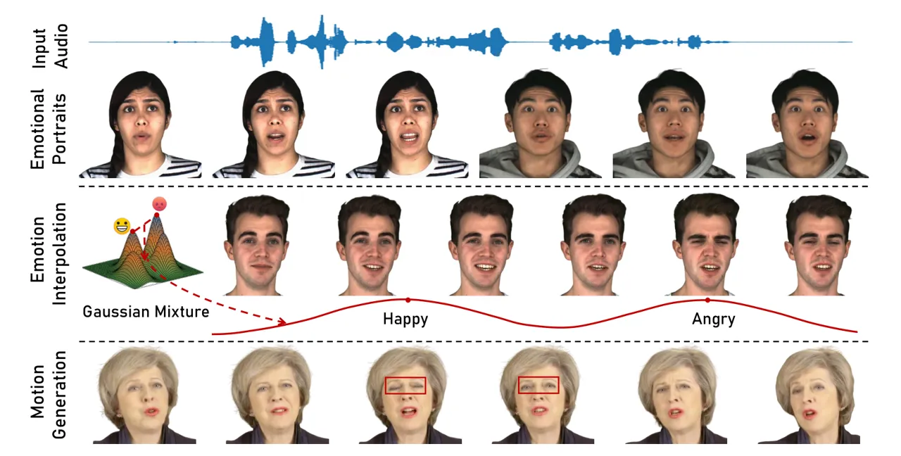

Fig. 1: GMTalker. Given the driving speech and emotion label, our method
can generate high-fidelity and faithful emotional talking video
portraits with diverse motions. Emotions can be freely manipulated
within our continuous and disentangled Gaussian mixture distributed
latent space. Additionally, our method can also predict motions from the
input speech, including head poses, eye blinks, and gaze.

Audio-driven talking video portraits have drawn much research interest
due to their broad applications in education, filmmaking, virtual
digital human and entertainment industry, etc. It aims to produce
audio-lip sync, photo-realistic, freely controllable video portraits
given a driven speech. Actually, facial emotions and motions in other
aspects, including head pose, eye blinks, and gaze, play a crucial role
in generating photo-realistic and vivid video portraits. However,
existing methods encounter challenges in achieving accurate and
continuous emotional control, along with generating diverse motions and
personalized speaking styles.

Previous methods \[1, 2, 3, 4\] focus on audio-lip synchronization
across different speakers, ignoring the control of facial emotion and
motion generation. Some works pay attention to emotion control by either
learning emotions from audio \[5, 6, 7\] or adding emotional source
videos \[8, 9, 10, 11\], which will introduce ambiguities. More recent
methods \[12, 13, 14, 15, 16\] focus on generating emotional expressions
that are consistent with the desired emotion label, providing a more
reasonable and controllable approach for synthesizing emotional talking
video portraits. However, they still face challenges in achieving
precise emotion control or continuously interpolating between different
emotion states. This limitation stems from their approach of
conditioning the emotion label into an emotion-agnostic framework
through a one-hot vector (representing a discrete emotion space) \[12,
13, 14, 15\] or deep emotional prompts (representing an entangled
emotion space) \[16\] to implicitly learn the mapping between emotion
and facial expression. The majority of these approaches fail to model a
continuous and disentangled emotion space for better interpolation
properties as well as more precise emotion control. To address this
problem, we propose a Gaussian Mixture based Expression Generator (GMEG)
which explicitly learns a conditional Gaussian mixture distribution
among audio, emotion, and 3DMM expression coefficients. Our insight is
to construct a continuous and disentangled latent space, where each
Gaussian component represents specific emotional properties of the data,
and these components are highly decoupled from each other. By leveraging
this learned Gaussian mixture latent space, we achieve precise emotion
control and smooth emotional transition.

Besides emotional facial expressions, the motion of other factors, such
as head pose, eye blink, and gaze, are essential to the realism of
synthesized videos. Some research \[17, 18, 19, 20, 21, 22, 23, 24, 25\]
model the correspondence between audio and motion. However, they have
not considered emotional control, and only a few works \[15, 6\] can
control both emotion and motions simultaneously. Moreover, they
encounter a so-called “mean motion” challenge, which means the
synthesized motion tends to be over-smoothing and lacks diversity. To
overcome their weakness, we propose a Normalizing Flow-based Motion
Generator (NFMG), which enhances the motion prior by incorporating
normalizing flow and learns the one-to-many mapping between the speech
and motions. Moreover, to fully leverage the normalizing flow’s
potential for fitting complex data distributions, we pre-train proposed
NFMG on Vox2celeb2 \[26\] dataset with wide-range head and eye
movements. In this way, we can obtain a more diverse motion prior and
alleviate the “mean motion” issue. Additionally, our method can
independently control expressions and motions by utilizing a parametric
facial model \[27\].

Finally, existing methods \[8, 16, 15\] lack consideration for
generating emotional portraits faithful to a specific person. To address
this limitation, we employ the stylized head generator,
StyleUNet \[28\], which reconstructs the personalized style of a target
identity using a latent code. However, owing to the highly coupled
latent space of StyleUNet, it struggles to explicitly control the
desired emotion. Therefore, we introduce an Emotion Mapping Network
(EMN) to branch each emotion mode corresponding to the available
sub-domain, which can control detailed emotion-related styles of the
target person. Consequently, we can synthesize emotional portraits with
personalized speaking styles.

We conduct comprehensive emotion interpolation comparison experiments,
evaluating the smoothness and precision of the emotion transition from
both quantitative and qualitative perspectives. Compared with other
state-of-the-art methods, the proposed GMTalker shows smoother and more
precise emotion transitions while maintaining accurate lip
synchronization. Our main contributions can be summarized as follows:

- •
  We propose a Gaussian mixture-based expression generator (GMEG) to
  disentangle different emotion states in continuous latent space,
  thereby achieving more precise emotion control and better
  interpolation properties.
- •
  We present a normalizing flow-based motion generator (NFMG) pretrained
  on a large dataset with wide-range motions to generate diverse motion
  coefficients, including head poses, eye blinks, and gaze.
- •
  We introduce a personalized emotion-guided head generator with an
  emotion mapping network (EMN) that synthesizes high-fidelity and
  faithful emotional video portraits with personalized speaking styles.

## II Related Work

Most existing works can be roughly classified into digital 3D human
faces \[29, 30, 31, 32, 33, 34, 35\] and realistic human portraits \[36,
1, 37, 38\], according to their output. The methods that animate 3D
models of faces map the input speech to 3D mesh via carefully designed
architecture. However, their applicability is limited due to the
requirement for expensive 3D training data. Thus, we focus on generating
photo-realistic talking video portraits.

##### Speech-Driven Talking Video Portraits

Most of the existing methods pay attention to generating movements in
the mouth region \[39, 40, 1, 41, 2, 3, 4, 42, 43, 44, 45, 46\]. For
instance, Wav2Lip \[1\] inpaints the lower half of the face using an
expert SyncNet \[47\] to align the speech and mouth region. These lines
of research, leaving the remaining video stationary, can only synthesize
the lower half face. Other methods aim to generate the whole face by
either wrapping the reference image according to input speech \[48, 22,
23\] or extracting face and audio features as a fused input to the
decoder model \[49, 19, 50, 51\]. However, directly modeling the
correspondence between audio and dynamic facial expressions in an
end-to-end manner struggles to control head motion and synthesize
high-quality face images.

Recently, with the development of 3D face reconstruction \[52, 27\],
some works leverage explicit 2D/3D facial landmarks \[36, 37, 38, 53,
20, 24, 54\] or 3D face models  \[18, 55, 17, 21, 56, 11, 57\] to
reconstruct interpretable landmarks or face parameters, and then
translate them to photo-realistic results. MakeItTalk \[38\] utilizes
disentangled speech content and speaker identity features to animate the
facial landmarks of a provided portrait. Benefiting from the
controllability of 2D/3D representations, some methods\[17, 18, 20, 21,
57, 24\] achieve explicitly motion control, which makes the synthesized
portraits more realistic. LSP \[20\] leverages a probabilistic
autoregressive module to reconstruct dynamic landmarks. EMO \[58\]
leverages the power of the diffusion model to directly generate video
portraits with the controllable head motion, achieving excellent
performance. However, none of them has considered emotional control
which is a key factor in generating realistic portraits.

##### Emotional Talking Video Portraits

Emotion significantly impacts the realism of synthesized portraits.
Recently, some works have paid attention to controlling the emotion of
the output portraits. EAMM \[8\], GC-AVT \[9\], Styletalk \[11\], and
PD-FGC \[10\] control emotion by external emotional source videos,
inevitably introducing a semantic leakage problem. EVP \[5\], EMMN \[6\]
directly identify emotion from labeled audio. However, determining
emotions from input audio only may introduce ambiguities \[8\]. Other
works ETK \[12\], MEAD \[13\], Sinha et al \[14\], SPACE \[15\],
EAT \[16\] learn the inherent correspondence among emotion, audio, and
facial expression implicitly via conditioning the emotion-agnostic
network with emotion labels. However, none of them explicitly models a
continuous and disentangled emotion space, leading to poor emotion
interpolation properties and inaccurate emotion generation. Our method
animates the emotion-controllable talking video portraits, including
facial expression, head pose, blinks, and eye gaze.

## III Method

We present GMTalker, a Gaussian mixture-based audio-driven emotional
video portrait generation framework taking the 3DMM as the intermediate
representation. Given an audio and an emotion label as input, our system
produces a talking video of a target person. It includes two generators
for emotional expression coefficients and motion-related coefficients,
as well as an emotion-guided head generator. The whole pipeline of our
proposed method is illustrated in Fig. 2. Specifically, we first extract
per-frame 3DMM expression and motion coefficients by fitting a face
parametric model (Section III-A). Then, we propose a Gaussian mixture
expression generator (GMEG) in Section III-B to generate emotional 3DMM
expression coefficients from an audio and emotion label by learning a
Gaussian mixture latent space. Meanwhile, we present a normalizing
flow-based motion generator (NFMG) in Section III-C to produce diverse
head poses, gazes, and eye blink coefficients. Finally, we present an
emotion-guided head generator with an Emotion Mapping Network (EMN) in
Section III-D to generate photo-realistic emotional portraits with
personalized speaking styles from the generated expression and motion
coefficients.

### III-A 3D Head Representation and Data Preprocessing

Given a $`T`$-frame emotional monocular portrait video of the target
person, we first perform parametric model fitting to extract 3DMM
coefficients as our intermediate representation and generate 3DMM
renderings for training. We utilize FaceVerse \[27\] for the following
reasons. First, the expression and shape bases of FaceVerse are rich and
diverse, enabling it to effectively capture complex and emotion-related
expressions across different identities compared with other facial
models \[59, 60, 52\]. Second, it excels in tracking stable head pose
and capturing eyeballs and eye blinks. The 3D face shape of FaceVerse
$`S`$ can be formulated as:

```math
S=\overline{S}+\gamma B_{shape}+\beta B_{exp}, \tag{1}
```

where $`\overline{S}`$ is the mean shape, $`B_{shape}`$ and $`B_{exp}`$
are the bases of shape and expression. Expression coefficients
$`\beta\in\mathbb{R}^{169}`$, blink coefficients
$`\theta_{blink}\in\mathbb{R}^{2}`$, translation $`t\in\mathbb{R}^{3}`$,
scale $`s`$, and the rotations of the head and two eyeballs
$`r_{1}\in\mathbb{R}^{3}`$, $`r_{2}\in\mathbb{R}^{2}`$,
$`r_{3}\in\mathbb{R}^{2}`$ are optimized using differentiable renderer
in \[28\] as a frame by frame manner. To generate identity-irrelevant
coefficients, we only optimize shape coefficients
$`\gamma\in\mathbb{R}^{150}`$ in the first frame for the target speaker
following \[57, 61, 28\]. Finally, we obtain a sequence of facial
expression coefficients, $`\{\beta\}_{t=1}^{T}`$, that is rich in
emotional information, and a sequence of motion coefficients,
$`\{\rho\}_{t=1}^{T}=\{[r_{1},t],r_{2},r_{3},\theta_{blink}\}_{t=1}^{T}`$,
which are capable of representing realistic movements. In terms of audio
processing, we employ a pretrained HuBERT model \[62\] to extract the
audio feature $`\{a\}_{t=1}^{T}`$, following methods \[63, 64\].

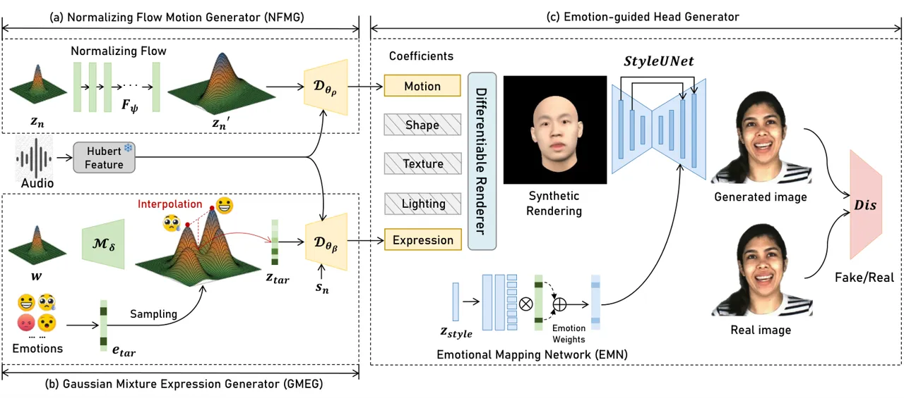

Fig. 2: Pipeline of GMTalker. Our framework consists of three parts: (a)
In Section III-B, given the input speech and emotion weights label, we
propose GMEG to generate 3DMM expression coefficients sampling from
Gaussian mixture latent space. (b) In Section III-C, we introduce NFMG
to predict motion coefficients from the audio, including poses, eye
blinks, and gaze. (c) In Section III-D, we render these coefficients to
3DMM renderings for the target person and then use an emotion-guided
head generator with EMN to synthesize photo-realistic video portraits
with personalized style.

### III-B Gaussian Mixture Expression Generator

Input with the audio and an emotion weight label, we propose a
Transformer-based GMEG to generate emotional expression coefficients. We
consider the audio-driven emotional expression generation as a
conditional generation task and explicitly model the conditional
distribution between the input audio feature $`\{a\}_{t=1}^{T}`$,
emotion weight label $`e`$, and facial expression coefficients
$`\{\beta\}_{t=1}^{T}`$.

Since previous methods struggle to model a continuous and disentangled
emotion space with better interpolation properties and more precise
emotion control, we utilize a Gaussian mixture distribution to model the
emotion latent space for expression generation, inspired by
GMVAE \[65\]. Our insight is that the observed emotion data follows a
Gaussian mixture distribution, and we restrict the distribution of the
latent code to their corresponding emotion modes. This approach allows
us to model a continuous and disentangled Gaussian mixture latent space,
in which we can easily control emotion and smoothly interpolate between
different emotion states.

#### III-B1 Preliminary

Our GMEG can be mathematically formulated as a joint distribution:

```math
p_{\beta,\theta}(\beta,{z},{w},{e},{a})=p({w})p({e})p_{\delta}({z}|{w},{e})p_{\theta_{\beta}}({\beta}|{z},{a}),\vskip-2.84544pt \tag{2}
```

which means our generative model will generate an observed expression
coefficient $`\beta`$ from the audio $`a`$, the latent variables $`w`$,
$`z`$, and the emotion label $`e`$. Specifically, the latent variable
$`w`$ follows the normal distribution $`{w}\sim\mathcal{N}(0,{I})`$,
$`z`$ is a latent variable, and the emotion label $`e`$ follows the
uniform distribution $`{e}\sim\mathcal{U}(0,{K})`$,
$`p(e=k)={\pi_{k}}=1/K`$, where $`K`$ is the number of components in the
mixture (i.e. the number of emotion types in datasets).

Then, by sample from $`w`$-space conditioned on various emotion
$`e_{k}`$, we can model a conditioned Gaussian mixture distribution
$`{z}|{e},{w}`$ (i.e. Gaussian mixture latent space):

```math
p_{\delta}({z}|{w},{e})=\sum_{k=1}^{K}{\pi_{k}}\mathcal{N}({z};{\mu}_{\delta}^{k}(w),\Sigma_{\delta}^{k}({w})),\vskip-5.69046pt \tag{3}
```

where $`{\mu}_{\delta}^{k}`$ and $`\Sigma_{\delta}^{k}`$ represent a set
of $`K`$ means and variances of Gaussian mixture modeled by a neural
network. Finally, we can generate expression coefficients
$`\beta_{1:t}`$ by a decoder with latent variable $`z`$ and audio
$`a_{1:t}`$ as input.

#### III-B2 Architecture

We employ a VAE \[66\] paradigm to learn the above Gaussian mixture
latent space, which includes an encoder, a mixture-of-Gaussian (MoG)
mapper, and a decoder. To capture long-range context dependencies and
process arbitrary-length sequences, we further employ Transformer
architectures \[67\] to model all of these networks and obtain
sequence-level embeddings for both expression coefficients and audio
features.

Encoder. As highlighted by the blue part in Fig. 3. (a), our encoder
$`\mathcal{E}_{\phi}`$ aims at learning two approximate posterior
distributions: a normal distribution
$`q_{\phi_{z}}({z}|\beta,a)=\mathcal{N}(z;\mu_{\phi_{z}}(\beta,a),\Sigma_{\phi_{z}}(\beta,a))`$
and Gaussian mixture distribution
$`q_{\phi_{w}}({w}|\beta,a)=\mathcal{N}(w;\mu_{\phi_{w}}(\beta,a),\Sigma_{\phi_{w}}(\beta,a))`$,
taking expression coefficients $`\beta_{1:{t}}`$ and audio features
$`a_{1:t}`$ as input:

```math
z,w=\mathcal{E}_{\phi}(\beta_{1:t},a_{1:t}).\vskip-2.84544pt \tag{4}
```

We first embed the input expression coefficients into a
$`d`$-dimensional space via a linear projection. Then, we combine these
projected features with audio features as the input of sinusoidal
positional encoding to provide temporal order information
periodically \[67\]. We use 8 Transformer encoder layers to model
capture long-range context, followed by two average pooling layers to
produce two groups of distribution parameters: $`\mu_{\phi_{w}}`$,
$`\Sigma_{\phi_{w}}`$, $`\mu_{\phi_{z}}`$ and $`\Sigma_{\phi_{z}}`$.

Mixture-of-Gaussian Mapper. To generate the conditioned Gaussian mixture
distribution $`p(z|w)`$ from the latent variable $`w`$, we propose a
Transformer-based MoG mapper $`\mathcal{M_{\delta}}`$ parameterized by
$`\delta`$, depicted in the green part of Fig. 3. (a). It consists of 8
Transformer encoder layers, without positional encodings. Our MoG mapper
outputs a set of $`K`$ means $`{\mu}_{\delta}^{k}`$ and variances
$`{\Sigma}_{\delta}^{k}`$ of Guassian mixture, written as:

```math
\vskip-2.84544pt{\mu}_{\delta}^{k},{\Sigma}_{\delta}^{k}=\mathcal{M_{\delta}}(w). \tag{5}
```

Decoder. Given the latent variable $`z`$, audio feature $`a_{1:t}`$, and
the personalized learnable embedding $`s_{n}`$ of speaker $`n`$, we
autoregressively generate emotional expression coefficients
$`\beta_{1:t}`$ by a Transformer-based decoder parametrized by
$`\theta_{\beta}`$,

```math
\vskip-2.84544pt\hat{\beta}_{t}=\mathcal{D}_{\theta_{\beta}}(z,a_{1:t},\hat{\beta}_{1:t-1},s_{n}). \tag{6}
```

Our decoder $`\mathcal{D}_{\theta_{\beta}}`$ consists of 8 Transformer
decoder layers with a linear expression projection layer, shown in the
yellow part of Fig. 3. (a). We add a latent variable $`z`$ to a sequence
of positional encodings as the Transformer input embeddings and then
predict the current expression coefficient $`\hat{\beta}_{t}`$
conditioned on the previous expression coefficients
$`\hat{\beta}_{1:t-1}`$. The personalized learnable embedding $`s_{n}`$
can be regarded as the initialized expression coefficients, serving as a
starting guide. Notably, we enhance the Transformer decoder with causal
self-attention to capture dependencies within the past expression
coefficient sequence, and with cross-modal attention to align the audio
and expressions, inspired by \[31\].

#### III-B3 Training Loss

Due to the introduction of the Gaussian mixture prior, the optimization
objective of VAE has some changes and no longer offers a simple
analytical solution. Therefore, we optimize our GMEG using the
log-evidence lower bound (ELBO) loss following \[68\], which can be
written as:

```math
\vskip-2.84544pt\mathcal{L}_{exp}=\lambda_{rec}\mathcal{L}_{rec}+\lambda_{cond}\mathcal{L}_{cond}+\lambda_{w}\mathcal{L}_{w}+\lambda_{emo}\mathcal{L}_{emo}. \tag{7}
```

where $`\lambda_{rec}`$, $`\lambda_{cond}`$, $`\lambda_{w}`$, and
$`\lambda_{emo}`$ are loss weights. The gradients can be backpropagated
via the reparameterization trick \[66\].

We refer to $`\mathcal{L}_{rec}`$ as the reconstruction term, which can
be also written as MSE loss between ground-truth and reconstructed
expression coefficients:
$`\mathcal{L}_{rec}=\left\|{\beta_{1:t}-{\hat{\beta}_{1:t}}}\right\|_{2}`$.
The conditional regularizer $`\mathcal{L}_{cond}`$ is proposed to push
the approximated posterior single Gaussian distribution near each
emotion component of the Gaussian mixture prior. Since this term lacks a
closed-form solution, we use the 1-step Monte Carlo samples to estimate
the expectation over $`q_{\phi_{w}}({w}|\beta,a)`$ and
$`q_{\phi_{z}}({z}|{\beta,a})`$:

```math
\displaystyle\tiny\mathcal{L}_{cond}= \displaystyle\mathbb{E}_{q_{\phi_{w}}({w}|\beta,a)q_{\phi_{z}}({z}|{\beta,a})}D_{KL}(q_{\phi_{z}}({z}|\beta,a)\|p_{\delta}({z}|{w},{e}))]
```

```math
\displaystyle= \displaystyle\frac{1}{N}\frac{1}{M}\sum_{n=1}^{N}\sum_{m=1}^{M}\sum_{k=1}^{K}\tilde{\pi}_{k}\log\frac{q_{\phi_{z}}\left(z_{m}\mid\beta,a\right)}{p_{\delta}\left(z_{m}\mid w_{n},e=k\right)}
```

```math
\displaystyle= \displaystyle\log q_{\phi_{z}}\left(z\mid\beta,a\right)-\sum_{k=1}^{K}\tilde{\pi}_{k}\log p_{\delta}\left(z\mid w,e=k\right) \tag{8}
```

where $`\tilde{\pi}_{k}`$ is the posterior distribution of emotion
derived from $`z`$ and $`w`$:

```math
\tilde{\pi}_{k}=p_{\delta}\left(e=k\mid{z},w\right)=\frac{{\pi_{j}}\mathcal{N}({z};{\mu}_{\delta}^{j}(w),\Sigma_{\delta}^{j}({w}))}{\sum_{k=1}^{K}{\pi_{k}}\mathcal{N}({z};{\mu}_{\delta}^{k}(w),\Sigma_{\delta}^{k}({w}))} \tag{9}
```

$`\mathcal{L}_{w}`$ is the regularizer of normal distribution $`w`$
which reduces KL divergence between the normal posterior and the normal
prior distribution as same as vanilla VAE, formulated as:

```math
\displaystyle\mathcal{L}_{w} \displaystyle=D_{KL}(q_{\phi_{w}}({w}|{\beta,a})||p({w}))
```

```math
\displaystyle=-\frac{1}{2}\left(\log\sigma_{\phi_{w}}^{2}-\mu_{\phi_{w}}^{2}-\sigma_{\phi_{w}}^{2}+1\right) \tag{10}
```

$`\mathcal{L}_{emo}`$ is the regularizer of emotion which reduces the KL
divergence between the $`e`$-posterior and the uniform prior by pushing
the same emotion samples generated from the same component of the
Gaussian mixture, which can be written as:

```math
\displaystyle\tiny\mathcal{L}_{emo} \displaystyle=\mathbb{E}_{q_{\phi_{z}}({z}|{\beta},a)q_{\phi_{w}}({w}|{\beta},a)}\left[D_{KL}(p_{\delta}({e}|{z},{w})||p({e}))\right]
```

```math
\displaystyle=\frac{1}{M}\sum_{i=1}^{M}D_{KL}\left(p_{\delta}\left(e|{z}_{i},{w}_{i}\right)||p(e)\right)
```

```math
\displaystyle=\sum_{k=1}^{K}\tilde{\pi}_{k}\left(\log\tilde{\pi}_{k}+\log{K}\right), \tag{11}
```

where we also use 1-step Monte Carlo samples to estimate the expectation
over $`q_{\phi_{z}}({z}|{\beta},a)`$ and
$`q_{\phi_{w}}({w}|{\beta},a)`$.

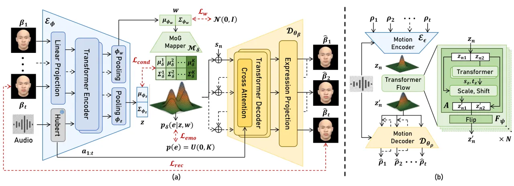

Fig. 3: The training process of our proposed GMEG and NFMG. (a) We
autoregressively reconstruct facial expression coefficients
$`\hat{\beta}_{1:t}`$ from input audio $`a_{1:t}`$ and emotion label
$`e`$ by optimizing four loss: $`\mathcal{L}_{rec}`$,
$`\mathcal{L}_{cond}`$, $`\mathcal{L}_{w}`$, $`\mathcal{L}_{emo}`$. (b)
Our NFMG generates diverse motions $`\hat{\rho}_{1:t}`$ from audio,
including head poses, eye blinks, and gaze, by learning a Transformer
normalizing flow-based VAE.

#### III-B4 Inference and Emotion manipulation

In the inference stage, we predict emotional expression coefficients
according to audio feature $`a_{1:t}`$, target emotion label
$`e_{tar}`$, and personalized code $`s_{n}`$ in an autoregressive
manner. As shown in Fig. 2, we first sample $`w`$ from prior normal
distribution $`\mathcal{N}(0,I)`$. Then, our MoG mapper generates a
latent code $`z_{tar}`$ corresponding to the target emotion, followed by
the expression decoder to predict the final expression coefficients.

Benefiting from the continuous and disentangled Gaussian mixture latent
space, our method can achieve emotion manipulation by mixing the
different Gaussian latent codes corresponding to each emotion.
Specifically, as shown in Fig. 1, given the “happy" emotion $`e_{1}`$
and the “angry" emotion $`e_{2}`$, we generate each latent code
$`z_{1}`$ and $`z_{2}`$ through the MoG mapper determined by sampled
$`w`$ and its emotion label. Then, we can easily blend these two latent
codes by changing the interpolation weight $`\alpha`$:

```math
\vskip-5.69046pt\small z_{12}^{\alpha}={\alpha}\mathcal{N}({z};{\mu}_{\delta}^{1}(w),\Sigma_{\delta}^{1}({w}))+(1-\alpha)\mathcal{N}({z};{\mu}_{\delta}^{2}(w),\Sigma_{\delta}^{2}({w})) \tag{12}
```

### III-C Normalizing Flow based Motion Generator

Predicting head poses, eye blinks, and gaze from input audio is
particularly challenging due to the one-to-many mapping between audio
and motion. Besides, existing methods encounter the “mean motion"
problem which means the synthesized motion tends to be over-smoothing,
lacking diversity, and appearing blurred in the case of wide-range head
movements. Previous work \[57\] utilizes simple distribution as the
prior of VAE to predict head motion from audio, often causing the
encoder to generate mean motion latent code. In this paper, we employ
the normalizing flow technique to enhance the complexity of the prior
distribution, compelling the encoder to generate diverse motion latent
codes, inspired by \[69, 70, 63\]. In this way, our normalizing
flow-based motion generator (NFMG) effectively mitigates the "mean
motion" problem.

Given the input audio $`a_{1:t}`$, we utilize a normalizing flow that
map a normal distribution $`z_{n}`$ into a more complicated distribution
$`z_{n}^{\prime}`$. Subsequently, the latent representation is decoded
into motion-related coefficients
$`\{\rho\}_{t=1}^{T}\in\mathbb{R}^{12}`$. This process can be written as
follows

```math
\displaystyle\vskip-14.22636ptp_{\psi}(z_{n}^{\prime})=p(z_{n})\Big|det\frac{\delta F_{\psi}}{\delta z_{n}}\Big|,\quad p(z_{n})\sim\mathcal{N}(0,{I}) \tag{13}
```

```math
\displaystyle p_{\psi,\theta_{\rho}}({\rho},{z_{n}},{a})=p_{\psi}(z_{n}^{\prime})p_{\theta_{\rho}}({\rho}|{z_{n}^{\prime}},{a}),\vskip-17.07182pt \tag{14}
```

where $`\psi`$ and $`\theta_{\rho}`$ are the model parameters of
normalizing flow $`F_{\psi}`$ and decoder
$`\mathcal{D}_{\theta_{\rho}}`$.

Architecture. As illustrated in Fig. 3. (b), the proposed NFMG comprises
a motion encoder, a Transformer normalizing flow, and a motion decoder.
The motion encoder $`\mathcal{E}_{\epsilon}`$ and the motion decoder
$`\mathcal{D}_{\theta_{\rho}}`$ closely resemble the GMEG encoder and
decoder, with the encoder featuring only one linear layer to approximate
the posterior distribution $`q_{\epsilon}(z_{n}|\rho,a)`$. To enhance
the prior distribution of motion, we introduce a Transformer flow
$`F_{\psi}`$, which is constructed by a series of $`N`$ invertible
Transformer-based nonlinear mappings
$`F_{\psi}=F_{\psi_{1}}(F_{\psi_{2}}(...F_{\psi_{N}}))`$ parameterized
by $`\psi=\{\psi_{n}\}_{n=1}^{N}`$. Specifically, each component mapping
$`F_{\psi_{n}}`$ contains two substeps: an affine coupling layer ($`A`$)
and a flip operation. Given the latent $`z_{n}=[z_{n1},z_{n2}]`$, the
affine coupling layer aims to affinely transform half of the input
elements $`z_{n1}`$ based on the values of the other half
$`z_{n2}`$ \[71\]. To employ a more powerful nonlinear transformation,
we utilize 4 Transformer encoder layers as our affine coupling layer to
calculate the scale $`s_{z}`$ and shift $`t_{z}`$ of $`z_{n1}`$, which
is different from existing works \[72, 73, 70\]. The flip operation
ensures that after a sufficient number of flow steps, all variables can
be nonlinearly transformed by reversing the ordering of the features.

Training. We utilize ELBO loss to train our NFMG. Additionally, we
introduce a velocity loss to constraint temporal consistency. The loss
function can be formulated as:

```math
\displaystyle\vskip-14.22636pt\mathcal{L}_{\mathrm{m}}(\epsilon,\psi,\phi_{\rho})= \displaystyle\mathbb{E}_{q_{\epsilon}(z_{n}^{\prime}|\rho,a)}[\log p_{\theta_{\rho}}({\rho}|z_{n}^{\prime},a)]
```

```math
\displaystyle- \displaystyle D_{KL}(q_{\epsilon}(z_{n}^{\prime}|\rho,a)||p_{\psi}(z_{n}^{\prime}))
```

```math
\displaystyle= \displaystyle\left\|{\rho_{1:t}-{\hat{\rho}_{1:t}}}\right\|_{2}
```

```math
\displaystyle- \displaystyle\mathbb{E}_{q_{\epsilon}(z_{n}^{\prime}|\rho,a)}[\log q_{\epsilon}(z_{n}^{\prime}|{\rho},a)-\log p_{\psi}(z_{n}^{\prime})]\vskip-22.76228pt \tag{15}
```

where the expectation of $`q_{\epsilon}(z_{n}^{\prime}|{\rho_{t}},a)`$
can be estimated by Monte-Carlo method.

However, merely incorporating normalizing flow proves inadequate for
generating diverse motions across different data distributions. This is
due to the motion acquired from a single video is usually insufficient
for synthesizing diverse movements. Therefore, we pre-train our NFMG on
VoxCeleb2 \[26\], a large dataset with diverse head and eye movements,
to enhance the generalization of motion. So that we can make full use of
the potential of the normalizing flow to fit complex data distributions
and alleviate the “mean head motion” problem.

Inference. As shown in Fig. 3. (b), our Transformer flows first map a
latent variable $`z_{n}`$ sampled from the prior normal distribution
into $`z_{n}^{\prime}`$. Then we pass this latent variable with audio
feature $`a_{1:t}`$ into the motion decoder to generate diverse and
realistic motion coefficients $`\hat{\rho}_{1:t}`$ autoregressively
similar to Section III-B. Since the $`z_{n}`$ is randomly sampled, we
can generate different head poses, eye blinks, and gazes given the same
speech. Furthermore, we can also generate diverse and realistic motions
given the different audio due to the powerful generative ability of the
proposed NFMG.

### III-D Emotion-guided Head Generator

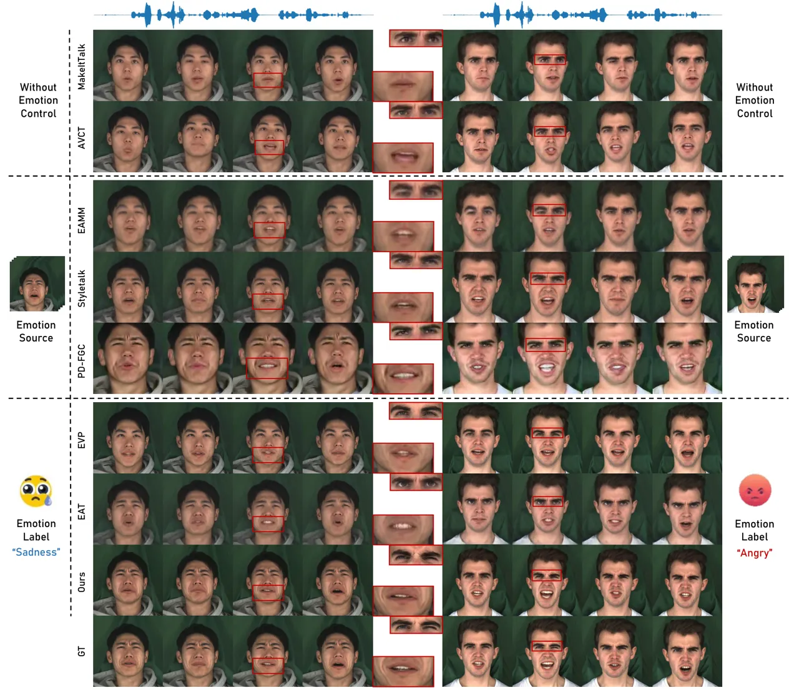

Fig. 4: Qualitative comparison for emotional talking video portraits on
the two cases in the MEAD test dataset. The emotion categories of the
videos are happy (left) and angry (right). The bottom row shows
ground-truth frames. Since EAMM \[8\] and EAT are one-shot methods, we
choose the same reference image used in EAT \[16\] to generate target
videos for them.

After generating emotional expression and other motion coefficient
sequences from input audio (Section III-B and Section III-C), we render
them to images using the fixed shape and texture coefficients of the
target person (Section III-A). Next, we will generate photo-realistic
images from synthetic 3DMM renderings through an image-to-image
translation generator. We utilize the style-based generator,
StyleUNet \[28\], which can reconstruct the personalized style of a
target identity. However, owing to the highly coupled latent space of
StyleUNet, it struggles to explicitly control the emotion that we want.
Therefore, we introduce an Emotion Mapping Network (EMN) to branch each
emotion type corresponding to the available sub-domain, motivated
by \[74\].

Emotion Mapping Network. Given a latent code $`z_{style}`$ and an
emotion label, our EMN generates a style code
$`\mathbf{s}_{style}=\mathcal{M}_{k}({z_{style}})`$, where
$`\mathcal{M}_{k}(.)`$ denotes the output corresponding to the emotion
type $`k`$, and $`\mathcal{M}`$ consist of an MLP with two shared layers
and $`K`$ multiple unshared layers (similar to the emotion numbers).
Consequently, we can utilize $`z_{style}`$ to control emotion-related
details, such as facial wrinkles. Please refer to Appendix A-A of our
supplementary materials for more details.

## IV Experiments

[TABLE]

TABLE I: Quantitative comparisons with the state-of-the-art methods on
MEAD \[13\]. Please note that the sync value for emotional talking video
portraits may be inaccurate as the SyncNet model is trained only with
neutral videos.

[TABLE]

TABLE II: Quantitative comparisons with the state-of-the-art methods on
CREMA-D \[75\].

In this section, we first describe the experimental setup of our
approach in Section IV-A: dataset and implementation details, baseline
method, and evaluation metrics. Subsequently, we present the comparison
results in Section IV-B. Finally, we show results of the ablation study
in Section IV-C.

### IV-A Experimental Setup

Dataset and Implementation Details. We conduct emotional experiments on
the commonly used talking head datasets, MEAD \[13\] and CREMA-D \[75\].
As for non-emotional target-person experiments, we utilize the video
samples provided by LSP \[20\] with 80%/20% for training and testing.
Notably, we set the component of our Gaussian mixture $`K`$ to 1 for
non-emotional experiments, representing a normal distribution.
Similarly, the number of unshared layers in EMN is set to 1. To learn
diverse and large motion changes, we select about 20k videos from the
VoxCeleb2 \[26\] to pre-train our NFMG. Then, we fine-tune this diverse
motion prior to a specific person taking a few minutes. More details of
dataset and implementations are provided in Appendix A-B of the
supplementary materials.

Baseline. We compare our method with: (1) emotion-agnostic talking video
generation methods: MakeItTalk \[38\], Wav2Lip \[1\], and AVCT \[23\].
(2) emotion-controllable talking video generation methods: EAMM \[8\],
Styletalk \[11\], PD-FGC \[10\], and EAT \[16\]. Besides, we
additionally compare our results on the CREMA-D dataset with Vougioukas
et.al \[76\], Diffused Heads \[77\] and ETK \[12\]. For
motion-controllable talking video generation, we compare our method with
several state-of-the-art motion-controllable methods: FACIAL \[21\],
LSP \[20\], Audio2Head \[22\] and SadTalker \[57\], focusing on
high-quality portrait generation with natural and diverse motion.

Evaluation Metrics. We use the following metrics used in EAT \[16\] to
measure the visual quality and audio-visual synchronization for all
quantitative experiments. For emotional talking video comparison, we
employ $`Acc_{emo}`$ to assess the emotional accuracy of synthesized
videos. To measure the diversity of generated head motion, we adopt Beat
Alignment (BA) and Diversity (Div) metrics used in SadTalker \[57\], as
well as Percent of Correct Motion (PCM) mentioned in BEAT \[78\].
Detailed descriptions of metrics are available in Appendix B of the
supplementary materials.

### IV-B Comparison Results

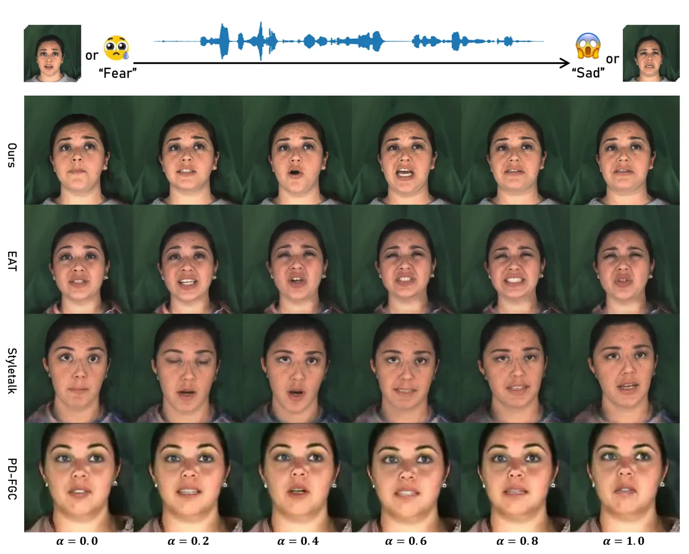

Fig. 5: Qualitative results of the emotion interpolation comparison. For
PD-FGC \[10\] and Styletalk \[11\], we manipulate expressions between
the source emotion video and the target emotion video. For EAT \[16\],
we achieve this by transitioning between the source emotion label and
the target emotion label.

Comparison of Emotion Generation. For quantitative comparison, we adopt
the experimental setup and evaluation method utilized by EAT \[16\] on
the public-available MEAD and CREMA-D test set. As shown in Table I and
Table II, GMTalker achieves the best overall visual quality and emotion
accuracy, demonstrating the superior quality of disentangled emotion
latent space learned by GMEG. In terms of the Sync score, our method
shows comparable performance with other methods. Please note that a
higher sync score does not invariably guarantee better results, as this
metric can be overly sensitive to audio and the SyncNet model is trained
only on neutral videos. The higher scores achieved by Wav2Lip \[1\] and
EAT \[16\] may be attributed to their overfitting of the pretrained
SyncNet model or utilizing synchronization loss.

Moreover, we perform qualitative comparisons with serval
state-of-the-art methods using the test sets of the MEAD and CREMA-D
(see Appendix C-A in the supplementary materials). Illustrated in
Fig. 4, our method excels in generating high-fidelity and faithful
emotional talking video portraits. While these methods either fail to
express desired emotion or exhibit artifacts in the mouth region,
GMTalker remains comparatively more faithful to the ground truth
expressions, including maintaining natural mouth shapes aligned with the
input speech. Additionally, it produces detailed expressions with
personalized speaking styles, such as realistic wrinkles in the face and
around the eyes.

Comparison of Emotion Interpolation. To illustrate the continuity and
decoupling characteristics of our Gaussian mixture latent space learned
by GMEG, we conduct an emotion interpolation study comparing our
GMTalker with several state-of-the-art methods: EAT \[16\],
Styletalk \[11\] and PD-FGC \[10\]. As shown in Fig. 5, given the same
driving audio, we obtain the image sequences of different methods by
interpolating between the corresponding emotion features extracted from
the source emotion “Fear" and the target emotion “Sad”. For Styletalk
and PD-FGC, which extract emotion features from additional emotion
videos, the generated facial emotion dynamics lack smooth emotion
transition and fail to achieve the desired emotion states. EAT generates
emotional embeddings through its deep emotional prompts, resulting in
relatively continuous facial expression dynamics. However, it may
present ambiguous emotional states: the generated target expression
“Sad" more closely resembles confusion or fear. In contrast, by
interpolating in our continuous and disentangled Gaussian mixture latent
space, we can smoothly transition from the source expression to the
target expression while preserving the accuracy of the emotion.

| Method           | Emo Source | E-PPL$`\downarrow`$ | E-PDV$`\downarrow`$ | Sync$`\uparrow`$ |
| ---------------- | ---------- | ------------------- | ------------------- | ---------------- |
| PD-FGC \[10\]    | Video      | 21.08               | 44.95               | 5.30             |
| Styletalk \[11\] | Video      | 12.84               | 15.35               | 5.61             |
| EAT \[16\]       | Label      | 8.89                | 7.28                | 6.64             |
| Ours             | Label      | 6.64                | 6.86                | 6.74             |

TABLE III: Quantitative comparison of the emotion interpolation study.

To quantitatively validate the quality of intermediate facial expression
and the smoothness of the emotional transition video, we introduce two
new metrics inspired by \[79, 80\]. Emotion Perceptual Path Length
(E-PPL, $`\downarrow`$) serves as an indicator of the emotional
smoothness and consistency of the generated transition video, and
Emotion Perceptual Distance Variance (E-PDV, $`\downarrow`$) serves as a
natural measure of the homogeneity of the emotion video transition rate.
The details of these two metrics are shown in Appendix B-A of the
supplementary materials.

Besides, we adopt the SyncNet score to evaluate the audio-visual
synchronization of the generated emotional transition video. The
quantitative results of all approaches are presented in Table III. Our
methods achieve significantly lower E-PPL and E-PDV than others, showing
smoother emotion transitions. On the other hand, our GMTalker has a
higher Sync score, demonstrating more accurate lip synchronization when
the emotions are changed.

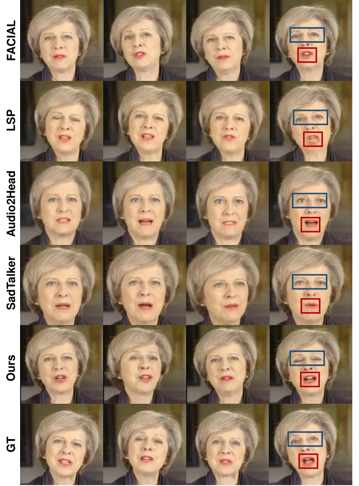

Fig. 6: Qualitative comparison for motion-controllable methods on the
one test sample from LSP \[20\].

| Method            | Visual Quality   |                  |                      | Lip Synchronization |                     |                        | Motion Diversity |                 |                 |
| ----------------- | ---------------- | ---------------- | -------------------- | ------------------- | ------------------- | ---------------------- | ---------------- | --------------- | --------------- |
|                   | PSNR$`\uparrow`$ | SSIM$`\uparrow`$ |    FID$`\downarrow`$ | Sync$`\uparrow`$    | M-LMD$`\downarrow`$ |    F-LMD$`\downarrow`$ | BA$`\uparrow`$   | Div$`\uparrow`$ | PCM$`\uparrow`$ |
| FACIAL \[21\]     | 19.22            | 0.62             | 35.14                | 3.99                | 1.82                | 2.83                   | 0.242            | 2.182           | 0.411           |
| LSP \[20\]        | 19.48            | 0.62             | 46.45                | 4.93                | 1.99                | 2.84                   | 0.252            | 2.173           | 0.432           |
| Audio2Head \[22\] | 16.97            | 0.53             | 56.06                | 6.94                | 2.47                | 3.89                   | 0.259            | 2.182           | 0.433           |
| SadTalker \[57\]  | 17.23            | 0.54             | 50.15                | 7.82                | 2.51                | 3.84                   | 0.263            | 1.934           | 0.408           |
| Ours              | 19.80            | 0.64             | 30.91                | 7.82                | 1.79                | 2.75                   | 0.290            | 2.201           | 0.449           |
| Ground Truth      | $`\infty`$       | 1.00             | 0                    | 8.53                | 0.00                | 0.00                   | 0.271            | 2.151           | 0.435           |

TABLE IV: Quantitative comparisons with state-of-the-art
pose-controllable method on LSP \[20\] test samples. We evaluate
SadTalker \[57\] in the one-shot settings, and others in person-specific
settings.

Comparison of Motion Generation. We compare our approach with several
state-of-arts pose-controllable methods: FACIAL \[21\], LSP \[20\],
Audio2Head \[22\] and SadTalker \[57\], on test video samples from LSP.
As depicted in Table IV, our method shows outstanding performance in
terms of Div, BA, and PCM. Meanwhile, we also achieve the best
performance on overall visual quality and lip sync metrics. This
suggests that the latent space learned by normalizing flow can represent
complex motion distributions derived from pretrained models. Qualitative
comparisons are shown in Fig. 6. Our approach excels in generating
diverse head motions, natural eye blinks, and accurate mouth shapes with
audio, and visual quality compared with other methods. For more detailed
comparison results please refer to Appendix C-A in our supplement
materials.

| Ablation  | PSNR/SSIM$`\uparrow`$ | FID$`\downarrow`$ | M/F-LMD$`\downarrow`$ | Sync$`\uparrow`$ | $`Acc_{emo}`$ $`\uparrow`$ |
| --------- | --------------------- | ----------------- | --------------------- | ---------------- | -------------------------- |
| w/o GM    | 23.71/0.77            | 14.64             | 1.61/1.85             | 7.23             | 65.61                      |
| w/o EMN   | 24.82/0.78            | 12.95             | 1.62/1.81             | 7.30             | 72.33                      |
| Ours Full | 25.18/0.81            | 11.86             | 1.52/1.76             | 7.41             | 77.73                      |

TABLE V: Quantitative ablation study results for GMEG and EMN.

| Ablation             | BA$`\uparrow`$ | Div$`\uparrow`$ | PCM$`\uparrow`$ |
| -------------------- | -------------- | --------------- | --------------- |
| w/o normalizing flow | 0.244          | 2.101           | 0.427           |
| w/o pre-train        | 0.272          | 2.189           | 0.438           |
| Ours Full            | 0.293          | 2.223           | 0.447           |

TABLE VI: Quantitative results of the ablation study for normalizing
flow motion generator on test samples from LSP.

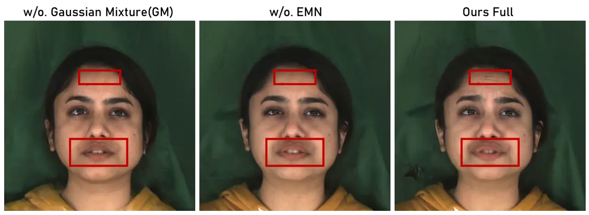

Fig. 7: Qualitative results of ablation study for Gaussian mixture (GM)
prior and EMN. From left to right, the results are w/o GM, with GM but
w/o EMN, and our full model.

### IV-C Ablation Study

To demonstrate the effectiveness of our designed choice, we perform
ablation studies with the following three alternative modules: 1) w/o
Gaussian mixture prior in GMEG (w/o GM), where we replace the Gaussian
mixture distribution prior with an unimodal Gaussian prior, 2) w/o EMN,
where we use 4-layers MLP as mapping network without emotion-guided, 3)
w/o normalization flow, where we use the normal distribution as the
prior of the motion generator.

##### The Ablation of GMEG and EMN

We conduct the ablation of GMEG and EMN on the MEAD test set. We compare
the visual quality, audio-visual synchronization, and emotional accuracy
metrics before and after removing the Gaussian mixture prior in GMEG and
EMN, respectively. As shown in Table V, all components can improve video
quality and emotion accuracy. In particular, when removing the
constraints on the Gaussian mixture distribution, there is a significant
decline in the emotional accuracy of the generated videos, demonstrating
the effectiveness of our disentangled emotion latent space. A
qualitative case in generating “Fear” expression is illustrated in
Fig. 7. It can be observed that when replacing the Gaussian mixture
distribution with normalization distribution or removing the EMN module,
the model can hardly generate the desired expression and facial details,
including wrinkles, mouth shapes, and eye gaze.

##### The Ablation of NFMG

For the ablation of NFMG, we focus on the Div, BA, and PCM metrics. As
shown in Table VI, the quantitative results demonstrate that our
normalizing flow with pre-training can provide richness motion prior and
generate diverse and wide-range motions. For more details please refer
to Appendix E of our supplement materials.

## V Discussion and Conclusion

##### Limitation

Although our method has demonstrated its superiority compared with
existing emotional talking video portrait methods, there are still
several limitations: (1) our method relies on high-quality videos
containing rich emotional content, the capturing of which comes with
certain challenges; (2) our method still describes limited emotions
subjecting to the eight categories in the dataset and need to train on
the target person.

##### Potential Social Impact

As our method is capable of producing realistic emotional talking
portraits from monocular videos, there is a potential for its
application in creating deceptive talking videos, which should be
addressed carefully before its deployment.

##### Conclusion

In this paper, we present GMTalker which can generate high-fidelity and
faithful emotional talking video portraits with diverse motions. To
achieve precise emotion control and continuous emotion transition, we
propose the GMEG to construct a continuous and disentangled Gaussian
mixture latent space. Then, NFMG is proposed to alleviate the “mean
motion" problem and predict diverse head poses, eye blinks, and gazes.
Finally, we introduce an emotion-guided head generator with the proposed
EMN to generate high-quality emotional talking video portraits with
personalized speaking styles. By incorporating GMEG, NFMG, and EMN, our
method offers a unique blend of advantages, combining faithful and
smooth emotion interpolation, diverse head and eye motions, and
high-quality video generation. Overall, experiments have demonstrated
that our method outperforms other state-of-the-art approaches, and we
believe that our Gaussian mixture latent space will inspire future
research on talking head generation.

## References

- \[1\] K. Prajwal, R. Mukhopadhyay, V. P. Namboodiri, and C. Jawahar,
  “A lip sync expert is all you need for speech to lip generation in the
  wild,” in _Proceedings of the 28th ACM international conference on
  multimedia_, 2020, pp. 484–492.
- \[2\] Y. Sun, H. Zhou, K. Wang, Q. Wu, Z. Hong, J. Liu, E. Ding,
  J. Wang, Z. Liu, and K. Hideki, “Masked lip-sync prediction by
  audio-visual contextual exploitation in transformers,” in _SIGGRAPH
  Asia 2022 Conference Papers_, 2022, pp. 1–9.
- \[3\] K. Cheng, X. Cun, Y. Zhang, M. Xia, F. Yin, M. Zhu, X. Wang,
  J. Wang, and N. Wang, “Videoretalking: Audio-based lip synchronization
  for talking head video editing in the wild,” in _SIGGRAPH Asia 2022
  Conference Papers_, 2022, pp. 1–9.
- \[4\] J. Guan, Z. Zhang, H. Zhou, T. Hu, K. Wang, D. He, H. Feng,
  J. Liu, E. Ding, Z. Liu _et al._, “Stylesync: High-fidelity
  generalized and personalized lip sync in style-based generator,” in
  _Proceedings of the IEEE/CVF Conference on Computer Vision and Pattern
  Recognition_, 2023, pp. 1505–1515.
- \[5\] X. Ji, H. Zhou, K. Wang, W. Wu, C. C. Loy, X. Cao, and F. Xu,
  “Audio-driven emotional video portraits,” in _Proceedings of the
  IEEE/CVF conference on computer vision and pattern recognition_, 2021,
  pp. 14 080–14 089.
- \[6\] S. Tan, B. Ji, and Y. Pan, “Emmn: Emotional motion memory
  network for audio-driven emotional talking face generation,” in
  _Proceedings of the IEEE/CVF International Conference on Computer
  Vision_, 2023, pp. 22 146–22 156.
- \[7\] C. Xu, J. Zhu, J. Zhang, Y. Han, W. Chu, Y. Tai, C. Wang,
  Z. Xie, and Y. Liu, “High-fidelity generalized emotional talking face
  generation with multi-modal emotion space learning,” in _Proceedings
  of the IEEE/CVF Conference on Computer Vision and Pattern
  Recognition_, 2023, pp. 6609–6619.
- \[8\] X. Ji, H. Zhou, K. Wang, Q. Wu, W. Wu, F. Xu, and X. Cao, “Eamm:
  One-shot emotional talking face via audio-based emotion-aware motion
  model,” in _ACM SIGGRAPH 2022 Conference Proceedings_, 2022, pp. 1–10.
- \[9\] B. Liang, Y. Pan, Z. Guo, H. Zhou, Z. Hong, X. Han, J. Han,
  J. Liu, E. Ding, and J. Wang, “Expressive talking head generation with
  granular audio-visual control,” in _Proceedings of the IEEE/CVF
  Conference on Computer Vision and Pattern Recognition_, 2022, pp.
  3387–3396.
- \[10\] D. Wang, Y. Deng, Z. Yin, H.-Y. Shum, and B. Wang, “Progressive
  disentangled representation learning for fine-grained controllable
  talking head synthesis,” in _Proceedings of the IEEE/CVF Conference on
  Computer Vision and Pattern Recognition_, 2023, pp. 17 979–17 989.
- \[11\] Y. Ma, S. Wang, Z. Hu, C. Fan, T. Lv, Y. Ding, Z. Deng, and
  X. Yu, “Styletalk: One-shot talking head generation with controllable
  speaking styles,” _arXiv preprint arXiv:2301.01081_, 2023.
- \[12\] S. E. Eskimez, Y. Zhang, and Z. Duan, “Speech driven talking
  face generation from a single image and an emotion condition,” _IEEE
  Transactions on Multimedia_, vol. 24, pp. 3480–3490, 2021.
- \[13\] K. Wang, Q. Wu, L. Song, Z. Yang, W. Wu, C. Qian, R. He,
  Y. Qiao, and C. C. Loy, “Mead: A large-scale audio-visual dataset for
  emotional talking-face generation,” in _European Conference on
  Computer Vision_. Springer, 2020, pp. 700–717.
- \[14\] S. Sinha, S. Biswas, R. Yadav, and B. Bhowmick,
  “Emotion-controllable generalized talking face generation,” _arXiv
  preprint arXiv:2205.01155_, 2022.
- \[15\] S. Gururani, A. Mallya, T.-C. Wang, R. Valle, and M.-Y. Liu,
  “Space: Speech-driven portrait animation with controllable
  expression,” in _Proceedings of the IEEE/CVF International Conference
  on Computer Vision_, 2023, pp. 20 914–20 923.
- \[16\] Y. Gan, Z. Yang, X. Yue, L. Sun, and Y. Yang, “Efficient
  emotional adaptation for audio-driven talking-head generation,” in
  _Proceedings of the IEEE/CVF International Conference on Computer
  Vision_, 2023, pp. 22 634–22 645.
- \[17\] L. Chen, G. Cui, C. Liu, Z. Li, Z. Kou, Y. Xu, and C. Xu,
  “Talking-head generation with rhythmic head motion,” in _European
  Conference on Computer Vision_. Springer, 2020, pp. 35–51.
- \[18\] R. Yi, Z. Ye, J. Zhang, H. Bao, and Y.-J. Liu, “Audio-driven
  talking face video generation with learning-based personalized head
  pose,” _arXiv preprint arXiv:2002.10137_, 2020.
- \[19\] H. Zhou, Y. Sun, W. Wu, C. C. Loy, X. Wang, and Z. Liu,
  “Pose-controllable talking face generation by implicitly modularized
  audio-visual representation,” in _Proceedings of the IEEE/CVF
  conference on computer vision and pattern recognition_, 2021, pp.
  4176–4186.
- \[20\] Y. Lu, J. Chai, and X. Cao, “Live speech portraits: real-time
  photorealistic talking-head animation,” _ACM Transactions on Graphics
  (TOG)_, vol. 40, no. 6, pp. 1–17, 2021.
- \[21\] C. Zhang, Y. Zhao, Y. Huang, M. Zeng, S. Ni, M. Budagavi, and
  X. Guo, “Facial: Synthesizing dynamic talking face with implicit
  attribute learning,” in _Proceedings of the IEEE/CVF international
  conference on computer vision_, 2021, pp. 3867–3876.
- \[22\] S. Wang, L. Li, Y. Ding, C. Fan, and X. Yu, “Audio2head:
  Audio-driven one-shot talking-head generation with natural head
  motion,” _arXiv preprint arXiv:2107.09293_, 2021.
- \[23\] S. Wang, L. Li, Y. Ding, and X. Yu, “One-shot talking face
  generation from single-speaker audio-visual correlation learning,” in
  _Proceedings of the AAAI Conference on Artificial Intelligence_,
  vol. 36, no. 3, 2022, pp. 2531–2539.
- \[24\] Y. Liu, L. Lin, F. Yu, C. Zhou, and Y. Li, “Moda: Mapping-once
  audio-driven portrait animation with dual attentions,” in _Proceedings
  of the IEEE/CVF International Conference on Computer Vision_, 2023,
  pp. 23 020–23 029.
- \[25\] Z. Yu, Z. Yin, D. Zhou, D. Wang, F. Wong, and B. Wang, “Talking
  head generation with probabilistic audio-to-visual diffusion priors,”
  in _Proceedings of the IEEE/CVF International Conference on Computer
  Vision_, 2023, pp. 7645–7655.
- \[26\] J. S. Chung, A. Nagrani, and A. Zisserman, “Voxceleb2: Deep
  speaker recognition,” _arXiv preprint arXiv:1806.05622_, 2018.
- \[27\] L. Wang, Z. Chen, T. Yu, C. Ma, L. Li, and Y. Liu, “Faceverse:
  a fine-grained and detail-controllable 3d face morphable model from a
  hybrid dataset,” in _Proceedings of the IEEE/CVF conference on
  computer vision and pattern recognition_, 2022, pp. 20 333–20 342.
- \[28\] L. Wang, X. Zhao, J. Sun, Y. Zhang, H. Zhang, T. Yu, and
  Y. Liu, “Styleavatar: Real-time photo-realistic portrait avatar from a
  single video,” _arXiv preprint arXiv:2305.00942_, 2023.
- \[29\] T. Karras, T. Aila, S. Laine, A. Herva, and J. Lehtinen,
  “Audio-driven facial animation by joint end-to-end learning of pose
  and emotion,” _ACM Transactions on Graphics (TOG)_, vol. 36, no. 4,
  pp. 1–12, 2017.
- \[30\] A. Richard, M. Zollhöfer, Y. Wen, F. De la Torre, and
  Y. Sheikh, “Meshtalk: 3d face animation from speech using
  cross-modality disentanglement,” in _Proceedings of the IEEE/CVF
  International Conference on Computer Vision_, 2021, pp. 1173–1182.
- \[31\] Y. Fan, Z. Lin, J. Saito, W. Wang, and T. Komura, “Faceformer:
  Speech-driven 3d facial animation with transformers,” in _Proceedings
  of the IEEE/CVF Conference on Computer Vision and Pattern
  Recognition_, 2022, pp. 18 770–18 780.
- \[32\] J. Xing, M. Xia, Y. Zhang, X. Cun, J. Wang, and T.-T. Wong,
  “Codetalker: Speech-driven 3d facial animation with discrete motion
  prior,” in _Proceedings of the IEEE/CVF Conference on Computer Vision
  and Pattern Recognition_, 2023, pp. 12 780–12 790.
- \[33\] B. Thambiraja, I. Habibie, S. Aliakbarian, D. Cosker,
  C. Theobalt, and J. Thies, “Imitator: Personalized speech-driven 3d
  facial animation,” in _Proceedings of the IEEE/CVF International
  Conference on Computer Vision_, 2023, pp. 20 621–20 631.
- \[34\] Z. Peng, H. Wu, Z. Song, H. Xu, X. Zhu, J. He, H. Liu, and
  Z. Fan, “Emotalk: Speech-driven emotional disentanglement for 3d face
  animation,” in _Proceedings of the IEEE/CVF International Conference
  on Computer Vision_, 2023, pp. 20 687–20 697.
- \[35\] R. Daněček, K. Chhatre, S. Tripathi, Y. Wen, M. J. Black, and
  T. Bolkart, “Emotional speech-driven animation with content-emotion
  disentanglement,” _arXiv preprint arXiv:2306.08990_, 2023.
- \[36\] S. Suwajanakorn, S. M. Seitz, and I. Kemelmacher-Shlizerman,
  “Synthesizing obama: learning lip sync from audio,” _ACM Transactions
  on Graphics (ToG)_, vol. 36, no. 4, pp. 1–13, 2017.
- \[37\] L. Chen, R. K. Maddox, Z. Duan, and C. Xu, “Hierarchical
  cross-modal talking face generation with dynamic pixel-wise loss,” in
  _Proceedings of the IEEE/CVF conference on computer vision and pattern
  recognition_, 2019, pp. 7832–7841.
- \[38\] Y. Zhou, X. Han, E. Shechtman, J. Echevarria, E. Kalogerakis,
  and D. Li, “Makelttalk: speaker-aware talking-head animation,” _ACM
  Transactions On Graphics (TOG)_, vol. 39, no. 6, pp. 1–15, 2020.
- \[39\] N. Sadoughi and C. Busso, “Speech-driven expressive talking
  lips with conditional sequential generative adversarial networks,”
  _IEEE Transactions on Affective Computing_, vol. 12, no. 4, pp.
  1031–1044, 2019.
- \[40\] P. KR, R. Mukhopadhyay, J. Philip, A. Jha, V. Namboodiri, and
  C. Jawahar, “Towards automatic face-to-face translation,” in
  _Proceedings of the 27th ACM international conference on multimedia_,
  2019, pp. 1428–1436.
- \[41\] S. J. Park, M. Kim, J. Hong, J. Choi, and Y. M. Ro,
  “Synctalkface: Talking face generation with precise lip-syncing via
  audio-lip memory,” in _Proceedings of the AAAI Conference on
  Artificial Intelligence_, vol. 36, no. 2, 2022, pp. 2062–2070.
- \[42\] T. Ki and D. Min, “Stylelipsync: Style-based personalized
  lip-sync video generation,” _arXiv preprint arXiv:2305.00521_, 2023.
- \[43\] Z. Zhang, Z. Hu, W. Deng, C. Fan, T. Lv, and Y. Ding, “Dinet:
  Deformation inpainting network for realistic face visually dubbing on
  high resolution video,” _arXiv preprint arXiv:2303.03988_, 2023.
- \[44\] X. Wu, P. Hu, Y. Wu, X. Lyu, Y.-P. Cao, Y. Shan, W. Yang,
  Z. Sun, and X. Qi, “Speech2lip: High-fidelity speech to lip generation
  by learning from a short video,” in _Proceedings of the IEEE/CVF
  International Conference on Computer Vision_, 2023, pp. 22 168–22 177.
- \[45\] J. Wang, X. Qian, M. Zhang, R. T. Tan, and H. Li, “Seeing what
  you said: Talking face generation guided by a lip reading expert,” in
  _Proceedings of the IEEE/CVF Conference on Computer Vision and Pattern
  Recognition_, 2023, pp. 14 653–14 662.
- \[46\] S. Shen, W. Zhao, Z. Meng, W. Li, Z. Zhu, J. Zhou, and J. Lu,
  “Difftalk: Crafting diffusion models for generalized audio-driven
  portraits animation,” in _Proceedings of the IEEE/CVF Conference on
  Computer Vision and Pattern Recognition_, 2023, pp. 1982–1991.
- \[47\] J. S. Chung and A. Zisserman, “Out of time: automated lip sync
  in the wild,” in _Computer Vision–ACCV 2016 Workshops: ACCV 2016
  International Workshops, Taipei, Taiwan, November 20-24, 2016, Revised
  Selected Papers, Part II 13_. Springer, 2017, pp. 251–263.
- \[48\] Z. Zhang, L. Li, Y. Ding, and C. Fan, “Flow-guided one-shot
  talking face generation with a high-resolution audio-visual dataset,”
  in _Proceedings of the IEEE/CVF Conference on Computer Vision and
  Pattern Recognition_, 2021, pp. 3661–3670.
- \[49\] H. Zhou, Y. Liu, Z. Liu, P. Luo, and X. Wang, “Talking face
  generation by adversarially disentangled audio-visual representation,”
  in _Proceedings of the AAAI conference on artificial intelligence_,
  vol. 33, no. 01, 2019, pp. 9299–9306.
- \[50\] Y. Sun, H. Zhou, Z. Liu, and H. Koike, “Speech2talking-face:
  Inferring and driving a face with synchronized audio-visual
  representation.” in _IJCAI_, vol. 2, 2021, p. 4.
- \[51\] J. Wang, K. Zhao, S. Zhang, Y. Zhang, Y. Shen, D. Zhao, and
  J. Zhou, “Lipformer: High-fidelity and generalizable talking face
  generation with a pre-learned facial codebook,” in _Proceedings of the
  IEEE/CVF Conference on Computer Vision and Pattern Recognition_, 2023,
  pp. 13 844–13 853.
- \[52\] Y. Deng, J. Yang, S. Xu, D. Chen, Y. Jia, and X. Tong,
  “Accurate 3d face reconstruction with weakly-supervised learning: From
  single image to image set,” in _Proceedings of the IEEE/CVF conference
  on computer vision and pattern recognition workshops_, 2019, pp. 0–0.
- \[53\] D. Das, S. Biswas, S. Sinha, and B. Bhowmick, “Speech-driven
  facial animation using cascaded gans for learning of motion and
  texture,” in _Computer Vision–ECCV 2020: 16th European Conference,
  Glasgow, UK, August 23–28, 2020, Proceedings, Part XXX 16_. Springer,
  2020, pp. 408–424.
- \[54\] W. Zhong, C. Fang, Y. Cai, P. Wei, G. Zhao, L. Lin, and G. Li,
  “Identity-preserving talking face generation with landmark and
  appearance priors,” in _Proceedings of the IEEE/CVF Conference on
  Computer Vision and Pattern Recognition_, 2023, pp. 9729–9738.
- \[55\] J. Thies, M. Elgharib, A. Tewari, C. Theobalt, and M. Nießner,
  “Neural voice puppetry: Audio-driven facial reenactment,” in _Computer
  Vision–ECCV 2020: 16th European Conference, Glasgow, UK, August 23–28,
  2020, Proceedings, Part XVI 16_. Springer, 2020, pp. 716–731.
- \[56\] L. Song, W. Wu, C. Qian, R. He, and C. C. Loy, “Everybody’s
  talkin’: Let me talk as you want,” _IEEE Transactions on Information
  Forensics and Security_, vol. 17, pp. 585–598, 2022.
- \[57\] W. Zhang, X. Cun, X. Wang, Y. Zhang, X. Shen, Y. Guo, Y. Shan,
  and F. Wang, “Sadtalker: Learning realistic 3d motion coefficients for
  stylized audio-driven single image talking face animation,” in
  _Proceedings of the IEEE/CVF Conference on Computer Vision and Pattern
  Recognition_, 2023, pp. 8652–8661.
- \[58\] L. Tian, Q. Wang, B. Zhang, and L. Bo, “Emo: Emote portrait
  alive-generating expressive portrait videos with audio2video diffusion
  model under weak conditions,” _arXiv preprint arXiv:2402.17485_, 2024.
- \[59\] P. Paysan, R. Knothe, B. Amberg, S. Romdhani, and T. Vetter, “A
  3d face model for pose and illumination invariant face recognition,”
  in _2009 sixth IEEE international conference on advanced video and
  signal based surveillance_. Ieee, 2009, pp. 296–301.
- \[60\] T. Li, T. Bolkart, M. J. Black, H. Li, and J. Romero, “Learning
  a model of facial shape and expression from 4d scans.” _ACM Trans.
  Graph._, vol. 36, no. 6, pp. 194–1, 2017.
- \[61\] Y. Ren, G. Li, Y. Chen, T. H. Li, and S. Liu, “Pirenderer:
  Controllable portrait image generation via semantic neural rendering,”
  in _Proceedings of the IEEE/CVF International Conference on Computer
  Vision_, 2021, pp. 13 759–13 768.
- \[62\] W.-N. Hsu, B. Bolte, Y.-H. H. Tsai, K. Lakhotia,
  R. Salakhutdinov, and A. Mohamed, “Hubert: Self-supervised speech
  representation learning by masked prediction of hidden units,”
  _IEEE/ACM Transactions on Audio, Speech, and Language Processing_,
  vol. 29, pp. 3451–3460, 2021.
- \[63\] Z. Ye, Z. Jiang, Y. Ren, J. Liu, J. He, and Z. Zhao, “Geneface:
  Generalized and high-fidelity audio-driven 3d talking face synthesis,”
  _arXiv preprint arXiv:2301.13430_, 2023.
- \[64\] Z. Ye, T. Zhong, Y. Ren, J. Yang, W. Li, J. Huang, Z. Jiang,
  J. He, R. Huang, J. Liu _et al._, “Real3d-portrait: One-shot realistic
  3d talking portrait synthesis,” _arXiv preprint
  arXiv:2401.08503_, 2024.
- \[65\] K. Sohn, H. Lee, and X. Yan, “Learning structured output
  representation using deep conditional generative models,” _Advances in
  neural information processing systems_, vol. 28, 2015.
- \[66\] D. P. Kingma and M. Welling, “Auto-encoding variational bayes,”
  _arXiv preprint arXiv:1312.6114_, 2013.
- \[67\] A. Vaswani, N. Shazeer, N. Parmar, J. Uszkoreit, L. Jones,
  A. N. Gomez, Ł. Kaiser, and I. Polosukhin, “Attention is all you
  need,” _Advances in neural information processing systems_,
  vol. 30, 2017.
- \[68\] N. Dilokthanakul, P. A. Mediano, M. Garnelo, M. C. Lee,
  H. Salimbeni, K. Arulkumaran, and M. Shanahan, “Deep unsupervised
  clustering with gaussian mixture variational autoencoders,” _arXiv
  preprint arXiv:1611.02648_, 2016.
- \[69\] D. Rezende and S. Mohamed, “Variational inference with
  normalizing flows,” in _International conference on machine
  learning_. PMLR, 2015, pp. 1530–1538.
- \[70\] Y. Ren, J. Liu, and Z. Zhao, “Portaspeech: Portable and
  high-quality generative text-to-speech,” _Advances in Neural
  Information Processing Systems_, vol. 34, pp. 13 963–13 974, 2021.
- \[71\] G. E. Henter, S. Alexanderson, and J. Beskow, “Moglow:
  Probabilistic and controllable motion synthesis using normalising
  flows,” _ACM Transactions on Graphics (TOG)_, vol. 39, no. 6, pp.
  1–14, 2020.
- \[72\] D. P. Kingma and P. Dhariwal, “Glow: Generative flow with
  invertible 1x1 convolutions,” _Advances in neural information
  processing systems_, vol. 31, 2018.
- \[73\] S.-g. Lee, S. Kim, and S. Yoon, “Nanoflow: Scalable normalizing
  flows with sublinear parameter complexity,” _Advances in Neural
  Information Processing Systems_, vol. 33, pp. 14 058–14 067, 2020.
- \[74\] Y. Choi, Y. Uh, J. Yoo, and J.-W. Ha, “Stargan v2: Diverse
  image synthesis for multiple domains,” in _Proceedings of the IEEE/CVF
  conference on computer vision and pattern recognition_, 2020, pp.
  8188–8197.
- \[75\] H. Cao, D. G. Cooper, M. K. Keutmann, R. C. Gur, A. Nenkova,
  and R. Verma, “Crema-d: Crowd-sourced emotional multimodal actors
  dataset,” _IEEE transactions on affective computing_, vol. 5, no. 4,
  pp. 377–390, 2014.
- \[76\] K. Vougioukas, S. Petridis, and M. Pantic, “Realistic
  speech-driven facial animation with gans,” _International Journal of
  Computer Vision_, vol. 128, no. 5, pp. 1398–1413, 2020.
- \[77\] M. Stypułkowski, K. Vougioukas, S. He, M. Zięba, S. Petridis,
  and M. Pantic, “Diffused heads: Diffusion models beat gans on
  talking-face generation,” in _Proceedings of the IEEE/CVF Winter
  Conference on Applications of Computer Vision_, 2024, pp. 5091–5100.
- \[78\] H. Liu, Z. Zhu, N. Iwamoto, Y. Peng, Z. Li, Y. Zhou,
  E. Bozkurt, and B. Zheng, “Beat: A large-scale semantic and emotional
  multi-modal dataset for conversational gestures synthesis,” in
  _European conference on computer vision_. Springer, 2022, pp. 612–630.
- \[79\] T. Karras, S. Laine, M. Aittala, J. Hellsten, J. Lehtinen, and
  T. Aila, “Analyzing and improving the image quality of stylegan,” in
  _Proceedings of the IEEE/CVF conference on computer vision and pattern
  recognition_, 2020, pp. 8110–8119.
- \[80\] K. Zhang, Y. Zhou, X. Xu, X. Pan, and B. Dai, “Diffmorpher:
  Unleashing the capability of diffusion models for image morphing,”
  _arXiv preprint arXiv:2312.07409_, 2023.
- \[81\] C. Yu, J. Wang, C. Peng, C. Gao, G. Yu, and N. Sang, “Bisenet:
  Bilateral segmentation network for real-time semantic segmentation,”
  in _Proceedings of the European conference on computer vision (ECCV)_,
  2018, pp. 325–341.
- \[82\] C. Zhang, H. Liu, Y. Deng, B. Xie, and Y. Li, “Tokenhpe:
  Learning orientation tokens for efficient head pose estimation via
  transformers,” in _Proceedings of the IEEE/CVF Conference on Computer
  Vision and Pattern Recognition_, 2023, pp. 8897–8906.
- \[83\] L. Siyao, W. Yu, T. Gu, C. Lin, Q. Wang, C. Qian, C. C. Loy,
  and Z. Liu, “Bailando: 3d dance generation by actor-critic gpt with
  choreographic memory,” in _Proceedings of the IEEE/CVF Conference on
  Computer Vision and Pattern Recognition_, 2022, pp. 11 050–11 059.
- \[84\] K. Simonyan and A. Zisserman, “Very deep convolutional networks
  for large-scale image recognition,” _arXiv preprint
  arXiv:1409.1556_, 2014.
- \[85\] L. Van der Maaten and G. Hinton, “Visualizing data using
  t-sne.” _Journal of machine learning research_, vol. 9, no. 11, 2008.

## Appendix A More Implementation Details

### A-A Details of Emotion-guided Head Generator

Here, we present more details of the Emotion-guided Head Generator,
which are introduced in the main paper.

#### A-A1 Shoulder Mask

To achieve more stable results, we incorporate a shoulder mask as an
additional input different from StyleUNet \[28\]. Specifically, given
the input monocular video, we perform facial parsing using
BiSeNet \[81\] to obtain shoulder masks of each frame. These shoulder
masks are concatenated with the corresponding frames of the 3DMM
renderings and together serve as input to the network. During the
driving phase, stable shoulder motion is achieved by providing a
reference image of the shoulder mask.

#### A-A2 Training Loss.

The emotion-guided head generator is trained in an adversarial way with
a discriminator, which keeps the same architecture as the StyleGAN2
discriminator \[79\]. During the training process, input with a single
synthetic 3DMM rendering and an emotion label, we generate an output
image. This output image is then concatenated with the 3DMM rendering as
a 6-channel “fake" input for the discriminator. The corresponding
ground-truth image and 3DMM rendering are concatenated into “real"
input. As a result, we train our emotion-guided head generator using
common L1 loss $`\mathcal{L}_{1}`$, perceptual loss
$`\mathcal{L}_{per}`$, and GAN loss $`\mathcal{L}_{GAN}`$
following \[28\], which can be formulated as:

```math
\mathcal{L}_{render}=\mathcal{L}_{1}+\mathcal{L}_{per}+\mathcal{L}_{GAN}\vskip-5.69046pt \tag{16}
```

### A-B Dataset and Training Details

We conduct experiments on MEAD \[13\], CREMA-D \[75\], and LSP \[20\]
dataset. MEAD is a high-quality emotional talking video dataset with 8
kinds of emotions and audio-visual recordings performed by different
actors. CREMA-D contains video clips of a variety of different age
groups and races uttering 12 sentences expressing six categorical
emotions. We train and test our model on 6 subjects for the MEAD dataset
and 10 subjects for the CREMA-D dataset. LSP dataset consists of five
video samples featuring four different celebrities, with an average
video duration of 4 minutes. All the videos are sampled in 25 FPS, and
the audio sample rate is 16 kHz. The MEAD and CREMA-D videos are cropped
and resized to $`512\times 512`$ and $`256\times 256`$, while the LSP
dataset remains $`512\times 512`$.

We train our GMEG for 100 epochs taking about 8-10 hours using Adam
optimizer where the learning rate is $`1\times 10^{4}`$, beta1 is 0.9
and beta2 is 0.999. For loss weights in Eq. 7, we empirically set the
loss weight $`\lambda_{rec}`$ as 1.0, and $`\lambda_{w}`$,
$`\lambda_{emo}`$, $`\lambda_{cond}`$ as 0.5. We use the same
hyperparameter settings with \[28\] to train the emotion-guided head
generator on a specific person for about 4-6 hours. All experiments are
conducted on an NVIDIA 3090 GPU and Pytorch framework.

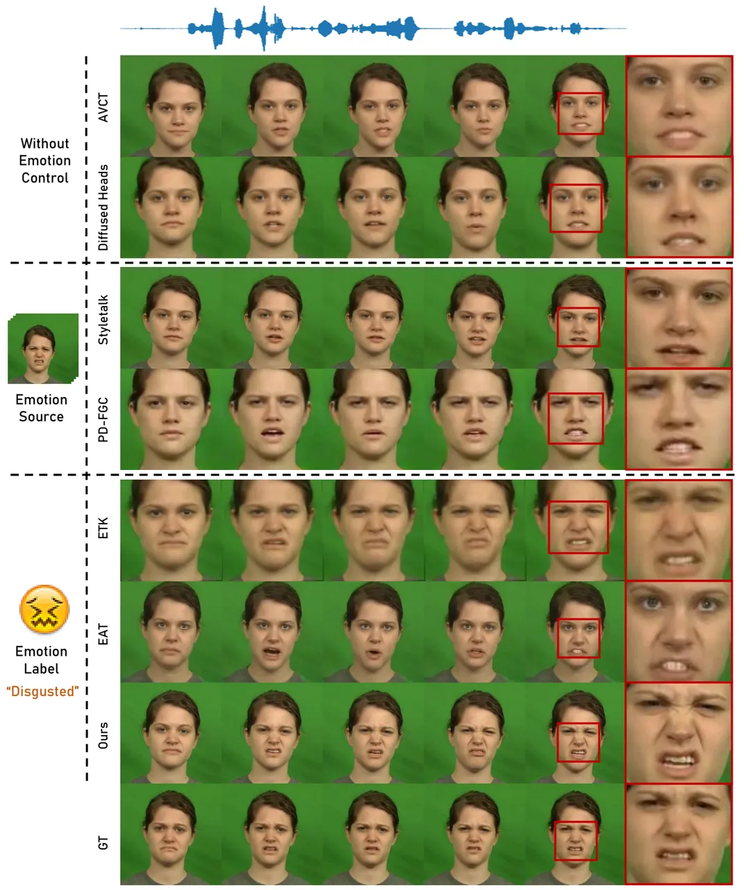

Fig. 8: Qualitative comparison for emotional talking video portraits on
the CREMA-D \[75\] test dataset. The emotion category of the videos is
anger. The bottom row shows ground-truth frames.

## Appendix B Evaluation Metric

Here, we provide details of the evaluation metrics used in our main
paper. Audio-visual synchronization. We use the lip sync confidence
score (Sync) of SyncNet \[47\] and the distance between the landmarks of
the mouth (M-LMD) \[37\] for lip-sync evaluation. Furthermore, we
measure the distance between the landmarks of the whole face
(F-LMD) \[8\] to evaluate the accuracy of the pose and facial
expressions.

Visual quality. We use PSNR, SSIM, and Frechet Inception Distance score
(FID) to measure the image quality of synthesized video portraits.

Emotional accuracy. To quantify the accuracy of the synthesized
emotional video, We utilize the same emotion classifier mentioned
in \[16\] for the MEAD dataset. For the CREMA-D dataset, we train the
same classifier used in \[12\] on the CREMA-D training set (total 76
identities).

Motion Diversity. To evaluate the diversity and richness of generated
head motions, following in  \[57\], we calculate the distance between
various predicted 3-dimension head motion embeddings extracted by
TokenHPE \[82\], which can be defined as:

```math
{Div}=\frac{2}{B\times(B-1)}\sum_{i=1}^{B-1}\sum_{j=i+1}^{B}\left|\hat{m}_{i}-\hat{m}_{j}\right|_{1},\vskip-2.84544pt \tag{17}
```

where $`\hat{m}_{i}`$ and $`\hat{m}_{j}`$ are the $`i`$-th and $`j`$-th
head motion embeddings in a batch $`B`$.

For the alignment of the audio and generated motions, we compute the
beat align score proposed by \[83\]. BA measures the average distance
between each motion beat and its nearest corresponding audio beat:

```math
BA=\frac{1}{|B^{m}|}\sum_{b_{j}^{m}\in B^{m}}\exp\{-\frac{\min_{\forall b_{j}^{a}\in B^{a}}\left|b_{i}^{m}-b_{j}^{a}\right|^{2}}{2\sigma^{2}}\},\vskip-2.84544pt \tag{18}
```

where $`B^{m}=\{b_{i}^{m}\}`$ and $`B^{a}=\{b_{i}^{a}\}`$ denotes the
motion beats and audio beats, respectively. Following \[83, 78\], we set
the normalized parameter $`\sigma`$ as 3 in our experiment.

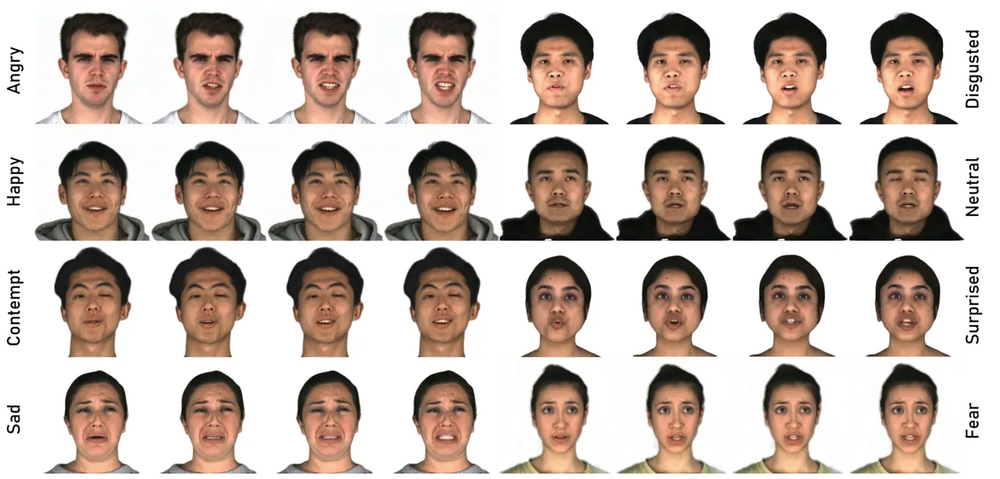

Fig. 9: Additional emotional portraits generated by our GMTalker. Given
the same input audio, we can generate high-fidelity and faithful
emotional expressions according to the target emotion label. The
identities are from the MEAD dataset.

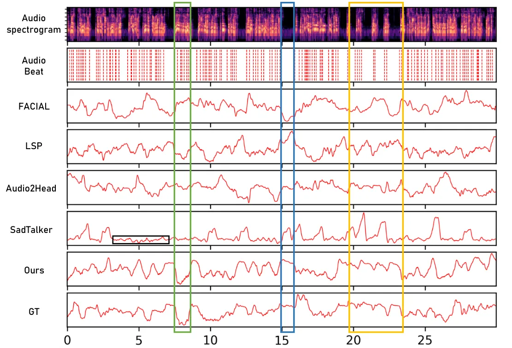

Fig. 10: Comparison of head motion on the test video sample from
LSP \[20\]. From top to bottom: the audio spectrogram, audio beat,
FACIAL \[21\], LSP \[20\], Audio2Head \[22\], SadTalker \[57\], ours,
and ground truth. The green box is the case of speaking, the blue box is
the case of silence, and the yellow box is the case of speaking with
pauses.

Besides, to measure the accuracy of predicted head motion, we compute
the percentage of correctly predicted motion embeddings instead of
keypoints, which can be calculated as:

```math
PCM=\frac{1}{T\times J}\sum_{t=1}^{T}\sum_{j=1}^{J}\boldsymbol{1}\left[\left|\hat{m}_{t}^{j}-m_{t}^{j}\right|_{2}<\tau\right],\vskip-5.69046pt \tag{19}
```

where $`J=3`$ and $`\hat{m}_{t}^{j}`$, $`m_{t}^{j}`$ are the $`j`$-th
dimension of predicted motion embeddings and the ground-truth motion
embeddings at the $`t`$-th frame. We only calculate the successfully
recalled motion embeddings against a specified threshold $`\tau=1.0`$.

### B-A Evaluation Metrics of Emotion Interpolation

We further propose two metrics to validate the performance of emotion
interpolation.

Emotion Perceptual Path Length. We train a VGGNet \[84\] for emotion
classification on the MEAD dataset to make the network more focused on
emotion. Then, we calculate the mean perceptual distance between
adjacent images in 17-frame sequences using the trained VGGNet.

Emotion Perceptual Distance Variance. Similarly, we compute the
perceptual loss between adjacent images in 17-frame sequences and then
calculate the variance of these distances in the sequence.

## Appendix C More Experimental Results

### C-A More Comparisions

Here, we first present the qualitative comparison on the CREMA-D
dataset. As shown in Fig. 8, our proposed method consistently generates
high-fidelity emotional talking video portraits that accurately convey
the intended expressions. In contrast to previous approaches, GMTalker
reliably reproduces accurate expressions while preserving natural mouth
shapes that synchronize with the input speech.

To comprehensively validate motion diversity and its correlation with
audio, we utilize correlation map \[22\] to compare our method with
several motion-controllable methods. We reduce the 3-dimensional head
motion embeddings into one dimension by PCA following \[22\]. As
depicted in Fig. 10, existing methods struggle to generate realistic
head movements consistent with rhythmic audio beats. In the case of
silence audio (shown in the blue box), the head motion should remain
static intuitively, yet their generated head motion often exhibits
dynamic fluctuations. Conversely, in the case of speaking audio (shown
in the green box), the head motion should synchronize with the audio,
but their generated head motion may remain static and lack rich changes.
In contrast, our head motions preserve the rhythm and synchronization
with audio, and are much closer to the ground truth, as shown in the
yellow box.

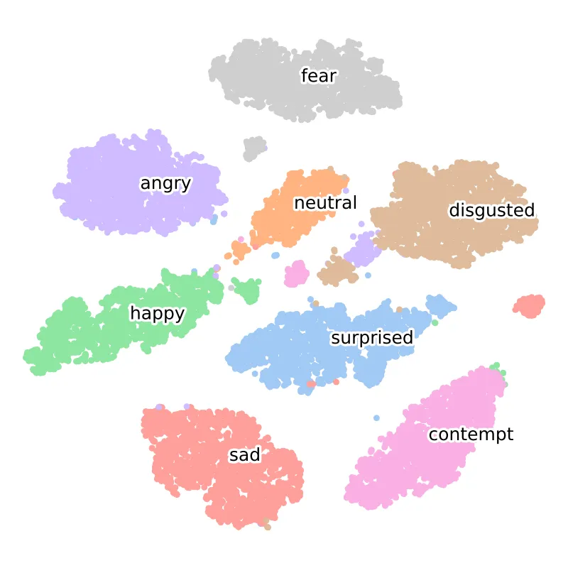

Fig. 11: T-SNE visualization of Gaussian mixture latent space. Different
colors indicate different emotion types.

| Method            | MakeItTalk | Styletalk | EVP   | EAT   | GMTalker | GT    |
| ----------------- | ---------- | --------- | ----- | ----- | -------- | ----- |
| Visual Quality    | 4.19       | 5.18      | 10.35 | 6.99  | 35.38    | 37.91 |
| Audio-visual Sync | 7.92       | 6.13      | 5.08  | 12.41 | 29.45    | 39.01 |
| Emotion Accuracy  | 4.46       | 5.94      | 4.75  | 10.55 | 34.77    | 39.52 |

TABLE VII: User Study on MEAD datasets. The table displays the
percentage of participants’ preferences for each method in terms of each
aspect.

### C-B Disentanglement Analysis

To better validate the disentangling of our GMEG, we feed the same input
speech and different emotion labels into GMEG. As shown in Fig. 9, the
mouth movements in the generated video correspond to the speech, while
the facial expression matches the target emotion label. Moreover, to
evaluate the disentanglement of various emotions in our Gaussian mixture
latent space, we use t-SNE \[85\] to visualize the latent codes.
Illustrated in Fig. 11, different colors represent sampled latent code
with eight different emotion categories. By using the Gaussian mixture
distribution, the samples sharing the same emotion are clustered
together, while those with different emotions are distinctly separated.
This indicates the contribution of the proposed GMEG in effectively
disentangling various emotions from each other.

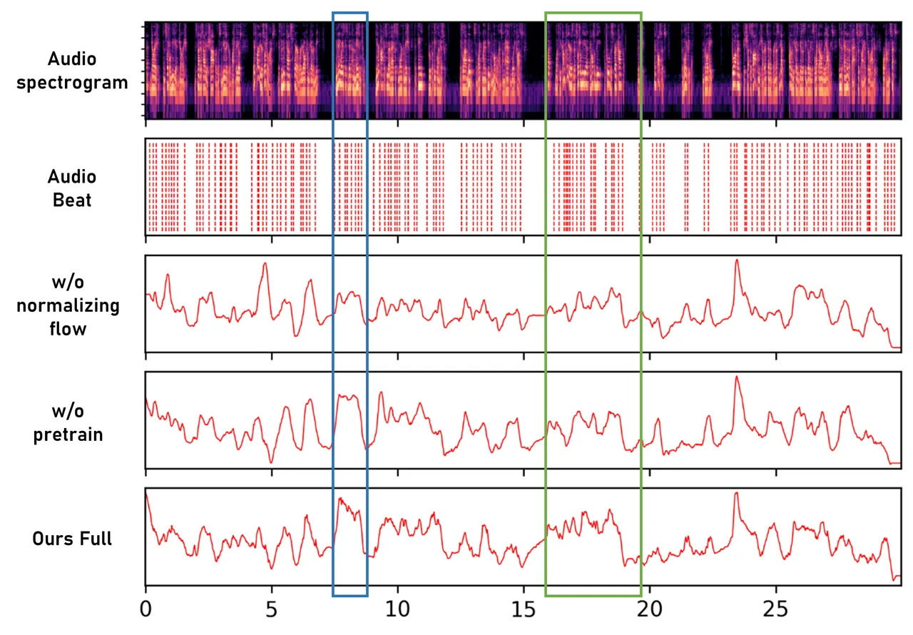

Fig. 12: Qualitative results of ablation study for normalizing flow
motion generator. From top to bottom: audio spectrogram, audio beat, the
head motion beat w/o normalizing flow, w/o pre-train, and our full
results. The boxes highlight the rhythm and synchronization of the head
movements generated by our full model.

## Appendix D User Study

To further quantify the quality of generated video portraits, we conduct
a user study to compare real data with generated ones from some
representative methods: MakeItTalk \[38\], Styletalk \[11\], EVP \[5\],
EAT \[16\]. We randomly select overall 24 audio clips (3 clips
$`\times`$ 8 emotions) from the test set of MEAD to generate video
samples for each method. The 14 recruited participants are required to
evaluate the given video from three aspects “lip synchronization”,
“video quality”, and “emotion accuracy” and choose the top two preferred
videos for each of these aspects from all the methods presented. The
results are shown in Table VII. Our approach achieves the best scores
for lip-sync, video quality, and emotion accuracy, indicating the
expressiveness of our GMEG, NFMG, and emotion-guided head generator with
EMN.

## Appendix E More Ablation

To further demonstrate the effectiveness of the proposed NFMG, we
conduct a perceptual study to evaluate the correlation between generated
head motion and audio beat. As depicted in Fig. 12, the head movements
generated by our full model exhibit greater rhythm and synchronization
with the audio beat, while also showing increased diversity.
