# FaceTalk: Audio-Driven Motion Diffusion for Neural Parametric Head Models

Shivangi Aneja   Justus Thies   Angela Dai   Matthias Nießner
Affiliation: Technical University of Munich Affiliation: MPI-IS,
Tübingen Affiliation: TU Darmstadt

###### Abstract

We introduce FaceTalk¹¹ 1 Project Page:
[https://shivangi-aneja.github.io/projects/facetalk](https://shivangi-aneja.github.io/projects/facetalk),
a novel generative approach designed for synthesizing high-fidelity 3D
motion sequences of talking human heads from input audio signal. To
capture the expressive, detailed nature of human heads, including hair,
ears, and finer-scale eye movements, we propose to couple speech signal
with the latent space of neural parametric head models to create
high-fidelity, temporally coherent motion sequences. We propose a new
latent diffusion model for this task, operating in the expression space
of neural parametric head models, to synthesize audio-driven realistic
head sequences. In the absence of a dataset with corresponding NPHM
expressions to audio, we optimize for these correspondences to produce a
dataset of temporally-optimized NPHM expressions fit to audio-video
recordings of people talking. To the best of our knowledge, this is the
first work to propose a generative approach for realistic and
high-quality motion synthesis of volumetric human heads, representing a
significant advancement in the field of audio-driven 3D animation.
Notably, our approach stands out in its ability to generate plausible
motion sequences that can produce high-fidelity head animation coupled
with the NPHM shape space. Our experimental results substantiate the
effectiveness of FaceTalk, consistently achieving superior and visually
natural motion, encompassing diverse facial expressions and styles,
outperforming existing methods by 75% in perceptual user study
evaluation.

![[Uncaptioned
image]](arxiv-2312-08459--d6a459774cf0.figures/figure-1.webp)

Figure 1: Given an input speech signal, we propose a diffusion-based
approach to synthesize high-quality and temporally consistent 3D motion
sequences of high-fidelity human heads as neural parametric head models.
Our method can generate a diverse set of expressions (including wrinkles
and eye blinks) and the generated mouth motion is temporally
synchronized with the given audio signal.

## 1 Introduction

Modeling 3D animation of humans has a wide range of applications in the
realm of digital media, including animated movies, computer games, and
virtual assistants. In recent years, there have been numerous works
proposing generative approaches for motion synthesis of human bodies,
enabling the animation of human skeletons conditioned on various signals
such as action \[29, 53, 3\], language \[1, 54, 72, 85, 41, 4\] and
music \[75, 2\]. While human faces are critical to synthesis of humans,
generative synthesis of 3D faces in motion has focused on 3D morphable
models (3DMMs) leveraging linear blendshapes \[7, 45\] to represent head
motion and expression. Such models characterize a disentangled space of
head shape and motion, but lack the capacity to comprehensively
represent the complexity and fine-grained details of human face geometry
in motion (e.g., hair, skin furrowing during motion, etc.).

Thus, we propose to represent animated head sequences with a volumetric
3D head representation, leveraging the expressive representation space
of neural parametric head models (NPHMs) \[27, 28\]. NPHMs offer a
flexible representation capable of handling complex and irregular facial
expressions (e.g., blinking, skin creasing), along with a high-fidelity
shape space including the head, hair, and ears, making them a much more
suitable choice for face animation. We address the challenging task of
creating an audio-conditional generative animation model for this
volumetric representation.

We design the first transformer-based latent diffusion model for
audio-driven head animation synthesis. Our diffusion model operates in
the latent NPHM expression space to generate temporally coherent
expressions consistent with an input audio signal represented with
Wave2Vec 2.0 \[6\]. In the absence of paired audio-NPHM data, we
optimize for corresponding NPHM expressions to fit to multi-view video
recordings of people speaking, generating train supervision for our
task. As NPHMs are designed for static (frame-by-frame) expressions
without temporal consistency, we employ both geometric and temporal
priors to produce temporally consistent optimized motion sequences. This
enables training our audio-head diffusion model to synthesize realistic
speech-conditioned 3D head sequences, which are capable of capturing
high-frequency details like wrinkles and eye blinks present in the face
region. Our method takes the first step towards simplifying the task of
high-fidelity facial motion generation of 3D faces for content creation
applications.

In summary, we propose the first latent diffusion model for the creation
of audio-conditioned animations of volumetric avatars. By producing
volumetric head animation, our generative model is highly expressive yet
efficient compared to existing 3D methods. We also demonstrate control
over motion style, using classifier-free guidance to adjust the strength
of the stylistic expression.

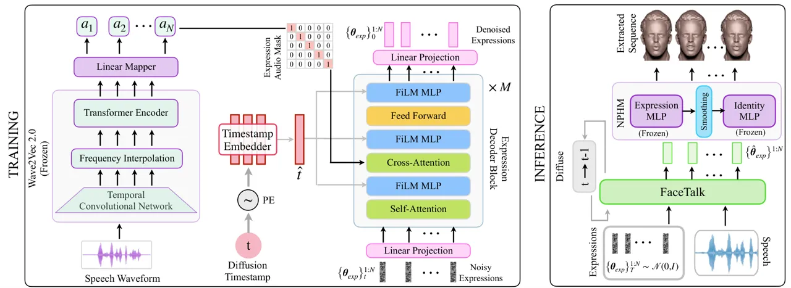

Figure 2: Pipeline Overview. FaceTalk uses frozen Wave2Vec 2.0 \[6\] to
extract audio embeddings from a speech signal. The diffusion timestamp
is embedded using a timestamp embedder. The expression decoder employs a
multi-head transformer decoder \[76\] with FiLM \[52\] layers,
interleaved between Self-Attention, Cross Attention, and FeedForward
layers, to incorporate diffusion timestamp. During training, the model
is trained to denoise the noisy expression sequences from timestamp
$`t`$. At inference, FaceTalk denoises the gaussian noise sequence
$`\big\{\boldsymbol{\theta}_{exp}\big\}_{T}^{1:N}\sim\mathcal{N}(0,\boldsymbol{{I}})`$
iteratively until $`t=0`$, yielding the estimated final sequence
$`\big\{\hat{\boldsymbol{\theta}}_{exp}\big\}^{1:N}`$. These are then
input to the frozen NPHM model, utilizing facial smoothing, and mesh
sequences are extracted using MC \[47\].

## 2 Related Work

Facial Animation. Our proposed method is the first work for
audio-conditioned latent diffusion of volumetric head avatars. There is
a large corpus of research works in the field of 2D audio-driven facial
animation operating on RGB videos, synthesizing 2D sequences
directly \[14, 81, 10, 70, 56, 11, 39, 88, 78, 79, 87, 17, 12, 38, 31,
65, 68\]. However, these methods operate in pixel space and do not
produce any geometric information. Another line of work also operating
on RGB videos but using intermediate 3D representations are based on
3DMMs \[66, 74, 37, 21, 71\]. Although these methods generate RGB videos
in the end, they use 3DMMs which produces very sparse geometric
information.

Recent works based on radiance fields \[30, 84, 64, 46, 26, 42\] have
also gained popularity due to their capability to model densities
directly from images. These methods generate impressive RGB videos but
the underlying geometry learned is highly imperfect (no segregation
between background and facial region) as shown by Chan _et al_. \[9\].
Additionally, these methods require identity-specific training, and thus
can not be used for content creation applications.

Learning animation of 3D meshes directly is much more promising, but
only a handful of methods exist \[40, 15, 59, 25, 83, 73, 51, 16\]. A
vast majority of these works model speech-conditioned animation for an
artist-designed template mesh. Although these methods can match the
facial motion with the speech signal, one limitation of these methods is
their incapability to represent fine-scale details present in faces.
Another downside of these methods is that these approaches learn a
deterministic model producing no/muted motion in the upper region of the
face, thus limiting them from being able to produce realistic motion. In
this work, we solve these issues by proposing a generative model that
can operate in the compact and detailed latent space of neural
parametric head models, thus capable of representing fine-scale facial
details and synthesizing a diverse set of expressions and speaking
styles.

Diffusion Models for Generative Synthesis. In recent years, diffusion
models have experienced a surge of interest as highly expressive and
efficient generative models. These models have demonstrated strong
performances as a generative model for a variety of domains such as
images \[33, 19, 60, 57, 61, 86\], videos \[24, 77, 8, 20\],
speech \[35, 43, 44\] and motion \[89, 5, 72, 41, 75, 2\].

2D facial animation has also seen some progress with diffusion
models \[65, 68\]. DiffusedHeads \[68\] operates in pixel space, making
the sampling process very slow. Although DiffTalk \[65\] learns the
diffusion process in the latent space, the sampling is performed in an
autoregressive fashion, limiting sampling efficiency. Moreover, these
methods operate on RGB videos, and though they achieve high-quality
results on a per-frame basis, consistency and coherence across different
timesteps remain challenging due to temporal jitter. Hence, these
methods can not be applied directly to the parametric head models.
Concurrent to our work, DiffPoseTalk \[69\] and FaceDiffuser \[67\]
propose a diffusion-based approach for animating 3D meshes from speech
signal. However, these methods require additional conditions like style
embedding, generate sequences in an autoregressive fashion coupled with
diffusion denoising making them very slow and still they can not produce
fine-scale facial details due to the use of 3DMMs which are limited in
expressivity. In contrast, we synthesize the entire sequence
simultaneously making it much faster and operate directly in the latent
space of highly expressive NPHMs, producing high-fidelity and temporally
consistent results.

## 3 Preliminaries

### NPHM.

In contrast to traditional 3D morphable models, which remain limited in
expressive detail, we employ the Neural Parametric Head Model (NPHM)
representation \[27, 28\]. Similar to traditional 3DMMs, NPHM
disentangles a human face into an identity and expression space;
however, the shape and expression space are volumetric, enabling
expressive capture of details such as fine-scale eye movements, hair,
ears, etc. NPHM uses two auto-decoder style neural networks (a) Identity
Network $`\big\{\mathcal{I}\big\}`$ to represent the overall facial
shape and (b) Expression Network {$`\mathcal{E}\big\}`$ to represent the
facial movements such as jaw pose, wrinkles, eyeblinks, etc., jointly
denoted as $`\mathcal{F}=\big\{\mathcal{I},\mathcal{E}\big\}`$. The
identity and expressions latent codes
$`\big\{\boldsymbol{{\theta}_{id}},\boldsymbol{{\theta}_{exp}}\big\}`$
define the facial shape and expression respectively. Unlike 3DMMs which
predict a fixed-topology mesh that can not model fine surface details,
NPHM can handle different hairstyles, wrinkles and complex facial
expressions. NPHM represents identities with a signed distance field
(SDF) in canonical space and models the expressions as deformations onto
the facial region. Mathematically, it can be defined as:

```math
\mathcal{F(\boldsymbol{x_{i}},\boldsymbol{{\theta}_{id}},\boldsymbol{{\theta}_{exp}})\rightarrow\boldsymbol{s_{i}}}:\mathbb{R}^{3}\times\mathbb{R}^{\boldsymbol{{\theta}_{id}}}\times\mathbb{R}^{\boldsymbol{{\theta}_{exp}}}\rightarrow\mathbb{R}, \tag{1}
```

where $`\boldsymbol{x_{i}}\in\mathbb{R}^{3}`$ represents the query
points, $`\boldsymbol{{\theta}_{id}}\in\mathbb{R}^{1344}`$ represents
identity latent code, $`\boldsymbol{{\theta}_{exp}}\in\mathbb{R}^{200}`$
represents expression latent code and $`\boldsymbol{s_{i}}`$ denotes the
predicted SDF. The mesh is then extracted as the zero-level iso-surface
decision boundary using Marching Cubes \[47\].

### Diffusion.

Diffusion models are a class of generative models that consist of a
forward and reverse process. The forward process converts the original
structured data distribution into Gaussian noise, modeled following a
fixed Markov chain as:

```math
q(\boldsymbol{x}_{1:T}|\boldsymbol{x}_{0})=\prod_{t=1}^{T}q(\boldsymbol{x}_{t}|\boldsymbol{x}_{t-1}), \tag{2}
```

where $`q(\boldsymbol{x}_{t}|\boldsymbol{x}_{t-1})`$ denotes the forward
process adding white noise to the original data distribution
$`\boldsymbol{x}_{0}`$. Mathematically, the forward process can be
written as:

```math
q(\boldsymbol{x}_{t}|\boldsymbol{x}_{0})\sim\mathcal{N}(\sqrt{\overline{\alpha}_{t}}\boldsymbol{x}_{0},(1-\overline{\alpha}_{t})\boldsymbol{{I}}), \tag{3}
```

where $`\overline{\alpha}_{t}\in(0,1)`$ are constants following a
decreasing cosine schedule such that when $`\overline{\alpha}_{t}`$
tends to 0, we can approximate
$`\boldsymbol{x}_{T}\sim\mathcal{N}(0,\boldsymbol{{I}})`$. The reverse
diffusion process progressively denoises samples from
$`\boldsymbol{x}_{T}\sim\mathcal{N}(0,\boldsymbol{{I}})`$ into samples
from a learned distribution $`\boldsymbol{x}_{0}`$. In our experiments,
we learn a generative model $`\mathcal{G}_{\theta}`$ to reverse the
forward diffusion process by learning to estimate
$`\mathcal{G}_{\theta}(\boldsymbol{x}_{t},t,\boldsymbol{c})=\boldsymbol{\hat{x}}\approx\boldsymbol{x}`$,
where $`\boldsymbol{x}`$ refers to predicting the cleaned samples
directly, $`\boldsymbol{x}_{t}`$ refers to noisy input at diffusion
timestamp $`t`$. Given a conditional signal $`\boldsymbol{c}`$, we
optimize model parameters $`\boldsymbol{\theta}`$ for all diffusion
timestamps $`t`$ using the following objective:

```math
\mathcal{L}_{\boldsymbol{\theta}}=\mathbb{E}_{\boldsymbol{x},t}\big[\|\boldsymbol{x}-\mathcal{G}_{\theta}(\boldsymbol{x}_{t},t,\boldsymbol{c})\|_{2}^{2}\big]. \tag{4}
```

## 4 Method

FaceTalk performs high-fidelity and temporally consistent generative
synthesis of motion sequences of heads, conditioned on audio signal. In
order to characterize complex face motions and fine-scale movements, we
synthesize realistic heads in the latent expression space of a
parametric model for volumetric head representations, i.e., neural
parametric head models (NPHMs) \[27\]. We, thus, develop a
speech-conditioned latent diffusion model to synthesize temporally
coherent head expression sequences that are coupled with the NPHM shape
space to produce complex, realistic head animations of different
identities. An overview of our approach is illustrated in Fig. 2.

### Audio Encoding.

We employ a state-of-the-art pre-trained speech model Wave2Vec 2.0 \[6\]
to encode the audio signal. Specifically, we first use the audio feature
extractor made up of temporal convolution layers (TCN) to extract audio
feature vectors $`\{a_{i}\}_{i=1}^{N_{a}}`$ from the raw waveform. This
is followed by the Frequency Interpolation layer that aligns the input
audio signal $`\{a_{i}\}_{i=1}^{N_{a}}`$ (captured at frequency
$`f_{a}`$ = 16kHz) with our dataset $`\{a_{i}\}_{i=1}^{N_{e}}`$
(captures at framerate $`f_{e}`$ = 24Hz). Finally, a stacked multi-layer
transformer encoder network processes these resampled features and
outputs the processed and aligned audio feature vectors. The audio
encoder is initialized with the pre-trained wav2vec 2.0 weights,
followed by a feedforward layer to project the aligned audio features
into the latent space of our expression decoder model. These aligned
audio features are denoted as:

```math
\boldsymbol{A}^{1:N}=\{\boldsymbol{a}_{i}\}_{i=1}^{N}. \tag{5}
```

These audio features $`\boldsymbol{A}^{1:N}`$ are then fed to the
cross-attention layers of the expression decoder via the
expression-audio alignment mask $`\mathcal{M}`$ to learn
speech-conditioned expression features during training.

### Expression Encoding.

We train our expression decoder network on optimized NPHM expression
sequences $`\big\{\boldsymbol{\theta}_{exp}\big\}^{1:N}`$ (obtained in
Section 5), where $`N`$ refers to number of frames in a sequence. We
train a diffusion-based stacked multi-layer transformer \[76\] decoder
network to synthesize facial expressions in the latent space of the NPHM
model. During training, following forward diffusion (Eq. 3) we add noise
for a randomly sampled diffusion timestamp
$`t\sim\mathtt{Uniform}(0,T)`$ to create noisy expression codes
$`\big\{\boldsymbol{\theta}_{exp}\big\}^{1:N}_{t}`$. These noisy
expression codes are then projected to the latent space of our model via
a linear layer, followed by a stack of transformer decoder blocks, and
then projected back to the original NPHM space using another linear
layer. To embed diffusion timestamp in the latent space of our model, we
apply sinusoidal embedding and process it through a three-layer MLP.
Next, to fuse diffusion timestamp into the model, we use a one-layer
FiLM (feature-wise linear modulation) network \[52\] between the
multi-head self-attention, multi-head cross-attention and feedforward
layers of the transformer decoder block, which is critical for the model
to produce high-quality expressions as we show in the results. We
leverage a look-ahead binary target mask
$`\mathcal{T}\in\mathbb{R}^{N\times N}`$ in the multi-head
self-attention layers to prevent the model from peeking into the future
expression codes. Mathematically, it can be written as:

```math
\mathcal{T}_{ij}=\begin{cases}True\quad\text{if }i\leq j\\
False\quad\text{else}\\
\end{cases} \tag{6}
```

where $`\mathcal{T}_{ij}`$ refers to the $`(i,j)^{th}`$ element of the
matrix and $`1\leq i,j\leq N`$. The audio features
$`\boldsymbol{A}^{1:N}`$ are fused into the network via the multi-head
cross-attention layers. We leverage the expression-audio alignment mask
$`\mathcal{M}`$ to fuse the audio features into the network to ensure
that mouth poses learned by the expression codes are consistent with the
speech signal. The binary mask $`\mathcal{M}\in\mathbb{R}^{N\times N}`$
is Kronecker delta function $`\delta_{ij}`$ such that the audio features
for $`i^{th}`$ timestamp attend to expression features at the $`j^{th}`$
timestamp if and only if $`i=j`$. Mathematically,

```math
\mathcal{M}=\delta_{ij}=\begin{cases}True\quad\text{if }i=j\\
False\quad\text{if }i\neq j\\
\end{cases} \tag{7}
```

We demonstrate in the results (Section 6) that this alignment is crucial
for learning audio-consistent expression codes. As a by-product, this
further enables the model to generalize to arbitrary long audio signals
during inference which we also show in our results. Our model is trained
with the diffusion loss in Eq. 4, with input
$`\boldsymbol{x}=\big\{\boldsymbol{\theta}_{exp}\big\}^{1:N}`$ and
conditioning $`\boldsymbol{c}=\boldsymbol{A}^{1:N}`$.

### Expression Augmentation.

Unlike other domains (like text-to-motion) where the synthesized motion
can vary dramatically, speech-driven 3D facial animation is more
constrained, requiring precise mouth alignment with the audio signal,
making it prone to overfitting. To alleviate this, we propose a novel
augmentation strategy capable of producing diverse expressions for a
given audio signal. Our key insight is to augment the dataset to
generate different expression codes for the same speech signal by
randomly amplifying and suppressing its magnitude. Specifically, we
randomly sample modulation factor $`r`$ within the bounds $`[a,b]`$ as:

```math
r\sim\mathtt{Uniform}(a,b), \tag{8}
```

and scale the expression codes as
$`\big\{r\times\boldsymbol{\theta}_{exp}\big\}^{1:N}`$. We show in the
results this augmentation strategy helps the model synthesize diverse
expressions.

### Sampling.

FaceTalk uses a diffusion-based framework to learn to synthesize NPHM
expression sequences of $`N`$ frames
$`\big\{\boldsymbol{\theta}_{exp}\big\}^{1:N}\in\mathbb{R}^{N\times 200}`$.
At each of the denoising timestep t, FaceTalk predicts the denoised
sample and noises it back to timestamp $`{t-1}`$ :

```math
\big\{\boldsymbol{\theta}_{exp}\big\}^{1:N}_{t-1}=\mathcal{G}_{\theta}\big(\big\{\boldsymbol{\theta}_{exp}\big\}^{1:N}_{t},\boldsymbol{A}^{1:N},t-1\big), \tag{9}
```

terminating when it reaches t = 0. We train our model using
classifier-free guidance \[32\]. We implement classifier-free guidance
by randomly replacing the audio with null conditioning
$`\boldsymbol{A}^{1:N}=\Phi`$ during training with 25% probability.
During inference, we can use the weighted combination of conditional and
unconditionally generated samples:

```math
\big\{\boldsymbol{\theta}_{exp}^{c}\big\}^{1:N}_{t}=w.\big\{\boldsymbol{\theta}_{exp}^{c}\big\}^{1:N}_{t}+(1-w).\big\{\boldsymbol{\theta}_{exp}^{u}\big\}^{1:N}_{t}, \tag{10}
```

where $`\theta_{exp}^{c}`$ and $`\theta_{exp}^{u}`$ refers to
conditionally and unconditionally generated samples. To amplify the
audio conditioning, we can use guidance strength $`w>1`$.

### Sequence Generation.

The expression codes predicted above
$`\big\{\boldsymbol{\hat{\theta}}_{exp}\big\}^{1:N}`$ are then passed to
the pretrained NPHM expression mapper $`\big\{\mathcal{E}\big\}`$ to
obtain expression deformations
$`\big\{\boldsymbol{\delta}_{exp}\big\}^{1:N}`$. We then apply smoothing
based on a Gaussian kernel to these deformations to remove the unwanted
wiggle in the head and neck regions and to ensure that generating
sequences are free from flickering artifacts. Specifically, we first
define a control center $`\mathcal{C}`$ on the mouth region in the
canonical space as:

```math
\mathcal{C}=[c_{x},c_{y},c_{z}]. \tag{11}
```

Next, using a 3D gaussian kernel with standard deviation
$`\Sigma=[\sigma_{x},\sigma_{y},\sigma_{z}]`$, centered at
$`\mathcal{C}`$, for each point sampled from 3D grid
$`\mathcal{P}\in\mathbb{R}^{|X|\times|Y|\times|Z|}`$ as
$`\mathcal{P}_{xyz}=[p_{x},p_{y},p_{z}]`$, we compute its distance from
$`\mathcal{C}`$ as:

```math
d_{xyz}=\sqrt{\frac{(p_{x}-c_{x})^{2}}{\sigma_{x}^{2}}+\frac{(p_{y}-c_{y})^{2}}{\sigma_{y}^{2}}+\frac{(p_{z}-c_{z})^{2}}{\sigma_{z}^{2}}}. \tag{12}
```

Based on this distance, smoothing weights are obtained from the Gaussian
kernel with min-max normalization as:

```math
w_{xyz}=\frac{1}{2\pi\sigma_{x}\sigma_{y}\sigma_{z}}.e^{-(\frac{1}{2}\times d_{xyz}^{2})} \tag{13}
```

```math
w_{xyz}^{k}=\frac{w_{xyz}^{k}-\text{min}\big(w_{xyz}^{1:M}\big)}{\text{max}\big(w_{xyz}^{1:M}\big)-\text{min}\big(w_{xyz}^{1:M}\big)}, \tag{14}
```

where $`M=|X|\times|Y|\times|Z|`$. The obtained expression deformations
$`\big\{\boldsymbol{\delta}_{exp}\big\}^{1:N}`$ are then multiplied with
these smoothing weights
$`\big\{\boldsymbol{w}\big\}^{1:N}=\big\{(w^{1},w^{2},\cdots w^{M})\big\}^{1:N}`$
to obtain smoothed expression deformations as:

```math
\big\{\boldsymbol{\delta}_{exp}^{s}\big\}^{1:N}=\big\{\boldsymbol{\delta}_{exp}\big\}^{1:N}\times\big\{\boldsymbol{w}\big\}^{1:N}. \tag{15}
```

These smoothed expression deformations
$`\big\{\boldsymbol{\delta}_{exp}^{s}\big\}^{1:N}`$, along with identity
$`\boldsymbol{\theta_{id}}`$ and predicted expression codes
$`\big\{\boldsymbol{\hat{\theta}}_{exp}\big\}^{1:N}`$ are passed to the
NPHM identity MLP $`\big\{I\big\}`$ to obtain smoothed SDF, from which
meshes are extracted using MC \[47\].

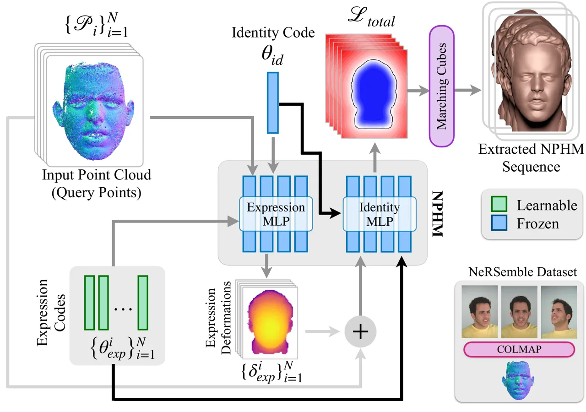

Figure 3: Given the pointcloud sequence
$`\big\{\mathcal{P}_{i}\big\}_{i=1}^{N}`$ extracted from multi-view
sequences from NeRSemble dataset \[42\] (bottom right), which also act
as query points, we leverage the pretrained Expression MLP
$`\big\{\mathcal{E}\big\}`$ to extract the expression deformations
$`\big\{\boldsymbol{\delta}^{i}_{exp}\big\}^{1:N}`$ and add them back to
the input points to get the deformed points
$`\big\{\mathcal{P}^{{}^{\prime}}_{i}\big\}_{i=1}^{N}`$. These points
are then fed to the Identity MLP $`\big\{\mathcal{I}\big\}`$ which
outputs the SDF. The expression codes
$`\big\{\boldsymbol{\theta}_{{exp}}^{i}\big\}^{1:N}`$ are optimized
using overall loss $`\mathcal{L}_{total}`$. Note that both fixed
identity code $`\boldsymbol{\theta}_{{id}}`$ and learnable expression
codes $`\big\{\boldsymbol{\theta}_{{exp}}^{i}\big\}^{1:N}`$ are fed to
both $`\big\{\mathcal{I}\big\}`$ and $`\big\{\mathcal{E}\big\}`$. Once
optimized, the meshes are then extracted with Marching Cubes \[47\].

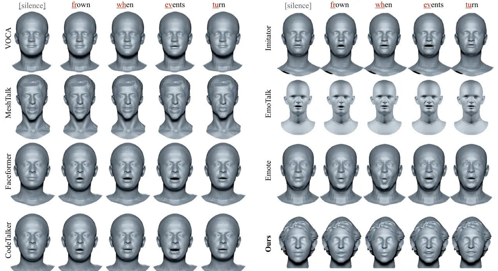

Figure 4: Qualitative comparison for audio-driven face animation. Our
approach maintains high fidelity while demonstrating rich mouth and
nasolabial movements. In particular, we demonstrate more accurate lip
articulation, precisely synchronized to phonetic movements.

## 5 Dataset Creation

To train our latent diffusion model, we require temporally consistent
NPHM expression codes as well as their corresponding audio. To this end,
we leverage multi-view recordings of NeRSemble \[42\] captured with 16
cameras of talking human faces paired with corresponding audio signals.
Notably, these sequences are captured for faces already present in the
identity space of the NPHM model. Thus, for a given subject, only the
expression codes corresponding to the multi-view sequences have to be
estimated. Specifically, we first extract 3D pointclouds
$`\big\{\mathcal{P}_{i}\big\}_{i=1}^{N}`$ from individual frames using
COLMAP \[63\], where $`N`$ refers to the number of frames in a sequence,
with each $`\mathcal{P}_{i}\in\mathbb{R}^{K\times{3}}`$ consisting of
$`K`$ points. Given the pretrained NPHM model, for the known facial
shape $`\boldsymbol{\theta_{id}}`$, we then optimize the expression
codes
$`\big\{\boldsymbol{\theta}^{i}_{\boldsymbol{exp}}\big\}_{i=1}^{N}`$ to
match the pointclouds. In particular, at every iteration, we randomly
sample a subset $`\mathcal{S}_{i}`$ of 5000 points from
$`\mathcal{P}_{i}`$ as
$`\mathcal{S}_{i}\sim\mathtt{Uniform}(5000,\mathcal{P}_{i})`$, and then
feed the sampled points $`\mathcal{S}_{i}`$, identity code
$`\boldsymbol{\theta_{id}}`$ and learnable expression code
$`\boldsymbol{\theta}^{i}_{\boldsymbol{exp}}`$ into the expression
decoder $`\big\{\mathcal{E}\big\}`$ to obtain the expression deformation
$`\boldsymbol{\delta}_{i}`$ for the sampled points $`\mathcal{S}_{i}`$.
The deformation $`\boldsymbol{\delta}_{i}`$ is then added to
$`\mathcal{S}_{i}`$ to obtain deformed points
$`\mathcal{D}_{i}=\mathcal{S}_{i}+\boldsymbol{\delta}_{i}`$. These
deformed points $`\mathcal{D}_{i}`$ are finally fed to the identity
decoder $`\big\{\mathcal{I}\big\}`$ along with latent codes
$`\boldsymbol{\theta_{id}}`$ and
$`\boldsymbol{\theta}^{i}_{\boldsymbol{exp}}`$ to obtain the SDF. The
expression codes are then optimized using the loss
$`\mathcal{L}_{total}`$ which is illustrated in Fig. 3. Naively
optimizing the expression codes on a per-frame basis shows flickering
artifacts. To mitigate this, we optimize expressions in groups of
$`n=10`$ frames in a sliding window fashion (with an overlap of 2 frames
between adjacent windows) using an additional temporal regularization
$`\mathcal{L}_{temp}`$. To further prevent the expression codes
$`\big\{\boldsymbol{\theta}^{i}_{\boldsymbol{exp}}\big\}_{i=1}^{N}`$
from deviating too much from the distribution already learned by the
NPHM model, we employ additional L2 expression regularization
$`\mathcal{L}_{exp}`$. We minimize the objective $`\mathcal{L}_{total}`$
defined as:

```math
\mathcal{L}_{total}=\lambda_{sdf}\mathcal{L}_{sdf}+\lambda_{temp}\mathcal{L}_{temp}+\lambda_{reg}\mathcal{L}_{reg}. \tag{16}
```

The SDF loss $`\mathcal{L}_{sdf}`$, temporal regularization
$`\mathcal{L}_{temp}`$, and expression regularization
$`\mathcal{L}_{exp}`$ can be defined as:

```math
\mathcal{L}_{sdf}=\sum_{i=1}^{|n|}\frac{1}{|S|}\sum_{k=1}^{|S|}\big\|\mathtt{SDF}(\mathcal{S}_{i}^{k})\big\|_{1} \tag{17}
```

```math
\mathcal{L}_{temp}=\sum_{i=1}^{|n|}\big\|\boldsymbol{\theta}_{exp}^{i+1}-\boldsymbol{\theta}_{exp}^{i}\big\|_{\epsilon},~~~~\mathcal{L}_{exp}=\sum_{i=1}^{|n|}\big\|\boldsymbol{\theta}_{exp}^{i}\big\|_{2}, \tag{18}
```

where $`\|.\|_{1}`$, $`\|.\|_{2}`$ and $`\|.\|_{\epsilon}`$ refers to
L1, L2 and Huber loss respectively, and $`n`$ refers to number of frames
simultaneously optimized. More details regarding aligning the coordinate
system of NeRSemble dataset \[42\] with NPHM can be found in the
supplemental document. Once optimized, next to generate mesh sequences,
we uniformly sample points from a 3D grid
$`\mathcal{P}\in\mathbb{R}^{|X|\times|Y|\times|Z|}`$ such that
$`\mathcal{P}_{xyz}=[p_{x},p_{y},p_{z}]`$ is a point in 3d space. These
points, along with the identity $`\boldsymbol{\theta_{id}}`$ and
expression codes
$`\big\{\boldsymbol{\theta}^{i}_{\boldsymbol{exp}}\big\}_{i=1}^{N}`$ are
passed to the pretrained NPHM model outputting an SDF; meshes are then
extracted with  \[47\]. In total, our FaceTalk dataset consists of 1000
sequences, an order of magnitude larger than the existing
datasets \[15\].

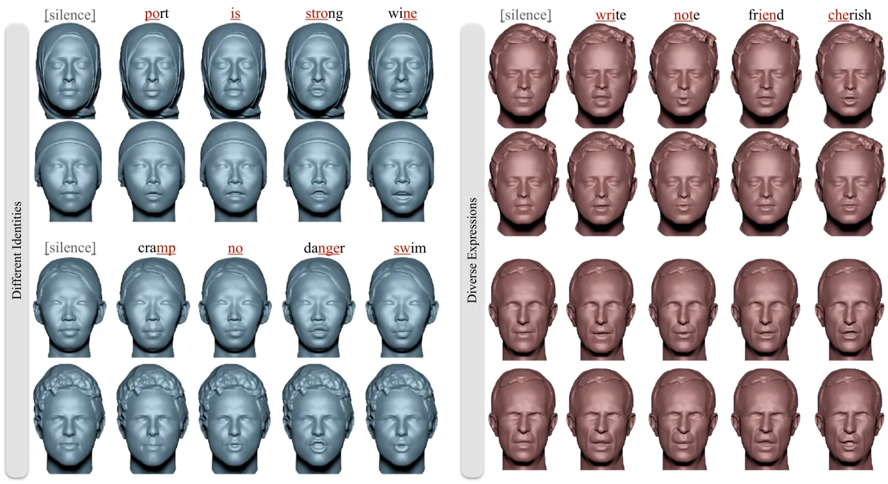

Figure 5: Left. Expressions generated by our method can easily be
applied to diverse identities with complex geometry. Right. Given a
speech signal, our method can further generate diversity in expression
for the same identity. Note the difference in speaking style (intensity
of mouth opening) as well as eyeblinks/frowning in the upper face area.

## 6 Results

We evaluate FaceTalk on the task audio-driven motion synthesis and
compare it against state-of-the-art methods.

### Evaluation Metrics.

Unlike template-based methods that rely on LVE (Lip Vertex Error), our
method produces SDFs for each frame; extracted mesh topologies thus vary
across frames, making LVE inapplicable for evaluation. Thus, we employ
LSE-D (Lip Sync Error Distance) \[56\] for quantitative evaluation of
lip synchronization. For diversity, we compute FID and KID, as well as
diversity scores \[58\]. As FID/KID may not reflect all quality
considerations, when samples are limited, we include two established
quality metrics: (1) FIQA (Face Image Quality Assessment) \[49\] (2) VQA
(Video Quality Assessment) \[82\]. FIQA quantifies image quality for
face recognition and similarity to in-the-wild real faces and VQA
measures overall video quality in terms of
distortions/semantics/aesthetics. Finally, for perceptual evaluation, we
perform a user study with 40 participants on a diverse set of 15 unseen
audio clips. Most baseline methods are trained using Vocaset \[15\].
Thus, for a fair comparison, we construct a hybrid audio test set of 100
sequences, with 25 test audio clips each from Vocaset ($`\sim`$ 2-3
seconds) and ours ($`\sim`$ 2-3 seconds), and 50 ($`\sim`$ 5-7 seconds)
from LJSpeech \[36\]. Test audios were selected from identities not seen
during training of any method. The metrics are reported on this hybrid
test set.

### Implementation Details.

For dataset creation, we optimize NPHM expressions for 500 iterations in
a group of $`n=10`$ frames with a step size of 0.001 for iterations
$`\leq`$ 300, and 0.0001 otherwise. We use $`\lambda_{sdf}=10`$,
$`\lambda_{temp}=0.1`$ and $`\lambda_{reg}=0.0025`$ for Eq. 16 during
optimization. To train our diffusion model, we randomly clip sequences
to 2 seconds (48 frames) for efficient minibatching. We train with Adam
optimizer with a learning rate of 0.0001. For diffusion, we use 1000
noising/denoising timestamps, a cosine schedule to add noise to input
sequences. We apply data augmentation to the expression codes by
uniformly modulating them.

### Baseline Comparisons.

This is the first work to perform speech-conditioned synthesis for
volumetric head motion sequences. We compare with state-of-the-art
template-based methods in Fig 4 and Tab. 1. Specifically, we compare
against speech-driven animation methods \[15, 59, 25, 83\], personalized
methods  \[73\], as well as recent emotion-based methods \[51, 16\]. Our
approach more accurately captures subtle mouth movements compared to
less expressive baselines, resulting in better FID/KID. These scores
were evaluated only on mouth region crops to avoid bias towards rest of
facial geometry. Our method consistently achieves better lip-audio
synchronization while also representing fine-scale facial details like
creasing in the nasolabial folds with wider mouth motions. This is
confirmed by our perceptual user study in Fig 6.

| Method            | LSE-D $`\downarrow`$ | FID $`\downarrow`$ | KID $`\downarrow`$ | FIQA $`\uparrow`$ | VQA $`\uparrow`$ |
| ----------------- | -------------------- | ------------------ | ------------------ | ----------------- | ---------------- |
| VOCA \[15\]       | 13.6191              | 239.043            | 0.280              | 33.36             | 0.4251           |
| MeshTalk \[59\]   | 12.9607              | 220.172            | 0.254              | 36.14             | 0.4855           |
| FaceFormer \[25\] | 11.9848              | 215.274            | 0.222              | 38.24             | 0.5227           |
| CodeTalker \[83\] | 11.8054              | 208.064            | 0.207              | 38.38             | 0.5274           |
| Imitator \[73\]   | 11.6119              | 208.479            | 0.212              | 38.44             | 0.5384           |
| EmoTalk \[51\]    | 11.7485              | 201.311            | 0.201              | 31.80             | 0.5037           |
| EMOTE \[16\]      | 11.7192              | 227.924            | 0.247              | 39.44             | 0.5149           |
| Ours              | 11.2737              | 40.692             | 0.009              | 45.75             | 0.6145           |

Table 1: In comparison to state of the art, FaceTalk more accurately
matches the audio, while producing high perceptual fidelity.

Figure 6: User study comparison with baselines. We measure preference
for (1) Overall Animation Quality, (2) Lip Synchronization and (3)
Facial Realism. FaceTalk results are overwhelmingly preferred over the
best baseline methods on all these aspects.

| Our Method             | LSE-D $`\downarrow`$ | Diversity $`\uparrow`$ |
| ---------------------- | -------------------- | ---------------------- |
| w/o expr. aug.         | 11.6229              | 1.61e-8                |
| w/o facial smoothing   | 11.3488              | 0.34                   |
| w/o FiLM layer         | 12.029               | 0.006                  |
| w/o expr.-audio align. | 13.720               | 5.17e-8                |
| w/o diffusion          | 11.3217              | 0.000                  |
| Full (Ours)            | 11.2737              | 0.34                   |

Table 2: Ablation over model design. Expression augmentation improves
diversity, while facial smoothing alleviates inter-frame jitter. Using
FiLM conditioning achieves accurate mouth pose and increased diversity.
Without expression-audio alignment, the model ignores the audio signal.
Without diffusion, the model fails to generate diverse results. Our full
model with all components achieves the best results.

### Generative Synthesis.

Our generated expression codes are identity-agnostic, and are easily
transferred to different identities, as shown in Fig. 5. Additionally,
we can synthesize diverse expressions per-identity for a given audio.

### Architecture Ablations.

We ablate our model design choices in Tab 2, with visual results shown
in Fig 7, and refer to the supplemental for video demonstration. Our
proposed expression augmentation helps the model to synthesize diverse
expressions. Facial smoothing removes unwanted wobbliness in the head
and neck region, thereby reducing the inter-frame jitter. FiLM
conditioning ensures that expressions generated by our method are more
pronounced and that expressions accurately match the audio signal. The
expression-audio alignment mask is necessary to match the synthesized
expression codes with the audio signal. Our diffusion training ensures
that expressions generated by our method are high-quality and diverse.

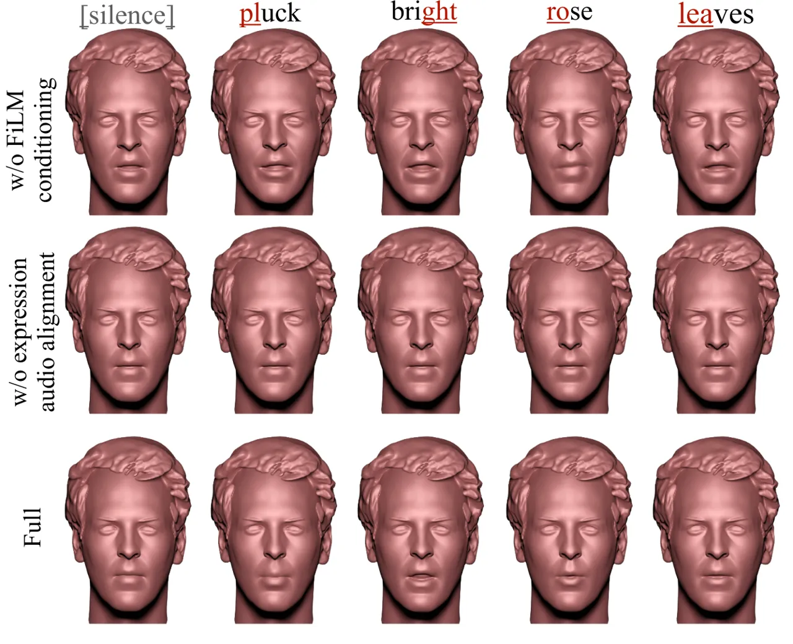

Figure 7: Without FiLM conditioning, the model fails to synthesize
accurate lip synchronization and even generates uncanny expressions.
Without expression-audio alignment, the model fully ignores the audio
signal synthesizing constant expression. Our full diffusion model
synthesizes accurate lip articulation while maintaining temporal
coherence which can be seen in the suppl. video.

### Limitations.

While FaceTalk effectively synthesizes high-fidelity and
audio-synchronized facial expressions, it still has limitations. For
instance, the use of a diffusion model requires multiple denoising steps
during inference, limiting its real-time application. We believe that
this could be improved by investigating efficient sampling
techniques \[80\]. Currently, our method specializes in synthesizing
only the expression codes. For holistic 3D facial animation, we need to
extend its capability to synthesize facial identities. In the future, we
would like to generate diverse identities aligned with the gender
inferred directly from the audio.

## 7 Conclusion

In this work, we have introduced FaceTalk, a new approach to synthesize
animations of realistic volumetric human heads from audio. We introduced
the first latent diffusion model for audio-driven head animation,
producing significantly higher fidelity results than existing methods.
FaceTalk leverages a parametric head model producing volumetric head
representations to generate expressive, fine-grained motions such as eye
blinks, skin creasing, etc. We also demonstrate the applicability of our
method for other conditioning signals such as facial landmarks. We
believe this is an important first step towards enabling the animation
of highly detailed 3D face models, which can enable many new
possibilities for content creation and digital avatars.

## 8 Acknowledgments

This work was supported by the ERC Starting Grant Scan2CAD (804724), the
Bavarian State Ministry of Science and the Arts and coordinated by the
Bavarian Research Institute for Digital Transformation (bidt), the
German Research Foundation (DFG) Grant “Making Machine Learning on
Static and Dynamic 3D Data Practical,” the German Research Foundation
(DFG) Research Unit “Learning and Simulation in Visual Computing,” and
Sony Semiconductor Solutions Corporation. We would like to thank Simon
Giebenhain and Tobias Kirschstein for their help with dataset.

## Supplemental Material

We provide additional ablation studies regarding flame baselines,
landmark conditioning, dataset creation and model architecture in
Section A, network architecture details in Section  B, metric evaluation
in Section C, and additional details regarding dataset creation in
Section  D. For a visual comparisons of all experiments and ablation
studies, we request readers to watch the supplemental video.

## A Additional Ablation Studies

### Baselines trained on FLAME fittings of our data.

We report results on our hybrid test set with audio from Vocaset, Ours,
and LJSpeech. We additionally train baselines on our dataset (using
FLAME fittings, as they don’t operate on NPHM space) and show results on
the same hybrid test set in Tab. 3. Emote and EmoTalk require emotional
correspondences and MeshTalk is incompatible with the FLAME topology;
thus, a comparison with them is not possible. Our method outperforms
baselines on lip-sync (lowest LSE-D), while significantly improving
quality (highest FIQA/VQA).

| Method               | LSE-D $`\downarrow`$ | FIQA $`\uparrow`$ | VQA $`\uparrow`$ |
| -------------------- | -------------------- | ----------------- | ---------------- |
| FaceFormer           | 12.1391              | 38.64             | 0.4206           |
| CodeTalker           | 11.8442              | 39.44             | 0.4218           |
| Imitator             | 11.7402              | 37.83             | 0.4492           |
| FaceDiffuser         | 12.7644              | 37.65             | 0.3826           |
| Ours (Flame)         | 11.6839              | 38.53             | 0.4868           |
| Ours (w/o diffusion) | 11.3217              | 42.81             | 0.5469           |
| Ours (Full)          | 11.2737              | 45.75             | 0.6145           |

Table 3: All methods, including baselines were trained on our dataset.
The baselines and Ours (Flame) were trained with FLAME fittings, and
bottom two rows with NPHM fittings. Our Flame baseline also outperforms
other methods in lip sync and video quality. Our full model synthesizes
highest-quality animations (highest VQA), well-matches real face
qualities (highest FIQA), while performing better lip sync (lowest
LSE-D).

### Additional Conditioning.

FaceTalk can also be flexibly adapted to other temporal conditioning
signals, such as face landmarks. In Fig 8, we replace input audio with
3D face landmarks extracted by FLAME \[45\], and train a
landmark-conditioned model to synthesize faithful expressions.

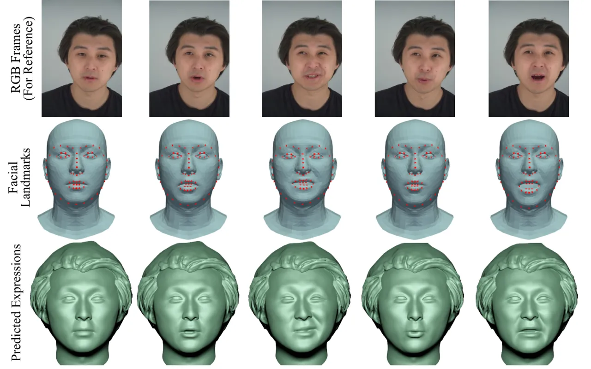

Figure 8: Landmark conditioned expression generation. FaceTalk can also
generate accurate expressions (bottom) conditioned on face landmarks
(middle), matching the original RGB capture (top).

### Expression Fitting.

To evaluate the temporal consistency of our optimized expression
sequences, we report Mean Absolute Error (MAE), Root Mean Square Error
(RMSE) between adjacent frames and Lip Sync Error Distance(LSE-D) in
Tab. 4. We further visualize auto-correlation between the neighboring
frames in Fig 9. We notice that our temporal regularization helps
stabilize the high-frequency jitter in the fitted expression codes.

| Method            | MAE $`\downarrow`$ | RMSE $`\downarrow`$ | LSE-D $`\downarrow`$ |
| ----------------- | ------------------ | ------------------- | -------------------- |
| w/o temporal loss | 0.01422            | 0.01978             | 10.9221              |
| w/ temporal loss  | 0.00248            | 0.00623             | 10.5478              |

Table 4: Expression Fitting. Our temporal huber loss helps to stabilize
the inter-frame jitter while effectively matching the mouth poses with
the audio signal.

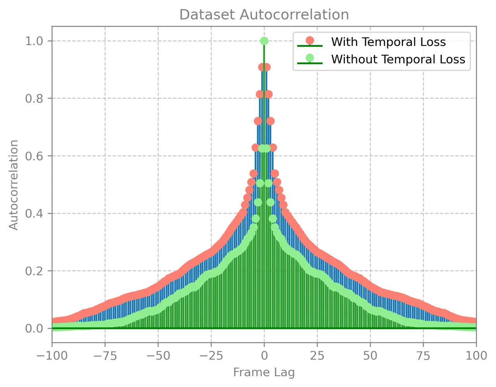

Figure 9: Expression Fitting. Note that with temporal loss, the method
achieves a high correlation between neighboring frames.

### Model Architecture Ablations.

We ablate different design choices to infuse diffusion timestamps into
the model. We experiment with design choices shown in Fig 10 to infuse
diffusion timestamps into the model and show results corresponding to
these design choices in Tab. 5. We argue that it is critical to
carefully inject diffusion timestamps into the model to obtain
high-fidelity and diverse results. Using FiLM layers to inject diffusion
timestamps outperforms the rest of the design choices, both in producing
better lip articulation as well as synthesizing much more diverse
results.

| Our Method           | LSE-D $`\downarrow`$ | Diversity $`\uparrow`$ |
| -------------------- | -------------------- | ---------------------- |
| Input                | 12.029               | 0.006                  |
| Scale-Shift          | 11.9575              | 0.204                  |
| SqueezeExcite \[34\] | 11.7586              | 0.029                  |
| Dot Prod. Attention  | 12.83                | 2.009e-7               |
| FiLM \[52\]          | 11.2737              | 0.340                  |

Table 5: Ablation Study: Effectiveness of different components to fuse
diffusion timestamp into the model. Adding it to the input produces
muted mouth motion. Using Scale-Shift or Squeeze-Excite layers can
perform better lip articulation however produce much less diverse
results. Dot Product attention excessively modulates the incoming
features, nearly collapsing to a constant expression. Using FiLM layer
not only produces better lip articulation but can synthesize much more
diverse results.

Figure 10: Architecture Design Choices to infuse diffusion timestamp
into the model. (a)With Input denotes that diffusion timestamp is simply
added to the input expression codes. (b) Scale-Shift modulates the
intermediate features after Self-Attention (SA), Cross Attention (CA)
and FeedForward (FF) layers of the decoder block with diffusion
timestamp, via the corresponding scale and shift parameters
$`\gamma_{i},\beta_{i}`$. (c), (d) and (e) inject the diffusion
timestamp into the decoder block with one-layer FiLM \[52\],
Squeeze-and-Excite \[34\] and vanilla dot-product attention
respectively.

Figure 11: (a) Utilizing a 2-layer MLP architecture with SiLU
activation, we project the diffusion timestamp $`t`$ into the latent
space of our expression decoder. The timestamp is first embedded using
sinusoidal positional encoding, resulting in a d-dimensional timestamp
vector and passed through the MLP layers. (b) FiLM layers are employed
to inject the processed diffusion timestamp into the model. The FiLM
MLP, featuring Mish activation followed by a linear layer, produces
scale $`\gamma_{j}`$ and shift $`\beta_{j}`$ parameters. These
parameters modulate incoming temporal expression features which serves
as input for subsequent layers.

## B Architecture and Training Details

FaceTalk is implemented in the Pytorch Lightning framework \[50, 23\].
For mesh extraction, we use Python-based Marching Cubes library \[55\]
and BlenderProc \[18\] for rendering figures.

### Expression Decoder.

Our expression decoder consists of a stack of four transformer-based
decoder blocks with FiLM \[52\] layers sandwiched between Multihead
Self-Attention, Multihead Cross-Attention and Feedforward Layers, as
shown in Fig. 10(c). We use a stacked multi-head transformer decoder
model with latent dimension of 256. For Multihead Self- and
Cross-Attention layers, we use eight heads and set the dimension to 1024
for each transformer decoder block. The linear projection layer at input
projects from the NPHM expression space (200-dim.) to the latent space
of our expression decoder (256-dim.), and processes them through the
stack of decoder blocks and finally use another linear layer to project
the learnt expressions from our latent space (256-dim.) back to NPHM
expression space (200-dim).

### Timestamp Embedder.

To project diffusion timestamp into the latent space of our expression
decoder, we use a 2-layer MLP architecture with SiLU \[22\] activation.
The diffusion timestamp $`\mathbf{t}`$ is first embedded via sinusoidal
positional embedding to create d-dimensional timestamp vector as:

```math
\text{{PE}}(t,2i)=\sin\left(\frac{t}{10000^{2i/d}}\right)
```

```math
\text{{PE}}(t,2i+1)=\cos\left(\frac{t}{10000^{2i/d}}\right),
```

where $`t`$ is the position and $`i`$ is the dimension index. Next, this
is passed through the MLP layers and processed timestamp
$`\mathbf{\hat{t}}`$ is obtained. This is shown in Fig 11(a).

### FiLM MLP.

We use FiLM layers to inject the processed diffusion timestamp
$`\mathbf{t}`$ into the the model. The FiLM MLP consists of a Mish
activation \[48\] followed by a linear layer. The linear layer outputs
scale $`\gamma_{j}`$ and shift $`\beta_{j}`$ parameters, which modulates
the incoming temporal expression features as:

```math
\big\{x^{\prime}_{i}\big\}_{i=1}^{N}=\bigg(\big\{x_{i}\big\}_{i=1}^{N}\odot\gamma_{j}\bigg)\oplus\beta_{j}, \tag{19}
```

where $`\big\{x^{\prime}_{i}\big\}_{i=1}^{N}`$ refers to the processed
expression features, which are input to the next layers. This is shown
in Fig. 11(b).

## C Metric Evaluation

### Lip Synchronization

To evaluate lip synchronization of the generated mouth expressions with
the audio signal, we use LSE-D (Lip Sync Error Distance) \[56\].
Specifically, this involves feeding rendered grayscale face crops and
the corresponding audio signal into a pre-trained SyncNet \[13\] to
evaluate how close the acoustic signal matches the phonetic movements.
The facial movements are encoded as grayscale crops of only the facial
region, and the audio signal is represented as MFCC power spectrum.
These are then passed into the pretrained SyncNet backbone \[13\] and
the pairwise distance is evaluated, as shown in Fig. 12.

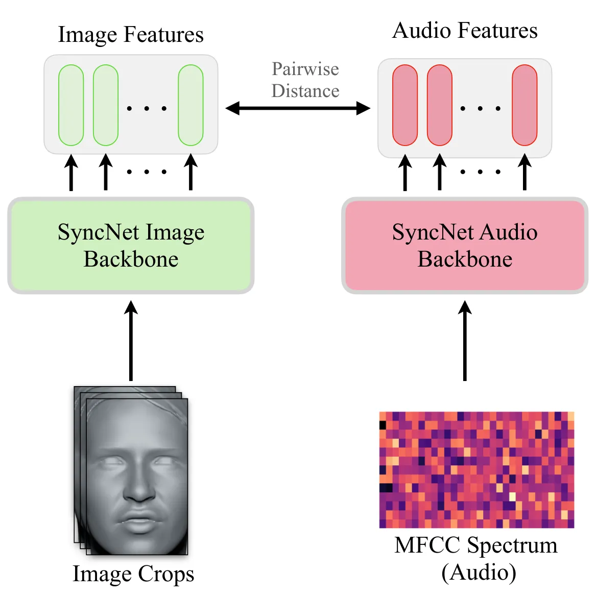

Figure 12: The grayscale image crops are passed to the pretrained
Syncnet image backbone to extract image features, and audio features,
represented as MFCC power spectrum, are extracted via pretrained Syncnet
audio backbone. Finally, the pairwise distance between image and audio
features are calculated to compute lip synchronization.

### Diversity.

To calculate the visual fidelity, we report the standard GAN metrics KID
and FID on the grayscale mouth region crops for all the methods,
however, it cannot fully capture how diverse the generated expressions
are for a given audio signal. We, thus, evaluate the diversity score
$`D`$ in the latent expression space of NPHM model. For the diversity,
we measure how much the generated expression codes diversify for the
same audio input. Given a set $`{S}=\{S_{1},S_{2},...S_{K}\}`$ of
generated expression codes (generated from different random noises) for
the same audio signal, we calculate the pairwise distance within each
set over the entire test dataset as:

```math
D=\frac{1}{|N|\times|K|}\sum_{i=1}^{N}\sum_{j=1}^{K}\sum_{l=1,l\neq j}^{K}\|\textbf{e}_{i,j}-\textbf{e}_{i,l}\|_{2}, \tag{20}
```

where $`|N|`$ refers to the number of audio signals in the test set.
$`|K|`$ refers to the number of generated expression codes for the same
audio signal, and e refers to the synthesized expression codes.

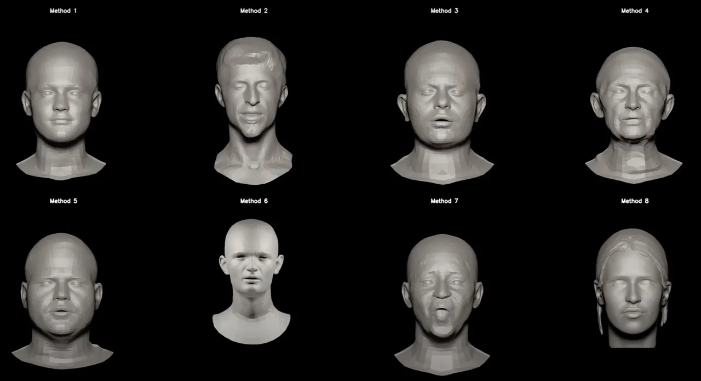

Figure 13: Different methods shown to the users during perceptual
evaluation. Method names were anonymized to avoid bias towards a
particular method.

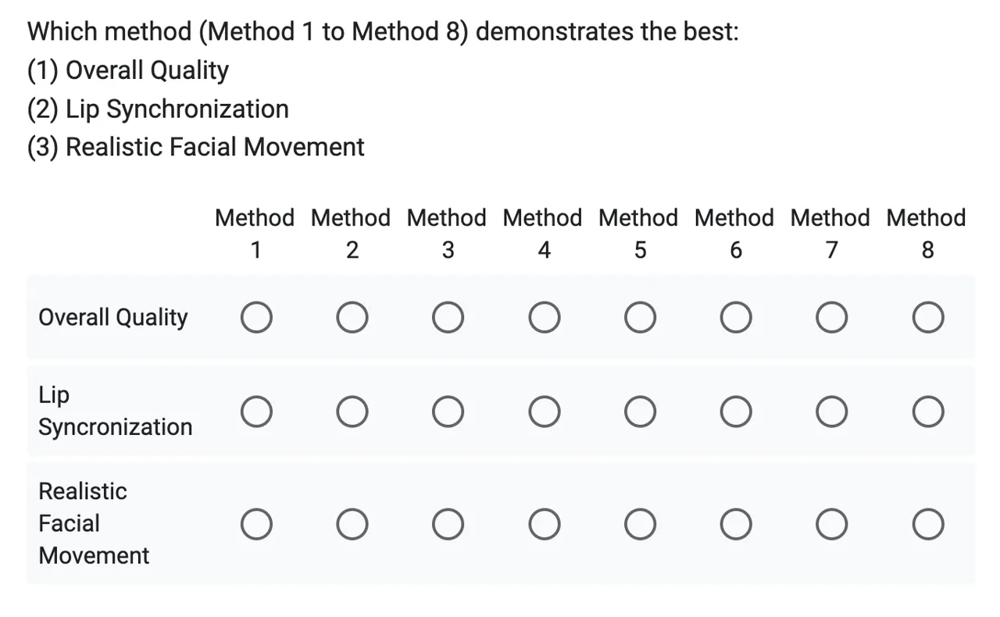

Figure 14: Questions asked during the user study to assess the quality
of different methods. Users were asked to select one of the eight
methods for each of the three questions based on which one they believe
exhibits best results.

### User Study.

To evaluate the fidelity based on human perceptual evaluation, we
performed a user study with 40 participants. The users were given a
carefully crafted set of instructions to evaluate (a) Overall Animation
Quality (b) Lip Synchronization and (c) Realism in Facial Movements. The
users were asked to assess eight different anonymous methods (including
FaceTalk), shown in Fig 13 on these three parameters.

In the course of the study, participants were presented with these
questions to focus on different aspects of 3D facial animation, shown in
Fig 14. For every question, participants were instructed to meticulously
evaluate the provided methods and select the option that best aligned
with their judgment. For the first question evaluating overall quality,
participants were instructed to consider factors such as visual appeal,
clarity, and general impression, and to choose the method number that
they believed demonstrates the highest overall quality. Moving on to the
second question, participants were directed to evaluate the lip
synchronization of each 3D facial animation method. They were prompted
to pay close attention to how well the lip movements aligned with the
spoken words or sounds. Participants were reminded to select only one
option that, in their judgment, exhibited the best lip synchronization.
Lastly, the third question honed in on evaluating the realistic facial
movement of each 3D facial animation method. Participants were
instructed to consider the naturalness and persuasiveness of facial
expressions and movements and to choose the method number that, in their
opinion, demonstrates the most realistic facial movement. Again,
participants were reminded to select only one option per question
throughout the study.

## D Dataset Creation

In the work, we leverage the Nersemble dataset \[42\] to create the
paired audio-NPHM expression dataset. The Nersemble dataset consists of
multi-view recordings of people speaking with corresponding audio, for
identities present in the shape space of NPHM model. The full dataset
creation process is explained in the following steps.

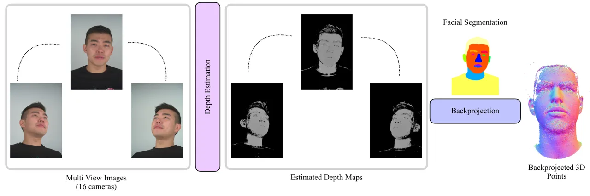

Figure 15: Given a set of multi-view images, we first use COLMAP to
estimate depth maps, and backproject these to 3D space only for the
pixels corresponding to facial area by leveraging facial segmentation
mask. These steps are performed for all the frames in the sequence.

### Backprojection.

Given the multi-view frames and camera calibrations from Nersemble
dataset, using the estimated depth and normals, we first backproject
them to 3D to obtain 3D points and 3D landmarks. A depth mask based on
valid depth values (between 0 and 1.4) is used during the process. To
include only the valid pixels from the estimated depth map, we use 2D
facial segmentation masks to include points only for the facial area.
The valid depth values and corresponding screen coordinates are
extracted based on the depth mask. Screen coordinates are converted to
canonical camera coordinates and then to camera coordinates. The
resulting camera coordinates are then transformed to world coordinates
using the extrinsic parameters. Normal vectors are extracted based on
the depth mask and transformed to world coordinates using the rotation
part of the extrinsic parameters. This is shown in Fig 15.

### Flame Fitting.

Next, we align the Flame template mesh \[45\] to the 3D landmarks
obtained above from multi-view data. We compute the rigid transformation
$`[R_{rigid},t_{rigid}]`$ between the FLAME template landmarks and the
valid multi-view landmarks. Outliers are filtered based on the Euclidean
distance between the transformed FLAME template landmarks and the
original multi-view landmarks. A threshold of 0.020 is used to determine
valid points. After filtering outliers, a similarity transformation is
recomputed to obtain the transformation scale factor, rotation matrix,
and translation vector as $`[s_{sim},R_{sim},t_{sim}]`$.

Initializing Flame parameters
$`\mathcal{F}=[s,R,t,\theta_{shape},\theta_{exp}]`$ with
$`[s_{sim},R_{sim},t_{sim}]`$ obtained above and zero vectors for shape
$`\theta_{shape}`$ and expression blendshapes $`\theta_{exp}`$, we
optimize flame parameters $`\mathcal{F}`$ for entire sequence using an
Adam optimizer for 2500 steps, with overall loss
$`\mathcal{L}_{total}`$.

We use several geometric and temporal regularizers to obtain accurate
flame fittings. Specifically, $`\mathcal{L}_{lmk}`$ measures residuals
between predicted flame landmarks
$`L_{flame}\in\mathbb{R}^{68\times 3}`$ and input landmarks from
multi-view stereo $`L_{mv}\in\mathbb{R}^{68\times 3}`$, normalized over
all frames $`N`$ of the sequence as:

```math
\mathcal{L}_{lmk}=\frac{1}{N}\sum_{i=1}^{N}\big\|L_{flame}^{i}-L_{mv}^{i}\big\|_{1} \tag{21}
```

We use different weights for different regions (jaw, eye, mouth). We
also use geometric loss $`\mathcal{L}_{geo}`$ between predicted Flame
vertices $`V_{flame}\in\mathbb{R}^{5023\times 3}`$ and backprojected 3D
points $`P_{mv}\in\mathbb{R}^{K\times 3}`$, considering both
point-to-point and point-to-plane distances. The point-to-point distance
is defined as:

```math
\mathcal{L}_{point}=\frac{1}{N}\sum_{i=1}^{N}\big\|V_{flame}^{i}-P_{mv_{match}}^{i}\big\|_{1}, \tag{22}
```

and point-to-plane distance is defined as:

```math
\mathcal{L}_{plane}=\frac{1}{N}\sum_{i=1}^{N}\big\|V_{flame}^{i}-P_{mv_{match}}^{i}\cdot N_{mv_{match}}^{i}\big\|_{1}, \tag{23}
```

where $`V_{flame}^{i}\in\mathbb{R}^{5023\times 3}`$ refers to the
predicted Flame vertices for the $`i^{th}`$ frame,
$`P_{mv_{match}}^{i}\in\mathbb{R}^{5023\times 3}`$ and
$`N_{mv_{match}}^{i}\in\mathbb{R}^{5023\times 3}`$ refer to the points
and corresponding normals closest to $`V_{flame}^{i}`$. The geometric
loss $`\mathcal{L}_{geo}`$ is defined as:

```math
\mathcal{L}_{geo}=0.1.\mathcal{L}_{point}+0.9.\mathcal{L}_{plane}. \tag{24}
```

Next, we employ parameter regularization to penalize large values of
shape, expression, and rigid transformation parameters.

```math
\mathcal{L}_{shape}^{reg}=\|\theta_{shape}\|_{2} \tag{25}
```

```math
\mathcal{L}_{exp}^{reg}=\frac{1}{N}\sum_{i=1}^{N}\|\theta_{exp}^{i}\|_{2} \tag{26}
```

```math
\mathcal{L}_{rigid}^{reg}=\frac{1}{N}\sum_{i=1}^{N}\Bigg(\frac{\|R^{i}\|_{2}}{2\pi}+\|t^{i}\|_{2}+\|s^{i}\|_{2}\Bigg). \tag{27}
```

The overall regularization $`\mathcal{L}_{reg}`$ is then defined as:

```math
\mathcal{L}_{reg}=\mathcal{L}_{shape}^{reg}+\mathcal{L}_{exp}^{reg}+\mathcal{L}_{rigid}^{reg}. \tag{28}
```

Finally, we leverage smoothness loss $`\mathcal{L}_{smooth}`$ to
penalize changes in expression and rigid transformations between
consecutive frames:

```math
\mathcal{L}_{exp}^{smooth}=\frac{1}{N}\sum_{i=2}^{N}\|\theta_{exp}^{i}-\theta_{exp}^{i-1}\|_{2} \tag{29}
```

```math
\mathcal{L}_{rigid}^{smooth}=\frac{1}{N}\sum_{i=2}^{N}\Bigg(\frac{\|R^{i}-R^{i-1}\|_{2}}{2\pi}+\|t^{i}-t^{i-1}\|_{2}\Bigg). \tag{30}
```

The total optimization loss is then defined as:

```math
\displaystyle\mathcal{L}_{\text{total}} \displaystyle=\lambda_{lmk}\mathcal{L}_{lmk}+\lambda_{geo}\mathcal{L}_{geo}+\lambda_{reg}\mathcal{L}_{reg}
```

```math
\displaystyle\quad+\lambda_{smooth}\mathcal{L}_{smooth}. \tag{31}
```

### Audio Processing

The audio captured by the Nersemble dataset contains a lot of background
noise and speaking volume of the person is very low. We first amplify
the audio signal by increasing it by 20 dB (deciBels), however this adds
a lot of white noise to the audio signal. We then process the audio
signal to remove this added noise by using the NoiseReduce
library \[62\].

## References

- \[1\] Chaitanya Ahuja and Louis-Philippe Morency. Language2pose:
  Natural language grounded pose forecasting, 2019.
- \[2\] Simon Alexanderson, Rajmund Nagy, Jonas Beskow, and Gustav Eje
  Henter. Listen, denoise, action! audio-driven motion synthesis with
  diffusion models. _ACM Trans. Graph._, 42(4):44:1–44:20, 2023.
- \[3\] Nikos Athanasiou, Mathis Petrovich, Michael J. Black, and Gül
  Varol. TEACH: Temporal Action Compositions for 3D Humans. In
  _International Conference on 3D Vision (3DV)_, 2022.
- \[4\] Nikos Athanasiou, Mathis Petrovich, Michael J. Black, and Gül
  Varol. SINC: Spatial composition of 3D human motions for simultaneous
  action generation. In _International Conference on Computer Vision
  (ICCV)_, 2023.
- \[5\] Samaneh Azadi, Akbar Shah, Thomas Hayes, Devi Parikh, and Sonal
  Gupta. Make-an-animation: Large-scale text-conditional 3d human motion
  generation, 2023.
- \[6\] Alexei Baevski, Henry Zhou, Abdelrahman Mohamed, and Michael
  Auli. wav2vec 2.0: A framework for self-supervised learning of speech
  representations, 2020.
- \[7\] Volker Blanz and Thomas Vetter. A morphable model for the
  synthesis of 3d faces. In _Seminal Graphics Papers: Pushing the
  Boundaries, Volume 2_, pages 157–164. 2023.
- \[8\] Andreas Blattmann, Robin Rombach, Huan Ling, Tim Dockhorn,
  Seung Wook Kim, Sanja Fidler, and Karsten Kreis. Align your latents:
  High-resolution video synthesis with latent diffusion models. In _IEEE
  Conference on Computer Vision and Pattern Recognition (CVPR)_, 2023.
- \[9\] Eric R. Chan, Connor Z. Lin, Matthew A. Chan, Koki Nagano,
  Boxiao Pan, Shalini De Mello, Orazio Gallo, Leonidas Guibas, Jonathan
  Tremblay, Sameh Khamis, Tero Karras, and Gordon Wetzstein. Efficient
  geometry-aware 3D generative adversarial networks. In _arXiv_, 2021.
- \[10\] Lele Chen, Zhiheng Li, Ross K. Maddox, Zhiyao Duan, and
  Chenliang Xu. Lip movements generation at a glance, 2018.
- \[11\] Lele Chen, Ross K Maddox, Zhiyao Duan, and Chenliang Xu.
  Hierarchical cross-modal talking face generation with dynamic
  pixel-wise loss. In _Proceedings of the IEEE Conference on Computer
  Vision and Pattern Recognition_, pages 7832–7841, 2019.
- \[12\] Lele Chen, Guofeng Cui, Celong Liu, Zhong Li, Ziyi Kou, Yi Xu,
  and Chenliang Xu. Talking-head generation with rhythmic head motion.
  _arXiv preprint arXiv:2007.08547_, 2020.
- \[13\] J. S. Chung and A. Zisserman. Out of time: automated lip sync
  in the wild. In _Workshop on Multi-view Lip-reading, ACCV_, 2016.
- \[14\] Joon Son Chung, Amir Jamaludin, and Andrew Zisserman. You said
  that?, 2017.
- \[15\] Daniel Cudeiro, Timo Bolkart, Cassidy Laidlaw, Anurag Ranjan,
  and Michael Black. Capture, learning, and synthesis of 3D speaking
  styles. In _Proceedings IEEE Conf. on Computer Vision and Pattern
  Recognition (CVPR)_, pages 10101–10111, 2019.
- \[16\] Radek Daněček, Kiran Chhatre, Shashank Tripathi, Yandong Wen,
  Michael Black, and Timo Bolkart. Emotional speech-driven animation
  with content-emotion disentanglement. In _SIGGRAPH Asia 2023
  Conference Papers_, New York, NY, USA, 2023. Association for Computing
  Machinery.
- \[17\] Dipanjan Das, Sandika Biswas, Sanjana Sinha, and Brojeshwar
  Bhowmick. Speech-driven facial animation using cascaded gans for
  learning of motion and texture. In _Computer Vision – ECCV 2020: 16th
  European Conference, Glasgow, UK, August 23–28, 2020, Proceedings,
  Part XXX_, page 408–424, Berlin, Heidelberg, 2020. Springer-Verlag.
- \[18\] Maximilian Denninger, Dominik Winkelbauer, Martin Sundermeyer,
  Wout Boerdijk, Markus Knauer, Klaus H. Strobl, Matthias Humt, and
  Rudolph Triebel. Blenderproc2: A procedural pipeline for
  photorealistic rendering. _Journal of Open Source Software_,
  8(82):4901, 2023.
- \[19\] Prafulla Dhariwal and Alex Nichol. Diffusion models beat gans
  on image synthesis, 2021.
- \[20\] Rohan Dhesikan and Vignesh Rajmohan. Sketching the future
  (stf): Applying conditional control techniques to text-to-video
  models, 2023.
- \[21\] Michail Christos Doukas, Stefanos Zafeiriou, and Viktoriia
  Sharmanska. Headgan: One-shot neural head synthesis and editing. In
  _Proceedings of the IEEE/CVF International Conference on Computer
  Vision (ICCV)_, pages 14398–14407, 2021.
- \[22\] Stefan Elfwing, Eiji Uchibe, and Kenji Doya. Sigmoid-weighted
  linear units for neural network function approximation in
  reinforcement learning, 2017.
- \[23\] William Falcon et al. Pytorch lightning. _GitHub. Note:
  https://github. com/PyTorchLightning/pytorch-lightning_, 3(6), 2019.
- \[24\] Fanda Fan, Chaoxu Guo, Litong Gong, Biao Wang, Tiezheng Ge,
  Yuning Jiang, Chunjie Luo, and Jianfeng Zhan. Hierarchical masked 3d
  diffusion model for video outpainting, 2023.
- \[25\] Yingruo Fan, Zhaojiang Lin, Jun Saito, Wenping Wang, and Taku
  Komura. Faceformer: Speech-driven 3d facial animation with
  transformers. In _Proceedings of the IEEE/CVF Conference on Computer
  Vision and Pattern Recognition (CVPR)_, 2022.
- \[26\] Guy Gafni, Justus Thies, Michael Zollhöfer, and Matthias
  Nießner. Dynamic neural radiance fields for monocular 4d facial avatar
  reconstruction. In _Proceedings of the IEEE/CVF Conference on Computer
  Vision and Pattern Recognition (CVPR)_, pages 8649–8658, 2021.
- \[27\] Simon Giebenhain, Tobias Kirschstein, Markos Georgopoulos,
  Martin Rünz, Lourdes Agapito, and Matthias Nießner. Learning neural
  parametric head models. In _Proc. IEEE Conf. on Computer Vision and
  Pattern Recognition (CVPR)_, 2023.
- \[28\] Simon Giebenhain, Tobias Kirschstein, Markos Georgopoulos,
  Martin Rünz, Lourdes Agapito, and Matthias Nießner. MonoNPHM: Dynamic
  head reconstruction from monocular videos. In _Proc. IEEE Conf. on
  Computer Vision and Pattern Recognition (CVPR)_, 2024.
- \[29\] Chuan Guo, Xinxin Zuo, Sen Wang, Shihao Zou, Qingyao Sun, Annan
  Deng, Minglun Gong, and Li Cheng. Action2motion: Conditioned
  generation of 3d human motions. In _Proceedings of the 28th ACM
  International Conference on Multimedia_, page 2021–2029, New York, NY,
  USA, 2020. Association for Computing Machinery.
- \[30\] Yudong Guo, Keyu Chen, Sen Liang, Yongjin Liu, Hujun Bao, and
  Juyong Zhang. Ad-nerf: Audio driven neural radiance fields for talking
  head synthesis. In _IEEE/CVF International Conference on Computer
  Vision (ICCV)_, 2021.
- \[31\] Siddharth Gururani, Arun Mallya, Ting-Chun Wang, Rafael Valle,
  and Ming-Yu Liu. Space: Speech-driven portrait animation with
  controllable expression, 2022.
- \[32\] Jonathan Ho and Tim Salimans. Classifier-free diffusion
  guidance. In _NeurIPS 2021 Workshop on Deep Generative Models and
  Downstream Applications_, 2021.
- \[33\] Jonathan Ho, Ajay Jain, and Pieter Abbeel. Denoising diffusion
  probabilistic models. _arXiv preprint arxiv:2006.11239_, 2020.
- \[34\] Jie Hu, Li Shen, Samuel Albanie, Gang Sun, and Enhua Wu.
  Squeeze-and-excitation networks, 2019.
- \[35\] Rongjie Huang, Max W. Y. Lam, Jun Wang, Dan Su, Dong Yu, Yi
  Ren, and Zhou Zhao. Fastdiff: A fast conditional diffusion model for
  high-quality speech synthesis, 2022.
- \[36\] Keith Ito and Linda Johnson. The lj speech dataset.
  [https://keithito.com/LJ-Speech-Dataset/](https://keithito.com/LJ-Speech-Dataset/), 2017.
- \[37\] Xinya Ji, Hang Zhou, Kaisiyuan Wang, Wayne Wu, Chen Change Loy,
  Xun Cao, and Feng Xu. Audio-driven emotional video portraits. In
  _Proceedings of the IEEE Conference on Computer Vision and Pattern
  Recognition (CVPR)_, 2021.
- \[38\] Xinya Ji, Hang Zhou, Kaisiyuan Wang, Qianyi Wu, Wayne Wu, Feng
  Xu, and Xun Cao. Eamm: One-shot emotional talking face via audio-based
  emotion-aware motion model. In _ACM SIGGRAPH 2022 Conference
  Proceedings_, 2022.
- \[39\] Prajwal K R, Rudrabha Mukhopadhyay, Jerin Philip, Abhishek Jha,
  Vinay Namboodiri, and C V Jawahar. Towards automatic face-to-face
  translation. In _Proceedings of the 27th ACM International Conference
  on Multimedia_, page 1428–1436, New York, NY, USA, 2019. Association
  for Computing Machinery.
- \[40\] Tero Karras, Timo Aila, Samuli Laine, Antti Herva, and Jaakko
  Lehtinen. Audio-driven facial animation by joint end-to-end learning
  of pose and emotion. _ACM Trans. Graph._, 36(4), 2017.
- \[41\] Jihoon Kim, Jiseob Kim, and Sungjoon Choi. Flame: Free-form
  language-based motion synthesis & editing. _arXiv preprint
  arXiv:2209.00349_, 2022.
- \[42\] Tobias Kirschstein, Shenhan Qian, Simon Giebenhain, Tim Walter,
  and Matthias Nießner. Nersemble: Multi-view radiance field
  reconstruction of human heads. _ACM Trans. Graph._, 42(4), 2023.
- \[43\] Zhifeng Kong, Wei Ping, Jiaji Huang, Kexin Zhao, and Bryan
  Catanzaro. Diffwave: A versatile diffusion model for audio
  synthesis, 2021.
- \[44\] Max WY Lam, Jun Wang, Dan Su, and Dong Yu. Bddm: Bilateral
  denoising diffusion models for fast and high-quality speech synthesis.
  In _International Conference on Learning Representations_, 2022.
- \[45\] Tianye Li, Timo Bolkart, Michael. J. Black, Hao Li, and Javier
  Romero. Learning a model of facial shape and expression from 4D scans.
  _ACM Transactions on Graphics, (Proc. SIGGRAPH Asia)_,
  36(6):194:1–194:17, 2017.
- \[46\] Xian Liu, Yinghao Xu, Qianyi Wu, Hang Zhou, Wayne Wu, and Bolei
  Zhou. Semantic-aware implicit neural audio-driven video portrait
  generation. _arXiv preprint arXiv:2201.07786_, 2022.
- \[47\] William E. Lorensen and Harvey E. Cline. Marching cubes: A high
  resolution 3d surface construction algorithm. In _Proceedings of the
  14th Annual Conference on Computer Graphics and Interactive
  Techniques_, page 163–169, New York, NY, USA, 1987. Association for
  Computing Machinery.
- \[48\] Diganta Misra. Mish: A self regularized non-monotonic
  activation function, 2020.
- \[49\] Fu-Zhao Ou, Xingyu Chen, Ruixin Zhang, Yuge Huang, Shaoxin Li,
  Jilin Li, Yong Li, Liujuan Cao, and Yuan-Gen Wang. SDD-FIQA:
  Unsupervised face image quality assessment with similarity
  distribution distance. In _Proceedings of the IEEE Conference on
  Computer Vision and Pattern Recognition (CVPR)_, 2021.
- \[50\] Adam Paszke, Sam Gross, Soumith Chintala, Gregory Chanan,
  Edward Yang, Zachary DeVito, Zeming Lin, Alban Desmaison, Luca Antiga,
  and Adam Lerer. Automatic differentiation in pytorch. 2017.
- \[51\] Ziqiao Peng, Haoyu Wu, Zhenbo Song, Hao Xu, Xiangyu Zhu, Jun
  He, Hongyan Liu, and Zhaoxin Fan. Emotalk: Speech-driven emotional
  disentanglement for 3d face animation. In _Proceedings of the IEEE/CVF
  International Conference on Computer Vision (ICCV)_, pages
  20687–20697, 2023.
- \[52\] Ethan Perez, Florian Strub, Harm de Vries, Vincent Dumoulin,
  and Aaron Courville. Film: Visual reasoning with a general
  conditioning layer, 2017.
- \[53\] Mathis Petrovich, Michael J. Black, and Gül Varol.
  Action-conditioned 3D human motion synthesis with transformer VAE. In
  _International Conference on Computer Vision (ICCV)_, 2021.
- \[54\] Mathis Petrovich, Michael J. Black, and Gül Varol. TEMOS:
  Generating diverse human motions from textual descriptions. In
  _European Conference on Computer Vision (ECCV)_, 2022.
- \[55\] pmneila. Pymcubes.
  [https://github.com/pmneila/PyMCubes](https://github.com/pmneila/PyMCubes), 2020.
- \[56\] K R Prajwal, Rudrabha Mukhopadhyay, Vinay P. Namboodiri, and
  C.V. Jawahar. A lip sync expert is all you need for speech to lip
  generation in the wild. In _Proceedings of the 28th ACM International
  Conference on Multimedia_, page 484–492, New York, NY, USA, 2020.
  Association for Computing Machinery.
- \[57\] Aditya Ramesh, Prafulla Dhariwal, Alex Nichol, Casey Chu, and
  Mark Chen. Hierarchical text-conditional image generation with clip
  latents, 2022.
- \[58\] Zhiyuan Ren, Zhihong Pan, Xin Zhou, and Le Kang. Diffusion
  motion: Generate text-guided 3d human motion by diffusion model, 2023.
- \[59\] Alexander Richard, Michael Zollhöfer, Yandong Wen, Fernando
  de la Torre, and Yaser Sheikh. Meshtalk: 3d face animation from speech
  using cross-modality disentanglement. In _Proceedings of the IEEE/CVF
  International Conference on Computer Vision (ICCV)_, pages
  1173–1182, 2021.
- \[60\] Robin Rombach, Andreas Blattmann, Dominik Lorenz, Patrick
  Esser, and Björn Ommer. High-resolution image synthesis with latent
  diffusion models. In _Proceedings of the IEEE Conference on Computer
  Vision and Pattern Recognition (CVPR)_, 2022.
- \[61\] Chitwan Saharia, William Chan, Saurabh Saxena, Lala Li, Jay
  Whang, Emily Denton, Seyed Kamyar Seyed Ghasemipour, Burcu Karagol
  Ayan, S. Sara Mahdavi, Rapha Gontijo Lopes, Tim Salimans, Jonathan Ho,
  David J Fleet, and Mohammad Norouzi. Photorealistic text-to-image
  diffusion models with deep language understanding, 2022.
- \[62\] Tim Sainburg. timsainb/noisereduce: v1.0, 2019.
- \[63\] Johannes Lutz Schönberger and Jan-Michael Frahm.
  Structure-from-motion revisited. In _Conference on Computer Vision and
  Pattern Recognition (CVPR)_, 2016.
- \[64\] Shuai Shen, Wanhua Li, Zheng Zhu, Yueqi Duan, Jie Zhou, and
  Jiwen Lu. Learning dynamic facial radiance fields for few-shot talking
  head synthesis. In _ECCV_, 2022.
- \[65\] Shuai Shen, Wenliang Zhao, Zibin Meng, Wanhua Li, Zheng Zhu,
  Jie Zhou, and Jiwen Lu. Difftalk: Crafting diffusion models for
  generalized audio-driven portraits animation. In _CVPR_, 2023.
- \[66\] Linsen Song, Wayne Wu, Chen Qian, Ran He, and Chen Change Loy.
  Everybody’s talkin’: Let me talk as you want, 2020.
- \[67\] Stefan Stan, Kazi Injamamul Haque, and Zerrin Yumak.
  Facediffuser: Speech-driven 3d facial animation synthesis using
  diffusion. In _Proceedings of the 16th ACM SIGGRAPH Conference on
  Motion, Interaction and Games_, New York, NY, USA, 2023. Association
  for Computing Machinery.
- \[68\] Michał Stypułkowski, Konstantinos Vougioukas, Sen He, Maciej
  Zikeba, Stavros Petridis, and Maja Pantic. Diffused Heads: Diffusion
  Models Beat GANs on Talking-Face Generation. In
  *https://arxiv.org/abs/2301.03396*, 2023.
- \[69\] Zhiyao Sun, Tian Lv, Sheng Ye, Matthieu Gaetan Lin, Jenny
  Sheng, Yu-Hui Wen, Minjing Yu, and Yong jin Liu. Diffposetalk:
  Speech-driven stylistic 3d facial animation and head pose generation
  via diffusion models, 2023.
- \[70\] Supasorn Suwajanakorn, Steven M. Seitz, and Ira
  Kemelmacher-Shlizerman. Synthesizing obama: Learning lip sync from
  audio. _ACM Trans. Graph._, 2017.
- \[71\] Anni Tang, Tianyu He, Xu Tan, Jun Ling, Runnan Li, Sheng Zhao,
  Li Song, and Jiang Bian. Memories are one-to-many mapping alleviators
  in talking face generation. _arXiv preprint arXiv:2212.05005_, 2022.
- \[72\] Guy Tevet, Sigal Raab, Brian Gordon, Yoni Shafir, Daniel
  Cohen-or, and Amit Haim Bermano. Human motion diffusion model. In _The
  Eleventh International Conference on Learning Representations_, 2023.
- \[73\] Balamurugan Thambiraja, Ikhsanul Habibie, Sadegh Aliakbarian,
  Darren Cosker, Christian Theobalt, and Justus Thies. Imitator:
  Personalized speech-driven 3d facial animation. In _Proceedings of the
  IEEE/CVF International Conference on Computer Vision (ICCV)_, pages
  20621–20631, 2023.
- \[74\] Justus Thies, Mohamed Elgharib, Ayush Tewari, Christian
  Theobalt, and Matthias Nießner. Neural voice puppetry: Audio-driven
  facial reenactment. _ECCV 2020_, 2020.
- \[75\] Jonathan Tseng, Rodrigo Castellon, and C Karen Liu. Edge:
  Editable dance generation from music. _arXiv preprint
  arXiv:2211.10658_, 2022.
- \[76\] Ashish Vaswani, Noam Shazeer, Niki Parmar, Jakob Uszkoreit,
  Llion Jones, Aidan N. Gomez, Lukasz Kaiser, and Illia Polosukhin.
  Attention is all you need, 2023.
- \[77\] Vikram Voleti, Alexia Jolicoeur-Martineau, and Christopher Pal.
  Mcvd: Masked conditional video diffusion for prediction, generation,
  and interpolation. In _(NeurIPS) Advances in Neural Information
  Processing Systems_, 2022.
- \[78\] Konstantinos Vougioukas, Stavros Petridis, and Maja Pantic.
  End-to-end speech-driven facial animation with temporal gans, 2018.
- \[79\] Konstantinos Vougioukas, Stavros Petridis, and Maja Pantic.
  Realistic speech-driven facial animation with gans, 2019.
- \[80\] Daniel Watson, Jonathan Ho, Mohammad Norouzi, and William Chan.
  Learning to efficiently sample from diffusion probabilistic
  models, 2021.
- \[81\] O. Wiles, A.S. Koepke, and A. Zisserman. X2face: A network for
  controlling face generation by using images, audio, and pose codes. In
  _European Conference on Computer Vision_, 2018.
- \[82\] Haoning Wu, Erli Zhang, Liang Liao, Chaofeng Chen, Jingwen Hou
  Hou, Annan Wang, Wenxiu Sun Sun, Qiong Yan, and Weisi Lin. Exploring
  video quality assessment on user generated contents from aesthetic and
  technical perspectives. In _International Conference on Computer
  Vision (ICCV)_, 2023.
- \[83\] Jinbo Xing, Menghan Xia, Yuechen Zhang, Xiaodong Cun, Jue Wang,
  and Tien-Tsin Wong. Codetalker: Speech-driven 3d facial animation with
  discrete motion prior. In _Proceedings of the IEEE/CVF Conference on
  Computer Vision and Pattern Recognition_, pages 12780–12790, 2023.
- \[84\] Shunyu Yao, RuiZhe Zhong, Yichao Yan, Guangtao Zhai, and
  Xiaokang Yang. Dfa-nerf: Personalized talking head generation via
  disentangled face attributes neural rendering. _arXiv preprint
  arXiv:2201.00791_, 2022.
- \[85\] Jianrong Zhang, Yangsong Zhang, Xiaodong Cun, Shaoli Huang,
  Yong Zhang, Hongwei Zhao, Hongtao Lu, and Xi Shen. T2m-gpt: Generating
  human motion from textual descriptions with discrete representations.
  In _Proceedings of the IEEE/CVF Conference on Computer Vision and
  Pattern Recognition (CVPR)_, 2023a.
- \[86\] Lvmin Zhang, Anyi Rao, and Maneesh Agrawala. Adding conditional
  control to text-to-image diffusion models, 2023b.
- \[87\] Hang Zhou, Yu Liu, Ziwei Liu, Ping Luo, and Xiaogang Wang.
  Talking face generation by adversarially disentangled audio-visual
  representation. In _AAAI Conference on Artificial Intelligence
  (AAAI)_, 2019.
- \[88\] Yang Zhou, Xintong Han, Eli Shechtman, Jose Echevarria,
  Evangelos Kalogerakis, and Dingzeyu Li. Makelttalk: Speaker-aware
  talking-head animation. _ACM Trans. Graph._, 39(6), 2020.
- \[89\] Lingting Zhu, Xian Liu, Xuanyu Liu, Rui Qian, Ziwei Liu, and
  Lequan Yu. Taming diffusion models for audio-driven co-speech gesture
  generation. In _Proceedings of the IEEE/CVF Conference on Computer
  Vision and Pattern Recognition_, pages 10544–10553, 2023.
