# VideoPoet: A Large Language Model for Zero-Shot Video Generation

Dan Kondratyuk Affiliation: Google    Lijun Yu Affiliation: Google
Affiliation: Carnegie Mellon University Correspondence to:
<lijuny@google.com>    Xiuye Gu Affiliation: Google    José Lezama
Affiliation: Google    Jonathan Huang Affiliation: Google Correspondence
to: <jonathanhuang@google.com>    Grant Schindler Affiliation: Google   
Rachel Hornung Affiliation: Google    Vighnesh Birodkar
Affiliation: Google    Jimmy Yan Affiliation: Google    Ming-Chang Chiu
Affiliation: Google    Krishna Somandepalli Affiliation: Google   
Hassan Akbari Affiliation: Google    Yair Alon Affiliation: Google   
Yong Cheng Affiliation: Google    Josh Dillon Affiliation: Google   
Agrim Gupta Affiliation: Google    Meera Hahn Affiliation: Google   
Anja Hauth Affiliation: Google    David Hendon Affiliation: Google   
Alonso Martinez Affiliation: Google    David Minnen Affiliation: Google
   Mikhail Sirotenko Affiliation: Google    Kihyuk Sohn
Affiliation: Google    Xuan Yang Affiliation: Google    Hartwig Adam
Affiliation: Google    Ming-Hsuan Yang Affiliation: Google    Irfan Essa
Affiliation: Google    Huisheng Wang Affiliation: Google    David A.
Ross Affiliation: Google    Bryan Seybold Affiliation: Google
Correspondence to: <seybold@google.com>    Lu Jiang Affiliation: Google
Affiliation: Carnegie Mellon University Correspondence to:
<roadjiang@gmail.com> Correspondence to: <dross@google.com>

###### Abstract

We present VideoPoet, a model for synthesizing high-quality videos from
a large variety of conditioning signals. VideoPoet employs a
decoder-only transformer architecture that processes multimodal inputs –
including images, videos, text, and audio. The training protocol follows
that of Large Language Models (LLMs), consisting of two stages:
pretraining and task-specific adaptation. During pretraining, VideoPoet
incorporates a mixture of multimodal generative objectives within an
autoregressive Transformer framework. The pretrained LLM serves as a
foundation that is adapted to a range of video generation tasks. We
present results demonstrating the model’s state-of-the-art capabilities
in zero-shot video generation, specifically highlighting the generation
of high-fidelity motions. Project page:
[https://sites.research.google/videopoet/](https://sites.research.google/videopoet/).

###### Keywords: 

Video Generation

^(†)^(†)affiliationnotice: Equal contribution

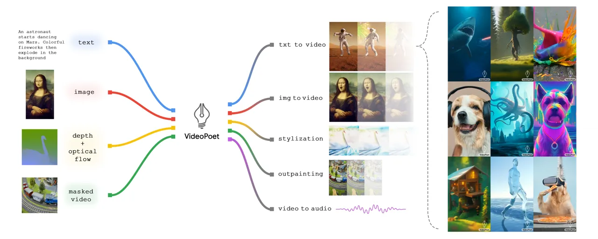

Figure 1: VideoPoet Overview: a versatile video generator that
conditions on multiple types of inputs and performs a variety of video
generation tasks.

## 1 Introduction

Recently, there has been a surge of generative video models capable of a
variety of video creation tasks. These include text-to-video (Zhang
et al., 2023a; Singer et al., 2022), image-to-video (Yu et al., 2023c),
video-to-video stylization (Chen et al., 2023b; Chai et al., 2023;
Voleti et al., 2022), and video editing (Ceylan et al., 2023; Wang
et al., 2023b; Geyer et al., 2023) among other video applications. Most
existing models employ diffusion-based methods for video generation.
These video models typically start with a pretrained image model, such
as Stable Diffusion (Rombach et al., 2022; Podell et al., 2023), that
produces high-fidelity images for individual frames, and then fine-tune
the model to improve temporal consistency across video frames.

While Large Language Models (LLMs) are commonly used as foundation
models across various modalities including language (Brown et al.,
2020), code (Li et al., 2023; OpenAI, 2023), audio (Rubenstein et al.,
2023), speech (Agostinelli et al., 2023), and robotics (Driess et al.,
2023; Zitkovich et al., 2023), the diffusion model remains the
predominant approach for video generation. Although early research has
demonstrated the effectiveness of LLMs in text-to-image generation,
_e.g_., DALL-E (Ramesh et al., 2022), Parti (Yu et al., 2022) and (Ding
et al., 2021), and text-to-video, _e.g_., CogVideo (Hong et al., 2022)),
language models have not reached a level of quality on par with video
diffusion models in tasks like text-to-video generation as shown in
previous studies (Nash et al., 2022; Villegas et al., 2022). In contrast
to training exclusively for text-to-video tasks, the generative model of
LLMs in the language domain emphasizes a large pretraining stage to
learn a foundation (Bommasani et al., 2021) by examining pretraining
tasks that extend beyond text-to-video generation.

A notable advantage of employing LLMs in video generation lies in the
ease of integrating existing LLM frameworks. This integration allows for
reusing LLM infrastructure and leverages the optimizations our community
has developed over many years for LLMs, including optimizations in
learning recipes for model scaling (Brown et al., 2020; Chowdhery
et al., 2022), training and inference infrastructure (Du et al., 2022),
hardware, among other advancements. This couples with their flexibility
in encoding many diverse tasks in the same model (Raffel et al., 2020),
which stands in contrast to most diffusion models where architectural
changes and adapter modules are the dominant approach used to adapt the
model to more diverse tasks (Zhang et al., 2023b).

In this paper, we exploit language models for video generation,
following the canonical training protocols of LLMs in the language
domain. We introduce _VideoPoet_, a language model for video generation.
VideoPoet employs a decoder-only LLM architecture (Anil et al., 2023;
OpenAI, 2023) that admits image, video, and audio modalities as discrete
tokens, each produced by their respective tokenizer.

The training process of VideoPoet consists of two stages: (1)
pretraining and (2) task-adaptation. During pretraining, VideoPoet
incorporates a mixture of multimodal pretraining objectives within an
autoregressive transformer framework. After pretraining, the model
functions as a versatile multi-task video generation model such as
text-to-video, image-to-video, video editing and video-to-video
stylization. These capabilities are inherently integrated into a single
LLM, rather than relying on a separate generative model controlled by
text prompts (Tang et al., 2023). During subsequent task-adaptation, the
pretrained model can be further fine-tuned either to enhance its
generation quality on the training tasks or to perform new tasks.

Experiments show VideoPoet’s state-of-the-art capabilities in generating
videos with large and high-fidelity motions. With the powerful
capabilities of the transformer architecture, VideoPoet can be
straightforwardly trained on a multi-task, multimodal generative
objective, allowing for generating consistent and realistic motion
driven by text or other prompts. Furthermore, VideoPoet can synthesize
coherent long videos of up to 10 seconds by autoregressively extending
the content, conditioned on the last second of the generated video.

We also demonstrate that VideoPoet is capable of zero-shot video
generation. We use the term “zero-shot video generation” as VideoPoet
processes new text, image, or video inputs that diverge from the
training data distribution. Furthermore, VideoPoet handles new tasks not
included in its training. For example, VideoPoet is able to perform new
editing tasks by sequentially chaining tasks together.

Our contribution is a proof of concept demonstrating an understudied
approach to high-quality video generation with LLMs, distinct from the
dominant diffusion-based methods. Specifically, the main contributions
include:

- •
  A method for training a Large Language Model (LLM) specifically for
  video generation, utilizing tokenized data that incorporates both
  text-paired and unpaired videos.
- •
  A video super-resolution method that increases spatial resolution
  within the latent token space using a bidirectional transformer with
  efficient windowed local attention.
- •
  Evaluations and demonstrations to highlight VideoPoet’s competitive
  and state-of-the-art performance, especially in generating realistic
  and interesting videos with motion.

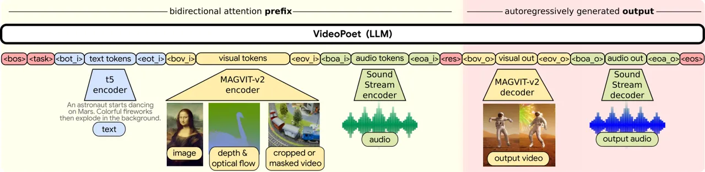

Figure 2: Sequence layout for VideoPoet. We encode all modalities into
the discrete token space, so that we can directly use large language
model architectures for video generation. We denote special tokens in
$`<>`$ (see Table 4 for definitions). The modality agnostic tokens are
in darker red; the text related components are in blue; the vision
related components are in yellow; the audio related components are in
green. The left portion of the layout on light yellow represents the
bidirectional prefix inputs. The right portion on darker red represents
the autoregressively generated outputs with causal attention.

## 2 Related Work

##### Video diffusion models.

Recently, numerous video generation methods use diffusion-based methods
for text-to-video (Ho et al., 2022a; Blattmann et al., 2023b; Zhang
et al., 2023a; Blattmann et al., 2023a; He et al., 2023; Zhou et al.,
2022; Wang et al., 2023a; Ge et al., 2023; Wang et al., 2023d; Wang
et al., 2023c; Singer et al., 2022; Zhang et al., 2023a; Zeng et al., 2023) and video-to-video editing (Liew et al., 2023; Feng et al., 2023;
Esser et al., 2023; Chen et al., 2023b). As video diffusion models are
usually derived from text-to-image diffusion models (Ramesh et al.,
2021; Saharia et al., 2022), additional tasks and modalities are added
via inference tricks (Meng et al., 2021), architectural changes (Esser
et al., 2023; Liew et al., 2023) and adapter layers (Zhang et al.,
2023b; Guo et al., 2023). Although these models are composable after
training, they are not trained end-to-end in a unified framework. Our
multitask pretraining strategy in a single model improves performance
and provides zero-shot video generation capabilities.

##### Language models for video and image generation.

Video language models are typically derived from the general family of
transformer-based language models (Vaswani et al., 2017; Raffel et al., 2020) that easily combine multiple tasks in pretraining and demonstrate
powerful zero-shot capabilities. Image generation language models can
generate images autoregressively (Yu et al., 2022) or via masked
prediction (Chang et al., 2022; Chang et al., 2023). Both families have
been extended to text-to-video (Hong et al., 2022; Villegas et al.,
2022; Hu et al., 2023; Yan et al., 2021) using paired data. While other
text-to-video work with transformers only leverages video-text pairs for
training, we also leverage unpaired videos (without text) and the same
video for different tasks. Since video language models can flexibly
incorporate numerous tasks (Yu et al., 2023a; Nash et al., 2022),
including video-to-video, we extend this family of work to text- and
multimodal-conditioned tasks in this work with a synergistic pretraining
strategy across various tasks.

##### Pretraining task design in LLMs.

As language models can easily incorporate multiple training tasks, task
selection is an important area of research. GPT-3 (Brown et al., 2020)
and PaLM (Chowdhery et al., 2022) demonstrate that training LLMs on
diverse tasks leads to positive scaling effects on zero- and few-shot
tasks. Other approaches show that masking approaches are a valuable
learning target (Hoffmann et al., 2022; Yu et al., 2023a; Yu et al.,
2024). As the model size grows, training data must grow as
well (Hoffmann et al., 2022) to maintain similar performance. Our
pretraining strategy enables using the same video for multiple training
tasks even without paired text. This design facilitates training on a
large quantity of video-only examples, thereby decreasing the demand for
video-text pairs.

## 3 Model Overview

We propose an effective method for video generation and related tasks
from different input signals by leveraging large language models. Our
model consists of three components: (1) modality-specific tokenizers,
(2) a language model backbone (Fig. 2), and (3) a super-resolution
module (Fig. 3). The tokenizers map input data – _i.e_. image pixels,
video frames, and audio waveforms – into discrete tokens in a _unified_
vocabulary. The visual and audio tokens are flattened into a sequence of
integers. Next, the LLM accepts these tokens as input along with text
embeddings, and is responsible for generative multi-task and multimodal
modeling. As illustrated in Fig. 2, VideoPoet conditions on text
embeddings, visual tokens, and audio tokens, and autoregressively
predicts visual and audio tokens. Subsequently, the super-resolution
module increases the resolution of the video outputs while refining
visual details for higher quality.

### 3.1 Tokenization

We employ the MAGVIT-v2 (Yu et al., 2024) tokenizer for joint image and
video tokenization, and the SoundStream (Zeghidour et al., 2021)
tokenizer for audio. Visual and audio vocabularies are concatenated into
a unified vocabulary. The text modality is represented by embeddings.

##### Image and video tokenizer.

Visual tokenizers are key to generating high-quality video content,
often determining the upper limit of achievable video generation
quality (Yu et al., 2024). Among existing tokenizers (Esser et al.,
2020; Villegas et al., 2022; Yu et al., 2023a; Yu et al., 2023b), we
choose the MAGVIT-v2 (Yu et al., 2024) tokenizer due to its performance
in visual quality and high compression capabilities, which effectively
reduce the sequence length required by the LLM, thereby facilitating
more efficient and effective learning. Specifically, a video clip is
encoded and quantized into an integer sequence integers, with a decoder
mapping back to pixel space. MAGVIT-v2 tokenizes 17-frame 2.125-second
128$`\times`$128 resolution videos sampled at 8 fps to produce a latent
shape of $`(5,16,16)`$, which is then flattened into 1280 tokens, with a
vocabulary size of $`2^{18}`$. We also tokenize videos into portrait
aspect ratio at 128$`\times`$224 resolution, producing a latent shape of
$`(5,28,16)`$, or 2240 tokens.

We enforce causal temporal dependency, which facilitates the generation
of longer videos. To jointly represent images and videos, we encode the
initial frame of a video or a static image into tokens with a consistent
shape of $`(1,16,16)`$. We use the COMMIT (Yu et al., 2023a) encoding
scheme to tokenize the inpainting and outpainting tasks.

##### Audio tokenizer.

We tokenize audio clips with a pretrained SoundStream (Zeghidour et al., 2021) tokenizer. We embed 2.125 seconds of audio to produce 106 latent
frames with a residual vector quantizer (RVQ) of four levels. Two
possible choices exist for predicting the audio tokens with the RVQ
representation: 1) sequentially predicting the entire audio clip from a
lower to a higher RVQ level, or 2) simultaneously predicting all RVQ
levels for a single audio token. Our results suggest that the former
method demonstrates a slight advantage over the latter approach.
Finally, each RVQ level has a disjoint vocabulary with each level
containing 1,024 codes. This results in a combined audio vocabulary size
of 4,096 codes.

##### Text embedding as input.

Pretrained text representations, in general, outperform training our
model by learning text tokens from scratch. We use pretrained language
embeddings from a frozen T5 XL encoder (Raffel et al., 2020). For tasks
with text guidance, such as text-to-video, T5 XL embeddings are
projected into the transformer’s embedding space with a linear layer.

### 3.2 Language Model Backbone

After converting the image, video, and audio modalities into discrete
tokens within a shared vocabulary, we can directly leverage a language
model to generate videos and audios in the token space. We use a prefix
language model with a decoder-only architecture as the backbone. By
constructing different patterns of input tokens to output tokens during
training, we can control the tasks the model is able to perform as
explained in Section 4.

### 3.3 Super-Resolution

Figure 3: Custom transformer architecture for video super-resolution.

Generating high-resolution (HR) videos autoregressively entails heavy
computational costs due to the increase in sequence length. To
illustrate this with an example, the video tokenizer of Section 3.1
operating on a $`17\times 896\times 512`$ video produces a sequence of
$`35,840`$ tokens, making autoregressive sampling highly impractical.
Aiming at efficient and high-quality generative video upsampling, we
develop a custom spatial super-resolution (SR) non-autoregressive video
transformer (Yu et al., 2023a) to operate in token space on top of the
language model output. To mitigate the computational requirements of the
very long sequences involved, and in particular the quadratic memory of
the self-attention layers, our design incorporates windowed local
attention (Gupta et al., 2022). Specifically, our SR transformer is
composed of blocks of three transformer layers, each of which performs
self-attention in a local window aligned with one of three axes (Tu
et al., 2022): _spatial vertical_, _spatial horizontal_ and _temporal_.
The cross-attention layers attend to the low-resolution (LR) token
sequence and are also divided into local windows, isomorphic to those of
the self-attention layers. All blocks also include cross-attention to T5
XL text embeddings. See Fig. 3 for a schematic representation of the
custom transformer architecture.

To account for the larger vocabulary size, we follow (Yu et al., 2024),
and train the SR transformer using token factorization with $`k=2`$
factors, which converts a $`262,144`$-way classification problem into
two $`512`$-way classification problems. The LR token sequences are
obtained by tokenizing bicubic-downsampled versions of the ground truth
videos and applying noise augmentation (Ho et al., 2022a) in the
discrete latent space, to mitigate the distribution mismatch between
real and generated videos. Specifically, we randomly resample the value
of a random subset of the LR tokens and independently drop the LR
condition and text embeddings for 10% of the training samples. During
inference, we use non-autoregressive sampling (Chang et al., 2022; Yu
et al., 2023a) with classifier-free guidance independently on both the
LR condition and the text embeddings (Brooks et al., 2023). We use a
cascade of two $`2\times`$ stages to generate videos of
$`896\times 512`$ resolution from the $`224\times 128`$ base output of
VideoPoet. More implementaiton details can be found in the appendix.

## 4 LLM Pretraining for Generation

### 4.1 Task Prompt Design

We design a pretraining task mixture, each with a defined prefix input
and output. The model conditions on the prefix, applying the loss solely
to the output. Fig. 2 shows a typical input-output sequence layout. For
each task, the input sequence may include three types of values: text
embeddings (T5), visual tokens (MAGVIT-v2), and audio tokens
(SoundStream). The model outputs two types of tokens: visual and audio
tokens. To facilitate training, VideoPoet employs _special tokens_, as
listed in Appendix Table 4. In the following, we describe key designs
for the task prompts.

##### Pretraining tasks.

We consider the following tasks. _Unconditioned video generation_:
Generate video frames without conditioning on an input. _Text-to-video
(T2V)_: Generate video from a text prompt. _Video future prediction
(FP)_: Given an input video of variable length, predict future frames.
_Image-to-video (I2V)_: Given the first frame of a video as an input
image, predict the future frames. _Video inpainting/outpainting
(Painting)_: Given a masked video, predict the video with the masked
contents filled in. _Video stylization_: Given text, optical flow, and
depth, predict the video frames (Section 4.1). _Audio-to-video_: Given
an input audio waveform, predict the corresponding video.
_Video-to-audio_: Given an input video, predict the corresponding audio
waveform. _Audio-video continuation_ (AVCont) given an input frame and
its audio, predict the rest of the video and audio. In principle, the
model can generate text, but we have not explicitly evaluated this
ability.

To indicate the type of task, we condition on the \<task\> token, which
has a unique value for each unique output. We note that not all input
variations need a new \<task\>; the model adapts to different context
signals for identical outputs. For instance, text-to-video,
image-to-video, and unconditioned video generation share the same
\<task\>. If a modality is absent in a task, related input/output tokens
and special tokens are excluded, shortening the sequence.

##### Representing an image as a video.

In text-to-image pretraining, we omit the \<eos\> and \<eov_o\> tokens
from the input sequence, enabling continuous token generation for
inference of longer videos. This approach blurs the boundary between
video and image generation tasks, enhancing cross-modality information
sharing. This design leads to the prediction of higher-quality initial
frames and reduces errors and artifacts in subsequent frames.

##### Video token format.

We generate video tokens at two resolutions, 128$`\times`$128 and
128$`\times`$224, each available in two lengths: 17 frames and 41
frames, both encoded at 8 frames per second. Special conditioning tokens
are used to signal the desired resolutions and durations for video
generation. Images are a special case of a 1-frame video, which we
tokenize at 128$`\times`$128 resolution.

##### Video stylization.

For video stylization, we adopt a method motivated by (Zhang et al.,
2023b; Chen et al., 2023b; Esser et al., 2023), predicting videos from
text, optical flow, and depth signals. The training task for stylization
is to reconstruct the ground truth video from the given optical flow,
depth, and text information, but during inference, we apply optical flow
and depth estimation on an input video but then vary the text prompt to
generate a new style, _e.g_. “cartoon.” Similar to (Esser et al., 2023),
text dictates the output “content” or appearance, while optical flow and
depth guide its “structure.”

### 4.2 Training Strategy

For multi-task training, we use the Alternating Gradient Descent (AGD)
method (Akbari et al., 2023) to train videos of varying lengths. We
design the tasks in the AGD format resulting in a near 0% padding ratio,
lower than that of the packing approach (Raffel et al., 2020). This is
accomplished by grouping tasks by sequence length and alternately
sampling one group at each iteration. Since sequence lengths are fixed
and vary significantly across tasks, _e.g_., first frame and long video
generation, we achieve efficient training with minimal padding.

We find that sampling from image and video datasets uniformly across
time can lead to suboptimal results, as training on images can enhance
the model’s understanding of objects but does not capture any motions
that are represented in video data. Thus, we devise a two-stage
pretraining strategy, where we augment our sampling weights to sample
image data 90% of the time and video data 10% of the time for the first
25% iterations of training. We then switch to training on video 90% and
image 10% for the remaining iterations.

We fine-tune our pretrained model for enhanced performance on specific
tasks or for new task adaptation, such as text-to-video and
image-to-video tasks, using a data subset of higher quality. These
videos are sourced from broad internal sources with millions of videos
that contain simpler clips, and are not manually tailored or selected.
This results in improved generation quality, consistent with Zhou et al.
(2023), and addresses decoding collapse issues, characterized by
repetitive token predictions. Such fine-tuning not only diversifies
outputs but also allows for a higher classifier-free guidance scale (Ho
& Salimans, 2022), boosting overall quality.

## 5 Experiments

### 5.1 Experimental Setup

##### Training tasks.

We train the model on a mixture of pretraining tasks as detailed
in Section 4.1. We finetune a model on a high-quality training subset
for text-to-video evaluations, as discussed in Section 4.2. Unless
explicitly stated, we do not finetune on specific tasks for evaluations.

##### Datasets.

We train on a total of 1B image-text pairs and $`\sim`$270M videos
($`\sim`$100M with paired text, of which $`\sim`$50M are used for
high-quality finetuning, and $`\sim`$170M with paired audio) from the
public internet and other sources, _i.e_. around 2 trillion tokens
across all modalities. The data has been filtered to remove egregious
content and sampled to improve contextual and demographic diversity.

|          |                   |     |        |     |          |        |                                |                    |                    |                    |                    |
| -------- | ----------------- | --- | ------ | --- | -------- | ------ | ------------------------------ | ------------------ | ------------------ | ------------------ | ------------------ |
| Method   | Pretraining Tasks |     |        |     |          |        | Zero-shot Evaluation Benchmark |                    |                    |                    |                    |
|          | T2I               | T2V | Uncond | FP  | Painting | AVCont | T2V                            |                    | FP                 | Inpainting         | Outpainting        |
|          |                   |     |        |     |          |        | MSR-VTT                        | UCF101             | K600               | SSv2               | SSv2               |
|          |                   |     |        |     |          |        | CLIPSIM $`\uparrow`$           | FVD $`\downarrow`$ | FVD $`\downarrow`$ | FVD $`\downarrow`$ | FVD $`\downarrow`$ |
| T2V      |                   | ✓   |        |     |          |        | 0.244                          | 822                | 759                | 2,333              | 2,310              |
| T2V+I    | ✓                 | ✓   |        |     |          |        | 0.247                          | 1,025              | 794                | 2,118              | 1,916              |
| SSL      |                   |     | ✓      | ✓   | ✓        | ✓      | 0.226                          | 1,742              | 700                | 1,093              | 1,500              |
| NO T2I   |                   | ✓   | ✓      | ✓   | ✓        | ✓      | 0.235                          | 1,008              | 755                | 95                 | 389                |
| ALL      | ✓                 | ✓   | ✓      | ✓   | ✓        | ✓      | 0.240                          | 1,085              | 729                | 127                | 636                |
| ALL (8B) | ✓                 | ✓   | ✓      | ✓   | ✓        | ✓      | 0.305                          | 355                | 687                | 4.7                | 13.76              |

Table 1: Pretraining task analysis on 300M models. The top rows list
models with 300M parameters, trained on a subset of the data, and are
comparable to each other. The last row shows an 8B model trained on the
entire dataset. T2I (text-to-image), T2V (text-to-video), FP (frame
prediction), Painting (inpainting/outpainting), Uncond (unconditional
generation), AVCont (audio-video continuation), and SSL (self-supervised
learning).

##### Evaluation protocol.

We employ a zero-shot generation evaluation protocol, as the model has
not been trained on the training data of target benchmarks.
Specifically, the evaluation benchmark includes two text-to-video
generation datasets, MSR-VTT (Xu et al., 2016) and UCF-101 (Soomro
et al., 2012), as well as the frame prediction task on Kinetics 600
(K600) (Carreira et al., 2018), in which the first 5 frames are provided
as the condition to predict the next 11 frames. We also include
inpainting and outpainting tasks (Yu et al., 2023a) on
Something-Something V2 (SSv2) (Goyal et al., 2017).

We employ widely used metrics such as Fréchet Video Distance
(FVD) (Unterthiner et al., 2018), CLIP similarity score (Wu et al.,
2021), and Inception Score (IS) (Saito et al., 2020) for evaluation.
Note that the specific metrics and evaluation methods vary across
different datasets. Detailed information on these variations can be
found in Section A.5.5. We include examples of the generated videos in
the supplementary materials.

### 5.2 Pretraining Task Analysis

We investigate the learning capabilities of different combinations of
pretraining tasks using a model with 300 million parameters. All task
combinations are trained using a learning rate of $`10^{-3}`$ for the
same number of steps (300k) with a batch size of 1024.

For the analysis of pretraining tasks, we consider text-to-video (T2V),
text-to-image (T2I), and four self-supervised learning (SSL) tasks:
frame prediction (FP), central inpainting and central outpainting
(Painting) (Yu et al., 2023a) and audio-video continuation (AVCont)
where the model is provided with the first frame and its corresponding
audio to predict the subsequent 16 frames and matching audio. For each
video task, we uniformly select 20% of training samples from a random
subset of 50 million videos. For the text-to-image task, we randomly
sample 50 million text-image pairs from our training dataset. For tasks
involving audio, our sampling is exclusive to videos that contain an
audio track.

The evaluation results are presented in Table 1. We assess a model
across the four tasks within the zero-shot evaluation benchmark: the T2V
task on MSR-VTT (Xu et al., 2016) and UCF 101 (Soomro et al., 2012), the
FP on K600 (Carreira et al., 2018), and central inpainting and
outpainting on SSv2 (Goyal et al., 2017). The audio generation results
(FAD) are reported in Fig. 5(b) of the Appendix. In these experiments,
we employ a single model to perform all the tasks. The model is not
trained on the training data of these evaluation datasets, and thus it
is a zero-shot evaluation.

The top rows of Table 1 depict each pretraining task configuration of
the 300 million parameter model, which are comparable in their setups.
Our evaluation benchmarks span diverse visual domains, posing a
challenge to achieving consistent improvement across all of them.
Nevertheless, incorporating all pretraining tasks results in the best
overall performance, on average, across all evaluated tasks.
Additionally, the significant disparity observed in the “SSL” row
suggests the limitations of self-supervised training and underscores the
necessity for text-paired data during training. Both single-task and
multi-task models are trained for the same number of steps. The minor
decrease in performance of multi-task training in Table 1 might be due
to the insufficient training of each task. The last row, “ALL (8B)”, is
the model with 8 billion parameters, trained on the pretraining tasks as
discussed in Section 3 and utilized significantly more compute.

Figure 4: Human evaluation results on text-to-video (T2V) generation.
Green and pink bars represent the proportion of trials where VideoPoet
was preferred over or less preferred to an alternative, respectively.

### 5.3 Comparison with the State-of-the-Art

|                        |         |      |         |       |
| ---------------------- | ------- | ---- | ------- | ----- |
| Model                  | MSR-VTT |      | UCF-101 |       |
|                        | CLIPSIM | FVD  | FVD     | IS    |
| CogVideo (EN) (2022)   | 0.2631  | 1294 | 702     | 25.27 |
| MagicVideo (2022)      | \-      | 998  | 655     | \-    |
| Video LDM (2023b)      | 0.2929  | \-   | 551     | 33.45 |
| ModelScopeT2V (2023a)  | 0.2930  | 550  | \-      | \-    |
| InternVid (2023d)      | 0.2951  | \-   | 617     | 21.04 |
| VideoFactory (2023c)   | 0.3005  | \-   | 410     | \-    |
| Make-A-Video (2022)    | 0.3049  | \-   | 367     | 33.00 |
| Show-1 (2023a)         | 0.3072  | 538  | 394     | 35.42 |
| VideoPoet (Pretrain)   | 0.3049  | 213  | 355     | 38.44 |
| VideoPoet (Task adapt) | 0.3123  | \-   | \-      | \-    |

Table 2: Comparison on zero-shot text-to-video benchmarks. See
Appendix A.5.5 for evaluation details.

##### Text-to-Video (T2V).

Table 2 shows zero-shot text-to-video evaluation results on the common
MSR-VTT (Xu et al., 2016) and UCF-101 (Soomro et al., 2012) datasets.
Our model performs favorably in terms of CLIP similarity and FVD scores
on MSR-VTT and UCF-101. The pretrained foundation model already achieves
competitive performance on all metrics. After finetuned on high-quality
subset of text-video pairs, VideoPoet achieves even better CLIPSIM on
MSR-VTT. More details on the evaluation settings can be found
in Section A.5.5.

##### Human Evaluations with Text-to-Video (T2V).

We analyze VideoPoet using human raters and compare with other recent
models: Show-1 (Zhang et al., 2023a), VideoCrafter (Chen et al., 2023a),
Phenaki (Villegas et al., 2022), Pika (Pika, 2023), Gen2 (Runway, 2023),
WALT (Gupta et al., 2023) and Lumiere (Bar-Tal et al., 2024). Show-1,
VideoCrafter, Pika, Gen2, WALT and Lumiere are video diffusion models
while Phenaki is a token-based model using masked token modeling (Chang
et al., 2022). We ran the most up-to-date model versions as of January
2024 and note that WALT and Lumiere were concurrently developed and not
available during initial submission of this paper.

We first develop a unified evaluation prompt bank consisting of
$`\sim 250`$ selected prompts from a variety of categories and styles.
Our prompts are sourced from published prompt sets (_e.g_., Show-1,
Video LDM (Blattmann et al., 2023b)). We select the prompts prior to
generating videos and fix these choices after initial selection. We also
select preferentially for prompts that contain an explicit mention of
motion so that the evaluation would not be biased for models that
generate high quality videos that are almost still (e.g., “person
jumping off of a chair” over “person standing on a chair”). Note that
due to time constraints, our experiments for Pika and Gen2 were run on a
subset of 50 prompts due to having to submit these manually via their
web interface. These 50 prompts were pre-selected (before any
evaluations were run) so as to be representative of the entire set.

For this user study we use the fine-tuned version of VideoPoet as
discussed in Section 4.2. As part of our system we also use a fixed
negative prompt for all inference calls as well as lightweight prompt
rewriting. We then compare VideoPoet against alternative models in
side-by-side fashion for each prompt. Raters are shown videos generated
by two models at a time (in randomized order so as to not bias raters).
We refer readers to Appendix A.5.4 for more details of our methodology.

Not all methods generate videos at the same size, aspect ratio, or
framerate, and we thus resize and resample each video to a fixed area
while maintaining its original aspect ratio as well as common framerate.
Raters are then asked to compare the videos along 5 dimensions and for
each dimension to report which video is better. The 5 dimensions are:
(1) text fidelity (which video follows the text prompt most faithfully),
(2) video quality, (3) motion “interestingness”, (4) motion realism, and
(5) temporal consistency. Raters are required to go through a collection
of training examples for each of these 5 dimensions before they begin.

Our findings are summarized in Fig. 4, where green and pink bars
represent the proportion of trials where VideoPoet was preferred or less
preferred over an alternative, respectively. We observe that VideoPoet
is competitive with state of the art video diffusion models despite
taking a dramatically different approach, even outperforming these
baseline models along most dimensions. More specifically, VideoPoet
achieves significant wins along motion interestingness and realism and
Lumiere (Bar-Tal et al., 2024) which is diffusion based and concurrent
to our work, is the only model that outperforms VideoPoet on Video
Quality.

### 5.4 Runtime

For a batch size of 4 videos and generating 17 frames at 8fps using
TPUv5p (4 chips) accelerators, our base model runs in 34s, the
detokenizer (converting tokens to pixels) requires 1.3s and
super-resolution is 6.8s — thus, amortized run time is about 5 seconds
per second of output video. Note that our model has not been optimized,
and any acceleration techniques applicable to standard LLMs could be
applied here as well.

### 5.5 LLM’s Diverse Capabilities in Video Generation

This subsection presents several capabilities we discover from the
pretrained VideoPoet, shedding light on the LLM’s promising potential in
video generation. By combining the flexibility of our autoregressive
language model to perform diverse tasks such as extending video in time,
inpainting, outpainting, and stylization, VideoPoet accomplishes
multiple tasks in a unified model.

##### Coherent long video generation and image-to-video.

![[Uncaptioned
image]](arxiv-2312-14125--6245029b893f.figures/figure-3.webp)

![[Uncaptioned
image]](arxiv-2312-14125--6245029b893f.figures/figure-4.webp)

![[Uncaptioned
image]](arxiv-2312-14125--6245029b893f.figures/figure-5.webp)

![[Uncaptioned
image]](arxiv-2312-14125--6245029b893f.figures/figure-6.webp)

Figure 4: 10-Second long video generation example. By predicting
1-second video segments from an initial 1-second clip, VideoPoet can
iteratively generate videos of extended lengths.

![[Uncaptioned
image]](arxiv-2312-14125--6245029b893f.figures/figure-7.webp)

![[Uncaptioned
image]](arxiv-2312-14125--6245029b893f.figures/figure-8.webp)

![[Uncaptioned
image]](arxiv-2312-14125--6245029b893f.figures/figure-9.webp)

![[Uncaptioned
image]](arxiv-2312-14125--6245029b893f.figures/figure-10.webp)

Animated from historical photo

![[Uncaptioned
image]](arxiv-2312-14125--6245029b893f.figures/figure-11.webp)

![[Uncaptioned
image]](arxiv-2312-14125--6245029b893f.figures/figure-12.webp)

![[Uncaptioned
image]](arxiv-2312-14125--6245029b893f.figures/figure-13.webp)

![[Uncaptioned
image]](arxiv-2312-14125--6245029b893f.figures/figure-14.webp)

Animated from painting

Figure 4: Examples of videos animated from still images plus text
prompts tailored to each initial image.

A benefit of an decoder-based language model is that it pairs well with
autoregressively extending generation in time. We present two different
variants: Generating longer videos and converting images to videos.
Encoding the first frame independently allows us to convert any image
into the initial frame of a video without padding. Subsequent frames are
generated by predicting remaining tokens, transforming the image into a
video as shown in Fig. 4¹¹ 1 For image-to-video examples we source
images from Wikimedia Commons:
https://commons.wikimedia.org/wiki/Main_Page.

This results in the capability to generate videos longer than 10 seconds
or to allow users to iteratively extend video clips based on previously
generated video, and produces temporally consistent videos without
significant distortion. Such capabilities are rarely observed in
contemporary diffusion models.

##### Zero-shot video editing and task chaining.

![[Uncaptioned
image]](arxiv-2312-14125--6245029b893f.figures/figure-15.webp)

![[Uncaptioned
image]](arxiv-2312-14125--6245029b893f.figures/figure-16.webp)

![[Uncaptioned
image]](arxiv-2312-14125--6245029b893f.figures/figure-17.webp)

![[Uncaptioned
image]](arxiv-2312-14125--6245029b893f.figures/figure-18.webp)

Animated from still image

![[Uncaptioned
image]](arxiv-2312-14125--6245029b893f.figures/figure-19.webp)

![[Uncaptioned
image]](arxiv-2312-14125--6245029b893f.figures/figure-20.webp)

![[Uncaptioned
image]](arxiv-2312-14125--6245029b893f.figures/figure-21.webp)

![[Uncaptioned
image]](arxiv-2312-14125--6245029b893f.figures/figure-22.webp)

Stylized video  
Prompt: An oil painting of a snowman with a red hat opening their mouth
to yawn

Figure 4: Example of zero-shot video editing via task chaining (text
conditioned image-to-video and stylization)

With the multi-task pretraining, VideoPoet exhibits task generalization
that can be chained together to perform novel tasks. We show the model
can apply image-to-video animation followed by video-to-video
stylization in Fig. 4. In the Appendix, Fig. 6 shows another example
applying video-to-video outpainting, followed by editing them with
additional video-to-video effects. At each stage, the quality of the
output is sufficient to remain in-distribution (_i.e_. teacher forcing)
for the next stage without noticeable artifacts. These capabilities can
be attributed to our multimodal task design within an LLM transformer
framework that allows for modeling multimodal content using a single
transformer architecture over a unified vocabulary.

##### Zero-shot video stylization.

Stylization results are presented in Section A.4 where the structure and
text are used as prefixes to guide the language model. Unlike other
stylization methods that employ adapter modules such as cross-attention
networks (Zhang et al., 2023b) or latent blending (Meng et al., 2021),
our approach stylizes videos within an LLM as one of several generative
tasks.

##### 3D structure, camera motion, visual styles.

Even though we do not add specific training data or losses to encourage
3D consistency, our model can rotate around objects and predict
reasonable visualizations of the backside of objects. Additionally, with
only a small proportion of input videos and texts describing camera
motion, our model can use short text prompts to apply a range of camera
motions to image-to-video and text-to-video generations (see Fig. 6).

### 5.6 Limitations

Despite VideoPoet demonstrating highly competitive performance of LLMs
relative to state-of-the-art models, certain limitations are still
observed. For example, the RGB frame reconstruction from compressed and
quantized tokens place an upper bound on the generative model’s visual
fidelity. Second, the per-frame aesthetic biases in static scenes does
not match the best baseline. This difference is largely due to a choice
of training data, where we focus our training on more natural aesthetics
and excluded some sources containing copyrighted images, such as
LAION (Schuhmann et al., 2022), which is commonly used in other work.
Finally, small objects and fine-grained details, especially when coupled
with significant motions, remains difficult within the token-based
modeling.

## 6 Conclusion

VideoPoet demonstrates the potential of a large language model that is
trained on discrete visual, text and audio tokens, in generating videos
of compelling state-of-the-art quality. A particular strength of our
model lies in its ability to generate high-fidelity, large, and complex
motions. Our large language model formulation benefits from training
across a variety of multimodal tasks with a unified architecture and
vocabulary. Consequently, the pretrained model is adept at multi-task
video creation, and serves as a foundation for a diverse variety of
video generation related capabilities, including multiple forms of
editing.

## Acknowledgements

We give special thanks to Alex Siegman, Victor Gomes, and Brendan Jou
for managing computing resources. We also give thanks to Aren Jansen,
Marco Tagliasacchi, Neil Zeghidour, John Hershey for audio tokenization
and processing, Angad Singh for storyboarding in “Rookie the Raccoon”,
Cordelia Schmid for research discussions, David Salesin, Tomas Izo, and
Rahul Sukthankar for their support, and Jay Yagnik for the initial
concept.

## Impact Statement

This paper introduces research aimed at advancing the field of video
generation and introduces a new tool to enhance human creativity. In
considering the societal impact of our video generation model,
VideoPoet, several concerns emerge, including the potential for misuse
and ethical considerations. Misuse may entail the creation of deceptive
or harmful content, such as misinformation or deepfakes. Ethical
considerations encompass ensuring that generated content adheres to
ethical standards, avoids perpetuating harmful stereotypes, and respects
cultural sensitivities. To mitigate these risks, we adhere to evolving
strategies developed within our community. This includes using digital
watermarking in generated videos to enable traceability and
accountability, and maintain transparency in our model design to foster
trust.

## References

- Agostinelli et al. (2023) Agostinelli, A., Denk, T. I., Borsos, Z.,
  Engel, J., Verzetti, M., Caillon, A., Huang, Q., Jansen, A., Roberts,
  A., Tagliasacchi, M., et al. Musiclm: Generating music from text.
  _arXiv preprint arXiv:2301.11325_, 2023.
- Akbari et al. (2023) Akbari, H., Kondratyuk, D., Cui, Y., Hornung, R.,
  Wang, H., and Adam, H. Alternating gradient descent and
  mixture-of-experts for integrated multimodal perception. _arXiv
  preprint arXiv:2305.06324_, 2023.
- Anil et al. (2023) Anil, R., Dai, A. M., Firat, O., Johnson, M.,
  Lepikhin, D., Passos, A., Shakeri, S., Taropa, E., Bailey, P., Chen,
  Z., et al. Palm 2 technical report. _arXiv preprint
  arXiv:2305.10403_, 2023.
- Bar-Tal et al. (2024) Bar-Tal, O., Chefer, H., Tov, O., Herrmann, C.,
  Paiss, R., Zada, S., Ephrat, A., Hur, J., Li, Y., Michaeli, T., et al.
  Lumiere: A space-time diffusion model for video generation. _arXiv
  preprint arXiv:2401.12945_, 2024.
- Blattmann et al. (2023a) Blattmann, A., Dockhorn, T., Kulal, S.,
  Mendelevitch, D., Kilian, M., Lorenz, D., Levi, Y., English, Z.,
  Voleti, V., Letts, A., et al. Stable video diffusion: Scaling latent
  video diffusion models to large datasets. _arXiv preprint
  arXiv:2311.15127_, 2023a.
- Blattmann et al. (2023b) Blattmann, A., Rombach, R., Ling, H.,
  Dockhorn, T., Kim, S. W., Fidler, S., and Kreis, K. Align your
  latents: High-resolution video synthesis with latent diffusion models.
  In _CVPR_, pp. 22563–22575, 2023b.
- Bommasani et al. (2021) Bommasani, R., Hudson, D. A., Adeli, E.,
  Altman, R., Arora, S., von Arx, S., Bernstein, M. S., Bohg, J.,
  Bosselut, A., Brunskill, E., et al. On the opportunities and risks of
  foundation models. _arXiv preprint arXiv:2108.07258_, 2021.
- Brooks et al. (2023) Brooks, T., Holynski, A., and Efros, A. A.
  Instructpix2pix: Learning to follow image editing instructions. In
  _CVPR_, pp. 18392–18402, 2023.
- Brown et al. (2020) Brown, T., Mann, B., Ryder, N., Subbiah, M.,
  Kaplan, J. D., Dhariwal, P., Neelakantan, A., Shyam, P., Sastry, G.,
  Askell, A., et al. Language models are few-shot learners. _NeurIPS_,
  33:1877–1901, 2020.
- Carreira et al. (2018) Carreira, J., Noland, E., Banki-Horvath, A.,
  Hillier, C., and Zisserman, A. A short note about kinetics-600. _arXiv
  preprint arXiv:1808.01340_, 2018.
- Ceylan et al. (2023) Ceylan, D., Huang, C.-H. P., and Mitra, N. J.
  Pix2video: Video editing using image diffusion. In _CVPR_, pp.
  23206–23217, 2023.
- Chai et al. (2023) Chai, W., Guo, X., Wang, G., and Lu, Y.
  Stablevideo: Text-driven consistency-aware diffusion video editing. In
  _CVPR_, pp. 23040–23050, 2023.
- Chang et al. (2022) Chang, H., Zhang, H., Jiang, L., Liu, C., and
  Freeman, W. T. Maskgit: Masked generative image transformer. In
  _CVPR_, pp. 11315–11325, 2022.
- Chang et al. (2023) Chang, H., Zhang, H., Barber, J., Maschinot, A.,
  Lezama, J., Jiang, L., Yang, M.-H., Murphy, K., Freeman, W. T.,
  Rubinstein, M., et al. Muse: Text-to-image generation via masked
  generative transformers. _arXiv preprint arXiv:2301.00704_, 2023.
- Chen et al. (2023a) Chen, H., Xia, M., He, Y., Zhang, Y., Cun, X.,
  Yang, S., Xing, J., Liu, Y., Chen, Q., Wang, X., et al. Videocrafter1:
  Open diffusion models for high-quality video generation. _arXiv
  preprint arXiv:2310.19512_, 2023a.
- Chen et al. (2023b) Chen, W., Wu, J., Xie, P., Wu, H., Li, J., Xia,
  X., Xiao, X., and Lin, L. Control-a-video: Controllable text-to-video
  generation with diffusion models. _arXiv preprint arXiv:2305.13840_,
  2023b.
- Chiu et al. (2023) Chiu, M.-C., Chen, P.-Y., and Ma, X. Better may not
  be fairer: A study on subgroup discrepancy in image classification. In
  _ICCV_, pp. 4956–4966, 2023.
- Chowdhery et al. (2022) Chowdhery, A., Narang, S., Devlin, J., Bosma,
  M., Mishra, G., Roberts, A., Barham, P., Chung, H. W., Sutton, C.,
  Gehrmann, S., et al. PaLM: Scaling language modeling with pathways.
  _arXiv:2204.02311_, 2022.
- Ding et al. (2021) Ding, M., Yang, Z., Hong, W., Zheng, W., Zhou, C.,
  Yin, D., Lin, J., Zou, X., Shao, Z., Yang, H., et al. Cogview:
  Mastering text-to-image generation via transformers. _NeurIPS_, pp.
  19822–19835, 2021.
- Driess et al. (2023) Driess, D., Xia, F., Sajjadi, M. S., Lynch, C.,
  Chowdhery, A., Ichter, B., Wahid, A., Tompson, J., Vuong, Q., Yu, T.,
  et al. Palm-e: An embodied multimodal language model. _arXiv preprint
  arXiv:2303.03378_, 2023.
- Du et al. (2022) Du, N., Huang, Y., Dai, A. M., Tong, S., Lepikhin,
  D., Xu, Y., Krikun, M., Zhou, Y., Yu, A. W., Firat, O., et al. GLaMs:
  Efficient scaling of language models with mixture-of-experts. In
  _ICML_, 2022.
- Esser et al. (2020) Esser, P., Rombach, R., and Ommer, B. Taming
  transformers for high-resolution image synthesis. In _CVPR_, pp.
  12868–12878, 2020.
- Esser et al. (2023) Esser, P., Chiu, J., Atighehchian, P., Granskog,
  J., and Germanidis, A. Structure and content-guided video synthesis
  with diffusion models. In _CVPR_, pp. 7346–7356, 2023.
- Feng et al. (2023) Feng, R., Weng, W., Wang, Y., Yuan, Y., Bao, J.,
  Luo, C., Chen, Z., and Guo, B. Ccedit: Creative and controllable video
  editing via diffusion models. _arXiv preprint arXiv:2309.16496_, 2023.
- Ge et al. (2023) Ge, S., Nah, S., Liu, G., Poon, T., Tao, A.,
  Catanzaro, B., Jacobs, D., Huang, J.-B., Liu, M.-Y., and Balaji, Y.
  Preserve your own correlation: A noise prior for video diffusion
  models. In _CVPR_, pp. 22930–22941, 2023.
- Geyer et al. (2023) Geyer, M., Bar-Tal, O., Bagon, S., and Dekel, T.
  Tokenflow: Consistent diffusion features for consistent video editing.
  _arXiv preprint arXiv:2307.10373_, 2023.
- Goyal et al. (2017) Goyal, R., Ebrahimi Kahou, S., Michalski, V.,
  Materzynska, J., Westphal, S., Kim, H., Haenel, V., Fruend, I.,
  Yianilos, P., Mueller-Freitag, M., et al. The “something something”
  video database for learning and evaluating visual common sense. In
  _ICCV_, 2017.
- Guo et al. (2023) Guo, Y., Yang, C., Rao, A., Wang, Y., Qiao, Y., Lin,
  D., and Dai, B. Animatediff: Animate your personalized text-to-image
  diffusion models without specific tuning. _arXiv preprint
  arXiv:2307.04725_, 2023.
- Gupta et al. (2022) Gupta, A., Tian, S., Zhang, Y., Wu, J.,
  Martín-Martín, R., and Fei-Fei, L. Maskvit: Masked visual pre-training
  for video prediction. _arXiv preprint arXiv:2206.11894_, 2022.
- Gupta et al. (2023) Gupta, A., Yu, L., Sohn, K., Gu, X., Hahn, M.,
  Fei-Fei, L., Essa, I., Jiang, L., and Lezama, J. Photorealistic video
  generation with diffusion models. _arXiv preprint
  arXiv:2312.06662_, 2023.
- He et al. (2023) He, Y., Yang, T., Zhang, Y., Shan, Y., and Chen, Q.
  Latent video diffusion models for high-fidelity long video generation.
  _arXiv preprint arXiv:2211.13221_, 2(3):4, 2023.
- Hershey et al. (2017) Hershey, S., Chaudhuri, S., Ellis, D. P. W.,
  Gemmeke, J. F., Jansen, A., Moore, C., Plakal, M., Platt, D., Saurous,
  R. A., Seybold, B., Slaney, M., Weiss, R., and Wilson, K. Cnn
  architectures for large-scale audio classification. In _ICASSP_, 2017.
  URL
  [https://arxiv.org/abs/1609.09430](https://arxiv.org/abs/1609.09430).
- Ho & Salimans (2022) Ho, J. and Salimans, T. Classifier-free diffusion
  guidance. _arXiv preprint arXiv:2207.12598_, 2022.
- Ho et al. (2022a) Ho, J., Chan, W., Saharia, C., Whang, J., Gao, R.,
  Gritsenko, A., Kingma, D. P., Poole, B., Norouzi, M., Fleet, D. J.,
  et al. Imagen video: High definition video generation with diffusion
  models. _arXiv preprint arXiv:2210.02303_, 2022a.
- Ho et al. (2022b) Ho, J., Salimans, T., Gritsenko, A., Chan, W.,
  Norouzi, M., and Fleet, D. J. Video diffusion models.
  _arXiv:2204.03458_, 2022b.
- Hoffmann et al. (2022) Hoffmann, J., Borgeaud, S., Mensch, A.,
  Buchatskaya, E., Cai, T., Rutherford, E., Casas, D. d. L., Hendricks,
  L. A., Welbl, J., Clark, A., et al. Training compute-optimal large
  language models. _arXiv preprint arXiv:2203.15556_, 2022.
- Hong et al. (2022) Hong, W., Ding, M., Zheng, W., Liu, X., and
  Tang, J. Cogvideo: Large-scale pretraining for text-to-video
  generation via transformers. _arXiv preprint arXiv:2205.15868_, 2022.
- Hu et al. (2023) Hu, A., Russell, L., Yeo, H., Murez, Z., Fedoseev,
  G., Kendall, A., Shotton, J., and Corrado, G. Gaia-1: A generative
  world model for autonomous driving. _arXiv preprint
  arXiv:2309.17080_, 2023.
- Li et al. (2023) Li, R., Allal, L. B., Zi, Y., Muennighoff, N.,
  Kocetkov, D., Mou, C., Marone, M., Akiki, C., Li, J., Chim, J., et al.
  StarCoder: may the source be with you! _arXiv:2305.06161_, 2023.
- Liew et al. (2023) Liew, J. H., Yan, H., Zhang, J., Xu, Z., and
  Feng, J. Magicedit: High-fidelity and temporally coherent video
  editing. _arXiv preprint arXiv:2308.14749_, 2023.
- Meng et al. (2021) Meng, C., He, Y., Song, Y., Song, J., Wu, J., Zhu,
  J.-Y., and Ermon, S. Sdedit: Guided image synthesis and editing with
  stochastic differential equations. _arXiv preprint
  arXiv:2108.01073_, 2021.
- Nash et al. (2022) Nash, C., Carreira, J., Walker, J., Barr, I.,
  Jaegle, A., Malinowski, M., and Battaglia, P. Transframer: Arbitrary
  frame prediction with generative models. _arXiv preprint
  arXiv:2203.09494_, 2022.
- OpenAI (2023) OpenAI. GPT-4 technical report.
  _arXiv:2303.08774_, 2023.
- Perazzi et al. (2016) Perazzi, F., Pont-Tuset, J., McWilliams, B., Van
  Gool, L., Gross, M., and Sorkine-Hornung, A. A benchmark dataset and
  evaluation methodology for video object segmentation. In _CVPR_, 2016.
- Pika (2023) Pika. Pika 1.0, 2023. URL
  [https://pika.art/launch](https://pika.art/launch).
- Podell et al. (2023) Podell, D., English, Z., Lacey, K., Blattmann,
  A., Dockhorn, T., Müller, J., Penna, J., and Rombach, R. Sdxl:
  Improving latent diffusion models for high-resolution image synthesis.
  _arXiv preprint arXiv:2307.01952_, 2023.
- Raffel et al. (2020) Raffel, C., Shazeer, N., Roberts, A., Lee, K.,
  Narang, S., Matena, M., Zhou, Y., Li, W., and Liu, P. J. Exploring the
  limits of transfer learning with a unified text-to-text transformer.
  _Journal of Machine Learning Research_, 21(1):5485–5551, 2020.
- Ramesh et al. (2021) Ramesh, A., Pavlov, M., Goh, G., Gray, S., Voss,
  C., Radford, A., Chen, M., and Sutskever, I. Zero-shot text-to-image
  generation. _arXiv preprint arXiv:2102.12092_, 2021.
- Ramesh et al. (2022) Ramesh, A., Dhariwal, P., Nichol, A., Chu, C.,
  and Chen, M. Hierarchical text-conditional image generation with clip
  latents. _arXiv preprint arXiv:2204.06125_, 1(2):3, 2022.
- Ranftl et al. (2020) Ranftl, R., Lasinger, K., Hafner, D., Schindler,
  K., and Koltun, V. Towards robust monocular depth estimation: Mixing
  datasets for zero-shot cross-dataset transfer. _IEEE TPAMI_,
  44(3):1623–1637, 2020.
- Rombach et al. (2022) Rombach, R., Blattmann, A., Lorenz, D., Esser,
  P., and Ommer, B. High-resolution image synthesis with latent
  diffusion models. In _CVPR_, pp. 10684–10695, 2022.
- Rubenstein et al. (2023) Rubenstein, P. K., Asawaroengchai, C.,
  Nguyen, D. D., Bapna, A., Borsos, Z., Quitry, F. d. C., Chen, P.,
  Badawy, D. E., Han, W., Kharitonov, E., et al. Audiopalm: A large
  language model that can speak and listen. _arXiv preprint
  arXiv:2306.12925_, 2023.
- Runway (2023) Runway. Gen2, 2023. URL
  [https://runwayml.com/](https://runwayml.com/).
- Saharia et al. (2022) Saharia, C., Chan, W., Saxena, S., Li, L.,
  Whang, J., Denton, E. L., Ghasemipour, K., Gontijo Lopes, R.,
  Karagol Ayan, B., Salimans, T., et al. Photorealistic text-to-image
  diffusion models with deep language understanding. _NeurIPS_,
  35:36479–36494, 2022.
- Saito et al. (2020) Saito, M., Saito, S., Koyama, M., and
  Kobayashi, S. Train sparsely, generate densely: Memory-efficient
  unsupervised training of high-resolution temporal gan. _IJCV_,
  128(10):2586–2606, 2020.
- Schuhmann et al. (2022) Schuhmann, C., Beaumont, R., Vencu, R.,
  Gordon, C., Wightman, R., Cherti, M., Coombes, T., Katta, A., Mullis,
  C., Wortsman, M., et al. Laion-5b: An open large-scale dataset for
  training next generation image-text models. _Advances in Neural
  Information Processing Systems_, 35:25278–25294, 2022.
- Schumann et al. (2021) Schumann, C., Ricco, S., Prabhu, U., Ferrari,
  V., and Pantofaru, C. A step toward more inclusive people annotations
  for fairness. In _Proceedings of the 2021 AAAI/ACM Conference on AI,
  Ethics, and Society_, pp. 916–925, 2021.
- Schumann et al. (2023) Schumann, C., Olanubi, G. O., Wright, A., Monk,
  E., Heldreth, C., and Ricco, S. Consensus and subjectivity of skin
  tone annotation for ML fairness. In _Thirty-seventh Conference on
  Neural Information Processing Systems Datasets and Benchmarks
  Track_, 2023. URL
  [https://openreview.net/forum?id=L9I9FhHfS3](https://openreview.net/forum?id=L9I9FhHfS3).
- Singer et al. (2022) Singer, U., Polyak, A., Hayes, T., Yin, X., An,
  J., Zhang, S., Hu, Q., Yang, H., Ashual, O., Gafni, O., et al.
  Make-a-video: Text-to-video generation without text-video data. _arXiv
  preprint arXiv:2209.14792_, 2022.
- Soomro et al. (2012) Soomro, K., Zamir, A. R., and Shah, M. Ucf101: A
  dataset of 101 human actions classes from videos in the wild. _arXiv
  preprint arXiv:1212.0402_, 2012.
- Sun et al. (2022) Sun, D., Herrmann, C., Reda, F., Rubinstein, M.,
  Fleet, D. J., and Freeman, W. T. Disentangling architecture and
  training for optical flow. In _ECCV_, 2022.
- Tang et al. (2023) Tang, Z., Yang, Z., Zhu, C., Zeng, M., and
  Bansal, M. Any-to-any generation via composable diffusion. _arXiv
  preprint arXiv:2305.11846_, 2023.
- Tu et al. (2022) Tu, Z., Talebi, H., Zhang, H., Yang, F., Milanfar,
  P., Bovik, A., and Li, Y. Maxvit: Multi-axis vision transformer. In
  _ECCV_, pp. 459–479, 2022.
- Unterthiner et al. (2018) Unterthiner, T., Van Steenkiste, S., Kurach,
  K., Marinier, R., Michalski, M., and Gelly, S. Towards accurate
  generative models of video: A new metric & challenges. _arXiv preprint
  arXiv:1812.01717_, 2018.
- Vaswani et al. (2017) Vaswani, A., Shazeer, N., Parmar, N., Uszkoreit,
  J., Jones, L., Gomez, A. N., Kaiser, Ł., and Polosukhin, I. Attention
  is all you need. _NeurIPS_, 30, 2017.
- Villegas et al. (2022) Villegas, R., Babaeizadeh, M., Kindermans,
  P.-J., Moraldo, H., Zhang, H., Saffar, M. T., Castro, S., Kunze, J.,
  and Erhan, D. Phenaki: Variable length video generation from open
  domain textual description. _arXiv preprint arXiv:2210.02399_, 2022.
- Voleti et al. (2022) Voleti, V., Jolicoeur-Martineau, A., and Pal, C.
  Mcvd-masked conditional video diffusion for prediction, generation,
  and interpolation. _NeurIPS_, 35:23371–23385, 2022.
- Wang et al. (2023a) Wang, J., Yuan, H., Chen, D., Zhang, Y., Wang, X.,
  and Zhang, S. Modelscope text-to-video technical report. _arXiv
  preprint arXiv:2308.06571_, 2023a.
- Wang et al. (2023b) Wang, W., Xie, K., Liu, Z., Chen, H., Cao, Y.,
  Wang, X., and Shen, C. Zero-shot video editing using off-the-shelf
  image diffusion models. _arXiv preprint arXiv:2303.17599_, 2023b.
- Wang et al. (2023c) Wang, W., Yang, H., Tuo, Z., He, H., Zhu, J., Fu,
  J., and Liu, J. Videofactory: Swap attention in spatiotemporal
  diffusions for text-to-video generation. _arXiv preprint
  arXiv:2305.10874_, 2023c.
- Wang et al. (2023d) Wang, Y., He, Y., Li, Y., Li, K., Yu, J., Ma, X.,
  Chen, X., Wang, Y., Luo, P., Liu, Z., et al. Internvid: A large-scale
  video-text dataset for multimodal understanding and generation. _arXiv
  preprint arXiv:2307.06942_, 2023d.
- Wu et al. (2021) Wu, C., Huang, L., Zhang, Q., Li, B., Ji, L., Yang,
  F., Sapiro, G., and Duan, N. Godiva: Generating open-domain videos
  from natural descriptions. _arXiv preprint arXiv:2104.14806_, 2021.
- Xu et al. (2016) Xu, J., Mei, T., Yao, T., and Rui, Y. Msr-vtt: A
  large video description dataset for bridging video and language. In
  _CVPR_, pp. 5288–5296, 2016.
- Yan et al. (2021) Yan, W., Zhang, Y., Abbeel, P., and Srinivas, A.
  Videogpt: Video generation using vq-vae and transformers. _arXiv
  preprint arXiv:2104.10157_, 2021.
- Yu et al. (2022) Yu, J., Xu, Y., Koh, J. Y., Luong, T., Baid, G.,
  Wang, Z., Vasudevan, V., Ku, A., Yang, Y., Ayan, B. K., et al. Scaling
  autoregressive models for content-rich text-to-image generation.
  _arXiv preprint arXiv:2206.10789_, 2022.
- Yu et al. (2023a) Yu, L., Cheng, Y., Sohn, K., Lezama, J., Zhang, H.,
  Chang, H., Hauptmann, A. G., Yang, M.-H., Hao, Y., Essa, I., et al.
  MAGVIT: Masked generative video transformer. In _CVPR_, 2023a.
- Yu et al. (2023b) Yu, L., Cheng, Y., Wang, Z., Kumar, V., Macherey,
  W., Huang, Y., Ross, D. A., Essa, I., Bisk, Y., Yang, M.-H., et al.
  SPAE: Semantic pyramid autoencoder for multimodal generation with
  frozen llms. In _NeurIPS_, 2023b.
- Yu et al. (2024) Yu, L., Lezama, J., Gundavarapu, N. B., Versari, L.,
  Sohn, K., Minnen, D., Cheng, Y., Gupta, A., Gu, X., Hauptmann, A. G.,
  et al. Language model beats diffusion–tokenizer is key to visual
  generation. In _ICLR_, 2024.
- Yu et al. (2023c) Yu, S., Sohn, K., Kim, S., and Shin, J. Video
  probabilistic diffusion models in projected latent space. In _CVPR_,
  pp. 18456–18466, 2023c.
- Zeghidour et al. (2021) Zeghidour, N., Luebs, A., Omran, A., Skoglund,
  J., and Tagliasacchi, M. Soundstream: An end-to-end neural audio
  codec. _IEEE/ACM Transactions on Audio, Speech, and Language
  Processing_, 30:495–507, 2021.
- Zeng et al. (2023) Zeng, Y., Wei, G., Zheng, J., Zou, J., Wei, Y.,
  Zhang, Y., and Li, H. Make pixels dance: High-dynamic video
  generation. _arXiv preprint arXiv:2311.10982_, 2023.
- Zhang et al. (2023a) Zhang, D. J., Wu, J. Z., Liu, J.-W., Zhao, R.,
  Ran, L., Gu, Y., Gao, D., and Shou, M. Z. Show-1: Marrying pixel and
  latent diffusion models for text-to-video generation. _arXiv preprint
  arXiv:2309.15818_, 2023a.
- Zhang et al. (2023b) Zhang, L., Rao, A., and Agrawala, M. Adding
  conditional control to text-to-image diffusion models. In _CVPR_, pp.
  3836–3847, 2023b.
- Zhang et al. (2023c) Zhang, Y., Jiang, L., Turk, G., and Yang, D.
  Auditing gender presentation differences in text-to-image models.
  _arXiv preprint arXiv:2302.03675_, 2023c.
- Zhou et al. (2023) Zhou, C., Liu, P., Xu, P., Iyer, S., Sun, J., Mao,
  Y., Ma, X., Efrat, A., Yu, P., Yu, L., et al. Lima: Less is more for
  alignment. _arXiv preprint arXiv:2305.11206_, 2023.
- Zhou et al. (2022) Zhou, D., Wang, W., Yan, H., Lv, W., Zhu, Y., and
  Feng, J. Magicvideo: Efficient video generation with latent diffusion
  models. _arXiv preprint arXiv:2211.11018_, 2022.
- Zitkovich et al. (2023) Zitkovich, B., Yu, T., Xu, S., Xu, P., Xiao,
  T., Xia, F., Wu, J., Wohlhart, P., Welker, S., Wahid, A., et al. RT-2:
  Vision-language-action models transfer web knowledge to robotic
  control. In _CoRL_, 2023.

## Appendix A Appendix

### A.1 Responsible AI and Fairness Analysis

We evaluate whether the generated outputs of our model are fair
regarding protected attributes such as (1) Perceived Age (2) Perceived
Gender Expression (3) Perceived Skin Tone. We construct 306 prompts with
template — “a {profession or people descriptor} looking {adverb} at the
camera” with “profession” being crawled from the US Bureau of Labor and
Statistics and “people descriptors” including emotion state,
socioeconomic class, _etc_. The “adverb” is used to generate
semantically unchanged prompt templates such as “straightly” or
“directly”. We generate 8 videos for each prompt and for each generated
video we infer an approximation of the expressed attribute regarding the
3 protected attributes. Across 10 prompts that have the same semantic
meaning but different “adverbs”, we observe our outputs generally
introduced a stronger distribution shift toward “Young Adults” (age
18-35), “Male” and “Light Skin Tone”. However, we observe changing the
“adverb” in the prompt template can significantly alter the output
distributions. Therefore, our model can be prompted to produce outputs
with non-uniform distributions across these groups, but also possess the
ability of being prompted to enhance uniformity, though prompts are
semantically unchanged. While research has been conducted in the image
generation and recognition domain (Zhang et al., 2023c; Schumann et al.,
2021; Schumann et al., 2023; Chiu et al., 2023), this finding highlights
the importance of continued research to develop strategies to mitigate
issues and improve fairness for video generation.

### A.2 Model Scale and Performance

To analyze model performance versus model scale, we use a subset of the
training set without text-paired data and a slightly different task
prompt design. We evaluate the video generation quality using
FVD (Unterthiner et al., 2018) and audio generation quality using the
Fréchet Audio Distance (FAD), which uses the VGGish model as the
embedding function (Hershey et al., 2017). Both FVD and FAD metrics are
calculated using a held-out subset of 25 thousand videos.

Fig. 5 shows that as the model size grows and the amount of training
data increases, performance improves across visual and audiovisual
tasks. After obtaining the above results, we retrain our 1B and 8B
models using the task design and text-paired training data discussed in
Section 3. Section A.2.1 shows a qualitative comparison of the 1B and 8B
pretrained models. Increasing the model size improved temporal
consistency, prompt fidelity, and motion dynamics while adding
capabilities for limited text rendering, spatial understanding, and
counting.

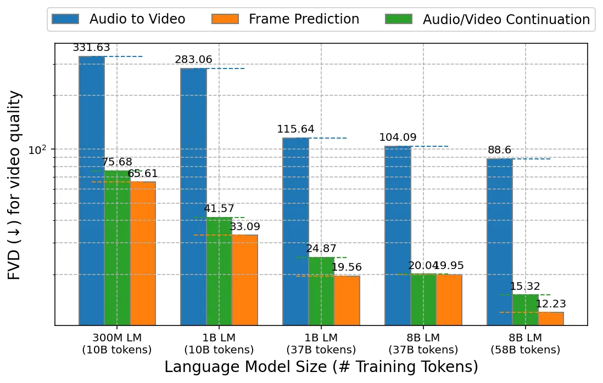

(a) Video generation quality in FVD ($`\downarrow`$).

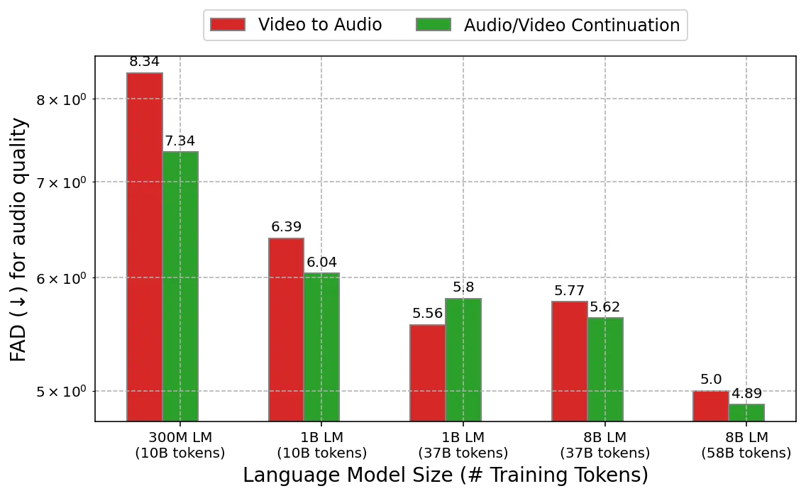

(b) Audio generation quality in FAD ($`\downarrow`$).

Figure 5: Effects of model and data scale on video and audio generation
quality. The performance, depicted on a log-log scale, improves
significantly when we scale up the model and training data. Language
models with 300 million, 1 billion, and 8 billion parameters are trained
on datasets comprising 10, 37, and 58 billion visual and audio tokens,
respectively.

#### A.2.1 Qualitative Comparison of 1B and 8B models

![[Uncaptioned
image]](arxiv-2312-14125--6245029b893f.figures/figure-25.webp)

![[Uncaptioned
image]](arxiv-2312-14125--6245029b893f.figures/figure-26.webp)

![[Uncaptioned
image]](arxiv-2312-14125--6245029b893f.figures/figure-27.webp)

![[Uncaptioned
image]](arxiv-2312-14125--6245029b893f.figures/figure-28.webp)

![[Uncaptioned
image]](arxiv-2312-14125--6245029b893f.figures/figure-29.webp)

![[Uncaptioned
image]](arxiv-2312-14125--6245029b893f.figures/figure-30.webp)

![[Uncaptioned
image]](arxiv-2312-14125--6245029b893f.figures/figure-31.webp)

![[Uncaptioned
image]](arxiv-2312-14125--6245029b893f.figures/figure-32.webp)

prompt: A portrait photo of a kangaroo wearing an orange hoodie and blue
sunglasses standing on the grass in front of the Sydney Opera House
holding a sign on the chest that says Welcome Friends!

![[Uncaptioned
image]](arxiv-2312-14125--6245029b893f.figures/figure-33.webp)

![[Uncaptioned
image]](arxiv-2312-14125--6245029b893f.figures/figure-34.webp)

![[Uncaptioned
image]](arxiv-2312-14125--6245029b893f.figures/figure-35.webp)

![[Uncaptioned
image]](arxiv-2312-14125--6245029b893f.figures/figure-36.webp)

![[Uncaptioned
image]](arxiv-2312-14125--6245029b893f.figures/figure-37.webp)

![[Uncaptioned
image]](arxiv-2312-14125--6245029b893f.figures/figure-38.webp)

![[Uncaptioned
image]](arxiv-2312-14125--6245029b893f.figures/figure-39.webp)

![[Uncaptioned
image]](arxiv-2312-14125--6245029b893f.figures/figure-40.webp)

prompt: A kangaroo holding a sign with the letter A on it

![[Uncaptioned
image]](arxiv-2312-14125--6245029b893f.figures/figure-41.webp)

![[Uncaptioned
image]](arxiv-2312-14125--6245029b893f.figures/figure-42.webp)

![[Uncaptioned
image]](arxiv-2312-14125--6245029b893f.figures/figure-43.webp)

![[Uncaptioned
image]](arxiv-2312-14125--6245029b893f.figures/figure-44.webp)

![[Uncaptioned
image]](arxiv-2312-14125--6245029b893f.figures/figure-45.webp)

![[Uncaptioned
image]](arxiv-2312-14125--6245029b893f.figures/figure-46.webp)

![[Uncaptioned
image]](arxiv-2312-14125--6245029b893f.figures/figure-47.webp)

![[Uncaptioned
image]](arxiv-2312-14125--6245029b893f.figures/figure-48.webp)

prompt: A photo of an astronaut riding a horse in the forest. There is a
river in front of them with water lilies

![[Uncaptioned
image]](arxiv-2312-14125--6245029b893f.figures/figure-49.webp)

![[Uncaptioned
image]](arxiv-2312-14125--6245029b893f.figures/figure-50.webp)

![[Uncaptioned
image]](arxiv-2312-14125--6245029b893f.figures/figure-51.webp)

![[Uncaptioned
image]](arxiv-2312-14125--6245029b893f.figures/figure-52.webp)

![[Uncaptioned
image]](arxiv-2312-14125--6245029b893f.figures/figure-53.webp)

![[Uncaptioned
image]](arxiv-2312-14125--6245029b893f.figures/figure-54.webp)

![[Uncaptioned
image]](arxiv-2312-14125--6245029b893f.figures/figure-55.webp)

![[Uncaptioned
image]](arxiv-2312-14125--6245029b893f.figures/figure-56.webp)

prompt: A zoomed out map of the United States made out of sushi. It is
on a table next to a glass of red wine. Pieces of sushi disappear one by
one

![[Uncaptioned
image]](arxiv-2312-14125--6245029b893f.figures/figure-57.webp)

![[Uncaptioned
image]](arxiv-2312-14125--6245029b893f.figures/figure-58.webp)

![[Uncaptioned
image]](arxiv-2312-14125--6245029b893f.figures/figure-59.webp)

![[Uncaptioned
image]](arxiv-2312-14125--6245029b893f.figures/figure-60.webp)

![[Uncaptioned
image]](arxiv-2312-14125--6245029b893f.figures/figure-61.webp)

![[Uncaptioned
image]](arxiv-2312-14125--6245029b893f.figures/figure-62.webp)

![[Uncaptioned
image]](arxiv-2312-14125--6245029b893f.figures/figure-63.webp)

![[Uncaptioned
image]](arxiv-2312-14125--6245029b893f.figures/figure-64.webp)

prompt: Rotating around a vase holding a dozen roses

Figure 5: A comparison of a 1B (left) and 8B (right) parameter models on
the same prompt and settings.

In Figure 5, we show outputs of 1B and 8B parameter models on the same
prompts. Four frames from the best video output of each model in a batch
of four text-to-video samples were selected to represent the model. In
the first row, the 1B model is unstable with large changes to the
subject over time and misses elements from the complex prompt. This
prompt was originally used for scaling comparisons in (Yu et al., 2022),
and compared to a dedicated image-only model, our model does not
preserve text as well given the training data used. In the second row,
we use a simpler text task and show that the 8B model can represent a
single letter clearly, but the 1B model still produces artifacts. In the
third row, we show that the 8B model learns spatial positioning such as
the river being in front of the astronaut and horse. In the fourth row,
we show that the 8B parameter model learned a stop motion style to have
items disappear “one by one” and can follow a complicated layout from a
long prompt. In contrast, the 1B model includes all of the nouns, but is
unstable over time and does not follow the layout indicated in the
prompt. In the bottom row, we show that the 8B model understands counts
of objects in that it displays a full bouquet (though 12 roses are not
explicitly in frame) and smooth consistent motion as opposed to the 5
roses and distorting objects produced by the 1B model. Overall, scaling
the model improved temporal consistency, prompt fidelity, and motion
dynamics while adding capabilities for limited text rendering, spatial
understanding, and counting.

### A.3 Additional Generated Examples

We include most generated videos in the supplementary materials for an
enhanced visualization of motion and visual quality, in addition to
Fig. 6 and Fig. 6.

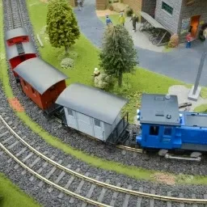

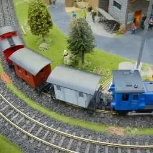

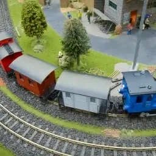

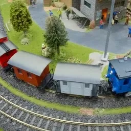

Original Video

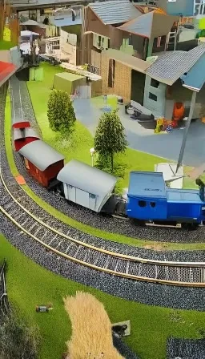

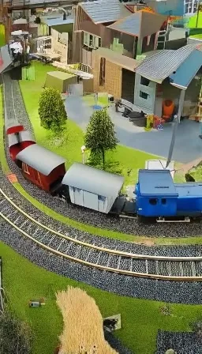

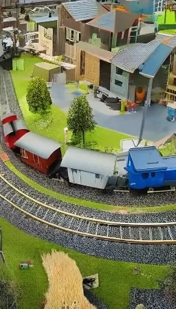

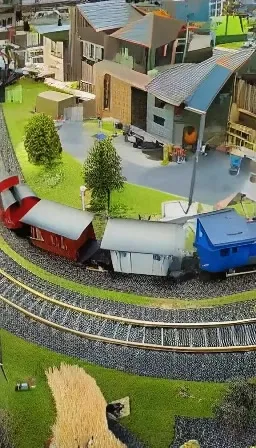

Outpainted Video

Stylized Video  
Prompt: A gingerbread and candy train on a track

Figure 6: Example of zero-shot video editing via task chaining
(outpainting and stylization) – the original video is first outpainted
and then stylized via a text prompt.

![[Uncaptioned
image]](arxiv-2312-14125--6245029b893f.figures/figure-77.webp)

![[Uncaptioned
image]](arxiv-2312-14125--6245029b893f.figures/figure-78.webp)

![[Uncaptioned
image]](arxiv-2312-14125--6245029b893f.figures/figure-79.webp)

![[Uncaptioned
image]](arxiv-2312-14125--6245029b893f.figures/figure-80.webp)

Camera Motion: Arc shot

![[Uncaptioned
image]](arxiv-2312-14125--6245029b893f.figures/figure-81.webp)

![[Uncaptioned
image]](arxiv-2312-14125--6245029b893f.figures/figure-82.webp)

![[Uncaptioned
image]](arxiv-2312-14125--6245029b893f.figures/figure-83.webp)

![[Uncaptioned
image]](arxiv-2312-14125--6245029b893f.figures/figure-84.webp)

Camera Motion: FPV drone shot

Figure 6: Examples of directed camera movement from the same initial
frame.

### A.4 Video Stylization

To perform video stylization, we follow an approach inspired by (Zhang
et al., 2023b; Chen et al., 2023b; Esser et al., 2023) to predict videos
from the combination of text, optical flow, and depth signals. On a
subset of steps, we also condition on the first video frame. As
described in (Esser et al., 2023), the text will generally define the
“content” or appearance of the output and the optical flow and depth
control the “structure.” In contrast to the diffusion-based approaches
that usually use external cross-attention networks (Zhang et al., 2023b)
or latent blending (Meng et al., 2021) for stylization, our approach is
more closely related to machine translation using large language models
in that we only need to provide the structure and text as a prefix to a
language model.

To perform the task, we estimate optical flow from RAFT (Sun et al., 2022) and produce monocular depth maps from MIDAS (Ranftl et al., 2020),
and then normalize and concatenate on the channel dimension. This
conveniently produces the same number of channels as the RGB ground
truth and so can be tokenized in the same fashion as RGB videos with the
MAGVIT-v2 tokenizer without retraining the tokenizer. The task of
stylization is to reconstruct the ground truth video from the given
optical flow, depth, and text information. During inference, we apply
optical flow and depth estimation on an input video but then vary the
text prompt to generate a new style, _e.g_. “cartoon”.

|                                               |         |
| --------------------------------------------- | ------- |
| Model                                         | CLIPSIM |
| Control-A-Video (Chen et al., 2023b)\[depth\] | 0.3246  |
| VideoPoet (Ours)                              | 0.3417  |

Table 3: Comparison on video stylization. VideoPoet outperforms
Control-A-Video by a large margin.

To evaluate stylization capabilities, we choose 20 videos from the
public DAVIS 2016²² 2 DAVIS license:
[https://creativecommons.org/licenses/by-nc/4.0/deed.en](https://creativecommons.org/licenses/by-nc/4.0/deed.en) (Perazzi
et al., 2016) dataset and provide 2 style prompts for each video. For
more details, please refer to Section A.5.7. Following (Esser et al.,
2023), we evaluated the CLIP-embedding consistency between each frame
and the text prompt to determine if the stylization results matches the
text. As shown in Table 3, VideoPoet outperforms Control-A-Video
conditioned on depth by a large margin. We also conduct human
evaluations as discussed above comparing with Control-A-Video (Chen
et al., 2023b). Human raters consistently prefer our text fidelity and
video quality as shown in Fig. 7.

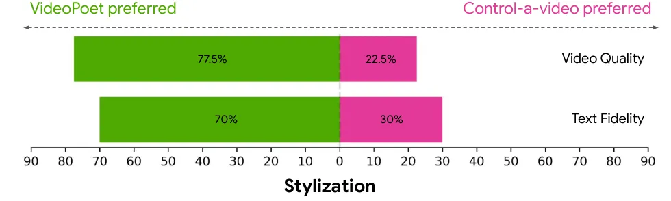

Figure 7: Human side-by-side evaluations comparing VideoPoet with the
video stylization model Control-a-video (Chen et al., 2023b). Raters
prefer VideoPoet on both text fidelity and video quality. Green and pink
bars represent the proportion of trials where VideoPoet was preferred
over an alternative, or preferred less than an alternative,
respectively.

### A.5 Additional Implementation and Evaluation Details

#### A.5.1 Additional Implementation Details

The unified vocabulary is constructed as follows: the initial 256 codes
are reserved for special tokens and task prompts. Table 4 lists some
examples of special tokens. Subsequently, the next 262,144 codes are
allocated for image and video tokenization. This is followed by 4,096
audio codes. We also include a small text vocabulary of English words.
Overall, this produces a total vocabulary size of approximately 300,000.

|               |                                      |
| ------------- | ------------------------------------ |
| Special Token | Usage                                |
| \<bos\>       | Beginning of sequence                |
| \<task\>      | Task to perform for this sequence    |
| \<bot_i\>     | Beginning of the text input.         |
| \<eot_i\>     | End of the text input.               |
| \<bov_i\>     | Beginning of the visual input.       |
| \<eov_i\>     | End of the video input.              |
| \<boa_i\>     | Beginning of the audio input.        |
| \<eoa_i\>     | End of the audio input.              |
| \<source\>    | The source of the video to generate. |
| \<res\>       | Output resolution for the video.     |
| \<bov_o\>     | Beginning of the video output.       |
| \<eov_o\>     | End of the video output.             |
| \<boa_o\>     | Beginning of the audio output.       |
| \<eoa_o\>     | End of the audio output.             |
| \<eos\>       | End of the entire sequence.          |

Table 4: List of representative special tokens used in training and
inference.

Since the first frame is tokenized separately, MAGVIT-v2 allows images
to be represented in the same vocabulary as video. In addition to being
more compact, images provide many learnable characteristics that are not
typically represented in videos, such as strong visual styles (_e.g_.,
art paintings), objects which are infrequently seen in video, rich
captions, and significantly more text-image paired training data. When
training on images, we resize the images to 128$`\times`$128 which are
then tokenized to a latent shape of $`(1,16,16)`$, or 256 tokens. We
scale the MAGVIT-v2 model’s size and train it on the datasets discussed
in Section 5.1. The training follows two steps: image training,
inflation (Yu et al., 2024) and video training. Due to images requiring
fewer tokens, we can include roughly 5$`\times`$ more images per batch
than videos, _i.e_. 256 image tokens vs. 1280 video tokens. We use up to
a maximum of 64 text tokens for all of our experiments. For the \<res\>
token, the resolution is only specified for $`128\times 224`$ output,
$`128\times 128`$ resolution is assumed otherwise.

The video-to-video tasks use the COMMIT encoding (Yu et al., 2023a) to
obtain the tokens for the tasks such as inpainting and outpainting. Text
is encoded as T5 XL embeddings (Raffel et al., 2020) and are inserted
into reserved sequence positions right after the \<bot_i\> token as
shown in Fig. 2.

#### A.5.2 Super-resolution implementation details

We use a 1B model for the first $`2\times`$ spatial super-resolution
stage and a 500M model for the second $`2\times`$ stage. The first
super-resolution stage models videos of $`17\times 448\times 256`$
pixels with a token sequence of shape $`(5,56,32)`$. The second stage
models videos of $`17\times 896\times 512`$ pixels with a token sequence
of shape $`(5,112,64)`$. The token sequences are obtained with the same
MAGVIT-v2 (Yu et al., 2024) tokenizer used for the base language model.
The custom super-resolution transformer has local self-attention windows
for _vertical_, _horizontal_ and _temporal_ layers of shape
$`(1,56,4),(1,8,32),(5,8,8)`$ in the first stage and
$`(1,112,2),(1,4,64),(5,8,8)`$ in the second stage, respectively
(Fig. 3). The cross-attention layers attend to local windows in the
low-resolution sequence isomorphic to self-attention windows but with
half the spatial size.

We train the super-resolution stages on a dataset of 64M high-quality
text-video pairs using the masked modeling objective of MAGVIT (Yu
et al., 2023a), with token factorization into $`k=2`$ groups (Yu et al.,
2024). During inference, we use the sampling algorithm of MAGVIT-v2 (Yu
et al., 2024) with 24 sampling steps for each stage and classifier-free
guidance scale (Ho & Salimans, 2022; Brooks et al., 2023) of $`4.0/8.0`$
for the text condition and $`1.0/2.0`$ for the low-resolution condition,
in the first/second stage.

#### A.5.3 Additional Evaluation details

We measure CLIP similarity scores (Wu et al., 2021) following an
implementation given by Villegas et al. (2022), measure FVD (Unterthiner
et al., 2018) following Yu et al. (2023a) on UCF101 dataset and
following Zhang et al. (2023a) on MSR-VTT, and measure Inception Score
(IS) (Saito et al., 2020). When the evaluation protocol is on 16 frames,
we discard the generated last frame to make a 16-frame video.

#### A.5.4 Additional Human Evaluation details

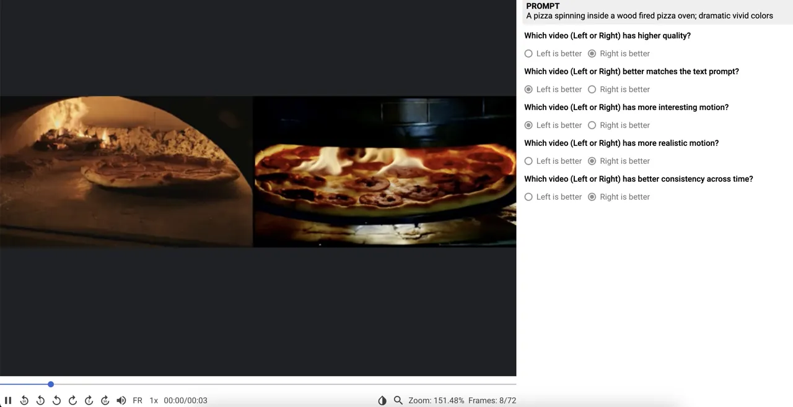

Figure 8: Example screenshot of the user interface for human
side-by-side comparisons.

Figure 8 shows an example screenshot of our side-by-side UI for
comparing models. We used a team of 7 human raters to complete all
ratings. To achieve best results, we call VideoPoet using the negative
prompt _“a still shot of an ugly cartoon, slideshow of an empty scene,
low resolution, distorted and disfigured”_ and rewrite the given prompt
by appending the string _highly detailed, cinematic, arc shot, high
contrast, soft lighting, 8k_.

#### A.5.5 Zero-shot Text-to-Video Evaluation Settings

We report the details of our zero-shot text-to-video settings here. We
note that some details are missing in previous papers and different
papers use different settings. Hence, we provide all the details and
hope this evaluation setting can serve as a standard text-to-video
generation benchmark. Our results are reported on the 8B model and we
adopt classifier-free guidance (Ho & Salimans, 2022).

All metrics are evaluated on generated videos containing 16 frames with
a resolution of 256 x 256. We first generate videos of 128 x 128
resolution and then resize to 256 x 256 via bicubic upsampling.

_Zero-shot MSR-VTT_. For CLIP score, we used all 59,794 captions from
the MSR-VTT test set. We use CLIP ViT-B/16 model following
Phenaki (Villegas et al., 2022). We note that some papers use other CLIP
models, _e.g_., VideoLDM (Blattmann et al., 2023b) uses ViT-B/32. Our
CLIP score evaluated on the ViT-B/32 backbone for MSR-VTT is 30.01. For
the FVD metric, to evaluate on a wide range of captions as well as to be
comparable with previous papers that evaluate on 2,048 videos, we
evaluate on the first 40,960 captions in the MSR-VTT test set. More
specifically, we report the FVD metrics on 2048 videos with 20 repeats.
The FVD real features are extracted from 2,048 videos sampled from the
MSR-VTT test set. We sample the central 16 frames of each real video,
without any temporal downsampling, _i.e_., we use the original fps in
the MSR-VTT dataset (30 fps as reported in Xu et al. (2016)). The FVD is
evaluated with an I3D model trained on Kinetics-400.

_Zero-shot UCF-101_. Following VDM (Ho et al., 2022b), we sample 10,000
videos from the UCF-101 test set and use their categories as the text
prompts to generate 10,000 videos. We use the class text prompts
provided in PYoCo (Ge et al., 2023) to represent the 101 categories. To
compute the FVD real features, we sample 10K videos from the training
set, following TGAN2 (Saito et al., 2020). We sample the central 16
frames for each real video , without any temporal downsampling, _i.e_.,
we use the original fps in the UCF-101 dataset (25 fps as reported in
(Soomro et al., 2012)). The FVD metric is evaluated with an I3D model
trained on Kinetics-400 and the IS metric is evaluated with a C3D model
trained on UCF-101.

#### A.5.6 Self-Supervised Tasks Evaluation Settings

Self-supervised learning tasks include frame prediction on K600 with 5
frames as condition, as well as inpainting and outpainting on SSv2.
FVD (Unterthiner et al., 2018) is used as the primary metric, calculated
with 16 frames at 128$`\times`$128 resolution. We follow MAGVIT (Yu
et al., 2023a) in evaluating these tasks against the respective real
distribution, using 50000$`\times`$4 samples for K600 and 50000 samples
for SSv2.

#### A.5.7 Stylization Evaluation on DAVIS

To evaluate the CLIP similarity score and human preference on video
stylization, we use the following set of videos and prompts. We select
20 videos from DAVIS 2016 (Perazzi et al., 2016), and for each video we
take 16 frames starting from the initial frame specified below and
evaluate stylization on the two text prompts specified below. To be
easily reproducible, we use a central square crop at the height of the
video and evaluate the output videos at 256x256 resolution. We use
CLIP-B/16 for the similarity score. Several prompts below are used in or
inspired by previous work (Esser et al., 2023; Chen et al., 2023b; Liew
et al., 2023).

|                |                |                                                                                                  |
| -------------- | -------------- | ------------------------------------------------------------------------------------------------ |
| video name     | starting frame | first text prompt                                                                                |
| elephant       | 10             | oil painting of an elephant walking away                                                         |
| elephant       | 10             | cartoon animation of an elephant walking through dirt surrounded by boulders                     |
| car-turn       | 40             | car on a snowcovered road in the countryside                                                     |
| car-turn       | 40             | 8-bit pixelated car driving down the road                                                        |
| dog-agility    | 0              | a dog in the style of a comic book                                                               |
| dog-agility    | 0              | a dog running through a field of poles in the style of cyberpunk                                 |
| bmx-bumps      | 10             | riding a bicycle on a rainbow track in space with stars and planets in the background            |
| bmx-bumps      | 10             | riding a bicycle on a dirt track in the style of a graphic novel                                 |
| train          | 0              | a gingerbread steam train made of candy                                                          |
| train          | 0              | a train in lava                                                                                  |
| bus            | 0              | a black and white drawing of a bus                                                               |
| bus            | 0              | a bus in cyberpunk style                                                                         |
| lucia          | 0              | an astronaut walking on mars                                                                     |
| lucia          | 0              | a claymation animation of a woman walking                                                        |
| tennis         | 15             | a robot throwing a laser ball                                                                    |
| tennis         | 15             | astronaut playing tennis on the surface of the moon                                              |
| bear           | 60             | a polar bear exploring on an iceberg                                                             |
| bear           | 60             | a space bear walking beneath the stars                                                           |
| flamingo       | 0              | 2D vector animation of a group of flamingos standing near some rocks and water                   |
| flamingo       | 0              | oil painting of pink flamingos wading                                                            |
| hike           | 0              | a green alien explorer hiking in the mountains                                                   |
| hike           | 0              | paper cut-out mountains with a paper cut-out hiker                                               |
| goat           | 59             | a tiger prowling along the ridge above a jungle                                                  |
| goat           | 59             | a dragon prowling over a crater on the moon                                                      |
| parkour        | 60             | a man jumping over rocks in a red sandstone canyon                                               |
| parkour        | 60             | a robot dodging through an obstacle course                                                       |
| cows           | 10             | a pig standing in the mud                                                                        |
| cows           | 10             | a robotic cow walking along a muddy road                                                         |
| camel          | 10             | a camel robot on a snowy day                                                                     |
| camel          | 10             | toy camel standing on dirt near a fence                                                          |
| blackswan      | 0              | a watercolor painting of a white swan                                                            |
| blackswan      | 0              | a crochet black swan swims in a pond with rocks and vegetation                                   |
| dog            | 20             | a cat walking                                                                                    |
| dog            | 20             | a dalmatian dog walking                                                                          |
| kite-surf      | 10             | a sand surfer kicking up sand in the desert                                                      |
| kite-surf      | 10             | kite surfer in the ocean at sunset                                                               |
| libby          | 0              | chinese ink painting of a dog running                                                            |
| libby          | 0              | 3D animation of a small dog running through grass                                                |
| horsejump-high | 0              | a cartoon of a magical flying horse jumping over an obstacle                                     |
| horsejump-high | 0              | person rides on a horse while jumping over an obstacle with an aurora borealis in the background |

Table 5: DAVIS stylization evaluation settings.
