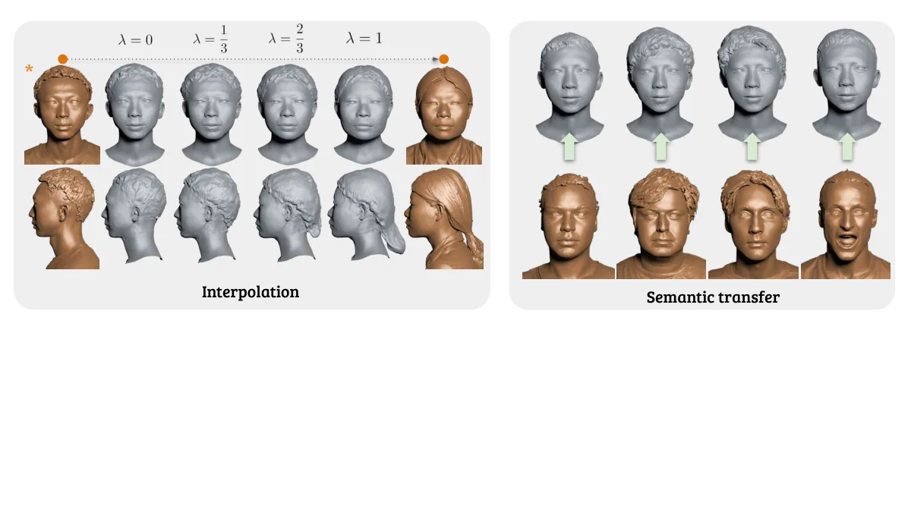

# HeadCraft: Modeling High-Detail Shape Variations for Animated 3DMMs

Artem Sevastopolsky Affiliation:  Technical University of Munich (TUM),
Germany    Philip-William Grassal Affiliation:  Copresence AG, Germany
   Simon Giebenhain Affiliation:  Technical University of Munich (TUM),
Germany    ShahRukh Athar Affiliation:  Stony Brook University, US   
Luisa Verdoliva Affiliation:  Technical University of Munich (TUM),
Germany Affiliation:  University of Naples Federico II, Italy   
Matthias Nießner Affiliation:  Technical University of Munich (TUM),
Germany

###### Abstract

Current advances in human head modeling allow to generate
plausible-looking 3D head models via neural representations, such as
NeRFs and SDFs. Nevertheless, constructing complete high-fidelity head
models with explicitly controlled animation remains an issue.
Furthermore, completing the head geometry based on a partial
observation, e.g. coming from a depth sensor, while preserving a high
level of detail is often problematic for the existing methods. We
introduce a generative model for detailed 3D head meshes on top of an
articulated 3DMM which allows explicit animation and high-detail
preservation at the same time. Our method is trained in two stages.
First, we register a parametric head model with vertex displacements to
each mesh of the recently introduced NPHM dataset of accurate 3D head
scans. The estimated displacements are baked into a hand-crafted UV
layout. Second, we train a StyleGAN model in order to generalize over
the UV maps of displacements, which we later refer to HeadCraft. The
decomposition of the parametric model and high-quality vertex
displacements allows us to animate the model and modify the regions
semantically. We demonstrate the results of unconditional sampling,
fitting to a scan and editing. The code and data are available at
[https://seva100.github.io/headcraft](https://seva100.github.io/headcraft).

![[Uncaptioned
image]](arxiv-2312-14140--c373495fadf7.figures/figure-1.webp)

Figure 1: We present HeadCraft, a generative model for highly-detailed
human heads, ready for animation. Our method is trained on 2D
displacement maps collected by registering a parametric template head
with free surface displacements to a large set of 3D head scans. The
resulting model is highly versatile and its latent code can be fit to an
arbitrary depth observation.

## 1 Introduction

The ability to create lifelike 3D head models is crucial for many
applications, ranging from video game character design to virtual try-on
experiences and medical simulations. 3D Morphable Models (3DMMs) \[6\]
constitute an essential and robust tool for basic 3D head geometry
estimation and tracking that enables its further reconstruction and
animation. Furthermore, 3DMMs, along with their consistent UV
parameterization of the surface, are commonly used in constructing
virtual avatars as an approach for approximate surface representation or
regularization  \[37, 26, 4, 66\].

Constructing (neural) 3DMMs capable of representing the diverse
distribution over human heads while disentangling identity and
expressions and capturing a high degree of detail is challenging. At the
same time, such neural representation would ideally be compatible with
well-established methods for animation and tracking, which are usually
mesh-based and are required to fulfill certain real-time constraints.

Despite the recent progress of implicit representations, such as neural
radiance fields (NeRFs) \[40\] and signed distance functions
(SDFs) \[42\], the most prominent 3DMMs \[6, 36, 44\] are based on a
template mesh (i.e. feature explicit geometry), and principal component
analysis (PCA), to represent identity and expression variations.
Mesh-based 3DMMs can usually be robustly fitted to videos, easily
animated and integrate well with established graphics pipelines.
However, these approaches are fundamentally limited by both the mesh
resolution and representational capacity of its underlying
(multi-)linear statistical model. In our work, we improve on both of
these aspects and leverage recent advances in generative image modeling
by using StyleGAN2 \[31\] to predict highly detailed geometry in the UV
space, which is independent of the mesh resolution.

A different line of work attempts to build 3DMMs based on neural SDFs
instead of meshes (e.g.  \[61, 24\]), thereby enabling reconstruction at
arbitrary resolutions. However, the incorporation of such implicit
representations is limited due to a lack of compatibility with standard
graphics systems and animation tools. Furthermore, SDF-based approaches
often require costly evaluations, e.g. via marching cubes \[39\], to
extract an implicit surface, which can hinder the real-time application
of these methods.

Inspired by the combination of these ideas, in this research, we
introduce a generative model that allows for animation and tracking and
preserves a high level of detail. At the heart of our approach lies the
idea of combining an explicit parametric head model (FLAME \[36\]) with
surface displacements complementing the low geometry detail of the head
model. FLAME is an example of a 3D Morphable Model \[6, 19\] with a
fixed set of vertices and fixed topology, constructed as a linear
statistical model over the heads with point-to-point correspondence and
further controlled by shape and expression latent codes. We register a
highly subdivided FLAME mesh template with free vertex displacements to
all 3D head scans in the NPHM \[24\] dataset to obtain the necessary
training data. To facilitate as high level of detail in the
displacements as possible, they are fitted in two steps. First, the
optimization problem is solved for vector displacements with strong
regularization that penalizes very hard for self-intersections of the
deformed mesh regions. Afterwards, a separate optimization step refines
the displacements only along the normals of the deformed vertices while
keeping the regularization weight low. These displacements are baked
into a predefined UV layout. Finally, we train a StyleGAN2 \[31\] model
to generalize over this set of baked 2D displacement maps. This novel
architecture allows us to operate at a resolution higher than the
conventional FLAME template, enabling the generation of highly detailed
and animatable 3D head models.

To validate the efficacy and practical utility of our approach, we
evaluate it in several settings. The diversity and fidelity of the
generated 3D head meshes are quantitatively and visually compared to
other methods w.r.t. the real head scans from the FaceVerse dataset
\[56\], both in UV space and rendered image space. We also explore the
applicability of our approach in fitting the latent representation of
the generative model to complete or incomplete point cloud data and
demonstrate its animation and manipulation capabilities.

Figure 2: An overview of the method. In the registration stage, we (a)
fit the FLAME template by the face landmarks to the scan from the NPHM
dataset and highly subdivide it, (b) optimize for the vertex
displacements in $`\mathbb{R}^{3}`$ to fit the rough geometry with
strong regularizations, (c) optimize for the scalar refinements of the
displacements along the normal directions, and (d) bake the
displacements into a UV offset map. To generalize over the UV offset
maps, we train a StyleGAN2 \[31\] model. After training, the offsets can
be applied to an arbitrary FLAME template by subdividing it and (e)
querying the generated UV offset map with the (u, v) locations of the
FLAME vertices.

To summarize, our contributions are as follows:

- •
  We introduce a two-stage registration procedure to craft high-detail
  displacement maps on top of 3DMMs from 3D scanning data. This enables
  the application of 2D generative models to tackle the 3D generative
  task.
- •
  We propose a generative model operating in the displacement maps
  domain to enhance the low-frequency geometry of FLAME with details and
  extend its shape space to a range of variations.
- •
  We demonstrate the versatility of our method through unconditional
  sampling, interpolation, semantic geometry transfer, and 3D completion
  based on partial depth observations.

## 2 Related Work

Many recent solutions to computer vision problems involving human bodies
and heads are built on statistical body models, forming the foundation
for building personalized avatars \[26, 66, 1, 23, 2\], motion tracking
\[52, 21\], scan registration \[24\], controlling image synthesis
\[51\], and more. Their line of research is divided into two major
branches.

Mesh-based Models. Pioneering work in the field \[6\] proposed 3D
morphable models (3DMMs) for the human faces’ identity, expression, and
appearance representation. Their model is built around a 3D template
mesh and linear parametric blendshapes derived from PCAs over 3D scan
data. With new datasets and registration procedures, their work has been
extended from faces to heads \[36, 35, 46\], hands \[50\], full bodies
\[38\], or combinations of these \[43, 58\]. The template mesh has a
fixed topology which provides consistent UV unwrapping and enables
fitting to know surface correspondences, e.g. semantic regions and
landmarks. Yet, it limits the representative power w.r.t. the overall
shape and level of detail beyond what the template provides. Downstream
approaches compensate this by optimizing displacements \[32, 26, 1, 9,
2, 60, 35\] or additional implicit geometry \[22, 10\] on top of the
mesh. Displacements are applied either per-vertex individually \[32, 26,
1, 2\] or as a displacement map over the whole surface using the
consistent UV unwrapping of the template \[60, 35, 21\]. Some approaches
infer the displacement maps from images or texture reprojections for
specific individuals \[60, 21\]. By making use of high-quality scans,
the authors of \[35\] demonstrate that GANs \[25, 29, 31\] for image
generation can be leveraged to learn a generative model over
displacement maps in the face region. Our method takes this idea further
by learning a generative model for displacements over the whole head. It
showcases that even the surface geometry of large and complicated
hairstyles can be represented with high fidelity. The resulting outputs
of our full-head generative model provide quality approaching the scan
level while exploiting the UV surface correspondences of the underlying
3DMM and enabling further animation through the rigging of the template.

Implicit Models. The recent success of implicit SDFs \[42\] and neural
radiance fields \[40\] in 3D modeling has also motivated applying them
for statistical body models. Most implicit models learn shape and
appearance in a canonical reference space \[24, 61, 3, 28, 47\] or as
displacements on top of an existing model \[62\]. For better
generalization and detail preservation, some approaches use a
composition of implicit SDFs to model the canonical space \[3, 24\].
Articulation and animation are modeled either directly in canonical
coordinates \[28, 62\], through implicit deformation fields \[24, 61\],
explicit joints \[3\] or blendshape deformations borrowed from explicit
3DMMs \[65, 57\]. While the aforementioned methods rely on multi-view
data and aligned 3D scans, a separate line of research demonstrates that
statistical shape and appearance priors can also be learned from
unstructured image collections \[11, 12, 49, 41, 17\].

Implicit approaches do not rely on topology and shape templates. This
allows them to fit more detail and complex shapes such as hair \[24, 62,
61\] and even glasses \[12, 41\]. Yet, it prevents consistent surface
correspondences between different samples, which need to be explicitly
learned \[62, 3\]. As our approach uses a mesh-based template, it does
not suffer from these limitations and has an explicit model for
animation. Still, we are able to show that we can provide a comparable
level of detail as implicit methods and also model hair surface geometry
which has not been achieved with a generative, explicit shape model
before.

|                                                                 |                                                                               |                                                                               |                                                                               |                                                                               |                                                                               |                                                                               |                                                                               |
| --------------------------------------------------------------- | ----------------------------------------------------------------------------- | ----------------------------------------------------------------------------- | ----------------------------------------------------------------------------- | ----------------------------------------------------------------------------- | ----------------------------------------------------------------------------- | ----------------------------------------------------------------------------- | ----------------------------------------------------------------------------- |
| Ours                                                            | ![[Uncaptioned image]](arxiv-2312-14140--c373495fadf7.figures/figure-2.webp)  | ![[Uncaptioned image]](arxiv-2312-14140--c373495fadf7.figures/figure-3.webp)  | ![[Uncaptioned image]](arxiv-2312-14140--c373495fadf7.figures/figure-4.webp)  | ![[Uncaptioned image]](arxiv-2312-14140--c373495fadf7.figures/figure-5.webp)  | ![[Uncaptioned image]](arxiv-2312-14140--c373495fadf7.figures/figure-6.webp)  | ![[Uncaptioned image]](arxiv-2312-14140--c373495fadf7.figures/figure-7.webp)  | ![[Uncaptioned image]](arxiv-2312-14140--c373495fadf7.figures/figure-8.webp)  |
| NPHM \[24\]                                                     | ![[Uncaptioned image]](arxiv-2312-14140--c373495fadf7.figures/figure-9.webp)  | ![[Uncaptioned image]](arxiv-2312-14140--c373495fadf7.figures/figure-10.webp) | ![[Uncaptioned image]](arxiv-2312-14140--c373495fadf7.figures/figure-11.webp) | ![[Uncaptioned image]](arxiv-2312-14140--c373495fadf7.figures/figure-12.webp) | ![[Uncaptioned image]](arxiv-2312-14140--c373495fadf7.figures/figure-13.webp) | ![[Uncaptioned image]](arxiv-2312-14140--c373495fadf7.figures/figure-14.webp) | ![[Uncaptioned image]](arxiv-2312-14140--c373495fadf7.figures/figure-15.webp) |
| ROME$`{}_{\;\text{{\color[rgb]{0.5,0.5,0.5}(linear)}}}`$ \[32\] | ![[Uncaptioned image]](arxiv-2312-14140--c373495fadf7.figures/figure-16.webp) | ![[Uncaptioned image]](arxiv-2312-14140--c373495fadf7.figures/figure-17.webp) | ![[Uncaptioned image]](arxiv-2312-14140--c373495fadf7.figures/figure-18.webp) | ![[Uncaptioned image]](arxiv-2312-14140--c373495fadf7.figures/figure-19.webp) | ![[Uncaptioned image]](arxiv-2312-14140--c373495fadf7.figures/figure-20.webp) | ![[Uncaptioned image]](arxiv-2312-14140--c373495fadf7.figures/figure-21.webp) | ![[Uncaptioned image]](arxiv-2312-14140--c373495fadf7.figures/figure-22.webp) |
| PCA baseline                                                    | ![[Uncaptioned image]](arxiv-2312-14140--c373495fadf7.figures/figure-23.webp) | ![[Uncaptioned image]](arxiv-2312-14140--c373495fadf7.figures/figure-24.webp) | ![[Uncaptioned image]](arxiv-2312-14140--c373495fadf7.figures/figure-25.webp) | ![[Uncaptioned image]](arxiv-2312-14140--c373495fadf7.figures/figure-26.webp) | ![[Uncaptioned image]](arxiv-2312-14140--c373495fadf7.figures/figure-27.webp) | ![[Uncaptioned image]](arxiv-2312-14140--c373495fadf7.figures/figure-28.webp) | ![[Uncaptioned image]](arxiv-2312-14140--c373495fadf7.figures/figure-29.webp) |

Figure 3: Visual comparison of fidelity and diversity of the meshes
generated by various methods. For Ours, random FLAMEs are sampled from
Gaussian distribution with statistics calculated over the NPHM dataset;
same for the PCA baseline pre-fitted to our UV registrations. Meshes
from NPHM are obtained by sampling the latent codes and running marching
cubes over the generated SDF representations. We demonstrate higher
variability of produced head geometry and better details than the other
methods.

## 3 HeadCraft

We cast the task of learning high-fidelity distribution over 3D heads as
a 2D generative problem by leveraging the UV-space of an existing
3DMM \[36\]. This allows us to rely on the well-explored body of
research on CNN-based 2D generative models \[31, 30\].

To this end, we register a dataset of high-end 3D head scans \[24\] in
the FLAME head model \[36\] topology and bake the details into a
displacement map in UV space, as explained further in Sec. 3.1.
Subsequently, in Sec. 3.2, we train a 2D generative model to learn the
distribution over the displacement maps, which can be converted into
detailed 3D displacements compatible with the underlying FLAME model. An
overview of HeadCraft is presented in Fig. 2.

### 3.1 Displacements registration procedure

The purpose of this step is to create a dataset of 2D displacement maps
representing the geometric information beyond the representational
capacity of classical 3DMMs. To this end, we compute displacements from
a FLAME \[36\] mesh to the high quality 3D head scans from the NPHM
dataset \[24\]. Let us consider a scanned mesh
$`\mathcal{P}=(V^{\textrm{gt}},\mathcal{F}^{\textrm{gt}})`$ with
vertices $`V^{\textrm{gt}}\in\mathbb{R}^{|V^{\textrm{gt}}|\times 3},`$
and faces
$`\mathcal{F^{\textrm{gt}}}\in\{1,\dots,|V^{\textrm{gt}}|\}^{|\mathcal{F}^{\textrm{gt}}|\times 3}`$.

In order to find the appropriate FLAME parameters for the scan, we
follow the rigid alignment optimization procedure outlined in the NPHM
work \[24\]. This procedure requires face landmarks to be known, which
can be annotated manually or, as provided with the dataset in our case,
calculated via 2D face landmark detectors on the projections of the
colored scans and lifted to 3D. This way, we obtain a FLAME template,
corresponding to the given scan, and subdivide it via Butterfly
algorithm \[18\]. We will refer to the template after subdivision as to
$`F=(V,\mathcal{F},\mathcal{U}_{\mathcal{F}})`$, where
$`V\in\mathrm{R}^{|V|\times 3}`$ are the vertices coordinates,
$`\mathcal{F}\in\mathrm{R}^{|\mathcal{F}|\times 3}`$ are the
corresponding faces, and
$`\mathcal{U}_{\mathcal{F}}\in\mathrm{R}^{|\mathcal{F}|\times 3\times 2}`$
are the texture coordinates of each vertex in a triangle. Note that
using triangle coordinates instead of vertex coordinates is important
due to the presence of a seam in the FLAME model, thus making UVs for
the seam vertices ambiguous.

As FLAME basis does not represent hair or face details, we define these
in a form of vertex displacements and learn them in two stages. During
the first stage, we optimize the loss function
$`\mathcal{L}_{\textrm{Stage 1}}(D)`$ for additive vector displacements
$`D_{\textrm{Stage 1}}\in\mathbb{R}^{|V|\times 3}`$ of the vertices:

```math
\displaystyle\mathcal{L}(D,V,\mathcal{F},V^{\textrm{gt}}|\boldsymbol{\lambda}) \displaystyle=\lambda^{\textrm{Chamfer}}\,\mathcal{L}_{\textrm{Chamfer}}(V+D,V^{\textrm{gt}}) \tag{1}
```

```math
\displaystyle+\lambda^{\textrm{edge}}\,\mathcal{L}_{\textrm{edge}}(V+D,\mathcal{F})
```

```math
\displaystyle+\lambda^{\textrm{lapl}}\,\mathcal{L}_{\textrm{lapl}}(V+D,\mathcal{F})
```

```math
\mathcal{L}_{\textrm{Stage 1}}(D)=\mathcal{L}(D,V,\mathcal{F},V^{\textrm{gt}}\,|\,\boldsymbol{\lambda}_{\textrm{Stage 1}}) \tag{2}
```

Hyperparameters
$`\boldsymbol{\lambda}_{\textrm{Stage 1}}=(\lambda_{\textrm{Stage 1}}^{\textrm{Chamfer}},\lambda_{\textrm{Stage 1}}^{\textrm{edge}},\lambda_{\textrm{Stage 1}}^{\textrm{lapl}})`$
define the Chamfer matching term weight, the weight of edge length
regularization and standard Laplacian regularization. In this stage, the
weight of regularizations is high in order to prevent self-intersections
that can occur when regressing vector displacements. Also, we only
optimize the vector displacements for the hair region.

In the second stage, we optimize the loss function
$`\mathcal{L}_{\textrm{Stage 2}}(\boldsymbol{\alpha})`$ for
displacements $`D_{\textrm{Stage 2}}\in\mathbb{R}^{|V|\times 3}`$ that
are only allowed to move over the normals of the previously displaced
vertices:

```math
D_{\textrm{Stage 2}}=D_{\textrm{Stage 1}}+N\astrosun\,\boldsymbol{\alpha}, \tag{3}
```

where $`N\in\mathbb{R}^{|V|\times 3}`$ corresponds to the normals,
calculated by numerical difference for vertices deformed after the Stage
1, and $`\astrosun`$ defines the element-wise product of rows of $`N`$
and elements of $`\alpha`$ (each normal $`\boldsymbol{n}_{i}`$ is
multiplied by the respective amplitude $`\alpha_{i}`$).
$`\mathcal{L}_{\textrm{Stage 2}}(\boldsymbol{\alpha})`$ is expressed
through the same basic loss expression:

```math
\mathcal{L}_{\textrm{Stage 2}}(\boldsymbol{\alpha})=\mathcal{L}(D_{\textrm{Stage 1}}+N\astrosun\,\boldsymbol{\alpha},V,\mathcal{F},V^{\textrm{gt}}\,|\,\boldsymbol{\lambda}_{\textrm{Stage 2}}), \tag{4}
```

while hyperparameters $`\boldsymbol{\lambda}_{\textrm{Stage 2}}`$ are
selected with relatively lower regularization weights. This allows for
fitting high-frequency details while maintaining the same rough shape of
the regressed shape. At this stage, we allow both hair and face regions
to deform, while subtle parts such as ears and eyeballs are fixed from
moving.

Finally, we bake the displacements $`D_{\textrm{Stage 2}}`$ into a UV
map $`U\in\mathbb{R}^{\textrm{H}\times\textrm{W}\times 3}`$ by rendering
it onto the UV space with known texture coordinates
$`\,\mathcal{U}_{\mathcal{F}}`$ and triangles $`\mathcal{F}`$.

The registration procedure is repeated for the dataset consisting of
multiple 3D scans, resulting in a set of UV displacement maps
$`(U_{1},\dots,U_{S})`$.

### 3.2 Generative model

The described registration procedure allows us to relax the problem of
3D head geometry generation into a problem of generation of 2D UV
displacement maps, which allows us to apply a 2D generative model. We
have selected StyleGAN2 for that purpose due to its capability of
generalizing over relatively small datasets of images \[30, 64, 45\]
while maintaining close-to-SoTA image generation capabilities \[31\].
The model consists of a mapping network and a generator network, which
we will refer to as $`f(z)`$ together, where
$`z\in\mathcal{Z}\subset\mathbb{R}^{\textrm{D}}`$ is a latent code
sampled from a standard normal distribution during training (with
truncation trick \[7\] at the inference time). The generator produces a
UV displacement map $`U=f(z)`$, which we can apply to an arbitrary
(anyhow densely subdivided) FLAME template
$`F=(V,\mathcal{F},\mathcal{U}_{\mathcal{F}})`$ by querying the map
$`U`$ with its texture coordinates $`\mathcal{U}_{\mathcal{F}}`$ to
obtain the respective vertex displacements. The final mesh
$`M=(V+D(U),\mathcal{F},\mathcal{U}_{\mathcal{F}})`$ is different from
the subdivided FLAME only in terms of the vertex locations. We later
demonstrate visually that the generated displacements could be applied
to an arbitrary template.

UV layout. Importantly, we modify the UV embedding of the FLAME template
mesh into a 2D plane (see the Supplementary for the illustration). Doing
so results in a more favorable layout for the 2D generative model with a
limited receptive field. As we demonstrate further, the large distance
in the UV space of the head’s back left and right parts leads to
inconsistent generations. The new layout allows us to stack the left-
and right-hand sides into a single-channel displacement map with better
seam alignment.

Post-processing. Since the UV map $`U`$ is generated in the UV layout
that contains a seam, we expect StyleGAN to resolve it in general, i.e.
produce similar displacements in the face and scalp region near the same
seam vertex. Still, there is no dedicated supervision during StyleGAN
training that ensures that it always happens and that the border is
preserved pixel-perfect. Because of that, we apply Laplacian
smoothing \[55\] to the mesh $`M`$ in the $`K`$-vertex vicinity of the
seam. Additional smoothness of the face region is achieved by applying
Laplacian smoothing to the facial skin, neck, scalp, eyeballs, and inner
mouth region with different strength to the subdivided FLAME template in
advance, before adding the displacements. Technical details are provided
in the Supplementary Material.

|       | FID ↓  | KID ↓ | MMD ↓ | JSD ↓ | COV ↑  |
| ----- | ------ | ----- | ----- | ----- | ------ |
| Ours  | 68.00  | 0.065 | 6.51  | 21.33 | 53.85% |
| PCA   | 126.31 | 0.165 | 10.47 | 20.16 | 23.08% |
| NPHM  | 139.82 | 0.170 | 7.80  | 19.06 | 46.15% |
| ROME  | 169.65 | 0.204 | 10.02 | 23.19 | 32.69% |
| FLAME | 198.85 | 0.262 | 12.95 | 23.89 | 5.77%  |

Table 1: The comparison of quality and diversity of random samples
generated by each of the methods. FID and KID measure the similarity of
the generated mesh renderings vs. the renderings of the ground truth
meshes in FaceVerse dataset, while 3D metrics MMD, JSD, COV assess the
similarity of generated and real point clouds distributions. MMD is
multiplied by $`10^{3}`$ and JSD by $`10^{2}`$.

## 4 Experiments

We evaluate HeadCraft’s generative capabilities by examining its
unconditional generation performance in Sec. 4.4 and ablate over several
important aspects. Additionally, in Sec. 4.5, we demonstrate the way
HeadCraft can be beneficial in several important downstream
applications, such as 3D head completion from a partial point cloud, its
seamless integration with the FLAME expression space, and semantic
geometry transfer. Before presenting these results, we describe
implementation details, as well as our chosen metrics and baselines in
Sec. 4.1, 4.2, and 4.3, respectively.

### 4.1 Implementation details

Datasets. Our method is trained on the 3D real scans of human heads from
NPHM \[24\] dataset, namely, 6975 high-resolution scans of 327 diverse
identities captured by two 3D scanners each. To quantitatively evaluate
the generative performance of all compared methods, we use
FaceVerse \[56\] dataset as a source of the ground truth scans not
intersecting with our training data by identities.

Registration procedure. We use Adam optimizer with learning rate of
$`3\cdot 10^{-2}`$ for the first stage and $`3\cdot 10^{-4}`$ for the
second stage. The hyperparameters
$`\boldsymbol{\lambda}_{\textrm{Stage 1}}=(\lambda_{\textrm{Stage 1}}^{\textrm{Chamfer}},\,`$
$`\lambda_{\textrm{Stage 1}}^{\textrm{edge}},\,\lambda_{\textrm{Stage 1}}^{\textrm{lapl}})`$
equal to $`(2\cdot 10^{3},2\cdot 10^{5},10^{4})`$. For the second stage,
$`\boldsymbol{\lambda}_{\textrm{Stage 2}}=(2\cdot 10^{4},2\cdot 10^{4},10^{4})`$.
In the Chamfer loss, we additionally apply correspondences pruning by
distance of 1.0, which defines that all the correspondences between
source and target with the distance more than 1.0 in the NPHM coordinate
system are automatically discarded. This has been introduced for more
consistent gradual learning of displacements, such that at each
optimization step, only the nearest points affect the deformation
learning.

Generative modeling. As the 2D generative model, we choose
StyleGAN2-ADA \[30\] with all augmentations turned off (since they
wouldn’t yield valid UV maps in our case) and 8 mapping network layers.
To stablize the GAN training, we utilize a high gradient penalty of 4.0
for the discriminator. The learning rates are $`2\cdot 10^{-3}`$ for the
generator and $`1\cdot 10^{-3}`$ for the discriminator. We train it for
95K steps with the batch size of 8 and $`256\times 256`$ image
resolution.

### 4.2 Metrics

To evaluate the quality of the generated samples in section 4.4, we rely
on both 2D metrics computed on renderings, as well as, on metrics
directly compute in 3D. In the following we describe all employed
metrics in details.

Firstly, to evaluate the visual plausibility of the generated geometry,
we render 2195 ground truth meshes from FaceVerse and the same number of
meshes generated by each method with highly metallic material from eight
distinct viewpoints, uniformly sampled along the circular trajectory in
the horizontal plane. The FID \[27\] and KID \[5\] perceptual metrics
are calculated for all generated and ground truth renderings from a
given viewpoint and then macro-averaged over eight viewpoints.

Secondly, we compare the distributions of point clouds sampled from the
generated and ground truth meshes. To do that, we sample 10K points from
each of the 2195 generated and the same number of ground truth meshes
and calculate several 3D similarity metrics. Jensen-Shannon Divergence
(JSD) is evaluated by comparing the distributions of generated and
ground truth points, splat into a voxel grid (in our case, of
$`512^{3}`$ voxels). Minimum Matching Distance (MMD) is a measure of 3D
object realism that, for each ground truth sample, involves evaluating
the distance to the most similar sample in the generated set. Similarly,
Coverage (COV) indicates the percentage of the ground truth samples, for
which the nearest neighbor among all ground truth and generated samples
falls into the generated set. More detailed description of the 3D
metrics can be found in \[59, 20\].

### 4.3 Baselines

We compare against the recent state-of-the-art head modelNPHM \[24\],
which uses neural SDFs to represent the head geometry. We additionally
compare againstROME \[32\], an alternative approach that models complete
head geometry including hair using a FLAME template mesh. ROME is
trained in an unsupervised fashion on the large-scale video dataset
VoxCeleb2 \[13\].

Furthermore, we compare against a PCA-based baseline, whereas a linear
PCA basis is fitted to our UV displacement maps, and provide the numbers
for random FLAME samples without added displacements as a reference.

While NPHM, PCA baseline, and Ours have been fitted to exactly the same
training dataset, for ROME, the checkpoint from the public repository
has been used.

### 4.4 Results

Unconditional sampling. In Fig. 3, we compare the difference in details
and diversity of the unconditional samples produced by our method to the
ones produced by NPHM \[24\] and ROME \[32\] methods. For Ours, PCA
baseline and ROME, a FLAME with random shape, expression and jaw
parameters are sampled from normal distribution for every head mesh, in
accordance with the statistics precalculated over the NeRSemble
dataset \[34\]. For ROME, we sample the FLAME displacements from a
linear model provided by the authors of ROME as the sampling strategy
proposed by the ROME authors. Visually, we observe both higher diversity
and better representation of details than for all baselines. The details
of the facial region are generally the sharpest for ROME, PCA baseline,
and Ours, due to the use of the FLAME template.

In Table 1, we also quantify the level of detail and variety of the
generated meshes w.r.t. the full head scans from the FaceVerse
dataset \[56\] that has not been used for training. In addition, we
demonstrate how much the generated samples deviate from the NPHM
training set in Fig. 4. Nearest is found by comparing the generated
displacement map to the maps of registered ground truth displacements
for all training scans by L2 distance over the scalp.

The results in Table 1 indicate that the renderings from our method
appear more realistic than of the other methods, with either PCA
baseline or NPHM performing similar according to different subsets of
the metrics. Close promixity to NPHM by MMD, COV, JSD could be explained
by training on exactly the same dataset.

| Generated                                                                     | Nearest                                                                       | Generated                                                                     | Nearest                                                                       | Generated                                                                     | Nearest                                                                       |
| ----------------------------------------------------------------------------- | ----------------------------------------------------------------------------- | ----------------------------------------------------------------------------- | ----------------------------------------------------------------------------- | ----------------------------------------------------------------------------- | ----------------------------------------------------------------------------- |
| ![[Uncaptioned image]](arxiv-2312-14140--c373495fadf7.figures/figure-30.webp) | ![[Uncaptioned image]](arxiv-2312-14140--c373495fadf7.figures/figure-31.webp) | ![[Uncaptioned image]](arxiv-2312-14140--c373495fadf7.figures/figure-32.webp) | ![[Uncaptioned image]](arxiv-2312-14140--c373495fadf7.figures/figure-33.webp) | ![[Uncaptioned image]](arxiv-2312-14140--c373495fadf7.figures/figure-34.webp) | ![[Uncaptioned image]](arxiv-2312-14140--c373495fadf7.figures/figure-35.webp) |

Figure 4: Randomly generated samples from HeadCraft and the
corresponding nearest neighbors in the NPHM dataset among the scans used
for training. $`L_{2}`$ distance over the scalp part of the displacement
maps was used. Displacements were added to a random FLAME template for
all samples.

Ablating over the choice of the generative model architecture. We
compare StyleGAN to other state-of-the-art generative model
architectures, namely of VAE \[33\] and VQ-VAE \[54\] family, with
ResNet-18 encoder and decoder. For VQ-VAE, the sampling from the latent
space is implemented via training PixelCNN autoregressive model \[53\].
The results are presented in Table 2 and can be visually assessed in the
Supplementary.

|                           | FID ↓  | KID ↓ | MMD ↓ | JSD ↓ | COV ↑  |
| ------------------------- | ------ | ----- | ----- | ----- | ------ |
| Ours                      | 68.00  | 0.065 | 6.51  | 21.33 | 53.85% |
| SG $`\rightarrow`$ VAE    | 112.03 | 0.130 | 6.78  | 21.67 | 47.12% |
| SG $`\rightarrow`$ VQ-VAE | 124.17 | 0.151 | 7.15  | 21.93 | 43.27% |
| PCA                       | 126.31 | 0.165 | 10.47 | 20.16 | 23.08% |

Table 2: Ablation over the generative model design. VAE and VQ-VAE
follow the ResNet-18 encoder and decoder architecture, while Ours is
based on StyleGAN2. We also include PCA baseline scores here as a
reference.

|                                                                               |                                                                               |                                                                               |                                                                               |
| ----------------------------------------------------------------------------- | ----------------------------------------------------------------------------- | ----------------------------------------------------------------------------- | ----------------------------------------------------------------------------- |
|    (a) Stage 1                                                                |    (b) Stage 2                                                                |    (c) Stage 1,                                                               |    (d) Ours                                                                   |
| only                                                                          | only                                                                          | $`\boldsymbol{\lambda}=\boldsymbol{\lambda}_{\textrm{Stage 2}}`$              |                                                                               |
| ![[Uncaptioned image]](arxiv-2312-14140--c373495fadf7.figures/figure-36.webp) | ![[Uncaptioned image]](arxiv-2312-14140--c373495fadf7.figures/figure-37.webp) | ![[Uncaptioned image]](arxiv-2312-14140--c373495fadf7.figures/figure-38.webp) | ![[Uncaptioned image]](arxiv-2312-14140--c373495fadf7.figures/figure-39.webp) |
| ![[Uncaptioned image]](arxiv-2312-14140--c373495fadf7.figures/figure-36.webp) | ![[Uncaptioned image]](arxiv-2312-14140--c373495fadf7.figures/figure-37.webp) | ![[Uncaptioned image]](arxiv-2312-14140--c373495fadf7.figures/figure-38.webp) | ![[Uncaptioned image]](arxiv-2312-14140--c373495fadf7.figures/figure-39.webp) |

Figure 5: Ablation over the one-stage vs. two-stage registration.
Regressing only vector displacements (a) yields too smooth geometry, and
learning them only along the normals (b) introduces spikes – just like
running the first stage with smaller $`\boldsymbol{\lambda}`$ (c).

Behavior of the registration procedure. In Fig. 5, we demonstrate the
advantage of the two-stage registration procedure, described in
Subsec. 3.1, over omitting one of the stages. As can be seen, keeping
only the vector displacement optimization results in too rough shape,
and relaxing the regularization constraints yields significant artifacts
such as self-intersections and spikes. Running the normal displacement
stage without any preliminary vector displacement stage performs
similarly to our two-stage procedure but produces artifacts for long
hair that does not trivially project onto the surface. In turn, it can
produce the mappings between template vertices and scan vertices,
inconsistent across various samples for the long hair parts.

Figure 6: Demonstration of the animation capabilities of the model. Each
of the sequences is created by adding the randomly generated
displacements from HeadCraft to the FLAME template with varying extreme
expression parameters.

### 4.5 Applications

Fitting the latent code to a depth map. Our model can act as a prior for
completing the partial observations, e.g. when they come from a depth
sensor. To evaluate the performance of the model in that scenario, we
demonstrate the completion capabilities of the model over a number of
scans from NPHM corresponding to the subjects unseen during training.
For each of these scans, we project their depth onto random viewpoints
in the frontal hemisphere and project it back to 3D to construct partial
point clouds. To obtain a partial UV map to be completed, we run our
registration procedure with a few modifications to fit a part of the
scan. Namely, we only fit the points within the convex hull of the
partial point cloud, apply stronger edge length regularization weight,
and constrain the points at the border of the allowed region from
moving. The final mask of observed UV texels is refined by only
selecting those points that turn out to be close to the partial point
cloud. Finally, a latent code of HeadCraft explaining the partial UV map
is found via StyleGAN inversion techniques. More technical details of
the partial registration and inversion are provided in the
Supplementary. The fitting quality can be evaluated by the visual
comparison in Fig. 7.

| Depth                                                                         | Completion                                                                    |                                                                               | Ground truth                                                                  |                                                                               | Depth                                                                         | Completion                                                                    |                                                                               | Ground truth                                                                  |                                                                               |
| ----------------------------------------------------------------------------- | ----------------------------------------------------------------------------- | ----------------------------------------------------------------------------- | ----------------------------------------------------------------------------- | ----------------------------------------------------------------------------- | ----------------------------------------------------------------------------- | ----------------------------------------------------------------------------- | ----------------------------------------------------------------------------- | ----------------------------------------------------------------------------- | ----------------------------------------------------------------------------- |
| ![[Uncaptioned image]](arxiv-2312-14140--c373495fadf7.figures/figure-40.webp) | ![[Uncaptioned image]](arxiv-2312-14140--c373495fadf7.figures/figure-41.webp) | ![[Uncaptioned image]](arxiv-2312-14140--c373495fadf7.figures/figure-42.webp) | ![[Uncaptioned image]](arxiv-2312-14140--c373495fadf7.figures/figure-43.webp) | ![[Uncaptioned image]](arxiv-2312-14140--c373495fadf7.figures/figure-44.webp) | ![[Uncaptioned image]](arxiv-2312-14140--c373495fadf7.figures/figure-45.webp) | ![[Uncaptioned image]](arxiv-2312-14140--c373495fadf7.figures/figure-46.webp) | ![[Uncaptioned image]](arxiv-2312-14140--c373495fadf7.figures/figure-47.webp) | ![[Uncaptioned image]](arxiv-2312-14140--c373495fadf7.figures/figure-48.webp) | ![[Uncaptioned image]](arxiv-2312-14140--c373495fadf7.figures/figure-49.webp) |
| ![[Uncaptioned image]](arxiv-2312-14140--c373495fadf7.figures/figure-50.webp) | ![[Uncaptioned image]](arxiv-2312-14140--c373495fadf7.figures/figure-51.webp) | ![[Uncaptioned image]](arxiv-2312-14140--c373495fadf7.figures/figure-52.webp) | ![[Uncaptioned image]](arxiv-2312-14140--c373495fadf7.figures/figure-53.webp) | ![[Uncaptioned image]](arxiv-2312-14140--c373495fadf7.figures/figure-54.webp) | ![[Uncaptioned image]](arxiv-2312-14140--c373495fadf7.figures/figure-55.webp) | ![[Uncaptioned image]](arxiv-2312-14140--c373495fadf7.figures/figure-56.webp) | ![[Uncaptioned image]](arxiv-2312-14140--c373495fadf7.figures/figure-57.webp) | ![[Uncaptioned image]](arxiv-2312-14140--c373495fadf7.figures/figure-58.webp) | ![[Uncaptioned image]](arxiv-2312-14140--c373495fadf7.figures/figure-59.webp) |
| Depth                                                                         | Ours                                                                          | NPHM                                                                          | Gr. truth                                                                     |                                                                               |                                                                               | Depth                                                                         | Ours                                                                          | NPHM                                                                          | Gr. truth                                                                     |
| ![[Uncaptioned image]](arxiv-2312-14140--c373495fadf7.figures/figure-60.webp) | ![[Uncaptioned image]](arxiv-2312-14140--c373495fadf7.figures/figure-61.webp) | ![[Uncaptioned image]](arxiv-2312-14140--c373495fadf7.figures/figure-62.webp) | ![[Uncaptioned image]](arxiv-2312-14140--c373495fadf7.figures/figure-63.webp) |                                                                               |                                                                               | ![[Uncaptioned image]](arxiv-2312-14140--c373495fadf7.figures/figure-64.webp) | ![[Uncaptioned image]](arxiv-2312-14140--c373495fadf7.figures/figure-65.webp) | ![[Uncaptioned image]](arxiv-2312-14140--c373495fadf7.figures/figure-66.webp) | ![[Uncaptioned image]](arxiv-2312-14140--c373495fadf7.figures/figure-67.webp) |
| ![[Uncaptioned image]](arxiv-2312-14140--c373495fadf7.figures/figure-68.webp) | ![[Uncaptioned image]](arxiv-2312-14140--c373495fadf7.figures/figure-69.webp) | ![[Uncaptioned image]](arxiv-2312-14140--c373495fadf7.figures/figure-70.webp) | ![[Uncaptioned image]](arxiv-2312-14140--c373495fadf7.figures/figure-71.webp) |                                                                               |                                                                               | ![[Uncaptioned image]](arxiv-2312-14140--c373495fadf7.figures/figure-72.webp) | ![[Uncaptioned image]](arxiv-2312-14140--c373495fadf7.figures/figure-73.webp) | ![[Uncaptioned image]](arxiv-2312-14140--c373495fadf7.figures/figure-74.webp) | ![[Uncaptioned image]](arxiv-2312-14140--c373495fadf7.figures/figure-75.webp) |

Figure 7: Demonstration of geometry completion aided by the HeadCraft
model. Here, we extract depth maps from scans from the NPHM dataset,
unseen during training, and try to complete them by finding the
appropriate latent representation of StyleGAN. As a necessary
intermediate step, we first apply our registration procedure to the
partial point cloud to locate the points in the UV space of the
template. The optimal latent is found by minimizing the discrepancy of
the complete UV map and registered partial UV map in the observed
regions. HeadCraft is also capable of estimating plausible details for a
very sparse point cloud (1% of \# points) – see the last row.



Figure 8: Semantic editing. Interpolating the latent representations of
HeadCraft (left) allows us to smoothly change the person’s appearance
from one to another. To do that, we fit the latent codes for two real
scans in the NPHM dataset (brown, top rows), unseen during training, and
blend them together with a $`\lambda`$ weight. Likewise, we can transfer
surface variations from one person to another (right). The source person
is marked with $`\star`$ on the left and the driving person is in the
bottom row on the right.

The capabilities of fitting the model to the full scan, e.g. created
from Structure-from-Motion (SfM), are demonstrated as a part of the
semantic editing experiments in Fig. 8 (top rows, the result of the
latent fitting, $`\lambda=\{0,1\}`$).

Animation. The decomposition of the parametric model and the
displacements allows us to animate the complete head model. In our
experiments, we take real multi-view video sequences with talking people
from the NeRSemble dataset \[34\] and obtain shape, expression, jaw, and
head pose parameters for each time frame of the speech by running a
FLAME tracker for each sequence. For each of the sample shapes,
estimated from the sequences, we reenact the corresponding FLAME with
estimated expression parameters, subdivide the template and query a
randomly pre-sampled UV displacement map from HeadCraft. Since the
template is also deforming over time, we rotate the displacements
according to the changing surface normals of the template. The
reenactment results on NeRSemble are available in the Supplementary
Video. In Fig. 6, for higher clarity, we demonstrate rigging with
randomly sampled FLAME shapes and a small number of extreme expressions
generated artificially by randomly setting a subset of the first ten
expression components of FLAME to $`\pm 2`$.

Interpolation between the displacements. In Fig. 8, we show how
interpolating the latent code of our generative model influences the
change of the geometry. Further interpolations are presented in the
Supplementary Video.

Semantic transfer from one scan to another. Access to the shared UV
space allows us to modify the geometry semantically. In Fig. 8, the
transfer of the scalp region from one ground truth NPHM scan, unseen
during training, to the other is shown. The transfer is performed via
fitting the latent representation of HeadCraft to the driver scan (the
source of displacements) and feeding it to the model. The extracted
displacements are later applied to the source scan.

## 5 Discussion

In this work, a generative model for 3D human heads is presented. We
demonstrate the efficacy of the hybrid approach involving an underlying
animatable parametric model and a neural vertex displacement modeller.
Most importantly, our method allows to model high-quality shape
variations while maintaining the realistic animation capability, and the
inversion framework allows us to find a suitable latent representation
to either represent a full head scan or a part of it that could come
from e.g. the depth sensor. A direction of the possible future work
could be focused on incorporating an appearance model for color and
material-based relighting and a physical model of hair movement, based
on, for instance, hair strands, to support more realistic animation. The
code and the dataset of displacement registrations will be released to
the public.

Acknowledgments. We gratefully acknowledge the support of this research
by a TUM-IAS Hans Fischer Senior Fellowship, the ERC Starting Grant
Scan2CAD (804724) and the Horizon Europe vera.ai project (101070093). We
also thank Yawar Siddiqui, Alexey Artemov, Justus Thies for helpful
advice, Tobias Kirschstein for his assistance with the NeRSemble, Taras
Khakhulin for his help with the ROME baseline, Angela Dai for the video
voiceover.

## References

- \[1\] Thiemo Alldieck, Marcus Magnor, Weipeng Xu, Christian Theobalt,
  and Gerard Pons-Moll. Detailed human avatars from monocular video. In
  _2018 International Conference on 3D Vision (3DV)_, pages 98–109.
  IEEE, 2018.
- \[2\] Thiemo Alldieck, Marcus Magnor, Bharat Lal Bhatnagar, Christian
  Theobalt, and Gerard Pons-Moll. Learning to reconstruct people in
  clothing from a single rgb camera. In _Proceedings of the IEEE/CVF
  Conference on Computer Vision and Pattern Recognition_, pages
  1175–1186, 2019.
- \[3\] Thiemo Alldieck, Hongyi Xu, and Cristian Sminchisescu. imGHUM:
  Implicit generative models of 3D human shape and articulated pose. In
  _Proceedings of the IEEE/CVF International Conference on Computer
  Vision_, pages 5461–5470, 2021.
- \[4\] Alexander Bergman, Petr Kellnhofer, Wang Yifan, Eric Chan, David
  Lindell, and Gordon Wetzstein. Generative neural articulated radiance
  fields. _Advances in Neural Information Processing Systems_,
  35:19900–19916, 2022.
- \[5\] Mikołaj Bińkowski, Danica J Sutherland, Michael Arbel, and
  Arthur Gretton. Demystifying mmd gans. _arXiv preprint
  arXiv:1801.01401_, 2018.
- \[6\] Volker Blanz and Thomas Vetter. A Morphable Model for the
  Synthesis of 3D faces. In _Proceedings of the 26th Annual Conference
  on Computer Graphics and Interactive Techniques_, page 187–194. ACM
  Press/Addison-Wesley Publishing Co., 1999.
- \[7\] Andrew Brock, Jeff Donahue, and Karen Simonyan. Large scale gan
  training for high fidelity natural image synthesis. _arXiv preprint
  arXiv:1809.11096_, 2018.
- \[8\] Adrian Bulat and Georgios Tzimiropoulos. How far are we from
  solving the 2d & 3d face alignment problem? (and a dataset of 230,000
  3d facial landmarks). In _International Conference on Computer
  Vision_, 2017.
- \[9\] Andrei Burov, Matthias Nießner, and Justus Thies. Dynamic
  surface function networks for clothed human bodies. In _Proceedings of
  the IEEE/CVF International Conference on Computer Vision_, pages
  10754–10764, 2021.
- \[10\] Chen Cao, Tomas Simon, Jin Kyu Kim, Gabe Schwartz, Michael
  Zollhoefer, Shun-Suke Saito, Stephen Lombardi, Shih-En Wei, Danielle
  Belko, Shoou-I Yu, et al. Authentic volumetric avatars from a phone
  scan. _ACM Transactions on Graphics (TOG)_, 41(4):1–19, 2022.
- \[11\] Eric R Chan, Marco Monteiro, Petr Kellnhofer, Jiajun Wu, and
  Gordon Wetzstein. pi-GAN: Periodic implicit generative adversarial
  networks for 3d-aware image synthesis. In _Proceedings of the IEEE/CVF
  conference on computer vision and pattern recognition_, pages
  5799–5809, 2021.
- \[12\] Eric R Chan, Connor Z Lin, Matthew A Chan, Koki Nagano, Boxiao
  Pan, Shalini De Mello, Orazio Gallo, Leonidas J Guibas, Jonathan
  Tremblay, Sameh Khamis, et al. Efficient geometry-aware 3D generative
  adversarial networks. In _Proceedings of the IEEE/CVF Conference on
  Computer Vision and Pattern Recognition_, pages 16123–16133, 2022.
- \[13\] J. S. Chung, A. Nagrani, and A. Zisserman. Voxceleb2: Deep
  speaker recognition. In _INTERSPEECH_, 2018.
- \[14\] Paolo Cignoni, Marco Callieri, Massimiliano Corsini, Matteo
  Dellepiane, Fabio Ganovelli, and Guido Ranzuglia. MeshLab: an
  Open-Source Mesh Processing Tool. In _Eurographics Italian Chapter
  Conference_. The Eurographics Association, 2008.
- \[15\] Blender Online Community. _Blender - a 3D modelling and
  rendering package_. Blender Foundation, Stichting Blender Foundation,
  Amsterdam, 2018.
- \[16\] Joey de Vries. Learn OpenGL: Normal Mapping.
  [https://learnopengl.com/Advanced-Lighting/Normal-Mapping](https://learnopengl.com/Advanced-Lighting/Normal-Mapping), 2014.
- \[17\] Zijian Dong, Xu Chen, Jinlong Yang, Michael J. Black, Otmar
  Hilliges, and Andreas Geiger. AG3D: Learning to generate 3D avatars
  from 2D image collections. In _International Conference on Computer
  Vision (ICCV)_, 2023.
- \[18\] Nira Dyn, David Levine, and John A Gregory. A butterfly
  subdivision scheme for surface interpolation with tension control.
  _ACM transactions on Graphics (TOG)_, 9(2):160–169, 1990.
- \[19\] Bernhard Egger, William AP Smith, Ayush Tewari, Stefanie
  Wuhrer, Michael Zollhoefer, Thabo Beeler, Florian Bernard, Timo
  Bolkart, Adam Kortylewski, Sami Romdhani, et al. 3d morphable face
  models—past, present, and future. _ACM Transactions on Graphics
  (ToG)_, 39(5):1–38, 2020.
- \[20\] Ziya Erkoç, Fangchang Ma, Qi Shan, Matthias Nießner, and Angela
  Dai. HyperDiffusion: Generating implicit neural fields with
  weight-space diffusion. _arXiv preprint arXiv:2303.17015_, 2023.
- \[21\] Yao Feng, Haiwen Feng, Michael J Black, and Timo Bolkart.
  Learning an animatable detailed 3d face model from in-the-wild images.
  _ACM Transactions on Graphics (ToG)_, 40(4):1–13, 2021.
- \[22\] Yao Feng, Weiyang Liu, Timo Bolkart, Jinlong Yang, Marc
  Pollefeys, and Michael J. Black. Learning disentangled avatars with
  hybrid 3d representations. _arXiv_, 2023.
- \[23\] Guy Gafni, Justus Thies, Michael Zollhöfer, and Matthias
  Nießner. Dynamic neural radiance fields for monocular 4d facial avatar
  reconstruction. In _Proceedings of the IEEE/CVF Conference on Computer
  Vision and Pattern Recognition (CVPR)_, pages 8649–8658, 2021.
- \[24\] Simon Giebenhain, Tobias Kirschstein, Markos Georgopoulos,
  Martin Rünz, Lourdes Agapito, and Matthias Nießner. Learning neural
  parametric head models. In _Proceedings of the IEEE/CVF Conference on
  Computer Vision and Pattern Recognition_, pages 21003–21012, 2023.
- \[25\] Ian Goodfellow, Jean Pouget-Abadie, Mehdi Mirza, Bing Xu, David
  Warde-Farley, Sherjil Ozair, Aaron Courville, and Yoshua Bengio.
  Generative adversarial nets. _Advances in neural information
  processing systems_, 27, 2014.
- \[26\] Philip-William Grassal, Malte Prinzler, Titus Leistner, Carsten
  Rother, Matthias Nießner, and Justus Thies. Neural head avatars from
  monocular rgb videos. In _Proceedings of the IEEE/CVF Conference on
  Computer Vision and Pattern Recognition_, pages 18653–18664, 2022.
- \[27\] Martin Heusel, Hubert Ramsauer, Thomas Unterthiner, Bernhard
  Nessler, and Sepp Hochreiter. GANs trained by a two time-scale update
  rule converge to a local nash equilibrium. _Advances in neural
  information processing systems_, 30, 2017.
- \[28\] Yang Hong, Bo Peng, Haiyao Xiao, Ligang Liu, and Juyong Zhang.
  Headnerf: A real-time nerf-based parametric head model. In
  _Proceedings of the IEEE/CVF Conference on Computer Vision and Pattern
  Recognition_, pages 20374–20384, 2022.
- \[29\] Tero Karras, Samuli Laine, and Timo Aila. A style-based
  generator architecture for generative adversarial networks. In
  _Proceedings of the IEEE/CVF conference on computer vision and pattern
  recognition_, pages 4401–4410, 2019.
- \[30\] Tero Karras, Miika Aittala, Janne Hellsten, Samuli Laine,
  Jaakko Lehtinen, and Timo Aila. Training generative adversarial
  networks with limited data. _Advances in neural information processing
  systems_, 33:12104–12114, 2020a.
- \[31\] Tero Karras, Samuli Laine, Miika Aittala, Janne Hellsten,
  Jaakko Lehtinen, and Timo Aila. Analyzing and improving the image
  quality of stylegan. In _Proceedings of the IEEE/CVF conference on
  computer vision and pattern recognition_, pages 8110–8119, 2020b.
- \[32\] Taras Khakhulin, Vanessa Sklyarova, Victor Lempitsky, and Egor
  Zakharov. Realistic one-shot mesh-based head avatars. In _European
  Conference on Computer Vision_, pages 345–362. Springer, 2022.
- \[33\] Diederik P Kingma, Max Welling, et al. An introduction to
  variational autoencoders. _Foundations and Trends® in Machine
  Learning_, 12(4):307–392, 2019.
- \[34\] Tobias Kirschstein, Shenhan Qian, Simon Giebenhain, Tim Walter,
  and Matthias Nießner. NeRSemble: Multi-view Radiance Field
  Reconstruction of Human Heads. _arXiv preprint
  arXiv:2305.03027_, 2023.
- \[35\] Ruilong Li, Karl Bladin, Yajie Zhao, Chinmay Chinara, Owen
  Ingraham, Pengda Xiang, Xinglei Ren, Pratusha Prasad, Bipin Kishore,
  Jun Xing, et al. Learning formation of physically-based face
  attributes. In _Proceedings of the IEEE/CVF conference on computer
  vision and pattern recognition_, pages 3410–3419, 2020.
- \[36\] Tianye Li, Timo Bolkart, Michael J Black, Hao Li, and Javier
  Romero. Learning a model of facial shape and expression from 4D scans.
  _ACM Trans. Graph._, 36(6):194–1, 2017.
- \[37\] Stephen Lombardi, Tomas Simon, Gabriel Schwartz, Michael
  Zollhoefer, Yaser Sheikh, and Jason Saragih. Mixture of volumetric
  primitives for efficient neural rendering. _ACM Trans. Graph._,
  40(4), 2021.
- \[38\] Matthew Loper, Naureen Mahmood, Javier Romero, Gerard
  Pons-Moll, and Michael J. Black. SMPL: A skinned multi-person linear
  model. _ACM Trans. Graphics (Proc. SIGGRAPH Asia)_,
  34(6):248:1–248:16, 2015.
- \[39\] William E Lorensen and Harvey E Cline. Marching cubes: A high
  resolution 3d surface construction algorithm. In _Seminal graphics:
  pioneering efforts that shaped the field_, pages 347–353. 1998.
- \[40\] Ben Mildenhall, Pratul P. Srinivasan, Matthew Tancik,
  Jonathan T. Barron, Ravi Ramamoorthi, and Ren Ng. NeRF: Representing
  Scenes as Neural Radiance Fields for View Synthesis. _CoRR_,
  abs/2003.08934, 2020.
- \[41\] Roy Or-El, Xuan Luo, Mengyi Shan, Eli Shechtman, Jeong Joon
  Park, and Ira Kemelmacher-Shlizerman. Stylesdf: High-resolution
  3d-consistent image and geometry generation. In _Proceedings of the
  IEEE/CVF Conference on Computer Vision and Pattern Recognition_, pages
  13503–13513, 2022.
- \[42\] Jeong Joon Park, Peter Florence, Julian Straub, Richard
  Newcombe, and Steven Lovegrove. DeepSDF: Learning continuous signed
  distance functions for shape representation. In _Proceedings of the
  IEEE/CVF conference on computer vision and pattern recognition_, pages
  165–174, 2019.
- \[43\] Georgios Pavlakos, Vasileios Choutas, Nima Ghorbani, Timo
  Bolkart, Ahmed A. A. Osman, Dimitrios Tzionas, and Michael J. Black.
  Expressive body capture: 3D hands, face, and body from a single image.
  In _Proceedings IEEE Conf. on Computer Vision and Pattern Recognition
  (CVPR)_, pages 10975–10985, 2019.
- \[44\] P. Paysan, R. Knothe, B. Amberg, S. Romdhani, and T. Vetter. A
  3d face model for pose and illumination invariant face recognition.
  Genova, Italy, 2009. IEEE.
- \[45\] Justin Pinkney. GitHub: Awesome Pretrained Stylegan. A
  collection of pre-trained StyleGAN models trained on different
  datasets at different resolution.
  [https://github.com/justinpinkney/awesome-pretrained-stylegan](https://github.com/justinpinkney/awesome-pretrained-stylegan), 2024.
- \[46\] Stylianos Ploumpis, Evangelos Ververas, Eimear O’Sullivan,
  Stylianos Moschoglou, Haoyang Wang, Nick Pears, William AP Smith,
  Baris Gecer, and Stefanos Zafeiriou. Towards a complete 3d morphable
  model of the human head. _IEEE transactions on pattern analysis and
  machine intelligence_, 43(11):4142–4160, 2020.
- \[47\] Eduard Ramon, Gil Triginer, Janna Escur, Albert Pumarola, Jaime
  Garcia, Xavier Giro-i Nieto, and Francesc Moreno-Noguer. H3d-net:
  Few-shot high-fidelity 3d head reconstruction. In _Proceedings of the
  IEEE/CVF International Conference on Computer Vision_, pages
  5620–5629, 2021.
- \[48\] Nikhila Ravi, Jeremy Reizenstein, David Novotny, Taylor Gordon,
  Wan-Yen Lo, Justin Johnson, and Georgia Gkioxari. Accelerating 3d deep
  learning with pytorch3d. _arXiv:2007.08501_, 2020.
- \[49\] Daniel Rebain, Mark Matthews, Kwang Moo Yi, Dmitry Lagun, and
  Andrea Tagliasacchi. Lolnerf: Learn from one look. In _Proceedings of
  the IEEE/CVF Conference on Computer Vision and Pattern Recognition_,
  pages 1558–1567, 2022.
- \[50\] Javier Romero, Dimitrios Tzionas, and Michael J. Black.
  Embodied hands: Modeling and capturing hands and bodies together. _ACM
  Transactions on Graphics, (Proc. SIGGRAPH Asia)_, 36(6), 2017.
- \[51\] Ayush Tewari, Mohamed Elgharib, Gaurav Bharaj, Florian Bernard,
  Hans-Peter Seidel, Patrick Pérez, Michael Zollhofer, and Christian
  Theobalt. Stylerig: Rigging stylegan for 3d control over portrait
  images. In _Proceedings of the IEEE/CVF Conference on Computer Vision
  and Pattern Recognition_, pages 6142–6151, 2020.
- \[52\] Justus Thies, Michael Zollhofer, Marc Stamminger, Christian
  Theobalt, and Matthias Nießner. Face2face: Real-time face capture and
  reenactment of rgb videos. In _Proceedings of the IEEE conference on
  computer vision and pattern recognition_, pages 2387–2395, 2016.
- \[53\] Aäron Van Den Oord, Nal Kalchbrenner, and Koray Kavukcuoglu.
  Pixel recurrent neural networks. In _International conference on
  machine learning_, pages 1747–1756. PMLR, 2016.
- \[54\] Aaron Van Den Oord, Oriol Vinyals, et al. Neural discrete
  representation learning. _Advances in neural information processing
  systems_, 30, 2017.
- \[55\] Jörg Vollmer, Robert Mencl, and Heinrich Mueller. Improved
  laplacian smoothing of noisy surface meshes. In _Computer graphics
  forum_, pages 131–138. Wiley Online Library, 1999.
- \[56\] Lizhen Wang, Zhiyuan Chen, Tao Yu, Chenguang Ma, Liang Li, and
  Yebin Liu. Faceverse: a fine-grained and detail-controllable 3D face
  morphable model from a hybrid dataset. In _Proceedings of the IEEE/CVF
  conference on computer vision and pattern recognition_, pages
  20333–20342, 2022.
- \[57\] Yue Wu, Yu Deng, Jiaolong Yang, Fangyun Wei, Qifeng Chen, and
  Xin Tong. Anifacegan: Animatable 3d-aware face image generation for
  video avatars. _Advances in Neural Information Processing Systems_,
  35:36188–36201, 2022.
- \[58\] Hongyi Xu, Eduard Gabriel Bazavan, Andrei Zanfir, William T.
  Freeman, Rahul Sukthankar, and Cristian Sminchisescu. Ghum & ghuml:
  Generative 3d human shape and articulated pose models. In _Proceedings
  of the IEEE/CVF Conference on Computer Vision and Pattern Recognition
  (CVPR)_, 2020.
- \[59\] Guandao Yang, Xun Huang, Zekun Hao, Ming-Yu Liu, Serge
  Belongie, and Bharath Hariharan. Pointflow: 3D point cloud generation
  with continuous normalizing flows. In _Proceedings of the IEEE/CVF
  international conference on computer vision_, pages 4541–4550, 2019.
- \[60\] Haotian Yang, Hao Zhu, Yanru Wang, Mingkai Huang, Qiu Shen,
  Ruigang Yang, and Xun Cao. Facescape: a large-scale high quality 3d
  face dataset and detailed riggable 3d face prediction. In _Proceedings
  of the ieee/cvf conference on computer vision and pattern
  recognition_, pages 601–610, 2020.
- \[61\] Tarun Yenamandra, Ayush Tewari, Florian Bernard, Hans-Peter
  Seidel, Mohamed Elgharib, Daniel Cremers, and Christian Theobalt.
  i3DMM: Deep implicit 3D morphable model of human heads. In
  _Proceedings of the IEEE/CVF Conference on Computer Vision and Pattern
  Recognition_, pages 12803–12813, 2021.
- \[62\] Mihai Zanfir, Thiemo Alldieck, and Cristian Sminchisescu.
  PhoMoH: Implicit Photorealistic 3D Models of Human Heads. _arXiv
  preprint arXiv:2212.07275_, 2022.
- \[63\] Richard Zhang, Phillip Isola, Alexei A Efros, Eli Shechtman,
  and Oliver Wang. The unreasonable effectiveness of deep features as a
  perceptual metric. In _Proceedings of the IEEE conference on computer
  vision and pattern recognition_, pages 586–595, 2018.
- \[64\] Shengyu Zhao, Zhijian Liu, Ji Lin, Jun-Yan Zhu, and Song Han.
  Differentiable augmentation for data-efficient gan training. _Advances
  in neural information processing systems_, 33:7559–7570, 2020.
- \[65\] Yufeng Zheng, Victoria Fernández Abrevaya, Marcel C Bühler, Xu
  Chen, Michael J Black, and Otmar Hilliges. I M Avatar: Implicit
  morphable head avatars from videos. In _Proceedings of the IEEE/CVF
  Conference on Computer Vision and Pattern Recognition_, pages
  13545–13555, 2022.
- \[66\] Wojciech Zielonka, Timo Bolkart, and Justus Thies. Instant
  volumetric head avatars. _2023 IEEE/CVF Conference on Computer Vision
  and Pattern Recognition (CVPR)_, pages 4574–4584, 2022.

## Appendix A Method: Technical Details

### A.1 Displacement registration procedure

Here we explain the procedure in more detail. The vertices and
displacements are modeled in the NPHM coordinate system, aligned with
the scans, and the scaling of $`30\times`$ applied. The implementation
of Butterfly subdivision of the FLAME template from MeshLab \[14\] was
used. The parameters of the subdivision are constant across the scans
and equal to 3 subdivision iterations with a threshold of 42.5. The
subdivision produces around 100K vertices and 200K triangles for the
original template consisting of 5023 vertices and 9976 triangles and
smooths the surface. The description of the optimization problem
features individual loss terms. The expanded expression for the terms
are as follows. The Chamfer term
$`\mathcal{L}_{\textrm{Chamfer}}(P_{1},P_{2})`$ quantifies the distance
between the point clouds $`P_{1}\in\mathbb{R}^{|P_{1}|\times 3}`$ and
$`P_{2}\in\mathbb{R}^{|P_{2}|\times 3}`$ is supposed to be
differentiable w.r.t. the points of $`P_{1}`$. In our work, we apply the
version pruned by the distance of the correspondences, i.e. when the
Euclidean distance between point and its matched version exceeds the
predefined threshold $`d`$, this correspondence is not accounted in the
loss term.

```math
\displaystyle\mathcal{L}_{\textrm{Chamfer}} \displaystyle(P_{1},P_{2})=
```

```math
\displaystyle\frac{1}{\sum_{p\in P_{1}}[d(p,nn(p,P_{2}))\leq d]}\cdot
```

```math
\displaystyle\cdot\sum\limits_{p\in P_{1}}\left(d(p,nn(p,P_{2}))\cdot[d(p,nn(p,P_{2}))\leq d]\right)
```

```math
\displaystyle+\frac{1}{\sum_{p\in P_{2}}[d(p,nn(p,P_{1}))\leq d]}\cdot
```

```math
\displaystyle\cdot\sum\limits_{p\in P_{2}}\left(d(p,nn(p,P_{1}))\cdot[d(p,nn(p,P_{1}))\leq d]\right),
```

where $`d(\cdot,\cdot)`$ stands for the Euclidean distance between two
points in space and
$`nn(p,P)=\argmin\limits_{p^{\prime}\in P}d(p,p^{\prime})`$ is the
nearest neighbor of $`p`$ in a point cloud $`P`$.

Edge length regularization is defined as follows.

```math
\displaystyle\mathcal{L}_{\textrm{edge}}(V,\mathcal{F})=\frac{1}{|E|}\sum_{(e_{a},e_{b})\in E}d^{2}(V_{e_{a}},V_{e_{b}}), \tag{5}
```

where $`E=E(\mathcal{F})`$ is a set of graph edges derived from the
faces $`\mathcal{F}`$. To construct it, we consider each face bringing
three new edges and later leave only the unique edges in $`E`$.

Laplacian term is defined as the Euclidean distance between the vertex
and its neighbors, which can be efficiently calculated via computing
sparse Laplacian $`L=L(V,\mathcal{F})`$ of the graph:

```math
\displaystyle\mathcal{L}_{\textrm{lapl}}(V,\mathcal{F})=\sqrt{\sum_{v\in V}\|Lv\|_{2}^{2}} \tag{6}
```

The outer norm is used instead of e.g. L1 averaging to enforce the
uniform smoothness of the mesh and avoid spikes that tend to appear
otherwise (see, e.g., the documented example in [PyTorch3D \[48\]
repository](https://github.com/facebookresearch/pytorch3d/issues/432)).

During the vector displacement stage, only the scalp region (defined by
the semantic mask shipped with FLAME \[36\]) is optimized. During the
normal displacement stage, we also unfreeze the facial region but keep
the neck, eyeballs, ears, and inner mouth region frozen (the latter is
annotated manually in Blender \[15\] package and is frozen because of
its absence in the ground truth scans, as it is placed fully interior).
Each stage takes around 3 min for 1K steps on a single NVIDIA RTX 2080
Ti GPU. We used the PyTorch3D \[48\] functions for implementation of all
the loss terms.

In Fig. 9, we show how the seam was annotated for the custom UV layout.

[TABLE]

Figure 9: Comparison of the FLAME layouts. The standard, commonly used
unwrapping for FLAME (left) features a seam corresponding to the
vertical line in the back of the head and pays more attention to the
facial region than to the scalp. In the hand-crafted custom layout that
we employ (right), a different seam around the face border is selected,
thus making the regions of face and scalp separated and of similar size
to avoid unnecessary breaks and expand the region of interest. Lower
neck is not modeled by our method and hence made partially unseen in UV.

Blender \[15\] 4.0 package was used to annotate the seam for the custom
UV layout. The seam is manually annotated to be symmetric w.r.t. the
reflection symmetry of FLAME. Firstly, the layout was constructed via
”Unwrap“ Blender tool and adjusted manually via local translation and
scaling tools to better fit the available space. After that, the UVs for
vertices in the left part of the head were assigned with the mirrored
UVs of the vertices in the right part to account for symmetry. This is
repeated for the face and scalp separately. Finally, the face, scalp,
and eyeballs parts were scaled and translated to fit the unit square.
Regions, for which displacements are not modeled, are either given
smaller space in the layout (eyeballs) or moved outside of the unit
square (unmodeled parts of the neck).

The displacement vectors entries typically belong to the \[-2, +2\]
range, while some large shape variations (e.g. a ponytail) can introduce
the offsets into a large range up to \[-20, +20\]. We clip any
displacements, obtained after full registration, to the \[-20, +20\]
range. As the last step, the displacements are rendered in UV space, and
each UV map is saved as uint16 image files linearly renormalized from
\[-20, +20\] to \[0, $`2^{16}-1`$\]. Saving in uint16 (double-byte
intensity value) instead of the widely used uint8 (single-byte intensity
value) is important, since most of the displacements vector entries are
concentrated around the small neighborhood of zero and the precision can
be lost when renormalizing from \[-20, +20\] to \[0, $`2^{8}-1`$\]
instead and discretizing. Saving UV maps as raw files would otherwise
facilitate much slower training of the generative model due to the
time-consuming loading and memory usage overhead.

|             |                                                                               |                                                                               |                                                                               |     |           |                                                                               |                                                                               |                                                                               |
| ----------- | ----------------------------------------------------------------------------- | ----------------------------------------------------------------------------- | ----------------------------------------------------------------------------- | --- | --------- | ----------------------------------------------------------------------------- | ----------------------------------------------------------------------------- | ----------------------------------------------------------------------------- |
| Standard UV | ![[Uncaptioned image]](arxiv-2312-14140--c373495fadf7.figures/figure-81.webp) | ![[Uncaptioned image]](arxiv-2312-14140--c373495fadf7.figures/figure-82.webp) | ![[Uncaptioned image]](arxiv-2312-14140--c373495fadf7.figures/figure-83.webp) |     | Custom UV | ![[Uncaptioned image]](arxiv-2312-14140--c373495fadf7.figures/figure-84.webp) | ![[Uncaptioned image]](arxiv-2312-14140--c373495fadf7.figures/figure-85.webp) | ![[Uncaptioned image]](arxiv-2312-14140--c373495fadf7.figures/figure-86.webp) |

Figure 10: Ablation over the choice of the UV layout. Our method
utilizes custom UV layout that allows us to model more consistent
geometry by mitigating seam artifacts.

### A.2 Generative model

For training StyleGAN, we used the
[stylegan2-ada-lightning](https://github.com/nihalsid/stylegan2-ada-lightning)
implementation with ADA and augmentations turned off and the following
hyperparameters:

|                  |                                 |                     |            |
| ---------------- | ------------------------------- | ------------------- | ---------- |
| latent dim       | \# layers (z $`\rightarrow`$ w) | G lr                | D lr       |
| 512              | 8                               |   0.002             |   0.001    |
| $`\lambda_{gp}`$ | $`\lambda_{plp}`$               | img size            | batch size |
|   4.0            |   2.0                           |   $`256\times 256`$ | 8          |

The model was trained on four NVIDIA RTX 2080 Ti GPUs. For training of
the StyleGAN, the ground truth UV displacement maps were transformed
from $`256\times 256\times 3`$ into $`256\times 256\times 6`$ by first
bilinearly upscaling the displacement maps over the width dimension
(resulting in the map of shape $`256\times 512\times 3`$) and then
splitting it into two three-channel maps by the width dimension. This
effectively means that StyleGAN predicts the face and scalp as two
separate three-channel images, which increases the spatial area in the
output dedicated to each region. Additionally, we replaced the facial
part of the registered UV maps of subjects in the NPHM dataset with the
corresponding facial part from the neutral expression scan of the same
person. This has been done to better support various expressions at the
inference time. We also found it beneficial to disable the StyleGAN
noise at the inference time, typically injected into the generator, for
the face part of the UV map to smooth out the generated facial
displacements relative to the scalp displacements that normally require
a higher level of detail. For the scalp region, the StyleGAN noise is
constant, initialized separately for each generator layer before
training. This noise schedule separation is performed via two passes
through StyleGAN – one with zero noise and another with constant noise –
and combining the corresponding results.

Post-processing. To ensure a smooth transition from the face to the
scalp part around the seam, we first create a mesh by querying the UV
map as is, then identify the seam vertices and apply Laplacian
smoothing \[55\] to the mesh in the $`K`$-vertex vicinity of the seam
(vicinity obtained via BFS-style expansion of the seed vertices defining
the seam in a graph defined by the mesh edges). In our experiments,
$`K=10`$ (corresponding to the subdivided template with roughly 100K
vertices), and Laplacian smoothing is repeated 10 times, only affecting
the seam vicinity area. Since the face displacements are modeled with
lower smoothness due to the disabled StyleGAN noise in that area, the
post-processing technique results in a smooth transition from the
relatively smooth face displacements to sharper details in the scalp
area while maintaining local geometric consistency. The visualization is
shown in Fig. 11.

Figure 11: Comparison w/ and w/o the post-processing procedure that
enables smoother transition between the face and scalp parts modeled in
unconnected regions of the UV space.

## Appendix B Results

Unconditional sampling. In Fig. 15, we provide more unconditional
samples from our model from different viewpoints. All the samples have
been produced by sampling $`z\in\mathcal{N}(0,\mathbb{I})`$ with a
truncation trick \[7\] with the power $`\psi=0.7`$. For the evaluation
in the Table 1 in the main text, the implementation of the metrics MMD,
JSD, COV from PointFlow \[59\] was used. Since FaceVerse contains
samples grouped by subjects, the nearest neighbor of a ground truth scan
is typically a scan of the same subject with a different expression.
Because of that, we only select one ground truth sample per subject
(with the same neutral expression for all subjects) to calculate COV.
All FaceVerse scans are used to calculate MMD and JSD. As a distance
measure between individual point clouds, aggregated over multiple
observations in MMD and COV, we use Chamfer Distance.

| Ours                                                                          |                                                                               |                                                                               | Ours w/ VAE                                                                   |                                                                               |                                                                               | Ours w/ VQ-VAE                                                                |                                                                               |                                                                               |
| ----------------------------------------------------------------------------- | ----------------------------------------------------------------------------- | ----------------------------------------------------------------------------- | ----------------------------------------------------------------------------- | ----------------------------------------------------------------------------- | ----------------------------------------------------------------------------- | ----------------------------------------------------------------------------- | ----------------------------------------------------------------------------- | ----------------------------------------------------------------------------- |
| ![[Uncaptioned image]](arxiv-2312-14140--c373495fadf7.figures/figure-87.webp) | ![[Uncaptioned image]](arxiv-2312-14140--c373495fadf7.figures/figure-88.webp) | ![[Uncaptioned image]](arxiv-2312-14140--c373495fadf7.figures/figure-89.webp) | ![[Uncaptioned image]](arxiv-2312-14140--c373495fadf7.figures/figure-90.webp) | ![[Uncaptioned image]](arxiv-2312-14140--c373495fadf7.figures/figure-91.webp) | ![[Uncaptioned image]](arxiv-2312-14140--c373495fadf7.figures/figure-92.webp) | ![[Uncaptioned image]](arxiv-2312-14140--c373495fadf7.figures/figure-93.webp) | ![[Uncaptioned image]](arxiv-2312-14140--c373495fadf7.figures/figure-94.webp) | ![[Uncaptioned image]](arxiv-2312-14140--c373495fadf7.figures/figure-95.webp) |

Figure 12: Ablation over the model design. VAE and VQ-VAE both follow
the ResNet-18 encoder and decoder architecture, while our method is
based on StyleGAN2. \[VQ-\]VAE mostly match the diversity of the
training data but not the level of detail.

Ablating over the choice of the UV layout. We assess the effect of a
manually hand-crafted UV space for FLAME on the quality of generations
in Fig. 10. As observed, moving the seam from the vertical middle line,
as in the standard UV layout for FLAME, to the face border, allows us to
model more consistent and complex geometry without large distinction
between a left and a right part.

Ablating over the choice of the generative model architecture. The VAE
used in our experiments is based on the [Lightning
Bolts](https://github.com/Lightning-Universe/lightning-bolts) library.
The encoder follows the ResNet-18 architecture consisting of blocks of 2
convolutions each, with every second convolution with a stride of two
(starting from the third) to downsample the activations spatially the
increasing number of channels (64 in the first two blocks, then 128,
256, 256, 256, 512, 512 in the next blocks, respectively). The Lightning
Bolts implementation adds two fully-connected layers on top of the
encoder (one for the $`\mu`$ and one for the $`\sigma`$ prediction). The
dimension of the latent space equals 512. The decoder follows the
architecture symmetric to the encoder, where the stride two for some
convolutions is replaced with a nearest-neighbor 2x upscaling.

For VQ-VAE implementation, we used the implementation of the VQ layer
from
[vector-quantize-pytorch](https://github.com/lucidrains/vector-quantize-pytorch/tree/master).
[Pixelcnn-pytorch](https://github.com/jzbontar/pixelcnn-pytorch/tree/master)
served as a basis for the PixelCNN sampler implementation. Similarly to
VAE, ResNet-18 encoder and decoder were used, with the exception that
fewer downsampling operations have been used: they were introduced at
each second layer (starting from the third), not each first layer. This
is introduced to maintain a trade-off between the autoencoder quality
and sampling ability, i.e. not to make PixelCNN operate in a too small
latent space. The spatial resolution of the bottleneck is
$`32\times 32`$, which we found to be optimal, as the sampling
performance of PixelCNN degrades from the top-left corner to the
bottom-right corner and it is very noticeable already at the
$`64\times 64`$ bottleneck spatial resolution. The number of channels is
64, 128, 128, 32 for each two consecutive blocks, respectively. VQ-VAE
is trained for 10K steps with batch size of 8, which we found to be
enough to reach the sufficient visual quality of autoencoding. To
facilitate the sampling, we obtain a dataset of VQ indices and learn
PixelCNN to autoregressively sample from those for 200 epochs with a
batch size of 32.

Visual comparison of the generative model choices is demonstrated in
Fig. 12.

| Registration     | $`L_{1}`$-Chamfer $`\downarrow`$ | N.C. $`\uparrow`$ | F-Score @ 1.5 $`\uparrow`$ |
| ---------------- | -------------------------------- | ----------------- | -------------------------- |
| FLAME            | 3.33e-1                          | 0.763             | 0.266                      |
| Stage 1 only     | 9.20e-2                          | 0.817             | 0.861                      |
| Stage 1+2 (Ours) | 5.68e-2                          | 0.841             | 0.949                      |

Table 3: Metrics reflecting the registration quality for our method
w.r.t. only using Stage 1 of the registration procedure (vector offsets)
and FLAME fits.

Behavior of the registration procedure. In Fig. 16, 17, 18, 19, we show
how the mesh deforms as a result of the vector displacements
optimization and normal displacements optimization.

Registration quality. In Table 3, we report exactly the same metrics as
in NPHM \[24\] for both stages of our registration, averaged over
identities. N.C. refers to Normal Consistency score; see \[24\] for
clarification on all metrics. We excluded the region below the threshold
by vertical axis (-0.30 in standard NPHM coordinate system) in order to
not account for non-modeled region (clothes and neck). The registration
precision is naturally better by all metrics than FLAME that does not
provide a hair fit and better face fit. The necessity of the second
stage is also motivated accordingly. Note that even though the numbers
are not directly comparable to the ones in the NPHM paper \[24\], since
there the evaluation over the face region only was conducted, and for us
it is for the whole FLAME surface, they are still in the same scale.
This indicates that the quality attained by non-rigid face refinement
procedure in NPHM has been mostly achieved by our registration procedure
for both face and hair.

Consistency of registrations. In Fig. 21, we demonstrate the analysis as
to which template vertices are selected by the registration procedure to
cover various regions of different meshes. Since we know the UV
coordinates of all template vertices, this can be done by rendering the
meshes with a [UV checker](https://uvchecker.vinzi.xyz/) texture image.
Note that the long hair parts, such as pony tails, are mostly explained
by the same regions of the layout as the vertices they originate from.

Comparison of the hair length. In Fig. 13, we show the comparison of the
offset length in the scalp region between the ground truth data (NPHM
scans) and the model predictions (HeadCraft). Since this offset length
approximates the haircut size, we use it as a measure of hair length
(not accounting for any hair curvature). This is demonstrated for
comparison of the occurrence frequency of long hair samples in the
model’s predictions w.r.t. the ground truth data distribution.

Figure 13: Comparison of the average offset length distribution in the
scalp region for our method’s predictions and 3D scans from the NPHM
dataset. We consider the offset length in the scalp region the
approximation of the haircut size (or, simplified, a measure of hair
length, without accounting for the hair curvature). The diversity of the
average/maximum of this parameter per scan for our generated samples is
on par with the training data. The horizontal axis quantifies the length
in the NPHM coordinate system and the vertical axis stands for the bin
height of the histogram.

### B.1 Applications

Fitting the latent code to a full scan. To fit the latent to the
complete head scan, we have to apply preliminary steps, similar to the
ones used to construct the training set. Firstly fit the FLAME to the
scan, then apply our registration procedure to get a UV map $`U_{gt}`$.
After that, we fit a
$`w\in\mathcal{W}+\subset\mathbb{R}^{16\times 512}`$ latent code for the
StyleGAN generator
$`g(w):\mathcal{W}+\rightarrow\mathbb{R}^{H\times W\times 3}`$ to
satisfy the following loss terms:

```math
\displaystyle\mathcal{L}_{opt}^{full} \displaystyle(w|U_{gt},\boldsymbol{\lambda})
```

```math
\displaystyle=\lambda^{\textrm{LPIPS}}\cdot\textrm{LPIPS}(g(w),U_{gt})
```

```math
\displaystyle+\lambda^{L_{1}}\cdot L_{1}(g(w),U_{gt}),
```

where $`L_{1}(\cdot,\cdot)`$ is an average pixel-wise L1 distance
between two images and $`LPIPS(\cdot,\cdot)`$ corresponds to the LPIPS
score \[63\]. To calculate LPIPS, we cut the $`256\times 256`$ UV maps
(both predicted $`U=g(w)`$ and ground truth $`U_{gt}`$ into sixteen
$`64\times 64`$ patches, evaluate LPIPS between the respective patches
of $`U`$ and $`U_{gt}`$, and average the obtained sixteen scores. The
parameters of the loss equal to $`\lambda^{\textrm{LPIPS}}=0.1`$ and
$`\lambda^{L_{1}}=3`$. The loss is being optimized via Adam algorithm
with the learning rate of $`10^{-2}`$ for 1K steps. The $`w`$ is
initialized as the average latent predicted by the trained StyleGAN
mapping network, evaluated over $`10^{5}`$ codes
$`z\in\mathcal{N}(0,\mathbb{I})`$.

Finally, we optimize for the StyleGAN noise (only for the scalp region
of the UV space) to better fit the tiny details of the map $`U_{gt}`$.
This step can be omitted in practice if fitting very high-frequency
details is not required. Exactly the same loss terms are being
optimized, this time not with respect to $`w`$ but with respect to the
StyleGAN noise tensors of all generator layers, while $`w`$ remains
fixed. The optimization is again carried out by Adam with the same
learning rate and number of steps.

Fitting the latent code to a depth map. Fitting the latent
representation to represent a partial observation poses a more
challenging problem than trying to represent a full scan, since the
resulting displacements must both resemble the original point cloud and
complete it in a realistic way. This requires several changes to the
fitting pipeline, described next.

Firstly, prior to applying the registration procedure to register part
of the cloud $`P`$ in the UV space, we identify the mask of points
$`m\in\{0,1\}^{|V|}`$ that are allowed to be offset by selecting only
the points within the convex hull of the point cloud, expanded by 1.5x
from its center to account for the possible important regions missing in
the point cloud. The points below a certain horizontal plane are not
accounted for when estimating the convex hull to disregard the shoulders
and clothing, usually featured in NPHM raw scans. The level of the
horizontal plane is selected as a 30% quantile of the coordinates of the
points along the vertical axis. Masking out the points too far from the
convex hull of the point cloud is especially important when the point
cloud covers the minority of the geometry (e.g. if it is coming from a
single depth map), since in this case, these points tend to pull in to
cover the parts that the points inside the hull cannot explain (e.g. due
to the regularizations), and this results in a non-plausible shape. For
the registration procedure itself, stronger regularization parameters
for the first stage have been selected, namely
$`\boldsymbol{\lambda}_{\textrm{Stage 1}}=(\lambda_{\textrm{Stage 1}}^{\textrm{Chamfer}},\lambda_{\textrm{Stage 1}}^{\textrm{edge}},\lambda_{\textrm{Stage 1}}^{\textrm{lapl}})=(2\cdot 10^{3},8\cdot 10^{5},10^{5})`$.
The correspondence pruning threshold, on the contrary, is raised to 10.0
for the first stage to allow the points to move farther while
maintaining higher smoothness of the overall geometry due to stronger
regularizations. For the second stage, the threshold is on the contrary
reduced to 0.1 to penalize for large false movement of points along the
template normals to explain the individual points of the cloud.

At the end of the registration, we refine the mask of the points by only
selecting those of them that are sufficiently close to the fitted point
cloud:
$`m^{\textrm{final}}_{i}=m_{i}\cdot[d(v_{i}+D_{\textrm{Stage 2},i},nn(v_{i}+D_{\textrm{Stage 2},i},P))\leq t]`$,
where $`t`$ defines the proximity threshold, and its optimal value
depends on the sparsity of the cloud. For the point cloud formed from a
dense depth map, we set $`t=0.1`$, and for a sparse cloud with only
$`1\%`$ points of the original depth map left, we set $`t=0.3`$. The
regressed displacements and the mask are separately baked in the UV map
as two independent images, 3-channel real-valued $`U`$ and 1-channel
binary $`M`$, respectively. In Fig. 20, we demonstrate the typical
result of the partial registration stages.

Figure 14: An example of the use case for the HeadCraft registration and
fitting stages to Kinect depth data. An example of a frontal RGB frame
is shown on the left (the color information is not used further), along
with the observed Kinect depth, converted into a mesh and aligned with
the standard FLAME coordinate system. We fit FLAME and apply the partial
registration procedure, described in Sec. B, to register the
displacements in the observed region (middle) and further fit the
HeadCraft latent representation to the corresponding part of the UV map.

Another important change lies in the latent fitting procedure. In our
observations, the optimization of $`w\in\mathcal{W}+`$ latent code works
great for the visible part but tends to produce displacements closer to
the average shape for the non-visible part. We explain it by not strong
enough supervision from the prior during fitting in $`\mathcal{W}+`$
space. To mitigate that effect, we first fit the
$`z\in\mathcal{Z}\subset\mathbb{R}^{D}`$ latent code of the StyleGAN
mapping network $`map(z):\mathcal{Z}\rightarrow\mathcal{W}+`$, obtain
the respective $`w=map(z)\in\mathcal{W}+`$ and regress the delta to the
$`w`$ code: $`\Delta w`$. We found that optimizing $`z`$ code yields
much better, yet rougher result of completion, and refining the map by
regressing the $`\Delta w`$ greatly improves fitting of the details.

In more detail, during the first $`z`$ optimization step, we optimize
the following loss:

```math
\displaystyle\mathcal{L}_{opt}^{z} \displaystyle(z|U_{gt},\boldsymbol{\lambda})
```

```math
\displaystyle=\lambda^{\textrm{LPIPS}}\cdot\textrm{LPIPS}(g(map(z))\cdot M,U_{gt}\cdot M)
```

```math
\displaystyle+\lambda^{L_{1}}\cdot L_{1}(g(map(z))\cdot M,U_{gt}\cdot M),
```

Similarly to the $`\mathcal{L}_{opt}^{full}`$, we use
$`\lambda^{\textrm{LPIPS}}=0.1`$ and $`\lambda^{L_{1}}=3`$. The $`z`$ is
initialized from $`\mathcal{N}(0,\mathbb{I})`$ and further optimized by
Adam with the learning rate of $`10^{-2}`$ for 500 steps. Here and
further, $`\textrm{LPIPS}(\cdot,\cdot)`$ and $`L_{1}(\cdot,\cdot)`$
follow the same expressions as for the full scan fitting.

During the second $`\Delta w`$ optimization step, we optimize a similar
expression with a few additional terms:

```math
\displaystyle\mathcal{L}_{opt}^{\Delta w} \displaystyle(\Delta w|z,U_{gt},\boldsymbol{\lambda})
```

```math
\displaystyle=\lambda^{\textrm{LPIPS}}\cdot\textrm{LPIPS}(g(map(z)+\Delta w)\cdot M,U_{gt}\cdot M)
```

```math
\displaystyle+\lambda^{L_{1}}\cdot L_{1}(g(map(z)+\Delta w)\cdot M,U_{gt}\cdot M)
```

```math
\displaystyle+\lambda_{\textrm{preserve}}^{\textrm{LPIPS}}\cdot\textrm{LPIPS}(g(map(z)+\Delta w)\cdot(1-M),
```

```math
\displaystyle\hskip 78.81425ptg(map(z)\cdot(1-M))
```

```math
\displaystyle+\lambda_{\textrm{preserve}}^{L_{1}}\cdot L_{1}(g(map(z)+\Delta w)\cdot(1-M),
```

```math
\displaystyle\hskip 64.01869ptg(map(z))\cdot(1-M)),
```

where $`M^{\textrm{face}}`$ is a predefined mask of the face region in
the UV space, reduced to the circle including the eyes, nose and mouth.

The third and second “preserve” terms are introduced to not let the map
guided by the $`\Delta w`$ optimization deviate much from the output
corresponding to the regressed $`z`$ in non-visible regions, which is
essential due to the tendency of convergence to the average shape there
when optimizing in the $`\mathcal{W}+`$ space.
$`\lambda^{\textrm{LPIPS}}=0.1`$ and $`\lambda^{L_{1}}=3`$ remain the
same as before, and
$`\lambda_{\textrm{preserve}}^{\textrm{LPIPS}}=0.01`$ and
$`\lambda_{\textrm{preserve}}^{L_{1}}=0.3`$ are selected $`10\times`$
less. The optimization is carried out by Adam with the same learning
rate of $`10^{-2}`$ for 500 steps. The $`\Delta w`$ is initialized with
zeros.

Finally, we optimize the StyleGAN noise to improve the details in the
visible part. Despite that we consider this step optional, we found that
it helps reconstruct more detail even for a sparse cloud. We optimize
the same expression as $`\mathcal{L}_{opt}^{z}`$, with the difference
that it is only being optimized w.r.t. the StyleGAN noise tensors (only
in the scalp region). The only modification is the introduced
regularization that equals to the sum of the noise tensors L2 norms. The
optimization is carried out by Adam with the same learning rate of
$`10^{-2}`$ for 500 steps. The coefficient of this regularization is
equal to $`10^{-5}`$.

In the Supplementary Video, we demonstrate more results of fitting the
latent to the point clouds with different sparsity.

Use case: Kinect data. We demonstrate that the HeadCraft pipeline can be
applied to real-world depth scans in Fig. 14. For a sample RGB-D image
captured by Kinect, we first convert it into a mesh by unprojecting the
points with color and connecting the vertices by the triangles
constructed from the image pixels. The resulting mesh with vertex colors
is rendered onto three views (frontal, slight left, and slight right) to
obtain the facial landmarks from each side via an image-based facial
landmark detector \[8\] and aggregate them (jawline landmarks are
obtained from slight left and slight right and the others from the
frontal rendering). FLAME is fitted using these landmarks, and the
displacements for the visible part of the mesh are obtained via the
partial registration procedure described above and later baked into the
UV displacement map. We also show the result of fitting the latent
representation of HeadCraft to the visible part of the scan. Compared to
the aforementioned procedure, we omit LPIPS loss to give L1 more
relevance in predicting coarse shape and only supervise the latent in
the scalp region.

Animation. Here we expand on more details regarding applying
displacements to a template, deforming over time. Compared to the simple
unconditional scenario, where the displacements are also applied to a
certain FLAME template, we have to introduce two key differences.

First, as mentioned in Subsec. A.1, to apply the displacements to the
template, we apply Butterfly subdivision, the MeshLab implementation of
which also smooths the surface. However, the result of Butterfly is not
consistent over various FLAME templates and yields a bit different
number of vertices every time. To solve that, we come up with
_consistent subdivision_, i.e. the way to construct the same topology
for every FLAME. To do that, we first apply Butterfly subdivision to an
arbitrary scan, and for each vertex after the subdivision, we find which
triangle of the original template it belongs to and the barycentric
coordinates w.r.t. that triangle. Later, for every new template, the
locations of the subdivided vertices are evaluated based on these
triangles and barycentric coordinates. To handle the seam accurately, we
consider each vertex of every triangle after subdivision individually,
thus accounting for the duplicate vertices.

An artifact of such procedure is that the smoothness of the surface,
introduced in the MeshLab implementation of Butterfly subdivision,
cannot be trivially transferred onto a new mesh this way. Because of
this, the surface normals remain the same within the large triangles of
the original template even after the subdivision, creating a
non-appealing “tiling” effect. To mitigate that, we apply Laplacian
smoothing \[55\] in its classical version to smooth the surface. In
order to account for important subtle parts, we apply a different number
of Laplacian smoothing iterations to different regions, namely, 3 times
to the lips region, 5 times to the face skin (face except mouth,
eyeballs and eye surroundings), and 10 times to the scalp and the neck.
Since the realism of mouth, ears, and eyeballs is important for
animation, they remain intact.

Second, as mentioned in the main text, we rotate the displacements
according to the rotation of the surface normals of the template. To do
that, we first estimate the local basis of theTBN space \[16\] for each
FLAME in a sequence. This basis defines the normalized tangent
$`\boldsymbol{t_{i}^{k}}`$, bitangent $`\boldsymbol{b_{i}^{k}}`$, and
normal $`\boldsymbol{n_{i}^{k}}`$, pre-estimated for the $`i`$-th vertex
of the FLAME template
$`F^{k}=FLAME(\textrm{shape},\textrm{exp}^{k},\textrm{jaw}^{k},`$
$`\textrm{headpose}^{k})`$. In addition, we estimate the TBN basis
$`(\boldsymbol{t_{i}^{\textrm{neutral}}},\boldsymbol{b_{i}^{\textrm{neutral}}},`$
$`\boldsymbol{n_{i}^{\textrm{neutral}}})`$ for a FLAME, corresponding to
the same person and a neutral expression and pose
$`F^{\textrm{neutral}}=FLAME(\textrm{shape},\boldsymbol{0},\boldsymbol{0},\boldsymbol{0})`$.
The displacements $`D`$, queried from the generated UV map $`U`$, are
first transferred from the object space into the neutral TBN space:

```math
D^{\textrm{TBN}}=\left((\boldsymbol{t_{i}^{\textrm{neutral}}}\cdot\boldsymbol{d_{i}}),(\boldsymbol{b_{i}^{\textrm{neutral}}}\cdot\boldsymbol{d_{i}}),(\boldsymbol{n_{i}^{\textrm{neutral}}}\cdot\boldsymbol{d_{i}})\right)_{i=1}^{|D|}
```

Then, for each of the sequence frames, we transfer them into object
space, this time w.r.t. the TBN basis of the given frame:

```math
D^{\textrm{object}}_{k}=\left(\begin{bmatrix}\boldsymbol{t_{i}^{k}}\,\,\,\,\boldsymbol{b_{i}^{k}}\,\,\,\,\boldsymbol{n_{i}^{k}}\end{bmatrix}\cdot\boldsymbol{d_{i}^{\textrm{TBN}}}\right)_{i=1}^{|D|}
```

(the
$`\boldsymbol{t_{i}^{k}},\,\boldsymbol{b_{i}^{k}},\,\boldsymbol{n_{i}^{k}},\,\boldsymbol{d_{i}^{\textrm{TBN}}}`$
vectors above treated as columns).

More examples of animations can be found in the Supplementary Video.

|         |                                                                                |                                                                                |                                                                                |                                                                                |                                                                                |                                                                                |                                                                                |
| ------- | ------------------------------------------------------------------------------ | ------------------------------------------------------------------------------ | ------------------------------------------------------------------------------ | ------------------------------------------------------------------------------ | ------------------------------------------------------------------------------ | ------------------------------------------------------------------------------ | ------------------------------------------------------------------------------ |
| Frontal | ![[Uncaptioned image]](arxiv-2312-14140--c373495fadf7.figures/figure-96.webp)  | ![[Uncaptioned image]](arxiv-2312-14140--c373495fadf7.figures/figure-97.webp)  | ![[Uncaptioned image]](arxiv-2312-14140--c373495fadf7.figures/figure-98.webp)  | ![[Uncaptioned image]](arxiv-2312-14140--c373495fadf7.figures/figure-99.webp)  | ![[Uncaptioned image]](arxiv-2312-14140--c373495fadf7.figures/figure-100.webp) | ![[Uncaptioned image]](arxiv-2312-14140--c373495fadf7.figures/figure-101.webp) | ![[Uncaptioned image]](arxiv-2312-14140--c373495fadf7.figures/figure-102.webp) |
| Left    | ![[Uncaptioned image]](arxiv-2312-14140--c373495fadf7.figures/figure-103.webp) | ![[Uncaptioned image]](arxiv-2312-14140--c373495fadf7.figures/figure-104.webp) | ![[Uncaptioned image]](arxiv-2312-14140--c373495fadf7.figures/figure-105.webp) | ![[Uncaptioned image]](arxiv-2312-14140--c373495fadf7.figures/figure-106.webp) | ![[Uncaptioned image]](arxiv-2312-14140--c373495fadf7.figures/figure-107.webp) | ![[Uncaptioned image]](arxiv-2312-14140--c373495fadf7.figures/figure-108.webp) | ![[Uncaptioned image]](arxiv-2312-14140--c373495fadf7.figures/figure-109.webp) |
| Right   | ![[Uncaptioned image]](arxiv-2312-14140--c373495fadf7.figures/figure-110.webp) | ![[Uncaptioned image]](arxiv-2312-14140--c373495fadf7.figures/figure-111.webp) | ![[Uncaptioned image]](arxiv-2312-14140--c373495fadf7.figures/figure-112.webp) | ![[Uncaptioned image]](arxiv-2312-14140--c373495fadf7.figures/figure-113.webp) | ![[Uncaptioned image]](arxiv-2312-14140--c373495fadf7.figures/figure-114.webp) | ![[Uncaptioned image]](arxiv-2312-14140--c373495fadf7.figures/figure-115.webp) | ![[Uncaptioned image]](arxiv-2312-14140--c373495fadf7.figures/figure-116.webp) |
| Back    | ![[Uncaptioned image]](arxiv-2312-14140--c373495fadf7.figures/figure-117.webp) | ![[Uncaptioned image]](arxiv-2312-14140--c373495fadf7.figures/figure-118.webp) | ![[Uncaptioned image]](arxiv-2312-14140--c373495fadf7.figures/figure-119.webp) | ![[Uncaptioned image]](arxiv-2312-14140--c373495fadf7.figures/figure-120.webp) | ![[Uncaptioned image]](arxiv-2312-14140--c373495fadf7.figures/figure-121.webp) | ![[Uncaptioned image]](arxiv-2312-14140--c373495fadf7.figures/figure-122.webp) | ![[Uncaptioned image]](arxiv-2312-14140--c373495fadf7.figures/figure-123.webp) |
| Frontal | ![[Uncaptioned image]](arxiv-2312-14140--c373495fadf7.figures/figure-124.webp) | ![[Uncaptioned image]](arxiv-2312-14140--c373495fadf7.figures/figure-125.webp) | ![[Uncaptioned image]](arxiv-2312-14140--c373495fadf7.figures/figure-126.webp) | ![[Uncaptioned image]](arxiv-2312-14140--c373495fadf7.figures/figure-127.webp) | ![[Uncaptioned image]](arxiv-2312-14140--c373495fadf7.figures/figure-128.webp) | ![[Uncaptioned image]](arxiv-2312-14140--c373495fadf7.figures/figure-129.webp) | ![[Uncaptioned image]](arxiv-2312-14140--c373495fadf7.figures/figure-130.webp) |
| Left    | ![[Uncaptioned image]](arxiv-2312-14140--c373495fadf7.figures/figure-131.webp) | ![[Uncaptioned image]](arxiv-2312-14140--c373495fadf7.figures/figure-132.webp) | ![[Uncaptioned image]](arxiv-2312-14140--c373495fadf7.figures/figure-133.webp) | ![[Uncaptioned image]](arxiv-2312-14140--c373495fadf7.figures/figure-134.webp) | ![[Uncaptioned image]](arxiv-2312-14140--c373495fadf7.figures/figure-135.webp) | ![[Uncaptioned image]](arxiv-2312-14140--c373495fadf7.figures/figure-136.webp) | ![[Uncaptioned image]](arxiv-2312-14140--c373495fadf7.figures/figure-137.webp) |
| Right   | ![[Uncaptioned image]](arxiv-2312-14140--c373495fadf7.figures/figure-138.webp) | ![[Uncaptioned image]](arxiv-2312-14140--c373495fadf7.figures/figure-139.webp) | ![[Uncaptioned image]](arxiv-2312-14140--c373495fadf7.figures/figure-140.webp) | ![[Uncaptioned image]](arxiv-2312-14140--c373495fadf7.figures/figure-141.webp) | ![[Uncaptioned image]](arxiv-2312-14140--c373495fadf7.figures/figure-142.webp) | ![[Uncaptioned image]](arxiv-2312-14140--c373495fadf7.figures/figure-143.webp) | ![[Uncaptioned image]](arxiv-2312-14140--c373495fadf7.figures/figure-144.webp) |
| Back    | ![[Uncaptioned image]](arxiv-2312-14140--c373495fadf7.figures/figure-145.webp) | ![[Uncaptioned image]](arxiv-2312-14140--c373495fadf7.figures/figure-146.webp) | ![[Uncaptioned image]](arxiv-2312-14140--c373495fadf7.figures/figure-147.webp) | ![[Uncaptioned image]](arxiv-2312-14140--c373495fadf7.figures/figure-148.webp) | ![[Uncaptioned image]](arxiv-2312-14140--c373495fadf7.figures/figure-149.webp) | ![[Uncaptioned image]](arxiv-2312-14140--c373495fadf7.figures/figure-150.webp) | ![[Uncaptioned image]](arxiv-2312-14140--c373495fadf7.figures/figure-151.webp) |

Figure 15: Additional demonstration of the diversity and level of detail
of the unconditionally sampled generations from HeadCraft. The
generations are obtained by randomly sampling
$`z\sim\mathcal{N}(0,\mathbb{I})`$ latent code of the generative model.
The displacements, returned by the model, are applied to the random
FLAMEs sampled from Gaussian distribution with statistics calculated
over the NPHM dataset.

|         |                                                                                |                                                                                |                                                                                |                                                                                |
| ------- | ------------------------------------------------------------------------------ | ------------------------------------------------------------------------------ | ------------------------------------------------------------------------------ | ------------------------------------------------------------------------------ |
|         | FLAME                                                                          | Stage 1                                                                        | Stage 2                                                                        | Ground truth                                                                   |
| Frontal | ![[Uncaptioned image]](arxiv-2312-14140--c373495fadf7.figures/figure-152.webp) | ![[Uncaptioned image]](arxiv-2312-14140--c373495fadf7.figures/figure-153.webp) | ![[Uncaptioned image]](arxiv-2312-14140--c373495fadf7.figures/figure-154.webp) | ![[Uncaptioned image]](arxiv-2312-14140--c373495fadf7.figures/figure-155.webp) |
| Left    | ![[Uncaptioned image]](arxiv-2312-14140--c373495fadf7.figures/figure-156.webp) | ![[Uncaptioned image]](arxiv-2312-14140--c373495fadf7.figures/figure-157.webp) | ![[Uncaptioned image]](arxiv-2312-14140--c373495fadf7.figures/figure-158.webp) | ![[Uncaptioned image]](arxiv-2312-14140--c373495fadf7.figures/figure-159.webp) |
| Top     | ![[Uncaptioned image]](arxiv-2312-14140--c373495fadf7.figures/figure-160.webp) | ![[Uncaptioned image]](arxiv-2312-14140--c373495fadf7.figures/figure-161.webp) | ![[Uncaptioned image]](arxiv-2312-14140--c373495fadf7.figures/figure-162.webp) | ![[Uncaptioned image]](arxiv-2312-14140--c373495fadf7.figures/figure-163.webp) |
|         | FLAME                                                                          | Stage 1                                                                        | Stage 2                                                                        | Ground truth                                                                   |
| Frontal | ![[Uncaptioned image]](arxiv-2312-14140--c373495fadf7.figures/figure-164.webp) | ![[Uncaptioned image]](arxiv-2312-14140--c373495fadf7.figures/figure-165.webp) | ![[Uncaptioned image]](arxiv-2312-14140--c373495fadf7.figures/figure-166.webp) | ![[Uncaptioned image]](arxiv-2312-14140--c373495fadf7.figures/figure-167.webp) |
| Left    | ![[Uncaptioned image]](arxiv-2312-14140--c373495fadf7.figures/figure-168.webp) | ![[Uncaptioned image]](arxiv-2312-14140--c373495fadf7.figures/figure-169.webp) | ![[Uncaptioned image]](arxiv-2312-14140--c373495fadf7.figures/figure-170.webp) | ![[Uncaptioned image]](arxiv-2312-14140--c373495fadf7.figures/figure-171.webp) |
| Top     | ![[Uncaptioned image]](arxiv-2312-14140--c373495fadf7.figures/figure-172.webp) | ![[Uncaptioned image]](arxiv-2312-14140--c373495fadf7.figures/figure-173.webp) | ![[Uncaptioned image]](arxiv-2312-14140--c373495fadf7.figures/figure-174.webp) | ![[Uncaptioned image]](arxiv-2312-14140--c373495fadf7.figures/figure-175.webp) |

Figure 16: Additional demonstration of the two-stage registration. Stage
1 corresponds to the vector displacements regression; Stage 2 – to the
refinement of the displacements along the normals. The second stage
significantly improves the level of detail and allows us to match the
high-frequency component of the scans, such as strands and subtle face
features.

|         |                                                                                |                                                                                |                                                                                |                                                                                |
| ------- | ------------------------------------------------------------------------------ | ------------------------------------------------------------------------------ | ------------------------------------------------------------------------------ | ------------------------------------------------------------------------------ |
|         | FLAME                                                                          | Stage 1                                                                        | Stage 2                                                                        | Ground truth                                                                   |
| Frontal | ![[Uncaptioned image]](arxiv-2312-14140--c373495fadf7.figures/figure-176.webp) | ![[Uncaptioned image]](arxiv-2312-14140--c373495fadf7.figures/figure-177.webp) | ![[Uncaptioned image]](arxiv-2312-14140--c373495fadf7.figures/figure-178.webp) | ![[Uncaptioned image]](arxiv-2312-14140--c373495fadf7.figures/figure-179.webp) |
| Left    | ![[Uncaptioned image]](arxiv-2312-14140--c373495fadf7.figures/figure-180.webp) | ![[Uncaptioned image]](arxiv-2312-14140--c373495fadf7.figures/figure-181.webp) | ![[Uncaptioned image]](arxiv-2312-14140--c373495fadf7.figures/figure-182.webp) | ![[Uncaptioned image]](arxiv-2312-14140--c373495fadf7.figures/figure-183.webp) |
| Top     | ![[Uncaptioned image]](arxiv-2312-14140--c373495fadf7.figures/figure-184.webp) | ![[Uncaptioned image]](arxiv-2312-14140--c373495fadf7.figures/figure-185.webp) | ![[Uncaptioned image]](arxiv-2312-14140--c373495fadf7.figures/figure-186.webp) | ![[Uncaptioned image]](arxiv-2312-14140--c373495fadf7.figures/figure-187.webp) |
|         | FLAME                                                                          | Stage 1                                                                        | Stage 2                                                                        | Ground truth                                                                   |
| Frontal | ![[Uncaptioned image]](arxiv-2312-14140--c373495fadf7.figures/figure-188.webp) | ![[Uncaptioned image]](arxiv-2312-14140--c373495fadf7.figures/figure-189.webp) | ![[Uncaptioned image]](arxiv-2312-14140--c373495fadf7.figures/figure-190.webp) | ![[Uncaptioned image]](arxiv-2312-14140--c373495fadf7.figures/figure-191.webp) |
| Left    | ![[Uncaptioned image]](arxiv-2312-14140--c373495fadf7.figures/figure-192.webp) | ![[Uncaptioned image]](arxiv-2312-14140--c373495fadf7.figures/figure-193.webp) | ![[Uncaptioned image]](arxiv-2312-14140--c373495fadf7.figures/figure-194.webp) | ![[Uncaptioned image]](arxiv-2312-14140--c373495fadf7.figures/figure-195.webp) |
| Top     | ![[Uncaptioned image]](arxiv-2312-14140--c373495fadf7.figures/figure-196.webp) | ![[Uncaptioned image]](arxiv-2312-14140--c373495fadf7.figures/figure-197.webp) | ![[Uncaptioned image]](arxiv-2312-14140--c373495fadf7.figures/figure-198.webp) | ![[Uncaptioned image]](arxiv-2312-14140--c373495fadf7.figures/figure-199.webp) |

Figure 17: Additional demonstration of the two-stage registration. Stage
1 corresponds to the vector displacements regression; Stage 2 – to the
refinement of the displacements along the normals. The second stage
significantly improves the level of detail and allows us to match the
high-frequency component of the scans, such as strands and subtle face
features.

|         |                                                                                |                                                                                |                                                                                |                                                                                |
| ------- | ------------------------------------------------------------------------------ | ------------------------------------------------------------------------------ | ------------------------------------------------------------------------------ | ------------------------------------------------------------------------------ |
|         | FLAME                                                                          | Stage 1                                                                        | Stage 2                                                                        | Ground truth                                                                   |
| Frontal | ![[Uncaptioned image]](arxiv-2312-14140--c373495fadf7.figures/figure-200.webp) | ![[Uncaptioned image]](arxiv-2312-14140--c373495fadf7.figures/figure-201.webp) | ![[Uncaptioned image]](arxiv-2312-14140--c373495fadf7.figures/figure-202.webp) | ![[Uncaptioned image]](arxiv-2312-14140--c373495fadf7.figures/figure-203.webp) |
| Left    | ![[Uncaptioned image]](arxiv-2312-14140--c373495fadf7.figures/figure-204.webp) | ![[Uncaptioned image]](arxiv-2312-14140--c373495fadf7.figures/figure-205.webp) | ![[Uncaptioned image]](arxiv-2312-14140--c373495fadf7.figures/figure-206.webp) | ![[Uncaptioned image]](arxiv-2312-14140--c373495fadf7.figures/figure-207.webp) |
| Top     | ![[Uncaptioned image]](arxiv-2312-14140--c373495fadf7.figures/figure-208.webp) | ![[Uncaptioned image]](arxiv-2312-14140--c373495fadf7.figures/figure-209.webp) | ![[Uncaptioned image]](arxiv-2312-14140--c373495fadf7.figures/figure-210.webp) | ![[Uncaptioned image]](arxiv-2312-14140--c373495fadf7.figures/figure-211.webp) |
|         | FLAME                                                                          | Stage 1                                                                        | Stage 2                                                                        | Ground truth                                                                   |
| Frontal | ![[Uncaptioned image]](arxiv-2312-14140--c373495fadf7.figures/figure-212.webp) | ![[Uncaptioned image]](arxiv-2312-14140--c373495fadf7.figures/figure-213.webp) | ![[Uncaptioned image]](arxiv-2312-14140--c373495fadf7.figures/figure-214.webp) | ![[Uncaptioned image]](arxiv-2312-14140--c373495fadf7.figures/figure-215.webp) |
| Left    | ![[Uncaptioned image]](arxiv-2312-14140--c373495fadf7.figures/figure-216.webp) | ![[Uncaptioned image]](arxiv-2312-14140--c373495fadf7.figures/figure-217.webp) | ![[Uncaptioned image]](arxiv-2312-14140--c373495fadf7.figures/figure-218.webp) | ![[Uncaptioned image]](arxiv-2312-14140--c373495fadf7.figures/figure-219.webp) |
| Top     | ![[Uncaptioned image]](arxiv-2312-14140--c373495fadf7.figures/figure-220.webp) | ![[Uncaptioned image]](arxiv-2312-14140--c373495fadf7.figures/figure-221.webp) | ![[Uncaptioned image]](arxiv-2312-14140--c373495fadf7.figures/figure-222.webp) | ![[Uncaptioned image]](arxiv-2312-14140--c373495fadf7.figures/figure-223.webp) |

Figure 18: Additional demonstration of the two-stage registration. Stage
1 corresponds to the vector displacements regression; Stage 2 – to the
refinement of the displacements along the normals. The second stage
significantly improves the level of detail and allows us to match the
high-frequency component of the scans, such as strands and subtle face
features.

|         |                                                                                |                                                                                |                                                                                |                                                                                |
| ------- | ------------------------------------------------------------------------------ | ------------------------------------------------------------------------------ | ------------------------------------------------------------------------------ | ------------------------------------------------------------------------------ |
|         | FLAME                                                                          | Stage 1                                                                        | Stage 2                                                                        | Ground truth                                                                   |
| Frontal | ![[Uncaptioned image]](arxiv-2312-14140--c373495fadf7.figures/figure-224.webp) | ![[Uncaptioned image]](arxiv-2312-14140--c373495fadf7.figures/figure-225.webp) | ![[Uncaptioned image]](arxiv-2312-14140--c373495fadf7.figures/figure-226.webp) | ![[Uncaptioned image]](arxiv-2312-14140--c373495fadf7.figures/figure-227.webp) |
| Left    | ![[Uncaptioned image]](arxiv-2312-14140--c373495fadf7.figures/figure-228.webp) | ![[Uncaptioned image]](arxiv-2312-14140--c373495fadf7.figures/figure-229.webp) | ![[Uncaptioned image]](arxiv-2312-14140--c373495fadf7.figures/figure-230.webp) | ![[Uncaptioned image]](arxiv-2312-14140--c373495fadf7.figures/figure-231.webp) |
| Top     | ![[Uncaptioned image]](arxiv-2312-14140--c373495fadf7.figures/figure-232.webp) | ![[Uncaptioned image]](arxiv-2312-14140--c373495fadf7.figures/figure-233.webp) | ![[Uncaptioned image]](arxiv-2312-14140--c373495fadf7.figures/figure-234.webp) | ![[Uncaptioned image]](arxiv-2312-14140--c373495fadf7.figures/figure-235.webp) |
|         | FLAME                                                                          | Stage 1                                                                        | Stage 2                                                                        | Ground truth                                                                   |
| Frontal | ![[Uncaptioned image]](arxiv-2312-14140--c373495fadf7.figures/figure-236.webp) | ![[Uncaptioned image]](arxiv-2312-14140--c373495fadf7.figures/figure-237.webp) | ![[Uncaptioned image]](arxiv-2312-14140--c373495fadf7.figures/figure-238.webp) | ![[Uncaptioned image]](arxiv-2312-14140--c373495fadf7.figures/figure-239.webp) |
| Left    | ![[Uncaptioned image]](arxiv-2312-14140--c373495fadf7.figures/figure-240.webp) | ![[Uncaptioned image]](arxiv-2312-14140--c373495fadf7.figures/figure-241.webp) | ![[Uncaptioned image]](arxiv-2312-14140--c373495fadf7.figures/figure-242.webp) | ![[Uncaptioned image]](arxiv-2312-14140--c373495fadf7.figures/figure-243.webp) |
| Top     | ![[Uncaptioned image]](arxiv-2312-14140--c373495fadf7.figures/figure-244.webp) | ![[Uncaptioned image]](arxiv-2312-14140--c373495fadf7.figures/figure-245.webp) | ![[Uncaptioned image]](arxiv-2312-14140--c373495fadf7.figures/figure-246.webp) | ![[Uncaptioned image]](arxiv-2312-14140--c373495fadf7.figures/figure-247.webp) |

Figure 19: Additional demonstration of the two-stage registration. Stage
1 corresponds to the vector displacements regression; Stage 2 – to the
refinement of the displacements along the normals. The second stage
significantly improves the level of detail and allows us to match the
high-frequency component of the scans, such as strands and subtle face
features.

|         |                                                                                |                                                                                |                                                                                |                                                                                |                                                                                |                                                                                |
| ------- | ------------------------------------------------------------------------------ | ------------------------------------------------------------------------------ | ------------------------------------------------------------------------------ | ------------------------------------------------------------------------------ | ------------------------------------------------------------------------------ | ------------------------------------------------------------------------------ |
|         | Input p.c.                                                                     | FLAME                                                                          | Stage 1                                                                        | Stage 2                                                                        | Masking $`m^{\textrm{final}}`$                                                 | Ground truth                                                                   |
| Frontal | ![[Uncaptioned image]](arxiv-2312-14140--c373495fadf7.figures/figure-248.webp) | ![[Uncaptioned image]](arxiv-2312-14140--c373495fadf7.figures/figure-249.webp) | ![[Uncaptioned image]](arxiv-2312-14140--c373495fadf7.figures/figure-250.webp) | ![[Uncaptioned image]](arxiv-2312-14140--c373495fadf7.figures/figure-251.webp) | ![[Uncaptioned image]](arxiv-2312-14140--c373495fadf7.figures/figure-252.webp) | ![[Uncaptioned image]](arxiv-2312-14140--c373495fadf7.figures/figure-253.webp) |
| Left    | ![[Uncaptioned image]](arxiv-2312-14140--c373495fadf7.figures/figure-254.webp) | ![[Uncaptioned image]](arxiv-2312-14140--c373495fadf7.figures/figure-255.webp) | ![[Uncaptioned image]](arxiv-2312-14140--c373495fadf7.figures/figure-256.webp) | ![[Uncaptioned image]](arxiv-2312-14140--c373495fadf7.figures/figure-257.webp) | ![[Uncaptioned image]](arxiv-2312-14140--c373495fadf7.figures/figure-258.webp) | ![[Uncaptioned image]](arxiv-2312-14140--c373495fadf7.figures/figure-259.webp) |
| Top     | ![[Uncaptioned image]](arxiv-2312-14140--c373495fadf7.figures/figure-260.webp) | ![[Uncaptioned image]](arxiv-2312-14140--c373495fadf7.figures/figure-261.webp) | ![[Uncaptioned image]](arxiv-2312-14140--c373495fadf7.figures/figure-262.webp) | ![[Uncaptioned image]](arxiv-2312-14140--c373495fadf7.figures/figure-263.webp) | ![[Uncaptioned image]](arxiv-2312-14140--c373495fadf7.figures/figure-264.webp) | ![[Uncaptioned image]](arxiv-2312-14140--c373495fadf7.figures/figure-265.webp) |
|         | Input p.c.                                                                     | FLAME                                                                          | Stage 1                                                                        | Stage 2                                                                        | Masking $`m^{\textrm{final}}`$                                                 | Ground truth                                                                   |
| Frontal | ![[Uncaptioned image]](arxiv-2312-14140--c373495fadf7.figures/figure-266.webp) | ![[Uncaptioned image]](arxiv-2312-14140--c373495fadf7.figures/figure-267.webp) | ![[Uncaptioned image]](arxiv-2312-14140--c373495fadf7.figures/figure-268.webp) | ![[Uncaptioned image]](arxiv-2312-14140--c373495fadf7.figures/figure-269.webp) | ![[Uncaptioned image]](arxiv-2312-14140--c373495fadf7.figures/figure-270.webp) | ![[Uncaptioned image]](arxiv-2312-14140--c373495fadf7.figures/figure-271.webp) |
| Left    | ![[Uncaptioned image]](arxiv-2312-14140--c373495fadf7.figures/figure-272.webp) | ![[Uncaptioned image]](arxiv-2312-14140--c373495fadf7.figures/figure-273.webp) | ![[Uncaptioned image]](arxiv-2312-14140--c373495fadf7.figures/figure-274.webp) | ![[Uncaptioned image]](arxiv-2312-14140--c373495fadf7.figures/figure-275.webp) | ![[Uncaptioned image]](arxiv-2312-14140--c373495fadf7.figures/figure-276.webp) | ![[Uncaptioned image]](arxiv-2312-14140--c373495fadf7.figures/figure-277.webp) |
| Top     | ![[Uncaptioned image]](arxiv-2312-14140--c373495fadf7.figures/figure-278.webp) | ![[Uncaptioned image]](arxiv-2312-14140--c373495fadf7.figures/figure-279.webp) | ![[Uncaptioned image]](arxiv-2312-14140--c373495fadf7.figures/figure-280.webp) | ![[Uncaptioned image]](arxiv-2312-14140--c373495fadf7.figures/figure-281.webp) | ![[Uncaptioned image]](arxiv-2312-14140--c373495fadf7.figures/figure-282.webp) | ![[Uncaptioned image]](arxiv-2312-14140--c373495fadf7.figures/figure-283.webp) |

Figure 20: Demonstration of the stages of the partial registration
procedure required to fit a part of the scan. The key difference between
this procedure and the standard registration used to generate training
data for HeadCraft is in the presence of only a part of the scan, e.g. a
point cloud coming from the depth map. To overcome that obstacle, the
displacements are being estimated only in the convex hull of the point
cloud, and are subsequently filtered out by a separate mask
$`m^{\textrm{final}}`$, leaving only the displacements close enough the
ground truth scan (others are nullified in this visualization).

|                                                                                |
| ------------------------------------------------------------------------------ |
| ![[Uncaptioned image]](arxiv-2312-14140--c373495fadf7.figures/figure-284.webp) |
| ![[Uncaptioned image]](arxiv-2312-14140--c373495fadf7.figures/figure-285.webp) |
| ![[Uncaptioned image]](arxiv-2312-14140--c373495fadf7.figures/figure-286.webp) |
| ![[Uncaptioned image]](arxiv-2312-14140--c373495fadf7.figures/figure-287.webp) |
| ![[Uncaptioned image]](arxiv-2312-14140--c373495fadf7.figures/figure-288.webp) |

Figure 21: Consistency analysis of the registration. We demonstrate
which template vertices are offset with the registration procedure to
cover various regions of different meshes. Since we know the UV
coordinates of all template vertices, this can be done by rendering the
meshes with a UV checker texture image. For clarity of the
visualization, the texture is applied to the standard FLAME layout. Note
that the long hair parts, such as pony tails, are mostly explained by
the same regions of the layout as the vertices they originate from.
