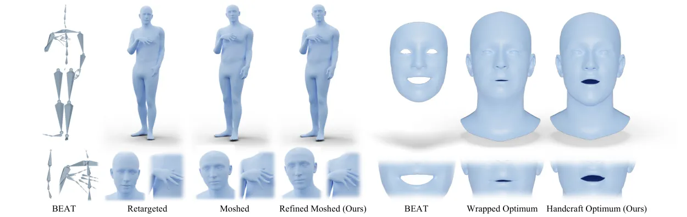
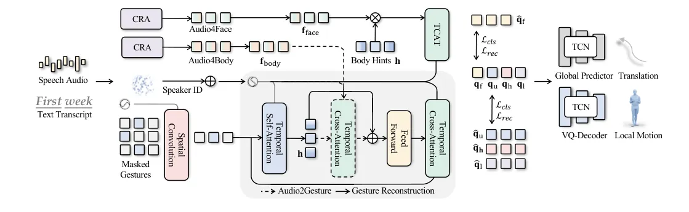
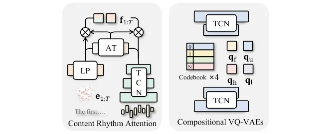
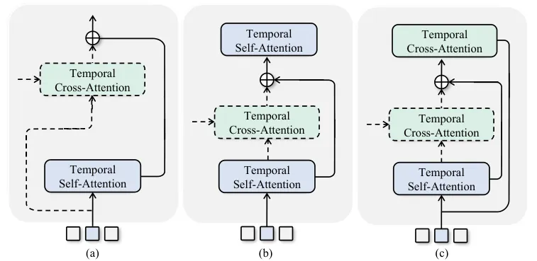
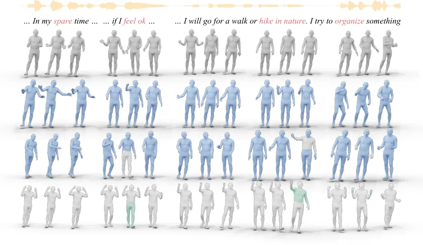
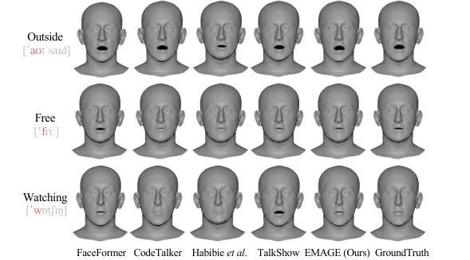

# EMAGE: Towards Unified Holistic Co-Speech Gesture Generation via Expressive Masked Audio Gesture Modeling

Haiyang Liu    Zihao Zhu    Giorgio Becherini Affiliation: Max Planck
Institute for Intelligent Systems    Yichen Peng Affiliation: JAIST   
Mingyang SuYou ZhouXuefei ZheNaoya IwamotoBo Zheng Affiliation: Tsinghua
University    Michael J. Black Affiliation: Max Planck Institute for
Intelligent Systems Affiliation: The University of Tokyo Affiliation:
Keio University

###### Abstract

We propose EMAGE, a framework to generate full-body human gestures from
audio and masked gestures, encompassing facial, local body, hands, and
global movements. To achieve this, we first introduce BEAT2
(BEAT-SMPLX-FLAME), a new mesh-level holistic co-speech dataset. BEAT2
combines a MoShed SMPL-X body with FLAME head parameters and further
refines the modeling of head, neck, and finger movements, offering a
community-standardized, high-quality 3D motion captured dataset. EMAGE
leverages masked body gesture priors during training to boost inference
performance. It involves a Masked Audio Gesture Transformer,
facilitating joint training on audio-to-gesture generation and masked
gesture reconstruction to effectively encode audio and body gesture
hints. Encoded body hints from masked gestures are then separately
employed to generate facial and body movements. Moreover, EMAGE
adaptively merges speech features from the audio’s rhythm and content
and utilizes four compositional VQ-VAEs to enhance the results’ fidelity
and diversity. Experiments demonstrate that EMAGE generates holistic
gestures with state-of-the-art performance and is flexible in accepting
predefined spatial-temporal gesture inputs, generating complete,
audio-synchronized results. Our code and dataset are available.^(†)^(†)
^(\*)Equal Contribution.¹¹ 1
[https://pantomatrix.github.io/EMAGE/](https://pantomatrix.github.io/EMAGE/)

![[Uncaptioned
image]](arxiv-2401-00374--aa2a9e126422.figures/figure-1.webp)

Figure 1: EMAGE. We present a Masked Audio-Conditioned Gesture Modeling
framework, along with a new holistic gesture dataset, BEAT2
(BEAT-SMPLX-FLAME), for jointly generating facial expressions, local
body dynamics, hand movements and global translations, conditioned on
audio and a partially or completely masked gestures. The gray denotes
visible gestures, and blue represents our outputs.

## 1 Introduction

The path towards full-body co-speech gesture generation presents many
remaining challenges. Despite the development of various baselines,
e.g., audio conditioned models for face \[20, 61, 15\], body \[67, 25,
13\], and hand movements \[41, 39, 33\], along with a few attempts at
merged models \[28, 65\], the limited availability of comprehensive data
and models poses an ongoing obstacle. To make progress in this
direction, we present a new framework that can incorporate partial
spatial-temporal predefined gestures and autonomously complete the
remaining frames in synchronization with the audio. This provides a new
tool for creating realistic animations of digital humans \[64, 57, 63,
71\].

To achieve this, we first require a comprehensive gesture dataset. While
several datasets are available for audio-to-body \[67\],
audio-to-body&face \[28\], body-to-hands \[41, 39\], and common actions
\[46, 16\], integrating them poses challenges due to varying data
formats and evaluation metrics across different sub-areas. This
motivates us to establish a unified, community-standard benchmark for
training and evaluating holistic gestures. We build upon the BEAT
dataset \[39\], which provides the most comprehensive mocap co-speech
gesture dataset with diverse modalities. Despite its size and richness,
the data in BEAT is not presented in a standardized format. The dataset
comprises iPhone ARKit blendshape weights and Vicon skeletons, posing
challenges when using the data for training; e.g., the lack of a mesh
representation prevents the use of a vertex loss \[52, 19\].
Additionally, conducting direct human perceptual evaluations on these
diverse modalities is inherently complex. On the other hand, SMPL-X
\[50\] and FLAME \[35\] are common mesh standards for the academic
community for other human dynamics-related tasks, e.g., action \[52\]
and talking head generation \[14\]. Driven by the motivation to
facilitate the sharing of knowledge across different tasks, we present
BEAT-SMPLX-FLAME (BEAT2), which consists of two main components: i)
Refined SMPL-X body shape and pose parameters from MoSh++ \[44, 46\]
with hard-coded physical priors. ii) Optimized high-quality FLAME head
parameters. By integrating SMPL-X’s body and FLAME’s head, BEAT2
facilitates a comprehensive training and evaluation benchmark across
multiple sub-areas of co-speech human animation generation.

[TABLE]

Table 1: Comparison of Co-Speech Gesture Datasets. We summarize gesture
and face datasets in talking scenarios. ‘PGT’ and ‘MC’ denote Pseudo
Ground Truth and Motion Capture, respectively. The BEAT2 (Ours) dataset
is the largest dataset for motion-captured data, providing holistic,
academic community standard mesh-level information.

[TABLE]

Table 2: Comparison of Co-Speech Gesture Models. We compare with
previous methods for generating face or body motion trained on co-speech
datasets. The first row lists their inputs, and the subsequent rows list
their outputs, respectively. Different decoder designs are denoted by
the initials ‘S’ for Single, ‘M’ for Multiple, and ‘C’ for Cascaded. To
the best of our knowledge, EMAGE (Ours) is the first to accept audio and
partially or completely masked gestures, generating full-body
audio-synchronized results.



Figure 2: Comparison of Data between BEAT2 and Others. BEAT-SMPLX-FLAME
presents a new mesh-level, motion-captured, holistic co-speech gesture
dataset with 60h of data. Left: We compare our refined SMPL-X body
parameters (denoted as Refined MoSh) with the original BEAT skeleton
\[39\], Retargeted from AutoRegPro, and initial results of Mosh++
\[50\]. The refined results show correct neck flexion, appropriate head
and neck shape ratios, and detailed finger representations. Right:
Visualization of blendshape weights from the original BEAT dataset
\[39\] with ARKit’s template, Wrapped-based, and handcrafted
optimization. Our final handcrafted FLAME blendshape-based optimization
demonstrates both accurate lip movement details and natural mouth
shapes.

With the holistic data from BEAT2, we aim to enhance the coherence of
individual body parts while ensuring accurate cross-modal alignment
between audio and motion; see Figure 1. This leads to the design of
Expressive Masked Audio-conditioned GEsture modeling, denoted as EMAGE,
a spatial and temporal transformer-based framework. EMAGE first
aggregates spatial features from masked body joints. Then, it
reconstructs the latent space of pretrained gestures with a switchable
gesture temporal self-attention and audio-gesture cross-attention. The
selection of different forward paths enables modeling the
gesture-to-gesture and audio-to-gesture prior separately and
effectively. Once the reconstructed latent features are obtained, EMAGE
decodes local face and body gestures from four compositional pretrained
Vector Quantized-Variational AutoEncoders (VQ-VAEs) and decodes global
translations from a pretrained Global Motion Predictor. The
compositional VQ-VAEs are key to preserving audio-related motions during
the reconstruction. Through these designs, EMAGE achieves
state-of-the-art performance in generating body and face gestures. It
takes as input audio and partially initialized gestures, and recoveres
audio-synchronized, coherent gestures. Additionally, we show how EMAGE
can flexibly incorporate additional, non-holistic, datasets to improve
results.

Overall, our contributions are as follows: (1) We release BEAT2, a
representation-unified, mesh-level dataset that leverages MoShed SMPL-X
body and FLAME head parameters. (2) We propose EMAGE, a simple yet
effective holistic gesture generation framework that generates coherent
gestures with partial gesture and audio priors. (3) EMAGE achieves
state-of-the-art performance in generating both body and face gestures
with only four frames of seed gestures. (4) EMAGE showcases the use of
additional non-holistic gesture datasets for training, e.g., Trinity and
AMASS, to further improve the fidelity and diversity of the results,
effectively leveraging data from different datasets.

## 2 Related Work

Co-Speech Animation Datasets are categorized into two types; see Table
1: pseudo-labeled (PGT) and motion-captured (mocap). For PGT, the
Speech2Gesture Dataset \[25\] utilizes OpenPose \[11\] to extract 2D
poses from News and Teaching videos. Subsequent works extend the dataset
to 3D pose \[28\] and SMPL-X \[65\]. The TED Dataset \[66\], which
extracts 2D pose from TED videos, has been extended to include 3D pose
\[67\], fingers \[40\], and SMPL-X \[45\]. Similarly, 2D, 3D landmarks,
and meshes are estimated from multi-view recorded videos \[60\] as PGT
for talking-head generation. Although pseudo-labeled approaches could
theoretically extract infinite data, their accuracy is limited. For
instance, the average error (in mm) for the SOTA monocular 3D pose
estimation algorithm \[23\] on the Human3.6M dataset \[30\] is 33.4,
while for Vicon mocap it is 0.142 \[47\]. For mocap datasets, Trinity
\[3\] features one male actor with 4h of data, and TalkingWithHands
\[32\] collects conversation scenarios for two speakers. ZEEG \[24\]
considers one speaker with 12 styles. For the face, 3D scanning is
accurate but limited in quantity due to cost, e.g., less than 3h for
BIWI \[21\], VOCA \[14\], and MeshTalk \[56\]. This leads to a balance
between performance and quantity in the ARKit dataset \[51\]. The
aforementioned datasets address the body and face separately. On the
other hand, BEAT \[39\] includes both 3D pose body and ARKit \[8\]
facial blendshape weights for the first time. However, BEAT lacks mesh
data.

Co-Speech Animation Models are categorized based on their outputs; see
Table 2. In addition to the baselines and datasets \[25, 67, 14, 56, 32,
48\], several frameworks for body gestures \[53, 54, 2, 33\] have
improved the performance of the baselines. They are trained and
evaluated by selecting specific upper body joints \[38, 39, 5, 4, 40,
70, 49\], or all body joints \[72, 62\]. Recent improvements in facial
gestures drive the vertices with transformers and discrete face priors
\[19, 61\]. However, these methods only address either the face or body.
Applying these methods to the full body will yield sub-optimal results
as audio is differently correlated with face and body dynamics. Most
similar to our work, Habibie et al. \[28\] employ a single audio encoder
and multiple decoders for generating face and body gestures. TalkSHOW
\[65\] demonstrates the advantage of separating the audio encoders and
decoding the body and hands using quantized codes in an auto-regressive
manner. However, it lacks lower body and global motion, and there is no
shared information for body and facial gesture generation. Moreover, it
cannot accept partially masked body hints due to the design of a fully
auto-regressive model.

Masked Representation Learning was first demonstrated to be effective in
Natural Language Processing, with BERT-based models \[17, 31, 42\]
boosting the performance of learned word embeddings in downstream tasks
through a combination of masked language modeling and transformer
architecture. Subsequently, Masked AutoEncoders \[29\] expanded masked
image modeling to computer vision by removing and inpainting image
patches. This concept of masked representation learning has since been
employed in other modalities, e.g., video \[18, 12, 43\], audio \[26,
36, 37\], and point clouds \[69, 68, 55\]. Most related to our work,
MotionBERT \[73\] proposes a spatial-temporal transformer to learn a
robust motion representation for classification-based tasks by masking
2D pose. In contrast to their method, we target robust motion features
for conditional motion generation tasks, requiring a balance in training
between multiple modalities, e.g., audio and gesture.

## 3 BEAT2

This section introduces how we obtain unified mesh-level data, i.e.,
SMPL-X \[50\] and FLAME \[35\] parameters, from the original BEAT
dataset \[39\]. BEAT utilizes a Vicon motion capture system \[47\] and
releases 78-joint skeleton-level Biovision Hierarchy (BVH) \[10\] motion
files. Their facial capture system uses ARKit \[8\] with a depth camera
on the iPhone 12 Pro, extracting $`\mathbb{R}^{51}`$ blendshape weights.
These blendshapes are designed based on the Facial Action Coding System
(FACS), which is widely adopted. However, both the motion and facial
data lack mesh-level details (see Figure 2), e.g., shapes and vertices.

### 3.1 Body Parameters Initialization via MoSh++

We initialize the SMPL-X body shape and pose parameters from BEAT mocap
marker data using MoSh++ \[46\]. Given the captured markers positions
$`\mathbf{m}\in\mathbb{R}^{T\times K\times 3}`$, predefined markers
position offsets $`\mathbf{d}\in\mathbb{R}^{K\times 3}`$, and
user-defined vertices-to-markers function $`\mathcal{H}`$, we aim to
obtain body shape $`\beta\in\mathbb{R}^{300}`$, poses
$`\theta\in\mathbb{R}^{T\times 55\times 3}`$, and translation parameters
$`\gamma\in\mathbb{R}^{T\times 3}`$. The optimization uses a
differentiable surface vertex mapping function
$`\mathcal{S}(\beta,\theta,\gamma)`$ and vertex normal function
$`\mathcal{N}(\beta,\theta_{0},\gamma_{0})`$. For each frame, the latent
marker $`\tilde{\mathbf{m}}\in\mathbb{R}^{T\times K\times 3}`$ is
calculated as

```math
\tilde{\mathbf{m}}_{i}\equiv\mathcal{S}_{\mathcal{H}}(\beta,\theta_{i},\gamma_{i})+\mathbf{d}\mathcal{N}_{\mathcal{H}}(\beta,\theta_{i},\gamma_{i}). \tag{1}
```

We first select 12 frames to optimize and fix $`\mathbf{d}`$ and
$`\beta`$, then optimize $`\theta_{i}`$, $`\gamma_{i}`$ for
$`i\in(1:T)`$ by minimizing the loss terms based on
$`\|\tilde{\mathbf{m}}_{i}-\mathbf{m}_{i}\|^{2}`$, including Data Term,
Surface Distance Energy, Marker Initialization Regularization, Pose and
Shape Priors, Velocity Constancy, and Soft-Tissue Term (see
supplementary materials). The overall objective function is the weighted
sum of these terms to balance accuracy and plausibility.

### 3.2 Body Parameters Refinement

MoSh++ produces unnatural head shapes due to the fact that head markers
were worn on a helmet and it sometimes produces unnatural finger poses.
Consequently, we refine body shape and pose parameters with three simple
yet effective hard-coded physical rules. i) The neck and head length
should approximate $`1/7`$ of the total length of the body. ii) Fingers,
except for the thumb, should not bend backward. iii) We employ the
Kolmogorov-Smirnov test, which reveals the data is similar to a normal
distribution. Subsequently, we apply a Gaussian truncation approach,
where all data points falling outside the $`3\sigma`$ range are adjusted
to align with the $`3\sigma`$ threshold and blended with the adjacent 10
frames. We compare our refined body parameters (denoted as MoSh Refined)
with Original BEAT, Retargeted SMPL-X, and MoSh SMPL-X in Figure 2.



Figure 3: EMAGE leverages two training paths: Masked Gesture
Reconstruction (MG2G) and Audio-Conditioned Gesture Generation (A2G).
The MG2G path focuses on encoding robust body hints through a
spatial-temporal transformer gesture encoder and cross-attention gesture
decoder. In contrast, the A2G path utilizes these body hints, and
separated audio encoders to decode pretrained face and body latent
features. A key component in this process is a switchable
cross-attention layer, crucial for merging body hints and audio
features. This fusion allows the features to be effectively disentangled
and utilized for gesture decoding. Once the gesture latent features are
reconstructed, EMAGE employs a pretrained VQ-Decoder to decode face and
local body motions. Additionally, a pretrained Global Motion Predictor
is used to estimate global body translations, further enhancing the
model’s capability to generate realistic and coherent gestures.



Figure 4: Details of CRA and Pretrained VQ-VAEs. Left: Content Rhythm
Attention fuses speech rhythm (onset and amplitude) with content
(pretrained word embeddings from text scripts) adaptively. This results
in a preference for either content or rhythm in specific frames, which
encourages the generation of semantical-aware gestures. Right: We
pretrain four compositional VQ-VAEs by reconstructing face, upper body,
hands and lower body separately to disentangle audio-agnostic gestures
explicitly.

### 3.3 Blendshape Weights to FLAME Parameters

Given the ARKit blendshape weights
$`\mathbf{b}_{\text{ARKit}}\in\mathbb{R}^{T\times 51}`$, we aim to
derive a transformation matrix
$`\mathbf{W}\in\mathbb{R}^{51\times 103}`$ that maps these into FLAME
parameters $`\mathbf{b}_{\text{FLAME}}\in\mathbb{R}^{T\times(100+3)}`$,
where 100 represents the number of dimensions for expression parameters
and 3 for jaw movement. Due to discrepancies between the iPhone’s and
FLAME’s template mesh topology, simply optimizing FLAME parameters by
minimizing the geometric error between the ARKit template vertices and
the wrapped FLAME vertices does not yield satisfactory results. Instead,
we release a set of handcrafted blendshape templates
$`\mathbf{v}_{\text{template}}\in\mathbb{R}^{52}`$ on FLAME following
ARKit’s FACS configuration. This approach allows direct driving of the
FLAME topology vertices
$`\mathbf{v}\in\mathbb{R}^{T\times 5023\times 3}`$ from the given
blendshape weights,

```math
\mathbf{v}=\mathbf{v}_{\text{template}}^{0}+\sum_{j=1}^{51}\mathbf{b}_{\text{ARKit},j}\cdot\mathbf{v}_{\text{template}}^{j} \tag{2}
```

where $`\mathbf{b}_{\text{ARKit},j}`$ is the weight of the $`j`$-th
ARKit blendshape and $`\mathbf{v}_{\text{template}}^{j}`$ is the vertex
position of the FLAME model template corresponding to the $`j`$-th
blendshape. The term $`\mathbf{v}_{\text{template}}^{0}`$ represents the
original template vertex position of the FLAME model. We optimize
$`\mathbf{W}`$ by minimizing
$`\|\tilde{\mathbf{v}}_{j}-\mathbf{v}_{j}\|_{2}`$, where
$`\tilde{\mathbf{v}}`$ is obtained from FLAME’s LBS
$`\mathcal{V}(\mathbf{b}_{\text{FLAME}})`$. The comparisons between
ARKit data, wrap-based, and our approach are shown in Figure 2.

## 4 EMAGE

We introduce the details of EMAGE, Expressive Masked Audio-Conditioned
GEsture Modeling (see Figure 3). Given gestures
$`\mathbf{g}\in\mathbb{R}^{T\times(55\times 6+100+4+3)}`$, representing
55 joints in Rot6D, $`\mathbb{R}^{100}`$ FLAME parameters,
$`\mathbb{R}^{4}`$ foot contact labels, $`\mathbb{R}^{3}`$ global
translations, and speech audio $`\mathbf{a}\in\mathbb{R}^{T\times sk}`$,
where $`sk=sr_{\text{audio}}/fps_{\text{gestures}}`$, EMAGE jointly
optimizes masked gesture reconstruction and audio-conditioned gesture
generation. This optimization enhances performance during inference and
enables the use of partially masked gestures to complete holistic
gestures. To achieve this, we first model the quantized latent space in
Sec. 4.1, following \[65, 61\]. We then design a separated speech audio
encoder using Content Rhythm Self-Attention (CRA) as detailed in Sec.
4.2. Subsequently, we learn the body hints from masked gestures via the
Masked Audio Gesture Transformer, explained in Sec. 4.3. Finally, the
decoding strategy for different body segments is discussed in Sec. 4.4.

### 4.1 Compositional Discrete Face and Body Prior

We model full-body gestures in the separated quantized latent space
(Figure 4) for several reasons. Similar to \[65\], the body and hands
improves the diversity of the results. However, we additionally separate
the face and lower body due to their differing correlations with audio,
i.e., using a single VQ-VAE to encode both the upper and lower body may
lead the model to overlook gestures that occur less frequently -
regardless of their relation to the audio. Specifically, a single model
might focus only on recovering lower body motion, neglecting elbow
movements in a speaker who is constantly walking during the
conversation.

The separated quantized latent space
$`Q=\{\mathbf{q}_{\text{f}},\mathbf{q}_{u},\mathbf{q}_{\text{h}},\mathbf{q}_{\text{l}}\}`$
for the Face $`\mathbf{g}_{\text{f}}\in\mathbb{R}^{T\times 106}`$, Upper
body $`\mathbf{g}_{\text{u}}\in\mathbb{R}^{T\times 78}`$, Hands
$`\mathbf{g}_{\text{h}}\in\mathbb{R}^{T\times 180}`$, and Lower body
$`\mathbf{g}_{\text{l}}\in\mathbb{R}^{T\times(54+4)}`$ are from four
VQ-VAEs. The VQ-VAE for each is optimized by jointly optimizing the
following loss terms,

```math
q_{i}=\argmin_{q_{i}\in\mathbf{q}}\|z_{j}-q_{i}\|^{2} \tag{3}
```

```math
\displaystyle\mathcal{L}_{\text{VQ-VAE}}=\  \displaystyle\mathcal{L}_{rec}(\mathbf{g},\hat{\mathbf{g}})+\mathcal{L}_{\text{vel}}(\mathbf{g}^{\prime},\hat{\mathbf{g}}^{\prime})+\mathcal{L}_{\text{acc}}(\mathbf{g}^{\prime\prime},\hat{\mathbf{g}}^{\prime\prime})
```

```math
\displaystyle+\|\text{sg}[\mathbf{z}]-\mathbf{q}\|^{2}+\|\mathbf{z}-\text{sg}[\mathbf{q}]\|^{2}, \tag{4}
```

where $`\mathbf{z}`$ is the encoded $`\mathbf{g}`$ with a temporal
window size $`w=1`$. $`\mathcal{L}_{\text{rec}}`$,
$`\mathcal{L}_{\text{vel}}`$, and $`\mathcal{L}_{\text{acc}}`$ are
Geodesic \[58\] and L1 losses, sg is a stop gradient operation, we set
the weight of the commitment loss \[59\] (the last term) to 1 in this
paper.

### 4.2 Content and Rhythm Self-Attention

Given the speech audio, $`\mathbf{s}`$, inspired by \[4\], we employ
onset $`\mathbf{o}`$ and amplitude $`\mathbf{a}`$ as explicit audio
rhythm, alongside the pretrained embeddings \[9\] $`\mathbf{e}`$ from
transcripts as content. Different from previous approaches, which
typically add the rhythm and content features, we leverage
self-attention to merge these features adaptively. This approach is
driven by the observation that for specific frames, the gestures are
more related to content (semantic-aware) or rhythm (beat-aware). The
rhythm and content features are first encoded into time-aligned features
$`\mathbf{r}_{1:T}`$ and $`\mathbf{c}_{1:T}`$, using a Temporal
Convolutional Network (TCN) and linear mapping, respectively. For each
time step $`t\in\{1,\dots,T\}`$, we merge the rhythm and content
features by:

```math
\displaystyle\mathbf{f}_{1:T} \displaystyle=\alpha\times\mathbf{r}_{1:T}+(1-\alpha)\times\mathbf{c}_{1:T}, \tag{5}
```

```math
\displaystyle\alpha \displaystyle=\text{Softmax}(\mathcal{AT}(\mathbf{r}_{1:T},\mathbf{c}_{1:T})),
```

where $`\mathcal{AT}`$ is a 2-layer MLP. We apply two separate CRA
encoders for the face and body.



Figure 5: Comparison of Forward Path Designs. Straightforward fusion
module (a) merges audio features without refined body features and
recombines audio features based only on position embedding. The
Self-Attention decoder module (b), adopted in previous MLM models \[17,
31\], is limited for tasks requiring auto-regressive inference. Our
design (c) considers effective audio feature fusion and auto-regressive
decoding.

### 4.3 Masked Audio-Conditioned Gesture Modeling

We propose a Masked Audio Gesture Transformer to leverage different
training paths (see Fig. 5 for the motivation behind the architecture
designs). Given temporal and spatially masked gestures
$`\overline{\mathbf{g}}\in\mathbb{R}^{T\times 337}`$, we first replace
the masked tokens with learned masked embeddings
$`e_{\text{mask}}\in\mathbb{R}^{256}`$, as the value zero still
represents specific motion content, e.g., a T-pose. We linearly increase
the ratio of masked joints and frames from 0 to 95% according to the
training epochs.

A spatial convolutional $`\mathcal{SC}`$ encoder initially summarizes
the spatial information, and compress the spatial feature into
$`\mathbb{R}^{T\times 256}`$. We then employ a temporal self-attention
(without feed-forward) $`\mathcal{TSA}`$ to refine the summarized
spatial features

```math
\mathbf{h}=\mathcal{TSA}(\mathcal{SC}(\overline{\mathbf{g}})+\mathbf{p}_{t}), \tag{6}
```

where $`\mathbf{h}\in\mathbb{R}^{T\times 512}`$ represents encoded body
hints, and $`\mathbf{p}_{t}`$ is the sum of a learned speaker embedding
and PPE \[19\]. Then, a straightforward temporal cross-attention
Transformer decoder $`\mathcal{TCAT}`$ is adopted for the reconstructed
latent $`\hat{\mathbf{q}}_{\text{mg2g}}`$,

```math
\hat{\mathbf{q}}_{\text{mg2g}}=\mathcal{TCAT}(\mathbf{h}+\mathbf{p}_{t}). \tag{7}
```

We minimize the L1 distance in the latent space,

```math
\mathcal{L}_{\text{mg2g}}=\|\hat{\mathbf{q}}_{\text{mg2g}}-\mathbf{q}\|. \tag{8}
```

Masked gesture reconstruction encodes effective body hints, with the key
being to leverage these body hints for gesture generation. We employ a
selective fusion for audio and body hints via a temporal cross-attention
$`\mathcal{TCA}`$. Subsequently, we use the merged audio-gesture
features for audio-conditioned gesture latent reconstruction,

```math
\hat{\mathbf{q}}_{\text{a2g}}=\mathcal{TCAT}(\mathcal{TCA}(\mathbf{h}+\mathbf{p}_{t},\mathbf{f}_{\text{body}}),\overline{\mathbf{g}}+\mathbf{p}_{t}). \tag{9}
```

We optimize both the latent code class classification cross-entropy loss
$`\mathcal{L}_{\text{a2g-rec}}`$ and the latent reconstruction loss
$`\mathcal{L}_{\text{a2g-cls}}`$ to encourage diverse results.

### 4.4 Face and Translation Decoding

Considering that the face is weakly related to body motion, applying the
same operation – recombining the audio features based on body hints – is
not reasonable. Therefore, we directly concatenate the masked body hints
with the audio features for the final decoding of facial latent,

```math
\hat{\mathbf{q}}_{\text{f}}=\mathcal{TCAT}(\mathbf{f}_{\text{face}}\oplus\mathbf{h},\mathbf{p}_{t}). \tag{10}
```

Once we have obtained the local lower body motion
$`\tilde{\mathbf{g}}_{l}\in\mathbb{R}^{T\times(54+4)}`$ from the
VQ-Decoder, we estimate the global translations
$`\tilde{\mathbf{t}}\in\mathbb{R}^{T\times 3}`$ with a pretrained Global
Motion Predictor
$`\tilde{\mathbf{t}}=\mathcal{G}(\tilde{\mathbf{g}}_{l})`$, which
significantly reduces foot sliding.

|                | Top.-B | Top.-F | Body        | Face        |
| -------------- | ------ | ------ | ----------- | ----------- |
| VOCA\[14\]     | \-     | FLAME  | \-          | 38.3 ± 5.63 |
| AMASS\[46\]    | SMPL-X | FLAME  | 42.0 ± 3.60 | \-          |
| TalkSHOW\[65\] | SMPL-X | SMPL-X | 14.4 ± 2.19 | 26.1 ± 6.42 |
| BEAT2 (Ours)   | SMPL-X | FLAME  | 43.6 ± 3.38 | 35.7 ± 5.91 |

Table 3: User Preference Win Rate between Existing Datasets. ‘Top.’
denotes the topology of the mesh. The results show our BEAT2 dataset
outperforms the existing PGT dataset \[65\] in both body and face
aspects. It also performs slightly better on body and lower on face when
compared with previous mocap \[46\] and 3D scan-based datasets \[14\],
respectively.



Figure 6: Subjective Examples. Top to down: GroundTruth, Generated W/O
Body Hints, Generated With Body Hints, Visible Body Hints, EMAGE
generates diverse, semantic-aware and audio synchronized body gestures,
e.g. raise the both hands for “spare time”, relaxing gestures for “hike
in nature”. Besides, as shown in the third and bottom rows, EMAGE is
flexible to accept non-audio-synchronized body hints on any frames and
joints, to guide or customize the generated gestures explicitly, e.g.,
repeat a similar motion for raising hands, change the walking
orientations, etc. Note that in this figure, The gray joints of
generated results are not copies of visible hints.

## 5 Experiments

We separate the evaluation into two categories: dataset quality and
model ability. After removing data with low finger quality from BEAT,
BEAT2 is reduced to 60 hours. We further split it into BEAT2-Standard
(27 hours) and BEAT2-Additional (33 hours), based on the type of speech
and conversation sections \[39\]. While acted gestures in speech
sections are more diverse and expressive, spontaneous gestures in
conversational sections tend to be more natural yet less varied. We
report the results on BEAT2-Standard Speaker-2 with an 85%/7.5%/7.5%
train/val/test split.

### 5.1 Dataset Quality Evaluation

We compare our dataset with the state-of-the-art pseudo ground truth
(PGT) dataset, TalkSHOW \[65\], for both face and body. Additionally, we
compare it with the AMASS \[46\] dataset for the body and VOCA \[14\]
for the face as references. Due to the varying lengths of sequences in
each dataset, we sample 100 comparison pairs, each with an equal
duration ranging from 2 to 4 seconds. In a perceptual study, each
participant evaluates a random set of 40 pairs during a 10-minute
session by selecting the sequence they consider to have the best
captured quality. In total, 60 participants were invited. It is
important to note that participants are instructed to compare only the
upper body results, as TalkSHOW contains only the upper body. The
results are shown in Table 3.

### 5.2 Model Ability Evaluation

We report results using BEATv1.3 and BEATv2. The latter has facial data
refined by animators and hand data filtered by annotators.

|                        | FGD $`\downarrow`$ | BC $`\uparrow`$ | Diversity $`\uparrow`$ | MSE $`\downarrow`$ | LVD $`\downarrow`$ |
| ---------------------- | ------------------ | --------------- | ---------------------- | ------------------ | ------------------ |
| FaceFormer\[19\]       | \-                 | \-              | \-                     | 7.787              | 7.593              |
| CodeTalker\[61\]       | \-                 | \-              | \-                     | 8.026              | 7.766              |
| S2G\[25\]              | 28.15              | 4.683           | 5.971                  | \-                 | \-                 |
| Trimodal\[67\]         | 12.41              | 5.933           | 7.724                  | \-                 | \-                 |
| HA2G\[40\]             | 12.32              | 6.779           | 8.626                  | \-                 | \-                 |
| DisCo\[38\]            | 9.417              | 6.439           | 9.912                  | \-                 | \-                 |
| CaMN\[39\]             | 6.644              | 6.769           | 10.86                  | \-                 | \-                 |
| DiffStyleGesture\[62\] | 8.811              | 7.241           | 11.49                  | \-                 | \-                 |
| Habibie et al.\[28\]   | 9.040              | 7.716           | 8.213                  | 8.614              | 8.043              |
| TalkSHOW\[65\]         | 6.209              | 6.947           | 13.47                  | 7.791              | 7.771              |
| EMAGE (Ours)           | 5.512              | 7.724           | 13.06                  | 7.680              | 7.556              |

Table 4: Quantitative evaluation on BEATv2. We report FGD
$`\times 10^{-1}`$, BC $`\times 10^{-1}`$, Diversity, MSE
$`\times 10^{-8}`$, and LVD $`\times 10^{-5}`$. For body gestures, EMAGE
significantly improves the FGD, indicating that the generated results
are closer to the GT. This shows the effectiveness of body hints from
masked gesture modeling.

|                      | Holistic    | Body        | Face        |
| -------------------- | ----------- | ----------- | ----------- |
| Habibie et al.\[28\] | 12.4 ± 3.70 | 15.9 ± 6.49 | 10.8 ± 3.19 |
| TalkSHOW\[65\]       | 34.9 ± 5.79 | 40.4 ± 8.22 | 33.2 ± 6.03 |
| EMAGE (Ours)         | 52.7 ± 7.91 | 44.7 ± 8.68 | 56.0 ± 7.80 |

Table 5: User Preference Win Rate On Generated Results. The results
indicate that our generated outcomes are perceived as more realistic and
believable, with a 14% and 23% higher user preference for body and face
gestures, respectively.

Metrics. We adopt FGD\[67\] to evaluate the realism of the body
gestures. Then, we measure Diversity\[33\] by calculating the average L1
distance between multiple body gesture clips, and use BC \[34\] to
assess speech-motion synchrony. For the face, we calculate the vertex
MSE\[61\] to measure the positional distance and the vertex L1
difference LVD \[65\] between the GT and generated facial vertices.

Compared Methods. We first compare our method with representative
state-of-the-art methods in body gesture generation \[25, 67, 40, 38,
39, 62\] and talking head generation \[19, 61\] by reproducing their
methods for body and face, respectively. In addition, we reproduce two
previous state-of-the-art holistic pipelines, Habibie et al. \[28\] and
TalkSHOW \[65\], whose original implementations are limited to the upper
body. We add a lower-body decoder to Habibie et al. and a lower-body
VQ-VAE to TalkSHOW.

#### 5.2.1 Quantitative and Qualitative Analysis

As shown in Table 4, with a four-frame seed pose, our method outperforms
previous SOTA algorithms. For qualitative results, see Figures 6 and 7.
Furthermore, we conduct a perceptual study. Maintaining the same setup
of 60 participants, each participant evaluates 40 pairs of 10-second
results do decide which is most believable; this gives the win rate
shown in Table 5.



Figure 7: Comparison of Generated Facial Movements. Compared with
previous state-of-the-art talking face generation methods FaceFormer
\[19\] and CodeTalker \[61\] as well as holistic gesture generation
methods Habibie et al. \[28\] and TalkSHOW \[65\]. Note that CodeTalker
has higher MSE than EMAGE on BEATv2 (Table 4, lower is better) but is
subjectively realistic. EMAGE gets good lip motions by leveraging both
the face model and masked body hints.

#### 5.2.2 Ablation Analysis

Performance of Baseline. As shown in Table 6, we start with a
teacher-force transformer-based baseline. This baseline, inspired by
FaceFormer \[19\], adopts a 1-layer cross-attention transformer decoder
and replaces the audio features from Wav2Vec2 \[6\] with our custom TCN
\[7\] and trainable word embeddings \[9\].

Effect of Multiple VQ-VAEs. Simply applying one VQ-VAE \[59, 27\] for
full-body movements, including the face, decreases performance in facial
movements. This is because the VQ-VAE is trained to minimize the average
loss for the full body, and some speakers’ most frequent movements are
not related to the audio. Implementing separated VQ-VAEs allows the
model to better leverage the advantages of discrete priors.

Effect of Content Rhythm Self-Attention. Adaptive fusion of rhythm and
content features shows improvement in both FGD and Alignment. It
selectively focuses the current motion more on rhythm or content
features based on the training data’s distribution. Moreover, we
observed more semantic-aware results when applying CRA.

Effect of Masked Body Gesture Hints. The improvement across all
objective metrics demonstrates that our model effectively leverages
spatial-temporal gesture priors, reducing the likelihood of incorrect
gesture sampling. Furthermore, masked gesture modeling is key to
enabling the network to accept predefined gestures in specific frames.

|                 | FGD $`\downarrow`$ | BC $`\uparrow`$ | Diversity $`\uparrow`$ | MSE $`\downarrow`$ | LVD $`\downarrow`$ |
| --------------- | ------------------ | --------------- | ---------------------- | ------------------ | ------------------ |
| Ground Truth    | 0                  | 6.896           | 13.074                 | 0                  | 0                  |
| Reconstruction  | 3.913              | 6.758           | 13.145                 | 0.841              | 6.389              |
| Baseline        | 13.080             | 6.941           | 8.3145                 | 1.442              | 9.317              |
| \+ VQVAE        | 9.787              | 6.673           | 10.624                 | 1.619              | 9.473              |
| \+ 4 VQVAE      | 7.397              | 6.698           | 12.544                 | 1.243              | 8.938              |
| \+ CRA          | 6.833              | 6.783           | 12.676                 | 1.186              | 8.715              |
| \+ Masked Hints | 5.423              | 6.794           | 13.057                 | 1.180              | 9.015              |

Table 6: Abliation Analysis on BEATv1.3

|                  | body | hands | face | FGD $`\downarrow`$ | BC $`\uparrow`$ | Diversity $`\uparrow`$ |
| ---------------- | ---- | ----- | ---- | ------------------ | --------------- | ---------------------- |
| BESTX            | ✓    | ✓     | ✓    | 5.423              | 6.794           | 13.057                 |
| \+ Trinity\[22\] | ✓    |       |      | 5.319              | 6.843           | 13.346                 |
| \+ AMASS\[46\]   | ✓    | ✓     |      | 5.174              | 6.769           | 14.318                 |

Table 7: Training EMAGE on Multiple Datasets. EMAGE demonstrates
flexibility by training on multiple datasets, even when only a subset of
holistic gestures is available. This approach further improves the
objective metrics on the BEATv1.3 test set.

#### 5.2.3 Ability of Multi-Dataset Training.

We demonstrate that EMAGE can effectively combine multiple non-holistic
datasets for training by jointly training with the Trinity \[22\] and
AMASS \[46\] datasets, by using only the upper body and audio pairs from
Trinity and only body and hands from AMASS. Separate VQ-VAEs are trained
for BEAT2, Trinity, and AMASS, with separate MLP heads implemented for
codebook classification. The results in Table 7 show that incorporating
data improves performance on the BEATv1.3 test set.

## 6 Conclusion

In this work, we present EMAGE, a framework designed to accept partial
gestures as input for completing audio-synchronized holistic gestures.
It demonstrates that leveraging masked gesture reconstruction can
significantly enhance the performance of audio-conditioned gesture
generation. Furthermore, the design of EMAGE enables the training on
multiple datasets, further improving performance. Alongside EMAGE, we
release BEAT2, the largest multi-modal gesture dataset consistent with
SMPL-X and FLAME. We hope that BEAT2 will contribute to knowledge and
model sharing across various subareas.

Disclosures: While You Zhou, Xuefei Zhe, Naoya Iwamoto, and Bo Zheng are
employees of Huawei Tokyo Research Center, this work was done on their
own time with the approval of their employer. MJB CoI:
[https://files.is.tue.mpg.de/black/CoI_CVPR_2024.txt](https://files.is.tue.mpg.de/black/CoI_CVPR_2024.txt)

## References

- \[1\] Kfir Aberman, Peizhuo Li, Dani Lischinski, Olga Sorkine-Hornung,
  Daniel Cohen-Or, and Baoquan Chen. Skeleton-aware networks for deep
  motion retargeting. _ACM Transactions on Graphics (TOG)_,
  39(4):62–1, 2020.
- \[2\] Chaitanya Ahuja, Dong Won Lee, Yukiko I Nakano, and
  Louis-Philippe Morency. Style transfer for co-speech gesture
  animation: A multi-speaker conditional-mixture approach. In _European
  Conference on Computer Vision_, pages 248–265. Springer, 2020.
- \[3\] Simon Alexanderson, Gustav Eje Henter, Taras Kucherenko, and
  Jonas Beskow. Style-controllable speech-driven gesture synthesis using
  normalising flows. In _Computer Graphics Forum_, pages 487–496. Wiley
  Online Library, 2020.
- \[4\] Tenglong Ao, Zeyi Zhang, and Libin Liu. Gesturediffuclip:
  Gesture diffusion model with clip latents. _ACM Trans. Graph._
- \[5\] Tenglong Ao, Qingzhe Gao, Yuke Lou, Baoquan Chen, and Libin Liu.
  Rhythmic gesticulator: Rhythm-aware co-speech gesture synthesis with
  hierarchical neural embeddings. _ACM Transactions on Graphics (TOG)_,
  41(6):1–19, 2022.
- \[6\] Alexei Baevski, Yuhao Zhou, Abdelrahman Mohamed, and Michael
  Auli. wav2vec 2.0: A framework for self-supervised learning of speech
  representations. _Advances in neural information processing systems_,
  33:12449–12460, 2020.
- \[7\] Shaojie Bai, J Zico Kolter, and Vladlen Koltun. An empirical
  evaluation of generic convolutional and recurrent networks for
  sequence modeling. arxiv 2018. _arXiv preprint arXiv:1803.01271_,
  2, 1803.
- \[8\] Gilad Baruch, Zhuoyuan Chen, Afshin Dehghan, Tal Dimry, Yuri
  Feigin, Peter Fu, Thomas Gebauer, Brandon Joffe, Daniel Kurz, Arik
  Schwartz, and Elad Shulman. ARKitscenes - a diverse real-world dataset
  for 3d indoor scene understanding using mobile RGB-d data. In
  _Thirty-fifth Conference on Neural Information Processing Systems
  Datasets and Benchmarks Track (Round 1)_, 2021.
- \[9\] Piotr Bojanowski, Edouard Grave, Armand Joulin, and Tomas
  Mikolov. Enriching word vectors with subword information.
  _Transactions of the association for computational linguistics_,
  5:135–146, 2017.
- \[10\] Biovision BVH. Biovision bvh. In
  *https://research.cs.wisc.edu/graphics /Courses/
  cs-838-1999/Jeff/BVH.html*, 1999.
- \[11\] Zhe Cao, Gines Hidalgo, Tomas Simon, Shih-En Wei, and Yaser
  Sheikh. Openpose: realtime multi-person 2d pose estimation using part
  affinity fields. _IEEE transactions on pattern analysis and machine
  intelligence_, 43(1):172–186, 2019.
- \[12\] Zhe Chen, Yuchen Duan, Wenhai Wang, Junjun He, Tong Lu, Jifeng
  Dai, and Yu Qiao. Vision transformer adapter for dense predictions.
  _arXiv preprint arXiv:2205.08534_, 2022.
- \[13\] Kiran Chhatre, Radek Daněček, Nikos Athanasiou, Giorgio
  Becherini, Christopher Peters, Michael J Black, and Timo Bolkart.
  Emotional speech-driven 3d body animation via disentangled latent
  diffusion. _arXiv preprint arXiv:2312.04466_, 2023.
- \[14\] Daniel Cudeiro, Timo Bolkart, Cassidy Laidlaw, Anurag Ranjan,
  and Michael Black. Capture, learning, and synthesis of 3D speaking
  styles. _Computer Vision and Pattern Recognition (CVPR)_, pages
  10101–10111, 2019.
- \[15\] Radek Daněček, Kiran Chhatre, Shashank Tripathi, Yandong Wen,
  Michael Black, and Timo Bolkart. Emotional speech-driven animation
  with content-emotion disentanglement. ACM, 2023.
- \[16\] Anna Deichler, Kiran Chhatre, Christopher Peters, and Jonas
  Beskow. Spatio-temporal priors in 3d human motion. 2021.
- \[17\] Jacob Devlin, Ming-Wei Chang, Kenton Lee, and Kristina
  Toutanova. Bert: Pre-training of deep bidirectional transformers for
  language understanding. _arXiv preprint arXiv:1810.04805_, 2018.
- \[18\] Alexey Dosovitskiy, Lucas Beyer, Alexander Kolesnikov, Dirk
  Weissenborn, Xiaohua Zhai, Thomas Unterthiner, Mostafa Dehghani,
  Matthias Minderer, Georg Heigold, Sylvain Gelly, et al. An image is
  worth 16x16 words: Transformers for image recognition at scale. _arXiv
  preprint arXiv:2010.11929_, 2020.
- \[19\] Yingruo Fan, Zhaojiang Lin, Jun Saito, Wenping Wang, and Taku
  Komura. Faceformer: Speech-driven 3d facial animation with
  transformers. In _Proceedings of the IEEE/CVF Conference on Computer
  Vision and Pattern Recognition (CVPR)_, 2022a.
- \[20\] Yingruo Fan, Zhaojiang Lin, Jun Saito, Wenping Wang, and Taku
  Komura. Faceformer: Speech-driven 3d facial animation with
  transformers. In _Proceedings of the IEEE/CVF Conference on Computer
  Vision and Pattern Recognition_, pages 18770–18780, 2022b.
- \[21\] Gabriele Fanelli, Juergen Gall, Harald Romsdorfer, Thibaut
  Weise, and Luc Van Gool. A 3-d audio-visual corpus of affective
  communication. _IEEE Transactions on Multimedia_, 12(6):591–598, 2010.
- \[22\] Ylva Ferstl and Rachel McDonnell. Investigating the use of
  recurrent motion modelling for speech gesture generation. In
  _Proceedings of the 18th International Conference on Intelligent
  Virtual Agents_, pages 93–98, 2018.
- \[23\] Erik Gärtner, Mykhaylo Andriluka, Erwin Coumans, and Cristian
  Sminchisescu. Differentiable dynamics for articulated 3d human motion
  reconstruction. In _Proceedings of the IEEE/CVF Conference on Computer
  Vision and Pattern Recognition_, pages 13190–13200, 2022.
- \[24\] Saeed Ghorbani, Ylva Ferstl, Daniel Holden, Nikolaus F. Troje,
  and Marc-André Carbonneau. Zeroeggs: Zero-shot example-based gesture
  generation from speech. _Computer Graphics Forum_,
  42(1):206–216, 2023.
- \[25\] Shiry Ginosar, Amir Bar, Gefen Kohavi, Caroline Chan, Andrew
  Owens, and Jitendra Malik. Learning individual styles of
  conversational gesture. In _Proceedings of the IEEE/CVF Conference on
  Computer Vision and Pattern Recognition_, pages 3497–3506, 2019.
- \[26\] Yuan Gong, Yu-An Chung, and James Glass. Ast: Audio spectrogram
  transformer. _arXiv preprint arXiv:2104.01778_, 2021.
- \[27\] Chuan Guo, Xinxin Zuo, Sen Wang, and Li Cheng. Tm2t: Stochastic
  and tokenized modeling for the reciprocal generation of 3d human
  motions and texts. In _European Conference on Computer Vision_, pages
  580–597. Springer, 2022.
- \[28\] Ikhsanul Habibie, Weipeng Xu, Dushyant Mehta, Lingjie Liu,
  Hans-Peter Seidel, Gerard Pons-Moll, Mohamed Elgharib, and Christian
  Theobalt. Learning speech-driven 3d conversational gestures from
  video. _arXiv preprint arXiv:2102.06837_, 2021.
- \[29\] Kaiming He, Xinlei Chen, Saining Xie, Yanghao Li, Piotr Dollár,
  and Ross Girshick. Masked autoencoders are scalable vision learners.
  In _Proceedings of the IEEE/CVF conference on computer vision and
  pattern recognition_, pages 16000–16009, 2022.
- \[30\] Catalin Ionescu, Dragos Papava, Vlad Olaru, and Cristian
  Sminchisescu. Human3. 6m: Large scale datasets and predictive methods
  for 3d human sensing in natural environments. _IEEE transactions on
  pattern analysis and machine intelligence_, 36(7):1325–1339, 2013.
- \[31\] Zhenzhong Lan, Mingda Chen, Sebastian Goodman, Kevin Gimpel,
  Piyush Sharma, and Radu Soricut. Albert: A lite bert for
  self-supervised learning of language representations. _arXiv preprint
  arXiv:1909.11942_, 2019.
- \[32\] Gilwoo Lee, Zhiwei Deng, Shugao Ma, Takaaki Shiratori,
  Siddhartha S Srinivasa, and Yaser Sheikh. Talking with hands 16.2 m: A
  large-scale dataset of synchronized body-finger motion and audio for
  conversational motion analysis and synthesis. In _Proceedings of the
  IEEE/CVF International Conference on Computer Vision_, pages
  763–772, 2019.
- \[33\] Jing Li, Di Kang, Wenjie Pei, Xuefei Zhe, Ying Zhang, Zhenyu
  He, and Linchao Bao. Audio2gestures: Generating diverse gestures from
  speech audio with conditional variational autoencoders. In
  _Proceedings of the IEEE/CVF International Conference on Computer
  Vision_, pages 11293–11302, 2021a.
- \[34\] Ruilong Li, Shan Yang, David A Ross, and Angjoo Kanazawa. Ai
  choreographer: Music conditioned 3d dance generation with aist++. In
  _Proceedings of the IEEE/CVF International Conference on Computer
  Vision_, pages 13401–13412, 2021b.
- \[35\] Tianye Li, Timo Bolkart, Michael. J. Black, Hao Li, and Javier
  Romero. Learning a model of facial shape and expression from 4D scans.
  _ACM Transactions on Graphics, (Proc. SIGGRAPH Asia)_,
  36(6):194:1–194:17, 2017.
- \[36\] Haiyang Liu and Cheng Zhang. Reinforcement learning based
  neural architecture search for audio tagging. In _2020 International
  Joint Conference on Neural Networks (IJCNN)_, pages 1–8. IEEE, 2020.
- \[37\] Haiyang Liu and Jihan Zhang. Improving ultrasound tongue image
  reconstruction from lip images using self-supervised learning and
  attention mechanism. _arXiv preprint arXiv:2106.11769_, 2021.
- \[38\] Haiyang Liu, Naoya Iwamoto, Zihao Zhu, Zhengqing Li, You Zhou,
  Elif Bozkurt, and Bo Zheng. Disco: Disentangled implicit content and
  rhythm learning for diverse co-speech gestures synthesis. In
  _Proceedings of the 30th ACM International Conference on Multimedia_,
  pages 3764–3773, 2022a.
- \[39\] Haiyang Liu, Zihao Zhu, Naoya Iwamoto, Yichen Peng, Zhengqing
  Li, You Zhou, Elif Bozkurt, and Bo Zheng. Beat: A large-scale semantic
  and emotional multi-modal dataset for conversational gestures
  synthesis. _arXiv preprint arXiv:2203.05297_, 2022b.
- \[40\] Xian Liu, Qianyi Wu, Hang Zhou, Yinghao Xu, Rui Qian, Xinyi
  Lin, Xiaowei Zhou, Wayne Wu, Bo Dai, and Bolei Zhou. Learning
  hierarchical cross-modal association for co-speech gesture generation.
  In _Proceedings of the IEEE/CVF Conference on Computer Vision and
  Pattern Recognition_, pages 10462–10472, 2022c.
- \[41\] Xian Liu, Qianyi Wu, Hang Zhou, Yinghao Xu, Rui Qian, Xinyi
  Lin, Xiaowei Zhou, Wayne Wu, Bo Dai, and Bolei Zhou. Learning
  hierarchical cross-modal association for co-speech gesture generation.
  In _Proceedings of the IEEE/CVF Conference on Computer Vision and
  Pattern Recognition_, pages 10462–10472, 2022d.
- \[42\] Yinhan Liu, Myle Ott, Naman Goyal, Jingfei Du, Mandar Joshi,
  Danqi Chen, Omer Levy, Mike Lewis, Luke Zettlemoyer, and Veselin
  Stoyanov. Roberta: A robustly optimized bert pretraining approach.
  _arXiv preprint arXiv:1907.11692_, 2019.
- \[43\] Ze Liu, Yutong Lin, Yue Cao, Han Hu, Yixuan Wei, Zheng Zhang,
  Stephen Lin, and Baining Guo. Swin transformer: Hierarchical vision
  transformer using shifted windows. In _Proceedings of the IEEE/CVF
  international conference on computer vision_, pages 10012–10022, 2021.
- \[44\] Matthew M. Loper, Naureen Mahmood, and Michael J. Black. MoSh:
  Motion and shape capture from sparse markers. _ACM Transactions on
  Graphics, (Proc. SIGGRAPH Asia)_, 33(6):220:1–220:13, 2014.
- \[45\] Shuhong Lu, Youngwoo Yoon, and Andrew Feng. Co-speech gesture
  synthesis using discrete gesture token learning. _arXiv preprint
  arXiv:2303.12822_, 2023.
- \[46\] Naureen Mahmood, Nima Ghorbani, Nikolaus F. Troje, Gerard
  Pons-Moll, and Michael J. Black. AMASS: Archive of motion capture as
  surface shapes. In _International Conference on Computer Vision_,
  pages 5442–5451, 2019.
- \[47\] Tim Massey. Vicon study of dynamic object tracking accuracy. In
  *https://www.vicon.com/resources/blog/ vicon-study
  -of-dynamic-object-tracking-accuracy/*, 2020.
- \[48\] Evonne Ng, Shiry Ginosar, Trevor Darrell, and Hanbyul Joo.
  Body2hands: Learning to infer 3d hands from conversational gesture
  body dynamics. _Proceedings of the IEEE/CVF Conference on Computer
  Vision and Pattern Recognition_, pages 11865–11874, 2021.
- \[49\] Kunkun Pang, Dafei Qin, Yingruo Fan, Julian Habekost, Takaaki
  Shiratori, Junichi Yamagishi, and Taku Komura. Bodyformer:
  Semantics-guided 3d body gesture synthesis with transformer. _ACM
  Transactions on Graphics (TOG)_, 42(4):1–12, 2023.
- \[50\] Georgios Pavlakos, Vasileios Choutas, Nima Ghorbani, Timo
  Bolkart, Ahmed A. A. Osman, Dimitrios Tzionas, and Michael J. Black.
  Expressive body capture: 3D hands, face, and body from a single image.
  In _Proceedings IEEE Conf. on Computer Vision and Pattern Recognition
  (CVPR)_, pages 10975–10985, 2019.
- \[51\] Ziqiao Peng, Haoyu Wu, Zhenbo Song, Hao Xu, Xiangyu Zhu, Jun
  He, Hongyan Liu, and Zhaoxin Fan. Emotalk: Speech-driven emotional
  disentanglement for 3d face animation. In _Proceedings of the IEEE/CVF
  International Conference on Computer Vision_, pages 20687–20697, 2023.
- \[52\] Mathis Petrovich, Michael J Black, and Gül Varol.
  Action-conditioned 3d human motion synthesis with transformer vae. In
  _Proceedings of the IEEE/CVF International Conference on Computer
  Vision_, pages 10985–10995, 2021.
- \[53\] Xingqun Qi, Chen Liu, Lincheng Li, Jie Hou, Haoran Xin, and Xin
  Yu. Emotiongesture: Audio-driven diverse emotional co-speech 3d
  gesture generation. _arXiv preprint arXiv:2305.18891_, 2023a.
- \[54\] Xingqun Qi, Jiahao Pan, Peng Li, Ruibin Yuan, Xiaowei Chi,
  Mengfei Li, Wenhan Luo, Wei Xue, Shanghang Zhang, Qifeng Liu, et al.
  Weakly-supervised emotion transition learning for diverse 3d co-speech
  gesture generation. _arXiv preprint arXiv:2311.17532_, 2023b.
- \[55\] Guocheng Qian, Xingdi Zhang, Abdullah Hamdi, and Bernard
  Ghanem. Pix4point: Image pretrained transformers for 3d point cloud
  understanding. 2022.
- \[56\] Alexander Richard, Michael Zollhöfer, Yandong Wen, Fernando De
  la Torre, and Yaser Sheikh. Meshtalk: 3d face animation from speech
  using cross-modality disentanglement. In _Proceedings of the IEEE/CVF
  International Conference on Computer Vision_, pages 1173–1182, 2021.
- \[57\] Kaede Shiohara, Xingchao Yang, and Takafumi Taketomi.
  Blendface: Re-designing identity encoders for face-swapping. In
  _Proceedings of the IEEE/CVF International Conference on Computer
  Vision_, pages 7634–7644, 2023.
- \[58\] Tommi Tykkälä, Cédric Audras, and Andrew I Comport. Direct
  iterative closest point for real-time visual odometry. In _2011 IEEE
  International Conference on Computer Vision Workshops (ICCV
  Workshops)_, pages 2050–2056. IEEE, 2011.
- \[59\] Aaron Van Den Oord, Oriol Vinyals, et al. Neural discrete
  representation learning. _Advances in neural information processing
  systems_, 30, 2017.
- \[60\] Kaisiyuan Wang, Qianyi Wu, Linsen Song, Zhuoqian Yang, Wayne
  Wu, Chen Qian, Ran He, Yu Qiao, and Chen Change Loy. Mead: A
  large-scale audio-visual dataset for emotional talking-face
  generation. In _ECCV_, 2020.
- \[61\] Jinbo Xing, Menghan Xia, Yuechen Zhang, Xiaodong Cun, Jue Wang,
  and Tien-Tsin Wong. Codetalker: Speech-driven 3d facial animation with
  discrete motion prior. In _Proceedings of the IEEE/CVF Conference on
  Computer Vision and Pattern Recognition_, pages 12780–12790, 2023.
- \[62\] Sicheng Yang, Zhiyong Wu, Minglei Li, Zhensong Zhang, Lei Hao,
  Weihong Bao, Ming Cheng, and Long Xiao. Diffusestylegesture: Stylized
  audio-driven co-speech gesture generation with diffusion models.
  _arXiv preprint arXiv:2305.04919_, 2023a.
- \[63\] Xingchao Yang and Takafumi Taketomi. Bareskinnet: De-makeup and
  de-lighting via 3d face reconstruction. In _Computer Graphics Forum_,
  pages 623–634. Wiley Online Library, 2022.
- \[64\] Xingchao Yang, Takafumi Taketomi, and Yoshihiro Kanamori.
  Makeup extraction of 3d representation via illumination-aware image
  decomposition. In _Computer Graphics Forum_, pages 293–307. Wiley
  Online Library, 2023b.
- \[65\] Hongwei Yi, Hualin Liang, Yifei Liu, Qiong Cao, Yandong Wen,
  Timo Bolkart, Dacheng Tao, and Michael J Black. Generating holistic 3d
  human motion from speech. In _CVPR_, 2023.
- \[66\] Youngwoo Yoon, Woo-Ri Ko, Minsu Jang, Jaeyeon Lee, Jaehong Kim,
  and Geehyuk Lee. Robots learn social skills: End-to-end learning of
  co-speech gesture generation for humanoid robots. In _2019
  International Conference on Robotics and Automation (ICRA)_, pages
  4303–4309. IEEE, 2019.
- \[67\] Youngwoo Yoon, Bok Cha, Joo-Haeng Lee, Minsu Jang, Jaeyeon Lee,
  Jaehong Kim, and Geehyuk Lee. Speech gesture generation from the
  trimodal context of text, audio, and speaker identity. _ACM
  Transactions on Graphics (TOG)_, 39(6):1–16, 2020.
- \[68\] Xumin Yu, Lulu Tang, Yongming Rao, Tiejun Huang, Jie Zhou, and
  Jiwen Lu. Point-bert: Pre-training 3d point cloud transformers with
  masked point modeling. In _Proceedings of the IEEE/CVF Conference on
  Computer Vision and Pattern Recognition_, pages 19313–19322, 2022.
- \[69\] Hengshuang Zhao, Li Jiang, Jiaya Jia, Philip HS Torr, and
  Vladlen Koltun. Point transformer. In _Proceedings of the IEEE/CVF
  international conference on computer vision_, pages 16259–16268, 2021.
- \[70\] Yihao Zhi, Xiaodong Cun, Xuelin Chen, Xi Shen, Wen Guo, Shaoli
  Huang, and Shenghua Gao. Livelyspeaker: Towards semantic-aware
  co-speech gesture generation. In _Proceedings of the IEEE/CVF
  International Conference on Computer Vision (ICCV)_, pages
  20807–20817, 2023.
- \[71\] Yang Zhou, Jimei Yang, Dingzeyu Li, Jun Saito, Deepali Aneja,
  and Evangelos Kalogerakis. Audio-driven neural gesture reenactment
  with video motion graphs. In _Proceedings of the IEEE/CVF Conference
  on Computer Vision and Pattern Recognition_, pages 3418–3428, 2022.
- \[72\] Lingting Zhu, Xian Liu, Xuanyu Liu, Rui Qian, Ziwei Liu, and
  Lequan Yu. Taming diffusion models for audio-driven co-speech gesture
  generation. In _Proceedings of the IEEE/CVF Conference on Computer
  Vision and Pattern Recognition_, pages 10544–10553, 2023a.
- \[73\] Wentao Zhu, Xiaoxuan Ma, Zhaoyang Liu, Libin Liu, Wayne Wu, and
  Yizhou Wang. Motionbert: A unified perspective on learning human
  motion representations. In _Proceedings of the IEEE/CVF International
  Conference on Computer Vision_, 2023b.

EMAGE: Towards Unified Holistic Co-Speech Gesture Generation via
Expressive Masked Audio Gesture Modeling

Supplementary Material

This supplemental document contains seven sections:

- •
  Evlauation Metrics (Section A).
- •
  BEAT2 Dataset Details (Section B).
- •
  Baselines Reproduction Details (Section C).
- •
  Settings of EMAGE (Section D).
- •
  Visualization Blender Addon (Section E).
- •
  Training time (Section F).
- •
  Importance of lower body motion (Section G).

## Appendix A Evaluation Metrics

##### Fréchet Gesture Distance

A lower FGD, as referenced by \[67\], indicates that the distribution
between the ground truth and generated body gestures is closer. Similar
to the perceptual loss used in image generation tasks, FGD is calculated
based on latent features extracted by a pretrained network,

```math
\operatorname{FGD}(\mathbf{g},\hat{\mathbf{g}})=\left\|\mu_{r}-\mu_{g}\right\|^{2}+\operatorname{Tr}\left(\Sigma_{r}+\Sigma_{g}-2\left(\Sigma_{r}\Sigma_{g}\right)^{1/2}\right), \tag{11}
```

where $`\mu_{r}`$ and $`\Sigma_{r}`$ represent the first and second
moments of the latent features distribution $`z_{r}`$ of real human
gestures $`\mathbf{g}`$, and $`\mu_{g}`$ and $`\Sigma_{g}`$ represent
the first and second moment of the latent features distribution
$`z_{g}`$ of generated gestures $`\hat{\mathbf{g}}`$. We use a Skeleton
CNN (SKCNN) based encoder \[1\] and a Full CNN-based decoder as the
autoencoder pretrained network. The network is pretrained on both
BEAT2-Standard and BEAT2-Additional Data. The choice of SKCNN over a
Full CNN encoder is due to its enhanced capability in capturing gesture
features, as indicated by a lower reconstruction MSE loss (0.095
compared to 0.103).

##### L1 Diversity

A higher Diversity \[33\] indicates a larger variance in the given
gesture clips. We calculate the average L1 distance from different $`N`$
motion clips as follows:

```math
\text{L1 div.}=\frac{1}{2N(N-1)}\sum_{t=1}^{N}\sum_{j=1}^{N}\left\|p_{t}^{i}-\hat{p}_{t}^{j}\right\|_{1}, \tag{12}
```

where $`p_{t}`$ represents the position of joints in frame $`t`$. We
calculate diversity on the entire test dataset. Additionally, to compute
joint positions, the translation is set to zero, implying that L1
Diversity is focused solely on local motion.

##### Beat Constancy (BC)

A higher BC, as defined by \[34\], suggests a closer alignment between
the gesture’s rhythm and the beat of the audio. We identify the
beginning of speech as the audio beat and consider the local minima of
the velocity of the upper body joints (excluding fingers) as the motion
beat. The synchronization between audio and gesture is computed in the
following manner:

```math
\text{BC}=\frac{1}{g}\sum_{b_{g}\in g}\exp\left(-\frac{\min_{b_{a}\in a}\left\|b_{g}-b_{a}\right\|^{2}}{2\sigma^{2}}\right), \tag{13}
```

where $`g`$ and $`a`$ represent the sets of gesture beat and audio beat,
respectively.

## Appendix B BEAT2 Dataset Details

##### Statistics

The original BEAT dataset, as described by \[39\], contains 76 hours of
data for 30 speakers. We exclude speakers 8, 14, 19, 23, and 29, which
account for 16 hours of data, due to noise in the finger data, leaving
60 hours of data for 25 speakers (12 female and 13 male). The speech and
conversation portions are categorized into BEAT2-standard and
BEAT2-additional, containing 27 and 33 hours respectively. We adopt an
85%, 7.5%, and 7.5% split for BEAT2-standard, maintaining the same ratio
for each speaker. BEAT2-additional is utilized for further improving the
network’s robustness. The results presented in this paper are based on
training with BEAT2-standard speaker-2 only. The dataset includes 1762
sequences with an average length of 65.66 seconds per sequence. Each
recording in a sequence is a continuous answer to a daily question.
Additionally, we report a comparison between TalkShow \[65\] and our
dataset in terms of Diversity and Beat Constancy (BC), as shown in Table 8.

|                 | BC $`\uparrow`$ | Diversity-L $`\uparrow`$ | Diversity-G $`\uparrow`$ |
| --------------- | --------------- | ------------------------ | ------------------------ |
| TalkShow \[65\] | 6.104           | 5.273                    | 5.273                    |
| BEAT2 (Ours)    | 6.896           | 13.074                   | 27.541                   |

Table 8: Diversity and BC Comparisons. The local and global diversity
refers to the variance in joint positions with and without global
translations, respectively.

##### Loss Terms of MoSh++

MoSh’s optimization involves loss functions including a Data Term,
Surface Distance Energy, Marker Initialization Regularization, Pose and
Shape Priors, and a Velocity Constancy Term, which are described as
follows:

- •
  Data Term ($`E_{D}`$): Minimizing the squared distance between
  simulated and observed markers. In the given context, the
  $`\tilde{M},\beta,\Theta`$, and $`\Gamma`$ represent the latent
  markers, body shape, poses, and body location respectively:

  ```math
  E_{D}(\tilde{M},\beta,\Theta,\Gamma)=\sum_{i,t}||\hat{m}(\tilde{m}_{i},\beta,\theta_{t},\gamma_{t})-m_{i,t}||^{2}. \tag{14}
  ```

- •
  Surface Distance Energy ($`E_{S}`$): Ensuring markers maintain
  prescribed distances from the body surface:

  ```math
  E_{S}(\beta,\tilde{M})=\sum_{i}||r(\tilde{m}_{i},S(\beta,\theta_{0},\gamma_{0}))-d_{i}||^{2}. \tag{15}
  ```

- •
  Marker Initialization Regularization ($`E_{I}`$): Penalizing
  deviations of estimated markers from initial positions:

  ```math
  E_{I}(\beta,\tilde{M})=\sum_{i}||\tilde{m}_{i}-v_{i}(\beta)||^{2}. \tag{16}
  ```

- •
  Pose and Shape Priors: Penalizing deviations from mean shape and pose:

  ```math
  E_{\beta}(\beta)=(\beta-\mu_{\beta})^{T}\Sigma^{-1}_{\beta}(\beta-\mu_{\beta}), \tag{17}
  ```

  ```math
  E_{\theta}(\Theta)=\sum_{t}(\theta_{t}-\mu_{\theta})^{T}\Sigma^{-1}_{\theta}(\theta_{t}-\mu_{\theta}). \tag{18}
  ```

- •
  Velocity Constancy Term ($`E_{u}`$): Reducing marker noise and
  ensuring movement consistency:

  ```math
  E_{u}(\Theta)=\sum_{t=2}^{n}||\theta_{t}-2\theta_{t-1}+\theta_{t-2}||^{2}. \tag{19}
  ```

The overall objective function is the weighted sum of these terms,
balancing accuracy and plausibility:

```math
E(\tilde{M},\beta,\Theta,\Gamma)=\sum_{\omega\in\{D,S,\theta,\beta,I,u\}}\lambda_{\omega}E_{\omega}(\cdot). \tag{20}
```

More details and pseudo code of the head and neck shape optimization are
available in the code release.

##### Details of FLAME Parameter Optimization

To animate a face using the SMPL-X model with ARKit parameters from the
BEAT dataset, we estimate FLAME expression parameters by minimizing the
geometric error between an animated ARKit and FLAME model. Addressing
the optimization challenges posed by differing mesh structures, we
construct an ARKit-compatible FLAME model utilizing Faceit, a Blender
add-on tailored for crafting ARKit blendshapes. By driving the
ARKit-aligned FLAME model with each set of ARKit parameters from the
BEAT dataset, we obtain original FLAME expression parameters by
minimizing the L2 distance loss between equivalent vertices. Finally,
the optimized FLAME expression parameters can be directly applied to
SMPL-X. For facial identity parameters, we preserve the same identity
parameters on SMPL-X after body fitting with MoSh++ \[46\].

## Appendix C Baselines Reproduction Details

##### Number of Joints

All baseline methods output full-body joint rotations represented by
$`\mathbf{g}\in\mathbb{R}^{T\times(55\times 6)}`$ and, in addition to
rotations, they decode global translations
$`\in\mathbb{R}^{T\times 3}`$. To provide a thorough comparison, we
present subjective results for both the upper body (excluding global
motion) and the full body.

##### Autoregressive Training

We observe that autoregressive training/inference-based models, such as
FaceFormer and CodeTalker \[19, 61\], perform worse than
non-autoregressive methods. In non-autoregressive settings, only
positional embedding is used as input for cross-attention to audio
features, particularly when training with Rot6D and axis-angle
representations. The network architecture of FaceFormer and CodeTalker
is based on transformers and was initially proposed for training with
the representation of vertex offsets. As shown in Table 9, we find that
non-autoregressive training improves performance with FLAME’s
parameters. The results in this paper are obtained using a
non-autoregressive training approach. Non-autoregressive training
techniques have also been employed in the training of EMAGE.

|               | FF-TF | FF-AR | FF-NonAR | CT-TF | CT-AR | CT-NonAR |
| ------------- | ----- | ----- | -------- | ----- | ----- | -------- |
| VOCA (x10-7)  | 6.636 | 6.023 | 6.138    | 7.914 | 7.637 | 7.541    |
| BEAT2 (x10-7) | 2.167 | 3.704 | 1.195    | 2.079 | 4.120 | 1.243    |

Table 9: Vertex Errors (MSE) with Different Training Methods. ‘FF’ and
‘CT’ refer to FaceFormer \[19\] and CodeTalker \[61\], respectively.
‘TF’, ‘AR’, and ‘NonAR’ represent Teacher-Force, AutoRegressive, and
Non-AutoRegressive training, respectively. We train on the VOCA dataset
with a vertex loss, and BEAT2 with a FLAME parameter loss combined with
a vertex loss. Results indicate that the same method performs
differently when using the two representations; in BEAT2,
non-autoregressive training demonstrates superior performance. The
average MSE is calculated on 5023 and 10475 vertices for VOCA and BEAT2,
respectively:

##### Adversarial Training

We omit the adversarial training in Speech2Gesture \[25\], CaMN \[39\],
and Habibie et al \[28\], because their outputs with adversarial
training show noticeable jitter, even when we increase the weight for
the velocity loss. Similar effects are also observed in training with 3D
data for Speech2Gesture \[25\], as reported in the study by \[33\].

##### Lower Body VQ-VAE for TalkShow

We introduce an additional VQ-VAE for TalkShow, utilizing their
autoregressive (AR) model to jointly predict the class index of the
upper body, hands, and lower body. The global translations are encoded
in conjunction with lower body joints.

## Appendix D Settings of EMAGE

##### Training

We train our method for 400 epochs, gradually increasing the ratio of
masked joints from 0 to 95% linearly according to the training epoch.
This approach proves more effective than a fixed masked ratio, such as
25%, based on our experiments. The learning rate is 2.5$`e`$-4, and we
use the Adam optimizer with a gradient norm clipped at 0.99 to ensure
stable training.

##### Structure of VQ-VAE

We employ the same CNN-based VQ-VAE \[27\] for all four body segments.
The downsample rate is set to 1 to achieve the best reconstruction
quality. We utilize a feature length of 512 for the codebook entries and
set the codebook size to 256. The total decoding space for body gestures
is represented as $`\in\mathbb{R}^{T\times 256^{3}}`$. The VQ-VAE is
trained for 200 epochs, with a learning rate of 2.5$`e`$-4 for the
initial 195 epochs, which is then decreased to 2.5$`e`$-4 for the last 5
epochs.

##### Global Motion Predictor

We train the Global Motion Predictor using an architecture that mirrors
the CNN-based structure of our VQ-VAE’s encoder and decoder The input
consists of local motions and predicted foot contact labels
$`\in\mathbb{R}^{T\times 334}`$, and it outputs global translations
$`\in\mathbb{R}^{T\times 3}`$.

## Appendix E Visualization Blender Add-on

For straightforward visualization of our BEAT2 dataset, we utilize the
SMPL-X Blender add-on \[50\]. As the latest SMPL-X add-on does not
support the full range of facial expressions for SMPL-X, we extract 300
expression meshes from the original SMPL-X model and added them as
individual blendshape targets into the SMPL-X model within the Blender
add-on.

## Appendix F Training time

We report the training time on a single L4, V100 and 4090 with a batch
size (BS) of 64 for the best performance.

|            |           |           |            |           |       |     |
| ---------- | --------- | --------- | ---------- | --------- | ----- | --- |
|            | 1-speaker |           | 25-speaker |           |       |     |
| EMAGE      | 1-epoch   | 400-epoch | 1-epoch    | 100-epoch | Mem.  | BS  |
| L4 (24G)   | 239s      | 26.5h     | 3197s      | 89.6h     | 20.1G | 64  |
| V100 (32G) | 155s      | 17.2h     | 2073s      | 58.1h     | 20.1G | 64  |
| 4090 (24G) | 72s       | 8.0h      | 963s       | 27.1h     | 20.1G | 64  |

Addtionally, pretraining of the 5 $`\times`$ VQVAEs for face, hands,
upper body, lower body, and global motion would take 22.4 hours on 5
$`\times`$ 4090 GPUs.

|                     |           |           |            |           |       |     |
| ------------------- | --------- | --------- | ---------- | --------- | ----- | --- |
|                     | 1-speaker |           | 25-speaker |           |       |     |
| VQVAEs $`\times`$ 1 | 1-epoch   | 700-epoch | 1-epoch    | 100-epoch | Mem.  | BS  |
| L4 (24G)            | 200s      | 39.5h     | 2760s      | 74.4h     | 13.8G | 64  |
| V100 (32G)          | 131s      | 25.5h     | 1727s      | 48.0h     | 13.8G | 64  |
| 4090 (24G)          | 61s       | 11.9h     | 802s       | 22.4h     | 13.8G | 64  |

## Appendix G Importance of lower body motion

Lower body motion allows gestures semantically aligned with the content
of the audio to achieve more vivid and impressive results, e.g., “hiking
in nature” with a walking gesture, “playing football” with a kicking
motion; see figure below. Compared with the upper body, it is more
weakly related to the audio, but it still has connections in the above
cases.

![[Uncaptioned
image]](arxiv-2401-00374--aa2a9e126422.figures/figure-8.webp)

In the implementation of EMAGE, we first obtain the latents of different
body components with separate MLPs. Then, the lower body motion decoder
leverages all latents of “audio”, “upper body”, and “hands” for
cross-attention based lower-body motion decoding. We have also observed
that decoding directly from audio increases diversity but reduces the
coherence of the results on BEATv1.3.

|                       | FGD $`\downarrow`$ | BC~$`\uparrow`$ | Diversity $`\uparrow`$ | MSE$`\downarrow`$ | LVD $`\downarrow`$ |
| --------------------- | ------------------ | --------------- | ---------------------- | ----------------- | ------------------ |
| audio only            | 6.209              | 6.683           | 13.714                 | 1.183             | 8.788              |
| audio + upper + hands | 5.423              | 6.794           | 13.075                 | 1.180             | 8.715              |
