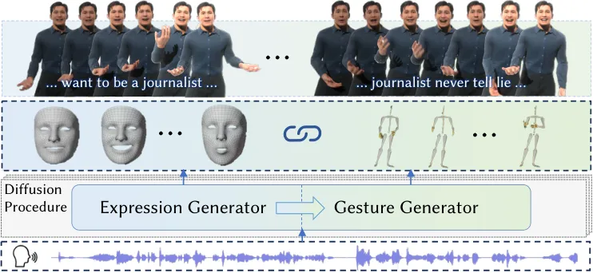
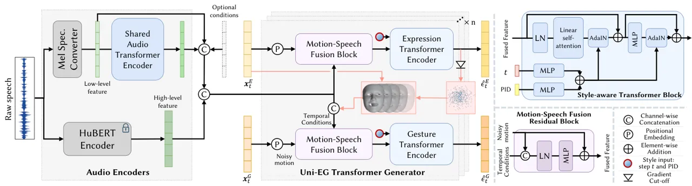
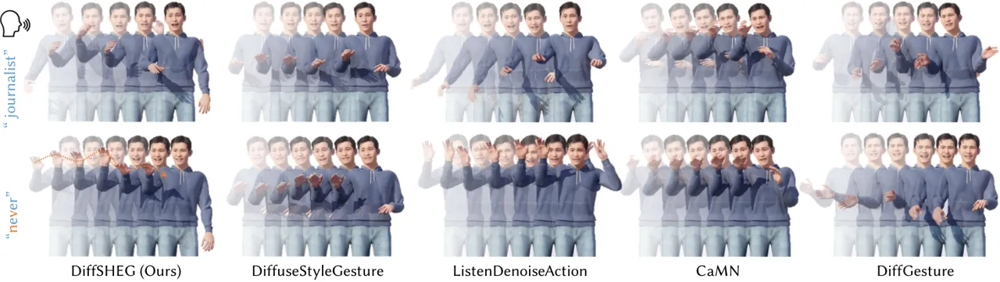
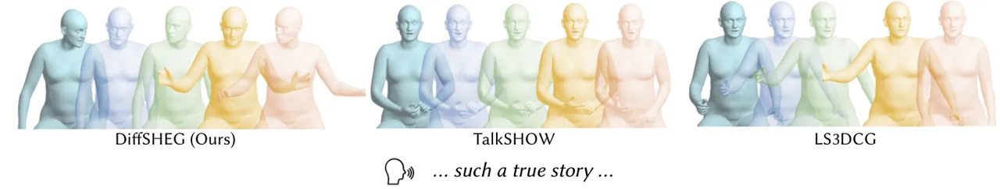
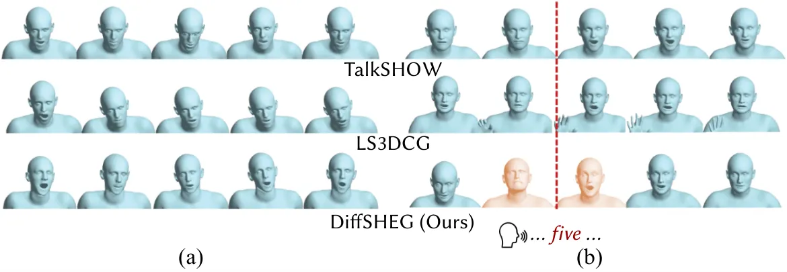
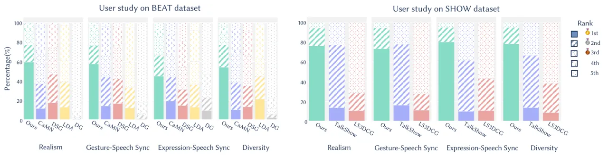
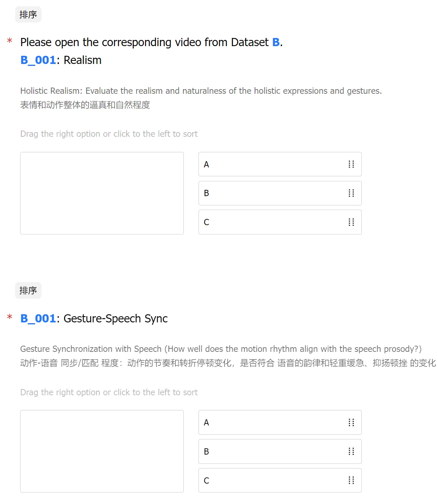
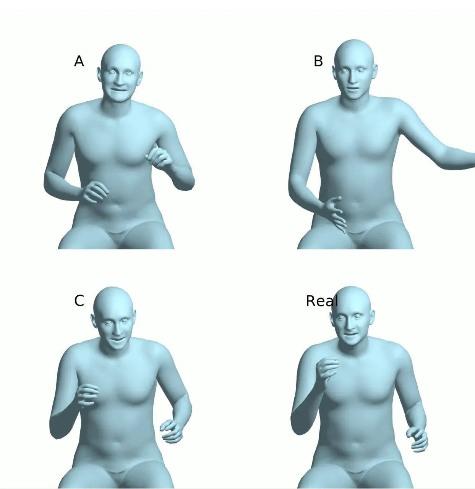
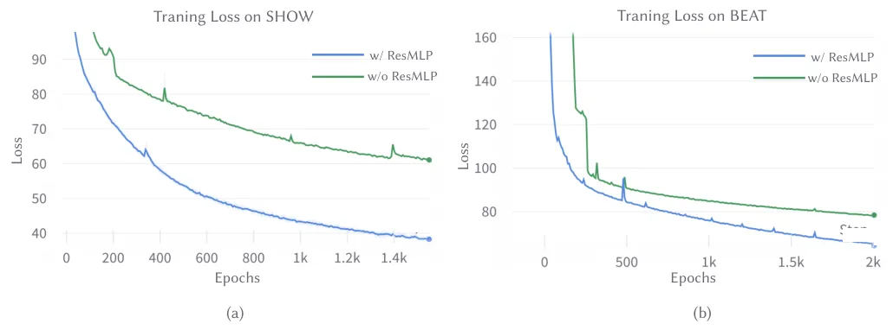
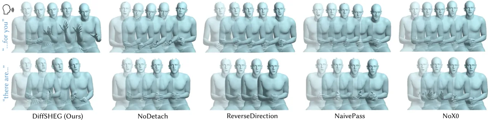

# DiffSHEG: A Diffusion-Based Approach for Real-Time Speech-driven Holistic 3D Expression and Gesture Generation

Junming Chen ^(†)^(†)thanks: The work was done during Junming’s
internship at the International Digital Economy Academy.
Affiliation: International Digital Economy Academy Affiliation: Hong
Kong University of Science and Technology{jchenfo, cqf}@ust.hk
 {liuyunfei, wangjianan, zengailing,
liyu}@idea.edu.cn[https://jeremycjm.github.io/proj/DiffSHEG](https://jeremycjm.github.io/proj/DiffSHEG)
   Yunfei Liu Affiliation: International Digital Economy Academy   
Jianan Wang Affiliation: International Digital Economy Academy    Ailing
Zeng Affiliation: International Digital Economy Academy    Yu Li
^(†)^(†)thanks: Corresponding authors. Affiliation: International
Digital Economy Academy    Qifeng Chen²²footnotemark: 2
Affiliation: Hong Kong University of Science and Technology{jchenfo,
cqf}@ust.hk  {liuyunfei, wangjianan, zengailing,
liyu}@idea.edu.cn[https://jeremycjm.github.io/proj/DiffSHEG](https://jeremycjm.github.io/proj/DiffSHEG)

###### Abstract

We propose DiffSHEG, a Diffusion-based approach for Speech-driven
Holistic 3D Expression and Gesture generation with arbitrary length.
While previous works focused on co-speech gesture or expression
generation individually, the joint generation of synchronized
expressions and gestures remains barely explored. To address this, our
diffusion-based co-speech motion generation transformer enables
uni-directional information flow from expression to gesture,
facilitating improved matching of joint expression-gesture
distributions. Furthermore, we introduce an outpainting-based sampling
strategy for arbitrary long sequence generation in diffusion models,
offering flexibility and computational efficiency. Our method provides a
practical solution that produces high-quality synchronized expression
and gesture generation driven by speech. Evaluated on two public
datasets, our approach achieves state-of-the-art performance both
quantitatively and qualitatively. Additionally, a user study confirms
the superiority of DiffSHEG over prior approaches. By enabling the
real-time generation of expressive and synchronized motions, DiffSHEG
showcases its potential for various applications in the development of
digital humans and embodied agents.



Figure 1: DiffSHEG is a unified co-speech expression and gesture
generation system based on diffusion models. It captures the joint
expression-gesture distribution by enabling the uni-directional
information flow from expression to gesture inside the model.

## 1 Introduction

Non-verbal cues such as facial expressions, body language, and hand
gestures play a vital role in effective communication alongside verbal
language \[43, 13\]. Speech-driven gesture and expression generation has
gained significant interest in applications like the metaverse, digital
human development, gaming, and human-computer interaction. Generating
synchronized and realistic gestures and expressions based on speech is
key to bringing virtual agents and digital humans to life in virtual
environments.

Existing research on co-speech motion synthesis has focused on
generating either expressions or gestures independently. Rule-based
approaches \[22, 18, 38, 8, 44\] were prevalent initially, but recent
advancements have leveraged data-driven techniques using deep neural
networks. However, co-speech gesture generation poses a challenge due to
its inherently many-to-many mapping. State-of-the-art methods have
explored generative models such as normalizing flow models \[48\],
VQ-VAE \[2\], GAN \[14\] and Diffusion models \[54, 3, 1, 47\]. These
approaches have made progress in improving synchronization and
diversifying generated gestures. However, none of them specifically
target the co-speech generation of both expressions and gestures
simultaneously.

Recently, some works have aimed to generate co-speech holistic 3D
expressions and gestures \[49, 14\]. These methods either combine
independent co-speech expression and gesture models \[49\] or formulate
the problem as a multi-task learning one \[14\]. However, these
approaches separate the generation process of expressions and gestures,
neglecting the potential relationship between them. This can lead to
disharmony and deviation in the joint expression-gesture distribution.
Additionally, deterministic CNN-based models \[14\] may not be
well-suited for approximating the many-to-many mapping inherent in
co-speech gesture generation.

In this work, we propose DiffSHEG, a unified Diffusion-based Holistic
Speech-driven Expression and Gesture generation framework, illustrated
in Figure 1. To capture the joint distribution, DiffSHEG utilizes
diffusion models \[16\] with a unified expression-gesture denoising
network. As shown in Figure 2, our denoising network consists of two
modules, an audio encoder, and a Transformer-based Uni-direction
Expression-Gesture (UniEG) generator, which has a unidirectional flow
from expression to gesture. The proposed framework ensures a natural
temporal alignment between speech and motion, leveraging the
relationship between expressions and gestures. Furthermore, we introduce
a Fast Out-Painting-based Partial Autoregressive Sampling (FOPPAS)
method to synthesize arbitrary long sequences efficiently. FOPPAS
enables real-time streaming sequence generation without conditioning on
previous frames during training, providing more flexibility and
efficiency.

Our contributions can be summarized as follows: (1) We develop a unified
diffusion-based approach for speech-driven holistic 3D expression and
gesture generation framework: DiffSHEG. It is the first attempt to
explicitly model the joint distribution of expression and gesture. (2)
To better capture the expression-gesture joint distribution, we design a
uni-directional expression-gesture (UniEG) Transformer generator, which
enforces the uni-directional condition flow from expression to gesture
generator. (3) We introduce FOPPAS, a fast out-painting-based partial
autoregressive sampling method. FOPPAS enables real-time generation of
arbitrary long smooth motion sequences using diffusion models. It
achieves over 30 FPS on a single Nvidia 3090 GPU and can work with
streaming audio. (4) We evaluate our method on two new public datasets
and achieve state-of-the-art performance quantitatively and
qualitatively. User studies validate the superiority of our method in
terms of motion realism, synchronism, and diversity.



Figure 2: DiffSHEG framework overview. Left: Audio Encoders and
UniEG-Transformer Generator. Given an audio clip, we encode the audio
into a low-level feature Mel-Spectrogram and a high-level HuBERT
feature. An audio encoder learns a mid-level representation of speech.
The audio features are concatenated with other optional temporal
conditions and then fed into the UniEG Transformer Denoiser. The
denoising block fuses the conditions with noisy motion at diffusion step
t and feeds it into style-aware transformers to get the predicted
noises. The uni-directional condition flow is enforced from expression
to gesture for joint distribution learning. Right: The detailed
architecture of style-aware Transformer encoder and motion-condition
fusion residual block.

## 2 Related Work

Co-speech Expression Generation. Co-speech Expression Generation, also
known as talking head/face generation, has been a topic of interest in
the field. Early related methods primarily relied on rule-based
procedural approaches \[10, 31, 42, 46\], which required significant
manual effort despite offering explicit and flexible control. With the
advancements in deep learning, data-driven methods \[7, 28, 21, 41, 33,
9, 20, 53, 36, 29\] have emerged, focusing on generating images that
correspond to audio input. However, these methods often produce
distorted pixels and inconsistent 3D results. On another front, some
approaches \[21, 35\] propose animating 3D faces. More recently,
FaceFormer \[12\] and CodeTalker \[45\] have utilized Transformer models
to animate 3D facial vertices using designed attention maps for temporal
alignment. While lip movement is closely tied to speech, most
data-driven methods for expression animation design deterministic
mappings, lacking diversity in eye movement and facial expressions. In
contrast to these methods, our approach aims to leverage generative
models to generate diverse facial expressions with precise lip movements
driven by speech.

Co-speech Gesture Generation. The speech-driven gesture generation
follows a similar path as face animation: from rule-based \[22, 18, 38,
8, 44\] to data-driven methods \[23, 24, 5, 2\]. The early data-driven
methods utilize statistical models to learn speech-gesture mapping.
After that, deterministic models such as multilayer perceptron
(MLP) \[24\], convolutional networks \[14\], recurrent neural
networks \[15, 50, 51, 5, 27\], and Transformers \[6\] are explored.
Since speech-to-gesture mapping involves a many-to-many mapping,
numerous state-of-the-art methods utilize generative models like
normalizing flow \[48\], GAN \[14\] and diffusion-based models \[1, 54,
47\]. Recently, DiffGesture \[54\] and DiffuseStyleGesture \[47\] first
applied diffusion in gesture generation. However, both frameworks
require initial gestures during training for long sequence generation,
which lacks flexibility and diversity compared to our FOPPAS. LDA \[1\]
utilizes Conformer as the diffusion base network and takes advantage of
translation-invariant positional embedding to sample longer sequences in
a go. Nevertheless, it cannot work with streaming audio and may not
generalize well on very long sequences.

Holistic Co-Speech Expression and Gesture Generation. There are some
recent methods \[14, 49\] exploring the holistic joint generation of
expression and gesture. Habibie et al. \[14\] first try to synthesize 3D
facial and gesture motion at the same time. They propose a CNN-based
framework that shares the same speech encoder and uses three decoders to
generate distinct whole-body keypoints (i.e., for face, hand, body),
followed by a discriminator to provide adversarial loss during training.
However, this method learns deterministic mapping, which violates the
nature of many-to-many mapping from speech to gesture motion. Yi et
al. \[49\] use an encoder-decoder network with pre-trained Wav2Vec \[4\]
audio feature for expression generation and VQ-VAE for gesture
generation. Nevertheless, they generate the expressions and gestures
separately, overlooking the joint distribution between them. Moreover,
methods based on VQ-VAE are constrained by a finite set of motion
tokens, potentially limiting their ability to generate diverse and agile
motions.

## 3 Method

How to model the expression-gesture joint distribution can be key to
this task. A naïve way is directly concatenating the two vectors
together and passing them to deep networks simultaneously, such that the
features of both can be shared by each other. However, we empirically
find this does not work well and leads to sub-optimal results in our
experiment. We hypothesize that the information flow from gesture to
expression would interfere with the mapping from speech to expression.
Intuitively, expressions can serve as cues for gestures since the
gestures usually behave consistently with the emotions and speech
inferred from expression \[40\] and lip movement \[11\]. On the
contrary, gestures can hardly affect expressions, especially the lips,
which have a strong and exclusive correlation with speech. Imagine when
you express surprise, you may have widened eyes, opened mouth, and
raised eyebrows, with frozen or startled gestures such as clasping hands
and leaning backward. Therefore, we propose a unified framework based on
diffusion models with uni-directional information flow from expression
to gesture for unified co-speech expression and gesture generation to
capture their joint distributions. At inference time, to generate
arbitrary-long motion sequences, we propose an fast out-painting-based
partial autoregressive sampling (FOPPAS) strategy, which generates
partially overlapping clips one by one with a smooth motion at the
intersection. Additionally, FOPPAS also features its real-time streaming
inference ability. In the following sections, we will introduce the
problem formulation and diffusion model \[16\], and then elaborate on
the design of our proposed framework.

### 3.1 Problem Formulation

Given an arbitrary-long (streaming) audio, we aim to generate realistic,
synchronous, and diverse gestures as well as expressions. To get
training samples, we cut the aligned audio and motion sequences into
clips with the same time duration using sliding windows. For each
$`N`$-frame clip, we encode the corresponding audio clip to audio
features $`\mathbf{A}=[{\mathbf{a}_{1},\dots,\mathbf{a}_{N}}]`$. Gesture
clip $`\mathbf{G}=[{\mathbf{g}_{1},\dots,\mathbf{g}_{N}}]`$ is
represented by joint rotations in axis-angle format, where
$`\mathbf{g}_{i}\in\mathbb{R}^{3J}`$ and $`J`$ is the total joint
number. Expression clip
$`\mathbf{E}=[{\mathbf{e}_{1},\dots,\mathbf{e}_{N}}]`$ is represented by
the blend shape weights where $`\mathbf{e}_{i}\in\mathbb{R}^{C_{exp}}`$
and $`C_{exp}`$ is the channel dimension of expression. The holistic
motion sequence $`\mathbf{M}=Concat(\mathbf{G},\mathbf{E})`$, where each
motion frame $`\mathbf{m}_{i}\in\mathbb{R}^{3J+C_{exp}}`$. The training
objective of our framework is to reconstruct the motion clip
$`\mathbf{M}`$ conditioned on audio clip $`\mathbf{A}`$, which is
similar to the Multi-Input Multi-Output (MIMO) setting \[34\]. At
inference time, we generate realistic, diverse, and well-aligned
co-speech expressions and gestures with motion clips smoothly connected.

### 3.2 Preliminary: Diffusion Models

DiffSHEG uses diffusion models \[16\] for this task which consists of a
diffusion and a denoising process. For explicitness, we substitute
notations of expression, gesture, and motion clip
$`\mathbf{E},\mathbf{G},\mathbf{M}`$ with
$`\mathbf{x}_{0}^{E},\mathbf{x}_{0}^{G},\mathbf{x}_{0}`$. Given a motion
clip distribution
$`p(\mathbf{x}_{0})\in\mathbb{R}^{N\times(3J+C_{exp})}`$, our goal is to
train a model parameterized by $`\theta`$ to approximate
$`p(\mathbf{x}_{0})`$.

Diffusion Process. In the diffusion process, models progressively
corrupts input data $`\mathbf{x}_{0}\sim p(\mathbf{x}_{0})`$ according
to a predefined schedule $`\beta_{t}\in(0,1)`$, eventually turning data
distribution into an isotropic Gaussian in $`T`$ steps. Each diffusion
transition can be assumed as

```math
\displaystyle q\left(\mathbf{x}_{t}\mid\mathbf{x}_{t-1}\right) \displaystyle=\mathcal{N}\left(\mathbf{x}_{t};\sqrt{1-\beta_{t}}\mathbf{x}_{t-1},\beta_{t}\mathbf{I}\right), \tag{1}
```

where the full diffusion process can be written as

```math
\displaystyle q\left(\mathbf{x}_{1:T}\mid\mathbf{x}_{0}\right) \displaystyle=\prod_{1\leq t\leq T}q\left(\mathbf{x}_{t}\mid\mathbf{x}_{t-1}\right). \tag{2}
```

Denoising Process. In the denoising process, models learn to invert the
diffusion procedure so that it can turn random noise into real data
distribution at inference. The corresponding denoising process can be
written as

```math
\displaystyle p_{\theta}\left(\mathbf{x}_{t-1}\mid\mathbf{x}_{t}\right)=\mathcal{N}\left(\mathbf{x}_{t-1};\mu_{\theta}\left(\mathbf{x}_{t},t\right),\Sigma_{\theta}\left(\mathbf{x}_{t},t\right)\right)
```

```math
\displaystyle=\mathcal{N}\left(\mathbf{x}_{t-1};\frac{1}{\sqrt{\alpha_{t}}}\left(\mathbf{x}_{t}-\frac{\beta_{t}}{\sqrt{1-\bar{\alpha}_{t}}}\mathbf{\epsilon}\right),\frac{1-\bar{\alpha}_{t-1}}{1-\bar{\alpha}_{t}}\beta_{t}\right), \tag{3}
```

where $`\mathbf{\epsilon}\sim\mathcal{N}(\mathbf{0},\mathbf{I})`$,
$`\alpha_{t}=1-\beta_{t}`$,
$`\bar{\alpha}_{t}=\prod_{i=1}^{t}\alpha_{i}`$ and $`\theta`$
specifically denotes parameters of a neural network learning to denoise.
The training objective is to maximize the likelihood of observed data
$`p_{\theta}\left(\mathbf{x}_{0}\right)=\int p_{\theta}\left(\mathbf{x}_{0:T}\right)d\mathbf{x}_{1:T}`$,
by maximizing its evidence lower bound (ELBO), which effectively matches
the true denoising model
$`q\left(\mathbf{x}_{t-1}\mid\mathbf{x}_{t}\right)`$ with the
parameterized
$`p_{\theta}\left(\mathbf{x}_{t-1}\mid\mathbf{x}_{t}\right)`$. During
training, the target of the denoising network
$`\mathbf{\epsilon}_{\theta}(.)`$ is to restore $`\mathbf{x}_{0}`$ given
any noised input $`\mathbf{x}_{t}`$, by predicting the added noise
$`\epsilon\sim\mathcal{N}(\mathbf{0},\mathbf{I})`$ via minimizing the
noise prediction error

```math
\displaystyle\mathcal{L}_{t} \displaystyle=\mathbb{E}_{\mathbf{x}_{0},\epsilon}\left[\left\|\mathbf{\epsilon}-\mathbf{\epsilon}_{\theta}\left(\sqrt{\bar{\alpha}_{t}}\mathbf{x}_{0}+\sqrt{1-\bar{\alpha}_{t}}\mathbf{\epsilon},t\right)\right\|^{2}\right]. \tag{4}
```

To make the model conditioned on extra context information
$`\mathbf{c}`$, e.g., audio, we inject $`\mathbf{c}`$ into
$`\mathbf{\epsilon}_{\theta}(.)`$ by replacing
$`\mu_{\theta}\left(\mathbf{x}_{t},t\right)`$ and
$`\Sigma_{\theta}\left(\mathbf{x}_{t},t\right)`$ with
$`\mu_{\theta}\left(\mathbf{x}_{t},t,\mathbf{c}\right)`$ and
$`\Sigma_{\theta}\left(\mathbf{x}_{t},t,\mathbf{c}\right)`$.

### 3.3 DiffSHEG Framework

Our DiffSHEG consists of audio encoders and the UniEG Transformer
generator. Our UniEG has double meanings: unified joint
expression-gesture generation with uni-directional expression-to-gesture
condition flow. The UniEG generator includes two main building blocks:
Motion-Speech Fusion Residual Block and Style-aware Transformer Block.

Speech Encoding. We convert the raw speech audio into two types of
features: Mel-spectrogram and HuBERT \[17\] feature, which serve as
low-level and high-level speech features, respectively. The HuBERT
encoder is frozen during training. For the low-level Mel-spectrogram
feature, we further feed it into a Transformer encoder shared by
expression and gesture branch to extract the shared mid-level speech
feature. This is drawn upon a classical design of multi-task learning,
in which task-specific decoders can share the low-level feature to
benefit each other.

Motion-Speech Fusion Residual Block. In order to condition the motion on
speech and align them in the temporal dimension, instead of using
cross-attention between speech and motion \[12\], we directly
concatenate the motion features with the speech embeddings as well as
other optional temporal conditions along the channel dimension,
resulting in a natural temporal alignment between audio and motion as
well as an exemption on the use of attention masks in cross-attention
temporal conditioning \[12\]. For feature fusion, instead of using
simple linear layer \[54\] which leads to slow convergence and unstable
training, we design the motion-speech fusion residual block, which fuses
concatenated features and projects them into the same shape as motion
features as shown in Figure 2. The block consists of a LayerNorm (LN)
and an MLP, where the LN ensures numerical stability, and the MLP is
designed to predict the residual of the original motion features to
facilitate fast convergence (Section 10 in Appendix).

Style-aware Transformer Block. This block injects global conditions
(style and diffusion step $`t`$) to the fused features from the previous
Motion-Speech Block. Firstly, style (person ID in this paper) and
diffusion step $`t`$ are projected to vectors of the same shape by MLPs.
Then, the summation of two global condition vectors will be fed into
AdaIN \[19\]. Two AdaIN stylization blocks are inserted after
self-attention and MLP in a Transformer encoder block. The AdaIN blocks
apply the feature statistics substitution according to the new
statistics computed from the fused global condition vector. Note that we
utilize linear self-attention \[37, 52\] as an alternative for full
self-attention to save computation and facilitate fast inference.

Uni-directional Expression-to-Gesture Information Flow. To capture the
joint distribution of expression and gesture and facilitate realism and
coherence of two types of motion, we feed the predicted expression
$`\hat{x}_{0(t)}^{E}`$ at the diffusion step $`t`$ into the gesture
Transformer block, as shown in Figure 2. This expression is computed
from the predicted expression noise $`\hat{\epsilon}^{E}_{t}`$ at
diffusion step $`t`$:

```math
\hat{\mathbf{x}}_{0(t)}^{E}=\frac{\mathbf{x}_{t}^{E}-\sqrt{1-\bar{\alpha}_{t}}\hat{\epsilon}^{E}_{t}}{\sqrt{\bar{\alpha}_{t}}}. \tag{5}
```

Note that to prevent the gradient of the gesture branch from affecting
the expression encoder, we cut off the gradient of the predicted
expression $`\hat{x}_{0(t)}^{E}`$ before passing it to the gesture
encoder, as illustrated in Figure 2. The Uni-EG module will repeat $`n`$
times to get the final noise in each forward of the network.

Figure 3: Illustration for outpainting-based arbitrary long sequence
inference. Given a previous clip, we generate current clip by
outpainting the remaining frames (light blue) according to the
overlaping frames (deep blue). Each row of blue bar represents a motion
clip from a single sampling process.

### 3.4 Training

Loss functions. Except for the noise prediction loss in Equation 4, we
also introduce the velocity loss $`\mathcal{L}_{v}`$ and Huber motion
reconstruction loss $`\mathcal{L}_{\delta}`$. Since the two losses are
computed on the motion $`\hat{\mathbf{x}}_{0}`$, we first compute the
predicted motion $`\hat{\mathbf{x}}_{0(t)}`$ from the predicted noise
$`\hat{\mathbf{\epsilon}_{t}}`$, which is similar to Equation 5. Then,
we have velocity loss computed as the mean square error of the velocity:

```math
\mathcal{L}_{v}=\mathbb{E}\left[\left\|(\mathbf{x}_{0}[1:]-\mathbf{x}_{0}[:-1])-(\hat{\mathbf{x}}_{0}[1:]-\hat{\mathbf{x}}_{0}[:-1])\right\|^{2}\right], \tag{6}
```

and the Huber loss for the reconstruction of motion:

```math
\mathcal{L}_{\delta}=\begin{cases}\frac{1}{2}(\mathbf{x}_{0}-\hat{\mathbf{x}}_{0})^{2},&\text{if}\left|(\mathbf{x}_{0}-\hat{\mathbf{x}}_{0})\right|<\delta,\\
\delta((\mathbf{x}_{0}-\hat{\mathbf{x}}_{0})-\frac{1}{2}\delta),&\text{otherwise.}\end{cases} \tag{7}
```

The final loss is a weighted sum of the three losses:

```math
\mathcal{L}=\lambda_{t}\mathcal{L}_{t}+\lambda_{v}\mathcal{L}_{v}+\lambda_{\delta}\mathcal{L}_{\delta}, \tag{8}
```

where $`\lambda_{t}=10`$, $`\lambda_{v}=1`$, and $`\lambda_{\delta}=1`$
in our experiment.

### 3.5 Arbitrary-long Motion Generation

Instead of conditioning the model on previous frames during
training \[47, 54, 26\], we propose to realize the arbitrary long
sampling via outpainting at the test time without training, which has
more flexibility and less computation waste.

Fast Outpainting-based Partial Autoregressive Sampling (FOPPAS). As
illustrated in Figure 3, starting from the second clip, we can fix the
initial frames to be the same as the last frames of the previous clip
and then outpaint the remaining frames in this clip. This method
conditions the current clip only on the part of the previous clip
frames; therefore, we call it partial autoregressive sampling via
outpainting. Unlike the RNN-based methods \[26\] or train-time
autoregressive diffusion models \[54, 47\], the number of overlapping
frames of FOPPAS can be flexibly set and changeable anytime instead of
being required and fixed once trained. Those methods \[26, 54, 47\] also
require an initial ”seed motion” to generate the first clip. However, it
is not convenient for users to find such seed sequences or they just
want to generate the first clip randomly. In contrast, we can generate
the first clip with the overlapping number set as 0. In our experiment,
we choose Repaint \[30\] to perform diffusion-based outpainting.

Shorter Clip Sampling. When using Transformer without positional
embedding, it becomes a point-wise set function. Therefore, the length
of an ordered sequence that a Transformer can process in one pass only
depends on the length of the positional embedding used during training.
Thanks to this property of the Transformer, our framework can infer any
clip that is shorter than the training clip, which is achieved by
dropping the remaining positional embedding. This is particularly useful
when inferring the last clip, as demonstrated in Figure 3.

Towards Real-time Sampling. The original DDPM has 1000 steps to generate
a clip, which is very slow in practice. Moreover, the total denoising
steps would be further increased due to the re-sampling operation in
Repaint \[30\]. To enable real-time generation for various applications
in the development of digital humans and embodied agents, we adapt the
Repaint \[30\] algorithm to DDIM \[39\] sampling. We use 25-step DDIM to
replace the 1000-step DDPM, with a speedup of about 40 times during
inference.

Last-steps Refinement with Blending. Although applying outpainting
already gets a very smooth transition between clips, we occasionally
observe slight inconsistency at the boundary. To refine and facilitate
the consistency at the clip boundary, we perform a linear blending at
the overlapping part of clips at the last two sampling steps. For the
details of FOPPAS, please refer to Algorithm 1 in the Appendix.



Figure 4: Qualitative Comparison on BEAT \[26\] Dataset. In comparison
to baseline methods, our approach generates a broader range of natural,
agile, and diverse gestures that are closely synchronized with the audio
input. When saying ”journalist”, the character driven by our motion
raises double hands to stress this word; When saying ”never”, our motion
shows two times up-and-down right hand and fingers, corresponding to the
two syllables “ne” and “ver”. The character is from MetaHuman \[55\]
rendered by Unreal Engine 5 \[56\].



Figure 5: Motion Comparison on the SHOW \[49\] Dataset. Our method
generates more expressive and diverse motions than TalkShow \[49\] and
LS3DCG \[14\] in terms of both gesture and head pose diversity. Our
results also show more agile motions than baselines.



Figure 6: Expression and Head Pose Comparison on the SHOW \[49\]
Dataset. (a) With speech audio as input, TalkShow \[49\] and
LS3DCG \[14\] may generate unnatural and persistent head-down poses
showing limited variation. In contrast, our method produces a wide range
of expressive head poses. (b) Prior to the audio input’s emphasis on the
word “five”, our approach instinctively raises the head to prepare for
highlighting, subsequently producing precise lip movements accompanied
by raised eyebrows to emphasize the word “five”.

## 4 Experiments

### 4.1 Datasets

BEAT \[26\] is a large-scale, multi-modal human gestures and expressions
dataset with text, semantic and emotional annotations. We follow the
train-validation-test split setting in \[26\] with four subjects. The
training and validation samples are 34-frame clips. The test samples
have 64 long sequences with a duration of around 1 minute. The motions
are then resampled into 15 frames per second. We adopt axis-angle
rotation representation for smooth motion generation. SHOW \[49\] is a
new audio-visual dataset that includes SMPLX \[32\] parameters of 4
persons reconstructed from videos at 30 fps, along with corresponding
synchronized audio sampled at 22K rate. Following the same settings in
SHOW \[49\], we generate the SMPLX parameters according to the audio.
The training and validation samples are 88-frame motion clips, and the
test samples are long motion sequences with different lengths.

### 4.2 Experimental Setup

We train our model on five 3090 GPUs. For BEAT, we train our model for
1000 epochs with a batch size of 2500. For SHOW, we train 1600 epochs
with a batch size of 950.

Baselines. We compare our method with CaMN \[26\], DiffGesture \[54\],
DiffuseStyleGesture \[47\] and ListentDenoiseAction (LDA) \[1\] on BEAT.
CaMN is proposed with the BEAT dataset, which is based on LSTM and can
fuse multiple conditions, including audio, text, face, and emotion.
DiffGesture, DiffuseStyleGesture, and LDA are newly proposed
diffusion-based co-speech generation methods. For gesture generation,
the four baselines are retrained on the axis-angle rotation
representation instead of the Euler angles. For expression generation,
since four baseline methods were originally proposed for gesture
generation solely, we substitute the gesture into the expression data to
generate expressions independently. For a fair comparison, we condition
all the models on audio and person ID. On the SHOW dataset, we utilize
two baselines that focus on joint expression and gesture generation:
TalkSHOW \[49\] and the method proposed in \[14\] named LS3DCG here.
Since all the baselines only focus on the upper body movement for
gesture generation, we follow this setting despite that our framework
also works for the lower body motion.



Figure 7: Results of the user study. The chart shows user preference
percentage in terms of four metrics: realism, gesture-speech
synchronism, expression-speech synchronism, and motion diversity. In
both datasets and all metrics, our method is dominantly preferred. DSG
and DG are the abbreviations of DiffuseStyleGesture and DiffuseGesture.

|             |                                 |                    |                    |                  |     |                    |                |                   |                  |     |
| ----------- | ------------------------------- | ------------------ | ------------------ | ---------------- | --- | ------------------ | -------------- | ----------------- | ---------------- | --- |
| Dataset     | Method                          | Holistic           | Expression         |                  |     | Gesture            |                |                   |                  |     |
|             |                                 | FMD $`\downarrow`$ | FED $`\downarrow`$ | Div $`\uparrow`$ | Gen | FGD $`\downarrow`$ | BA$`\uparrow`$ | SRGR $`\uparrow`$ | Div $`\uparrow`$ | Gen |
| BEAT \[26\] | Ground Truth                    | -                  | -                  | 0.651            | -   | -                  | 0.915          | 0.961             | 0.819            | -   |
|             | CaMN (ECCV’22) \[26\]           | 1055.52            | 1324.00            | 0.479            | ✗   | 1635.44            | 0.793          | 0.197             | 0.633            | ✗   |
|             | DiffGesture (CVPR’23) \[54\]    | 12142.70           | 586.45             | 0.625            | ✓   | 23700.91           | 0.929          | 0.096             | 3.284            | ✓   |
|             | DSG (IJCAI’23) \[47\]           | 1261.59            | 998.25             | 0.688            | ✓   | 1907.58            | 0.919          | 0.204             | 0.701            | ✓   |
|             | LDA (SIGGRAPH’23) \[1\]         | 688.25             | 510.345            | 0.603            | ✓   | 997.62             | 0.923          | 0.215             | 0.688            | ✓   |
|             | Ours Naïve Concat               | 354.60             | 354.60             | 0.526            |     | 497.28             | 0.914          | 0.253             | 0.503            |     |
|             | Ours w/o Detach                 | 375.98             | 384.31             | 0.513            |     | 475.19             | 0.917          | 0.247             | 0.517            |     |
|             | Ours w/o $`\hat{x}_{0(t)}^{E}`$ | 369.97             | 366.37             | 0.519            | ✓   | 477.00             | 0.917          | 0.251             | 0.504            | ✓   |
|             | Ours Reverse Direction          | 357.56             | 369.72             | 0.583            |     | 472.38             | 0.913          | 0.245             | 0.553            |     |
|             | DiffSHEG (Ours)                 | 324.67             | 331.72             | 0.539            |     | 438.93             | 0.914          | 0.251             | 0.536            |     |
| SHOW \[49\] | Ground Truth                    | -                  | -                  | 0.990            | -   | -                  | 0.867          | PCM=1             | 0.834            | -   |
|             | LS3DCG\* (IVA’21) \[14\]        | 0.00230            | 0.00229            | 0.708            | ✗   | 0.00478            | 0.947          | 0.981             | 0.645            | ✗   |
|             | TalkSHOW\* (CVPR’23) \[49\]     | 0.00219            | 0.00233            | 0.740            | ✗   | 0.00323            | 0.869          | 0.902             | 0.703            | ✓   |
|             | TalkSHOW (Re-train) \[49\]      | 0.00278            | 0.00408            | 0.618            | ✗   | 0.00328            | 0.872          | 0.894             | 0.711            | ✓   |
|             | Ours Naïve Concat               | 0.00255            | 0.00192            | 0.766            |     | 0.00407            | 0.896          | 0.932             | 0.618            |     |
|             | Ours w/o Detach                 | 0.00259            | 0.00234            | 0.745            |     | 0.00378            | 0.899          | 0.926             | 0.673            |     |
|             | Ours w/o $`\hat{x}_{0(t)}^{E}`$ | 0.00248            | 0.00251            | 0.728            | ✓   | 0.00311            | 0.892          | 0.927             | 0.694            | ✓   |
|             | Ours Reverse Direction          | 0.00269            | 0.00266            | 0.731            |     | 0.00347            | 0.882          | 0.926             | 0.695            |     |
|             | DiffSHEG (Ours)                 | 0.00184            | 0.00161            | 0.923            |     | 0.00271            | 0.902          | 0.912             | 0.810            |     |

Table 1: Quantitative comparison and ablation study. On the BEAT \[26\]
dataset, we compare our DiffSHEG with CaMN \[26\], DiffGesture \[54\],
DiffuseStyleGesture (DSG) \[47\] and LDA \[1\] with audio and person ID
as input. Note that the baseline methods are originally for gesture
generation solely, and we apply the same procedure independently for
expression generation. On the SHOW \[49\] dataset, we compare with
LS3DCG \[14\] and TalkSHOW \[49\]. The ablation studies are conducted on
both datasets to demonstrate the effectiveness of our UniEG-Transformer
design. Note that we use SRGR on the BEAT dataset and PCM on SHOW
dataset. \*: indicates that the results are computed using the
pre-trained checkpoints provided by authors of TalkSHOW \[49\].

### 4.3 Qualitative Results

Qualitative comparisons. We highly recommend readers watch our demo
video to get an intuitive sense of qualitative results. Overall, in
addition to better speech-motion alignment, we observe more realistic,
agile and diverse expressions and gestures of ours than that of
baselines on both datasets (Figure 4, 5, 6). On the BEAT dataset, our
method shows more agile gestures than CaMN. The gestures of baseline
diffusion-based methods all suffer different extents of jittering. The
jittering extents from high to low are DiffGesture, DiffuseStyleGesture,
and LDA. Both our method and CaMN can generate smooth motions. However,
CaMN exhibits much slower and less diverse motion while ours is as agile
as the real motion. For expression, CaMN shows inaccurate lip sync while
other methods all look fine. Interestingly, we find that the CaMN barely
blinks, while our method can generate good expressions with a reasonable
frequency of blinks. Other baselines show a more frequent blinking,
corresponding to higher diversity scores. However, ours has the most
similar blink frequency as the real data. On the SHOW dataset, our
method shows more agile gestures than TalkSHOW and more diverse
expressions and gestures (Figure 5, 6). This might be due to the fact
that Talkshow utilizes VQ-VAE to encode the gestures, which may filter
the high-frequency gestures, leading to slow motion. Also, because
VQ-VAE tokenizes the gestures into limited numbers, its gestures show
lower diversity than ours. The LS3DCG suffers from jittering arms, which
may be because their deterministic CNN structure has difficulty
approximating the many-to-many mapping. Note that we retrain the
TalkSHOW for qualitative comparison because the results of TalkSHOW and
LS3DCG with author-provided checkpoints have many highly similar
concurrent motions and face distortions as ground truth during testing.

User study. We conducted a user study on eight 1-minute-long videos in
BEAT and twelve 10-second-long videos in SHOW sampled from the test set.
We recruited 22 subjects with diverse backgrounds to evaluate holistic
realism, expression-speech synchronism, gesture-speech synchronism, and
holistic diversity given real data as a reference. Users are instructed
to perform sorting questions on shuffled videos of different methods.
Note that for diversity, we let users sort the motion diversity under
the premise of smooth and natural motion. The result is reported in
Figure 7. The user study results show that our generated expressions and
motions are dominantly preferred on all four metrics over the baseline
method, demonstrating that our proposed DiffSHEG approach is capable of
generating more realistic, synchronized, and diverse expressions and
gestures that humans prefer. The preference for our generated motions on
realism also demonstrates the effectiveness of our out-painting-based
sampling strategy, which has a smooth connection between adjacent clips.

### 4.4 Quantitative Results

Metrics. Except for the gold standard of evaluation for generative tasks
— user study, we also provide several quantitative metrics as a
reference: (1) FMD, FGD, and FED denotes Fréchet Motion Distance,
Fréchet Gesture Distance, and Fréchet Expression Distance. Except for
the FGD \[51\] that is proposed to evaluate the Fréchet distance between
generated and real data in gesture feature space. Similarly, we propose
FMD and FED that can indicate the generation-GT distribution distance
for holistic motion (joint expression-gesture) distribution and
expression distribution. (2) PCM and SRGR. PCM is the Percent of Correct
Motion parameters, which is computed on motion parameters instead of
keypoints in our experiment. SRGR is a weighted version of PCM according
to the temporal semantic weight proposed in BEAT \[26\]. We use PCM for
SHOW and SRGR for BEAT. (3) Diversity (Div) is used to evaluate whether
a model can generate a wide range of dynamic and varied motions,
following \[5\]. This metric involves calculating the distance between
various generated gestures. (4) Beat alignment (BA) \[25\] is a Chamfer
Distance between audio and gesture beats to evaluate gesture-audio beat
similarity and we follow the same implementation in the BEAT
paper \[26\]. (5) We also mark in Table 1 to show whether it is a
generative (Gen) model. Generative models can generate different and
diverse motions from the same audio input, while the deterministic
models output the determined motion given the same input speech. Note
that except for the Fréchet distances, other quantitative metrics only
serve as a reference since they are not always aligned with the
human-perceived visual quality \[1, 2\].

Comparison with Baselines. The results in Table 1 demonstrate our method
can achieve state-of-the-art performance compared with other baselines
on both datasets. We consistently outperform the baseline methods on
Fréchet distance (FMD, FED, and FGD) by a large margin, indicating the
strong distribution matching ability of DiffSHEG, especially the
expression-gesture joint distribution. For SRGR and PCM of gestures, we
outperform all the baselines except for the LS3DCG which generates
jittering motion. Note that Div and BA are only meaningful when the
synthesized motions are smooth and natural because the jittering motion
or motion with outliers can also result in a high score of diversity and
beat alignment. For jittering motion, the beat detector will regard each
jitter timestep as a beat covering most of the audio beat. On the BEAT
dataset, we outperform CaMN on the gesture BA and get a comparative BA
with other diffusion baselines. As for the Div score, ours is higher
than CaMN but lower than other diffusion baselines. This aligns with the
qualitative observations that CaMN has slow motions and other diffusion
baselines suffer from jittering. On the SHOW dataset, our DiffSHEG is
consistently better than TalkSHOW and LS3DCG on both BA and Div, except
that LS3DCG has a higher BA which may be due to the jittering. The Div
of our DiffSHEG for both expression and gesture achieves a similar score
to that of real data, indicating that the diversity of our generated
results can achieve a realistic level on the SHOW dataset.

Impact of FOPPAS and Runtime Analysis. Diffusion models suffer from the
long sampling steps at the test time – the original DDPM model takes
1000 steps to sample a quality image. Considering the resampling of
Repaint \[30\], it would be slower by times. However, thanks to our
FOPPAS mechanism, we can synthesize arbitrary-long smooth motion
sequences in real time. We test the runtime of our method on a
one-minute-long audio corresponding to 900 frames of expressions and
gestures (BEAT uses 15 FPS motion), with the number of overlapping
frames in FOPPAS set to 4. The average runtime of our method is 28.6
seconds on a single NVIDIA GeForce RTX 3090 GPU, corresponding to around
31.5 FPS. The time for audio encoding (Mel-Spectrogram and HuBERT) is
also included. In contrast, if we directly use DDPM with Repaint \[30\],
it costs 2068.1s to infer 900 frames using the default setting of
repaint, which is 0.44 FPS. Therefore, our proposed FOPPAS can benefit
the diffusion model to achieve real-time in the inference stage, making
many downstream products applicable.

### 4.5 Ablation Study

Uni-directional condition flow. To demonstrate the effectiveness of our
uni-directional condition flow design, we conduct experiments on three
ablated architectures: ours without expression condition flow into
gesture encoder (Ours w/o $`\mathbf{\hat{x}_{0}^{E}}`$), ours without
cutting off the gradient when feeding predicted expression to gesture
encoder (Ours w/o Detach), naïvely concatenate expression and gesture
together to be fed into a single Transformer denoising block (Ours Naïve
Concat), and reverse the direction of condition flow to become gesture
to expression (Ours Reverse Direction). For Ours Naïve Concat, we
enlarge the latent dimension of the Transformer block by 1.41 times to
have a similar computational complexity for a fair comparison. From
Table 1, on both BEAT and SHOW datasets, our DiffSHEG outperforms all
the four ablated architectures on Fréchet distances and achieves better
or comparable BA, Diversity, and PCM/SRGR scores. On the BEAT dataset,
the reverse direction ablation has a higher diversity due to the high
entropy of gestures as a condition for expression, but its other metrics
are still worse than DiffSHEG, indicating the adverse affect of gesture
condition flow to expression. These results demonstrate the
effectiveness of our design and validate our intuitive analysis of the
relationship between expression and gesture. For more ablations, please
refer to our Appendix.

## 5 Conclusion

In conclusion, we propose a novel diffusion-based approach, DiffSHEG,
for speech-driven holistic 3D expression and gesture generation. Our
approach addresses the joint expression and gesture generation
challenges, which have received less attention in previous works. We
develop a Transformer-based framework, UniEG-Transformer, that enables
the uni-direction flow of information from expression to gesture in the
high-level feature space, which can effectively capture the
expression-gesture joint distribution. We also introduce a fast
outpainting-based partial autoregressive sampling (FOPPAS) strategy with
DDIM to achieve real-time inference on arbitrary-long streaming audio.
Our approach has demonstrated state-of-the-art performance on two public
datasets quantitatively and qualitatively. The qualitative results and
user study show that our method can generate realistic, agile, and
diverse expressions and gestures that are well-aligned with speech.

## 6 Acknowledgement

We sincerely thank the help from Shaojun Liu and Zhaoxin Fan on the
MetaHuman character rendering.

## References

- \[1\] Simon Alexanderson, Rajmund Nagy, Jonas Beskow, and Gustav Eje
  Henter. Listen, denoise, action! audio-driven motion synthesis with
  diffusion models. _TOG_, 42(4):44:1–44:20, 2023.
- \[2\] Tenglong Ao, Qingzhe Gao, Yuke Lou, Baoquan Chen, and Libin Liu.
  Rhythmic gesticulator: Rhythm-aware co-speech gesture synthesis with
  hierarchical neural embeddings. _TOG_, 41(6):1–19, 2022.
- \[3\] Tenglong Ao, Zeyi Zhang, and Libin Liu. Gesturediffuclip:
  Gesture diffusion model with clip latents. _TOG_, 2023.
- \[4\] Alexei Baevski, Henry Zhou, Abdelrahman Mohamed, and Michael
  Auli. wav2vec 2.0: A framework for self-supervised learning of speech
  representations. _arXiv preprint arXiv:2006.11477_, 2020.
- \[5\] Uttaran Bhattacharya, Elizabeth Childs, Nicholas Rewkowski, and
  Dinesh Manocha. Speech2affectivegestures: Synthesizing co-speech
  gestures with generative adversarial affective expression learning. In
  _ACM MM_, page 2027–2036, New York, NY, USA, 2021a.
- \[6\] Uttaran Bhattacharya, Nicholas Rewkowski, Abhishek Banerjee,
  Pooja Guhan, Aniket Bera, and Dinesh Manocha. Text2gestures: A
  transformer-based network for generating emotive body gestures for
  virtual agents. _CoRR_, abs/2101.11101, 2021b.
- \[7\] Yong Cao, Wen C Tien, Petros Faloutsos, and Frédéric Pighin.
  Expressive speech-driven facial animation. _TOG_,
  24(4):1283–1302, 2005.
- \[8\] Justine Cassell, Hannes Högni Vilhjálmsson, and Timothy
  Bickmore. Beat: the behavior expression animation toolkit. In
  _Life-Like Characters_, pages 163–185. Springer, 2004.
- \[9\] Daniel Cudeiro, Timo Bolkart, Cassidy Laidlaw, Anurag Ranjan,
  and Michael J Black. Capture, learning, and synthesis of 3d speaking
  styles. In _CVPR_, pages 10101–10111, 2019.
- \[10\] Pif Edwards, Chris Landreth, Eugene Fiume, and Karan Singh.
  Jali: an animator-centric viseme model for expressive lip
  synchronization. _TOG_, 35(4):1–11, 2016.
- \[11\] Ariel Ephrat and Shmuel Peleg. Vid2speech: Speech
  reconstruction from silent video. _ICASSP_, 2017.
- \[12\] Yingruo Fan, Zhaojiang Lin, Jun Saito, Wenping Wang, and Taku
  Komura. Faceformer: Speech-driven 3d facial animation with
  transformers. In _CVPR_, 2022.
- \[13\] Susan Goldin-Meadow. The role of gesture in communication and
  thinking. _Trends in cognitive sciences_, 3(11):419–429, 1999.
- \[14\] Ikhsanul Habibie, Weipeng Xu, Dushyant Mehta, Lingjie Liu,
  Hans-Peter Seidel, Gerard Pons-Moll, Mohamed Elgharib, and Christian
  Theobalt. Learning speech-driven 3d conversational gestures from
  video. In _IVA_, pages 101–108, 2021.
- \[15\] Dai Hasegawa, Naoshi Kaneko, Shinichi Shirakawa, Hiroshi
  Sakuta, and Kazuhiko Sumi. Evaluation of speech-to-gesture generation
  using bi-directional lstm network. In _Proceedings of the 18th IVA_,
  pages 79–86, 2018.
- \[16\] Jonathan Ho, Ajay Jain, and Pieter Abbeel. Denoising Diffusion
  Probabilistic Models. _NeurIPS_, 33:6840–6851, 2020.
- \[17\] Wei-Ning Hsu, Benjamin Bolte, Yao-Hung Hubert Tsai, Kushal
  Lakhotia, Ruslan Salakhutdinov, and Abdelrahman Mohamed. Hubert:
  Self-supervised speech representation learning by masked prediction of
  hidden units. _TASLP_, 29:3451–3460, 2021.
- \[18\] Chien-Ming Huang and Bilge Mutlu. Robot behavior toolkit:
  generating effective social behaviors for robots. In _HRI_, pages
  25–32. IEEE, 2012.
- \[19\] Xun Huang and Serge J. Belongie. Arbitrary style transfer in
  real-time with adaptive instance normalization. _ICCV_, pages
  1510–1519, 2017.
- \[20\] Ahmed Hussen Abdelaziz, Barry-John Theobald, Paul Dixon,
  Reinhard Knothe, Nicholas Apostoloff, and Sachin Kajareker. Modality
  dropout for improved performance-driven talking faces. In _ICMI_,
  pages 378–386, 2020.
- \[21\] Tero Karras, Timo Aila, Samuli Laine, Antti Herva, and Jaakko
  Lehtinen. Audio-driven facial animation by joint end-to-end learning
  of pose and emotion. _TOG_, 36(4):1–12, 2017.
- \[22\] Michael Kipp. _Gesture Generation by Imitation: From Human
  Behavior to Computer Character Animation_. Dissertation.com, Boca
  Raton, 2004.
- \[23\] Stefan Kopp, Brigitte Krenn, Stacy Marsella, Andrew N Marshall,
  Catherine Pelachaud, Hannes Pirker, Kristinn R Thórisson, and Hannes
  Vilhjálmsson. Towards a common framework for multimodal generation:
  The behavior markup language. In _IVA_, pages 205–217. Springer, 2006.
- \[24\] Taras Kucherenko, Patrik Jonell, Sanne van Waveren, Gustav Eje
  Henter, Simon Alexandersson, Iolanda Leite, and Hedvig Kjellström.
  Gesticulator: A framework for semantically-aware speech-driven gesture
  generation. In _ICMI_, pages 242–250, 2020.
- \[25\] Ruilong Li, Shan Yang, David A. Ross, and Angjoo Kanazawa. Ai
  choreographer: Music conditioned 3d dance generation with aist++. In
  _ICCV_, pages 13401–13412, 2021.
- \[26\] Haiyang Liu, Zihao Zhu, Naoya Iwamoto, Yichen Peng, Zhengqing
  Li, You Zhou, Elif Bozkurt, and Bo Zheng. Beat: A large-scale semantic
  and emotional multi-modal dataset for conversational gestures
  synthesis. In _ECCV_, 2022a.
- \[27\] Xian Liu, Qianyi Wu, Hang Zhou, Yinghao Xu, Rui Qian, Xinyi
  Lin, Xiaowei Zhou, Wayne Wu, Bo Dai, and Bolei Zhou. Learning
  hierarchical cross-modal association for co-speech gesture generation.
  In _CVPR_, 2022b.
- \[28\] Yilong Liu, Feng Xu, Jinxiang Chai, Xin Tong, Lijuan Wang, and
  Qiang Huo. Video-audio driven real-time facial animation. _TOG_,
  34(6):1–10, 2015.
- \[29\] Yunfei Liu, Lijian Lin, Fei Yu, Changyin Zhou, and Yu Li. Moda:
  Mapping-once audio-driven portrait animation with dual attentions. In
  _ICCV_, pages 23020–23029, 2023.
- \[30\] Andreas Lugmayr, Martin Danelljan, Andres Romero, Fisher Yu,
  Radu Timofte, and Luc Van Gool. Repaint: Inpainting using denoising
  diffusion probabilistic models. In _CVPR_, 2022.
- \[31\] DW Massaro, MM Cohen, M Tabain, J Beskow, and R Clark. Animated
  speech: research progress and applications. _Audiovisual Speech
  Processing_, page 309–345, 2012.
- \[32\] Georgios Pavlakos, Vasileios Choutas, Nima Ghorbani, Timo
  Bolkart, Ahmed A. A. Osman, Dimitrios Tzionas, and Michael J. Black.
  Expressive body capture: 3D hands, face, and body from a single image.
  In _CVPR_, pages 10975–10985, 2019.
- \[33\] Hai Xuan Pham, Yuting Wang, and Vladimir Pavlovic. End-to-end
  learning for 3d facial animation from speech. In _ICMI_, pages
  361–365, 2018.
- \[34\] Chenyang Qi, Junming Chen, Xin Yang, and Qifeng Chen. Real-time
  streaming video denoising with bidirectional buffers. In _ACM MM_,
  page 2758–2766, New York, NY, USA, 2022.
- \[35\] Alexander Richard, Michael Zollhöfer, Yandong Wen, Fernando
  De la Torre, and Yaser Sheikh. Meshtalk: 3d face animation from speech
  using cross-modality disentanglement. In _ICCV_, pages
  1173–1182, 2021.
- \[36\] Shuai Shen, Wenliang Zhao, Zibin Meng, Wanhua Li, Zheng Zhu,
  Jie Zhou, and Jiwen Lu. Difftalk: Crafting diffusion models for
  generalized talking head synthesis. _arXiv preprint
  arXiv:2301.03786_, 2023.
- \[37\] Zhuoran Shen, Mingyuan Zhang, Haiyu Zhao, Shuai Yi, and
  Hongsheng Li. Efficient attention: Attention with linear complexities.
  In _WACV_, pages 3531–3539, 2021.
- \[38\] Robotics Softbank. Naoqi api documentation. In _ICME_, 2018.
- \[39\] Jiaming Song, Chenlin Meng, and Stefano Ermon. Denoising
  diffusion implicit models. In _ICLR_, 2021.
- \[40\] Paweł Tarnowski, Marcin Kołodziej, Andrzej Majkowski, and
  Remigiusz J. Rak. Emotion recognition using facial expressions.
  _Procedia Computer Science_, 108:1175–1184, 2017. ICCS.
- \[41\] Sarah Taylor, Taehwan Kim, Yisong Yue, Moshe Mahler, James
  Krahe, Anastasio Garcia Rodriguez, Jessica Hodgins, and Iain Matthews.
  A deep learning approach for generalized speech animation. _TOG_,
  36(4):1–11, 2017.
- \[42\] Sarah L Taylor, Moshe Mahler, Barry-John Theobald, and Iain
  Matthews. Dynamic units of visual speech. In _ACM SIGGRAPH_, pages
  275–284, 2012.
- \[43\] Susanne Van Mulken, Elisabeth André, and Jochen Müller. The
  persona effect: How substantial is it? In _People and computers XIII_,
  pages 53–66. Springer, 1998.
- \[44\] Petra Wagner, Zofia Malisz, and Stefan Kopp. Gesture and speech
  in interaction: An overview, 2014.
- \[45\] Jinbo Xing, Menghan Xia, Yuechen Zhang, Xiaodong Cun, Jue Wang,
  and Tien-Tsin Wong. Codetalker: Speech-driven 3d facial animation with
  discrete motion prior. In _CVPR_, 2023.
- \[46\] Yuyu Xu, Andrew W Feng, Stacy Marsella, and Ari Shapiro. A
  practical and configurable lip sync method for games. In _Proceedings
  of Motion on Games_, pages 131–140, 2013.
- \[47\] Sicheng Yang, Zhiyong Wu, Minglei Li, Zhensong Zhang, Lei Hao,
  Weihong Bao, Ming Cheng, and Long Xiao. Diffusestylegesture: Stylized
  audio-driven co-speech gesture generation with diffusion models. In
  _IJCAI_, pages 5860–5868, 2023.
- \[48\] Sheng Ye, Yu-Hui Wen, Yanan Sun, Ying He, Ziyang Zhang, Yaoyuan
  Wang, Weihua He, and Yong-Jin Liu. Audio-driven stylized gesture
  generation with flow-based model. In _ECCV_. Springer, 2022.
- \[49\] Hongwei Yi, Hualin Liang, Yifei Liu, Qiong Cao, Yandong Wen,
  Timo Bolkart, Dacheng Tao, and Michael J Black. Generating holistic 3d
  human motion from speech. In _CVPR_, 2023.
- \[50\] Youngwoo Yoon, Woo-Ri Ko, Minsu Jang, Jaeyeon Lee, Jaehong Kim,
  and Geehyuk Lee. Robots learn social skills: End-to-end learning of
  co-speech gesture generation for humanoid robots. In _ICRA_, pages
  4303–4309. IEEE, 2019.
- \[51\] Youngwoo Yoon, Bok Cha, Joo-Haeng Lee, Minsu Jang, Jaeyeon Lee,
  Jaehong Kim, and Geehyuk Lee. Speech gesture generation from the
  trimodal context of text, audio, and speaker identity. _TOG_,
  39(6):1–16, 2020.
- \[52\] Mingyuan Zhang, Zhongang Cai, Liang Pan, Fangzhou Hong, Xinying
  Guo, Lei Yang, and Ziwei Liu. Motiondiffuse: Text-driven human motion
  generation with diffusion model. _arXiv preprint arXiv:2208.15001_,
  2022a.
- \[53\] Wenxuan Zhang, Xiaodong Cun, Xuan Wang, Yong Zhang, Xi Shen, Yu
  Guo, Ying Shan, and Fei Wang. Sadtalker: Learning realistic 3d motion
  coefficients for stylized audio-driven single image talking face
  animation. _arXiv preprint arXiv:2211.12194_, 2022b.
- \[54\] Lingting Zhu, Xian Liu, Xuanyu Liu, Rui Qian, Ziwei Liu, and
  Lequan Yu. Taming diffusion models for audio-driven co-speech gesture
  generation. In _CVPR_, pages 10544–10553, 2023.
- \[55\] MetaHuman — Realistic Person Creator.
  [https://www.unrealengine.com/en-US/metahuman](https://www.unrealengine.com/en-US/metahuman), 2023.
- \[56\] Unreal Engine 5.
  [https://www.unrealengine.com/en-US/unreal-engine-5](https://www.unrealengine.com/en-US/unreal-engine-5), 2023.

Supplementary Material

## Appendix A User Study

We utilize the Tencent Questionnaire system to conduct the user study.
Figure 8 is a screenshot of part of our questionnaire. The users are
asked to download the videos to their local disk to avoid potential
latency and out-of-synchronization between audio and video. The video
order is shuffled to avoid inertia bias. Figure 9 is a screenshot of our
shuffled video. The average time to complete the questionnaire is 40
min. To avoid invalid data, We dropped the questionnaires that took
shorter than 10 min.

## Appendix B Algorithm for FOPPAS

To clearly describe the process of FOPPAS, we provide Algorithm 1 for
reference. Algorithm 1 describes the single clip pass of our FOPPAS
method in Sec. 3.5. Specifically, we utilize Repaint \[30\] as our
out-painting method and adapt it to DDIM sampling to boost the inference
speed.

HyperParameter: Resampling Steps $`U`$, Overlapping Length $`L_{o}`$,
Clip Length $`L`$, Diffusion Steps T.  
Input (Optional): Overlapping motion
$`x_{0}^{\text{known}}\in R^{L_{o}\times C}`$  
Output: Generated motion $`x_{0}`$

1: $`x_{t}\sim\mathcal{N}(\mathbf{0},\mathbf{I})`$$`\triangleright`$
$`x_{t}\in R^{L\times C}`$, where $`C`$ is channel size.

2: $`m=[1,...,1,0,...,0]`$$`\triangleright`$ 1 indicates $`L_{o}`$
overlapping frames. The length of $`m`$ is $`L`$.

3: $`w=LinearSpace([0,1],num=L_{o})`$

4: $`w=PadZero(w,num=L-L_{o})`$

5: $`x_{0}^{known}=PadZero(x_{0}^{\text{known}},num=L-L_{o})`$

6: for $`t=T,\dotsc,1`$ do

7:   for $`u=1,\dotsc,U`$ do

8:    $`\epsilon\sim\mathcal{N}(\mathbf{0},\mathbf{I})`$ if $`t>1`$,
else $`\epsilon=\mathbf{0}`$

9:
   $`x_{t-1}^{\text{known}}=\sqrt{\bar{\alpha}_{t-1}}x_{0}+\sqrt{1-\bar{\alpha}_{t-1}}\epsilon`$

10:
   $`\hat{x}_{0}^{t}=\frac{x_{t}-\sqrt{1-\bar{\alpha}_{t}}\mathbf{\epsilon}_{\theta}(x_{t},t)}{\sqrt{\bar{\alpha}_{t}}}`$

11:
   $`x_{t-1}=\sqrt{\bar{\alpha}_{t-1}}\hat{x}_{0}^{t}+\sqrt{1-\bar{\alpha}_{t-1}}\mathbf{\epsilon}_{\theta}(x_{t},t)`$

12:    if $`t>2`$ then

13:      $`x_{t-1}=m\odot x_{t-1}^{\text{known}}+(1-m)\odot x_{t-1}`$

14:    else

15:
     $`x_{t-1}^{\text{blend}}=m\odot((1-w)\odot x_{t-1}^{\text{known}}+w\odot x_{t-1})`$

16:      $`x_{t-1}=m\odot x_{t-1}^{\text{blend}}+(1-m)\odot x_{t-1}`$

   

17:    if $`u<U~\text{and}~t>1`$ then

18:
     $`x_{t}\sim\mathcal{N}(\sqrt{1-\beta_{t-1}}x_{t-1},\beta_{t-1}\mathbf{I})`$

     

19: return $`x_{0}`$

Algorithm 1 Sampling one clip in FOPPAS



Figure 8: Part of the questionnaire of our user study. We ask users to
sort the results of different methods according to the metrics.



Figure 9: A screenshot of our user study video.

## Appendix C Effectiveness of Motion-Speech Residual Block

As shown in Figure 10, the utilization of our motion-speech residual
block can boost the convergence speed by 2$`\sim`$4 times. Instead of
directly using linear projection \[54\] for motion-speech fusion, we
utilize an MLP residual block as mentioned in Sec. 3.3.



Figure 10: The training loss of our DiffSHEG on the (a) SHOW and (b)
BEAT datasets with and without the motion-speech residual block. We can
see that our motion-speech residual block helps the diffusion training
process converge much faster.

## Appendix D Analysis on Agility and Smoothness

We find our method shows the same level of agility and smoothness as the
real motions. In contrast, most baselines fail to match the realistic
level of agility and smoothness.

Metrics for agility and smoothness. As shown in Table 2, we compute
three metrics for smoothness and agility: AE, Vel, and MLVS, which are
the mean acceleration error, mean velocity, and mean local velocity
standard deviation of 3D joint positions, respectively. Our DiffSHEG and
CaMN have the smallest AE, corresponding to the best smoothness. On the
other hand, our DiffSHEG has the closest Vel and MLVS to GT, while CaMN
and DSG show very low Vel and MLVS, which is consistent with the
observation of their slow motions. Similarly, the jitter motion of LDA
and DG leads to high values in three metrics.

Numerical value visualization. In addition to watching the motion video
to check the agility and smoothness, we also give a simple visualization
of numerical values of motion, velocity, and acceleration. As shown in
Figure 11(b) and Figure 11(c), we can obviously see that the velocity
and acceleration of CaMN and DiffuseStyleGesture are consistently lower
than GT, indicating lower agility. The DiffGesture has severe jittering
gestures as shown in 11(a), therefore we did not visualize it in
velocity and acceleration figures. Our method and ListenDenoiseAction
have a comparative velocity as ground truth (GT) gestures, however,
ListenDenoiseAction sometimes shows unstable motions such as at frame
index of 195, 210, 250, and 260. As for smoothness, we can see CaMN has
a very smooth curve in the motion Figure 11(a), however, it is too
smooth compared to real motions. DiffuseStyleGesture and
ListenDenoiseAction have comparative motion curve smoothness with ours
and real motion, but if watch the motion video, we can still perceive
that our method has the best smoothness compared to baselines, which is
consistent with the results of user study.

|                   | GT    | Ours  | CaMN  | DSG   | LDA    | DG    |
| ----------------- | ----- | ----- | ----- | ----- | ------ | ----- |
| AE $`\downarrow`$ | 0     | 0.628 | 0.617 | 0.637 | 1.213  | 5.210 |
| Vel $`\dagger`$   | 0.863 | 0.821 | 0.407 | 0.530 | 1.2531 | 3.399 |
| MLVS$`\dagger`$   | 0.633 | 0.562 | 0.262 | 0.467 | 1.1493 | 3.992 |

Table 2: Smoothness and agility metric results. $`\downarrow`$: smaller
is better. $`\dagger`$: closer to GT is better.

(a)

(b)

(c)

Figure 11: Motion, velocity, and acceleration comparison on BEAT. The
motion is from Scott3 in the BEAT test set. (a) The frame-wise channel
mean of the normalized gesture parameters. (b) The velocity is computed
as the frame-wise channel mean of the absolute residual of the adjacent
frame motion. (c) The acceleration is computed as the frame-wise channel
mean of the absolute residual of the normalized adjacent frame velocity.
Due to the large jittering of DiffGesture, we only visualize it in the
motion figure.

## Appendix E Metrics Computation

This section introduces the computational process of the metrics used in
our experiment.

- •
  Fréchet Motion Distance (FMD) is slightly modified from Fréchet
  Gesture Distance \[51\], which is a plausible metric consistent with
  human judgment. FMD calculates the Fréchet distance between the
  Gaussian mean and covariance of the latent feature distributions of
  synthesized motions and real motions. The latent features are
  extracted by a feature extraction network trained on the BEAT or SHOW
  dataset. Mathematically,

  ```math
  FGD=|\mu_{r}-\mu_{s}|^{2}+Tr(\sigma_{r}+\sigma_{s}-2\sqrt{\sigma_{r}\sigma_{s}}), \tag{9}
  ```

  where $`\mu_{s}`$ and $`\sigma_{s}`$ are the mean and covariance of
  latent feature distribution of synthesized motions, and $`\mu_{r}`$
  and $`\sigma_{r}`$ are the mean and covariance of the latent feature
  distribution of real motions. Fréchet Expression Distance (FED) and
  Fréchet Gesture Distance (FGD) are designed in a similar way.

- •
  Percent of Correct Motions (PCM) computes the percentage of correctly
  predicted motion results. In detail, we compute the generated motion
  parameter (i.e., body joint, expression weights) and its target is
  less than threshold $`\delta`$, then this parameter is considered to
  be correct. Specifically, PCM can be calculated as:

  ```math
  PCM=\frac{1}{T\times J}\sum^{T}_{t=1}\sum^{J}_{j=1}\mathbf{1}[|\hat{x}^{j}_{t}-x^{j}_{t}|_{2}<\delta], \tag{10}
  ```

  where $`\hat{x}^{j}_{t}`$ and $`x^{j}_{t}`$ are the $`j`$-th joint of
  the generated motion and the ground-truth motion at the $`t`$-th
  frame, and $`\mathbf{1}`$ is the indicator function. We set
  $`\delta=1.0`$ on the SHOW dataset in our experiment.

- •
  Diversity metric (Div) measures whether the generated motions are rich
  and diverse \[5\]. We denote the batch size at test time as $`B`$,
  then the Div is defined as:

  ```math
  Div=\frac{2}{B\times(B-1)}\sum^{B-1}_{i=1}\sum^{B}_{j=i+1}|\hat{x}_{i}-\hat{x}_{j}|_{1}, \tag{11}
  ```

  where $`\hat{x}_{i}`$ and $`\hat{x}_{j}`$ are the $`i`$-th and
  $`j`$-th generated motion sequence in a batch. We set $`B=50`$ in our
  experiment.

- •
  Beat Alignment (BA) score is a metric for the alignment level between
  the audio and the generated motion. BA measures the average distance
  between each motion beat and its nearest corresponding audio beat.
  Mathematically, the BA score can be computed as

  ```math
  BA=\frac{1}{n}\sum^{n}_{i=1}\exp{-\frac{\min_{\forall b_{j}^{a}\in B^{a}}|b_{i}^{m}-b^{a}_{j}|^{2}}{2\sigma^{2}}}, \tag{12}
  ```

  where $`B^{a}=\{b_{i}^{m}\}`$ denotes the motion beats,
  $`B^{a}=\{b_{i}^{m}\}`$ denotes audio beats. For this metric, we
  follow the same implementation of BEAT \[26\] ¹¹ 1
  https://github.com/PantoMatrix/BEAT and TalkSHOW \[49\] ²² 2
  https://github.com/yhw-yhw/TalkSHOW on their official GitHub
  repository.



Figure 12: Qualitative ablations. We compare our full method with
ablations NoDetach, ReverseDirection, NaivePass, and NoX0 as described
in Section 4.5. Our full version of DiffSHEG shows more diversified and
meaningful gestures aligned with speech, while other ablations remain
still or relatively small head and hand motions.

|                                | Motion            | Expression        |                       |                      | Gesture           |               |                  |
| ------------------------------ | ----------------- | ----------------- | --------------------- | -------------------- | ----------------- | ------------- | ---------------- |
| Methods                        | FMD$`\downarrow`$ | FED$`\downarrow`$ | Lip-MSE$`\downarrow`$ | Lip-L1$`\downarrow`$ | FGD$`\downarrow`$ | BA$`\dagger`$ | SRGR$`\uparrow`$ |
| Ours                           | 324.67            | 331.72            | 0.1185                | 0.9400               | 438.93            | 0.9139        | 0.2507           |
| w/o Hubert                     | 347.07            | 325.91            | 0.1612                | 1.1079               | 495.86            | 0.8916        | 0.2228           |
| w/o Mel                        | 393.47            | 396.60            | 0.1297                | 0.9935               | 485.10            | 0.8933        | 0.2071           |
| w/o Mid                        | 437.23            | 450.85            | 0.1193                | 0.9464               | 613.86            | 0.8933        | 0.2210           |
| UseFinal$`\hat{x}_{0(0)}^{E}`$ | 329.82            | 344.63            | 0.1627                | 1.1205               | 464.86            | 0.8760        | 0.2178           |

Table 3: Audio encoder ablation results. $`\downarrow`$: smaller is
better. $`\dagger`$: closer to GT is better.

|                   | Ours   | CaMN   | DG     | DSG    | LDA    |
| ----------------- | ------ | ------ | ------ | ------ | ------ |
| MSE$`\downarrow`$ | 0.1185 | 0.2055 | 0.1783 | 0.2061 | 0.1642 |
| L1$`\downarrow`$  | 0.9400 | 1.2931 | 1.2002 | 1.3077 | 1.1383 |

Table 4: Lipsync results. $`\downarrow`$: smaller is better.

## Appendix F Additional Implementation Details

Baseline Implementation. We follow the official GitHub repositories of
baselines for comparison. During the implementation, we found that
LDA\[1\] suffers from unstable sampling and may collapse to infinity
numerical value during the gesture inference. In order to have a good
Frechet distance score for LDA, we repair the collapsed motions by
substituting them with the nearest motion clips. The metric values of
LDA in Table 1 are computed on the repaired motion sequences.

Fréchet Distance. We re-train three Autoencoders for gesture-expression,
gesture, and expression in order to compute their embeddings in neural
feature space, where the gesture rotation is represented as axis-angle.
We test Fréchet distances on un-overlapping clips to reflect the real
distribution approximation ability of our Transformer-based diffusion
model. The VAE architecture follows the implementation of BEAT \[26\].

## Appendix G Additional Experiments

Qualitative ablation. As shown in Figure 12, compared to other
baselines, our full version of DiffSHEG usually exhibits more
diversified and meaningful gestures, including head motions. For
example, when saying “… for you”, our full version of DiffSHEG generates
the motion with a large stress gesture, while other ablations only show
a small motion. When saying “there are internal visions …”, our full
version of motion shows a overturn and stop of hand as well as a turn of
head, which corresponds to the speech stress on the word “internal”. In
contrast, other ablations have hands remain still or relatively small
motions.

Audio encoder ablation. As shown in Table 3, our final version gets
overall better results with three ablations: removing the Hubert feature
(w/o Hubert), removing Mel Spectrogram (w/o Mel), and removing the
trainable audio Transformer which learns the mid-level features (w/o
Mid). The results indicate that removing any one of the three components
will lead to a performance drop, especially the learnable mid-level
audio transformer encoder. In addition, it seems that the low-level
audio feature (Mel) has more influence on expression and the high-level
audio feature (Hubert) affects more on gesture metrics.

Lip synchronous metric. We compute the lip-sync error in Table 4.
According to the results, our DiffSHEG achieves better lip-sync scores
than all the baselines.

## Appendix H Limitations

Our method generates motions that faithfully imitate the training data
distribution, therefore, high-quality real data is required to generate
quality results. If the training data is noisy or has jittering or
outlier motions, our generative model will also learn this pattern and
generate similar noisy data. For example, we find that the female
characters in BEAT have some jittering motion in training data,
therefore our generated motion sometimes shows such jittering.
Similarly, in the SHOW dataset, there are also some distortions and
discontinuities in expressions, which lead to a similar pattern in the
generated data.
