# SAiD: Speech-driven Blendshape Facial Animation with Diffusion

Inkyu Park Affiliation: KRAFTON Email: [inkyupark@krafton.com](mailto:)
   Jaewoong Cho Affiliation: KRAFTON Email: [jwcho@krafton.com](mailto:)

Speech-driven 3D facial animation is challenging due to the scarcity of
large-scale visual-audio datasets despite extensive research. Most prior
works, typically focused on learning regression models on a small
dataset using the method of least squares, encounter difficulties
generating diverse lip movements from speech and require substantial
effort in refining the generated outputs. To address these issues, we
propose a speech-driven 3D facial animation with a diffusion model
(SAiD), a lightweight Transformer-based U-Net with a cross-modality
alignment bias between audio and visual to enhance lip synchronization.
Moreover, we introduce BlendVOCA, a benchmark dataset of pairs of speech
audio and parameters of a blendshape facial model, to address the
scarcity of public resources. Our experimental results demonstrate that
the proposed approach achieves comparable or superior performance in lip
synchronization to baselines, ensures more diverse lip movements, and
streamlines the animation editing process.

## 1 Introduction

Speech-driven 3D facial animation has significantly enhanced
human-virtual character interaction in diverse applications, including
games, movies, and virtual reality platforms \[33, 16, 53, 1\]. This
improvement in the realism of characters emerges from tightly
synchronizing speech with lip movements. However, obtaining 3D facial
animation data by motion capture is more expensive and time-consuming
compared to massive 2D human face video data, consequently limiting the
availability of comprehensive audio-visual datasets. Nevertheless, there
has been a proliferation of deep learning-based algorithms mapping
speech audio to these 3D face meshes, a prominent three-dimensional
representation of faces using a collection of vertices, edges, and
faces. There are two main approaches: one maps speech signals directly
to the vertex coordinates of face meshes \[11, 40, 17, 58\], while the
other predicts coefficients associated with the face mesh, capturing
essential facial deformations with fewer parameters \[36, 37, 35\].

Most prior works typically employ regression models trained on a
small-scale audio-visual dataset using the method of least squares.
Despite generating plausible lip movements from speech audio, this
approach still raises the following challenges: 1) not adequately
capturing the inherent one-to-many relationship between speech and lip
movements, and 2) requiring substantial efforts in editing the generated
facial animation. If we adjust a segment of facial animation, we cannot
automatically maintain the continuity of lip movement over time with the
regression models. In these aspects, diffusion models can be a better
candidate for speech-driven 3D facial animation. Diffusion models \[48,
23, 12\] have attracted considerable attention due to promising
performances in generation in visual and audio domains \[28, 25, 30, 39,
42, 45, 38\] and the naturalness of image inpainting \[32\]. They allow
for generating new segments similar to the original segments based on
specific conditions. However, the diffusion-based approach is
underexplored in speech-driven 3D facial animation.

It motivates us to explore learning a diffusion model for speech-driven
3D facial animation, which can generate diverse lip-sync animation and
maintain overall continuity after adjusting a segment of animation on a
small-scale dataset. Specifically, we focus on the blendshape facial
model \[29\], which encapsulates facial animations via a small set of
parameters and facilitates editing animation.

We then propose Speech-driven blendshape facial Animation with Diffusion
(SAiD), a lightweight Transformer-based UNet model crafted to generate
blendshape facial model coefficients combined with a pre-trained speech
encoder. We use the absolute error instead of the conventional squared
error during the training. The absolute error tends to reduce the
perceptual distance between sampled and original data more effectively
than the squared error \[44\]. As a result, it assists in producing
realistic facial animations, even when working with a limited dataset.
Next, we introduce the noise-level velocity loss that can be directly
applied to the diffusion model training. We prove that it is equivalent
to the velocity loss of the sampled data.

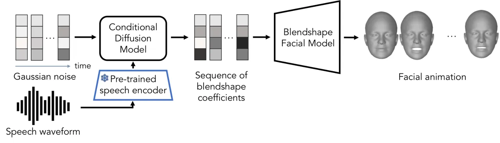

Figure 1: Overview of SAiD. The conditional diffusion model generates
the sequence of blendshape coefficients from the Gaussian noise
conditioned on the speech waveform. After that, generated blendshape
coefficients are converted into the facial animation using the
blendshape facial model.

To this end, we introduce the BlendVOCA dataset, a new high-quality
speech-blendshape facial animation benchmark dataset built upon
VOCASET \[11\], a speech-facial mesh animation benchmark dataset. It
does not only address the scarcity of available datasets for exploring
speech-driven blendshape-based models but also enables the direct
comparison of the performance of blendshape-based and vertex-based
approaches. Compared to 3D-ETF \[35\], a recently released
blendshape-based talking face dataset, BlendVOCA possesses the following
advantages: 1) Utilization of VOCASET ensures the identical training
setting with vertex-based baseline methods. 2) With its various
blendshape facial models, BlendVOCA enables the diverse testing and
quality assessment of blendshape coefficients.

Our extensive experiments demonstrate that SAiD outperforms baselines in
terms of generalization, diversity, and smoothness of lip motions after
editing.

In summary, our contributions are as follows:

- •
  Blendshape-based benchmark dataset (BlendVOCA): We provide a publicly
  accessible benchmark dataset composed of the blendshape facial model
  and pairs of blendshape coefficients and speech audio.
- •
  Blendshape-based diffusion model (SAiD): We propose the lightweight
  conditional diffusion model to solve the one-to-many speech-driven
  blendshape facial animation problem. It allows us to produce a variety
  of outputs and subsequently edit them utilizing the same model.
- •
  Extensive experiments: We extensively evaluate our model with diverse
  evaluation metrics. We demonstrate the superiority of SAiD over
  baselines. Our code and dataset are available at
  [https://github.com/yunik1004/SAiD](https://github.com/yunik1004/SAiD).

## 2 Preliminaries

### 2.1 Mesh and Motion

In 3D object representation, a _mesh_ denotes a collection of i)
vertices with their positions, ii) edges connecting two vertices, and
iii) faces consisting of vertices and edges. One can generate diverse 3D
representations by modifying the positions of vertices from the mesh,
which is called “_deformation_ of the mesh”. Furthermore, the term
_motion_ refers to changes in the mesh over time, and one can represent
motion as a sequence of vertex positions for each time step.

### 2.2 Blendshapes and Blendshape Coefficients

The blendshape facial model \[29\] is a widely used linear model for
representing diverse 3D face structures. It uses a linear combination of
multiple meshes which comprise 1) a template mesh and 2) _blendshapes_
representing deformed versions of the template mesh. The template mesh
typically illustrates a neutral facial expression, while the blendshapes
depict different facial movements such as jaw opening, eye closing, and
more.

Let $`\bm{b}_{0}\in\mathbb{R}^{3M}`$ denote the position vector of the
template mesh, including XYZ coordinates of $`M`$ vertices, and
$`\bm{b}_{1},\cdots,\bm{b}_{K}\in\mathbb{R}^{3M}`$ indicate position
vectors for the blendshapes. We can express a feasible representation
through the blendshape coefficient as
$`\bm{b}_{0}+\sum_{k=1}^{K}u_{k}(\bm{b}_{k}-\bm{b}_{0})`$. Thus, simply
altering the sequence of blendshape coefficients allows us to generate
various facial motions. In general, blendshape coefficients are deemed
independent of the template mesh. It implies that we can use identical
blendshape coefficients across various facial models to represent the
same facial expression.

### 2.3 Deformation Transfer

Deformation transfer \[51\] is a computational algorithm to transfer the
deformation observed in a source mesh to a different target mesh. It
requires a subset of the vertex correspondence map between the source
and target meshes.

The initial phase of the process involves the creation of a face
correspondence map between the two meshes based on the corresponding
vertices. After that, we can find the deformation on the target mesh by
solving the optimization problem designed to maintain the transformation
similarity between corresponding faces.

### 2.4 Conditional Diffusion Model

Given the data distribution $`q(\bm{x}_{0},\bm{c})`$, with
$`\bm{x}_{0}`$ as the target data and $`\bm{c}`$ indicating a condition,
the conditional diffusion model \[48, 12\] is the latent variable model
that approximates the conditional distribution $`q(\bm{x}_{0}|\bm{c})`$
using the Markov denoising process with a learned Gaussian transition
starting from the random noise. It undergoes training to approximate the
trajectory of the Markov noising process, starting from the data
$`\bm{x}_{0}`$, with a fixed Gaussian transition.

The sequence of denoising autoencoders, $`\bm{\epsilon}_{\bm{\theta}}`$,
is commonly utilized to model the denoising process. These autoencoders
undergo training to predict the noise $`\bm{\epsilon}`$ in the input at
each timestep $`t`$ of the denoising process. Ho et al. \[23\]
formulates the training objective as follows:

```math
\displaystyle\mathcal{L}_{\textrm{simple}}(\bm{\theta})=\mathbb{E}_{q,t,\bm{\epsilon}}\left[\lVert\bm{\epsilon}-\bm{\epsilon}_{{\bm{\theta}}}(\bm{x}_{t},\bm{c},t)\rVert^{2}\right], \tag{1}
```

where
$`\bm{x}_{t}=\sqrt{\bar{\alpha}_{t}}\bm{x}_{0}+\sqrt{1-\bar{\alpha}_{t}}\bm{\epsilon}`$
and $`\bar{\alpha}_{t}`$ is a hyperparameter related to the variance of
the noising process.

## 3 Related Works

### 3.1 Speech-driven 3D Facial Animation

Speech-driven 3D facial animation is a long-standing area in computer
graphics, broadly categorized into parameter-based and vertex-based
methodologies.

Parameter-based animation utilizes a sequence of animation-related
parameters derived from input speech. In the past, research works \[10,
54, 59, 15\] used explicit rules to form connections between phonemes
and visemes. For instance, JALI \[15\] employs a procedural approach to
animate a viseme \[18\]-based rig with two anatomical actions: lip
closure and jaw opening. VisemeNet \[63\] extended JALI by incorporating
a three-stage LSTM \[24\] for predicting JALI’s parameters. Pham et al.
\[36\], Pham et al. \[37\] also introduced a deep-learning-based
regression model that animates head rotation and
FaceWarehouse \[7\]-based blendshape coefficients using audio features
from the video dataset. In a recent development, EmoTalk \[35\] applied
an emotion-disentangling technique to enhance the emotional expressions
in a talking face. Despite numerous research efforts, parameter-based
animation faces a shortage of high-quality, publicly accessible data and
parametric facial models capable of producing facial meshes given
specific parameters. Moreover, most parameter-based approaches cannot
generate diverse outputs since they adopt regression models.

An alternative and increasingly popular approach is vertex-based
animation. The recent introduction of high-resolution 3D facial motion
data \[11\] has propelled this field forward. VOCA \[11\] was the first
model capable of being applied to unseen subjects without requiring
retargeting, effectively decoupling identity from facial motion.
MeshTalk \[41\] disentangled the facial features related/unrelated to
audio using a categorical latent space to synthesize audio-uncorrelated
facial features. FaceFormer \[17\], on the other hand, implemented a
Transformer \[57\]-based autoregressive model to capture long-term audio
context. Recently, CodeTalker \[58\] framed the animation generation
task as a code query task in the discrete space. It improves motion
quality by reducing the uncertainty associated with cross-modal mapping.
While these studies provide a more detailed representation than
parameter-based models, modifying their outputs is challenging since it
requires vertex-level adjustments. Next, they are not generalizable
since they can only animate the mesh sharing the same topology as the
training data. Lastly, the models are constrained to the training
identities, so they cannot generate outputs in more diverse styles.

Concurrent with our work, Stan et al. \[50\] introduced an
autoregressive diffusion model-based approach. Our work differs by 1)
employing a velocity loss to reduce the jitter in lip movements, and 2)
utilizing a non-autoregressive model for a faster denoising process.

### 3.2 Diffusion Model for Motion Generation Tasks

Researchers have proposed various diffusion-based methods to address
challenges in motion generation tasks. The most active research area is
text-driven human motion generation, which synthesizes human movements,
either joint rotations or positions, based on text input. Pioneering
studies, like Tevet et al. \[55\], Zhang et al. \[62\], Kim et al.
\[26\], have introduced diffusion-based frameworks to enhance the
quality and diversity of motion generation. Specifically, the motion
diffusion model (MDM) \[55\] uses a Transformer encoder for direct
motion prediction, and many follow-up studies have widely adopted this
model. In particular, priorMDM \[47\] applied MDM as a generative prior,
and PhysDiff \[61\] introduced physical guidance to MDM to generate more
realistic outcomes.

Beyond the scope of text-driven models, researchers have recently
extended the application of diffusion models to handle audio-driven
motion generation tasks. For instance, EDGE \[56\] transforms music into
corresponding dance movements, while DiffGesture \[64\] produces
upper-body gestures based on speech audio.

## 4 Speech-driven blendshape facial Animation with Diffusion (SAiD)

In this section, we introduce BlendVOCA, a new benchmark
speech-blendshape dataset built upon VOCASET \[11\] to address the
scarcity of an appropriate dataset for exploring speech-driven
blendshape facial animation (Sec. 4.1), and propose SAiD, a conditional
diffusion-based generative model for generating speech-driven blendshape
coefficients (Sec. 4.2).

### 4.1 BlendVOCA: Speech-Blendshape Facial Animation Dataset

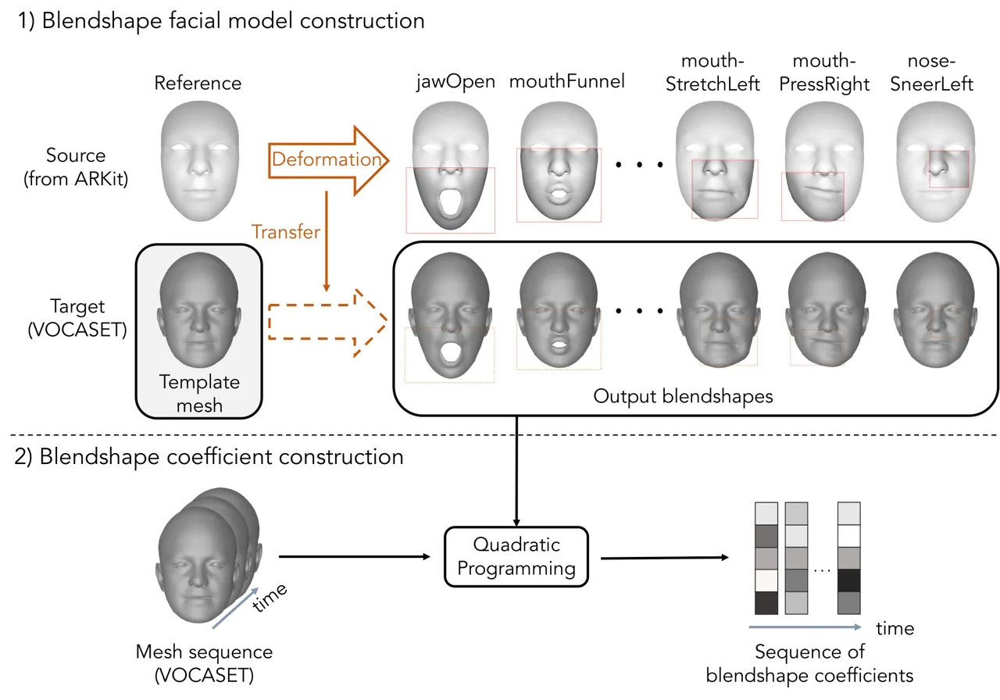

Figure 2: BlendVOCA construction process. The process unfolds in two
steps: 1) We transfer deformations of the reference mesh from
ARKit \[4\] to 12 template meshes of VOCASET \[11\] by applying the
algorithm introduced by \[51\], which produce 32 output blendshape
meshes for each template mesh; 2) and then generate blendshape
coefficients by solving quadratic programming problem in Eq. 2.

We construct a new dataset of template meshes and 32 blendshapes of 12
speakers, each providing approximately 40 instances of speech audios in
English (each 3-5 seconds) and corresponding blendshape coefficients,
all tracked over time. To construct the dataset, we use VOCASET, which
includes the template meshes of 12 speakers and speech audios, along
with their synchronized facial meshes, captured at 60 frames per second
for each speaker. Our transformation of VOCASET into BlendVOCA unfolds
in two steps: 1) we generate blendshapes from each template mesh by
applying deformation transfer \[51\] to the ARKit \[4\] source model,
and 2) obtain blendshape coefficients by solving the optimization
problem. Fig. 2 illustrates the overall dataset construction process.

#### 4.1.1 Blendshape Facial Model Construction

Recall that deformation transfer is an algorithm used to transfer the
deformation of the source blendshape model onto the target mesh. We use
ARKit as our source model to create the blendshape facial models. ARKit
provides 52 blendshapes \[5\] based on ARSCNFaceGeometry \[3\], and we
select 32 blendshapes that represent crucial facial features during the
speech, such as those corresponding to the mouth, jaw, cheeks, nose, and
so on.

Before applying deformation transfer, we preprocess the target template
meshes from VOCASET by eliminating elements such as the eyeballs, ears,
back of the head, and neck regions. This removal enhances stability
during the blendshape facial model generation process. We reattach the
removed parts to the generated blendshape meshes except for the neck. We
also construct a subset of the vertex correspondence map between the
source and target meshes. We select 68 vertices from each mesh
corresponding to facial landmarks defined by Sagonas et al. \[43\].
After that, we run the deformation transfer algorithm to get the
deformation in the target mesh. By applying the deformation, we
construct the blendshape of the target mesh. We provide the rendered
images of constructed blendshape meshes in the supplementary material
(Fig. 8).

#### 4.1.2 Blendshape Coefficient Construction

Next, we extract blendshape coefficients using both constructed
blendshapes and mesh sequences in VOCASET. To this end, we formulate a
quadratic programming (QP) problem to derive the sequence of blendshape
coefficients from the mesh representations of facial motion in VOCASET.
Let $`\bm{p}^{1:N}=(\bm{p}^{1},\bm{p}^{2},\cdots,\bm{p}^{N})`$ be the
sequence of the position vectors corresponding to a facial motion of
$`N`$ discrete timesteps (also known as the frame). The goal is to
obtain the smooth sequence of blendshape coefficients
$`\bm{u}^{1:N}=(\bm{u}^{1},\bm{u}^{2},\cdots,\bm{u}^{N})`$ that can
approximate $`\bm{p}^{1:T}`$ via the blendshape facial model constructed
in Sec. 4.1.1, where
$`\bm{u}^{n}=[u_{1}^{n},u_{2}^{n},\cdots,u_{K}^{n}]^{\intercal}`$
denotes the vector, including every blendshape coefficient at the
$`n`$-th frame. We impose the smoothness of the blendshape coefficients
over time by limiting the maximum change between two adjacent timesteps.
Therefore, we express the optimization problem as follows:

```math
\displaystyle\begin{split}\min_{\bm{u}^{1:N}}\quad&\sum_{n=1}^{N}\lVert\bm{p}^{n}-(\bm{b}_{0}+\sum_{k=1}^{K}u_{k}^{n}(\bm{b}_{k}-\bm{b}_{0}))\rVert_{2}^{2}\\
\textrm{s.t.}\quad&0\leq u^{n}_{k}\leq 1,\quad|u^{n+1}_{k}-u^{n}_{k}|\leq\delta,\end{split} \tag{2}
```

where the hyperparameter $`\delta>0`$ represents the maximum change
allowed between two adjacent timesteps. As demonstrated in the
supplementary material (Sec. 8), it is equivalent to the QP problem and
has a unique solution. Therefore, we can get unique optimization results
using QP solvers. We use CVXOPT \[2\] as a QP solver with
$`\delta=0.1`$.

### 4.2 Conditional Diffusion Model for Generating Speech-Driven Coefficients

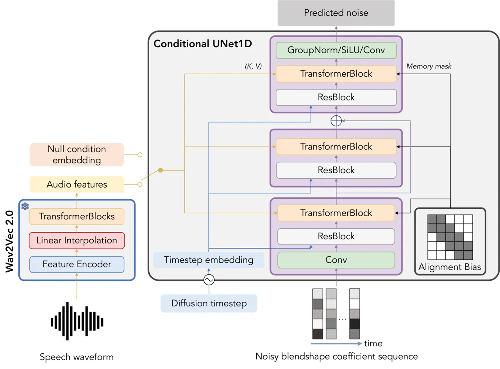

Figure 3: The model architecture of SAiD. SAiD predicts the noise
injected into the input noisy blendshape coefficient sequence,
conditioned on the speech waveform, for each diffusion timestep. The
denoiser model is a simplified conditional UNet1D model, composed of 1
encoder block/1 middle block/1 decoder block without the downsampling
and upsampling layers. Diffusion timestep is converted into the
sinusoidal embedding and then becomes the input of each residual block
in the denoiser. Speech waveform is converted into the audio feature
vectors using the frozen pre-trained Wav2Vec 2.0 and becomes the key and
value matrices of the cross-attention layer in the denoiser. We employ
the alignment bias as a memory mask for the cross-attention layer to
enhance the alignment between the speech and blendshape coefficient
sequence. We also adopt the trainable null condition embedding for
implementing the classifier-free guidance (or for the unconditional
generation), providing an alternative to using the audio features.

Given the data distribution $`q(\bm{u}^{1:N},\bm{w})`$ where $`\bm{w}`$
denotes a speech waveform and $`\bm{u}^{1:N}`$ represents the
corresponding sequence of the blendshape coefficients with $`N`$ frames,
we employ the conditional diffusion model to approximate the conditional
distribution $`q(\bm{u}^{1:N}|\bm{w})`$.

#### 4.2.1 Model Architecture

Our proposed model, SAiD, in Fig. 3 consists of the conditional
denoising UNet architecture from Rombach et al. \[42\] as a denoising
autoencoder $`\epsilon_{\bm{\theta}}`$ and pre-trained Wav2Vec 2.0 \[6\]
as a speech audio encoder $`s`$. We modify the UNet architecture to make
the input dimension 2D to 1D. Next, 1) we remove the down/up-sampling
blocks in UNet to reduce the model size, and 2) add the linear
interpolation layer \[17\] in Wav2Vec 2.0 to equalize the number of
frames of the blendshape coefficient sequence and the length of the
audio features. After that, we use the audio features as keys and values
of the cross-attention layers in UNet.

To synchronize the audio and the blendshape coefficient sequence, we use
the alignment bias \[17\] as a memory mask for the cross-attention
layer, i.e., the additive mask for the audio encoder output. Focusing on
the audio corresponding to adjacent frames enhances the model’s learning
of local feature information more effectively. Therefore, we modify the
cross-attention output of the Transformer decoder block in UNet as
follows:

```math
\displaystyle\mathrm{Attention}(\bm{Q},\bm{K},\bm{V})=\mathrm{softmax}(\frac{\bm{Q}\bm{K}^{\intercal}}{\sqrt{d}}+\bm{B}^{A})\bm{V}, \tag{3}
```

where $`\bm{Q},\bm{K},\bm{V}\in\mathbb{R}^{N\times d}`$ are the query,
key, and value matrices, and $`\bm{B}^{A}\in\mathbb{R}^{N\times N}`$ is
the alignment bias:

```math
\displaystyle\bm{B}^{A}(i,j)=\begin{cases}0,&|i-j|\leq 1\\
-\infty,&\textrm{otherwise}\end{cases}. \tag{4}
```

#### 4.2.2 Training

To train the UNet model, we use the training objective similar to Eq. 1.
Instead of using the squared error, we minimize the absolute error \[8,
44, 46\] between the noise and the predicted noise at each diffusion
timestep. It reduces the perceptual distance between the sample and
real-data distribution compared to the squared error \[44\], helping to
produce realistic lip movements even with less data. Therefore, the
simple training objective is as follows:

```math
\displaystyle\begin{split}\mathcal{L}_{\mathrm{simple}}(\bm{\theta})=\mathbb{E}_{q,t,\bm{\epsilon}}\Bigl[\lVert\bm{\epsilon}-\epsilon_{\bm{\theta}}(\bm{u}^{1:N}_{t},s(\bm{w}),t)\rVert_{1}\Bigr],\end{split} \tag{5}
```

where $`\bm{\theta}`$ is a trainable parameter of the UNet model, and
$`\bm{u}^{1:N}_{t}=\sqrt{\bar{\alpha}_{t}}\bm{u}^{1:N}+\sqrt{1-\bar{\alpha}_{t}}\bm{\epsilon}`$.

We apply the additional loss to reduce the jitter of the output,
achieving this by minimizing the gap between the temporal difference,
known as velocity, of $`\bm{u}^{1:N}`$ and the velocity of the denoised
observation
$`\hat{\bm{u}}^{1:N}=(\bm{u}^{1:N}_{t}-\sqrt{1-\bar{\alpha}}_{t}\hat{\bm{\epsilon}})/\sqrt{\bar{\alpha}_{t}}`$ \[23\]
at each diffusion timestep, where
$`\hat{\bm{\epsilon}}_{t}=\epsilon_{\bm{\theta}}(\bm{u}^{1:N}_{t},s(\bm{w}),t)`$:

```math
\displaystyle\mathcal{L}_{\mathrm{vel}}^{\prime}(\bm{\theta})=\mathbb{E}_{q,t,\bm{\epsilon}}\Bigl[\sum_{n=1}^{N-1}\lVert(\bm{u}^{n+1}-\bm{u}^{n})-(\hat{\bm{u}}^{n+1}-\hat{\bm{u}}^{n})\rVert_{1}\Bigr]
```

```math
\displaystyle=\mathbb{E}_{q,t,\bm{\epsilon}}\Bigl[\sqrt{\frac{1-\bar{\alpha}_{t}}{\bar{\alpha}_{t}}}\sum_{n=1}^{N-1}\lVert(\bm{\epsilon}^{n+1}-\bm{\epsilon}^{n})-(\hat{\bm{\epsilon}}^{n+1}_{t}-\hat{\bm{\epsilon}}^{n}_{t})\rVert_{1}\Bigr] \tag{6}
```

where $`\bm{\epsilon}^{n}`$ and $`\hat{\bm{\epsilon}}^{n}_{t}`$ denote
the $`n`$-th frame component of $`\bm{\epsilon}`$ and
$`\hat{\bm{\epsilon}}_{t}`$. We use the reweighted version of 6 by
removing the coefficients of each term, which is equivalent to the
noise-level velocity loss:

```math
\displaystyle\mathcal{L}_{\mathrm{vel}}(\bm{\theta})=\mathbb{E}_{q,t,\bm{\epsilon}}\Bigl[\sum_{n=1}^{N-1}\lVert(\bm{\epsilon}^{n+1}-\bm{\epsilon}^{n})-(\hat{\bm{\epsilon}}^{n+1}_{t}-\hat{\bm{\epsilon}}^{n}_{t})\rVert_{1}\Bigr]. \tag{7}
```

As a result, our training loss is:

```math
\displaystyle\mathcal{L}(\bm{\theta})=\mathcal{L}_{\mathrm{simple}}(\bm{\theta})+\mathcal{L}_{\mathrm{vel}}(\bm{\theta}). \tag{8}
```

#### 4.2.3 Conditional Sampling

We can apply various sampling methods, such as DDPM \[23\] or
DDIM \[49\], with classifier-free guidance \[22\] to execute conditional
sampling. For each sampling step $`t`$, we replace the predicted noise
with the following linear combination of the conditional and
unconditional estimates:

```math
\displaystyle\begin{split}\tilde{\epsilon}_{\theta}(\bm{u}^{1:N}_{t},&~s(\bm{w}),t)=\epsilon_{\theta}(\bm{u}^{1:N}_{t},s(\bm{w}),t)\\
&+\gamma(\epsilon_{\theta}(\bm{u}^{1:N}_{t},s(\bm{w}),t)-\epsilon_{\theta}(\bm{u}^{1:N}_{t},\bm{\emptyset},t)),\end{split} \tag{9}
```

where $`\bm{u}^{1:N}_{t}`$ indicates the intermediate noisy blendshape
coefficient sequence at sampling step $`t`$, $`\bm{\emptyset}`$ denotes
the embedding of the null condition, and $`\gamma\geq 0`$ is a
hyperparameter that controls the strength of the classifier-free
guidance. We train $`\bm{\emptyset}`$ during the training stage by
randomly replacing the condition $`s(\bm{w})`$ with $`\bm{\emptyset}`$
at a $`0.1`$ probability. Empirically, we set $`\gamma=2`$ to get the
best result.

#### 4.2.4 Editing of the Blendshape Coefficient Sequence

SAiD also functions as an editing tool for the blendshape coefficient
sequence like a typical diffusion model \[32\].

Let $`\bm{u}^{1:N}_{\mathrm{ref}}`$ represent the blendshape coefficient
sequence we aim to modify, and $`\bm{w}`$ the corresponding speech
waveform. Suppose we have a binary mask $`\bm{m}`$, which indicates the
parts that need editing with $`0`$ and the rest with $`1`$. Under these
conditions, SAiD can regenerate the unmasked areas of
$`\bm{u}^{1:N}_{\mathrm{ref}}`$ by updating $`\bm{u}^{1:N}_{t}`$, which
represents the intermediate noisy blendshape coefficient sequence at
each sampling step $`t`$, with the following adjustment:

```math
\displaystyle\begin{split}\tilde{\bm{u}}^{1:N}_{t}&=(\bm{1}-\bm{m})\circ\bm{u}^{1:N}_{t}\\
&+\bm{m}\circ(\sqrt{\bar{\alpha}_{t}}\bm{u}^{1:N}_{\mathrm{ref}}+\sqrt{1-\bar{\alpha}_{t}}\bm{\epsilon}),\end{split} \tag{10}
```

where $`\circ`$ indicates the element-wise product operator.

## 5 Experiments

|                          |                           |                            |                            |                       |                                    |
| ------------------------ | ------------------------- | -------------------------- | -------------------------- | --------------------- | ---------------------------------- |
| Methods                  | AV Offset $`\rightarrow`$ | AV Confidence $`\uparrow`$ | Multimodality $`\uparrow`$ | FD $`\downarrow`$     | WInD $`\downarrow`$                |
| Ground-Truth             | $`-1.038`$                | $`4.874`$                  | N/A                        | $`0.000`$             | $`1.120^{\pm 0.450}`$              |
| SAiD (Ours)              | $`\mathbf{-1.025}`$       | $`\mathbf{5.575}`$         | $`\mathbf{3.817}`$         | $`\mathbf{6.791}`$    | $`\underline{10.344^{\pm 0.127}}`$ |
| end2end_AU_speech \[37\] | $`0.785`$                 | $`0.887`$                  | $`0.000`$                  | $`12.307`$            | $`14.070^{\pm 0.076}`$             |
| VOCA \[11\] + QP         | $`\underline{-0.891}`$    | $`3.117`$                  | $`\underline{2.899}`$      | $`45.555`$            | $`52.403^{\pm 0.402}`$             |
| MeshTalk \[41\] + QP     | $`-1.532`$                | $`4.425`$                  | $`0.000`$                  | $`11.106`$            | $`13.161^{\pm 0.046}`$             |
| FaceFormer \[17\] + QP   | $`-0.723`$                | $`\underline{5.346}`$      | $`2.490`$                  | $`10.265`$            | $`14.102^{\pm 0.080}`$             |
| CodeTalker \[58\] + QP   | $`-1.476`$                | $`5.256`$                  | $`1.407`$                  | $`\underline{6.862}`$ | $`\mathbf{9.813^{\pm 0.067}}`$     |

Table 1: Evaluation results on the test data. SAiD achieves the best
results in AV offset/confidence, multimodality, and FD while taking
second place in WInD. It highlights SAiD’s ability to generate diverse
outputs while closely aligning with the real-data distribution.
$`\uparrow`$ implies the upper is better, $`\downarrow`$ implies the
lower is better, and $`\rightarrow`$ implies the metric closer to the
ground truth is better. Bold indicates the best result, underline
indicates the second-best result, and $`\pm`$ indicates the standard
deviation.

| Methods                               | AV Offset $`\rightarrow`$ | AV Confidence $`\uparrow`$ | Multimodality $`\uparrow`$ | FD $`\downarrow`$     | WInD $`\downarrow`$                |
| ------------------------------------- | ------------------------- | -------------------------- | -------------------------- | --------------------- | ---------------------------------- |
| SAiD (Base)                           | $`\mathbf{-1.025}`$       | $`\mathbf{5.575}`$         | $`\underline{3.817}`$      | $`\underline{6.791}`$ | $`\underline{10.344^{\pm 0.127}}`$ |
|      train w/ squared error           | $`-1.012`$                | $`5.279`$                  | $`3.772`$                  | $`\mathbf{6.601}`$    | $`\mathbf{9.653^{\pm 0.064}}`$     |
|      train w/o velocity loss          | $`\underline{-1.021}`$    | $`5.476`$                  | $`3.736`$                  | $`7.279`$             | $`10.995^{\pm 0.089}`$             |
|      train w/o alignment bias         | $`0.157`$                 | $`1.646`$                  | $`\mathbf{6.951}`$         | $`64.060`$            | $`69.470^{\pm 0.183}`$             |
|      finetune pre-trained Wav2Vec 2.0 | $`-1.015`$                | $`\underline{5.498}`$      | $`2.736`$                  | $`10.177`$            | $`14.723^{\pm 0.174}`$             |

Table 2: Ablation study results. We explore SAiD’s performance
variations with different architecture components and training losses.
Our design choice achieves the top performance in AV offset/confidence
and the second-best results in multimodality, FD, and WInD.

### 5.1 Training Details of SAiD

We employ the BlendVOCA dataset constructed using the procedure
described in Sec. 4.1. We adopt the same training/validation/test
splits, specifically 8/2/2 speakers split, used by VOCA \[11\].

For each training step, we randomly choose a minibatch of size $`8`$.
Each data in the minibatch consists of the randomly sliced blendshape
coefficient sequence and a corresponding speech waveform. To use the
classifier-free guidance, we randomly replace the output audio features
of the speech audio encoder into the null condition embedding with a
probability of $`0.1`$. We adopt diverse data augmentation strategies to
amplify our training dataset. We execute the audio augmentation by
shifting the speech waveform within 1/60 second with a probability of
$`0.5`$. Subsequently, we swap the blendshape coefficients between the
symmetric blendshapes with a probability of $`0.5`$.

We conduct the training on a single NVIDIA A100 (40GB) for 50,000 epochs
using the AdamW \[31\] optimizer with $`\beta_{1}=0.9`$,
$`\beta_{2}=0.999`$, a learning rate of $`10^{-5}`$ with a warmup, and a
weight decay of $`10^{-2}`$. We use EMA \[52\] with a decay value of
$`0.9999`$ to update the model weights. We select the model that
minimizes the validation loss.

### 5.2 Baseline Methods

We compare SAiD with end2end_AU_speech \[37\], which regresses the
blendshape coefficients given the audio spectrogram. Considering the
limited available models for speech-driven blendshape facial animation,
we further compare SAiD with the models that directly produce the mesh
sequence of the facial motion. We choose VOCA \[11\], MeshTalk \[41\],
FaceFormer \[17\], and CodeTalker \[58\] as our baseline methods for
comparison. We optimize the blendshape coefficient sequence from the
generated mesh sequence by solving the QP problem described in
Sec. 4.1.2. See the supplementary material (Sec. 9) to check the
details.

### 5.3 Evaluation Metrics

We employ five metrics to evaluate the performances of SAiD and
baselines: audio-visual offset/confidence \[9\], multimodality \[20\],
Frechet distance (FD) \[14, 21\], and Wasserstein inception distance
(WInD) \[13\]. These metrics measure 1) the synchronization between lip
movements and speech (AV offset/confidence), 2) the variety in lip
movements (multimodality), and 3) the similarity between the ground
truth and generated samples (FD, WInD). Details of these metrics are
provided in the supplementary material (Secs. 10, 11 and 12).

### 5.4 Evaluation Results

Tab. 1 indicates that our proposed method, SAiD, achieves the best
results in AV offset/confidence, multimodality, and FD while taking
second place in WInD. It highlights SAiD’s ability to generate diverse
outputs while closely aligning with the real-data distribution. We
provide the qualitative demo examples at
[https://yunik1004.github.io/SAiD](https://yunik1004.github.io/SAiD).

### 5.5 Facial Motion Editing

We conduct two experiments focused on regenerating unmasked areas of the
blendshape coefficient sequence while fixing the masked regions, using
the method in Sec. 4.2.4.

##### Motion in-betweening:

We mask the beginning and end blendshape coefficients and generate the
intermediate values.

##### Motion generation with blendshape-specific constraints:

We mask the coefficients of specific blendshapes and generate the
remaining blendshape coefficients.

SAiD seamlessly generates blendshape coefficients in unmasked areas that
integrate with the masked sections, as illustrated in Fig. 4. It
demonstrates the editability of SAiD by leveraging the strengths of the
diffusion model.

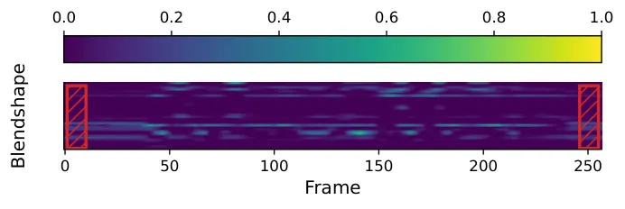

(a) Motion in-betweening

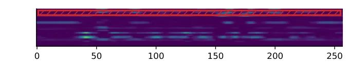

(b) Motion generation with blendshape-specific constraints

Figure 4: Motion editing. Hatched boxes indicate the masked areas that
should be invariant during the editing. SAiD can generate motions on the
unmasked area using motion editing in Sec. 4.2.4. We provide the videos
results of these editing tasks at
[https://yunik1004.github.io/SAiD](https://yunik1004.github.io/SAiD).

## 6 Ablation Studies

We investigate the performance of SAiD by changing architectural
components and the training loss. Evaluation results are in Tab. 2.

##### Effect of absolute error:

SAiD trained with squared error reveals improved FD and WInD. On the
other hand, it shows diminished AV offset/confidence and multimodality,
aspects related to perceptual correctness.

##### Effect of noise-level velocity loss (Eq. 7):

Fig. 5 illustrates that SAiD without the velocity loss produces results
with high-frequency variations, commonly known as jitter. It yields the
decline of the overall evaluation scores. From this observation, we
conclude that the noise-level velocity loss reduces the jitter in the
inference results.

##### Effect of alignment bias (Eq. 4):

We investigate the role of the alignment bias by comparing the
cross-attention map (i.e., the softmax output of Eq. 3) of SAiD. As
depicted in Fig. 6(a), the cross-attention map trained without the
alignment bias lacks the alignment between the audio and the blendshape
coefficient sequence. However, when trained with alignment bias, the
cross-attention map clearly illustrates an alignment between these
elements, as evident in Fig. 6(b). The evaluation metrics are also
significantly improved after using the alignment bias. Hence, the
alignment bias is crucial in achieving accurate alignment.

##### Effect of speech encoder freezing:

Finetuning the pre-trained Wav2Vec 2.0 can decrease the overall
performance of SAiD. Due to the limited data in VOCASET, the encoder
seems to struggle to encode general voice information and overfit
easily.

Figure 5: Effect of the velocity loss. Blue lines indicate SAiD’s
inference results with velocity loss training, while orange lines
display results without velocity loss. As highlighted in the red box,
the blue lines demonstrate notably reduced jitter compared to the orange
lines.


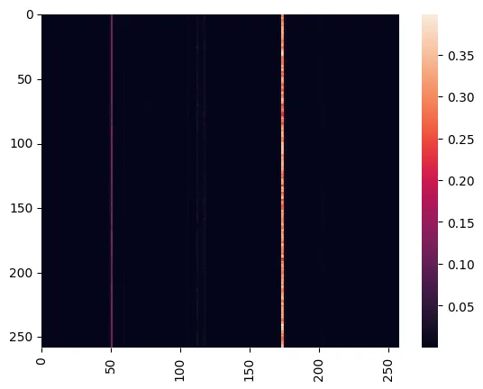

(a) Cross-attention map without alignment bias

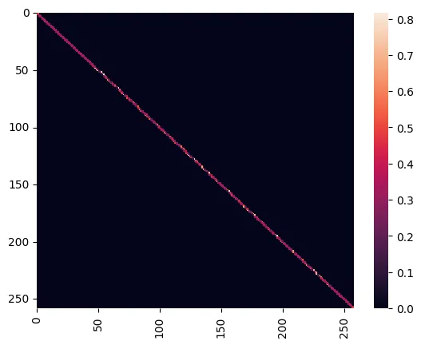


(b) Cross-attention map with alignment bias

Figure 6: Effect of the alignment bias on the cross-attention maps. (a)
shows that SAiD trained without alignment bias cannot learn the
alignment between the audio and the blendshape coefficient sequence. (b)
presents that the bias enforces the alignment between them.

## 7 Conclusion

We propose SAiD, a diffusion-based approach for the speech-driven 3D
facial animation problem, using a lightweight blendshape-based diffusion
model. We introduce BlendVOCA, a benchmark dataset that pairs speech
audio with blendshape coefficients for training a blendshape-based
model. Our experiments demonstrate that SAiD generates diverse lip
movements while outperforming the existing methods in synchronizing lip
movements with speech. Moreover, SAiD showcases its capability to
streamline the motion editing process.

Nevertheless, SAiD encounters a limitation: it relies on local attention
in the cross-attention layer, which complicates the utilization of
global information during the diffusion process. Future work may explore
aligning audio with blendshape coefficients without employing harsh
alignment bias. We might schedule the bias bandwidth across the
diffusion timestep, enabling a transition from global attention
initially to local attention towards the end.

## References

- \[1\] Adobe. Animated lip-syncing powered by adobe ai. 2020.
- \[2\] Martin S Andersen, Joachim Dahl, Lieven Vandenberghe, et al.
  CVXOPT: A python package for convex optimization. 2013.
- \[3\] Apple. Apple developer documentation - ARSCNFaceGeometry. 2017a.
- \[4\] Apple. Apple developer documentation - ARKit. 2017b.
- \[5\] Apple. Apple developer documentation -
  ARFaceAnchor.BlendShapeLocation. 2017c.
- \[6\] Alexei Baevski, Yuhao Zhou, Abdelrahman Mohamed, and Michael
  Auli. wav2vec 2.0: A framework for self-supervised learning of speech
  representations. _Advances in neural information processing systems_,
  33:12449–12460, 2020.
- \[7\] Chen Cao, Yanlin Weng, Shun Zhou, Yiying Tong, and Kun Zhou.
  Facewarehouse: A 3d facial expression database for visual computing.
  _IEEE Transactions on Visualization and Computer Graphics_,
  20(3):413–425, 2013.
- \[8\] Nanxin Chen, Yu Zhang, Heiga Zen, Ron J Weiss, Mohammad Norouzi,
  and William Chan. Wavegrad: Estimating gradients for waveform
  generation. _arXiv preprint arXiv:2009.00713_, 2020.
- \[9\] Joon Son Chung and Andrew Zisserman. Out of time: automated lip
  sync in the wild. In _Computer Vision–ACCV 2016 Workshops: ACCV 2016
  International Workshops, Taipei, Taiwan, November 20-24, 2016, Revised
  Selected Papers, Part II 13_, pages 251–263. Springer, 2017.
- \[10\] Michael M Cohen, Rashid Clark, and Dominic W Massaro. Animated
  speech: Research progress and applications. In _AVSP
  2001-International Conference on Auditory-Visual Speech
  Processing_, 2001.
- \[11\] Daniel Cudeiro, Timo Bolkart, Cassidy Laidlaw, Anurag Ranjan,
  and Michael J Black. Capture, learning, and synthesis of 3d speaking
  styles. In _Proceedings of the IEEE/CVF Conference on Computer Vision
  and Pattern Recognition_, pages 10101–10111, 2019.
- \[12\] Prafulla Dhariwal and Alexander Nichol. Diffusion models beat
  gans on image synthesis. _Advances in Neural Information Processing
  Systems_, 34:8780–8794, 2021.
- \[13\] Panagiotis Dimitrakopoulos, Giorgos Sfikas, and Christophoros
  Nikou. Wind: Wasserstein inception distance for evaluating generative
  adversarial network performance. In _ICASSP 2020-2020 IEEE
  International Conference on Acoustics, Speech and Signal Processing
  (ICASSP)_, pages 3182–3186. IEEE, 2020.
- \[14\] DC Dowson and BV666017 Landau. The fréchet distance between
  multivariate normal distributions. _Journal of multivariate analysis_,
  12(3):450–455, 1982.
- \[15\] Pif Edwards, Chris Landreth, Eugene Fiume, and Karan Singh.
  Jali: an animator-centric viseme model for expressive lip
  synchronization. _ACM Transactions on graphics (TOG)_,
  35(4):1–11, 2016.
- \[16\] Pif Edwards, Chris Landreth, Mateusz Popławski, Robert
  Malinowski, Sarah Watling, Eugene Fiume, and Karan Singh. Jali-driven
  expressive facial animation and multilingual speech in cyberpunk 2077.
  In _ACM SIGGRAPH 2020 Talks_, New York, NY, USA, 2020. Association for
  Computing Machinery.
- \[17\] Yingruo Fan, Zhaojiang Lin, Jun Saito, Wenping Wang, and Taku
  Komura. Faceformer: Speech-driven 3d facial animation with
  transformers. In _Proceedings of the IEEE/CVF Conference on Computer
  Vision and Pattern Recognition_, pages 18770–18780, 2022.
- \[18\] Cletus G Fisher. Confusions among visually perceived
  consonants. _Journal of speech and hearing research_,
  11(4):796–804, 1968.
- \[19\] Hao Fu, Chunyuan Li, Xiaodong Liu, Jianfeng Gao, Asli
  Celikyilmaz, and Lawrence Carin. Cyclical annealing schedule: A simple
  approach to mitigating kl vanishing. In _North American Chapter of the
  Association for Computational Linguistics_, 2019.
- \[20\] Chuan Guo, Xinxin Zuo, Sen Wang, Shihao Zou, Qingyao Sun, Annan
  Deng, Minglun Gong, and Li Cheng. Action2motion: Conditioned
  generation of 3d human motions. In _Proceedings of the 28th ACM
  International Conference on Multimedia_, pages 2021–2029, 2020.
- \[21\] Martin Heusel, Hubert Ramsauer, Thomas Unterthiner, Bernhard
  Nessler, and Sepp Hochreiter. Gans trained by a two time-scale update
  rule converge to a local nash equilibrium. _Advances in neural
  information processing systems_, 30, 2017.
- \[22\] Jonathan Ho and Tim Salimans. Classifier-free diffusion
  guidance. _arXiv preprint arXiv:2207.12598_, 2022.
- \[23\] Jonathan Ho, Ajay Jain, and Pieter Abbeel. Denoising diffusion
  probabilistic models. _Advances in Neural Information Processing
  Systems_, 33:6840–6851, 2020.
- \[24\] Sepp Hochreiter and Jürgen Schmidhuber. Long short-term memory.
  _Neural computation_, 9(8):1735–1780, 1997.
- \[25\] Myeonghun Jeong, Hyeongju Kim, Sung Jun Cheon, Byoung Jin Choi,
  and Nam Soo Kim. Diff-tts: A denoising diffusion model for
  text-to-speech. _arXiv preprint arXiv:2104.01409_, 2021.
- \[26\] Jihoon Kim, Jiseob Kim, and Sungjoon Choi. Flame: Free-form
  language-based motion synthesis & editing. In _Proceedings of the AAAI
  Conference on Artificial Intelligence_, pages 8255–8263, 2023.
- \[27\] Diederik P Kingma and Max Welling. Auto-encoding variational
  bayes. _arXiv preprint arXiv:1312.6114_, 2013.
- \[28\] Zhifeng Kong, Wei Ping, Jiaji Huang, Kexin Zhao, and Bryan
  Catanzaro. Diffwave: A versatile diffusion model for audio synthesis.
  _arXiv preprint arXiv:2009.09761_, 2020.
- \[29\] John P Lewis, Ken Anjyo, Taehyun Rhee, Mengjie Zhang,
  Frederic H Pighin, and Zhigang Deng. Practice and theory of blendshape
  facial models. _Eurographics (State of the Art Reports)_,
  1(8):2, 2014.
- \[30\] Jinglin Liu, Chengxi Li, Yi Ren, Feiyang Chen, and Zhou Zhao.
  Diffsinger: Singing voice synthesis via shallow diffusion mechanism.
  In _Proceedings of the AAAI conference on artificial intelligence_,
  pages 11020–11028, 2022.
- \[31\] Ilya Loshchilov and Frank Hutter. Decoupled weight decay
  regularization. _arXiv preprint arXiv:1711.05101_, 2017.
- \[32\] Andreas Lugmayr, Martin Danelljan, Andrés Romero, Fisher Yu,
  Radu Timofte, and Luc Van Gool. Repaint: Inpainting using denoising
  diffusion probabilistic models. _2022 IEEE/CVF Conference on Computer
  Vision and Pattern Recognition (CVPR)_, pages 11451–11461, 2022.
- \[33\] Meta. Tech note: Enhancing oculus lipsync with deep learning. 2018.
- \[34\] Fabian Pedregosa, Gaël Varoquaux, Alexandre Gramfort, Vincent
  Michel, Bertrand Thirion, Olivier Grisel, Mathieu Blondel, Peter
  Prettenhofer, Ron Weiss, Vincent Dubourg, et al. Scikit-learn: Machine
  learning in python. _the Journal of machine Learning research_,
  12:2825–2830, 2011.
- \[35\] Ziqiao Peng, Haoyu Wu, Zhenbo Song, Hao Xu, Xiangyu Zhu,
  Hongyan Liu, Jun He, and Zhaoxin Fan. Emotalk: Speech-driven emotional
  disentanglement for 3d face animation. _arXiv preprint
  arXiv:2303.11089_, 2023.
- \[36\] Hai X Pham, Samuel Cheung, and Vladimir Pavlovic. Speech-driven
  3d facial animation with implicit emotional awareness: A deep learning
  approach. In _Proceedings of the IEEE conference on computer vision
  and pattern recognition workshops_, pages 80–88, 2017.
- \[37\] Hai Xuan Pham, Yuting Wang, and Vladimir Pavlovic. End-to-end
  learning for 3d facial animation from speech. In _Proceedings of the
  20th ACM International Conference on Multimodal Interaction_, pages
  361–365, 2018.
- \[38\] Dustin Podell, Zion English, Kyle Lacey, Andreas Blattmann, Tim
  Dockhorn, Jonas Müller, Joe Penna, and Robin Rombach. Sdxl: improving
  latent diffusion models for high-resolution image synthesis. _arXiv
  preprint arXiv:2307.01952_, 2023.
- \[39\] Aditya Ramesh, Prafulla Dhariwal, Alex Nichol, Casey Chu, and
  Mark Chen. Hierarchical text-conditional image generation with clip
  latents. _arXiv preprint arXiv:2204.06125_, 1(2):3, 2022.
- \[40\] Alexander Richard, Colin Lea, Shugao Ma, Jurgen Gall, Fernando
  De la Torre, and Yaser Sheikh. Audio-and gaze-driven facial animation
  of codec avatars. In _Proceedings of the IEEE/CVF winter conference on
  applications of computer vision_, pages 41–50, 2021a.
- \[41\] Alexander Richard, Michael Zollhöfer, Yandong Wen, Fernando
  De la Torre, and Yaser Sheikh. Meshtalk: 3d face animation from speech
  using cross-modality disentanglement. In _Proceedings of the IEEE/CVF
  International Conference on Computer Vision_, pages 1173–1182, 2021b.
- \[42\] Robin Rombach, Andreas Blattmann, Dominik Lorenz, Patrick
  Esser, and Björn Ommer. High-resolution image synthesis with latent
  diffusion models. In _Proceedings of the IEEE/CVF Conference on
  Computer Vision and Pattern Recognition_, pages 10684–10695, 2022.
- \[43\] Christos Sagonas, Georgios Tzimiropoulos, Stefanos Zafeiriou,
  and Maja Pantic. 300 faces in-the-wild challenge: The first facial
  landmark localization challenge. In _Proceedings of the IEEE
  international conference on computer vision workshops_, pages
  397–403, 2013.
- \[44\] Chitwan Saharia, William Chan, Huiwen Chang, Chris A. Lee,
  Jonathan Ho, Tim Salimans, David J. Fleet, and Mohammad Norouzi.
  Palette: Image-to-image diffusion models. _ACM SIGGRAPH 2022
  Conference Proceedings_, 2021.
- \[45\] Chitwan Saharia, William Chan, Saurabh Saxena, Lala Li, Jay
  Whang, Emily L Denton, Kamyar Ghasemipour, Raphael Gontijo Lopes,
  Burcu Karagol Ayan, Tim Salimans, et al. Photorealistic text-to-image
  diffusion models with deep language understanding. _Advances in Neural
  Information Processing Systems_, 35:36479–36494, 2022a.
- \[46\] Chitwan Saharia, Jonathan Ho, William Chan, Tim Salimans,
  David J Fleet, and Mohammad Norouzi. Image super-resolution via
  iterative refinement. _IEEE Transactions on Pattern Analysis and
  Machine Intelligence_, 45(4):4713–4726, 2022b.
- \[47\] Yonatan Shafir, Guy Tevet, Roy Kapon, and Amit H Bermano. Human
  motion diffusion as a generative prior. _arXiv preprint
  arXiv:2303.01418_, 2023.
- \[48\] Jascha Sohl-Dickstein, Eric Weiss, Niru Maheswaranathan, and
  Surya Ganguli. Deep unsupervised learning using nonequilibrium
  thermodynamics. In _International Conference on Machine Learning_,
  pages 2256–2265. PMLR, 2015.
- \[49\] Jiaming Song, Chenlin Meng, and Stefano Ermon. Denoising
  diffusion implicit models. _ArXiv_, abs/2010.02502, 2020.
- \[50\] Stefan Stan, Kazi Injamamul Haque, and Zerrin Yumak.
  Facediffuser: Speech-driven 3d facial animation synthesis using
  diffusion. _arXiv preprint arXiv:2309.11306_, 2023.
- \[51\] Robert W Sumner and Jovan Popović. Deformation transfer for
  triangle meshes. _ACM Transactions on graphics (TOG)_,
  23(3):399–405, 2004.
- \[52\] Antti Tarvainen and Harri Valpola. Mean teachers are better
  role models: Weight-averaged consistency targets improve
  semi-supervised deep learning results. _Advances in neural information
  processing systems_, 30, 2017.
- \[53\] Sarah Taylor, Taehwan Kim, Yisong Yue, Moshe Mahler, James
  Krahe, Anastasio Garcia Rodriguez, Jessica Hodgins, and Iain Matthews.
  A deep learning approach for generalized speech animation. _ACM
  Transactions On Graphics (TOG)_, 36(4):1–11, 2017.
- \[54\] Sarah L Taylor, Moshe Mahler, Barry-John Theobald, and Iain
  Matthews. Dynamic units of visual speech. In _Proceedings of the 11th
  ACM SIGGRAPH/Eurographics conference on Computer Animation_, pages
  275–284, 2012.
- \[55\] Guy Tevet, Sigal Raab, Brian Gordon, Yoni Shafir, Daniel
  Cohen-or, and Amit Haim Bermano. Human motion diffusion model. In _The
  Eleventh International Conference on Learning Representations_, 2023.
- \[56\] Jonathan Tseng, Rodrigo Castellon, and Karen Liu. Edge:
  Editable dance generation from music. In _Proceedings of the IEEE/CVF
  Conference on Computer Vision and Pattern Recognition_, pages
  448–458, 2023.
- \[57\] Ashish Vaswani, Noam Shazeer, Niki Parmar, Jakob Uszkoreit,
  Llion Jones, Aidan N Gomez, Łukasz Kaiser, and Illia Polosukhin.
  Attention is all you need. _Advances in neural information processing
  systems_, 30, 2017.
- \[58\] Jinbo Xing, Menghan Xia, Yuechen Zhang, Xiaodong Cun, Jue Wang,
  and Tien-Tsin Wong. Codetalker: Speech-driven 3d facial animation with
  discrete motion prior. _arXiv preprint arXiv:2301.02379_, 2023.
- \[59\] Yuyu Xu, Andrew W Feng, Stacy Marsella, and Ari Shapiro. A
  practical and configurable lip sync method for games. In _Proceedings
  of Motion on Games_, pages 131–140. 2013.
- \[60\] Youngwoo Yoon, Bok Cha, Joo-Haeng Lee, Minsu Jang, Jaeyeon Lee,
  Jaehong Kim, and Geehyuk Lee. Speech gesture generation from the
  trimodal context of text, audio, and speaker identity. _ACM
  Transactions on Graphics (TOG)_, 39(6):1–16, 2020.
- \[61\] Ye Yuan, Jiaming Song, Umar Iqbal, Arash Vahdat, and Jan Kautz.
  Physdiff: Physics-guided human motion diffusion model. _arXiv preprint
  arXiv:2212.02500_, 2022.
- \[62\] Mingyuan Zhang, Zhongang Cai, Liang Pan, Fangzhou Hong, Xinying
  Guo, Lei Yang, and Ziwei Liu. Motiondiffuse: Text-driven human motion
  generation with diffusion model. _arXiv preprint
  arXiv:2208.15001_, 2022.
- \[63\] Yang Zhou, Zhan Xu, Chris Landreth, Evangelos Kalogerakis,
  Subhransu Maji, and Karan Singh. Visemenet: Audio-driven
  animator-centric speech animation. _ACM Transactions on Graphics
  (TOG)_, 37(4):1–10, 2018.
- \[64\] Lingting Zhu, Xian Liu, Xuanyu Liu, Rui Qian, Ziwei Liu, and
  Lequan Yu. Taming diffusion models for audio-driven co-speech gesture
  generation. In _Proceedings of the IEEE/CVF Conference on Computer
  Vision and Pattern Recognition (CVPR)_, pages 10544–10553, 2023.

Supplementary Material

## 8 Equivalent Form of Eq. 2

Eq. 2 is equivalent to the following formulation:

```math
\displaystyle\begin{split}\min_{\bm{u}^{1:N}}\quad&\left\lVert\begin{bmatrix}\bm{p}^{1}\\
\bm{p}^{2}\\
\vdots\\
\bm{p}^{N}\end{bmatrix}-\left(\begin{bmatrix}\bm{b}_{0}\\
\bm{b}_{0}\\
\vdots\\
\bm{b}_{0}\end{bmatrix}+\begin{bmatrix}\bm{B}&\bm{0}&\cdots&\bm{0}\\
\bm{0}&\bm{B}&\cdots&\bm{0}\\
\vdots&\vdots&\ddots&\bm{0}\\
\bm{0}&\bm{0}&\cdots&\bm{B}\\
\end{bmatrix}\begin{bmatrix}\bm{u}^{1}\\
\bm{u}^{2}\\
\vdots\\
\bm{u}^{N}\end{bmatrix}\right)\right\rVert_{2}^{2}\\
\textrm{s.t.}\quad&\bm{0}\preceq\begin{bmatrix}\bm{u}^{1}\\
\bm{u}^{2}\\
\vdots\\
\bm{u}^{N}\end{bmatrix}\preceq\bm{1},\\
\quad&\begin{bmatrix}\bm{I}&-\bm{I}&\bm{0}&\cdots&\bm{0}\\
\bm{0}&\bm{I}&-\bm{I}&\cdots&\bm{0}\\
\vdots&\vdots&\ddots&\ddots&\bm{0}\\
\bm{0}&\bm{0}&\cdots&\bm{I}&-\bm{I}\\
\end{bmatrix}\begin{bmatrix}\bm{u}^{1}\\
\bm{u}^{2}\\
\vdots\\
\bm{u}^{N}\end{bmatrix}\preceq\delta\cdot\bm{1},\\
\quad&\begin{bmatrix}-\bm{I}&\bm{I}&\bm{0}&\cdots&\bm{0}\\
\bm{0}&-\bm{I}&\bm{I}&\cdots&\bm{0}\\
\vdots&\vdots&\ddots&\ddots&\bm{0}\\
\bm{0}&\bm{0}&\cdots&-\bm{I}&\bm{I}\\
\end{bmatrix}\begin{bmatrix}\bm{u}^{1}\\
\bm{u}^{2}\\
\vdots\\
\bm{u}^{N}\end{bmatrix}\preceq\delta\cdot\bm{1},\\
\end{split} \tag{11}
```

where $`\preceq`$ denotes the element-wise comparison operator and
$`\bm{B}=[\bm{b}_{1}-\bm{b}_{0}|\bm{b}_{2}-\bm{b}_{0}|\cdots|\bm{b}_{K}-\bm{b}_{0}]`$
is a matrix whose column vectors are residual blendshape position
vectors. We can simplify the problem as follows:

```math
\displaystyle\begin{split}\min_{\bm{u}}\quad&\frac{1}{2}{\bm{u}}^{\intercal}\bm{P}\bm{u}+\bm{q}^{\intercal}\bm{u}\quad\textrm{s.t.}\quad\bm{0}\preceq\bm{u}\preceq\bm{1},\quad\bm{G}\bm{u}\preceq\delta\cdot\bm{1},\end{split} \tag{12}
```

where

```math
\displaystyle\bm{u} \displaystyle=\begin{bmatrix}\bm{u}^{1}\\
\bm{u}^{2}\\
\vdots\\
\bm{u}^{N}\end{bmatrix},\quad\bm{P}=\begin{bmatrix}\bm{B}^{\intercal}\bm{B}&\bm{0}&\cdots&\bm{0}\\
\bm{0}&\bm{B}^{\intercal}\bm{B}&\cdots&\bm{0}\\
\vdots&\vdots&\ddots&\bm{0}\\
\bm{0}&\bm{0}&\cdots&\bm{B}^{\intercal}\bm{B}\\
\end{bmatrix},
```

```math
\displaystyle\quad\bm{q} \displaystyle=\begin{bmatrix}\bm{B}^{\intercal}(\bm{b}_{0}-\bm{p}^{1})\\
\bm{B}^{\intercal}(\bm{b}_{0}-\bm{p}^{2})\\
\vdots\\
\bm{B}^{\intercal}(\bm{b}_{0}-\bm{p}^{N})\\
\end{bmatrix},\quad\bm{D}=\begin{bmatrix}\bm{I}\\
-\bm{I}\end{bmatrix},
```

```math
\displaystyle\bm{G} \displaystyle=\begin{bmatrix}\bm{D}&-\bm{D}&\bm{0}&\cdots&\bm{0}\\
\bm{0}&\bm{D}&-\bm{D}&\cdots&\bm{0}\\
\vdots&\vdots&\ddots&\ddots&\vdots\\
\bm{0}&\bm{0}&\cdots&\bm{D}&-\bm{D}\\
\end{bmatrix}.
```

As we can see, the objective function is convex quadratic, and every
constraint function is affine. Therefore, it is a quadratic program.

In most case, $`\bm{b}_{0},\bm{b}_{1},\cdots,\bm{b}_{K}`$ are designed
to satisfy $`\lVert\bm{B}\bm{u}^{n}\rVert_{2}>0`$ for any
$`\bm{u}^{n}\neq\bm{0}`$ to increase the degree of freedom of the
blendshape facial model. Therefore, $`\bm{B}^{\intercal}\bm{B}`$ is a
positive definite matrix. Consequently, $`\bm{P}`$ is also a positive
definite, since
$`{\bm{u}}^{\intercal}\bm{P}\bm{u}=\sum_{n=1}^{N}{\bm{u}^{n}}^{\intercal}(\bm{B}^{\intercal}\bm{B})\bm{u}^{n}>0`$
holds for arbitrary $`\bm{u}\neq\bm{0}`$. As a result, the objective in
Eq. 12 is strictly convex, which means that the optimization problem has
a unique solution.

## 9 Baseline Methods

We compare SAiD with end2end_AU_speech \[37\], which regresses the
blendshape coefficients given the audio spectrogram. We use CNN+GRU
configuration, which results in the lowest errors among the
configurations that handle the smooth temporal transition. To prevent
overfitting, we modify the number of convolution layers of the audio
encoder from 8 to 5 by changing the convolution layers into the max
pooling layers. We modify the convolution layers into max pooling layer
since We train and test end2end_AU_speech on the dataset described in
Sec. 4.1.

Considering the limited available models for speech-driven blendshape
facial animation, we further compare SAiD with the models that directly
produce the mesh sequence of the facial motion. We select four
state-of-the-art methods, VOCA \[11\], MeshTalk \[41\],
FaceFormer \[17\], and CodeTalker \[58\] as baselines. We use the
pre-trained weights of each model to obtain the predictions of
baselines. Exceptionally, we train and test MeshTalk on VOCASET with the
modification suggested by Fan et al. \[17\]. Next, we apply the linear
interpolation on the outputs of FaceFormer and CodeTalker to change the
frame rate from 30fps to 60fps. After that, we optimize the blendshape
coefficient sequence from the generated mesh sequence by solving the QP
problem described in Sec. 4.1.2.

## 10 Evaluation Metrics

##### Audio-visual offset/confidence \[9\]:

AV offset and confidence check the synchronization offset and confidence
between the audio and the video using SyncNet \[9\]. We use the rendered
videos of the frontal view of the reconstructed mesh sequences. Next, we
report the mean offset and mean confidence among the videos.

##### Multimodality \[20\]:

Multimodality measures how much the generated animations diversify given
audio. Given a set of $`C`$ audio clips, we randomly sample two subsets
of blendshape coefficient sequences with the same size $`S_{l}`$ for
each audio clip. Next, we extract two subsets of latent features
$`\{\bm{v}_{c,1},\cdots,\bm{v}_{c,S_{l}}\}`$ and
$`\{\bm{v}_{c,1}^{\prime},\cdots,\bm{v}_{c,S_{l}}^{\prime}\}`$. Then,
the multimodality is defined as follows:

```math
\displaystyle\mathrm{Multimodality}=\frac{1}{C\times S_{l}}\sum_{c=1}^{C}\sum_{i=1}^{S_{l}}\lVert\bm{v}_{c,i}-\bm{v}_{c,i}^{\prime}\rVert_{2}. \tag{13}
```

We set $`S_{l}=36`$ for the evaluation.

##### Fréchet distance (FD) \[14, 21\]:

We use FD between the the latent features of the real and the generated
blendshape coefficient sequences:

```math
\displaystyle\begin{split}\mathrm{FD}\left(P_{r},P_{g}\right)&=\lVert\bm{\mu}_{r}-\bm{\mu}_{g}\rVert_{2}^{2}\\
&+\mathrm{Tr}\left(\bm{\Sigma}_{r}+\bm{\Sigma}_{g}-2\left(\bm{\Sigma}_{r}\bm{\Sigma}_{g}\right)^{1/2}\right),\end{split} \tag{14}
```

where $`P_{r}=\mathcal{N}(\bm{\mu}_{r},\bm{\Sigma}_{r})`$ and
$`P_{g}=\mathcal{N}(\bm{\mu}_{g},\bm{\Sigma}_{g})`$ are the latent
distributions of real/generated blendshape coefficient sequence,
respectively.

##### Wasserstein inception distance (WInD) \[13\]:

WInD is an extended version of FD, assuming that real and generated
latent distribution follow the Gaussian Mixture Model (GMM). We can
compute it as a result of the following linear programming (LP) problem:

```math
\displaystyle\begin{split}&\mathrm{WInD}\left(P_{r},P_{g}\right)=\min_{w^{ij}\geq 0}\sum_{i=1}^{K}\sum_{j=1}^{K}w^{ij}d(i,j)\\
&\textrm{s.t.}~\sum_{i=1}^{K}w^{ij}\leq\pi^{j},\sum_{j=1}^{K}w^{ij}\leq\pi^{i},\sum_{i=1}^{K}\sum_{j=1}^{K}w^{ij}=1,\end{split} \tag{15}
```

where
$`P_{r}=\sum_{i=1}^{K}\pi^{i}\mathcal{N}(\bm{\mu}_{r}^{i},\bm{\Sigma}_{r}^{i})`$
and
$`P_{g}=\sum_{j=1}^{K}\pi^{j}\mathcal{N}(\bm{\mu}_{g}^{j},\bm{\Sigma}_{g}^{j})`$
are the latent distributions of real/generated blendshape coefficient
sequences and $`d(i,j)`$ is a Wasserstein distance between two gaussian
distributions $`\mathcal{N}(\bm{\mu}_{r}^{i},\bm{\Sigma}_{r}^{i})`$ and
$`\mathcal{N}(\bm{\mu}_{g}^{j},\bm{\Sigma}_{g}^{j})`$. We use
Scikit-learn \[34\] to get GMM with $`K=5`$ and CVXOPT \[2\] to solve
the LP problem. Since WInD can be varied depending on the constructed
GMMs, we repeat the computation $`10`$ times and report the mean and
standard deviation.

Since there is no previous feature extractor for blendshape coefficient
sequences, we train the variational autoencoder (VAE) \[27\] using the
same training dataset in Sec. 5.1. We use a latent mean of VAE as a
latent feature when computing the evaluation metrics (FD, WInD,
multimodality). The architecture and the training details are in
Sec. 11.

## 11 Feature Extractor for Blendshape Coefficient Sequence

### 11.1 Model

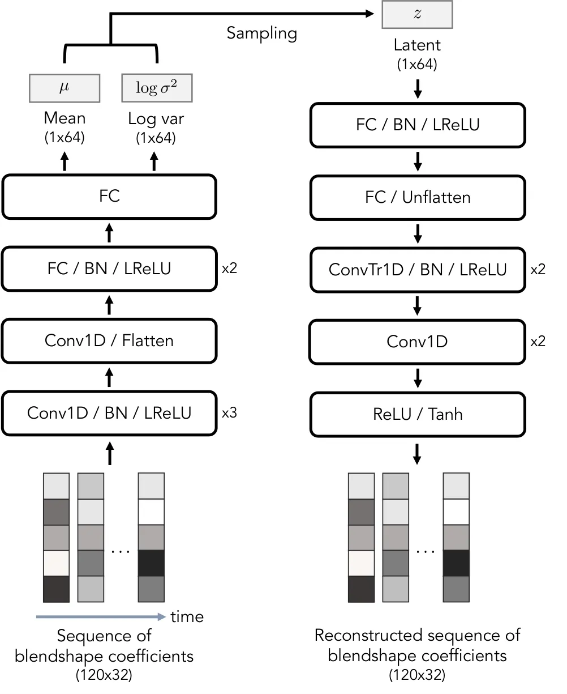

Figure 7: The model architecture of VAE.

We utilize the encoder part of the VAE as a feature extractor for the
blendshape coefficient sequences. As illustrated in Fig. 7, VAE
structure is adapted from Yoon et al. \[60\], with modifications in the
model size. Additionally, we add ReLU and Tanh layers at the end of the
decoder.

### 11.2 Training Details

We train the VAE by minimizing the reconstruction error with the
regularization term. We measure the reconstruction error using the
weighted squared error between the input and its corresponding output.
The regularization term represents the KL divergence between the latent
and standard normal distributions.

```math
\displaystyle\begin{split}&\mathcal{L}_{\mathrm{reconst}}(\bm{\theta},\bm{\phi})=\mathbb{E}_{q}\Bigl[\lVert\mathrm{diag}(\bm{\sigma}_{\bm{u}})^{-1}(\bm{u}^{1:N}-\hat{\bm{u}}^{1:N}(\bm{\theta},\bm{\phi}))\rVert_{F}^{2}\Bigr],\\
&\mathcal{L}_{\mathrm{reg}}(\bm{\phi})=\\
&~~\mathbb{E}_{q}\Bigl[\mathcal{D}_{\mathrm{KL}}\left(\mathcal{N}(\bm{\mu}_{\bm{\phi}}(\bm{u}^{1:N})),\mathrm{diag}(\bm{\sigma}_{\bm{\phi}}(\bm{u}^{1:N}))^{2})\middle\|\mathcal{N}(\bm{0},\bm{I})\right)\Bigr],\end{split} \tag{16}
```

where $`\bm{\phi}`$ and $`\bm{\theta}`$ are the model parameters of the
encoder and decoder part, respectively. $`\bm{\sigma}_{\bm{u}}`$ denotes
the standard deviation of the blendshape coefficient.
$`\hat{\bm{u}}^{1:N}(\bm{\theta},\bm{\phi})`$ is the reconstructed
output of the input $`\bm{u}^{1:N}`$.
$`\bm{\mu}_{\bm{\phi}}(\bm{u}^{1:N})`$ and
$`\bm{\sigma}_{\bm{\phi}}(\bm{u}^{1:N})`$ are the mean and standard
deviation of the latent.

In addition, we use velocity loss to reduce the jitter of the output,
which is defined as the gap between the temporal differences of and
$`\bm{u}^{1:N}`$ and
$`\hat{\bm{u}}^{1:N}=\hat{\bm{u}}^{1:N}(\bm{\theta},\bm{\phi})`$.

```math
\displaystyle\begin{split}&\mathcal{L}_{\mathrm{vel}}(\bm{\theta},\bm{\phi})=\\
&~~\mathbb{E}_{q}\Bigl[\sum_{n=1}^{N-1}\lVert\mathrm{diag}(\bm{\sigma}_{\bm{u}})^{-1}((\bm{u}^{n+1}-\bm{u}^{n})-(\hat{\bm{u}}^{n+1}-\hat{\bm{u}}^{n}))\rVert_{F}^{2}\Bigr].\end{split} \tag{17}
```

As a result, our training loss is:

```math
\displaystyle\begin{split}\mathcal{L}_{\mathrm{VAE}}(\bm{\theta},\bm{\phi})=\mathcal{L}_{\mathrm{reconst}}(\bm{\theta},\bm{\phi})+\mathcal{L}_{\mathrm{vel}}(\bm{\theta},\bm{\phi})+\beta\mathcal{L}_{\mathrm{reg}}(\bm{\phi}),\end{split} \tag{18}
```

where $`\beta`$ is a weighting hyperparameter that follows cyclical
annealing schedule \[19\].

We use the same training/validation/test dataset for training SAiD as
explained in Sec. 5.1. For each training step, we randomly choose a
minibatch of size $`8`$. Each data in the minibatch consists of the
randomly sliced blendshape coefficient sequence.

We conduct the training of VAE on a single NVIDIA A100 (40GB) for
100,000 epochs using the AdamW \[31\] optimizer with $`\beta_{1}=0.9`$,
$`\beta_{2}=0.999`$, a learning rate of $`10^{-4}`$ with warmup, and a
weight decay of $`10^{-2}`$. We use EMA \[52\] with a decay value of
$`0.99`$ to update the model weights.

## 12 Experimental Settings

We have established the following settings to provide a consistent
evaluation environment for all methods:

##### SAiD:

We use a DDIM sampler with $`1000`$ sampling steps and the guidance
strength $`\gamma=2.0`$. We generate $`72`$ random blendshape
coefficient sequences for each audio.

##### end2end_AU_speech, MeshTalk:

Since these methods are regression-based models without conditions, we
generate one unique sequence for each audio.

##### VOCA, FaceFormer, CodeTalker:

We generate $`8`$ different sequences for each audio by conditioning on
all training speaker styles. To compute the multimodality, we instead
use the average distance among every $`2`$-combination with repetition
of latent features, resulting in $`\binom{8+2-1}{2}=36`$ pairs for each
audio.

These conditions ensure that each method is evaluated in as uniform a
way as possible.


(a) Template


(b) jawForward

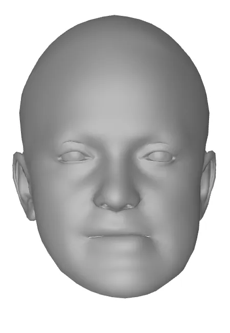

(c) jawLeft

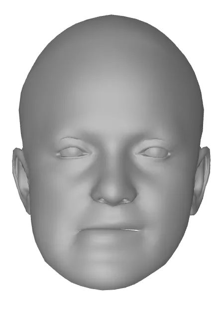

(d) jawRight

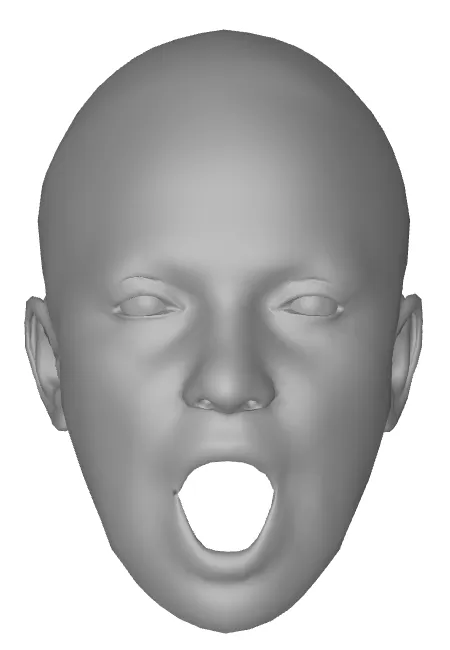

(e) jawOpen


(f) mouthClose


(g) mouthFunnel


(h) mouthPucker

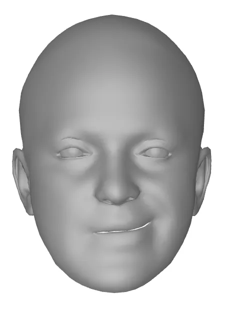

(i) mouthLeft

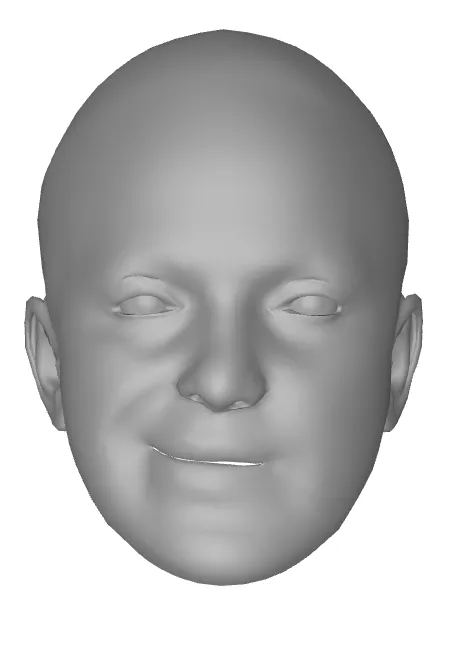

(j) mouthRight

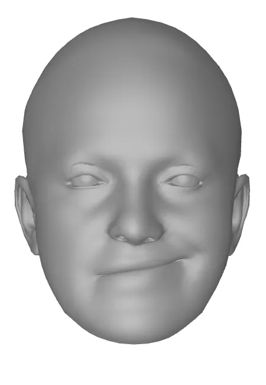

(k) mouth  
SmileLeft

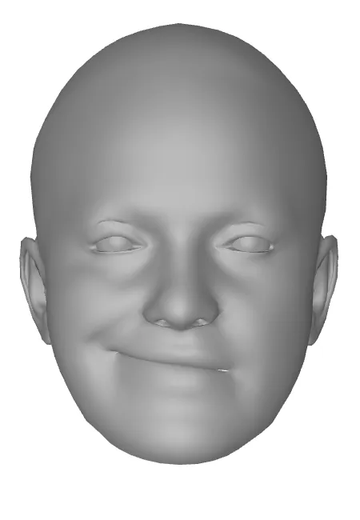

(l) mouth  
SmileRight

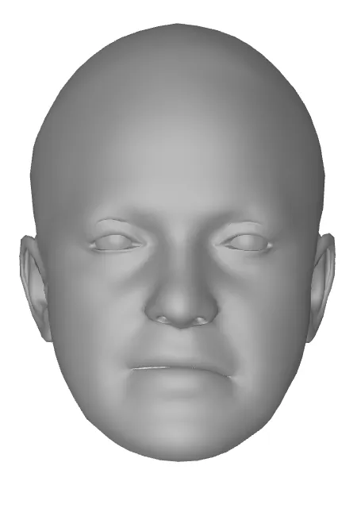

(m) mouth  
FrownLeft


(n) mouth  
FrownRight

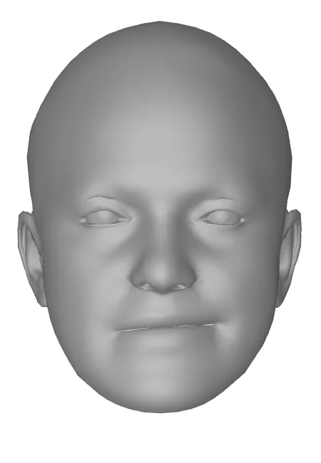

(o) mouth  
DimpleLeft


(p) mouth  
DimpleRight

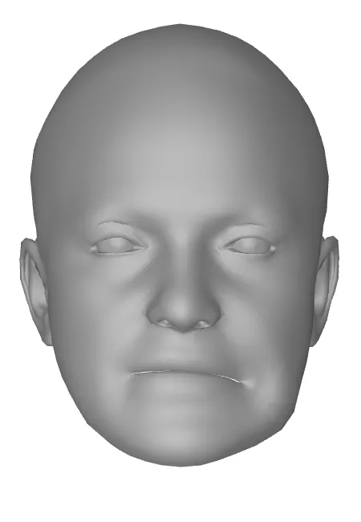

(q) mouth  
StretchLeft

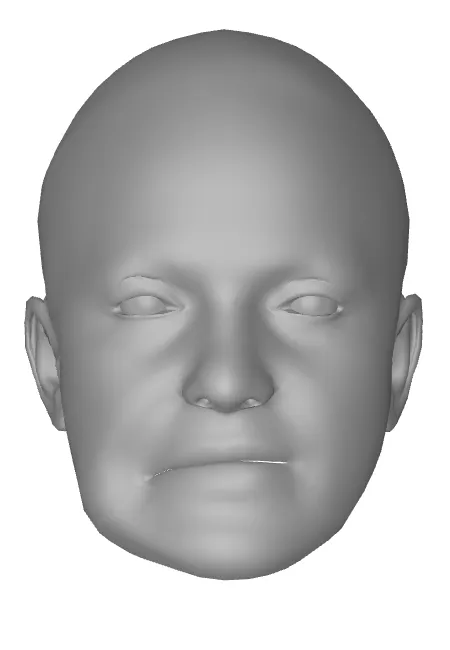

(r) mouth  
StretchRight

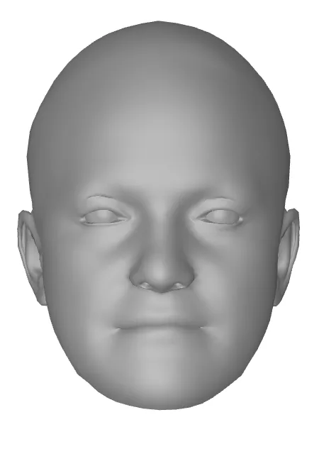

(s) mouth  
RollLower


(t) mouth  
RollUpper


(u) mouth  
ShrugLower


(a) mouth  
ShrugUpper

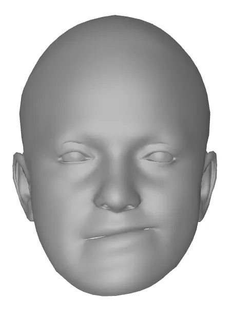

(b) mouth  
PressLeft

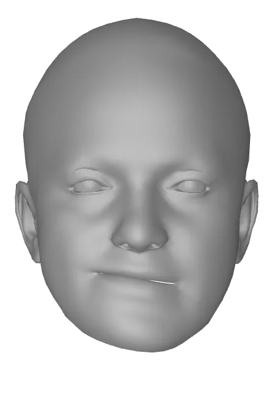

(c) mouth  
PressRight

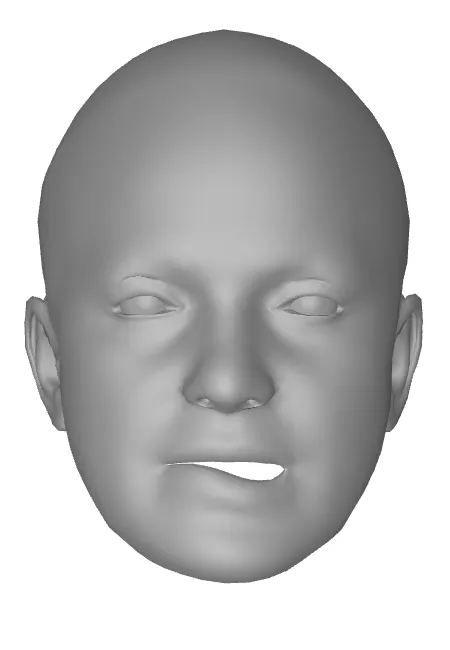

(d) mouthLower  
DownLeft

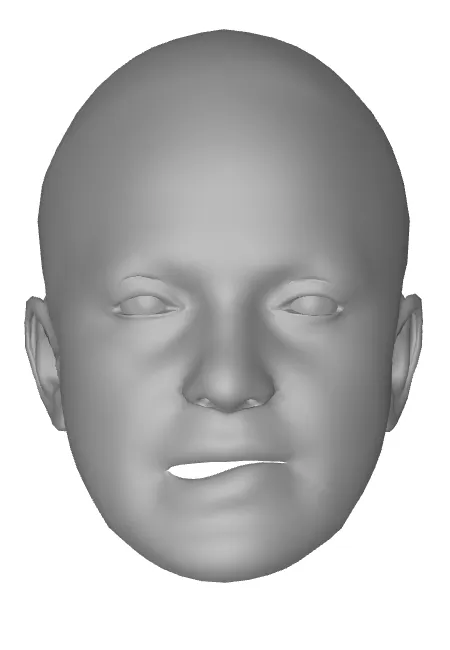

(e) mouthLower  
DownRight

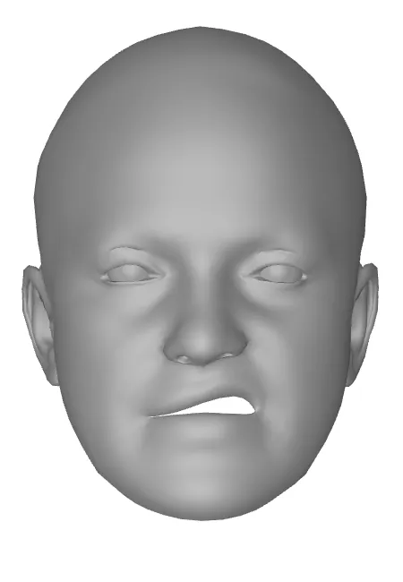

(f) mouthUpper  
UpLeft

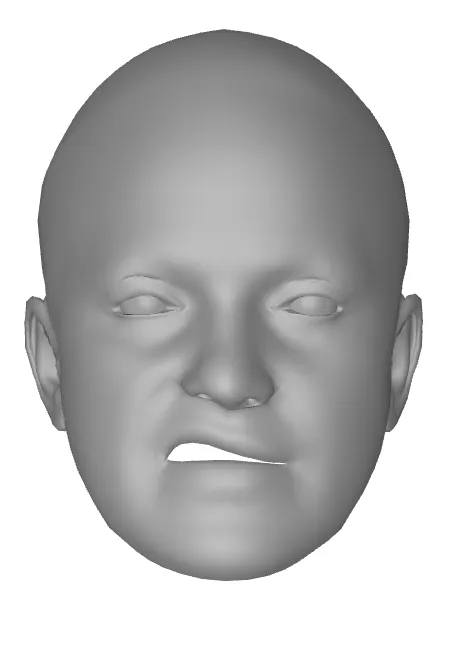

(g) mouthUpper  
UpRight


(h) cheekPuff


(i) cheek  
SquintLeft

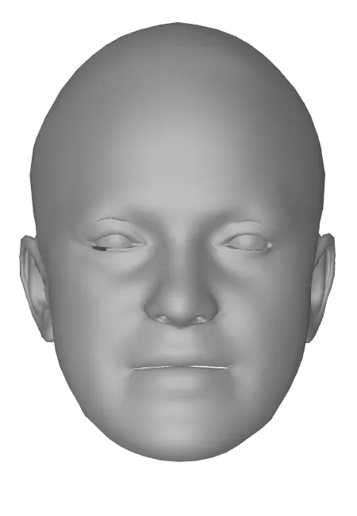

(j) cheek  
SquintRight

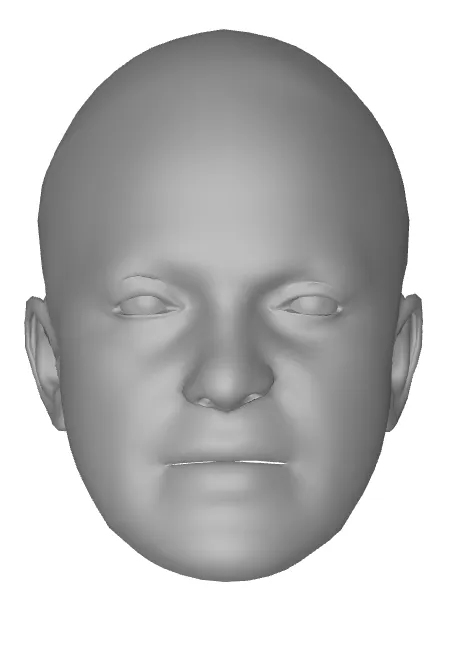

(k) nose  
SneerLeft


(l) nose  
SneerRight

Figure 8: Constructed blendshapes of the speaker
‘FaceTalk_170731_00024_TA’.

Figure 10: Effect of the velocity loss - Full version of Fig. 5.
Inference results of SAiD trained with and without velocity loss. Each
blendshape coefficient sequence is generated using the same random seed,
conditioned on the ‘FaceTalk_170731_00024_TA/sentence01.wav’.
