# ToonAging: Face Re-Aging upon Artistic Portrait Style Transfer

Bumsoo Kim Affiliation: Chung-Ang University Affiliation: VIVE STUDIOS
   Abdul Muqeet Affiliation: VIVE STUDIOS    Kyuchul Lee
Affiliation: Coupang{bumsookim, ^(\*)sanghyun}@cau.ac.kr,
amuqeet@vivestudios.com, kylee287@coupang.com    Sanghyun Seo
^(†)^(†)thanks: Corresponding author. Affiliation: Chung-Ang University

###### Abstract

Face re-aging is a prominent field in computer vision and graphics, with
significant applications in photorealistic domains such as movies,
advertising, and live streaming. Recently, the need to apply face
re-aging to non-photorealistic images, like comics, illustrations, and
animations, has emerged as an extension in various entertainment
sectors. However, the lack of a network that can seamlessly edit the
apparent age in NPR images has limited these tasks to a naive,
sequential approach. This often results in unpleasant artifacts and a
loss of facial attributes due to domain discrepancies. In this paper, we
introduce a novel one-stage method for face re-aging combined with
portrait style transfer, executed in a single generative step. We
leverage existing face re-aging and style transfer networks, both
trained within the same PR domain. Our method uniquely fuses distinct
latent vectors, each responsible for managing aging-related attributes
and NPR appearance. By adopting an exemplar-based approach, our method
offers greater flexibility compared to domain-level fine-tuning
approaches, which typically require separate training or fine-tuning for
each domain. This effectively addresses the limitation of requiring
paired datasets for re-aging and domain-level, data-driven approaches
for stylization. Our experiments show that our model can effortlessly
generate re-aged images while simultaneously transferring the style of
examples, maintaining both natural appearance and controllability.

## 1 Introduction

Face re-aging is a problem in computer graphics that semantically
changes the apparent age according to the target age. Originally, this
task was conducted at high costs by expert artists in media production
fields, such as film, advertisement, and TV series. After generative
models showed results that were indistinguishable from real images,
there were some trials to perform re-aging using generative models.
Several existing studies \[1, 11, 35, 36, 66, 39, 30, 60\] predominantly
employ StyleGAN approaches. With the given input face image, input age,
and target age, re-aging methods alter the generated images to resemble
the target age. However, all these methods mainly focus on the single
goal of changing a person’s age in photos. However, all these methods
are optimized to alter the age of real individuals in photographs. As a
result, such methods often struggle when applied to NPR images

Meanwhile, artistic portraits hold a significant place in our everyday
life, particularly within industries like comics, animation, posters,
and advertising. These portraits, which include styles ranging from
caricatures to anime, constitute essentially stylized images. Similar to
re-aging processes, StyleGAN-based architectures \[42, 12, 46, 24, 31,
14, 56, 50, 20, 65, 37, 26, 18, 57, 62, 4, 3\] have achieved substantial
success in generating high-resolution artistic portraits. This success
is largely attributable to their hierarchical style control, which also
facilitates transfer learning applications. Image-to-Image translation
methods \[22, 6\] involve developing distinct models for each domain,
which requires extensive datasets and a longer preparation process
compared to methods using pre-trained models, as each domain starts from
scratch. These methods are primarily oriented towards style modification
with limited capability for additional attribute transformation
simultaneously.

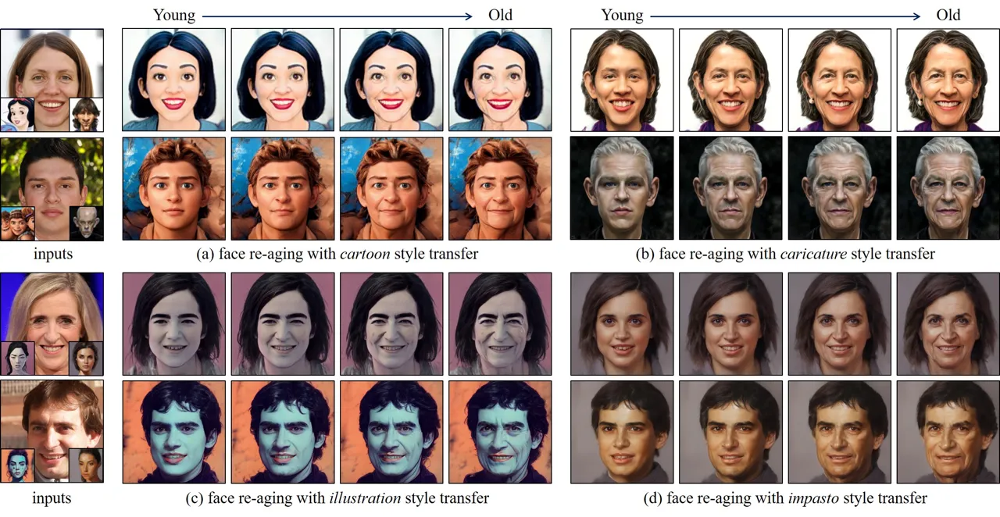

Figure 1: We propose ToonAging, which can perform face re-aging and
portrait style transfer in a single generation step. Since we adopted an
exemplar-based approach, portraits can be transferred to various
domains, enabling plausible re-aging progression simultaneously.

As previously mentioned, despite various research efforts in both face
re-aging and artistic portrait generation, to the best of our knowledge,
the combination of face re-aging and artistic portraits has not been
explored. The naive approach to tackle this problem is to apply each
method sequentially. We investigated this approach by applying SAM \[1\]
to images and then applying these re-aged images with the
state-of-the-art style generation technique DualStyleGAN \[56\]. The
results are demonstrated in Fig. 2 (b). We encountered various issues
with this approach: 1) Aging details such as wrinkles in the input image
are lost. 2) DualStyleGAN does not successfully preserve facial
attributes, including facial expressions like the mouth in the input
image. The reason for these issues lies in the inversion processes,
which do not effectively preserve the input details. We also conducted
the experiment in reverse order, first applying DualStyleGAN to images
and then SAM, as shown in Fig. 2 (c). We encountered the same problem of
inversion with this approach as well. In this case, SAM failed to
preserve the artistic details of the input images. The underlying issue
is attributed to the training procedure of re-aging methods, as they are
trained on \[41\], which is based on real images generated using
StyleGAN \[16\].

To address the challenges in combining face re-aging and artistic
portrait generation, we have developed a method that effectively merges
latent information for each goal. Our approach combines SAM \[1\] for
re-aging and DualStyleGAN \[56\] for style transfer. Specifically, we
extract inversions in the $`{W+}`$ space of a pre-trained StyleGAN
network using SAM and apply these, along with a residual $`{w}`$, to the
intrinsic path of DualStyleGAN. This combination respects the principle
of superposition, allowing the effects of each network to merge
seamlessly and without mutual interference. Our analysis suggests that
using the $`{W+}`$ space, rather than the $`{Z+}`$ space, for the
intrinsic path better preserves the subject’s attributes. Additionally,
by maintaining the original extrinsic path in DualStyleGAN, we naturally
blend age transformation and style transfer. This unified approach
offers precise control over the re-aging and style transfer processes,
overcoming the limitations of previous methods and enabling the
generation of more natural and realistic images. In summary, we present
three primary contributions:

- •
  ToonAging innovatively combines face re-aging and portrait style
  transfer in a one-stage method, surpassing sequential methods in
  performance without needing extra datasets or training.
- •
  We utilize a latent fusion approach across different networks,
  enabling precise control over diverse aspects from coarse to fine
  details, including the shape, rendering style, color, and aging
  effects with ease.
- •
  In contrast to domain-level style transfer approaches, our method
  inherits an exemplar-based technique, allowing for style transfer
  across any domain without the need for additional fine-tuning or
  training.

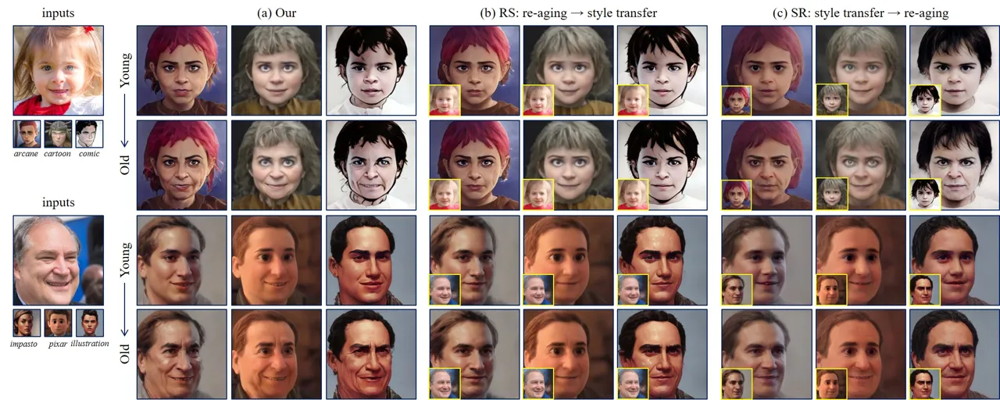

Figure 2: Comparison of our method with naive sequential approaches. (a)
ToonAging perceptually reflects the apparent age while simultaneously
effectively transferring the style of $`S`$. (b) The naive RS (re-aging
then style transfer) often loses age-related attributes, resulting in
the image lacking a discernible target age and missing the facial
attributes of the input (e.g., expression; here, the input face has a
smiling expression, but the generated image does not.) (c) Conversely,
SR (style transfer then re-aging) maintains a realistic style but fails
to retain the input $`S`$’s style. Yellow boxes denote the intermediate
results of the first stage in 2-stage approaches.

## 2 Related Work

In this section, we provide a literature review covering methods for
face re-aging and the generation of artistic styles in facial images.

### 2.1 Face Re-Aging

Face re-aging \[1, 11, 35, 36, 66, 39\] including aging (i.e., Old
direction) and de-aging (i.e., Young direction), aims to change the
apparent age of a facial image to specified target age. It faces an
issue where the re-aging network must perceptually preserve the original
facial identity in the generated output \[61\], while simultaneously
generating a significant visual effect of re-aging as well \[66, 39\].
However, it is known that there is a trade-off between aging performance
and identity preservation \[1, 66, 39\]. Moreover, the limited paired
dataset for age labeling with corresponding faces makes the face
re-aging task more difficult.

To mitigate this, \[66\] leverages an image-level re-aging network \[1\]
in a supervision manner. \[39\] extends this approach to achieve
superior video-level consistent re-aging output, demonstrating highly
consistent re-aging effects with stable aging performance and identity
preservation. Based on the StyleGAN architecture \[16, 17\], some works
have explored latent vectors within learned distributions \[1, 35, 36,
10, 34\]. There have also been efforts to perform re-aging via face
attribute editing \[49, 21, 58\]. Recently, some researchers have
attempted to address this complex training issue by employing the
diffusion approach \[30, 5\]. Additionally, one study \[9\] utilizes a
reinforcement learning approach to identify suitable aging visuals.

### 2.2 Artistic Style Face Generation

In the field of generative models, Non-Photorealistic Rendering (NPR)
style image generation \[19, 56, 52\] and style transfer \[42, 24, 47,
45, 63, 29, 20\] have emerged as appealing problems in computer graphics
due to their attractive and aesthetic appearance. The first approach
using generative models for face generation involves a domain-level
technique called layer swapping \[42, 25\] which replaces source domain
weights (i.e., realistic rendering) with target domain weights (i.e.,
NPR). Similarly, Cross-Domain Style Mixing (CDSM) \[24\] fuses two
different domain weights at the latent level in $`\mathcal{S}`$ space
\[53\] by fine-tuning \[15\] the pre-trained weights with a cartoon
dataset. On the other hand, unsupervised approaches have also been
employed for cartoon-style image generation \[12\] through
image-to-image translation schemes \[33, 64, 13, 27, 28, 22, 54, 38,
51\]. Recently, a study leveraged a diffusion model for face stylization
\[32\]. StyleGAN-Fusion \[48\] applies domain adaptation to distill the
knowledge of pre-trained large-scale diffusion models, enabling the
transition from the original domain to new target domains without
requiring any training images in that domain. However, these approaches
often require extensive dataset acquisition processes for cartoon
images, leading to the problem of insufficient datasets in specific
domains. To address this issue, recent work adopts an exemplar-based
method \[56\] that doesn’t require large datasets. Here, the key aspect
of cartoon style generation is addressing the issue of large dataset
requirements \[66, 39\] using an exemplar-based method \[56\], rather
than a domain-level method \[42, 24\], which is more suitable for our
task.

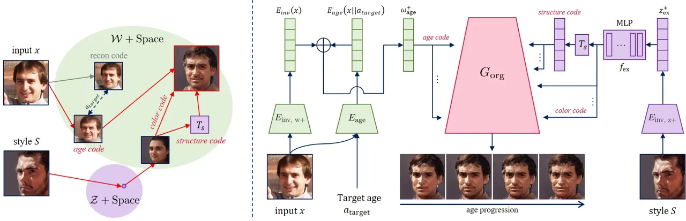

Figure 3: Our ToonAging architecture. (Left) Schematics, (Right)
Data-level architecture. Under ToonAging, age-related attributes and age
code are obtained via GAN inversion. Latent vector for reconstruction is
embedded by $`E_{\text{inv, w+}}`$, and the age-related latent vector is
embedded by $`E_{\text{age}}`$ as residuals to be added to the
reconstruction vector. The example style $`S`$ is obtained by
$`E_{\text{inv, z+}}`$ in $`\mathcal{Z}+`$ space, then converted into
$`\mathcal{W}+`$ space with a learned MLP layer. Finally, the two latent
vectors are used in the generator of DualStyleGAN.

## 3 Methodology

In the context of real-world image datasets, unsupervised learning
methods for re-aging, such as those applied to datasets like FFHQ-Aging
\[41\], are feasible. Additionally, data-centric approaches, as proposed
in methods like \[66, 39\], can be used to create supervised learning
datasets for re-aging. However, in the domain of artistic portrait
images, there is a significant lack of datasets for re-aging, and the
use of data-centric approaches is complex and time-consuming.

Unlike traditional methods, our approach does not rely on existing
datasets or the generation of new data. Instead, we utilize existing
fine-tuned networks through an exemplar-based scheme. This strategy
eliminates the need for additional training by fusing individual latent
vectors. For our method to be effective, it is crucial that the learned
distribution and alignment within the networks are congruent. Initially,
we naively applied face re-aging and portrait style transfer as a
two-stage process within the StyleGAN2 latent space \[17\] and the FFHQ
distribution \[16\]. However, this approach presents its own
limitations.

To perform face re-aging with portrait style transfer, we first provide
a concise introduction to the existing network as preliminary knowledge
in Sec. 3.1. Then, we elaborate on the details of our approach in Sec.
3.2.

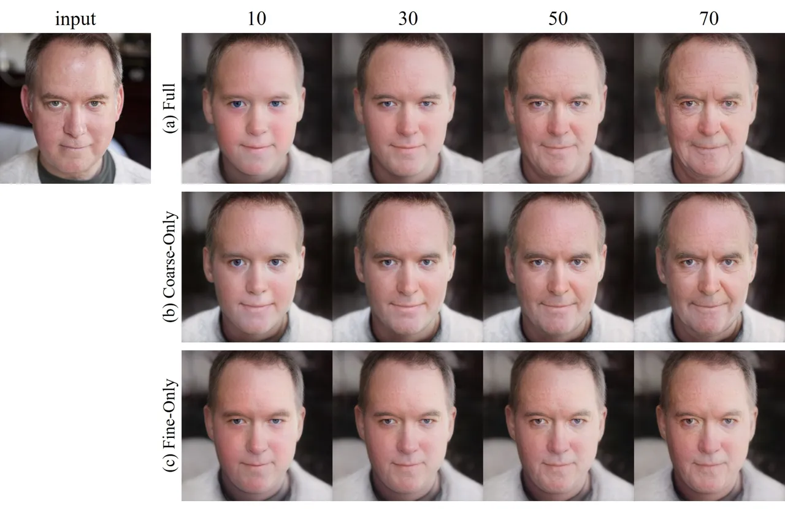

Figure 4: Latent vector behavior according to partial convolution in the
generator for face re-aging. SAM was employed for latent analysis.

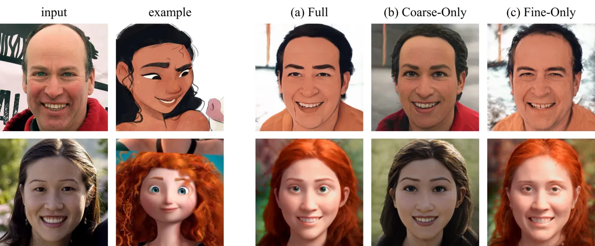

Figure 5: Latent behavior for exemplar-based style transfer.
DualStyleGAN was used for latent analysis.

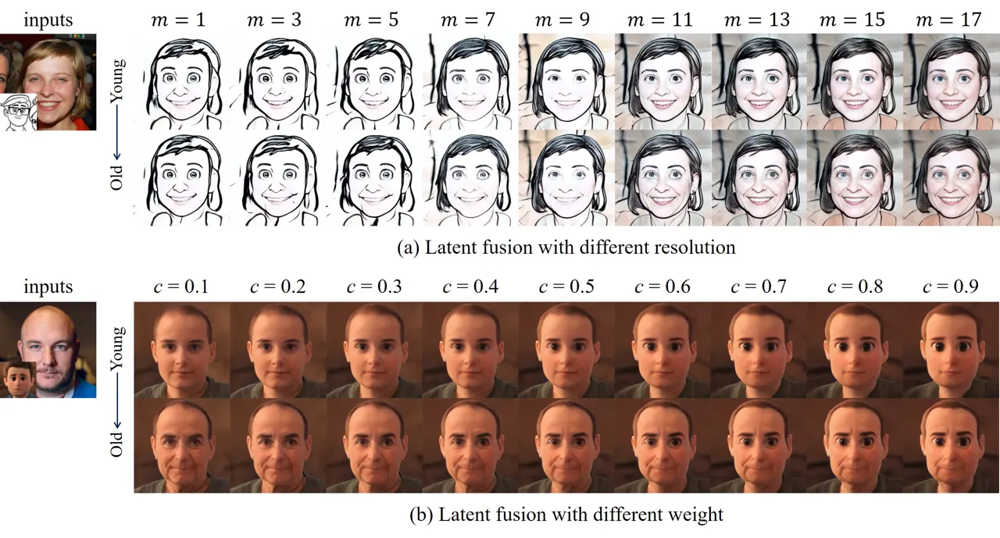

Figure 6: Effect of latent fusion level of ToonAging. (a) We vary $`m`$
from 1 to 17 to observe the re-aging effect while fixing weights as
$`\textit{{c}}_{1:m}=\textbf{0.5}`$ and
$`\textit{{s}}_{m+1:18}=\textbf{1}`$, (b) We vary the value c from 0.1
to 0.9 to control the re-aging level in the same convolutions while
fixing $`m=7`$.

### 3.1 Preliminaries

#### 3.1.1 Face Re-Aging Network

Face re-aging semantically generates a re-aging effect based on the
original appearance, following the target age. Many works \[11, 10, 35,
59, 41, 36\] have proposed re-aging networks for high-quality and
dramatic age progression. SAM \[1\], a method based on StyleGAN,
demonstrates notable effectiveness in encoding age-related attributes
into the latent vector, utilizing residuals in the $`\mathcal{W+}`$
space in conjunction with the StyleGAN and inversion scheme. Its
integration capabilities and performance make it a prominent choice
among various face re-aging networks. Technically, given an input image
$`x`$, an inversion encoder $`E_{\text{inv}}`$, and a target age
$`a_{\text{target}}`$, the face re-aging network SAM is formulated as:

```math
\textit{SAM}(x,a_{\text{target}}):=G_{\text{org}}(w^{+}_{\text{age}}), \tag{1}
```

where $`G_{\text{org}}`$ denotes the StyleGAN generator, and
$`w^{+}_{\text{age}}\in\mathbb{R}^{18\times 512}`$ represents the
age-included latent vector encoded as
$`w^{+}_{\text{age}}=E_{\text{age}}(x,a_{\text{target}})+E_{\text{inv}}(x)`$,
with $`a_{\text{target}}`$ being a constant ranging from 0 to 100. It is
noteworthy that SAM only requires an additional encoder, the age encoder
$`E_{\text{age}}`$. Thus, in the absence of the age encoder
($`E_{\text{age}}(x,a_{\text{target}}):=\textbf{0}`$), Eq. 1 effectively
reverts to the original StyleGAN formulation
$`G_{\text{org}}(E_{\text{inv}}(x))`$, demonstrating the foundational
role of the age encoder in extending the model’s capabilities for
age-specific transformations. This integration of a simple yet impactful
age encoder into the latent vector-based re-aging process underscores
our rationale for selecting this model as the basis for our ToonAging
method.

#### 3.1.2 Artistic Portrait Style Transfer Network

DualStyleGAN stands out among recent advancements \[42, 24, 8, 2\] in
face style transfer networks due to its innovative structure
incorporating both intrinsic and extrinsic paths. This design simplifies
the style transfer process, effectively integrates different latent
vectors, and excels in applying diverse external styles while
maintaining core features. Its streamlined yet versatile nature makes it
an ideal choice for our methodology, particularly in scenarios requiring
the application of diverse external styles. Given PR input $`x`$ and NPR
style $`S`$, DualStyleGAN is formulated as:

```math
\textit{DualStyleGAN}(x,S):=G_{\text{modified}}(f_{\text{in}}(z^{+}_{\text{in}}),f_{\text{ex}}(z^{+}_{\text{ex}}),\textbf{w}), \tag{2}
```

where $`z^{+}_{\text{in}}`$ is the latent vector encoded from PR image
via intrinsic path as
$`z^{+}_{\text{in}}=E_{\text{inv}}(x)\in\mathcal{Z}+`$ \[46\],
$`z^{+}_{\text{ex}}`$ is the style-related latent vector encoded from
the style via the extrinsic path as
$`z^{+}_{\text{ex}}=E_{\text{inv}}(S)\in\mathcal{Z}+`$, w is the control
weight to determine the style level, and $`G_{\text{modified}}`$
includes the original generator $`G_{\text{org}}`$ and the proposed
extrinsic style path, which also consists of an inversion network
\[43\]. Through Eq. 1 and Eq. 2, we found that all the parts are equally
used except w which is for style transfer. From that, we would like to
design our approach by leveraging the advantages of each network while
retaining the frozen parts. To validate the feasibility of this
combination and gain a better understanding, we analyze the behavior of
each latent vector in the context of face re-aging and portrait style
transfer, as described in the methods in Sec. 3.1.1 and Sec. 3.1.2.

### 3.2 ToonAging

In our study, the goal is to perform re-aging and portrait style
transfer simultaneously. To achieve this, we first explore the latent
vector behavior based on the methods described in Sec. 3.1.1 and Sec.
3.1.2, using SAM for face re-aging and DualStyleGAN for portrait style
transfer, respectively. To examine face re-aging, we freeze the
fine-level elements to highlight the coarse-level effects in age-related
latent vector $`w^{+}_{\text{age}}\in\mathbb{R}^{18\times 512}`$ in Eq.

1. Additionally, we conduct the reverse experiment by freezing the
   coarse-level elements and allowing the fine-level elements to change, in
   order to observe the fine-level effects on the age-related latent vector
   $`w^{+}{\text{age}}`$. From Fig. 4, we found that the model without
   fine-level can generate the perceptually dominant point for re-aging.
   Similarly, we exclude the extrinsic style as above. It means
   $`f_{\text{ex}}(z^{+}_{\text{ex}})`$ (Eq. 2) has no effects at the
   coarse-level or fine-level in each analysis. Following DualStyleGAN
   \[56\], we also confirmed that elements in the fine-level layer manage
   the color. In the coarse-level, since we set
   $`\textbf{w}=\textbf{0.5}`$, the model used a mixed one for structure
   information by fusing the intrinsic style
   $`f_{\text{ex}}(z^{+}_{\text{ex}})`$ (Eq. 2). From this analysis, we
   expect that the fusion on the intrinsic path can accommodate the
   re-aging effects while preserving the extrinsic path.

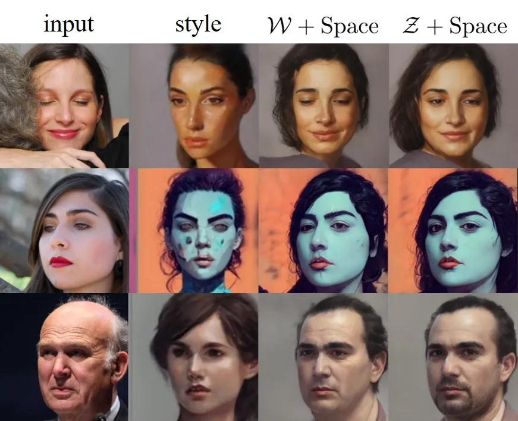

Figure 7: Latent space comparison for intrinsic style encoding. We found
that the $`\mathcal{W}+`$ space can better preserve the facial
attributes of the input image (e.g., eye gazing, expression) than the
$`\mathcal{Z}+`$ space.

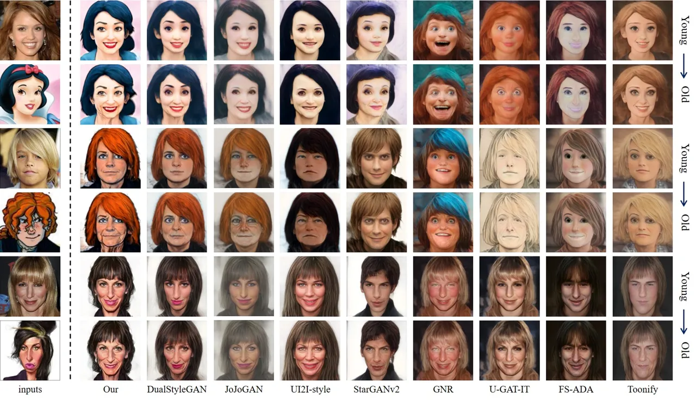

Figure 8: Qualitative comparison with various style transfer networks
using a fixed re-aging network, SAM.

Hence, we replace the intrinsic style path $`z^{+}_{\text{in}}`$ in
DualStyleGAN with the SAM encoded style $`w^{+}{\text{SAM}}`$ without
crossing the $`\mathcal{Z}+`$ space to use the $`\mathcal{W}+`$ space
directly, while preserving the extrinsic style path
$`z^{+}_{\text{ex}}`$ in $`\mathcal{Z}+`$. This is because we found that
$`\mathcal{W}+`$ showed more faithful results in terms of attribute
preservation, unlike DualStyleGAN, which uses the $`\mathcal{Z}+`$ space
for the intrinsic path \[56\], as shown in Fig. 7. By doing that, we can
accommodate the $`a_{\text{target}}`$ and $`S`$ for face re-aging and
exemplar-based portrait style transfer, respectively. The layer
swapping-based approach \[42, 24, 25\] has a limitation in that a
trained network is required for each domain, which reduces flexibility.
Thus, our ToonAging is formulated as:

```math
\textit{ToonAging}(x,a_{\text{target}},S):=G_{\text{modified}}(w^{+}_{\text{age}},f_{\text{ex}}(z^{+}_{\text{ex}}),\textbf{w}) \tag{3}
```

w $`\in`$ $`\mathbb{R}^{18}`$ is a control weight used to combine the
two latent vectors, with the default value set as 1, as used in \[56\]
(Eq. 2). By doing so, we can incorporate the re-aging latent code, which
manages age-related attributes, into the cartoonization process. Unlike
DualStyleGAN, which embeds real faces into the $`\mathcal{Z}+`$ space,
our approach utilizes the $`\mathcal{W}+`$ space to directly input the
age vector $`w^{+}_{\text{age}}`$, without additional processing. In
terms of the generator, the final input latent vector
$`w^{+}_{\text{ToonAging}}`$ becomes
$`w^{+}_{\text{ToonAging}}=w^{+}_{\text{age}}\times\textbf{w}+f_{\text{ex}}(z^{+}_{\text{ex}})\times(1-\textbf{w})`$
from $`64^{2}`$ to $`1024^{2}`$, and it is used in the same way as
DualStyleGAN formulation (read the details in \[56\]) for the
coarse-level ($`4^{2}`$ to $`32^{2}`$). All the encoders are based on
pSp \[43\]. Our scheme is illustrated in Fig. 3.

In summary, the NPR face image is generated from the extrinsic style
path \[56\], with the chosen style $`S`$ from the exemplar database.
Re-aging effects are represented by following the target age
$`a_{\text{target}}`$ via the age vector $`w^{+}_{\text{age}}`$ through
SAM encoding \[1\]. By default, input vectors
$`(w_{\text{in}},w_{\text{ex}})`$ are set as
$`(w^{+}_{\text{age}},f_{\text{ex}}(z^{+}_{\text{ex}}))`$ in Eq. 3, but
for random generation it can be
$`(w_{\text{in}},w_{\text{ex}})=(f_{\text{in}}(\textbf{z}_{\text{in}}),f_{\text{ex}}(\textbf{z}_{\text{ex}}))`$
where $`\textbf{z}_{in}`$ and $`\textbf{z}_{ex}`$ are generated from
gaussian distribution. Following DualStyleGAN \[56\], when
$`\textbf{w}=\textbf{0}`$, $`\textit{ToonAging}(x,a_{\text{target}},S)`$
degrades into a standard re-aging generator, i.e.,
$`G_{\text{modified}}(w^{+}_{\text{age}},\cdot,\textbf{0})\sim SAM(x||a_{\text{target}}):=G_{\text{org}}(E_{\text{age}}(x,a_{\text{target}})+E_{\text{inv}}(x))`$
(Eq. 1).

### 3.3 Latent Fusion Analysis

Our main objective with ToonAging is to effectively integrate re-aging
and style transfer. To achieve this, we delve into the latent vector
from coarse to fine levels. Among the 18 different vectors
$`w\in\mathbb{R}^{18\times 512}`$, we control the resolution level by
adjusting the control weight w from the coarse level as follows:

```math
\textbf{w}=\{\textbf{{c}}_{1,\dots,m}\}\cup\{\textbf{{s}}_{m+1,\dots,18}\} \tag{4}
```

here, c represents the re-aging components, while s represents the style
transfer components in the vector. The parameter $`m`$ controls the
range to constrain the elements from $`1`$ to $`m`$. In ToonAging, w
determines the layer up to which the re-aging effects are applied out of
the 18 layers. As illustrated in Fig. 6 (a), we observed that setting
$`m>7`$ results in a noticeable deviation in the style from $`S`$,
leading to the generation of colors similar to those in input $`x`$.
Moreover, when adjusting the magnitude $`c`$ of the re-aging latent
components, we discovered that values around 0.5 yield credible
outcomes, as depicted in Fig. 6 (b). As a result, ToonAging defaults to
using $`m=7`$ and $`c=0.5`$. However, both $`m`$ and $`c`$ remain
adjustable parameters, enabling users to fine-tune these values
according to their preferences.

## 4 Experiments

### 4.1 Experimental Setup

All the network components, including the generator, mapping network,
and inversion network, were utilized with pre-trained weights. We used
SAM weights from the official Pytorch implementation¹¹ 1
https://github.com/yuval-alaluf/SAM and the codebase of DualStyleGAN²² 2
https://github.com/williamyang1991/DualStyleGAN, aligning our
methodology with existing frameworks without undergoing a separate
training process. Our code is implemented in Pytorch, inheriting the
StyleGAN architecture \[16\], which enables the generation of output
images up to $`1024^{2}`$ resolution. Using the NVIDIA RTX 3090 GPU, we
achieve a generation rate of 4 images per second, excluding the time for
the extrinsic style optimization process \[56\]. We set
$`\textit{c}_{1,\dots,m}=0.5`$ and $`\textbf{{s}}_{m+1,\dots,18}=1`$
with $`m=7`$ as default settings.

### 4.2 Qualitative Results

For a qualitative comparison, in the absence of any existing network
capable of performing artistic style transfer and facial re-aging
simultaneously, our ToonAging technique is assessed against a naive
approach that processes style transfer followed by re-aging. In our
experiments, we specifically target the ages of 10 and 55 to represent
the younger and older age directions, respectively. The input images are
obtained from the FFHQ dataset, and the style images, which include
cartoons, caricatures, and Pixar-inspired themes, are directly sourced
from the images used in the DualStyleGAN figure for comparison. The
effectiveness of ToonAging in achieving style transfer and age
progression is then benchmarked against several established methods,
including DualStyleGAN \[56\], JoJoGAN \[8\], U2I-style \[12\],
StarGANv2 \[6\], GNR \[7\], U-GAT-IT \[23\], FS-ADA \[40\], and Toonify
\[42\].

As illustrated in Fig. 8, our method excels at delivering natural age
progression with accurate skin textures and wrinkles, whereas other
techniques may produce less realistic effects and often sacrifice the
unique features of style transfer in an attempt to create images that
resemble real people. Methods like DualStyleGAN \[56\], JoJoGAN \[8\],
and UI2I-style \[12\] can struggle with maintaining age-related
authenticity while preserving the distinctive characteristics of the
original style. Similarly, StarGANv2 \[6\] may distort facial features,
while techniques such as GNR \[7\], U-GAT-IT \[23\], FS-ADA \[40\], and
Toonify \[42\] each have their own limitations, ranging from loss of
detail to an inability to fully capture the essence of aging. In
contrast, our method consistently offers more lifelike and coherent age
transformation results without compromising the stylistic elements of
the original image.

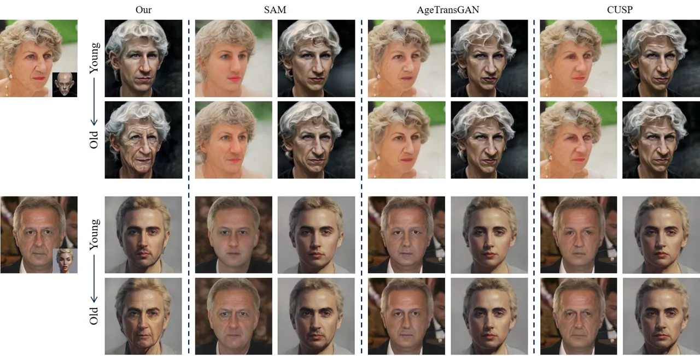

Figure 9: Qualitative comparison with various face re-aging networks,
including SAM \[1\], CUSP \[10\], and AgeTransGAN \[11\], while fixing
the style transfer model as DualStyleGAN \[56\]. Our ToonAging method
outperforms all the other approaches, as these approaches fail to
conserve aging-related visual effects through a 2-stage process.

In the naive approach, we experiment with various state-of-the-art
image-level face re-aging networks, including SAM \[1\], AgeTransGAN
\[11\], and CUSP \[10\]. As demonstrated in Fig. 9, our ToonAging method
outperforms all the naive approaches utilizing various state-of-the-art
re-aging models. Here, we employ SAM as the re-aging component in
ToonAging, which generates more natural aging effects compared to the
other models, as evidenced in Fig. 9.

| Domain       | SR   | RS   | Ours |
| ------------ | ---- | ---- | ---- |
| Arcane       | 0.2  | 0.26 | 0.54 |
| Caricature   | 0.32 | 0.22 | 0.46 |
| Cartoon      | 0.22 | 0.31 | 0.46 |
| Illustration | 0.24 | 0.27 | 0.49 |
| Impasto      | 0.22 | 0.25 | 0.53 |
| Pixar        | 0.23 | 0.22 | 0.54 |

Table 1: User preference scores. Best scores are marked in bold.

### 4.3 Quantitative Results

To address the challenges of accurately estimating age and identity in
NPR images and the lack of standard metrics for evaluating face re-aging
in this domain, we conducted a comprehensive user study as presented in
Tab. 1. The study included a diverse set of styles from six domains:
Arcane, Caricature, Cartoon, Illustration, Impasto, and Pixar, each with
10 samples, totaling 60 samples. Participants were tasked with
identifying the images that most effectively conveyed the intended age
transformation and style adaptation, allowing us to assess user
preferences and the perceived success of the transformations.

The study yielded 589 responses, demonstrating high engagement and
providing valuable insights into user preferences. Our proposed method,
ToonAging, consistently outperformed other approaches, achieving the
highest scores in all categories. This result validates the
effectiveness of ToonAging in generating convincing and visually
appealing re-aged representations within the NPR context. Furthermore,
the outcome highlights the importance of incorporating user-centric
evaluations to complement traditional metrics and gain a more
comprehensive understanding of face re-aging performance in the NPR
domain.

## 5 Conclusion

In this paper, we present ToonAging, which focuses on combining the dual
challenges of face re-aging and portrait style transfer. Since the naive
two-stage approach lacks the capability to represent both re-aging
visuals and style transfer effectively, we devised a one-stage method
that leverages the strengths of existing networks. Our ToonAging builds
upon portrait style transfer, incorporating a face re-aging network and
demonstrating plausible performance with enhanced editability for
stylization and face re-aging. In our experiments, ToonAging
outperformed existing methods in terms of both naturalness and image
quality. ToonAging serves as a versatile tool for human face creation,
with potential applications in various NPR face manipulation tasks
involving face re-aging and style transfer.

## Acknowledgement

This research was supported by Culture, Sports and Tourism R&D Program
through the Korea Creative Content Agency(KOCCA) grant funded by the
Ministry of Culture, Sports and Tourism(MCST) in 2023 (Project Name:
Development of digital abusing detection and management technology for a
safe Metaverse service, Project Number: RS-2023-00227686, Contribution
Rate: 50%) and the National Research Foundation of Korea (NRF) grant
funded by the Korean government (MSIT) (No.2022R1A2C1004657,
Contribution Rate: 50%).

## References

- \[1\] Yuval Alaluf, Or Patashnik, and Daniel Cohen-Or. Only a matter
  of style: Age transformation using a style-based regression model. ACM
  Transactions on Graphics (TOG), 40(4):1–12, 2021.
- \[2\] Jihye Back. Fine-tuning stylegan2 for cartoon face generation.
  arXiv preprint arXiv:2106.12445, 2021.
- \[3\] Jihye Back, Seungkwon Kim, and Namhyuk Ahn. Webtoonme: A
  data-centric approach for full-body portrait stylization. In SIGGRAPH
  Asia 2022 Technical Communications, pages 1–4. ACM, 2022.
- \[4\] Hila Chefer, Sagie Benaim, Roni Paiss, and Lior Wolf.
  Image-based clip-guided essence transfer. In European Conference on
  Computer Vision, pages 695–711. Springer, 2022.
- \[5\] Xiangyi Chen and Stéphane Lathuilière. Face aging via
  diffusion-based editing. arXiv preprint arXiv:2309.11321, 2023.
- \[6\] Yunjey Choi, Youngjung Uh, Jaejun Yoo, and Jung-Woo Ha. Stargan
  v2: Diverse image synthesis for multiple domains. In Proceedings of
  the IEEE/CVF conference on computer vision and pattern recognition,
  pages 8188–8197, 2020.
- \[7\] Min Jin Chong and David Forsyth. Gans n’roses: Stable,
  controllable, diverse image to image translation (works for videos
  too!). arXiv preprint arXiv:2106.06561, 2021.
- \[8\] Min Jin Chong and David Forsyth. Jojogan: One shot face
  stylization. In European Conference on Computer Vision, pages 128–152.
  Springer, 2022.
- \[9\] Chi Nhan Duong, Khoa Luu, Kha Gia Quach, Nghia Nguyen, Eric
  Patterson, Tien D Bui, and Ngan Le. Automatic face aging in videos via
  deep reinforcement learning. In Proceedings of the IEEE/CVF Conference
  on Computer Vision and Pattern Recognition, pages 10013–10022, 2019.
- \[10\] Guillermo Gomez-Trenado, Stéphane Lathuilière, Pablo Mesejo,
  and Óscar Cordón. Custom structure preservation in face aging. In
  European Conference on Computer Vision, pages 565–580. Springer, 2022.
- \[11\] Gee-Sern Hsu, Rui-Cang Xie, Zhi-Ting Chen, and Yu-Hong Lin.
  Agetransgan for facial age transformation with rectified performance
  metrics. In European Conference on Computer Vision, pages 580–595.
  Springer, 2022.
- \[12\] Jialu Huang, Jing Liao, and Sam Kwong. Unsupervised
  image-to-image translation via pre-trained stylegan2 network. IEEE
  Transactions on Multimedia, 24:1435–1448, 2021.
- \[13\] Xun Huang, Ming-Yu Liu, Serge Belongie, and Jan Kautz.
  Multimodal unsupervised image-to-image translation. In Proceedings of
  the European conference on computer vision (ECCV), pages
  172–189, 2018.
- \[14\] Wonjong Jang, Gwangjin Ju, Yucheol Jung, Jiaolong Yang, Xin
  Tong, and Seungyong Lee. Stylecarigan: caricature generation via
  stylegan feature map modulation. ACM Transactions on Graphics (TOG),
  40(4):1–16, 2021.
- \[15\] Tero Karras, Miika Aittala, Janne Hellsten, Samuli Laine,
  Jaakko Lehtinen, and Timo Aila. Training generative adversarial
  networks with limited data. Advances in neural information processing
  systems, 33:12104–12114, 2020.
- \[16\] Tero Karras, Samuli Laine, and Timo Aila. A style-based
  generator architecture for generative adversarial networks. In
  Proceedings of the IEEE/CVF conference on computer vision and pattern
  recognition, pages 4401–4410, 2019.
- \[17\] Tero Karras, Samuli Laine, Miika Aittala, Janne Hellsten,
  Jaakko Lehtinen, and Timo Aila. Analyzing and improving the image
  quality of stylegan. In Proceedings of the IEEE/CVF conference on
  computer vision and pattern recognition, pages 8110–8119, 2020.
- \[18\] Sunder Ali Khowaja, Ghulam Mujtaba, Jiseok Yoon, and Ik Hyun
  Lee. Face-past: Facial pose awareness and style transfer networks.
  arXiv preprint arXiv:2307.09020, 2023.
- \[19\] Bumsoo Kim, Sanghyun Byun, Yonghoon Jung, Wonseop Shin,
  Sareer UI Amin, and Sanghyun Seo. Minecraft-ify: Minecraft style image
  generation with text-guided image editing for in-game application.
  arXiv preprint arXiv:2402.05448, 2024.
- \[20\] Doyeon Kim, Eunji Ko, Hyunsu Kim, Yunji Kim, Junho Kim,
  Dongchan Min, Junmo Kim, and Sung Ju Hwang. Context-preserving
  two-stage video domain translation for portrait stylization. arXiv
  preprint arXiv:2305.19135, 2023.
- \[21\] Gyeongman Kim, Hajin Shim, Hyunsu Kim, Yunjey Choi, Junho Kim,
  and Eunho Yang. Diffusion video autoencoders: Toward temporally
  consistent face video editing via disentangled video encoding. In
  Proceedings of the IEEE/CVF Conference on Computer Vision and Pattern
  Recognition, pages 6091–6100, 2023.
- \[22\] Junho Kim, Minjae Kim, Hyeonwoo Kang, and Kwanghee Lee.
  U-gat-it: Unsupervised generative attentional networks with adaptive
  layer-instance normalization for image-to-image translation. arXiv
  preprint arXiv:1907.10830, 2019.
- \[23\] Junho Kim, Minjae Kim, Hyeonwoo Kang, and Kwanghee Lee.
  U-gat-it: Unsupervised generative attentional networks with adaptive
  layer-instance normalization for image-to-image translation. arXiv
  preprint arXiv:1907.10830, 2019.
- \[24\] Seungkwon Kim, Chaeheon Gwak, Dohyun Kim, Kwangho Lee, Jihye
  Back, Namhyuk Ahn, and Daesik Kim. Cross-domain style mixing for face
  cartoonization. arXiv preprint arXiv:2205.12450, 2022.
- \[25\] Jeong-gi Kwak, Yuanming Li, Dongsik Yoon, David Han, and
  Hanseok Ko. Generate and edit your own character in a canonical view.
  arXiv preprint arXiv:2205.02974, 2022.
- \[26\] Dongyeun Lee, Jae Young Lee, Doyeon Kim, Jaehyun Choi, Jaejun
  Yoo, and Junmo Kim. Fix the noise: Disentangling source feature for
  controllable domain translation. In Proceedings of the IEEE/CVF
  Conference on Computer Vision and Pattern Recognition, pages
  14224–14234, 2023.
- \[27\] Hsin-Ying Lee, Hung-Yu Tseng, Jia-Bin Huang, Maneesh Singh, and
  Ming-Hsuan Yang. Diverse image-to-image translation via disentangled
  representations. In Proceedings of the European conference on computer
  vision (ECCV), pages 35–51, 2018.
- \[28\] Hsin-Ying Lee, Hung-Yu Tseng, Qi Mao, Jia-Bin Huang, Yu-Ding
  Lu, Maneesh Singh, and Ming-Hsuan Yang. Drit++: Diverse image-to-image
  translation via disentangled representations. International Journal of
  Computer Vision, 128:2402–2417, 2020.
- \[29\] Mengtian Li, Yi Dong, Minxuan Lin, Haibin Huang, Pengfei Wan,
  and Chongyang Ma. Multi-modal face stylization with a generative
  prior. arXiv preprint arXiv:2305.18009, 2023.
- \[30\] Peipei Li, Rui Wang, Huaibo Huang, Ran He, and Zhaofeng He.
  Pluralistic aging diffusion autoencoder. In Proceedings of the
  IEEE/CVF International Conference on Computer Vision, pages
  22613–22623, 2023.
- \[31\] Zhansheng Li, Yangyang Xu, Nanxuan Zhao, Yang Zhou, Yongtuo
  Liu, Dahua Lin, and Shengfeng He. Parsing-conditioned anime
  translation: A new dataset and method. ACM Transactions on Graphics,
  42(3):1–14, 2023.
- \[32\] Jin Liu, Huaibo Huang, Chao Jin, and Ran He. Portrait
  diffusion: Training-free face stylization with chain-of-painting.
  arXiv preprint arXiv:2312.02212, 2023.
- \[33\] Ming-Yu Liu, Thomas Breuel, and Jan Kautz. Unsupervised
  image-to-image translation networks. Advances in neural information
  processing systems, 30, 2017.
- \[34\] Junyeong Maeng, Kwanseok Oh, and Heung-Il Suk. Age-aware
  guidance via masking-based attention in face aging. In Proceedings of
  the 32nd ACM International Conference on Information and Knowledge
  Management, pages 4165–4169, 2023.
- \[35\] Farkhod Makhmudkhujaev, Sungeun Hong, and In Kyu Park. Re-aging
  gan: Toward personalized face age transformation. In Proceedings of
  the IEEE/CVF International Conference on Computer Vision, pages
  3908–3917, 2021.
- \[36\] Farkhod Makhmudkhujaev, Sungeun Hong, and In Kyu Park. Re-aging
  gan++: Temporally consistent transformation of faces in videos. IEEE
  Access, 11:137377–137386, 2023.
- \[37\] Yifang Men, Yuan Yao, Miaomiao Cui, Zhouhui Lian, and Xuansong
  Xie. Dct-net: domain-calibrated translation for portrait stylization.
  ACM Transactions on Graphics (TOG), 41(4):1–9, 2022.
- \[38\] Yifang Men, Yuan Yao, Miaomiao Cui, Zhouhui Lian, Xuansong Xie,
  and Xian-Sheng Hua. Unpaired cartoon image synthesis via gated cycle
  mapping. In Proceedings of the IEEE/CVF Conference on Computer Vision
  and Pattern Recognition, pages 3501–3510, 2022.
- \[39\] Abdul Muqeet, Kyuchul Lee, Bumsoo Kim, Yohan Hong, Hyungrae
  Lee, Woonggon Kim, and KwangHee Lee. Video face re-aging: Toward
  temporally consistent face re-aging. arXiv preprint
  arXiv:2311.11642, 2023.
- \[40\] Utkarsh Ojha, Yijun Li, Jingwan Lu, Alexei A Efros, Yong Jae
  Lee, Eli Shechtman, and Richard Zhang. Few-shot image generation via
  cross-domain correspondence. In Proceedings of the IEEE/CVF Conference
  on Computer Vision and Pattern Recognition, pages 10743–10752, 2021.
- \[41\] Roy Or-El, Soumyadip Sengupta, Ohad Fried, Eli Shechtman, and
  Ira Kemelmacher-Shlizerman. Lifespan age transformation synthesis. In
  Computer Vision–ECCV 2020: 16th European Conference, Glasgow, UK,
  August 23–28, 2020, Proceedings, Part VI 16, pages 739–755.
  Springer, 2020.
- \[42\] Justin NM Pinkney and Doron Adler. Resolution dependent gan
  interpolation for controllable image synthesis between domains. arXiv
  preprint arXiv:2010.05334, 2020.
- \[43\] Elad Richardson, Yuval Alaluf, Or Patashnik, Yotam Nitzan,
  Yaniv Azar, Stav Shapiro, and Daniel Cohen-Or. Encoding in style: a
  stylegan encoder for image-to-image translation. In Proceedings of the
  IEEE/CVF conference on computer vision and pattern recognition, pages
  2287–2296, 2021.
- \[44\] Rasmus Rothe, Radu Timofte, and Luc Van Gool. Dex: Deep
  expectation of apparent age from a single image. In Proceedings of the
  IEEE international conference on computer vision workshops, pages
  10–15, 2015.
- \[45\] Viraj Shah and Svetlana Lazebnik. Multistylegan: Multiple
  one-shot face stylizations using a single gan. arXiv preprint
  arXiv:2210.04120, 2022.
- \[46\] Guoxian Song, Linjie Luo, Jing Liu, Wan-Chun Ma, Chunpong Lai,
  Chuanxia Zheng, and Tat-Jen Cham. Agilegan: stylizing portraits by
  inversion-consistent transfer learning. ACM Transactions on Graphics
  (TOG), 40(4):1–13, 2021.
- \[47\] Guoxian Song, Hongyi Xu, Jing Liu, Tiancheng Zhi, Yichun Shi,
  Jianfeng Zhang, Zihang Jiang, Jiashi Feng, Shen Sang, and Linjie Luo.
  Agilegan3d: Few-shot 3d portrait stylization by augmented transfer
  learning. arXiv preprint arXiv:2303.14297, 2023.
- \[48\] Kunpeng Song, Ligong Han, Bingchen Liu, Dimitris Metaxas, and
  Ahmed Elgammal. Stylegan-fusion: Diffusion guided domain adaptation of
  image generators. In Proceedings of the IEEE/CVF Winter Conference on
  Applications of Computer Vision, pages 5453–5463, 2024.
- \[49\] Rotem Tzaban, Ron Mokady, Rinon Gal, Amit Bermano, and Daniel
  Cohen-Or. Stitch it in time: Gan-based facial editing of real videos.
  In SIGGRAPH Asia 2022 Conference Papers, pages 1–9, 2022.
- \[50\] Hao Wang, Guosheng Lin, Steven CH Hoi, and Chunyan Miao. 3d
  cartoon face generation with controllable expressions from a single
  gan image. arXiv preprint arXiv:2207.14425, 2022.
- \[51\] Xinrui Wang, Zhuoru Li, Xiao Zhou, Yusuke Iwasawa, and Yutaka
  Matsuo. Realtime fewshot portrait stylization based on geometric
  alignment. arXiv preprint arXiv:2211.15549, 2022.
- \[52\] Yue Wang, Ran Yi, Ying Tai, Chengjie Wang, and Lizhuang Ma.
  Ctlgan: Few-shot artistic portraits generation with contrastive
  transfer learning. arXiv preprint arXiv:2203.08612, 2022.
- \[53\] Zongze Wu, Dani Lischinski, and Eli Shechtman. Stylespace
  analysis: Disentangled controls for stylegan image generation. In
  Proceedings of the IEEE/CVF Conference on Computer Vision and Pattern
  Recognition, pages 12863–12872, 2021.
- \[54\] Wenpeng Xiao, Cheng Xu, Jiajie Mai, Xuemiao Xu, Yue Li, Chengze
  Li, Xueting Liu, and Shengfeng He. Appearance-preserved
  portrait-to-anime translation via proxy-guided domain adaptation. IEEE
  Transactions on Visualization and Computer Graphics, 2022.
- \[55\] Liangbin Xie, Xintao Wang, Honglun Zhang, Chao Dong, and Ying
  Shan. Vfhq: A high-quality dataset and benchmark for video face
  super-resolution. In Proceedings of the IEEE/CVF Conference on
  Computer Vision and Pattern Recognition, pages 657–666, 2022.
- \[56\] Shuai Yang, Liming Jiang, Ziwei Liu, and Chen Change Loy.
  Pastiche master: Exemplar-based high-resolution portrait style
  transfer. In Proceedings of the IEEE/CVF Conference on Computer Vision
  and Pattern Recognition, pages 7693–7702, 2022.
- \[57\] Shuai Yang, Liming Jiang, Ziwei Liu, and Chen Change Loy.
  Vtoonify: Controllable high-resolution portrait video style transfer.
  ACM Transactions on Graphics (TOG), 41(6):1–15, 2022.
- \[58\] Shuai Yang, Liming Jiang, Ziwei Liu, and Chen Change Loy.
  Styleganex: Stylegan-based manipulation beyond cropped aligned faces.
  arXiv preprint arXiv:2303.06146, 2023.
- \[59\] Xu Yao, Gilles Puy, Alasdair Newson, Yann Gousseau, and Pierre
  Hellier. High resolution face age editing. In 2020 25th International
  conference on pattern recognition (ICPR), pages 8624–8631. IEEE, 2021.
- \[60\] Dongsik Yoon, Jineui Kim, Vincent Lorant, and Sungku Kang.
  Manipulation of age variation using stylegan inversion and
  fine-tuning. IEEE Access, 11:131475–131486, 2023.
- \[61\] Zhonghua Zhai and Jian Zhai. Identity-preserving conditional
  generative adversarial network. In 2018 International Joint Conference
  on Neural Networks (IJCNN), pages 1–5. IEEE, 2018.
- \[62\] Zicheng Zhang, Yinglu Liu, Congying Han, Tiande Guo, Ting Yao,
  and Tao Mei. Generalized one-shot domain adaptation of generative
  adversarial networks. Advances in Neural Information Processing
  Systems, 35:13718–13730, 2022.
- \[63\] Peng Zhou, Lingxi Xie, Bingbing Ni, Lin Liu, and Qi Tian.
  Hrinversion: High-resolution gan inversion for cross-domain image
  synthesis. IEEE Transactions on Circuits and Systems for Video
  Technology, 2022.
- \[64\] Jun-Yan Zhu, Taesung Park, Phillip Isola, and Alexei A Efros.
  Unpaired image-to-image translation using cycle-consistent adversarial
  networks. In Proceedings of the IEEE international conference on
  computer vision, pages 2223–2232, 2017.
- \[65\] Runchuan Zhu, Naye Ji, Youbing Zhao, and Fan Zhang. Few-shots
  portrait generation with style enhancement and identity preservation.
  arXiv preprint arXiv:2303.00377, 2023.
- \[66\] Gaspard Zoss, Prashanth Chandran, Eftychios Sifakis, Markus
  Gross, Paulo Gotardo, and Derek Bradley. Production-ready face
  re-aging for visual effects. ACM Transactions on Graphics (TOG),
  41(6):1–12, 2022.

## Appendix A Appendix

This appendix presents additional experiments.

### A.1 Style-Age Interpolation

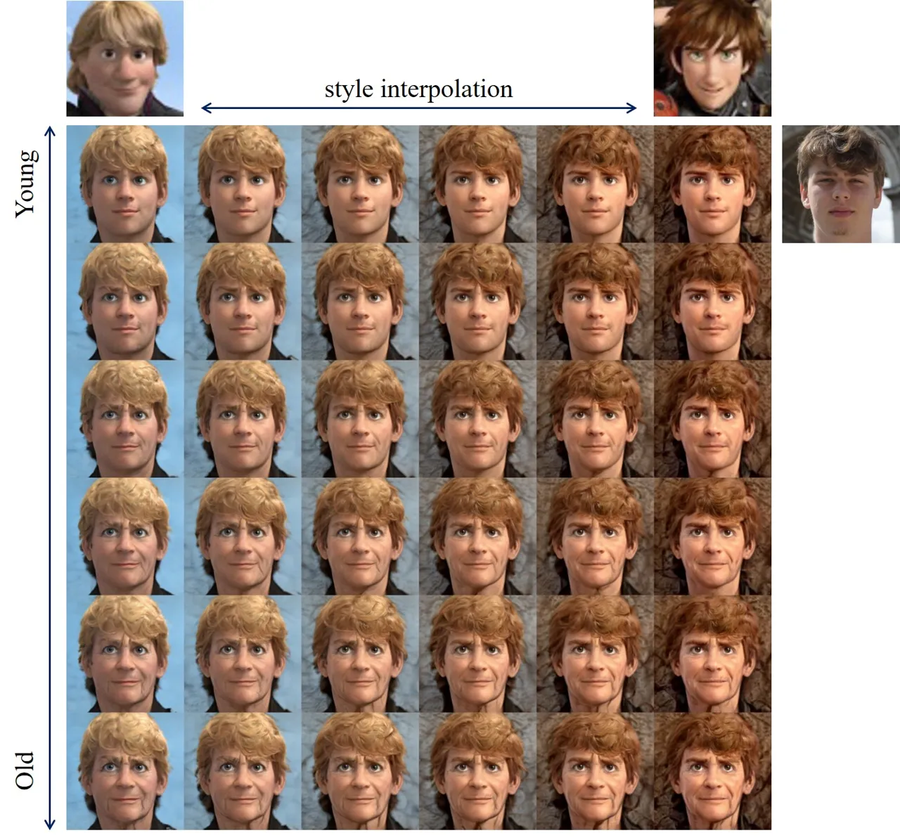

Figure 10: Style-Age interpolation. We interpolate two style images
while varying the target age from the young to old direction.

StyleGAN is known for its ability to interpolate latent vectors.
Similarly, ToonAging inherits this capability, allowing it to perform
interpolation between two style references. Additionally, it can
simultaneously transform the target age, creating more satisfying
images. As depicted in Fig. 10, our method can successfully conduct
latent vector interpolation that encompasses both style and age-related
attributes.

### A.2 Re-Aging with Reference Image

Conventionally, re-aging involves using a target age as input. We
propose an alternative by introducing an ’Age Reference,’ a reference
image for the target age used in conjunction with the reference style.
We estimate the target age through the age reference using the
off-the-shelf age classifier DEX \[44\]. Given that the perception of
age can be subjective, an age reference can provide a more visually
realistic target for re-aging, leading to more natural results compared
to using a single number (target age). We have presented an example of
age reference in Fig. 11.

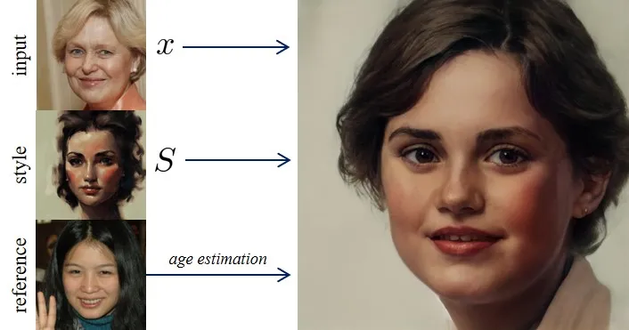

Figure 11: Extension of ToonAging for ’Age Reference’ with an age
estimator. Given an input PR image $`x`$ and style $`S`$, the reference
image is predicted by an age classifier to estimate the target age.

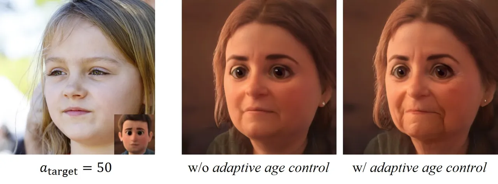

Figure 12: Advantage of Adaptive Age Control: With adaptive age control,
users can effectively manipulate the aging effects.

### A.3 Adaptive Age Control

Although our method produces plausible results, we extend it to give
more user control. We gain insights from section 3.3 and introduce an
adaptive age control method that can be defined as:

```math
\hat{a}_{\text{target}}=a_{\text{target}}\times\left(\frac{\Sigma_{i=1}^{m}\textbf{w}_{i}}{m}\right)^{-1}, \tag{5}
```

where $`\hat{a}_{\text{target}}`$ denotes the new target age. This
allows us to modify the apparent age of the resulting image without
compromising the style, bringing it closer to the target age, as
illustrated in Fig. 12. It is evident that adaptive control exhibits
more realistic output with a reduced perceptual age gap between the
apparent age and the target age.

### A.4 User Study Sample

Fig. 13 shows a sample image of the user study. We randomly shuffled the
sequence to avoid any bias.

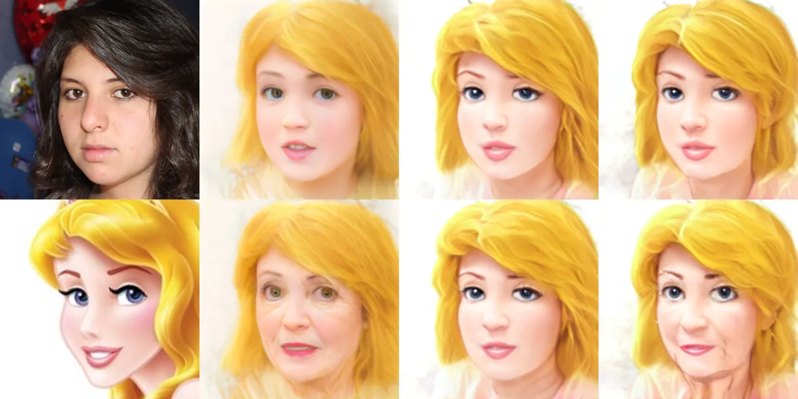

Figure 13: Sample image from the user study.

### A.5 Video ToonAging

To evaluate the practicality of our ToonAging method, we extended its
application to video content. For this purpose, the VFHQ dataset \[55\]
was chosen due to its high-quality and diverse video samples. The
results, depicted in Fig. 15, demonstrate that our approach effectively
maintains the original facial expressions while concurrently modifying
the style and perceived age to align with the designated reference style
and target age. This experiment underscores the robustness of the
ToonAging technique in preserving essential facial dynamics and
expressions across different media formats, showcasing its adaptability
and effectiveness in video-based age transformation and style transfer.

### A.6 Ethical Statement

The primary motivation of this work is for the entertainment industry,
such as animated movies or personal usage. We highly discourage users
for potential misuse of our method.

### A.7 Limitations and Failure Cases

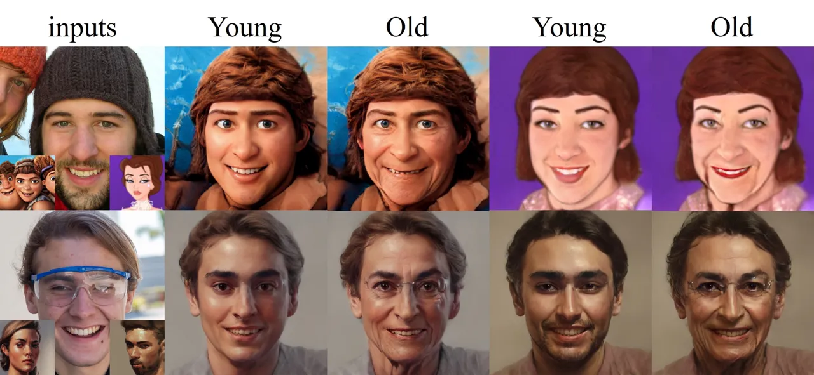

Figure 14: Failure cases of our method.

Despite generating high-quality results, our method fails to preserve
the structure of the input image in some cases. These failure instances
are presented in Fig. 14. In the first row, we observe that the beanie
dominates both style images, affecting both resultant outputs.
Similarly, in the second row, glasses dominate the stylization process,
leading to artifacts in the resultant images.

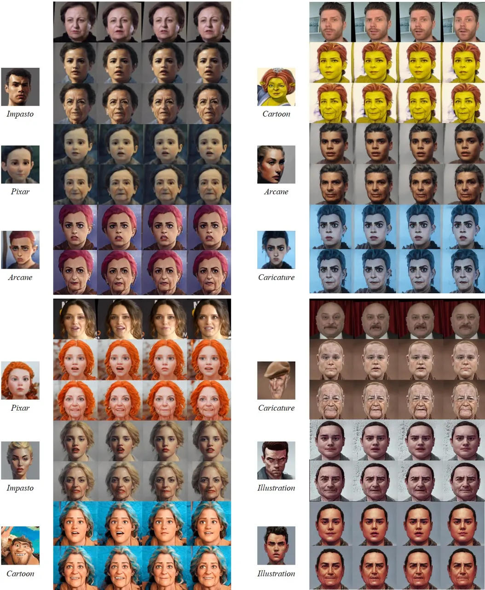

Figure 15: Video ToonAging. In each set of results, the upper row
denotes the young direction, and the lower row denotes the old
direction.
