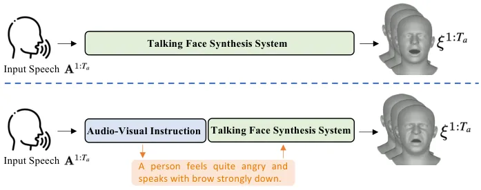
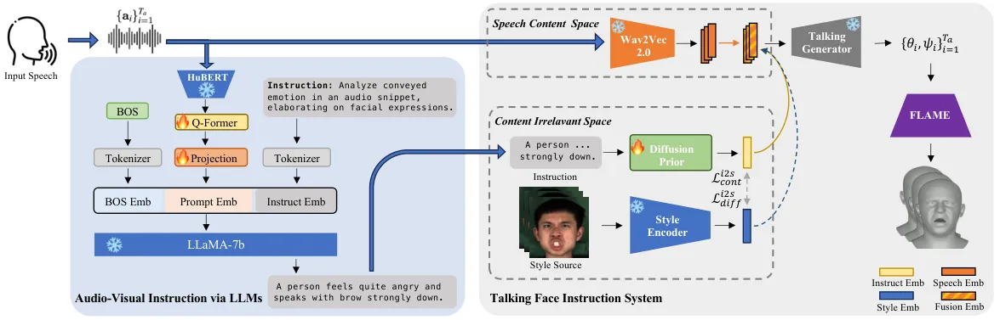
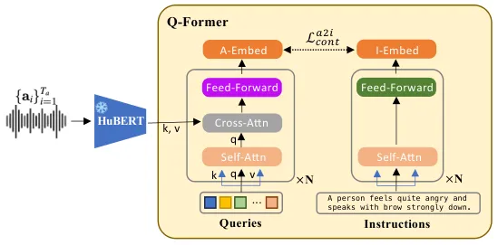
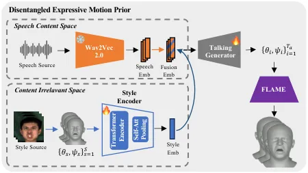
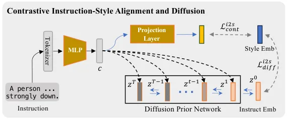
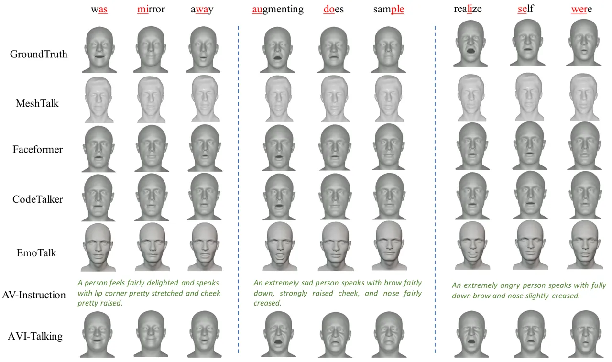
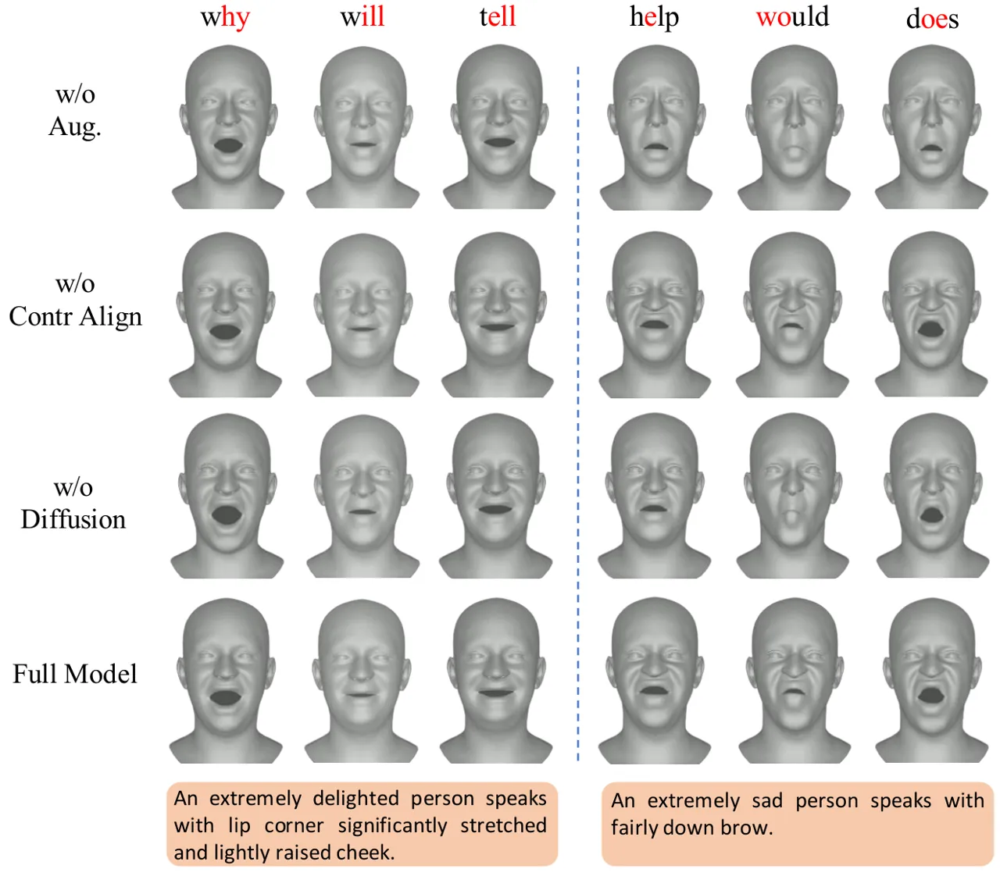
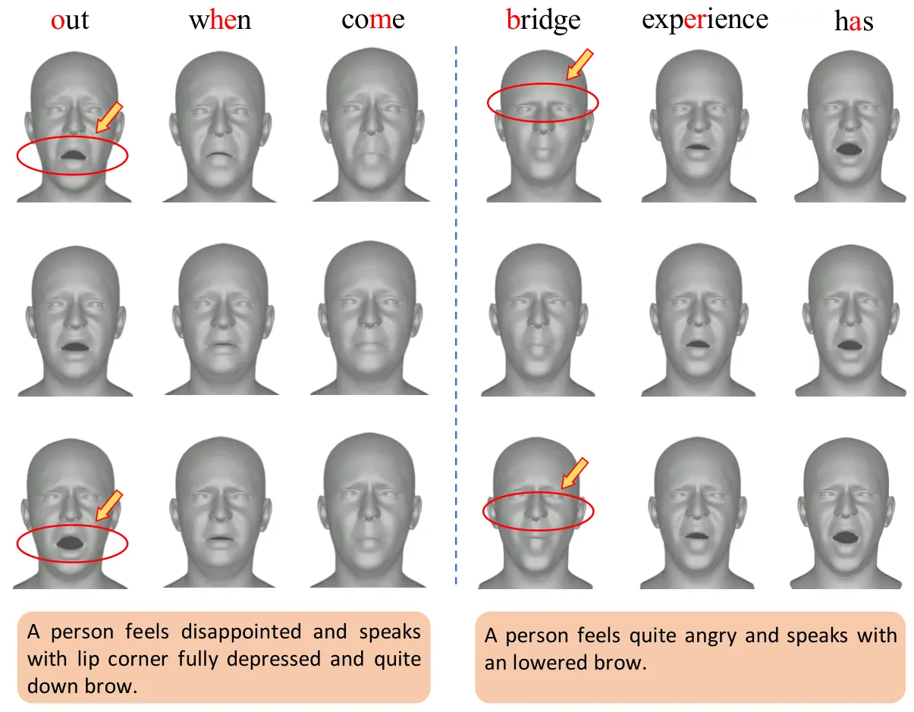
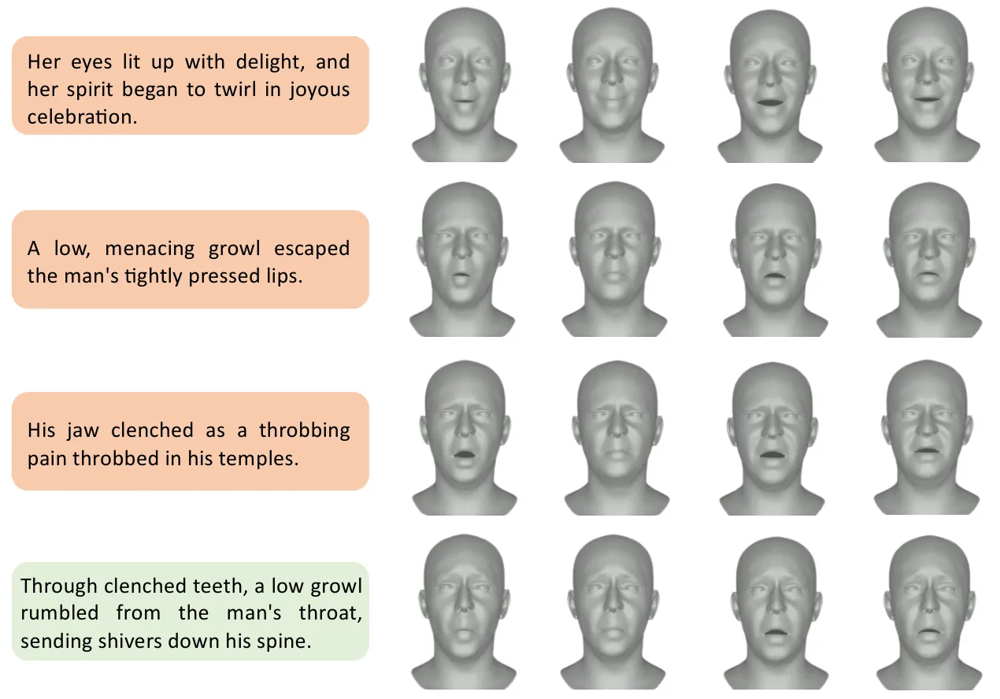

# AVI-Talking: Learning Audio-Visual Instructions for Expressive 3D Talking Face Generation

Yasheng Sun¹    Wenqing Chu²    Hang Zhou²    Kaisiyuan Wang³    Hideki
Koike¹  
¹Tokyo Institute of Technology  ²Baidu Inc  ³The University of Sydney  
$`\{`$sun.y.aj@m, koike@c$`\}`$.titech.ac.jp,
$`\{`$chuwenqing,zhouhang09,wangkaisiyuan$`\}`$@baidu.com

###### Abstract

While considerable progress has been made in achieving accurate lip
synchronization for 3D speech-driven talking face generation, the task
of incorporating expressive facial detail synthesis aligned with the
speaker’s speaking status remains challenging. Our goal is to _directly
leverage the inherent style information conveyed by human speech for
generating an expressive talking face_ that aligns with the speaking
status. In this paper, we propose AVI-Talking, an Audio-Visual
Instruction system for expressive Talking face generation. This system
harnesses the robust contextual reasoning and hallucination capability
offered by Large Language Models (LLMs) to instruct the realistic
synthesis of 3D talking faces. Instead of directly learning facial
movements from human speech, our two-stage strategy involves the LLMs
first comprehending audio information and generating instructions
implying expressive facial details seamlessly corresponding to the
speech. Subsequently, a diffusion-based generative network executes
these instructions. This two-stage process, coupled with the
incorporation of LLMs, enhances model interpretability and provides
users with flexibility to comprehend instructions and specify desired
operations or modifications. Extensive experiments showcase the
effectiveness of our approach in producing vivid talking faces with
expressive facial movements and consistent emotional status.

## 1 Introduction



Figure 1: In contrast to previous approaches that directly learn facial
motions from speaker speech, our framework introduces an audio-visual
instruction module achieved by LLMs to instruct the talking face
synthesis network.

Generating realistic 3D animations of human faces is crucial for a
multitude of entertainment applications, encompassing digital human
animation, visual dubbing in movies, and the creation of virtual
avatars. To synthesize expressive speech-driven 3D talking face,
previous work either 1) model the correlation between dynamic head poses
and audio rhythm \[7, 53\] or 2) borrow an external representation \[33,
32, 41\] such as emotion labels or video clips as style reference during
generation. However, the head dynamics hold limited expressive ability
thus only yield coarse alignment, neglecting the emotional nuances
present in the audio content. The latter studies require manual style
source selection by users, leading to unnatural applications. In the
paper, we explore a more natural scenario, targeting to directly
leverage the underlying style information conveyed by human speech for
generating an expressive talking face that aligns with the speaking
status.

Synthesizing diverse and plausible facial details based on speech while
maintaining accurate lip synchronization is a highly challenging task.
This challenge stems from the inherent ill-posed nature of the problem,
characterized by 1) one-to-many relationship between audio inputs and
potential facial movements consistent with the spoken content. Some
efforts \[7, 74, 34\] have introduced diffusion mechanisms to tackle
diverse generation. However, direct diffusion from audio to facial
motion requires bridging a huge modality gap while the information
within speech and facial movements are often weakly correlated. With
heavy learning burden and limited model capability, such practice is
prone to capture only coarse alignment with audio cues, neglecting
emotional nuances of the speaker. 2) The intertwining of the speaker’s
talking style and lip movements further complicates the synthesis
process. Prior work \[33\] aimed to address this entanglement by
controlling specific coefficients of a parametric model. However, such
practice relies on a disentangled parametric model, which is not always
accessible or precise.

To handle the above challenges, we present AVI-Talking, an Audio-Visual
Instruction System for expressive Talking face generation. Our key
insight is to _bridge the huge audio-visual modality gap with an
intermediate visual instruction representation_. As shown in Figure. 1,
in contrast to previous approaches that directly learn facial movements
from audio, our framework decomposes the audio-to-video generation into
two stages, each with a distinctive objective, thus significantly
mitigating the optimization complexities. Additionally, by presenting
visual instruction as an intermediate output, our system enhances model
interpretability and offers users with flexibility to specify their
desired instructions or modifications.

The first stage aims for comprehending the speaker talking state and
imaginatively generate plausible facial expression details for
subsequent instruction, necessitating robust contextual reasoning and
hallucination capability. Inspired by the impressive multi-modal
understanding and generation abilities demonstrated by recent large
language models (LLMs) \[70, 4\], we propose integrating LLMs as an
agent \[64\] to guide the talking face synthesis process. The key aspect
lies in _formulating a soft prompting strategy to harness the prior
contextual knowledge underlying LLMs_ for speaker talking state
comprehension. To achieve this, we initially employ a Q-Former to
contrastively align speech features with visual instructions. Building
upon the aligned audio features, we fine-tune a small number of
parameters in the input projection layers for domain adaptation. Such
practice not only facilitates efficient tuning but also promotes the
utilization of language priors.

In the second stage, with the obtained visual instructions, our
objective is to develop a speech-to-talking face network capable of
synthesizing facial details that adhere to the provided instructions
while preserving accurate lip movements. To address the inherent
entanglement between lip movements and the speaker’s talking style, we
propose _deriving a compressed latent space that distinctly identifies
features related to speech content and those irrelevant to content_. By
integrating both types of latent features, we can reconstruct expressive
facial movements through a talking generator, thereby bypassing issues
associated with inaccurate or inaccessible disentangled parametric
spaces \[32\]. In order to leverage this devised talking prior for
instruction-following generation, it is crucial to align visual
instructions within the _content irrelevant_ space. To facilitate joint
representation learning, we introduce a contrastive instruction-style
alignment and diffusion strategy. Specifically, we initially align the
visual instruction contrastively to the shared content irrelevant space,
upon which a diffusion prior network is employed to further refine this
joint representation towards the distribution of the pre-trained talking
prior.

Compared with previous studies, our main contributions in this work can
be summarized as follows:

- •
  We propose AVI-Talking, an innovative audio-visual instruction system
  that directly leverages the inherent style information conveyed by
  human speech for expressive talking face generation.
- •
  Large Language Models (LLMs) are introduced as an audio-visual
  instruction agent to comprehend speaker’s talking status and generate
  talking face instructions.
- •
  A language-guided talking face synthesis network with disentangled
  speech content and content irrelevant space is designed to execute
  visual instruction effectively.
- •
  Experimental results validate the capability of AVI-Talking in
  generating vivid 3D talking faces with expressive facial details and a
  consistent emotional status.

## 2 Related Work

Speech-driven facial animation holds diverse applications in the realms
of computer vision and augmented/virtual reality. This has spurred a
broad spectrum of research topics encompassing both 2D \[57, 68, 51, 52,
79\] and 3D \[23, 45, 59, 12, 56, 71, 41\] facial synthesis. In the
subsequent discussion, we delve into the most relevant studies in this
field.

### 2.1 Expressive 2D Talking Face Generation

Facial expressions play a pivotal role in the generation of natural
talking heads \[47\]. Researchers \[60, 69, 22, 49, 28, 21, 33, 77\]
attempt to synthesize vivid facial details while produce precise
lip-synchronization.

Early approaches \[10, 13, 15, 54, 62\] represent expressions using a
limited set of emotion labels encoded as one-hot representations. To
capture nuanced talking face expressions, another slew of
methodologies \[21, 28, 33\] incorporate reference videos as a more
diverse stylistic source. While operating on RGB videos, these
approaches rely on intricately designed disentanglement strategies.
However, such practice often results in constrained expressiveness due
to the inherent challenges of disentanglement. Meanwhile, these 2D
animation stylized talking face methods have limited applicability in
scenarios that demand 3D representations, such as in augmented reality
(AR).

Instead of requiring users to seek out a stylized source, a more
user-friendly approach involves directly exploiting speaking styles from
the input audio. While some methods \[22, 49, 72\] derive networks to
extract emotion labels, their capacity is limited to inferring only a
discrete number of emotion classes from audio signals. Other researchers
aim to achieve rhythmic synthesis by aligning head poses \[7\] or
expressions \[74\] with audio cues. However, these efforts often result
in coarse alignment without adequately considering the emotional content
of the audio, leading to a lack of expressiveness. To enhance the
vividness and controllability of talking head generation, recent works
leverage text as an interface, allowing users to specify their desired
styles \[32, 61\]. In contrast to the aforementioned approaches, we
explore harnessing the generative power of large language models (LLMs)
to act as a multi-modality reasoning engine. This will actively
hallucinates diverse and plausible facial details based on the emotional
content of the input audio, thereby offering a more comprehensive and
nuanced synthesis.

### 2.2 Speech-Driven 3D Talking Head Generation

Unlike 2D facial animation, which operates on RGB videos, 3D talking
head generation employs speech-conditioned animation, utilizing
geometric representations like the neural radius field (NerF) \[14\] or
3D parametric templates \[12\]. While methods such as \[12, 71, 8, 41\]
successfully synchronize facial motion with the driven audio, they often
learn deterministic models, resulting in rigid motion within
speech-irrelevant regions, leading to unnatural synthesis. To address
these limitations, recent approaches \[53\] introduce a diffusion
mechanism for its remarkable generative capability, yielding diverse
high-quality synthesis results \[55, 24\]. However, while modeling
various poses and expressions, these approaches neglect to capture the
emotional content implied within the audio. Furthermore, methods relying
on end-to-end diffusion, from reference video or style embedding to
parametric models, lack explainability. Therefore, we propose
integrating a large language model into our system to firstly generate
an interpretable audio-visual instruction, which is leveraged to guide
the speech-driven 3D talking head generation. To augment emotion
awareness, we apply the diffusion process coupled with contrastive
learning solely to the speech-irrelevant space.

### 2.3 LLM for Cross-Modal Learning

Large language models (LLMs) have demonstrated profound
capabilities \[67, 19\] as remarkable reasoning engines in various
language generation tasks, attributed to their emergent ability \[66\].
Diverse LLMs, such as OPT \[76\], LLaMA \[58\], and GLM \[75\], can be
fine-tuned or instructed for various purposes \[38\]. Specifically, many
studies attempt to construct LLMs proficient in multi-modal reasoning
and actioning \[70\], leading to the emergence of MM-LLMs. Some studies
point out that LLMs could even outperform diffusion models on standard
image and video generation benchmarks \[4\]. In the pursuit of LLMs
capable of handling both multi-modal input and output, some approaches
explore employing LLMs as decision-makers \[48\] and utilizing existing
off-the-shelf multi-modal encoders and decoders as tools for executing
multi-modal input \[80\] and output \[20, 73, 50\].

Recent advancements in talking face generation have demonstrated the
language model’s capacity to generate multi-modal content \[78\] and
synthesize facial motions \[36, 61\]. Typically, these approaches
involve deriving special tokens for another modality and learning a
projection layer to align them with language space \[36\]. However, this
process demands substantial paired data and intricate training
techniques for effective alignment. In contrast to these methodologies,
our approach takes a direct path by predicting the text description of
emotional status and facial details. This eliminates the need for
challenging cross-modal alignment procedures, which also provides
enhanced explainability and flexibility to users.

## 3 Methodology



Figure 2: The overall pipeline of our Audio-Visual Instruction Talking
(AVI-Talking) Framework. Given a clip of speaker speech {
$`a_{i}\}_{i=1}^{T_{a}}`$, it is first processed by Large Language
Models (LLMs) to propose visual instructions encompassing plausible
facial detail descriptions. Subsequently, these visual instructions,
together with audio clip, are separately fed into the talking face
instruction system to generate a time series of 3D parametric
coefficients $`\{\theta_{i},\psi_{i}\}_{i=1}^{T_{a}}`$.

We present an Audio-Visual Instruction System for Expressive Talking
Face Generation (AVITalking) that aims to achieve vivid facial
expressions synthesis coherent with speaker speech status. The whole
pipeline is depicted in Figure. 2. In this section, we start by briefly
outlining the fundamentals of the parametric 3D face model and diffusion
models (Sec. 3.1). Subsequently, we present an overview of our pipeline
(Sec. 3.2). We then delve into the process of _audio-visual instruction_
utilizing Large Language Models (LLMs) (Sec. 3.3). Finally, we provide
detailed description for _instruction-following talking face synthesis_
(Sec. 4).

### 3.1 Preliminaries

#### 3.1.1 Parametric 3D Face Model

Animating a template mesh that encapsulates a 3D structural
representation holds promise not only for AR/VR applications but also
for facilitating 2D talking face synthesis \[77\]. However, the
availability of 3D datasets capturing expressive facial movements is
limited. Therefore, we employ a 3D reconstruction method \[9\] to
convert video clips from 2D audio-visual datasets \[32, 31\] into 3D
talking face datasets. Meanwhile, such practice provides both 2D images
and 3D representations to enhance the training process.

Specifically, we adopt FLAME \[27\] as our template mesh. The FLAME
model is a parametric 3D head model expressed as a function
$`\textbf{M}(\beta,\theta,\psi)\rightarrow(\textbf{V},\textbf{F})`$,
where the parameters consist of identity shape
$`\beta\in\mathbb{R}^{|\beta|}`$, facial expression
$`\psi\in\mathbb{R}^{|\psi|}`$ and pose $`\theta\in\mathbb{R}^{3k+3}`$
involving rotation $`R\in SO(3)`$ and translation
$`t\in\mathbb{R}^{3}`$. After conversion, FLAME outputs a 3D mesh with
vertices $`\textbf{V}\in\mathbb{R}^{n_{v}\times 3}`$ and
faces $`\textbf{F}\in\mathbb{R}^{n_{f}\times 3}`$, where $`n_{v}`$
represents the number of vertices and $`n_{f}`$ denotes the number of
faces.

#### 3.1.2 Diffusion Model

The goal of generative models is to learn a distribution that
approximates real data distribution $`q(\textbf{x}_{0})`$. The denoising
diffusion probabilistic models (DDPMs) \[17\] present a multi-step
progress to approximate $`q(\textbf{x}_{0})`$ with
$`p_{\theta}(\textbf{x}_{0})`$ parameterized by $`\theta`$, involving
both a forward and reverse process.

The *forward process*, often referred to as *diffusion process*,
transforms the real structured distribution into Gaussian noise,
constructing a posterior distribution
$`q(\textbf{x}_{1:T}|\textbf{x}_{0})`$. This process follows a Markov
chain that progressively introduces Gaussian noise to the data samples.
Formally,

```math
\displaystyle q(\bm{x}_{1:T}|\bm{x}_{0}) \displaystyle=\prod_{t=1}^{T}q(\bm{x}_{t}|\bm{x}_{t-1}), \tag{1}
```

```math
\displaystyle\quad q(\bm{x}_{t}|\bm{x}_{t-1}) \displaystyle=\mathcal{N}(\bm{x}_{t};\sqrt{1-\beta_{t}}\bm{x}_{t-1},\beta_{t}\bm{I}). \tag{2}
```

Here, the constants $`\beta_{t}`$ follow an increasing trend \[17\] such
that when $`\beta_{t}`$ approximate to 1, the $`x_{t}`$ approximates the
Gaussian noise distribution $`\mathcal{N}(0,\bm{I})`$.

The *reverse process*, also known as *generative process*, targets to
reverse the Gaussian noise back to joint distribution
$`p_{\theta}(x_{0:T})`$. Formally,

```math
\displaystyle p_{\theta}(\bm{x}_{0:T}) \displaystyle=p_{\theta}(\bm{x}_{T})\prod_{t=1}^{T}p_{\theta}(\bm{x}_{t-1}|\bm{x}_{t}), \tag{3}
```

```math
\displaystyle p_{\theta}(\bm{x}_{t-1}|\bm{x}_{t}) \displaystyle=\mathcal{N}(\bm{x}_{t-1};\mu_{\theta}(\bm{x}_{t},t),\Sigma_{\theta}(\bm{x}_{t},t)). \tag{4}
```

Here, the variance $`\Sigma_{\theta}(\bm{x}_{t},t)=\beta_{t}\bm{I}`$ is
set as a time-dependent constant. Therefore, a generative model
$`\mathcal{G}_{\theta}`$ could be devised to approximate mean value of
Gaussian distribution. For conditional generation, the conditional
signal c can be naturally integrated into the network architecture.
Formally, the model parameters $`\theta`$ are optimized for all sampled
timestamps $`t`$ and $`\bm{x}`$ with the following objective:

```math
\displaystyle\mathcal{L}_{\theta}=\mathbb{E}_{\bm{x},t}[\left\|\bm{x}-\mathcal{G}_{\theta}(\bm{x},t,\bm{c})\right\|^{2}]. \tag{5}
```

### 3.2 Overall Pipeline

Given an audio clip, our objective is to animate a template mesh with
synchronized lip movements and consistent facial expressions. Instead of
directly learning to synthesize a talking face from speech, we propose
integrating Large Language Models (LLMs) to instruct the synthesis
process. As illustrated in Figure. 2, our framework, AVI-Talking,
comprises two main stages: an audio-visual instruction stage and a
talking face synthesis stage connected by visual instructions of
detailed facial expression descriptions. Formally, our system accepts an
input speech $`\textbf{A}^{1:T_{a}}=\{\textbf{a}_{i}\}_{i=1}^{T_{a}}`$
and aims to generate a time series of 3D parametric coefficients
$`{\xi}^{1:T_{a}}=\{\theta_{i},\psi_{i}\}_{i=1}^{T_{a}}`$.

### 3.3 Audio-Visual Instruction via LLMs

As illustrated on the left side of Figure 2, the audio-visual
instruction module takes a time series of a speaker’s audio clip as
input and aims to generate an instruction sentence describing detailed
facial movements that conveys the individual’s speaking state. The key
is to _develop a prompting strategy to effectively leverage the rich
contextual prior knowledge inherent in LLMs_.

Specifically, we leverage a pre-trained LLaMA as our base text
generation model. In order to comprehend the speaker’s speaking status
existing in audio modality, the audio signal needs to be projected into
text embedding of language model. Due to the success of pretrained-model
such as HuBERT \[18\] on Speech Emotion Recognition \[35\] (SER) tasks,
we leverage HuBERT to encode the audio signal. Subsequently, a typical
Q-Former \[26, 1\] architecture is employed to aggregate and extract
speaking style information, bridging the gap between acoustic feature
and visual facial descriptions. A linear projection layer is then
learned to map the aligned feature to language model’s input space.
Combining the "BOS" (Beginning-of-Sequence) token with the instruction
embedding, the audio prompt embedding is fed to LLaMA to prompt
plausible expressive facial movements consistent with speaker status.
Note that the instruction embedding is obtained by tokenizing the
pre-defined instruction templates. In our experiment, we utilize
instruction sentences like _Analyze conveyed emotion in an audio
snippet, elaborating on facial expressions_. We manually craft 10
sentences with similar meanings and randomly sample one during the
training phase.

#### 3.3.1 Speech Feature Compression via Learnable Queries



Figure 3: The Q-Former architecture leverages the standard Perceiver
network \[1\] to compress speech input to a fixed-length audio embedding
$`\textbf{F}_{si}^{a}\in\mathcal{R}^{q_{a}\times l}`$. A contrastive
loss $`\mathcal{L}_{cont}^{a2i}`$ is applied to encourage the queries
extract audio representation that are most relevant to visual
instructions.

The audio features extracted from HuBERT encapsulate complex
information, including speech content, emotional status, and acoustic
details. To effectively prompt the language model, it’s essential to
first comprehend and extract relevant facial movement information from
the speech. Here, we employ the Q-Former architecture  \[26, 1\] to
achieve this task.

As depicted in left side of Figure 3, learnable queries with fixed
length are utilized to aggregate and compress speech information by
cross-attention. Notably, such practice results in an audio embedding
$`\textbf{F}_{si}^{a}\in\mathcal{R}^{q_{a}\times l}`$ with the same
dimensionality as the query length $`q_{a}`$. This design choice
simplifies the learning process and enhances generalization performance
when handling speech inputs of varying lengths. Subsequently, the audio
embedding is fed to a projection module for prompt embedding in language
model space. To implement this, we fine-tune a small number of
parameters in the input projection layers for domain adaptation.

#### 3.3.2 Contrastive Audio-Visual Instruction Alignment

To eliminate unnecessary information such as speech content, environment
noise and focus on extracting facial movements related feature, we adopt
contrastive learning \[37\] protocol to constrain the output of learned
queries $`\textbf{F}_{si}^{a}\in\mathcal{R}^{q_{a}\times l}`$. The
contrastive learning paradigm aligns audio embeddings and instruction
features to maximize their mutual information. This is achieved by
enhancing higher audio-instruction similarity of positive pairs against
those of negative pairs. Specifically, we feed the corresponding
instruction through a text transformer and obtain an instruction
embedding as shown in the right side of Figure 3. Its output embedding
of $`\left[CLS\right]`$ token is
$`\textbf{F}_{si}^{i}\in\mathcal{R}^{l}`$. Since there are $`q_{a}`$
query embeddings, we average $`\textbf{F}_{si}^{a}`$ across all queries
to obtain the $`\bar{\textbf{F}}_{si}^{a}\in\mathcal{R}^{l}`$ and apply
contrastive learning as follows:

```math
\displaystyle\mathcal{L}_{cont}^{a2i}=-\text{log}[\frac{\text{exp}({\mathcal{D}(\bar{\textbf{F}}_{si}^{a},\textbf{F}_{si}^{i})})}{\text{exp}({\mathcal{D}(\bar{\textbf{F}}_{si}^{a},\textbf{F}_{si}^{i})})+\sum_{j=1}^{N^{-}}\text{exp}({\mathcal{D}(\bar{\textbf{F}}_{si}^{a},\textbf{F}_{si(j)}^{i-})})}]. \tag{6}
```

The paired in-batch samples are regarded as positive samples
$`(\bar{\textbf{F}}_{si}^{a},\textbf{F}_{si}^{i})`$ while the unpaired
$`N^{-}`$ samples are taken as negative samples
$`(\bar{\textbf{F}}_{si}^{a},\textbf{F}_{si(j)}^{i-})`$. Here we opt for
cosine distance
$`\mathcal{D}(\textbf{F}_{1},\textbf{F}_{2})=\frac{\textbf{F}_{1}^{\mathbf{T}}*\textbf{F}_{2}}{|\textbf{F}_{1}|\cdot|\textbf{F}_{2}|}`$
as feature distance measurement.

#### 3.3.3 Instruction Generation via Projection Layer Finetuning

After the Q-Former is pre-trained to contrastively align acoustic
features to visual facial descriptions. Subsequently, the Q-Former is
frozen, and we fine-tune the input linear projection layer of LLaMA-7b
to achieve visual instruction prediction as shown in Figure 2.
Specifically, We follow the general text generation training
paradigm \[80\] to learn this projection layer.

### 3.4 Instruction-Following Talking Face Synthesis



Figure 4: To establish a disentangled expressive motion prior, we learn
two complementary latent spaces, _speech content_ space and _content
irrelevant_ space. In _speech content_ space, we represent lip movements
related to speech content, while in the _content irrelevant_ space, we
capture facial expressions correlated with the speaking state.

With the obtained facial instructions, a talking face synthesis network
aims to animate a mesh template with synchronized lip movements and
expressions as illustrated on the right side of Figure 2. The movements
of the lips and facial expressions exhibit a high degree of correlation
with each other \[33\]. For example, specific pronunciations often
convey relevant emotions. To address this correlation and potential
entanglement, we propose initially training a disentangled talking
prior \[46, 10\], wherein the speech content space and content
irrelevant space are distinguished (shown in Figure 4). Subsequently, a
diffusion prior module (shown in Figure 5) is devised to bridge the gap
between instruction text and talking styles within the identified
content irrelevant space.

#### 3.4.1 Disentangled Expressive Motion Prior

As depicted in Figure. 4, we target to establish a disentangled latent
space, where the speech content related lip-movements and facial
expressions correlated with speaking state are distinctly represented in
_speech content_ space and _content irrelevant_ space, respectively.
Concretely, in speech content space we employ a pretrained ASR network,
Wav2Vec 2.0 \[5\] to encode the speaker audio $`\textbf{A}^{1:T_{a}}`$.
These extracted speech features capture semantic content information,
which is subsequently utilized by the talking generator for syllable
pronunciation. In order to encode additional talking style information,
we point out the existence of _content irrelevant_ space for
representing content-repelling information such as talking styles, poses
and speaker identity.

To learn the _content irrelevant_ space, we employ a transformer-based
style encoder \[33\] designed to capture content-repelling information.
For a given talking video, we randomly select $`S`$ reference frames to
serve as the source for the speaking state. These frames are then
processed by the FLAME model to obtain coefficients
$`\{\theta_{s},\psi_{s}\}_{s=1}^{S}`$, where the coefficient at time
$`t`$ is excluded. Subsequently, these coefficients are fed into the
style encoder to extract a comprehensive speaking state representation
for the video. To successfully predict coefficients at the current time
step $`\{\theta_{t},\psi_{t}\}`$, we rely on both the speech feature
$`\textbf{A}^{t}`$ in the _speech content_ space and the extracted style
information in the _content irrelevant_ space. The complementary nature
of these properties naturally facilitates the learning of disentangled
spaces.

#### 3.4.2 Contrastive Instruction-Style Alignment and Diffusion



Figure 5: Within the content irrelevant space, we contrastively align
the visual instruction with style embedding to obtain a aligned feature
$`c`$, upon which a diffusion prior network is employed to further map
it towards the distribution of the pre-trained talking prior.

Once the content irrelevant space is identified, a natural way for
cross-modality generation is to map visual instruction to the
representation within this space \[32\]. As depicted in Figure 5, a
Multi-Layer-Perceptron (MLP) network is derived to first align latent
instruction representation with style embedding. The typical contrastive
loss $`\mathcal{L}_{cont}^{i2s}`$ is employed, following standard CLIP
training process \[43\], which we omit here. However, since this
multi-modal contrastive learning strategy only pushes the instruction
embeddings to hold close direction with their associated style image
features, which is prone to cause disjoint embeddings due to the
existance of modality gap \[29\]. To further activate motion prior that
expects visual style embeddings, we introduce a diffusion prior network
to bridge the modality gap by mapping to their distributions.

For the diffusion prior network $`\mathcal{F}_{\theta}`$, we leverage
the typical decoder-only Transformer architecture to iteratively predict
the denoised style embedding $`\textbf{z}^{t}`$ conditioned on the above
representation c. Instead of imposing error prediction
formulation \[17\], we directly train the network to predict unnoised
style embedding z from noised embedding $`\textbf{z}^{t}`$ sampled at
time step $`t`$. Formally,

```math
\displaystyle\mathcal{L}_{diff}^{i2s}=\mathbb{E}_{\bm{\textbf{z}},t}[\left\|\bm{\textbf{z}}-\mathcal{F}_{\theta}(\bm{\textbf{z}},t,\bm{\textbf{c}})\right\|^{2}] \tag{7}
```

where we apply the naive Mean-Square Error (MSE) to the prediction
result.

Therefore, the overall learning objective of visual instructions to
speaking styles generation can be written as

```math
\displaystyle\mathcal{L}^{i2s}=\mathcal{L}_{cont}^{i2s}+\lambda^{i2s}\mathcal{L}_{diff}^{i2s}, \tag{8}
```

where $`\lambda`$ is balancing coefficients.

## 4 Experiments

|                   | MeadText \[32\]          |                          |                      | RAVEDESS \[31\]          |                          |                      |
| ----------------- | ------------------------ | ------------------------ | -------------------- | ------------------------ | ------------------------ | -------------------- |
| Method            | $`\text{FID}\downarrow`$ | $`\text{KID}\downarrow`$ | LSE-D $`\downarrow`$ | $`\text{FID}\downarrow`$ | $`\text{KID}\downarrow`$ | LSE-D $`\downarrow`$ |
| MeshTalk \[46\]   | 201.06                   | 0.3601                   | 10.51                | 134.47                   | 0.2831                   | 9.19                 |
| EmoTalk \[41\]    | 124.41                   | 0.2118                   | 8.37                 | 122.95                   | 0.1929                   | 8.51                 |
| CodeTalker \[71\] | 68.68                    | 0.0658                   | 8.38                 | 46.90                    | 0.0711                   | 8.99                 |
| FaceFormer \[12\] | 68.35                    | 0.0611                   | 9.08                 | 47.78                    | 0.0721                   | 8.85                 |
| GT                | \-                       | \-                       | 9.36                 | \-                       | \-                       | 9.05                 |
| AVI-Talking       | 12.53                    | 0.0190                   | 9.06                 | 15.94                    | 0.0225                   | 8.81                 |

Table 1: The quantitative results on MeadText \[32\] and
RAVEDESS \[31\]. For all approaches, we compare them under three metrics
including FID \[16\], KID \[44\] and LSE-D \[42\]. Lower scores indicate
better performance.



Figure 6: Qualitative Results. In the top row are ground truth videos.
Our generated audio-visual instructions are shown in green line. In the
bottom row demonstrates synthesis results guided by above instructions.
Compared to other competitive approaches, our method achieves superior
detailed expressions. Notably, our system is capable of generate facial
movements distinct from Ground Truth but convey consistent speaking
state (See second and third case).

| MOS on $`\setminus`$ Approach | MeshTalk \[46\] | EmoTalk \[41\] | CodeTalker \[71\] | AVI-Talking (Ours) |
| ----------------------------- | --------------- | -------------- | ----------------- | ------------------ |
| Lip Sync Quality              | 2.43            | 2.83           | 3.13              | 3.23               |
| Movement Expressiveness       | 2.83            | 3.0            | 2.53              | 3.27               |
| Expression Consistency        | 2.37            | 3.03           | 2.33              | 3.50               |

Table 2: User study measured by Mean Opinion Scores. Larger is higher,
with the maximum value to be 5.

### 4.1 Experimental Settings

#### 4.1.1 Datasets

We train both audio-visual instruction module and talking face
instruction network on MeadText \[32\] dataset. Evaluation is conducted
on test set of RAVEDESS \[31\] and MeadText. Since both datasets are
made of RGB videos, we obtain reconstruction results by Emoca \[9\] and
render the facial meshes as GT videos for comparison.

- •
  MeadText \[32\]. This dataset is extended from Mead \[63\] dataset by
  labeling the speaker emotional status and facial action unit (FAU)
  with natural language descriptions. MEAD \[63\] is a high-quality
  emotional talking-face dataset, including recorded videos of different
  actors speaking with 8 different emotions at 3 intensity levels.
- •
  RAVEDESS \[31\]. There are a total of 24 professional actors (12
  female, 12 male) covering over 1440 utterances in a neutral North
  American accent. 8 speech emotions includes calm, happy, sad, angry,
  fearful, surprise, disgust and neutral expressions are produced at two
  levels of emotional intensity (normal, strong). For convenience, we
  choose speech videos of the first 6 actors as the evaluation dataset.

#### 4.1.2 Implementation Details

The videos are sampled at a rate of 25 FPS, and the audios are
pre-processed to 16 kHz for all stages of our system. The training of
the audio-visual instruction module is divided into two stages. In the
first stage, the audios are fed to HuBERT \[18\] for speech feature
extraction. Then, the Q-Former is pre-trained to contrastively align
acoustic features to visual facial descriptions. Subsequently, the
Q-Former is frozen, and we fine-tune the input projection layer of
LLaMA-7b to achieve caption prediction. To enhance model performance, we
leverage common text data augmentation techniques such as synonym
replacement during the training stage.

For the talking face synthesis network, we adopt the model architecture
of EMOTE \[10\] as our basic facial motion generation network. We adapt
the framework with disentangled speech content space and content
irrelevant space. For speech content extraction, we utilize the
state-of-the-art pretrained ASR network Wav2Vec 2.0 \[5\] to extract the
raw waveform and compress features with temporal convolutions following
a similar protocol to EMOTE \[10\]. For speech style extraction, we
follow the architecture design of StyleTalk \[33\] and leverage the
linear styling network from EMOTE \[10\] as a teacher network for
knowledge distillation. Within the content irrelevant space, the
training schedule of our contrastive instruction-style alignment and
diffusion module is adapted from DALL-E2 \[43\]’s open-source
implementation of diffusion prior. Specifically, the diffusion loss
weight $`\lambda^{i2s}`$ is set to 30 to balance optimization loss.
Similar to the first stage, we also employ the same data augmentation
approach to facilitate robust performance. As our focus in this work is
on modeling speaking styles, the poses and speaker identity are set to a
neutral state during both the training and inference stages. Both our
models are implemented in PyTorch \[40\] and trained using 80G Tesla
A100 GPUs.

#### 4.1.3 Comparison Methods

We compare our methods with state-of-the-art template-based models that
support speech conditional 3D talking face generation, including
MeshTalk \[46\], FaceFormer \[12\], CodeTalker \[71\], and
EmoTalk \[41\].

MeshTalk \[46\] introduces a cross-modality disentanglement mechanism to
generate realistic face animation. FaceFormer \[12\] devises a
transformer-based architecture capable of synthesizing realistic 3D
facial motions. CodeTalker\[71\] incorporates the codebook
technique\[11\] to enhance the accuracy of lip movements. EmoTalk \[41\]
employs an emotional disentanglement strategy using one-hot emotional
labels for face animation.

| Metric                | w/o Aug. | w/o LLaMA | w/o Q-Former | Full |
| --------------------- | -------- | --------- | ------------ | ---- |
| $`BLEU_{1}\uparrow`$  | 45.4     | 32.4      | 41.4         | 47.4 |
| $`BLEU_{4}\uparrow`$  | 12.7     | 7.1       | 10.4         | 11.4 |
| $`METEOR\uparrow`$    | 21.5     | 16.1      | 20.7         | 22.0 |
| $`ROUGE_{l}\uparrow`$ | 38.0     | 28.0      | 36.0         | 38.4 |
| $`CIDEr\uparrow`$     | 54.5     | 32.8      | 53.0         | 49.3 |
| $`SPICE\uparrow`$     | 34.8     | 27.4      | 36.4         | 40.9 |

Table 3: Ablation over model design of Audio-Visual Instruction stage.

| Method         | LSE-D $`\downarrow`$ | Diversity $`\uparrow`$ | FID $`\downarrow`$ | KID $`\downarrow`$ |
| -------------- | -------------------- | ---------------------- | ------------------ | ------------------ |
| w/o Aug.       | 9.11                 | 0.433                  | 14.18              | 0.0192             |
| w/o Diffusion  | 9.21                 | 0                      | 18.72              | 0.0268             |
| w/o Cont Align | 9.07                 | 0.373                  | 13.37              | 0.0190             |
| Full (Ours)    | 9.06                 | 0.435                  | 12.53              | 0.0190             |

Table 4: Ablation over model design of Talking Face Synthesis stage.

### 4.2 Quantitative Evaluation

#### 4.2.1 Evaluation Metric

We validate our method from the perspectives of both instruction
generation capability and talking face synthesis quality.

- •
  Audio-Visual Instruction Prediction. Metrics that have popularly been
  involved in the field of natural language generation (NLG) task are
  chosen to evaluate our method. Specifically, we include $`BLEU_{1}`$,
  $`BLEU_{4}`$ \[39\], $`METEOR`$ \[6\], $`ROUGE_{l}`$ \[30\],
  $`CIDEr`$ \[65\] and $`SPICE`$ \[2\].
- •
  3D Talking Face Synthesis. To assess visual fidelity, we utilize
  standard GAN metrics: FID \[16\] and KID \[44\] on face regions of
  rendered images. Additionally, to evaluate generation diversity, we
  report Diversity scores \[3\], measuring the extent of expression
  diversity generated for a given clip of human speech. Specifically,
  distances across predicted style features for the same audio with
  different noises are calculated. Moreover, we adopt LSE-D \[42\] to
  evaluate lip synchronization performance.

#### 4.2.2 Evaluation Results

Regarding the synthesis of talking faces, our study reports quantitative
results for MeadText \[32\] and RAVEDESS \[31\] in Table 1. Notably, our
method demonstrates outstanding performance across most metrics on both
datasets. However, our approach may exhibit comparatively weaker
lip-sync performance, particularly in terms of LSE-D, when compared to
other methods. We attribute this discrepancy partly to the strong
preference bias for neutral expressions in SyncNet \[42\], which is
pre-trained on predominantly expressionless videos. Unlike these
methods, our synthesis results encompass expressive facial details,
potentially leading to lower scores. Furthermore, our approach achieves
LSE-D scores close to those of ground truth videos on both datasets,
suggesting robust generation of precise lip-sync videos.

### 4.3 Qualitative Evaluation

#### 4.3.1 Qualitative Analysis

Subjective evaluation is crucial for validating model performance in
generative tasks. We encourage readers to refer to our supplementary
materials for additional demo videos and comparison results. In
Figure 6, we present comparison results of our method against previous
state-of-the-art approaches in three cases. It can be seen that our
method produces plausible audio-visual instructions and generates
expressive facial details aligned with the speaker’s state. Regarding
lip synchronization performance, we observe that CodeTalker \[71\] or
Faceformer \[12\] may generate more natural pronunciation in
expressionless states. However, when involving emotional states, slight
distortions in lip movements can be observed (e.g., the stretching of
lip corners during happy emotions). This observation aligns with the
LSE-D scores in the quantitative evaluation presented in Table 1.
Nevertheless, our approach still achieves competitive synthesis results
compared to others and approaches the performance of ground truth
videos, thus validating the effectiveness of our approach in lip
synchronization.

#### 4.3.2 User Study

We conducted a user study involving 15 participants to gather their
opinions on 30 videos generated by our method alongside three competing
methods. Among these, twenty videos were created using randomly selected
speaker audios from the test set of MeadText, while the remaining ten
were sourced from RAVEDESS. We utilized the well-established Mean
Opinion Scores (MOS) rating protocol. Participants were tasked with
providing ratings on a scale of 1 to 5 for three specific aspects of
each video: (1) Lip Sync Quality, (2) Movement Expressiveness, and (3)
Expression Consistency. Lip sync quality evaluates mouth movements in
sync with speech content, movement expressiveness assesses facial detail
richness, and expression consistency measures the alignment between
facial movements and speaker speech expressions.

The results are presented in Table 2. MeshTalk \[46\] scores the lowest
across all aspects, possibly attributed to the architecture design of
its naive UNet. By incorporating transformer blocks, EmoTalk \[41\] and
CodeTalker \[71\] achieve higher lip-sync scores. Regarding movement
expressiveness and expression consistency, our model significantly
surpasses other approaches, owing to its carefully derived audio-visual
instruction strategy. Overall, our AVI-Talking model outperforms its
counterparts in expressive synthesis, highlighting the effectiveness of
our approach.

### 4.4 Further Analysis



Figure 7: Ablation Study. The bottom row illustrates the audio-visual
instruction, while the rows above visualize the generation results
across three key aspects of model design. Without diffusion, the model
tends to produce conservative results, thereby inadequately raising the
lip corner during smiling. Not utilizing data augmentation can result in
sub-optimal convergence, failing to capture precise detailed facial
movements.

#### 4.4.1 Ablation Study

We conduct ablation studies on both stages of our system, wherein we
systematically remove three crucial components from each stage to
evaluate the effectiveness of our framework design.

Audio-Visual Instruction Module. We conduct experiments on the first
stage model (1) w/o text augmentation; (2) w/o LLaMA generator and (3)
w/o Q-Former alignment. For the setting without the LLaMA base model, we
adopt the BLIP2 training paradigm \[26\] and utilize image-grounded text
generation loss for instruction generation. The numerical results on the
MeadText dataset \[32\] are presented in Table 3. We find that without
text data augmentation, the model tends to overfit to a sub-optimal
point, leading to slightly worse performance. Removing the LLaMA model
results in the loss of rich contextual knowledge, thereby also causing
inferior performance. Furthermore, without the Q-Former contrastive
alignment strategy, the extraction and alignment of speech features to
text embedding become inadequate, introducing significant training
difficulties and resulting in significantly inferior performance.

3D Talking Face Synthesis. For the second stage, we train and evaluate
the talking face synthesis network by removing (1) text augmentation,
(2) the diffusion prior network, and (3) contrastive alignment. The
numerical results on the MeadText dataset \[32\] are demonstrated in
Table 4, and visualization results are depicted in Figure 7. Similar to
the first stage, without text data augmentation, the synthesis results
suffer from inferior performance on all metrics. Visualization results
in the first row illustrate that the absence of augmentation tends to
inadequately capture the smiling lip corner motion (See the first case
in the left column). Without employing the diffusion strategy, the
generation process becomes deterministic, leading to a lack of
diversity. We also observe significantly reduced performance on other
metrics, possibly due to the diverse generation nature of this problem.
Visualizations in Figure 7 indicate that without adopting the diffusion
strategy, the network tends to produce conservative generations, where
the lip corner is not as well stretched as in our full model (See the
first case in the left column). Removing contrastive alignment also
results in inferior outcomes, highlighting its effectiveness in boosting
generation performance.

#### 4.4.2 Visualization of Aligned Speech Features

Figure 8: Visualizations of t-SNE embeddings derived from aligned speech
features using Q-Former. The audio samples are from male utterances in
the MeadText dataset, focusing on five typical speaking emotions.
Notably, the aligned speech features corresponding to each specific
emotion exhibit closely clustered patterns.

To further analyze the performance of Audio-Visual Instruction design,
we visualize the intermediate speech features that are contrastively
aligned using Q-Former. In particular, as discussed in Sec. 3.3, the
contrastive audio-visual instruction alignment aims to extract audio
embeddings closely relevant to the visual instructions. Consequently,
the resulting audio embeddings are expected to include rich speaker
state information.

As shown in Figure 8, we present samples of utterances representing five
typical emotions. Notably, there is a discernible clustering pattern
observed among embeddings associated with the same emotional type. It is
interesting that speech features belonging to the happiness class
exhibit particularly close clustering, which could be attributed to the
distinct characteristics of a happy voice.

#### 4.4.3 Generation Diversity of Talking Face Instruction System

In Table 4, we illustrate the pivotal role of diffusion strategy in
enhancing generation diversity. Additionally, in Figure 9, we present
visualizations showcasing diverse synthesis. Observing the left column,
it shows that multiple lip curves can be synthesized for instructions
conveying disappointing emotions. Similarly, the right column
demonstrates varied eyebrow and cheek movements in response to text
instructions suggesting anger. These outcomes validate the capability of
the talking face synthesis system to produce diverse results.



Figure 9: Diverse generation results of the talking face instruction
system are depicted. The bottom row showcases the audio-visual
instruction, while the rows above demonstrate generation variations
using the same text instruction. The left columns display the sad
speaker status, where different lip curves are predicted, while the
right columns demonstrate an angry case with varying eyebrow and cheek
movements.

#### 4.4.4 OOD Analysis of Talking Face Instruction System

To further assess the generalizability of our proposed talking face
synthesis module, we conducted experiments with out-of-distribution
(OOD) instructions. Unlike the instructions in our dataset, which
explicitly describe facial movements, we also explored visual
instructions indicated by abstract concepts. As shown in Figure 10, our
model demonstrates the ability to capture the implicit speaking state of
the speaker in the first three rows, yielding plausible synthesis
results. This success can be attributed to the adoption of the diffusion
mechanism and the structural similarity of natural language embeddings.
However, when faced with particularly complex and abstract instructions,
our model tends to misinterpret the implied speaking states as seen in
the last row.



Figure 10: Visualization of Out-of-Distribution (OOD) results from the
Talking Face Instruction System. Within each row, we present instructed
synthesis outcomes for the same speaker’s speech, encompassing four
distinct out-of-distribution instructions. The initial three rows
showcase various successful cases while the final row illustrates an
instance where the model misinterprets the instruction.

## 5 Conclusion

In this paper, we propose AVI-Talking, an Audio-Visual Instruction
system for expressive 3D Talking face generation. We emphasize several
appealing properties of our framework: 1) We address the speech-driven
expressive talking face generation by introducing an intermediate visual
instruction, which decomposes the challenging audio-to-visual generation
into two stages with clear learning objective. 2) A soft prompting
strategy is derived to harness the prior contextual knowledge underlying
LLMs for speaker talking state comprehension. 3) The disentangled
talking prior learning procedure ensures complementary integration of
lip-sync movements and audio-visual instruction. 4) A diffusion prior
network is introduced to map audio-visual instructions to latent
distribution of content irrelevant space.

Limitations. Our model is currently trained on a labeled audio-visual
instruction dataset. 1) We observe it exhibits insensitivity to certain
specific speaking statuses. This phenomenon could be attributed to
uneven data distribution, where certain speaking states are not
adequately represented in the training dataset, making them challenging
to discern from the speaker’s speech. 2) The capabilities of the talking
face synthesis network are limited to handling visual instructions
closely aligned with the overall dataset distributions. As a
consequence, for optimal instruction-following performance, users must
provide instructions that closely resemble the predefined instructions.

Future Work. In this paper, we have investigated into specifying a
pre-trained Large Language Model (LLM) for cross-modal audio-visual
generation using finetuning techniques. Recent studies \[25\] higlight
the remarkable capability of Retrieval Augmented Generation (RAG) in
injecting knowledge into Large Language Models (LLMs). Future research
will involve comparing the effectiveness of RAG and fine-tuning
performance, particularly tailored for this task. Meanwhile, recent
works \[4\] suggest that visual foundation models can yield competitive
results, provided a robust visual tokenizer is utilized. Consequently,
future research will delve into directly tokenizing stylized embeddings
within the content-irrelevant space and fine-tuning general visual
foundation models for expressive talking face synthesis. In this way,
the model might be able to circumvent relying on specific audio-visual
instruction dataset, thereby achieving superior performance with high
generality.

## References

- \[1\] Jean-Baptiste Alayrac, Jeff Donahue, Pauline Luc, Antoine Miech,
  Iain Barr, Yana Hasson, Karel Lenc, Arthur Mensch, Katherine Millican,
  Malcolm Reynolds, et al. Flamingo: a visual language model for
  few-shot learning. Advances in Neural Information Processing Systems,
  35:23716–23736, 2022.
- \[2\] Peter Anderson, Basura Fernando, Mark Johnson, and Stephen
  Gould. Spice: Semantic propositional image caption evaluation. In
  Computer Vision–ECCV 2016: 14th European Conference, Amsterdam, The
  Netherlands, October 11-14, 2016, Proceedings, Part V 14, pages
  382–398. Springer, 2016.
- \[3\] Shivangi Aneja, Justus Thies, Angela Dai, and Matthias Nießner.
  Facetalk: Audio-driven motion diffusion for neural parametric head
  models. arXiv preprint arXiv:2312.08459, 2023.
- \[4\] Anonymous. Language model beats diffusion - tokenizer is key to
  visual generation. In The Twelfth International Conference on Learning
  Representations, 2024.
- \[5\] Alexei Baevski, Yuhao Zhou, Abdelrahman Mohamed, and Michael
  Auli. wav2vec 2.0: A framework for self-supervised learning of speech
  representations. Advances in neural information processing systems,
  33:12449–12460, 2020.
- \[6\] Satanjeev Banerjee and Alon Lavie. Meteor: An automatic metric
  for mt evaluation with improved correlation with human judgments. In
  Proceedings of the acl workshop on intrinsic and extrinsic evaluation
  measures for machine translation and/or summarization, pages
  65–72, 2005.
- \[7\] Lele Chen, Guofeng Cui, Celong Liu, Zhong Li, Ziyi Kou, Yi Xu,
  and Chenliang Xu. Talking-head generation with rhythmic head motion.
  In European Conference on Computer Vision, pages 35–51.
  Springer, 2020.
- \[8\] Daniel Cudeiro, Timo Bolkart, Cassidy Laidlaw, Anurag Ranjan,
  and Michael J Black. Capture, learning, and synthesis of 3d speaking
  styles. In Proceedings of the IEEE/CVF Conference on Computer Vision
  and Pattern Recognition, pages 10101–10111, 2019.
- \[9\] Radek Daněček, Michael J Black, and Timo Bolkart. Emoca: Emotion
  driven monocular face capture and animation. In Proceedings of the
  IEEE/CVF Conference on Computer Vision and Pattern Recognition, pages
  20311–20322, 2022.
- \[10\] Radek Daněček, Kiran Chhatre, Shashank Tripathi, Yandong Wen,
  Michael Black, and Timo Bolkart. Emotional speech-driven animation
  with content-emotion disentanglement. In SIGGRAPH Asia 2023 Conference
  Papers, pages 1–13, 2023.
- \[11\] Patrick Esser, Robin Rombach, and Björn Ommer. Taming
  transformers for high-resolution image synthesis, 2020.
- \[12\] Yingruo Fan, Zhaojiang Lin, Jun Saito, Wenping Wang, and Taku
  Komura. Faceformer: Speech-driven 3d facial animation with
  transformers. In Proceedings of the IEEE/CVF Conference on Computer
  Vision and Pattern Recognition, pages 18770–18780, 2022.
- \[13\] Yuan Gan, Zongxin Yang, Xihang Yue, Lingyun Sun, and Yi Yang.
  Efficient emotional adaptation for audio-driven talking-head
  generation. In Proceedings of the IEEE/CVF International Conference on
  Computer Vision, pages 22634–22645, 2023.
- \[14\] Yudong Guo, Keyu Chen, Sen Liang, Yong-Jin Liu, Hujun Bao, and
  Juyong Zhang. Ad-nerf: Audio driven neural radiance fields for talking
  head synthesis. In Proceedings of the IEEE/CVF International
  Conference on Computer Vision, pages 5784–5794, 2021.
- \[15\] Siddharth Gururani, Arun Mallya, Ting-Chun Wang, Rafael Valle,
  and Ming-Yu Liu. Space: Speech-driven portrait animation with
  controllable expression. In Proceedings of the IEEE/CVF International
  Conference on Computer Vision, pages 20914–20923, 2023.
- \[16\] Martin Heusel, Hubert Ramsauer, Thomas Unterthiner, Bernhard
  Nessler, and Sepp Hochreiter. Gans trained by a two time-scale update
  rule converge to a local nash equilibrium. Advances in neural
  information processing systems, 30, 2017.
- \[17\] Jonathan Ho, Ajay Jain, and Pieter Abbeel. Denoising diffusion
  probabilistic models. Advances in neural information processing
  systems, 33:6840–6851, 2020.
- \[18\] Wei-Ning Hsu, Benjamin Bolte, Yao-Hung Hubert Tsai, Kushal
  Lakhotia, Ruslan Salakhutdinov, and Abdelrahman Mohamed. Hubert:
  Self-supervised speech representation learning by masked prediction of
  hidden units. IEEE/ACM Transactions on Audio, Speech, and Language
  Processing, 29:3451–3460, 2021.
- \[19\] Jie Huang and Kevin Chen-Chuan Chang. Towards reasoning in
  large language models: A survey. arXiv preprint
  arXiv:2212.10403, 2022.
- \[20\] Rongjie Huang, Mingze Li, Dongchao Yang, Jiatong Shi, Xuankai
  Chang, Zhenhui Ye, Yuning Wu, Zhiqing Hong, Jiawei Huang, Jinglin Liu,
  et al. Audiogpt: Understanding and generating speech, music, sound,
  and talking head. arXiv preprint arXiv:2304.12995, 2023.
- \[21\] Xinya Ji, Hang Zhou, Kaisiyuan Wang, Qianyi Wu, Wayne Wu, Feng
  Xu, and Xun Cao. Eamm: One-shot emotional talking face via audio-based
  emotion-aware motion model. In ACM SIGGRAPH 2022 Conference
  Proceedings, pages 1–10, 2022.
- \[22\] Xinya Ji, Hang Zhou, Kaisiyuan Wang, Wayne Wu, Chen Change Loy,
  Xun Cao, and Feng Xu. Audio-driven emotional video portraits. In
  Proceedings of the IEEE/CVF conference on computer vision and pattern
  recognition, pages 14080–14089, 2021.
- \[23\] Tero Karras, Timo Aila, Samuli Laine, Antti Herva, and Jaakko
  Lehtinen. Audio-driven facial animation by joint end-to-end learning
  of pose and emotion. ACM Transactions on Graphics (TOG),
  36(4):1–12, 2017.
- \[24\] Max W. Y. Lam, Jun Wang, Dan Su, and Dong Yu. BDDM: Bilateral
  denoising diffusion models for fast and high-quality speech synthesis.
  In International Conference on Learning Representations, 2022.
- \[25\] Patrick Lewis, Ethan Perez, Aleksandra Piktus, Fabio Petroni,
  Vladimir Karpukhin, Naman Goyal, Heinrich Küttler, Mike Lewis, Wen-tau
  Yih, Tim Rocktäschel, Sebastian Riedel, and Douwe Kiela.
  Retrieval-augmented generation for knowledge-intensive nlp tasks. In
  Proceedings of the 34th International Conference on Neural Information
  Processing Systems, NIPS’20, Red Hook, NY, USA, 2020. Curran
  Associates Inc.
- \[26\] Junnan Li, Dongxu Li, Silvio Savarese, and Steven Hoi. Blip-2:
  Bootstrapping language-image pre-training with frozen image encoders
  and large language models. arXiv preprint arXiv:2301.12597, 2023.
- \[27\] Tianye Li, Timo Bolkart, Michael. J. Black, Hao Li, and Javier
  Romero. Learning a model of facial shape and expression from 4D scans.
  ACM Transactions on Graphics, (Proc. SIGGRAPH Asia),
  36(6):194:1–194:17, 2017.
- \[28\] Borong Liang, Yan Pan, Zhizhi Guo, Hang Zhou, Zhibin Hong,
  Xiaoguang Han, Junyu Han, Jingtuo Liu, Errui Ding, and Jingdong Wang.
  Expressive talking head generation with granular audio-visual control.
  In Proceedings of the IEEE/CVF Conference on Computer Vision and
  Pattern Recognition, pages 3387–3396, 2022.
- \[29\] Victor Weixin Liang, Yuhui Zhang, Yongchan Kwon, Serena Yeung,
  and James Y Zou. Mind the gap: Understanding the modality gap in
  multi-modal contrastive representation learning. Advances in Neural
  Information Processing Systems, 35:17612–17625, 2022.
- \[30\] Chin-Yew Lin. Rouge: A package for automatic evaluation of
  summaries. In Text summarization branches out, pages 74–81, 2004.
- \[31\] Steven R Livingstone and Frank A Russo. The ryerson
  audio-visual database of emotional speech and song (ravdess): A
  dynamic, multimodal set of facial and vocal expressions in north
  american english. PloS one, 13(5):e0196391, 2018.
- \[32\] Yifeng Ma, Suzhen Wang, Yu Ding, Bowen Ma, Tangjie Lv, Changjie
  Fan, Zhipeng Hu, Zhidong Deng, and Xin Yu. Talkclip: Talking head
  generation with text-guided expressive speaking styles. arXiv preprint
  arXiv:2304.00334, 2023.
- \[33\] Yifeng Ma, Suzhen Wang, Zhipeng Hu, Changjie Fan, Tangjie Lv,
  Yu Ding, Zhidong Deng, and Xin Yu. Styletalk: One-shot talking head
  generation with controllable speaking styles. arXiv preprint
  arXiv:2301.01081, 2023.
- \[34\] Yifeng Ma, Shiwei Zhang, Jiayu Wang, Xiang Wang, Yingya Zhang,
  and Zhidong Deng. Dreamtalk: When expressive talking head generation
  meets diffusion probabilistic models. arXiv preprint
  arXiv:2312.09767, 2023.
- \[35\] Omar Mohamed and Salah A Aly. Arabic speech emotion recognition
  employing wav2vec2. 0 and hubert based on baved dataset. arXiv
  preprint arXiv:2110.04425, 2021.
- \[36\] Evonne Ng, Sanjay Subramanian, Dan Klein, Angjoo Kanazawa,
  Trevor Darrell, and Shiry Ginosar. Can language models learn to
  listen? In Proceedings of the IEEE/CVF International Conference on
  Computer Vision, pages 10083–10093, 2023.
- \[37\] Aaron van den Oord, Yazhe Li, and Oriol Vinyals. Representation
  learning with contrastive predictive coding. arXiv preprint
  arXiv:1807.03748, 2018.
- \[38\] Long Ouyang, Jeffrey Wu, Xu Jiang, Diogo Almeida, Carroll
  Wainwright, Pamela Mishkin, Chong Zhang, Sandhini Agarwal, Katarina
  Slama, Alex Ray, John Schulman, Jacob Hilton, Fraser Kelton, Luke
  Miller, Maddie Simens, Amanda Askell, Peter Welinder, Paul F
  Christiano, Jan Leike, and Ryan Lowe. Training language models to
  follow instructions with human feedback. In S. Koyejo, S. Mohamed, A.
  Agarwal, D. Belgrave, K. Cho, and A. Oh, editors, Advances in Neural
  Information Processing Systems, volume 35, pages 27730–27744. Curran
  Associates, Inc., 2022.
- \[39\] Kishore Papineni, Salim Roukos, Todd Ward, and Wei-Jing Zhu.
  Bleu: a method for automatic evaluation of machine translation. In
  Proceedings of the 40th annual meeting of the Association for
  Computational Linguistics, pages 311–318, 2002.
- \[40\] Adam Paszke, Sam Gross, Francisco Massa, Adam Lerer, James
  Bradbury, Gregory Chanan, Trevor Killeen, Zeming Lin, Natalia
  Gimelshein, Luca Antiga, et al. Pytorch: An imperative style,
  high-performance deep learning library. Advances in neural information
  processing systems, 32, 2019.
- \[41\] Ziqiao Peng, Haoyu Wu, Zhenbo Song, Hao Xu, Xiangyu Zhu, Jun
  He, Hongyan Liu, and Zhaoxin Fan. Emotalk: Speech-driven emotional
  disentanglement for 3d face animation. In Proceedings of the IEEE/CVF
  International Conference on Computer Vision, pages 20687–20697, 2023.
- \[42\] KR Prajwal, Rudrabha Mukhopadhyay, Vinay P Namboodiri, and CV
  Jawahar. A lip sync expert is all you need for speech to lip
  generation in the wild. In Proceedings of the 28th ACM international
  conference on multimedia, pages 484–492, 2020.
- \[43\] Aditya Ramesh, Prafulla Dhariwal, Alex Nichol, Casey Chu, and
  Mark Chen. Hierarchical text-conditional image generation with clip
  latents. arXiv preprint arXiv:2204.06125, 1(2):3, 2022.
- \[44\] Zhiyuan Ren, Zhihong Pan, Xin Zhou, and Le Kang. Diffusion
  motion: Generate text-guided 3d human motion by diffusion model. In
  ICASSP 2023-2023 IEEE International Conference on Acoustics, Speech
  and Signal Processing (ICASSP), pages 1–5. IEEE, 2023.
- \[45\] Alexander Richard, Colin Lea, Shugao Ma, Jurgen Gall, Fernando
  De la Torre, and Yaser Sheikh. Audio-and gaze-driven facial animation
  of codec avatars. In Proceedings of the IEEE/CVF winter conference on
  applications of computer vision, pages 41–50, 2021.
- \[46\] Alexander Richard, Michael Zollhöfer, Yandong Wen, Fernando
  De la Torre, and Yaser Sheikh. Meshtalk: 3d face animation from speech
  using cross-modality disentanglement. In Proceedings of the IEEE/CVF
  International Conference on Computer Vision, pages 1173–1182, 2021.
- \[47\] Najmeh Sadoughi and Carlos Busso. Speech-driven expressive
  talking lips with conditional sequential generative adversarial
  networks. IEEE Transactions on Affective Computing,
  12(4):1031–1044, 2019.
- \[48\] Timo Schick, Jane Dwivedi-Yu, Roberto Dessì, Roberta Raileanu,
  Maria Lomeli, Luke Zettlemoyer, Nicola Cancedda, and Thomas Scialom.
  Toolformer: Language models can teach themselves to use tools. arXiv
  preprint arXiv:2302.04761, 2023.
- \[49\] Sanjana Sinha, Sandika Biswas, Ravindra Yadav, and Brojeshwar
  Bhowmick. Emotion-controllable generalized talking face generation.
  arXiv preprint arXiv:2205.01155, 2022.
- \[50\] Yasheng Sun, Yifan Yang, Houwen Peng, Yifei Shen, Yuqing Yang,
  Han Hu, Lili Qiu, and Hideki Koike. Imagebrush: Learning visual
  in-context instructions for exemplar-based image manipulation. arXiv
  preprint arXiv:2308.00906, 2023.
- \[51\] Yasheng Sun, Hang Zhou, Ziwei Liu, and Hideki Koike.
  Speech2talking-face: Inferring and driving a face with synchronized
  audio-visual representation. In IJCAI, volume 2, page 4, 2021.
- \[52\] Yasheng Sun, Hang Zhou, Kaisiyuan Wang, Qianyi Wu, Zhibin Hong,
  Jingtuo Liu, Errui Ding, Jingdong Wang, Ziwei Liu, and Koike Hideki.
  Masked lip-sync prediction by audio-visual contextual exploitation in
  transformers. In SIGGRAPH Asia 2022 Conference Papers, pages
  1–9, 2022.
- \[53\] Zhiyao Sun, Tian Lv, Sheng Ye, Matthieu Gaetan Lin, Jenny
  Sheng, Yu-Hui Wen, Minjing Yu, and Yong-jin Liu. Diffposetalk:
  Speech-driven stylistic 3d facial animation and head pose generation
  via diffusion models. arXiv preprint arXiv:2310.00434, 2023.
- \[54\] Shuai Tan, Bin Ji, and Ye Pan. Emmn: Emotional motion memory
  network for audio-driven emotional talking face generation. In
  Proceedings of the IEEE/CVF International Conference on Computer
  Vision, pages 22146–22156, 2023.
- \[55\] Guy Tevet, Sigal Raab, Brian Gordon, Yonatan Shafir, Daniel
  Cohen-Or, and Amit H Bermano. Human motion diffusion model. arXiv
  preprint arXiv:2209.14916, 2022.
- \[56\] Balamurugan Thambiraja, Ikhsanul Habibie, Sadegh Aliakbarian,
  Darren Cosker, Christian Theobalt, and Justus Thies. Imitator:
  Personalized speech-driven 3d facial animation. In Proceedings of the
  IEEE/CVF International Conference on Computer Vision, pages
  20621–20631, 2023.
- \[57\] Justus Thies, Mohamed Elgharib, Ayush Tewari, Christian
  Theobalt, and Matthias Nießner. Neural voice puppetry: Audio-driven
  facial reenactment. In Computer Vision–ECCV 2020: 16th European
  Conference, Glasgow, UK, August 23–28, 2020, Proceedings, Part XVI 16,
  pages 716–731. Springer, 2020.
- \[58\] Hugo Touvron, Thibaut Lavril, Gautier Izacard, Xavier Martinet,
  Marie-Anne Lachaux, Timothée Lacroix, Baptiste Rozière, Naman Goyal,
  Eric Hambro, Faisal Azhar, Aurelien Rodriguez, Armand Joulin, Edouard
  Grave, and Guillaume Lample. Llama: Open and efficient foundation
  language models. ArXiv, abs/2302.13971, 2023.
- \[59\] Aaron Van den Oord, Nal Kalchbrenner, Lasse Espeholt, Oriol
  Vinyals, Alex Graves, et al. Conditional image generation with
  pixelcnn decoders. Advances in neural information processing systems,
  29, 2016.
- \[60\] Konstantinos Vougioukas, Stavros Petridis, and Maja Pantic.
  Realistic speech-driven facial animation with gans. International
  Journal of Computer Vision, 128:1398–1413, 2020.
- \[61\] Duomin Wang, Bin Dai, Yu Deng, and Baoyuan Wang. Agentavatar:
  Disentangling planning, driving and rendering for photorealistic
  avatar agents. arXiv preprint arXiv:2311.17465, 2023.
- \[62\] Kaisiyuan Wang, Qianyi Wu, Linsen Song, Zhuoqian Yang, Wayne
  Wu, Chen Qian, Ran He, Yu Qiao, and Chen Change Loy. Mead: A
  large-scale audio-visual dataset for emotional talking-face
  generation. In European Conference on Computer Vision, pages 700–717.
  Springer, 2020.
- \[63\] Kaisiyuan Wang, Qianyi Wu, Linsen Song, Zhuoqian Yang, Wayne
  Wu, Chen Qian, Ran He, Yu Qiao, and Chen Change Loy. Mead: A
  large-scale audio-visual dataset for emotional talking-face
  generation. In ECCV, 2020.
- \[64\] Lei Wang, Chen Ma, Xueyang Feng, Zeyu Zhang, Hao Yang, Jingsen
  Zhang, Zhiyuan Chen, Jiakai Tang, Xu Chen, Yankai Lin, et al. A survey
  on large language model based autonomous agents. arXiv preprint
  arXiv:2308.11432, 2023.
- \[65\] Qingzhong Wang and Antoni B Chan. Describing like humans: on
  diversity in image captioning. In Proceedings of the IEEE/CVF
  Conference on Computer Vision and Pattern Recognition, pages
  4195–4203, 2019.
- \[66\] Jason Wei, Yi Tay, Rishi Bommasani, Colin Raffel, Barret Zoph,
  Sebastian Borgeaud, Dani Yogatama, Maarten Bosma, Denny Zhou, Donald
  Metzler, et al. Emergent abilities of large language models. arXiv
  preprint arXiv:2206.07682, 2022.
- \[67\] Jason Wei, Xuezhi Wang, Dale Schuurmans, Maarten Bosma, Fei
  Xia, Ed Chi, Quoc V Le, Denny Zhou, et al. Chain-of-thought prompting
  elicits reasoning in large language models. Advances in Neural
  Information Processing Systems, 35:24824–24837, 2022.
- \[68\] Olivia Wiles, A Koepke, and Andrew Zisserman. X2face: A network
  for controlling face generation using images, audio, and pose codes.
  In Proceedings of the European conference on computer vision (ECCV),
  pages 670–686, 2018.
- \[69\] Haozhe Wu, Jia Jia, Haoyu Wang, Yishun Dou, Chao Duan, and
  Qingshan Deng. Imitating arbitrary talking style for realistic
  audio-driven talking face synthesis. In Proceedings of the 29th ACM
  International Conference on Multimedia, pages 1478–1486, 2021.
- \[70\] Shengqiong Wu, Hao Fei, Leigang Qu, Wei Ji, and Tat-Seng Chua.
  Next-gpt: Any-to-any multimodal llm, 2023.
- \[71\] Jinbo Xing, Menghan Xia, Yuechen Zhang, Xiaodong Cun, Jue Wang,
  and Tien-Tsin Wong. Codetalker: Speech-driven 3d facial animation with
  discrete motion prior. In Proceedings of the IEEE/CVF Conference on
  Computer Vision and Pattern Recognition, pages 12780–12790, 2023.
- \[72\] Chao Xu, Junwei Zhu, Jiangning Zhang, Yue Han, Wenqing Chu,
  Ying Tai, Chengjie Wang, Zhifeng Xie, and Yong Liu. High-fidelity
  generalized emotional talking face generation with multi-modal emotion
  space learning. In Proceedings of the IEEE/CVF Conference on Computer
  Vision and Pattern Recognition, pages 6609–6619, 2023.
- \[73\] Yaoxun Xu, Hangting Chen, Jianwei Yu, Qiaochu Huang, Zhiyong
  Wu, Shixiong Zhang, Guangzhi Li, Yi Luo, and Rongzhi Gu. Secap: Speech
  emotion captioning with large language model. arXiv preprint
  arXiv:2312.10381, 2023.
- \[74\] Zhentao Yu, Zixin Yin, Deyu Zhou, Duomin Wang, Finn Wong, and
  Baoyuan Wang. Talking head generation with probabilistic
  audio-to-visual diffusion priors. In Proceedings of the IEEE/CVF
  International Conference on Computer Vision, pages 7645–7655, 2023.
- \[75\] Aohan Zeng, Xiao Liu, Zhengxiao Du, Zihan Wang, Hanyu Lai, Ming
  Ding, Zhuoyi Yang, Yifan Xu, Wendi Zheng, Xiao Xia, Weng Lam Tam,
  Zixuan Ma, Yufei Xue, Jidong Zhai, Wenguang Chen, Zhiyuan Liu, Peng
  Zhang, Yuxiao Dong, and Jie Tang. GLM-130b: An open bilingual
  pre-trained model. In The Eleventh International Conference on
  Learning Representations, 2023.
- \[76\] Susan Zhang, Stephen Roller, Naman Goyal, Mikel Artetxe, Moya
  Chen, Shuohui Chen, Christopher Dewan, Mona T. Diab, Xian Li,
  Xi Victoria Lin, Todor Mihaylov, Myle Ott, Sam Shleifer, Kurt Shuster,
  Daniel Simig, Punit Singh Koura, Anjali Sridhar, Tianlu Wang, and Luke
  Zettlemoyer. Opt: Open pre-trained transformer language models. ArXiv,
  abs/2205.01068, 2022.
- \[77\] Wenxuan Zhang, Xiaodong Cun, Xuan Wang, Yong Zhang, Xi Shen, Yu
  Guo, Ying Shan, and Fei Wang. Sadtalker: Learning realistic 3d motion
  coefficients for stylized audio-driven single image talking face
  animation. In Proceedings of the IEEE/CVF Conference on Computer
  Vision and Pattern Recognition, pages 8652–8661, 2023.
- \[78\] Kaizhi Zheng, Xuehai He, and Xin Eric Wang. Minigpt-5:
  Interleaved vision-and-language generation via generative
  vokens, 2023.
- \[79\] Hang Zhou, Yasheng Sun, Wayne Wu, Chen Change Loy, Xiaogang
  Wang, and Ziwei Liu. Pose-controllable talking face generation by
  implicitly modularized audio-visual representation. In Proceedings of
  the IEEE/CVF conference on computer vision and pattern recognition,
  pages 4176–4186, 2021.
- \[80\] Deyao Zhu, Jun Chen, Xiaoqian Shen, Xiang Li, and Mohamed
  Elhoseiny. Minigpt-4: Enhancing vision-language understanding with
  advanced large language models. arXiv preprint arXiv:2304.10592, 2023.
