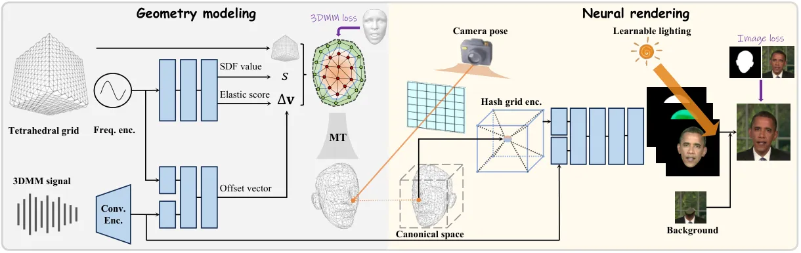
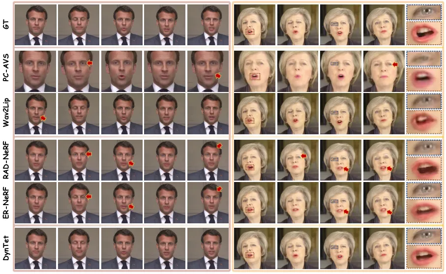
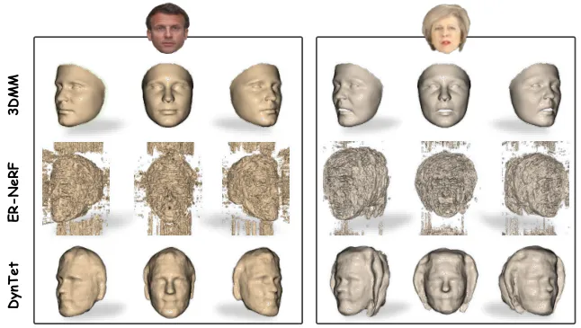
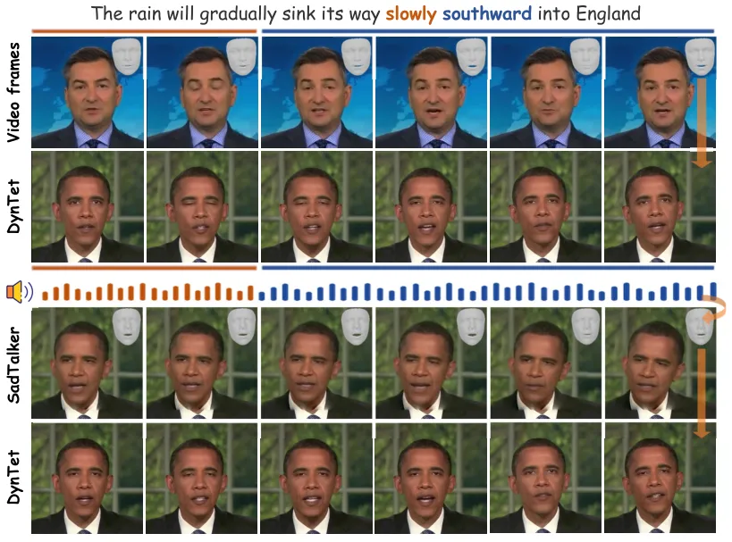
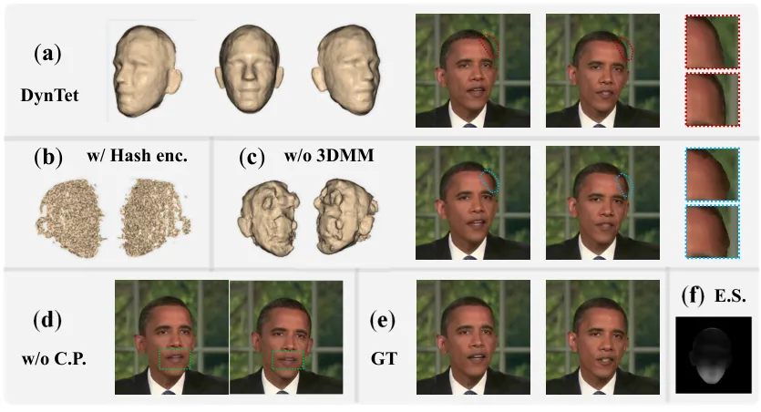
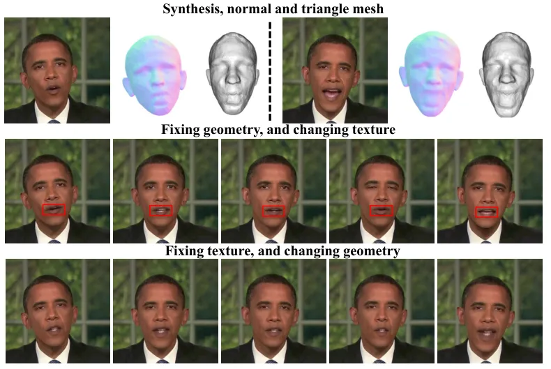
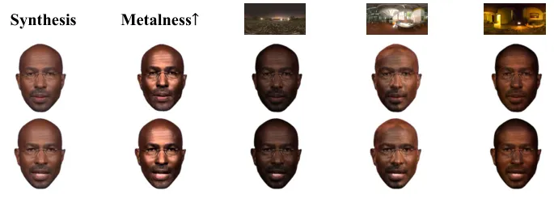
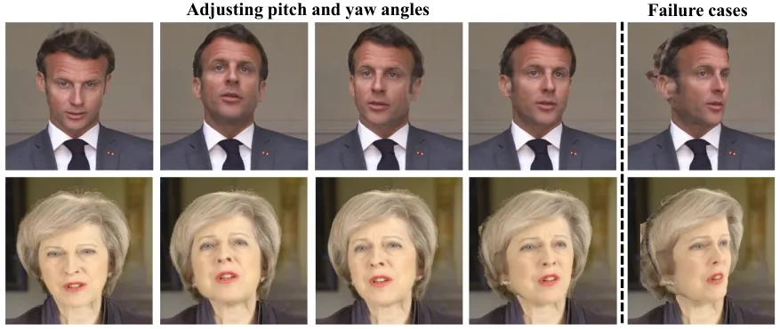

# Learning Dynamic Tetrahedra for High-Quality Talking Head Synthesis

Zicheng Zhang Affiliation: University of Chinese Academy of Sciences   
Ruobing Zheng Affiliation: Ant Group    Ziwen Liu
Affiliation: University of Chinese Academy of Sciences    Congying Han
^(†)^(†)thanks: Corresponding author Affiliation: University of Chinese
Academy of Sciences    Tianqi Li Affiliation: Ant Group    Meng Wang
Affiliation: Ant Group    Tiande Guo Affiliation: University of Chinese
Academy of Sciences    Jingdong Chen Affiliation: Ant Group    Bonan Li
Affiliation: University of Chinese Academy of Sciences    Ming Yang
Affiliation: Ant Group

###### Abstract

Recent works in implicit representations, such as Neural Radiance Fields
(NeRF), have advanced the generation of realistic and animatable head
avatars from video sequences. These implicit methods are still
confronted by visual artifacts and jitters, since the lack of explicit
geometric constraints poses a fundamental challenge in accurately
modeling complex facial deformations. In this paper, we introduce
Dynamic Tetrahedra (DynTet), a novel hybrid representation that encodes
explicit dynamic meshes by neural networks to ensure geometric
consistency across various motions and viewpoints. DynTet is
parameterized by the coordinate-based networks which learn signed
distance, deformation, and material texture, anchoring the training data
into a predefined tetrahedra grid. Leveraging Marching Tetrahedra,
DynTet efficiently decodes textured meshes with a consistent topology,
enabling fast rendering through a differentiable rasterizer and
supervision via a pixel loss. To enhance training efficiency, we
incorporate classical 3D Morphable Models to facilitate geometry
learning and define a canonical space for simplifying texture learning.
These advantages are readily achievable owing to the effective geometric
representation employed in DynTet. Compared with prior works, DynTet
demonstrates significant improvements in fidelity, lip synchronization,
and real-time performance according to various metrics. Beyond producing
stable and visually appealing synthesis videos, our method also outputs
the dynamic meshes which is promising to enable many emerging
applications. Code is available at
[https://github.com/zhangzc21/DynTet](https://github.com/zhangzc21/DynTet).

## 1 Introduction

Talking head synthesis is a long-standing task with a wide range of
applications, such as digital humans, metaverse and filmmaking. The set
up of this task can be roughly categorized to two lines: 1) learning
from a large-scale dataset to drive arbitrary portrait images by the
motion signal \[7, 50, 62, 78, 77, 40, 70, 41\]; and 2) building a
personalized animatable head model from a several-minute video of a
specific person \[74, 61, 67, 23, 37, 53, 64, 60, 31\]. We concentrate
on the latter one, since it generally delivers high-quality synthesis
results with intricate details and 3D naturalness, suitable for
professional scenarios.

Building such an exquisite talking head avatar from video data poses
challenges in faithful appearance, motion control, as well as low
running cost. One line of methods \[30, 67, 19, 61, 20, 28, 14\]
explicitly rely on 3D Morphable Models (3DMM) \[3\] to reconstruct and
animate human faces by estimating the person-specific parameters. While
these methods allow for efficient rendering and dynamic deformation, the
fixed face topology makes them often fall short in generating
characteristic details, e.g., hairstyle, glasses, and inner mouth.
Recently, neural implicit representations, especially Neural Radiance
Fields (NeRF) \[43\], provide a new way to realize faithful generation.
Some seminal work \[16, 23, 37, 53, 64\] learn a direct mapping from the
control signal to the talking head, meanwhile the efficient neural
representations like voxel grid \[57, 15, 34\] and hash encoding \[44\]
have been introduced to improve training and inference speed.

Despite the expressive capabilities, these implicit methods still need
to improve many subtle issues in realism, e.g., head jitters, motionless
mouths, and occasional artifacts. Researchers have discussed these
issues from various aspects, e.g., introducing a canonical space for
easier appearance learning \[49, 1\], developing compact models for more
efficient training \[60, 31\], and using expressive driving conditions
for better control \[64, 65\], against the naive baseline of NeRF.
Essentially, the implicit definition for 3D objects complicates the
analytical alternation of the underlying object geometry, leading to
ineffective disentanglement of static appearance and motion from dynamic
data, as opposed to the explicit meshes and vertex displacements for
3DMM. In viewing of this, it is appealing to incorporate the
expressivity of implicit methods with an effective geometric control to
take advantage of both lines of works.

We introduce Dynamic Tetrahedra (DynTet), a novel hybrid approach that
encodes dynamic meshes within neural networks to assist explicit
deformation. In essence, DynTet employs neural networks to predict
attributes of underlying surfaces, from which explicit meshes can be
extracted to fast render images with a differentiable rasterizer. On one
hand, distinguished from implicit methods, the explicit geometry enables
DynTet to learn a consistent 3D model across frames and directly express
deformation as vertex displacement, thus DynTet is convenient to model
the dynamics of talking head. On the other hand, unlike 3DMM with a
preset topology, DynTet end-to-end learns personalized meshes and
texture suitable for the given video.

Technically, the proposed DynTex is inspired by recent advancements in
tetrahedral techniques \[17\], originally developed for 3D
reconstruction \[45\] and synthesis \[18, 54\]. The key insight is a
parameterized tetrahedral grid: Coordinate-based networks are used to
learn the signed distance field (SDF) and refinement for the grid, then
the meshes are subsequently decoded through the Marching Tetrahedra
algorithm. Since these prior methods \[17, 54, 45, 18\] primarily work
for static scenes, they can hardly render images with deformation, nor
keep the mesh topology under different conditions \[18\]. This also
largely prevents the parallelized rendering and training processes. In
contrast, we redesign the framework that exclusively determines the mesh
topology with SDF, while a new branch controls the geometric variations
with deformation signals. We also estimate the elastic score of each
vertex to specify the rigid (e.g., forehead) and non-rigid regions
(e.g., mouth) of the head, so as to achieve precise deformations in
local regions while maintaining stability in other parts. These designs
ensure the topological consistency and expressivity across all decoded
meshes, enabling a customized dynamic mesh beyond 3DMM. To improve
training efficiency, we introduce geometry losses that supervise shape
and motion using the 3DMM priors. This replenishes the limited depth
information available in frontal talking videos. Moreover, we establish
an interpretable canonical space for the dynamic mesh, reducing the
complexity of texture learning. In summary, our contributions include:

- (1).
  We propose DynTet, a novel hybrid representation that encodes dynamic
  head meshes in neural networks, where the explicit geometry delineated
  by tetrahedra facilitates appearance and motion learning.
- (2).
  This is the first work that successfully extends the static
  tetrahedral representation to dynamic head avatars by a new elaborated
  architecture, a canonical space, and 3DMM guidance for modeling
  dynamic meshes.
- (3).
  DynTet presents evident advantages in terms of fidelity, lip-sync
  precision, stability and runtime by thorough evaluation compared with
  prior works.

The learned dynamic head meshes are promising together with existing 3D
assets or AR/VR techniques for emerging applications such as human
avatar and the metaverse, which may inspire further study on the hybrid
representation for dynamic 3D objects.

## 2 Related Work

#### Talking head synthesis.

Most existing methods for talking head synthesis can be classified into
three categories in terms of the modeling approaches. 2D-based
methods \[50, 78, 69, 76, 68\] utilized generative models \[21, 26, 29\]
as renderers to produce photorealistic portraits. While, these methods
often fall short in achieving 3D naturalness and consistent pose control
due to the absence of an explicit 3D model. 3DMM-based methods \[30, 67,
19, 61, 20, 28, 14\] leveraged 3D face knowledge to drive facial
expression, resulting in quite natural talking style. As a trade-off,
due to the lack of complete head topology they cannot guarantee
consistency or fidelity beyond the facial region such as hair and inner
mouth. Neural head avatar \[22, 74, 75\] has emerged as an attractive
way for automatically creating 3D facial models. While earlier
approaches \[66, 51\] required detailed scanning data, NeRFs \[43, 49,
5\] offer a solution to learn models from video clips, driven by the
factors like 3DMM coefficients \[16\], audio feature \[23\], or facial
landmarks \[65\]. Several recent works have enhanced control effects
 \[1, 37, 64\], system efficiency \[60, 31\] and few-shot training \[53,
32\]. Despite great progress, neural avatars still face challenges in
realism and plausible motion, not to mention that NeRF rendering is
computationally expensive when generating high-resolution images.

#### Neural 3D representation.

Neural implicit functions are emerging as an effective representation of
3D object \[48, 42, 35, 43, 55\] using coordinate-based MLPs \[59, 56,
44\]. While prior methods \[48, 42\] required 3D supervision, several
recent works \[36, 33, 47, 43\] demonstrated differentiable rendering
for training directly from images. Meanwhile, NeRF \[43\] and
followups \[57, 15, 44, 73\] performed volume rendering \[27\] on a
continuous field for density and color, achieving impressive results for
multi-view synthesis. As density is ambiguous to depict geometric
details \[63\], they cannot explicitly edit shape or extract a
high-quality surface with Marching Cubes \[39\], which makes it
challenging in formulating deformation for dynamic scenes. Recent
works \[17, 54\] proposed to convert deformable tetrahedral grid into
surface meshes via the differentiable Marching Tetrahedral
algorithm \[11\], where the SDF values are implicitly learned. The
following methods \[45, 18\] further extended to jointly learn geometry
and texture from image data. They can render photorealistic images
competitive with NeRF in real-time. However, as these methods only work
for static scenes, they cannot learn dynamics for modeling head avatars.
We present an original effort to address this issue to learn dynamic
tetrahedral meshes.

## 3 Preliminaries

We provide some background concepts and notations. At first, we define
operations between sets as element-wise operations, and functions are
mapped element-wise as well.

Tetrahedral meshes have been studied in deep learning \[17, 54\] as a
hybrid representation for 3D shape modeling. Consider an object lying in
a unit cube, a tetrahedral grid denoted as ($`\mathbf{V}_{tet}`$,
$`\mathbf{T}_{tet}`$) is pre-defined to tetrahedralize the cube into
$`r^{3}`$ resolution. Each tetrahedron $`T_{k}\in\mathbf{T}_{tet}`$ is
defined by four vertices
$`\{\mathbf{v}_{a_{k}},\mathbf{v}_{b_{k}},\mathbf{v}_{c_{k}},\mathbf{v}_{d_{k}}\}`$,
where $`K`$ is the total number of tetrahedra. Additionally, each vertex
$`\mathbf{v}_{i}`$ contains a learnable SDF value $`s_{i}\in\mathbb{R}`$
to express the distance away from the underlying surface, and a small
offset $`\Delta\mathbf{v}_{i}\in[-\frac{1}{r},\frac{1}{r}]^{3}`$ from
its initial coordinates to refine the grid as
$`\mathbf{v}^{\prime}_{i}=\mathbf{v}_{i}+\Delta\mathbf{v}_{i}`$. We let
$`\mathcal{S}=\{s_{i}\}^{K}_{i=1}`$ and
$`\Delta\mathbf{V}=\{\Delta\mathbf{v}_{i}\}^{K}_{i=1}`$. Notably, the
surface shape within the tetrahedral grid is primarily determined by the
SDF values $`\mathcal{S}`$ as $`\Delta\mathbf{V}`$ is confined within
the resolution boundaries.

Marching Tetrahedra (MT) is an iso-surface extraction algorithm \[11\]
to generate triangular meshes from tetrahedral meshes. Given SDF values
$`\{s_{a},s_{b},s_{c},s_{d}\}`$ of a tetrahedron, MT determines the
surface topology inside the tetrahedron based on the signs of these
values, where the $`2^{4}`$ configurations in total fall into 3 unique
cases after considering rotation symmetry \[54\]. A simplified 2D
example can be found in Figure 1. Once the topology is identified, a new
vertex denoted as $`\mathbf{v}_{ab}`$ by example, is located at the zero
crossings of linear interpolation along the tetrahedral edges:

```math
\mathrm{lerp}(\mathbf{v}_{a},\mathbf{v}_{b},s_{a},s_{b})=\frac{s_{a}\cdot\mathbf{v}_{a}-s_{b}\cdot\mathbf{v}_{b}}{s_{a}-s_{b}}, \tag{1}
```

the same for other vertices. Note that this equation is evaluated only
when signs differ ($`\text{sign}(s_{a})\neq\text{sign}(s_{b})`$) to
prevent singularity. Leveraging MT on the deformed tetrahedral grid
($`\mathbf{V}_{tet}+\Delta\mathbf{V}`$, $`\mathbf{T}_{tet}`$), the
triangular surface of the encoded object can be acquired in a
differentiable manner. We omit constant symbols and represent this
process as

```math
\mathbf{V}_{tri},\mathbf{T}_{tri}=\mathrm{MarTet}(\mathcal{S},\Delta\mathbf{V}), \tag{2}
```

where $`\mathbf{V}_{tri}`$ and $`\mathbf{T}_{tri}`$ are the sets of
vertices and connectivity of the triangular meshes, respectively.

3D Morphable Models provide generic parametric models \[3\] for
synthesizing face shapes, usually expressed as

```math
\mathbf{V}_{3dmm}=\bar{\mathbf{V}}_{3dmm}+\mathbf{U}_{id}\boldsymbol{\gamma}+\mathbf{U}_{exp}\boldsymbol{\alpha}. \tag{3}
```

Here $`\bar{\mathbf{V}}_{3dmm}`$ denotes a mean shape,
$`\mathbf{U}_{id}`$ and $`\mathbf{U}_{exp}`$ are the matrices of basis
vectors in the identity and expression space, respectively.
$`\boldsymbol{\gamma}`$ and $`\boldsymbol{\alpha}`$ are coefficients for
the identity and expression, allowing for a tractable control over
facial variations. The parameter $`\boldsymbol{\alpha}`$ has been served
as a versatile representation for driving facial deformation \[13\].



Figure 1: Illustration of the proposed DynTet for modeling a talking
head. Left panel: The top branch predicts topology-related information,
including SDF values $`s`$ and elastic scores. The bottom branch,
conditioned by talking signals, predicts the offset vectors scaled by
the elastic scores to yield deformation vectors $`\Delta\mathbf{v}`$ for
driving the tetrahedral grid. Then, the Marching Tetrahedra (MT)
algorithm decodes the meshes. Right panel: The pixel coordinates are
projected into a canonical space. Then the physically-based materials
and lighting are sampled for rendering images.

## 4 Methodology

In this section, we introduce a framework called Dynamic Tetrahedra
(DynTet) to rapidly learn 3D head avatars from short video sequences,
and enable real-time rendering of high-quality talking heads. Generally,
DynTet upgrades recent tetrahedral representation \[17, 45, 18\]
tailored for dynamic head modeling. As shown in Figure 1, neural
networks are trained to encode head shapes within a tetrahedral
grid \[54\], and then the Marching Tetrahedra (MT) \[11\] decodes the
meshes for photorealistic rasterization rendering. In the following, we
delineate the talking head task through the lens of tetrahedral
representation (Sec.4.1), and elucidate our improvements in the geometry
model (Sec.4.2), rendering process (Sec.4.3), and training losses
(Sec.4.4).

### 4.1 Problem statement

Given a sequence of head images $`\{\mathbf{I}_{i}\}_{i=1}^{n}`$, we aim
to reenact the specific head driven by motion signals, which typically
includes camera parameters $`\{\mathbf{P}_{i}\}_{i=1}^{n}`$ for rigid
motion, and talking signals which we represent using 3DMM expression
coefficients $`\{\boldsymbol{\alpha}_{i}\}_{i=1}^{n}`$ for non-rigid
facial expressions.

#### Formulation.

Drawing inspiration from the seminal work of \[54\], which applied
tetrahedral meshes for multi-view reconstruction, we propose a basic
paradigm for talking head modeling: (1) A geometry mapping
$`\boldsymbol{F}`$ first predicts $`\mathcal{S}`$ and
$`\Delta\mathbf{V}`$ from $`\boldsymbol{\alpha}`$ and
$`\mathbf{V}_{tet}`$. (2) The outputs from $`\boldsymbol{F}`$ are
processed based on Eq. (2) to obtain the triangular mesh, which are then
rasterized given camera pose $`\mathbf{P}`$ to get the coordinates of
image pixels in the model space. (3) An appearance mapping
$`\boldsymbol{G}`$ predicts the materials, which is incorporated with a
lighting model $`\boldsymbol{L}`$ for the physically-based
rendering (PBR) \[4\]. We summarize the overall process as

```math
\displaystyle\min\limits_{\boldsymbol{F},\boldsymbol{G},\boldsymbol{L}}\ \frac{1}{n}\sum\limits^{n}_{i=1}Loss(\hat{\mathbf{I}}_{i},\mathbf{I}_{i}) \tag{4}
```

```math
\displaystyle\text{where}\ \ \hat{\mathbf{I}}_{i}=\mathrm{Rendering}(\boldsymbol{F},\boldsymbol{G},\boldsymbol{L},\boldsymbol{\alpha}_{i},\mathbf{P}_{i}).
```

Herein, $`\mathrm{Rendering}`$ denotes the PBR procedure, and the loss
function comprises a set of constraints on the predictions.

#### Challenges.

Prior works \[17, 54, 18\] commonly parameterize $`\boldsymbol{F}`$
using a neural network $`f`$ to predict SDF values and relative offsets,
i.e., $`\mathcal{S},\Delta\mathbf{V}=f(\mathbf{V}_{tet})`$, while
introducing the talking signal $`\boldsymbol{\alpha}`$ to $`f`$ as a
condition will bring several problems. First, once SDF values vary along
with the conditions, it is difficult to learn the intricate deformation
of the facial area with a simple MLP. Second, modern GPUs do not support
parallelization for meshes with a variable topology, resulting in
inefficient training and running processes. Lastly, previous approaches
were designed for $`360^{\circ}`$ data, while our training data only
includes frontal head images. Consequently, this inaccurate estimation
of geometry leads to evident artifacts in the rendered videos.

### 4.2 Geometry modeling

To address the mentioned challenges, we initially disentangle topology
and geometry from head shapes within the tetrahedra grid, allowing for
generating dynamic meshes with a consistent topology. Furthermore, we
enhance the tetrahedral attributes by introducing a novel elastic score,
facilitating precise control over deformation. These improvements are
incorporated by modifying the internal structure of the geometry mapping
as

```math
\displaystyle\boldsymbol{F}:\mathbf{V}_{tet},\boldsymbol{\alpha}\rightarrow\mathcal{S},\Delta\mathbf{V} \tag{5}
```

```math
\displaystyle\text{where}\ \ \mathcal{S},\mathcal{E}=f_{1}(\mathbf{V}_{tet}),\ \Delta\mathbf{V}=\mathcal{E}\cdot f_{2}(\mathbf{V}_{tet},\boldsymbol{\alpha}).
```

Here, $`f_{1}`$ and $`f_{2}`$ are coordinate-based MLPs, while
$`\mathcal{E}:=[f_{1}(\mathbf{V}_{tet})]_{e}`$ represents the set of
non-negative elastic scores.

#### Shape representation.

Ideal face models exhibit topological invariance regardless of
deformation. While implicit SDF representations present challenges in
fulfilling this property, it is clear for explicit meshes like
3DMM \[3\] to maintain the number of vertices and their relationship. By
employing Eq. (1) within MT algorithm, we have

```math
\displaystyle\mathbf{v}^{\prime}_{ab}=\underbrace{\mathrm{lerp}(\mathbf{v}_{a},\mathbf{v}_{b},s_{a},s_{b})}_{\text{topology and identity}}+\underbrace{\mathrm{lerp}(\Delta\mathbf{v}_{a},\Delta\mathbf{v}_{b},s_{a},s_{b})}_{\text{geometry and expression}}. \tag{6}
```

Given that vertices $`\mathbf{v}_{a}`$ and $`\mathbf{v}_{b}`$ are
pre-defined in the tetrahedral grid, the first term is just affected by
the SDF values. Hence, our design in Eq.(5), which segregates SDF from
the talking signal, results in a topologically invariant mesh.
Meanwhile, the second term indicates that the geometry of mesh
explicitly relies on the tetrahedral grid offsets. Additionally, a
comparison with Eq. (3) reveals that DynTet functions as a quasi-3DMM
hybrid model, enabling additive changes to facial shapes driven by
neural networks.

#### Elastic estimation.

Our design necessitates relaxing the range of
$`\Delta\mathbf{v}_{i}\in[-\frac{1}{r},\frac{1}{r}]^{3}`$ to allow
greater flexibility in geometric variations. However, this relaxation
potentially leads to local jitters that significantly impact visual
quality. We introduce an elastic scoring mechanism for each vertex
within the tetrahedral grid to regulate deformation. These scores
$`\mathcal{E}`$ are predicted by the neural network $`f_{1}`$ to
quantify the non-rigid properties across different regions of the human
head. For instance, areas like the forehead and nose exhibit near-rigid
behavior with minimal changes during talking, while regions like the
mouth and eyes are more flexible and primarily contribute to
deformations. In this way, the offset vectors are scaled using the
elastic scores to determine the deformable vectors $`\Delta\mathbf{V}`$.

#### Architecture details.

As shown in Figure 1, we formulate neural networks $`f_{1}`$ and
$`f_{2}`$ as a composition of regular lightweight MLPs and a frequency
positional encoding \[59\]

```math
\gamma(\mathbf{v})=<\left(\sin\left(2^{l}\pi\mathbf{v}\right),\cos\left(2^{l}\pi\mathbf{v}\right)\right)>_{l=0}^{L-1}. \tag{7}
```

We find that the simple frequency coding outperforms hash grid
encoding \[44\] which tends to generate surfaces with significant noise.
To maintain temporal consistency, we follow \[52, 41\] to represent the
deformation of any timestamp by the window of adjacent 27 frames of
expression coefficients, which are averaged into a 256-dimensional
feature vector by a trainable convolutional encoder.

### 4.3 Neural rendering

This procedure aims to automatically texture the triangular meshes
$`(\mathbf{V}_{tri},\mathbf{T}_{tri})`$ extracted by MT algorithm, and
generate photorealistic images $`\hat{\mathbf{I}}`$ given camera pose
$`\mathbf{P}`$ and talking signal $`\boldsymbol{\alpha}`$. In the realm
of deformable reconstruction \[46, 38, 49, 38\], the canonical or
template model serves an important role in reducing the complexity of
texture parametrization. Thanks to the well-designed geometry model in
DynTet, defining a canonical space becomes straightforward. We upgrade
the vanilla rendering process by incorporating a canonical projection,
thereby unifying both shading and lighting within a single space.

#### Canonical projection.

We propose the canonical projection $`\mathrm{CanProj}`$ to map the
pixel coordinates $`\mathcal{C}_{2d}`$ from an arbitrary camera pose
$`\mathbf{P}`$ into a canonical 3D space where the mean expression lies.
This process is expressed as

```math
\displaystyle\bar{\mathcal{C}}_{3d}=\mathrm{CanProj}(\mathcal{C}_{2d},\mathbf{V}_{tri},\mathbf{P};\bar{\mathbf{V}}_{tri},\mathbf{T}_{tri}), \tag{8}
```

```math
\displaystyle\text{where}\ \ \bar{\boldsymbol{\alpha}}=\Sigma_{i=1}^{n}\boldsymbol{\alpha}_{i}/n,
```

```math
\displaystyle\text{and}\ \ \ \ \bar{\mathbf{V}}_{tri},\mathbf{T}_{tri}=\mathrm{MatTet}(\boldsymbol{F}(\mathbf{V}_{tet},\bar{\boldsymbol{\alpha}})).
```

In practical implementation, $`\mathrm{CanProj}`$ can be executed
readily using a modern mesh rasterizer to derive coordinates
$`\mathcal{C}_{3d}`$ and 2D barycentric coordinates within
$`(\mathbf{V}_{tri},\mathbf{T}_{tri})`$. Then,
$`\bar{\mathcal{C}}_{3d}`$ positioned in the canonical space, is
computed through barycentric interpolation over
$`(\bar{\mathbf{V}}_{tri},\mathbf{T}_{tri})`$.

#### Appearance model.

We follow previous work \[45, 4\] to adopt a physically-base material
model, which allows easy integration of 3D assets within existing
engines. To parameterize the appearance mapping $`\boldsymbol{G}`$, we
employ a coordinate-based neural network comprising a hash grid
encoder \[44\] for querying spatial features and a lightweight MLP for
predicting materials. This network takes the projected coordinates and
talking signal as inputs:

```math
\mathcal{K}_{d},\mathcal{K}_{orm}=\boldsymbol{G}(\bar{\mathcal{C}}_{3d},\boldsymbol{\alpha}). \tag{9}
```

Here, $`\mathcal{K}_{d}`$ comprises three-channel diffuse albedo, and
$`\mathcal{K}_{orm}`$ is the set of occupancy $`k_{o}`$, roughness
$`k_{r}`$, and metalness factors $`k_{m}`$ for the GGX normal
distribution function \[9\]. Unlike prior works, we do not predict
normals, but instead compute them directly using the triangular mesh in
the model space, which yields similar results.

#### Lighting model.

We leverage the image based lighting model, where the environment light
is given by a trainable mapping $`\boldsymbol{L}`$. For each position
$`\mathbf{v}\in\mathcal{C}_{3d}`$ with a normal vector $`\mathbf{n}`$,
the color along direction $`\boldsymbol{\omega}_{o}`$ is computed by

```math
\displaystyle L(\mathbf{v},\boldsymbol{\omega}_{o})=L_{d}(\mathbf{v})+L_{s}(\mathbf{v},\boldsymbol{\omega}_{o}), \tag{10}
```

where $`L_{d}`$ is the diffuse intensity and $`L_{s}`$ is the specular
intensity. Consider a hemisphere with the incident direction
$`\Omega=\left\{\boldsymbol{\omega}_{i}:\boldsymbol{\omega}^{T}_{i}\mathbf{n}\geq 0\right\}`$,
the first diffuse term is computed by

```math
\displaystyle L_{d}(\mathbf{v})=(1-k_{m})\boldsymbol{k}_{d}\int_{\Omega}\small{\boldsymbol{L}_{i}}\left(\mathbf{v},\boldsymbol{\omega}_{i}\right)(\boldsymbol{\omega}^{T}_{i}\mathbf{n})\mathrm{d}\boldsymbol{\omega}_{i}. \tag{11}
```

And the second term is based on Cook-Torrance microfacet specular
shading mode model \[9\]
$`r(\boldsymbol{\omega}_{o},\boldsymbol{\omega}_{i})`$ to compute

```math
\displaystyle L_{s}(\mathbf{v},\boldsymbol{\omega}_{o})=\boldsymbol{k}_{s}\int_{\Omega}r(\boldsymbol{\omega}_{o},\boldsymbol{\omega}_{i})\small{\boldsymbol{L}_{i}}(\mathbf{v},\boldsymbol{\omega}_{i})(\boldsymbol{\omega}^{T}_{i}\mathbf{n})\mathrm{d}\boldsymbol{\omega}_{i}, \tag{12}
```

where the specular color
$`\boldsymbol{k}_{s}=(1-{k}_{m})\cdot 0.04+{k}_{m}\boldsymbol{k}_{d}`$.
Following \[45\], we parameterize $`\boldsymbol{L}`$ with a cube map
with resolution $`6\times 512\times 512`$, and the calculate the
hemisphere integration by the split-sum method \[25\]. By aggregating
the rendered pixel colors along the camera pose, we obtain the rendered
image
$`\hat{\mathbf{I}}=\{k_{o}\cdot L(\mathbf{v},\boldsymbol{\omega}_{o})|\mathbf{v}\in\mathcal{C}_{3d})\}`$.

### 4.4 Training losses

Thanks to its hybrid representation, DynTet possesses an interpretable
SDF space and a cost-efficient rendering procedure. This unique
combination allows us to supervise its training in both image and
geometry space, facilitating the estimation of reasonable 3D models from
frontal images.

#### Image supervision.

Given an image $`\mathbf{I}`$ and its prediction $`\hat{\mathbf{I}}`$,
we train DynTet with the MSE loss for pixel-level reconstruction, and
apply the overall LPIPS loss \[71\] for enhancing sharp details \[31\].
Besides, we find silhouette loss is important to provide shape guidance.
The image loss is

```math
\mathcal{L}_{img}=\mathcal{L}_{mse}(\hat{\mathbf{I}},\mathbf{I})+\mathcal{L}_{mse}(\hat{\mathbf{I}}_{o},\mathbf{I}_{o})+\lambda_{1}\small{\mathcal{L}_{LPIPS}}(\hat{\mathbf{I}},\mathbf{I}), \tag{13}
```

where $`\hat{\mathbf{I}}_{o}`$ and $`\mathbf{I}_{o}`$ denote the binary
masks of head regions. We combine the head, background and torso
together to train in practice to prevent noise around the facial
contours.

#### 3DMM supervision.

Frontal head views in talking videos often lack adequate depth
information, resulting in flawed geometry estimation and artifacts in
synthesized profile face. To counter this, we leverage 3DMM \[3\] as a
geometry prior to mitigate these issues in the SDF space. We introduce
two key losses to incorporate 3DMM. First, the normal distance loss
$`\mathcal{L}_{ndl}`$ constrains the canonical model:

```math
\mathcal{L}_{ndl}=\mathbb{E}_{s\sim U(-a,a)}\|f_{1}(\mathbf{V}^{\bar{\boldsymbol{\alpha}}}_{3dmm}+s\cdot\small{\mathbf{N}}^{\bar{\boldsymbol{\alpha}}}_{3dmm})-s\|^{2}_{2}, \tag{14}
```

where $`\mathbf{V}^{\bar{\boldsymbol{\alpha}}}_{3dmm}`$ and
$`\mathbf{N}^{\bar{\boldsymbol{\alpha}}}_{3dmm}`$ represent 3DMM
vertices and normal vectors generated by coefficient
$`\bar{\boldsymbol{\alpha}}`$, while $`a`$ is a small value which we set
to $`0.1`$. $`\mathcal{L}_{ndl}`$ injects facial prior into $`f_{1}`$,
affecting the SDF values around 3DMM surface. Consequently, it avoids
excessive restraint compared to full-space supervision \[48\], enabling
adaptive learning in other regions. The second facial deformation loss
is expressed as

```math
\mathcal{L}_{fdl}=\|[f_{1}(\mathbf{V}_{3dmm})]_{e}f_{2}(\small{\mathbf{V}_{3dmm}},\boldsymbol{\alpha})-\mathbf{U}_{exp}(\boldsymbol{\alpha}-\bar{\boldsymbol{\alpha}})\|^{2}_{2}. \tag{15}
```

This loss helps the tetrahedral grid to mimick the 3DMM deformation.
Although these losses target 3DMM vertices, the tetrahedral vertices are
appropriately constrained due to their spatial density covering the 3DMM
vertices.



Figure 2: Qualitative comparison of DynTet with the prior methods \[77,
50, 60, 31\]. Some representative defects are marked with red arrows,
around which the generated eyes, mouths or wrinkles highlight
discrepancies with real ones. The right panel presents the details of
the mouth and eye area. The results show the superior realism and motion
accuracy achieved by DynTet compared to existing methods.

#### Loss function.

We introduce a regularization term for the elastic score, denoted as
$`\mathcal{R}_{es}=\|[f_{1}(\mathbf{V}_{3dmm})]_{e}\|^{2}_{2}`$, to
reinforce the rigid property. We incorporate the weighted combination of
the above constraints as follows to formulate the loss function
described in Eq. (4)

```math
Loss=\mathcal{L}_{img}+\lambda_{2}\mathcal{L}_{ndl}+\lambda_{3}\mathcal{L}_{fdl}+\lambda_{4}\mathcal{R}_{es}. \tag{16}
```

## 5 Experiment

### 5.1 Experimental settings

#### Dataset and pre-processing.

For a fair comparison, we follow recent works \[23, 53, 31\] to conduct
experiments on a publicly-released video dataset, which includes four
high-definition talking videos with an average length of about 6500
frames at 25 FPS. Each raw video is cropped and resized to
$`512\times 512`$, except for the Obama data with the resolution
$`448\times 448`$. Each video is divided into training and test sets at
a ratio of 10:1. We ensure strict alignment with the pre-processing
steps outlined in AD-NeRF \[23\]. In order to extract the 3DMM
coefficients efficiently, we utilize a pre-trained model from Deng et
al. \[10\].

#### Implementation details.

We implement DynTet based on the code of Nvdiffrec¹¹ 1
[https://github.com/NVlabs/nvdiffrec](https://github.com/NVlabs/nvdiffrec) \[45\]
for differentiable Marching Tetrahedra and rasterization. We use a
tetrahedral grid with a resolution of $`128^{3}`$ \[12\], which is a
commonly used setting \[45, 18\]. For the MLPs, we equip each one with
ReLU-Linear layers. The geometry model utilizes a frequency positional
encoder \[59\] with $`L=6`$ and a 3-layer MLP with 128 middle neurons.
Additionally, a 4-layer convolutional encoder \[52\] is used for the
3DMM coefficients. The appearance model consists of a 5-layer MLP with
256 middle neurons. During training, we perform 20,000 iterations with a
batch size of 4. We employ the Adam optimizer with an initial learning
rate of $`1\times 10^{-3}`$, which exponentially decayed to
$`1\times 10^{-5}`$. The default hyperparameters are
$`\lambda_{1}=0.1`$, $`\lambda_{2}=100`$, $`\lambda_{3}=100`$, and
$`\lambda_{4}=100`$. All experiments are conducted on a single NVIDIA
Tesla V100.

#### Comparison baselines.

We compare our method with several recent representative one-shot and
person-specific models, including Wav2Lip \[50\], PC-AVS \[77\],
NVP \[62\], SynObama \[58\], SadTalker \[72\]. In addition, we also
compare our method with three end-to-end NeRF-based models:
ADNeRF \[23\], RAD-NeRF \[60\] and ER-NeRF \[31\]. All these methods are
implemented with their official code.

|                                       |                   |                      |                    |                   |                        |                        |                    |                   |      |      |
| ------------------------------------- | ----------------- | -------------------- | ------------------ | ----------------- | ---------------------- | ---------------------- | ------------------ | ----------------- | ---- | ---- |
| Methods                               | PSNR $`\uparrow`$ | LPIPS $`\downarrow`$ | FID $`\downarrow`$ | CSIM $`\uparrow`$ | LMD^(m) $`\downarrow`$ | LMD^(e) $`\downarrow`$ | AUE $`\downarrow`$ | Sync $`\uparrow`$ | Time | FPS  |
| Ground Truth                          | $`\infty`$        | 0                    | 0                  | 1.000             | 0                      | 0                      | 0                  | 7.899             | \-   | \-   |
| Wav2Lip \[50\]                        | 31.15             | 0.0730               | 20.70              | 0.970             | 3.072                  | 2.147                  | 2.059              | 8.256             | \-   | 20   |
| PC-AVS \[77\]                         | 22.06             | 0.1345               | 47.53              | 0.802             | 2.496                  | 3.609                  | 4.283              | 8.540             | \-   | 32   |
| AD-NeRF \[23\]                        | 30.41             | 0.0799               | 14.92              | 0.926             | 4.317                  | 2.405                  | 4.374              | 5.015             | 18h  | 0.08 |
| RAD-NeRF \[60\]                       | 31.51             | 0.0675               | 11.14              | 0.951             | 3.006                  | 2.285                  | 3.317              | 4.409             | 5h   | 23   |
| ER-NeRF† \[31\]                       | 32.50             | 0.0345               | 6.44               | 0.960             | 2.924                  | 2.220                  | 2.773              | 4.944             | 2h   | 23   |
| DynTet                                | 35.15             | 0.0619               | 12.23              | 0.975             | 2.418                  | 2.137                  | 1.833              | 7.407             | 2h   | 46   |
| DynTet†                               | 34.84             | 0.0223               | 4.72               | 0.978             | 2.284                  | 2.129                  | 1.712              | 7.646             | 3h   | 46   |
| † supervised by overall LPIPS \[71\]. |                   |                      |                    |                   |                        |                        |                    |                   |      |      |

Table 1: Quantitative results of the self-driven head reconstruction.
The best and second results are in bold and underline. Wav2Lip takes
ground truth as input, thus its PSNR and LPIPS values are biased. The
FPS values are tested on the resolution of $`512\times 512`$.



Figure 3: The triangular meshes from 3DMM \[3\], ER-NeRF \[31\] and
DynTet. The surfaces extracted from ER-NeRF using the Marching
Cubes \[39\] exhibit noise and undesirable topology. Note that the backs
of the meshes may have some defects due to limited training data, but it
does not impact the rendering results.

### 5.2 Quantitative results

#### Comparison settings.

We follow recent works to organize our comparisons into two settings: 1)
Self-driven head reconstruction setting, in which we train a model for
each video clip and evaluate the reconstruction quality on its
respective test set. 2) Cross-driven lip synchronization setting, where
we use clips from unseen videos to drive all methods for comparisons in
lip synchronization. We extract two video clips from the public demos of
SynObama \[58\] and NVP \[62\], which we refer to as Testset A and
Testset B.

#### Evaluation metrics.

We assess the methods with several metrics: We evaluate the
reconstruction quality using PSNR and LPIPS metrics \[71\]. Realism and
identity preservation are measured using Fréchet Inception
Distance (FID) \[24\] and Cosine Similarity of Identity Embedding (CSIM)
\[41\]. Driving accuracy is assessed by calculating the landmark
distances for the mouth ($`\text{LMD}^{m}`$) and eyes
($`\text{LMD}^{e}`$) \[6\], while face motion accuracy is quantified by
action units error (AUE) \[2\]. Temporal lip synchronization is
evaluated using the SyncNet confidence score (Sync) \[8\]. Additionally,
we report training time and frame-per-second (FPS) to evaluate the
running efficiency of the methods.

#### Head reconstruction.

The results of the head reconstruction setting are presented in Table 1.
For fairness, we provide DynTet with and without LPIPS supervision, both
of which demonstrate significant advantages in reconstructing accurate
details and precisely controlling facial movements. While 2D-based
methods such as Wav2Lip \[50\] and PC-AVS \[77\] excel in the lip
synchronization due to the pre-training on the large-scale dataset, they
fall short in the faithful appearance. Among NeRF-based methods, the
recent work ER-NeRF \[31\] achieves top performance in the evaluation.
As the first tetrahedra representation for talking heads, DynTet notably
outperforms on all metrics compared to NeRF-based approaches, showcasing
its advancements in faithful reconstruction and accurate mapping from
conditions to facial deformation. This further validates the great
potential of tetrahedra meshes for dynamic modeling.

|                    |                    |                   |                    |                   |
| ------------------ | ------------------ | ----------------- | ------------------ | ----------------- |
| Methods            | Testset A          |                   | Testset B          |                   |
|                    | AUE $`\downarrow`$ | Sync $`\uparrow`$ | AUE $`\downarrow`$ | Sync $`\uparrow`$ |
| Ground Truth       | 0                  | 7.386             | 0                  | 6.676             |
| SynObama \[58\]    | 5.574              | 7.419             | \-                 | \-                |
| NVP \[62\]         | \-                 | \-                | 7.954              | 6.562             |
| Wav2Lip \[50\]     | 5.029              | 8.394             | 7.415              | 9.072             |
| PC-AVS \[77\]      | 4.359              | 8.087             | 7.450              | 9.964             |
| SadTalker \[72\]   | 4.732              | 7.207             | 6.760              | 7.932             |
| AD-NeRF \[23\]     | 4.277              | 6.041             | 6.731              | 5.567             |
| RAD-NeRF \[60\]    | 4.172              | 6.541             | 6.733              | 6.786             |
| ER-NeRF \[31\]     | 4.210              | 6.877             | 6.669              | 7.401             |
| DynTet             | 3.672              | 5.055             | 6.029              | 6.401             |
| Audio2Exp + DynTet | 4.316              | 7.055             | 6.541              | 7.335             |

Table 2: Quantitative results of cross-driven lip synchronization. The
best and second results are in bold and underline. To drive DynTet with
audios, we utilize an off-the-shelf model Audio2Exp \[72\] to convert
audios into 3DMM coefficients.

#### Lip synchronization.

DynTet offers both frame-driven and audio-driven approaches to
accomplish this task. In the frame-driven approach, 3DMM coefficients
are directly extracted from the target videos. On the other hand, the
audio-driven approach utilizes an off-the-shelf model, specifically the
Audio2Exp model in SadTalker \[72\], to convert audios into the 3DMM
coefficients. It is worth noting that the target coefficients, denoted
as $`\boldsymbol{\alpha}^{\prime}`$, and the training coefficients
$`\boldsymbol{\alpha}`$, may have different distributions according to
speaking habits. We find that a re-center process, expressed as
$`\boldsymbol{\alpha}^{\prime}+(\bar{\boldsymbol{\alpha}}-\bar{\boldsymbol{\alpha}}^{\prime})`$
is crucial to rectificate the talking style. As shown in Table 2, the
frame-driven approach of DynTet unsurprisingly achieves the best AUE
performance among all methods. Furthermore, the audio-driven approach of
DynTet also achieves comparable results with ER-NeRF and SadTalker,
indicating its flexibility and strong generalization properties for
various applications.

#### Running efficiency.

Table 1 shows that DynTet achieves fast training speed and real-time
inference at $`512\times 512`$ resolution. Notably, DynTet maintains the
same 46 FPS even at $`1024\times 1024`$ resolution, thanks to the
cost-efficient rasterization rendering. In contrast, ER-NeRF and
RAD-NeRF experience a half drop in FPS. This highlights our efficiency
advantage in challenging high-resolution scenes.



Figure 4: Qualitative results of the cross-driven setting. The top and
bottom panels show the frame- and audio-driven results, respectively. We
attach the estimated 3DMM shapes for reference.

### 5.3 Qualitative results

Figure 2 demonstrates that DynTet effectively addresses challenges faced
by prior methods. It generates photo-realistic images with intricate
details in non-rigid areas and achieves precise control of mouth,
blinks, and even wrinkles. Our supplementary videos showcase the
impressive temporal stability of DynTet, resulting in smooth and stable
motion. In Figure 3, the comparison of meshes obtained by different
methods reveals that DynTet outperforms 3DMM and NeRF in terms of
topology. Additionally, Figure 4 showcases the accurate expression
control achieved by frame-driven DynTet, while audio-driven DynTet
surpasses SadTalker in producing realistic and expressive results. These
advancements firmly establish DynTet as a promising approach for
modeling talking heads.



Figure 5: The validation of key components in DynTet. (a) Result of
DynTet. (b) Replacing frequency encoding with hash encoding \[44\]. (c)
Removing 3DMM supervision. (d) Removing canonical projection. (e)
Groundtruth. (f) Visualization of elastic scores.

### 5.4 Ablation study

We present the results of different structures in Table 3 and Figure 5.
It is evident that the removal of canonical projection (C.P.) has a
quite negative impact, resulting in increased LPIPS and LMD values. This
is because the absence of the canonical projection increases the
difficulty of texture learning and consequently hinders the supervision
of loss on the geometry model. Similarly, removing 3DMM supervision
leads to flawed meshes and introduces artifacts into the images. The
visualization of elastic scores (E.S.) highlights its function in
quantifying the non-rigid property, and its removal affects the temporal
stability of the results (see the supplementary videos). Interestingly,
we find replacing frequency encoding with hash encoding leads to a
cluttered mesh, indicating that it is desirable to encode coordinates as
low-frequency signals in geometry learning. In addition, we explore the
impact of middle neuron channels within the appearance mapping, and find
that dimensions ranging from 64 to 256 strike a balance between
expressivity and inference speed. These findings underscore the
reasonable designs of DynTet for achieving desirable results.

|                        | DynTet | - 3DMM | - C.P. | - E.S. | 32     | 64     | 128    | 512    |
| ---------------------- | ------ | ------ | ------ | ------ | ------ | ------ | ------ | ------ |
| FPS$`\uparrow`$        | 46     | -      | -      | -      | 103    | 92     | 80     | 23     |
| \#Param                | 1.41M  | -      | -      | -      | 1.11M  | 1.13M  | 1.19M  | 2.28M  |
| PSNR$`\uparrow`$       | 34.84  | 33.65  | 34.37  | 34.81  | 32.22  | 34.20  | 35.15  | 35.06  |
| LPIPS$`\downarrow`$    | 0.0223 | 0.0686 | 0.0529 | 0.0247 | 0.0539 | 0.0254 | 0.0237 | 0.0219 |
| LMD^(m) $`\downarrow`$ | 2.284  | 2.453  | 2.572  | 2.336  | 2.875  | 2.636  | 2.449  | 2.201  |

Table 3: Quantitative ablation of DynTet via removing 3DMM supervision,
canonical projection, elastic score or changing the number of middle
neurons in appearance mapping from $`32`$ to $`512`$. $`\#`$Param
denotes the parameter number of DynTet.

## 6 Conclusion

We introduce Dynamic Tetrahedra (DynTet), a novel hybrid representation
for realistic and expressive talking heads. DynTet upgrades tetrahedral
meshes from statics to dynamics with a new architecture, a canonical
space and guidance from geometry prior. DynTet can efficiently generate
high-resolution talking videos with realism and precise motion control
beyond prior works. Our work may inspire future research in the
direction of Dynamic Tetrahedra.

Acknowledgements. This paper is supported by the Strategic Priority
Research Program of Chinese Academy of Sciences (XDA27000000), the
National key research and development program of China (2021YFA1000403),
the National Natural Science Foundation of China (Nos. U23B2012, 11991022) and the Fundamental Research Funds for the Central
Universities (E3E41904).

## References

- \[1\] ShahRukh Athar. Rignerf: Fully controllable neural 3d portraits.
  In _CVPR_, 2022.
- \[2\] Tadas Baltrusaitis, Amir Zadeh, Yao Chong Lim, and
  Louis-Philippe Morency. Openface 2.0: Facial behavior analysis
  toolkit. In _FG_, 2018.
- \[3\] Volker Blanz and Thomas Vetter. A morphable model for the
  synthesis of 3d faces. In _PACMCGIT_, 1999.
- \[4\] Brent Burley. Physically-based shading at disney. 2012.
- \[5\] Eric R Chan, Connor Z Lin, Matthew A Chan, Koki Nagano, Boxiao
  Pan, Shalini De Mello, Orazio Gallo, Leonidas J Guibas, Jonathan
  Tremblay, Sameh Khamis, et al. Efficient geometry-aware 3d generative
  adversarial networks. In _CVPR_, 2022.
- \[6\] Lele Chen, Zhiheng Li, Ross K. Maddox, Zhiyao Duan, and
  Chenliang Xu. Lip movements generation at a glance. In _ECCV_, 2018.
- \[7\] Lele Chen, Ross K Maddox, Zhiyao Duan, and Chenliang Xu.
  Hierarchical cross-modal talking face generation with dynamic
  pixel-wise loss. In _CVPR_, 2019.
- \[8\] Joon Son Chung and Andrew Zisserman. Lip reading in the wild. In
  _ACCV_, 2017.
- \[9\] Robert L. Cook and Kenneth E. Torrance. A reflectance model for
  computer graphics. In _PACMCGIT_, 1981.
- \[10\] Yu Deng, Jiaolong Yang, Sicheng Xu, Dong Chen, Yunde Jia, and
  Xin Tong. Accurate 3d face reconstruction with weakly-supervised
  learning: From single image to image set. In _CVPRW_, 2019.
- \[11\] Akio Doi and Akio Koide. An efficient method of triangulating
  equi-valued surfaces by using tetrahedral cells. _IEICE TRANSACTIONS
  on Information and Systems_, 1991.
- \[12\] Crawford Doran, Athena Chang, and Robert Bridson. Isosurface
  stuffing improved: acute lattices and feature matching. In
  _SIGGRAPH_, 2013.
- \[13\] Bernhard Egger, W. Smith, Ayush Kumar Tewari, Stefanie Wuhrer,
  Michael Zollhöfer, Thabo Beeler, Florian Bernard, Timo Bolkart, Adam
  Kortylewski, Sami Romdhani, Christian Theobalt, Volker Blanz, and
  Thomas Vetter. 3d morphable face models—past, present, and future.
  _ACM TOG_, 2019.
- \[14\] Yingruo Fan, Zhaojiang Lin, Jun Saito, Wenping Wang, and Taku
  Komura. Faceformer: Speech-driven 3d facial animation with
  transformers. In _CVPR_, 2021.
- \[15\] Sara Fridovich-Keil, Alex Yu, Matthew Tancik, Qinhong Chen,
  Benjamin Recht, and Angjoo Kanazawa. Plenoxels: Radiance fields
  without neural networks. In _CVPR_, 2022.
- \[16\] Guy Gafni, Justus Thies, Michael Zollhofer, and Matthias
  Nießner. Dynamic neural radiance fields for monocular 4d facial avatar
  reconstruction. In _CVPR_, 2020.
- \[17\] Jun Gao, Wenzheng Chen, Tommy Xiang, Clément Fuji Tsang, Alec
  Jacobson, Morgan McGuire, and Sanja Fidler. Learning deformable
  tetrahedral meshes for 3d reconstruction. In _NeurIPS_, 2020.
- \[18\] Jun Gao, Tianchang Shen, Zian Wang, Wenzheng Chen, K. Yin,
  Daiqing Li, Or Litany, Zan Gojcic, and Sanja Fidler. Get3d: A
  generative model of high quality 3d textured shapes learned from
  images. In _NeurIPS_, 2022.
- \[19\] Pablo Garrido, Michael Zollhöfer, Dan Casas, Levi Valgaerts,
  Kiran Varanasi, Patrick Pérez, and Christian Theobalt. Reconstruction
  of personalized 3d face rigs from monocular video. _ACM TOG_, 2016.
- \[20\] Zhenglin Geng, Chen Cao, and S. Tulyakov. 3d guided
  fine-grained face manipulation. In _CVPR_, 2019.
- \[21\] Ian Goodfellow, Jean Pouget-Abadie, Mehdi Mirza, Bing Xu, David
  Warde-Farley, Sherjil Ozair, Aaron Courville, and Yoshua Bengio.
  Generative adversarial networks. In _NeurIPS_, 2014.
- \[22\] Philip-William Grassal, Malte Prinzler, Titus Leistner, Carsten
  Rother, Matthias Nießner, and Justus Thies. Neural head avatars from
  monocular rgb videos. In _CVPR_, 2022.
- \[23\] Yudong Guo, Keyu Chen, Sen Liang, Yong-Jin Liu, Hujun Bao, and
  Juyong Zhang. Ad-nerf: Audio driven neural radiance fields for talking
  head synthesis. In _ICCV_, 2021.
- \[24\] Martin Heusel, Hubert Ramsauer, Thomas Unterthiner, Bernhard
  Nessler, and Sepp Hochreiter. Gans trained by a two time-scale update
  rule converge to a local nash equilibrium. In _NeurIPS_, 2017.
- \[25\] Stephen Hill, Stephen McAuley, Alejandro Conty, Michal Drobot,
  Eric Heitz, Christophe Hery, Christopher D. Kulla, Jon Lanz, Junyi
  Ling, Nathan Walster, Feng Xie, Adam Micciulla, and Ryusuke Villemin.
  Physically based shading in theory and practice. In _SIGGRAPH_, 2017.
- \[26\] Phillip Isola, Jun-Yan Zhu, Tinghui Zhou, and Alexei A Efros.
  Image-to-image translation with conditional adversarial networks. In
  _CVPR_, 2017.
- \[27\] James T. Kajiya and Brian Von Herzen. Ray tracing volume
  densities. In _PACMCGIT_, 1984.
- \[28\] Tero Karras, Timo Aila, Samuli Laine, Antti Herva, and Jaakko
  Lehtinen. Audio-driven facial animation by joint end-to-end learning
  of pose and emotion. _ACM TOG_, 2017.
- \[29\] Tero Karras, Samuli Laine, Miika Aittala, Janne Hellsten,
  Jaakko Lehtinen, and Timo Aila. Analyzing and improving the image
  quality of stylegan. In _CVPR_, 2020.
- \[30\] Hyeongwoo Kim, Pablo Garrido, Ayush Kumar Tewari, Weipeng Xu,
  Justus Thies, Matthias Nießner, Patrick Pérez, Christian Richardt,
  Michael Zollhöfer, and Christian Theobalt. Deep video portraits. _ACM
  TOG_, 2018.
- \[31\] Jiahe Li, Jiawei Zhang, Xiao Bai, Jun Zhou, and L. M. Gu.
  Efficient region-aware neural radiance fields for high-fidelity
  talking portrait synthesis. In _ICCV_, 2023a.
- \[32\] Xueting Li, Shalini De Mello, Sifei Liu, Koki Nagano, Umar
  Iqbal, and Jan Kautz. Generalizable one-shot neural head avatar. In
  _NeurIPS_, 2023b.
- \[33\] Yiyi Liao, Simon Donné, and Andreas Geiger. Deep marching
  cubes: Learning explicit surface representations. In _CVPR_, 2018.
- \[34\] Jia-Wei Liu, Yan-Pei Cao, Weijia Mao, Wenqiao Zhang,
  David Junhao Zhang, Jussi Keppo, Ying Shan, Xiaohu Qie, and Mike Zheng
  Shou. Devrf: Fast deformable voxel radiance fields for dynamic scenes.
  In _NeurIPS_, 2022a.
- \[35\] Lingjie Liu, Jiatao Gu, Kyaw Zaw Lin, Tat-Seng Chua, and
  Christian Theobalt. Neural sparse voxel fields. In _NeurIPS_, 2020.
- \[36\] Shichen Liu, Shunsuke Saito, Weikai Chen, and Hao Li. Learning
  to infer implicit surfaces without 3d supervision. In _NeurIPS_, 2019.
- \[37\] Xian Liu, Yinghao Xu, Qianyi Wu, Hang Zhou, Wayne Wu, and Bolei
  Zhou. Semantic-aware implicit neural audio-driven video portrait
  generation. In _ECCV_, 2022b.
- \[38\] Stephen Lombardi, Tomas Simon, Jason Saragih, Gabriel Schwartz,
  Andreas Lehrmann, and Yaser Sheikh. Neural volumes: Learning dynamic
  renderable volumes from images. _ACM TOG_, 2019.
- \[39\] William E. Lorensen and Harvey E. Cline. Marching cubes: A high
  resolution 3d surface construction algorithm. In _PACMCGIT_, 1987.
- \[40\] Yuanxun Lu, Jinxiang Chai, and Xun Cao. Live speech portraits:
  Real-time photorealistic talking-head animation. _ACM TOG_, 2021.
- \[41\] Zhiyuan Ma, Xiangyu Zhu, Guo-Jun Qi, Zhen Lei, and L. Zhang.
  Otavatar: One-shot talking face avatar with controllable tri-plane
  rendering. In _CVPR_, 2023.
- \[42\] Lars M. Mescheder, Michael Oechsle, Michael Niemeyer, Sebastian
  Nowozin, and Andreas Geiger. Occupancy networks: Learning 3d
  reconstruction in function space. In _CVPR_, 2019.
- \[43\] Ben Mildenhall, Pratul P Srinivasan, Matthew Tancik, Jonathan T
  Barron, Ravi Ramamoorthi, and Ren Ng. Nerf: Representing scenes as
  neural radiance fields for view synthesis. In _ECCV_, 2020.
- \[44\] Thomas Müller, Alex Evans, Christoph Schied, and Alexander
  Keller. Instant neural graphics primitives with a multiresolution hash
  encoding. _ACM TOG_, 2022.
- \[45\] Jacob Munkberg, Jon Hasselgren, Tianchang Shen, Jun Gao,
  Wenzheng Chen, Alex Evans, Thomas Müller, and Sanja Fidler. Extracting
  triangular 3d models, materials, and lighting from images. In
  _CVPR_, 2021.
- \[46\] Richard A. Newcombe, Dieter Fox, and Steven M. Seitz.
  Dynamicfusion: Reconstruction and tracking of non-rigid scenes in
  real-time. In _CVPR_, 2015.
- \[47\] Michael Niemeyer, Lars M. Mescheder, Michael Oechsle, and
  Andreas Geiger. Differentiable volumetric rendering: Learning implicit
  3d representations without 3d supervision. In _CVPR_, 2019.
- \[48\] Jeong Joon Park, Peter R. Florence, Julian Straub, Richard A.
  Newcombe, and S. Lovegrove. Deepsdf: Learning continuous signed
  distance functions for shape representation. In _CVPR_, 2019.
- \[49\] Keunhong Park, U. Sinha, Jonathan T. Barron, Sofien Bouaziz,
  Dan B. Goldman, Steven M. Seitz, and Ricardo Martin-Brualla. Nerfies:
  Deformable neural radiance fields. In _ICCV_, 2021.
- \[50\] KR Prajwal, Rudrabha Mukhopadhyay, Vinay P Namboodiri, and CV
  Jawahar. A lip sync expert is all you need for speech to lip
  generation in the wild. In _ACM MM_, 2020.
- \[51\] Eduard Ramon, Gil Triginer, Janna Escur, Albert Pumarola,
  Jaime Garcia Giraldez, Xavier Giró i Nieto, and Francesc
  Moreno-Noguer. H3d-net: Few-shot high-fidelity 3d head reconstruction.
  In _ICCV_, 2021.
- \[52\] Yurui Ren, Gezhong Li, Yuanqi Chen, Thomas H. Li, and Shan Liu.
  Pirenderer: Controllable portrait image generation via semantic neural
  rendering. In _ICCV_, 2021.
- \[53\] Shuai Shen, Wanhua Li, Zheng Zhu, Yueqi Duan, Jie Zhou, and
  Jiwen Lu. Learning dynamic facial radiance fields for few-shot talking
  head synthesis. In _ECCV_, 2022.
- \[54\] Tianchang Shen, Jun Gao, K. Yin, Ming-Yu Liu, and Sanja Fidler.
  Deep marching tetrahedra: a hybrid representation for high-resolution
  3d shape synthesis. In _NeurIPS_, 2021.
- \[55\] Vincent Sitzmann, Michael Zollhoefer, and Gordon Wetzstein.
  Scene representation networks: Continuous 3d-structure-aware neural
  scene representations. In _NeurIPS_, 2019.
- \[56\] Vincent Sitzmann, Julien N. P. Martel, Alexander W. Bergman,
  David B. Lindell, and Gordon Wetzstein. Implicit neural
  representations with periodic activation functions. In
  _NerurIPS_, 2020.
- \[57\] Cheng Sun, Min Sun, and Hwann-Tzong Chen. Direct voxel grid
  optimization: Super-fast convergence for radiance fields
  reconstruction. In _CVPR_, 2022.
- \[58\] Supasorn Suwajanakorn, Steven M Seitz, and Ira
  Kemelmacher-Shlizerman. Synthesizing obama: learning lip sync from
  audio. _ACM TOG_, 2017.
- \[59\] Matthew Tancik, Pratul P. Srinivasan, Ben Mildenhall, Sara
  Fridovich-Keil, Nithin Raghavan, Utkarsh Singhal, Ravi Ramamoorthi,
  Jonathan T. Barron, and Ren Ng. Fourier features let networks learn
  high frequency functions in low dimensional domains. In
  _NerurIPS_, 2020.
- \[60\] Jiaxiang Tang, Kaisiyuan Wang, Hang Zhou, Xiaokang Chen,
  Dongliang He, Tianshu Hu, Jingtuo Liu, Gang Zeng, and Jingdong Wang.
  Real-time neural radiance talking portrait synthesis via audio-spatial
  decomposition. _arXiv preprint arXiv:2211.12368_, 2022.
- \[61\] Justus Thies, Michael Zollhöfer, Marc Stamminger, Christian
  Theobalt, and Matthias Nießner. Face2face: Real-time face capture and
  reenactment of rgb videos. In _CVPR_, 2016.
- \[62\] Justus Thies, Mohamed Elgharib, Ayush Tewari, Christian
  Theobalt, and Matthias Nießner. Neural voice puppetry: Audio-driven
  facial reenactment. In _ECCV_, 2020.
- \[63\] Peng Wang, Lingjie Liu, Yuan Liu, Christian Theobalt, Taku
  Komura, and Wenping Wang. Neus: Learning neural implicit surfaces by
  volume rendering for multi-view reconstruction. In _NeurIPS_, 2021.
- \[64\] Shunyu Yao, RuiZhe Zhong, Yichao Yan, Guangtao Zhai, and
  Xiaokang Yang. Dfa-nerf: Personalized talking head generation via
  disentangled face attributes neural rendering. _arXiv preprint
  arXiv:2201.00791_, 2022.
- \[65\] Zhenhui Ye, Ziyue Jiang, Yi Ren, Jinglin Liu, Jinzheng He, and
  Zhou Zhao. Geneface: Generalized and high-fidelity audio-driven 3d
  talking face synthesis. In _ICLR_, 2022.
- \[66\] Tarun Yenamandra, Ayush Kumar Tewari, Florian Bernard,
  Hans-Peter Seidel, Mohamed A. Elgharib, Daniel Cremers, and Christian
  Theobalt. i3dmm: Deep implicit 3d morphable model of human heads. In
  _CVPR_, 2021.
- \[67\] Ran Yi, Zipeng Ye, Juyong Zhang, Hujun Bao, and Yong-Jin Liu.
  Audio-driven talking face video generation with learning-based
  personalized head pose. _arXiv preprint arXiv:2002.10137_, 2020.
- \[68\] Fei Yin, Yong Zhang, Xiaodong Cun, Mingdeng Cao, Yanbo Fan,
  Xuan Wang, Qingyan Bai, Baoyuan Wu, Jue Wang, and Yujiu Yang.
  Styleheat: One-shot high-resolution editable talking face generation
  via pre-trained stylegan. In _ECCV_, 2022.
- \[69\] Lingyun Yu, Jun Yu, Mengyan Li, and Qiang Ling. Multimodal
  inputs driven talking face generation with spatial–temporal
  dependency. _IEEE TCSVT_, 2020.
- \[70\] Chenxu Zhang, Yifan Zhao, Yifei Huang, Ming Zeng, Saifeng Ni,
  Madhukar Budagavi, and Xiaohu Guo. Facial: Synthesizing dynamic
  talking face with implicit attribute learning. In _ICCV_, 2021.
- \[71\] Richard Zhang, Phillip Isola, Alexei A Efros, Eli Shechtman,
  and Oliver Wang. The unreasonable effectiveness of deep features as a
  perceptual metric. In _CVPR_, 2018.
- \[72\] Wenxuan Zhang, Xiaodong Cun, Xuan Wang, Yong Zhang, Xiaodong
  Shen, Yu Guo, Ying Shan, and Fei Wang. Sadtalker: Learning realistic
  3d motion coefficients for stylized audio-driven single image talking
  face animation. In _CVPR_, 2023a.
- \[73\] Zicheng Zhang, Yinglu Liu, Congying Han, Yingwei Pan, Tiande
  Guo, and Ting Yao. Transforming radiance field with lipschitz network
  for photorealistic 3d scene stylization. In _CVPR_, 2023b.
- \[74\] Yufeng Zheng, Victoria Fernández Abrevaya, Xu Chen, Marcel C.
  Buhler, Michael J. Black, and Otmar Hilliges. I m avatar: Implicit
  morphable head avatars from videos. In _CVPR_, 2022.
- \[75\] Yufeng Zheng, Yifan Wang, Gordon Wetzstein, Michael J. Black,
  and Otmar Hilliges. Pointavatar: Deformable point-based head avatars
  from videos. In _CVPR_, 2023.
- \[76\] Hang Zhou, Yu Liu, Ziwei Liu, Ping Luo, and Xiaogang Wang.
  Talking face generation by adversarially disentangled audio-visual
  representation. In _AAAI_, 2019.
- \[77\] Hang Zhou, Yasheng Sun, Wayne Wu, Chen Change Loy, Xiaogang
  Wang, and Ziwei Liu. Pose-controllable talking face generation by
  implicitly modularized audio-visual representation. In _CVPR_, 2021.
- \[78\] Yang Zhou, Xintong Han, Eli Shechtman, Jose Echevarria,
  Evangelos Kalogerakis, and Dingzeyu Li. Makelttalk: speaker-aware
  talking-head animation. _ACM TOG_, 2020.

Supplementary Material

## 7 Limitations

As an original work, Dyntet does face several challenges, such as
effectively representing fine-grained textures like hairs and handling
the driving of large deformations. These warrant the need for further
research.

## 8 More Ablation



Figure 6: Effects of dynamic texture and geometry.

#### Analyzing effects of dynamic texture and geometry on mouth movement.

We provide a comprehensive analysis in Fig. 6. From the meshes and
images, it is evident that the geometry dictates the mouth boundary and
size, while the dynamic texture primarily enhances the intricate details
of the inner mouth, such as teeth and tongue. This design addresses the
limitations of triangle meshes in representing complex topology and fine
details.



Figure 7: Editing material metalness, and relighting heads.

#### Analyzing the material export and relighting abilities.

Thanks to the utilization of PBR materials and lighting models, editing
talking heads becomes straightforward. As shown in Fig. 7, we can easily
impart a metallic luster to heads by adding a positive value to the
exported metalness factors, and relight heads using arbitrary HDRi maps.



Figure 8: Novel view synthesis with poses beyond dataset.

#### Analyzing the capability of novel view synthesis.

DynTet exhibits nice performance on this task. As depicted in Fig. 8, by
first identifying the extreme Euler angles in the dataset, DynTet can
generate realistic and consistent heads even when angles are beyond
them. However, as the training data primarily includes frontal faces,
artifacts may arise when generating the back of the head.

## 9 Supplementary Video

We provide comprehensive video results. Please refer to
[https://youtu.be/Hahv5jy2w_E](https://youtu.be/Hahv5jy2w_E).
