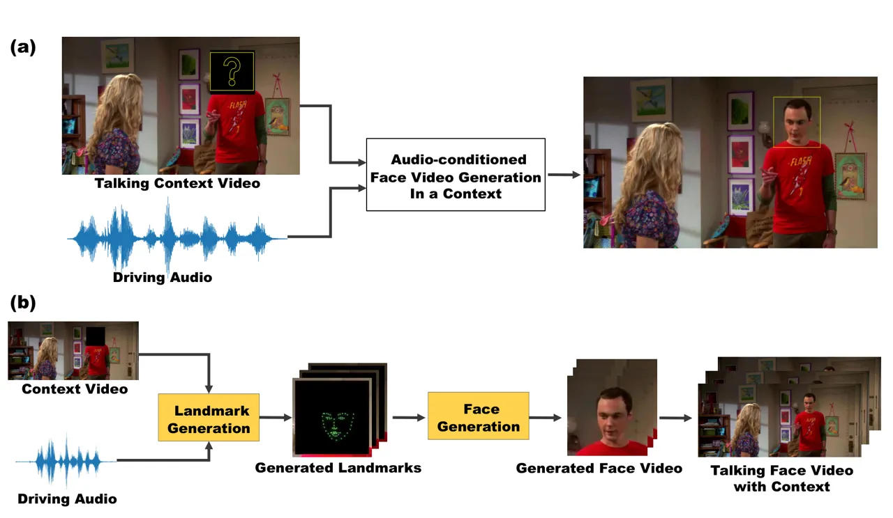
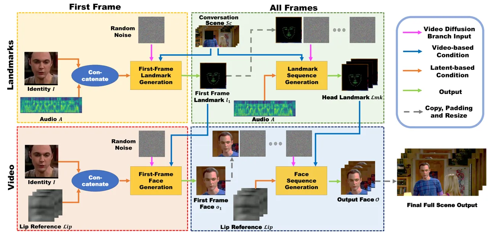
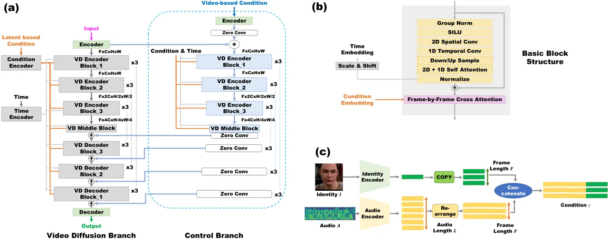
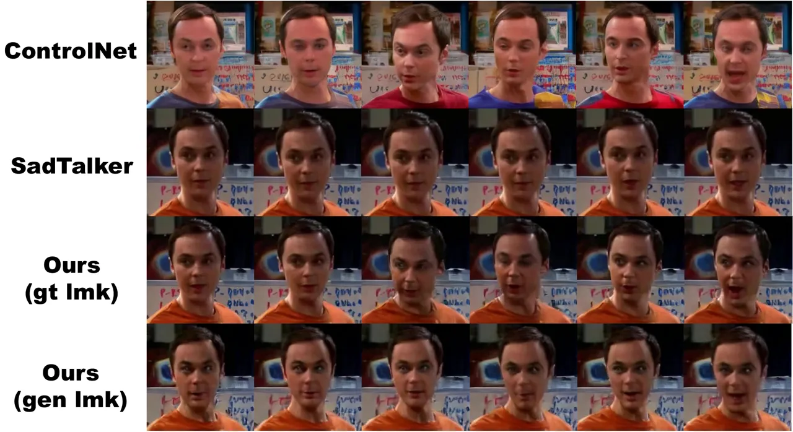
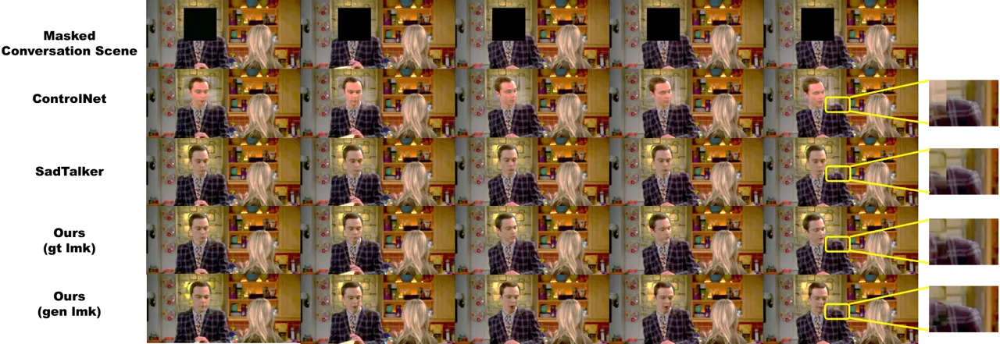
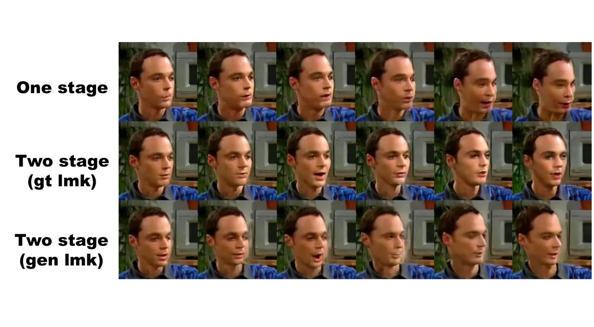
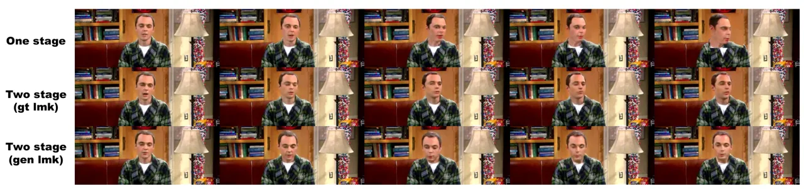

# Context-aware Talking Face Video Generation

Meidai Xuanyuan Affiliation:  xymd22@mails.tsinghua.edu.cn,    Yuwang
Wang Affiliation: {wang-yuwang, guohonglei, qhdai}@mail.tsinghua.edu.cn,
   Honglei Guo Affiliation: {wang-yuwang, guohonglei,
qhdai}@mail.tsinghua.edu.cn,    Qionghai DaiTsinghua University
Affiliation: {wang-yuwang, guohonglei, qhdai}@mail.tsinghua.edu.cn,

###### Abstract

In this paper, we consider a novel and practical case for talking face
video generation. Specifically, we focus on the scenarios involving
multi-people interactions, where the talking context, such as audience
or surroundings, is present. In these situations, the video generation
should take the context into consideration in order to generate video
content naturally aligned with driving audios and spatially coherent to
the context. To achieve this, we provide a two-stage and cross-modal
controllable video generation pipeline, taking facial landmarks as an
explicit and compact control signal to bridge the driving audio, talking
context and generated videos. Inside this pipeline, we devise a 3D video
diffusion model, allowing for efficient contort of both spatial
conditions (landmarks and context video), as well as audio condition for
temporally coherent generation. The experimental results verify the
advantage of the proposed method over other baselines in terms of
audio-video synchronization, video fidelity and frame consistency.

## 1 Introduction

Talking head video generation aims to create a harmonious and consistent
video conditioned on a given audio \[54, 58, 57, 42, 53\], which has
widely applications in the scenarios such as digital human creation and
virtual avatars, etc. Most of the previous works focused on the talking
head itself, without consideration of the audience and surroundings,
referred as talking context. In some application scenarios, we may
assume the audience talking to is in front or assigned, which is the
typical case previous works focusing on\[49, 41, 42, 53\]. In some other
application scenarios, for example, in the case of a video containing
both talking person and the audience, it is important to consider the
context when generating the talking head video, for example, the
generated talking head should be oriented towards the audience, making
the video more natural. It is necessary to consider the situations where
the context content is present, such as inpainting head region in a
video, interacting with the digital human, generating multi-person
video, etc.



Figure 1: (a) An illustration of our task setting. Given a context video
and a driving audio, the task is to generate harmonious and consistent
talking head video inside the masked region. (b) Our two-stage
generation pipeline. Facial landmarks are adopted as an intermediate
representation to enhance controllability.

Different from previous works, in this paper, we consider a novel and
interesting setting for talking head video generation, i.e., generating
conditioned on a context. Specifically, we propose a new setting as
shown in Figure 1, given a driving audio and a video where the head
region of target person is masked, serving as the context condition, the
task is to generate a talking head video inside the masked region. From
the perspective of context, this can also be regarded as video
generation in the region of human head when the audio is given.
Different from general video inpainting task, our setting focuses on
talking face content and the generated video should be consistent with
the driving audio.

To achieve audio conditioned talking face video generation given context
video, we need to generate talking head video that: $`(i)`$ well aligned
to the driving audio, not only in lip movements but also in facial
expressions and head pose, and $`(ii)`$ well aligned to the conversation
scene, which requires the model to understand scene semantics and
generate coherent faces. The above two requirements are highly related
to the landmarks of faces. With this observation, we devise a Two-stage
Cross-modal Control generation pipeline, named TCCP, adopting facial
landmarks as an explicit and compact intermediate representation to
bridge the driving audio, video context and generated face videos.
Specifically, in the first stage, the model focuses on understanding the
context and generate a spatially compact representation (facial
landmarks), transferring the implicit guidance from context into
explicit facial landmarks. In the second stage, the model puts more
efforts on the face video generation quality provided a video-level
explicit key points guidance as condition. Compared to an end2end
generation pipeline, our proposed TCCP explicitly models the key
feature, facial landmark, making the generalization more controllable,
promoting better temporal correlation with driving audio and spatial
coherent with context video. Meanwhile, due to the compact property of
facial landmarks, this design hold the potential for better
generalization across identifies. Inside TCCP, we propose a multimodal
controlled video generation network, named MVControlNet, which is a
diffusion-based video generation model taking multi-type of conditions
as input. Inspired by ControlNet \[52\], we design two branches inside
MVControlNet, one is a 3D content diffusion model with conditions
injected in the latent space\[37\], suitable for identity or audio
conditions, i.e., semantics or cross-modal data. Another branch is a
control branch receiving video-based conditions (such as landmarks,
sharing the same shape with diffusion noise input) for finegrained
spatial control.

In this paper, since there is no suitable existing dataset, we consider
a practical talking scenario, videos from TV shows, which contain
plentiful and diverse interaction between the talking person and
context. We collected a dataset from _The Big Bang Theory_ containing
5.92 hours of talking videos of Sheldon, who is one of the main
characters and has longest talking videos. In this paper, we focus on
studying how to leverage the visual context and audio control signal to
achieve visually natural and cross-modal consistent talking face videos.
Due to the data and computing resource limitation, we narrow down to
personal talking video generation for Sheldon. Our intermediate compact
landmark representation is designed for generalization.
ControlNet \[52\] has demonstrated the effectiveness of using
landmark-like spatial control single for image generation cross
identities. Further, the generalization to other faces can be achieved
by pretraining on a large-scale talking face dataset, then finetuning on
a specific personal data, which has been verified in the previous face
editing work \[13\].

To verify the effectiveness of the proposed method, we conduct both
objective and subjective experiments to evaluate the generated video in
terms of audio-visual synchronization, video fidelity and frame
consistency. Since we consider a new setting, we build several baselines
based on some popular talking head methods and video generation
techniques\[17\]. Our proposed TCCP surpasses the baselines and achieves
high quality audio conditioned talking face video generation in a
context.

Our main contributions can be summarised as follows:

- •
  We introduce an interesting, practical and novel setting for talking
  face video generation: taking the talking context into consideration.
- •
  We devise a two-stage cross-modal control video generation pipeline to
  achieve audio conditioned talking face video generation in a context.
- •
  We provide a MVControlNet to efficiently generate videos or facial
  landmarks with driving audio and context video conditions.
- •
  We verify the effectiveness of the proposed method by comparing it
  with several baselines based on SOTA talking head or video generation
  techniques.

## 2 Related Work

Conditional Video Generation. Conditional video generation synthesizes a
video guided by the given conditions, usually in the form of text
description. Based on the remarkable results of text-to-image diffusion
models, many works utilize pretrained T2I model and extend to video
generation by finetuning\[43, 56, 55, 36, 31, 25, 22\]. Multiple
techniques for improving time consistency are suggested, including
adding in temporal attention layers\[55\] or 3D convolution blocks\[43,
56\]. By adding in ControlNet structure, video generation can be also
guided by depth maps or pose sequences\[10, 55, 36, 31\]. Some works
bridge the diffusion process between modalities and can synthesize
videos according to audio clips\[39, 5\]. However, compared to our
explicit facial landmarks, the conditions are relatively less strict and
the generated contents are less controllable.

Audio-driven Talking Head Synthesis. Despite the works\[39, 5\]
mentioned above, talking head synthesis also aims to generate talking
videos with lip movements synchronized with the audio condition. The
existing methods can be roughly divided into two groups: 2D-based
methods and 3D-based methods. 2D-based methods usually utilize GANs\[14,
11, 34, 58\] to learn lip-audio synchronization. However, due to the
instability of GANS, the generated videos tend to be of limited image
quality as well as relatively low resolution\[12\]. More recently,
3D-based methods\[44, 46, 28, 41\] employ 3D Morphable Models\[7\] or
Neural radiance fields\[32\] for parameterized modeling. While greatly
improving visual quality, most of these methods are difficult to
generalize across different identities. Moreover, works dealing with
talking head synthesis mainly focus on the quality of generated lip
motions, while lacking head pose diversity and facial details like eye
movements or facial expressions. The impact of the conversation context,
is also out of consideration.

Video-to-Video Synthesis. Like conditional video generation, many
video-to-video translation models are built on the basis of image
synthesis architecture. Fu et al.\[17\] introduces the language-based
video editing task which translates from video to video following
textual instructions. In this field, Gen-1\[16\] and FateZero\[35\]
utilize pretrained text-to-image diffusion model and edit the target
object continuously by adding temporal attention. Video-P2P\[26\] and
VideoControlNet\[23\] choose to perform frame-by-frame translation, then
reform the video through cross frame attention or temporal
interpolation. StableVideo\[9\] employs pretrained NLA model\[29\] for
text-guided appearance transfer, and keeps appearance consistency by
introducing temporal dependency constraints. Restricted by relatively
high dimension, most existing models mainly focus on editing the whole
video scene or major object generally, lacking support for fine-grained
video manipulation. Also, the translation is mainly guided by given
conditions rather than an understanding of video semantic.

Conditional Image Manipulation. Some previous works utilized generative
adversarial networks (GANs) to perform such image manipulations\[18, 24,
1, 2, 47, 33\]. Other deep techniques have also been applied to image
editing\[15, 6, 51\], and can follow multi-modal conditions like pose
skeletons or canny edges. More recently, with the improvement in
diffusion-based text-to-image synthesis quality, pretrained diffusion
models have achieved remarkable results. Given background mask and text
prompt, Imagen Editor\[48\] and Blended Diffusion\[3\] can modify the
masked area without affecting the unmasked regions, on the basis of
CLIP-guided diffusion for text semantic understanding. Some works\[50\]
make use of multi-modal conditions other than text, and ControlNet\[52\]
introduces an architecture for adding in self-designed conditional
control. There are also works that discard text prompts entirely and
repaint only guided by background mask\[30\]. Although the conditional
image editing techniques mentioned above can perform detailed image
manipulation, they heavily rely on the given conditions for image
understanding and task comprehension. Also, constrained by modality,
these models require extra modifications to input time-continuous
conditions like audio or pose sequence.

## 3 Preliminary: Latent Diffusion & ControlNet



Figure 2: TCCP pipeline. Rows referring to pipeline stages: taking head
facial landmark $`\mathcal{L}mk`$ generation and coherent talking face
video $`\mathcal{O}`$ generation. Columns referring to temporal steps:
First Frame and All Frames. Each step is built on MVControlNet, a
two-branch diffusion-based model. The video diffusion branch takes in
Video Diffusion Branch Input and Latent Based Condition. The control
branch takes in Video-based Condition. Different types of inputs/outputs
are marked by arrows in different colors.

The forward process of Denoising Diffusion Probabilistic models
(DDPMs)\[20\] is performed over a discrete $`T`$ time step. Given
$`x_{0}`$ as an input sample from input distribution $`p(x)`$, and
$`x_{T}`$ is sampled from a unit Gaussian independent from $`x_{0}`$
utilizing the Markovian forward process, then the diffusion forward
process can be defines as:

```math
q(x_{t}|x_{t-1})=\mathcal{N}(x_{t};\sqrt{1-\beta_{t}}x_{t-1},\beta_{t}I). \tag{1}
```

```math
q(x_{1:T}|x_{0})=\prod_{t=1}^{T}q(x_{t}|x_{t-1}). \tag{2}
```

Here $`t\in[1,T]`$, and $`\beta_{0},\beta_{1},\dots,\beta_{T}`$ are
predefined variance schedule sequences. Following previous works\[20,
45\], we increase $`\beta_{t}`$ using linear noise schedule. The forward
process depicts a gradual diffusion schedule in which a noise depending
on variance $`\beta_{t}`$ is added to $`x_{t-1}`$ to get $`x_{t}`$ every
time step and finally reaches $`x_{T}`$. The goal of diffusion model is
to reverse diffusion process and recover $`x_{0}`$ from $`x_{T}`$, such
reverse process can be formulated as:

```math
p(x_{t-1}|x_{t})=\mathcal{N}(x_{t-1};\mu_{\theta}(x_{t},t),\Sigma_{\theta}(x_{t},t)). \tag{3}
```

```math
p_{\theta}(x_{0:T})=p(x_{T})\prod_{t=1}^{T}p(x_{t-1}|x_{t}). \tag{4}
```

Here $`\mu_{\theta}`$ refers to the Gaussian mean value predicted by
model $`\theta`$, $`x_{T}`$ is a given random noise, and the variance
$`\Sigma_{\theta}(x_{t},t)`$ is fixed in our experiments as it only
leads to minor improvement\[4\]. The model can be then denoted as a
denoising model $`\epsilon_{\theta}(x_{t},t)`$, and is trained to
predict the noise of $`x_{t}`$. The noise prediction loss can be defined
as:

```math
min_{\theta}||\epsilon-\epsilon_{\theta}(x_{t},t,c_{l})||_{2}^{2}, \tag{5}
```

where $`\epsilon`$ is the actual noise added to $`x_{t}`$, and $`c_{l}`$
refers to latent conditions like audio or lip reference. So the model
learns to predict the noise of $`x_{t}`$ conditioned on $`c_{l}`$ at
time step $`t`$.

Due to the relatively high dimension of videos, we employ an
auto-encoder $`\mathcal{E}`$ to compress input $`x`$ into latent code
$`z`$ following Latent Diffusion\[37\]. The model then learns to denoise
in latent space, and reconstructs latent code $`z_{0}`$ during
inference. A pretrained decoder $`\mathcal{D}`$ is utilized to obtain
the generated output as $`x_{0}=\mathcal{D}(z_{0})`$.

To learn from additional task-specific semantic conditions like masked
scene or facial landmark, we follow ControlNet\[52\] to add a control
branch to diffusion model. The architecture of ControlNet enables
finetuning generative diffusion model on additional conditions quickly
by utilizing trainable layers copied from the original model. This added
condition should be of the same shape with $`x_{t}`$. In our video
generation task, given the additional video semantic condition
$`c_{v}`$, the noise prediction loss can be re-defined as:

```math
min_{\theta}||\epsilon-\epsilon_{\theta}(x_{t},t,c_{l},c_{v})||_{2}^{2}. \tag{6}
```

In our video-to-video synthesis task, both the input $`x`$ and condition
$`c,c_{s}`$ are in the form of N-frame sequences. Thus, additional
temporal layers are added to ensure frame consistency and temporal
in-context comprehension.

## 4 Contextual Talking Face Video Generation

### 4.1 Task Formulation

We study the audio conditioned in-context talking head generation task,
given a driving audio $`\mathcal{A}`$ of speaker $`\mathcal{I}`$, a
context video $`\mathcal{S}c`$ where the head region of talking person
is masked, the target is to generate a target video $`\mathcal{O}`$,
which fills the talking person head region. The main objective of our
task is that the generated video $`\mathcal{O}`$ should be: $`(i)`$ well
aligned to the driving audio $`\mathcal{A}`$, not only in lip movements
but also in facial expressions and head poses, and $`(ii)`$ spatially
reasonable to the context $`\mathcal{S}c`$, such as oriented to the
audience, coherent with gesture, etc. The $`\mathcal{S}c`$ contains
$`N`$ frames, denoted as $`\{s_{c1},\dots,s_{cN}\}`$. The generated
$`\mathcal{O}`$ should also contain $`N`$ frames
$`\{o_{1},\dots,o_{N}\}`$. The driven audio $`\mathcal{A}`$ is first
transformed into mel spectrograms, resulting in acoustic features
$`\mathcal{A}=\{a_{1},\dots,a_{L}\}`$, where $`L`$ is the length of
acoustic feature. Identity $`\mathcal{I}`$ can be a randomly selected
picture depicting the target identity.



Figure 3: Model Architecture of multimodal controlled video generation
network (MVControlNet). (a) The overall model architecture, consisting
of two model branches. The Video Diffusion Branch predicts the diffusion
noise added to the input at time step $`t`$ under the latent-based
condition $`c_{l}`$. The Control Branch is a trainable copy of the video
diffusion branch, which is used to add video-based condition $`c_{v}`$
to the video diffusion branch by zero convolution layer. (b) A detailed
demonstration of Video Diffusion Block. 1D temporal convolutions and
temporal self attention are stacked after spatial layers to enforce
spatial-temporal coherence. (c) A brief illustration of encoding of
latent-based condition $`c_{l}`$. Conditions of multiple modalities will
be encoded separately, and then concatenated by frame.

### 4.2 TCCP: Two-stage Cross-modal Control generation Pipeline

As mentioned before, we utilize the facial landmarks as an explicit and
compact intermediate representation, denoted as
$`\mathcal{L}mk=\{l_{1},\dots,l_{N}\}`$ for $`N`$ frames, which has the
same shape of $`\mathcal{O}`$. The main generation pipeline is shown in
Figure. 2. We divide the generation pipeline into two stages: taking
head facial landmark $`\mathcal{L}mk`$ generation and coherent talking
face video $`\mathcal{O}`$ generation, shown in the first row and second
row in Figure. 2, respectively. In a temporal dimension, the pipeline
can be divided into two step, First Frame and All Frames shown in
Figure. 2 as first column and second column, respectively. Since we do
not assume the first frame is provided, the First Frame case generates
the first image and the related landmarks, which can be regarded as a
special case of All Frames.

In each step, at the heart, there is the proposed MVControlNet, which
takes three inputs: Video Diffusion Branch Input, Video-based Condition
and Latent Based Condition. The four MVControlNet can be regarded as
different variants according to the content difference in terms of the
input and output. Our MVControlNet is a two-branch diffusion-based
model. The first branch is a video diffusion branch, generating video
contents, such as the landmarks $`\mathcal{L}mk`$ or the generated video
$`\mathcal{O}`$. This branch takes audios and identity as condition,
which is injected in the latent space, denoted as latent-based condition
$`c_{l}`$. The second branch is a control branch, which takes
video-based control signal as input, which is injected to the video
diffusion branch in ControlNet-like way, denoted as video-based
condition $`c_{v}`$.

Talking head landmark generation refers to the upper two blocks in
Figure 2 and can be further divided into two temporal steps: first-frame
landmark generation and landmark sequence generation. The target of this
stage is to generate facial landmarks well aligned with driven audio and
context video. Driven by this main purpose, this stage takes in
head-masked conversation scene video $`\mathcal{S}c`$ as video-based
condition $`c_{v}`$, and takes driving audio $`\mathcal{A}`$ as the
latent-based condition $`c_{l}`$. The first step of the stage
(first-frame landmark generation) additionally takes identity
$`\mathcal{I}`$ as condition to guide facial shape generation. Then the
output of the first step (the generated frame landmark $`l_{1}`$) will
be utilized as the first frame condition for the next step. The second
step of the stage (landmark sequence generation) generates several
frames of coherent landmarks conditioned on given first frame. The final
model output of this stage is the diffusion noise
$`\epsilon_{\theta}(x_{t},t,c_{l},c_{v})`$ added to a landmark sequence,
and $`\mathcal{L}mk`$ can be obtained through DDPM.

Coherent talking face generation refers to the bottom blocks in
Figure 2. The procedure of face generation stage is the same as the
former landmark generation stage, in which the initial face frame will
be generated first, followed by subsequent face sequence generation.
This stage fills in face details like eye movements, facial expressions
and appearances, ensuring that all these generated features are coherent
with conversation scene context. Talking head landmark sequence
$`\mathcal{L}mk`$ is utilized as video-based condition $`c_{v}`$, and
lip sequence $`\mathcal{L}ip`$ as well as identity $`\mathcal{I}`$ are
employed as latent-based conditions $`c_{l}`$ to guide lip/face shape
generation. Similarly, the first frame face $`o_{1}`$ is generated in
the first step and used as initial frame condition in the following face
sequence generation step. The final output of this stage is the
diffusion noise $`\epsilon_{\theta}(x_{t},t,c_{l},c_{v})`$ added to a
face sequence, and through DDPM a face video $`\mathcal{O}`$ can be
obtained. With simple resizing and relocating, the generated face video
can be filled into the original conversation scene, giving a complete,
reasonable and coherent talking video.

### 4.3 MVControlNet

The Video Diffusion Branch uses U-Net as model structure, taking in
encoded noise sequences $`x_{t}`$ as input and outputs predicted noise
$`\epsilon_{\theta}(x_{t},t,c_{l},c_{v})`$, under additional conditions
$`c_{l}`$ and $`c_{v}`$. VD Encoder/Decoder/Middle Block is composed of
multiple basic blocks, which is a spatial-temporal resnet block and is
depicted in details in Figure 3(b) . There are two main architecture
modifications compared to image diffusion models: $`(i)`$ 1D temporal
convolutions are stacked after 2D spatial convolutions. We decompose the
spatial and temporal dimensions following Ho et al.\[21\] to avoid using
heavy 3D convolutions while still adding temporal comprehension.
$`(ii)`$ Similarly, temporal self attention is blocked after spatial
self attention, to enforce spatial-temporal coherence.

Furthermore, the latent-based condition $`c_{l}`$ here is not restricted
to a single form but can be a combination of acoustic feature, facial
feature, lip reference or identity reference. As shown in Figure. 3(c),
all these multimodal conditions will be encoded and concatenated frame
by frame, which means the final condition code $`c_{l}`$ and input
$`x_{t}`$ are of the same length in temporal dimension. Then cross
attention between condition $`c_{l}=\{c_{l1},\dots,c_{lN}\}`$ and input
$`x_{t}=\{x_{t1},\dots,x_{tN}\}`$ can be calculated frame by frame. The
cross attention of frame $`i`$ can be formulated as:

```math
CrossAtt(x_{ti},c_{li})=Softmax(\frac{Q_{i}^{x}(K_{i}^{c})^{T}}{\sqrt{d}})V_{i}^{c}. \tag{7}
```

where $`Q_{i}^{x}=W_{Q}f(x_{ti})`$, $`K_{i}^{c}=W_{K}f(c_{li})`$,
$`V_{i}^{c}=W_{V}f(c_{li})`$, and $`f(\cdot)`$ refers to flatten
operation to 1 dimension. The cross attention is performed frame by
frame to enforce understanding of corresponding temporal relation
between input and latent-based conditions. Then the output is rearranged
and concatenated in temporal dimension.

The Control Branch is a copy of the video diffusion branch, sharing
identical model architecture. The control branch takes video-based
condition $`c_{v}`$ as input, and the encoded $`c_{v}`$ will be added to
the encoded noise input $`x_{t}`$ by zero convolution layer. The output
of the control branch will be passed back to corresponding layer of the
video diffusion branch through zero convolution layer. To speed up
training process, the video diffusion branch can be reused, while the
control branch has to be finetuned if given different types of
video-based conditions.

### 4.4 Training and Inference with First-frame Conditioning

Following previous video generation works \[10\], we utilize first-frame
conditioning technique instead of generating the whole sequences to
enable efficient training and recurrent inference of longer videos. This
frees model from memorizing video content in the training set, so that
the model can focus on reconstructing motion rather than the full frame.
As depicted in Figure 2 All Frames column, we do not add noise to the
first-frame input $`v_{1}`$ (which can also be specifically denoted as
landmark $`l_{1}`$ or face $`o_{1}`$ in different task stages), so the
model learns to generate subsequent frames based on $`x_{1}`$, guided by
other conditions $`c_{l}`$, $`c_{v}`$ and time step $`t`$, and the loss
function can be formulated as:

```math
min_{\theta}||\epsilon-\epsilon_{\theta}(x_{t},t,c_{l},c_{v},\mathcal{E}(v_{1}))||_{2}^{2}. \tag{8}
```

Here $`\mathcal{\epsilon}(v_{1})`$ refers to the latent code of
first-frame input $`v_{1}`$. Utilizing the first-frame conditioning
strategy, our model can make effective use of content from the first
frame and better understand the motion guidance from the conditions.
Furthermore, during inference, by conditioning on previously generated
frames as the initial frame in subsequent iterations, our model can
generate longer videos in an auto-regressive way.

Specifically, we separate first frame generation and subsequent sequence
generation into two steps. During training, the model learns to first
generate initial frame $`v_{1}`$, and this generated initial frame is
used for subsequent sequence generation training auto-regressively. The
model architecture of these two steps is similar. During inference, we
generate the initial frame $`v_{1}`$ given Gaussian noise in the form of
a single frame $`x_{1}`$, then following frames are generated
conditioned on $`\mathcal{E}(v_{1})`$ as described in Eq 8.

## 5 Experiments

### 5.1 Experimental Setup

Dataset. We base our experiments on talking videos collected from a TV
series _The BigBang Theory_, for diverse conversation context and
sufficient personalized data. Face detector\[27\] is applied to detect
and crop out talking faces, then facial landmarks are extracted\[8\] as
groundtruth of the first stage and video-based conditions of the second
stage. Corresponding audios can be directly obtained from the video
clips and used to drive pre-trained Wav2Lip\[34\] for lip references. As
we focus on personalized model, we only collect data for the main
character _Sheldon_. The final dataset consists of about 66k data
sequences, 8 frames long each.

Evaluation Metric. We adopt the following metrics:

- •
  SyncNet confidence score\[34\]: The SyncNet score evaluates lip
  synchronization and mouth shape quality, and can partly check
  audio-visual synchronization quality.
- •
  FID\[19, 40\]: Frechet Inception Distance is employed to evaluate
  visual fidelity. We calculate this metric on both generated faces and
  on the whole conversation scene, to check model’s comprehension on
  overall talking context.
- •
  Frame Consistency: Following previous works\[16, 35\], we compute CLIP
  image embeddings on all frames of output videos and report the average
  cosine similarity between consecutive frames. This metric measures
  semantic coherence.

Baselines. Since we are introducing a brand new task, there is no
existing baselines. We consider approximating our task using two types
of works: $`(i)`$ Scene context guided image generation, which can be
trained to understand spatial context conditions but lack timing
mechanism; $`(ii)`$ Talking head synthesis, which can generate talking
videos with lip movements synchronized with the driving audio. We adopt
the following baselines:

- •
  ControlNet\[52\]: ControlNet introduces an architecture for adding in
  self-designed conditional control into a pre-trained diffusion model.
  We employ this network architecture and finetune the pre-trained
  Stable Diffusion Model v1.5\[38\] to generate face images guided by
  given conversation scene and facial landmarks. The model is trained
  for 230k steps under default parameter setting. And the training data
  is kept same with that used in our TCCP, only split from sequences to
  single images due to lack of timing mechanism in original Stable
  Diffusion Model. As ControlNet can’t be driven by audio, during
  inference, we directly employ groundtruth face landmarks as
  video-based conditions and generate frame by frame following
  $`M^{3}L`$\[17\].
- •
  SadTalker\[53\]: SadTalker is a talking head generation model that
  creates natural lip motions well synchronized with driven audio. We
  run the model with deriven audio and groundtruth initial face frame.

Implementation Details. For the Video Diffusion U-Net, we set 3 scales
of Video Diffusion Blocks, and each is stacked by 2 basic blocks and 1
down/up-sample block. Self attention and frame-by-frame cross attention
are applied on all U-net scales. For all experiments, we follow previous
works\[20, 45\] to use a linear noise schedule and the diffusion step
number $`T`$ is set to 1000. The input/output sequence length
$`\mathcal{N}`$ is set as 8. And the downsampling factor for Latent
Diffusion auto-encoder $`\mathcal{E}`$ is set as 16. Adam is adopted to
optimize through our model with learning rate 2e-4. All experiments are
carried out on 8 NVIDIA 3090Ti GPUs. As for audios, they are processed
to 16kHz and transformed to mel spectrograms with the same setting as
Wav2lip\[34\]. Details of model architecture and training configuration
can refer to supplementary materials.

### 5.2 Quantitative Results

| Model         | Sync. score $`\uparrow`$ | FID(Face) $`\downarrow`$ | FID(FullScene) $`\downarrow`$ | F.C. $`\uparrow`$ |
| ------------- | ------------------------ | ------------------------ | ----------------------------- | ----------------- |
| GT Samples    | 3.11                     | 28.65                    | 22.13                         | 0.989             |
| ControlNet    | 1.89                     | 131.28                   | 45.60                         | 0.979             |
| SadTalker     | 2.95                     | 75.16                    | 36.63                         | 0.996             |
| Ours(gt lmk)  | 2.99                     | 68.05                    | 26.42                         | 0.988             |
| Ours(gen lmk) | 2.76                     | 72.26                    | 27.06                         | 0.986             |

Table 1: Comparison of quantitative results with baselines. F.C. denotes
Frame Consistency. The best performed other than groundtruth is
highlighted in bold.

Table 1 demonstrates the quantitative testing results compared between
the baselines and our MVControlNet. All models are tested for same
talking scenarios, and we employ our model under two strategies. Ours(gt
lmk) refers to inference of the second stage (only Face Video Generation
Stage) given groundtruth facial landmarks, totally aligned with
ControlNet experimental settings. Ours(gen lmk) refers to inference of
the full pipeline, starting from First Frame facial landmark generation,
requiring the model to read the scene context and synchronize with
driving audio.

Even though ControlNet is powerful in image-to-image translation, the
deficiency in temporal context understanding severely impacts output
video quality. SadTalker, on the contrary, displays superior
audio-visual synchronization ability but still not performs well in FID
score. It is more obvious when considering FID (full scene), as the gap
between SadTalker and our model is enlarged. This demonstrates that the
absence of scene comprehension in model has a negative impact on
generated video quality, especially in the context of full talking
scenario. As for Frame Consistency, this metric evaluates perceptual
consistency more over pixel-level visual consistency, thus all models
score high on this metric. Since the head pose generated by SadTalker
lacks diversity compared with groundtruth and our model, it ranks
highest in Frame Consistency as all frames demonstrate high similarity.

Our model performs well on all these metrics, and achieves high quality
audio conditioned talking face video generation in a context. Model
guided by groundtruth landmarks performs best considering audio-visual
synchronization and visual quality, demonstrating outstanding ability in
utilizing multimodal conditions and understanding spatial-temporal
context. Even under more difficult setting, i.e., the videos driven by
generated landmarks still achieve relatively high score in all metrics,
and outperform baselines in scene context comprehension.

### 5.3 Qualitative Results



Figure 4: We compare our work with baselines in face generation quality.
Our model can generate harmonious and consistent talking face with vivid
facial expressions and diverse head poses.



Figure 5: We compare our work with baselines considering full
conversation scene quality. Scene details are given in the right column,
and inconsistency can be observed near the shoulder in results generated
by ControlNet and SadTalker.

Our model can generate harmonious and consistent talking face with vivid
facial expressions and diverse head poses. Figure 4 depicts the
generated face videos compared with baselines. As ControlNet can only
perform image-to-image translation, the resulting faces are incoherent
in temporal dimension and keeps changing in character’s clothes and
hairstyle. SadTalker, however, gives fairly coherent results but lacks
diversity. The generated heads stay relatively still and the character’s
eyesight and facial expressions seem unchanged. On the contrary, our
model, demonstrates greater diversity in providing various head poses,
facial expressions and vivid eye movements, while still maintaining high
temporal consistency.

Our model has stronger understanding of talking context and better fits
in the conversation scene. We also give examples of the final
conversation scene outputs to check model’s ability in fitting back to
the full scenarios. As shown in Figure 5, ControlNet and SadTalker fail
in giving spatial coherent results. An obvious inconsistency can be
observed near the shoulder, as depicted in the right column of Figure 5.
Contrarily, our model, no matter using groundtruth landmarks or
generated landmarks, outperforms in generating faces that better fit the
full scene.

### 5.4 User Study

| Model      | Naturalness(Face) | Naturalness(Full Scene) |
| ---------- | ----------------- | ----------------------- |
| ControlNet | 2.07              | 2.31                    |
| SadTalker  | 3.64              | 2.92                    |
| Ours       | 3.62              | 3.94                    |

Table 2: Results of user study.

32 participants were surveyed to evaluate the naturalness of the
generated videos using a rating scale ranging from 1 to 5. Specifically,
they were shown the generated face videos first and asked to score the
naturalness of face alone. After face scoring finished, the full
conversation scenarios were given , and the participants were asked to
judge the naturalness once again depending on the overall video quality.
The results are shown in Table 2, and are well aligned with quantitative
results. In terms of face quality, our model obtains almost the same
score as SadTalker. However, when considering full scene coherence, our
model significantly outperforms other models. This confirms our model’s
ability in scene context comprehension.

### 5.5 Ablation Study

Ablation of lip references. To check the effect of lip references
$`\mathcal{L}ip`$ in the generation of face videos, we abort this latent
condition during inference stage. This results in a degrading of about
0.3163 in SyncNet score, demonstrating the importance of latent
condition $`\mathcal{L}ip`$ in guiding exact lip movements. We suppose
the $`\mathcal{L}ip`$ can introduce more accurate temporally aligned
conditions for lip-audio synchronization.

Adding additional facial expression references. We also experiment on
training the face generation model giving extra latent conditions like
3D Morphable Models\[7\] to guide facial expression generation. There
resulting in no obvious perceptional improvement, but a slight increase
in SyncNet score by 0.157. It is beneficial to add other explicit facial
representations, but the landmarks has introduce most of information and
the gain of adding more extra types of input becomes minor.

Due to space limitations, we put more ablations in the supplementary
materials.

## 6 Conclusion

In this paper, we introduce an interesting and novel setting for talking
face video generation, which is taking the talking context into
consideration when the context content such as audience or surroundings
is provided. This setting is practical in applications such as face
video inpainting/editing, multi-people interaction video generation,
etc. In this paper, we focus on the video-inpainting-like scenario, and
the specific target is to generate a talking face video driven by a
given audio and a context video where the facial region is masked. To
achieve this target, we propose the TCCP, which is a two-stage
generation pipeline, first transfer the implicit conditions in the
context into explicit facial landmark sequence, and then generate the
talking face videos. We also devise the MVControlNet, which is a
multi-modal video generation diffusion model allowing for explicit
control condition. In this paper, the generated content is limited to
the head region, one may extend the region to whole body and generate
the whole person using similar technique proposed, and we leave it for
future work. Another limitation is only a single person result is
provided in this main paper due to the data and computation resource
limitation, even though our design, using the landmark as intermediate
representation, holds a good potential for generalization. We believe
this work has introduce a novel and practical setting to promote the
talking face generation towards broader application, and also has
provided solutions for the key problems introduced by the extra context
condition. All those can be a valuable attempt, inspiring further works
towards better solutions under the proposed setting.

## References

- \[1\] Rameen Abdal, Yipeng Qin, and Peter Wonka. Image2stylegan++: How
  to edit the embedded images? In _2020 IEEE/CVF Conference on Computer
  Vision and Pattern Recognition (CVPR)_, pages 8293–8302, 2020.
- \[2\] Yuval Alaluf, Or Patashnik, and Daniel Cohen-Or. Restyle: A
  residual-based stylegan encoder via iterative refinement. In _2021
  IEEE/CVF International Conference on Computer Vision (ICCV)_, pages
  6691–6700, 2021.
- \[3\] Omri Avrahami, Dani Lischinski, and Ohad Fried. Blended
  diffusion for text-driven editing of natural images. In _Proceedings
  of the IEEE/CVF Conference on Computer Vision and Pattern Recognition
  (CVPR)_, pages 18208–18218, 2022.
- \[4\] Fan Bao, Chongxuan Li, Jun Zhu, and Bo Zhang. Analytic-dpm: an
  analytic estimate of the optimal reverse variance in diffusion
  probabilistic models, 2022.
- \[5\] Fan Bao, Shen Nie, Kaiwen Xue, Chongxuan Li, Shi Pu, Yaole Wang,
  Gang Yue, Yue Cao, Hang Su, and Jun Zhu. One transformer fits all
  distributions in multi-modal diffusion at scale. In _Proceedings of
  the 40th International Conference on Machine Learning_, pages
  1692–1717. PMLR, 2023.
- \[6\] Omer Bar-Tal, Dolev Ofri-Amar, Rafail Fridman, Yoni Kasten, and
  Tali Dekel. Text2live: Text-driven layered image and video editing. In
  _Computer Vision – ECCV 2022_, pages 707–723, Cham, 2022. Springer
  Nature Switzerland.
- \[7\] Volker Blanz and Thomas Vetter. _A Morphable Model For The
  Synthesis Of 3D Faces_. Association for Computing Machinery, New York,
  NY, USA, 1 edition, 2023.
- \[8\] Adrian Bulat and Georgios Tzimiropoulos. How far are we from
  solving the 2d & 3d face alignment problem? (and a dataset of 230,000
  3d facial landmarks). In _International Conference on Computer
  Vision_, 2017.
- \[9\] Wenhao Chai, Xun Guo, Gaoang Wang, and Yan Lu. Stablevideo:
  Text-driven consistency-aware diffusion video editing. In _Proceedings
  of the IEEE/CVF International Conference on Computer Vision (ICCV)_,
  pages 23040–23050, 2023.
- \[10\] Weifeng Chen, Jie Wu, Pan Xie, Hefeng Wu, Jiashi Li, Xin Xia,
  Xuefeng Xiao, and Liang Lin. Control-a-video: Controllable
  text-to-video generation with diffusion models, 2023.
- \[11\] Dipanjan Das, Sandika Biswas, Sanjana Sinha, and Brojeshwar
  Bhowmick. Speech-driven facial animation using cascaded gans for
  learning of motion and texture. In _Computer Vision – ECCV 2020_,
  pages 408–424, Cham, 2020. Springer International Publishing.
- \[12\] Prafulla Dhariwal and Alexander Nichol. Diffusion models beat
  gans on image synthesis. In _Advances in Neural Information Processing
  Systems_, pages 8780–8794. Curran Associates, Inc., 2021.
- \[13\] Zheng Ding, Xuaner Zhang, Zhihao Xia, Lars Jebe, Zhuowen Tu,
  and Xiuming Zhang. Diffusionrig: Learning personalized priors for
  facial appearance editing. In _Proceedings of the IEEE/CVF Conference
  on Computer Vision and Pattern Recognition_, pages 12736–12746, 2023.
- \[14\] Michail Christos Doukas, Stefanos Zafeiriou, and Viktoriia
  Sharmanska. Headgan: One-shot neural head synthesis and editing, 2021.
- \[15\] Patrick Esser, Robin Rombach, and Bjorn Ommer. Taming
  transformers for high-resolution image synthesis. In _Proceedings of
  the IEEE/CVF Conference on Computer Vision and Pattern Recognition
  (CVPR)_, pages 12873–12883, 2021.
- \[16\] Patrick Esser, Johnathan Chiu, Parmida Atighehchian, Jonathan
  Granskog, and Anastasis Germanidis. Structure and content-guided video
  synthesis with diffusion models, 2023.
- \[17\] Tsu-Jui Fu, Xin Eric Wang, Scott T. Grafton, Miguel P.
  Eckstein, and William Yang Wang. M3l: Language-based video editing via
  multi-modal multi-level transformers. In _Proceedings of the IEEE/CVF
  Conference on Computer Vision and Pattern Recognition (CVPR)_, pages
  10513–10522, 2022.
- \[18\] Erik Härkönen, Aaron Hertzmann, Jaakko Lehtinen, and Sylvain
  Paris. Ganspace: Discovering interpretable gan controls. In _Advances
  in Neural Information Processing Systems_, pages 9841–9850. Curran
  Associates, Inc., 2020.
- \[19\] Martin Heusel, Hubert Ramsauer, Thomas Unterthiner, Bernhard
  Nessler, and Sepp Hochreiter. Gans trained by a two time-scale update
  rule converge to a local nash equilibrium, 2018.
- \[20\] Jonathan Ho, Ajay Jain, and Pieter Abbeel. Denoising diffusion
  probabilistic models. In _Advances in Neural Information Processing
  Systems_, pages 6840–6851. Curran Associates, Inc., 2020.
- \[21\] Jonathan Ho, Tim Salimans, Alexey Gritsenko, William Chan,
  Mohammad Norouzi, and David J Fleet. Video diffusion models.
  _arXiv:2204.03458_, 2022.
- \[22\] Wenyi Hong, Ming Ding, Wendi Zheng, Xinghan Liu, and Jie Tang.
  Cogvideo: Large-scale pretraining for text-to-video generation via
  transformers, 2022.
- \[23\] Zhihao Hu and Dong Xu. Videocontrolnet: A motion-guided
  video-to-video translation framework by using diffusion model with
  controlnet, 2023.
- \[24\] Oran Lang, Yossi Gandelsman, Michal Yarom, Yoav Wald, Gal
  Elidan, Avinatan Hassidim, William T. Freeman, Phillip Isola, Amir
  Globerson, Michal Irani, and Inbar Mosseri. Explaining in style:
  Training a gan to explain a classifier in stylespace. In _2021
  IEEE/CVF International Conference on Computer Vision (ICCV)_, pages
  673–682, 2021.
- \[25\] Xin Li, Wenqing Chu, Ye Wu, Weihang Yuan, Fanglong Liu, Qi
  Zhang, Fu Li, Haocheng Feng, Errui Ding, and Jingdong Wang. Videogen:
  A reference-guided latent diffusion approach for high definition
  text-to-video generation, 2023.
- \[26\] Shaoteng Liu, Yuechen Zhang, Wenbo Li, Zhe Lin, and Jiaya Jia.
  Video-p2p: Video editing with cross-attention control, 2023.
- \[27\] Wei Liu, Dragomir Anguelov, Dumitru Erhan, Christian Szegedy,
  Scott Reed, Cheng-Yang Fu, and Alexander C. Berg. _SSD: Single Shot
  MultiBox Detector_, page 21–37. Springer International
  Publishing, 2016.
- \[28\] Xian Liu, Yinghao Xu, Qianyi Wu, Hang Zhou, Wayne Wu, and Bolei
  Zhou. Semantic-aware implicit neural audio-driven video portrait
  generation, 2022.
- \[29\] Erika Lu, Forrester Cole, Tali Dekel, Weidi Xie, Andrew
  Zisserman, David Salesin, William T Freeman, and Michael Rubinstein.
  Layered neural rendering for retiming people in video. In _SIGGRAPH
  Asia_, 2020.
- \[30\] Andreas Lugmayr, Martin Danelljan, Andres Romero, Fisher Yu,
  Radu Timofte, and Luc Van Gool. Repaint: Inpainting using denoising
  diffusion probabilistic models. In _Proceedings of the IEEE/CVF
  Conference on Computer Vision and Pattern Recognition (CVPR)_, pages
  11461–11471, 2022.
- \[31\] Yue Ma, Yingqing He, Xiaodong Cun, Xintao Wang, Ying Shan, Xiu
  Li, and Qifeng Chen. Follow your pose: Pose-guided text-to-video
  generation using pose-free videos, 2023.
- \[32\] Ben Mildenhall, Pratul P. Srinivasan, Matthew Tancik,
  Jonathan T. Barron, Ravi Ramamoorthi, and Ren Ng. Nerf: Representing
  scenes as neural radiance fields for view synthesis. In _Computer
  Vision – ECCV 2020_, pages 405–421, Cham, 2020. Springer International
  Publishing.
- \[33\] Minheng Ni, Xiaoming Li, and Wangmeng Zuo. NÜwa-lip:
  Language-guided image inpainting with defect-free vqgan. In _2023
  IEEE/CVF Conference on Computer Vision and Pattern Recognition
  (CVPR)_, pages 14183–14192, 2023.
- \[34\] K R Prajwal, Rudrabha Mukhopadhyay, Vinay P. Namboodiri, and
  C.V. Jawahar. A lip sync expert is all you need for speech to lip
  generation in the wild. In _Proceedings of the 28th ACM International
  Conference on Multimedia_. ACM, 2020.
- \[35\] Chenyang QI, Xiaodong Cun, Yong Zhang, Chenyang Lei, Xintao
  Wang, Ying Shan, and Qifeng Chen. Fatezero: Fusing attentions for
  zero-shot text-based video editing. In _Proceedings of the IEEE/CVF
  International Conference on Computer Vision (ICCV)_, pages
  15932–15942, 2023.
- \[36\] Bosheng Qin, Wentao Ye, Qifan Yu, Siliang Tang, and Yueting
  Zhuang. Dancing avatar: Pose and text-guided human motion videos
  synthesis with image diffusion model, 2023.
- \[37\] Aditya Ramesh, Prafulla Dhariwal, Alex Nichol, Casey Chu, and
  Mark Chen. Hierarchical text-conditional image generation with clip
  latents, 2022.
- \[38\] Robin Rombach, Andreas Blattmann, Dominik Lorenz, Patrick
  Esser, and Björn Ommer. High-resolution image synthesis with latent
  diffusion models. In _Proceedings of the IEEE/CVF Conference on
  Computer Vision and Pattern Recognition (CVPR)_, pages
  10684–10695, 2022.
- \[39\] Ludan Ruan, Yiyang Ma, Huan Yang, Huiguo He, Bei Liu, Jianlong
  Fu, Nicholas Jing Yuan, Qin Jin, and Baining Guo. Mm-diffusion:
  Learning multi-modal diffusion models for joint audio and video
  generation. In _Proceedings of the IEEE/CVF Conference on Computer
  Vision and Pattern Recognition (CVPR)_, pages 10219–10228, 2023.
- \[40\] Maximilian Seitzer. pytorch-fid: FID Score for PyTorch.
  [https://github.com/mseitzer/pytorch-fid](https://github.com/mseitzer/pytorch-fid), 2020.
  Version 0.3.0.
- \[41\] Shuai Shen, Wanhua Li, Zheng Zhu, Yueqi Duan, Jie Zhou, and
  Jiwen Lu. Learning dynamic facial radiance fields for few-shot talking
  head synthesis. In _Computer Vision – ECCV 2022_, pages 666–682,
  Cham, 2022. Springer Nature Switzerland.
- \[42\] Shuai Shen, Wenliang Zhao, Zibin Meng, Wanhua Li, Zheng Zhu,
  Jie Zhou, and Jiwen Lu. Difftalk: Crafting diffusion models for
  generalized audio-driven portraits animation. In _Proceedings of the
  IEEE/CVF Conference on Computer Vision and Pattern Recognition_, pages
  1982–1991, 2023.
- \[43\] Uriel Singer, Adam Polyak, Thomas Hayes, Xi Yin, Jie An,
  Songyang Zhang, Qiyuan Hu, Harry Yang, Oron Ashual, Oran Gafni, Devi
  Parikh, Sonal Gupta, and Yaniv Taigman. Make-a-video: Text-to-video
  generation without text-video data, 2022.
- \[44\] Linsen Song, Wayne Wu, Chen Qian, Ran He, and Chen Change Loy.
  Everybody’s talkin’: Let me talk as you want. _IEEE Transactions on
  Information Forensics and Security_, 17:585–598, 2022.
- \[45\] Yang Song, Jascha Sohl-Dickstein, Diederik P Kingma, Abhishek
  Kumar, Stefano Ermon, and Ben Poole. Score-based generative modeling
  through stochastic differential equations. In _International
  Conference on Learning Representations_, 2021.
- \[46\] Justus Thies, Mohamed Elgharib, Ayush Tewari, Christian
  Theobalt, and Matthias Nießner. Neural voice puppetry: Audio-driven
  facial reenactment, 2020.
- \[47\] Omer Tov, Yuval Alaluf, Yotam Nitzan, Or Patashnik, and Daniel
  Cohen-Or. Designing an encoder for stylegan image manipulation.
  _CoRR_, abs/2102.02766, 2021.
- \[48\] Su Wang, Chitwan Saharia, Ceslee Montgomery, Jordi Pont-Tuset,
  Shai Noy, Stefano Pellegrini, Yasumasa Onoe, Sarah Laszlo, David J.
  Fleet, Radu Soricut, Jason Baldridge, Mohammad Norouzi, Peter
  Anderson, and William Chan. Imagen editor and editbench: Advancing and
  evaluating text-guided image inpainting, 2023.
- \[49\] Ting-Chun Wang, Arun Mallya, and Ming-Yu Liu. One-shot
  free-view neural talking-head synthesis for video conferencing. In
  _2021 IEEE/CVF Conference on Computer Vision and Pattern Recognition
  (CVPR)_, pages 10034–10044, 2021.
- \[50\] Shaoan Xie, Zhifei Zhang, Zhe Lin, Tobias Hinz, and Kun Zhang.
  Smartbrush: Text and shape guided object inpainting with diffusion
  model. In _2023 IEEE/CVF Conference on Computer Vision and Pattern
  Recognition (CVPR)_, pages 22428–22437, 2023.
- \[51\] Yongsheng Yu, Dawei Du, Libo Zhang, and Tiejian Luo. Unbiased
  multi-modality guidance for image inpainting. In _Computer Vision –
  ECCV 2022_, pages 668–684, Cham, 2022. Springer Nature Switzerland.
- \[52\] Lvmin Zhang, Anyi Rao, and Maneesh Agrawala. Adding conditional
  control to text-to-image diffusion models. In _Proceedings of the
  IEEE/CVF International Conference on Computer Vision (ICCV)_, pages
  3836–3847, 2023a.
- \[53\] Wenxuan Zhang, Xiaodong Cun, Xuan Wang, Yong Zhang, Xi Shen, Yu
  Guo, Ying Shan, and Fei Wang. Sadtalker: Learning realistic 3d motion
  coefficients for stylized audio-driven single image talking face
  animation. In _Proceedings of the IEEE/CVF Conference on Computer
  Vision and Pattern Recognition_, pages 8652–8661, 2023b.
- \[54\] Xi Zhang, Xiaolin Wu, Xinliang Zhai, Xianye Ben, and Chengjie
  Tu. Davd-net: Deep audio-aided video decompression of talking heads.
  In _Proceedings of the IEEE/CVF Conference on Computer Vision and
  Pattern Recognition_, pages 12335–12344, 2020.
- \[55\] Yabo Zhang, Yuxiang Wei, Dongsheng Jiang, Xiaopeng Zhang,
  Wangmeng Zuo, and Qi Tian. Controlvideo: Training-free controllable
  text-to-video generation, 2023c.
- \[56\] Daquan Zhou, Weimin Wang, Hanshu Yan, Weiwei Lv, Yizhe Zhu, and
  Jiashi Feng. Magicvideo: Efficient video generation with latent
  diffusion models, 2023.
- \[57\] Hang Zhou, Yasheng Sun, Wayne Wu, Chen Change Loy, Xiaogang
  Wang, and Ziwei Liu. Pose-controllable talking face generation by
  implicitly modularized audio-visual representation. In _Proceedings of
  the IEEE/CVF conference on computer vision and pattern recognition_,
  pages 4176–4186, 2021.
- \[58\] Yang Zhou, Xintong Han, Eli Shechtman, Jose Echevarria,
  Evangelos Kalogerakis, and Dingzeyu Li. Makelttalk: speaker-aware
  talking-head animation. _ACM Transactions On Graphics (TOG)_,
  39(6):1–15, 2020.

Supplementary Material

## A Algorithm Details

In this section, we introduce the implementation details of
Architecture, Diffusion Process, Training Settings of Two-stage
Cross-modal Control generation Pipeline in Table 3.

| Architecture                                      |                                  |
| ------------------------------------------------- | -------------------------------- |
| Base channel                                      | 128                              |
| Channel scale multiply                            | 1,2,4                            |
| Basic blocks per resolution                       | 2 + 1 down/up sample             |
| Downsample scale                                  | 1,2,3                            |
| Self attention scale                              | 1,2,3                            |
| Latent based condition cross attetion scale       | 1,2,3                            |
| Latent based condition embedding dimensions       | 128                              |
| Attention head dimension                          | 64                               |
| Time step embedding dimensions                    | 128                              |
| Time step embedding MLP layers                    | 2                                |
| Latent diffusion auto-encoder downsampling factor | 16                               |
| Diffusion Process                                 |                                  |
| Diffusion noise schedule                          | linear                           |
| Diffusion steps                                   | 1000                             |
| Prediction target                                 | $`\epsilon`$                     |
| Sample method                                     | DDPM                             |
| Training Settings                                 |                                  |
| Input/Output sequence length                      | 8                                |
| Input/Output shape                                | $`8\times 16\times 16\times 16`$ |
| Lip reference shape                               | $`8\times 1\times 16\times 16`$  |
| Video fps                                         | 25 fps                           |
| Audio Sample Rate                                 | 16000 Hz                         |
| Dropout                                           | 0.1                              |
| Learning rate                                     | 2e-4                             |
| Batch size                                        | 192                              |
| Training steps                                    | 150,000                          |
| Training hardware                                 | 8 $`\times`$ NVIDIA 3090 Ti      |
| EMA                                               | 0.9999                           |

Table 3: The implementation details of TCCP

## B Ablation Studies

| Model              | Sync. score $`\uparrow`$ | FID(Face) $`\downarrow`$ | FID(FullScene) $`\downarrow`$ | F.C. $`\uparrow`$ |
| ------------------ | ------------------------ | ------------------------ | ----------------------------- | ----------------- |
| One stage          | 2.30                     | 104.25                   | 41.63                         | 0.987             |
| Two stage(gt lmk)  | 2.99                     | 68.05                    | 26.42                         | 0.988             |
| Two stage(gen lmk) | 2.76                     | 72.26                    | 27.06                         | 0.986             |

Table 4: Comparison of quantitative results with one-stage method. F.C.
denotes Frame Consistency.



Figure 6: A comparison of generated face quality between one-stage and
two-stage methods.



Figure 7: A comparison of generated full scene quality between one-stage
and two-stage methods.

Comparison with one stage generation. We have demonstrated the
effectiveness of our Two-stage Cross-modal Control generation Pipeline
(TCCP) in Sec. 5.2 and Sec. 5.3. We further conduct an ablation
experiment to explore the effectiveness of utilizing the facial
landmarks as intermediate representation. The one stage generation skips
taking head facial landmark $`\mathcal{L}mk`$ generation, and predicts
talking face video directly. One stage generation takes head-masked
conversation scene video as video-based condition, and driving audio and
lip sequence as latent condition. The model architecture and training
strategy remain the same as TCCP, only removing intermediate
representation $`\mathcal{L}mk`$. The one stage model is trained for
200k steps with batch size 192, and the quantitative results compared
with TCCP is listed in Table 4. Even trained with more steps, the one
stage model degrades in audio-visual synchronization quality (Sync.
score) and visual fidelity (FID). Without the help of facial landmarks,
the one stage model has to learn the temporal correlation with driving
audio and spatial coherent with context video simultaneously. This
greatly increases training difficulty, resulting in relatively poor
performance in both temporal and spatial coherence.

Figure 6 and Figure 7 also provide qualitative comparisons between two
strategies. As depicted in Figure 6, the visual quality of faces
generated by one stage model degrades severely with more iterations,
displaying obvious distortion in the last two frames (after about 6
iterations).

Similarly, as shown in Figure 7, the full scene quality of one stage
model also degrades with iterations. The head pose is getting strange,
specially the shape of the character’s neck, revealing a
misunderstanding of the relation between the masked area and the full
scene context.

These results demonstrates the effectiveness and importance of employing
facial landmarks as an explicit and compact intermediate representation,
to bridge the driving audio, video context and generated face videos.
For dynamic display and comparison, please refer to our Supplementary
Video.

## C Implementation Details of User Study

We sampled 10 talking contexts for user study, and the results of
ControlNet, SadTalker and our TCCP were mixed and shuffled. 32
participants were provided with these 30 pairs of generated videos, each
pair contains a generated face and the corresponding talking context
with the generated face filled into the masked head area. The
participants were shown the generated face videos first and asked to
score the naturalness of face alone. After face scoring finished, the
full conversation scenarios were given, and the participants were asked
to judge the naturalness once again depending on the overall video
quality. The videos used for user study and the questionaire are
provided in Supplementary Material, in the form of powerpoint.
