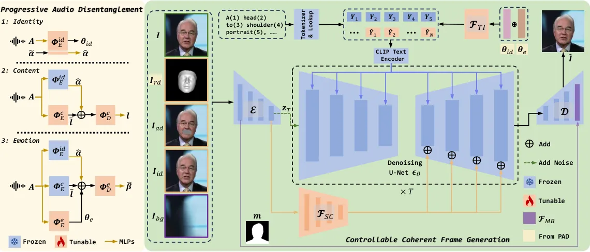
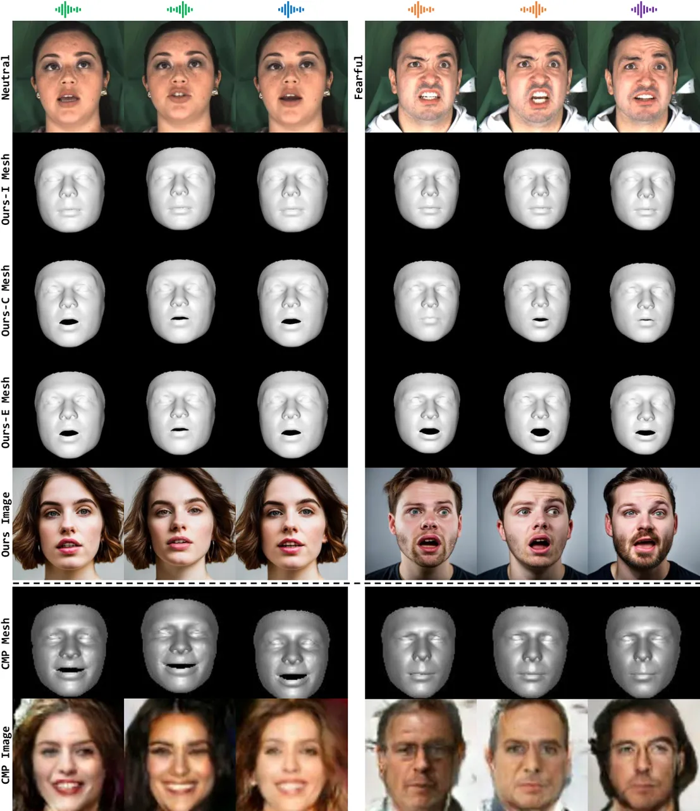
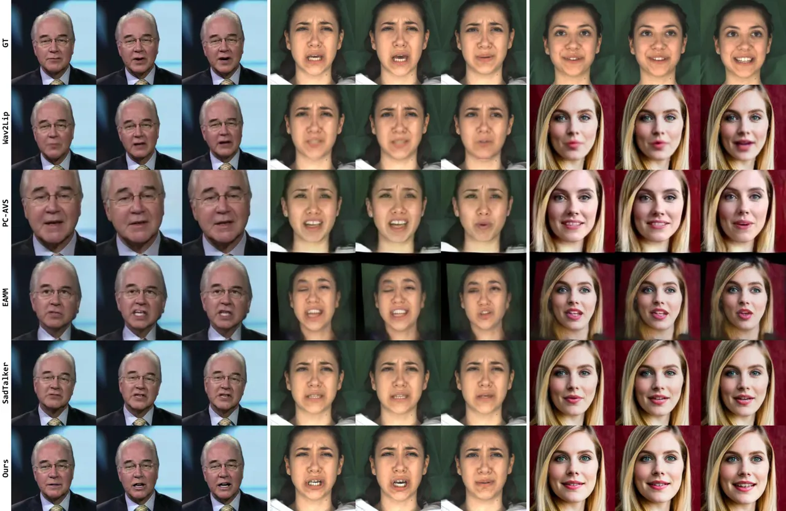
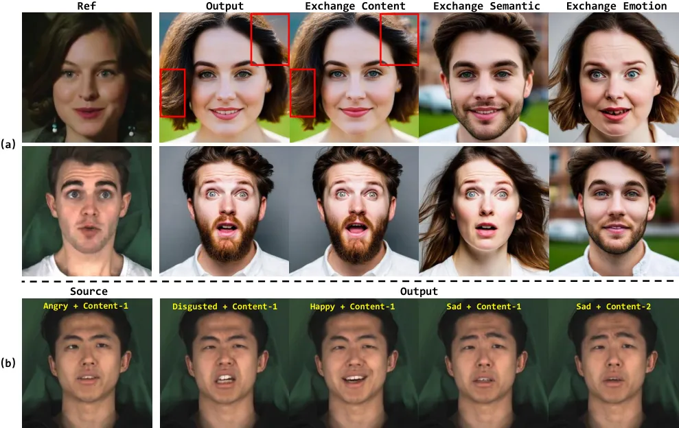
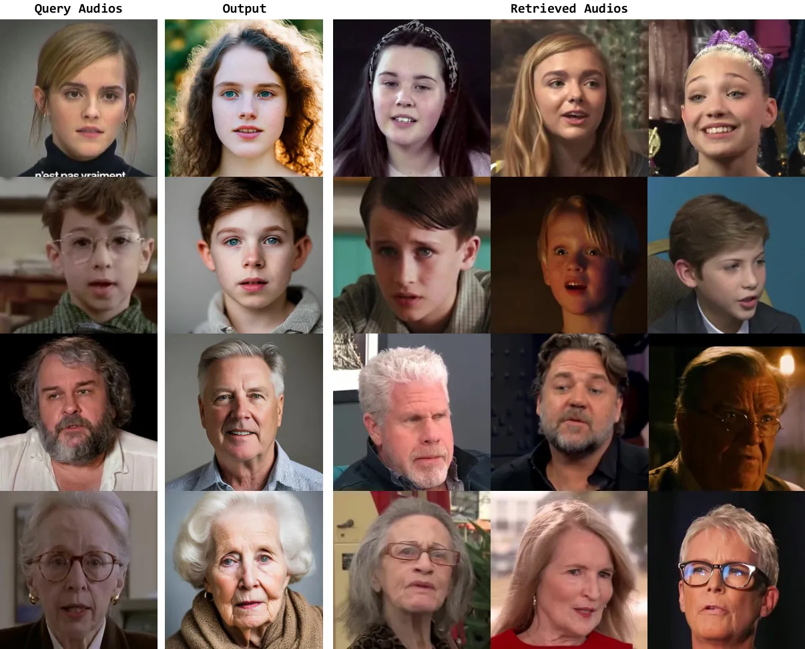
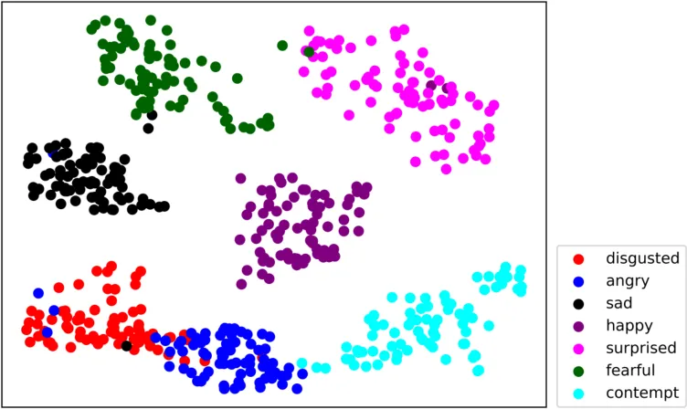
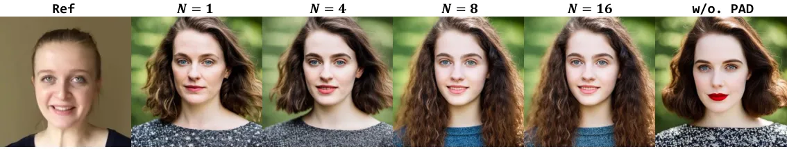
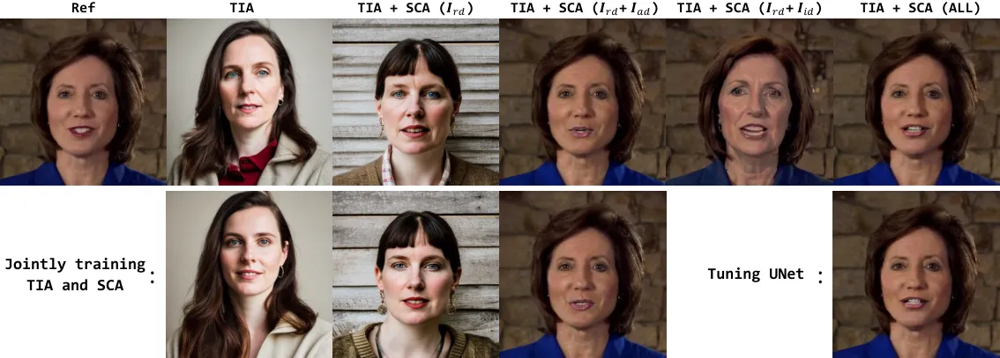
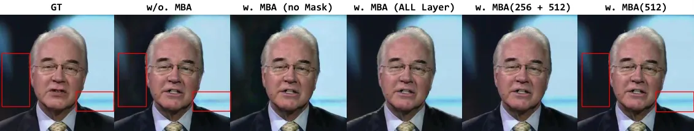

# FaceChain-ImagineID: Freely Crafting High-Fidelity Diverse Talking Faces from Disentangled Audio

Chao Xu^(\*) Yang Liu^(\*) Jiazheng Xing Weida Wang Mingze Sun
Affiliation: Alibaba Group Affiliation: FaceChain Community    Jun Dan
Tianxin Huang Siyuan Li Zhi-Qi Cheng Ying Tai Baigui Sun Email:
[{xc264362, ly261666, baigui.sbg}@alibaba-inc.com](mailto:) Affiliation:
Alibaba Group Affiliation: FaceChain Community Affiliation: National
University of Singapore Affiliation: Carnegie Mellon University
Affiliation: Nanjing University

###### Abstract

In this paper, we abstract the process of people hearing speech,
extracting meaningful cues, and creating various dynamically
audio-consistent talking faces, termed Listening and Imagining, into the
task of high-fidelity diverse talking faces generation from a single
audio. Specifically, it involves two critical challenges: one is to
effectively decouple identity, content, and emotion from entangled
audio, and the other is to maintain intra-video diversity and
inter-video consistency. To tackle the issues, we first dig out the
intricate relationships among facial factors and simplify the decoupling
process, tailoring a Progressive Audio Disentanglement for accurate
facial geometry and semantics learning, where each stage incorporates a
customized training module responsible for a specific factor. Secondly,
to achieve visually diverse and audio-synchronized animation solely from
input audio within a single model, we introduce the Controllable
Coherent Frame generation, which involves the flexible integration of
three trainable adapters with frozen Latent Diffusion Models (LDMs) to
focus on maintaining facial geometry and semantics, as well as texture
and temporal coherence between frames. In this way, we inherit
high-quality diverse generation from LDMs while significantly improving
their controllability at a low training cost. Extensive experiments
demonstrate the flexibility and effectiveness of our method in handling
this paradigm. The codes will be released at
[FaceChain](https://github.com/modelscope/facechain).

![[Uncaptioned
image]](arxiv-2403-01901--9b8e5b56e448.figures/figure-1.webp)

Figure 1: We propose an intuitive new paradigm, Listening and Imagining.
Listening refers to the progressive disentanglement of identity,
content, and emotion from the audio. Imagining involves generating
diverse videos that align with the given decoupled audio cues while
maintaining high consistency within each video. Notably, audio-unrelated
attributes, _e.g_., beard, hairstyle, and pupil color, can be freely
changed by specified prompts according to personal preferences (Sample
2). Other head pose and eye blink are copied from the reference videos.
The audio is the only input to the model, while the left three images
are just shown for facial geometry and semantic reference.

## 1 Introduction

Talking face generation \[67, 55, 51, 63, 14, 56, 52\] is a challenging
task that aims to synthesize video based on provided audio and image.
This technique finds wide application in various practical scenarios,
especially virtual interaction. However, users encountered a dilemma
during the process. They are concerned about privacy breaches when using
real facial images, while the virtual avatars generated by off-the-shelf
methods often fail to align well with their own voices. Thus, we
envision a new paradigm if it is possible to liberate the specified
source face and directly infer the synchronized virtual portrait that
matches the real audio input.

Indeed, it is an intuitive process, as people often analyze a voice and
then mentally visualize the corresponding video clip. To realize such
Listening and Imagining paradigm, there are two critical issues. 1) How
to disentangle face-related features solely from audio to ensure strong
consistency between synthesized videos and given audio. We first explore
the natural association between auditory and visual perception. It is
true that the facial identity features are closely related to voice
characteristics \[2, 8, 40\]. For example, a pronounced chin and
prominent brow ridges usually accompany a deep voice, while women and
children often have higher pitches. In addition, spoken content involves
localized lip movement, and the emotion style reflects the global facial
cues \[11, 24\]. Accurate decoupling of the above three factors, _i.e_.,
identity, content, and emotion, has a significant impact on subsequent
generation. However, existing researches \[20, 36\] mainly focus on the
disentanglement of the latter two elements, while other studies \[33,
59\], although exploring identity, are geared towards generating static
face image instead of dynamic animations. 2) How can we maintain
diversity between different videos while ensuring consistency within
each video by a single network. It is the consensus that human
imagination is boundless. With the same audio, we can imagine numerous
different talking videos, but within each clip, all frames share the
uniform information. Benefiting from the progress of diffusion models,
we have two potential methods available. One is the combination of
text-to-image synthesis, _e.g_., Latent Diffusion Models (LDMs) \[42\]
and common driving methods like SadTalker \[67\] and DiffTalk \[46\].
The other is producing videos by borrowing the framework of
text-to-video synthesis \[61, 12, 38, 28\]. However, the former involves
two isolated models, while the latter is difficult to perfectly match
the control conditions, resulting in noticeable differences between each
frame. Additionally, neither of them fully utilizes the audio features.

In this paper, we are dedicated to solving these two problems. Firstly,
due to the high degree of coupling in audio, it is challenging to
directly employ cross reconstruction under the guidance of pseudo
training pairs for disentanglement \[20, 36\]. To simplify it, we turn
to the prior knowledge 3DMM for help and propose a Progressive Audio
Disentanglement (PAD) to gradually decouple identity, content, and
emotion. As shown in Fig. 1, we start by predicting the most independent
and fundamental identity cues, including the explicit facial geometry
and implicit semantics, _i.e_., shape, gender, and age. Then the
estimated shape is used as a condition to disentangle the localized
content from the audio. We further supplement the remaining details of
global emotion to generate comprehensive facial representations. In this
way, we accurately estimate the face-related geometry and semantics from
the audio. For the second concern, we propose a Controllable Coherent
Frame (CCF) generation, which offers several appealing designs. Firstly,
inspired by the subject-driven models \[43, 48\], we combine the
implicit audio cues with pred-defined prompt and map them to the CLIP
domain \[39\], which influence the inferred faces both on semantics and
emotions. Secondly, to avoid introducing extra offline components and
ensure that the diffusion model has both invariance and variability, we
freeze the LDMs and propose three trainable adapters to inject
hierarchical conditions, which are equipped with a flexible mechanism
that determines whether the outputs have new appearance or remain
faithful to the neighboring frame. We further collaborate the CCF with
autoregressive inference for diverse and temporally consistent video
generation.

In summary, we present the following contributions.

- •
  We propose a new paradigm, Listening and Imagining, for generating
  diverse and coherent talking faces based on a single audio, which is
  the first attempt in this field.
- •
  We propose a novel PAD that gradually separates the identity, content,
  and emotion from the audio, providing a solid foundation for accurate
  and vivid face animations.
- •
  We propose a novel frozen LDMs-based CCF with three trainable adapters
  to faithfully integrate the audio features and address the dilemma of
  intra-video diversity and inter-video consistency within a single
  model.

## 2 Related Work

### 2.1 Audio-driven Talking Face Generation

Talking face synthesis could be roughly divided into two folds. One of
the research directions is GAN-based methods. Early efforts project the
audio cues into latent feature space \[6, 72, 73, 27, 54, 55, 35\] and
utilize a conditioned image generation framework to synthesize faces. To
compensate for information loss in implicit codes, subsequent works have
incorporated explicit structural information, such as landmark \[46,
71\] and 3DMM \[67, 63, 41, 65\], to more accurately reflect the audio
features on the face. Similarly, 3DMM is used as an intermediate
representation in our method. We further leverage it to fully decouple
the audio signal. Motivated by progress of the diffusion model in image
synthesize tasks, recent approaches \[46, 51, 10, 64\] focus on another
research line. They carefully design conditional control modules and
train them along with UNet to achieve high-fidelity faces. However,
trainable diffusion models fail to inherit many appealing properties,
such as diverse generation. In this work, we explore the feasibility of
using pretrained models to maintain diversity.

### 2.2 Audio to Face Generation

Human voices carry a large amount of personal information, including
speaker identity \[8, 40\], age \[15, 49\], gender \[25\] and emotion
style \[58, 69\]. Based on previous studies, it is possible to directly
predict entire face from corresponding audio. Common methods \[33, 59,
1, 4\] adopt GANs to generate face images from voice input. However, the
above reconstruction-based attempts are not reasonable because audio
lacks specific visual features like hairstyles and backgrounds, while
these attributes can vary significantly within the same person.
Consequently, CMP \[60\] only models the correlation between facial
geometry and voice, but the results lack authenticity. We propose an
ideal solution that involves inferring facial structure information from
audio and then combining it with a conditional generative model to
achieve controllable and diverse generation.

### 2.3 Diffusion Models

Diffusion models \[18, 32\] are popular for generating realistic and
diverse samples. In practice, DDIM \[50\] converts the sampling process
to a faster non-Markovian process, while LDMs \[42\] perform diffusion
in a compressed latent space to reduce memory and runtime. Recently,
text-to-image generations \[26, 19, 45, 13, 44\] have gain significant
attentions. For personalized control, DreamBooth \[43\] proposes a
subject-driven generation by fine-tuning diffusion models. To reduce
training costs, T2I-Adapter \[31\] only trains the extra encoder to
influence the denoising process. Similarly, our work incorporates the
above two characteristics. Another challenging topic is text-to-video
generation \[61, 12, 68, 3, 62\]. However, they suffer from
inconsistency across video frames both temporally and semantically.
Additionally, they struggle to generate long videos, impacting the
production of high-fidelity talking faces. Therefore, we utilize an
autoregressive inference strategy to ensure smooth and consistent
transitions between frames, even for long-duration videos.

## 3 Method



Figure 2: Overview of the proposed method. Our approach involves a
two-stage framework that corresponds to the Listening and Imagining. For
listening, the Progressive Audio Disentanglement gradually separates the
identity, content, and emotion from the entangled audio. For Imagining,
Controllable Coherent Frame generation receives the facial semantics
($`\boldsymbol{\theta}_{id}`$ and $`\boldsymbol{\theta}_{e}`$ inferred
from PAD) and geometry (3D mesh $`\boldsymbol{I}_{rd}`$ rendered from
$`\hat{\boldsymbol{\alpha}}`$, $`\hat{\boldsymbol{\beta}}`$ and other
coefficients extracted from $`\boldsymbol{I}`$) to synthesize the
diverse audio-synchronized faces, while the $`\boldsymbol{I}_{ad}`$,
$`\boldsymbol{I}_{id}`$, and $`\boldsymbol{I}_{bg}`$ are further
introduced to achieve highly controllable generation with complete
visual and temporal consistency. Please refer to Alg. 1 for more
details. In this way, we achieve diverse and high-fidelity face
animation solely from audio.

Listening and imagining are instinctive behaviours for humans to
perceive and comprehend the world. When people hear a voice, they first
analyze the characteristics of the speaker, _i.e_., who is speaking
(Identity), what is being said (Content), and how it feels (Emotion),
and then imagine diverse and temporally consistent dynamic scenes that
match the inferred audio features. To simulate such process, we follow a
two-stage phase. Firstly, a Progressive Audio Disentanglement (PAD) is
designed to gradually separate the identity, content, and emotion from
the coupled audio in Sec. 3.1. Secondly, we design Controllable Coherent
Frame (CCF) generation (Sec. 3.2), which inherits the diverse generation
capabilities from Latent Diffusion Models (LDMs) and develops several
techniques to enhance controllability: Texture Inversion Adapter (TIA),
Spatial Conditional Adapter (SCA), and Mask-guided Blending Adapter
(MBA) jointly ensure the generated result meets specific conditions.
Autoregressive Inference is utilized to maintain temporal consistency
throughout the video.

### 3.1 Progressive Audio Disentanglement

To extract independent cues from the entangled audio signals, previous
work \[20\] builds aligned pseudo pairs and adopts the
cross-reconstruction manner for content and emotion disentanglement.
However, due to the inevitable introduction of errors when constructing
pseudo pairs, they become unreliable when more elements are involved. To
this end, we only use a single audio for training and adopt 3DMM \[9\]
to achieve accurate disentangled 3D facial prior, _e.g_., shape
$`\boldsymbol{\alpha}\in\mathbb{R}^{80}`$, expression sequences
$`\boldsymbol{\beta}\in\mathbb{R}^{L\times 64}`$, _etc_., which excludes
the face-unrelated factors, such as hairstyle and makeup, and serve as
the ground truth for supervision during training. Note that a video
shares the same shape while the expression corresponds to each frame. In
particular, we propose Progressive Audio Disentanglement to simplify the
decoupling process by extracting the fundamental identity information,
then separating the localized mouth movements, and finally obtaining the
global expression, outlined in Fig. 2. For more discussions about the
disentanglement order (identity $`\rightarrow`$ content $`\rightarrow`$
emotion), the superiority of PAD compared to other methods, and
architecture details, please refer to the supplementary materials.

Identity. Motivated by the recent studies that voice is articulatory
related to skull shape, as well as gender and age \[29, 16\], the
identity hinted in audio could refer to the facial geometry and semantic
embedding. In practice, the identity encoder
$`\boldsymbol{\Phi}_{E}^{id}`$ is the Transformer-based architecture
with an extended learnable token
$`\tilde{\boldsymbol{\alpha}}\in\mathbb{R}^{512}`$ of face shape,
mapping the MFCC sequence $`\boldsymbol{A}\in\mathbb{R}^{L\times 1280}`$
to both the estimated shape
$`\hat{\boldsymbol{\alpha}}\in\mathbb{R}^{80}`$ and semantics
$`\boldsymbol{\theta}_{id}\in\mathbb{R}^{512}`$:

```math
\displaystyle\bar{\boldsymbol{\alpha}},\bar{\boldsymbol{\theta}}_{id}=\boldsymbol{\Phi}_{E}^{id}([\tilde{\boldsymbol{\alpha}},\text{MLPs}(\boldsymbol{A})]+\text{PE}), \tag{1}
```

```math
\displaystyle\hat{\boldsymbol{\alpha}}=\text{MLPs}(\bar{\boldsymbol{\alpha}}),\boldsymbol{\theta}_{id}=\text{Avg}(\bar{\boldsymbol{\theta}}_{id}), \tag{2}
```

where PE is the positional embedding,
$`\bar{\boldsymbol{\alpha}}\in\mathbb{R}^{512}`$,
$`\bar{\boldsymbol{\theta}}_{id}\in\mathbb{R}^{L\times 512}`$. During
training, we calculate Reconstruction Loss between predicted
$`\hat{\boldsymbol{\alpha}}`$ and the ground truth
$`\boldsymbol{\alpha}`$:
$`\mathcal{L}_{id}=\left\|\boldsymbol{\alpha}-\hat{\boldsymbol{\alpha}}\right\|_{2}`$.
Moreover, we apply Contrastive Loss on semantic embeddings by
constructing a positive pair
$`(\boldsymbol{\theta}_{id}^{p},\boldsymbol{\theta}_{id})`$ with the
same identity and a negative pair
$`(\boldsymbol{\theta}_{id}^{n},\boldsymbol{\theta}_{id})`$ with the
different. Then InfoNCE loss \[34\] with cosine similarity
$`\mathcal{S}`$ is enhanced between two pairs:

```math
\displaystyle\mathcal{L}_{con}=-\log\left[\frac{\exp\left(\mathcal{S}\left(\boldsymbol{\theta}_{id}^{p},\boldsymbol{\theta}_{id}\right)\right)}{\exp\left(\mathcal{S}\left(\boldsymbol{\theta}_{id}^{p},\boldsymbol{\theta}_{id}\right)\right)+\exp\left(\mathcal{S}\left(\boldsymbol{\theta}_{id}^{n},\boldsymbol{\theta}_{id}\right)\right)}\right]. \tag{3}
```

Content. The 3DMM expression coefficient involves local lip and global
facial movements, while the spoken content is mainly related to the
former. Inspired by the work \[55\], we employ the lip reading expert
\[47\] into the training phase and produce the only mouth-related
expression coefficients $`\boldsymbol{l}\in\mathbb{R}^{L\times 64}`$ for
content disentanglement. As shown in Fig. 2, we construct a
Transformer-based encoder-decoder architecture, where the linguistic
features $`\bar{\boldsymbol{l}}\in\mathbb{R}^{L\times 64}`$ embedded by
the content encoder $`\boldsymbol{\Phi}_{E}^{c}`$ and the identity
template output by the frozen identity encoder are combined together and
sent into the content decoder $`\boldsymbol{\Phi}_{D}^{c}`$ to obtain
$`\boldsymbol{l}`$:

```math
\displaystyle\bar{\boldsymbol{l}}=\boldsymbol{\Phi}_{E}^{c}(\text{MLPs}(\boldsymbol{A})+\text{PE}), \tag{4}
```

```math
\displaystyle\boldsymbol{l}=\text{MLPs}(\boldsymbol{\Phi}_{D}^{c}(\bar{\boldsymbol{l}}+\text{MLPs}(\hat{\boldsymbol{\alpha}}))). \tag{5}
```

We train this stage by using two losses: Regularization Loss calculates
the distance between $`\boldsymbol{\beta}`$ and $`\boldsymbol{l}`$ with
a relative small weight to smooth training phase:
$`\mathcal{L}_{reg}=\left\|\boldsymbol{l}-\boldsymbol{\beta}\right\|_{2}`$.
Besides, we project the coefficients to the image domain with textures,
and utilize lip-reading expert to predict the text
$`\hat{\boldsymbol{X}}`$. Assuming that the original text content is
$`\boldsymbol{X}`$, we compute the Lip-reading Loss via cross-entropy:
$`\mathcal{L}_{lip}=-\boldsymbol{X}\text{log}P(\hat{\boldsymbol{X}}|\boldsymbol{V})`$,
where $`\boldsymbol{V}`$ is the ground truth video.

Emotion. In this stage, we directly utilize $`\boldsymbol{\beta}`$ as
constraint to decouple the remaining emotion styles. As shown in Fig. 2,
based on the second stage, an additional emotion encoder
$`\boldsymbol{\Phi}_{E}^{e}`$ is introduced to generate the pooled
emotion embeddings $`\boldsymbol{\theta}_{e}\in\mathbb{R}^{512}`$, which
is combined with identity $`\hat{\boldsymbol{\alpha}}`$ and linguistic
features $`\bar{\boldsymbol{l}}`$ for the expression coefficient
prediction by the emotion decoder $`\boldsymbol{\Phi}_{D}^{e}`$:

```math
\displaystyle\boldsymbol{\theta}_{e}=\text{Avg}(\boldsymbol{\Phi}_{E}^{e}(\text{MLPs}(\boldsymbol{A})+\text{PE})), \tag{6}
```

```math
\displaystyle\hat{\boldsymbol{\beta}}=\text{MLPs}(\boldsymbol{\Phi}_{D}^{e}(\boldsymbol{\theta}_{e}+\bar{\boldsymbol{l}}+\text{MLPs}(\hat{\boldsymbol{\alpha}}))). \tag{7}
```

Similar to Eq. 3, we adopt Contrastive Loss to extract more
discriminative emotion features, details of which are omitted here.
Additionally, the regular Reconstruction Loss is used to supervise
generated $`\hat{\boldsymbol{\beta}}`$.

### 3.2 Controllable Coherent Frame Generation

Existing methods typically specify the input source face along with
audio cues for video generation, while our objective is to achieve
visually diverse and audio-consistent animation directly from input
audio. Recent LDMs are naturally suited to diverse generation, and their
conditional text prompts offer a pathway for freely editing attributes
that cannot be deduced from the audio, as shown in Fig. 1. In exchange,
they are relatively weak in controllability, especially in video
generation \[61, 38\]. Thus, to tailor it to our task without
introducing extra offline models (_e.g_., LDMs + DiffTalk\[46\]), we
must tackle two challenges: ensuring that the synthesized video content
aligns with the given conditions, and achieving smooth temporal
transitions across frames. Our targeted designs are depicted in Fig. 2.

Textual Inversion Adapter. The critical issue in injecting the identity
$`\boldsymbol{\theta}_{id}`$ and emotion $`\boldsymbol{\theta}_{e}`$
inferred from PAD to the frozen LDMs lies in aligning them with the CLIP
domain. Inspired by the inversion technique \[43\], we propose a Textual
Inversion Adapter $`\boldsymbol{\mathcal{F}}_{TI}`$, which maps the
input vector-based conditions into a set of token embeddings to
sufficiently represent these conditions in the CLIP token embedding
space. In detail, we first predefine the prompt for basic high-quality
face generation. It is tokenized and mapped into the token embedding
space by employing a CLIP embedding lookup module, obtaining
$`\left\{\boldsymbol{Y}_{1},\dots,\boldsymbol{Y}_{M}\right\}`$. Then,
the adapter encodes $`\boldsymbol{\theta}_{id}`$ and
$`\boldsymbol{\theta}_{e}`$ into the aligned pseudo-word token
embeddings
$`\left\{\hat{\boldsymbol{Y}}_{1},\dots,\hat{\boldsymbol{Y}}_{N}\right\}`$.
We concatenate these two embeddings and feed them to the CLIP text
encoder, whose output $`\boldsymbol{Y}`$ is applied on the
cross-attention layer of LDMs to guide the denoising process. When
training this adapter, we freeze all of the other parameters:

```math
\displaystyle\mathbb{E}_{\boldsymbol{z}_{0},\boldsymbol{\varepsilon}\sim N(0,\boldsymbol{I}),t,\boldsymbol{Y}}\left\|\boldsymbol{\varepsilon}-\boldsymbol{\varepsilon}_{\theta}\left(\boldsymbol{z}_{t},t,\boldsymbol{Y}\right)\right\|_{2}^{2}. \tag{8}
```

Spatial Conditional Adapter. Inspired by T2I-Adapter, we devise Spatial
Conditional Adapter $`\boldsymbol{\mathcal{F}}_{SC}`$ to further fuse
the explicit conditions. As shown in Fig. 2, 3D face mesh
$`\boldsymbol{I}_{rd}`$ contains rich audio-synchronized facial
geometry, _i.e_., face shape, lip movement, and expression style.
Besides, we sample a random frame $`\boldsymbol{I}_{id}`$ of the same
identity to provide the face appearance and background. These two
conditions are enough for common methods \[67, 73\] to animate the
identity face to desired pose and expression. However, it is difficult
for frozen LDMs to learn complex spatial transformation. Thus, we
further incorporate the adjacent frame $`\boldsymbol{I}_{ad}`$ as an
additional reference, and mask its mouth area
$`\boldsymbol{\mathcal{M}}`$ produced by 3D mesh to avoid the networks
from learning shortcuts by directly copying from it. This condition
makes the deformation learning much easier and also provides motion
cues. We only train this adapter in this stage:

```math
\displaystyle\mathbb{E}_{\boldsymbol{z}_{0},\boldsymbol{\varepsilon}\sim N(0,\boldsymbol{I}),t,\boldsymbol{F}_{sc}}\left\|\boldsymbol{\varepsilon}-\boldsymbol{\varepsilon}_{\theta}\left(\boldsymbol{z}_{t},t,\boldsymbol{Y},\boldsymbol{F}_{sc}\right)\right\|_{2}^{2}, \tag{9}
```

where
$`\boldsymbol{F}_{sc}=\boldsymbol{\mathcal{F}}_{SC}(\boldsymbol{\mathcal{E}}(\boldsymbol{I}_{rd})`$ +
$`\boldsymbol{\mathcal{E}}(\boldsymbol{I}_{id})`$ +
$`\boldsymbol{\mathcal{E}}(\boldsymbol{I}_{ad}))`$ when
$`p\textless 0.8`$, else
$`\boldsymbol{\mathcal{F}}_{SC}(\boldsymbol{\mathcal{E}}(\boldsymbol{I}_{rd}))`$.
$`\boldsymbol{\mathcal{E}}`$ is the VAE encoder. $`p`$ is a random
number generator within the range from 0 to 1.

Input: $`\boldsymbol{z}_{T}`$: random noise

$`\left\{\boldsymbol{I}_{rd}^{i}\right\}_{i=1}^{H}`$: 3D mesh sequences
$`\triangleright`$ Inferred from audio

$`\boldsymbol{Y}`$: token embeddings $`\triangleright`$ Inferred from
audio

$`\triangleright`$ $`i=1`$, Diverse mode

$`\hat{\boldsymbol{I}}_{1}=\boldsymbol{\mathcal{D}}(\text{CCF}(\boldsymbol{z}_{T},\boldsymbol{\mathcal{E}}(\boldsymbol{I}_{rd}^{1}),\boldsymbol{Y})`$

$`\triangleright`$ $`i=2`$…$`H`$, Coherent mode

for $`i=2...H`$ do

  $`\boldsymbol{I}_{id}^{i}=\hat{\boldsymbol{I}}_{1}`$,
$`\boldsymbol{I}_{bg}^{i}=\boldsymbol{\mathcal{G}}_{IA}(\hat{\boldsymbol{I}}_{1})`$

  $`\boldsymbol{I}_{ad}^{i}=\boldsymbol{\mathcal{M}}(\hat{\boldsymbol{I}}_{i-1})`$,
$`\boldsymbol{m}_{i}=\boldsymbol{\mathcal{G}}_{MOD}(\hat{\boldsymbol{I}}_{i-1})`$

  $`\hat{\boldsymbol{I}}_{i}=\boldsymbol{\mathcal{D}}^{{}^{\prime}}(\text{CCF}(\boldsymbol{z}_{T},\boldsymbol{\mathcal{E}}([\boldsymbol{I}_{rd}^{i},\boldsymbol{I}_{id}^{i},\boldsymbol{I}_{ad}^{i}]),\boldsymbol{Y}),\boldsymbol{\mathcal{E}}(\boldsymbol{I}_{bg}^{i}),\boldsymbol{m}_{i})`$

end for

Output: $`\hat{\boldsymbol{V}}`$: generated video

Algorithm 1 Autoregressive Inference



Figure 3: Qualitative results of audio-to-face on MEAD . Icons of the
same color indicate samples from the same audio. Ours-I, -C, and -E mean
the stage of identity, content, emotion decoupling.



Figure 4: Visual comparison with recent SOTA methods. Images are from
officially released codes for fair comparisons. The first sample
selected from HDTF, second from MEAD. For the third, based on the audio
of the first row, our method generate a unseen face for all competitors,
which using this as the source face to produce talking faces. The first
row provides the ground truth for facial expression.

Masked-guided Blending Adapter. Despite spatial pixel-level conditions
have been given, we observe significant distortion artifacts in the
background, resulting in a low fidelity of the synthesized video.
Therefore, we introduce a Masked-guided Blending Adapter
$`\boldsymbol{\mathcal{F}}_{MB}`$ into VAE Decoder
$`\boldsymbol{\mathcal{D}}`$, forming
$`\boldsymbol{\mathcal{D}}^{{}^{\prime}}`$, which utilizes a mask to
directly copy the masked region of the $`k`$-th decoder feature
$`\boldsymbol{F}^{k}_{vd}`$ while combining the unmasked region of the
$`k`$-th background feature $`\boldsymbol{F}^{k}_{ve}`$ from the VAE
encoder. The dilated mask $`\boldsymbol{m}`$ and background
$`\boldsymbol{I}_{bg}`$ are produced by MODNet \[23\]
$`\boldsymbol{\mathcal{G}}_{MOD}`$ and Inpaint-Anything \[66\]
$`\boldsymbol{\mathcal{G}}_{IA}`$ respectively. The blending process is
formulated as:

```math
\displaystyle\hat{\boldsymbol{F}}_{vd}^{k}=\boldsymbol{F}_{vd}^{k}\otimes\boldsymbol{m}+\text{Conv}(\boldsymbol{F}_{ve}^{k})\otimes\tilde{\boldsymbol{m}}, \tag{10}
```

where $`\otimes`$ is element-wise multiplication,
$`\tilde{\boldsymbol{m}}=1-\boldsymbol{m}`$. Experimentally, we inset
this module into the decoder layer with the resolution of 512. The
training only involves a frozen autoencoder and a trainable convolution
layer, under the supervision of reconstruction and VGG losses. With this
design, the synthesized video maintains a consistent background, and the
fusion edge is seamlessly harmonious. Note that the above three adapters
are trained sequentially.

Autoregressive Inference. The designed CCF has diverse and controllable
image generation capabilities. We incorporate an Autoregressive
Inference to further generate diverse and temporally coherent videos. As
shown in Alg. 1, unlike DiffTalk \[46\] starting from a given frame, for
the first frame, we switch CCF to diverse mode, _i.e_., only receive
audio-enhanced CLIP embedding $`\boldsymbol{Y}`$ and encoded 3D face
mesh features $`\boldsymbol{\mathcal{E}}(\boldsymbol{I}_{rd}^{1})`$,
generating faces $`\hat{\boldsymbol{I}_{1}}`$ with varying appearance
while maintaining the consistent geometry with the audio. For the
subsequent frames, we further apply three adapters to achieve
controllable generation. Specifically, $`\boldsymbol{I}_{id}^{i}`$ and
$`\boldsymbol{I}_{bg}^{i}`$ are $`\hat{\boldsymbol{I}}_{1}`$ and
$`\boldsymbol{\mathcal{G}}_{IA}(\hat{\boldsymbol{I}}_{1})`$ all the
time, $`\boldsymbol{I}_{rd}^{i}`$ is the mesh at time stamp $`i`$, and
$`\boldsymbol{I}_{ad}^{i}`$ is the masked former frame
$`\hat{\boldsymbol{I}}_{i-1}`$,
$`\boldsymbol{m}_{i}=\boldsymbol{\mathcal{G}}_{MOD}(\hat{\boldsymbol{I}}_{i-1})`$
since the difference between adjacent frames is small.

## 4 Experiments

### 4.1 Experimental Setup

Datasets. We adopt three talking face dataset MEAD \[57\], VoxCeleb2
\[7\], and HDTF \[70\] in our experiments.

Metrics. We adopt PSNR, SSIM, and FID \[17\] to measure the image
quality of synthesized videos. The distance between the landmarks of the
mouth (LMD) and confidence score (Sync) proposed in SyncNet \[5\] is
used to measure the audio-visual synchronization. Besides, we compute
emotion accuracy (EACC) to measure the generated emotions. Furthermore,
we compute the cosine similarity of geometry (Shape) and semantics (Age,
Gender, Emotion), and overall quality (FID) between the ground truth and
generated faces inferred from audio by using several off-the-shelf
tools, D3DFR \[9\], FairFace \[22\], and FAN \[30\].

Implementation Details. For PAD training, we adopt VoxCeleb2 for
identity disentanglement and MEAD training set for content and emotion.
The audios are pre-processed to 16kHz and converted to mel-spectrogram
with 80 Mel filter-bank, as Wav2Lip. The length of the sampled video
clip is $`L=32`$. For CCF training, the input videos are cropped and
resized to $`512\times 512`$. We adopt MEAD and HDTF as training sets
and optimize TIA, SCA, and MBA sequentially. It takes about 2.5 days
totally when trained on 8 V100 GPUs. $`N=8`$ and $`M`$ is the length of
the prompts in SCA. During quantitative assessment, we sample 12
identities from MEAD and 10 from HDTF, which serve as the test set.
Denoising step $`T`$ is set as 50 for both training and inference.

### 4.2 Comparison with State-of-the-Art Methods.

Qualitative Results. In this section, we first perform audio-to-face
method comparisons with CMP \[60\]. As shown in Fig. 3, we display the
generated 3D meshes and their corresponding faces of our method in rows
4, 5, and CMP in rows 6, 7. The real faces in the first row provide
geometry and semantics references. It can be seen that CMP fails to
generate desired shapes and the synthesized faces have blurred details
with obvious artifacts. By contrast, benefiting from progressive
disentanglement and LDMs, our method produces more accurate geometry,
including shape, lip movement, emotion styles, and high-quality
realistic textures. Besides, in each sample, the first two columns
correspond to the same audio, while the third represents a different
audio of the same person. Across different audio clips, our method
produces more consistent results than CMP. We further compare our method
with talking face methods including Wav2Lip, PC-AVS, EAMM, and
SadTalker, which are reproduced from their officially released codes. As
shown in Fig. 4, in terms of emotion accuracy, audio-visual
synchronization, and image quality, our method outperforms these SOTA
methods. Notably, for the third sample, other competitors adhere the two
stage paradigm, _i.e_., Audio-to-Image and then Image-to-Video, while
our method autoregressively infers video from the given audio.



Figure 5: Illustration of disentangled controllability. (a) is under the
diverse mode and (b) is under the coherent mode.

|            |                    |                  |                     |                      |                    |
| ---------- | ------------------ | ---------------- | ------------------- | -------------------- | ------------------ |
| Method     | Shape $`\uparrow`$ | Age $`\uparrow`$ | Gender $`\uparrow`$ | Emotion $`\uparrow`$ | FID $`\downarrow`$ |
| CMP \[60\] | 0.60               | 0.41             | 0.87                | 0.23                 | 228.05             |
| Ours       | 0.75               | 0.58             | 0.93                | 0.76                 | 25.78              |

Table 1: Quantitative comparison with CMP. The value is the average of
all samples on two test sets (same as the Tab. 2).

|                  |                     |                    |                   |                    |                   |                   |
| ---------------- | ------------------- | ------------------ | ----------------- | ------------------ | ----------------- | ----------------- |
| Method           | EACC $`\downarrow`$ | LMD $`\downarrow`$ | Sync $`\uparrow`$ | FID $`\downarrow`$ | PSNR $`\uparrow`$ | SSIM $`\uparrow`$ |
| Wav2Lip \[37\]   | 0.129               | 2.96               | 5.93              | 40.79              | 29.05             | 0.59              |
| PC-AVS \[73\]    | 0.102               | 2.71               | 5.75              | 45.84              | 29.28             | 0.59              |
| EAMM \[21\]      | 0.097               | 2.75               | 5.46              | 50.55              | 29.14             | 0.61              |
| SadTalker \[67\] | 0.121               | 2.80               | 5.84              | 31.62              | 29.55             | 0.64              |
| Ours-C           | 0.113               | 2.82               | 5.86              | 28.09              | 29.59             | 0.60              |
| Ours-E           | 0.090               | 2.67               | 5.91              | 28.37              | 29.66             | 0.67              |

Table 2: Quantitative comparison with state-of-the-art talking face
methods on two test sets.

Quantitative Results. As shown in Tab. 1, our method excels over CMP
across all metrics, especially in FID, which is consistent with the
qualitative results in Fig. 3. Moreover, we observe that gender is
relatively easy to predict, while others are more challenging. Yet, our
method still gains significant improvements. We further present the
quantitative comparison in Tab. 2 of talking face generation, which
reveals our method can achieve the best performance in most metrics.
Wav2Lip surpasses all the competitors on Sync due to the supervision of
the synchronization scoring model. We further report the user study in
supplementary materials.

### 4.3 Further Analysis



Figure 6: Illustration of the image retrieval using the identity
semantic features. The faces (column 1) only shown for reference.



Figure 7: Clusters of the disentangled emotion embeddings. Different
emotions are clustered in different regions.

Disentangled Controllability. To demonstrate the facial factor
disentanglement of our method, we first sample two distinctly different
faces and exchange one factor at a time in diverse mode. Although our
method independently controls the desired factor, _i.e_., content (lip
movement), semantics (gender and age), and emotion styles in columns 3,
4, 5 of Fig. 5(a), the results inherit the weaknesses of the LDM in
preserving visual consistency. As the red rectangles marked in row 1,
despite only editing the mouth shape, they exhibit noticeable difference
in appearance, which indicates that simply generating frames and
splicing them together cannot create visually and temporally consistent
videos. Furthermore, we conduct a more rigorous analysis in coherent
mode. The emotion control (cols. 1-4) and content editing (cols. 4-5)
are illustrated in Fig. 5(b), verifying the effectiveness of the
disentanglement.

Interpretability of Disentanglement. We further perform qualitative
experiments to demonstrate the disentanglement of learned identity and
emotion representation. Firstly, we randomly sample four audios of
different ages and genders from the CelebV-HQ \[74\] dataset and select
their most consistent pairs according to the cosine similarity between
two semantic features. We display the corresponding images for visual
comparisons in Fig. 6, where the retrieved audios have similar ages and
genders to those of the query. We also attach the generated face in
column 2, which closely resembles the conditions in column 1,
illustrating the effectiveness of our method. Secondly, to evaluate the
disentanglement of the emotion, we use t-SNE \[53\] to visualize the
emotion latent space in Fig. 7. It is obvious that the different
emotions are clustered into separate groups. Based on these analyses, we
conclude that the PAD contributes to the decoupling entangled facial
cues from the audio.

### 4.4 Ablation Study and Efficiency Evaluation



|         |      |      |      |      |          |
| ------- | ---- | ---- | ---- | ---- | -------- |
|         | N=1  | N=4  | N=8  | N=16 | w/o. PAD |
| Age     | 0.23 | 0.42 | 0.51 | 0.50 | 0.38     |
| Gender  | 0.90 | 0.91 | 0.91 | 0.92 | 0.91     |
| Emotion | 0.49 | 0.62 | 0.71 | 0.73 | 0.53     |

Figure 8: Ablation study on the number of pseudo-word tokens in TIA. We
do not apply SCA and MBA in this stage.



Figure 9: Ablation study on the design of the conditions in SCA.

Impact of Disentangled Module in PAD. To verify the superiority of PAD,
we show the generated meshes under different stages in Fig. 3 rows 2-4.
The first stage handles identity disentanglement, and the corresponding
meshes accurately reflect desired face shapes and outlines. The
following content disentanglement ensures that the mouth movements
synchronize with the spoken phonemes. The final emotion disentanglement
enhances the facial global cues, leading to highly consistent meshes
with the reference faces, _e.g_., more accurate lips with fearful
emotion (the right sample). Note that the left sample with neutral shows
no noticeable changes. Besides, the last two rows of Tab. 2 can also
prove the effectiveness of PAD.

Impact of Pseudo-word Tokens in TIA. In Fig. 8, we show the results when
varying the number of pseudo-word tokens in TIA. We observe that too few
tokens can not synthesize semantically consistent results, while too
many do not lead to further visual improvement. To balance the
computational load and performance, we set $`N`$ as 8 experimentally.
Besides, the sixth column indicates that when directly inputting audio
features into TIA, the output suffers degradation due to insufficient
decoupling. We further attach the quantitative results in Fig. 8. Since
TIA does not involves face geometry, shape metric is not displayed.
These results are based on the 100 faces sampled from CelebV-HQ.

Impact of Conditions in SCA. The conditions in SCA are the critical
design in this work for generating controllable and coherent frames. As
shown in Fig. 9 row 1, the model with TIA can generate semantically
consistent faces but fails to preserve the geometrical information
(column 2). Introducing the SCA module with $`\boldsymbol{I}_{rd}`$
input tackles the spatial misalignment (column 3). The adjacent frame
$`\boldsymbol{I}_{ad}`$ is further incorporated trying to maintain the
appearance like the reference face (column 4), but it introduces obvious
artifacts, especially in the mouth area. When taking
$`\boldsymbol{I}_{rd}`$ and $`\boldsymbol{I}_{id}`$ as input, as
previously mentioned, the frozen LDMs encounter difficulties in learning
complex transformations, resulting in both the appearance and geometry
are not well aligned (column 5). In this work, we employ all three
inputs together for SCA (column 6), where $`\boldsymbol{I}_{rd}`$ is
responsible for the facial structure, $`\boldsymbol{I}_{ad}`$ for the
appearance, while $`\boldsymbol{I}_{id}`$ further refines the details
and enhances the image quality.



Figure 10: Ablation study on the design of the blending structure in
MBA. This case is sampled from Fig. 4.

Impact of Blending Structure in MBA. In Fig. 10, the result in the
second column is produced by the method without MBA, which fails to
preserve the background details. To solve this challenge, we design
several variants to explore the blending structure. Without mask
guidance, the synthesized background still differs from the ground truth
(column 3). For this reason, we introduce the mask into all VAE decoder
layers (column 4). Due to the edge aliasing in the low-resolution mask,
although it solves the background issue, obvious artifacts appear around
the blending edges. When applied at 512 resolution (column 6), the
generated face achieves the best visual performance, achieving
consistent background and seamless edge blending.

Impact of Training Strategy in CCF. We explore the effectiveness of
sequential training in CCF. As shown in Fig. 9, when jointly training
TIA and SCA, the former does not work well as facial semantics can take
shortcuts, _i.e_., learning from $`\boldsymbol{I}_{id}`$ and
$`\boldsymbol{I}_{ad}`$ instead of token embeddings $`\boldsymbol{Y}`$.

Efficiency Evaluation. We follow the DiffTalk to open the UNet
parameters during SCA training, the number of trainable parameters
increases from 282.9M to 1.15G. Furthermore, tuning the UNet does not
bring significant benefits in Fig. 9. Thus, our method is effective and
user-friendly.

## 5 Conclusions

We propose a novel framework to simulate the process of Listening and
Imagining. Firstly, PAD simplifies the decoupling process and improves
the synchronization of predicted representations with audio. Secondly,
CCF further generates realistic and diverse talking faces. Extensive
experiments demonstrate the effectiveness of our approach.

## References

- \[1\] Yeqi Bai, Tao Ma, Lipo Wang, and Zhenjie Zhang. Speech fusion to
  face: Bridging the gap between human’s vocal characteristics and
  facial imaging. In _Proceedings of the 30th ACM International
  Conference on Multimedia_, pages 2042–2050, 2022.
- \[2\] Ray Bull, Harriet Rathborn, and Brian R Clifford. The
  voice-recognition accuracy of blind listeners. _Perception_,
  12(2):223–226, 1983.
- \[3\] Weifeng Chen, Jie Wu, Pan Xie, Hefeng Wu, Jiashi Li, Xin Xia,
  Xuefeng Xiao, and Liang Lin. Control-a-video: Controllable
  text-to-video generation with diffusion models. _arXiv preprint
  arXiv:2305.13840_, 2023.
- \[4\] Hyeong-Seok Choi, Changdae Park, and Kyogu Lee. From inference
  to generation: End-to-end fully self-supervised generation of human
  face from speech. _arXiv preprint arXiv:2004.05830_, 2020.
- \[5\] Joon Son Chung and Andrew Zisserman. Out of time: automated lip
  sync in the wild. In _Computer Vision–ACCV 2016 Workshops: ACCV 2016
  International Workshops, Taipei, Taiwan, November 20-24, 2016, Revised
  Selected Papers, Part II 13_, pages 251–263. Springer, 2017.
- \[6\] Joon Son Chung, Amir Jamaludin, and Andrew Zisserman. You said
  that? _arXiv preprint arXiv:1705.02966_, 2017.
- \[7\] Joon Son Chung, Arsha Nagrani, and Andrew Zisserman. Voxceleb2:
  Deep speaker recognition. _arXiv preprint arXiv:1806.05622_, 2018.
- \[8\] Angus Deaton. Understanding the mechanisms of economic
  development. _Journal of Economic Perspectives_, 24(3):3–16, 2010.
- \[9\] Yu Deng, Jiaolong Yang, Sicheng Xu, Dong Chen, Yunde Jia, and
  Xin Tong. Accurate 3d face reconstruction with weakly-supervised
  learning: From single image to image set. In _Proceedings of the
  IEEE/CVF conference on computer vision and pattern recognition
  workshops_, pages 0–0, 2019.
- \[10\] Chenpeng Du, Qi Chen, Tianyu He, Xu Tan, Xie Chen, Kai Yu,
  Sheng Zhao, and Jiang Bian. Dae-talker: High fidelity speech-driven
  talking face generation with diffusion autoencoder. In _Proceedings of
  the 31st ACM International Conference on Multimedia_, pages
  4281–4289, 2023.
- \[11\] Paul Ekman and Wallace V Friesen. Facial action coding system.
  _Environmental Psychology & Nonverbal Behavior_, 1978.
- \[12\] Patrick Esser, Johnathan Chiu, Parmida Atighehchian, Jonathan
  Granskog, and Anastasis Germanidis. Structure and content-guided video
  synthesis with diffusion models. In _Proceedings of the IEEE/CVF
  International Conference on Computer Vision_, pages 7346–7356, 2023.
- \[13\] Aditya Ramesh et al. Hierarchical text-conditional image
  generation with clip latents, 2022.
- \[14\] Yue Gao, Yuan Zhou, Jinglu Wang, Xiao Li, Xiang Ming, and Yan
  Lu. High-fidelity and freely controllable talking head video
  generation. In _Proceedings of the IEEE/CVF Conference on Computer
  Vision and Pattern Recognition_, pages 5609–5619, 2023.
- \[15\] Joanna Grzybowska and Stanislaw Kacprzak. Speaker age
  classification and regression using i-vectors. In _INTERSPEECH_, pages
  1402–1406, 2016.
- \[16\] William J Hardcastle, John Laver, and Fiona E Gibbon. _The
  handbook of phonetic sciences_. John Wiley & Sons, 2012.
- \[17\] Martin Heusel, Hubert Ramsauer, Thomas Unterthiner, Bernhard
  Nessler, and Sepp Hochreiter. Gans trained by a two time-scale update
  rule converge to a local nash equilibrium. _Advances in neural
  information processing systems_, 30, 2017.
- \[18\] Jonathan Ho, Ajay Jain, and Pieter Abbeel. Denoising diffusion
  probabilistic models. _Advances in Neural Information Processing
  Systems_, 33:6840–6851, 2020.
- \[19\] Lianghua Huang, Di Chen, Yu Liu, Yujun Shen, Deli Zhao, and
  Jingren Zhou. Composer: Creative and controllable image synthesis with
  composable conditions. _arXiv preprint arXiv:2302.09778_, 2023.
- \[20\] Xinya Ji, Hang Zhou, Kaisiyuan Wang, Wayne Wu, Chen Change Loy,
  Xun Cao, and Feng Xu. Audio-driven emotional video portraits. In
  _Proceedings of the IEEE/CVF conference on computer vision and pattern
  recognition_, pages 14080–14089, 2021.
- \[21\] Xinya Ji, Hang Zhou, Kaisiyuan Wang, Qianyi Wu, Wayne Wu, Feng
  Xu, and Xun Cao. Eamm: One-shot emotional talking face via audio-based
  emotion-aware motion model. In _ACM SIGGRAPH 2022 Conference
  Proceedings_, pages 1–10, 2022.
- \[22\] Kimmo Karkkainen and Jungseock Joo. Fairface: Face attribute
  dataset for balanced race, gender, and age for bias measurement and
  mitigation. In _Proceedings of the IEEE/CVF Winter Conference on
  Applications of Computer Vision_, pages 1548–1558, 2021.
- \[23\] Zhanghan Ke, Jiayu Sun, Kaican Li, Qiong Yan, and Rynson WH
  Lau. Modnet: Real-time trimap-free portrait matting via objective
  decomposition. In _Proceedings of the AAAI Conference on Artificial
  Intelligence_, pages 1140–1147, 2022.
- \[24\] Dacher Keltner, Disa Sauter, Jessica Tracy, and Alan Cowen.
  Emotional expression: Advances in basic emotion theory. _Journal of
  nonverbal behavior_, 43:133–160, 2019.
- \[25\] Sheng Li, Raj Dabre, Xugang Lu, Peng Shen, Tatsuya Kawahara,
  and Hisashi Kawai. Improving transformer-based speech recognition
  systems with compressed structure and speech attributes augmentation.
  In _Interspeech_, pages 4400–4404, 2019.
- \[26\] Yuheng Li, Haotian Liu, Qingyang Wu, Fangzhou Mu, Jianwei Yang,
  Jianfeng Gao, Chunyuan Li, and Yong Jae Lee. Gligen: Open-set grounded
  text-to-image generation. In _Proceedings of the IEEE/CVF Conference
  on Computer Vision and Pattern Recognition_, pages 22511–22521, 2023.
- \[27\] Borong Liang, Yan Pan, Zhizhi Guo, Hang Zhou, Zhibin Hong,
  Xiaoguang Han, Junyu Han, Jingtuo Liu, Errui Ding, and Jingdong Wang.
  Expressive talking head generation with granular audio-visual control.
  In _Proceedings of the IEEE/CVF Conference on Computer Vision and
  Pattern Recognition_, pages 3387–3396, 2022.
- \[28\] Yue Ma, Yingqing He, Xiaodong Cun, Xintao Wang, Ying Shan, Xiu
  Li, and Qifeng Chen. Follow your pose: Pose-guided text-to-video
  generation using pose-free videos. _arXiv preprint
  arXiv:2304.01186_, 2023.
- \[29\] Dieter Maurer and Theodor Landis. Role of bone conduction in
  the self-perception of speech. _Folia phoniatrica_,
  42(5):226–229, 1990.
- \[30\] Debin Meng, Xiaojiang Peng, Kai Wang, and Yu Qiao. frame
  attention networks for facial expression recognition in videos. In
  _2019 IEEE International Conference on Image Processing (ICIP)_, pages
  3866–3870. IEEE, 2019.
- \[31\] Chong Mou, Xintao Wang, Liangbin Xie, Jian Zhang, Zhongang Qi,
  Ying Shan, and Xiaohu Qie. T2i-adapter: Learning adapters to dig out
  more controllable ability for text-to-image diffusion models. _arXiv
  preprint arXiv:2302.08453_, 2023.
- \[32\] Alexander Quinn Nichol and Prafulla Dhariwal. Improved
  denoising diffusion probabilistic models. In _International Conference
  on Machine Learning_, pages 8162–8171. PMLR, 2021.
- \[33\] Tae-Hyun Oh, Tali Dekel, Changil Kim, Inbar Mosseri, William T
  Freeman, Michael Rubinstein, and Wojciech Matusik. Speech2face:
  Learning the face behind a voice. In _Proceedings of the IEEE/CVF
  conference on computer vision and pattern recognition_, pages
  7539–7548, 2019.
- \[34\] Aaron van den Oord, Yazhe Li, and Oriol Vinyals. Representation
  learning with contrastive predictive coding. _arXiv preprint
  arXiv:1807.03748_, 2018.
- \[35\] Youxin Pang, Yong Zhang, Weize Quan, Yanbo Fan, Xiaodong Cun,
  Ying Shan, and Dong-ming Yan. Dpe: Disentanglement of pose and
  expression for general video portrait editing. In _Proceedings of the
  IEEE/CVF Conference on Computer Vision and Pattern Recognition_, pages
  427–436, 2023.
- \[36\] Ziqiao Peng, Haoyu Wu, Zhenbo Song, Hao Xu, Xiangyu Zhu, Jun
  He, Hongyan Liu, and Zhaoxin Fan. Emotalk: Speech-driven emotional
  disentanglement for 3d face animation. In _Proceedings of the IEEE/CVF
  International Conference on Computer Vision_, pages 20687–20697, 2023.
- \[37\] KR Prajwal, Rudrabha Mukhopadhyay, Vinay P Namboodiri, and CV
  Jawahar. A lip sync expert is all you need for speech to lip
  generation in the wild. In _Proceedings of the 28th ACM international
  conference on multimedia_, pages 484–492, 2020.
- \[38\] Chenyang Qi, Xiaodong Cun, Yong Zhang, Chenyang Lei, Xintao
  Wang, Ying Shan, and Qifeng Chen. Fatezero: Fusing attentions for
  zero-shot text-based video editing. _arXiv preprint
  arXiv:2303.09535_, 2023.
- \[39\] Alec Radford, Jong Wook Kim, Chris Hallacy, Aditya Ramesh,
  Gabriel Goh, Sandhini Agarwal, Girish Sastry, Amanda Askell, Pamela
  Mishkin, Jack Clark, et al. Learning transferable visual models from
  natural language supervision. In _International conference on machine
  learning_, pages 8748–8763. PMLR, 2021.
- \[40\] Mirco Ravanelli and Yoshua Bengio. Speaker recognition from raw
  waveform with sincnet. In _2018 IEEE spoken language technology
  workshop (SLT)_, pages 1021–1028. IEEE, 2018.
- \[41\] Yurui Ren, Ge Li, Yuanqi Chen, Thomas H Li, and Shan Liu.
  Pirenderer: Controllable portrait image generation via semantic neural
  rendering. In _Proceedings of the IEEE/CVF International Conference on
  Computer Vision_, pages 13759–13768, 2021.
- \[42\] Robin Rombach, Andreas Blattmann, Dominik Lorenz, Patrick
  Esser, and Björn Ommer. High-resolution image synthesis with latent
  diffusion models. In _Proceedings of the IEEE/CVF Conference on
  Computer Vision and Pattern Recognition_, pages 10684–10695, 2022.
- \[43\] Nataniel Ruiz, Yuanzhen Li, Varun Jampani, Yael Pritch, Michael
  Rubinstein, and Kfir Aberman. Dreambooth: Fine tuning text-to-image
  diffusion models for subject-driven generation. In _Proceedings of the
  IEEE/CVF Conference on Computer Vision and Pattern Recognition_, pages
  22500–22510, 2023a.
- \[44\] Nataniel Ruiz, Yuanzhen Li, Varun Jampani, Wei Wei, Tingbo Hou,
  Yael Pritch, Neal Wadhwa, Michael Rubinstein, and Kfir Aberman.
  Hyperdreambooth: Hypernetworks for fast personalization of
  text-to-image models. _arXiv preprint arXiv:2307.06949_, 2023b.
- \[45\] Chitwan Saharia, William Chan, Saurabh Saxena, Lala Li, Jay
  Whang, Emily L Denton, Kamyar Ghasemipour, Raphael Gontijo Lopes,
  Burcu Karagol Ayan, Tim Salimans, et al. Photorealistic text-to-image
  diffusion models with deep language understanding. _Advances in Neural
  Information Processing Systems_, 35:36479–36494, 2022.
- \[46\] Shuai Shen, Wenliang Zhao, Zibin Meng, Wanhua Li, Zheng Zhu,
  Jie Zhou, and Jiwen Lu. Difftalk: Crafting diffusion models for
  generalized talking head synthesis. _arXiv preprint
  arXiv:2301.03786_, 2023.
- \[47\] Bowen Shi, Wei-Ning Hsu, Kushal Lakhotia, and Abdelrahman
  Mohamed. Learning audio-visual speech representation by masked
  multimodal cluster prediction. _arXiv preprint
  arXiv:2201.02184_, 2022.
- \[48\] Jing Shi, Wei Xiong, Zhe Lin, and Hyun Joon Jung. Instantbooth:
  Personalized text-to-image generation without test-time finetuning.
  _arXiv preprint arXiv:2304.03411_, 2023.
- \[49\] Rita Singh, Joseph Keshet, Deniz Gencaga, and Bhiksha Raj. The
  relationship of voice onset time and voice offset time to physical
  age. In _2016 IEEE International Conference on Acoustics, Speech and
  Signal Processing (ICASSP)_, pages 5390–5394. IEEE, 2016.
- \[50\] Jiaming Song, Chenlin Meng, and Stefano Ermon. Denoising
  diffusion implicit models. _arXiv preprint arXiv:2010.02502_, 2020.
- \[51\] Michal Stypulkowski, Konstantinos Vougioukas, Sen He, Maciej
  Zikeba, Stavros Petridis, and Maja Pantic. Diffused heads: Diffusion
  models beat gans on talking-face generation. _arXiv preprint
  arXiv:2301.03396_, 2023.
- \[52\] Shuai Tan, Bin Ji, and Ye Pan. Emmn: Emotional motion memory
  network for audio-driven emotional talking face generation. In
  _Proceedings of the IEEE/CVF International Conference on Computer
  Vision_, pages 22146–22156, 2023.
- \[53\] Laurens Van der Maaten and Geoffrey Hinton. Visualizing data
  using t-sne. _Journal of machine learning research_, 9(11), 2008.
- \[54\] Duomin Wang, Yu Deng, Zixin Yin, Heung-Yeung Shum, and Baoyuan
  Wang. Progressive disentangled representation learning for
  fine-grained controllable talking head synthesis. In _Proceedings of
  the IEEE/CVF Conference on Computer Vision and Pattern Recognition_,
  pages 17979–17989, 2023a.
- \[55\] Jiadong Wang, Xinyuan Qian, Malu Zhang, Robby T Tan, and
  Haizhou Li. Seeing what you said: Talking face generation guided by a
  lip reading expert. In _Proceedings of the IEEE/CVF Conference on
  Computer Vision and Pattern Recognition_, pages 14653–14662, 2023b.
- \[56\] Jiayu Wang, Kang Zhao, Shiwei Zhang, Yingya Zhang, Yujun Shen,
  Deli Zhao, and Jingren Zhou. Lipformer: High-fidelity and
  generalizable talking face generation with a pre-learned facial
  codebook. In _Proceedings of the IEEE/CVF Conference on Computer
  Vision and Pattern Recognition_, pages 13844–13853, 2023c.
- \[57\] Kaisiyuan Wang, Qianyi Wu, Linsen Song, Zhuoqian Yang, Wayne
  Wu, Chen Qian, Ran He, Yu Qiao, and Chen Change Loy. Mead: A
  large-scale audio-visual dataset for emotional talking-face
  generation. In _European Conference on Computer Vision_, pages
  700–717. Springer, 2020.
- \[58\] Zhong-Qiu Wang and Ivan Tashev. Learning utterance-level
  representations for speech emotion and age/gender recognition using
  deep neural networks. In _2017 IEEE international conference on
  acoustics, speech and signal processing (ICASSP)_, pages 5150–5154.
  IEEE, 2017.
- \[59\] Yandong Wen, Bhiksha Raj, and Rita Singh. Face reconstruction
  from voice using generative adversarial networks. _Advances in neural
  information processing systems_, 32, 2019.
- \[60\] Cho-Ying Wu, Chin-Cheng Hsu, and Ulrich Neumann. Cross-modal
  perceptionist: Can face geometry be gleaned from voices? In
  _Proceedings of the IEEE/CVF Conference on Computer Vision and Pattern
  Recognition_, pages 10452–10461, 2022.
- \[61\] Jay Zhangjie Wu, Yixiao Ge, Xintao Wang, Stan Weixian Lei,
  Yuchao Gu, Yufei Shi, Wynne Hsu, Ying Shan, Xiaohu Qie, and Mike Zheng
  Shou. Tune-a-video: One-shot tuning of image diffusion models for
  text-to-video generation. In _Proceedings of the IEEE/CVF
  International Conference on Computer Vision_, pages 7623–7633, 2023.
- \[62\] Zhen Xing, Qi Dai, Han Hu, Zuxuan Wu, and Yu-Gang Jiang. Simda:
  Simple diffusion adapter for efficient video generation. _arXiv
  preprint arXiv:2308.09710_, 2023.
- \[63\] Chao Xu, Junwei Zhu, Jiangning Zhang, Yue Han, Wenqing Chu,
  Ying Tai, Chengjie Wang, Zhifeng Xie, and Yong Liu. High-fidelity
  generalized emotional talking face generation with multi-modal emotion
  space learning. In _Proceedings of the IEEE/CVF Conference on Computer
  Vision and Pattern Recognition_, pages 6609–6619, 2023a.
- \[64\] Chao Xu, Shaoting Zhu, Junwei Zhu, Tianxin Huang, Jiangning
  Zhang, Ying Tai, and Yong Liu. Multimodal-driven talking face
  generation, face swapping, diffusion model. _arXiv preprint
  arXiv:2305.02594_, 2023b.
- \[65\] Fei Yin, Yong Zhang, Xiaodong Cun, Mingdeng Cao, Yanbo Fan,
  Xuan Wang, Qingyan Bai, Baoyuan Wu, Jue Wang, and Yujiu Yang.
  Styleheat: One-shot high-resolution editable talking face generation
  via pretrained stylegan. _arXiv preprint arXiv:2203.04036_, 2022.
- \[66\] Tao Yu, Runseng Feng, Ruoyu Feng, Jinming Liu, Xin Jin, Wenjun
  Zeng, and Zhibo Chen. Inpaint anything: Segment anything meets image
  inpainting. _arXiv preprint arXiv:2304.06790_, 2023.
- \[67\] Wenxuan Zhang, Xiaodong Cun, Xuan Wang, Yong Zhang, Xi Shen, Yu
  Guo, Ying Shan, and Fei Wang. Sadtalker: Learning realistic 3d motion
  coefficients for stylized audio-driven single image talking face
  animation. In _Proceedings of the IEEE/CVF Conference on Computer
  Vision and Pattern Recognition_, pages 8652–8661, 2023a.
- \[68\] Yabo Zhang, Yuxiang Wei, Dongsheng Jiang, Xiaopeng Zhang,
  Wangmeng Zuo, and Qi Tian. Controlvideo: Training-free controllable
  text-to-video generation. _arXiv preprint arXiv:2305.13077_, 2023b.
- \[69\] Zixing Zhang, Bingwen Wu, and Björn Schuller.
  Attention-augmented end-to-end multi-task learning for emotion
  prediction from speech. In _ICASSP 2019-2019 IEEE International
  Conference on Acoustics, Speech and Signal Processing (ICASSP)_, pages
  6705–6709. IEEE, 2019.
- \[70\] Zhimeng Zhang, Lincheng Li, Yu Ding, and Changjie Fan.
  Flow-guided one-shot talking face generation with a high-resolution
  audio-visual dataset. In _Proceedings of the IEEE/CVF Conference on
  Computer Vision and Pattern Recognition_, pages 3661–3670, 2021.
- \[71\] Weizhi Zhong, Chaowei Fang, Yinqi Cai, Pengxu Wei, Gangming
  Zhao, Liang Lin, and Guanbin Li. Identity-preserving talking face
  generation with landmark and appearance priors. In _Proceedings of the
  IEEE/CVF Conference on Computer Vision and Pattern Recognition_, pages
  9729–9738, 2023.
- \[72\] Hang Zhou, Yu Liu, Ziwei Liu, Ping Luo, and Xiaogang Wang.
  Talking face generation by adversarially disentangled audio-visual
  representation. In _Proceedings of the AAAI Conference on Artificial
  Intelligence_, pages 9299–9306, 2019.
- \[73\] Hang Zhou, Yasheng Sun, Wayne Wu, Chen Change Loy, Xiaogang
  Wang, and Ziwei Liu. Pose-controllable talking face generation by
  implicitly modularized audio-visual representation. In _Proceedings of
  the IEEE/CVF Conference on Computer Vision and Pattern Recognition_,
  pages 4176–4186, 2021.
- \[74\] Hao Zhu, Wayne Wu, Wentao Zhu, Liming Jiang, Siwei Tang, Li
  Zhang, Ziwei Liu, and Chen Change Loy. Celebv-hq: A large-scale video
  facial attributes dataset. In _European conference on computer
  vision_, pages 650–667. Springer, 2022.
