# FlowVQTalker: High-Quality Emotional Talking Face Generation through Normalizing Flow and Quantization

Shuai Tan    Bin Ji    Ye Pan ^(†)^(†)thanks: Corresponding author.
Affiliation: Shanghai Jiao Tong University
Email: [{tanshuai0219,bin.ji,whitneypanye}@sjtu.edu.cn](mailto:)

###### Abstract

Generating emotional talking faces is a practical yet challenging
endeavor. To create a lifelike avatar, we draw upon two critical
insights from a human perspective: 1) The connection between audio and
the non-deterministic facial dynamics, encompassing expressions, blinks,
poses, should exhibit synchronous and one-to-many mapping. 2) Vibrant
expressions are often accompanied by emotion-aware high-definition (HD)
textures and finely detailed teeth. However, both aspects are frequently
overlooked by existing methods. To this end, this paper proposes using
normalizing Flow and Vector-Quantization modeling to produce emotional
talking faces that satisfy both insights concurrently (FlowVQTalker).
Specifically, we develop a flow-based coefficient generator that encodes
the dynamics of facial emotion into a multi-emotion-class latent space
represented as a mixture distribution. The generation process commences
with random sampling from the modeled distribution, guided by the
accompanying audio, enabling both lip-synchronization and the uncertain
nonverbal facial cues generation. Furthermore, our designed
vector-quantization image generator treats the creation of expressive
facial images as a code query task, utilizing a learned codebook to
provide rich, high-quality textures that enhance the emotional
perception of the results. Extensive experiments are conducted to
showcase the effectiveness of our approach.

## 1 Introduction

Talking face generation has garnered growing interest due to its immense
potential in various contexts, including virtual reality, filmmaking,
and online education \[35\]. While existing research has made
significant strides in improving lip-synchronization \[4, 52, 51, 55\],
a notable oversight is the neglect of expressive facial expressions and
diverse head poses, which are integral components of creating a lifelike
and captivating avatar \[47\]. Consequently, one can readily distinguish
such avatars from real humans.

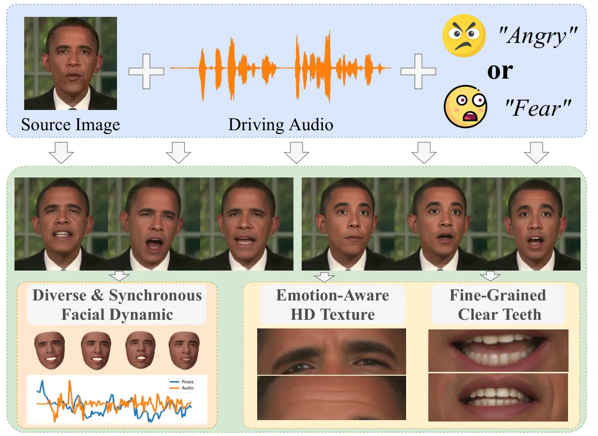

Figure 1: Example animations produced by FlowVQTalker. Given a source
image and a driving audio, FlowVQTalker creates talking face video,
complete with diverse and synchronous facial dynamic, emotion-aware HD
texture and fine-grained clear teeth.

To address this, we initially identify two vital observations for
natural-looking talking heads from a human perspective: 1) In reality,
non-verbal facial cues exhibit inherent variability, rendering them
non-deterministic in nature \[46\]. Therefore, the mapping from input
audio to generated video constitutes a one-to-many relationship \[50\],
where one audio clip can manifest in multiple plausible visual results
owing to the fluid emotions, blinks, and head poses. 2) Authentic
expressions not only retain the identity of source image but also
feature intricate textures, such as wrinkles that intensify the
expressiveness of the desired emotion. As depicted in Fig. 1, vertical
lines between the eyebrows commonly accompany anger, while horizontal
wrinkles on the forehead are associated with fear or surprise \[10\].
Furthermore, a high-quality video should encompass clear teeth. The
observations succinctly encapsulate the key considerations in the avatar
generation process, guiding the direction of progress and enhancement
towards more engaging and realistic talking face synthesis.

Recent efforts have focused on modeling facial expressions \[48, 49,
12\] and head motions. \[11, 44, 36\] rely on discrete emotional labels
to prompt emotions, while \[17, 23, 26\] introduce an emotion reference
video to suggest the desired expression. \[60, 61, 66\] infer head poses
from audio via a time series analysis model \[24\]. Despite their
contributions in enhancing the expressiveness of generated avatars,
these methods still exhibit certain limitations: 1) Since non-verbal
facial dynamics exhibit weak correlations with audio, such deterministic
models tend to produce fixed and unrealistic outputs, lacking the
diversity. 2) Low-resolution image generator \[17, 47, 26\] struggle to
capture emotion-aware textures and clear teeth. Additionally, they face
challenges in maintaining consistency between the generated video and
source image \[57, 32\]. As a result, these methods have not addressed
the two core observations mentioned earlier.

In this paper, we propose a novel method called FlowVQTalker to generate
vibrant emotional talking head videos that meet: (1) diverse outputs
encompassing various facial dynamics that respond to the driving audio
and the emotional context. (2) preservation of the identity information
from the source image, accompanied by the presentation of rich
emotion-aware textures and clear teeth to enhance expressive performance
and video quality. FlowVQTalker is comprised of the Flow-based Coeff.
Generator (FCG) and Vector-Quantized Image Generator (VQIG), which are
interconnected via the coefficients of 3D Morphable Models (3DMM) \[7\].
Within the FCG, we devise ExpFlow and PoseFlow for expression and pose
coefficient modeling, built upon the generative flow model \[40\]. To
elaborate, ExpFlow establishes an invertible transformation between
emotional expression coefficients and latent codes, which are then
mapped into the Student’s $`t`$ mixture model (SMM). Each mixture
component of the SMM encodes features for an emotion class, wherein
latent codes within the same component represent the same emotion while
differing in nonverbal facial cues. During inference, we stochastically
sample latent codes from the corresponding SMM component, ensuring the
diversity of generated expressions. Furthermore, the one-to-one and
bijective relationship between expression coefficients and latent codes
enables us to achieve emotion transfer by providing an emotion
reference. PoseFlow employs a similar technique to ExpFlow but
incorporates specific modifications for handling pose-related aspects,
as detailed in Sec. 3.2.

On the other hand, VQIG approaches the synthesis of fine-grained
textures and teeth from a fresh perspective. We regard image rendering
as a code query task within a learned codebook. This perspective is
inspired by the capabilities of the codebook in VQ-GAN \[9\], which
excels at preserving emotion-aware texture information and supplying a
wealth of visual elements for generating top-quality faces. However, the
vanilla VQ-GAN framework grapples with preserving identity information
when appearing frequent spatial transformations. To this end, we extract
features from source image to complement the motion synthesis,
facilitating high-fidelity and expressive talking faces creation.

In summary, our contributions are outlined as follows:

- •
  We introduce FlowVQTalker, a system capable of generating emotional
  talking face videos with diverse facial dynamics and fine-grained
  expressions.
- •
  We harness the generative flow model to forecast non-deterministic and
  realistic coefficients. To the best of our knowledge, we are the
  pioneers in applying normalizing flow for emotional talking face
  generation.
- •
  The visual codebook within our proposed VQIG enriches the textures
  with emotion-aware HD details, thereby enhancing expressiveness and
  elevating video quality.
- •
  Extensive experiments demonstrate that our FlowVQTalker outperforms
  the competing methods in both quantitative and qualitative evaluation.

## 2 Related Work

### 2.1 Audio-Driven Talking Face Generation

Existing audio-driven talking face generation methods can be broadly
categorized into reconstruction-based methods and intermediate
representation-based methods. On the one hand, the former \[4, 45, 72\]
typically involve mapping inputs from different modalities (e.g., audio
and images) to corresponding features using encoders. Subsequently,
these features are decoded to produce the talking faces. For example,
Prajwal *et al*. \[38\] train their Wav2Lip following adversarial
process \[28\], where the generator, based on an encoder-decoder
architecture, reconstructs videos from the extracted features, and the
lip-sync discriminator \[6\] is employed to improve lip-synchronization.
On the other hand, the intermediate representations, like landmarks \[5,
76, 67, 71\] and dense motion fields \[60, 61\], are leveraged to bridge
the modality gap. Zhou *et al*. \[75\] proposes a two-stage model to
predict facial landmarks from audio, which subsequently serve as a
condition for video synthesis. In contrast, we adopt 3D Morphable Model
(3DMM) \[7\] as the bridge, as it offers better decoupling and control
over expression, pose, and identity. Moreover, these methods neglect
incorporation of expressive emotions into the generated faces, which is
the main focus of our work.

### 2.2 Emotional Talking Face Generation

In the pursuit of achieving lifelike and emotionally expressive talking
face generation, an increasing number of studies are incorporating
emotion as a crucial element. One prevalent category of emotion sources
in current methods is one-hot labels \[44, 19, 8, 37, 56, 11, 33, 34\].
Wang *et al*. \[58\] release an emotional audio-visual dataset MEAD and
aligns neutral images with emotional states through the guidance of
one-hot emotion labels using a U-Net. However, such deterministic models
are prone to producing fixed expressions. Instead, our approach involves
mapping different expressions into the latent distribution of a mixture
model through normalizing flow \[40, 16\]. This enables us to sample a
range of diverse expressions from the modeled distributions during
inference. Recent works \[53, 17, 65, 23\] focus on emulating the
speaking styles of given reference, thereby conveying more diverse
expressions. Ma *et al*. \[26\], for instance, extract style codes from
the 3DMM expression coefficients and generate lip movements synchronized
with audio. Leveraging the forward process of normalizing flow, our
method readily identifies the precise latent code corresponding to the
given coefficients in the modeled distribution, thus achieving
controllable emotional transfer.

### 2.3 Vector-Quantized Codebook

Vector-Quantized Network \[31, 9\] learns a codebook to store quantized
features extracted from an autoencoder, significantly enhancing image
modeling. Due to its effectiveness in replacing extracted features with
quantized ones, this approach has demonstrated its remarkable potential
in image restoration \[74, 13, 63\] and talking face generation \[59,
64, 54\]. Ng *et al*. \[30\] store facial motion in a discrete codebook
and generate potential responsive motions of listeners during
conversations. Wang *et al*. \[59\] learn position-invariant quantized
local patch representations and employ a transformer to achieve face
reenactment. However, both methods construct speaker-specific codebooks,
which face challenges to generalize on arbitrary identities and facial
motions. In contrast, our approach utilizes a generic codebook capable
of representing a wide range of identities and facial expressions,
enabling the production of high-quality talking face videos with rich
emotional facial textures. To the best of our knowledge, we are the
pioneers in employing normalizing flow and vector-quantized codebooks
for speech-driven emotional facial animation.

## 3 Method

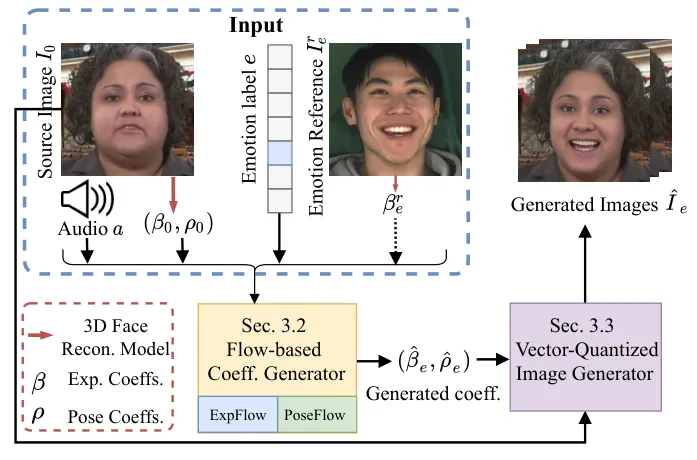

(a) The pipeline of our proposed FlowVQTalker

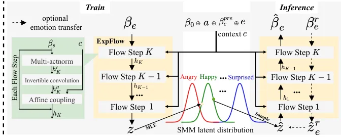

(b) The framework of ExpFlow and train/inference workflow.

Figure 2: The overview of our proposed FlowVQTalker. (a) Main pipeline.
Given a source image $`I_{0}`$, audio $`a`$ and emotion label $`e`$,
Flow-based Coeff. Generator ( Sec. 3.2) which consists of ExpFlow and
PoseFlow generates synchronized emotional coefficients
$`(\hat{\beta_{e}},\hat{\rho_{e}})`$. ExpFlow also supports emotion
transfer by inputting an additional emotion reference $`I^{r}_{e}`$.
Subsequently, Vector-Quantized Image Generator (Sec. 3.3) takes as input
the generated coefficients $`(\hat{\beta_{e}},\hat{\rho_{e}})`$ and
source image $`I_{0}`$, producing emotional talking face frames
$`\hat{I}_{e}`$. (b) The framework of ExpFlow and train/inference
workflow. ExpFlow is composed of $`K`$ flow steps, each containing three
subsections: multi-actnorm, invertible convolution, and an affine
coupling layer. Based on the property of normalizing flow \[41\], our
proposed ExpFlow is bijective. To provide a clearer understanding, we
separately represent the training (left) and inference (right)
workflows, but note that they run on the same network structure. During
training, the ground truth emotional coefficient $`\beta_{e}`$ is passed
through the forward process (left) of ExpFlow, leading to the conversion
into a latent code $`z`$, which is then mapped into the SMM latent space
using Maximum Likelihood Estimation (MLE). During inference, we sample
$`\hat{z}`$ from the distribution corresponding to emotion $`e`$, which
is then fed into the reverse process (right) of ExpFlow to generate
$`\hat{\beta}_{e}`$. Besides, as indicated by the dotted arrows,
$`\hat{z}`$ can also be obtained by inputting emotion reference
$`\beta^{r}_{e}`$ into forward process of ExpFlow, achieving optional
emotion transfer. Both training and inference are conditioned on
contextual information, including the source coefficient $`\beta_{0}`$,
driving audio $`a`$, previous coefficients
$`\beta^{pre}_{e}=\beta^{t-\tau:t-1}_{e}`$ and emotion label $`e`$,
where $`t`$ and $`\tau`$ refer to current frame index and previous frame
length. Note that we employ an audio encoder and an emotion encoder to
obtain corresponding features from $`a`$ and $`e`$ before the
concatenation operator, and the detailed structures are in supplementary
material.

### 3.1 Overview

Fig. 2(a) illustrates the pipeline of FlowVQTalker, which is designed to
create emotional talking head videos based on a source image $`I_{0}`$,
driving audio $`a`$ and emotion label $`e`$. We also achieve emotion
transfer by introducing an emotion reference $`I^{r}_{e}`$. Basically,
we leverage the expression coefficients $`\beta\in\mathbb{R}^{64}`$ and
pose coefficients $`\rho\in\mathbb{R}^{6}`$ of 3D Morphable Models
(3DMM) \[3\] to represent facial dynamics. Specifically, we input
$`\{(\beta_{0},\rho_{0}),a,e\}`$ or
$`\{(\beta_{0},\rho_{0}),a,\beta^{r}_{e}\}`$ (for emotion transfer) into
Flow-based Coeff. Generator (Sec. 3.2), comprising ExpFlow and PoseFlow,
to predict emotional facial dynamics
$`(\hat{\beta}_{e},\hat{\rho}_{e})`$. By integrating the designed
Vector-Quantized Image Generator (Sec. 3.3), we generate emotional
talking head frames $`\hat{I}_{e}`$ from the generated
$`(\hat{\beta}_{e},\hat{\rho}_{e})`$ and the source image $`I_{0}`$. The
following subsections will delve into the finer details of each module.

### 3.2 Flow-based Coeff. Generator

Preliminary of Generative Flow Model. Normalizing flow \[40\] serves as
a generative model with a primary advantage: it can effectively model a
complex distribution $`\mathcal{X}`$ by leveraging a simple, fixed base
distribution $`\mathcal{Z}`$ through an invertible and differentiable
nonlinear transformation $`f`$. This reversibility of $`f`$ implies that
$`z\in\mathcal{Z}`$ can be readily obtained from $`x\in\mathcal{X}`$
using an inverse process denoted as $`f^{-1}`$, constituting a
_normalizing flow_. When dealing with highly complex distributions, it
is often necessary to employ a series of multiple flow steps
$`\{f_{n}\}^{K}_{n=1}`$ to achieve the desired distribution modeling:
$`f=f_{K}\circ\cdots\circ f_{2}\circ f_{1}`$. Formulaically, for a given
complex distribution $`\mathcal{X}\sim p_{\mathcal{X}}`$, a simple
distribution $`\mathcal{Z}\sim p_{\mathcal{Z}}`$ and hidden
distributions $`\mathcal{H}_{n}`$, the transformations among these can
be represented as:

```math
{z}\stackrel{{\scriptstyle{f}_{1}}}{{\longleftrightarrow}}{h}_{1}\stackrel{{\scriptstyle{f}_{2}}}{{\longleftrightarrow}}{h}_{2}\cdots\stackrel{{\scriptstyle{f}_{K}}}{{\longleftrightarrow}}{x} \tag{1}
```

```math
x=f(z)=f_{K}(f_{K-1}(...f_{1}(z))) \tag{2}
```

```math
z=f^{-1}(x)=f^{-1}_{1}(f^{-1}_{2}(...f^{-1}_{K}(x))) \tag{3}
```

Given $`\left(\frac{\partial z_{k}}{\partial z_{k-1}}\right)`$ as the
Jacobian matrix of $`f^{-1}_{n}`$ at $`x`$, the log-likelihood \[2\] is
formulated using maximum likelihood:

```math
\log_{\mathcal{X}}(x)=\log_{\mathcal{Z}}(z)+\sum_{k=1}^{K}\log\left|\operatorname{det}\left(\frac{\partial z_{k}}{\partial z_{k-1}}\right)\right|, \tag{4}
```

ExpFlow. We apply normalizing flow \[40\] to produce the expression
coefficients of talking face with diverse facial emotion dynamics.
However, several non-trivial challenges have emerged: 1) Calculating
$`\operatorname{det}\left(\frac{\partial z_{k}}{\partial z_{k-1}}\right)`$
comes with computational complexity that approaches
$`\mathcal{O}(D^{3})`$, which is intractable for large input dimension
$`D`$. 2) Encoding various emotional coefficients into the latent space
and further sampling the specified latent code $`z`$ has been minimally
explored. 3) The scarcity of emotional audio-visual dataset poses
difficulties for modeling mixture distributions. To tackle these
challenges, we introduce ExpFlow, which not only establishes a more
efficient architecture but also leverages a mixture model designed for
few-shot learning.

Fig. 2(b) illustrates the framework of ExpFlow built on \[22, 14, 16\].
The ground truth (GT) emotional coefficients
$`\beta^{t}_{e}\in\mathbb{R}^{64}`$ (for simplicity, we omit time $`t`$
in the following) and conditional context $`c`$ pass through $`K`$ flow
steps to yield latent code $`z\in\mathbb{R}^{64}`$. In our work, the
context $`c`$ contains the source coefficient $`\beta_{0}`$ for
preserving identity, driving audio $`a`$ for lip motion guidance, the
previous $`\tau`$ coefficients
$`\beta^{pre}_{e}=\beta^{t-\tau:t-1}_{e}`$ for video frame consistency
and emotion label $`e`$ for specifying desired expression.

Each flow step of transformation $`f^{-1}_{i}(\cdot)`$ consists of
multi-actnorm, invertible convolution and the affine coupling layer. A
detailed schematic is provided in the supplementary (Suppl). For the
multi-actnorm, given the mean $`\mu`$ and standard deviation $`\delta`$
for each set of emotional data, we implement it as an affine
transformation: $`h^{\prime}=\frac{\beta-\mu}{\delta}`$. In our case, we
initialize $`\mu`$ and $`\delta`$ with the same parameters for each
emotion and update them during training, which helps mitigate
overfitting \[16\]. Next, ExpFlow introduces an invertible $`1\times 1`$
convolution layer: $`h^{\prime\prime}=\mathbf{W}\cdot h^{\prime}`$,
designed to handle potential channel variations. Following this, we
utilize a coupling layer based on a transformer $`\mathcal{F}`$ to
generate $`h`$ from $`h^{\prime\prime}`$ and $`c`$. More specifically,
we split $`h^{\prime\prime}`$ into $`h^{\prime\prime}_{h1}`$ and
$`h^{\prime\prime}_{h2}`$, where $`h^{\prime\prime}_{h2}`$ is affinely
transformed by $`\mathcal{F}`$ based on $`h^{\prime\prime}_{h1}`$:

```math
t,s=\mathcal{F}(h^{\prime\prime}_{h1},c);\qquad h=[h^{\prime\prime}_{h1},(h^{\prime\prime}_{h2}+t)\odot s], \tag{5}
```

where $`t`$ and $`s`$ denote the transformation parameters. Thanks to
the preserved $`h^{\prime\prime}_{h1}`$, we can maintain tractability in
the reverse direction. To sum up, we have the capability to map
$`\beta_{e}`$ into the latent code $`z`$ and predict coefficients based
on a sampled code $`\hat{z}\in p\mathcal{Z}`$ as follows:

```math
z=f^{-1}(\beta_{e},c);\qquad\hat{\beta}_{e}=f(\hat{z},c) \tag{6}
```

Furthermore, we mitigate the computational complexity from
$`\mathcal{O}(D^{3})`$ by streamlining the computation of the Jacobian
determinant using a transformer $`\mathcal{F}`$, analyzed in \[22\].

Up to this point, the need for a suitable distribution model
$`p_{\mathcal{Z}}`$ is paramount. To this end, we turn to Student’s
$`t`$ Mixture Model (SMM) which encompasses a ‘fat tail’ of multivariate
$`t`$-distribution, particularly effective when working with our
relatively small datasets \[1\]. Concretely, if the outliers within the
coefficient distribution cannot be adequately explained by the latent
distribution, they exert an unbounded influence on the maximum
likelihood process. Therefore, to mitigate the impact of these outlier
data points, the $`t`$-distribution becomes our preferred choice. Given
emotion label $`e\in{1,\cdots,C}`$, mean $`\mu_{i}`$, $`\Sigma_{i}`$ and
the degrees of freedom $`\nu(>0)`$, a multivariate $`t`$-distribution
and marginal distribution of $`z`$ known as SMM are expressed as:

```math
p_{\mathcal{Z}}(z\mid e=i)=t_{\nu}\left(z\mid\mu_{i},\Sigma_{i}\right), \tag{7}
```

```math
p_{\mathcal{Z}}(z)=\sum_{i=1}^{\mathcal{C}}\pi_{i}t_{\nu}\left(z\mid\mu_{i},\Sigma_{i}\right), \tag{8}
```

where $`\pi_{i}`$ is the mixture coefficient. Here we hypothesise that
all categories of emotions have the same proportion, setting
$`\pi_{i}=\frac{1}{\mathcal{C}}`$. Following \[16\], the
emotion-class-conditional likelihoods of $`\beta_{e}`$ is:

```math
p_{\beta_{e}\sim\mathcal{X}}(\beta_{e}\mid e=i)=t_{\nu}\left(z\mid\mu_{i},\Sigma_{i}\right)\cdot\prod_{k=1}^{K}\left|\operatorname{det}\left(\frac{\partial z_{k}}{\partial z_{k-1}}\right)\right| \tag{9}
```

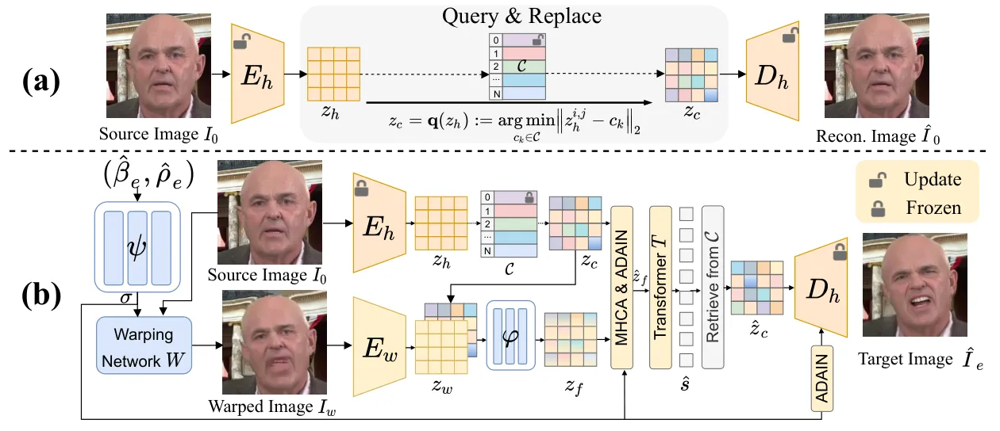

Figure 3: The structure of Vector-Quantized Image Generator (VQIG). (a)
Codebook. Initially, we train a high-quality image encoder $`E_{h}`$,
codebook $`\mathcal{C}`$ and image decoder $`D_{h}`$ using a
self-reconstruction strategy. Once converged, we freeze the parameters
of $`{E_{h}}`$, $`\mathcal{C}`$ and $`D_{h}`$. (b) VQIG. $`I_{0}`$ are
encoded as a discrete representation $`z_{c}`$ to capture identity and
texture information. $`(\hat{\beta}_{e},\hat{\rho}_{e})`$ generated
by Sec. 3.2 are mapped into $`\sigma`$ by $`\psi`$, which is then used
to warp $`I_{0}`$ into $`I_{w}`$. An additional warped image encoder
$`E_{w}`$ is introduced to encode $`I_{w}`$ as $`z_{w}`$. We employ
$`\varphi`$ to derive $`z_{f}`$ from $`z_{w}`$ and $`z_{c}`$. Along with
$`z_{c}`$, both are fed into the multi-head cross-attention module
(MHCA) and a transformer $`T`$. The generated vectors retrieve the
best-matching features from the Codebook $`\mathcal{C}`$. The final
result is rendered through $`D_{h}`$. It is worth noting that we
introduce ADAIN at both feature and image levels to incorporate
additional spatial information.

To ensure that the mean vectors of different emotions are distinct from
each other in the latent space, we randomly initialize the mean vectors
$`\mu`$ of each emotion $`i`$ from the standard normal distribution
$`\mu_{i}\sim\mathcal{N}(0,\textbf{I})`$ and maintain their covariance
matrices as identity according to \[16\]. In combination with SMM, we
can train our ExpFlow by minimizing the negative log-likelihood loss
(MLE):

```math
\mathcal{L}_{\text{exp}}=-\sum_{t=0}^{T-1}\log p_{\mathcal{Z}}\left(f^{-1}(\beta^{t}_{e},c)\mid e^{t}\right), \tag{10}
```

where $`T`$ is the length of audio $`a`$. To guarantee video continuity,
we introduce the consistency loss $`\mathcal{L}_{\text{con}}`$:

```math
\mathcal{L}_{\text{con}}=\|(\beta^{t}_{e}-\beta^{t-1}_{e})-(\hat{\beta}^{t}_{e}-\hat{\beta}^{t-1}_{e})\|_{1}, \tag{11}
```

where $`\hat{\beta}_{e}`$ is generated by the reverse process in Eq. 6.

During inference, we produce the coefficient sequence in an
autoregressive fashion, with the current output $`\hat{\beta}^{t}_{e}`$
serving as the context for the subsequent iteration, as the previous
frame $`\beta^{pre}_{e}`$. Furthermore, we have the option to replace
the randomly sampled $`\hat{z}`$ with
$`\hat{z}^{r}_{e}=f^{-1}(\beta^{r}_{e})`$ to facilitate emotion
transfer, where $`\beta^{r}_{e}`$ are extracted from the emotion
reference $`I^{r}_{e}`$, as depicted in 2(a).

We notice that the dropout of $`\beta^{pre}_{e}`$ in context $`c`$
significantly influences emotion diversity (as confirmed in Fig. 6).
Besides, while the ’fat tail’ of the $`t`$-distribution has effectively
addressed the outlier issue resulting from limited data, we have further
improved performance through Manifold Projection \[25\]. Particularly,
we apply the trained ExpFlow to obtain and store all
$`z\in\mathbb{R}^{64}`$ from the training set as the prior
$`\mathcal{D}\in\mathbb{R}^{N\times 64}`$. At inference time, for each
randomly sampled $`\hat{z}`$, we find the $`\mathcal{K}`$ nearest points
$`\{\overline{z}_{1},\cdots,\overline{z}_{\mathcal{K}}\}`$ in
$`\mathcal{D}`$. Subsequently, we substitute
$`\sum^{\mathcal{K}}_{k=1}w_{k}\cdot\overline{z}_{k}`$ for $`\hat{z}`$,
where the weights $`w_{k}`$ are determined by minimizing
$`\text{min}\|\hat{z}-\sum^{\mathcal{K}}_{k=1}w_{k}\cdot\overline{z}_{k}\|^{2}_{2}`$,
$`\sum^{\mathcal{K}}_{k=1}w_{k}=1`$. In this way, we maintain the
original diversity while enhancing robustness.

PoseFlow. PoseFlow is designed to generate a sequence of head poses
based on audio and pose history. To achieve this, PoseFlow follows a
similar framework as ExpFlow shown in Fig. 2(b). However, there are
several key modifications. First, given that the emotional dataset
MEAD \[58\] used in our work, used in our work lacks pose information,
we adapt the context $`c`$ from $`[\beta_{0},a,\beta^{pre}_{e},e]`$ to
$`c_{\text{pose}}=[a,\rho^{pre}]`$. The rationale for excluding the
source head pose $`\rho_{0}`$ is that a single frame’s pose does not
convey identity information. Second, we employ a Gaussian distribution
$`\mathcal{N}(0,\textbf{I})`$ as our $`p_{\mathcal{Z}}`$ instead of SMM,
as we disregard the influence of emotion on head pose. Third, given the
pose flow step $`f_{pose}`$, we replace the loss function in Eq. 10 with
$`\mathcal{L}_{\text{pose}}`$:

```math
\mathcal{L}_{\text{pose}}=-\sum_{t=0}^{T-1}\log p_{\mathcal{Z}}\left(f^{-1}_{pose}(\rho^{t},c_{pose})\right) \tag{12}
```

### 3.3 Vector-Quantized Image Generator

Upon obtaining the emotional coefficients
$`(\hat{\beta}_{e},\hat{\rho}_{e})`$, we employ them to animate the
source image $`I_{0}`$ with intricate textures, which are crucial for
conveying desired emotions. Our key insight is to build a discrete
codebook, which stores high-quality visual textures of face images
including teeth, providing essential details to enhance the quality of
the animated results. Leveraging this context-rich codebook, we
introduce our Vector-Quantized Image Generator (VQIG) to enable
high-fidelity and expressive image rendering.

Codebook. We draw inspiration from VQGAN \[9\], and train our
texture-preserving codebook prior by self-reconstruction. Concretely, as
illustrated in Fig. 3a, we initially apply a high-quality image encoder
$`E_{h}`$ to embed the source image
$`I_{0}\in\mathbb{R}^{H\times W\times 3}`$ into the latent vector
$`z_{h}\in\mathbb{R}^{m\times n\times d}`$. Then we generate the
vector-quantized representation $`z_{c}`$ by involving an introduced
codebook $`\mathcal{C}=\{c_{k}\in\mathbb{R}^{d}\}^{N}_{k=1}`$ and
replacing $`z_{c}`$ with the queried nearest code $`c_{k}`$ in
$`\mathcal{C}`$:

```math
z_{c}=\textbf{q}(z_{h}):=\underset{{c_{k}}\in\mathcal{C}}{\arg\min}\left\|{z^{i,j}_{h}}-{c_{k}}\right\|_{2}. \tag{13}
```

Subsequently, an image decoder $`D_{h}`$ is leveraged to reconstruct the
input image $`\hat{I}_{0}`$. To jointly train the above modules in an
end-to-end fashion, we adopt reconstruction loss
$`\mathcal{L}_{\text{rec}}`$, perceptual loss
$`\mathcal{L}_{\text{per}}`$ \[18, 68\] and adversarial loss
$`\mathcal{L}_{\text{adv}}`$ \[9\]:

```math
\mathcal{L}_{\text{rec}}=\|I_{0}-\hat{I}_{0}\|_{1};\qquad\mathcal{L}_{\text{per}}=\|\Phi(I_{0})-\Phi(\hat{I}_{0})\|^{2}_{2}; \tag{14}
```

```math
\mathcal{L}_{\text{adv}}=\text{log}D(I_{0})+\text{log}(1-D(\hat{I}_{0})), \tag{15}
```

where $`\Phi`$ denotes the feature extractor of VGG19 \[43\]. To update
$`E_{h}`$ and $`\mathcal{C}`$, we utilize code-level loss
$`\mathcal{L}_{\text{code}}`$ and $`\mathcal{L}_{\text{feat}}`$:

```math
\mathcal{L}_{\text{code}}=\|\text{sg}(z_{h})-z_{c}\|^{2}_{2};\qquad\mathcal{L}_{\text{feat}}=\|z_{h}-\text{sg}(z_{c})\|^{2}_{2}, \tag{16}
```

where $`\text{sg}(\cdot)`$ donates the stop-gradient operator. Given the
loss weights $`\lambda`$s, the total loss $`\mathcal{L}_{\text{tot}}`$
is represented as:

```math
\mathcal{L}_{\text{tot}}=\mathcal{L}_{\text{rec}}+\mathcal{L}_{\text{pre}}+\lambda_{\text{adv}}\mathcal{L}_{\text{adv}}+\mathcal{L}_{\text{code}}+\lambda_{\text{feat}}\mathcal{L}_{\text{feat}}. \tag{17}
```

VQIG. Once the codebook $`\mathcal{C}`$ is well-trained, we freeze the
parameters of $`E_{h}`$, $`\mathcal{C}`$ and $`D_{h}`$, and devise
Vector-Quantized Image Generator (VQIG) for image animation shown
in Fig. 3b. Specifically, the source image $`I_{0}`$ is first
transformed into $`z_{h}=E_{h}(I_{0})`$ and quantize it as
$`z_{c}=\textbf{q}(z_{h})`$, which delivers the identity and texture
information. Considering that the predicted coefficients
$`(\hat{\beta}_{e},\hat{\rho}_{e})`$ provide the motion guidance, we
introduce a mapping network $`\Phi`$ \[39\] to generate motion
descriptors $`\sigma=\Phi(\hat{\beta}_{e},\hat{\rho}_{e})`$, which are
used to further warp $`I_{0}`$ as $`I_{w}`$ via a warping network $`W`$.
Subsequently, we extract $`z_{w}`$ using warped image encoder $`E_{w}`$,
which is fine-tuned from $`E_{h}`$ during training VQIG. While $`I_{w}`$
roughly achieves spatial transformation, it may struggle to preserve
identity and texture information with detrimental artifacts. To this
end, we compensate with $`z_{c}`$ by combining it with $`z_{w}`$ as
$`z_{f}`$ using a fuse network $`\varphi`$. To enhance the performance
of emotion-aware texture, we employ a multi-head cross-attention
mechanism (MHCA) \[63\] and an adaptive instance normalization
(AdaIN) \[15\] operator to spatially fuse $`z_{c}`$ and $`z_{f}`$, which
helps to restore the face with fidelity and motion guidance,
respectively. Subsequently, we insert a transformer $`T`$ \[74\] to
predict code sequence
$`\hat{s}\in\{0,\cdot\cdot\cdot,N-1\}^{m\cdot n}`$, which retrieves the
respective code items from learned codebook $`\mathcal{C}`$, forming
quantized features $`\hat{z}_{c}`$. Through the decoder $`D_{h}`$, we
generate high-fidelity and expressive face images $`\hat{I}_{e}`$ with
clear teeth.

To train our VQIG, we adopt the two-stage train strategy \[74\]:
code-level and image-level supervision. Firstly, we extract code
sequence $`s`$ and latent features $`z_{c}`$ from GT frame and minimize
the difference with the predicted ones:

```math
\mathcal{L}^{\text{VQIG}}_{\text{code}}=\sum^{m\cdot n-1}_{i=0}-s_{i}\text{log}(\hat{s}_{i});\qquad\mathcal{L}^{\text{VQIG}}_{\text{feat}}=\|\hat{z}_{f}-z_{c}\|^{2}_{2}. \tag{18}
```

Besides, we incorporate the same image-level loss functions as Eq. 14
and Eq. 15.

## 4 Experiments

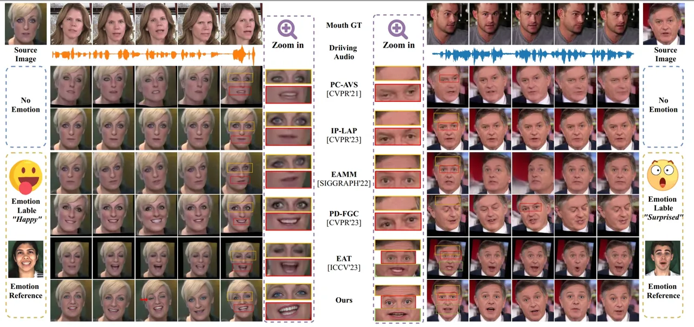

Figure 4: Qualitative comparisons with state-of-the-art methods. See
full comparison in supplementary material (Suppl).

### 4.1 Experimental Settings

Datasets and Implementation Details. We train our framework on
MEAD \[58\] and HDTF \[70\]. During training codebook, we additionally
incorporate FFHQ dataset \[20\] to further improve face modeling
capabilities and enhance the preservation of expressive textures. MEAD
includes videos of 60 participants expressing 8 different emotions while
speaking 30 sentences. HDTF collects various talking videos featuring
over 300 identities from YouTube. We categorize the video clips in MEAD
into eight emotion categories as originally specified and designate the
video clips in HDTF as the ninth category, as they generally represent
speaking styles closer to reality without pronounced emotions. FFHQ
dataset comprises 70,000 high-quality face images. We crop and resize
all data as a resolution of $`512\times 512`$ and the latent vector dims
are $`m=n=16,d=256`$. The codebook size and loss weights are set as
$`N=1024`$, $`\lambda_{\text{adv}}=0.8`$,
$`\lambda_{\text{feat}}=0.25`$, respectively. Our method is implemented
with PyTorch and trained using the Adam optimizer \[21\] on 4 NVIDIA
GeForce GTX 3090.

Comparison Setting. We compare our method with: (a) emotion-agnostic
talking face generation methods: Wav2Lip \[38\], PC-AVS \[73\],
IP-LAP \[71\]; (b) emotional talking face generation methods:
EAMM \[17\], EMMN \[47\], EAT \[11\], PD-FGC \[53\]. The former focuses
on the synchronization between the generated lip motion and the input
audio, which is validated by Landmarks Distances on the Mouth
(M-LMD) \[5\] and the confidence score of SyncNet \[6\]. In contrast,
the emotional talking head generation methods performs expressive
expressions on the whole face, where we employ Facial Landmarks
Distances (F-LMD) for evaluation. In addition, we fine-tune the
Emotion-Fan \[27\] using MEAD dataset and measure the emotion accuracy
($`\text{Acc}_{\text{emo}}`$). Furthermore, SSIM \[62\] and FID \[42\]
are adopted to assess image quality, while cumulative probability blur
detection (CPBD) \[29\] is introduced to evaluate the clarity of the
texture.

|                |                  |                   |                        |                                       |                  |                                     |                  |                   |                        |                                       |                  |               |           |           |     |
| -------------- | ---------------- | ----------------- | ---------------------- | ------------------------------------- | ---------------- | ----------------------------------- | ---------------- | ----------------- | ---------------------- | ------------------------------------- | ---------------- | ------------- | --------- | --------- | --- |
| Method         | MEAD \[58\]      |                   |                        |                                       |                  |                                     | HDTF \[70\]      |                   |                        |                                       |                  | Emotion Input |           | Output    |     |
|                | SSIM$`\uparrow`$ | FID$`\downarrow`$ | M/ F-LMD$`\downarrow`$ | $`\text{Sync}_{\text{conf}}\uparrow`$ | CPBD$`\uparrow`$ | $`\text{Acc}_{\text{emo}}\uparrow`$ | SSIM$`\uparrow`$ | FID$`\downarrow`$ | M/ F-LMD$`\downarrow`$ | $`\text{Sync}_{\text{conf}}\uparrow`$ | CPBD$`\uparrow`$ | Label         | Reference | Diversity | HD  |
| Wav2Lip \[38\] | 0.648            | 28.924            | 2.294 / 2.234          | 8.484                                 | 0.104            | 17.64%                              | 0.742            | 19.757            | 1.767 / 1.732          | 9.073                                 | 0.126            | ✗             | ✗         | ✗         | ✗   |
| PC-AVS \[73\]  | 0.510            | 36.804            | 3.130 / 4.062          | 5.641                                 | 0.125            | 15.84%                              | 0.690            | 17.617            | 1.637 / 2.217          | 8.520                                 | 0.119            | ✗             | ✗         | ✗         | ✗   |
| IP-LAP \[71\]  | 0.641            | 26.823            | 2.303 / 2.205          | 3.371                                 | 0.116            | 17.61%                              | 0.710            | 18.461            | 1.789 / 1.708          | 3.357                                 | 0.142            | ✗             | ✗         | ✗         | ✗   |
| EAMM \[17\]    | 0.621            | 26.478            | 2.624 / 2.762          | 1.594                                 | 0.106            | 43.68%                              | 0.604            | 27.302            | 2.747 / 2.746          | 4.296                                 | 0.118            | ✗             | ✓         | ✗         | ✗   |
| PD-FGC \[53\]  | 0.684            | 27.511            | 2.104 / 2.112          | 5.196                                 | 0.103            | 61.47%                              | 0.692            | 16.929            | 1.720 / 1.966          | 7.321                                 | 0.128            | ✗             | ✓         | ✗         | ✗   |
| EMMN \[47\]    | 0.675            | 22.895            | 2.439 / 2.851          | 5.125                                 | 0.116            | 58.53%                              | 0.671            | 20.137            | 2.513 / 2.924          | 5.844                                 | 0.114            | ✓             | ✗         | ✗         | ✗   |
| EAT \[11\]     | 0.684            | 19.836            | 2.056 / 2.284          | 6.533                                 | 0.120            | 65.83%                              | 0.706            | 18.316            | 1.945 / 2.026          | 7.428                                 | 0.121            | ✓             | ✗         | ✗         | ✗   |
| FlowVQTalker   | 0.689            | 16.553            | 1.939 / 2.061          | 5.901                                 | 0.181            | 71.53%                              | 0.708            | 15.165            | 1.643 / 1.958          | 6.766                                 | 0.268            | ✓             | ✓         | ✓         | ✓   |
| GT             | 1.000            | 0.000             | 0.000 / 0.000          | 6.733                                 | 0.161            | 81.68%                              | 1.000            | 0.000             | 0.000 / 0.000          | 7.728                                 | 0.238            | \-            | \-        | \-        | \-  |

Table 1: Quantitative comparisons with state-of-the-art methods.
Supplementary material gives more quantitative comparison results.

### 4.2 Compare with other state-of-the-art methods

Talking Face Generation.  Fig. 4 displays video frames generated by
various SOTA methods (See Suppl for full comparison). PC-AVS and IP-LAP
struggle with preserving identity information and lip synchronization,
respectively. Additionally, both methods cannot generate videos with
emotional expressions. Although EAMM resorts to a driving video as
emotion guidance, it fails to perform vivid expression on the whole
face. PD-FGC and EAT can predict happy faces, but PD-FGC’s surprised
faces lack clear expressions, and EAT faces issues with closed eyes. Our
results demonstrate the preservation of identity information while
accurately expressing corresponding emotions. Note that since
$`\hat{z}`$ is randomly sampled from the modeled distribution, our
method can randomly generate blinks (as pointed out by red arrow),
contributing to expressive and dynamic talking faces. Furthermore,
please see the zoom-in details, the compared methods struggle to
synthesize fine-grained, emotion-aware textures and clear teeth. In
contrast, our method excels at generating high-quality images, even when
the source image is blurred. Tab. 1 shows that our FlowVQTalker achieves
the best performance across most evaluation criteria. Wav2Lip \[38\]
obtains the highest scores in $`\text{Sync}_{\text{conf}}`$ which even
surpasses the ground truth (GT). We assume that Wav2Lip uses SyncNet
confidence as a critical constraint using a SyncNet discriminator \[6\],
which is reasonable to pursue a higher $`\text{Sync}_{\text{conf}}`$. We
obtain similar scores to GT and lower M-LMD, demonstrating our ability
to predict synchronized lip motions. Moreover, since Wav2Lip and IP-LAP
only edit mouth region and keep other facial parts unchanged, they
achieve highest SSIM and lowest F-LMD, respectively. Thanks to our
texture-rich codebook, FlowVQTalker significantly outperforms SOTAs
regarding CPBD on both datasets, which suggests that the details in our
results are clearer and more visually appealing. Note that our emotion
source can be emotion label for high-definition (HD) diverse facial
emotion dynamics generation, or be an emotion reference for emotion
transfer. In contrast, the compared methods can only accommodate one of
these inputs, resulting in a deterministic output.

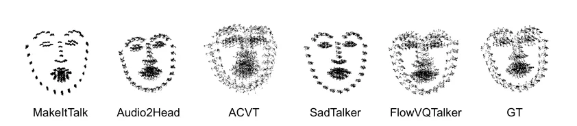

(a) Trace maps

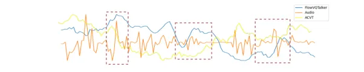

(b) Correlation between audio and poses.

Figure 5: Comparison with SOTAs in terms of generated poses.

Diversity. We present facial dynamics diversity and emotion transfer in
supplementary video, encompassing expression, blink and pose. Here, we
compare with MakeItTalk \[76\], Audio2Head \[60\], AVCT \[61\] and
SadTalker \[69\] concerning pose diversity and correlation with audio,
assessed using trace map \[69\] and correlation map \[60\]. Fig. 5(a)
demonstrates that only AVCT performs comparable diversity with our
FlowVQTalker, while ours achieves better synchronization than ACVT
in Fig. 5(b).

| Metric/Method               | PC-AVS | IP-LAP | EAMM  | EAT   | FlowVQTalker | GT    |
| --------------------------- | ------ | ------ | ----- | ----- | ------------ | ----- |
| Lip-sync                    | 3.89   | 3.91   | 3.43  | 3.94  | 4.03         | 4.88  |
| Iamge-quality               | 3.24   | 3.83   | 3.46  | 3.72  | 4.25         | 4.67  |
| $`\text{Acc}_{\text{emo}}`$ | 31.5%  | 54.9%  | 53.2% | 52.4% | 60.6%        | 76.4% |

Table 2: User study results.

User Study. We conduct user study to evaluate our method from a human
perspective. We recruit 20 participants (10 males/10 females) to score
120 videos (20 videos $`\times`$ (5 methods + GT)) from 1 (worst) to 5
(best) in terms of lip synchronization and image quality. They are also
required to classify the emotion performed by videos. The results,
detailed in Tab. 2, clearly illustrate the superiority of our method
across all evaluated aspects with the aid of our human-like observations
and corresponding solutions.

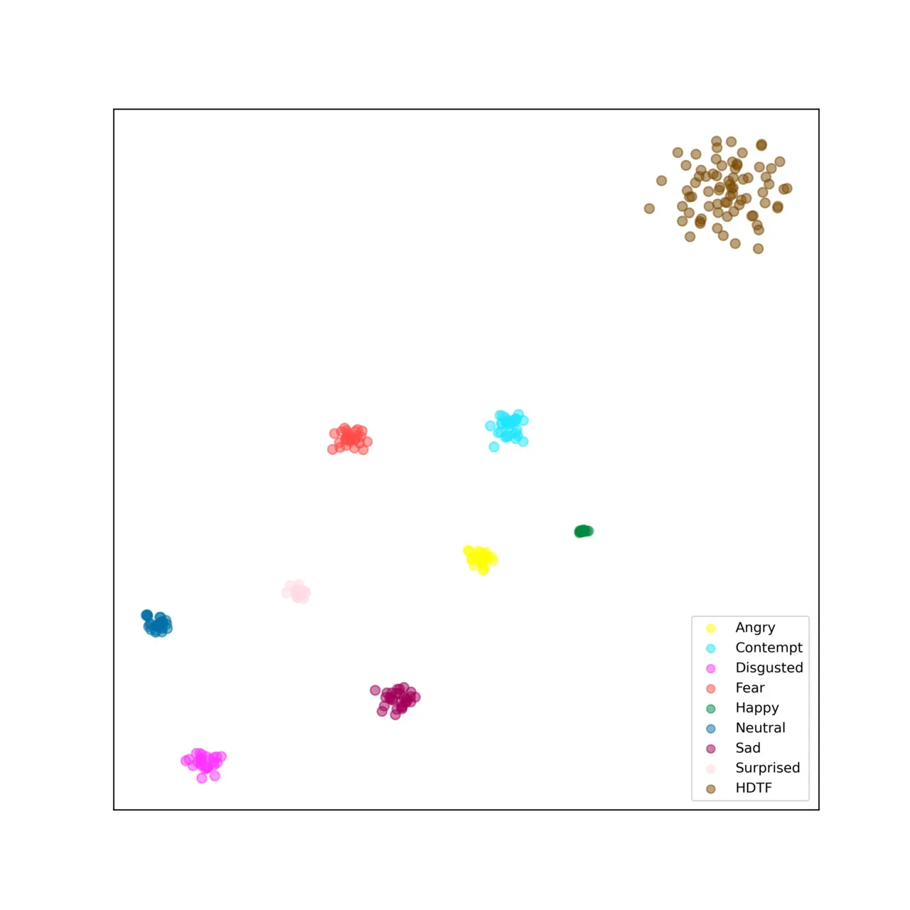

(a) GMM

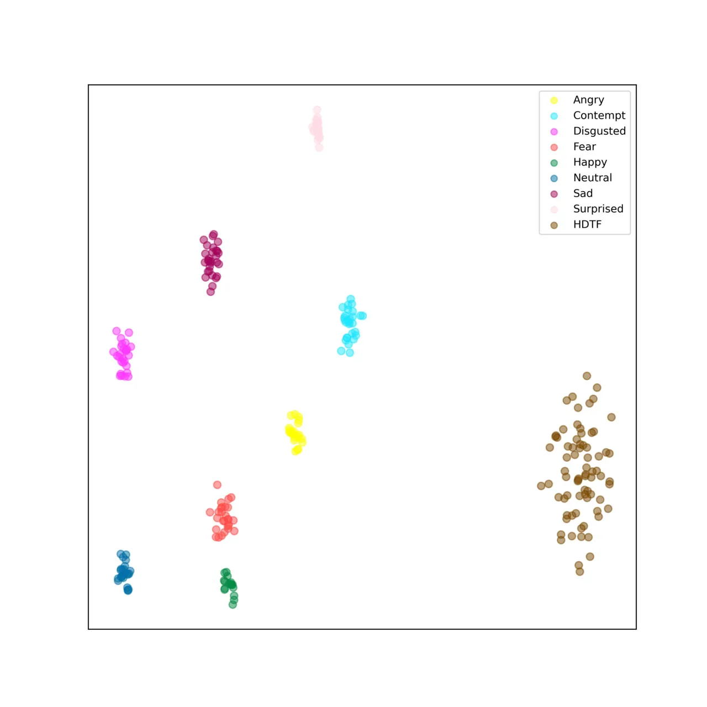

(b) w/o data dropout

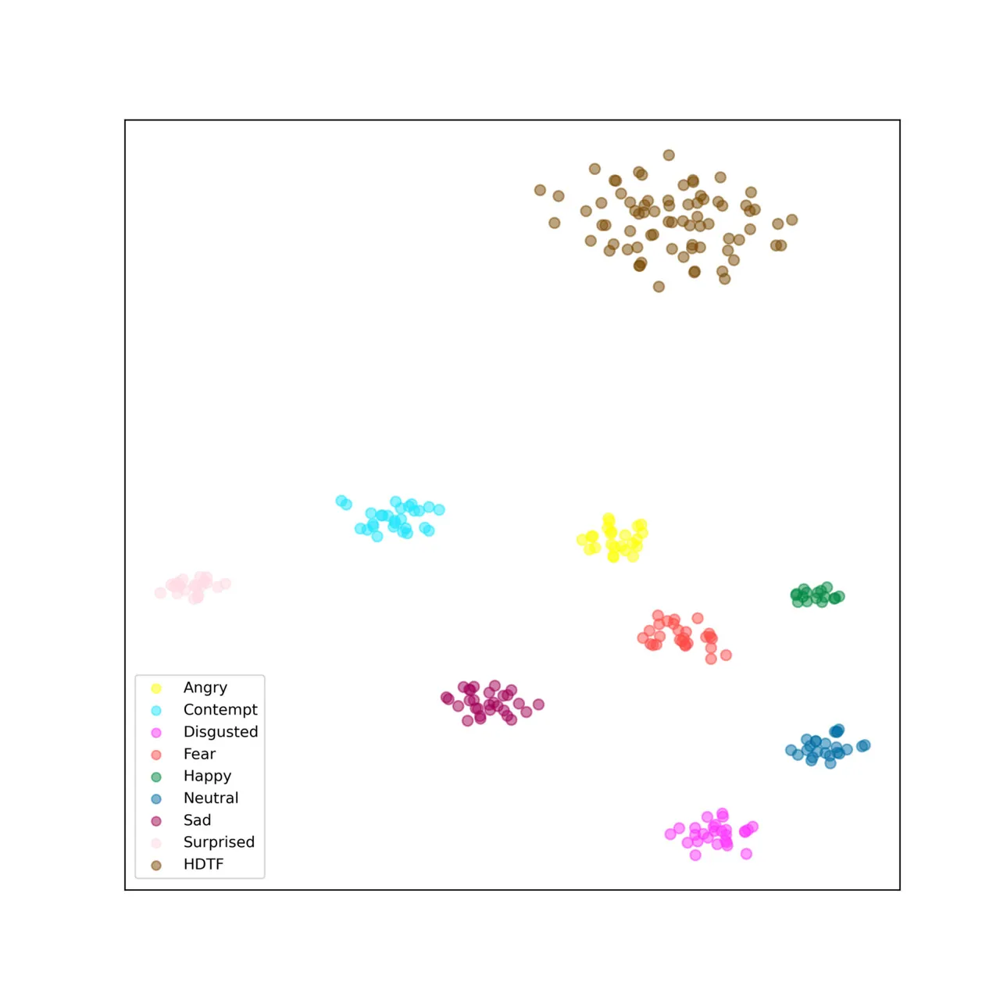

(c) Ours

Figure 6: Visualization of latent space.

### 4.3 Ablation Study.

Ablation of ExpFlow. For ExpFlow, we delve into the impact of different
settings on the latent space, a crucial element in emotional modeling
and diversity. We examin two key variations: (1) GMM: replace SMM with
Gaussian Mixture Model (GMM). (2) w/o data dropout: use SMM but exclude
data dropout. Fig. 6 presents the visualization of the latent space. GMM
tends to overfit and form clusters around specific data points within
our relatively small dataset \[58\]. This leads to poor performance as
the model is prone to sampling outliers. While SMM, with its long-tailed
distributions, mitigates this issue, data dropout is also critical for
constructing more resilient distributions. In addition, data dropout
also improves the consistency between the generated motion and the
context, achieving better synchronization of audio and lip motion as
shown in Suppl.

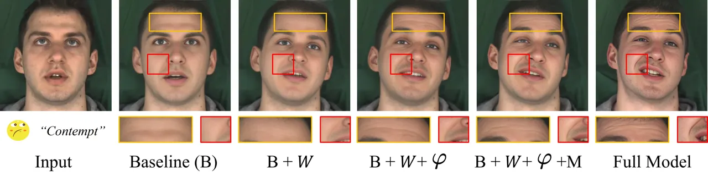

Figure 7: Visualization results of ablation study.

Ablation of VQIG. We conduct an ablation study on VQIG with following
variants: We started with a baseline (B), which retains only $`E_{w}`$,
ADAIN and $`D_{h}`$. Subsequently, we add $`W`$, $`\varphi`$, MHCA and
$`\mathcal{C}`$ in turn to verify the validity of each module, namely
B+$`W`$, B+$`W`$+$`\varphi`$, B+$`W`$+$`\varphi`$+M and
B+$`W`$+$`\varphi`$+M+$`\mathcal{C}`$ (Full Model). The results
presented in Fig. 7, where $`W`$ initially warps the source image but
lacks detail information, $`\varphi`$ and MHCA effectively fuse
identity, texture and spatial information, and the inclusion of
$`\mathcal{C}`$ further improves the fidelity and clarity of the image.

## 5 Conclusion

In this paper, we introduce FlowVQTalker, a system capable of generating
talking face with high-definition expression and non-deterministic
facial dynamics, addressing both insights we set out. Within
FlowVQTalker, flow-based coeff. generator establishes an invertible
mapping between coefficients of 3DMM and a distribution model, allowing
for random sampling to ensure diverse nonverbal facial expressions.
Vector-quantized image generator resorts to a texture-rich codebook and
synthesizes realistic videos with fine-grained details, such as
emotion-aware wrinkles and clear teeth. We conduct comprehensive
experiments to illustrate the superiority of our FlowVQTalker.

## 6 Acknowledgments

This work was supported by National Natural Science Foundation of China
(NSFC, NO. 62102255), Shanghai Municipal Science and Technology Major
Project (No. 2021SHZDZX0102). Tencent Industry-University Collaboration
Research Funding (TencentJR2024IEG111). We would like to thank Xinya Ji,
Yifeng Ma and Yuan Gan for their generous help.

## References

- \[1\] Simon Alexanderson and Gustav Eje Henter. Robust model training
  and generalisation with studentising flows. _arXiv preprint
  arXiv:2006.06599_, 2020.
- \[2\] Anthony J Bell and Terrence J Sejnowski. An
  information-maximization approach to blind separation and blind
  deconvolution. _Neural computation_, 7(6):1129–1159, 1995.
- \[3\] Volker Blanz and Thomas Vetter. A morphable model for the
  synthesis of 3d faces. In _Proceedings of the 26th annual conference
  on Computer graphics and interactive techniques_, pages 187–194, 1999.
- \[4\] Lele Chen, Zhiheng Li, Ross K Maddox, Zhiyao Duan, and Chenliang
  Xu. Lip movements generation at a glance. In _Proceedings of the
  European Conference on Computer Vision (ECCV)_, pages 520–535, 2018.
- \[5\] Lele Chen, Ross K Maddox, Zhiyao Duan, and Chenliang Xu.
  Hierarchical cross-modal talking face generation with dynamic
  pixel-wise loss. In _Proceedings of the IEEE/CVF conference on
  computer vision and pattern recognition_, pages 7832–7841, 2019.
- \[6\] Joon Son Chung and Andrew Zisserman. Out of time: automated lip
  sync in the wild. In _Computer Vision–ACCV 2016 Workshops: ACCV 2016
  International Workshops, Taipei, Taiwan, November 20-24, 2016, Revised
  Selected Papers, Part II 13_, pages 251–263. Springer, 2017.
- \[7\] Yu Deng, Jiaolong Yang, Sicheng Xu, Dong Chen, Yunde Jia, and
  Xin Tong. Accurate 3d face reconstruction with weakly-supervised
  learning: From single image to image set. In _Proceedings of the
  IEEE/CVF conference on computer vision and pattern recognition
  workshops_, pages 0–0, 2019.
- \[8\] Sefik Emre Eskimez, You Zhang, and Zhiyao Duan. Speech driven
  talking face generation from a single image and an emotion condition.
  _arXiv: Audio and Speech Processing_, 2020.
- \[9\] Patrick Esser, Robin Rombach, and Bjorn Ommer. Taming
  transformers for high-resolution image synthesis. In _2021 IEEE/CVF
  Conference on Computer Vision and Pattern Recognition (CVPR)_, 2021.
- \[10\] Gary Faigin. _The artist’s complete guide to facial
  expression_. Watson-Guptill, 2012.
- \[11\] Yuan Gan, Zongxin Yang, Xihang Yue, Lingyun Sun, and Yi Yang.
  Efficient emotional adaptation for audio-driven talking-head
  generation. In _Proceedings of the IEEE/CVF International Conference
  on Computer Vision_, pages 22634–22645, 2023.
- \[12\] Sahil Goyal, Sarthak Bhagat, Shagun Uppal, Hitkul Jangra, Yi
  Yu, Yifang Yin, and Rajiv Ratn Shah. Emotionally enhanced talking face
  generation. In _Proceedings of the 1st International Workshop on
  Multimedia Content Generation and Evaluation: New Methods and
  Practice_, pages 81–90, 2023.
- \[13\] Yuchao Gu, Xintao Wang, Liangbin Xie, Chao Dong, Gen Li, Ying
  Shan, and Ming-Ming Cheng. Vqfr: Blind face restoration with
  vector-quantized dictionary and parallel decoder. In _European
  Conference on Computer Vision_, pages 126–143. Springer, 2022.
- \[14\] Gustav Eje Henter, Simon Alexanderson, and Jonas Beskow.
  Moglow: Probabilistic and controllable motion synthesis using
  normalising flows. _ACM Transactions on Graphics (TOG)_,
  39(6):1–14, 2020.
- \[15\] Xun Huang and Serge Belongie. Arbitrary style transfer in
  real-time with adaptive instance normalization. In _Proceedings of the
  IEEE international conference on computer vision_, pages
  1501–1510, 2017.
- \[16\] Bin Ji, Ye Pan, Yichao Yan, Ruizhao Chen, and Xiaokang Yang.
  Stylevr: Stylizing character animations with normalizing flows. _IEEE
  Transactions on Visualization and Computer Graphics_, 2023.
- \[17\] Xinya Ji, Hang Zhou, Kaisiyuan Wang, Qianyi Wu, Wayne Wu, Feng
  Xu, and Xun Cao. Eamm: One-shot emotional talking face via audio-based
  emotion-aware motion model. In _ACM SIGGRAPH 2022 Conference
  Proceedings_, pages 1–10, 2022.
- \[18\] Justin Johnson, Alexandre Alahi, and Li Fei-Fei. Perceptual
  losses for real-time style transfer and super-resolution. In _Computer
  Vision–ECCV 2016: 14th European Conference, Amsterdam, The
  Netherlands, October 11-14, 2016, Proceedings, Part II 14_, pages
  694–711. Springer, 2016.
- \[19\] Tero Karras, Timo Aila, Samuli Laine, Antti Herva, and Jaakko
  Lehtinen. Audio-driven facial animation by joint end-to-end learning
  of pose and emotion. _ACM Transactions on Graphics (TOG)_,
  36(4):1–12, 2017.
- \[20\] Tero Karras, Samuli Laine, and Timo Aila. A style-based
  generator architecture for generative adversarial networks. In
  _Proceedings of the IEEE/CVF conference on computer vision and pattern
  recognition_, pages 4401–4410, 2019.
- \[21\] Diederik P Kingma and Jimmy Ba. Adam: A method for stochastic
  optimization. _arXiv preprint arXiv:1412.6980_, 2014.
- \[22\] Durk P Kingma and Prafulla Dhariwal. Glow: Generative flow with
  invertible 1x1 convolutions. _Advances in neural information
  processing systems_, 31, 2018.
- \[23\] Borong Liang, Yan Pan, Zhizhi Guo, Hang Zhou, Zhibin Hong,
  Xiaoguang Han, Junyu Han, Jingtuo Liu, Errui Ding, and Jingdong Wang.
  Expressive talking head generation with granular audio-visual control.
  In _Proceedings of the IEEE/CVF Conference on Computer Vision and
  Pattern Recognition_, pages 3387–3396, 2022.
- \[24\] Bryan Lim and Stefan Zohren. Time-series forecasting with deep
  learning: a survey. _Philosophical Transactions of the Royal Society
  A_, 379(2194):20200209, 2021.
- \[25\] Yuanxun Lu, Jinxiang Chai, and Xun Cao. Live speech portraits:
  real-time photorealistic talking-head animation. _ACM Transactions on
  Graphics (TOG)_, 40(6):1–17, 2021.
- \[26\] Yifeng Ma, Suzhen Wang, Zhipeng Hu, Changjie Fan, Tangjie Lv,
  Yu Ding, Zhidong Deng, and Xin Yu. Styletalk: One-shot talking head
  generation with controllable speaking styles. _arXiv preprint
  arXiv:2301.01081_, 2023.
- \[27\] Debin Meng, Xiaojiang Peng, Kai Wang, and Yu Qiao. Frame
  attention networks for facial expression recognition in videos. In
  _2019 IEEE international conference on image processing (ICIP)_, pages
  3866–3870. IEEE, 2019.
- \[28\] Mehdi Mirza and Simon Osindero. Conditional generative
  adversarial nets. _arXiv preprint arXiv:1411.1784_, 2014.
- \[29\] Niranjan D Narvekar and Lina J Karam. A no-reference image blur
  metric based on the cumulative probability of blur detection (cpbd).
  _IEEE Transactions on Image Processing_, 20(9):2678–2683, 2011.
- \[30\] Evonne Ng, Hanbyul Joo, Liwen Hu, Hao Li, Trevor Darrell,
  Angjoo Kanazawa, and Shiry Ginosar. Learning to listen: Modeling
  non-deterministic dyadic facial motion. 2022.
- \[31\] AaronVanDen Oord, Oriol Vinyals, and Koray Kavukcuoglu. Neural
  discrete representation learning.
- \[32\] Trevine Oorloff and Yaser Yacoob. Robust one-shot face video
  re-enactment using hybrid latent spaces of stylegan2. In _Proceedings
  of the IEEE/CVF International Conference on Computer Vision_, pages
  20947–20957, 2023.
- \[33\] Ye Pan, Ruisi Zhang, Shengran Cheng, Shuai Tan, Yu Ding, Kenny
  Mitchell, and Xubo Yang. Emotional voice puppetry. _IEEE Transactions
  on Visualization and Computer Graphics_, 29(5):2527–2535, 2023.
- \[34\] Ye Pan, Shuai Tan, Shengran Cheng, Qunfen Lin, Zijiao Zeng, and
  Kenny Mitchell. Expressive talking avatars. _IEEE Transactions on
  Visualization and Computer Graphics_, 2024.
- \[35\] Pat Pataranutaporn, Valdemar Danry, Joanne Leong, Parinya
  Punpongsanon, Dan Novy, Pattie Maes, and Misha Sra. Ai-generated
  characters for supporting personalized learning and well-being.
  _Nature Machine Intelligence_, 3(12):1013–1022, 2021.
- \[36\] Ziqiao Peng, Haoyu Wu, Zhenbo Song, Hao Xu, Xiangyu Zhu, Jun
  He, Hongyan Liu, and Zhaoxin Fan. Emotalk: Speech-driven emotional
  disentanglement for 3d face animation. In _Proceedings of the IEEE/CVF
  International Conference on Computer Vision_, pages 20687–20697,
  2023a.
- \[37\] Ziqiao Peng, Haoyu Wu, Zhenbo Song, Hao Xu, Xiangyu Zhu,
  Hongyan Liu, Jun He, and Zhaoxin Fan. Emotalk: Speech-driven emotional
  disentanglement for 3d face animation. 2023b.
- \[38\] KR Prajwal, Rudrabha Mukhopadhyay, Vinay P Namboodiri, and CV
  Jawahar. A lip sync expert is all you need for speech to lip
  generation in the wild. In _Proceedings of the 28th ACM international
  conference on multimedia_, pages 484–492, 2020.
- \[39\] Yurui Ren, Ge Li, Yuanqi Chen, Thomas H Li, and Shan Liu.
  Pirenderer: Controllable portrait image generation via semantic neural
  rendering. In _Proceedings of the IEEE/CVF International Conference on
  Computer Vision_, pages 13759–13768, 2021.
- \[40\] DaniloJimenez Rezende and Shakir Mohamed. Variational inference
  with normalizing flows. _International Conference on Machine
  Learning,International Conference on Machine Learning_, 2015a.
- \[41\] Danilo Rezende and Shakir Mohamed. Variational inference with
  normalizing flows. In _International conference on machine learning_,
  pages 1530–1538. PMLR, 2015b.
- \[42\] Maximilian Seitzer. pytorch-fid: FID Score for PyTorch.
  [https://github.com/mseitzer/pytorch-fid](https://github.com/mseitzer/pytorch-fid), 2020.
  Version 0.3.0.
- \[43\] Karen Simonyan and Andrew Zisserman. Very deep convolutional
  networks for large-scale image recognition. _arXiv preprint
  arXiv:1409.1556_, 2014.
- \[44\] Sanjana Sinha, Sandika Biswas, Ravindra Yadav, and Brojeshwar
  Bhowmick. Emotion-controllable generalized talking face generation.
  _international joint conference on artificial intelligence_, 2022.
- \[45\] Yang Song, Jingwen Zhu, Dawei Li, Andy Wang, and Hairong Qi.
  Talking face generation by conditional recurrent adversarial network.
  In _Proceedings of the Twenty-Eighth International Joint Conference on
  Artificial Intelligence_, 2019.
- \[46\] Stefan Stan, Kazi Injamamul Haque, and Zerrin Yumak.
  Facediffuser: Speech-driven 3d facial animation synthesis using
  diffusion. In _ACM SIGGRAPH Conference on Motion, Interaction and
  Games (MIG ’23), November 15–17, 2023, Rennes, France_, New York, NY,
  USA, 2023. ACM.
- \[47\] Shuai Tan, Bin Ji, and Ye Pan. Emmn: Emotional motion memory
  network for audio-driven emotional talking face generation. In
  _Proceedings of the IEEE/CVF International Conference on Computer
  Vision_, pages 22146–22156, 2023.
- \[48\] Shuai Tan, Bin Ji, Yu Ding, and Ye Pan. Say anything with any
  style. In _Proceedings of the AAAI Conference on Artificial
  Intelligence_, pages 5088–5096, 2024a.
- \[49\] Shuai Tan, Bin Ji, and Ye Pan. Style2talker: High-resolution
  talking head generation with emotion style and art style. In
  _Proceedings of the AAAI Conference on Artificial Intelligence_, pages
  5079–5087, 2024b.
- \[50\] Anni Tang, Tianyu He, Xu Tan, Jun Ling, Runnan Li, Sheng Zhao,
  Li Song, and Jiang Bian. Memories are one-to-many mapping alleviators
  in talking face generation. _arXiv preprint arXiv:2212.05005_, 2022.
- \[51\] Guanzhong Tian, Yi Yuan, and Yong Liu. Audio2face: Generating
  speech/face animation from single audio with attention-based
  bidirectional lstm networks. In _2019 IEEE international conference on
  Multimedia & Expo Workshops (ICMEW)_, pages 366–371. IEEE, 2019.
- \[52\] Konstantinos Vougioukas, Stavros Petridis, and Maja Pantic.
  Realistic speech-driven facial animation with gans. _International
  Journal of Computer Vision_, 128(5):1398–1413, 2020.
- \[53\] Duomin Wang, Yu Deng, Zixin Yin, Heung-Yeung Shum, and Baoyuan
  Wang. Progressive disentangled representation learning for
  fine-grained controllable talking head synthesis. In _Proceedings of
  the IEEE/CVF Conference on Computer Vision and Pattern Recognition_,
  pages 17979–17989, 2023a.
- \[54\] Jiayu Wang, Kang Zhao, Shiwei Zhang, Yingya Zhang, Yujun Shen,
  Deli Zhao, Jingren Zhou, Alibaba Group, and Ant Group. Lipformer:
  High-fidelity and generalizable talking face generation with a
  pre-learned facial codebook.
- \[55\] Jiadong Wang, Xinyuan Qian, Malu Zhang, Robby T Tan, and
  Haizhou Li. Seeing what you said: Talking face generation guided by a
  lip reading expert. In _Proceedings of the IEEE/CVF Conference on
  Computer Vision and Pattern Recognition_, pages 14653–14662, 2023b.
- \[56\] Jianrong Wang, Yaxin Zhao, Li Liu, Tianyi Xu, Qi Li, and Sen
  Li. Emotional talking head generation based on memory-sharing and
  attention-augmented networks. 2023c.
- \[57\] Jianrong Wang, Yaxin Zhao, Li Liu, Tianyi Xu, Qi Li, and Sen
  Li. Emotional talking head generation based on memory-sharing and
  attention-augmented networks. _arXiv preprint arXiv:2306.03594_,
  2023d.
- \[58\] Kaisiyuan Wang, Qianyi Wu, Linsen Song, Zhuoqian Yang, Wayne
  Wu, Chen Qian, Ran He, Yu Qiao, and Chen Change Loy. Mead: A
  large-scale audio-visual dataset for emotional talking-face
  generation. In _Computer Vision–ECCV 2020: 16th European Conference,
  Glasgow, UK, August 23–28, 2020, Proceedings, Part XXI_, pages
  700–717. Springer, 2020.
- \[59\] Kaisiyuan Wang, Changcheng Liang, Hang Zhou, Jiaxiang Tang,
  Qianyi Wu, Dongliang He, Zhibin Hong, Jingtuo Liu, Errui Ding, Ziwei
  Liu, and Jingdong Wang. Robust video portrait reenactment via
  personalized representation quantization. _Proceedings of the AAAI
  Conference on Artificial Intelligence_, 37(2):2564–2572, 2023e.
- \[60\] S Wang, L Li, Y Ding, C Fan, and X Yu. Audio2head: Audio-driven
  one-shot talking-head generation with natural head motion. In
  _International Joint Conference on Artificial Intelligence_.
  IJCAI, 2021.
- \[61\] Suzhen Wang, Lincheng Li, Yu Ding, and Xin Yu. One-shot talking
  face generation from single-speaker audio-visual correlation learning.
  In _Proceedings of the AAAI Conference on Artificial Intelligence_,
  pages 2531–2539, 2022a.
- \[62\] Zhou Wang, Alan C. Bovik, Hamid R. Sheikh, and Eero P.
  Simoncelli. Image quality assessment: from error visibility to
  structural similarity. _IEEE Transactions on Image Processing_, 2004.
- \[63\] Zhouxia Wang, Jiawei Zhang, Runjian Chen, Wenping Wang, and
  Ping Luo. Restoreformer: High-quality blind face restoration from
  undegraded key-value pairs. In _Proceedings of the IEEE/CVF Conference
  on Computer Vision and Pattern Recognition_, pages 17512–17521, 2022b.
- \[64\] Jinbo Xing, Menghan Xia, Yuechen Zhang, Xiaodong Cun, Jue Wang,
  and Tien-Tsin Wong. Codetalker: Speech-driven 3d facial animation with
  discrete motion prior. 2023.
- \[65\] Chao Xu, Junwei Zhu, Jiangning Zhang, Yue Han, Wenqing Chu,
  Ying Tai, Chengjie Wang, Zhifeng Xie, and Yong Liu. High-fidelity
  generalized emotional talking face generation with multi-modal emotion
  space learning. 2023.
- \[66\] Ran Yi, Zipeng Ye, Juyong Zhang, Hujun Bao, and Yong-Jin Liu.
  Audio-driven talking face video generation with learning-based
  personalized head pose. _arXiv: Computer Vision and Pattern
  Recognition_, 2020.
- \[67\] Egor Zakharov, Aliaksandra Shysheya, Egor Burkov, and Victor
  Lempitsky. Few-shot adversarial learning of realistic neural talking
  head models. In _Proceedings of the IEEE/CVF international conference
  on computer vision_, pages 9459–9468, 2019.
- \[68\] Richard Zhang, Phillip Isola, Alexei A Efros, Eli Shechtman,
  and Oliver Wang. The unreasonable effectiveness of deep features as a
  perceptual metric. In _Proceedings of the IEEE conference on computer
  vision and pattern recognition_, pages 586–595, 2018.
- \[69\] Wenxuan Zhang, Xiaodong Cun, Xuan Wang, Yong Zhang, Xi Shen, Yu
  Guo, Ying Shan, and Fei Wang. Sadtalker: Learning realistic 3d motion
  coefficients for stylized audio-driven single image talking face
  animation. _arXiv preprint arXiv:2211.12194_, 2022.
- \[70\] Zhimeng Zhang, Lincheng Li, Yu Ding, and Changjie Fan.
  Flow-guided one-shot talking face generation with a high-resolution
  audio-visual dataset. In _Proceedings of the IEEE/CVF Conference on
  Computer Vision and Pattern Recognition_, pages 3661–3670, 2021.
- \[71\] Weizhi Zhong, Chaowei Fang, Yinqi Cai, Pengxu Wei, Gangming
  Zhao, Liang Lin, and Guanbin Li. Identity-preserving talking face
  generation with landmark and appearance priors. In _Proceedings of the
  IEEE/CVF Conference on Computer Vision and Pattern Recognition_, pages
  9729–9738, 2023.
- \[72\] Hang Zhou, Yu Liu, Ziwei Liu, Ping Luo, and Xiaogang Wang.
  Talking face generation by adversarially disentangled audio-visual
  representation. _national conference on artificial
  intelligence_, 2019.
- \[73\] Hang Zhou, Yasheng Sun, Wayne Wu, Chen Change Loy, Xiaogang
  Wang, and Ziwei Liu. Pose-controllable talking face generation by
  implicitly modularized audio-visual representation. In _Proceedings of
  the IEEE/CVF Conference on Computer Vision and Pattern Recognition_,
  pages 4176–4186, 2021.
- \[74\] Shangchen Zhou, Kelvin Chan, Chongyi Li, and Chen Change Loy.
  Towards robust blind face restoration with codebook lookup
  transformer. _Advances in Neural Information Processing Systems_,
  35:30599–30611, 2022.
- \[75\] Yang Zhou, Xintong Han, Eli Shechtman, Jose Echevarria,
  Evangelos Kalogerakis, and Dingzeyu Li. Makelttalk: speaker-aware
  talking-head animation. _ACM Transactions on Graphics_, 2020a.
- \[76\] Yang Zhou, Xintong Han, Eli Shechtman, Jose Echevarria,
  Evangelos Kalogerakis, and Dingzeyu Li. Makelttalk: speaker-aware
  talking-head animation. _ACM Transactions On Graphics (TOG)_,
  39(6):1–15, 2020b.
