# HeadEvolver: Text to Head Avatars via Expressive and Attribute-Preserving Mesh Deformation

Duotun Wang    Hengyu Meng    Zeyu Cai ^(†)^(†)thanks: indicates equal
contributions Affiliation: The Hong Kong University of Science and
Technology (Guangzhou)    Zhijing Shao Affiliation: The Hong Kong
University of Science and Technology (Guangzhou)    Qianxi Liu
Affiliation: The Hong Kong University of Science and Technology
(Guangzhou)    Lin Wang Affiliation: The Hong Kong University of Science
and Technology (Guangzhou) Affiliation: The Hong Kong University of
Science and Technology    Mingming Fan Affiliation: The Hong Kong
University of Science and Technology (Guangzhou) Affiliation: The Hong
Kong University of Science and Technology    Xiaohang Zhan
Affiliation: Tencent AI Lab    Zeyu Wang Affiliation: The Hong Kong
University of Science and Technology (Guangzhou) Affiliation: The Hong
Kong University of Science and Technology

###### Abstract

Current text-to-avatar methods often rely on implicit representations
(e.g., NeRF, SDF, and DMTet), leading to 3D content that artists cannot
easily edit and animate in graphics software. This paper introduces a
novel framework for generating stylized head avatars from text guidance,
which leverages locally learnable mesh deformation and 2D diffusion
priors to achieve high-quality digital assets for attribute-preserving
manipulation. Given a template mesh, our method represents mesh
deformation with per-face Jacobians and adaptively modulates local
deformation using a learnable vector field. This vector field enables
anisotropic scaling while preserving the rotation of vertices, which can
better express identity and geometric details. We employ landmark- and
contour-based regularization terms to balance the expressiveness and
plausibility of generated avatars from multiple views without relying on
any specific shape prior. Our framework can generate realistic shapes
and textures that can be further edited via text, while supporting
seamless editing using the preserved attributes from the template mesh,
such as 3DMM parameters, blendshapes, and UV coordinates. Extensive
experiments demonstrate that our framework can generate diverse and
expressive head avatars with high-quality meshes that artists can easily
manipulate in graphics software, facilitating downstream applications
such as efficient asset creation and animation with preserved
attributes. Our project page is at:
[https://www.duotun-wang.co.uk/HeadEvolver/](https://www.duotun-wang.co.uk/HeadEvolver/)

![[Uncaptioned
image]](arxiv-2403-09326--13822869eb0f.figures/figure-1.webp)

Figure 1: Generated results and supported user editing in our framework.
(a) Our framework can deform a template mesh to stylized head avatars
under text guidance. (b) Users can use a text prompt to edit local
geometry. (c) Shape attributes such as 3DMM parameters, blendshapes, and
UV coordinates are preserved for downstream animation and editing.

## 1 Introduction

Head avatar modeling is an important and challenging task in visual
computing due to its increasing need in applications such as
games \[16\], movies \[19\], virtual reality \[50\], and online
education \[7\]. Traditionally, creating a high-fidelity head avatar
demands skilled technical artists to invest considerable time and effort
into modeling and animation. While recent advances in AI-generated
content (AIGC), particularly in text-to-3D, offer new avenues for
accessible and cost-effective avatar creation, some practical gaps
persist. For example, several methods \[48, 62, 58\] used generative
models \[15, 13, 46\] to support text-guided human head generation.
Nevertheless, these methods suffer from acquiring high-quality and
diverse datasets for training. Another set of methods \[14, 23, 60, 32\]
leveraged frozen large-scale vision language models (VLMs) to create 3D
head avatars. These methods use 2D priors to provide multi-view guidance
without requiring 3D training data and thus produce more diverse
results.

However, there is a significant gap between current text-to-avatar
methods and 3D asset creation, as most methods do not effectively
integrate high fidelity, user customization, and animation support. This
is mainly caused by employing implicit shape representations that cannot
preserve 3D attributes essential for downstream manipulation, e.g., mesh
topology, rig, and UV mapping. For instance, HeadArtist \[32\] and
HeadSculpt \[14\] leverage DMTet \[44\] to create head avatars with 3D
Morphable Models (3DMMs) \[4, 28\] as shape priors. While these
approaches create a realistic appearance, DMTet discards statistical
parameters from 3DMMs, leading to noisy meshes.

Head avatar generation using an explicit mesh representation would
benefit downstream applications because of its editability and
compatibility with graphics pipelines, although there is less existing
research in this direction. A notable method is TADA \[30\], which
incorporates the optimizations of vertex displacement and SMPL-X
parameters \[36\]. This strategy preserves the semantics of 3DMMs and
enables animatable 3D head avatar generation. However, direct vertex
displacement tends to deform meshes with self-intersected faces and
noisy normals, leading to limited mesh quality and artifacts in the
animation. TextDeformer \[9\] can change an input mesh smoothly and
stably by deforming through Jacobians, but it cannot generate a textured
appearance and lacks local geometry details.

This paper aims to create high-quality avatars that support animation
and editing without reconstructing blendshapes or rigs. We propose a
novel text-to-avatar framework that produces stylized head avatars
through expressive and attribute-preserving mesh deformation. Given a
single template mesh such as FLAME \[28\], ICT-Face \[27\], or any
manifold mesh preferably with facial semantics, our framework deforms it
into a desired target shape while preserving feature correspondences
such as skinny weights and UV coordinates for animation and editing, as
shown in Figure HeadEvolver: Text to Head Avatars via Expressive  
and Attribute-Preserving Mesh Deformation(c).

The key observation is that optimizing Jacobians enables smooth global
shape changes \[1\] but lacks expressive local deformations when
processing gradients from text and image losses, compared to direct
vertex displacements. This local control is essential for generating
diverse styles, such as the elongated nose in Figure HeadEvolver: Text
to Head Avatars via Expressive  
and Attribute-Preserving Mesh Deformation(b). Furthermore, it is often
laborious to tune deformation hyper-parameters to achieve both
text-guided expressiveness and shape smoothness \[35\]. Therefore, we
propose per-triangle learnable weighting factors coupled with Jacobians
to enhance fine-grained deformations, which we refer to as vector
fields. The notion of vector fields was initially introduced through a
Poisson-based solver \[57\] to guide mesh deformations and
reconstructions. In this study, we expand upon this by incorporating
differentiable settings for 3D generation tasks.

In order to build a complete 3D head avatar generation framework via
gradient-based optimization, we employ a pre-trained diffusion
model \[38\] with 3D awareness by leveraging a frozen landmark-guided
ControlNet \[63, 34\]. Given a camera pose, we render shaded and normal
images and obtain the opacity mask and the predefined vertex-indexed
landmarks projected from the 3D head. As Figure 2 illustrates, the
stable diffusion model accepts text prompts, rendered images, and
landmarks as additional conditions from ControlNet to compute the Score
Distillation Sampling (SDS) loss. In addition, to mitigate unexpected
geometry distortions and self-intersecting triangles, we introduce
landmark- and contour-based regularization terms. In summary, our
contributions are as follows.

- •
  We introduce a per-triangle vector field to enhance the expressiveness
  of mesh deformation over local regions while preserving 3D attributes.
- •
  We propose a diffusion-based framework with landmark- and
  contour-based regularization terms for high-quality text-to-avatar
  mesh generation.
- •
  Extensive experiments demonstrate that our method can generate
  stylized 3D head avatars supporting asset creation with interactive
  editing and animation.

## 2 Related Work

Recently, there has been rapid research progress in digital human
modeling and text-to-3D content generation. Our work centers on
text-guided synthesis of head avatars employing an explicit mesh
representation, aiming to fulfill three criteria outlined in Table 1. In
addition, our framework generates mesh models that are compatible with
graphic pipelines for direct manipulation in 3D software.

|                   |              |                   |                  |
| ----------------- | ------------ | ----------------- | ---------------- |
|                   | Attribute    | Non-reliance on   | No Training Data |
|                   | Preservation | Parametric Models | nor Fine-tuning  |
| HeadScuplt \[14\] | ✗            | ✓                 | ✗                |
| Fantasia3D \[6\]  | ✗            | ✓                 | ✓                |
| TADA \[30\]       | ✓            | ✗                 | ✓                |
| DreamFace \[62\]  | ✓            | ✗                 | ✗                |
| Ours              | ✓            | ✓                 | ✓                |

Table 1: Compared to other text-to-avatar approaches, our method
preserves predefined 3D attributes (e.g., vertex-indexed landmarks, rig,
blendshapes). It accommodates any template mesh independent of
parametric models and operates solely on gradient-based optimizations
without training data or fine-tuning.

### 2.1 Text-to-3D Avatar Generation

The success of text-driven generative models has sparked a wide range of
research in 3D content synthesis. These methods are based on different
geometry representations such as NeRF \[31, 49\], tri-plane \[45\],
mesh\[6\], and Gaussian Splatting \[47, 29\]. In text-to-avatar
generation, many efforts have been made to develop 3D generative
models \[48, 62, 56, 59\] typically based on GANs \[12\] or diffusion
models \[15\]. These methods often demand extensive 3D head data for
training, incurring high costs. Moreover, they face challenges due to
limited 3D datasets for creating diverse head avatars matching text
prompts.

To bypass the extensive training process of 3D generative models and
insufficient 3D data, recent research \[17, 61\] has made remarkable
advances by harnessing the capabilities of vision-language models (e.g.,
CLIP \[41\] and SDS \[38\]) to generate static human avatars from text
prompts. DreamWaltz \[21\] aims to enhance the realism of avatar
animations with pose-guided ControlNet \[63\]. Similarly,
DreamHuman \[26\] employs a signed distance field conditioned on pose
and shape parameters to empower animations with NeRF. However,
extracting, editing, and animating an explicit mesh from these works are
not straightforward \[21\] (e.g., use marching cube or tetrahedra
algorithms) since NeRF and DMTet \[44\], for instance, represent shapes
through network weights. Meanwhile, the issue of poor mesh quality is
often concealed by texture, as the geometry and texture optimizations
are fully mixed. Recent works \[6, 14, 32\] disentangle the learning of
geometry and texture to improve the avatar mesh quality. Our work also
leverages differentiable rendering, stable diffusion, and a hybrid
optimization process for mesh and texture synthesis, specifically
emphasizing the deformation of an explicit geometry template through
semantic guidance instead of generation from scratch or using implicit
representations.

### 2.2 Learning-Based Mesh Optimization

Parametric mesh templates have been a prominent research focus for human
avatar reconstruction and generation tasks, as these models are
well-suited in a deep learning context. AvatarClip \[18\] and
CLIP-Face \[2\] employ parametric models such as SMPL-X \[36\] and
FLAME \[28\] as geometry prior to produce text-aligned avatars.
DreamAvatar \[5\] extracts the shape parameters of SMPL as a 3D prior to
learn a NeRF-based color field. HeadSculpt \[14\] and HeadArtist \[32\]
utilize the FLAME template as canonical shape input and extract its
facial landmark to guide avatar generations through DMTet. However,
meshes extracted from implicit representations tend to lose the
semantics of 3DMMs \[4\], posing challenges for downstream applications
such as interactive editing and animation.

From the perspective of geometry editing through explicit deformation,
recent works propose data-driven approaches \[3, 1\] to predict
realistic deformation and some methods focus on learning deformation
over one template mesh through tuning per-vertex coordinates \[54, 64,
8\]. TADA \[30\] directly optimizes vertex displacements along with the
SMPL-X’s pose and shape parameters and achieves animatable avatars.
However, this characteristic is highly dependent on the quality of
3DMMs. Straightly optimization of non-convex mesh structures often
converges to undesirable local minima, resulting in noticeable artifacts
on surface details. TextDeformer \[9\] initially integrates CLIP into a
learning-based deformation pipeline to address the scarcity of 3D
datasets that pair shapes with captions. Our approach extends this by
employing vector fields to optimize local semantic deformations on any
template mesh, independent of its shape, expression, or
blendshapes \[4\]. Our goal is to enhance identity expressiveness guided
by text input. The resulting head avatars can be animated using the
original rigging from the source mesh and seamlessly integrated into
existing 3D design and animation workflows.

## 3 Methodology

In this section, we describe the details of our generation pipeline, as
shown in Figure 2. Given a source template mesh, we jointly optimize the
mesh deformation and an albedo map guided by a text prompt. Our approach
is not limited to a specific parametric model (e.g., FLAME), and
Figures 10 and 10 show the generalization of our approach.

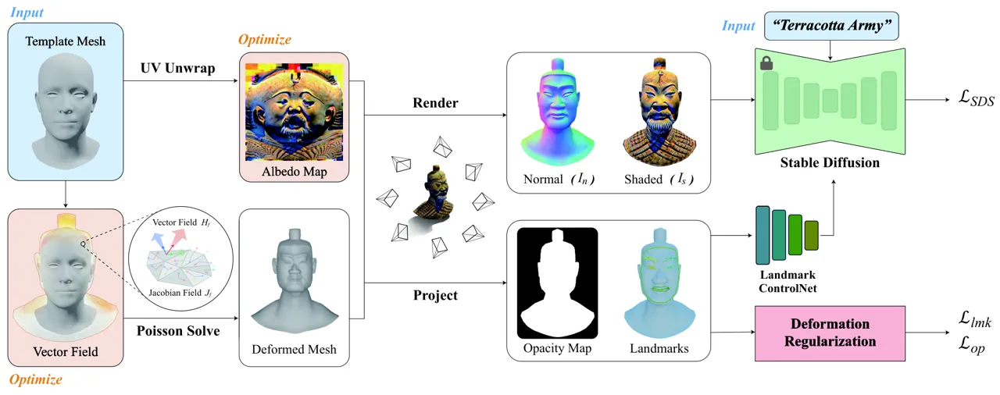

Figure 2: Framework overview. We deform a template mesh by optimizing
per-triangle vector fields guided by a text prompt. Rendered normal and
RGB images coupled with MediaPipe landmarks are fed into a diffusion
model to compute respective losses. Our regularization of Jacobians
controls the fidelity and semantics of facial features that conform to
text guidance.

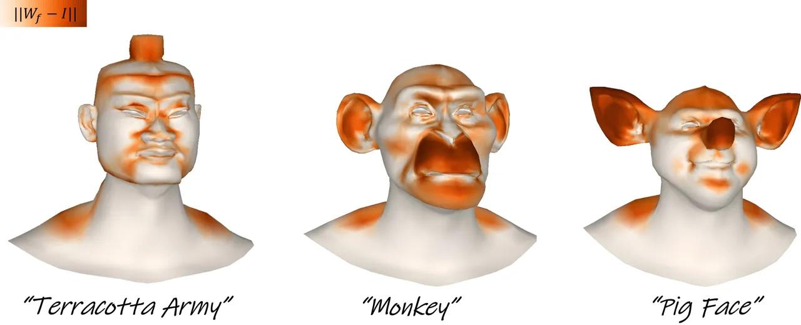

Figure 3: Visualization of vector field $`H_{f}`$ through $`W_{f}`$.
Orange colors indicate strong deformations and $`W_{f}=I`$ refers to no
deformation enhancement.

### 3.1 Mesh Deformation through Vector Fields

Let $`\mathcal{M}=(\mathcal{V},\mathcal{F})`$ denote a source template
mesh which consists of a set of vertices
$`\mathcal{V}\in\mathbb{R}^{n\times 3}`$ and faces
$`\mathcal{F}\in\mathbb{Z}^{m\times 3}`$. For the optimization strategy
of mesh deformation, directly applying displacement to each vertex can
result in severe self-interactions of triangle faces since it is
susceptible to localized noisy gradients from pixel-level losses.
Instead, we parameterize deformation mapping
$`\Phi:\mathbb{R}^{n\times 3}\to\mathbb{R}^{n\times 3}`$ by employing
Jacobian fields \[1\] $`J=\{J_{f}|f\in\mathcal{F}\}`$ that represents
the scaling and rotation of each mesh face. A dual representation of
$`\mathcal{M}`$ can be defined as a stack of per-face Jacobians
$`J_{f}\in\mathbb{R}^{3\times 3}`$ where

```math
J_{f}=\nabla_{f}\mathcal{V}, \tag{1}
```

and $`\nabla_{f}`$ is the gradient operator of triangle $`f`$.
Conversely, we optimize each vertex’s position from per-face Jacobian.

After obtaining optimized Jacobians in each iteration, we can compute
the deformation mapping $`\Phi`$ over a set of vertices conforming to
the source mesh topology by solving a Poisson problem, i.e.,

```math
\Phi^{\ast}=\text{arg}\min_{\Phi}\sum_{f\in\mathcal{F}}|f|\lVert\nabla_{f}(\Phi)-J_{f}\rVert^{2}_{2}, \tag{2}
```

where $`\nabla_{f}(\Phi)`$ is the Jacobian of $`\Phi`$ at a triangle
face $`f`$ and $`|f|`$ is the area of the face. Thus, the deformation
map $`\Phi`$ over the input template mesh is indirectly optimized
through Jacobians $`J_{f}`$ in the least square sense. The solution can
be obtained by using a differentiable solver \[1, 9\]:

```math
\Phi^{\ast}=L^{-1}\nabla^{T}\mathcal{A}J, \tag{3}
```

where $`\nabla`$ is a stack of per-face gradient operators,
$`\mathcal{A}\in\mathbb{R}^{3m\times 3m}`$ is the mass matrix of
$`\mathcal{M}`$, and $`L\in\mathbb{R}^{3n\times 3n}`$ is the cotangent
Laplacian of $`\mathcal{M}`$. This learnable shape representation based
on Jacobians is robust to noisy gradients. It can achieve better
geometry quality (e.g., fewer self-intersections and noisy normals) than
direct vertex displacements, which is further justified in Section 4.

However, during our experiment, we observed that the Poisson solver
applied in Equation 2 can impose strong geometry constraints for
Jacobians to reach the global-coherence mesh deformation \[9\], which
may lose fine-grain details for local shape features and compromise the
identity of the generated head mesh (Figure 6). A straightforward
approach is to increase the learning rate for Jacobians to enhance their
sensitivities to propagated gradients. This amplifies the rotation and
scaling of each face, resulting in stronger deformations. However,
intensified rotations raise the likelihood of inverted triangles \[43\],
leading to an unstable optimization process and a poor-quality mesh. To
address the above concerns, we introduce a learnable per-face vector
field $`H=\{H_{f}|f\in\mathcal{F}\}`$ to enhance the deformation
expressiveness of Jacobian field $`J`$, i.e.,

```math
\begin{split}W_{f}&=diag(w_{x},w_{y},w_{z}),\\
H_{f}&=W_{f}J_{f}.\end{split} \tag{4}
```

By substituting $`H`$ into Equation 3, the deformation mapping could be
computed by

```math
\Phi^{\ast}=L^{-1}\nabla^{T}\mathcal{A}H. \tag{5}
```

The effect of $`W=\{W_{f}|f\in\mathcal{F}\}`$ is to control the
anisotropic scaling (e.g., stretching and shrinking in different
directions) on each face. As shown in Figure 3, it can adaptively learn
the anisotropic scaling on corresponding triangular faces that can
represent the character’s features. Consequently, the per-face vector
field $`H`$ prioritizes the Poisson solver for more effective head
avatar identity expression than using only Jacobians (Section 4.4).

### 3.2 Text-Guided 3D Synthesis

We aim to build a text-guided head avatar generation framework based on
differentiable mesh deformation and texture generation. Moti.vated by
recent success in large-scale VLMs and text-to-3D literature discussed
in Section 2.1, we utilize a powerful 2D diffusion prior (i.e.,
SDS \[38\]) to direct deformations by scoring the rendering realism of
the generated shape in our framework.

Specifically, by following the procedure described in Section 3.1, we
denote $`\mathcal{V^{*}}`$ as the set of deformed vertices from $`J`$.
Then, by using a differentiable render $`\mathbf{R}`$, we render
$`\mathcal{M^{*}}=(\mathcal{V}^{*},\mathcal{F})`$ from a viewpoint
delineated by camera extrinsic parameter $`C`$, which produces an image
$`I=\mathbf{R}(\mathcal{M^{*}},C)`$. The SDS loss is leveraged to alter
the geometry and color respectively, that is:

```math
\footnotesize\nabla_{J}\mathcal{L}_{\mathrm{SDS}}(\epsilon,I)=\mathbb{E}_{t,\epsilon}\left[w(t)(\epsilon_{\theta}(z_{t};y,C,t)-\epsilon)\frac{\partial{I}}{\partial{J}}\right], \tag{6}
```

where $`\epsilon\sim\mathcal{N}(0,I)`$, $`\epsilon_{\theta}`$ is the
pre-trained diffusion priors with the network parameter $`\theta`$,
$`w(t)`$ is a weight coefficient related to timestep
$`t\sim\mathcal{U}(0,1)`$, $`y`$ is the text input condition, $`z_{t}`$
denotes a latent embedding of $`I`$ perturbed with noises at time step
$`t`$, and $`C`$ is the MediaPipe \[34\] facial landmark map. Rendered
image $`I`$ are obtained and encoded from the normal $`I_{n}`$ and
shaded $`I_{s}`$, as seen in Figure 2.

To ensure deformation mapping from propagated gradients and the Poisson
solver can conform to the facial topology and reasonable semantics of
the source mesh, we further develop two regularization terms, aiming to
preserve 3D attributes of generated head avatars (Figure 8).

Landmark regularization. The landmark regularization measures the
difference between predefined $`N`$ 3D face landmarks
$`\mathbf{k}_{i}\in\mathbb{R}^{3}`$ on the canonical template mesh
$`\mathcal{M}`$ and the corresponding ones on the deformed mesh
$`\mathbf{k}^{\prime}_{i}\in\mathbb{R}^{3}`$ after projection. The
landmark regularization loss is defined as
$`\mathcal{L}_{lmk}=\frac{1}{N}\sum_{i=1}^{N}||\mathbf{k}_{i}-\mathbf{k}^{\prime}_{i}||^{2}_{2}`$.

Evolving contour-based regularization. Inspired by AvatarCraft \[24\],
we incorporate an opacity map $`O`$ to preserve a plausible head shape
while minimizing excessive or undesired vertex displacement. To balance
diverse geometry shapes and constraints from severe deformations, the
source template mesh is periodically updated from deformed mesh every
300 steps \[51\]. The pixel-level loss is parameterized as
$`\mathcal{L}_{op}=\frac{1}{hw}\sum_{h,w}||O-O^{\prime}||^{2}_{2}`$,
where $`h`$ and $`w`$ represent the height and width of the opacity mask
of the template mesh $`O`$ and the optimized head avatar $`O^{\prime}`$.
The total loss is defined as follows:

```math
\mathcal{L}=\lambda_{1}\nabla_{\Phi}\mathcal{L}_{\mathrm{SDS}}+\lambda_{2}\mathcal{L}_{lmk}+\lambda_{3}\mathcal{L}_{op}, \tag{7}
```

where $`\lambda_{1}=1`$, $`\lambda_{2}=200`$, and $`\lambda_{3}=250`$
are the hyper-parameters in our experiment settings.

## 4 Experiments

In this section, we conduct experiments to evaluate the efficacy of our
method both quantitatively and qualitatively for text-to-avatar
creation. We then present two ablation studies that validate the
significance of our key designs for vector fields and regularization
terms in Section 4.4.

### 4.1 Implementation Details

For geometry and texture generation, we render normal and shaded images
at a resolution of $`1024\times 1024`$ pixels and feed them into the
Realistic Vision 5.1 (RV 5.1) \[25\]. Compared with Stable Diffusion
2.1 \[42\], we find that RV 5.1 supports a more appealing avatar
appearance. The multi-face Janus and texture misalignment problems are
further alleviated by introducing ControlNetMediaPipeFace \[63\]. The
generation process runs on a single NVIDIA RTX $`4090`$ GPU with
$`20,000`$ iterations per avatar, which takes around $`30`$ minutes.
Negative prompts are leveraged to enhance the realism and details of the
texture, e.g., “unrealistic,” “blurry,” “low quality,” “saturated,” “low
contrast,” etc. Along with the proposed regularization terms, we enforce
symmetry along the y-axis in each iteration to ensure a reasonable face
appearance. Following established practices in TADA and DreamFace, the
eyeball mesh is removed and can be manually reintegrated after the
generation.

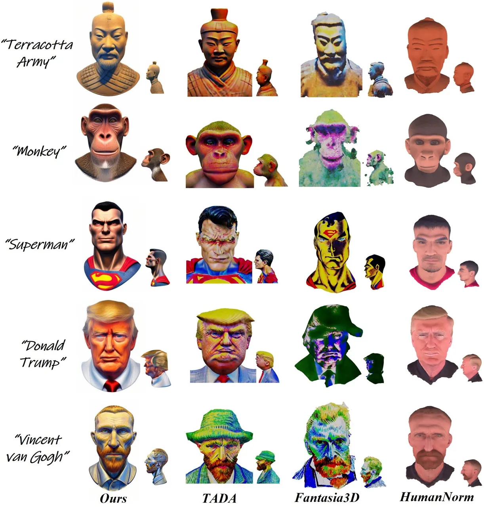

Figure 4: Qualitative appearance comparisons. Our method can produce
diverse textured avatars.

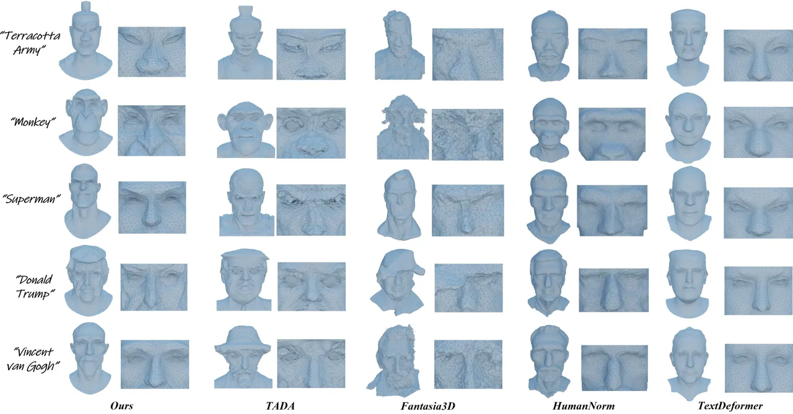

Figure 5: Qualitative geometry comparisons. Our method effectively
preserves the topology and semantics of the input template mesh,
resulting in high-quality mesh models for smooth manipulations.

### 4.2 Qualitative Evaluation

Our evaluation compares two explicit mesh manipulation methods (i.e.,
TADA \[30\] and TextDeformer \[9\]), and two implicit methods (i.e.,
Fantasia3D \[6\] and HumanNorm \[20\]) as baselines. While our framework
focuses on high-quality mesh topologies, we also compare rendering
appearance with recent non-mesh-dependent methods \[32, 14, 65\] in
supplemental material (Figure 20). We utilized FLAME \[28\] as a unified
input template mesh to conduct the experiments. We present the visual
comparison results in Figures 4 and 5. TADA and Fantasia3D show
detail-preserving geometry with 3D head priors but still undergo
geometric artifacts in dense areas like eye regions, which are less
noticeable in textured rendering. HumanNorm underperforms in humanoid
cases, e.g., “Terracotta Army” and “Monkey.” Compared to TextDeformer,
our approach exhibits similar mesh quality and amplifies facial
characteristics following text specifications.

In summary, our framework generates expressive head meshes that inherit
facial attributes. The texture generation maintains decent geometry
consistency, facilitating usage in graphics applications
(Figures HeadEvolver: Text to Head Avatars via Expressive  
and Attribute-Preserving Mesh Deformation(c) and 4).

### 4.3 Quantitative Evaluation

We quantitatively evaluated our framework for generation consistency
with text input and generation quality.

Generation Consistency with Text. We first evaluated the relevance of
generated results to the corresponding text descriptions by calculating
the CLIP score \[41\]. We rendered 20 distinct views and computed the
average scores respectively, as shown in Table 2. Our approach achieves
the highest scores compared to the baseline methods.

|              |                         |                         |                                  |
| ------------ | ----------------------- | ----------------------- | -------------------------------- |
|              | Geometry                | Appearance              | Mesh                             |
|              | CLIP Score $`\uparrow`$ | CLIP Score $`\uparrow`$ | Self-Intersection $`\downarrow`$ |
| Fantasia3D   | $`0.1815`$              | $`0.2718`$              | -                                |
| HumanNorm    | $`0.2443`$              | $`0.3031`$              | -                                |
| TextDeformer | $`0.2462`$              | -                       | $`2.19\%`$                       |
| TADA         | $`0.2475`$              | $`0.2931`$              | $`14.22\%`$                      |
| Ours         | 0.2538                  | 0.3089                  | 2.08%                            |

Table 2: Quantitative comparison of state-of-the-art methods. The
geometry CLIP score is measured on the shaded images rendered with
uniform albedo colors \[40\], the appearance CLIP score is evaluated on
the images rendered with textures, and the self-intersection is
quantified as the ratio of self-intersected mesh faces to the total
number of mesh faces.

|                         |            |            |             |
| ----------------------- | ---------- | ---------- | ----------- |
| User                    | Geometry   | Texture    | Consistency |
| Preference $`\uparrow`$ | Quality    | Quality    | with Text   |
| Fantasia3D              | $`0.4\%`$  | $`2.0\%`$  | $`1.9\%`$   |
| HumanNorm               | $`5.6\%`$  | $`22.7\%`$ | $`6.7\%`$   |
| TextDeformer            | $`24.2\%`$ | -          | $`2.3\%`$   |
| TADA                    | $`3.9\%`$  | $`13.1\%`$ | $`22.2\%`$  |
| Ours                    | 65.9%      | 62.2%      | 66.9%       |

Table 3: User evaluation of generated head avatars.

Mesh Quality. We evaluate mesh quality through self-intersection. Since
the mesh from Fantasia3D and HumanNorm are extracted through the
marching cubes algorithm \[33\], the produced triangles have no
self-intersections. Therefore, we only compared our method with TADA and
TextDeformer. Unlike our method, direct vertex displacement tends to
converge to a local minimum and disregards the triangulation of the
mesh.

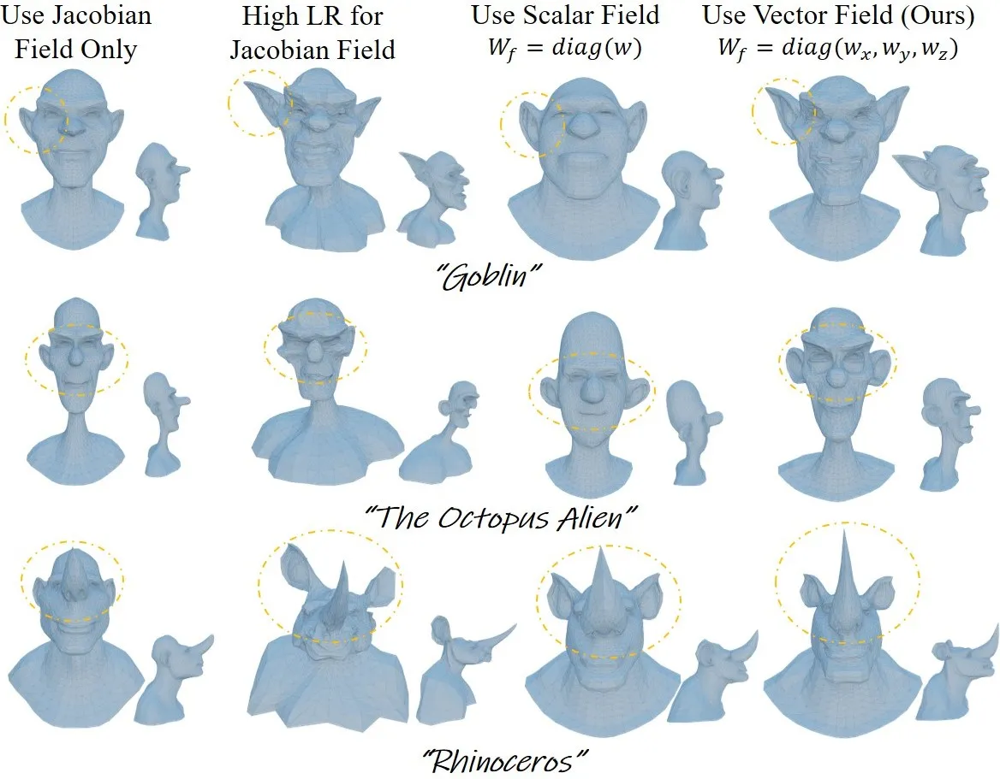

Figure 6: Ablation study on the vector fields. The per-triangle $`H`$
can enhance the identity and character features of the avatar.

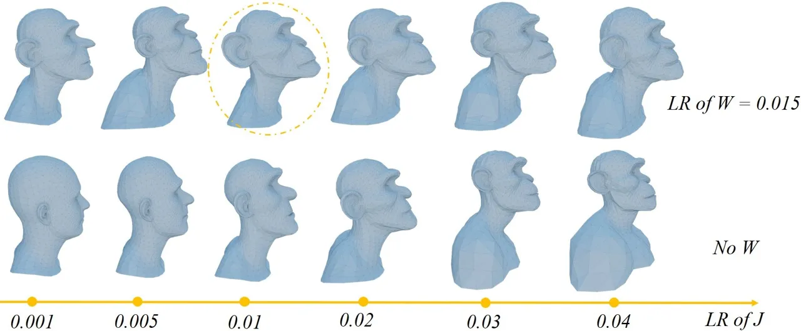

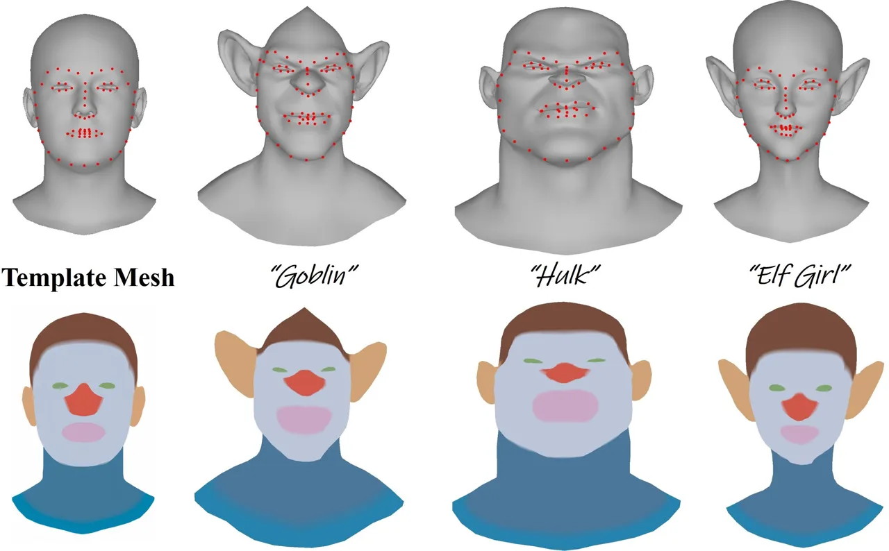

Figure 7: Learning rate (LR) tuning. Supported by our experiments,
adding per-triangle $`H`$ through $`W`$ can enhance the identity and
character features of the avatar from the text prompt.

Figure 8: Preserved semantic consistency (e.g., 3D landmarks and dense
segmentation) with our deformation-based framework.

User Study. We conducted a user study to evaluate the robustness and
expressiveness of our method with 18 distinct text prompts, 6 of which
are from TADA. We used a Google Form to assess 1) geometry quality, 2)
texture quality, and 3) consistency with text. We recruited 46
participants, of whom 26 are graduate students majoring in computer
graphics and vision, and 20 are company employees specializing in AI
content generation. In this form, the participants were instructed to
choose the preferred renderings of head avatars from different methods
in randomized order, as shown in Table 3. The results show that
participants preferred our method by a significant margin (over
$`60\%`$).

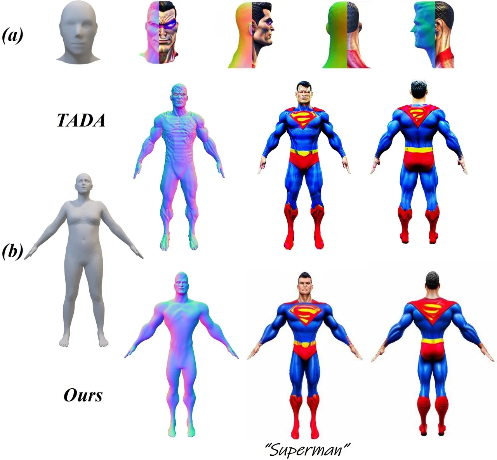

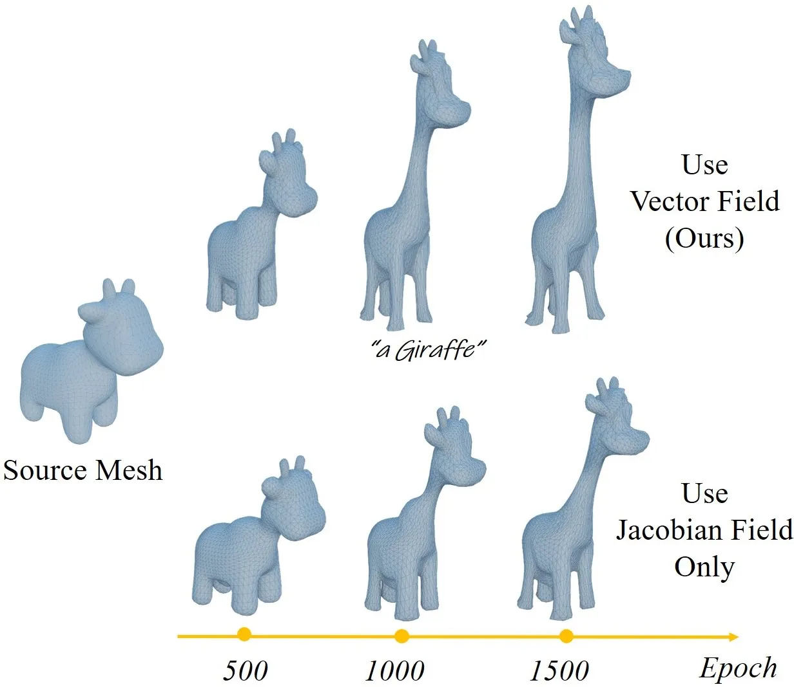

Figure 9: Avatar generation with various template mesh inputs. The
meshes from (a) an arbitrary head model and (b) SMPL-X \[36\] are
deformed to align text descriptions respectively.

Figure 10: Generalization experiments. We implement vector fields in
TextDeformer \[9\] and find that our method accelerates mesh
optimizations to approach text guidance in early epochs.

### 4.4 Ablation Study

Effect of Vector field. We conducted three sets of qualitative
comparisons to demonstrate the effectiveness of the per-triangle vector
field $`H`$. As shown in Figure 6, using Jacobian $`J`$ alone tends to
overly smooth the gradients, leading to a loss of distinctive character
features. Increasing $`J`$’s learning rate emphasizes character
identities but distorts meshes and causes self-intersections.
Additionally, our experiments introduce the scalar field $`S`$, which
represents the isotropic scaling by setting diagonal elements of each
$`H_{i}`$ to equal values. The results indicate that anisotropic scaling
guided through $`H`$ generates avatars bearing more geometry details and
character features than those through $`S`$ (e.g., the eyebrow of
”Octopus Alien” and the ear of ”Goblin”). Furthermore, we demonstrate
the tuning process of the LR to evaluate that the addition of $`H`$
effectively enhances the stability and expressiveness of deformations
when the LR of $`J`$ is set in the reasonable range (e.g., between 0.01
to 0.025). In Figure 8, we provide the best LR settings, which are
$`0.015`$ for $`H`$ and 0.01 for $`J`$. We also demonstrate the
versatility of the vector field by applying it to the object generation
framework (Figure 10), observing that the use of $`H`$ accelerates
optimization convergence to desired deformation states compared to using
Jacobians alone.

Regularization. In deformation optimization, facial features and head
poses may deviate unexpectedly. Landmark regularization constrains
generated meshes to the input shape’s canonical space, and contour-based
regularization contributes to reasonable head shapes. We demonstrate the
effectiveness of our regularization designs in Figure 12.

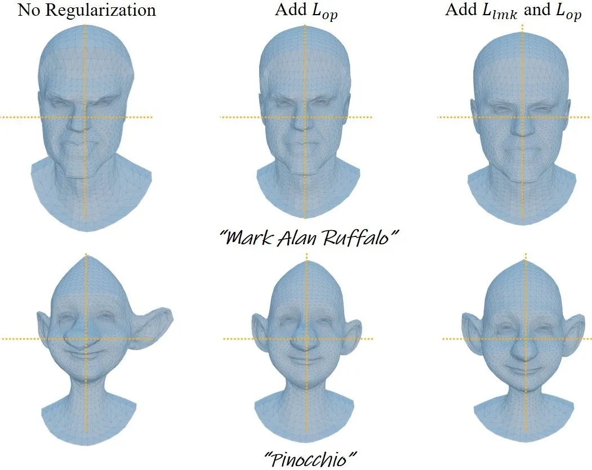

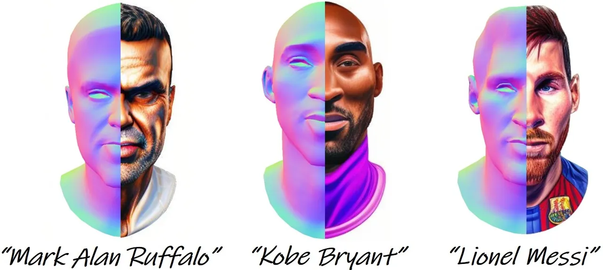

Figure 11: Ablation study on regularization. The contour-based and
landmark regularizations contribute to maintaining symmetric facial
features and alignment with the pose of the input mesh.

Figure 12: Our deformation-based framework offers effective geometry
consistency for further 3D applications.

## 5 Applications

Our method produces head avatars that can be smoothly manipulated (e.g.,
animated via 3DMMs and text-based editing) and are compatible with
graphics tools such as Blender and Maya. Compared with implicit
representations \[6, 14\], our method enables artists to animate and
edit head avatar assets for downstream applications
(Figures HeadEvolver: Text to Head Avatars via Expressive  
and Attribute-Preserving Mesh Deformation(c) and 17).

Local geometry editing. Besides manipulating generated meshes in 3D
software as artists usually do, our approach also supports efficient
head editing with text descriptions (Figures HeadEvolver: Text to Head
Avatars via Expressive  
and Attribute-Preserving Mesh Deformation(b) and 17). Only $`H_{i}`$ on
certain parts is optimized given the text guidance.

Texture editing through text guidance. Our approach encourages
independent texture generation on a fixed geometry, which enables
texture editing specified by the text input (Figure 20). Some unexpected
color artifacts may be introduced due to the noises from the diffusion
model.

Avatar animation. As shown in Figures HeadEvolver: Text to Head Avatars
via Expressive  
and Attribute-Preserving Mesh Deformation(c) and 13, we demonstrate that
the rigging and blendshapes of the head mesh model after deformation are
well-preserved for creating head animations and shape manipulations.

Avatar generation from other template meshes. As detailed in Section 3,
our method accommodates manifold meshes, not just specific models like
FLAME. Figure 10 exemplifies a ”Superman” head creation without labeled
3D facial landmarks, using crafted 3D assets.

## 6 Limitations and Future Work

Our framework has a few limitations. Although many parametric head
models do not contain eyeball mesh intrinsically (e.g.,
Facescape \[52\], NPHM \[11\], and BFM \[10\]), our experiments removed
the eyeball mesh from FLAME and SMPL-X since Jacobians rely on the
manifold mesh structure \[39\] (Figure 4.1). A cage-based representation
may offer deformations among multiple mesh instances
simultaneously \[53\], enabling separately editable details like hair
and accessories. Another minor limitation exists in that lighting isn’t
disentangled from diffuse colors, potentially causing noise and
oversaturation artifacts.

It is worth mentioning that the generated avatars exhibit relatively
good geometry consistency with texture (Figure 12), but our method
cannot guarantee an exact match between geometry and texture. For
instance, eyeball appearance only shows in the texture, a problem that
also occurs in TADA and HumanNorm. Stronger semantic labeling (e.g.,
canny edges \[37\]) may mitigate this issue. Another future focus is to
learn head generation from a 3D sphere without any avatar shape
priors \[35\].

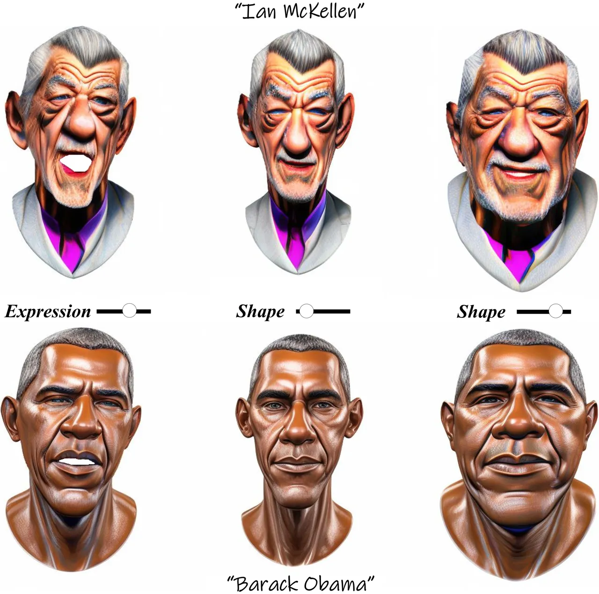

Figure 13: Example of attribute inheritance from FLAME \[28\]. If the
input template mesh is from 3DMMs \[4\], users could manipulate the
deformed mesh freely via morphable attributes such as expression and
shape parameters.

## 7 Conclusion

In this paper, we have presented a text-guided generative framework for
crafting stylized 3D head avatars through learnable deformations. By
employing Jacobians as an intermediate representation for vertex
displacements and enhancing them with a learnable vector field, our
method has improved the expressiveness of the deformed mesh.
Consequently, learnable deformations are embedded into score
distillation for geometry and appearance generation. Our regularization
terms help retain 3D attributes from the source mesh to support seamless
editing by artists. Experiments with various text prompts exhibit the
remarkable performance of our framework. Our work can inform future
research on effectively integrating mesh-based neural techniques into
practical graphics pipelines, such as boosting the 2D and 3D deformation
ability by applying our method to APAP \[55\].

## 8 Acknowledgement

This project is sponsored by CCF-Tencent Rhino-Bird Open Research Fund
RAGR20230120.

## References

- \[1\] Noam Aigerman, Kunal Gupta, Vladimir G. Kim, Siddhartha
  Chaudhuri, Jun Saito, and Thibault Groueix. Neural Jacobian Fields:
  Learning Intrinsic Mappings of Arbitrary Meshes. ACM Trans. Graph.,
  41(4), Jul 2022.
- \[2\] Shivangi Aneja, Justus Thies, Angela Dai, and Matthias Nießner.
  ClipFace: Text-Guided Editing of Textured 3D Morphable Models. In ACM
  SIGGRAPH 2023 Conference Proceedings, SIGGRAPH ’23, New York, NY,
  USA, 2023. Association for Computing Machinery.
- \[3\] Stephen W. Bailey, Dalton Omens, Paul Dilorenzo, and James F.
  O’Brien. Fast and Deep Facial Deformations. ACM Trans. Graph., 39(4),
  Aug 2020.
- \[4\] Volker Blanz and Thomas Vetter. A Morphable Model for the
  Synthesis of 3D Faces. In Proceedings of the 26th Annual Conference on
  Computer Graphics and Interactive Techniques, SIGGRAPH ’99, pages
  187–194, USA, 1999. ACM Press/Addison-Wesley Publishing Co.
- \[5\] Yukang Cao, Yan-Pei Cao, Kai Han, Ying Shan, and Kwan-Yee K
  Wong. DreamAvatar: Text-and-Shape Guided 3D Human Avatar Generation
  via Diffusion Models. arXiv preprint arXiv:2304.00916, 2023.
- \[6\] Rui Chen, Yongwei Chen, Ningxin Jiao, and Kui Jia. Fantasia3D:
  Disentangling Geometry and Appearance for High-quality Text-to-3D
  Content Creation. In Proceedings of the IEEE/CVF International
  Conference on Computer Vision (ICCV), pages 22246–22256, October 2023.
- \[7\] Isabel Fitton, Christopher Clarke, Jeremy Dalton, Michael J.
  Proulx, and Christof Lutteroth. Dancing with the Avatars: Minimal
  Avatar Customisation Enhances Learning in a Psychomotor Task. In
  Proceedings of the 2023 CHI Conference on Human Factors in Computing
  Systems, CHI ’23, New York, NY, USA, 2023. Association for Computing
  Machinery.
- \[8\] Lin Gao, Jie Yang, Yi-Ling Qiao, Yu-Kun Lai, Paul L. Rosin,
  Weiwei Xu, and Shihong Xia. Automatic Unpaired Shape Deformation
  Transfer. ACM Trans. Graph., 37(6), Dec 2018.
- \[9\] William Gao, Noam Aigerman, Thibault Groueix, Vova Kim, and Rana
  Hanocka. TextDeformer: Geometry Manipulation Using Text Guidance. In
  ACM SIGGRAPH 2023 Conference Proceedings, SIGGRAPH ’23, New York, NY,
  USA, 2023. Association for Computing Machinery.
- \[10\] Thomas Gerig, Andreas Morel-Forster, Clemens Blumer, Bernhard
  Egger, Marcel Luthi, Sandro Schoenborn, and Thomas Vetter. Morphable
  Face Models - An Open Framework. In 13th IEEE International Conference
  on Automatic Face & Gesture Recognition (FG 2018), pages 75–82, 2018.
- \[11\] Simon Giebenhain, Tobias Kirschstein, Markos Georgopoulos,
  Martin Rünz, Lourdes Agapito, and Matthias Nießner. Learning Neural
  Parametric Head Models. In Proc. IEEE Conf. on Computer Vision and
  Pattern Recognition (CVPR), 2023.
- \[12\] Ian Goodfellow, Jean Pouget-Abadie, Mehdi Mirza, Bing Xu, David
  Warde-Farley, Sherjil Ozair, Aaron Courville, and Yoshua Bengio.
  Generative Adversarial Nets. Advances in Neural Information Processing
  Systems, 27, 2014.
- \[13\] Ian Goodfellow, Jean Pouget-Abadie, Mehdi Mirza, Bing Xu, David
  Warde-Farley, Sherjil Ozair, Aaron Courville, and Yoshua Bengio.
  Generative Adversarial Networks. Commun. ACM, 63(11):139–144,
  oct 2020.
- \[14\] Xiao Han, Yukang Cao, Kai Han, Xiatian Zhu, Jiankang Deng,
  Yi-Zhe Song, Tao Xiang, and Kwan-Yee K Wong. HeadSculpt: Crafting 3D
  Head Avatars with Text. In Thirty-seventh Conference on Neural
  Information Processing Systems, 2023.
- \[15\] Jonathan Ho, Ajay Jain, and Pieter Abbeel. Denoising Diffusion
  Probabilistic Models. volume 33, 2020.
- \[16\] Andrew Hogue, Sunbir Gill, and Michael Jenkin. Automated Avatar
  Creation for 3D Games. In Proceedings of the 2007 Conference on Future
  Play, Future Play ’07, page 174–180, New York, NY, USA, 2007.
  Association for Computing Machinery.
- \[17\] Fangzhou Hong, Mingyuan Zhang, Liang Pan, Zhongang Cai, Lei
  Yang, and Ziwei Liu. AvatarCLIP: Zero-Shot Text-Driven Generation and
  Animation of 3D Avatars. ACM Transactions on Graphics (TOG),
  41(4):1–19, 2022.
- \[18\] Fangzhou Hong, Mingyuan Zhang, Liang Pan, Zhongang Cai, Lei
  Yang, and Ziwei Liu. AvatarCLIP: Zero-shot Text-driven Generation and
  Animation of 3D Avatars. ACM Transactions on Graphics (TOG),
  41(4):1–19, 2022.
- \[19\] Liwen Hu, Shunsuke Saito, Lingyu Wei, Koki Nagano, Jaewoo Seo,
  Jens Fursund, Iman Sadeghi, Carrie Sun, Yen-Chun Chen, and Hao Li.
  Avatar Digitization from a Single Image for Real-time Rendering. ACM
  Trans. Graph., 36(6), Nov 2017.
- \[20\] Xin Huang, Ruizhi Shao, Qi Zhang, Hongwen Zhang, Ying Feng,
  Yebin Liu, and Qing Wang. HumanNorm: Learning Normal Diffusion Model
  for High-quality and Realistic 3D Human Generation. In Proceedings of
  the IEEE/CVF Conference on Computer Vision and Pattern Recognition
  (CVPR), pages 4568–4577, June 2024.
- \[21\] Yukun Huang, Jianan Wang, Ailing Zeng, He Cao, Xianbiao Qi,
  Yukai Shi, Zheng-Jun Zha, and Lei Zhang. DreamWaltz: Make a Scene with
  Complex 3D Animatable Avatars, 2023.
- \[22\] Dong Huo, Zixin Guo, Xinxin Zuo, Zhihao Shi, Juwei Lu, Peng
  Dai, Songcen Xu, Li Cheng, and Yee-Hong Yang. TexGen: Text-Guided 3D
  Texture Generation with Multi-view Sampling and Resampling. arXiv
  preprint arXiv:2408.01291, 2024.
- \[23\] Sungwon Hwang, Junha Hyung, and Jaegul Choo. Text2Control3D:
  Controllable 3D Avatar Generation in Neural Radiance Fields using
  Geometry-Guided Text-to-Image Diffusion Model. arXiv preprint
  arXiv:2309.03550, 2023.
- \[24\] Ruixiang Jiang, Can Wang, Jingbo Zhang, Menglei Chai, Mingming
  He, Dongdong Chen, and Jing Liao. AvatarCraft: Transforming Text into
  Neural Human Avatars with Parameterized Shape and Pose Control. In
  Proceedings of the IEEE/CVF International Conference on Computer
  Vision (ICCV), pages 14371–14382, October 2023.
- \[25\] Adhik Joshi and Akash Guptag. Realistic Vision 5.1.
  [https://huggingface.co/stablediffusionapi/realistic-vision-51](https://huggingface.co/stablediffusionapi/realistic-vision-51), 2023.
  Accessed: 2024-05-10.
- \[26\] Nikos Kolotouros, Thiemo Alldieck, Andrei Zanfir,
  Eduard Gabriel Bazavan, Mihai Fieraru, and Cristian Sminchisescu.
  DreamHuman: Animatable 3D Avatars from Text. In Proceedings of the
  37th International Conference on Neural Information Processing
  Systems, NIPS ’23, Red Hook, NY, USA, 2024. Curran Associates Inc.
- \[27\] Ruilong Li, Karl Bladin, Yajie Zhao, Chinmay Chinara, Owen
  Ingraham, Pengda Xiang, Xinglei Ren, Pratusha Prasad, Bipin Kishore,
  Jun Xing, and Hao Li. Learning Formation of Physically-Based Face
  Attributes. In IEEE/CVF Conference on Computer Vision and Pattern
  Recognition (CVPR), June 2020.
- \[28\] Tianye Li, Timo Bolkart, Michael J. Black, Hao Li, and Javier
  Romero. Learning a Model of Facial Shape and Expression from 4D Scans.
  ACM Trans. Graph., 36(6):194–1, 2017.
- \[29\] Yixun Liang, Xin Yang, Jiantao Lin, Haodong Li, Xiaogang Xu,
  and Yingcong Chen. LucidDreamer: Towards High-Fidelity Text-to-3D
  Generation via Interval Score Matching. In Proceedings of the IEEE/CVF
  Conference on Computer Vision and Pattern Recognition (CVPR), pages
  6517–6526, June 2024.
- \[30\] Tingting Liao, Hongwei Yi, Yuliang Xiu, Jiaxiang Tang, Yangyi
  Huang, Justus Thies, and Michael J. Black. TADA! Text to Animatable
  Digital Avatars. In 2024 International Conference on 3D Vision (3DV),
  pages 1508–1519. IEEE, 2024.
- \[31\] Chen-Hsuan Lin, Jun Gao, Luming Tang, Towaki Takikawa, Xiaohui
  Zeng, Xun Huang, Karsten Kreis, Sanja Fidler, Ming-Yu Liu, and
  Tsung-Yi Lin. Magic3D: High-Resolution Text-to-3D Content Creation. In
  Proceedings of the IEEE/CVF Conference on Computer Vision and Pattern
  Recognition, pages 300–309, 2023.
- \[32\] Hongyu Liu, Xuan Wang, Ziyu Wan, Yujun Shen, Yibing Song, Jing
  Liao, and Qifeng Chen. HeadArtist: Text-conditioned 3D Head Generation
  with Self Score Distillation. arXiv preprint arXiv:2312.07539, 2023.
- \[33\] William E. Lorensen and Harvey E. Cline. Marching Cubes: A High
  Resolution 3D Surface Construction Algorithm. In Proceedings of the
  14th Annual Conference on Computer Graphics and Interactive
  Techniques, SIGGRAPH ’87, page 163–169, New York, NY, USA, 1987.
  Association for Computing Machinery.
- \[34\] Camillo Lugaresi, Jiuqiang Tang, Hadon Nash, Chris McClanahan,
  Esha Uboweja, Michael Hays, Fan Zhang, Chuo-Ling Chang, Ming Guang
  Yong, Juhyun Lee, Wan-Teh Chang, Wei Hua, Manfred Georg, and Matthias
  Grundmann. MediaPipe: A Framework for Building Perception Pipelines.
  arXiv preprint arXiv:1906.08172, 2019.
- \[35\] Baptiste Nicolet, Alec Jacobson, and Wenzel Jakob. Large Steps
  in Inverse Rendering of Geometry. ACM Trans. Graph., 40(6), Dec 2021.
- \[36\] Georgios Pavlakos, Vasileios Choutas, Nima Ghorbani, Timo
  Bolkart, Ahmed A. A. Osman, Dimitrios Tzionas, and Michael J. Black.
  Expressive Body Capture: 3D Hands, Face, and Body from a Single Image.
  In Proceedings IEEE Conf. on Computer Vision and Pattern Recognition
  (CVPR), pages 10975–10985, 2019.
- \[37\] Sai Raj Kishore Perla, Yizhi Wang, Ali Mahdavi-Amiri, and Hao
  Zhang. EASI-Tex: Edge-Aware Mesh Texturing from Single Image. ACM
  Trans. Graph., 43(4), jul 2024.
- \[38\] Ben Poole, Ajay Jain, Jonathan T Barron, and Ben Mildenhall.
  DreamFusion: Text-to-3D using 2D Diffusion. In The Eleventh
  International Conference on Learning Representations, 2022.
- \[39\] Dafei Qin, Jun Saito, Noam Aigerman, Thibault Groueix, and Taku
  Komura. Neural Face Rigging for Animating and Retargeting Facial
  Meshes in the Wild. In ACM SIGGRAPH 2023 Conference Proceedings,
  SIGGRAPH ’23, New York, NY, USA, 2023. Association for Computing
  Machinery.
- \[40\] Lingteng Qiu, Guanying Chen, Xiaodong Gu, Qi Zuo, Mutian Xu,
  Yushuang Wu, Weihao Yuan, Zilong Dong, Liefeng Bo, and Xiaoguang Han.
  RichDreamer: A Generalizable Normal-Depth Diffusion Model for Detail
  Richness in Text-to-3D. In Proceedings of the IEEE/CVF Conference on
  Computer Vision and Pattern Recognition (CVPR), pages 9914–9925, 2024.
- \[41\] Alec Radford, Jong Wook Kim, Chris Hallacy, Aditya Ramesh,
  Gabriel Goh, Sandhini Agarwal, Girish Sastry, Amanda Askell, Pamela
  Mishkin, Jack Clark, Gretchen Krueger, and Ilya Sutskever. Learning
  Transferable Visual Models From Natural Language Supervision. arXiv
  preprint arXiv:2103.00020, 2021.
- \[42\] Robin Rombach, Andreas Blattmann, Dominik Lorenz, Patrick
  Esser, and Björn Ommer. High-Resolution Image Synthesis With Latent
  Diffusion Models. In Proceedings of the IEEE/CVF Conference on
  Computer Vision and Pattern Recognition (CVPR), pages 10684–10695,
  June 2022.
- \[43\] Christian Schüller, Ladislav Kavan, Daniele Panozzo, and Olga
  Sorkine-Hornung. Locally Injective Mappings. Computer Graphics
  Forum, 2013.
- \[44\] Tianchang Shen, Jun Gao, Kangxue Yin, Ming-Yu Liu, and Sanja
  Fidler. Deep Marching Tetrahedra: a Hybrid Representation for
  High-resolution 3D Shape Synthesis. Advances in Neural Information
  Processing Systems, 34:6087–6101, 2021.
- \[45\] J. Ryan Shue, Eric Ryan Chan, Ryan Po, Zachary Ankner, Jiajun
  Wu, and Gordon Wetzstein. 3D Neural Field Generation Using Triplane
  Diffusion. In 2023 IEEE/CVF Conference on Computer Vision and Pattern
  Recognition (CVPR), pages 20875–20886, 2023.
- \[46\] Jiaming Song, Chenlin Meng, and Stefano Ermon. Denoising
  Diffusion Implicit Models. In International Conference on Learning
  Representations, 2020.
- \[47\] Jiaxiang Tang, Jiawei Ren, Hang Zhou, Ziwei Liu, and Gang Zeng.
  DreamGaussian: Generative Gaussian Splatting for Efficient 3D Content
  Creation, 2023.
- \[48\] Tengfei Wang, Bo Zhang, Ting Zhang, Shuyang Gu, Jianmin Bao,
  Tadas Baltrusaitis, Jingjing Shen, Dong Chen, Fang Wen, Qifeng Chen,
  et al. Rodin: A Generative Model for sculpting 3D Digital Avatars
  Using Diffusion. In Proceedings of the IEEE/CVF Conference on Computer
  Vision and Pattern Recognition, pages 4563–4573, 2023.
- \[49\] Zhengyi Wang, Cheng Lu, Yikai Wang, Fan Bao, Chongxuan Li, Hang
  Su, and Jun Zhu. ProlificDreamer: High-Fidelity and Diverse Text-to-3D
  Generation with Variational Score Distillation. In Advances in Neural
  Information Processing Systems (NeurIPS), 2023.
- \[50\] Xiaoying Wei, Yizheng Gu, Emily Kuang, Xian Wang, Beiyan Cao,
  Xiaofu Jin, and Mingming Fan. Bridging the Generational Gap: Exploring
  How Virtual Reality Supports Remote Communication Between Grandparents
  and Grandchildren. In Proceedings of the 2023 CHI Conference on Human
  Factors in Computing Systems, CHI ’23, New York, NY, USA, 2023.
  Association for Computing Machinery.
- \[51\] Yuanyou Xu, Zongxin Yang, and Yi Yang. SEEAvatar:
  Photorealistic Text-to-3D Avatar Generation with Constrained Geometry
  and Appearance. arXiv preprint arXiv:2312.08889, 2023.
- \[52\] Haotian Yang, Hao Zhu, Yanru Wang, Mingkai Huang, Qiu Shen,
  Ruigang Yang, and Xun Cao. FaceScape: a Large-Scale High Quality 3D
  Face Dataset and Detailed Riggable 3D Face Prediction. In Proceedings
  of the IEEE Conference on Computer Vision and Pattern Recognition
  (CVPR), 2020.
- \[53\] Wang Yifan, Noam Aigerman, Vladimir G. Kim, Siddhartha
  Chaudhuri, and Olga Sorkine-Hornung. Neural Cages for
  Detail-Preserving 3D Deformations. In 2020 IEEE/CVF Conference on
  Computer Vision and Pattern Recognition (CVPR), pages 72–80, 2020.
- \[54\] Kangxue Yin, Jun Gao, Maria Shugrina, Sameh Khamis, and Sanja
  Fidler. 3DStyleNet: Creating 3D Shapes with Geometric and Texture
  Style Variations. In Proceedings of International Conference on
  Computer Vision (ICCV), 2021.
- \[55\] Seungwoo Yoo, Kunho Kim, Vladimir G. Kim, and Minhyuk Sung.
  As-Plausible-As-Possible: Plausibility-Aware Mesh Deformation Using 2D
  Diffusion Priors. In Proceedings of the IEEE/CVF Conference on
  Computer Vision and Pattern Recognition (CVPR), pages 4315–4324,
  June 2024.
- \[56\] Cuican Yu, Guansong Lu, Yihan Zeng, Jian Sun, Xiaodan Liang,
  Huibin Li, Zongben Xu, Songcen Xu, Wei Zhang, and Hang Xu. Towards
  High-fidelity Text-guided 3D Face Generation and Manipulation Using
  Only Images. In Proceedings of the IEEE/CVF International Conference
  on Computer Vision, pages 15326–15337, 2023.
- \[57\] Yizhou Yu, Kun Zhou, Dong Xu, Xiaohan Shi, Hujun Bao, Baining
  Guo, and Heung-Yeung Shum. Mesh Editing with Poisson-Based Gradient
  Field Manipulation. ACM Trans. Graph., 23(3):644–651, Aug 2004.
- \[58\] Yifei Zeng, Yuanxun Lu, Xinya Ji, Yao Yao, Hao Zhu, and Xun
  Cao. AvatarBooth: High-Quality and Customizable 3D Human Avatar
  Generation, 2023.
- \[59\] Chi Zhang, Yiwen Chen, Yijun Fu, Zhenglin Zhou, Gang Yu, Billzb
  Wang, Bin Fu, Tao Chen, Guosheng Lin, and Chunhua Shen. StyleAvatar3D:
  Leveraging Image-Text Diffusion Models for High-Fidelity 3D Avatar
  Generation. arXiv preprint arXiv:2305.19012, 2023.
- \[60\] Hao Zhang, Yao Feng, Peter Kulits, Yandong Wen, Justus Thies,
  and Michael J. Black. Text-Guided Generation and Editing of
  Compositional 3D Avatars. arXiv preprint arXiv:2309.07125, 2023.
- \[61\] Jianfeng Zhang, Xuanmeng Zhang, Huichao Zhang, Jun Hao Liew,
  Chenxu Zhang, Yi Yang, and Jiashi Feng. AvatarStudio: High-fidelity
  and Animatable 3D Avatar Creation from Text, 2023.
- \[62\] Longwen Zhang, Qiwei Qiu, Hongyang Lin, Qixuan Zhang, Cheng
  Shi, Wei Yang, Ye Shi, Sibei Yang, Lan Xu, and Jingyi Yu. DreamFace:
  Progressive Generation of Animatable 3D Faces under Text Guidance. ACM
  Trans. Graph., 42(4), Jul 2023.
- \[63\] Lvmin Zhang, Anyi Rao, and Maneesh Agrawala. Adding Conditional
  Control to Text-to-image Diffusion Models. In Proceedings of the
  IEEE/CVF International Conference on Computer Vision, pages
  3836–3847, 2023.
- \[64\] Mianlun Zheng, Yi Zhou, Duygu Ceylan, and Jernej Barbič. A Deep
  Emulator for Secondary Motion of 3D Characters. In 2021 IEEE/CVF
  Conference on Computer Vision and Pattern Recognition (CVPR), pages
  5928–5936, 2021.
- \[65\] Zhenglin Zhou, Fan Ma, Hehe Fan, and Yi Yang. HeadStudio: Text
  to Animatable Head Avatars with 3D Gaussian Splatting. arXiv preprint
  arXiv:2402.06149, 2024.

## Supplemental

The supplementary material includes additional generation results and
showcases applications such as text-guided geometry and texture editing.

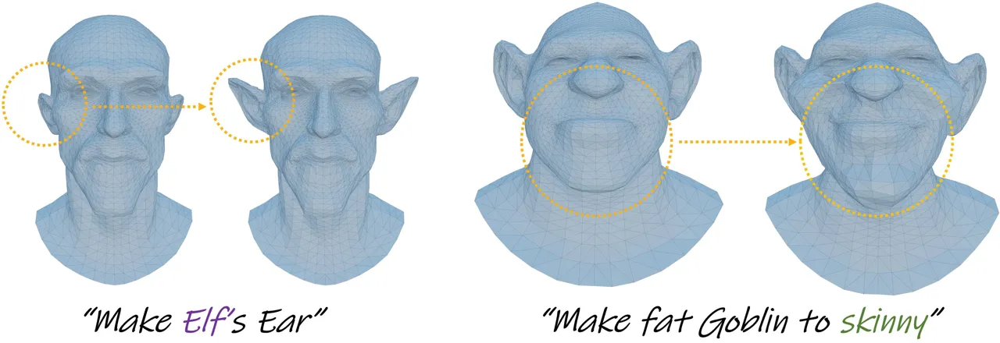

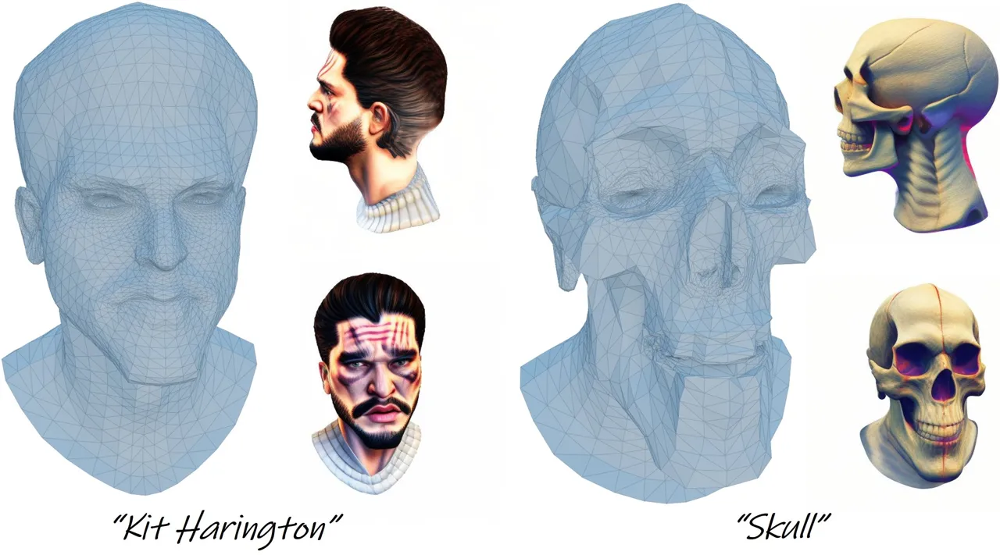

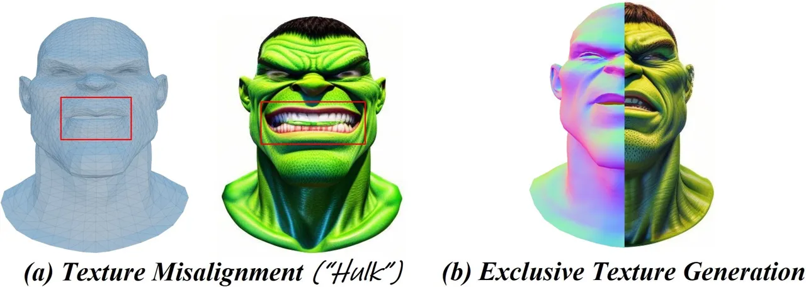

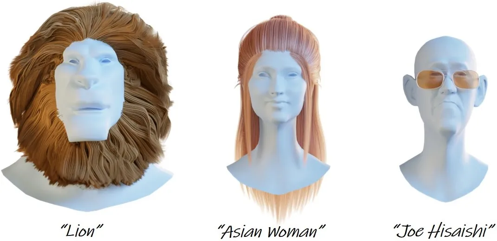

Figure 14: Examples of local geometry editing. Our framework uses
per-vertex segmentation information (Figure 8), enabling text-based mesh
editing to alter avatars’ local features.

Figure 15: More representative generation results.

Figure 16: A limitation of our method. For exaggerated figures like
“Hulk”, (a) though it does not impact further applications too much
shown in Figure HeadEvolver: Text to Head Avatars via Expressive  
and Attribute-Preserving Mesh Deformation(c), perfect geometry-texture
alignment is not guaranteed. (b) By fixing the geometry and solely
applying texture optimizations, this artifact can be alleviated (e.g.,
TexGen \[22\]).

Figure 17: Generated head avatars that can be manipulated (e.g.,
accessories) in graphics software without mesh post-processing.

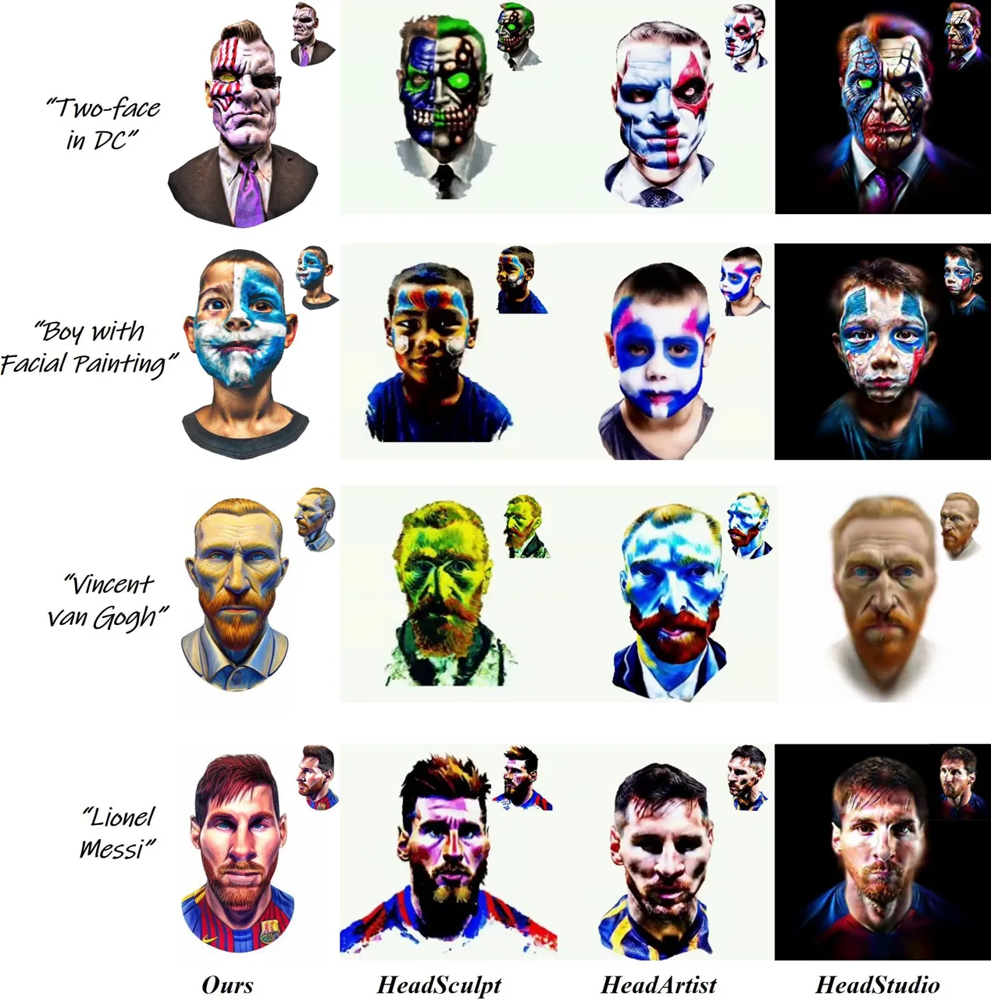

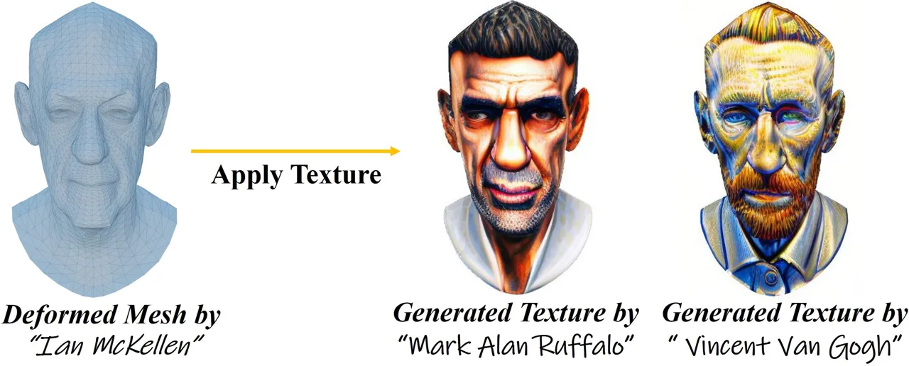

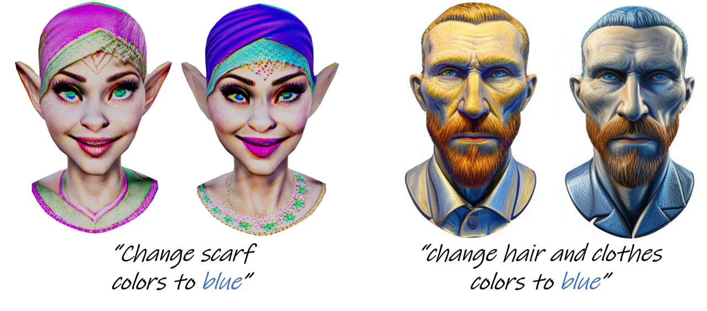

Figure 18: More qualitative comparisons with recent methods that do not
employ mesh representations for avatar generation.

Figure 19: Examples of texture transfer. Since the UV coordinates of the
input template mesh are well preserved, various generated texture maps
can be directly applied to the generated mesh.

Figure 20: Example of text-based texture editing. With extra text
prompts, our method supports texture editing in partial regions.
