# DiffusionAct: Controllable Diffusion Autoencoder for One-shot Face Reenactment

Stella Bounareli, Christos Tzelepis, Vasileios Argyriou, Ioannis
Patras,  
Georgios Tzimiropoulos  
School of Computer Science and Mathematics, Kingston University London
School of Science and Technology, City University of London School of
Electronic Engineering and Computer Science, Queen Mary University of
London

###### Abstract

Video-driven neural face reenactment aims to synthesize realistic facial
images that successfully preserve the identity and appearance of a
source face, while transferring the target head pose and facial
expressions. Existing GAN-based methods suffer from either distortions
and visual artifacts or poor reconstruction quality, i.e., the
background and several important appearance details, such as hair
style/color, glasses and accessories, are not faithfully reconstructed.
Recent advances in Diffusion Probabilistic Models (DPMs) enable the
generation of high-quality realistic images. To this end, in this paper
we present DiffusionAct, a novel method that leverages the
photo-realistic image generation of diffusion models to perform neural
face reenactment. Specifically, we propose to control the semantic space
of a Diffusion Autoencoder (DiffAE), in order to edit the facial pose of
the input images, defined as the head pose orientation and the facial
expressions. Our method allows one-shot, self, and cross-subject
reenactment, without requiring subject-specific fine-tuning. We compare
against state-of-the-art GAN-, StyleGAN2-, and diffusion-based methods,
showing better or on-par reenactment performance. ^(†)^(†) Project page:
[https://stelabou.github.io/diffusionact/](https://stelabou.github.io/diffusionact/)

![[Uncaptioned
image]](arxiv-2403-17217--7a69e92720e9.figures/figure-1.webp)

Figure 1: Our DPM-based method, DiffusionAct, performs one-shot self
(top row) and cross-subject (bottom row) neural face reenactment. We
demonstrate that, compared to current state-of-the-art methods, namely
DaGAN \[22\], Face2Face \[65\], DPE \[42\] and HyperReenact \[4\],
DiffusionAct produces realistic, artifact-free images, accurately
transfers the target head pose and expression, and faithfully
reconstructs the source identity and appearance across challenging
conditions, e.g., large head pose movements.

## 1 Introduction

Neural face reenactment aims to generate photo-realistic head avatars of
a source subject. That is, given a source facial image, the goal of face
reenactment is to animate it using either audio driving signals \[45,
17, 19, 51, 54\] or video driving sequences \[71, 61, 36, 4\] from the
same (self reenactment), or different subjects (cross-subject
reenactment), as shown in Fig. 1. In doing so, the appearance and the
identity characteristics of the source face should be preserved, while
the target facial pose (which in the literature of neural face
reenactment is typically defined as the head pose orientation and the
facial expressions \[7, 71, 4\]) is accurately transferred to the
reenacted face. Neural face reenactment has recently drawn significant
attention both from the research community and the industry, due to its
wide range of applications, e.g. in entertainment, creative arts, video
conferencing and video production.

The advent of Generative Adversarial Networks (GANs) \[18, 27, 28\] and
Diffusion Probabilistic Models (DPMs) \[21, 53, 49\] has led to
impressive performance in the tasks of image synthesis and manipulation.
Such methods are able to produce realistic and aesthetically pleasing
synthetic images, but also provide controllability over the generative
process \[59, 57, 39, 58, 43, 24, 8\]. Whilst recent generative methods
have been extensively used for face reenactment \[71, 7, 52\], it
remains a remarkably challenging task due to the wide range of
variations of the human faces, different facial shapes, appearances and
expressions, head pose movements and lighting conditions. A certain line
of research proposes training controllable GAN models \[71, 14, 36,
47\]. However, training such models often leads to deformations and
visual artifacts on the generated images. As shown in Fig. 1, GAN-based
methods \[22, 65, 42\] often fail to produce realistic images under head
pose movements between the source and target faces. Furthermore,
learning disentangled representations of identity/appearance and facial
pose, which is of paramount importance for face reenactment, is a non
trivial task. Failure in achieving disentanglement can lead to identity
leakage from the driving faces to the source ones \[71, 70\]. To
overcome the above challenges, recent methods \[3, 67, 4, 40\] focus on
leveraging the photo-realistic generative ability and the disentangled
properties of pre-trained StyleGAN2 models \[29\]. Nevertheless, a
significant limitation of these approaches is that the encoding of real
images onto StyleGAN2 space remains a challenge, leading usually to
unfaithful reconstruction and poor reenactment. As illustrated in
Fig. 1, the StyleGAN2-based method of HyperReenact \[4\] fails to
precisely reconstruct appearance details, such as hair styles and
glasses, that are crucial to maintain the overall perceptual quality of
the reenacted images. Recent works incorporate DPMs for the task of
audio-driven talking head sequences generation \[51, 54, 15\]. However,
these methods mainly focus on editing the mouth region. In contrast,
DiffusionRig \[13\] enables editing the head pose and expression of
input images, however, it requires subject-specific fine-tuning with
around 20 images to reconstruct the source identity characteristics,
limiting its feasibility. Finally, IP-Adapter \[66\] and
InstantID \[60\] condition Stable Diffusion (SD) models \[49\] to
generate controllable images. Nevertheless, such methods are not able to
preserve both the identity and appearance of input faces, making them
impractical for the task of face reenactment.

In this work, we propose a novel neural face reenactment framework,
called DiffusionAct, which incorporates the generative power of a
pre-trained Denoising Diffusion Implicit Model (DDIM) \[53\] and the
remarkable reconstruction performance of a Diffusion AutoEncoder
(DiffAE) \[46\]. The latter learns a semantic encoder that maps input
images into meaningful semantic codes, which then are decoded by a
standard DDIM sampler, allowing for image editing and, thus, can be
employed for face reenactment. In contrast to StyleGAN2-based
methods \[3, 67, 4\], that typically suffer from the
reconstruction-editability trade-off \[55\], our method achieves
effective face reenactment performance relying on the near-perfect
reconstruction capability of DiffAE. Furthermore, our method requires a
single frame from the source face, in contrast to other GAN- or
DPM-based methods \[7, 23, 13\]. Concretely, we devise a conditioning
mechanism on the semantic encoder of DiffAE, which we call reenactment
encoder, that enables the transfer of the target facial pose into the
reenacted image. More specifically, we optimise our reenactment encoder
to encode in its semantic space the appearance/identity characteristics
of the source face, and the target facial pose, given in terms of
informative facial landmarks. The resulting “reenacted” code is then
decoded by DDIM to generate the reenacted face.

The main contributions of this paper can be summarized as follows:

1.  1.  We introduce DiffusionAct, a novel approach for face reenactment
        based on a pre-trained diffusion autoencoder model \[46\]. To the
        best of our knowledge, our work is the first that uses a pre-trained
        DPM and adapts it to the face reenactment task.
2.  2.  Inspired by ControlNet \[72\], we propose a conditioning mechanism
        on a pre-trained semantic encoder to enable the generation of
        controllable images using the target facial landmarks. In contrast
        to ControlNet \[72\], that requires the costly optimisation of the
        DPM’s UNet \[50\], our method optimises only the reenactment
        encoder.
3.  3.  We report extensive quantitative and qualitative results on
        VoxCeleb1 \[38\] and VoxCeleb2 \[9\] datasets, both on self and
        cross-subject reenactment and we compare against 5 state-of-the-art
        GAN-based methods, 3 StyleGAN2-based methods and 1 DPM-based method.
        We demonstrate that our method effectively tackles the challenging
        task of neural face reenactment by generating artifact-free images
        and by accurately transferring the target facial pose and faithfully
        reconstructing the identity and appearance characteristics of the
        source faces across different challenging conditions.

## 2 Related work

Diffusion Probabilistic Models (DPMs): DPMs \[21, 53, 12\] are
generative models that learn a data distribution through a denoising
process that iteratively transforms noisy samples into the target
distribution. The recently introduced Latent Diffusion Models
(LDMs) \[49\], transfer the denoising process into a lower-dimension
latent space, enabling both faster training and better image generation
performance. Currently, DPMs excel in conditional image generation \[49,
72, 44, 66, 60\] and image editing \[34, 35, 31, 37, 41, 24, 32\]. A
recent approach for conditioning a DPM on various modalities (such as
segmentation maps and keypoints) is ControlNet \[72\], that does so by
learning to adapt a pre-trained diffusion model on the aforementioned
additional conditions. Finally, Preechakul et al. \[46\] proposed
DiffAE, a method that learns an image encoder to predict a semantic code
which is then used to condition the diffusion process. Similarly to
StyleGAN2-based methods \[59, 25\], DiffAE allows for semantic/latent
code editing which leads to meaningful changes in the input images \[46,
69\], while in contrast to SD, DiffAE enables accurate image
reconstruction.

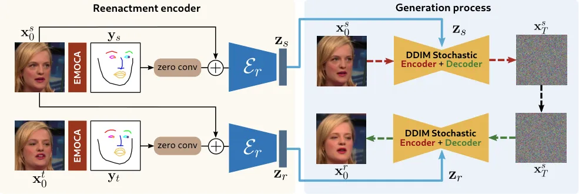

Figure 2: Overview of the proposed method: Given a pair of a source
($`\mathbf{x}_{0}^{s}`$) and a target ($`\mathbf{x}_{0}^{t}`$) images,
we condition the reenactment encoder $`\mathcal{E}_{r}`$ on the target
facial landmarks $`\mathbf{y}_{t}`$, in order to predict the reenactment
semantic code $`\mathbf{z}_{r}`$ that, when decoded by the DDIM,
generates the reenacted image $`\mathbf{x}_{0}^{r}`$ that captures the
source identity/appearance and the target head pose and facial
expressions.

Neural face reenactment: The majority of existing face reenactment
methods train controllable GANs conditioned on various facial
information or interest (such as facial landmarks or keypoints). There
is a line of works that propose to drive the image generation process
using facial landmarks \[71, 70\], extracted from off-the-shelf facial
landmark estimation methods such as \[6\]. Nevertheless, these methods
suffer from identity leakage from the target faces to the reenacted ones
on cross-subject reenactment, as facial landmarks typically maintain the
facial shape of the input faces. Several approaches \[14, 3, 4, 47, 30\]
leverage the disentangled properties of 3D Morphable Models
(3DMMs) \[2\] to drive the generation process. Utilizing 3DMMs allows
for disentanglement of the facial shape from the facial pose, which
mitigates the identity leakage on cross-subject reenactment.
Additionally, warping-based methods rely on learning keypoints that
represent the facial motion between the source and target faces \[52,
61, 75, 22\]. Specifically, FOMM \[52\] proposes to model the motion
change between the source and the target faces by calculating the
changes in the position of the learned keypoints. This method can only
work on sequences with minor changes of head pose, generating many
visual artifacts and deformations otherwise. Several methods build upon
FOMM \[52\] by introducing 3D keypoints \[61\] or using depth-guided
facial keypoints \[22\]. Nevertheless, the warping-based approaches
still produce unnatural deformations on the reenacted images.

A recent line of works \[5, 3, 4, 67, 40\] propose to leverage the
photo-realistic image generation of pre-trained StyleGAN2 models \[29\].
Bounareli et al. \[3\] investigate the $`\mathcal{W}`$ latent space of
StyleGAN2 to find the directions that are responsible for facial pose
editing. In a similar fashion, Oorloff et al. \[40\] propose to use a
combination of $`\mathcal{W}`$ space and style space $`\mathcal{S}`$ of
StyleGAN2. Such methods are able to faithfully edit real images, however
they require to optimize the weights of the GAN generator \[48\] to
preserve the appearance of the source images. StyleHeat \[67\] proposes
to use the feature space $`\mathcal{F}`$ of StyleGAN2, which despite
improving reconstruction, leads to poor reenactment performance even
under moderate head pose variations. Finally, HyperReenact \[4\],
optimizes a hypernetwork \[20\] to alter the weights of StyleGAN2
generator, simultaneously refining the source appearance and
transferring the target facial pose. In spite of the ability of
HyperReenact to faithfully transfer the target head pose and expression,
it often tends to produce over-smoothed reenacted images, missing
important details of the source image (e.g., glasses, background or hair
styles).

Finally, recent works train conditional DPMs to generate audio-driven
talking head sequences \[51, 54, 15\]. However, audio-driven methods
typically focus on reenacting the mouth region only, limiting their
ability to edit the head pose and facial expressions.
DiffusionRig \[13\] enables editing both the head pose and facial
expressions by learning a DPM driven by a 3DMM \[16\]. However, it
requires subject-specific fine-tuning with a small portrait dataset to
accurately reconstruct the source appearance and identity. Additionally,
the authors of \[64\] learn to animate a source face using multimodal
guidance from audio signals and 3D parameters. Nevertheless, all the
aforementioned methods require training a diffusion model which is
computationally expensive. On the contrary, in this work we propose to
use a pre-trained DPM and condition the generation process in order to
perform one-shot face reenactment.

## 3 Proposed method

In this section we present DiffusionAct for one-shot neural face
reenactment. An overview of the proposed method is illustrated in
Fig. 2. Our method builds on a pre-trained DiffAE \[46\], where we
propose to learn a “reenactment encoder” $`\mathcal{E}_{r}`$ and
condition it on the target facial landmarks $`\mathbf{y}_{t}`$ so as to
learn to predict the semantic code $`\mathbf{z}_{r}`$ that reenacts, via
the generative DDIM module, the source image $`\mathbf{x}_{0}^{s}`$
given a target image $`\mathbf{x}_{0}^{t}`$. This way, the reenacted
image $`\mathbf{x}_{0}^{r}`$ preserves the identity/appearance of the
source image, while it transfers the head orientation and facial
expressions of the target image. In the rest of the section, we first
briefly present the adopted DiffAE method (Sect. 3.1), and then we
describe the proposed framework (Sect. 3.2) and the adopted training
protocol (Sect. 3.3).

### 3.1 Background

We briefly discuss DiffAE, a recent method that equips a standard DDIM
sampler with the editing property via a semantic vector space (similar
to the latent space of a GAN). DiffAE utilizes a conditional DDIM \[53\]
that learns to iteratively transform noisy samples into images that
resemble a target distribution.

In contrast to a Denoising Diffusion Probabilistic Model (DDPM) \[21\]
that uses a Markov Chain model to progressively add noise on a real
image $`q(\mathbf{x}_{t}|\mathbf{x}_{t-1})`$, DDIM speeds up the
generation process by defining it as a non-Markovian process
$`q(\mathbf{x}_{t}|\mathbf{x}_{t-1},\mathbf{x}_{0})`$, further
conditioned on the input image $`\mathbf{x}_{0}`$. The reverse
(denoising) process $`p(\mathbf{x}_{t-1}|\mathbf{x}_{t})`$ is learned
using a function $`\epsilon_{\theta}(\mathbf{x}_{t},t)`$ that takes as
input a noisy image $`\mathbf{x}_{t}`$ and learns to predict the added
noise $`\epsilon`$ to $`\mathbf{x}_{0}`$ in order to get
$`\mathbf{x}_{t}`$. This function is modeled as a UNet \[50\] and is
trained via minimising
$`\lVert\epsilon_{\theta}(\mathbf{x}_{t},t)-\epsilon\rVert`$. The
denoised image at step $`t-1`$ is calculated as

```math
\mathbf{x}_{t-1}=\sqrt{a_{t-1}}f_{\theta}(\mathbf{x}_{t},t)+\sqrt{1-a_{t-1}}\epsilon_{\theta}(\mathbf{x}_{t},t), \tag{1}
```

where $`f_{\theta}(\mathbf{x}_{t},t)`$ is the estimated real image
$`\hat{\mathbf{x}}_{0}`$ at step $`t`$,

```math
f_{\theta}(\mathbf{x}_{t},t)=\frac{\mathbf{x}_{t}-\sqrt{1-a_{t}}\epsilon_{\theta}(\mathbf{x}_{t},t)}{\sqrt{a_{t}}}, \tag{2}
```

and $`a_{t}=\prod_{s=1}^{t}(1-\beta_{s})`$, where $`\beta_{t}`$ is a
fixed or learned variance schedule that represents the noise levels. The
generation process of a DDIM can be deterministic, meaning that there is
a deterministic mapping between the real image $`\mathbf{x}_{0}`$ and
the noisy image $`\mathbf{x}_{T}`$, and vice versa.

For endowing a DDIM with a semantic space, DiffAE learns a semantic
encoder $`\mathcal{E}`$ that learns to encode an image
$`\mathbf{x}_{0}`$ into a semantic code
$`\mathbf{z}\in\mathbb{R}^{512}`$. The diffusion process
$`\epsilon_{\theta}(\mathbf{x}_{t},t,\mathbf{z})`$ is then conditioned
on the semantic code $`\mathbf{z}`$. Using the semantic encoder
$`\mathcal{E}`$ and the DDIM sampler, a real image $`\mathbf{x}_{0}`$ is
mapped onto the stochastic subcode $`\mathbf{x}_{T}`$ using the reverse
process of (1):

```math
\mathbf{x}_{t+1}=\sqrt{a_{t+1}}f_{\theta}(\mathbf{x}_{t},t,\mathbf{z})+\sqrt{1-a_{t+1}}\epsilon_{\theta}(\mathbf{x}_{t},t,\mathbf{z}). \tag{3}
```

Finally, a real image is reconstructed remarkably faithfully by the DDIM
of DiffAE via decoding its semantic code $`\mathbf{z}`$ and stochastic
subcode $`\mathbf{x}_{T}`$.

### 3.2 DiffusionAct

In this section we present our framework for neural face reenactment.
The proposed method employs a DDIM (pre-trained on the FFHQ \[28\]
dataset) and a semantic encoder, which –in contrast to DiffAE that aims
to predict a semantic code encoding the input image– learns to predict a
semantic code that encodes the pose of a target face, and the appearance
and identity characteristics of a source face. For doing so, we propose
to condition the semantic encoder, which hereinafter will be referred to
as the reenactment encoder, on the facial landmarks and the gaze
direction of the target face, as shown in Fig. 2.

Concretely, given a pair of source ($`\mathbf{x}_{0}^{s}`$) and target
($`\mathbf{x}_{0}^{t}`$) images, we aim to generate the reenacted
$`\mathbf{x}_{0}^{r}`$ image, that preserves the source appearance and
identity characteristics (i.e., background, hair style/color, facial
accessories) and transfers the target facial pose (i.e., head pose
orientation and facial expressions). To do so, we propose learning to
predict the desired reenacted semantic code $`\mathbf{z}_{r}`$ by
conditioning the reenactment encoder $`\mathcal{E}_{r}`$ on the facial
landmarks and the gaze position of the target face, $`\mathbf{y}_{t}`$,
extracted by the pre-trained EMOCA \[10\] network and the pre-trained
gaze estimation network of \[73\]. We detail the construction of
$`\mathbf{y}_{t}`$ in the supplementary material.

For conditioning the reenactment encoder ($`\mathcal{E}_{r}`$) on the
target facial pose ($`\mathbf{y}_{t}`$), inspired by the recently
published ControlNet \[72\], we introduce the target landmark condition
through a “zero” convolution, the output of which we add to the source
image before we feed it to the reenactment encoder $`\mathcal{E}_{r}`$,
as shown in left part of Fig. 2. We note that, according to \[72\], a
“zero” convolution refers to an $`1\times 1`$ convolution layer whose
weights are only initially set to zero and allowed to gradually change
during training injecting the desired spatial landmark-based condition
into the training of the proposed reenactment encoder
$`\mathcal{E}_{r}`$. Finally, as illustrated in the right part of
Fig. 2, in order to generate the reenacted image, we first encode the
source image $`\mathbf{x}_{0}^{s}`$ into the stochastic noisy subcode
$`\mathbf{x}_{T}^{s}`$ using Eq. 3 and the source semantic code
$`\mathbf{z}_{s}`$. Given the noisy subcode $`\mathbf{x}_{T}^{s}`$ and
the reenacted code $`\mathbf{z}_{r}`$, the DDIM decoder generates the
reenacted image $`\mathbf{x}_{0}^{r}`$.

### 3.3 Training protocol

In this section we present the training process of the proposed
framework which is split into two stages: i) first, we pre-train the
reenactment encoder $`\mathcal{E}_{r}`$ under the self reenactment
setting, and ii) we continue training the reenactment encoder
$`\mathcal{E}_{r}`$ by incorporating the DDIM sampler to synthesize the
reenacted images.

Pre-training: We first pre-train the reenactment encoder
$`\mathcal{E}_{r}`$ to predict the reenacted semantic code
$`\mathbf{z}_{r}`$ that encodes the identity/appearance of the source
face and the facial pose of the target face. We do so under the
self-reenactment setting, i.e., where the source and target faces have
the same identity – i.e., we first learn to predict a reenacted code
$`\mathbf{z}_{r}`$ that is identical to the code of the target face,
$`\mathbf{z}_{t}`$, minimising their $`\ell_{1}`$ distance,
$`\lVert\mathbf{z}_{r}-\mathbf{z}_{t}\rVert_{1}`$. We note that we
initialize the reenactment encoder $`\mathcal{E}_{r}`$ by adopting the
weights of the semantic encoder $`\mathcal{E}`$ of DiffAE. Additionally,
the DDIM sampler is not part of this pre-training process.

After training the proposed reenactment encoder $`\mathcal{E}_{r}`$
using only this objective, we obtain an encoder that predicts a semantic
code $`\mathbf{z}_{r}`$ encoding both the appearance of the source face
and the target facial pose. This means that given the predicted code
$`\mathbf{z}_{r}`$ and the stochastic subcode of the source image
$`\mathbf{x}_{T}^{s}`$, the DDIM decoder generates the reenacted image
that depicts the source identity in the target facial pose. Whilst this
training stage does not result in optimal face reenactment performance
(i.e., the reenacted images are prone to some visual artifacts), we show
in Sect. 4.3 that it is crucial as a warm-up pre-training stage, before
we proceed to the main training stage of our framework discussed below.

Training: After obtaining the proposed reenactment encoder
$`\mathcal{E}_{r}`$ pre-trained on the task of self-reenactment, as
discussed above, we proceed to the main training process of
$`\mathcal{E}_{r}`$ where we additionally incorporate DDIM as a
generative module (to generate the reenacted images), along with a
series of well-studied reconstruction and pose transfer losses,
following the common practice in literature \[3, 63, 4, 42\]. We
illustrate the training process of our method in Fig. 2. The total loss
we minimise is given as:

```math
\mathcal{L}=\mathcal{L}_{rec}+\mathcal{L}_{pose}, \tag{4}
```

where $`\mathcal{L}_{rec}`$ and $`\mathcal{L}_{pose}`$ are the
reconstruction and pose losses, respectively, which we discuss briefly
below and in detail in the supplementary material. We propose the
following reconstruction loss to guide the reenacted images to depict
the identity and the appearance of the source faces:

```math
\mathcal{L}_{rec}=\lambda_{pix}\mathcal{L}_{pix}+\lambda_{per}\mathcal{L}_{per}+\lambda_{id}\mathcal{L}_{id}+\lambda_{bg}\mathcal{L}_{bg}+\lambda_{st}\mathcal{L}_{st}, \tag{5}
```

where $`\mathcal{L}_{pix}`$, $`\mathcal{L}_{per}`$, and
$`\mathcal{L}_{id}`$ are respectively the pixel-wise, perceptual, and
identity losses, calculated as in \[4\]. We additionally calculate a
background loss $`\mathcal{L}_{bg}`$ by using the off-the-shelf
pre-trained face segmentation network \[68\] to create a mask around the
face area and keep only the background and hair areas. Finally, inspired
by \[1\], we calculate the style loss $`\mathcal{L}_{st}`$ as an
$`\ell_{2}`$ distance in the ViT space of the pre-trained FaRL \[76\].
Furthermore, in order to force the effective and realistic transfer of
the target facial pose (head orientation and facial expressions) onto
the reenacted face, we propose to use the following loss term:

```math
\mathcal{L}_{pose}=\lambda_{g}\mathcal{L}_{g}+\lambda_{sh}\mathcal{L}_{sh}+\lambda_{hp}\mathcal{L}_{hp}, \tag{6}
```

where $`\mathcal{L}_{g}`$, $`\mathcal{L}_{sh}`$, and
$`\mathcal{L}_{hp}`$ denote the gaze, shape, and head pose losses,
respectively. We calculate the gaze loss as the $`\ell_{1}`$ distance of
the gaze direction extracted using the off-the-shelf gaze estimation
network of \[73\], the shape loss as the $`\ell_{1}`$ distance of the 2D
facial landmarks \[10\], and the head pose loss as the average
$`\ell_{1}`$ distance of the three Euler angles (i.e., yaw, pitch, and
roll) calculated using the head pose coefficients extracted by
EMOCA \[10\].

Towards achieving improved reenactment performance, we propose a
training protocol that involves both self reenactment and image
reconstruction tasks. Specifically, during training, we split the
mini-batch into two halves. In the first half, the source and target
images depict the same subject but on different facial pose (self
reenactment), while in the second half, the source and target images are
the same (image reconstruction). In our ablation studies (Sect. 4.3), we
show that this training protocol improves our qualitative and
quantitative results.

Finally, to further improve the performance of the proposed framework,
we suggest to fine-tune the DDIM sampler, while being jointly optimized
with the proposed reenactment encoder $`\mathcal{E}_{r}`$ (see Fig. 2).
We show that this strategy further improves the reenactment performance,
since the adopted DDIM \[46\] has been pre-trained on the FFHQ
dataset \[28\], which has a different distribution of the VoxCeleb
datasets \[38, 9\] in terms of different head poses and
expressions \[3\].

## 4 Experiments

In this section, we provide the implementation and training details of
our approach in Sect. 4.1, we report comparisons of our method with 9
state-of-the-art methods both on self and on cross-subject reenactment
tasks in Sect. 4.2, and we present ablation studies on the impact of the
various design choices in Sect. 4.3.

### 4.1 Implementation details

We use a DDIM model \[46\] pre-trained on the FFHQ dataset \[28\]. We
train our model on the VoxCeleb1 dataset \[38\], which contains around
20K videos. During the pre-training stage of the reenactment encoder, we
use a learning rate of $`10^{-3}`$ and a batch size of $`32`$, while
during the main training stage we use $`T_{tr}=8`$ steps to synthesize
the images, a learning rate of $`10^{-4}`$, and a batch size of $`4`$.
Finally, we fine-tune the DDIM sampler along with the reenactment
encoder using a learning rate of $`10^{-5}`$ and a batch size of $`4`$.
In all training stages we optimize our models using the AdamW \[33\]
optimizer. We also set
$`\lambda_{pix},\lambda_{per},\lambda_{id},\lambda_{st}=20`$,
$`\lambda_{bg}=10`$, $`\lambda_{sh}=0.5`$ and
$`\lambda_{g},\lambda_{hp}=2`$. During inference, we use $`T=50`$ steps
to calculate the stochastic subcodes $`\mathbf{x}_{T}^{s}`$ and $`T=20`$
steps to generate the reenacted images. For our experiments we used 2
Nvidia Quadro RTX 8000.

### 4.2 Comparisons to state-of-the-art

In this section we provide quantitative and qualitative comparisons both
on self and on cross-subject reenactment against 9 state-of-the-art
methods. Specifically, we compare with 5 methods that train controllable
GANs from scratch, namely DaGAN \[22\], Rome \[30\], Face2Face \[65\],
UniFace \[63\] and DPE \[42\]. We also provide comparisons with 3
methods that leverage pre-trained StyleGAN2 \[29\] models, namely
StyleHeat \[67\], FD \[3\] and HyperReenact \[4\], while we also compare
with a diffusion-based method called DiffusionRig \[13\]. For all
methods we use the official publicly available pre-trained models. We
evaluated our method on the test set of VoxCeleb1 \[38\]. For each video
of the test set we kept the first frame as the source image and the rest
as the target images. In the supplementary material we provide
additional comparisons on the datasets of VoxCeleb2 \[9\] and
HDTF \[74\] and we also compare against the two SD-based methods namely
IP-Adapter \[66\] and InstantID \[60\].

| Method              | PSNR | SSIM | CSIM | LPIPS | L1   | NME  | APD | AED  | User Pref. ($`\%`$) |
| ------------------- | ---- | ---- | ---- | ----- | ---- | ---- | --- | ---- | ------------------- |
|                     |      |      |      |       |      |      |     |      |                     |
| DaGAN \[22\]        | 16.9 | 0.73 | 0.72 | 0.24  | 0.18 | 30.0 | 4.5 | 12.8 | 1.9                 |
| Rome \[30\]         | 7.5  | 0.72 | 0.69 | 0.43  | 0.61 | 13.9 | 1.5 | 8.5  | 7.0                 |
| Face2Face \[65\]    | 17.1 | 0.76 | 0.72 | 0.27  | 0.18 | 15.9 | 1.5 | 10.6 | 10.2                |
| UniFace \[63\]      | 18.1 | 0.77 | 0.69 | 0.22  | 0.17 | 18.5 | 2.3 | 12.7 | 2.0                 |
| DPE \[42\]          | 14.7 | 0.69 | 0.70 | 0.38  | 0.27 | 23.3 | 4.2 | 11.0 | 5.0                 |
| StyleHeat \[67\]    | 17.5 | 0.79 | 0.58 | 0.28  | 0.18 | 18.8 | 3.4 | 12.0 | 2.9                 |
| FD \[3\]            | 18.0 | 0.77 | 0.65 | 0.23  | 0.16 | 14.4 | 1.0 | 9.3  | 4.3                 |
| HyperReenact \[4\]  | 18.9 | 0.80 | 0.71 | 0.25  | 0.16 | 12.6 | 0.5 | 8.3  | 23.0                |
| DiffusionRig \[13\] | 15.6 | 0.76 | 0.30 | 0.38  | 0.25 | 18.1 | 1.3 | 11.1 | 0.0                 |
| Ours                | 19.7 | 0.83 | 0.69 | 0.24  | 0.14 | 12.5 | 0.8 | 7.2  | 43.7                |

Table 1: Quantitative results on self reenactment task using the test
set of VoxCeleb1 dataset \[38\]. For CSIM, PSNR and SSIM metrics, higher
is better, while for the rest of the metrics lower is better. We show
the best and second best results in bold and underline. We note that the
User Pref. column corresponds to our user study conducted using both
self and cross-subject pairs.

Self reenactment task: On the self reenactment task we report 8
evaluation metrics following the related literature. Specifically, in
order to evaluate the reconstruction quality of the presented methods,
we calculate the identity similarity (CSIM) using the cosine similarity
of the features extracted by ArcFace \[11\], the learned perceptual
similarity (LPIPS) \[26\], the $`\ell_{1}`$ pixel-wise distance (L1),
the peak signal-to-noise ratio (PSNR) and the structural similarity
index (SSIM). Additionally, to assess the facial pose transfer we
calculate the normalized mean error (NME) between the target and the
reenacted facial landmarks \[6\], the Average Pose Distance (APD) and
the Average Expression Distance (AED). For APD and AED, we calculate the
average $`\ell_{1}`$ distance of the three Euler angles and the
expression coefficients extracted using the pre-trained EMOCA \[10\]
network. In Table 1, we present our quantitative results on the self
reenactment task using the test set of VoxCeleb1 \[38\]. We note that
all metrics are calculated between the target and reenacted images. As
shown, our method performs on par with HyperReenact \[4\] on head pose
transfer (APD), while it performs better on expression transfer (AED).
Additionally, our method outperforms all other methods on L1, PSNR, and
SSIM metrics by generating high quality images that resemble the real
ones. Finally, on identity preservation (CSIM) our method remains
competitive, however we argue that a higher CSIM score does not
necessarily imply better reenactment. Specifically, ArcFace \[11\]
network, which is used to extract the identity features for calculating
the CSIM metric, has been designed and trained to be invariant to
certain appearance details (e.g., glasses) or distortions, which are
crucial for face reenactment. As shown in the qualitative comparisons
(Fig. 3), some methods that exhibit higher CSIM scores than our method
(such as DaGAN \[22\] and Face2Face \[65\]) tend to produce visual
artifacts and deformations, which CSIM fails to capture, while also
HyperReenact \[4\] fails to accurately reconstruct the source appearance
details, e.g., glasses, hair styles (Fig. 4). In the supplementary
material we provide visual comparisons against the methods that have
higher CSIM scores. As shown, while our reenacted images are visually
superior, the CSIM score is lower compared to the other methods.

Cross-subject reenactment task On the cross-subject reenactment task,
the source and target faces are from different subjects, as a result the
evaluation metrics that we report here are the identity similarity
(CSIM) between the reenacted and source images and the average head pose
and expression distance, APD and AED, between the target and the
reenacted faces. On cross-subject reenactment, we expect the CSIM values
to be lower that the one on self reenactment as the source and reenacted
images are on different head pose. In Table 2, we report the
quantitative comparisons extracted using $`35`$ random video pairs from
the VoxCeleb1 test set. Our method is able to better transfer the target
facial expression, while it remains competitive on head pose transfer.
Although the CSIM metric is comparatively lower than HyperReenact \[4\],
DPE \[42\] and Face2Face \[65\], we assert that based on the qualitative
results (Fig. 3) our method is able to produce more realistic images,
better capturing the source appearance and identity without producing
visual artifacts.

| Method              | CSIM | APD | AED  |
| ------------------- | ---- | --- | ---- |
|                     |      |     |      |
| DaGAN \[22\]        | 0.56 | 2.1 | 18.2 |
| Rome \[30\]         | 0.63 | 1.2 | 13.3 |
| Face2Face \[65\]    | 0.67 | 2.1 | 15.2 |
| UniFace \[63\]      | 0.62 | 3.4 | 18.0 |
| DPE \[42\]          | 0.67 | 3.7 | 16.0 |
| StyleHeat \[67\]    | 0.57 | 3.5 | 15.5 |
| FD \[3\]            | 0.49 | 1.7 | 14.6 |
| HyperReenact \[4\]  | 0.68 | 0.5 | 12.4 |
| DiffusionRig \[13\] | 0.34 | 1.3 | 14.8 |
| Ours                | 0.60 | 1.0 | 11.9 |

Table 2: Quantitative results on cross-subject reenactment using random
video pairs from the test set of VoxCeleb1 dataset \[38\]. For CSIM
metric, higher is better, while for APD and AED, lower is better. We
show the best and second best results in bold and underline.

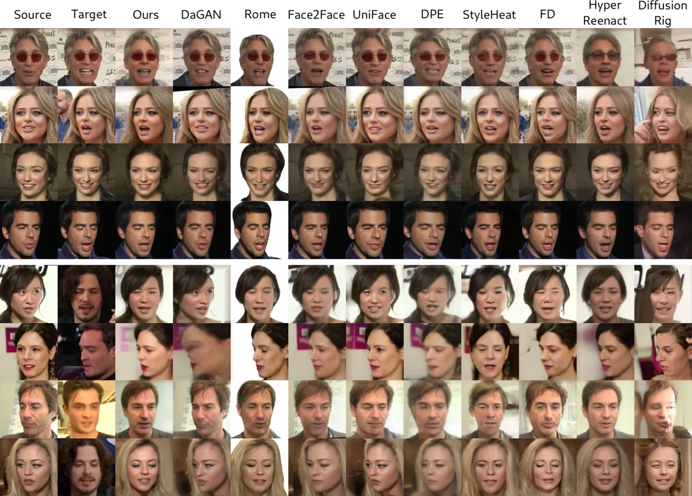

Figure 3: Qualitative comparisons on self (top 4 rows) and cross-subject
(bottom 4 rows) reenactment on VoxCeleb1 \[38\] dataset.

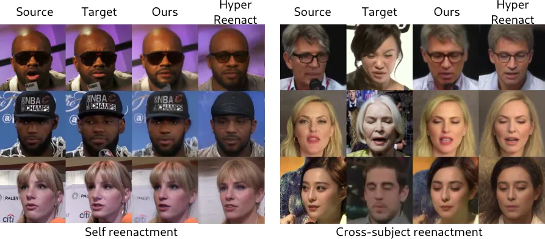

Figure 4: Comparisons against HyperReenact \[4\] in both self (left
figure) and cross-subject (right figure) reenactment. As clearly shown,
our method achieves more accurate and realistic image reconstructions
compared to HyperReenact.

Qualitative comparisons We provide qualitative comparisons of the
proposed method with state-of-the-art methods in Fig. 3, on both self
and cross-subject reenactment, along with additional comparisons and
videos in the supplementary material. We also conducted a user study.
Specifically, following the protocol of HyperReenact \[4\], we showed 20
random image pairs from VoxCeleb1 test set, 10 of self and 10 of
cross-subject reenactment, to 35 users. We asked the users to select
among the methods the one that synthesizes the best reenacted image in
terms of identity preservation, facial pose transfer and image
reconstruction quality. We report the results of the user study in
Table 1 under the User Pref. column. As shown from both the results of
the user study and from Fig. 3, our approach is able to produce
realistic and aesthetically pleasing images. Our method can accurately
transfer the target facial pose, while also preserve the identity and
appearance of the source faces both on self and on cross-subject
reenactment tasks. Compared to the GAN-based methods, namely
DaGAN \[22\], Rome \[30\], Face2Face \[65\], UniFace \[63\] and
DPE \[42\], which achieve good quantitative results on CSIM metric, our
method is able to more accurately transfer the target head pose and
expression and also maintain the appearance of the source faces, without
producing artifacts. We also perform on par on facial pose transfer with
the StyleGAN2-based methods, namely StyleHeat \[67\], FD \[3\] and
HyperReenact \[4\]. Regarding the image quality, StyleHeat \[67\] and
FD \[3\] produce visual artifacts especially when there is difference on
the head pose between the source and target faces, while our reenacted
images are mostly artifact-free. Finally, while HyperReenact \[4\] is
able to produce visually pleasing images, it tends to over-smooth the
faces and cannot accurately reconstruct details such as the hair styles,
glasses or background elements, which are important for maintaining the
overall perceptual quality of the generated images. A more detailed
comparison with HyperReenact is illustrated in Fig. 4. As shown, while
this method does not produce visual artifacts and successfully transfers
the target facial pose, it fails in reconstructing important appearance
details of the source images, e.g., glasses, hats, hair styles and
background details. Finally, DiffusionRig \[13\], which is a
diffusion-based method similar to ours, even though being able to
transfer the target facial pose, it cannot produce realistic results
using only one source frame, i.e. under one-shot settings.

### 4.3 Ablation studies

In this section, we present our ablation studies to assess how our
training choices contribute to the final results. Specifically, we
evaluate the contribution of (a) the pre-training process (“w/o
pre-training”), (b) the training protocol that involves both self
reenactment and image reconstruction tasks (“w/o batch split”), and (c)
the joint optimization of the DDIM decoder with the proposed reenactment
encoder $`\mathcal{E}_{r}`$ (“w/o fine-tuning”). We provide both
quantitative and qualitative comparisons in Table 3 and Fig. 5,
respectively. In the supplementary material we also provide results of
our final model with different steps $`T`$ to assess how the different
steps contribute to the reconstruction quality of the generated images.

Regarding (a), we show results of our method without performing
pre-training of the reenactment encoder, described in Sect. 3.3. Instead
the reenactment encoder is directly trained with the reconstruction
losses. As shown in Table 3, omitting the pre-training step (“w/o
pre-training”) results in less accurate transfer of head pose and
expression. Additionally, our final model has better results on both
PSNR and SSIM metrics, indicating that the reenacted images exhibit
higher quality. Even though CSIM metric is relatively higher, as
illustrated in Fig. 5, the reenacted images in 4th column (“w/o
pre-training”) have visual artifacts or fail to achieve the target
facial pose. Consequently, this warm-up pre-training stage is crucial
for enabling the reenactment encoder to better encode the target facial
pose.

Regarding (b), we show that our training protocol that involves both
self reenactment and image reconstruction task described in Sect. 3.3,
enables our model to better reconstruct the identity and appearance
details of the source images. As shown in Table 3 and Fig. 5, “w/o batch
split” results in less accurate image reconstructions with visible
deformations especially around the mouth area. Finally, for (c) we show
that our model is able to produce realistic images even without the
joint optimization of the DDIM decoder along with the reenactment
encoder “w/o fine-tuning”. Nevertheless, by fine-tuning the DDIM
decoder, our model is able to produce more accurate results in terms of
the head pose and expression transfer as shown by the APD and AED
metrics in Table 3.

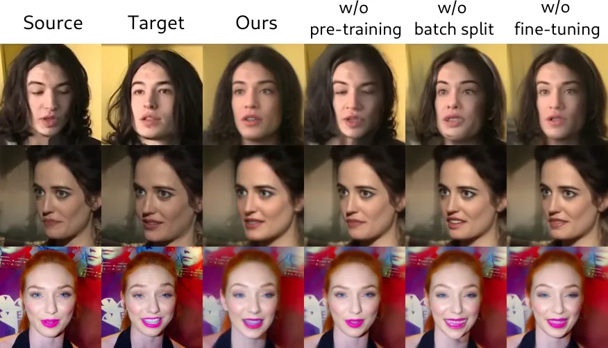

Figure 5: Qualitative comparisons of different training choices of our
framework, i.e., without pre-training the reenactment encoder (“w/o
pre-training”), without the training protocol that involves both self
reenactment and image reconstruction tasks (“w/o batch split”) and
without fine-tuning the DDIM decoder (“w/o fine-tuning”).

| Method           | CSIM | PSNR | SSIM | APD | AED  |
| ---------------- | ---- | ---- | ---- | --- | ---- |
| w/o pre-training | 0.73 | 17.0 | 0.77 | 3.0 | 12.0 |
| w/o batch split  | 0.62 | 18.7 | 0.80 | 1.3 | 8.9  |
| w/o fine-tuning  | 0.67 | 19.0 | 0.81 | 1.3 | 8.7  |
| Ours             | 0.69 | 19.7 | 0.83 | 0.8 | 7.2  |

Table 3: Quantitative comparisons of different training choices of our
framework, i.e., without pre-training the reenactment encoder (“w/o
pre-training”), without the training protocol that involves both self
reenactment and image reconstruction tasks (“w/o batch split”) and
without fine-tuning the DDIM decoder (“w/o fine-tuning”)

## 5 Conclusions

In this paper, we introduced a neural face reenactment framework, called
DiffusionAct, which is based on a pre-trained DPM. Our method employs a
pre-trained diffusion autoencoder (DiffAE) \[46\], which consists of a
semantic encoder and a DDIM sampler. The semantic encoder of DiffAE is
able to encode an input image into a semantically meaningful code which
can be used for image editing. Inspired by ContolNet \[72\], we propose
to control the semantic encoder of DiffAE using the target facial pose
(reenactment encoder). Given a source image and a target facial pose,
our reenactment encoder learns to predict the reenacted code that guides
the generation process of DDIM to synthesize the reenacted image. We
demonstrate that, in comparison to several state-of-the-art approaches,
our method exhibits better or on-par reenactment performance, leading to
facial images with less visual artifacts and deformations, showing that
a pre-trained DDIM can effectively be adapted to the problem of neural
face reenactment.

Acknowledgments: This work was funded by UK Research and Innovation
(UKRI) under the UK government’s Horizon Europe funding guarantee (grant
No. 10099264) and by the European Union (under EC Horizon Europe grant
agreement No. 101135800 (RAIDO)).

## Appendix A Supplementary Material

In this supplementary material, we first provide in Sect. B, details on
how we extract i) the facial landmarks using the pre-trained
EMOCA \[10\] network and ii) the gaze position using an off-the-shelf
pre-trained gaze estimation network \[73\]. In Sect. C, we elaborate on
the training objectives employed in the training phase of our pipeline
(see Sect. 3.3 of the main paper). In Sect. D, we present an ablation
study on the diffusion steps used in order to embed the real images into
the stochastic subcode $`\mathbf{x}_{T}`$ and the steps used to
reconstruct the reenacted images. In Sect. E, we show comparisons with
two Stable Diffusion (SD) based methods \[66, 60\] and we provide
additional qualitative comparisons on the VoxCeleb1 dataset \[38\],
while also we present both quantitative and qualitative comparisons on
the VoxCeleb2 dataset \[9\]. Furthermore, we demonstrate that our
framework can generalize on other video datasets, namely HDTF \[74\] and
VFHQ \[62\]. In Sect. F, we discuss the limitations of our method.
Finally, along with this document, we provide a video file that includes
video comparisons of our method with the state-of-the-art methods used
in the main paper, as well as videos of our method on the HDTF \[74\]
and VFHQ \[62\] datasets.

## Appendix B Facial landmarks with EMOCA \[10\]

As discussed in the Sect. 3.2 of the main paper, the facial landmarks
extracted using an off-the-shelf facial landmark detection method \[6\]
contain identity details, i.e., the facial shape of the input faces. As
a result, when face reenactment methods use facial landmarks to drive
the generation process, on the task of cross-subject face reenactment,
identity leakage from the target faces into the reenacted ones is
observed \[70, 71\]. To alleviate this issue, we use a 3D reconstruction
method, namely EMOCA \[10\], which is based on 3D Morphable Models
(3DMMs) \[2\] and thus allows for reconstruction of the facial landmarks
using the disentangled representations of the facial shape and pose.
Specifically, a 3D facial shape $`\textbf{s}\in\mathbb{R}^{3N}`$ can be
parameterized as:

```math
\textbf{s}=\bar{\textbf{s}}+\textbf{S}_{i}\mathbf{p}_{i}+\textbf{S}_{\theta}\mathbf{p}_{\theta}+\textbf{S}_{e}\mathbf{p}_{e}, \tag{7}
```

where $`\bar{\textbf{s}}`$ denotes the mean 3D facial shape,
$`\textbf{S}_{i}\in\mathbb{R}^{3N\times m_{i}}`$,
$`\textbf{S}_{\theta}\in\mathbb{R}^{3N\times m_{\theta}}`$, and
$`\textbf{S}_{e}\in\mathbb{R}^{3N\times m_{e}}`$ denote respectively the
PCA bases for identity, head pose orientation, and expression, and
$`\mathbf{p}_{i}`$, $`\mathbf{p}_{\theta}`$, and $`\mathbf{p}_{e}`$
denote respectively the corresponding identity, head pose orientation,
and expression coefficients.

Having this representation of the 3D facial shape and considering as
input a pair of source and target images from different identities, we
can calculate the ground-truth target facial shape $`\textbf{s}^{t}`$.
Specifically, $`\textbf{s}^{t}`$ is obtained using the identity
coefficients $`\mathbf{p}_{i}^{s}`$ of the source image and the head
pose and expression coefficients
$`\mathbf{p}_{\theta}^{t},\mathbf{p}_{e}^{t}`$ of the target image as
follows:

```math
\textbf{s}^{t}=\bar{\textbf{s}}+\textbf{S}_{i}\mathbf{p}_{i}^{s}+\textbf{S}_{\theta}\mathbf{p}_{\theta}^{t}+\textbf{S}_{e}\mathbf{p}_{e}^{t}. \tag{8}
```

Hence, the corresponding target facial landmarks contain the head pose
and expression of the target image and the facial shape of the source
image, overcoming the identity leakage from the target image to the
reenacted ones. An example of cross-subject reenactment is illustrated
in Fig. 6. The first and second columns show respectively the source and
the target images which have large facial shape difference; i.e., the
source image has long facial shape, while the target image has round
shape. In the third column, we present the reenacted image generated
using the target facial landmarks extracted from a pre-trained landmark
estimation network \[6\]. The last column shows the reenacted images
generated using the reconstructed facial landmarks extracted from
EMOCA \[10\] as described in (8) above. Clearly, when employing the
target facial landmarks from \[6\], the reenacted image inherits the
facial shape of the target image, which results in missing important
identity details from the source image.

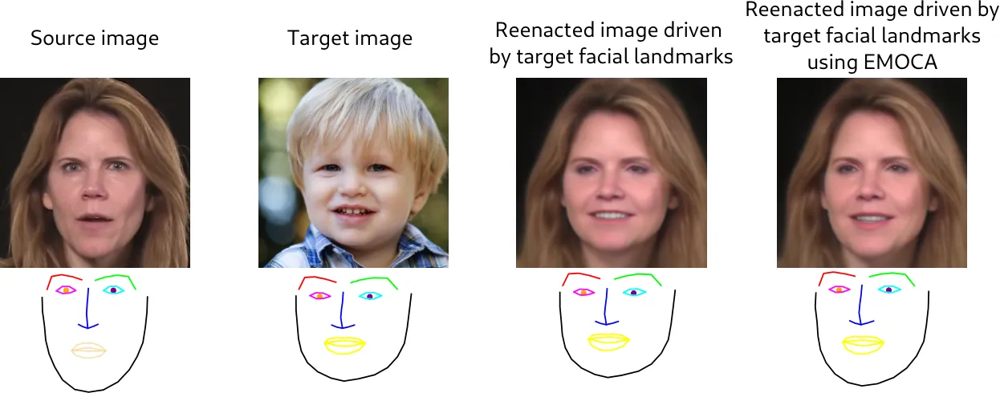

Figure 6: Example of cross-subject face reenactment driven by the target
facial landmarks extracted from the off-the-shelf facial landmark
estimation network of \[6\] and by the reconstructed facial landmarks
extracted from EMOCA \[10\] (as described in Eq. 8). Clearly, when
employing the target facial landmarks from \[6\], the reenacted image
has the facial shape of the target image (identity leakage), which is
avoided using the adopted EMOCA \[10\] network.

Finally, in order to control the gaze direction on the reenacted faces,
as discussed in Sect. 3.2 of the main paper, along with the standard
facial landmarks, we further used an additional landmark point that
corresponds to the gaze position. Specifically, we estimated the gaze
direction angles $`\alpha,\beta`$ using the pre-trained gaze estimation
network of \[73\], and by using the landmark points that correspond to
the eyes, we calculated the width $`w_{e}`$, height $`h_{e}`$, and the
center $`c_{e}`$ of each eye, and the gaze position $`(g_{x},g_{y})`$ as
follows:

```math
\displaystyle g_{x}=c_{e}-\frac{w_{e}}{2}\cdot\sin(\beta)\cdot\cos(\alpha), \tag{9}
```

```math
\displaystyle g_{y}=c_{e}-\frac{h_{e}}{2}\cdot\sin(\alpha).
```

## Appendix C Training objectives

As discussed in the Sect. 3.3 of the main paper, we propose to train our
method in two stages; a pre-training stage and a main training stage.
Specifically, as illustrated in Fig. 7, we pre-train the reenactment
encoder $`\mathcal{E}_{r}`$ under the self reenactment setting, where we
only use the $`\ell_{1}`$ loss,
$`\mathcal{L}_{z}=\lVert\mathbf{z}_{r}-\mathbf{z}_{t}\rVert_{1}`$,
between the reenacted code $`\mathbf{z}_{r}`$ predicted by the trainable
model $`\mathcal{E}_{r}`$ and the target code $`\mathbf{z}_{t}`$
predicted by the semantic encoder $`\mathcal{E}`$ of DiffAE \[46\]. We
then continue training the reenactment encoder $`\mathcal{E}_{r}`$ (main
training stage) by incorporating the DDIM sampler \[53\] as a generative
module to synthesize the reenacted images (as illustrated in Fig. 2 of
the main paper). Our training objective in this stage combines both
reconstruction and poss losses to ensure that the reenacted image will
depict the source identity in the target facial pose (head orientation
and facial expressions). In this section we present in detail the
adopted objectives used during training.

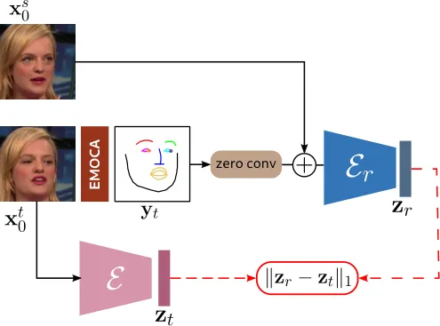

Figure 7: Pre-training process: We pre-train the reenactment encoder
$`\mathcal{E}_{r}`$ under the self reenactment setting using only the
$`\ell_{1}`$ loss between the reenacted code $`\mathbf{z}_{r}`$ and the
target code $`\mathbf{z}_{t}`$ given by the semantic encoder
$`\mathcal{E}`$ of DiffAE \[46\].

Pixel-wise loss $`\mathcal{L}_{pix}`$ The pixel-wise loss
$`\mathcal{L}_{pix}`$ is defined as the $`\ell_{2}`$-distance between
the target $`\mathbf{x}_{0}^{t}`$ and the reenacted images
$`\mathbf{x}_{0}^{r}`$:

```math
\mathcal{L}_{pix}=\lVert\mathbf{x}_{0}^{t}-\mathbf{x}_{0}^{r}\rVert_{2} \tag{10}
```

Perceptual loss $`\mathcal{L}_{per}`$ Instead of relying only on the
pixel-wise loss, we calculate the perceptual loss $`\mathcal{L}_{per}`$,
which is defined as the sum of $`\ell_{2}`$-distances between the
intermediate features of a pre-trained VGG19 network $`\phi`$ \[26\]:

```math
\mathcal{L}_{per}=\sum_{l=1}^{N}\lVert\phi_{l}(\mathbf{x}_{0}^{t})-\phi_{l}(\mathbf{x}_{0}^{r})\rVert_{2}, \tag{11}
```

where $`N`$ is the number of layers used from the VGG19 network to
compute the perceptual loss.

Identity loss $`\mathcal{L}_{id}`$ In order to preserve the identity
characteristics of the input faces, we calculate the identity loss
$`\mathcal{L}_{id}`$, which is defined as the cosine similarity of the
features extracted from the pre-trained ArcFace \[11\] network
$`\mathcal{F}`$:

```math
\mathcal{L}_{id}=1-\frac{\mathcal{F}(\mathbf{x}_{0}^{t})\cdot\mathcal{F}(\mathbf{x}_{0}^{r})}{\|\mathcal{F}(\mathbf{x}_{0}^{t})\|\|\mathcal{F}(\mathbf{x}_{0}^{r})\|} \tag{12}
```

Background loss $`\mathcal{L}_{bg}`$ In order to enhance the background
preservation, we calculate the background loss $`\mathcal{L}_{bg}`$ by
using the off-the-shelf pre-trained face segmentation network of \[68\]
to create a mask $`m_{f}`$ around the face area so as to keep only the
background and hair areas. We then calculate the background loss as:

```math
\mathcal{L}_{bg}=\lVert\mathbf{x}_{0}^{t}\odot m_{f}^{t}-\mathbf{x}_{0}^{r}\odot m_{f}^{r}\rVert_{2}, \tag{13}
```

where $`m_{f}^{t}`$, $`m_{f}^{r}`$ are the corresponding masks of the
target and the reenacted images.

Style loss $`\mathcal{L}_{st}`$ To improve the preservation of the input
facial appearance, we incorporate the style loss $`\mathcal{L}_{st}`$,
similarly to \[1\]. Specifically, we use features from the pre-trained
FaRL \[76\] ViT-based image encoder, which is trained on image and text
pairs to learn meaningful feature representations of facial images. We
calculate the style loss as the $`\ell_{2}`$-distance of the
$`512`$-dimensional feature vectors extracted from FaRL encoder
$`\mathcal{E}_{farl}`$ as follows:

```math
\mathcal{L}_{st}=\lVert\mathcal{E}_{farl}(\mathbf{x}_{0}^{t})-\mathcal{E}_{farl}(\mathbf{x}_{0}^{r})\rVert_{2}. \tag{14}
```

Gaze loss $`\mathcal{L}_{g}`$ To control the gaze direction on the
reenacted images, we calculate the gaze loss, which is defined as the
$`\ell_{1}`$-distance of the gaze direction, i.e., the gaze angles,
between the target and the reenacted images extracted from the
pre-trained gaze estimation network of \[73\], as follows:

```math
\mathcal{L}_{g}=\lVert g(\mathbf{x}_{0}^{t}))-g(\mathbf{x}_{0}^{r})\rVert_{1}. \tag{15}
```

Shape loss $`\mathcal{L}_{shape}`$ In order to transfer the target
facial pose defined as the head pose orientation and the facial
expressions we calculate the shape loss, which is defined as the
$`\ell_{1}`$-distance between the target and the reenacted 2D facial
landmarks extracted from EMOCA \[10\]:

```math
\mathcal{L}_{shape}=\lVert l^{t}-l^{r}\rVert_{1}. \tag{16}
```

Head pose loss $`\mathcal{L}_{hp}`$ To improve the head pose transfer,
we calculate the mean $`\ell_{1}`$-distance of the head pose
orientation, i.e., the three Euler angles $`a`$, yaw, pitch and roll,
between the target and the reenacted images:

```math
\mathcal{L}_{hp}=\lVert a^{t}-a^{r}\rVert_{1}, \tag{17}
```

## Appendix D Ablation study on diffusion steps $`T`$

In this section we report results of our method using different steps
$`T`$ required to decode the reenacted images and steps
$`T_{\mathbf{x}_{T}}`$ required to encode the source images into the
subcode $`\mathbf{x}_{T}`$ (please see Sect. 3.1 of the main paper
and \[46\]). Specifically, we asses the quality of the reenacted images
while varying the different steps used in the diffusion process. Hence,
we report only the reconstruction quality metrics, namely PSNR, SSIM,
CSIM, and LPIPS, as there are no changes on the facial pose metrics
(NME, ARD, and AED). We also report the inference time required to
reenact 20 frames. We note that for all the results reported in the main
paper and in the supplementary material we use $`T_{\mathbf{x}_{T}}=50`$
and $`T=20`$.

In Table 4 we show comparisons of our model using
$`T_{\mathbf{x}_{T}}=50`$ while varying the steps $`T`$ required to
generate the reenacted images. We note that our model achieves the best
results when $`T=20`$ and $`T=50`$ with minor changes when $`T=100`$.
Additionally, as illustrated in Fig. 8, the reenacted images using
$`T=10`$ are more noisy compared to the ones with larger steps. We argue
that taking into consideration both the reconstruction metrics and the
inference time, the best results are obtained when $`T=20`$.

| $`T_{\mathbf{x}_{T}}=50`$ | PSNR | SSIM | CSIM | LPIPS | Inf. time |
| ------------------------- | ---- | ---- | ---- | ----- | --------- |
| $`T=10`$                  | 19.6 | 0.82 | 0.66 | 0.27  | 24.9      |
| $`T=20`$                  | 19.7 | 0.83 | 0.69 | 0.24  | 34.0      |
| $`T=50`$                  | 19.7 | 0.83 | 0.69 | 0.24  | 82.8      |
| $`T=100`$                 | 19.6 | 0.82 | 0.68 | 0.25  | 162.0     |

Table 4: Quantitative results of our model using different steps $`T`$
to generate the reenacted images. We note that in the experimental
evaluation of our method (Sect. 4.2 of the main paper), we use
$`T_{\mathbf{x}_{T}}=50`$ and $`T=20`$.

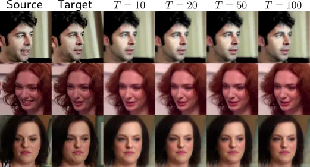

Figure 8: Qualitative results of our model using different steps $`T`$
to generate the reenacted images. We note that in the experimental
evaluation of our method (Sect. 4.2 of the main paper), we use
$`T_{\mathbf{x}_{T}}=50`$ and $`T=20`$.

| $`T=20`$                   | PSNR | SSIM | CSIM | LPIPS | Inf. time |
| -------------------------- | ---- | ---- | ---- | ----- | --------- |
| random $`\mathbf{x}_{T}`$  | 19.0 | 0.80 | 0.47 | 0.33  | 30.2      |
| $`T_{\mathbf{x}_{T}}=20`$  | 19.6 | 0.82 | 0.68 | 0.25  | 32.4      |
| $`T_{\mathbf{x}_{T}}=50`$  | 19.7 | 0.83 | 0.69 | 0.24  | 34.0      |
| $`T_{\mathbf{x}_{T}}=100`$ | 19.7 | 0.83 | 0.69 | 0.24  | 42.0      |
| $`T_{\mathbf{x}_{T}}=250`$ | 19.7 | 0.83 | 0.69 | 0.24  | 54.0      |

Table 5: Quantitative results of our model using different steps
$`T_{\mathbf{x}_{T}}`$ to encode the source image into the subcode
$`\mathbf{x}_{T}`$. We also report results when the subcode
$`\mathbf{x}_{T}`$ is random, sampled from
$`\mathcal{N}(0,\mathbf{I})`$. We note that we use $`T=20`$ steps to
generate the reenacted images.

Finally, in Table 5 we report the results of our method using $`T=20`$
while varying the steps $`T_{\mathbf{x}_{T}}`$ required to encoder the
stochastic subcode $`\mathbf{x}_{T}`$. We also show results when
$`\mathbf{x}_{T}`$ is random, sampled from
$`\mathcal{N}(0,\mathbf{I})`$. We note that we calculate the stochastic
subcode of the source image for each video. Fig. 9 illustrates the
qualitative comparisons while varying the steps $`T_{\mathbf{x}_{T}}`$.
As shown, when using a random subcode $`\mathbf{x}_{T}`$ the reenacted
images are not as good as when we use the source images to encode the
stochastic subcode. Taking into consideration the inference time, the
quantitative and qualitative comparisons, we achieve the best results
when $`T_{\mathbf{x}_{T}}=50`$.

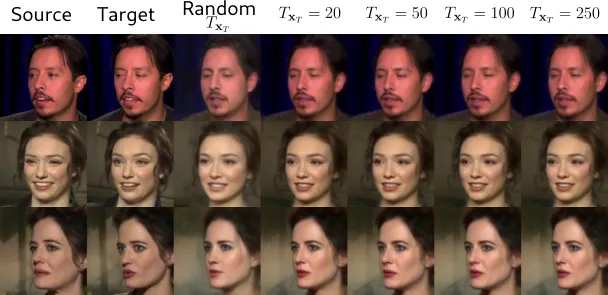

Figure 9: Qualitative results of our model using different steps $`T`$
to generate the reenacted images. We note that in the experimental
evaluation of our method (Sect. 4.2 of the main paper), we use
$`T_{\mathbf{x}_{T}}=50`$ and $`T=20`$.

## Appendix E Experiments

### E.1 Analysis on identity preservation

Neural face reenactment is a complex task that requires several
quantitative and qualitative results in order to fairly evaluate the
various methods. Thus, we provide several metrics in order to evaluate
the reconstruction quality and identity preservation of the reenacted
images, i.e., PNSR, SSIM, L1, LPIPS and CSIM and additional metrics to
assess the head pose and expression transfer, i.e., NME, APD and AED.
Along with the quantitative metrics we also conduct a user study to
assess the human quality perception. Our approach surpasses all other
methods on PSNR, SSIM and L1 metrics, demonstrating our higher
reconstruction ability. Nevertheless, on identity preservation, i.e.,
CSIM metric, although our method remains competitive, DaGAN \[22\],
Face2Face \[65\], DPE \[42\] and HyperReenact \[4\] have higher CSIM
scores. We argue that the CSIM metric is not the most suitable to
evaluate the reenactment methods and as a result a higher CSIM score
does not necessarily imply better reenacted images. In order to support
our argument we show in Fig. 10 visual comparisons between the methods
that achieve higher CSIM scores. As shown the generated images of
DaGAN \[22\], Face2Face \[65\] and DPE \[42\] have visual artifacts and
deformations, however the corresponding CSIM scores are high, indicating
that CSIM is invariant to such distortions. Additionally,
HyperReenact \[4\] over-smooths the generated images and misses
important appearance details.

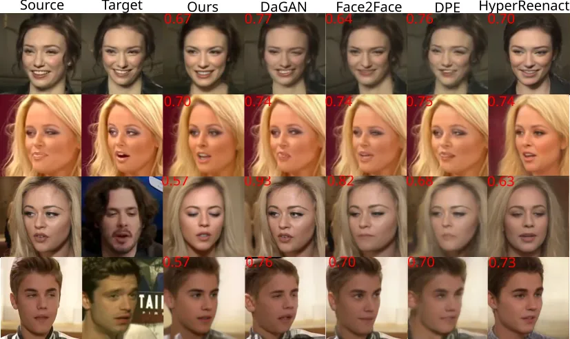

Figure 10: Visual comparisons on self (first two rows) and cross-subject
(last two rows) reenactment against methods that achieve high CSIM
score, namely DaGAN \[22\], Face2Face \[65\], DPE \[42\] and
HyperReenact \[4\]. We also report for each method the corresponding
CSIM score for the depicted samples. As shown a higher CSIM score does
not necessarily imply better reenactment results.

### E.2 Additional comparisons

We provide comparisons with two recent methods, namely InstantID \[60\]
and IP-Adapter \[66\] that condition SD models \[49\] to generate
controllable images that maintain the style of the input faces. As shown
in Fig. 11, such methods are not able to preserve the identity and
appearance of the source faces and accurately transfer the target head
pose and expression, making them impractical for the task of face
reenactment. In contrast, our method leverages the high quality
generation of Diffusion Probabilistic Models (DPMs) and produces
accurate reconstructions.

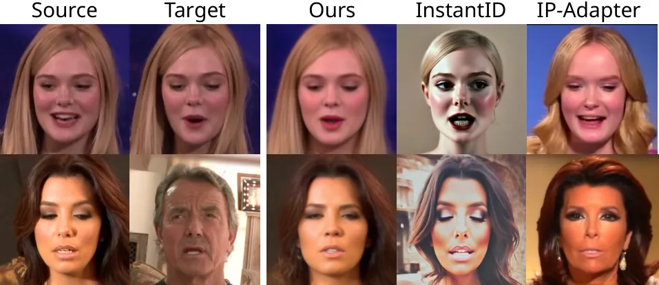

Figure 11: Comparisons on self and cross-subject reenactment against the
SD-based methods InstantID \[60\] and IP-Adapter \[66\]. Clearly, these
two methods are not able to preserve both the identity and appearance of
the source images.

We provide additional results and comparisons on the VoxCeleb1 \[38\],
VoxCeleb2 \[9\], HDTF \[74\] and VFHQ \[62\] datasets. Specifically, in
Figs. 13, 14 we provide qualitative comparisons on self and
cross-subject reenactment, respectively, using the test set of the
VoxCeleb1 dataset. Additionally, in Table 6 we report the quantitative
results on the small benchmark dataset released by the authors of
HyperReenact \[4\]. This benchmark dataset contains image pairs drawn
from the VoxCeleb1 test set where the head pose distance between the
source and target frames is larger than $`15^{\circ}`$. We note that our
method remains competitive on the challenging task of extreme head pose
variations, both on facial pose transfer and on image reconstruction
quality. As illustrated in Fig. 15, the majority of the state-of-the-art
methods produce many deformations on the generated images. In contrast,
our method can effectively preserve the source appearance/identity and
transfer the target facial pose (head orientation and facial expression)
without producing visual artifacts and deformations.

| Method              | PSNR | SSIM | CSIM | LPIPS | L1   | NME  | APD | AED  |
| ------------------- | ---- | ---- | ---- | ----- | ---- | ---- | --- | ---- |
|                     |      |      |      |       |      |      |     |      |
| DAGAN \[22\]        | 16.3 | 0.76 | 0.44 | 0.32  | 0.21 | 22.6 | 3.4 | 12.7 |
| Rome \[30\]         | 6.9  | 0.71 | 0.53 | 0.48  | 0.67 | 14.6 | 1.2 | 9.2  |
| Face2Face \[65\]    | 14.0 | 0.72 | 0.39 | 0.49  | 0.30 | 21.9 | 3.8 | 12.4 |
| UniFace \[63\]      | 14.5 | 0.68 | 0.27 | 0.37  | 0.27 | 26.1 | 3.8 | 14.6 |
| DPE \[42\]          | 16.3 | 0.75 | 0.45 | 0.37  | 0.22 | 26.7 | 4.7 | 12.9 |
| StyleHeat \[67\]    | 14.5 | 0.77 | 0.45 | 0.40  | 0.28 | 32.4 | 8.6 | 13.9 |
| FD \[3\]            | 15.8 | 0.74 | 0.37 | 0.35  | 0.23 | 23.2 | 2.7 | 12.4 |
| HyperReenact \[4\]  | 17.0 | 0.79 | 0.60 | 0.28  | 0.18 | 13.8 | 0.6 | 8.6  |
| DiffusionRig \[13\] | 13.3 | 0.71 | 0.24 | 0.52  | 0.34 | 54.0 | 1.7 | 12.5 |
| Ours                | 17.5 | 0.83 | 0.49 | 0.34  | 0.19 | 14.6 | 1.0 | 8.0  |

Table 6: Quantitative results on the small benchmark dataset with large
head pose variations released by the authors of HyperReenact \[4\]. For
PSNR, SSIM, CSIM metrics, higher is better, while for the rest of the
metrics lower is better. We note that the best and second best results
are shown in bold and underline respectively.

In order to evaluate the temporal coherence of the reenacted videos,
following \[56\], we calculate the temporally-local (TL-ID) and
temporally-global (TG-ID) identity preservation metrics. Specifically,
those metrics assess the local and the global consistency of the
identity similarity between consecutive frames and across all frames of
a reenacted video compared to the real one. For both metrics, a higher
score indicates higher temporal consistency. As shown in Table 7, our
method achieves high temporal consistency, especially compared to
DiffusionRig \[13\] that is also a diffusion-based method. Finally, in
Table 7 we report the inference time of each method in order to reenact
a video with 200 frames. We note that the diffusion-based methods,
namely ours and DiffusionRig, are not as fast as the GAN-based method,
which is an expected limitation of diffusion models. Nevertheless, our
method is faster compared to DiffusionRig.

|                     |       |       |                 |
| ------------------- | ----- | ----- | --------------- |
| Method              | TL-ID | TG-ID | Inf. time (sec) |
| DAGAN \[22\]        | 0.992 | 0.952 | 11              |
| Rome \[30\]         | 0.993 | 1.000 | 100             |
| Face2Face \[65\]    | 0.985 | 0.981 | 140             |
| UniFace \[63\]      | 0.986 | 0.788 | 31              |
| DPE \[42\]          | 1.000 | 0.995 | 30              |
| StyleHeat \[67\]    | 1.000 | 0.936 | 25              |
| FD \[3\]            | 0.998 | 0.834 | 40              |
| HyperReenact \[4\]  | 1.000 | 1.0   | 40              |
| DiffusionRig \[13\] | 0.87  | 0.52  | 450             |
| Ours                | 1.000 | 0.950 | 340             |

Table 7: Quantitative comparisons of the temporal coherence (TL-ID,
TG-ID) and inference time.

Additionally, we provide quantitative and qualitative comparisons on the
VoxCeleb2 \[9\] test set. Specifically, in Table 8 we report the
quantitative results on self reenactment. Additionally, in Figs. 16, 17
we present qualitative comparisons on self and cross-subject
reenactment, respectively. As shown in Table 8, our method outperforms
all methods on PNSR and SSIM metrics, while we also achieve best results
on head pose and expression transfer metrics (NME, APD and AED). As
shown from the qualitative comparisons in Figs. 16, 17, our method can
produce accurate reconstructions. Compared to DaGAN \[22\],
Face2Face \[65\], and DPE \[42\], which achieve good performance on the
CSIM metric, our reenacted images are artifact-free and more realistic
(e.g., see rows 3 and 6 of Fig. 16). Notably, those methods when
evaluated in the task of cross-subject reenactment, Fig. 17, which is
more challenging compared to self reenactment, produce many deformations
on the generated images, rendering their results unrealistic. Finally,
HyperReenact \[4\], which has competitive quantitative metrics, as shown
in Fig. 16 (5th,6th, and 7th rows) and Fig. 17 (7th row), cannot
faithfully reconstruct certain appearance details (e.g., glasses and
hats) of the source images. In contrast, our method can effectively
reconstruct those accessories, leading to more accurate and natural
reenacted images. Finally, in Figs. 18, 19, we present qualitative
results of our method on HDTF \[74\] and VFHQ \[62\] datasets. Clearly,
our method can generalize well on other video datasets and generate
realistic images that resemble the real ones both in self and
cross-subject reenactment.

| Method              | PSNR | SSIM | CSIM | LPIPS | L1   | NME  | APD | AED  |
| ------------------- | ---- | ---- | ---- | ----- | ---- | ---- | --- | ---- |
|                     |      |      |      |       |      |      |     |      |
| DAGAN \[22\]        | 16.8 | 0.74 | 0.71 | 0.23  | 0.18 | 27.3 | 4.5 | 13.0 |
| Rome \[30\]         | 7.6  | 0.73 | 0.64 | 0.46  | 0.63 | 19.2 | 1.8 | 9.7  |
| Face2Face \[65\]    | 17.6 | 0.77 | 0.71 | 0.23  | 0.17 | 16.7 | 1.5 | 10.5 |
| UniFace \[63\]      | 18.1 | 0.79 | 0.70 | 0.20  | 0.16 | 18.1 | 2.0 | 12.0 |
| DPE \[42\]          | 18.0 | 0.77 | 0.72 | 0.21  | 0.19 | 18.5 | 3.5 | 12.6 |
| StyleHeat \[67\]    | 17.2 | 0.80 | 0.56 | 0.29  | 0.19 | 20.3 | 3.5 | 12.6 |
| FD \[3\]            | 17.0 | 0.77 | 0.64 | 0.25  | 0.18 | 16.2 | 1.3 | 9.8  |
| HyperReenact \[4\]  | 17.3 | 0.80 | 0.67 | 0.29  | 0.19 | 13.6 | 0.7 | 8.7  |
| DiffusionRig \[13\] | 14.7 | 0.75 | 0.30 | 0.41  | 0.27 | 24.8 | 1.2 | 11.6 |
| Ours                | 18.4 | 0.84 | 0.64 | 0.26  | 0.16 | 13.6 | 0.8 | 7.5  |

Table 8: Quantitative results on self reenactment on the VoxCeleb2
dataset \[9\]. For PSNR, SSIM, CSIM metrics, higher is better, while for
the rest of the metrics lower is better. We note that the best and
second best results are shown in bold and underline respectively.

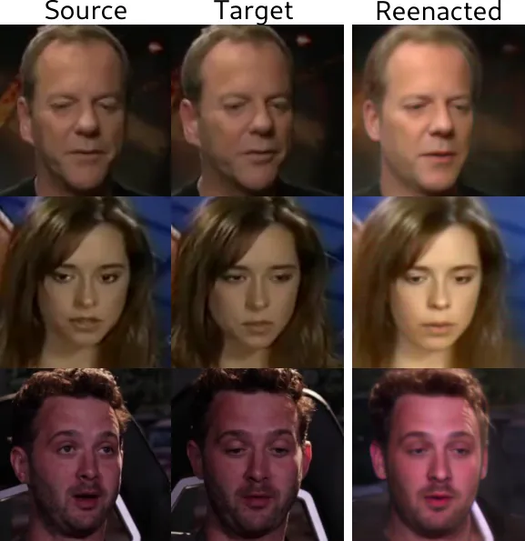

Figure 12: We observe that in certain cases, especially when the input
videos are darker and low-resolution, the reenacted images are brighter
than the real ones.

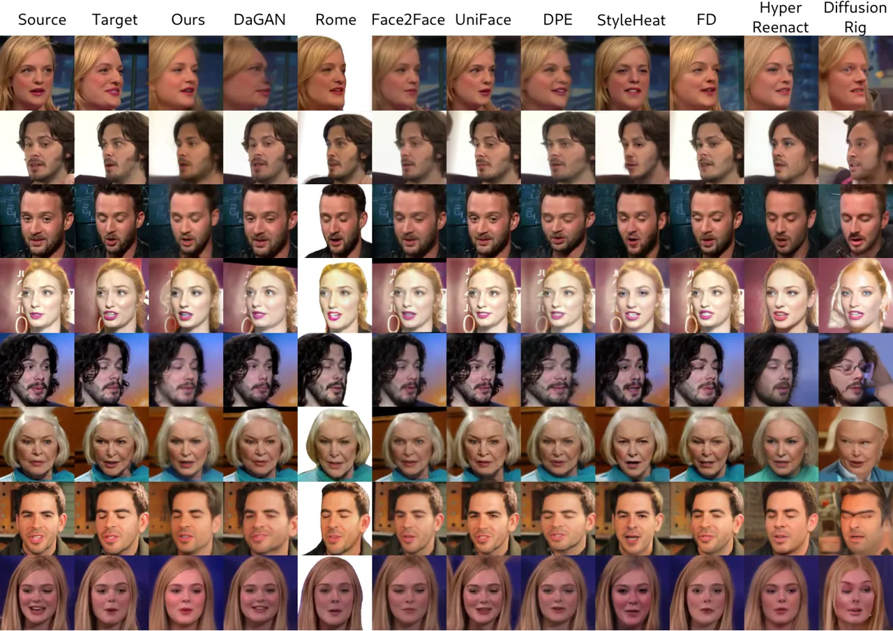

Figure 13: Qualitative comparisons on self reenactment using the
VoxCeleb1 \[38\] dataset. The first and second column show the source
and target faces respectively.

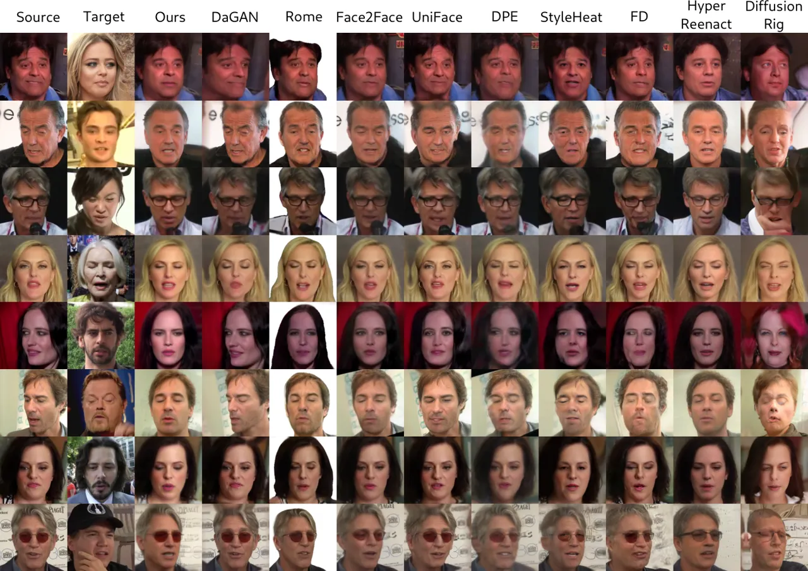

Figure 14: Qualitative comparisons on cross-subject reenactment using
the VoxCeleb1 \[38\] dataset. The first and second column show the
source and target faces respectively. Our method can preserve the source
identity and appearance, while accurately transferring the head pose and
the expression of the target faces.

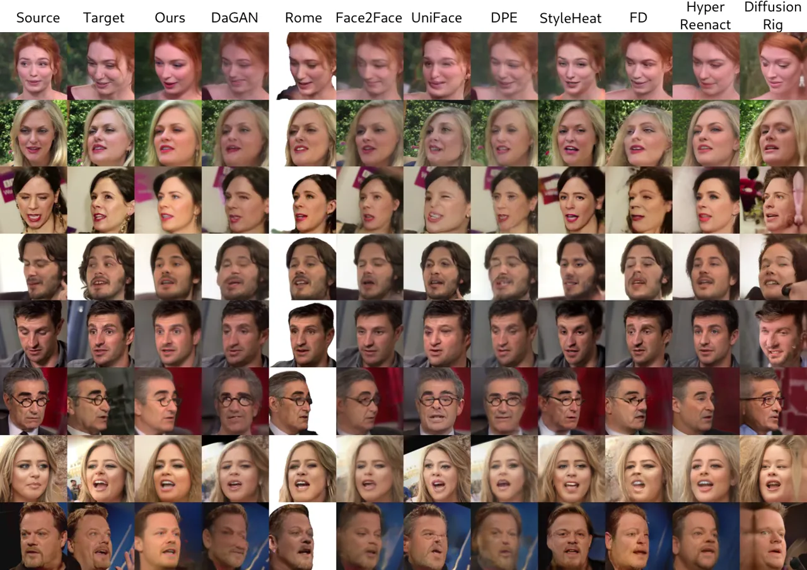

Figure 15: Qualitative comparisons on self reenactment using the
benchmark dataset with large head pose differences released by the
authors of HyperReenact \[4\]. The first and second column show the
source and target faces respectively. As shown our method even on the
challenging task of extreme head pose variations is able to generate
realistic and artifact-free images.

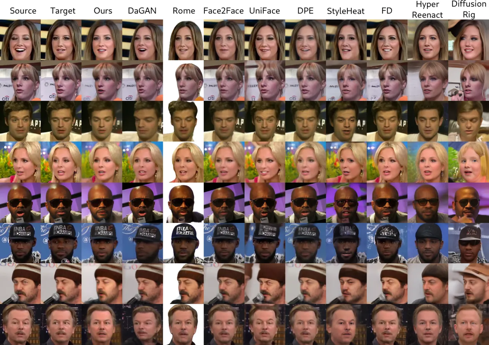

Figure 16: Qualitative comparisons on self reenactment using the
VoxCeleb2 \[38\] dataset. The first and second column show the source
and target faces respectively. As shown our method can successfully
reconstruct the appearance details (e.g., glasses and hats) of the
source images.

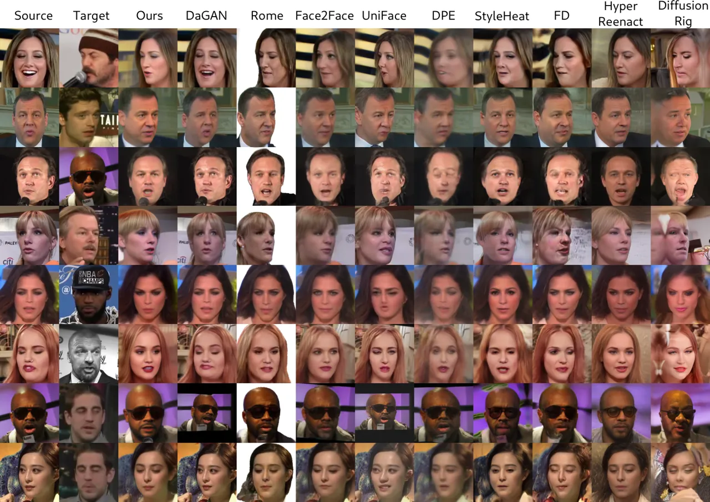

Figure 17: Qualitative comparisons on cross-subject reenactment using
the VoxCeleb2 \[38\] dataset. The first and second column show the
source and target faces respectively. Compared to the other methods, our
approach can generate realistic and artifact-free images.

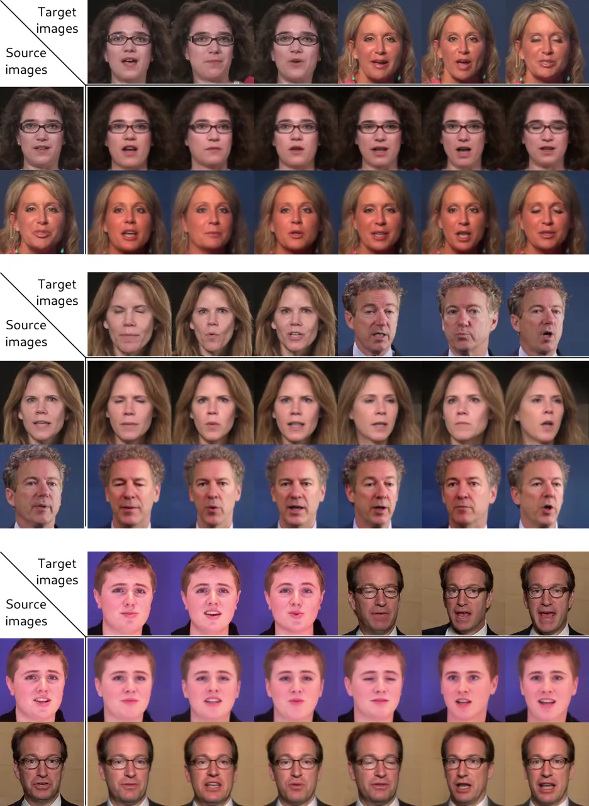

Figure 18: Qualitative comparisons on self and cross-subject reenactment
using the HDTF \[74\] dataset. Our method generates realistic images
that maintain the source identity and appearance both on self and on
cross-subject reenactment.

## Appendix F Limitations

In this work, we present a method for neural face reenactment based on a
pre-trained diffusion model. In our experimental results (Sect. 4.2 of
the main paper), we show that the proposed framework is able to
accurately transfer the head pose and facial expressions of the target
faces, while at the same time the identity and the appearance
characteristics of the source face are faithfully preserved.
Nevertheless, as shown in Table 7 in this document, our method, which
builds on a DDIM-based method \[53, 46\], exhibits slower inference time
compared to GAN- and StyleGAN2-based methods, as expected. Additionally,
we observe that, in some cases, the reenacted images appear brighter
than the real ones, as illustrated in Fig. 12. Notably, these changes in
brightness are particularly prominent in darker, low-resolution videos.
We attribute this to the adopted DDIM sampler, which, since it has been
pre-trained on the FFHQ dataset \[28\], differs significantly from the
VoxCeleb datasets \[38, 9\] in terms of image quality.

## Appendix G Ethical considerations

Neural face reenactment methods can be used in various domains, such as
in film and video production, video conferencing, video games, and in
augmented and virtual reality applications. However, we recognize that
it can also be used for malicious purposes to generate deep fake videos
and spread false information, that could potentially harm individuals
and the society. Nowadays, there are many neural face reenactment
methods that can create high-quality deep fake videos that are
indistinguishable from the real ones. As a result, currently there is
great interest on deep fake detection methods, that could prevent the
malicious use of deep fake generated videos. We will share our model and
results with the deepfake detection community to help researchers train
more accurate deep fake detection algorithms.

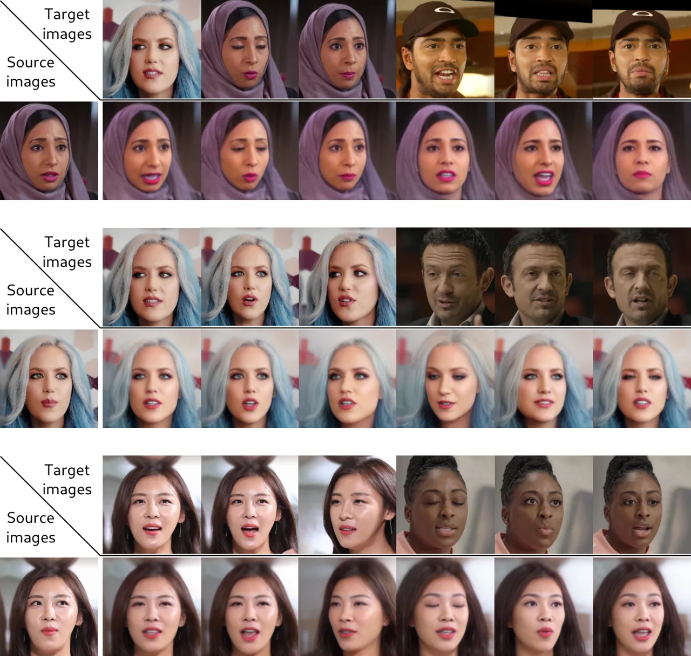

Figure 19: Qualitative comparisons on self and cross-subject reenactment
using the VFHQ \[62\] dataset. Our method is able to generalize well on
different video datasets and preserve the appearance details of the
source images even on the challenging task of cross-subject reenactment.

## References

- \[1\] Simone Barattin, Christos Tzelepis, Ioannis Patras, and Nicu
  Sebe. Attribute-preserving face dataset anonymization via latent code
  optimization. In _Proceedings of the IEEE/CVF Conference on Computer
  Vision and Pattern Recognition_, pages 8001–8010, 2023.
- \[2\] Volker Blanz and Thomas Vetter. A morphable model for the
  synthesis of 3d faces. In _Proceedings of the 26th annual conference
  on Computer graphics and interactive techniques_, 1999.
- \[3\] Stella Bounareli, Vasileios Argyriou, and Georgios
  Tzimiropoulos. Finding directions in gan’s latent space for neural
  face reenactment. _British Machine Vision Conference (BMVC)_, 2022.
- \[4\] Stella Bounareli, Christos Tzelepis, Vasileios Argyriou, Ioannis
  Patras, and Georgios Tzimiropoulos. Hyperreenact: one-shot reenactment
  via jointly learning to refine and retarget faces. In _Proceedings of
  the IEEE/CVF International Conference on Computer Vision_, pages
  7149–7159, 2023a.
- \[5\] Stella Bounareli, Christos Tzelepis, Vasileios Argyriou, Ioannis
  Patras, and Georgios Tzimiropoulos. Stylemask: Disentangling the style
  space of stylegan2 for neural face reenactment. In _2023 IEEE 17th
  International Conference on Automatic Face and Gesture Recognition
  (FG)_, pages 1–8. IEEE, 2023b.
- \[6\] Adrian Bulat and Georgios Tzimiropoulos. How far are we from
  solving the 2d & 3d face alignment problem?(and a dataset of 230,000
  3d facial landmarks). In _Proceedings of the IEEE international
  conference on computer vision_, pages 1021–1030, 2017.
- \[7\] Egor Burkov, Igor Pasechnik, Artur Grigorev, and Victor
  Lempitsky. Neural head reenactment with latent pose descriptors. In
  _CVPR_, 2020.
- \[8\] Xiangyi Chen and Stéphane Lathuilière. Face aging via
  diffusion-based editing. _arXiv preprint arXiv:2309.11321_, 2023.
- \[9\] J. S. Chung, A. Nagrani, and A. Zisserman. Voxceleb2: Deep
  speaker recognition. In _INTERSPEECH_, 2018.
- \[10\] Radek Daněček, Michael J Black, and Timo Bolkart. Emoca:
  Emotion driven monocular face capture and animation. In _Proceedings
  of the IEEE/CVF Conference on Computer Vision and Pattern
  Recognition_, pages 20311–20322, 2022.
- \[11\] Jiankang Deng, Jia Guo, Niannan Xue, and Stefanos Zafeiriou.
  Arcface: Additive angular margin loss for deep face recognition. In
  _Proceedings of the IEEE/CVF conference on computer vision and pattern
  recognition_, pages 4690–4699, 2019.
- \[12\] Prafulla Dhariwal and Alexander Nichol. Diffusion models beat
  gans on image synthesis. _Advances in neural information processing
  systems_, 34:8780–8794, 2021.
- \[13\] Zheng Ding, Xuaner Zhang, Zhihao Xia, Lars Jebe, Zhuowen Tu,
  and Xiuming Zhang. Diffusionrig: Learning personalized priors for
  facial appearance editing. In _Proceedings of the IEEE/CVF Conference
  on Computer Vision and Pattern Recognition_, pages 12736–12746, 2023.
- \[14\] Michail Christos Doukas, Stefanos Zafeiriou, and Viktoriia
  Sharmanska. Headgan: Video-and-audio-driven talking head synthesis.
  _arXiv preprint arXiv:2012.08261_, 2020.
- \[15\] Chenpeng Du, Qi Chen, Tianyu He, Xu Tan, Xie Chen, Kai Yu,
  Sheng Zhao, and Jiang Bian. Dae-talker: High fidelity speech-driven
  talking face generation with diffusion autoencoder. In _Proceedings of
  the 31st ACM International Conference on Multimedia_, pages
  4281–4289, 2023.
- \[16\] Yao Feng, Haiwen Feng, Michael J Black, and Timo Bolkart.
  Learning an animatable detailed 3d face model from in-the-wild images.
  _ACM Transactions on Graphics (TOG)_, 40(4):1–13, 2021.
- \[17\] Yuan Gan, Zongxin Yang, Xihang Yue, Lingyun Sun, and Yi Yang.
  Efficient emotional adaptation for audio-driven talking-head
  generation. In _Proceedings of the IEEE/CVF International Conference
  on Computer Vision_, pages 22634–22645, 2023.
- \[18\] Ian Goodfellow, Jean Pouget-Abadie, Mehdi Mirza, Bing Xu, David
  Warde-Farley, Sherjil Ozair, Aaron Courville, and Yoshua Bengio.
  Generative adversarial nets. In _Advances in neural information
  processing systems_, pages 2672–2680, 2014.
- \[19\] Jiazhi Guan, Zhanwang Zhang, Hang Zhou, Tianshu Hu, Kaisiyuan
  Wang, Dongliang He, Haocheng Feng, Jingtuo Liu, Errui Ding, Ziwei Liu,
  et al. Stylesync: High-fidelity generalized and personalized lip sync
  in style-based generator. In _Proceedings of the IEEE/CVF Conference
  on Computer Vision and Pattern Recognition_, pages 1505–1515, 2023.
- \[20\] David Ha, Andrew M. Dai, and Quoc V. Le. Hypernetworks. In _5th
  International Conference on Learning Representations, ICLR 2017,
  Toulon, France, April 24-26, 2017, Conference Track
  Proceedings_, 2017.
- \[21\] Jonathan Ho, Ajay Jain, and Pieter Abbeel. Denoising diffusion
  probabilistic models. _Advances in neural information processing
  systems_, 33:6840–6851, 2020.
- \[22\] Fa-Ting Hong, Longhao Zhang, Li Shen, and Dan Xu. Depth-aware
  generative adversarial network for talking head video generation. In
  _Proceedings of the IEEE/CVF conference on computer vision and pattern
  recognition_, pages 3397–3406, 2022.
- \[23\] Gee-Sern Hsu, Chun-Hung Tsai, and Hung-Yi Wu. Dual-generator
  face reenactment. In _Proceedings of the IEEE/CVF Conference on
  Computer Vision and Pattern Recognition_, pages 642–650, 2022.
- \[24\] Ziqi Huang, Kelvin CK Chan, Yuming Jiang, and Ziwei Liu.
  Collaborative diffusion for multi-modal face generation and editing.
  In _Proceedings of the IEEE/CVF Conference on Computer Vision and
  Pattern Recognition_, pages 6080–6090, 2023.
- \[25\] Erik Härkönen, Aaron Hertzmann, Jaakko Lehtinen, and Sylvain
  Paris. Ganspace: Discovering interpretable gan controls. In _Proc.
  NeurIPS_, 2020.
- \[26\] Justin Johnson, Alexandre Alahi, and Li Fei-Fei. Perceptual
  losses for real-time style transfer and super-resolution. In _Computer
  Vision–ECCV 2016: 14th European Conference, Amsterdam, The
  Netherlands, October 11-14, 2016, Proceedings, Part II 14_, pages
  694–711. Springer, 2016.
- \[27\] Tero Karras, Timo Aila, Samuli Laine, and Jaakko Lehtinen.
  Progressive growing of gans for improved quality, stability, and
  variation. In _6th International Conference on Learning
  Representations, ICLR 2018, Vancouver, BC, Canada, April 30 - May 3,
  2018, Conference Track Proceedings_, 2018.
- \[28\] Tero Karras, Samuli Laine, and Timo Aila. A style-based
  generator architecture for generative adversarial networks. In
  _Proceedings of the IEEE/CVF Conference on Computer Vision and Pattern
  Recognition_, pages 4401–4410, 2019.
- \[29\] Tero Karras, Samuli Laine, Miika Aittala, Janne Hellsten,
  Jaakko Lehtinen, and Timo Aila. Analyzing and improving the image
  quality of stylegan. In _Proceedings of the IEEE/CVF Conference on
  Computer Vision and Pattern Recognition_, pages 8110–8119, 2020.
- \[30\] Taras Khakhulin, Vanessa Sklyarova, Victor Lempitsky, and Egor
  Zakharov. Realistic one-shot mesh-based head avatars. In _European
  Conference on Computer Vision_, pages 345–362. Springer, 2022.
- \[31\] Gwanghyun Kim, Taesung Kwon, and Jong Chul Ye. Diffusionclip:
  Text-guided diffusion models for robust image manipulation. In
  _Proceedings of the IEEE/CVF Conference on Computer Vision and Pattern
  Recognition_, pages 2426–2435, 2022.
- \[32\] Gyeongman Kim, Hajin Shim, Hyunsu Kim, Yunjey Choi, Junho Kim,
  and Eunho Yang. Diffusion video autoencoders: Toward temporally
  consistent face video editing via disentangled video encoding. In
  _Proceedings of the IEEE/CVF Conference on Computer Vision and Pattern
  Recognition_, pages 6091–6100, 2023.
- \[33\] Ilya Loshchilov and Frank Hutter. Decoupled weight decay
  regularization. In _7th International Conference on Learning
  Representations, ICLR 2019, New Orleans, LA, USA, May 6-9, 2019_.
  OpenReview.net, 2019.
- \[34\] Andreas Lugmayr, Martin Danelljan, Andres Romero, Fisher Yu,
  Radu Timofte, and Luc Van Gool. Repaint: Inpainting using denoising
  diffusion probabilistic models. In _Proceedings of the IEEE/CVF
  Conference on Computer Vision and Pattern Recognition_, pages
  11461–11471, 2022.
- \[35\] Chenlin Meng, Yutong He, Yang Song, Jiaming Song, Jiajun Wu,
  Jun-Yan Zhu, and Stefano Ermon. Sdedit: Guided image synthesis and
  editing with stochastic differential equations. In _The Tenth
  International Conference on Learning Representations, ICLR 2022,
  Virtual Event, April 25-29, 2022_. OpenReview.net, 2022.
- \[36\] Moustafa Meshry, Saksham Suri, Larry S Davis, and Abhinav
  Shrivastava. Learned spatial representations for few-shot talking-head
  synthesis. In _Proceedings of the IEEE/CVF International Conference on
  Computer Vision_, pages 13829–13838, 2021.
- \[37\] Ron Mokady, Amir Hertz, Kfir Aberman, Yael Pritch, and Daniel
  Cohen-Or. Null-text inversion for editing real images using guided
  diffusion models. In _Proceedings of the IEEE/CVF Conference on
  Computer Vision and Pattern Recognition_, pages 6038–6047, 2023.
- \[38\] A. Nagrani, J. S. Chung, and A. Zisserman. Voxceleb: a
  large-scale speaker identification dataset. In _INTERSPEECH_, 2017.
- \[39\] James Oldfield, Christos Tzelepis, Yannis Panagakis, Mihalis
  Nicolaou, and Ioannis Patras. Panda: Unsupervised learning of parts
  and appearances in the feature maps of gans. 2023.
- \[40\] Trevine Oorloff and Yaser Yacoob. Robust one-shot face video
  re-enactment using hybrid latent spaces of stylegan2. In _Proceedings
  of the IEEE/CVF International Conference on Computer Vision_, pages
  20947–20957, 2023.
- \[41\] Zhihong Pan, Riccardo Gherardi, Xiufeng Xie, and Stephen Huang.
  Effective real image editing with accelerated iterative diffusion
  inversion. In _Proceedings of the IEEE/CVF International Conference on
  Computer Vision_, pages 15912–15921, 2023.
- \[42\] Youxin Pang, Yong Zhang, Weize Quan, Yanbo Fan, Xiaodong Cun,
  Ying Shan, and Dong-ming Yan. Dpe: Disentanglement of pose and
  expression for general video portrait editing. In _Proceedings of the
  IEEE/CVF Conference on Computer Vision and Pattern Recognition_, pages
  427–436, 2023.
- \[43\] Or Patashnik, Zongze Wu, Eli Shechtman, Daniel Cohen-Or, and
  Dani Lischinski. Styleclip: Text-driven manipulation of stylegan
  imagery. In _Proceedings of the IEEE/CVF International Conference on
  Computer Vision_, 2021.
- \[44\] Puntawat Ponglertnapakorn, Nontawat Tritrong, and Supasorn
  Suwajanakorn. Difareli: Diffusion face relighting. _arXiv preprint
  arXiv:2304.09479_, 2023.
- \[45\] KR Prajwal, Rudrabha Mukhopadhyay, Vinay P Namboodiri, and CV
  Jawahar. A lip sync expert is all you need for speech to lip
  generation in the wild. In _Proceedings of the 28th ACM international
  conference on multimedia_, pages 484–492, 2020.
- \[46\] Konpat Preechakul, Nattanat Chatthee, Suttisak Wizadwongsa, and
  Supasorn Suwajanakorn. Diffusion autoencoders: Toward a meaningful and
  decodable representation. In _Proceedings of the IEEE/CVF Conference
  on Computer Vision and Pattern Recognition_, pages 10619–10629, 2022.
- \[47\] Yurui Ren, Ge Li, Yuanqi Chen, Thomas H Li, and Shan Liu.
  Pirenderer: Controllable portrait image generation via semantic neural
  rendering. In _Proceedings of the IEEE/CVF International Conference on
  Computer Vision_, pages 13759–13768, 2021.
- \[48\] Daniel Roich, Ron Mokady, Amit H Bermano, and Daniel Cohen-Or.
  Pivotal tuning for latent-based editing of real images. _arXiv
  preprint arXiv:2106.05744_, 2021.
- \[49\] Robin Rombach, Andreas Blattmann, Dominik Lorenz, Patrick
  Esser, and Björn Ommer. High-resolution image synthesis with latent
  diffusion models. In _Proceedings of the IEEE/CVF conference on
  computer vision and pattern recognition_, pages 10684–10695, 2022.
- \[50\] Olaf Ronneberger, Philipp Fischer, and Thomas Brox. U-net:
  Convolutional networks for biomedical image segmentation. In _Medical
  Image Computing and Computer-Assisted Intervention–MICCAI 2015: 18th
  International Conference, Munich, Germany, October 5-9, 2015,
  Proceedings, Part III 18_, pages 234–241. Springer, 2015.
- \[51\] Shuai Shen, Wenliang Zhao, Zibin Meng, Wanhua Li, Zheng Zhu,
  Jie Zhou, and Jiwen Lu. Difftalk: Crafting diffusion models for
  generalized audio-driven portraits animation. In _Proceedings of the
  IEEE/CVF Conference on Computer Vision and Pattern Recognition_, pages
  1982–1991, 2023.
- \[52\] Aliaksandr Siarohin, Stéphane Lathuilière, Sergey Tulyakov,
  Elisa Ricci, and Nicu Sebe. First order motion model for image
  animation. _Advances in Neural Information Processing Systems_,
  32:7137–7147, 2019.
- \[53\] Jiaming Song, Chenlin Meng, and Stefano Ermon. Denoising
  diffusion implicit models. In _9th International Conference on
  Learning Representations, ICLR 2021, Virtual Event, Austria, May 3-7,
  2021_, 2021.
- \[54\] Michał Stypułkowski, Konstantinos Vougioukas, Sen He, Maciej
  Zięba, Stavros Petridis, and Maja Pantic. Diffused heads: Diffusion
  models beat gans on talking-face generation. _arXiv preprint
  arXiv:2301.03396_, 2023.
- \[55\] Omer Tov, Yuval Alaluf, Yotam Nitzan, Or Patashnik, and Daniel
  Cohen-Or. Designing an encoder for stylegan image manipulation. _ACM
  Transactions on Graphics (TOG)_, 40(4):1–14, 2021.
- \[56\] Rotem Tzaban, Ron Mokady, Rinon Gal, Amit Bermano, and Daniel
  Cohen-Or. Stitch it in time: Gan-based facial editing of real videos.
  In _SIGGRAPH Asia 2022 Conference Papers_, pages 1–9, 2022.
- \[57\] Christos Tzelepis, Georgios Tzimiropoulos, and Ioannis Patras.
  Warpedganspace: Finding non-linear rbf paths in gan latent space. In
  _Proceedings of the IEEE/CVF International Conference on Computer
  Vision_, pages 6393–6402, 2021.
- \[58\] Christos Tzelepis, James Oldfield, Georgios Tzimiropoulos, and
  Ioannis Patras. Contraclip: Interpretable gan generation driven by
  pairs of contrasting sentences. _arXiv preprint
  arXiv:2206.02104_, 2022.
- \[59\] Andrey Voynov and Artem Babenko. Unsupervised discovery of
  interpretable directions in the gan latent space. In _International
  Conference on Machine Learning_, pages 9786–9796. PMLR, 2020.
- \[60\] Qixun Wang, Xu Bai, Haofan Wang, Zekui Qin, and Anthony Chen.
  Instantid: Zero-shot identity-preserving generation in seconds. _arXiv
  preprint arXiv:2401.07519_, 2024.
- \[61\] Ting-Chun Wang, Arun Mallya, and Ming-Yu Liu. One-shot
  free-view neural talking-head synthesis for video conferencing. In
  _Proceedings of the IEEE/CVF Conference on Computer Vision and Pattern
  Recognition_, pages 10039–10049, 2021.
- \[62\] Liangbin Xie, Xintao Wang, Honglun Zhang, Chao Dong, and Ying
  Shan. Vfhq: A high-quality dataset and benchmark for video face
  super-resolution. In _Proceedings of the IEEE/CVF Conference on
  Computer Vision and Pattern Recognition_, pages 657–666, 2022.
- \[63\] Chao Xu, Jiangning Zhang, Yue Han, Guanzhong Tian, Xianfang
  Zeng, Ying Tai, Yabiao Wang, Chengjie Wang, and Yong Liu. Designing
  one unified framework for high-fidelity face reenactment and swapping.
  In _European Conference on Computer Vision_, pages 54–71.
  Springer, 2022.
- \[64\] Chao Xu, Shaoting Zhu, Junwei Zhu, Tianxin Huang, Jiangning
  Zhang, Ying Tai, and Yong Liu. Multimodal-driven talking face
  generation via a unified diffusion-based generator. _CoRR (2023)_,
  pages 1–14, 2023.
- \[65\] Kewei Yang, Kang Chen, Daoliang Guo, Song-Hai Zhang, Yuan-Chen
  Guo, and Weidong Zhang. Face2face $`\rho`$: Real-time high-resolution
  one-shot face reenactment. In _European conference on computer
  vision_, pages 55–71. Springer, 2022.
- \[66\] Hu Ye, Jun Zhang, Sibo Liu, Xiao Han, and Wei Yang. Ip-adapter:
  Text compatible image prompt adapter for text-to-image diffusion
  models. _arXiv preprint arXiv:2308.06721_, 2023.
- \[67\] Fei Yin, Yong Zhang, Xiaodong Cun, Mingdeng Cao, Yanbo Fan,
  Xuan Wang, Qingyan Bai, Baoyuan Wu, Jue Wang, and Yujiu Yang.
  Styleheat: One-shot high-resolution editable talking face generation
  via pretrained stylegan. _arXiv preprint arXiv:2203.04036_, 2022.
- \[68\] Changqian Yu, Changxin Gao, Jingbo Wang, Gang Yu, Chunhua Shen,
  and Nong Sang. Bisenet v2: Bilateral network with guided aggregation
  for real-time semantic segmentation. _International Journal of
  Computer Vision_, 129:3051–3068, 2021.
- \[69\] Dongxu Yue, Qin Guo, Munan Ning, Jiaxi Cui, Yuesheng Zhu, and
  Li Yuan. Chatface: Chat-guided real face editing via diffusion latent
  space manipulation. _arXiv preprint arXiv:2305.14742_, 2023.
- \[70\] Egor Zakharov, Aliaksandra Shysheya, Egor Burkov, and Victor
  Lempitsky. Few-shot adversarial learning of realistic neural talking
  head models. In _Proceedings of the IEEE/CVF International Conference
  on Computer Vision_, pages 9459–9468, 2019.
- \[71\] Egor Zakharov, Aleksei Ivakhnenko, Aliaksandra Shysheya, and
  Victor Lempitsky. Fast bi-layer neural synthesis of one-shot realistic
  head avatars. In _ECCV_, 2020.
- \[72\] Lvmin Zhang, Anyi Rao, and Maneesh Agrawala. Adding conditional
  control to text-to-image diffusion models. In _Proceedings of the
  IEEE/CVF International Conference on Computer Vision_, pages
  3836–3847, 2023.
- \[73\] Xucong Zhang, Seonwook Park, Thabo Beeler, Derek Bradley, Siyu
  Tang, and Otmar Hilliges. Eth-xgaze: A large scale dataset for gaze
  estimation under extreme head pose and gaze variation. In _Computer
  Vision–ECCV 2020: 16th European Conference, Glasgow, UK, August 23–28,
  2020, Proceedings, Part V 16_, pages 365–381. Springer, 2020.
- \[74\] Zhimeng Zhang, Lincheng Li, Yu Ding, and Changjie Fan.
  Flow-guided one-shot talking face generation with a high-resolution
  audio-visual dataset. In _Proceedings of the IEEE/CVF Conference on
  Computer Vision and Pattern Recognition_, pages 3661–3670, 2021.
- \[75\] Jian Zhao and Hui Zhang. Thin-plate spline motion model for
  image animation. In _Proceedings of the IEEE/CVF Conference on
  Computer Vision and Pattern Recognition_, pages 3657–3666, 2022.
- \[76\] Yinglin Zheng, Hao Yang, Ting Zhang, Jianmin Bao, Dongdong
  Chen, Yangyu Huang, Lu Yuan, Dong Chen, Ming Zeng, and Fang Wen.
  General facial representation learning in a visual-linguistic manner.
  In _Proceedings of the IEEE/CVF Conference on Computer Vision and
  Pattern Recognition_, pages 18697–18709, 2022.
