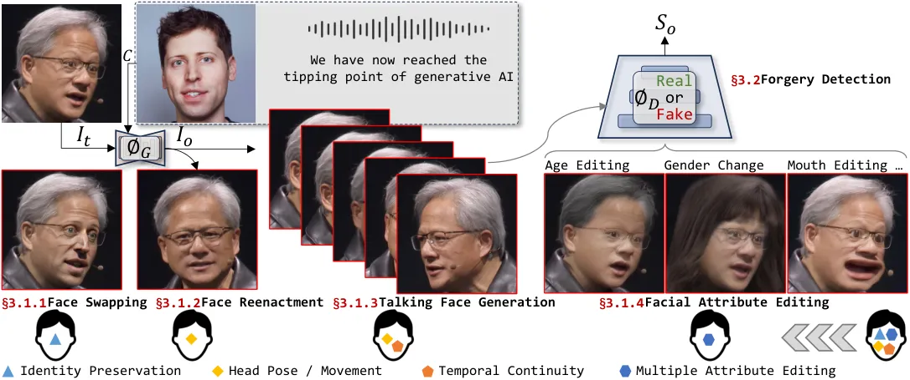

# Deepfake Generation and Detection: A Benchmark and Survey

Gan Pei Note: Both authors contributed equally to this research email:
<52295904023@stu.ecnu.edu.cn> Affiliation: East China Normal University,
China , Jiangning Zhang email: <186368@zju.edu.cn> Affiliation: Zhejiang
University, China , Menghan Hu Note: Corresponding author email:
<mhhu@ce.ecnu.edu.cn> Affiliation: East China Normal University, China ,
Zhenyu Zhang email: <zhenyuzhang@nju.edu.cn> Affiliation: Nanjing
University, China , Chengjie Wang email: <jasoncjwang@tencent.com>
Affiliation: Youtu Lab, Tencent, China , Yunsheng Wu email:
<simonwu@tencent.com> Affiliation: Youtu Lab, Tencent, China , Guangtao
Zhai email: <zhaiguangtao@sjtu.edu.cn> Affiliation: Shanghai Jiao Tong
University, China , Jian Yang email: <csjianyang@gmail.com>
Affiliation: Nanjing University, China and Dacheng Tao email:
<dacheng.tao@gmail.com> Affiliation: Nanyang Technological University,
Singapore

###### Abstract.

Deepfake technology aims to synthesize highly realistic facial images
and videos, with broad application potential in entertainment, film
production, and digital human modeling. Deep learning has driven major
progress in generative modeling, from VAEs and GANs to the recent rise
of diffusion models. The latter have sparked a renewed wave of research
through their superior generation quality. In addition to deepfake
generation, corresponding detection technologies continuously evolve to
regulate the potential misuse of deepfakes, such as privacy invasion and
phishing attacks. This survey comprehensively reviews the latest
developments in deepfake generation and detection, summarizing and
analyzing current state-of-the-arts in this rapidly evolving field.
First, we unify task definitions, comprehensively introduce datasets and
metrics, and summarize the underlying technologies. Then, we review the
development of several related sub-fields and examine four
representative deepfake research fields: face swapping, face
reenactment, talking-face generation, and facial attribute editing, as
well as forgery detection. Subsequently, we benchmark representative
methods on widely adopted datasets to provide a comprehensive and
up-to-date evaluation of the most influential published works. Finally,
we discuss the key challenges and outline future research directions for
the field. We closely follow the latest developments in this
[project](https://github.com/flyingby/Awesome-Deepfake-Generation-and-Detection).

###### Keywords: 

Deepfake Generation, Face Swapping, Face Reenactment, Talking Face
Generation, Facial Attribute Editing, Forgery Detection, Survey.

## 1. Introduction

Artificial Intelligence Generated Content (AIGC) garners considerable
attention (1) in academia and industry. Deepfake generation, as one of
the important technologies in the generative domain, gains significant
attention due to its ability to create highly realistic facial media
content. This technique transitions from traditional graphics-based
methods to deep learning-based approaches. Early methods employ advanced
Variational Autoencoder (2, 3, 4) (VAE) and Generative Adversarial
Network (GAN) (5, 6) techniques, enabling seemingly realistic image
generation, but their performance is still unsatisfactory, which limits
practical applications. Recently, the diffusion structure (7, 8, 9) has
greatly enhanced the generation capability of images and videos.
Benefiting from this new wave of research, deepfake technology
demonstrates potential value for practical applications and can generate
content indistinguishable from real ones, which has further attracted
attention and is widely applied in numerous fields (10), including
entertainment, movie production, *etc*.

Deepfake generation can generally be divided into four mainstream
research fields: 1) Face swapping (11, 12, 13) is dedicated to executing
identity exchanges between two person images; 2) Face reenactment (14, 15) emphasizes transferring source movements and poses; 3) Talking face
generation (16, 17) focuses on achieving natural matching of mouth
movements to textual content in character generation, and 4) Facial
attribute editing (18, 19, 20) aims to modify specific facial attributes
of the target image. The development of related foundational
technologies has gradually shifted from single forward GAN models (21, 5) to multi-step diffusion models (22, 23, 7) with higher quality
generation capabilities, and the generated content has also gradually
transitioned from single-frame images to temporal video modeling (8). In
addition, NeRF (24, 25) has been frequently incorporated into modeling
to improve multi-view consistency capabilities (26, 27).

While enjoying the novelty and convenience of this technology, its
unethical use has raised serious societal and ethical concerns. In
practice, deepfake content has been used to generate non-consensual
explicit videos targeting individuals. Moreover, there have been
instances where videos of deceased public figures were synthetically
recreated and disseminated without the consent of their families,
causing emotional distress and raising serious moral and legal
questions. These incidents illustrate substantial risks of privacy
invasion, identity impersonation, and large-scale dissemination of
misleading or harmful content. Consequently, there is an urgent need for
effective forgery detection systems to mitigate malicious misuse and
safeguard information security (28, 29). From the earliest handcrafted
feature-based methods (30, 31) to deep learning-based methods (32, 33),
and the recent hybrid detection techniques (34), forgery detection has
undergone substantial technological advancements along with the
development of generative technologies. The data modality has also
transitioned from the spatial and frequent domains (35, 36) to the more
challenging temporal domain (37, 38). Considering that current
generative technologies have a higher level of interest, develop faster,
and can generate indistinguishable content from reality (39),
corresponding detection technologies need continuous evolution.

Overall, despite notable progress in both directions, existing methods
still face limitations in visual authenticity and generative accuracy
under challenging scenarios (40). These issues continue to draw research
attention and raise questions about their practical deployment. However,
prior surveys cover only parts of the deepfake landscape and overlook
emerging technologies (1, 39, 41), particularly diffusion-based image
and video generation. This survey provides a comprehensive overview of
these areas and related sub-fields while also tracking the latest
developments.

$`\bullet`$ Contribution. In this survey, we comprehensively explore the
key technologies and latest advancements in Deepfakes generation and
forgery detection. We first unify the task definitions (Sec. 2.1),
provide a comprehensive comparison of datasets and metrics (Sec. 2.3),
and discuss the development of related technologies. Then, we
investigate four mainstream deepfake fields, as well as forgery
detection (Sec. 3). We also analyze the benchmarks and settings for each
domain, thoroughly evaluating the latest and influential works published
in top-tier conferences/journals (Sec. 4), especially recent
diffusion-based approaches. Additionally, we discuss closely related
fields, including head swapping, face super-resolution, face
reconstruction, face inpainting, body animation, portrait style
transfer, makeup transfer, and adversarial sample detection.

$`\bullet`$ Scope. This survey primarily focuses on four mainstream
face-related tasks and forgery detection. We also cover some related
domain tasks in Sec. 2.4 and detail specific popular sub-tasks in Sec.
3.3. Considering the large number of articles (including published and
preprints), we mainly include representative and attention-grabbing
works. In addition, we compare this investigation with recent surveys.
Sha *et al*. (1) only discuss character generation while we cover a more
comprehensive range of tasks. Compared to works (39, 41, 42), our study
encompasses a broader range of technical models, particularly the more
powerful diffusion-based methods. Additionally, we thoroughly discuss
the related sub-fields of deepfake generation and detection.

$`\bullet`$ Survey Methods. To conduct an effective literature review,
we systematically searched major academic databases, including IEEE
Xplore, ACM Digital Library, Springer, and ScienceDirect, and screened
technical articles that met our inclusion criteria. Specifically, we
focused on studies published between 2020 and 2025, while grouping
research published prior to 2020 into a separate category. For each
research topic, we combined relevant technical keywords and
application-oriented keywords to perform targeted searches. The
technical keywords included Generative Adversarial Networks (GANs), GAN
variants, diffusion models, autoencoders, and Neural Radiance Fields
(NeRF), among others. The application keywords included deepfake
generation, deepfake detection, face swapping, face replacement, face
reenactment, talking face, talking head, and forgery detection. The
retrieved results were manually deduplicated and categorized according
to application domains. Representative works for each research topic
were selected based on publication venue quality, citation count, and
technical novelty.

Figure 1. Time diagram that reflects the survey pipeline. Zoom in for a
better holistic perception of this work.

$`\bullet`$ Survey Pipeline. Fig. 1 illustrates the overall structure of
this survey. Sec. 2 introduces the essential background, including task
definitions, datasets, evaluation metrics, and related research areas.
It also outlines key applications of deepfake technologies and discusses
their ethical implications. Sec. 3 presents a technical review of the
four major deepfake tasks, organized from the perspective of
methodological categorization and technological evolution. Sec. 4
summarizes and compares the performance of representative methods on
widely used benchmarks to provide a fair and comprehensive evaluation.
Sec. 5 critically examines remaining challenges and highlights potential
directions for future research. Finally, Sec. 6 provides a concise
summary of the survey.

## 2. Background

In this section, we first introduce the conceptual definitions of the
discussed mainstream fields. Fig. 2 illustrates the intuitive objectives
for each task and shows the distinctions among tasks in terms of
manipulated facial components. Then, we review the developmental history
of commonly used neural networks, highlighting several representative
ones. Next, we summarize popular datasets, metrics, and loss functions.
Subsequently, we comprehensively discuss several relevant domains.
Finally, we introduce some application and discussion about there
ethical considerations.

### 2.1. Problem Definition

$`\bullet`$ Unified Formulation of Studied Problems. Fig. 2 intuitively
displays the various deepfakes generation and detection tasks studied in
this paper. For the former, different tasks can essentially be expressed
as controlled content generation problems under specific conditions,
such as images, audio, text, specific attributes, _etc_.. Given the
target image $`I_{t}`$ to be manipulated and the condition information
$`C=\{\mathtt{Image},\mathtt{Audio},\mathtt{Text},\dots\}`$, the content
generation process can be represented as:

```math
\displaystyle I_{o}={\bm{\phi_{G}}}(I_{t},C), \tag{1}
```

where $`\phi_{G}`$ abstracts the specific generation network and
$`I_{o}=\{I_{t}^{0},I_{t}^{1},\dots,I_{t}^{N-1}\}`$ represents generated
contents. $`N`$ is the total frame number for the generated video, which
is set to 1 by default). The latter task can be viewed as an image-level
or pixel-level classification problem as practical application needs,
which can be represented as:

```math
\displaystyle S_{o}={\bm{\phi_{D}}}(I_{o}), \tag{2}
```

where $`\phi_{D}`$ abstracts the detection network and $`S_{o}`$
represents the fake score for generated content $`I_{o}`$.

$`\bullet`$ Face Swapping. This task replaces the identity of the target
face $`I_{t}`$ with that of the source face $`I_{s}`$, while maintaining
target-specific, ID-irrelevant attributes such as skin tone and
expressions.

$`\bullet`$ Face Reenactment. This task transfers the facial movements
from a driving image or video to a target image $`I_{t}`$, while keeping
the target’s identity and attributes unchanged. It commonly relies on
facial motion capture techniques, including tracking or
deep-learning-based motion prediction.

$`\bullet`$ Talking Face Generation. This task generates a talking video
$`I_{o}`$ for the character in a target image $`I_{t}`$, driven by text,
audio, video, or multimodal inputs. The output should accurately reflect
the driving information, including lip motion, facial pose, emotions,
and spoken content.



Figure 2. Top: Illustration of different deepfake generation and
detection tasks that are discussed in this survey. Bottom: Specific
facial attribute modification of each task. Data from [NVIDIA Keynote at
COMPUTEX 2023](https://www.youtube.com/watch?v=i-wpzS9ZsCs).

$`\bullet`$ Facial Attribute Editing. This task modifies semantic
attributes of a target face $`I_{t}`$ (e.g., age, expression, or skin
tone) in a controlled way according to user intent. Methods fall into
single-attribute and multi-attribute editing, with the latter is the
main focus of this survey.

$`\bullet`$ Forgery Detection. This task detects and localizes tampering
or forged regions in images or videos using an anomaly score $`S_{o}`$.
It is importance to information security and multimedia forensics.

Figure 3. Development timeline of three mainstream generative modals,
_i.e_., VAE, GAN, and Diffusion.

Figure 4. Works summarization on different directions per year. Data is
obtained on 2025/11/20.

### 2.2. Technological History and Roadmap

$`\bullet`$ Generative Framework. VAEs (2, 3, 4), GANs (21, 5, 6), and
Diffusion (43, 22, 23) have played pivotal roles in the developmental
history of generative models.

1. VAE (2) emerges in 2013, altering the relationship between latent
   features and linear mappings in autoencoder latent spaces. It introduces
   feature distributions like the Gaussian distribution and achieves the
   generation of new entities through interpolation. To enhance generation
   capabilities under specific conditions, CVAE (3) introduces conditional
   input. VQ-VAE (4) introduces the concept of vector quantization to
   improve the learning of latent representations.

2. GANs (21) generate realistic data through an adversarial process
   between two networks: a generator and a discriminator. This relationship
   can be likened to a boxing match in which the generator acts as the
   challenger attempting to produce increasingly convincing fake samples,
   while the discriminator serves as the defending champion distinguishing
   real from generated content. As the two opponents improve through
   continual competition, the quality of generated outputs steadily
   increases. Built upon this adversarial paradigm, GAN-based methods have
   rapidly expanded and remain central to many deepfake tasks. Extensions
   can be viewed as introducing new strategies to this “match.” CGAN (44)
   conditions both networks on auxiliary information, making the
   competition more guided. Pix2Pix (45) specializes the framework for
   image-to-image translation, akin to training the challenger for specific
   techniques. StyleGAN (5) introduces style-based controls for
   fine-grained feature manipulation, and StyleGAN2 (6) further stabilizes
   training to enhance quality and controllability. Hybrid models such as
   CVAE-GAN (46) enrich the generator’s latent modeling by integrating
   VAE-based representations with adversarial learning.

3. Diffusion models (43) treat data generation as a gradual denoising
   process. Starting from near-random noise, the model learns to reverse
   the corruption step by step, eventually recovering a clean and realistic
   image. DDPM (22) popularizes this paradigm by achieving outstanding
   generative performance, particularly on large-scale and high-resolution
   images. LDM (23) improves efficiency and flexibility by performing the
   denoising process in a compact latent space, similar to restoring the
   compressed negative of an image rather than the full-resolution
   photograph. SVD (7) fine-tunes a base text-to-video model for
   image-to-video conversion, akin to extending a single frame into a
   coherent sequence. AnimateDiff (8) attaches a motion modeling module to
   a frozen text-to-image backbone and trains it on short video clips.

$`\bullet`$ Discriminative Neural Network. Convolutional Neural Networks
(CNNs) (47, 48, 49, 50, 51, 52) have played a pivotal role in the
history of deep learning. LeNet (47), as the pioneer of CNNs, showcased
the charm of machine learning. AlexNet (48) and ResNet (49) made deep
learning feasible. Recently, ConvNeXt (50) has achieved excellent
results surpassing those of Swin-Transformer (53). The Transformer
architecture initially proposed (54) in 2017. The core idea involves
using self-attention mechanisms to capture dependencies between
different positions in the input sequence, enabling global modeling of
sequences. ViT (55) demonstrates that using Transformer in the field of
computer vision can still achieve excellent performance. In addition,
Swin-Transformer (53) addresses the limitations of Transformer in
handling high-resolution image processing tasks. Swin-Transformer
V2 (56) further improves the model’s efficiency and the resolution of
manageable inputs.

$`\bullet`$ Neural Radiance Field. NeRF, introduced in 2020 (24),
leverages volume rendering and implicit neural fields to represent and
reconstruct the geometry and illumination of 3D scenes (25). Compared to
traditional 3D methods, it exhibits higher visual quality and is
currently widely applied in tasks such as 3D geometry enhancement (57,
58), segmentation (59) and 6D pose estimation (60). In addition, Some
notable works (61, 62) combining NeRF as a supplement to 3D information
and generation models are particularly prominent at present.

$`\bullet`$ Work Summary. The evolution of mainstream generative models
is depicted chronologically in Fig. 4. This survey delves into four
categories of generation tasks along with the forgery detection task,
and the publication years distribution of the surveyed articles is shown
in Fig. 4.

### 2.3. Datasets, Metrics, and Losses

$`\bullet`$ Dataset. Given the various datasets in surveyed fields, we
use numerical labels to save post-textual space. 1) Commonly used
deepfake generation datasets include LFW (63), CelebA (64),
CelebA-HQ (65), VGGFace (66), VGGFace2 (67), FFHQ (5), Multi-PIE (68),
VoxCeleb1 (69), VoxCeleb2 (70), MEAD (71), MM CelebA-HQ (72),
CelebAText-HQ (73), CelebV-HQ (74), TalkingHead-1KH (75), LRS2 (76),
LRS3 (77), _etc_. 2) Commonly used forgery detection datasets include
UADFV (78), DeepfakeTIMIT (79), FF++ (80), Deeperforensics-1.0 (81),
DFDCP (82), DFDC (83), Celeb-DF (84), Celeb-DFv2 (84), FakeAVCeleb (85),
DFD (86), WildDeepfake (87), KoDF (88), UADFV (89), Deephy (90),
DF-Platter (91), _etc_. We summarize popular datasets in Tab. 1 .

$`\bullet`$ Metric. 1) For deepfake generation tasks, commonly used
metrics include: Peak Signal-to-Noise Ratio (PSNR) (92), Structured
Similarity (SSIM) (93), Learned Perceptual Image Patch Similarity
(LPIPS) (94), Fréchet Inception Distance (FID) (95), Kernel Inception
Distance (KID) (96), Cosine Similarity (CSIM) (75), Identity Retrieval
Rate (ID Ret) (97), Expression Error (98), Pose Error (99), Landmark
Distance (LMD) around the mouths (100), Lip-sync Confidence
(LSE-C) (101), Lip-sync Distance (LSE-D) (101), _etc_. 2) For forgery
generation commonly uses: Area Under the ROC Curve (AUC) (102), Accuracy
(ACC) (103), Equal Error Rate (EER) (104), Average Precision (AP) (105),
F1-Score (106), _etc_. Detailed definitions are explained in Sec. 4.1.

$`\bullet`$ Loss Function. VAE-based approaches generally employ
reconstruction loss and KL divergence loss (2). Commonly used
reconstruction loss functions include Mean Squared Error, Cross-Entropy,
LPIPS (94), and perceptual (107) losses. GAN-based methods further
introduce adversarial loss (21) to increase image authenticity, while
diffusion-based works introduce denoising loss function (22).

|                     |                      |             |             |                                                                                                                                              |
| ------------------- | -------------------- | ----------- | ----------- | -------------------------------------------------------------------------------------------------------------------------------------------- |
|                     | Dataset              | Type        | Scale       | Highlight                                                                                                                                    |
| Deepfake Generation | LFW (63)             | Image       | 10K         | Facial images captured under various lighting conditions, poses, expressions, and occlusions at 250$`\times`$250 resolution.                 |
|                     | CelebA (64)          | Image       | 200K        | The dataset includes over 200K facial images from more than 10K individuals, each with 40 attribute labels.                                  |
|                     | VGGFace (66)         | Image       | 2600K       | A super-large-scale facial dataset involving a staggering 26K participants, encompassing a total of 2600K facial images.                     |
|                     | VoxCeleb1 (69)       | Video       | 100K voices | A large scale audio-visual dataset of human speech, the audio includes noisy background interference.                                        |
|                     | CelebA-HQ (65)       | Image       | 30K         | A high-resolution facial dataset consisting of 30K face images, each with a resolution of 1024$`\times`$1024 resolution.                     |
|                     | VGGFace2 (67)        | Image       | 3000K       | A large-scale facial dataset, expanded with greater diversity in terms of ethnicity and pose compared to VGGFace.                            |
|                     | VoxCeleb2 (70)       | Video       | 2K hours    | A dataset that is five times larger in scale than VoxCeleb1 and improves racial diversity.                                                   |
|                     | FFHQ (5)             | Image       | 70K         | The dataset with over 70K high-resolution (1024$`\times`$1024) facial images, showcasing diverse ethnicity, age, and backgrounds.            |
|                     | MEAD (71)            | Video       | 40 hours    | An emotional audiovisual dataset provides facial expression information during conversations with various emotional labels.                  |
|                     | CelebV-HQ (74)       | Video       | 35K videos  | The dataset’s video clips have a resolution of more than 512$`\times`$512 resolution and are annotated with rich attribute labels.           |
| Forgery Detection   | DeepfakeTIMIT (79)   | Audio-Video | 640 videos  | The dataset is evenly divided into two versions: LQ (64$`\times`$64) and HQ (128$`\times`$128), with all videos using face swapping forgery. |
|                     | FF++ (80)            | Video       | 6K videos   | Comprising 1K original videos and manipulated videos generated using five different forgery methods.                                         |
|                     | DFDCP (82)           | Audio-Video | 5K videos   | The preliminary dataset for The Deepfake Detection Challenge includes two face-swapping methods.                                             |
|                     | DFD (86)             | Video       | 3K videos   | The dataset comprises 3K deepfake videos generated using five forgery methods.                                                               |
|                     | Deeperforensics (81) | Video       | 60K videos  | The videos feature faces with diverse skin tones, and rich environmental diversity was considered during the filming process.                |
|                     | DFDC (83)            | Audio-Video | 128K videos | The official dataset for The Deepfake Detection Challenge and contain a substantial amount of interference information.                      |
|                     | Celeb-DF (84)        | Video       | 1K videos   | Comprising 408 genuine videos from diverse age groups, ethnicities, and genders, along with 795 DeepFake videos.                             |
|                     | Celeb-DFv2 (84)      | Video       | 6K videos   | An expanded version of Celeb-DFv1, this dataset not only increases in quantity but also the diversity.                                       |
|                     | FakeAVCeleb (85)     | Audio-Video | 20K videos  | A novel audio-visual multimodal deepfake detection dataset, deepfake videos generated using four forgery methods.                            |

Table 1. Overview of commonly used datasets. Orange-marked are selected
to evaluate different methods.

### 2.4. Related Research Domains

$`\bullet`$ Head Swapping. This task replaces the entire head region of
a target image, including facial contours and hairstyle, with that of a
source image (108). Despite the larger replacement area, only
identity-related attributes are transferred, while other facial
attributes remain unchanged. Recently, diffusion-based methods (109)
have emerged and demonstrated promising performance.

$`\bullet`$ Face Super-resolution. This task enhances low-resolution
images to produce high-resolution outputs (110, 111). It is closely
related to many deepfake sub-tasks. Early methods in Face Swapping (112, 113) and Talking Face Generation (114, 115) often suffered from
low-resolution outputs in synthesized images and videos. This limitation
has been alleviated by integrating face super-resolution modules into
generative pipelines (16, 116), significantly improving visual quality.
Technically, face super-resolution approaches can be categorized into
CNNs (117, 118, 119), GANs (120, 121), reinforcement learning (122), and
ensemble learning (123).

$`\bullet`$ Face Reconstruction. This task refers to reconstructing the
three-dimensional facial structure of an individual from one or multiple
2D images (124, 125). Facial reconstruction often serves as an
intermediate step in various deepfake sub-tasks. In Face Swapping and
Face Reenactment, 3DMM are widely used to recover facial parameters,
enabling controllable identity or expression manipulation.
Reconstructing a 3D facial model also helps mitigate artifacts that
occur in synthesized videos under large pose variations. Technical
approaches to face reconstruction include 3DMM (126, 127),
epipolar-geometry (128), one-shot learning (129, 130), shadow shape
reconstruction (131, 132), and hybrid learning-based
reconstruction (133, 134).

$`\bullet`$ Face Inpainting. This task aims to reconstruct missing
regions in face images caused by external factors such as occlusion and
lighting while preserving facial texture information is crucial in this
process (135). This task is a crucial sub-task of image inpainting, and
the current methods are mostly based on deep learning that can be
roughly divided into two categories: GAN based (136, 137) and Diffusion
based (138, 139).

$`\bullet`$ Body Animation. This task aims to alter the entire bodily
pose while unchanging the overall body information (140). The goal is to
achieve a modification of the target image’s entire body posture using
an optional driving image or video, aligning the body of the target
image with the information from the driving signal. The mainstream
implementation path for body animation is based on GANs (141, 142), and
Diffusion (143, 144, 145, 146).

$`\bullet`$ Portrait Style Transfer. This task aims to reconstruct the
style of a target image to match that of a source image by learning the
stylistic features of the source image (147, 148). The goal is to
preserve the content information of the target image while adapting its
style to that of the source image (149). Common applications include
image cross-domain style transfer, such as transforming real face images
into animated face styles (150, 151). Methods based on GANs (152, 153, 154) and Diffusion (155, 156) have achieved high-quality performance in
this task.

$`\bullet`$ Makeup Transfer. This task aims to achieve style transfer
learning from a source image to a target image (157, 158). Existing
models have achieved initial success in applying and removing makeup on
target images (159, 160, 161, 158), allowing for quantitative control
over the intensity of makeup. However, they perform poorly in
transferring extreme styles (162, 163, 164). Existing mainstream methods
are based on GANs (165, 157).

$`\bullet`$ Adversarial Sample Detection. This task focuses on
identifying whether the input data is an adversarial sample (166). If
recognized as such, the model can refuse to provide services for it,
such as throwing an error or not producing an output (167). Current
deepfake detection models often rely on a single cue from the generation
process as the basis for detection, making them vulnerable to specific
adversarial samples. Furthermore, relatively little work has focused on
adversarial sample testing in terms of model generalization capability
and detection evaluation.

### 2.5. Applications of Deepfake Detection

Deepfake detection is essential for ensuring the integrity and security
of digital media as synthetic content becomes increasingly realistic.
Several major institutions have deployed detection tools in practical
settings. Youtube incorporates automated deepfake classifiers into its
content moderation pipeline to identify manipulated media before
large-scale dissemination (168). Financial institutions such as the Bank
of China (169) employ deepfake-oriented liveness detection to prevent
video-based impersonation fraud. These real-world deployments highlight
the essential role of deepfake detection in protecting individuals,
financial systems, and public information integrity.

### 2.6. Ethical and Societal Considerations

The rapid development of deepfake technologies has raised major ethical
and societal concerns, particularly regarding privacy invasion, identity
misuse, and the spread of manipulated content. In response, several
countries and regions have introduced regulatory frameworks for
synthetic media. The European Union incorporates transparency
requirements into the AI Act (170) and the Digital Services Act (171),
mandating clear labeling of manipulated content and stricter platform
obligations. China’s “Provisions on the Administration of Deep Synthesis
Internet Information Services” establish comprehensive rules on
watermarking, traceability, identity verification, and platform
accountability (172). These policies illustrate a global movement toward
responsible governance of synthetic media, emphasizing transparency and
protection against misuse.

## 3. Deepfake Inspections: A Survey

### 3.1. Deepfake Generation

|                                |                           |          |            |            |                                                    |                                                                                                                                                                                                              |
| ------------------------------ | ------------------------- | -------- | ---------- | ---------- | -------------------------------------------------- | ------------------------------------------------------------------------------------------------------------------------------------------------------------------------------------------------------------ |
|                                | Method                    | Venue    | Dataset    | Categorize | Limitation                                         | Highlight                                                                                                                                                                                                    |
| Traditional Graphics           | Blanz *et al*. (173)      | EG.’04   | ➊          | 3DMM       | Manual intervention, unnatural output.             | Early face-swapping efforts simplified manual interaction steps.                                                                                                                                             |
|                                | Bitouk *et al*. (174)     | SIG.’08  | ➊          | SI.        | Manual intervention, attribute loss.               | A three-phase implementation framework with the help of a pre-constructed face database to match faces that are similar to the source face in terms of posture and lighting.                                 |
|                                | Sunkavalli *et al*. (175) | TOG’10   | ➊          | SI.        | Poor generalizability, frequent artifacts.         | Early work on face exchange was realized using image processing methods such as smooth histogram matching technique.                                                                                         |
|                                | Dale *et al*. (176)       | SIG.’11  | ➊          | 3DMM       | Poor generalizability and output quality.          | Early work on face exchange, proposing an improved Poisson mixing approach to achieve face swapping in video through frame-by-frame face replacement.                                                        |
|                                | Lin *et al*. (177)        | ICME’12  | (178)      | 3DMM       | Poor generalizability, frequent artifacts.         | An attempt to construct a personalized 3D head model to solve the artifact problem occurring in face swapping in large poses.                                                                                |
|                                | Mosaddegh *et al*. (179)  | ACCV’14  | (180)(181) | SI.        | Poor generalizability and output quality.          | A diverse form of face swapping where facial components can be targeted for replacement.                                                                                                                     |
|                                | Nirkin *et al*. (182)     | FG’18    | (183)      | SI.        | Poor generalization ability and resolution.        | Transfer of expressions and poses by building some 3D variable models and training facial segmentation networks to maintain target facial occlusion.                                                         |
| Generative Adversarial Network | IPGAN (184)               | CVPR’18  | (185)      | G.+V.      | Poor output image quality, frequent artifacts.     | Using two encoders to encode facial identity and attribute information separately for facial information decoupling and swapping.                                                                            |
|                                | RSGAN (112)               | SIG.’18  | ➐          | G.+V.      | Loss of lighting information.                      | Using two independent VAE modules to represent the latent spaces of the face and hair regions, respecti -vely, with the replacement of identity information in the latent space implemented.                 |
|                                | Sun *et al*. (113)        | ECCV’18  | (186)      | G.+3DMM    | Poor ability to preserve face feature attributes.  | Implementing in two stages: the first stage involves replacing the identity information of the face reg -ion, while the second stage achieves complete facial rendering.                                     |
|                                | FSGAN (187)               | ICCV’19  | (188)      | G.         | Poor ability to preserve face feature attributes.  | Two novel loss functions are introduced to refine the stitching in the face fusion phase following the swapping process.                                                                                     |
|                                | FaceShifter (189)         | CVPR’20  | ➊➋➌➎       | G.         | Poor ability to preserve face feature attributes.  | Face swapping is realized in two stages, the firstly AEI-Net improves the output image quality level, and the second HEAR-Net is targeted to focus on abnormal regions for image recovery.                   |
|                                | Zhu *et al*. (190)        | AAAI’20  | ➊          | G.+V.      | Inability to process facial contour information.   | First show of the applicability of deepfake to keypoint invariant de-identification work.                                                                                                                    |
|                                | SimSwap (191)             | MM’20    | ➊➍         | G.+V.      | Poor ability to preserve face feature attributes.  | ID modules and weak feature matching loss functions are proposed to find a balance between identity information replacement and attribute information retention.                                             |
|                                | MegaFS (192)              | CVPR’21  | ➊➋➌        | G.         | Poor ability to preserve face feature attributes.  | The first method allows for face swapping on images with a resolution of one million pixels.                                                                                                                 |
|                                | HifiFace (193)            | IJCAI’21 | ➍          | G.+3DMM    | Uses a large number of parameters.                 | A 3D shape-aware identity extractor is proposed to achieve better retention of attribute information such as facial shape.                                                                                   |
|                                | FSGANv2 (194)             | TPAMI’22 | ➊ (188)    | G.         | Unable to process posture differences effectively. | An extension of the FSGAN method that combines Poisson optimization with perceptual loss enhances the output image facial details.                                                                           |
|                                | FSLSD (116)               | CVPR’22  | ➊➋         | G.         | Poor ability to preserve face feature attributes.  | Potential semantic de-entanglement is realized to obtain facial structural attributes and appearance attributes in a hierarchical manner.                                                                    |
|                                | Kim *et al*. (195)        | CVPR’22  | ➌➍         | G.         | Unable to process posture differences effectively. | An identity embedder is proposed to enhance the training speed under supervision.                                                                                                                            |
|                                | 3DSwap (196)              | CVPR’23  | ➋➌         | G.+3DMM    | Unable to process posture differences effectively. | A 3d-aware approach to the face-swapping task, de-entangling identity and attribute features in latent space to achieve identity replacement and attribute feature retention.                                |
|                                | BlendFace (13)            | ICCV’23  | ➊➌➍➏       | G.         | Unable to handle occlusion and extreme lighting.   | The identity features obtained from the de-entanglement are fed to the generator as an identity loss function, which guides the generator to generate an image to fit the source image identity information. |
|                                | FlowFace (197)            | AAAI’23  | ➊➋➌➍       | G.+3DMM    | Altered target image lighting details.             | It consists of face reshaping network and face exchange network, which better solves the influence of the difference between source and target face contours on the face exchange work.                      |
|                                | S2Swap (198)              | MM’23    | ➊➋➌➑       | G.+3D      | Poor ability to preserve face feature attributes.  | Achieving high-fidelity face swapping through semantic disentanglement and structural enhancement.                                                                                                           |
|                                | StableSwap (199)          | TMM’24   | ➊➌         | G.+3D      | Unable to handle extreme skin color differences.   | Utilizing a multi-stage identity injection mechanism effectively combines facial features from both the source and target to produce high-fidelity face swapping.                                            |
| Difussion                      | DiffSwap (200)            | CVPR’23  | ➊➌         | D.         | Poor ability to handle facial occlusion.           | Reenvisioning face swapping as conditional inpainting to harness the power of the diffusion model.                                                                                                           |
|                                | Liu *et al*. (9)          | CVPR’24  | ➊➋➌        | D.         | Poor ability to preserve face feature attributes.  | Conditional diffusion model introduces identity and expression encoders components, achieving a balan- ce between identity replacement and attribute preservation during the generation process.             |
|                                | DiffFace (201)            | PR’25    | ➊➌         | D.         | Facial lighting attributes are altered.            | Claims to be the first diffusion model-based face exchange framework.                                                                                                                                        |
|                                | Baliah *et al*. (202)     | WACV’25  | ➌➐         | D.         | Unable to handle extreme pose and expressions.     | Achieve improvements in identity fidelity, pose consistency, and model generalization capability.                                                                                                            |
|                                | PixSwap (203)             | WACV’25  | ➋➌         | D.         | Unable to handle extreme pose and eyes control.    | Achieve accurately reflecting the source identity and generating more high-quality images.                                                                                                                   |
| Alternative                    | Cui *et al*. (204)        | CVPR’23  | ➊➋         | Other      | Altered target image lighting details.             | Introducing a multiscale transformer network focusing on high-quality semantically aware corresponden- ces between source and target faces.                                                                  |
|                                | TransFS (205)             | FG’23    | ➊➋➓        | Other      | Unable to process posture differences effectively. | The identity generator is designed to reconstruct high-resolution images of specific identities, and an attention mechanism is utilized to enhance the retention of identity information.                    |
|                                | Wang *et al*. (206)       | TMM’24   | ➊➋         | Other      | Poor ability to handle facial occlusion.           | A Global Residual Attribute-Preserving Encoder (GRAPE) is proposed, and a network flow considering the facial landmarks of the target face was introduced, achieving high-quality face swapping.             |
|                                | CanonSwap (207)           | ICCV’25  | ➊➎         | other      | Poor ability to preserve face feature attributes.  | Disentangles motion and appearance for video face swapping, enabling precise identity transfer with pre- served temporal dynamics .                                                                          |

Table 2. Overview of representative face swapping methods. Notations:
➊ Self-build, ➋ CelebA-HQ, ➌ FFHQ, ➍ VGGFace2, ➎ VGGFace, ➏ CelebV,
➐ CelebA, ➑ VoxCeleb2, ➒ LFW, ➓ KoDF. Abbreviations: SIGGRAPH (SIG.),
EUROGRAPHICS (EG.), GANs (G.), VAEs (V.), Diffusion (D.), Split-up and
Integration (SI.).

#### 3.1.1. Face Swapping

.

In this section, we review face swapping methods from the perspective of
basic architecture, which can be mainly divided into four categories and
summarized in  Tab. 2.

$`\bullet`$ Traditional Graphics. As representative early
implementations, traditional graphics methods in the implementation path
can be divided into two categories: 1) Key information matching and
fusion. Methods (174, 175, 182) ground in critical information matching
and fusion are geared towards substituting corresponding regions by
aligning key points within facial regions of interest (ROIs), such as
the mouth, eyes, nose, and mouth, between the source and target images.
Following this, additional procedures such as boundary blending and
lighting adjustments are executed to produce the resulting image.
Bitouk *et al*. (174) accomplish automated face replacement by
constructing a substantial face database to locate faces with akin poses
and lighting conditions for substitution. Meanwhile, Nirkin *et
al*. (182) enhance keypoint matching and segmentation accuracy by
incorporating a Fully Convolutional Network (FCN) into their method. 2)
The construction of a 3D prior model for facial parameterization.
Methods (173, 176) based on constructing a 3D prior and introducing a
facial parameter model often involve building a facial parameter model
using 3DMM technology based on a pre-collected face database. After
matching the facial information of the source image with the constructed
face model, specific modifications are made to the relevant parameters
of the facial parameter model to generate a completely new face.
Dale *et al*. (176) utilize 3DMM to track facial expressions in two
videos, enabling face swapping in videos. Some methods (177, 208)
explore scenarios involving significant pose differences between the
source and target images. Lin *et al*. (177) construct a 3D face model
from frontal faces, renderable in any pose. Guo *et al*. (208) utilize
plane parameterization and affine transformation to establish a
one-to-one dense mapping between 2D graphics. Traditional computer
graphics methods solve basic face-swapping problems, exploring full
automation to enhance generalization. However, these methods are
constrained by the need for similarities in pose and lighting between
source and target images. They also face challenges like low image
resolution, modification of target attributes, and poor performance in
extreme lighting and occlusion scenarios.

$`\bullet`$ Generative Adversarial Network. GAN-based methods can be
classified into seven categories:

1. Early GAN-based methods (46, 209, 210, 190) address issues related to
   the similarity of pose and lighting between source and target images.
   DepthNets (209) combines GANs with 3DMM to map the source face to any
   target geometry, not limited to the geometric shape of the target
   template. This allows it to be less affected by differences in pose
   between the source and target faces. However, they face challenges in
   generalizing the trained model to unknown faces.

2. Improved Generalizability. To improve the model’s generalization,
   many efforts (113, 187, 191) are made to explore solutions. Combining
   GANs with VAEs, the model (184, 112) encodes and processes different
   facial regions separately. FSGAN (187) integrates face reenactment with
   face swap, designing a facial blending network to mix two faces
   seamlessly. SimSwap (191) introduces an identity injection module to
   avoid integrating identity information into the decoder. These methods
   remain limited by low resolution, attribute degradation, and poor
   handling of facial occlusions.

3. Resolution Upgrading. Some methods (192, 211, 212) aim to improve the
   resolution of generated faces. MegaFS (192) introduces the first
   single-lens face swapping method at the million-pixel level. The encoder
   no longer compresses facial information but represents it in layers,
   achieving more detailed preservation. StyleIPSB (212) constrains
   semantic attribute codes within the subspace of StyleGAN, thereby fixing
   semantic information during face swapping to preserve pore-level
   details.

4. Geometric Detail Preservation. To capture and reproduce more facial
   geometric details, some methods (193, 213, 197, 214) introduce 3DMM into
   GANs, enabling the incorporation of 3D priors. HifiFace (193) introduces
   a novel 3D shape-aware identity extractor, replacing traditional face
   recognition networks to generate identity vectors that include precise
   shape information. FlowFace (197) introduces a two-stage framework based
   on semantic guidance to achieve shape-aware face swapping.
   FlowFace++ (214) improves upon FlowFace by utilizing a pre-trained Mask
   Autoencoder to convert face images into a fine-grained representation
   space shared between the target and source faces. It further enhances
   feature fusion for both source and target by introducing a
   cross-attention fusion module. However, most of the aforementioned
   methods often struggle to effectively handle occlusion issues.

5. Facial Masking Artifacts. Some methods (189, 187, 215, 216) have
   partially alleviated the artifacts caused by facial occlusion.
   FSGAN (187) designs a restoration network to estimate missing pixels.
   E4S (215) redefines the face-swapping problem as a mask-exchanging
   problem for specific information. It utilizes a mask-guided injection
   module to perform face swapping in the latent space of StyleGAN.
   However, overall, the methods above have not thoroughly addressed the
   issue of artifacts in generated images under extreme occlusion
   conditions.

6. Trade-offs between Identity-replacement and Attribute-retention. In
   addition to the occlusion issues that need further handling,
   researchers (217, 13) discover that the balance between identity
   replacement and attribute preservation in generated images seems akin to
   a seesaw. Many methods (218, 195, 198) explore the equilibrium between
   identity replacement and attribute retention. StyleSwap (218) introduces
   a novel swapping guidance strategy, the ID reversal, to enhance the
   similarity of facial identity in the output. Shiohara *et al*. (13)
   propose BlendFace, using an identity encoder that extracts identity
   features from the source image and uses it as identity distance loss,
   guiding the generator to produce facial exchange results.

7. Model Light-weighting is also an important topic with profound
   implications for the widespread application of models. FastSwap (219)
   achieves this by innovating a decoder block called Triple Adaptive
   Normalization (TAN), effectively integrating identity information from
   the source image and pose information from the target image.
   XimSwap (12) modifies the design of convolutional blocks and the
   identity injection mechanism, successfully deploying on STM32H743.

$`\bullet`$ Diffusion-based. The latest studies (201, 200, 109, 9) in
this area produce promising generation results. DiffSwaps (200)
redefines the face swapping problem as a conditional inpainting task.
Liu *et al*. (9) introduce a multi-modal face generation framework and
achieved this by introducing components such as balanced identity and
expression encoders to the conditional diffusion model, striking a
balance between identity replacement and attribute preservation during
the generation process. As a novel facial generalist model, FaceX (109)
can achieve various facial tasks, including face swapping and editing.
Leveraging the pre-trained StableDiffusion (7) has significantly
improved the quality and model training speed. Baliah *et al*. (202)
achieves improved identity fidelity, pose consistency, and
generalization through self-supervised inpainting, DDIM multi-step
sampling, CLIP-based feature disentanglement, and mask shuffling.

$`\bullet`$ Alternative Techniques. Some methods stand independently
from the above classifications that are discussed here collectively.
Fast Face-swap (220) views the identity swap task as a style transfer
task, achieving its goals based on VGG-Net. However, this method has
poor generalization. Some methods (204, 205) apply the Transformer
architecture to face swapping tasks. Leveraging a facial encoder based
on the Swin Transformer (53), TransFS (205) obtains rich facial
features, enabling facial swapping in high-resolution images.
CanonSwap (207) introduces a motion–appearance disentangled video face
swapping framework that enables accurate identity transfer while
preserving fine-grained temporal dynamics.

|                                 |          |                     |             |                                                                                                                                                                                                                                  |
| ------------------------------- | -------- | ------------------- | ----------- | -------------------------------------------------------------------------------------------------------------------------------------------------------------------------------------------------------------------------------- |
| Method                          | Venue    | Controllable object | Dataset     | Highlight                                                                                                                                                                                                                        |
| Based on 3DMM                   |          |                     |             |                                                                                                                                                                                                                                  |
| Kim *et al*. (221)              | TOG’18   | Exp, Pose, Blink    | ➋           | Using synthesized rendering images of a parameterized face model as input, creating lifelike video frames for the target actor.                                                                                                  |
| Kim *et al*. (222)              | TOG’19   | Lip,Exp, Pose       | ➋           | Built on a recurrent generative adversarial network, it employs a hierarchical neural face renderer to synthesize realistic video frames.                                                                                        |
| HeadGAN (223)                   | ECCV’21  | Exp, Pose           | ➊           | Using 3DMM for facial modeling provides a 3D prior to the GAN, effectively guiding the generator to accurately recover pose and expression from the target frame.                                                                |
| Face2Face^(ρ) (224)             | ECCV’22  | Exp, Pose           | ➊           | Decoupling the actor’s facial appearance and motion information with two separate encodings allows the network to learn facial app -earance and motion priors.                                                                   |
| PECHead (225)                   | CVPR’23  | Lip, Exp, Pose      | ➌➍➎➏        | A novel multi-scale feature alignment module for motion perception is proposed to minimize distortion during motion transmission.                                                                                                |
| Maskrenderer (226)              | PR’25    | Lip, Exp, Pose      | ➊           | The framework is robust to occlusion and large mismatches between Source and Driving facial structures.                                                                                                                          |
| Based on Landmark Matching      |          |                     |             |                                                                                                                                                                                                                                  |
| Zakharov *et al*. (227)         | ICCV’19  | Exp, Pose           | ➊➌          | Proposed a meta-learning framework for adversarial generative models, reducing the required training data size.                                                                                                                  |
| FReeNet (228)                   | CVPR’20  | Exp, Pose           | ➐(68)       | A new triple perceptual loss is proposed to richly reproduce facial details of the face.                                                                                                                                         |
| DG (14)                         | CVPR’22  | Exp, Pose           | ➊➌➐         | A proposed dual generator model network for large pose face reproduction.                                                                                                                                                        |
| Doukas *et al*. (229)           | TPAMI’23 | Exp, Pose, Gaze     | ➊(230)(231) | Eye gaze control in the generated video is implemented to further enhance visual realism.                                                                                                                                        |
| MetaPortrait (232)              | CVPR’23  | Exp, Pose           | ➌           | By establishing dense facial keypoint matching, accurate deformation field prediction is achieved, and the model training is expedited based on the meta-learning philosophy.                                                    |
| Yang *et al*. (233)             | AAAI’24  | Exp, Pose           | ➊➌➍         | The facial tri-plane is represented by canonical tri-plane, identity deformation, and motion components, achieving face reenactment without the need for 3D parameter model priors.                                              |
| FSRT(234)                       | CVPR’24  | Exp, Pose           | ➊           | The Transformer-based encoder-decoder effectively encodes attributes and improves action transmission quality.                                                                                                                   |
| DiffusionAct(235)               | FG’25    | Exp, Pose           | ➊           | The nethod allows one-shot, self, and cross-subject reenactment, without requiring subject-specific fine-tuning.                                                                                                                 |
| Based on Face Feature Decopling |          |                     |             |                                                                                                                                                                                                                                  |
| HiDe-NeRF (236)                 | CVPR’23  | Lip, Exp, Pose      | ➊➌➍         | High-fidelity and free-viewing talking head synthesis using deformable neural radiation fields.                                                                                                                                  |
| HyperReenact (15)               | ICCV’23  | Exp, Pose           | ➊➌          | Exploiting the effectiveness of hypernetworks in real image inversion tasks and extending them to real image manipulation.                                                                                                       |
| Stylemask (237)                 | FG’23    | Exp, Pose           | ➓           | This work optimizes a Mask Network and combines it with StyleGAN2’s style potential space S in order to achieve the separation of facial pose and expression of the target image from the identity features of the source image. |
| Bounareli *et al*. (238)        | IJCV’24  | Exp, Pose           | ➊➌          | In GANs’ latent space, head pose and expression changes are decoupled, achieving near-real outputs through real image embedding.                                                                                                 |
| Chang *et al*. (239)            | AAAI’25  | Exp, Pose           | ➎ (240)     | Introduce a StyleGAN2-based end-to-end framework for high-fidelity one-shot video reenactment at 1024 resolution, with conditional disentanglement and feature-space refinement improving accuracy and fine-detail preservation  |
| Based on Self-supervised        |          |                     |             |                                                                                                                                                                                                                                  |
| ICface (241)                    | WACV’20  | Exp, Pose           | ➊           | The model is decoupled and driven by interpretable control signals that can be obtained from multiple sources such as external driving videos and manual controls.                                                               |
| Oorloff *et al*. (242)          | ICCV’23  | Lip, Exp, Pose      | ➎           | Identity and attribute decomposition are realized in StyleGAN2’s latent space, and a cyclic manifold adjustment technique enhances facial reconstruction results.                                                                |
| Xue *et al*. (243)              | TOMM’23  | Exp, Pose           | ➊➌          | High-fidelity facial generation is achieved by using information-rich Projected Normalized Coordinate Code (PNCC) and eye maps, replacing sparse facial landmark representations.                                                |

Table 3. Overview of face reenactment methods. Notations: ➊ Voxceleb,
➋ Self-build, ➌ Voxceleb2, ➍ TalkingHead-1KH, ➎ CelebV-HQ, ➏ VFHQ,
➐ RaFD, ➑ VGGFace, ➒ CelebV, ➓FFHQ. Expression (Exp).

#### 3.1.2. Face Reenactment

.

This section reviews current methods from four points: 3DMM-based,
landmark matching, face feature decoupling, and self-supervised
learning. We summarize them in Tab. 3.

$`\bullet`$ 3DMM-based. Some methods (224, 225) utilize 3DMM to
construct a facial parameter model as an intermediary for transferring
information between the source and target. In particular,
Face2Face^(ρ) (224), based on 3DMM, consists of a u-shaped rendering
network driven by head pose and facial motion fields and a hierarchical
coarse-to-fine motion network guided by landmarks at different scales.
However, some methods (244, 221, 222) exhibit visible artifacts in the
background when dealing with significant head movements in the input
images. To address issues such as incomplete attribute decoupling in
facial reproduction tasks, PECHead (225) models facial expressions and
pose movements. It combines self-supervised learning of landmarks with
3D facial landmarks and introduces a new motion-aware multi-scale
feature alignment module to eliminate artifacts that may arise from
facial motion.

$`\bullet`$ Landmark Matching. This kind of methods (245, 246, 247, 14, 229) aim to establish a mapping relationship between semantic objects in
the facial regions of the driving source and the target source through
landmarks. Based on this mapping relationship (227, 228), the transfer
of facial movement information is achieved. To address the challenge of
reproducing large head poses in facial reenactment, Xu *et al*. (14)
propose a dual-generator network incorporating a 3D landmark detector
into the model. Free-headgan (229) comprises a 3D keypoint estimator, an
eye gaze estimator, and a generator built on the HeadGAN architecture.
The 3D keypoint estimator addresses the regression of deformations
related to 3D poses and expressions. The eye gaze estimator controls eye
movement in videos, providing finer details. MetaPortrait (232) achieves
accurate distortion field prediction through dense facial keypoint
matching and accelerates model training based on meta-learning
principles, delivering excellent results on limited datasets.

|                       |                     |           |             |                                                              |                                                                                                                                                                                                             |
| --------------------- | ------------------- | --------- | ----------- | ------------------------------------------------------------ | ----------------------------------------------------------------------------------------------------------------------------------------------------------------------------------------------------------- |
|                       | Method              | Venue     | Dataset     | Limitation                                                   | Highlight                                                                                                                                                                                                   |
| Audio / Text - Driven | Chen *et al*. (100) | ECCV’18   | ➊(248)(249) | Poor resolution, inability to control pose and emotional.    | Proposed a novel generator network and a comprehensive model with four complementary losses, as well as a new audio-visual related loss function to guide video generation.                                 |
|                       | Zhou *et al*. (250) | AAAI’19   | ➊           | Inability to control pose and emotional variations.          | Generate high-quality talking face videos by disentangling audio-visual representations.                                                                                                                    |
|                       | Chen *et al*. (115) | CVPR’19   | ➊           | Inability to control pose and emotional variations.          | Proposed a cascaded approach, using facial landmarks as an intermediate high-level representation.                                                                                                          |
|                       | Wav2Lip (101)       | ICMR’20   | ➊➎➐         | Poor resolution, inability to control pose and emotional.    | A new evaluation framework and a dataset for training mouth synchronization are proposed.                                                                                                                   |
|                       | MakeItTalk (251)    | TOG’20    | ➋           | Uable to control pose and emotional variations well.         | Separating content information and identity information from audio signals, combining LSTM and self -attention mechanism to enhance head movement coherence.                                                |
|                       | Ji *et al*. (252)   | CVPR’21   | ➊➌          | Inability to control pose and emotional variations.          | By breaking down the input audio sample into content and emotion embeddings, cross-reconstruction of emotional disentanglement creates facial landmarks with nuanced emotional content.                     |
|                       | SPACE (253)         | ICCV’23   | ➋➌          | Lack emotional and other latent attributes control           | Constructed a novel facial intermediate representation, achieving control overhead pose, blinking, and gaze direction.                                                                                      |
|                       | SadTalker (254)     | CVPR’23   | ➏➒          | Lack emotional and other latent attributes control.          | Based on the idea of 3DMM and conditional VAE, 3D coefficients controlling facial motion and expre -ssion are generated from audio to realize the reproduction of accurate faces from audio.                |
|                       | EmoTalk (255)       | ICCV’23   | ➍➏          | Poor real-time performance and expression details.           | An emotion-entangled encoder and emotion-guided decoder enable emotion injection, with outputs generated using Blendshape and FLAME model rendering.                                                        |
|                       | TalkLip (256)       | CVPR’23   | ➊➎          | Inability to control pose and emotional variations.          | Pre-trained lip-reading experts are employed to penalize incorrect lip-reading predictions in the synth -esized videos.                                                                                     |
|                       | DR2 (17)            | WACV’24   | ➍           | Lack emotional and other latent attributes control.          | The model explored effective strategies for reducing the training workload.                                                                                                                                 |
|                       | RADIO (257)         | WACV’24   | ➊➋➏         | Lack emotional and other latent attributes control.          | Introducing StyleGAN2 style modulation to adapt to human identity and utilizes ViT blocks to focus on facial attributes in the reference image.                                                             |
|                       | FT2TF (258)         | WACV’25   | ➎➐          | Lack controllable emotional intensity regulation.            | A one-stage pipeline that generates realistic talking faces by integrating visual and textual input.                                                                                                        |
|                       | Talkclip (259)      | TMM’25    | ➋➌➏         | Insufficient control over the intensity of emotional output. | The method can use text to modulate expression intensity and edit expressions.                                                                                                                              |
| Multimodal            | PC-AVS (260)        | CVPR’21   | ➊➋          | Lack emotional and other latent attributes control.          | Introduction of pose-source video drive compensation to generate head motion in video.                                                                                                                      |
|                       | GC-AVT (261)        | CVPR’22   | ➋➌          | Poor resolution, unable to handl complex backgrounds.        | In addition to the source image, a gesture source, an expression source, and audio are introduced to drive the talking head generation.                                                                     |
|                       | Yu *et al*. (262)   | TMM’22    | ➍           | Lack emotional and other latent attributes control.          | Fusion of audio and text inputs for more accurate lip movement and chin posture prediction.                                                                                                                 |
|                       | Xu *et al*. (263)   | CVPR’23   | ➌           | Insufficient control over the intensity of emotional output. | Embedding textual, visual, and auditory emotional modalities into a unified space.                                                                                                                          |
|                       | LipFormer (264)     | CVPR’23   | ➎➓          | Poor ability to preserve face feature attributes.            | Propose retaining high-quality facial details obtained from pre-training in a codebook format and repro -ducing them by driving the encoded mapping relationship between audio and lip movements.           |
|                       | Wang *et al*. (265) | TPAMI’24  | ➋➌➏         | Unable to delicately control emotions.                       | Using 3DMM as an intermediate variable to convey facial expressions and head movements, and intro -ducing additional reference videos to extract the desired speaking style.                                |
| Diffusion             | DAE-Talker (266)    | MM’23     | ➍           | High model complexity.                                       | It replaces traditional manually crafted intermediate representations with data-driven latent representa -tions obtained from a DAE.                                                                        |
|                       | Yu *et al*. (267)   | ICCV’23   | ➋➒          | Poor resolution, high model complexity.                      | Building a corresponding mapping between audio and non-lip representations and training using the diffusion model.                                                                                          |
|                       | Stypułkowski (268)  | WACV’24   | ➊➑          | High model complexity, short video generation duration.      | The model incorporates motion frame and audio embedding information to capture past movements and future expressions, with an emphasis on the mouth region through an additional lip sync loss.             |
|                       | EmoTalker (269)     | ICASSP’24 | ➌➑          | High model complexity.                                       | It achieves emotion-editable talking face generation based on a conditional diffusion model.                                                                                                                |
|                       | VASA-1 (270)        | NIPS’24   | ➒           | High model complexity.                                       | Expressive and well-decoupled facial latent space has been constructed, and highly controllable, high -quality generation effects have been achieved based on the Diffusion Transformer.                    |
|                       | EmotiveTalk (271)   | CVPR’25   | ➌ ➏         | High model complexity.                                       | Enhances long-duration talking-face generation by introducing a visual-guided audio–expression disen -tanglement strategy and an expressive diffusion backbone, enabling controllable emotional expression. |
| 3D-Model              | AD-NeRF (272)       | ICCV’21   | ➍           | Inadequate control of emotions and latent attributes.        | The NeRF based approach achieves accurate reproduction of detailed facial components and generates the upper body region.                                                                                   |
|                       | DFRF (273)          | ECCV’22   | ➍           | Lack of emotional and other latent attributes control.       | Combining audio with 3D perceptual features and proposing an facial deformation module.                                                                                                                     |
|                       | AE-NeRF (274)       | AAAI’24   | ➏           | Lack emotional and other latent attributes control.          | Facial modeling is divided into NeRF related to audio and unrelated to audio to enhance audio-visual lip synchronization and facial detail.                                                                 |
|                       | SyncTalk (275)      | CVPR’24   | ➍           | Lack controllable emotional intensity regulation.            | The facial sync controller boosts component coordination, and a portrait generator corrects artifacts, enhancing video details.                                                                             |
|                       | Ye *et al*. (276)   | ICLR’24   | ➋(74)       | Lack emotional control and occasional artifacts.             | Facial and audio information is separately represented using tri-plane, followed by rendering. The gen -erated results are further optimized based on the super-resolution network.                         |
|                       | Tang *et al*. (277) | IJCV’25   | (272)(273)  | Lack controllable emotional intensity regulation.            | This framework enhances reenactment fidelity by decomposing portrait representations into low dimen -sional feature grids, enabling coherent audio-driven head motion and efficient torso modeling.         |

Table 4. Overview of representative talking face generation methods.
Notations: ➊ LRW, ➋ VoxCeleb2, ➌ MEAD, ➍ Self-build, ➎ LRS2, ➏ HDTF,
➐ LRS3, ➑ CREMA-D, ➒ VoxCeleb, ➓ FFHQ.

$`\bullet`$ Feature Decoupling. The latent feature decoupling and
driving methods (15, 237, 236, 238, 233) aims to disentangle facial
features in the latent space of the driving video, replacing or mapping
the corresponding latent information to achieve high-fidelity facial
reproduction under specific conditions. HyperReenact (15) uses attribute
decoupling, employing a hyper-network to refine source identity features
and modify facial poses. StyleMask (237) separates facial pose and
expression from the identity information of the source image by learning
masks and blending corresponding channels in the pre-trained style space
S of StyleGAN2. HiDe-NeRF (236) employs a deformable neural radiance
field to represent a 3D scene, with a lightweight deformation module
explicitly decoupling facial pose and expression attributes.

$`\bullet`$ Self-supervised Learning. Self-supervised learning employs
supervisory signals inferred from the intrinsic structure of the data,
reducing the reliance on external data labels (241, 278, 242, 279).
Oorloff *et al*. (242) employs self-supervised methods to train an
encoder, disentangling identity and facial attribute information of
portrait images within the pre-defined latent space itself of a
pre-trained StyleGAN2. Zhang *et al*. (279) utilizes 3DMM to provide
geometric guidance, employs pre-computed optical flow to guide motion
field estimation, and relies on pre-computed occlusion maps to guide the
perception and repair of occluded areas.

#### 3.1.3. Talking Face Generation

.

In this section, we review current methods from three perspectives:
audio/text driven, multimodal conditioned, diffusion-based, and 3D-model
Technologies. We also summarize them in Tab. 4.

$`\bullet`$ Audio/Text Driven. Early methods (114, 100) perform poorly
in terms of generalization and training complexity. After training, the
models struggled to generalize to new individuals, requiring extensive
conversational data for training new characters. Researchers (115, 101)
propose their solutions from various perspectives. However, Most of
these methods prioritize generating lip movements aligned with semantic
information, overlooking essential aspects like identity and style, such
as head pose changes and movement control, which are crucial in natural
videos. To address this, MakeItTalk (251) decouples input audio
information by predicting facial landmarks based on audio and obtaining
semantic details on facial expressions and poses from audio signals.
SadTalker (254) extracts 3D motion coefficients for constructing a 3DMM
from audio and uses this to modulate a new 3D perceptual facial
rendering for generating head poses in talking videos. Additionally,
some methods (280, 92, 257, 281) propose their improvement methods, and
these will not be detailed one by one. In addition, the emotional
expression varies for different texts during a conversation, and vivid
emotions are an essential part of real talking face videos (282, 283).
Recently, some methods (284, 285, 253) extend their previous approaches
by incorporating matching between the driving information and
corresponding emotions. EMMN (284) establishes an organic relationship
between emotions and lip movements by extracting emotion embeddings from
the audio signal, synthesizing overall facial expressions in talking
faces rather than focusing solely on audio for facial expression
synthesis. AMIGO (285) employs a sequence-to-sequence cross-modal
emotion landmark generation network to generate vivid landmarks aided by
audio information, ensuring that lips and emotions in the output image
sequence are synchronized with the input audio. However, existing
methods still lack effective control over the intensity of emotions. In
addition, TalkCLIP (259) introduces style parameters, expanding the
style categories for text-guided talking video generation. Zhong *et
al*. (286) propose a two-stage framework, incorporating appearance
priors during the generation process to enhance the model’s ability to
preserve attributes of the target face. DR2 (17) explores practical
strategies for reducing the training workload.

$`\bullet`$ Multimodal Conditioned. To generate more realistic talking
videos, some methods (260, 261, 263, 264) introduce additional modal
information on top of audio-driven methods to guide facial pose and
expression. GC-AVT (261) generates realistic talking videos by
independently controlling head pose, audio information, and facial
expressions. This approach introduces an expression source video,
providing emotional information during the speech and the pose source
video. However, the video quality falls below expectations, and it
struggles to handle complex background changes. Xu *et al*. (263)
integrate text, image, and audio-emotional modalities into a unified
space to complement emotional content in textual information. Multimodal
approaches have significantly enhanced the vividness of generated
videos, but there is still room for exploration of organically combining
information driven by different sources and modalities.

$`\bullet`$ Diffusion-based. Recently, some methods (16, 266, 269) apply
the Diffusion model to the task of talking face generation. For
fine-grained talking video generation, DAE-Talker (266) replaces
manually crafted intermediate representations, such as facial landmarks
and 3DMM coefficients, with data-driven latent representations obtained
from a Diffusion Autoencoder (DAE). The image decoder generates video
frames based on predicted latent variables. EmoTalker (269) utilizes a
conditional diffusion model for emotion-editable talking face
generation. It introduces emotion intensity blocks and the FED dataset
to enhance the model’s understanding of complex emotions. Very recently,
diffusion models are gaining prominence in talking face generation
tasks (268, 287) and video generation tasks (143, 288). Emo (287)
directly predicts video from audio without the need for intermediate 3D
components, achieving excellent results. However, the lack of explicit
control signals may easily lead to unnecessary artifacts. Based on the
Diffusion Transformer architecture, VASA-1 (270) finely encodes and
reconstructs facial details, constructing an expressive and
well-decoupled facial latent space.

$`\bullet`$ 3D-model Technologies. 3D models, exemplified by NeRF, are
gaining traction in talking face generation (272, 273, 274).
AD-NeRF (272) directly feeds features from the input audio signal into a
conditional implicit function to generate a dynamic NeRF. AE-NeRF (274)
employs a dual NeRF framework to separately model audio-related regions
and audio-independent regions. Furthermore, some methods (275, 276)
adopt Tri-Plane to represent facial and audio attributes. Synctalk (275)
models and renders head motion using a tri-plane hash representation,
and then further enhances the output quality using a portrait
synchronization generator. Very recently, 3D Gaussian Splatting (289)
also been widely applied to this task.

|                           |          |            |         |                                                                                                                                                                                                               |
| ------------------------- | -------- | ---------- | ------- | ------------------------------------------------------------------------------------------------------------------------------------------------------------------------------------------------------------- |
| Method                    | Venue    | Categorize | Dataset | Highlight                                                                                                                                                                                                     |
| GeneGAN (290)             | BMVC’17  | G.         | ➋➓      | In early attribute editing, separate models were trained for specific attributes. The key idea was to reassemble attribute vectors in the latent space, achieving successful editing.                         |
| SC-FEGAN (291)            | ICCV’19  | G.         | ➌       | Users can generate high-quality edited output images by freely sketching parts of the source image.                                                                                                           |
| AttGAN (292)              | TIP’19   | G.         | ➋       | Applying attribute classification constraints to generated images has validated the drawbacks of enforcing stringent attribute independence constraints in latent representations.                            |
| Shen *et al*. (293)       | CVPR’20  | G.         | ➋       | Thoroughly investigated how to encode different semantics in the latent space and explored the disentanglement between various semantics to achieve precise control over facial attributes.                   |
| Yao *et al*. (294)        | ICCV’21  | G.+T.      | ➌       | By integrating explicit decoupling terms and identity-consistent terms into the loss function, the preservation of facial identity information is improved, resulting in high-quality face editing in videos. |
| HifaFace (295)            | CVPR’21  | G.         | ➊       | Proposed a solution based on wavelet transform to address the issue of partial loss of attribute information when generating edited results due to "cyclic consistency" problems.                             |
| Preechakul *et al*. (296) | CVPR’22  | D.         | ➊       | When encoding images, it is divided into semantically meaningful parts and parts that represent the details of the image.                                                                                     |
| FENeRF (297)              | CVPR’22  | G.+NeRF    | ➊➍      | The introduction of semantic masks into the conditional radiance field enables finer image textures.                                                                                                          |
| GuidedStyle (298)         | NN’22    | G.         | ➊       | Generating faces after face editing is guided based on facial attribute classification. The introduction of a sparse attention mecha -nism enhances the manipulation of individual attribute styles.          |
| FDNeRF (27)               | SIG.’22  | G.+NeRF    | ➎       | The introduction of the Conditional Feature Warping (CFW) module addresses the issue of temporal inconsistency caused by dynamic information in the process of face editing in videos.                        |
| AnyFace (18)              | CVPR’22  | G.         | ➏➑      | Proposed a dual-branch framework for text-driven facial editing, with coordination achieved between the two branches through a Cross-Modal Distillation (CMD) module.                                         |
| TransEditor (299)         | CVPR’22  | G.         | ➌➊      | Emphasizing dual-space GAN interaction’s importance, a transformer architecture is introduced for improved interaction.                                                                                       |
| Huang *et al*. (300)      | CVPR’23  | D.         | ➍       | Proposed the concept of assisted diffusion, integrating individual multimodalities to explore the complementarity between differe -nt modalities.                                                             |
| Ozkan *et al*. (301)      | ICCV’23  | G.         | ➊       | The entangled attribute space is decomposed into conceptual and hierarchical latent spaces, and transformer network encoders are employed to modify information in the latent space.                          |
| CIPS-3D++ (302)           | TPAMI’23 | G.+NeRF    | ➊➒      | Replaced the convolutional architecture with an MLP (Multi-Layer Perceptron) architecture to achieve faster rendering speeds.                                                                                 |
| ClipFace (303)            | SIG.’23  | G.+3DMM    | ➊       | Learned texture generation from large-scale datasets, enhancing generator performance through generative adversarial training.                                                                                |
| TG-3DFace (304)           | ICCV’23  | G.         | ➌➏      | For different scenarios, two sets of text-to-face cross-modal alignment methods were designed with specific focuses.                                                                                          |
| VecGAN++ (305)            | TPAMI’23 | G.         | ➌       | Orthogonal constraint and disentanglement loss are used to decouple attribute vectors in the latent space.                                                                                                    |
| DiffusionRig (306)        | CVPR’23  | D.         | ➊       | 3DMM and diffusion model integration propose a two-stage method for learning personalized facial details.                                                                                                     |
| Kim *et al*. (307)        | CVPR’23  | D.         | ➎       | Proposed a method for facial editing in videos based on the diffusion model.                                                                                                                                  |
| SDGAN *et al*. (308)      | AAAI’24  | G.         | ➌       | SDGAN introduces a semantic separation generator and a semantic mask alignment strategy, achieving satisfactory preservation of irrelevant details and precise attribute manipulation.                        |
| FaceDNeRF (309)           | NIPS’24  | D.+NeRF    | ➊       | Creating and editing facial NeRFs with single-view images, text prompts, and target lighting.                                                                                                                 |
| NeRFFaceEditing (310)     | TPAMI’25 | G.+NeRF    | ➊       | Disentangling geometry and appearance within a tri-plane NeRF through statistical tri-plane features and 3D semantic masks.                                                                                   |
| M-LMPF (311)              | PR’25    | G.         | ➊       | M-LMPF achieving controllable attribute modification with strong privacy protection and superior editing fidelity.                                                                                            |

Table 5. Overview of facial attribute editing methods. Notations:
➊ FFHQ, ➋ CelebA, ➌ CelebA-HQ, ➍ CelebAMask-HQ, ➎ VoxCeleb,
➏ CelebAText-HQ, ➐ LFW, ➑ MM CelebA-HQ, ➒ CARLA, ➓ Multi-PIE. In
addition, abbreviations are used in the table: SIGGRAPH (SIG.),
GANs (G.), Diffusion (D.), Transformer (T.).

Some method (312, 313) introduce 3DGS to achieve more refined facial
reconstruction and motion details, aiming to address the issue of
insufficient pose and expression control caused by NeRF’s implicit
representation.

#### 3.1.4. Facial Attribute Editing

.

In this section, we review current methods chronologically, following
the progression in overcoming technical challenges. Finally, we
summarize methods in Tab. 5.

$`\bullet`$ Comprehensive Editing. Early facial attribute editing
models (314, 290) often achieve editing for a single attribute through
data-driven training. For instance, Shen *et al*. (314) propose learning
the difference between pre-/post-operation images, represented as
residual images, to achieve attribute-specific operations. However,
single-attribute editing falls short of meeting expectations, and
compression steps in the process often lead to a significant loss of
image resolution, a common issue in early methods. The fundamental
challenge in comprehensive editing and unrelated attribute modification
is achieving complete attribute disentanglement. Many approaches (293,
294, 295, 299) have explored this. _E.g_., HifaFace (295) identifies
cycle consistency issues as the cause of facial attribute information
loss that proposes a wavelet-based method for high-fidelity face
editing, while TransEditor (299) introduces a dual-space GAN structure
based on the transformer framework that improves image quality and
attribute editing flexibility.

$`\bullet`$ Irrelevant-attribute Retained. Another critical aspect of
face editing is retaining as much target image information as possible
in the generated images (294, 298, 19). GuidedStyle (298) leverages
attention mechanisms in StyleGAN (5) for the adaptive selection of style
modifications for different image layers. IA-FaceS (19) embeds the face
image to be edited into two branches of the model, where one branch
calculates high-dimensional component-invariant content embedding to
capture facial details, and the other branch provides low-dimensional
component-specific embedding for component operations. Additionally,
some approaches (297, 27, 26, 302) combine GANs with NeRF (24) for
enhanced spatial awareness capabilities. Specifically, FENeRF (297) uses
two decoupled latent codes to generate corresponding facial semantics
and textures in a 3D volume with spatial alignment sharing the same
geometry. CIPS-3D++ (302) enhances the model’s training efficiency with
a NeRF-based shallow 3D shape encoder and an MLP-based deep 2D image
decoder.

$`\bullet`$ Text Driven. Text driven facial attribute editing is a
crucial application scenario and a recent hot topic in academic
research (18, 315, 303, 304). TextFace (315) introduces text-to-style
mapping, directly encoding text descriptions into the latent space of
pre-trained StyleGAN.

|              |                       |          |        |            |                                                                                                                                                                                                                 |
| ------------ | --------------------- | -------- | ------ | ---------- | --------------------------------------------------------------------------------------------------------------------------------------------------------------------------------------------------------------- |
|              | Method                | Venue    | Train  | Test       | Highlight                                                                                                                                                                                                       |
| Space Domain | Gram-Net (316)        | CVPR’20  | ➆➈     | ➆➈         | The method posits that genuine faces and fake faces exhibit inconsistencies in texture details.                                                                                                                 |
|              | Face X-ray (317)      | CVPR’20  | ➀      | ➀➁➂➉       | Focusing on boundary artifacts of face fusion for forgery detection.                                                                                                                                            |
|              | Zhao *et al*. (318)   | CVPR’21  | ➀      | ➀➁➂        | A texture enhancement module, an attention generation module, and a bilinear attention pooling mod -ule are proposed to focus on texture details.                                                               |
|              | Nirkin *et al*. (319) | TPAMI’21 | ➀      | ➀➁➂        | Detecting swapped faces by comparing the facial region with its context (non-facial area).                                                                                                                      |
|              | SBIs (320)            | CVPR’22  | ➀      | ➁➂➇➉       | The belief that the more difficult to detect forged faces typically contain more generalized traces of forg -ery can encourage the model to learn a feature representation with greater generalization ability. |
|              | LGrad (105)           | CVPR’23  | ➄      | ➄          | The gradient is utilized to present generalized artifacts that are fed into the classifier to determine the truth of the image.                                                                                 |
|              | NoiseDF (321)         | AAAI’23  | ➀      | ➀➁➂➃       | Extracting noise traces and features from cropped faces and background squares in video frames.                                                                                                                 |
|              | Ba *et al*. (322)     | AAAI’24  | ➀➁➂    | ➀➁➂        | Multiple non-overlapping local representations are extracted from the image for forgery detection. A local information loss function, based on information bottleneck theory, is proposed for constraint.       |
|              | UNITE (323)           | CVPR’25  | ➀➂➃➅   | ➀➂➃➅       | Leveraging domain-agnostic features, attention-diversity regularization, and mixed-domain training, achieving great performance on both facial and fully synthetic manipulations.                               |
| Time Domain  | FTCN (324)            | ICCV’21  | ➀      | ➀➁➂➃(189)  | It is believed that most face video forgeries are generated frame by frame. As each altered face is inde -pendently generated, this inevitably leads to noticeable flickering and discontinuity.                |
|              | LipForensics (325)    | CVPR’21  | ➀      | ➀➁➂        | Concern about temporal inconsistency of mouth movements in videos.                                                                                                                                              |
|              | M2TR (103)            | ICMR’22  | ➀      | ➀➁➂➉       | Capturing local inconsistencies at different scales for forgery detection using a multiscale transformer.                                                                                                       |
|              | Gu *et al*. (326)     | AAAI’22  | ➀      | ➀➁➂(87)    | By densely sampling adjacent frames to pay attention to the inter-frame image inconsistency.                                                                                                                    |
|              | Yang *et al*. (33)    | TIFS’23  | ➀➁➂    | ➀➁➂        | Treating detection as a graph classification problem and focusing on the relationship between the local image features across different frames.                                                                 |
|              | AVoiD-DF (38)         | TIFS’23  | ➁➄(85) | ➁➄(85)     | Multimodal forgery detection using audiovisual inconsistency.                                                                                                                                                   |
|              | Choi *et al*. (327)   | CVPR’24  | ➀➂➃    | ➀➂         | Focus on the inconsistency of the style latent vectors between frames.                                                                                                                                          |
|              | Xu *et al*. (328)     | IJCV’24  | ➀➁➂➃   | ➀➁➂➃       | Forgery detection is conducted by converting video clips into thumbnails containing both spatial and temporal information.                                                                                      |
|              | Peng *et al*. (329)   | TIFS’24  | ➀➂➇    | ➀➂➇        | Focuse on inter-frame gaze angles, extracting gaze informations and employing spatio-temporal feature aggregation to combine temporal, spatial, and texture features for detection and classification.          |
| Frequency    | FDFL (36)             | CVPR’21  | ➀      | ➀          | Propose an adaptive frequency feature generation module to extract differential features from different frequency bands in a learnable manner.                                                                  |
|              | HFI-Net (330)         | TIFS’22  | ➀      | ➁➂➃➅(79)   | Notice that the forgery flaws used to distinguish between real and fake faces are concentrated in the mid- and high-frequency spectrum.                                                                         |
|              | Guo *et al*. (331)    | TIFS’23  | ➀➁     | ➀➁➂        | Designing a backbone network for Deepfake detection with space-frequency interaction convolution.                                                                                                               |
|              | Tan *et al*. (332)    | AAAI’24  | ➄      | ➀➄         | A lightweight frequency-domain learning network is proposed to constrain classifier operation within the frequency domain.                                                                                      |
|              | WMamba (333)          | MM’25    | ➀      | ➁➂➇        | Introduces a Mamba-based wavelet feature extractor that leverages dynamic contour convolution and efficient long-range modeling to capture fine-grained, globally distributed forgery cues.                     |
|              | WaveDIF (334)         | CVPR’25  | ➀➂     | ➀➂         | A lightweight frequency-domain detector that leverages DFT-based denoising and wavelet subband en -ergy analysis to achieve competitive accuracy on both intra- and cross-dataset evaluations.                  |
| Data Driven  | Dang *et al*. (335)   | CVPR’20  | ➄      | ➂➅         | Utilizing attention mechanisms to handle the feature maps of the detection model.                                                                                                                               |
|              | Zhao *et al*. (336)   | ICCV’21  | ➀      | ➀➁➂➃➇➉     | Proposes pairwise self-consistent learning for training CNN to extract these source features and detect deep vacation images.                                                                                   |
|              | Finfer (337)          | AAAI’22  | ➀      | ➀➂➇(87)    | Based on an autoregressive model, using the facial representation of the current frame to predict the facial representation of future frames.                                                                   |
|              | Huang *et al*. (104)  | CVPR’23  | ➀      | ➀➁➂➉(189)  | A new implicit identity-driven face exchange detection framework is proposed.                                                                                                                                   |
|              | HiFi-Net (338)        | CVPR’23  | ➄      | ➄          | Converting forgery detection and localization into a hierarchical fine-grained classification problem.                                                                                                          |
|              | Zhai *et al*. (339)   | ICCV’23  | (340)  | (341)(342) | Weakly supervised image processing detection is proposed such that only binary image level labels (real or tampered) are required for training.                                                                 |

Table 6. Overview of representative forgery detection methods.
Notations: ➀ FF++, ➁ DFDC, ➂ Celeb-DF, ➃ Deeperforensics, ➄ Self-build,
➅ UADFV, ➆ Celeb-HQ, ➇ DFDCp, ➈ FFHQ, ➉ DFD.

TG-3DFace (304) introduces two text-to-face cross-modal alignment
techniques, including global contrastive learning and fine-grained
alignment modules, to enhance the high semantic consistency.

$`\bullet`$ Diffusion-based. Diffusion-based models have been introduced
into facial attribute editing (296, 300, 306, 307) and achieve excellent
results. Huang *et al*. (300) propose a collaborative diffusion
framework, utilizing multiple pre-trained unimodal diffusion models
together for multimodal face generation and editing. DiffusionRig (306)
conditions the initial 3D face model, which helps preserve facial
identity information during personalized editing of facial appearance.

### 3.2. Forgery Detection

In this section, we review current forgery detection techniques based on
the type of detection cues, categorizing them into three: Space Domain,
Time Domain, Frequency Domain, and Data-Driven. We also summarize the
detailed information about popular methods in Tab. 6.

#### 3.2.1. Space Domain

.

$`\bullet`$ Image-level Inconsistency. The generation process of forged
images often involves partial alterations rather than global generation,
leading to common local differences in non-globally generated forgery
methods. Therefore, some methods focus on differences in image spatial
details as criteria for determining whether an image is forged, such as
color (30), saturation (343), artifacts (318, 320, 344), gradient
variations (105), _etc_. Specifically, RECCE (344) considers shadow
generation from a training perspective, utilizing the learned
representations on actual samples to identify image reconstruction
differences. LGrad (105) utilizes a pre-trained transformation model,
converting images to gradients to visualize general artifacts and
subsequently classifying based on these representations. In addition,
some works focus on detection based on differences in facial and
non-facial regions (319), as well as the fine-grained details of image
textures (345, 316). Recently, Ba *et al*. (322) focuse not only on the
discordance in a single image region but also on the detection of fused
local representation information from multiple non-overlapping areas.

$`\bullet`$Local Noise Inconsistency. Image forgery may involve adding,
modifying, or removing content in the image, potentially altering the
noise distribution in the image. Detection methods based on noise aim to
identify such local or even global differences in the image. Zhou *et
al*. (31) propose a dual-stream structure, combining GoogleNet with a
triplet network to focus on tampering artifacts and local noise in
images. NoiseDF (321) specializes in identifying underlying noise traces
left behind in Deepfake videos, introducing an efficient and novel
Multi-Head Relative Interaction with depth-wise separable convolutions
to enhance detection performance.

#### 3.2.2. Time Domain

.

$`\bullet`$ Abnormal Physiological Information. Forgery videos often
overlook the authentic physiological features of humans, failing to
achieve overall consistency with authentic individuals. Therefore, some
methods focus on assessing the plausibility of the physiological
features of the generated faces in videos. Li *et al*. (78) detect
blinking and blink frequency in videos as criteria for determining the
video’s authenticity. Yang *et al*. (89) focuses on the inconsistency of
head poses in videos, comparing the differences between head poses
estimated using all facial landmarks and those estimated using only the
landmarks in the central region. Peng *et al*. (329) focuse on
inter-frame gaze angles, obtaining gaze characteristics of each video
frame and using a spatio-temporal feature aggregator to combine temporal
gaze features, spatial attribute features, and spatial texture features
as the basis for detection and classification.

$`\bullet`$ Inter-Frame Inconsistency. Methods (324, 326, 32, 33, 327, 328) based on inter-frame inconsistency for forgery detection aim to
uncover differences in images between adjacent frames or frames with
specific temporal spans. Gu *et al*. (326) focuse on inter-frame image
inconsistency by densely sampling adjacent frames, while Yin *et
al*. (32) design a Dynamic Fine-grained Difference Capturing module and
a Multi-Scale Spatio-Temporal Aggregation module to cooperatively model
spatio-temporal inconsistencies. Yang *et al*. (33) approach forgery
detection as a graph classification problem, emphasizing the
relationship information between facial regions to capture the
relationships among local features across different frames. Choi *et
al*. (327) discover that the style variables in each frame of Deepfake
work change. Based on this, they developed a style attention module to
focus on the inconsistency of the style latent variables between frames.

$`\bullet`$ Multimodal Inconsistency. The core idea behind multimodal
detection algorithms is to make judgments based on the flow of prior
information from multiple attributes rather than solely considering the
image or audio differences of individual characteristics in each frame.
The consideration of audio-visual modal inconsistency has received
extensive research in various methods (37, 346, 38). POI-Forensics (346)
proposes a deep forgery detection method based on audio-visual
authentication, utilizing contrastive learning to learn the most
distinctive embeddings for each identity in moving facial and audio
segments. AVoiD-DF (38) embeds spatiotemporal information in a
spatiotemporal encoder and employs a multimodal joint decoder to fuse
multimodal features and learn their inherent relationships.
Subsequently, a cross-modal classifier is applied to detect
disharmonious operations within and between modalities. Agarwal *et
al*. (347) describe a forensic technique for detecting fake faces using
static and dynamic auditory ear characteristics. Indeed, multimodal
detection methods are currently a hotspot in forgery detection research.

#### 3.2.3. Frequency Domain

.

Frequency domain-based forgery detection methods transform image
time-domain information into the frequency domain. Works (35, 348, 36,
330, 332) utilize statistical measures of periodic features, frequency
components, and frequency characteristic distributions, either globally
or in local regions, as evaluation metrics for forgery detection.
Specifically, F³-Net (35) proposes a dual-branch framework. One
frequency-aware branch utilizes Frequency-aware Image Decomposition
(FAD) to learn subtle forgery patterns in suspicious images. In
contrast, the other branch aims to extract high-level semantics from
Local Frequency Statistics (LFS) to describe the frequency-aware
statistical differences between real and forged faces. HFI-Net (330)
consists of a dual-branch network and four Global-Local Interaction
(GLI) modules. It effectively explores multi-level frequency artifacts,
obtaining frequency-related forgery clues for face detection. Tan *et
al*. (332) introduce a novel frequency-aware approach called FreqNet,
which focuses on the high-frequency information of images and combines
it with a frequency-domain learning module to learn source-independent
features. Furthermore, some approaches combine spatial, temporal, and
frequency domains for joint consideration (349, 331), and Guo *et
al*. (331) design a spatial-frequency interaction convolution to
construct a novel backbone network for Deepfake detection.

#### 3.2.4. Data Driven

.

Data-driven forgery detection (335, 337, 338, 350) focuses on learning
specific patterns and features from extensive image or video datasets to
distinguish between genuine and potentially manipulated images. Some
methods (351, 352) believe that images generated by specific models
possess unique model fingerprints. Based on this belief, forgery
detection can be achieved by focusing on the model’s training. In
addition, FakeSpotter (352) introduces the Neuron Coverage Criterion to
capture layer-wise neuron activation behavior. It monitors the neural
behavior of a deep face recognition system through a binary classifier
to detect fake faces. There are also methods (336, 104) that attempt to
classify the sources of different components in an image. For instance,
Huang *et al*. (104) think that the difference between explicit and
implicit identity helps detect face swapping.

### 3.3. Specific Related Domains

#### 3.3.1. Face Super-resolution

.

$`\bullet`$ Convolutional Neural Networks. Early works (118, 353, 354)
on facial super-resolution based on CNNs aims to leverage the powerful
representational capabilities of CNNs to learn the mapping relationship
between low-resolution and high-resolution images from training samples.
Depending on whether they focus on local details of the image, they can
be divided into global methods (118, 117), local methods (353), and
mixed methods (354).

$`\bullet`$ Generative Adversarial Network. GAN aims to achieve the
optimal output result through an adversarial process between the
generator and the discriminator. This type of method (355, 356)
currently dominates the field for flexible and efficient architecture.

#### 3.3.2. Portrait Style Transfer

.

$`\bullet`$ Generative Adversarial Network. The most mature style
transfer algorithm is the GAN-based approach (152, 153, 154). However,
due to the relatively poor stability of GANs, it is common for the
generated images to contain artifacts and unreasonable components.
3DAvatarGAN (152) bridges the pre-trained 3D-GAN in the source domain
with the 2D-GAN trained on an artistic dataset to achieve cross-domain
generation. Scenimefy (154) utilizes semantic constraints provided by
text models like CLIP to guide StyleGAN generation and applies
patch-based contrastive style loss to enhance stylization and fine
details further.

$`\bullet`$ Diffusion-based. Diffusion-based methods (155, 156, 357)
represent the generative process of cross-domain image transfer using
diffusion processes. DiffusionGAN3D (357) combines 3DGAN with a
diffusion model from text to graphics, introducing relative distance
loss and learnable tri-planes for specific scenarios to further enhance
cross-domain transformation accuracy.

#### 3.3.3. Body Animation

.

$`\bullet`$ Generative Adversarial Network. GAN-based approaches (142, 141) aim to train a model to generate images whose conditional
distribution resembles the target domain, thus transferring information
from reference images to target images. CASD (141) is based on a style
distribution module using a cross-attention mechanism, facilitating pose
transfer between source semantic styles and target poses. However,
existing methods still rely considerably on training samples, and
exhibit decreased performance when dealing with actions in rare poses.

$`\bullet`$ Diffusion-based. The task of body animation using diffusion
models aims to utilize diffusion processes to generate the propagation
and interaction of movements between body parts based on a reference
source. This approach (143, 144) represents a current hot topic in
research and implementation. LEO (143) focuses on the spatiotemporal
continuity between generated actions, employing the Latent Motion
Diffusion Model to represent motion as a series of flow graphs during
the generation process.

#### 3.3.4. Makeup Transfer

.

$`\bullet`$ Graphics-based Approaches. Before the advent of neural
networks, traditional computer graphics methods (358, 359) relied on
image-gradient editing and physics-based operations to interpret makeup
semantics. These approaches decomposed an input image into multiple
layers and warped the reference makeup image onto the target using
facial landmarks. However, the reliance on manually designed operators
often led to unnatural results, including visible artifacts and
unintended alterations to background regions.

$`\bullet`$ Generative Adversarial Network. Early deep learning-based
methods (160) aim at fully automatic makeup transfer. However, these
methods (159, 360) exhibit poor performance when faced with significant
differences in pose and expression between the source and target faces
and are unable to handle extreme makeup scenarios well. Some
methods (157, 161, 162) proposes their solutions, PSGAN++ (161)
comprises the Makeup Distillation Network, Attentive Makeup Morphing
module, Style Transfer Network, and Identity Extraction Network, further
enhancing the ability of PSGAN (157) to perform targeted makeup transfer
with detail preservation. ELeGANt (163), CUMTGAN (165), and HT-ASE (158)
explore the preservation of detailed information.

## 4. Benchmark

We introduce the evaluation metrics commonly used for each deepfake
task, followed by a summary of the performance of representative methods
on widely adopted datasets based on the results reported in their
original papers. Given the variations in testing setups, and evaluation
criteria across different approaches, we strive to present fair and
consistent comparisons in each table.

### 4.1. Metrics

$`\bullet`$ Face Swapping. The most commonly used objective evaluation
metrics for face swapping include ID Ret, Expression Error, Pose Error,
and FID. ID Ret is calculated by a pre-trained face recognition
model (97), measuring the Euclidean distance between the generated face
and the source face. A higher ID Ret indicates better preservation of
identity information. Expression and pose errors quantify the
differences in expression and pose between the generated face and the
source face. These metrics are evaluated using a pose estimator (99) and
a 3D facial model (361), extracting expression and pose vectors for the
generated and source faces. Lower values for expression error and pose
error indicate higher facial expression and pose similarity between the
swapped face and the source face. FID  (95) is used to assess image
quality, with lower FID values indicating that the generated images
closely resemble authentic facial images in appearance.

$`\bullet`$ Face Reenactment. Face reenactment commonly uses consistent
evaluation metrics, including CSIM, SSIM (93), PSNR, LPIPS (94),
LMD (100), and FID. CSIM describes the cosine similarity between the
generated and source faces, calculated by ArcFace (362), with higher
values indicating better performance. SSIM, PSNR, LPIPS, and FID are
used to measure the quality of synthesized images. SSIM measures the
structural similarity between two images, with higher values indicating
a closer resemblance to natural images. PSNR quantifies the ratio
between a signal’s maximum possible power and noise’s power, indicating
higher quality for higher values. LPIPS assesses reconstruction fidelity
using a pre-trained AlexNet (48) to extract feature maps for similarity
score computation. As mentioned earlier, FID is used to evaluate image
quality. LMD assesses the accuracy of lip shape in generated images or
videos, with lower values indicating better model performance.

$`\bullet`$ Talking Face Generation. Expanding upon face reenactment
metrics, talking face generation incorporates additional metrics,
including M/F-LMD, Sync, LSE-C, and LSE-D. The LSE-C and LSE-D are
usually used to measure lip synchronization effectiveness (101). The
landmark distances on the mouth (M-LMD) (115) and the confidence score
of SyncNet (Sync) measure synchronization between the generated lip
motion and the input audio. F-LMD computes the difference in the average
distance of all landmarks between predictions and ground truth (GT) as a
measure to assess the generated expression. In addition, there are some
meaningful metrics, such as LSE-C and LSE-D for measuring lip
synchronization effectiveness (101), AVD (236) for evaluating identity
preservation performance, AUCON (247) for assessing facial pose and
expression jointly, and AGD (229) for evaluating eye gaze changes. These
newly proposed evaluation metrics enrich the performance assessment
system by targeting various aspects of the model’s performance.

$`\bullet`$ Facial Attribute Editing. The standard evaluation metrics
used in face attribute manipulation are FID, LPIPS (94), KID (96), PSNR
and SSIM. KID is one of the image quality assessment metrics commonly
used in face editing work and other generative modeling tasks to
quantify the difference in distribution between the generated image and
the actual image, with lower KID values indicating better model
performance. Some text-guide work will also use the CLIP Score to
measure the consistency between the output image and the text,
calculated as the cosine similarity between the normalized image and the
text embedding. Higher values of CLIP Score indicate better consistency
of the generated image with the corresponding text sentence.

### 4.2. Benchmark Protocol

In the absence of a unified benchmark, this survey adopts commonly used
datasets and evaluation metrics for each task to establish a reference
benchmarking protocol. All reported results are drawn directly from the
original publications; therefore, the benchmark is intended for
performance presentation rather than strict comparative evaluation.

$`\bullet`$ Face Swapping. This task is primarily evaluated on the
FF++ (80) dataset. A test set is constructed by uniformly sampling 10
frames from each of 1,000 videos (10,000 images in total), and
performance is measured using ID Retention, Expression Error, Pose
Error, and FID. However, differences in training datasets may affect
result comparability. In this survey, we follow this evaluation protocol
and explicitly report experimental settings that may impact fairness.
 Tab. 8 summarizes the results reported in the original publications and
documents training data differences. Notably, RAFSwap (11) and Xu *et
al*. (116) adopted the MegaFS (192) preprocessing protocol for FF++,
while SimSwap (191) and CanonSwap (207) applied pixel-threshold
filtering to improve data quality.

$`\bullet`$ Face Reenactment. This task is evaluated under three
settings: self-reenactment, cross-identity reenactment, and quality
assessment. VoxCeleb (69) is used for self- and cross-identity
reenactment, while VoxCeleb2 (70) is adopted for quality assessment. For
self-reenactment, the first frame of each VoxCeleb test video serves as
the source image and the remaining frames as driving images. For
cross-identity reenactment, 35 video pairs with different identities are
randomly selected from the VoxCeleb test set. Self-reenactment is
evaluated using CSIM, PSNR, LPIPS, FID, and SSIM; cross-identity
reenactment uses CSIM, AVD, AUCON, FID, and AGD; and quality assessment
adopts CSIM, PSNR, LMD, FID, and SSIM. Tab. 8–10 report the original
results and document differences in training datasets.

$`\bullet`$ Talking Face Generation. Since the MEAD (71) dataset
provides explicit emotion annotations, it is commonly adopted as the
benchmark for this task. As shown in  Tab. 12, this survey follows this
protocol and uses MEAD as the benchmark dataset. The evaluation metrics
include CSIM, LMD, M/F-LMD, Sync, FID, PSNR, and SSIM. We report the
results from the original publications of the selected methods and
document their corresponding training dataset configurations. It is
worth noting that the selected methods differ in their use of the MEAD
dataset, and the validation set splits are not standardized across
studies.

$`\bullet`$ Facial Attribute Editing. This task is typically evaluated
in terms of facial reconstruction capability and FID, yet lacks a
unified evaluation protocol. Therefore, as shown in  Tab. 12 and  Tab.
14, this survey does not impose fixed training or validation splits;
instead, it reports representative methods’ PSNR, LPIPS, SSIM, and FID
results as presented in the original publications.

|                   |       |             |           |            |      |
| ----------------- | ----- | ----------- | --------- | ---------- | ---- |
| Methods           | Train | Test: FF++  |           |            |      |
|                   |       | ID Ret.(%)↑ | Exp Err.↓ | Pose Err.↓ | FID↓ |
| FaceShifter (189) | ➊➋➌   | 97.38       | 2.06      | 2.96       | \-   |
| SimSwap (191)     | ➍     | 92.83       | \-        | 1.53       | \-   |
| HifiFace (193)    | ➍     | 98.48       | \-        | 2.63       | \-   |
| RAFSwap (11)      | ➊     | 96.70       | 2.92      | 2.53       | \-   |
| Xu *et al*. (116) | ➋     | 90.05       | 2.79      | 2.46       | \-   |
| DiffSwap (200)    | ➋     | 98.54       | 5.35      | 2.45       | 2.16 |
| FlowFace (197)    | ➊➋➍   | 99.26       | \-        | 2.66       | \-   |
| StyleIPSB (212)   | ➋     | 95.05       | 2.23      | 3.58       | \-   |
| StyleSwap (218)   | ➌➎    | 97.05       | 5.28      | 1.56       | 2.72 |
| WSC-Swap (213)    | ➊➋➌   | 99.88       | 5.01      | 1.51       | \-   |
| DiffFace (201)    | ➋     | \-          | 2.71      | 2.35       | \-   |
| CanonSwap (207)   | ➌     | 99.78       | \-        | 1.59       | \-   |

Table 7. Results of representative face swapping methods on FF++.
Notations: ➊ CelebA-HQ, ➋ FFHQ, ➌ VGGFace, ➍ VGGFace2, ➎ VoxCeleb2.

|                    |       |                |       |         |       |       |
| ------------------ | ----- | -------------- | ----- | ------- | ----- | ----- |
| Methods            | Train | Test: VoxCeleb |       |         |       |       |
|                    |       | CSIM↑          | PSNR↑ | LPIPIS↓ | FID↓  | SSIM↑ |
| HyperReenact (15)  | ➊     | 0.710          | \-    | 0.230   | 27.10 | \-    |
| DG (14)            | ➊     | 0.831          | \-    | \-      | 22.10 | 0.761 |
| AVFR-GAN (363)     | ➊     | \-             | 32.20 | \-      | 08.48 | 0.824 |
| Free-HeadGAN (229) | ➊➌➍➎  | 0.810          | 22.16 | 0.100   | 35.40 | \-    |
| HiDe-NeRF (236)    | ➊➋➐   | 0.931          | 21.90 | 0.084   | \-    | 0.862 |
| DiffusionAct (235) | ➊➋    | 0.690          | 19.70 | 0.240   | \-    | 0.830 |

Table 8. Results of representative face reenactment methods on VoxCeleb
for the self-reenactment. Notations: ➊ VoxCeleb, ➋ VoxCeleb2,
➌ ETH-Xgaze, ➍ Gaze360 (230), ➎ MPIIGaze (231), ➏ TalkingHead-1KH. In
addition, we use gray to represent data that is partially uncertain.

|                    |       |                 |       |        |       |      |
| ------------------ | ----- | --------------- | ----- | ------ | ----- | ---- |
| Methods            | Train | Test : VoxCeleb |       |        |       |      |
|                    |       | CSIM↑           | AVD↓  | AUCON↑ | FID↓  | AGD↓ |
| HyperReenact (15)  | ➊     | 0.680           | \-    | \-     | \-    | \-   |
| AVFR-GAN (363)     | ➊     | \-              | \-    | \-     | 09.05 | \-   |
| Free-HeadGAN (229) | ➊➌➍➎  | 0.789           | \-    | \-     | 53.90 | 13.1 |
| HiDe-NeRF (236)    | ➊➋➏   | 0.786           | 0.012 | 0.971  | 57.00 | \-   |
| DiffusionAct (235) | ➊➋    | 0.600           | \-    | \-     | \-    | \-   |

Table 9. Results of representative face reenactment methods on VoxCeleb
for the cross-identity reenactment. Notations: ➊ VoxCeleb, ➋ VoxCeleb2,
➌ ETH-Xgaze, ➍ Gaze360 (230), ➎ MPIIGaze (231), ➏ TalkingHead-1KH.

|                    |       |                 |       |       |       |       |
| ------------------ | ----- | --------------- | ----- | ----- | ----- | ----- |
| Methods            | Train | Test: VoxCeleb2 |       |       |       |       |
|                    |       | CSIM↑           | PSNR↑ | LMD↓  | FID↓  | SSIM↑ |
| PC-AVS (260)       | ➋➌    | \-              | \-    | 6.880 | \-    | 0.886 |
| GC-AVT (261)       | ➋     | \-              | \-    | 2.757 | \-    | 0.739 |
| Wang *et al*. (92) | ➋     | \-              | 28.92 | 1.830 | \-    | 0.830 |
| PECHead (225)      | ➋➍➎   | 1.590           | \-    | 23.05 | \-    |       |
| DG (14)            | ➊     | 0.721           | \-    | \-    | 51.79 | 0.540 |
| HiDe-NeRF (236)    | ➊➎    | 0.787           | \-    | \-    | 61.00 | \-    |

Table 10. Results of representative face reenactment methods on
VoxCeleb2 for quality assessment. Notations: ➊ VoxCeleb, ➋ VoxCeleb2,
➌ LRW, ➍ CelebV-HQ, ➎ TalkingHead-1KH.

$`\bullet`$ Forgery Detection. This task requires evaluation under both
self-dataset and cross-dataset settings, with AUC and ACC as the
commonly used metrics. In this survey, self-dataset performance is
evaluated on the FF++ dataset, with results separately reported for FF++
(HQ) and FF++ (LQ) in terms of AUC and ACC, as shown in  Tab. 14. For
cross-dataset evaluation, four representative datasets—DFDC, Celeb-DF,
Celeb-DFv2, and DeeperForensics-1.0—are selected, and the corresponding
AUC results are reported in  Tab. 15.

### 4.3. Main Results on Deepfake Generation

$`\bullet`$ Results on Face Swapping. Tab. 8 displays the performance
evaluation results of some representative models on the Face Swapping
task using the FF++ (80) dataset. WSC-Swap (213) captures external
facial attribute information and internal identity features through two
independent encoders, enabling strong identity preservation and stable
facial pose retention. However, it shows sub-optimal performance on
facial expression error metrics. In addition, the method has been
reported to suffer from certain attribute loss during facial attribute
transfer.

$`\bullet`$ Results on Face Reenactment. Tab. 8 and Tab. 10 show the
performance evaluation results on the VoxCeleb (69) dataset for
self-reenactment and cross-subject reenactment, respectively.
AVFR-GAN (363) achieves better performance by using the multimodal
modeling.  Tab. 10 presents quality assessment results on the VoxCeleb2
dataset. HiDe-NeRF (236) represents 3D scenes using canonical appearance
fields and implicit deformation fields. It achieves accurate facial
attribute modeling by explicitly decoupling facial pose and expression
attributes using a deformation module.

|                    |       |            |      |             |       |       |              |
| ------------------ | ----- | ---------- | ---- | ----------- | ----- | ----- | ------------ |
| Method             | Train | Test: MEAD |      |             |       |       |              |
|                    |       | CSIM↑      | LMD↓ | M/F-LMD↓    | Sync↑ | FID↓  | PSNR/SSIM↑   |
| Xu *et al*. (263)  | ➊     | 0.83       | 2.36 | \-          | 3.500 | 15.91 | 30.09/0.850  |
| EMMN (284)         | ➊➋    | \-         | \-   | 2.780/2.870 | 3.570 | \-    | 29.38/0.660  |
| AMIGO (285)        | ➊➌    | \-         | 2.44 | 2.140/2.440 | \-    | 19.59 | 30.29/0.820  |
| SLIGO (282)        | ➊     | 0.88       | 1.83 | \-          | 3.690 | \-    | 00000-/0.790 |
| Gan *et al*. (283) | ➊➌    | \-         | \-   | 2.250/2.470 | \-    | 19.69 | 21.75/0.680  |
| SPACE (253)        | ➊➌    | \-         | \-   | \-          | 3.610 | 11.68 | 0-           |
| TalkCLIP (259)     | ➊     | \-         | \-   | 3.601/2.415 | 3.773 | \-    | 00000-/0.829 |
| MTHM (364)         | ➊     | \-         | \-   | \-          | \-    | 22.38 | 21.38/0.660  |

Table 11. Evaluation results of the models involved in talking face
generation on the MEAD dataset. Notations: ➊ MEAD, ➋ LRW, ➌ VoxCeleb2,
➍ HDTF.

|                       |           |       |      |       |        |       |
| --------------------- | --------- | ----- | ---- | ----- | ------ | ----- |
| Methods               | Type      | Train | Test | PSNR↑ | LPIPS↓ | SSIM↑ |
| Konpat *et al*. (296) | Difussion | ➊     | ➍    | \-    | 0.0110 | 0.991 |
| Kim et al. (307)      | Difussion | ➊     | ➊    | \-    | 0.0450 | 0.922 |
| FDNeRF (27)           | GANs+NeRF | ➊     | ➊    | \-    | 0.1420 | 0.821 |
| HairNeRF (365)        | GANs+NeRF | ➌     | ➌    | 31.84 | 0.1060 | 0.827 |
| IA-FaceS (19)         | GANs      | ➊➍    | ➍    | 22.34 | 0.2240 | 0.642 |
| IA-FaceS (19)         | GANs      | ➊➍    | ➊    | 22.43 | 0.0384 | 0.659 |
| r-FaceS (366)         | GANs      | ➊➍    | ➍    | 30.69 | 0.0220 | \-    |

Table 12. Results of facial reconstruction capabilities in
representative facial attribute editing work. Notations: ➊ FFHQ,
➋ VoxCeleb, ➌ VoxCeleb2, ➍ CelebA-HQ.

$`\bullet`$ Results on Talking Face Generation. Tab. 12 displays the
performance results of various talking face generation approaches on the
MEAD (71) dataset since 2023. AMIGO (285) achieves promising results,
which utilizes seq2seq to generate facial landmarks for emotion tagging,
matching mouth movements with emotional features. Additionally, it
employs a landmark-to-image translation network to create facial images
with fine textures.

$`\bullet`$ Results on Facial Attribute Editing.  Tab. 12 evaluates the
quality level of generated images using FID, and Tab. 14 assesses facial
reconstruction capabilities using PSNR, LPIPS, and SSIM. Due to
different training and testing datasets, quantitative fair comparisons
are not possible that just serve as performance demonstrations.

|                       |           |       |      |       |
| --------------------- | --------- | ----- | ---- | ----- |
| Methods               | Type      | Train | Test | FID↓  |
| FENeRF (297)          | GANs+NeRF | ➊     | ➋    | 12.10 |
| FENeRF (297)          | GANs+NeRF | ➊     | ➊    | 28.20 |
| AnyFace (18)          | GANs      | ➋     | ➎    | 56.75 |
| AnyFace (18)          | GANs      | ➋     | ➌    | 50.56 |
| TextFace (315)        | GANs      | ➋     | ➋    | 22.81 |
| TG-3DFace (304)       | GANs      | ➌     | ➎    | 52.21 |
| TG-3DFace (304)       | GANs      | ➌     | ➌    | 39.02 |
| HifaFace (295)        | GANs      | ➊➋    | ➊➋   | 04.04 |
| GuidedStyle (298)     | GANs      | ➍     | ➏    | 41.79 |
| NeRFFaceEditing (310) | GANs      | ➊     | ➊    | 06.00 |

Table 13. FID evaluation of different methods. Notations: ➊ FFHQ,
➋ CelebA-HQ, ➌ MM CelebA-HQ, ➍ CelebA, ➎ CelebAText-HQ, ➏ Self-build.

|                     |       |           |        |           |        |
| ------------------- | ----- | --------- | ------ | --------- | ------ |
| Methods             | Train | FF++ (LQ) |        | FF++ (HQ) |        |
|                     |       | ACC(%)    | AUC(%) | ACC(%)    | AUC(%) |
| F³-Net (35)         | FF++  | 93.02     | 95.80  | 98.95     | 99.30  |
| Masi *et al*. (349) | FF++  | 86.34     | \-     | 96.43     | \-     |
| Zhao *et al*. (318) | FF++  | 88.69     | 90.40  | 97.60     | 99.29  |
| FDFL (36)           | FF++  | 89.00     | 92.40  | 96.69     | 99.30  |
| LipForensics (325)  | FF++  | 94.20     | 98.10  | 98.80     | 99.70  |
| RECCE (344)         | FF++  | 91.03     | 95.02  | 97.06     | 99.32  |
| Guo *et al*. (350)  | FF++  | 92.76     | 96.85  | 99.24     | 99.75  |
| MRL (33)            | FF++  | 91.81     | 96.18  | 93.82     | 98.27  |

Table 14. Results of the self-dataset performance on FF++. HQ (Mild
compression), LQ (Heavy compression).

|                      |       |       |       |       |       |
| -------------------- | ----- | ----- | ----- | ----- | ----- |
| Methods              | Train | DFDC  | CDF   | CDFv2 | DFo   |
| Face X-ray (317)     | ➊➎    | 80.92 | 80.58 | \-    | \-    |
| Zhao *et al*. (336)  | ➋     | 67.52 | 98.30 | 90.03 | 99.41 |
| Zheng *et al*. (324) | ➊     | 74.00 | \-    | 86.90 | 98.80 |
| LipForensics (325)   | ➊     | 73.50 | \-    | 82.40 | 97.60 |
| M2TR (103)           | ➏     | \-    | 82.10 | \-    | \-    |
| M2TR (103)           | ➊     | \-    | 68.20 | \-    | \-    |
| RECCE (344)          | ➊     | 69.06 | 68.71 | \-    | \-    |
| SBIs (320)           | ➐     | \-    | \-    | 90.79 | \-    |
| SBIs (320)           | ➊     | 72.42 | \-    | 93.18 | \-    |
| RealForensics (37)   | ➊     | 75.90 | \-    | 86.90 | 99.30 |
| Guo *et al*. (350)   | ➌     | 81.65 | 84.97 | \-    | \-    |
| Yin *et al*. (32)    | ➍     | 73.08 | 71.36 | \-    | \-    |
| MRL (33)             | ➍     | 71.53 | 83.58 | \-    | \-    |
| AVoiD-DF (38)        | ➑     | 80.60 | \-    | \-    | \-    |
| WMamba (333)         | ➋     | 82.97 | 96.29 | \-    | \-    |

Table 15. Results of cross-dataset performance evaluation on four
datasets DFDC, Celeb-DF (CDF), Celeb-DFv2 (CDFv2), and
DeeperForensics-1.0 (DFo). Evaluation indicator is AUC. Notations:
➊ FF++, ➋ FF++(Real), ➌ FF++(HQ), ➍ FF++(LQ), ➎ Self-build,
➏ SR-DF (103), ➐ DFDCp, ➑ FakeAVCeleb, ➒ DefakeAVMiT.

### 4.4. Main Results on Forgery Detection

Tab. 14 presents the ACC and AUC metrics for some detection models
trained on FF++ (80) and tested on FF++ (HQ) and FF++ (LQ).
LipForensics (325) exhibits robust performance on the strongly
compressed FF++ (LQ), while Guo *et al*. (350) perform best on FF++
(HQ). Tab. 15 shows the cross-dataset evaluation. AVoiD-DF (38) and
Zhao *et al*. (336) demonstrate excellent generalization ability, but
there is still significant room for improvement in these datasets.
However, overall, there is room for improvement in the evaluation
performance of forgery detection models on the DFDC.

## 5. Future Prospects

$`\bullet`$ Face Swapping. Generalization is a significant issue in face
swapping models. While many models demonstrate excellent performance on
their training sets, there is often noticeable performance degradation
when applied to different datasets during testing. In addition, beyond
the common evaluation metrics, various face swapping works employ
different evaluation metric systems, lacking a unified evaluation
protocol. This absence hinders researchers from intuitively assessing
model performance. Therefore, establishing comprehensive experimental
and evaluation frameworks is crucial for fair comparisons, and driving
progress in the field.

$`\bullet`$ Face Reenactment. Existing methods have room for
improvement, facing three main challenges: convenience, authenticity,
and security. Many approaches struggle to balance lightweight deployment
and generating high-quality reenactment effects, hindering the
widespread adoption of facial reenactment technology in industries.
Moreover, several methods claim to achieve high-quality facial
reenactment, but they exhibit visible degradation in output during rapid
pose changes or extreme lighting conditions in driving videos.
Additionally, the computational complexity, consuming significant time
and system resources, poses substantial challenges for practical
applications.

$`\bullet`$ Talking Face Generation. Current methods aim to improve the
realism of generated conversational videos, yet they still lack
fine-grained control over emotional dynamics. The alignment between
emotional intonation and audio–semantic content remains imprecise, and
the modulation of emotional intensity is overly coarse. Moreover, the
realistic coupling between head pose and facial expression is often
under-modeled. Finally, for text or audio conveying strong emotions,
existing approaches still produce noticeable artifacts in head motion.

$`\bullet`$ Facial Attribute Editing. Currently, mainstream facial
attribute editing employs the decoupling concept based on GANs and
diffusion models are gradually being introduced into this field. The
primary challenge is effectively separating the facial attributes to
prevent unintended processing of other facial features during attribute
editing. Additionally, there needs to be a universally accepted
benchmark dataset and evaluation framework for fair assessments of
facial editing.

$`\bullet`$ Forgery Detection. With the rapid development of facial
forgery techniques, the central challenge in face forgery detection
technology is accurately identifying various forgery methods using a
single detection model. Simultaneously, ensuring that the model exhibits
robustness when detecting forgeries in the presence of disturbances such
as compression is crucial. Most detection models follow a generic
approach targeting common operational steps of a specific forgery
method, such as the integration phase in face swapping or assessing
temporal inconsistencies, but this manner limits the model’s
generalization capabilities. Moreover, as forgery techniques evolve,
forged videos may evade detection by introducing interference during the
detection process.

$`\bullet`$ Discussion. Future development of deepfake generation and
detection technologies will move toward more robust, adaptive and
multimodal systems. For generation, integrating visual, auditory and
textual cues can strengthen semantic consistency and identity
preservation, while larger and higher-quality datasets will support
better cross-domain generalization. Reinforcement learning and
feedback-driven optimization may further enhance visual fidelity and
temporal coherence. Detection research is expected to benefit from
multimodal evidence aggregation and finer temporal modeling, leveraging
cues such as audio–video synchronization, speech semantics and
physiological signals. Self-supervised and weakly supervised learning
will also help reduce dependence on extensive annotations as new
manipulation types continue to emerge. Deepfake generation and detection
will expand into applications including digital humans, telepresence,
assistive media creation and privacy-preserving data synthesis. As
adoption grows, ethical risks related to identity misuse, privacy
violations and unauthorized content generation become more pressing.
Incorporating transparency mechanisms such as watermarking and
provenance metadata, along with strong misuse detection and clear
governance guidelines, will be essential for ensuring the safe and
responsible deployment of deepfake technologies.

## 6. Conclusion

This survey comprehensively reviews the latest developments in the field
of deepfake generation and detection, which is the first to cover a
variety of related fields thoroughly and discusses the latest
technologies such as diffusion. Specifically, this paper covers an
overview of basic background knowledge, including concepts of research
tasks, the development of generative models and neural networks, and
other information from closely related fields. Subsequently, we
summarize the technical approaches adopted by different methods in the
mainstream four generation and one detection fields, and classify and
discuss the methods from a technical perspective. In addition, we strive
to fairly organize and benchmark the representative methods in each
field. Finally, we summarize the current challenges and future research
directions for each field.

## References

- \[1\] Tong Sha, Wei Zhang, Tong Shen, Zhoujun Li, and Tao Mei. Deep
  person generation: A survey from the perspective of face, pose, and
  cloth synthesis. CSUR, 2023.
- \[2\] Diederik P Kingma and Max Welling. Auto-encoding variational
  bayes. stat, 2014.
- \[3\] Kihyuk Sohn, Honglak Lee, and Xinchen Yan. Learning structured
  output representation using deep conditional generative models. In
  NeurIPS, 2015.
- \[4\] Aaron Van Den Oord, Oriol Vinyals, et al. Neural discrete
  representation learning. In NeurIPS, 2017.
- \[5\] Tero Karras, Samuli Laine, and Timo Aila. A style-based
  generator architecture for generative adversarial networks. In
  CVPR, 2019.
- \[6\] Tero Karras, Samuli Laine, Miika Aittala, Janne Hellsten, Jaakko
  Lehtinen, and Timo Aila. Analyzing and improving the image quality of
  stylegan. In CVPR, 2020.
- \[7\] Andreas Blattmann, Tim Dockhorn, Sumith Kulal, Daniel
  Mendelevitch, Maciej Kilian, Dominik Lorenz, Yam Levi, Zion English,
  Vikram Voleti, Adam Letts, et al. Stable video diffusion: Scaling
  latent video diffusion models to large datasets. arXiv, 2023.
- \[8\] Yuwei Guo, Ceyuan Yang, Anyi Rao, Yaohui Wang, Yu Qiao, Dahua
  Lin, and Bo Dai. Animatediff: Animate your personalized text-to-image
  diffusion models without specific tuning. In ICLR, 2024.
- \[9\] Renshuai Liu, Bowen Ma, Wei Zhang, Zhipeng Hu, Changjie Fan,
  Tangjie Lv, Yu Ding, and Xuan Cheng. Towards a simultaneous and
  granular identity-expression control in personalized face generation.
  In CVPR, 2024.
- \[10\] Simone Barattin, Christos Tzelepis, Ioannis Patras, and Nicu
  Sebe. Attribute-preserving face dataset anonymization via latent code
  optimization. In CVPR, 2023.
- \[11\] Chao Xu, Jiangning Zhang, Miao Hua, Qian He, Zili Yi, and Yong
  Liu. Region-aware face swapping. In CVPR, 2022.
- \[12\] Alberto Ancilotto, Francesco Paissan, and Elisabetta Farella.
  Ximswap: many-to-many face swapping for tinyml. TECS, 2023.
- \[13\] Kaede Shiohara, Xingchao Yang, and Takafumi Taketomi.
  Blendface: Re-designing identity encoders for face-swapping. In
  ICCV, 2023.
- \[14\] Gee-Sern Hsu, Chun-Hung Tsai, and Hung-Yi Wu. Dual-generator
  face reenactment. In CVPR, 2022.
- \[15\] Stella Bounareli, Christos Tzelepis, Vasileios Argyriou,
  Ioannis Patras, and Georgios Tzimiropoulos. Hyperreenact: one-shot
  reenactment via jointly learning to refine and retarget faces. In
  ICCV, 2023.
- \[16\] Aaron Mir, Eduardo Alonso, and Esther Mondragón. Dit-head:
  High-resolution talking head synthesis using diffusion transformers.
  In ICAART, 2024.
- \[17\] Chenxu Zhang, Chao Wang, Yifan Zhao, Shuo Cheng, Linjie Luo,
  and Xiaohu Guo. Dr2: Disentangled recurrent representation learning
  for data-efficient speech video synthesis. In WACV, 2024.
- \[18\] Jianxin Sun, Qiyao Deng, Qi Li, Muyi Sun, Min Ren, and Zhenan
  Sun. Anyface: Free-style text-to-face synthesis and manipulation. In
  CVPR, 2022.
- \[19\] Wenjing Huang, Shikui Tu, and Lei Xu. Ia-faces: A bidirectional
  method for semantic face editing. NN, 2023.
- \[20\] Youxin Pang, Yong Zhang, Weize Quan, Yanbo Fan, Xiaodong Cun,
  Ying Shan, and Dong-ming Yan. Dpe: Disentanglement of pose and
  expression for general video portrait editing. In CVPR, 2023.
- \[21\] Ian Goodfellow, Jean Pouget-Abadie, Mehdi Mirza, Bing Xu, David
  Warde-Farley, Sherjil Ozair, Aaron Courville, and Yoshua Bengio.
  Generative adversarial nets. In NeurIPS, 2014.
- \[22\] Jonathan Ho, Ajay Jain, and Pieter Abbeel. Denoising diffusion
  probabilistic models. In NeurIPS, 2020.
- \[23\] Robin Rombach, Andreas Blattmann, Dominik Lorenz, Patrick
  Esser, and Björn Ommer. High-resolution image synthesis with latent
  diffusion models. In CVPR, 2022.
- \[24\] B Mildenhall, PP Srinivasan, M Tancik, JT Barron,
  R Ramamoorthi, and R Ng. Nerf: Representing scenes as neural radiance
  fields for view synthesis. In ECCV, 2020.
- \[25\] Kyle Gao, Yina Gao, Hongjie He, Dening Lu, Linlin Xu, and
  Jonathan Li. Nerf: Neural radiance field in 3d vision, a comprehensive
  review. arXiv, 2022.
- \[26\] Kaiwen Jiang, Shu-Yu Chen, Feng-Lin Liu, Hongbo Fu, and Lin
  Gao. Nerffaceediting: Disentangled face editing in neural radiance
  fields. In SIGGRAPH, 2022.
- \[27\] Jingbo Zhang, Xiaoyu Li, Ziyu Wan, Can Wang, and Jing Liao.
  Fdnerf: Few-shot dynamic neural radiance fields for face
  reconstruction and expression editing. In SIGGRAPH, 2022.
- \[28\] Shuaibo Li, Shibiao Xu, Wei Ma, and Qiu Zong. Image
  manipulation localization using attentional cross-domain cnn features.
  TNNLS, 2021.
- \[29\] Shuaibo Li, Wei Ma, Jianwei Guo, Shibiao Xu, Benchong Li, and
  Xiaopeng Zhang. Unionformer: Unified-learning transformer with
  multi-view representation for image manipulation detection and
  localization. In CVPR, 2024.
- \[30\] Peisong He, Haoliang Li, and Hongxia Wang. Detection of fake
  images via the ensemble of deep representations from multi color
  spaces. In ICIP, 2019.
- \[31\] Peng Zhou, Xintong Han, Vlad I Morariu, and Larry S Davis.
  Two-stream neural networks for tampered face detection. In
  CVPRW, 2017.
- \[32\] Qilin Yin, Wei Lu, Bin Li, and Jiwu Huang. Dynamic difference
  learning with spatio-temporal correlation for deepfake video
  detection. TIFS, 2023.
- \[33\] Ziming Yang, Jian Liang, Yuting Xu, Xiao-Yu Zhang, and Ran He.
  Masked relation learning for deepfake detection. TIFS, 2023.
- \[34\] Hafsa Ilyas, Ali Javed, and Khalid Mahmood Malik. Avfakenet: A
  unified end-to-end dense swin transformer deep learning model for
  audio–visual deepfakes detection. Applied Soft Computing, 2023.
- \[35\] Yuyang Qian, Guojun Yin, Lu Sheng, Zixuan Chen, and Jing Shao.
  Thinking in frequency: Face forgery detection by mining
  frequency-aware clues. In ECCV, 2020.
- \[36\] Jiaming Li, Hongtao Xie, Jiahong Li, Zhongyuan Wang, and
  Yongdong Zhang. Frequency-aware discriminative feature learning
  supervised by single-center loss for face forgery detection. In
  CVPR, 2021.
- \[37\] Alexandros Haliassos, Rodrigo Mira, Stavros Petridis, and Maja
  Pantic. Leveraging real talking faces via self-supervision for robust
  forgery detection. In CVPR, 2022.
- \[38\] Wenyuan Yang, Xiaoyu Zhou, Zhikai Chen, Bofei Guo, Zhongjie Ba,
  Zhihua Xia, Xiaochun Cao, and Kui Ren. Avoid-df: Audio-visual joint
  learning for detecting deepfake. TIFS, 2023.
- \[39\] Yisroel Mirsky and Wenke Lee. The creation and detection of
  deepfakes: A survey. CSUR, 2021.
- \[40\] Kishan Vyas, Preksha Pareek, Ruchi Jayaswal, and Shruti Patil.
  Analysing the landscape of deep fake detection: A survey.
  IJISAE, 2024.
- \[41\] Yunfan Liu, Qi Li, Qiyao Deng, Zhenan Sun, and Ming-Hsuan Yang.
  Gan-based facial attribute manipulation. TPAMI, 2023.
- \[42\] Andrew Melnik, Maksim Miasayedzenkau, Dzianis Makaravets,
  Dzianis Pirshtuk, Eren Akbulut, Dennis Holzmann, Tarek Renusch, Gustav
  Reichert, and Helge Ritter. Face generation and editing with stylegan:
  A survey. TPAMI, 2024.
- \[43\] Jascha Sohl-Dickstein, Eric Weiss, Niru Maheswaranathan, and
  Surya Ganguli. Deep unsupervised learning using nonequilibrium
  thermodynamics. In ICML, 2015.
- \[44\] Mehdi Mirza and Simon Osindero. Conditional generative
  adversarial nets. arXiv, 2014.
- \[45\] Phillip Isola, Jun-Yan Zhu, Tinghui Zhou, and Alexei A Efros.
  Image-to-image translation with conditional adversarial networks. In
  ICCV, 2017.
- \[46\] Jianmin Bao, Dong Chen, Fang Wen, Houqiang Li, and Gang Hua.
  Cvae-gan: fine-grained image generation through asymmetric training.
  In ICCV, 2017.
- \[47\] Yann LeCun, Léon Bottou, Yoshua Bengio, and Patrick Haffner.
  Gradient-based learning applied to document recognition. Proceedings
  of the IEEE, 1998.
- \[48\] Alex Krizhevsky, Ilya Sutskever, and Geoffrey E Hinton.
  Imagenet classification with deep convolutional neural networks. In
  NeurIPS, 2012.
- \[49\] Kaiming He, Xiangyu Zhang, Shaoqing Ren, and Jian Sun. Deep
  residual learning for image recognition. In CVPR, 2016.
- \[50\] Zhuang Liu, Hanzi Mao, Chao-Yuan Wu, Christoph Feichtenhofer,
  Trevor Darrell, and Saining Xie. A convnet for the 2020s. In
  CVPR, 2022.
- \[51\] Jiangning Zhang, Xiangtai Li, Jian Li, Liang Liu, Zhucun Xue,
  Boshen Zhang, Zhengkai Jiang, Tianxin Huang, Yabiao Wang, and Chengjie
  Wang. Rethinking mobile block for efficient attention-based models. In
  ICCV, 2023.
- \[52\] Jiangning Zhang, Xiangtai Li, Yabiao Wang, Chengjie Wang, Yibo
  Yang, Yong Liu, and Dacheng Tao. Eatformer: Improving vision
  transformer inspired by evolutionary algorithm. IJCV, 2024.
- \[53\] Ze Liu, Yutong Lin, Yue Cao, Han Hu, Yixuan Wei, Zheng Zhang,
  Stephen Lin, and Baining Guo. Swin transformer: Hierarchical vision
  transformer using shifted windows. In ICCV, 2021.
- \[54\] Ashish Vaswani, Noam Shazeer, Niki Parmar, Jakob Uszkoreit,
  Llion Jones, Aidan N Gomez, Łukasz Kaiser, and Illia Polosukhin.
  Attention is all you need. In NeurIPS, 2017.
- \[55\] Alexey Dosovitskiy, Lucas Beyer, Alexander Kolesnikov, Dirk
  Weissenborn, Xiaohua Zhai, Thomas Unterthiner, Mostafa Dehghani,
  Matthias Minderer, Georg Heigold, Sylvain Gelly, et al. An image is
  worth 16x16 words: Transformers for image recognition at scale. In
  ICLR, 2021.
- \[56\] Ze Liu, Han Hu, Yutong Lin, Zhuliang Yao, Zhenda Xie, Yixuan
  Wei, Jia Ning, Yue Cao, Zheng Zhang, Li Dong, et al. Swin transformer
  v2: Scaling up capacity and resolution. In CVPR, 2022.
- \[57\] Prafull Sharma, Ayush Tewari, Yilun Du, Sergey Zakharov,
  Rares Andrei Ambrus, Adrien Gaidon, William T Freeman, Frédo Durand,
  Joshua B Tenenbaum, and Vincent Sitzmann. Neural groundplans:
  Persistent neural scene representations from a single image. In
  ICLR, 2023.
- \[58\] Muhammad Zubair Irshad, Sergey Zakharov, Katherine Liu, Vitor
  Guizilini, Thomas Kollar, Adrien Gaidon, Zsolt Kira, and Rares Ambrus.
  Neo 360: Neural fields for sparse view synthesis of outdoor scenes. In
  ICCV, 2023.
- \[59\] Yichen Liu, Benran Hu, Junkai Huang, Yu-Wing Tai, and Chi-Keung
  Tang. Instance neural radiance field. In ICCV, 2023.
- \[60\] Zhixiang Min, Bingbing Zhuang, Samuel Schulter, Buyu Liu,
  Enrique Dunn, and Manmohan Chandraker. Neurocs: Neural nocs
  supervision for monocular 3d object localization. In CVPR, 2023.
- \[61\] Sungwon Hwang, Junha Hyung, Daejin Kim, Min-Jung Kim, and
  Jaegul Choo. Faceclipnerf: Text-driven 3d face manipulation using
  deformable neural radiance fields. In ICCV, 2023.
- \[62\] Yuanbo Yang, Yifei Yang, Hanlei Guo, Rong Xiong, Yue Wang, and
  Yiyi Liao. Urbangiraffe: Representing urban scenes as compositional
  generative neural feature fields. In ICCV, 2023.
- \[63\] Gary B Huang, Marwan Mattar, Tamara Berg, and Eric
  Learned-Miller. Labeled faces in the wild: A database forstudying face
  recognition in unconstrained environments. In Workshop on faces
  in’Real-Life’Images: detection, alignment, and recognition, 2008.
- \[64\] Ziwei Liu, Ping Luo, Xiaogang Wang, and Xiaoou Tang. Deep
  learning face attributes in the wild. In ICCV, 2015.
- \[65\] Tero Karras, Timo Aila, Samuli Laine, and Jaakko Lehtinen.
  Progressive growing of gans for improved quality, stability, and
  variation. In ICLR, 2018.
- \[66\] Omkar Parkhi, Andrea Vedaldi, and Andrew Zisserman. Deep face
  recognition. In BMVC, 2015.
- \[67\] Qiong Cao, Li Shen, Weidi Xie, Omkar M Parkhi, and Andrew
  Zisserman. Vggface2: A dataset for recognising faces across pose and
  age. In FG, 2018.
- \[68\] Stephen Moore and Richard Bowden. Multi-view pose and facial
  expression recognition. In BMVC, 2010.
- \[69\] Arsha Nagrani, Joon Son Chung, and Andrew Zisserman. Voxceleb:
  a large-scale speaker identification dataset. In Interspecch, 2017.
- \[70\] Joon Son Chung, Arsha Nagrani, and Andrew Zisserman. Voxceleb2:
  Deep speaker recognition. In Interspecch, 2018.
- \[71\] Kaisiyuan Wang, Qianyi Wu, Linsen Song, Zhuoqian Yang, Wayne
  Wu, Chen Qian, Ran He, Yu Qiao, and Chen Change Loy. Mead: A
  large-scale audio-visual dataset for emotional talking-face
  generation. In ECCV, 2020.
- \[72\] Weihao Xia, Yujiu Yang, Jing-Hao Xue, and Baoyuan Wu. Tedigan:
  Text-guided diverse face image generation and manipulation. In
  CVPR, 2021.
- \[73\] Jianxin Sun, Qi Li, Weining Wang, Jian Zhao, and Zhenan Sun.
  Multi-caption text-to-face synthesis: Dataset and algorithm. In ACM
  MM, 2021.
- \[74\] Hao Zhu, Wayne Wu, Wentao Zhu, Liming Jiang, Siwei Tang,
  Li Zhang, Ziwei Liu, and Chen Change Loy. Celebv-hq: A large-scale
  video facial attributes dataset. In ECCV, 2022.
- \[75\] Ting-Chun Wang, Arun Mallya, and Ming-Yu Liu. One-shot
  free-view neural talking-head synthesis for video conferencing. In
  CVPR, 2021.
- \[76\] Triantafyllos Afouras, Joon Son Chung, Andrew Senior, Oriol
  Vinyals, and Andrew Zisserman. Deep audio-visual speech recognition.
  TPAMI, 2018.
- \[77\] Triantafyllos Afouras, Joon Son Chung, and Andrew Zisserman.
  Lrs3-ted: a large-scale dataset for visual speech recognition.
  arXiv, 2018.
- \[78\] Yuezun Li, Ming-Ching Chang, and Siwei Lyu. In ictu oculi:
  Exposing ai generated fake face videos by detecting eye blinking. In
  WIFS, 2018.
- \[79\] Pavel Korshunov and Sébastien Marcel. Deepfakes: a new threat
  to face recognition? assessment and detection. arXiv, 2018.
- \[80\] Andreas Rossler, Davide Cozzolino, Luisa Verdoliva, Christian
  Riess, Justus Thies, and Matthias Nießner. Faceforensics++: Learning
  to detect manipulated facial images. In ICCV, 2019.
- \[81\] Liming Jiang, Ren Li, Wayne Wu, Chen Qian, and Chen Change Loy.
  Deeperforensics-1.0: A large-scale dataset for real-world face forgery
  detection. In CVPR, 2020.
- \[82\] Brian Dolhansky, Russ Howes, Ben Pflaum, Nicole Baram, and
  Cristian Canton Ferrer. The deepfake detection challenge (dfdc)
  preview dataset. arXiv, 2019.
- \[83\] Brian Dolhansky, Joanna Bitton, Ben Pflaum, Jikuo Lu, Russ
  Howes, Menglin Wang, and Cristian Canton Ferrer. The deepfake
  detection challenge (dfdc) dataset. arXiv, 2020.
- \[84\] Yuezun Li, Xin Yang, Pu Sun, Honggang Qi, and Siwei Lyu.
  Celeb-df: A large-scale challenging dataset for deepfake forensics. In
  CVPR, 2020.
- \[85\] Hasam Khalid, Shahroz Tariq, Minha Kim, and Simon S Woo.
  Fakeavceleb: A novel audio-video multimodal deepfake dataset.
  NeurIPS, 2021.
- \[86\] DFD. Dfd.
  [https://blog.research.google/2019/09/contributing-data-to-deepfake-detection.html](https://blog.research.google/2019/09/contributing-data-to-deepfake-detection.html), 2019.
- \[87\] Bojia Zi, Minghao Chang, Jingjing Chen, Xingjun Ma, and Yu-Gang
  Jiang. Wilddeepfake: A challenging real-world dataset for deepfake
  detection. In ACM MM, 2020.
- \[88\] Patrick Kwon, Jaeseong You, Gyuhyeon Nam, Sungwoo Park, and
  Gyeongsu Chae. Kodf: A large-scale korean deepfake detection dataset.
  In ICCV, 2021.
- \[89\] Xin Yang, Yuezun Li, and Siwei Lyu. Exposing deep fakes using
  inconsistent head poses. In ICASSP, 2019.
- \[90\] Kartik Narayan, Harsh Agarwal, Kartik Thakral, Surbhi Mittal,
  Mayank Vatsa, and Richa Singh. Deephy: On deepfake phylogeny. In
  IJCB, 2022.
- \[91\] Kartik Narayan, Harsh Agarwal, Kartik Thakral, Surbhi Mittal,
  Mayank Vatsa, and Richa Singh. Df-platter: multi-face heterogeneous
  deepfake dataset. In CVPR, 2023.
- \[92\] Jianrong Wang, Yaxin Zhao, Hongkai Fan, Tianyi Xu, Qi Li, Sen
  Li, and Li Liu. Memory-augmented contrastive learning for talking head
  generation. In ICASSP, 2023.
- \[93\] Zhou Wang, Alan C Bovik, Hamid R Sheikh, and Eero P Simoncelli.
  Image quality assessment: from error visibility to structural
  similarity. TIP, 2004.
- \[94\] Richard Zhang, Phillip Isola, Alexei A Efros, Eli Shechtman,
  and Oliver Wang. The unreasonable effectiveness of deep features as a
  perceptual metric. In CVPR, 2018.
- \[95\] Martin Heusel, Hubert Ramsauer, Thomas Unterthiner, Bernhard
  Nessler, and Sepp Hochreiter. Gans trained by a two time-scale update
  rule converge to a local nash equilibrium. In NeurIPS, 2017.
- \[96\] Mikołaj Bińkowski, Danica J Sutherland, Michael Arbel, and
  Arthur Gretton. Demystifying mmd gans. In ICLR, 2018.
- \[97\] Hao Wang, Yitong Wang, Zheng Zhou, Xing Ji, Dihong Gong,
  Jingchao Zhou, Zhifeng Li, and Wei Liu. Cosface: Large margin cosine
  loss for deep face recognition. In CVPR, 2018.
- \[98\] Bindita Chaudhuri, Noranart Vesdapunt, and Baoyuan Wang. Joint
  face detection and facial motion retargeting for multiple faces. In
  CVPR, 2019.
- \[99\] Nataniel Ruiz, Eunji Chong, and James M Rehg. Fine-grained head
  pose estimation without keypoints. In CVPR, 2018.
- \[100\] Lele Chen, Zhiheng Li, Ross K Maddox, Zhiyao Duan, and
  Chenliang Xu. Lip movements generation at a glance. In ECCV, 2018.
- \[101\] KR Prajwal, Rudrabha Mukhopadhyay, Vinay P Namboodiri, and
  CV Jawahar. A lip sync expert is all you need for speech to lip
  generation in the wild. In ACM MM, 2020.
- \[102\] Binh M Le and Simon S Woo. Quality-agnostic deepfake detection
  with intra-model collaborative learning. In ICCV, 2023.
- \[103\] Junke Wang, Zuxuan Wu, Wenhao Ouyang, Xintong Han, Jingjing
  Chen, Yu-Gang Jiang, and Ser-Nam Li. M2tr: Multi-modal multi-scale
  transformers for deepfake detection. In ICML, 2022.
- \[104\] Baojin Huang, Zhongyuan Wang, Jifan Yang, Jiaxin Ai, Qin Zou,
  Qian Wang, and Dengpan Ye. Implicit identity driven deepfake face
  swapping detection. In CVPR, 2023.
- \[105\] Chuangchuang Tan, Yao Zhao, Shikui Wei, Guanghua Gu, and
  Yunchao Wei. Learning on gradients: Generalized artifacts
  representation for gan-generated images detection. In CVPR, 2023.
- \[106\] Xinru Chen, Chengbo Dong, Jiaqi Ji, Juan Cao, and Xirong Li.
  Image manipulation detection by multi-view multi-scale supervision. In
  ICCV, 2021.
- \[107\] Justin Johnson, Alexandre Alahi, and Li Fei-Fei. Perceptual
  losses for real-time style transfer and super-resolution. In
  ECCV, 2016.
- \[108\] Changyong Shu, Hemao Wu, Hang Zhou, Jiaming Liu, Zhibin Hong,
  Changxing Ding, Junyu Han, Jingtuo Liu, Errui Ding, and Jingdong Wang.
  Few-shot head swapping in the wild. In CVPR, 2022.
- \[109\] Yue Han, Jiangning Zhang, Junwei Zhu, Xiangtai Li, Yanhao Ge,
  Wei Li, Chengjie Wang, Yong Liu, Xiaoming Liu, and Ying Tai. A
  generalist facex via learning unified facial representation.
  arXiv, 2023.
- \[110\] Jiangning Zhang, Chao Xu, Jian Li, Yue Han, Yabiao Wang, Ying
  Tai, and Yong Liu. Scsnet: An efficient paradigm for learning
  simultaneously image colorization and super-resolution. In AAAI, 2022.
- \[111\] Brian B Moser, Federico Raue, Stanislav Frolov, Sebastian
  Palacio, Jörn Hees, and Andreas Dengel. Hitchhiker’s guide to
  super-resolution: Introduction and recent advances. TPAMI, 2023.
- \[112\] Ryota Natsume and Yatagawa. Rsgan: face swapping and editing
  using face and hair representation in latent spaces. In
  SIGGRAPH, 2018.
- \[113\] Qianru Sun, Ayush Tewari, Weipeng Xu, Mario Fritz, Christian
  Theobalt, and Bernt Schiele. A hybrid model for identity obfuscation
  by face replacement. In ECCV, 2018.
- \[114\] Bo Fan, Lijuan Wang, and Frank K Soong. Photo-real talking
  head with deep bidirectional lstm. In ICASSP, 2015.
- \[115\] Lele Chen, Ross K Maddox, Zhiyao Duan, and Chenliang Xu.
  Hierarchical cross-modal talking face generation with dynamic
  pixel-wise loss. In CVPR, 2019.
- \[116\] Yangyang Xu, Bailin Deng, Junle Wang, Yanqing Jing, Jia Pan,
  and Shengfeng He. High-resolution face swapping via latent semantics
  disentanglement. In CVPR, 2022.
- \[117\] Huaibo Huang, Ran He, Zhenan Sun, and Tieniu Tan.
  Wavelet-srnet: A wavelet-based cnn for multi-scale face super
  resolution. In ICCV, 2017.
- \[118\] Zhibo Chen, Jianxin Lin, Tiankuang Zhou, and Feng Wu.
  Sequential gating ensemble network for noise robust multiscale face
  restoration. IEEE transactions on cybernetics, 2019.
- \[119\] Chaofeng Chen, Dihong Gong, Hao Wang, Zhifeng Li, and
  Kwan-Yee K Wong. Learning spatial attention for face super-resolution.
  TIP, 2020.
- \[120\] Shanlei Ko and Bi-Ru Dai. Multi-laplacian gan with edge
  enhancement for face super resolution. In ICPR, 2021.
- \[121\] Brian B Moser, Arundhati S Shanbhag, Federico Raue, Stanislav
  Frolov, Sebastian Palacio, and Andreas Dengel. Diffusion models, image
  super-resolution and everything: A survey. In AAAI, 2024.
- \[122\] Yukai Shi, Guanbin Li, Qingxing Cao, Keze Wang, and Liang Lin.
  Face hallucination by attentive sequence optimization with
  reinforcement learning. TPAMI, 2019.
- \[123\] Kui Jiang, Zhongyuan Wang, Peng Yi, Guangcheng Wang, Ke Gu,
  and Junjun Jiang. Atmfn: Adaptive-threshold-based multi-model fusion
  network for compressed face hallucination. TMM, 2019.
- \[124\] Araceli Morales, Gemma Piella, and Federico M Sukno. Survey on
  3d face reconstruction from uncalibrated images. Computer Science
  Review, 2021.
- \[125\] Sahil Sharma and Vijay Kumar. 3d face reconstruction in deep
  learning era: A survey. ACME, 2022.
- \[126\] Fabio Maninchedda, Martin R Oswald, and Marc Pollefeys. Fast
  3d reconstruction of faces with glasses. In CVPR, 2017.
- \[127\] Jiangke Lin, Yi Yuan, Tianjia Shao, and Kun Zhou. Towards
  high-fidelity 3d face reconstruction from in-the-wild images using
  graph convolutional networks. In CVPR, 2020.
- \[128\] Mingtao Feng, Syed Zulqarnain Gilani, Yaonan Wang, and Ajmal
  Mian. 3d face reconstruction from light field images: A model-free
  approach. In ECCV, 2018.
- \[129\] Shubham Tulsiani, Tinghui Zhou, Alexei A Efros, and Jitendra
  Malik. Multi-view supervision for single-view reconstruction via
  differentiable ray consistency. In CVPR, 2017.
- \[130\] Yifan Xing, Rahul Tewari, and Paulo Mendonca. A
  self-supervised bootstrap method for single-image 3d face
  reconstruction. In WACV, 2019.
- \[131\] Ira Kemelmacher-Shlizerman and Ronen Basri. 3d face
  reconstruction from a single image using a single reference face
  shape. TPAMI, 2010.
- \[132\] Luo Jiang, Juyong Zhang, Bailin Deng, Hao Li, and Ligang Liu.
  3d face reconstruction with geometry details from a single image.
  TIP, 2018.
- \[133\] Pengfei Dou, Shishir K Shah, and Ioannis A Kakadiaris.
  End-to-end 3d face reconstruction with deep neural networks. In
  CVPR, 2017.
- \[134\] Bindita Chaudhuri, Noranart Vesdapunt, Linda Shapiro, and
  Baoyuan Wang. Personalized face modeling for improved face
  reconstruction and motion retargeting. In ECCV, 2020.
- \[135\] Xiaobo Zhang, Donghai Zhai, Tianrui Li, Yuxin Zhou, and Yang
  Lin. Image inpainting based on deep learning: A review. Information
  Fusion, 2023.
- \[136\] Ahmet Burak Yildirim, Hamza Pehlivan, Bahri Batuhan Bilecen,
  and Aysegul Dundar. Diverse inpainting and editing with gan inversion.
  In ICCV, 2023.
- \[137\] Meili Zhou, Xiangzhen Liu, Tingting Yi, Zongwen Bai, and Pei
  Zhang. A superior image inpainting scheme using transformer-based
  self-supervised attention gan model. Expert Systems with
  Applications, 2023.
- \[138\] Jianjin Xu, Saman Motamed, Praneetha Vaddamanu, Chen Henry Wu,
  Christian Haene, Jean-Charles Bazin, and Fernando De la Torre.
  Personalized face inpainting with diffusion models by parallel visual
  attention. In WACV, 2024.
- \[139\] Peiqing Yang, Shangchen Zhou, Qingyi Tao, and Chen Change Loy.
  Pgdiff: Guiding diffusion models for versatile face restoration via
  partial guidance. In NeurIPS, 2024.
- \[140\] Wing-Yin Yu, Lai-Man Po, Ray CC Cheung, Yuzhi Zhao, Yu Xue,
  and Kun Li. Bidirectionally deformable motion modulation for
  video-based human pose transfer. In ICCV, 2023.
- \[141\] Xinyue Zhou, Mingyu Yin, Xinyuan Chen, Li Sun, Changxin Gao,
  and Qingli Li. Cross attention based style distribution for
  controllable person image synthesis. In ECCV, 2022.
- \[142\] Jian Zhao and Hui Zhang. Thin-plate spline motion model for
  image animation. In CVPR, 2022.
- \[143\] Yaohui Wang, Xin Ma, Xinyuan Chen, Antitza Dantcheva, Bo Dai,
  and Yu Qiao. Leo: Generative latent image animator for human video
  synthesis. IJCV, 2025.
- \[144\] Yue Ma, Yingqing He, Xiaodong Cun, Xintao Wang, Ying Shan, Xiu
  Li, and Qifeng Chen. Follow your pose: Pose-guided text-to-video
  generation using pose-free videos. In AAAI, 2024.
- \[145\] Tan Wang, Linjie Li, Kevin Lin, Chung-Ching Lin, Zhengyuan
  Yang, Hanwang Zhang, Zicheng Liu, and Lijuan Wang. Disco: Disentangled
  control for referring human dance generation in real world. In
  CVPR, 2024.
- \[146\] Zhongcong Xu, Jianfeng Zhang, Jun Hao Liew, Hanshu Yan,
  Jia-Wei Liu, Chenxu Zhang, Jiashi Feng, and Mike Zheng Shou.
  Magicanimate: Temporally consistent human image animation using
  diffusion model. In CVPR, 2024.
- \[147\] Shuai Yang, Liming Jiang, Ziwei Liu, and Chen Change Loy.
  Vtoonify: Controllable high-resolution portrait video style transfer.
  ACM TOG, 2022.
- \[148\] Xu Peng, Junwei Zhu, Boyuan Jiang, Ying Tai, Donghao Luo,
  Jiangning Zhang, Wei Lin, Taisong Jin, Chengjie Wang, and Rongrong Ji.
  Portraitbooth: A versatile portrait model for fast identity-preserved
  personalization. In CVPR, 2024.
- \[149\] Qiang Cai, Mengxu Ma, Chen Wang, and Haisheng Li. Image neural
  style transfer: A review. Computers and Electrical Engineering, 2023.
- \[150\] Juan C Pérez, Thu Nguyen-Phuoc, Chen Cao, Artsiom Sanakoyeu,
  Tomas Simon, Pablo Arbeláez, Bernard Ghanem, Ali Thabet, and Albert
  Pumarola. Styleavatar: Stylizing animatable head avatars. In
  WACV, 2024.
- \[151\] Jianwei Feng and Prateek Singhal. 3d face style transfer with
  a hybrid solution of nerf and mesh rasterization. In WACV, 2024.
- \[152\] Rameen Abdal, Hsin-Ying Lee, Peihao Zhu, Menglei Chai,
  Aliaksandr Siarohin, Peter Wonka, and Sergey Tulyakov. 3davatargan:
  Bridging domains for personalized editable avatars. In CVPR, 2023.
- \[153\] Shiyao Xu, Lingzhi Li, Li Shen, Yifang Men, and Zhouhui Lian.
  Your3demoji: Creating personalized emojis via one-shot 3d-aware
  cartoon avatar synthesis. In SIGGRAPH, 2022.
- \[154\] Yuxin Jiang, Liming Jiang, Shuai Yang, and Chen Change Loy.
  Scenimefy: Learning to craft anime scene via semi-supervised
  image-to-image translation. In ICCV, 2023.
- \[155\] Jin Liu, Huaibo Huang, Chao Jin, and Ran He. Portrait
  diffusion: Training-free face stylization with chain-of-painting.
  arXiv, 2023.
- \[156\] Jiwan Hur, Jaehyun Choi, Gyojin Han, Dong-Jae Lee, and Junmo
  Kim. Expanding expressiveness of diffusion models with limited data
  via self-distillation based fine-tuning. In WACV, 2024.
- \[157\] Wentao Jiang, Si Liu, Chen Gao, Jie Cao, Ran He, Jiashi Feng,
  and Shuicheng Yan. Psgan: Pose and expression robust spatial-aware gan
  for customizable makeup transfer. In CVPR, 2020.
- \[158\] Mingxiu Li, Wei Yu, Qinglin Liu, Zonglin Li, Ru Li, Bineng
  Zhong, and Shengping Zhang. Hybrid transformers with attention-guided
  spatial embeddings for makeup transfer and removal. TCSVT, 2023.
- \[159\] Huiwen Chang, Jingwan Lu, Fisher Yu, and Adam Finkelstein.
  Pairedcyclegan: Asymmetric style transfer for applying and removing
  makeup. In CVPR, 2018.
- \[160\] Qiao Gu, Guanzhi Wang, Mang Tik Chiu, Yu-Wing Tai, and
  Chi-Keung Tang. Ladn: Local adversarial disentangling network for
  facial makeup and de-makeup. In ICCV, 2019.
- \[161\] Si Liu, Wentao Jiang, Chen Gao, Ran He, Jiashi Feng, Bo Li,
  and Shuicheng Yan. Psgan++: robust detail-preserving makeup transfer
  and removal. TPAMI, 2021.
- \[162\] Xiaojing Zhong, Xinyi Huang, Zhonghua Wu, Guosheng Lin, and
  Qingyao Wu. Sara: Controllable makeup transfer with spatial alignment
  and region-adaptive normalization. arXiv, 2023.
- \[163\] Chenyu Yang, Wanrong He, Yingqing Xu, and Yang Gao. Elegant:
  Exquisite and locally editable gan for makeup transfer. In ECCV, 2022.
- \[164\] Qixin Yan, Chunle Guo, Jixin Zhao, Yuekun Dai, Chen Change
  Loy, and Chongyi Li. Beautyrec: Robust, efficient, and
  component-specific makeup transfer. In CVPR, 2023.
- \[165\] Miao Hao, Guanghua Gu, Hao Fu, Chang Liu, and Dong Cui.
  Cumtgan: An instance-level controllable u-net gan for facial makeup
  transfer. Knowledge-Based Systems, 2022.
- \[166\] Sicong Han, Chenhao Lin, Chao Shen, Qian Wang, and Xiaohong
  Guan. Interpreting adversarial examples in deep learning: A review.
  CSUR, 2023.
- \[167\] Chaoran Yuan, Xiaobin Liu, and Zhengyuan Zhang. The current
  status and progress of adversarial examples attacks. In CISCE, 2021.
- \[168\]
  [https://blog.youtube/inside-youtube/](https://blog.youtube/inside-youtube/).
  Accessed: Nov.19, 2025.
- \[169\]
  [https://baijiahao.baidu.com/s?id=1810168520550712093&wfr=spider&for=pc](https://baijiahao.baidu.com/s?id=1810168520550712093&wfr=spider&for=pc).
  Accessed: Nov.19, 2025.
- \[170\]
  [https://digital-strategy.ec.europa.eu/en/policies/regulatory-framework-ai](https://digital-strategy.ec.europa.eu/en/policies/regulatory-framework-ai).
  Accessed: Nov.19, 2025.
- \[171\]
  [https://digital-strategy.ec.europa.eu/en/policies/digital-services-act-package](https://digital-strategy.ec.europa.eu/en/policies/digital-services-act-package).
  Accessed: Nov.19, 2025.
- \[172\]
  [https://www.cac.gov.cn/2022-12/11/c_1672221949354811.htm](https://www.cac.gov.cn/2022-12/11/c_1672221949354811.htm).
  Accessed: Nov.19, 2025.
- \[173\] Volker Blanz and et al. Scherbaum, Kristina. Exchanging faces
  in images. In Eurographics, 2004.
- \[174\] Dmitri Bitouk, Neeraj Kumar, Samreen Dhillon, Peter Belhumeur,
  and Shree K Nayar. Face swapping: automatically replacing faces in
  photographs. In SIGGRAPH, 2008.
- \[175\] Kalyan Sunkavalli, Micah K Johnson, Wojciech Matusik, and
  Hanspeter Pfister. Multi-scale image harmonization. ACM TOG, 2010.
- \[176\] Kevin Dale, Kalyan Sunkavalli, Micah K Johnson, Daniel Vlasic,
  Wojciech Matusik, and Hanspeter Pfister. Video face replacement. In
  SIGGRAPH, 2011.
- \[177\] Yuan Lin, Shengjin Wang, Qian Lin, and Feng Tang. Face
  swapping under large pose variations: A 3d model based approach. In
  ICME, 2012.
- \[178\] Jianke Zhu, Luc Van Gool, and Steven CH Hoi. Unsupervised face
  alignment by robust nonrigid mapping. In ICCV, 2009.
- \[179\] Saleh Mosaddegh, Loic Simon, and Frédéric Jurie.
  Photorealistic face de-identification by aggregating donors’ face
  components. In ACCV, 2015.
- \[180\] Ralph Gross, Iain Matthews, Jeffrey Cohn, Takeo Kanade, and
  Simon Baker. Multi-pie. IVC, 2010.
- \[181\] Stephen Milborrow, John Morkel, and Fred Nicolls. The muct
  landmarked face database. PRASA, 2010.
- \[182\] Yuval Nirkin, Iacopo Masi, Anh Tran Tuan, Tal Hassner, and
  Gerard Medioni. On face segmentation, face swapping, and face
  perception. In FG, 2018.
- \[183\] Xavier P Burgos-Artizzu, Pietro Perona, and Piotr Dollár.
  Robust face landmark estimation under occlusion. In ICCV, 2013.
- \[184\] Jianmin Bao, Dong Chen, Fang Wen, Houqiang Li, and Gang Hua.
  Towards open-set identity preserving face synthesis. In CVPR, 2018.
- \[185\] Yandong Guo, Lei Zhang, Yuxiao Hu, Xiaodong He, and Jianfeng
  Gao. Ms-celeb-1m: A dataset and benchmark for large-scale face
  recognition. In ECCV, 2016.
- \[186\] Ning Zhang, Manohar Paluri, Yaniv Taigman, Rob Fergus, and
  Lubomir Bourdev. Beyond frontal faces: Improving person recognition
  using multiple cues. In CVPR, 2015.
- \[187\] Yuval Nirkin, Yosi Keller, and Tal Hassner. Fsgan: Subject
  agnostic face swapping and reenactment. In ICCV, 2019.
- \[188\] Brianna Maze, Jocelyn Adams, James A Duncan, Nathan Kalka, Tim
  Miller, Charles Otto, Anil K Jain, W Tyler Niggel, Janet Anderson,
  Jordan Cheney, et al. Iarpa janus benchmark-c: Face dataset and
  protocol. In ICB, 2018.
- \[189\] Lingzhi Li, Jianmin Bao, Hao Yang, Dong Chen, and Fang Wen.
  Faceshifter: Towards high fidelity and occlusion aware face swapping.
  CVPR, 2020.
- \[190\] Bingquan Zhu, Hao Fang, Yanan Sui, and Luming Li. Deepfakes
  for medical video de-identification: Privacy protection and diagnostic
  information preservation. In AAAI, 2020.
- \[191\] Renwang Chen, Xuanhong Chen, Bingbing Ni, and Yanhao Ge.
  Simswap: An efficient framework for high fidelity face swapping. In
  ACM MM, 2020.
- \[192\] Yuhao Zhu, Qi Li, Jian Wang, Cheng-Zhong Xu, and Zhenan Sun.
  One shot face swapping on megapixels. In CVPR, 2021.
- \[193\] Yuhan Wang, Xu Chen, Junwei Zhu, Wenqing Chu, Ying Tai,
  Chengjie Wang, Jilin Li, Yongjian Wu, Feiyue Huang, and Rongrong Ji.
  Hififace: 3d shape and semantic prior guided high fidelity face
  swapping. In IJCAI, 2021.
- \[194\] Yuval Nirkin, Yosi Keller, and Tal Hassner. Fsganv2: Improved
  subject agnostic face swapping and reenactment. TPAMI, 2022.
- \[195\] Jiseob Kim, Jihoon Lee, and Byoung-Tak Zhang. Smooth-swap: a
  simple enhancement for face-swapping with smoothness. In CVPR, 2022.
- \[196\] Yixuan Li, Chao Ma, Yichao Yan, Wenhan Zhu, and Xiaokang Yang.
  3d-aware face swapping. In CVPR, 2023.
- \[197\] Hao Zeng, Wei Zhang, Changjie Fan, Tangjie Lv, Suzhen Wang,
  Zhimeng Zhang, Bowen Ma, Lincheng Li, Yu Ding, and Xin Yu. Flowface:
  Semantic flow-guided shape-aware face swapping. In AAAI, 2023.
- \[198\] Fengyuan Liu, Lingyun Yu, Hongtao Xie, Chuanbin Liu, Zhiguo
  Ding, Quanwei Yang, and Yongdong Zhang. High fidelity face swapping
  via semantics disentanglement and structure enhancement. In ACM
  MM, 2023.
- \[199\] Yixuan Zhu, Wenliang Zhao, Yansong Tang, Yongming Rao, Jie
  Zhou, and Jiwen Lu. Stableswap: Stable face swapping in a shared and
  controllable latent space. TMM, 2024.
- \[200\] Wenliang Zhao, Yongming Rao, Weikang Shi, Zuyan Liu, Jie Zhou,
  and Jiwen Lu. Diffswap: High-fidelity and controllable face swapping
  via 3d-aware masked diffusion. In CVPR, 2023.
- \[201\] Kihong Kim, Yunho Kim, Seokju Cho, Junyoung Seo, Jisu Nam,
  Kychul Lee, Seungryong Kim, and KwangHee Lee. Diffface:
  Diffusion-based face swapping with facial guidance. Pattern
  Recognition, 163:111451, 2025.
- \[202\] Sanoojan Baliah, Qinliang Lin, Shengcai Liao, Xiaodan Liang,
  and Muhammad Haris Khan. Realistic and efficient face swapping: A
  unified approach with diffusion models. In WACV, 2025.
- \[203\] Taewoo Kim, Geonsu Lee, Hyukgi Lee, Seongtae Kim, and Younggun
  Lee. Pixswap: High-resolution face swapping for effective reflection
  of identity via pixel-level supervision with synthetic paired dataset.
  In WACV, 2025.
- \[204\] Kaiwen Cui, Rongliang Wu, Fangneng Zhan, and Shijian Lu. Face
  transformer: Towards high fidelity and accurate face swapping. In
  CVPR, 2023.
- \[205\] Wei Cao, Tianyi Wang, Anming Dong, and Minglei Shu. Transfs:
  Face swapping using transformer. In FG, 2023.
- \[206\] Tianyi Wang, Zian Li, Ruixia Liu, Yinglong Wang, and Liqiang
  Nie. An efficient attribute-preserving framework for face swapping.
  TMM, 2024.
- \[207\] Xiangyang Luo, Ye Zhu, Yunfei Liu, Lijian Lin, Cong Wan,
  Zijian Cai, Yu Li, and Shao-Lun Huang. Canonswap: High-fidelity and
  consistent video face swapping via canonical space modulation. In
  ICCV, 2025.
- \[208\] Han Guo, Dongmei Niu, and Xiangyu Kong. Face replacement based
  on 2d dense mapping. In ICIGP, 2019.
- \[209\] Joel Ruben Antony Moniz, Christopher Beckham, Simon Rajotte,
  Sina Honari, and Chris Pal. Unsupervised depth estimation, 3d face
  rotation and replacement. In NeurIPS, 2018.
- \[210\] Kunlin Liu, Ivan Perov, Daiheng Gao, Nikolay Chervoniy, Wenbo
  Zhou, and Weiming Zhang. Deepfacelab: Integrated, flexible and
  extensible face-swapping framework. PR, 2023.
- \[211\] Chao Xu, Jiangning Zhang, Yue Han, Guanzhong Tian, Xianfang
  Zeng, Ying Tai, Yabiao Wang, Chengjie Wang, and Yong Liu. Designing
  one unified framework for high-fidelity face reenactment and swapping.
  In ECCV, 2022.
- \[212\] Diqiong Jiang, Dan Song, Ruofeng Tong, and Min Tang.
  Styleipsb: Identity-preserving semantic basis of stylegan for high
  fidelity face swapping. In CVPR, 2023.
- \[213\] Xiaohang Ren, Xingyu Chen, Pengfei Yao, Heung-Yeung Shum, and
  Baoyuan Wang. Reinforced disentanglement for face swapping without
  skip connection. In ICCV, 2023.
- \[214\] Yu Zhang, Hao Zeng, Bowen Ma, Wei Zhang, Zhimeng Zhang,
  Yu Ding, Tangjie Lv, and Changjie Fan. Flowface++: Explicit semantic
  flow-supervised end-to-end face swapping. arXiv, 2023.
- \[215\] Zhian Liu, Maomao Li, Yong Zhang, Cairong Wang, Qi Zhang, Jue
  Wang, and Yongwei Nie. Fine-grained face swapping via regional gan
  inversion. In CVPR, 2023.
- \[216\] Felix Rosberg, Eren Erdal Aksoy, Fernando Alonso-Fernandez,
  and Cristofer Englund. Facedancer: pose-and occlusion-aware high
  fidelity face swapping. In WACV, 2023.
- \[217\] Gege Gao, Huaibo Huang, Chaoyou Fu, Zhaoyang Li, and Ran He.
  Information bottleneck disentanglement for identity swapping. In
  CVPR, 2021.
- \[218\] Zhiliang Xu, Hang Zhou, Zhibin Hong, Ziwei Liu, Jiaming Liu,
  Zhizhi Guo, Junyu Han, Jingtuo Liu, Errui Ding, and Jingdong Wang.
  Styleswap: Style-based generator empowers robust face swapping. In
  ECCV, 2022.
- \[219\] Sahng-Min Yoo, Tae-Min Choi, Jae-Woo Choi, and Jong-Hwan Kim.
  Fastswap: A lightweight one-stage framework for real-time face
  swapping. In WACV, 2023.
- \[220\] Iryna Korshunova, Wenzhe Shi, Joni Dambre, and Lucas Theis.
  Fast face-swap using convolutional neural networks. In ICCV, 2017.
- \[221\] Hyeongwoo Kim, Pablo Garrido, Ayush Tewari, Weipeng Xu, Justus
  Thies, Matthias Niessner, Patrick Pérez, Christian Richardt, Michael
  Zollhöfer, and Christian Theobalt. Deep video portraits. ACM
  TOG, 2018.
- \[222\] Hyeongwoo Kim, Mohamed Elgharib, Michael Zollhöfer, Hans-Peter
  Seidel, Thabo Beeler, Christian Richardt, and Christian Theobalt.
  Neural style-preserving visual dubbing. ACM TOG, 2019.
- \[223\] Michail Christos Doukas, Stefanos Zafeiriou, and Viktoriia
  Sharmanska. Headgan: One-shot neural head synthesis and editing. In
  ICCV, 2021.
- \[224\] Kewei Yang, Kang Chen, Daoliang Guo, Song-Hai Zhang, Yuan-Chen
  Guo, and Weidong Zhang. Face2face $`\rho`$: Real-time high-resolution
  one-shot face reenactment. In ECCV, 2022.
- \[225\] Yue Gao, Yuan Zhou, Jinglu Wang, Xiao Li, Xiang Ming, and Yan
  Lu. High-fidelity and freely controllable talking head video
  generation. In CVPR, 2023.
- \[226\] Tina Behrouzi, Atefeh Shahroudnejad, and Payam Mousavi.
  Maskrenderer: 3d-infused multi-mask realistic face reenactment.
  PR, 2025.
- \[227\] Egor Zakharov, Aliaksandra Shysheya, Egor Burkov, and Victor
  Lempitsky. Few-shot adversarial learning of realistic neural talking
  head models. In CVPR, 2019.
- \[228\] Jiangning Zhang, Xianfang Zeng, Mengmeng Wang, Yusu Pan, Liang
  Liu, Yong Liu, Yu Ding, and Fan. Freenet: Multi-identity face
  reenactment. In CVPR, 2020.
- \[229\] Michail Christos Doukas, Evangelos Ververas, Viktoriia
  Sharmanska, and Stefanos Zafeiriou. Free-headgan: Neural talking head
  synthesis with explicit gaze control. TPAMI, 2023.
- \[230\] Petr Kellnhofer, Adria Recasens, Simon Stent, Wojciech
  Matusik, and Antonio Torralba. Gaze360: Physically unconstrained gaze
  estimation in the wild. In ICCV, 2019.
- \[231\] Xucong Zhang, Yusuke Sugano, Mario Fritz, and Andreas Bulling.
  Appearance-based gaze estimation in the wild. In CVPR, 2015.
- \[232\] Bowen Zhang, Chenyang Qi, Pan Zhang, Bo Zhang, HsiangTao Wu,
  Dong Chen, Qifeng Chen, Yong Wang, and Fang Wen. Metaportrait:
  Identity-preserving talking head generation with fast personalized
  adaptation. In CVPR, 2023.
- \[233\] Songlin Yang, Wei Wang, Yushi Lan, Xiangyu Fan, Bo Peng, Lei
  Yang, and Jing Dong. Learning dense correspondence for nerf-based face
  reenactment. In AAAI, 2024.
- \[234\] Andre Rochow, Max Schwarz, and Sven Behnke. Fsrt: Facial scene
  representation transformer for face reenactment from factorized
  appearance, head-pose, and facial expression features. In CVPR, 2024.
- \[235\] Stella Bounareli, Christos Tzelepis, Vasileios Argyriou,
  Ioannis Patras, and Georgios Tzimiropoulos. Diffusionact: Controllable
  diffusion autoencoder for one-shot face reenactment. In FG, 2025.
- \[236\] Weichuang Li, Longhao Zhang, Dong Wang, Bin Zhao, Zhigang
  Wang, Mulin Chen, Bang Zhang, Zhongjian Wang, Liefeng Bo, and Xuelong
  Li. One-shot high-fidelity talking-head synthesis with deformable
  neural radiance field. In CVPR, 2023.
- \[237\] Stella Bounareli, Christos Tzelepis, Vasileios Argyriou,
  Ioannis Patras, and Georgios Tzimiropoulos. Stylemask: Disentangling
  the style space of stylegan2 for neural face reenactment. In FG, 2023.
- \[238\] S Bounareli, C Tzelepis, V Argyriou, and I Patras. One-shot
  neural face reenactment via finding directions in gan’s latent space.
  IJCV, 2024.
- \[239\] Qing Chang, Yao-Xiang Ding, and Kun Zhou. Enhancing
  identity-deformation disentanglement in stylegan for one-shot face
  video re-enactment. In AAAI, 2025.
- \[240\] Zhimeng Zhang, Lincheng Li, Yu Ding, and Changjie Fan.
  Flow-guided one-shot talking face generation with a high-resolution
  audio-visual dataset. In CVPR, 2021.
- \[241\] Soumya Tripathy, Juho Kannala, and Esa Rahtu. Icface:
  Interpretable and controllable face reenactment using gans. In
  WACV, 2020.
- \[242\] Trevine Oorloff and Yaser Yacoob. Robust one-shot face video
  re-enactment using hybrid latent spaces of stylegan2. In ICCV, 2023.
- \[243\] Han Xue, Jun Ling, Anni Tang, Li Song, Rong Xie, and Wenjun
  Zhang. High-fidelity face reenactment via identity-matched
  correspondence learning. TOMM, 2023.
- \[244\] Justus Thies, Michael Zollhofer, Marc Stamminger, Christian
  Theobalt, and Matthias Nießner. Face2face: Real-time face capture and
  reenactment of rgb videos. In CVPR, 2016.
- \[245\] Olivia Wiles, A Koepke, and Andrew Zisserman. X2face: A
  network for controlling face generation using images, audio, and pose
  codes. In ECCV, 2018.
- \[246\] Egor Zakharov, Aleksei Ivakhnenko, Aliaksandra Shysheya, and
  Victor Lempitsky. Fast bi-layer neural synthesis of one-shot realistic
  head avatars. In ECCV, 2020.
- \[247\] Sungjoo Ha, Martin Kersner, Beomsu Kim, Seokjun Seo, and
  Dongyoung Kim. Marionette: Few-shot face reenactment preserving
  identity of unseen targets. In AAAI, 2020.
- \[248\] Martin Cooke, Jon Barker, Stuart Cunningham, and Xu Shao. An
  audio-visual corpus for speech perception and automatic speech
  recognition. JASA, 2006.
- \[249\] Carolyn Richie, Sarah Warburton, and Megan Carter. Audiovisual
  database of spoken american english. LDC, 2009.
- \[250\] Hang Zhou, Yu Liu, Ziwei Liu, Ping Luo, and Xiaogang Wang.
  Talking face generation by adversarially disentangled audio-visual
  representation. In AAAI, 2019.
- \[251\] Yang Zhou, Xintong Han, Eli Shechtman, Jose Echevarria,
  Evangelos Kalogerakis, and Dingzeyu Li. Makelttalk: speaker-aware
  talking-head animation. ACM TOG, 2020.
- \[252\] Xinya Ji, Hang Zhou, Kaisiyuan Wang, Wayne Wu, Chen Change
  Loy, Xun Cao, and Feng Xu. Audio-driven emotional video portraits. In
  CVPR, 2021.
- \[253\] Siddharth Gururani, Arun Mallya, Ting-Chun Wang, Rafael Valle,
  and Ming-Yu Liu. Space: Speech-driven portrait animation with
  controllable expression. In ICCV, 2023.
- \[254\] Wenxuan Zhang, Xiaodong Cun, Xuan Wang, Yong Zhang, Xi Shen,
  Yu Guo, Ying Shan, and Fei Wang. Sadtalker: Learning realistic 3d
  motion coefficients for stylized audio-driven single image talking
  face animation. In CVPR, 2023.
- \[255\] Ziqiao Peng, Haoyu Wu, Zhenbo Song, Hao Xu, Xiangyu Zhu, Jun
  He, Hongyan Liu, and Zhaoxin Fan. Emotalk: Speech-driven emotional
  disentanglement for 3d face animation. In ICCV, 2023.
- \[256\] Jiadong Wang, Xinyuan Qian, Malu Zhang, Robby T Tan, and
  Haizhou Li. Seeing what you said: Talking face generation guided by a
  lip reading expert. In CVPR, 2023.
- \[257\] Dongyeun Lee, Chaewon Kim, Sangjoon Yu, Jaejun Yoo, and
  Gyeong-Moon Park. Radio: Reference-agnostic dubbing video synthesis.
  In WACV, 2024.
- \[258\] Xingjian Diao, Ming Cheng, Wayner Barrios, and SouYoung Jin.
  Ft2tf: First-person statement text-to-talking face generation. In
  WACV, 2025.
- \[259\] Yifeng Ma, Suzhen Wang, Yu Ding, Bowen Ma, Tangjie Lv,
  Changjie Fan, Zhipeng Hu, Zhidong Deng, and Xin Yu. Talkclip: Talking
  head generation with text-guided expressive speaking styles.
  TMM, 2025.
- \[260\] Hang Zhou, Yasheng Sun, Wayne Wu, Chen Change Loy, Xiaogang
  Wang, and Ziwei Liu. Pose-controllable talking face generation by
  implicitly modularized audio-visual representation. In CVPR, 2021.
- \[261\] Borong Liang, Yan Pan, Zhizhi Guo, Hang Zhou, Zhibin Hong,
  Xiaoguang Han, Junyu Han, Jingtuo Liu, Errui Ding, and Jingdong Wang.
  Expressive talking head generation with granular audio-visual control.
  In CVPR, 2022.
- \[262\] Lingyun Yu, Hongtao Xie, and Yongdong Zhang. Multimodal
  learning for temporally coherent talking face generation with
  articulator synergy. TMM, 2021.
- \[263\] Chao Xu, Junwei Zhu, Jiangning Zhang, Yue Han, Wenqing Chu,
  Ying Tai, Chengjie Wang, Zhifeng Xie, and Yong Liu. High-fidelity
  generalized emotional talking face generation with multi-modal emotion
  space learning. In CVPR, 2023.
- \[264\] Jiayu Wang, Kang Zhao, Shiwei Zhang, Yingya Zhang, Yujun Shen,
  Deli Zhao, and Jingren Zhou. Lipformer: High-fidelity and
  generalizable talking face generation with a pre-learned facial
  codebook. In CVPR, 2023.
- \[265\] Suzhen Wang, Yifeng Ma, Yu Ding, Zhipeng Hu, Changjie Fan,
  Tangjie Lv, Zhidong Deng, and Xin Yu. Styletalk++: A unified framework
  for controlling the speaking styles of talking heads. TPAMI, 2024.
- \[266\] Chenpeng Du, Qi Chen, Tianyu He, Xu Tan, Xie Chen, Kai Yu,
  Sheng Zhao, and Jiang Bian. Dae-talker: High fidelity speech-driven
  talking face generation with diffusion autoencoder. In ACM MM, 2023.
- \[267\] Zhentao Yu, Zixin Yin, Deyu Zhou, Duomin Wang, Finn Wong, and
  Baoyuan Wang. Talking head generation with probabilistic
  audio-to-visual diffusion priors. In ICCV, 2023.
- \[268\] Michał Stypułkowski, Konstantinos Vougioukas, Sen He, Maciej
  Zięba, Stavros Petridis, and Maja Pantic. Diffused heads: Diffusion
  models beat gans on talking-face generation. In WACV, 2024.
- \[269\] Bingyuan Zhang, Xulong Zhang, Ning Cheng, Jun Yu, Jing Xiao,
  and Jianzong Wang. Emotalker: Emotionally editable talking face
  generation via diffusion model. In ICASSP, 2024.
- \[270\] Sicheng Xu, Guojun Chen, Yu-Xiao Guo, Jiaolong Yang, Chong Li,
  Zhenyu Zang, Yizhong Zhang, Xin Tong, and Baining Guo. Vasa-1:
  Lifelike audio-driven talking faces generated in real time. In
  NeurIPS, 2024.
- \[271\] Haotian Wang, Yuzhe Weng, Yueyan Li, Zilu Guo, Jun Du, Shutong
  Niu, Jiefeng Ma, Shan He, Xiaoyan Wu, Qiming Hu, et al. Emotivetalk:
  Expressive talking head generation through audio information
  decoupling and emotional video diffusion. In CVPR, 2025.
- \[272\] Yudong Guo, Keyu Chen, Sen Liang, Yong-Jin Liu, Hujun Bao, and
  Juyong Zhang. Ad-nerf: Audio driven neural radiance fields for talking
  head synthesis. In ICCV, 2021.
- \[273\] Shuai Shen, Wanhua Li, Zheng Zhu, Yueqi Duan, Jie Zhou, and
  Jiwen Lu. Learning dynamic facial radiance fields for few-shot talking
  head synthesis. In ECCV, 2022.
- \[274\] Dongze Li, Kang Zhao, Wei Wang, Bo Peng, Yingya Zhang, Jing
  Dong, and Tieniu Tan. Ae-nerf: Audio enhanced neural radiance field
  for few shot talking head synthesis. In AAAI, 2024.
- \[275\] Ziqiao Peng, Wentao Hu, Yue Shi, Xiangyu Zhu, Xiaomei Zhang,
  Hao Zhao, Jun He, Hongyan Liu, and Zhaoxin Fan. Synctalk: The devil is
  in the synchronization for talking head synthesis. In CVPR’24, 2024.
- \[276\] Zhenhui Ye, Tianyun Zhong, Yi Ren, Jiaqi Yang, Weichuang Li,
  Jiawei Huang, Ziyue Jiang, Jinzheng He, Rongjie Huang, Jinglin Liu,
  et al. Real3d-portrait: One-shot realistic 3d talking portrait
  synthesis. In ICLR, 2024.
- \[277\] Jiaxiang Tang, Kaisiyuan Wang, Hang Zhou, Xiaokang Chen,
  Dongliang He, Tianshu Hu, Jingtuo Liu, Ziwei Liu, and Gang Zeng.
  Real-time neural radiance talking portrait synthesis via audio-spatial
  decomposition. IJCV, 2025.
- \[278\] Xianfang Zeng, Yusu Pan, Mengmeng Wang, Jiangning Zhang, and
  Yong Liu. Realistic face reenactment via self-supervised disentangling
  of identity and pose. In AAAI, 2020.
- \[279\] Huayu Zhang, Yurui Ren, Yuanqi Chen, Ge Li, and Thomas H Li.
  Exploiting multiple guidance from 3dmm for face reenactment. In
  AAAIW, 2023.
- \[280\] Xiuzhe Wu, Pengfei Hu, Yang Wu, Xiaoyang Lyu, Yan-Pei Cao,
  Ying Shan, Wenming Yang, Zhongqian Sun, and Xiaojuan Qi. Speech2lip:
  High-fidelity speech to lip generation by learning from a short video.
  In ICCV, 2023.
- \[281\] Hui Fu, Zeqing Wang, Ke Gong, Keze Wang, Tianshui Chen, Haojie
  Li, Haifeng Zeng, and Wenxiong Kang. Mimic: Speaking style
  disentanglement for speech-driven 3d facial animation. In AAAI, 2024.
- \[282\] Zhicheng Sheng, Liqiang Nie, Min Zhang, Xiaojun Chang, and Yan
  Yan. Stochastic latent talking face generation towards emotional
  expressions and head poses. TCSVT, 2023.
- \[283\] Yuan Gan, Zongxin Yang, Xihang Yue, Lingyun Sun, and Yi Yang.
  Efficient emotional adaptation for audio-driven talking-head
  generation. In ICCV, 2023.
- \[284\] Shuai Tan, Bin Ji, and Ye Pan. Emmn: Emotional motion memory
  network for audio-driven emotional talking face generation. In
  ICCV, 2023.
- \[285\] Shuyan Zhai, Meng Liu, Yongqiang Li, Zan Gao, Lei Zhu, and
  Liqiang Nie. Talking face generation with audio-deduced emotional
  landmarks. TNNLS, 2023.
- \[286\] Weizhi Zhong, Chaowei Fang, Yinqi Cai, Pengxu Wei, Gangming
  Zhao, Liang Lin, and Guanbin Li. Identity-preserving talking face
  generation with landmark and appearance priors. In CVPR, 2023.
- \[287\] Linrui Tian, Qi Wang, Bang Zhang, and Liefeng Bo. Emo: Emote
  portrait alive-generating expressive portrait videos with audio2video
  diffusion model under weak conditions. In ECCV, 2024.
- \[288\] Johanna Karras, Aleksander Holynski, Ting-Chun Wang, and Ira
  Kemelmacher-Shlizerman. Dreampose: Fashion image-to-video synthesis
  via stable diffusion. In ICCV, 2023.
- \[289\] Bernhard Kerbl, Georgios Kopanas, Thomas Leimkühler, and
  George Drettakis. 3d gaussian splatting for real-time radiance field
  rendering. ACM TOG, 2023.
- \[290\] Shuchang Zhou, Taihong Xiao, Yi Yang, Dieqiao Feng, Qinyao He,
  and Weiran He. Genegan: Learning object transfiguration and attribute
  subspace from unpaired data. In BMVC, 2017.
- \[291\] Youngjoo Jo and Jongyoul Park. Sc-fegan: Face editing
  generative adversarial network with user’s sketch and color. In
  ICCV, 2019.
- \[292\] Zhenliang He, Wangmeng Zuo, Meina Kan, Shiguang Shan, and
  Xilin Chen. Attgan: Facial attribute editing by only changing what you
  want. TIP, 2019.
- \[293\] Yujun Shen, Jinjin Gu, Xiaoou Tang, and Bolei Zhou.
  Interpreting the latent space of gans for semantic face editing. In
  CVPR, 2020.
- \[294\] Xu Yao, Alasdair Newson, Yann Gousseau, and Pierre Hellier. A
  latent transformer for disentangled face editing in images and videos.
  In ICCV, 2021.
- \[295\] Yue Gao, Fangyun Wei, Jianmin Bao, Shuyang Gu, Dong Chen, Fang
  Wen, and Zhouhui Lian. High-fidelity and arbitrary face editing. In
  CVPR, 2021.
- \[296\] Konpat Preechakul, Nattanat Chatthee, Suttisak Wizadwongsa,
  and Supasorn Suwajanakorn. Diffusion autoencoders: Toward a meaningful
  and decodable representation. In CVPR, 2022.
- \[297\] Jingxiang Sun, Xuan Wang, Yong Zhang, Xiaoyu Li, Qi Zhang,
  Yebin Liu, and Jue Wang. Fenerf: Face editing in neural radiance
  fields. In CVPR, 2022.
- \[298\] Xianxu Hou, Xiaokang Zhang, Hanbang Liang, Linlin Shen, Zhihui
  Lai, and Jun Wan. Guidedstyle: Attribute knowledge guided style
  manipulation for semantic face editing. Neural Networks, 2022.
- \[299\] Yanbo Xu, Yueqin Yin, Liming Jiang, Qianyi Wu, Chengyao Zheng,
  Chen Change Loy, Bo Dai, and Wayne Wu. Transeditor: Transformer-based
  dual-space gan for highly controllable facial editing. In CVPR, 2022.
- \[300\] Ziqi Huang, Kelvin CK Chan, Yuming Jiang, and Ziwei Liu.
  Collaborative diffusion for multi-modal face generation and editing.
  In CVPR, 2023.
- \[301\] Savas Ozkan, Mete Ozay, and Tom Robinson. Conceptual and
  hierarchical latent space decomposition for face editing. In
  ICCV, 2023.
- \[302\] Peng Zhou, Lingxi Xie, Bingbing Ni, and Qi Tian. Cips-3d++:
  End-to-end real-time high-resolution 3d-aware gans for gan inversion
  and stylization. TPAMI, 2023.
- \[303\] Shivangi Aneja, Justus Thies, Angela Dai, and Matthias
  Nießner. Clipface: Text-guided editing of textured 3d morphable
  models. In SIGGRAPH, 2023.
- \[304\] Cuican Yu, Guansong Lu, Yihan Zeng, Jian Sun, Xiaodan Liang,
  Huibin Li, Zongben Xu, Songcen Xu, Wei Zhang, and Hang Xu. Towards
  high-fidelity text-guided 3d face generation and manipulation using
  only images. In ICCV, 2023.
- \[305\] Yusuf Dalva, Said Fahri Altındiş, and Aysegul Dundar. Vecgan:
  Image-to-image translation with interpretable latent directions. In
  ECCV, 2022.
- \[306\] Zheng Ding, Xuaner Zhang, Zhihao Xia, Lars Jebe, Zhuowen Tu,
  and Xiuming Zhang. Diffusionrig: Learning personalized priors for
  facial appearance editing. In CVPR, 2023.
- \[307\] Gyeongman Kim, Hajin Shim, Hyunsu Kim, Yunjey Choi, Junho Kim,
  and Eunho Yang. Diffusion video autoencoders: Toward temporally
  consistent face video editing via disentangled video encoding. In
  CVPR, 2023.
- \[308\] Weiqi Luo Wenmin Huang and Xiaochun Cao Jiwu Huang. Sdgan:
  Disentangling semantic manipulation for facial attribute editing. In
  AAAI, 2024.
- \[309\] Hao Zhang, Tianyuan DAI, Yanbo Xu, Yu-Wing Tai, and Chi-Keung
  Tang. Facednerf: Semantics-driven face reconstruction, prompt editing
  and relighting with diffusion models. In NeurIPS, 2024.
- \[310\] Kaiwen Jiang, Shu-Yu Chen, Feng-Lin Liu, Hongbo Fu, and Lin
  Gao. Towards high-quality and disentangled face editing in a 3d gan.
  TPAMI, 2025.
- \[311\] Yating Zeng, Xinpeng Zhang, and Guorui Feng. Secure reversible
  privacy protection for face multiple attribute editing. PR, 2025.
- \[312\] Bo Chen, Shoukang Hu, Qi Chen, Chenpeng Du, Ran Yi, Yanmin
  Qian, and Xie Chen. Gstalker: Real-time audio-driven talking face
  generation via deformable gaussian splatting. arXiv, 2024.
- \[313\] Jiahe Li, Jiawei Zhang, Xiao Bai, Jin Zheng, Xin Ning, Jun
  Zhou, and Lin Gu. Talkinggaussian: Structure-persistent 3d talking
  head synthesis via gaussian splatting. In ECCV, 2024.
- \[314\] Wei Shen and Rujie Liu. Learning residual images for face
  attribute manipulation. In CVPR, 2017.
- \[315\] Xianxu Hou, Xiaokang Zhang, Yudong Li, and Linlin Shen.
  Textface: Text-to-style mapping based face generation and
  manipulation. TMM, 2022.
- \[316\] Zhengzhe Liu, Xiaojuan Qi, and Philip HS Torr. Global texture
  enhancement for fake face detection in the wild. In CVPR, 2020.
- \[317\] Lingzhi Li, Jianmin Bao, Ting Zhang, Hao Yang, Dong Chen, Fang
  Wen, and Baining Guo. Face x-ray for more general face forgery
  detection. In CVPR, 2020.
- \[318\] Hanqing Zhao, Wenbo Zhou, Dongdong Chen, Tianyi Wei, Weiming
  Zhang, and Nenghai Yu. Multi-attentional deepfake detection. In
  CVPR, 2021.
- \[319\] Yuval Nirkin, Lior Wolf, Yosi Keller, and Tal Hassner.
  Deepfake detection based on discrepancies between faces and their
  context. TPAMI, 2021.
- \[320\] Kaede Shiohara and Toshihiko Yamasaki. Detecting deepfakes
  with self-blended images. In CVPR, 2022.
- \[321\] Tianyi Wang and Kam Pui Chow. Noise based deepfake detection
  via multi-head relative-interaction. In AAAI, 2023.
- \[322\] Zhongjie Ba, Qingyu Liu, Zhenguang Liu, Shuang Wu, Feng Lin,
  Li Lu, and Kui Ren. Exposing the deception: Uncovering more forgery
  clues for deepfake detection. In AAAI, 2024.
- \[323\] Rohit Kundu, Hao Xiong, Vishal Mohanty, Athula Balachandran,
  and Amit K Roy-Chowdhury. Towards a universal synthetic video
  detector: From face or background manipulations to fully ai-generated
  content. In CVPR, 2025.
- \[324\] Yinglin Zheng, Jianmin Bao, Dong Chen, Ming Zeng, and Fang
  Wen. Exploring temporal coherence for more general video face forgery
  detection. In ICCV, 2021.
- \[325\] Alexandros Haliassos, Konstantinos Vougioukas, Stavros
  Petridis, and Maja Pantic. Lips don’t lie: A generalisable and robust
  approach to face forgery detection. In CVPR, 2021.
- \[326\] Zhihao Gu, Yang Chen, Taiping Yao, Shouhong Ding, Jilin Li,
  and Lizhuang Ma. Delving into the local: Dynamic inconsistency
  learning for deepfake video detection. In AAAI, 2022.
- \[327\] Jongwook Choi, Taehoon Kim, Yonghyun Jeong, Seungryul Baek,
  and Jongwon Choi. Exploiting style latent flows for generalizing
  deepfake detection video detection. In CVPR, 2024.
- \[328\] Yuting Xu, Jian Liang, Lijun Sheng, and Xiao-Yu Zhang. Towards
  generalizable deepfake video detection with thumbnail layout and graph
  reasoning. IJCV, 2024.
- \[329\] Chunlei Peng, Zimin Miao, Decheng Liu, Nannan Wang, Ruimin Hu,
  and Xinbo Gao. Where deepfakes gaze at? spatial-temporal gaze
  inconsistency analysis for video face forgery detection. TIFS, 2024.
- \[330\] Changtao Miao, Zichang Tan, Qi Chu, Nenghai Yu, and Guodong
  Guo. Hierarchical frequency-assisted interactive networks for face
  manipulation detection. TIFS, 2022.
- \[331\] Zhiqing Guo, Zhenhong Jia, Liejun Wang, Dewang Wang, Gaobo
  Yang, and Nikola Kasabov. Constructing new backbone networks via
  space-frequency interactive convolution for deepfake detection.
  TIFS, 2023.
- \[332\] Chuangchuang Tan, Yao Zhao, Shikui Wei, Guanghua Gu, Ping Liu,
  and Yunchao Wei. Frequency-aware deepfake detection: Improving
  generalizability through frequency space domain learning. In
  AAAI, 2024.
- \[333\] Siran Peng, Tianshuo Zhang, Li Gao, Xiangyu Zhu, Haoyuan
  Zhang, Kai Pang, and Zhen Lei. Wmamba: Wavelet-based mamba for face
  forgery detection. In MM, 2025.
- \[334\] Anurag Dutta, Arnab Kumar Das, Ruchira Naskar, and
  Rajat Subhra Chakraborty. Wavedif: Wavelet sub-band based deepfake
  identification in frequency domain. In CVPR, 2025.
- \[335\] Hao Dang, Feng Liu, Joel Stehouwer, Xiaoming Liu, and Anil K
  Jain. On the detection of digital face manipulation. In CVPR, 2020.
- \[336\] Tianchen Zhao, Xiang Xu, Mingze Xu, Hui Ding, Yuanjun Xiong,
  and Wei Xia. Learning self-consistency for deepfake detection. In
  ICCV, 2021.
- \[337\] Juan Hu, Xin Liao, Jinwen Liang, Wenbo Zhou, and Zheng Qin.
  Finfer: Frame inference-based deepfake detection for
  high-visual-quality videos. In AAAI, 2022.
- \[338\] Xiao Guo, Xiaohong Liu, Zhiyuan Ren, Steven Grosz, Iacopo
  Masi, and Xiaoming Liu. Hierarchical fine-grained image forgery
  detection and localization. In CVPR, 2023.
- \[339\] Yuanhao Zhai, Tianyu Luan, David Doermann, and Junsong Yuan.
  Towards generic image manipulation detection with weakly-supervised
  self-consistency learning. In ICCV, 2023.
- \[340\] Jing Dong, Wei Wang, and Tieniu Tan. Casia image tampering
  detection evaluation database. In ChinaSIP, 2013.
- \[341\] Yu-Feng Hsu and Shih-Fu Chang. Detecting image splicing using
  geometry invariants and camera characteristics consistency. In
  ICME, 2006.
- \[342\] Bihan Wen, Ye Zhu, Ramanathan Subramanian, Tian-Tsong Ng,
  Xuanjing Shen, and Stefan Winkler. Coverage—a novel database for
  copy-move forgery detection. In ICIP, 2016.
- \[343\] Scott McCloskey and Michael Albright. Detecting gan-generated
  imagery using saturation cues. In ICIP, 2019.
- \[344\] Junyi Cao, Chao Ma, Taiping Yao, Shen Chen, Shouhong Ding, and
  Xiaokang Yang. End-to-end reconstruction-classification learning for
  face forgery detection. In CVPR, 2022.
- \[345\] Lucy Chai, David Bau, Ser-Nam Lim, and Phillip Isola. What
  makes fake images detectable? understanding properties that
  generalize. In ECCV, 2020.
- \[346\] Davide Cozzolino, Alessandro Pianese, Matthias Nießner, and
  Luisa Verdoliva. Audio-visual person-of-interest deepfake detection.
  In CVPR, 2023.
- \[347\] Shruti Agarwal and Hany Farid. Detecting deep-fake videos from
  aural and oral dynamics. In CVPR, 2021.
- \[348\] Joel Frank, Thorsten Eisenhofer, Lea Schönherr, Asja Fischer,
  Dorothea Kolossa, and Thorsten Holz. Leveraging frequency analysis for
  deep fake image recognition. In ICML, 2020.
- \[349\] Iacopo Masi, Aditya Killekar, Royston Marian Mascarenhas,
  Shenoy Pratik Gurudatt, and Wael AbdAlmageed. Two-branch recurrent
  network for isolating deepfakes in videos. In ECCV, 2020.
- \[350\] Ying Guo and Cheng Zhen. Controllable guide-space for
  generalizable face forgery detection. In ICCV, 2023.
- \[351\] Chih-Chung Hsu, Chia-Yen Lee, and Yi-Xiu Zhuang. Learning to
  detect fake face images in the wild. In IS3C, 2018.
- \[352\] Run Wang, Felix Juefei-Xu, Lei Ma, Xiaofei Xie, Yihao Huang,
  Jian Wang, and Yang Liu. Fakespotter: a simple yet robust baseline for
  spotting ai-synthesized fake faces. In IJCAI, 2021.
- \[353\] Xiao Hu, Peirong Ma, Zhuohao Mai, Shaohu Peng, Zhao Yang, and
  Li Wang. Face hallucination from low quality images using
  definition-scalable inference. PR, 2019.
- \[354\] Tao Lu, Jiaming Wang, Junjun Jiang, and Yanduo Zhang.
  Global-local fusion network for face super-resolution.
  Neurocomputing, 2020.
- \[355\] Wenlong Zhang, Yihao Liu, Chao Dong, and Yu Qiao. Ranksrgan:
  Generative adversarial networks with ranker for image
  super-resolution. In ICCV, 2019.
- \[356\] Yuecheng Pan, Jin Tang, and Tardi Tjahjadi. Lpsrgan:
  Generative adversarial networks for super-resolution of license plate
  image. Neurocomputing, 2024.
- \[357\] Biwen Lei, Kai Yu, Mengyang Feng, Miaomiao Cui, and Xuansong
  Xie. Diffusiongan3d: Boosting text-guided 3d generation and domain
  adaption by combining 3d gans and diffusion priors. In CVPR, 2024.
- \[358\] Dong Guo and Terence Sim. Digital face makeup by example. In
  CVPR, 2009.
- \[359\] Chen Li, Kun Zhou, and Stephen Lin. Simulating makeup through
  physics-based manipulation of intrinsic image layers. In CVPR, 2015.
- \[360\] Hung-Jen Chen, Ka-Ming Hui, Szu-Yu Wang, Li-Wu Tsao, Hong-Han
  Shuai, and Wen-Huang Cheng. Beautyglow: On-demand makeup transfer
  framework with reversible generative network. In CVPR, 2019.
- \[361\] Yu Deng, Jiaolong Yang, Sicheng Xu, Dong Chen, Yunde Jia, and
  Xin Tong. Accurate 3d face reconstruction with weakly-supervised
  learning: From single image to image set. In CVPR, 2019.
- \[362\] Jiankang Deng, Jia Guo, Niannan Xue, and Stefanos Zafeiriou.
  Arcface: Additive angular margin loss for deep face recognition. In
  CVPR, 2019.
- \[363\] Madhav Agarwal, Rudrabha Mukhopadhyay, Vinay P Namboodiri, and
  CV Jawahar. Audio-visual face reenactment. In WACV, 2023.
- \[364\] Peng Tang, Huihuang Zhao, Weiliang Meng, and Yaonan Wang.
  One-shot motion talking head generation with audio-driven model.
  ESWA, 2025.
- \[365\] Seunggyu Chang, Gihoon Kim, and Hayeon Kim. Hairnerf:
  Geometry-aware image synthesis for hairstyle transfer. In ICCV, 2023.
- \[366\] Qiyao Deng, Jie Cao, Yunfan Liu, Qi Li, and Zhenan Sun.
  r-face: Reference guided face component editing. PR, 2024.
