# ConvoFusion: Multi-Modal Conversational Diffusion for Co-Speech Gesture Synthesis

Muhammad Hamza Mughal Affiliation: Max Planck Institute for Informatics,
SIC Affiliation: Saarland University    Rishabh Dabral Affiliation: Max
Planck Institute for Informatics, SIC    Ikhsanul Habibie
Affiliation: Max Planck Institute for Informatics, SIC    Lucia
Donatelli Affiliation: Vrije Universiteit Amsterdam    Marc Habermann
Affiliation: Max Planck Institute for Informatics, SIC    Christian
Theobalt Affiliation: Max Planck Institute for Informatics, SIC
Affiliation: Saarland University

###### Abstract

Gestures play a key role in human communication. Recent methods for
co-speech gesture generation, while managing to generate beat-aligned
motions, struggle generating gestures that are semantically aligned with
the utterance. Compared to beat gestures that align naturally to the
audio signal, semantically coherent gestures require modeling the
complex interactions between the language and human motion, and can be
controlled by focusing on certain words. Therefore, we present
ConvoFusion , a diffusion-based approach for multi-modal gesture
synthesis, which can not only generate gestures based on multi-modal
speech inputs, but can also facilitate controllability in gesture
synthesis. Our method proposes two guidance objectives that allow the
users to modulate the impact of different conditioning modalities (e.g.
audio vs text) as well as to choose certain words to be emphasized
during gesturing. Our method is versatile in that it can be trained
either for generating monologue gestures or even the conversational
gestures. To further advance the research on multi-party interactive
gestures, the DnD Group Gesture dataset is released, which contains 6
hours of gesture data showing 5 people interacting with one another. We
compare our method with several recent works and demonstrate
effectiveness of our method on a variety of tasks. We urge the reader to
watch our supplementary video at [our
website](https://vcai.mpi-inf.mpg.de/projects/ConvoFusion/).

![[Uncaptioned
image]](arxiv-2403-17936--9b805b39fd77.figures/figure-1.webp)

Figure 1: Our ConvoFusion approach generates body and hand gestures in
monadic and dyadic settings, while also offering advanced control over
textual and auditory modalities in speech. Lastly, we introduce the DnD
Group Gesture dataset, showcasing rich interactions with co-speech
gestures between five participants. Motions rendered using ASH \[57\].

## 1 Introduction

Gestures are one of the fundamental ways of expression and can
significantly enhance the interpretation of the verbally communicated
utterance \[32\]. As our society integrates multi-billion parameter
large-language-model (LLMs) \[83, 69\] into our workflows and daily
lives, it is only natural to consider ways to augment the LLM based on
spoken language alone with non-verbal information essential to
interpreting such language. Towards this goal, speech and text-based
gesture generation approaches have come a long way from symbolically
representing gestures \[9, 8\] in a rule-based generation
framework \[35\] to the state-of-the-art methods trained on human motion
capture data \[4, 84, 82\].

Yet, while the majority of methods successfully capture beat gestures
that are prosodically aligned with speech, they lack language-based
control over the gesture generation and therefore, struggle to generate
precise semantic gestures that contribute to the overall meaning of an
utterance. This can be attributed to the fact that the motion of beat
gestures is temporally well-aligned with the speech signals and
generally follows a similar spatial pattern for all speakers and
content, therefore, it is easier to model using learning techniques. On
the other hand, semantic coherence has a more complex temporal interplay
with the words, their meaning and who the individual speaker is.

In this work, we propose ConvoFusion – a novel controllable gesture
synthesis method to generate not only co-speech gestures, but also
reactive (and passive) gestures. We follow a latent diffusion
approach \[62, 13\], which has the benefit of learning a jitter-free
motion representation. Unlike existing latent diffusion methods \[13\],
we design our motion latents to be time-aware, thus allowing us to learn
temporal correlations between motion and speech along with the ability
to perform perpetual gesture synthesis.

Our synthesis model supports a variety of input signals (text and audio
of the speakers in the conversation) and provides a framework to control
them. To enable controllable multi-modal inference of our model, we
introduce a novel classifier-free guidance training strategy. More
specifically, instead of dropping the entire multi-modal conditioning
signal, we show that selectively replacing the modalities with
null-vectors facilitates test-time control over each modality. Finally,
ConvoFusion also allows us to enhance the micro-gestures associated with
a particular word, thanks to the fine-grained textual guidance. Having
the test-time modality control and word-level textual guidance provides
us the unique ability to have coarse and fine control of the generated
motions; a feature missing in existing gesture synthesis works \[4, 26,
75\].

One of the goals of our framework is to model the gestures exhibited in
a conversational setting. Unfortunately, most existing datasets only
contain monologues, as in the TED \[77\] and SHOW \[75\] datasets. Even
the datasets recorded in conversational setting \[47\] provide
annotations only for one person. To address this, we introduce the DnD
Group Gesture dataset. It involves five participants playing multiple
sessions of Dungeons and Dragons – a popular role-playing game. The
dataset comes with high quality full-body motion capture of all the
participants, along with multi-channel audio recordings and text
transcriptions. Thanks to around 6 hours of capture, the DnD Group
Gesture dataset allows us to propose a novel approach to generate
gestures in a dyadic setting.

Figure 2: Overview of the proposed approach. We generate gestures
conditioned on multiple conditioning signals such as text, audio,
speaker style, etc. using a latent diffusion approach. During inference,
we introduce modality guidance and word-excitation guidance to control
the properties of the generated gestures.

In summary, our technical contributions are as follows:

- •
  We propose ConvoFusion – a diffusion-based approach for monadic and
  dyadic gesture synthesis. We do so not only in the co-speech setting
  but can also generate passive/reactive gestures.
- •
  Thanks to the proposed coarse and fine-grained guidance, our work
  investigates ways to incorporate a variety of multi-modal signals and
  provides a framework to control their influence in the generated
  gestures.
- •
  We demonstrate how generating gestures in the proposed latent
  mitigates the jittering artifacts prevalent in the hand-articulations
  of existing datasets. Unlike existing motion latent diffusion
  works \[13\], the proposed time-aware latent representation allows us
  to perform perpetual gesture synthesis with high synthesis quality.
- •
  This work also introduces the DnD Group Gesture dataset, thereby
  facilitating future research on dyadic and group gesture synthesis.

## 2 Related Works

As our work draws inspiration from the extensive literature on gesture
synthesis and recent works on diffusion-based generative models, we
discuss relevant literature from these two perspectives in this section.

### 2.1 Co-Speech Gesture Synthesis

Co-speech gestures are a unique form of gesture, in which hand and arm
movements used to communicate information are temporally synchronized
and semantically integrated with speech \[52\]. While such gestures are
thought to contribute to meaning and discourse in the same way as
lexical items and intonation patterns, their multi-functional nature
makes automatic generation challenging. Non-referential beat gestures
align with prosodically stressed words and contribute less to overall
semantic meaning \[54, 32\]; such gestures have proved easier to
generate \[45\]. Semantic gestures categorized as iconic, metaphoric, or
deictic visually illustrate some aspect of the spoken utterance yet are
less patterned between speakers and content; these gestures are more
challenging to effectively reproduce \[37\].

Early works in the field of co-speech gesture synthesis can be divided
into rule-based and data-driven techniques. Rule-based methods \[10,
11\], which usually utilize heuristics, generate gesture combinations
with high semantic alignment to speech. \[72\] provides a comprehensive
overview of these methods. However, they produce unnatural and less
diverse gesture outputs. To mitigate this problem, early statistical
approaches \[42, 41\] try to model the underlying gesture distribution
using data and then predict gestures that are most appropriate for given
speech input. However, both rule-based systems and early statistical
approaches predict gesture sequence in terms of known gesticulation
units, which makes the final output look unnatural and choppy.
Therefore, recent data-driven learning-based methods \[36, 26, 5, 6, 4\]
employ neural networks to map speech input to a gesture sequence, which
allows for per-frame gesture prediction, providing an end-to-end
solution for speech-to-gesture synthesis. \[56\] provides an in-depth
overview of classical and recent data-driven methods.

Earlier deep-learning-based methods which used CNN \[25\], RNNs \[49,
78, 76\] and transformers \[6\] employed deterministic approaches to
predict gestures for the speech input. On the other hand, generative
methods offer a better alternative since they can introduce
stochasticity in the generation process which leads to diverse outputs.
Generative modeling approaches \[27, 43, 48, 2, 75, 19\] have been used
for synthesis resulting in human-like gestures. But, they also suffer
from low semantic relation with the speech input because there exists
many-to-many relations between speech and gestures and it becomes hard
for the generative approaches to realize which gesture is more
semantically accurate corresponding to the speech. Therefore, recent
approaches \[45, 38, 3, 4, 46\] try to improve intent’s alignment with
gesture prediction. Gesture styles are also incorporated in the gesture
generation pipeline for personalized gesture synthesis \[74, 19\].

### 2.2 Speech Gesture Datasets

As the performance of learning-based methods relies on the quality of
its training data, a number of gesture synthesis datasets have been
proposed by the community. However, high-quality speech-driven gesture
synthesis datasets are typically expensive and tedious to collect as
they require hours of speech gesture motion capture (mocap) recordings
in a studio setting. Because of these limitations, early works typically
involve a single speaker \[17, 18\]. To collect a large number of
training samples, several works have proposed to leverage monocular 3D
estimation approaches to obtain the 3D body, face, and hand keypoints
\[23, 26, 1, 77, 75, 20\]. Unfortunately, such monocular estimation
results are subpar compared to the standard multi-view mocap approaches
and are unsuitable for multi-speaker settings.

To address the lack of large-high-quality data, \[47\] proposed BEAT, a
76-hour mocap-based speech gesture dataset recorded from 30 different
subjects. Unlike BEAT which focused on a single speaker, \[40\]
introduced a high-quality speech gesture dataset that involved multiple
speakers, but was limited to two-person conversations. In contrast to
previous works, we propose a high-quality speech-gesture dataset
involving 5 subjects within a conversation. In addition, different from
most mocap-based datasets that use marker-based mocap technologies, we
employ a state-of-the-art markerless mocap system to accurately capture
the 3D body and hands of multiple speakers without being restricted by
body mocap suits. Tab. 1 provides a brief overview of some notable
datasets and their qualities. Moreover, we also compare them with the
DnD Group Gesture dataset we present in this work.

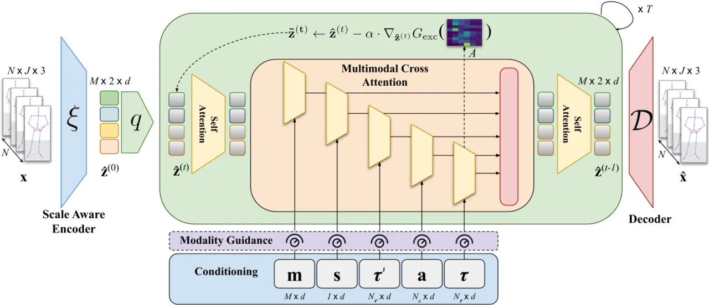

Figure 3: The model schema. Given a training motion
$`\mathbf{x}\in\mathbb{R}^{N\times J\times 3}`$, we first extract its
latent encoding $`\mathbf{\hat{z}}^{(0)}`$ (Sec. 3.1), which is then
denoised by a network that incorporates the various modalities in the
denoising process. At inference time, the denoised latents are decoded
to produce the final generation, $`\mathbf{\hat{x}}`$ (Sec. 3.2). During
this process, our method allows to control the generation through
coarse-grained modality guidance or fine-grained word-excitation
guidance (Sec. 3.3). Dotted lines represent components used only during
inference.

### 2.3 Diffusion-based Generative Modelling

Diffusion models \[66, 30\] have demonstrated remarkable potential in
the field of generative modeling, consistently delivering impressive
results in various synthesis applications \[60, 63, 34, 14, 70, 79,
67\]. New paradigms like guidance mechanisms \[15, 29\] and latent
diffusion models \[61\] have been introduced to enhance quality and
alignment of diffusion-based synthesis w.r.t given conditionings.

This approach has been extensively applied for conditional human motion
synthesis \[68, 14, 70, 13\]. Similarly, co-speech gesture generation
has also greatly benefited from this generative modeling technique.
DiffGesture \[84\] uses a transformer-based diffusion pipeline with an
annealed noise sampling strategy for temporally consistent gesture
generation. GestureDiffuCLIP \[4\] employs latent-diffusion
models \[61\] and CLIP \[58\] based conditioning to improve control over
co-speech gesture generation. \[67\] presents a model to predict the
movement of multiple speakers in a social setting. However, contrary to
other diffusion-based gesture synthesis approaches, their model focuses
on predicting the correctness of the 3D body keypoint trajectory for a
few seconds in the future instead of improving the speech-gesture
alignment. Instead of simply predicting the motion trajectory, our
method proposes a multi-person speech-driven 3D gesture synthesis
approach that can be used to predict the 3D reactive body and hand
motion between various speakers and listeners within a conversation.

## 3 Approach

The goal of our method is to generate co-speech gesture sequences for
monadic and dyadic settings in correspondence with input speech. A
gesture sequence $`\mathbf{x}\in\mathbb{R}^{N\times J\times 3}`$
consists of $`N`$ frames of human motion with $`J`$ articulating 3D
joints. The generated gesture motion ought to be consistent with the
multi-modal conditioning signal, $`\mathbf{C}`$, representing the speech
and identity-related attributes of the persons in conversation
(discussed later in Sec. 3.2).

We design our gesture synthesis method around a latent denoising
diffusion probabilistic model (DDPM) framework \[62\]. The proposed
diffusion model is trained to denoise the latent representation of the
gesture motions (refer to Sec. 3.1). The generated motion latents can
later be decoded using a motion decoder. Unlike existing motion latent
diffusion methods \[13\], we design our latent space in a
time-decomposable manner, thereby allowing us to learn fine-grained
interplay between motion and speech. Crucially, our method also allows
the end-user to control the attributes of the generated gestures at
inference time (see Sec. 3.3). We now discuss each component in detail.
Refer to the supplemental document for a glossary of major notations
used in the method explanation.

### 3.1 Scale-aware Temporal Latent Representation

Instead of directly denoising the raw motion $`\mathbf{x}`$, our
diffusion model operates in the latent space of human motion. Thus, we
propose to learn such a latent space with two characteristics: 1) We
disentangle the finger motions from the rest of body motions by encoding
them into a latent space through separate encoders. 2) Instead of
projecting the entire motion into one single latent vector, we encode
motion into chunked latents that can be decoded jointly by a decoder.

Decoupled Latent Representations. The articulation of the finger joints
is critical to the quality of gesture synthesis. However, the fingers
articulate in a significantly different space and scale compared to the
rest of the body and naïvely encoding the full-body gestures results in
inaccurate reconstruction of hands. We therefore follow prior works that
decouple the two sets of joints \[22, 21\] and represent the motion
$`\mathbf{x}`$ as a latent vector
$`\mathbf{z}=\{\mathbf{z}_{b},\mathbf{z}_{h}\}`$, where
$`\mathbf{z}_{b}\in\mathbb{R}^{d}`$ and
$`\mathbf{z}_{h}\in\mathbb{R}^{d}`$ are separate encodings of the body
and hand motion.

The latent vectors are learned using a VAE framework. The hand and body
motions, $`\mathbf{x}_{h}`$ and $`\mathbf{x}_{b}`$, are encoded using
transformer encoders:
$`\mathbf{z}_{b}=\xi_{b}(\mathbf{x}_{b}),~\mathbf{z}_{h}=\xi_{h}(\mathbf{x}_{h})`$.
The latent vectors represent the mean of the distribution, which can be
sampled using the reparameterization trick \[33\] and fed into a decoder
to reconstruct the motion
$`{\mathbf{x}}_{b}^{\prime}=\mathcal{D}_{b}(\mathbf{z}_{b}),{\mathbf{x}^{\prime}}_{h}=\mathcal{D}_{h}(\mathbf{z}_{h})`$.
We train the VAE with the standard reconstruction loss,
$`\mathcal{L}_{2}`$, Bone-length regularization loss
$`\mathcal{L}_{bone}`$ \[14\] and the KL-Divergence of the latents,
$`\mathcal{L}_{KL}`$. Additionally, we reduce the jitter in
reconstruction proposing a Laplacian regularization term:

```math
\mathcal{L}_{lap}=\left\lVert\mathscr{L}\{\hat{\mathbf{x}}\}-\mathscr{L}\{\mathbf{x}\}\right\rVert_{2} \tag{1}
```

where $`\mathscr{L}\{\cdot\}`$ is the Laplace transform operator along
$`N`$ frames. Refer to Sec. 5.4 and supplemental for analysis.

Time-Aware Latent Representation. The motion latents learned by the VAE
represent a large motion sequence ($`>`$100 frames) with a single
$`d`$-dimensional vector. This, rather coarse, granularity prohibits
applications such as perpetual rollout where the motion can be
autoregressively decoded with an overlapping window. To enable such
applications, we propose to encode shorter motion chunks in the latent
$`\mathbf{z}`$ but decode multiple such chunked latents,
$`\{\mathbf{\hat{z}}_{i}\}_{i=1}^{M}`$ together with a single decoder,
as shown in Fig. 4.

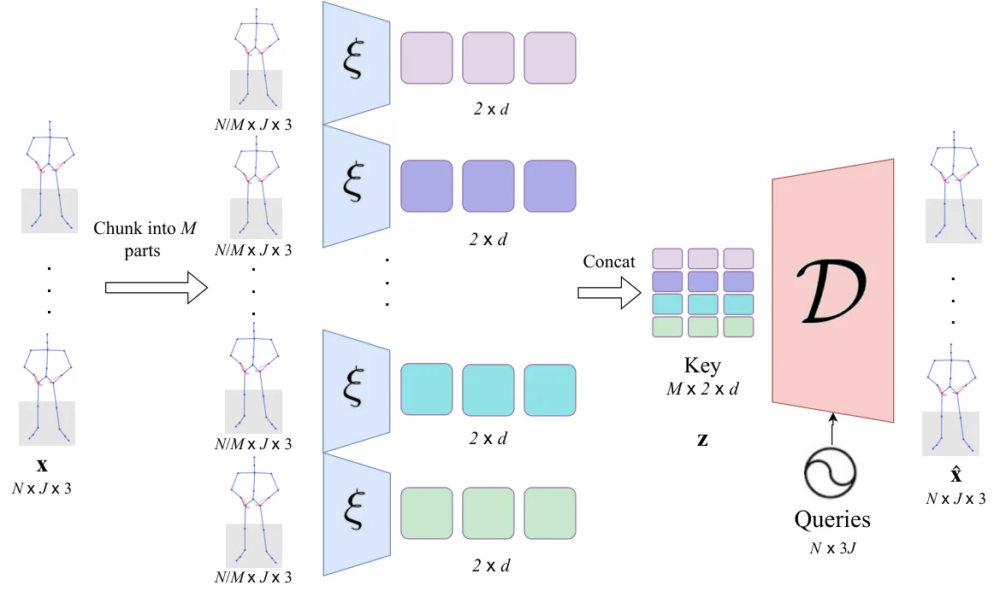

Figure 4: Chunked latent encoding-decoding. We encode a motion of $`N`$
frames into a sequence of $`M`$ latent vectors, which are jointly
decoded by the decoder $`\mathcal{D}`$. Encoding into chunked latents
allows for perpetual rollout and decoding jointly induces temporal
consistency while converting the latents back into motion.

Given a gesture sequence $`\mathbf{x}`$, we first split the sequence
into $`M`$ equally sized chunks
$`\{\mathbf{{x}}_{i}^{\prime}\}_{i=1}^{M}`$, where
$`\mathbf{{x}}_{i}^{\prime}\in\mathbb{R}^{N/M\times J\times 3}`$. Next,
each of the chunks $`\mathbf{{x}}_{i}^{\prime}`$ is encoded in isolation
using $`\mathbf{\hat{z}}_{i}=\xi_{b}(\mathbf{{x}}_{i}^{\prime})`$.
However, while decoding, the decoder collectively decodes a sequence of
chunked latents,
$`\mathbf{\hat{z}}=\{\mathbf{\hat{z}}_{i}\}_{i=1}^{M}`$, following:
$`\mathbf{\hat{x}}^{\prime}=\mathcal{D}(\mathbf{\hat{z}})`$. In summary,
our latent encodings transform a motion sequence
$`\mathbf{x}\in\mathbb{R}^{N\times J\times 3}`$ into latent
representations $`\mathbf{\hat{z}}\in\mathbb{R}^{M\times 2\times d}`$.
This can enable perpetual gesture generation using diffusion inpainting
technique \[51\] as we discuss and analyze in Sec. 5.4.

### 3.2 Modality-Conditional Gesture Generation

Having obtained $`\mathbf{\hat{z}}`$ as the time-aware latent
representation of gesture motions, we formulate the gesture synthesis
task as that of conditional latent diffusion \[62\]. The forward
diffusion process, successively corrupts the latent sequence
$`\mathbf{\hat{z}}^{(0)}`$ by adding Gaussian noise $`\epsilon`$ for
$`T`$ timesteps with the assumption that
$`\mathbf{\hat{z}}^{(T)}\sim\mathcal{N}(0,I)`$. For generation, the
reverse diffusion process is performed on $`\mathbf{\hat{z}}^{(T)}`$ by
iteratively denoising
$`\mathbf{\hat{z}}^{(T)}\sim\mathcal{N}(0,\mathbf{I})`$ to generate a
latent sequence $`\mathbf{\hat{z}}^{(0)}`$, and can be formulated as

```math
p_{\theta}\big(\mathbf{\hat{z}}^{(0:T)}\big)=p\big(\mathbf{\hat{z}}^{(T)}\big)\prod_{t=1}^{T}p_{\theta}\big(\mathbf{\hat{z}}^{(t-1)}|\mathbf{\hat{z}}^{(t)}\big),\vskip-6.99997pt \tag{2}
```

where $`p_{\theta}(\mathbf{\hat{z}}^{(t-1)}|\mathbf{\hat{z}}^{(t)})`$ is
approximated using a neural network parameterized by weights $`\theta`$.
This neural network $`f_{\theta}`$ is trained to predict noise
$`\epsilon_{\theta}(\mathbf{\hat{z}}^{(t)},t)`$ \[30\], which can be
used in the training objective
$`\mathcal{L}_{d}=||\epsilon-\epsilon_{\theta}(\mathbf{\hat{z}}^{(t)},t)||^{2}.`$

The motion generation framework discussed above is so far unconditional.
Our gesture synthesis approach can be conditioned in primarily two
settings: monadic and dyadic. The monadic setting refers to the
co-speech gesture generation based solely on the speaker’s own utterance
and typically occurs in monologue scenarios. For this, we represent the
conditioning signal as
$`\mathbf{C}=\{\mathbf{a},\boldsymbol{\tau},\mathbf{s}\}`$, consisting
of the audio signal $`\mathbf{a}\in\mathbb{R}^{N_{a}\times d}`$ and the
text tokens
$`\boldsymbol{\tau}\in\mathbb{R}^{N_{\boldsymbol{\tau}}\times d}`$, as
well as $`\mathbf{s}\in\mathbb{R}^{1\times d}`$ representing the speaker
identity token. Generally, $`N_{a}`$ corresponds to the number of audio
frames, $`N_{\boldsymbol{\tau}}`$ corresponds to the number of text
tokens in the utterance. Speaker identity $`\mathbf{s}`$ can enable
applications like stylized gesture synthesis which can generalize to
different gesture styles. For the dyadic setting—which takes place in
conversation scenarios—the generated gestures must be in accordance with
the co-participant’s utterance as well. In this case, we have
$`\mathbf{C}=\{\mathbf{a},\boldsymbol{\tau},\boldsymbol{\tau}^{\prime},\mathbf{s},\mathbf{m}\}`$,
where $`\boldsymbol{\tau}^{\prime}`$ refers to the co-participant’s
speech content i.e. their text. Here, we can also choose their audio
instead of their text as well. Finally, $`\mathbf{m}\in\{0,1\}^{M}`$
indicates whether the speaker is actively responding with speech, or
passively back-channeling e.g. by laughing or nodding (see also
supplemental video).

We use a transformer decoder network \[71\] with multi-head attention to
approximate the denoising function producing
$`\epsilon_{\theta}(\mathbf{\hat{z}}^{(t)},t,\mathbf{C})`$. This allows
us to elegantly integrate multiple modalities in $`\mathbf{C}`$ with
separate cross-attention heads, as shown in Fig. 2. Let us consider the
case of the audio signal, $`\mathbf{a}`$. The cross-attention features,
$`\phi_{a}`$, are computed using the attention matrix
$`\operatorname{Attn}(\mathbf{\hat{z}},\mathbf{a})\in\mathbb{R}^{N_{a}\times M}`$
as:

```math
\operatorname{Attn}(\mathbf{\hat{z}},\mathbf{a})=\sigma(\frac{Q_{z}K_{a}}{\sqrt{d}}),\phi_{a}=V_{a}\cdot\operatorname{Attn}(\mathbf{\hat{z}},\mathbf{a}) \tag{3}
```

where $`\sigma`$ is the softmax operator, $`Q_{z},K_{a},V_{a}`$ are the
query, key and value vectors recovered form the motion latent features
$`\mathbf{\hat{z}}`$ and the audio features $`\mathbf{a}`$. We similarly
recover text features,
$`\phi_{\tau}=\operatorname{Attn}(\mathbf{\hat{z}},\boldsymbol{\tau})`$,
also for the text.

### 3.3 Towards Controllable Gesture Generation

In addition to multi-modal gesture synthesis, our method is designed to
allow coarse and fine-grained control. For coarse control, one can
adjust the impact of a specific modality on the generated motion by
utilizing our modality-level guidance strategy. For fine control, the
user can choose specific words to enhance the gestures for the words
using the proposed word-excitation guidance (WEG) objective.

Modality-Guidance. Classifier-free guidance \[29\] has been used to
improve the generation quality of various diffusion-based motion and
gesture generation methods \[4, 13, 68, 39\]. Typically, this is done by
randomly replacing the conditioning vectors with a null-embedding
$`\mathbf{C}\leftarrow\emptyset`$. At inference, the noise predictions
are blended at each diffusion timestamp $`t`$ to get the noise
prediction $`\epsilon_{\theta}^{(t)}`$:

```math
\epsilon_{\theta}^{(t)}=\epsilon_{\theta}(\mathbf{\hat{z}}^{(t)},t,\emptyset)+\lambda(\epsilon_{\theta}(\mathbf{\hat{z}}^{(t)},t,\mathbf{C})-\epsilon_{\theta}(\mathbf{\hat{z}}^{(t)},t,\emptyset)) \tag{4}
```

where, $`\lambda`$ represents the guidance scale. Once estimated,
$`\epsilon_{\theta}^{(t)}`$ can be used to sample
$`\mathbf{\hat{z}}^{(t-1)}`$ for the next iteration using Eq. 11
of \[30\]. However, recall that our conditioning set
$`\mathbf{C}=\{\mathbf{a},\boldsymbol{\tau},\boldsymbol{\tau}^{\prime},\mathbf{s},\mathbf{m}\}`$
consists of several modality-specific conditions. Naïvely setting all
the elements to $`\emptyset`$ for random iterations prohibits separately
learning the effect of each individual modality within $`\mathbf{C}`$ on
the conditional distribution. Instead, we train our model with random
modality dropouts (with null-embedding replacement) with $`10\%`$ drop
probability. This encourages the model to learn several combinations of
marginalized conditional probability distributions.

At inference, we sample with modality-guidance:

```math
\displaystyle\epsilon_{\theta}^{(t)}=\epsilon_{\theta}^{\emptyset}+\lambda_{m}\sum_{\mathbf{c}\in\mathbf{C}}w_{c}\big(\epsilon_{\theta}^{c}(\mathbf{\hat{z}}^{(t)},t,\mathbf{c})-\epsilon_{\theta}(\mathbf{\hat{z}}^{(t)},t,\emptyset)\big) \tag{5}
```

where the scale parameters, $`w_{c}\geq 0`$, determine the contribution
of each modality towards the generated gesture and $`\lambda_{m}`$ is
the global guidance scale. Adjusting the modality scale, $`w_{c}`$
allows us to coarsely control the gesture quality and also analyze the
sensitivity of the generation process to specific modalities. Note, that
this is an optional sampling strategy required only for modality-level
control.

Word-Excitation Guidance. Inspired by the controllable image generation
methods \[12, 16\], we propose a word-level guidance mechanism that
allows us to finely control the gesture generation based on a
user-defined set of words during the sampling process.

Let
$`\operatorname{Attn}(\mathbf{\hat{z}}^{(t)},t,\boldsymbol{\tau})\in\mathbb{R}^{N_{\boldsymbol{\tau}}\times M}`$
be the text attention matrix at the $`t^{th}`$ iteration of the
denoising process. For a set of text tokens
$`\{\boldsymbol{\tau}_{i}\}_{i=1}^{S}`$, selected by a user with the
intention of gesture enhancement, we focus on the corresponding column,
$`A_{i}\in\mathbb{R}^{M}`$ in the text attention matrix. Now, with the
assumption that the element with maximum attention in $`A_{i}`$ aligns
with the motion chunk associated with the text, we introduce a guidance
objective to further enhance (or, excite) the same attention:

```math
G_{\mathrm{exc}}=\frac{1}{S}\sum_{i=1}^{S}(1-\operatorname{max}(A_{i}))\vskip-5.0pt \tag{6}
```

Next, we use the gradient of $`G_{\mathrm{exc}}`$ w.r.t the latent
$`\mathbf{\hat{z}}^{(t)}`$ to perform the word-excitation guidance:

```math
\mathbf{\tilde{z}}^{(t)}\leftarrow\mathbf{\hat{z}}^{(t)}-\alpha\cdot\nabla_{\mathbf{\hat{z}}^{(t)}}G_{\mathrm{exc}},\epsilon_{\theta}^{(t)}=f_{\theta}(\mathbf{\tilde{z}}^{(t)},t,\mathbf{C}) \tag{7}
```

where $`\alpha`$ is the guidance scale for the word excitation guidance,
which also serves as a step size for latent update.

## 4 Dataset

To enable a high-quality, speech-driven gesture synthesis method
involving multiple speakers, we introduce the DnD Group Gesture dataset.
Our dataset is designed to also invoke a wide range of non-verbal
gestures during the speaker interactions. We based our dataset
recordings on D&D tabletop roleplaying game, where five different
players are standing in a circle around a game map. Each participant is
equipped with a dedicated wireless microphone to ensure a clean audio
recording and audio source separation. The setup of the gameplay
involves various types of interaction between the actors that often
require semantically meaningful gestures such as pointing to a certain
location on the map. In total, the dataset consists of 4 separate
recording sessions with a total duration of 6 hours.

Our proposed dataset is recorded using a state-of-the-art multi-view
markerless mocap to obtain accurate 3D body and hand pose estimates of
multiple subjects at a given time. This allows our participants to move
freely without being obstructed by the tight mocap suit or gloves. In
addition to audio and the 3D pose annotations, we also provide text and
gesture annotations for each individual speaker that distinguishes
different types of observable gestures, including beats, iconic,
deictic, and metaphoric. Our dataset will be made publicly available to
the community.

|                             |               |       |                         |                         |                         |
| --------------------------- | ------------- | ----- | ----------------------- | ----------------------- | ----------------------- |
| Name                        | \# Identities | Size  | Body Parts              | Multi-party Interaction | \# Interacting Speakers |
| IEMOCAP \[7\]               | 10            | 12h   | Face                    | ✓                       | 2                       |
| Creative-IT \[55\]          | 16            | 2h    | Body $`\dagger`$        | ✓                       | 2                       |
| CMU Haggling Dataset \[31\] | 122           | 3h    | Face, Body, Hands       | ✓                       | 3                       |
| TED Dataset \[77\]          | 1295          | 52.7h | Upper Body              |                         |                         |
| Speech Gesture 3D \[26\]    | 10            | 144h  | Upper Body, Hands, Face |                         |                         |
| Talking with Hands \[40\]   | 50            | 50h   | Body, Hands             | ✓                       | 2                       |
| PATS \[1\]                  | 25            | 250h  | Upper Body, Hands       |                         |                         |
| SaGA++ \[37\]               | 25            | 4h    | Body hands              |                         |                         |
| ZeroEGGS Dataset \[20\]     | 1             | 2h    | Body, Hands             |                         |                         |
| BEAT \[47\]                 | 30            | 76h   | Body, Hands, Face       |                         |                         |
| DnD Group Gesture           | 5             | 6h    | Body, Hands             | ✓                       | 5                       |

Table 1: Comparison of currently available datasets to our DnD Group
Gesture dataset. Body parts refer to the parts where the 2D or 3D pose
tracking is available. $`\dagger`$ indicates that the body tracking is
only available for one of one interacting actors.

## 5 Experiments

Our method, in its vanilla form, is designed to generate human gestures
from speech, yet it goes several steps beyond this task. For instance,
we adapt our method to perform dyadic conversations. More importantly,
we show how different modalities contribute to the generation and
perform fine-grained text-based control. Naturally, it is difficult to
find suitable baselines to compare with. To perform fair evaluations,
we, therefore, compare with methods that can be trivially adapted to our
setting. Specifically, we compare with MLD \[13\] (a generic latent
diffusion method), CaMN \[47\], Multi-Context \[78\], DiffGesture \[84\]
(specifically monadic gesture baselines) and DiffuGesture \[81\]
(two-person motion synthesis works). Notably, CaMN \[47\],
DiffGesture \[84\] and DiffuGesture \[81\] require a seed motion
sequence to build the gesture generation on. This is different from our
setting and provides vital clues about the gesture style. We provide the
seed motions for the two methods, but do not use the seed motions to
generate our results. The methods are compared using the established
motion synthesis metrics as well as a user-study.

Evaluation Datasets. We evaluate our performance in monadic gesture
generation on the recently introduced BEAT dataset \[47\]. The test set
includes $`2492`$ $`5`$-sec motion sequences and includes a set of $`5`$
unseen speakers. For evaluating the motion in dyadic setting, we use the
test set of the proposed DnD Group Gesture dataset. The test set
contains $`3932`$ sequences of $`5`$-second conversations.

Metrics. Evaluating synthesized motions is challenging due to the
subjective nature of perceiving good gestures. Yet, we evaluate our
method on the established metrics like Beat-Alignment \[65\], FID,
Semantic Relevance Gesture Recall (SRGR) \[47\] that evaluate different
aspects of the motion. We also use Diversity and L1 Divergence to
evaluate the ability of models to span the space of gesture motions with
enough coverage.

|                      |                    |                           |                           |                        |                   |
| -------------------- | ------------------ | ------------------------- | ------------------------- | ---------------------- | ----------------- |
|                      | FID $`\downarrow`$ | BeatAlign $`\rightarrow`$ | Diversity $`\rightarrow`$ | L1 Div $`\rightarrow`$ | SRGR $`\uparrow`$ |
| GT                   | \-                 | 0.89                      | 13.21                     | 13.12                  | \-                |
| Multi-Context \[78\] | $`\geq 10^{3}`$    | $`0.8`$                   | $`26.71`$                 | $`43.31`$              | $`0.140`$         |
| DiffGesture \[84\]   | $`\geq 10^{3}`$    | $`0.96`$                  | $`176`$                   | $`17.8`$               | $`0.003`$         |
| CaMN \[47\]          | $`142`$            | $`0.74`$                  | $`9.66`$                  | $`5.85`$               | $`0.443`$         |
| MLD \[13\]           | $`475`$            | $`0.76`$                  | $`16.98`$                 | $`5.42`$               | $`0.214`$         |
| Ours                 | $`271`$            | $`0.82`$                  | $`9.82`$                  | $`6.24`$               | $`0.365`$         |

Table 2: Comparison on the BEAT \[47\]. Two methods \[78, 84\] produce
extremely jittery motions. We demonstrate superior beat alignment and
diversity scores among the remaining methods.

### 5.1 Monadic Co-speech Gesture Synthesis

We tabulate our results on the BEAT test set for monadic co-speech
gesture synthesis in Tab. 2. We observe that DiffGesture \[84\] and
Multi-ContextNet \[78\] struggle with the FID which, upon visualization,
can be attributed to the extremely jittery nature of the generated
motions. Interestingly, this also leads to Multi-ContextNet \[78\] to
perform the best in the Beat Alignment metric as for every beat in the
audio, there is always a jittery motion to align with. Among other
methods, we observe better performance in terms of diversity and beat
alignment. It is interesting to note that MLD, which is trained on a
non-temporal latent representation, achieves a reasonable beat alignment
but worse semantic recall. We hypothesize that the semantic alignment
benefits from a finely discretized motion representation. Our method
lies in the middle of the discretization spectrum, where CaMN operates
on raw motion frames while MLD collapses the temporal axis within a
single latent.

### 5.2 Dyadic Co-speech Gesture Synthesis

We adapted two baselines to the dyadic setting for comparison. MLD’s
architecture was extended by adding additional conditioning blocks of
the co-participant’s speech.

|             |                           |                           |                        |
| ----------- | ------------------------- | ------------------------- | ---------------------- |
|             | BeatAlign $`\rightarrow`$ | Diversity $`\rightarrow`$ | L1 Div $`\rightarrow`$ |
| GT          | $`0.90`$                  | $`17.7`$                  | $`5.12`$               |
| MLD         | $`0.96`$                  | $`20`$                    | $`0.31`$               |
| DiffGesture | $`0.97`$                  | $`2176`$                  | $`1308`$               |
| Ours        | $`0.90`$                  | $`6.38`$                  | $`1.19`$               |

Table 3: Qualitative comparison of dyadic motion synthesis on the DnD
Group Gesture dataset.

Likewise, DiffuGesture was adapted to our setting as detailed in \[81\].
We observe similar patterns of jittery motion with DiffuGesture, whereas
MLD produced suboptimal results in terms of beat alignment. In contrast,
we achieve similar beat alignment as the ground-truth while also
producing higher L1 Diversity, thus indicating non-static motions.

Figure 5: Results of the user study. We compare with CaMN \[47\] and
MLD \[13\], and achieve an overall favourable preference scores for
monadic and dyadic settings. We also evaluate the effectiveness of the
word-excitation guidance (WEG).

### 5.3 User Study

As noted above, evaluating motion synthesis models on a set of numerical
metrics hides several aspects of the gesture synthesis. Prior
works \[70, 14\] report mismatch between metrics and the subjective
evaluations by the users. Hence, we perform a perceptual user study to
evaluate the quality of our synthesis results w.r.t state-of-the-art
methods. For evaluating the monadic results, we aim to evaluate the
general plausibility of the motions and probe the coherence of the
gestures with the utterance. Likewise for dyadic synthesis, the goal is
to measure if participant’s generated gestures align well with their
speech as well as co-participant’s speech content. To evaluate the
word-excitation guidance, we ask the users to evaluate if the generated
gestures have distinct gesticulation at the focus words.

Results. We plot the results of our user study in Fig. 5. For the
monadic setting, the participants preferred our motions over those of
CaMN and MLD for both questions. At the same time, we were marginally
below the ground-truth preference. The inference remains similar for the
dyadic evaluations as well, although with significantly lower margins.
Finally, the user study demonstrates better semantic alignment with the
generated motions with the use of WEG.

### 5.4 Ablative Analysis

Latent Representation.

|                           | Reconstruction Loss $`\downarrow`$ | Smoothness Error \[64\] $`\downarrow`$ |
| ------------------------- | ---------------------------------- | -------------------------------------- |
| MLD \[13\]                | $`10\times 10^{-3}`$               | $`4.4\times 10^{-3}`$                  |
| Our VAE                   | $`5\times 10^{-3}`$                | $`3.5\times 10^{-3}`$                  |
| w/o $`\mathcal{L}_{lap}`$ | $`3\times 10^{-4}`$                | $`3.7\times 10^{-3}`$                  |
| w/o Time Aware            | $`9\times 10^{-3}`$                | $`4\times 10^{-3}`$                    |
| w/o Scale Aware           | $`5.5\times 10^{-3}`$              | $`3.7\times 10^{-3}`$                  |

Table 4: Ablation study on the VAE design. $`\mathcal{L}_{lap}`$ ensures
the motions retain the velocity of ground truth, even though removing it
leads to lower reconstruction loss. While training without time-aware
representation gives slight increase in reconstruction loss, it cannot
support unbounded generation.

Our chunked, scale-aware latent representation is motivated by various
factors, such as perpetual motion synthesis, better temporal alignment
with the conditioning modalities, and the scale difference between the
hands and the fingers. We tabulate the influence of the three main
design choices in Tab. 4. We also show that on the VAE reconstruction
task alone, our latent representation outperforms MLD’s latent
representation.

(a) Fine-grained alignment

(b) The effect of modalities.

Figure 6: (a) Given a text prompt with focus words, “french” and “now”,
we observe that WEG significantly increases the joint velocities for the
two words compared to the non-guided case. In (b) we show the
contributions of each modality as diffusion denoising progresses. Audio
tends to dominate the generation process.

Influence of Modalities. With a variety of conditioning modalities
within our framework, it is natural to question which modalities bear a
greater effect on the final generation. We analyze this by plotting the
norm of the contributions of each modality in Eq. 5 (computed before
scaling with $`w_{c}`$). As Fig. 6(b) demonstrates, the audio modality
bears the largest influence on the gesture generation process.
Interestingly, we notice an overall trend of increasing contributions
until they drop down significantly towards the final stages of
denoising, indicating that the diffusion process makes smaller edits in
the final stages and takes heavier updates during the middle phases of
denoising. In Fig. 6(a), one can observe a significant bump in the joint
velocities (indicating more animated behaviour) at the precise moment of
the excitation word. These observations highlight the overall
effectiveness of our two-level guidance objectives. We refer the reader
to the supplemental for more results.

On Semantic Consistency: Thanks to the proposed Word Excitation Guidance
(WEG), our method samples gestures that produce more pronounced
attention features for the user-selected words We demonstrate this by
training a gesture type classifier to recognize beat and semantic
gestures. For synthesized gestures without WEG, we observe that the
recall for semantic labels is 0.34. However, this recall increased to
0.40 when WEG was employed, indicating that the use of WEG enhances
semantic coherence in generated gestures. Refer to supplemental for
implementation details.

Attention Maps. We visualize the attention maps for analysis (see
supplemental) to interpret what spatio-temporal properties are
highlighted in the model training. The first property is a clear
separation between the hand and body latents, shown by the striped
patterns of the attention maps. Secondly, WEG boosts the attention
weights for the highlighted words. Refer to supplemental for detailed
analysis.

Perpetual Rollout. In addition to allowing for temporal alignment with
several modalities, our chunked latent representation also benefits us
by allowing perpetual rollout. To do so, one can simply follow the
auto-regressive denoising process followed by the existing motion
diffusion methods \[70, 14, 68\] with the difference that instead of
inpainting the actual motion, we inpaint the latents. Refer to
supplementary material for implementation details.

## 6 Conclusion

In this work, we proposed a novel approach towards controllable
co-speech gesture synthesis. With the aim of generating long term,
jitter-free gestures, we proposed a time-aware latent representation
that can be denoised using a diffusion model. To control the effects of
individual modalities, we proposed a variant of classifier-free
guidance. We also proposed WEG to enhance the gestures for a
user-selected set of words in the text, thus facilitating text level
fine-grained control. Our analysis shows that word-excitation induces
more animated behaviour for the selected words. Finally, with the
introduction of the DnD Group Gesture dataset we hope the field will
further propel the research on multi-party gesture synthesis.

Acknowledgements. This work was supported by the ERC Consolidator Grant
4DReply (770784). We also thank Andrea Boscolo Camiletto & Heming Zhu
for help with visualizations and Christopher Hyek for designing the game
for the dataset.

## References

- \[1\] Chaitanya Ahuja, Dong Won Lee, Yukiko I. Nakano, and
  Louis-Philippe Morency. Style transfer for co-speech gesture
  animation: A multi-speaker conditional-mixture approach. 2020.
- \[2\] Simon Alexanderson, Gustav Eje Henter, Taras Kucherenko, and
  Jonas Beskow. Style‐controllable speech‐driven gesture synthesis using
  normalising flows. _Comput. Graph. Forum_, 39(2):487–496, 2020.
- \[3\] Tenglong Ao, Qingzhe Gao, Yuke Lou, Baoquan Chen, and Libin Liu.
  Rhythmic gesticulator: Rhythm-aware co-speech gesture synthesis with
  hierarchical neural embeddings. _ACM TOG_, 41(6):1–19, 2022.
- \[4\] Tenglong Ao, Zeyi Zhang, and Libin Liu. Gesturediffuclip:
  Gesture diffusion model with clip latents. _ACM TOG_,
  42(4):1–18, 2023.
- \[5\] Uttaran Bhattacharya, Elizabeth Childs, Nicholas Rewkowski, and
  Dinesh Manocha. Speech2affectivegestures: Synthesizing co-speech
  gestures with generative adversarial affective expression learning. In
  _ACM MM_, 2021a.
- \[6\] Uttaran Bhattacharya, Nicholas Rewkowski, Abhishek Banerjee,
  Pooja Guhan, Aniket Bera, and Dinesh Manocha. Text2gestures: A
  transformer-based network for generating emotive body gestures for
  virtual agents. In _2021 IEEE Virtual Reality and 3D User Interfaces
  (VR)_, 2021b.
- \[7\] Carlos Busso, Murtaza Bulut, Chi-Chun Lee, Abe Kazemzadeh, Emily
  Mower, Samuel Kim, Jeannette N Chang, Sungbok Lee, and Shrikanth S
  Narayanan. Iemocap: Interactive emotional dyadic motion capture
  database. _Language resources and evaluation_, 2008.
- \[8\] Justine Cassell. Embodied conversational interface agents.
  _Commun. ACM_, 2000.
- \[9\] Justine Cassell, Catherine Pelachaud, Norman Badler, Mark
  Steedman, Brett Achorn, Tripp Becket, Brett Douville, Scott Prevost,
  and Matthew Stone. Animated conversation: Rule-based generation of
  facial expression, gesture & spoken intonation for multiple
  conversational agents. In _Proceedings of the 21st Annual Conference
  on Computer Graphics and Interactive Techniques_, 1994a.
- \[10\] Justine Cassell, Catherine Pelachaud, Norman Badler, Mark
  Steedman, Brett Achorn, Tripp Becket, Brett Douville, Scott Prevost,
  and Matthew Stone. Animated conversation: rule-based generation of
  facial expression, gesture & spoken intonation for multiple
  conversational agents. In _SIGGRAPH Conference Proceedings_, 1994b.
- \[11\] Justine Cassell, Hannes Högni Vilhjálmsson, and Timothy
  Bickmore. Beat: The behavior expression animation toolkit. In
  _SIGGRAPH Conference Proceedings_, 2001.
- \[12\] Hila Chefer, Yuval Alaluf, Yael Vinker, Lior Wolf, and Daniel
  Cohen-Or. Attend-and-excite: Attention-based semantic guidance for
  text-to-image diffusion models. _ACM TOG_, 42(4), 2023.
- \[13\] Xin Chen, Biao Jiang, Wen Liu, Zilong Huang, Bin Fu, Tao Chen,
  and Gang Yu. Executing your commands via motion diffusion in latent
  space. In _CVPR_, 2023.
- \[14\] Rishabh Dabral, Muhammad Hamza Mughal, Vladislav Golyanik, and
  Christian Theobalt. Mofusion: A framework for
  denoising-diffusion-based motion synthesis. In _CVPR_, 2023.
- \[15\] Prafulla Dhariwal and Alexander Nichol. Diffusion models beat
  gans on image synthesis. In _NeurIPS_, 2021.
- \[16\] Dave Epstein, Allan Jabri, Ben Poole, Alexei A. Efros, and
  Aleksander Holynski. Diffusion self-guidance for controllable image
  generation, 2023.
- \[17\] Ylva Ferstl and Rachel McDonnell. Investigating the use of
  recurrent motion modelling for speech gesture generation. In
  _Proceedings of the 18th International Conference on Intelligent
  Virtual Agents_, 2018.
- \[18\] Ylva Ferstl, Michael Neff, and Rachel McDonnell. Adversarial
  gesture generation with realistic gesture phasing. _Computers &
  Graphics_, 89:117–130, 2020.
- \[19\] Saeed Ghorbani, Ylva Ferstl, Daniel Holden, Nikolaus F. Troje,
  and Marc‐André Carbonneau. Zeroeggs: Zero‐shot example‐based gesture
  generation from speech. _Comput. Graph. Forum_, 42(1):206–216, 2023a.
- \[20\] Saeed Ghorbani, Ylva Ferstl, Daniel Holden, Nikolaus F. Troje,
  and Marc-André Carbonneau. Zeroeggs: Zero-shot example-based gesture
  generation from speech. _Computer Graphics Forum_, 42(1):206–216,
  2023b.
- \[21\] Anindita Ghosh, Noshaba Cheema, Cennet Oguz, Christian
  Theobalt, and Philipp Slusallek. Synthesis of compositional animations
  from textual descriptions. In _International Conference on Computer
  Vision (ICCV)_, 2021.
- \[22\] Anindita Ghosh, Rishabh Dabral, Vladislav Golyanik, Christian
  Theobalt, and Philipp Slusallek. Imos: Intent-driven full-body motion
  synthesis for human-object interactions. In _Eurographics_, 2023.
- \[23\] S. Ginosar, A. Bar, G. Kohavi, C. Chan, A. Owens, and J.
  Malik. Learning individual styles of conversational gesture. In
  _Computer Vision and Pattern Recognition (CVPR)_. IEEE, 2019.
- \[24\] Chuan Guo, Shihao Zou, Xinxin Zuo, Sen Wang, Wei Ji, Xingyu Li,
  and Li Cheng. Generating diverse and natural 3d human motions from
  text. In _CVPR_, 2022.
- \[25\] Ikhsanul Habibie, Weipeng Xu, Dushyant Mehta, Lingjie Liu,
  Hans-Peter Seidel, Gerard Pons-Moll, Mohamed Elgharib, and Christian
  Theobalt. Learning speech-driven 3d conversational gestures from
  video. In _Proceedings of the 21st ACM International Conference on
  Intelligent Virtual Agents_, 2021a.
- \[26\] Ikhsanul Habibie, Weipeng Xu, Dushyant Mehta, Lingjie Liu,
  Hans-Peter Seidel, Gerard Pons-Moll, Mohamed Elgharib, and Christian
  Theobalt. Learning speech-driven 3d conversational gestures from
  video. In _Proceedings of the International Conference on Intelligent
  Virtual Agents_, 2021b.
- \[27\] Ikhsanul Habibie, Mohamed Elgharib, Kripashindu Sarkar, Ahsan
  Abdullah, Simbarashe Nyatsanga, Michael Neff, and Christian Theobalt.
  A motion matching-based framework for controllable gesture synthesis
  from speech. In _SIGGRAPH ’22 Conference Proceedings_, 2022.
- \[28\] Dan Hendrycks and Kevin Gimpel. Gaussian error linear units
  (gelus). _arXiv preprint arXiv:1606.08415_, 2016.
- \[29\] Jonathan Ho and Tim Salimans. Classifier-free diffusion
  guidance. In _NeurIPS 2021 Workshop on Deep Generative Models and
  Downstream Applications_, 2021.
- \[30\] Jonathan Ho, Ajay Jain, and Pieter Abbeel. Denoising diffusion
  probabilistic models. In _NeurIPS_, 2020.
- \[31\] Hanbyul Joo, Tomas Simon, Xulong Li, Hao Liu, Lei Tan, Lin Gui,
  Sean Banerjee, Timothy Scott Godisart, Bart Nabbe, Iain Matthews,
  Takeo Kanade, Shohei Nobuhara, and Yaser Sheikh. Panoptic studio: A
  massively multiview system for social interaction capture. _IEEE
  Transactions on Pattern Analysis and Machine Intelligence_, 2017.
- \[32\] Adam Kendon. _Gesture: Visible action as utterance_. Cambridge
  University Press, 2004.
- \[33\] Diederik P. Kingma and Max Welling. Auto-encoding variational
  bayes. In _ICLR_, 2014.
- \[34\] Zhifeng Kong, Wei Ping, Jiaji Huang, Kexin Zhao, and Bryan
  Catanzaro. Diffwave: A versatile diffusion model for audio synthesis.
  In _ICLR_, 2021.
- \[35\] Stefan Kopp, Brigitte Krenn, Stacy Marsella, Andrew N Marshall,
  Catherine Pelachaud, Hannes Pirker, Kristinn R Thórisson, and Hannes
  Vilhjálmsson. Towards a common framework for multimodal generation:
  The behavior markup language. In _Intelligent Virtual Agents_, 2006.
- \[36\] Taras Kucherenko, Patrik Jonell, Sanne Van Waveren, Gustav Eje
  Henter, Simon Alexandersson, Iolanda Leite, and Hedvig Kjellström.
  Gesticulator: A framework for semantically-aware speech-driven gesture
  generation. In _Proceedings of the 2020 International Conference on
  Multimodal Interaction_, 2020.
- \[37\] Taras Kucherenko, Rajmund Nagy, Patrik Jonell, Michael Neff,
  Hedvig Kjellström, and Gustav Eje Henter. Speech2Properties2Gestures:
  Gesture-property prediction as a tool for generating representational
  gestures from speech. In _Proceedings of the 21th ACM International
  Conference on Intelligent Virtual Agents_, 2021a.
- \[38\] Taras Kucherenko, Rajmund Nagy, Patrik Jonell, Michael Neff,
  Hedvig Kjellström, and Gustav Eje Henter. Speech2properties2gestures:
  Gesture-property prediction as a tool for generating representational
  gestures from speech. In _Proceedings of the 21st ACM International
  Conference on Intelligent Virtual Agents_, 2021b.
- \[39\] Nilesh Kulkarni, Davis Rempe, Kyle Genova, Abhijit Kundu,
  Justin Johnson, David Fouhey, and Leonidas Guibas. Nifty: Neural
  object interaction fields for guided human motion synthesis, 2023.
- \[40\] G. Lee, Z. Deng, S. Ma, T. Shiratori, S. Srinivasa, and Y.
  Sheikh. Talking with hands 16.2m: A large-scale dataset of
  synchronized body-finger motion and audio for conversational motion
  analysis and synthesis. In _2019 IEEE/CVF International Conference on
  Computer Vision (ICCV)_, 2019.
- \[41\] Sergey Levine, Christian Theobalt, and Vladlen Koltun.
  Real-time prosody-driven synthesis of body language. _ACM TOG_,
  28(5):1–10, 2009.
- \[42\] Sergey Levine, Philipp Krähenbühl, Sebastian Thrun, and Vladlen
  Koltun. Gesture controllers. _ACM TOG_, 29(4):1–11, 2010.
- \[43\] Jing Li, Di Kang, Wenjie Pei, Xuefei Zhe, Ying Zhang, Zhenyu
  He, and Linchao Bao. Audio2gestures: Generating diverse gestures from
  speech audio with conditional variational autoencoders. In _ICCV_,
  2021a.
- \[44\] Ruilong Li, Sha Yang, David A. Ross, and Angjoo Kanazawa. Ai
  choreographer: Music conditioned 3d dance generation with aist++. In
  _ICCV_, 2021b.
- \[45\] Yuanzhi Liang, Qianyu Feng, Linchao Zhu, Li Hu, Pan Pan, and Yi
  Yang. Seeg: Semantic energized co-speech gesture generation. In
  _CVPR_, 2022.
- \[46\] Haiyang Liu, Naoya Iwamoto, Zihao Zhu, Zhengqing Li, You Zhou,
  Elif Bozkurt, and Bo Zheng. Disco: Disentangled implicit content and
  rhythm learning for diverse co-speech gestures synthesis. In _ACM MM_,
  2022a.
- \[47\] Haiyang Liu, Zihao Zhu, Naoya Iwamoto, Yichen Peng, Zhengqing
  Li, You Zhou, Elif Bozkurt, and Bo Zheng. Beat: A large-scale semantic
  and emotional multi-modal dataset for conversational gestures
  synthesis. _European Conference on Computer Vision_, 2022b.
- \[48\] Xian Liu, Qianyi Wu, Hang Zhou, Yuanqi Du, Wayne Wu, Dahua Lin,
  and Ziwei Liu. Audio-driven co-speech gesture video generation. In
  _NeurIPS_, 2022c.
- \[49\] Xian Liu, Qianyi Wu, Hang Zhou, Yinghao Xu, Rui Qian, Xinyi
  Lin, Xiaowei Zhou, Wayne Wu, Bo Dai, and Bolei Zhou. Learning
  hierarchical cross-modal association for co-speech gesture generation.
  In _CVPR_, 2022d.
- \[50\] Ilya Loshchilov and Frank Hutter. Decoupled weight decay
  regularization. In _ICLR_, 2019.
- \[51\] Andreas Lugmayr, Martin Danelljan, Andres Romero, Fisher Yu,
  Radu Timofte, and Luc Van Gool. Repaint: Inpainting using denoising
  diffusion probabilistic models. In _CVPR_, 2022.
- \[52\] Lars Marstaller and Hana Burianová. The multisensory perception
  of co-speech gestures–a review and meta-analysis of neuroimaging
  studies. _Journal of Neurolinguistics_, 30:69–77, 2014.
- \[53\] Brian McFee, Colin Raffel, Dawen Liang, Daniel PW Ellis, Matt
  McVicar, Eric Battenberg, and Oriol Nieto. librosa: Audio and music
  signal analysis in python. In _Proceedings of the 14th python in
  science conference_, 2015.
- \[54\] David McNeill. _Gesture and thought_. University of Chicago
  press, 2008.
- \[55\] Angeliki Metallinou, Zhaojun Yang, Chi-chun Lee, Carlos Busso,
  Sharon Carnicke, and Shrikanth Narayanan. The usc creativeit database
  of multimodal dyadic interactions: From speech and full body motion
  capture to continuous emotional annotations. _Language resources and
  evaluation_, 50:497–521, 2016.
- \[56\] S. Nyatsanga, T. Kucherenko, C. Ahuja, G. E. Henter, and M.
  Neff. A comprehensive review of data-driven co-speech gesture
  generation. _Comput. Graph. Forum_, 42(2):569–596, 2023.
- \[57\] Haokai Pang, Heming Zhu, Adam Kortylewski, Christian Theobalt,
  and Marc Habermann. Ash: Animatable gaussian splats for efficient and
  photoreal human rendering. In _CVPR_, 2024.
- \[58\] Alec Radford, Jong Wook Kim, Chris Hallacy, Aditya Ramesh,
  Gabriel Goh, Sandhini Agarwal, Girish Sastry, Amanda Askell, Pamela
  Mishkin, Jack Clark, Gretchen Krueger, and Ilya Sutskever. Learning
  transferable visual models from natural language supervision. In
  _ICML_, 2021.
- \[59\] Colin Raffel, Noam Shazeer, Adam Roberts, Katherine Lee, Sharan
  Narang, Michael Matena, Yanqi Zhou, Wei Li, and Peter J. Liu.
  Exploring the limits of transfer learning with a unified text-to-text
  transformer. _J. Mach. Learn. Res._, 21(1), 2020.
- \[60\] Aditya Ramesh, Prafulla Dhariwal, Alex Nichol, Casey Chu, and
  Mark Chen. Hierarchical text-conditional image generation with clip
  latents. _arXiv_, 2022.
- \[61\] Robin Rombach, Andreas Blattmann, Dominik Lorenz, Patrick
  Esser, and Björn Ommer. High-resolution image synthesis with latent
  diffusion models. In _CVPR_, 2021a.
- \[62\] Robin Rombach, Andreas Blattmann, Dominik Lorenz, Patrick
  Esser, and Björn Ommer. High-resolution image synthesis with latent
  diffusion models, 2021b.
- \[63\] Chitwan Saharia, William Chan, Saurabh Saxena, Lala Li, Jay
  Whang, Emily Denton, Seyed Kamyar Seyed Ghasemipour, Burcu Karagol
  Ayan, S. Sara Mahdavi, Rapha Gontijo Lopes, Tim Salimans, Jonathan Ho,
  David J Fleet, and Mohammad Norouzi. Photorealistic text-to-image
  diffusion models with deep language understanding. _arXiv_, 2022.
- \[64\] Soshi Shimada, Vladislav Golyanik, Weipeng Xu, and Christian
  Theobalt. Physcap: Physically plausible monocular 3d motion capture in
  real time. _ACM Transactions on Graphics_, 39, 2020.
- \[65\] Li Siyao, Weijiang Yu, Tianpei Gu, Chunze Lin, Quan Wang, Chen
  Qian, Chen Change Loy, and Ziwei Liu. Bailando: 3d dance generation
  via actor-critic gpt with choreographic memory. In _CVPR_, 2022.
- \[66\] Jascha Sohl-Dickstein, Eric A. Weiss, Niru Maheswaranathan, and
  Surya Ganguli. Deep unsupervised learning using nonequilibrium
  thermodynamics. In _ICML_, 2015.
- \[67\] Julian Tanke, Linguang Zhang, Amy Zhao, Chengcheng Tang, Yujun
  Cai, Lezi Wang, Po-Chen Wu, Juergen Gall, and Cem Keskin. Social
  diffusion: Long-term multiple human motion anticipation. In
  _ICCV_, 2023.
- \[68\] Guy Tevet, Sigal Raab, Brian Gordon, Yonatan Shafir, Amit H
  Bermano, and Daniel Cohen-Or. Human motion diffusion model. In
  _ICLR_, 2023.
- \[69\] Hugo Touvron, Thibaut Lavril, Gautier Izacard, Xavier Martinet,
  Marie-Anne Lachaux, Timothée Lacroix, Baptiste Rozière, Naman Goyal,
  Eric Hambro, Faisal Azhar, Aurelien Rodriguez, Armand Joulin, Edouard
  Grave, and Guillaume Lample. Llama: Open and efficient foundation
  language models, 2023.
- \[70\] Jonathan Tseng, Rodrigo Castellon, and Karen Liu. Edge:
  Editable dance generation from music. In _CVPR_, pages 448–458, 2023.
- \[71\] Ashish Vaswani, Noam Shazeer, Niki Parmar, Jakob Uszkoreit,
  Llion Jones, Aidan N Gomez, Ł ukasz Kaiser, and Illia Polosukhin.
  Attention is all you need. In _NeurIPS_, 2017.
- \[72\] Petra Wagner, Zofia Malisz, and Stefan Kopp. Gesture and speech
  in interaction: An overview. _Speech Communication_, 57:209–232, 2014.
- \[73\] Thomas Wolf, Lysandre Debut, Victor Sanh, Julien Chaumond,
  Clement Delangue, Anthony Moi, Pierric Cistac, Tim Rault, Rémi Louf,
  Morgan Funtowicz, Joe Davison, Sam Shleifer, Patrick von Platen, Clara
  Ma, Yacine Jernite, Julien Plu, Canwen Xu, Teven Le Scao, Sylvain
  Gugger, Mariama Drame, Quentin Lhoest, and Alexander M. Rush.
  Transformers: State-of-the-art natural language processing. In
  _EMNLP_, 2020.
- \[74\] Sicheng Yang, Zhiyong Wu, Minglei Li, Zhensong Zhang, Lei Hao,
  Weihong Bao, Ming Cheng, and Long Xiao. Diffusestylegesture: Stylized
  audio-driven co-speech gesture generation with diffusion models. In
  _IJCAI_, 2023.
- \[75\] Hongwei Yi, Hualin Liang, Yifei Liu, Qiong Cao, Yandong Wen,
  Timo Bolkart, Dacheng Tao, and Michael J Black. Generating holistic 3D
  human motion from speech. In _CVPR_, 2023.
- \[76\] Youngwoo Yoon, Woo-Ri Ko, Minsu Jang, Jaeyeon Lee, Jaehong Kim,
  and Geehyuk Lee. Robots learn social skills: End-to-end learning of
  co-speech gesture generation for humanoid robots. In _2019
  International Conference on Robotics and Automation (ICRA)_, 2019a.
- \[77\] Youngwoo Yoon, Woo-Ri Ko, Minsu Jang, Jaeyeon Lee, Jaehong Kim,
  and Geehyuk Lee. Robots learn social skills: End-to-end learning of
  co-speech gesture generation for humanoid robots. In _Proc. of The
  International Conference in Robotics and Automation (ICRA)_, 2019b.
- \[78\] Youngwoo Yoon, Bok Cha, Joo-Haeng Lee, Minsu Jang, Jaeyeon Lee,
  Jaehong Kim, and Geehyuk Lee. Speech gesture generation from the
  trimodal context of text, audio, and speaker identity. _ACM TOG_, page
  1–16, 2020.
- \[79\] Ye Yuan, Jiaming Song, Umar Iqbal, Arash Vahdat, and Jan Kautz.
  Physdiff: Physics-guided human motion diffusion model. In
  _ICCV_, 2023.
- \[80\] Mingyuan Zhang, Zhongang Cai, Liang Pan, Fangzhou Hong, Xinying
  Guo, Lei Yang, and Ziwei Liu. Motiondiffuse: Text-driven human motion
  generation with diffusion model. _arXiv preprint
  arXiv:2208.15001_, 2022.
- \[81\] Weiyu Zhao, Liangxiao Hu, and Shengping Zhang. Diffugesture:
  Generating human gesture from two-person dialogue with diffusion
  models. In _International Conference on Multimodal Interaction_,
  2023a.
- \[82\] Weiyu Zhao, Liangxiao Hu, and Shengping Zhang. Diffugesture:
  Generating human gesture from two-person dialogue with diffusion
  models. In _International Cconference on Multimodal Interaction_,
  pages 179–185. 2023b.
- \[83\] Wayne Xin Zhao, Kun Zhou, Junyi Li, Tianyi Tang, Xiaolei Wang,
  Yupeng Hou, Yingqian Min, Beichen Zhang, Junjie Zhang, Zican Dong,
  Yifan Du, Chen Yang, Yushuo Chen, Zhipeng Chen, Jinhao Jiang, Ruiyang
  Ren, Yifan Li, Xinyu Tang, Zikang Liu, Peiyu Liu, Jian-Yun Nie, and
  Ji-Rong Wen. A survey of large language models. _arXiv preprint
  arXiv:2303.18223_, 2023c.
- \[84\] Lingting Zhu, Xian Liu, Xuanyu Liu, Rui Qian, Ziwei Liu, and
  Lequan Yu. Taming diffusion models for audio-driven co-speech gesture
  generation. In _CVPR_, 2023.

Supplementary Material

This supplementary document provides a glossary of notations used for
method explanation in Sec. 7 and discusses dataset statistics in Sec. 8.
It also provides further details and analyses of word-excitation
guidance in Sec. 9, user study in Sec. 10 and implementation details
in Sec. 11. Moreover, we discuss evaluation metrics in Sec. 12 and
training details for baseline methods in Sec. 13.

## 7 Glossary for Notations

In Tab. 5, we provide a list of variables used in our the method and
implementation details ( Sec. 3 and Sec. 11) for ease of reference.

| Variable                                                     | Description                                          |
| ------------------------------------------------------------ | ---------------------------------------------------- |
| $`\mathbf{x}`$                                               | Gesture Sequence                                     |
| $`\mathbf{x}_{b}`$, $`\mathbf{x}_{h}`$                       | Body and Hand Motions                                |
| $`\mathbf{C}`$                                               | Conditioning Set                                     |
| $`\mathbf{z}`$                                               | Latent representation                                |
| $`\mathbf{z}_{b}`$, $`\mathbf{z}_{h}`$                       | Latent Representation for body and hands             |
| $`\xi_{b}`$, $`\xi_{h}`$                                     | Encoder for body and hands                           |
| $`\mathcal{D}_{b}`$, $`\mathcal{D}_{h}`$                     | Decoder for body and hands                           |
| $`{\mathbf{x}^{\prime}}_{b}`$, $`{\mathbf{x}^{\prime}}_{h}`$ | Reconstructed motion for body and hands              |
| $`\mathbf{\hat{z}}`$                                         | Time-aware Latent Representation                     |
| $`\epsilon_{\theta}`$                                        | Predicted noise                                      |
| $`f_{\theta}`$                                               | Denoiser neural network                              |
| $`\mathbf{a}`$                                               | Audio Signal                                         |
| $`\boldsymbol{\tau}`$                                        | Text Embedding                                       |
| $`\boldsymbol{\tau}^{\prime}`$                               | Text Embedding for co-participant                    |
| $`\mathbf{s}`$                                               | Speaker Identity Token                               |
| $`\mathbf{m}`$                                               | Active/Passive Bits for Latent Chunks                |
| $`w_{c}`$                                                    | Modality guidance scale for condition $`\mathbf{c}`$ |
| $`S`$                                                        | Number of tokens selected for WEG                    |
| $`G_{exc}`$                                                  | Word Excitation Guidance objective                   |
| $`\mathbf{\tilde{z}^{(t)}}`$                                 | Updated latent after WEG                             |

Table 5: List of variables and their corresponding explanation

## 8 Dataset Statistics & Discussion

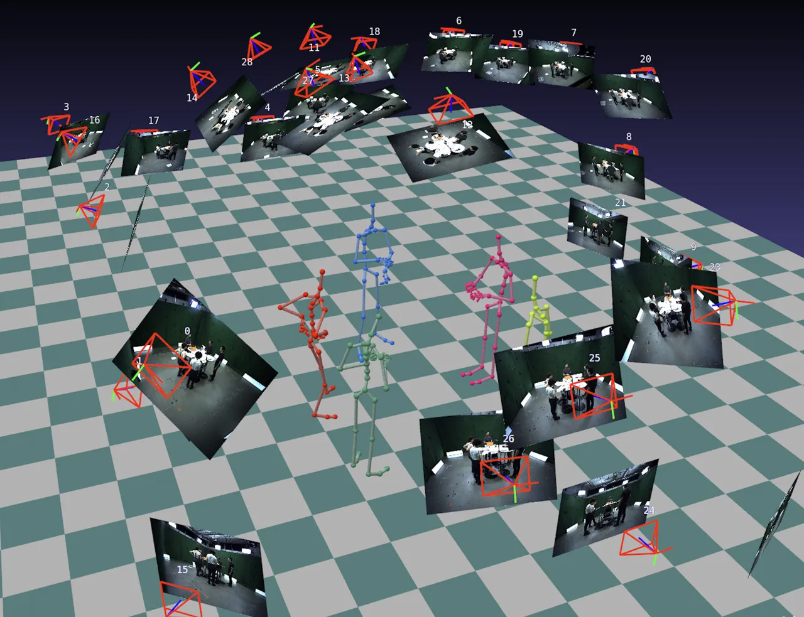

Figure 7: Here, we show an over-arching view of our data-recording
setup, where we have five people interacting with each other, while
their motion tracking is recorded via a state-of-the-art marker-less
motion capture system. Each person also has individual microphones which
feed into our audio setup.

The proposed DnD Group Gesture consists of $`6`$ hours of mocap data
comprising of $`5`$ persons in the scene. In total, we have 2.7M poses
along with synchronized, per-person audio tracks and text transcripts
(see Fig. 7). The proposed dataset addresses a different aspect of human
gestures, i.e. group conversations, which is a sparsely researched
setting. This makes our dataset complementary to the existing monadic
gesture datasets like BEAT. We discuss how BEAT can be used with our
framework along with our dataset in Sec. 13.2.

Finding a capture setting that elicits high density of meaningful,
semantic gestures is indeed a challenging task. These considerations
lead us to capture the participants in a role-playing setting as they
need to describe an imaginary world to each other, thereby leading to a
high density of semantic gestures. The setting also offers a clear
intrinsic reward to the participants (of winning the game). As we show
in the video
and [website](https://vcai.mpi-inf.mpg.de/projects/ConvoFusion/), the
gestures in our dataset are similar to the ones appearing in daily
conversation because participants are simply discussing a game plan or
their next steps in certain situations using language that is
colloquially used in conversations. Interestingly, the most relevant
gestures to the game setting are pointing gestures (participants usually
point to objects on table) which are considered deictic gestures, which
happen frequently in normal conversations. We highlight that the
proposed dataset is recorded in a markerless motion capture setup which
it keeps the group conversation natural without restrictions of a
capture suite or markers, thereby reducing the Observer’s Paradox.
Finally, the subjects are familiar with each other (esp. in the DnD
setting) which further helps in more natural conversations.

Figure 8: Algorithm overview of Word Excitation Guidance. Here we show
the process for the example shown in Fig. 1.

## 9 On Word Excitation Guidance

In the following sections, we provide details of algorithm for
word-excitation guidance and then perform additional in-depth analysis
on its results.

### 9.1 Algorithm Details

1: Set of tokens $`\{\boldsymbol{\tau}_{i}\}_{i=1}^{S}`$

2: Trained Diffusion Model $`f_{\theta}`$

3: Text Prompt $`\boldsymbol{\tau}\in\mathbf{C}`$,

4: Diffusion Timesteps $`T`$

5: Step size $`\alpha`$

6: Denoised Latent $`\mathbf{\hat{z}}^{(0)}`$

7: Initialize $`\mathbf{\hat{z}}^{(T)}\sim\mathcal{N}(0,\mathbf{I})`$

8: for $`t=T~to~0`$ do

9:   $`\_,A=f_{\theta}(\mathbf{\hat{z}}^{(t)},t,\{\boldsymbol{\tau}\})`$
$`\triangleright`$ get attention for text

10:   $`A\leftarrow\operatorname{Softmax}(A_{\text{start}:\text{end}})`$
$`\triangleright`$ remove start/end of text

11:   $`A\leftarrow\operatorname{Gaussian}(A)`$ $`\triangleright`$
smooth out attentions

12:
  $`G_{\mathrm{exc}}=\frac{1}{S}\sum_{i=1}^{S}(1-\operatorname{max}(A_{i}))`$
$`\triangleright`$ calculate loss i

13:
  $`\mathbf{\tilde{z}}^{(t)}\leftarrow\mathbf{\hat{z}}^{(t)}-\alpha\cdot\nabla_{\mathbf{\hat{z}}^{(t)}}G_{\mathrm{exc}}`$
$`\triangleright`$ update latent

14:   Perform Iterative refinement \[12\]

15:
  $`\epsilon_{\theta}^{(t)},\_=f_{\theta}(\mathbf{\tilde{z}}^{(t)},t,\mathbf{C})`$
$`\triangleright`$ estimate noise

16:   Perform Modality Guidance

17:
  $`\mathbf{\hat{z}}^{(t-1)}\leftarrow\operatorname{SchedulerStep}(\mathbf{\tilde{z}}^{(t)},\epsilon_{\theta}^{(t)})`$

18: end for

19: return $`\mathbf{\hat{z}}^{(0)}`$

Algorithm 1 Word-Excitation Guidance

The process of word-excitation guidance involves modifying the usual
denoising loop by updating the latents at each timestep. Before updating
the latents, we normalize the attention maps by removing attention on
the start and end tokens because each training batch contains text
prompts of different lengths. Moreover, we observe that our latent
diffusion framework assigns high attention to the start token in text
(shown in Figure 10), therefore, we mitigate this issue by considering
the attention on the actual text tokens. Then we apply Gaussian
smoothing over the remaining attention map for stable generation results
without any jerks in motion. This ensures flexibility to focus on a
neighbourhood of words instead of one word by avoiding gradient updates
at only the chosen tokens ignoring its neighbourhood. Next, we calculate
the average for the loss over all the focus tokens to equally transfer
gradients for all the focused words. Note that, this is different from
image-based semantic guidance \[12\], where Chefer *et al*. apply
smoothing on attention for only the chosen words/tokens which ignores
the neighbourhood tokens. Moreover, their loss aggregation only enables
gradient transfer for tokens with the lowest attention instead of all
focused tokens by using a $`\operatorname{max}`$ function instead of
$`\operatorname{mean}`$ like us.

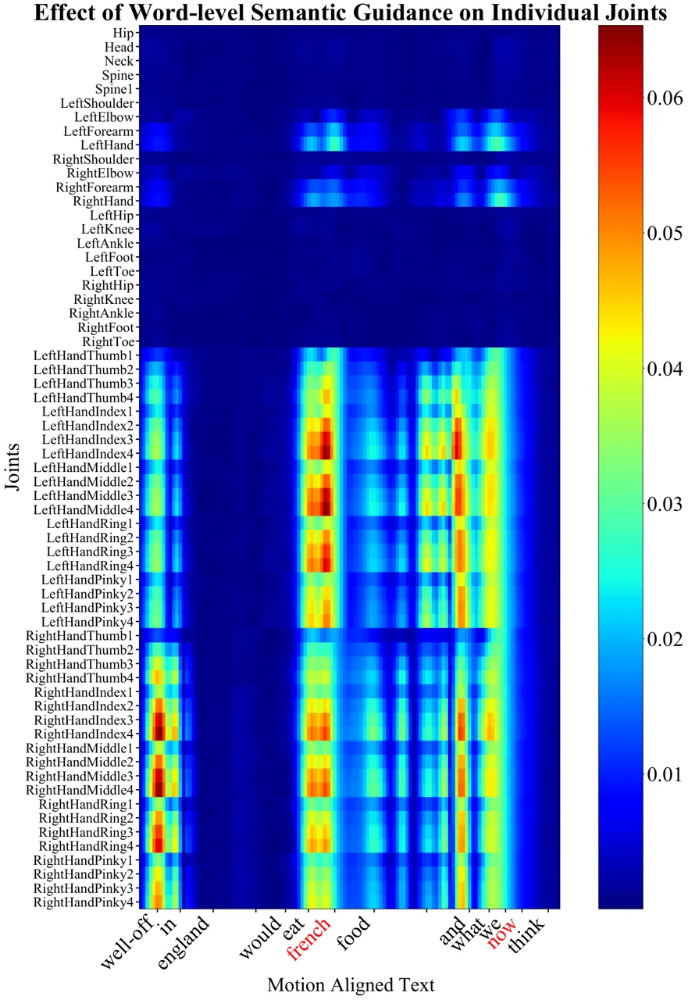

Figure 9: Heatmap showing the distribution of velocity of all joints
compared with motion-aligned text (focused words are highlighted in
red). We see high joint velocity for hand and arm joints around the
words “french” and “now”.

The complete process is presented in Algorithm 1.

### 9.2 Additional Analysis

Joints Affected Per Word. Recall that word-level excitation guidance
steers the gesture generation process through the denoising network to
have pronounced gestures at certain words in the text. It gives a fine
mechanism for semantic control over gesture generation. In Fig. 9, we
present an analysis of how this mechanism affects each joint in the
generation. The figure encodes as heatmap the velocity of each joint in
response to the text tokens; the assumption being that high velocity
implies heavier gesturing. We see that the hand and the arm joints are
affected the most at the focused words. Interestingly, minimal attention
is focused on the lower body; this is expected as most gestures are
predominantly upper-body motions.

Choice Of Words. Specific types of gestures tend to correlate with
certain linguistic structures and parts of speech. Thus, for analysis,
we conduct experiments with attention focused on these elements. To
extract phrases that may map onto a semantic gesture, we select random
three-word phrases in the text. To experiment with individual words, we
can focus on nouns and verbs as they have a higher chance of mapping
onto iconic gestures. Adverbs and adjectives can also be chosen since
they can convey spatiotemporal properties of events and entities. This
choice mechanism, which is motivated by the mapping of gestures to
linguistic structures, is also flexible enough for the users to choose
different linguistic features to focus on. We also consider optimal
stress word discovery as a future endeavour. Lastly, the success of
word-level semantic guidance is also affected by the amount of stress
certain word has in the audio. We show attention results for phrases and
words in Fig. 10 and gesture generation results in supplementary video.

Interpreting Word-Excitation through Attention Maps. Since we perform
word-level guidance on text attention maps, we include example results
in Fig. 10. The attention map $`A`$ is dependent on text conditioning
and diffusion timestep and shows the relation between chunks of latent
representation and text tokens. Therefore, performing word-level
guidance at each diffusion timestep yields slightly different attention
distribution over words. We observe that as we move from $`t=T`$ to
$`0`$, focused word tokens (highlighted in red) start to get high
attention, especially after $`t=T/2`$. We also see the effect of
Gaussian smoothing as the attention on focus words is not sharply
focused on only those words. Rather it is spread over its neighbouring
tokens as well. Lastly, notice the striped pattern of the attention
weights. This arrangement is a manifestation of the separated body and
hand latents that have been stacked alternatively. It shows that the
network learns to perform attention in a separate manner for both types
of latents and guidance affects them differently across different layers
as well.

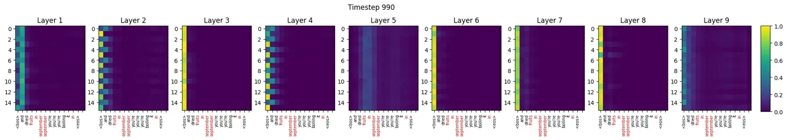

(a) Text: “and dried fruits in september you’re boiling it in”

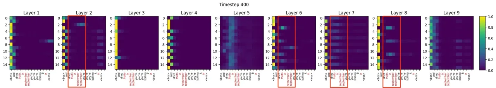

(b) Text: “and dried fruits in september you’re boiling it in”

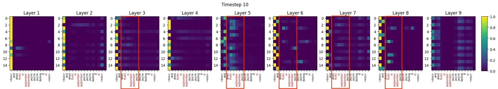

(c) Text: “and dried fruits in september you’re boiling it in”

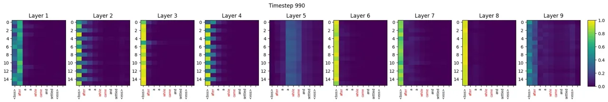

(d) Text: “after a while came and settled”

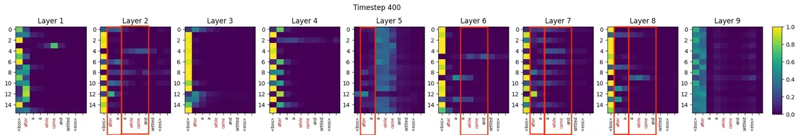

(e) Text: “after a while came and settled”

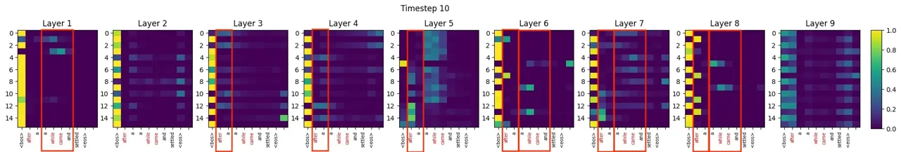

(f) Text: “after a while came and settled”

Figure 10: Text attention example with focus on a phrase: (a) $`t=990`$
(b) $`t=400`$ (c) $`t=10`$ and example with multiple individual words:
(d) $`t=990`$ (e) $`t=400`$ (f) $`t=10`$. Vertical axes show
$`M\times 2`$ latent chunks where even and odd indices stand for body
and hand joints respectively. Horizontal axes show word tokens where
focused words are highlighted in red. Attention changes are highlighted
in red boxes where neighboring tokens are also included to show the
effect of Gaussian smoothing. Lastly, “\<bos\>” & “\<eos\>” tokens
represent start and end of the text (refer Sec. 3.3)

Limitations. Our method is, after all, a data-driven method. It depends
on the learned conditional gesture distribution of text and other
modalities, which can lead to it generating the most common gesture type
(beat gestures) seen for some words. Consequently, performing word-level
guidance does not always guarantee the specific motion of accurate
semantic sub-gesture type (iconic, deictic, metaphoric etc.) at the
focused word or phrase. However, as we analyzed, the usage of
word-excitation guidance (WEG) mostly results in a semantically
meaningful gesture as compared to the base prediction without WEG. For
future works, a more explicit representation of gesture types and their
mapping to words can be provided as a conditioning, which might help in
predicting semantically accurate gestures. Secondly, the amount of focus
each word/phrase attains in terms of gesture movements is dependent on
the fact that speech also contains certain prosodic stress for that
word. Similarly, if the gestures around focused words are already
stressed adequately in motion or those words already have high attention
on them, then the change introduced by guidance will only be subtle.
Lastly, the choice of words affects the type of stress in gesture
movements predicted and this can be highly subjective.

## 10 User Study

For evaluation of monadic synthesis, the user were shown a randomly
sampled set of $`10`$ forced-choice questions. Each question included a
side-by-side animation of our method along with one of MLD \[13\],
CaMN \[47\], or the ground-truth. The participants had to answer two
question, (a) “Which of the two gesture motions appears more natural?
and (b) “Which of the two gesture motions corresponds better with the
spoken utterance?”. These questions try to gauge plausibility of the
motions and alignment of the generated gestures with the utterance. For
the task of dyadic synthesis, we showed $`5`$ randomly sampled forced
choice questions to each participant, comparing our method with the
adapted MLD and the ground-truth. The participants had to judge the
naturalness of the motions similar to previous task and also answer the
question: “In which of the two interactions, the motion of interacting
character fits well with both speech of the the main agent as well as
their own speech, if any.” We report percentage preference for both
tasks. In the third section, we asked the users to evaluate the
word-excitation guidance proposed in Sec. 3.3. Each question included
three motions—corresponding to the ground-truth motion, non-guided
motion, and word-excitation guided motion — as well as the words that
need to be excited during synthesis. We compare ground-truth, non-guided
gesture, and word-excitation guided gesture. The users were asked to
rate each motion on a Likert scale of $`1`$-$`5`$, with $`5`$ indicating
the most semantically aligned gesture.

## 11 Implementation Details

Motion Representation. The motion $`\mathbf{x}`$ corresponds to the
root-relative 3D coordinates for all $`J-1`$ joints and camera-relative
translation of the root joint. The hand joints are also made relative to
their corresponding wrist joint. We also pre-process the joint positions
following \[24\] by normalizing the motion sequence to start the root
trajectory from the origin while facing the positive z-axis.

#### VAE.

We implement decoupled scale-aware VAE using two transformer encoders in
order to make two halves of the latent representation focus separately
on body and hands. Each encoder is based on transformer architecture
with long skip-connections utilized by Chen _et al_. \[13\] as they
prove this method to be effective in retaining high information density
in latent representation. The output of each encoder is combined into
two quantities to represent Gaussian distribution parameters
$`\boldsymbol{\mu}_{\phi}`$ and $`\mathbf{\Sigma}_{\phi}`$ of the
combined scale-aware latent space $`\mathcal{Z}`$, where $`\phi`$
represent learnable weights of encoders. We can sample
$`\mathbf{z}^{2\times d}`$ using reparameterization trick \[33\].

We train the VAE until convergence with a combination of losses to
achieve the desired reconstruction quality. MSE-based reconstuction loss
is applied on the reconstructed motion $`\mathbf{\hat{x}}`$:

```math
\mathcal{L}_{2}=\left\lVert\hat{\mathbf{x}}-\mathbf{x}\right\rVert_{2} \tag{8}
```

Moreover, Kullback-Liebler divergence $`\mathcal{L}_{KL}`$ is used for
regularizing the latent space:

```math
\mathcal{L}_{KL}=D_{KL}(\mathcal{N}(\mathbf{z};\boldsymbol{\mu}_{\phi},\mathbf{\Sigma}_{\phi})||\mathcal{N}(\mathbf{z};0,\mathbf{I})) \tag{9}
```

We also apply Bone Length Consistency Loss \[14\], which ensures that
bone lengths do not vary across frames in a gesture sequence by
minimizing the variance of bone lengths $`l_{n}`$.

```math
\mathcal{L}_{bone}=\frac{\sum_{n=1}^{N}(l_{n}-\bar{l})^{2}}{n-1}, \tag{10}
```

Lastly, the VAE loss also contains a Laplacian regularization term
$`\mathcal{L}_{lap}`$ as described earlier, to better reconstruct subtle
jerks in gestures and reduce jitter.

```math
\mathcal{L}_{VAE}=\mathcal{L}_{2}+\lambda_{KL}\mathcal{L}_{KL}+\lambda_{lap}\mathcal{L}_{lap}+\lambda_{bone}\mathcal{L}_{bone} \tag{11}
```

In order to achieve time-aware latent representation, we encode
time-aligned $`M`$ chunks of motion
$`\{\mathbf{{x}}_{i}^{\prime}\}_{i=1}^{M}`$ using encoders by passing
each $`\mathbf{{x}}_{i}^{\prime}`$ from $`\xi_{b}`$ and $`\xi_{h}`$ to
get $`\mathbf{\hat{z}}_{i}`$. This sequence
$`\mathbf{\hat{z}}=\{\mathbf{\hat{z}}_{i}\}_{i=1}^{M}`$ is applied with
a positional encoding \[71\] along $`M`$ to represent time-alignment.
Along with positional encoding as queries, $`\mathbf{\hat{z}}`$ passed
onto decoder $`\mathcal{D}`$ as a memory to obtain $`\mathbf{\hat{x}}`$.
This unique structure of $`\mathbf{\hat{z}}`$ allows us to perform
arbitrary length generation with latent diffusion models, which
generally are constrained to due to fixed-length generation.

|                        |                     |
| ---------------------- | ------------------- |
| Hyperparameter         | Value               |
| Latent dimension $`d`$ | 128                 |
| Motion Length $`N`$    | 128                 |
| Number of Joints $`J`$ | 63                  |
| Motion chunks $`M`$    | 8                   |
| $`\lambda_{KL}`$       | 0.05                |
| $`\lambda_{lap}`$      | 1                   |
| $`\lambda_{bone}`$     | 1                   |
| Transformer Layers     | 5                   |
| Attention Heads        | 2                   |
| Learning Rate          | $`1\times 10^{-4}`$ |
| Optimizer              | AdamW \[50\]        |
| FPS                    | 25                  |

Table 6: List of values used for training VAE for our method

#### Perpetual Generation Rollout.

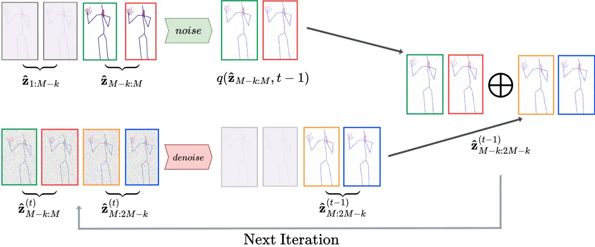

Figure 11: Iterative process for the perpetual rollout of
arbitrary-length generation. This is based on the diffusion inpainting
technique.

During inference of our diffusion framework, we leverage the time-aware
latent sequence $`\{\mathbf{\hat{z}}_{i}\}_{i=1}^{M}`$ to
autoregressively generate latent sequences for arbitrarily long
sequences. As compared to earlier approaches \[47, 78\], we do not
concatenate our model’s output which may cause irregular motion at the
point of joining. We also do not encode variable length sequences in our
VAE framework as done by MLD \[13\]. Instead, we propose an
autoregressive generation approach to predict the time-aware latent
sequence beyond $`M`$ number of chunks. The key to this approach is an
iterative process (shown by Fig. 11) where a sequence of future latent
chunks is predicted based on the last $`k`$ current latent chunks
through a denoising process. Given the sequence
$`\mathbf{\hat{z}}\in\mathbb{R}^{M\times 2\times d}`$ represents motion
$`\mathbf{x}`$ of first $`N`$ frames, we call it
$`\mathbf{\hat{z}}_{1:M}`$ which is known to us. We utilize the last
$`k`$ latent chunks from this known sub-sequence, i.e.
$`\mathbf{\hat{z}}_{(M-k):M}`$, and generate the next $`M-k`$ latent
chunks through the denoising process to obtain a new overlapping
sequence $`\mathbf{\hat{z}}_{(M-k):(2M-k)}`$. Every time we need to
generate the next $`(M-k):(2M-k)`$ sequence, we first inject noise to
the previously known $`(M-k):M`$ sub-sequence until the $`t-1`$
diffusion timestep. Then, this sub-sequence is concatenated with the
latent sub-sequence at $`M:(2M-k)`$ which contains new latents for the
non-overlapping part in $`(M-k):(2M-k)`$ sequence. This concatenated
sequence $`\mathbf{\hat{z}}^{(t-1)}_{(M-k):(2M-k)}`$ is then passed to
the next denoising iteration where the process repeats by noising the
known part for the next diffusion timestep. This technique follows the
masked denoising technique used for diffusion image inpainting \[51\].

```math
\mathbf{\hat{z}}^{(t-1)}_{M-k:2M-k}=\oplus(q(\mathbf{\hat{z}}_{M-k:M},t-1),\mathbf{\hat{z}}^{(t-1)}_{M:2M-k}) \tag{12}
```

Here, the $`\oplus`$ operator concatenates along latent chunks to total
length of $`M`$ for each sequence. When applied iteratively to the
subsequent new frames, this process enables an autoregressive rollout of
fixed-length gesture sequences into infinite-length synthesis. We set
the value of the hyperparameter $`k`$ as $`k=M/2`$ for simplicity.

#### Details on Denoising Network.

We design denoising network for the latent diffusion framework to
predict $`\epsilon_{\theta}(\mathbf{\hat{z}}^{(t)},t)`$. We implement
the denoising schedule based on DDPM framework with hyperparameters
presented in Tab. 7. This framework consists of a Markovian chain of
successively adding Gaussian noise $`\epsilon`$ to
$`\mathbf{\hat{z}}^{(0)}`$ for $`T`$ timesteps i.e. forward diffusion
process. Through this process, $`\mathbf{\hat{z}}^{(0)}`$, which was
sampled from data distribution, becomes $`\mathbf{\hat{z}}^{(T)}`$,
which follows noise distribution $`\mathcal{N}(0,\mathbf{I})`$ assuming
$`T`$ is sufficiently large.

```math
q\big(\mathbf{\hat{z}}^{(1:T)}|\mathbf{\hat{z}}^{(0)}\big)=\prod_{t=1}^{t=T}q\big(\mathbf{\hat{z}}^{(t)}|\mathbf{\hat{z}}^{(t-1)}\big) \tag{13}
```

where
$`q(\mathbf{\hat{z}}^{(t)}|\mathbf{\hat{z}}^{(t-1)})=\mathcal{N}(\mathbf{\hat{z}}^{(t)}|\sqrt{1-\beta_{t}}\mathbf{\hat{z}}^{(t-1)},\beta_{t}\mathbf{I})`$,
describes evolution of latent distribution during the noising process at
time step $`t`$. Here, $`\beta_{t}`$ represents the rate of diffusion.
The reverse diffusion process consists of denoising
$`\mathbf{\hat{z}}^{(T)}\sim\mathcal{N}(0,\mathbf{I})`$ for $`T`$
timesteps to generate a latent sequence $`\mathbf{\hat{z}}^{(0)}`$:

```math
p_{\theta}\big(\mathbf{\hat{z}}^{(0:T)}\big)=p\big(\mathbf{\hat{z}}^{(T)}\big)\prod_{t=1}^{T}p_{\theta}\big(\mathbf{\hat{z}}^{(t-1)}|\mathbf{\hat{z}}^{(t)}\big), \tag{14}
```

where $`p_{\theta}(\mathbf{\hat{z}}^{(t-1)}|\mathbf{\hat{z}}^{(t)})`$ is
approximated using a denoiser neural
network $`f_{\theta}(\mathbf{\hat{z}}^{(t-1)}|\mathbf{\hat{z}}^{(t)},t,\mathbf{C})`$,
which is trained to predict noise We use transformer decoder network as
$`f_{\theta}`$ which takes $`\mathbf{\hat{z}}^{(t-1)}`$ as queries along
with diffusion timestep $`t`$ and conditioning set $`\mathbf{C}`$ as
memory input. We apply positional encoding to queries and individual
memory inputs similar to \[71\]. To better distinguish between body and
hand latents in $`\mathbf{\hat{z}}^{(t-1)}`$, we add a learned embedding
that aims to differentiate between body and hand parts of the latent
representation. We also add a learned embedding to each element of our
conditioning set $`\mathbf{C}`$ separately which helps the network
differentiate between different conditioning types. Each transformer
layer starts with Self-Attention and LayerNorm layers, along with a
time-layer based on Stylization Block \[80\] to incorporate diffusion
timestep embedding. Multi-modal cross attention consists of the same
number of heads as the number of elements in the conditioning set
$`\mathbf{C}`$. The outputs of all heads are aggregated using a linear
projection, which is followed by another linear layer with GeLU
activation \[28\].

| Hyperparameter         | Value                                     |
| ---------------------- | ----------------------------------------- |
| $`d`$                  | 128                                       |
| Range of $`\beta_{t}`$ | $`[8.5\times 10^{-4},1.2\times 10^{-2}]`$ |
| $`T`$                  | 1000                                      |
| $`\beta_{t}`$ Schedule | Scaled Linear \[61\]                      |
| Self-Attention Heads   | 4                                         |
| Decoder Layers         | 9                                         |
| Learning Rate          | $`7\times 10^{-5}`$                       |
| Optimizer              | AdamW                                     |

Table 7: List of hyperparameters for denoising network in our method

Guidance Parameters. We modify classifier-free guidance to add
modality-level control for each element in our conditioning set. The
random modality dropout rate is set to 10% and global guidance scale
$`\lambda_{m}`$ is set to 7.5. The values of $`w_{c}`$ is determined by
the task at hand. For example, if we want to extract only the gesture
styles of different speakers regardless of input text and audio, we set
all $`w_{c}`$ to 0 except $`w_{\mathbf{s}}=1`$, which corresponds to
speaker identity. This will generate unconditional gestures in the style
of a specific speaker (see supplemental video for the example). For
word-excitation guidance, step size $`\alpha`$, goes from 100 to 70.71
as it varies w.r.t. diffusion timestep. The kernel size for Gaussian
smoothing is 3.

Semantic Consistency Evaluation Model: Our method can generate
semantically meaningful gestures (as shown in Suppl. Video), thanks to
the proposed Word Excitation Guidance (WEG). We conduct this ablation
the following way. First, we trained a binary classifier that classifies
$`1`$s motions of the BEAT dataset into either beat gesture, or semantic
gesture type (based on the GT labels). Here semantic class consists of
iconic, metaphoric, and deictic classes. This classifier is then used as
an oracle to compute the recall of our generated motions for semantic
class predictions. Specifically, we extract the speech and text for the
sentence in which a semantic gesture has been labeled in dataset. These
are then input to ConvoFusion to generate the corresponding gestures,
with and without WEG. For the case of WEG, we focus on the exact words
wherein the semantic gesture occurs in the sentence.

## 12 Evaluation Metrics

We report quantitative results on Beat Alignment Score \[44\], FID,
Diversity, L1 Divergence and Semantic Relevance Gesture Recall
(SRGR) \[47\] and here we briefly describe each one of them. Beat
Alignment Score was initially introduced \[44\] to measure the alignment
of music beats to dance motion for the task of music-to-dance synthesis.
This has also been adapted for the task of gesture synthesis, where it
measures the correlation between gesture beats and audio beats. It is
useful in differentiating between static motions which do not align well
with the audio from natural-looking gestures which have speech-aligned
kinematic beats. However, it can report false high values if the motion
has a large amount of jitter because it would assume beats created by
jitter align well with most of the audio beats. We can see this
happening for methods that show high jitter \[78, 84\] in our
experiments. They have high Beat Alignment score while their FID is also
large.

We employ the Frechet Inception Distance (FID) metric provided by Yoon
_et al_. \[78\], also known as FGD. We trained our FID network using
implementation by Liu *et al*. \[47\]. It is based on an autoencoder
network that is trained for reconstruction task, and is calculated by
comparing features of the ground truth data $`\mathbf{x}`$ and generated
data $`\mathbf{\hat{x}}`$ through:

```math
\operatorname{FGD}(\mathbf{x},\mathbf{\hat{x}})=\left\lVert\mu_{r}-\mu_{g}\right\rVert^{2}+\operatorname{Tr}(\Sigma_{r}+\Sigma_{g}-2\sqrt{\Sigma_{r}\Sigma_{g}}) \tag{15}
```

Methods that generate diverse gestures like ours and do not contain
pre-pose information unlike CaMN \[47\] and MultiContext \[78\], may
suffer on this metric because our gestures will not try to match ground
truth motion. Diversity computes the average pairwise Euclidean distance
of the gesture generations in the test set. L1 Divergence (also called
L1 variance) measures the distance of all frames $`N`$ in a gesture
sequence from their mean $`\mu_{N}`$. Here $`B`$ is size of test set.

```math
\operatorname{L1div}(\mathbf{x})=\frac{1}{B}\sum_{i=1}^{N}|\mathbf{x}_{i}-\mu_{N}| \tag{16}
```

This metric specifically identifies if the gestures are static in
movement and make less diverse movements along the generation length. As
shown in supplemental video, CaMN \[47\] and MLD \[13\] suffer from this
problem whereas, our method predicts different gestures according to the
text and audio conditionings and does not have static motion.

Semantic Relevance Gesture Recall (SRGR) uses semantic score labelled in
BEAT \[47\] as a weight for the Probability of Correct Keypoint (PCK)
between the generated gestures and ground truth gestures. It aims to
reward being close to ground truth motion at points where a semantically
relevant gesture exists while also predicting diverse gestures, as
mentioned by Liu _et al_. \[47\]. This metric has a similar issue as FID
as it compares PCK between ground truth and prediction and due to
many-to-many correspondence between gestures and speech, this might not
be suitable. Therefore, we conclude that each metric focuses on certain
aspects of gesture generation and human-annotated user study results are
more conclusive to determine better generation quality and to perform a
holistic analysis of gesture quality

## 13 Baseline Training Details

In the following, we provide details on how we process all the different
modalities for our dataset (Sec. 13.1) and provide details for training
each method we use for comparison (Sec. 13.2).

### 13.1 Dataset

BEAT. We utilize the BEAT dataset \[47\] in order to augment the
training data for our method so that it better generalizes to the task
of monadic gesture synthesis. It consists of 60 hours of English
speaking training data, spanning 30 subjects that perform gesture
motions. The dataset is rich in good training examples for monologue
setting which can serve as a good baseline dataset to train our method.
Inherently, BEAT’s motion representation is different than what we use
to train our method. Therefore, we re-target their skeleton definition
to our skeleton definition in order to match it with our DnD Group
Gesture dataset. Moreover, we convert their representation from
BVH-based euler angle representation to joint positions using forward
kinematics. Then we resample their dataset from 120 FPS to 25 FPS in
order to match it with our training configuration. Lastly, we apply the
preprocessing steps mentioned in Sec. 11 to get the final motions which
we separate into 5.12-sec chunks i.e. 128 frames for training our
method.

DnD Group Gesture . To apply our method to the task of dyadic synthesis,
we utilize our recorded DnD Group Gesture dataset (see Fig. 7) to
extract interactions between people in our dataset. We record the
dataset in BVH format as well, however, we extract joint positions for
training our method. We standardize dataset FPS to 25. Each of the five
people in our dataset has their own separate audio channel which we have
post-processed to get clean and denoised audio. We align audio channels
with the recorded tracking and verify it manually as well. Finally, we
separate out motions for each person and assign them identities which
are kept consistent across multiple recording sessions. Then, we
preprocess the dataset and separate it out in chunks of 128 frames.

Training/Test Splits. We split the BEAT dataset by reserving 5 out of 30
English speakers for the testing set, while the remaining go into
training and validation splits. Therefore, all the results and
comparisons on monadic synthesis using BEAT dataset are provided on
unseen speakers which shows a method’s generalizability to unseen audio
and text inputs. For dyadic synthesis, we randomly sample and take out
10 percent for testing and rest for training and validation.

Representation of Modalities. We process audio by sampling it to 16000
Hz and extracting melspectrograms using librosa toolbox \[53\]. We use
80 mel-bands and a hop length of 512 for melspectrogram conversion. We
process text through text tokenizer and convert them to embeddings
through T5 text encoder \[59\] implementation by Hugging Face \[73\].

Lastly, all methods are trained on these dataset splits to ensure
fairness. There are some differences between the type of representation
used for audio and text in each method, which we elaborate on in the
next section.

### 13.2 Methods for Comparison

ConvoFusion (Ours). We train our method on 128-frame sequences by
learning a latent space representation of them Then we use our diffusion
framework on top of it. Interestingly, we can incorporate both monadic
and dyadic gesture synthesis tasks into single training. Thanks to
Modality Guidance, we can use different modalities interchangeably by
dropping them out of the training batch and setting an unconditional
token in their place. For example, BEAT dataset only contains
single-person gesture annotations and does not contain a co-participant,
hence making it non-trainable for the task of dyadic synthesis. However,
we can simply provide an unconditional token for the co-participant’s
text which automatically turns the contribution of the corresponding
modality guidance term to zero, and BEAT dataset can be trained jointly
with DnD Group Gesture dataset. A similar approach can be taken for
semantic annotation labels provided by BEAT dataset, which we do not
provide for ours.

CaMN \[47\] & Multi-Context \[78\]. We train both of these methods using
the official implementation of CaMN by Liu *et al*. on GitHub. The only
modification that took place was the addition of our dataset pipeline
which includes our version of BEAT dataset and DnD Group Gesture
dataset, which makes the motion dimensions from 141 to 189 to match to
our setting. We use the provided $`\operatorname{WavEncoder}`$ in the
implementation to process audio signals instead of melspectrograms.
Lastly, we use motion-aligned text instead of normal text inputs to be
consistent with them. We also use the provided text-encoder to add our
textual vocabulary to the text tokenizer for text preprocessing.

MLD \[13\]. This method by Chen *et al*. which uses latent diffusion
models, was presented for the task of text-to-motion synthesis. We
extend this method for the gesture synthesis task by utilizing our
training procedure. To be consistent with their method, we use the text
encoder which was used by MLD.

DiffGesture \[84\]. We use their official implementation on GitHub to
train this method for the task of monadic gesture synthesis. Since
DiffuGesture \[81\] does not provide an implementation for dyadic
synthesis task and it is highly based on DiffGesture, we follow
DiffuGesture’s implementation details as close as possible and adapt
DiffGesture to the dyadic synthesis task. As this method was originally
trained on TED Dataset \[77\], which contains only the upper body, we
double the capacity of their transformer network to cater to the
increase in dimensionality in our setting to ensure fairness. The audio
and text processing is kept consistent with DiffGesture’s
implementation. Lastly, for the task of dyadic synthesis, we provide
co-participant’s text as an additional conditioning input to match it
with our training pipeline.
