# MoDiTalker: Motion-Disentangled Diffusion Model for High-Fidelity Talking Head Generation

Seyeon Kim ^(†)^(†)thanks: Equal contribution Affiliation: Korea
University, Seoul, Korea    Siyoon Jin ^(†)^(†)footnotemark:
Affiliation: Korea University, Seoul, Korea    Jihye Park
^(†)^(†)footnotemark: Affiliation: Korea University, Seoul, Korea   
Kihong Kim Affiliation: VIVE STUDIOS, Seoul, Korea  
[https://ku-cvlab.github.io/MoDiTalker](https://ku-cvlab.github.io/MoDiTalker)
   Jiyoung Kim Affiliation: Korea University, Seoul, Korea    Jisu Nam
Affiliation: Korea University, Seoul, Korea    Seungryong Kim
Affiliation: Korea University, Seoul, Korea

###### Abstract

Conventional GAN-based models for talking head generation often suffer
from limited quality and unstable training. Recent approaches based on
diffusion models aimed to address these limitations and improve
fidelity. However, they still face challenges, including extensive
sampling times and difficulties in maintaining temporal consistency due
to the high stochasticity of diffusion models. To overcome these
challenges, we propose a novel motion-disentangled diffusion model for
high-quality talking head generation, dubbed MoDiTalker. We introduce
the two modules: audio-to-motion (AToM), designed to generate a
synchronized lip motion from audio, and motion-to-video (MToV), designed
to produce high-quality head video following the generated motion. AToM
excels in capturing subtle lip movements by leveraging an audio
attention mechanism. In addition, MToV enhances temporal consistency by
leveraging an efficient tri-plane representation. Our experiments
conducted on standard benchmarks demonstrate that our model achieves
superior performance compared to existing models. We also provide
comprehensive ablation studies and user study results.

![[Uncaptioned
image]](arxiv-2403-19144--447b95deeb4b.figures/figure-1.webp)

Figure 1: We present the Motion-Disentangled diffusion model for
high-fidelity Talking head generation, dubbed MoDiTalker. This framework
generates high-quality talking head videos through a novel two-stage,
motion-disentangled diffusion models.

## 1 Introduction

Audio-driven talking head generation \[43, 62, 59, 47, 23\] aims to
generate high-fidelity talking head videos with lip movements
synchronized to given audio input. This task has been extensively
studied for many practical applications \[33, 49, 16\], including film
production \[33\], video conferencing \[49\] and digital avatars \[16\].
A significant challenge in this field is mapping the low-dimensional
audio inputs into higher-dimensional lip movements.

To address this, conventional generative adversarial networks
(GANs)-based methods \[26, 33, 63, 59, 54, 47, 48\] transform the audio
embeddings into intermediate facial representations, such as dense
motion fields \[54, 59\] or 2D/3D facial landmarks \[63, 47, 48\].
Notably, recent works \[47, 48, 59\] have shown remarkable results by
utilizing 3D facial models \[4\] to extract facial landmarks, which are
known to effectively capture realistic facial motion. Despite their
promising results, however, conventional GAN-based approaches still
inherit limitations of GAN, such as training instability \[7, 31\] or
mode collapse \[45, 2\].

On the other hand, denoising diffusion models \[19, 39\] have recently
shown superior performance in image generation tasks, offering more
stable training and enhanced fidelity compared to GANs. Inspired by
these advancements, some recent studies \[38, 42, 30\] propose
diffusion-based frameworks for talking head generation. However, these
methods often fail to generate realistic facial movements from audio
inputs, because they globally incorporate audio embeddings into the
diffusion U-Net, which is insufficient to capture local lip movements.
Moreover, prior works often rely on a frame-by-frame video generation
manner, lagging behind in temporal consistency and inference time
complexity compared to GAN-based models \[33, 49\].

In this paper, we introduce a novel diffusion-based framework for
talking head generation, MoDiTalker, which explicitly disentangles the
generation process into two distinct stages. First, we present
Audio-To-Motion (AToM), a transformer-based diffusion model that
generates facial motion sequences conditioned on audio input.
Specifically, AToM is designed to predict motion differences from a
reference facial landmark for each frame in the sequence. To enhance lip
synchronization, we leverage attention mechanisms to distinguish between
lip-related and lip-unrelated regions. Second, we propose
Motion-To-Video (MToV), a motion-conditional video diffusion model that
generates temporally consistent talking head videos following facial
motion sequences from AToM. Specifically, we leverage tri-plane
representations to efficiently condition the video diffusion model.
Combining these, MoDiTalker enables high-fidelity talking head
generation with enhanced temporal consistency and substantially reduced
inference time complexity compared to existing works.

In experiments, our framework achieves state-of-the-art performance on
HDTF dataset \[60\] surpassing previous GAN-based \[33, 62, 47, 63\] and
diffusion-based \[42, 30, 41\] approaches by a large margin. Extensive
ablation studies validate our design choices and the effectiveness of
our approach.

## 2 Related Work

#### GAN-based talking head generation.

Early methods \[33, 28, 62\] in audio-driven talking head generation
typically relied on GANs \[15\]. For instance, Wav2Lip \[33\] leverages
a pre-trained SyncNet \[13\] as a lip sync expert to enhance lip
synchronization quality. However, since Wav2Lip \[33\] inpaints the
generated mouth region, it leads to blurry artifacts and blending
issues. Moreover, facial expressions and head poses are overlooked. One
of the main challenges in generating talking faces lies in manipulating
visual dynamics, which are difficult to directly extract from the given
audio inputs. To address this, several methods attempt to exploit
2D \[27, 43, 40, 56, 29, 10, 63\] or 3D \[60, 34, 59\] intermediate
representations. For example, recent models \[60, 34, 59\] utilize 3D
Morphable Model \[6\] parameters, including expression, pose, and
identity. While these methods can produce smoother and natural
movements, they also unavoidably inherit the drawbacks of GANs, such as
mode collapse \[45, 2\] or unstable training \[7, 31\].

#### Diffusion-based talking head generation.

To overcome the inherent challenges of GANs \[45, 2, 7, 31\], recent
studies \[42, 38\] have proposed diffusion-based frameworks for talking
head generation. However, these studies \[42, 38\] often struggle to
generate natural facial motion since they globally condition audio
embeddings through cross-attention modules or time embedding layers of
the denoising U-Net. Furthermore, they rely on frame-by-frame video
generation, resulting in significantly slow sampling times and temporal
inconsistencies. DreamTalk \[30\] generates motions frames with
diffusion model but synthesizes the frames with previous GAN-based
model \[34\]. In this paper, we introduce a diffusion model for talking
head generation, which leverages intermediate facial representation with
minimal computational demand.

#### Video diffusion model.

Several studies \[5, 51, 24\] propose to fine-tune the pre-trained
text-to-image diffusion model to the video generation task. Although
they exhibit promising results with minimal computational complexity,
they often encounter challenges of temporal consistency at high frame
rates. To alleviate this, recent methodologies \[18, 55, 22, 50\] train
the diffusion model from scratch using video datasets. While these video
diffusion models exhibit better temporal consistency and video quality,
they struggle with memory inefficiency and controllability of video
generation. To overcome these challenges, several methods focus on a
low-dimensional latent space \[55\], and an autoencoder module \[22\] to
minimize computational complexity, while utilizing flow maps as a motion
condition \[50\] for conditional video generation. In this paper, we
propose an efficient conditional video diffusion model, tailored for
talking head generation.

## 3 Preliminary- Denoising Diffusion Model

Diffusion models \[19, 39\] approximate the data distribution by
reconstructing the data sample from pure Gaussian noise through a
gradual denoising process. Latent diffusion models \[35\] perform this
in latent space, not in RGB image space. Specifically, the RGB image
$`x_{0}`$ is projected to the latent space $`z_{0}`$ using a pre-trained
encoder, and $`z_{0}`$ is decoded back to $`x_{0}`$ using a pre-trained
decoder. In the forward diffusion process, $`z_{0}`$ is gradually
noisified into $`z_{t}`$ at time step $`t\in\{1,\ldots,T\}`$. The
forward diffusion process is formulated with pre-defined variance
$`\beta_{t}`$ such that:

```math
z_{t}=\sqrt{\alpha_{t}}z_{0}+\sqrt{1-\alpha_{t}}\epsilon,\quad\epsilon\sim\mathcal{N}(0,I), \tag{1}
```

where $`\alpha_{t}=\prod_{i=1}^{t}(1-\beta_{i})`$.

The neural network $`\mathcal{F}_{\theta}(z_{t},t)`$ is trained to
reconstruct $`z_{0}`$ at any time step $`t`$. The objective function is
defined by the Mean Squared Error (MSE) as follows:

```math
\mathbb{E}_{z,t,\epsilon\sim\mathcal{N}(0,1)}\left[\|z_{0}-\mathcal{F}_{\theta}(z_{t},t)\|^{2}_{2}\right]. \tag{2}
```

After training, we can sample new data from the learned data
distribution through an iterative denoising procedure, called the
reverse diffusion process. In the reverse diffusion process, the neural
network $`\mathcal{F}_{\theta}(z_{t},t)`$ predicts the denoised latent
$`\hat{z}_{0,t}`$ and converts it to $`\hat{z}_{t-1}`$ by the
reparameterization trick \[25\]. This can be formulated as follows:

```math
\hat{z}_{t-1}=\sqrt{\alpha_{t-1}}\mathcal{F}_{\theta}(z_{t},t)+\frac{\sqrt{1-\alpha_{t-1}-\sigma_{t}^{2}}}{\sqrt{1-\alpha_{t}}}(z_{t}-\sqrt{\alpha_{t}}\mathcal{F}_{\theta}(z_{t},t))+\sigma_{t}\epsilon, \tag{3}
```

where $`\sigma_{t}`$ at time step $`t`$ is the covariance of the
Gaussian distribution.

By iteratively sampling $`\mathcal{F}_{\theta}(z_{t},t)`$ starting from
Gaussian noise $`z_{T}`$ during time step $`t\in\{T,\ldots,1\}`$, we
obtain the new data sample $`\hat{z}_{0}`$ from the desired
distribution. $`\hat{z}_{0}`$ is then decoded to an RGB image
$`\hat{x}_{0}`$ by the pre-trained decoder.

## 4 Method

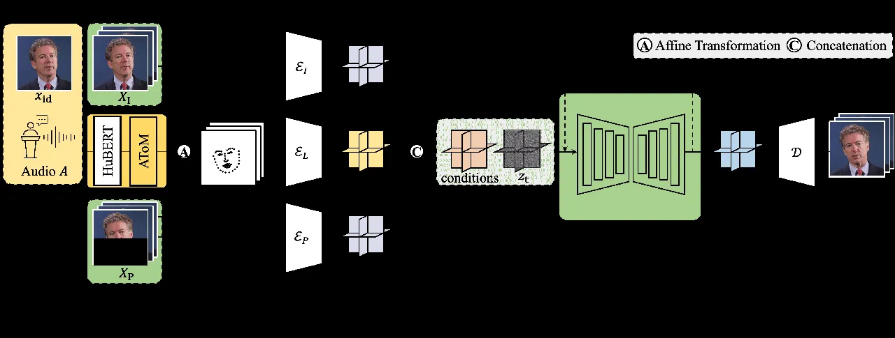

Figure 2: Overall network architecture of MoDiTalker. Our framework
consists of two distinct diffusion models: Audio-to-Motion (AToM) and
Motion-to-Video (MToV). AToM aims to generate lip-synchronized facial
landmarks, given an identity frame $`x_{\mathrm{id}}`$ and audio input
$`A`$, as conditions. MToV generates high-fidelity talking head videos
$`\hat{X}_{0}`$ using synthesized facial landmarks $`L`$ from AToM,
identity frames $`X_{\mathrm{I}}`$, and pose frames $`X_{\mathrm{P}}`$
as conditions.

### 4.1 Overview

Our objective is to generate a talking head video
$`X=\{x^{1},\ldots,x^{n}\}`$ with lip movements synchronized with given
audio $`A=\{a^{1},\ldots,a^{n}\}`$ and the desired identity from an
identity frame $`x_{\mathrm{id}}`$, where $`n`$ is the number of frames.
To achieve this, MoDiTalker comprises two distinct diffusion models:
Audio-to-Motion (AToM) and Motion-to-Video (MToV). AToM generates facial
motion sequences, specifically facial landmarks
$`L=\{l^{1},\ldots,l^{n}\}`$ from input audio $`A`$, reflecting the
speaker-specific facial structure from $`x_{\mathrm{id}}`$.
Subsequently, MToV produces a realistic talking head video $`X`$,
aligned facial motion sequences $`L`$ generated by AToM. Following prior
works \[38\], MToV also uses the upper half of $`X`$ as pose frames
$`X_{P}=\{x^{1}_{P},\ldots,x^{n}_{P}\}`$ and focuses on generating lip
movements in sync with the audio. For long video generation and
providing identity cues, MToV leverages previously generated video clips
as identity frames $`X_{I}=\{x^{1}_{I},\ldots,x^{n}_{I}\}`$. The overall
architecture of MoDiTalker is illustrated in Fig. 2.

### 4.2 Audio-to-Motion (AToM) Diffusion Model

Given audio input $`A`$ and a single identity frame $`x_{\mathrm{id}}`$,
AToM aims to generate facial landmark sequences $`L`$ that are aligned
with both the audio $`A`$ and the identity $`x_{\mathrm{id}}`$. For long
motion generation, we use the first frame of the reference video as the
identity frame $`x_{\mathrm{id}}`$. This allows us to generate
subsequent motion clips by using the last motion frame of the previously
generated clip as the initial facial landmark $`l_{\mathrm{id}}`$. As
illustrated in Fig. 3 (a), we introduce a modified transformer-based
diffusion model based on \[46\], with the audio $`A`$ and the identity
frame $`x_{\mathrm{id}}`$ as conditions.

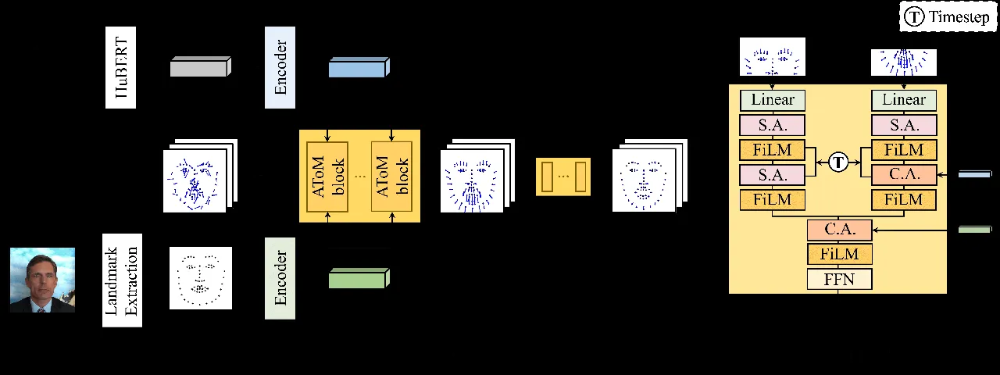

Figure 3: Overview of the Audio-to-Motion (AToM) diffusion model: (a)
AToM is a transformer-based diffusion model that learns the residual
between the initial landmark $`l_{\mathrm{init}}`$ and the landmark
sequence, using the audio embedding $`F_{A}`$ and the initial landmark
embedding $`F_{L}`$ as conditions. In addition, (b) we design AToM block
to process lip-related (upper-half) and lip-unrelated (lower-half)
landmarks separately, allowing the model to focus more on generating
lip-related movements while preserving the facial shape of the speaker.

#### Architectural details.

First, we design AToM to learn the residuals
$`\Delta L=\{\Delta l^{1},\ldots,\Delta l^{n}\}`$ from the initial
facial landmark $`l_{\mathrm{id}}`$ to enhance stability and
initialization. Specifically, we extract the initial facial landmark
$`l_{\mathrm{id}}`$ from the identity frame $`x_{\mathrm{id}}`$ using a
3D Facial Morphable Model (3DMM) \[4\]. The $`l_{\mathrm{id}}`$ is then
passed through a trainable landmark encoder to produce the landmark
embedding $`F_{L}`$. Note that in the training phase, we
frontalize \[53\] the facial landmarks to ensure the model focuses on
lip movements rather than pose.

We also extract the audio embedding $`F_{A}=\{f^{1},\ldots,f^{n}\}`$
from the audio $`A`$, using HuBERT \[21\] and a subsequent trainable
audio encoder. Both landmark encoder and audio encoder are composed of
simple transformer encoders. Both $`F_{L}`$ and $`F_{A}`$ are then
integrated into the cross-attention modules of the diffusion model, by
concatenating with time step embeddings. Benefiting from
$`l_{\mathrm{id}}`$, which provides the speaker-specific facial
structure, the model is enabled to capture speaker-agnostic
representations (e.g., lip motions) from $`F_{A}`$. The landmark encoder
and the audio encoder are both constructed using simple transformer
encoders sharing the same architecture.

Moreover, to improve lip synchronization quality, we design AToM to
separately process lip-related and lip-unrelated facial landmarks, as
illustrated in Fig. 3(b). We divide the facial landmarks into upper-half
(lip-related) and lower-half (lip-unrelated) segments, then design the
network to process them separately and subsequently merge them. The
audio embedding $`F_{A}`$ is exclusively injected into the
cross-attention module of the lip-related block, while the landmark
embedding $`F_{L}`$ is conditioned after the two blocks are merged. This
architectural choice enables the model to focus solely on lip movements,
preserving the other facial regions, and ultimately enhancing lip
synchronization fidelity. We provide an ablation study on different
configurations in Tab. 2b (a).

Finally, under the conditions of $`F_{L}`$ and $`F_{A}`$, the Gaussian
noise $`\Delta L_{T}`$ is iteratively denoised through AToM to generate
the denoised residual landmark sequences $`\Delta\hat{L}_{0}`$. The
final facial motion sequences $`L`$ are obtained by adding
$`\Delta\hat{L}_{0}`$ to the initial landmark $`l_{\mathrm{id}}`$.

#### Training.

In training, the diffusion model is trained to reconstruct $`\Delta L`$,
using the initial landmark embedding $`F_{L}`$ to provide
speaker-specific facial structures and the audio embedding $`F_{A}`$ for
lip movements, as conditions. Therefore, we redefine Equ. 2 for the
objective function of training AToM, $`\mathcal{F}_{\mathrm{AToM}}`$, as
follows:

```math
\mathcal{L}_{\mathrm{AToM}}=\mathbb{E}_{\Delta L,t,\epsilon\sim\mathcal{N}(0,1),F_{L},F_{A}}\left[\|\Delta L_{0}-\mathcal{F}_{\mathrm{AToM}}(\Delta L_{t},t;F_{L},F_{A})\|^{2}_{2}\right]. \tag{4}
```

Here, $`\Delta L_{0}`$ is defined as the difference between facial
landmarks from ground-truth video frames and those from an identity
frame, and $`\Delta L_{t}`$ is the noisified version of $`\Delta L_{0}`$
at time step $`t`$. Additionally, $`F_{L}`$ is derived from an identity
frame $`x_{\mathrm{id}}`$, which corresponds to the first frame of the
ground-truth videos.

### 4.3 Motion-to-Video (MToV) Diffusion Model

MToV aims to generate realistic talking head videos $`X`$, mirroring
desired identities and audio inputs. To achieve this, we use three
distinct conditions: facial landmark sequences $`L`$, pose frames
$`X_{P}`$, and identity frames $`X_{I}`$. Previous diffusion-based
methods \[41, 38\] generate videos in a frame-by-frame manner, resulting
in sub-optimal temporal consistency and identity preservation due to the
stochastic nature of the diffusion model.

To tackle this, as illustrated in Fig. 2, we introduce a modified video
diffusion model based on \[55\] with given conditions. Conditioning the
video diffusion model traditionally requires 4-dimensional
representations \[20\], which pose significant computational challenges
during training and inference. To overcome this limitation, we adopt
tri-plane representations \[55, 20\] to effectively employ a video
diffusion model tailored for talking face generation.

#### Architectural details.

First, AToM synchronizes facial landmark sequences
$`L\in\mathbb{R}^{S\times C\times H\times W}`$ with audio and identity,
where $`S`$, $`C`$, $`H`$, and $`W`$ represent the number of sequences,
channels, height, and width, respectively. These sequences are then
encoded into tri-plane representations
$`Z_{L}=\{z_{l}^{hw},z_{l}^{hs},z_{l}^{ws}\}`$ by the landmark encoder
$`\mathcal{E}_{L}`$, where
$`z_{l}^{hw}\in\mathbb{R}^{c\times h\times w}`$,
$`z_{l}^{hs}\in\mathbb{R}^{c\times h\times s}`$, and
$`z_{l}^{ws}\in\mathbb{R}^{c\times w\times s}`$. Here, $`c`$, $`h`$ and
$`w`$ denote the embedded channel, height, and width, respectively.
Specifically, $`z_{l}^{hw}`$ provides the model with speaker-specific
facial structures, while $`z_{l}^{hs}`$ and $`z_{l}^{ws}`$ encode the
temporal relationships between frames. Further detailed visualizations
related to tri-plane representations are provided in the Appendix
Sec. B.1 and Sec. B.2.

Simultaneously, following previous works \[33, 38\], we condition the
model on pose frames $`X_{P}\in\mathbb{R}^{S\times C\times H\times W}`$,
corresponding to the upper part of the desired video $`X`$. We further
leverage head poses from the pose frames $`X_{P}`$ to achieve facial
landmarks alignment. We achieve this by applying an affine
transformation \[49\] to the frontalized facial landmarks from AToM,
aligning them with the desired head pose. Detailed process of
transformations is explained in the Appendix Sec. A.2. $`X_{P}`$ is then
encoded into tri-plane representations
$`Z_{P}=\{z_{p}^{hw},z_{p}^{hs},z_{p}^{ws}\}`$ through the pose encoder
$`\mathcal{E}_{P}`$. This allows the model to focus solely on generating
lip movements while preserving other facial regions, ultimately
improving lip synchronization.

Furthermore, to ensure temporal consistency in extended video generation
and provide identity cues, we utilize previous video clips as identity
frames $`X_{I}`$, following \[33\]. These frames are processed through
the identity encoder $`\mathcal{E}_{I}`$, resulting in tri-plane
representations $`Z_{I}=\{z_{i}^{hw},z_{i}^{hs},z_{i}^{ws}\}`$.

Finally, we concatenate $`Z_{L}`$, $`Z_{P}`$, and $`Z_{I}`$ along the
channel axis. Given the conditions of $`Z_{L}`$, $`Z_{P}`$, and
$`Z_{I}`$, the pure Gaussian noise $`z_{T}`$ is gradually denoised
through the MToV process, generating the denoised video latent
$`\hat{z}_{0}`$. This is then decoded back into the RGB space,
$`\hat{X}_{0}`$, by a pre-trained decoder.

By combining an efficient architectural design with carefully selected
conditions, MToV can generate high-fidelity talking head videos with
enhanced temporal consistency and identity preservation, all while
requiring substantially lower computational complexity. Our design
choices are further detailed in Tab. 2b.

#### Training encoders.

MToV includes three distinct encoders: the landmark encoder
$`\mathcal{E}_{L}`$, identity encoder $`\mathcal{E}_{I}`$, and pose
encoder $`\mathcal{E}_{P}`$. All encoders compress cubic-like 4D video
inputs $`V\in\mathbb{R}^{S\times C\times H\times W}`$ into image-like
three 2D latents $`\in\mathbb{R}^{c\times h\times w}`$, where $`S`$,
$`C`$, $`H`$, and $`W`$ represent sequence, channel, height, and width,
while $`c`$, $`h`$, and $`w`$ represent embedded channel, height, and
width, respectively. For simplicity, we denote $`\mathcal{E}`$ to
include all three encoders $`\mathcal{E}_{L}`$, $`\mathcal{E}_{I}`$, and
$`\mathcal{E}_{P}`$.

The encoder $`\mathcal{E}`$ is trained using an autoencoder \[3\], where
$`\mathcal{E}`$ embeds $`V`$ in the RGB space into the latent space, and
the corresponding decoder $`\mathcal{D}`$ reconstructs the latent space
back into $`\hat{V}`$ in the RGB space.

In the training phase, we use two different losses: pixel-level
reconstruction loss \[61\] and the perceptual loss \[58\], which enforce
the encoder $`\mathcal{E}`$ and decoder $`\mathcal{D}`$ to accurately
embed and reconstruct the given inputs in both image space and feature
space. The total objective function is formulated as:

```math
\mathcal{L}_{\text{encoder}}=\lambda_{1}\mathbb{E}_{V}\left[\|V-\hat{V}\|_{1}\right]+\lambda_{2}\mathbb{E}_{V}\left[\|\phi(V)-\phi(\hat{V})\|_{1}\right], \tag{5}
```

where $`\phi`$ denotes the perceptual feature extractor \[58\]. For all
our experiments, we carefully select $`\lambda_{1}=\lambda_{2}=1`$.

#### Training diffusion model.

In training, the video diffusion model learns to reconstruct talking
head videos $`X`$, using landmark embeddings $`Z_{L}`$, pose embeddings
$`Z_{P}`$, and identity embeddings $`Z_{I}`$ as conditions. We can
redefine Equ. 2 for training MToV, $`\mathcal{F}_{\mathrm{MToV}}`$, as
follows:

```math
\mathcal{L}_{\mathrm{MToV}}=\mathbb{E}_{X,t,\epsilon\sim\mathcal{N}(0,1),Z_{L},Z_{I},Z_{P}}\left[\|X_{0}-\mathcal{F}_{\mathrm{MToV}}(X_{t},t;Z_{L},Z_{I},Z_{P})\|^{2}_{2}\right], \tag{6}
```

where $`X_{0}`$ is the ground-truth talking head video, and $`X_{t}`$ is
the noised $`X_{0}`$ at time step $`t`$.

## 5 Experiments

### 5.1 Experimental Settings

#### Implementation details.

For all experiments, we used 1 NVIDIA RTX 3090 GPU. For AToM, we train
the model for 300k iterations with a learning rate of 1e-4. For MToV, we
train the model for 600k iterations with a learning rate of 1e-4. To
alleviate jittering, we employed a blending technique using Gaussian
blur, as described in  \[11\]. Additional implementation details are
provided in the Appendix A.1 and A.2.

#### Datasets.

We used the LRS3-TED \[1\] and HDTF \[60\] datasets to train our AToM
and MToV models, respectively. The LRS3-TED dataset comprises 400 hours
of TED talk videos, providing a large lip-reading corpus. For AToM, we
extracted video frames at 25 fps and audio at a 16,000 Hz sampling rate.
For MToV, we randomly selected 312 videos from the HDTF dataset for
training, using the remaining 98 videos for testing.

|                     |                    |                   |                   |                      |                   |                    |                      |
| ------------------- | ------------------ | ----------------- | ----------------- | -------------------- | ----------------- | ------------------ | -------------------- |
|                     | Video Quality      |                   |                   |                      |                   | Lip Sync.          |                      |
|                     | FID $`\downarrow`$ | CPBD $`\uparrow`$ | PSNR $`\uparrow`$ | LPIPS $`\downarrow`$ | CSIM $`\uparrow`$ | LMD $`\downarrow`$ | LSE-D $`\downarrow`$ |
| Real Video          | 0.00               | 0.43              | \-                | \-                   | 1.00              | 0.00               | 6.98                 |
| Wav2Lip \[33\]      | 16.34              | 0.35              | 34.81             | 0.03                 | 0.90              | 1.43               | 5.86                 |
| PC-AVS \[62\]       | 117.85             | 0.29              | 28.23             | 0.38                 | 0.35              | 9.36               | 7.06                 |
| MakeItTalk \[63\]   | 66.21              | 0.43              | 29.87             | 0.16                 | 0.82              | 3.46               | 10.23                |
| Audio2Head \[47\]   | 65.96              | 0.37              | 29.85             | 0.19                 | 0.71              | 4.33               | 7.49                 |
| DiffusedHead \[42\] | 192.74             | 0.11              | 28.21             | 0.274                | 0.16              | 22.19              | 12.37                |
| DreamTalk \[30\]    | 124.51             | 0.43              | 29.59             | 0.20                 | 0.72              | 2.56               | 8.37                 |
| MoDiTalker          | 14.15              | 0.46              | 35.82             | 0.01                 | 0.92              | 1.38               | 9.15                 |

Table 1: Quantitative comparison with previous works on video quality
and lip synchronization: We compare MoDiTalker with previous GAN-based
methods, including Wav2Lip \[33\], PC-AVS \[62\], MakeItTalk \[63\], and
Audio2Head \[47\], as well as diffusion-based methods, including
DiffusedHead \[42\] and DreamTalk \[30\] on the HDTF \[60\] test
dataset.

Figure 4: Qualitative comparison with previous works: We compare
MoDiTalker with previous GAN-based methods, including Wav2Lip \[33\],
PC-AVS \[62\], MakeItTalk \[63\], and Audio2Head \[47\], as well as
diffusion-based methods, including Diffused Heads  \[41\] and
DreamTalk \[30\].

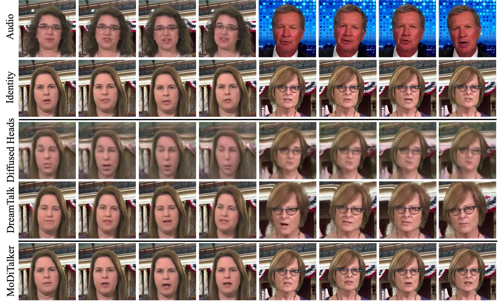

Figure 5: Qualitative comparison with previous works on cross identity
setting: We compare MoDiTalker with previous diffusion-based methods,
including Diffused Heads\[41\] and DreamTalk\[30\].

#### Evaluation metrics.

We evaluated our methods using several metrics predominantly used in
this field \[37, 17, 32, 58, 13, 9\]. In detail, we used FID
($`\downarrow`$) \[37\] and PSNR ($`\uparrow`$) \[17\] to assess the
image fidelity. Also, we used CPBD ($`\uparrow`$) \[32\] to evaluate the
sharpness of the generated frames, LPIPS ($`\downarrow`$) \[58\] to
measure the visual resemblance, and CSIM(↑) to examine the identity
preservation. For lip-sync quality, we utilized SyncNet \[13\] scores:
LSE-D ($`\downarrow`$) \[13\], measuring the distance between lip and
audio features, and LSE-C($`\uparrow`$) \[13\], measuring the confidence
score between them. Finally, we used LMD ($`\downarrow`$) \[9\] which
measures the accuracy of generating lip movements.

### 5.2 Qualitative Results

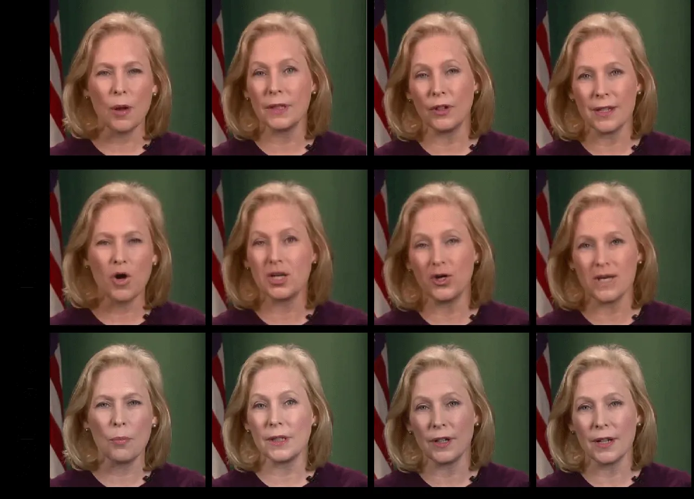

Figure 6: Qualitative comparison with DiffTalk \[38\].

In Fig. 4, we present a qualitative comparison with prior
GAN-based \[33, 62, 63, 47\] and diffusion-based \[41, 30\] studies,
highlighting the superiority of MoDiTalker. We observe that the previous
GAN-based approaches exhibit sub-optimal video quality. Specifically,
Wav2Lip \[33\] and Audio2Head \[47\] produce blurry outputs, while
MakeItTalk \[63\] and PC-AVS \[62\] generate jittery videos. Meanwhile,
DreamTalk \[30\], achieve reasonable video quality compared to GAN-based
methods but suffer from issues with identity preservation and temporal
consistency since they generate videos in a frame-by-frame manner.
Diffused Heads \[41\], trained only on the CREMA \[8\], performs poorly
on the HDTF dataset being compromised by error accumulation across the
generated frames. Unlike prior approaches, MoDiTalker generates
high-quality videos while preserving identity and temporal consistency.
Comparisons on the unseen dataset \[8\] can be found in Appendix C.3.

Moreover, in Fig. 5, we also present a qualitative comparison with
diffusion-based studies \[41, 30\] under cross-identity scenarios, which
use the input audio from a different identity than the identity frames.
Prior diffusion-based methods commonly inject the audio embedding
through a cross-attention module in diffusion U-Net. This prevents the
model from separating speaker-specific and speaker-agnostic
representations, such as facial shape and phoneme, leading to
sub-optimal performance in cross-identity scenarios. In contrast,
MoDiTalker shows superior generalization capability, benefiting from a
distinct training process that extracts intermediate facial landmarks
from given audio to generate the final talking video. Additionally, we
provide a qualitative comparison with previous GAN-based studies \[33,
62, 63, 47\] in the Appendix C.1.

### 5.3 Quantitative Results

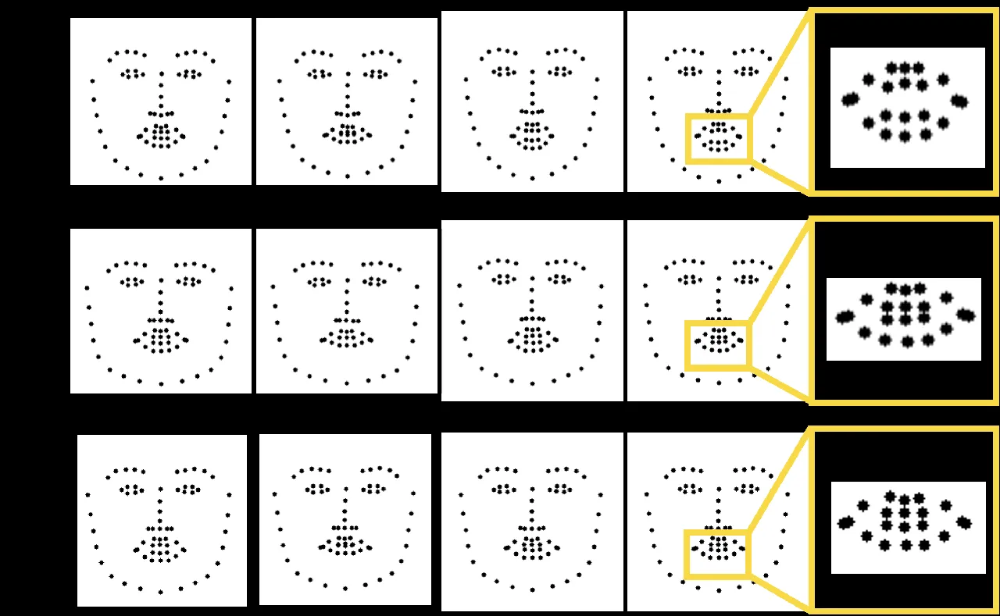

Figure 7: Qualitative comparison with GeneFace \[53\].

In Tab. 1, we present a quantitative comparison with existing talking
head generation approaches \[33, 62, 63, 47, 41, 30\] using the HDTF
dataset \[60\]. MoDiTalker significantly outperforms current
state-of-the-art methods across all video quality metrics and the LMD
score by a large margin. Notably, our model also achieves competitive
performance in the LSE-D score without utilizing SyncNet in our
training, while previous works \[33, 30\] incorporate SyncNet loss
during their training phase. This demonstrates the superior
generalizability of our method. Note that we do not include a comparison
with DiffTalk \[38\] in our evaluation. As noted in \[38\], despite our
efforts, we were unable to reproduce the results reported in their
paper.

This success is attributed to our framework design, AToM and MToV, with
each component further discussed in Sec. 5.5. Furthermore, our
audio-to-motion landmark generator, AToM, surpasses the state-of-the-art
landmark generative model, GeneFace \[53\], in lip synchronization and
identity preservation. This is further analyzed in Sec. 5.5, and
detailed in Tab. 2b, Fig. 9 and Fig. 7.

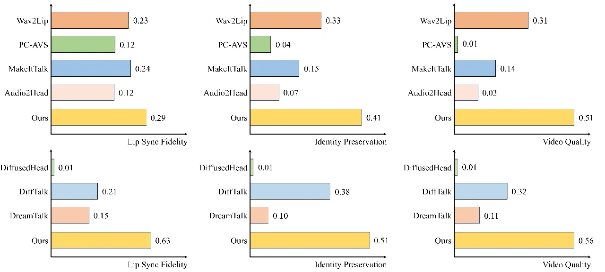

Figure 8: User study results. We compare MoDiTalker with GAN-based
models \[33, 62, 63, 47\] (top) and diffusion-based models \[42, 38,
30\] (bottom).

### 5.4 User Study

We conducted a user study to compare MoDiTalker with previous
GAN-based \[33, 62, 63, 47\] and diffusion-based \[42, 38, 30\] works,
focusing on lip-sync fidelity, identity preservation, and video quality.
The results are summarized in Fig. 8. For lip-sync fidelity,
participants were provided with audio input and generated talking head
videos from different methods. For identity preservation, we provided an
identity frame and generated talking head videos from various methods.
Lastly, for video quality, we presented generated talking head videos
from different studies. A total of 87 participants responded to 15
samples for each question, totaling 1,305 responses for samples. Note
that we randomly selected 5-second segments of the generated data, using
HDTF audio and identity frames. MoDiTalker surpasses previous GAN-based
and diffusion-based works in all aspects including lip-sync fidelity,
identity preservation, and video quality, further highlighting the
superiority of our method.

### 5.5 Ablation Study

#### Component analysis of AToM diffusion model.

In this ablation study, we aim to show the effectiveness of each
component of AToM. Fig. 9 and Tab. 2b (a) summarize the qualitative and
quantitative results, respectively. We also compare AToM with GeneFace,
the state-of-the-art audio-to-landmark generative model. The baseline
(I) presents a diffusion model which generates facial landmark sequences
$`L`$ using only the audio condition $`F_{A}`$. (II) represents the
residual prediction, estimating residuals $`\Delta{L}`$ from initial
landmark sequences $`L_{\mathrm{init}}`$. Compared to (I), (II)
significantly enhances Lip-sync scores, benefiting from enhanced
initialization and training stability. (III) incorporates initial
landmark embedding $`F_{L}`$ as a condition, which markedly boosts LMD
scores and the accuracy of the facial shape in the desired identity
$`x_{\mathrm{id}}`$. Lastly, the disentangled framework (IV), detailed
in the right part of Fig. 3, separates lip-related and unrelated
segments. With disentangled attention, AToM concentrates on lip
movements while preserving other facial segments, leading to its highest
performance. Combining these, in comparison with GeneFace, AToM achieves
superior performance in LMD and Lip-sync scores, demonstrating its
capability to generate high-quality facial landmarks given audio and
identity frames. This is further evident in the qualitative comparison
of AToM with GeneFace, as shown in Fig. 7.

|       |                            |                    |                    |
| ----- | -------------------------- | ------------------ | ------------------ |
|       | Component                  | LMD $`\downarrow`$ | LSE-C $`\uparrow`$ |
|       | GeneFace \[53\]            | 1.41               | 0.339              |
| (I)   | Baseline                   | 1.63               | 0.316              |
| (II)  | \(I\) + Residual.          | 1.47               | 0.386              |
| (III) | \(II\) + $`F_{L}`$         | 1.31               | 0.385              |
| (IV)  | (III) + Disen. Att. (Ours) | 1.26               | 0.390              |

(a) Audio-to-Motion model (AToM)

|       |                      |                   |                   |                    |
| ----- | -------------------- | ----------------- | ----------------- | ------------------ |
|       | Component            | CSIM $`\uparrow`$ | CPBD $`\uparrow`$ | LMD $`\downarrow`$ |
| (I)   | Baseline             | \-                | \-                | \-                 |
| (II)  | \(I\) + $`X_{I}`$    | 0.87              | 0.42              | 11.18              |
| (III) | \(II\) + $`X_{P}`$   | 0.91              | 0.44              | 5.23               |
| (IV)  | \(III\) + A          | 0.89              | 0.43              | 2.67               |
| (V)   | (III) + $`L`$ (Ours) | 0.92              | 0.46              | 1.38               |

(b) Motion-To-Video model (MToV)

Table 2: Component analysis on AtoM and MToV.

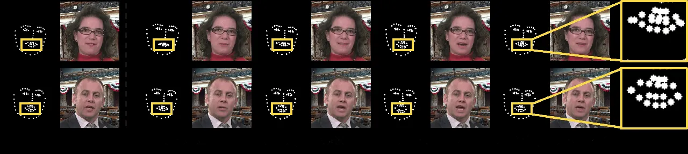

Figure 9: Ablation study for AToM. Baseline (I) generates facial
landmark sequences $`L`$ using only audio condition $`F_{\mathrm{A}}`$.
Predicting residuals $`\Delta{L}`$ (II) significantly improves lip sync
capacity. In (III), using the initial landmark embedding
$`F_{\mathrm{L}}`$ as a condition enhances identity preservation with
precise facial contours. In (IV), disentangled attention framework
separating lip-related and unrelated segments leads to optimal outcomes.

#### Component analysis of MToV diffusion model.

We also evaluate different configurations of MToV, as presented in
Tab. 2b (b) and Figure 10. This ablation study highlights the
significance of different conditions. The baseline model (I), without
any conditions, learns the general data distribution but fails to
capture the desired lip synchronization, identity, and head pose.
Introducing identity frames $`X_{\mathrm{I}}`$ as a condition in
configuration (II) ensures the model preserves the same identity
throughout the generated video. Moreover, incorporating pose frames
$`X_{\mathrm{P}}`$ as additional conditions in (III) not only focuses
the generation on the mouth region but also accurately captures the head
pose, which notably improves both video quality (CSIM, CPBD) and
lip-sync metrics (LMD). The introduction of audio embedding through
cross-attention layers in configuration (IV) roughly aligns with the lip
movements but may lack precision. In contrast, utilizing facial motion
landmarks $`L`$ from AToM (V) significantly enhances lip-sync accuracy,
demonstrating the effectiveness of leveraging intermediate facial motion
to generate high-fidelity talking head videos. By utilizing these
appropriate conditions, MToV has the ability to generate high-quality
videos with accurate lip synchronization.

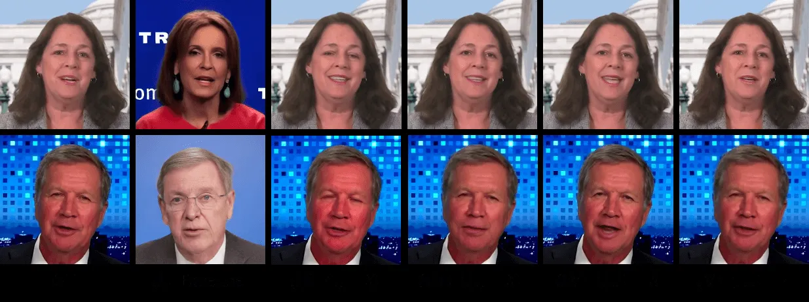

Figure 10: Ablation study for MToV. The baseline model (I), lacking
conditions, learns only the general data distribution. Identity frames
$`X_{\mathrm{I}}`$ as a condition (II) ensure identity preservation
throughout the generated video. Additionally, pose frames
$`X_{\mathrm{P}}`$ in (III) focus generation on the mouth region and
improve head pose accuracy. While audio embedding (IV) through
cross-attention leads to rough lip movement alignment, facial motion
landmarks $`L`$ (V) significantly enhance lip-sync.

#### Computational complexity.

We conducted an efficiency comparison with prior diffusion-based models.
Although several studies \[38, 42\] have successfully employed diffusion
models to generate talking head videos, their frame-by-frame generation
approach poses a significant time-inefficiency. For instance,
DiffTalk \[38\] and Diffused Heads \[42\] require 1003 and 716 seconds,
respectively, to produce a 5-second video at 25 fps on a single Nvidia
24GB 3090 RTX GPU. In contrast, our model needs only 23 seconds,
demonstrating a significant efficiency advantage. Our method is 43 times
faster than DiffTalk and 31 times faster than Diffused Heads. This speed
gain is especially valuable for producing longer videos, making our
approach much more practical for real-world use.

## 6 Conclusion

In this paper, we present MoDiTalker, a novel motion-disentangled
diffusion model for talking head video generation. MoDiTalker addresses
the limitations of previous GAN-based methods, including mode collapse
and sub-optimal performance, by introducing AToM for high-fidelity lip
movement generation from audio and identity inputs. Additionally,
MoDiTalker overcomes the temporal inconsistency and computational cost
of prior diffusion-based models through MToV, an efficient video
diffusion model using tri-plane representations as conditions. Our model
achieves state-of-the-art performance with significantly reduced
computational demands compared to earlier diffusion-based efforts.
Comprehensive ablation and user studies validate the effectiveness of
our approach.

## References

- \[1\] Afouras, T., Chung, J.S., Zisserman, A.: Lrs3-ted: a large-scale
  dataset for visual speech recognition. arXiv preprint
  arXiv:1809.00496 (2018)
- \[2\] Bang, D., Shim, H.: Mggan: Solving mode collapse using
  manifold-guided training. In: Proceedings of the IEEE/CVF
  international conference on computer vision. pp. 2347–2356 (2021)
- \[3\] Bertasius, G., Wang, H., Torresani, L.: Is space-time attention
  all you need for video understanding? In: International Conference on
  Machine Learning. pp. 813–824. PMLR (2021)
- \[4\] Blanz, V., Vetter, T.: A morphable model for the synthesis of 3d
  faces. In: Seminal Graphics Papers: Pushing the Boundaries, Volume 2,
  pp. 157–164 (2023)
- \[5\] Blattmann, A., Rombach, R., Ling, H., Dockhorn, T., Kim, S.W.,
  Fidler, S., Kreis, K.: Align your latents: High-resolution video
  synthesis with latent diffusion models. In: Proceedings of the
  IEEE/CVF Conference on Computer Vision and Pattern Recognition. pp.
  22563–22575 (2023)
- \[6\] Booth, J., Roussos, A., Zafeiriou, S., Ponniah, A., Dunaway, D.:
  A 3d morphable model learnt from 10,000 faces. In: Proceedings of the
  IEEE conference on computer vision and pattern recognition. pp.
  5543–5552 (2016)
- \[7\] Brock, A., Donahue, J., Simonyan, K.: Large scale gan training
  for high fidelity natural image synthesis. arXiv preprint
  arXiv:1809.11096 (2018)
- \[8\] Cao, H., Cooper, D.G., Keutmann, M.K., Gur, R.C., Nenkova, A.,
  Verma, R.: Crema-d: Crowd-sourced emotional multimodal actors dataset.
  IEEE transactions on affective computing 5(4), 377–390 (2014)
- \[9\] Chen, L., Li, Z., Maddox, R.K., Duan, Z., Xu, C.: Lip movements
  generation at a glance. In: Proceedings of the European conference on
  computer vision (ECCV). pp. 520–535 (2018)
- \[10\] Chen, L., Maddox, R.K., Duan, Z., Xu, C.: Hierarchical
  cross-modal talking face generation with dynamic pixel-wise loss. In:
  Proceedings of the IEEE/CVF conference on computer vision and pattern
  recognition. pp. 7832–7841 (2019)
- \[11\] Chen, R., Chen, X., Ni, B., Ge, Y.: Simswap: An efficient
  framework for high fidelity face swapping. In: Proceedings of the 28th
  ACM International Conference on Multimedia. pp. 2003–2011 (2020)
- \[12\] Chung, J.S., Nagrani, A., Zisserman, A.: Voxceleb2: Deep
  speaker recognition. arXiv preprint arXiv:1806.05622 (2018)
- \[13\] Chung, J.S., Zisserman, A.: Out of time: automated lip sync in
  the wild. In: Computer Vision–ACCV 2016 Workshops: ACCV 2016
  International Workshops, Taipei, Taiwan, November 20-24, 2016, Revised
  Selected Papers, Part II 13. pp. 251–263. Springer (2017)
- \[14\] Deng, Y., Yang, J., Xu, S., Chen, D., Jia, Y., Tong, X.:
  Accurate 3d face reconstruction with weakly-supervised learning: From
  single image to image set. In: Proceedings of the IEEE/CVF conference
  on computer vision and pattern recognition workshops. pp. 0–0 (2019)
- \[15\] Goodfellow, I., Pouget-Abadie, J., Mirza, M., Xu, B.,
  Warde-Farley, D., Ozair, S., Courville, A., Bengio, Y.: Generative
  adversarial networks. Communications of the ACM 63(11), 139–144 (2020)
- \[16\] He, T., Guo, J., Yu, R., Wang, Y., Zhu, J., An, K., Li, L.,
  Tan, X., Wang, C., Hu, H., et al.: Gaia: Zero-shot talking avatar
  generation. arXiv preprint arXiv:2311.15230 (2023)
- \[17\] Heusel, M., Ramsauer, H., Unterthiner, T., Nessler, B.,
  Hochreiter, S.: Gans trained by a two time-scale update rule converge
  to a local nash equilibrium. Advances in neural information processing
  systems 30 (2017)
- \[18\] Ho, J., Chan, W., Saharia, C., Whang, J., Gao, R., Gritsenko,
  A., Kingma, D.P., Poole, B., Norouzi, M., Fleet, D.J., et al.: Imagen
  video: High definition video generation with diffusion models. arXiv
  preprint arXiv:2210.02303 (2022)
- \[19\] Ho, J., Jain, A., Abbeel, P.: Denoising diffusion probabilistic
  models. Advances in neural information processing systems 33,
  6840–6851 (2020)
- \[20\] Ho, J., Salimans, T., Gritsenko, A., Chan, W., Norouzi, M.,
  Fleet, D.J.: Video diffusion models. arXiv:2204.03458 (2022)
- \[21\] Hsu, W.N., Bolte, B., Tsai, Y.H.H., Lakhotia, K.,
  Salakhutdinov, R., Mohamed, A.: Hubert: Self-supervised speech
  representation learning by masked prediction of hidden units. IEEE/ACM
  Transactions on Audio, Speech, and Language Processing 29,
  3451–3460 (2021)
- \[22\] Hu, Y., Chen, Z., Luo, C.: Lamd: Latent motion diffusion for
  video generation. arXiv preprint arXiv:2304.11603 (2023)
- \[23\] Ji, X., Zhou, H., Wang, K., Wu, W., Loy, C.C., Cao, X., Xu, F.:
  Audio-driven emotional video portraits. In: Proceedings of the
  IEEE/CVF conference on computer vision and pattern recognition. pp.
  14080–14089 (2021)
- \[24\] Khachatryan, L., Movsisyan, A., Tadevosyan, V., Henschel, R.,
  Wang, Z., Navasardyan, S., Shi, H.: Text2video-zero: Text-to-image
  diffusion models are zero-shot video generators. arXiv preprint
  arXiv:2303.13439 (2023)
- \[25\] Kingma, D.P., Welling, M.: Auto-encoding variational bayes.
  arXiv preprint arXiv:1312.6114 (2013)
- \[26\] KR, P., Mukhopadhyay, R., Philip, J., Jha, A., Namboodiri, V.,
  Jawahar, C.: Towards automatic face-to-face translation. In:
  Proceedings of the 27th ACM international conference on multimedia.
  pp. 1428–1436 (2019)
- \[27\] Kumar, R., Sotelo, J., Kumar, K., de Brebisson, A., Bengio, Y.:
  Obamanet: Photo-realistic lip-sync from text (2017)
- \[28\] Liang, B., Pan, Y., Guo, Z., Zhou, H., Hong, Z., Han, X., Han,
  J., Liu, J., Ding, E., Wang, J.: Expressive talking head generation
  with granular audio-visual control. In: Proceedings of the IEEE/CVF
  Conference on Computer Vision and Pattern Recognition. pp.
  3387–3396 (2022)
- \[29\] Lu, Y., Chai, J., Cao, X.: Live speech portraits: real-time
  photorealistic talking-head animation. ACM Transactions on Graphics
  (TOG) 40(6), 1–17 (2021)
- \[30\] Ma, Y., Zhang, S., Wang, J., Wang, X., Zhang, Y., Deng, Z.:
  Dreamtalk: When expressive talking head generation meets diffusion
  probabilistic models. arXiv preprint arXiv:2312.09767 (2023)
- \[31\] Miyato, T., Kataoka, T., Koyama, M., Yoshida, Y.: Spectral
  normalization for generative adversarial networks. arXiv preprint
  arXiv:1802.05957 (2018)
- \[32\] Narvekar, N.D., Karam, L.J.: A no-reference image blur metric
  based on the cumulative probability of blur detection (cpbd). IEEE
  Transactions on Image Processing 20(9), 2678–2683 (2011)
- \[33\] Prajwal, K., Mukhopadhyay, R., Namboodiri, V.P., Jawahar, C.: A
  lip sync expert is all you need for speech to lip generation in the
  wild. In: Proceedings of the 28th ACM international conference on
  multimedia. pp. 484–492 (2020)
- \[34\] Ren, Y., Li, G., Chen, Y., Li, T.H., Liu, S.: Pirenderer:
  Controllable portrait image generation via semantic neural
  rendering (2021)
- \[35\] Rombach, R., Blattmann, A., Lorenz, D., Esser, P., Ommer, B.:
  High-resolution image synthesis with latent diffusion models. In:
  Proceedings of the IEEE/CVF conference on computer vision and pattern
  recognition. pp. 10684–10695 (2022)
- \[36\] Ruiz, N., Li, Y., Jampani, V., Pritch, Y., Rubinstein, M.,
  Aberman, K.: Dreambooth: Fine tuning text-to-image diffusion models
  for subject-driven generation. In: Proceedings of the IEEE/CVF
  Conference on Computer Vision and Pattern Recognition. pp.
  22500–22510 (2023)
- \[37\] Seitzer, M.: pytorch-fid: FID Score for PyTorch.
  [https://github.com/mseitzer/pytorch-fid](https://github.com/mseitzer/pytorch-fid)
  (August 2020), version 0.3.0
- \[38\] Shen, S., Zhao, W., Meng, Z., Li, W., Zhu, Z., Zhou, J., Lu,
  J.: Difftalk: Crafting diffusion models for generalized audio-driven
  portraits animation (2023)
- \[39\] Song, J., Meng, C., Ermon, S.: Denoising diffusion implicit
  models. arXiv preprint arXiv:2010.02502 (2020)
- \[40\] Song, L., Wu, W., Fu, C., Qian, C., Loy, C.C., He, R.:
  Everything’s talkin’: Pareidolia face reenactment. arXiv preprint
  arXiv:2104.03061 (2021)
- \[41\] Stypułkowski, M., Vougioukas, K., He, S., Zięba, M., Petridis,
  S., Pantic, M.: Diffused heads: Diffusion models beat gans on
  talking-face generation. In: Proceedings of the IEEE/CVF Winter
  Conference on Applications of Computer Vision. pp. 5091–5100 (2024)
- \[42\] Stypułkowski, M., Vougioukas, K., He, S., Zięba, M., Petridis,
  S., Pantic, M.: Diffused heads: Diffusion models beat gans on
  talking-face generation (2023)
- \[43\] Suwajanakorn, S., Seitz, S.M., Kemelmacher-Shlizerman, I.:
  Synthesizing obama: learning lip sync from audio. ACM Transactions on
  Graphics (ToG) 36(4), 1–13 (2017)
- \[44\] Tevet, G., Raab, S., Gordon, B., Shafir, Y., Cohen-Or, D.,
  Bermano, A.H.: Human motion diffusion model. arXiv preprint
  arXiv:2209.14916 (2022)
- \[45\] Thanh-Tung, H., Tran, T.: Catastrophic forgetting and mode
  collapse in gans. In: 2020 international joint conference on neural
  networks (ijcnn). pp. 1–10. IEEE (2020)
- \[46\] Tseng, J., Castellon, R., Liu, K.: Edge: Editable dance
  generation from music. In: Proceedings of the IEEE/CVF Conference on
  Computer Vision and Pattern Recognition. pp. 448–458 (2023)
- \[47\] Wang, S., Li, L., Ding, Y., Fan, C., Yu, X.: Audio2head:
  Audio-driven one-shot talking-head generation with natural head
  motion (2021)
- \[48\] Wang, S., Li, L., Ding, Y., Yu, X.: One-shot talking face
  generation from single-speaker audio-visual correlation
  learning (2021)
- \[49\] Wang, T.C., Mallya, A., Liu, M.Y.: One-shot free-view neural
  talking-head synthesis for video conferencing. In: Proceedings of the
  IEEE/CVF conference on computer vision and pattern recognition. pp.
  10039–10049 (2021)
- \[50\] Wang, Y., Ma, X., Chen, X., Dantcheva, A., Dai, B., Qiao, Y.:
  Leo: Generative latent image animator for human video synthesis (2023)
- \[51\] Wu, J.Z., Ge, Y., Wang, X., Lei, S.W., Gu, Y., Shi, Y., Hsu,
  W., Shan, Y., Qie, X., Shou, M.Z.: Tune-a-video: One-shot tuning of
  image diffusion models for text-to-video generation. In: Proceedings
  of the IEEE/CVF International Conference on Computer Vision. pp.
  7623–7633 (2023)
- \[52\] Xie, X., Zhou, P., Li, H., Lin, Z., Yan, S.: Adan: Adaptive
  nesterov momentum algorithm for faster optimizing deep models (2023)
- \[53\] Ye, Z., Jiang, Z., Ren, Y., Liu, J., He, J., Zhao, Z.:
  Geneface: Generalized and high-fidelity audio-driven 3d talking face
  synthesis. arXiv preprint arXiv:2301.13430 (2023)
- \[54\] Yin, F., Zhang, Y., Cun, X., Cao, M., Fan, Y., Wang, X., Bai,
  Q., Wu, B., Wang, J., Yang, Y.: Styleheat: One-shot high-resolution
  editable talking face generation via pre-trained stylegan (2022)
- \[55\] Yu, S., Sohn, K., Kim, S., Shin, J.: Video probabilistic
  diffusion models in projected latent space. In: Proceedings of the
  IEEE/CVF Conference on Computer Vision and Pattern Recognition. pp.
  18456–18466 (2023)
- \[56\] Zakharov, E., Shysheya, A., Burkov, E., Lempitsky, V.: Few-shot
  adversarial learning of realistic neural talking head models. In:
  Proceedings of the IEEE/CVF international conference on computer
  vision. pp. 9459–9468 (2019)
- \[57\] Zhang, L., Rao, A., Agrawala, M.: Adding conditional control to
  text-to-image diffusion models. In: Proceedings of the IEEE/CVF
  International Conference on Computer Vision. pp. 3836–3847 (2023)
- \[58\] Zhang, R., Isola, P., Efros, A.A., Shechtman, E., Wang, O.: The
  unreasonable effectiveness of deep features as a perceptual metric.
  In: Proceedings of the IEEE conference on computer vision and pattern
  recognition. pp. 586–595 (2018)
- \[59\] Zhang, W., Cun, X., Wang, X., Zhang, Y., Shen, X., Guo, Y.,
  Shan, Y., Wang, F.: Sadtalker: Learning realistic 3d motion
  coefficients for stylized audio-driven single image talking face
  animation (2023)
- \[60\] Zhang, Z., Li, L., Ding, Y., Fan, C.: Flow-guided one-shot
  talking face generation with a high-resolution audio-visual dataset.
  In: Proceedings of the IEEE/CVF Conference on Computer Vision and
  Pattern Recognition. pp. 3661–3670 (2021)
- \[61\] Zhao, H., Gallo, O., Frosio, I., Kautz, J.: Loss functions for
  image restoration with neural networks. IEEE Transactions on
  computational imaging 3(1), 47–57 (2016)
- \[62\] Zhou, H., Sun, Y., Wu, W., Loy, C.C., Wang, X., Liu, Z.:
  Pose-controllable talking face generation by implicitly modularized
  audio-visual representation. In: Proceedings of the IEEE/CVF
  conference on computer vision and pattern recognition. pp.
  4176–4186 (2021)
- \[63\] Zhou, Y., Han, X., Shechtman, E., Echevarria, J., Kalogerakis,
  E., Li, D.: Makelttalk: speaker-aware talking-head animation. ACM
  Transactions On Graphics (TOG) 39(6), 1–15 (2020)

Appendix

In the following, we describe the network architectures and
implementation details in Sec. 0.A, provide visualized explanations for
tri-plane representations in Sec. 0.B, and include additional
experimental results and cross-identity results in Sec. 0.C. We also
present a comparison of our model with DreamBooth \[36\] combined with
ControlNet \[57\] in Sec. 0.D, detail of the user study in Sec. 0.E,
limitations in Sec. 0.F.

## Appendix 0.A More implementation details

### 0.A.1 Additional experimental setup for AToM

Data preparation for training and inference. We train AToM to predict
the residual between an initial landmark and subsequent
audio-synchronized landmarks, conditioned on audio input. Additionally,
to ensure AToM predicts the residual focusing more on mouth region
without considering head pose, we separate the head pose from facial
landmarks.

For audio input, we extract HuBERT \[21\] features from raw audio,
following the process outlined in \[53\]. To obtain 3D facial landmarks,
we follow these steps: First, we obtain a 3D facial mesh $`M`$ using
Deep 3D Reconstruction \[14\]. This technique reconstructs the 3D facial
mesh $`M`$ using a single image. Second, we align the position and pose
of $`M`$ to a frontal orientation, guided by the pose information of the
template mean face $`\overline{M}`$ from \[4\]. This process yields a 3D
facial mesh precisely aligned to a frontal view while preserving the
person’s unique facial features. Finally, we extract 3D facial landmarks
from the frontal facial mesh. This process yields audio HuBERT feature
and frontal landmark pairs for each video, which we use for both
training and inference.

Network details of AToM. The detailed network architecture of the AToM
block, including the audio encoder and landmark encoder, is outlined in
Tab. 3. The audio encoder utilizes HuBERT features extracted from raw
audio using HuBERT \[21\] and generates audio features that serve as a
condition for the AToM. Similarly, the landmark encoder takes an initial
landmark as input and produces an initial landmark feature that also
acts as a condition for the AToM. The AToM block mainly consists of
several transformer decoders and a linear layer. As the sequence passes
through a series of AToM blocks, it is designed to predict the residuals
of 204 landmark points from 156 frames for each batch, where 204
corresponds to $`68\times 3`$, indicating the $`x`$, $`y`$, and $`z`$
coordinates of 68 facial landmark points.

|                     |        |           |                                      |
| ------------------- | ------ | --------- | ------------------------------------ |
| Audio Encoder       |        |           |                                      |
| Layer               | w.FiLM | Norm      | Output shape $`(C\times H\times W)`$ |
| Transformer Encoder | -      | LayerNorm | $`(64,312,512)`$                     |
| Transformer Encoder | -      | LayerNorm | $`(64,312,512)`$                     |
|                     |        |           |                                      |
| Landmark Encoder    |        |           |                                      |
| Layer               | w.FiLM | Norm      | Output shape $`(C\times H\times W)`$ |
| Transformer Encoder | -      | LayerNorm | $`(64,156,512)`$                     |
| Transformer Encoder | -      | LayerNorm | $`(64,156,512)`$                     |
|                     |        |           |                                      |
| AToM Block          |        |           |                                      |
| Layer               | w.FiLM | Norm      | Output shape $`(C\times H\times W)`$ |
| Transformer Decoder | O      | LayerNorm | $`(64,156,1024)`$                    |
| Transformer Decoder | O      | LayerNorm | $`(64,156,1024)`$                    |
| Transformer Decoder | O      | LayerNorm | $`(64,156,1024)`$                    |
| Transformer Decoder | O      | LayerNorm | $`(64,156,1024)`$                    |
| Transformer Decoder | O      | LayerNorm | $`(64,156,1024)`$                    |
| Transformer Decoder | O      | LayerNorm | $`(64,156,1024)`$                    |
| Transformer Decoder | O      | LayerNorm | $`(64,156,1024)`$                    |
| Transformer Decoder | O      | LayerNorm | $`(64,156,1024)`$                    |
| Linear              | -      | -         | $`(64,156,204)`$                     |

Table 3: Network architecture of AToM.

Implementation details of AToM. We set the input representation
dimension to 204, corresponding to 68 landmarks with 3 coordinates for
each point ($`x`$, $`y`$, and $`z`$ axes), and fix the latent dimension
at 512. We employ the Adan optimizer \[52\] for this model and adopt a
joint loss, which is the weighted sum of the simple reconstruction L2
loss \[61\] and the velocity loss \[44\]. The denoising timestep $`T`$
is 1000 for sampling. Our model was trained on a single 24GB RTX 3090
for one day with a batch size of 64 and a learning rate of $`1e{-4}`$.

### 0.A.2 Additional experimental setup for MToV

Data preparation for training and inference. We follow the official
documentation \[60\] for pre-processing the images of the HDTF dataset.
The images were cropped according to the coordinates of the proposed
facial regions with a resolution of $`256\times 256`$. For landmark
extraction, we used an Deep 3D Reconstruction \[14\] that identified 68
facial landmarks with 3D coordinates from the images. These landmarks
were then paired with their corresponding images to train our MToV
module.

Since AToM is trained on frontal-aligned facial landmarks to emphasize
lip motion over head pose, the position and pose of the generated motion
sequence $`\hat{L}`$ are fixed to those of the mean face
$`\overline{M}`$, respectively. Consequently, generated 3D facial
landmarks $`\hat{L}`$ must be transformed using affine
transformations \[49\] to match the face position and pose in the
reference video. Specifically, 2D landmarks are extracted from each
frame of the reference video. Using the extracted 2D landmarks and the
generated 3D facial landmarks for each frame, a transformation matrix is
calculated. The calculated transformation matrix are applied to the
entire sequence of motion landmarks, aligning them with the face in the
reference video. This process is illustrated in Fig. 11.

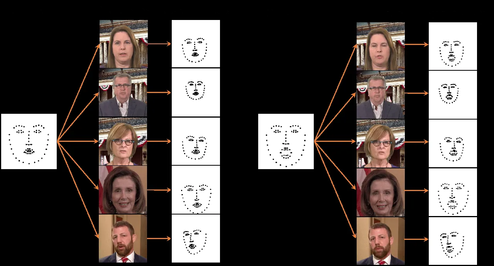

Figure 11: Motion aligning. The facial motion, which is the output of
AToM with a position and pose fixed to the mean face of 3DMM \[4\], is
converted to a facial motion with a pose aligned to each frame of the
reference video by extracting transformation matrix from the each
reference frame.

Network details of MToV. The detailed network architectures of the MToV,
composed of the landmark autoencoder, pose autoencoder and denoising
U-Net, are outlined in Tab. 4 and Tab. 5, respectively. The identity
autoencoder shares the same model of pose autoencoder.

For autoenocder, we opt for a 4-layer Transformer. Specific model
setting can be found in Tab. 4.

|                      |         |             |           |            |           |          |
| -------------------- | ------- | ----------- | --------- | ---------- | --------- | -------- |
|                      | Channel | \# ResBlock | Timesteps | Input res. | Emb. dim. | \# Iter. |
| pose autoencoder     | 384     | 2           | 16        | 256        | 4         | 400k     |
| landmark autoencoder | 384     | 2           | 16        | 256        | 4         | 60k      |

Table 4: Training settings for pose video autoencoder and motion video
encoder.

For denoising unet model, we set a learning rate as 1$`e`$-4 with a
batch size of 12. For more hyperparameters, such as the base channel and
the depth of U-Net architecture, we adopt a similar setup to LDMs \[35\]
following \[55\].

|                |              |            |             |              |          |              |            |
| -------------- | ------------ | ---------- | ----------- | ------------ | -------- | ------------ | ---------- |
|                | Base channel | Attn. res. | \# ResBlock | Channel mul. | \# Heads | Linear start | Linear end |
| denoising unet | 128          | \[4,2,1\]  | 2           | \[1,2,4,4\]  | 8        | 0.0015       | 0.0195     |

Table 5: Training settings for denoising unet.

Implementation details of MToV. To obtain the video latent
representation, we pass the RGB input video through a video encoder.
Similarly, to obtain the reference and identity latent representations,
we pass the reference and identity videos through the same video
encoder, respectively. In addition, to acquire the motion latent
representation as a motion condition, use a motion video encoder on the
paired binary motion videos with their corresponding RGB input videos.
The hyperparameters and settings used to train the denoising unet are
shown in Tab. 5.

We trained the autoencoders and video diffusion model separately. For
training the autoencoders, we initially trained with a reconstruction
loss and then utilized LPIPS \[58\] loss to enhance the fidelity of the
generated video. The video autoencoder was trained on a single 40GB A100
for 3 days with a batch size of 4 and a learning rate of $`4e{-4}`$.
However, we encountered challenges when using a video encoder that was
originally trained on RGB videos to encode motion videos composed of
binary values. To overcome this issue, we freeze the decoder in the
autoencoder pretrained on RGB videos and subsequently fine-tuned only
its specific layer of encoder using motion videos as input data for
encoding purposes. The video autoencoder can be tuned to a motion video
by freezing the decoder and training only the encoder with 1 batch
training on a single 24GB 3090 RTX. This process requires 6 hours of
additional training time with a learning rate of $`1e{-4}`$. The
reconstruction results can be found in Fig. 13 and Fig. 14. The
hyperparameters and settings used to train the video autoencoder and
motion video encoder are shown in Tab. 4.

The process shown in Fig. 12 converts a video sequence $`X`$ into a 2D
tri-plane representation $`Z=\{z^{hw},z^{hs},z^{ws}\}`$. This
representation decomposes the video’s variations along the axes of time
$`z^{hw}`$, height $`z^{ws}`$, and width $`z^{hs}`$.

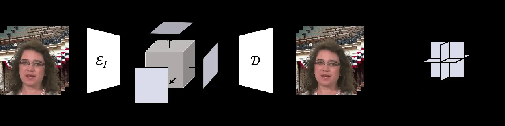

Figure 12: Extracting tri-plane representations from video frames. We
project video frames into tri-plane representations, decomposing the
video along the axes of time, height, and width.

## Appendix 0.B Visualization of Autoencoder

Diffusion models \[35, 18, 20, 55, 22, 50\] have demonstrated superior
performance in generating high-quality images and videos based on
different conditions (e.g., text, audio). However, since diffusion
models perform denoising in the input space, training and inference can
be computationally expensive when dealing with high-dimensional data
like images and videos. To address this, previous studies \[35, 20, 55\]
have successfully projected high-dimensional data onto low-dimensional
latent vectors, performing denoising within the latent space.
Following \[55\], we project video frames consisting of multiple frames
into 2D tri-plane representations and train a diffusion model on them.

### 0.B.1 Reconstruction visualization of Autoencoder

In Fig. 13 and Fig. 14, we present the reconstruction results
$`\hat{X}`$ for different video types, including RGB videos and
binary-valued motion videos, to evaluate the effectiveness of our
autoencoder training scheme.

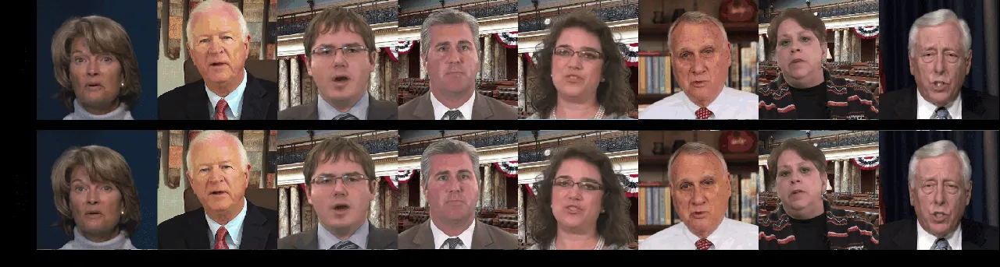

Figure 13: Reconstruction results of pose video frames.

Specifically, after training the autoencoder with RGB video, we freeze
the decoder and fine-tune only some layers on top of the pre-trained
weights of encoder using the reconstruction loss for binary motion
video.

Binary motion video reconstruction results are shown in Fig. 14. The
first row shows the ground truth (GT), the second row shows the results
when the encoder is used without additional fine-tuning, and the third
row shows the results when the encoder is used after additional
fine-tuning with motion videos. By comparing the results of the second
and third rows, we can see that the mouth motion is much better
reflected, while the spatial and local information of the motion video
is better preserved. This means that a latent containing more accurate
motion information can be used as a condition.

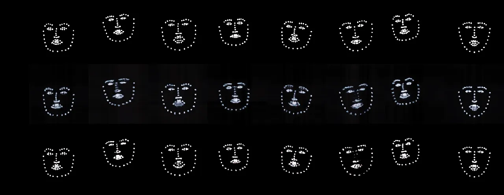

Figure 14: Reconstruction results of motion video frames.

### 0.B.2 Latents visualization of Autoencoder

To show what each tri-plane represents, we visualize the intermediate
latents of each $`z^{hw},z^{hs}`$ and $`z^{ws}`$ planes.

A single video frame composed of multiple frames can be projected onto
three 2D planes. Fig. 15 shows the visualization results of the latents
for three video frames of three different people. The leftmost three
columns show the visualization results of the latents for the GT video
frame, middle three columns show the visualization results of the
latents for the motion video frame, and rightmost three columns show the
visualization results of the denoised $`z_{0}`$.

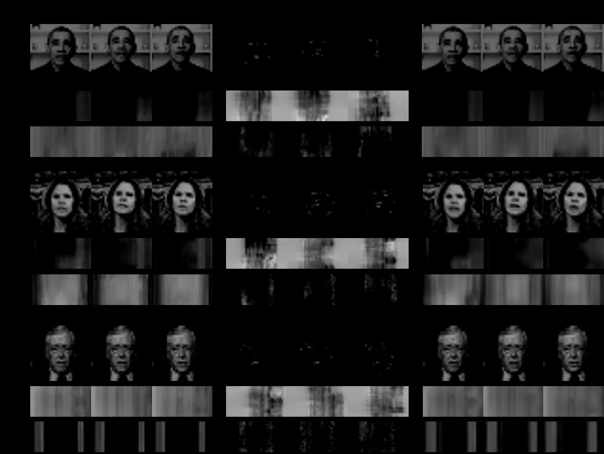

Figure 15: Latents visualization of autoencoder.

## Appendix 0.C Additional results

### 0.C.1 Cross identity setting including GAN-based methods

We conducted an experiment under the cross-identity setting, where a
single audio and different identity conditions are given to generate
talking head videos in Fig. 16. By incorporating the process of
generating intermediate motion from the audio, we are able to
effectively separate the correlation between the audio and the generated
speaker.

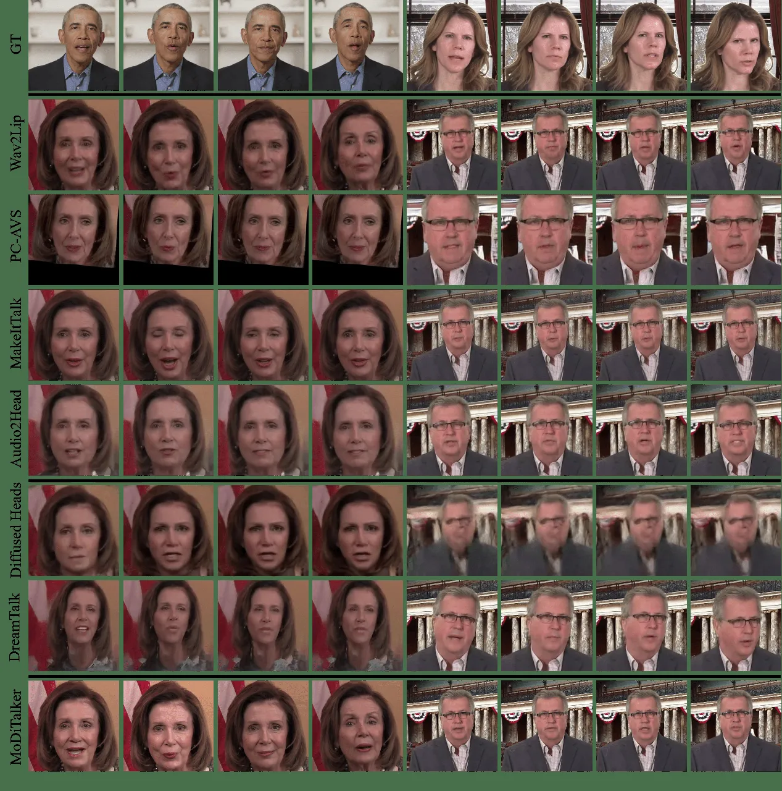

Figure 16: Qualitative comparison with previous works on cross identity
setting. We compare MoDiTalker with previous GAN-based methods \[33, 62,
63, 47\], including Wav2Lip, PC-AVS, MakeItTalk, Audio2Head and
diffusion-based methods \[41, 30\], including Diffused Heads, DreamTalk.

### 0.C.2 One-shot pose frame setting

We can also create a talking head video in a setting where only a
one-shot image is given in Fig. 17.

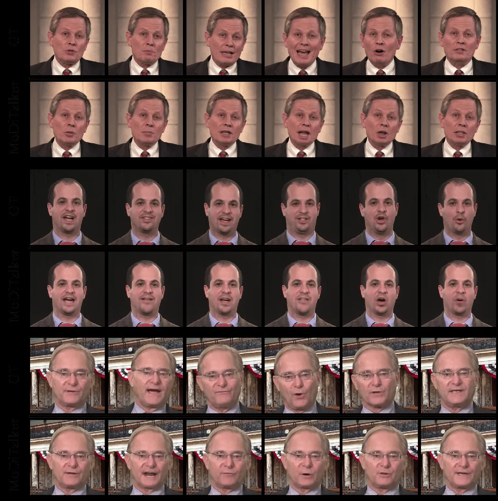

Figure 17: Qualitative results for oneshot frame setting.

### 0.C.3 Unseen dataset

AToM is trained solely on the LRS3-TED dataset \[1\]. To demonstrate its
capabilities on unseen data, we validate AToM using HDTF \[60\] audio in
the main paper. We focus on the HDTF dataset for MToV training due to
its high-quality images. To demonstrate MToV’s capabilities on unseen
data, we also present results from the widely used the CREMA-D
dataset \[8\] and VoxCeleb2 dataset \[12\] in Fig. 18 and Fig. 19.

CREMA. We apply the same audio and frame processing techniques used for
HDTF to the CREMA-D dataset. For consistency with our model’s training
on HDTF’s $`256\times 256`$ resolution, we resize images of CREMA-D from
$`320\times 320`$ to $`256\times 256`$. The results are shown in
Fig. 18.

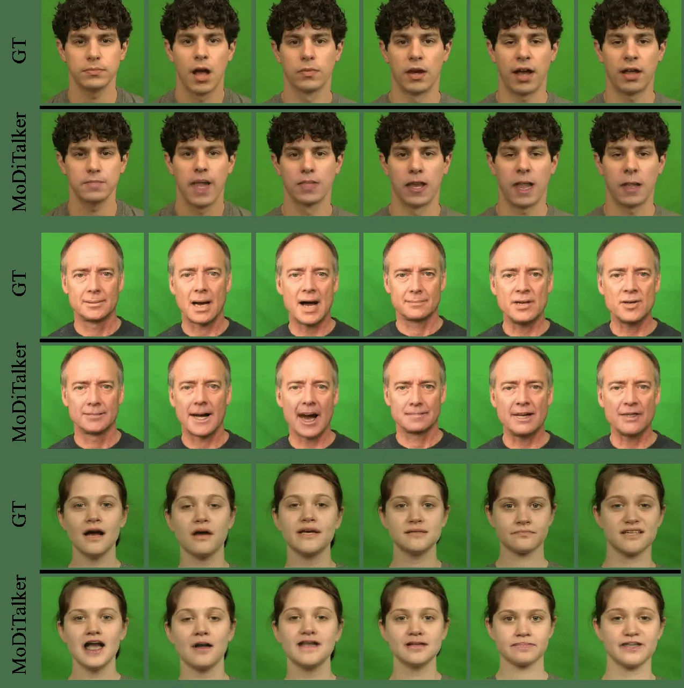

Figure 18: Qualitative results for unseen CREMA \[8\] dataset setting.

VoxCeleb2. We apply the same audio and frame processing techniques used
for HDTF to the VoxCeleb2 dataset. To align with the resolution of HDTF
employed in the training, we resize the images of VoxCeleb2 from
$`224\times 224`$ to $`256\times 256`$. The results are shown in
Fig. 19.

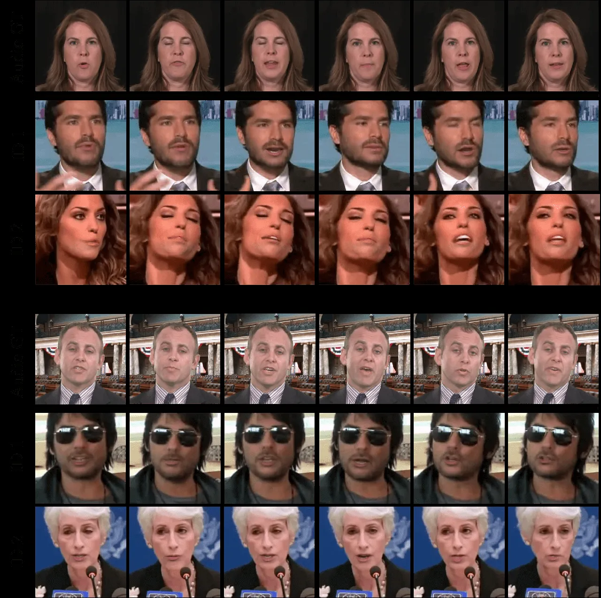

Figure 19: Qualitative results for unseen VoxCeleb2 dataset setting.

Diffused Heads on CREMA. We confirmed that Diffused Heads \[41\] perform
poorly with HDTF. This is because Diffused Heads only release
pre-trained weights for CREMA-D and do not provide any training code. To
demonstrate that we properly evaluated the Diffused Heads code, we
compared the results of Diffused Heads and MoDiTalker. MoDiTalker is
trained with HDTF, so CREMA-D is unseen dataset.

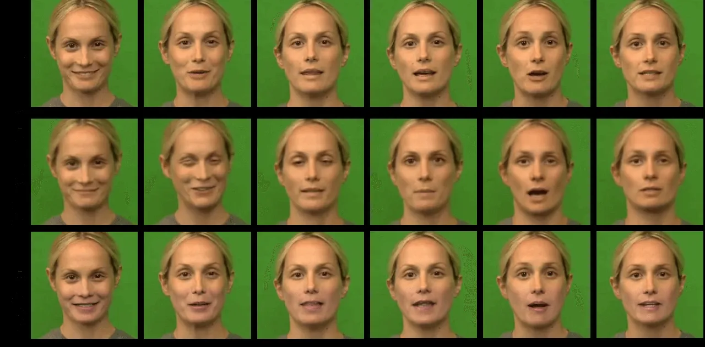

Figure 20: Qualitative comparison between Diffused Heads \[41\] and
MoDiTalker for CREMA \[8\] dataset.

## Appendix 0.D Comparison with DreamBooth & ControlNet

As shown in Fig. 21, we also compared the results with general-purpose
conditional diffusion models, not specifically designed for the talking
head task.

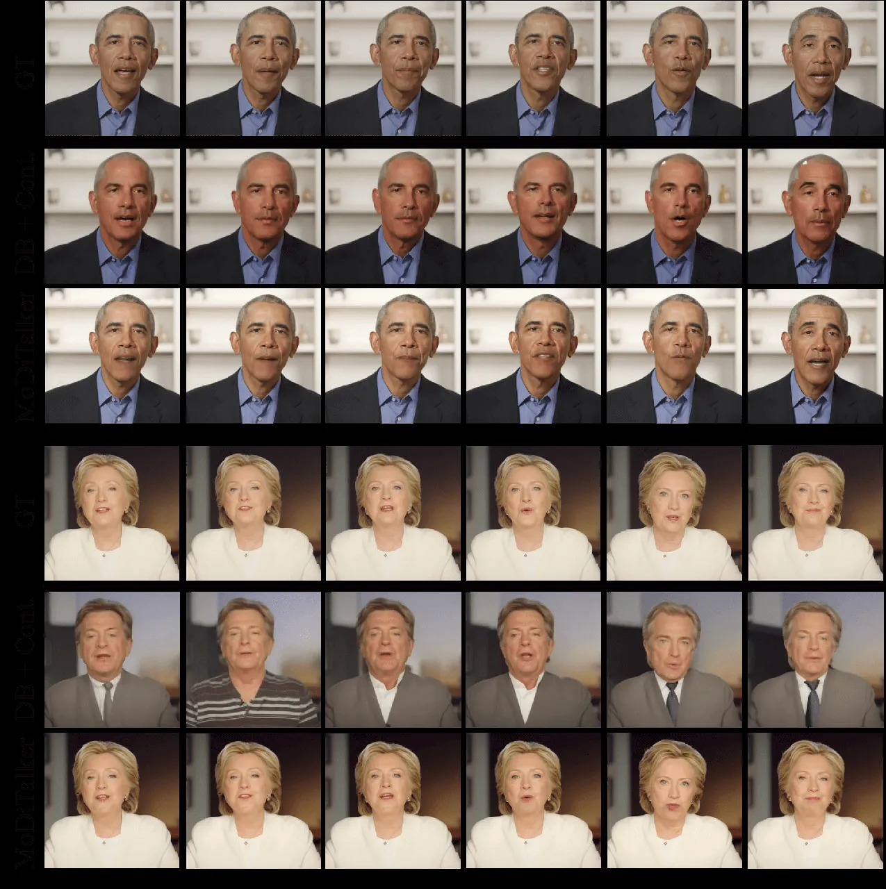

Figure 21: Qualitative comparison with DreamBooth (DB) \[36\] and
ControlNet (Cont.) \[57\].

DreamBooth \[36\] is a method for personalizing people, objects, and
styles with Stable Diffusion (SD) models trained on large datasets.
ControlNet \[57\] has become popular as an additional model for
generating images by conditioning on pretrained SD. By using DreamBooth
to optimize SD for a specific person and ControlNet tuned to a facial
motion dataset together, we can create a talking head video personalized
for that individual as shown in Fig. 21.

## Appendix 0.E User study details

We conducted a user study to compare MoDiTalker against prior
GAN-based \[33, 62, 63, 47\] and diffusion-based \[42, 38, 30\]
approaches.

Participants evaluated 15 randomly selected 5-second segments generated
using HDTF audio and identity frames. Our study focused on lip-sync
fidelity, identity preservation, and video quality. For lip-sync
fidelity, participants were provided with audio input and generated
talking head videos from different methods, and were asked, ‘Which video
do you think has the best lip synchronization?’ For identity
preservation, we provided an identity frame and generated talking head
videos from various methods, and asked participants, ‘Which video do you
think preserves identity the most?’ Lastly, for video quality, we
presented generated talking head videos from different studies and asked
participants, ‘Which video do you think has the highest quality?’

Results shown in main paper demonstrate that MoDiTalker surpasses
previous works in all aspects, highlighting the effectiveness of our
approach.

## Appendix 0.F Limitations

Although MoDiTalker demonstrates valuable performance in various
settings, our model inherits some limitations. While our model creates
video frames by generating multiple frames simultaneously, ensuring
temporal consistency within frames, there are instances where temporal
consistency between frames is less ideal. This issue could be alleviated
with additional post-processing. Additionally, the lack of dynamic poses
in the HDTF dataset poses a challenge in generating dynamic and diverse
poses, reflecting constraints within the dataset itself.
