# MI-NeRF: Learning a Single Face NeRF from Multiple Identities

Aggelina Chatziagapi Affiliation: Stony Brook University
Email: [aggelina@cs.stonybrook.edu](mailto:)    Grigorios G. Chrysos
Affiliation: University of Wisconsin-Madison
Email: [chrysos@wisc.edu](mailto:)    Dimitris Samaras
Affiliation: Stony Brook University
Email: [samaras@cs.stonybrook.edu](mailto:)

###### Abstract

In this work, we introduce a method that learns a single dynamic neural
radiance field (NeRF) from monocular talking face videos of multiple
identities. NeRFs have shown remarkable results in modeling the 4D
dynamics and appearance of human faces. However, they require
per-identity optimization. Although recent approaches have proposed
techniques to reduce the training and rendering time, increasing the
number of identities can be expensive. We introduce MI-NeRF
(multi-identity NeRF), a single unified network that models complex
non-rigid facial motion for multiple identities, using only monocular
videos of arbitrary length. The core premise in our method is to learn
the non-linear interactions between identity and non-identity specific
information with a multiplicative module. By training on multiple videos
simultaneously, MI-NeRF not only reduces the total training time
compared to standard single-identity NeRFs, but also demonstrates
robustness in synthesizing novel expressions for any input identity. We
present results for both facial expression transfer and talking face
video synthesis. Our method can be further personalized for a target
identity given only a short video. Project page:
[https://aggelinacha.github.io/MI-NeRF/](https://aggelinacha.github.io/MI-NeRF/).

|     |
| --- |
|     |

## 1 Introduction

Capturing the 4D dynamics and appearance of non-rigid motion of humans
has long been a challenge for both computer vision and graphics. This
task has broad applications, ranging from AR/VR and video games to
virtual communication and the movie industry, all of which require the
creation of photorealistic videos of the human face. Earlier approaches
relied on 3D morphable models (3DMM) (Garrido et al., 2015; Garrido
et al., 2014; Thies et al., 2016), while later methods have turned to
generative adversarial networks (GANs) (Kim et al., 2018; Pumarola
et al., 2020; Prajwal et al., 2020; Vougioukas et al., 2020). GANs learn
representations of facial dynamics from large datasets, containing video
clips from multiple identities. To disentangle latent factors of
variation, such as identity and expression, some works have imposed
multilinear structures (Sahasrabudhe et al., 2019; Wang et al., 2019;
Georgopoulos et al., 2020), building on the ideas of
TensorFaces (Vasilescu & Terzopoulos, 2002). Despite their success, most
GANs operate in the 2D image space and they do not model the 3D face
geometry.

Neural radiance fields (NeRF) have recently demonstrated photorealistic
3D modeling of both static (Mildenhall et al., 2020; Barron et al.,
2021; Barron et al., 2022; Lindell et al., 2022) and dynamic
scenes (Pumarola et al., 2021; Li et al., 2021; Li et al., 2022; Park
et al., 2021a; Gafni et al., 2020; Park et al., 2021b; Weng et al.,
2022), making them a popular choice for modeling human faces from
monocular videos (Gafni et al., 2020; Park et al., 2021a; Park et al.,
2021b; Athar et al., 2022). Approaches that leverage a 3DMM prior and
condition on expression parameters enable control of facial expressions,
for applications such as expression transfer (Gafni et al., 2020) and
lip syncing (Chatziagapi et al., 2023). Despite their high-quality
results, NeRFs require expensive per-scene or per-identity optimization.
Recent works (Zielonka et al., 2023; Duan et al., 2023; Wang et al.,
2024; Qian et al., 2023) propose techniques to reduce the training and
rendering times. However, increasing the number of identities to
hundreds can be expensive, since we would need one model per identity
with corresponding learnable parameters. A few works learn more generic
representations (Wang et al., 2021a; Chen et al., 2021; Trevithick &
Yang, 2021; Yu et al., 2021; Kwon et al., 2021; Mu et al., 2023; Hong
et al., 2022), but they require static settings and/or multiple input
views during training.

In this work, we propose MI-NeRF (multi-identity NeRF), a novel method
that learns a single dynamic NeRF from monocular talking face videos of
multiple identities. Using only a _single_ network, it learns to model
complex non-rigid human face motion, while disentangling identity and
non-identity specific information. At the epicenter of our approach lies
a multiplicative module that approximates the non-linear interactions
between latent factors of variation, inspired by ideas that go back to
TensorFaces (Vasilescu & Terzopoulos, 2002). This module learns a
non-linear mapping of identity codes and facial expressions, based on
the Hadamard product. To the best of our knowledge, this is the first
method that learns a single unified face NeRF from monocular videos of
multiple identities.

Trained on multiple videos simultaneously, MI-NeRF significantly reduces
the training time, compared to multiple standard single-identity NeRFs,
by up to $`90\%`$, leading to a sublinear cost curve. Further
personalization for a target identity requires only a few iterations and
leads to a performance on par with the state-of-the-art for facial
expression transfer and audio-driven talking face video synthesis.
Leveraging information from multiple identities, MI-NeRF demonstrates
significant robustness in synthesizing novel (unseen) expressions for an
input subject. It also works for very short video clips of only a few
seconds length. We intend to release the source code upon acceptance of
the paper.

In brief, our contributions are as follows:

- •
  We introduce MI-NeRF, a novel method that learns a single dynamic NeRF
  from monocular talking face videos of multiple identities.
- •
  We propose a multiplicative module to learn non-linear interactions
  between identity and non-identity specific information. We present two
  specific parameterizations for this module and provide their technical
  derivations.
- •
  Our generic model can be further personalized for a target identity,
  achieving state-of-the-art performance for facial expression transfer
  and talking face video synthesis, requiring only a fraction of the
  total training time of standard single-identity NeRFs.

## 2 Related Work

Human Portrait Video Synthesis. Earlier approaches for video synthesis
and editing of human faces are based on 3DMMs (Garrido et al., 2015;
Garrido et al., 2014; Thies et al., 2016). A 3DMM (Blanz & Vetter, 1999)
is a parametric model that represents a face as a linear combination of
principle axes for shape, texture, and expression, learned by principal
component analysis (PCA). GAN-based networks have been later proposed
for video synthesis (Kim et al., 2018; Siarohin et al., 2019; Pumarola
et al., 2020), as well as for audio-driven talking faces (Prajwal
et al., 2020; Zhou et al., 2021; Vougioukas et al., 2020). GANs are
trained on large datasets with video clips from multiple identities,
learning diverse facial expressions and lip movements. However, they
operate in a low resolution 2D image space and they cannot model the 3D
face geometry. NeRFs (Mildenhall et al., 2020) have recently become very
popular, since they can represent the 3D face geometry and appearance,
and generate photorealistic videos (Gafni et al., 2020; Guo et al.,
2021; Park et al., 2021a; Park et al., 2021b). Subsequent
works (Zielonka et al., 2023; Duan et al., 2023; Qian et al., 2023)
propose techniques to reduce the training and inference time.

Multilinear Factor Analysis of Faces. Factors of variation, such as
identity, expression, and illumination, affect the appearance of a human
face in a portrait video. Disentangling those factors is challenging.
Techniques like PCA can only find a single mode of variation (Turk &
Pentland, 1991). TensorFaces (Vasilescu & Terzopoulos, 2002) is an early
approach that approximates different modes of variation using a
multilinear tensor decomposition. Inspired by this, several works have
proposed to learn multiplicative interactions to disentangle latent
factors of variation (Vlasic et al., 2006; Tang et al., 2013; Wang
et al., 2017). Multilinear latent conditioning has also been proved
beneficial for GANs and VAEs, in order to disentangle and edit face
attributes (Sahasrabudhe et al., 2019; Wang et al., 2019; Georgopoulos
et al., 2020; Chrysos et al., 2021). In this work, we propose a
multiplicative module that conditions a NeRF and approximates the
non-linear interactions between identity and non-identity specific
information.

Neural Radiance Fields. Implicit neural representations for modeling 3D
scenes have recently gained a lot of attention. In particular,
NeRFs (Mildenhall et al., 2020; Barron et al., 2021; Barron et al.,
2022; Lindell et al., 2022) have shown photorealistic novel view
synthesis of complex scenes. They represent a static scene as a
continuous 5D function, using a multilayer perceptron (MLP) that maps
each 5D coordinate (3D spatial location and 2D viewing direction) to an
RGB color and volume density. However, NeRFs require expensive per-scene
or per-identity optimization. A few works have proposed to learn generic
representations (Wang et al., 2021a; Chen et al., 2021; Trevithick &
Yang, 2021; Yu et al., 2021), but these require static settings and
multiple views as input. In contrast, in this work, we are interested in
dynamic human faces, captured from monocular videos.

Dynamic Neural Radiance Fields for Human Faces. Several works have
extended NeRFs to dynamic scenes (Pumarola et al., 2021; Li et al.,
2021; Li et al., 2022; Park et al., 2021a; Gafni et al., 2020; Park
et al., 2021b; Weng et al., 2022). They usually map the sampled 3D
points from an observation space to a canonical space, in order to learn
a time-invariant scene representation. Some additionally learn
time-variant latent codes (Gafni et al., 2020; Li et al., 2022;
Chatziagapi et al., 2023). Particularly challenging is to capture the 4D
dynamics and appearance of the non-rigid deformations of the human face
from monocular videos. Conditioning a NeRF on 3DMM expression
parameters, related works enable explicit and meaningful control of the
synthesized subject (Gafni et al., 2020; Guo et al., 2021; Athar et al.,
2022; Athar et al., 2021; Chatziagapi et al., 2023; Zielonka et al.,
2023; Duan et al., 2023). Although these approaches can produce HD
quality results, they are identity-specific and usually require long
(more than a few seconds) videos for training. Only a limited prior work
has aimed to train a generic NeRF for human faces (Raj et al., 2021;
Hong et al., 2022; Zhuang et al., 2022). However, all of these models
require multiple views for training. In contrast, we propose a simple
architecture that is capable of learning multiple identities from
monocular videos of arbitrary length captured in the wild.

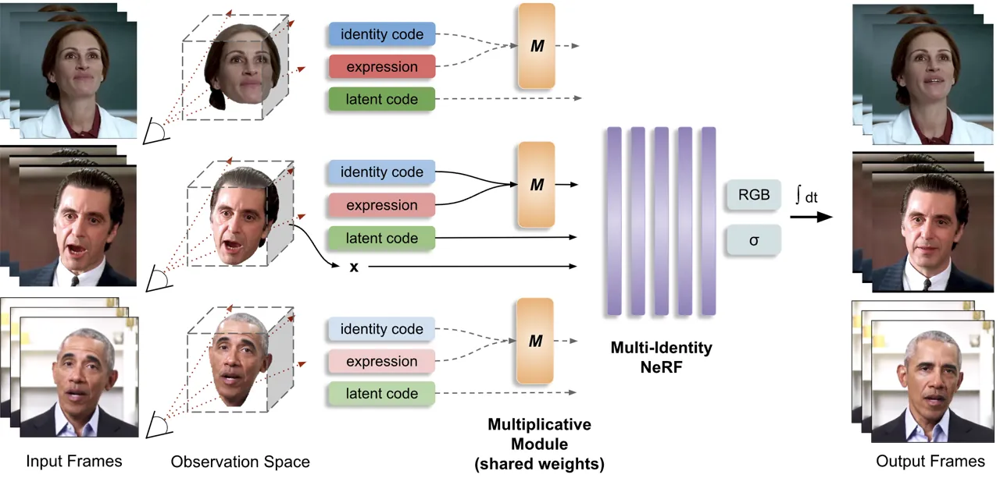

Figure 1: Overview of MI-NeRF. Given monocular talking face videos from
multiple identities, MI-NeRF learns a _single_ network to model their 4D
geometry and appearance. A multiplicative module with shared weights
across all identities learns non-linear interactions between identity
codes and facial expressions. MI-NeRF can synthesize high-quality videos
of any input identity.

## 3 Method

We present MI-NeRF, a novel method that learns a single dynamic NeRF
from monocular talking face videos of multiple identities. An overview
of our approach is illustrated in Fig. 1. Given RGB videos of different
subjects, we learn a _single_ unified network that represents their 4D
facial geometry and appearance. A multiplicative module approximates the
non-linear interactions between learned identity codes and facial
expressions, in order to disentangle identity and non-identity specific
information. Its output, along with learned per-frame latent codes,
condition a dynamic NeRF. With this simple architecture, MI-NeRF enables
training a NeRF on a large number of human faces, reducing the total
training time of standard single-identity NeRFs, and achieving
high-quality video synthesis for any input subject.

### 3.1 Conditional Input

Head Pose and Expression. For each video frame of an identity, we fit a
3DMM and extract the corresponding head pose
$`\bm{P}\in\mathbb{R}^{4\times 4}`$ and expression parameters
$`\bm{e}\in\mathbb{R}^{\text{79}}`$. We follow an optimization-based
method, that minimizes an objective function with photo-consistency and
landmark terms (Guo et al., 2018b). We use the learned axes from Guo
et al. (2018b), based on the Basel Face Model (Paysan et al., 2009) for
shape and texture and the FaceWarehouse (Cao et al., 2013) for
expression. The extracted head pose
$`\bm{P}=\left[\bm{R};\textbf{t}\right]`$ is used to transform the
sampled 3D points to the canonical space before shooting the rays, where
$`\bm{R}\in\mathbb{R}^{3\times 3}`$ and
$`\textbf{t}~\in~\mathbb{R}^{3\times 1}`$ are the rotation and
translation matrices correspondingly.

Learned Identity and Latent Codes. In addition to the expression
vectors, the dynamic NeRF is conditioned on learned identity and latent
codes. Both are randomly initialized embeddings that are learned during
training. We use one identity code $`\bm{i}\in\mathbb{R}^{\text{79}}`$
per video ¹¹ 1 In our preliminary experiments, we found that defining
the identity vector with the same dimension as the expression vector was
sufficient., in order to capture _time-invariant_ information. These
codes appear to mainly capture the identity, and thus we call them
identity codes. We also learn one latent code
$`\bm{l}\in\mathbb{R}^{\text{32}}`$ per frame per video, in order to
capture _time-varying_ information. These latent codes memorize very
small per-frame variations, such as appearance and illumination, that
are independent of facial expressions, but necessary to reconstruct them
in the output videos (Gafni et al., 2020; Chatziagapi et al., 2023).

### 3.2 Proposed Modules

We propose to learn multiplicative interactions between facial
expressions and identity codes using the Hadamard product. Earlier works
have used multilinear tensor decomposition to disentangle latent factors
of variation of the human face (Vasilescu & Terzopoulos, 2002; Wang
et al., 2019; Georgopoulos et al., 2020). Inspired by this, we learn a
non-linear mapping that disentangles identity and non-identity specific
information. This mapping is learned by a single multiplicative module
$`M`$ with shared weights for all identities. We also introduce a
variation of this module, $`H`$, that captures high-degree interactions.
Please see the appendix for the detailed derivation.

#### 3.2.1 Multiplicative Interaction Module

Given an expression vector $`\bm{e}\in\mathbb{R}^{d}`$ and an identity
vector $`\bm{i}\in\mathbb{R}^{d}`$, our multiplicative module $`M`$
learns the following mapping:

```math
M(\bm{e},\bm{i})=\bm{C}\left[\left(\bm{U}_{1}\bm{e}\right)*\left(\bm{U}_{2}\bm{i}\right)\right]+\bm{W}_{2}\bm{e}+\bm{W}_{3}\bm{i}\;, \tag{1}
```

where $`*`$ denotes the Hadamard (element-wise) product that correlates
$`\bm{e}`$ and $`\bm{i}`$, $`\bm{U}_{1}\in\mathbb{R}^{k\times d}`$,
$`\bm{U}_{2}\in\mathbb{R}^{k\times d}`$,
$`\bm{C}\in\mathbb{R}^{d\times k}`$,
$`\bm{W}_{2}\in\mathbb{R}^{d\times d}`$,
$`\bm{W}_{3}\in\mathbb{R}^{d\times d}`$ are learnable parameters, and
$`d=79`$ for our case. We chose $`k<d`$ to get low rank matrices, with
fewer parameters. We experimentally found that this mapping $`M`$ with
$`k=8`$ leads to the best disentanglement between identity and
expression with the least number of parameters (see ablation study in
Sec. 4.2 for more details). Prop. 1 verifies the multiplicative
interactions learned; its proof exists in Sec. A.1.

###### Proposition 1.

The function $`M`$ of Eq. 1 captures multiplicative interactions.

#### 3.2.2 High-degree Interaction Module

We can extend the multiplicative interaction module further, in order to
capture high-degree interactions. Instead of directly multiplying the
embeddings of the expression and the identity vector, we can find a
common embedding space, add their features together and then perform
multiplications. The formula of this module for the expression
$`\bm{e}`$ and identity $`\bm{i}`$ vectors is the following:

```math
H(\bm{e},\bm{i})=\bm{C}\bm{x}_{N}\;,\text{ where }\bm{x}_{n}=\bm{x}_{n-1}+\left(\bm{U}_{(n,1)}\bm{e}+\bm{U}_{(n,2)}\bm{i}\right)*\bm{x}_{n-1}\;, \tag{2}
```

for $`n=2,\dots,N`$, with
$`\bm{x}_{1}=\bm{U}_{(1,1)}\bm{e}+\bm{U}_{(1,2)}\bm{i}`$. The parameters
$`\bm{U}_{(n,1)}\in\mathbb{R}^{k\times d}`$,
$`\bm{U}_{(n,2)}\in\mathbb{R}^{k\times d}`$,
$`\bm{C}\in\mathbb{R}^{o\times k}`$ are learnable for $`n=1,\dots,N`$.
In practice, we choose $`d=k=o=79`$ for our experiments. Using our
proposed module $`H`$ with $`N=2`$ leads to similar performance with our
proposed module $`M`$, and better performance compared to increasing
$`N`$ to larger values (see ablation study in Sec. 4.2). However, we
believe that capturing higher-degree interactions might be beneficial in
other cases. Prop. 2 and Prop. 3 in Sec. A.2 demonstrate the
interactions learned in this case.

### 3.3 Dynamic NeRF

To model the dynamics of human faces, we learn a single dynamic NeRF for
_all_ input identities. For each video frame of a subject, we first
segment the head using an automatic parsing method (Lee et al., 2020),
similarly with Gafni et al. (2020); Guo et al. (2021); Chatziagapi
et al. (2023). Then, we learn an implicit representation $`F_{\Theta}`$
of the identities using an MLP. Given an identity $`\bm{i}`$ at a
specific video frame, shown from a particular viewpoint and with a
particular facial expression, we first march camera rays through the
scene and sample 3D points on these rays. For a 3D point location
$`\bm{x}`$, a viewing direction $`\bm{v}`$, the estimated expression
vector $`\bm{e}`$, and a learned latent vector $`\bm{l}`$,
$`F_{\Theta}`$ predicts the RGB color $`\bm{c}`$ and density $`\sigma`$
of the point:

```math
F_{\Theta}:(M(\bm{e},\bm{i}),\bm{l},\bm{x},\bm{v})\longrightarrow(\bm{c},\sigma)\;. \tag{3}
```

where $`M(\bm{e},\bm{i})`$ can also be replaced with
$`H(\bm{e},\bm{i})`$ (see Sec. 3.2). Given the predicted color
$`\bm{c}`$ and density $`\sigma`$ for every point on each ray, we can
produce the final video frame applying volumetric rendering (Mildenhall
et al., 2020). For each camera ray $`\bm{r}(t)=\bm{o}+t\bm{v}`$ with
camera center $`\bm{o}`$ and viewing direction $`\bm{v}`$, the color
$`C`$ of the corresponding pixel can be computed by accumulating the
predicted colors and densities of the sampled points along the ray:

```math
C(\bm{r};\Theta)=\int_{t_{n}}^{t_{f}}\sigma(\bm{r}(t))\bm{c}(\bm{r}(t),\bm{v})T(t)dt\;, \tag{4}
```

where $`t_{n}`$ and $`t_{f}`$ are the near and far bounds
correspondingly, and
$`T(t)=\exp\left(-\int_{t_{n}}^{t}\sigma(\bm{r}(s))ds\right)`$ is the
accumulated transmittance along the ray from $`t_{n}`$ to $`t`$.

Similarly to NeRF (Mildenhall et al., 2020), we follow a hierarchical
sampling strategy, optimizing a coarse and a fine model. During
training, we minimize the following objective function:

```math
\mathcal{L}=\mathcal{L}_{c}+\lambda_{l}\mathcal{L}_{l}+\lambda_{i}\mathcal{L}_{i}\;,\text{where }\mathcal{L}_{c}=\sum_{\bm{r}}\left\|\hat{C}(\bm{r};\Theta)-C(\bm{r})\right\|_{2}^{2} \tag{5}
```

is the photo-consistency loss that measures the pixel-level difference
between the ground truth color $`C(\bm{r})`$ and the predicted color
$`\hat{C}(\bm{r};\Theta)`$ for all the rays $`\bm{r}`$,
$`\mathcal{L}_{l}=\left\|\bm{l}\right\|_{2}`$ and
$`\mathcal{L}_{i}=\left\|\bm{i}\right\|_{2}`$ regularize the latent and
identity vectors correspondingly, $`\lambda_{l}=0.01`$ and
$`\lambda_{i}=10^{-4}`$.

Implementation Details. We use an MLP of 8 linear layers with a hidden
size of 256 and ReLU activations, with branches for $`\bm{c}`$ and
$`\sigma`$, positional encodings for $`\bm{x}`$ and $`\bm{v}`$ of 10 and
4 frequencies respectively, and Adam optimizer (Kingma & Ba, 2014) with
a learning rate of $`5\times 10^{-4}`$ that decays exponentially to
$`5\times 10^{-5}`$ (see appendix E for more details).

### 3.4 Personalization

Trained on multiple identities simultaneously, MI-NeRF learns a large
variety of facial expressions from diverse human faces and can
synthesize videos of any training identity. To enhance the visual
quality for a particular seen subject, i.e. to better capture their
facial details, such as wrinkles, we can further improve the output
appearance using a short video of this subject. We call this procedure
“personalization”. More specifically, we fine-tune the network with a
small learning rate ($`10^{-5}`$) for only a few iterations, keeping the
weights of the multiplicative module frozen. This idea can also be used
to adapt MI-NeRF to an unseen identity (that is not part of the initial
training set). Given only a few frames of an unseen subject, we can
fine-tune our network to learn their identity and latent codes. Then, we
can synthesize high-quality videos of them, given novel expressions as
input.

## 4 Experiments

### 4.1 Dataset and Evaluation

Dataset. To evaluate our proposed method, we collected 140 talking face
videos of different identities from publicly available datasets (Guo
et al., 2021; Lu et al., 2021; Chatziagapi et al., 2023; Hazirbas
et al., 2021; Ginosar et al., 2019; Ahuja et al., 2020; Duarte et al.,
2021; Zhang et al., 2021; Wang et al., 2021b). We included a variety of
standard front-facing videos (e.g. political speeches), as well as more
challenging videos, with large variations in head pose, lighting, and
expressiveness (e.g. movies and news satire television programs). The
videos are in HD quality (720p) and of around 20 seconds to 5 minutes
duration. For each video, we run the 3DMM fitting procedure, as
described in Sec. 3.1. We use 100 videos for our training set and we
keep the rest as novel identities. We keep the last 10% of the frames of
the training videos as our test set. More details of our dataset
collection are included in the appendix.

Evaluation Metrics. We measure the visual quality of the generated
videos, using peak signal-to-noise ratio (PSNR), structural similarity
index (SSIM) (Wang et al., 2004), and learned perceptual image patch
similarity (LPIPS) (Zhang et al., 2018), and we verify the identity of
the target subject, using the average content distance (ACD) (Vougioukas
et al., 2019; Tulyakov et al., 2018). Additionally, we use the LSE-D
(Lip Sync Error - Distance) and LSE-C (Lip Sync Error - Confidence)
metrics (Prajwal et al., 2020; Chung & Zisserman, 2016), to assess the
lip synchronization, i.e. if the generated expressions are meaningful
given the corresponding speech signal.

| Method                                                                                                                  | PSNR $`\uparrow`$ | ACD $`\downarrow`$ | LSE-D $`\downarrow`$ | LSE-C $`\uparrow`$ |
| ----------------------------------------------------------------------------------------------------------------------- | ----------------- | ------------------ | -------------------- | ------------------ |
| Baseline NeRF (without $`M`$)                                                                                           | 28.65             | 0.229              | 9.08                 | 4.06               |
| (A1) $`M(\bm{e},\bm{i})=\bm{W}_{2}\bm{e}+\bm{W}_{3}\bm{i}`$                                                             | 29.08             | 0.200              | 8.80                 | 4.19               |
| (A2) $`M(\bm{e},\bm{i})=\left(\bm{e}*\bm{i}\right)+\bm{W}_{2}\bm{e}+\bm{W}_{3}\bm{i}`$                                  | 28.84             | 0.207              | 9.07                 | 3.80               |
| (A3) $`M(\bm{e},\bm{i})=\bm{W}_{1}\left(\bm{e}*\bm{i}\right)+\bm{W}_{1}\bm{e}+\bm{W}_{1}\bm{i}`$                        | 28.50             | 0.227              | 9.19                 | 3.61               |
| (A4) $`M(\bm{e},\bm{i})=\bm{W}_{1}\left(\bm{e}*\bm{i}\right)`$                                                          | 29.12             | 0.228              | 10.49                | 2.36               |
| (A5) $`M(\bm{e},\bm{i})=\left(\bm{W}_{2}\bm{e}\right)*\left(\bm{W}_{3}\bm{i}\right)+\bm{W}_{2}\bm{e}+\bm{W}_{3}\bm{i}`$ | 28.95             | 0.204              | 9.25                 | 3.58               |
| (A6) $`M(\bm{e},\bm{i})=\bm{W}_{1}\left(\bm{e}*\bm{i}\right)+\bm{W}_{2}\bm{e}+\bm{W}_{3}\bm{i}`$                        | 28.53             | 0.221              | 9.27                 | 3.29               |
| (A7) $`M(\bm{e},\bm{i})=\bm{\mathcal{W}}\times_{2}\bm{e}\times_{3}\bm{i}`$                                              | 28.41             | 0.274              | 9.82                 | 3.10               |
| MI-NeRF with $`M`$ without latent codes $`\bm{l}`$                                                                      | 28.95             | 0.201              | 8.82                 | 4.19               |
| MI-NeRF with $`M`$ with $`k=32`$                                                                                        | 29.08             | 0.192              | 9.19                 | 3.94               |
| MI-NeRF with $`H`$ with $`N=3`$                                                                                         | 28.69             | 0.209              | 9.37                 | 4.08               |
| MI-NeRF with $`H`$ with $`N=4`$                                                                                         | 28.00             | 0.289              | 10.07                | 2.74               |
| MI-NeRF with $`M`$ (Ours)                                                                                               | 29.73             | 0.158              | 8.62                 | 4.24               |
| MI-NeRF with $`H`$ (Ours)                                                                                               | 28.95             | 0.180              | 8.82                 | 4.24               |

Table 1: Ablation Study. Quantitative results for different variants of
our model. The proposed multiplicative module $`M`$ leads to the best
disentanglement (lower ACD) and visual quality (higher PSNR) with the
least possible parameters.

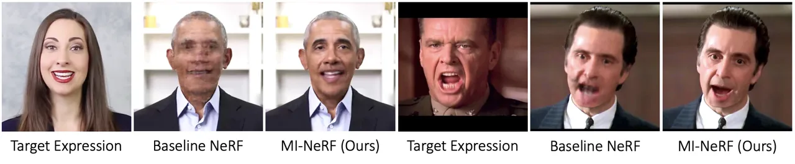

Figure 2: Ablation Study. Qualitative comparison of MI-NeRF with
Baseline NeRF that concatenates all input conditions, without using any
multiplicative module, and leads to poor disentanglement. Our proposed
multiplicative module demonstrates robustness, disentangling between
identity and expression.

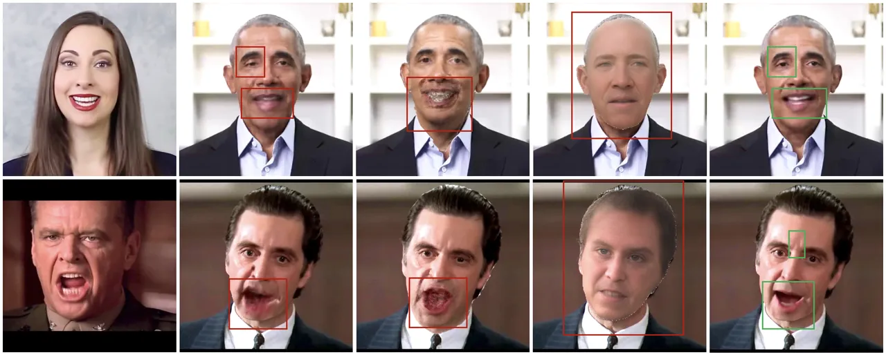

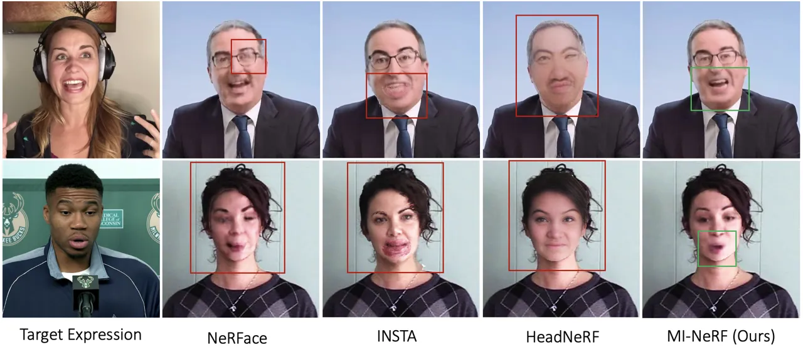

Figure 3: Transferring Novel Expressions. Qualitative comparison of
MI-NeRF with state-of-the-art approaches when transferring unseen
expressions to a target identity. NeRFace (Gafni et al., 2020) is a
single-identity NeRF, INSTA (Zielonka et al., 2023) is a single-identity
geometry-guided deformable NeRF, and HeadNeRF (Hong et al., 2022) is a
NeRF-based parametric head model trained on a large dataset. Our method
demonstrates robustness in synthesizing novel (unseen) expressions for
any input identity.

### 4.2 Ablation Study

We conduct an ablation study on the multiplicative module and the input
conditions of MI-NeRF. Given 10 videos from different identities, we
investigate variants of our model (see Table 1). After training, we
synthesize a video of each identity given input expressions from another
one. In this way, we evaluate if the model learns to disentangle
identity and non-identity specific information.

Firstly, we evaluate the possibility of simply concatenating all the
input vectors, as usually done in standard identity-specific
NeRFs (Gafni et al., 2020; Guo et al., 2021; Chatziagapi et al., 2023),
i.e. omitting the multiplicative module. We call this “Baseline NeRF”.
As shown in Table 1 and Fig. 2, Baseline NeRF cannot learn to
disentangle between different identities. Based on the
identity-expression pairs seen during training, it frequently
synthesizes a different identity than the target one, or a mixture of
identities, leading to visible artifacts.

Variants of the proposed multiplicative module $`M`$ are examined in
rows (A1) to (A7) to determine the simplest and most effective option.
We started by just learning a simple mapping of the $`\bm{e}`$ and
$`\bm{i}`$ vectors, using $`\bm{W}_{2}`$ and $`\bm{W}_{3}`$ matrices
(A1). We then explored variants that include a Hadamard product
$`(\bm{e}*\bm{i})`$ to model their non-linear interaction. The last
variant (A7) is inspired by Wang et al. (2019) and uses
$`\bm{\mathcal{W}}\in\mathbb{R}^{d\times d\times d}`$, requiring
significantly more parameters than our proposed $`M`$ ($`d^{3}`$ vs
$`d^{2}`$). The variant (A6) can be derived from (A7), using similar
arguments to Sec. A.1. All these variants (A1) - (A7) lead to different
disentanglement results, with many of them being quite poor.

In the following rows, we show the small decrease in visual quality if
we omit the latent codes, that learn very small per-frame variations in
appearance, as noted in Sec. 3.1, or use different hyperparameters:
$`k=32`$ for $`M`$ and $`N=3`$ or $`N=4`$ for $`H`$. We conclude that
our proposed multiplicative module $`M`$ leads to the best
disentanglement and highest visual quality with the least possible
parameters. Our proposed $`H`$ leads to the second best disentanglement
between identity and expression (low ACD metric) and produces videos of
comparable visual quality and lip synchronization (LSE metrics).
Qualitatively, we observe similar results for $`H`$ with $`N=2`$ as
$`M`$.

### 4.3 Facial Expression Transfer

In this section, we demonstrate the effectiveness of MI-NeRF for facial
expression transfer. Given an identity from the training set, MI-NeRF
enables explicit control of their expressions, and thus can synthesize
high-quality videos of them given novel expressions as input.

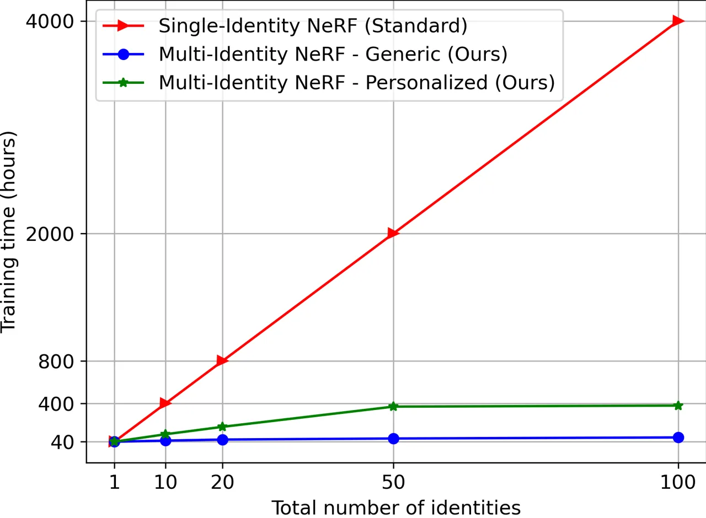

(a)

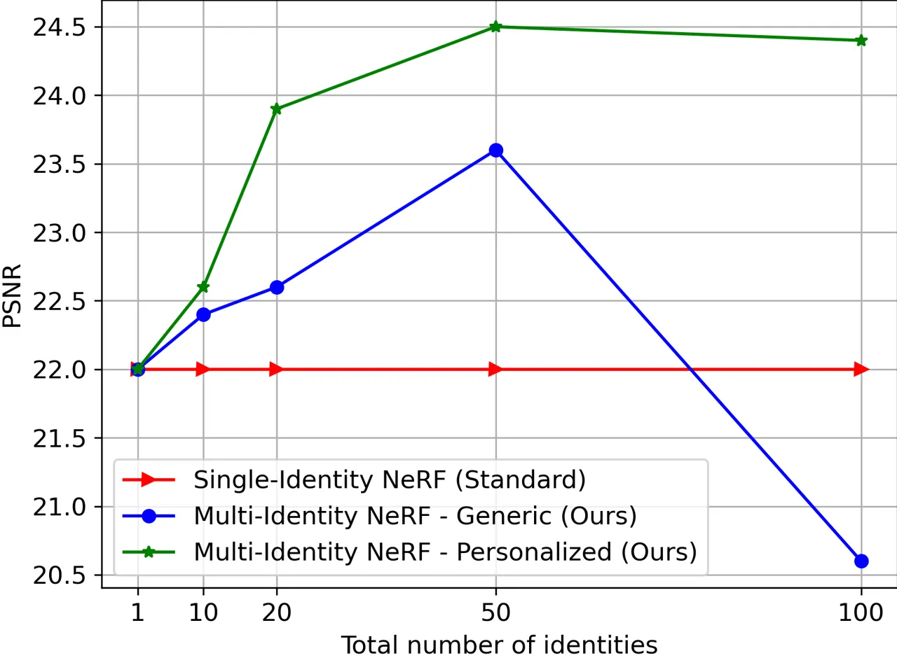

(b)

Figure 4: Left: Total training time vs total number of identities.
Standard single-identity NeRFs, like NeRFace (Gafni et al., 2020),
AD-NeRF (Guo et al., 2021), and LipNeRF (Chatziagapi et al., 2023)
require approximately 40 hours training per identity. On the contrary,
our MI-NeRF (generic) can be trained on 100 identities in 80 hours,
leading to a $`90\%`$ decrease approximately. Further personalization
takes another 5-8 hours per identity. Right: Corresponding visual
quality of generated videos with challenging novel expressions, measured
by PSNR (higher the better). Increasing the number of identities
improves the robustness of our model to unseen expressions.

| Method                        | PSNR $`\uparrow`$ | SSIM $`\uparrow`$ | LPIPS $`\downarrow`$ | ACD $`\downarrow`$ |
| ----------------------------- | ----------------- | ----------------- | -------------------- | ------------------ |
| NeRFace (Gafni et al., 2020)  | 28.11             | 0.88              | 0.13                 | 0.11               |
| INSTA (Zielonka et al., 2023) | 28.02             | 0.87              | 0.12                 | 0.10               |
| HeadNeRF (Hong et al., 2022)  | 19.89             | 0.74              | 0.32                 | 0.85               |
| Baseline NeRF                 | 26.21             | 0.85              | 0.22                 | 0.32               |
| MI-NeRF (Ours)                | 28.28             | 0.88              | 0.13                 | 0.11               |

Table 2: Facial Expression Transfer. Quantitative comparison of our
method with state-of-the-art methods for transferring facial
expressions.

Comparisons. Fig. 3 demonstrates the results of MI-NeRF with $`M`$
(personalized) for challenging novel expressions, not seen for the
target identity. We compare with methods that similarly allow meaningful
control of expression parameters. NeRFace (Gafni et al., 2020) is a
standard identity-specific NeRF, without any multiplicative module. Its
immediate extension is the Baseline NeRF that is trained on multiple
identities, concatenating additional identity vectors as input.
INSTA (Zielonka et al., 2023) learns a single-identity NeRF, embedded
around FLAME (Li et al., 2017) and based on neural graphics primitives,
that enables faster training and rendering. HeadNeRF (Hong et al., 2022)
is a NeRF-based parametric head model, trained on a large amount of
high-quality images from multiple identities. Table 2 shows the
corresponding quantitative results of facial expression transfer,
computed on 10 synthesized videos from our test set.

We notice that NeRFace and INSTA can produce good visual quality, but
cannot generalize to unseen expressions. Trained only on a video of a
single identity, they have only seen a limited variety of facial
expressions, and thus can lead to artifacts in case of novel input
expressions (see Fig. 3). HeadNeRF distorts the target identity and
inaccurately produces the target facial expression. Our method
demonstrates robustness in synthesizing novel expressions for any
identity, as it leverages information from multiple subjects during
training. Fig. 4 (right) shows the corresponding PSNR, computed on
frames with challenging unseen expressions for a particular subject.
MI-NeRF significantly outperforms the standard single-identity
NeRFace (Gafni et al., 2020) and INSTA (Zielonka et al., 2023) in such
cases. Increasing the number of training identities improves the
robustness of our generic model. Further personalization enhances the
final visual quality.

Training Time. MI-NeRF significantly outperforms the standard
single-identity NeRF-based methods, like NeRFace (Gafni et al., 2020),
in terms of the training time (see Fig. 4 left). Training on 100
identities needs only about 80 hours of training, compared to 40 hours
per identity needed by standard NeRFs, leading to a $`90\%`$ decrease
approximately. Further personalization for a target identity adds only
another 5-8 hours of training on average, enhancing the visual quality
(see Fig. 4 right). In the appendix, we show that our multiplicative
module can also be applied to faster methods, like INSTA (Zielonka
et al., 2023), extending them to multiple identities and similarly
achieving a $`90\%`$ decrease in training time for 100 identities. We
encourage the readers to watch our suppl. video.

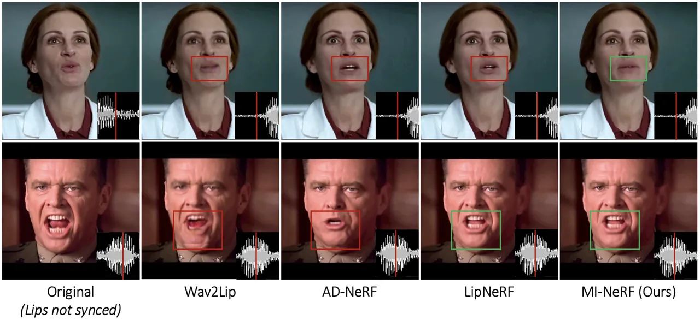

Figure 5: Lip Synced Video Synthesis. Qualitative comparison of our
method with state-of-the-art approaches, GAN-based Wav2Lip (Prajwal
et al., 2020), AD-NeRF (Guo et al., 2021) and Lip-NeRF (Chatziagapi
et al., 2023). The original video is in English (1st column). The
generated videos (columns 2-5) are lip synced to dubbed audio in
Spanish.

| Method                             | LSE-D $`\downarrow`$ | LSE-C $`\uparrow`$ | PSNR $`\uparrow`$ | SSIM $`\uparrow`$ |
| ---------------------------------- | -------------------- | ------------------ | ----------------- | ----------------- |
| AD-NeRF (Guo et al., 2021)         | 11.40                | 1.28               | 27.38             | 0.84              |
| LipNeRF (Chatziagapi et al., 2023) | 9.92                 | 2.71               | 30.10             | 0.89              |
| GeneFace (Ye et al., 2023)         | 11.80                | 2.22               | 25.56             | 0.85              |
| MI-NeRF (Ours)                     | 9.46                 | 2.98               | 30.21             | 0.90              |

Table 3: Lip Synced Video Synthesis. Quantitative comparison of our
method with state-of-the-art approaches on generated videos lip-synced
to dubbed audio in different languages.

### 4.4 Lip Synced Video Synthesis

MI-NeRF can be also used for audio-driven talking face video synthesis,
also called lip-syncing. Prior work, LipNeRF (Chatziagapi et al., 2023),
has shown that conditioning a NeRF on the 3DMM expression space,
compared to audio features, leads to more accurate and photorealistic
lip synced videos. Our method naturally extends LipNeRF to multiple
identities, using their proposed audio-to-expression mapping. For this
task, we used the dataset proposed by LipNeRF (Chatziagapi et al.,
2023) ²² 2 We would like to thank the authors of LipNeRF for providing
the cinematic data from YouTube.. It includes 10 videos from popular
movies in English, of around 30 seconds to 2 minutes long each in HD
resolution (720p), and corresponding dubbed audio in 2 or 3 different
languages for each video, including French, Spanish, German and Italian.

Results. Table 3 shows the corresponding quantitative evaluation of the
synthesized videos, lip synced to dubbed audio in different languages.
Leveraging information from multiple identities, MI-NeRF slightly
improves the LSE metrics and achieves similar visual quality with
LipNeRF, at much lower training time (see Fig. 4). AD-NeRF (Guo et al., 2021) and GeneFace (Ye et al., 2023) lack in lip synchronization for
this task. Fig. 5 compares the mouth position for two examples, lip
synced to Spanish (original audio in English). The GAN-based method,
Wav2Lip (Prajwal et al., 2020), frequently produces artifacts and blurry
results. Since it operates in the 2D image space, it cannot handle large
3D movements. AD-NeRF overfits to the training audio and cannot
generalize well to different speech inputs. LipNeRF performs well, but
sometimes cannot produce unseen expressions (e.g. does not close the
mouth in the first row), since it is only trained on a single video of
limited duration. Both AD-NeRF and LipNeRF are standard single-identity
NeRFs, requiring expensive identity-specific optimization.

### 4.5 Short-Video Personalization

MI-NeRF can also be adapted to an unseen identity, i.e. that is not seen
as a part of the initial training set (see Sec. 3.4). Fig. 6
demonstrates the results when only a very short video of the new
identity is available (1 or 3 seconds length). Please note that in this
case we use a small number of consecutive frames, and thus a very small
part of the expression space is covered. In this case, the
single-identity INSTA (Zielonka et al., 2023) cannot learn a good head
representation of the identity, given that very short video, and
produces artifacts. HeadNeRF is trained on a large dataset of images and
its fitting requires only a single image. However, it fails to capture
the identity accurately. Our method demonstrates robustness under unseen
expressions and novel views for the new identity. We include more
quantitative and qualitative results for our short-video personalization
in the appendix. We also encourage the readers to watch our
supplementary video.

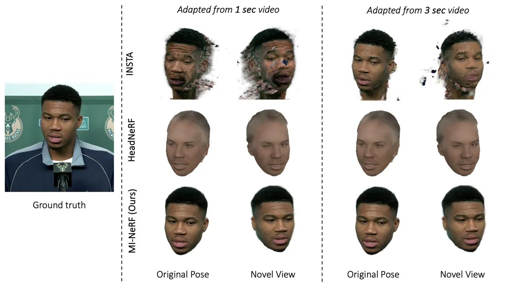

Figure 6: Short-Video Personalization. Learning a novel identity from a
short video of 1 or 3 seconds duration. Qualitative comparison of
MI-NeRF with the single-identity INSTA (Zielonka et al., 2023) and the
NeRF-based parametric head model HeadNeRF (Hong et al., 2022). Our
method demonstrates robustness across unseen expressions and novel views
for any new identity.

## 5 Conclusion

In this work, we introduce MI-NeRF that learns a single dynamic NeRF
from monocular talking face videos of multiple identities. We propose a
multiplicative module that captures the non-linear interactions of
identity and non-identity specific information. Trained on multiple
identities, MI-NeRF significantly reduces the training time over
standard single-identity NeRFs. Our model can be further personalized
for a target identity, given only a short video of a few seconds length,
achieving state-of-the-art performance for facial expression transfer
and talking face video synthesis. In the future, we envision extending
our approach to thousands of identities, learning collectively from very
short in-the-wild video clips.

## Reproducibility Statement

Our plan is to make the source code of our model publicly available once
our work is accepted. We provide comprehensive documentation of the
hyperparameters employed and offer detailed explanations of all the
techniques used, supported by thorough ablation studies.

## References

- Ahuja et al. (2020) Chaitanya Ahuja, Dong Won Lee, Yukiko I. Nakano,
  and Louis-Philippe Morency. Style transfer for co-speech gesture
  animation: A multi-speaker conditional-mixture approach. August 2020.
  URL
  [https://arxiv.org/abs/2007.12553](https://arxiv.org/abs/2007.12553).
- Athar et al. (2021) ShahRukh Athar, Zhixin Shu, and Dimitris Samaras.
  Flame-in-nerf: Neural control of radiance fields for free view face
  animation. _arXiv preprint arXiv:2108.04913_, 2021.
- Athar et al. (2022) ShahRukh Athar, Zexiang Xu, Kalyan Sunkavalli, Eli
  Shechtman, and Zhixin Shu. Rignerf: Fully controllable neural 3d
  portraits. In _Computer Vision and Pattern Recognition (CVPR)_, 2022.
- Barron et al. (2021) Jonathan T. Barron, Ben Mildenhall, Matthew
  Tancik, Peter Hedman, Ricardo Martin-Brualla, and Pratul P.
  Srinivasan. Mip-nerf: A multiscale representation for anti-aliasing
  neural radiance fields, 2021.
- Barron et al. (2022) Jonathan T. Barron, Ben Mildenhall, Dor Verbin,
  Pratul P. Srinivasan, and Peter Hedman. Mip-nerf 360: Unbounded
  anti-aliased neural radiance fields. _CVPR_, 2022.
- Blanz & Vetter (1999) Volker Blanz and Thomas Vetter. A morphable
  model for the synthesis of 3d faces. In _Proceedings of the 26th
  annual conference on Computer graphics and interactive techniques_,
  pp. 187–194, 1999.
- Cao et al. (2013) Chen Cao, Yanlin Weng, Shun Zhou, Yiying Tong, and
  Kun Zhou. Facewarehouse: A 3d facial expression database for visual
  computing. _IEEE Transactions on Visualization and Computer Graphics_,
  20(3):413–425, 2013.
- Chatziagapi et al. (2023) Aggelina Chatziagapi, ShahRukh Athar,
  Abhinav Jain, Rohith Mysore Vijaya Kumar, Vimal Bhat, and Dimitris
  Samaras. Lipnerf: What is the right feature space to lip-sync a nerf.
  In _International Conference on Automatic Face and Gesture Recognition
  2023_, 2023. URL
  [https://www.amazon.science/publications/lipnerf-what-is-the-right-feature-space-to-lip-sync-a-nerf](https://www.amazon.science/publications/lipnerf-what-is-the-right-feature-space-to-lip-sync-a-nerf).
- Chen et al. (2021) Anpei Chen, Zexiang Xu, Fuqiang Zhao, Xiaoshuai
  Zhang, Fanbo Xiang, Jingyi Yu, and Hao Su. Mvsnerf: Fast generalizable
  radiance field reconstruction from multi-view stereo. _arXiv preprint
  arXiv:2103.15595_, 2021.
- Chen et al. (2023) Lifeng Chen, Jia Liu, Yan Ke, Wenquan Sun, Weina
  Dong, and Xiaozhong Pan. Marknerf: Watermarking for neural radiance
  field. _arXiv preprint arXiv:2309.11747_, 2023.
- Chrysos et al. (2021) Grigorios Chrysos, Markos Georgopoulos, and
  Yannis Panagakis. Conditional generation using polynomial expansions.
  _Advances in Neural Information Processing Systems_,
  34:28390–28404, 2021.
- Chung & Zisserman (2016) Joon Son Chung and Andrew Zisserman. Out of
  time: automated lip sync in the wild. In _Asian conference on computer
  vision_, pp. 251–263. Springer, 2016.
- Duan et al. (2023) Hao-Bin Duan, Miao Wang, Jin-Chuan Shi, Xu-Chuan
  Chen, and Yan-Pei Cao. Bakedavatar: Baking neural fields for real-time
  head avatar synthesis. _ACM Trans. Graph._, 42(6), sep 2023. doi:
  10.1145/3618399. URL
  [https://doi.org/10.1145/3618399](https://doi.org/10.1145/3618399).
- Duarte et al. (2021) Amanda Duarte, Shruti Palaskar, Lucas Ventura,
  Deepti Ghadiyaram, Kenneth DeHaan, Florian Metze, Jordi Torres, and
  Xavier Giro-i Nieto. How2Sign: A Large-scale Multimodal Dataset for
  Continuous American Sign Language. In _Conference on Computer Vision
  and Pattern Recognition (CVPR)_, 2021.
- Gafni et al. (2020) Guy Gafni, Justus Thies, Michael Zollhöfer, and
  Matthias Nießner. Dynamic neural radiance fields for monocular 4d
  facial avatar reconstruction, 2020.
- Garrido et al. (2014) Pablo Garrido, Levi Valgaerts, Ole Rehmsen,
  Thorsten Thormahlen, Patrick Perez, and Christian Theobalt. Automatic
  face reenactment. In _Proceedings of the IEEE conference on computer
  vision and pattern recognition_, pp. 4217–4224, 2014.
- Garrido et al. (2015) Pablo Garrido, Levi Valgaerts, Hamid Sarmadi,
  Ingmar Steiner, Kiran Varanasi, Patrick Perez, and Christian Theobalt.
  Vdub: Modifying face video of actors for plausible visual alignment to
  a dubbed audio track. In _Computer graphics forum_, volume 34, pp.
  193–204. Wiley Online Library, 2015.
- Georgopoulos et al. (2020) Markos Georgopoulos, Grigorios Chrysos,
  Maja Pantic, and Yannis Panagakis. Multilinear latent conditioning for
  generating unseen attribute combinations. In _International Conference
  on Machine Learning_, pp. 3442–3451. PMLR, 2020.
- Ginosar et al. (2019) Shiry Ginosar, Amir Bar, Gefen Kohavi, Caroline
  Chan, Andrew Owens, and Jitendra Malik. Learning individual styles of
  conversational gesture. In _Proceedings of the IEEE Conference on
  Computer Vision and Pattern Recognition_, pp. 3497–3506, 2019.
- Guo et al. (2018a) Jianzhu Guo, Xiangyu Zhu, and Zhen Lei. 3ddfa.
  [https://github.com/cleardusk/3DDFA](https://github.com/cleardusk/3DDFA),
  2018a.
- Guo et al. (2020) Jianzhu Guo, Xiangyu Zhu, Yang Yang, Fan Yang, Zhen
  Lei, and Stan Z Li. Towards fast, accurate and stable 3d dense face
  alignment. In _Proceedings of the European Conference on Computer
  Vision (ECCV)_, 2020.
- Guo et al. (2018b) Yudong Guo, Jianfei Cai, Boyi Jiang, Jianmin Zheng,
  et al. Cnn-based real-time dense face reconstruction with
  inverse-rendered photo-realistic face images. _IEEE transactions on
  pattern analysis and machine intelligence_, 41(6):1294–1307, 2018b.
- Guo et al. (2021) Yudong Guo, Keyu Chen, Sen Liang, Yong-Jin Liu,
  Hujun Bao, and Juyong Zhang. Ad-nerf: Audio driven neural radiance
  fields for talking head synthesis. In _Proceedings of the IEEE/CVF
  International Conference on Computer Vision_, pp. 5784–5794, 2021.
- Hazirbas et al. (2021) Caner Hazirbas, Joanna Bitton, Brian Dolhansky,
  Jacqueline Pan, Albert Gordo, and Cristian Canton Ferrer. Towards
  measuring fairness in ai: the casual conversations dataset. _IEEE
  Transactions on Biometrics, Behavior, and Identity Science_,
  4(3):324–332, 2021.
- Hong et al. (2022) Yang Hong, Bo Peng, Haiyao Xiao, Ligang Liu, and
  Juyong Zhang. Headnerf: A real-time nerf-based parametric head model.
  In _Proceedings of the IEEE/CVF Conference on Computer Vision and
  Pattern Recognition_, pp. 20374–20384, 2022.
- Kim et al. (2018) Hyeongwoo Kim, Pablo Garrido, Ayush Tewari, Weipeng
  Xu, Justus Thies, Matthias Niessner, Patrick Pérez, Christian
  Richardt, Michael Zollhöfer, and Christian Theobalt. Deep video
  portraits. _ACM Transactions on Graphics (TOG)_, 37(4):1–14, 2018.
- Kingma & Ba (2014) Diederik P Kingma and Jimmy Ba. Adam: A method for
  stochastic optimization. _arXiv preprint arXiv:1412.6980_, 2014.
- Kolda & Bader (2009) Tamara G Kolda and Brett W Bader. Tensor
  decompositions and applications. _SIAM review_, 51(3):455–500, 2009.
- Kwon et al. (2021) Youngjoong Kwon, Dahun Kim, Duygu Ceylan, and Henry
  Fuchs. Neural human performer: Learning generalizable radiance fields
  for human performance rendering. _Advances in Neural Information
  Processing Systems_, 34:24741–24752, 2021.
- Lee et al. (2020) Cheng-Han Lee, Ziwei Liu, Lingyun Wu, and Ping Luo.
  Maskgan: Towards diverse and interactive facial image manipulation. In
  _Proceedings of the IEEE/CVF Conference on Computer Vision and Pattern
  Recognition_, pp. 5549–5558, 2020.
- Li et al. (2017) Tianye Li, Timo Bolkart, Michael. J. Black, Hao Li,
  and Javier Romero. Learning a model of facial shape and expression
  from 4D scans. _ACM Transactions on Graphics, (Proc. SIGGRAPH Asia)_,
  36(6):194:1–194:17, 2017. URL
  [https://doi.org/10.1145/3130800.3130813](https://doi.org/10.1145/3130800.3130813).
- Li et al. (2022) Tianye Li, Mira Slavcheva, Michael Zollhoefer, Simon
  Green, Christoph Lassner, Changil Kim, Tanner Schmidt, Steven
  Lovegrove, Michael Goesele, Richard Newcombe, et al. Neural 3d video
  synthesis from multi-view video. In _Proceedings of the IEEE/CVF
  Conference on Computer Vision and Pattern Recognition_, pp.
  5521–5531, 2022.
- Li et al. (2021) Zhengqi Li, Simon Niklaus, Noah Snavely, and Oliver
  Wang. Neural scene flow fields for space-time view synthesis of
  dynamic scenes. In _Proceedings of the IEEE/CVF Conference on Computer
  Vision and Pattern Recognition_, pp. 6498–6508, 2021.
- Lindell et al. (2022) David B Lindell, Dave Van Veen, Jeong Joon Park,
  and Gordon Wetzstein. Bacon: Band-limited coordinate networks for
  multiscale scene representation. In _Proceedings of the IEEE/CVF
  Conference on Computer Vision and Pattern Recognition_, pp.
  16252–16262, 2022.
- Lu et al. (2021) Yuanxun Lu, Jinxiang Chai, and Xun Cao. Live Speech
  Portraits: Real-time photorealistic talking-head animation. _ACM
  Transactions on Graphics_, 40(6), 2021. doi: 10.1145/3478513.3480484.
- Mildenhall et al. (2020) Ben Mildenhall, Pratul P. Srinivasan, Matthew
  Tancik, Jonathan T. Barron, Ravi Ramamoorthi, and Ren Ng. Nerf:
  Representing scenes as neural radiance fields for view synthesis. In
  _ECCV_, 2020.
- Mu et al. (2023) Jiteng Mu, Shen Sang, Nuno Vasconcelos, and Xiaolong
  Wang. Actorsnerf: Animatable few-shot human rendering with
  generalizable nerfs. _arXiv preprint arXiv:2304.14401_, 2023.
- Park et al. (2021a) Keunhong Park, Utkarsh Sinha, Jonathan T. Barron,
  Sofien Bouaziz, Dan B Goldman, Steven M. Seitz, and Ricardo
  Martin-Brualla. Nerfies: Deformable neural radiance fields. _ICCV_,
  2021a.
- Park et al. (2021b) Keunhong Park, Utkarsh Sinha, Peter Hedman,
  Jonathan T Barron, Sofien Bouaziz, Dan B Goldman, Ricardo
  Martin-Brualla, and Steven M Seitz. Hypernerf: A higher-dimensional
  representation for topologically varying neural radiance fields.
  _arXiv preprint arXiv:2106.13228_, 2021b.
- Paszke et al. (2019) Adam Paszke, Sam Gross, Francisco Massa, Adam
  Lerer, James Bradbury, Gregory Chanan, Trevor Killeen, Zeming Lin,
  Natalia Gimelshein, Luca Antiga, et al. Pytorch: An imperative style,
  high-performance deep learning library. _Advances in neural
  information processing systems_, 32, 2019.
- Paysan et al. (2009) Pascal Paysan, Reinhard Knothe, Brian Amberg,
  Sami Romdhani, and Thomas Vetter. A 3d face model for pose and
  illumination invariant face recognition. In _2009 sixth IEEE
  international conference on advanced video and signal based
  surveillance_, pp. 296–301. Ieee, 2009.
- Prajwal et al. (2020) K R Prajwal, Rudrabha Mukhopadhyay, Vinay P.
  Namboodiri, and C.V. Jawahar. A lip sync expert is all you need for
  speech to lip generation in the wild. In _Proceedings of the 28th ACM
  International Conference on Multimedia_, pp. 484–492, 2020.
- Pumarola et al. (2020) Albert Pumarola, Antonio Agudo, Aleix M
  Martinez, Alberto Sanfeliu, and Francesc Moreno-Noguer. Ganimation:
  One-shot anatomically consistent facial animation. _International
  Journal of Computer Vision_, 128(3):698–713, 2020.
- Pumarola et al. (2021) Albert Pumarola, Enric Corona, Gerard
  Pons-Moll, and Francesc Moreno-Noguer. D-nerf: Neural radiance fields
  for dynamic scenes. In _Proceedings of the IEEE/CVF Conference on
  Computer Vision and Pattern Recognition_, pp. 10318–10327, 2021.
- Qian et al. (2023) Shenhan Qian, Tobias Kirschstein, Liam Schoneveld,
  Davide Davoli, Simon Giebenhain, and Matthias Nießner.
  Gaussianavatars: Photorealistic head avatars with rigged 3d gaussians.
  _arXiv preprint arXiv:2312.02069_, 2023.
- Raj et al. (2021) Amit Raj, Michael Zollhofer, Tomas Simon, Jason
  Saragih, Shunsuke Saito, James Hays, and Stephen Lombardi.
  Pixel-aligned volumetric avatars. In _Proceedings of the IEEE/CVF
  Conference on Computer Vision and Pattern Recognition_, pp.
  11733–11742, 2021.
- Sahasrabudhe et al. (2019) Mihir Sahasrabudhe, Zhixin Shu, Edward
  Bartrum, Riza Alp Guler, Dimitris Samaras, and Iasonas Kokkinos.
  Lifting autoencoders: Unsupervised learning of a fully-disentangled 3d
  morphable model using deep non-rigid structure from motion. In
  _Proceedings of the IEEE/CVF International Conference on Computer
  Vision Workshops_, pp. 0–0, 2019.
- Siarohin et al. (2019) Aliaksandr Siarohin, Stéphane Lathuilière,
  Sergey Tulyakov, Elisa Ricci, and Nicu Sebe. First order motion model
  for image animation. In _Conference on Neural Information Processing
  Systems (NeurIPS)_, December 2019.
- Tang et al. (2013) Yichuan Tang, Ruslan Salakhutdinov, and Geoffrey
  Hinton. Tensor analyzers. In _International conference on machine
  learning_, pp. 163–171. PMLR, 2013.
- Thies et al. (2016) Justus Thies, Michael Zollhofer, Marc Stamminger,
  Christian Theobalt, and Matthias Nießner. Face2face: Real-time face
  capture and reenactment of rgb videos. In _Proceedings of the IEEE
  conference on computer vision and pattern recognition_, pp.
  2387–2395, 2016.
- Trevithick & Yang (2021) Alex Trevithick and Bo Yang. Grf: Learning a
  general radiance field for 3d representation and rendering. In
  _Proceedings of the IEEE/CVF International Conference on Computer
  Vision_, pp. 15182–15192, 2021.
- Tulyakov et al. (2018) Sergey Tulyakov, Ming-Yu Liu, Xiaodong Yang,
  and Jan Kautz. Mocogan: Decomposing motion and content for video
  generation. In _Proceedings of the IEEE conference on computer vision
  and pattern recognition_, pp. 1526–1535, 2018.
- Turk & Pentland (1991) Matthew Turk and Alex Pentland. Eigenfaces for
  recognition. _Journal of cognitive neuroscience_, 3(1):71–86, 1991.
- Van der Maaten & Hinton (2008) Laurens Van der Maaten and Geoffrey
  Hinton. Visualizing data using t-sne. _Journal of machine learning
  research_, 9(11), 2008.
- Vasilescu & Terzopoulos (2002) M Alex O Vasilescu and Demetri
  Terzopoulos. Multilinear analysis of image ensembles: Tensorfaces.
  _ECCV (1)_, 2350:447–460, 2002.
- Vlasic et al. (2006) Daniel Vlasic, Matthew Brand, Hanspeter Pfister,
  and Jovan Popovic. Face transfer with multilinear models. In _ACM
  SIGGRAPH 2006 Courses_, pp. 24–es. 2006.
- Vougioukas et al. (2019) Konstantinos Vougioukas, Stavros Petridis,
  and Maja Pantic. End-to-end speech-driven realistic facial animation
  with temporal gans. In _Proceedings of the IEEE/CVF Conference on
  Computer Vision and Pattern Recognition (CVPR) Workshops_, June 2019.
- Vougioukas et al. (2020) Konstantinos Vougioukas, Stavros Petridis,
  and Maja Pantic. Realistic speech-driven facial animation with gans.
  _International Journal of Computer Vision_, 128(5):1398–1413, 2020.
- Wang et al. (2024) Jie Wang, Jiu-Cheng Xie, Xianyan Li, Feng Xu,
  Chi-Man Pun, and Hao Gao. Gaussianhead: High-fidelity head avatars
  with learnable gaussian derivation, 2024.
- Wang et al. (2017) Mengjiao Wang, Yannis Panagakis, Patrick Snape, and
  Stefanos Zafeiriou. Learning the multilinear structure of visual data.
  In _Proceedings of the IEEE conference on computer vision and pattern
  recognition_, pp. 4592–4600, 2017.
- Wang et al. (2019) Mengjiao Wang, Zhixin Shu, Shiyang Cheng, Yannis
  Panagakis, Dimitris Samaras, and Stefanos Zafeiriou. An adversarial
  neuro-tensorial approach for learning disentangled representations.
  _International Journal of Computer Vision_, 127:743–762, 2019.
- Wang et al. (2021a) Qianqian Wang, Zhicheng Wang, Kyle Genova, Pratul
  Srinivasan, Howard Zhou, Jonathan T. Barron, Ricardo Martin-Brualla,
  Noah Snavely, and Thomas Funkhouser. Ibrnet: Learning multi-view
  image-based rendering. In _CVPR_, 2021a.
- Wang et al. (2021b) Ting-Chun Wang, Arun Mallya, and Ming-Yu Liu.
  One-shot free-view neural talking-head synthesis for video
  conferencing. In _CVPR_, 2021b.
- Wang et al. (2004) Zhou Wang, Alan C Bovik, Hamid R Sheikh, and Eero P
  Simoncelli. Image quality assessment: from error visibility to
  structural similarity. _IEEE transactions on image processing_,
  13(4):600–612, 2004.
- Weng et al. (2022) Chung-Yi Weng, Brian Curless, Pratul P Srinivasan,
  Jonathan T Barron, and Ira Kemelmacher-Shlizerman. Humannerf:
  Free-viewpoint rendering of moving people from monocular video. In
  _Proceedings of the IEEE/CVF Conference on Computer Vision and Pattern
  Recognition_, pp. 16210–16220, 2022.
- Ye et al. (2023) Zhenhui Ye, Ziyue Jiang, Yi Ren, Jinglin Liu,
  Jinzheng He, and Zhou Zhao. Geneface: Generalized and high-fidelity
  audio-driven 3d talking face synthesis. _arXiv preprint
  arXiv:2301.13430_, 2023.
- Yu et al. (2021) Alex Yu, Vickie Ye, Matthew Tancik, and Angjoo
  Kanazawa. pixelNeRF: Neural radiance fields from one or few images. In
  _CVPR_, 2021.
- Zhang et al. (2018) Richard Zhang, Phillip Isola, Alexei A Efros, Eli
  Shechtman, and Oliver Wang. The unreasonable effectiveness of deep
  features as a perceptual metric. In _CVPR_, 2018.
- Zhang et al. (2021) Zhimeng Zhang, Lincheng Li, Yu Ding, and Changjie
  Fan. Flow-guided one-shot talking face generation with a
  high-resolution audio-visual dataset. In _Proceedings of the IEEE/CVF
  Conference on Computer Vision and Pattern Recognition_, pp.
  3661–3670, 2021.
- Zhou et al. (2021) Hang Zhou, Yasheng Sun, Wayne Wu, Chen Change Loy,
  Xiaogang Wang, and Ziwei Liu. Pose-controllable talking face
  generation by implicitly modularized audio-visual representation. In
  _Proceedings of the IEEE Conference on Computer Vision and Pattern
  Recognition (CVPR)_, 2021.
- Zhuang et al. (2022) Yiyu Zhuang, Hao Zhu, Xusen Sun, and Xun Cao.
  Mofanerf: Morphable facial neural radiance field. In _Computer
  Vision–ECCV 2022: 17th European Conference, Tel Aviv, Israel, October
  23–27, 2022, Proceedings, Part III_, pp. 268–285. Springer, 2022.
- Zielonka et al. (2023) Wojciech Zielonka, Timo Bolkart, and Justus
  Thies. Instant volumetric head avatars. In _Proceedings of the
  IEEE/CVF Conference on Computer Vision and Pattern Recognition_, pp.
  4574–4584, 2023.

## Contents of the Appendix

The appendix is organized as follows:

- •
  Technical Derivations of the Modules in Sec. A.
- •
  Additional Ablation Study in Sec. B.
- •
  Additional Results in Sec. C.
- •
  Comparison with Faster Methods in Sec. D.
- •
  Implementation Details in Sec. E.
- •
  Limitations in Sec. F.
- •
  Ethical Considerations in Sec. G.
- •
  Dataset Details in Sec. H.

We strongly encourage the readers to watch our supplementary video.

## Appendix A Technical analysis of the models

In this section, we complete the proofs for the model derivation.
Firstly, let us establish a more detailed notation.

Notation: Tensors are symbolized by calligraphic letters, e.g.,
$`\bm{\mathcal{X}}`$. The mode-$`m`$ vector product of
$`\bm{\mathcal{X}}`$ with a vector $`\bm{u}\in\mathbb{R}^{I_{m}}`$ is
denoted by $`\bm{\mathcal{X}}\times_{m}\bm{u}`$. A core tool in our
analysis is the CP decomposition (Kolda & Bader, 2009). By considering
the mode-$`1`$ unfolding of an $`M^{\text{th}}`$-order tensor
$`\bm{\mathcal{X}}`$, the CP decomposition can be written in matrix form
as in Kolda & Bader (2009):

```math
\bm{X}_{[1]}\doteq\bm{U}_{({1})}\bigg(\bigodot_{m=M}^{2}\bm{U}_{({m})}\bigg)^{T}\;, \tag{6}
```

where $`\{\bm{U}_{({m})}\}_{m=1}^{M}`$ are the factor matrices and
$`\odot`$ denotes the Khatri-Rao product.

### A.1 Proof of Prop. 1

To prove the Prop. 1 (see Sec. 3.2 of the main paper), we will construct
the special form from the general multiplicative interaction.

The full multiplicative interaction between an expression vector
$`\bm{e}\in\mathbb{R}^{d}`$ and an identity vector
$`\bm{i}\in\mathbb{R}^{d}`$ is described by the following formula:

```math
M^{\dagger}(\bm{e},\bm{i})=\bm{\mathcal{W}}\times_{2}\bm{e}\times_{3}\bm{i}\;, \tag{7}
```

where $`\bm{\mathcal{W}}\in\mathbb{R}^{o\times d\times d}`$ is a
learnable tensor. We can also add the linear interactions in this model,
which augment the equation as follows:

```math
M^{\dagger}(\bm{e},\bm{i})=\bm{\mathcal{W}}\times_{2}\bm{e}\times_{3}\bm{i}+\bm{W}_{2}\bm{e}+\bm{W}_{3}\bm{i}\;, \tag{8}
```

where $`\bm{W}_{2},\bm{W}_{3}\in\mathbb{R}^{o\times d}`$ are learnable
parameters. We can use the CP decomposition (Kolda & Bader, 2009) to
induce a low-rank decomposition on the third-order tensor
$`\bm{\mathcal{W}}`$. This results in the following expression:

```math
M^{\dagger}(\bm{e},\bm{i})=\bm{C}\left(\bm{A}\odot\bm{B}\right)^{T}\left(\bm{e}\odot\bm{i}\right)+\bm{W}_{2}\bm{e}+\bm{W}_{3}\bm{i}\;, \tag{9}
```

where $`\bm{C}\in\mathbb{R}^{o\times k}`$ and
$`\bm{A},\bm{B}\in\mathbb{R}^{d\times k}`$ are learnable parameters. The
symbol $`k`$ is the rank of the decomposition, while $`\odot`$ denotes
the Khatri-Rao product.

We can then apply the mixed product property, and we obtain the
following expression:

```math
M^{\dagger}(\bm{e},\bm{i})=\bm{C}\left[\left(\bm{A}^{T}\bm{e}\right)*\left(\bm{B}^{T}\bm{i}\right)\right]+\bm{W}_{2}\bm{e}+\bm{W}_{3}\bm{i}\;, \tag{10}
```

where $`*`$ is the Hadamard product. If we set $`o=k=d`$ and set
$`A^{T}=\bm{U}_{1},B^{T}=\bm{U}_{2}`$, then we end up with the model of
Eq. 1 of the main paper, which concludes the proof.

### A.2 Intuition on Eq. 2

The model of Eq. 2 can also capture multiplicative interactions in case
of $`N=2`$ or high-degree interactions in case $`N>2`$. We provide some
constructive proof to show the case of $`N=2`$ below, since the number
of terms increases fast already for this case. Subsequently, we focus on
the case of high-degree interactions.

###### Proposition 2.

For $`N=2`$, the model of Eq. 2 captures multiplicative interactions
between the expression $`\bm{e}`$ and the identity $`\bm{i}`$ vector.

###### Proof.

For $`N=2`$, Eq. 2 becomes:

```math
\begin{split}H(\bm{e},\bm{i})=\bm{C}\left\{\left(\bm{U}_{(2,1)}\bm{e}+\bm{U}_{(2,2)}\bm{i}\right)*\left(\bm{U}_{(1,1)}\bm{e}+\bm{U}_{(1,2)}\bm{i}\right)\right\}+\bm{C}\left(\bm{U}_{(1,1)}\bm{e}+\bm{U}_{(1,2)}\bm{i}\right)=\\
\bm{C}\left\{(\bm{U}_{(2,1)}\bm{e})*(\bm{U}_{(1,1)}\bm{e})\right\}+\bm{C}\left\{(\bm{U}_{(2,1)}\bm{e})*(\bm{U}_{(1,2)}\bm{i})\right\}+\bm{C}\left\{(\bm{U}_{(2,2)}\bm{i})*(\bm{U}_{(1,1)}\bm{e})\right\}+\\
\bm{C}\left\{(\bm{U}_{(2,2)}\bm{i})*(\bm{U}_{(1,2)}\bm{i})\right\}+\bm{C}\bm{U}_{(1,1)}\bm{e}+\bm{C}\bm{U}_{(1,2)}\bm{i}\;.\end{split} \tag{11}
```

Each of the first terms of the last equation arises from a CP
decomposition with specific factor matrices (the inverse process from
Eq. 8 to Eq. 9 can be followed). Therefore, Eq. 11 captures
multiplicative interactions between the two variables, including
second-degree interactions among the same variable. ∎

###### Proposition 3.

For $`N>2`$, the model of Eq. 2 captures high-degree interactions
between the expression $`\bm{e}`$ and the identity $`\bm{i}`$ vector.

###### Proof.

The number of terms increase rapidly in Eq. 2. Without loss of
generality, (a) we will only use the multiplicative term (and ignore the
additive term of $`+\bm{x}_{n-1}`$, since this is not contributing to
the higher-degree terms) and (b) we will showcase this for $`N=3`$. For
$`N=3`$, we obtain the following formula:

```math
\begin{split}H^{\dagger}(\bm{e},\bm{i})\approx\bm{C}\left\{\left(\bm{U}_{(2,1)}\bm{e}+\bm{U}_{(2,2)}\bm{i}\right)*\left(\bm{U}_{(1,1)}\bm{e}+\bm{U}_{(1,2)}\bm{i}\right)*\left(\bm{U}_{(3,1)}\bm{e}+\bm{U}_{(3,2)}\bm{i}\right)\right\}=\\
\bm{C}\left\{(\bm{U}_{(2,1)}\bm{e})*(\bm{U}_{(1,1)}\bm{e})*(\bm{U}_{(3,1)}\bm{e})\right\}+\bm{C}\left\{(\bm{U}_{(2,1)}\bm{e})*(\bm{U}_{(1,2)}\bm{i})*(\bm{U}_{(3,1)}\bm{e})\right\}+\\
\bm{C}\left\{(\bm{U}_{(2,2)}\bm{i})*(\bm{U}_{(1,1)}\bm{e})*(\bm{U}_{(3,1)}\bm{e})\right\}+\bm{C}\left\{(\bm{U}_{(2,1)}\bm{e})*(\bm{U}_{(1,1)}\bm{e})*(\bm{U}_{(3,2)}\bm{i})\right\}+\\
\bm{C}\left\{(\bm{U}_{(2,1)}\bm{e})*(\bm{U}_{(1,2)}\bm{i})*(\bm{U}_{(3,2)}\bm{i})\right\}+\bm{C}\left\{(\bm{U}_{(2,2)}\bm{i})*(\bm{U}_{(1,1)}\bm{e})*(\bm{U}_{(3,2)}\bm{i})\right\}+\\
\bm{C}\left\{(\bm{U}_{(2,2)}\bm{i})*(\bm{U}_{(1,2)}\bm{i})*(\bm{U}_{(3,1)}\bm{e})\right\}+\bm{C}\left\{(\bm{U}_{(2,2)}\bm{i})*(\bm{U}_{(1,2)}\bm{i})*(\bm{U}_{(3,2)}\bm{i})\right\}\;.\end{split} \tag{12}
```

Following similar arguments as the proofs above and the unfolding of the
CP decomposition, we can exhibit that all of those terms arise from CP
decompositions with specific factor matrices, while each one captures a
triplet of the form $`(\bm{\tau}_{1},\bm{\tau}_{2},\bm{\tau}_{3})`$ with
$`\bm{\tau}\in\{\bm{e},\bm{i}\}`$. ∎

## Appendix B Additional Ablation Study

In this section, we evaluate other variants of the conditional input of
the NeRF (see Table 4 and Sec. 4.2).

(a) Higher Output Dimension. A first variant is to increase the output
dimension of our multiplicative module $`M`$, with
$`\bm{C}\in\mathbb{R}^{o\times k}`$ and $`o>d`$. We tried $`o=256`$ that
might give a more informative input to our NeRF. However, we found that
this leads to a similar performance, while increasing the learnable
parameters.

(b) Learnable Concatenation. As a second variant, we tried to
concatenate the information captured from the expression and identity
codes:
$`M(\bm{e},\bm{i})=\left[\bm{W}_{2}\bm{e};\bm{W}_{3}\bm{i}\right]`$.
Since this variant does not learn any multiplicative interactions
between $`\bm{e}`$ and $`\bm{i}`$, it leads to a decrease in
performance.

(c) Latent Codes in $`M`$. Another possible variant is to include the
per-frame latent codes $`\bm{l}`$ in our multiplicative module. In this
way, we would learn multiplicative interactions between all three
attributes $`\bm{e},\bm{i},\bm{l}\in\mathbb{R}^{d}`$ as follows:

```math
\begin{split}M(\bm{e},\bm{i},\bm{l})=\bm{C}[\left(\bm{U}_{1}\bm{e}\right)*\left(\bm{U}_{2}\bm{i}\right)*\left(\bm{U}_{3}\bm{l}\right)\\
+\left(\bm{U}_{1}\bm{e}\right)*\left(\bm{U}_{2}\bm{i}\right)+\left(\bm{U}_{1}\bm{e}\right)*\left(\bm{U}_{3}\bm{l}\right)+\left(\bm{U}_{2}\bm{i}\right)*\left(\bm{U}_{3}\bm{l}\right)\\
+\left(\bm{U}_{1}\bm{e}\right)+\left(\bm{U}_{2}\bm{i}\right)+\left(\bm{U}_{3}\bm{l}\right)]\;,\end{split} \tag{13}
```

where $`\bm{U}_{1},\bm{U}_{2},\bm{U}_{3}\in\mathbb{R}^{k\times d}`$ and
$`\bm{C}\in\mathbb{R}^{o\times k}`$. We set $`o=k=d`$. In this case, we
capture third-order multiplicative interactions as well. The implicit
representation $`F_{\Theta}`$ of the dynamic NeRF (see Eq. 3 of the main
paper) would be:

```math
F_{\Theta}:(M(\bm{e},\bm{i},\bm{l}),\bm{x},\bm{v})\longrightarrow(\bm{c},\sigma) \tag{14}
```

We found that this variant would decrease the performance, making more
difficult for the model to disentangle between identity and non-identity
specific information. We believe that this happens because the latent
codes $`\bm{l}`$ capture time-varying information. They memorize small
per-frame variations in appearance for each video. These variations are
reconstructed in the synthesized videos, in order to enhance the output
visual quality. However, there are no meaningful interactions to learn
between this time-varying information and the time-invariant identity
codes or the facial expressions.

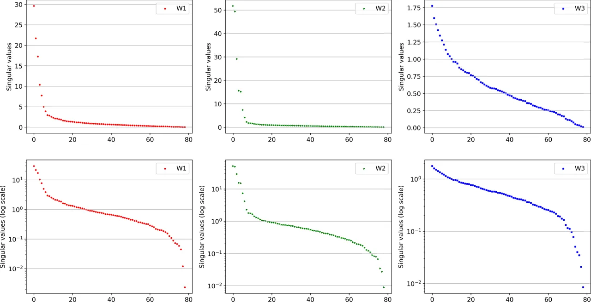

Figure 7: The singular values of our learned
$`\bm{W}_{1},\bm{W}_{2},\bm{W}_{3}\in\mathbb{R}^{d\times d}`$ of the
(A6) variant of our multiplicative module (see Sec. 4.2), with $`d=79`$,
plotted in linear scale (first row) and logarithmic scale (second row).
We found that $`\bm{W}_{1},\bm{W}_{2},\bm{W}_{3}`$ have full rank.

| Method                           | PSNR $`\uparrow`$ | ACD $`\downarrow`$ |
| -------------------------------- | ----------------- | ------------------ |
| \(a\) Output Dimension $`o=256`$ | 29.76             | 0.16               |
| \(b\) Learnable Concatenation    | 28.99             | 0.20               |
| \(c\) Latent Codes in $`M`$      | 29.01             | 0.17               |
| $`M`$ (Ours)                     | 29.73             | 0.16               |

Table 4: Ablation Study. Quantitative results for different variants of
our conditional input: (a) $`M`$ with higher output dimension $`o=256`$,
(b) learnable concatenation without multiplicative interactions, and (c)
latent codes included in the multiplicative module. The proposed
multiplicative module $`M`$ leads to the best disentanglement with the
least possible parameters.

Full Rank Matrices. For the (A6) variant of our multiplicative module
(see Sec. 4.2), we found that the learned
$`\bm{W}_{1},\bm{W}_{2},\bm{W}_{3}\in\mathbb{R}^{d\times d}`$ with
$`d=79`$ have full rank. Fig. 7 plots the 79 singular values of
$`\bm{W}_{1},\bm{W}_{2},\bm{W}_{3}`$ from our model trained on 10
identities (applying SVD from numpy.linalg ³³ 3
[https://numpy.org/doc/stable/reference/generated/numpy.linalg.svd.html](https://numpy.org/doc/stable/reference/generated/numpy.linalg.svd.html)).
In the second row, we plot them in logarithmic scale. All of them have
79 singular values greater than $`10^{-3}`$, and until the 78th are far
from zero, leading to matrices of full rank. This indicates that the
dimension $`d=79`$ is necessary to capture all the information. We
hypothesize that this might be due to the fact that the expression
parameters $`\bm{e}`$ are extracted from a 3DMM, after applying PCA on
large human face datasets and keeping the most important principal
components. This would be an interesting avenue to explore for future
work.

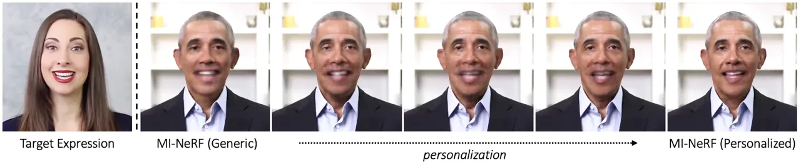

Figure 8: Progressive personalization from our generic MI-NeRF trained
on 100 identities to the personalized model for a target identity.

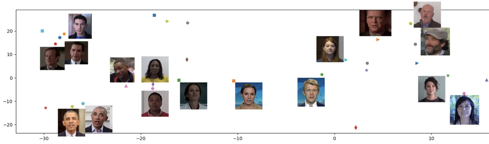

Figure 9: A visualization of our learned identity codes using
t-SNE (Van der Maaten & Hinton, 2008). We notice that the identity codes
capture meaningful information in terms of identity, e.g. different
videos of Obama (bottom left) are clustered together, despite the
different lighting.

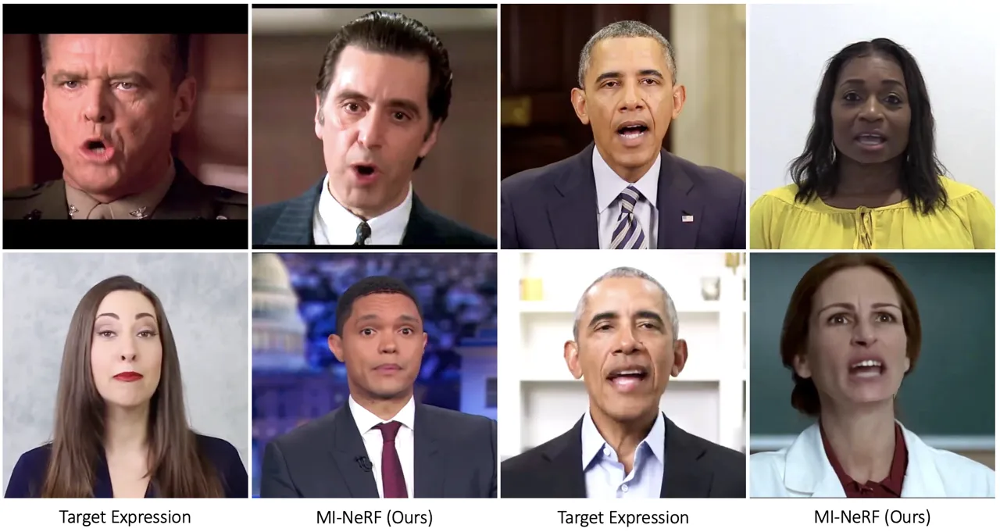

Figure 10: Facial expression transfer for various identities by our
proposed MI-NeRF. The target expressions are unseen (novel) for each
target identity.

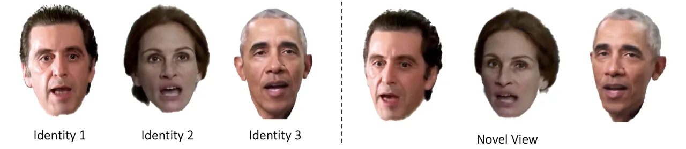

Figure 11: MI-NeRF can animate multiple identities under the same novel
expression (left) and under the same novel view (right).

## Appendix C Additional Results

In this section, we include additional qualitative and quantitative
results, in order to further evaluate our method.

Personalization. Fig. 8 shows the progressive improvement of the visual
quality during our personalization procedure (see Sec. 3.4). Compared to
the generic MI-NeRF, the personalized model better captures the
high-frequency facial details, such as wrinkles.

Learned Identity Codes. Fig. 9 shows a visualization of our learned
identity codes using t-SNE (Van der Maaten & Hinton, 2008) on our final
model with 100 identities. We notice that the identity codes capture
meaningful information in terms of identity.

Learned Latent Codes. Fig. 13 shows a qualitative comparison between our
model trained without and with latent codes $`\bm{l}`$ for the same
expression as input. As mentioned in the ablation study in Sec. 4.2,
these latent codes capture very small variations in appearance and
high-frequency details.

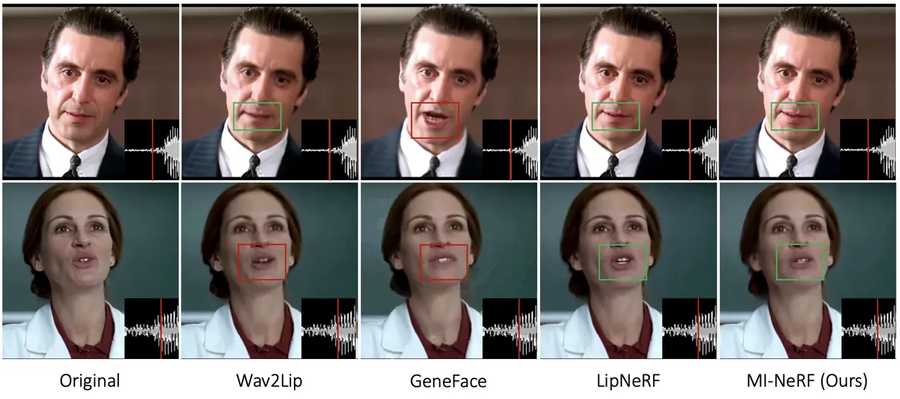

Figure 12: Qualitative comparison of lip synced video synthesis by
Wav2Lip (Prajwal et al., 2020), GeneFace (Ye et al., 2023),
LipNeRF (Chatziagapi et al., 2023), and MI-NeRF. The original video is
in English (1st column). The generated videos (columns 2-5) are lip
synced to dubbed audio in Spanish.

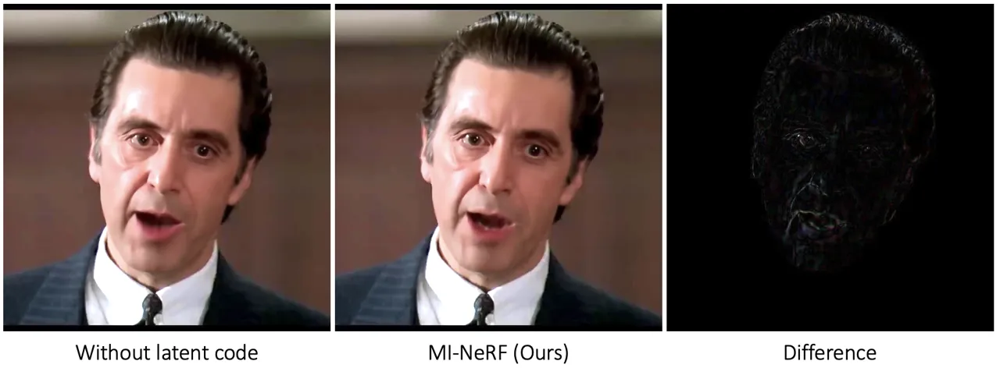

Figure 13: Ablation study on our learned latent codes. From left to
right: result of MI-NeRF with $`M`$ without latent codes $`\bm{l}`$,
result of MI-NeRF (Ours), and their difference.

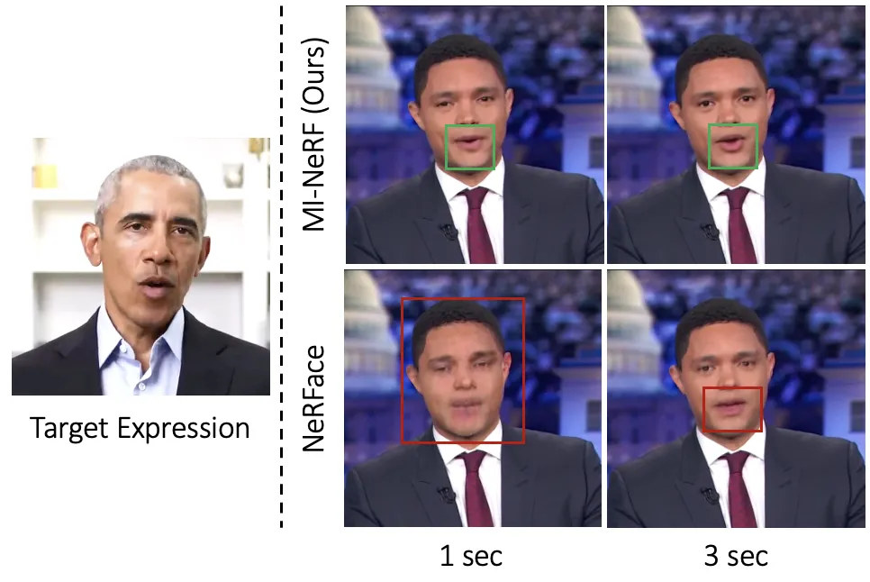

(a)

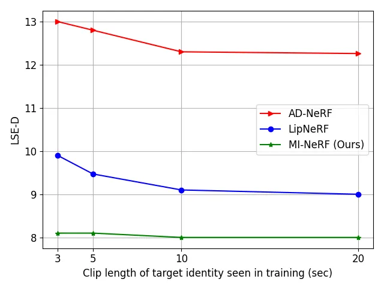

(b)

Figure 14: Short-Video Personalization. Left: Qualitative comparison of
MI-NeRF with the single-identity NeRFace (Gafni et al., 2020), using a
video of the target identity of only 1 or 3 seconds duration for
adaptation. Right: LSE-D (lower the better) vs clip length of the target
identity seen in training, computed on generated videos lip synced to
dubbed audio.

Additional Qualitative Results. Fig. 10 demonstrates additional
qualitative results of facial expression transfer generated by MI-NeRF.
Figure 11 demonstrates how MI-NeRF can animate multiple identities under
the same novel expression and novel view. Fig. 12 shows additional
comparison with GeneFace (Ye et al., 2023) for lip synced video
synthesis. GeneFace lacks in lip synchronization as also mentioned in
Sec. 4.4. The GAN-based Wav2Lip (Prajwal et al., 2020) sometimes
produces artifacts (e.g. see the mouth in the 2nd row). Our method
achieves accurate lip syncing, while trained on multiple identities.

Fig. 14 shows additional results for our short-video personalization
procedure, where MI-NeRF is adapted to an unseen identity (i.e. not seen
as a part of the initial training set - see Sec. 3.4). Figure 14 (left)
demonstrates qualitative results, when only a very short video of the
new identity is available (1 or 3 seconds length). Please note that in
this case we use a small number of consecutive frames, and thus a very
small part of the expression space is covered. In contrast to NeRFace,
MI-NeRF produces satisfactory lip shape and expression, as the
multiplicative module has learned information from multiple identities
during training. Correspondingly, Figure 14 (right) shows the LSE-D
metric w.r.t different clip lengths of the target identity for the task
of lip-syncing. Since AD-NeRF and LipNeRF are trained on a single
identity, they learn audio-lip representations from only 3 or 20
seconds. On the other hand, MI-NeRF leverages information from multiple
identities and leads to a more accurate lip synchronization.

Video Results. We strongly encourage the readers to watch our
supplementary video that includes results for facial expression transfer
and lip synced video synthesis.

## Appendix D Comparison with Faster Methods

We developed our multi-identity network and the proposed multiplicative
modules based on the vanilla dynamic NeRF. We built upon dynamic NeRFs
such as NeRFace (Gafni et al., 2020), AD-NeRF (Guo et al., 2021) and
LipNeRF (Chatziagapi et al., 2023). However, we would like to note that
recent methods propose techniques to reduce the training and rendering
time of vanilla NeRFs. For example, INSTA (Zielonka et al., 2023) models
the dynamic NeRF based on neural graphics primitives embedded around the
parametric face model FLAME (Li et al., 2017), requiring only 10 minutes
training for an identity.

Our multi-identity network can be easily extended to such faster
approaches. Our key idea is to learn multiplicative interactions between
facial expressions and identity codes. Thus, any network that is
conditioned on 3DMM expression parameters can also be extended to
multiple identities by using our proposed multiplicative module.

We specifically tried INSTA (Zielonka et al., 2023) and extended it to
multiple identities. The original INSTA is a single-identity deformable
NeRF, where an expression code $`\bm{E}_{i}\in\mathbb{R}^{16}`$ for an
image $`i`$ conditions an MLP (Zielonka et al., 2023). $`\bm{E}_{i}`$ is
used for the input samples that correspond to the mouth region, and
turned to $`\bm{E}_{i}=\bm{1}`$ otherwise. As in Eq. 1 of the main
paper, we learned a multiplicative module $`M(\bm{E}_{i},\bm{i})`$ that
conditions INSTA, with learnable identity codes
$`\bm{i}\in\mathbb{R}^{d}`$ and $`d=16`$ in this case. We trained our
multi-identity INSTA on our training set of 100 identities. We used
their data pre-processing and FLAME fitting ⁴⁴ 4
[https://github.com/Zielon/INSTA](https://github.com/Zielon/INSTA).

Figure 15 demonstrates the improvement when transferring a novel
expression for INSTA trained on multiple identities, using our
multiplicative module. However, we notice that INSTA produces some
artifacts in the mouth interior (also mentioned by the authors (Zielonka
et al., 2023)) that are not completely removed with our multi-identity
optimization, and do not exist in our proposed MI-NeRF. With our
multi-identity training, we similarly achieve a _90% decrease in the
training time_ for 100 identities (see Sec. 4.3), compared to the
single-identity INSTA. Specifically, INSTA requires about 10 minutes
training for a single video, thus 1000 minutes total for 100 identities,
and we train a multi-identity INSTA in less than 90 minutes for all 100
identities simultaneously.

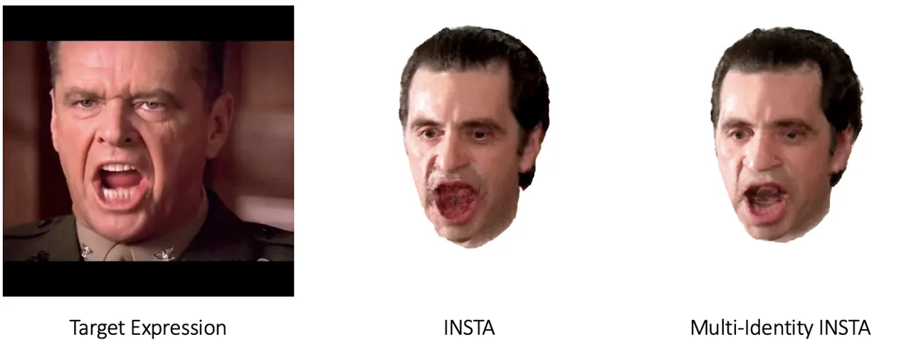

Figure 15: Extending other NeRF-based approaches to multiple identities.
The single-identity INSTA (Zielonka et al., 2023) can be easily extended
to a multi-identity INSTA by learning our proposed multiplicative
module.

## Appendix E Implementation Details

In this section, we include additional implementation details. We
closely follow the architecture and training details of NeRFace (Gafni
et al., 2020), AD-NeRF (Guo et al., 2021), and LipNeRF (Chatziagapi
et al., 2023) that are all similar. An overview of the main
hyper-parameters is given in Table 5. More specifically, our
implementation is based on PyTorch (Paszke et al., 2019). We use Adam
optimizer (Kingma & Ba, 2014) with a learning rate that begins at
$`5\times 10^{-4}`$ and decays exponentially to $`5\times 10^{-5}`$
during training. The rest of the Adam hyper-parameters are set at their
default values ($`\beta_{1}=0.9,\beta_{2}=0.999,\epsilon=10^{-8}`$). For
every gradient step, we march rays and sample points for a single
randomly-chosen video frame. We march 2048 rays and sample 64 points per
ray for the coarse volume and 128 points per ray for the fine volume
(hierarchical sampling strategy (Mildenhall et al., 2020)). We sample
rays such that $`95\%`$ of them correspond to pixels inside the detected
bounding box of the head (Gafni et al., 2020). We also assume that the
last sample on each ray lies on the background and takes the
corresponding RGB color (Guo et al., 2021; Chatziagapi et al., 2023). We
use the original background per frame. Our MLP backbone consists of 8
linear layers with 256 hidden units each. The output of the backbone is
fed to an additional linear layer to predict the density $`\sigma`$, and
a 4-layer 128-unit wide branch to predict the RGB color $`\bm{c}`$ for
every point. We use ReLU activations. Positional encodings are applied
to both the input points $`\bm{x}`$ and the viewing directions
$`\bm{v}`$, of 10 and 4 frequencies respectively. We do not apply
smoothing on the expression parameters using a low pass filter, as
proposed by Chatziagapi et al. (2023). Instead, we learn a
self-attention, similarly to Guo et al. (2021), that is applied to both
the output of the multiplicative module and the latent codes after the
first 200k iterations during training. This ensures smooth results in
the final video synthesis, reducing any jitter. For 1-2 identities, we
train our network for about 400k iterations (around 40 hours on a single
GPU). For 10 or 20 identities, we need around 500k and 600k iterations
correspondingly, and our generic MI-NeRF with 100 identities takes about
800k iterations (see Fig. 7 of the main paper). Further personalization
requires another 50-80k iterations approximately for a target identity.

To compute the visual quality metrics (PSNR, SSIM, LPIPS), we crop each
frame around the face, using the face detector from 3DDFA (Guo et al.,
2020; Guo et al., 2018a). In this way, we evaluate the visual quality of
the generated part only, ignoring the background that corresponds to the
original one. To verify the speaker’s identity, we use the ACD metric,
computing the cosine distance between the embeddings of the ground truth
face and the generated face, extracted by InsightFace ⁵⁵ 5
[https://github.com/deepinsight/insightface](https://github.com/deepinsight/insightface).

|                                                  |                     |
| ------------------------------------------------ | ------------------- |
| Optimizer                                        | Adam                |
| Initial learning rate                            | $`5\times 10^{-4}`$ |
| Final learning rate                              | $`5\times 10^{-5}`$ |
| Learning rate schedule                           | exponential decay   |
| Batch size (number of rays)                      | 2048                |
| Samples for the coarse network (per ray)         | 64                  |
| Samples for the fine network (per ray)           | 128                 |
| Linear layers (MLP backbone)                     | 8                   |
| Hidden units (MLP backbone)                      | 256                 |
| Activation                                       | ReLU                |
| Frequencies for $`\bm{x}`$ (positional encoding) | 10                  |
| Frequencies for $`\bm{v}`$ (positional encoding) | 4                   |

Table 5: Experimental setting. Hyper-parameters used for training our
proposed MI-NeRF (used for both facial expression transfer and talking
face video synthesis).

## Appendix F Limitations

An important factor is the 3DMM fitting (see Sec. 3.1 of the main paper)
that is used as ground truth for the head pose and expression
parameters. We use an existing optimization method (Guo et al., 2021).
However, this fitting can be noisy and the error can be propagated to
the final generated videos. We address this by learning a
self-attention, as mentioned in the implementation details above.
Improving the face tracking further would be interesting to explore as
future work. In addition, our network considers identity and expression,
but does not learn interactions between other latent factors of
variation, such as illumination or hair movement. Our model seems robust
to different illuminations for the same identity (see Fig. 9). In the
future, we plan to disentangle more latent factors of variation by
extending our proposed high-degree interaction module $`H`$ to capture
higher-degree interactions (see Sec. 3.2).

## Appendix G Ethical Considerations

We would like to note the potential misuse of video synthesis methods.
With the advances in neural rendering and generative models, it becomes
easier to generate photorealistic fake videos of any identity. These can
be used for malicious purposes, e.g. to generate misleading content and
spread misinformation. Thus, it is important to develop accurate methods
for fake content detection and forensics. Research on discriminative
tasks has been investigated for several years by the community and there
are certain guarantees and knowledge on how to build strong classifiers.
However, this is only the first step towards mitigating the issue of
fake content; further steps are required. A possible solution, that can
be easily integrated in our work, is watermarking the generated
videos (Chen et al., 2023), in order to indicate their origin. In
addition, appropriate procedures must be followed to ensure fair and
safe use of videos from a social and legal perspective.

## Appendix H Dataset Details

In this section, we provide additional details for the dataset we used
in our experiments. As mentioned in Sec. 4.1, we collected 140 talking
face videos from publicly available datasets, which are commonly used in
related works (Guo et al., 2021; Lu et al., 2021; Chatziagapi et al.,
2023; Hazirbas et al., 2021; Ginosar et al., 2019; Ahuja et al., 2020;
Duarte et al., 2021; Zhang et al., 2021; Wang et al., 2021b). The
detailed list of the 140 videos is as follows:

- •
  Standard videos used in related works, collected by (Lu et al., 2021)
  and (Guo et al., 2021):
  - –
    Obama1 (Barack Obama)
  - –
    Obama2 (Barack Obama)
  - –
    Markus Preiss
  - –
    Natalie Amiri

- •
  PATS dataset (Ginosar et al., 2019; Ahuja et al., 2020):
  - –
    Trevor Noah
  - –
    John Oliver
  - –
    Samantha Bee
  - –
    Charlie Houpert
  - –
    Vanessa Van Edwards

- •
  Actors from dataset proposed by LipNeRF (Chatziagapi et al., 2023):
  - –
    Al Pacino
  - –
    Jack Nicholson
  - –
    Julia Roberts
  - –
    Robin Williams
  - –
    Tom Hanks
  - –
    Morgan Freeman
  - –
    Tim Robbins
  - –
    Will Smith

- •
  TalkingHead-1KH dataset (Wang et al., 2021b):
  - –
    1lSejjfNHpw_0075_S0_E1456_L671_T47_R1471_B847
  - –
    2Xu56MEC91w_0046_S80_E1105_L586_T86_R1314_B814
  - –
    3y6Vjr45I34_0004_S287_E1254_L568_T0_R1464_B896
  - –
    4hQi42Q9mcY_0002_S0_E1209_L443_T0_R1515_B992
  - –
    5crEV5DbRyc_0009_S208_E1152_L1058_T102_R1712_B756
  - –
    -7TMJtnhiPM_0000_S1202_E1607_L345_T26_R857_B538
  - –
    -7TMJtnhiPM_0000_S1608_E1674_L467_T52_R851_B436
  - –
    85UEFVcmIjI_0014_S92_E1162_L558_T134_R1294_B870
  - –
    A2800grpOzU_0002_S812_E1407_L227_T7_R1139_B919
  - –
    c1DRo3tPDG4_0010_S0_E1730_L432_T33_R1264_B865
  - –
    EGGsK7po68c_0007_S0_E1024_L786_T50_R1598_B862
  - –
    eKFlMKp9Gs0_0005_S0_E1024_L705_T118_R1249_B662
  - –
    EWKJprUrnPE_0005_S0_E1024_L84_T168_R702_B786
  - –
    gp4fg9PWuhM_0003_S0_E858_L526_T0_R1310_B768
  - –
    HBlkinewdHM_0000_S319_E1344_L807_T149_R1347_B689
  - –
    jpCrKYWjYD8_0002_S0_E1535_L527_T68_R1215_B756
  - –
    jxi_Cjc8T1w_0061_S0_E1024_L660_T102_R1286_B728
  - –
    kMXhWN71Ar0_0001_S0_E1311_L60_T0_R940_B832
  - –
    m2ZmZflLryo_0009_S0_E1024_L678_T51_R1390_B763
  - –
    NXpWIephX1o_0031_S0_E1264_L357_T0_R1493_B1072
  - –
    PAaWZTFRP9Q_0001_S0_E672_L624_T42_R1376_B794
  - –
    PAaWZTFRP9Q_0001_S926_E1425_L696_T101_R1464_B869
  - –
    SmtJ5Cy4jCM_0006_S0_E523_L524_T50_R1388_B914
  - –
    SmtJ5Cy4jCM_0006_S546_E1134_L477_T42_R1357_B922
  - –
    SU8NSkuBkb0_0015_S826_E1397_L347_T69_R1099_B821
  - –
    VkKnOEQlwl4_0010_S98_E1537_L821_T22_R1733_B934
  - –
    –Y9imYnfBw_0000_S0_E271_L504_T63_R792_B351
  - –
    –Y9imYnfBw_0000_S1015_E1107_L488_T23_R824_B359
  - –
    YsrzvkG5_KI_0018_S36_E1061_L591_T100_R1055_B564
  - –
    Zel-zag38mQ_0001_S0_E1466_L591_T12_R1439_B860

- •
  Casual Conversations dataset (Hazirbas et al., 2021):
  - –
    1224_09
  - –
    1226_00
  - –
    1229_08
  - –
    1230_09
  - –
    1232_00
  - –
    1233_09
  - –
    1234_11
  - –
    1235_09
  - –
    1247_00
  - –
    1249_14
  - –
    1250_09
  - –
    1253_00
  - –
    1269_11
  - –
    1281_06
  - –
    1281_13
  - –
    1282_10
  - –
    1290_07
  - –
    1290_13
  - –
    1301_11
  - –
    1323_09
  - –
    1328_14

- •
  How2Sign dataset (Duarte et al., 2021):
  - –
    0zvsqf23tmw_3-2-rgb_front
  - –
    2ri5HYm48MA_5-2-rgb_front
  - –
    4I2azcR2kcA-8-rgb_front
  - –
    5Uy3r6Sl4pM-8-rgb_front
  - –
    5z_z6opEIH0-3-rgb_front
  - –
    -96cWDhR4hc-5-rgb_front
  - –
    a1HVL0zE768_2-3-rgb_front
  - –
    a4Nxq0QV_WA_5-5-rgb_front
  - –
    bIUmw2DVW7Q_11-3-rgb_front
  - –
    dlXnxaYWr9w-1-rgb_front

- •
  HDTF dataset (Zhang et al., 2021):
  - –
    RD_Radio10_000
  - –
    RD_Radio1_000
  - –
    RD_Radio11_000
  - –
    RD_Radio11_001
  - –
    RD_Radio12_000
  - –
    RD_Radio13_000
  - –
    RD_Radio14_000
  - –
    RD_Radio16_000
  - –
    RD_Radio17_000
  - –
    RD_Radio18_000
  - –
    RD_Radio19_000
  - –
    RD_Radio20_000
  - –
    RD_Radio2_000
  - –
    RD_Radio21_000
  - –
    RD_Radio22_000
  - –
    RD_Radio23_000
  - –
    RD_Radio25_000
  - –
    RD_Radio26_000
  - –
    RD_Radio27_000
  - –
    RD_Radio28_000
  - –
    RD_Radio29_000
  - –
    RD_Radio30_000
  - –
    RD_Radio3_000
  - –
    RD_Radio31_000
  - –
    RD_Radio32_000
  - –
    RD_Radio33_000
  - –
    RD_Radio34_000
  - –
    RD_Radio34_001
  - –
    RD_Radio34_002
  - –
    RD_Radio34_003
  - –
    RD_Radio34_004
  - –
    RD_Radio34_005
  - –
    RD_Radio34_006
  - –
    RD_Radio34_007
  - –
    RD_Radio34_009
  - –
    RD_Radio35_000
  - –
    RD_Radio36_000
  - –
    RD_Radio37_000
  - –
    RD_Radio38_000
  - –
    RD_Radio39_000
  - –
    RD_Radio40_000
  - –
    RD_Radio4_000
  - –
    RD_Radio41_000
  - –
    RD_Radio42_000
  - –
    RD_Radio43_000
  - –
    RD_Radio44_000
  - –
    RD_Radio45_000
  - –
    RD_Radio46_000
  - –
    RD_Radio47_000
  - –
    RD_Radio48_000
  - –
    RD_Radio49_000
  - –
    RD_Radio50_000
  - –
    RD_Radio5_000
  - –
    RD_Radio51_000
  - –
    RD_Radio52_000
  - –
    RD_Radio53_000
  - –
    RD_Radio54_000
  - –
    RD_Radio57_000
  - –
    RD_Radio59_000
  - –
    RD_Radio7_000
  - –
    RD_Radio8_000
  - –
    RD_Radio9_000

Please note that most of these videos are from YouTube and the
identities are public figures (e.g. politicians in HDTF dataset (Zhang
et al., 2021), famous actors in LipNeRF (Chatziagapi et al., 2023),
comedians and professional YouTubers in PATS dataset (Ginosar et al.,
2019; Ahuja et al., 2020) ⁶⁶ 6
[https://chahuja.com/pats/](https://chahuja.com/pats/)). The Casual
Conversations dataset (Hazirbas et al., 2021) includes talking videos of
paid individuals who agreed to participate and opted-in for data use in
ML. The participants are de-identified with unique numbers ⁷⁷ 7
[https://ai.meta.com/datasets/casual-conversations-dataset/](https://ai.meta.com/datasets/casual-conversations-dataset/).
The How2Sign dataset (Duarte et al., 2021) is another dataset publicly
available for research purposes that includes American Sign Language
videos ⁸⁸ 8 [https://how2sign.github.io/](https://how2sign.github.io/).
TalkingHead-1kH (Wang et al., 2021b) also includes videos from YouTube
under permissive licenses only ⁹⁹ 9
[https://github.com/tcwang0509/TalkingHead-1KH](https://github.com/tcwang0509/TalkingHead-1KH).

In Sec. 4.1, we mention that we use 100 videos for training our
multi-identity model. These correspond to 100 different identities,
where we use both Obama1 and Obama2 (see list above) that are different
videos of Obama (see also Fig. 9). Thus, more specifically, we use 101
videos in total for training and we learn 101 identity codes. We mention
“100 identities” for simplicity purposes.

For each video, we fit a 3DMM, as described in Sec. 3.1, in order to
extract the corresponding pose and expression parameters of the identity
per frame. We refer the interested reader to the work of (Guo et al.,
2021) ¹⁰¹⁰ 10
[https://github.com/YudongGuo/AD-NeRF](https://github.com/YudongGuo/AD-NeRF)
for more details in the data preprocessing.
