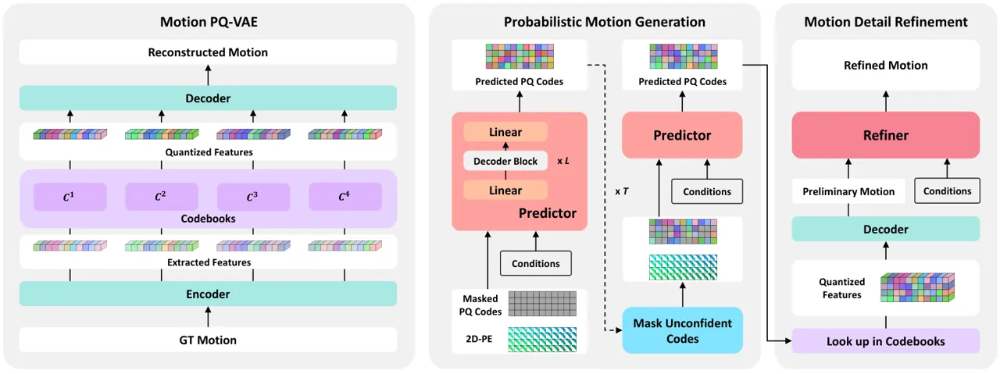
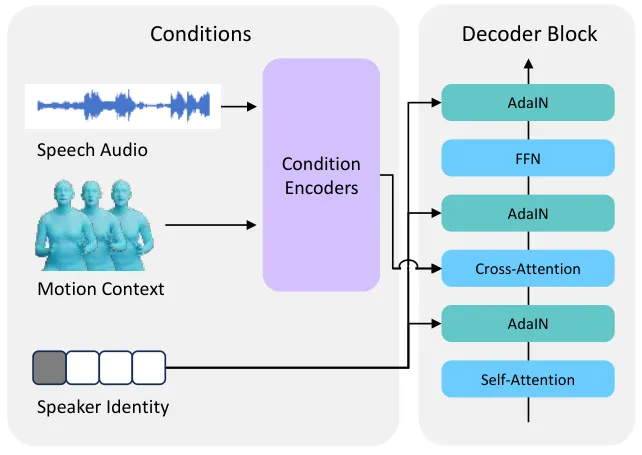
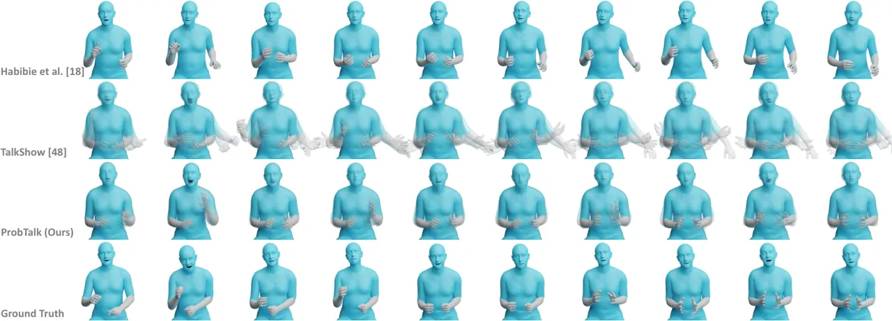
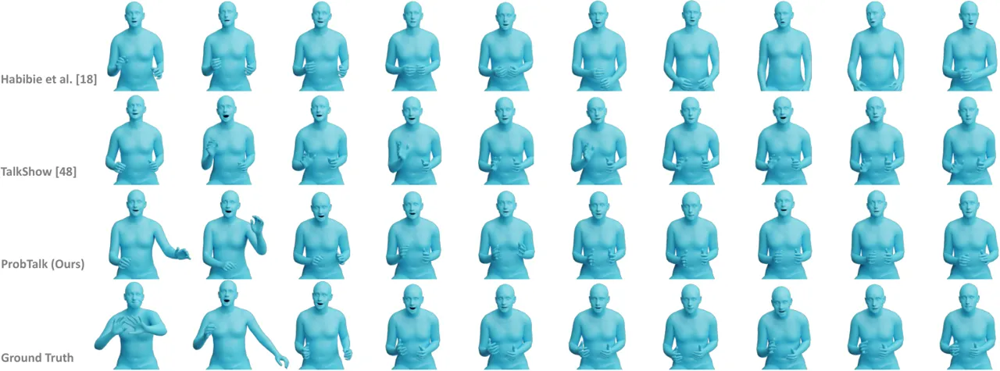

# Towards Variable and Coordinated Holistic Co-Speech Motion Generation

Yifei Liu Affiliation: South China University of Technology        Qiong
Cao    Yandong Wen Affiliation: Max Planck Institute for Intelligent
Systems, Tübingen, Germany    Huaiguang Jiang Affiliation: South China
University of Technology        Changxing Ding
Email: [ft_lyf@mail.scut.edu.cn,
mathqiong2012@gmail.comyandong.wen@tuebingen.mpg.de, {hihuagong2021,
chxding}@scut.edu.cn](mailto:) Affiliation: JD Explore Academy

###### Abstract

This paper addresses the problem of generating lifelike holistic
co-speech motions for 3D avatars, focusing on two key aspects:
variability and coordination. Variability allows the avatar to exhibit a
wide range of motions even with similar speech content, while
coordination ensures a harmonious alignment among facial expressions,
hand gestures, and body poses. We aim to achieve both with ProbTalk, a
unified probabilistic framework designed to jointly model facial, hand,
and body movements in speech. ProbTalk builds on the variational
autoencoder (VAE) architecture and incorporates three core designs.
First, we introduce product quantization (PQ) to the VAE, which enriches
the representation of complex holistic motion. Second, we devise a novel
non-autoregressive model that embeds 2D positional encoding into the
product-quantized representation, thereby preserving essential structure
information of the PQ codes. Last, we employ a secondary stage to refine
the preliminary prediction, further sharpening the high-frequency
details. Coupling these three designs enables ProbTalk to generate
natural and diverse holistic co-speech motions, outperforming several
state-of-the-art methods in qualitative and quantitative evaluations,
particularly in terms of realism. Our code and model will be released
for research purposes at
[https://feifeifeiliu.github.io/probtalk/](https://feifeifeiliu.github.io/probtalk/).

![[Uncaptioned
image]](arxiv-2404-00368--ec91de20e62d.figures/figure-1.webp)

Figure 1: Holistic co-speech motion generation examples. Given a speech
signal as input, our approach generates variable and coordinated
holistic body motions. From top to bottom: the speech transcript, the
corresponding audio, and three generated samples. In particular, to
emphasize important keywords, our method ensures that facial
expressions, head movements, and body motions work in unison.

^(\*)^(\*)footnotetext: Equal
Contribution.^(\$\dagger\$)^(\$\dagger\$)footnotetext: Corresponding
Author.

## 1 Introduction

Studies in psychology and linguistics suggest that communication is not
just about what we hear; it is a comprehensive sensory experience
integrating non-verbal signals like body poses, hand gestures, and
facial expressions, all crucial to effective communication \[16, 26\].
Consequently, the automatic generation of realistic full-body movements
synchronized with speech is vital for offering more immersive and
interactive user experiences.

This problem has seen considerable research interest. An early approach
by Habibie et al. \[21\] mapped speech signals to holistic motions using
a deterministic regression model. While effective in some respects, this
method risked producing repetitive and less human-like avatars due to
identical motions for the same speech content. To improve on this,
TalkSHOW \[59\] introduced a hybrid approach, using deterministic
modeling for facial expressions and probabilistic modeling
(specifically, VQ-VAE \[52\]) for hand and body movements. Despite
achieving a greater variety in body gestures, TalkSHOW still suffers
from the low diversity in facial movements. Moreover, the separate
modeling strategy used in TalkSHOW can cause disjointed coordination
among different body parts.

Recent studies have shown the efficacy of probabilistic models like
VQ-VAE in learning diverse facial movements \[41, 56\] or body gestures
\[3, 36, 32\], suggesting a promising direction for holistic motion
modeling. Inspired by their successes, we aim to develop a variational
framework that jointly models facial expressions, hand gestures, and
body poses from speech. This framework is designed to capture both the
variability and holistic coordination in co-speech motion. Specifically,
the probabilistic nature introduces essential variability to the
resulting motions, allowing avatars to exhibit a wide range of movements
for similar speech, while the joint modeling improves the coordination,
encouraging a harmonious alignment across various body parts. Yet,
developing such a framework is not straightforward. Directly using
models like VQ-VAE results in inexpressive speaking avatars, as holistic
motion has a higher complexity than that of individual body parts.
Moreover, the temporal granularity within VQ-VAE is typically too coarse
\[3, 59\], constraining its ability to generate high-frequency motions
with necessary details.

To address these challenges, we present ProbTalk, a novel framework
based on the variational autoencoder (VAE) architecture, comprising
three core designs. First, we apply product quantization (PQ) to VAE
\[18, 55\]. PQ partitions the latent space of holistic motion into
multiple subspaces for individual quantization. The compositional nature
of PQ-VAE affords a richer representation so that the complex holistic
motion can be represented with lower quantization errors. Second, we
devise a novel non-autoregressive model that integrates MaskGIT \[10\]
and 2D positional encoding into PQ-VAE. MaskGIT \[10\] is a training and
inference paradigm that simultaneously predicts all latent codes,
significantly reducing the steps required for inference. The 2D
positional encoding, accounting for the additional dimension introduced
by PQ, effectively preserves the 2D structural information of time and
subspace in product-quantized latent code. Last, we employ a secondary
stage to refine the preliminary predicted motion, further sharpening the
high-frequency details, especially in facial movements.

To the best of our knowledge, our proposed method is the first approach
to explicitly address the issue of holistic body variability and
coordination in co-speech motion generation. We quantitatively evaluate
the realism and diversity of our synthesized motion compared to ground
truth and SOTA methods and ablations on the SHOW dataset \[59\].
Experimental results demonstrate that our model surpasses
state-of-the-art methods both in qualitative and quantitative terms,
with a particularly notable advancement in terms of realism.

## 2 Related Work

### 2.1 Human Motion Generation

Human motion generation is a popular research field and includes many
sub-tasks. According to the input conditions, existing works in this
field can be categorized into text-, audio-, and scene-driven motion
generations \[66\]. The text-driven motion generation aims to generate
human motion based on the action category \[19, 44, 40\], or from
textual descriptions \[46, 20, 45, 62, 38\]. The audio-driven motion
generation focuses on generating conversational gestures in response to
speech input, so-called co-speech motion generation \[15, 61, 59\], or
generating 3D dance motion based on audio input \[30, 51, 67\]. The
scene-driven motion generation is conditioned on the scene context \[54,
5, 37\]. Besides, some works \[22, 8, 49\] target the motion completion
task that utilizes sparse keyframes as constraints to generate a full
motion sequence. We refer the readers to a recent review paper \[66\]
for a comprehensive overview.

### 2.2 Co-Speech Motion Generation

Early approaches to co-speech motion generation are rule-based \[9, 27,
29, 47\]. They adopt linguistic rules to translate speech into a
sequence of pre-defined gesture segments. However, this process is
time-consuming and labor-intensive as it involves expert knowledge and
extensive effort to define the rules and segment the gestures. Recent
attention has shifted towards learning-based methods, leveraging
advancements in deep learning \[52, 17, 23\]. These methods aim to
estimate the mapping or probability distribution of co-speech motion,
taking into account various condition modalities, including acoustic
features \[14, 28, 31, 65\], linguistic features \[14, 28, 31, 65\],
speaker identities \[61, 36\], and emotional cues \[48, 60\]. Beyond
exploring diverse co-speech motion conditions, many approaches employ
various probabilistic models to generate a wide spectrum of co-speech
motions, including Generative Adversarial Networks (GANs) \[1, 61\],
VAEs \[31\], VQ-VAE \[3, 58\], normalizing flows \[2\], and diffusion
models \[4, 65\].



Figure 2: Overview of the proposed ProbTalk, a unified probabilistic
framework designed to jointly model facial, hand, and body movements in
speech. Specifically, ProbTalk first learns a PQ-VAE of holistic body
motion, where the latent space is partitioned into subspaces, each of
which is quantized using a dedicated codebook. Then, we predict the PQ
codes based on the masked code context. In each iteration, we add 2D
positional encoding (2D-PE) to embeddings of masked PQ codes to conserve
the original structural integrity of the PQ codes. The predicted motion
is refined in the secondary stage, further sharpening the high-frequency
details.

However, these methods primarily focus on body motion while overlooking
face motion. To address this limitation, TalkShow \[59\] introduced a
separate modeling approach that creates probabilistic body movements
while maintaining deterministic facial movements, enriching motion
diversity and retaining facial detail. However, this method risks a lack
of whole-body coordination, as it generates facial and body movements
independently, potentially leading to unnatural alignment. To address
this, Liu et al. \[34\] introduced a cascaded network architecture for
synthesizing speech gestures based on ground truth (GT) facial
movements. However, this approach is heavily dependent on the
availability of GT facial data, which is generally not accessible in
many scenarios. In a different vein, Habibie et al. \[21\] proposed a
method for the simultaneous generation of 3D whole-body motions
associated with speech, thereby ensuring bodily coordination without the
necessity for GT data. Despite their merits, both methods operate in a
deterministic manner, limiting their variability, such as producing a
range of diverse motions given the same speech input.

Unlike previous method, we propose a unified probabilistic framework for
co-speech motion generation. Our approach not only attains coordination
between the facial and body movements but also ensures their motions are
variable and diverse.

## 3 Method

##### Preliminary.

We define a sequence of GT holistic body motion as
$`M_{1:N}=\{m_{n}|m_{n}\in\mathbb{R}^{376}\}^{N}_{n=1}`$, where $`N`$ is
the sequence length and each individual pose $`m_{n}`$ is represented by
6D \[64\] SMPL-X \[42\] parameters, including jaw pose, body pose, hand
pose, and facial expression parameters. The corresponding speech audio
is encoded using a wav2vec 2.0 encoder \[6\], leading to a sequence of
audio features $`A_{1:N}=\{a_{n}|a_{n}\in\mathbb{R}^{768}\}^{N}_{n=1}`$.

### 3.1 Method Overview

Given a speech recording, our goal is to synthesize variable and
coordinated holistic body motion. To this end, we propose a unified
probabilistic framework named ProbTalk to jointly model facial, hand,
and body movements in speech. Compared to the deterministic method used
by \[21\], our probabilistic framework facilitates the generation of
more varied holistic co-speech motions. It is also important to note
that, unlike the previous method \[59\], which models the face, body,
and hands separately, our design has a noteworthy benefit in that facial
expressions, hand gestures, and body poses are synthesized jointly. This
crucial aspect of our approach ensures that the generated motions are
not disconnected movements of individual body parts, but rather
coordinated movements of the whole body.

### 3.2 Unified Probabilistic Motion Generation

To estimate diverse holistic human motion, we leverage the recent
advances of PQ-VAE \[18, 55\] to learn a multi-mode distribution space
for holistic body motions, thereby creating an expressive motion
representation that allows us to capture the possible variability
inherent in the holistic body motion. Concretely, we begin by encoding
and quantizing the holistic body motion into $`G`$ groups of finite
codebooks, from which we can sample a wide range of plausible body
gestures (Sec. 3.2.1). Subsequently, we introduce a novel
non-autoregressive model over the learned codebooks, enabling us to
predict diverse body motions (Sec. 3.2.2). Our Predictor is designed for
efficient inference and effective prediction. Then, we obtain the
preliminary holistic human motion by decoding codebook indices sampled
from the distribution. Lastly, we refine the preliminary motion by a
sequence-to-sequence model to capture intricate details, thus enabling a
more accurate synchronization with the audio (Sec. 3.2.3). Fig. 2
illustrates our idea.

#### 3.2.1 Motion PQ-VAE

Given a holistic motion sequence $`M_{1:N}`$, we aim to reconstruct the
motion sequence by learning a discrete representation that can capture
the intricate variations of holistic motion. The classical VQ-VAE, as
described in \[52\], comprises an auto-encoder and a discrete codebook
that learns to capture data patterns in the latent space of the
auto-encoder. Due to the limited codebook combinations, VQ-VAE’s ability
to represent diverse data patterns is constrained by substantial
quantization errors. Drawing inspiration from prior research \[18, 55\],
we introduce a product quantization (PQ) approach to address this
challenge. Specifically, PQ partitions the latent space into $`G`$
separate subspaces, each of which is represented by a separate
sub-codebook. We denote the $`g`$-th sub-codebook as
$`C^{g}=\{c^{g}_{k}\}^{K}_{k=1}`$. Similarly, the latent feature
$`z_{n}`$ is partitioned into $`G`$ sub-features
$`\{z^{g}_{n}\}^{G}_{g=1}`$ and then independently quantized with their
corresponding codebook:

```math
\widehat{z}^{g}_{n}=\mathop{\arg\min_{c^{g}_{k}\in C^{g}}}\|c^{g}_{k}-z^{g}_{n}\|\in\mathbb{R}^{d^{c}}, \tag{1}
```

where $`c^{g}_{k}`$ denotes the embedding of the $`k`$-th code in the
codebook $`C^{g}`$, and $`d^{c}`$ indicates the dimensionality of each
code embedding. Then, the quantized sub-features
$`\{\widehat{z}^{g}_{n}\}^{G}_{g=1}`$ are fed into the decoder for the
synthesis. Compared to classic vector quantization, PQ has an expansive
representation capacity. For example, assuming that VQ and PQ have the
same memory cost, the size of their respective code combinations are
$`K\times G`$ and $`K^{G}`$, where $`K\gg G`$ (in our case,
$`K=128,G=4`$). This means that PQ can handle exponentially larger data
patterns with the same memory cost and reduce quantization errors. By
leveraging PQ within the VAE, we can effectively capture the complex
diversities of holistic motion.

The loss function $`\mathcal{L}_{pq}`$ for optimizing PQ-VAE consists of
three components: a reconstruction loss, a velocity loss, and a
“commitment loss” that encourages the feature to stay close to the
chosen code. Let $`V_{1:N-1}=\{v_{n}\}^{N-1}_{n=1},v_{n}=m_{n}-m_{n+1}`$
denotes the velocity of GT motions $`M_{1:N}`$, and
$`V^{pq}_{1:N-1}=\{v^{pq}_{n}\}^{N-1}_{n=1},v^{pq}_{n}=m^{pq}_{n}-m^{pq}_{n+1}`$
denotes the velocity of predicted motions
$`M^{pq}_{1:N}=\{m^{pq}_{n}\}^{N}_{n=1}`$, the loss function
$`\mathcal{L}_{pq}`$ can be formulated as:

```math
\displaystyle\mathcal{L}_{pq}= \displaystyle\mathcal{L}_{1}(M_{1:N},M^{pq}_{1:N})+\mathcal{L}_{1}(V_{1:N-1},V^{pq}_{1:N-1}) \tag{2}
```

```math
\displaystyle+\beta\left\|Z-\operatorname{sg}\left[C\right]\right\|,
```

where $`\mathcal{L}_{1}`$ is L1 reconstruction loss,
$`sg\left[\cdot\right]`$ indicates stop gradient, and $`\beta`$ is the
weight of the “commitment loss”. Exponential moving average (EMA) and
codebook reset (Code Reset) are used in the codebook updating \[50,
62\].

#### 3.2.2 Non-autoregressive Modeling for Prediction

While applying PQ-VAE significantly enhances the ability to represent
complex holistic motions with lower quantization errors, it also
introduces specific challenges. In particular, the longer sequence of
latent code introduced by PQ-VAE requires more inference steps, thereby
reducing the efficiency. Moreover, modeling the intricate relationships
across the temporal sequence and subspace is not straightforward.

To tackle these issues, we propose a non-autoregressive model featuring
two critical designs: MaskGIT and 2D positional encoding. Coupling these
two designs enables us to train our Predictor efficiently and
effectively, leading to 8x inference speedup and improved prediction
performance.

##### MaskGIT-like Modeling.

Due to the sequential nature of traditional autoregressive models, the
increased code sequence length of PQ-VAE results in an augmented number
of inference steps, reducing inference efficiency. Motivated by \[10\],
we tackle this issue by designing a MaskGIT-like Predictor that begins
with generating all codes simultaneously and then refines the codes
iteratively conditioned on the previous generation at inference time, as
shown in Fig. 2.

In each training iteration, we initially get a sequence of pseudo-GT
codes $`X`$ from PQ-VAE, represented as one-hot vectors. Subsequently, a
binary mask $`I`$ is sampled, in which a value of 0 indicates that the
corresponding elements in $`X`$ should be substituted with a distinct
\[MASK\] code. This process is represented by the formula
$`\tilde{X}=I\odot X+(1-I)\odot X_{[MASK]}`$, where $`X_{[MASK]}`$ is
the index vector of \[MASK\]. The Predictor is trained to predict
missing codes based on the conditions and unmasked codes. Subsequently,
the Predictor generates the logits of the codes $`\widehat{X}`$, taking
into account multi-modal inputs, including audio $`A`$, motion context
$`M^{c}`$, and identity $`D`$, as well as the masked code sequence
$`\tilde{X}`$:

```math
\widehat{X}=\text{Predictor}(\tilde{X};A,M^{c},D). \tag{3}
```

Then, we use cross entropy loss $`\mathcal{L}_{ce}`$ to optimize our
Predictor:

```math
\mathcal{L}_{predict}=\mathcal{L}_{ce}(X,\widehat{X}). \tag{4}
```

During inference, our model predicts all codes in parallel during each
iteration. However, it only retains the most confident predictions and
masks out the remaining codes for re-prediction in the next iteration.
This iterative process continues until all codes are generated
accurately.

##### 2D Positional Encoding.

Transformer models \[53, 11\] conventionally represent both input and
output data as one-dimensional sequences, incorporating a singular
dimensional positional encoding to indicate the exact position of each
element. However, this approach often overlooks certain explicit
relational dynamics inherent to multi-dimensional data configurations.
In our specific context, the intricate 2D structural correlations, which
span both temporal sequences and various subspaces, may become obscured
or less accessible when the PQ codes are linearized into a
one-dimensional continuum. Consequently, converting PQ codes into a
one-dimensional format requires the model to undergo a complex
relearning process to decode and understand these interrelationships
anew.

To circumvent this loss of multi-dimensional relational clarity, we
design a bi-dimensional positional encoding strategy to conserve the
original structural integrity of the PQ codes. This dual encoding schema
assists the model in retaining and comprehending the complex interplay
of relationships that exist between the codes, drawing inspiration from
\[7\]. For the $`n`$-th code of the $`g`$-th subspace, the
two-dimensional positional encoding $`{e}_{n}^{g}`$ is derived by
summing the temporal encoding $`\alpha_{n}`$ and the spatial encoding
$`\beta_{g}`$:

```math
{e}_{n}^{g}=\alpha_{n}+\beta_{g}. \tag{5}
```

Both $`\alpha_{n}`$ and $`\beta_{g}`$ are instantiated through sine and
cosine functions \[53\]. This synthesis of temporal and subspace
encodings seeks to retain a robust representation of the data’s
multi-dimensional character within the Transformer model’s operational
framework.



Figure 3: Our framework is designed to generate co-speech motion,
utilizing multi-modal conditions. In detail, the audio and motion
context are individually processed by their respective condition
encoders. Following this, the encoded outputs are concatenated and
forwarded to a cross-attention layer. Besides, an AdaIN layer \[24\] is
integrated to facilitate the incorporation of speaker identity.

#### 3.2.3 Motion Detail Refinement

The initially estimated motion outlines the overall style of the motion
towards variability and coordination, yet neglects to capture the
high-frequency details, particularly the swift transitions in facial
movements. To further improve the preliminary motion, we introduce a
motion detail refinement module to refine the preliminary motion
utilizing a deterministic sequence-to-sequence model. This approach
effectively captures intricate and fast-moving motion details, thereby
enhancing the accuracy of the preliminary motion and achieving more
precise synchronization with the audio.

The Refiner has a similar network structure to the Predictor with the
absence of MaskGIT-like modeling and 2D positional encoding. The Refiner
takes combined motion $`\tilde{M}_{1:N}`$, input audio $`A_{1:N}`$, mask
$`I`$ and speaker identity $`D_{1:N}`$ as input, and outputs refined
motion $`M^{r}_{1:N}`$:

```math
M^{r}_{1:N}=\text{Refiner}(\tilde{M}_{1:N};A_{1:N},I,D). \tag{6}
```

The combined motion $`\tilde{M}_{1:N}`$ is the combination of motion
context $`M^{c}_{1:N}`$ and the preliminary motion $`M^{p}_{1:N}`$:

```math
\tilde{M}_{1:N}=I\odot M^{c}_{1:N}+\left({1}-I\right)\odot M^{p}_{1:N}. \tag{7}
```

Here, $`M^{c}_{1:N}`$ is generated by adding zeros to the desired motion
prefix or suffix to fit our model’s needs—this is known as “zero
padding”. On the other hand, $`M^{p}_{1:N}`$ comes from the output of a
PQ-VAE’s decoder, which takes predicted PQ codes as its input.

More details are given in the supplemental material.



Figure 4: Qualitative comparison with SOTA methods. The co-speech motion
generated by ProbTalk is more realistic, especially in terms of the
timing, magnitude, and frequency of movements. We highlight the arm
movements in grey. Best viewed in color.

### 3.3 Multi-Modal Conditioning

Finally, our framework is designed to support multi-modal conditioning.
We incorporate modalities beyond audio, such as motion contexts, into
our Predictor and Refiner models, as shown in Fig. 3. This enables us to
facilitate motion completion and editing. Additionally, since speakers
often present different motion styles, we utilize the modality of
speaker identity to differentiate these styles.

##### Motion Contexts.

Our framework supports motion context as a speech modality, allowing for
smooth and contextual-aware transitions in extended motion sequences.
This leads to the capability of audio-driven motion completion. During
training, the motion context is represented by the random masked ground
truth (GT) motions, denoted as $`M^{c}_{1:N}=I\odot M`$. Here,
$`I\in\mathbb{R}^{N}`$ represents the mask, and the unmasked frames
serve as context frames. With the motion contexts, our Predictor
generates preliminary motion by filling in the masked frames in a
bidirectional manner. This preliminary motion is then refined by our
Refiner, ensuring a seamless transition with the unmasked frames.

##### Speaker Identity.

Considering that speakers often display different motion styles, we
leverage the modality of speaker identity $`D`$ to differentiate these
styles, preventing shifts in motion style. Inspired by \[63\], an
Adaptive Instance Normalization (AdaIN) layer \[24\] is introduced after
each layer, facilitating the incorporation of speaker identity.

## 4 Experiments

|            |      |     |     |                    |      |       |                  |      |                  |
| ---------- | ---- | --- | --- | ------------------ | ---- | ----- | ---------------- | ---- | ---------------- |
| Components |      |     |     | FGD $`\downarrow`$ |      |       | Var $`\uparrow`$ |      |                  |
| PQ         | Mask | 2D  | R   | Holistic           | Body | Face  | Body             | Face | FPS $`\uparrow`$ |
| -          | -    | -   | -   | 6.51               | 7.32 | 26.06 | 0.47             | 0.11 | 530              |
| ✓          | -    | -   | -   | 4.41               | 5.17 | 15.69 | 0.39             | 0.16 | 132              |
| ✓          | ✓    | -   | -   | 4.89               | 6.33 | 14.30 | 0.24             | 0.15 | 1176             |
| ✓          | ✓    | ✓   | -   | 4.76               | 5.42 | 15.49 | 0.27             | 0.16 | 1071             |
| -          | ✓    | -   | ✓   | 6.93               | 9.22 | 8.59  | 0.26             | 0.17 | 1048             |
| ✓          | -    | -   | ✓   | 4.27               | 5.37 | 6.38  | 0.38             | 0.20 | 132              |
| ✓          | ✓    | -   | ✓   | 4.65               | 6.11 | 5.77  | 0.23             | 0.16 | 1039             |
| ✓          | ✓    | ✓   | ✓   | 3.98               | 5.21 | 5.59  | 0.26             | 0.17 | 1067             |

Table 1: Ablation study on each key component of our methods. “Mask”
denotes the MaskGIT-like modeling, “2D” denotes the 2D postional
encoding, and “R” denotes the Refiner.

[TABLE]

Table 2: Comparison with state-of-the-arts and various baselines.

### 4.1 Dataset

In this section, we evaluate our approach on the SHOW dataset \[59\]. It
is a database of 3D holistic body mesh annotations with synchronous
audio from in-the-wild videos, including 26.9 hours of talkshow videos
from 4 speakers. We select video sequences longer than 6 seconds and
divide the dataset into 80-10-10% train, validation and unseen test
splits.

### 4.2 Experimental Setup

##### Implementation Details.

Our framework is trained sequentially, beginning with the PQ-VAE,
followed by the Predictor, and lastly, the Refiner. We employ AdamW as
the optimizer, with $`[\beta_{1},\beta_{2}]=[0.9,0.99]`$ and a learning
rate of 0.0001 for each of the three parts. A batch size of 128 is used
to train all three parts for 100 epochs. The window size $`\tau`$ is set
to 8.

For the PQ-VAE, the number of codebooks is $`G=4`$, and for each
codebook, the number of codes is $`K=128`$. The weight of the
“commitment loss” term is set to $`\beta=0.25`$. For the Predicter, the
mask ratio is controlled via a cosine scheduler, following \[10\], and
the number of iterations during inference is $`T=8`$.

##### Evaluation Metrics.

We evaluate the performance of various approaches from multiple
perspectives, which encompass realism, diversity, and inference
efficiency. Specifically, we employ the following commonly used metrics:

- •
  FGD: Fréchet Gesture Distance is proposed by Yoon et al. \[61\], which
  measures the difference between the distributions of the latent
  features of the generated gestures and ground truth. We report three
  variants of FGD: Holistic, Body, and Face. These metrics serve to
  evaluate the perceived plausibility of the respective synthesized
  gesture components.
- •
  Variance: As used in \[41, 59\], diversity is assessed by quantifying
  the variance among multiple samples originating from the same
  condition.
- •
  FPS: Frame Per Second refers to the number of individual frames that
  are processed in one second, measuring the inference efficiency. In
  our experiment, we evaluate the FPS performance of each method using a
  TITAN Xp GPU with a batch size of 1.

Besides, we report both the first-order and second-order L2 errors to
measure the reconstruction performance of PQ-VAE.

### 4.3 Qualitative Analysis

In our qualitative comparison of ProbTalk with TalkShow \[59\] and the
method by Habibie et al. \[21\], we aim to showcase the superior
generation quality of our approach. Utilizing the same speech recording,
we generated nine samples with each method. These samples are overlaid
for a direct comparison with the Ground Truth (GT), as depicted in
Fig. 4. The figure clearly demonstrates that the GT motion includes four
instances of swinging movements within a given time frame. The methods
of Habibie et al. and TalkShow fail to capture this repetitive motion
pattern, leading to motions that are slower and less lifelike. In
contrast, ProbTalk accurately captures the timing, magnitude, and
frequency of these swings, showcasing its precision in emulating
realistic motion dynamics.

### 4.4 Quantitative Analysis

##### Comparison with State-of-the-Art Methods.

In our comparative analysis, presented in Table 2, our method
demonstrates superior performance over existing state-of-the-art methods
across all FGD metrics. Notably, our approach shows significant
advancements in FGD (Holistic), indicating its capacity for generating
realistic holistic body motions. This can be attributed to our proposed
unified probabilistic framework. Additionally, our method excels in Var
(face), indicating its effectiveness in producing diverse facial
expressions. Compared to the TalkShow model \[59\], our approach also
achieves a higher FPS, highlighting both its efficiency and
effectiveness.

To further showcase the effectiveness of our framework design, we
evaluate various baseline models, ensuring a fair comparison by
employing similar techniques such as PQ-VAE, MaskGIT, and 2D positional
encoding. The results are presented in Tab. 2. The “Separate” model,
akin to TalkShow \[59\], treats body and facial motions independently.
Conversely, the “Simultaneous” model, following Habibie et al. \[21\],
where the entire body motion is modeled jointly, employing either a
“P”redictor or a “R”efiner. Our results indicate that “Simultaneous-R”
performs the least effectively in terms of FGD (Holistic) and FGD
(Body), underscoring the strength of our probabilistic approach in body
motion generation. Our method shows significant improvements in FGD
(Holistic) and FGD (Face) compared to “Simultaneous-P”, emphasizing the
importance of the Refiner in our framework. Notably, our method
surpasses the “Separate” model, demonstrating the benefits of joint
modeling.

##### Model Ablation.

We evaluate the effect of each component and report the results in
Tab. 1, from which several important conclusions are drawn:

$`\mathchoice{\mathbin{\vbox{\hbox{\scalebox{.5}{$\displaystyle\bullet$}}}}}{\mathbin{\vbox{\hbox{\scalebox{.5}{$\textstyle\bullet$}}}}}{\mathbin{\vbox{\hbox{\scalebox{.5}{$\scriptstyle\bullet$}}}}}{\mathbin{\vbox{\hbox{\scalebox{.5}{$\scriptscriptstyle\bullet$}}}}}`$
PQ plays a crucial role in enhancing the realism of the generated
motion. Nevertheless, it comes with a trade-off in terms of inference
efficiency. When compared to the baseline, incorporating PQ leads to
significant improvements in FGD. However, it also results in
inefficiency during inference due to the lengthier code sequence, which
requires more iterations in the autoregressive inference process.

$`\mathchoice{\mathbin{\vbox{\hbox{\scalebox{.5}{$\displaystyle\bullet$}}}}}{\mathbin{\vbox{\hbox{\scalebox{.5}{$\textstyle\bullet$}}}}}{\mathbin{\vbox{\hbox{\scalebox{.5}{$\scriptstyle\bullet$}}}}}{\mathbin{\vbox{\hbox{\scalebox{.5}{$\scriptscriptstyle\bullet$}}}}}`$
The integration of MaskGIT proves to be effective in achieving faster
inference times, as evidenced by a significant boost in FPS. However,
this improvement comes at the expense of a decrease in the realism of
the generated motion. While MaskGIT enhances the efficiency of our
method, it also negatively impacts the FGD (Body), which in turn affects
the overall realism of the holistic body motion, as indicated by the FGD
(Holistic) evaluation.

$`\mathchoice{\mathbin{\vbox{\hbox{\scalebox{.5}{$\displaystyle\bullet$}}}}}{\mathbin{\vbox{\hbox{\scalebox{.5}{$\textstyle\bullet$}}}}}{\mathbin{\vbox{\hbox{\scalebox{.5}{$\scriptstyle\bullet$}}}}}{\mathbin{\vbox{\hbox{\scalebox{.5}{$\scriptscriptstyle\bullet$}}}}}`$
2D positional encoding (2D-PE) proves to be beneficial in generating
more realistic holistic body motion. When compared to the method without
2D-PE, incorporating 2D-PE leads to significant improvements in various
FGD metrics. This highlights the importance and effectiveness of 2D-PE
in enhancing the quality and realism of the generated motion, especially
when the integration of MaskGIT results in a decrease in the realism of
the generated motion.

$`\mathchoice{\mathbin{\vbox{\hbox{\scalebox{.5}{$\displaystyle\bullet$}}}}}{\mathbin{\vbox{\hbox{\scalebox{.5}{$\textstyle\bullet$}}}}}{\mathbin{\vbox{\hbox{\scalebox{.5}{$\scriptstyle\bullet$}}}}}{\mathbin{\vbox{\hbox{\scalebox{.5}{$\scriptscriptstyle\bullet$}}}}}`$
Refiner proves beneficial in refining high-frequency details,
particularly in the case of face motion. Incorporating this design
yields significant improvements in FGD (face). Furthermore, it also
contributes to the overall generation of more lifelike body motion, as
demonstrated by the observed improvements in FGD (body).

### 4.5 Sensitive Analysis

[TABLE]

Table 3: Reconstruction performance of PQ-VAE with different codebook
size $`K`$ and the number of codebooks $`G`$.

##### Effect of Product Quantization.

To demonstrate the superior representation capability of PQ, we present
the reconstruction performance of VAE across various codebook sizes
$`K`$ and the number of codebooks $`G`$. The results are summarized in
Tab. 3. It is noteworthy that increasing the codebook size $`K`$ does
not yield a significant improvement in the model’s performance
concerning MAJE and MAD. Moreover, it adversely affects the model’s
performance in terms of FGD. This observation suggests that a relatively
small codebook size $`K`$ suffices, primarily due to the implementation
of advanced codebook update strategies, namely, EMA and CodeReset.
Conversely, a substantial improvement is evident across almost all
metrics as we increase the number of codebooks $`G`$, highlighting
PQ-VAE’s proficiency in representing realistic human motion.

[TABLE]

Table 4: Performance of MaskGIT with different number of iterations
$`T`$.

##### Effect of MaskGIT.

To evaluate the impact of MaskGIT, we conducted a comprehensive analysis
of the model’s performance across varying numbers of iterations, denoted
as $`T`$. The results are presented in Tab. 4. In comparison to
autoregressive modeling, MaskGIT demonstrates a notable enhancement in
inference efficiency, albeit accompanied by a reduction in the realism
of the generated motion. As we observe the influence of the number of
iterations ($`T`$) on the performance metrics, an important trend
emerges. An increase in $`T`$ leads to a significant rise in the FGD
metrics, indicating improved motion quality. However, this improvement
is countered by a slight decrease in variance and inference efficiency.
Furthermore, when we extend $`T`$ from 8 to 16, we do not observe a
substantial increase in either the FGD score or the model’s variance.
This phenomenon suggests that there exists an optimal range of iteration
counts within which realism enhancement plateaus. In conclusion, the
judicious selection of the iteration count parameter, $`T`$, allows for
striking a balance between markedly improved inference efficiency and
the preservation of motion realism.

[TABLE]

Table 5: Performance of different positional encoding methods.

##### Effect of the Positional Encoding.

We conducted an assessment of the impact of various positional encoding
methods, and the results are presented in Tab. 5. “Sine” indicates that
positional encoding parameters are generated using sine and cosine
functions \[53\], whereas “Trainable” indicates that these parameters
are learned during the training process \[11\]. The data in the table
clearly illustrates that 2D positional encoding, formulated through sine
and cosine functions, significantly outperforms other methods across all
evaluated metrics. In contrast, 2D positional encoding with learned
parameters exhibits the worst results. This disparity underscores the
critical role of stable structural information in positional encoding.

[TABLE]

Table 6: Effect of different input modalities.

##### Effect of Multi-Modal Conditioning.

To assess the effect of each input modality, we conduct a sequence of
incremental experiments. The results are detailed in Tab. 6. The data
presented in this table clearly indicates that each input modality
significantly enhances the realism of the generated motion. Notably, the
integration of identity information imposes a constraint on the motion
style, thereby ensuring stylistic consistency throughout the motion
sequence. Additionally, the inclusion of motion context plays a crucial
role in facilitating the generation of smoother and more continuous
movements, particularly when creating extended motion sequences.

## 5 Conclusion

In this study, we introduce ProbTalk, the first approach specifically
designed to tackle the challenges of holistic body variability and
coordination in the co-speech motion generation. The first step in our
approach is the incorporation of PQ into the VAE, which significantly
enhances the representation of complex, holistic motions. Next, we
develop a unique non-autoregressive model that integrates 2D positional
encoding, leading to efficient and effective inference. Finally, we
utilize a secondary stage to refine the initial predictions, thereby
improving the richness of high-frequency details. The experimental
results validate that our approach delivers state-of-the-art performance
in both qualitative and quantitative aspects.

Acknowledgments. We thank Hongwei Yi for the insightful discussions and
Hualin Liang for helping us conduct the user study. This work was
partially supported by the Major Science and Technology Innovation 2030
“New Generation Artificial Intelligence” key project (No.
2021ZD0111700), the National Natural Science Foundation of China under
Grant 62076101, Guangdong Basic and Applied Basic Research Foundation
under Grant 2023A1515010007, the Guangdong Provincial Key Laboratory of
Human Digital Twin under Grant 2022B1212010004, and the TCL Young
Scholars Program.

## References

- \[1\] Chaitanya Ahuja, Dong Won Lee, Yukiko I Nakano, and
  Louis-Philippe Morency. Style transfer for co-speech gesture
  animation: A multi-speaker conditional-mixture approach. In _European
  Conference on Computer Vision (ECCV)_, pages 248–265. Springer, 2020.
- \[2\] Simon Alexanderson, Gustav Eje Henter, Taras Kucherenko, and
  Jonas Beskow. Style-controllable speech-driven gesture synthesis using
  normalising flows. In _Computer Graphics Forum (CGF)_, pages 487–496.
  Wiley Online Library, 2020.
- \[3\] Tenglong Ao, Qingzhe Gao, Yuke Lou, Baoquan Chen, and Libin Liu.
  Rhythmic gesticulator: Rhythm-aware co-speech gesture synthesis with
  hierarchical neural embeddings. _ACM Transactions on Graphics (TOG)_,
  41(6):1–19, 2022.
- \[4\] Tenglong Ao, Zeyi Zhang, and Libin Liu. Gesturediffuclip:
  Gesture diffusion model with clip latents. _ACM Transactions on
  Graphics (TOG)_, 42(4):1–18, 2023.
- \[5\] Joao Pedro Araújo, Jiaman Li, Karthik Vetrivel, Rishi Agarwal,
  Jiajun Wu, Deepak Gopinath, Alexander William Clegg, and Karen Liu.
  Circle: Capture in rich contextual environments. In _Computer Vision
  and Pattern Recognition (CVPR)_, pages 21211–21221, 2023.
- \[6\] Alexei Baevski, Yuhao Zhou, Abdelrahman Mohamed, and Michael
  Auli. wav2vec 2.0: A framework for self-supervised learning of speech
  representations. In _Conference on Neural Information Processing
  Systems (NeurIPS)_, pages 12449–12460, 2020.
- \[7\] Irwan Bello, Barret Zoph, Ashish Vaswani, Jonathon Shlens, and
  Quoc V Le. Attention augmented convolutional networks. In
  _International Conference on Computer Vision (ICCV)_, pages
  3286–3295, 2019.
- \[8\] Yujun Cai, Yiwei Wang, Yiheng Zhu, Tat-Jen Cham, Jianfei Cai,
  Junsong Yuan, Jun Liu, Chuanxia Zheng, Sijie Yan, Henghui Ding, et al.
  A unified 3d human motion synthesis model via conditional variational
  auto-encoder. In _International Conference on Computer Vision (ICCV)_,
  pages 11645–11655, 2021.
- \[9\] Justine Cassell, Hannes Högni Vilhjálmsson, and Timothy
  Bickmore. Beat: the behavior expression animation toolkit. In
  _International Conference on Computer Graphics and Interactive
  Techniques (SIGGRAPH)_, pages 477–486, 2001.
- \[10\] Huiwen Chang, Han Zhang, Lu Jiang, Ce Liu, and William T
  Freeman. Maskgit: Masked generative image transformer. In _Computer
  Vision and Pattern Recognition (CVPR)_, pages 11315–11325, 2022.
- \[11\] Jacob Devlin, Ming-Wei Chang, Kenton Lee, and Kristina
  Toutanova. Bert: Pre-training of deep bidirectional transformers for
  language understanding. _arXiv preprint arXiv:1810.04805_, 2018.
- \[12\] Changxing Ding and Dacheng Tao. Trunk-branch ensemble
  convolutional neural networks for video-based face recognition.
  _Transactions on Pattern Analysis and Machine Intelligence (TPAMI)_,
  40(04):1002–1014, 2018.
- \[13\] Yingruo Fan, Zhaojiang Lin, Jun Saito, Wenping Wang, and Taku
  Komura. FaceFormer: Speech-driven 3D facial animation with
  transformers. In _Computer Vision and Pattern Recognition (CVPR)_,
  pages 18770–18780, 2022.
- \[14\] Ylva Ferstl and Rachel McDonnell. Investigating the use of
  recurrent motion modelling for speech gesture generation. In
  _International Conference on Intelligent Virtual Agents (IVA)_, pages
  93–98, 2018.
- \[15\] S. Ginosar, A. Bar, G. Kohavi, C. Chan, A. Owens, and J.
  Malik. Learning individual styles of conversational gesture. In
  _Computer Vision and Pattern Recognition (CVPR)_, 2019.
- \[16\] Susan Goldin-Meadow. The role of gesture in communication and
  thinking. _Trends in Cognitive Sciences_, 3(11):419–429, 1999.
- \[17\] Ian Goodfellow, Jean Pouget-Abadie, Mehdi Mirza, Bing Xu, David
  Warde-Farley, Sherjil Ozair, Aaron Courville, and Yoshua Bengio.
  Generative adversarial networks. _Communications of the ACM_,
  63(11):139–144, 2020.
- \[18\] Robert Gray. Vector quantization. _IEEE Assp Magazine_,
  1(2):4–29, 1984.
- \[19\] Chuan Guo, Xinxin Zuo, Sen Wang, Shihao Zou, Qingyao Sun, Annan
  Deng, Minglun Gong, and Li Cheng. Action2motion: Conditioned
  generation of 3d human motions. In _Proceedings of the 28th ACM
  International Conference on Multimedia_, pages 2021–2029, 2020.
- \[20\] Chuan Guo, Shihao Zou, Xinxin Zuo, Sen Wang, Wei Ji, Xingyu Li,
  and Li Cheng. Generating diverse and natural 3d human motions from
  text. In _Computer Vision and Pattern Recognition (CVPR)_, pages
  5152–5161, 2022.
- \[21\] Ikhsanul Habibie, Weipeng Xu, Dushyant Mehta, Lingjie Liu,
  Hans-Peter Seidel, Gerard Pons-Moll, Mohamed Elgharib, and Christian
  Theobalt. Learning speech-driven 3D conversational gestures from
  video. In _International Conference on Intelligent Virtual Agents
  (IVA)_, pages 101–108, 2021.
- \[22\] Félix G Harvey, Mike Yurick, Derek Nowrouzezahrai, and
  Christopher Pal. Robust motion in-betweening. _Transactions on
  Graphics (TOG)_, 39(4):60–1, 2020.
- \[23\] Jonathan Ho, Ajay Jain, and Pieter Abbeel. Denoising diffusion
  probabilistic models. _Advances in Neural Information Processing
  Systems_, 33:6840–6851, 2020.
- \[24\] Xun Huang and Serge Belongie. Arbitrary style transfer in
  real-time with adaptive instance normalization. In _International
  Conference on Computer Vision (ICCV)_, pages 1501–1510, 2017.
- \[25\] Sergey Ioffe and Christian Szegedy. Batch normalization:
  Accelerating deep network training by reducing internal covariate
  shift. In _International Conference on Machine Learning (ICML)_, pages
  448–456, 2015.
- \[26\] Adam Kendon. _Gesture: Visible action as utterance_. Cambridge
  University Press, 2004.
- \[27\] Stefan Kopp and Ipke Wachsmuth. Synthesizing multimodal
  utterances for conversational agents. _Computer Animation and Virtual
  Worlds_, 15(1):39–52, 2004.
- \[28\] Taras Kucherenko, Dai Hasegawa, Gustav Eje Henter, Naoshi
  Kaneko, and Hedvig Kjellström. Analyzing input and output
  representations for speech-driven gesture generation. In
  _International Conference on Intelligent Virtual Agents (IVA)_, pages
  97–104, 2019.
- \[29\] Sergey Levine, Philipp Krähenbühl, Sebastian Thrun, and Vladlen
  Koltun. Gesture controllers. In _International Conference on Computer
  Graphics and Interactive Techniques (SIGGRAPH)_, pages 1–11, 2010.
- \[30\] Jiaman Li, Yihang Yin, Hang Chu, Yi Zhou, Tingwu Wang, Sanja
  Fidler, and Hao Li. Learning to generate diverse dance motions with
  transformer. _arXiv preprint arXiv:2008.08171_, 2020.
- \[31\] Jing Li, Di Kang, Wenjie Pei, Xuefei Zhe, Ying Zhang, Zhenyu
  He, and Linchao Bao. Audio2Gestures: Generating diverse gestures from
  speech audio with conditional variational autoencoders. In _Computer
  Vision and Pattern Recognition (CVPR)_, pages 11293–11302, 2021.
- \[32\] Yuanzhi Liang, Qianyu Feng, Linchao Zhu, Li Hu, Pan Pan, and Yi
  Yang. Seeg: Semantic energized co-speech gesture generation. In
  _Computer Vision and Pattern Recognition (CVPR)_, pages
  10473–10482, 2022.
- \[33\] Haiyang Liu, Naoya Iwamoto, Zihao Zhu, Zhengqing Li, You Zhou,
  Elif Bozkurt, and Bo Zheng. Disco: Disentangled implicit content and
  rhythm learning for diverse co-speech gestures synthesis. In
  _Proceedings of the 30th ACM International Conference on Multimedia_,
  pages 3764–3773, 2022a.
- \[34\] Haiyang Liu, Zihao Zhu, Naoya Iwamoto, Yichen Peng, Zhengqing
  Li, You Zhou, Elif Bozkurt, and Bo Zheng. Beat: A large-scale semantic
  and emotional multi-modal dataset for conversational gestures
  synthesis. In _Computer Vision–ECCV 2022: 17th European Conference,
  Tel Aviv, Israel, October 23–27, 2022, Proceedings, Part VII_, pages
  612–630. Springer, 2022b.
- \[35\] Haiyang Liu, Zihao Zhu, Giorgio Becherini, Yichen Peng,
  Mingyang Su, You Zhou, Naoya Iwamoto, Bo Zheng, and Michael J Black.
  Emage: Towards unified holistic co-speech gesture generation via
  masked audio gesture modeling. _arXiv preprint
  arXiv:2401.00374_, 2023.
- \[36\] Xian Liu, Qianyi Wu, Hang Zhou, Yinghao Xu, Rui Qian, Xinyi
  Lin, Xiaowei Zhou, Wayne Wu, Bo Dai, and Bolei Zhou. Learning
  hierarchical cross-modal association for co-speech gesture generation.
  In _Computer Vision and Pattern Recognition (CVPR)_, pages
  10462–10472, 2022c.
- \[37\] Sihan Ma, Qiong Cao, Hongwei Yi, Jing Zhang, and Dacheng Tao.
  Grammar: Ground-aware motion model for 3d human motion reconstruction.
  In _Proceedings of the 31st ACM International Conference on
  Multimedia_, pages 2817–2828, 2023.
- \[38\] Sihan Ma, Qiong Cao, Jing Zhang, and Dacheng Tao. Contact-aware
  human motion generation from textual descriptions. _arXiv preprint
  arXiv:2403.15709_, 2024.
- \[39\] Andrew L Maas, Awni Y Hannun, Andrew Y Ng, et al. Rectifier
  nonlinearities improve neural network acoustic models. In
  _International Conference on Machine Learning (ICML)_, page 3, 2013.
- \[40\] Wei Mao, Miaomiao Liu, and Mathieu Salzmann. Weakly-supervised
  action transition learning for stochastic human motion prediction. In
  _Computer Vision and Pattern Recognition (CVPR)_, pages
  8151–8160, 2022.
- \[41\] Evonne Ng, Hanbyul Joo, Liwen Hu, Hao Li, Trevor Darrell,
  Angjoo Kanazawa, and Shiry Ginosar. Learning to listen: Modeling
  non-deterministic dyadic facial motion. In _Computer Vision and
  Pattern Recognition (CVPR)_, pages 20395–20405, 2022.
- \[42\] Georgios Pavlakos, Vasileios Choutas, Nima Ghorbani, Timo
  Bolkart, Ahmed AA Osman, Dimitrios Tzionas, and Michael J Black.
  Expressive body capture: 3D hands, face, and body from a single image.
  In _Computer Vision and Pattern Recognition (CVPR)_, pages
  10975–10985, 2019.
- \[43\] Jialun Peng, Dong Liu, Songcen Xu, and Houqiang Li. Generating
  diverse structure for image inpainting with hierarchical vq-vae. In
  _Computer Vision and Pattern Recognition (CVPR)_, pages
  10775–10784, 2021.
- \[44\] Mathis Petrovich, Michael J Black, and Gül Varol.
  Action-conditioned 3d human motion synthesis with transformer vae. In
  _International Conference on Computer Vision (ICCV)_, pages
  10985–10995, 2021.
- \[45\] Mathis Petrovich, Michael J Black, and Gül Varol. Temos:
  Generating diverse human motions from textual descriptions. In
  _European Conference on Computer Vision (ECCV)_, pages 480–497.
  Springer, 2022.
- \[46\] Matthias Plappert, Christian Mandery, and Tamim Asfour. The kit
  motion-language dataset. _Big data_, 4(4):236–252, 2016.
- \[47\] Isabella Poggi, Catherine Pelachaud, F de Rosis, Valeria
  Carofiglio, and B De Carolis. Greta. A believable embodied
  conversational agent. In _Multimodal Intelligent Information
  Presentation_, pages 3–25. 2005.
- \[48\] Xingqun Qi, Chen Liu, Lincheng Li, Jie Hou, Haoran Xin, and Xin
  Yu. Emotiongesture: Audio-driven diverse emotional co-speech 3d
  gesture generation. _arXiv preprint arXiv:2305.18891_, 2023.
- \[49\] Jia Qin, Youyi Zheng, and Kun Zhou. Motion in-betweening via
  two-stage transformers. _Transactions on Graphics (TOG)_,
  41(6):1–16, 2022.
- \[50\] Ali Razavi, Aaron Van den Oord, and Oriol Vinyals. Generating
  diverse high-fidelity images with vq-vae-2. _Conference on Neural
  Information Processing Systems (NeurIPS)_, 32, 2019.
- \[51\] Li Siyao, Weijiang Yu, Tianpei Gu, Chunze Lin, Quan Wang, Chen
  Qian, Chen Change Loy, and Ziwei Liu. Bailando: 3D dance generation by
  actor-critic GPT with choreographic memory. In _Computer Vision and
  Pattern Recognition (CVPR)_, pages 11050–11059, 2022.
- \[52\] Aaron Van Den Oord, Oriol Vinyals, et al. Neural discrete
  representation learning. In _Conference on Neural Information
  Processing Systems (NeurIPS)_, 2017.
- \[53\] Ashish Vaswani, Noam Shazeer, Niki Parmar, Jakob Uszkoreit,
  Llion Jones, Aidan N Gomez, Łukasz Kaiser, and Illia Polosukhin.
  Attention is all you need. In _Conference on Neural Information
  Processing Systems (NeurIPS)_, 2017.
- \[54\] Jiashun Wang, Huazhe Xu, Jingwei Xu, Sifei Liu, and Xiaolong
  Wang. Synthesizing long-term 3d human motion and interaction in 3d
  scenes. In _Computer Vision and Pattern Recognition (CVPR)_, pages
  9401–9411, 2021.
- \[55\] Hanwei Wu and Markus Flierl. Learning product codebooks using
  vector-quantized autoencoders for image retrieval. In _2019 IEEE
  Global Conference on Signal and Information Processing (GlobalSIP)_,
  pages 1–5. IEEE, 2019.
- \[56\] Jinbo Xing, Menghan Xia, Yuechen Zhang, Xiaodong Cun, Jue Wang,
  and Tien-Tsin Wong. Codetalker: Speech-driven 3d facial animation with
  discrete motion prior. In _Computer Vision and Pattern Recognition
  (CVPR)_, pages 12780–12790, 2023.
- \[57\] Sicheng Yang, Zhiyong Wu, Minglei Li, Zhensong Zhang, Lei Hao,
  Weihong Bao, Ming Cheng, and Long Xiao. Diffusestylegesture: Stylized
  audio-driven co-speech gesture generation with diffusion models. In
  _Proceedings of the International Joint Conference on Artificial
  Intelligence (IJCAI-23)_, pages 5860–5868, 2023.
- \[58\] Payam Jome Yazdian, Mo Chen, and Angelica Lim. Gesture2Vec:
  Clustering gestures using representation learning methods for
  co-speech gesture generation. In _International Conference on
  Intelligent Robots and Systems (IROS)_, pages 3100–3107. IEEE, 2022.
- \[59\] Hongwei Yi, Hualin Liang, Yifei Liu, Qiong Cao, Yandong Wen,
  Timo Bolkart, Dacheng Tao, and Michael J Black. Generating holistic 3d
  human motion from speech. In _Proceedings of the IEEE/CVF Conference
  on Computer Vision and Pattern Recognition_, pages 469–480, 2023.
- \[60\] Lianying Yin, Yijun Wang, Tianyu He, Jinming Liu, Wei Zhao,
  Bohan Li, Xin Jin, and Jianxin Lin. Emog: Synthesizing emotive
  co-speech 3d gesture with diffusion model. _arXiv preprint
  arXiv:2306.11496_, 2023.
- \[61\] Youngwoo Yoon, Bok Cha, Joo-Haeng Lee, Minsu Jang, Jaeyeon Lee,
  Jaehong Kim, and Geehyuk Lee. Speech gesture generation from the
  trimodal context of text, audio, and speaker identity. _Transactions
  on Graphics (TOG)_, 39(6):1–16, 2020.
- \[62\] Jianrong Zhang, Yangsong Zhang, Xiaodong Cun, Shaoli Huang,
  Yong Zhang, Hongwei Zhao, Hongtao Lu, and Xi Shen. T2m-gpt: Generating
  human motion from textual descriptions with discrete representations.
  In _Computer Vision and Pattern Recognition (CVPR)_, 2023.
- \[63\] Mingyuan Zhang, Zhongang Cai, Liang Pan, Fangzhou Hong, Xinying
  Guo, Lei Yang, and Ziwei Liu. Motiondiffuse: Text-driven human motion
  generation with diffusion model. _Transactions on Pattern Analysis and
  Machine Intelligence (TPAMI)_, 2024.
- \[64\] Yi Zhou, Connelly Barnes, Jingwan Lu, Jimei Yang, and Hao Li.
  On the continuity of rotation representations in neural networks. In
  _Computer Vision and Pattern Recognition (CVPR)_, pages
  5745–5753, 2019.
- \[65\] Lingting Zhu, Xian Liu, Xuanyu Liu, Rui Qian, Ziwei Liu, and
  Lequan Yu. Taming diffusion models for audio-driven co-speech gesture
  generation. In _Computer Vision and Pattern Recognition (CVPR)_, pages
  10544–10553, 2023a.
- \[66\] Wentao Zhu, Xiaoxuan Ma, Dongwoo Ro, Hai Ci, Jinlu Zhang,
  Jiaxin Shi, Feng Gao, Qi Tian, and Yizhou Wang. Human motion
  generation: A survey. _Transactions on Pattern Analysis and Machine
  Intelligence (TPAMI)_, 2023b.
- \[67\] Wenlin Zhuang, Congyi Wang, Jinxiang Chai, Yangang Wang, Ming
  Shao, and Siyu Xia. Music2dance: Dancenet for music-driven dance
  generation. _ACM Transactions on Multimedia Computing, Communications,
  and Applications (TOMM)_, 18(2):1–21, 2022.

## Appendix A Method Details

### A.1 PQ-VAE

The PQ-VAE processes motion sequences, denoted as $`M_{1:N}`$, utilizing
an encoder-decoder architecture tailored for temporal data \[59\]. The
encoder comprises four residual blocks, each featuring a series of three
temporal convolution layers. These layers are parameterized with kernel
size, stride, and padding set to 3, 1, and 1, respectively, and are
followed by batch normalization \[25\] and Leaky ReLU activation \[39\]
for non-linear transformations. Additionally, temporal convolutions
(kernel size 4, stride 2, padding 1) are placed between residual blocks
to adjust the temporal resolution, setting the temporal window $`w`$ to 8. A fully-connected layer precedes the quantization step, serving
dimensionality reduction. The decoder mirrors the encoder’s
architecture, ensuring symmetry in information reconstruction.

### A.2 Predictor

The Predictor leverages dual condition encoders and a transformer-based
decoder. The audio encoder employs 3 temporal convolution layers (kernel
size 4, stride 2, padding 1), followed by batch normalization \[25\] and
Leaky ReLU activation \[39\], focusing on audio feature extraction. In
contrast, the motion context encoder utilizes 10 gated convolution
layers, catering to motion context comprehension \[43, 12\]. The
transformer-based decoder consists of an embedding layer and six decoder
blocks, each integrating a self-attention layer, a cross-attention
layer, and a linear layer, followed by an AdaIN layer for style
normalization. A fully-connected layer finalizes the structure,
adjusting output dimensions to match the target motion specifications.

### A.3 Refiner

Employing a transformer-based architecture akin to the Predictor’s
decoder (excluding the embedding layer), the Refiner fine-tunes motion
predictions. During training phase, input to the Refiner combines ground
truth (GT) motion $`M^{gt}_{1:N}`$ and PQ-reconstructed motion
$`M^{pq}_{1:N}`$ via:

```math
\overline{M}_{1:N}=I\odot M^{gt}_{1:N}+(1-I)\odot M^{pq}_{1:N}, \tag{8}
```

where $`\odot`$ denotes element-wise multiplication. The Refiner outputs
refined motion $`M^{r}_{1:N}`$, guided by input audio $`A_{1:N}`$, mask
$`I`$ and speaker identity $`D_{1:N}`$:

```math
{M}^{r}_{1:N}=\text{Refiner}(\overline{M}_{1:N};A_{1:N},I,D_{1:N}). \tag{9}
```

The Refiner is optimized using the loss function
$`\mathcal{L}_{refine}`$, which is formulated as follow:

```math
\small\mathcal{L}_{refine}=\mathcal{L}_{1}(I\odot M^{gt}_{1:N},I\odot M^{r}_{1:N})+\mathcal{L}_{1}(V^{gt}_{1:N-1},V^{r}_{1:N-1}). \tag{10}
```

Here, $`\mathcal{L}_{1}`$ is L1 reconstruction loss, while
$`V^{gt}_{1:N-1}`$ and $`V^{r}_{1:N-1}`$ refer to the velocity of GT and
generated holistic body motion, respectively.

## Appendix B More Comparison

| Method          | FGD $`\downarrow`$ | MAE $`\downarrow`$ | BC (GT=0.847)    |
| --------------- | ------------------ | ------------------ | ---------------- |
| Habibie et al.  | 44.60              | 8.59               | 0.964 (GT+0.117) |
| TalkSHOW        | 6.60               | 9.39               | 0.885 (GT+0.038) |
| ProbTalk (Ours) | 3.98               | 7.79               | 0.818 (GT-0.029) |

Table 7: More metrics.

##### More Metrics.

We add the Mean Absolute Error (MAE) to quantitatively assess the
difference between the ground truth and the motion generated by our
model. Additionally, we introduced the Beat Consistency (BC) metric to
evaluate the synchronization between the generated motion and the
corresponding audio. The outcomes of these evaluations are presented in
Tab. 7. The superior performance in both the MAE and BC metrics
demonstrates that our model’s generated outputs exhibit the highest
degree of fidelity to the ground truth.

##### User Study.

We conduct a user study to compare the realism and synchronization of
our method with existing works. We randomly sample 20 audios. 12
participants were asked to rank videos generated by three methods based
on their realism and synchronization. Results in Fig. 5 show that our
method outperforms the others in both realism and synchronization.

Figure 5: User study.

|                         | FGD↓  | BC    | Diversity↑ | MSE↓  | LVD↓  |
| ----------------------- | ----- | ----- | ---------- | ----- | ----- |
| Ground Truth            | 0     | 6.856 | 13.05      | 0     | 0     |
| FaceFormer \[13\]       | \-    | \-    | \-         | 7.787 | 7.593 |
| CodeTalker \[56\]       | \-    | \-    | \-         | 8.026 | 7.766 |
| S2G \[15\]              | 28.15 | 4.683 | 5.971      | \-    | \-    |
| Trimodal \[61\]         | 12.41 | 5.933 | 7.724      | \-    | \-    |
| HA2G \[36\]             | 12.32 | 6.779 | 8.626      | \-    | \-    |
| DisCo \[33\]            | 9.417 | 6.439 | 9.912      | \-    | \-    |
| CaMN \[34\]             | 6.644 | 6.769 | 10.86      | \-    | \-    |
| DiffStyleGesture \[57\] | 8.811 | 7.241 | 11.49      | \-    | \-    |
| Habibie et al. \[21\]   | 9.040 | 7.716 | 8.213      | 8.614 | 8.043 |
| TalkShow \[59\]         | 6.209 | 6.947 | 13.47      | 7.791 | 7.771 |
| EMAGE \[35\]            | 5.512 | 7.724 | 13.06      | 7.680 | 7.556 |
| ProbTalk (Ours)         | 6.170 | 8.099 | 10.43      | 8.990 | 8.385 |

Table 8: Quantitative evaluation on BEAT-X.



Figure 6: Motion sequences selected based on their minimal Mean Squared
Error (MSE), incorporating symmetry by treating movements of
corresponding body parts (e.g., left and right hands) as equivalent in
the evaluation.

##### Experiments on Beat-X Dataset.

Our experimental evaluation conducted on the Beat-X dataset \[35\] is
shown in Tab. 8. We follow the experimental configuration from \[35\],
employing data from Speaker 2 for model training and validation. This
ensures a direct comparison with benchmarks and aligns with prior
research. However, it is important to acknowledge the potential for
overfitting due to the limited data. As such, the outcomes of these
experiments should be interpreted as indicative rather than definitive.

##### More Qualitative Comparison.

To further validate the accuracy of the generated motions, we generate
32 samples using each method. Subsequently, we select the samples
exhibiting the minimal Mean Squared Error (MSE) for each method. The
corresponding results are presented in Fig. 6. The results demonstrate
that our method generates a closer approximation to the true motion
sequences, thus highlighting the enhanced accuracy of our generated
samples.
