^(\$\star\$)^(\$\star\$)footnotetext: The initial part of this work was
done at AITRICS.

# Learning to Generate Conditional Tri-plane for 3D-aware Expression Controllable Portrait Animation

Taekyung Ki^(⋆) Affiliation: DeepBrainAI Inc., South Korea    Dongchan
Min Affiliation: Graduate School of AI, KAIST, South Korea

     
[https://export3d.github.io](https://export3d.github.io)
E-mail <taek@deepbrain.io>    Gyeongsu Chae
E-mail <alsehdcks95@kaist.ac.kr> E-mail <gc@deepbrain.io>
Affiliation: DeepBrainAI Inc., South Korea

###### Abstract

In this paper, we present Export3D, a one-shot 3D-aware portrait
animation method that is able to control the facial expression and
camera view of a given portrait image. To achieve this, we introduce a
tri-plane generator with an effective expression conditioning method,
which directly generates a tri-plane of 3D prior by transferring the
expression parameter of 3DMM into the source image. The tri-plane is
then decoded into the image of different view through a differentiable
volume rendering. Existing portrait animation methods heavily rely on
image warping to transfer the expression in the motion space,
challenging on disentanglement of appearance and expression. In
contrast, we propose a contrastive pre-training framework for
appearance-free expression parameter, eliminating undesirable appearance
swap when transferring a cross-identity expression. Extensive
experiments show that our pre-training framework can learn the
appearance-free expression representation hidden in 3DMM, and our model
can generate 3D-aware expression controllable portrait images without
appearance swap in the cross-identity manner.

###### Keywords: 

Portrait Image Animation Facial Expression Control 3D-aware Synthesis

## 1 Introduction

Portrait image animation aims to generate a video of a given source
identity with the driving motion. It has received a lot of attention due
to the potential of virtual human services, such as cross-lingual film
dubbing \[31, 13\], virtual avatar chatting \[40, 70\], and video
conferencing \[58, 55\]. In these scenarios, it is essential to transfer
the facial expression (e.g., eye-blinking, lip motion, etc.) from
different person, i.e., cross-identity transfer, while preserving the
source identity. However, it is challenging due to the ambiguity between
appearance and expression \[18\] and the lack of paired data (e.g.,
different faces with the same expression) for disentanglement
representation learning \[41\].

Most 2D-based methods rely on image warping \[51, 71, 65, 59, 24\],
which warps the source image to the driving image by estimating the
motion between them. To impose a bottleneck for the motion
representation, they encode the motion into the difference between
sparse key-points \[51, 71, 24\] or latent codes \[59\], which are
trained in an unsupervised manner. However, in this scenario, the facial
expressions are encoded into the motion space as well, in terms of local
motion, which tends to be neglected due to the relatively large head
motions. Furthermore, since the facial expression and the appearance are
highly entangled in the image space, cross-identity expression transfer
often involves the source appearance change. DPE \[41\] tackles this
entanglement issue by proposing a self-supervised disentanglement
learning framework based on cycle-consistency learning \[72\]. However,
it shows temporal inconsistency in the generated video due to its
instability of cycle-consistency learning.

Another line of works \[34, 38, 67, 35\] explores facial expression
control in 3D space using the neural radiance fields (NeRFs) \[39\].
They leverage pre-trained latent representation of 3D GAN \[10\] for 3D
facial prior where they design the expression in terms of latent code
\[38, 67\] or predict deformation field \[42\] to deform the
well-constructed 3D representation, such as tri-plane \[34, 38, 67,
35\]. However, the latent code cannot faithfully reconstruct the source
identity \[38\], and the point-wise deformation fields to those 3D
representations yield video-level artifacts, such as flickers \[34\].

In this paper, we address the appearance-expression entanglement issue
by proposing a contrastive pre-training framework over video datasets
that produces appearance-free facial expressions with an orthogonal
structure. Armed with this representation, we build a one-shot 3D-aware
portrait image animation method, namely Export3D, which controls the
facial expression and 3D camera view of a given source image without
appearance swap. To achieve this, we design a generator architecture
consisting of vision transformer (ViT) and convolution layers \[55, 17,
43\] that directly generates the tri-planes from the source image and
driving expression parameters. Instead of predicting the deformation
fields for the expression, we introduce an expression adaptive layer
normalization (EAdaLN) which can effectively transfer the driving
expression to the source image. The main contributions of this work are
summarized as follows:

- •
  We present Export3D, a one-shot 3D-aware portrait image animation
  method that can explicitly control the facial expression and camera
  view of the source image only using the expression and camera
  parameters.
- •
  We propose a contrastive pre-training framework for the
  appearance-free facial expression distilled from the 3DMM parameters
  where they form an orthogonal structure for different facial
  expressions.
- •
  Extensive experiments demonstrate that our pre-training framework can
  learn the appearance-free expression, which enables our method to
  transfer the cross-identity expression without undesirable appearance
  swap.

## 2 Related Works

### 2.1 3D-aware Image Synthesis

3D-aware image synthesis aims to generate images with explicit camera
pose control \[49, 10, 21, 15, 11, 61\]. This is achieved by
conditioning the camera pose parameter into generative features, which
are then rendered into an RGB image through differentiable volume
rendering \[36, 39, 42, 6\]. This rendering technique has integrated
with adversarial learning \[20, 49, 10, 21, 15, 11, 61\] to learn 3D
view consistency from the unposed dataset. GRAM \[15\] generates a
multi-view consistent image by learning the radiance field on a set of
2D surface manifolds. AniFaceGAN \[60\] further learns the deformation
fields \[42\] for the facial expression on these manifolds \[15\] for
explicit facial expression control. EG3D \[10\] introduces a tri-plane
representation that provides a strong 3D position encoding with neural
volume rendering and become the one of the most prominent representation
in this field. However, these methods generate portrait images from
noise, requiring further process for real image manipulation.

Relying on the generateive power of EG3D, several works \[63, 66, 53,
38, 33, 7, 68, 55, 67\] extend 2D GAN-inversion \[1, 2, 54, 47\]
methods, which is challenging due to the multi-view consistency for a
single-view image. Specifically, based on facial symmetry, SPI \[66\]
utilizes horizontally flipped images for pseudo supervision to the
occluded facial region. However, it requires multi-stage latent code
optimizations. GOAE \[68\] proposes an encoder-based inversion for EG3D
which enhances multi-view consistency via an occlusion-aware tri-plane
mixing module. Live3DPortrait \[55\] can reconstruct multi-view
consistent portrait images by leveraging the synthetic data of
pre-trained EG3D to provide multi-view supervision. However, these
methods cannot explicitly manipulate the expression of the source image.

We propose a tri-plane generator architecture that can generate the
tri-plane of a given source image with explicit expression control.
Inspired by \[55, 43\], we design this generator with ViT and
convolution layers \[17\], and directly inject expression parameters
into the tri-plane generating process through the expression adaptive
layer normalization (EAdaLN). By leveraging the strong power of NeRF
\[39, 10, 55, 67, 53\], we decode the generated tri-plane into
multi-view images with explicit expression manipulation.

### 2.2 Portrait Image Animation

Portrait image animation, or face reenactment, is a task that animates a
given source image according to the input driving condition, either
audio \[44, 31, 40, 70, 37, 22\] or image \[51, 71, 58, 59, 65\].
Specifically, image-driven methods transfer the motion of the driving
image into the source image by learning the motion between them. Most
works \[51, 71, 58\] use facial key-points as a pivot representation to
be aware of motion via the key-point displacement. FOMM \[51\] estimates
facial key-points in an unsupervised manner, approximating the motion
through the first-order Taylor expansion. LIA \[59\] encodes a motion in
terms of latent codes by introducing an orthonormal basis as a motion
dictionary. However, the local motion (e.g., facial expression) and the
global motion (e.g., head motion) are still entangled in those
representations. DPE \[41\] proposes a bidirectional cyclic training
strategy to decouple the pose and expression within the latent codes,
while it produces video-level artifacts due to the instability of the
cycle-consistency learning.

To explicitly control the facial expression, several works leverage the
expression parameters of 3D morphable models (3DMM) \[8\] in 2D \[19,
65\] or 3D spaces \[38, 35, 34\]. StyleHEAT \[65\] uses 3DMM to warp 2D
spatial features of pre-trained StyleGAN2 \[28\] while yielding texture
sticking. OTAvatar \[38\] proposes a one-shot test-time optimization
method that optimizes identity codes of a single source image and learns
expression-aware motion latent codes in the latent space of pre-trained
EG3D. HiDe-NeRF \[34\] and NOFA \[67\] take a different way by
predicting an expression-aware deformation field \[42\] that deforms the
tri-plane \[10\] reconstructed from the source image.

Our method belongs to image-driven approaches, distinguishing itself by
not depending on 2D image warping or 3D deformation fields. Toward this,
we propose the generator architecture that uses a source image and
driving expression parameters to produce an expression-transferred
tri-plane, wherein the expression parameters directly modulate the
source visual features through the expression adaptive layer
normalization (EAdaLN). Furthermore, we mitigate the appearance swap
issue inherent in transferring other person’s expression by introducing
a contrastive pre-training method to obtain appearance-free expression
representations.

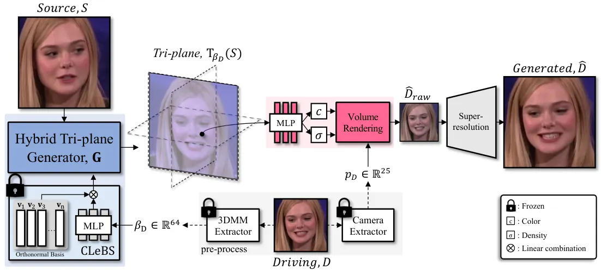

Figure 1: Training overview of Export3D. We convert a source image
$`S\in\mathbb{R}^{3\times H\times W}`$ into a tri-plane
$`T_{\beta_{D}}(S)`$ for rich 3D priors, conditioned on an expression
parameter $`\beta_{D}\in\mathbb{R}^{64}`$ from a driving image
$`D\in\mathbb{R}^{3\times H\times W}`$. A differentiable volume
rendering renders the tri-plane into a raw rendered image
$`\hat{D}_{raw}\in\mathbb{R}^{3\times\frac{H}{4}\times\frac{W}{4}}`$
using the camera parameter $`p_{D}\in\mathbb{R}^{25}`$ of $`D`$, which
is then super-resolved into a final image
$`\hat{D}\in\mathbb{R}^{3\times H\times W}`$.

## 3 Methods

First of all, we formulate our portrait animation method, Export3D.
Given a source image $`S\in\mathbb{R}^{3\times H\times W}`$, our method
transfers the facial expression and camera view of a driving image
$`D\in\mathbb{R}^{3\times H\times W}`$ with the expression and camera
parameters, respectively. We employ a tri-plane \[10\] as the
intermediate feature representation, providing a strong 3D position
information for differentiable volume rendering \[39, 36\]. We directly
generate an expression-transferred tri-plane from the source image and
the driving expression parameter \[8, 3\] through expression adaptive
layer normalization (EAdaLN) (Sec. 3.2). Based on the observation that
the expression parameter still contains the appearance information, we
propose a pre-training framework using contrastive learning to obtain
the appearance-free expression, which forms an orthogonal structure for
different expressions (Sec. 3.1). The expression-transferred tri-plane
is rendered into a 3D-aware image through the differentiable volume
rendering, and then super-resolved into the final output (Sec. 3.3).

### 3.1 Contrastive Learned Basis Scaling (CLeBS)

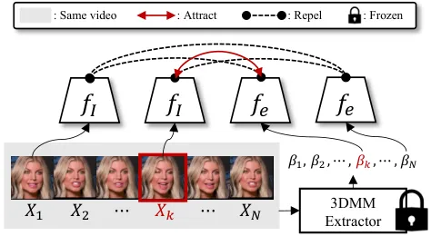

Figure 2: Contrastive pre-training framework for LeBS. We sample the
positive and the negative samples from the same video source so that
those samples share the same appearance. Using contrastive learning, the
encoder $`f_{e}(\cdot)`$ learns an appearance-free representations.

Natural speaking style comes from the the non-verbal component, such as
eye blinking. To explicitly control the expression of the generated
face, we utilize the expression parameter $`\beta\in\mathbb{R}^{64}`$
from the widely used 3D morphable models (3DMM) \[8\] in 3D face
reconstruction. However, simply using those parameters for transferring
the other person’s expression fails to preserve the facial identity of
the source face.

Disentangling Expression and Appearance.  In 3DMM-based face
reconstruction, the identity-appearance has been rarely explored.
However, \[18\] shows that a 3D face shape can be reconstructed only
using the expression parameters not using the shape parameters, or vice
versa. We also observe that the expression parameter of 3DMM is highly
entangled with the appearance (Fig. 8(a)), resulting in an undesirable
appearance swap when transferring the cross-identity expressions. We
assume that the expression parameter needs to be refined to represent
pure facial expressions. To address this issue, we propose a contrastive
learning based pre-training framework \[12, 23, 45, 40\] on video
dataset to discard the appearance information hidden in the expression
parameter. Specifically, given a video sequence $`\{X_{i}\}_{i=1}^{N}`$
and its corresponding expression sequence $`\{\beta_{i}\}_{i=1}^{N}`$,
we sample an aligned image-expression pair $`(X_{k},\beta_{k})`$ for the
positive and the non-aligned pairs for the negatives as illustrated in
Fig. 2. The images and the expressions are mapped into $`d`$-dimensional
representations, and the distance between the positive (or negative)
representation pairs is minimized (or maximized) via the following
contrastive objective $`\mathcal{L}_{cl}`$:

```math
\mathcal{L}_{cl}=-\log\left(\frac{\exp(\cos(f_{I}(X_{k}),f_{e}(\beta_{k}))/\tau)}{\sum_{j\neq k}\exp(\cos(f_{I}(X_{j}),f_{e}(\beta_{k}))/\tau)}\right), \tag{1}
```

where $`f_{I}(\cdot)`$ is an image encoder, $`f_{e}(\cdot)`$ is an
expression encoder, $`\tau`$ is the temperature, and
$`\cos(\cdot,\cdot)`$ is the cosine similarity, respectively. Since all
samples are from the same video, they share the same appearance, thereby
Eq. 1 enforces the encoders to learn appearance-free expression.

Moreover, for designing the expression encoder $`f_{e}(\cdot)`$, we
focus on the orthogonal structure of 3DMM \[8\] that controls different
expressions along different orthogonal directions. To provide the
appearance-free expression with the orthogonal structure, we introduce a
learned orthonormal basis $`V`$:

```math
V=\{\textbf{v}_{1},\textbf{v}_{2},\cdots,\textbf{v}_{n}\}\subseteq{\mathbb{R}^{d}}~~~\text{and}~~~\langle\textbf{v}_{i},\textbf{v}_{j}\rangle=\delta_{ij},~\forall i,j, \tag{2}
```

spanning our new expression sub-space ($`\delta_{ij}`$ is the Kroneker
delta function). More precisely, we convert the expression
$`\beta\in\mathbb{R}^{64}`$ into the low-dimensional coefficient
$`\lambda=(\lambda_{1},\lambda_{2},\cdots,\lambda_{n})\in\mathbb{R}^{n}~(n\ll 64)`$
and then scales the learned orthonormal basis
$`V\subseteq\mathbb{R}^{d}`$ to produce the appearance-free expression
representation $`\beta^{\prime}\in\mathbb{R}^{d}`$:

```math
\beta^{\prime}=f_{e}(\beta)=\lambda_{1}\textbf{v}_{1}+\lambda_{2}\textbf{v}_{2}+\cdots+\lambda_{n}\textbf{v}_{n}\in\mathbb{R}^{d}. \tag{3}
```

We apply QR-decomposition \[59\] to a learned weight
($`\in\mathbb{R}^{d\times n}`$) to explicitly compute the orthonormal
basis $`V\in\mathbb{R}^{d\times n}`$. In this space, an expression is a
linear combination of the basis $`V=\{\textbf{v}_{i}\}_{i=1}^{n}`$ where
the coefficient $`\lambda=(\lambda_{1},\lambda_{2},\cdots,\lambda_{n})`$
is responsible for the intensity of each expression direction. We call
our encoder $`f_{e}(\cdot)`$ a learned basis scaling (LeBS) module with
contrastive pre-training (CLeBS). Once CLeBS is pre-trained with Eq. 1,
no further training is required as illustrated in Fig. 1 and Fig. 3, and
the image encoder $`f_{I}(\cdot)`$ is never used after then.

### 3.2 Hybrid Tri-plane Generator

We employ the tri-plane as the intermediate feature representation for
3D prior to volume rendering. Tri-plane T consists of features assigned
on the 3 axis-aligned planes (i.e., $`xy,yz,zx`$ planes):

```math
\text{T}=(\text{T}_{xy},\text{T}_{yz},\text{T}_{zx})\in\mathbb{R}^{3\times 32\times\frac{H}{2}\times\frac{W}{2}}, \tag{4}
```

where
$`\text{T}_{ij}\in\mathbb{R}^{32\times\frac{H}{2}\times\frac{W}{2}}`$ is
the 32-dimensional feature of $`\frac{H}{2}\times\frac{W}{2}`$
resolution on the $`ij`$-plane. EG3D \[10\] utilizes StyleGAN2 \[28\] to
generate the tri-plane from a noise, forming the style latent space
$`\mathcal{W}\subseteq\mathbb{R}^{512}`$. Several works \[63, 66, 53,
38, 33, 7, 67\] extend the 2D GAN-inversion methods \[1, 2, 47, 54, 48\]
to 3D GAN-inversion in terms of reconstructing the tri-plane from the
style latent code.

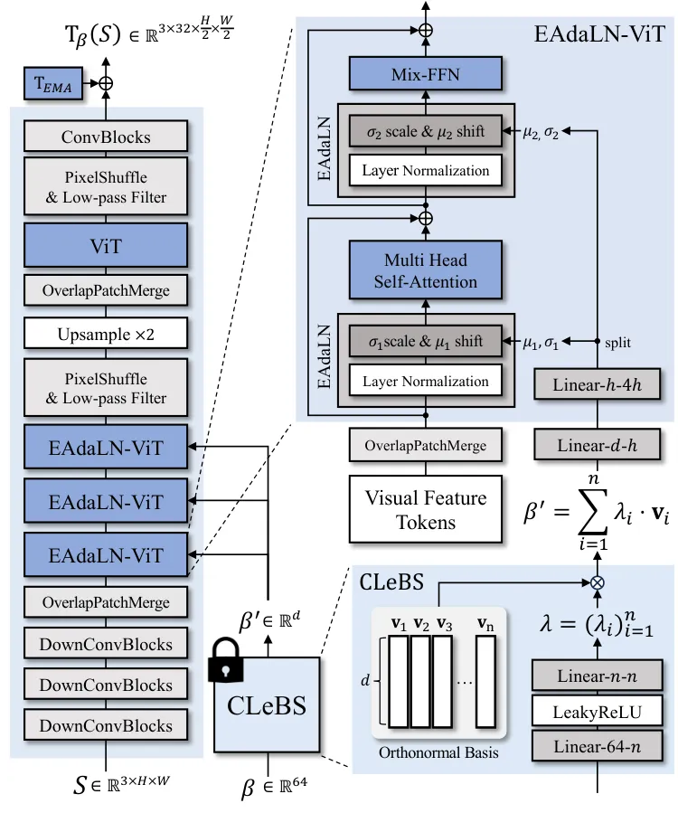

Figure 3: Hybrid tri-plane generator $`\mathbf{G}`$ and Expression
Adaptive Layer Normalization (EAdaLN). EAdaLN modulates the expression
of $`S`$ using the refined expression $`\beta^{\prime}`$ from CLeBS.

However, these methods often face challenges in preserving facial
identity since the style latent code lacks the capacity for encoding
spatial information and person-specific visual details. We directly
generate the expression-transferred tri-plane
$`\text{T}_{\beta_{D}}(S)`$ from the source $`S`$ and the driving
expression $`\beta_{D}\in\mathbb{R}^{64}`$ to reconstruct the driving
$`D`$. Inspired by Live3DPortrait \[55\], we construct the tri-plane
generator with ViT and convolution \[17, 62\]. Specifically, we convert
$`S\in\mathbb{R}^{3\times H\times W}`$ into a visual feature in
$`\mathbb{R}^{\frac{h}{4}\times\frac{H}{2^{3}}\times\frac{W}{2^{3}}}`$
through a stack of convolutional blocks, and then merge it into the
$`h`$-dimensional $`\frac{H\cdot W}{2^{8}}`$ visual tokens through a
overlap patch merge operator \[62\]. These tokens and driving expression
are processed through a conditional ViT \[17, 43, 62\] blocks, namely
EAdaLN-ViT, where the expression modulates \[43\] the visual tokens
through expression adaptive layer normalization (EAdaLN) as illustrated
in Fig. 3. EAdaLN is applied right before the multi-head self-attention
(MSA) and the mix feed-forward network (Mix-FFN)\[62\] of each ViT block
to inject the semantic expression into the visual tokens:

```math
\text{EAdaLN}(x,\beta^{\prime}_{D})=\sigma(\beta^{\prime}_{D})\times\text{LN}(x)+\mu(\beta^{\prime}_{D})\in\mathbb{R}^{h\times\left(\frac{H\cdot W}{2^{8}}\right)}, \tag{5}
```

where $`x`$ is the input visual token, $`\text{LN}(\cdot)`$ is the layer
normalization \[5\], $`\sigma(\beta^{\prime}_{D})`$ and
$`\mu(\beta^{\prime}_{D})`$ are the $`h`$-dimensional scale and shift
factors computed from
$`\beta^{\prime}_{D}=f_{e}(\beta_{D})\in\mathbb{R}^{d}`$, respectively.
To efficiently propagate the visual tokens to the higher resolution, we
upsample the visual tokens with pixel shuffle \[55\] followed by the
Gaussian low-pass filter \[27\]. We experimentally find that the tokens
and the pixel shuffle produce grid artifacts, challenging to eliminate
in the image space. Employing low-pass filters effectively mitigates
these artifacts by smoothing the borderline artifacts over the
coordinate. Lastly, we use ViT and convolutional blocks to output the
tri-plane $`\text{T}_{\beta_{D}}(S)`$:

```math
\text{T}_{\beta_{D}}(S)={\mathbf{G}}(S,\beta_{D})\in\mathbb{R}^{3\times 32\times\frac{H}{2}\times\frac{W}{2}}. \tag{6}
```

Note that our method does not query the expression parameter to estimate
the motion \[41, 65, 19\], rather it is used as the multi-dimensional
label. To stabilize the tri-plane generation, we incorporate the online
exponential moving average (EMA) over tri-plane $`\text{T}_{EMA}`$ which
is added to the generated tri-plane. Please refer to supplementary
materials for detailed architectures.

### 3.3 Volume Rendering and Super-resolution

The tri-plane can be rendered into a 2D RGB image through the
differentiable volume rendering \[39, 36, 10\]. The
expression-transferred tri-plane $`\text{T}_{\beta_{D}}(S)`$ is
projected onto 3 orthogonal planes ($`xy,yz,zx`$-planes) and then
aggregated through average \[10\]:

```math
F_{\beta_{D}}(S)=\frac{1}{3}(F_{\beta_{D},xy}(S)+F_{\beta_{D},yz}(S)+F_{\beta_{D},zx}(S)), \tag{7}
```

where $`F_{\beta_{D},ij}(S)`$ are the projected features of
$`T_{\beta_{D}}(S)`$ onto the $`ij`$ planes. A light-weight MLP assigns
a color $`c`$ and density $`\mathbf{\sigma}`$ to each point $`(x,y,z)`$
using the aggregated feature $`F_{\beta_{D}}(S)`$:

```math
\text{MLP}:F_{\beta_{D}}(S)\longrightarrow(c,\mathbf{\sigma}). \tag{8}
```

The differentiable volume rendering \[39, 10, 22\] composites each color
$`c`$ and density $`\mathbf{\sigma}`$ into a RGB value $`\mathcal{C}`$
along the camera ray $`\mathbf{r}`$:

```math
\mathcal{C}=\int_{t_{n}}^{t_{f}}\mathbf{\sigma}(\mathbf{r}(t))\cdot c(\mathbf{r}(t))\cdot T(t)dt, \tag{9}
```

where $`\mathbf{r}(t)=\mathbf{o}+t\mathbf{d}`$, $`t\in[t_{n},t_{f}]`$,
with camera center $`\mathbf{o}\in\mathbb{R}^{3}`$, viewing direction
$`\mathbf{d}\in\mathbb{R}^{3}`$, and $`T(t)`$ is the accumulation
measure along the ray $`\mathbf{r}`$ from $`t_{n}`$ to $`t`$:

```math
T(t)=\exp{\left(-\int_{t_{n}}^{t}\mathbf{\sigma}(\mathbf{r}(s))ds\right)}. \tag{10}
```

Note that the ray $`\mathbf{r}`$ is determined by the driving camera
parameter $`p_{D}\in\mathbb{R}^{25}`$ to render the generated tri-plane
$`\text{T}_{\beta_{D}}(S)`$ into a image of the same view with $`D`$. As
the appearance and the expression are already encoded in the tri-plane
generation, the volume rendering can determine the view-consistent
images.

Directly rendering a target high-resolution image requires high
computational cost. One promising approach to address this issue is to
incorporate super-resolution blocks \[10, 61, 55\] that upsamples the
rendered image of low resolution. Following this approach, we first
render a
$`\hat{D}_{raw}\in\mathbb{R}^{3\times\frac{H}{4}\times\frac{W}{4}}`$ and
then apply the super-resolution to obtain the target resolution
$`\hat{D}\in\mathbb{R}^{3\times H\times W}`$, as illustrated in Fig. 1.
Instead of using style-modulated convolution \[10, 55\], we use plane
convolutional blocks for super-resolution, as we do not leverage the
style latent code. Detailed architecture is provided in supplementary
materials.

## 4 Experiments

Table 1: Quantitative comparison on VFHQ. The best score for each metric
is in bold. Note that we only measure CSIM \[14\], AED and APD \[16,
46\] for the cross-identity experiment as no ground-truth is
available.  
^(†): Evaluated only on the foreground facial region.

| Model                | Same-identity     |                   |                    |                   |                    |                    | Cross-identity    |                    |                    |
| -------------------- | ----------------- | ----------------- | ------------------ | ----------------- | ------------------ | ------------------ | ----------------- | ------------------ | ------------------ |
|                      | PSNR $`\uparrow`$ | SSIM $`\uparrow`$ | AKD $`\downarrow`$ | CSIM $`\uparrow`$ | AED $`\downarrow`$ | APD $`\downarrow`$ | CSIM $`\uparrow`$ | AED $`\downarrow`$ | APD $`\downarrow`$ |
| StyleHEAT \[65\]     | 14.233            | 0.428             | 30.406             | 0.464             | 0.161              | 0.139              | 0.505             | 0.242              | 0.136              |
| DPE \[41\]           | 23.241            | 0.750             | 3.661              | 0.831             | 0.083              | 0.032              | 0.586             | 0.253              | 0.085              |
| ROME^(†) \[30\]      | 14.185            | 0.642             | 7.281              | 0.737             | 0.111              | 0.051              | 0.641             | 0.224              | 0.074              |
| OTAvatar^(†) \[38\]  | 17.441            | 0.651             | 11.502             | 0.662             | 0.176              | 0.067              | 0.610             | 0.290              | 0.198              |
| HiDe-NeRF^(†) \[34\] | 21.228            | 0.728             | 8.245              | 0.867             | 0.106              | 0.049              | 0.707             | 0.255              | 0.065              |
| Ours                 | 23.555            | 0.704             | 3.453              | 0.811             | 0.082              | 0.030              | 0.694             | 0.208              | 0.080              |

![[Uncaptioned
image]](arxiv-2404-00636--bfeb08b63adb.figures/figure-4.webp)

Figure 4: Comparison on same-identity experiments. For a fair
comparison, we follow the pre-processing strategy of each method.

### 4.1 Dataset and Pre-processing

We train our model on real video dataset VFHQ \[64\]. Following the
video pre-processing strategies in \[51, 31\], we convert the original
video into 25 fps and crop the facial regions of resolution
$`256\times 256`$, ensuring that the nose is located at the center of
the image. We use a 3DMM extractor \[16\] to obtain the expression
parameter $`\beta\in\mathbb{R}^{64}`$. We adopt the pre-preprocesing
strategy of EG3D \[10\] for the camera parameter $`p\in\mathbb{R}^{25}`$
(the concatenation of the camera intrinsic parameters in
$`\mathbb{R}^{9}`$ and the inverse extrinsic parameter in
$`\mathbb{R}^{16}`$). After the video pre-processing, 6196 video clips
are used for training, and 50 videos are used for test. We also evaluate
our model on the test dataset of TalkingHead-1KH \[58\]. After the same
pre-processing, remaining 20 videos of different identities are used.

### 4.2 Evaluation

Table 2: Quantitative comparison on TalkingHead-1KH. The best score for
each metric is in bold. Note that we only measure CSIM \[14\], AED and
APD \[16, 46\] for the cross-identity experiment as no ground-truth is
available.  
^(†): Evaluated only on the foreground facial region.

| Method               | Same-identity     |                   |                    |                   |                    |                    | Cross-identity    |                    |                    |
| -------------------- | ----------------- | ----------------- | ------------------ | ----------------- | ------------------ | ------------------ | ----------------- | ------------------ | ------------------ |
|                      | PSNR $`\uparrow`$ | SSIM $`\uparrow`$ | AKD $`\downarrow`$ | CSIM $`\uparrow`$ | AED $`\downarrow`$ | APD $`\downarrow`$ | CSIM $`\uparrow`$ | AED $`\downarrow`$ | APD $`\downarrow`$ |
| StyleHEAT \[65\]     | 15.613            | 0.517             | 21.198             | 0.575             | 0.148              | 0.095              | 0.571             | 0.218              | 0.102              |
| DPE \[41\]           | 23.201            | 0.786             | 4.281              | 0.807             | 0.093              | 0.029              | 0.714             | 0.216              | 0.081              |
| ROME^(†) \[30\]      | 15.921            | 0.695             | 13.444             | 0.726             | 0.123              | 0.062              | 0.667             | 0.201              | 0.084              |
| OTAvatar^(†) \[38\]  | 16.952            | 0.660             | 11.615             | 0.668             | 0.181              | 0.063              | 0.682             | 0.247              | 0.150              |
| HiDe-NeRF^(†) \[34\] | 19.759            | 0.729             | 5.746              | 0.843             | 0.112              | 0.043              | 0.757             | 0.232              | 0.085              |
| Ours                 | 23.239            | 0.797             | 3.581              | 0.764             | 0.092              | 0.033              | 0.772             | 0.204              | 0.076              |

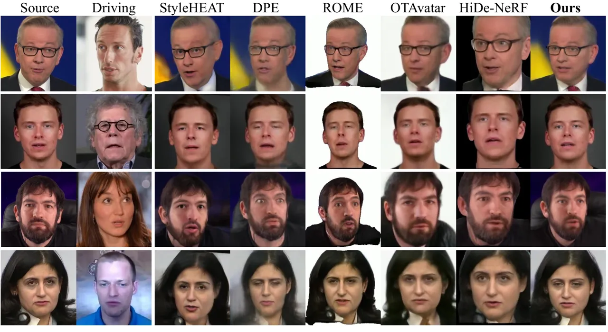

Figure 5: Comparison on cross-identity experiments. For a fair
comparison, we follow the pre-processing strategy of each method.
Notably, most portrait animation methods fail to preserve the source
identity or transfer driving appearance features, such as eye shape and
facial contour, in cross-identity scenarios.

We compare our model against 2D-based \[65, 41\] and 3D-based \[30, 38,
34\] image-driven portrait animation methods whose official
implementations are available. StyleHEAT \[65\] warps the 2D spatial
features of pre-trained StyleGAN2 using 3DMM parameters, DPE \[41\]
disentangles the pose and the expression in the motion latent space
without using 3DMM parameters. ROME \[30\] is a mesh-based method
transferring the expression and pose using 3DMM. OTAvatar \[38\]
leverages pre-trained EG3D \[10\] by modeling head motion in terms of
latent codes. HiDe-NeRF \[34\] deforms the source tri-plane by
predicting expression-aware deformation fields. For evaluation, we
employ peak signal-to-noise ratio (PSNR) and structural similarity index
measure (SSIM) for image quality, average key-point distance (AKD)
\[46\] for facial structure based on the 68 facial key-points, cosine
similarity of identity embedding (CSIM) \[14\] for identity
preservation, average expression distance (AED), and average pose
distance (APD) \[16, 46\] for expression transferring and pose matching.
For the cross-identity experiments, we only measure CSIM, AED and APD as
no ground-truth image is available.

Table 3: Ablation studies on the expression encoding. Same evaluation
setting with Tab. 1. The best score for each metric is in bold.

| Method              | Same-identity    |                  |                   |                  |                   |                   | Cross-identity   |                   |                   |
| ------------------- | ---------------- | ---------------- | ----------------- | ---------------- | ----------------- | ----------------- | ---------------- | ----------------- | ----------------- |
|                     | PSNR$`\uparrow`$ | SSIM$`\uparrow`$ | AKD$`\downarrow`$ | CSIM$`\uparrow`$ | AED$`\downarrow`$ | APD$`\downarrow`$ | CSIM$`\uparrow`$ | AED$`\downarrow`$ | APD$`\downarrow`$ |
| Direct 3DMM         | 23.077           | 0.688            | 3.874             | 0.789            | 0.105             | 0.044             | 0.648            | 0.209             | 0.073             |
| E2E LeBS ($`n=25`$) | 23.105           | 0.672            | 3.775             | 0.745            | 0.109             | 0.040             | 0.670            | 0.218             | 0.071             |
| E2E LeBS ($`n=10`$) | 23.235           | 0.676            | 3.755             | 0.751            | 0.110             | 0.038             | 0.672            | 0.238             | 0.079             |
| E2E LeBS ($`n=5`$)  | 22.631           | 0.646            | 4.114             | 0.658            | 0.140             | 0.046             | 0.632            | 0.246             | 0.076             |
| Full (CLeBS)        | 23.555           | 0.704            | 3.453             | 0.811            | 0.082             | 0.030             | 0.694            | 0.208             | 0.080             |

![[Uncaptioned
image]](arxiv-2404-00636--bfeb08b63adb.figures/figure-6.webp)

Figure 6: Ablation studies on the expression encoding. Without our
contrastive pre-training, the expression encoders transfer the
expression together with the appearance, such as eyelids and the head
size.

Same-identity experiments.  We report the same-identity transfer
experiment results in Tab. 1 and Tab. 2, and illustrate the qualitative
results in Fig. 4. For a fair comparison, ROME \[30\], OTAvatar \[38\],
and HiDe-NeRF \[38\] are evaluated on the foreground facial region with
different field of view. DPE \[41\] shows the stable performance in the
same-identity experiments with the fine-grained expression controls.
Among the 3D-based methods, HiDe-NeRF \[34\] scores the highest in the
identity preservation (CSIM). Our method scores the best result in the
majority of evaluation metrics. Especially, it has an advantage in
expression controls (AKD and AED).

Cross-identity experiments.  In Tab. 1 and Tab. 2, we also conduct the
cross-identity transfer experiments that transfers the expression and
pose of different identity into the source identity. As illustrated in
Fig. 5, DPE \[41\] shows visual artifacts and appearance swap, such as
face contours and eye shape, due to the insufficient disentanglement of
expression and pose in the motion space. HiDe-NeRF \[34\] scores the
highest identity preservation (CSIM) while un-predictable light changes
are involved due to the point-wise deformation field on the tri-plane.
Our method can transfer the driving expression without appearance swap
and generates a video without video-level artifacts such as light
changes and flickers. Please refer to our supplementary videos.

### 4.3 Ablation Studies and Further Results

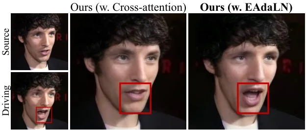

Figure 7: Cross-attention vs. EAdaLN.

| Method                    | Same-identity    |                   |                   | Cross-identity   |                   |                   |
| ------------------------- | ---------------- | ----------------- | ----------------- | ---------------- | ----------------- | ----------------- |
|                           | CSIM$`\uparrow`$ | AED$`\downarrow`$ | APD$`\downarrow`$ | CSIM$`\uparrow`$ | AED$`\downarrow`$ | APD$`\downarrow`$ |
| Ours (w. Cross-attention) | 0.678            | 0.125             | 0.042             | 0.631            | 0.271             | 0.122             |
| Ours (w. EAdaLN)          | 0.811            | 0.082             | 0.030             | 0.694            | 0.208             | 0.080             |

Table 4: Ablation studies on EAdaLN. The best score for each metric is
in bold. We replace EAdaLN in $`\mathbf{G}`$ with cross-attention to
verify the effectiveness of EAdaLN.

Ablation studies on the expression encoding.  In Tab. 3, we conduct
ablation studies on different expression encoding strategies. In Direct
3DMM, we replace our CLeBS with fully-connected layers to directly
inject the expression parameters of 3DMM through EAdaLN. As illustrated
in Fig. 6, the direct injection does not change appearance when
transferring same-identity expression however, it changes appearance
(e.g., eyebrows and facial contour) when transferring cross-identity
expression. Furthermore, since the raw expression parameters inherently
contain noise, the generated image also exhibits visual artifacts. In
E2E LeBS, we decrease the the number of basis vectors $`n`$ in LeBS for
appearance bottleneck to validate the proposed contrastive pre-training.
Each LeBS with $`n=25,10,5`$ is jointly trained (i.e., E2E) with entire
model without any pre-training. Due to the entanglement of appearance
and expression, both appearance and expression are changed as a whole as
the the number of basis vector $`n`$ decreases. LeBS alone is
insufficient for extracting appearance-free expression from the
expression parameters.

Ablation studies on EAdaLN.  In Tab. 4, we conduct ablation studies on
EAdaLN (w. EAdaLN) by comparing it with cross-attention (w.
Cross-attention), which is a widely used conditioning method in
transformer-based architectures \[57, 43\]. Specifically, we replace all
the EAdaLN blocks in $`\mathbf{G}`$ (Fig. 3) with cross-attention
blocks. In both scenarios, CLeBS serves the refined expression
$`\beta^{\prime}`$. As shown in Tab. 4 and Fig. 7, the cross-attention
fails to handle the expression accurately, which verifies the
effectiveness of our EAdaLN for the expression conditioning.

Visualization of facial expression parameters.  In Fig. 10, we sample 10
random frames from 10 different videos of distinct individual in VFHQ
\[64\] and visualize the low-dimensional t-SNE \[56\] results of the two
expression parameters: $`\beta\in\mathbb{R}^{64}`$ and
$`\beta^{\prime}\in\mathbb{R}^{d}`$. In Fig. 8(a), the 3DMM expression
parameters show strong entanglement with respective to their identities,
indicating the hidden appearance information in them. On the other hand,
as shown in Fig. 8(b), our contrastive pre-training mitigates the
entanglement, thereby resolving the appearance swap in the
cross-identity expression transfer in Fig. 6.

(a) 3DMM expression parameter $`\beta`$

(b) $`\beta^{\prime}`$ from the CLeBS.

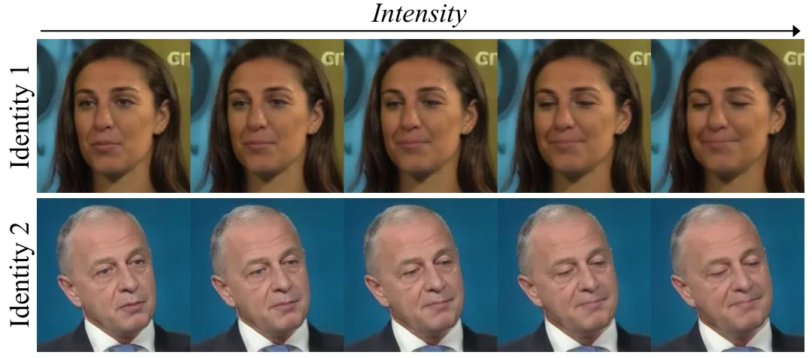

(c) Basis vector $`\mathbf{v}_{4}`$

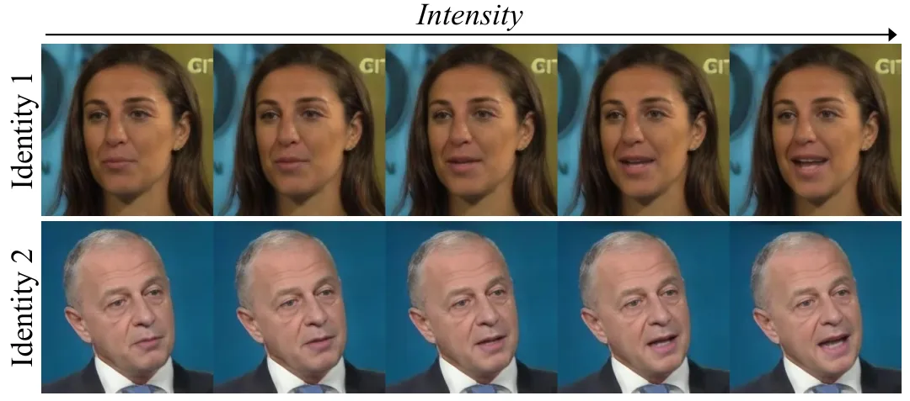

(d) Basis vector $`\mathbf{v}_{8}`$

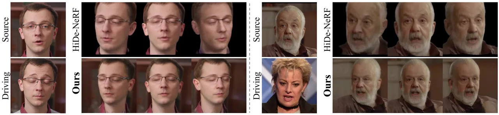

Figure 8: Visualization of the expression parameters. We plot t-SNE
\[56\] of raw 3DMM expression and our appearance-free expression
parameter.

Figure 9: Linear scaling along the different basis vectors of CLeBS. We
visualize the different expression directions along the basis vectors
$`\mathbf{v}_{4},\mathbf{v}_{8}\in\textbf{V}`$.

Figure 10: Novel-view synthesis results with expression transfer. Our
method can generate more multi-view consistent images compaired to
HiDe-NeRF \[34\].

Linear scaling along the orthogonal directions.  In Fig. 10, we verify
that $`\beta^{\prime}\in\mathbb{R}^{d}`$ has the orthogonal structure
where the learned basis $`\mathbf{V}`$ determines the different
expressions even if trained in unsupervised manner and the coefficients
$`\{\lambda_{i}\}_{i=1}^{n}`$ scale their intensities. Specifically, we
visualize two orthogonal directions $`\mathbf{v}_{4}`$ and
$`\mathbf{v}_{8}`$ and linearly scale their coefficients $`\lambda_{4}`$
and $`\lambda_{8}`$ from $`1`$ to $`10`$. As shown in Fig. 8(c),
$`\mathbf{v}_{4}`$ controls eye closing and mouth closing, while
Fig. 8(d) illustrates that $`\mathbf{v}_{8}`$ controls mouth opening.
Notably, the orthogonal basis does not influence head movements.

Novel-view synthesis with expression transfer.  In Fig. 10, we compare
the results of novel-view synthesis with expression transfer to those of
HiDe-NeRF \[34\]. Both methods utilize the tri-plane and differentiable
volume rendering to generate novel-view images. However, while HiDe-NeRF
transfers the driving expression by deforming the generated tri-plane
into a canonical tri-plane based on driving conditions \[42\], our
method relies on the hybrid generator $`\mathbf{G}`$ with EAdaLN. In
both same-identity and cross-identity transfer scenarios, our method
synthesizes more view-consistent results, highlighting the effectiveness
of our method in expression transfer without relying on deformation.
Please refer to supplementary videos.

## 5 Conclusion

We presented Export3D, a 3D-aware portrait image animation model that
controls the facial expression and the camera view of a source image by
leveraging the driving 3DMM expression and camera parameters. Since the
expression parameters are still entangled with appearance information,
we proposed a contrastive pre-training framework to extract
appearance-free expressions from the parameters. These refined
expressions are injected into our generator through expression adaptive
layer normalization (EAdaLN) that produces a tri-plane of source
identity and driving expression. Finally, differentiable volume
rendering renders the tri-plane into 2D images of different views.
Extensive experiments show that our contrastive pre-training framework
removes the appearance information from the 3DMM expression parameters,
enabling our model to transfer the cross-identity expressions without
undesirable appearance swap.

Limitations and future work.  While our method can generate realistic
face videos with driving expressions and views, it still has several
limitations. First, our method cannot separately generate the foreground
and background regions as the tri-plane representation construct them as
a whole. Several works address this limitation by extending the
tri-plane representation \[4\], restricting rendering points in the ray
marching process \[50\], or leveraging the off-the-shelf segmentation
model \[29\] to manually separate them \[34, 35, 38\]. Second, our
method cannot control non-facial body parts (e.g., neck and shoulders)
and eye gazing as they are beyond the capability of the 3DMM parameters.
We plan to address these limitations for future work.

Ethical consideration.  Since our method can generate a realistic video
using a single portrait image, it has the potential for misuse, such as
fake news creations. We have planned to attach visible and invisible
watermarks to the generated videos and restrict the source identities
for inference in research demonstration.

## References

- \[1\] R. Abdal, Y. Qin, and P. Wonka (2019) Image2stylegan: how to
  embed images into the stylegan latent space?. In Proceedings of the
  IEEE/CVF International Conference on Computer Vision (ICCV),
  pp. 4432–4441. Cited by: §2.1, §3.2.
- \[2\] R. Abdal, Y. Qin, and P. Wonka (2020) Image2stylegan++: how to
  edit the embedded images?. In Proceedings of the IEEE/CVF Conference
  on Computer Vision and Pattern Recognition (CVPR), pp. 8296–8305.
  Cited by: §2.1, §3.2.
- \[3\] B. Amberg, R. Knothe, and T. Vetter (2008) Expression invariant
  3d face recognition with a morphable model. In 2008 8th IEEE
  International Conference on Automatic Face & Gesture Recognition,
  pp. 1–6. Cited by: §3, §6.1.
- \[4\] S. An, H. Xu, Y. Shi, G. Song, U. Y. Ogras, and L. Luo (2023)
  PanoHead: geometry-aware 3d full-head synthesis in 360deg. In
  Proceedings of the IEEE/CVF Conference on Computer Vision and Pattern
  Recognition (CVPR), pp. 20950–20959. Cited by: §5.
- \[5\] J. L. Ba, J. R. Kiros, and G. E. Hinton (2016) Layer
  normalization. arXiv preprint arXiv:1607.06450. Cited by: §3.2.
- \[6\] J. T. Barron, B. Mildenhall, M. Tancik, P. Hedman, R.
  Martin-Brualla, and P. P. Srinivasan (2021) Mip-nerf: a multiscale
  representation for anti-aliasing neural radiance fields. In
  Proceedings of the IEEE/CVF International Conference on Computer
  Vision (ICCV), pp. 5855–5864. Cited by: §2.1.
- \[7\] A. R. Bhattarai, M. Nießner, and A. Sevastopolsky (2024)
  TriPlaneNet: an encoder for eg3d inversion. In Proceedings of the
  IEEE/CVF Winter Conference on Applications of Computer Vision (WACV),
  pp. 3055–3065. Cited by: §2.1, §3.2.
- \[8\] V. Blanz and T. Vetter (1999) A morphable model for the
  synthesis of 3d faces. In Proceedings of the 26th annual conference on
  Computer graphics and interactive techniques, pp. 187–194. Cited by:
  §2.2, §3.1, §3.1, §3, Figure 11, Figure 11, §6.1.
- \[9\] A. Bulat and G. Tzimiropoulos (2017) How far are we from solving
  the 2d & 3d face alignment problem?(and a dataset of 230,000 3d facial
  landmarks). In Proceedings of the IEEE/CVF International Conference on
  Computer Vision (ICCV), pp. 1021–1030. Cited by: §6.5.
- \[10\] E. R. Chan, C. Z. Lin, M. A. Chan, K. Nagano, B. Pan, S. De
  Mello, O. Gallo, L. J. Guibas, J. Tremblay, S. Khamis, et al. (2022)
  Efficient geometry-aware 3d generative adversarial networks. In
  Proceedings of the IEEE/CVF Conference on Computer Vision and Pattern
  Recognition (CVPR), pp. 16123–16133. Cited by: §1, §2.1, §2.1, §2.2,
  §3.2, §3.3, §3.3, §3.3, §3, §4.1, §4.2, §6.2, §6.2, §6.4, §6.7.
- \[11\] E. R. Chan, M. Monteiro, P. Kellnhofer, J. Wu, and G.
  Wetzstein (2021) Pi-gan: periodic implicit generative adversarial
  networks for 3d-aware image synthesis. In Proceedings of the IEEE/CVF
  Conference on Computer Vision and Pattern Recognition (CVPR),
  pp. 5799–5809. Cited by: §2.1.
- \[12\] T. Chen, S. Kornblith, M. Norouzi, and G. Hinton (2020) A
  simple framework for contrastive learning of visual representations.
  In International Conference on Machine Learning (ICML), pp. 1597–1607.
  Cited by: §3.1.
- \[13\] K. Cheng, X. Cun, Y. Zhang, M. Xia, F. Yin, M. Zhu, X. Wang, J.
  Wang, and N. Wang (2022) VideoReTalking: audio-based lip
  synchronization for talking head video editing in the wild. In
  SIGGRAPH Asia 2022 Conference Papers, pp. 1–9. Cited by: §1.
- \[14\] J. Deng, J. Guo, N. Xue, and S. Zafeiriou (2019) Arcface:
  additive angular margin loss for deep face recognition. In Proceedings
  of the IEEE/CVF Conference on Computer Vision and Pattern Recognition
  (CVPR), pp. 4690–4699. Cited by: §4.2, Table 1, Table 1, Table 2,
  Table 2, §6.5.
- \[15\] Y. Deng, J. Yang, J. Xiang, and X. Tong (2022) Gram: generative
  radiance manifolds for 3d-aware image generation. In Proceedings of
  the IEEE/CVF Conference on Computer Vision and Pattern Recognition
  (CVPR), pp. 10673–10683. Cited by: §2.1.
- \[16\] Y. Deng, J. Yang, S. Xu, D. Chen, Y. Jia, and X. Tong (2019)
  Accurate 3d face reconstruction with weakly-supervised learning: from
  single image to image set. In Proceedings of the IEEE/CVF Conference
  on Computer Vision and Pattern Recognition Workshops (CVPRW), pp. 0–0.
  Cited by: §4.1, §4.2, Table 1, Table 1, Table 2, Table 2, §6.5.
- \[17\] A. Dosovitskiy, L. Beyer, A. Kolesnikov, D. Weissenborn, X.
  Zhai, T. Unterthiner, M. Dehghani, M. Minderer, G. Heigold, S. Gelly,
  et al. (2020) An image is worth 16x16 words: transformers for image
  recognition at scale. arXiv preprint arXiv:2010.11929. Cited by: §1,
  §2.1, §3.2, §6.2.
- \[18\] B. Egger, S. Sutherland, S. C. Medin, and J. Tenenbaum (2021)
  Identity-expression ambiguity in 3d morphable face models. In 2021
  16th IEEE International Conference on Automatic Face and Gesture
  Recognition (FG 2021), pp. 1–7. Cited by: §1, §3.1.
- \[19\] Y. Gao, Y. Zhou, J. Wang, X. Li, X. Ming, and Y. Lu (2023)
  High-fidelity and freely controllable talking head video generation.
  In Proceedings of the IEEE/CVF Conference on Computer Vision and
  Pattern Recognition (CVPR), pp. 5609–5619. Cited by: §2.2, §3.2.
- \[20\] I. Goodfellow, J. Pouget-Abadie, M. Mirza, B. Xu, D.
  Warde-Farley, S. Ozair, A. Courville, and Y. Bengio (2020) Generative
  adversarial networks. Communications of the ACM 63 (11), pp. 139–144.
  Cited by: §2.1.
- \[21\] J. Gu, L. Liu, P. Wang, and C. Theobalt (2022) StyleNeRF: a
  style-based 3d aware generator for high-resolution image synthesis. In
  International Conference on Learning Representations (ICLR), External
  Links: [Link](https://openreview.net/forum?id=iUuzzTMUw9K) Cited by:
  §2.1.
- \[22\] Y. Guo, K. Chen, S. Liang, Y. Liu, H. Bao, and J. Zhang (2021)
  Ad-nerf: audio driven neural radiance fields for talking head
  synthesis. In Proceedings of the IEEE/CVF Conference on Computer
  Vision and Pattern Recognition (CVPR), pp. 5784–5794. Cited by: §2.2,
  §3.3.
- \[23\] K. He, H. Fan, Y. Wu, S. Xie, and R. Girshick (2020) Momentum
  contrast for unsupervised visual representation learning. In
  Proceedings of the IEEE/CVF Conference on Computer Vision and Pattern
  Recognition (CVPR), pp. 9729–9738. Cited by: §3.1.
- \[24\] F. Hong and D. Xu (2023) Implicit identity representation
  conditioned memory compensation network for talking head video
  generation. In Proceedings of the IEEE/CVF International Conference on
  Computer Vision (ICCV), pp. 23062–23072. Cited by: §1.
- \[25\] J. Hu, L. Shen, and G. Sun (2018) Squeeze-and-excitation
  networks. In Proceedings of the IEEE/CVF Conference on Computer Vision
  and Pattern Recognition (CVPR), pp. 7132–7141. Cited by: §6.2.
- \[26\] T. Karras, M. Aittala, J. Hellsten, S. Laine, J. Lehtinen,
  and T. Aila (2020) Training generative adversarial networks with
  limited data. Advances in Neural Information Processing Systems
  (NeurIPS) 33, pp. 12104–12114. Cited by: §6.3.
- \[27\] T. Karras, M. Aittala, S. Laine, E. Härkönen, J. Hellsten, J.
  Lehtinen, and T. Aila (2021) Alias-free generative adversarial
  networks. Advances in Neural Information Processing Systems (NeurIPS)
  34, pp. 852–863. Cited by: §3.2.
- \[28\] T. Karras, S. Laine, M. Aittala, J. Hellsten, J. Lehtinen,
  and T. Aila (2020) Analyzing and improving the image quality of
  stylegan. In Proceedings of the IEEE/CVF Conference on Computer Vision
  and Pattern Recognition (CVPR), pp. 8110–8119. Cited by: §2.2, §3.2,
  §6.2.
- \[29\] Z. Ke, J. Sun, K. Li, Q. Yan, and R. W. Lau (2022) Modnet:
  real-time trimap-free portrait matting via objective decomposition. In
  Proceedings of the AAAI Conference on Artificial Intelligence, Vol.
  36, pp. 1140–1147. Cited by: §5, §6.7.
- \[30\] T. Khakhulin, V. Sklyarova, V. Lempitsky, and E.
  Zakharov (2022) Realistic one-shot mesh-based head avatars. In
  European Conference on Computer Vision (ECCV), pp. 345–362. Cited by:
  Figure 5, §4.2, §4.2, §4, §6.6, §6.7.
- \[31\] T. Ki and D. Min (2023) StyleLipSync: style-based personalized
  lip-sync video generation. In Proceedings of the IEEE/CVF
  International Conference on Computer Vision (ICCV), pp. 22841–22850.
  Cited by: §1, §2.2, §4.1.
- \[32\] D. P. Kingma and J. Ba (2014) Adam: a method for stochastic
  optimization. arXiv preprint arXiv:1412.6980. Cited by: §6.4.
- \[33\] J. Ko, K. Cho, D. Choi, K. Ryoo, and S. Kim (2023) 3D gan
  inversion with pose optimization. In Proceedings of the IEEE/CVF
  Winter Conference on Applications of Computer Vision (WACV),
  pp. 2967–2976. Cited by: §2.1, §3.2.
- \[34\] W. Li, L. Zhang, D. Wang, B. Zhao, Z. Wang, M. Chen, B.
  Zhang, Z. Wang, L. Bo, and X. Li (2023) One-shot high-fidelity
  talking-head synthesis with deformable neural radiance field. In
  Proceedings of the IEEE/CVF Conference on Computer Vision and Pattern
  Recognition (CVPR), pp. 17969–17978. Cited by: §1, §2.2, Figure 10,
  Figure 10, Figure 5, §4.2, §4.2, §4.2, §4.3, §4, §5, §6.6, §6.6, §6.7.
- \[35\] X. Li, S. De Mello, S. Liu, K. Nagano, U. Iqbal, and J.
  Kautz (2024) Generalizable one-shot 3d neural head avatar. Advances in
  Neural Information Processing Systems (NeurIPS) 36. Cited by: §1,
  §2.2, §5, §6.7.
- \[36\] S. Lombardi, T. Simon, J. Saragih, G. Schwartz, A. Lehrmann,
  and Y. Sheikh (2019) Neural volumes: learning dynamic renderable
  volumes from images. arXiv preprint arXiv:1906.07751. Cited by: §2.1,
  §3.3, §3.
- \[37\] Y. Ma, S. Wang, Z. Hu, C. Fan, T. Lv, Y. Ding, Z. Deng, and X.
  Yu (2023) Styletalk: one-shot talking head generation with
  controllable speaking styles. arXiv preprint arXiv:2301.01081. Cited
  by: §2.2.
- \[38\] Z. Ma, X. Zhu, G. Qi, Z. Lei, and L. Zhang (2023) OTAvatar:
  one-shot talking face avatar with controllable tri-plane rendering. In
  Proceedings of the IEEE/CVF Conference on Computer Vision and Pattern
  Recognition (CVPR), pp. 16901–16910. Cited by: §1, §2.1, §2.2, §3.2,
  Figure 5, §4.2, §4.2, §4, §5, §6.6, §6.7.
- \[39\] B. Mildenhall, P. P. Srinivasan, M. Tancik, J. T. Barron, R.
  Ramamoorthi, and R. Ng (2021) Nerf: representing scenes as neural
  radiance fields for view synthesis. Communications of the ACM 65 (1),
  pp. 99–106. Cited by: §1, §2.1, §2.1, §3.3, §3.3, §3, §6.2.
- \[40\] D. Min, M. Song, and S. J. Hwang (2022) StyleTalker: one-shot
  style-based audio-driven talking head video generation. arXiv preprint
  arXiv:2208.10922. Cited by: §1, §2.2, §3.1.
- \[41\] Y. Pang, Y. Zhang, W. Quan, Y. Fan, X. Cun, Y. Shan, and D.
  Yan (2023) Dpe: disentanglement of pose and expression for general
  video portrait editing. In Proceedings of the IEEE/CVF Conference on
  Computer Vision and Pattern Recognition (CVPR), pp. 427–436. Cited by:
  §1, §1, §2.2, §3.2, Figure 5, §4.2, §4.2, §4.2, §4.
- \[42\] K. Park, U. Sinha, J. T. Barron, S. Bouaziz, D. B.
  Goldman, S. M. Seitz, and R. Martin-Brualla (2021) Nerfies: deformable
  neural radiance fields. In Proceedings of the IEEE/CVF International
  Conference on Computer Vision (ICCV), pp. 5865–5874. Cited by: §1,
  §2.1, §2.2, §4.3.
- \[43\] W. Peebles and S. Xie (2022) Scalable diffusion models with
  transformers. arXiv preprint arXiv:2212.09748. Cited by: §1, §2.1,
  §3.2, §4.3, §6.2.
- \[44\] K. Prajwal, R. Mukhopadhyay, V. P. Namboodiri, and C.
  Jawahar (2020) A lip sync expert is all you need for speech to lip
  generation in the wild. In Proceedings of the 28th ACM International
  Conference on Multimedia, pp. 484–492. Cited by: §2.2.
- \[45\] A. Radford, J. W. Kim, C. Hallacy, A. Ramesh, G. Goh, S.
  Agarwal, G. Sastry, A. Askell, P. Mishkin, J. Clark, et al. (2021)
  Learning transferable visual models from natural language supervision.
  In International Conference on Machine Learning (ICML), pp. 8748–8763.
  Cited by: §3.1.
- \[46\] Y. Ren, G. Li, Y. Chen, T. H. Li, and S. Liu (2021) Pirenderer:
  controllable portrait image generation via semantic neural rendering.
  In Proceedings of the IEEE/CVF Conference on Computer Vision and
  Pattern Recognition (CVPR), pp. 13759–13768. Cited by: §4.2, Table 1,
  Table 1, Table 2, Table 2.
- \[47\] E. Richardson, Y. Alaluf, O. Patashnik, Y. Nitzan, Y. Azar, S.
  Shapiro, and D. Cohen-Or (2021) Encoding in style: a stylegan encoder
  for image-to-image translation. In Proceedings of the IEEE/CVF
  Conference on Computer Vision and Pattern Recognition (CVPR),
  pp. 2287–2296. Cited by: §2.1, §3.2.
- \[48\] D. Roich, R. Mokady, A. H. Bermano, and D. Cohen-Or (2022)
  Pivotal tuning for latent-based editing of real images. ACM
  Transactions on Graphics (TOG) 42 (1), pp. 1–13. Cited by: §3.2.
- \[49\] K. Schwarz, Y. Liao, M. Niemeyer, and A. Geiger (2020) GRAF:
  generative radiance fields for 3d-aware image synthesis. In Advances
  in Neural Information Processing Systems (NeurIPS), Cited by: §2.1.
- \[50\] M. Shin, Y. Seo, J. Bae, Y. S. Choi, H. Kim, H. Byun, and Y.
  Uh (2023) BallGAN: 3d-aware image synthesis with a spherical
  background. arXiv preprint arXiv:2301.09091. Cited by: §5.
- \[51\] A. Siarohin, S. Lathuilière, S. Tulyakov, E. Ricci, and N.
  Sebe (2019) First order motion model for image animation. Advances in
  Neural Information Processing Systems (NeurIPS) 32. Cited by: §1,
  §2.2, §4.1.
- \[52\] K. Simonyan and A. Zisserman (2014) Very deep convolutional
  networks for large-scale image recognition. arXiv preprint
  arXiv:1409.1556. Cited by: §6.3.
- \[53\] J. Sun, X. Wang, L. Wang, X. Li, Y. Zhang, H. Zhang, and Y.
  Liu (2023) Next3D: generative neural texture rasterization for
  3d-aware head avatars. In Proceedings of the IEEE/CVF Conference on
  Computer Vision and Pattern Recognition (CVPR), pp. 20991–21002. Cited
  by: §2.1, §2.1, §3.2.
- \[54\] O. Tov, Y. Alaluf, Y. Nitzan, O. Patashnik, and D.
  Cohen-Or (2021) Designing an encoder for stylegan image manipulation.
  ACM Transactions on Graphics (TOG) 40 (4), pp. 1–14. Cited by: §2.1,
  §3.2.
- \[55\] A. Trevithick, M. Chan, M. Stengel, E. R. Chan, C. Liu, Z.
  Yu, S. Khamis, M. Chandraker, R. Ramamoorthi, and K. Nagano (2023)
  Real-time radiance fields for single-image portrait view synthesis.
  arXiv preprint arXiv:2305.02310. Cited by: §1, §1, §2.1, §2.1, §3.2,
  §3.2, §3.3, §6.2, §6.4.
- \[56\] L. Van der Maaten and G. Hinton (2008) Visualizing data using
  t-sne.. Journal of Machine Learning Research 9 (11). Cited by: Figure
  10, Figure 10, §4.3.
- \[57\] A. Vaswani, N. Shazeer, N. Parmar, J. Uszkoreit, L.
  Jones, A. N. Gomez, Ł. Kaiser, and I. Polosukhin (2017) Attention is
  all you need. Advances in Neural Information Processing Systems
  (NeurIPS) 30. Cited by: §4.3.
- \[58\] T. Wang, A. Mallya, and M. Liu (2021) One-shot free-view neural
  talking-head synthesis for video conferencing. In Proceedings of the
  IEEE/CVF Conference on Computer Vision and Pattern Recognition (CVPR),
  pp. 10039–10049. Cited by: §1, §2.2, §4.1.
- \[59\] Y. Wang, D. Yang, F. Bremond, and A. Dantcheva (2022) Latent
  image animator: learning to animate images via latent space
  navigation. arXiv preprint arXiv:2203.09043. Cited by: §1, §2.2, §3.1,
  §6.2, §6.6.
- \[60\] Y. Wu, Y. Deng, J. Yang, F. Wei, Q. Chen, and X. Tong (2022)
  Anifacegan: animatable 3d-aware face image generation for video
  avatars. Advances in Neural Information Processing Systems (NeurIPS)
  35, pp. 36188–36201. Cited by: §2.1.
- \[61\] J. Xiang, J. Yang, Y. Deng, and X. Tong (2023) Gram-hd:
  3d-consistent image generation at high resolution with generative
  radiance manifolds. In Proceedings of the IEEE/CVF Conference on
  Computer Vision and Pattern Recognition (CVPR), pp. 2195–2205. Cited
  by: §2.1, §3.3.
- \[62\] E. Xie, W. Wang, Z. Yu, A. Anandkumar, J. M. Alvarez, and P.
  Luo (2021) SegFormer: simple and efficient design for semantic
  segmentation with transformers. Advances in Neural Information
  Processing Systems (NeurIPS) 34, pp. 12077–12090. Cited by: §3.2,
  §6.2.
- \[63\] J. Xie, H. Ouyang, J. Piao, C. Lei, and Q. Chen (2023)
  High-fidelity 3d gan inversion by pseudo-multi-view optimization. In
  Proceedings of the IEEE/CVF Conference on Computer Vision and Pattern
  Recognition (CVPR), pp. 321–331. Cited by: §2.1, §3.2.
- \[64\] L. Xie, X. Wang, H. Zhang, C. Dong, and Y. Shan (2022) Vfhq: a
  high-quality dataset and benchmark for video face super-resolution. In
  Proceedings of the IEEE/CVF Conference on Computer Vision and Pattern
  Recognition (CVPR), pp. 657–666. Cited by: §4.1, §4.3.
- \[65\] F. Yin, Y. Zhang, X. Cun, M. Cao, Y. Fan, X. Wang, Q. Bai, B.
  Wu, J. Wang, and Y. Yang (2022) Styleheat: one-shot high-resolution
  editable talking face generation via pre-trained stylegan. In European
  Conference on Computer Vision (ECCV), pp. 85–101. Cited by: §1, §2.2,
  §2.2, §3.2, Figure 5, §4.2, §4.
- \[66\] F. Yin, Y. Zhang, X. Wang, T. Wang, X. Li, Y. Gong, Y. Fan, X.
  Cun, Y. Shan, C. Oztireli, and Y. Yang (2023) 3D gan inversion with
  facial symmetry prior. In Proceedings of the IEEE/CVF Conference on
  Computer Vision and Pattern Recognition (CVPR), pp. 342–351. Cited by:
  §2.1, §3.2.
- \[67\] W. Yu, Y. Fan, Y. Zhang, X. Wang, F. Yin, Y. Bai, Y. Cao, Y.
  Shan, Y. Wu, Z. Sun, et al. (2023) Nofa: nerf-based one-shot facial
  avatar reconstruction. In ACM SIGGRAPH 2023 Conference Proceedings,
  pp. 1–12. Cited by: §1, §2.1, §2.1, §2.2, §3.2.
- \[68\] Z. Yuan, Y. Zhu, Y. Li, H. Liu, and C. Yuan (2023) Make encoder
  great again in 3d gan inversion through geometry and occlusion-aware
  encoding. arXiv preprint arXiv:2303.12326. Cited by: §2.1.
- \[69\] R. Zhang, P. Isola, A. A. Efros, E. Shechtman, and O.
  Wang (2018) The unreasonable effectiveness of deep features as a
  perceptual metric. In Proceedings of the IEEE/CVF Conference on
  Computer Vision and Pattern Recognition (CVPR), pp. 586–595. Cited by:
  §6.3.
- \[70\] W. Zhang, X. Cun, X. Wang, Y. Zhang, X. Shen, Y. Guo, Y. Shan,
  and F. Wang (2023) SadTalker: learning realistic 3d motion
  coefficients for stylized audio-driven single image talking face
  animation. In Proceedings of the IEEE/CVF Conference on Computer
  Vision and Pattern Recognition (CVPR), pp. 8652–8661. Cited by: §1,
  §2.2.
- \[71\] J. Zhao and H. Zhang (2022) Thin-plate spline motion model for
  image animation. In Proceedings of the IEEE/CVF Conference on Computer
  Vision and Pattern Recognition (CVPR), pp. 3657–3666. Cited by: §1,
  §2.2.
- \[72\] J. Zhu, T. Park, P. Isola, and A. A. Efros (2017) Unpaired
  image-to-image translation using cycle-consistent adversarial
  networks. In Proceedings of the IEEE International Conference on
  Computer Vision (ICCV), pp. 2223–2232. Cited by: §1.

## 6 Supplementary Material

### 6.1 3D Morphable Models (3DMM).

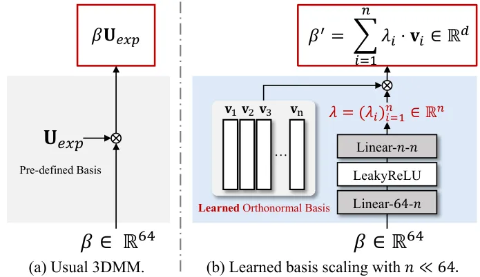

Figure 11: 3DMM \[8\] vs. Leaned Basis Scaling (LeBS). 3DMM based method
reconstructs 3D facial geometry by scaling the the pre-defined basis
$`\mathbf{U}_{exp}`$ with expression parameters
$`\beta\in\mathbb{R}^{64}`$. LeBS, on the other hand, uses the learned
basis $`V=\{v_{i}\}_{i=1}^{n}\subseteq\mathbb{R}^{d}`$ which is scaled
by the low-dimensional coefficients
$`\lambda=(\lambda_{i})_{i=1}^{n}\in\mathbb{R}^{n}`$ ($`n\ll 64`$).

3D Morphable Models (3DMM) \[8\] are statistical models of 3D shape and
their corresponding texture. In this paper, we only consider the shape
representation of 3DMM. To be specific, a face shape $`\mathbf{S}`$ is
initialized with the average shape $`\bar{\mathbf{S}}`$ and further
shaped by a linear combination of expression and identity as follows:

```math
\mathbf{S}=\bar{\mathbf{S}}+\alpha\mathbf{U}_{id}+\beta\mathbf{U}_{exp}, \tag{11}
```

where $`\mathbf{U}_{id}\in\mathbb{R}^{80\times d_{3dmm}}`$,
$`\mathbf{U}_{exp}\in\mathbb{R}^{68\times d_{3dmm}}`$ are the
pre-defined bases of identity and expression subspaces of 3D face space,
respectively. $`d_{3dmm}`$ is the dimension of the 3D face space. The
coefficients $`\alpha\in\mathbb{R}^{80}`$ and
$`\beta\in\mathbb{R}^{64}`$ determine the facial identity and expression
for the face geometry reconstruction by scaling each basis vector \[3\].

In this paper, we term appearance as the set of geometric features that
determine the facial identity of a given face, such as head size, face
contour, face proportion, eyebrows, eye shape, mouth shape, jaw shape,
etc., and expression as the motion of these appearance features, such as
mouth opening (closing), eye blinking, etc.

### 6.2 Detailed Model Architectures.

Our model consists of four parts: Learned Basis Scaling (LeBS), Hybrid
Tri-plane Generator $`\mathbf{G}`$, Light-weight MLP decoder (MLP) for
color and density prediction used in the differentiable volume rendering
\[39\], and Super-resolution (SR) module. The detailed model
architectures are shown in Fig. 11 and Fig. 12.

LeBS consists of two fully-connected layers along with the learned
orthonormal basis $`V\subseteq\mathbb{R}^{d}`$. We apply
QR-decomposition \[59\] to a learnable weight in
$`\mathbb{R}^{d\times n}`$ to explicitly compute
$`V\subseteq\mathbb{R}^{n\times d}`$. We set the dimension of the
expression space $`d=\frac{h}{4}`$ to be same as the dimension of the
visual tokens where $`h=1024`$ is the size of the hidden state in the
EAdaLN-ViT blocks. We experimentally choose $`n=10`$ for the number of
basis vectors. We observe that increasing $`n`$ produces duplicated
expression directions. For the contrastive pre-training of LeBS, we
employ ResNetSE18 feature extractor \[25\] followed by a single
fully-connected layer to output the $`d`$-dimensional vector, serving as
the image encoder $`f_{I}(\cdot)`$. Notably, we do not introduce an
orthonormal basis to $`f_{I}(\cdot)`$.

Figure 12: The detailed model architectures.
$`k\times k`$-Conv-$`C`$-$`s`$-$`p`$ is the convolution operator with
the kernel size $`k\times k`$, output channel size $`C`$, stride step
$`s`$, and padding size $`p`$. Linear-$`C_{0}`$-$`C_{1}`$ is the
fully-connected layer of the input channel size $`C_{0}`$ and the output
channel size $`C_{1}`$.

Inspired by \[55\], we incorporate ViT blocks \[17\] into our generator
$`\mathbf{G}`$, specifically utilizing those from SegFormer \[62\] and
DiT \[43\]. In both EAdaLN-ViT and ViT, we employ four heads with 1024
hidden dimensions for the multi-head self-attention. It is worth
mentioning that the architectures of EAdaLN-ViT and ViT illustrated in
Fig. 12 are the same, with the exception of EAdaLN integration for
expression transfer. We employ the exponential moving average (EMA) on
the tri-planes for stabilizing the training. More precisely, in the
$`j`$-th gradient step, we calculate and update the EMA
$`\text{T}^{j}_{EMA}`$ and the current tri-plane $`\text{T}^{j}`$ as
follows:

```math
\text{T}^{j}_{EMA}\leftarrow\delta\cdot\text{T}^{j-1}_{EMA}+(1-\delta)\cdot\bar{\text{T}}^{j}\quad\text{and}\quad\text{T}^{j}\leftarrow\text{T}^{j}+\text{T}^{j-1}_{EMA} \tag{12}
```

where $`\bar{\text{T}}^{j}`$ is the average tri-plane calculated within
the $`j`$-th batch and $`\text{T}^{0}_{EMA}`$ is initialized by
$`\mathbf{0}\in\mathbb{R}^{3\times 32\times 128\times 128}`$. We set
$`\delta=0.998`$ as the weight for the moving average.

MLP for color and density prediction consists of a stack of
fully-connected layers with soft-plus activation. In contrast to \[10\],
we use two fully-connected layers to separately predict them.

For SR, we follow the super-resolution module used in \[28, 10\] except
for the style modulated convolutions.

### 6.3 Training Objectives

Our model is trained with reconstruction manner that reconstruct a
driving frame $`D`$ from a source frame $`S`$ with the driving
expression parameters $`\beta_{D}`$ and camera parameters $`p_{D}`$
where these frames are randomly sampled from the same video clip. The
training consists of two stages. In the first phase, we employ MSE loss
$`\mathcal{L}_{2}`$ and VGG16 \[52\] multi-scale perceptual loss
$`\mathcal{L}_{lpips}`$ \[69\] to minimize the perceptual distance
between the generated frame $`\hat{D}`$ and the driving frame $`D`$. We
also minimize the distance between the raw rendered image
$`\hat{D}_{raw}`$ and raw driving image $`D_{raw}`$ using the same loss
functions, denoted by $`\mathcal{L}^{raw}_{2}`$ and
$`\mathcal{L}^{raw}_{lpips}`$, respectively:

```math
\mathcal{L}_{rec}=\mathcal{L}^{raw}_{2}+\mathcal{L}_{2}+\mathcal{L}^{raw}_{lpips}+\mathcal{L}_{lpips}. \tag{13}
```

In the second phase, we integrate the conditional discriminator used in
\[26\], using the camera parameter as additional condition and employing
binary cross-entropy loss to compute adversarial loss
$`\mathcal{L}_{adv}`$. The total loss function $`\mathcal{L}_{total}`$
is

```math
\mathcal{L}_{total}=\lambda_{rec}\mathcal{L}_{rec}+\lambda_{adv}\mathcal{L}_{adv}, \tag{14}
```

where $`\lambda_{rec}`$ and $`\lambda_{adv}`$ are balancing
coefficients.

### 6.4 More Implementation Details.

#### Training.

Since our model does not rely on pre-trained EG3D \[10, 55\], it is
trained end-to-end, except for CLeBS. For the contrastive pre-training
of LeBS, we draw 32 negative samples for each positive sample, set the
temperature $`\tau`$ to 0.07, and train it for 60,000 steps. Longer
pre-training does not lead to significant performance improvements.

We empirically set the balancing coefficients in Eq. 14 by
$`\lambda_{rec}=1`$, and $`\lambda_{adv}=0.01`$. We train our model for
300,000 steps with the reconstruction loss Eq. 13 and then incorporate
the adversarial loss Eq. 14 for 10,000 steps to slightly improve the
visual quality. For all training, we use Adam \[32\] optimizer with the
learning rate $`10^{-4}`$ for Export3D, $`10^{-4}`$ for CLeBS, and
$`10^{-5}`$ for the discriminator, respectively. Overall training
conducts on a single A100 GPU about 5 days with batch size 8. In the
inference phase, we use randomly sampled frontal frame as the source
frame.

### 6.5 Evaluation.

#### Evaluation metrics.

We provide additional explanations of the evaluation metrics. Average
key-point distance (AKD) is the L1 distance of 68 facial key-points
between the generated image and the driving image, which measures the
facial structure similarity based on the key-points. We use the
face-alignment \[9\] to extract the key-points. Cosine similarity of
identity embedding (CSIM) is the cosine similarity between the identity
embeddings of the source image and the generated image where the
embeddings are extracted from ArcFace \[14\]. Average expression
distance (AED) and average pose distance (APD) are the L1 distance
between the expression parameters (64 dimensions) and the pose
parameters (6 dimensions), respectively extracted from the generated
image and the driving image. We use the 3DMM extractor \[16\] to extract
those parameters.

| Method   | Same-identity    |                  |                   |                  |                   |                   | Cross-identity   |                   |                   |
| -------- | ---------------- | ---------------- | ----------------- | ---------------- | ----------------- | ----------------- | ---------------- | ----------------- | ----------------- |
|          | PSNR$`\uparrow`$ | SSIM$`\uparrow`$ | AKD$`\downarrow`$ | CSIM$`\uparrow`$ | AED$`\downarrow`$ | APD$`\downarrow`$ | CSIM$`\uparrow`$ | AED$`\downarrow`$ | APD$`\downarrow`$ |
| ROME     | 8.309            | 0.400            | 11.179            | 0.592            | 0.123             | 0.173             | 0.495            | 0.236             | 0.201             |
| OTAvatar | 10.667           | 0.457            | 15.236            | 0.492            | 0.181             | 0.182             | 0.492            | 0.288             | 0.237             |
| HiDeNeRF | 12.254           | 0.345            | 22.136            | 0.354            | 0.135             | 0.252             | 0.408            | 0.259             | 0.230             |
| Ours     | 23.555           | 0.704            | 3.453             | 0.811            | 0.082             | 0.030             | 0.694            | 0.208             | 0.080             |

Table 5: Quantitative comparison of on VFHQ with "background".

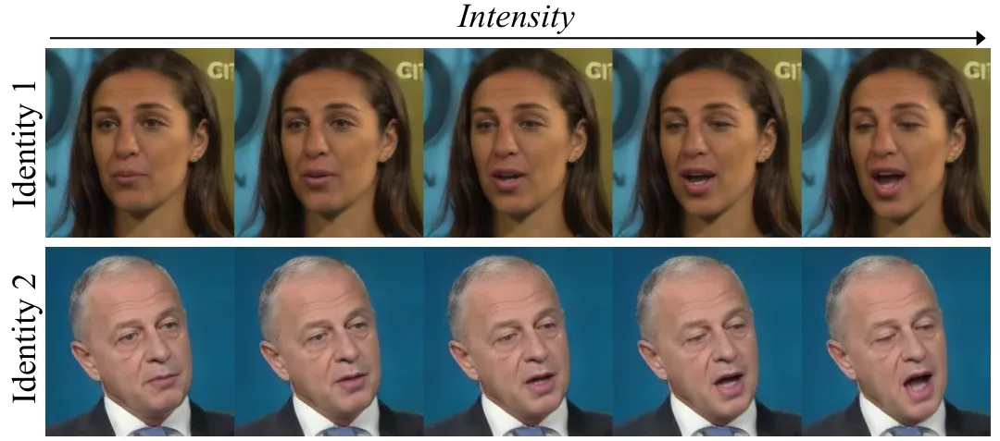

(a) Basis vector $`\mathbf{v}_{1}`$

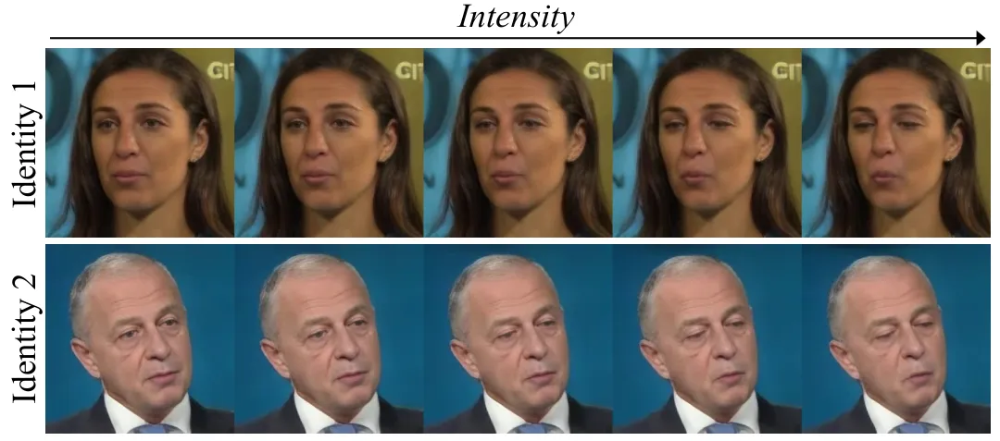

(b) Basis vector $`\mathbf{v}_{3}`$

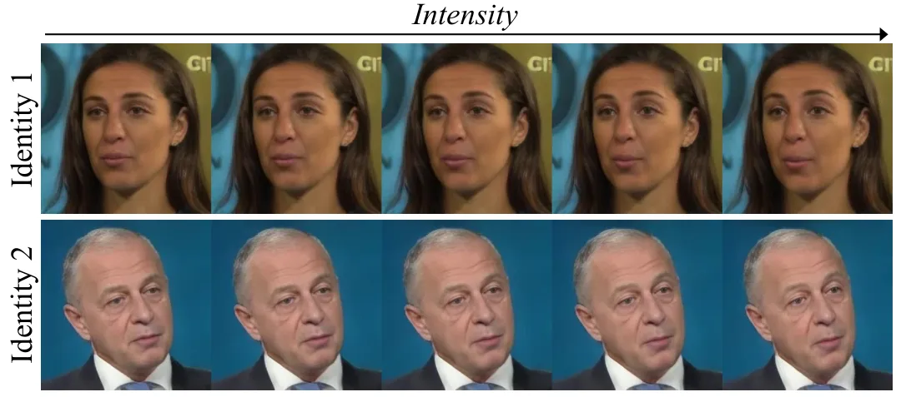

(c) Basis vector $`\mathbf{v}_{6}`$

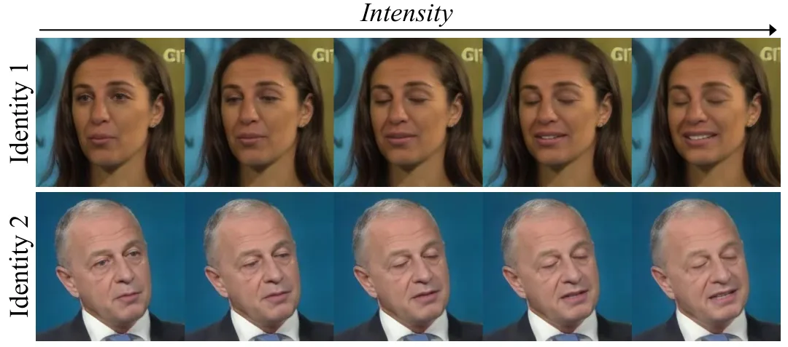

(d) Basis vector $`\mathbf{v}_{9}`$

Figure 13: Linear scaling along the different basis vectors of CLeBS.

### 6.6 Additional Results.

#### Further comparison without removing the background.

In Tab. 5, we provide additional quantitative comparison with ROME
\[30\], OTAvatar \[38\], and HiDe-NeRF \[34\] to verify that these
models have advantage on the evaluation metrics without background.

#### Linear scaling along the orthonormal basis.

In Fig. 13, we show additional results of linear scaling along the
different basis vectors \[59\]. For $`\mathbf{v}_{1}`$, we scale
$`\lambda_{1}`$ from 1 to -7, showing mouth opening and eye closing. For
$`\mathbf{v}_{3}`$, we scale $`\lambda_{3}`$ from 1 to 20, showing eye
closing and lip pursing. For $`\mathbf{v}_{6}`$, we scale
$`\lambda_{6}`$ from 1 to -7, showing eyebrow moving. For
$`\mathbf{v}_{9}`$, we scale $`\lambda_{9}`$ 1 from to -10, showing eye
closing and smiling. Since our method does not constrain the range of
the coefficients $`\lambda=(\lambda_{i})_{i=1}^{10}`$, the manipulation
can be realized along the negative scaling. Please refer to video
results.

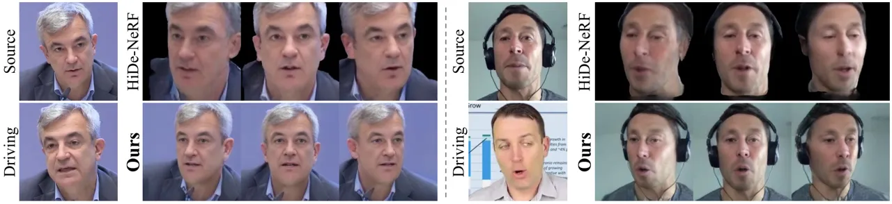

Figure 14: Novel-view synthesis results with expression transfer.

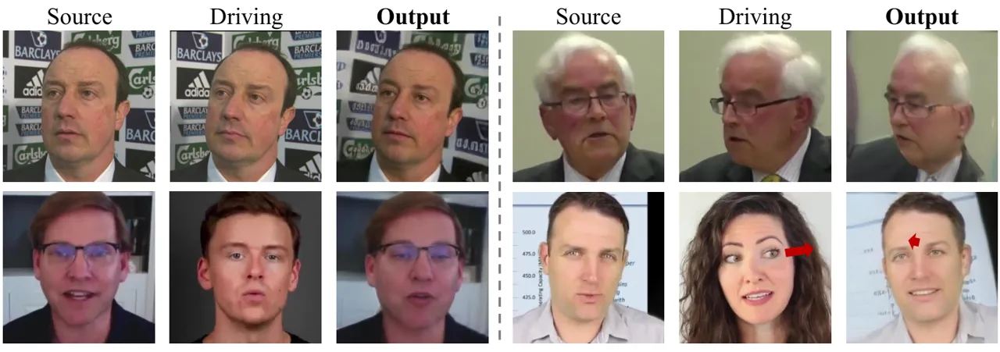

Figure 15: Limitation cases of Export3D. The red arrows indicate the
directions of eye gaze.

#### Additional comparison with HiDe-NeRF.

In Fig. 14, we exhibit additional comparison results with HiDe-NeRF
\[34\] for novel-view synthesis with expression transfer. Please refer
to the video results for further details.

### 6.7 Limitations and Future Work.

We exhibit the limitation cases of Export3D in Fig. 15. Since the
tri-plane represents \[10\] the foreground and the background as a
whole, our model jointly renders them, resulting in head pose-aligned
distortion. Several prior works \[35, 34, 30, 38\] address this issue by
removing the complex background and providing the volume rendering with
a uniform background. However, they heavily rely on the performance of
the background segmentation model \[29\], exhibiting the temporal
jitters in the generated videos. Additionally, our model cannot control
eye gazing since the 3DMM parameters do not model eye movement. We leave
these limitations for future research.
