# VASA-1: Lifelike Audio-Driven Talking Faces Generated in Real Time

​​​​​​Sicheng Xu  ​​​​Microsoft Research Asia ^(†)^(†)thanks: : Equal
contributions. \$ˆ†\$: Corresponding author. See the contribution
statement section for contributions.
Email: [sichengxu@microsoft.com](mailto:)    ​​​​Guojun Chen​​​​Microsoft
Research Asia Email: [guoch@microsoft.com](mailto:)    Yu-Xiao
GuoMicrosoft Research Asia Email: [yuxgu@microsoft.com](mailto:)   
Jiaolong YangMicrosoft Research Asia
Email: [jiaoyan@microsoft.com](mailto:)    Chong Li   Microsoft Research
Asia Email: [chol@microsoft.com](mailto:)    Zhenyu ZangMicrosoft
Research Asia Email: [zhenyuzang@microsoft.com](mailto:)    Yizhong
ZhangMicrosoft Research Asia Email: [yizzhan@microsoft.com](mailto:)   
Xin TongMicrosoft Research Asia Email: [xtong@microsoft.com](mailto:)   
Baining GuoMicrosoft Research Asia
Email: [bainguo@microsoft.com](mailto:)

###### Abstract

We introduce VASA, a framework for generating lifelike talking faces
with appealing visual affective skills (VAS) given a single static image
and a speech audio clip. Our premiere model, VASA-1, is capable of not
only generating lip movements that are exquisitely synchronized with the
audio, but also producing a large spectrum of facial nuances and natural
head motions that contribute to the perception of authenticity and
liveliness. The core innovations include a diffusion-based holistic
facial dynamics and head movement generation model that works in a face
latent space, and the development of such an expressive and disentangled
face latent space using videos. Through extensive experiments including
evaluation on a set of new metrics, we show that our method
significantly outperforms previous methods along various dimensions
comprehensively. Our method delivers high video quality with realistic
facial and head dynamics and also supports the online generation of
512$`\times`$512 videos at up to 40 FPS with negligible starting
latency. It paves the way for real-time engagements with lifelike
avatars that emulate human conversational behaviors. Project webpage:
[https://www.microsoft.com/en-us/research/project/vasa-1/](https://www.microsoft.com/en-us/research/project/vasa-1/)

## 1 Introduction

In the realm of multimedia and communication, the human face is not just
a visage but a dynamic canvas, where every subtle movement and
expression can articulate emotions, convey unspoken messages, and foster
empathetic connections. The emergence of AI-generated talking faces
offers a window into a future where technology amplifies the richness of
human-human and human-AI interactions. Such technology holds the promise
of enriching digital communication \[64, 35\], increasing accessibility
for those with communicative impairments \[29, 1\], transforming
education methods with interactive AI tutoring \[8, 31\], and providing
therapeutic support and social interaction in healthcare \[41, 33\].

As one step towards achieving such capabilities, our work introduces
VASA-1, a new method that can produce audio-generated talking faces with
a high level of realism and liveliness. Given a static face image of an
arbitrary individual, alongside a speech audio clip from any person, our
approach is capable of generating a hyper-realistic talking face video
efficiently. This video not only features lip movements that are
meticulously synchronized with the audio input but also exhibits a wide
range of natural, human-like facial dynamics and head movements.

Creating talking faces from audio has attracted significant attention in
recent years with numerous approaches proposed \[77, 39, 75, 51, 25, 62,
63, 61, 71, 74, 36, 26\]. However, existing techniques are still far
from achieving the authenticity of natural talking faces. Current
research has predominantly focused on the precision of lip
synchronization with promising accuracy obtained \[39, 61\]. The
creation of expressive facial dynamics and the subtle nuances of
lifelike facial behavior remain largely neglected. This results in
generated faces that seem rigid and unconvincing. Additionally, natural
head movements also play a vital role in enhancing the perception of
realism. Although recent studies have attempted to simulate realistic
head motions \[62, 71, 74\], there remains a sizable gap between the
generated animations and the genuine human movement patterns.

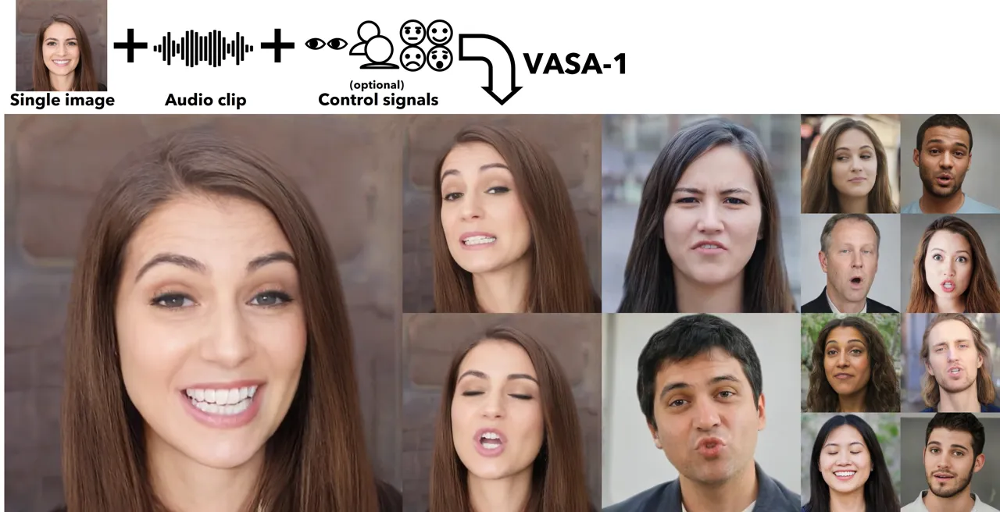

Figure 1: Given a single portrait image, a speech audio clip, and
optionally a set of other control signals, our approach produces a
high-quality lifelike talking face video of 512$`\times`$ 512 resolution
at up to 40 FPS. The method is generic and robust, and the generated
talking faces can faithfully mimic human facial expressions and head
movements, reaching a high level of realism and liveliness. (_All the
photorealistic portrait images in this paper are virtual, non-existing
identities generated by \[30, 5\]. See our project page for the
generated video samples with audios._)

Another important factor is the efficiency of generation, which plays a
pivotal role in real-time applications such as live communication. While
image and video diffusion techniques have brought remarkable
advancements in talking face generation \[20, 49, 55\] as well as the
broader video generation field \[6, 9\], the substantial computation
demands have limited their practicality for interactive systems. A
critical need exists for optimized algorithms that can bridge the gap
between high-quality video synthesis and the low-latency requirements of
real-time applications.

Given the limitations of existing methods, this work develops an
efficient yet powerful audio-conditioned generative model that works in
the _latent space_ of head and facial movements. Different from prior
works, we train a Diffusion Transformer model on the latent space of
_holistic facial dynamics_ as well as head movements. We consider all
possible facial dynamics – including lip motion, (non-lip) expression,
eye gaze and blinking, among others – as a single latent variable and
model its probabilistic distribution in a unified manner. By contrast,
existing methods often apply separate models for different factors, even
with interleaved regressive and generative formulations for them \[62,
76, 71, 60, 74\]. Our holistic facial dynamics modeling, together with
the jointly learned head motion patterns, leads to the generation of a
diverse array of lifelike and emotive talking behaviors. Furthermore, we
incorporate a set of optional conditioning signals such as main gaze
direction, head distance, and emotion offset into the learning process.
This makes the generative modeling of complex distribution more
tractable and increases the generation controllability.

To achieve our goal, another challenge lies in constructing the latent
space for the aforementioned holistic facial dynamics and gathering the
data for the diffusion model training. Beyond facial and head movements,
a human face image contains other factors such as identity and
appearance. In this work, we seek to build a proper latent space for
human face using a large volume of face videos. Our aim is for the face
latent space to possess both a total state of _disentanglement_ between
facial dynamics and other factors, as well as a high degree of
_expressiveness_ to model rich facial appearance details and dynamic
nuances. We base our method on the 3D-aided representation \[64, 19\]
which was proven to be expressive, and equip it with a collection of
newly-designed loss functions critical to effective disentanglement.
Without the new designs we can never reach a high quality of talking
face generation, especially the liveliness with nuanced emotions.
Trained on face videos in an self-supervised or weakly-supervised
manner, our encoder can produce well-disentangled factors including 3D
appearance, identity, head pose and holistic facial dynamics, and the
decoder can generate high quality faces following the given latent
codes.

VASA-1 has collectively advanced the realism of lip-audio
synchronization, facial dynamics, and head movement to new heights.
Coupled with high image generation quality and efficient running speed,
we achieved real-time talking faces that are realistic and lifelike.
Through detailed evaluations, we show that our method significantly
outperforms existing methods on a set of metrics, including a novel
data-driven metric called Contrastive Audio and Pose Pretraining (CAPP)
for measuring the audio-pose alignment and a pose variation intensity
score that is related to the vividness of head motion. We believe VASA-1
brings us closer to a future where digital AI avatars can engage with us
in ways that are as natural and intuitive as interactions with real
humans, demonstrating appealing visual affective skills for more dynamic
and empathetic information exchange.

## 2 Related Work

#### Disentangled face representation learning.

The representation of facial images through disentangled variables has
been extensively studied by previous works. Some methods utilize sparse
keypoints \[44, 72\] or 3D face models \[42, 22, 73\] to explicitly
characterize facial dynamics and other properties, but these can suffer
from issues such as inaccurate reconstructions or limited expressive
capabilities. There are also many works dedicated to learning
disentangled representations within a latent space. A common approach
involves separating faces into identity and non-identity components,
then recombining them across different frames, either in a 2D \[11, 76,
34, 70, 37, 60, 54\] or 3D context \[64, 19, 18\]. The main challenge
faced by these methods is the effective disentanglement of various
factors while still achieving expressive representations of all static
and dynamic facial attributes, which is addressed in this work.

#### Audio-driven talking face generation.

Talking face video generation from audio inputs has been a long-standing
task in computer vision and graphics. Early works have focused on
synthesizing only the lips, achieved by mapping audio signals directly
to lip movements while leaving other facial attributes unchanged \[53,
12, 39, 70, 13\]. More recent efforts have expanded the scope to include
a broader array of facial expressions and head movements derived from
audio inputs. For instance, the method of \[74\] separates the
generation targets into different categories, including lip-only 3DMM
coefficients, eye blinks, and head poses. \[71\] proposed to decompose
lip and non-lip features on the top of the expression latent from
\[76\]. Both \[74\] and \[71\] regress lip-related representations
directly from audio features and model other attributes in a
probabilistic manner. In contrast to these approaches, our method
generates comprehensive facial dynamics and head poses from audio along
with other control signals. This approach differs from the trend of
further disentanglement, seeking instead to create more holistic and
integrated outputs.

#### Video generation.

Recent advances in generative models \[10, 27, 48, 47\] have led to
significant progress in video generation. Earlier video generation
approaches \[59, 56, 46\] employed the adversarial learning \[24\]
framework, while more recent methods \[69, 7, 23, 32, 4, 9\] have
leveraged diffusion or auto-regressive models to capture diverse video
distributions. Recently, several works concurrent to us \[55, 65\] have
adapted video diffusion techniques to audio-driven talking face
generation, achieving promising results despite the slow training and
inference speeds. In contrast, our method is able to not only generating
high-quality results but also achieve real-time efficiency – a metric
crucial to efficiency-demanding applications such as live communication.

## 3 Method

#### Overall framework.

As illustrated in Fig. 1, our method takes a single face image, optional
control signals, and a speech audio clip to produce a realistic talking
face video. Instead of generating video frames directly, we generate
holistic facial dynamics and head motion in the latent space conditioned
on audio and other signals. To achieve this, we start by constructing a
face latent space and training the face encoder and decoder. An
expressive and disentangled face latent learning framework is crafted
and trained on real-life face videos. Then we train a simple yet
powerful Diffusion Transformer to model the motion distribution and
generate the motion latent codes in the test time given audio and other
conditions.

### 3.1 Expressive and Disentangled Face Latent Space Construction

Given a corpus of unlabeled talking face videos, we aim to build a
latent space for human face with high degrees of _disentanglement_ and
_expressiveness_. The disentanglement enables effective generative
modeling of the human head and holistic facial behaviors on massive
videos, irrespective of the subject identities. It also enables
disentangled factor control of the output which is desirable in many
applications. Existing methods fall short of either expressiveness \[11,
42, 71, 60\] or disentanglement \[64, 19, 73\] or both. The
expressiveness of facial appearance and dynamic movements, on the other
hand, ensures that the decoder can output high quality videos with rich
facial details and the latent generator is able to capture nuanced
facial dynamics.

To achieve this, we base our model on the 3D-aid face reenactment
framework from \[64, 19\]. The 3D appearance feature volume can better
characterize the appearance details in 3D compared to 2D feature maps.
The explicit 3D feature warping is also powerful in modeling 3D head and
facial movements. Specifically, we decompose a facial image into a
canonical 3D appearance volume $`\mathbf{V}^{app}`$, an identity code
$`\mathbf{z}^{id}`$, a 3D head pose $`\mathbf{z}^{pose}`$, and a facial
dynamics code $`\mathbf{z}^{dyn}`$. Each of them is extracted from a
face image by an independent encoder, except that $`\mathbf{V}^{app}`$
is constructed by first extracting a posed 3D volume followed by rigid
and non-rigid 3D warping to the canonical volume, as done in \[19\]. A
single decoder $`\mathcal{D}`$ takes these latent variables as input and
reconstructs the face image, where similar warping fields in the inverse
direction are first applied to $`\mathbf{V}^{app}`$ to get the posed
appearance volume. Readers are referred to \[19\] for more details of
this architecture.

To learn the disentangled latent space, the core idea is to construct
image reconstruction loss by swapping latent variables between different
images in videos. Our basic loss functions are adapted from \[19\].
However, _we identified the poor disentanglement between facial dynamics
and head pose using the original losses. The disentanglement between
identity and motions is also imperfect._ Therefore, we introduce several
additional losses crucial to achieve our goal. Inspired by \[37\], we
add a pairwise head pose and facial dynamics transfer loss to improve
their disentanglement. Let $`\mathbf{I}_{i}`$ and $`\mathbf{I}_{j}`$ be
two frames randomly sampled from the same video. We extract their latent
variables using the encoders, and transfer $`\mathbf{I}_{i}`$’s head
pose onto $`\mathbf{I}_{j}`$ as
$`\hat{\mathbf{I}}_{j,\mathbf{z}^{pose}_{i}}=\mathcal{D}(\mathbf{V}^{app}_{j},\mathbf{z}^{id}_{j},\mathbf{z}^{pose}_{i},\mathbf{z}^{dyn}_{j})`$
and $`\mathbf{I}_{j}`$’s facial motion onto $`\mathbf{I}_{i}`$ as
$`\hat{\mathbf{I}}_{i,\mathbf{z}^{dyn}_{j}}=\mathcal{D}(\mathbf{V}^{app}_{i},\mathbf{z}^{id}_{i},\mathbf{z}^{pose}_{i},\mathbf{z}^{dyn}_{j})`$.
The discrepancy loss $`l_{consist}`$ between
$`\hat{\mathbf{I}}_{j,\mathbf{z}^{pose}_{i}}`$ and
$`\hat{\mathbf{I}}_{i,\mathbf{z}^{dyn}_{j}}`$ is subsequently minimized.
To reinforce the disentanglement between identity and motions, we add a
face identity similarity loss $`l_{cross\_id}`$ for the cross-identity
pose and facial motion transfer results. Let $`\mathbf{I}_{s}`$ and
$`\mathbf{I}_{d}`$ be the video frames of two different subjects, we can
transfer the motions of $`\mathbf{I}_{d}`$ onto $`\mathbf{I}_{s}`$ and
obtain
$`\hat{\mathbf{I}}_{s,\mathbf{z}^{pose}_{d},\mathbf{z}^{dyn}_{d}}=\mathcal{D}(\mathbf{V}^{app}_{s},\mathbf{z}^{id}_{s},\mathbf{z}^{pose}_{d},\mathbf{z}^{dyn}_{d})`$.
Then, a cosine similarity loss between the deep face identity
features \[16\] extracted from $`\mathbf{I}_{s}`$ and
$`\hat{\mathbf{I}}_{s,\mathbf{z}^{pose}_{d},\mathbf{z}^{dyn}_{d}}`$ is
applied. As we’ll show in the experiments, our new loss function deigns
are crucial to achieve an effective factor disentanglement and
facilitate the high-quality, lifelike talking face generation.

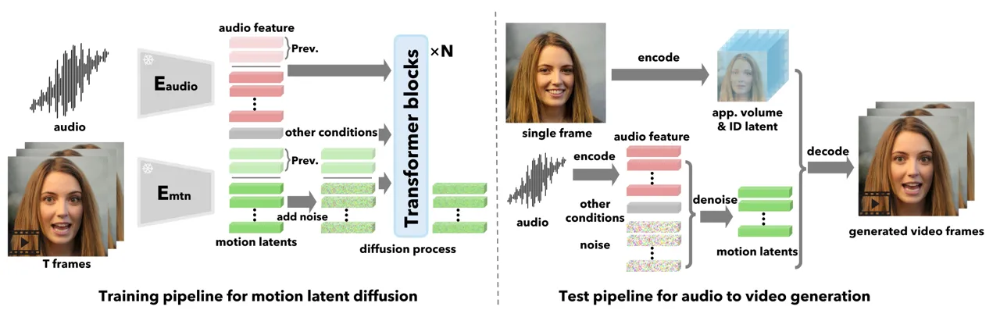

Figure 2: Our holistic facial dynamics and head pose generation
framework with diffusion transformer.

### 3.2 Holistic Facial Dynamics Generation with Diffusion Transformer

Given the constructed face latent space and trained encoders, we can
extract the facial dynamics and head movements from real-life talking
face videos and train a generative model. Crucially, we consider
identity-agnostic holistic facial dynamics generation (HFDG), where our
learned latent codes represent all facial movements such as lip motion,
(non-lip) expression, and eye gaze and blinking. This is in contrast to
existing methods that apply separate models for different factors with
interleaved regression and generative formulations \[62, 76, 71, 60,
74\]. Furthermore, previous methods often train on a limited number of
identities \[74, 68, 21\] and cannot model the wide range of motion
patterns of different humans, especially given an expressive motion
latent space.

In this work, we utilize diffusion models for audio-conditioned HFDG and
train on massive talking face videos from a large number of identities.
In particular, we apply a transformer architecture \[58, 38, 52\] for
our sequence generation task. Figure 2 shows an overview of our HFDG
framework.

Formally, a motion sequence extracted from a video clip is defined as
$`\mathbf{X}=\{[\mathbf{z}^{pose}_{i},\mathbf{z}^{dyn}_{i}]\},i=1,\ldots,W`$.
Given its accompanying audio clip $`\mathbf{a}`$, we extract the
synchronized audio features $`\mathbf{A}=\{\mathbf{f}^{audio}_{i}\}`$,
for which we use a pretrained feature extractor Wav2Vec2 \[3\].

#### Diffusion formulation.

Diffusion models define two Markov chains \[27, 47, 48\], the forward
chain progressively adds Gaussian noise to the target data, while the
reverse chain iteratively restores the raw signal from noise. Following
the denoising score matching objective \[48\], we define the simplified
loss function as

```math
\mathbb{E}_{t\sim\mathcal{U}[1,T],~\mathbf{X}^{0},\mathbf{C}\sim q(\mathbf{X}^{0},\mathcal{C})}(\|\mathbf{X}^{0}-\mathcal{H}(\mathbf{X}^{t},t,\mathbf{C})\|^{2}), \tag{1}
```

where $`t`$ denotes the time step, $`\mathbf{X}^{0}=\mathbf{X}`$ is the
raw motion latent sequence, and $`\mathbf{X}^{t}`$ is the noisy inputs
generated by the diffusion forward process
$`q(\mathbf{X}^{t}|\mathbf{X}^{t-1})=\mathcal{N}(\mathbf{X}^{t};\sqrt{1-\beta_{t}}\mathbf{X}^{t-1},\beta_{t}\mathrm{I})`$.
$`\mathcal{H}`$ is our transformer network which predicts the raw signal
itself instead of noise. $`\mathbf{C}`$ is the condition signal, to be
described next.

#### Conditioning signals.

The primary condition signal for our audio-driven motion generation task
is the audio feature sequence $`\mathbf{A}`$. We also incorporate
several additional signals, which not only make the generative modeling
more tractable but also increase the generation controllability.

Specifically, we consider the main eye gaze direction $`\mathbf{g}`$,
head-to-camera distance $`d`$, and emotion offset $`\mathbf{e}`$. The
main gaze direction, $`\mathbf{g}=(\theta,\phi)`$, is defined by a
vector in spherical coordinates. It specifies the focused direction of
the generated talking face. We extract $`\mathbf{g}`$ for the training
video clips using \[2\] on each frame followed by a simple
histogram-based clustering algorithm. The head distance $`{d}`$ is a
normalized scalar controlling the distance between the face and the
virtual camera, which affects the face scale in the generated face
video. We obtain this scale label for the training videos using \[17\].
The emotion offset $`\mathbf{e}`$ modulates the depicted emotion on the
talking face. Note that emotion is often intrinsically linked to and can
be largely inferred from audio; hence, $`\mathbf{e}`$ serves only as a
_global offset_ added to enhance or moderately alter the emotion when
required. It is _not_ designed to achieve a total emotion shift during
inference or produce emotions incongruent with the input audio. In
practice, we use the averaged emotion coefficients extracted by \[43\]
as our emotion signal.

In order to achieve a seamless transition between adjacent windows, we
incorporate the last $`K`$ frames of the audio feature and generated
motions from the previous window as the condition of the current one. To
summarize, our input condition can be denoted as
$`\mathbf{C}=[\mathbf{X}^{pre},\mathbf{A}^{pre};\mathbf{A},\mathbf{g},d,\mathbf{e}]`$.
All conditions are concatenated with noise along the temporal dimension
as the input to the transformer.

#### Classifier-free guidance (CFG) \[28\].

In the training stage, we randomly drop each of the input conditions.
During inference, we apply

```math
\displaystyle\hat{\mathbf{X}}^{0}=(1+\sum_{\mathbf{c}\in\mathbf{C}}\lambda_{\mathbf{c}})\cdot\mathcal{H}(\mathbf{X}^{t},t,\mathbf{C})-\sum_{\mathbf{c}\in\mathbf{C}}\lambda_{c}\cdot\mathcal{H}(\mathbf{X}^{t},t,\mathbf{C}|_{\mathbf{c}=\emptyset}) \tag{2}
```

where $`\lambda_{\mathbf{c}}`$ is the CFG scale for condition
$`\mathbf{c}`$. $`\mathbf{C}|_{\mathbf{c}=\emptyset}`$ denotes that the
condition $`\mathbf{c}`$ is replaced with $`\emptyset`$.

During training, we use a drop probability of $`0.1`$ for each condition
except for $`\mathbf{X}^{pre}`$ and $`\mathbf{A}^{pre}`$ for which we
use $`0.5`$. This is to ensure the model can well handle the first
window with no preceding audio and motions (i.e., set to $`\emptyset`$).
We also randomly drop the last few frames of $`\mathbf{A}`$ to ensure
robust motion generation for audio sequences shorter than the window
length.

### 3.3 Talking Face Video Generation

At inference time, given an arbitrary face image and an audio clip, we
first extract the 3D appearance volume $`\mathbf{V}^{app}`$ and identity
code $`\mathbf{z}^{id}`$ using our trained face encoders. Then, we
extract the audio features, split them into segments of length $`W`$,
and generate the head and facial motion sequences
$`\{\mathbf{X}=\{[\mathbf{z}^{pose}_{i},\mathbf{z}^{dyn}_{i}]\}\}`$ one
by one in a sliding-window manner using our trained diffusion
transformer $`\mathcal{H}`$. The final video can be generated
subsequently using our trained decoder.

## 4 Experiments

#### Implementation details.

For face latent space learning, we use the public VoxCeleb2 dataset from
\[14\] which contains talking face videos from about 6K subjects. We
reprocess the dataset and discard the clips with multiple individuals
and those of low quality using the method of \[50\]. For motion latent
generation, we use an 8-layer transformer encoder with an embedding dim
$`512`$ and head number $`8`$ as our diffusion network. The model is
trained on VoxCeleb2 \[14\] and another high-resolution talk video
dataset collected by us, which contains about 3.5K subjects. In our
default setup, the model uses a forward-facing main gaze condition, an
average head distance of all training videos, and an empty emotion
offset condition. The CFG parameters are set to
$`\lambda_{\mathbf{A}}=0.5`$ and $`\lambda_{\mathbf{g}}=1.0`$, and
$`50`$ sampling steps are used. Our face latent model takes around 7
days of training on a 4 NVIDIA RTX A6000 GPUs workstation, and the
diffusion transformer takes around 3 days. The total data used for
training comprises approximately 500K clips, each lasting between 2 to
10 seconds. The parameter counts of our 3D-aided face latent model and
diffusion transformer model are about 200M and 29M respectively.

#### Evaluation benchmarks.

We evaluate our method using two datasets. The first is a subset of
VoxCeleb2 \[14\]. We randomly selected 46 subjects from the test split
of VoxCeleb2 and randomly sampled 10 video clips for each subject,
resulting in a total of 460 clips. These video clips are about
5$`\sim`$15 seconds long (80% are less than 10 seconds), with most of
the content being interviews and news reports. To further evaluate our
method under long speech generation with a wider range of vocal
variations, we further collected 32 one-minute clips of 17 individuals.
These videos are predominantly sourced from online coaching sessions and
educational lectures and the talking styles are considerably more
diverse than VoxCeleb2. We refer to this dataset as OneMin-32.

#### Inference speed.

Our method generates video frames of 512$`\times`$512 size at 45fps in
the offline batch processing mode, and can support up to 40fps in the
online streaming mode with a preceding latency of only 170ms , evaluated
on a desktop PC with a single NVIDIA RTX 4090 GPU.

### 4.1 Quantitative Evaluation

#### Evaluation metrics.

We use the following metrics for quantitative evaluation of our
generated lip movement, head pose and overall video quality, including a
new data-driven audio-pose synchronization metric trained in a way
similar to CLIP \[40\]:

- •
  _Audio-lip synchronization._ We use a pretrained audio-lip
  synchronization network, i.e., SyncNet \[15\], to assess the alignment
  of the input audio with the generated lip movements in videos.
  Specifically, we compute the confidence score and feature distance as
  $`S_{C}`$ and $`S_{D}`$ respectively. Higher $`S_{C}`$ and lower
  $`S_{D}`$ indicate better audio-lip synchronization quality in
  general.
- •
  _Audio-pose alignment._ Measuring the alignment between the generated
  head poses and input audio is not trivial and there are no
  well-established metrics. A few recent studies \[74, 52\] employed the
  Beat Align Score \[45\] to evaluate audio-pose alignment. However,
  this metric is not optimal because the concept of a “beat” in the
  context of natural speech and human head motion is ambiguous. In this
  work, we introduce a new data-driven metric called _Contrastive Audio
  and Pose Pretraining (CAPP)_ score. Inspired by CLIP \[40\], we
  jointly train a pose sequence encoder and an audio sequence encoder
  and predict whether the input pose sequence and audio are paired. The
  audio encoder is initialized from a pretrained Wav2Vec2 network \[3\]
  and the pose encoder is a randomly initialized 6-layer transformer
  network. The input window size is 3 seconds. Our CAPP model is trained
  on 2K hours of real-life audio and pose sequences, and demonstrates a
  robust capability to assess the degree of synchronization between
  audio inputs and generate poses (see Sec. 4.3).
- •
  _Pose variation intensity._ We further define a pose variation
  intensity score $`\Delta P`$ which is the average of the pose angle
  differences between adjacent frames. Averaged over all generated
  frames, $`\Delta P`$ provides an indication of the overall head motion
  intensity generated by a method.
- •
  _Video quality._ Following previous video generation works \[69, 46\],
  we use the Fréchet Video Distance (FVD) \[57\] to evaluate the
  generated video quality. We compute the FVD metric using sequences of
  25 consecutive frames, at resolution of 224$`\times`$224.

#### Compared methods.

We compare our method with there existing audio-driven talking face
generation methods: MakeItTalk \[77\], Audio2Head \[62\], and
SadTalker \[74\].

|                   |                        |                          |                    |                    |                        |                          |                    |                    |                                   |
| ----------------- | ---------------------- | ------------------------ | ------------------ | ------------------ | ---------------------- | ------------------------ | ------------------ | ------------------ | --------------------------------- |
|                   | VoxCeleb2              |                          |                    |                    | OneMin-32              |                          |                    |                    |                                   |
|                   | $`S_{C}`$ $`\uparrow`$ | $`S_{D}`$ $`\downarrow`$ | ​CAPP$`\uparrow`$  | $`\Delta`$P        | $`S_{C}`$ $`\uparrow`$ | $`S_{D}`$ $`\downarrow`$ | ​CAPP$`\uparrow`$  | $`\Delta`$P        | $`\!\!\text{FVD}_{25}\downarrow`$ |
| MakeItTalk        | 4.176                  | 15.513                   | -0.051             | 0.210              | -0.123                 | 14.340                   | 0.002              | 0.190              | 304.83                            |
| ​​Audio2Head      | 6.172                  | 8.470                    | 0.246              | 0.260              | 5.992                  | 8.211                    | 0.205              | 0.239              | 209.77                            |
| SadTalker         | 5.843                  | 8.813                    | 0.441              | 0.275              | 5.501                  | 8.850                    | 0.383              | 0.252              | 214.51                            |
| _Ours_            | $`\mathbb{8.841}`$     | $`\mathbb{6.312}`$       | $`\mathbb{0.468}`$ | $`\mathbb{0.304}`$ | $`\mathbb{7.957}`$     | $`\mathbb{6.635}`$       | $`\mathbb{0.465}`$ | $`\mathbb{0.316}`$ | ​​$`\mathbb{105.88}`$             |
| _Ours (10% data)_ | 8.818                  | 6.298                    | 0.457              | 0.229              | 7.990                  | 6.645                    | 0.441              | 0.229              | ​​147.401​​                       |
| Real video        | 7.640                  | 7.189                    | 0.588              | 0.505              | 7.192                  | 7.254                    | 0.559              | 0.405              | 29.25                             |

Table 1: Quantitative comparison with previous methods on two
benchmarks.

#### Main results.

For each audio input, we generate a single video for deterministic
approaches, i.e., MakeItTalk and Audio2Head. For SadTalker and our
method, we sample three videos for each audio and average the computed
metrics. Since different pose representations are used by these methods,
we re-extract the head poses from the generated frames to compute the
pose-related metrics (i.e., CAPP and $`\Delta P`$). For the FVD metric,
we use 2K 25-frame video clips of both the real videos and generated
ones. For reference purpose, we also report the evaluated metrics of
real videos.

Table 1 presents the results on the VoxCeleb2 and OneMin-32 benchmarks.
Note that we did not evaluate the FVD on VoxCeleb2 as its video quality
is varied and often low. On both benchmarks, our method achieves the
best results among all methods on all evaluated metrics. In terms of
audio-lip synchronization scores ($`S_{C}`$ and $`S_{D}`$), our method
outperforms all others by a wide margin. Note that our method yields
better scores than real videos, which is due to effect of the audio CFG
(see Sec. 4.3). Our generated poses are better aligned with the audios
especially on the OneMin-32 benchmark, as reflected by the CAPP scores.
The head movements also exhibit the highest intensity according to
$`\Delta P`$, although there’s still a gap to the intensity of real
videos. Our FVD score is significantly lower than others, demonstrating
the much higher video quality and realism of our results.

### 4.2 Qualitative Evaluation

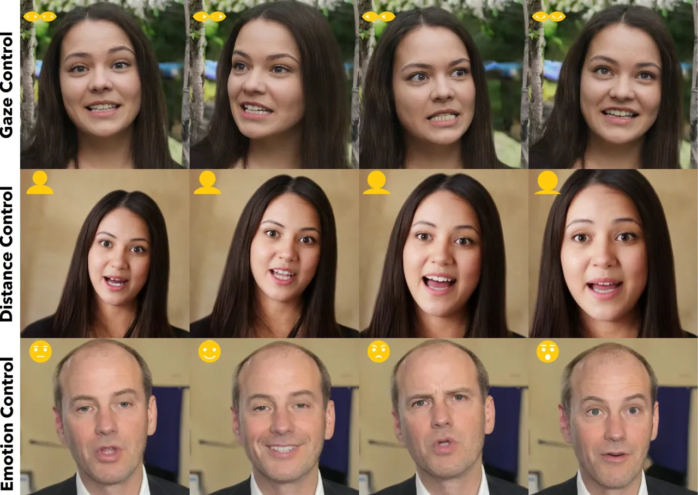

Figure 3: Generated talking faces under different control signals. _Top
row_: results under different main gaze direction condition
(forward-facing, leftwards, rightwards, and upwards, respectively).
_Middle row_: results under different head distances (from far to near).
_Bottom row_: results under different emotion offset (neutral, happy,
angry and surprised, respectively).

#### Visual results.

Figure 1 presents some representative audio-driven talking face
generation results of our method. Visually inspected, our method can
generate high-quality video frames with vivid facial emotions. Moreover,
it can generate human-like conversational behaviors, including sporadic
shifts in eye gaze during speech and contemplation, as well as the
natural and variable rhythm of eye blinking, among other nuances. _We
highly recommend that readers view our video results in the
supplementary material to fully perceive the capabilities and output
quality of our method._

#### Generation controllability.

Figure 3 shows our generated results under different control signals
including main eye gaze, head distance, and emotion offset. Our model
can well interpret these signals and produce talking face results that
closely adhere to these specified parameters.

#### Disentanglement of face latents.

Figure A.1 shows that when applying the same motion latent sequences
onto different subjects, our method effectively maintains both the
distinct facial movements and the unique facial identities. This
indicates the efficacy of our method in disentangling identity and
motion. Figure A.2 further illustrates the effective disentanglement
between head pose and facial dynamics. By holding one aspect constant
and changing the other, the resulting images faithfully reflect the
intended head and facial motions without interference.

#### Out-of-distribution generation.

Our method exhibits the capability to handle photo and audio inputs that
fall outside the training distribution, such as artistic photos, singing
audio clips, and non-English speech, as illustrated in Figure A.3.

#### Comparison with other methods.

Some visual examples from different methods are presented in
Figure A.4 A.5 A.6 A.7. Our method outperforms the others in terms of
the precise audio-lip synchronization and delivers much more vivid and
natural facial dynamics and head movements.

### 4.3 Analysis and Ablation Study

#### CAPP metric.

We analyze the effectiveness of our proposed CAPP metric in measuring
the alignment between audio and head pose.

| 0      | $`\pm`$1 | $`\pm`$2 | $`\pm`$3 | $`\pm`$4 |
| ------ | -------- | -------- | -------- | -------- |
| ​0.608 | ​0.462   | ​0.206   | ​0.069   | ​0.082   |

Table 2: CAPP under frame shifting

First, we study its sensitivity to temporal shifting by manually
introducing frame offsets to ground-truth audio-pose pairs. We extract
3-second clip segments from the VoxCeleb2 test split, yielding
approximately 2.1K audio-pose pairs. The average CAPP score for these
pairs is $`0.608`$, as shown in Table 2. Manual frame shifts lead to a
rapid decline in CAPP scores, approaching zero for shifts larger than
two frames. This indicates a robust correlation between CAPP scores and
audio-head pose alignment.

| $`\times`$0.2 | $`\times`$0.5 | $`\times`$1.0 | $`\times`$1.5 | $`\times`$3.0 |
| ------------- | ------------- | ------------- | ------------- | ------------- |
| ​0.368        | ​0.584        | ​0.608        | ​0.587        | ​0.505        |

Table 3: CAPP under pose variation scaling

We further investigate the effect of head movement intensity on CAPP by
manually scaling the pose differences between consecutive frames using
various factors. Table 3 shows that altering movement intensity
negatively impacts the CAPP scores, demonstrating CAPP can assess the
alignment of audio and pose in terms of their intensity. However, this
sensitivity to intensity appears less pronounced than that to temporal
misalignment.

#### CFG scales for diffusion model.

The CFG strategy \[28\] for diffusion models can attain a trade-off
between sample quality and diversity. Here we evaluate the choice of the
CFG scales for the audio and main gaze conditions (i.e.,
$`\lambda_{\mathbf{A}}`$ and $`\lambda_{\mathbf{g}}`$ in Eq. 2) in our
model.

As shown in Table 4, as we increase the value of
$`\lambda_{\mathbf{g}}`$, the accuracy of gaze control improves.
Increasing the audio CFG scale to $`\lambda_{\mathbf{A}}=0.5`$
significantly enhances the performance of lip-audio alignment ($`S_{C}`$
and $`S_{D}`$), pose-audio alignment (CAPP), and pose variation
intensity ($`\Delta P`$). With positive audio CFG, the lip-audio
alignment scores even surpass those evaluated on real videos (the
results without audio CFG, i.e., $`\lambda_{\mathbf{A}}=0`$, were
slightly worse than or comparable to them). Moreover, the FVD score
shows a slight drop which indicates slightly better video quality.

|                                                                               | $`S_{C}`$ $`\uparrow`$ | $`S_{D}`$ $`\downarrow`$ | CAPP$`\uparrow`$ | $`\Delta`$P | $`\text{FVD}_{25}\downarrow`$ | $`\mathcal{E}_{\theta_{g}}\downarrow`$ | $`\mathcal{E}_{s}\downarrow`$ |
| ----------------------------------------------------------------------------- | ---------------------- | ------------------------ | ---------------- | ----------- | ----------------------------- | -------------------------------------- | ----------------------------- |
| $`\lambda_{\mathbf{A}}=0.0,\ \!\lambda_{\mathbf{g}}=0.0`$                     | 7.087                  | 7.391                    | 0.414            | 0.291       | 117.425                       | 5.730                                  | 0.004                         |
| $`\lambda_{\mathbf{A}}=0.0,\ \!\lambda_{\mathbf{g}}=1.0`$                     | 7.134                  | 7.345                    | 0.421            | 0.290       | 116.547                       | 5.329                                  | 0.004                         |
| $`\lambda_{\mathbf{A}}=0.0,\ \!\lambda_{\mathbf{g}}=2.0`$                     | 7.108                  | 7.386                    | 0.414            | 0.298       | 117.784                       | 5.064                                  | 0.005                         |
| $`\mathbb{\lambda_{A}=0.5,\lambda_{\mathbf{g}}=1.0}`$                         | 7.957                  | 6.635                    | 0.465            | 0.316       | 105.884                       | 5.253                                  | 0.005                         |
| $`\lambda_{\mathbf{A}}=1.0,\ \!\lambda_{\mathbf{g}}=1.0`$                     | 8.218                  | 6.437                    | 0.474            | 0.342       | 104.886                       | 5.333                                  | 0.005                         |
| $`\lambda_{\mathbf{A}}=2.0,\ \!\lambda_{\mathbf{g}}=1.0`$                     | 8.295                  | 6.397                    | 0.455            | 0.395       | 104.293                       | 5.531                                  | 0.005                         |
| $`\mathbb{\lambda_{\mathbf{A}}=0.5,\lambda_{\mathbf{g}}=1.0}`$ (steps$`=10`$) | 8.293                  | 6.363                    | 0.523            | 0.243       | 117.060                       | 5.469                                  | 0.006                         |
| Real video                                                                    | 7.192                  | 7.254                    | 0.559            | 0.405       | 29.244                        | –                                      | –                             |

Table 4: Ablation study of the audio and main gaze CFG scales as well as
the sampling steps. $`\mathcal{E}_{g}`$ denotes the average angular
error of main gaze directions and $`\mathcal{E}_{s}`$ is the average
head distance error.

Further increasing $`\lambda_{\mathbf{A}}`$ marginally improves
lip-audio synchronization and reduces $`\text{FVD}_{25}`$, but at the
cost of slightly degrading audio-pose synchronization and gaze
controllability. In addition, observations from the generated videos
indicate that a higher $`\lambda_{\mathbf{A}}`$ significantly amplifies
mouth movements for strong vocals and causes head pose jitter during
rapid speech. For balanced performance and overall generation quality,
we set $`\lambda_{\mathbf{A}}=0.5`$ and $`\lambda_{\mathbf{g}}=1.0`$ as
our standard configuration.

We also evaluated the influence of sampling steps on performance.
Table 4 illustrates that decreasing the steps from $`50`$ to $`10`$
improves audio-lip and audio-pose alignment while compromising pose
variation intensity and overall video quality. This step reduction could
accelerate the inference process by a factor of 5 for this latent motion
generation module.

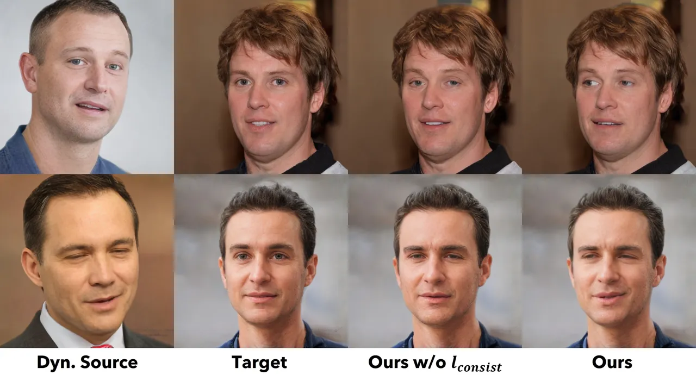

Figure 4: Ablation study on loss function $`l_{consist}`$ for
disentangled latent space learning. We generate the results by only
transferring the facial dynamics from source to target with head pose
unchanged. $`l_{consist}`$ is crucial for decoupling subtle yet
important facial dynamics from head pose.

#### Training data scale.

To validate the data scale influence and compare our model with previous
methods at similar scales, we trained a diffusion model using only 10%
of the data (i.e., 50K clips). As shown in Table 1, the model trained on
this reduced dataset demonstrates comparable audio-lip and audio-pose
synchronization to the full-dataset model, although the FVD and
$`\Delta`$p metrics are not as good. Nonetheless, it still significantly
outperforms previous methods across all metrics assessing
synchronization, motion intensity, and video quality. This indicates
that our approach remains highly effective even with much less data, and
that increasing the dataset size enhances motion diversity.

#### Losses for latent space learning.

As described in Sec. 3.1, we introduce new losses $`l_{consist}`$ and
$`l_{cross\_id}`$ to improve the disentanglement of facial dynamics,
head pose, and face identity. To validate the effectiveness of
$`l_{consist}`$, we transfer only facial dynamics from the source image
to the target while keeping the target’s pose unchanged. Figure 4 shows
that without $`l_{consist}`$, the latent model may struggle to replicate
subtle facial dynamics such as side glances and lip asymmetries which
are oftentimes coupled with head poses (e.g., a skewed mouth may
coincide with a tilted head, and the gaze direction usually aligns with
the head’s pose). Decoupling these subtle yet important dynamics are
challenging without explicit constraints from $`l_{consist}`$.

We also evaluate the face identity loss $`l_{cross\_id}`$ for cross
identity driving during training. We use all 108 subjects from the
VoxCeleb2 test set for evaluation. For each subject, we chose the image
that is closest to a frontal view from the first frames of all its clips
to serve as the target image. Then we randomly selected 50 clips of
other subjects as source videos, which leads to a total of 5,400
cross-reenactment clips. We calculate the facial identity preservation
score by averaging the facial identity feature cosine similarity over
all generated frames of all subjects. With the introduced face identity
loss $`l_{cross\_id}`$, this identity preservation score of our results
improved from $`0.72`$ to $`0.80`$.

## 5 Conclusion

In summary, our work presents an audio-driven talking face generation
model that stands out for its efficient generation of realistic lip
synchronization, vivid facial expressions, and naturalistic head
movements from a single image and audio input. It significantly
outperforms existing methods in delivering video quality and performance
efficiency, demonstrating promising visual affective skills in the
generated face videos. The technical cornerstone is an innovative
holistic facial dynamics and head movement generation model that works
in an expressive and disentangled face latent space.

The advancements made by VASA-1 have the potential to reshape
human-human and human-AI interactions across various domains, including
communication, education, and healthcare. The integration of
controllable conditioning signals further enhances the model’s
adaptability for personalized user experiences.

There are still several limitations with our method. Currently, it
processes human regions only up to the torso. Extending to the full
upper body could offer additional capabilities. While utilizing 3D
latent representations, the absence of a more explicit 3D face model
such as \[66, 67\] may result in artifacts like texture sticking due to
the neural rendering. Additionally, our approach does not account for
non-rigid elements like hair and clothing, which could be addressed with
a stronger video prior. In the future, we also plan to incorporate more
diverse talking styles and emotions to improve expressiveness and
control.

## Contribution statement

Sicheng Xu, Guojun Chen, Yu-Xiao Guo were the core contributors to the
implementation, training, and experimentation of various algorithm
modules, as well as the data processing and management. Jiaolong Yang
initiated the project idea, led the project, designed the overall
framework, and provided detailed technical advice to each component.
Chong Li, Zhengyu Zang and Yizhong Zhang contributed to enhancing the
system quality, conducting evaluations, and demonstrating results. Xin
Tong provided technical advice throughout the project and helped with
project coordination. Baining Guo offered strategic research direction
guidance, scientific advising, and other project supports. Paper written
by Jiaolong Yang and Sicheng Xu.

## Acknowledgments

We would like to thank our colleagues Zheng Zhang, Zhirong Wu, Shujie
Liu, Dong Chen, Xu Tan, Yu Deng, Lidong Zhou, and others for the
valuable discussions and insightful suggestions for our project.

## References

- \[1\]
  https://www.prnewswire.com/news-releases/deepbrain-ai-delivers-ai-avatar-to-empower-people-with-disabilities-302026965.html, 2024.
  \[Online; accessed 20-May-2024\].
- \[2\] Ahmed A Abdelrahman, Thorsten Hempel, Aly Khalifa, Ayoub
  Al-Hamadi, and Laslo Dinges. L2cs-net: Fine-grained gaze estimation in
  unconstrained environments. In 2023 8th International Conference on
  Frontiers of Signal Processing (ICFSP), pages 98–102. IEEE, 2023.
- \[3\] Alexei Baevski, Yuhao Zhou, Abdelrahman Mohamed, and Michael
  Auli. wav2vec 2.0: A framework for self-supervised learning of speech
  representations. Advances in Neural Information Processing Systems,
  33:12449–12460, 2020.
- \[4\] Omer Bar-Tal, Hila Chefer, Omer Tov, Charles Herrmann, Roni
  Paiss, Shiran Zada, Ariel Ephrat, Junhwa Hur, Yuanzhen Li, Tomer
  Michaeli, et al. Lumiere: A space-time diffusion model for video
  generation. arXiv preprint arXiv:2401.12945, 2024.
- \[5\] James Betker, Gabriel Goh, Li Jing, Tim Brooks, Jianfeng Wang,
  Linjie Li, Long Ouyang, Juntang Zhuang, Joyce Lee, Yufei Guo, et al.
  Improving image generation with better captions. https://cdn. openai.
  com/papers/dall-e-3.pdf, 2(3):8, 2023.
- \[6\] Andreas Blattmann, Tim Dockhorn, Sumith Kulal, Daniel
  Mendelevitch, Maciej Kilian, Dominik Lorenz, Yam Levi, Zion English,
  Vikram Voleti, Adam Letts, et al. Stable video diffusion: Scaling
  latent video diffusion models to large datasets. arXiv preprint
  arXiv:2311.15127, 2023.
- \[7\] Andreas Blattmann, Robin Rombach, Huan Ling, Tim Dockhorn,
  Seung Wook Kim, Sanja Fidler, and Karsten Kreis. Align your latents:
  High-resolution video synthesis with latent diffusion models. In
  Proceedings of the IEEE/CVF Conference on Computer Vision and Pattern
  Recognition, pages 22563–22575, 2023.
- \[8\] Aras Bozkurt, Xiao Junhong, Sarah Lambert, Angelica Pazurek,
  Helen Crompton, Suzan Koseoglu, Robert Farrow, Melissa Bond, Chrissi
  Nerantzi, Sarah Honeychurch, et al. Speculative futures on chatgpt and
  generative artificial intelligence (ai): A collective reflection from
  the educational landscape. Asian Journal of Distance Education,
  18(1):53–130, 2023.
- \[9\] Tim Brooks, Bill Peebles, Connor Holmes, Will DePue, Yufei Guo,
  Li Jing, David Schnurr, Joe Taylor, Troy Luhman, Eric Luhman, Clarence
  Ng, Ricky Wang, and Aditya Ramesh. Video generation models as world
  simulators. 2024.
- \[10\] Tom Brown, Benjamin Mann, Nick Ryder, Melanie Subbiah, Jared D
  Kaplan, Prafulla Dhariwal, Arvind Neelakantan, Pranav Shyam, Girish
  Sastry, Amanda Askell, et al. Language models are few-shot learners.
  Advances in Neural Information Processing Systems, 33:1877–1901, 2020.
- \[11\] Egor Burkov, Igor Pasechnik, Artur Grigorev, and Victor
  Lempitsky. Neural head reenactment with latent pose descriptors. In
  Proceedings of the IEEE/CVF Conference on Computer Vision and Pattern
  Recognition, pages 13786–13795, 2020.
- \[12\] Lele Chen, Zhiheng Li, Ross K Maddox, Zhiyao Duan, and
  Chenliang Xu. Lip movements generation at a glance. In European
  Conference on Computer Vision, pages 520–535, 2018.
- \[13\] Kun Cheng, Xiaodong Cun, Yong Zhang, Menghan Xia, Fei Yin,
  Mingrui Zhu, Xuan Wang, Jue Wang, and Nannan Wang. Videoretalking:
  Audio-based lip synchronization for talking head video editing in the
  wild. In SIGGRAPH Asia 2022, pages 1–9, 2022.
- \[14\] Joon Son Chung, Arsha Nagrani, and Andrew Zisserman. Voxceleb2:
  Deep speaker recognition. arXiv preprint arXiv:1806.05622, 2018.
- \[15\] Joon Son Chung and Andrew Zisserman. Out of time: automated lip
  sync in the wild. In Asian Conference on Computer Vision Workshops,
  pages 251–263. Springer, 2017.
- \[16\] Jiankang Deng, Jia Guo, Niannan Xue, and Stefanos Zafeiriou.
  Arcface: Additive angular margin loss for deep face recognition. In
  Proceedings of the IEEE/CVF Conference on Computer Vision and Pattern
  Recognition, pages 4690–4699, 2019.
- \[17\] Yu Deng, Jiaolong Yang, Sicheng Xu, Dong Chen, Yunde Jia, and
  Xin Tong. Accurate 3d face reconstruction with weakly-supervised
  learning: From single image to image set. In Proceedings of the
  IEEE/CVF Conference on Computer Vision and Pattern Recognition
  Workshops, pages 0–0, 2019.
- \[18\] Nikita Drobyshev, Antoni Bigata Casademunt, Konstantinos
  Vougioukas, Zoe Landgraf, Stavros Petridis, and Maja Pantic.
  Emoportraits: Emotion-enhanced multimodal one-shot head avatars. arXiv
  preprint arXiv:2404.19110, 2024.
- \[19\] Nikita Drobyshev, Jenya Chelishev, Taras Khakhulin, Aleksei
  Ivakhnenko, Victor Lempitsky, and Egor Zakharov. Megaportraits:
  One-shot megapixel neural head avatars. In Proceedings of the 30th ACM
  International Conference on Multimedia, pages 2663–2671, 2022.
- \[20\] Chenpeng Du, Qi Chen, Tianyu He, Xu Tan, Xie Chen, Kai Yu,
  Sheng Zhao, and Jiang Bian. Dae-talker: High fidelity speech-driven
  talking face generation with diffusion autoencoder. In Proceedings of
  the ACM International Conference on Multimedia, pages 4281–4289, 2023.
- \[21\] Yingruo Fan, Zhaojiang Lin, Jun Saito, Wenping Wang, and Taku
  Komura. Faceformer: Speech-driven 3d facial animation with
  transformers. In Proceedings of the IEEE/CVF Conference on Computer
  Vision and Pattern Recognition, pages 18770–18780, 2022.
- \[22\] Yue Gao, Yuan Zhou, Jinglu Wang, Xiao Li, Xiang Ming, and Yan
  Lu. High-fidelity and freely controllable talking head video
  generation. In Proceedings of the IEEE/CVF Conference on Computer
  Vision and Pattern Recognition, pages 5609–5619, 2023.
- \[23\] Rohit Girdhar, Mannat Singh, Andrew Brown, Quentin Duval,
  Samaneh Azadi, Sai Saketh Rambhatla, Akbar Shah, Xi Yin, Devi Parikh,
  and Ishan Misra. Emu video: Factorizing text-to-video generation by
  explicit image conditioning. arXiv preprint arXiv:2311.10709, 2023.
- \[24\] Ian Goodfellow, Jean Pouget-Abadie, Mehdi Mirza, Bing Xu, David
  Warde-Farley, Sherjil Ozair, Aaron Courville, and Yoshua Bengio.
  Generative adversarial nets. Advances in Neural Information Processing
  Systems, 27, 2014.
- \[25\] Yudong Guo, Keyu Chen, Sen Liang, Yong-Jin Liu, Hujun Bao, and
  Juyong Zhang. Ad-nerf: Audio driven neural radiance fields for talking
  head synthesis. In IEEE/CVF International Conference on Computer
  Vision, pages 5784–5794, 2021.
- \[26\] Tianyu He, Junliang Guo, Runyi Yu, Yuchi Wang, Jialiang Zhu,
  Kaikai An, Leyi Li, Xu Tan, Chunyu Wang, Han Hu, et al. Gaia:
  Zero-shot talking avatar generation. In International Conference on
  Learning Representations, 2024.
- \[27\] Jonathan Ho, Ajay Jain, and Pieter Abbeel. Denoising diffusion
  probabilistic models. Advances in neural information processing
  systems, 33:6840–6851, 2020.
- \[28\] Jonathan Ho and Tim Salimans. Classifier-free diffusion
  guidance. arXiv preprint arXiv:2207.12598, 2022.
- \[29\] Esperanza Johnson, Ramón Hervás, Carlos Gutiérrez López de la
  Franca, Tania Mondéjar, Sergio F Ochoa, and Jesús Favela. Assessing
  empathy and managing emotions through interactions with an affective
  avatar. Health informatics journal, 24(2):182–193, 2018.
- \[30\] Tero Karras, Samuli Laine, Miika Aittala, Janne Hellsten,
  Jaakko Lehtinen, and Timo Aila. Analyzing and improving the image
  quality of stylegan. In Proceedings of the IEEE/CVF Conference on
  Computer Vision and Pattern Recognition, pages 8110–8119, 2020.
- \[31\] Greg Kessler. Technology and the future of language teaching.
  Foreign Language Annals, 51(1):205–218, 2018.
- \[32\] Dan Kondratyuk, Lijun Yu, Xiuye Gu, José Lezama, Jonathan
  Huang, Rachel Hornung, Hartwig Adam, Hassan Akbari, Yair Alon,
  Vighnesh Birodkar, et al. Videopoet: A large language model for
  zero-shot video generation. arXiv preprint arXiv:2312.14125, 2023.
- \[33\] Julian Leff, Geoffrey Williams, Mark Huckvale, Maurice
  Arbuthnot, and Alex P Leff. Avatar therapy for persecutory auditory
  hallucinations: What is it and how does it work? Psychosis,
  6(2):166–176, 2014.
- \[34\] Borong Liang, Yan Pan, Zhizhi Guo, Hang Zhou, Zhibin Hong,
  Xiaoguang Han, Junyu Han, Jingtuo Liu, Errui Ding, and Jingdong Wang.
  Expressive talking head generation with granular audio-visual control.
  In Proceedings of the IEEE/CVF Conference on Computer Vision and
  Pattern Recognition, pages 3387–3396, 2022.
- \[35\] Shugao Ma, Tomas Simon, Jason Saragih, Dawei Wang, Yuecheng Li,
  Fernando De La Torre, and Yaser Sheikh. Pixel codec avatars. In
  IEEE/CVF Conference on Computer Vision and Pattern Recognition, pages
  64–73, 2021.
- \[36\] Yifeng Ma, Suzhen Wang, Zhipeng Hu, Changjie Fan, Tangjie Lv,
  Yu Ding, Zhidong Deng, and Xin Yu. Styletalk: One-shot talking head
  generation with controllable speaking styles. In AAAI Conference on
  Artificial Intelligence, pages arXiv–2301, 2023.
- \[37\] Youxin Pang, Yong Zhang, Weize Quan, Yanbo Fan, Xiaodong Cun,
  Ying Shan, and Dong-ming Yan. Dpe: Disentanglement of pose and
  expression for general video portrait editing. In Proceedings of the
  IEEE/CVF Conference on Computer Vision and Pattern Recognition, pages
  427–436, 2023.
- \[38\] William Peebles and Saining Xie. Scalable diffusion models with
  transformers. In Proceedings of the IEEE/CVF International Conference
  on Computer Vision, pages 4195–4205, 2023.
- \[39\] KR Prajwal, Rudrabha Mukhopadhyay, Vinay P Namboodiri, and CV
  Jawahar. A lip sync expert is all you need for speech to lip
  generation in the wild. In ACM International Conference on Multimedia,
  pages 484–492, 2020.
- \[40\] Alec Radford, Jong Wook Kim, Chris Hallacy, Aditya Ramesh,
  Gabriel Goh, Sandhini Agarwal, Girish Sastry, Amanda Askell, Pamela
  Mishkin, Jack Clark, et al. Learning transferable visual models from
  natural language supervision. In International Conference on Machine
  Learning, pages 8748–8763. PMLR, 2021.
- \[41\] Imogen C Rehm, Emily Foenander, Klaire Wallace, Jo-Anne M
  Abbott, Michael Kyrios, and Neil Thomas. What role can avatars play in
  e-mental health interventions? exploring new models of
  client–therapist interaction. Frontiers in Psychiatry, 7:186, 2016.
- \[42\] Yurui Ren, Ge Li, Yuanqi Chen, Thomas H Li, and Shan Liu.
  PIRenderer: Controllable portrait image generation via semantic neural
  rendering. In Proceedings of the IEEE/CVF International Conference on
  Computer Vision, pages 13759–13768, 2021.
- \[43\] Andrey V Savchenko. Hsemotion: High-speed emotion recognition
  library. Software Impacts, 14:100433, 2022.
- \[44\] Aliaksandr Siarohin, Stéphane Lathuilière, Sergey Tulyakov,
  Elisa Ricci, and Nicu Sebe. First order motion model for image
  animation. In Advances in Neural Information Processing Systems, 2019.
- \[45\] Li Siyao, Weijiang Yu, Tianpei Gu, Chunze Lin, Quan Wang, Chen
  Qian, Chen Change Loy, and Ziwei Liu. Bailando: 3d dance generation by
  actor-critic gpt with choreographic memory. In Proceedings of the
  IEEE/CVF Conference on Computer Vision and Pattern Recognition, pages
  11050–11059, 2022.
- \[46\] Ivan Skorokhodov, Sergey Tulyakov, and Mohamed Elhoseiny.
  Stylegan-v: A continuous video generator with the price, image quality
  and perks of stylegan2. In Proceedings of the IEEE/CVF Conference on
  Computer Vision and Pattern Recognition, pages 3626–3636, 2022.
- \[47\] Jiaming Song, Chenlin Meng, and Stefano Ermon. Denoising
  diffusion implicit models. arXiv preprint arXiv:2010.02502, 2020.
- \[48\] Yang Song, Jascha Sohl-Dickstein, Diederik P Kingma, Abhishek
  Kumar, Stefano Ermon, and Ben Poole. Score-based generative modeling
  through stochastic differential equations. arXiv preprint
  arXiv:2011.13456, 2020.
- \[49\] Michał Stypułkowski, Konstantinos Vougioukas, Sen He, Maciej
  Zięba, Stavros Petridis, and Maja Pantic. Diffused heads: Diffusion
  models beat gans on talking-face generation. In Proceedings of the
  IEEE/CVF Winter Conference on Applications of Computer Vision, pages
  5091–5100, 2024.
- \[50\] Shaolin Su, Qingsen Yan, Yu Zhu, Cheng Zhang, Xin Ge, Jinqiu
  Sun, and Yanning Zhang. Blindly assess image quality in the wild
  guided by a self-adaptive hyper network. In Proceedings of the
  IEEE/CVF Conference on Computer Vision and Pattern Recognition, pages
  3667–3676, 2020.
- \[51\] Yasheng Sun, Hang Zhou, Ziwei Liu, and Hideki Koike.
  Speech2talking-face: Inferring and driving a face with synchronized
  audio-visual representation. In International Joint Conference on
  Artificial Intelligence, volume 2, page 4, 2021.
- \[52\] Zhiyao Sun, Tian Lv, Sheng Ye, Matthieu Gaetan Lin, Jenny
  Sheng, Yu-Hui Wen, Minjing Yu, and Yong-jin Liu. Diffposetalk:
  Speech-driven stylistic 3d facial animation and head pose generation
  via diffusion models. arXiv preprint arXiv:2310.00434, 2023.
- \[53\] Supasorn Suwajanakorn, Steven M Seitz, and Ira
  Kemelmacher-Shlizerman. Synthesizing obama: learning lip sync from
  audio. ACM Transactions on Graphics, 36(4):1–13, 2017.
- \[54\] Shuai Tan, Bin Ji, Mengxiao Bi, and Ye Pan. Edtalk: Efficient
  disentanglement for emotional talking head synthesis. arXiv preprint
  arXiv:2404.01647, 2024.
- \[55\] Linrui Tian, Qi Wang, Bang Zhang, and Liefeng Bo. Emo: Emote
  portrait alive-generating expressive portrait videos with audio2video
  diffusion model under weak conditions. arXiv preprint
  arXiv:2402.17485, 2024.
- \[56\] Sergey Tulyakov, Ming-Yu Liu, Xiaodong Yang, and Jan Kautz.
  Mocogan: Decomposing motion and content for video generation. In
  Proceedings of the IEEE Conference on Computer Vision and Pattern
  Recognition, pages 1526–1535, 2018.
- \[57\] Thomas Unterthiner, Sjoerd van Steenkiste, Karol Kurach,
  Raphaël Marinier, Marcin Michalski, and Sylvain Gelly. Fvd: A new
  metric for video generation. 2019.
- \[58\] Ashish Vaswani, Noam Shazeer, Niki Parmar, Jakob Uszkoreit,
  Llion Jones, Aidan N Gomez, Łukasz Kaiser, and Illia Polosukhin.
  Attention is all you need. Advances in Neural Information Processing
  Systems, 30, 2017.
- \[59\] Carl Vondrick, Hamed Pirsiavash, and Antonio Torralba.
  Generating videos with scene dynamics. Advances in Neural Information
  Processing Systems, 29, 2016.
- \[60\] Duomin Wang, Yu Deng, Zixin Yin, Heung-Yeung Shum, and Baoyuan
  Wang. Progressive disentangled representation learning for
  fine-grained controllable talking head synthesis. In Proceedings of
  the IEEE/CVF Conference on Computer Vision and Pattern Recognition,
  pages 17979–17989, 2023.
- \[61\] Jiayu Wang, Kang Zhao, Shiwei Zhang, Yingya Zhang, Yujun Shen,
  Deli Zhao, and Jingren Zhou. Lipformer: High-fidelity and
  generalizable talking face generation with a pre-learned facial
  codebook. In IEEE/CVF Conference on Computer Vision and Pattern
  Recognition, pages 13844–13853, 2023.
- \[62\] Suzhen Wang, Lincheng Li, Yu Ding, Changjie Fan, and Xin Yu.
  Audio2head: Audio-driven one-shot talking-head generation with natural
  head motion. In International Joint Conference on Artificial
  Intelligence, 2021.
- \[63\] Suzhen Wang, Lincheng Li, Yu Ding, and Xin Yu. One-shot talking
  face generation from single-speaker audio-visual correlation learning.
  In AAAI Conference on Artificial Intelligence, volume 36, pages
  2531–2539, 2022.
- \[64\] Ting-Chun Wang, Arun Mallya, and Ming-Yu Liu. One-shot
  free-view neural talking-head synthesis for video conferencing. In
  IEEE/CVF Conference on Computer Vision and Pattern Recognition, pages
  10039–10049, 2021.
- \[65\] Huawei Wei, Zejun Yang, and Zhisheng Wang. Aniportrait:
  Audio-driven synthesis of photorealistic portrait animation. arXiv
  preprint arXiv:2403.17694, 2024.
- \[66\] Yue Wu, Yu Deng, Jiaolong Yang, Fangyun Wei, Qifeng Chen, and
  Xin Tong. Anifacegan: Animatable 3d-aware face image generation for
  video avatars. Advances in Neural Information Processing Systems,
  35:36188–36201, 2022.
- \[67\] Yue Wu, Sicheng Xu, Jianfeng Xiang, Fangyun Wei, Qifeng Chen,
  Jiaolong Yang, and Xin Tong. Aniportraitgan: Animatable 3d portrait
  generation from 2d image collections. In SIGGRAPH Asia 2023, pages
  1–9, 2023.
- \[68\] Jinbo Xing, Menghan Xia, Yuechen Zhang, Xiaodong Cun, Jue Wang,
  and Tien-Tsin Wong. Codetalker: Speech-driven 3d facial animation with
  discrete motion prior. In Proceedings of the IEEE/CVF Conference on
  Computer Vision and Pattern Recognition, pages 12780–12790, 2023.
- \[69\] Wilson Yan, Yunzhi Zhang, Pieter Abbeel, and Aravind Srinivas.
  Videogpt: Video generation using vq-vae and transformers. arXiv
  preprint arXiv:2104.10157, 2021.
- \[70\] Fei Yin, Yong Zhang, Xiaodong Cun, Mingdeng Cao, Yanbo Fan,
  Xuan Wang, Qingyan Bai, Baoyuan Wu, Jue Wang, and Yujiu Yang.
  Styleheat: One-shot high-resolution editable talking face generation
  via pre-trained stylegan. In European Conference on Computer Vision,
  pages 85–101, 2022.
- \[71\] Zhentao Yu, Zixin Yin, Deyu Zhou, Duomin Wang, Finn Wong, and
  Baoyuan Wang. Talking head generation with probabilistic
  audio-to-visual diffusion priors. In Proceedings of the IEEE/CVF
  International Conference on Computer Vision, pages 7645–7655, 2023.
- \[72\] Egor Zakharov, Aleksei Ivakhnenko, Aliaksandra Shysheya, and
  Victor Lempitsky. Fast bi-layer neural synthesis of one-shot realistic
  head avatars. In European Conference on Computer Vision, pages
  524–540, 2020.
- \[73\] Bowen Zhang, Chenyang Qi, Pan Zhang, Bo Zhang, HsiangTao Wu,
  Dong Chen, Qifeng Chen, Yong Wang, and Fang Wen. Metaportrait:
  Identity-preserving talking head generation with fast personalized
  adaptation. In Proceedings of the IEEE/CVF Conference on Computer
  Vision and Pattern Recognition, pages 22096–22105, 2023.
- \[74\] Wenxuan Zhang, Xiaodong Cun, Xuan Wang, Yong Zhang, Xi Shen, Yu
  Guo, Ying Shan, and Fei Wang. Sadtalker: Learning realistic 3d motion
  coefficients for stylized audio-driven single image talking face
  animation. In IEEE/CVF Conference on Computer Vision and Pattern
  Recognition, pages 8652–8661, 2023.
- \[75\] Zhimeng Zhang, Lincheng Li, Yu Ding, and Changjie Fan.
  Flow-guided one-shot talking face generation with a high-resolution
  audio-visual dataset. In IEEE/CVF Conference on Computer Vision and
  Pattern Recognition, pages 3661–3670, 2021.
- \[76\] Hang Zhou, Yasheng Sun, Wayne Wu, Chen Change Loy, Xiaogang
  Wang, and Ziwei Liu. Pose-controllable talking face generation by
  implicitly modularized audio-visual representation. In Proceedings of
  the IEEE/CVF Conference on computer Vision and Pattern Recognition,
  pages 4176–4186, 2021.
- \[77\] Yang Zhou, Xintong Han, Eli Shechtman, Jose Echevarria,
  Evangelos Kalogerakis, and Dingzeyu Li. Makelttalk: speaker-aware
  talking-head animation. ACM Transactions On Graphics (TOG),
  39(6):1–15, 2020.

## Appendix A Societal Impacts and Responsible AI Considerations

Our research focuses on generating audio-driven visual affective skills
for virtual AI avatars, aiming for positive applications. It is not
intended to create content that is used to mislead or deceive. However,
like other related content generation techniques, it could still
potentially be misused for impersonating humans. We are opposed to any
behavior that creates misleading or harmful contents of real persons.
Currently, the videos generated by this method still contain
identifiable artifacts, and the numerical study in Section 4 shows that
there’s still a gap to achieve the authenticity of real videos.
Furthermore, we have trained a neural network based detector to
distinguish real videos and those generated by our VASA-1, and the
detector shows a $`97.8\%`$ accuracy for this task.

While acknowledging the possibility of misuse, it’s imperative to
recognize the substantial positive potential of our technique. The
benefits – ranging from enhancing educational equity, improving
accessibility for individuals with communication challenges, and
offering companionship or therapeutic support to those in need –
underscore the importance of our research and other related
explorations. We are dedicated to developing AI responsibly, with the
goal of advancing human well-being.

To combat potential misuse of our technique and other related ones and
provide necessary safeguards, we are also working on applying our method
for advancing face media forgery detection. Specifically, we are
training generic face forgery detection models that incorporate our
generated talking face videos as part of the training data. Our
preliminary exploration shows that using our method to generate training
data can lead to an obvious improvement of generality for the forgery
detection models, and we’ll keep the community updated on new
progresses.

## Appendix B More Qualitative Evaluation, Comparison and Ablation Study

See Figure A.1 A.2 A.3 A.4 A.5 A.6 A.7.

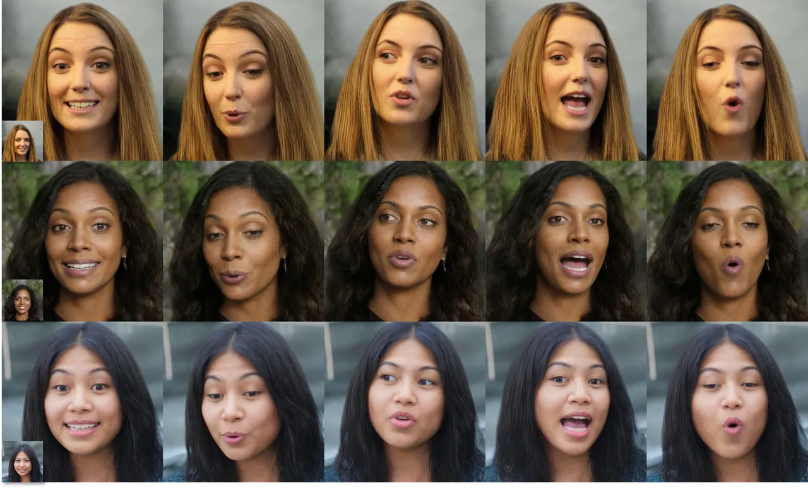

Figure A.1: Disentanglement between identity and motion. In these
examples, the same generated head and facial motion sequences are
applied onto three different face images.

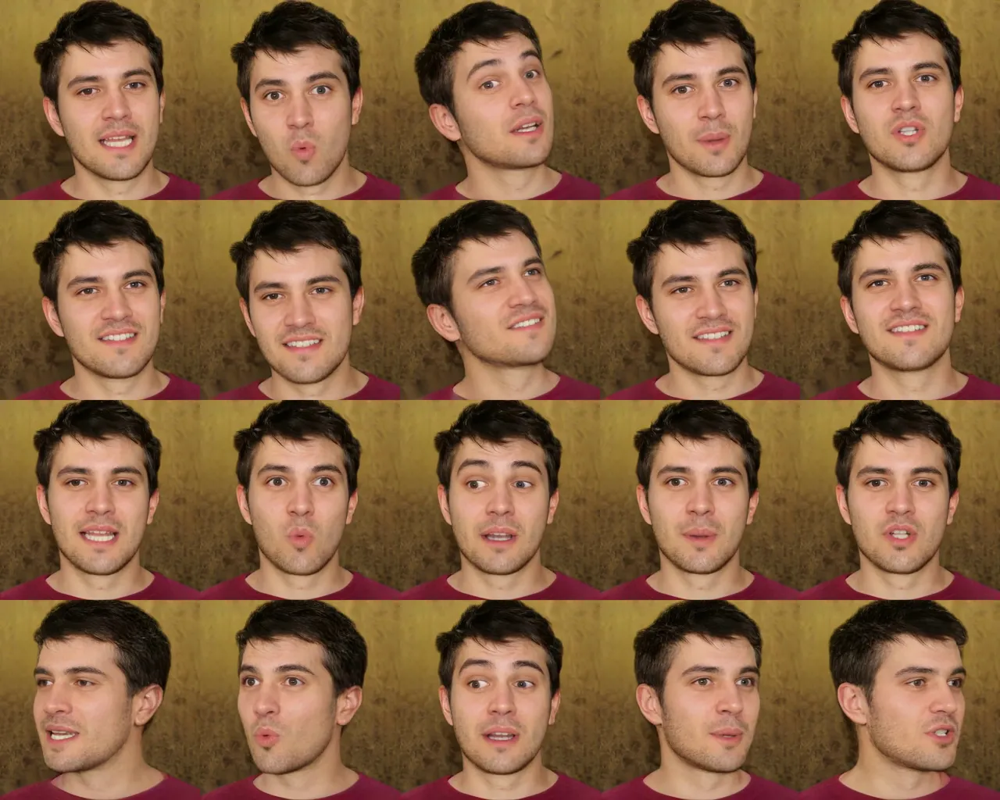

Figure A.2: Disentanglement between head pose and facial dynamics. _From
top to bottom_: the raw generated sequence, applying generated poses
with fixed initial facial dynamics, and applying generated facial
dynamics with fixed initial head pose and pre-defined spinning poses,
respectively.

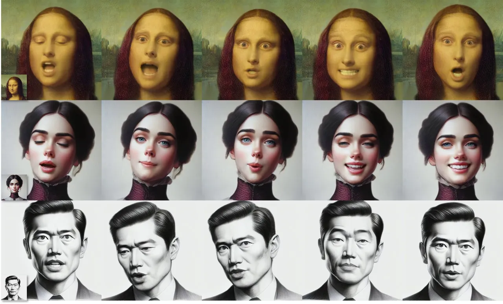

Figure A.3: Generation results with out-of-distribution images
(non-photorealistic) and audios (singing audios for the first two rows
and non-English speech for the last row). Our method can still generate
high quality videos well-aligned with the audios, although it was not
trained on such data variations. See the supplementary video with audio
for a better illustration of these results.

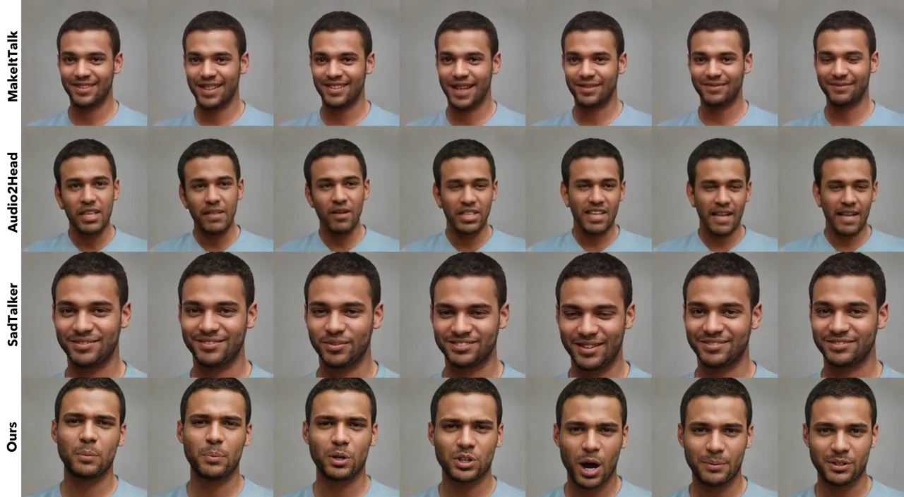

Figure A.4: Generation results from different methods with the input
audio segment uttering “push ups”. See our supplementary video for a
better illustration and comparison.

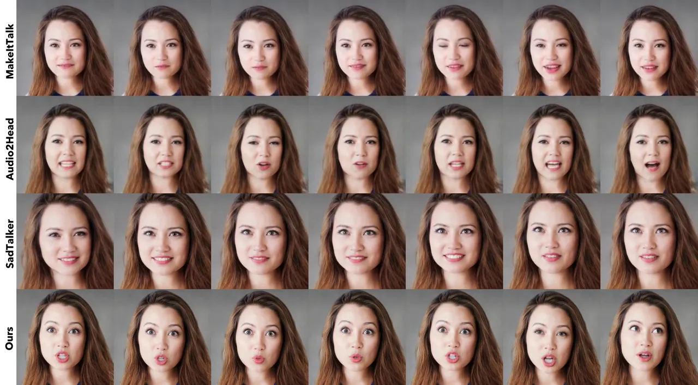

Figure A.5: Generation results from different methods with the input
audio segment uttering “excruciating”. See our supplementary video for a
better illustration and comparison.

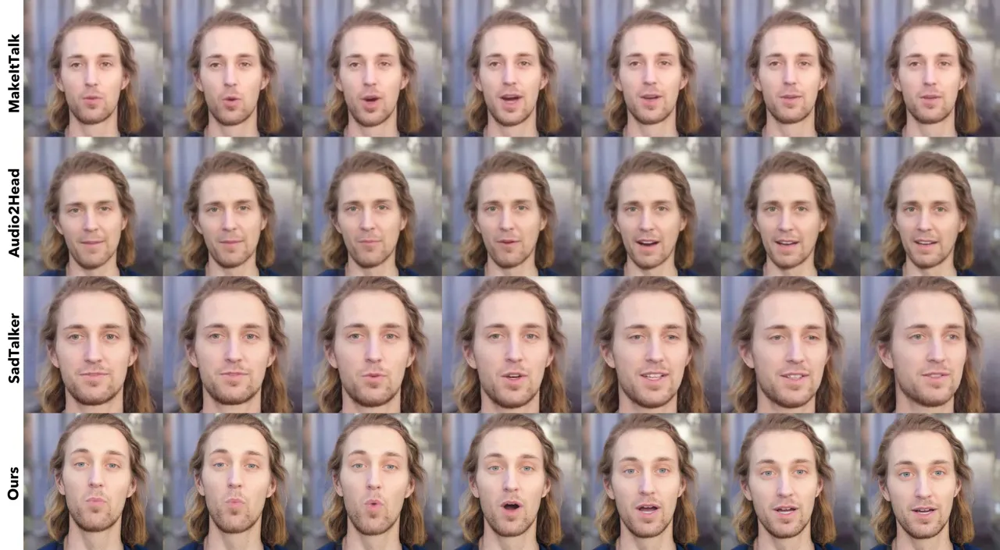

Figure A.6: Generation results from different methods with the input
audio segment uttering “what?”. See our supplementary video for a better
illustration and comparison.

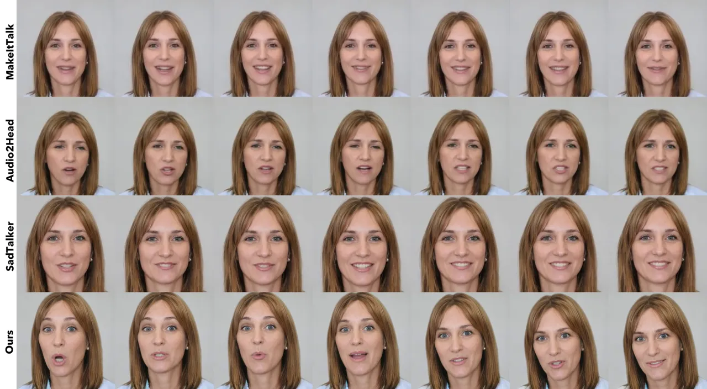

Figure A.7: Generation results from different methods with the input
audio segment uttering “lots of questions”. See our supplementary video
for a better illustration and comparison.
