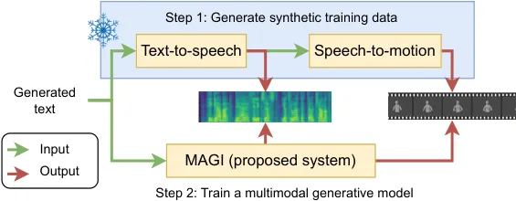
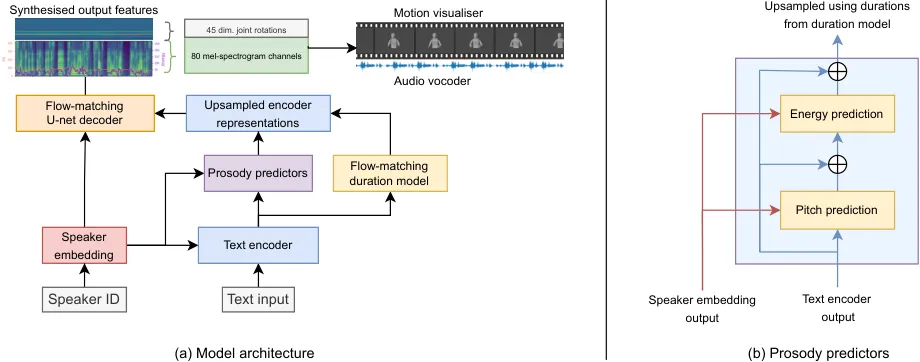

# Fake it to make it: Using synthetic data to remedy the data shortage in joint multimodal speech-and-gesture synthesis

Shivam Mehta Affiliation: KTH Royal Institute of Technology, Sweden   
Anna Deichler Affiliation: KTH Royal Institute of Technology, Sweden   
Jim O’Regan Affiliation: KTH Royal Institute of Technology, Sweden   
Birger Moëll Affiliation: KTH Royal Institute of Technology, Sweden   

Jonas Beskow Affiliation: KTH Royal Institute of Technology, Sweden   
Gustav Eje Henter Affiliation: KTH Royal Institute of Technology, Sweden
Affiliation: Motorica AB, Sweden    Simon Alexanderson Affiliation: KTH
Royal Institute of Technology, Sweden Affiliation: Motorica AB, Sweden

###### Abstract

Although humans engaged in face-to-face conversation simultaneously
communicate both verbally and non-verbally, methods for joint and
unified synthesis of speech audio and co-speech 3D gesture motion from
text are a new and emerging field. These technologies hold great promise
for more human-like, efficient, expressive, and robust synthetic
communication, but are currently held back by the lack of suitably large
datasets, as existing methods are trained on parallel data from all
constituent modalities. Inspired by student-teacher methods, we propose
a straightforward solution to the data shortage, by simply synthesising
additional training material. Specifically, we use unimodal synthesis
models trained on large datasets to create multimodal (but synthetic)
parallel training data, and then pre-train a joint synthesis model on
that material. In addition, we propose a new synthesis architecture that
adds better and more controllable prosody modelling to the
state-of-the-art method in the field. Our results confirm that
pre-training on large amounts of synthetic data improves the quality of
both the speech and the motion synthesised by the multimodal model, with
the proposed architecture yielding further benefits when pre-trained on
the synthetic data.

## 1 Introduction

Human beings are embodied, and we use a wide gamut of the expressions
afforded by our bodies to communicate. In concert with the lexical and
non-lexical (prosodic) components of speech, humans also leverage
gestures realised by face, head, arm, finger, and body motion – all
driven by a shared, underlying communicative intent \[60\] – to improve
face-to-face communication \[31, 69\].

Research into automatically recreating different kinds of human
communicative behaviour, whether it be speech audio from text \[89\], or
gesture motion from speech \[97\], have a long history, as these are key
enabling technologies for, e.g., virtual agents, game characters, and
social robots \[15, 42, 59, 71\]. The advent of deep learning has led to
an explosion of research in the two fields \[87, 55, 69\]. Gesture
synthesis, in particular, has been shown to benefit from access to both
lexical and acoustic representations of speech \[43, 109, 3, 44\]. That
said, joint and simultaneous synthesis of both speech and gesture
communication (pioneered in \[82\]) remains severely under-explored.
This despite the fact that simultaneously generating both modalities
together not only better emulates how humans produce communicative
expressions, but also offers a stepping stone towards creating
non-redundant gestures that can complement and even replace speech, like
human gestures do \[35\]. On top of this, recent research efforts
towards integrating the synthesis of the two modalities have
demonstrated improvements in coherent \[6, 64\], compact \[99, 64\],
jointly and rapidly learnable \[63\], convincing \[63, 64\], and
cross-modally appropriate \[64\] synthesis of speech and 3D gestures
from text.

Figure 1: MAGI: Multimodal Audio and Gesture, Integrated

The current state of the art in joint multimodal speech-and-gesture
synthesis, Match-TTSG \[64\], achieves strong performance via modern
techniques such as conditional flow matching (OT-CFM) \[52\] with U-Net
Transformer \[96\] encoders \[81\]. However, there still remains a
noticeable gap between synthesised model output and recordings of
natural human speech and gesticulation \[64\]. This contrasts with
recent breakthroughs in “generative AI”, which can synthesise text \[14,
2\], images \[77, 81\], and speech audio \[88, 84\] that all are nigh
indistinguishable from those created by humans. The critical difference
is that whereas those strong models for synthesising single modalities
benefit from training on vast amounts of data (cf. \[28\]), existing
parallel datasets of speech audio, text transcriptions, and human motion
are radically smaller. This is especially true if we require good motion
quality (which at present generally necessitates high-end 3D motion
capture) and speech audio with a spontaneous character and quality
suitable for speech synthesis. The state-of-the-art joint synthesis
system demonstrated in \[64\] was thus trained on 4.5 hours of parallel
speech and gesture data from \[23\]; larger parallel corpora exist \[50,
54\], but exhibit some quality issues (cf. \[45\]) and do not exceed 100
hours, a far cry from the corpora used to train leading generative AI
systems. It stands to reason that multimodal synthesis systems could
gain substantially from overcoming the limitations imposed by training
only on presently available parallel corpora.

In this paper, we propose two improvements to the state-of-the art
multimodal speech-and-gesture synthesis:

1.  1.  We pre-train¹¹ 1 We use “_pre-training_” to refer to any training
        (by others or by us) performed prior to training on our multimodal
        target dataset. a joint speech-and-gesture synthesis model on a
        large parallel corpus of _synthetic_ training data created using
        leading text, text-to-speech, and speech-to-gesture systems (Fig.
        1), before fine-tuning on our target data. This offers a simple way
        for multimodal models to benefit from advances in unimodal synthesis
        systems.
2.  2.  We extend \[64\] with a probabilistic duration model (similar to
        \[49\]) and individual models of pitch and energy (similar to
        \[79\]). This enables more lifelike and more controllable synthetic
        expression.

The resulting joint synthesis system is orders of magnitude smaller and
faster than the models used for synthesising the pre-training data. Our
subjective evaluations show that the proposed pre-training on synthetic
data improves the speech as well as the gestures created by a joint
synthesis system, and that the architectural modifications further
benefit a system pre-trained on large synthetic data and also enable
output control. For video examples and code, please see our demo page at
[shivammehta25.github.io/MAGI/](https://shivammehta25.github.io/MAGI/);

## 2 Background

In this section, we review synthesis of text, speech audio, and 3D
gesture motion, along with existing work in multimodal
speech-and-gesture synthesis. For each task, we state how the methods
relate to our contributions and briefly discuss how synthetic data can
improve synthesis models.

### 2.1 Text generation

The rise of large language models (LLMs) has brought revolutionary
improvements to text generation. Transformer-based \[96\] LLMs using
Generative Pre-trained Transformers (GPTs) \[74\] like \[14, 2, 92\] are
capable of generating text virtually indistinguishable from that written
by humans.

The critical methodological advances for LLMs are pre-training on vast
amounts of diverse data, coupled with fine-tuning on a small amount of
high-quality, in-domain material, e.g., via Reinforcement Learning from
Human Feedback (RLHF) \[10\]. This methodology of pre-training
foundation models followed by fine-tuning on the best data has been
validated to give excellent results across several modalities \[116,
12\]. In this paper, we for the first time use that methodology in joint
speech-and-gesture synthesis.

Fine-tuned LLMs allow generating of diverse text samples for many
domains through _prompting_ the model, i.e., providing a written text
prompt at runtime describing the output to generate. Prompting has been
useful for many tasks including creating synthetic dialogue datasets
\[1\] and selecting appropriate gestures based on verbal utterances
\[29\]. We use this ability to create an arbitrarily large material of
conversational text sentences in the style of a given speaker/corpus as
a basis for our synthetic-data creation.

### 2.2 Speech synthesis

Recent advances in deep generative modelling have significantly improved
text-to-speech (TTS) \[87\], reaching naturalness levels that rival
recorded human speech \[88, 84\]. TTS models are often divided into two
broad classes: autoregressive (AR) and non-autoregressive (NAR). AR
models produce acoustic outputs sequentially, using mechanisms such as
neural cross-attention \[51, 83, 11, 115, 16\] or neural transducers
\[61, 62, 106\] to connect inputs symbols to the outputs.
Non-autoregressive models \[79, 37, 38, 118, 72, 49, 65, 26\] instead
generate the entire utterance in parallel. NAR models are typically
faster, especially on GPUs, but AR methods often yield slightly better
synthesis.

Recently, there has been a trend \[11, 16, 13, 98, 47\] to quantise
audio waveforms into discrete tokens \[47, 17\], and then adapt an
LLM-like autoregressive approach (e.g., with GPTs) to learn to model
these audio tokens on large datasets. Synthesised token sequences can
subsequently be converted back to audio \[85\]. Speaker and style
adaptation can be achieved by seeding (prompting) the model with an
audio snippet, something we leverage to create diverse stochastic
synthetic training data for our work.

LLM-like TTS can give exceptional results when trained on large
datasets, but models risk confabulating (similar to well-known issues
with LLMs) and getting trapped in feedback loops due to the
autoregression \[11, 16\]. Our paper therefore describes a pipeline for
mitigating these problems when creating synthetic training data at
scale.

In NAR TTS, it has been found that conditioning the TTS on the output of
a model of prosodic properties, e.g., per-phone pitch and energy, can
benefit synthesis \[118, 79, 70\]. This also enables control over the
speech, by replacing or manipulating the prosodic features prior to
synthesis. Speech-sound durations are especially important for
convincing prosody, and probabilistic modelling of durations can
substantially improve deep generative TTS \[38, 41\]. This appears
especially useful for speech uttered spontaneously in conversation, as
considered here, due to its highly diverse prosodic structure \[48\]. We
therefore introduce a probabilistic duration model, coupled with
explicit pitch and energy models, into the multimodal synthesis
architecture. Better duration modelling should help create speech rhythm
and timings with adequate time for gesture-preparation phases, so that
gesture strokes can synchronise with the speech. Improved control should
not only affect the output speech but also the gestures we generate with
it.

### 2.3 Gesture synthesis

Like TTS, deep learning has led to a boom in 3D gesture synthesis from
speech text and/or audio \[69\], adapting techniques like GANs \[100,
101\], normalising flows \[5, 4\], VAEs \[24\], VQ-VAEs \[107, 108\],
combined adversarial learning and regression losses \[21, 27, 54\], and
flow-VAEs \[90\]. Following text-prompted diffusion models for human
motion \[91, 39, 114\] diffusion models have seen rapid adoption for
generating 3D gesture motion \[112, 117, 7, 8\]. Flow matching \[52\]
improves synthesis speed by learning models that require fewer diffusion
steps during sampling, and has recently been adapted to motion
generation \[64, 32\] and TTS \[49, 65, 26\]. Similar to LLMs and large
TTS models, separate efforts wholly or partly model gestures
autoregressively as a sequence of discrete tokens \[104, 56, 67\].

The most recent large-scale comparison of gesture-generation models, the
GENEA Challenge 2023 \[45\], found that the two strongest methods \[18,
105\] (which are extensions of \[7, 103\]) were based on diffusion
models. Among these, \[18\] made use of self-supervised text-and speech
embeddings from data2vec \[9\], subsequently aligned with gesture motion
using CLIP \[75\] training, to improve the coherence between gestures
and the two speech-input modalities. In addition to modelling beat
gestures, the approach recognises the need for additional input
modalities to generate representational gestures, such as iconic and
deictic pointing \[19\], for more nuanced and contextually relevant
non-verbal communication. Our data-synthesis pipeline leverages their
approach to create synthetic training gestures that well match the
synthetic speech text and audio input.

### 2.4 Joint synthesis of speech and gestures

Speech synthesis and gesture generation have traditionally been treated
as separate problems, performed on different data by distinct research
communities. TTS is mainly developed for read-aloud speech, whereas
co-speech gesturing is more closely associated with conversational
settings.

Joint synthesis of speech and motion was first considered by \[82\]. The
first neural model was DurIAN \[111\], which simultaneously generated
speech audio and 3D facial expressions, albeit for speech read aloud.
\[6\] trained separate deep-learning TTS and speech-to-gesture systems
to synthesise speech and 3D motion for the same speaker and the same
(spontaneous) speaking style. This was followed by \[99\], which
investigated adapting and extending AR \[83\] and NAR \[37\] neural TTS
models to perform joint multimodal synthesis. Their joint models reduced
the number of parameters needed over \[6\], but the best model (the one
based on \[83\]) required complex multi-stage training to speak
intelligibly and did not improve quality.

Diff-TTSG \[63\] advanced joint speech-and-gesture synthesis by
employing probabilistic modelling, specifically a strong denoising
probabilistic model (DPMs) \[86\] building on the TTS work in \[72\].
This model could be trained on speech-and-gesture data from scratch in
one go and produced improved results over \[99\], but internally used
separate pipelines for producing the two output modalities, leading to
suboptimal coherence between them. Match-TTSG \[64\] improved on this
aspect by using a compact and unified decoder to jointly sample both
output modalities. It also used conditional flow matching \[52\] rather
than diffusion, for much faster output synthesis. Experiments found that
Match-TTSG improved on the previous best model in all respects,
establishing it as the current state of the art.

Most of the above models were trained only on small, parallel multimodal
datasets from a single speaker. (The one exception is \[99\], which
required pre-training part of the network on a TTS corpus to produce
intelligible output at all.) The results in \[64\] show that, e.g., the
synthetic speech falls short of human-level naturalness, and the quality
we find from systems trained on very large datasets. Accordingly, we
propose to circumvent the data limitation by using strong unimodal
synthesisers to create a large synthetic training corpus for our joint
model.

### 2.5 Training on synthetic data

Training models on synthetic data is gaining interest \[93\], e.g., for
privacy \[66\] and in model compression through distillation \[30\],
including generative models like TTS \[94\]. Synthesis (and synthetic
data) is also appealing in cases where real data is scarce or difficult
to obtain, as demonstrated in applications to human poses and motion
\[95, 113\]. It also allows for the creation of diverse and controlled
datasets that can enable more accurate and versatile models \[36\]. We
here propose to generalise such approaches by chaining together multiple
unimodal synthesisers, to enable training multimodal speech-and-gesture
models.

There may be a risk that the individual unimodal synthesisers we use,
being trained on non-overlapping data, could fail to capture mutual
information that connects the modalities. The final multimodal system
trained on the synthetic corpus might then suffer from artefacts and
fail to recreate proper inter-modal dependencies. However, recent
theoretical and practical results show that little \[57\] or no \[68,
53\] parallel data may suffice for learning joint distributions of
multiple random variables (modalities). Training on corpora generated by
synthesisers built from non-overlapping material might thus not be as
risky as it could seem.

## 3 Method

We now describe our method for creating wholly synthetic multimodal
datasets for training synthesis models, and then detail our
modifications to the Match-TTSG architecture.

### 3.1 Creating synthetic training data

Our pipeline for creating synthetic training data had the following main
steps:

1.  1.  Generating written sentences in the style of conversational speech
        transcriptions.
2.  2.  Synthesising diverse speech audio from the text.
3.  3.  Validating/filtering the synthetic speech audio using automatic
        speech recognition, and aligning the input text with the synthesised
        audio.
4.  4.  Synthesising gestures from the generated speech audio files and
        their corresponding time-aligned text.

We provide more detail in the following subsections.

#### 3.1.1 Text generation

The first step was to create text sentences that can form the basis of
synthesising multimodal data in a conversational style. For this we used
GPT-4 \[2\] and deliberate prompting. Specifically, we prompted the
model with a list of 50 transcriptions of sentences from the training
split \[63\] of the Trinity Speech-Gesture Dataset II (TSGD2) \[22,
20\], each enclosed in triple quotes, followed by a request to produce
50 additional phrases in the same style (including hesitations and
disfluencies seen in the transcriptions) but ignoring the content.
Further prompting then followed, to make the model generate additional
output based around different emotions and scenarios, and obtain a more
diverse material. The emotional categories we provided were: disgust,
sadness, fear, frustration, surprise, excitement, happiness, confusion,
and denial. Our prompts often gave similar instructions multiple times,
as we found this led to more realistic output. The main instruction
prompt and a number of example continuations can be found in Appendix A.

We utilised the above procedure to generate a total of 600 phrases
(available through [the
webpage](https://shivammehta25.github.io/MAGI/)), each approximately 250
characters in length. We found that limiting the length of the prompt
helps prevent issues with the subsequent speech synthesis, which tended
to produce unintelligible or confabulated output for overly long
utterances.

#### 3.1.2 Speech generation

The next step was to synthesise speech audio from the 600 LLM-generated
phrases. For this, we considered multiple TTS systems capable of
multi-speaker and spontaneous speech synthesis, including Bark²² 2
[https://github.com/suno-ai/bark](https://github.com/suno-ai/bark), XTTS
\[16\], and ElevenLabs³³ 3
[https://elevenlabs.io/](https://elevenlabs.io/). However, Bark
exhibited frequent confabulations and unexpected changes in speaker
identity within a single utterance, which seemed problematic for
learning to maintain a consistent vocal identity. Although ElevenLabs
demonstrated high-quality output, its status as a non-open source and
proprietary solution led us to exclude it. Ultimately, we selected XTTS
for generating our synthetic speech dataset, due to it combining more
consistent synthesis with a research-permissible license. We limited
each synthesised utterance to at most 400 XTTS speech tokens, since
anything longer than that is virtually certain too long for our prompts,
and thus must contain confabulation or gibberish speech. For everything
else, default XTTS synthesis hyperparameters were used. In the end, each
synthesised audio utterance was around 20–23 seconds long, taking about
half that time to synthesise.

In order to obtain more diverse data containing multiple speakers, each
of the 600 phrases was synthesised 16 times, once in each of 16
different voices. These voices were selected as a gender-balanced set (8
male and 8 female speakers) from the VCTK corpus \[102\], and elicited
from XTTS by seeding the synthesis of each individual utterance with the
audio of longest VCTK utterance spoken by the relevant speaker as an
acoustic prompt. These prompting utterances tended to be around 9
seconds long. In total, we thus synthesised 16 $`\times`$ 600 = 9600
audio utterances.

Interestingly, despite the spontaneous nature of the input phrases, we
found that false starts and fillers explicitly present in the input were
sometimes omitted in the XTTS output. This could be partly due to the
choice of temperature parameter at synthesis time (the default, 0.65),
which favours more consistent and likely output, and partly due to the
public English-language training datasets cover read rather than
spontaneous speech. Since XTTS furthermore was prompted using a snippet
of read-aloud speech audio from VCTK, the output audio tended to sound
more like reading than speaking spontaneously.

#### 3.1.3 Data filtering and forced alignment

Following speech synthesis, a number of data-processing steps were
performed to obtain a suitable dataset for training a strong
gesture-generation system. To begin with, all synthesised audio
utterances longer than 25 seconds were immediately and permanently
discarded, since these overwhelmingly tended to contain issues related
to confabulation and the like. The output from XTTS did not have exact
fidelity to the text it was prompted with, so automatic speech
recognition (ASR) was used to get more accurate input to the
gesture-generation system. ASR was performed using Whisper \[76\], using
the medium.en model, which has in previous uses proven to be less prone
to confabulation than the large variants, whilst providing sufficient
accuracy. Interestingly, Whisper tended to prefer British English
spelling, possibly since VCTK was recorded in the UK. The ASR derived
transcripts then replaced the original TTS input text for each utterance
in all subsequent processing.

The gesture-generation system we chose for the final synthesis (\[18\])
requires word-level timestamps for the text transcriptions. Although we
considered several tools that attempt to obtain word timings from
Whisper directly, none were sufficiently accurate for our needs.
Instead, we obtained the requisite timings using the Montreal Forced
Aligner (MFA) \[58\]. Text input to MFA was processed word-by-word to
remove leading and trailing punctuation and to perform case folding to
lower case. Utterances that MFA failed to align were also excluded from
consideration.

Following the filtering and alignment process, we were left with 8173
audio utterances for our final synthetic dataset, meaning that 1427
utterances (about 15%) were discarded during the filtering step. The
remaining data had a total duration of 37.6 hours, which also ended up
being the size of the final synthetic training corpus.

Figure 2: Schematic overview of the proposed MAGI architecture and its
prosody predictor.

#### 3.1.4 Gesture generation

We used a recent diffusion-based gesture-generation method \[18\] that
performed well in a large comparative evaluation \[45\] to generate
synthetic gesture data. That system leveraged data2vec \[9\] embeddings
to represent audio input, which help achieve a more speaker-independent
representation. On top of that, \[45\] introduced a Contrastive Speech
and Motion Pre-training (CSMP) module, to learn joint embeddings of
speech and gesture that can strengthen the semantic coupling between
these modalities. By utilising the output of the CSMP module as a
conditioning signal within the diffusion-based gesture-synthesis model,
the system can generate co-speech gestures that are human-like and
semantically aware, thereby improving the quality and appropriateness of
the generated gestures to the spoken content. The CSMP module requires
word-level timestamps, which is why forced-alignment was performed in
Sec. 3.1.3.

Since this paper is focused on multimodal synthesis from data where no
interlocutor is present or recorded (i.e., not back-and-forth
conversations), interlocutor-related inputs were removed from the
architecture. The input is thus an audio track with time-aligned text
transcripts. We used the pre-trained weights from \[18\] for the CSMP
module and re-trained the diffusion-based gesture model to comply with
the change of input, using the same architecture and learning rate as in
the paper. The training was done using two NVIDIA RTX3090 GPUs (194k
updates, each with batch size 60) on the subset of the Talking With
Hands (TWH) dataset \[50\] provided in the GENEA 2023 Challenge \[45\].
We used the trained system to generate text-and-audio-driven gestures
for the 8173 previously transcribed synthetic speech utterances, and
used Autodesk MotionBuilder after synthesis to retarget the output
motion to the skeleton of the TSGD2 data and visualiser in Sec. 4.1.
While the synthesised motion encompasses the full body (without
fingers), we only consider upper-body motion in this work. Compared to
conventional conditioning approaches where audio is represented using
mel-spectrograms, the speaker-independent data2vec embeddings in the
CSMP module are expected to better handle the differences between
natural and synthetic voices during synthesis, thus making it feasible
to generate large amounts of gesture data based on synthetic speech
without undue degradations due to domain mismatch. This data was used to
train the different multimodal synthesis systems considered in our
experiments.

### 3.2 Proposed multimodal synthesis system

The current state of the art in joint speech-and-gesture synthesis is
Match-TTSG \[64\], a non-autoregressive model which uses conditional
flow matching (OT-CFM) \[52\] to learn Ordinary Differential Equations
(ODEs) with more linear vector fields than continuous-time diffusion
models \[86\] create. Such simpler vector fields offer advantages for
easier learning and faster synthesis.

We extend the Match-TTSG framework in three ways:

1.  1.  Probabilistic instead of deterministic duration modelling, which can
        benefit deep generative NAR TTS \[38\].
2.  2.  Additional prosody-prediction modules, which are widely used in NAR
        TTS \[118, 79\].
3.  3.  A speaker-identity input, as necessary for pre-training on the
        multispeaker data in the large synthetic training set.

We call the resulting system _MAGI_ for _Multimodal Audio and Gesture,
Integrated_; see Fig. 2 for a diagram.

For (1), we augment the original Match-TTSG architecture with a
probabilistic duration predictor based on OT-CFM, as introduced in
\[49\], to learn distributions over speech and gesture durations. This
is trained jointly with the rest of the system. It replaces the
deterministic duration predictor in Match-TTSG, inherited from \[79,
118, 37, 72, 65, 26\], and uses the same network architecture.

To learn better prosody correlations and enable control over the output,
we drew inspiration from \[79, 118\] and incorporated two
prosody-predictor modules into our system: one for pitch prediction and
one for energy prediction, both using the same architecture and
hyperparameters as the _variance adaptor_ in \[79\]. Such prosody
predictors improve the synthesis as they enable the model to learn a
less oversmoothed representation, thereby enhancing the variability of
the generated output by conditioning the synthesis process on additional
prosodic features \[80\]. The pitch of the training data utterances was
extracted using the PyWorld wrapper for the WORLD vocoder⁴⁴ 4
[https://pypi.org/project/pyworld/](https://pypi.org/project/pyworld/)
with linear interpolation applied in unvoiced segments to achieve
continuous pitch contours for the entire utterances. We employed a
bucketing approach similar to \[79\], separately for pitch and energy,
to turn predicted continuous values into embedding vectors to be summed
with the text-encoder output vectors. However, in contrast to \[79\], we
performed token-level prediction instead of frame-level prediction for
the two prosodic properties, since it has been stated⁵⁵ 5
[https://github.com/ming024/FastSpeech2?tab=readme-ov-file#implementation-issues](https://github.com/ming024/FastSpeech2?tab=readme-ov-file#implementation-issues)
that this improves the synthesis whilst reducing memory consumption.

Like in \[72\], Match-TTSG includes a projection layer that maps the
text-encoder output vectors onto a predicted average output vector per
token (sub-phone). These averages are used for the so-called _prior
loss_ in the monotonic alignment search. The process of sampling the
output features (i.e., the flow-matching decoder) is also conditioned on
these predicted average vectors. However, the latter can introduce an
information bottleneck, since averages do not include information about
variance, correlations, or higher moments of the output distribution. To
improve information flow we instead condition the MAGI decoder directly
on the last layer of the text-encoder, prior to the projection layer.

Finally, we added a speaker embedding for multispeaker synthesis.
Specifically, we used a one-hot speaker vector to represent the 16
different speakers in the synthetic training data. This vector was
concatenated to other inputs at multiple stages of the synthesis
process, including the text encoder, prosody predictors and decoder. The
idea with this was to minimise information loss and ensure coherent
output across different speaker identities. Since the concatenated
vectors only have 16 elements, the impact on model parameter count is
small (an increase of a few thousand).

## 4 Experiments

This section experimentally compares our proposed training method and
architecture with the previous state-of-the-art method Match-TTSG
\[64\]. Since this is a synthesis work, the gold standard approach to
evaluation – and thus the focus of our experimental validation – is
subjective user studies. The experiments closely follows those in
previous joint synthesis works \[63, 64\], which in turn follows
established practices in speech \[33\] and gesture evaluation \[45\].

### 4.1 Data and systems

To test the effectiveness of our method we carried out 3 different
subjective evaluations with systems trained on Trinity Speech-Gesture
Dataset II (TSGD2) \[23\], a dataset containing 6 hours of multimodal
data: recordings of time-aligned 44.1 kHz audio coupled with 120 fps
marker-based 3D motion capture, in which a male native speaker of
Hiberno-English discusses a variety of topics whilst gesturing freely.
The same train-test split of the data was used as in \[63\], with around
4.5 hours of training data – much less than the 38 hours of synthetic
multimodal data we created.

We trained Match-TTSG (MAT) containing 30.2M parameters and MAGI (MAGI,
31.6M parameters) for 300k steps on only the TSGD2 data, and refer to
these conditions MAT-T and MAGI-T respectively. We also took the same
two architectures (albeit with one-hot speaker vectors for Match-TTSG)
and first pre-trained them for 200k updates on the synthetic
multispeaker data, followed by fine-tuning for 100k updates on our
target dataset, TSGD2. We refer to these as MAT-FT and MAGI-FT. Output
samples for held-out sentences were synthesised using 100 neural
function evaluations (NFEs; equivalent to number of Euler-forward steps
used by the ODE solver) for audio-and-motion synthesis, whilst 10 NFEs
were used for the preceding stochastic duration modelling, since it is
lower-dimensional and converged more rapidly. Training and synthesis
were performed on NVIDIA RTX 3090 GPUs with batch size 32.

15 utterances from the held-out set were used to evaluate each modality
individually. We used pre-trained Universal HiFi-GAN \[40\] to generate
vocoded but otherwise natural speech referred to as NAT. We used the
same vocoder to generate waveforms from the output mel spectrograms
synthesised by the trained multimodal-synthesis systems, while Blender
was used to render the motion representations into 3D avatar video,
using exactly the same upper-body avatar and visualiser as in \[63,
65\]. The motion data was represented as rotational representation using
exponential maps \[25\] of 45-dim pose vectors and were downsampled to
86.13 fps using cubic interpolation to match the frame rate of the
mel-spectrograms.

### 4.2 Evaluation setup

To gain an objective insight into the intelligibility of the synthetic
speed, we synthesised the test set sentences from TSGD2, which we then
passed to Whisper ASR, to use the Word Error Rate (WER) results as an
indicator of their intelligibility. For subjective evaluation, user
studies are the gold standard when evaluating synthesis methods.
Following \[63\], we used comprehensive evaluation, conducting
individual studies of each generated modality. We additionally evaluate
the appropriateness of the modalities in terms of each other, to
determine how well they fit together.

In our studies, participants had an interface with five unique response
choices, with the exact details varying slightly across different
investigations. All participants were native English speakers recruited
through [the Prolific crowdsourcing
platform](https://www.prolific.com/). Each test was designed to last
around 20 minutes and participants were compensated 4 GBP (12 GBP/hr)
for participation. For the purpose of statistical examination, we
converted responses into numerical values. These values were then
analysed for statistical significance at the 0.05 threshold using
pairwise $`t`$-tests.

#### 4.2.1 Speech-quality evaluation

To assess perceived naturalness of the synthesized speech, we employed
the Mean Opinion Score (MOS) testing approach, drawing inspiration from
the Blizzard Challenge for text-to-speech systems \[73\]. Participants
were asked, “How natural does the synthesized speech sound?”, rating
their responses on a scale from 1 to 5, where 1 represented “Completely
unnatural” and 5 indicated “Completely natural.” The intermediary values
of 2 to 4 were provided without textual descriptions. Each participant
evaluated 15 stimuli per system and 4 attention checks resulting in a
total of 525 responses per condition by 35 participants. Fine-tuning
with synthetic data led to performance enhancements for both MAGI and
MAT, reducing the WER from 13.28% in MAGI-T to 9.29% in MAGI-FT, and
from 12.26% in MAT-T to 8.35% in MAT-FT.

#### 4.2.2 Motion-quality evaluation

We evaluate motion quality using video stimuli that only visualised
motion, without any audio, in order to have an independent assessment of
motion quality. This ensures that ratings are not affected by speech and
follows the practice of recent evaluations of gesture quality \[34,
78\]. Similarly to the speech evaluation, participants were asked “How
natural and humanlike the gesture motion appear?”, and gave responses on
a scale of 1 (“Completely unnatural”) to 5 (“Completely natural”). The
number of stimuli and attention checks were identical to the speech-only
evaluation.

#### 4.2.3 Speech-and-motion appropriateness evaluation

We finally evaluated how appropriate the generated speech and motion
were for each other, whilst controlling for the effect of their
individual quality following \[34, 78, 110, 46, 64\]. For each speech
segment and condition, we created two video stimuli: one with the
original video and sound, and the other combining the original speech
audio with motion from a different video clip, adjusting the motion
speed to align with the audio duration. Both videos feature comparable
motion quality and characteristics from the same condition, but only one
video’s motion is synchronised with the audio track, without indicating
which video is which.

The test inquired which character’s motion most accurately matched the
speech in rhythm, intonation, and meaning. Participant ability to
identify the correctly synchronised video indicates a strong rhythmic
and/or semantic link between generated motion and speech. Following
\[63\] we opted for five response choices instead of the typical three
for better resolution. Options were “Left is much better”, “Left is
slightly better”, “Both are equal”, “Right is slightly better”, “Right
is much better”. For the purposes of analysis, numbers in the range of
$`-2`$ to 2 were assigned to each response, as in \[63\], with $`-2`$
representing the participant’s preference for the mismatched stimulus
and 2 the matched stimulus. Participants reviewed motions from 14 of the
15 segments, displayed as 7 screens of pairs of videos, plus two audio
and two video attention checks, covering all conditions for these
segments. 70 persons completed the test, yielding 490 responses per
system.

## 5 Results and discussion

| Condition | Speech          | Gesture         | Speech & gesture |
| --------- | --------------- | --------------- | ---------------- |
| NAT       | 4.30$`\pm`$0.06 | 4.10$`\pm`$0.08 | 1.10$`\pm`$0.10  |
| MAT-T     | 3.43$`\pm`$0.10 | 3.28$`\pm`$0.11 | 0.52$`\pm`$0.10  |
| MAT-FT    | 3.56$`\pm`$0.10 | 3.39$`\pm`$0.09 | 0.56$`\pm`$0.09  |
| MAGI-T    | 3.44$`\pm`$0.09 | 3.11$`\pm`$0.10 | 0.51$`\pm`$0.09  |
| MAGI-FT   | 3.62$`\pm`$0.08 | 3.52$`\pm`$0.11 | 0.60$`\pm`$0.09  |

Table 1: Result of three evaluations showing Mean Opinion Scores (MOS)
with 95% confidence intervals.

Our investigation revealed several key insights into the effect of
pre-training and architectural modifications. Pre-training on synthetic
data markedly enhanced the quality of synthesised speech, though
adjustments to the architecture did not significantly alter its
naturalness. Despite this, both MAGI-FT and MAT-FT yielded higher Mean
Opinion Scores (MOS), albeit without statistical significance. Notably,
MAGI facilitated greater control over pitch and energy – a feature
absent from Match-TTSG. However, despite improvements, the synthesised
speech did not achieve the level of naturalness present in the
human-recorded speech from the held-out set, see Table 1.

In terms of synthesised gestures, MAGI outperformed other conditions in
human-likeness. However, they remained inferior to human-motion
reference data. The influence of synthetic data pre-training and the
proposed model’s architecture on gesture synthesis presented a more
nuanced picture. Specifically, pre-training on synthetic data only
significantly benefited the proposed model, and, intriguingly, the MAGI
enhanced gestures in a larger dataset but had the opposite effect on a
smaller dataset. This discrepancy might stem from the prosody predictors
in our model being trained on per-phone rather than per-frame data,
leading to a scarcity of training data for these predictors in smaller
datasets. However, with adequate pre-training on expansive datasets,
these models demonstrated better convergence. These findings align with
prior speech evaluations, where the novel architecture’s advantages were
more pronounced following pre-training on a larger dataset.

Further, no model matched the cross-modal appropriateness found in
multimodal human recordings, echoing the challenges observed in unimodal
gesture synthesis where recent evaluations did not approach the
appropriateness of human data \[110, 46\]. Although MAGI pre-trained on
synthetic data showcased superior performance, it did not significantly
exceed the existing benchmarks in synthesis systems. This observation
may be attributed to the inherent difficulty in discerning significant
differences in appropriateness, as opposed to naturalness or
human-likeness, and the comparison against a robust baseline without
alterations that directly influence cross-modal synthesis aspects.
Lastly, the cross-modal aspects might conceivably be less accurately
represented in synthetic datasets created from unimodal synthesisers
trained on non-cohesive data.

### 5.1 Pitch and energy control

As stated, the proposed multi-stage architecture with separate prosody
predictors allows for modifying or substituting the pitch and energy
contours before synthesis. This enables direct control of prosodic
properties of the speech, with the synthesis process having the option
to adjust the gestures to match. On our demo page
[shivammehta25.github.io/MAGI/](https://shivammehta25.github.io/MAGI/)
we provide example videos showing the effect that modifying (scaling)
the pitch and energy contours returned by the predictors has on the
synthesised output. One can observe that reducing the pitch seems to
promote creaky voice, which makes sense from a speech-production
perspective and fits earlier findings from autoregressive TTS on
spontaneous-speech data \[48\].

## 6 Conclusion and future work

We have described improvements to the joint and simultaneous multimodal
synthesis of speech audio and 3D gesture motion from text. Specifically,
we propose training on data synthesised by a chain of strong unimodal
synthesis systems to address the shortage of multimodal training data.
We also augment the state-of-the-art architecture for speech-and-gesture
synthesis, Match-TTSG, with a stochastic duration model, TTS-inspired
prosody predictors for controllability, and the ability to perform
multispeaker synthesis. The final model, called MAGI, is radically
smaller than those that generated the synthetic data. Experiments
confirm that pre-training on synthetic data significantly improved
unimodal speech and gesture quality. The architectural improvements
reaped benefits when pre-training on large amounts of synthetic data,
with the added prosody control having a clear effect on the audio
output.

Relevant future work includes investigating alternative options for
mitigating the shortage of multimodal training data, such as
pre-training on data lacking one or more of the modalities;
incorporating RL-based approaches, particularly effective for generation
of situated gestures as in \[19\]; or (following the CSMP methodology
\[18\]) leveraging various self-supervised representations trained on
large amounts of data. Possible architectural extensions include flow
matching for pitch and energy, and similar control over motion
properties such as gesture radius and symmetry \[5\].

## 7 Acknowledgements

This work was partially supported by the Wallenberg AI, Autonomous
Systems and Software Program (WASP) funded by the Knut and Alice
Wallenberg Foundation, by the Swedish Research Council (VR) projs.
2023-05441 and 2017-00626 (Språkbanken Tal), by Digital Futures, and by
the Industrial Strategic Technology Development Program (grant no. 20023495) funded by MOTIE, Korea.

## References

- \[1\] Yelaman Abdullin, Diego Molla-Aliod, Bahadorreza Ofoghi, John
  Yearwood, and Qingyang Li. Synthetic dialogue dataset generation using
  llm agents. _arXiv preprint arXiv:2401.17461_, 2024.
- \[2\] Josh Achiam, Steven Adler, Sandhini Agarwal, Lama Ahmad, Ilge
  Akkaya, Florencia Leoni Aleman, et al. GPT-4 technical report. _arXiv
  preprint arXiv:2303.08774_, 2023.
- \[3\] Chaitanya Ahuja, Dong Won Lee, Ryo Ishii, and Louis-Philippe
  Morency. No gestures left behind: Learning relationships between
  spoken language and freeform gestures. In _Proc. EMNLP_, pages
  1884–1895, 2020.
- \[4\] Simon Alexanderson. The StyleGestures entry to the GENEA
  Challenge 2020. In _Proc. GENEA Workshop_, 2020.
- \[5\] Simon Alexanderson, Gustav Eje Henter, Taras Kucherenko, and
  Jonas Beskow. Style-controllable speech-driven gesture synthesis using
  normalising flows. _Comput. Graph. Forum_, 39(2):487–496, 2020a.
- \[6\] Simon Alexanderson, Éva Székely, Gustav Eje Henter, Taras
  Kucherenko, and Jonas Beskow. Generating coherent spontaneous speech
  and gesture from text. In _Proc. IVA_, pages 1–3, 2020b.
- \[7\] Simon Alexanderson, Rajmund Nagy, Jonas Beskow, and Gustav Eje
  Henter. Listen, denoise, action! Audio-driven motion synthesis with
  diffusion models. _ACM Trans. Graph._, 42(4):1–20, 2023.
- \[8\] Tenglong Ao, Zeyi Zhang, and Libin Liu. GestureDiffuCLIP:
  Gesture diffusion model with CLIP latents. _ACM Trans. Graph._,
  42(4):1–18, 2023.
- \[9\] Alexei Baevski, Wei-Ning Hsu, Qiantong Xu, Arun Babu, Jiatao Gu,
  and Michael Auli. data2vec: A general framework for self-supervised
  learning in speech, vision and language. In _Proceedings of the
  International Conference on Machine Learning_, pages 1298–1312, 2022.
- \[10\] Yuntao Bai, Andy Jones, Kamal Ndousse, Amanda Askell, Anna
  Chen, Nova DasSarma, Dawn Drain, Stanislav Fort, Deep Ganguli, Tom
  Henighan, et al. Training a helpful and harmless assistant with
  reinforcement learning from human feedback. _arXiv preprint
  arXiv:2204.05862_, 2022.
- \[11\] James Betker. Better speech synthesis through scaling. _arXiv
  preprint arXiv:2305.07243_, 2023.
- \[12\] James Betker, Gabriel Goh, Li Jing, Tim Brooks, Jianfeng Wang,
  Linjie Li, Long Ouyang, Juntang Zhuang, Joyce Lee, Yufei Guo, et al.
  Improving image generation with better captions, 2023.
- \[13\] Zalán Borsos, Raphaël Marinier, Damien Vincent, Eugene
  Kharitonov, Olivier Pietquin, Matt Sharifi, Dominik Roblek, Olivier
  Teboul, David Grangier, Marco Tagliasacchi, et al. Audiolm: a language
  modeling approach to audio generation. _IEEE/ACM Transactions on
  Audio, Speech, and Language Processing_, 2023.
- \[14\] Tom Brown, Benjamin Mann, Nick Ryder, Melanie Subbiah, Jared D.
  Kaplan, Prafulla Dhariwal, et al. Language models are few-shot
  learners. In _Advances in Neural Information Processing Systems_,
  pages 1877–1901, 2020.
- \[15\] Justine Cassell, Joseph Sullivan, Scott Prevost, and Elizabeth
  Churchill. _Embodied conversational agents_. MIT press, 2000.
- \[16\] Coqui.ai. xTTS - TTS 0.22.0 documentation, 2023.
- \[17\] Alexandre Défossez, Jade Copet, Gabriel Synnaeve, and Yossi
  Adi. High fidelity neural audio compression. _arXiv preprint
  arXiv:2210.13438_, 2022.
- \[18\] Anna Deichler, Shivam Mehta, Simon Alexanderson, and Jonas
  Beskow. Diffusion-based co-speech gesture generation using joint text
  and audio representation. In _Proceedings of the 25th International
  Conference on Multimodal Interaction_, pages 755–762, 2023a.
- \[19\] Anna Deichler, Siyang Wang, Simon Alexanderson, and Jonas
  Beskow. Learning to generate pointing gestures in situated embodied
  conversational agents. _Frontiers in Robotics and AI_, 10:1110534,
  2023b.
- \[20\] Ylva. Ferstl and Rachel McDonnell. Investigating the use of
  recurrent motion modelling for speech gesture generation. In _Proc.
  IVA_, pages 93–98, 2018.
- \[21\] Ylva Ferstl and Rachel McDonnell. Multi-task learning for
  continuous control of non-verbal behaviour in humanoid social robots.
  In _Proceedings of the ACM/IEEE International Conference on
  Human-Robot Interaction (HRI)_, pages 411–420. IEEE, 2019.
- \[22\] Ylva Ferstl, Michael Neff, and Rachel McDonnell. Adversarial
  gesture generation with realistic gesture phasing. _Comput. Graph._,
  89:117–130, 2020.
- \[23\] Ylva Ferstl, Michael Neff, and Rachel McDonnell.
  ExpressGesture: Expressive gesture generation from speech through
  database matching. _Comput. Animat. Virt. W._, page e2016, 2021.
- \[24\] Saeed Ghorbani, Ylva Ferstl, Daniel Holden, Nikolaus F. Troje,
  and Marc-André Carbonneau. ZeroEGGS: Zero-shot example-based gesture
  generation from speech. _Comput. Graph. Forum_, 42(1):206–216, 2023.
- \[25\] F. Sebastian Grassia. Practical parameterization of rotations
  using the exponential map. _J. Graph. Tool._, 3(3):29–48, 1998.
- \[26\] Yiwei Guo, Chenpeng Du, Ziyang Ma, Xie Chen, and Kai Yu.
  VoiceFlow: Efficient text-to-speech with rectified flow matching. In
  _Proc. ICASSP_, 2024.
- \[27\] Ikhsanul Habibie, Weipeng Xu, Dushyant Mehta, Lingjie Liu,
  Hans-Peter Seidel, Gerard Pons-Moll, Mohamed Elgharib, and Christian
  Theobalt. Learning speech-driven 3D conversational gestures from
  video. In _Proceedings of the International Conference on Intelligent
  Virtual Agents_, pages 101–108, 2021.
- \[28\] Tom Henighan, Jared Kaplan, Mor Katz, Mark Chen, Christopher
  Hesse, Jacob Jackson, Heewoo Jun, Tom B. Brown, Prafulla Dhariwal,
  Scott Gray, et al. Scaling laws for autoregressive generative
  modeling. _arXiv preprint arXiv:2010.14701_, 2020.
- \[29\] Laura Birka Hensel, Nutchanon Yongsatianchot, Parisa Torshizi,
  Elena Minucci, and Stacy Marsella. Large language models in textual
  analysis for gesture selection. In _Proceedings of the 25th
  International Conference on Multimodal Interaction_, pages
  378–387, 2023.
- \[30\] Geoffrey Hinton, Oriol Vinyals, and Jeff Dean. Distilling the
  knowledge in a neural network. In _NIPS Deep Learning and
  Representation Learning Workshop_, 2015.
- \[31\] Autumn B Hostetter. When do gestures communicate? a
  meta-analysis. _Psychological Bulletin_, 133(2):297, 2007.
- \[32\] Vincent Tao Hu, Wenzhe Yin, Pingchuan Ma, Yunlu Chen, Basura
  Fernando, Yuki M Asano, Efstratios Gavves, Pascal Mettes, Björn Ommer,
  and Cees G. M. Snoek. Motion flow matching for human motion synthesis
  and editing. _arXiv preprint arXiv:2312.08895_, 2023.
- \[33\] ITU-T P.800. Methods for subjective determination of
  transmission quality. Standard, ITU, 1996.
- \[34\] Patrik Jonell, Taras Kucherenko, Gustav Eje Henter, and Jonas
  Beskow. Let’s face it: Probabilistic multi-modal interlocutor-aware
  generation of facial gestures in dyadic settings. In _Proc.
  IVA_, 2020.
- \[35\] Adam Kendon. How gestures can become like words. In
  _Cross-Cultural Perspectives in Nonverbal Communication_. C. J.
  Hogrefe, Inc., 1988.
- \[36\] Hyeongwoo Kim, Pablo Garrido, Ayush Tewari, Weipeng Xu, Justus
  Thies, Matthias Niessner, Patrick Pérez, Christian Richardt, Michael
  Zollhöfer, and Christian Theobalt. Neural style-preserving visual
  dubbing. In _Proceedings of the 32nd International Conference on
  Neural Information Processing Systems_, pages 2535–2545, 2019.
- \[37\] Jaehyeon Kim, Sungwon Kim, Jungil Kong, and Sungroh Yoon.
  Glow-TTS: A generative flow for text-to-speech via monotonic alignment
  search. In _Proc. NeurIPS_, pages 8067–8077, 2020.
- \[38\] Jaehyeon Kim, Jungil Kong, and Juhee Son. VITS: Conditional
  variational autoencoder with adversarial learning for end-to-end
  text-to-speech. In _Proc. ICML_, pages 5530–5540, 2021.
- \[39\] Jihoon Kim, Jiseob Kim, and Sungjoon Choi. Flame: Free-form
  language-based motion synthesis & editing. In _Proceedings of the AAAI
  Conference on Artificial Intelligence_, pages 8255–8263, 2023.
- \[40\] Jungil Kong, Jaehyeon Kim, and Jaekyoung Bae. HiFi-GAN:
  Generative adversarial networks for efficient and high fidelity speech
  synthesis. In _Proc. NeurIPS_, pages 17022–17033, 2020.
- \[41\] Jungil Kong, Jihoon Park, Beomjeong Kim, Jeongmin Kim, Dohee
  Kong, and Sangjin Kim. VITS2: Improving quality and efficiency of
  single-stage text-to-speech with adversarial learning and architecture
  design. In _Proc. Interspeech_, pages 4374–4378, 2023.
- \[42\] Stefan Kopp and Ipke Wachsmuth. Synthesizing multimodal
  utterances for conversational agents. In _Computer Animation and
  Virtual Worlds_, pages 39–52. Wiley Online Library, 2004.
- \[43\] Taras Kucherenko, Patrik Jonell, Sanne van Waveren, Gustav Eje
  Henter, Simon Alexanderson, Iolanda Leite, and Hedvig Kjellström.
  Gesticulator: A framework for semantically-aware speech-driven gesture
  generation. In _Proceedings of the ACM International Conference on
  Intelligent Virtual Agents_, pages 242–250, 2020.
- \[44\] Taras Kucherenko, Rajmund Nagy, Michael Neff, Hedvig
  Kjellström, and Gustav Eje Henter. Multimodal analysis of the
  predictability of hand-gesture properties. In _Proceedings of the
  International Conference on Autonomous Agents and Multiagent Systems_,
  pages 770–779, 2022.
- \[45\] Taras Kucherenko, Rajmund Nagy, Youngwoo Yoon, Jieyeon Woo,
  Teodor Nikolov, Mihail Tsakov, and Gustav Eje Henter. The GENEA
  Challenge 2023: A large-scale evaluation of gesture generation models
  in monadic and dyadic settings. In _Proceedings of the International
  Conference on Multimodal Interaction_, pages 792–801, 2023a.
- \[46\] Taras Kucherenko, Pieter Wolfert, Youngwoo Yoon, Carla Viegas,
  Teodor Nikolov, Mihail Tsakov, and Gustav Eje Henter. Evaluating
  gesture-generation in a large-scale open challenge: The GENEA
  Challenge 2022. _arXiv preprint arXiv:2303.08737_, 2023b.
- \[47\] Mateusz Lajszczak, Guillermo Cambara Ruiz, Yang Li, Fatih
  Beyhan, Arent van Korlaar, Fan Yang, et al. Base tts: Lessons from
  building a billion-parameter text-to-speech model on 100k hours of
  data. _arXiv_, 2024.
- \[48\] Harm Lameris, Shivam Mehta, Gustav Eje Henter, Joakim
  Gustafson, and Éva Székely. Prosody-controllable spontaneous TTS with
  neural HMMs. In _Proc. ICASSP_, 2023.
- \[49\] Matthew Le, Apoorv Vyas, Bowen Shi, Brian Karrer, Leda Sari,
  Rashel Moritz, Mary Williamson, Vimal Manohar, Yossi Adi, Jay
  Mahadeokar, et al. Voicebox: Text-guided multilingual universal speech
  generation at scale. _arXiv preprint arXiv:2306.15687_, 2023.
- \[50\] Gilwoo Lee, Zhiwei Deng, Shugao Ma, Takaaki Shiratori,
  Siddhartha S. Srinivasa, and Yaser Sheikh. Talking With Hands 16.2 M:
  A large-scale dataset of synchronized body-finger motion and audio for
  conversational motion analysis and synthesis. In _Proceedings of the
  IEEE/CVF International Conference on Computer Vision_, pages
  763–772, 2019.
- \[51\] Naihan Li, Shujie Liu, Yanqing Liu, Sheng Zhao, and Ming Liu.
  Neural speech synthesis with transformer network. In _Proceedings of
  the AAAI conference on artificial intelligence_, pages
  6706–6713, 2019.
- \[52\] Yaron Lipman, Ricky T. Q. Chen, Heli Ben-Hamu, Maximilian
  Nickel, and Matt Le. Flow matching for generative modeling. In _Proc.
  ICLR_, 2023.
- \[53\] Alexander H. Liu, Cheng-I Jeff Lai, Wei-Ning Hsu, Michael Auli,
  Alexei Baevski, and James Glass. Simple and effective unsupervised
  speech synthesis. In _Proc. Interspeech_, pages 843–847, 2022a.
- \[54\] Haiyang Liu, Zihao Zhu, Naoya Iwamoto, Yichen Peng, Zhengqing
  Li, You Zhou, Elif Bozkurt, and Bo Zheng. BEAT: A large-scale semantic
  and emotional multi-modal dataset for conversational gestures
  synthesis. In _Proceedings of the European Conference on Computer
  Vision_, pages 612–630, 2022b.
- \[55\] Yu Liu, Gelareh Mohammadi, Yang Song, and Wafa Johal.
  Speech-based gesture generation for robots and embodied agents: A
  scoping review. In _Proceedings of the International Conference on
  Human-Agent Interaction_, pages 31–38, 2021.
- \[56\] Shuhong Lu, Youngwoo Yoon, and Andrew Feng. Co-speech gesture
  synthesis using discrete gesture token learning. In _2023 IEEE/RSJ
  International Conference on Intelligent Robots and Systems (IROS)_,
  pages 9808–9815. IEEE, 2023.
- \[57\] Soroosh Mariooryad, Matt Shannon, Siyuan Ma, Tom Bagby, David
  Kao, Daisy Stanton, Eric Battenberg, and RJ Skerry-Ryan. Learning the
  joint distribution of two sequences using little or no paired data.
  _arXiv preprint arXiv:2212.03232_, 2022.
- \[58\] Michael McAuliffe, Michaela Socolof, Sarah Mihuc, Michael
  Wagner, and Morgan Sonderegger. Montreal Forced Aligner: Trainable
  text-speech alignment using Kaldi. In _Proc. Interspeech 2017_, pages
  498–502, 2017.
- \[59\] David McNeill. _Hand and mind: What gestures reveal about
  thought_. University of Chicago Press, 1992.
- \[60\] David McNeill. _Gesture and Thought_. University of Chicago
  Press, 2008.
- \[61\] Shivam Mehta, Éva Székely, Jonas Beskow, and Gustav Eje Henter.
  Neural HMMs are all you need (for high-quality attention-free TTS). In
  _Proc. ICASSP_, pages 7457–7461, 2022.
- \[62\] Shivam Mehta, Ambika Kirkland, Harm Lameris, Jonas Beskow, Éva
  Székely, and Gustav Eje Henter. OverFlow: Putting flows on top of
  neural transducers for better TTS. In _Proc. Interspeech_, 2023a.
- \[63\] Shivam Mehta, Siyang Wang, Simon Alexanderson, Jonas Beskow,
  Éva Székely, and Gustav Eje Henter. Diff-TTSG: Denoising probabilistic
  integrated speech and gesture synthesis. In _Proc. SSW_, 2023b.
- \[64\] Shivam Mehta, Ruibo Tu, Simon Alexanderson, Jonas Beskow, Éva
  Székely, and Gustav Eje Henter. Unified speech and gesture synthesis
  using flow matching. In _Proc. ICASSP_, 2024a.
- \[65\] Shivam Mehta, Ruibo Tu, Jonas Beskow, Éva Székely, and
  Gustav Eje Henter. Matcha-TTS: A fast TTS architecture with
  conditional flow matching. In _Proc. ICASSP_, 2024b.
- \[66\] Xiaoxiao Miao, Xin Wang, Erica Cooper, Junichi Yamagishi,
  Nicholas Evans, Massimiliano Todisco, Jean-François Bonastre, and
  Mickael Rouvier. SynVox2: Towards a privacy-friendly VoxCeleb2
  dataset. In _Proc. ICASSP_, pages 11421–11425, 2024.
- \[67\] Evonne Ng, Javier Romero, Timur Bagautdinov, Shaojie Bai,
  Trevor Darrell, Angjoo Kanazawa, and Alexander Richard. From audio to
  photoreal embodiment: Synthesizing humans in conversations. _arXiv
  preprint arXiv:2401.01885_, 2024.
- \[68\] Junrui Ni, Liming Wang, Heting Gao, Kaizhi Qian, Yang Zhang,
  Shiyu Chang, and Mark Hasegawa-Johnson. Unsupervised text-to-speech
  synthesis by unsupervised automatic speech recognition. In _Proc.
  Interspeech_, pages 461–465, 2022.
- \[69\] Simbarashe Nyatsanga, Taras Kucherenko, Chaitanya Ahuja,
  Gustav Eje Henter, and Michael Neff. A comprehensive review of
  data-driven co-speech gesture generation. _Comput. Graph.
  Forum_, 2023.
- \[70\] Sewade Ogun, Vincent Colotte, and Emmanuel Vincent. Stochastic
  pitch prediction improves the diversity and naturalness of speech in
  Glow-TTS. In _Proc. Interspeech_, 2023.
- \[71\] Catherine Pelachaud, Norman I Badler, and Mark Steedman.
  Modeling and animating conversational agents. In _Adaptive hypertext
  and hypermedia_, pages 21–30. Springer, 1996.
- \[72\] Vadim Popov, Ivan Vovk, Vladimir Gogoryan, Tasnima Sadekova,
  and Mikhail Kudinov. Grad-TTS: A diffusion probabilistic model for
  text-to-speech. In _Proc. ICML_, pages 8599–8608, 2021.
- \[73\] Kishore Prahallad, Anandaswarup Vadapalli, Naresh Elluru,
  Gautam Mantena, Bhargav Pulugundla, Peri Bhaskararao, Hema A. Murthy,
  Simon King, Vasilis Karaiskos, and Alan W. Black. The Blizzard
  Challenge 2013–Indian language task. In _Proceedings of the Blizzard
  Challenge Workshop_, 2013.
- \[74\] Alec Radford, Karthik Narasimhan, Tim Salimans, and Ilya
  Sutskever. Improving language understanding by generative
  pre-training, 2018.
- \[75\] Alec Radford, Jong Wook Kim, Chris Hallacy, Aditya Ramesh,
  Gabriel Goh, Sandhini Agarwal, Girish Sastry, Amanda Askell, Pamela
  Mishkin, Jack Clark, et al. Learning transferable visual models from
  natural language supervision. In _Proceedings of the International
  Conference on Machine Learning_, pages 8748–8763, 2021.
- \[76\] Alec Radford, Jong Wook Kim, Tao Xu, Greg Brockman, Christine
  McLeavey, and Ilya Sutskever. Robust speech recognition via
  large-scale weak supervision. In _Proceedings of the International
  Conference on Machine Learning_, pages 28492–28518, 2023.
- \[77\] Aditya Ramesh, Prafulla Dhariwal, Alex Nichol, Casey Chu, and
  Mark Chen. Hierarchical text-conditional image generation with CLIP
  latents. _arXiv preprint arXiv:2204.06125_, 2022.
- \[78\] Manuel Rebol, Christian Güti, and Krzysztof Pietroszek. Passing
  a non-verbal Turing test: Evaluating gesture animations generated from
  speech. In _Proceedings of the IEEE Conference on Virtual Reality and
  3D User Interfaces_, pages 573–581, 2021.
- \[79\] Yi Ren, Chenxu Hu, Xu Tan, Tao Qin, Sheng Zhao, Zhou Zhao, and
  Tie-Yan Liu. FastSpeech 2: Fast and high-quality end-to-end text to
  speech. In _Proc. ICLR_, 2021.
- \[80\] Yi Ren, Xu Tan, Tao Qin, Zhou Zhao, and Tie-Yan Liu. Revisiting
  over-smoothness in text to speech. In _Proc. ACL_, pages
  8197–8213, 2022.
- \[81\] Robin Rombach, Andreas Blattmann, Dominik Lorenz, Patrick
  Esser, and Björn Ommer. High-resolution image synthesis with latent
  diffusion models. In _Proc. CVPR_, pages 10684–10695, 2022.
- \[82\] Maha Salem, Stefan Kopp, Ipke Wachsmuth, and Frank Joublin.
  Towards an integrated model of speech and gesture production for
  multi-modal robot behavior. In _Proc. RO-MAN_, pages 614–619, 2010.
- \[83\] Jonathan Shen, Ruoming Pang, Ron J. Weiss, Mike Schuster,
  Navdeep Jaitly, Zongheng Yang, Zhifeng Chen, et al. Natural TTS
  synthesis by conditioning WaveNet on mel spectrogram predictions. In
  _Proc. ICASSP_, pages 4779–4783, 2018.
- \[84\] Kai Shen, Zeqian Ju, Xu Tan, Yanqing Liu, Yichong Leng, Lei He,
  Tao Qin, et al. NaturalSpeech 2: Latent diffusion models are natural
  and zero-shot speech and singing synthesizers. _arXiv preprint
  arXiv:2304.09116_, 2023.
- \[85\] Hubert Siuzdak. Vocos: Closing the gap between time-domain and
  fourier-based neural vocoders for high-quality audio synthesis. _arXiv
  preprint arXiv:2306.00814_, 2023.
- \[86\] Yang Song, Jascha Sohl-Dickstein, Diederik P Kingma, Abhishek
  Kumar, Stefano Ermon, and Ben Poole. Score-based generative modeling
  through stochastic differential equations. In _Proc. ICLR_, 2021.
- \[87\] Xu Tan, Tao Qin, Frank Soong, and Tie-Yan Liu. A survey on
  neural speech synthesis. _arXiv preprint arXiv:2106.15561_, 2021.
- \[88\] Xu Tan, Jiawei Chen, Haohe Liu, Jian Cong, Chen Zhang, Yanqing
  Liu, Xi Wang, et al. NaturalSpeech: End-to-end text to speech
  synthesis with human-level quality. _arXiv preprint
  arXiv:2205.04421_, 2022.
- \[89\] Paul Taylor. _Text-to-speech synthesis_. Cambridge University
  Press, 2009.
- \[90\] Sarah Taylor, Jonathan Windle, David Greenwood, and Iain
  Matthews. Speech-driven conversational agents using conditional
  Flow-VAEs. In _Proceedings of the ACM European Conference on Visual
  Media Production_, pages 6:1–6:9, 2021.
- \[91\] Guy Tevet, Sigal Raab, Brian Gordon, Yonatan Shafir, Daniel
  Cohen-Or, and Amit H. Bermano. Human motion diffusion model. In
  _Proceedings of the International Conference on Learning
  Representations_, 2023.
- \[92\] Hugo Touvron, Thibaut Lavril, Gautier Izacard, Xavier Martinet,
  Marie-Anne Lachaux, Timothée Lacroix, Baptiste Rozière, Naman Goyal,
  Eric Hambro, Faisal Azhar, et al. Llama: Open and efficient foundation
  language models. _arXiv preprint arXiv:2302.13971_, 2023.
- \[93\] Boris van Breugel and Mihaela van der Schaar. Beyond privacy:
  Navigating the opportunities and challenges of synthetic data. _arXiv
  preprint arXiv:2304.03722_, 2023.
- \[94\] Aaron van den Oord, Yazhe Li, Igor Babuschkin, Karen Simonyan,
  Oriol Vinyals, Koray Kavukcuoglu, George Driessche, Edward Lockhart,
  Luis Cobo, Florian Stimberg, et al. Parallel WaveNet: Fast
  high-fidelity speech synthesis. In _Proceedings of the International
  Conference on Machine Learning_, pages 3918–3926, 2018.
- \[95\] Gül Varol, Javier Romero, Xavier Martin, Naureen Mahmood,
  Michael J Black, Ivan Laptev, and Cordelia Schmid. Learning from
  synthetic humans. In _Proceedings of the IEEE Conference on Computer
  Vision and Pattern Recognition_, pages 109–117, 2017.
- \[96\] Ashish Vaswani, Noam Shazeer, Niki Parmar, Jakob Uszkoreit,
  Llion Jones, Aidan N Gomez, Łukasz Kaiser, and Illia Polosukhin.
  Attention is all you need. _Advances in neural information processing
  systems_, 30, 2017.
- \[97\] Petra Wagner, Zofia Malisz, and Stefan Kopp. Gesture and speech
  in interaction: An overview. _Speech Communication_, 57:209–232, 2014.
- \[98\] Chengyi Wang, Sanyuan Chen, Yu Wu, Ziqiang Zhang, Long Zhou,
  Shujie Liu, Zhuo Chen, Yanqing Liu, Huaming Wang, Jinyu Li, et al.
  Neural codec language models are zero-shot text to speech
  synthesizers. _arXiv preprint arXiv:2301.02111_, 2023.
- \[99\] Siyang Wang, Simon Alexanderson, Joakim Gustafson, Jonas
  Beskow, Gustav Eje Henter, and Éva Székely. Integrated speech and
  gesture synthesis. In _Proc. ICMI_, pages 177–185, 2021.
- \[100\] Bowen Wu, Chaoran Liu, Carlos T. Ishi, and Hiroshi Ishiguro.
  Modeling the conditional distribution of co-speech upper body gesture
  jointly using conditional-GAN and unrolled-GAN. _Electronics_,
  10(3):228, 2021a.
- \[101\] Bowen Wu, Chaoran Liu, Carlos T. Ishi, and Hiroshi Ishiguro.
  Probabilistic human-like gesture synthesis from speech using GRU-based
  WGAN. In _Companion Publication of the International Conference on
  Multimodal Interaction_, pages 194–201, 2021b.
- \[102\] Junichi Yamagishi, Christophe Veaux, and Kirsten MacDonald.
  CSTR VCTK corpus: English multi-speaker corpus for CSTR voice cloning
  toolkit (version 0.92), 2019.
- \[103\] Sicheng Yang, Zhiyong Wu, Minglei Li, Zhensong Zhang, Lei Hao,
  Weihong Bao, Ming Cheng, and Long Xiao. Diffusestylegesture: stylized
  audio-driven co-speech gesture generation with diffusion models. In
  _Proceedings of the International Joint Conference on Artificial
  Intelligence_, pages 5860–5868, 2023a.
- \[104\] Sicheng Yang, Zhiyong Wu, Minglei Li, Zhensong Zhang, Lei Hao,
  Weihong Bao, and Haolin Zhuang. QPGesture: Quantization-based and
  phase-guided motion matching for natural speech-driven gesture
  generation. In _Proceedings of the IEEE/CVF Conference on Computer
  Vision and Pattern Recognition_, pages 2321–2330, 2023b.
- \[105\] Sicheng Yang, Haiwei Xue, Zhensong Zhang, Minglei Li, Zhiyong
  Wu, Xiaofei Wu, Songcen Xu, and Zonghong Dai. The diffusestylegesture+
  entry to the genea challenge 2023. In _Proceedings of the
  International Conference on Multimodal Interaction_, pages 779–785,
  2023c.
- \[106\] Yusuke Yasuda, Xin Wang, and Junichi Yamagishi. Effect of
  choice of probability distribution, randomness, and search methods for
  alignment modeling in sequence-to-sequence text-to-speech synthesis
  using hard alignment. In _ICASSP 2020-2020 IEEE International
  Conference on Acoustics, Speech and Signal Processing (ICASSP)_, pages
  6724–6728. IEEE, 2020.
- \[107\] Payam Jome Yazdian, Mo Chen, and Angelica Lim. Gesture2Vec:
  Clustering gestures using representation learning methods for
  co-speech gesture generation. In _Proceedings of the IEEE/RSJ
  International Conference on Intelligent Robots and Systems_, 2022.
- \[108\] Hongwei Yi, Hualin Liang, Yifei Liu, Qiong Cao, Yandong Wen,
  Timo Bolkart, Dacheng Tao, and Michael J Black. Generating holistic 3D
  human motion from speech. In _Proceedings of the IEEE/CVF Conference
  on Computer Vision and Pattern Recognition_, pages 469–480, 2023.
- \[109\] Youngwoo Yoon, Bok Cha, Joo-Haeng Lee, Minsu Jang, Jaeyeon
  Lee, Jaehong Kim, and Geehyuk Lee. Speech gesture generation from the
  trimodal context of text, audio, and speaker identity. _ACM T.
  Graphic._, 39(6):222:1–222:16, 2020.
- \[110\] Youngwoo Yoon, Pieter Wolfert, Taras Kucherenko, Carla Viegas,
  Teodor Nikolov, Mihail Tsakov, and Gustav Eje Henter. The GENEA
  Challenge 2022: A large evaluation of data-driven co-speech gesture
  generation. In _Proceedings of the International Conference on
  Multimodal Interaction_, pages 736–747, 2022.
- \[111\] Chengzhu Yu, Heng Lu, Na Hu, Meng Yu, Chao Weng, Kun Xu, Peng
  Liu, et al. DurIAN: Duration informed attention network for multimodal
  synthesis. In _Proc. Interspeech_, pages 2027–2031, 2020.
- \[112\] Fan Zhang, Naye Ji, Fuxing Gao, and Yongping Li. DiffMotion:
  Speech-driven gesture synthesis using denoising diffusion model. In
  _Proc. MMM_, pages 231–242, 2023a.
- \[113\] He Zhang, Sebastian Starke, Taku Komura, and Jun Saito. Motion
  synthesis and editing in low-dimensional spaces. _Computer Graphics
  Forum_, 39(8):509–521, 2020.
- \[114\] Mingyuan Zhang, Zhongang Cai, Liang Pan, Fangzhou Hong,
  Xinying Guo, Lei Yang, and Ziwei Liu. MotionDiffuse: Text-driven human
  motion generation with diffusion model. _IEEE Transactions on Pattern
  Analysis and Machine Intelligence_, 2024.
- \[115\] Ziqiang Zhang, Long Zhou, Chengyi Wang, Sanyuan Chen, Yu Wu,
  Shujie Liu, Zhuo Chen, Yanqing Liu, Huaming Wang, Jinyu Li, et al.
  Speak foreign languages with your own voice: Cross-lingual neural
  codec language modeling. _arXiv e-prints_, pages arXiv–2303, 2023b.
- \[116\] Chunting Zhou, Pengfei Liu, Puxin Xu, Srini Iyer, Jiao Sun,
  Yuning Mao, Xuezhe Ma, Avia Efrat, Ping Yu, Lili Yu, et al. LIMA: Less
  is more for alignment. _arXiv preprint arXiv:2305.11206_, 2023.
- \[117\] Lingting Zhu, Xian Liu, Xuanyu Liu, Rui Qian, Ziwei Liu, and
  Lequan Yu. Taming diffusion models for audio-driven co-speech gesture
  generation. In _Proceedings of the IEEE/CVF Conference on Computer
  Vision and Pattern Recognition_, pages 10544–10553, 2023.
- \[118\] Adrian Łańcucki. Fastpitch: Parallel text-to-speech with pitch
  prediction. In _ICASSP 2021 - 2021 IEEE International Conference on
  Acoustics, Speech and Signal Processing (ICASSP)_, pages
  6588–6592, 2021.

Supplementary Material

## Appendix A GPT-4 prompts

After supplying 50 example utterance transcriptions from TSGD2, the
generation of synthetic phrases was initialised using the following text
prompt:

> Take these sentences into account and learn their conversational style
> ignore the content learn the hesitations and disfluencies (using three
> dots for long pauses …) and uh, um and uhm for conversational
> disfluencies. Generate more sentences like this in form of spontaneous
> conversational monologues. Remember disfluencies should be either
> repeating, …, uh, um or uhm. Make it sound natural as human would
> converse. Create 50 phrases which mimics how people speak including
> filled pauses. Make phrases that are highly emotional but realistic.

After that, the model was prompted to generate further phrases
corresponding to a variety scenarios and emotions, to obtain more
variety. Here are some examples:

- •
  Continue generation for a happy emotion imagine a different scenario
  of getting your research paper accepted after a difficult and long
  review process.
- •
  Continue generation about confusion emotion talk about getting lost on
  the way to a new city
- •
  Continue the generation for happy tone and talk about your favourite
  movie that you recently watched at the theatre and recommend it to
  people
- •
  Make these sentences a bit smaller just reduce 5–10 words max per
  sentence. Keep the conversational style and disfluences it is very
  important to keep those. keep uh, um and pauses, repeats, fixes and
  other disfluences. continue happy generation talk about a perfect date
  at your favourite restaurant
- •
  Generate more, but start the sentence in a different way. generate
  some sentences with negation like saying no to things, denying
  something etc. focus on new topics, you can forget the old topic. talk
  about people compelling you to learn to play different sports, musical
  instruments, dance forms and you denying to it.
- •
  Continue generation, talk about how excited you are to get a new dream
  job
