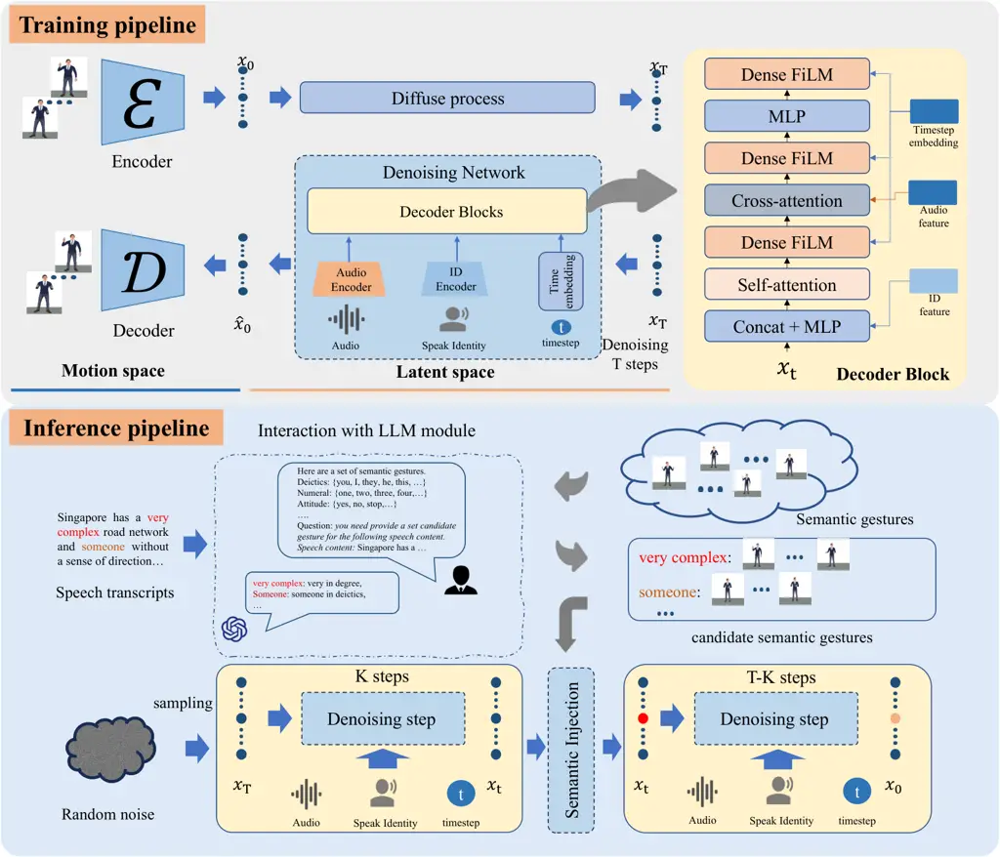
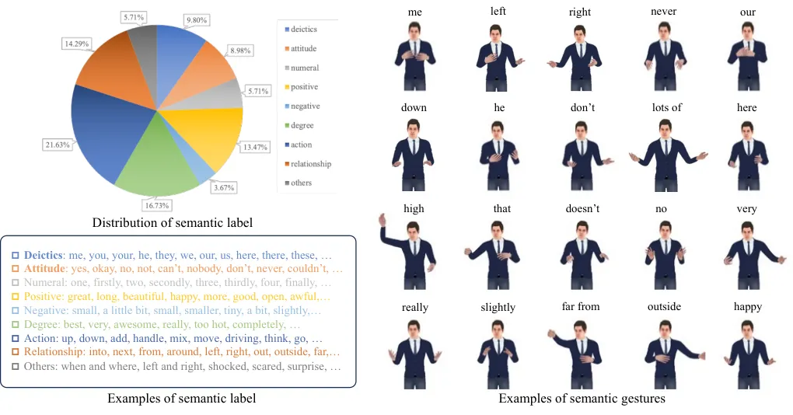
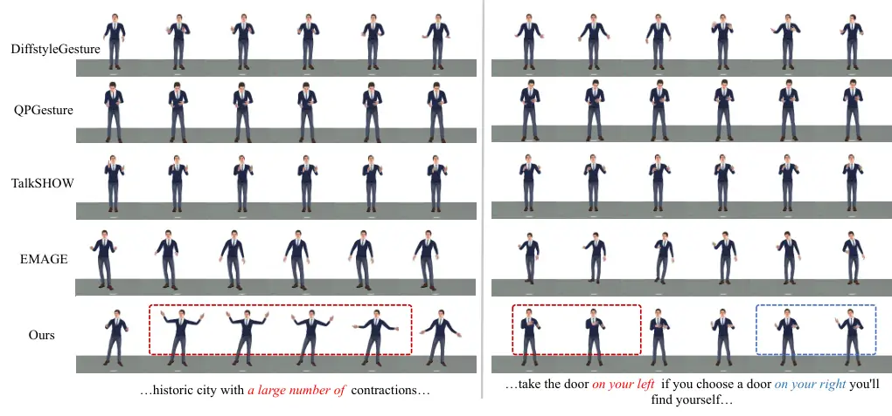
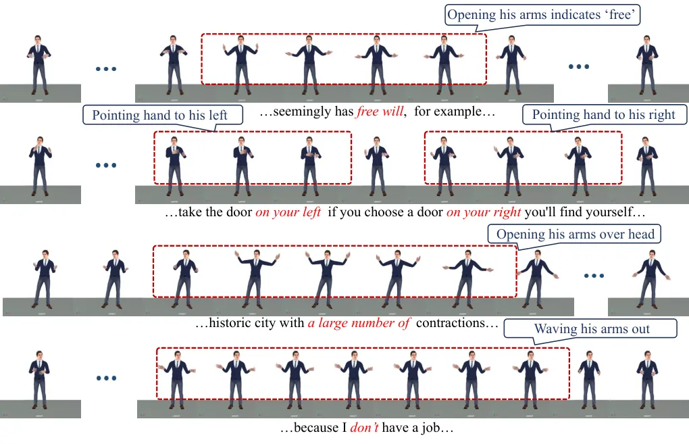
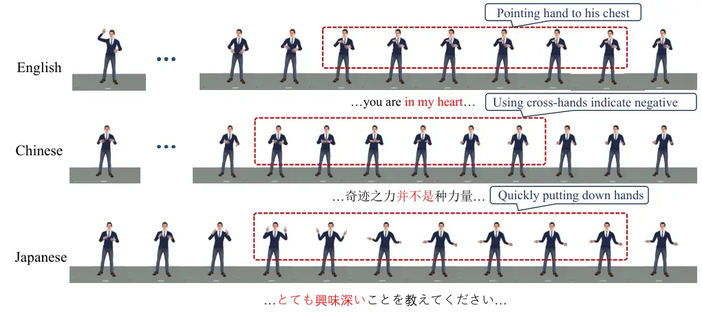
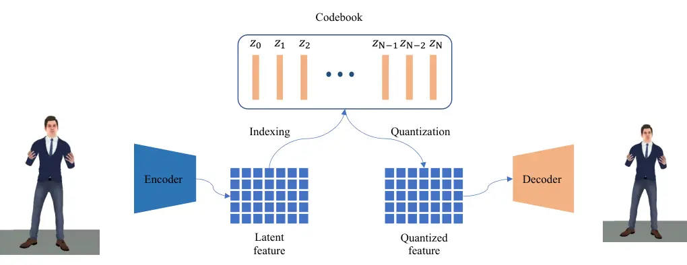
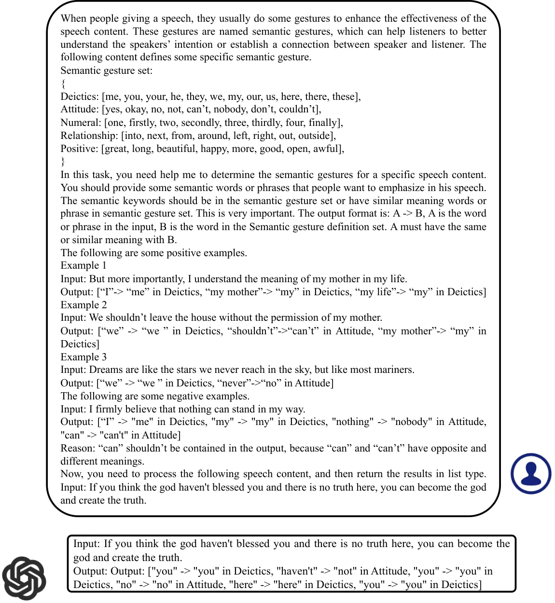

# SIGGesture: Generalized Co-Speech Gesture Synthesis via Semantic Injection with Large-Scale Pre-Training Diffusion Models

Conference: SIGGRAPH Asia 2024 Conference Papers; December 3–6, 2024;
Tokyo, JapanSIGGRAPH Asia 2024 Conference Papers (SA Conference Papers
’24), December 3–6, 2024, Tokyo,
JapanDOI: [10.1145/3680528.3687677](https://doi.org/10.1145/3680528.3687677)ISBN: 979-8-4007-1131-2/24/12CCS: Computing
methodologies AnimationCCS: Computing methodologies Natural language
processingCCS: Computing methodologies Neural networks

Qingrong Cheng
[![](data:image/svg+xml;base64,PHN2ZyBjbGFzcz0ibHR4X29yY2lkbG9nbyIgaGVpZ2h0PSIxZW0iIHZlcnNpb249IjEuMSIgdmlld2JveD0iMCAwIDcyIDcyIiB3aWR0aD0iMWVtIj48cGF0aCBzdHlsZT0iLS1sdHgtZmlsbC1jb2xvcjojQTZDRTM5OyIgZD0iTTcyLDM2IEM3Miw1NS44ODQzNzUgNTUuODg0Mzc1LDcyIDM2LDcyIEMxNi4xMTU2MjUsNzIgMCw1NS44ODQzNzUgMCwzNiBDMCwxNi4xMTU2MjUgMTYuMTE1NjI1LDAgMzYsMCBDNTUuODg0Mzc1LDAgNzIsMTYuMTE1NjI1IDcyLDM2IFoiIGZpbGw9IiNBNkNFMzkiIC8+PGcgc3R5bGU9Ii0tbHR4LWZpbGwtY29sb3I6I0ZGRkZGRjsiIGZpbGw9IiNGRkZGRkYiIHRyYW5zZm9ybT0idHJhbnNsYXRlKDE4Ljg2ODk2NiwgMTIuOTEwMzQ1KSI+PHBvbHlnb24gcG9pbnRzPSI1LjAzNzM0OTI5IDM5LjEyNTA4NzggMC42OTU0Mjk4NjEgMzkuMTI1MDg3OCAwLjY5NTQyOTg2MSA5LjE0NDMxNzg3IDUuMDM3MzQ5MjkgOS4xNDQzMTc4NyA1LjAzNzM0OTI5IDIyLjY5MzA1MDUgNS4wMzczNDkyOSAzOS4xMjUwODc4Ij48L3BvbHlnb24+PHBhdGggZD0iTTExLjQwOTI1Nyw5LjE0NDMxNzg3IEwyMy4xMzgwNzg0LDkuMTQ0MzE3ODcgQzM0LjMwMzAxNCw5LjE0NDMxNzg3IDM5LjIwODgxOTEsMTcuMDY2NDA3NCAzOS4yMDg4MTkxLDI0LjE0ODY5OTUgQzM5LjIwODgxOTEsMzEuODQ2ODQzIDMzLjE0NzA0ODUsMzkuMTUzMDgxMSAyMy4xOTQ0NjY5LDM5LjE1MzA4MTEgTDExLjQwOTI1NywzOS4xNTMwODExIEwxMS40MDkyNTcsOS4xNDQzMTc4NyBaIE0xNS43NTExNzY1LDM1LjI2MjAxOTQgTDIyLjY1ODc3NTYsMzUuMjYyMDE5NCBDMzIuNDk4NTgsMzUuMjYyMDE5NCAzNC43NTQxMjI2LDI3Ljg0MzgwODQgMzQuNzU0MTIyNiwyNC4xNDg2OTk1IEMzNC43NTQxMjI2LDE4LjEzMDE1MDkgMzAuODkxNTA1OSwxMy4wMzUzNzk1IDIyLjQzMzIyMTMsMTMuMDM1Mzc5NSBMMTUuNzUxMTc2NSwxMy4wMzUzNzk1IEwxNS43NTExNzY1LDM1LjI2MjAxOTQgWiIgLz48cGF0aCBkPSJNNS43MTQwMTIwNiwyLjkwMTgyMzI5IEM1LjcxNDAxMjA2LDQuNDQxNDUyIDQuNDQ1MjY5MzcsNS43MjkxNDE0NiAyLjg2NjM4OTU4LDUuNzI5MTQxNDYgQzEuMjg3NTA5NzgsNS43MjkxNDE0NiAwLjAxODc2NzA5MTgsNC40NDE0NTIgMC4wMTg3NjcwOTE4LDIuOTAxODIzMjkgQzAuMDE4NzY3MDkxOCwxLjMzNDIwMTMzIDEuMjg3NTA5NzgsMC4wNzQ1MDUxMDk2IDIuODY2Mzg5NTgsMC4wNzQ1MDUxMDk2IEM0LjQ0NTI2OTM3LDAuMDc0NTA1MTA5NiA1LjcxNDAxMjA2LDEuMzYyMTk0NTggNS43MTQwMTIwNiwyLjkwMTgyMzI5IFoiIC8+PC9nPjwvc3ZnPg==)](https://orcid.org/0000-0001-6631-1504)
email: <kirolcheng@tencent.com> Affiliation: Tencent AI Lab, Tencent
TiMi L1 Studio , ShenZhen, China , Xu Li
[![](data:image/svg+xml;base64,PHN2ZyBjbGFzcz0ibHR4X29yY2lkbG9nbyIgaGVpZ2h0PSIxZW0iIHZlcnNpb249IjEuMSIgdmlld2JveD0iMCAwIDcyIDcyIiB3aWR0aD0iMWVtIj48cGF0aCBzdHlsZT0iLS1sdHgtZmlsbC1jb2xvcjojQTZDRTM5OyIgZD0iTTcyLDM2IEM3Miw1NS44ODQzNzUgNTUuODg0Mzc1LDcyIDM2LDcyIEMxNi4xMTU2MjUsNzIgMCw1NS44ODQzNzUgMCwzNiBDMCwxNi4xMTU2MjUgMTYuMTE1NjI1LDAgMzYsMCBDNTUuODg0Mzc1LDAgNzIsMTYuMTE1NjI1IDcyLDM2IFoiIGZpbGw9IiNBNkNFMzkiIC8+PGcgc3R5bGU9Ii0tbHR4LWZpbGwtY29sb3I6I0ZGRkZGRjsiIGZpbGw9IiNGRkZGRkYiIHRyYW5zZm9ybT0idHJhbnNsYXRlKDE4Ljg2ODk2NiwgMTIuOTEwMzQ1KSI+PHBvbHlnb24gcG9pbnRzPSI1LjAzNzM0OTI5IDM5LjEyNTA4NzggMC42OTU0Mjk4NjEgMzkuMTI1MDg3OCAwLjY5NTQyOTg2MSA5LjE0NDMxNzg3IDUuMDM3MzQ5MjkgOS4xNDQzMTc4NyA1LjAzNzM0OTI5IDIyLjY5MzA1MDUgNS4wMzczNDkyOSAzOS4xMjUwODc4Ij48L3BvbHlnb24+PHBhdGggZD0iTTExLjQwOTI1Nyw5LjE0NDMxNzg3IEwyMy4xMzgwNzg0LDkuMTQ0MzE3ODcgQzM0LjMwMzAxNCw5LjE0NDMxNzg3IDM5LjIwODgxOTEsMTcuMDY2NDA3NCAzOS4yMDg4MTkxLDI0LjE0ODY5OTUgQzM5LjIwODgxOTEsMzEuODQ2ODQzIDMzLjE0NzA0ODUsMzkuMTUzMDgxMSAyMy4xOTQ0NjY5LDM5LjE1MzA4MTEgTDExLjQwOTI1NywzOS4xNTMwODExIEwxMS40MDkyNTcsOS4xNDQzMTc4NyBaIE0xNS43NTExNzY1LDM1LjI2MjAxOTQgTDIyLjY1ODc3NTYsMzUuMjYyMDE5NCBDMzIuNDk4NTgsMzUuMjYyMDE5NCAzNC43NTQxMjI2LDI3Ljg0MzgwODQgMzQuNzU0MTIyNiwyNC4xNDg2OTk1IEMzNC43NTQxMjI2LDE4LjEzMDE1MDkgMzAuODkxNTA1OSwxMy4wMzUzNzk1IDIyLjQzMzIyMTMsMTMuMDM1Mzc5NSBMMTUuNzUxMTc2NSwxMy4wMzUzNzk1IEwxNS43NTExNzY1LDM1LjI2MjAxOTQgWiIgLz48cGF0aCBkPSJNNS43MTQwMTIwNiwyLjkwMTgyMzI5IEM1LjcxNDAxMjA2LDQuNDQxNDUyIDQuNDQ1MjY5MzcsNS43MjkxNDE0NiAyLjg2NjM4OTU4LDUuNzI5MTQxNDYgQzEuMjg3NTA5NzgsNS43MjkxNDE0NiAwLjAxODc2NzA5MTgsNC40NDE0NTIgMC4wMTg3NjcwOTE4LDIuOTAxODIzMjkgQzAuMDE4NzY3MDkxOCwxLjMzNDIwMTMzIDEuMjg3NTA5NzgsMC4wNzQ1MDUxMDk2IDIuODY2Mzg5NTgsMC4wNzQ1MDUxMDk2IEM0LjQ0NTI2OTM3LDAuMDc0NTA1MTA5NiA1LjcxNDAxMjA2LDEuMzYyMTk0NTggNS43MTQwMTIwNiwyLjkwMTgyMzI5IFoiIC8+PC9nPjwvc3ZnPg==)](https://orcid.org/0009-0002-1365-6546)
email: <axuli@tencent.com> Affiliation: Tencent AI Lab, ShenZhen, China
, Xinghui Fu
[![](data:image/svg+xml;base64,PHN2ZyBjbGFzcz0ibHR4X29yY2lkbG9nbyIgaGVpZ2h0PSIxZW0iIHZlcnNpb249IjEuMSIgdmlld2JveD0iMCAwIDcyIDcyIiB3aWR0aD0iMWVtIj48cGF0aCBzdHlsZT0iLS1sdHgtZmlsbC1jb2xvcjojQTZDRTM5OyIgZD0iTTcyLDM2IEM3Miw1NS44ODQzNzUgNTUuODg0Mzc1LDcyIDM2LDcyIEMxNi4xMTU2MjUsNzIgMCw1NS44ODQzNzUgMCwzNiBDMCwxNi4xMTU2MjUgMTYuMTE1NjI1LDAgMzYsMCBDNTUuODg0Mzc1LDAgNzIsMTYuMTE1NjI1IDcyLDM2IFoiIGZpbGw9IiNBNkNFMzkiIC8+PGcgc3R5bGU9Ii0tbHR4LWZpbGwtY29sb3I6I0ZGRkZGRjsiIGZpbGw9IiNGRkZGRkYiIHRyYW5zZm9ybT0idHJhbnNsYXRlKDE4Ljg2ODk2NiwgMTIuOTEwMzQ1KSI+PHBvbHlnb24gcG9pbnRzPSI1LjAzNzM0OTI5IDM5LjEyNTA4NzggMC42OTU0Mjk4NjEgMzkuMTI1MDg3OCAwLjY5NTQyOTg2MSA5LjE0NDMxNzg3IDUuMDM3MzQ5MjkgOS4xNDQzMTc4NyA1LjAzNzM0OTI5IDIyLjY5MzA1MDUgNS4wMzczNDkyOSAzOS4xMjUwODc4Ij48L3BvbHlnb24+PHBhdGggZD0iTTExLjQwOTI1Nyw5LjE0NDMxNzg3IEwyMy4xMzgwNzg0LDkuMTQ0MzE3ODcgQzM0LjMwMzAxNCw5LjE0NDMxNzg3IDM5LjIwODgxOTEsMTcuMDY2NDA3NCAzOS4yMDg4MTkxLDI0LjE0ODY5OTUgQzM5LjIwODgxOTEsMzEuODQ2ODQzIDMzLjE0NzA0ODUsMzkuMTUzMDgxMSAyMy4xOTQ0NjY5LDM5LjE1MzA4MTEgTDExLjQwOTI1NywzOS4xNTMwODExIEwxMS40MDkyNTcsOS4xNDQzMTc4NyBaIE0xNS43NTExNzY1LDM1LjI2MjAxOTQgTDIyLjY1ODc3NTYsMzUuMjYyMDE5NCBDMzIuNDk4NTgsMzUuMjYyMDE5NCAzNC43NTQxMjI2LDI3Ljg0MzgwODQgMzQuNzU0MTIyNiwyNC4xNDg2OTk1IEMzNC43NTQxMjI2LDE4LjEzMDE1MDkgMzAuODkxNTA1OSwxMy4wMzUzNzk1IDIyLjQzMzIyMTMsMTMuMDM1Mzc5NSBMMTUuNzUxMTc2NSwxMy4wMzUzNzk1IEwxNS43NTExNzY1LDM1LjI2MjAxOTQgWiIgLz48cGF0aCBkPSJNNS43MTQwMTIwNiwyLjkwMTgyMzI5IEM1LjcxNDAxMjA2LDQuNDQxNDUyIDQuNDQ1MjY5MzcsNS43MjkxNDE0NiAyLjg2NjM4OTU4LDUuNzI5MTQxNDYgQzEuMjg3NTA5NzgsNS43MjkxNDE0NiAwLjAxODc2NzA5MTgsNC40NDE0NTIgMC4wMTg3NjcwOTE4LDIuOTAxODIzMjkgQzAuMDE4NzY3MDkxOCwxLjMzNDIwMTMzIDEuMjg3NTA5NzgsMC4wNzQ1MDUxMDk2IDIuODY2Mzg5NTgsMC4wNzQ1MDUxMDk2IEM0LjQ0NTI2OTM3LDAuMDc0NTA1MTA5NiA1LjcxNDAxMjA2LDEuMzYyMTk0NTggNS43MTQwMTIwNiwyLjkwMTgyMzI5IFoiIC8+PC9nPjwvc3ZnPg==)](https://orcid.org/0000-0002-7143-0185)
email: <xinghuifu@tencent.com> Affiliation: Tencent AI Lab, ShenZhen,
China , Fei Xia
[![](data:image/svg+xml;base64,PHN2ZyBjbGFzcz0ibHR4X29yY2lkbG9nbyIgaGVpZ2h0PSIxZW0iIHZlcnNpb249IjEuMSIgdmlld2JveD0iMCAwIDcyIDcyIiB3aWR0aD0iMWVtIj48cGF0aCBzdHlsZT0iLS1sdHgtZmlsbC1jb2xvcjojQTZDRTM5OyIgZD0iTTcyLDM2IEM3Miw1NS44ODQzNzUgNTUuODg0Mzc1LDcyIDM2LDcyIEMxNi4xMTU2MjUsNzIgMCw1NS44ODQzNzUgMCwzNiBDMCwxNi4xMTU2MjUgMTYuMTE1NjI1LDAgMzYsMCBDNTUuODg0Mzc1LDAgNzIsMTYuMTE1NjI1IDcyLDM2IFoiIGZpbGw9IiNBNkNFMzkiIC8+PGcgc3R5bGU9Ii0tbHR4LWZpbGwtY29sb3I6I0ZGRkZGRjsiIGZpbGw9IiNGRkZGRkYiIHRyYW5zZm9ybT0idHJhbnNsYXRlKDE4Ljg2ODk2NiwgMTIuOTEwMzQ1KSI+PHBvbHlnb24gcG9pbnRzPSI1LjAzNzM0OTI5IDM5LjEyNTA4NzggMC42OTU0Mjk4NjEgMzkuMTI1MDg3OCAwLjY5NTQyOTg2MSA5LjE0NDMxNzg3IDUuMDM3MzQ5MjkgOS4xNDQzMTc4NyA1LjAzNzM0OTI5IDIyLjY5MzA1MDUgNS4wMzczNDkyOSAzOS4xMjUwODc4Ij48L3BvbHlnb24+PHBhdGggZD0iTTExLjQwOTI1Nyw5LjE0NDMxNzg3IEwyMy4xMzgwNzg0LDkuMTQ0MzE3ODcgQzM0LjMwMzAxNCw5LjE0NDMxNzg3IDM5LjIwODgxOTEsMTcuMDY2NDA3NCAzOS4yMDg4MTkxLDI0LjE0ODY5OTUgQzM5LjIwODgxOTEsMzEuODQ2ODQzIDMzLjE0NzA0ODUsMzkuMTUzMDgxMSAyMy4xOTQ0NjY5LDM5LjE1MzA4MTEgTDExLjQwOTI1NywzOS4xNTMwODExIEwxMS40MDkyNTcsOS4xNDQzMTc4NyBaIE0xNS43NTExNzY1LDM1LjI2MjAxOTQgTDIyLjY1ODc3NTYsMzUuMjYyMDE5NCBDMzIuNDk4NTgsMzUuMjYyMDE5NCAzNC43NTQxMjI2LDI3Ljg0MzgwODQgMzQuNzU0MTIyNiwyNC4xNDg2OTk1IEMzNC43NTQxMjI2LDE4LjEzMDE1MDkgMzAuODkxNTA1OSwxMy4wMzUzNzk1IDIyLjQzMzIyMTMsMTMuMDM1Mzc5NSBMMTUuNzUxMTc2NSwxMy4wMzUzNzk1IEwxNS43NTExNzY1LDM1LjI2MjAxOTQgWiIgLz48cGF0aCBkPSJNNS43MTQwMTIwNiwyLjkwMTgyMzI5IEM1LjcxNDAxMjA2LDQuNDQxNDUyIDQuNDQ1MjY5MzcsNS43MjkxNDE0NiAyLjg2NjM4OTU4LDUuNzI5MTQxNDYgQzEuMjg3NTA5NzgsNS43MjkxNDE0NiAwLjAxODc2NzA5MTgsNC40NDE0NTIgMC4wMTg3NjcwOTE4LDIuOTAxODIzMjkgQzAuMDE4NzY3MDkxOCwxLjMzNDIwMTMzIDEuMjg3NTA5NzgsMC4wNzQ1MDUxMDk2IDIuODY2Mzg5NTgsMC4wNzQ1MDUxMDk2IEM0LjQ0NTI2OTM3LDAuMDc0NTA1MTA5NiA1LjcxNDAxMjA2LDEuMzYyMTk0NTggNS43MTQwMTIwNiwyLjkwMTgyMzI5IFoiIC8+PC9nPjwvc3ZnPg==)](https://orcid.org/0009-0008-5414-7717)
email: <wallacexia@tencent.com> Affiliation: Tencent TiMi L1 Studio,
ShenZhen, China and Zhongqian Sun
[![](data:image/svg+xml;base64,PHN2ZyBjbGFzcz0ibHR4X29yY2lkbG9nbyIgaGVpZ2h0PSIxZW0iIHZlcnNpb249IjEuMSIgdmlld2JveD0iMCAwIDcyIDcyIiB3aWR0aD0iMWVtIj48cGF0aCBzdHlsZT0iLS1sdHgtZmlsbC1jb2xvcjojQTZDRTM5OyIgZD0iTTcyLDM2IEM3Miw1NS44ODQzNzUgNTUuODg0Mzc1LDcyIDM2LDcyIEMxNi4xMTU2MjUsNzIgMCw1NS44ODQzNzUgMCwzNiBDMCwxNi4xMTU2MjUgMTYuMTE1NjI1LDAgMzYsMCBDNTUuODg0Mzc1LDAgNzIsMTYuMTE1NjI1IDcyLDM2IFoiIGZpbGw9IiNBNkNFMzkiIC8+PGcgc3R5bGU9Ii0tbHR4LWZpbGwtY29sb3I6I0ZGRkZGRjsiIGZpbGw9IiNGRkZGRkYiIHRyYW5zZm9ybT0idHJhbnNsYXRlKDE4Ljg2ODk2NiwgMTIuOTEwMzQ1KSI+PHBvbHlnb24gcG9pbnRzPSI1LjAzNzM0OTI5IDM5LjEyNTA4NzggMC42OTU0Mjk4NjEgMzkuMTI1MDg3OCAwLjY5NTQyOTg2MSA5LjE0NDMxNzg3IDUuMDM3MzQ5MjkgOS4xNDQzMTc4NyA1LjAzNzM0OTI5IDIyLjY5MzA1MDUgNS4wMzczNDkyOSAzOS4xMjUwODc4Ij48L3BvbHlnb24+PHBhdGggZD0iTTExLjQwOTI1Nyw5LjE0NDMxNzg3IEwyMy4xMzgwNzg0LDkuMTQ0MzE3ODcgQzM0LjMwMzAxNCw5LjE0NDMxNzg3IDM5LjIwODgxOTEsMTcuMDY2NDA3NCAzOS4yMDg4MTkxLDI0LjE0ODY5OTUgQzM5LjIwODgxOTEsMzEuODQ2ODQzIDMzLjE0NzA0ODUsMzkuMTUzMDgxMSAyMy4xOTQ0NjY5LDM5LjE1MzA4MTEgTDExLjQwOTI1NywzOS4xNTMwODExIEwxMS40MDkyNTcsOS4xNDQzMTc4NyBaIE0xNS43NTExNzY1LDM1LjI2MjAxOTQgTDIyLjY1ODc3NTYsMzUuMjYyMDE5NCBDMzIuNDk4NTgsMzUuMjYyMDE5NCAzNC43NTQxMjI2LDI3Ljg0MzgwODQgMzQuNzU0MTIyNiwyNC4xNDg2OTk1IEMzNC43NTQxMjI2LDE4LjEzMDE1MDkgMzAuODkxNTA1OSwxMy4wMzUzNzk1IDIyLjQzMzIyMTMsMTMuMDM1Mzc5NSBMMTUuNzUxMTc2NSwxMy4wMzUzNzk1IEwxNS43NTExNzY1LDM1LjI2MjAxOTQgWiIgLz48cGF0aCBkPSJNNS43MTQwMTIwNiwyLjkwMTgyMzI5IEM1LjcxNDAxMjA2LDQuNDQxNDUyIDQuNDQ1MjY5MzcsNS43MjkxNDE0NiAyLjg2NjM4OTU4LDUuNzI5MTQxNDYgQzEuMjg3NTA5NzgsNS43MjkxNDE0NiAwLjAxODc2NzA5MTgsNC40NDE0NTIgMC4wMTg3NjcwOTE4LDIuOTAxODIzMjkgQzAuMDE4NzY3MDkxOCwxLjMzNDIwMTMzIDEuMjg3NTA5NzgsMC4wNzQ1MDUxMDk2IDIuODY2Mzg5NTgsMC4wNzQ1MDUxMDk2IEM0LjQ0NTI2OTM3LDAuMDc0NTA1MTA5NiA1LjcxNDAxMjA2LDEuMzYyMTk0NTggNS43MTQwMTIwNiwyLjkwMTgyMzI5IFoiIC8+PC9nPjwvc3ZnPg==)](https://orcid.org/0000-0003-1812-6085)
email: <sallensun@tencent.com> Affiliation: Tencent AI Lab, ShenZhen,
China

© acmlicensed

###### Abstract.

The automated synthesis of high-quality 3D gestures from speech holds
significant value for virtual humans and gaming. Previous methods
primarily focus on synchronizing gestures with speech rhythm, often
neglecting semantic gestures. These semantic gestures are sparse and
follow a long-tailed distribution across the gesture sequence, making
them challenging to learn in an end-to-end manner. Additionally,
generating rhythmically aligned gestures that generalize well to
in-the-wild speech remains a significant challenge. To address these
issues, we introduce SIGGesture, a novel diffusion-based approach for
synthesizing realistic gestures that are both high-quality and
semantically pertinent. Specifically, we firstly build a robust
diffusion-based foundation model for rhythmical gesture synthesis by
pre-training it on a collected large-scale dataset with pseudo labels.
Secondly, we leverage the powerful generalization capabilities of Large
Language Models (LLMs) to generate appropriate semantic gestures for
various speech transcripts. Finally, we propose a semantic injection
module to infuse semantic information into the synthesized results
during the diffusion reverse process. Extensive experiments demonstrate
that SIGGesture significantly outperforms existing baselines, exhibiting
excellent generalization and controllability.

###### Keywords: 

Co-speech gesture synthesis, Semantic gestures, Large Language Models,
Diffusion models

## 1. Introduction

Body gesture can significantly enhance people’s expressiveness in
communication by emphasizing specific intentions or conveying specific
semantics (Cassell et al., 1999; Goldin-Meadow and Alibali, 2013; Yoon
et al., 2020; Nyatsanga et al., 2023). Additionally, high-quality 3D
gesture animation can present vivid virtual characters that help
listeners to concentrate and improve the intimacy between humans and
virtual characters. Consequently, there is a growing demand for
automatic high-quality co-speech gesture synthesis in various
applications, including virtual humans, non-player gaming characters,
and robot assistants. Many researchers have proposed lots of approaches
including rule-based methods (Huang and Mutlu, 2012; Marsella et al., 2013) and data-driven methods (Zhi et al., 2023; Zhu et al., 2023; Ao
et al., 2023).



Figure 1. The framework of the proposed method is illustrated in two
parts. The upper section details the training processes of diffusion and
denoising. The lower part demonstrates the inference process for
synthesizing gestures based on the given conditions. Specifically, the
audio features and speaker identity are directly fed into the denoising
network. Meanwhile, the speech textual content are used as input in the
interaction with the LLM, which generates a set of candidate semantic
gestures for the subsequent semantic injection process.

3D co-speech gesture generation aims to produce gestures with natural
movements, accurate rhythm, and clear semantics based on the given
speech. Rule-based methods (Huang and Mutlu, 2012; Marsella et al., 2013) achieve this by using predefined rules, such as associating the
keyword "good" with a simple "thumbs up" gesture. However, these
approaches, lacking naturalness, smoothness, and diversity, can only
handle simple semantic gestures. The main reason is that generating
co-speech gestures is challenging due to the inherently complex
many-to-many mapping. Recently, deep learning with large-scale datasets
has achieved significant breakthroughs, especially in content synthesis.
With the aid of deep learning, co-speech gesture synthesis has seen the
emergence of many remarkable methods. These methods attempt to solve
this problem by training a conditional model with multi-modal inputs
(audio, text, speaker identities, etc.).

Co-speech gestures include rhythmic gestures and semantic gestures. Some
works attempt to generate high-quality co-speech gesture that contains
accurate semantic gestures , such as GestureDiffuCLIP (Ao et al., 2023),
LivelySpeaker (Zhi et al., 2023), and Bodyformer (Pang et al., 2023).
Both GestureDiffuCLIP (Ao et al., 2023) and LivelySpeaker (Zhi et al., 2023) use CLIP (Radford et al., 2021) to learn the relationship between
semantic transcripts and motion. However, semantic gestures constitute
only a minor portion of the entire sequence and follow a long-tailed
distribution, complicating the direct learning of their multi-modal
relationships. Moreover, synthesizing gestures rhythmically synchronized
with speech faces the challenge of generalizing to in-the-wild
scenarios.

[TABLE]

Table 1. Comparison of co-speech gesture datasets. We ignore some
datasets with 2D and 3D key-points label. "3D Rot" indicates 3D skeleton
with bone rotation. "PGT" means Pseudo Ground Truth.

To address the aforementioned issues, we propose a diffusion-based
semantic injection method with large language model for semantic gesture
synthesis, which offers excellent controllability, interpretability, and
generalization. It begins with the insight that real-world human
conversation contains relatively limited semantic gestures. For example,
for specific semantic words like "wonderful," different people usually
present similar gestures, such as "opening both arms." During the
diffusion reverse process, we can utilize semantically matched gestures
as prompts to guide the generative model in synthesizing appropriate
semantic gestures. Therefore, we collect a large-scale semantic motion
database that includes most semantic motions in communication. LLMs,
such as GPT3 (Brown et al., 2020) and GPT-4 (Achiam et al., 2023), have
demonstrated their ability not only as proficient models for natural
language processing (NLP) tasks but also as potent instruments for
tackling complex problems. Therefore, we introduce large-language models
to assign contextually appropriate gestures to the corresponding text.
Leveraging the strong semantic analysis capabilities of LLMs, the
proposed method is adept at handling various languages.

For a specific speech, different people will present notably different
rhythmic gestures. For such many-to-many issue, the best solution is to
use deep learning with a large-scale dataset to learn their complex
relationships. Therefore, it is necessary to build a robust foundational
model that can synthesize natural and smooth rhythmic gestures. Then,
the semantic gestures can be naturally injected into the rhythmic
gestures. However, the co-speech gesture generation research community
lacks 3D skeletal data due to the expensive motion capture system, which
is different from other synthesis tasks, such as text-to-image,
text-to-speech. Therefore, for improving the basic quality of rhythmic
gestures, we collected a large-scale gesture dataset named Gesture400
for pre-training, which contains approximately 400 hours of data. Table
1 shows the statistical data of these co-speech gesture datasets. Some
datasets with 2D and 3D key-point labels are ignored because they are
difficult to use in real applications. To the best of our knowledge, the
proposed dataset is the largest dataset in the field of co-speech
gesture synthesis research. By the optimization of pre-training and
fine-tuning, the synthesized gesture motion exhibits excellent
naturalness and generalization.

The main contributions of our work contain the following aspects:

1.  (1)
    We propose an LLMs-based semantic augmentation method for co-speech
    gesture synthesis, which can greatly improve the generalization
    ability in semantic gesture synthesis. For controllable semantic
    gesture synthesis, we build a set of semantic gesture clips and use
    LLMs to generate appropriate candidate gestures for the specific
    speech transcripts.
2.  (2)
    We build a robust diffusion-based foundational model for rhythmical
    gesture synthesis by pre-training it on a collected large-scale
    dataset with pseudo labels. This dataset is the largest dataset for
    co-speech gesture synthesis, containing approximately 400 hours of
    motion sequences.
3.  (3)
    Extensive experiments show that the proposed method outperforms
    state-of-the-art methods by a large margin. In particular, the
    visualization comparisons indicate that our method produces more
    stable, expressive, and robust results than other approaches.

## 2. Related Work

### 2.1. Co-Speech Gesture Generation

The research of co-speech gesture generation can be divided into two
branches, rule-based methods (Cassell et al., 1994; Marsella et al.,
2013; Cassell et al., 2001) and learning-based methods (Ao et al., 2022;
Ao et al., 2023; Liu et al., 2022a; Ginosar et al., 2019). Rule-based
works (Cassell et al., 1994; Marsella et al., 2013; Cassell et al., 2001) for co-speech gesture synthesis are mainly generated from a
pre-defined motion database by keyword matching or other specific rules.
These rule-based methods require lots of human effort in defining
gesture units and complex mapping rules, which are costly and
inefficient. Besides, the results of rule-based methods are usually lack
of smoothness and naturalness.

Co-speech gesture synthesis is a complex problem that requires
consideration of the audio, the gesture, and their many-to-many
relationships. Benefit from recent advanced developments of deep
learning, all of recent methods (Ao et al., 2022; Ao et al., 2023; Liu
et al., 2022a) adopt deep neural networks as a strong tool to learn the
complex relationships from audio to gesture in an end-to-end manner.
Earlier works (Ginosar et al., 2019; Qian et al., 2021) explore various
network architecture to regress 2D keypoints of the human body movements
because of lacking high-quality 3D gesture datasets. These 2D datasets
are constructed by using off-the-shelf pose estimator (Cao et al., 2017)
to obtain pseudo 2D gesture annotations from the online videos. However,
The 2D results face significant challenges in practical applications..
Recently, some high-quality speech-gesture corpus such as BEAT (Liu
et al., 2022b) and ZeroEGGS (Ghorbani et al., 2023) are released, which
contribute to the development of co-speech gesture synthesis. Some of
existing works focus on exploring the effectiveness of different network
architectures, including the Multi-Layer Perceptron (MLP) (Kucherenko
et al., 2020), Convolutional Neural Networks (CNN) (Habibie et al.,
2021; Yi et al., 2023), Recurrent Neural Networks (RNNs) (Yoon et al.,
2020; Hasegawa et al., 2018; Liu et al., 2022a; Bhattacharya et al.,
2021a) and Transformers (Bhattacharya et al., 2021b; Pang et al., 2023).
Besides the exploration of model architecture, some approaches (Ginosar
et al., 2019; Yang et al., 2023b) dive into researching the connections
between co-speech gesture and speech audio, text transcript, speaking
style, and speaker identity. Furthermore, some approaches involve the
adversarial training (Ginosar et al., 2019; Liu et al., 2022a),
phase-guided motion matching(Yang et al., 2023a), and reinforcement
learning (Sun et al., 2023) to guarantee realistic results. In addition
to gestures, some methods (Yi et al., 2023; Chen et al., 2024; Liu
et al., 2023) begin to explore the generation of full-body movements,
including body gestures and facial expressions.

The rapid development of diffusion models (Ho et al., 2020; Song et al., 2020) has surpassed the traditional synthesis paradigm such as GAN
(Goodfellow et al., 2020) and VAE (Kingma and Welling, 2013), showcasing
a powerful and realistic characteristic in synthesis. Diffusion-based
motion generation also become a popular research direction, such as
text2motion (Zhang et al., 2024b). To be specific, text-guided motion
can synthesize realistic and expressive results with diffusion model. In
co-speech gesture synthesis, recent approaches such as
GestureDiffuCLIP(Ao et al., 2023), LivelySpeaker (Zhi et al., 2023),
DiffStyleGesture (Yang et al., 2023b), C2G2(Ji et al., 2023), LDA
(Alexanderson et al., 2023), Remodiffuse (Zhang et al., 2023a) are
diffusion-based approaches.

### 2.2. Semantic-aware Co-Speech Gesture Generation

In gesture language, semantic gesture units are crucial for conveying
specific intentions, thoughts, emotions, and enhancing gestural
expressiveness. For generating more expressive gestures, there are also
some attempts such as Gesticulator (Kucherenko et al., 2020),
GestureDiffuCLIP(Ao et al., 2023), LivelySpeaker(Zhi et al., 2023),
Bodyformer (Pang et al., 2023). Specifically, GestureDiffuCLIP(Ao
et al., 2023) adopts CLIP (Hafner et al., 2021) to align motion and text
semantic, then use the textual feature as additional condition to
control the generation process. LivelySpeaker(Zhi et al., 2023) is a
two-stage framework for semantic and rhythmic gesture generation, which
aim at decoupling the semantic gesture generation and rhythmic gesture
generation. In semantic gesture generation, they also use a CLIP style
module to align the semantic motion and semantic text. Besides, some
approaches add semantic text as additional input to fuse semantic into
the model, such as Rhythmic Gesticulator (Ao et al., 2022), Gesticulator
(Kucherenko et al., 2020), FreeTalker (Yang et al., 2024) and Trimodal
(Yoon et al., 2020). BodyFormer (Pang et al., 2023) takes both low-level
and high-level speech features as input and generates a sequence of
realistic 3D body gestures in an auto-regressive manner. The high-level
speech features represent the semantic gestures. With the development of
LLMs, some approaches also use it to extract motion-related information
from textual input, such as GesGPT(Gao et al., 2023), MoConVQ (Yao
et al., 2023). The proposed method uses Large Language Models (LLMs) to
generate proper mapping between the text transcripts and semantic
gesture units, which shows excellent performance in both generalization
and controllability.

In semantic gesture generation, Semantic Gesticulator(Zhang et al.,
2024a) is the most similar work to ours in the same period. Semantic
Gesticulator(Zhang et al., 2024a) also attempts to synthesize
semantically accurate gestures by introducing a LLM-based semantic
gesture units retrieval from a predefined dataset. The gesture generator
of Semantic Gesticulator(Zhang et al., 2024a) is based on the GPT-2
(Radford et al., 2019), which predicts the future gesture tokens in an
auto-regressive manner. Compared with their work, we use a strong
diffusion-based method as fundamental gesture generator to fuse semantic
gestures and rhythmic gestures.

## 3. Method

### 3.1. Problem Formulation

Given a specific audio, its corresponding text, and identity
information, the proposed method can generate high-quality 3D skeletal
co-speech gesture results. To be specific, considering a sample of raw
audio $`A`$, we adopt Jukebox (Dhariwal et al., 2020) to extract its
acoustic feature, which is pre-trained on large-scale music datasets.
All of the motion sequences $`\mathcal{M}`$ are encoded into discrete
tokens by VQVAE (Oord et al., 2017). Details of VQVAE can be found in
the appendix. By VQVAE encoding, a motion can be represented by a latent
embedding $`x_{0}`$ . Then, we adopt transformer-based diffusion model
as the denoising network to recover the latent embedding by removing the
noise. The reverse denoising process of the optimized diffusion model
$`G`$ parameterized by $`\theta`$ can recover the motion latent
embedding $`x_{0}`$ conditioned on the speech audio sequence and
identity information. With integration with LLM, it can provide accurate
candidate semantic gestures for the speech transcripts. Then, the
candidate semantic gesture embedding are fused into the synthesized
motion latent embedding by semantic injection module. Finally, the
synthesized motion are decoded to continues 3D skeleton rotation by the
pre-trained VQVAE.

### 3.2. Semantic Gesture Collection



Figure 2. The statistical data of semantic gesture dataset (upper left
part), some examples of semantic label (lower left part), and some
semantic gesture examples (right part).

Through extensive observation of numerous instances, it has been
discerned that semantic gestures maintain a universality in gestural
communication. Specifically, it is evident that different individuals
display similar gestural expressions when articulating identical
semantic concepts (Lascarides and Stone, 2009; Zhang et al., 2024a).
This observation provides a feasible methodology for the collection of
an extensive array of semantic gesture actions, aimed at covering a
comprehensive range of semantic contexts. We collect a large-scale
semantic gesture dataset that contains motion clips
$`G=\{G_{0},G_{1},...,G_{N}\}`$ and corresponding text
$`T=\{T_{0},T_{1},...,T_{N}\}`$ by manual selection and modification
with the aid of technical artist. Some of these semantic gestures are
borrowed from BEAT dataset. All of the semantic motion clips are shorter
than 3 seconds and each motion clip is a whole independent semantic
motion. After manual selection and check, we have collected 2,537
semantic motion clips. Some examples of semantic gestures and the
distribution statistics are shown in Figure 2. More examples can be
found in the supplementary video. These motion clips are sorted into a
predefined motion semantic system.

All of semantic gesture clips are encoded into latent embedding
$`V_{semantic}=\{v_{0},v_{1},...,v_{N}\}`$ by a pre-trained VQVAE model.
To improve the diversity of semantic gesture, we add a random noise to
the embeddings during semantic injection.

### 3.3. Diffusion models with semantic injection

SIGGesture employs a diffusion model to synthesize the latent
representation of gesture, which consists of a diffusion process and a
denoising process, as shown in upper part of Figure 1. Given a specific
real motion data distribution $`p(x_{0})`$, our goal is learn a
distribution $`q_{\theta}(x_{0})`$ that is parameterized by $`{\theta}`$
to approximate the real distribution.

#### 3.3.1. Diffusion process.

We follow the previous DDPM (Ho et al., 2020) definition of diffusion as
a Markov noising process with latent $`x_{0:T}`$ that follows a forward
noising process $`p(x_{0:T}|x_{0})`$. Here, $`x_{0}`$ is the latent
embedding of real motion data. The forward diffusion process is defined
as a Markov chain that gradually adds Gaussian noise to the latent
representation of real motion, as follows

```math
\begin{split}q(x_{0:T}|x_{0})=\prod_{t=1}^{T}q(x_{t}|x_{t-1}),\end{split} \tag{1}
```

where

```math
\begin{split}q(x_{t}|x_{t-1})=\mathcal{N}(x_{t};\sqrt{1-\beta_{t}}x_{t-1},\beta_{t}{I}).\end{split} \tag{2}
```

$`\beta_{t}`$ are variance schedule hyperparameters that control the
distribution of Gaussian noise. In the reverse denoising process,
$`\beta_{t}`$ are pre-defined constant parameters. In the diffusion
process, the original latent representation of motion $`x_{0}`$
progressively substituted by random noises. When $`T`$ approaches
infinity, the distribution of $`x_{T}`$ follows a pure white noise
distribution.

#### 3.3.2. Denoising process.

Through diffusion process, the real data are transferred into pure white
noise by adding random noise. On the contrary, the denoising process
recovers the real data from pure white noise by removing the random
noise. The unconditional reverse process of recover a gesture motion
embedding can be represented by the following formula

```math
\begin{split}p_{\theta}(x_{0:T})=p_{\theta}(x_{0})\prod_{t=1}^{T}p_{\theta}(x_{t-1}|x_{t}),\end{split} \tag{3}
```

where

```math
\begin{split}p_{\theta}(x_{t-1}|x_{t})=\mathcal{N}(x_{t};u_{\theta}(x_{t},t),\beta_{t}I).\end{split} \tag{4}
```

The intermediate state $`x_{t}`$ is sampled from the following defined
distribution

```math
\begin{split}p(x_{t}|x_{0})=\mathcal{N}(x_{t};\sqrt{\bar{\alpha_{t}}},(1-\bar{\alpha_{t}}){I}).\end{split} \tag{5}
```

where $`\alpha_{t}=1-\beta_{t}`$ and
$`\bar{\alpha_{t}}=\prod_{k=0}^{t}\alpha_{k}`$. The above explanation
shows the process of unconditioned diffusion generation. For conditional
content synthesis, the conditions should be injected into the diffusion
generation procedure. The details of the denoising network are shown in
the upper right part of Figure 1. In our method, the conditions contains
audio $`c_{audio}`$ and speaker identity $`c_{id}`$. For simple
notation, we mark the two conditions as $`c=[c_{audio},c_{id}]`$. It
should be noted that the audio feature is extracted by Jukebox (Dhariwal
et al., 2020) instead of WavLM (Chen et al., 2022). Jukebox (Dhariwal
et al., 2020), trained on large-scale music datasets, can focus on the
rhythmic features rather than the speech semantic transcripts. By
injecting the condition $`c`$ into generation, the reverse process of
each time step $`t`$ can be updated by the following formula

```math
\begin{split}p_{\theta}(x_{t-1}|x_{t},c)=\mathcal{N}(x_{t};u_{\theta}(x_{t},t,c),\beta_{t}I).\end{split} \tag{6}
```

In a short summary, we firstly start denosing process by sampling
$`x_{T}`$ from a pure white nose distribution $`\mathcal{N}(0,I)`$.
Then, we iteratively denoise the latent variable $`x_{t}`$ to obtain the
final results $`x_{0}`$.

#### 3.3.3. Training objective.

For a speech condition $`c`$, we reverse the forward diffusion process
by learning to estimate $`p(x_{t},t,c)`$ approximate $`x_{0}`$ with a
parameterized model for all times step $`t`$. We use a loss function
proposed in (Ho et al., 2020) to optimize the whole model, as following,

```math
\begin{split}\mathcal{L}={E_{x,t}[\parallel x-p(x_{t},t,c)\parallel^{2}_{2}]}.\end{split} \tag{7}
```

During training, the model is trained under conditional and
unconditional manner with a specific probability. Once the training
converges, the diffusion model can predict the noise parameters by
considering the unconditional setting and condition $`c`$.

#### 3.3.4. Inference with semantic injection.

The inference process involves solely the denoising process of diffusion
models. The pipeline of inference process is shown in the lower part of
Figure 1. To be specific, a speech with its corresponding text will be
fed into the generation pipeline. It should be noted that the words in
the text are aligned with speech in the timeline. Each word has a
duration time. Then, the texts are fed into the LLMs to produce
candidate semantic gestures $`G_{candicate}=(g_{0},...,g_{N})`$ with a
pre-defined prompt. $`N`$ is the number of semantic gestures in this
text. The interaction with LLMs process is shown in the left-top corner
of inference pipeline in Figure 1. With the ability of LLMs, the
proposed method can process various languages, such as Chinese and
Japanese.

The candidate semantic gestures have been encoded into latent embedding.
We set a control $`K`$ to determine the degree of semantic injection.
From time step $`T`$ to $`K`$, the denoising latent variable is marked
as $`\hat{x_{t}}`$ that contains the semantic information.

```math
\begin{split}p_{\theta}(x_{K:T})=p_{\theta}(x_{T})\prod_{t=K}^{T}p_{\theta}(x_{t-1}|\hat{x}_{t}).\end{split} \tag{8}
```

The semantic gesture $`G_{candidate}`$ can be injected into the latent
variable $`x_{t}`$ by the follow formula

```math
\begin{split}\hat{x}_{t}=x_{t}*m+G_{candidate}*(1-m),\end{split} \tag{9}
```

where $`m`$ denotes the timeline mask of semantic words. From time step
$`K`$ to 1, the denoising latent variable $`x_{t}`$ does not contain
semantic injection step, which can preserve the structure and smoothness
of the generated gesture and improve the diversity of the results.

#### 3.3.5. Generating long sequence.

For synthesizing long motion sequence, the common practice uses
auto-regressive manner, which generates content sequentially. However,
generative models trained on small pieces may cause unnaturalness and
defectiveness. Instead of auto-regressive manner, we adopt DiffCollage
(Zhang et al., 2023b) to generate long motion sequence. DiffCollage is a
scalable probabilistic model that can synthesize large content in
parallel. Specifically, we denote a long sequence as
$`{\boldmath{m}=[m^{0},m^{1},m^{2}]}`$, where $`m^{2}`$ is the
out-painted sequence generated by the conditional model $`m^{2}|m^{1}`$.
Notably, this procedure makes a conditional independence assumption that
$`q(m^{2}|m^{0},m^{1})=q(m^{2}|m^{1})`$.

```math
\begin{split}q(m)=q(m^{0},m^{1},m^{2})=q(m^{0},m^{1})q(m^{2}|m^{1}).\end{split} \tag{10}
```

Further, we can obtain the following formula,

```math
\begin{split}q(m)=\frac{q(m^{2},m^{1})q(m^{1},m^{0})}{q(m^{1})}.\end{split} \tag{11}
```

The score function of $`q(m)`$ in diffusion model can be represented as
a sum over the scores of shorter gesture motions.

```math
\begin{split}\nabla q(m)=\nabla q(m^{2},m^{1})+\nabla q(m^{1},m^{0})-\nabla q(m^{1}).\end{split} \tag{12}
```

From formula 12, it can be found that we can synthesize different
gesture clips in parallel since all individual scores can be calculated
independently. Then, then we can merge the scores to compute the score
of the target long audio condition. For more technical details, please
refer to DiffCollage (Zhang et al., 2023b).

### 3.4. Large-Scale Motion Corpus Collection

In 3D animation, high-quality data collection is remarkably expensive,
professional, and time-consuming. High-quality motion capture requires
specialized cameras, suits, and markers. Besides, it often requires
experienced technicians, actors, and animators to set up, perform, and
process the captured data. The process of capturing, cleaning, and
integrating motion data is labor-intensive and time-consuming,
contributing to the overall expense. In recent years, several
high-quality datasets are released to the research community, as shown
in Table 1. BEAT (Liu et al., 2022b) is the largest dataset for
co-speech gesture synthesis, which contains 76 hours data. However,
data-driven approaches with larger models are also short for data. In
the inspiration of large-language training paradigm, noise data for
pre-training and high-quality data for fine-tuning, we aim at collecting
a large-scale gesture corpus for pre-training by video motion capture
technique such as HybridIK (Li et al., 2021a), SMPLify (Bogo et al.,
2016). To this end, we collect a large mount of videos about speech or
talk from TED ¹¹ 1 [https://www.ted.com](https://www.ted.com) and YiXi
²² 2 [https://yixi.tv](https://yixi.tv). Then, we conduct the data
post-processing pipeline to obtain the final shots of interests. Table 2
shows the statistical data of the motion corpus collection. Finally, we
obtain about 400 hours 3D gesture assets of speech. As shown in Table 1,
the proposed dataset is significantly larger than previous datasets by
at least 6 times.

| Items              | Number  | Average length | Total length   |
| ------------------ | ------- | -------------- | -------------- |
| original videos    | 6,032   | $`\sim`$23min  | $`\sim`$2,312h |
| shots-of-interests | 138,209 | $`\sim`$20s    | $`\sim`$746h   |
| final results      | 70,784  | $`\sim`$20s    | $`\sim`$393h   |

Table 2. Statistical data of the collected motion corpus collection.



Figure 3. Visualization results between the proposed method and other
state-of-the-art methods.

## 4. Experiments

### 4.1. Datasets

In this paper, we use the largest high-quality speech-gesture dataset
BEAT to evaluate the proposed method. BEAT is constructed by using
commercial motion capture system, including face emotion and body
motion. It contains about 76 hours motion-audio paired data of 30
speakers talking about different topics. We thoroughly post-process the
dataset by removing some defective motion sequences such as speaker
drinking, wandering, and incorrect motion. Then, the processed BEAT
dataset contains 46 hours motion data and its corresponding text and
audio. During training the VQVAE model, the original Euler angles are
converted to rotation matrix for better convergence. During training the
diffusion-based generation model, all motions are represented by latent
embeddings in VQVAE latent space. The datasets collected from Internet
by video motion capture are only used for pre-training the diffusion
model because of its relatively low quality.

### 4.2. Evaluation Metrics

For content generation tasks, human objective evaluation is the most
important evaluation method because of lacking clear ground and explicit
criteria. Therefore, the human objective evaluation is the main
evaluation method in our experiment. Each motion slice is re-targeted to
Mixamo³³ 3 [https://www.mixamo.com](https://www.mixamo.com) model and
rendered as a video. The evaluators are asked to rate the slices from
the following four aspects respectively: (1) Naturalness (Nat.), (2)
Rhythm (Rhy.), (3) Diversity (Div.), (4) Semantic (Sem.). The scores
assigned to each rating are in the range of 1-10, corresponding from
worst to best. All scores are normalized to 0-1. Besides, we also
calculate some quantitative metrics adopted by previous works. FGD (Yoon
et al., 2020) measures the distribution difference between generated
data and ground truth. Beat Consistency (BC) (Li et al., 2021b)
calculates the average distance between every audio beat and its nearest
motion beat. Diversity is a metric of measuring the variations of the
synthesized gesture. Semantic-Relevant Gesture Recall (SRGR) (Liu
et al., 2022b) measures the semantic correct key point of synthesized
data by comparing it with the ground truth.

### 4.3. Implementation Details

The whole training process consists of two steps. Firstly, we train the
VQVAE model by using the Adam optimizer with learning rate 0.001 for 400
epochs. Then, we train the diffusion-based gesture generation model
using the Adam optimizer with learning rate 0.0002 for 3000 epochs with
batch-size 256. The number of diffusion steps for training and inference
is set as 1000. During the training of diffusion model, we firstly use
the collected data for pre-training (2000 epochs with batch-size 256),
and then use the high-quality dataset for fine-tuning (1000 epochs). In
the diffusion model, the variances $`\beta_{t}`$ are predefined to
increase linearly from 0.0001 to 0.02, with a total of 1000 noising
steps set as $`T=1000`$. The length of the input audio feature is 12
seconds. We train the diffusion model on 32 V100 GPUs for about one
week.

### 4.4. Comparing Baselines

We compare our method on BEAT dataset with several representative
state-of-the-art methods in the last year, including DiffuseStyleGesture
(Yang et al., 2023b), TalkSHOW (Yi et al., 2023), QPGesture (Yang
et al., 2023a), EMAGE (Liu et al., 2023). DiffuseStyleGesture (Yang
et al., 2023b) is a diffusion model-based co-speech gesture synthesis
approach, which takes the motion style into generation process. TalkSHOW
(Yi et al., 2023) uses a simple full-body speech-to-motion generation
framework with auto-regressive manner, in which the face, body, and
hands are modeled separately. QPGesture (Yang et al., 2023a) is a
quantization-based and phase-guided motion-matching approach for
co-speech gesture synthesis. EMAGE (Liu et al., 2023) leverages a masked
gesture reconstruction to enhance audio-conditioned gesture generation.



Figure 4. The visualization results of the proposed method. The gestures
in the red box are semantic gesture, which is labeled by the content in
green box.

### 4.5. Evaluation Results

#### 4.5.1. Qualitative Results

For this task, there is lack of absolutely objective metric to evaluate
the performance of various methods. Therefore, we strongly recommend the
readers to view our demonstration video to gain an intuitive
understanding of the qualitative outcomes. Figure 3 shows some
synthesized results of these baselines conditioned on the same speech.
From these results, we can observe that the synthesized co-speech
gestures of the proposed method are more realistic, agile, and diverse
than those of the baselines on BEAT datasets. The baselines suffer
different extents of jittering in the results, especially lacking of
semantic gesture and naturalness. DiffuseStyleGesture (Yang et al.,
2023b) is also a diffusion-based method, which directly learns the
origin motion representations. However,its results lack smoothness and
naturalness (e.g. foot sliding). QPGesture (Yang et al., 2023a) exhibits
noticeably slower and less varied motion, while ours demonstrates
agility comparable to actual movement. For the specific semantic
expressions, apart from our approach, other methods cannot effectively
synthesize proper semantic gestures. More results are shown in Figure 4.
The results indicate that our method can generate proper semantic
gestures for the speech semantics. For example, "free will" refers to
the first row with open arms; "left" and "right" indicate pointing to
the corresponding direction. These results show the surpassing
capability of SIGGesture in synthesizing semantic accurate and natural
gestures.

#### 4.5.2. User study.

As we all known, the evaluation of generative task is very subjective.
Although some metrics are introduced to evaluate the performance, there
is a huge gap between metric evaluation and human visual perception. We
conduct a user study to evaluate the performance of different baselines.
Specifically, we randomly select 50 synthesized samples and shuffle
results of different methods. Following previous works(Zhi et al., 2023;
Yang et al., 2023b), the participants are asked to scoring the gesture
based on naturalness, rhythm appropriateness, diversity, and semantic
consistence for the shuffled visual results. It’s important to note
that, for diversity, we enable users to score motion diversity under the
condition of smoothness and naturalness. The results of user study are
shown in Table 3. The results show that the generated gestures of
SIGGesture are dominantly preferred on four metrics over the comparing
baselines. Especially, SIGGesture exceeds these baselines by a large
margin in semantic relevancy. It can be concluded that large-scale
pre-training benefits rhythm and diversity, while semantic injection is
advantageous for semantic consistency. Overall, SIGGesture is capable of
generating more realistic, synchronized, diverse, and understandable
gestures that humans prefer.

| Methods             | Nat.$`\uparrow`$ | Rhy.$`\uparrow`$ | Div.$`\uparrow`$ | Sem.$`\uparrow`$ |
| ------------------- | ---------------- | ---------------- | ---------------- | ---------------- |
| DiffuseStyleGesture | 0.78             | 0.82             | 0.65             | 0.57             |
| TalkSHOW            | 0.56             | 0.63             | 0.57             | 0.37             |
| QPGesture           | 0.62             | 0.72             | 0.53             | 0.56             |
| EMAGE               | 0.80             | 0.81             | 0.79             | 0.60             |
| SIGGesture          | 0.82             | 0.87             | 0.83             | 0.92             |

Table 3. The statistical data of user study by comparing the proposed
method to baselines. The "$`\downarrow`$" means the lower, the better.
The "$`\uparrow`$" means the higher, the better.



Figure 5. The visual results of the proposed method on in-the-wild
speeches (English, Chinese, and Japanese). The gestures in the red box
are semantic gesture, which is labeled by the content in green box.

#### 4.5.3. Quantitative Results.

We compare our method with the baselines using four metrics on BEAT
dataset. The comparison results are shown in Table 4. As discussed in
recent works (Tseng et al., 2023; Ao et al., 2023), these metrics have
obvious weakness because these valued can not keep consistent with the
visual results. For example, TalkSHOW (Yi et al., 2023) generates
unnatural body movements based on the given audio, as shown in our
supplementary video, but the results of these metrics can not show this
gap. Besides, the SRGR can not show the difference of various methods,
because SRGR only considers the ground truth semantic motion for a
specific speech transcripts. Therefore, the SRGR of our method is lower
than TalkSHOW. The reason is that this metric cannot accurately
represent semantic performance. Because SRGR calculates the similarity
(distance of skeleton) between the generated motion and the GT motion
(with semantic labels and duration) in 3D space. For the same sentence,
different semantic words can be expressed. All the same, the proposed
method can outperform previous works across most metrics. Although we
only consider two modalities (audio and speaker identity), the proposed
method can excels state-of-the-art model that employs all five
modalities, such as DiffStyleGesture.

| Methods             | FGD$`\downarrow`$ | SRGR$`\uparrow`$ | BC$`\uparrow`$ | Diversity$`\uparrow`$ |
| ------------------- | ----------------- | ---------------- | -------------- | --------------------- |
| DiffuseStyleGesture | 10.14             | 0.233            | 0.504          | 11.975                |
| TalkSHOW            | 7.313             | 0.279            | 0.463          | 12.859                |
| QPGesture           | 19.921            | 0.209            | 0.453          | 9.438                 |
| EMAGE               | 5.430             | 0.272            | 0.679          | 13.075                |
| SIGGesture          | 2.021             | 0.263            | 0.707          | 14.020                |

Table 4. The statistical data of quantitative results by comparing
SIGGesture to the baselines. The "$`\downarrow`$" means the lower, the
better. The "$`\uparrow`$" means the higher, the better.

### 4.6. Ablation study

In this subsection, we evaluate the contribution of two main parts,
large-scale pre-training and semantic injection, by user study. The
comparison results are shown in Table 5. The findings reveal that the
pre-training with noise data can improve the quality of basic rhythmic
gesture. In addition to pre-training, the proposed semantic injection
can significantly improve the quality of semantic gesture. The
experimental results align with our hypothesis that pre-training with
large-scale data can enhance the fundamental capabilities of
synthesizing rhythmic gestures, and incorporating semantic injection
with LLMs can accurately generate semantic gestures.

| Methods                | Nat.$`\uparrow{}`$ | Rhy.$`\uparrow`$ | Div.$`\uparrow`$ | Sem.$`\uparrow`$ |
| ---------------------- | ------------------ | ---------------- | ---------------- | ---------------- |
| baseline               | 0.56               | 0.63             | 0.50             | 0.38             |
| w/o pre-training       | 0.64               | 0.72             | 0.72             | 0.87             |
| w/o semantic injection | 0.81               | 0.85             | 0.76             | 0.53             |
| SIGGesture (full)      | 0.82               | 0.87             | 0.83             | 0.92             |

Table 5. The statistical results of ablation study. "w/o" means
"without".

### 4.7. Generalization

To evaluate the generalization ability, we test the proposed method on a
broader set of audio samples, including out-of-domain English, Chinese
and Japanese. The results are shown in Figure 5. It is also recommended
to view the supplementary video for more intuitive understanding. As
shown in the visualization, the proposed method can accurately capture
the key semantics and present precise gestures cross different language.
The enhanced generalization capacity of our methodology is attributable
to two principal components. Firstly, the employment of pseudo-labeled
data can significantly improve the generalization ability of rhythmic
gestures. Secondly, disentangling the generation of rhythmic and
semantic gestures by semantic injection can strengthen the
controllability of semantic gesture synthesis. We have established an
extensive collection of semantic gestures, encompassing a comprehensive
range of gestural expressions. We leverage LLMs as a bridge to link the
semantic gesture database with linguistic contexts, which enables robust
generalization across diverse languages. This method effectively
addresses the challenges posed by the sparsity and long-tail
distribution of semantic gestures. As a result, the proposed method has
distinguished generalization over different speech inputs.

## 5. Conclusion

In this paper, we introduce a novel method called SIGGesture for
high-quality co-speech gesture synthesis. Our approach leverages a
semantic injection technique using LLMs to enhance controllability,
interpretability, and generalization. Thanks to the capabilities of
LLMs, our method can be seamlessly applied to other languages without
requiring any complex adjustments. Additionally, we have developed a
large-scale 3D gesture dataset sourced from Internet videos to pre-train
our diffusion-based synthesis model. By employing a pre-training and
fine-tuning paradigm, our generated gestures exhibit greater robustness
to variations in audio input. The proposed datasets and accompanying
statistical experiments aim to advance the field of co-speech gesture
synthesis, including areas such as controllable gesture synthesis and
gesture foundation models. Looking ahead, our research will focus on
generating full-body animations with enhanced and detailed
expressiveness.

## 6. Acknowledgements

We thank Wenhao Ge and Baocheng Zhang for their kindly support.

## References

- Achiam et al. (2023) Josh Achiam, Steven Adler, et al. 2023. Gpt-4
  technical report. _arXiv preprint arXiv:2303.08774_ (2023).
- Alexanderson et al. (2023) Simon Alexanderson, Rajmund Nagy, Jonas
  Beskow, and Gustav Eje Henter. 2023. Listen, denoise, action!
  audio-driven motion synthesis with diffusion models. _ACM Transactions
  on Graphics (TOG)_ 42, 4 (2023), 1–20.
- Ao et al. (2022) Tenglong Ao, Qingzhe Gao, Yuke Lou, Baoquan Chen, and
  Libin Liu. 2022. Rhythmic gesticulator: Rhythm-aware co-speech gesture
  synthesis with hierarchical neural embeddings. _ACM Transactions on
  Graphics (TOG)_ 41, 6 (2022), 1–19.
- Ao et al. (2023) Tenglong Ao, Zeyi Zhang, and Libin Liu. 2023.
  GestureDiffuCLIP: Gesture diffusion model with CLIP latents. _arXiv
  preprint arXiv:2303.14613_ (2023).
- Bewley et al. (2016) Alex Bewley, Zongyuan Ge, Lionel Ott, Fabio
  Ramos, and Ben Upcroft. 2016. Simple online and realtime tracking. In
  _2016 IEEE International Conference on Image Processing (ICIP)_.
  3464–3468.
  [https://doi.org/10.1109/ICIP.2016.7533003](https://doi.org/10.1109/ICIP.2016.7533003)
- Bhattacharya et al. (2021a) Uttaran Bhattacharya, Elizabeth Childs,
  Nicholas Rewkowski, and Dinesh Manocha. 2021a.
  Speech2affectivegestures: Synthesizing co-speech gestures with
  generative adversarial affective expression learning. In _Proceedings
  of the 29th ACM International Conference on Multimedia_. 2027–2036.
- Bhattacharya et al. (2021b) Uttaran Bhattacharya, Nicholas Rewkowski,
  Abhishek Banerjee, Pooja Guhan, Aniket Bera, and Dinesh Manocha.
  2021b. Text2gestures: A transformer-based network for generating
  emotive body gestures for virtual agents. In _2021 IEEE virtual
  reality and 3D user interfaces (VR)_. IEEE, 1–10.
- Bogo et al. (2016) Federica Bogo, Angjoo Kanazawa, Christoph Lassner,
  Peter Gehler, Javier Romero, and Michael J Black. 2016. Keep it SMPL:
  Automatic estimation of 3D human pose and shape from a single image.
  In _Computer Vision–ECCV 2016: 14th European Conference, Amsterdam,
  The Netherlands, October 11-14, 2016, Proceedings, Part V 14_.
  Springer, 561–578.
- Brown et al. (2020) Tom Brown, Benjamin Mann, Nick Ryder, Melanie
  Subbiah, Jared D Kaplan, Prafulla Dhariwal, Arvind Neelakantan, Pranav
  Shyam, Girish Sastry, Amanda Askell, et al. 2020. Language models are
  few-shot learners. _Advances in neural information processing systems_
  33 (2020), 1877–1901.
- Cao et al. (2017) Zhe Cao, Tomas Simon, Shih-En Wei, and Yaser
  Sheikh. 2017. Realtime multi-person 2d pose estimation using part
  affinity fields. In _Proceedings of the IEEE conference on computer
  vision and pattern recognition_. 7291–7299.
- Cassell et al. (1999) Justine Cassell, David McNeill, and Karl-Erik
  McCullough. 1999. Speech-gesture mismatches: Evidence for one
  underlying representation of linguistic and nonlinguistic information.
  _Pragmatics & cognition_ 7, 1 (1999), 1–34.
- Cassell et al. (1994) Justine Cassell, Catherine Pelachaud, Norman
  Badler, Mark Steedman, Brett Achorn, Tripp Becket, Brett Douville,
  Scott Prevost, and Matthew Stone. 1994. Animated conversation:
  rule-based generation of facial expression, gesture & spoken
  intonation for multiple conversational agents. In _Proceedings of the
  21st annual conference on Computer graphics and interactive
  techniques_. 413–420.
- Cassell et al. (2001) Justine Cassell, Hannes Högni Vilhjálmsson, and
  Timothy Bickmore. 2001. Beat: the behavior expression animation
  toolkit. In _Proceedings of the 28th annual conference on Computer
  graphics and interactive techniques_. 477–486.
- Chen et al. (2024) Junming Chen, Yunfei Liu, Jianan Wang, Ailing Zeng,
  Yu Li, and Qifeng Chen. 2024. DiffSHEG: A Diffusion-Based Approach for
  Real-Time Speech-driven Holistic 3D Expression and Gesture Generation.
  _arXiv preprint arXiv:2401.04747_ (2024).
- Chen et al. (2022) Sanyuan Chen, Chengyi Wang, Zhengyang Chen, Yu Wu,
  Shujie Liu, Zhuo Chen, Jinyu Li, Naoyuki Kanda, Takuya Yoshioka, Xiong
  Xiao, et al. 2022. Wavlm: Large-scale self-supervised pre-training for
  full stack speech processing. _IEEE Journal of Selected Topics in
  Signal Processing_ 16, 6 (2022), 1505–1518.
- Dhariwal et al. (2020) Prafulla Dhariwal, Heewoo Jun, Christine Payne,
  Jong Wook Kim, Alec Radford, and Ilya Sutskever. 2020. Jukebox: A
  generative model for music. _arXiv preprint arXiv:2005.00341_ (2020).
- Ferstl and McDonnell (2018) Ylva Ferstl and Rachel McDonnell. 2018.
  Investigating the use of recurrent motion modelling for speech gesture
  generation. In _Proceedings of the 18th International Conference on
  Intelligent Virtual Agents_. 93–98.
- Gao et al. (2023) Nan Gao, Zeyu Zhao, Zhi Zeng, Shuwu Zhang, and
  Dongdong Weng. 2023. GesGPT: Speech Gesture Synthesis With Text
  Parsing from GPT. _arXiv preprint arXiv:2303.13013_ (2023).
- Ghorbani et al. (2023) Saeed Ghorbani, Ylva Ferstl, Daniel Holden,
  Nikolaus F Troje, and Marc-André Carbonneau. 2023. ZeroEGGS: Zero-shot
  Example-based Gesture Generation from Speech. In _Computer Graphics
  Forum_, Vol. 42. Wiley Online Library, 206–216.
- Ginosar et al. (2019) Shiry Ginosar, Amir Bar, Gefen Kohavi, Caroline
  Chan, Andrew Owens, and Jitendra Malik. 2019. Learning individual
  styles of conversational gesture. In _Proceedings of the IEEE/CVF
  Conference on Computer Vision and Pattern Recognition_. 3497–3506.
- Goldin-Meadow and Alibali (2013) Susan Goldin-Meadow and Martha Wagner
  Alibali. 2013. Gesture’s role in speaking, learning, and creating
  language. _Annual review of psychology_ 64 (2013), 257–283.
- Goodfellow et al. (2020) Ian Goodfellow, Jean Pouget-Abadie, Mehdi
  Mirza, Bing Xu, David Warde-Farley, Sherjil Ozair, Aaron Courville,
  and Yoshua Bengio. 2020. Generative adversarial networks. _Commun.
  ACM_ 63, 11 (2020), 139–144.
- Habibie et al. (2021) Ikhsanul Habibie, Weipeng Xu, Dushyant Mehta,
  Lingjie Liu, Hans-Peter Seidel, Gerard Pons-Moll, Mohamed Elgharib,
  and Christian Theobalt. 2021. Learning speech-driven 3d conversational
  gestures from video. In _Proceedings of the 21st ACM International
  Conference on Intelligent Virtual Agents_. 101–108.
- Hafner et al. (2021) Markus Hafner, Maria Katsantoni, Tino Köster,
  James Marks, Joyita Mukherjee, Dorothee Staiger, Jernej Ule, and
  Mihaela Zavolan. 2021. CLIP and complementary methods. _Nature Reviews
  Methods Primers_ 1, 1 (2021), 20.
- Hasegawa et al. (2018) Dai Hasegawa, Naoshi Kaneko, Shinichi
  Shirakawa, Hiroshi Sakuta, and Kazuhiko Sumi. 2018. Evaluation of
  speech-to-gesture generation using bi-directional LSTM network. In
  _Proceedings of the 18th International Conference on Intelligent
  Virtual Agents_. 79–86.
- Ho et al. (2020) Jonathan Ho, Ajay Jain, and Pieter Abbeel. 2020.
  Denoising diffusion probabilistic models. _Advances in neural
  information processing systems_ 33 (2020), 6840–6851.
- Huang and Mutlu (2012) Chien-Ming Huang and Bilge Mutlu. 2012. Robot
  behavior toolkit: generating effective social behaviors for robots. In
  _Proceedings of the seventh annual ACM/IEEE international conference
  on Human-Robot Interaction_. 25–32.
- Ji et al. (2023) Longbin Ji, Pengfei Wei, Yi Ren, Jinglin Liu, Chen
  Zhang, and Xiang Yin. 2023. C2G2: Controllable Co-speech Gesture
  Generation with Latent Diffusion Model. _arXiv preprint
  arXiv:2308.15016_ (2023).
- Jocher et al. (2023) Glenn Jocher, Ayush Chaurasia, and Jing
  Qiu. 2023. _Ultralytics YOLOv8_.
  [https://github.com/ultralytics/ultralytics](https://github.com/ultralytics/ultralytics)
- Kingma and Welling (2013) Diederik P Kingma and Max Welling. 2013.
  Auto-encoding variational bayes. _arXiv preprint arXiv:1312.6114_
  (2013).
- Kucherenko et al. (2020) Taras Kucherenko, Patrik Jonell, Sanne
  Van Waveren, Gustav Eje Henter, Simon Alexandersson, Iolanda Leite,
  and Hedvig Kjellström. 2020. Gesticulator: A framework for
  semantically-aware speech-driven gesture generation. In _Proceedings
  of the 2020 international conference on multimodal interaction_.
  242–250.
- Lascarides and Stone (2009) Alex Lascarides and Matthew Stone. 2009. A
  formal semantic analysis of gesture. _Journal of Semantics_ 26, 4
  (2009), 393–449.
- Lee et al. (2019) Gilwoo Lee, Zhiwei Deng, Shugao Ma, Takaaki
  Shiratori, Siddhartha S Srinivasa, and Yaser Sheikh. 2019. Talking
  with hands 16.2 m: A large-scale dataset of synchronized body-finger
  motion and audio for conversational motion analysis and synthesis. In
  _Proceedings of the IEEE/CVF International Conference on Computer
  Vision_. 763–772.
- Li et al. (2021a) Jiefeng Li, Chao Xu, Zhicun Chen, Siyuan Bian, Lixin
  Yang, and Cewu Lu. 2021a. Hybrik: A hybrid analytical-neural inverse
  kinematics solution for 3d human pose and shape estimation. In
  _Proceedings of the IEEE/CVF conference on computer vision and pattern
  recognition_. 3383–3393.
- Li et al. (2021b) Ruilong Li, Shan Yang, David A Ross, and Angjoo
  Kanazawa. 2021b. Ai choreographer: Music conditioned 3d dance
  generation with aist++. In _Proceedings of the IEEE/CVF International
  Conference on Computer Vision_. 13401–13412.
- Liu et al. (2023) Haiyang Liu, Zihao Zhu, Giorgio Becherini, Yichen
  Peng, Mingyang Su, You Zhou, Naoya Iwamoto, Bo Zheng, and Michael J
  Black. 2023. EMAGE: Towards Unified Holistic Co-Speech Gesture
  Generation via Masked Audio Gesture Modeling. _arXiv preprint
  arXiv:2401.00374_ (2023).
- Liu et al. (2022b) Haiyang Liu, Zihao Zhu, Naoya Iwamoto, Yichen Peng,
  Zhengqing Li, You Zhou, Elif Bozkurt, and Bo Zheng. 2022b. Beat: A
  large-scale semantic and emotional multi-modal dataset for
  conversational gestures synthesis. In _European Conference on Computer
  Vision_. Springer, 612–630.
- Liu et al. (2022a) Xian Liu, Qianyi Wu, Hang Zhou, Yinghao Xu, Rui
  Qian, Xinyi Lin, Xiaowei Zhou, Wayne Wu, Bo Dai, and Bolei Zhou.
  2022a. Learning hierarchical cross-modal association for co-speech
  gesture generation. In _Proceedings of the IEEE/CVF Conference on
  Computer Vision and Pattern Recognition_. 10462–10472.
- Lu et al. (2023) Shuhong Lu, Youngwoo Yoon, and Andrew Feng. 2023.
  Co-Speech Gesture Synthesis using Discrete Gesture Token Learning.
  _arXiv preprint arXiv:2303.12822_ (2023).
- Marsella et al. (2013) Stacy Marsella, Yuyu Xu, Margaux Lhommet,
  Andrew Feng, Stefan Scherer, and Ari Shapiro. 2013. Virtual character
  performance from speech. In _Proceedings of the 12th ACM
  SIGGRAPH/Eurographics symposium on computer animation_. 25–35.
- Nyatsanga et al. (2023) Simbarashe Nyatsanga, Taras Kucherenko,
  Chaitanya Ahuja, Gustav Eje Henter, and Michael Neff. 2023. A
  Comprehensive Review of Data-Driven Co-Speech Gesture Generation. In
  _Computer Graphics Forum_, Vol. 42. Wiley Online Library, 569–596.
- Oord et al. (2017) Aaron Van Den Oord, Oriol Vinyals, and Koray
  Kavukcuoglu. 2017. Neural Discrete Representation Learning. (2017).
- Pang et al. (2023) Kunkun Pang, Dafei Qin, Yingruo Fan, Julian
  Habekost, Takaaki Shiratori, Junichi Yamagishi, and Taku Komura. 2023.
  Bodyformer: Semantics-guided 3d body gesture synthesis with
  transformer. _ACM Transactions on Graphics (TOG)_ 42, 4 (2023), 1–12.
- Pavlakos et al. (2019) Georgios Pavlakos, Vasileios Choutas, Nima
  Ghorbani, Timo Bolkart, Ahmed A. A. Osman, Dimitrios Tzionas, and
  Michael J. Black. 2019. Expressive Body Capture: 3D Hands, Face, and
  Body from a Single Image. In _Proceedings IEEE Conf. on Computer
  Vision and Pattern Recognition (CVPR)_.
- Qian et al. (2021) Shenhan Qian, Zhi Tu, Yihao Zhi, Wen Liu, and
  Shenghua Gao. 2021. Speech drives templates: Co-speech gesture
  synthesis with learned templates. In _Proceedings of the IEEE/CVF
  International Conference on Computer Vision_. 11077–11086.
- Radford et al. (2021) Alec Radford, Jong Wook Kim, Chris Hallacy,
  Aditya Ramesh, Gabriel Goh, Sandhini Agarwal, Girish Sastry, Amanda
  Askell, Pamela Mishkin, Jack Clark, et al. 2021. Learning transferable
  visual models from natural language supervision. In _International
  conference on machine learning_. PMLR, 8748–8763.
- Radford et al. (2019) Alec Radford, Jeffrey Wu, Rewon Child, David
  Luan, Dario Amodei, Ilya Sutskever, et al. 2019. Language models are
  unsupervised multitask learners. _OpenAI blog_ 1, 8 (2019), 9.
- Song et al. (2020) Jiaming Song, Chenlin Meng, and Stefano
  Ermon. 2020. Denoising diffusion implicit models. _arXiv preprint
  arXiv:2010.02502_ (2020).
- Sun et al. (2023) Mingyang Sun, Mengchen Zhao, Yaqing Hou, Minglei Li,
  Huang Xu, Songcen Xu, and Jianye Hao. 2023. Co-Speech Gesture
  Synthesis by Reinforcement Learning With Contrastive Pre-Trained
  Rewards. In _Proceedings of the IEEE/CVF Conference on Computer Vision
  and Pattern Recognition_. 2331–2340.
- Tseng et al. (2023) Jonathan Tseng, Rodrigo Castellon, and Karen
  Liu. 2023. Edge: Editable dance generation from music. In _Proceedings
  of the IEEE/CVF Conference on Computer Vision and Pattern
  Recognition_. 448–458.
- Xu et al. (2022) Yufei Xu, Jing Zhang, Qiming Zhang, and Dacheng
  Tao. 2022. ViTPose: Simple Vision Transformer Baselines for Human Pose
  Estimation. In _Advances in Neural Information Processing Systems_.
- Yang et al. (2023b) Sicheng Yang, Zhiyong Wu, Minglei Li, Zhensong
  Zhang, Lei Hao, Weihong Bao, Ming Cheng, and Long Xiao. 2023b.
  DiffuseStyleGesture: Stylized Audio-Driven Co-Speech Gesture
  Generation with Diffusion Models. In _Proceedings of the Thirty-Second
  International Joint Conference on Artificial Intelligence, IJCAI-23_.
  International Joint Conferences on Artificial Intelligence
  Organization, 5860–5868.
  [https://doi.org/10.24963/ijcai.2023/650](https://doi.org/10.24963/ijcai.2023/650)
- Yang et al. (2023a) Sicheng Yang, Zhiyong Wu, Minglei Li, Zhensong
  Zhang, Lei Hao, Weihong Bao, and Haolin Zhuang. 2023a. QPGesture:
  Quantization-Based and Phase-Guided Motion Matching for Natural
  Speech-Driven Gesture Generation. In _Proceedings of the IEEE/CVF
  Conference on Computer Vision and Pattern Recognition_. 2321–2330.
- Yang et al. (2024) Sicheng Yang, Zunnan Xu, Haiwei Xue, Yongkang
  Cheng, Shaoli Huang, Mingming Gong, and Zhiyong Wu. 2024. Freetalker:
  Controllable Speech and Text-Driven Gesture Generation Based on
  Diffusion Models for Enhanced Speaker Naturalness. _arXiv preprint
  arXiv:2401.03476_ (2024).
- Yao et al. (2023) Heyuan Yao, Zhenhua Song, Yuyang Zhou, Tenglong Ao,
  Baoquan Chen, and Libin Liu. 2023. MoConVQ: Unified Physics-Based
  Motion Control via Scalable Discrete Representations. _arXiv preprint
  arXiv:2310.10198_ (2023).
- Yi et al. (2023) Hongwei Yi, Hualin Liang, Yifei Liu, Qiong Cao,
  Yandong Wen, Timo Bolkart, Dacheng Tao, and Michael J Black. 2023.
  Generating holistic 3d human motion from speech. In _Proceedings of
  the IEEE/CVF Conference on Computer Vision and Pattern Recognition_.
  469–480.
- Yoon et al. (2020) Youngwoo Yoon, Bok Cha, Joo-Haeng Lee, Minsu Jang,
  Jaeyeon Lee, Jaehong Kim, and Geehyuk Lee. 2020. Speech gesture
  generation from the trimodal context of text, audio, and speaker
  identity. _ACM Transactions on Graphics (TOG)_ 39, 6 (2020), 1–16.
- Yoon et al. (2019) Youngwoo Yoon, Woo-Ri Ko, Minsu Jang, Jaeyeon Lee,
  Jaehong Kim, and Geehyuk Lee. 2019. Robots Learn Social Skills:
  End-to-End Learning of Co-Speech Gesture Generation for Humanoid
  Robots. In _Proc. of The International Conference in Robotics and
  Automation (ICRA)_.
- Zhang et al. (2024b) Mingyuan Zhang, Zhongang Cai, Liang Pan, Fangzhou
  Hong, Xinying Guo, Lei Yang, and Ziwei Liu. 2024b. Motiondiffuse:
  Text-driven human motion generation with diffusion model. _IEEE
  Transactions on Pattern Analysis and Machine Intelligence_ (2024).
- Zhang et al. (2023a) Mingyuan Zhang, Xinying Guo, Liang Pan, Zhongang
  Cai, Fangzhou Hong, Huirong Li, Lei Yang, and Ziwei Liu. 2023a.
  Remodiffuse: Retrieval-augmented motion diffusion model. In
  _Proceedings of the IEEE/CVF International Conference on Computer
  Vision_. 364–373.
- Zhang et al. (2023b) Qinsheng Zhang, Jiaming Song, Xun Huang, Yongxin
  Chen, and Ming-Yu Liu. 2023b. DiffCollage: Parallel Generation of
  Large Content With Diffusion Models. In _Proceedings of the IEEE/CVF
  Conference on Computer Vision and Pattern Recognition_. 10188–10198.
- Zhang et al. (2024a) Zeyi Zhang, Tenglong Ao, Yuyao Zhang, Qingzhe
  Gao, Chuan Lin, Baoquan Chen, and Libin Liu. 2024a. Semantic
  Gesticulator: Semantics-Aware Co-Speech Gesture Synthesis. _ACM
  Transactions on Graphics (TOG)_ 43, 4 (2024), 1–17.
- Zhi et al. (2023) Yihao Zhi, Xiaodong Cun, Xuelin Chen, Xi Shen, Wen
  Guo, Shaoli Huang, and Shenghua Gao. 2023. Livelyspeaker: Towards
  semantic-aware co-speech gesture generation. In _Proceedings of the
  IEEE/CVF International Conference on Computer Vision_. 20807–20817.
- Zhu et al. (2023) Lingting Zhu, Xian Liu, Xuanyu Liu, Rui Qian, Ziwei
  Liu, and Lequan Yu. 2023. Taming Diffusion Models for Audio-Driven
  Co-Speech Gesture Generation. In _Proceedings of the IEEE/CVF
  Conference on Computer Vision and Pattern Recognition_. 10544–10553.

## Appendix A Motion Representation

The diffusion model synthesizes the latent feature, and then the decoder
of the Vector Quantized Variational Autoencoder (VQVAE) recovers the
skeletal rotation from the latent space. VQVAE (Oord et al., 2017) has
shown excellent performance in reconstructing complex content, including
image, animation, video, etc. This section will present the details of
the VQVAE model. We use high-quality skeletal rotations as motion
representations and parameterize these rotations using rotation matrices
relative to a reference T-pose. The original motion is denoted as
$`\mathcal{M}=\{m_{0},m_{1},...,m_{L}\}`$, $`{m_{i}\in R^{J\times 9}}`$,
where $`{J}`$ is the number of skeletal bones and 9 is the dimension of
rotation matrix. The initial FPS of different datasets is converted to
30 FPS for a unified standard. For a specific motion sequence
$`\mathcal{M}`$, we use VQVAE to encode and quantize it into a finite
codebook $`\mathcal{Z}=\{z_{i}\}_{0}^{N}`$, where $`{N}`$ is the size of
codebook and $`{z_{i}}`$ is a specific lexeme. By using VQVAE, we can
quantize the continuous motion into discrete tokens marked as
$`\mathcal{M}_{token}=\{\mathcal{T}_{0},...,\mathcal{T}_{L/4}\}`$ with
4$`\times`$ down-sampling. The framework of VQVAE is shown in Figure 6.
A piece of original motion $`\mathcal{M}`$ firstly is converted to a
latent embedding $`\hat{e}=\{e_{0},e_{1},...,e_{L/4}\}`$. Then,
$`{\hat{e}}=\{e_{0},e_{1},...,e_{L/4}\}`$ is substituted by its nearest
vector $`{z_{j}}`$ in the codebook, which can be denoted as
$`\arg\min\limits_{j}\parallel e_{i}-z_{j}\parallel`$.

The encoding process can be represented by the following formula

```math
\begin{split}\hat{e}_{i}=VQ_{encoder}(\mathcal{M}).\end{split} \tag{13}
```

The decoder will reconstruct the motion $`\mathcal{\hat{M}}`$ from the
quantized latent feature as the following formula

```math
\begin{split}\hat{\mathcal{M}}=VQ_{decoder}(\hat{e}_{i}).\end{split} \tag{14}
```

$`VQ_{decoder}`$ and $`VQ_{decoder}`$ are modelled by Convolutional
Neural Networks. In the training process, the encoder, the decoder, and
the codebook are optimized by the following loss function

```math
\begin{split}\mathcal{L}_{VQ}=\mathcal{L}_{recon}+\parallel\hat{e}-sg(e)\parallel+\parallel sg(\hat{e})-e\parallel,\end{split} \tag{15}
```

where $`\mathcal{L}_{recon}`$ is the reconstruction error and $`sg[*]`$
denotes the stop gradient operator. The reconstruction error is
calculated by the following formula

```math
\begin{split}\mathcal{L}_{recon}=\parallel\mathcal{\hat{M}}-\mathcal{M}\parallel+\alpha_{0}\parallel\mathcal{\hat{M}}-\mathcal{M}\parallel+\alpha_{1}\parallel\mathcal{\hat{M}}^{\prime\prime}-\mathcal{M}^{\prime\prime}\parallel,\end{split} \tag{16}
```

where $`{\mathcal{M}^{\prime}}`$ and $`\mathcal{M}^{\prime\prime}`$ are
the velocity and acceleration of the original motion sequence
$`\mathcal{M}`$ respectively. All motions are encoded into latent space
for training the diffusion model. In our pipeline, VQVAE serves as a
fundamental model used to encode motions into latent space and to
recover motions from latent space.



Figure 6. The architecture of VQVAE. It contains an encoder, a decoder
and a codebook.

## Appendix B User Study

We place significant importance on the effectiveness and fairness of our
user study evaluations. To this end, we have recruited 30 volunteers (15
men and 15 women), including 5 researchers with expertise in gesture or
animation synthesis. Each participant evaluates 250 co-speech gesture
videos, which are generated from 50 audio clips using 5 different
methods. To ensure that participants understand each metric and can
accurately differentiate between them, we provide detailed instructions
and training. This training covers the standard evaluation process and
explains the differences between the various metrics. The detailed
difference of these metric are as following.

The user study focus on the following aspects, Naturalness, Rhythm,
Diversity, Semantic. Naturalness refers to how realistically and
convincingly the generated motion movements mimic real-world behavior
and physics. This includes evaluating whether the movements are fluid,
smooth, and consistent with real movements and real-world physical laws.
Rhythm metric typically evaluates how well the visual animation aligns
with the rhythm or timing of the accompanying audio. This involves
examining whether the gesture movements (mainly are hand movements)
synchronize effectively with the beats or tempo of the audio. Diversity
metric measures how much variety is present in the generated gesture
animations produced in response to a specific audio. A higher score of
diversity ensures that the synthesized co-speech gestures are not only
synchronized with the audio but also rich and varied in a range of
different movements and styles rather than repeating similar patterns or
showing minimal variation. Semantic metric evaluates how well the
animations convey the intended meaning, specific semantic or emotional
content of the audio. A high Semantic score indicates that the generated
gesture accurately interprets and represents the content of the audio.

Participants first browse the videos to familiarize themselves with the
content. They then formally score the videos, with 5 animations from
different methods displayed simultaneously on the screen. The
differences in scores will reflect the performance variations among the
different algorithms.

## Appendix C Video-based Collected dataset

To ensure safety, raw data is collected from official TED and YiXi
sources. Each video on TED and YiXi varies in terms of speaker’s gender,
age, speech topics, and talking styles. This diversity enriches the
dataset with a variety of gesture types. Finally, the dataset contains
about 50% English and 50% Chinese. Following previous work (Yoon et al.,
2019), the selection criteria for shots of interest include: containing
speech content, having a stable background, displaying the entire upper
body, facing the camera, and ensuring the body occupies at least 50% of
the screen. These video clips are then processed through a gesture
motion capture pipeline, depicted in Figure 7, which comprises five key
components. Person detection utilizes Yolo-v8 (Jocher et al., 2023),
while tracking employs the Sort algorithm (Bewley et al., 2016). (Bewley
et al., 2016). Person key points are detected by using ViTPose (Xu
et al., 2022), which are trained on a large-scale dataset. SMPL
parameters fitting is like SMPLify (Bogo et al., 2016), which can boost
the pose accuracy of SMPLX (Pavlakos et al., 2019). Post-processing part
mainly contains motion smoothing and quality checking.

Figure 7. The process pipeline of video-based gesture motion capture.

Finally, the data is represented using the NEUTRAL SMPL-X skeleton. It
took about 2 months and utilized 64 V100 GPUs for collecting the
video-based gesture data.

## Appendix D LLM prompt

The prompt is divided into three components: the task definition, a
series of examples for few-shot learning, and the final task. During
inference, the LLM is employed solely to generate accurate semantic
gesture mappings from a predefined set. Our experiments utilize GPT-4
(Achiam et al., 2023) to perform this task and also involve a comparison
of various prompting strategies, such as zero-shot and few-shot
learning. In our findings, zero-shot learning prompts generally fail to
produce appropriate semantic gestures. Conversely, few-shot learning
prompts demonstrate effectiveness in performing the annotation task and
yield meaningful results. It should be noted that these examples for
few-shot learning contain both positive and negative examples. Below, we
provide an example of the prompt, noting that some terms have been
simplified due to page constraints.



Figure 8. An example of the LLM prompt for generating proper candidate
semantic gesture.
