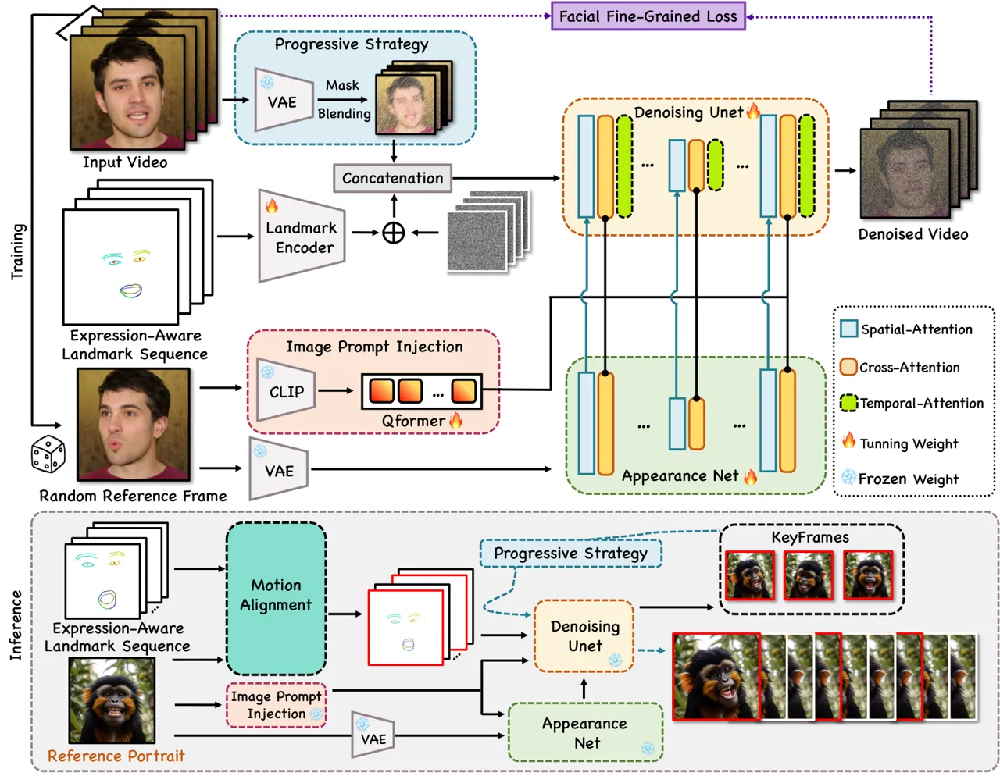
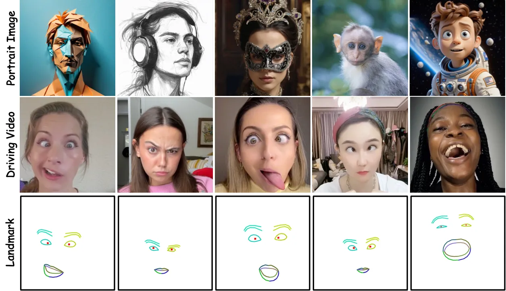
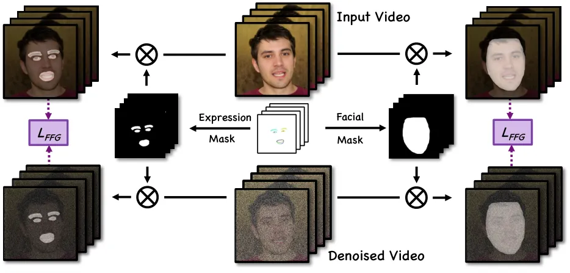
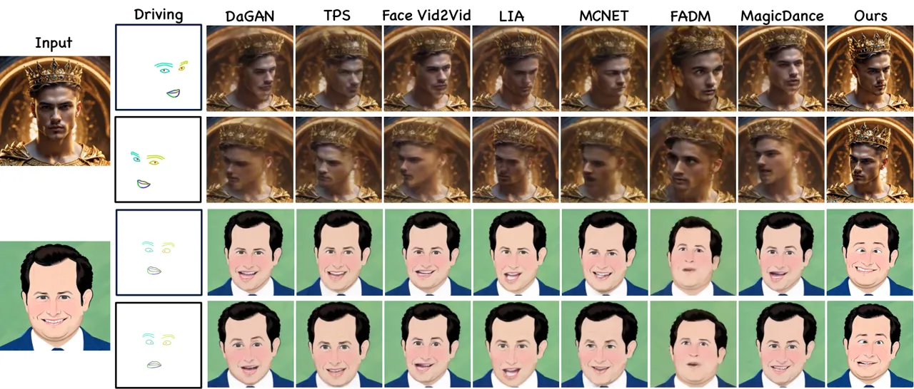
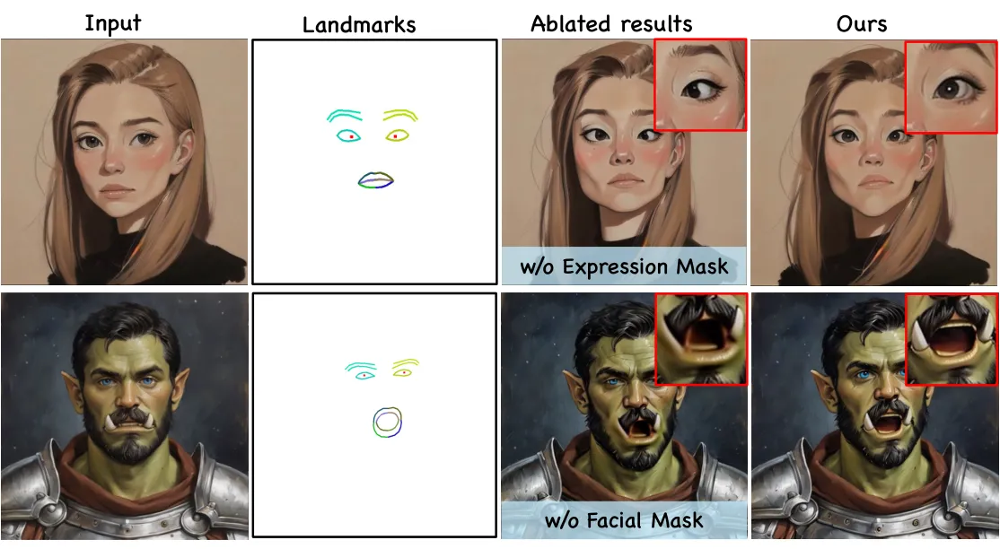
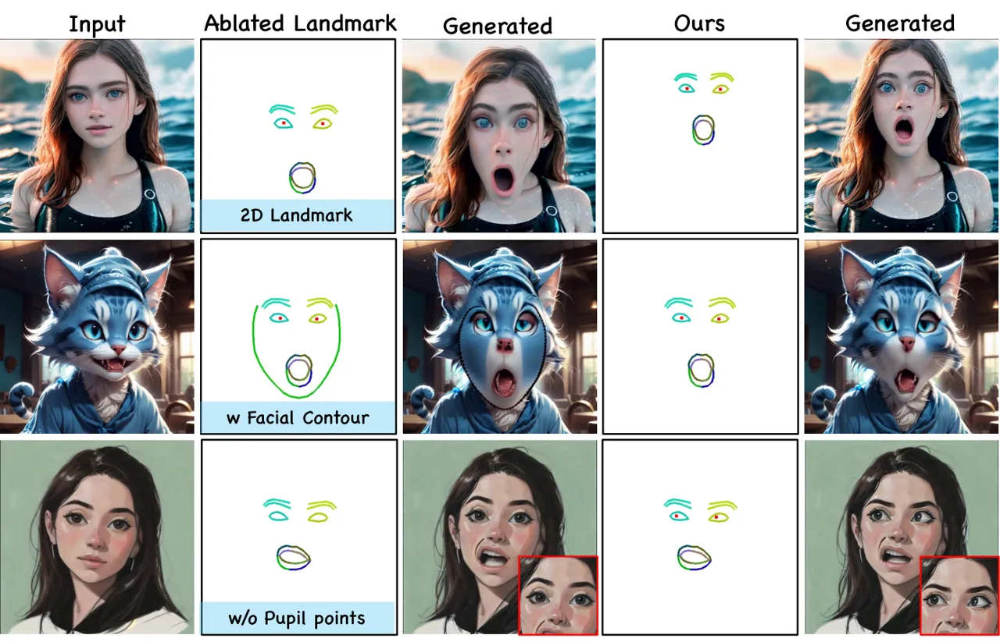
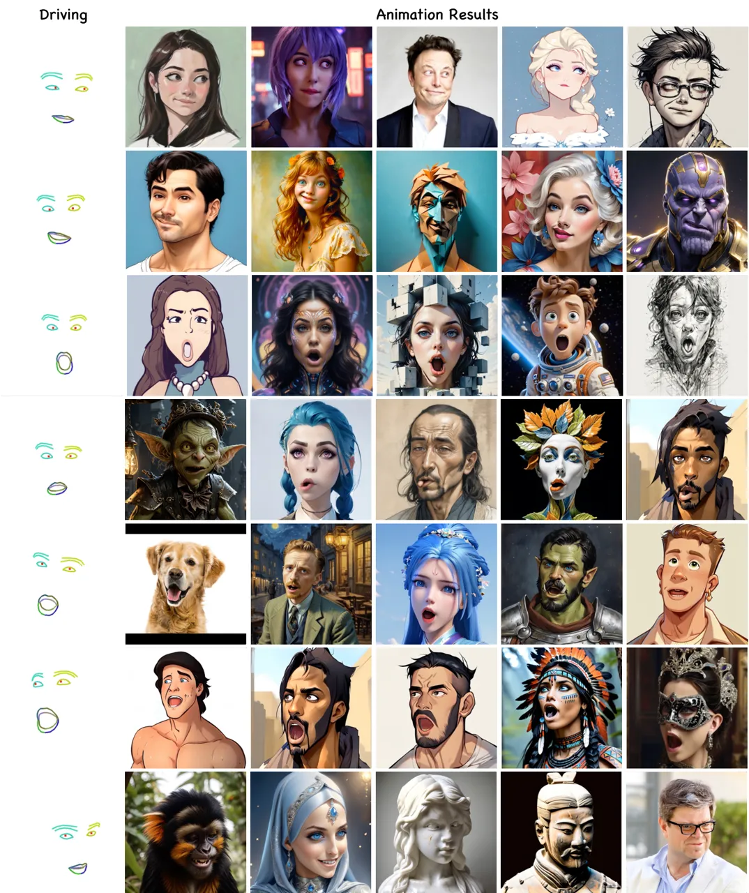
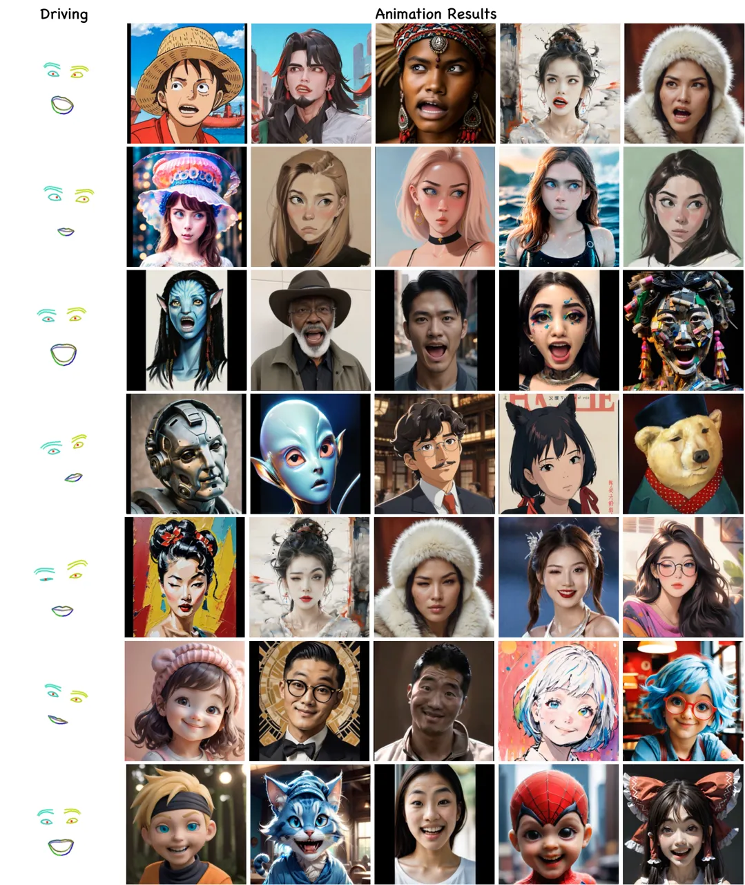

# : Fine-Controllable and Expressive Freestyle Portrait Animation

Yue Ma²² 2 Equal contribution. Affiliation: HKUST    Hongyu Liu²² 2
Equal contribution. Affiliation: HKUST    Hongfa Wang²² 2 Equal
contribution. Affiliation: Tencent, Hunyuan Affiliation: Tsinghua
University[https://follow-your-emoji.github.io/](https://follow-your-emoji.github.io/)
   Heng Pan²² 2 Equal contribution. Affiliation: Tencent, Hunyuan   
Yingqing He Affiliation: HKUST    Junkun Yuan Affiliation: Tencent,
Hunyuan    Ailing Zeng Affiliation: Tencent, Hunyuan    Chengfei Cai
Affiliation: Tencent, Hunyuan    Heung-Yeung Shum Affiliation: HKUST
Affiliation: Tsinghua
University[https://follow-your-emoji.github.io/](https://follow-your-emoji.github.io/)
   Wei Liu    Qifeng Chen

###### Abstract

We present Follow-Your-Emoji, a diffusion-based framework for portrait
animation, which animates a reference portrait with target landmark
sequences. The main challenge of portrait animation is to preserve the
identity of the reference portrait and transfer the target expression to
this portrait while maintaining temporal consistency and fidelity. To
address these challenges, Follow-Your-Emoji equipped the powerful Stable
Diffusion model with two well-designed technologies. Specifically, we
first adopt a new explicit motion signal, namely expression-aware
landmark, to guide the animation process. We discover this landmark can
not only ensure the accurate motion alignment between the reference
portrait and target motion during inference but also increase the
ability to portray exaggerated expressions (i.e., large pupil movements)
and avoid identity leakage. Then, we propose a facial fine-grained loss
to improve the model’s ability of subtle expression perception and
reference portrait appearance reconstruction by using both expression
and facial masks. Accordingly, our method demonstrates significant
performance in controlling the expression of freestyle portraits,
including real humans, cartoons, sculptures, and even animals. By
leveraging a simple and effective progressive generation strategy, we
extend our model to stable long-term animation, thus increasing its
potential application value. To address the lack of a benchmark for this
field, we introduce EmojiBench, a comprehensive benchmark comprising
diverse portrait images, driving videos, and landmarks. We show
extensive evaluations on EmojiBench to verify the superiority of
Follow-Your-Emoji.

![[Uncaptioned
image]](arxiv-2406-01900--ffa98658adc9.figures/figure-1.webp)

Figure 1: Qualitative results of our Follow-Your-Emoji. The images of
the input column are the reference portrait and the corresponding motion
landmarks. Using exaggerated expressions with landmark sequences, our
portrait animation framework can animate freestyle reference portraits,
e.g., cartoons, realism, sculptures, and even animals.

⁰⁰footnotetext: 🖂 Corresponding author.

## 1 introduction

We study the task of portrait animation, which transfers the target
sequences of poses and expressions from the driven video to the
reference portrait. Combined with the generative adversarial
network \[15\] (GAN) and diffusion model \[53\], recent portrait
animation methods demonstrate widespread potential applications, such as
online conferencing, virtual characters, and augmented reality.

For the GAN-based portrait animation method \[10, 61, 51, 35\], they
typically utilize a two-stage pipeline which first warps the reference
image in feature space with flow field, then adopts the GAN as a
rendering decoder to refine the warping features and generate the
missing or occluded body parts. However, due to the limited performance
of GAN and the inaccuracy of motion representation of the flow field,
the generation results of these methods always suffer from unrealistic
content and remarkable artifacts. In recent years, diffusion
models \[24, 54\] have showcased better generation ability than GAN.
Some methods bring powerful foundation diffusion models for high-quality
video \[16, 2, 25, 26, 64, 21, 7, 6\] and image generation \[46, 49, 45,
32\] with large-scale image or video datasets. However, these foundation
models can not directly handle the main challenges of the portrait
animation task: preserving the reference portrait’s identity during
animation and effectively modeling the target expression for the
portrait.

Intuitively, some methods \[5, 70, 83, 29, 70, 17, 29, 60\] try to
modify the architecture of foundation diffusion model (i.e., Stable
Diffusion \[46\]) with some plug and play modules for portrait animation
task and leverage the pretrained diffusion model as powerful prior
information. Specifically, they utilize an appearance net \[29\] and
CLIP model \[44\] to extract identity information of the reference
portrait and temporal attention to establish temporal consistency
between frames. However, the video results of these methods exhibit
distortions and unrealistic artifacts, especially when animating
uncommon domain portraits (i.e., cartoons, sculptures, and animals) that
are not represented in the training data. We find this is mainly due to
two reasons: (1) The motion representation (i.e., 2D landmarks \[5, 29\]
or the motion image itself \[66\]) adopted in these methods are not
robust enough. During inference, 2D landmarks can easily lead to a
misalignment between the facial features of the reference portrait and
the target motion, resulting in identity leakage. However, setting the
motion image itself as the signal needs to utilize third-party methods
to change the identity of the target motion videos for training, as
mentioned in Xportrait \[66\]. And it will destroy the subtle expression
features in the original motion videos. (2) These methods utilize the
original loss in the diffusion model during training, which is
unsuitable for portrait animation tasks that need the model to focus on
capturing reference facial appearance and expression changes.

In this paper, we present Follow-Your-Emoji, a novel diffusion-based
framework for portrait animation. Apart from the commonly used
appearance net and temporal attention in recent diffusion-based portrait
animation methods, we propose several effective technologies to address
the aforementioned problems. (1) We introduce the expression-aware
landmark, a novel expression control signal, to guide the driving
process more effectively. Specifically, we obtain the landmark by
projecting the 3D keypoints obtained from MediaPipe \[38\]. Owing to the
inherent canonical property of 3D keypoints, we can effectively align
the target motion with the reference portrait during inference, thereby
avoiding identity leakage. However, MediaPipe is not robust enough, as
the facial contour sometimes fails to conform to the face accurately.
Consequently, the process of projecting landmarks has been modified to
exclude facial contours and incorporate pupil points. This operation
enables the model to better focus on expression changes (i.e., pupil
point motion) while preventing it from influencing the shape and
destroying the identity information of the reference portrait through
the wrong facial contour. (2) We propose a facial fine-grained loss
function to aid the model in focusing on capturing subtle expression
changes and the detailed appearance of the reference portrait.
Specifically, we first leverage both facial masks and expression masks
with our expression-aware landmark, then compute the spatial distance
between the ground truth and predicted results in these mask regions.

Through the aforementioned improvements, our approach can effectively
drive freestyle portraits, as illustrated in Figure 1. Additionally, to
train our model, we construct a high-quality expression training dataset
with 18 exaggerated expressions and 20-minute real-human videos from 115
subjects. We employ a progressive generation strategy that enables our
method to scale to long-term animation synthesis with high fidelity and
stability. To address the lack of a benchmark in portrait animation, we
introduce a comprehensive benchmark called EmojiBench, which consists of
410 various style portrait animation videos that showcase a wide range
of facial expressions and head poses. Finally, we conduct a
comprehensive evaluation of Follow-Your-Emoji using EmojiBench. The
evaluation results demonstrate the impressive performance of our method
in handling portraits and motions that were outside of the training
domain. Compared with the existing baseline methods, our method performs
quantitatively and qualitatively better, delivering exceptional visual
fidelity, faithful representation of identities, and precise motion
rendering. In summary, our contributions can be summarized as follows:

- •
  We introduce Follow-Your-Emoji, a diffusion-based framework for
  fine-controllable portrait animation. Based on the proposed
  progressive generation strategy, it can further produce long-term
  animation.
- •
  To facilitate freestyle portrait animation, we propose the
  expression-aware landmarks as the motion representation and a facial
  fine-grinned loss to help the diffusion model enhance the generation
  quality of facial expressions.
- •
  To train our model, we introduce a new expression training dataset
  with 18 expressions and 20-min talking videos from 115 subjects. To
  validate the effectiveness of our methods, we construct a benchmark
  EmojiBench, and comprehensive results show the superiority of our
  Follow-Your-Emoji in fine-controllable and expressive aspects.

## 2 Related Work

### 2.1 GAN-based Portrait Animation

Animating a single portrait has attracted a lot of attention in the
research. Previous approaches \[10, 51, 5\] mainly leverage Generative
Adversarial Networks (GANs) \[15\] to generate plausible motion using
self-supervised learning. The pioneering works primarily involved two
steps: warping and rending. These methods firstly estimate head and
facial motion with open-source 2D/3D pose predictors \[38, 71\]. The
facial representation is warped and fed into a generative model to
synthesize dynamic frames with realistic animation and rich details.
Following such a paradigm, a majority of approaches \[61, 28, 81, 43\]
focus on improve facial warping estimation, including 3D neural
landmarks \[61\], thin-plate splines \[81\] and depth \[28\].
Additionally, the 3D morphable is utilized to model the expression and
motion in ReenacArtFace \[43\]. ToonTalker \[14\] employs the
transformer architecture to help the warping process of cross-domain
datasets. MegaPortraits \[10\] enhances rendered image quality using
high-resolution image data, whereas FADM \[72\] enriches generated
details using the proposed coarse-to-fine animation framework. Face
Vid2Vid \[61\] presents a pure neural rendering to decompose
identity-specific and motion-related information unsupervisedly. In
addition to video reenactment, there are also various driving signals,
such as 3D facial prior \[9, 11, 30, 55, 68\] and audio \[56, 69, 19,
76, 63\]. However, these methods primarily focus on talking scenarios,
and they struggle to synthesize animated frames with high-quality facial
details and diverse domain styles.

### 2.2 Diffusion-based Portrait Animation

Diffusion models (DMs) \[24, 54\] achieves superior performance in
various generative tasks including image generation \[46, 80, 48, 50\]
and editing \[4, 22, 3\], video generation \[40, 52, 20, 41, 58\] and
editing \[42, 78, 36, 39, 33\]. Recently, latent diffusion models
further improved the performance by operating the diffusion step in
latent space. Mainstream portrait animation approaches leverage the
power of Stable Diffusion (SD) \[46\] and incorporate temporal
information into generation process, such as AnimateDiff \[16\],
MagicVideo \[82\], VideoCrafter \[6\] and ModelScope \[59\].
Additionally, current works \[5, 70, 18, 29, 83, 13\] employ the
self-attention blocks with injected reference image to achieve identity
preservation. They always product high-quality video clips with textual
guidance, which is ambiguous and struggle to describe the intention from
users. To achieve more controllable generation, many signals are applied
for video generation, such as depth map \[1, 67\], skeleton \[5, 40\]
and sketch \[78\]. Another state-of-the-art works \[5, 70, 83, 29, 12\]
integrate the appearance and pose condition into temporal layers for
full-body video generation. However, these methods all focus on
full-body animation and ignore the specific details of the face. In
contrast, we innovate the diffusion-based framework, focusing on driving
various style portraits with detailed facial expressions (e.g., eyes,
skins).

## 3 Preliminaries

### 3.1 Latent Diffusion Model

Latent diffusion models (LDM) \[46\], the most critical component of
Stable Diffusion (SD), is a text-to-image diffusion model that
reformulates the diffusion and denoising procedures within a latent
space instead of image space for stable and fast training. The
VAE \[31\] projects images from RGB space to latent space, where the
diffusion process is guided by textual embedding. Then, a UNet-based
network \[47\] incorporates self-attention and cross-attention
mechanisms through Transformer Blocks to learn the reverse denoising
process in latent space. The cross-attention helps the text prompt
inject into the whole process in an effective manner. The whole training
objective of the UNet can be written as:

```math
\mathcal{L}_{LDM}=\underset{t,z_{,}\epsilon}{\mathbb{E}}[\|\epsilon-\epsilon_{\theta}(\sqrt{\bar{\alpha}_{t}}z+\sqrt{1-\bar{\alpha}_{t}}\epsilon,c,t)\|^{2}] \tag{1}
```

where $`z`$ notes the latent embedding of training sample.
$`\epsilon_{\theta}`$ and $`\epsilon`$ represent predicted noise by
diffusion model and ground truth noise at corresponding timestep $`t`$,
respectively. $`c`$ is the condition embedding involved in the
generation and the coefficient $`\bar{\alpha}_{t}`$ remains consistent
with that employed in vanilla diffusion models.

### 3.2 Portrait Animation with Diffusion

Recent methods \[5, 70, 83, 29, 66\] try to expand SD for full body or
portrait animation. To facilitate the utilization of powerful
pre-trained SD models, their frameworks exhibit substantial
similarities, consisting of several plug-and-play modules. There are
three main modules: (1) Appearance Net: It extracts the identity
attributes and background context from the reference portrait first and
then injects this information into UNet in SD by adding features to the
self-attention blocks. The architecture of the appearance net is the
same as the UNet in SD. (2) Temporal Attention: Equipped the UNet with
temporal transformers to maintain the cross-frame correspondence and
temporal coherence. (3) Control Motion Injection: To build the spatial
mapping between the control signals and the output, these methods always
utilize the ControlNet \[73\] or add the feature of motions to the input
of UNet directly \[29\]. (4) Image Prompt Injection: To transfer the
UNet from text-to-image generation to portrait animation, the image
prompt injection module replaces the text encoder of CLIP with the
correspondence image encoder to get the token of the reference portrait
image. Then, these tokens are sent to UNet with the cross-attention
layer similar to the original text token in SD.



Figure 2: The overview of Follow-Your-Emoji. We extract the features of
our expression-aware landmark sequence with a landmark encoder and fuse
these features with multi-frame noise first, then we utilize the
progressive strategy to mask the frame of the input latent sequence
randomly. Finally, we concatenate this latent sequence with the fused
multi-frame noise and feed it to the Denoising UNet to conduct the
denoising process for video generation. The appearance net and image
prompt injection module help our model preserve the identity of the
reference portrait, and the temporal attention maintains the temporal
consistency. During training, the facial fine-grinded loss guides the
Unet to pay more attention to the facial and expression generation.
During inference, following AniPortrait \[63\], we align the target
landmark with the reference portrait with the motion alignment module.
Then, we first generate the keyframes and utilize the progressive
strategy to predict long videos.

## 4 Method

The pipeline of our method is shown in Fig. 2. Given an input video
clip, we randomly select a frame $`\mathcal{I}_{0}`$ as the reference
portrait image. Then, we extract the motion sequences
$`\{L_{1},L_{2},L_{3},...,L_{N}\}`$ (expression-aware landmarks) from
the input video. The purpose of our method is to transfer the expression
of the landmark sequences to $`\mathcal{I}_{0}`$. Even for reference
portraits of uncommon styles (i.e., cartoon, sculpture, and animal), we
hope our method can still predict good results.



Figure 3: Examples of the EmojiBench with high expression diversity,
exaggeration, and various visual styles in portrait images.

We follow the recent diffusion-based portrait animation methods in our
framework and utilize both the appearance net and temporal attention.
For the control motions injection, we add the features of our
expression-aware landmarks to UNet directly. These features are
extracted with a landmark encoder. Moreover, similar to
StyleCrafter \[34\], we encode the reference image $`\mathcal{I}_{0}`$
to image token using pre-trained CLIP image encoder, then the 4-layers
Qformer \[74\] is employed to fuse all image token. In the next, we
first discuss the motion representation and present our expression-aware
landmark in Sec. 4.1. Then, we introduce the facial fine-grained loss in
Sec. 4.2. Finally, for long-term animation, we describe the progressive
strategy in Sec. 4.3.

### 4.1 Expression-Aware Landmark

Motion representation of facial expressions is essential for portrait
animation. Accurate and precise motion representation enables conveying
the nuances of human emotion and expression, thereby enhancing the
overall realism and impact of the animated portrait. Recent
diffusion-based methods always directly utilize the portrait image
sequences providing the driving motion \[66\] or the 2D landmarks as the
motion representation for training. However, during the inference
process, 2D landmarks cannot ensure alignment between the target
expression and the reference portrait. This misalignment will lead to
inaccurate generated expressions and potential leakage of the identity
information. Directly using the portrait image providing the driving
motion can solve this problem, but it is necessary to ensure that the
person in the motion sequence is different from the reference portrait
during the training process, which requires another portrait animation
method for identity conversion. This conversion process will damage the
accuracy of the expressions, and the portrait animation method can not
transfer the identity of the uncommon portrait (i.e., turning a dog into
a human).

To address the above problems, we introduce the expression-aware
landmark, a new motion representation for portrait animation.
Specifically, we utilize MediaPipe to extract the 3D keypoints of the
portrait from the motion video. We then project these keypoints to
obtain the 2D landmark. During the projection process, we discard the
facial contour while retaining only the facial features. We find this
operation can help the model focus on subtle motion generation and avoid
the inaccuracy of facial contour with large expression changing, as
shown in Fig. 7. Moreover, to capture the motion of the portrait’s
irises, we calculate the related position of the irises in the eye
sockets of 3D keypoints and maintain such a relationship after
projection. In the end, since our expression-aware landmark is built on
the 3D keypoints, we can align the target landmark sequence to the
reference portrait in the canonical space of MediaPipe naturally, and we
denote this process as motion alignment in the inference step as shown
in Fig. 2.

### 4.2 Facial Fine-Grained Loss

For the portrait animation task, we hope the diffusion model focuses on
expression generation and identity preservation. However, the diffusion
model’s original training objective $`\mathcal{L}_{LDM}`$ is to learn
the content of all regions of the target image, which has no specific
constraints for learning the facial content during the training process.
Therefore, we propose the facial fine-grained (FFG) loss to modify the
$`\mathcal{L}_{LDM}`$ and make the model pay more attention to the
content of facial and expression regions.

As shown in Fig. 4, we need to get two types of masks to capture the
expression and facial regions to calculate the FFG loss. For the
expression mask $`{\mathcal{M}_{e}}`$, we dilate each point of our
expression-aware landmark and set these dilation regions as the
expression mask. For the facial mask $`{\mathcal{M}_{f}}`$, we project
the MediaPipe 3D facial counter’s keypoints and connect these projected
points to get the facial masks. Finally, these two masks split the FFG
loss into expression and facial aspects, respectively. Formally, the
loss function can be written as below:

```math
\displaystyle\mathcal{L}_{FFG}={\mathbb{E}}\left[\left\|\mathcal{M}_{e}\cdot\left(z-\hat{z}\right)+\mathcal{M}_{f}\cdot\left(z-\hat{z}\right)\right\|^{2}\right] \tag{2}
```

where $`\hat{z}`$ is the prediction latent embedding obtained by
decoding the $`\epsilon_{\theta}`$. With our FFG loss, our method
demonstrates better performance in both identity preservation and
expression generation, as shown in Fig. 6. Finally, our total loss can
be written as:

```math
\displaystyle\mathcal{L}=\mathcal{L}_{LDM}+\mathcal{L}_{FFG} \tag{3}
```

### 4.3 Progressive Strategy for Long-Term Animation

With the advancement of technology and increasing user demands,
long-term animation has become increasingly important in practical
applications. Despite training on video clips, previous approaches \[5,
70, 83, 29\] have also attempted to generate long videos during testing.
They always synthesize several overlapping video clips and merge them
using Gaussian smoothing. However, we observe that this trick leads to
the degradation of temporal consistency.

To alleviate the above issues, a progressive strategy is proposed to
generate long-term animation from coarse to fine. Intuitively, to
generate the long-term animation in the inference step, we hope to
generate keyframes first and then use these keyframes to generate the
long-term animation with interpolation operation. To simulate this
process, apart from the first and last latent frames, we cover the other
input video latent frames first. Then, we concatenated this covered
video latent with original UNet inputs to do the denoising process. With
this strategy, we can set the first and last frames as keyframes in the
inference step and help our model generate long-term animation.
Meanwhile, we also cover each latent frame of the input video with a
probability of 0.5, which helps our model generate the keyframes’s
content in the first inference step since we need to cover all latent
frames in this inference step. During the training process, we switch
between these two covering strategies with a probability of 0.5.

## 5 Experiment



Figure 4: The detail of our facial fine-grained loss. We extract the
facial mask and expression mask with our landmark first. Then, we
calculate the denoising loss $`\mathcal{L}_{FFG}`$ in these masked
regions.

| Method              | Self Reenactment  |                   |                      |                    | Cross Reenactment          |                            |                           | User Study            |                         |                        |
| ------------------- | ----------------- | ----------------- | -------------------- | ------------------ | -------------------------- | -------------------------- | ------------------------- | --------------------- | ----------------------- | ---------------------- |
|                     | L1 $`\downarrow`$ | SSIM $`\uparrow`$ | LPIPS $`\downarrow`$ | FVD $`\downarrow`$ | ID Similarity $`\uparrow`$ | Image Quality $`\uparrow`$ | Expression $`\downarrow`$ | Motion $`\downarrow`$ | Identity $`\downarrow`$ | Overall $`\downarrow`$ |
| Face Vid2vid \[61\] | 0.043             | 0.792             | 0.258                | 232.1              | 0.614                      | 37.295                     | 5.42                      | 6.47                  | 7.79                    | 5.93                   |
| DaGAN \[28\]        | 0.057             | 0.711             | 0.301                | 267.4              | 0.271                      | 36.901                     | 1.87                      | 7.18                  | 6.83                    | 7.26                   |
| TPS \[81\]          | 0.037             | 0.823             | 0.211                | 196.3              | 0.481                      | 35.172                     | 14.83                     | 4.94                  | 4.57                    | 4.81                   |
| MCNet \[27\]        | 0.032             | 0.835             | 0.198                | 211.7              | 0.373                      | 32.154                     | 17.25                     | 5.53                  | 5.11                    | 5.89                   |
| FADM \[72\]         | 0.048             | 0.693             | 0.274                | 191.4              | 0.672                      | 32.493                     | 2.14                      | 3.14                  | 3.73                    | 3.76                   |
| MagicDance \[5\]    | 0.046             | 0.749             | 0.174                | 156.2              | 0.679                      | 56.804                     | 34.21                     | 2.65                  | 2.56                    | 2.74                   |
| Ours                | 0.029             | 0.849             | 0.136                | 96.8               | 0.702                      | 66.287                     | 39.16                     | 1.27                  | 1.48                    | 1.78                   |

Table 1: Quantitative comparisons with SOTA baselines. We evaluate our
framework both self and cross reenactments on $`256\times 256`$ test
images.



Figure 5: The qualitative comparisons with existing methods. Given a
reference portrait image and expression-aware landmarks, our approach
demonstrates superior performance in capturing detailed facial
expressions and maintaining the original identity of the characters
compared to previous methods. More results are available in the
supplementary material.

### 5.1 Implementation Details

We train our model on HDTF\[79\], VFHQ\[65\], and our collected dataset
jointly, which includes monocular camera recordings of 18 expressions
and 20-minute real-human video from 115 subjects in both indoor and
outdoor scenes. The training stage consists of two stages, in the
initial training stage, we sample individual video frames and perform
resizing and center-cropping to achieve a resolution of
$`512\times 512`$. We fine-tune the model for 30,000 steps using a batch
size of 32. In the subsequent training stage, we focus on training the
temporal layer for 10,000 steps using 16-frame video sequences with a
batch size of 32. The learning rate is $`1\times 10^{-5}`$ in two
stages. The temporal attention layers are initialized with
AnimateDiff \[16\] similar to the AnimeAnyone. The frozen image
autoencoder is applied to project each video frame into latent space. We
optimize overall framework using Adam \[37\] on on 32 NVIDIA A800 GPUs.
During inference, we utilize DDIM sampler \[54\] and set the scale of
classifier-free guidance \[23\] to 3.5 in our experiment.

|                                |                   |                   |                      |                    |                            |                            |                           |
| ------------------------------ | ----------------- | ----------------- | -------------------- | ------------------ | -------------------------- | -------------------------- | ------------------------- |
| Method                         | Self Reenactment  |                   |                      |                    | Cross Reenactment          |                            |                           |
|                                | L1 $`\downarrow`$ | SSIM $`\uparrow`$ | LPIPS $`\downarrow`$ | FVD $`\downarrow`$ | ID Similarity $`\uparrow`$ | Image Quality $`\uparrow`$ | Expression $`\downarrow`$ |
| FFG Loss (w/o Expression Mask) | 0.037             | 0.702             | 0.159                | 147.4              | 0.576                      | 53.792                     | 26.87                     |
| FFG Loss (w/o Identity Mask)   | 0.036             | 0.721             | 0.157                | 149.3              | 0.548                      | 50.992                     | 34.21                     |
| w/o Progressive Strategy       | 0.035             | 0.718             | 0.141                | 138.8              | 0.632                      | 52.108                     | 35.32                     |
| 2D Landmarks                   | 0.039             | 0.715             | 0.166                | 144.1              | 0.521                      | 50.829                     | 17.45                     |
| w Facial Contour points        | 0.034             | 0.784             | 0.153                | 128.5              | 0.627                      | 59.781                     | 38.71                     |
| w/o Pupil points               | 0.035             | 0.762             | 0.147                | 103.2              | 0.648                      | 61.436                     | 33.58                     |
| Ours                           | 0.029             | 0.849             | 0.136                | 96.8               | 0.702                      | 66.287                     | 39.16                     |

Table 2: Quantitative results of ablation study. All metrics are
evaluated on $`256\times 256`$ test images. $`{\uparrow}`$ indicates
higher is better. $`{\downarrow}`$ indicates lower is better.

### 5.2 EmojiBench

We introduce EmojiBench, a new benchmark to evaluate the model’s ability
to animate freestyle portraits. Specifically, we collect 410 portraits
from different domains, including cartoon style, real-human style, and
even animals. These portrait cases are generated from 20 different
personalized text-to-image models. We also provide 20 animal portraits,
whose landmarks are able to be detected by Mediapipe \[38\]. The
EmojiBench contains 45 videos of driving human heads collected from the
internet. Each video is approximately 5 seconds long with 150 frames.
The expressions of EmojiBench include a diverse range of head motion and
facial expressions (e.g., frowning, crossed eyes, and pouting). Such a
benchmark with various styles would be beneficial for the development of
the community.

### 5.3 Comparison with baselines

#### 5.3.1 Qualitative results.

We compare our approach with previous portrait animation methods,
including state-of-the-art GAN-based approaches Face Vid2vid \[61\],
DaGAN \[28\], MCNet \[27\], TPS \[81\]. Additionally, we also compare
our method with concurrent diffusion-based methods like FADM \[72\] and
MagicDance \[5\]. MegaPortraits \[10\] and X-portrait \[66\] are
excluded from our comparisons as no public release exists. The results
are shown in Fig. 5. We find the GAN-based method easily suffers from
obvious artifacts, especially when changing the pose of the head with a
large angle (i.e., see the generation result of the first character).
Moreover, they can not rebuild the subtle expression for the reference
portraits of uncommon style well (i.e., the movement of pupils in the
second character). The diffusion-based methods MagicDance \[5\] and
FADM \[72\] perform better in expression transfer, but they still can
not preserve the identity of reference portraits during animation. In
contrast, our approach exhibits superior ability in handling large pose
changing, subtle expressing generation, and identity preservation for
uncommon style portraits. Please see more animation results in Fig. 8
and Fig. 9.



Figure 6: The effectiveness of facial fine-grained loss. We analyze the
performance of expression and facial aspects of FFG loss, respectively.

#### 5.3.2 Quantitative results.

We compare our method with state-of-the-art portrait animation on our
EmojiBench quantitatively and the results are shown in Tab. 1. Due to
the limited resolution of most previous works, all measurements are
performed in 64 frames at a resolution of $`256\times 256`$. All
evaluation metrics used are as follows: (a) Self Reenactment: For
quantitative assessment of image-level quality, we report the four
metrics, L1 error, SSIM \[62\], LPIPS \[75\], and FVD \[57\]. For each
video in EmojiBench, the first frame is employed as the reference image
to generate the facial expression sequences. We leverage subsequent
frames to serve as both the driving image and the ground truth. (b)
Cross Reenactment: We evaluate cross reenactment on four metrics:
identity similarity, image quality, expression landmark accuracy, and
user study, respectively. (1) Identity similarity: the ArcFace
score \[8\] is applied to measure identity preservation. We calculate
cosine similarity between source and generated images. (2) Image quality
assessment: We follow \[66\] to utilize the HyperIQA \[77\] for image
quality assessment. (3) Landmark accuracy: To evaluate the pose accuracy
of the generated video, we regard the input facial landmark sequences as
ground truth and evaluate the average precision of the facial landmark
sequences. (c) User Study: we perform the user study on cross
reenactment with three aspects. (1) Expression: Evaluating the quality
of generated expression. (2) Identity: Measuring the identity similarity
between the generated frame images and input reference portrait image.
(3)Overall: Evaluating the overall quality of the generated videos. We
randomly selected 45 cases and asked 30 volunteers to rank different
methods in these three aspects. According to the results presented in
Table 1, our approach demonstrates superior performance across seven
metrics of self/cross reenactment. In terms of the user study, our
approach outperforms previous baselines in terms of temporal coherence
and identity preservation, while also exhibiting superior motion
quality.

### 5.4 Ablation Study

In the subsequent section, we will analyze the effectiveness of
expression-aware landmark and facial fine-grained loss. As for
progressive strategy for long-term animation, we provide more discussion
in supplementary materials.



Figure 7: The effectiveness of expression-aware landmark. We compare the
results when different landmarks is used to guide the portrait
animation.

Effectiveness of Expression-Aware Landmark. To prove the effectiveness
of our expression-aware landmark, we change our motion representation to
the 2D landmark, expression-aware landmark with the facial counter, and
expression-aware landmark without pupil points to generate the video,
respectively. The visual results are shown in Fig. 7. 2D landmark has a
challenge in handling the alignment of the facial bounding box between
target landmarks and reference portrait images, as presented in the 1st
row. The expression-aware landmark with the facial counter fails to
maintain the identity of portrait images in non-human styles. This is
because the current open-source landmark detector makes it hard to
predict the facial counter of any style portrait. Finally, we also show
the result produced with expression-aware landmarks without pupil
points. Due to the lack of motion signals of pupil points, it is
difficult to generate lively expressions with pupil motion. In contrast,
our full model demonstrates better performance. The corresponding
numerical evaluation is shown in Tab. 2.

Effectiveness of Facial Fine-Grained Loss. To analyze the performance of
FFG loss, we discarded the expression and facial aspects of FFG loss
separately to do the experiment. Without facial aspects of FFG loss, we
find our method reduces the ability to protect identity information and
detail appearance of the input portrait (i.e., teeth disappeared in the
second row of Fig. 6). Meanwhile, when we abandon the expression aspects
of FFG loss, our method can not capture the subtle expression changing
well (i.e., inaccurate pupil movement in the first row of Fig. 6). The
corresponding numerical evaluation is shown in Tab. 2.

## 6 Conclusion

We introduce Follow-Your-Emoji, a novel diffusion-based framework for
freestyle portrait animation. Incorporating with the expression-aware
landmark, our method shows high performance in subtle and exaggerated
facial expression generation. Meanwhile, we propose a facial
fine-grained loss to constrain the diffusion model focus on expression
generation and identity preservation. To train our model, we introduce a
new expression training dataset with 18 exaggerated expressions and
20-minute real-human videos from 115 subjects. Then, we introduce the
progressive strategy for stable long-term animation. Finally, to address
the lack of benchmark in portrait animation, we build the EmojiBench, a
comprehensive benchmark to evaluate our method, the impressive
performance of our model on generalized reference portraits and driving
motions serves as validation of its effectiveness.

##### Acknowledgments.

We thank Jiaxi Feng, Yabo Zhang for their helpful comments. This project
was supported by the National Key R&D Program of China under grant
number 2022ZD0161501.



Figure 8: More portrait animation results.



Figure 9: More portrait animation results.

## References

- \[1\] Gen-2.
  [https://runwayml.com/ai-magic-tools/gen-2/](https://runwayml.com/ai-magic-tools/gen-2/), 2023.
- \[2\] Andreas Blattmann, Robin Rombach, Huan Ling, Tim Dockhorn,
  Seung Wook Kim, Sanja Fidler, and Karsten Kreis. Align your latents:
  High-resolution video synthesis with latent diffusion models. In
  _Proceedings of the IEEE/CVF Conference on Computer Vision and Pattern
  Recognition_, pages 22563–22575, 2023.
- \[3\] Tim Brooks, Aleksander Holynski, and Alexei A Efros.
  Instructpix2pix: Learning to follow image editing instructions. In
  _Proceedings of the IEEE/CVF Conference on Computer Vision and Pattern
  Recognition_, pages 18392–18402, 2023.
- \[4\] Mingdeng Cao, Xintao Wang, Zhongang Qi, Ying Shan, Xiaohu Qie,
  and Yinqiang Zheng. Masactrl: Tuning-free mutual self-attention
  control for consistent image synthesis and editing. In _Proceedings of
  the IEEE/CVF International Conference on Computer Vision_, pages
  22560–22570, 2023.
- \[5\] Di Chang, Yichun Shi, Quankai Gao, Jessica Fu, Hongyi Xu,
  Guoxian Song, Qing Yan, Yizhe Zhu, Xiao Yang, and Mohammad Soleymani.
  Magicpose: Realistic human poses and facial expressions retargeting
  with identity-aware diffusion, 2024.
- \[6\] Haoxin Chen, Menghan Xia, Yingqing He, Yong Zhang, Xiaodong Cun,
  Shaoshu Yang, Jinbo Xing, Yaofang Liu, Qifeng Chen, Xintao Wang, Chao
  Weng, and Ying Shan. Videocrafter1: Open diffusion models for
  high-quality video generation, 2023.
- \[7\] Haoxin Chen, Yong Zhang, Xiaodong Cun, Menghan Xia, Xintao Wang,
  Chao Weng, and Ying Shan. Videocrafter2: Overcoming data limitations
  for high-quality video diffusion models, 2024.
- \[8\] Jiankang Deng, Jia Guo, Niannan Xue, and Stefanos Zafeiriou.
  Arcface: Additive angular margin loss for deep face recognition. In
  _Proceedings of the IEEE/CVF conference on computer vision and pattern
  recognition_, pages 4690–4699, 2019.
- \[9\] Yu Deng, Jiaolong Yang, Dong Chen, Fang Wen, and Xin Tong.
  Disentangled and controllable face image generation via 3d
  imitative-contrastive learning. In _Proceedings of the IEEE/CVF
  conference on computer vision and pattern recognition_, pages
  5154–5163, 2020.
- \[10\] Nikita Drobyshev, Jenya Chelishev, Taras Khakhulin, Aleksei
  Ivakhnenko, Victor Lempitsky, and Egor Zakharov. Megaportraits:
  One-shot megapixel neural head avatars. In _Proceedings of the 30th
  ACM International Conference on Multimedia_, pages 2663–2671, 2022.
- \[11\] Yao Feng, Haiwen Feng, Michael J Black, and Timo Bolkart.
  Learning an animatable detailed 3d face model from in-the-wild images.
  _ACM Transactions on Graphics (ToG)_, 40(4):1–13, 2021.
- \[12\] Kuofeng Gao, Yang Bai, Jindong Gu, Yong Yang, and Shu-Tao Xia.
  Backdoor defense via adaptively splitting poisoned dataset. In
  _CVPR_, 2023.
- \[13\] Kuofeng Gao, Yang Bai, Jindong Gu, Shu-Tao Xia, Philip Torr,
  Zhifeng Li, and Wei Liu. Inducing high energy-latency of large
  vision-language models with verbose images. In _ICLR_, 2024.
- \[14\] Yuan Gong, Yong Zhang, Xiaodong Cun, Fei Yin, Yanbo Fan, Xuan
  Wang, Baoyuan Wu, and Yujiu Yang. Toontalker: Cross-domain face
  reenactment. In _Proceedings of the IEEE/CVF International Conference
  on Computer Vision_, pages 7690–7700, 2023.
- \[15\] Ian Goodfellow, Jean Pouget-Abadie, Mehdi Mirza, Bing Xu, David
  Warde-Farley, Sherjil Ozair, Aaron Courville, and Yoshua Bengio.
  Generative adversarial networks. _Communications of the ACM_,
  63(11):139–144, 2020.
- \[16\] Yuwei Guo, Ceyuan Yang, Anyi Rao, Yaohui Wang, Yu Qiao, Dahua
  Lin, and Bo Dai. Animatediff: Animate your personalized text-to-image
  diffusion models without specific tuning. _arXiv preprint
  arXiv:2307.04725_, 2023.
- \[17\] Chunming He, Kai Li, Yachao Zhang, Longxiang Tang, Yulun Zhang,
  Zhenhua Guo, and Xiu Li. Camouflaged object detection with feature
  decomposition and edge reconstruction. In _CVPR_, pages 22046–22055,
  2023a.
- \[18\] Chunming He, Kai Li, Yachao Zhang, Yulun Zhang, Zhenhua Guo,
  and Xiu Li. Strategic preys make acute predators: Enhancing
  camouflaged object detectors by generating camouflaged objects. In
  _ICLR_, 2024.
- \[19\] Tianyu He, Junliang Guo, Runyi Yu, Yuchi Wang, Jialiang Zhu,
  Kaikai An, Leyi Li, Xu Tan, Chunyu Wang, Han Hu, et al. Gaia:
  Zero-shot talking avatar generation. _arXiv preprint
  arXiv:2311.15230_, 2023b.
- \[20\] Yingqing He, Tianyu Yang, Yong Zhang, Ying Shan, and Qifeng
  Chen. Latent video diffusion models for high-fidelity long video
  generation. _arXiv preprint arXiv:2211.13221_, 2022a.
- \[21\] Yingqing He, Tianyu Yang, Yong Zhang, Ying Shan, and Qifeng
  Chen. Latent video diffusion models for high-fidelity long video
  generation. 2022b.
- \[22\] Amir Hertz, Ron Mokady, Jay Tenenbaum, Kfir Aberman, Yael
  Pritch, and Daniel Cohen-Or. Prompt-to-prompt image editing with cross
  attention control. _arXiv preprint arXiv:2208.01626_, 2022.
- \[23\] Jonathan Ho and Tim Salimans. Classifier-free diffusion
  guidance. _arXiv preprint arXiv:2207.12598_, 2022.
- \[24\] Jonathan Ho, Ajay Jain, and Pieter Abbeel. Denoising diffusion
  probabilistic models. _Advances in neural information processing
  systems_, 33:6840–6851, 2020.
- \[25\] Jonathan Ho, William Chan, Chitwan Saharia, Jay Whang, Ruiqi
  Gao, Alexey Gritsenko, Diederik P Kingma, Ben Poole, Mohammad Norouzi,
  David J Fleet, et al. Imagen video: High definition video generation
  with diffusion models. _arXiv preprint arXiv:2210.02303_, 2022a.
- \[26\] Jonathan Ho, Tim Salimans, Alexey Gritsenko, William Chan,
  Mohammad Norouzi, and David J Fleet. Video diffusion models. _Advances
  in Neural Information Processing Systems_, 35:8633–8646, 2022b.
- \[27\] Fa-Ting Hong and Dan Xu. Implicit identity representation
  conditioned memory compensation network for talking head video
  generation. In _ICCV_, 2023.
- \[28\] Fa-Ting Hong, Longhao Zhang, Li Shen, and Dan Xu. Depth-aware
  generative adversarial network for talking head video generation. In
  _Proceedings of the IEEE/CVF conference on computer vision and pattern
  recognition_, pages 3397–3406, 2022.
- \[29\] Li Hu, Xin Gao, Peng Zhang, Ke Sun, Bang Zhang, and Liefeng Bo.
  Animate anyone: Consistent and controllable image-to-video synthesis
  for character animation. _arXiv preprint arXiv:2311.17117_, 2023.
- \[30\] Taras Khakhulin, Vanessa Sklyarova, Victor Lempitsky, and Egor
  Zakharov. Realistic one-shot mesh-based head avatars. In _European
  Conference on Computer Vision_, pages 345–362. Springer, 2022.
- \[31\] Diederik P Kingma and Max Welling. Auto-encoding variational
  bayes. _arXiv preprint arXiv:1312.6114_, 2013.
- \[32\] Ronghui Li, Junfan Zhao, Yachao Zhang, Mingyang Su, Zeping Ren,
  Han Zhang, Yansong Tang, and Xiu Li. Finedance: A fine-grained
  choreography dataset for 3d full body dance generation. In
  _Proceedings of the IEEE/CVF International Conference on Computer
  Vision (ICCV)_, pages 10234–10243, 2023.
- \[33\] Ronghui Li, Yuxiang Zhang, Yachao Zhang, Hongwen Zhang, Jie
  Guo, Yan Zhang, Yebin Liu, and Xiu Li. Lodge: A coarse to fine
  diffusion network for long dance generation guided by the
  characteristic dance primitives. In _IEEE/CVF Conf. on Computer Vision
  and Pattern Recognition (CVPR)_, 2024.
- \[34\] Gongye Liu, Menghan Xia, Yong Zhang, Haoxin Chen, Jinbo Xing,
  Xintao Wang, Yujiu Yang, and Ying Shan. Stylecrafter: Enhancing
  stylized text-to-video generation with style adapter. _arXiv preprint
  arXiv:2312.00330_, 2023a.
- \[35\] Hongyu Liu, Xintong Han, Chengbin Jin, Lihui Qian, Huawei Wei,
  Zhe Lin, Faqiang Wang, Haoye Dong, Yibing Song, Jia Xu, et al. Human
  motionformer: Transferring human motions with vision transformers.
  _arXiv preprint arXiv:2302.11306_, 2023b.
- \[36\] Shaoteng Liu, Yuechen Zhang, Wenbo Li, Zhe Lin, and Jiaya Jia.
  Video-p2p: Video editing with cross-attention control. _arXiv preprint
  arXiv:2303.04761_, 2023c.
- \[37\] Ilya Loshchilov and Frank Hutter. Decoupled weight decay
  regularization. _arXiv preprint arXiv:1711.05101_, 2017.
- \[38\] Camillo Lugaresi, Jiuqiang Tang, Hadon Nash, Chris McClanahan,
  Esha Uboweja, Michael Hays, Fan Zhang, Chuo-Ling Chang, Ming Guang
  Yong, Juhyun Lee, et al. Mediapipe: A framework for building
  perception pipelines. _arXiv preprint arXiv:1906.08172_, 2019.
- \[39\] Yue Ma, Xiaodong Cun, Yingqing He, Chenyang Qi, Xintao Wang,
  Ying Shan, Xiu Li, and Qifeng Chen. Magicstick: Controllable video
  editing via control handle transformations. _arXiv preprint
  arXiv:2312.03047_, 2023.
- \[40\] Yue Ma, Yingqing He, Xiaodong Cun, Xintao Wang, Siran Chen, Xiu
  Li, and Qifeng Chen. Follow your pose: Pose-guided text-to-video
  generation using pose-free videos. In _Proceedings of the AAAI
  Conference on Artificial Intelligence_, pages 4117–4125, 2024a.
- \[41\] Yue Ma, Yingqing He, Hongfa Wang, Andong Wang, Chenyang Qi,
  Chengfei Cai, Xiu Li, Zhifeng Li, Heung-Yeung Shum, Wei Liu, et al.
  Follow-your-click: Open-domain regional image animation via short
  prompts. _arXiv preprint arXiv:2403.08268_, 2024b.
- \[42\] Chenyang Qi, Xiaodong Cun, Yong Zhang, Chenyang Lei, Xintao
  Wang, Ying Shan, and Qifeng Chen. Fatezero: Fusing attentions for
  zero-shot text-based video editing. In _Proceedings of the IEEE/CVF
  International Conference on Computer Vision_, pages 15932–15942, 2023.
- \[43\] Linzi Qu, Jiaxiang Shang, Xiaoguang Han, and Hongbo Fu.
  Reenactartface: Artistic face image reenactment. _IEEE Transactions on
  Visualization and Computer Graphics_, 2023.
- \[44\] Alec Radford, Jong Wook Kim, Chris Hallacy, Aditya Ramesh,
  Gabriel Goh, Sandhini Agarwal, Girish Sastry, Amanda Askell, Pamela
  Mishkin, Jack Clark, et al. Learning transferable visual models from
  natural language supervision. In _International conference on machine
  learning_, pages 8748–8763. PMLR, 2021.
- \[45\] Aditya Ramesh, Prafulla Dhariwal, Alex Nichol, Casey Chu, and
  Mark Chen. Hierarchical text-conditional image generation with clip
  latents. _arXiv preprint arXiv:2204.06125_, 1(2):3, 2022.
- \[46\] Robin Rombach, Andreas Blattmann, Dominik Lorenz, Patrick
  Esser, and Björn Ommer. High-resolution image synthesis with latent
  diffusion models, 2021.
- \[47\] Olaf Ronneberger, Philipp Fischer, and Thomas Brox. U-net:
  Convolutional networks for biomedical image segmentation. In _Medical
  image computing and computer-assisted intervention–MICCAI 2015: 18th
  international conference, Munich, Germany, October 5-9, 2015,
  proceedings, part III 18_, pages 234–241. Springer, 2015.
- \[48\] Nataniel Ruiz, Yuanzhen Li, Varun Jampani, Yael Pritch, Michael
  Rubinstein, and Kfir Aberman. Dreambooth: Fine tuning text-to-image
  diffusion models for subject-driven generation. In _Proceedings of the
  IEEE/CVF Conference on Computer Vision and Pattern Recognition_, pages
  22500–22510, 2023.
- \[49\] Chitwan Saharia, William Chan, Saurabh Saxena, Lala Li, Jay
  Whang, Emily L Denton, Kamyar Ghasemipour, Raphael Gontijo Lopes,
  Burcu Karagol Ayan, Tim Salimans, et al. Photorealistic text-to-image
  diffusion models with deep language understanding. _Advances in neural
  information processing systems_, 35:36479–36494, 2022.
- \[50\] Xiaoyu Shi, Zhaoyang Huang, Fu-Yun Wang, Weikang Bian, Dasong
  Li, Yi Zhang, Manyuan Zhang, Ka Chun Cheung, Simon See, Hongwei Qin,
  et al. Motion-i2v: Consistent and controllable image-to-video
  generation with explicit motion modeling. _arXiv preprint
  arXiv:2401.15977_, 2024.
- \[51\] Aliaksandr Siarohin, Stéphane Lathuilière, Sergey Tulyakov,
  Elisa Ricci, and Nicu Sebe. First order motion model for image
  animation. _Advances in neural information processing systems_,
  32, 2019.
- \[52\] Uriel Singer, Adam Polyak, Thomas Hayes, Xi Yin, Jie An,
  Songyang Zhang, Qiyuan Hu, Harry Yang, Oron Ashual, Oran Gafni, et al.
  Make-a-video: Text-to-video generation without text-video data. _arXiv
  preprint arXiv:2209.14792_, 2022.
- \[53\] Jascha Sohl-Dickstein, Eric Weiss, Niru Maheswaranathan, and
  Surya Ganguli. Deep unsupervised learning using nonequilibrium
  thermodynamics. In _International conference on machine learning_,
  pages 2256–2265. PMLR, 2015.
- \[54\] Jiaming Song, Chenlin Meng, and Stefano Ermon. Denoising
  diffusion implicit models. _arXiv preprint arXiv:2010.02502_, 2020.
- \[55\] Jingxiang Sun, Xuan Wang, Lizhen Wang, Xiaoyu Li, Yong Zhang,
  Hongwen Zhang, and Yebin Liu. Next3d: Generative neural texture
  rasterization for 3d-aware head avatars. In _Proceedings of the
  IEEE/CVF conference on computer vision and pattern recognition_, pages
  20991–21002, 2023.
- \[56\] Linrui Tian, Qi Wang, Bang Zhang, and Liefeng Bo. Emo: Emote
  portrait alive-generating expressive portrait videos with audio2video
  diffusion model under weak conditions. _arXiv preprint
  arXiv:2402.17485_, 2024.
- \[57\] Thomas Unterthiner, Sjoerd Van Steenkiste, Karol Kurach,
  Raphael Marinier, Marcin Michalski, and Sylvain Gelly. Towards
  accurate generative models of video: A new metric & challenges. _arXiv
  preprint arXiv:1812.01717_, 2018.
- \[58\] Fu-Yun Wang, Zhaoyang Huang, Xiaoyu Shi, Weikang Bian, Guanglu
  Song, Yu Liu, and Hongsheng Li. Animatelcm: Accelerating the animation
  of personalized diffusion models and adapters with decoupled
  consistency learning. _arXiv preprint arXiv:2402.00769_, 2024.
- \[59\] Jiuniu Wang, Hangjie Yuan, Dayou Chen, Yingya Zhang, Xiang
  Wang, and Shiwei Zhang. Modelscope text-to-video technical report.
  _arXiv preprint arXiv:2308.06571_, 2023a.
- \[60\] Tan Wang, Linjie Li, Kevin Lin, Yuanhao Zhai, Chung-Ching Lin,
  Zhengyuan Yang, Hanwang Zhang, Zicheng Liu, and Lijuan Wang. Disco:
  Disentangled control for realistic human dance generation. _arXiv
  preprint arXiv:2307.00040_, 2023b.
- \[61\] Ting-Chun Wang, Arun Mallya, and Ming-Yu Liu. One-shot
  free-view neural talking-head synthesis for video conferencing. In
  _Proceedings of the IEEE Conference on Computer Vision and Pattern
  Recognition_, 2021.
- \[62\] Zhou Wang, Alan C Bovik, Hamid R Sheikh, and Eero P Simoncelli.
  Image quality assessment: from error visibility to structural
  similarity. _IEEE transactions on image processing_,
  13(4):600–612, 2004.
- \[63\] Huawei Wei, Zejun Yang, and Zhisheng Wang. Aniportrait:
  Audio-driven synthesis of photorealistic portrait animations, 2024.
- \[64\] Jay Zhangjie Wu, Yixiao Ge, Xintao Wang, Stan Weixian Lei,
  Yuchao Gu, Yufei Shi, Wynne Hsu, Ying Shan, Xiaohu Qie, and Mike Zheng
  Shou. Tune-a-video: One-shot tuning of image diffusion models for
  text-to-video generation. In _Proceedings of the IEEE/CVF
  International Conference on Computer Vision_, pages 7623–7633, 2023.
- \[65\] Liangbin Xie, Xintao Wang, Honglun Zhang, Chao Dong, and Ying
  Shan. Vfhq: A high-quality dataset and benchmark for video face
  super-resolution. In _Proceedings of the IEEE/CVF Conference on
  Computer Vision and Pattern Recognition_, pages 657–666, 2022.
- \[66\] You Xie, Hongyi Xu, Guoxian Song, Chao Wang, Yichun Shi, and
  Linjie Luo. X-portrait: Expressive portrait animation with
  hierarchical motion attention. _arXiv preprint
  arXiv:2403.15931_, 2024.
- \[67\] Jinbo Xing, Menghan Xia, Yuxin Liu, Yuechen Zhang, Y He, H Liu,
  H Chen, X Cun, X Wang, Y Shan, et al. Make-your-video: Customized
  video generation using textual and structural guidance. _IEEE
  Transactions on Visualization and Computer Graphics_, 2024.
- \[68\] Hongyi Xu, Guoxian Song, Zihang Jiang, Jianfeng Zhang, Yichun
  Shi, Jing Liu, Wanchun Ma, Jiashi Feng, and Linjie Luo. Omniavatar:
  Geometry-guided controllable 3d head synthesis. In _Proceedings of the
  IEEE/CVF Conference on Computer Vision and Pattern Recognition_, pages
  12814–12824, 2023.
- \[69\] Sicheng Xu, Guojun Chen, Yu-Xiao Guo, Jiaolong Yang, Chong Li,
  Zhenyu Zang, Yizhong Zhang, Xin Tong, and Baining Guo. Vasa-1:
  Lifelike audio-driven talking faces generated in real time. _arXiv
  preprint arXiv:2404.10667_, 2024a.
- \[70\] Zhongcong Xu, Jianfeng Zhang, Jun Hao Liew, Hanshu Yan, Jia-Wei
  Liu, Chenxu Zhang, Jiashi Feng, and Mike Zheng Shou. Magicanimate:
  Temporally consistent human image animation using diffusion model.
  2024b.
- \[71\] Zhendong Yang, Ailing Zeng, Chun Yuan, and Yu Li. Effective
  whole-body pose estimation with two-stages distillation. In
  _Proceedings of the IEEE/CVF International Conference on Computer
  Vision_, pages 4210–4220, 2023.
- \[72\] Bohan Zeng, Xuhui Liu, Sicheng Gao, Boyu Liu, Hong Li,
  Jianzhuang Liu, and Baochang Zhang. Face animation with an
  attribute-guided diffusion model. In _Proceedings of the IEEE/CVF
  Conference on Computer Vision and Pattern Recognition_, pages
  628–637, 2023.
- \[73\] Lvmin Zhang, Anyi Rao, and Maneesh Agrawala. Adding conditional
  control to text-to-image diffusion models, 2023a.
- \[74\] Qiming Zhang, Jing Zhang, Yufei Xu, and Dacheng Tao. Vision
  transformer with quadrangle attention. _arXiv preprint
  arXiv:2303.15105_, 2023b.
- \[75\] Richard Zhang, Phillip Isola, Alexei A Efros, Eli Shechtman,
  and Oliver Wang. The unreasonable effectiveness of deep features as a
  perceptual metric. In _Proceedings of the IEEE conference on computer
  vision and pattern recognition_, pages 586–595, 2018.
- \[76\] Wenxuan Zhang, Xiaodong Cun, Xuan Wang, Yong Zhang, Xi Shen, Yu
  Guo, Ying Shan, and Fei Wang. Sadtalker: Learning realistic 3d motion
  coefficients for stylized audio-driven single image talking face
  animation. In _Proceedings of the IEEE/CVF Conference on Computer
  Vision and Pattern Recognition_, pages 8652–8661, 2023c.
- \[77\] Weixia Zhang, Guangtao Zhai, Ying Wei, Xiaokang Yang, and Kede
  Ma. Blind image quality assessment via vision-language correspondence:
  A multitask learning perspective. In _IEEE Conference on Computer
  Vision and Pattern Recognition_, pages 14071–14081, 2023d.
- \[78\] Yabo Zhang, Yuxiang Wei, Dongsheng Jiang, Xiaopeng Zhang,
  Wangmeng Zuo, and Qi Tian. Controlvideo: Training-free controllable
  text-to-video generation. _arXiv preprint arXiv:2305.13077_, 2023e.
- \[79\] Zhimeng Zhang, Lincheng Li, Yu Ding, and Changjie Fan.
  Flow-guided one-shot talking face generation with a high-resolution
  audio-visual dataset. In _Proceedings of the IEEE/CVF Conference on
  Computer Vision and Pattern Recognition_, pages 3661–3670, 2021.
- \[80\] Bo Zhao, Lili Meng, Weidong Yin, and Leonid Sigal. Image
  generation from layout. In _Proceedings of the IEEE/CVF Conference on
  Computer Vision and Pattern Recognition_, pages 8584–8593, 2019.
- \[81\] Jian Zhao and Hui Zhang. Thin-plate spline motion model for
  image animation. In _Proceedings of the IEEE/CVF Conference on
  Computer Vision and Pattern Recognition_, pages 3657–3666, 2022.
- \[82\] Daquan Zhou, Weimin Wang, Hanshu Yan, Weiwei Lv, Yizhe Zhu, and
  Jiashi Feng. Magicvideo: Efficient video generation with latent
  diffusion models. _arXiv preprint arXiv:2211.11018_, 2022.
- \[83\] Shenhao Zhu, Junming Leo Chen, Zuozhuo Dai, Yinghui Xu, Xun
  Cao, Yao Yao, Hao Zhu, and Siyu Zhu. Champ: Controllable and
  consistent human image animation with 3d parametric guidance, 2024.
