# Controllable Talking Face Generation by Implicit Facial Keypoints Editing

Dong Zhao Affiliation: NetEase Media Technology (Beijing) Co., Ltd.
E-mail <%7Bzhaodong03,shijiaying,liwenjun01,xushenghui,panzhaoming%7D@corp.netease.com>
   Jiaying Shi Affiliation: NetEase Media Technology (Beijing) Co., Ltd.
E-mail <%7Bzhaodong03,shijiaying,liwenjun01,xushenghui,panzhaoming%7D@corp.netease.com>
   Wenjun Li Affiliation: NetEase Media Technology (Beijing) Co., Ltd.
E-mail <%7Bzhaodong03,shijiaying,liwenjun01,xushenghui,panzhaoming%7D@corp.netease.com>
   Shudong Wang    Shenghui Xu Affiliation: NetEase Media Technology
(Beijing) Co., Ltd.
E-mail <%7Bzhaodong03,shijiaying,liwenjun01,xushenghui,panzhaoming%7D@corp.netease.com>
   Zhaoming Pan Affiliation: NetEase Media Technology (Beijing) Co.,
Ltd.
E-mail <%7Bzhaodong03,shijiaying,liwenjun01,xushenghui,panzhaoming%7D@corp.netease.com>

###### Abstract

Audio-driven talking face generation has garnered significant interest
within the domain of digital human research. Existing methods are
encumbered by intricate model architectures that are intricately
dependent on each other, complicating the process of re-editing image or
video inputs. In this work, we present ControlTalk, a talking face
generation method to control face expression deformation based on driven
audio, which can construct the head pose and facial expression including
lip motion for both single image or sequential video inputs in a unified
manner. By utilizing a pre-trained video synthesis renderer and
proposing the lightweight adaptation, ControlTalk achieves precise and
naturalistic lip synchronization while enabling quantitative control
over mouth opening shape. Our experiments show that our method is
superior to state-of-the-art performance on widely used benchmarks,
including HDTF and MEAD. The parameterized adaptation demonstrates
remarkable generalization capabilities, effectively handling expression
deformation across same-ID and cross-ID scenarios, and extending its
utility to out-of-domain portraits, regardless of languages. Code is
available at
[ControlTalk](https://github.com/NetEase-Media/ControlTalk).

###### Keywords: 

Talking Face Generation Audio-driven Video Generation

## 1 Introduction

Recently, video generation with artificial intelligence(AI) has been
attracting increasing attention and its applications are also expanding
in various fields \[2, 13\]. In particular, audio-driven talking face
generation, such as visual dubbing \[16, 31, 4\], and human
animation \[8, 27\], is highly promising and able to provide convenience
to human life in the fields of education, news and media \[34, 30\].
Audio-driven talking face generation aims to produce synchronized
speaking videos. Though great progress has been made in generating
natural face motion, most previous methods are typically complicated due
to multiple processing stages with prolonged training times and
extensive computational resources \[30, 20\].

For both video dubbing and single image-based talking face generation,
it is very challenging to smoothly control head poses while generating
lip-synced videos in a unified manner. Previous single image-based
talking-head generation methods \[10, 33, 14\] are focused on
audio-visual synchronization based on a pose reference sequence, while
other recent works such as SadTalker \[30\] generate pose parameters in
a learnable way. Furthermore, talking face generation methods \[31, 4,
27\] that rely on video clips to maintain original poses only learn
individual lip motions, which is not applicable without character’s
video clips. Additionally, these methods require multiple steps in the
training and finetuning stage, which makes the generated results
vulnerable to accumulated errors. The talking face performance could
introduce errors at every stage, amplifying the inaccuracy of the effect
and thereby compromising the fidelity of the final output \[8, 24, 20,
9, 30, 14\].

To address the above limitations, a desirable approach should
efficiently and flexibly combine single image-based and video-based
inputs for talking face generation as illustrated in Fig. 1. We also
propose a lightweight parameterized module to simplify the generation
process. There are three key advantages. Firstly, the lightweight
adaptation is not sensitive to image resolution and is used to predict
implicit facial keypoints. Therefore, we can readily apply ControlTalk
to any scale of image resolution by modifying the input of pre-trained
models. Secondly, parameterized adaptation allows for flexible control
of mouth shape which could be more suitable for different speakers. To
the best of our knowledge, our study is the first to control different
mouth-opening shapes for the same phonemes. Lastly, obtaining the
pre-trained models is simpler and more adaptable in unknown scenarios,
such as other languages and out-of-domain images that are not real
humans without training.

We propose a lip synchronization method ControlTalk to unify both single
image and video-based talking face generation, which involves two kinds
of pre-trained models. The first is audio encoder \[15\] for input
speech feature extraction. The other is a video synthesis renderer
face-vid2vid \[25\] for face motion extraction and parameterized face
renderer. As shown in Fig. 1, we propose a learnable Audio2Exp module as
a lightweight adaptation to map audio and original face expression to
the enhanced expression points, which could be rendered to talking face
images with other 3D implicit points including head pose, etc. Our
approach is trained using speaking videos but can be quickly transferred
to the single image-based task by replacing 3D implicit points. The main
contributions and innovations of our work are as follows:

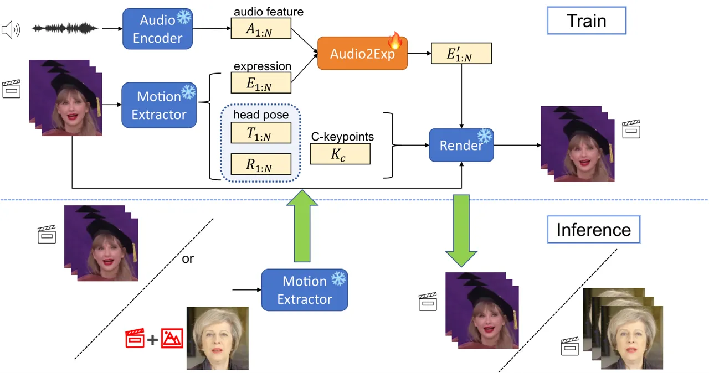

Figure 1: An overview of ControlTalk. Our method consists of 4 modules,
but only Audio2Exp participates in training to simplify the whole
process. In the training process, audio and video are used as inputs,
and the speech features and parameterized coefficients are extracted by
the pre-trained model respectively, which are subsequently converted
into lip-synced expression coefficients through Audio2Exp. Finally, the
input video frame and parameterized coefficients including new
expression coefficients would be rendered to the generated talking face
video. In the inference phase, image input is also supported with driven
motions.

\- We have proposed a new lip synchronization method ControlTalk that
edits parameterized facial keypoints to achieve efficient talking face
generation. Our method simplifies the generation process with
lightweight adaptation, allowing more flexible control of mouth shape
and reducing the possibility of accumulated errors.

\- Compared to current methods, our approach offers greater versatility
and adaptability, as it accommodates input from both images and videos.
This generalization capability allows for a broader range of potential
applications across various scenarios and requirements.

\- Experiments have proven that our ControlTalk outperforms previous
methods in terms of both lip synchronization and video quality, which
can be extended to high-resolution video, and can be applied to multiple
characters and languages.

## 2 Related Work

Audio-driven Single Image-based Talking Face Generation. In the field of
audio-driven single-image talking face video generation, several
researchers have made notable contributions. \[3\] advanced speaking
face generation by employing a cascaded structure and attention
mechanism to address the limitations of previous methods.
MakeltTalk \[34\] successfully separated speaking content from speaker
identity and utilized facial landmarks as an intermediate representation
to generate more realistic and natural speaker-aware facial expressions
and head pose animations. \[32\] proposed a novel flow-guided framework
based on 3D Morphable Model (3DMM) \[1\], utilizing a new large-scale
high-definition dataset to synthesize high-quality, high-definition
one-shot talking face videos. Audio2head \[24\] improved visual quality
and head movement realism by introducing a keypoint motion field
representation. Recently, \[9\] used LSTM to predict normalized facial
feature point movements, converting them into the implicit keypoints of
a facial animation model to generate facial animation videos.
SadTalker \[30\] introduced a motion coefficient representation method
based on 3DMM and developed ExpNet and PoseVAE to generate realistic
motion coefficients from audio, along with a 3D-aware facial
renderer \[25\] for high-quality single-image talking head video
generation. DreamTalk \[14\] is an expression-speaking avatar generation
framework based on a diffusion probability model, leveraging the model
to deliver high performance across various speaking styles while
reducing reliance on costly style references. These approaches have
significantly advanced the field of audio-driven single-person video
generation, providing valuable insights and substantial progress.
Although there are some previous works \[32, 17\] utilize 3DMM as the
implicit representation, their method still faces the problem of
inaccurate expressions with high-dimensional coefficients.  
Audio-driven Video-based Talking Face Generation. The task of generating
a talking face aims to synthesize facial video according to speech
audio. Early efforts by Taylor et al. \[22\] explored the conversion of
audio sequences into phoneme sequences to create adaptable talking
avatars capable of speaking multiple languages. Videoretalking, LipGAN,
and Wav2Lip \[4, 12, 16\] mainly focus on producing an accurate mimic of
the lip movements of any individual in a dynamic speaking face video by
leveraging a lip-sync discriminator. To render more high-fidelity faces,
DINet \[31\] introduced a Deformation Inpainting Network that enables
visually realistic dubbing on high-resolution videos. However, one
drawback is that if the mouth area overlaps with the background,
artifacts may be generated on the outside of the face. More recently,
DiffTalk \[18\] has employed implicit diffusion models to achieve high
visual quality, but at the cost of compromised lip-sync, particularly
when generating faces across different generations. In order to achieve
a more realistic synthesis, FACIAL \[28\] and  \[20\] utilized audio to
regress parameters in 3D face models. However, there are still
challenges to be addressed to achieve both realistic expression and
accurate lip movement in the generated videos. To enhance video quality,
ADNeRF \[8\] RAD-NeRF \[21\] and Geneface \[27\] improved video quality
by employing an audio-driven neural radiance fields (NeRF) model to
generate high-quality talking-head videos based on audio input. In our
work, we introduce a lightweight adaptation module to achieve efficient
and effective lip synchronization for both image and video as input.

## 3 Method

ControlTalk is a lip synchronization method that edits implicit facial
keypoints to achieve efficient talking face generation, which simplifies
the generation process with lightweight adaptation while preserving the
generated image quality of awesome renderer \[25\]. In this section, we
first introduce the basic structure of ControlTalk in Sec. 3.1 and then
describe how we apply a lightweight Audio2Exp network to locally change
expression coefficients in Section 3.2. Moreover, it allows for nuanced
control over the open scale of talking mouth by the adjustable
parameters, facilitating a more consistent and realistic representation,
which is detailed in Section 3.3.

### 3.1 ControlTalk

3D information is essential for enhancing the realism of generated
videos since the real talking face videos are captured in the 3D
environment. Previous works like \[30\] have considered the space of the
predicted 3DMM as the intermediate representation. Nevertheless, there
is also a need for a mapping network that transfers to the implicit
features, which may accumulate errors. Inspired by this, we consider an
unsupervised keypoint representation \[25\] to directly render the face
shown in Fig. 1.

Our proposed method generates the talking face inheriting the motion of
the input video, meanwhile, we also pay attention to the audio for
deforming lip expression into a neutral appearance. Particularly,
benefiting from the parameterized design, our method can be flexibly
adapted to image input with driving audio and video motions. Let
$`\left\{d_{1},d_{2},...,d_{N}\right\}`$ be the input video, where
$`d_{i}`$ is the each frame, and $`N`$ is the total frame number. Let
$`\left\{a_{1},a_{2},...,a_{N}\right\}`$ be the driven audio, which has
been aligned with driven video. Our goal is to generate an output video
$`\left\{y_{1},y_{2},...,y_{N}\right\}`$, where the identity and the
motions in $`y_{i}`$ is inherited from $`d_{i}`$. Especially, in the
mouth region, the lip motion is synthesized based on driven audio.

Firstly, we encode the audio’s speech feature $`A`$ and extract the main
parts of facial motions including expressions $`E`$ and other geometric
coefficients of a person, such as head pose, and canonical
keypoints(C-keypoints). Secondly, we apply Audio2Exp network to predict
lip expressions $`E^{\prime}`$ based on input speech feature $`A`$ and
original expressions $`E`$. Finally, the combined keypoints would
re-edit the input image and render a new talking face with geometric
coefficients jointly.

### 3.2 Audio2Exp

Synthesizing a talking face video requires identifying the specific
person, such as face appearance, pose, and expression. As shown in
Fig. 1, in the training stage, the input video and audio are aligned and
we can extract the 3D facial motions based on pre-trained motion
extractor \[25\]. Given a frame $`d_{i}`$, the 3D motions $`K_{i}`$
represent pose and expression, which are composed of four components:
expression deformation $`E_{i}`$, translation $`T_{i}`$, rotation matrix
$`R_{i}`$, and identity-specific canonical keypoints $`K_{c}`$. These
components are then combined as follows:

```math
K_{i}=R_{i}K_{c}+T_{i}+E_{i}. \tag{1}
```

Our goal is to use the above 3D motions $`K_{i}`$ to render the input
video frame into a lip-synced video, which is defined as:

```math
y=f_{r}(K,d)=f_{r}(RK_{c}+T+E^{\prime},d), \tag{2}
```

where $`f_{r}`$ represents the face renderer, and $`E^{\prime}`$ is the
lip-synced face expressions. Given the original expression deformation
$`E_{i}`$, our Audio2Exp network extracts the motion-related information
based on the input audio to predict the new expression
$`E_{i}^{\prime}`$.

We have observed that even small changes in $`E^{\prime}`$ can have a
great impact on the generated face images based on Eq. 2, such as
distortion of facial appearance, etc. Therefore, the Audio2Exp is
designed to predict a bias $`\Delta E_{i}`$ of expression deformation
through a progressive method.

```math
E_{i}^{\prime}=E_{i}+\alpha\cdot\Delta E_{i}, \tag{3}
```

where $`\alpha`$ would gradually increase from 0 to 1 as the network
training. In the meantime, Audio2Exp is implemented through Zero Module
that is a unique type of Linear layer that progressively grows
parameters from zero to optimized values in a learnable way \[29\]. This
special training strategy guarantees that slight changes in
$`E_{i}^{\prime}`$ are not incorporated into the deep features at the
start of training, while also making no effect in the downstream stage
to render a talking face.

### 3.3 Adjustable Talking Mouth

We observe that parameterized adaptation allows for flexible control of
mouth shape. As shown in Eq. 3, the $`\alpha`$ for expression
deformation is changed during the training process. This design
stabilizes the training phase, maintaining predictability and control
over the impact of variables on the overall model. Therefore, it is
intuitive that we can change the value of $`\alpha`$ to control the
impact of audio on the original expression coefficient $`E`$. Based on
this idea, it offers a more flexible way to regulate the size of the
talking mouth.

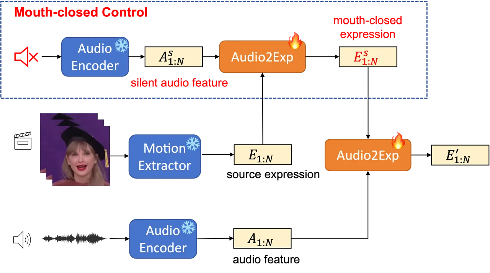

Figure 2: Silent audio training for adjustable talking mouth. Silent
audio would first control the predicted expression, and then the final
expression is synchronized by input audio through Audio2Exp.

In addition, we have found that in facial image rendering, for the whole
face area, although the expression coefficients for the full face region
are not linearly separable, the audio-related components significantly
influence the changes in mouth shape. Moreover, by adjusting the number
of the bias coefficient $`\alpha`$ , the degree of mouth opening is
correspondingly affected. The comparison cases are detailed in Sec. 4.3.

To get better control of mouth shape, we also take advantage of the
silent audio. Because different speakers have different speaking habits
within the training dataset, there can be significant variations in the
mouth shapes corresponding to the same phonemes. However, we aim to
control the size of the mouth shape by the bias coefficient $`\alpha`$,
so it is crucial to transfer all training videos within the same
distribution. Consequently, our model is designed with a dual training
approach under the guidance of silent audio as shown in Fig. 2. To our
surprise, this method also ensures that our model can handle lip motion
under silent audio effectively, resulting in more stable performance.

### 3.4 Losses

During the training stage, two types of loss functions are employed:
perceptual loss \[11\] and lip-sync loss \[5, 16\]. For different areas
of the image, VGG perceptual loss and lip-sync loss are separately
calculated as shown in Fig. 3. The mouth area is related to the driven
audio, so the mouth area is cropped for calculating lip-sync loss.
During the generation process, the out-of-mouth area is expected to
remain unchanged, so we use VGG perceptual loss to minimize the
difference between ground truth(GT) and the generated frame.

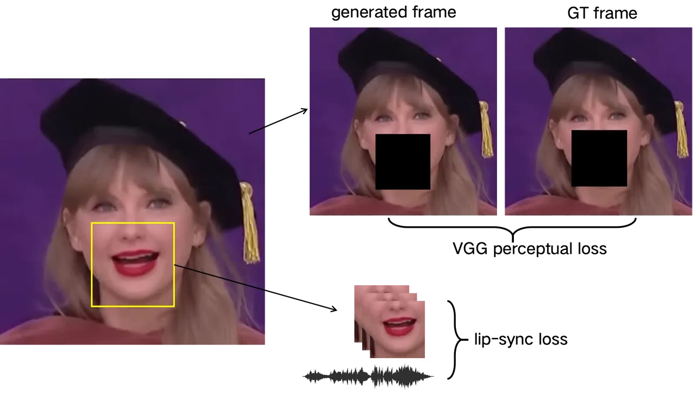

Figure 3: The combination of two losses. Perceptual loss and lip-sync
loss are used in different areas of the image.

Perceptual Loss. We compute perceptual loss in two image scales.
Specifically, due to the parameterized expression as mentioned in
Sec. 3.2, we only change the mouth-related appearance of the generated
frame. Therefore, it is possible to compare the source frame and
generated frame except for this changed area. As shown in Fig. 3, the
image of the mouth area is masked during perceptual loss calculation.
the generate frame $`y\in R^{3\times H\times W}`$ and the source frame
$`d\in R^{3\times H\times W}`$ are downsampled to
$`y^{\prime}\in R^{3\times\frac{H}{2}\times\frac{W}{2}}`$ and
$`d^{\prime}\in R^{3\times\frac{H}{2}\times\frac{W}{2}}`$. These paired
images { $`y`$, $`d`$ } and { $`y^{\prime}`$, $`d^{\prime}`$ } are
encoded by a pre-trained VGG-19 network \[19\] to compute the perceptual
loss. The $`j`$th layer of VGG-19 $`\phi`$ is $`\phi_{j}`$ and total
layer number is $`M`$. The perceptual loss is written as:

```math
\mathcal{L}_{p}=\sum_{j=1}^{M}\frac{\left\|\phi_{j}(d)-\phi_{j}(y)\right\|+\left\|\phi_{j}(d^{\prime})-\phi_{j}(y^{\prime})\right\|}{2M}. \tag{4}
```

lip-sync Loss. Following the previous approach Wav2Lip \[16\], a
lip-sync loss is incorporated to enhance the synchronization of lip
motion in dubbing videos. As shown in Fig. 3, we only select the mouth
area to improve the sync quality, and the lip-sync network is
pre-trained as the same as Wav2Lip \[16\] before model training. The
cosine-similarity loss performs synchronous matching of frames feature
$`V`$ and audio feature $`A`$. The lip-sync loss is expressed as:

```math
\mathcal{L}_{sync}=\frac{V\cdot A}{max\{\left\|V\right\|_{2}\cdot\left\|A\right\|_{2},\varepsilon\}}. \tag{5}
```

The generator minimizes total loss $`\mathcal{L}_{total}`$, which is the
weighted sum of the perceptual loss and the lip-sync loss.

```math
\mathcal{L}_{total}=\lambda_{p}\cdot\mathcal{L}_{p}+\lambda_{sync}\cdot\mathcal{L}_{sync} \tag{6}
```

## 4 Experiments

### 4.1 Experimental Setup

Implementation Details. In our experiment, the video sampling rate is 25
FPS and the audio sampling rate is 16KHz. We preprocess all videos by
cropping and resizing to $`256\times 256`$. To synchronize the audio
features and the video, We extract the hubert features \[15\] first. We
pre-train the audio-video Sync network and face renderer for 3 and 48
hours respectively, and the motion extractor model is a part of the face
renderer. Then we train Audio2Exp with the above pre-trained models by a
learning rate $`1\times 10^{-5}`$. And the total training costs 1 day on
8 NVIDIA A10 GPUs.

Datasets. We train and evaluate the ControlNet and all the pre-trained
models on MEAD \[23\] and HDTF \[32\]. MEAD is a high-quality emotional
talking-head video set with 8 kinds of emotions. To ensure fair
comparisons, we split the MEAD dataset into training and testing sets as
official. We download HDTF videos from YouTube with their best
resolution and split them into training and testing sets at a ratio of
9:1.

Metrics. In terms of image generation quality and video synchronization
effect, we use SSIM \[26\], Sync \[6\], and Mouth/Face Landmark
Distance \[3\] as metrics respectively. SSIM is used to measure the
quality of generated images. lip-sync evaluates the lip-syn accuracy by
calculating the embedding distance between the output video and source
audio. The Mouth/Face Landmarks(M/F-LDM) Distance is used to indicate
face consistency by calculating the keypoints between the output image
and the ground truth image.

### 4.2 Audio-driven Talking Face Generation

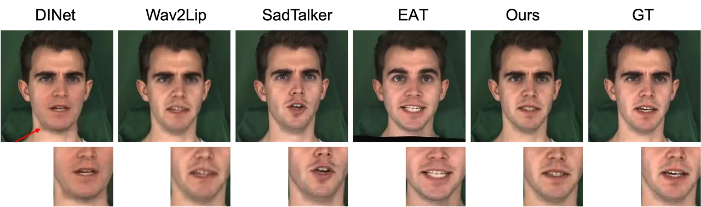

Figure 4: Detailed comparisons of different methods. The red arrow
points out the mouth box of the DINet.

We conducted the quantitative and qualitative comparisons with the
state-of-the-art methods. Both comparisons show our method can generate
more accurate mouth shapes and richer facial expressions for lip
synchronization. Besides, as shown in Fig. 4, our approach preserves the
characteristics of the specific portrait, such as facial appearance and
tooth shape.

|                  | HDTF  |       |       |           | MEAD  |       |       |           |
| ---------------- | ----- | ----- | ----- | --------- | ----- | ----- | ----- | --------- |
|                  | SSIM↑ | FID↓  | Sync↓ | M/F-LDM↓  | SSIM↑ | FID↓  | Sync↓ | M/F-LDM↓  |
| Wav2Lip \[16\]   | 0.62  | 41.25 | 0.52  | 2.25/3.27 | 0.74  | 51.57 | 0.66  | 2.04/2.31 |
| DINet \[31\]     | 0.68  | 32.30 | 0.46  | 1.88/2.78 | 0.73  | 33.96 | 0.60  | 2.50/2.34 |
| DreamTalk \[14\] | 0.60  | 34.07 | 0.50  | 2.72/3.66 | 0.54  | 83.66 | 0.67  | 2.97/4.31 |
| EAT \[7\]        | 0.68  | 46.99 | 0.49  | 2.23/2.75 | 0.71  | 43.95 | 0.62  | 1.85/2.04 |
| SadTalker \[30\] | 0.69  | 24.33 | 0.53  | 1.83/2.56 | 0.64  | 40.92 | 0.64  | 2.75/3.74 |
| Ours             | 0.68  | 27.37 | 0.42  | 2.14/2.93 | 0.71  | 34.62 | 0.62  | 2.49/2.67 |

Table 1: Comparison with the state-of-the-art methods on HDTF and MEAD
dataset. We conduct the comparisons based on same-IDs due to the need
for ground truth. SadTalker is evaluated using the fixed pose. Other
methods are based on a reference video as a pose sequence.

Quantitative Comparison. We conducted the comparisons with
Wav2Lip \[16\], DINet \[31\], DreamTalk \[14\], EAT \[7\] and
SadTalker \[30\], covering both single image-based and video-based
talking face generation methods. The quantitative analysis comparison is
shown in Table. 1. Our method is generally better than previous methods
in Sync metric, which indicates the consistency of audio and face image.
The other results are highly close overall. Compared with traditional
GAN-based methods, such as Wav2Lip and DINet, our method is better than
them in the image quality field, which is also shown in Fig. 5 and
Fig. 6. The mouth detail of these methods appears blurry.

Furthermore, the other renderer-based methods, DreamTalk and SadTalker,
fail to generate the precise lip synchronization face despite using
trusted renderers, such as PIRenderer \[17\]. The superior performance
in the Sync metric demonstrates our method’s proficiency in generating
lip motion consistent with the reference audio speech.

Qualitative Comparison. We have compared the state-of-the-art methods
including video-based dubbing, singe image-based generation with
reference video, and singe image-based face animation method, which is
shown in Fig. 5 and Fig. 6. In order to indicate the impact of different
identities and different audio styles, we conducted experiments on the
same-ID and cross-ID faces. The ground truth mouth shape is also listed.

It can be seen that our method generates accurate mouth shapes, natural
expressions, and good image quality. The mouth of the image generated by
Wav2Lip is very blurry and the mouth shape is inaccurate. DINet
generates results with a border around the mouth detailed in Fig. 4. The
facial expressions of EAT and DreamTalk are relatively uncoordinated,
and their mouth shapes are average, which looks like another one.

The capability of single image-based methods, such as EAT, DreamTalk,
and SadTalker, is limited to generating consistent faces, lacking the
finesse for realistic and nuanced expressions. For example, no matter
what expression the reference video shows, EAT always has wide-open
eyes. Additionally, because of the sequence pose, SadTalker struggles to
maintain a consistent head movement for talking face video. For
DreamTalk rows in both same-ID (Fig. 5) and cross-ID (Fig. 6), the
predicted mouths are exaggerated, and the distorted faces limit the
vitality of facial expressions and head movements. Moreover, for
different people(left, right), the opening range of the mouth tends to
be a consistent average size. However, our method excels in producing
realistic talking faces that not only mirror the specific identity
appearance but also achieve precise lip synchronization and superior
video quality. Compared to other methods, our ControlTalk generates more
realistic facial expressions and a wider range of head movements based
on driven motions.

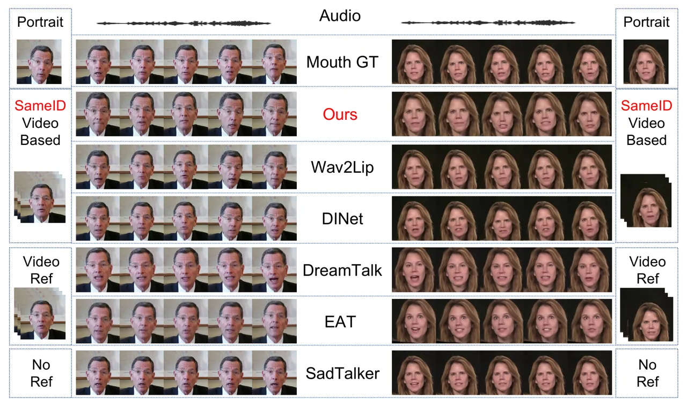

Figure 5: Qualitative comparisons with same-ID. The input audio and
portrait are the same identity, and all dubbing videos and reference
videos come from the same ID.

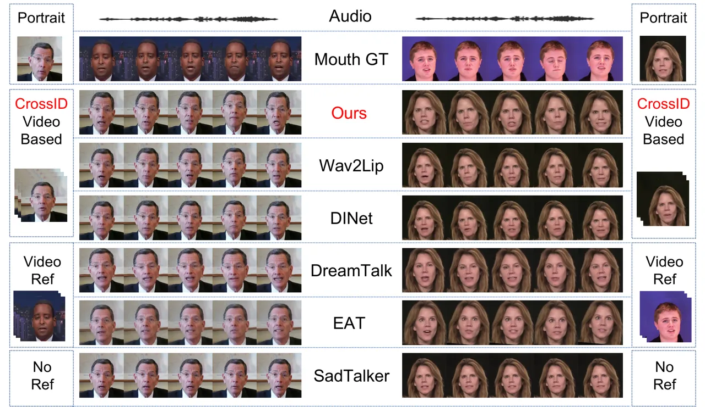

Figure 6: Qualitative comparisons with cross-ID. The input audio and
portrait are different identities, and the reference video also comes
from a different ID.

### 4.3 Ablation Study

Perceptual and Lip-sync Loss. The ratio of perceptual and lip-sync loss
would affect the accuracy of the lip motion and identity preservation.
The greater the weight of lip-sync, the better the mouth shape may be,
but the face may be distorted. The greater the weight of perceptual
loss, the better the face identity is maintained, but the talking motion
may not change significantly. We have experimentally verified the ratio
of the two losses. The images corresponding to different lip-sync ratios
are shown in Fig. 7.

As the lip-sync ratio increases, we find that changes in the shape of
the mouth will extremely match the vocalization, which leads to
unnatural facial expressions. As shown in the last row of Fig. 7, when
the ratio is 1, the mouth shape is already overfitting whenever it is
closed or opened. Therefore, we use a ratio of 0.3 by default. After
experiments, we have found that this is in line with the pronunciation
habits of most people.

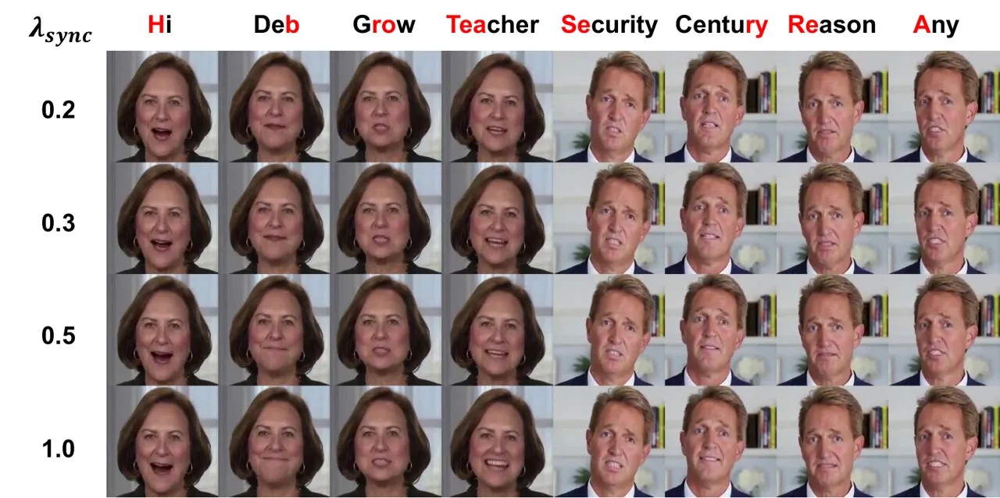

Figure 7: Generated frames with different lip-sync ratios. Each frame
corresponds to the top syllables in the condition of left lip-sync
ratios.

Mouth Opening Control. According to the design of the bias coefficient
$`\alpha`$ proposed in Sec. 3.3, by adjusting the magnitude of
$`\alpha`$, the degree of mouth opening is correspondingly affected. The
larger the coefficient, the more obvious the mouth shape is. However, a
coefficient that is too large may cause the results to be overly
exaggerated. If the coefficient is too small, the mouth opening may be
too small and the mouth shape may not change significantly. Especially,
as shown in Fig. 8, when $`\alpha=0`$, the generated mouth would close
whatever the syllable is. Normally, a value around 0.5 is appropriate,
and we can also choose a larger value to achieve a more exaggerated
mouth motion.

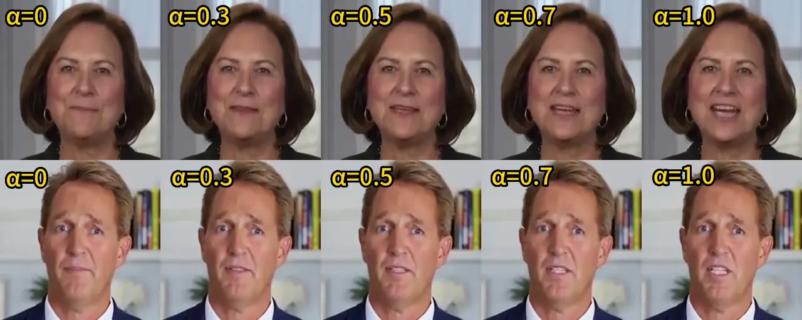

Figure 8: Comparison of different $`\alpha`$. From left to right, the
size of the mouth becomes larger as $`\alpha`$ increases for the same
syllable.

### 4.4 Generalization

Characters Freedom. Although our model is only trained on real videos,
it not only has a good generation of real-human video but is also able
to cope with various out-of-domain portraits, even single-image
portraits. The supplemental video demonstrates the capability for
different styles of characters, i.e. real humans, paintings, generated
faces and cartoons shown in Fig. 9.

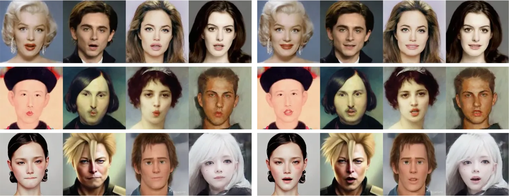

Figure 9: Results in different kinds of characters as input portraits.
The first row is real humans, the second row is paintings, and the third
row is generated images and cartoons.

Languages Expandability. The language of the training dataset is English
without other kinds of languages. However, we test our model over 10
different languages including text-to-speech(TTS) and human speech. For
example, a French-driven result is shown in Fig. 10 with clearly visible
changes in the mouth area. More expandability results are shown in our
supplemental video.

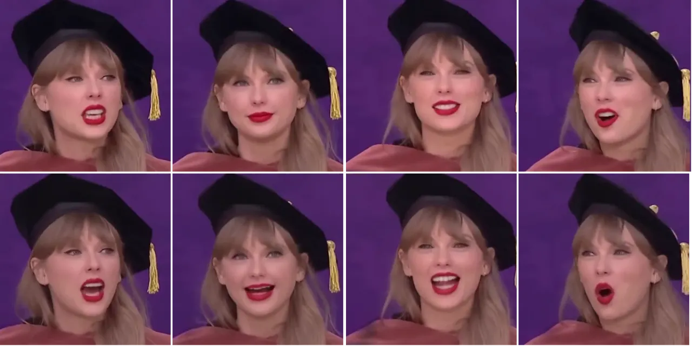

Figure 10: Results with French audio. Source video frames are in the
first row, and the second row is the generated lip-synchronized frames
in French.

Resolutions Versatility. The experiments conducted in this paper mainly
involve an image resolution of $`256\times 256`$. However, the Audio2Exp
module is not limited to a single resolution. This is because the
Audio2Exp module manipulates the 3D facial motions based on implicit
keypoints. Therefore, we can generate images of any size as long as the
pre-trained renderer supports it. We have validated the driven effect of
the video synthesis model with inputs of $`512\times 512`$ resolution.
As shown in Fig. 11, when substituting the $`512\times 512`$ resolution
as the input, the generated video/image quality experiences a
significant enhancement, with the details of the beard becoming
distinctly visible. It demonstrates the independence of our Audio2Exp
module from the face rendering resolution, which can adapt to even
higher resolution renderers.

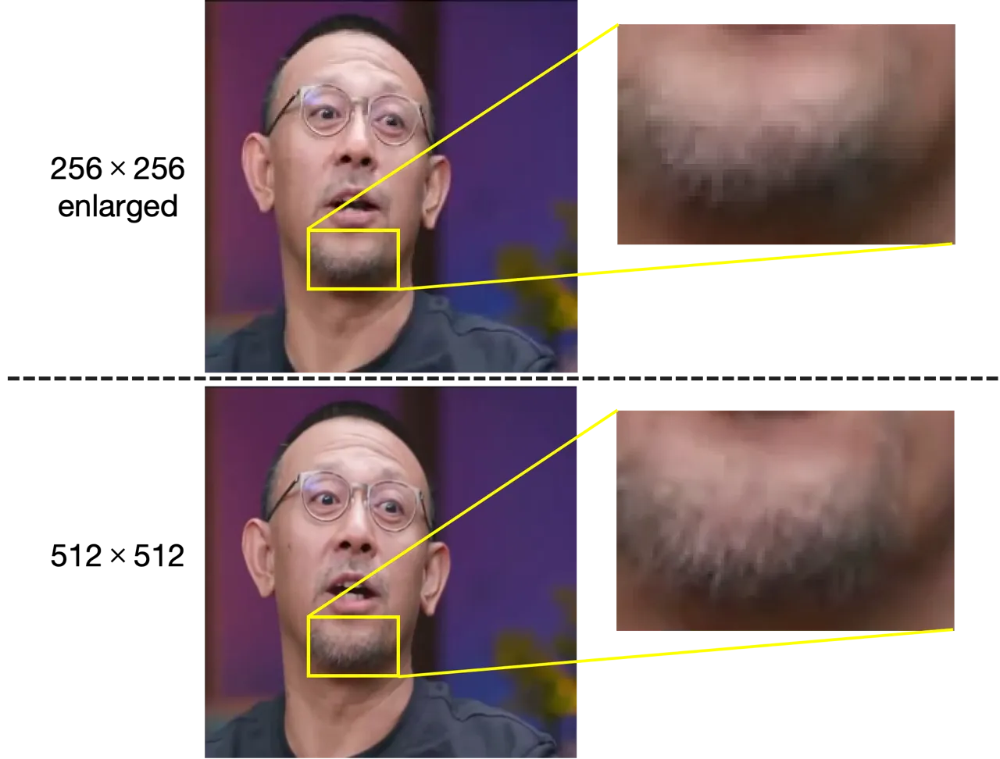

Figure 11: Comparisons of $`256\times 256`$ and $`512\times 512`$
resolution results.

## 5 Conclusion and Discussion

In this paper, we have proposed a novel lip synchronization method
ControlTalk, which unifies both image and video-based talking face
generation approaches. Our method aims to allow more flexible control
while simplifying the generation process. We introduce a lightweight
adaptation Audio2Exp to optimize lip-sync and re-edit the parameterized
face expressions. Additionally, the parameterized adaptation allows
detailed quantitative control over the mouth-opening shape. Experiments
have proven that our ControlTalk outperforms previous methods in terms
of both lip synchronization and video quality, which can be extended to
high-resolution video, and can be applied to a diverse range of
characters and languages.

## References

- \[1\] Blanz, V., Vetter, T.: A morphable model for the synthesis of 3d
  faces. In: Proceedings of the 26th annual conference on Computer
  graphics and interactive techniques. pp. 187–194 (1999)
- \[2\] Blattmann, A., Dockhorn, T., Kulal, S., Mendelevitch, D.,
  Kilian, M., Lorenz, D., Levi, Y., English, Z., Voleti, V., Letts, A.,
  et al.: Stable video diffusion: Scaling latent video diffusion models
  to large datasets. arXiv preprint arXiv:2311.15127 (2023)
- \[3\] Chen, L., Maddox, R.K., Duan, Z., Xu, C.: Hierarchical
  cross-modal talking face generation with dynamic pixel-wise loss. In:
  Proceedings of the IEEE/CVF conference on computer vision and pattern
  recognition. pp. 7832–7841 (2019)
- \[4\] Cheng, K., Cun, X., Zhang, Y., Xia, M., Yin, F., Zhu, M., Wang,
  X., Wang, J., Wang, N.: Videoretalking: Audio-based lip
  synchronization for talking head video editing in the wild. In:
  SIGGRAPH Asia 2022 Conference Papers. pp. 1–9 (2022)
- \[5\] Chung, J.S., Zisserman, A.: Out of time: automated lip sync in
  the wild. In: Computer Vision–ACCV 2016 Workshops: ACCV 2016
  International Workshops, Taipei, Taiwan, November 20-24, 2016, Revised
  Selected Papers, Part II 13. pp. 251–263. Springer (2017)
- \[6\] Chung, J.S., Zisserman, A.: Out of time: automated lip sync in
  the wild. In: Computer Vision–ACCV 2016 Workshops: ACCV 2016
  International Workshops, Taipei, Taiwan, November 20-24, 2016, Revised
  Selected Papers, Part II 13. pp. 251–263. Springer (2017)
- \[7\] Gan, Y., Yang, Z., Yue, X., Sun, L., Yang, Y.: Efficient
  emotional adaptation for audio-driven talking-head generation. In:
  Proceedings of the IEEE/CVF International Conference on Computer
  Vision. pp. 22634–22645 (2023)
- \[8\] Guo, Y., Chen, K., Liang, S., Liu, Y.J., Bao, H., Zhang, J.:
  Ad-nerf: Audio driven neural radiance fields for talking head
  synthesis. In: Proceedings of the IEEE/CVF International Conference on
  Computer Vision. pp. 5784–5794 (2021)
- \[9\] Gururani, S., Mallya, A., Wang, T.C., Valle, R., Liu, M.Y.:
  Space: Speech-driven portrait animation with controllable expression.
  In: Proceedings of the IEEE/CVF International Conference on Computer
  Vision. pp. 20914–20923 (2023)
- \[10\] Ji, X., Zhou, H., Wang, K., Wu, Q., Wu, W., Xu, F., Cao, X.:
  Eamm: One-shot emotional talking face via audio-based emotion-aware
  motion model. In: ACM SIGGRAPH 2022 Conference Proceedings. pp.
  1–10 (2022)
- \[11\] Johnson, J., Alahi, A., Fei-Fei, L.: Perceptual losses for
  real-time style transfer and super-resolution. In: Computer
  Vision–ECCV 2016: 14th European Conference, Amsterdam, The
  Netherlands, October 11-14, 2016, Proceedings, Part II 14. pp.
  694–711. Springer (2016)
- \[12\] KR, P., Mukhopadhyay, R., Philip, J., Jha, A., Namboodiri, V.,
  Jawahar, C.: Towards automatic face-to-face translation. In:
  Proceedings of the 27th ACM international conference on multimedia.
  pp. 1428–1436 (2019)
- \[13\] Lu, H., Yang, G., Fei, N., Huo, Y., Lu, Z., Luo, P., Ding, M.:
  Vdt: General-purpose video diffusion transformers via mask modeling.
  In: The Twelfth International Conference on Learning
  Representations (2023)
- \[14\] Ma, Y., Zhang, S., Wang, J., Wang, X., Zhang, Y., Deng, Z.:
  Dreamtalk: When expressive talking head generation meets diffusion
  probabilistic models. arXiv preprint arXiv:2312.09767 (2023)
- \[15\] Ott, M., Edunov, S., Baevski, A., Fan, A., Gross, S., Ng, N.,
  Grangier, D., Auli, M.: fairseq: A fast, extensible toolkit for
  sequence modeling. In: Proceedings of NAACL-HLT 2019:
  Demonstrations (2019)
- \[16\] Prajwal, K., Mukhopadhyay, R., Namboodiri, V.P., Jawahar, C.: A
  lip sync expert is all you need for speech to lip generation in the
  wild. In: Proceedings of the 28th ACM international conference on
  multimedia. pp. 484–492 (2020)
- \[17\] Ren, Y., Li, G., Chen, Y., Li, T.H., Liu, S.: Pirenderer:
  Controllable portrait image generation via semantic neural rendering.
  In: Proceedings of the IEEE/CVF International Conference on Computer
  Vision. pp. 13759–13768 (2021)
- \[18\] Shen, S., Zhao, W., Meng, Z., Li, W., Zhu, Z., Zhou, J., Lu,
  J.: Difftalk: Crafting diffusion models for generalized talking head
  synthesis. arXiv preprint arXiv:2301.03786 (2023)
- \[19\] Simonyan, K., Zisserman, A.: Very deep convolutional networks
  for large-scale image recognition. arXiv preprint
  arXiv:1409.1556 (2014)
- \[20\] Song, L., Wu, W., Qian, C., He, R., Loy, C.C.: Everybody’s
  talkin’: Let me talk as you want. IEEE Transactions on Information
  Forensics and Security 3 (2022)
- \[21\] Tang, J., Wang, K., Zhou, H., Chen, X., He, D., Hu, T., Liu,
  J., Zeng, G., Wang, J.: Real-time neural radiance talking portrait
  synthesis via audio-spatial decomposition. arXiv preprint
  arXiv:2211.12368 (2022)
- \[22\] Taylor, S., Kim, T., Yue, Y., Mahler, M., Krahe, J., Rodriguez,
  A.G., Hodgins, J., Matthews, I.: A deep learning approach for
  generalized speech animation. ACM TOG 2 (2017)
- \[23\] Wang, K., Wu, Q., Song, L., Yang, Z., Wu, W., Qian, C., He, R.,
  Qiao, Y., Loy, C.C.: Mead: A large-scale audio-visual dataset for
  emotional talking-face generation. In: ECCV (2020)
- \[24\] Wang, S., Li, L., Ding, Y., Fan, C., Yu, X.: Audio2head:
  Audio-driven one-shot talking-head generation with natural head
  motion. arXiv preprint arXiv:2107.09293 (2021)
- \[25\] Wang, T.C., Mallya, A., Liu, M.Y.: One-shot free-view neural
  talking-head synthesis for video conferencing. In: Proceedings of the
  IEEE Conference on Computer Vision and Pattern Recognition (2021)
- \[26\] Wang, Z., Bovik, A.C., Sheikh, H.R., Simoncelli, E.P.: Image
  quality assessment: from error visibility to structural similarity.
  IEEE transactions on image processing 13(4), 600–612 (2004)
- \[27\] Ye, Z., Jiang, Z., Ren, Y., Liu, J., He, J., Zhao, Z.:
  Geneface: Generalized and high-fidelity audio-driven 3D talking face
  synthesis. arXiv 3 (2023)
- \[28\] Zhang, C., Zhao, Y., Huang, Y., Zeng, M., Ni, S., Budagavi, M.,
  Guo, X.: Facial: Synthesizing dynamic talking face with implicit
  attribute learning. In: Proceedings of the IEEE/CVF international
  conference on computer vision. pp. 3867–3876 (2021)
- \[29\] Zhang, L., Rao, A., Agrawala, M.: Adding conditional control to
  text-to-image diffusion models (2023)
- \[30\] Zhang, W., Cun, X., Wang, X., Zhang, Y., Shen, X., Guo, Y.,
  Shan, Y., Wang, F.: Sadtalker: Learning realistic 3d motion
  coefficients for stylized audio-driven single image talking face
  animation. In: Proceedings of the IEEE/CVF Conference on Computer
  Vision and Pattern Recognition. pp. 8652–8661 (2023)
- \[31\] Zhang, Z., Hu, Z., Deng, W., Fan, C., Lv, T., Ding, Y.: Dinet:
  Deformation inpainting network for realistic face visually dubbing on
  high resolution video. arXiv preprint arXiv:2303. 03988, 2023 2,
  03988 (2023)
- \[32\] Zhang, Z., Li, L., Ding, Y., Fan, C.: Flow-guided one-shot
  talking face generation with a high-resolution audio-visual dataset.
  In: Proceedings of the IEEE/CVF Conference on Computer Vision and
  Pattern Recognition. pp. 3661–3670 (2021)
- \[33\] Zhou, H., Sun, Y., Wu, W., Loy, C.C., Wang, X., Liu, Z.:
  Pose-controllable talking face generation by implicitly modularized
  audio-visual representation. In: Proceedings of the IEEE/CVF
  conference on computer vision and pattern recognition. pp.
  4176–4186 (2021)
- \[34\] Zhou, Y., Han, X., Shechtman, E., Echevarria, J., Kalogerakis,
  E., Li, D.: Makelttalk: speaker-aware talking-head animation. ACM
  Transactions On Graphics (TOG) 39(6), 1–15 (2020)
