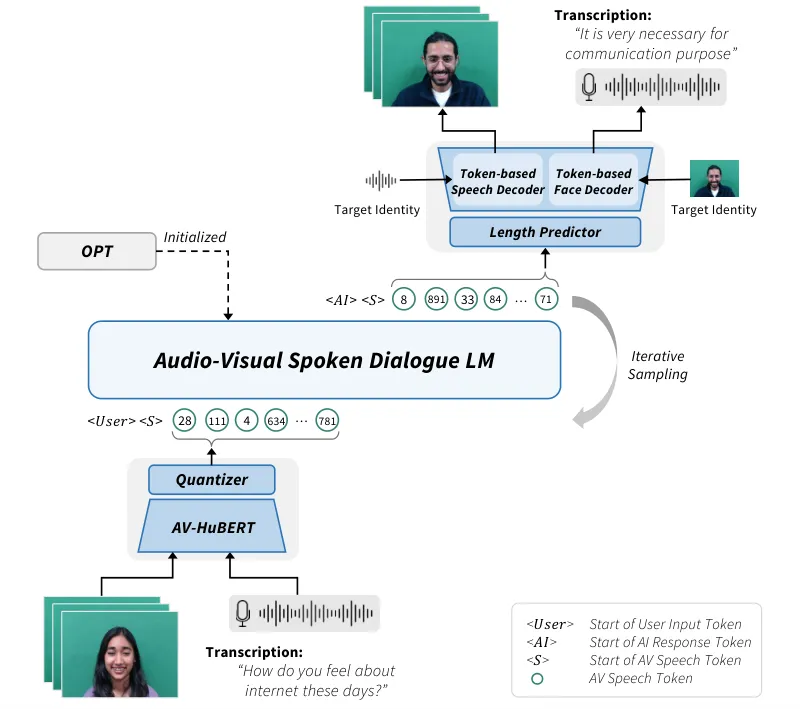
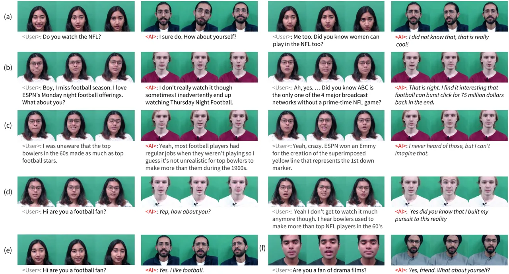
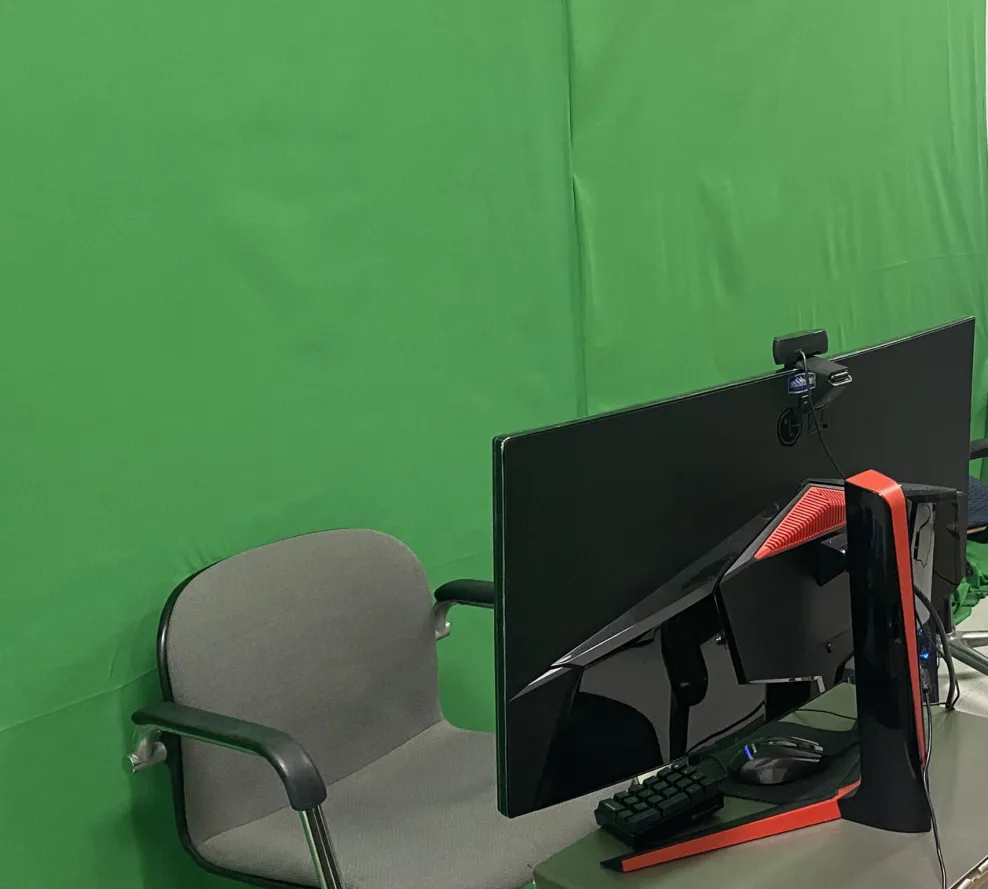

# Let’s Go Real Talk: Spoken Dialogue Model for Face-to-Face Conversation

Se Jin Park^(\*)  Chae Won Kim^(\*)  Hyeongseop Rha  Minsu Kim  Joanna
Hong  Jeong Hun Yeo  Yong Man Ro^(†)  
Integrated Vision and Language Lab, KAIST  
{jinny960812, chaewonkim, ryool_1832, sedne246, ymro}@kaist.ac.kr
 ms.k@ieee.org  joanna2587@gmail.com

###### Abstract

In this paper, we introduce a novel Face-to-Face spoken dialogue model.
It processes audio-visual speech from user input and generates
audio-visual speech as the response, marking the initial step towards
creating an avatar chatbot system without relying on intermediate text.
To this end, we newly introduce MultiDialog, the first large-scale
multimodal (_i.e_., audio and visual) spoken dialogue corpus containing
340 hours of approximately 9,000 dialogues, recorded based on the open
domain dialogue dataset, TopicalChat. The MultiDialog contains parallel
audio-visual recordings of conversation partners acting according to the
given script with emotion annotations, which we expect to open up
research opportunities in multimodal synthesis. Our Face-to-Face spoken
dialogue model incorporates a textually pretrained large language model
and adapts it into the audio-visual spoken dialogue domain by
incorporating speech-text joint pretraining. Through extensive
experiments, we validate the effectiveness of our model in facilitating
a face-to-face conversation. Demo and data are available at
[https://multidialog.github.io](https://multidialog.github.io) and
[https://huggingface.co/datasets/IVLLab/MultiDialog](https://huggingface.co/datasets/IVLLab/MultiDialog),
respectively.

^(†)^(†) ^(∗)Equal contribution. ^(†)Corresponding author. This work was
supported by the National Research Foundation of Korea (NRF) grant
funded by the Korea government (MSIT) (No. NRF-2022R1A2C2005529) and
Institute of Information & communications Technology Planning &
Evaluation (IITP) grant funded by the Korea government (MSIT)
(No.2022-0-00124, Development of Artificial Intelligence Technology for
Self-Improving Competency-Aware Learning Capabilities).

|                                |              |          |              |       |      |       |         |
| ------------------------------ | ------------ | -------- | ------------ | ----- | ---- | ----- | ------- |
| Dataset                        | \# Dialogues | \# Turns | Length (hrs) | Audio | Text | Video | Emotion |
| IEMOCAP Busso et al. (2008)    | 151          | 10,039   | 12           | ✓     | ✓    | ✓     | ✓       |
| DSTC2 Henderson et al. (2014)  | 1,612        | 23,354   | 32           | ✓     | ✓    | ✗     | ✗       |
| MELD Poria et al. (2018)       | 1,433        | 13,000   | 13.7         | ✓     | ✗    | ✓     | ✓       |
| DailyTalk Lee et al. (2023)    | 2,514        | 23,774   | 21.7         | ✓     | ✓    | ✗     | ✗       |
| Expresso Nguyen et al. (2023a) | 391          | 2,400    | 47           | ✓     | ✓    | ✗     | ✓       |
| SpokenWOZ Si et al. (2023)     | 5,700        | 203,074  | 249          | ✓     | ✓    | ✗     | ✗       |
| MultiDialog                    | 8,733        | 187,859  | 340          | ✓     | ✓    | ✓     | ✓       |

Table 1: Comparison of MultiDialog dataset with publicly available
multimodal dialogue datasets.

## 1 Introduction

Spoken Dialogue System (SDS), often referred to as a conversational
agent, engages in natural speech conversations with humans by
recognizing speech from user input and providing contextually
appropriate and accurate responses with speech. With spoken language as
the primary interface, it has numerous applications for human-computer
interactions such as customer service and voice assistants.

However, when people communicate face-to-face, we utilize not only audio
but also visual information of the conversing partner to process spoken
words and non-verbal cues (_i.e_., facial expressions, gestures, and
emotions) Petridis et al. (2018); Hong et al. (2023). This multimodal
information enhances understanding of the speech content and the
speaker’s intent. Furthermore, having a visual counterpart to audio can
simulate a real face-to-face conversation experience, making the user
feel more connected and engaged.

In this paper, we explore an audio-visual spoken dialogue system to
facilitate direct face-to-face conversation for the first time. Central
to the development of dialogue systems is the large amount of
high-quality dialogue data. Current dialogue systems are predominantly
text-based, driven by the abundance of text dialogue datasets Lowe
et al. (2015); Li et al. (2017); Zhang et al. (2018); Rashkin et al.
(2018); Budzianowski et al. (2018); Zhou et al. (2018); Reddy et al.
(2019); Lambert et al. (); Ding et al. (2023); Köpf et al. (2023).
Recently, several audio dialogue datasets have been released Lee et al.
(2023); Si et al. (2023); Nguyen et al. (2023a) which augment existing
text dialogue data Li et al. (2017); Budzianowski et al. (2018) with
speech. However, those with visual components remain limited in scale,
comprising less than 15 hours in total Busso et al. (2008); Poria et al.
(2018). Addressing this data gap, we introduce MultiDialog, the first
large-scale audio-visual spoken dialogue corpus. It consists of 340
hours of audio-visual recordings of approximately 9,000 dialogues,
derived from open-domain text dialogue dataset, TopicalChat
Gopalakrishnan et al. (2023) which is an extensive multi-turn dialogue
corpus collected from real conversations covering 9 broad topics. The
proposed MultiDialog consists of emotion annotations for each utterance
and simultaneous recordings of both the listener and the speaker,
presenting opportunities for diverse research; from face-to-face
dialogue system to talking face synthesis Park et al. (2022); Zhang
et al. (2023b), listener’s face synthesis Song et al. (2023); Zhou
et al. (2023), and emotion-conditioned face synthesis Goyal et al.
(2023).

Based on the MultiDialog dataset, we propose the first audio-visual
spoken dialogue model that can directly process audio-visual speech as
user input and generate audio-visual speech as the output response.
Motivated by the recent success of the direct spoken dialogue model
using discretized speech tokens Nguyen et al. (2023b); Zhang et al.
(2023a), we introduce audio-visual (AV) speech tokens extracted by
quantizing audio-visual speech features from a self-supervised model Shi
et al. (2021). Utilizing the AV speech tokens as pseudo texts, we
integrate AV speech into a pretrained large-language model (LLM) Zhang
et al. (2022) through joint speech-text pretraining. The response is
also returned in AV speech tokens, which are synthesized into a talking
face video as the output for direct interaction with the system.

Our contributions are in three folds: (1) We introduce the first direct
Face-to-Face dialogue model which processes multimodal speech from user
input and generates multimodal speech as the output response,
facilitating a face-to-face conversation system. (2) To build a
face-to-face dialogue system, we propose the first large-scale
multimodal (_i.e_., audio, visual, and text) dialogue corpus,
MultiDialog consisting of 340 hours of approximately 9,000 audio-visual
conversation streams. (3) We demonstrate that joint speech-text
pretraining leveraging a pre-trained large language model improves upon
direct initialization in retaining knowledge of the original large
language model.

|                           |         |            |            |           |           |         |
| ------------------------- | ------- | ---------- | ---------- | --------- | --------- | ------- |
| MultiDialog               | Train   | Valid Freq | Valid Rare | Test Freq | Test Rare | Total   |
| \# dialogues              | 7,011   | 448        | 443        | 450       | 381       | 8,733   |
| \# utterance              | 151,645 | 8,516      | 9,556      | 9,811     | 8,331     | 187,859 |
| avg \# utterance/dialogue | 21.63   | 19.01      | 21.57      | 21.80     | 21.87     | 21.51   |
| avg length/utterance (s)  | 6.50    | 6.23       | 6.40       | 6.99      | 6.49      | 6.51    |
| avg length/dialogue (min) | 2.34    | 1.97       | 2.28       | 2.54      | 2.36      | 2.33    |
| total length (hr)         | 273.93  | 14.74      | 17.00      | 19.04     | 15.01     | 339.71  |

Table 2: Datailed statistics of MultiDialog

## 2 Related Work

### 2.1 Spoken Dialogue Dataset

In recent years, the development of speech dialogue datasets has played
a pivotal role in understanding human behavior and building spoken
dialogue systems that emulate real-life conversations. Early speech
datasets focus on analyzing human behavior such as emotion and intent in
speech, establishing the foundation for spoken dialogue systems. IEMOCAP
Busso et al. (2008) and MELD Poria et al. (2018), comprising audio and
video recordings of dialogues, are designed to study emotional dynamics
in conversations. In addition to understanding emotions, DSTC2 Henderson
et al. (2014) presents telephone-based speech dialogues for dialogue
state tracking to predict user’s goals. Building upon datasets that
study human behavior in speech, recent spoken dialogue datasets were
built to model realistic dialogue systems. Expresso Nguyen et al.
(2023a) introduces speech dialogues spanning 26 expressive styles for
natural speech synthesis. DailyTalk Lee et al. (2023) and SpokenWOZ Si
et al. (2023) datasets introduce speech-text conversations for spoken
dialogues. While existing works have contributed to advancing spoken
conversation systems, dialogue datasets are limited in scale and solely
consist of audio and text, thereby constraining the development of
audio-visual spoken dialogue systems incorporating visual cues. To
address these limitations, we expand the spoken dialogue in scale and to
the visual modality, and introduce MultiDialog, a large-scale multimodal
spoken dialogue dataset. A summary of existing multimodal dialogue
datasets and MultiDialog is shown in Table 1.

### 2.2 Spoken Dialogue Models

Audio Language Model, driven by transformer-based architecture, has made
remarkable strides in speech processing. By treating continuous speech
as a discrete set of representations, speech can be effectively modeled
as text, allowing the application of Natural Language Processing (NLP)
techniques. While it has made notable progress in speech synthesis
Lakhotia et al. (2021); Borsos et al. (2023); Wang et al. (2023a);
Hassid et al. (2023); Nachmani et al. (2023), speech translation
Barrault et al. (2023); Dong et al. (2023); Rubenstein et al. (2023),
and speech recognition Wang et al. (2023b), spoken dialogue system is a
relatively unexplored field of research due to the scarcity of spoken
dialogue datasets. Several works made an effort to tackle data issues by
leveraging the power of large language models (LLMs). SpeechGPT Zhang
et al. (2023a) first converts speech into discrete speech tokens, and
then designs a three-stage training pipeline on paired speech data,
speech instruction data, and chain-of-modality instruction data.
AudioGPT Huang et al. (2023) instructs LLMs to generate commands for
controlling external tools before inputting them into the LLMs. d-GSLM
Nguyen et al. (2023b) models two-channel conversations to produce
natural turn-taking conversations.

There are Multimodal Large Language Models (MM-LLM) Wu et al. (2023);
Gong et al. (2023) capable of processing both visual input and output.
However, they are visual grounding dialogue systems that use visual
information as supplementary for tasks such as image captioning and
image editing. In contrast, we aim to build an audio-visual spoken
dialogue system (_i.e_., facial movement related to the speech) to
enhance the understanding of speech content and enrich the communication
experience, emulating a real face-to-face conversation.

## 3 MultiDialog Dataset

### 3.1 Preparation

To obtain audio-visual recordings of dialogues, we gathered 12 fluent
English speakers, with varying gender, age, and nationality. The
participants, aged 20 to 30, came from six different countries, with six
female and six male actors, as shown in Appendix A.2. We derived
dialogue scripts from the open-domain dialogue dataset, TopicalChat
Gopalakrishnan et al. (2023) which is a rich knowledge-grounded dataset
collected from real human-human conversations. It spans eight broad
topics including fashion, politics, books, sports, general
entertainment, music, science & technology, and movies. It is annotated
for eight emotions: Disgusted, Angry, Fearful, Happy, Sad, Surprised,
Neutral, and Curious to dive deeper. The conversation partners don’t
have explicitly defined roles as ‘speaker’ or ‘listener’ so they
interact naturally similar to how people engage in real-world
conversations. Due to the topical variety, emotion annotation, and
representation of natural human conversations, we chose TopicalChat as
the foundation for constructing the multimodal dialogue dataset.

### 3.2 Recording

Data was recorded in a professional recording studio with a green screen
and minimal background noise, shown in Appendix A.4. During a recording
session, two conversation partners sat side-by-side and were recorded
with a separate camera and a microphone. The camera position was
adjusted according to the individual’s height to capture the upper body,
starting from the shoulders. The participants were asked to act
according to a given script conveying the desired emotion annotation for
each utterance. We specifically provided detailed instructions for
visual and audio cues based on the Facial Action Coding System Ekman and
Friesen (1978) and tone Gangamohan et al. (2016) for each emotion as
follows:

- •
  Neutral: normal resting face, emotionless, speak still with natural
  information.
- •
  Happy: lip corner puller, cheek raiser, lips parts, speak cheerfully
  in a higher tone.
- •
  Sad: drooping upper eyelids, slight pulling down of lips corners,
  speak in a sad, lower tone.
- •
  Fearful: eyebrows raised and pulled together, eye pulled open, speak
  in a soft and low tone.
- •
  Surprise: eyebrows raised, eyes wide open, mouth open wider, speak
  excitedly with high tone.
- •
  Disgusted: eyebrows lowered and pulled together, nose wrinkled, cheek
  raised, upper lip raised, speak in a normal tone with disgusted
  intonation.
- •
  Anger: eyebrows lowered and pulled together, eyes glare, speak
  powerfully with high tone.

For recordings, we combined the emotion labels ‘Neutral’ and ‘Curious to
dive deeper’ into a single label ‘Neutral’ due to the lack of visually
apparent difference between the two. In addition to the instructions, we
displayed sample images on the screen so that the actors could mimic the
facial expressions corresponding to the emotion. Moreover, when the turn
passes to another participant, they naturally react while listening.
Participants were instructed to press a button to proceed to the next
utterance, which recorded the start and end times of each turn for
post-processing. The audio streams were recorded in a mono WAV format at
48kHz and the video streams in full HD at 30fps.

### 3.3 Post-Processing

To refine the data, we had an annotator go through the audio-visual
recordings to check if there were any misalignments between the audio
and visual streams. We asked the annotator to manually adjust the
misalignments by sliding the start time. Additionally, we filtered out
recordings that were missing either audio or visual streams. Then, we
segmented the recordings into conversations and turns based on the
recorded timesteps of each turn. As a result, the post-processed
MultiDialog dataset consists of approximately 340 hours of audio-visual
videos of 9,000 dialogues between 6 pairs of conversation partners. The
final statistics of our dataset are shown in Table 2. Furthermore, we
release a gold emotion dialogue subset selected based on rigorous
annotation evaluation. Please refer to the Appendix A.3.1 for more
details.



Figure 1: Overview of the proposed framework for multimodal spoken
dialogue language modeling. With the AV speech tokens as the
pseudo-texts, it can process audio-visual face video from the user input
and generate corresponding response as audio-visual face video.

## 4 Audio-Visual Spoken Dialogue System

Based on the proposed MultiDialog dataset, we introduce an audio-visual
spoken dialogue system that directly understands the audio-visual of the
user’s face video and generates appropriate responses with audio-visual
face video. It consists of three main parts: 1) Encoding audio-visual
speech into discrete representations, namely audio-visual (AV) speech
tokens. 2) Conducting multimodal spoken dialogue language modeling using
the AV speech tokens as pseudo texts. 3) Projecting the output AV speech
tokens into the audio and visual space for direct face-to-face dialogue.

### 4.1 Audio-Visual Speech Encoding

By integrating both audio and visual modalities, we can improve the
dialogue system’s understanding of the speech content. This is because
speech not only comprises auditory signals but also visual cues from the
movements of the speaker’s mouth. This visual information complements
auditory signals, particularly in noisy environments, resulting in more
robust performance Afouras et al. (2018).

To this end, we adopt a unified approach to model both the audio and
visual of talking face input into audio-visual speech tokens. Inspired
by the recent success of utilizing discrete speech tokens extracted from
self-supervised speech models Schneider et al. (2019); Baevski et al.
(2020); Hsu et al. (2021); Chung et al. (2021); Babu et al. (2021) in
speech processing Lakhotia et al. (2021); Lee et al. (2021); Maiti
et al. (2023); Kim et al. (2023), we tokenize the audio and visual
streams into audio-visual speech tokens (a.k.a. AV speech tokens).
Specifically, we employ one of the multimodal speech models, AV-HuBERT
Shi et al. (2021), a state-of-the-art self-supervised framework for
understanding speech by both seeing and hearing. It is trained on raw
audio-visual face videos to predict discrete clusters from speech Hassid
et al. (2023). The audio-visual speech features are extracted and
quantized into discrete tokens as in Lakhotia et al. (2021); Popuri
et al. (2022); Kim et al. (2024). By combining the visual cues and the
auditory information, the audio-visual speech tokens extract both
linguistic and phonetic information. Then, we treat the AV speech tokens
as pseudo text to train our Audio-Visual Spoken Dialogue LM.

### 4.2 Audio-Visual Spoken Dialogue Language Modeling

As shown in Fig. 1, our audio-visual spoken dialogue language model is
trained with the AV speech tokens on our MultiDialog dataset. Previous
work Hassid et al. (2023) showed that initializing a speech language
model with a textually pretrained language model (LLM) leads to better
performance and faster convergence. Accordingly, we use a pretrained
LLM, OPT-1.3B Zhang et al. (2022) to initialize our model and combine
the vocabulary of AV speech tokens with the original text vocabulary, as
in Zhang et al. (2023a); Nachmani et al. (2023); Maiti et al. (2023).
This allows us to jointly model the probability of both AV speech tokens
and text tokens $`t`$, where the loss can be represented as,

```math
\displaystyle\mathcal{L}=-\sum_{i=1}^{N}\log p(t_{i}\mid t_{1},...,t_{i-1}), \tag{1}
```

which is the negative log-likelihood of predicting the next token in the
sequence of length $`N`$ tokens.

Motivated by the joint speech-text training used in speech processing
tasks such as speech translation, audio speech recognition, and
text-to-speech synthesis Cheng et al. (2023); Maiti et al. (2023); Dong
et al. (2023); Wang et al. (2023b), we newly introduce a joint
speech-text pre-training scheme tailored for spoken dialogue language
modeling. In our setting, each dialogue
$`D=[T_{1}^{ai},T_{1}^{user},T_{2}^{ai},T_{2}^{user},\ldots,T_{k}^{ai},T_{k}^{user}]`$
consists of $`k`$ rounds of turns $`T`$ between two speakers which we
randomly designate as the AI and the User. The goal of this pre-training
is to effectively transform the text-based LLM into the AV speech
token-based LLM, enabling it to produce relevant AV speech responses
from the AI side given a conversation context. It proceeds in the
following two stages:

The first stage is instructing the LLM to interpret and generate AV
speech tokens. We segment the dialogue into turns $`T`$ and prepare
paired AV speech tokens $`T_{\text{AV}}`$ and text tokens
$`T_{\text{Text}}`$. We then concatenate the pair with their respective
modality prefix tokens, \<speech\> and \<text\>, to indicate the
beginning of AV speech and text tokens. Adding the reversed order of
concatenation, we construct both audio-visual speech recognition (AVSR)
and text-to-speech generation (TTS) training objectives as shown in
Fig. 2(a) and (b), where the loss functions can be respectively
represented as:

```math
\displaystyle\mathcal{L}_{\text{AVSR}} \displaystyle=\sum_{i=1}^{N}-\log p(\ T_{\text{AV}}^{i}\mid T_{\text{AV}}^{<i},T_{\text{Text}}) \tag{2}
```

```math
\displaystyle\mathcal{L}_{\text{TTS}} \displaystyle=\sum_{i=1}^{N}-\log p(T_{\text{Text}}^{i}\mid T_{\text{Text}}^{<i},T_{\text{AV}}). \tag{3}
```

We omitted the prefix tokens for conciseness. Only the embedding layer
and the projection layer are trained in the first stage, which guides
the LLM to understand and generate AV speech tokens while fully
retaining the given LLM knowledge needed for dialogue generation.

The second stage is jointly learning the text and AV speech token-based
dialogue. We select either one of the speakers as the AI which the model
aims to predict and indicate the start of the response with additional
speaker prefix tokens, \<User\> and \<AI\>. The speaker prefix token is
followed by a modality prefix token, \<Speech\> and \<Text\>, to
indicate whether the utterance is in AV speech or text. The loss
function for dialogue language modeling is:

```math
\displaystyle\mathcal{L}_{\text{dialog}}=\sum_{k=1}^{K}\sum_{n=1}^{N_{k}}-\log p(T_{k}^{ai,n}\mid T_{k}^{ai,<n},T_{<k}), \tag{4}
```

where $`K`$ is the total number of rounds, $`N_{k}`$ is the number of
tokens in the k-th round, $`T_{k}^{ai,n}`$ is the n-th token from the AI
in the k-th round, $`T_{k}^{ai,<n}`$ denotes all previous tokens from
the AI within the same round k, and $`T_{<k}`$ is all prior tokens in
previous rounds. Note that we dropped the prefix tokens in the equation
for brevity. During the pretraining, we utilize a balanced mix of the AV
speech tokens and text which allows the model to utilize both token
knowledge to generate dialogue response as in Fig. 2(c). Then, we later
finetune on pure AV speech token-based dialogue as in Fig. 2(d) for
real-time face-to-face interaction. This progressive shift helps the
model to gradually adapt to AV speech tokens without compromising the
quality of dialogue generation of the text-based LLM.

Figure 2: Constructed data based on the MultiDialog dataset used for
training the audio-visual speech dialogue model. (a-c) are joint
pretraining of the audio-visual speech and text tokens and (d) is used
to finetune the model.

Figure 3: Evaluation prompt of multimodal dialogue language modeling. It
is written in text for illustration but the actual prompt is given as
audio and visual.

### 4.3 Audio-Visual Generation

The generated AV speech tokens are projected to audio and visual to
generate the response as a talking face video. As shown in Fig. 1, the
audio-visual generator consists of a length predictor, a token-based
speech decoder, and a token-based face decoder. Since our language model
is trained with duplicate reduced AV speech tokens, we train a length
predictor to first restore them back to their original length. The
token-based speech decoder and token-based face decoder are adapted from
an off-the-shelf audio generator Kong et al. (2020) and a talking face
generator Prajwal et al. (2020) respectively, where we train them to
process AV speech tokens as the input instead of raw audio.
Additionally, we incorporate speaker identity information by extracting
the speaker embedding Jia et al. (2018) from a target identity sample
audio. Also, the target identity’s face and pose prior are utilized as
in Prajwal et al. (2020), to enable the generation of talking face video
with desired identity.

## 5 Experimental Setup

### 5.1 Evaluation Metrics

We evaluate the semantic quality and the generation quality of both
audio and video. For the semantic quality, we first generate
transcriptions from the synthesized audio-visual output using an
off-the-shelf ASR model Shi et al. (2021), and employ standard metrics
used for text-based dialogue generation: log-perplexity (PPL), BLEU,
METEOR, F1, D-1, and D-2. The log-perplexity is calculated using
Dialo-GPT model Zhang et al. (2019) and it is calculated for each
utterance and averaged across the test set. To measure the generation
quality of video, we adopt metrics used for TFG. This includes Fréchet
Inception Distance (FID) Heusel et al. (2017) to measure visual quality,
and LSE-C and LSE-D Prajwal et al. (2020) to measure the audio-visual
synchronization. To evaluate the acoustic quality, we compute speaker
similarity (SIM) between the given target sample and generated speech
using the WavLM-Base model for speaker verification Chen et al. (2022).
Please refer to the appendices for a detailed explanation of each
metric.

|                                                 |                |                 |                     |                   |                     |                 |                  |                  |
| ----------------------------------------------- | -------------- | --------------- | ------------------- | ----------------- | ------------------- | --------------- | ---------------- | ---------------- |
| Method                                          | Input Modality | Output Modality | Semantic Evaluation |                   |                     |                 |                  |                  |
|                                                 |                |                 | PPL $`\downarrow`$  | BLEU $`\uparrow`$ | METEOR $`\uparrow`$ | F1 $`\uparrow`$ | D-1 $`\uparrow`$ | D-2 $`\uparrow`$ |
| $`\bullet`$ Ground Truth                        |                |                 |                     |                   |                     |                 |                  |                  |
| GT AV Speech Token                              | –              | –               | 1054.643            | 76.326            | 0.565               | 0.474           | 0.947            | 0.996            |
| $`\bullet`$ Cascaded System                     |                |                 |                     |                   |                     |                 |                  |                  |
| AVSR + LM + TTS + TFG                           | AV             | AV              | 1157.586            | 47.287            | 0.075               | 0.100           | 0.959            | 0.977            |
| $`\bullet`$ Spoken Dialogue System              |                |                 |                     |                   |                     |                 |                  |                  |
| SpeechGPT Zhang et al. (2023a)                  | A              | A               | 930.401             | 20.536            | 0.064               | 0.054           | 0.743            | 0.876            |
| d-GSLM Nguyen et al. (2023b)                    | A              | A               | 1085.265            | 8.197             | 0.065               | 0.064           | 0.883            | 0.876            |
| $`\bullet`$ Audio-Visual Spoken Dialogue System |                |                 |                     |                   |                     |                 |                  |                  |
| Scratch                                         | AV             | AV              | 1898.864            | 13.305            | 0.058               | 0.064           | 0.945            | 0.955            |
| \+ LLM initialized                              | AV             | AV              | 1237.757            | 17.098            | 0.059               | 0.058           | 0.936            | 0.963            |
| \+ AVSR/TTS Pretraining                         | AV             | AV              | 1068.904            | 22.090            | 0.062               | 0.066           | 0.943            | 0.965            |
| \+ Mixed Text-AV Speech Pretraining             | AV             | AV              | 1248.001            | 24.094            | 0.063               | 0.065           | 0.945            | 0.957            |

Table 3: Comparison of the semantic quality between state-of-the-art
spoken dialogue systems in MultiDialog. Note that our proposed method is
the only method that supports both audio and visual at the input and
output of the dialogue system without relying on intermediate text.

### 5.2 Implementation Details

To encode AV speech tokens, we crop the video into the mouth region of
size 96$`\times`$96 using a face detector Deng et al. (2020) and a
facial landmark detector Bulat and Tzimiropoulos (2017), and resample
the audio to 16kHz. We take English-trained AV-HuBERT Shi et al. (2021)
and finetune it to predict corresponding target clusters from HuBERT
tokenizer Hassid et al. (2023) which operates at 25Hz with 500 clusters.
We train it for 100k steps on 6 A6000 GPUs with a maximum token length
of 2,000.

We initialize the model with a pre-trained language model, OPT-1.3B
Zhang et al. (2022). We first pretrain the input embedding layer and the
projection layer on AVSR and TTS objectives for 200K steps. Then, we
continue training the entire model on a mixture of text and AV speech
token dialogue for 5K steps, followed by finetuning for additional 3K
steps on AV speech token dialogue only. We use a max token length of 700
on 4 A6000 GPUs.

The audio-visual generator is trained using ground truth AV speech
tokens. The token-based speech decoder and length predictor are jointly
trained for 450K steps with a batch size of 32. For training the AV
token-based face decoder, we employ the reprogramming strategy in Choi
et al. (2023) and train an adapter layer consisting of two layers of
transformer encoder to bridge between the AV speech tokens and the
corresponding audio features of the TFG model Prajwal et al. (2020).
This allows to leverage the face generation capabilities of the
pretrained TFG model without further finetuning the generator and can be
applied to any other TFG models. It is trained for 250K steps with a
batch size of 256. We additionally incorporate a face enhancer Wang
et al. (2021b) to upsample the generated face video into high
resolution.

### 5.3 Baselines

Since there is no previous method that can directly perform audio-visual
spoken dialogue synthesis, we compare with the recently proposed spoken
dialogue systems, Speech-GPT Zhang et al. (2023a) and d-GSLM Nguyen
et al. (2023b). They support only audio speech at both input and output.
Additionally, we build a cascade system by integrating a series of
off-the-shelf pre-trained models: AVSR Anwar et al. (2023), LM Tang
et al. (2022), TTS Casanova et al. (2022), and TFG Prajwal et al.
(2020). Please note the objective of the comparisons with the cascaded
method is not to achieve state-of-the-art performance, but rather to
assess the extent to which the performance of the proposed system can be
attained through the direct strategy. For a fair comparison, we finetune
SpeechGPT and d-GSLM on our MultiDialog dataset and we use a dialogue
language model Tang et al. (2022) trained on TopicalChat as the LM of
the cascade system.

## 6 Results

### 6.1 Semantic Evaluation

To accurately assess the semantic quality of the generated response, we
employ the evaluation strategy used for text-based dialogue language
models. We conduct evaluations on the test set of MultiDialog, where the
model is prompted to sequentially generate a response for each turn in
the conversations. Sample evaluation prompts are illustrated in Figure 3. The generated response is then transcribed into text and compared
against the ground truth response to evaluate its semantic quality. As
shown in Table 3, compared with the state-of-the-art spoken dialogue
systems, SpeechGPT Zhang et al. (2023a) and d-GSLM Nguyen et al.
(2023b), our proposed method performs the best in BLEU, D-1, and D-2
which demonstrates that our method can generate contextually coherent
and diverse response. SpeechGPT has the highest PPL because it is
trained on an extensive amount of speech data and PEFT-finetuned Hu
et al. (2021) on the MultiDialog, which allows it to generate more
fluent speech but fails to match with the reference response as
indicated by the lower BLEU score. Also, it requires generating text
transcription of the input to generate the response in text first.
Notably, our proposed method stands as the first approach to directly
recognize and generate response in both audio and visual speech video,
without requiring intermediate text generation.

### 6.2 Ablation on the Pretraining Scheme

We analyze the pretraining scheme used for our audio-visual spoken
dialogue model in the lower section of Table 3. The results demonstrate
that initializing the model with a textually pretrained LLM yields
improved semantic quality, which is further enhanced by AVSR/TTS
pretraining. Simply training the embedding layer and projection layer to
predict corresponding AV speech tokens and text tokens improves the
response. When further incorporating mixed text-AV speech token
pretraining, we observe an overall enhancement in semantic quality,
validating the effectiveness of gradually adapting the AV speech tokens
to the LLM. Yet, there is a slight decrease in the PPL score, which we
attribute to the model’s increased complexity and adaptability to
multimodal inputs.

### 6.3 Audio and Visual Evaluation

|                                                 |                  |                    |                      |                  |
| ----------------------------------------------- | ---------------- | ------------------ | -------------------- | ---------------- |
| Method                                          | FID $`\uparrow`$ | LSE-C $`\uparrow`$ | LSE-D $`\downarrow`$ | SIM $`\uparrow`$ |
| $`\bullet`$ Cascade System                      |                  |                    |                      |                  |
| AVSR + LM + TTS + TFG                           | 30.581           | 7.041              | 7.640                | 0.433            |
| $`\bullet`$ Spoken Dialogue System              |                  |                    |                      |                  |
| SpeechGPT Zhang et al. (2023a)                  | \-               | \-                 | \-                   | 0.194            |
| d-GSLM Nguyen et al. (2023b)                    | \-               | \-                 | \-                   | 0.211            |
| $`\bullet`$ Audio-Visual Spoken Dialogue System |                  |                    |                      |                  |
| Proposed                                        | 30.323           | 7.298              | 7.390                | 0.624            |

Table 4: Evaluation of the audio and visual generation quality. Note
that we evaluate the reconstructed audio and visual output of randomly
selected 300 videos from the test set of MultiDialog.



Figure 4: Audio-visual dialogue generation results of the proposed
method, where the last turn is the generated audio-visual response. Note
that we have randomly sampled three video frames from each turn for
illustration. (a-d) are conversations with four turns and (e-f) are with
two turns, The generated responses are in italics and we provide ASR
transcriptions below.

We evaluate the audio and visual generation quality in Table 4. In terms
of speaker voice similarity (SIM), our proposed method not only
outperforms the cascaded system but also surpasses spoken dialogue
systems. This demonstrates the effectiveness of our AV token-based
speech decoder, enriched with speaker embedding, to retain the speaker
information from the reference video. When assessing visual quality, we
compared it with the cascaded system that uses the same TFG model
Prajwal et al. (2020) as ours. While our FID score is comparable, our
approach exhibits superior audio-visual synchronization, due to the
utilization of discretized audio-visual tokens, which provide clearer
alignment between the audio and visual components than raw audio.

In Figure 4, we show the generated audio-visual response between the two
partners along with transcriptions generated with ASR Shi et al. (2021).
Given a conversation context, our model generates the next response that
is contextually coherent and adequate. For example, in Figure 4 (a), it
answers the question asked by the user in the previous turn and responds
accordingly about the chatting topic, NFL. Also, it successfully
synthesizes the speech-relevant movements of the reference face to
generate a seamless talking face video. Please refer to the demo for
more demonstrations.

### 6.4 Robustness to Acoustic Noise

|          |                |          |        |        |        |
| -------- | -------------- | -------- | ------ | ------ | ------ |
| Method   | Input Modality | SNR (dB) |        |        |        |
|          |                | -5       | 0      | 5      | clean  |
| Proposed | $`A`$          | 11.340   | 14.751 | 21.143 | 23.089 |
|          | $`AV`$         | 13.853   | 18.144 | 21.186 | 24.094 |

Table 5: Dialogue response generation performance (BLEU) with different
input modalities under acoustic noise corruption with different SNR
levels (dB).

In Table 5, we analyze the effectiveness of incorporating additional
visual modality into the dialogue system. Following Shi et al. (2021),
we corrupt the input speech with random noise of varying SNR levels (-5,
0, 5, and clean). Compared with audio-only input, audio-visual input
enhances the robustness of the system as indicated by less degradation
of the performance under noise. This is because the visual modality
which is not affected by acoustic noise can complement the missing
information in the audio modality to better recognize the speech content
and output response. It further demonstrates that our system is
applicable for real-world use in unstable speech input scenarios.

## 7 Conclusion and Limitation

We introduce a novel face-to-face spoken dialogue model that directly
processes audio-visual speech from the user input and generates
audio-visual speech response. This is the first step toward creating a
talking face avatar chatbot system, without intermediate text in the
generation process. In addition, we release MultiDialog, the largest
multimodal dialogue dataset to date with tri-modality (_i.e_., audio,
visual, and text) spoken dialogue data. As it is an extensive dataset
that captures real human-human conversation covering broad topics, we
believe it brings diverse research opportunities for multimodal
synthesis, ranging from talking face synthesis to multimodal dialogue
language modeling.

One limitation of our work is that, although the dataset includes
emotion labels for each utterance, we have not utilized these labels
yet. We plan to address this in future research by integrating emotion
recognition from users’ facial expressions to generate more
emotion-aware responses, both in speech content and nuances of
generation. Also, since our data provides parallel recordings of the
speaker and the listener, we can simultaneously model the generation of
both faces for more spontaneous and natural conversation.

## References

- Afouras et al. (2018) Triantafyllos Afouras, Joon Son Chung, Andrew
  Senior, Oriol Vinyals, and Andrew Zisserman. 2018. Deep audio-visual
  speech recognition. _IEEE transactions on pattern analysis and machine
  intelligence_, 44(12):8717–8727.
- Anwar et al. (2023) Mohamed Anwar, Bowen Shi, Vedanuj Goswami,
  Wei-Ning Hsu, Juan Pino, and Changhan Wang. 2023. Muavic: A
  multilingual audio-visual corpus for robust speech recognition and
  robust speech-to-text translation. _arXiv preprint arXiv:2303.00628_.
- Babu et al. (2021) Arun Babu, Changhan Wang, Andros Tjandra, Kushal
  Lakhotia, Qiantong Xu, Naman Goyal, Kritika Singh, Patrick von Platen,
  Yatharth Saraf, Juan Pino, et al. 2021. Xls-r: Self-supervised
  cross-lingual speech representation learning at scale. _arXiv preprint
  arXiv:2111.09296_.
- Baevski et al. (2020) Alexei Baevski, Yuhao Zhou, Abdelrahman Mohamed,
  and Michael Auli. 2020. wav2vec 2.0: A framework for self-supervised
  learning of speech representations. _Advances in neural information
  processing systems_, 33:12449–12460.
- Banerjee and Lavie (2005) Satanjeev Banerjee and Alon Lavie. 2005.
  Meteor: An automatic metric for mt evaluation with improved
  correlation with human judgments. In _Proceedings of the acl workshop
  on intrinsic and extrinsic evaluation measures for machine translation
  and/or summarization_, pages 65–72.
- Barrault et al. (2023) Loïc Barrault, Yu-An Chung, Mariano Cora
  Meglioli, David Dale, Ning Dong, Paul-Ambroise Duquenne, Hady Elsahar,
  Hongyu Gong, Kevin Heffernan, John Hoffman, et al. 2023.
  Seamlessm4t-massively multilingual & multimodal machine translation.
  _arXiv preprint arXiv:2308.11596_.
- Bengio et al. (2000) Yoshua Bengio, Réjean Ducharme, and Pascal
  Vincent. 2000. A neural probabilistic language model. _Advances in
  neural information processing systems_, 13.
- Borsos et al. (2023) Zalán Borsos, Raphaël Marinier, Damien Vincent,
  Eugene Kharitonov, Olivier Pietquin, Matt Sharifi, Dominik Roblek,
  Olivier Teboul, David Grangier, Marco Tagliasacchi, et al. 2023.
  Audiolm: a language modeling approach to audio generation. _IEEE/ACM
  Transactions on Audio, Speech, and Language Processing_.
- Budzianowski et al. (2018) Paweł Budzianowski, Tsung-Hsien Wen,
  Bo-Hsiang Tseng, Inigo Casanueva, Stefan Ultes, Osman Ramadan, and
  Milica Gašić. 2018. Multiwoz–a large-scale multi-domain wizard-of-oz
  dataset for task-oriented dialogue modelling. _arXiv preprint
  arXiv:1810.00278_.
- Bulat and Tzimiropoulos (2017) Adrian Bulat and Georgios
  Tzimiropoulos. 2017. How far are we from solving the 2d & 3d face
  alignment problem? (and a dataset of 230,000 3d facial landmarks). In
  _International Conference on Computer Vision_.
- Busso et al. (2008) Carlos Busso, Murtaza Bulut, Chi-Chun Lee, Abe
  Kazemzadeh, Emily Mower, Samuel Kim, Jeannette N Chang, Sungbok Lee,
  and Shrikanth S Narayanan. 2008. Iemocap: Interactive emotional dyadic
  motion capture database. _Language resources and evaluation_,
  42:335–359.
- Casanova et al. (2022) Edresson Casanova, Julian Weber, Christopher D
  Shulby, Arnaldo Candido Junior, Eren Gölge, and Moacir A Ponti. 2022.
  Yourtts: Towards zero-shot multi-speaker tts and zero-shot voice
  conversion for everyone. In _International Conference on Machine
  Learning_, pages 2709–2720. PMLR.
- Chen et al. (2022) Sanyuan Chen, Chengyi Wang, Zhengyang Chen, Yu Wu,
  Shujie Liu, Zhuo Chen, Jinyu Li, Naoyuki Kanda, Takuya Yoshioka, Xiong
  Xiao, et al. 2022. Wavlm: Large-scale self-supervised pre-training for
  full stack speech processing. _IEEE Journal of Selected Topics in
  Signal Processing_, 16(6):1505–1518.
- Cheng et al. (2023) Yong Cheng, Yu Zhang, Melvin Johnson, Wolfgang
  Macherey, and Ankur Bapna. 2023. Mu² slam: Multitask, multilingual
  speech and language models. In _International Conference on Machine
  Learning_, pages 5504–5520. PMLR.
- Choi et al. (2023) Jeongsoo Choi, Minsu Kim, Se Jin Park, and Yong Man
  Ro. 2023. Reprogramming audio-driven talking face synthesis into
  text-driven. _arXiv preprint arXiv:2306.16003_.
- Chung et al. (2021) Yu-An Chung, Yu Zhang, Wei Han, Chung-Cheng Chiu,
  James Qin, Ruoming Pang, and Yonghui Wu. 2021. W2v-bert: Combining
  contrastive learning and masked language modeling for self-supervised
  speech pre-training. In _2021 IEEE Automatic Speech Recognition and
  Understanding Workshop (ASRU)_, pages 244–250. IEEE.
- Deng et al. (2020) Jiankang Deng, Jia Guo, Evangelos Ververas, Irene
  Kotsia, and Stefanos Zafeiriou. 2020. Retinaface: Single-shot
  multi-level face localisation in the wild. In _Proceedings of the
  IEEE/CVF conference on computer vision and pattern recognition_, pages
  5203–5212.
- Ding et al. (2023) Ning Ding, Yulin Chen, Bokai Xu, Yujia Qin, Zhi
  Zheng, Shengding Hu, Zhiyuan Liu, Maosong Sun, and Bowen Zhou. 2023.
  Enhancing chat language models by scaling high-quality instructional
  conversations. _arXiv preprint arXiv:2305.14233_.
- Dong et al. (2023) Qianqian Dong, Zhiying Huang, Chen Xu, Yunlong
  Zhao, Kexin Wang, Xuxin Cheng, Tom Ko, Qiao Tian, Tang Li, Fengpeng
  Yue, et al. 2023. Polyvoice: Language models for speech to speech
  translation. _arXiv preprint arXiv:2306.02982_.
- Ekman and Friesen (1978) Paul Ekman and Wallace V Friesen. 1978.
  Facial action coding system. _Environmental Psychology & Nonverbal
  Behavior_.
- Gangamohan et al. (2016) Paidi Gangamohan, Sudarsana Reddy Kadiri, and
  B Yegnanarayana. 2016. Analysis of emotional speech—a review. _Toward
  Robotic Socially Believable Behaving Systems-Volume I: Modeling
  Emotions_, pages 205–238.
- Gong et al. (2023) Tao Gong, Chengqi Lyu, Shilong Zhang, Yudong Wang,
  Miao Zheng, Qian Zhao, Kuikun Liu, Wenwei Zhang, Ping Luo, and Kai
  Chen. 2023. Multimodal-gpt: A vision and language model for dialogue
  with humans. _arXiv preprint arXiv:2305.04790_.
- Gopalakrishnan et al. (2023) Karthik Gopalakrishnan, Behnam
  Hedayatnia, Qinlang Chen, Anna Gottardi, Sanjeev Kwatra, Anu
  Venkatesh, Raefer Gabriel, and Dilek Hakkani-Tur. 2023. Topical-chat:
  Towards knowledge-grounded open-domain conversations. _arXiv preprint
  arXiv:2308.11995_.
- Goyal et al. (2023) Sahil Goyal, Sarthak Bhagat, Shagun Uppal, Hitkul
  Jangra, Yi Yu, Yifang Yin, and Rajiv Ratn Shah. 2023. Emotionally
  enhanced talking face generation. In _Proceedings of the 1st
  International Workshop on Multimedia Content Generation and
  Evaluation: New Methods and Practice_, pages 81–90.
- Hassid et al. (2023) Michael Hassid, Tal Remez, Tu Anh Nguyen, Itai
  Gat, Alexis Conneau, Felix Kreuk, Jade Copet, Alexandre Defossez,
  Gabriel Synnaeve, Emmanuel Dupoux, et al. 2023. Textually pretrained
  speech language models. _arXiv preprint arXiv:2305.13009_.
- Henderson et al. (2014) Matthew Henderson, Blaise Thomson, and Jason D
  Williams. 2014. The second dialog state tracking challenge. In
  _Proceedings of the 15th annual meeting of the special interest group
  on discourse and dialogue (SIGDIAL)_, pages 263–272.
- Heusel et al. (2017) Martin Heusel, Hubert Ramsauer, Thomas
  Unterthiner, Bernhard Nessler, and Sepp Hochreiter. 2017. Gans trained
  by a two time-scale update rule converge to a local nash equilibrium.
  _Advances in neural information processing systems_, 30.
- Hong et al. (2023) Joanna Hong, Minsu Kim, Jeongsoo Choi, and Yong Man
  Ro. 2023. Watch or listen: Robust audio-visual speech recognition with
  visual corruption modeling and reliability scoring. In _Proceedings of
  the IEEE/CVF Conference on Computer Vision and Pattern Recognition_,
  pages 18783–18794.
- Hsu et al. (2021) Wei-Ning Hsu, Benjamin Bolte, Yao-Hung Hubert Tsai,
  Kushal Lakhotia, Ruslan Salakhutdinov, and Abdelrahman Mohamed. 2021.
  Hubert: Self-supervised speech representation learning by masked
  prediction of hidden units. _IEEE/ACM Transactions on Audio, Speech,
  and Language Processing_, 29:3451–3460.
- Hu et al. (2021) Edward J Hu, Yelong Shen, Phillip Wallis, Zeyuan
  Allen-Zhu, Yuanzhi Li, Shean Wang, Lu Wang, and Weizhu Chen. 2021.
  Lora: Low-rank adaptation of large language models. _arXiv preprint
  arXiv:2106.09685_.
- Hu et al. (2018) Guosheng Hu, Li Liu, Yang Yuan, Zehao Yu, Yang Hua,
  Zhihong Zhang, Fumin Shen, Ling Shao, Timothy Hospedales, Neil
  Robertson, et al. 2018. Deep multi-task learning to recognise subtle
  facial expressions of mental states. In _Proceedings of the European
  conference on computer vision (ECCV)_, pages 103–119.
- Huang et al. (2023) Rongjie Huang, Mingze Li, Dongchao Yang, Jiatong
  Shi, Xuankai Chang, Zhenhui Ye, Yuning Wu, Zhiqing Hong, Jiawei Huang,
  Jinglin Liu, et al. 2023. Audiogpt: Understanding and generating
  speech, music, sound, and talking head. _arXiv preprint
  arXiv:2304.12995_.
- Jia et al. (2018) Ye Jia, Yu Zhang, Ron Weiss, Quan Wang, Jonathan
  Shen, Fei Ren, Patrick Nguyen, Ruoming Pang, Ignacio Lopez Moreno,
  Yonghui Wu, et al. 2018. Transfer learning from speaker verification
  to multispeaker text-to-speech synthesis. _Advances in neural
  information processing systems_, 31.
- Kim et al. (2023) Minsu Kim, Jeongsoo Choi, Dahun Kim, and Yong Man
  Ro. 2023. Many-to-many spoken language translation via unified speech
  and text representation learning with unit-to-unit translation. _arXiv
  preprint arXiv:2308.01831_.
- Kim et al. (2024) Minsu Kim, Jeong Hun Yeo, Jeongsoo Choi, Se Jin
  Park, and Yong Man Ro. 2024. Multilingual visual speech recognition
  with a single model by learning with discrete visual speech units.
  _arXiv preprint arXiv:2401.09802_.
- Kong et al. (2020) Jungil Kong, Jaehyeon Kim, and Jaekyoung Bae. 2020.
  Hifi-gan: Generative adversarial networks for efficient and high
  fidelity speech synthesis. _Advances in Neural Information Processing
  Systems_, 33:17022–17033.
- Köpf et al. (2023) Andreas Köpf, Yannic Kilcher, Dimitri von Rütte,
  Sotiris Anagnostidis, Zhi-Rui Tam, Keith Stevens, Abdullah Barhoum,
  Nguyen Minh Duc, Oliver Stanley, Richárd Nagyfi, et al. 2023.
  Openassistant conversations–democratizing large language model
  alignment. _arXiv preprint arXiv:2304.07327_.
- Lakhotia et al. (2021) Kushal Lakhotia, Eugene Kharitonov, Wei-Ning
  Hsu, Yossi Adi, Adam Polyak, Benjamin Bolte, Tu-Anh Nguyen, Jade
  Copet, Alexei Baevski, Abdelrahman Mohamed, et al. 2021. On generative
  spoken language modeling from raw audio. _Transactions of the
  Association for Computational Linguistics_, 9:1336–1354.
- (39) Nathan Lambert, Nazneen Rajani Lewis Tunstall, and Tristan
  Thrush. Huggingface h4 stack exchange preference dataset. 2023. _URL
  https://huggingface.
  co/datasets/HuggingFaceH4/stack-exchange-preferences_.
- Lee et al. (2021) Ann Lee, Hongyu Gong, Paul-Ambroise Duquenne, Holger
  Schwenk, Peng-Jen Chen, Changhan Wang, Sravya Popuri, Yossi Adi, Juan
  Pino, Jiatao Gu, et al. 2021. Textless speech-to-speech translation on
  real data. _arXiv preprint arXiv:2112.08352_.
- Lee et al. (2023) Keon Lee, Kyumin Park, and Daeyoung Kim. 2023.
  Dailytalk: Spoken dialogue dataset for conversational text-to-speech.
  In _ICASSP 2023-2023 IEEE International Conference on Acoustics,
  Speech and Signal Processing (ICASSP)_, pages 1–5. IEEE.
- Li et al. (2016) Jiwei Li, Michel Galley, Chris Brockett, Jianfeng
  Gao, and Bill Dolan. 2016. [A diversity-promoting objective function
  for neural conversation models](https://doi.org/10.18653/v1/N16-1014).
  In _Proceedings of the 2016 Conference of the North American Chapter
  of the Association for Computational Linguistics: Human Language
  Technologies_, pages 110–119, San Diego, California. Association for
  Computational Linguistics.
- Li et al. (2017) Yanran Li, Hui Su, Xiaoyu Shen, Wenjie Li, Ziqiang
  Cao, and Shuzi Niu. 2017. Dailydialog: A manually labelled multi-turn
  dialogue dataset. _arXiv preprint arXiv:1710.03957_.
- Lowe et al. (2015) Ryan Lowe, Nissan Pow, Iulian Serban, and Joelle
  Pineau. 2015. The ubuntu dialogue corpus: A large dataset for research
  in unstructured multi-turn dialogue systems. _arXiv preprint
  arXiv:1506.08909_.
- Maiti et al. (2023) Soumi Maiti, Yifan Peng, Shukjae Choi, Jee-weon
  Jung, Xuankai Chang, and Shinji Watanabe. 2023. Voxtlm: unified
  decoder-only models for consolidating speech recognition/synthesis and
  speech/text continuation tasks. _arXiv preprint arXiv:2309.07937_.
- Nachmani et al. (2023) Eliya Nachmani, Alon Levkovitch, Julian
  Salazar, Chulayutsh Asawaroengchai, Soroosh Mariooryad,
  RJ Skerry-Ryan, and Michelle Tadmor Ramanovich. 2023. Lms with a
  voice: Spoken language modeling beyond speech tokens. _arXiv preprint
  arXiv:2305.15255_.
- Nguyen et al. (2023a) Tu Anh Nguyen, Wei-Ning Hsu, Antony d’Avirro,
  Bowen Shi, Itai Gat, Maryam Fazel-Zarani, Tal Remez, Jade Copet,
  Gabriel Synnaeve, Michael Hassid, et al. 2023a. Expresso: A benchmark
  and analysis of discrete expressive speech resynthesis. _arXiv
  preprint arXiv:2308.05725_.
- Nguyen et al. (2023b) Tu Anh Nguyen, Eugene Kharitonov, Jade Copet,
  Yossi Adi, Wei-Ning Hsu, Ali Elkahky, Paden Tomasello, Robin Algayres,
  Benoit Sagot, Abdelrahman Mohamed, et al. 2023b. Generative spoken
  dialogue language modeling. _Transactions of the Association for
  Computational Linguistics_, 11:250–266.
- Park et al. (2022) Se Jin Park, Minsu Kim, Joanna Hong, Jeongsoo Choi,
  and Yong Man Ro. 2022. Synctalkface: Talking face generation with
  precise lip-syncing via audio-lip memory. In _Proceedings of the AAAI
  Conference on Artificial Intelligence_, volume 36, pages 2062–2070.
- Petridis et al. (2018) Stavros Petridis, Themos Stafylakis, Pingehuan
  Ma, Feipeng Cai, Georgios Tzimiropoulos, and Maja Pantic. 2018.
  End-to-end audiovisual speech recognition. In _2018 IEEE international
  conference on acoustics, speech and signal processing (ICASSP)_, pages
  6548–6552. IEEE.
- Popuri et al. (2022) Sravya Popuri, Peng-Jen Chen, Changhan Wang, Juan
  Pino, Yossi Adi, Jiatao Gu, Wei-Ning Hsu, and Ann Lee. 2022. Enhanced
  direct speech-to-speech translation using self-supervised pre-training
  and data augmentation. In _Proc. Interspeech_.
- Poria et al. (2018) Soujanya Poria, Devamanyu Hazarika, Navonil
  Majumder, Gautam Naik, Erik Cambria, and Rada Mihalcea. 2018. Meld: A
  multimodal multi-party dataset for emotion recognition in
  conversations. _arXiv preprint arXiv:1810.02508_.
- Post (2018) Matt Post. 2018. A call for clarity in reporting bleu
  scores. _arXiv preprint arXiv:1804.08771_.
- Prajwal et al. (2020) KR Prajwal, Rudrabha Mukhopadhyay, Vinay P
  Namboodiri, and CV Jawahar. 2020. A lip sync expert is all you need
  for speech to lip generation in the wild. In _Proceedings of the 28th
  ACM international conference on multimedia_, pages 484–492.
- Rashkin et al. (2018) Hannah Rashkin, Eric Michael Smith, Margaret Li,
  and Y-Lan Boureau. 2018. Towards empathetic open-domain conversation
  models: A new benchmark and dataset. _arXiv preprint
  arXiv:1811.00207_.
- Reddy et al. (2019) Siva Reddy, Danqi Chen, and Christopher D
  Manning. 2019. Coqa: A conversational question answering challenge.
  _Transactions of the Association for Computational Linguistics_,
  7:249–266.
- Rubenstein et al. (2023) Paul K Rubenstein, Chulayuth Asawaroengchai,
  Duc Dung Nguyen, Ankur Bapna, Zalán Borsos, Félix de Chaumont Quitry,
  Peter Chen, Dalia El Badawy, Wei Han, Eugene Kharitonov, et al. 2023.
  Audiopalm: A large language model that can speak and listen. _arXiv
  preprint arXiv:2306.12925_.
- Schneider et al. (2019) Steffen Schneider, Alexei Baevski, Ronan
  Collobert, and Michael Auli. 2019. wav2vec: Unsupervised pre-training
  for speech recognition. _arXiv preprint arXiv:1904.05862_.
- Shi et al. (2021) Bowen Shi, Wei-Ning Hsu, Kushal Lakhotia, and
  Abdelrahman Mohamed. 2021. Learning audio-visual speech representation
  by masked multimodal cluster prediction. In _International Conference
  on Learning Representations_.
- Si et al. (2023) Shuzheng Si, Wentao Ma, Haoyu Gao, Yuchuan Wu,
  Ting-En Lin, Yinpei Dai, Hangyu Li, Rui Yan, Fei Huang, and Yongbin
  Li. 2023. Spokenwoz: A large-scale speech-text benchmark for spoken
  task-oriented dialogue agents. In _Thirty-seventh Conference on Neural
  Information Processing Systems Datasets and Benchmarks Track_.
- Song et al. (2023) Luchuan Song, Guojun Yin, Zhenchao Jin, Xiaoyi
  Dong, and Chenliang Xu. 2023. Emotional listener portrait: Realistic
  listener motion simulation in conversation. In _2023 IEEE/CVF
  International Conference on Computer Vision (ICCV)_, pages
  20782–20792. IEEE.
- Tang et al. (2022) Tianyi Tang, Junyi Li, Wayne Xin Zhao, and Ji-Rong
  Wen. 2022. Mvp: Multi-task supervised pre-training for natural
  language generation. _arXiv preprint arXiv:2206.12131_.
- Wang et al. (2023a) Chengyi Wang, Sanyuan Chen, Yu Wu, Ziqiang Zhang,
  Long Zhou, Shujie Liu, Zhuo Chen, Yanqing Liu, Huaming Wang, Jinyu Li,
  et al. 2023a. Neural codec language models are zero-shot text to
  speech synthesizers. _arXiv preprint arXiv:2301.02111_.
- Wang et al. (2021a) Shaocong Wang, Yuan Yuan, Xiangtao Zheng, and
  Xiaoqiang Lu. 2021a. Local and correlation attention learning for
  subtle facial expression recognition. _Neurocomputing_, 453:742–753.
- Wang et al. (2023b) Tianrui Wang, Long Zhou, Ziqiang Zhang, Yu Wu,
  Shujie Liu, Yashesh Gaur, Zhuo Chen, Jinyu Li, and Furu Wei. 2023b.
  Viola: Unified codec language models for speech recognition,
  synthesis, and translation. _arXiv preprint arXiv:2305.16107_.
- Wang et al. (2021b) Xintao Wang, Yu Li, Honglun Zhang, and Ying Shan.
  2021b. Towards real-world blind face restoration with generative
  facial prior. In _The IEEE Conference on Computer Vision and Pattern
  Recognition (CVPR)_.
- Wu et al. (2023) Shengqiong Wu, Hao Fei, Leigang Qu, Wei Ji, and
  Tat-Seng Chua. 2023. Next-gpt: Any-to-any multimodal llm. _arXiv
  preprint arXiv:2309.05519_.
- Zhang et al. (2023a) Dong Zhang, Shimin Li, Xin Zhang, Jun Zhan,
  Pengyu Wang, Yaqian Zhou, and Xipeng Qiu. 2023a. Speechgpt: Empowering
  large language models with intrinsic cross-modal conversational
  abilities. _arXiv preprint arXiv:2305.11000_.
- Zhang et al. (2018) Saizheng Zhang, Emily Dinan, Jack Urbanek, Arthur
  Szlam, Douwe Kiela, and Jason Weston. 2018. Personalizing dialogue
  agents: I have a dog, do you have pets too? _arXiv preprint
  arXiv:1801.07243_.
- Zhang et al. (2022) Susan Zhang, Stephen Roller, Naman Goyal, Mikel
  Artetxe, Moya Chen, Shuohui Chen, Christopher Dewan, Mona Diab, Xian
  Li, Xi Victoria Lin, et al. 2022. Opt: Open pre-trained transformer
  language models. _arXiv preprint arXiv:2205.01068_.
- Zhang et al. (2023b) Wenxuan Zhang, Xiaodong Cun, Xuan Wang, Yong
  Zhang, Xi Shen, Yu Guo, Ying Shan, and Fei Wang. 2023b. Sadtalker:
  Learning realistic 3d motion coefficients for stylized audio-driven
  single image talking face animation. In _Proceedings of the IEEE/CVF
  Conference on Computer Vision and Pattern Recognition_, pages
  8652–8661.
- Zhang et al. (2019) Yizhe Zhang, Siqi Sun, Michel Galley, Yen-Chun
  Chen, Chris Brockett, Xiang Gao, Jianfeng Gao, Jingjing Liu, and Bill
  Dolan. 2019. Dialogpt: Large-scale generative pre-training for
  conversational response generation. _arXiv preprint arXiv:1911.00536_.
- Zhou et al. (2018) Kangyan Zhou, Shrimai Prabhumoye, and Alan W
  Black. 2018. A dataset for document grounded conversations. _arXiv
  preprint arXiv:1809.07358_.
- Zhou et al. (2023) Mohan Zhou, Yalong Bai, Wei Zhang, Ting Yao, and
  Tiejun Zhao. 2023. Interactive conversational head generation. _arXiv
  preprint arXiv:2307.02090_.

## Appendix A MultiDialog Dataset

### A.1 Dataset Statistics

Table 2 shows detailed statistics of MultiDialog. MultiDialog consists
of 9,920 human-human conversations, 106,624 turns, 218,248 utterances,
totalling to approximately 340 hours of audiovisual dialogue data. A
single dialogue contains multiple turns, where each turn includes two
utterances. An utterance is an instance of speech by one person followed
by silence or another person speaking. In our dataset, a conversation
averaged 11.0 turns, 21.9 utterances, 140.2 seconds in length. 12
speakers were paired to record an average of 826.7 dialogues per person.

### A.2 Participant Information

Prior to recording our dataset, we received an IRB approval to collect
facial video, speech, and text data to build human multimodal dialogue
technology. We recruited students at a university who were fluent in
English and could fulfill the designated portion of the dialogues. A
recruitment notice included general information about TopicalChat, the
dataset to be recorded, wage and responsibilities of the participants,
and potential effects and contributions of building a multimodal
dialogue dataset. After receiving 25 applications, interviews were
conducted on all applicants. During the interview, we notified that we
will be collecting audiovisual data of the participant during recording
sessions, which will be released to the research field in the future. We
also collected participant information such as race, sex, nationality
and age, agreement to release audiovisual data, and assessed the English
fluency and ability to read and act out a given dialogue script with
emotions. Two interviewees in charge of the dataset collection selected
actors by ranking each participant on a scale of 1 to 5 on each
criterion and considering the diversity of participant demographics.
Thus, six female and six male actors from six different countries, and
age varying from 20 to 30 were selected. Details on participant
information are outlined in Table 6.

|     |        |     |             |              |      |
| --- | ------ | --- | ----------- | ------------ | ---- |
| Id  | Gender | Age | Nationality | \# dialogues | Acc. |
| a   | F      | 24  | Indonesia   | 1,453        | 69.3 |
| b   | F      | 25  | S. Korea    | 1,454        | 63.6 |
| c   | M      | 23  | Kazakhstan  | 1,772        | 59.3 |
| d   | M      | 23  | Kazakhstan  | 1,108        | 33.8 |
| e   | F      | 24  | India       | 1,718        | 41.5 |
| f   | M      | 24  | Pakistan    | 1,083        | 43.8 |
| g   | F      | 20  | Kazakhstan  | 1,774        | 50.0 |
| h   | M      | 21  | Pakistan    | 1,642        | 37.0 |
| i   | F      | 23  | Pakistan    | 995          | 60.0 |
| j   | M      | 24  | Bangladesh  | 1,661        | 44.7 |
| k   | M      | 20  | S. Korea    | 1,449        | 44.0 |
| l   | F      | 20  | Pakistan    | 1,357        | 21.2 |

Table 6: Participant information of MultiDialog.

After all participants were selected, we held an orientation to guide
participants on the recording procedure. For a single recording session
of three hours, two participants were scheduled to film 50 to 60
conversations in TopicalChat. The number of conversations to film in a
session was calculated based on a trial recording session, in which two
speakers filmed approximately 60 conversations in a three-hour period,
including breaks. Participants learned how to navigate through the
dialogue display program to start and end recording conversations, and
proceed to the next utterance. The display program showed the
conversation script along with the corresponding emotion for each
utterance, and the remaining number of conversations to film in the
current session. We notified each participant to attach a microphone
about 15 to 20 cm from their mouth and adjust the camera to the shoulder
level before recording. Lastly, we collected consent forms for providing
personal information for compensation and informed consent forms for
human subject research participants.

### A.3 Annotation Evaluation

We conducted a comprehensive user study involving 25 participants, where
we randomly sampled 70 utterances from the dataset and participants
predicted the emotions conveyed within each utterance to verify the
quality of emotions.

Table 6 includes the accuracy of each actor in conveying the intended
emotion in the utterance. Given that real-life conversations often
involve subtle and layered emotional expressions, the dataset was
designed to mirror this intricacy. Based on previous research Hu et al.
(2018); Wang et al. (2021a) on subtle emotion recognition, the results
from our user study underscore the effectiveness of the actors in
portraying these subtle emotions. To enhance the quality of the emotion
annotations to be used in future research, we filter out recordings from
actors that exhibit low prediction scores and release a subset of
MultiDialog.

|      |      |      |      |      |      |      |       |
| ---- | ---- | ---- | ---- | ---- | ---- | ---- | ----- |
|      | NEU  | HAP  | FEAR | ANG  | DISG | SUR  | SAD   |
| NEU  | 0.88 | 0.04 | 0.01 | 0.03 | 0.00 | 0.03 | 0.02  |
| HAP  | 0.18 | 0.75 | 0.00 | 0.01 | 0.01 | 0.05 | 0.001 |
| FEAR | 0.09 | 0.02 | 0.39 | 0.03 | 0.13 | 0.22 | 0.13  |
| ANG  | 0.07 | 0.00 | 0.07 | 0.76 | 0.14 | 0.02 | 0.00  |
| DISG | 0.02 | 0.00 | 0.02 | 0.11 | 0.83 | 0.02 | 0.00  |
| SUR  | 0.14 | 0.13 | 0.00 | 0.04 | 0.01 | 0.68 | 0.00  |
| SAD  | 0.12 | 0.00 | 0.14 | 0.04 | 0.10 | 0.00 | 0.59  |

Table 7: Confusion matrix of emotion categories estimated from the user
study.

Table 7 is the confusion matrix between emotion categories estimated
from the user study, focusing on results from actors who achieved above
40% emotion accuracy. The result closely aligns with the human innate
ability to recognize emotion from audio-visual Busso et al. (2008),
underlining the effectiveness of MultiDialog in conveying emotion within
utterances. Certain emotions, such as fearful and sad, exhibited lower
accuracy rates, which we attribute to the inherent complexity and
subtlety of these emotions in natural conversations Poria et al. (2018).

#### A.3.1 Gold Emotion Dialogue Subset

We provide a gold emotion dialogue subset in the MultiDialog dataset, a
more reliable resource for studying emotional dynamics in conversations.
Previous research Hu et al. (2018); Wang et al. (2021a) indicates that
the accuracy rates for recognizing subtle emotions are slightly under
40%. Thus, we classify dialogues from actors that exhibit emotion
accuracy above 40% as gold emotion dialogue. We release the gold emotion
annotations of actor IDs along with the dataset in
[https://huggingface.co/datasets/IVLLab/MultiDialog](https://huggingface.co/datasets/IVLLab/MultiDialog).

### A.4 Recording Setup

Fig. 5 shows the studio setup for recording sessions.



Figure 5: Recording studio setup for MultiDialog dataset

## Appendix B Evaluation Metrics

BLEU Post (2018) evaluates the fluency and adequacy of generated
responses based on n-gram overlap. A higher BLEU score indicates a more
natural and engaging dialogue model.

PPL Bengio et al. (2000) measures how well a language model predicts the
generated response. A lower perplexity indicates that the model is more
confident and accurate in predicting the next word, suggesting higher
quality in generating coherent and contextually relevant responses.

DISTINCT-n Li et al. (2016) evaluates the diversity of generated
response by calculating the percentage of unique n-grams in the set of
responses. Specifically, D-1 measures the percentage of unique unigrams
in the generated text, while D-2 measures the percentage of unique
bigrams.

METEOR Banerjee and Lavie (2005) (Metric for Evaluation of Translation
with Explicit Ordering) evaluates the quality of generated response by
computing the alignment-based precision and recall between the generated
output and the ground truth, considering synonyms and paraphrases.

F1 Banerjee and Lavie (2005) combines the accuracy of the generated
response (precision) and the coverage of the relevant response (recall).
It provides a balanced measure of how well the model performs in
generating relevant and accurate responses.
