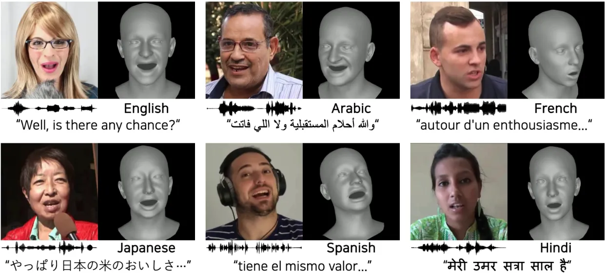
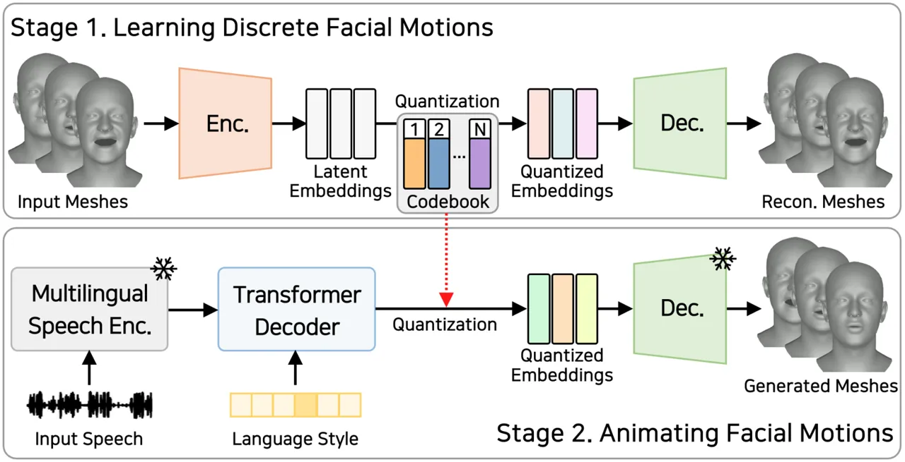
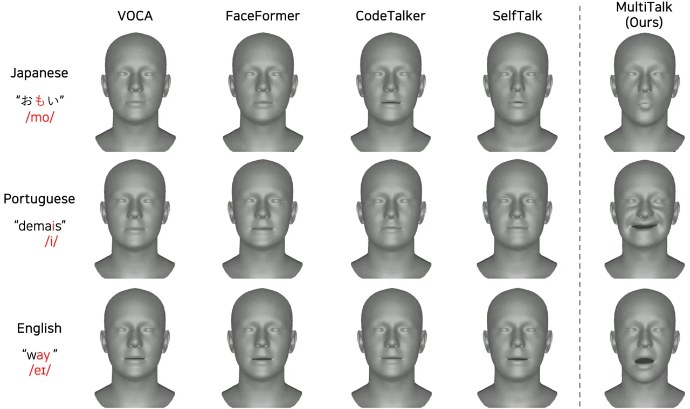

newline

# MultiTalk: Enhancing 3D Talking Head Generation Across Languages with Multilingual Video Dataset

Kim Sung-Bin    Lee Chae-Yeon    Gihun Son    Oh Hyun-Bin    Janghoon Ju
   Suekyeong Nam    Tae-Hyun Oh

###### Abstract

Recent studies in speech-driven 3D talking head generation have achieved
convincing results in verbal articulations. However, generating accurate
lip-syncs degrades when applied to input speech in other languages,
possibly due to the lack of datasets covering a broad spectrum of facial
movements across languages. In this work, we introduce a novel task to
generate 3D talking heads from speeches of diverse languages. We collect
a new multilingual 2D video dataset comprising over 420 hours of talking
videos in 20 languages. With our proposed dataset, we present a
multilingually enhanced model that incorporates language-specific style
embeddings, enabling it to capture the unique mouth movements associated
with each language. Additionally, we present a metric for assessing
lip-sync accuracy in multilingual settings. We demonstrate that training
a 3D talking head model with our proposed dataset significantly enhances
its multilingual performance. Codes and datasets are available at
[https://multi-talk.github.io/](https://multi-talk.github.io/).

###### keywords

Speech-driven 3D talking head, Video dataset, Multilingual, Audio-visual
speech recognition

^(†)^(†)address: ¹Dept. of Electrical Engineering and ²Grad. School of
Artificial Intelligence, POSTECH, Korea  
³KRAFTON, Korea  
⁴Institute for Convergence Research and Education in Advanced
Technology, Yonsei University, Korea ^(†)^(†)email: {sungbin,
chaeyeon.lee, gihun.son, taehyun}@postech.ac.kr^(\*)^(\*)footnotetext:
These authors contributed equally.

## 1 Introduction

Speech-driven 3D talking heads are key components in virtual avatars,
enhancing realism and improving user engagement in diverse multimedia
applications \[1, 2, 3\]. Recent advancements in deep learning have
significantly advanced the field of 3D talking heads. Earlier
efforts \[4, 5, 6, 7, 8\] have focused on enhancing lip synchronization,
while more recent studies aim to enable the expression of various
emotions \[9, 10\] and non-verbal signals \[11\], or even to develop
personalized models \[12\].

However, the multilingual capabilities of 3D talking heads have received
less attention and remain underexplored. Despite claims from previous
studies \[7, 4, 13\] that their models are language-agnostic, we observe
that Huang *et al*. \[13\] cover only two languages, and the quality of
the generated meshes from prior works \[7, 4\] degrades when input
speech deviates from the English language family. We hypothesize that
this limitation stems from the scarcity of diverse 3D talking head
datasets. Existing datasets, such as VOCASET \[4\] and BIWI \[14\], are
not only small in scale but also limited in expressiveness, diversity,
and language scope (English-only). Even a more sophisticated model,
designed to handle diverse languages, may be constrained by the styles
and motion characteristics of available datasets.



Figure 1: Samples of our MultiTalk dataset. Each 2D video is annotated
with the language type and the pseudo transcript, and a subset of the
videos further provides pseudo 3D mesh vertices.

To tackle this challenge, we introduce a novel task of generating 3D
talking heads from speeches in diverse languages, _i.e_., multilingual
3D talking heads. For this task, we collect the MultiTalk dataset,
comprising in-the-wild 2D talking videos across 20 different languages,
paired with corresponding pseudo 3D meshes and transcripts (see Fig. 1).
We design an automated data collection pipeline to parse short
utterances of frontal talking videos in diverse languages from YouTube.
As these 2D videos lack 3D metadata, we leverage an off-the-shelf 3D
reconstruction model \[15\] to generate reliable and robust pseudo
ground-truth 3D mesh vertices \[16\] for the collected 2D videos.

To demonstrate the effectiveness of our dataset for multilingual 3D
talking heads, we introduce a strong baseline model, MultiTalk, by
training on a subset of our dataset. Inspired by previous works \[8,
17\], we start by training a vector-quantized autoencoder
(VQ-VAE) \[18\] to learn a discrete codebook, which encodes expressive
3D facial motions across various languages. By utilizing this discrete
codebook, we then train a temporal autoregressive model to synthesize
sequences of 3D faces, conditioned on both the input speech and the
learnable language embedding. This language embedding captures the
stylistic nuances of facial motions specific to each language family.

We validate our baseline model against existing 3D talking head
models \[4, 7, 8, 19\] trained on the English-only VOCASET dataset. As
this task is novel, we propose a new evaluation metric, Audio-Visual Lip
Readability (AVLR), which assesses the lip-sync accuracy of 3D talking
heads on multilingual speeches using a pre-trained Audio-Visual Speech
Recognition (AVSR) model \[20\]. Through the experiments, we show that
our model performs favorably across diverse languages compared to
previous works. Our main contributions are summarized as follows:

- •
  Proposing a new task, multilingual 3D talking head, accompanied by an
  evaluation metric to measure the lip synchronization accuracy on
  multilingual speech.
- •
  Collecting the MultiTalk dataset, featuring over 420 hours of 2D
  videos with paired 3D metadata in 20 different languages.
- •
  Introducing a strong baseline, MultiTalk, capable of generating
  accurate and expressive 3D faces from multilingual speech.

## 2 Learning multilingual 3D talking head

In this section, we introduce our new multilingual video dataset in
Sec. 2.1 and describe the proposed baseline model for multilingual 3D
talking head generation in Sec. 2.2.

|                                                                              |
| ---------------------------------------------------------------------------- |
| ![[Uncaptioned image]](arxiv-2406-14272--0b8657127248.figures/figure-2.webp) |

| Statistics of our MultiTalk dataset |          |
| ----------------------------------- | -------- |
| Num. of languages                   | 20       |
| Num. of video clips                 | 294k     |
| Total hours                         | 423.2 h  |
| Avg. duration                       | 5.2 sec. |

Table 1: Statistics of our MultiTalk dataset. We present a 2D talking
video dataset that is well-balanced across 20 languages (each accounting
for 2.0-9.7%), accompanied by pseudo 3D mesh vertices and transcripts
for each video.

### 2.1 MultiTalk dataset

We introduce the MultiTalk dataset, featuring over 420 hours of
multilingual 2D talking videos across 20 languages. Despite the
abundance of 2D video datasets \[21, 22, 23\], we aim to curate a
dataset with more balanced statistics across a broader range of
languages. Each video in the MultiTalk dataset is annotated with the
language type of a speech and a pseudo-transcript generated using
Whisper \[24\], and a subset among the videos is annotated with pseudo
3D mesh vertices. Samples and statistics of the MultiTalk dataset are
shown in Fig. 1 and Table 1, respectively. We design an automated
pipeline to obtain short utterances of talking videos in diverse
languages, described as follows.

#### Collecting 2D videos

We begin by designing various queries that incorporate keywords, such as
“nationality,” “interviews,” and “conversation.” These queries are
prompted to YouTube to retrieve in-the-wild human talking 2D videos in
different languages and diverse scenarios.

#### Active speaker verification

The goal here is to trim a raw video into segments that only contain
talking faces synchronized to speech, while removing clips with
non-active speakers. To achieve this, we leverage TalkNet \[25\], which
performs audio-visual cross-attention to identify the visible person in
speaking. We set conservative thresholds to minimize false positives and
ensure that only the cleaned video is left. We further trim the video
when gaps occur during speaking, resulting in short utterances.

#### Frontal face verification

The faces in the filtered videos do not always face the front, which can
prevent the model from learning clear facial movements. Thus, we measure
the angle of yaw and pitch of the face using Mediapipe \[26\] and filter
out videos with abrupt angle changes (indicating abrupt head movements)
or large yaw or pitch angles (side faces). This process concludes the
automated pipeline for collecting cleaned 2D frontal talking face videos
with short utterances in diverse languages. We further leverage
Whisper \[24\]¹¹ 1 Referring to
[https://github.com/openai/whisper](https://github.com/openai/whisper),
Whisper’s performance on our target language yields a word error rate
(WER) of 2.8% to 17.0%, which is quite accurate. trained on each
language, to annotate the pseudo-transcript for each video clip.

#### Lifting 2D video to 3D

From the subset of collected 2D talking videos, we reconstruct 3D meshes
that are synchronized with both the audio and facial movements of the
video clips. Similar to prior arts \[10, 11\] that demonstrate the
effectiveness of pseudo-3D reconstructions for training 3D talking
heads, we leverage SPECTRE \[15\] to reconstruct accurate and robust
pseudo 3D meshes from 2D talking videos. Unlike existing datasets,
_e.g_., VOCASET \[4\], which are limited in small scale and English-only
speeches, our newly annotated 3D mesh dataset encompasses expressive
facial motions, paired with speeches that vary in diverse tones and
pitches across a wide range of languages.



Figure 2: Overall pipeline of MultiTalk. In stage 1, a codebook of
discrete motions is learned from 3D facial meshes speaking in diverse
languages. In stage 2, the model learns to autoregressively generate a
sequence of motion representations from an input speech. These
representations are quantized by the codebook, thereby synthesizing
speech-driven 3D talking head.

### 2.2 Speech-driven multilingual 3D talking head

Using the subset of the dataset we collected, as detailed in Sec. 2.1,
we aim to develop a model capable of generating accurate 3D talking head
synchronized with input speech in various languages. Despite the
increased diversity of the dataset, naïvely dumping all data into the
model could result in learning only average facial movements. To address
this, we break down the task into sub-problems and introduce a baseline
model, MultiTalk. MultiTalk undergoes a two-stage training process:
first, learning a general facial motion prior through discrete codes,
then training a speech-driven temporal autoregressive model to animate
3D faces with the learned discrete codes. Echoing the success of
previous works \[18, 8, 17\], the disentanglement of the learning
process allows the model to effectively construct rich discrete motion
prior from the diverse talking faces of various languages, which is then
leveraged in the second stage for synthesis.

The task formulation is specified as follows: Let
$`\mathbf{V}_{1:T}=(\mathbf{v}_{1},\dots,\mathbf{v}_{T})`$ denote a
temporal sequence of ground-truth facial motions, where each frame
$`\mathbf{v}_{t}\in\mathbb{R}^{N\times 3}`$ consisting $`N`$ vertices,
represents the 3D facial movement. Additionally, let
$`\mathbf{S}_{1:T}=(\mathbf{s}_{1},\dots,\mathbf{s}_{T})`$ be a sequence
of speech representations. By conditioning on input speech
$`\mathbf{S}_{1:T}`$, the goal in this task is to sequentially predict
facial movements $`\mathbf{\hat{V}}_{1:T}`$, similar to
$`\mathbf{V}_{1:T}`$.

#### Learning discrete facial motion

Following CodeTalker \[8\], we extend the use of vector quantized
autoencoder (VQ-VAE) \[18\] to learn a discrete codebook of context-rich
facial motions (refer to Stage 1 in Fig. 2). As speech data is not
required for training VQ-VAE, we utilize a large amount of 3D motion
sequences from the MultiTalk dataset for learning the prior. This
enables the learned prior to cover a broad spectrum of facial motions
observed in speakers of diverse languages.

VQ-VAE consists of an encoder ($`E_{v}`$), a decoder ($`D_{v}`$), and a
discrete codebook $`\mathcal{Z}=\{\mathbf{z}_{k}\}_{k=1}^{K}`$, where
$`\mathbf{z}_{k}\in\mathbb{R}^{d_{z}}`$, and is trained to
self-reconstruct realistic facial motions. Specifically, given facial
motion sequences in continuous domain $`\mathbf{V}_{1:T}`$, the VQ-VAE
encoder ($`E_{v}`$), which is designed with a Transformer \[27\] layer,
first encodes the continuous motion sequences into latent features
$`\mathbf{\hat{Z}}\in\mathbb{R}^{T^{\prime}\times d_{z}}`$, where
$`T^{\prime}`$ denotes the number of frames of downsampled features.
Subsequently, $`\mathbf{\hat{Z}}`$ is quantized to $`\mathbf{Z^{q}}`$
through an element-wise quantization function $`Q_{v}`$ that maps each
element in $`\mathbf{\hat{Z}}`$ to its nearest codebook entry:

```math
\mathbf{Z^{q}}=Q_{v}(\mathbf{\hat{Z}})\coloneqq(\operatornamewithlimits{\arg\min}_{\mathbf{z}_{k}\in\mathcal{Z}}\lVert\mathbf{\hat{z}}_{t}-\mathbf{z}_{k}\rVert_{2})\in\mathbb{R}^{T^{\prime}\times d_{z}}. \tag{1}
```

$`\mathbf{Z_{q}}`$ is then reconstructed back into continuous motions
$`\mathbf{\hat{V}}_{1:T}`$ by the VQ-VAE decoder ($`D_{v}`$), which also
has a symmetric structure with $`E_{v}`$. The entire model is trained
with the following loss:

```math
{\mathcal{L}}_{\text{VQ}}=\lVert\mathbf{V}_{1:T}-\hat{\mathbf{V}}_{1:T}\rVert_{1}\\
+\lVert\texttt{sg}(\mathbf{\hat{Z}})-\mathbf{Z^{q}}\rVert_{2}^{2}+\lambda\lVert\mathbf{\hat{Z}}-\texttt{sg}(\mathbf{Z^{q}})\rVert_{2}^{2}, \tag{2}
```

where the first term is the motion reconstruction loss, the latter two
terms are for updating the codebook, sg is a stop gradient
operation \[28\], and $`\lambda`$ is a weight factor. After training the
codebook of discrete facial motions, these discrete motions are utilized
in the subsequent stage to learn the speech-conditioned synthesis of 3D
facial movements.

#### Learning speech-driven motion synthesis

In this stage, we develop a model that maps input speech to a sequence
of discrete codes, which are later decoded into realistic continuous
motions (refer to Stage 2 in Fig. 2). As we target to handle multiple
languages, we adopt a multilingual speech encoder $`E_{m}`$, pretrained
on 53 languages \[29\]. This enables the model to extract
language-agnostic speech representations from the multilingual inputs.
Moreover, the model incorporates a language style embedding $`\bm{l}`$
alongside the speech. Each language style embedding is learnable,
effectively capturing the distinct facial movement style associated with
speaking in that particular language.

Conditioned on both the input speech and the language style embedding, a
Transformer decoder $`D_{m}`$ is trained to autoregressively generate
the sequence of discrete facial motions. The Transformer decoder is
equipped with the causal self-attention that learns the dependencies
within the sequence of previous facial motions and uses cross-modal
attention to align the audio with the facial motions. The autoregressive
modeling process of the Transformer decoder is written as:
$`\mathbf{\hat{z}}_{t}=D_{m}(E_{m}(\mathbf{S}_{1:T}),\bm{l},\mathbf{\hat{V}}_{1:t-1})`$,
where $`\mathbf{\hat{z}}_{t}`$ is the currently predicted discrete
facial motion, and $`\mathbf{\hat{V}}_{1:t-1}`$ is the past predicted
sequences. The discrete code $`\mathbf{\hat{z}}_{t}`$ is then quantized
by Eq. (1) and decoded to continuous motion,
$`\mathbf{\hat{v}}_{t}=D_{v}(Q_{v}(\mathbf{\hat{z}}_{t}))`$. The model
is trained in a teacher-forcing manner with the following loss:

```math
{\mathcal{L}}_{\text{GEN}}=\lVert\mathbf{\hat{Z}}_{1:T}-\texttt{sg}(\mathbf{Z^{q}}_{1:T})\rVert^{2}_{2}+\lVert\mathbf{\hat{V}}_{1:T}-\mathbf{V}_{1:T}\rVert^{2}_{2}, \tag{3}
```

where the first term regularizes the deviation between the predicted
motion features $`\mathbf{\hat{Z}}_{1:T}`$ and the quantized features
$`\mathbf{Z^{q}}_{1:T}`$ from the codebook, while the latter term
denotes the reconstruction loss between the predicted facial motions
$`\mathbf{\hat{V}}_{1:T}`$ and the ground-truth $`\mathbf{V}_{1:T}`$.

#### Implementation details

The VQ-VAE in the first stage is trained for 150 epochs with the AdamW
optimizer ($`\beta_{1}=0.9`$, $`\beta_{2}=0.999`$ and
$`\epsilon=10^{-8}`$), where the learning rate is initialized as
$`10^{-4}`$, and a mini-batch size of 1. In the second stage, the
Transformer decoder model is trained for 100 epochs with the Adam
optimizer, maintaining the same hyper-parameters as in the first stage.
Training for both stages is conducted on a single GeForce RTX 3090 GPU.

## 3 Experiments

In the experiment, we aim to demonstrate the efficacy of our proposed
dataset and the baseline model, MultiTalk, in enhancing the multilingual
capabilities of 3D talking heads. To this end, we compare MultiTalk
trained on our dataset, against competing models \[4, 7, 8, 19\] trained
on the existing dataset. Specifically, MultiTalk is trained on a subset
of our proposed dataset, comprising approximately 20 hours of 3D facial
sequences in diverse languages. In contrast, existing works utilize the
VOCASET dataset \[4\], which includes 480 sequences (approximately 30
minutes) only in English from 12 subjects. We construct a test split in
our MultiTalk dataset, involving 60 clips across 12 different languages.
To ensure a fair comparison, all results are standardized to the same
FLAME topology.

|                         |                     |                    |           |     |
| ----------------------- | ------------------- | ------------------ | --------- | --- |
| Method                  | AVLR (SNR=-7.5)     | AVLR (SNR=-10)     | VSR       |     |
| VOCASET (GT)            | 39.4                | 43.8               | 111.2     |     |
| FaceFormer              | 50.7                | 56.9               | 136.3     |     |
| VOCA                    | 53.1                | 62.6               | 153.1     |     |
| Spearman’s $`\rho`$     | 0.55                | 0.46               | 0.43      |     |

Table 2: Preliminary experiment. Audio-Visual Lip Readability (AVLR)
demonstrates a high correlation with human evaluations, indicating its
suitability as a metric for measuring the lip readability of 3D talking
heads. The top three rows present WER (%) obtained from AVLR and VSR.
The last row shows Spearman’s correlation coefficient, which ranges from
-1 to 1; a value of 1 indicates the highest correlation with human
evaluations.

### 3.1 Comparison with existing methods

To evaluate lip synchronization of generated mesh with the input speech,
we measure the Lip Vertex Error (LVE) metric proposed in MeshTalk \[6\].
However, solely measuring the $`\ell_{2}`$ error of lip vertices is
insufficient for assessing the facial movement due to the one-to-many
mapping nature of this task. As a complementary, we introduce a new
metric to evaluate the lip readability of the generated mesh, _i.e_.,
audio-visual lip readability.

#### Lip Vertex Error (LVE)

LVE computes the average $`\ell_{2}`$ error between the lip regions of
the generated mesh vertices and the ground-truth from the test set. For
each frame, the LVE is defined as the maximum $`\ell_{2}`$ error across
all lip vertices.

#### Audio-Visual Lip Readability (AVLR)

We propose the AVLR metric for evaluating perceptually accurate lip
readability with a pre-trained Audio-Visual Speech Recognition
(AVSR) \[20\] model. A naïve way for assessing lip readability would be
to use a pre-trained Visual Speech Recognition (VSR) model to measure
the lip reading metric on the rendered 3D faces without accompanying
speech. However, relying solely on visual cues introduces ambiguity in
inferring words. For example, distinguishing between “ba”and “ma” is
challenging by merely observing mouth shapes \[30\]. We hypothesize that
supplementing visual information with subtle audio cues may reduce this
ambiguity, leading to a more robust lip readability metric compared to
using visual cues alone. Specifically, we supply noisy audio alongside
the rendered 3D faces to a pre-trained AVSR model and measure the Word
Error Rate (WER) to evaluate the lip readability of the 3D talking head.

To validate our proposed AVLR metric, we conduct a preliminary
experiment. We collect meshes from the ground-truth VOCASET \[4\]
dataset and those generated by FaceFormer \[7\] and VOCA \[4\]. We
measure the WER for each model using VSR, and AVSR with Signal-to-Noise
Ratio (SNR) settings of -7.5 and -10, and subsequently rank the models
by their WERs. We then compute the Spearman’s correlation coefficient,
$`\rho`$, to compare the model rankings with human evaluation rankings.
As shown in Table 2, AVSR exhibits the highest correlation with human
evaluations. Furthermore, VSR produces WERs exceeding 110%, confirming
its unsuitability as a metric. These findings highlight the efficacy of
our proposed AVLR metric in assessing lip accuracy.

Utilizing the metrics described above, we conduct a quantitative
comparison of our MultiTalk model against four different approaches:
VOCA \[4\], FaceFormer \[7\], Codetalker \[8\], and SelfTalk \[19\].
Table 3 summarizes the LVE and AVLR over the test set of the MultiTalk
dataset, with AVLR assessed across four different languages. Notably,
MultiTalk achieves superior performance compared to the other methods
across all metrics. Specifically, in the AVLR, the recent method
SelfTalk shows comparable performance in English, but MultiTalk excels
in languages other than English. These results highlight the
effectiveness of both our proposed method and the dataset in
establishing multilingual capabilities for 3D talking head models.

For a more comprehensive comparison, we visualize the generated samples
in Fig. 3. As shown, the meshes generated by our MultiTalk model exhibit
detailed and expressive lip movements for closures and openings in sync
with the input speech. We postulate that such expressiveness could be
learned from our dataset, which reflects the inherent diversity and
includes various facial movements across languages.

| Method           | LVE ($`\downarrow`$) |      |      |      | AVLR ($`\downarrow`$) |      |      |      |
| ---------------- | -------------------- | ---- | ---- | ---- | --------------------- | ---- | ---- | ---- |
|                  | En                   | It   | Fr   | El   | En                    | It   | Fr   | El   |
| VOCA             | 1.95                 | 2.78 | 1.93 | 2.18 | 50.8                  | 60.4 | 74.9 | 82.1 |
| FaceFormer       | 1.82                 | 2.56 | 1.78 | 1.99 | 50.8                  | 58.9 | 70.9 | 79.0 |
| CodeTalker       | 1.98                 | 2.56 | 1.99 | 2.09 | 50.0                  | 59.4 | 74.9 | 77.8 |
| SelfTalk         | 1.99                 | 2.59 | 1.98 | 2.11 | 42.8                  | 56.5 | 68.3 | 80.3 |
| MultiTalk (Ours) | 1.16                 | 1.06 | 1.39 | 1.26 | 42.4                  | 50.5 | 63.0 | 74.2 |

Table 3: Quantitative comparison to existing methods. We compare
MultiTalk (Ours) with existing methods on the test split of the MuliTalk
dataset on 4 languages: English (En), Italian (It), French (Fr), and
Greek (El). LVE is measured in $`\times 10^{-4}\text{mm}`$ scale, and
AVSR (SNR=-7.5) is measured in WER (%).



Figure 3: Qualitative comparisons. Compared to existing methods,
MultiTalk (Ours) demonstrates detailed facial expressions with
accurately synchronized lip movements to the input speech.

| Aspect    | vs. VOCA | vs. FaceFormer | vs. CodeTalker | vs. SelfTalk |
| --------- | -------- | -------------- | -------------- | ------------ |
| Lip sync. | 93.28    | 84.17          | 76.92          | 53.78        |
| Realism.  | 93.28    | 91.53          | 82.05          | 66.95        |

Table 4: User study results. We adopt A vs. B test and report the
percentage (%) of preferences for A (Ours) over B, assessing the
generated meshes on lip sync and realism.

|       | $`\bm{l}`$ emb. | $`E_{m}`$ type | LVE ($`\downarrow`$) |      |      |      | AVLR ($`\downarrow`$) |      |      |      |
| ----- | --------------- | -------------- | -------------------- | ---- | ---- | ---- | --------------------- | ---- | ---- | ---- |
|       |                 |                | En                   | It   | Fr   | El   | En                    | It   | Fr   | El   |
| \(a\) |                 | Multi.         | 1.78                 | 2.07 | 2.45 | 1.82 | 41.9                  | 52.4 | 64.1 | 72.0 |
| \(b\) | ✓               | En.            | 1.56                 | 1.34 | 1.91 | 1.37 | 50.3                  | 55.6 | 71.7 | 77.3 |
| \(c\) | ✓               | Multi.         | 1.16                 | 1.06 | 1.39 | 1.26 | 42.4                  | 50.5 | 63.0 | 74.2 |

Table 5: Ablation studies on design choices. We compare different
configurations of our method by either incorporating the language style
embedding $`\bm{l}`$ or utilizing different speech encoders $`E_{m}`$.
“Multi.” and “En.” denote the speech encoders trained on multilingual
and English-only speeches, respectively.

### 3.2 User study

We incorporate human perception as a metric through a user study. We
first generate 24 3D face videos using MultiTalk (A) and compare them
with those generated by existing methods (B) from the test split of the
MultiTalk dataset. We design an A vs. B test, prompting participants to
choose between two samples based on lip synchronization and realism. To
accurately evaluate multilingual capability, participants from various
countries participated in this study. As indicated in Table 4, MultiTalk
is preferred by users, notably excelling in realism compared to other
methods. These results emphasize the expressiveness and multilingual
capability of our model.

### 3.3 Ablation study

We conduct ablation studies to validate our design choices, as in
Table 5. Comparing (a) and (c), we observe that utilizing the language
style embedding stabilizes the learning and yields favorable
performance. Moreover, comparisons between (b) and (c) indicate that
incorporating the multilingual speech encoder facilitates the extraction
of language-agnostic features. This enables the model to focus on
universal speech representations, thereby accommodating motion synthesis
from multiple languages.

## 4 Discussion and conclusion

In this work, we introduce a novel task of animating 3D talking heads
from multilingual speeches. Recognizing the lack of diversity in
existing datasets for learning multilingual capabilities, we have
collected the MultiTalk dataset, consisting of 2D talking videos in
multiple languages, each paired with 3D metadata and transcripts.
Moreover, we present MultiTalk, a baseline model trained in two stages
on our dataset. Considering the novelty of this task, we have devised an
audio-visual lip readability metric to assess the model’s multilingual
capability. Our experiments demonstrate the effectiveness of our
approach, showcasing robust lip synchronization performance across
diverse languages.

#### Limitation and future work

While our dataset offers extensive annotations, the transcripts and 3D
meshes are pseudo-annotated, which might introduce some level of noise
compared to human annotations. Despite this limitation, these
pseudo-annotations have proven to be effective in enhancing model
performance in prior arts \[31, 32, 11, 10\]. Future work will focus on
refining these annotations. We would like to note that our proposed
multilingual video dataset and the Audio-Visual Lip Readablity metric
have broader usage beyond our immediate task, _e.g_., (audio) visual
speech recognition and 2D talking heads. Furthermore, the rich facial
motion prior learned by diverse faces across various languages holds
significant potential to advance research in facial motion synthesis for
further exploration.

## 5 Acknowledgments

This research was supported by a grant from KRAFTON AI, and also
partially supported by Institute of Information & communications
Technology Planning & Evaluation (IITP) grant funded by the Korea
government (MSIT) (RS-2022-II220124, Development of Artificial
Intelligence Technology for Self-Improving Competency-Aware Learning
Capabilities; RS-2021-II212068, Artificial Intelligence Innovation Hub;
RS-2019-II191906, Artificial Intelligence Graduate School Program
(POSTECH)).

## References

- \[1\] C. Liu, “An analysis of the current and future state of 3d
  facial animation techniques and systems,” _Simon Fraser
  University_, 2009.
- \[2\] C. Sondermann and M. Merkt, “Like it or learn from it: Effects
  of talking heads in educational videos,” _Computers &
  Education_, 2023.
- \[3\] I. Wohlgenannt, A. Simons, and S. Stieglitz, “Virtual reality,”
  _Business & Information Systems Engineering_, 2020.
- \[4\] D. Cudeiro, T. Bolkart, C. Laidlaw, A. Ranjan, and M. J. Black,
  “Capture, learning, and synthesis of 3d speaking styles,” in _IEEE
  Conference on Computer Vision and Pattern Recognition (CVPR)_, 2019.
- \[5\] T. Karras, T. Aila, S. Laine, A. Herva, and J. Lehtinen,
  “Audio-driven facial animation by joint end-to-end learning of pose
  and emotion,” _ACM Transactions on Graphics (SIGGRAPH)_, 2017.
- \[6\] A. Richard, M. Zollhöfer, Y. Wen, F. De la Torre, and Y. Sheikh,
  “Meshtalk: 3d face animation from speech using cross-modality
  disentanglement,” in _IEEE International Conference on Computer Vision
  (ICCV)_, 2021.
- \[7\] Y. Fan, Z. Lin, J. Saito, W. Wang, and T. Komura, “Faceformer:
  Speech-driven 3d facial animation with transformers,” in _IEEE
  Conference on Computer Vision and Pattern Recognition (CVPR)_, 2022.
- \[8\] J. Xing, M. Xia, Y. Zhang, X. Cun, J. Wang, and T.-T. Wong,
  “Codetalker: Speech-driven 3d facial animation with discrete motion
  prior,” in _IEEE Conference on Computer Vision and Pattern Recognition
  (CVPR)_, 2023.
- \[9\] Z. Peng, H. Wu, Z. Song, H. Xu, X. Zhu, H. Liu, J. He, and
  Z. Fan, “Emotalk: Speech-driven emotional disentanglement for 3d face
  animation,” in _IEEE International Conference on Computer Vision
  (ICCV)_, 2023.
- \[10\] R. Daněček, K. Chhatre, S. Tripathi, Y. Wen, M. J. Black, and
  T. Bolkart, “Emotional speech-driven animation with content-emotion
  disentanglement,” in _ACM Transactions on Graphics (SIGGRAPH
  Asia)_, 2023.
- \[11\] K. Sung-Bin, L. Hyun, D. H. Hong, S. Nam, J. Ju, and T.-H. Oh,
  “Laughtalk: Expressive 3d talking head generation with laughter,” in
  _IEEE Winter Conference on Applications of Computer Vision
  (WACV)_, 2024.
- \[12\] B. Thambiraja, I. Habibie, S. Aliakbarian, D. Cosker,
  C. Theobalt, and J. Thies, “Imitator: Personalized speech-driven 3d
  facial animation,” in _IEEE International Conference on Computer
  Vision (ICCV)_, 2022.
- \[13\] H. Huang, Z. Wu, S. Kang, D. Dai, J. Jia, T. Fu, D. Tuo,
  G. Lei, P. Liu, D. Su _et al._, “Speaker independent and
  multilingual/mixlingual speech-driven talking head generation using
  phonetic posteriorgrams,” in _2021 Asia-Pacific Signal and Information
  Processing Association Annual Summit and Conference (APSIPA
  ASC)_, 2021.
- \[14\] G. Fanelli, J. Gall, H. Romsdorfer, T. Weise, and L. Van Gool,
  “A 3-d audio-visual corpus of affective communication,” _IEEE
  Transactions on Multimedia_, 2010.
- \[15\] P. P. Filntisis, G. Retsinas, F. Paraperas-Papantoniou,
  A. Katsamanis, A. Roussos, and P. Maragos, “Spectre: Visual
  speech-informed perceptual 3d facial expression reconstruction from
  videos,” in _IEEE Conference on Computer Vision and Pattern
  Recognition Workshops (CVPRW)_, 2023.
- \[16\] T. Li, T. Bolkart, M. J. Black, H. Li, and J. Romero, “Learning
  a model of facial shape and expression from 4d scans.” _ACM
  Transactions on Graphics (SIGGRAPH)_, 2017.
- \[17\] E. Ng, H. Joo, L. Hu, H. Li, T. Darrell, A. Kanazawa, and
  S. Ginosar, “Learning to listen: Modeling non-deterministic dyadic
  facial motion,” in _IEEE Conference on Computer Vision and Pattern
  Recognition (CVPR)_, 2022.
- \[18\] A. Van Den Oord, O. Vinyals _et al._, “Neural discrete
  representation learning,” in _Advances in Neural Information
  Processing Systems (NeurIPS)_, 2017.
- \[19\] Z. Peng, Y. Luo, Y. Shi, H. Xu, X. Zhu, H. Liu, J. He, and
  Z. Fan, “Selftalk: A self-supervised commutative training diagram to
  comprehend 3d talking faces,” in _ACM International Conference on
  Multimedia (MM)_, 2023.
- \[20\] M. Anwar, B. Shi, V. Goswami, W.-N. Hsu, J. Pino, and C. Wang,
  “Muavic: A multilingual audio-visual corpus for robust speech
  recognition and robust speech-to-text translation,” in _Conference of
  the International Speech Communication Association
  (INTERSPEECH)_, 2023.
- \[21\] J. Yu, H. Zhu, L. Jiang, C. C. Loy, W. Cai, and W. Wu,
  “Celebv-text: A large-scale facial text-video dataset,” in _IEEE
  Conference on Computer Vision and Pattern Recognition (CVPR)_, 2023.
- \[22\] J. S. Chung, A. Nagrani, and A. Zisserman, “Voxceleb2: Deep
  speaker recognition,” in _Conference of the International Speech
  Communication Association (INTERSPEECH)_, 2018.
- \[23\] A. Nagrani, J. S. Chung, and A. Zisserman, “Voxceleb: a
  large-scale speaker identification dataset,” in _Conference of the
  International Speech Communication Association (INTERSPEECH)_, 2017.
- \[24\] A. Radford, J. W. Kim, T. Xu, G. Brockman, C. McLeavey, and
  I. Sutskever, “Robust speech recognition via large-scale weak
  supervision,” in _International Conference on Machine Learning
  (ICML)_, 2023.
- \[25\] R. Tao, Z. Pan, R. K. Das, X. Qian, M. Z. Shou, and H. Li, “Is
  someone speaking? exploring long-term temporal features for
  audio-visual active speaker detection,” in _ACM International
  Conference on Multimedia (MM)_, 2021.
- \[26\] C. Lugaresi, J. Tang, H. Nash, C. McClanahan, E. Uboweja,
  M. Hays, F. Zhang, C.-L. Chang, M. G. Yong, J. Lee _et al._,
  “Mediapipe: A framework for building perception pipelines,” _arXiv
  preprint arXiv:1906.08172_, 2019.
- \[27\] A. Vaswani, N. Shazeer, N. Parmar, J. Uszkoreit, L. Jones,
  A. N. Gomez, Ł. Kaiser, and I. Polosukhin, “Attention is all you
  need,” in _Advances in Neural Information Processing Systems
  (NeurIPS)_, 2017.
- \[28\] Y. Bengio, N. Léonard, and A. Courville, “Estimating or
  propagating gradients through stochastic neurons for conditional
  computation,” _arXiv preprint arXiv:1308.3432_, 2013.
- \[29\] A. Conneau, A. Baevski, R. Collobert, A. Mohamed, and M. Auli,
  “Unsupervised cross-lingual representation learning for speech
  recognition,” _arXiv preprint arXiv:2006.13979_, 2020.
- \[30\] H. McGurk and J. MacDonald, “Hearing lips and seeing voices,”
  _Nature_, 1976.
- \[31\] J. H. Yeo, M. Kim, S. Watanabe, and Y. M. Ro, “Visual speech
  recognition for low-resource languages with automatic labels from
  whisper model,” in _IEEE International Conference on Acoustics,
  Speech, and Signal Processing (ICASSP)_, 2024.
- \[32\] P. Ma, A. Haliassos, A. Fernandez-Lopez, H. Chen, S. Petridis,
  and M. Pantic, “Auto-avsr: Audio-visual speech recognition with
  automatic labels,” in _IEEE International Conference on Acoustics,
  Speech, and Signal Processing (ICASSP)_, 2023.
