# video-SALMONN: Speech-Enhanced Audio-Visual Large Language Models

Guangzhi Sun Affiliation: Department of Electronic Engineering, Tsinghua
University    Wenyi Yu Affiliation: Department of Electronic
Engineering, Tsinghua University    Changli Tang Affiliation: Department
of Electronic Engineering, Tsinghua University    Xianzhao Chen
Affiliation: ByteDance Ltd    Tian Tan Affiliation: ByteDance Ltd    Wei
Li Affiliation: ByteDance Ltd    Lu Lu Affiliation: ByteDance Ltd   
Zejun Ma Affiliation: ByteDance Ltd    Yuxuan Wang
Affiliation: ByteDance Ltd    Chao Zhang Affiliation: Department of
Electronic Engineering, Tsinghua University Correspondence to:
<cz277@tsinghua.edu.cn>

###### Abstract

Speech understanding as an element of the more generic video
understanding using audio-visual large language models (av-LLMs) is a
crucial yet understudied aspect. This paper proposes video-SALMONN, a
single end-to-end av-LLM for video processing, which can understand not
only visual frame sequences, audio events and music, but speech as well.
To obtain fine-grained temporal information required by speech
understanding, while keeping efficient for other video elements, this
paper proposes a novel multi-resolution causal Q-Former (MRC Q-Former)
structure to connect pre-trained audio-visual encoders and the backbone
large language model. Moreover, dedicated training approaches including
the diversity loss and the unpaired audio-visual mixed training scheme
are proposed to avoid frames or modality dominance. On the introduced
speech-audio-visual evaluation benchmark, video-SALMONN achieves more
than 25% absolute accuracy improvements on the video-QA task and over
30% absolute accuracy improvements on audio-visual QA tasks with human
speech. In addition, video-SALMONN demonstrates remarkable video
comprehension and reasoning abilities on tasks that are unprecedented by
other av-LLMs. Our training code and model checkpoints are available at
[https://github.com/bytedance/SALMONN/](https://github.com/bytedance/SALMONN/).

###### Keywords: 

Machine Learning, ICML

^(†)^(†)affiliationnotice: Equal contribution

## 1 Introduction

Text-based large language models (LLMs) (Brown et al., 2020; Touvron
et al., 2023; Chiang et al., 2023; Anil et al., 2023; Du et al., 2022)
have demonstrated remarkable performance in many natural language
processing tasks, especially achieving human-level capabilities in
reasoning and comprehension (OpenAI, 2023). Meanwhile, instruction
fine-tuning (Chung et al., 2022; Ouyang et al., 2022; Peng et al.,
2023), where data is organised as paired user instructions (or prompts)
and reference responses, has emerged as a training paradigm that enables
LLMs to perform tasks by following open-ended natural language
instructions from non-expert users. Recently, there has been a
burgeoning research interest in equipping LLMs with visual and auditory
perception abilities, resulting in a range of visual (Li et al., 2023a;
Alayrac et al., 2022; Dai et al., 2023; Maaz et al., 2023; Chen et al.,
2023b; Zhao et al., 2022; Zeng et al., 2023; Luo et al., 2023), audio
(Gong et al., 2023; Zhang et al., 2023a; Rubenstein et al., 2023; Tang
et al., 2023), and audio-visual LLMs (av-LLMs) (Su et al., 2023; Zhang
et al., 2023b; Lyu et al., 2023; Zhao et al., 2023; Chen et al., 2023a;
Shu et al., 2023b; Piergiovanni et al., 2023).

Despite av-LLMs’ prosperity, speech, as a primary carrier of human
language in videos, is considerably under-explored in these models.
Complementary to non-speech audio events and natural images, speech
provides direct and abundant linguistic and semantic information, making
it indispensable for comprehensive video understanding. Speech signals
also include rich paralinguistic information, such as the tone and pitch
of voice, which is often hard to textualise precisely but necessary to
understand the underlying meanings and emotions. Additionally, there
exist diverse speaker attributes in speech, which are tedious and
difficult to transcribe using separate systems but essential for video
understanding (see Fig. 16), including the speaker’s age, gender, accent
and identity etc. To avoid building complex cascaded systems, it is
desired to recognise and understand all of the aforementioned speech
attributes in videos in a fully end-to-end and integrated way with
av-LLMs. Nevertheless, enhancing general-purposed av-LLMs with speech is
very challenging, which requires temporally fine-grained modelling while
intricately interacting with other modalities at both coarse (e.g. video
topics) and fine (e.g. lip movements) time scales. This necessitates the
design of specialised fine-grained multi-resolution approaches to
address this challenge.

To this end, we propose video-SALMONN (speech audio language music open
neural network), a speech-enhanced av-LLM for short video understanding.
By resembling the audio encoder structure of the SALMONN (Tang et al., 2023) LLM with generic hearing abilities and incorporating an additional
visual encoder, video-SALMONN enables video inputs with natural image,
visual frame sequence, speech, audio events, and music elements,
covering all basic elements in general video data. The core of
video-SALMONN is a multi-resolution causal (MRC) Q-Former structure
aligning time-synchronised audio-visual input features with text
representation space at three different temporal scales, which meets the
requirements of tasks relying on different video elements. To reinforce
the temporal causal relations of events among successive video frames, a
causal self-attention structure with a special causal mask is included
in the MRC Q-Former. Further, to avoid the dominance of a specific frame
or a single modality in the video, video-SALMONN is trained using a
proposed diversity loss together with a new unpaired audio-visual mixing
strategy. To our knowledge, video-SALMONN is the first av-LLM tailored
to achieve general video understanding.

To comprehensively evaluate the general video understanding abilities,
we introduce the speech-audio-visual evaluation (SAVE) benchmark
containing six open-source representative single-modal tasks and four
open-source audio-visual tasks. video-SALMONN is the only av-LLM that
can achieve tasks relying on speech elements, such as audio-visual
speech recognition (AVSR) and speech-content-based QA. On the
single-modal tasks, video-SALMONN achieves a remarkably 25% accuracy
improvement in Video QA, a question answering (QA) task focusing on
temporal causal reasoning compared to a strong InstructBLIP
baseline (Dai et al., 2023). On audio-visual tasks, video-SALMONN has
shown large performance improvements, e.g. over 30% absolute accuracy
improvement on audio-visual QA dataset. The main contributions are
summarised as follows.

- •
  We propose video-SALMONN, a speech-enhanced av-LLM. To our knowledge,
  video-SALMONN is the first single LLM-centric model that can handle
  video along with both speech and non-speech audio inputs.
- •
  We propose the MRC Q-Former structure as a multi-resolution modality
  aligner for video-SALMONN, which lays a solid foundation for the joint
  speech-audio-visual information extraction in videos.
- •
  We propose the diversity loss and mixed training scheme to achieve a
  better balance of features from different frames and modalities.
- •
  video-SALMONN achieves superior performance on the SAVE benchmark,
  especially in audio-visual tasks requiring speech understanding and
  causal reasoning.

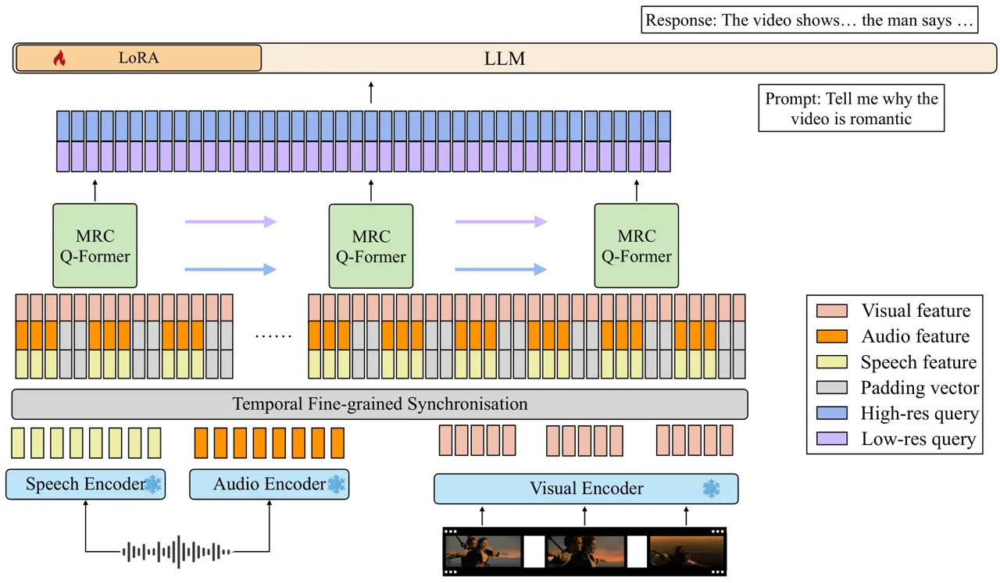

Figure 1: The model structure of video-SALMONN using fine-grained
audio-visual joint representations. Audio and visual input streams are
encoded into sequences of features with individual encoders that are not
updated during training, and the features are temporally synchronised
and processed by the proposed multi-resolution causal (MRC) Q-Former
operating at different time scales.

## 2 Related Work

The work most closely related to video-SALMONN is Video-LLaMA (Zhang
et al., 2023b), Macaw-LLM (Lyu et al., 2023), X-LLM (Chen et al., 2023a)
and also work proposed by Shu et al. (2023a); Chen et al. (2023c), as
all of them used LLMs for cross-modal understanding based on general
non-silent video inputs (referred to as audio-visual sequence in this
paper). X-LLM supports video with Chinese speech inputs, but doesn’t
support audio events and music. Video-LLaMA employs an additional video
Q-Former to encode features of several equally-spaced frames extracted
using a BLIP2 (Li et al., 2023a) image encoder. Macaw-LLM adopted a
similar approach and used three separate encoders for image, video and
non-speech audio events. Both Video-LLaMA and Macaw-LLM consider only
non-speech audio events, and the audio encoders in the two models are
the ImageBind (Girdhar et al., 2023) and Whisper (Radford et al., 2023)
model encoders respectively. While both methods involve the fusion of
audio and visual feature streams, the two streams are sparsely pooled
and processed rather independently, which removes fine-grained
audio-visual interactions at each time step. Compared to Video-LLaMA and
Macaw-LLM, video-SALMONN understands speech in a video and reserves
fine-grained modality interactions that are common in general non-silent
videos. This leads to an emphasis on causal modality synchronisation
across time and allows more content-based cross-modal interactions.

As an alternative to include speech modelling in av-LLM, speech content
can be extracted using an external automatic speech recognition (ASR)
system and fed into the av-LLM as textual subtitle inputs (Chen et al.,
2023c). However, this approach ignores the rich paralinguistic and
speaker information embedded in speech, unless they are also extracted
using external systems. Rich transcription (RT) is a long-standing
research problem targeting extracting abundant information from speech
signals (Garofolo et al., 2004; Fiscus et al., 2006b; Fiscus et al.,
2006a; Fiscus et al., 2007) that used to be tackled as several separate
tasks, such as ASR, speaker diarisation and emotion recognition etc. In
contrast, video-SALMONN unifies those hearing ability tasks together
with visual perception abilities using a single end-to-end model.

Our work is based on the Q-Former structure to fuse the audio and visual
modalities and to align with the text representation space (Li et al.,
2023a; Dai et al., 2023). While Q-Former has been primarily proposed for
visual information extraction, it also performs remarkably in extracting
auditory features for generic audio understanding in SALMONN (Yu et al.,
2024; Tang et al., 2024; Tang et al., 2023). In addition, various types
of modality aligners have been studied, such as the cross-attention
mechanism (Alayrac et al., 2022), pre-trained multimodal embeddings,
(Girdhar et al., 2023) and temporal and spatial pooling (Maaz et al., 2023) etc. Different from these approaches, our proposed MRC Q-Former
used in video-SALMONN pays particular attention to the sequential nature
of video and the multi-resolution information of the input feature
streams suitable for the understanding of different video elements. This
work is a revision of an unpublished work of ours (Sun et al., 2023),
which is the first study to explore video understanding with general
audio (audio event, speech and music etc.).

## 3 video-SALMONN

This section introduces the structure and the training approach for
video-SALMONN. As shown in Fig. 1, key components include the
synchronisation module and the MRC Q-Former. First, visual (image or
video), speech and non-speech audio are encoded using corresponding
pre-trained encoders. The visual encoder converts the input image into a
certain number of vectors via the image encoder from InstructBLIP (Li
et al., 2023a). When video input is given, the visual encoder encodes
each video frame separately as a sequence of images at a 2 Hz frame
rate, and the output image features are concatenated along the temporal
dimension to form a sequence of visual frames. Following SALMONN (Tang
et al., 2023), Whisper (Radford et al., 2023) encoder and BEATs (Chen
et al., 2023d) encoder are adopted to encode speech and non-speech audio
respectively from the same audio stream at 50 Hz spectrogram frame rate.

### 3.1 Temporal Fine-grained Synchronisation

When both audio and visual inputs are present, the encoded feature
sequences are sent to the temporal synchronisation module to obtain the
time-synchronised feature sequences. Since video is sampled at a lower
frame rate than audio, the audio and visual frames are synchronised at
each video frame (i.e. every 0.5 seconds), with zero padding to make
both sequences have equal lengths. Note that higher frequencies of
visual frames are also supported which requires higher computation and
storage costs. $`\mathbf{h}^{\text{S}}_{t}`$,
$`\mathbf{h}^{\text{A}}_{t}`$ and $`\mathbf{h}^{\text{V}}_{t}`$, the
synchronised frame-level outputs at step $`t`$ from the Whisper speech
encoder, BEATs audio encoder and InstructBLIP video encoder, are
concatenated along the feature dimension to obtain the combined
representation $`\mathbf{h}^{\text{SAV}}_{t}`$. That is,

```math
\mathbf{h}^{\text{SAV}}_{t}=\text{Concat}(\mathbf{s}_{t},\mathbf{a}_{t},\mathbf{v}_{t}), \tag{1}
```

where Concat$`(\cdot)`$ represents the concatenation along the feature
dimension and $`\mathbf{W}`$ is a projection weight matrix. Note that in
cases when audio input is missing, $`\mathbf{s}_{t}`$ and
$`\mathbf{a}_{t}`$ are replaced with a sequence of zero padding of the
same sequence length, and vice versa. While an image alone is treated as
a single frame, when paired audio input exists, such as images with
spoken captions (Hsu et al., 2020), each image is duplicated as if it
were a video input with a matched length to the audio input.

### 3.2 MRC Q-Former

The MRC Q-Former extracts audio-visual features from variable-length
inputs at different temporal resolutions. The detailed structure is
shown in Fig. 2. First, the synchronised input stream is divided into
fixed-length windows at multiple different resolutions, e.g. spanning
every 1, 5 or 10 seconds. Then, at each resolution level $`r`$, based on
$`N(r)`$ trainable input query vectors, the MRC Q-Former is applied to
convert features in each sliding window into $`N(r)\in\mathbb{N}^{+}`$
output query vectors carrying the audio-visual joint information. That
is,

```math
\mathbf{h}^{(r)}_{w,1:N(r)}=\text{Q-Former}_{\text{MRC}}(\mathbf{h}^{\text{SAV}}_{t:t+k(r)};\mathbf{q}^{(r)}_{1:N(r)}), \tag{2}
```

where $`w`$ is the window index and $`k(r)`$ is the number of input
video frames in each window at resolution level $`r`$, and
$`\text{Q-Former}_{\text{MRC}}(\cdot)`$ denotes the Q-Former computation
(Li et al., 2023a). The output query vectors are
$`\mathbf{h}^{(r)}_{w,1:N(r)}`$. If the input sequence length of the MRC
Q-Former is $`T`$, the number of sliding windows
$`W({r})\in\mathbb{N}^{+}`$ becomes $`\lceil T/k(r)\rceil`$, and the
overall output sequence length from the MRC Q-Former will be
$`W(r)\times N(r)`$. The sliding window design enables the length of the
input sequence to vary according to the input feature sequence lengths.
It hence achieves a better balance between the degree of information
reserved and the computation and storage costs than using a single
Q-Former for the entire sequence.

Figure 2: Illustration of the MRC Q-Former structure with two levels of
temporal resolutions. The high-resolution sliding window covers $`k=5`$
input features with two query vectors and the low-resolution Q-Former
covers $`k=25`$ with 10 query vectors.

This operation is repeated for all resolution levels with the
resolution-specific query vectors. We ensure that Q-Former output at
different resolutions can be synchronised by enforcing Eqn. (3), where
$`C`$ is a hyper-parameter representing the total number of output query
vectors sent to the LLM:

```math
W({r})\times N(r)=C. \tag{3}
```

When applying smaller windows for finer time scales, a smaller number of
query vectors is used for a reduced information capacity, and vice
versa. Note that while keeping the query vectors different for different
resolutions, the rest of the MRC Q-Former parameters are shared across
all resolution levels as the task of modality alignment is the same.
Output query vectors at all resolution levels are combined using a
projection layer before sending them to the LLM.

```math
\mathbf{H}=\mathbf{W}^{(1)}\mathbf{H}^{(1)}+\dots+\mathbf{W}^{(R)}\mathbf{H}^{(R)} \tag{4}
```

where each
$`\mathbf{H}^{(r)}=[\mathbf{h}^{(r)}_{w,1:N(r)}]^{\lceil T/k(r)\rceil}_{w=1}\in\mathbb{R}^{C\times D}`$
includes output query vectors at resolution level $`r`$, $`D`$ is the
dimension of output query vectors, and
$`\mathbf{W}^{(r)}\in\mathbb{R}^{D\times E}`$ projects output query
vectors to the LLM input embedding dimension $`E`$. Finally, the LLM
backbone generates output based on the projected query vectors
$`\mathbf{H}`$ and the content of the prompt
$`\mathbf{c}_{1},\mathbf{c}_{2},\ldots,\mathbf{c}_{M}`$ by

```math
\vskip-8.5359pt\hat{\mathbf{Y}}=\operatorname*{argmax}_{\textbf{Y}}P(\mathbf{Y}|\mathbf{H},\mathbf{c}_{1:M}). \tag{5}
```

#### 3.2.1 Causal Structure

Figure 3: The causal attention module in the MRC Q-Former with a
block-wise triangular causal mask (grey cells are masked). The number of
features per frame here is two as an example.

The proposed MRC Q-Former adopts a causal structure as shown in Fig. 3.
To capture the causal temporal correlation among frames that are
extracted independently, an additional causal self-attention module is
added to the standard Q-Former structure, indicated by the red block in
Fig. 3.

With the causal attention module, the encoding of one specific frame
also includes the information of all previous frames carried in an
auto-regressive way. This is particularly beneficial for causal
reasoning questions, such as the “what happens next” questions (Xiao
et al., 2021). Such questions are sometimes difficult to learn using
only the positional embeddings.

### 3.3 System Training

The training data of video tasks such as video QA usually only requires
one or two keyframes, and the output queries tend to repeatedly capture
the same information. Therefore, a novel diversity loss is proposed to
encourage the MRC Q-Former to extract more diverse aspects of the input
sequence. Specifically, the diversity loss is formulated as:

```math
\mathcal{L}_{\text{diverse}}=\sum_{r=2}^{R}\sum_{w=1}^{W(r)}\sum_{i=1}^{N}\sum_{j=1{,j\neq i}}^{N}\text{sim}(\mathbf{h}_{w,i}^{(r)},\mathbf{h}_{w,j}^{(r)}) \tag{6}
```

where $`W(r)`$ and $`N(r)`$ are the total number of windows and the
number of output queries of each window at resolution level $`r`$
respectively, and sim$`(\cdot)`$ is the cosine similarity between two
vectors. Cosine similarity is adopted since it is widely used for
semantic similarity measurements, and in video-SALMONN, the output
queries are aligned with a semantic space of the LLM input token
representations. This choice is also supported by the fact that the
modulus of the output query tokens is very similar due to the layer
normalisation operation of the MRC Q-Former. Note that the diversity
loss is only needed at the low-resolution levels where there are enough
frames in a window to extract diverse information.

Overall, video-SALMONN is trained end-to-end using the cross-entropy
(CE) loss and the diversity loss as shown below, where $`\lambda`$
controls the importance of the diversity loss.

```math
\mathcal{L}=\mathcal{L}_{\text{CE}}+\lambda\mathcal{L}_{\text{diverse}}, \tag{7}
```

Furthermore, to avoid modality dominance in the video, in addition to
the small amount of paired audio-visual data, we propose the mixed
training scheme where a portion of the training set is augmented with
unpaired audio-visual data and the prompt combines the original tasks
for audio and video. This way, the model is enforced to extract
information from both audio and video inputs without relying on a
dominant modality. This strategy improved the balance between different
modalities and is a crucial factor leading to audio-visual understanding
and co-reasoning abilities.

## 4 Experimental Setup

### 4.1 Speech-Audio-Visual Evaluation Benchmark

| Task     | Test set                                        | \#samples | Metrics  | Zero-shot |
| -------- | ----------------------------------------------- | --------- | -------- | --------- |
| ASR      | LibriSpeech test-clean (Panayotov et al., 2015) | 2620      | WER      | No        |
| AAC      | AudioCaps test (Kim et al., 2019)               | 938       | SPIDEr   | No        |
| IC       | Flickr30k test (Young et al., 2014)             | 1000      | CIDEr    | Yes       |
| OCR      | TextVQA test (Singh et al., 2019)               | 1000      | Accuracy | Yes       |
| VQA      | GQA test dev balanced (Hudson & Manning, 2019)  | 1000      | Accuracy | Yes       |
| Video QA | NExT-QA test (Xiao et al., 2021)                | 1000      | Accuracy | Yes       |
| AVSR     | How2 dev5 (Sanabria et al., 2018)               | 500       | WER      | No        |
| AVQA     | Ego4D (Grauman et al., 2022) + Presentation-QA  | 2000      | Accuracy | Yes       |
| AVSSD    | VGGSS (Chen et al., 2020; Zhao et al., 2023)    | 850       | Accuracy | Yes       |
| AVM      | SpokenCOCO (Hsu et al., 2020) + VGGSS           | 1000      | Accuracy | Yes       |

Table 1: SAVE benchmark details, including the number of samples used
for evaluation and metrics reported. Since TextVQA, GQA, NExT-QA and
VGGSS test sets are large, randomly sampled subsets with enough samples
for statistical significance were used for efficient evaluation.
Zero-shot refers to both instruction and audio-visual inputs that are
unseen in the training set. Note that Presentation-QA is newly proposed
AVQA test sets focusing on speech-audio-visual joint information.

We introduce the SAVE benchmark to evaluate the performance of
video-SALMONN. SAVE benchmark contains selected representative tasks for
both single and multi-modal tasks. The six single-modal tasks included
are ASR, automatic audio captioning (AAC), image captioning (IC),
optical character recognition (OCR), visual question answer (VQA), and
video question answer (Video QA), and the four audio-visual tasks
spanning 6 datasets are audio-visual speech recognition (AVSR),
audio-visual QA (AVQA), audio-visual matching (AVM) and audio-visual
sound source detection (AVSSD).

In particular, we curate Ego4D-QA and Presentation-QA test sets to
evaluate accuracy in audio-visual understanding with speech. The
questions for the two sets are generated by prompting GPT-4 with video
descriptions and ASR transcriptions for each video clip. Detailed
examples for AVQA datasets are in Appendix B. The SAVE benchmark is
summarised in Table 1, and details about evaluation metrics can be found
in Appendix C.

This paper further proposes the AVM task where audio-visual interaction
is necessary. AVM is the task of determining whether the given spoken
description in the SpokenCOCO dataset (Hsu et al., 2020) matches the
image, or whether the given audio clip is compatible with the given
video chosen from the VGGSS dataset (Chen et al., 2020). AVSSD is
another task that requires a strong binding of audio and visual
modalities, as a single modality usually only provides partial
information about the sound.

### 4.2 Model Configurations

To validate video-SALMONN on the SAVE benchmark, the Vicuna-v1.5 (Chiang
et al., 2023) models (including 7B and 13B models, and 13B is the
default option if not specified) is used as the LLM, Whisper (Radford
et al., 2023) large-v2 encoder as the speech encoder, BEATs (Chen
et al., 2023d) encoder as the audio encoder and InstructBLIP (Dai
et al., 2023) vision Transformer (ViT) plus Q-Former as the visual
encoder. The visual encoder outputs 32 feature vectors for each video
frame (every 0.5 seconds), and the audio encoder outputs 50 feature
vectors per second.

The MRC Q-Former has two Transformer blocks with $`D`$=768-dim hidden
states. By default, we adopt two different levels of resolution at
0.5-second and 5-second respectively, with the number of output query
vectors being 3 and 30 for each window. The output query vectors of the
MRC Q-Former are projected to $`E`$=5120-dim before being sent to the
LLM. The LLM is adapted using the low-rank adaptation (LoRA) (Hu et al., 2022) method with rank 32. LoRA parameters of the attention query, key
and value projections and feed-forward network weights are updated,
which comprises 0.4% of the total number of LLM parameters.

Whisper and InstructBLIP are used as the single-modality baseline
systems for comparison. As video-SALMONN uses video data with different
styles and focuses, to eliminate the discrepancy in training data and
achieve fair comparisons, InstructBLIP is further fine-tuned on the same
image and video training data as video-SALMONN. For each video clip,
five equally-spaced frames were used resulting in 160 output queries.
This is the same as the number of output queries used for 25-second
videos in video-SALMONN. Video-LLaMA (Zhang et al., 2023b) was used as
the multimodal baseline where only the Vicuna-7B checkpoint was released
for audio-visual input.

|                                       |                    |                 |                       |                 |                  |                  |
| ------------------------------------- | ------------------ | --------------- | --------------------- | --------------- | ---------------- | ---------------- |
| Systems                               | ASR $`\downarrow`$ | AC $`\uparrow`$ | Video QA $`\uparrow`$ | IC $`\uparrow`$ | OCR $`\uparrow`$ | VQA $`\uparrow`$ |
| Whisper large-v2                      | 2.9%               | -               | -                     | -               | -                | -                |
| InstructBLIP 13B (Dai et al., 2023)   | -                  | -               | 21.0%                 | 84.5            | 36.5%            | 48.9%            |
| InstructBLIP 13B fine-tuned           | -                  | -               | 24.7%                 | 78.9            | 36.7%            | 45.6%            |
| Video-LLaMA 7B (Zhang et al., 2023b)  | 100%+              | 3.5             | 22.5%                 | 22.0            | 16.4%            | 15.1%            |
| video-SALMONN 13B (ours, visual-only) | -                  | -               | 44.8%                 | 74.0            | 34.2%            | 45.6%            |
| video-SALMONN 7B (ours)               | 4.1%               | 39.1            | 42.5%                 | 78.1            | 34.6%            | 45.3%            |
| video-SALMONN 13B (ours)              | 2.6%               | 49.7            | 49.6%                 | 89.6            | 37.8%            | 44.8%            |

Table 2: The SAVE benchmark single-modal task results. If specified,
InstructBLIP is fine-tuned on the training data of video-SALMONN
(“InstructBLIP fine-tuned”). Evaluation metrics can be found in Appendix
C. When using visual-only inputs, the other modality is masked during
training and inference. Tasks unable to be performed are marked with
“-”.

|                                       |                                  |                       |                       |                    |                  |
| ------------------------------------- | -------------------------------- | --------------------- | --------------------- | ------------------ | ---------------- |
| Systems                               | AVSR $`\downarrow`$ $`\uparrow`$ | AVQA (E) $`\uparrow`$ | AVQA (P) $`\uparrow`$ | AVSSD $`\uparrow`$ | AVM $`\uparrow`$ |
| Whisper large-v2                      | 8.3%                             | -                     | -                     | -                  | -                |
| InstructBLIP 13B (Dai et al., 2023)   | -                                | -                     | -                     | 1.1%               | -                |
| InstructBLIP$`{\dagger}`$ 13B         | -                                | -                     | -                     | 20.3%              | -                |
| Video-LLaMA 7B (Zhang et al., 2023b)  | -                                | 18.2%                 | 21.3%                 | 41.9%              | 52.3%            |
| video-SALMONN 13B (ours, visual-only) | -                                | 35.0%                 | 46.5%                 | 23.5%              | -                |
| video-SALMONN 7B (ours)               | 8.7%                             | 36.2%                 | 41.3%                 | 50.5%              | 74.3%            |
| video-SALMONN 13B (ours)              | 7.7%                             | 49.8%                 | 70.5%                 | 47.6%              | 79.7%            |

Table 3: The SAVE benchmark audio-visual task results. If specified,
InstructBLIP is fine-tuned on the training data of video-SALMONN
(“InstructBLIP$`{\dagger}`$”). The other modality is masked in both
training and testing when using visual-only inputs. Tasks unable to be
performed are marked with “-”. We split AVQA into Ego4D-QA (E) and
Presentation-QA (P).

### 4.3 Training Data and Specifications

Multi-task instruction fine-tuning is used to train model parameters of
MRC Q-Former and LoRA in video-SALMONN. Training data contains both
single-modal and audio-visual paired data. For audio-only tasks,
LibriSpeech train-clean-100 and train-clean-360 sets are used for ASR,
and AudioCaps are used for AAC. For visual-only tasks. A mixture of
LLAVA-150k (Liu et al., 2023) image QA data, OCRVQA OCR data (Mishra
et al., 2019), TextCaps (Sidorov et al., 2020) image caption data,
NExT-QA¹¹ 1 The instruction format (i.e. multiple choice questions) and
videos for testing are all unseen for NExT-QA, hence zero-shot. video QA
training data (Xiao et al., 2021), 5000 samples from COCO train2014 data
with spoken captions (Lin et al., 2014) as well as 11k samples from
VideoChat (Li et al., 2023b) are used. For audio-visual tasks, randomly
selected 600-hour Ego4D video captioning data (Grauman et al., 2022),
How2 300-hour training set AVSR data and audio-visual scene-aware
dialogue (AVSD) training set are used. The entire training data only
contains 1M samples with fewer than 300k video samples, with only
publicly available datasets. Details about the training data can be
found in Appendix A.

| Systems                                            | ASR $`\downarrow`$ | OCR $`\uparrow`$ | Video QA $`\uparrow`$ | AVSR $`\downarrow`$ | AVQA $`\uparrow`$ | AVM $`\uparrow`$ |
| -------------------------------------------------- | ------------------ | ---------------- | --------------------- | ------------------- | ----------------- | ---------------- |
| video-SALMONN                                      | 2.6%               | 37.8%            | 49.6%                 | 7.7%                | 60.2%             | 79.7%            |
| video-SALMONN without 5s-resolution                | 2.5%               | 35.4%            | 47.2%                 | 7.7%                | 57.2%             | 77.5%            |
| video-SALMONN without 0.5s-resolution              | 2.9%               | 37.1%            | 49.9%                 | 8.3%                | 58.9%             | 80.6%            |
| video-SALMONN without mixed training scheme        | 2.6%               | 34.0%            | 46.9%                 | 8.3%                | 54.0%             | 75.3%            |
| video-SALMONN without diversity loss               | 2.5%               | 36.8%            | 49.3%                 | 7.7%                | 53.5%             | 78.6%            |
| video-SALMONN without MRC Q-Former                 | 3.3%               | 34.6%            | 42.7%                 | 8.5%                | 45.3%             | 74.5%            |
| video-SALMONN without MRC Q-Former, sync. and div. | 3.1%               | 34.7%            | 36.0%                 | 8.9%                | 44.6%             | 72.0%            |

Table 4: Ablation studies on the core components of video-SALMONN based
on single modal and audio-visual tasks. Each row represents removing one
or more components with other parts remaining the same. Note the last
row is equivalent to Video-LLaMA with the same training data, high frame
rate video, speech encoder and LoRA, and the comparison to complete
video-SALMONN directly reflected the benefit of the proposed structural
and training design. AVQA takes the average among the two datasets.

## 5 Results and Discussions

### 5.1 Main Results

The results of video-SALMONN on the SAVE benchmark tasks are summarised
in Table 2 and Table 3 for single-modal and audio-visual tasks
respectively. While other models can only perform a subset of SAVE
tasks, video-SALMONN is the first single model that achieves competitive
performance on all tasks with remarkably better performance on
audio-visual tasks. In particular, video-SALMONN effectively achieves
zero-shot audio-visual co-reasoning as an emergent ability, which is
reflected by the performance on the two AVQA datasets, the AVSSD and AVM
tasks.

On audio-based tasks in Table 2, video-SALMONN obtains both the lowest
WER and the highest SPIDEr scores compared to Whisper large-v2 and
Video-LLaMA respectively. We do not report WER for Video-LLaMA as that
is over 100% due to a very high insertion rate. On visual tasks,
video-SALMONN demonstrates the best results on IC, OCR and Video QA, and
on-par results on VQA with InstructBLIP fine-tuned on the same training
set. In particular, the multi-resolution causal modelling in
video-SALMONN yields over 25% improvements compared to InstructBLIP even
though the latter is fine-tuned on the same set of video data. This
directly reflects the benefit of the MRC Q-Former.

On audio-visual tasks in Table 3, video-SALMONN achieved 7.2% relative
WER reduction on the AVSR task compared to Whisper-large-v2. On the AVQA
tasks, video-SALMONN achieved over 30% accuracy improvements compared to
the Video-LLaMA baseline which does not understand human speech,
showcasing its comprehensive understanding ability for
speech-audio-visual inputs.

More importantly, video-SALMONN demonstrated a strong zero-shot
audio-visual co-reasoning ability based on the AVM and AVSSD results
compared to Video-LLaMA. Audio-visual co-reasoning (including
speech-image co-reasoning) is an important yet challenging ability which
requires the model to pay balanced attention to both audio and visual
inputs as well as comprehending the intricate instruction beyond simply
describing the inputs. This ability is especially enhanced in
video-SALMONN by the unpaired audio-visual mixing strategy. Such tasks
were almost infeasible for any other audio-visual models so far, since
they were unable to understand both speech and non-speech sounds, or
were merely able to verbatim describe the input. Further discussion and
qualitative analysis on audio-visual emergent abilities in addition to
the audio-visual co-reasoning can be found in Section 5.5.

### 5.2 Ablation Studies

This section particularly focuses on the key structural novelty,
including MRC Q-Former, the fine-grained synchronisation, as well as
training techniques in video-SALMONN on selected SAVE benchmark tasks,
as summarised in Table 4.

First, we examine the effect of different resolution levels by training
systems with either higher or lower resolutions. Modelling at different
resolution levels results in a complementary outcome, where high
resolution is better at ASR and AVSR and low resolution is better at OCR
and Video-QA. The joint effect of the two resolutions gives the most
balanced overall performance on all tasks.

Next, the effect of the mixed training scheme and diversity loss can be
seen by comparing row 4 and row 5 to row 1 in Table 4. Both techniques
provide improvements, particularly to audio-visual understanding tasks
including AVQA and AVM, as the model pays balanced attention to both
audio and visual streams as well as to different input frames.

Finally, we provide a comparison of the system without MRC Q-Former, and
the system by further removing the temporal synchronisation, as shown in
the last two rows of Table 5.2. This is a fair comparison to highlight
our novel model structure compared to Video-LLaMA under the same
training dataset and the same frame rate. Without MRC Q-Former, while
experiencing degradation across all tasks, the degradation in ASR, AVSR
and Video-QA is the most obvious, as those tasks benefit the most from
the multi-resolution design. By further removing the synchronisation,
performances on AVSR and AVSSD degrade further due to the lack of
cross-modal interactions at the feature level.

Figure 4: Influence of the window sizes $`k`$ to the model performance
on video QA and AVSR. Results are from systems trained on 10% randomly
sampled data for efficient experiments.

### 5.3 Analysis on Multi-resolution

The MRC Q-Former extracts semantic information from the multimodal
inputs at different time scales, which is necessary due to the nature of
speech and visual inputs. This can be illustrated by plotting the
influence on the performance of video-SALMONN on ASR and Video QA tasks
against the number of frames $`k`$ in a window, as shown in Fig. 4. For
simplicity, only a single resolution level is used for these
experiments. The ratio $`N/k`$ is kept constant which keeps the total
number of output queries $`C=W\times N`$ unchanged for varying window
sizes.

Speech contains temporally fine-grained information which requires
high-resolution modelling to achieve better performance. Hence the WER
decreases when the window size becomes smaller (i.e. higher resolution).
On the other hand, when the window size becomes smaller, fewer output
tokens are used to encapsulate all the visual information within that
window, causing performance degradation on video QA. Therefore, it
presents a trade-off between speech and visual inputs about the
granularity of the sliding windows, validating our motivation for the
multi-resolution design.

To illustrate the functionality of each resolution level, we apply zero
masks to the output query of one resolution level and observe the
performance of another, as shown in Table 5. The system learns to split
the functionality into two resolutions: the high resolution takes care
of speech content-related information and the low resolution takes care
of high-level information such as Video QA. This agrees with our
findings from the ablation studies. Moreover, the complementarity of the
two resolution levels is further processed by the LLM to achieve the
best outcome.

| Resolution level | ASR $`\downarrow`$ | IC $`\uparrow`$ | Video QA $`\uparrow`$ |
| ---------------- | ------------------ | --------------- | --------------------- |
| Both             | 2.6%               | 89.6            | 49.6%                 |
| 0.5s             | 2.6%               | 35.8            | 14.4%                 |
| 5.0s             | 100+%              | 23.0            | 41.9%                 |

Table 5: Analysis of the effect of each resolution level reflected by
ASR, IC and Video-QA tasks, with average cosine similarity between query
vectors and word embeddings shown in brackets.

### 5.4 Analysis of the Diversity Loss

Analysis of the effect of diversity loss is also performed using 10% of
the training data as shown in Figure 5, and examples of cosine
similarity matrices among output queries are shown in Appendix E. For
ASR, the model is trained to include all the speech information in the
audio sequence and the cosine similarity varies according to the length
of the speech. For videos, the cosine similarity does not vary a lot for
different video lengths, and hence diversity loss effectively acts as a
way to encourage more diversified information to be captured. However,
when a high $`\lambda`$ is employed, diverse output queries confuse the
LLM and hence cause severe hallucination problems (e.g. high insertion
rate in WER) that degrades performance.

Figure 5: Variations of model performance by varying diversity loss
factor, i.e. $`\lambda`$ in Eqn. (6), on (a) AVSR (%WER), and (b) Video
QA (%Accuracy). Variations of average cosine similarities among output
query vectors are also shown under different $`\lambda`$’s.

### 5.5 Emergent Speech-Audio-Visual Co-reasoning

In addition to objective measurements, we illustrate the unprecedented
emergent speech-audio-visual co-reasoning abilities of video-SALMONN via
examples in Appendix J. For instance, video-SALMONN can answer questions
in the speech about the image or video (see Fig. 9). Benefiting from the
mixed training scheme, video-SALMONN can write a coherent story based on
unpaired audio and video (see Fig. 11). More importantly, in response to
questions about why a movie clip is funny or romantic, video-SALMONN
combines the video, dialogue between characters and background audio or
music to generate a more encompassing and convincing answer (see Fig. 12
and 15). Besides, video-SALMONN can understand the scene better by using
knowledge from the speech, such as the species of a particular fish
introduced in a documentary (see Fig. 13). Moreover, the co-occurrence
of speech and video events, such as attributing an utterance to a
specific character (see Fig. 14 and Fig. 16), can only be achieved by
the dedicated structural design of video-SALMONN.

## 6 Conclusions

This paper proposes video-SALMONN, the first single end-to-end av-LLMs
that can understand all elements in video data, including visual frame
sequence, speech, audio events, and music. To enhance the model’s speech
and comprehensive video understanding abilities, structural designs
including MRC Q-Former, fine-grained synchronisation and a mixed
training scheme are proposed. Evaluated on the introduced SAVE
benchmark, video-SALMONN demonstrates superior performance compared to
single-modal baselines, while achieving 25% accuracy improvements on
Video QA and over 30% accuracy improvements on audio-visual QA compared
to a strong baseline of Video-LLaMA. Moreover, video-SALMONN showcases
unprecedented audio-visual, and particularly strong speech-visual
co-reasoning abilities, with remarkable emergent abilities illustrated
via examples.

## Impact Statement

Enabling speech understanding in av-LLMs marks an advancement towards
achieving artificial general intelligence (AGI). By integrating speech
input on top of existing non-speech audio and visual inputs, such a
model would gain a holistic understanding of human interaction and the
environment and is enabled to a broader range of applications. The
potential positive impacts include:

- •
  video-SALMONN enables more natural and intuitive interactions with
  technology, reducing the learning curve for users and making LLM-based
  technologies more approachable e.g. for children and the elderly.
- •
  video-SALMONN can potentially enhance the accessibility of LLM-based
  technologies, including those with motor impairments that make typing
  difficult.
- •
  The video-QA demonstrates the potential of using video-SALMONN in
  academic presentations and educational applications to facilitate
  learning.

The approaches in this paper do not give rise to any additional
potential biases beyond the ones directly inherited from the pre-trained
model checkpoints used. The audio encoder and visual encoder might work
worse for people from particular demographics. The framework also
inherits biases from all the LLMs used in this paper. To mitigate
potential biases, we clearly describe the nature of each dataset and
provide clear and adequate references to all the resources we used for
video-SALMONN.

The ability of video-SALMONN to understand speech in videos could lead
to potential technology abuses like surveillance and eavesdropping. To
counter this, we’ve consulted with legal experts to establish clear
usage guidelines, reducing risks and addressing concerns, highlighting
our dedication to responsible research sharing.

## References

- Alayrac et al. (2022) Alayrac, J.-B., Donahue, J., Luc, P., Miech, A.,
  Barr, I., et al. Flamingo: A visual language model for few-shot
  learning. In _Proc. NeurIPS_, 2022.
- Anil et al. (2023) Anil, R., Dai, A. M., Firat, O., Johnson, M.,
  Lepikhin, D., et al. PaLM 2 technical report.
  _arXiv:2305.10403_, 2023.
- Brown et al. (2020) Brown, T., Mann, B., Ryder, N., Subbiah, M.,
  Kaplan, J. D., et al. Language models are few-shot learners. In _Proc.
  NeurIPS_, 2020.
- Chen et al. (2023a) Chen, F., Han, M., Zhao, H., Zhang, Q., Shi, J.,
  Xu, S., and Xu, B. X-LLM: Bootstrapping advanced large language models
  by treating multi-modalities as foreign languages. _arXiv:2305.04160_,
  2023a.
- Chen et al. (2023b) Chen, G., Zheng, Y.-D., Wang, J., Xu, J., Huang,
  Y., Pan, J., Wang, Y., Wang, Y., Qiao, Y., Lu, T., and Wang, L.
  VideoLLM: Modeling video sequence with large language models.
  _arXiv:2305.13292_, 2023b.
- Chen et al. (2020) Chen, H., Xie, W., Vedaldi, A., and Zisserman, A.
  VGGSound: A large-scale audio-visual dataset. In _Proc. ICASSP_, 2020.
- Chen et al. (2023c) Chen, S., Li, H., Wang, Q., Zhao, Z., Sun, M.,
  Zhu, X., and Liu, J. Vast: A vision-audio-subtitle-text omni-modality
  foundation model and dataset. In _Proc. NeurIPS_, 2023c.
- Chen et al. (2023d) Chen, S., Wu, Y., Wang, C., Liu, S., Tompkins, D.,
  Chen, Z., Che, W., Yu, X., and Wei, F. BEATs: Audio pre-training with
  acoustic tokenizers. In _Proc. ICML_, 2023d.
- Chiang et al. (2023) Chiang, W.-L., Li, Z., Lin, Z., Sheng, Y., Wu,
  Z., Zhang, H., Zheng, L., Zhuang, S., Zhuang, Y., Gonzalez, J. E.,
  Stoica, I., and Xing, E. P. Vicuna: An open-source chatbot impressing
  GPT-4 with 90%\* ChatGPT quality, March 2023. URL
  [https://lmsys.org/blog/2023-03-30-vicuna/](https://lmsys.org/blog/2023-03-30-vicuna/).
- Chung et al. (2022) Chung, H. W., Hou, L., Longpre, S., Zoph, B., Tay,
  Y., et al. Scaling instruction-finetuned language models.
  _arXiv:2210.11416_, 2022.
- Dai et al. (2023) Dai, W., Li, J., Li, D., Tiong, A. M. H., Zhao, J.,
  Wang, W., Li, B., Fung, P., and Hoi, S. InstructBLIP: Towards
  general-purpose vision-language models with instruction tuning.
  _arXiv:2305.06500_, 2023.
- Du et al. (2022) Du, Z., Qian, Y., Liu, X., Ding, M., Qiu, J., Yang,
  Z., and Tang, J. GLM: General language model pretraining with
  autoregressive blank infilling. In _Proc. ACL_, 2022.
- Fiscus et al. (2006a) Fiscus, J. G., Ajot, J., Michel, M., and
  Garofolo, J. S. The rich transcription 2006 spring meeting recognition
  evaluation. In _Machine Learning for Multimodal Interaction: Third
  International Workshop, MLMI 2006, Bethesda, MD, USA, May 1-4, 2006,
  Revised Selected Papers 3_, pp. 309–322. Springer, 2006a.
- Fiscus et al. (2006b) Fiscus, J. G., Radde, N., Garofolo, J. S., Le,
  A., Ajot, J., and Laprun, C. The rich transcription 2005 spring
  meeting recognition evaluation. In _Machine Learning for Multimodal
  Interaction: Second International Workshop, MLMI 2005, Edinburgh, UK,
  July 11-13, 2005, Revised Selected Papers 2_, pp. 369–389. Springer,
  2006b.
- Fiscus et al. (2007) Fiscus, J. G., Ajot, J., and Garofolo, J. S. The
  rich transcription 2007 meeting recognition evaluation. In
  _CLEaR_, 2007. URL
  [https://api.semanticscholar.org/CorpusID:15113788](https://api.semanticscholar.org/CorpusID:15113788).
- Garofolo et al. (2004) Garofolo, J. S., Fiscus, J. G., and Laprun,
  C. D. _The rich transcription 2004 spring meeting recognition
  evaluation_. US Department of Commerce, National Institute of
  Standards and Technology, 2004.
- Girdhar et al. (2023) Girdhar, R., El-Nouby, A., Liu, Z., Singh, M.,
  Alwala, K. V., Joulin, A., and Misra, I. ImageBind: One embedding
  space to bind them all. _arXiv:2305.05665_, 2023.
- Gong et al. (2023) Gong, Y., Luo, H., Liu, A. H., Karlinsky, L., and
  Glass, J. Listen, think, and understand. _arXiv:2305.10790_, 2023.
- Grauman et al. (2022) Grauman, K., Westbury, A., Byrne, E., et al.
  Ego4D: Around the world in 3,000 hours of egocentric video. In _Proc.
  CVPR_, 2022.
- Hsu et al. (2020) Hsu, W.-N., Harwath, D., Song, C., and Glass, J.
  Text-free image-to-speech synthesis using learned segmental units. In
  _Proc. NeurIPS Workshop on Self-Supervised Learning for Speech and
  Audio Processing_, 2020.
- Hu et al. (2022) Hu, E. J., Shen, Y., Wallis, P., Allen-Zhu, Z., Li,
  Y., Wang, S., Wang, L., and Chen, W. LoRA: Low-rank adaptation of
  large language models. In _Proc. ICLR_, 2022.
- Hudson & Manning (2019) Hudson, D. A. and Manning, C. D. GQA: A new
  dataset for real-world visual reasoning and compositional question
  answering. In _Proc. CVPR_, 2019.
- Kim et al. (2019) Kim, C. D., Kim, B., Lee, H., and Kim, G. AudioCaps:
  Generating captions for audios in the wild. In _Proc.
  NAACL-HLT_, 2019.
- Li et al. (2023a) Li, J., Li, D., Savarese, S., and Hoi, S. BLIP-2:
  Bootstrapping language-image pre-training with frozen image encoders
  and large language models. In _Proc. ICML_, 2023a.
- Li et al. (2023b) Li, K., He, Y., Wang, Y., Li, Y., Wang, W., Luo, P.,
  Wang, Y., Wang, L., and Qiao, Y. VideoChat: Chat-centric video
  understanding. _arXiv:2305.06355_, 2023b.
- Lin et al. (2014) Lin, T.-Y., Maire, M., Belongie, S., Bourdev, L.,
  Girshick, R., Hays, J., Perona, P., Ramanan, D., Zitnick, C. L., and
  Dollár, P. Microsoft COCO: Common objects in context. In _Proc.
  ECCV_, 2014.
- Liu et al. (2023) Liu, H., Li, C., Wu, Q., and Lee, Y. J. Visual
  instruction tuning. _arXiv:2304.08485_, 2023.
- Liu et al. (2017) Liu, S., Zhu, Z., Ye, N., Guadarrama, S., and
  Murphy, K. Improved image captioning via policy gradient optimization
  of spider. In _Proc. ICCV_, Venice, 2017.
- Luo et al. (2023) Luo, R., Zhao, Z., Yang, M., Dong, J., Qiu, M., Lu,
  P., Wang, T., and Wei, Z. Valley: Video assistant with large language
  model enhanced ability. _arXiv: 2306.07207_, 2023.
- Lyu et al. (2023) Lyu, C., Wu, M., Wang, L., Huang, X., Liu, B., Du,
  Z., Shi, S., and Tu, Z. Macaw-LLM: Multi-modal language modeling with
  image, audio, video, and text integration. _arXiv:2306.09093_, 2023.
- Maaz et al. (2023) Maaz, M., Rasheed, H., Khan, S., and Khan, F. S.
  Video-ChatGPT: Towards detailed video understanding via large vision
  and language models. _arXiv:2306.05424_, 2023.
- Mishra et al. (2019) Mishra, A., Shekhar, S., Singh, A. K., and
  Chakraborty, A. OCR-VQA: Visual question answering by reading text in
  images. In _Proc. ICDAR_, 2019.
- OpenAI (2023) OpenAI. GPT-4 technical report.
  _arXiv:2303.08774_, 2023.
- Ouyang et al. (2022) Ouyang, L., Wu, J., Jiang, X., Almeida, D.,
  Wainwright, C. L., et al. Training language models to follow
  instructions with human feedback. In _Proc. NeurIPS_, 2022.
- Panayotov et al. (2015) Panayotov, V., Chen, G., Povey, D., and
  Khudanpur, S. Librispeech: An ASR corpus based on public domain audio
  books. In _Proc. ICASSP_, 2015.
- Peng et al. (2023) Peng, B., Li, C., He, P., Galley, M., and Gao, J.
  Instruction tuning with GPT-4. _arXiv:2304.03277_, 2023.
- Piergiovanni et al. (2023) Piergiovanni, A., Noble, I., Kim, D., Ryoo,
  M. S., Gomes, V., and Angelova, A. Mirasol3b: A multimodal
  autoregressive model for time-aligned and contextual modalities.
  _arXiv preprint arXiv:2311.05698_, 2023.
- Radford et al. (2023) Radford, A., Kim, J. W., Xu, T., Brockman, G.,
  McLeavey, C., and Sutskever, I. Robust speech recognition via
  large-scale weak supervision. _Proc. ICML_, 2023.
- Rubenstein et al. (2023) Rubenstein, P. K., Asawaroengchai, C.,
  Nguyen, D. D., et al. AudioPaLM: A large language model that can speak
  and listen. _arXiv:2306.12925_, 2023.
- Sanabria et al. (2018) Sanabria, R., Caglayan, O., Palaskar, S.,
  Elliott, D., Barrault, L., Specia, L., and Metze, F. How2: A
  large-scale dataset for multimodal language understanding. In _Proc.
  ViGIL_, 2018.
- Shu et al. (2023a) Shu, F., Zhang, L., Jiang, H., and Xie, C.
  Audio-visual llm for video understanding. _arXiv: 2312.06720_, 2023a.
- Shu et al. (2023b) Shu, F., Zhang, L., Jiang, H., and Xie, C.
  Audio-visual llm for video understanding. _arXiv preprint
  arXiv:2312.06720_, 2023b.
- Sidorov et al. (2020) Sidorov, O., Hu, R., Rohrbach, M., and Singh, A.
  Textcaps: a dataset for image captioningwith reading comprehension. In
  _Proc. European Conference on Computer Vision_, 2020.
- Singh et al. (2019) Singh, A., Natarajan, V., Shah, M., Jiang, Y.,
  Chen, X., Batra, D., Parikh, D., and Rohrbach, M. Towards vqa models
  that can read. In _Proc. CVPR_, 2019.
- Su et al. (2023) Su, Y., Lan, T., Li, H., Xu, J., Wang, Y., and
  Cai, D. PandaGPT: One model to instruction-follow them all.
  _arXiv:2305.16355_, 2023.
- Sun et al. (2023) Sun, G., Yu, W., Tang, C., Chen, X., Tan, T., Li,
  W., Lu, L., Ma, Z., and Zhang, C. Fine-grained audio-visual joint
  representations for multimodal large language models.
  _arXiv:2310.05863_, 2023.
- Tang et al. (2023) Tang, C., Yu, W., Sun, G., Chen, X., Tan, T., Li,
  W., Lu, L., Ma, Z., and Zhang, C. SALMONN: Towards generic hearing
  abilities for large language models. _arXiv:2310.13289_, 2023.
- Tang et al. (2024) Tang, C., Yu, W., Sun, G., Chen, X., Tan, T., Li,
  W., Lu, L., Ma, Z., and Zhang, C. Extending large language models for
  speech and audio captioning. In _To appear in Proc. ICASSP_, 2024.
- Touvron et al. (2023) Touvron, H., Lavril, T., Izacard, G., Martinet,
  X., Lachaux, M.-A., Lacroix, T., Rozière, B., Goyal, N., Hambro, E.,
  Azhar, F., Rodriguez, A., Joulin, A., Grave, E., and Lample, G. LLaMA:
  Open and efficient foundation language models.
  _arXiv:2302.13971_, 2023.
- Xiao et al. (2021) Xiao, J., Shang, X., Yao, A., and Chua, T.-S.
  NExT-QA: Next phase of question-answering to explaining temporal
  actions. In _Proc. CVPR_, 2021.
- Young et al. (2014) Young, P., Lai, A., Hodosh, M., and
  Hockenmaier, J. From image descriptions to visual denotations: New
  similarity metrics for semantic inference over event descriptions.
  _Transactions of the Association for Computational Linguistics_,
  2:67–78, 2014.
- Yu et al. (2024) Yu, W., Tang, C., Sun, G., Chen, X., Tan, T., Li, W.,
  Lu, L., Ma, Z., and Zhang, C. Connecting speech encoder and large
  language model for ASR. _To appear in Proc. ICASSP_, 2024.
- Zeng et al. (2023) Zeng, Y., Zhang, H., Zheng, J., Xia, J., Wei, G.,
  Wei, Y., Zhang, Y., and Kong, T. What matters in training a gpt4-style
  language model with multimodal inputs? _arXiv:2307.02469_, 2023.
- Zhang et al. (2023a) Zhang, D., Li, S., Zhang, X., Zhan, J., Wang, P.,
  Zhou, Y., and Qiu, X. SpeechGPT: Empowering large language models with
  intrinsic cross-modal conversational abilities. _arXiv:2305.11000_,
  2023a.
- Zhang et al. (2023b) Zhang, H., Li, X., and Bing, L. Video-LLaMA: An
  instruction-tuned audio-visual language model for video understanding.
  _arXiv:2306.02858_, 2023b.
- Zhao et al. (2022) Zhao, Y., Misra, I., Krähenbühl, P., and
  Girdhar, R. Learning video representations from large language models.
  In _Proc. CVPR_, 2022.
- Zhao et al. (2023) Zhao, Y., Lin, Z., Zhou, D., Huang, Z., Feng, J.,
  and Kang, B. BuboGPT: Enabling visual grounding in multi-modal LLMs.
  _arXiv:2307.08581_, 2023.

## Appendix A Training Set and Benchmark Details

A range of datasets spanning audio and visual tasks are used in our
experiments. Table 6 and 7 summarise these datasets in detail, with
individual descriptions and relevant prompt designs.

|             |          |         |                                                                                                                                                                                                                                                                     |
| ----------- | -------- | ------- | ------------------------------------------------------------------------------------------------------------------------------------------------------------------------------------------------------------------------------------------------------------------- |
| Data        | In Train | In SAVE | Description                                                                                                                                                                                                                                                         |
| LibriSpeech | Yes      | Yes     | LibriSpeech is an English audiobook data. The train-clean-100 and train-clean-360 splits were used for training, and test-clean was used in SAVE. Prompt example: “Transcribe the speech into text.”                                                                |
| AudioCaps   | Yes      | Yes     | AudioCaps is a widely used audio caption dataset containing 46k 10-second audio samples with manually annotated captions. Example prompt: “Please describe the audio.”                                                                                              |
| LLAVA-150k  | Yes      | No      | LLAVA-150k contain QA pairs generated using ChatGPT. Example prompt: “What does the man hold in the image?”                                                                                                                                                         |
| OCRVQA      | Yes      | No      | OCRVQA is an OCR-based QA dataset containing questions mostly about printed words in an image. Example prompt: “Who wrote this book?”                                                                                                                               |
| TextVQA     | No       | Yes     | OCR-based QA dataset containing questions about various words in realistic scenes (c.f. printed words). Example prompt: “What is the brand of this camera?”                                                                                                         |
| Flickr30k   | No       | Yes     | Image caption dataset where each image is annotated with manual single-sentence descriptions. Example prompt: “Describe this image in one short sentence.”                                                                                                          |
| GQA         | No       | Yes     | GQA consists of questions about various day-to-day real-world images. This involves reasoning skills about the objects in the image. Example prompt: “What kind of device is on top of the desk?”                                                                   |
| TextCaps    | Yes      | No      | Image caption data particularly focusing on capturing text in the image. Only 80k samples were randomly selected for training. Example prompt: “Describe the image.”                                                                                                |
| MSVD-QA     | Yes      | No      | MSVD-QA is a dataset with questions about real-world video clips. Example prompt: “In the video, what is the man with long hair playing?”                                                                                                                           |
| NExT-QA     | Yes      | Yes     | NExT-QA is a video QA dataset, particularly focusing on causal and temporal correlations. Example prompt: “What does the girl in white do after bending down in the middle? Options/Choose one from: (Add choices here during inference)”.                          |
| VideoChat   | Yes      | No      | A GPT4-generated video QA dataset where the question mainly asks for detailed descriptions of the video. Example prompt: “Provide a detailed description of the given video.”                                                                                       |
| AVSD        | Yes      | Yes     | Audio-visual scene-aware dialogue data where questions are raised in turns about the video and the audio in the video. Example prompt: “And then what happened?” and “Is the man saying anything?”                                                                  |
| Ego4D       | Yes      | Yes     | An audio-visual dataset containing egocentric videos. Video descriptions were used as supervision signals which came from single-sentence short clip descriptions that were concatenated and refined using ChatGPT. Example prompt: “Describe the video in detail.” |
|             |          |         | 1000 video clips from the test set were used to make multiple choice questions by prompting ChatGPT with audio-visual caption and ASR transcription.                                                                                                                |
| How2        | Yes      | Yes     | An audio-visual speech recognition dataset containing videos explaining how to perform various tasks. Example prompt: “Transcribe the speech into text, paying attention to both audio and video.”                                                                  |

Table 6: Dataset and benchmark details part 1

| Data            | In Train | In SAVE | Description                                                                                                                                                                                                                     |
| --------------- | -------- | ------- | ------------------------------------------------------------------------------------------------------------------------------------------------------------------------------------------------------------------------------- |
| VGGSS           | No       | Yes     | Sound source localisation data containing questions about the sound source in a 5-to-10-second video clip. Example prompt: “What is the source of the sound?”                                                                   |
| Presentation-QA | No       | Yes     | A presentation video dataset labelled with slides text and speech transcriptions. 1000 video clips from the test set were used to make multiple-choice questions by prompting ChatGPT with slide content and ASR transcription. |

Table 7: Dataset and benchmark details part 2

## Appendix B Examples of the AVQA Dataset

The English AVQA datasets include Ego4D-QA and Presentation-QA with two
examples shown in Fig. 6 and 7.

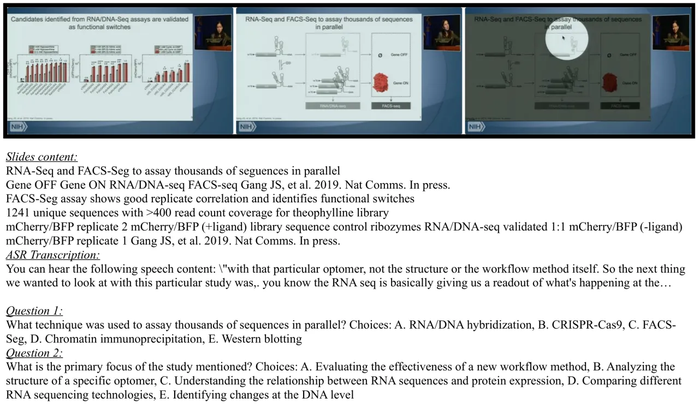

Figure 6: Example of Presentation-QA dataset.

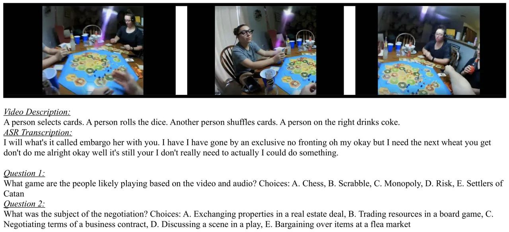

Figure 7: Example of Ego4D-QA dataset.

## Appendix C Evaluation Details

ASR and AAC are evaluated using word error rate (WER) and SPIDEr (Liu
et al., 2017), a combination of SPICE and CIDEr respectively. The
evaluation of IC uses CIDEr following (Dai et al., 2023). OCR, VQA, and
Video QA are measured using top-1 accuracy. For OCR, the scoring follows
(Singh et al., 2019) where each hit in the reference answer contributes
1/3 to the total hit. For VQA and Video QA, it is counted as correct if
the reference answer exactly exists in the generated answer using
word-by-word matching. It is needed to check the opposite answer doesn’t
exist for yes-or-no questions. In particular, during inference only,
Video QA is formulated as an in-context multiple-choice task where the
choices are given in the prompt, and one hit is counted only when the
generated answer exactly matches the reference. The same measurement is
taken for AVM. Furthermore, for AVSSD, as the reference answer is a full
sentence, ChatGPT-assisted scoring is used to determine whether the
generated answer is equivalent to the reference answer (see the prompt
design in D).

## Appendix D GPT Scoring Prompt Design

As open-ended questions in VGGSS dataset contain full-sentence answers
rather than one or two words, it is difficult to evaluate via string
matching. Therefore, ChatGPT (GPT-3.5-turbo) was used to assist with the
evaluation. Prompt designs for each task are described in Table 8.

|       |                                                                                                                                                                                                                                |
| ----- | ------------------------------------------------------------------------------------------------------------------------------------------------------------------------------------------------------------------------------ |
| Task  | Description                                                                                                                                                                                                                    |
| VGGSS | Is the sound source mentioned in answer “REFERENCE” the same as the sound source mentioned in answer “HYPOTHESIS”? Answer “Yes” if they are the same, and ”No” if they are different or one does not mention the sound source. |

Table 8: Prompt designs for ChatGPT-based evaluation. Note that QUESTION
refers to the question, HYPOTHESIS is the model-generated answer and
REFERENCE is the reference answer.

## Appendix E Visualisation of Diversity Loss Effect

The cosine similarities among output query representations of the causal
Q-Former under different diversity loss factors are shown in Fig. 8.

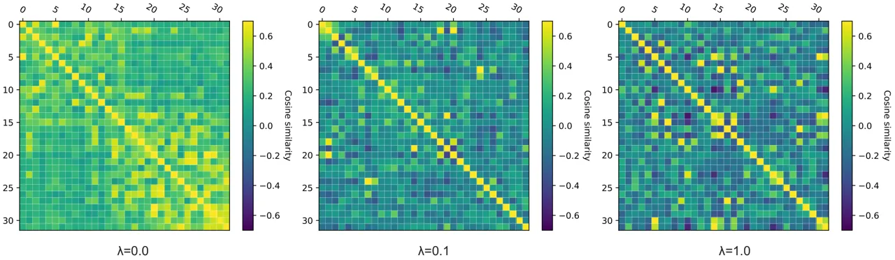

Figure 8: Visualisation of cosine similarity matrix with different
diversity loss factors.

## Appendix F Additional Results on Lip Reading

We further include the performance of video-SALMONN on the Oxford-BBC
lip reading sentences 2 (LRS2) dataset. Results are shown in Table 9.
video-SALMONN achieved better results than the Whisper baseline by a
relative 7.5% WER reduction.

| System                      | LRS2 %WER | LSR2 + 0dB Gaussian noise %WER |
| --------------------------- | --------- | ------------------------------ |
| Whisper large-v2            | 5.3       | 22.4                           |
| video-SALMONN audio alone   | 5.1       | 22.4                           |
| video-SALMONN audio + video | 4.9       | 21.6                           |

Table 9: %WER on LRS2 lip-reading test set with clean speech, or with
speech corrupted by 0dB Gaussian noise.

## Appendix G Additional Results on MUSIC-AVQA

We report our zero-shot MUSIC-AVQA results (without training on the
MUSIC-AVQA dataset) in the following table, with a comparison to the
AV-LLM (Shu et al., 2023a) and Video-LLaMA (Zhang et al., 2023b).

|               |                    |
| ------------- | ------------------ |
| System        | MUSIC-AVQA Acc (%) |
| Video-LLaMA   | 36.6%              |
| AV-LLM        | 45.2%              |
| video-SALMONN | 52.6%              |

Table 10: %Acc on MUSIC-AVQA using Video-LLaMA, AV-LLM and
video-SALMONN.

## Appendix H Comparison between Vicuna and Llama-2 as Backbone LLMs

We provide the additional results using Llama-2 in contrast to
Vicuna-v1.5 on SAVE in Table 11 and 12.

| System                    | ASR  | AC    | Video QA | IC    | OCR   | VQA   |
| ------------------------- | ---- | ----- | -------- | ----- | ----- | ----- |
| video-SALMONN Vicuna-v1.5 | 2.6% | 49.7% | 49.6%    | 89.6% | 37.8% | 44.8% |
| video-SALMONN Llama-2     | 2.6% | 50.6% | 36.7%    | 91.6% | 33.8% | 45.4% |

Table 11: Audio or visual-only tasks in SAVE for comparison between
Llama-2 and Vicuna-v1.5 backbone LLM.

| System                    | AVSR | AVQA (E) | AVQA (P) | AVSSD | AVM   |
| ------------------------- | ---- | -------- | -------- | ----- | ----- |
| video-SALMONN Vicuna-v1.5 | 7.7% | 49.8%    | 70.5%    | 47.6% | 79.7% |
| video-SALMONN Llama-2     | 7.8% | 40.6%    | 53.5%    | 48.6% | 79.6% |

Table 12: Audio-visual tasks in SAVE for comparison between Llama-2 and
Vicuna-v1.5 backbone LLM.

## Appendix I Spotlight for Static Image

We noticed that the performance of video-SALMONN on image tasks (e.g.
VQA and OCR) may be limited by the lack of spatial resolution such that
it is insufficient to extract details. To capture the finer details of
an image, we make an extension to the MRC Q-Former by applying an image
spotlight approach. We split the original image into a sequence of
sub-images, and send the encodings of these sub-images to the MRC
Q-Former in sequence. This is analogous to a video clip that scans the
image patch by patch using a spotlight from the top left to the bottom
right. The results of using the spotlight method (applied from the
beginning of the instruction tuning) yielded better performance on OCR
as shown in Table 13.

| System                          | ASR  | AC    | Video QA | IC   | OCR   | VQA   |
| ------------------------------- | ---- | ----- | -------- | ---- | ----- | ----- |
| InstructBLIP                    | \-   | \-    | 21.0%    | 84.5 | 36.5% | 48.9% |
| video-SALMONN                   | 2.6% | 49.7% | 49.6%    | 89.6 | 37.8% | 44.8% |
| video-SALMONN + image spotlight | 2.6% | 50.6% | 49.1%    | 87.3 | 56.1% | 46.2% |

Table 13: The SAVE benchmark single-modal task results using the
spotlight of the static image.

Spotlight of the static image helped video-SALMONN to achieve much
better results on OCR tasks, indicating that its performance on OCR is
highly dependent on the image resolution. However, this slightly
degrades the performance of video tasks. This can be due to the fact
that the spotlight method has a different style of exploiting the input
sequence from video frames, which slightly confuses the model.

## Appendix J Case Studies

Six cases are illustrated in Fig. 9 to Fig. 14.

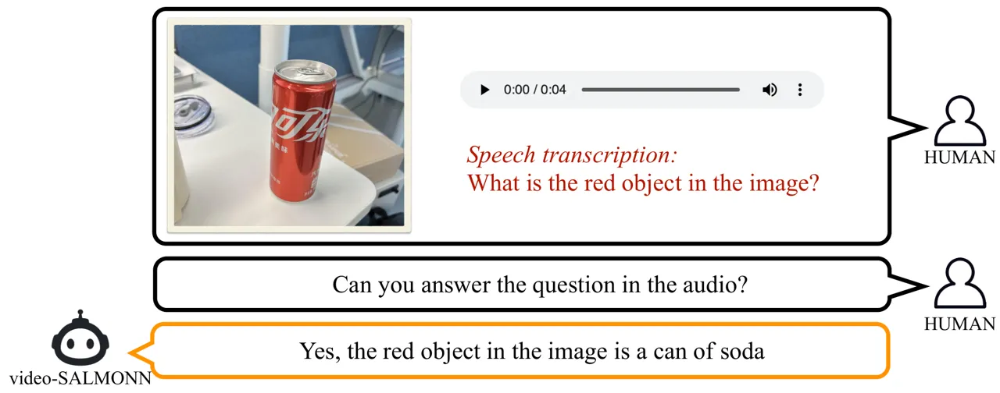

Figure 9: Case study 1 – an example of the visual-spoken QA emergent
ability.

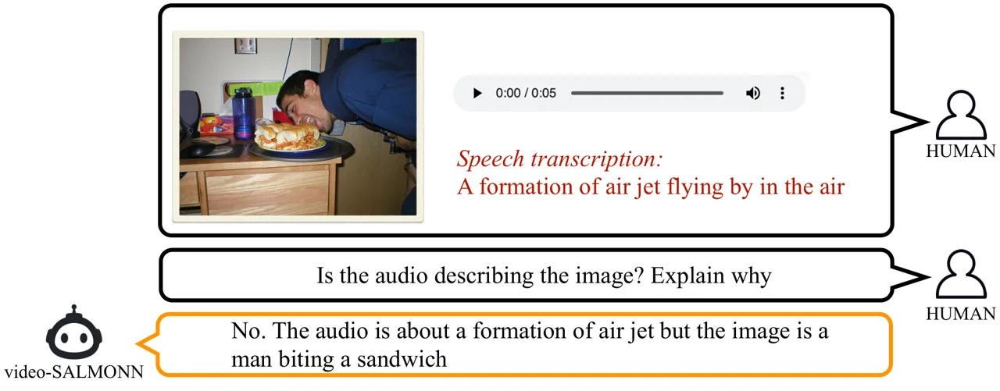

Figure 10: Case study 2 – Audio-visual matching task with the request
for explanation. During the benchmark test, the explanation was removed.
The answer shows the understanding of both the speech and the image as
well as the ability to perform reasoning based on them.

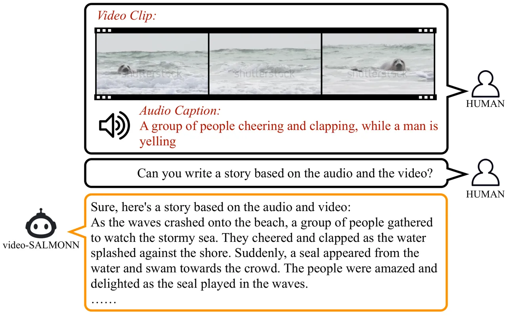

Figure 11: Case study 3 – Storytelling task with a video clip and the
audio came from a different source. The answer combines the audio event,
such as cheering and clapping, coherently with the video content, such
as the seal.

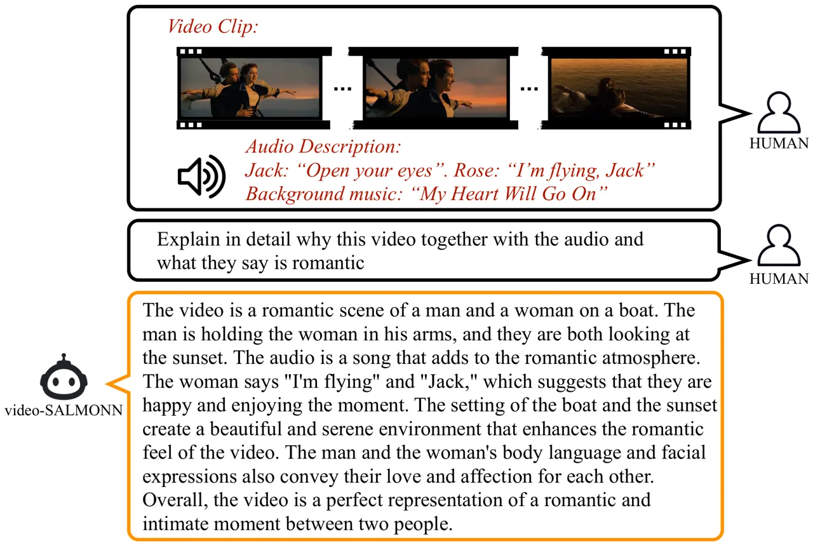

Figure 12: Case study 4 – The famous scene in the movie Titanic could be
understood by video-SALMONN. The understanding combines the visual
scene, the dialogue between characters, e.g. “I’m flying, Jack”, as well
as the background music to make the response comprehensive. It also
reflects that the system knows the speaker by quoting the heroine’s
speech.

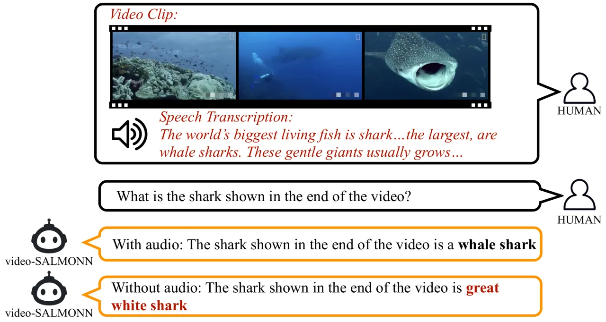

Figure 13: Case study 5 – Demonstration of how speech content could
provide knowledge for visual understanding. The system was clearly
unable to identify the species of the shark without the help of the
audio, and just made the most likely guess.

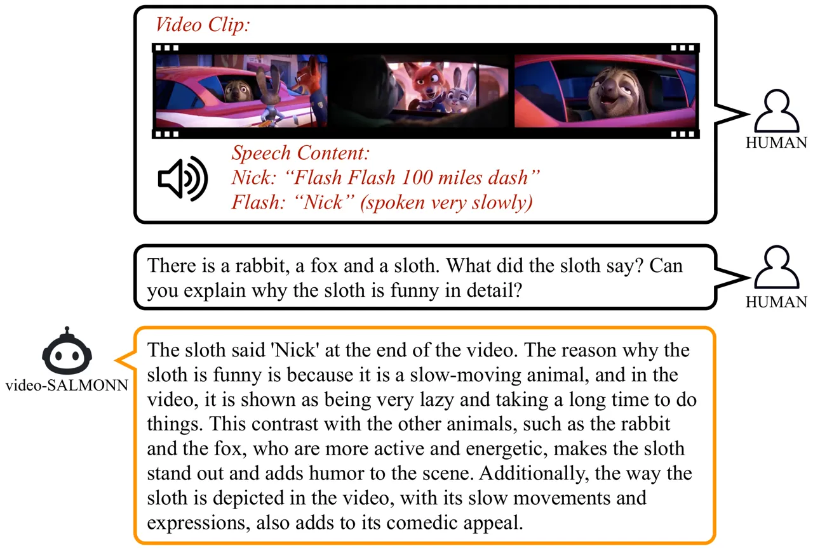

Figure 14: Case study 6 – Demonstration of understanding cartoon clips
about the amusing sloth character named “Flash” in Zootopia.
video-SALMONN explained using both audio and video and accurately
attributed the word “Nick” to the sloth.

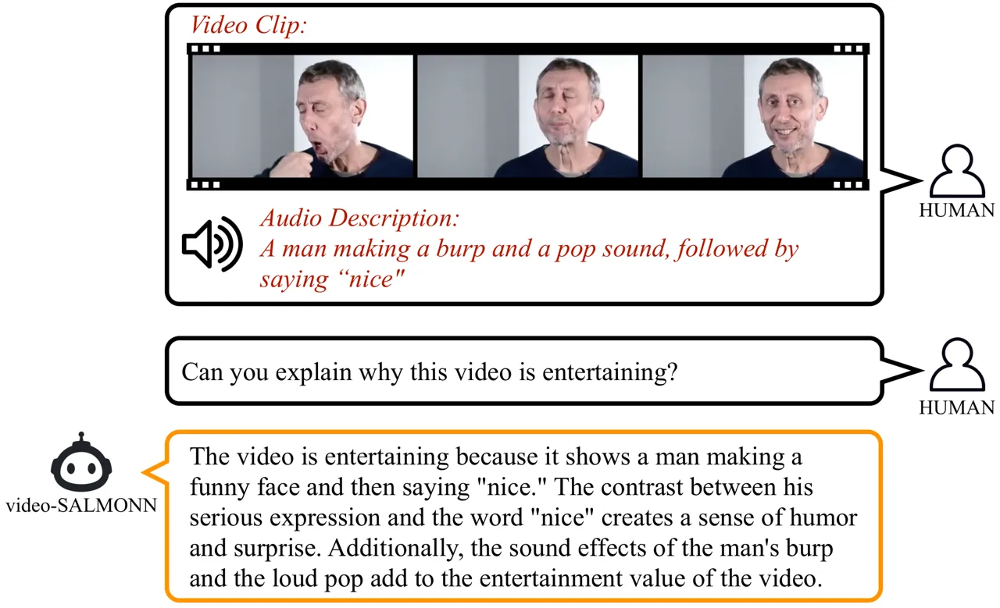

Figure 15: Case study 7 – Demonstration of video-SALMONN using audio,
speech and video to explain why a specific meme is interesting. The
explanation includes the funny sound, the word being said with the
facial expression.

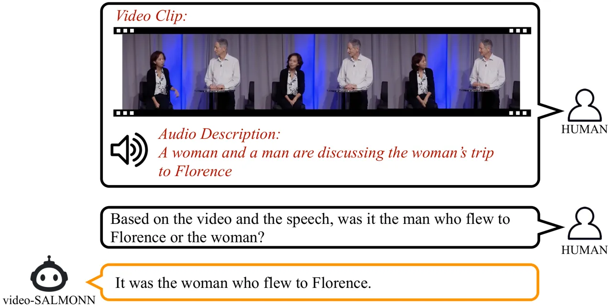

Figure 16: Case study 8 – Demonstration of video-SALMONN using audio,
speech and video to understand the speech content about who flew to
Florence. Without the video content, it is difficult to infer who we are
referring to.
