# LivePortrait: Efficient Portrait Animation with Stitching and Retargeting Control

Jianzhu Guo    Dingyun Zhang Affiliation: Kuaishou Technology   
Xiaoqiang Liu Affiliation: Kuaishou Technology    Zhizhou Zhong
Affiliation: Kuaishou Technology Affiliation: Fudan
University[https://liveportrait.github.io](https://liveportrait.github.io)
   Yuan Zhang Affiliation: Kuaishou Technology    Pengfei Wan
Affiliation: Kuaishou Technology    Di Zhang Affiliation: Kuaishou
Technology Affiliation: University of Science and Technology of China

###### Abstract

Portrait animation aims to synthesize a lifelike video from a single
source image, using it as an appearance reference, with motion (i.e.,
facial expressions and head pose) derived from a driving video, audio,
text, or generation. Instead of following mainstream diffusion-based
methods, we explore and extend the potential of the
implicit-keypoint-based framework, which effectively balances
computational efficiency and controllability. Building upon this, we
develop a video-driven portrait animation framework named LivePortrait
with a focus on better generalization, controllability, and efficiency
for practical usage. To enhance the generation quality and
generalization ability, we scale up the training data to about 69
million high-quality frames, adopt a mixed image-video training
strategy, upgrade the network architecture, and design better motion
transformation and optimization objectives. Additionally, we discover
that compact implicit keypoints can effectively represent a kind of
blendshapes and meticulously propose a stitching and two retargeting
modules, which utilize a small MLP with negligible computational
overhead, to enhance the controllability. Experimental results
demonstrate the efficacy of our framework even compared to
diffusion-based methods. The generation speed remarkably reaches 12.8ms
on an RTX 4090 GPU with PyTorch. The inference code and models are
available at
[https://github.com/KwaiVGI/LivePortrait](https://github.com/KwaiVGI/LivePortrait).

![[Uncaptioned
image]](arxiv-2407-03168--d0b77697d7ac.figures/figure-1.webp)

Figure 1: Qualitative portrait animation results from our model. Given a
static portrait image as input, our model can vividly animate it,
ensuring seamless stitching and offering precise control over eyes and
lip movements.

^(†)^(†)footnotetext: ^(∗)Equal contributions. ^(†)Corresponding author.

## 1 Introduction

Nowadays, people frequently use smartphones or other recording devices
to capture static portraits to record their precious moments. The Live
Photos¹¹ 1
[https://support.apple.com/en-sg/104966](https://support.apple.com/en-sg/104966)
feature on iPhone can bring static portraits to life by recording the
moments $`1.5`$ seconds before and after a picture is taken, which is
likely achieved through a form of video recording. However, based on
recent advances like GANs \[1\] and Diffusions \[2, 3, 4\], various
portrait animation methods \[5, 6, 7, 8, 9, 10, 11, 12, 13\] have made
it possible to animate a static portrait into dynamic ones, without
relying on specific recording devices.

In this paper, we aim to animate a static portrait image, making it
realistic and expressive, while also pursuing high inference efficiency
and precise controllability. Although diffusion-based portrait animation
methods \[12, 13, 14\] have achieved impressive results in terms of
quality, they are usually computationally expensive and lack the precise
controllability, _e.g_., stitching control²² 2
[https://www.d-id.com/liveportrait-4](https://www.d-id.com/liveportrait-4).
Instead, we extensively explore implicit-keypoint-based video-driven
frameworks \[11, 5\], and extend their potential to effectively balance
the generalization ability, computational efficiency, and
controllability.

Specifically, we first enhance a powerful implicit-keypoint-based
method \[5\], by scaling up the training data to about 69 million
high-quality portrait images, introducing a mixed image-video training
strategy, upgrading the network architecture, using the scalable motion
transformation, designing the landmark-guided implicit keypoints
optimization and several cascaded loss terms. Additionally, we discover
that compact implicit keypoints can effectively represent a kind of
implicit blendshapes, and meticulously design a stitching module and two
retargeting modules, which utilize a small MLP and add negligible
computational overhead, to enhance the controllability, such as
stitching control. Our core contributions can be summarized as follows:
(i) developing a solid implicit-keypoint-based video-driven portrait
animation framework that significantly enhances the generation quality
and generalization ability, and (ii) designing an advanced stitching
module and two retargeting modules for better controllability, with
negligible computational overhead. Extensive experimental results
demonstrate the efficacy of our framework, even compared to heavy
diffusion-based methods. Besides, our model can generate a portrait
animation in 12.8ms on an RTX 4090 GPU using PyTorch for inference.

## 2 Related Work

Recent video-driven portrait animation methods can be divided into
non-diffusion-based and diffusion-based methods, as summarized in
Tab. 1.

[TABLE]

Table 1: Summary of the video-driven portrait animation methods.

### 2.1 Non-diffusion-based Portrait Animation

For non-diffusion-based models, the implicit-keypoints-based methods
employed implicit keypoints as the intermediate motion representation,
and warped the source portrait with the driving image by the optical
flow. FOMM \[11\] performed first-order Taylor expansion near each
keypoint and approximated the motion in the neighborhood of each
keypoint using local affine transformations. MRAA \[15\] represented
articulated motion with PCA-based motion estimation. Face vid2vid \[5\]
extended FOMM by introducing 3D implicit keypoints representation and
achieved free-view portrait animation. IWA \[10\] improved the warping
mechanism based on cross-modal attention, which can be extended to using
multiple source images. To estimate the optical flow more flexibly and
work better for large-scale motions, TPSM \[7\] used nonlinear
thin-plate spline transformation for representing more complex motions.
Simultaneously, DaGAN \[6\] leveraged the dense depth maps to estimate
implicit keypoints that capture the critical driving movements.
MCNet \[8\] designed an identity representation conditioned memory
compensation network to tackle the ambiguous generation caused by the
complex driving motions.

Several works \[18, 19, 20\] employed predefined motion representations,
such as 3DMM blendshapes \[21\]. Another line of works \[22, 23\]
proposed to learn the latent expression representation from scratch.
MegaPortrait \[22\] used the high-resolution images beyond the
medium-resolution training images to upgrade animated resolution to
megapixel. EMOPortraits \[23\] employed an expression-riched training
video dataset and the expression-enhanced loss to express the intense
motions.

### 2.2 Diffusion-based Portrait Animation

Diffusion models \[2, 3, 4\] synthesized the desired data samples from
Gaussian noise via removing noises iteratively. \[2\] proposed the
Latent Diffusion Models (LDMs) and transferred the training and
inference processes to a compressed latent space for efficient
computing. LDMs have been broadly applied to many concurrent works in
full-body dance generation \[24, 25, 26, 27, 28\], audio-driven portrait
animation \[29, 30, 31, 32, 12, 33, 34\], and video-driven portrait
animation \[9, 12, 13, 16\].

FADM \[9\] was the first diffusion-based portrait animation method. It
obtained the coarsely animated result via the pretrained
implicit-keypoints-based model and then got the final animation under
the guidance of the 3DMMs with the diffusion model. Face Adapter \[16\]
used an identity adapter to enhance the identity preservation of the
source portrait and a spatial condition generator to generate the
explicit spatial condition, _i.e_., keypoints and foreground masks, as
the intermediate motion representation. Several works \[12, 13, 17\]
employed the mutual self-attention and plugged temporal attention
architecture similar to AnimateAnyone \[24\] to achieve better image
quality and appearance preservation. AniPortrait \[12\] used the
explicit spatial condition, _i.e_., keypoints, as the intermediate
motion representation. X-Portrait \[13\] proposed to animate the
portraits directly with the original driving video instead of using the
intermediate motion representations. It employed the
implicit-keypoint-based method \[5\] for cross-identity training to
achieve this. MegActor \[17\] also animated the source portrait with the
original driving video. It employed the existing face-swapping and
stylization framework to get the cross-identity training pairs and
encoded the background appearance to improve the animation stability.

## 3 Methodology

This section details our method. We begin with a brief review of the
video-based portrait animation framework face vid2vid \[5\] and
introduce our significant enhancements aimed at enhancing the
generalization ability and expressiveness of animation. Then, we present
our meticulously designed stitching and retargeting modules which
provide desired controllability with negligible computational overhead.
Finally, we detail the inference pipeline.

### 3.1 Preliminary of Face Vid2vid

Face vid2vid \[5\] is a seminal framework for animating a still
portrait, using the motion features extracted from the driving video
sequence. The original framework consists of an appearance feature
extractor $`\mathcal{F}`$, a canonical implicit keypoint detector
$`\mathcal{L}`$, a head pose estimation network $`\mathcal{H}`$, an
expression deformation estimation network $`\Delta`$, a warping field
estimator $`\mathcal{W}`$, and a generator $`\mathcal{G}`$.
$`\mathcal{F}`$ maps the source image $`s`$ to a 3D appearance feature
volume $`f_{s}`$. The source 3D keypoints $`x_{s}`$ and the driving 3D
keypoints $`x_{d}`$ are transformed as follows:

```math
\left\{\begin{array}[]{lr}x_{s}=x_{c,s}R_{s}+\delta_{s}+t_{s},&\\
x_{d}=x_{c,s}R_{d}+\delta_{d}+t_{d},&\end{array}\right. \tag{1}
```

where $`x_{s}`$ and $`x_{d}`$ are the source and driving 3D implicit
keypoints, respectively, and $`x_{c,s}\in\mathbb{R}^{K\times 3}`$
represents the canonical keypoints of the source image. The source and
driving poses are $`R_{s}`$ and $`R_{d}\in\mathbb{R}^{3\times 3}`$, the
expression deformations are $`\delta_{s}`$ and
$`\delta_{d}\in\mathbb{R}^{K\times 3}`$, and the translations are
$`t_{s}`$ and $`t_{d}\in\mathbb{R}^{3}`$. Next, $`\mathcal{W}`$
generates a warping field using the implicit keypoint representations
$`x_{s}`$ and $`x_{d}`$, and employs this flow field to warp the source
feature volume $`f_{s}`$. Subsequently, the warped features pass through
a decoder generator $`\mathcal{G}`$, translating them into image space
and resulting in a target image.

### 3.2 Stage I: Base Model Training

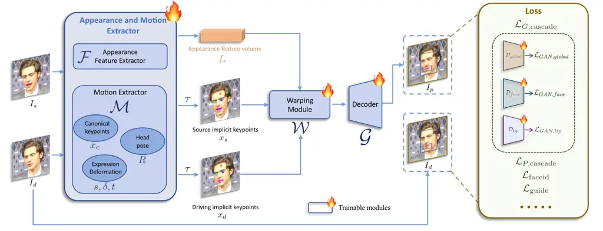

Figure 2: Pipeline of the first stage: base model training. The
appearance and motion extractors $`\mathcal{F}`$ and $`\mathcal{M}`$,
the warping module $`\mathcal{W}`$, and the decoder $`\mathcal{G}`$ are
optimized. In this stage, models are trained from scratch. Please refer
to Sec. 3.2 for details.

We choose face vid2vid \[5\] as our base model and introduce a series of
significant enhancements. These include high-quality data curation, a
mixed image and video training strategy, an upgraded network
architecture, scalable motion transformation, landmark-guided implicit
keypoints optimization, and cascaded loss terms. These advancements
significantly enhance the expressiveness of the animation and the
generalization ability of the model. The pipeline of the first training
stage is shown in Fig. 2.

#### High quality data curation.

We leverage public video datasets such as Voxceleb \[35\], MEAD \[36\],
and RAVDESS \[37\], as well as the styled image dataset AAHQ \[38\].
Additionally, we collect a large corpus of 4K-resolution portrait videos
with various poses and expressions, 200 hours of talking head videos,
and utilize the private LightStage \[39, 40\] dataset, along with
several styled portrait videos and images. We split long videos into
clips of less than 30 seconds and ensure each clip contains only one
person using face tracking and recognition. To maintain the quality of
the training data, we use KVQ \[41\] to filter out low-quality video
clips. Finally, our training data consists of 69M video frames (92M
before filtering) from about 18.9K identities and 60K static styled
portraits.

#### Mixed image and video training.

The model trained only on realistic portrait videos performs well on
human portraits but generalizes poorly to styled portraits, _e.g_.,
anime. Styled portrait videos are scarce, we collect only about 1.3K
clips from fewer than 100 identities. In contrast, high-quality styled
portrait images are more abundant; we gathered approximately 60K images,
each representing a unique identity, offering diverse identity
information. To leverage both data types, we treat single images as
one-frame video clips and train the model on both images and videos.
This mixed training improves the model’s generalization ability.

#### Upgraded network architecture.

We unify the original canonical implicit keypoint detector
$`\mathcal{L}`$, head pose estimation network $`\mathcal{H}`$, and
expression deformation estimation network $`\Delta`$ into a single model
$`\mathcal{M}`$, with ConvNeXt-V2-Tiny \[42\] as the backbone, which
directly predicts the canonical keypoints, head pose and expression
deformation of the input image. Additionally, we follow \[43\] to use
SPADE decoder \[44\] as the generator $`\mathcal{G}`$, which is more
powerful than the original decoder in face vid2vid \[5\]. The warped
feature volume $`f_{s}`$ is delicately fed into the SPADE decoder, where
each channel of the feature volume serves as a semantic map to generate
the animated image. For efficiency, we insert a PixelShuffle \[45\]
layer as the final layer of $`\mathcal{G}`$ to upsample the resolution
from $`256`$$`\times`$$`256`$ to $`512`$$`\times`$$`512`$.

#### Scalable motion transformation.

The original implicit keypoint transformation in Eqn. 1 ignores the
scale factor, which tends to incorporate scaling into the expression
deformation and increases the training difficulty. To address this
issue, we introduce a scale factor to the motion transformation, and the
updated transformation $`\tau`$ is formulated as:

```math
\left\{\begin{array}[]{lr}x_{s}=s_{s}\cdot(x_{c,s}R_{s}+\delta_{s})+t_{s},&\\
x_{d}=s_{d}\cdot(x_{c,s}R_{d}+\delta_{d})+t_{d},&\end{array}\right. \tag{2}
```

where $`s_{s}`$ and $`s_{d}`$ are the scale factors of the source and
driving input, respectively. Note that the transformation differs from
the scale orthographic projection, which is formulated as
$`x=s\cdot\big((x_{c}+\delta)R\big)+t`$. We find that the scale
orthographic projection leads to overly flexible learned expressions
$`\delta`$, causing texture flickering when driving across different
identities. Therefore, this transformation can be seen as a tradeoff
between flexibility and drivability.

#### Landmark-guided implicit keypoints optimization.

The original face vid2vid \[5, 43\] seems to lack the ability to vividly
drive facial expressions, such as winking and eye movements. In
particular, the eye gazes of generated portraits are bound to the head
pose and remain parallel to it, a limitation we also observed in our
reproduction experiments. We attribute these limitations to the
difficulty of learning subtle facial expressions, like eye movements, in
an unsupervised manner. To address this, we introduce 2D landmarks that
capture micro-expressions, using them as guidance to optimize the
learning of implicit points. The landmark-guided loss
$`\mathcal{L}_{\textrm{guide}}`$ is formulated as follows:

```math
\mathcal{L}_{\textrm{guide}}\!=\!\frac{1}{2N}\sum_{i=1}^{N}\big(\textrm{Wing}(l_{i},x_{s,i,:2})\!+\!\textrm{Wing}(l_{i},x_{d,i,:2})\big), \tag{3}
```

where $`N`$ is the number of selected landmarks, $`l_{i}`$ is the
$`i`$-th landmark, $`x_{s,i,:2}`$ and $`x_{d,i,:2}`$ represent the first
two dimensions of the corresponding implicit keypoints respectively, and
Wing loss is adopted following \[46\]. In our experiments, $`N`$ is set
to 10, with the selected landmarks taken from the eyes and lip.

#### Cascaded loss terms.

We follow face vid2vid \[5\] to use implicit keypoints equivariance loss
$`\mathcal{L}_{E}`$, keypoint prior loss $`\mathcal{L}_{L}`$, head pose
loss $`\mathcal{L}_{H}`$, and deformation prior loss
$`\mathcal{L}_{\Delta}`$. To further improve the texture quality, we
apply perceptual and GAN losses on the global region of the input image,
and local regions of face and lip, denoted as a cascaded perceptual loss
$`\mathcal{L}_{P,\textrm{cascade}}`$ and a cascaded GAN loss
$`\mathcal{L}_{G,\textrm{cascade}}`$.
$`\mathcal{L}_{G,\textrm{cascade}}`$ consists of
$`\mathcal{L}_{GAN,global}`$, $`\mathcal{L}_{GAN,face}`$, and
$`\mathcal{L}_{GAN,lip}`$, which depend on the corresponding
discriminators $`\mathcal{D}_{global}`$, $`\mathcal{D}_{face}`$, and
$`\mathcal{D}_{lip}`$ training from scratch. The face and lip regions
are defined by 2D semantic landmarks. We also adopt a face-id \[47\]
loss $`\mathcal{L}_{\textrm{faceid}}`$ to preserve the identity of the
source image. The overall training objective of the first stage is
formulated as:

```math
\displaystyle\mathcal{L}_{\textrm{base}}= \displaystyle\mathcal{L}_{E}+\mathcal{L}_{L}+\mathcal{L}_{H}+\mathcal{L}_{\Delta}+ \tag{4}
```

```math
\displaystyle\mathcal{L}_{P,\textrm{cascade}}+\mathcal{L}_{G,\textrm{cascade}}+\mathcal{L}_{\textrm{faceid}}+\mathcal{L}_{\textrm{guide}}.
```

During the first stage, the model is fully trained from scratch.

### 3.3 Stage II: Stitching and Retargeting

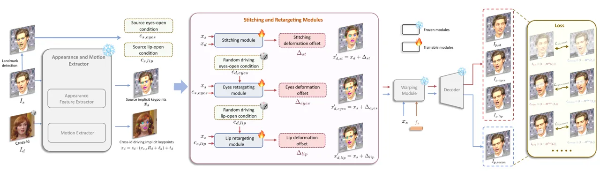

Figure 3: Pipeline of the second stage: stitching and retargeting
modules training. After training the base model in the first stage, we
freeze the appearance and motion extractor, warpping module and decoder.
Only the stitching module and the retargeting modules are optimized in
the second stage. Please refer to Sec. 3.3 for details.

We suppose the compact implicit keypoints can serve as a kind of
implicit blendshapes. Unlike pose, we cannot explicitly control the
expressions, but rather need a combination of these implicit blendshapes
to achieve the desired effects. Surprisingly, we discover that such a
combination can be well learned using only a small MLP network, with
negligible computational overhead. Considering practical requirements,
we design a stitching module, an eyes retargeting module, and a lip
retargeting module. The stitching module pastes the animated portrait
back into the original image space without pixel misalignment, such as
in the shoulder region. This enables the handling of much larger image
sizes and the animation of multiple faces simultaneously. The eyes
retargeting module is designed to address the issue of incomplete eye
closure during cross-id reenactment, especially when a person with small
eyes drives a person with larger eyes. The lip retargeting module is
designed similarly to the eye retargeting module, and can also normalize
the input by ensuring that the lips are in a closed state, which
facilitates better animation driving. The pipeline of the second
training stage is shown in Fig. 3.

#### Stitching module.

During training, the stitching module $`\mathcal{S}`$ receives the
source and driving implicit keypoints $`x_{s}`$ and $`x_{d}`$ as input,
and estimates a deformation offset
$`\Delta_{st}\in\mathbb{R}^{K\times 3}`$ of the driving keypoints.
Following Eqn. 2, the source implicit keypoints are calculated as
$`x_{s}=s_{s}\cdot(x_{c,s}R_{s}+\delta_{s})+t_{s}`$, and the driving
implicit keypoints $`x_{d}`$ are calculated using another person’s
motions as $`x_{d}=s_{d}\cdot(x_{c,s}R_{d}+\delta_{d})+t_{d}`$. Note
that the transformation of $`x_{d}`$ differs from the first training
stage, as we deliberately use cross-id rather than same-id motion to
increase training difficulty, aiming for better generalization in
stitching. Then, $`\Delta_{st}=\mathcal{S}(x_{s},x_{d})`$, the driving
keypoints are updated as $`x^{\prime}_{d,st}=x_{d}+\Delta_{st}`$, and
the prediction image
$`I_{p,st}=\mathcal{D}\big(\mathcal{W}(f_{s};x_{s},x^{\prime}_{d,st})\big)`$.
We denote the self-reconstruction image as
$`I_{p,recon}=\mathcal{D}\big(\mathcal{W}(f_{s};x_{s},x_{s})\big)`$.
Finally, the stitching objective $`\mathcal{L}_{\textrm{st}}`$ is
formulated as:

```math
\mathcal{L}_{\textrm{st}}=\underbrace{\big\|(I_{p,st}\!-\!I_{p,recon})\odot\big(1\!-\!M^{st}(I_{s})\big)\big\|_{1}}_{\mathcal{L}_{st,const}}\!+w_{reg}^{st}\big\|\Delta_{st}\big\|_{1}, \tag{5}
```

where $`\mathcal{L}_{st,const}`$ is the consistency pixel loss between
the shoulder region of the prediction and the self-reconstruction image,
$`M^{st}`$ is a mask operator that masks out the non-shoulder region
from the source image $`I_{s}`$, which is visualized in Fig. 3.
$`\|\Delta_{st}\|_{1}`$ is the $`L_{1}`$ norm regularization of the
stitching deformation offset, and $`w_{reg}^{st}`$ is a hyperparameter.

#### Eyes and lip retargeting modules.

The eyes retargeting module $`\mathcal{R}_{eyes}`$ receives the source
implicit keypoints $`x_{s}`$, the source eyes-open condition tuple
$`c_{s,eyes}`$ and a random driving eyes-open scalar
$`c_{d,eyes}\in[0,0.8]`$ as input, estimating a deformation offset
$`\Delta_{eyes}\in\mathbb{R}^{K\times 3}`$ for the driving keypoints:
$`\Delta_{eyes}=\mathcal{R}_{eyes}(x_{s};c_{s,eyes},c_{d,eyes})`$. The
eyes-open condition denotes the ratio of eye-opening: the larger the
value, the more open the eyes. Similarly, the lip retargeting module
$`\mathcal{R}_{lip}`$ also receives the source implicit keypoints
$`x_{s}`$ and the source lip-open condition scalar $`c_{s,lip}`$ and a
random driving lip-open scalar $`c_{d,lip}`$ as input, estimating a
deformation offset $`\Delta_{lip}\in\mathbb{R}^{K\times 3}`$ for the
driving keypoints:
$`\Delta_{lip}=\mathcal{R}_{lip}(x_{s};c_{s,lip},c_{d,lip})`$. Then, the
driving keypoints are updated as
$`x^{\prime}_{d,eyes}=x_{s}+\Delta_{eyes}`$ and
$`x^{\prime}_{d,lip}=x_{s}+\Delta_{lip}`$, and the prediction images are
$`I_{p,eyes}=\mathcal{D}\big(\mathcal{W}(f_{s};x_{s},x^{\prime}_{d,eyes})\big)`$
and
$`I_{p,lip}=\mathcal{D}\big(\mathcal{W}(f_{s};x_{s},x^{\prime}_{d,lip})\big)`$.
Finally, the training objectives for the eyes and lip retargeting
modules are formulated as follows:

```math
\begin{aligned} \mathcal{L}_{\textrm{eyes}}=&\ \underbrace{\big\|(I_{p,eyes}\!-\!I_{p,recon})\odot\big(1\!-\!M^{eyes}(I_{s})\big)\big\|_{1}}_{\mathcal{L}_{eyes,const}}+\\
&w_{cond}^{eyes}\big\|c^{p}_{s,eyes}-c_{d,eyes}\big\|_{1}+w_{reg}^{eyes}\big\|\Delta_{eyes}\big\|_{1},\\
\\
\mathcal{L}_{\textrm{lip}}=&\ \underbrace{\big\|(I_{p,lip}\!-\!I_{p,recon})\odot\big(1\!-\!M^{lip}(I_{s})\big)\big\|_{1}}_{\mathcal{L}_{lip,const}}+\\
&w_{cond}^{lip}\big\|c^{p}_{s,lip}-c_{d,lip}\big\|_{1}+w_{reg}^{lip}\big\|\Delta_{lip}\big\|_{1},\\
\end{aligned} \tag{6}
```

where $`M^{eyes}`$ and $`M^{lip}`$ are mask operators that mask out the
eyes and lip regions from the source image $`I_{s}`$ respectively,
$`c^{p}_{s,eyes}`$ and $`c^{p}_{s,lip}`$ are the condition tuples from
$`I_{p,eyes},I_{p,lip}`$ respectively, and
$`w_{cond}^{eyes},w_{reg}^{eyes},w_{cond}^{lip},w_{reg}^{lip}`$ are
hyperparameters.

### 3.4 Inference

In the inference phase, we first extract the feature volume
$`f_{s}=\mathcal{F}(I_{s})`$, the canonical keypoints
$`x_{c,s}=\mathcal{M}(I_{s})`$ from the source image $`I_{s}`$. Given a
driving video sequence $`\{{I_{d,i}|i=0,\ldots,N-1}\}`$, we extract
motions from each frame
$`s_{d,i},\delta_{d,i},t_{d,i},R_{d,i}=\mathcal{M}(I_{d,i})`$ and
conditions $`c_{d,eyes,i}`$ and $`c_{d,lip,i}`$. The source and driving
implicit keypoints are next transformed as follows:

```math
\left\{\begin{array}[]{ll}x_{s}&=s_{s}\cdot(x_{c,s}R_{s}+\delta_{s})+t_{s},\\
x_{d,i}&=s_{s}\cdot\frac{s_{d,i}}{s_{d,0}}\cdot\big(x_{c,s}(R_{d,i}R^{-1}_{d,0}R_{s})+\\
&(\delta_{s}+\delta_{d,i}-\delta_{d,0})\big)+(t_{s}+t_{d,i}-t_{d,0}).\end{array}\right. \tag{7}
```

Then, the influence procedure could be described as in Algorithm 1,
where $`\alpha_{st}`$, $`\alpha_{eyes}`$ and $`\alpha_{lip}`$ are
indicator variables that can take values of either $`0`$ or $`1`$. The
final prediction image $`I_{p,i}`$ is generated by the warping network
$`\mathcal{W}`$ and the decoder $`\mathcal{D}`$. Note that the
deformation offsets of eyes and lip are decoupled from each other,
allowing them to be linearly added to the driving keypoints.

1: Input:
$`f_{s};x_{s},x_{d,i};\alpha_{eyes},\alpha_{lip},\alpha_{st};c_{s,eyes},c_{d,eyes,i},c_{s,lip}`$,

2: $`c_{d,lip,i}`$

3: Output: $`I_{p,i}`$

4:

if
$`\alpha_{st}=0\mathrm{~and~}\alpha_{eyes}=0\mathrm{~and~}\alpha_{lip}=0`$
then


5:
  $`\triangleright`$ 
without stitching or retargeting  $`\triangleleft`$


6:
  
$`x^{\prime}_{d,i}\leftarrow x_{d,i}`$


7:


else if
$`\alpha_{st}=1\mathrm{~and~}\alpha_{eyes}=0\mathrm{~and~}\alpha_{lip}=0`$
then


8:
  $`\triangleright`$ 
with stitching and without retargeting  $`\triangleleft`$


9:
  
$`\Delta_{st,i}=\mathcal{S}(x_{s},x_{d,i})`$


10:
  
$`x^{\prime}_{d,i}\leftarrow x_{d,i}+\Delta_{st,i}`$


11:


else if $`\alpha_{eyes}=1\mathrm{~or~}\alpha_{lip}=1`$ then


12:
  $`\triangleright`$ 
with eyes or lip retargeting  $`\triangleleft`$


13:
  
$`\Delta_{eyes,i}=\mathcal{R}_{eyes}(x_{s};c_{s,eyes},c_{d,eyes,i})`$


14:
  
$`\Delta_{lip,i}=\mathcal{R}_{lip}(x_{s};c_{s,lip},c_{d,lip,i})`$


15:
  
$`x^{\prime}_{d,i}\leftarrow x_{s}+\alpha_{eyes}\Delta_{eyes,i}+\alpha_{lip}\Delta_{lip,i}`$


16:
  

if $`\alpha_{st}=1`$ then


17:
   
$`\Delta_{st,i}=\mathcal{S}(x_{s},x^{\prime}_{d,i})`$


18:
   
$`x^{\prime}_{d,i}\leftarrow x^{\prime}_{d,i}+\Delta_{st,i}`$


19:
  

end if


20:


end if

21:
$`I_{p,i}\leftarrow\mathcal{D}\big(\mathcal{W}(f_{s};x_{s},x^{\prime}_{d,i})\big)`$

Algorithm 1 Illustration of the inference procedure

## 4 Experiments

We first give an overview of the implementation details, baselines, and
benchmarks used in the experiments. Then, we present the experimental
results on self-reenactment and cross-reenactment, followed by an
ablation study to validate the effectiveness of the proposed stitching
and retargeting modules.

#### Implementation Details.

In the first training stage, our models are trained from scratch using 8
NVIDIA A100 GPUs for approximately 10 days. During the second training
stage, we only train the stitching and retargeting modules while keeping
other parameters frozen, which takes approximately 2 days. The input
images are aligned and cropped to a resolution of
$`256`$$`\times`$$`256`$, with a batch size set to $`104`$. The output
resolution is $`512`$$`\times`$$`512`$. The Adam optimizer is employed
with a learning rate of $`2\times 10^{-4}`$, $`\beta_{1}=0.5`$, and
$`\beta_{2}=0.999`$. The stitching module consists of a four-layer MLP
with layer sizes of $`[126,128,128,64,65]`$. The eyes retargeting module
consists of a six-layer MLP with layer sizes of
$`[66,256,256,128,128,64,63]`$. The lip retargeting module consists of a
four-layer MLP with layer sizes of $`[65,128,128,64,63]`$. The
computation budget of the stitching and retargeting modules is
negligible.

#### Baselines.

We compare our model with several non-diffusion-based methods, including
FOMM \[11\], Face Vid2vid \[5\], DaGAN \[6\], MCNet \[8\], and
TPSM \[7\], as well as diffusion-based models such as FADM \[9\],
AniPortrait \[12\], and X-Portrait \[13\]. For face vid2vid \[5\], we
employ the implementation from \[43\], while for the other methods, we
use the official implementations.

#### Benchmarks.

To measure the generalization quality and motion accuracy of portrait
animation results, we adopt Peak Signal-to-Noise Ratio (PSNR),
Structural Similarity Index (SSIM) \[48\], Learned Perceptual Image
Patch Similarity (LPIPS) \[49\], $`\mathcal{L}_{1}`$ distance,
FID \[50\], Average Expression Distance (AED) \[11\], Average Pose
Distance (APD) \[11\], and Mean Angular Error (MAE) of eyeball
direction \[16\]. For self-reenactment, our models are evaluated on the
official test split of the TalkingHead-1KH dataset \[5\] and VFHQ
dataset \[51\], which consist of 35 and 50 videos respectively. For
cross-reenactment, the first 50 images obtained from the FFHQ
dataset \[52\] are used as source portraits. Detailed descriptions of
these metrics are provided in Appendix A.

### 4.1 Self-reenactment

For each test video sequence, we use the first frame as the source input
and animate it using the whole frames as driving images, which also
serve as ground truth. For comparisons, the animated portraits and the
ground truth images are downsampled to a resolution of
$`256`$$`\times`$$`256`$ to maintain consistency with the baselines.
Qualitative and quantitative comparisons are detailed as follows.

#### Qualitative results.

The qualitative comparisons are illustrated in Fig. 4. Our results are
the pasted back images in the original image space using the first-stage
base model. These cases demonstrate that our model can faithfully
transfer motions from the driving images, including lip movements and
eye gazes, while preserving the appearance details of the source
portrait. The fourth case in Fig. 4 demonstrates that our model achieves
stable animation results even with large poses, ensuring accurate
transfer of poses.

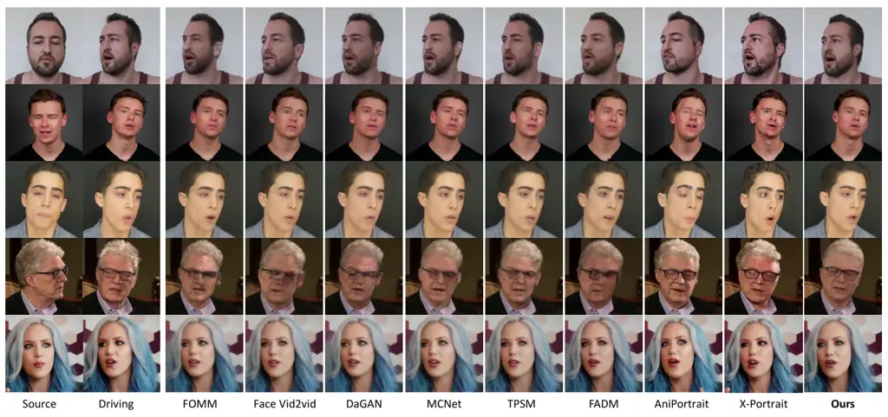

Figure 4: Qualitative comparisons of self-reenactment. The first four
source-driving paired images are from TalkingHead-1KH \[5\] and the last
ones are from VFHQ \[51\]. Our model faithfully preserves lip movements
and eye gazes, handles large poses more stably, and maintains the
identity of the source portrait better compared to other methods.

#### Quantitative results.

In Tab. 2, we present quantitative comparisons of self-reenactment. Our
model slightly outperforms previous diffusion-based methods, such as
FADM \[9\], AniPortrait \[12\], and X-Portrait \[13\], in generation
quality, and demonstrates better eyes motion accuracy than other
methods.

|                        |                  |                  |                     |                                   |                  |                       |                  |                  |                     |                                   |                  |                       |
| ---------------------- | ---------------- | ---------------- | ------------------- | --------------------------------- | ---------------- | --------------------- | ---------------- | ---------------- | ------------------- | --------------------------------- | ---------------- | --------------------- |
| Method                 | TalkingHead-1KH  |                  |                     |                                   |                  |                       | VFHQ             |                  |                     |                                   |                  |                       |
|                        | PSNR$`\uparrow`$ | SSIM$`\uparrow`$ | LPIPS$`\downarrow`$ | $`\mathcal{L}_{1}`$$`\downarrow`$ | CSIM$`\uparrow`$ | MAE (°)$`\downarrow`$ | PSNR$`\uparrow`$ | SSIM$`\uparrow`$ | LPIPS$`\downarrow`$ | $`\mathcal{L}_{1}`$$`\downarrow`$ | CSIM$`\uparrow`$ | MAE (°)$`\downarrow`$ |
| FOMM \[11\]            | 31.0681          | 0.7620           | 0.1201              | 0.0419                            | 0.8805           | 10.1745               | 30.5912          | 0.7098           | 0.1410              | 0.0505                            | 0.8700           | 10.9327               |
| Face Vid2vid \[5, 43\] | 30.8438          | 0.7743           | 0.0940              | 0.0432                            | 0.8774           | 10.8117               | 30.5166          | 0.7247           | 0.1132              | 0.0500                            | 0.8775           | 11.1500               |
| DaGAN \[6\]            | 31.3657          | 0.7903           | 0.0969              | 0.0389                            | 0.8798           | 11.8655               | 30.7038          | 0.7315           | 0.1258              | 0.0481                            | 0.8747           | 11.2051               |
| MCNet \[8\]            | 32.0013          | 0.8042           | 0.1018              | 0.0349                            | 0.8876           | 10.9035               | 31.3459          | 0.7540           | 0.1209              | 0.0429                            | 0.8849           | 9.6634                |
| TPSM \[7\]             | 31.2934          | 0.7965           | 0.0990              | 0.0395                            | 0.8848           | 9.6036                | 31.0262          | 0.7476           | 0.1177              | 0.0466                            | 0.8884           | 9.8169                |
| FADM \[9\]             | 30.2141          | 0.7695           | 0.1049              | 0.0484                            | 0.8708           | 11.4484               | 30.0932          | 0.7180           | 0.1252              | 0.0535                            | 0.8707           | 11.7523               |
| AniPortrait \[12\]     | 31.4669          | 0.7144           | 0.0922              | 0.0470                            | 0.8550           | 12.0807               | 30.9013          | 0.6718           | 0.1073              | 0.0542                            | 0.8570           | 14.2411               |
| X-Portrait \[13\]      | 31.2716          | 0.7193           | 0.1007              | 0.0487                            | 0.8773           | 9.2335                | 30.5840          | 0.6479           | 0.1312              | 0.0627                            | 0.8721           | 9.3846                |
| Ours                   | 32.0082          | 0.8193           | 0.0664              | 0.0347                            | 0.9125           | 7.0535                | 31.5616          | 0.7653           | 0.0798              | 0.0422                            | 0.9121           | 6.6966                |

Table 2: Quantitative comparisons of self-reenactment.

### 4.2 Cross-reenactment

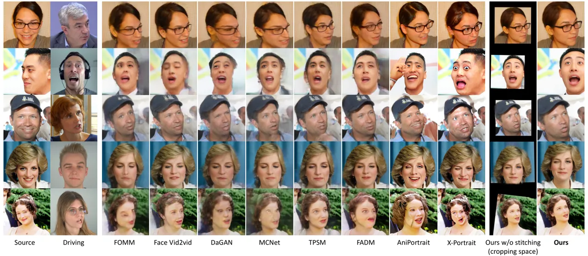

Figure 5: Qualitative comparisons of cross-reenactment. The first three
source portraits are from FFHQ \[52\] and the last two are celebrities.
Driving portraits are random selected from TalkingHead-1KH \[5\],
VFHQ \[51\] and NeRSemble \[53\]. We present the animated portraits
without stitching in the cropping space, as well as the final results
after stitching and pasting back into the original image space. Similar
to self-reenactment, our model better transfers lip movements and eye
gazes from another person, while maintaining the identity of the source
portrait.

#### Qualitative results.

Qualitative comparisons of cross-reenactment are shown in Fig. 5. The
first two cases demonstrate our model’s ability to stably transfer
motion under large poses from the driving or source portraits. The third
and fourth cases show that our model accurately transfers delicate lip
movements and eye gazes, maintaining appearance details consistent with
the source portrait. Additionally, the last case illustrates that
stitching enables our model to perform stably even when the face region
in the reference image is relatively small, providing the capability to
animate multi-person inputs or full-body images gracefully.

|                        |                     |                    |                     |                     |                         |                     |                    |                     |                     |                         |
| ---------------------- | ------------------- | ------------------ | ------------------- | ------------------- | ----------------------- | ------------------- | ------------------ | ------------------- | ------------------- | ----------------------- |
| Method                 | TalkingHead-1KH     |                    |                     |                     |                         | VFHQ                |                    |                     |                     |                         |
|                        | ​​FID$`\downarrow`$ | ​​CSIM$`\uparrow`$ | ​​AED$`\downarrow`$ | ​​APD$`\downarrow`$ | ​​MAE (°)$`\downarrow`$ | ​​FID$`\downarrow`$ | ​​CSIM$`\uparrow`$ | ​​AED$`\downarrow`$ | ​​APD$`\downarrow`$ | ​​MAE (°)$`\downarrow`$ |
| FOMM \[11\]            | 90.8068             | 0.3057             | 0.7934              | 0.0411              | 18.3946                 | 94.1640             | 0.2011             | 0.7374              | 0.0336              | 18.6282                 |
| Face Vid2vid \[5, 43\] | 82.9066             | 0.3687             | 0.8285              | 0.0559              | 20.2687                 | 83.8891             | 0.2360             | 0.7891              | 0.0470              | 19.9852                 |
| DaGAN \[6\]            | 81.1110             | 0.2937             | 0.7636              | 0.0405              | 21.0156                 | 82.6255             | 0.1969             | 0.7108              | 0.0334              | 20.6918                 |
| MCNet \[8\]            | 89.3218             | 0.2863             | 0.7163              | 0.0375              | 17.0721                 | 89.9694             | 0.1907             | 0.6545              | 0.0329              | 17.3642                 |
| TPSM \[7\]             | 80.5436             | 0.3289             | 0.7492              | 0.0387              | 17.4371                 | 77.5867             | 0.2197             | 0.6700              | 0.0290              | 16.8058                 |
| FADM \[9\]             | 95.4043             | 0.3755             | 0.8158              | 0.0525              | 18.8346                 | 98.2516             | 0.2473             | 0.7811              | 0.0438              | 18.9776                 |
| AniPortrait \[12\]     | 47.8739             | 0.3733             | 0.9127              | 0.0450              | 19.7136                 | 70.8077             | 0.2538             | 0.9018              | 0.0501              | 20.1085                 |
| X-Portrait \[13\]      | 60.7963             | 0.5843             | 0.8392              | 0.1070              | 20.9344                 | 58.6731             | 0.5881             | 0.8463              | 0.1226              | 22.5937                 |
| Ours                   | 58.0370             | 0.3909             | 0.6772              | 0.0333              | 14.7946                 | 56.4165             | 0.2606             | 0.6476              | 0.0271              | 13.3464                 |

Table 3: Quantitative comparisons of cross-reenactment.

#### Quantitative results.

Tab. 3 shows the quantitative results of the cross-reenactment
comparisons. Our model outperforms previous diffusion-based and
non-diffusion-based methods in both generation quality and motion
accuracy, except for the FID on TalkingHead-1KH and the CSIM on both
datasets, where the FID of the diffusion-based method AniPortrait \[12\]
and the CSIM of X-Portrait \[13\] are better than ours. The flip side is
that diffusion-based methods require much more inference time than
non-diffusion-based methods due to multiple denoising steps and high
FLOPs. Additionally, the temporal consistency of the foreground and
background is not as good compared to non-diffusion-based methods, due
to the high variability of the diffusion models. This phenomenon can be
observed in Fig. 6, where self-reenactment cases from testsets of VFHQ
and TalkingHead-1KH are exemplified. We also illustrate the results of
MegActor \[17\] in Fig. 6, which is also a diffusion-based method
sharing a similar mutual self-attention and plugged temporal attention
architecture as AniPortrait \[12\] and AnimateAnyone \[24\].

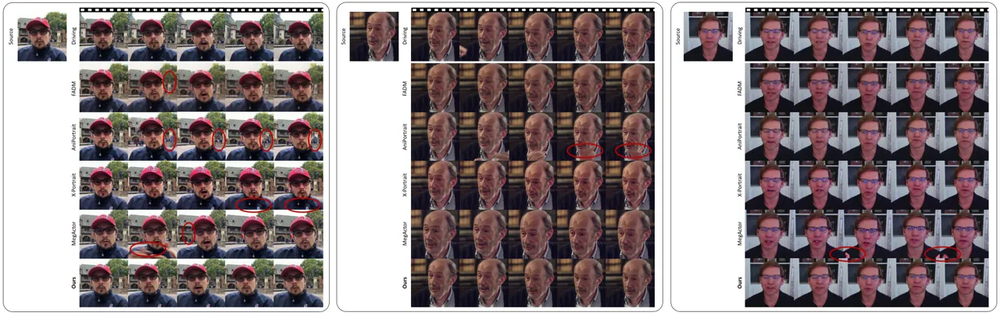

Figure 6: Temporal consistency comparisons with diffusion-based methods.
These three cases are from VFHQ and TalkingHead-1KH test sets. Our
animation results are in the original image space with stitching. Within
the vertical circles, the statue disappears in the subsequent animated
frames of FADM \[9\], there are pedestrian-like unnatural background
movements in the animated results of AniPortrait \[12\], and the red
banner disappears in some frames of MegActor \[17\]. Within the
horizontal circles, there are hand-waving-like unnatural foreground
movements in the animated images of both AniPortrait \[12\] and
MegActor \[17\], while the patterns on the clothing change in the
animated images of X-Portrait \[13\].

### 4.3 Ablation Study and Analysis

In this section, we discuss the benefits and necessities of stitching,
eyes and lip retargeting.

#### Ablation of the stitching module.

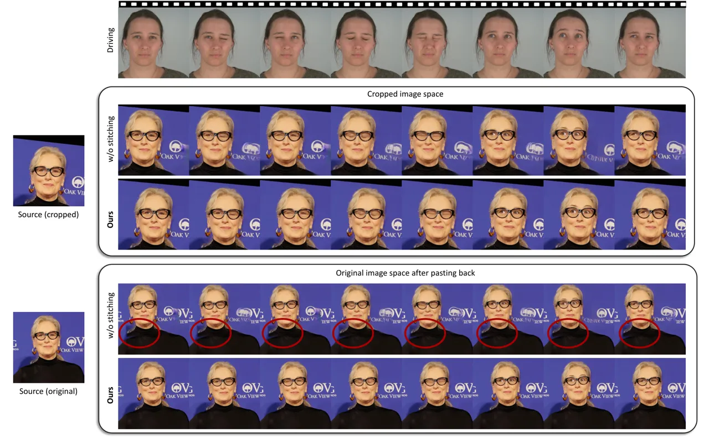

Figure 7: Ablation study of the stitching. The first block shows the
comparisons of stitching in the cropping image space, and the second
block shows the comparisons after mapping into the original image space.
The misalignment is apparent without stitching, especially in the
shoulder region.

As shown in the first block of Fig. 7, given a source image and a
driving video sequence, the animated results without stitching share the
same shoulder position as the driving frames. After stitching, the
shoulder of the animated person is force aligned with the cropped source
portrait while preserving the motion and appearance. In the second block
of Fig. 7, after mapping into the original image space, it is clear that
the animated portrait without stitching shows significant shoulder
misalignment, while the stitched results show no visually apparent
misalignment.

#### Ablation of eyes retargeting.

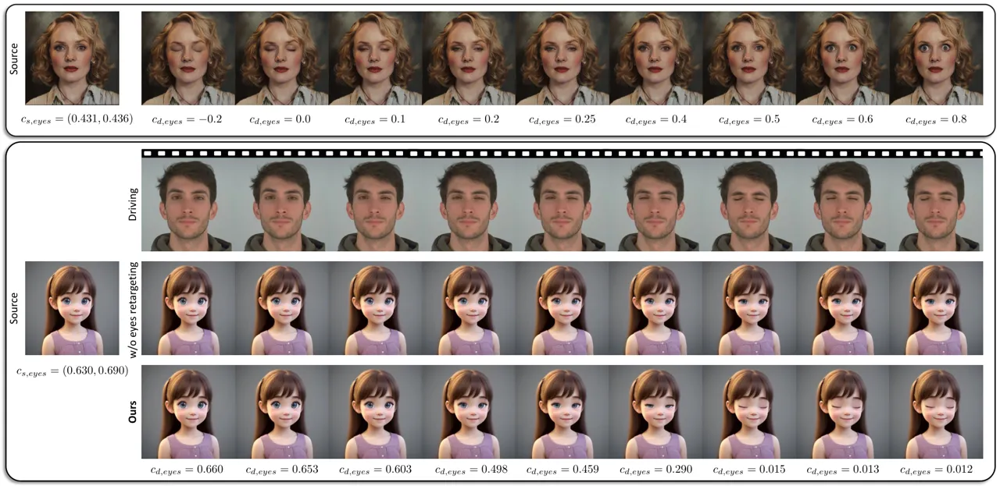

Figure 8: Examples and ablation study of our eyes retargeting. The first
block shows the eyes-open controllability of our model on the source
image without any driving frames. The second block demonstrates the
ability of eye retargeting in cross-reenactment, especially when the
eyes of the source person are much larger than the driving one. For
clarity, the animated results adopt the source head rotation.

In the first block of Fig. 8, the quantitative controllability of the
eyes-open of the source image is illustrated. Without any driving
motions, one can provide a proper driving eyes-open scalar
$`c_{d,eyes}`$ from 0 to 0.8, send it to the eyes retargeting module
$`\mathcal{R}_{eyes}`$ along with the source eyes-open condition tuple
$`c_{s,eyes}`$, and drive the eyes from closed to fully open. The
eyes-open motion does not affect the remaining part of the reference
image. Additionally, an out-of-training-distribution driving eyes-open
scalar, such as $`-0.2`$, can also achieve reasonable results. In the
second block of Fig. 8, a cartoon image is animated by the driving
frames of a closing-eye video. The eyes of the girl are much larger than
those of the man in the first driving frame. Therefore, the driving
eye-closing motion is too weak to close the girl’s eyes to the same
extent, as observed in the second row without eyes retargeting. When we
employed eyes retargeting, the driving eyes-open scalar $`c_{d,eyes,i}`$
corresponding to the $`i`$-th driving frame can be formulated as:
$`c_{d,eyes,i}=\overline{c}_{s,eyes}\cdot\frac{\overline{c^{\prime}}_{s,eyes,i}}{\overline{c^{\prime}}_{s,eyes,0}},`$
where $`\overline{c^{\prime}}_{s,eyes,i}`$ is the average value of the
eyes-open condition tuple for the $`i`$-th driving frame, and the
overline represents the averaging operation. Benefiting from eyes
retargeting, the animated frames achieve the same eye-closing motion as
the driving video.

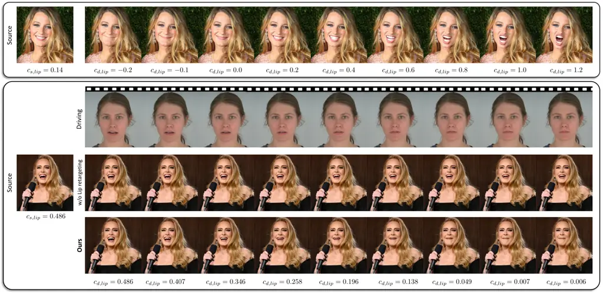

Figure 9: Examples and ablation study of the lip retargeting. Similar to
eye retargeting, these two blocks show our controllability conditioned
on arbitrary lip-open scalars, either randomly sampled or extracted from
driving frames.

#### Ablation of lip retargeting.

Similarly, the first block of Fig. 9 illustrates the quantitative
lip-open controllability of the source image. One can input a driving
lip-open scalar $`c_{d,lip}`$ between 0 and 0.8, feed it to the lip
retargeting module along with the source lip-open condition
$`c_{s,lip}`$, and drive the lips from closed to fully open. The
lip-open motion does not affect the remaining part of the source image.
An out-of-training-distribution driving lip-open scalar can also achieve
reasonable results, as depicted in Fig. 9. Additionally, the tongue is
generated when the lips are widely open. As shown in the second block of
Fig. 9, we can also drive the lip to close conditioned on a lip-close
scalar $`c_{d,lip,i}`$ extracted from the driving frame:
$`c_{d,lip,i}=c_{s,lip}\cdot\frac{c^{\prime}_{s,lip,i}}{c^{\prime}_{s,lip,0}},`$
where $`c^{\prime}_{s,lip,i}`$ is the lip-open condition of the $`i`$-th
driving frame.

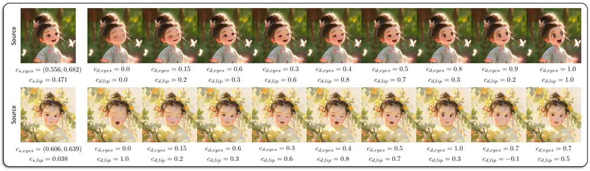

Figure 10: Examples of simultaneous eyes and lip retargeting. Given
driving eyes-open and lip-open scalars simultaneously, the animated
results from the source image suggest that eye and lip retargeting can
be effective simultaneously, even though these two retargeting modules
are trained independently.

#### Analysis on eyes and lip retargeting.

A natural question is whether the eye and lip retargeting can take
effect simultaneously, as described in Algorithm 1, when
$`\alpha_{eyes}=1`$ and $`\alpha_{lip}=1`$. In other words, the core
question is whether the retargeting modules have learned to distinguish
the different patterns of $`\Delta_{eyes}`$ and $`\Delta_{lip}`$. The
two animation examples in Fig. 10 positively support this hypothesis.
The source images of the girls in ancient costumes can be animated to
reasonable results with the given driving eyes-open and lip-open
scalars, where $`\Delta_{eyes}`$ and $`\Delta_{lip}`$ are added to the
driving keypoints simultaneously.

## 5 Conclusion

In this paper, we present an innovative video-driven framework for
animating static portrait images, making them realistic and expressive
while ensuring high inference efficiency and precise controllability.
The generation speed of our model achieves 12.8ms on an RTX 4090 GPU
using the naive Pytorch framework, while simultaneously outperforming
other heavy diffusion-based methods. We hope our promising results pave
the way for real-time portrait animation applications in various
scenarios, such as video conferencing, social media, and entertainment,
as well as audio-driven character animations.

#### Limitations.

Our current model struggles to perform well in cross-reenactment
scenarios involving large pose variations. Additionally, when the
driving video involves significant shoulder movements, there is a
certain probability of resulting in jitter. We plan to address these
limitations in future work.

#### Ethics considerations.

Portrait animation technologies pose social risks, including misuse for
deepfakes. To mitigate these risks, ethical guidelines and responsible
use practices are essential. Currently, the synthesized results exhibit
some visual artifacts that could aid in detecting deepfakes.

## Acknowledgments

We would like to thank our colleagues and partners Haotian Yang, Haoxian
Zhang, Mingwu Zheng, Chongyang Ma, and others for their valuable
discussions and insightful suggestions on this work.

## References

- \[1\] Ian Goodfellow, Jean Pouget-Abadie, Mehdi Mirza, Bing Xu, David
  Warde-Farley, Sherjil Ozair, Aaron Courville, and Yoshua Bengio.
  Generative adversarial nets. In NeurIPS, 2014.
- \[2\] Robin Rombach, Andreas Blattmann, Dominik Lorenz, Patrick Esser,
  and Björn Ommer. High-resolution image synthesis with latent diffusion
  models. In CVPR, 2022.
- \[3\] Jonathan Ho, Ajay Jain, and Pieter Abbeel. Denoising diffusion
  probabilistic models. In NeurIPS, 2020.
- \[4\] Jiaming Song, Chenlin Meng, and Stefano Ermon. Denoising
  diffusion implicit models. In ICLR, 2020.
- \[5\] Ting-Chun Wang, Arun Mallya, and Ming-Yu Liu. One-shot free-view
  neural talking-head synthesis for video conferencing. In CVPR, 2021.
- \[6\] Fa-Ting Hong, Longhao Zhang, Li Shen, and Dan Xu. Depth-aware
  generative adversarial network for talking head video generation. In
  CVPR, 2022.
- \[7\] Jian Zhao and Hui Zhang. Thin-plate spline motion model for
  image animation. In CVPR, 2022.
- \[8\] Fa-Ting Hong and Dan Xu. Implicit identity representation
  conditioned memory compensation network for talking head video
  generation. In ICCV, 2023.
- \[9\] Bohan Zeng, Xuhui Liu, Sicheng Gao, Boyu Liu, Hong Li,
  Jianzhuang Liu, and Baochang Zhang. Face animation with an
  attribute-guided diffusion model. In CVPR, 2023.
- \[10\] Arun Mallya, Ting-Chun Wang, and Ming-Yu Liu. Implicit warping
  for animation with image sets. In NeurIPS, 2022.
- \[11\] Aliaksandr Siarohin, Stéphane Lathuilière, Sergey Tulyakov,
  Elisa Ricci, and Nicu Sebe. First order motion model for image
  animation. In NeurIPS, 2019.
- \[12\] Huawei Wei, Zejun Yang, and Zhisheng Wang. Aniportrait:
  Audio-driven synthesis of photorealistic portrait animation. arXiv
  preprint:2403.17694, 2024.
- \[13\] You Xie, Hongyi Xu, Guoxian Song, Chao Wang, Yichun Shi, and
  Linjie Luo. X-portrait: Expressive portrait animation with
  hierarchical motion attention. In SIGGRAPH, 2024.
- \[14\] Yue Ma, Hongyu Liu, Hongfa Wang, Heng Pan, Yingqing He, Junkun
  Yuan, Ailing Zeng, Chengfei Cai, Heung-Yeung Shum, Wei Liu, and Qifeng
  Chen. Follow-your-emoji: Fine-controllable and expressive freestyle
  portrait animation. In SIGGRAPH Asia, 2024.
- \[15\] Aliaksandr Siarohin, Oliver Woodford, Jian Ren, Menglei Chai,
  and Sergey Tulyakov. Motion representations for articulated animation.
  In CVPR, 2021.
- \[16\] Yue Han, Junwei Zhu, Keke He, Xu Chen, Yanhao Ge, Wei Li,
  Xiangtai Li, Jiangning Zhang, Chengjie Wang, and Yong Liu. Face
  adapter for pre-trained diffusion models with fine-grained id and
  attribute control. arXiv preprint:2405.12970, 2024.
- \[17\] Shurong Yang, Huadong Li, Juhao Wu, Minhao Jing, Linze Li,
  Renhe Ji, Jiajun Liang, and Haoqiang Fan. Megactor: Harness the power
  of raw video for vivid portrait animation. arXiv
  preprint:2405.20851, 2024.
- \[18\] Taras Khakhulin, Vanessa Sklyarova, Victor Lempitsky, and Egor
  Zakharov. Realistic one-shot mesh-based head avatars. In ECCV, 2022.
- \[19\] Ayush Tewari, Mohamed Elgharib, Gaurav Bharaj, Florian Bernard,
  Hans-Peter Seidel, Patrick Pérez, Michael Zollhofer, and Christian
  Theobalt. Stylerig: Rigging stylegan for 3d control over portrait
  images. In CVPR, 2020.
- \[20\] Partha Ghosh, Pravir Singh Gupta, Roy Uziel, Anurag Ranjan,
  Michael J Black, and Timo Bolkart. Gif: Generative interpretable
  faces. In 3DV, 2020.
- \[21\] Volker Blanz and Thomas Vetter. A morphable model for the
  synthesis of 3d faces. In SIGGRAPH, 1999.
- \[22\] Nikita Drobyshev, Jenya Chelishev, Taras Khakhulin, Aleksei
  Ivakhnenko, Victor Lempitsky, and Egor Zakharov. Megaportraits:
  One-shot megapixel neural head avatars. In ACM MM, 2022.
- \[23\] Nikita Drobyshev, Antoni Bigata Casademunt, Konstantinos
  Vougioukas, Zoe Landgraf, Stavros Petridis, and Maja Pantic.
  Emoportraits: Emotion-enhanced multimodal one-shot head avatars. In
  CVPR, 2024.
- \[24\] Li Hu, Xin Gao, Peng Zhang, Ke Sun, Bang Zhang, and Liefeng Bo.
  Animate anyone: Consistent and controllable image-to-video synthesis
  for character animation. In CVPR, 2024.
- \[25\] Di Chang, Yichun Shi, Quankai Gao, Jessica Fu, Hongyi Xu,
  Guoxian Song, Qing Yan, Yizhe Zhu, Xiao Yang, and Mohammad Soleymani.
  Magicpose: Realistic human poses and facial expressions retargeting
  with identity-aware diffusion. In ICML, 2024.
- \[26\] Zhongcong Xu, Jianfeng Zhang, Jun Hao Liew, Hanshu Yan, Jia-Wei
  Liu, Chenxu Zhang, Jiashi Feng, and Mike Zheng Shou. Magicanimate:
  Temporally consistent human image animation using diffusion model. In
  CVPR, 2024.
- \[27\] Johanna Karras, Aleksander Holynski, Ting-Chun Wang, and Ira
  Kemelmacher-Shlizerman. Dreampose: Fashion image-to-video synthesis
  via stable diffusion. In ICCV, 2023.
- \[28\] Tan Wang, Linjie Li, Kevin Lin, Yuanhao Zhai, Chung-Ching Lin,
  Zhengyuan Yang, Hanwang Zhang, Zicheng Liu, and Lijuan Wang. Disco:
  Disentangled control for realistic human dance generation. In
  CVPR, 2024.
- \[29\] Zipeng Qi, Xulong Zhang, Ning Cheng, Jing Xiao, and Jianzong
  Wang. Difftalker: Co-driven audio-image diffusion for talking faces
  via intermediate landmarks. arXiv preprint:2309.07509, 2023.
- \[30\] Shuai Shen, Wenliang Zhao, Zibin Meng, Wanhua Li, Zheng Zhu,
  Jie Zhou, and Jiwen Lu. Difftalk: Crafting diffusion models for
  generalized audio-driven portraits animation. In CVPR, 2023.
- \[31\] Linrui Tian, Qi Wang, Bang Zhang, and Liefeng Bo. Emo: Emote
  portrait alive - generating expressive portrait videos with
  audio2video diffusion model under weak conditions. arXiv
  preprint:2402.17485, 2024.
- \[32\] Sicheng Xu, Guojun Chen, Yu-Xiao Guo, Jiaolong Yang, Chong Li,
  Zhenyu Zang, Yizhong Zhang, Xin Tong, and Baining Guo. Vasa-1:
  Lifelike audio-driven talking faces generated in real time. In
  NeurIPS, 2024.
- \[33\] Tao Liu, Feilong Chen, Shuai Fan, Chenpeng Du, Qi Chen, Xie
  Chen, and Kai Yu. Anitalker: Animate vivid and diverse talking faces
  through identity-decoupled facial motion encoding. In ACM MM, 2024.
- \[34\] Cong Wang, Kuan Tian, Jun Zhang, Yonghang Guan, Feng Luo, Fei
  Shen, Zhiwei Jiang, Qing Gu, Xiao Han, and Wei Yang. V-express:
  Conditional dropout for progressive training of portrait video
  generation. arXiv preprint:2406.02511, 2024.
- \[35\] Arsha Nagrani, Joon Son Chung, and Andrew Zisserman. Voxceleb:
  a large-scale speaker identification dataset. In Interspeech, 2017.
- \[36\] Kaisiyuan Wang, Qianyi Wu, Linsen Song, Zhuoqian Yang, Wayne
  Wu, Chen Qian, Ran He, Yu Qiao, and Chen Change Loy. Mead: A
  large-scale audio-visual dataset for emotional talking-face
  generation. In ECCV, 2020.
- \[37\] Steven R Livingstone and Frank A Russo. The ryerson
  audio-visual database of emotional speech and song (ravdess): A
  dynamic, multimodal set of facial and vocal expressions in north
  american english. In PloS one, 2018.
- \[38\] Mingcong Liu, Qiang Li, Zekui Qin, Guoxin Zhang, Pengfei Wan,
  and Wen Zheng. Blendgan: Implicitly gan blending for arbitrary
  stylized face generation. In NeurIPS, 2021.
- \[39\] Haotian Yang, Mingwu Zheng, Wanquan Feng, Haibin Huang, Yu-Kun
  Lai, Pengfei Wan, Zhongyuan Wang, and Chongyang Ma. Towards practical
  capture of high-fidelity relightable avatars. In SIGGRAPH Asia, 2023.
- \[40\] Haotian Yang, Mingwu Zheng, Chongyang Ma, Yu-Kun Lai, Pengfei
  Wan, and Haibin Huang. Vrmm: A volumetric relightable morphable head
  model. SIGGRAPH Asia, 2024.
- \[41\] Kai Zhao, Kun Yuan, Ming Sun, Mading Li, and Xing Wen.
  Quality-aware pre-trained models for blind image quality assessment.
  In CVPR, 2023.
- \[42\] Sanghyun Woo, Shoubhik Debnath, Ronghang Hu, Xinlei Chen,
  Zhuang Liu, In So Kweon, and Saining Xie. Convnext v2: Co-designing
  and scaling convnets with masked autoencoders. In CVPR, 2023.
- \[43\] Longhao Zhao. Open face vid2vid.
  [https://github.com/zhanglonghao1992/One-Shot_Free-View_Neural_Talking_Head_Synthesis](https://github.com/zhanglonghao1992/One-Shot_Free-View_Neural_Talking_Head_Synthesis), 2021.
- \[44\] Taesung Park, Ming-Yu Liu, Ting-Chun Wang, and Jun-Yan Zhu.
  Semantic image synthesis with spatially-adaptive normalization. In
  CVPR, 2019.
- \[45\] Wenzhe Shi, Jose Caballero, Ferenc Huszár, Johannes Totz,
  Andrew P Aitken, Rob Bishop, Daniel Rueckert, and Zehan Wang.
  Real-time single image and video super-resolution using an efficient
  sub-pixel convolutional neural network. In CVPR, 2016.
- \[46\] Zhen-Hua Feng, Josef Kittler, Muhammad Awais, Patrik Huber, and
  Xiao-Jun Wu. Wing loss for robust facial landmark localisation with
  convolutional neural networks. In CVPR, 2018.
- \[47\] Jiankang Deng, Jia Guo, Xue Niannan, and Stefanos Zafeiriou.
  Arcface: Additive angular margin loss for deep face recognition. In
  CVPR, 2019.
- \[48\] Zhou Wang, Alan C Bovik, Hamid R Sheikh, and Eero P Simoncelli.
  Image quality assessment: From error visibility to structural
  similarity. In TIP, 2004.
- \[49\] Richard Zhang, Phillip Isola, Alexei A Efros, Eli Shechtman,
  and Oliver Wang. The unreasonable effectiveness of deep features as a
  perceptual metric. In CVPR, 2018.
- \[50\] Martin Heusel, Hubert Ramsauer, Thomas Unterthiner, Bernhard
  Nessler, and Sepp Hochreiter. Gans trained by a two time-scale update
  rule converge to a local nash equilibrium. In NeurIPS, 2017.
- \[51\] Liangbin Xie, Xintao Wang, Honglun Zhang, Chao Dong, and Ying
  Shan. Vfhq: A high-quality dataset and benchmark for video face
  super-resolution. In CVPR, 2022.
- \[52\] Tero Karras, Samuli Laine, and Timo Aila. A style-based
  generator architecture for generative adversarial networks. In
  CVPR, 2019.
- \[53\] Tobias Kirschstein, Shenhan Qian, Simon Giebenhain, Tim Walter,
  and Matthias Nießner. Nersemble: Multi-view radiance field
  reconstruction of human heads. In TOG, 2023.
- \[54\] George Retsinas, Panagiotis P Filntisis, Radek Danecek,
  Victoria F Abrevaya, Anastasios Roussos, Timo Bolkart, and Petros
  Maragos. 3d facial expressions through analysis-by-neural-synthesis.
  In CVPR, 2024.
- \[55\] Ahmed A Abdelrahman, Thorsten Hempel, Aly Khalifa, Ayoub
  Al-Hamadi, and Laslo Dinges. L2cs-net: Fine-grained gaze estimation in
  unconstrained environments. In ICFSP, 2023.
- \[56\] Jiankang Deng, Jia Guo, Niannan Xue, and Stefanos Zafeiriou.
  Arcface: Additive angular margin loss for deep face recognition. In
  CVPR, 2019.
- \[57\] Tingchung Wan. Talkinghead-1kh-process.
  [https://github.com/tcwang0509/TalkingHead-1KH](https://github.com/tcwang0509/TalkingHead-1KH), 2021.
- \[58\] Alec Radford, Jong Wook Kim, Tao Xu, Greg Brockman, Christine
  McLeavey, and Ilya Sutskever. Robust speech recognition via
  large-scale weak supervision. arXiv preprint:2212.04356, 2022.
- \[59\] Yingruo Fan, Zhaojiang Lin, Jun Saito, Wenping Wang, and Taku
  Komura. Faceformer: Speech-driven 3d facial animation with
  transformers. In CVPR, 2022.

## Appendix A Benchmark Metric Details

#### LPIPS.

We use the AlexNet based perceptual similarity metric LPIPS \[49\] to
measure the perceptual similarity between the animated and the driving
images.

#### AED.

AED is the mean $`\mathcal{L}_{1}`$ distance of the expression
parameters between the animated and the driving images. These
parameters, which include facial movement, eyelid, and jaw pose
parameters, are extracted by the state-of-the-art 3D face reconstruction
method SMIRK \[54\].

#### APD.

APD is the mean $`\mathcal{L}_{1}`$ distance of the pose parameters
between the animated and the driving images. The pose parameters are
extracted by SMIRK \[54\].

#### MAE.

To measure the eyeball direction error between the animated and the
driving images, the mean angular error (°) is adopted as:
$`\textrm{MAE}(I_{p},I_{d})=\textrm{arccos}(\frac{\textbf{b}_{p}\cdot\textbf{b}_{d}}{\|\textbf{b}_{p}\|\cdot\|\textbf{b}_{d}\|}),`$
where $`\textbf{b}_{p}`$ and $`\textbf{b}_{d}`$ are the eyeball
direction vectors of the animated image $`I_{p}`$ and the driving image
$`I_{d}`$ respectively, and they are predicted by a pretrained eyeball
direction network \[55\].

#### CSIM.

CSIM measures the identity preservation between two images, through the
cosine similarity of two embeddings from a pretrained face recognition
network \[56\]. For self-reenactment, the CSIM is calculated between the
animated and the driving images. For cross-reenactment, the CSIM is
calculated between the animated and the source portraits.

#### FID.

FID compares the distribution of animated images with the distribution
of a set of real images. For TalkingHead-1KH test set, FID is calculated
between the animated images and the last 38,400 images of the FFHQ
dataset. For the VFHQ test set, FID is calculated between the animated
images and the last 15,000 images of FFHQ.

#### Dataset processing.

We follow \[57\] to pre-process the evaluation set of the
TalkingHead-1KH. In cross-reenactment, we extract 1 frame every 10
frames from each video, for a total of 24 frames as the driving
sequence. For VFHQ, we extract 1 frame every 5 frames, for a total of 6
frames. It is observed that insufficient driving video length might
reduce the animation quality of X-Portrait \[13\]. Therefore, in the
cross-reenactment experiments for X-Portrait, we use the first 250
frames of each video in the TalkingHead-1KH test set and the full videos
in the VFHQ test set as the driving videos. Subsequently, we extract
frames from the animated results that match the indices of the
comparison frames used by other methods.

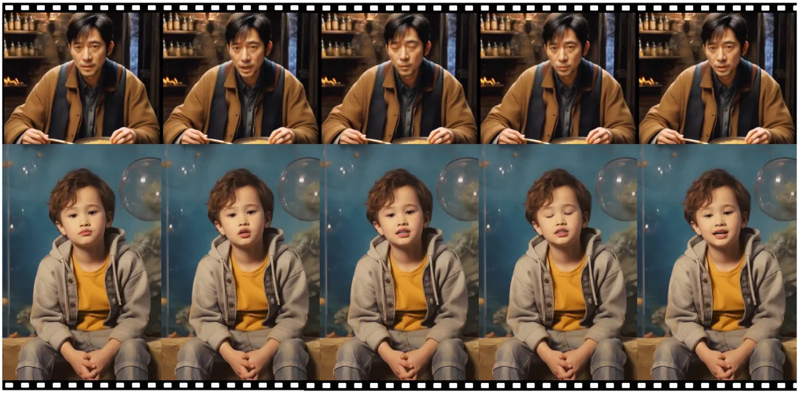

Figure 11: Audio-driven examples. This figure presents two examples of
audio-driven portrait animation with stitching applied. The lip
movements can be accurately driven by the audios input.

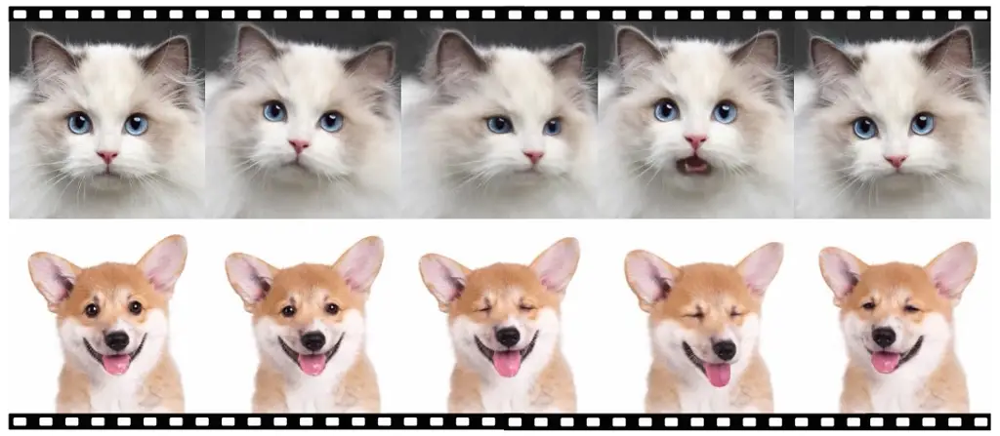

Figure 12: Animal animation examples. We show the animation results of a
Ragdoll cat and a Corgi dog, with driving motions derived from human
videos.

## Appendix B Qualitative Results on Multi-person Portrait

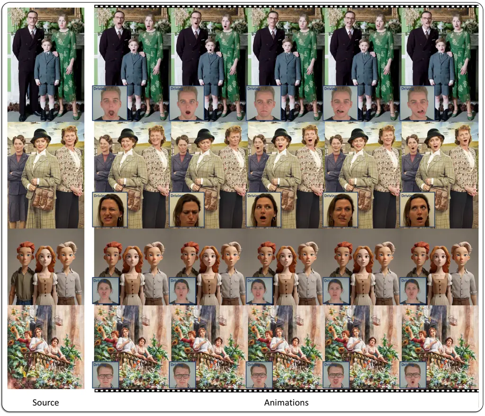

Figure 13: Multi-person portrait animation examples. Given a group photo
of several subjects and a driving video sequence, our model can animate
each subject with the stitching applied. The driving frame corresponding
to each animated image is located in the left-down corner of the
animated image.

We provide additional qualitative results on multi-person portrait
animation in Fig. 13. Benefiting from the stitching ability of our
model, each person in the portrait can be animated separately.

## Appendix C Audio-driven Portrait Animation

We can easily extend our video-driven model to audio-driven portrait
animation by regressing or generating motions, including expression
deformations and head poses, from audio inputs. For instance, we use
Whisper \[58\] to encode audio into sequential features and adopt a
transformer-based framework, following FaceFormer \[59\], to autoregress
the motions. The audio-driven results are shown in Fig. 11.

## Appendix D Generalization to Animals

We find our model can generalize well to animals, _e.g_., cats and dogs,
by fine-tuning on a small dataset of animal portraits combined with the
original data. Specifically, in the fine-tuning stage, we discard the
head pose loss term $`\mathcal{L}_{H}`$, the lip GAN loss, and the
faceid loss $`\mathcal{L}_{\text{faceid}}`$, as the head poses of
animals are not as accurate as those of humans, the lip distribution
differs from humans, and faceid cannot be applied to animals.
Surprisingly, we can drive the animals with human driving videos, and
the results are shown in Fig. 12.

## Appendix E Portrait Video Editing

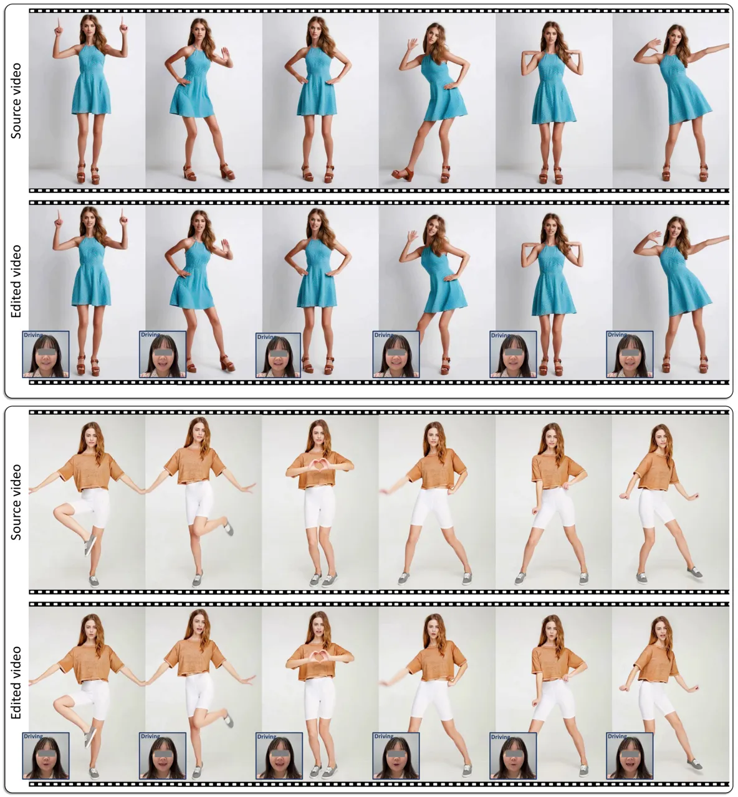

Figure 14: Portrait video editing examples. Given a source video
sequence, such as a dancing video, our model can re-animate the head
part using a driving video sequence. The edited video frame inherits the
expression from the driving frame while preserving the non-head regions
from the source frame.

We can extend our model to edit the head region of a source video
sequence, while minimally sacrificing the temporal consistency of the
source video. The source and driving implicit keypoints in Eqn. 7 are
transformed as follows:

```math
\left\{\begin{array}[]{ll}x_{s,i}&=s_{s,i}\cdot(x_{c,s,i}R_{s,i}+\delta_{s,i})+t_{s,i},\\
x_{d,i}&=s_{s,i}\cdot\frac{s_{d,i}}{s_{d,0}}\cdot\big(x_{c,s,i}(R_{d,i}R^{-1}_{d,0}R_{s,i})+\\
&(\delta_{s,i}+0.5\cdot(\delta_{d,i}+\delta_{d,i+1})-\delta_{d,0})\big)+\\
&(t_{s,i}+t_{d,i}-t_{d,0}),\end{array}\right. \tag{8}
```

where $`x_{s,i},s_{s,i},x_{c,s,i},R_{s,i},\delta_{s,i},t_{s,i}`$
represent the source keypoints, scale factor, canonical implicit
keypoints, head pose, expression deformation, and translation of the
$`i`$-th source frame, respectively. The operation
$`0.5\cdot(\delta_{d,i}+\delta_{d,i+1})`$ performs smoothing by
averaging the expression offsets of the $`i`$-th and $`(i+1)`$-th
driving frames. As exemplified in Fig. 14, the edited frame with
stitching applied inherits the expression from the corresponding driving
frame, while preserving the non-head regions from the corresponding
source frame.
