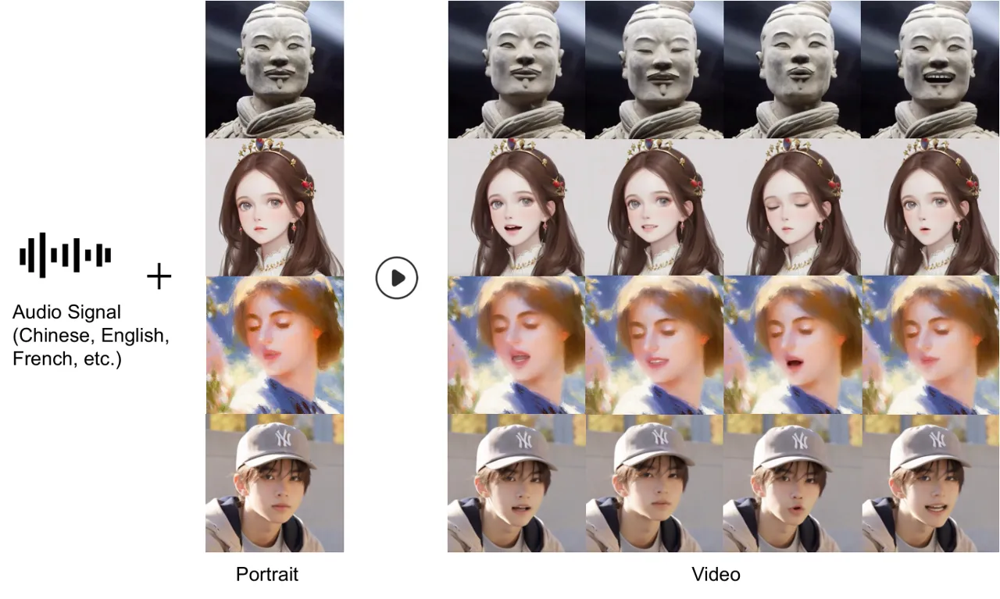
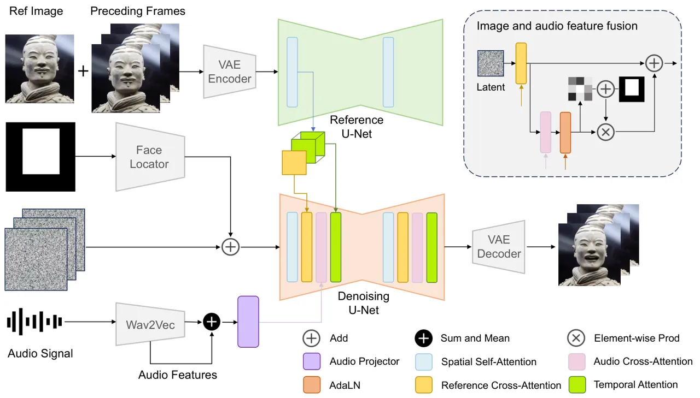
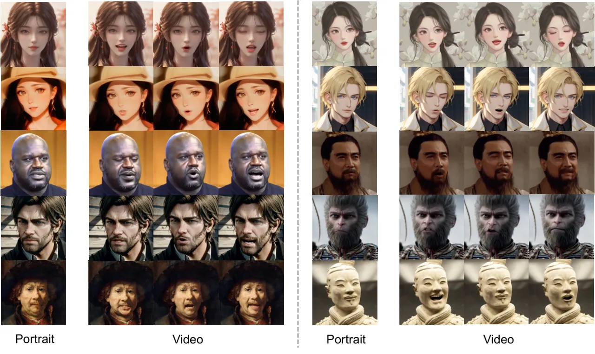
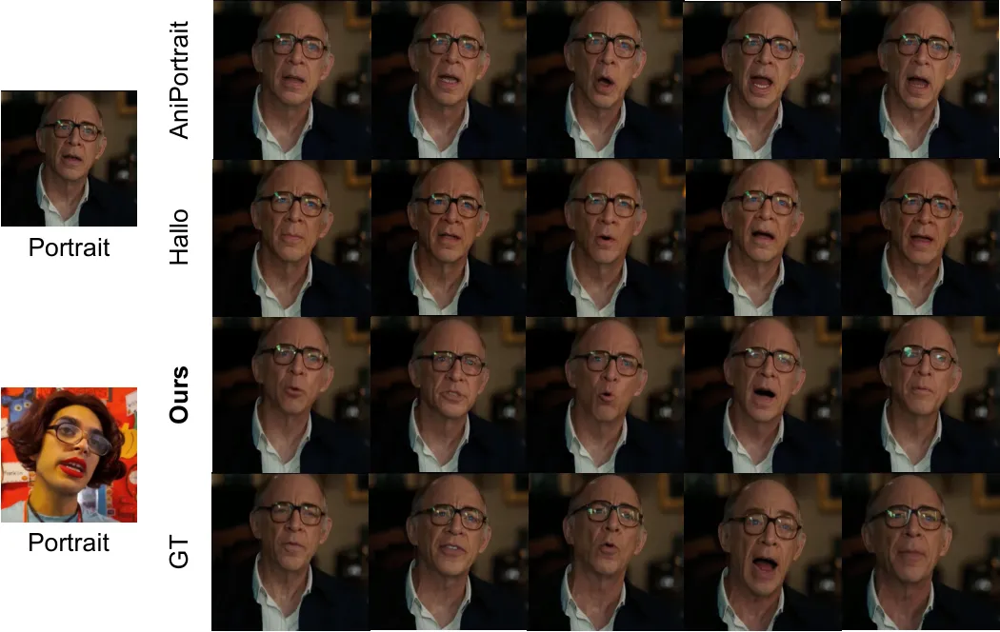
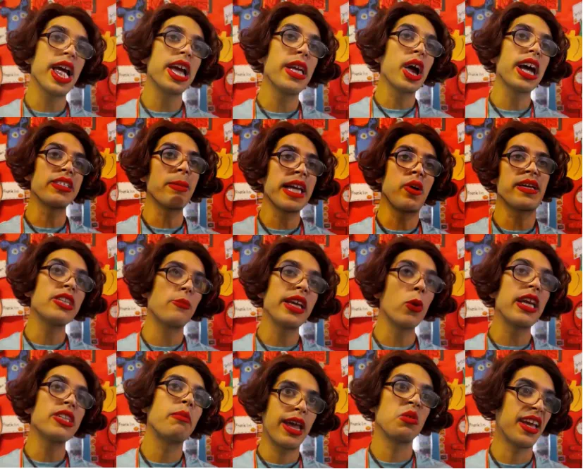
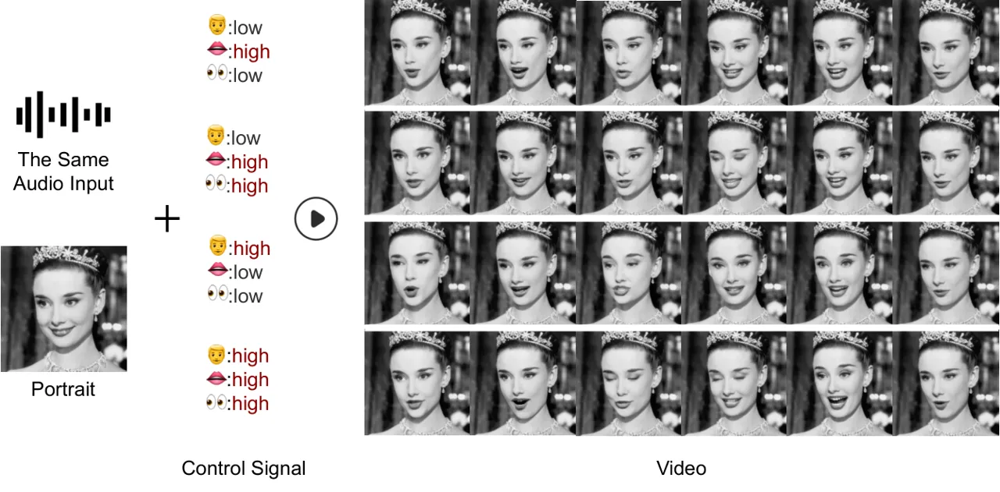

# LinguaLinker: Audio-Driven Portraits Animation with Implicit Facial Control Enhancement

Rui Zhang ^(†)^(†)thanks: Equal contribution    Yixiao Fang^(∗)   
Zhengnan Lu    Pei Cheng    Zebiao Huang    Bin Fu Affiliation: Tencent
Affiliation: {rainarzhang, yixiaofang, zanelu, peicheng, zebiaohuang,
brianfu}@tencent.com
Affiliation: [https://tencentqqgylab.github.io/LinguaLinker](https://tencentqqgylab.github.io/LinguaLinker)

###### Abstract

This study delves into the intricacies of synchronizing facial dynamics
with multilingual audio inputs, focusing on the creation of visually
compelling, time-synchronized animations through diffusion-based
techniques. Diverging from traditional parametric models for facial
animation, our approach, termed LinguaLinker, adopts a holistic
diffusion-based framework that integrates audio-driven visual synthesis
to enhance the synergy between auditory stimuli and visual responses. We
process audio features separately and derive the corresponding control
gates, which implicitly govern the movements in the mouth, eyes, and
head, irrespective of the portrait’s origin. The advanced audio-driven
visual synthesis mechanism provides nuanced control but keeps the
compatibility of output video and input audio, allowing for a more
tailored and effective portrayal of distinct personas across different
languages. The significant improvements in the fidelity of animated
portraits, the accuracy of lip-syncing, and the appropriate motion
variations achieved by our method render it a versatile tool for
animating any portrait in any language.



Figure 1: The proposed method LinguaLinker accepts multilingual audio
signals and arbitrary portrait images and generates the corresponding
video output.

## 1 Introduction

Recent advancements in image or video generation have experienced
explosive growth, including methods based on Generative Adversarial
Networks (GANs) \[1\] as well as those utilizing Diffusion \[2, 3, 4\]
techniques. In the human-related animation field, especially portrait
animation as a sub-task of video generation, these techniques also lay
the foundation for generating coherent and vivid talking head videos
based on the given audio or video inputs and reference portrait images,
achieving accurate face restoration and lip synchronization. Thanks to
the advancements in these technologies, related applications have also
been able to develop rapidly.

However, from a comprehensive perspective, several issues still pose
significant challenges to existing models and urgently need to be
addressed. For video-based \[5\] portrait animation generation, there
exists the issue of misalignment between the reference video and the
reference portrait, which often results in the generated video failing
to accurately reproduce the input reference portrait. This misalignment
can lead to discrepancies between the features of the reconstructed
result and the reference image. Although methods based on facial
landmarks \[6, 7\] or 3D models \[8, 9, 10\], abstract facial features,
they tend to lose a significant amount of facial detail and do not
completely resolve the facial mismatch problem. Additionally, the issue
of inter-frame flickering in video generation continues to be a
persistent challenge for researchers. Meanwhile, another research
direction is how to enable models to generate corresponding video
results for audio inputs in multiple languages.

To address some of these issues, we propose an end-to-end audio-driven
portrait animation approach LinguaLinker, based on diffusion models,
which is capable of generating high-fidelity and lip-synchronized
animated portrait videos and supports multilingual audio inputs.

We have meticulously designed the combination process of latents and
audio features. First, leveraging latents with audio features and the
timestep information of the denoising stage as inputs of Adaptive Layer
Normalization(AdaLN) \[11\], we obtain the corresponding gate states.
Next, we project these gate states to calculate the corresponding gate
offsets based on different regional masks. Finally, by adding the
offsets and regional masks, we obtain the corresponding region-specific
gates. As a clip of the audio has its own emotion, we could use such
corresponding mask implicitly to define the range and the
hyper-parameter to control the frequency of movements instead of
artificial control of facial expressions, showcasing advancements in lip
synchronization and the compatibility of the input audio and the
generated video. Furthermore, our approach is able to alleviate the
flickering issue in video generation, which creates more coherent and
higher-fidelity portrait animation. The details of the architecture are
explained in section 3.1.

We also construct a wide and diverse audio-video dataset for model
training, including speeches, television series, singing clips, etc. To
ensure the dataset quality, we build a rigorous data-cleaning pipeline
to remove unqualified samples. After our pipeline of data filtering and
curation, the remaining portion constitutes around 114 hours of
high-quality audio-video synchronized video clips. The concrete stages
of the pipeline are illustrated in section 3.2.

## 2 Related Work

Diffusion-Based Video Generation. Diffusion-based models have
significantly advanced multimedia tasks, from text-to-image generation
to complex video synthesis and 3D digital constructs. Notable
advancements include Video Diffusion Models (VDM) \[12\] and
ImagenVideo \[13\], which use space-time factorized U-Nets and cascaded
diffusion for high-definition video outputs. Make-A-Video \[14\] and
ModelscopeT2V \[15\] adopt the 3D-UNet integrating temporal layers to
model spatio-temporal dependencies. AnimateDiff \[16\] and
VideoCrafter \[17, 18\] contribute to text-to-video generation by
extending from the text-to-image model, making the control model
framework originally implemented in the T2I framework also universal in
the T2V framework. These models also excel in human-centered image
animation, allowing additional control over appearance and motion. The
integration of UNet with Transformer-based designs enhances
text-conditioned video generation and realistic animated portraits,
demonstrating diffusion models’ versatility and adaptability in
computational creativity.

Image-Based Animation. Image-based animation techniques, as discussed in
various studies \[19, 20, 21\], focus on creating dynamic images or
video sequences from static input images. Recent advancements have seen
the adoption of diffusion models due to their high-quality output and
robust control mechanisms in animating human images. For instance,
MagicPose \[22\], Animate Anyone \[23\] and MagicAnimate \[24\]
highlight the effectiveness of the integration of reference image
features into the self-attention blocks of Latent Diffusion Model (LDM)
UNets to preserve the appearance context. And these approaches,
exemplified by the innovative ControlNet \[25\] or a simplified control
guider, further enhance the LDM framework by introducing controllable
image generation capabilities, leveraging additional structural
conditions derived from various signals like landmarks, segmentations,
and dense poses. This highlights the diffusion model’s adaptability and
resilience in addressing a wide array of generation challenges.
Furthermore, ongoing research is delving into the utilization of
diffusion models for talking head animation, yielding promising results
that validate the approach’s potential in crafting authentic video
sequences. These outcomes reinforce the continued significance and
investigational merit of this approach.



Figure 2: The overview of architecture.

Audio-Driven Portrait Animation. Audio-driven talking head generation
techniques can be broadly classified into two primary methodologies:
generating talking head video w/wo intermediate representation. The
utilization of an intermediate representation enables the direct or
indirect application of an additional visible control signal to inform
the video generation process. For example, Vividtalk \[8\] advocates for
the synthesis of head motion and facial expressions, which are
subsequently employed to construct a 3D facial mesh. This mesh functions
as an intermediate representation to steer the generation of final video
frames. Similarly, Sadtalker \[9\] adopts a 3D Morphable Model (3DMM) as
an intermediate representation for the production of talking head video.
Additionally, Dreamtalk \[10\] integrates diffusion models to generate
coefficients for the 3DMM, further enhancing the control of the
generated video content. Current work such as AniPortrait \[6\], also
generates the talking head video by extracting the 3D facial mesh and
head pose from the audio first, and subsequently project these two
elements into 2D keypoints. However, a recurring challenge among these
techniques is the restricted ability of the 3D mesh to capture nuanced
details, thereby limiting the overall dynamic range and authenticity of
the synthesized video sequences. Compared to the methods using
intermediate representations, the method without intermediate control
signals to drive audio-driven video generation shows higher naturalness
and consistent identity preservation with the original image. EMO \[26\]
utilizes a direct audio-to-video synthesis approach to generate
expressive portrait videos with an audio2video diffusion model under
weak conditions, bypassing the need for intermediate 3D models or facial
landmarks. Hallo \[27\] presents a hierarchical audio-driven visual
synthesis approach with the bounding box masks of lip, expression and
head, it attains refined control over the diversity of expressions and
variations in pose.

## 3 Method

LinguaLinker aims to achieve realistic zero-shot audio-driven talking
head generation. Given a reference portrait image and input audio, our
approach ensures the preservation of portrait identity and faithful
facial expressions, all while maintaining a harmonious alignment with
the lip synchronization of the provided vocal audio. We present an
overview of the framework in Fig 2 and provide further details below.

### 3.1 Architecture Design

Audio Encoder. Some of the previous works \[6, 7, 27\] employ
Wav2Vec2-960h as the audio encoder, but in order to support multilingual
audio inputs, we leverage a more powerful model, Wav2Vec2-XLS-R \[28\],
which is claimed to be pre-trained on 436k hours of unlabeled speech in
128 languages. In our experiments, we found that Wav2Vec2-XLS-R also
responds well to languages other than English. We believe that its rich
multilingual pretraining audio data enables it to distinguish subtle
differences in various multilingual audio signals. After the feature
extraction, the features from all Wav2Vec2 transformer blocks are
averaged. We insert an MLP module between the audio encoder and the
denoising net, which facilitates the projection of features from the
audio feature space to the denoising net feature space. Before applying
the cross-attention process on latents and projected audio embeddings,
we transform the sequence of audio embedding to several blocks, from
shape $`(b\times f\times c)`$ to $`(b\times F\times l\times c)`$, where
$`f`$ represents original frames, $`F`$ indicates the generated video
length and $`l`$ denotes the audio context length of the current frame.
Each block represents the audio information corresponding to a specific
video frame. This audio transformation operation enhances our model’s
ability to capture the audio information of the current frame, thereby
enabling more accurate reconstruction of lip movements in the portrait.

Reference Net. We follow previous works \[23\], applying ReferenceNet,
which has been proven to be an effective framework design for extracting
features of reference images. As it has the same architecture as the
denoising net, it can be conveniently integrated with the generation
pipeline. Due to the different dimensions of the features from the
reference net, representing the reference features from high-level to
low-level, the pipeline is capable of achieving high-fidelity results in
the image or video generation process.

Denoising Net. As shown in Fig 2, we modified the denoising net from the
original stable diffusion network. To process reference images and audio
signals, we enhance the cross-attention module to allow it to
simultaneously receive two different types of conditions. Additionally,
we introduce a region-specific gate mechanism \[29\] in this module,
which is calculated by region masks and the corresponding gate offsets
based on the input audio and denoising timestep. We compute the output
results through the following equation:

```math
out=hidden\_states_{ref}+RegionGate*scale*hidden\_states_{audio} \tag{1}
```

Here, $`scale`$ is a weight factor and the model reconstructs the
portrait randomly if $`scale=0`$. The $`RegionGate`$ is derived from

```math
RegionGate=RegionMask+\texttt{Tanh}(\texttt{Linear}(gate\_states))*\texttt{SiLU}(alpha) \tag{2}
```

where $`alpha`$ is a learnable scale and the $`gate\_states`$ follows
the calculation below:

```math
gate\_states=\texttt{AdaLN}(\texttt{Linear}(hidden\_states_{audio}),timestep) \tag{3}
```

Besides, two types of $`hidden\_states`$ are:

```math
hidden\_states_{ref}=\texttt{CrossAttn}(hidden\_states,ref\_features) \tag{4}
```

```math
hidden\_states_{audio}=\texttt{CrossAttn}(hidden\_states_{ref},audio\_emb_{block}) \tag{5}
```

The $`RegionGate`$, $`scale`$, $`alpha`$ and Linear layer in Equation2
are corresponding to three different regions $`\{head,mouth,eyes\}`$.
With the region-specific gate, we can obtain the modification increment
at the corresponding positions based on the audio information, building
upon the original reference image. After the feature fusion, the
temporal module \[16\] is involved and contains self-attention in the
time dimension. To ensure the consistency of video generation, similar
to some previous works \[26, 27\], we also include preceding frames as
auxiliary information in the computation of temporal self-attention. By
employing this mechanism, our model can generate more stable and
coherent results, which are also better matched with the emotions and
sentiments expressed in the audio.



Figure 3: More generated results of diverse reference portraits and
different languages.

### 3.2 Training and Inference

Data Pipeline. It is well known that, as mentioned in \[30\], training
with a large amount of high-quality data helps to promote the
performances of the models. Among the publicly accessible video
datasets, HDTF \[31\] dataset has been a popular choice despite being
limited to English-language speech content. To augment this, we have
additionally gathered around 215 hours of talking head videos from the
web to train our models. However, if the data cleaning process is not
thorough, unqualified data may be mixed into the final training dataset,
bringing some generation artifacts in the results. For example, we’ve
observed that excessive object motion or drastic background changes in
training videos can cause instability in the generated video outcomes,
or lead to fluctuating video brightness over time. Moreover, certain
splice points within the training video clips can also introduce similar
issues, thereby affecting the coherence. We conducted a manual sampling
of the data collected from the internet and found that it indeed
contained the aforementioned issues and others. We have compiled and
analyzed the results of this manual sampling, as depicted in Fig 4. To
enhance the quality of our data for model training, we meticulously
process the collected footage through a four-stage filtration process:
(1) Unexpected occlusion issue; (2) Extreme scene changes; (3)
Misalignment of lip movements and audio signals; (4) Incoherence of the
video. After this rigorous curation, we’ve refined our dataset from an
initial 215 hours down to approximately 114 hours (Tab 1), ensuring it’s
primed for effective model training.

Figure 4: Web-sourced video data statistics.

| Curation Stage    | Origin | Stage 1 | Stage 2 | Stage 3 | Stage 4 |
| ----------------- | ------ | ------- | ------- | ------- | ------- |
| Data Size (hours) | 215    | 156     | 153     | 121     | 114     |

Table 1: Data statistics of curation pipeline.

Loss Design. During the training process, we observed that in some
cases, the generated portrait videos exhibited unexpected lip movements
and the eyes appeared rigid and unnatural. To tackle these issues, we
add additional region loss for the mouth and eyes(representing the eyes
and eyebrows region in this paper) and adjust the weights of the loss
function, keeping the balance of the overall loss and regional loss
weights. This adjustment helps the model to pay more attention to the
compatibility of facial movements and input audio and makes the
generated portraits more vivid and natural.

Inference. As we implicitly split the control signal to head, mouth and
eyes, we could adjust the corresponding parameters to influence the
generated portraits and separately control the motion range. We note
that the $`scale`$ in Equation1 facilitates the integration of audio
content into visual features, thereby enabling the modulation of motion
frequencies across various regions associated with the character.
Moreover, to stabilize the background of the long-term video generation,
especially around 60 seconds in length, we apply the image-to-image
generation pipeline for the background part, which could reduce the
artifacts and error accumulation beyond the portraits.

## 4 Experiment

### 4.1 Inplementation Details

The training consists of two stages. The first stage is image
pertaining, aiming to endow the model with the ability to reconstruct
the input portrait image while maintaining the diversity of the
generated outputs, such as different lip movements and head poses. The
second stage involves training for video generation, incorporating the
temporal modules and an audio encoder, which enables the model to
generate multi-frame, lip-synchronized videos. In the second stage, the
expected video length of the output is 12 frames and 4 preceding frames
are employed for video coherence. The audio context frame equals 5,
which means the current frame generation utilizes audio information from
the preceding and succeeding 2 frames additionally. For both stages, the
images or video clips sampled from the dataset are resized and cropped
to 512 × 512 and the learning rate is set to 1e-5.





Figure 5: The comparison between different methods and the ground truth
videos are sampled from CelebV-HQ dataset.

### 4.2 Evaluation

To better evaluate our model, we adopt 4 evaluation metrics, which are
FID, FVD, SSIM, and Sync. FID (Fréchet Inception Distance) is a widely
used metric for evaluating the quality of generated images. It assesses
the performance of generative models by calculating the distance between
the generated images and real images in the feature space. FVD (Fréchet
Video Distance) extends the concept of FID to the video domain. SSIM
(Structural Similarity Index Measurement) is a metric used to evaluate
image quality. It measures the similarity between two images based on
their structural information. Sync here is a metric based on
SyncNet \[32\] to calculate the audio-visual synchronization for each
frame of the person in the video. It provides the average confidence
score, indicating how well the audio and visual components are
synchronized.

Tab 2 and Tab 3 show our quantitative results on HDTF \[31\] and
CelebV-HQ \[33\] compared with other methods and the bold score denotes
the best performance. For both datasets, we filtered and sampled around
1000 video clips as the test set. To provide more intuitive comparison
results, a visual comparative examination is presented in Fig 5.

| Methods             | FID $`\downarrow`$ | FVD $`\downarrow`$ | SSIM $`\uparrow`$ | Sync $`\uparrow`$ |
| ------------------- | ------------------ | ------------------ | ----------------- | ----------------- |
| AniPortrait         | 9.301              | 2296.930           | 0.717             | 2.380             |
| Hallo               | 5.275              | 2454.547           | 0.755             | 4.262             |
| LinguaLinker (Ours) | 5.284              | 1156.387           | 0.745             | 4.770             |
| Real Video          | \-                 | \-                 | \-                | 4.292             |

Table 2: The quantitative results on HDTF test dataset.

| Methods             | FID $`\downarrow`$ | FVD $`\downarrow`$ | SSIM $`\uparrow`$ | Sync $`\uparrow`$ |
| ------------------- | ------------------ | ------------------ | ----------------- | ----------------- |
| AniPortrait         | 14.021             | 2322.836           | 0.589             | 2.886             |
| Hallo               | 11.119             | 1787.557           | 0.594             | 6.024             |
| LinguaLinker (Ours) | 9.921              | 897.912            | 0.598             | 6.132             |
| Real Video          | \-                 | \-                 | \-                | 6.886             |

Table 3: The quantitative results on CelebV-HQ test dataset.

### 4.3 Results Comparison and Analysis



Figure 6: The comparison of different implicit control signals.

Fig 3 shows the results generated with diverse given portraits and
audios in different languages. The types of portraits include
AI-generated personas, 2D/3D animated characters, realistic people,
sculptures, oil paintings, etc. The input portraits could speak Chinese,
English, Japanese, Korean, French, and Thai in the output videos.

During training, the area of the region mask is determined by the motion
range of the corresponding target. For instance, an increase in the mask
area of the head indicates a larger range of head movement, while an
increase in the mask area of the eyes may suggest pronounced eyebrow
movements in the video. Thus we could simply adjust the area of the
region mask to influence the motion ranges of the head, eyes and mouth
during inference. Besides, the $`scale`$ can be called the frequency
parameter, which is responsible for frequency control. Some comparison
results are shown in Fig 6. Comparing the first row and the second shows
that the lower eye frequency parameter means the character in the video
almost stops blinking. Additionally, compare the results of the first
two rows with those of the last two rows, the lower head frequency
parameter generates a speaker with fewer head movements in the video.

From our results comparison and analysis, the control parameters
provided by our method can slightly adjust the range of motion and
frequency of actions of the characters in the generated video, without
affecting the overall expression of the audio’s emotions, which ensures
the consistency and compatibility between the output videos and the
input audios.

## 5 Conclusion

In this paper, we introduce LinguaLinker, an end-to-end audio-driven
portrait animation approach based on diffusion techniques, which is also
supported to implicitly control the portrait motion range and frequency
during the inference stage through the design of the region-specific
gates. LinguaLinker is capable of generating videos with any type of
portrait image and audio in multiple languages as inputs. The generated
results demonstrate lip-synchronization, compatibility with audio, high
fidelity and coherence. But in terms of limitations, the inference of
process is time-consuming, a common issue with diffusion models.
Additionally, although LinguaLinker supports multilingual audio signals,
the lip synchronization performance varies slightly across different
languages. The results also exhibit some generation artifacts,
particularly in fine textures and embellishments, or blurred frames,
which can affect coherence. In the future, we are committed to
addressing these issues to achieve more refined generation results.

## References

- \[1\] Ian J. Goodfellow, Jean Pouget-Abadie, Mehdi Mirza, Bing Xu,
  David Warde-Farley, Sherjil Ozair, Aaron Courville, and Yoshua Bengio.
  Generative adversarial networks, 2014. URL
  [https://arxiv.org/abs/1406.2661](https://arxiv.org/abs/1406.2661).
- \[2\] Robin Rombach, Andreas Blattmann, Dominik Lorenz, Patrick Esser,
  and Björn Ommer. High-resolution image synthesis with latent diffusion
  models, 2022. URL
  [https://arxiv.org/abs/2112.10752](https://arxiv.org/abs/2112.10752).
- \[3\] Jonathan Ho, Ajay Jain, and Pieter Abbeel. Denoising diffusion
  probabilistic models, 2020. URL
  [https://arxiv.org/abs/2006.11239](https://arxiv.org/abs/2006.11239).
- \[4\] Jiaming Song, Chenlin Meng, and Stefano Ermon. Denoising
  diffusion implicit models, 2022. URL
  [https://arxiv.org/abs/2010.02502](https://arxiv.org/abs/2010.02502).
- \[5\] You Xie, Hongyi Xu, Guoxian Song, Chao Wang, Yichun Shi, and
  Linjie Luo. X-portrait: Expressive portrait animation with
  hierarchical motion attention, 2024. URL
  [https://arxiv.org/abs/2403.15931](https://arxiv.org/abs/2403.15931).
- \[6\] Huawei Wei, Zejun Yang, and Zhisheng Wang. Aniportrait:
  Audio-driven synthesis of photorealistic portrait animations, 2024.
- \[7\] Cong Wang, Kuan Tian, Jun Zhang, Yonghang Guan, Feng Luo, Fei
  Shen, Zhiwei Jiang, Qing Gu, Xiao Han, and Wei Yang. V-express:
  Conditional dropout for progressive training of portrait video
  generation, 2024a.
- \[8\] Xusen Sun, Longhao Zhang, Hao Zhu, Peng Zhang, Bang Zhang, Xinya
  Ji, Kangneng Zhou, Daiheng Gao, Liefeng Bo, and Xun Cao. Vividtalk:
  One-shot audio-driven talking head generation based 3d hybrid prior.
  _arXiv preprint arXiv:2312.01841_, 2023.
- \[9\] Wenxuan Zhang, Xiaodong Cun, Xuan Wang, Yong Zhang, Xi Shen,
  Yu Guo, Ying Shan, and Fei Wang. Sadtalker: Learning realistic 3d
  motion coefficients for stylized audio-driven single image talking
  face animation, 2023a. URL
  [https://arxiv.org/abs/2211.12194](https://arxiv.org/abs/2211.12194).
- \[10\] Yifeng Ma, Shiwei Zhang, Jiayu Wang, Xiang Wang, Yingya Zhang,
  and Zhidong Deng. Dreamtalk: When expressive talking head generation
  meets diffusion probabilistic models. _arXiv preprint
  arXiv:2312.09767_, 2023.
- \[11\] William Peebles and Saining Xie. Scalable diffusion models with
  transformers. _arXiv preprint arXiv:2212.09748_, 2022.
- \[12\] Jonathan Ho, Tim Salimans, Alexey Gritsenko, William Chan,
  Mohammad Norouzi, and David J. Fleet. Video diffusion models, 2022a.
  URL
  [https://arxiv.org/abs/2204.03458](https://arxiv.org/abs/2204.03458).
- \[13\] Jonathan Ho, William Chan, Chitwan Saharia, Jay Whang, Ruiqi
  Gao, Alexey Gritsenko, Diederik P. Kingma, Ben Poole, Mohammad
  Norouzi, David J. Fleet, and Tim Salimans. Imagen video: High
  definition video generation with diffusion models, 2022b. URL
  [https://arxiv.org/abs/2210.02303](https://arxiv.org/abs/2210.02303).
- \[14\] Uriel Singer, Adam Polyak, Thomas Hayes, Xi Yin, Jie An,
  Songyang Zhang, Qiyuan Hu, Harry Yang, Oron Ashual, Oran Gafni, Devi
  Parikh, Sonal Gupta, and Yaniv Taigman. Make-a-video: Text-to-video
  generation without text-video data, 2022. URL
  [https://arxiv.org/abs/2209.14792](https://arxiv.org/abs/2209.14792).
- \[15\] Jiuniu Wang, Hangjie Yuan, Dayou Chen, Yingya Zhang, Xiang
  Wang, and Shiwei Zhang. Modelscope text-to-video technical
  report, 2023. URL
  [https://arxiv.org/abs/2308.06571](https://arxiv.org/abs/2308.06571).
- \[16\] Yuwei Guo, Ceyuan Yang, Anyi Rao, Zhengyang Liang, Yaohui Wang,
  Yu Qiao, Maneesh Agrawala, Dahua Lin, and Bo Dai. Animatediff: Animate
  your personalized text-to-image diffusion models without specific
  tuning, 2023.
- \[17\] Haoxin Chen, Menghan Xia, Yingqing He, Yong Zhang, Xiaodong
  Cun, Shaoshu Yang, Jinbo Xing, Yaofang Liu, Qifeng Chen, Xintao Wang,
  Chao Weng, and Ying Shan. Videocrafter1: Open diffusion models for
  high-quality video generation, 2023.
- \[18\] Haoxin Chen, Yong Zhang, Xiaodong Cun, Menghan Xia, Xintao
  Wang, Chao Weng, and Ying Shan. Videocrafter2: Overcoming data
  limitations for high-quality video diffusion models, 2024.
- \[19\] Xiang Wang, Shiwei Zhang, Changxin Gao, Jiayu Wang, Xiaoqiang
  Zhou, Yingya Zhang, Luxin Yan, and Nong Sang. Unianimate: Taming
  unified video diffusion models for consistent human image animation.
  _arXiv preprint arXiv:2406.01188_, 2024b.
- \[20\] Pengyang Ling, Jiazi Bu, Pan Zhang, Xiaoyi Dong, Yuhang Zang,
  Tong Wu, Huaian Chen, Jiaqi Wang, and Yi Jin. Motionclone:
  Training-free motion cloning for controllable video generation. _arXiv
  preprint arXiv:2406.05338_, 2024.
- \[21\] Yuang Zhang, Jiaxi Gu, Li-Wen Wang, Han Wang, Junqi Cheng,
  Yuefeng Zhu, and Fangyuan Zou. Mimicmotion: High-quality human motion
  video generation with confidence-aware pose guidance. _arXiv preprint
  arXiv:2406.19680_, 2024.
- \[22\] Di Chang, Yichun Shi, Quankai Gao, Jessica Fu, Hongyi Xu,
  Guoxian Song, Qing Yan, Yizhe Zhu, Xiao Yang, and Mohammad Soleymani.
  Magicpose: Realistic human poses and facial expressions retargeting
  with identity-aware diffusion, 2024. URL
  [https://arxiv.org/abs/2311.12052](https://arxiv.org/abs/2311.12052).
- \[23\] Li Hu, Xin Gao, Peng Zhang, Ke Sun, Bang Zhang, and Liefeng Bo.
  Animate anyone: Consistent and controllable image-to-video synthesis
  for character animation. _arXiv preprint arXiv:2311.17117_, 2023.
- \[24\] Zhongcong Xu, Jianfeng Zhang, Jun Hao Liew, Hanshu Yan, Jia-Wei
  Liu, Chenxu Zhang, Jiashi Feng, and Mike Zheng Shou. Magicanimate:
  Temporally consistent human image animation using diffusion model. In
  _arXiv_, 2023.
- \[25\] Lvmin Zhang, Anyi Rao, and Maneesh Agrawala. Adding conditional
  control to text-to-image diffusion models, 2023b.
- \[26\] Linrui Tian, Qi Wang, Bang Zhang, and Liefeng Bo. Emo: Emote
  portrait alive - generating expressive portrait videos with
  audio2video diffusion model under weak conditions, 2024.
- \[27\] Mingwang Xu, Hui Li, Qingkun Su, Hanlin Shang, Liwei Zhang,
  Ce Liu, Jingdong Wang, Yao Yao, and Siyu zhu. Hallo: Hierarchical
  audio-driven visual synthesis for portrait image animation, 2024.
- \[28\] Arun Babu, Changhan Wang, Andros Tjandra, Kushal Lakhotia,
  Qiantong Xu, Naman Goyal, Kritika Singh, Patrick von Platen, Yatharth
  Saraf, Juan Pino, Alexei Baevski, Alexis Conneau, and Michael Auli.
  Xls-r: Self-supervised cross-lingual speech representation learning at
  scale, 2021. URL
  [https://arxiv.org/abs/2111.09296](https://arxiv.org/abs/2111.09296).
- \[29\] Yucheng Han, Rui Wang, Chi Zhang, Juntao Hu, Pei Cheng, Bin Fu,
  and Hanwang Zhang. Emma: Your text-to-image diffusion model can
  secretly accept multi-modal prompts, 2024.
- \[30\] Andreas Blattmann, Tim Dockhorn, Sumith Kulal, Daniel
  Mendelevitch, Maciej Kilian, Dominik Lorenz, Yam Levi, Zion English,
  Vikram Voleti, Adam Letts, Varun Jampani, and Robin Rombach. Stable
  video diffusion: Scaling latent video diffusion models to large
  datasets, 2023. URL
  [https://arxiv.org/abs/2311.15127](https://arxiv.org/abs/2311.15127).
- \[31\] Zhimeng Zhang, Lincheng Li, Yu Ding, and Changjie Fan.
  Flow-guided one-shot talking face generation with a high-resolution
  audio-visual dataset. In _Proceedings of the IEEE/CVF Conference on
  Computer Vision and Pattern Recognition_, pages 3661–3670, 2021.
- \[32\] J. S. Chung and A. Zisserman. Out of time: automated lip sync
  in the wild. In _Workshop on Multi-view Lip-reading, ACCV_, 2016.
- \[33\] Hao Zhu, Wayne Wu, Wentao Zhu, Liming Jiang, Siwei Tang,
  Li Zhang, Ziwei Liu, and Chen Change Loy. CelebV-HQ: A large-scale
  video facial attributes dataset. In _ECCV_, 2022.
