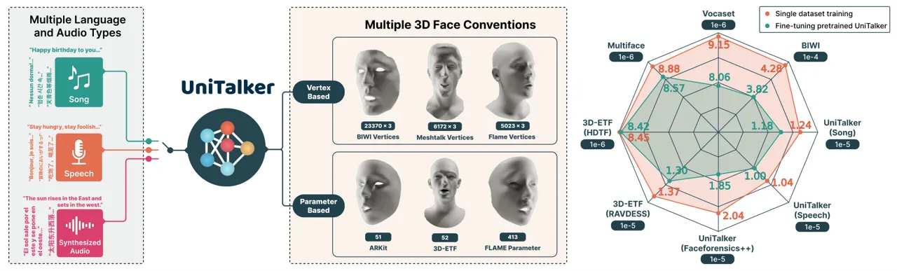
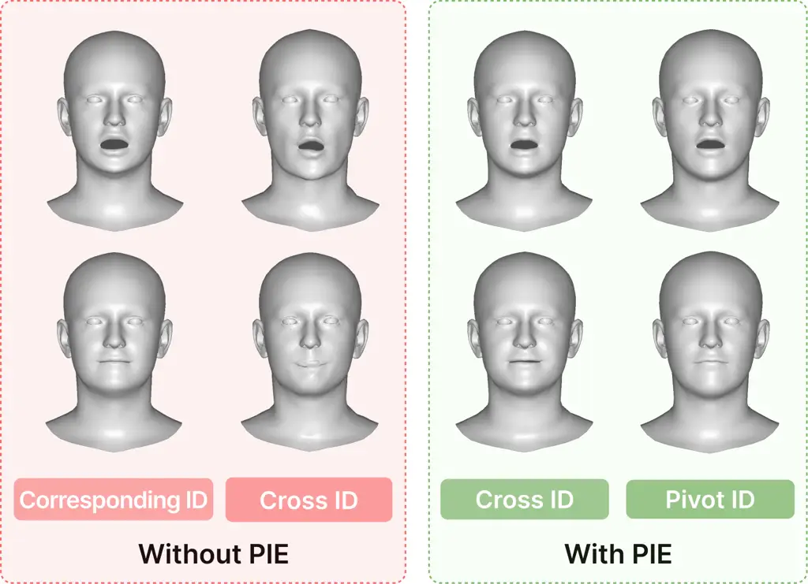
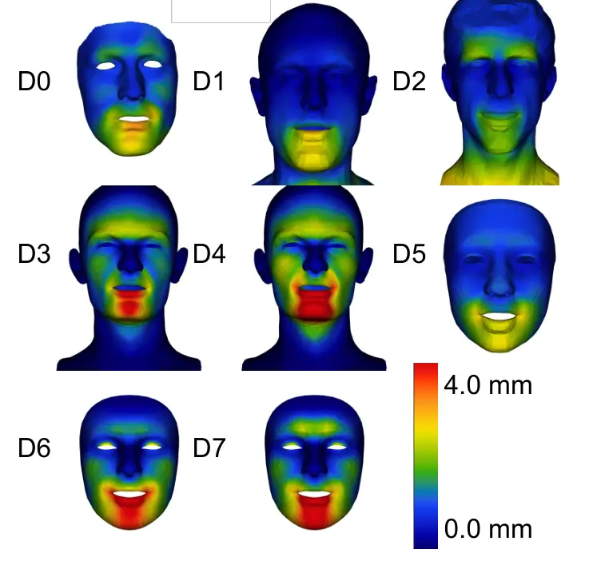
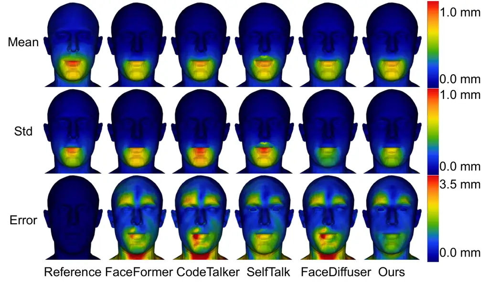
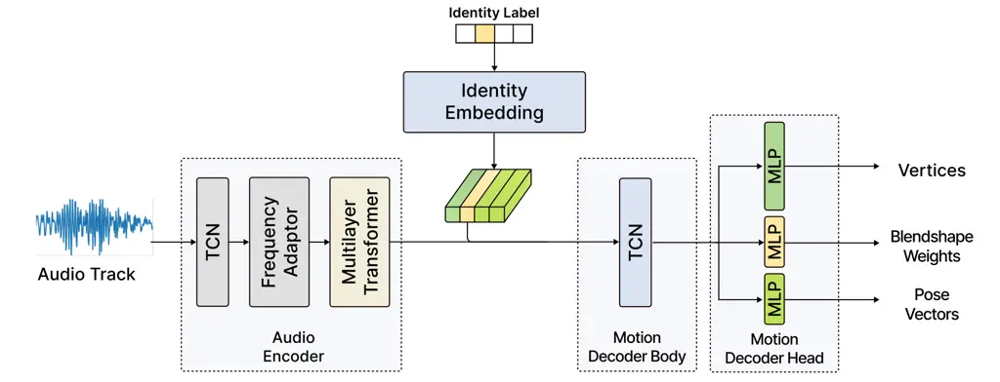
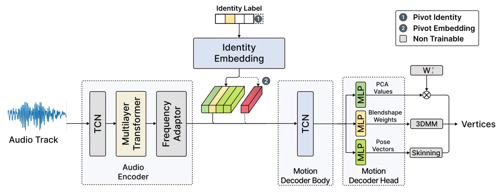

# UniTalker: Scaling up Audio-Driven 3D Facial Animation through A Unified Model

– Supplementary Materials –

Xiangyu
Fan[![](data:image/svg+xml;base64,PHN2ZyBjbGFzcz0ibHR4X29yY2lkbG9nbyIgaGVpZ2h0PSIxZW0iIHZlcnNpb249IjEuMSIgdmlld2JveD0iMCAwIDcyIDcyIiB3aWR0aD0iMWVtIj48cGF0aCBzdHlsZT0iLS1sdHgtZmlsbC1jb2xvcjojQTZDRTM5OyIgZD0iTTcyLDM2IEM3Miw1NS44ODQzNzUgNTUuODg0Mzc1LDcyIDM2LDcyIEMxNi4xMTU2MjUsNzIgMCw1NS44ODQzNzUgMCwzNiBDMCwxNi4xMTU2MjUgMTYuMTE1NjI1LDAgMzYsMCBDNTUuODg0Mzc1LDAgNzIsMTYuMTE1NjI1IDcyLDM2IFoiIGZpbGw9IiNBNkNFMzkiIC8+PGcgc3R5bGU9Ii0tbHR4LWZpbGwtY29sb3I6I0ZGRkZGRjsiIGZpbGw9IiNGRkZGRkYiIHRyYW5zZm9ybT0idHJhbnNsYXRlKDE4Ljg2ODk2NiwgMTIuOTEwMzQ1KSI+PHBvbHlnb24gcG9pbnRzPSI1LjAzNzM0OTI5IDM5LjEyNTA4NzggMC42OTU0Mjk4NjEgMzkuMTI1MDg3OCAwLjY5NTQyOTg2MSA5LjE0NDMxNzg3IDUuMDM3MzQ5MjkgOS4xNDQzMTc4NyA1LjAzNzM0OTI5IDIyLjY5MzA1MDUgNS4wMzczNDkyOSAzOS4xMjUwODc4Ij48L3BvbHlnb24+PHBhdGggZD0iTTExLjQwOTI1Nyw5LjE0NDMxNzg3IEwyMy4xMzgwNzg0LDkuMTQ0MzE3ODcgQzM0LjMwMzAxNCw5LjE0NDMxNzg3IDM5LjIwODgxOTEsMTcuMDY2NDA3NCAzOS4yMDg4MTkxLDI0LjE0ODY5OTUgQzM5LjIwODgxOTEsMzEuODQ2ODQzIDMzLjE0NzA0ODUsMzkuMTUzMDgxMSAyMy4xOTQ0NjY5LDM5LjE1MzA4MTEgTDExLjQwOTI1NywzOS4xNTMwODExIEwxMS40MDkyNTcsOS4xNDQzMTc4NyBaIE0xNS43NTExNzY1LDM1LjI2MjAxOTQgTDIyLjY1ODc3NTYsMzUuMjYyMDE5NCBDMzIuNDk4NTgsMzUuMjYyMDE5NCAzNC43NTQxMjI2LDI3Ljg0MzgwODQgMzQuNzU0MTIyNiwyNC4xNDg2OTk1IEMzNC43NTQxMjI2LDE4LjEzMDE1MDkgMzAuODkxNTA1OSwxMy4wMzUzNzk1IDIyLjQzMzIyMTMsMTMuMDM1Mzc5NSBMMTUuNzUxMTc2NSwxMy4wMzUzNzk1IEwxNS43NTExNzY1LDM1LjI2MjAxOTQgWiIgLz48cGF0aCBkPSJNNS43MTQwMTIwNiwyLjkwMTgyMzI5IEM1LjcxNDAxMjA2LDQuNDQxNDUyIDQuNDQ1MjY5MzcsNS43MjkxNDE0NiAyLjg2NjM4OTU4LDUuNzI5MTQxNDYgQzEuMjg3NTA5NzgsNS43MjkxNDE0NiAwLjAxODc2NzA5MTgsNC40NDE0NTIgMC4wMTg3NjcwOTE4LDIuOTAxODIzMjkgQzAuMDE4NzY3MDkxOCwxLjMzNDIwMTMzIDEuMjg3NTA5NzgsMC4wNzQ1MDUxMDk2IDIuODY2Mzg5NTgsMC4wNzQ1MDUxMDk2IEM0LjQ0NTI2OTM3LDAuMDc0NTA1MTA5NiA1LjcxNDAxMjA2LDEuMzYyMTk0NTggNS43MTQwMTIwNiwyLjkwMTgyMzI5IFoiIC8+PC9nPjwvc3ZnPg==)](https://orcid.org/0000-0002-3446-524X)
   Jiaqi
Li[![](data:image/svg+xml;base64,PHN2ZyBjbGFzcz0ibHR4X29yY2lkbG9nbyIgaGVpZ2h0PSIxZW0iIHZlcnNpb249IjEuMSIgdmlld2JveD0iMCAwIDcyIDcyIiB3aWR0aD0iMWVtIj48cGF0aCBzdHlsZT0iLS1sdHgtZmlsbC1jb2xvcjojQTZDRTM5OyIgZD0iTTcyLDM2IEM3Miw1NS44ODQzNzUgNTUuODg0Mzc1LDcyIDM2LDcyIEMxNi4xMTU2MjUsNzIgMCw1NS44ODQzNzUgMCwzNiBDMCwxNi4xMTU2MjUgMTYuMTE1NjI1LDAgMzYsMCBDNTUuODg0Mzc1LDAgNzIsMTYuMTE1NjI1IDcyLDM2IFoiIGZpbGw9IiNBNkNFMzkiIC8+PGcgc3R5bGU9Ii0tbHR4LWZpbGwtY29sb3I6I0ZGRkZGRjsiIGZpbGw9IiNGRkZGRkYiIHRyYW5zZm9ybT0idHJhbnNsYXRlKDE4Ljg2ODk2NiwgMTIuOTEwMzQ1KSI+PHBvbHlnb24gcG9pbnRzPSI1LjAzNzM0OTI5IDM5LjEyNTA4NzggMC42OTU0Mjk4NjEgMzkuMTI1MDg3OCAwLjY5NTQyOTg2MSA5LjE0NDMxNzg3IDUuMDM3MzQ5MjkgOS4xNDQzMTc4NyA1LjAzNzM0OTI5IDIyLjY5MzA1MDUgNS4wMzczNDkyOSAzOS4xMjUwODc4Ij48L3BvbHlnb24+PHBhdGggZD0iTTExLjQwOTI1Nyw5LjE0NDMxNzg3IEwyMy4xMzgwNzg0LDkuMTQ0MzE3ODcgQzM0LjMwMzAxNCw5LjE0NDMxNzg3IDM5LjIwODgxOTEsMTcuMDY2NDA3NCAzOS4yMDg4MTkxLDI0LjE0ODY5OTUgQzM5LjIwODgxOTEsMzEuODQ2ODQzIDMzLjE0NzA0ODUsMzkuMTUzMDgxMSAyMy4xOTQ0NjY5LDM5LjE1MzA4MTEgTDExLjQwOTI1NywzOS4xNTMwODExIEwxMS40MDkyNTcsOS4xNDQzMTc4NyBaIE0xNS43NTExNzY1LDM1LjI2MjAxOTQgTDIyLjY1ODc3NTYsMzUuMjYyMDE5NCBDMzIuNDk4NTgsMzUuMjYyMDE5NCAzNC43NTQxMjI2LDI3Ljg0MzgwODQgMzQuNzU0MTIyNiwyNC4xNDg2OTk1IEMzNC43NTQxMjI2LDE4LjEzMDE1MDkgMzAuODkxNTA1OSwxMy4wMzUzNzk1IDIyLjQzMzIyMTMsMTMuMDM1Mzc5NSBMMTUuNzUxMTc2NSwxMy4wMzUzNzk1IEwxNS43NTExNzY1LDM1LjI2MjAxOTQgWiIgLz48cGF0aCBkPSJNNS43MTQwMTIwNiwyLjkwMTgyMzI5IEM1LjcxNDAxMjA2LDQuNDQxNDUyIDQuNDQ1MjY5MzcsNS43MjkxNDE0NiAyLjg2NjM4OTU4LDUuNzI5MTQxNDYgQzEuMjg3NTA5NzgsNS43MjkxNDE0NiAwLjAxODc2NzA5MTgsNC40NDE0NTIgMC4wMTg3NjcwOTE4LDIuOTAxODIzMjkgQzAuMDE4NzY3MDkxOCwxLjMzNDIwMTMzIDEuMjg3NTA5NzgsMC4wNzQ1MDUxMDk2IDIuODY2Mzg5NTgsMC4wNzQ1MDUxMDk2IEM0LjQ0NTI2OTM3LDAuMDc0NTA1MTA5NiA1LjcxNDAxMjA2LDEuMzYyMTk0NTggNS43MTQwMTIwNiwyLjkwMTgyMzI5IFoiIC8+PC9nPjwvc3ZnPg==)](https://orcid.org/0000-0002-0058-0266)
   Zhiqian
Lin[![](data:image/svg+xml;base64,PHN2ZyBjbGFzcz0ibHR4X29yY2lkbG9nbyIgaGVpZ2h0PSIxZW0iIHZlcnNpb249IjEuMSIgdmlld2JveD0iMCAwIDcyIDcyIiB3aWR0aD0iMWVtIj48cGF0aCBzdHlsZT0iLS1sdHgtZmlsbC1jb2xvcjojQTZDRTM5OyIgZD0iTTcyLDM2IEM3Miw1NS44ODQzNzUgNTUuODg0Mzc1LDcyIDM2LDcyIEMxNi4xMTU2MjUsNzIgMCw1NS44ODQzNzUgMCwzNiBDMCwxNi4xMTU2MjUgMTYuMTE1NjI1LDAgMzYsMCBDNTUuODg0Mzc1LDAgNzIsMTYuMTE1NjI1IDcyLDM2IFoiIGZpbGw9IiNBNkNFMzkiIC8+PGcgc3R5bGU9Ii0tbHR4LWZpbGwtY29sb3I6I0ZGRkZGRjsiIGZpbGw9IiNGRkZGRkYiIHRyYW5zZm9ybT0idHJhbnNsYXRlKDE4Ljg2ODk2NiwgMTIuOTEwMzQ1KSI+PHBvbHlnb24gcG9pbnRzPSI1LjAzNzM0OTI5IDM5LjEyNTA4NzggMC42OTU0Mjk4NjEgMzkuMTI1MDg3OCAwLjY5NTQyOTg2MSA5LjE0NDMxNzg3IDUuMDM3MzQ5MjkgOS4xNDQzMTc4NyA1LjAzNzM0OTI5IDIyLjY5MzA1MDUgNS4wMzczNDkyOSAzOS4xMjUwODc4Ij48L3BvbHlnb24+PHBhdGggZD0iTTExLjQwOTI1Nyw5LjE0NDMxNzg3IEwyMy4xMzgwNzg0LDkuMTQ0MzE3ODcgQzM0LjMwMzAxNCw5LjE0NDMxNzg3IDM5LjIwODgxOTEsMTcuMDY2NDA3NCAzOS4yMDg4MTkxLDI0LjE0ODY5OTUgQzM5LjIwODgxOTEsMzEuODQ2ODQzIDMzLjE0NzA0ODUsMzkuMTUzMDgxMSAyMy4xOTQ0NjY5LDM5LjE1MzA4MTEgTDExLjQwOTI1NywzOS4xNTMwODExIEwxMS40MDkyNTcsOS4xNDQzMTc4NyBaIE0xNS43NTExNzY1LDM1LjI2MjAxOTQgTDIyLjY1ODc3NTYsMzUuMjYyMDE5NCBDMzIuNDk4NTgsMzUuMjYyMDE5NCAzNC43NTQxMjI2LDI3Ljg0MzgwODQgMzQuNzU0MTIyNiwyNC4xNDg2OTk1IEMzNC43NTQxMjI2LDE4LjEzMDE1MDkgMzAuODkxNTA1OSwxMy4wMzUzNzk1IDIyLjQzMzIyMTMsMTMuMDM1Mzc5NSBMMTUuNzUxMTc2NSwxMy4wMzUzNzk1IEwxNS43NTExNzY1LDM1LjI2MjAxOTQgWiIgLz48cGF0aCBkPSJNNS43MTQwMTIwNiwyLjkwMTgyMzI5IEM1LjcxNDAxMjA2LDQuNDQxNDUyIDQuNDQ1MjY5MzcsNS43MjkxNDE0NiAyLjg2NjM4OTU4LDUuNzI5MTQxNDYgQzEuMjg3NTA5NzgsNS43MjkxNDE0NiAwLjAxODc2NzA5MTgsNC40NDE0NTIgMC4wMTg3NjcwOTE4LDIuOTAxODIzMjkgQzAuMDE4NzY3MDkxOCwxLjMzNDIwMTMzIDEuMjg3NTA5NzgsMC4wNzQ1MDUxMDk2IDIuODY2Mzg5NTgsMC4wNzQ1MDUxMDk2IEM0LjQ0NTI2OTM3LDAuMDc0NTA1MTA5NiA1LjcxNDAxMjA2LDEuMzYyMTk0NTggNS43MTQwMTIwNiwyLjkwMTgyMzI5IFoiIC8+PC9nPjwvc3ZnPg==)](https://orcid.org/0009-0005-5971-1928)
   Weiye
Xiao[![](data:image/svg+xml;base64,PHN2ZyBjbGFzcz0ibHR4X29yY2lkbG9nbyIgaGVpZ2h0PSIxZW0iIHZlcnNpb249IjEuMSIgdmlld2JveD0iMCAwIDcyIDcyIiB3aWR0aD0iMWVtIj48cGF0aCBzdHlsZT0iLS1sdHgtZmlsbC1jb2xvcjojQTZDRTM5OyIgZD0iTTcyLDM2IEM3Miw1NS44ODQzNzUgNTUuODg0Mzc1LDcyIDM2LDcyIEMxNi4xMTU2MjUsNzIgMCw1NS44ODQzNzUgMCwzNiBDMCwxNi4xMTU2MjUgMTYuMTE1NjI1LDAgMzYsMCBDNTUuODg0Mzc1LDAgNzIsMTYuMTE1NjI1IDcyLDM2IFoiIGZpbGw9IiNBNkNFMzkiIC8+PGcgc3R5bGU9Ii0tbHR4LWZpbGwtY29sb3I6I0ZGRkZGRjsiIGZpbGw9IiNGRkZGRkYiIHRyYW5zZm9ybT0idHJhbnNsYXRlKDE4Ljg2ODk2NiwgMTIuOTEwMzQ1KSI+PHBvbHlnb24gcG9pbnRzPSI1LjAzNzM0OTI5IDM5LjEyNTA4NzggMC42OTU0Mjk4NjEgMzkuMTI1MDg3OCAwLjY5NTQyOTg2MSA5LjE0NDMxNzg3IDUuMDM3MzQ5MjkgOS4xNDQzMTc4NyA1LjAzNzM0OTI5IDIyLjY5MzA1MDUgNS4wMzczNDkyOSAzOS4xMjUwODc4Ij48L3BvbHlnb24+PHBhdGggZD0iTTExLjQwOTI1Nyw5LjE0NDMxNzg3IEwyMy4xMzgwNzg0LDkuMTQ0MzE3ODcgQzM0LjMwMzAxNCw5LjE0NDMxNzg3IDM5LjIwODgxOTEsMTcuMDY2NDA3NCAzOS4yMDg4MTkxLDI0LjE0ODY5OTUgQzM5LjIwODgxOTEsMzEuODQ2ODQzIDMzLjE0NzA0ODUsMzkuMTUzMDgxMSAyMy4xOTQ0NjY5LDM5LjE1MzA4MTEgTDExLjQwOTI1NywzOS4xNTMwODExIEwxMS40MDkyNTcsOS4xNDQzMTc4NyBaIE0xNS43NTExNzY1LDM1LjI2MjAxOTQgTDIyLjY1ODc3NTYsMzUuMjYyMDE5NCBDMzIuNDk4NTgsMzUuMjYyMDE5NCAzNC43NTQxMjI2LDI3Ljg0MzgwODQgMzQuNzU0MTIyNiwyNC4xNDg2OTk1IEMzNC43NTQxMjI2LDE4LjEzMDE1MDkgMzAuODkxNTA1OSwxMy4wMzUzNzk1IDIyLjQzMzIyMTMsMTMuMDM1Mzc5NSBMMTUuNzUxMTc2NSwxMy4wMzUzNzk1IEwxNS43NTExNzY1LDM1LjI2MjAxOTQgWiIgLz48cGF0aCBkPSJNNS43MTQwMTIwNiwyLjkwMTgyMzI5IEM1LjcxNDAxMjA2LDQuNDQxNDUyIDQuNDQ1MjY5MzcsNS43MjkxNDE0NiAyLjg2NjM4OTU4LDUuNzI5MTQxNDYgQzEuMjg3NTA5NzgsNS43MjkxNDE0NiAwLjAxODc2NzA5MTgsNC40NDE0NTIgMC4wMTg3NjcwOTE4LDIuOTAxODIzMjkgQzAuMDE4NzY3MDkxOCwxLjMzNDIwMTMzIDEuMjg3NTA5NzgsMC4wNzQ1MDUxMDk2IDIuODY2Mzg5NTgsMC4wNzQ1MDUxMDk2IEM0LjQ0NTI2OTM3LDAuMDc0NTA1MTA5NiA1LjcxNDAxMjA2LDEuMzYyMTk0NTggNS43MTQwMTIwNiwyLjkwMTgyMzI5IFoiIC8+PC9nPjwvc3ZnPg==)](https://orcid.org/0000-0003-3015-3609)
   Lei
Yang[![](data:image/svg+xml;base64,PHN2ZyBjbGFzcz0ibHR4X29yY2lkbG9nbyIgaGVpZ2h0PSIxZW0iIHZlcnNpb249IjEuMSIgdmlld2JveD0iMCAwIDcyIDcyIiB3aWR0aD0iMWVtIj48cGF0aCBzdHlsZT0iLS1sdHgtZmlsbC1jb2xvcjojQTZDRTM5OyIgZD0iTTcyLDM2IEM3Miw1NS44ODQzNzUgNTUuODg0Mzc1LDcyIDM2LDcyIEMxNi4xMTU2MjUsNzIgMCw1NS44ODQzNzUgMCwzNiBDMCwxNi4xMTU2MjUgMTYuMTE1NjI1LDAgMzYsMCBDNTUuODg0Mzc1LDAgNzIsMTYuMTE1NjI1IDcyLDM2IFoiIGZpbGw9IiNBNkNFMzkiIC8+PGcgc3R5bGU9Ii0tbHR4LWZpbGwtY29sb3I6I0ZGRkZGRjsiIGZpbGw9IiNGRkZGRkYiIHRyYW5zZm9ybT0idHJhbnNsYXRlKDE4Ljg2ODk2NiwgMTIuOTEwMzQ1KSI+PHBvbHlnb24gcG9pbnRzPSI1LjAzNzM0OTI5IDM5LjEyNTA4NzggMC42OTU0Mjk4NjEgMzkuMTI1MDg3OCAwLjY5NTQyOTg2MSA5LjE0NDMxNzg3IDUuMDM3MzQ5MjkgOS4xNDQzMTc4NyA1LjAzNzM0OTI5IDIyLjY5MzA1MDUgNS4wMzczNDkyOSAzOS4xMjUwODc4Ij48L3BvbHlnb24+PHBhdGggZD0iTTExLjQwOTI1Nyw5LjE0NDMxNzg3IEwyMy4xMzgwNzg0LDkuMTQ0MzE3ODcgQzM0LjMwMzAxNCw5LjE0NDMxNzg3IDM5LjIwODgxOTEsMTcuMDY2NDA3NCAzOS4yMDg4MTkxLDI0LjE0ODY5OTUgQzM5LjIwODgxOTEsMzEuODQ2ODQzIDMzLjE0NzA0ODUsMzkuMTUzMDgxMSAyMy4xOTQ0NjY5LDM5LjE1MzA4MTEgTDExLjQwOTI1NywzOS4xNTMwODExIEwxMS40MDkyNTcsOS4xNDQzMTc4NyBaIE0xNS43NTExNzY1LDM1LjI2MjAxOTQgTDIyLjY1ODc3NTYsMzUuMjYyMDE5NCBDMzIuNDk4NTgsMzUuMjYyMDE5NCAzNC43NTQxMjI2LDI3Ljg0MzgwODQgMzQuNzU0MTIyNiwyNC4xNDg2OTk1IEMzNC43NTQxMjI2LDE4LjEzMDE1MDkgMzAuODkxNTA1OSwxMy4wMzUzNzk1IDIyLjQzMzIyMTMsMTMuMDM1Mzc5NSBMMTUuNzUxMTc2NSwxMy4wMzUzNzk1IEwxNS43NTExNzY1LDM1LjI2MjAxOTQgWiIgLz48cGF0aCBkPSJNNS43MTQwMTIwNiwyLjkwMTgyMzI5IEM1LjcxNDAxMjA2LDQuNDQxNDUyIDQuNDQ1MjY5MzcsNS43MjkxNDE0NiAyLjg2NjM4OTU4LDUuNzI5MTQxNDYgQzEuMjg3NTA5NzgsNS43MjkxNDE0NiAwLjAxODc2NzA5MTgsNC40NDE0NTIgMC4wMTg3NjcwOTE4LDIuOTAxODIzMjkgQzAuMDE4NzY3MDkxOCwxLjMzNDIwMTMzIDEuMjg3NTA5NzgsMC4wNzQ1MDUxMDk2IDIuODY2Mzg5NTgsMC4wNzQ1MDUxMDk2IEM0LjQ0NTI2OTM3LDAuMDc0NTA1MTA5NiA1LjcxNDAxMjA2LDEuMzYyMTk0NTggNS43MTQwMTIwNiwyLjkwMTgyMzI5IFoiIC8+PC9nPjwvc3ZnPg==)](https://orcid.org/0000-0002-0571-5924)^(🖂)
Affiliation: SenseTime Research, China E-mail [{fanxiangyu, lijiaqi2,
linzhiqian, xiaoweiye1,
yanglei}@sensetime.com](mailto:%7Bfanxiangyu,%20lijiaqi2,%20linzhiqian,%20xiaoweiye1,%20yanglei%7D@sensetime.com)
Affiliation: SenseTime Research, China E-mail [{fanxiangyu, lijiaqi2,
linzhiqian, xiaoweiye1,
yanglei}@sensetime.com](mailto:%7Bfanxiangyu,%20lijiaqi2,%20linzhiqian,%20xiaoweiye1,%20yanglei%7D@sensetime.com)

###### Abstract

Audio-driven 3D facial animation aims to map input audio to realistic
facial motion. Despite significant progress, limitations arise from
inconsistent 3D annotations, restricting previous models to training on
specific annotations and thereby constraining the training scale. In
this work, we present UniTalker, a unified model featuring a multi-head
architecture designed to effectively leverage datasets with varied
annotations. To enhance training stability and ensure consistency among
multi-head outputs, we employ three training strategies, namely, PCA,
model warm-up, and pivot identity embedding. To expand the training
scale and diversity, we assemble A2F-Bench, comprising five publicly
available datasets and three newly curated datasets. These datasets
contain a wide range of audio domains, covering multilingual speech
voices and songs, thereby scaling the training data from commonly
employed datasets, typically less than 1 hour, to 18.5 hours. With a
single trained UniTalker model, we achieve substantial lip vertex error
reductions of 9.2% for BIWI dataset and 13.7% for Vocaset. Additionally,
the pre-trained UniTalker exhibits promise as the foundation model for
audio-driven facial animation tasks. Fine-tuning the pre-trained
UniTalker on seen datasets further enhances performance on each dataset,
with an average error reduction of 6.3% on A2F-Bench. Moreover,
fine-tuning UniTalker on an unseen dataset with only half the data
surpasses prior state-of-the-art models trained on the full dataset. The
code and dataset are available at the project page¹¹ 1 Homepage:
[https://github.com/X-niper/UniTalker](https://github.com/X-niper/UniTalker).

###### Keywords: 

Audio-driven Facial animation Unified Model

## 1 Introduction

Realistic facial animation synchronized with voice is crucial in
human-related animation \[3, 38, 9, 44\] and simulation \[7, 58, 18\].
Traditional methods involve vision-based facial performance capture or
labor-intensive handcrafted work by artists. Recent neural network
advancements enable expressive 3D facial animation based on vocal audio,
categorized as vertex-based and parameter-based models. Bao *et
al*. \[6\] showcased that a personalized model, _i.e_., a model tailored
to an individual and trained with approximately 3,000 utterances, can
yield reasonably good results when using the pre-trained speech
model \[5, 17\]. A larger dataset of 10,000 utterances further improved
performance \[6\]. It implies that non-personalized models would require
an even larger dataset to attain optimal performance. However, existing
datasets like BIWI \[21\] or Vocaset \[19\] typically contain less than
1,000 utterances. To train a robust and generailizable audio-to-face
model, an appealing solution is to scale up to a larger dataset by
assembling existing datasets, similar to recent studies \[10, 63\]. Yet,
there are two main challenges: _inconsistent data annotation_ and
_insufficient data variety_.



Figure 1: Left: UniTalker aims to learn from diverse datasets in a
unified manner. It takes multilingual, multi-vocal-type audios as input
and outputs various 3D facial annotation conventions simultaneously.
Right: Finetuning UniTalker on each dataset consistently shows lower lip
vertex error (LVE) than training the model on the dataset, leading to an
average LVE drop of 6.3%. Refer to Tab. 5 for comprehensive numerical
results.

To effectively exploit multiple datasets with inconsistent data
annotation, we propose UniTalker, a multi-head model that learns from
multiple datasets in a unified manner. However, a straightforward
multi-head design faces two primary challenges, notably _training
instability_ and _dataset bias_. (1) As shown in Fig. 1 and Tab. 1,
diverse datasets adhere to distinct annotations. Vertex-based methods
handle thousands of 3D coordinates, while parameter-based methods deal
with only a few hundred parameters, leading to different training
difficulty. To address this, we employ Principal Component Analysis for
vertex-based annotations to reduce the representation dimension, thus
balancing the trainable parameters of different motion decoder heads.
(2) Existing audio-to-face methods often embed speaker identity during
training, directly applying it to multiple datasets introduces
annotation bias. As there are no shared speakers across datasets with
different annotations, dataset bias will leak to the identity embedding
module. Inspired by classifier-free guidance \[24\], we devise Pivot
Identity Embedding to mitigate the biases between different motion
decoder heads, where a pseudo identity is created and probable to be
chosen during training.

With the designed unified model, increasing the scale of training
necessitates both the quantity and diversity of datasets. Although there
are some publicly available audio-to-face datasets, current datasets
predominantly focus on English content and primarily feature a small
number of speakers. When dealing with cross-language scenarios,
pronunciation and mouth shapes may lack direct counterparts in English
(_e.g_., jiāo in Chinese phonetics). Furthermore, certain sounds,
especially in musical content like American TV shows, require
exaggerated mouth movements not commonly found in regular speech. The
lack of such data challenges trained models to accurately reproduce
corresponding mouth shapes. To enrich both sound types and mouth shapes,
we curated a multilingual and multi-vocal-type dataset. The dataset
comprises 1.4 hours of Chinese speech and 5.1 hours of multilingual
songs. To increase the diversity of speakers, we annotated the 2D face
video dataset FaceForensics++ \[42\], contributing additional 3.6 hours
of multilingual speech from over 700 individuals. Combining five
existing datasets with three newly curated ones, we assembled A2F-Bench.
It contains 934 speakers and 8,654 sequences, with a total duration of
18.53 hours.

|                           |     |                   |          |             |          |        |        |          |     |         |            |
| ------------------------- | --- | ----------------- | -------- | ----------- | -------- | ------ | ------ | -------- | --- | ------- | ---------- |
| Dataset                   | ID  | N                 | GT Type  | Acquisition | Language | Audio  | \#Seq. | Duration | FPS | \#Subj. | Accessible |
| BIWI\[21\]                | D0  | 23,370$`\times`$3 | Vertices | 4D Scan     | E        | Speech | 238    | 0.33h    | 25  | 6       | ✓          |
| Vocaset\[19\]             | D1  | 5,023$`\times`$3  | Vertices | 4D Scan     | E        | Speech | 473    | 0.56h    | 60  | 12      | ✓          |
| Multiface(Meshtalk)\[54\] | D2  | 6,172$`\times`$3  | Vertices | 4D Scan     | E        | Speech | 612    | 0.67h    | 30  | 13      | ✓          |
| 3D-ETF (HDTF)\[37\]       | D3  | 52                | BS       | 3D fitting  | E        | Speech | 2,039  | 5.49h    | 30  | 141     | ✓          |
| 3D-ETF (RAVDESS)\[37\]    | D4  | 52                | BS       | 3D fitting  | E        | Speech | 1,440  | 1.48h    | 30  | 24      | ✓          |
| Talkshow\[59\]            | D8  | 413               | FLAME    | 3D fitting  | E        | Speech | 17,110 | 38.6h    | 30  | 4       | ✓          |
| BEAT\[32\]                | D9  | 52                | BS       | ARKit       | M        | Speech | 2,508  | 76h      | 60  | 30      | ✓          |
| RenderMe-360\[35\]        | \-  | 52                | FLAME    | 4D Scan     | C, E     | Speech | 18,000 | 25h      | 30  | 500     | ✗          |
| MMFace4D\[52\]            | \-  | 35,709$`\times`$3 | Vertices | 4D Scan     | C        | Speech | 35,904 | 36h      | 30  | 431     | ✗          |
| Song2face\[27\]           | \-  | 51                | BS       | ARKit       | M        | Song   | \-     | 1.93h    | \-  | 7       | ✗          |
| Ours(Faceforensics++)     | D5  | 413               | FLAME    | 3D fitting  | M        | Speech | 1,714  | 3.65h    | 30  | 719     | ✓          |
| Ours(Speech)              | D6  | 51                | BS       | ARKit       | C        | Speech | 789    | 1.24h    | 60  | 8       | ✓          |
| Ours(Song)                | D7  | 51                | BS       | ARKit       | M        | Song   | 1,349  | 5.11h    | 60  | 11      | ✓          |

Table 1: Overview of audio-driven 3D facial datasets. ID refers to
dataset identifiers. N denotes the annotation dimension. E, C, M stands
for English, Chinese and Multilingual. \#Seq. and \#Subj. means the
number of sequences and subjects.

Leveraging the proposed unified model alongside datasets, a single
trained UniTalker achieves lower lip vertex error (LVE) than previous
state-of-the-art \[36\], demonstrating reductions from $`4.25`$
$`\times 10^{-4}`$ to $`3.86`$ $`\times 10^{-4}`$ for BIWI and $`9.63`$
$`\times 10^{-6}`$ $`m^{2}`$ to $`8.30`$ $`\times 10^{-6}`$ $`m^{2}`$
for Vocaset. Dataset-specific fine-tuning further enhances the
performance and results in an average error reduction of 6.3% on
A2F-Bench. To demonstrate the generalizability of pre-trained UniTalker,
we introduce a practical yet under-explored task, _Annotation Transfer_,
which involves transferring to an unseen annotation convention with
limited data. Compared with fine-tuning the commonly adopted audio
encoder \[17\], fine-tuning UniTalker requires less than half the data
to achieve comparable performance.

Our contributions are three-folds: (1) We introduce a multi-head model
that integrates diverse datasets and annotation types within a unified
framework for 3D facial animation. Our model surpasses existing
state-of-the-art with higher accuracy and faster inference speeds. (2)
We demonstrate that pre-trained UniTalker can serve as a foundation
model for audio-to-face tasks. Fine-tuning on pre-trained UniTalker
enhances performance on both seen and unseen annotations, especially
when the data scale is limited. (3) We curate A2F-Bench, a large-scale
dataset comprising five released high-quality datasets and three newly
assembled ones. A2F-Bench enriches the diversity of audio-to-face data
and offers a more comprehensive benchmark for audio-to-face methods.

## 2 Related Work

Audio-Driven 3D Facial Animation. Early works utilise non-parametric
audio features like linear predictive coding (LPC) \[28\] and Mel
Frequency Cepstrum Coefficient (MFCC) \[19, 50, 43\] and regress facial
motion from these features with CNN \[28\], LSTM \[43\] and RNN \[47\].
Recent works \[20, 55, 36, 45\] adopt self-supervised pre-trained speech
models like Wav2vec 2.0 \[5, 17\], Hubert \[26\] and Wavlm \[15\] to
extract audio features, greatly enhancing performance and reducing the
data requirements. Faceformer \[20\] and Codetalker \[55\] model
audio-driven facial animation as an auto-regressive problem while
Emotalk \[37\] and Selftalk \[36\] model it as regressive. More
recently, diffusion models are incorporated for speech-driven 3D facial
animation \[45, 65\] and improve the diversity of the generated
animation. Despite achieving realistic facial animation in recent
advances, one single model usually focuses on audios of a single domain,
_e.g_., English speech, and outputs one facial animation representation,
_e.g_., vertices of one topology. A unified model is desired that has
robust performance in various audio domains, _e.g_., multilingual
speeches and songs, and outputs various 3D representation types, _e.g_.,
blendshapes and vertices.

Audio-Driven 3D Facial Datasets. Existing publicly available
audio-visual datasets focus on English speeches and conversations. As
listed in Tab. 1, vertex-based datasets that are registered from 4D
scans feature short duration and few subjects like BIWI, Vocaset and
Multiface. 3D-ETF \[37\] is annotated with pseudo ground truth 52 ARkit
blendshape weights from 2D videos \[64, 33\]. It enlarges the available
data scale for the audio-to-face generation task. However, 3D-ETF
focuses on English content. The two large-scale datasets, Talkshow and
BEAT exhibit audio-annotation misalignment and inaccurate annotation,
not suitable for audio-to-face generation. RenderMe-360 \[35\],
MMFace4D \[52\] and Song2face \[27\] are not publicly accessible. In
summary, there is a lack of non-English audio-visual data and
song-to-face data for academic study.

## 3 Methods

### 3.1 Formulation

Let $`\mathbf{M}_{1:T}^{i}=(\mathbf{m}_{1}^{i},...,\mathbf{m}_{T}^{i})`$
be a sequence of face motion, where $`\mathbf{m}_{t}^{i}`$ denotes the
face motion at $`{t}`$-th frame following the $`{i}`$-th annotation
convention. For vertex-based annotations,
$`\mathbf{m}_{t}^{i}\in\mathbb{R}^{3V}`$ denotes the displacement of
$`V`$ vertices at $`{t}`$-th frame over a neutral-face template. For
parameter-based annotations, $`\mathbf{m}_{t}^{i}\in\mathbb{R}^{P}`$
denotes the $`P`$ parameters at $`{t}`$-th frame. Let
$`\mathbf{A}_{1:T\cdot d}`$ be the input audio, where $`d`$ is the audio
samples aligned with one frame. The goal in this paper can be expressed
as follows: Given an input audio $`\mathbf{A}_{1:T\cdot d}`$, the model
needs to map it into face motion denoted by every desired annotation,
_i.e_., $`\mathbf{M}_{1:T}^{i}`$, $`\forall i\leq N`$, where $`N`$ is
the number of face annotation types involved in the training process.

### 3.2 Unified Multi-Head Model

As shown in Fig. 2, our unified multi-head audio-to-face model, namely
UniTalker, follows an encoder-decoder architecture. Given an input
audio, the audio encoder initially transforms it into contextualized
audio features. Subsequently, the frequency adaptor adapts these audio
features via temporal linear interpolation to match the frequency of
output face motion. The motion decoder maps the interpolated audio
features into motion hidden states. Finally, the motion hidden states
are decoded onto each annotation through the respective decoder head.


Figure 2: UniTalker architecture. UniTalker adopts vertices PCA to
balance the annotation dimension across datasets, uses decoder warm-up
to stablize training, and develops a pivot identity embedding to
mitigate dataset bias.

Audio Encoder. We adopt the state-of-the-art pre-trained speech model
\[17, 15\] for the audio encoder. Pre-trained audio encoders have been
extensively proved to be effective in audio-driven 3D facial animation
\[20, 55, 6, 36, 37, 45\]. The audio encoder consists of a temporal
convolution network (TCN) and a multi-layer transformer encoder. TCN
converts the raw audio waveform $`\mathbf{A}_{1:T\cdot d}`$ into feature
vectors with frequency of 50 Hz and the transformer encodes the feature
vectors into contextualized audio representations.

Frequency Adaptor. To address varying annotation frequencies across
multiple datasets, we incorporate a frequency adaptor into our model.
This adaptor performs linear interpolation, aligning audio features from
50 Hz to the frequency of output face motion. In contrast to prior
methods \[20, 55\], we reposition the frequency adaptor behind the
transformer encoder. This adjustment ensures the frequency of the
transformer input in training stage is aligned with that in pre-training
stage. Hence, the pre-trained weights of the audio encoder are better
utilised. The result is enhanced convergence and improved model
precision, as evidenced in Supplementary Materials.

Non-autoregressive Motion Decoder. Faceformer \[20\] and
CodeTalker \[55\] have formulated audio-to-face generation as an
auto-regression task. It involves a motion encoder to project the
preceding predicted motion into motion embeddings. The decoder uses both
the motion embeddings and contextualized audio representations to
predict the face motion at the next frame. Other works adopt
non-autoregressive models, employing transformer \[6, 36\] and
TCN \[59\] for the motion decoder. We observe that removing
autoregression from FaceFormer brings 30 times faster inference speed
and does not adversely affect precision for either BIWI or Vocaset.
UniTalker adopts TCN for the motion decoder as it exhibits better
precision for multi-head training. Please refer to Supplementary
Materials for detailed results.

Identity Embedding. To model the speaking styles of different
individuals, face motion generation is conditioned on the input identity
label, as shown in Fig. 2. The speakers in different datasets are
exclusive to each other, implying that each motion decoder head is
trained within a specific subset of speakers and audios. As a result,
the decoder head of one annotation does not necessarily output natural
face motion when the input identity label and audio belong to another
annotation. Fig. 4 shows that the model generates satisfactory face
motion only when conditioned on an identity label from the corresponding
annotation. Unnatural face motion, _e.g_., weird mouth shape and
self-intersection may be generated when input identity and motion
decoder head mismatch (Cross ID inference). Inspired by classifier-free
diffusion guidance \[24\], we propose Pivot Identity Embedding (PIE) to
mitigate the annotation biases. Specifically, we introduce an additional
pivot identity that does not belong to any datasets, as shown in Fig. 2.
During training, we replace the ground truth (GT) identity label with
this pivot identity label with a probability of 10%. Fig. 4 shows that
UniTalker exhibits the ability to generate satisfactory face motion
regardless of the identity label used for conditioning.



Figure 3: Effect of PIE. Without PIE, the model generates unnatural face
motion when input identity and output annotation mismatch.

Figure 4: Comparison between finetuning Wav2vec2-xlsr-53 \[16\] and
UniTalker-L-\[D1-D7\] on D0. The x-axis is in _log-scale_.

### 3.3 Unified Multi-Head Training

Improving Training Stability. A vanilla multi-head model (shown in
Supplementary Materials) associates each annotation convention with one
output head. However, the vanilla multi-head model fails to gain
advantages from increased data size. We hypothesize that the difference
in annotation dimensions results in different difficulties of training
convergence. For example, BIWI and Vocaset possess 23,370 and 5,023
vertices, respectively. Previous studies \[20, 55\] have chosen distinct
hyperparameters for these datasets. We conducted systematical
experiments for the two datasets, across different decoder channels and
decoder architectures, using the same audio encoder adopted in
FaceFormer \[20\]. As shown in Fig. 5(a), the model precision is highly
related to the hyperparameters and the optimal hyperparameters for the
two datasets are different.

To train the multi-head model stably, we employ _Principal Component
Analysis (PCA)_ for each vertex-based annotation. This process reduces
the output dimension and maintain consistent output head dimensions for
each vertex-based annotation. Restricted by memory limit, we employ
Incremental Principal Components Analysis (I-PCA) \[41\] as an
approximation of PCA. It reduces the dimension of motion representation
from $`{3V}`$ to $`L=512`$, where $`V`$ denotes the vertex number and
$`L`$ denotes the number of the preserved principle components. Each
decoder head for vertices is then replaced with a decoder head for PCA
values. The PCA values $`\hat{\mathbf{y}}_{PCA}`$ and vertices
$`\hat{\mathbf{y}}_{v}`$ are linked through the PCA components
$`\mathbf{W}_{L}^{T}`$, according to Eq. (1).

```math
\hat{\mathbf{y}}_{v}=\hat{\mathbf{y}}_{PCA}\times\mathbf{W}_{L}^{T} \tag{1}
```

We further stabilize the multi-head training by adopting a two-stage
training scheme \[53\]. In the first stage, we freeze the weights of the
pre-trained audio encoder and only update the weights of the decoder.
This stage, named _Decoder Warm-up (DW)_, gradually aligns the
convergence state of the randomly initialized decoder to that of the
pre-trained audio encoder. In the second stage, both the audio encoder
and the motion decoder are updated simultaneously.

(a) w.o. PCA, w.o. DW

(b) w.o. DW

(c) w.o. PCA

(d) w. PCA, w. DW

Figure 5: The effect of PCA and DW. LVE values are evaluated on test set
at 100th epoch. Training with both PCA and DW ensures training stability
across various settings. Removing either strategy harms training
robustness.

Fig. 5 illustrates the effect of PCA and DW. With both strategies, the
model converges across various scenarios, including training on single
and multiple datasets, employing either TCN or transformer architectures
for motion decoder, and covering a wide range of decoder channel
options. Fig. 5(a) shows that the vanilla model collapses in many
settings and the optimal setting for BIWI and Vocaset is different.
Removing either PCA or DW will deteriorate training stability,
especially for multi-dataset training, as shown in Fig. 5(b) and
Fig. 5(c).

Training Loss. As shown in Fig. 2, the model predicts PCA values
$`\hat{\mathbf{y}}_{PCA}`$ for vertex-based annotations, blendshape
weights and pose vectors $`\hat{\mathbf{y}}_{\theta}`$ for
parameter-based annotations. We can derive vertices
$`\hat{\mathbf{y}}_{v}`$ for every annotation through differentiable
computation. We apply mean squared error (MSE) on both the model output
and the derived vertices, as indicated by Eq. 2,

```math
\mathcal{L}=l(\hat{\mathbf{y}}_{v},\mathbf{y}_{v})+\alpha\cdot l(\hat{\mathbf{y}}_{PCA},\mathbf{y}_{PCA})+\beta\cdot l(\hat{\mathbf{y}}_{\theta},\mathbf{y}_{\theta}), \tag{2}
```

where $`\alpha=0.01`$ and $`\beta=0.0001`$ in our training.

### 3.4 UniTalker as a Foundation Model

Our UniTalker model could output different types of face annotations. In
real-wold scenarios, new annotation conventions often arise, and the
available data is typically limited. In such cases, the UniTalker model
needs to be transferred onto the new annotations. Previous works \[20,
45, 55\] adopts pre-trained audio encoders to decrease the data
requirement. In this work, we replace the weights of audio encoder with
the weights of pre-trained UniTalker, and find that UniTalker can
further decrease half of the data requirement on unseen datasets, as
evidenced in Fig. 4 and discussed in Sec. 4.6. Additionally, we randomly
select only one sequence from Vocaset, which is less than 10 seconds. We
fine-tune UniTalker with limited trainable parameters on this single
sequence and find that the tuned model can still output satisfactory
results (see Supplementary Materials). Note that Vocaset is excluded
from the pre-training datasets in this experiment.

## 4 Experiments and Results

### 4.1 Datasets: A2F-Bench

Tab. 1 presents a summary of the datasets. To assemble A2F-Bench, we
first select five widely used 3D audio-visual datasets, namely
BIWI \[21\], Vocaset \[19\], Multiface \[54\], 3D-ETF-HDTF \[37\] and
3D-ETF-RAVDESS \[37\]. Additionally, to increase the number of speakers,
we clean the multilingual 2D faceforensics++ dataset \[42\] and label
speaker’s faces with FLAME \[29\] parameters using 3D face
reconstruction \[34, 30\]. To enhance the model’s proficiency with
non-English speech and songs, we collect a dataset consisting of
speeches from eight native Chinese speakers and a dataset comprising
multilingual songs from eleven professional singers and label them with
ARKit blendshape weights. We have made experiments on larger datasets
like BEAT \[32\] and TalkShow \[59\], and find they exhibit
audio-annotation misalignment and inaccurate annotation. Hence, they are
not included in UniTalker training. For the sake of simplicity, we refer
to each dataset as D0, D1, and so on as in Tab. 1. Consistent with
previous studies \[20, 55, 37\], we downsample annotations originally
collected at 60 fps to 30 fps. BIWI is maintained at 25 fps. The
assembled A2F-Bench consists of 934 speakers and 8,654 sequences, with a
total duration of 18.53 hours, featuring diverse sound types and mouth
shapes. Refer to Supplementary Materials for detailed dataset
description.

### 4.2 Implementation Details

We adopt two multilingual pre-trained audio encoders for UniTalker,
_i.e_., Wavlm-base-plus \[14\] for UniTalker-Base model and
Wav2vec2-xlsr-53 \[16\] for UniTalker-Large model. The effect of the
audio encoder is detailed in Sec. 5. UniTalker refers to UniTalker-Large
by default, unless explicitly stated. We train each version of the model
on both individual datasets and A2F-Bench. For instance,
UniTalker-B-\[D0\] refers to UniTalker-Base trained on BIWI dataset.
UniTalker-B-\[D0-D7\] and UniTalker-L-\[D0-D7\] refers to Unitalker-Base
and UniTalker-Large trained on the entire A2F-Bench, respectively. We
use Adam optimizer with a constant learning rate of 0.0001. We train 100
epochs for each model. It takes 2 days to train UniTalker-L-\[D0-D7\] on
a single NVIDIA V100.

### 4.3 Comparison with Prior Works

Quantitative Evaluation. We compare UniTalker with four methods:
FaceFormer \[20\], CodeTalker \[55\], SelfTalk \[36\] and
FaceDiffuser \[45\]. FaceFormer and CodeTalker adopt
Wav2vec2-base-960h \[4\] as their audio encoder. Both methods employ
autoregressive decoder and exhibit slow inference. SelfTalk adopts
Wav2vec2-large-xlsr-53-English \[23\] as the audio encoder. FaceDiffuser
adopts Hubert-base-ls960 \[25\] as the audio encoder. The inference on
FaceDiffuser is extremely slow since it adopts the diffusion mechanism
and its inference scheduler has 500 steps. In case of BIWI, we directly
evaluate their released models. For Vocaset, we retrain and test these
methods using their official codebases, as they did not report the
quantitative results.

We adopt lip vertex error (LVE) to measure lip synchronization, which is
commonly used in prior works \[20, 55, 45\]. LVE is computed as the
average over all frames of maximal L2 error of the lip vertices to the
ground truth. Following \[45\], we measure mean vertex error by
computing the mean Euclidean distance w.r.t. the ground truth across all
vertices (MVE) and across the upper face (UFVE). Following \[55\], we
adopt upper-face dynamics deviation (FDD) to measure the variation of
upper facial dynamics for a motion sequence in comparison with that of
the ground truth. We also list the trainable parameters and inference
time of a 10-seconds audio on a single NVIDIA V100.

|         |                       |                              |                     |                     |                         |        |       |
| ------- | --------------------- | ---------------------------- | ------------------- | ------------------- | ----------------------- | ------ | ----- |
| Dataset | Method                | LVE $`\downarrow`$           | MVE $`\downarrow`$  | UFVE $`\downarrow`$ | FDD $`\downarrow`$      | Params | Time  |
|         |                       | $`\times 10^{-4}`$           | $`\times 10^{-3}`$  | $`\times 10^{-3}`$  | $`\times 10^{-5}`$      | $`M`$  | $`s`$ |
| BIWI    | FaceFormer            | 4.9836                       | 7.2750              | 6.9081              | 4.0062                  | 109    | 0.705 |
|         | CodeTalker            | 4.7914                       | 7.3784              | 7.0050              | 4.2147                  | 561    | 4.4   |
|         | SelfTalk              | 4.2485                       | 6.9152              | 6.5428              | 3.5851                  | 539    | 0.071 |
|         | FaceDiffuser          | 4.2985                       | 6.8088              | 6.6220              | 3.9101                  | 189    | 16.50 |
|         | UniTalker-B-\[D0\]    | 4.3681                       | 6.8948              | 6.6277              | 4.6789                  | 92     | 0.024 |
|         | UniTalker-B-\[D0-D7\] | 4.0804                       | 6.6458              | 6.3774              | 5.0438                  | 92     | 0.024 |
|         | UniTalker-L-\[D0-D7\] | 3.8587                       | 6.4166              | 6.1483              | 5.2307                  | 313    | 0.054 |
|         |                       | LVE $`\downarrow`$           | MVE $`\downarrow`$  | UFVE $`\downarrow`$ | FDD $`\downarrow`$      | Params | Time  |
|         |                       | $`\times 10^{-5}`$ $`m^{2}`$ | $`\times 10^{-3}m`$ | $`\times 10^{-3}m`$ | $`\times 10^{-7}m^{2}`$ | $`M`$  | $`s`$ |
| Vocaset | FaceFormer            | 1.1696                       | 0.6364              | 0.4972              | 2.4812                  | 92     | 0.624 |
|         | CodeTalker            | 1.1182                       | 0.5750              | 0.4708              | 1.2594                  | 315    | 3.464 |
|         | SelfTalk              | 0.9626                       | 0.5665              | 0.4805              | 1.0511                  | 450    | 0.053 |
|         | FaceDiffuser          | 0.9684                       | 0.5768              | 0.4772              | 1.7335                  | 89     | 13.08 |
|         | UniTalker-B-\[D1\]    | 0.9381                       | 0.5695              | 0.4829              | 1.2115                  | 92     | 0.022 |
|         | UniTalker-B-\[D0-D7\] | 0.8136                       | 0.5338              | 0.4494              | 1.3962                  | 92     | 0.022 |
|         | UniTalker-L-\[D0-D7\] | 0.8303                       | 0.5524              | 0.4756              | 1.5206                  | 313    | 0.053 |

Table 2: Quantitative results on BIWI-Test-A and VOCA-Test. Best values
are bolded.

According to Tab. 2, UniTalker-B-\[D0\] and UniTalker-B-\[D1\] shows
lower LVE, than FaceFormer and CodeTalker on BIWI and Vocaset,
respectively. With the addition of more training data,
UniTalker-B-\[D0-D7\] get a performance bonus for both datasets and
beats all prior works on both datasets in regards to LVE, MVE and UFVE,
with less parameters and much faster inference speed.
UniTalker-L-\[D0-D7\] push LVE, MVE and UFVE even lower on BIWI.
Compared with prior state-of-the-art model, _i.e_., SelfTalk \[36\],
UniTalker-B-\[D0-D7\] leads to LVE reductions of 4.0% for BIWI and 15.5%
for Vocaset. UniTalker-L-\[D0-D7\] leads to reductions of 9.2% for BIWI
and 13.7% for Vocaset. SelfTalk shows the best FDD on both datasets,
indicating the best prediction of statistics of facial motion velocity.
Note that although FDD and UFVE are computed over the same upper face
region, they show inconsistent results. We argue that UFVE better
reflects the temporal consistency with the ground truth. _e.g_., for
$`t`$$`\in`$$`{[0,2\pi]}`$, $`{std(cos(t))-std(sin(t))=0}`$, implies FDD
= 0 and $`{\int_{0}^{2\pi}\lVert cos(t)-sin(t)\rVert_{2}dt=4\sqrt{2}}`$
indicates large UFVE. Notably, diverse data leads to worse FDD, possibly
due to the increased diversity of facial motion statistics as shown in
Fig. 6(a). For instance, D1 (Vocaset) shows little motion variation in
the upper face region while D4 (3DETF-RAVDESS) and D7 (Multilingual
Songs) exhibit rich motion variation. At inference, the model trained on
diverse datasets tends to predict average motion variation due to the
weak correlation between audio and the motion of upper face.



(a)



(b)

Figure 6: (a) The standard deviation of facial motion within each
training set. The upper face of D1(Vocaset) shows little motion
variation and is close to static. (b) The temporal statistics (mean and
standard deviation) of adjacent-frame motion variation and the mean of
per-frame predicted-to-GT Euclidean distance within a sequence.

Qualitative Evaluation. Corroborating the quantitative results above, we
plot the mean and standard deviation of the motion velocity, and the
mean of the Euclidean distance between the generated sequences and the
reference sequence. According to Fig. 6(b), SelfTalk predicts closest
velocity mean and standard deviation maps to the ground truth, which is
consistent with the FDD order in Tab. 2. The error map indicates
UniTalker gain the best precision, which is consistent with the LVE, MVE
and UFVE results. Interestingly, prior works show much larger error in
the neck part than UniTalker.

User Study. We conducted user study to qualitativly compare UniTalker
with prior works, FaceFormer, CodeTalker and SelfTalk.
FaceDiffuser \[45\] reported worse qualitative results than FaceFormer
and CodeTalker, so it is not selected for comparison. Our selected
audios for user study cover a wide range of scenarios, including
different languages, audio types, emotional expressions, and audio
sources (human voices and generated audios from text-to-speech models).
In our Supplementary Materials, we provide a demo video to illustrate
the performance of UniTalker under these scenarios. For each comparison
pair, the output from UniTalker and its competitors were randomly placed
at left or right. Users participating in the study were asked to answer
three questions for every comparison pair: (1) which side appears more
realistic, (2) which side demonstrates better lip synchronization with
the audio, and (3) which side more effectively conveys the emotion in
the audio. We collected 868 answers, with 308, 280 and 280 responses
compared with Faceformer, CodeTalker and SelfTalk, respectively.  Tab. 3
indicates that UniTalker achieves higher support rate across all three
questions.

|                       |           |          |         |
| --------------------- | --------- | -------- | ------- |
| Method                | Realistic | Lip Sync | Emotion |
| Ours _vs_. FaceFormer | 74.7%     | 76.6%    | 78.2%   |
| Ours _vs_. CodeTalker | 71.8%     | 77.1%    | 80.7%   |
| Ours _vs_. SelfTalker | 72.5%     | 75.0%    | 82.1%   |

Table 3: The support rate for UniTalker over its competitors.

### 4.4 Comparison With Data Preprocessing

To train on multiple datasets, one straightforward approach is to
preprocess different annotations in the datasets into one unified
annotation through either 3D morphable model \[29\] fitting or mesh
retopology \[2\]. While both methods require pre-selected corresponding
facial keypoints, UniTalker does not. Moreover, the preprocessing
approach limits future data expansion. When a new released dataset
adheres to a different annotation, preprocessing approach needs to
convert the new annotation into the required format. While for
UniTalker, one can simply plug new decoder heads into UniTalker and
train it with existing datasets or solely with new ones, avoiding
retopology or fitting process.

To quantitatively compare the preprocessing approach with UniTalker, we
preprocess all the annotations in \[D0-D7\] into FLAME vertices, namely
\[D0-D7\]-FLAME, and train a one-head model on this dataset.
Specifically, for vertex-based datasets like D0 (BIWI) and D2
(Multiface), we convert the vertices into FLAME topology through
standard retopology method. The error between the original vertices and
converted vertices is evaluated with chamfer distance and has an average
value of 0.2 $`mm`$. For D3, D4, D6 and D7, we convert the ARkit
blendshape weights into FLAME vertices with the aid of the released
blendshape \[31\] with ARkit semantics and FLAME topology. For D5, we
convert FLAME parameters into vertices using FLAME model \[29\].

|               |        |        |        |        |        |        |        |        |
| ------------- | ------ | ------ | ------ | ------ | ------ | ------ | ------ | ------ |
| Method        | D1     | D0-D1  | D0-D2  | D0-D3  | D0-D4  | D0-D5  | D0-D6  | D0-D7  |
| Preprocessing | 9.1528 | 9.4856 | 8.2400 | 8.0779 | 8.4730 | 8.7049 | 8.4748 | 8.7532 |
| UniTalker     | 9.1528 | 8.7353 | 7.9243 | 8.4495 | 8.2336 | 8.0785 | 8.4192 | 8.3035 |

Table 4: We compare LVE of UniTalker and that of data preprocessing
approach, under different training dataset settings. The LVE values are
evaluated on D1(VOCA-Test) and expressed in $`{10^{-6}}`$ $`{m^{2}}`$.
The first row indicates the training datasets.

The one-head model only outputs annotation of FLAME vertices. We compare
the performance on D1 (VOCA-Test), which originally has FLAME topology.
Tab. 4 shows that UniTalker achieves lower LVE in most dataset settings
than the one-head model trained on \[D0-D7\]-FLAME. Interestingly, the
lowest LVE occurs in different dataset settings for these two
approaches. Tab. 4 reveals that the unified training framework does take
advantages of the multi-head design. UniTalker is not only versatile due
to its multi-annotation output, but also shows better precision than
data preprocessing approach.

### 4.5 Effect of Scaled-up Datasets

We train UniTalker on each individual dataset and get eight models,
denoted as L-\[D\*\]. We evaluate LVE of each model on its corresponding
test set. After that, we evaluate LVE of UniTalker-\[D0-D7\] on every
test set. As shown in Tab. 5, the one UniTalker model beats the
individual models on most dataset. For small-scale datasets like BIWI
and Vocaset, UniTalker leads to over 9% decrease in LVE. However, the
performance improvement is not achieved on all datasets. As the audio
domains differ largely among A2F-Bench, UniTalker needs to balance the
performance across datasets. For D3 (3D-ETF-HDTF), which already
contains 5.49 hours of audios, UniTalker does not lead to better
precision. For D6 (Chinese speech), UniTalker results in higher LVE
because the proportion of Chinese speeches in A2F-Bench is small.

|             |                             |                             |                             |                             |                             |                             |                             |                             |
| ----------- | --------------------------- | --------------------------- | --------------------------- | --------------------------- | --------------------------- | --------------------------- | --------------------------- | --------------------------- |
| Method      | D0                          | D1                          | D2                          | D3                          | D4                          | D5                          | D6                          | D7                          |
|             | 0.33h                       | 0.56h                       | 0.67h                       | 5.49h                       | 1.48h                       | 3.65h                       | 1.24h                       | 5.11h                       |
| L-\[D\*\]   | 4.279                       | 9.153                       | 8.881                       | 8.445                       | 1.370                       | 2.040                       | 1.043                       | 1.235                       |
| L-\[D0-D7\] | 3.859$`\downarrow_{9.8\%}`$ | 8.303$`\downarrow_{9.3\%}`$ | 8.648$`\downarrow_{2.6\%}`$ | 8.991$`\uparrow_{6.5\%}`$   | 1.326$`\downarrow_{3.2\%}`$ | 2.056$`\uparrow_{0.8\%}`$   | 1.145$`\uparrow_{9.7\%}`$   | 1.211$`\downarrow_{1.9\%}`$ |
| L-FT        | 3.816$`\downarrow_{11\%}`$  | 8.060$`\downarrow_{12\%}`$  | 8.56$`\downarrow_{3.5\%}`$  | 8.417$`\downarrow_{0.3\%}`$ | 1.30$`\downarrow_{5.2\%}`$  | 1.848$`\downarrow_{9.4\%}`$ | 0.998$`\downarrow_{4.3\%}`$ | 1.178$`\downarrow_{4.6\%}`$ |

Table 5: Quantitative comparison between single dataset training and
mixed dataset training. The metric is LVE. L-\[D\*\] denotes the eight
individual models trained on each dataset. L-\[D0-D7\] denotes
UniTalker-Large trained on A2F-Bench. L-FT denotes the eight models
finetuned from L-\[D0-D7\]. LVE is in $`{10^{-4}}`$ for D0,
$`{10^{-6}}`$ $`{m^{2}}`$ for D1-D3 and $`{10^{-5}}`$ $`{m^{2}}`$ for
D4-D7.

### 4.6 Taking UniTalker as a Foundation Model

Fine-tuning UniTalker on Seen Annotations. UniTalker is motivated to
improve the overall performance and needs to consider the trade-off in
performance across different datasets. To get consistent improvement on
every dataset, we fine-tune UniTalker on each individual dataset and get
eight fine-tuned models, denoted as L-FT. As evidenced by Tab. 5, this
fine-tuning process further enhances performance on every dataset.
Compared with L-\[D\*\], L-FT leads to better precision across all
datasets, including the hard-case datasets like D4 with emotional
speeches  \[33\] and D7 with songs. The largest two LVE reductions are
11.9% on D1 and 10.8% on D0. The average LVE drop across datasets is
6.3%.

Fine-tuning UniTalker on Unseen Annotations. We train
UniTalker-\[D1-D7\] and fine-tune it on D0 (BIWI). As a comparison, we
directly fine-tune Wav2vec2-xlsr-53 \[16\] on D0. When fine-tuning
UniTalker-\[D1-D7\], we only keep the weights of UniTalker encoder and
reinitialize the weights of decoder, to ensure fair comparison. The
original D0 training set contains 190 sequences, with 32 utterances for
each speaker and 2 utterances missing. We iteratively discard half of
the training set, leaving 96, 48, 24, 12 and 6 sequences. The smallest
subset contains only one utterance per speaker, and the utterance
content is identical across all speakers. We fine-tune
UniTalker-\[D1-D7\] and Wav2vec2-xlsr-53 on D0 and each subset. Fig. 4
shows that fine-tuning UniTalker-\[D1-D7\] always yields better
precision. It requires less than half of the data to get comparable
performance. Moreover, fine-tuning UniTalker on D0-half, achieves lower
LVE, _i.e_., 4.197$`\times 10^{-4}`$ than that of previous
state-of-the-art model \[36\] trained on D0-full, _i.e_.,
4.249$`\times 10^{-4}`$.

## 5 Ablation Study

To analyse the effects of the different components of UniTalker, we
conducted ablation studies in terms of audio encoder, motion decoder and
the frequency adaptor. Please refer to Supplementary Materials for the
latter two.

Effect of Pre-trained Audio Encoder. Bao _et al_. \[6\] shows that the
self-supervised pre-trained audio features substantially boost the
performance for audio-driven facial animation, compared with handcrafted
features. Based on this observation, we investigate the effect of
different pre-trained audio encoders. Wav2vec2-base-960h \[4, 5\] is
pre-trained on 960 hours of English speech. Wavlm-base \[13\] is
pre-trained on the same dataset with different pre-training method.
Wavlm-base-plus \[14\] has the same model size with Wav2vec2-base-960h
and Wavlm-base, but is pre-trained on 94k hours of audios in 23
languages. Wav2vec2-xlsr-53 \[16, 17\] is a larger audio encoder and
pre-trained on 56k hours of audios in 53 languages. We train UniTalker
on A2F-Bench, based on these four audio encoders and report LVE on each
test set. As shown in Tab. 6, UniTalker based on Wav2vec2-base-960h
shows suboptimal performance. Wavlm-base shows significant improvement
over Wav2vec2-base-960h due to better pre-training method. With
scaled-up pre-training data, Wavlm-base-plus shows better performance
over Wavlm-base. Benifit from the diversity of pre-training data and
larger capacity, Wav2vec2-xlsr-53 leads to an overall performance
improvement. Tab. 6 shows that the downstream UniTalker precision is
largely affected by the pre-trained audio encoder from three aspects,
including the pre-training method, the scale and diversity of
pre-training dataset and the capacity of pre-training backbone.

|                          |       |       |       |       |       |       |       |       |
| ------------------------ | ----- | ----- | ----- | ----- | ----- | ----- | ----- | ----- |
| Audio Encoder            | D0    | D1    | D2    | D3    | D4    | D5    | D6    | D7    |
| Wav2Vec2-Base-960h \[4\] | 4.491 | 9.916 | 9.887 | 9.812 | 1.585 | 2.217 | 1.351 | 1.409 |
| WavLM-Base \[15\]        | 4.033 | 8.269 | 9.253 | 9.117 | 1.417 | 2.044 | 1.184 | 1.340 |
| WavLM-Base-Plus \[14\]   | 4.080 | 8.136 | 9.776 | 9.053 | 1.392 | 1.975 | 1.158 | 1.264 |
| Wav2Vec-XLSR-53 \[16\]   | 3.859 | 8.303 | 8.648 | 8.991 | 1.326 | 2.056 | 1.145 | 1.211 |

Table 6: The effect of pre-trained audio encoders. The first row
indicates the test dataset. LVE is in $`{10^{-4}}`$ for D0,
$`{10^{-6}}`$ $`{m^{2}}`$ for D1-D3 and $`{10^{-5}}`$ $`{m^{2}}`$ for
D4-D7.

## 6 Conclusion and Discussion

We propose UniTalker, which effectively exploits the existing datasets
with inconsistent annotation format. The model precision benefits from
the increased scale and diversity of A2F-Bench. The experiment shows
that the pre-trained UniTalker has the potential to serve as a
foundation model for more audio-to-face tasks, especially when the data
is scarce.

Limitations and Future Works. Tab. 5 indicates that UniTalker shows
better precision on most datasets than the corresponding individual
models. However, achieving consistent improvement over every dataset
requires dataset-specific fine-tuning. The potential for enhancing model
capacity to alleviate performance trade-offs across diverse datasets
remains an open problem. Meanwhile, Fig. 4 indicates that the
pre-trained UniTalker exhibits promise as the foundation model for
audio-driven facial animation tasks. Nonetheless, the data scale used
for UniTalker, _i.e_., 18.53 hours, is still considerably smaller than
that used for training the audio encoder, _i.e_., 56k hours. Exploring
the utilization of large-scale datasets with suboptimal data quality,
such as BEAT and Talkshow, represents a promising future direction.
Applying UniTalker to 2D facial animation \[48, 56, 39\] to enhance
consistency under large head poses is also a worthwhile pursuit.

## References

- \[1\] OpenAI Text-to-Speech.
  [https://platform.openai.com/docs/guides/text-to-speech/](https://platform.openai.com/docs/guides/text-to-speech/)
- \[2\] Amberg, B., Romdhani, S., Vetter, T.: Optimal step nonrigid icp
  algorithms for surface registration. In: 2007 IEEE conference on
  computer vision and pattern recognition. pp. 1–8. IEEE (2007)
- \[3\] Anyi, R., Xuekun, J., Yuwei, G., Linning, X., Lei, Y., Libiao,
  J., Dahua, L., Bo, D.: Dynamic storyboard generation in an
  engine-based virtual environment for video production. arXiv preprint
  arXiv:2301.12688 (2023)
- \[4\] Baevski, A., Zhou, Y., Mohamed, A., Auli, M.:
  Wav2Vec2-Base-960h.
  [https://huggingface.co/facebook/wav2vec2-base-960h](https://huggingface.co/facebook/wav2vec2-base-960h)
- \[5\] Baevski, A., Zhou, Y., Mohamed, A., Auli, M.: wav2vec 2.0: A
  framework for self-supervised learning of speech representations.
  Advances in neural information processing systems 33,
  12449–12460 (2020)
- \[6\] Bao, L., Zhang, H., Qian, Y., Xue, T., Chen, C., Zhe, X., Kang,
  D.: Learning audio-driven viseme dynamics for 3d face animation. arXiv
  preprint arXiv:2301.06059 (2023)
- \[7\] Black, M.J., Patel, P., Tesch, J., Yang, J.: Bedlam: A synthetic
  dataset of bodies exhibiting detailed lifelike animated motion. In:
  Proceedings of the IEEE/CVF Conference on Computer Vision and Pattern
  Recognition. pp. 8726–8737 (2023)
- \[8\] Bolkart, T., Li, T., Black, M.J.: Instant multi-view head
  capture through learnable registration. In: Proceedings of the
  IEEE/CVF Conference on Computer Vision and Pattern Recognition. pp.
  768–779 (2023)
- \[9\] Cai, Z., Jiang, J., Qing, Z., Guo, X., Zhang, M., Lin, Z., Mei,
  H., Wei, C., Wang, R., Yin, W., et al.: Digital life project:
  Autonomous 3d characters with social intelligence. arXiv preprint
  arXiv:2312.04547 (2023)
- \[10\] Cai, Z., Yin, W., Zeng, A., Wei, C., Sun, Q., Yanjun, W., Pang,
  H.E., Mei, H., Zhang, M., Zhang, L., Loy, C.C., Yang, L., Liu, Z.:
  Smpler-x: Scaling up expressive human pose and shape estimation. In:
  Oh, A., Neumann, T., Globerson, A., Saenko, K., Hardt, M., Levine, S.
  (eds.) Advances in Neural Information Processing Systems. vol. 36, pp.
  11454–11468. Curran Associates, Inc. (2023)
- \[11\] Chai, Z., Zhang, T., He, T., Tan, X., Baltrusaitis, T., Wu, H.,
  Li, R., Zhao, S., Yuan, C., Bian, J.: Hiface: High-fidelity 3d face
  reconstruction by learning static and dynamic details. In: Proceedings
  of the IEEE/CVF International Conference on Computer Vision. pp.
  9087–9098 (2023)
- \[12\] Chen, H., Wang, J., Shah, A., Tao, R., Wei, H., Xie, X.,
  Sugiyama, M., Raj, B.: Understanding and mitigating the label noise in
  pre-training on downstream tasks. arXiv preprint
  arXiv:2309.17002 (2023)
- \[13\] Chen, S., Wang, C., Chen, Z., Wu, Y., Liu, S., Chen, Z., Li,
  J., Kanda, N., Yoshioka, T., Xiao, X., et al.: WavLM-Base.
  [https://huggingface.co/microsoft/wavlm-base](https://huggingface.co/microsoft/wavlm-base)
- \[14\] Chen, S., Wang, C., Chen, Z., Wu, Y., Liu, S., Chen, Z., Li,
  J., Kanda, N., Yoshioka, T., Xiao, X., et al.: WavLM-Base-Plus.
  [https://huggingface.co/microsoft/wavlm-base-plus](https://huggingface.co/microsoft/wavlm-base-plus)
- \[15\] Chen, S., Wang, C., Chen, Z., Wu, Y., Liu, S., Chen, Z., Li,
  J., Kanda, N., Yoshioka, T., Xiao, X., et al.: Wavlm: Large-scale
  self-supervised pre-training for full stack speech processing. IEEE
  Journal of Selected Topics in Signal Processing 16(6),
  1505–1518 (2022)
- \[16\] Conneau, A., Baevski, A., Collobert, R., Mohamed, A., Auli, M.:
  Wav2Vec2-XLSR-53.
  [https://huggingface.co/facebook/wav2vec2-large-xlsr-53](https://huggingface.co/facebook/wav2vec2-large-xlsr-53)
- \[17\] Conneau, A., Baevski, A., Collobert, R., Mohamed, A., Auli, M.:
  Unsupervised cross-lingual representation learning for speech
  recognition. arXiv preprint arXiv:2006.13979 (2020)
- \[18\] Contributors, X.: Openxrlab synthetic data rendering toolbox.
  [https://github.com/openxrlab/xrfeitoria](https://github.com/openxrlab/xrfeitoria) (2023)
- \[19\] Cudeiro, D., Bolkart, T., Laidlaw, C., Ranjan, A., Black, M.J.:
  Capture, learning, and synthesis of 3d speaking styles. In:
  Proceedings of the IEEE/CVF Conference on Computer Vision and Pattern
  Recognition. pp. 10101–10111 (2019)
- \[20\] Fan, Y., Lin, Z., Saito, J., Wang, W., Komura, T.: Faceformer:
  Speech-driven 3d facial animation with transformers. In: Proceedings
  of the IEEE/CVF Conference on Computer Vision and Pattern Recognition.
  pp. 18770–18780 (2022)
- \[21\] Fanelli, G., Gall, J., Romsdorfer, H., Weise, T., Van Gool, L.:
  A 3-d audio-visual corpus of affective communication. IEEE
  Transactions on Multimedia 12(6), 591–598 (2010)
- \[22\] Filntisis, P.P., Retsinas, G., Paraperas-Papantoniou, F.,
  Katsamanis, A., Roussos, A., Maragos, P.: Visual speech-aware
  perceptual 3d facial expression reconstruction from videos. arXiv
  preprint arXiv:2207.11094 (2022)
- \[23\] Grosman, J.: Fine-tuned XLSR-53 large model for speech
  recognition in English.
  [https://huggingface.co/jonatasgrosman/wav2vec2-large-xlsr-53-english](https://huggingface.co/jonatasgrosman/wav2vec2-large-xlsr-53-english) (2021)
- \[24\] Ho, J., Salimans, T.: Classifier-free diffusion guidance. arXiv
  preprint arXiv:2207.12598 (2022)
- \[25\] Hsu, W.N., Bolte, B., Tsai, Y.H.H., Lakhotia, K.,
  Salakhutdinov, R., Mohamed, A.: facebook/hubert-base-ls960.
  [https://huggingface.co/facebook/hubert-base-ls960](https://huggingface.co/facebook/hubert-base-ls960)
- \[26\] Hsu, W.N., Bolte, B., Tsai, Y.H.H., Lakhotia, K.,
  Salakhutdinov, R., Mohamed, A.: Hubert: Self-supervised speech
  representation learning by masked prediction of hidden units. IEEE/ACM
  Transactions on Audio, Speech, and Language Processing 29,
  3451–3460 (2021)
- \[27\] Iwase, S., Kato, T., Yamaguchi, S., Yukitaka, T., Morishima,
  S.: Song2face: Synthesizing singing facial animation from audio. In:
  SIGGRAPH Asia 2020 Technical Communications, pp. 1–4 (2020)
- \[28\] Karras, T., Aila, T., Laine, S., Herva, A., Lehtinen, J.:
  Audio-driven facial animation by joint end-to-end learning of pose and
  emotion. ACM Transactions on Graphics (TOG) 36(4), 1–12 (2017)
- \[29\] Li, T., Bolkart, T., Black, M.J., Li, H., Romero, J.: Learning
  a model of facial shape and expression from 4d scans. ACM Trans.
  Graph. 36(6), 194–1 (2017)
- \[30\] Lin, Z., Lin, J., Li, L., Yuan, Y., Zou, Z.: High-quality 3d
  face reconstruction with affine convolutional networks. In:
  Proceedings of the 30th ACM International Conference on Multimedia.
  pp. 2495–2503 (2022)
- \[31\] Liu, H., Zhu, Z., Becherini, G., Peng, Y., Su, M., Zhou, Y.,
  Iwamoto, N., Zheng, B., Black, M.J.: Emage: Towards unified holistic
  co-speech gesture generation via masked audio gesture modeling. arXiv
  preprint arXiv:2401.00374 (2023)
- \[32\] Liu, H., Zhu, Z., Iwamoto, N., Peng, Y., Li, Z., Zhou, Y.,
  Bozkurt, E., Zheng, B.: Beat: A large-scale semantic and emotional
  multi-modal dataset for conversational gestures synthesis. In:
  European Conference on Computer Vision. pp. 612–630. Springer (2022)
- \[33\] Livingstone, S.R., Russo, F.A.: The ryerson audio-visual
  database of emotional speech and song (ravdess): A dynamic, multimodal
  set of facial and vocal expressions in north american english. PloS
  one 13(5), e0196391 (2018)
- \[34\] Martyniuk, T., Kupyn, O., Kurlyak, Y., Krashenyi, I., Matas,
  J., Sharmanska, V.: Dad-3dheads: A large-scale dense, accurate and
  diverse dataset for 3d head alignment from a single image. In: Proc.
  IEEE Conf. on Computer Vision and Pattern Recognition (CVPR) (2022)
- \[35\] Pan, D., Zhuo, L., Piao, J., Luo, H., Cheng, W., Yuxin, W.,
  Fan, S., Liu, S., Yang, L., Dai, B., et al.: Renderme-360: A large
  digital asset library and benchmarks towards high-fidelity head
  avatars. In: Thirty-seventh Conference on Neural Information
  Processing Systems Datasets and Benchmarks Track (2023)
- \[36\] Peng, Z., Luo, Y., Shi, Y., Xu, H., Zhu, X., Liu, H., He, J.,
  Fan, Z.: Selftalk: A self-supervised commutative training diagram to
  comprehend 3d talking faces. arXiv preprint arXiv:2306.10799 (2023)
- \[37\] Peng, Z., Wu, H., Song, Z., Xu, H., Zhu, X., He, J., Liu, H.,
  Fan, Z.: Emotalk: Speech-driven emotional disentanglement for 3d face
  animation. In: Proceedings of the IEEE/CVF International Conference on
  Computer Vision. pp. 20687–20697 (2023)
- \[38\] Qing, Z., Cai, Z., Yang, Z., Yang, L.: Story-to-motion:
  Synthesizing infinite and controllable character animation from long
  text. In: SIGGRAPH Asia 2023 Technical Communications, pp. 1–4 (2023)
- \[39\] Qiu, H., Chen, Z., Jiang, Y., Zhou, H., Fan, X., Yang, L., Wu,
  W., Liu, Z.: Relitalk: Relightable talking portrait generation from a
  single video. International Journal of Computer Vision pp. 1–16 (2024)
- \[40\] Richard, A., Zollhöfer, M., Wen, Y., De la Torre, F., Sheikh,
  Y.: Meshtalk: 3d face animation from speech using cross-modality
  disentanglement. In: Proceedings of the IEEE/CVF International
  Conference on Computer Vision. pp. 1173–1182 (2021)
- \[41\] Ross, D.A., Lim, J., Lin, R.S., Yang, M.H.: Incremental
  learning for robust visual tracking. International journal of computer
  vision 77, 125–141 (2008)
- \[42\] Rossler, A., Cozzolino, D., Verdoliva, L., Verdoliva, L.,
  Riess, C., Thies, J., Nießner, M.F.: Learning to detect manipulated
  facial images. arxiv 2019. arXiv preprint arXiv:1901.08971
- \[43\] Shimba, T., Sakurai, R., Yamazoe, H., Lee, J.H.: Talking heads
  synthesis from audio with deep neural networks. In: 2015 IEEE/SICE
  International Symposium on System Integration (SII). pp. 100–105.
  IEEE (2015)
- \[44\] Siyao, L., Gu, T., Yang, Z., Lin, Z., Liu, Z., Ding, H., Yang,
  L., Loy, C.C.: Duolando: Follower gpt with off-policy reinforcement
  learning for dance accompaniment. In: The Twelfth International
  Conference on Learning Representations (2023)
- \[45\] Stan, S., Haque, K.I., Yumak, Z.: Facediffuser: Speech-driven
  3d facial animation synthesis using diffusion. In: Proceedings of the
  16th ACM SIGGRAPH Conference on Motion, Interaction and Games. pp.
  1–11 (2023)
- \[46\] Sun, Q., Wang, Y., Zeng, A., Yin, W., Wei, C., Wang, W., Mei,
  H., Leung, C.S., Liu, Z., Yang, L., et al.: Aios: All-in-one-stage
  expressive human pose and shape estimation. In: Proceedings of the
  IEEE/CVF Conference on Computer Vision and Pattern Recognition. pp.
  1834–1843 (2024)
- \[47\] Suwajanakorn, S., Seitz, S.M., Kemelmacher-Shlizerman, I.:
  Synthesizing obama: learning lip sync from audio. ACM Transactions on
  Graphics (ToG) 36(4), 1–13 (2017)
- \[48\] Tian, L., Wang, Q., Zhang, B., Bo, L.: Emo: Emote portrait
  alive-generating expressive portrait videos with audio2video diffusion
  model under weak conditions. arXiv preprint arXiv:2402.17485 (2024)
- \[49\] Veit, A., Alldrin, N., Chechik, G., Krasin, I., Gupta, A.,
  Belongie, S.: Learning from noisy large-scale datasets with minimal
  supervision. In: Proceedings of the IEEE conference on computer vision
  and pattern recognition. pp. 839–847 (2017)
- \[50\] Wang, L., Han, W., Soong, F.K., Huo, Q.: Text driven 3d
  photo-realistic talking head. In: Twelfth Annual Conference of the
  International Speech Communication Association (2011)
- \[51\] Wang, W., Ge, Y., Mei, H., Cai, Z., Sun, Q., Wang, Y., Shen,
  C., Yang, L., Komura, T.: Zolly: Zoom focal length correctly for
  perspective-distorted human mesh reconstruction. In: Proceedings of
  the IEEE/CVF International Conference on Computer Vision. pp.
  3925–3935 (2023)
- \[52\] Wu, H., Jia, J., Xing, J., Xu, H., Wang, X., Wang, J.:
  Mmface4d: A large-scale multi-modal 4d face dataset for audio-driven
  3d face animation. arXiv preprint arXiv:2303.09797 (2023)
- \[53\] Wu, H., Zhou, S., Jia, J., Xing, J., Wen, Q., Wen, X.:
  Speech-driven 3d face animation with composite and regional facial
  movements. In: Proceedings of the 31st ACM International Conference on
  Multimedia. pp. 6822–6830 (2023)
- \[54\] Wuu, C.h., Zheng, N., Ardisson, S., Bali, R., Belko, D.,
  Brockmeyer, E., Evans, L., Godisart, T., Ha, H., Huang, X., et al.:
  Multiface: A dataset for neural face rendering. arXiv preprint
  arXiv:2207.11243 (2022)
- \[55\] Xing, J., Xia, M., Zhang, Y., Cun, X., Wang, J., Wong, T.T.:
  Codetalker: Speech-driven 3d facial animation with discrete motion
  prior. In: Proceedings of the IEEE/CVF Conference on Computer Vision
  and Pattern Recognition. pp. 12780–12790 (2023)
- \[56\] Xu, S., Chen, G., Guo, Y.X., Yang, J., Li, C., Zang, Z., Zhang,
  Y., Tong, X., Guo, B.: Vasa-1: Lifelike audio-driven talking faces
  generated in real time. arXiv preprint arXiv:2404.10667 (2024)
- \[57\] Yang, L., Huang, Q., Huang, H., Xu, L., Lin, D.: Learn to
  propagate reliably on noisy affinity graphs. In: European Conference
  on Computer Vision. pp. 447–464. Springer (2020)
- \[58\] Yang, Z., Cai, Z., Mei, H., Liu, S., Chen, Z., Xiao, W., Wei,
  Y., Qing, Z., Wei, C., Dai, B., Wu, W., Qian, C., Lin, D., Liu, Z.,
  Yang, L.: Synbody: Synthetic dataset with layered human models for 3d
  human perception and modeling. In: Proceedings of the IEEE/CVF
  International Conference on Computer Vision (ICCV). pp. 20282–20292
  (October 2023)
- \[59\] Yi, H., Liang, H., Liu, Y., Cao, Q., Wen, Y., Bolkart, T., Tao,
  D., Black, M.J.: Generating holistic 3d human motion from speech. In:
  Proceedings of the IEEE/CVF Conference on Computer Vision and Pattern
  Recognition. pp. 469–480 (2023)
- \[60\] Yin, W., Cai, Z., Wang, R., Wang, F., Wei, C., Mei, H., Xiao,
  W., Yang, Z., Sun, Q., Yamashita, A., et al.: Whac: World-grounded
  humans and cameras. arXiv preprint arXiv:2403.12959 (2024)
- \[61\] Zeng, A., Yang, L., Ju, X., Li, J., Wang, J., Xu, Q.:
  Smoothnet: A plug-and-play network for refining human poses in videos.
  In: European Conference on Computer Vision. pp. 625–642.
  Springer (2022)
- \[62\] Zeng, L., Chen, L., Bao, W., Li, Z., Xu, Y., Yuan, J.,
  Kalantari, N.K.: 3d-aware facial landmark detection via multi-view
  consistent training on synthetic data. In: Proceedings of the IEEE/CVF
  Conference on Computer Vision and Pattern Recognition. pp.
  12747–12758 (2023)
- \[63\] Zhang, M., Jin, D., Gu, C., Hong, F., Cai, Z., Huang, J.,
  Zhang, C., Guo, X., Yang, L., He, Y., et al.: Large motion model for
  unified multi-modal motion generation. arXiv preprint
  arXiv:2404.01284 (2024)
- \[64\] Zhang, Z., Li, L., Ding, Y., Fan, C.: Flow-guided one-shot
  talking face generation with a high-resolution audio-visual dataset.
  In: Proceedings of the IEEE/CVF Conference on Computer Vision and
  Pattern Recognition. pp. 3661–3670 (2021)
- \[65\] Zhao, Q., Long, P., Zhang, Q., Qin, D., Liang, H., Zhang, L.,
  Zhang, Y., Yu, J., Xu, L.: Media2face: Co-speech facial animation
  generation with multi-modality guidance. arXiv preprint
  arXiv:2401.15687 (2024)

UniTalker: Scaling up Audio-Driven 3D Facial Animation through A Unified
Model

Xiangyu
Fan[![](data:image/svg+xml;base64,PHN2ZyBjbGFzcz0ibHR4X29yY2lkbG9nbyIgaGVpZ2h0PSIxZW0iIHZlcnNpb249IjEuMSIgdmlld2JveD0iMCAwIDcyIDcyIiB3aWR0aD0iMWVtIj48cGF0aCBzdHlsZT0iLS1sdHgtZmlsbC1jb2xvcjojQTZDRTM5OyIgZD0iTTcyLDM2IEM3Miw1NS44ODQzNzUgNTUuODg0Mzc1LDcyIDM2LDcyIEMxNi4xMTU2MjUsNzIgMCw1NS44ODQzNzUgMCwzNiBDMCwxNi4xMTU2MjUgMTYuMTE1NjI1LDAgMzYsMCBDNTUuODg0Mzc1LDAgNzIsMTYuMTE1NjI1IDcyLDM2IFoiIGZpbGw9IiNBNkNFMzkiIC8+PGcgc3R5bGU9Ii0tbHR4LWZpbGwtY29sb3I6I0ZGRkZGRjsiIGZpbGw9IiNGRkZGRkYiIHRyYW5zZm9ybT0idHJhbnNsYXRlKDE4Ljg2ODk2NiwgMTIuOTEwMzQ1KSI+PHBvbHlnb24gcG9pbnRzPSI1LjAzNzM0OTI5IDM5LjEyNTA4NzggMC42OTU0Mjk4NjEgMzkuMTI1MDg3OCAwLjY5NTQyOTg2MSA5LjE0NDMxNzg3IDUuMDM3MzQ5MjkgOS4xNDQzMTc4NyA1LjAzNzM0OTI5IDIyLjY5MzA1MDUgNS4wMzczNDkyOSAzOS4xMjUwODc4Ij48L3BvbHlnb24+PHBhdGggZD0iTTExLjQwOTI1Nyw5LjE0NDMxNzg3IEwyMy4xMzgwNzg0LDkuMTQ0MzE3ODcgQzM0LjMwMzAxNCw5LjE0NDMxNzg3IDM5LjIwODgxOTEsMTcuMDY2NDA3NCAzOS4yMDg4MTkxLDI0LjE0ODY5OTUgQzM5LjIwODgxOTEsMzEuODQ2ODQzIDMzLjE0NzA0ODUsMzkuMTUzMDgxMSAyMy4xOTQ0NjY5LDM5LjE1MzA4MTEgTDExLjQwOTI1NywzOS4xNTMwODExIEwxMS40MDkyNTcsOS4xNDQzMTc4NyBaIE0xNS43NTExNzY1LDM1LjI2MjAxOTQgTDIyLjY1ODc3NTYsMzUuMjYyMDE5NCBDMzIuNDk4NTgsMzUuMjYyMDE5NCAzNC43NTQxMjI2LDI3Ljg0MzgwODQgMzQuNzU0MTIyNiwyNC4xNDg2OTk1IEMzNC43NTQxMjI2LDE4LjEzMDE1MDkgMzAuODkxNTA1OSwxMy4wMzUzNzk1IDIyLjQzMzIyMTMsMTMuMDM1Mzc5NSBMMTUuNzUxMTc2NSwxMy4wMzUzNzk1IEwxNS43NTExNzY1LDM1LjI2MjAxOTQgWiIgLz48cGF0aCBkPSJNNS43MTQwMTIwNiwyLjkwMTgyMzI5IEM1LjcxNDAxMjA2LDQuNDQxNDUyIDQuNDQ1MjY5MzcsNS43MjkxNDE0NiAyLjg2NjM4OTU4LDUuNzI5MTQxNDYgQzEuMjg3NTA5NzgsNS43MjkxNDE0NiAwLjAxODc2NzA5MTgsNC40NDE0NTIgMC4wMTg3NjcwOTE4LDIuOTAxODIzMjkgQzAuMDE4NzY3MDkxOCwxLjMzNDIwMTMzIDEuMjg3NTA5NzgsMC4wNzQ1MDUxMDk2IDIuODY2Mzg5NTgsMC4wNzQ1MDUxMDk2IEM0LjQ0NTI2OTM3LDAuMDc0NTA1MTA5NiA1LjcxNDAxMjA2LDEuMzYyMTk0NTggNS43MTQwMTIwNiwyLjkwMTgyMzI5IFoiIC8+PC9nPjwvc3ZnPg==)](https://orcid.org/0000-0002-3446-524X)
Jiaqi
Li[![](data:image/svg+xml;base64,PHN2ZyBjbGFzcz0ibHR4X29yY2lkbG9nbyIgaGVpZ2h0PSIxZW0iIHZlcnNpb249IjEuMSIgdmlld2JveD0iMCAwIDcyIDcyIiB3aWR0aD0iMWVtIj48cGF0aCBzdHlsZT0iLS1sdHgtZmlsbC1jb2xvcjojQTZDRTM5OyIgZD0iTTcyLDM2IEM3Miw1NS44ODQzNzUgNTUuODg0Mzc1LDcyIDM2LDcyIEMxNi4xMTU2MjUsNzIgMCw1NS44ODQzNzUgMCwzNiBDMCwxNi4xMTU2MjUgMTYuMTE1NjI1LDAgMzYsMCBDNTUuODg0Mzc1LDAgNzIsMTYuMTE1NjI1IDcyLDM2IFoiIGZpbGw9IiNBNkNFMzkiIC8+PGcgc3R5bGU9Ii0tbHR4LWZpbGwtY29sb3I6I0ZGRkZGRjsiIGZpbGw9IiNGRkZGRkYiIHRyYW5zZm9ybT0idHJhbnNsYXRlKDE4Ljg2ODk2NiwgMTIuOTEwMzQ1KSI+PHBvbHlnb24gcG9pbnRzPSI1LjAzNzM0OTI5IDM5LjEyNTA4NzggMC42OTU0Mjk4NjEgMzkuMTI1MDg3OCAwLjY5NTQyOTg2MSA5LjE0NDMxNzg3IDUuMDM3MzQ5MjkgOS4xNDQzMTc4NyA1LjAzNzM0OTI5IDIyLjY5MzA1MDUgNS4wMzczNDkyOSAzOS4xMjUwODc4Ij48L3BvbHlnb24+PHBhdGggZD0iTTExLjQwOTI1Nyw5LjE0NDMxNzg3IEwyMy4xMzgwNzg0LDkuMTQ0MzE3ODcgQzM0LjMwMzAxNCw5LjE0NDMxNzg3IDM5LjIwODgxOTEsMTcuMDY2NDA3NCAzOS4yMDg4MTkxLDI0LjE0ODY5OTUgQzM5LjIwODgxOTEsMzEuODQ2ODQzIDMzLjE0NzA0ODUsMzkuMTUzMDgxMSAyMy4xOTQ0NjY5LDM5LjE1MzA4MTEgTDExLjQwOTI1NywzOS4xNTMwODExIEwxMS40MDkyNTcsOS4xNDQzMTc4NyBaIE0xNS43NTExNzY1LDM1LjI2MjAxOTQgTDIyLjY1ODc3NTYsMzUuMjYyMDE5NCBDMzIuNDk4NTgsMzUuMjYyMDE5NCAzNC43NTQxMjI2LDI3Ljg0MzgwODQgMzQuNzU0MTIyNiwyNC4xNDg2OTk1IEMzNC43NTQxMjI2LDE4LjEzMDE1MDkgMzAuODkxNTA1OSwxMy4wMzUzNzk1IDIyLjQzMzIyMTMsMTMuMDM1Mzc5NSBMMTUuNzUxMTc2NSwxMy4wMzUzNzk1IEwxNS43NTExNzY1LDM1LjI2MjAxOTQgWiIgLz48cGF0aCBkPSJNNS43MTQwMTIwNiwyLjkwMTgyMzI5IEM1LjcxNDAxMjA2LDQuNDQxNDUyIDQuNDQ1MjY5MzcsNS43MjkxNDE0NiAyLjg2NjM4OTU4LDUuNzI5MTQxNDYgQzEuMjg3NTA5NzgsNS43MjkxNDE0NiAwLjAxODc2NzA5MTgsNC40NDE0NTIgMC4wMTg3NjcwOTE4LDIuOTAxODIzMjkgQzAuMDE4NzY3MDkxOCwxLjMzNDIwMTMzIDEuMjg3NTA5NzgsMC4wNzQ1MDUxMDk2IDIuODY2Mzg5NTgsMC4wNzQ1MDUxMDk2IEM0LjQ0NTI2OTM3LDAuMDc0NTA1MTA5NiA1LjcxNDAxMjA2LDEuMzYyMTk0NTggNS43MTQwMTIwNiwyLjkwMTgyMzI5IFoiIC8+PC9nPjwvc3ZnPg==)](https://orcid.org/0000-0002-0058-0266)
Zhiqian
Lin[![](data:image/svg+xml;base64,PHN2ZyBjbGFzcz0ibHR4X29yY2lkbG9nbyIgaGVpZ2h0PSIxZW0iIHZlcnNpb249IjEuMSIgdmlld2JveD0iMCAwIDcyIDcyIiB3aWR0aD0iMWVtIj48cGF0aCBzdHlsZT0iLS1sdHgtZmlsbC1jb2xvcjojQTZDRTM5OyIgZD0iTTcyLDM2IEM3Miw1NS44ODQzNzUgNTUuODg0Mzc1LDcyIDM2LDcyIEMxNi4xMTU2MjUsNzIgMCw1NS44ODQzNzUgMCwzNiBDMCwxNi4xMTU2MjUgMTYuMTE1NjI1LDAgMzYsMCBDNTUuODg0Mzc1LDAgNzIsMTYuMTE1NjI1IDcyLDM2IFoiIGZpbGw9IiNBNkNFMzkiIC8+PGcgc3R5bGU9Ii0tbHR4LWZpbGwtY29sb3I6I0ZGRkZGRjsiIGZpbGw9IiNGRkZGRkYiIHRyYW5zZm9ybT0idHJhbnNsYXRlKDE4Ljg2ODk2NiwgMTIuOTEwMzQ1KSI+PHBvbHlnb24gcG9pbnRzPSI1LjAzNzM0OTI5IDM5LjEyNTA4NzggMC42OTU0Mjk4NjEgMzkuMTI1MDg3OCAwLjY5NTQyOTg2MSA5LjE0NDMxNzg3IDUuMDM3MzQ5MjkgOS4xNDQzMTc4NyA1LjAzNzM0OTI5IDIyLjY5MzA1MDUgNS4wMzczNDkyOSAzOS4xMjUwODc4Ij48L3BvbHlnb24+PHBhdGggZD0iTTExLjQwOTI1Nyw5LjE0NDMxNzg3IEwyMy4xMzgwNzg0LDkuMTQ0MzE3ODcgQzM0LjMwMzAxNCw5LjE0NDMxNzg3IDM5LjIwODgxOTEsMTcuMDY2NDA3NCAzOS4yMDg4MTkxLDI0LjE0ODY5OTUgQzM5LjIwODgxOTEsMzEuODQ2ODQzIDMzLjE0NzA0ODUsMzkuMTUzMDgxMSAyMy4xOTQ0NjY5LDM5LjE1MzA4MTEgTDExLjQwOTI1NywzOS4xNTMwODExIEwxMS40MDkyNTcsOS4xNDQzMTc4NyBaIE0xNS43NTExNzY1LDM1LjI2MjAxOTQgTDIyLjY1ODc3NTYsMzUuMjYyMDE5NCBDMzIuNDk4NTgsMzUuMjYyMDE5NCAzNC43NTQxMjI2LDI3Ljg0MzgwODQgMzQuNzU0MTIyNiwyNC4xNDg2OTk1IEMzNC43NTQxMjI2LDE4LjEzMDE1MDkgMzAuODkxNTA1OSwxMy4wMzUzNzk1IDIyLjQzMzIyMTMsMTMuMDM1Mzc5NSBMMTUuNzUxMTc2NSwxMy4wMzUzNzk1IEwxNS43NTExNzY1LDM1LjI2MjAxOTQgWiIgLz48cGF0aCBkPSJNNS43MTQwMTIwNiwyLjkwMTgyMzI5IEM1LjcxNDAxMjA2LDQuNDQxNDUyIDQuNDQ1MjY5MzcsNS43MjkxNDE0NiAyLjg2NjM4OTU4LDUuNzI5MTQxNDYgQzEuMjg3NTA5NzgsNS43MjkxNDE0NiAwLjAxODc2NzA5MTgsNC40NDE0NTIgMC4wMTg3NjcwOTE4LDIuOTAxODIzMjkgQzAuMDE4NzY3MDkxOCwxLjMzNDIwMTMzIDEuMjg3NTA5NzgsMC4wNzQ1MDUxMDk2IDIuODY2Mzg5NTgsMC4wNzQ1MDUxMDk2IEM0LjQ0NTI2OTM3LDAuMDc0NTA1MTA5NiA1LjcxNDAxMjA2LDEuMzYyMTk0NTggNS43MTQwMTIwNiwyLjkwMTgyMzI5IFoiIC8+PC9nPjwvc3ZnPg==)](https://orcid.org/0009-0005-5971-1928)
Weiye
Xiao[![](data:image/svg+xml;base64,PHN2ZyBjbGFzcz0ibHR4X29yY2lkbG9nbyIgaGVpZ2h0PSIxZW0iIHZlcnNpb249IjEuMSIgdmlld2JveD0iMCAwIDcyIDcyIiB3aWR0aD0iMWVtIj48cGF0aCBzdHlsZT0iLS1sdHgtZmlsbC1jb2xvcjojQTZDRTM5OyIgZD0iTTcyLDM2IEM3Miw1NS44ODQzNzUgNTUuODg0Mzc1LDcyIDM2LDcyIEMxNi4xMTU2MjUsNzIgMCw1NS44ODQzNzUgMCwzNiBDMCwxNi4xMTU2MjUgMTYuMTE1NjI1LDAgMzYsMCBDNTUuODg0Mzc1LDAgNzIsMTYuMTE1NjI1IDcyLDM2IFoiIGZpbGw9IiNBNkNFMzkiIC8+PGcgc3R5bGU9Ii0tbHR4LWZpbGwtY29sb3I6I0ZGRkZGRjsiIGZpbGw9IiNGRkZGRkYiIHRyYW5zZm9ybT0idHJhbnNsYXRlKDE4Ljg2ODk2NiwgMTIuOTEwMzQ1KSI+PHBvbHlnb24gcG9pbnRzPSI1LjAzNzM0OTI5IDM5LjEyNTA4NzggMC42OTU0Mjk4NjEgMzkuMTI1MDg3OCAwLjY5NTQyOTg2MSA5LjE0NDMxNzg3IDUuMDM3MzQ5MjkgOS4xNDQzMTc4NyA1LjAzNzM0OTI5IDIyLjY5MzA1MDUgNS4wMzczNDkyOSAzOS4xMjUwODc4Ij48L3BvbHlnb24+PHBhdGggZD0iTTExLjQwOTI1Nyw5LjE0NDMxNzg3IEwyMy4xMzgwNzg0LDkuMTQ0MzE3ODcgQzM0LjMwMzAxNCw5LjE0NDMxNzg3IDM5LjIwODgxOTEsMTcuMDY2NDA3NCAzOS4yMDg4MTkxLDI0LjE0ODY5OTUgQzM5LjIwODgxOTEsMzEuODQ2ODQzIDMzLjE0NzA0ODUsMzkuMTUzMDgxMSAyMy4xOTQ0NjY5LDM5LjE1MzA4MTEgTDExLjQwOTI1NywzOS4xNTMwODExIEwxMS40MDkyNTcsOS4xNDQzMTc4NyBaIE0xNS43NTExNzY1LDM1LjI2MjAxOTQgTDIyLjY1ODc3NTYsMzUuMjYyMDE5NCBDMzIuNDk4NTgsMzUuMjYyMDE5NCAzNC43NTQxMjI2LDI3Ljg0MzgwODQgMzQuNzU0MTIyNiwyNC4xNDg2OTk1IEMzNC43NTQxMjI2LDE4LjEzMDE1MDkgMzAuODkxNTA1OSwxMy4wMzUzNzk1IDIyLjQzMzIyMTMsMTMuMDM1Mzc5NSBMMTUuNzUxMTc2NSwxMy4wMzUzNzk1IEwxNS43NTExNzY1LDM1LjI2MjAxOTQgWiIgLz48cGF0aCBkPSJNNS43MTQwMTIwNiwyLjkwMTgyMzI5IEM1LjcxNDAxMjA2LDQuNDQxNDUyIDQuNDQ1MjY5MzcsNS43MjkxNDE0NiAyLjg2NjM4OTU4LDUuNzI5MTQxNDYgQzEuMjg3NTA5NzgsNS43MjkxNDE0NiAwLjAxODc2NzA5MTgsNC40NDE0NTIgMC4wMTg3NjcwOTE4LDIuOTAxODIzMjkgQzAuMDE4NzY3MDkxOCwxLjMzNDIwMTMzIDEuMjg3NTA5NzgsMC4wNzQ1MDUxMDk2IDIuODY2Mzg5NTgsMC4wNzQ1MDUxMDk2IEM0LjQ0NTI2OTM3LDAuMDc0NTA1MTA5NiA1LjcxNDAxMjA2LDEuMzYyMTk0NTggNS43MTQwMTIwNiwyLjkwMTgyMzI5IFoiIC8+PC9nPjwvc3ZnPg==)](https://orcid.org/0000-0003-3015-3609)
Lei
Yang[![](data:image/svg+xml;base64,PHN2ZyBjbGFzcz0ibHR4X29yY2lkbG9nbyIgaGVpZ2h0PSIxZW0iIHZlcnNpb249IjEuMSIgdmlld2JveD0iMCAwIDcyIDcyIiB3aWR0aD0iMWVtIj48cGF0aCBzdHlsZT0iLS1sdHgtZmlsbC1jb2xvcjojQTZDRTM5OyIgZD0iTTcyLDM2IEM3Miw1NS44ODQzNzUgNTUuODg0Mzc1LDcyIDM2LDcyIEMxNi4xMTU2MjUsNzIgMCw1NS44ODQzNzUgMCwzNiBDMCwxNi4xMTU2MjUgMTYuMTE1NjI1LDAgMzYsMCBDNTUuODg0Mzc1LDAgNzIsMTYuMTE1NjI1IDcyLDM2IFoiIGZpbGw9IiNBNkNFMzkiIC8+PGcgc3R5bGU9Ii0tbHR4LWZpbGwtY29sb3I6I0ZGRkZGRjsiIGZpbGw9IiNGRkZGRkYiIHRyYW5zZm9ybT0idHJhbnNsYXRlKDE4Ljg2ODk2NiwgMTIuOTEwMzQ1KSI+PHBvbHlnb24gcG9pbnRzPSI1LjAzNzM0OTI5IDM5LjEyNTA4NzggMC42OTU0Mjk4NjEgMzkuMTI1MDg3OCAwLjY5NTQyOTg2MSA5LjE0NDMxNzg3IDUuMDM3MzQ5MjkgOS4xNDQzMTc4NyA1LjAzNzM0OTI5IDIyLjY5MzA1MDUgNS4wMzczNDkyOSAzOS4xMjUwODc4Ij48L3BvbHlnb24+PHBhdGggZD0iTTExLjQwOTI1Nyw5LjE0NDMxNzg3IEwyMy4xMzgwNzg0LDkuMTQ0MzE3ODcgQzM0LjMwMzAxNCw5LjE0NDMxNzg3IDM5LjIwODgxOTEsMTcuMDY2NDA3NCAzOS4yMDg4MTkxLDI0LjE0ODY5OTUgQzM5LjIwODgxOTEsMzEuODQ2ODQzIDMzLjE0NzA0ODUsMzkuMTUzMDgxMSAyMy4xOTQ0NjY5LDM5LjE1MzA4MTEgTDExLjQwOTI1NywzOS4xNTMwODExIEwxMS40MDkyNTcsOS4xNDQzMTc4NyBaIE0xNS43NTExNzY1LDM1LjI2MjAxOTQgTDIyLjY1ODc3NTYsMzUuMjYyMDE5NCBDMzIuNDk4NTgsMzUuMjYyMDE5NCAzNC43NTQxMjI2LDI3Ljg0MzgwODQgMzQuNzU0MTIyNiwyNC4xNDg2OTk1IEMzNC43NTQxMjI2LDE4LjEzMDE1MDkgMzAuODkxNTA1OSwxMy4wMzUzNzk1IDIyLjQzMzIyMTMsMTMuMDM1Mzc5NSBMMTUuNzUxMTc2NSwxMy4wMzUzNzk1IEwxNS43NTExNzY1LDM1LjI2MjAxOTQgWiIgLz48cGF0aCBkPSJNNS43MTQwMTIwNiwyLjkwMTgyMzI5IEM1LjcxNDAxMjA2LDQuNDQxNDUyIDQuNDQ1MjY5MzcsNS43MjkxNDE0NiAyLjg2NjM4OTU4LDUuNzI5MTQxNDYgQzEuMjg3NTA5NzgsNS43MjkxNDE0NiAwLjAxODc2NzA5MTgsNC40NDE0NTIgMC4wMTg3NjcwOTE4LDIuOTAxODIzMjkgQzAuMDE4NzY3MDkxOCwxLjMzNDIwMTMzIDEuMjg3NTA5NzgsMC4wNzQ1MDUxMDk2IDIuODY2Mzg5NTgsMC4wNzQ1MDUxMDk2IEM0LjQ0NTI2OTM3LDAuMDc0NTA1MTA5NiA1LjcxNDAxMjA2LDEuMzYyMTk0NTggNS43MTQwMTIwNiwyLjkwMTgyMzI5IFoiIC8+PC9nPjwvc3ZnPg==)](https://orcid.org/0000-0002-0571-5924)^(🖂)

## 7 Demonstration Video

We present a brief demonstration of UniTalker in the attached video and
the project page²² 2 Homepage:
[https://github.com/X-niper/UniTalker](https://github.com/X-niper/UniTalker).
Our model exhibits the ability to generate realistic facial motion with
different audio inputs, including clean and noisy voices in various
languages, text-to-speech-generated audios, and even noisy songs
accompanied by background music. Notably, our model excels at predicting
face emotion according to the input audio. Although Vocaset consists of
only neutral voices and emotionless facial motion, our model effectively
infuse emotional facial motion into the generated faces. In contrast,
previous models \[20, 55, 36, 45\] trained exclusively on Vocaset
struggle to generate facial motion beyond neutral expression, even when
the input audio carries strong emotional cues. When given audios with
strong emotion, the generated faces may exhibit over-exaggerated and
unnatural emotion for Vocaset annotation, since Vocaset contains only
neutral emotion (see Main Paper Fig. 6a). The model needs to "guess" and
generate out-of-domain facial motion for Vocaset annotation. We include
this failure case in the attached video. The synthesized audio mentioned
in the demo video is generated using OpenAI’s Text-to-Speech
voice \[1\].

## 8 Additional Experiments

### 8.1 Comparison between TCN and Transformer

We do experiments on TCN and transformer for the motion decoder.
Like \[6\], the transformer refers to the non-autoregressive transformer
encoder architecture. Both TCN and transformer have 256 channels and 3
layers. The transformer is with 4 heads. Tab. 7 shows that TCN leads to
lower LVE on most datasets.

|             |       |       |       |       |       |       |       |       |
| ----------- | ----- | ----- | ----- | ----- | ----- | ----- | ----- | ----- |
| Method      | D0    | D1    | D2    | D3    | D4    | D5    | D6    | D7    |
| TCN         | 3.859 | 8.303 | 8.648 | 8.991 | 1.326 | 2.056 | 1.145 | 1.211 |
| Transformer | 3.971 | 8.679 | 8.756 | 9.567 | 1.335 | 1.993 | 1.092 | 1.372 |

Table 7: Effect of motion decoder architecture. UniTalker adopts
Temporal Convolutional Network (TCN) due to the lower LVE. Transformer
denotes the non-autoregressive transformer encoder architecture. LVE is
in $`{10^{-4}}`$ for D0, $`{10^{-6}}`$ $`{m^{2}}`$ for D1-D3 and
$`{10^{-5}}`$ $`{m^{2}}`$ for D4-D7.

### 8.2 One-shot Learning

To explore the possibility of one-shot tuning for the pre-trained
UniTalker model, we conduct an experiment using a single audio-visual
pair from Vocaset as the training set. The remaining audio-visual pairs
from the same speaker are allocated to the validation set, which
consists of 38 pairs. Initially, we train the UniTalker model on the
combined datasets \[D0, D2-D7\], and then perform fine-tuning on this
model using the one-sentence training set. We compare two different
tuning methods: (a) tuning all parameters except for the parameters in
the TCN of Wav2vec2-xlsr-53 \[16\], and (b) tuning only the decoder part
while freezing the weights of the audio encoder. We also include a
control group where the model is tuned directly from Wav2vec2-xlsr-53 on
the one-sentence training set. The best validation Lip Vertex Error
(LVE) and Lip Vertex Distance (LVD) for each method are listed in
Tab. 8. LVD is computed as the average over all frames of maximal
Euclidean distance of the lip vertices to the ground truth. The results
demonstrate that in the one-shot training scenario, fine-tuning the
decoder part helps to prevent over-fitting and leads to better
precision. As demonstrated in the attached video, the decoder-tuned
model achieves visually pleasant results, while the directly trained
model results in twitching mouth motion.

|                                      |                            |        |
| ------------------------------------ | -------------------------- | ------ |
| Method                               | LVE                        | LVD    |
|                                      | $`{\times{10^{-5}m^{2}}}`$ | $`mm`$ |
| Wav2vec2-xlsr-53                     | 3.4812                     | 5.1479 |
| UniTalker-L-\[D0, D2-D7\]            | 2.2169                     | 4.2043 |
| Decoder of UniTalker-L-\[D0, D2-D7\] | 2.2070                     | 4.1614 |

Table 8: Results on one-shot training experiments. The one-shot training
is conducted by fine-tuning three models: (1) Wav2vec2-xlsr-53, (2)
UniTalker-L-\[D0, D2-D7\], and (3) the decoder component of
UniTalker-L-\[D0, D2-D7\]. These models were fine-tuned using a
one-utterance subset of Vocaset. We then evaluated the models on a test
set comprising 38 utterances from the same speaker, reporting both LVE
and LVD metrics.

### 8.3 Effect of Frequency Adaptor Position

The effect of frequency adaptor position is presented in Tab. 9. We find
that placing the frequency adaptor behind the transformer of the audio
encoder yields higher precision, compared with the original position in
FaceFormer \[20\] and CodeTalker \[55\]. In the UniTalker model, the
transformer within the audio encoder receives audio features at a
consistent frequency, while the TCN decoder body receives contextualized
audio features with varying frequencies, which can be viewed as a
scaling augmentation. It is hypothesized that this augmentation
contributes to improved generalization.

|                   |       |       |       |       |       |       |       |       |
| ----------------- | ----- | ----- | ----- | ----- | ----- | ----- | ----- | ----- |
| Adaptor Position  | D0    | D1    | D2    | D3    | D4    | D5    | D6    | D7    |
| Pos-0             | 3.951 | 8.118 | 8.808 | 9.201 | 1.408 | 2.131 | 1.096 | 1.289 |
| Pos-1 (UniTalker) | 3.859 | 8.303 | 8.648 | 8.991 | 1.326 | 2.056 | 1.145 | 1.211 |

Table 9: Effect of frequency adaptor position. Pos-0 means that the
frequency adaptor is placed between the TCN and transformer in the audio
encoder. Pos-1 means that the frequency adaptor is placed behind the
transformer. The metric is LVE. LVE is in $`{10^{-4}}`$ for D0,
$`{10^{-6}}`$ $`{m^{2}}`$ for D1-D3 and $`{10^{-5}}`$ $`{m^{2}}`$ for
D4-D7.

### 8.4 Comparison between Regressive and Autoregressive Decoder

We explore the effect of the extensively adopted autoregression in prior
works like FaceFormer \[20\] and CodeTalker \[55\]. We do experiments
with the official FaceFormer \[20\] codebase on BIWI and Vocaset. We
remove autoregression by ignoring the previously predicted face vertices
displacement. As listed in Tab. 10, removing autoregression from
FaceFormer model doesn’t degrade the accuracy but improves the inference
speed to nearly 30 times. We also examine the visualization and find no
remarkable differences between the original and the modified model. We
adopt the non-autoregressive decoder due to the improvded inference
speed, as in prior works like TalkShow \[59\] and SelfTalk \[36\].

|                |                      |                     |                           |                     |
| -------------- | -------------------- | ------------------- | ------------------------- | ------------------- |
| Autoregression | BIWI-Test-A          |                     | VOCA-Test                 |                     |
|                | LVE $`\downarrow`$   | Time $`\downarrow`$ | LVE $`\downarrow`$        | Time $`\downarrow`$ |
|                | ($`\times 10^{-4}`$) | ($`s`$)             | ($`\times 10^{-5}m^{2}`$) | ($`s`$)             |
| ✓              | 4.9836               | 0.705               | 1.1221                    | 0.624               |
| ✗              | 4.9259               | 0.024               | 1.1453                    | 0.021               |

Table 10: Effect of autoregression. Removing autoregression from
FaceFormer does not degrade the precision but improves the inference
speed to nearly 30 times.

### 8.5 The Importance of Hard-case Datasets

We examine the importance of hard-case dataset, _i.e_., RAVDESS and our
collected multilingual song dataset. RAVDESS contains audios with eight
kinds of emotions. Our collected multilingual song dataset contains
audios with different kinds of song styles. We train UniTalker-\[D0-D3\]
and UniTalker-\[D0-D4\] and test them on D4 test set, conditioning on
the pivot identity for fair comparison. Since D3 and D4 share the same
annotation type Fig. 7(c), this evaluation can be done directly without
further tuning. Similarly, we train UniTalker-\[D0-D6\] and
UniTalker-\[D0-D7\], and subsequently evaluate their performance on D7
test set, conditioning on the pivot identity. Tab. 11 shows that the
models trained on datasets lacking strong emotions or songs struggle to
handle these challenging cases effectively. The inability to adequately
handle such cases suggests the necessity of incorporating datasets
containing strong emotional and musical content during training. By
including these diverse and challenging scenarios in the training data,
the model can learn to better handle similar cases during inference,
thereby improving overall performance.

|                     |        |        |
| ------------------- | ------ | ------ |
| Model               | D4     | D7     |
| UniTalker-\[D0-D3\] | 5.5730 | -      |
| UniTalker-\[D0-D4\] | 3.6875 | -      |
| UniTalker-\[D0-D6\] | -      | 6.4963 |
| UniTalker-\[D0-D7\] | -      | 3.0958 |

Table 11: The comparison of LVD ($`{mm}`$) between models trained on
datasets with and without hard-case data. The LVD differences between
L-\[D0-D3\] and L-\[D0-D4\] on D4 test set shows the contribution of
data with strong emotion. The LVD differences between L-\[D0-D6\] and
L-\[D0-D7\] on D7 test set shows the contribution of multilingual songs.
In this experiment, all inferences are conditioned on the pivot identity
for fair comparison.

## 9 Detailed Implementation

### 9.1 Vanilla Multi-Head Model and UniTalker Model

A vanilla multi-head model is shown in Fig. 7(a). The vanilla multi-head
model doesn’t lead to better results than the single-dataset-trained
model. UniTalker model, as shown in Fig. 7(b) adopts PCA, DW strategies
to improve the training stability as explained in Main Paper Sec 3.3,
and PIE to mitigate dataset bias as explained in Main Paper Sec 3.2. The
detailed structure of UniTalker decoder trained on A2F-Bench, _i.e_.,
\[D0-D7\] is shown in Fig. 7(c). It has 6 decoder heads, corresponding
to the 6 annotation types of the 8 datasets.



(a) Vanilla Multi-Head Model



(b) UniTalker Model

(c) Zoomed-in View of UniTalker Decoder

Figure 7: Architecture Comparison. (a) Vanilla multi-head audio-to-face
model. (b) UniTalker adopts PCA to balance the annotation dimension
across datasets, uses decoder warm-up to stabilize training, and
develops a pivot identity embedding to mitigate dataset bias. (c)
Zoomed-in view of UniTalker-\[D0-D7\] decoder. UniTalker-\[D0-D7\] has 6
decoder heads.

### 9.2 A2F-Bench Construction

We have utilized five publicly available 3D audio-visual datasets, BIWI
\[21\], Vocaset \[19\], Multiface \[54, 40\], 3D-ETF-HDTF \[37\] and
3D-ETF-RAVDESS \[37\]. We created three additional datasets to enhance
the model’s proficiency in handling diverse languages and musical
content.

We cleaned and annotated the 2D faceforensics++ dataset \[42\] and
labeled the speaker’s faces with FLAME \[29\] parameters using 3D face
reconstruction \[34\]. We collected a dataset consisting of recordings
from eight native Chinese speakers and another dataset comprising
recordings from eleven professional singers. A summary of the dataset
information is provided in Main Paper Tab. 1. For simplicity, we refer
to each dataset as D0, D1, …, D7.

We allocate the training, validation, and test sets in a ratio of 8:1:1.
For BIWI (D0), we follow the processing pipeline in CodeTalker \[55\],
which scales the vertices to around \[-0.5, 0.5\]. For D1-D7, the
coordinates are expressed in the measurement unit of meter. To balance
the training of each decoder head, we duplicate the sequences in small
datasets. The multiplication factors for D0 to D7 are 10, 5, 4, 1, 1, 1,
1, 1, respectively.

BIWI (D0). The BIWI dataset consists of affective speech recordings
paired with dense dynamic 3D face geometries. It includes a total of 40
sentences spoken by 14 subjects, comprising eight females and six males.
Each sentence was recorded twice, once with emotion and once without. On
average, each sentence has a duration of 4.67 seconds. The 3D face
dynamics are captured at a frame rate of 25 fps, with each frame
containing 23,370 vertices. To ensure fair comparison, we adopt the data
splits used in previous studies \[20, 55, 36\]. The training set
(BIWI-Train) consists of 190 sentences (2 sentences missing), while the
validation set (BIWI-Val) comprises 24 sentences. There are two test
sets: BIWI-Test-A, which includes 24 sentences spoken by six subjects
seen during training, and BIWI-Test-B, which contains 32 sentences
spoken by eight unseen subjects. In addition to the original 25 fps
version, we interpolated the annotations to a frame rate of 30 fps,
referred to as BIWI30, for experiments on the impact of PCA and DW
strategies in paper Fig. 3. By using BIWI30 and Vocaset, we aim to
eliminate the influence of mismatched frame rates on training stability.
We use the original 25 fps version in all other experiments for fair
comparison with prior works.

Vocaset (D1). The Vocaset consists of 480 paired audio-visual sequences
recorded from 12 subjects. Each sequence captures facial motion at a
frame rate of 60 fps and has a duration of approximately 4 seconds.
Unlike BIWI, the 3D face meshes in Vocaset are registered to the FLAME
topology, resulting in meshes with 5,023 vertices. Previous studies such
as FaceFormer \[20\], CodeTalker \[55\] did not report quantitative
results on Vocaset due to the absence of ground truth identity labels in
the original test set. To ensure fair quantitative comparison, we have
redivided the Vocaset and retrained their models using their official
implementation as baseline. For each subject, we randomly split the 40
recorded sequences into training, validation, and test sets, comprising
32, 4, and 4 sequences, respectively. This new division allows for
consistent evaluation and comparison of results across different models.

Multiface (D2). The Multiface dataset comprises high-quality recordings
of the faces from 13 identities. The recordings were captured in a
multi-view stage, capturing the subjects performing various facial
expressions. On average, each subject has between 12,200 to 23,000
frames, with a capture rate of 30 frames per second. Following the
approach described in MeshTalk \[40\], the meshes are transformed into
the MeshTalk topology, resulting in meshes with 6,172 vertices.

3DETF-HDTF (D3) and 3DETF-RAVDESS (D4). The High-Definition Talking Face
(HDTF) dataset is a collection of approximately 16 hours of videos
sourced from YouTube. The dataset includes recordings from over 300
subjects and includes around $`10,000`$ different sentences. The RAVDESS
dataset, short for the Ryerson Audio-Visual Database of Emotional Speech
and Song, is a multi-modal emotion recognition dataset. It consists of
recordings from 24 actors with an equal split of 12 male and 12 female
actors. The dataset comprises a total of $`1,440`$ video clips of short
speeches, each accompanied by high-quality audio and video recordings.
The actors were given specific instructions to express various emotions,
including neutral, calm, happy, sad, angry, fearful, disgusted, and
surprised. The speech content of RAVDESS only contains two utterances.
In EmoTalk \[37\], a subset of the HDTF dataset consisting of five hours
of videos was selected. This subset and RAVDESS dataset were then
labeled with 52 blendshape weights for each frame.

Faceforensics++ (D5). FaceForensics++ is a forensics dataset designed
for evaluating face manipulation detection methods. It consists of 977
original videos sourced from YouTube. The original youtube videos
contain trackable frontal face sequences without occlusions. We selected
sequences from the original YouTube videos and split them into 1,714
sequences. These sequences were then labeled with FLAME parameters using
DAD-Heads \[34\].

Our Speech(D6) and Song(D7) Datasets. Our facial capture system utilizes
ARKit with a depth camera on the iPhone 13 Pro to extract 51 blendshape
weights, excluding TongueOut, at a frame rate of 60 fps. These
blendshape targets are based on the widely-used Facial Action Coding
System (FACS) and are suitable for industry novice users.
Simultaneously, we record audios at a sample rate of 44,100 Hz. Our
speech dataset consists of 1.24 hours of Chinese speech recordings from
2 female and 6 male native Chinese speakers. Our song dataset comprises
5.11 hours of song recordings from 6 female and 5 male professional
singers.

In the future, with improved estimation techniques \[61, 22, 11, 51, 62,
8, 46, 60\] or noise-robust learning schemes \[49, 57, 12\], A2F-Bench
could potentially incorporate more in-the-wild data for training and
validation, scaling to include hundreds of hours of high-quality data.

### 9.3 PCA Implementation

We adopt PCA for each vertex-based annotation. Specifically, for each
vertex-based dataset, we assemble the annotations of all frames into a
2D matrix $`\mathbf{X}`$ with shape $`{(F,3V)}`$, where $`F`$ represents
the number of frames in all training sequences and $`V`$ denotes the
number of vertices. $`F\times 3V`$ is usually too large for the solver
to compute the principle components of $`\mathbf{X}`$, thus leading to
out-of-GPU-memory issue. Therefor, we employ Incremental Principal
Components Analysis (I-PCA) \[41\] with a batch size of $`1024`$ to
incrementally approximate PCA components $`\mathbf{W}`$. We retain the
first $`L=512`$ principal components $`\mathbf{W}_{L}`$ for each
vertex-based annotation. Before I-PCA, the 2D matrix $`\mathbf{X}`$ is
shuffled along the frame axis so that the distribution of vertices in
each batch is approximately independent and identical.

### 9.4 Training Loss

To achieve balanced weight during the training of each annotation type,
we apply vertex position scaling to ensure the vertices of each
annotation are in a comparable range. For BIWI dataset, we employ a
fixed scaling factor of $`0.2`$, while for the Multiface dataset, we use
a scaling factor of $`0.001`$. When dealing with parameter-based
annotations, we perform scaling on the blendshape bases and the skeleton
model. This approach ensures that the vertices from each head carry
similar meaning in terms of measurement unit, which is meter after
scaling. The reported LVE (Lip Vertex Error) for BIWI dataset is in the
original space for fair comparison with prior works \[20, 55, 36, 45\].
For blendshape weights in D3, D4, D6 and D7, we compute vertices
according to Eq. 3,

```math
S_{face}=\bar{S}+\sum_{i=1}^{B}\alpha_{i}s_{i} \tag{3}
```

where $`S_{face}`$ denotes the face vertices, $`\bar{S}`$ denotes the
mean shape or neutral shape vertices, $`\alpha_{i}`$ denotes the $`i`$th
element of blend-shape weights, $`s_{i}`$ denotes the $`i`$th shape base
and $`B`$ denotes the number of shape bases. For FLAME parameters in D5,
we compute vertices according to Eq. 4,

```math
S_{face}=LBS(\bar{T},J,\vec{\theta},\mathcal{W}) \tag{4}
```

where $`\bar{T}`$ denotes the rest pose face vertices, $`J`$ denotes the
joints of the skeleton, $`\vec{\theta}`$ denotes the pose vector, and
$`\mathcal{W}`$ denotes the blendweights of LBS \[29\].

In summary, we can compute vertices from each decoder head output and
the computation is differentiable (Fig. 7(c)). Consequently, the model
can be optimized using the vertices MSE loss.
