# ReSyncer: Rewiring Style-based Generator for Unified Audio-Visually Synced Facial Performer

Jiazhi Guan ^(∗) Affiliation: BNRist, DCST, Tsinghua University
Affiliation: Baidu Inc.    Zhiliang Xu^(∗) Affiliation: Baidu Inc.   
Hang Zhou^(†) Affiliation: Baidu Inc.    Kaisiyuan Wang
Affiliation: Baidu Inc.    Shengyi He Affiliation: Baidu Inc.   
Zhanwang Zhang Affiliation: Baidu Inc.    Borong Liang
Affiliation: Baidu Inc.    Haocheng Feng Affiliation: Baidu Inc.   
Errui Ding Affiliation: Baidu Inc.    Jingtuo Liu Affiliation: Baidu
Inc.    Jingdong Wang Affiliation: Baidu Inc.    Youjian Zhao^(†)
Affiliation: BNRist, DCST, Tsinghua University Affiliation: Zhongguancun
Laboratory    Ziwei Liu E-mail [guanjz20@mails.tsinghua.edu.cn,
zhouhang09@baidu.com](mailto:guanjz20@mails.tsinghua.edu.cn,%20zhouhang09@baidu.com)
Affiliation:  Affiliation: S-Lab, Nanyang Technological University

###### Abstract

Lip-syncing videos with given audio is the foundation for various
applications including the creation of virtual presenters or performers.
While recent studies explore high-fidelity lip-sync with different
techniques, their task-orientated models either require long-term videos
for clip-specific training or retain visible artifacts. In this paper,
we propose a unified and effective framework ReSyncer, that synchronizes
generalized audio-visual facial information. The key design is
revisiting and rewiring the Style-based generator to efficiently adopt
3D facial dynamics predicted by a principled style-injected Transformer.
By simply re-configuring the information insertion mechanisms within the
noise and style space, our framework fuses motion and appearance with
unified training. Extensive experiments demonstrate that ReSyncer not
only produces high-fidelity lip-synced videos according to audio, but
also supports multiple appealing properties that are suitable for
creating virtual presenters and performers, including fast personalized
fine-tuning, video-driven lip-syncing, the transfer of speaking styles,
and even face swapping. Resources can be found at
[https://guanjz20.github.io/projects/ReSyncer](https://guanjz20.github.io/projects/ReSyncer).

^(\*)^(\*)footnotetext: Equal Contribution.^(†)^(†)footnotetext:
Corresponding Authors.

![[Uncaptioned
image]](arxiv-2408-03284--326cd061a85b.figures/figure-1.webp)

Figure 1: Lip-Synced/Speaking-Style-Transferred/Face-Swapping Results by
ReSyncer. Our method not only produces high-fidelity lip-synced video
according to audio but can further transfer the speaking style and
identity of any target person.

## 1 Introduction

Generating lip-synced facial videos with speech audio is a foundational
technique for various applications including the dubbing of movies and
the creation of virtual presenters or performers in the form of
realistic humans. The needs in virtual performers’ creation can hardly
be comprehensively met.

While great attention has been paid to creating dynamic lip-synced
videos from a few photos \[25, 8, 82, 83, 84, 65, 66, 80\], previous
results are still far from realistic. To generate life-like videos,
researchers have made explorations \[43\] with GANs \[57, 10\],
NeRF \[23, 34, 55, 49\], and Diffusion models \[50\] to edit existing
videos. Despite their efforts, most methods rely on a relatively
long-term clip of video for training, making them less flexible and
efficient. A few methods \[43, 53, 22, 10\] enable generalized local
editing without training. However, they still tend to create visible
flaws on high-quality videos \[43, 53\] Particularly, StyleSync \[22\]
supports not only arbitrary video modeling but can adapt to the speaking
style of a target person with short-clip fine-tuning, which balances the
generation quality and efficiency. Nevertheless, their results can still
be easily affected by mouth movements on their conditional reference
frames, leading to unstable results.

The previous cases reveal the limitations of using low-dimensional audio
information to directly modify high-dimensional visual data. On the
other hand, intermediate representations like 3D facial models are
widely used, but their potential as spatial guidance for efficient,
generalized editing remains under-explored. Using only 3DMM \[3\]
coefficients \[57, 15, 19, 16, 39, 30\] also suffers from the
cross-domain information injection problem. While textured rendering
offers a promising alternative \[69, 57, 6\], its implementation
complexity and susceptibility to errors during 3D modeling or texture
fitting can lead to degraded results.

In this paper, we revisit and re-wire the powerful Style-based
generator \[27, 28\] to generate faithful lip-synced videos and support
virtual performer creation in a concise yet effective framework called
ReSyncer. With unified model training, various appealing properties
including generalized and personalized lip-sync, speaking style
transfer, live streaming, and face swapping can be achieved within one
model. Our key is to show _how an easy reconfiguration empowers
Style-based generator with various powerful audio-visual synchronization
abilities by involving 3D facial dynamics_. Specifically, we use only
roughly fitted 3D facial meshes, instead of coefficients to bridge the
audio and image domains. A principled _Style-injected Lip-Sync
Transformer (Style-SyncFormer)_ learns stylized point cloud
displacements given template meshes and driving audios.

We then perform easy but crucial modifications to Style-based generator
with a simple encoder used in previous work \[76, 75, 22\]. Concretely,
while lip-sync studies \[43, 53, 10, 22, 63\] mask out the mouth area of
the target frame, we overlay reconstructed mesh onto it as strong
spatial guidance. Then we compliment the textural and identity
information with an attached reference frame, which serves as the source
of both the noise and style-related space. With generalized training on
massive data, the powerful generator focuses on recovering facial
details from the roughly predicted lip-synced white-colored meshes,
leading to high-fidelity and stable lip-sync with higher quality.

Additionally, our framework design goes beyond existing solutions by
uniformly addressing a broader range of needs in virtual performer
creation. These needs include, for instance, preserving personal styles
for specific users or changing face identities for privacy protection
and diverse character generation. Particularly, our method directly
supports few-shot few-step personalized fine-tuning. Moreover, our
framework supports _syncing (swapping)_ different identities on the same
target video with additional training strategies. High-fidelity
face-swapping and lip-syncing can hence be simultaneously satisfied.

Our contributions can be summarized as follows: 1) We propose the
ReSyncer framework, which shows the powerfulness of Style-based
generator on syncing audio-visual facial information by involving 3D
facial meshes with a simple reconfiguration. 2) We propose the
Style-SyncFormer which learns stylized 3D facial dynamics with simple
Transformer blocks, enabling generalized 3D facial animation. 3)
Extensive experiments show that our framework not only enables
lip-syncing of higher stability and quality, but also supports various
intriguing properties that are essential for creating virtual
performers, including fast personalized fine-tuning, video-driven
lip-syncing, the transfer of speaking styles, and even face swapping. To
the best of our knowledge, we are one of the first methods that support
state-of-the-art lip-syncing and face-swapping with one unified model.

## 2 Related Work

### 2.1 Audio-Driven Facial Animation

Talking Head Generation. A great number of studies focus on predicting
the whole human head movements according to audios \[54, 25, 7, 8, 83,
64, 23, 26, 33, 39, 38, 61, 65, 79, 80, 44\]. More recently,
one-shot-based methods adopt representations from 3D, videos, and even
texts for more controllable results. While other approaches \[23, 34,
49, 55, 77, 78\] attempt to integrate speech audios into the neural
radiance field for personalized audio-to-3D modeling. However, these
methods usually fail to achieve stable lip-sync results and show
terrible robustness performance when using audio in the wild. Moreover,
the form of talking head generation cannot be applied to edit arbitrary
video.

Lip-Syncing-based Facial Editing. Apart from generating the entire head,
certain studies \[43, 57, 51, 42, 53, 10, 22, 70\] choose to directly
edit the mouth shape according to the input audios. Specifically, \[43\]
relies on a well-trained lip-sync discriminator to produce highly
synchronized animations. \[53\] introduces an audio-visual
cross-modality framework based on transformer \[5\]. Particularly,
\[22\] builds a person-agnostic lip-sync framework by StyleGAN2 \[28\],
which also supports personalized optimization. Similarly, \[10\] also
provides identity refinement for the final animation results. Although
they have shown accurate lip-sync and comparably high-fidelity results,
visible artifacts may still exist due to the latent contradiction
between textural and spatial information. Few studies \[52, 50\] built
upon diffusion models \[46\] are presented recently. Our ReSyncer
generates high-fidelity lip-sync videos with high stability and
efficiency.

Audio-Driven 3D Facial Animation. The first stage of our work shares a
similar setting with methods that generate audio-driven 3D facial
animation \[13, 45, 18, 71, 56\]. Most of them are performed on 3D scan
data to predict the point clouds’ dynamics. They have explored
Transformers \[59\] and codebooks \[58\] with different settings on this
task. We adopt a highly efficient form to use Transformer in our work.

### 2.2 Face Swapping

To transfer the identity of one person to the face of another person is
a long-standing problem in computer vision. In recent years, GAN \[21\]
has played an important role in this task. RSGAN\[40\] and FSNet \[41\]
encode the facial region and the non-facial region to different latent
codes and perform swapping by replacing these latent representations.
\[85\] proposes a face-swapping method MegaFS built upon the
GAN-inversion technique with StyleGAN2, however, the results are not
temporal consistent. Similarly, \[73, 75\] make their attempts to apply
the strong prior learned by StyleGAN2 \[28\] to generate high-resolution
swapped faces. Recently, \[32\] takes inspiration from 3D generative
model \[4\] to capture fine-grained details of face shape and strengthen
the robustness under large pose variance by extending the face swapping
task into 3D latent space. However, they fail to produce results with
accurate poses and expressions when balancing identity similarity and
attribution preservation of the target frame.

Different from these methods, ReSyncer takes advantage of intermediate
guidance from 3D mesh to synthesize accurate pose and expression.
Moreover, we achieve face-swapping in a compatible with accurate
lip-syncing, which allows us to further satisfy more imaginative demands
in creating virtual presenters and performers.

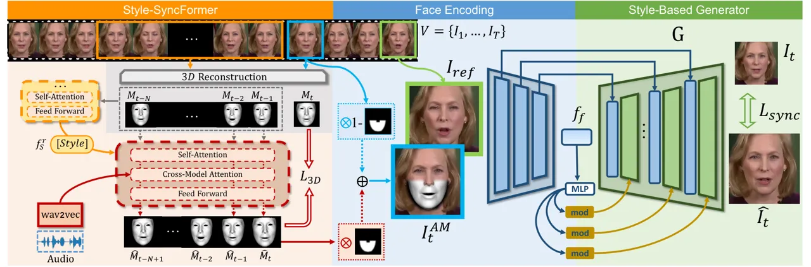

Figure 2: The ReSyncer Framework. In the first stage, the
Style-SyncFormer takes the style template and audio input to predict 3D
facial dynamics. Then the predicted mesh overlays on the target frame to
provide strong spatial guidance. The Style-based generator G processes
the overlay and reference frames to produce the final result.

## 3 Methodology

In this section, we introduce the details of our ReSyncer framework as
depicted in Fig. 2. It consists of two stages which are all simply
designed and easy to implement. In Sec. 3.1 we illustrate our design of
the style-injected lip-sync Transformer (Style-SyncFormer) which
predicts 3D facial dynamics. Then we show how to reconfigure the
Style-based generator to support high-fidelity generalized and
personalized lip-sync in Sec. 3.2. Finally, we illustrate our unified
design naturally supports face-swapping training in Sec. 3.3.

Task Formulation. The task of generalized lip-sync is normally trained
on massive in-the-wild videos. Specifically, a training data consists of
video clip $`\textbf{V}=\{I_{1},\dots,I_{T}\}`$ with $`T`$ frames and
the accompanying (processed) audio clip features
$`\textbf{a}=\{a_{1},\dots,a_{T}\}`$. The lower half of the target frame
$`I_{t}`$ is masked out by a mask $`A`$ to form
$`I^{A}_{t}=(\textbf{1}-A)*I_{t}`$ as \[43, 53, 10, 22\]. The normal
training objective is to recover the original frame given the audio clip
$`a_{t}`$ and a reference frame $`I_{ref}`$. However, the final results
might be interfered with by the structure of the reference frame when
the estimated animation significantly differs from the reference.

In this paper, we involve roughly predicted 3D facial meshes as
intermediate representations. For every frame in the training video, we
reconstruct the 3D facial meshes $`\textbf{M}=\{M_{1},\dots,M_{T}\}`$.
Thus our framework can be divided into the stages of predicting 3D
facial dynamics from audio and the recovery of frames $`I_{t}`$ with the
assistance of $`M_{t}`$.

### 3.1 Style-Injected Lip-Sync Transformer

In the first stage, we propose the Style-SyncFormer that takes audio
features $`\textbf{a}_{t_{0}:t_{1}}=\{a_{t_{0}},\dots,a_{t_{1}}\}`$
extracted from pretrained Wav2Vec2 \[1\] to predict 3D meshes
$`\textbf{M}_{t_{0}:t_{1}}=\{M_{t_{0}},\dots,M_{t_{1}}\}`$. There are
$`N`$ consecutive frames between $`t_{0}`$ and $`t_{1}`$. Previous
work \[18\] has explored abilities to learn 3D dynamics but it handles
only a fixed number of identities. In contrast, the proposed
Style-SyncFormer facilitates zero-shot prediction of 3D dynamics while
preserving the original speaking style or transferring it from another
person.

Data Processing. During training, all pose information is eliminated
from the meshes and aligned to the canonical space. Instead of directly
learning all vertices’ positions, we learn the displacements compared to
a template mesh $`\bar{M}`$, the mean of all meshes from this person
without expression coefficients. The training target becomes predicting
the displacements
$`\Delta\textbf{M}_{t_{0}:t_{1}}=\{\Delta M_{t_{0}},\dots\,\Delta M_{t_{1}}\}`$
between the template and each reconstructed result.

Network Design. The main network of Style-SyncFormer is built based on
only one Transformer \[59\] encoder block for style information encoding
and one decoder block for mesh prediction, where we adopt the periodic
positional encoding and biased causal multi-head attention from
FaceFormer \[18\].

During training, each shifted-right displacement $`\Delta M_{t}`$ is
mapped to embedding $`d^{m}_{t}`$ and sent into the positional encoding
to serve as tokens $`f^{m}_{t}`$. Previous studies \[18, 45\] learn the
3D dynamics of only limited identities with a simple one-hot speaker
identity embedding \[13, 18\]. Differently, we encode the information of
a total of $`T_{S}=90`$ consecutive $`\Delta M_{ref}`$ as speaking style
reference. The style information is embedded as a feature $`f^{r}_{S}`$
from $`\Delta M_{ref}`$ using an additional Transformer encoder block.
After that, we inject the speaking style $`f^{r}_{S}`$ by adding it with
mesh tokens $`f^{m}_{t}`$. Note that when replacing $`\Delta M_{ref}`$
with mesh sequences of another identity, speaking style transfer can be
achieved.

In the decoder block, the input tokens are sent into multi-head
self-attention, cross-attention, and feed-forward layers. The audio
features are further encoded as embeddings $`f^{a}_{t}`$ and leveraged
in the cross-attentions. The final output is transformed to
$`\Delta\hat{M}_{t_{0}:t_{1}}=\{\Delta\hat{M}_{t_{0}},\dots,\Delta\hat{M}_{t_{1}}\}`$.

Loss Function. The training objectives can be written as:

```math
\displaystyle\mathcal{L}_{3D}=\sum_{t=t_{0}+1}^{t_{1}}\|(\Delta\hat{M}_{t}-\Delta\hat{M}_{t-1})-(\Delta{M}_{t}-\Delta{M}_{t-1})\|_{2}+\lambda_{1}\sum_{t=t_{0}}^{t_{1}}\|\Delta\hat{M}_{t}-\Delta M_{t}\|_{2},
```

where the first term is the temporal consistency loss \[57\].

The training is performed in a teacher-forcing manner while the network
works autoregressively during inference by using previously predicted
results. The displacements are finally transferred to 3D meshes
$`\hat{\textbf{M}}_{t_{0}:t_{1}}`$ in the canonical space by adding the
template mesh $`\bar{M}`$.

### 3.2 Rewiring Style-based Generator

In the second stage, we rewire the widely used Style-based
generator \[28\] to faithfully transfer 3D meshes M to high-fidelity
facial frames $`\hat{\textbf{I}}`$ in a simple manner. Previous
methods \[57, 6\] resort to accurately textured rendering, which is
inefficient from the perspective of implementation and training. Our
goal is to find an efficient and effective way. As a result, we leverage
the basic white-colored rendering as spatial guidance, which can be
easily achieved without textural mapping.

Network Design. We resort to Style-based generator with noise insertion
scheme, which is easy to implement and specializes well in face-related
tasks \[76, 75, 22, 37\]. Specifically, we project mesh $`M_{t}`$ on
masked target frame $`I^{A}_{t}`$’s domain to $`M^{p}_{t}`$ and overlay
to form a 3D-guided image $`I^{AM}_{t}=I^{A}_{t}+A*M^{p}_{t}`$. A
reference frame $`I_{ref}`$ is attached for providing textural
information in the spatial form. The 6-channel input
$`[I^{AM}_{t},I_{ref}]`$ is encoded to feature maps
$`\textbf{F}_{f}=\{f_{f},F_{1},\dots,F_{L}\}`$ that match the sizes of
Style-based generator’s each stage and $`f_{f}`$ being a vector. Then we
follow previous studies \[76, 75, 22\] and insert $`\textbf{F}_{f}`$
into the generator G. As $`I^{AM}_{t}`$ directly provides the 3D mouth
shape information, the reference frame can hardly influence the
prediction result as long as it is not the target frame itself. Thus we
randomly sample $`I_{ref}`$ within the nearest 30 frames of $`I_{t}`$.

A number of previous lip-sync studies \[83, 22, 33, 61, 79\] rely on
encoding audio information into the $`\mathcal{W}`$ space for animation.
However, with explicit guidance, the driving information would play a
less important role in the $`\mathcal{W}`$ space. Meanwhile, the
face-swapping task illustrates that $`\mathcal{W}`$ space embedding
benefits identity information \[85, 75, 37\] which we intend to enhance.
To avoid involving extra network design and inference procedures, we
directly send the encoded $`f_{f}`$ from $`[I^{AM}_{t},I_{ref}]`$ to the
$`\mathcal{W}`$, so that the reference frame provides more facial detail
while $`I^{AM}_{t}`$ also passes dynamic information.

Loss Functions. To sum up, in the second stage, the generator takes the
output only of a single facial encoder and predicts the target frame
itself as $`\hat{I}_{t}`$. The training objective is much simpler with
the 3D guidance. We only adopt the same loss functions as
Pix2pix-HD \[67\], which are the $`L_{1}`$, VGG, and adversarial loss
empowered with StyleGAN2’s discriminator.

```math
\displaystyle\mathcal{L}_{rec}=\|\hat{I}_{t}-I_{t}\|_{1}+\lambda_{2}\sum_{m=1}^{N_{vgg}}\|\text{VGG}_{m}(\hat{I}_{t})-\text{VGG}_{m}(I_{t})\|_{1}, \tag{1}
```

```math
\displaystyle\mathcal{L}_{adv}=\underset{\text{G}}{\text{min}}\underset{\text{D}}{\text{max}}(\mathbb{E}_{I_{t}}[\log\text{D}(I_{t})]+\mathbb{E}_{\hat{I}_{t}}[\log(1-\text{D}(\hat{I}_{t}))]). \tag{2}
```

As the rendered meshes provide much clearer guidance than audio, the
generator can be easily trained without task-oriented losses or specific
tuning.

During inference, we overlay the predicted mesh $`\hat{M}^{p}_{t}`$ from
the first stage to form the input $`[\hat{I}^{AM}_{t},I_{ref}]`$. Though
the predicted $`\hat{M}^{p}_{t}`$ cannot perfectly match the
reconstructed results, we rely on the powerful generator to compensate
for such disturbance.

Video-Driven Lip-Sync. The generator only depends on mesh information,
thus we can transfer the displacements of meshes
$`\Delta\textbf{M}^{\prime}`$ of another person to the target template
$`\bar{M}`$ so that video-driven lip-sync can be naturally achieved.

Personalized Fine-tuning. Given that syncing information is derived from
the 3D facial mesh, the generator in the second stage will not overfit
the limited lip patterns present in given clips. This masks our method
full-parameter fine-tunable on only seconds of videos.

### 3.3 Face-Swapping

We now illustrate the power of our comprehensive framework to directly
achieve face-swapping and lip-sync with unified training. Our design of
leveraging the $`\mathcal{W}`$ space for enhancing facial generation
considers the similar setting used in previous face swapping
studies \[75, 74, 37\]. Moreover, the identity information of the
audio-predicted mesh $`\hat{M}_{t}`$ can be easily transferred by
sending different template meshes into the style encoder of the
Style-SyncFormer. So that the shape of facial organs can be seamlessly
swapped to another person.

The Face-Swapping Data Stream. The pipeline is depicted in Fig. 3. We
first enlarge the masking area $`A`$ to $`A^{\prime}`$ that contains the
whole facial part including eyes and noses, which is more suitable for
the concerned task. Then we involve a frame $`I^{\prime}`$ of another
identity and its corresponding mesh $`M^{\prime}`$ to provide additional
information. We project $`M^{\prime}`$ with the pose of $`M^{p}_{t}`$ to
$`{M^{\prime p}}`$ and overlay it on $`I_{t}`$ to form
$`I^{A^{\prime}M^{\prime}}_{t}=(\textbf{1}-A^{\prime})*I_{t}+A^{\prime}*{M^{\prime p}}`$.

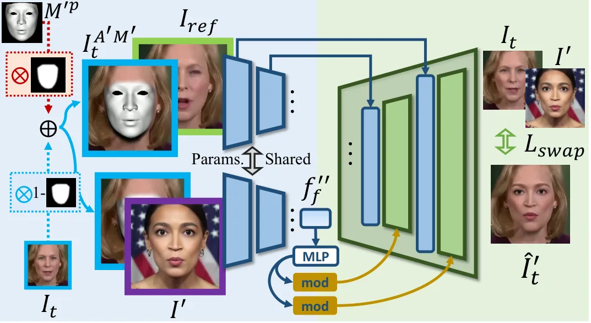

Figure 3: Face-Swapping Pipeline. With input data reconfiguration and
additional training losses, we achieve lip-syncing and face-swapping
simultaneously.

The face-swapping training consists of two parts, updating only the
Style-based generator. The first is the same as Sec. 3.2, which
reconstructs $`I_{t}`$ solely from $`\{I^{AM}_{t},I_{ref}\}`$. The
second part intends to create an image $`\hat{I^{\prime}_{t}}`$, which
has $`I^{\prime}`$’s identity on $`I_{t}`$’s head with $`I_{t}`$’s
original tone. This requires the generator G to take
$`\textbf{F}^{\prime}_{f}=\{f^{\prime\prime}_{f},F^{\prime}_{1},\dots,F^{\prime}_{L}\}`$
encoded from different sources, including $`f^{\prime\prime}_{f}`$
encoded from $`\{I^{A^{\prime}M^{\prime}}_{t},I^{\prime}\}`$ for ID
injection in the $`\mathcal{W}`$ space and
$`\{F^{\prime}_{1},\dots,F^{\prime}_{L}\}`$ from
$`\{I^{A^{\prime}M^{\prime}}_{t},I_{ref}\}`$ for expressing facial
attributes in the noise space.

Training Objectives. Under the cross-identity training setting, the
commonly used identity cosine distance loss
$`\mathcal{L}_{id}=1-\cos(E_{id}(\hat{I}^{{}^{\prime}}_{t}),E_{id}(I^{\prime}))`$
where $`\text{E}_{id}`$ is the encoder of ArcFace \[14\] and feature
matching loss with the original $`I_{t}`$ \[9, 72, 75\] in the
face-swapping task are leveraged.

Note that after the network is trained in the face-swapping style, which
costs more time, high-quality face-swapping and lip-sync abilities can
be achieved within one unified model (with the same set of weights). To
the best of our knowledge, we are one of the first methods that unifies
the two tasks within one model, which is efficient and beneficial to the
creation of virtual performers.

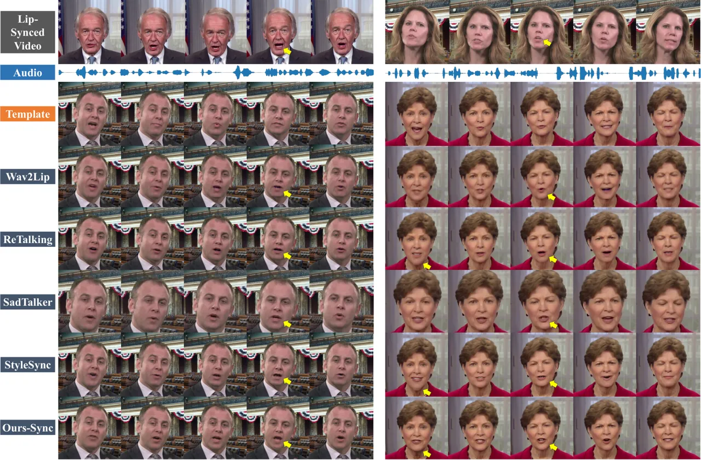

Figure 4: Qualitative Cross-Sync Results. The top row shows the
lip-synced videos of the driving audio. Generation results based on the
“Template” row should have the same lip shape as the “Lip-Synced Video”
in the first row.

## 4 Experiments

Although lip-sync is our main concern, we thoroughly conduct experiments
from the perspectives of both lip-sync and face-swapping to show the
effectiveness of our unified framework. For fair comparisons, we present
results using only our generalized model, please refer to the
appendix 0.A.2 for personalized experiments.

Datasets. We train our model with two audio-visual datasets, HDTF \[81\]
and VoxCeleb2 \[11\]. Both two datasets provide high-quality videos from
a variety of identities for lip-syncing and face-swapping training.
Notably, we split HDTF into train and test sets without overlap. The
test set comprises 100 10-second audio-video pairs. Evaluations on
lip-sync are conducted on the official test set of VoxCeleb2 and the
introduced test set of HDTF. Face-swapping evaluation is performed on
FaceForensics++ (FF++) \[47\], which contains 1000 face videos. We use
the high-quality version and adopt the official video-video pairing.
Apart from publicly available datasets, certain visual outcomes in our
experiments are produced based on videos sourced from the Internet.

Implementation Details. All videos are processed at a frame rate of
25FPS, and facial alignment is conducted based on pre-detected
landmarks. Subsequently, all faces are cropped to a size of
$`256\times 256`$. The architecture of G is built upon the success of
recent methods \[22, 75, 29, 76\]. During inference, we split videos
into 100-frame consecutive chunks with a 20-frame overlap. Face meshes
are predicted in an auto-aggressive manner with the proposed
Style-SyncFormer depending on all the previously predicted results
within each chunk. For face reconstruction, we train
DeepFaceReconstruction \[17\] on the topology of both Hifi3DFace \[2\]
and BFM. The main results are reported from the Hifi3DFace version but
the choice of topology makes little difference. Our models are trained
on 4 Tesla A100 GPUs for 2 days with batch size 16. For more
implementation details, please refer to the appendix 0.A.1.

Comparison Methods. As for lip-sync evaluation, We compare our method
with four different methods including the classic Wav2Lip \[43\], as
well as three recent state-of-the-art (SOTA) methods: ReTalking \[10\],
SadTalker \[80\], and StyleSync \[22\]. Note that SadTalker \[80\]
targets talking head generation but is well-known for its good quality.
All experiments are conducted on the generalized setting without
fine-tuning, and the model without face-swapping training is leveraged.
Then we compare our method with four studies on face swapping. The
counterparts consist of SimSwap \[9\], InfoSwap \[20\], StyleSwap \[75\]
and E4S \[35\]. Furthermore, we aim to evaluate whether combining two
methods from the above two tasks can achieve comparable results with our
full model despite the cost. Thus we construct two potential
counterparts by combining SOTA methods from both areas, denoted as
“SimSwap + ReTalking” and “StyleSwap + StyleSync”.

| Method           | HDTF              |                   |                    |                                        | VoxCeleb2         |                   |                    |                                        |
| ---------------- | ----------------- | ----------------- | ------------------ | -------------------------------------- | ----------------- | ----------------- | ------------------ | -------------------------------------- |
|                  | SSIM $`\uparrow`$ | PSNR $`\uparrow`$ | LMD $`\downarrow`$ | $`\Delta{\text{Sync}}`$ $`\downarrow`$ | SSIM $`\uparrow`$ | PSNR $`\uparrow`$ | LMD $`\downarrow`$ | $`\Delta{\text{Sync}}`$ $`\downarrow`$ |
| Wav2Lip \[43\]   | 0.84              | 30.93             | 5.41               | 1.37                                   | 0.84              | 31.58             | 3.44               | 2.28                                   |
| ReTalking \[10\] | 0.81              | 31.08             | 6.06               | 0.74                                   | 0.83              | 31.64             | 4.42               | 1.50                                   |
| SadTalker \[80\] | 0.77              | 30.86             | 6.76               | 3.62                                   | 0.79              | 31.36             | 5.03               | 3.03                                   |
| StyleSync \[22\] | 0.83              | 31.57             | 4.97               | 0.80                                   | 0.85              | 32.52             | 3.28               | 1.57                                   |
| Ours-Sync        | 0.84              | 31.76             | 4.34               | 0.66                                   | 0.85              | 32.88             | 3.19               | 0.88                                   |

Table 1: Quantitative results on HDTF and VoxCeleb2. For LMD and
$`\Delta{\text{Sync}}`$ the lower the better, and the higher the better
for others.

| Method           | ID Retrieval $`\uparrow`$ | ID Sim. $`\uparrow`$ | Pose Error $`\downarrow`$ | Exp. Error $`\downarrow`$ |
| ---------------- | ------------------------- | -------------------- | ------------------------- | ------------------------- |
| SimSwap \[9\]    | 93.07%                    | 0.578                | 1.36                      | 5.07                      |
| InfoSwap \[20\]  | 95.82%                    | 0.635                | 2.54                      | 6.99                      |
| StyleSwap \[75\] | 97.05%                    | 0.677                | 1.56                      | 5.28                      |
| E4S \[35\]       | 90.21%                    | 0.495                | 2.78                      | 11.52                     |
| Ours-Swap        | 96.70%                    | 0.665                | 1.31                      | 5.13                      |

Table 2: Quantitative results evaluated on FF++.

| Method          | SSIM $`\uparrow`$ | PSNR $`\uparrow`$ | LMD $`\downarrow`$ | $`\Delta\text{Sync}`$ $`\downarrow`$ |
| --------------- | ----------------- | ----------------- | ------------------ | ------------------------------------ |
| w/o Mesh-Inject | 0.83              | 31.57             | 3.60               | 2.54                                 |
| w/o Mesh-Style  | 0.83              | 31.80             | 3.29               | 1.02                                 |
| $`T_{S}=50`$    | 0.85              | 32.26             | 3.35               | 0.95                                 |
| $`T_{S}=200`$   | 0.85              | 32.69             | 3.21               | 0.88                                 |
| Ours-Sync       | 0.85              | 32.88             | 3.19               | 0.88                                 |

Table 3: Quantitative ablations on VoxCeleb2.

### 4.1 Quantitative Comparisons

Quantitative experiments of lip-sync are conducted following the
self-reconstruction setting. We refrain from directly utilizing the
ground truth frame as the reference. For face-swapping, we adhere to a
protocol as previous studies \[75, 31\], wherein we uniformly sample 10
frames from each video in FF++, resulting in a total of 10k images for
evaluation.

Evaluation Metrics. Both lip-sync and face-swapping are broadly studied,
we follow previous works \[22, 75, 31, 83\] to adopt several popular
metrics. For lip-sync, we use SSIM \[68\] and PSNR for measuring visual
similarity. Landmark distances around the mouth (LMD), and SyncNet’s
confidence score \[12\] are used for lip-sync quality. Particularly, the
SyncNet score only indicates how well a video aligns with the learned
SyncNet model, thus we use the absolute difference ($`\Delta`$Sync)
between ground truth and prediction to assess whether results are close
to the original video. For face-swapping, we leverage a pretrained
face-recognition model \[62\] to measure the ID cosine similarity and ID
retrieval scores. In addition, pose error and expression error are
measured by two pretrained models\[48, 60\] following previous
work \[75\].

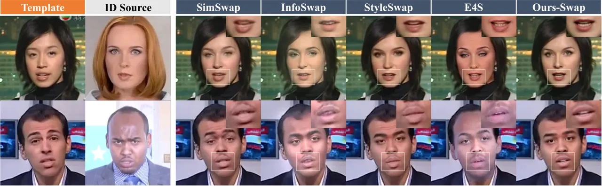

Figure 5: Qualitative Results of Face-Swap. Identity-swapped results
should preserve the expression and lip motion of templates.

Lip-Sync. The evaluation results are tabulated in Table 1. Our method
outperforms previous works across all metrics, especially concerning
lip-sync quality. This is attributed to stylized 3D facial dynamics
learned by Style-SyncFormer, which manages to recover the injected
personalized speaking style of the target person in the generalized
setting. In contrast, previous methods primarily rely on sync-loss
\[43\] and tend to generate a dataset-averaged sync-style.

Face-Swapping. Results evaluated on FF++ are listed in Table 3. Our
model shows comparable performance on all the metrics and achieves the
lowest pose error when compared with SOTA face-swap methods.
Particularly, our performances on ID-related metrics are only slightly
weaker than StyleSwap.

### 4.2 Qualitative Comparisons

Subjective evaluation plays a pivotal role in assessing the capabilities
of generative models, especially in the context of videos. We strongly
encourage readers to watch our supplementary video for a comprehensive
understanding. Our method also enjoys the capability to fast optimize
for specific identities, resulting in superior outcomes. Please refer to
the appendix 0.A.2 for the personalized results.

Lip-Sync. We demonstrate two cross-sync comparisons with SOTA methods in
Fig. 4. The lip-synced results are conditioned on audio randomly sampled
from the dataset. Wav2Lip has accurate lip shapes, but the mouth part is
noticeably blurred. SadTalker achieves better fidelity, but it fails to
present natural dynamics. VideoReTalking and StyleSync can generate
precise and high-quality results; nevertheless, their results are
affected by the opening jaw of the template as shown in the first column
of the right figure. Moreover, they exhibit a deficiency in maintaining
person-specific attributes around the mouth. Our method directly
produces high-fidelity results with accurate lip motion and rich details
of the mouth.

We present cross-sync results, showcasing the transferred speaking style
in Fig. 1 and Fig. 9. It can be seen that our method not only accurately
generates lip shapes aligned with the driven video but also successfully
animates the target person with the speaking style of the source person
in the driving video. In addition, our method inherently supports
video-driven lip-syncing as introduced in Sec. 3.2. The comparison is
demonstrated in Fig. 10, it shows that person-specific attributes can be
preserved better with Style-SyncFormer guidance.

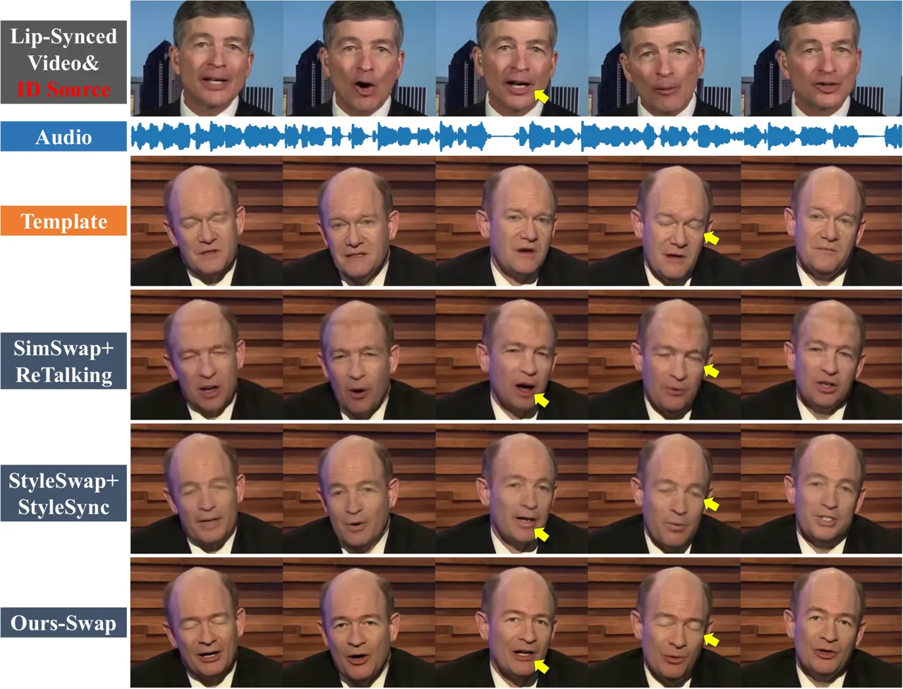

Figure 6: Results of Face-Swapped Lip-Sync. The ID-swapped results are
driven by the given audio. We compare with the combinations of two SOTA
methods in lip-sync and face-swapping. Results generated by our method
preserve details with better fidelity and simultaneously maintain a
similar speaking style to the source.

Face-Swapping. In Fig. 5, we illustrate two face-swapped results for
comparison. The generated results in this context should preserve the
original expression and lip motion of the template. From the figure,
InfoSwap fails to keep a natural brightness across frames. E4S
effectively modifies the entire head region but fails to integrate the
head part into the background seamlessly. SimSwap and StyleSwap produce
good results by preserving precise expression and identity attributes.
However, an excessive emphasis on identity feature matching causes them
to falter in generating details around certain areas like eyes and
mouth. In contrast, our method not only achieves effective identity
transfer but also preserves rich details across the entire face. In
addition, the videos generated by our method exhibit superior temporal
consistency, especially in the mouth region. Please find more results in
the supplementary video.

Furthermore, our method is capable of achieving lip-synced face-swapping
conditioned on any audio and identity in a single forward process. We
compare our method with two potential baselines “SimSwap + ReTalking”
and “StyleSwap + StyleSync” in Fig. 6. Results generated by our method
preserve details with better fidelity and simultaneously maintain a
similar speaking style to the source.

User Study. We conducted a user study with 30 participants. We adopt the
commonly used Mean Opinion Scores (MOS) rating protocol. All users give
their

| MOS on             | Wav2Lip | ReTalking | SadTalker | StyleSync | Ours-Sync |
| ------------------ | ------- | --------- | --------- | --------- | --------- |
| Lip-Sync Quality   | 3.43    | 3.09      | 2.98      | 3.46      | 4.57      |
| Generation Quality | 1.48    | 2.83      | 3.13      | 3.63      | 4.67      |
| Video Realness     | 1.59    | 2.41      | 2.87      | 3.11      | 4.54      |

Table 4: User study of generalized lip-sync. The scores are ranged from
1 (worst) to 5 (best).

ratings, ranging from 1 to 5. On generalized lip-sync, they are asked to
evaluate: a) the quality of lip-sync. b) visual quality of the generated
video, and c) whether this video looks real. The results averaged from
10 videos are grouped into Table 4. From the table, our method
outperforms the four counterparts in all three aspects by clear margins,
underscoring the power of our method and the substantial improvement in
visual quality and realism over other existing methods. The experiments
are similarly conducted with face-swapping and personalized lip-sync,
please find the results in the appendix 0.A.3.

### 4.3 Ablation Study

Lip-Sync. Here we evaluate four different designs on VoxCeleb2 \[11\]
including: 1)“w/o Mesh-Inject”: we mask-out the 3D mesh guidance from
the encoded feature maps $`\{F_{1},\dots,F_{L}\}`$, thus it cannot
provide detailed spatial information during generation; 2) “w/o
Mesh-Style”: 3D mesh content is removed in $`I^{AM}_{t}`$ to get a
$`f_{f}`$, feature vector that feed into the $`\mathcal{W}`$ space
contains only the background and reference information; 3)
“$`T_{S}=50`$”: we reduce the length ($`T_{S}`$ in Sec. 3.1) of the
speaking-style reference from 90 to 50; 4) “$`T_{S}=200`$”: the length
is extended to 200. The results are presented in Table 3. Comparisons
between the first two rows and “Ours-Sync” reveal the vital role played
by mesh guidance in the generation process, where the sync quality is
degraded to certain degrees, as indicated by LMD and $`\Delta`$Sync. In
addition, the visual quality is also harmed as shown in Fig. 7 (a). In
the bottom three rows of Table 3, we compare the performance of
different sequence lengths in the speaking-style encoding of
Style-SyncFormer. The results indicate that a sequence of 90 frames
($`\sim`$4s of video) leads to good sync quality, and a further
extension of the length does not enhance its performance.

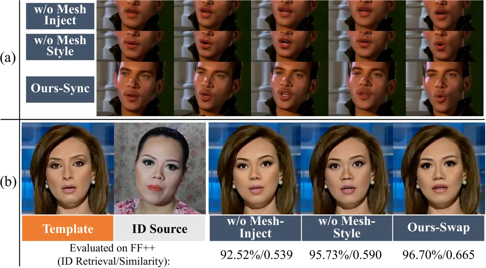

Figure 7: Ablations. (a) 3D facial mesh provides detailed spatial
guidance, empowering superior lip-syncing. (b) The mesh with shapes of
facial organs also enhances ID transfer in face-swapping.

Face-Swapping. In face-swapping, the predicted 3D facial mesh also
provides detailed facial attributes. We provide an intuitive comparison
in Fig. 7 (b). When the mesh guidance is removed from the encoded
feature map (“w/o Mesh-Inject”), we observe a noteworthy degradation in
facial dynamics, particularly in lip motion. Please refer to the
supplementary video for the comparison. Simultaneously, without the
guidance of mesh information, the ID-related metrics of face-swapping
are also affected, as indicated at the bottom of Fig. 7 (b) and the same
phenomenon applies to “w/o Mesh-Style”.

## 5 Discussion and Conclusion

Ethical Considerations. Our method possesses the capability to create
fabricated talks and speeches, even with swapped identities, presenting
a potential for malicious use. We will restrict the distribution of our
models and the generated results exclusively to research purposes.

Conclusion. We highlight several important properties of our ReSyncer
framework: 1) Our easy reconfiguration further unveils the potential of
widely studied structures so that high-quality generalized lip-sync
results with mesh representation can be achieved. 2) Our framework is
designed to adopt external identity information, thus we achieve
face-swapping comparable to the state of the arts while keeping the
lip-sync ability within one unified model. 3) Our network supports
speaking style transfer, video-driven facial animation, and can be
applied to real-time live streamers. These properties complementarily
satisfy various needs of virtual performer creation under different
circumstances.

Acknowledgments. This work is in part supported by National Natural
Science Foundation of China with No. 62394322, Beijing Natural Science
Foundation with No. L222024, as well as the Beijing National Research
Center for Information Science and Technology (BNRist) key projects.
This study is also supported by the Ministry of Education, Singapore,
under its MOE AcRF Tier 2 (MOET2EP20221- 0012), NTU NAP, and under the
RIE2020 Industry Alignment Fund – Industry Collaboration Projects
(IAF-ICP) Funding Initiative, as well as cash and in-kind contribution
from the industry partner(s).

## References

- \[1\] Baevski, A., Zhou, Y., Mohamed, A., Auli, M.: wav2vec 2.0: A
  framework for self-supervised learning of speech representations.
  Advances in Neural Information Processing Systems (2020)
- \[2\] Bao, L., Lin, X., Chen, Y., Zhang, H., Wang, S., Zhe, X., Kang,
  D., Huang, H., Jiang, X., Wang, J., Yu, D., Zhang, Z.: High-fidelity
  3d digital human head creation from rgb-d selfies. ACM Transactions on
  Graphics (2021)
- \[3\] Blanz, V., Vetter, T.: A morphable model for the synthesis of 3d
  faces. In: Proceedings of the 26th annual conference on Computer
  graphics and interactive techniques. pp. 187–194 (1999)
- \[4\] Chan, E.R., Lin, C.Z., Chan, M.A., Nagano, K., Pan, B.,
  De Mello, S., Gallo, O., Guibas, L.J., Tremblay, J., Khamis, S.,
  et al.: Efficient geometry-aware 3d generative adversarial networks.
  In: Proceedings of the IEEE/CVF Conference on Computer Vision and
  Pattern Recognition. pp. 16123–16133 (2022)
- \[5\] Chang, H., Zhang, H., Jiang, L., Liu, C., Freeman, W.T.:
  Maskgit: Masked generative image transformer. arXiv preprint
  arXiv:2202.04200 (2022)
- \[6\] Chen, L., Cui, G., Liu, C., Li, Z., Kou, Z., Xu, Y., Xu, C.:
  Talking-head generation with rhythmic head motion. In: European
  Conference on Computer Vision. pp. 35–51. Springer (2020)
- \[7\] Chen, L., Li, Z., Maddox, R.K., Duan, Z., Xu, C.: Lip movements
  generation at a glance. In: Proceedings of the European Conference on
  Computer Vision (ECCV). pp. 520–535 (2018)
- \[8\] Chen, L., Maddox, R.K., Duan, Z., Xu, C.: Hierarchical
  cross-modal talking face generation with dynamic pixel-wise loss. In:
  Proceedings of the IEEE/CVF Conference on Computer Vision and Pattern
  Recognition. pp. 7832–7841 (2019)
- \[9\] Chen, R., Chen, X., Ni, B., Ge, Y.: Simswap: An efficient
  framework for high fidelity face swapping. In: Proceedings of the 28th
  ACM International Conference on Multimedia. pp. 2003–2011 (2020)
- \[10\] Cheng, K., Cun, X., Zhang, Y., Xia, M., Yin, F., Zhu, M., Wang,
  X., Wang, J., Wang, N.: Videoretalking: Audio-based lip
  synchronization for talking head video editing in the wild (2022)
- \[11\] Chung, J.S., Nagrani, A., Zisserman, A.: Voxceleb2: Deep
  speaker recognition. In: INTERSPEECH (2018)
- \[12\] Chung, J.S., Zisserman, A.: Out of time: automated lip sync in
  the wild. In: ACCV (2016)
- \[13\] Cudeiro, D., Bolkart, T., Laidlaw, C., Ranjan, A., Black, M.J.:
  Capture, learning, and synthesis of 3d speaking styles. In:
  Proceedings of the IEEE/CVF Conference on Computer Vision and Pattern
  Recognition. pp. 10101–10111 (2019)
- \[14\] Deng, J., Guo, J., Xue, N., Zafeiriou, S.: Arcface: Additive
  angular margin loss for deep face recognition. In: Proceedings of the
  IEEE/CVF conference on computer vision and pattern recognition. pp.
  4690–4699 (2019)
- \[15\] Deng, Y., Yang, J., Chen, D., Wen, F., Tong, X.: Disentangled
  and controllable face image generation via 3d imitative-contrastive
  learning. In: Proceedings of the IEEE/CVF Conference on Computer
  Vision and Pattern Recognition (CVPR) (June 2020)
- \[16\] Deng, Y., Yang, J., Xiang, J., Tong, X.: Gram: Generative
  radiance manifolds for 3d-aware image generation. In: Proceedings of
  the IEEE/CVF Conference on Computer Vision and Pattern Recognition
  (CVPR). pp. 10673–10683 (June 2022)
- \[17\] Deng, Y., Yang, J., Xu, S., Chen, D., Jia, Y., Tong, X.:
  Accurate 3d face reconstruction with weakly-supervised learning: From
  single image to image set. In: Proceedings of the IEEE/CVF Conference
  on Computer Vision and Pattern Recognition Workshops. pp. 0–0 (2019)
- \[18\] Fan, Y., Lin, Z., Saito, J., Wang, W., Komura, T.: Faceformer:
  Speech-driven 3d facial animation with transformers. In: Proceedings
  of the IEEE/CVF Conference on Computer Vision and Pattern Recognition.
  pp. 18770–18780 (2022)
- \[19\] Gafni, G., Thies, J., Zollhöfer, M., Nießner, M.: Dynamic
  neural radiance fields for monocular 4d facial avatar reconstruction.
  In: Proceedings of the IEEE/CVF Conference on Computer Vision and
  Pattern Recognition (CVPR). pp. 8649–8658 (June 2021)
- \[20\] Gao, G., Huang, H., Fu, C., Li, Z., He, R.: Information
  bottleneck disentanglement for identity swapping. In: Proceedings of
  the IEEE/CVF conference on computer vision and pattern recognition.
  pp. 3404–3413 (2021)
- \[21\] Goodfellow, I.J., Pouget-Abadie, J., Mirza, M., Xu, B.,
  Warde-Farley, D., Ozair, S., Courville, A., Bengio, Y.: Generative
  adversarial networks. arXiv preprint arXiv:1406.2661 (2014)
- \[22\] Guan, J., Zhang, Z., Zhou, H., HU, T., Wang, K., He, D., Feng,
  H., Liu, J., Ding, E., Liu, Z., Wang, J.: Stylesync: High-fidelity
  generalized and personalized lip sync in style-based generator. In:
  Proceedings of the IEEE/CVF Conference on Computer Vision and Pattern
  Recognition (CVPR) (2023)
- \[23\] Guo, Y., Chen, K., Liang, S., Liu, Y., Bao, H., Zhang, J.:
  Ad-nerf: Audio driven neural radiance fields for talking head
  synthesis. In: IEEE/CVF International Conference on Computer Vision
  (ICCV) (2021)
- \[24\] IEEE: A 3D Face Model for Pose and Illumination Invariant Face
  Recognition (2009)
- \[25\] Jamaludin, A., Chung, J.S., Zisserman, A.: You said that?:
  Synthesising talking faces from audio. International Journal of
  Computer Vision 127(11), 1767–1779 (2019)
- \[26\] Ji, X., Zhou, H., Wang, K., Wu, Q., Wu, W., Xu, F., Cao, X.:
  Eamm: One-shot emotional talking face via audio-based emotion-aware
  motion model. SIGGRAPH (2022)
- \[27\] Karras, T., Laine, S., Aila, T.: A style-based generator
  architecture for generative adversarial networks. In: Proceedings of
  the IEEE/CVF Conference on Computer Vision and Pattern Recognition.
  pp. 4401–4410 (2019)
- \[28\] Karras, T., Laine, S., Aittala, M., Hellsten, J., Lehtinen, J.,
  Aila, T.: Analyzing and improving the image quality of StyleGAN. In:
  Proc. CVPR (2020)
- \[29\] Karras, T., Laine, S., Aittala, M., Hellsten, J., Lehtinen, J.,
  Aila, T.: Analyzing and improving the image quality of stylegan. In:
  Proceedings of the IEEE/CVF conference on computer vision and pattern
  recognition. pp. 8110–8119 (2020)
- \[30\] Li, L., Wang, S., Zhang, Z., Ding, Y., Zheng, Y., Yu, X., Fan,
  C.: Write-a-speaker: Text-based emotional and rhythmic talking-head
  generation. In: Proceedings of the AAAI Conference on Artificial
  Intelligence. vol. 35, pp. 1911–1920 (2021)
- \[31\] Li, L., Bao, J., Yang, H., Chen, D., Wen, F.: Faceshifter:
  Towards high fidelity and occlusion aware face swapping. arXiv
  preprint arXiv:1912.13457 (2019)
- \[32\] Li, Y., Ma, C., Yan, Y., Zhu, W., Yang, X.: 3d-aware face
  swapping. In: Proceedings of the IEEE/CVF Conference on Computer
  Vision and Pattern Recognition. pp. 12705–12714 (2023)
- \[33\] Liang, B., Pan, Y., Guo, Z., Zhou, H., Hong, Z., Han, X., Han,
  J., Liu, J., Ding, E., Wang, J.: Expressive talking head generation
  with granular audio-visual control. In: Proceedings of the IEEE/CVF
  Conference on Computer Vision and Pattern Recognition. pp.
  3387–3396 (2022)
- \[34\] Liu, X., Xu, Y., Wu, Q., Zhou, H., Wu, W., Zhou, B.:
  Semantic-aware implicit neural audio-driven video portrait generation.
  ECCV (2022)
- \[35\] Liu, Z., Li, M., Zhang, Y., Wang, C., Zhang, Q., Wang, J., Nie,
  Y.: Fine-grained face swapping via regional gan inversion. In:
  Proceedings of the IEEE/CVF Conference on Computer Vision and Pattern
  Recognition. pp. 8578–8587 (2023)
- \[36\] Lu, Y., Chai, J., Cao, X.: Live speech portraits: real-time
  photorealistic talking-head animation. ACM Transactions on Graphics
  (TOG) 40(6), 1–17 (2021)
- \[37\] Luo, Y., Zhu, J., He, K., Chu, W., Tai, Y., Wang, C., Yan, J.:
  Styleface: Towards identity-disentangled face generation on
  megapixels. In: European Conference on Computer Vision. pp. 297–312.
  Springer (2022)
- \[38\] Ma, Y., Wang, S., Ding, Y., Ma, B., Lv, T., Fan, C., Hu, Z.,
  Deng, Z., Yu, X.: Talkclip: Talking head generation with text-guided
  expressive speaking styles. arXiv preprint arXiv:2304.00334 (2023)
- \[39\] Ma, Y., Wang, S., Hu, Z., Fan, C., Lv, T., Ding, Y., Deng, Z.,
  Yu, X.: Styletalk: One-shot talking head generation with controllable
  speaking styles. AAAI (2023)
- \[40\] Natsume, R., Yatagawa, T., Morishima, S.: Rsgan: Face swapping
  and editing using face and hair representation in latent spaces.
  arxiv 2018. arXiv preprint arXiv:1804.03447 2
- \[41\] Natsume, R., Yatagawa, T., Morishima, S.: Fsnet: An
  identity-aware generative model for image-based face swapping. In:
  Computer Vision–ACCV 2018: 14th Asian Conference on Computer Vision,
  Perth, Australia, December 2–6, 2018, Revised Selected Papers, Part
  VI 14. pp. 117–132. Springer (2019)
- \[42\] Park, S.J., Kim, M., Hong, J., Choi, J., Ro, Y.M.:
  Synctalkface: Talking face generation with precise lip-syncing via
  audio-lip memory. In: AAAI Conference on Artificial Intelligence.
  Association for the Advancement of Artificial Intelligence (2022)
- \[43\] Prajwal, K., Mukhopadhyay, R., Namboodiri, V.P., Jawahar, C.: A
  lip sync expert is all you need for speech to lip generation in the
  wild. In: Proceedings of the 28th ACM International Conference on
  Multimedia. pp. 484–492 (2020)
- \[44\] Qiu, H., Chen, Z., Jiang, Y., Zhou, H., Fan, X., Yang, L., Wu,
  W., Liu, Z.: Relitalk: Relightable talking portrait generation from a
  single video. International Journal of Computer Vision pp. 1–16 (2024)
- \[45\] Richard, A., Zollhöfer, M., Wen, Y., de la Torre, F., Sheikh,
  Y.: Meshtalk: 3d face animation from speech using cross-modality
  disentanglement. In: Proceedings of the IEEE/CVF International
  Conference on Computer Vision (ICCV) (2021)
- \[46\] Rombach, R., Blattmann, A., Lorenz, D., Esser, P., Ommer, B.:
  High-resolution image synthesis with latent diffusion models. In:
  Proceedings of the IEEE/CVF conference on computer vision and pattern
  recognition. pp. 10684–10695 (2022)
- \[47\] Rössler, A., Cozzolino, D., Verdoliva, L., Riess, C., Thies,
  J., Nießner, M.: FaceForensics++: Learning to detect manipulated
  facial images. In: International Conference on Computer Vision
  (ICCV) (2019)
- \[48\] Ruiz, N., Chong, E., Rehg, J.M.: Fine-grained head pose
  estimation without keypoints. In: Proceedings of the IEEE conference
  on computer vision and pattern recognition workshops. pp.
  2074–2083 (2018)
- \[49\] Shen, S., Li, W., Zhu, Z., Duan, Y., Zhou, J., Lu, J.: Learning
  dynamic facial radiance fields for few-shot talking head synthesis.
  In: ECCV (2022)
- \[50\] Shen, S., Zhao, W., Meng, Z., Li, W., Zhu, Z., Zhou, J., Lu,
  J.: Difftalk: Crafting diffusion models for generalized audio-driven
  portraits animation. In: Proceedings of the IEEE/CVF Conference on
  Computer Vision and Pattern Recognition. pp. 1982–1991 (2023)
- \[51\] Song, Y., Zhu, J., Li, D., Wang, X., Qi, H.: Talking face
  generation by conditional recurrent adversarial network. arXiv
  preprint arXiv:1804.04786 (2018)
- \[52\] Stypułkowski, M., Vougioukas, K., He, S., Zieba, M., Petridis,
  S., Pantic, M.: Diffused heads: Diffusion models beat gans on
  talking-face generation. arXiv preprint arXiv:2301.03396 (2023)
- \[53\] Sun, Y., Zhou, H., Wang, K., Wu, Q., Hong, Z., Liu, J., Ding,
  E., Wang, J., Liu, Z., Hideki, K.: Masked lip-sync prediction by
  audio-visual contextual exploitation in transformers. In: SIGGRAPH
  Asia 2022 Conference Papers. pp. 1–9 (2022)
- \[54\] Suwajanakorn, S., Seitz, S.M., Kemelmacher-Shlizerman, I.:
  Synthesizing obama: learning lip sync from audio. ACM Transactions on
  Graphics (ToG) 36(4), 1–13 (2017)
- \[55\] Tang, J., Wang, K., Zhou, H., Chen, X., He, D., Hu, T., Liu,
  J., Zeng, G., Wang, J.: Real-time neural radiance talking portrait
  synthesis via audio-spatial decomposition. arXiv preprint
  arXiv:2211.12368 (2022)
- \[56\] Thambiraja, B., Habibie, I., Aliakbarian, S., Cosker, D.,
  Theobalt, C., Thies, J.: Imitator: Personalized speech-driven 3d
  facial animation. In: Proceedings of the IEEE/CVF International
  Conference on Computer Vision. pp. 20621–20631 (2023)
- \[57\] Thies, J., Elgharib, M., Tewari, A., Theobalt, C., Nießner, M.:
  Neural voice puppetry: Audio-driven facial reenactment. In: European
  Conference on Computer Vision. pp. 716–731. Springer (2020)
- \[58\] Van Den Oord, A., Vinyals, O., et al.: Neural discrete
  representation learning. Advances in neural information processing
  systems 30 (2017)
- \[59\] Vaswani, A., Shazeer, N., Parmar, N., Uszkoreit, J., Jones, L.,
  Gomez, A.N., Kaiser, Ł., Polosukhin, I.: Attention is all you need.
  Advances in neural information processing systems 30 (2017)
- \[60\] Vemulapalli, R., Agarwala, A.: A compact embedding for facial
  expression similarity. In: proceedings of the IEEE/cvf conference on
  computer vision and pattern recognition. pp. 5683–5692 (2019)
- \[61\] Wang, D., Deng, Y., Yin, Z., Shum, H.Y., Wang, B.: Progressive
  disentangled representation learning for fine-grained controllable
  talking head synthesis. CVPR (2023)
- \[62\] Wang, H., Wang, Y., Zhou, Z., Ji, X., Gong, D., Zhou, J., Li,
  Z., Liu, W.: Cosface: Large margin cosine loss for deep face
  recognition. In: Proceedings of the IEEE conference on computer vision
  and pattern recognition. pp. 5265–5274 (2018)
- \[63\] Wang, J., Zhao, K., Ma, Y., Zhang, S., Zhang, Y., Shen, Y.,
  Zhao, D., Zhou, J.: Facecomposer: A unified model for versatile facial
  content creation. In: Thirty-seventh Conference on Neural Information
  Processing Systems (2023)
- \[64\] Wang, K., Wu, Q., Song, L., Yang, Z., Wu, W., Qian, C., He, R.,
  Qiao, Y., Loy, C.C.: Mead: A large-scale audio-visual dataset for
  emotional talking-face generation. In: ECCV (2020)
- \[65\] Wang, S., Li, L., Ding, Y., Fan, C., Yu, X.: Audio2head:
  Audio-driven one-shot talking-head generation with natural head
  motion. arXiv preprint arXiv:2107.09293 (2021)
- \[66\] Wang, S., Li, L., Ding, Y., Yu, X.: One-shot talking face
  generation from single-speaker audio-visual correlation learning. In:
  Proceedings of the AAAI Conference on Artificial Intelligence (2022)
- \[67\] Wang, T.C., Liu, M.Y., Zhu, J.Y., Tao, A., Kautz, J.,
  Catanzaro, B.: High-resolution image synthesis and semantic
  manipulation with conditional gans. In: Proceedings of the IEEE
  conference on computer vision and pattern recognition. pp.
  8798–8807 (2018)
- \[68\] Wang, Z., Bovik, A.C., Sheikh, H.R., Simoncelli, E.P.: Image
  quality assessment: from error visibility to structural similarity.
  IEEE transactions on image processing 13(4), 600–612 (2004)
- \[69\] Wu, H., Jia, J., Wang, H., Dou, Y., Duan, C., Deng, Q.:
  Imitating arbitrary talking style for realistic audio-driven talking
  face synthesis. In: Proceedings of the 29th ACM International
  Conference on Multimedia. pp. 1478–1486 (2021)
- \[70\] Wu, X., Hu, P., Wu, Y., Lyu, X., Cao, Y.P., Shan, Y., Yang, W.,
  Sun, Z., Qi, X.: Speech2lip: High-fidelity speech to lip generation by
  learning from a short video. In: Proceedings of the IEEE/CVF
  International Conference on Computer Vision. pp. 22168–22177 (2023)
- \[71\] Xing, J., Xia, M., Zhang, Y., Cun, X., Wang, J., Wong, T.T.:
  Codetalker: Speech-driven 3d facial animation with discrete motion
  prior. In: Proceedings of the IEEE/CVF Conference on Computer Vision
  and Pattern Recognition (CVPR). pp. 12780–12790 (June 2023)
- \[72\] Xu, C., Zhang, J., Hua, M., He, Q., Yi, Z., Liu, Y.:
  Region-aware face swapping. In: Proceedings of the IEEE/CVF Conference
  on Computer Vision and Pattern Recognition. pp. 7632–7641 (2022)
- \[73\] Xu, Y., Deng, B., Wang, J., Jing, Y., Pan, J., He, S.:
  High-resolution face swapping via latent semantics disentanglement.
  In: Proceedings of the IEEE/CVF Conference on Computer Vision and
  Pattern Recognition. pp. 7642–7651 (2022)
- \[74\] Xu, Z., Hong, Z., Ding, C., Zhu, Z., Han, J., Liu, J., Ding,
  E.: Mobilefaceswap: A lightweight framework for video face swapping.
  In: Proceedings of the AAAI Conference on Artificial Intelligence.
  vol. 36, pp. 2973–2981 (2022)
- \[75\] Xu, Z., Zhou, H., Hong, Z., Liu, Z., Liu, J., Guo, Z., Han, J.,
  Liu, J., Ding, E., Wang, J.: Styleswap: Style-based generator empowers
  robust face swapping. In: European Conference on Computer Vision. pp.
  661–677. Springer (2022)
- \[76\] Yang, T., Ren, P., Xie, X., Zhang, L.: Gan prior embedded
  network for blind face restoration in the wild. In: Proceedings of the
  IEEE/CVF Conference on Computer Vision and Pattern Recognition. pp.
  672–681 (2021)
- \[77\] Yao, S., Zhong, R., Yan, Y., Zhai, G., Yang, X.: Dfa-nerf:
  Personalized talking head generation via disentangled face attributes
  neural rendering. arXiv preprint arXiv:2201.00791 (2022)
- \[78\] Ye, Z., Jiang, Z., Ren, Y., Liu, J., He, J., Zhao, Z.:
  Geneface: Generalized and high-fidelity audio-driven 3d talking face
  synthesis. ICLR (2023)
- \[79\] Yu, Z., Yin, Z., Zhou, D., Wang, D., Wong, F., Wang, B.:
  Talking head generation with probabilistic audio-to-visual diffusion
  priors. ICCV (2023)
- \[80\] Zhang, W., Cun, X., Wang, X., Zhang, Y., Shen, X., Guo, Y.,
  Shan, Y., Wang, F.: Sadtalker: Learning realistic 3d motion
  coefficients for stylized audio-driven single image talking face
  animation. In: Proceedings of the IEEE/CVF Conference on Computer
  Vision and Pattern Recognition. pp. 8652–8661 (2023)
- \[81\] Zhang, Z., Li, L., Ding, Y., Fan, C.: Flow-guided one-shot
  talking face generation with a high-resolution audio-visual dataset.
  In: Proceedings of the IEEE/CVF Conference on Computer Vision and
  Pattern Recognition. pp. 3661–3670 (2021)
- \[82\] Zhou, H., Liu, Y., Liu, Z., Luo, P., Wang, X.: Talking face
  generation by adversarially disentangled audio-visual representation.
  In: Proceedings of the AAAI Conference on Artificial Intelligence.
  vol. 33, pp. 9299–9306 (2019)
- \[83\] Zhou, H., Sun, Y., Wu, W., Loy, C.C., Wang, X., Liu, Z.:
  Pose-controllable talking face generation by implicitly modularized
  audio-visual representation. In: Proceedings of the IEEE/CVF
  Conference on Computer Vision and Pattern Recognition. pp.
  4176–4186 (2021)
- \[84\] Zhou, Y., Han, X., Shechtman, E., Echevarria, J., Kalogerakis,
  E., Li, D.: Makelttalk: speaker-aware talking-head animation. ACM
  Transactions on Graphics (TOG) 39(6), 1–15 (2020)
- \[85\] Zhu, Y., Li, Q., Wang, J., Xu, C.Z., Sun, Z.: One shot face
  swapping on megapixels. In: Proceedings of the IEEE/CVF conference on
  computer vision and pattern recognition. pp. 4834–4844 (2021)

## Appendix 0.A Appendix

### 0.A.1 More Implementation Details

We introduce more implementation details of our ReSyncer framework.

Architectures. As written in the main paper, we leverage only one
Transformer encoder block for style information encoding and one
Transformer decoder block for prediction. Stacking more layers can only
slightly improve the performance, we therefore adopt a light
configuration for faster optimization and inference. A total of 100
128-dimensional tokens are sent into the decoder during training. For
audio encoding, we leverage a pretrained Wav2Vec2 \[1\] model and fix
the temporal convolutional layers. In the second stage of our method, we
construct the generator G with a total of 14 style-convolution layers.
The 3D facial meshes $`\textbf{M}=\{M_{1},\dots,M_{T}\}`$ are
reconstructed using a pretrained DeepFaceReconstruction model \[17\]. We
adapted the implementation from \[17\] and re-train the model to adapt
the topology of Hifi3DFace \[2\] with a similar performance of
DeepFaceReconstruction itself. The change in topology does not affect
our pipeline.

Reference Image. The reference image $`I_{ref}`$ in our second stage is
chosen with different strategies. 1) During training, the reference
image is randomly chosen from the 30 closest frames to the target within
the same video. 2) Same-ID evaluation. We form a reference sequence by
shifting the background video by 75 frames (3s) to avoid information
leakage. 3) Cross-ID video production. There is no information leakage
when audio comes from another clip. The reference frame is selected as
the target.

Generalized Optimization. The whole model is trained using the Adam
optimizer with a learning rate of $`10^{-3}`$. $`\lambda_{1}`$ and
$`\lambda_{2}`$ are empirically set to 1, and 0.1, respectively. Note
during the initial stages of training, the first stage may not generate
a facial mesh conducive to guiding our generator effectively.
Consequently, we substitute the output of Style-SyncFormer with the
reconstructed facial mesh from the pretrained DeepFaceReconstruction
model until a certain convergence is achieved.

Personalized Optimization. Given that syncing information is derived
from the 3D facial mesh, the generator in the second stage will not
overfit the limited lip patterns present in the given clips. This masks
our method full-parameter fine-tunable on only seconds of videos.
Meanwhile, as our method is built upon the Style-based generator, we can
directly take advantage of the personalized fine-tuning protocols
of \[22\] with $`\mathcal{W}^{+}`$ space optimization to perform fast
personalization. We empirically found both $`\mathcal{W}^{+}`$ space
finetuning and full-parameter tuning lead to similar results. Thus we
directly apply full-parameter fine-tuning for video production in later
personalized experiments. The hyperparameters and objective losses are
kept the same as the generalized model.

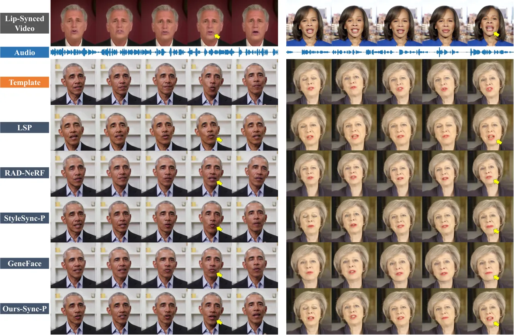

Figure 8: Qualitative Personalized Cross-Sync Results. The top row shows
the lip-synced videos of the driving audio. Generation results based on
the “Template” row should have the same lip shape as the “Lip-Synced
Video” in the first row.

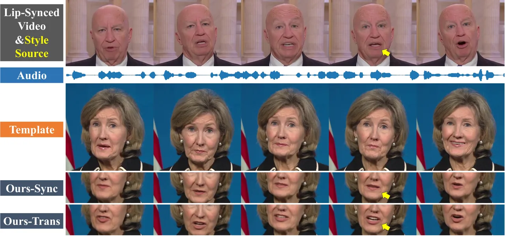

Figure 9: Style-Transferred Cross-Syncing. “Ours-Trans” generates
lip-synced results conditioned on the given audio and style source.

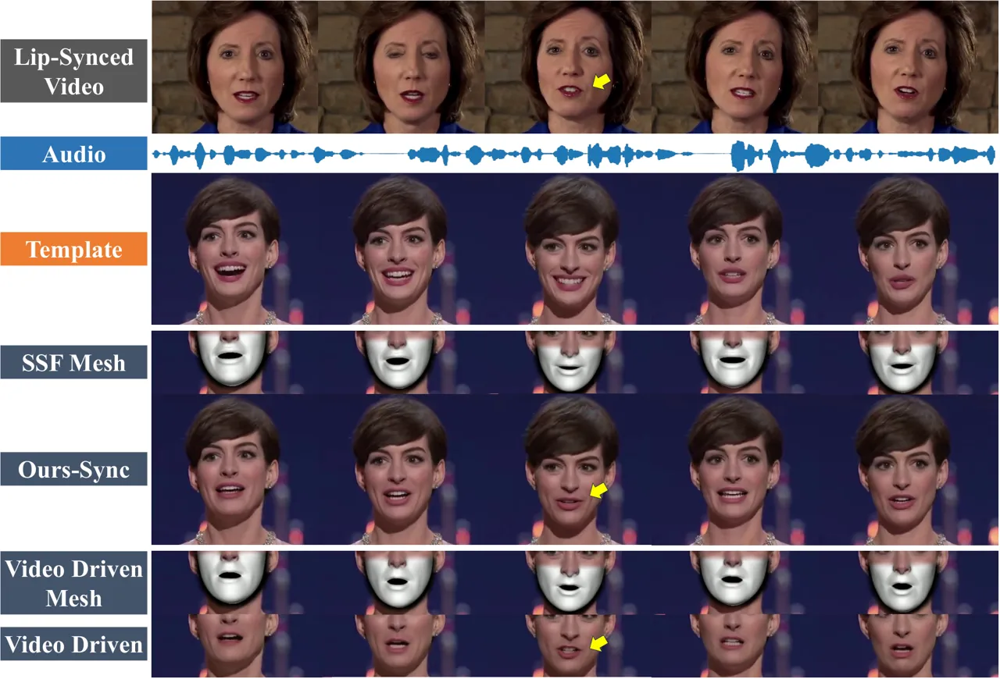

Figure 10: Video Driven. “SSF Mesh” denotes the results of the proposed
Style-SyncFormer, which preserves person-specific attributes better.

| Method             | Dataset from \[36\] |                   |                    |                                        |
| ------------------ | ------------------- | ----------------- | ------------------ | -------------------------------------- |
|                    | SSIM $`\uparrow`$   | PSNR $`\uparrow`$ | LMD $`\downarrow`$ | $`\Delta{\text{Sync}}`$ $`\downarrow`$ |
| LSP \[36\]         | \-                  | \-                | \-                 | 2.37                                   |
| RAD-NeRF \[55\]    | 0.63                | 29.65             | 8.16               | 2.23                                   |
| StyleSync-P \[22\] | 0.78                | 31.41             | 4.65               | 0.55                                   |
| GeneFace \[78\]    | 0.74                | 30.80             | 5.46               | 0.80                                   |
| Ours-Sync-P        | 0.80                | 31.44             | 4.35               | 0.55                                   |

Table 5: Quantitative results on personalized test set. For LMD and
$`\Delta{\text{Sync}}`$ the lower the better, the higher the better for
others.

### 0.A.2 Comparison with Personalized Methods

Dataset. In order to compare with the SOTA personalized methods, we
further fine-tune our model using 5 videos from the dataset introduced
in \[36\]. Specifically, each video consists of 4500$`\sim`$6000 frames
in fps 25. We keep the first 20 seconds of each video as the test set
and leave the rest part for training.

Comparison Method. We include four recent arts in the comparisons
including LSP \[36\], RAD-NeRF \[55\], StyleSync \[22\], and
GeneFace \[78\]. StyleSync demonstrates a similar capability to fast
adapt to given videos. For clarity in this section, we denote it as
StyleSync-P. Similarly, our method is denoted as Ours-Sync-P to avoid
confusion.

Quantitative Result. The lip-sync evaluation following the same protocol
as introduced in Sec. 4.1 is tabulated in Table. 5. Our method
consistently outperforms recent SOTAs in both visual quality and sync
quality. Please note that LSP generates lip-synced results with a random
pose, rendering it impractical to access the ground truth images for
calculating several metrics.

Qualitative Result. We present the comparisons using two randomly
sampled driving audios in Fig. 8. In the illustration, it is evident
that personalized methods yield high-quality results, preserving rich
details around the mouth. Nonetheless, some methods struggle to
accurately convey synchronized lip shapes, as we note in the figure with
yellow arrows. Furthermore, we provide qualitative ablation and
comparison on a less-than-30-second “Trump video” and a
less-than-30-second “Taylor video” in our supplementary video. This
showcases our method’s ability to adapt to videos of less than 30
seconds. Please refer to the video for a more intuitive comparison.

| MOS on             | LSP  | RAD-NeRF | StyleSync-P | GeneFace | Ours-Sync-P |
| ------------------ | ---- | -------- | ----------- | -------- | ----------- |
| Lip-Sync Quality   | 3.79 | 2.75     | 4.21        | 3.33     | 4.58        |
| Generation Quality | 3.75 | 3.21     | 4.33        | 3.21     | 4.67        |
| Video Realness     | 3.25 | 2.42     | 3.96        | 2.58     | 4.62        |

Table 6: User study of personalized lip-sync. The scores are ranged from
1 (worst) to 5 (best).

| MOS on              | SimSwap | InfoSwap | StyleSwap | E4S  | Ours-Swap |
| ------------------- | ------- | -------- | --------- | ---- | --------- |
| Identity Similarity | 2.83    | 2.46     | 3.38      | 2.92 | 3.83      |
| Generation Quality  | 2.88    | 1.71     | 3.17      | 1.92 | 3.92      |
| Video Realness      | 3.17    | 1.21     | 3.17      | 1.25 | 3.83      |

Table 7: User study of face-swap. The scores are ranged from 1 (worst)
to 5 (best).

User Study. Similar to the user study introduced in Sec. 4.2, we also
conducted experiments regarding tasks of personalized lip-sync and face
swapping. We adopt the commonly used Mean Opinion Scores (MOS) rating
protocol. All users give their ratings, ranging from 1 to 5, from three
perspectives. For personalized lip-sync, the questions are set
identically to the generalized setting as introduced in the paper. For
face swapping, participants are asked to evaluate: a) the identity
similarity between the generated video and ID reference. b) visual
quality of the generated video, and c) whether this video looks real.
The results averaged from 10 videos for each task are grouped into
Table 6 and Table 7, respectively.

From the tables, our method achieves the best performance over all three
settings. Comparing the generalized and personalized lip-syncing, scores
from three perspectives are generally improved with person-specific
training. Nevertheless, the NeRF-based methods, RAD-NeRF and GeneFace
obtain a relatively low “video realness” score. This highlights the
limitation of the head-torso-separate rendering process, resulting in
less vivid outcomes.

Regarding face-swap, our method shows surprisingly the highest “identity
similarity”, while StyleSwap performs slightly better in the
quantitative evaluation (Table 3). We suspect that the improved
generation quality and facial motion in our method lead experimenters to
be more inclined to trust our results. Additionally, the scores for
face-swap are lower than those in lip-sync, indicating that face-swap is
a more challenging task and there is still room for improvement.

### 0.A.3 Additional Experiments

#### Generalized 3D Dynamics Prediction.

Concerning the first stage, we compare the most related
FaceFormer \[18\] with simple necessary modifications. To adapt to
unseen identities, the one-hot identity label of \[18\] is set to the
same during training and inference. We re-train it on the same data as
ours. The qualitative and quantitative results are shown in Fig. 11 and
Table 11. In the table, $`\mathcal{D}_{\text{v}}`$ denotes L2 error
between the predicted vertices and GTs. Other metrics are introduced in
Sec. 4.1. Both visual results and the clear gaps in LMD,
$`\Delta{\text{Sync}}`$, and $`\mathcal{D}_{\text{v}}`$ show our
superiority in predicting more precise 3D dynamics with better
person-specific characteristics. This is attributed to the speaking
style learning and style-injected prediction process in our
Style-SyncFormer. While the close results in SSIM and PSNR are derived
from the same second-stage generator.

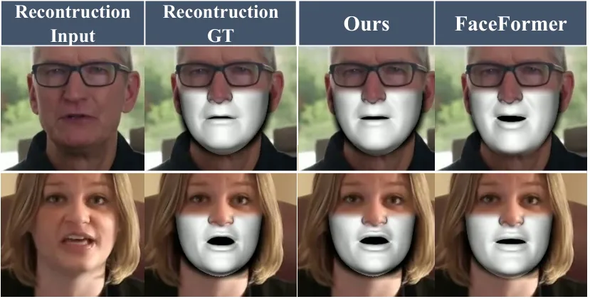

Figure 11: Qualatative comparison with FaceFormer.

| Method     | SSIM $`\uparrow`$ | PSNR $`\uparrow`$ | LMD $`\downarrow`$ | $`\Delta{\text{Sync}}`$ $`\downarrow`$ | $`\mathcal{D}_{\text{v}}`$ $`\downarrow`$ |
| ---------- | ----------------- | ----------------- | ------------------ | -------------------------------------- | ----------------------------------------- |
| FaceFormer | 0.82              | 31.25             | 7.95               | 0.78                                   | 0.107                                     |
| Ours       | 0.84              | 31.76             | 4.34               | 0.66                                   | 0.015                                     |

Table 8: Quantitative comparison with FaceFormer on HDTF. The same
second-stage generator is adopted for pixel space prediction. Clear gaps
in LMD, $`\Delta{\text{Sync}}`$, and $`\mathcal{D}_{\text{v}}`$ show our
superiority.

#### Facial Topology.

As introduced, we reconstruct the 3D facial meshes with
DeepFaceReconstruction \[17\] on the topology of Hifi3DFace \[2\] for
the training of our first stage. Here we conduct ablations on the facial
topology by comparing with BFM \[24\]-based generation. Results are
demonstrated in Fig. 12 and Table 12. It shows that using different
topologies in our Resyncer framework makes little difference.

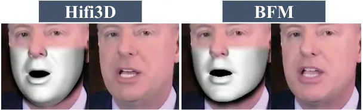

Figure 12: Qualatative comparison.

| Topology | SSIM $`\uparrow`$ | PSNR $`\uparrow`$ | LMD $`\downarrow`$ | $`\Delta{\text{Sync}}`$ $`\downarrow`$ |
| -------- | ----------------- | ----------------- | ------------------ | -------------------------------------- |
| Hifi3D   | 0.84              | 31.76             | 4.34               | 0.66                                   |
| BFM      | 0.84              | 31.74             | 4.35               | 0.69                                   |

Table 9: Quantitative comparison on HDTF.

### 0.A.4 Supplementary Video

The supplementary video is comprised of 4 sections including 1) a short
introduction, 2) a demonstration of our performance and comparison with
SOTA methods, 3) ablation studies, and 4) more intriguing results.

- 1.  We demonstrate the capabilities of our method to generate lip-synced,
      speaking-style-transferred, and identity-swapped videos.
- 2.  The comparisons are grouped into 3 parts including a) generalized
      lip-sync, b) personalized lip-sync, and c) face-swap.
- 3.  We further provide video ablation results for a more intuitive
      demonstration.
- 4.  More intriguing results including generated results based on template
      videos from the Internet. We further provide a comparison with a
      commercial tool (HeyGen) for the task of video translation.

Please note only videos with “personalized” listed (e.g. 2:00 - 3:05 in
the video) and comparisons with HeyGen are finetuned.

### 0.A.5 Limitations

Our framework might not work well on extreme poses (over 80 degrees). As
our framework relies on the poses of the 3D facial meshes to formulate
the input image, the error of face reconstruction at extreme poses might
harm our final results. Here we further present a $`\sim`$50-degree
comparison in Fig. 13, showing superior performance of ours compared
with SOTA methods.

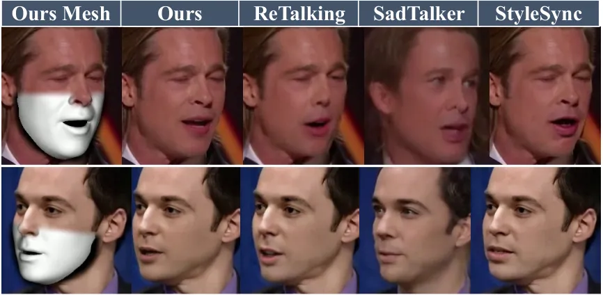

Figure 13: Comparison on large pose.
